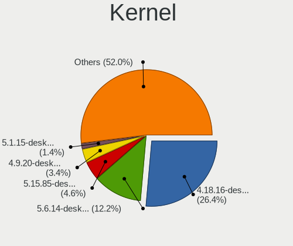
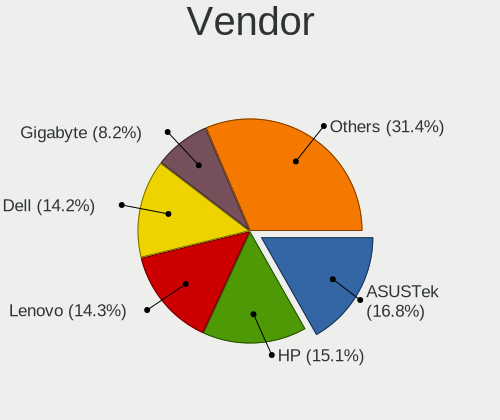
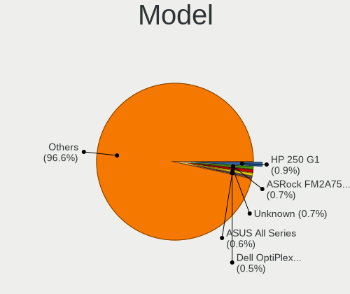
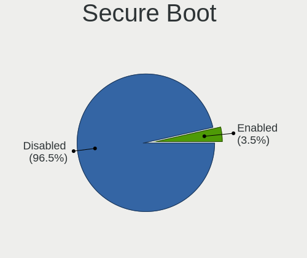
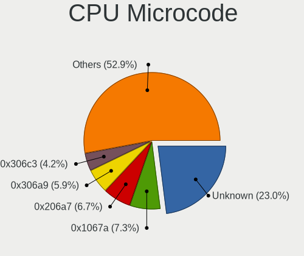
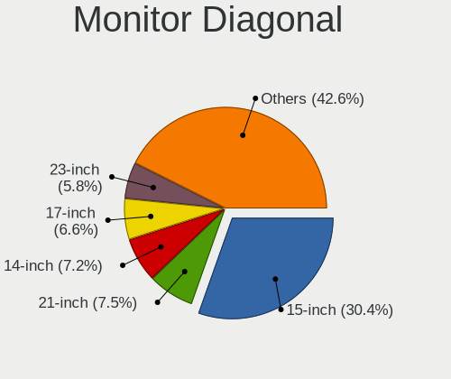
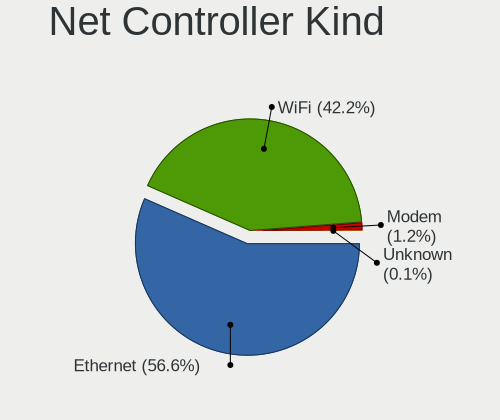
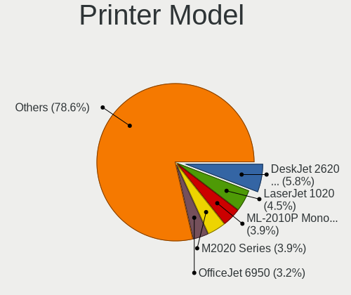
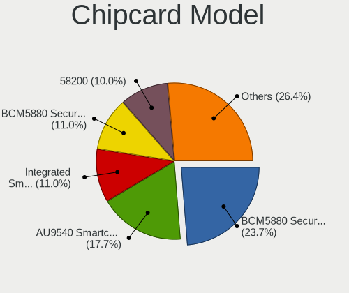
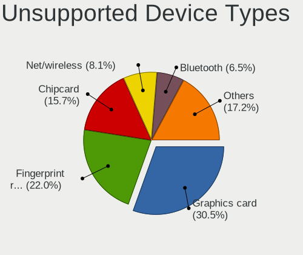

Linux in Hungary - Tested Hardware & Statistics
-----------------------------------------------

A project to collect tested hardware configurations for Linux in Hungary.

Anyone can contribute to this report by the [hw-probe](https://github.com/linuxhw/hw-probe) tool:

    sudo -E hw-probe -all -upload

Please contribute! Especially if your hardware is rare.

This is a report for all computer types. See also reports for [desktops](/Location/Hungary/Desktop/README.md) and [notebooks](/Location/Hungary/Notebook/README.md).

Contents
--------

* [ Test Cases ](#test-cases)

* [ System ](#system)
  - [ OS                       ](#os)
  - [ OS Family                ](#os-family)
  - [ Kernel                   ](#kernel)
  - [ Kernel Family            ](#kernel-family)
  - [ Kernel Major Ver.        ](#kernel-major-ver)
  - [ Arch                     ](#arch)
  - [ DE                       ](#de)
  - [ Display Server           ](#display-server)
  - [ Display Manager          ](#display-manager)
  - [ OS Lang                  ](#os-lang)
  - [ Boot Mode                ](#boot-mode)
  - [ Filesystem               ](#filesystem)
  - [ Part. scheme             ](#part-scheme)
  - [ Dual Boot with Linux/BSD ](#dual-boot-with-linuxbsd)
  - [ Dual Boot (Win)          ](#dual-boot-win)

* [ Board ](#board)
  - [ Vendor                   ](#vendor)
  - [ Model                    ](#model)
  - [ Model Family             ](#model-family)
  - [ MFG Year                 ](#mfg-year)
  - [ Form Factor              ](#form-factor)
  - [ Secure Boot              ](#secure-boot)
  - [ Coreboot                 ](#coreboot)
  - [ RAM Size                 ](#ram-size)
  - [ RAM Used                 ](#ram-used)
  - [ Total Drives             ](#total-drives)
  - [ Has CD-ROM               ](#has-cd-rom)
  - [ Has Ethernet             ](#has-ethernet)
  - [ Has WiFi                 ](#has-wifi)
  - [ Has Bluetooth            ](#has-bluetooth)

* [ Location ](#location)
  - [ Country                  ](#country)
  - [ City                     ](#city)

* [ Drives ](#drives)
  - [ Drive Vendor             ](#drive-vendor)
  - [ Drive Model              ](#drive-model)
  - [ HDD Vendor               ](#hdd-vendor)
  - [ SSD Vendor               ](#ssd-vendor)
  - [ Drive Kind               ](#drive-kind)
  - [ Drive Connector          ](#drive-connector)
  - [ Drive Size               ](#drive-size)
  - [ Space Total              ](#space-total)
  - [ Space Used               ](#space-used)
  - [ Malfunc. Drives          ](#malfunc-drives)
  - [ Malfunc. Drive Vendor    ](#malfunc-drive-vendor)
  - [ Malfunc. HDD Vendor      ](#malfunc-hdd-vendor)
  - [ Malfunc. Drive Kind      ](#malfunc-drive-kind)
  - [ Failed Drives            ](#failed-drives)
  - [ Failed Drive Vendor      ](#failed-drive-vendor)
  - [ Drive Status             ](#drive-status)

* [ Storage controller ](#storage-controller)
  - [ Storage Vendor           ](#storage-vendor)
  - [ Storage Model            ](#storage-model)
  - [ Storage Kind             ](#storage-kind)

* [ Processor ](#processor)
  - [ CPU Vendor               ](#cpu-vendor)
  - [ CPU Model                ](#cpu-model)
  - [ CPU Model Family         ](#cpu-model-family)
  - [ CPU Cores                ](#cpu-cores)
  - [ CPU Sockets              ](#cpu-sockets)
  - [ CPU Threads              ](#cpu-threads)
  - [ CPU Op-Modes             ](#cpu-op-modes)
  - [ CPU Microcode            ](#cpu-microcode)
  - [ CPU Microarch            ](#cpu-microarch)

* [ Graphics ](#graphics)
  - [ GPU Vendor               ](#gpu-vendor)
  - [ GPU Model                ](#gpu-model)
  - [ GPU Combo                ](#gpu-combo)
  - [ GPU Driver               ](#gpu-driver)
  - [ GPU Memory               ](#gpu-memory)

* [ Monitor ](#monitor)
  - [ Monitor Vendor           ](#monitor-vendor)
  - [ Monitor Model            ](#monitor-model)
  - [ Monitor Resolution       ](#monitor-resolution)
  - [ Monitor Diagonal         ](#monitor-diagonal)
  - [ Monitor Width            ](#monitor-width)
  - [ Aspect Ratio             ](#aspect-ratio)
  - [ Monitor Area             ](#monitor-area)
  - [ Pixel Density            ](#pixel-density)
  - [ Multiple Monitors        ](#multiple-monitors)

* [ Network ](#network)
  - [ Net Controller Vendor    ](#net-controller-vendor)
  - [ Net Controller Model     ](#net-controller-model)
  - [ Wireless Vendor          ](#wireless-vendor)
  - [ Wireless Model           ](#wireless-model)
  - [ Ethernet Vendor          ](#ethernet-vendor)
  - [ Ethernet Model           ](#ethernet-model)
  - [ Net Controller Kind      ](#net-controller-kind)
  - [ Used Controller          ](#used-controller)
  - [ NICs                     ](#nics)
  - [ IPv6                     ](#ipv6)

* [ Bluetooth ](#bluetooth)
  - [ Bluetooth Vendor         ](#bluetooth-vendor)
  - [ Bluetooth Model          ](#bluetooth-model)

* [ Sound ](#sound)
  - [ Sound Vendor             ](#sound-vendor)
  - [ Sound Model              ](#sound-model)

* [ Memory ](#memory)
  - [ Memory Vendor            ](#memory-vendor)
  - [ Memory Model             ](#memory-model)
  - [ Memory Kind              ](#memory-kind)
  - [ Memory Form Factor       ](#memory-form-factor)
  - [ Memory Size              ](#memory-size)
  - [ Memory Speed             ](#memory-speed)

* [ Printers & scanners ](#printers--scanners)
  - [ Printer Vendor           ](#printer-vendor)
  - [ Printer Model            ](#printer-model)
  - [ Scanner Vendor           ](#scanner-vendor)
  - [ Scanner Model            ](#scanner-model)

* [ Camera ](#camera)
  - [ Camera Vendor            ](#camera-vendor)
  - [ Camera Model             ](#camera-model)

* [ Security ](#security)
  - [ Fingerprint Vendor       ](#fingerprint-vendor)
  - [ Fingerprint Model        ](#fingerprint-model)
  - [ Chipcard Vendor          ](#chipcard-vendor)
  - [ Chipcard Model           ](#chipcard-model)

* [ Unsupported ](#unsupported)
  - [ Unsupported Devices      ](#unsupported-devices)
  - [ Unsupported Device Types ](#unsupported-device-types)

Test Cases
----------

Total: 7432

| Vendor        | Model                       | Form-Factor | Probe                                                      | Date         |
|---------------|-----------------------------|-------------|------------------------------------------------------------|--------------|
| ASUSTek       | X550CC                      | Notebook    | [cc784397f9](https://linux-hardware.org/?probe=cc784397f9) | May 01, 2023 |
| Valve         | Jupiter                     | Notebook    | [07ef050535](https://linux-hardware.org/?probe=07ef050535) | May 01, 2023 |
| Lenovo        | ThinkPad T420 4236W8L       | Notebook    | [96a8ba3062](https://linux-hardware.org/?probe=96a8ba3062) | May 01, 2023 |
| Lenovo        | ThinkPad T420 4236W8L       | Notebook    | [856577ad04](https://linux-hardware.org/?probe=856577ad04) | May 01, 2023 |
| HP            | ProBook 640 G8 Notebook ... | Notebook    | [f84a692777](https://linux-hardware.org/?probe=f84a692777) | Apr 30, 2023 |
| eMachines     | E725                        | Notebook    | [282c0c9f11](https://linux-hardware.org/?probe=282c0c9f11) | Apr 30, 2023 |
| Fujitsu       | D2828-A2 S26361-D2828-A2    | Desktop     | [8bf9a1841e](https://linux-hardware.org/?probe=8bf9a1841e) | Apr 30, 2023 |
| Fujitsu       | D2828-A2 S26361-D2828-A2    | Desktop     | [7afb6268da](https://linux-hardware.org/?probe=7afb6268da) | Apr 30, 2023 |
| ASUSTek       | VivoBook_ASUSLaptop X509... | Notebook    | [558cde0a43](https://linux-hardware.org/?probe=558cde0a43) | Apr 30, 2023 |
| eMachines     | E725                        | Notebook    | [25da91560d](https://linux-hardware.org/?probe=25da91560d) | Apr 30, 2023 |
| Lenovo        | ThinkPad T420 4236W8L       | Notebook    | [25c6042b4e](https://linux-hardware.org/?probe=25c6042b4e) | Apr 30, 2023 |
| Lenovo        | ThinkPad T420 4236W8L       | Notebook    | [230f3dd04b](https://linux-hardware.org/?probe=230f3dd04b) | Apr 30, 2023 |
| HP            | ProBook 640 G8 Notebook ... | Notebook    | [9d5cd21a8f](https://linux-hardware.org/?probe=9d5cd21a8f) | Apr 30, 2023 |
| HP            | ProBook 640 G8 Notebook ... | Notebook    | [9bb7a9b712](https://linux-hardware.org/?probe=9bb7a9b712) | Apr 30, 2023 |
| Gigabyte      | AB350M-DS3H V2-CF           | Desktop     | [292f489feb](https://linux-hardware.org/?probe=292f489feb) | Apr 29, 2023 |
| HP            | 8265                        | Desktop     | [5cdb9f6a93](https://linux-hardware.org/?probe=5cdb9f6a93) | Apr 28, 2023 |
| ASUSTek       | TUF Gaming B460-PLUS        | Desktop     | [b2616ea409](https://linux-hardware.org/?probe=b2616ea409) | Apr 28, 2023 |
| Dell          | Inspiron 5558               | Notebook    | [ada78ae33d](https://linux-hardware.org/?probe=ada78ae33d) | Apr 28, 2023 |
| Dell          | Inspiron 5558               | Notebook    | [9c2dd52f1e](https://linux-hardware.org/?probe=9c2dd52f1e) | Apr 28, 2023 |
| HP            | 8265                        | Desktop     | [71a48b0229](https://linux-hardware.org/?probe=71a48b0229) | Apr 27, 2023 |
| ASUSTek       | K52JB                       | Notebook    | [e9237f0d53](https://linux-hardware.org/?probe=e9237f0d53) | Apr 27, 2023 |
| eMachines     | E725                        | Notebook    | [668de483ca](https://linux-hardware.org/?probe=668de483ca) | Apr 27, 2023 |
| Acer          | Swift SF114-32              | Notebook    | [13d7dc019c](https://linux-hardware.org/?probe=13d7dc019c) | Apr 26, 2023 |
| Dell          | Inspiron 5558               | Notebook    | [9dd9301581](https://linux-hardware.org/?probe=9dd9301581) | Apr 26, 2023 |
| ASUSTek       | P8P67 LE                    | Desktop     | [e46f340908](https://linux-hardware.org/?probe=e46f340908) | Apr 25, 2023 |
| Lenovo        | G580 20150                  | Notebook    | [5d8b07dbbd](https://linux-hardware.org/?probe=5d8b07dbbd) | Apr 25, 2023 |
| Dell          | 0KYJ8C A00                  | Desktop     | [1e8226d149](https://linux-hardware.org/?probe=1e8226d149) | Apr 25, 2023 |
| Dell          | Inspiron 5570               | Notebook    | [dd27aa0575](https://linux-hardware.org/?probe=dd27aa0575) | Apr 25, 2023 |
| Dell          | Inspiron 5570               | Notebook    | [e0eef23b19](https://linux-hardware.org/?probe=e0eef23b19) | Apr 25, 2023 |
| ASUSTek       | VivoBook 15_ASUS Laptop ... | Notebook    | [7d5bd7e8fa](https://linux-hardware.org/?probe=7d5bd7e8fa) | Apr 25, 2023 |
| ASUSTek       | VivoBook 15_ASUS Laptop ... | Notebook    | [24bf298df5](https://linux-hardware.org/?probe=24bf298df5) | Apr 25, 2023 |
| ASUSTek       | M3A                         | Desktop     | [c16000b1e4](https://linux-hardware.org/?probe=c16000b1e4) | Apr 25, 2023 |
| Lenovo        | ThinkPad E15 20RD003KHV     | Notebook    | [b402183807](https://linux-hardware.org/?probe=b402183807) | Apr 24, 2023 |
| Lenovo        | 20RD001FHV                  | Notebook    | [782ded0435](https://linux-hardware.org/?probe=782ded0435) | Apr 24, 2023 |
| Lenovo        | ThinkPad T400 2768WGB       | Notebook    | [6b9130ca88](https://linux-hardware.org/?probe=6b9130ca88) | Apr 23, 2023 |
| Dell          | Latitude E6230              | Notebook    | [3ec9acadaa](https://linux-hardware.org/?probe=3ec9acadaa) | Apr 23, 2023 |
| Dell          | Latitude E6230              | Notebook    | [8114b606fb](https://linux-hardware.org/?probe=8114b606fb) | Apr 23, 2023 |
| Lenovo        | ThinkPad T420 4236B87       | Notebook    | [f855722ff3](https://linux-hardware.org/?probe=f855722ff3) | Apr 23, 2023 |
| Lenovo        | ThinkPad E15 20RD003KHV     | Notebook    | [090405a4a7](https://linux-hardware.org/?probe=090405a4a7) | Apr 22, 2023 |
| Alcor Digi... | Snugbook N1431              | Notebook    | [eeb69d730b](https://linux-hardware.org/?probe=eeb69d730b) | Apr 22, 2023 |
| Gigabyte      | G41MT-S2                    | Desktop     | [89464ddc07](https://linux-hardware.org/?probe=89464ddc07) | Apr 22, 2023 |
| Dell          | Inspiron M5040              | Notebook    | [ae29855106](https://linux-hardware.org/?probe=ae29855106) | Apr 22, 2023 |
| Dell          | Inspiron 5558               | Notebook    | [174aa789ca](https://linux-hardware.org/?probe=174aa789ca) | Apr 22, 2023 |
| ASUSTek       | ASUS TUF Gaming F17 FX70... | Notebook    | [918115dc84](https://linux-hardware.org/?probe=918115dc84) | Apr 21, 2023 |
| Gigabyte      | F2A88XM-HD3                 | Desktop     | [bf4fe08c1f](https://linux-hardware.org/?probe=bf4fe08c1f) | Apr 21, 2023 |
| Sony          | VPCS13V9E                   | Notebook    | [c0f35fa0d2](https://linux-hardware.org/?probe=c0f35fa0d2) | Apr 21, 2023 |
| MSI           | MS-7817                     | Desktop     | [337a6f2676](https://linux-hardware.org/?probe=337a6f2676) | Apr 20, 2023 |
| Gigabyte      | B450M GAMING                | Desktop     | [201add17b6](https://linux-hardware.org/?probe=201add17b6) | Apr 20, 2023 |
| Gigabyte      | B450M GAMING                | Desktop     | [12fa5cb019](https://linux-hardware.org/?probe=12fa5cb019) | Apr 20, 2023 |
| HP            | 8265                        | Desktop     | [edff983879](https://linux-hardware.org/?probe=edff983879) | Apr 20, 2023 |
| Gigabyte      | P67A-D3-B3                  | Desktop     | [b44e010551](https://linux-hardware.org/?probe=b44e010551) | Apr 20, 2023 |
| Foxconn       | 2ABF                        | Desktop     | [53d3a8d066](https://linux-hardware.org/?probe=53d3a8d066) | Apr 19, 2023 |
| Dell          | 08NPPY A00                  | Desktop     | [6780931a5d](https://linux-hardware.org/?probe=6780931a5d) | Apr 19, 2023 |
| Dell          | Latitude D630               | Notebook    | [4e4c4f519b](https://linux-hardware.org/?probe=4e4c4f519b) | Apr 18, 2023 |
| Samsung       | RV411/RV511/E3511/S3511/... | Notebook    | [bd73c6ceb9](https://linux-hardware.org/?probe=bd73c6ceb9) | Apr 18, 2023 |
| ASUSTek       | K52JB                       | Notebook    | [70a0b986fa](https://linux-hardware.org/?probe=70a0b986fa) | Apr 18, 2023 |
| ASUSTek       | P5QC                        | Desktop     | [7d47aa511b](https://linux-hardware.org/?probe=7d47aa511b) | Apr 18, 2023 |
| Fujitsu       | D2618-C1 S26361-D2618-C1    | Desktop     | [211aa29e44](https://linux-hardware.org/?probe=211aa29e44) | Apr 18, 2023 |
| Lenovo        | ThinkStation D20 4158AF8    | Desktop     | [f0a442ee36](https://linux-hardware.org/?probe=f0a442ee36) | Apr 17, 2023 |
| Fujitsu       | LIFEBOOK U745               | Notebook    | [fd7551020f](https://linux-hardware.org/?probe=fd7551020f) | Apr 17, 2023 |
| ASRock        | A520M-HVS                   | Desktop     | [264d99482b](https://linux-hardware.org/?probe=264d99482b) | Apr 17, 2023 |
| Fujitsu       | D2618-C1 S26361-D2618-C1    | Desktop     | [6d8f13d1df](https://linux-hardware.org/?probe=6d8f13d1df) | Apr 16, 2023 |
| Sony          | VPCS13V9E                   | Notebook    | [40d1573897](https://linux-hardware.org/?probe=40d1573897) | Apr 16, 2023 |
| ASRock        | A520M-HVS                   | Desktop     | [a0d799e140](https://linux-hardware.org/?probe=a0d799e140) | Apr 16, 2023 |
| Fujitsu Si... | D2660-A1 S26361-D2660-A1    | Desktop     | [a8d5f3a546](https://linux-hardware.org/?probe=a8d5f3a546) | Apr 15, 2023 |
| ASUSTek       | Zenbook UM3402YA_UM3402Y... | Notebook    | [5ef76fe165](https://linux-hardware.org/?probe=5ef76fe165) | Apr 15, 2023 |
| Samsung       | RV411/RV511/E3511/S3511/... | Notebook    | [f9b8914504](https://linux-hardware.org/?probe=f9b8914504) | Apr 15, 2023 |
| Fujitsu       | LIFEBOOK U745               | Notebook    | [3c0ca40bc5](https://linux-hardware.org/?probe=3c0ca40bc5) | Apr 15, 2023 |
| Toshiba       | Satellite M50D-A            | Notebook    | [17fc6af63a](https://linux-hardware.org/?probe=17fc6af63a) | Apr 15, 2023 |
| MSI           | FM2-A55M-E33                | Desktop     | [17beff29fa](https://linux-hardware.org/?probe=17beff29fa) | Apr 15, 2023 |
| MSI           | FM2-A55M-E33                | Desktop     | [53070e97ae](https://linux-hardware.org/?probe=53070e97ae) | Apr 15, 2023 |
| Lenovo        | ThinkPad P52 20MAS1LH00     | Notebook    | [06ba20dc47](https://linux-hardware.org/?probe=06ba20dc47) | Apr 15, 2023 |
| Dell          | 0HY9JP A02                  | Desktop     | [25a1ee5a25](https://linux-hardware.org/?probe=25a1ee5a25) | Apr 15, 2023 |
| HP            | ProBook 650 G3              | Notebook    | [00526690c9](https://linux-hardware.org/?probe=00526690c9) | Apr 15, 2023 |
| Acer          | Extensa 5635Z               | Notebook    | [b3c99bf352](https://linux-hardware.org/?probe=b3c99bf352) | Apr 14, 2023 |
| Lenovo        | MAHOBAY NOK                 | Desktop     | [5efa4919ef](https://linux-hardware.org/?probe=5efa4919ef) | Apr 14, 2023 |
| ASUSTek       | M5A78L-M LX3                | Desktop     | [1a2b2a323f](https://linux-hardware.org/?probe=1a2b2a323f) | Apr 14, 2023 |
| ASUSTek       | M5A78L-M LX3                | Desktop     | [c54473354b](https://linux-hardware.org/?probe=c54473354b) | Apr 14, 2023 |
| HP            | 8265                        | Desktop     | [d50c7e97cb](https://linux-hardware.org/?probe=d50c7e97cb) | Apr 13, 2023 |
| ASUSTek       | PRIME X399-A                | Desktop     | [b821e02641](https://linux-hardware.org/?probe=b821e02641) | Apr 13, 2023 |
| ASUSTek       | ROG STRIX X399-E GAMING     | Desktop     | [ecefe27269](https://linux-hardware.org/?probe=ecefe27269) | Apr 13, 2023 |
| eMachines     | E725                        | Notebook    | [bd87462ced](https://linux-hardware.org/?probe=bd87462ced) | Apr 13, 2023 |
| Lenovo        | ThinkPad T420 4236B87       | Notebook    | [6d2971f926](https://linux-hardware.org/?probe=6d2971f926) | Apr 13, 2023 |
| ASUSTek       | ROG Zephyrus M16 GU603ZM... | Notebook    | [a8184cfc25](https://linux-hardware.org/?probe=a8184cfc25) | Apr 13, 2023 |
| eMachines     | E725                        | Notebook    | [7cd5cba939](https://linux-hardware.org/?probe=7cd5cba939) | Apr 13, 2023 |
| Fujitsu Si... | D2660-A1 S26361-D2660-A1    | Desktop     | [ef975644ad](https://linux-hardware.org/?probe=ef975644ad) | Apr 12, 2023 |
| Fujitsu       | D3431-A1 S26361-D3431-A1    | Desktop     | [5394679f59](https://linux-hardware.org/?probe=5394679f59) | Apr 12, 2023 |
| Fujitsu       | D3431-A1 S26361-D3431-A1    | Desktop     | [ce3dac0358](https://linux-hardware.org/?probe=ce3dac0358) | Apr 12, 2023 |
| ASUSTek       | ROG Zephyrus M16 GU603ZM... | Notebook    | [e75be02a84](https://linux-hardware.org/?probe=e75be02a84) | Apr 12, 2023 |
| THD           | PX1 01                      | Notebook    | [c2c6b63123](https://linux-hardware.org/?probe=c2c6b63123) | Apr 12, 2023 |
| Gigabyte      | H310M S2H x.x               | Desktop     | [203aeef6a1](https://linux-hardware.org/?probe=203aeef6a1) | Apr 12, 2023 |
| Dell          | Inspiron 1525               | Notebook    | [50e64adbb3](https://linux-hardware.org/?probe=50e64adbb3) | Apr 12, 2023 |
| THD           | PX1 01                      | Notebook    | [f4efc1c20d](https://linux-hardware.org/?probe=f4efc1c20d) | Apr 12, 2023 |
| Dell          | Latitude D630               | Notebook    | [8c211bb7c5](https://linux-hardware.org/?probe=8c211bb7c5) | Apr 12, 2023 |
| Lenovo        | IdeaPad 5 Pro 16ACH6 82L... | Notebook    | [5662df110d](https://linux-hardware.org/?probe=5662df110d) | Apr 11, 2023 |
| Dell          | Inspiron M5030              | Notebook    | [a5dd0e262b](https://linux-hardware.org/?probe=a5dd0e262b) | Apr 10, 2023 |
| Dell          | Inspiron M5030              | Notebook    | [03fb4c2b22](https://linux-hardware.org/?probe=03fb4c2b22) | Apr 10, 2023 |
| Lenovo        | ThinkPad X201 3680WFQ       | Notebook    | [f90c2d47c7](https://linux-hardware.org/?probe=f90c2d47c7) | Apr 10, 2023 |
| Gigabyte      | H61M-S2PV                   | Desktop     | [28e5e7ba81](https://linux-hardware.org/?probe=28e5e7ba81) | Apr 09, 2023 |
| Gigabyte      | H61M-S2PV                   | Desktop     | [4688a4353a](https://linux-hardware.org/?probe=4688a4353a) | Apr 09, 2023 |
| Acer          | Aspire ES1-531              | Notebook    | [f36574c96a](https://linux-hardware.org/?probe=f36574c96a) | Apr 09, 2023 |
| ASUSTek       | VivoBook_ASUSLaptop TP40... | Convertible | [280e9879aa](https://linux-hardware.org/?probe=280e9879aa) | Apr 09, 2023 |
| ASUSTek       | VivoBook_ASUSLaptop TP40... | Convertible | [fd65306a4f](https://linux-hardware.org/?probe=fd65306a4f) | Apr 09, 2023 |
| Lenovo        | SDK0E50510 WIN              | Desktop     | [776313bab4](https://linux-hardware.org/?probe=776313bab4) | Apr 09, 2023 |
| ASUSTek       | M5A97 EVO R2.0              | Desktop     | [1ae6e29131](https://linux-hardware.org/?probe=1ae6e29131) | Apr 09, 2023 |
| ASUSTek       | M5A97 EVO R2.0              | Desktop     | [1fd391d90b](https://linux-hardware.org/?probe=1fd391d90b) | Apr 09, 2023 |
| Fujitsu       | D3162-A1 S26361-D3162-A1    | Desktop     | [eca06b42fa](https://linux-hardware.org/?probe=eca06b42fa) | Apr 09, 2023 |
| Lenovo        | ThinkPad T61 7659AB7        | Notebook    | [0b2f9a23ee](https://linux-hardware.org/?probe=0b2f9a23ee) | Apr 09, 2023 |
| Dell          | Inspiron 5558               | Notebook    | [57ed286290](https://linux-hardware.org/?probe=57ed286290) | Apr 09, 2023 |
| Shuttle       | B10IE01                     | Desktop     | [9888356d3d](https://linux-hardware.org/?probe=9888356d3d) | Apr 08, 2023 |
| HP            | 8055                        | Desktop     | [6eebbfc5bd](https://linux-hardware.org/?probe=6eebbfc5bd) | Apr 08, 2023 |
| Dell          | 0D883F A06                  | Desktop     | [7ebca35151](https://linux-hardware.org/?probe=7ebca35151) | Apr 08, 2023 |
| HP            | 8055                        | Desktop     | [f937179590](https://linux-hardware.org/?probe=f937179590) | Apr 08, 2023 |
| Gigabyte      | GA-78LMT-USB3               | Desktop     | [2d355e87d7](https://linux-hardware.org/?probe=2d355e87d7) | Apr 07, 2023 |
| Lenovo        | ThinkPad T60 2008VW7        | Notebook    | [de0d5654c0](https://linux-hardware.org/?probe=de0d5654c0) | Apr 07, 2023 |
| Dell          | Latitude 5431               | Notebook    | [d85ac2917b](https://linux-hardware.org/?probe=d85ac2917b) | Apr 07, 2023 |
| Gigabyte      | Z270N-WIFI-CF               | Desktop     | [0db60d0843](https://linux-hardware.org/?probe=0db60d0843) | Apr 06, 2023 |
| Dell          | 0D883F A06                  | Desktop     | [9a6876e458](https://linux-hardware.org/?probe=9a6876e458) | Apr 06, 2023 |
| Lenovo        | ThinkPad T400 2768WGB       | Notebook    | [ae224a45a1](https://linux-hardware.org/?probe=ae224a45a1) | Apr 06, 2023 |
| Gigabyte      | Z270N-WIFI-CF               | Desktop     | [37e8de5b1b](https://linux-hardware.org/?probe=37e8de5b1b) | Apr 06, 2023 |
| Dell          | 0HY9JP A00                  | Desktop     | [c8dd0aae14](https://linux-hardware.org/?probe=c8dd0aae14) | Apr 06, 2023 |
| HP            | 8265                        | Desktop     | [487cae97c1](https://linux-hardware.org/?probe=487cae97c1) | Apr 05, 2023 |
| ASUSTek       | VivoBook_ASUS Laptop E40... | Notebook    | [a451cfcce3](https://linux-hardware.org/?probe=a451cfcce3) | Apr 05, 2023 |
| Dell          | 0XGMD0 A00                  | All in one  | [eb106fa5d3](https://linux-hardware.org/?probe=eb106fa5d3) | Apr 05, 2023 |
| Lenovo        | ThinkPad T400 2768WGB       | Notebook    | [1e40d6be20](https://linux-hardware.org/?probe=1e40d6be20) | Apr 04, 2023 |
| Gigabyte      | B550M DS3H                  | Desktop     | [7a5ee5da76](https://linux-hardware.org/?probe=7a5ee5da76) | Apr 04, 2023 |
| Gigabyte      | H410M S2 V3                 | Desktop     | [fdff0f112e](https://linux-hardware.org/?probe=fdff0f112e) | Apr 04, 2023 |
| HP            | Notebook                    | Notebook    | [d8951b66b8](https://linux-hardware.org/?probe=d8951b66b8) | Apr 03, 2023 |
| HP            | Notebook                    | Notebook    | [05bdafdb5a](https://linux-hardware.org/?probe=05bdafdb5a) | Apr 03, 2023 |
| MSI           | H81M-E33                    | Desktop     | [34b04c305a](https://linux-hardware.org/?probe=34b04c305a) | Apr 03, 2023 |
| Gigabyte      | P67A-D3-B3                  | Desktop     | [024b88194a](https://linux-hardware.org/?probe=024b88194a) | Apr 03, 2023 |
| Fujitsu       | D3061-B1 S26361-D3061-B1    | Desktop     | [851f006807](https://linux-hardware.org/?probe=851f006807) | Apr 03, 2023 |
| Dell          | 0XGMD0 A00                  | All in one  | [f83ac785da](https://linux-hardware.org/?probe=f83ac785da) | Apr 02, 2023 |
| Gigabyte      | H61M-S2PV                   | Desktop     | [1994529ccc](https://linux-hardware.org/?probe=1994529ccc) | Apr 02, 2023 |
| HP            | 2820h                       | Desktop     | [8303a62d9a](https://linux-hardware.org/?probe=8303a62d9a) | Apr 02, 2023 |
| HP            | 2820h                       | Desktop     | [142a0ab5b0](https://linux-hardware.org/?probe=142a0ab5b0) | Apr 02, 2023 |
| Gigabyte      | H410M S2 V3                 | Desktop     | [b908036588](https://linux-hardware.org/?probe=b908036588) | Apr 02, 2023 |
| HP            | 8265                        | Desktop     | [b1e10a48ef](https://linux-hardware.org/?probe=b1e10a48ef) | Apr 01, 2023 |
| HP            | 250 G6 Notebook PC          | Notebook    | [c32ab093ae](https://linux-hardware.org/?probe=c32ab093ae) | Apr 01, 2023 |
| ASUSTek       | M5A97 LE R2.0               | Desktop     | [4f9739adf7](https://linux-hardware.org/?probe=4f9739adf7) | Apr 01, 2023 |
| ASUSTek       | K52JB                       | Notebook    | [0e18c3546c](https://linux-hardware.org/?probe=0e18c3546c) | Apr 01, 2023 |
| ASUSTek       | B250 MINING EXPERT          | Desktop     | [da86fa8f75](https://linux-hardware.org/?probe=da86fa8f75) | Apr 01, 2023 |
| HP            | Notebook                    | Notebook    | [7b9f1f44c9](https://linux-hardware.org/?probe=7b9f1f44c9) | Mar 31, 2023 |
| HP            | Notebook                    | Notebook    | [ad90621225](https://linux-hardware.org/?probe=ad90621225) | Mar 31, 2023 |
| ASRock        | H67DE3                      | Desktop     | [b055ccc048](https://linux-hardware.org/?probe=b055ccc048) | Mar 31, 2023 |
| ASRock        | H67DE3                      | Desktop     | [c82ba90d70](https://linux-hardware.org/?probe=c82ba90d70) | Mar 31, 2023 |
| Gigabyte      | H77N-WIFI                   | Desktop     | [24b14fa9bb](https://linux-hardware.org/?probe=24b14fa9bb) | Mar 30, 2023 |
| Lenovo        | ThinkPad T470s 20HGS07D0... | Notebook    | [7a8b075b23](https://linux-hardware.org/?probe=7a8b075b23) | Mar 29, 2023 |
| Dell          | 0K240Y A01                  | Desktop     | [ca97d61896](https://linux-hardware.org/?probe=ca97d61896) | Mar 29, 2023 |
| Dell          | 0K240Y A01                  | Desktop     | [4071aa0407](https://linux-hardware.org/?probe=4071aa0407) | Mar 29, 2023 |
| WinFast       | 6100M2MA FAB1.0             | Desktop     | [bed481b8ce](https://linux-hardware.org/?probe=bed481b8ce) | Mar 28, 2023 |
| ASUSTek       | P5G41T-M LX                 | Desktop     | [3f2f66842c](https://linux-hardware.org/?probe=3f2f66842c) | Mar 28, 2023 |
| Dell          | Inspiron 5558               | Notebook    | [796d0b6775](https://linux-hardware.org/?probe=796d0b6775) | Mar 28, 2023 |
| Intel         | DN2820FYK H24582-203        | Desktop     | [11c83c2356](https://linux-hardware.org/?probe=11c83c2356) | Mar 27, 2023 |
| Intel         | DN2820FYK H24582-203        | Desktop     | [ee7de6c56e](https://linux-hardware.org/?probe=ee7de6c56e) | Mar 27, 2023 |
| Lenovo        | ThinkPad T420 4236W8L       | Notebook    | [bc301a57a0](https://linux-hardware.org/?probe=bc301a57a0) | Mar 27, 2023 |
| Lenovo        | ThinkPad T420 4236W8L       | Notebook    | [e31b586083](https://linux-hardware.org/?probe=e31b586083) | Mar 27, 2023 |
| Dell          | Inspiron 5558               | Notebook    | [fd675e2bf8](https://linux-hardware.org/?probe=fd675e2bf8) | Mar 27, 2023 |
| ASUSTek       | K56CA                       | Notebook    | [43f064cb46](https://linux-hardware.org/?probe=43f064cb46) | Mar 27, 2023 |
| Gigabyte      | H310M A-CF x.x              | Desktop     | [42f3323eed](https://linux-hardware.org/?probe=42f3323eed) | Mar 27, 2023 |
| Gigabyte      | H310M A-CF x.x              | Desktop     | [f24b69538d](https://linux-hardware.org/?probe=f24b69538d) | Mar 27, 2023 |
| Toshiba       | Satellite L650              | Notebook    | [5006536f60](https://linux-hardware.org/?probe=5006536f60) | Mar 27, 2023 |
| ASUSTek       | PRIME B450M-A               | Desktop     | [2077f4f3ab](https://linux-hardware.org/?probe=2077f4f3ab) | Mar 27, 2023 |
| eMachines     | E725                        | Notebook    | [5212ab8375](https://linux-hardware.org/?probe=5212ab8375) | Mar 26, 2023 |
| eMachines     | E725                        | Notebook    | [8e1945a2c2](https://linux-hardware.org/?probe=8e1945a2c2) | Mar 26, 2023 |
| Dell          | Latitude 5480               | Notebook    | [a663d3bc84](https://linux-hardware.org/?probe=a663d3bc84) | Mar 26, 2023 |
| Lenovo        | ThinkPad E15 Gen 4 21E60... | Notebook    | [bb1915d1c3](https://linux-hardware.org/?probe=bb1915d1c3) | Mar 26, 2023 |
| Lenovo        | ThinkPad E15 Gen 4 21E60... | Notebook    | [23df41ca86](https://linux-hardware.org/?probe=23df41ca86) | Mar 26, 2023 |
| Lenovo        | ThinkPad E15 20RD003KHV     | Notebook    | [8701ff9985](https://linux-hardware.org/?probe=8701ff9985) | Mar 26, 2023 |
| Lenovo        | IdeaPad 700-15ISK 80RU      | Notebook    | [8a92687be7](https://linux-hardware.org/?probe=8a92687be7) | Mar 26, 2023 |
| HP            | 8437                        | Desktop     | [cdc32d8d8b](https://linux-hardware.org/?probe=cdc32d8d8b) | Mar 25, 2023 |
| HP            | 8437                        | Desktop     | [6fbb459a03](https://linux-hardware.org/?probe=6fbb459a03) | Mar 25, 2023 |
| MSI           | G41M-P26                    | Desktop     | [b51977b3e0](https://linux-hardware.org/?probe=b51977b3e0) | Mar 24, 2023 |
| MSI           | G41M-P26                    | Desktop     | [a3f7279278](https://linux-hardware.org/?probe=a3f7279278) | Mar 24, 2023 |
| Lenovo        | G570 20079                  | Notebook    | [ed6328937a](https://linux-hardware.org/?probe=ed6328937a) | Mar 24, 2023 |
| MSI           | MAG B550 TOMAHAWK           | Desktop     | [5d056a33d2](https://linux-hardware.org/?probe=5d056a33d2) | Mar 24, 2023 |
| Dell          | Vostro 3500                 | Notebook    | [a375452089](https://linux-hardware.org/?probe=a375452089) | Mar 23, 2023 |
| ASUSTek       | ROG STRIX B450-F GAMING ... | Notebook    | [f8f47e3220](https://linux-hardware.org/?probe=f8f47e3220) | Mar 23, 2023 |
| eMachines     | E725                        | Notebook    | [a5d9ff191b](https://linux-hardware.org/?probe=a5d9ff191b) | Mar 23, 2023 |
| eMachines     | E725                        | Notebook    | [4204fbff83](https://linux-hardware.org/?probe=4204fbff83) | Mar 23, 2023 |
| Dell          | Latitude E6420              | Notebook    | [6da9274d93](https://linux-hardware.org/?probe=6da9274d93) | Mar 22, 2023 |
| Lenovo        | ThinkPad X270 20HMS10600    | Notebook    | [5e97d4fdf3](https://linux-hardware.org/?probe=5e97d4fdf3) | Mar 22, 2023 |
| ASUSTek       | X550LN                      | Notebook    | [182b5af958](https://linux-hardware.org/?probe=182b5af958) | Mar 22, 2023 |
| ASUSTek       | X550LN                      | Notebook    | [e46c856c11](https://linux-hardware.org/?probe=e46c856c11) | Mar 22, 2023 |
| MSI           | MAG B550 TOMAHAWK           | Desktop     | [7000eb0f54](https://linux-hardware.org/?probe=7000eb0f54) | Mar 22, 2023 |
| THD           | PX1 01                      | Notebook    | [d210243a53](https://linux-hardware.org/?probe=d210243a53) | Mar 20, 2023 |
| ASUSTek       | PRIME B365M-A               | Desktop     | [a5b4163b7b](https://linux-hardware.org/?probe=a5b4163b7b) | Mar 20, 2023 |
| THD           | PX1 01                      | Notebook    | [246c888564](https://linux-hardware.org/?probe=246c888564) | Mar 20, 2023 |
| HP            | 339A                        | Desktop     | [44b186c1a1](https://linux-hardware.org/?probe=44b186c1a1) | Mar 19, 2023 |
| Lenovo        | G50-30 80G0                 | Notebook    | [255de14ecc](https://linux-hardware.org/?probe=255de14ecc) | Mar 19, 2023 |
| Gigabyte      | H310M A-CF x.x              | Desktop     | [41d461b7c7](https://linux-hardware.org/?probe=41d461b7c7) | Mar 19, 2023 |
| ASUSTek       | PRIME B365M-A               | Desktop     | [0b8157ef19](https://linux-hardware.org/?probe=0b8157ef19) | Mar 19, 2023 |
| Dell          | Inspiron 5558               | Notebook    | [79324bb5ca](https://linux-hardware.org/?probe=79324bb5ca) | Mar 19, 2023 |
| Lenovo        | IdeaPad 700-15ISK 80RU      | Notebook    | [1ee17b12bd](https://linux-hardware.org/?probe=1ee17b12bd) | Mar 19, 2023 |
| Dell          | Inspiron 5558               | Notebook    | [aad9ecc316](https://linux-hardware.org/?probe=aad9ecc316) | Mar 19, 2023 |
| Acer          | Swift SF113-31              | Notebook    | [f1db5ada96](https://linux-hardware.org/?probe=f1db5ada96) | Mar 18, 2023 |
| Toshiba       | Satellite C50-B             | Notebook    | [338da8730f](https://linux-hardware.org/?probe=338da8730f) | Mar 18, 2023 |
| Lenovo        | ThinkServer TS440           | Desktop     | [f34d8572e9](https://linux-hardware.org/?probe=f34d8572e9) | Mar 18, 2023 |
| Gigabyte      | B450M GAMING                | Desktop     | [f955acfdcd](https://linux-hardware.org/?probe=f955acfdcd) | Mar 18, 2023 |
| HP            | Notebook                    | Notebook    | [aa27725a50](https://linux-hardware.org/?probe=aa27725a50) | Mar 18, 2023 |
| HP            | Notebook                    | Notebook    | [a3496c8509](https://linux-hardware.org/?probe=a3496c8509) | Mar 18, 2023 |
| MSI           | A55M-E33                    | Desktop     | [88511d02b5](https://linux-hardware.org/?probe=88511d02b5) | Mar 17, 2023 |
| MSI           | A55M-E33                    | Desktop     | [17422a4444](https://linux-hardware.org/?probe=17422a4444) | Mar 17, 2023 |
| HP            | Laptop 17-ak0xx             | Notebook    | [32fbf8242d](https://linux-hardware.org/?probe=32fbf8242d) | Mar 17, 2023 |
| Dell          | Inspiron 5558               | Notebook    | [b0fa0d95b6](https://linux-hardware.org/?probe=b0fa0d95b6) | Mar 17, 2023 |
| Dell          | Inspiron 5558               | Notebook    | [871677af38](https://linux-hardware.org/?probe=871677af38) | Mar 17, 2023 |
| Gigabyte      | H310M A-CF x.x              | Desktop     | [a2fe86f9f4](https://linux-hardware.org/?probe=a2fe86f9f4) | Mar 17, 2023 |
| eMachines     | E725                        | Notebook    | [0ea3d3a0ca](https://linux-hardware.org/?probe=0ea3d3a0ca) | Mar 17, 2023 |
| ASUSTek       | X550LN                      | Notebook    | [105acd2203](https://linux-hardware.org/?probe=105acd2203) | Mar 16, 2023 |
| ASUSTek       | PRIME B365M-A               | Desktop     | [afb256fb37](https://linux-hardware.org/?probe=afb256fb37) | Mar 16, 2023 |
| Dell          | Inspiron 14 5425            | Notebook    | [1128b14745](https://linux-hardware.org/?probe=1128b14745) | Mar 16, 2023 |
| ASUSTek       | PRIME B365M-A               | Desktop     | [63015b2f93](https://linux-hardware.org/?probe=63015b2f93) | Mar 16, 2023 |
| ASUSTek       | VivoBook_ASUSLaptop X571... | Notebook    | [b606e7c92f](https://linux-hardware.org/?probe=b606e7c92f) | Mar 16, 2023 |
| Dell          | Inspiron 5559               | Notebook    | [966cfad104](https://linux-hardware.org/?probe=966cfad104) | Mar 15, 2023 |
| ASUSTek       | T100HAN                     | Notebook    | [b8585e81f9](https://linux-hardware.org/?probe=b8585e81f9) | Mar 15, 2023 |
| Dell          | 0D883F A06                  | Desktop     | [c5b3c4f484](https://linux-hardware.org/?probe=c5b3c4f484) | Mar 15, 2023 |
| Dell          | 0D883F A06                  | Desktop     | [809ad5e6ec](https://linux-hardware.org/?probe=809ad5e6ec) | Mar 15, 2023 |
| Gigabyte      | B450M GAMING                | Desktop     | [0f5be9d999](https://linux-hardware.org/?probe=0f5be9d999) | Mar 15, 2023 |
| Dell          | Inspiron 5559               | Notebook    | [2aa85f401e](https://linux-hardware.org/?probe=2aa85f401e) | Mar 15, 2023 |
| Gigabyte      | AB350M-DS3H V2-CF           | Desktop     | [cbb7c488cc](https://linux-hardware.org/?probe=cbb7c488cc) | Mar 15, 2023 |
| Gigabyte      | EG41MFT-US2H                | Desktop     | [992f5c7e77](https://linux-hardware.org/?probe=992f5c7e77) | Mar 15, 2023 |
| Gigabyte      | EG41MFT-US2H                | Desktop     | [fd4d8fac5f](https://linux-hardware.org/?probe=fd4d8fac5f) | Mar 15, 2023 |
| HP            | ProBook 640 G8 Notebook ... | Notebook    | [d7fbdbbc9f](https://linux-hardware.org/?probe=d7fbdbbc9f) | Mar 15, 2023 |
| HP            | ProBook 640 G8 Notebook ... | Notebook    | [34a0e74a78](https://linux-hardware.org/?probe=34a0e74a78) | Mar 15, 2023 |
| Sony          | VPCEB4L1E                   | Notebook    | [d91d243c75](https://linux-hardware.org/?probe=d91d243c75) | Mar 14, 2023 |
| Lenovo        | G570 20079                  | Notebook    | [aad6765ba3](https://linux-hardware.org/?probe=aad6765ba3) | Mar 14, 2023 |
| Acer          | Aspire C24-420              | All in one  | [04c483ee9b](https://linux-hardware.org/?probe=04c483ee9b) | Mar 14, 2023 |
| HP            | Laptop 17-ak0xx             | Notebook    | [0acca6eb92](https://linux-hardware.org/?probe=0acca6eb92) | Mar 14, 2023 |
| HP            | EliteBook 840 G1            | Notebook    | [cbb20e87cb](https://linux-hardware.org/?probe=cbb20e87cb) | Mar 14, 2023 |
| Gigabyte      | H310M A-CF x.x              | Desktop     | [fbd3d08c57](https://linux-hardware.org/?probe=fbd3d08c57) | Mar 14, 2023 |
| Lenovo        | IdeaPad 710S-13ISK 80SW     | Notebook    | [7f06c80526](https://linux-hardware.org/?probe=7f06c80526) | Mar 14, 2023 |
| ASUSTek       | P7H55D-M EVO                | Desktop     | [c628d02374](https://linux-hardware.org/?probe=c628d02374) | Mar 13, 2023 |
| ASUSTek       | P7H55D-M EVO                | Desktop     | [93effe5e22](https://linux-hardware.org/?probe=93effe5e22) | Mar 13, 2023 |
| HP            | ZBook Studio G4             | Notebook    | [2e04fad893](https://linux-hardware.org/?probe=2e04fad893) | Mar 13, 2023 |
| Lenovo        | ThinkPad X1 Carbon 6th 2... | Notebook    | [ad61830c15](https://linux-hardware.org/?probe=ad61830c15) | Mar 12, 2023 |
| Insyde        | BayTrail                    | Notebook    | [8d0337a8ee](https://linux-hardware.org/?probe=8d0337a8ee) | Mar 12, 2023 |
| eMachines     | E725                        | Notebook    | [9a49d6defc](https://linux-hardware.org/?probe=9a49d6defc) | Mar 12, 2023 |
| ASRock        | H81M-VG4                    | Desktop     | [f3354208de](https://linux-hardware.org/?probe=f3354208de) | Mar 11, 2023 |
| ASRock        | H81M-VG4                    | Desktop     | [dfe2fe939b](https://linux-hardware.org/?probe=dfe2fe939b) | Mar 11, 2023 |
| MSI           | B350 TOMAHAWK               | Desktop     | [9a0daebfc5](https://linux-hardware.org/?probe=9a0daebfc5) | Mar 10, 2023 |
| HP            | ProBook 450 15.6 inch G9... | Notebook    | [3f007adfc7](https://linux-hardware.org/?probe=3f007adfc7) | Mar 10, 2023 |
| ASUSTek       | TUF Gaming B550-PLUS WIF... | Desktop     | [447f2ec783](https://linux-hardware.org/?probe=447f2ec783) | Mar 09, 2023 |
| Lenovo        | MAHOBAY NOK                 | Desktop     | [d8face90be](https://linux-hardware.org/?probe=d8face90be) | Mar 09, 2023 |
| ASUSTek       | P7H55D-M EVO                | Desktop     | [5bd46158a2](https://linux-hardware.org/?probe=5bd46158a2) | Mar 09, 2023 |
| ASUSTek       | V-P7H55E                    | Desktop     | [58123ca697](https://linux-hardware.org/?probe=58123ca697) | Mar 09, 2023 |
| ASUSTek       | P7H55D-M EVO                | Desktop     | [119aa3cec3](https://linux-hardware.org/?probe=119aa3cec3) | Mar 09, 2023 |
| ASUSTek       | V-P7H55E                    | Desktop     | [9d2a7db234](https://linux-hardware.org/?probe=9d2a7db234) | Mar 09, 2023 |
| Fujitsu       | LIFEBOOK AH530              | Notebook    | [eca94a98c0](https://linux-hardware.org/?probe=eca94a98c0) | Mar 09, 2023 |
| eMachines     | E725                        | Notebook    | [a4a1665906](https://linux-hardware.org/?probe=a4a1665906) | Mar 09, 2023 |
| HP            | Laptop 15s-eq1xxx           | Notebook    | [fc2ee93757](https://linux-hardware.org/?probe=fc2ee93757) | Mar 08, 2023 |
| HP            | Laptop 15s-eq1xxx           | Notebook    | [e1ce357347](https://linux-hardware.org/?probe=e1ce357347) | Mar 08, 2023 |
| Gigabyte      | B450 GAMING X               | Desktop     | [6f7b473b62](https://linux-hardware.org/?probe=6f7b473b62) | Mar 08, 2023 |
| eMachines     | E725                        | Notebook    | [8efce0fe6f](https://linux-hardware.org/?probe=8efce0fe6f) | Mar 08, 2023 |
| HP            | Laptop 17-ak0xx             | Notebook    | [cda5fafaf9](https://linux-hardware.org/?probe=cda5fafaf9) | Mar 07, 2023 |
| HP            | Laptop 17-ak0xx             | Notebook    | [c27eecca48](https://linux-hardware.org/?probe=c27eecca48) | Mar 07, 2023 |
| ASUSTek       | ASUS TUF Gaming F15 FX50... | Notebook    | [85701c7290](https://linux-hardware.org/?probe=85701c7290) | Mar 07, 2023 |
| Fujitsu       | LIFEBOOK AH530              | Notebook    | [5f336adb00](https://linux-hardware.org/?probe=5f336adb00) | Mar 07, 2023 |
| Toshiba       | Satellite L650              | Notebook    | [ee9717cba3](https://linux-hardware.org/?probe=ee9717cba3) | Mar 07, 2023 |
| Toshiba       | Satellite L650              | Notebook    | [77f0d6b014](https://linux-hardware.org/?probe=77f0d6b014) | Mar 07, 2023 |
| Toshiba       | Satellite L650              | Notebook    | [267c62f49a](https://linux-hardware.org/?probe=267c62f49a) | Mar 07, 2023 |
| MSI           | Katana GF66 11UD            | Notebook    | [f464d5be92](https://linux-hardware.org/?probe=f464d5be92) | Mar 07, 2023 |
| ASUSTek       | GL552JX                     | Notebook    | [c8cff8908f](https://linux-hardware.org/?probe=c8cff8908f) | Mar 07, 2023 |
| ASUSTek       | ASUS P1512CEA_P1512CEA      | Notebook    | [ef2488509b](https://linux-hardware.org/?probe=ef2488509b) | Mar 06, 2023 |
| HP            | ENVY x360 Convertible 13... | Convertible | [57f7900a0d](https://linux-hardware.org/?probe=57f7900a0d) | Mar 06, 2023 |
| ASUSTek       | AM1M-A                      | Desktop     | [f3cffe6df3](https://linux-hardware.org/?probe=f3cffe6df3) | Mar 06, 2023 |
| Dell          | 0D883F A06                  | Desktop     | [da9dedfafa](https://linux-hardware.org/?probe=da9dedfafa) | Mar 05, 2023 |
| ASUSTek       | TUF Gaming B660M-E D4       | Desktop     | [5d94a30450](https://linux-hardware.org/?probe=5d94a30450) | Mar 05, 2023 |
| Dell          | 0D883F A06                  | Desktop     | [31d91c2f18](https://linux-hardware.org/?probe=31d91c2f18) | Mar 05, 2023 |
| Alcor         | SnugBook Q series           | Notebook    | [3b3c4fd9fd](https://linux-hardware.org/?probe=3b3c4fd9fd) | Mar 05, 2023 |
| HP            | 8597                        | Desktop     | [17c1e6efd7](https://linux-hardware.org/?probe=17c1e6efd7) | Mar 05, 2023 |
| ASUSTek       | H110M-A/M.2                 | Desktop     | [3c4bf3c1bd](https://linux-hardware.org/?probe=3c4bf3c1bd) | Mar 05, 2023 |
| Lenovo        | Y50-70 20378                | Notebook    | [c564adb32c](https://linux-hardware.org/?probe=c564adb32c) | Mar 04, 2023 |
| HP            | 650                         | Notebook    | [f595da7b8c](https://linux-hardware.org/?probe=f595da7b8c) | Mar 04, 2023 |
| HP            | 650                         | Notebook    | [9d0b38c967](https://linux-hardware.org/?probe=9d0b38c967) | Mar 04, 2023 |
| Dell          | Inspiron 3584               | Notebook    | [4b6e4a874b](https://linux-hardware.org/?probe=4b6e4a874b) | Mar 04, 2023 |
| HP            | Compaq 6720s                | Notebook    | [b422954b5a](https://linux-hardware.org/?probe=b422954b5a) | Mar 03, 2023 |
| Lenovo        | ThinkPad X270 20HMS10600    | Notebook    | [4bab3eb831](https://linux-hardware.org/?probe=4bab3eb831) | Mar 03, 2023 |
| ASUSTek       | TUF Gaming B660M-E D4       | Desktop     | [277d16fb2a](https://linux-hardware.org/?probe=277d16fb2a) | Mar 02, 2023 |
| HP            | ENVY x360 Convertible 13... | Convertible | [ac82e74c8e](https://linux-hardware.org/?probe=ac82e74c8e) | Mar 02, 2023 |
| Lenovo        | ThinkPad X270 20HMS10600    | Notebook    | [da2fc6826a](https://linux-hardware.org/?probe=da2fc6826a) | Mar 01, 2023 |
| Fujitsu Si... | AMILO Li3910                | Notebook    | [f29ead8551](https://linux-hardware.org/?probe=f29ead8551) | Mar 01, 2023 |
| MSI           | H110M PRO-VH                | Desktop     | [9b0b5b79f0](https://linux-hardware.org/?probe=9b0b5b79f0) | Mar 01, 2023 |
| TCL Commun... | 8090                        | Notebook    | [d1f86443c7](https://linux-hardware.org/?probe=d1f86443c7) | Feb 28, 2023 |
| ASUSTek       | Zenbook UX5401ZA_UX5401Z... | Notebook    | [5aad25779a](https://linux-hardware.org/?probe=5aad25779a) | Feb 28, 2023 |
| Acer          | Nitro AN515-51              | Notebook    | [984b6e660d](https://linux-hardware.org/?probe=984b6e660d) | Feb 28, 2023 |
| Lenovo        | 7052-A9G                    | Desktop     | [677c1ecc11](https://linux-hardware.org/?probe=677c1ecc11) | Feb 28, 2023 |
| Lenovo        | 7052-A9G                    | Desktop     | [4f30a3b58d](https://linux-hardware.org/?probe=4f30a3b58d) | Feb 28, 2023 |
| Lenovo        | ThinkPad X270 20HMS10600    | Notebook    | [3fa4d926e0](https://linux-hardware.org/?probe=3fa4d926e0) | Feb 28, 2023 |
| ASUSTek       | P8H61-M LX2                 | Desktop     | [b4efb334ea](https://linux-hardware.org/?probe=b4efb334ea) | Feb 28, 2023 |
| Intel         | DN2820FYK H24582-203        | Desktop     | [28e2b31136](https://linux-hardware.org/?probe=28e2b31136) | Feb 27, 2023 |
| Intel         | DN2820FYK H24582-203        | Desktop     | [ad2f612788](https://linux-hardware.org/?probe=ad2f612788) | Feb 27, 2023 |
| HP            | Notebook                    | Notebook    | [7e64e6bc1b](https://linux-hardware.org/?probe=7e64e6bc1b) | Feb 27, 2023 |
| Dell          | Latitude 3510               | Notebook    | [de938c4962](https://linux-hardware.org/?probe=de938c4962) | Feb 27, 2023 |
| Dell          | 0K240Y A01                  | Desktop     | [9548586341](https://linux-hardware.org/?probe=9548586341) | Feb 27, 2023 |
| Dell          | 0K240Y A01                  | Desktop     | [9cdb0f865a](https://linux-hardware.org/?probe=9cdb0f865a) | Feb 27, 2023 |
| Dell          | 0UP453                      | Desktop     | [e45bff8252](https://linux-hardware.org/?probe=e45bff8252) | Feb 26, 2023 |
| Acer          | Nitro AN515-51              | Notebook    | [e5fa16c859](https://linux-hardware.org/?probe=e5fa16c859) | Feb 25, 2023 |
| HP            | Unknown                     | Notebook    | [18a8d556cb](https://linux-hardware.org/?probe=18a8d556cb) | Feb 25, 2023 |
| Dell          | Vostro 14-5459              | Notebook    | [1f96898a48](https://linux-hardware.org/?probe=1f96898a48) | Feb 25, 2023 |
| HP            | Unknown                     | Notebook    | [dc26b08a65](https://linux-hardware.org/?probe=dc26b08a65) | Feb 25, 2023 |
| ASUSTek       | AM1M-A                      | Desktop     | [5f15361f57](https://linux-hardware.org/?probe=5f15361f57) | Feb 25, 2023 |
| ASUSTek       | X550LN                      | Notebook    | [6ebe283b1c](https://linux-hardware.org/?probe=6ebe283b1c) | Feb 25, 2023 |
| Dell          | XPS 13 9310                 | Notebook    | [1b60ef35ce](https://linux-hardware.org/?probe=1b60ef35ce) | Feb 24, 2023 |
| Dell          | 0M5DCD A00                  | Desktop     | [3259617752](https://linux-hardware.org/?probe=3259617752) | Feb 23, 2023 |
| Lenovo        | ThinkPad T410 2537CS0       | Notebook    | [8d4b399341](https://linux-hardware.org/?probe=8d4b399341) | Feb 23, 2023 |
| ASUSTek       | VivoBook_ASUSLaptop X150... | Notebook    | [4d2d4ca208](https://linux-hardware.org/?probe=4d2d4ca208) | Feb 23, 2023 |
| Lenovo        | ThinkPad E14 20RA0036HV     | Notebook    | [eef601ff61](https://linux-hardware.org/?probe=eef601ff61) | Feb 23, 2023 |
| HP            | Laptop 15-dw1xxx            | Notebook    | [bf47e38ec4](https://linux-hardware.org/?probe=bf47e38ec4) | Feb 22, 2023 |
| Lenovo        | 7052-A9G                    | Desktop     | [f2c76dc169](https://linux-hardware.org/?probe=f2c76dc169) | Feb 22, 2023 |
| Lenovo        | 7052-A9G                    | Desktop     | [fab92ac66f](https://linux-hardware.org/?probe=fab92ac66f) | Feb 22, 2023 |
| Acer          | Nitro AN515-51              | Notebook    | [c2be84fb6c](https://linux-hardware.org/?probe=c2be84fb6c) | Feb 21, 2023 |
| HP            | 250 G3                      | Notebook    | [638d8fa72b](https://linux-hardware.org/?probe=638d8fa72b) | Feb 21, 2023 |
| HP            | 250 G3                      | Notebook    | [eaf1a8a9ca](https://linux-hardware.org/?probe=eaf1a8a9ca) | Feb 21, 2023 |
| HP            | Laptop 17-ak0xx             | Notebook    | [d282ac975d](https://linux-hardware.org/?probe=d282ac975d) | Feb 21, 2023 |
| eMachines     | E725                        | Notebook    | [d982b1aa72](https://linux-hardware.org/?probe=d982b1aa72) | Feb 20, 2023 |
| Acer          | Nitro AN515-51              | Notebook    | [5df682e5d6](https://linux-hardware.org/?probe=5df682e5d6) | Feb 20, 2023 |
| HP            | EliteBook 735 G5            | Notebook    | [19d29283ed](https://linux-hardware.org/?probe=19d29283ed) | Feb 20, 2023 |
| HP            | EliteBook 735 G5            | Notebook    | [8d1bb46519](https://linux-hardware.org/?probe=8d1bb46519) | Feb 20, 2023 |
| ASUSTek       | K52F                        | Notebook    | [2cbb8f3f38](https://linux-hardware.org/?probe=2cbb8f3f38) | Feb 20, 2023 |
| Gigabyte      | H77N-WIFI                   | Desktop     | [f1b85863bc](https://linux-hardware.org/?probe=f1b85863bc) | Feb 20, 2023 |
| ASRock        | H61M-DGS R2.0               | Desktop     | [3d8b32f453](https://linux-hardware.org/?probe=3d8b32f453) | Feb 20, 2023 |
| ASUSTek       | X541NA                      | Notebook    | [b9ddd17e6c](https://linux-hardware.org/?probe=b9ddd17e6c) | Feb 19, 2023 |
| HP            | Laptop 15-dw1xxx            | Notebook    | [22dfb58516](https://linux-hardware.org/?probe=22dfb58516) | Feb 19, 2023 |
| ASUSTek       | TUF Gaming X570-PLUS        | Desktop     | [42099690a6](https://linux-hardware.org/?probe=42099690a6) | Feb 19, 2023 |
| Dell          | 0K240Y A01                  | Desktop     | [5fc896968e](https://linux-hardware.org/?probe=5fc896968e) | Feb 19, 2023 |
| ASUSTek       | PRIME B365M-A               | Desktop     | [c96027c178](https://linux-hardware.org/?probe=c96027c178) | Feb 19, 2023 |
| ASUSTek       | PRIME B365M-A               | Desktop     | [54d3430de9](https://linux-hardware.org/?probe=54d3430de9) | Feb 19, 2023 |
| Toshiba       | Satellite Pro L300          | Notebook    | [c2168db120](https://linux-hardware.org/?probe=c2168db120) | Feb 18, 2023 |
| Dell          | Inspiron 5558               | Notebook    | [40f71233c4](https://linux-hardware.org/?probe=40f71233c4) | Feb 17, 2023 |
| Dell          | Inspiron 5558               | Notebook    | [44e9817292](https://linux-hardware.org/?probe=44e9817292) | Feb 17, 2023 |
| HP            | Pavilion Gaming Laptop 1... | Notebook    | [a4f7bc0d84](https://linux-hardware.org/?probe=a4f7bc0d84) | Feb 17, 2023 |
| HP            | Pavilion Gaming Laptop 1... | Notebook    | [a6bde6db60](https://linux-hardware.org/?probe=a6bde6db60) | Feb 17, 2023 |
| HP            | 3031h                       | Desktop     | [f3d2748999](https://linux-hardware.org/?probe=f3d2748999) | Feb 17, 2023 |
| ASUSTek       | VivoBook 12_ASUS Laptop ... | Notebook    | [6d7740ca9d](https://linux-hardware.org/?probe=6d7740ca9d) | Feb 17, 2023 |
| HP            | EliteBook 840 G5            | Notebook    | [fb9eb2345d](https://linux-hardware.org/?probe=fb9eb2345d) | Feb 16, 2023 |
| Fujitsu       | LIFEBOOK U745               | Notebook    | [4f0e88ce52](https://linux-hardware.org/?probe=4f0e88ce52) | Feb 16, 2023 |
| Fujitsu       | LIFEBOOK U745               | Notebook    | [eac8d6ab9d](https://linux-hardware.org/?probe=eac8d6ab9d) | Feb 16, 2023 |
| HP            | 250 G1                      | Notebook    | [a673746c67](https://linux-hardware.org/?probe=a673746c67) | Feb 16, 2023 |
| Dell          | 0UT806                      | Desktop     | [0d1cdcdbe9](https://linux-hardware.org/?probe=0d1cdcdbe9) | Feb 16, 2023 |
| HP            | 250 G1                      | Notebook    | [cc5e272ca9](https://linux-hardware.org/?probe=cc5e272ca9) | Feb 16, 2023 |
| Lenovo        | ThinkCentre M58p 9728W47    | Desktop     | [9d197fed1d](https://linux-hardware.org/?probe=9d197fed1d) | Feb 16, 2023 |
| HP            | Pavilion Gaming Laptop 1... | Notebook    | [33b1f65ec0](https://linux-hardware.org/?probe=33b1f65ec0) | Feb 15, 2023 |
| Gigabyte      | H97M-D3H                    | Desktop     | [2ae439ec07](https://linux-hardware.org/?probe=2ae439ec07) | Feb 15, 2023 |
| Lenovo        | Z710 20250                  | Notebook    | [7b40745c7f](https://linux-hardware.org/?probe=7b40745c7f) | Feb 14, 2023 |
| Lenovo        | Z710 20250                  | Notebook    | [903deba17a](https://linux-hardware.org/?probe=903deba17a) | Feb 14, 2023 |
| Fujitsu       | D3041-A1 S26361-D3041-A1    | Desktop     | [995da369f0](https://linux-hardware.org/?probe=995da369f0) | Feb 14, 2023 |
| HP            | Pavilion dv5                | Notebook    | [fd6bd7275b](https://linux-hardware.org/?probe=fd6bd7275b) | Feb 14, 2023 |
| Fujitsu Si... | STYLISTIC ST5112            | Notebook    | [2334fc688f](https://linux-hardware.org/?probe=2334fc688f) | Feb 14, 2023 |
| Fujitsu Si... | STYLISTIC ST5112            | Notebook    | [e2f49b2fe4](https://linux-hardware.org/?probe=e2f49b2fe4) | Feb 14, 2023 |
| Fujitsu       | D3041-A1 S26361-D3041-A1    | Desktop     | [1e3c885566](https://linux-hardware.org/?probe=1e3c885566) | Feb 13, 2023 |
| ZOTAC         | ZBOXNANO-AD12               | Mini pc     | [3a6297d90b](https://linux-hardware.org/?probe=3a6297d90b) | Feb 13, 2023 |
| ZOTAC         | ZBOXNANO-AD12               | Mini pc     | [fdc4af9146](https://linux-hardware.org/?probe=fdc4af9146) | Feb 13, 2023 |
| Gigabyte      | B450M GAMING                | Desktop     | [9538925092](https://linux-hardware.org/?probe=9538925092) | Feb 13, 2023 |
| ASRock        | 4Core1600P35-WiFi+          | Desktop     | [7901a0c0ec](https://linux-hardware.org/?probe=7901a0c0ec) | Feb 13, 2023 |
| ASRock        | 4Core1600P35-WiFi+          | Desktop     | [fc5af11584](https://linux-hardware.org/?probe=fc5af11584) | Feb 13, 2023 |
| Dell          | Inspiron 15-3567            | Notebook    | [6fe738fa6d](https://linux-hardware.org/?probe=6fe738fa6d) | Feb 13, 2023 |
| Dell          | Inspiron 15-3567            | Notebook    | [122eded37e](https://linux-hardware.org/?probe=122eded37e) | Feb 13, 2023 |
| ASUSTek       | ROG Maximus X HERO          | Desktop     | [65815ad972](https://linux-hardware.org/?probe=65815ad972) | Feb 13, 2023 |
| Gigabyte      | H55-UD3H                    | Desktop     | [0d0c742e0e](https://linux-hardware.org/?probe=0d0c742e0e) | Feb 12, 2023 |
| Dell          | Latitude 5420               | Notebook    | [60cc86374d](https://linux-hardware.org/?probe=60cc86374d) | Feb 12, 2023 |
| Dell          | Latitude 5420               | Notebook    | [63a576e744](https://linux-hardware.org/?probe=63a576e744) | Feb 12, 2023 |
| Acer          | TravelMate 8571             | Notebook    | [609cc404fb](https://linux-hardware.org/?probe=609cc404fb) | Feb 12, 2023 |
| HP            | Compaq 6910p                | Notebook    | [328acaf5ee](https://linux-hardware.org/?probe=328acaf5ee) | Feb 12, 2023 |
| ASUSTek       | K52F                        | Notebook    | [ee35b00a7e](https://linux-hardware.org/?probe=ee35b00a7e) | Feb 12, 2023 |
| ASUSTek       | X541UAK                     | Notebook    | [e27e733bc0](https://linux-hardware.org/?probe=e27e733bc0) | Feb 12, 2023 |
| ASUSTek       | K52F                        | Notebook    | [364c41f9aa](https://linux-hardware.org/?probe=364c41f9aa) | Feb 11, 2023 |
| HP            | Laptop 14s-fq0xxx           | Notebook    | [eb1f7dfd26](https://linux-hardware.org/?probe=eb1f7dfd26) | Feb 10, 2023 |
| GIADA         | SHARKBAY JHS60C             | Desktop     | [71ce3b4e41](https://linux-hardware.org/?probe=71ce3b4e41) | Feb 09, 2023 |
| Gigabyte      | B450M GAMING                | Desktop     | [05a6c712af](https://linux-hardware.org/?probe=05a6c712af) | Feb 09, 2023 |
| Gigabyte      | B450M GAMING                | Desktop     | [4c34dd05d8](https://linux-hardware.org/?probe=4c34dd05d8) | Feb 09, 2023 |
| Dell          | Latitude E6230              | Notebook    | [d0a04b130a](https://linux-hardware.org/?probe=d0a04b130a) | Feb 09, 2023 |
| Dell          | Latitude E6230              | Notebook    | [11a1ba46f3](https://linux-hardware.org/?probe=11a1ba46f3) | Feb 09, 2023 |
| GIADA         | SHARKBAY JHS60C             | Desktop     | [91ca210b25](https://linux-hardware.org/?probe=91ca210b25) | Feb 09, 2023 |
| Fujitsu       | D3041-A1 S26361-D3041-A1    | Desktop     | [37aec8a881](https://linux-hardware.org/?probe=37aec8a881) | Feb 08, 2023 |
| HP            | 2129                        | Desktop     | [80920d0d75](https://linux-hardware.org/?probe=80920d0d75) | Feb 08, 2023 |
| MSI           | GX70 3CC                    | Notebook    | [c9abc5f038](https://linux-hardware.org/?probe=c9abc5f038) | Feb 07, 2023 |
| Acer          | Aspire A515-57G             | Notebook    | [dd6c2cbcc6](https://linux-hardware.org/?probe=dd6c2cbcc6) | Feb 07, 2023 |
| Acer          | Aspire A515-57G             | Notebook    | [470857588f](https://linux-hardware.org/?probe=470857588f) | Feb 07, 2023 |
| ASUSTek       | X541UAK                     | Notebook    | [62acbef04d](https://linux-hardware.org/?probe=62acbef04d) | Feb 07, 2023 |
| ASUSTek       | P5G41-M SI/DVI              | Desktop     | [d7568a0cef](https://linux-hardware.org/?probe=d7568a0cef) | Feb 07, 2023 |
| HP            | Unknown                     | Notebook    | [eb01c0393d](https://linux-hardware.org/?probe=eb01c0393d) | Feb 07, 2023 |
| HP            | Unknown                     | Notebook    | [db607a1e03](https://linux-hardware.org/?probe=db607a1e03) | Feb 07, 2023 |
| ASUSTek       | AM1M-A                      | Desktop     | [560142c79d](https://linux-hardware.org/?probe=560142c79d) | Feb 07, 2023 |
| ASUSTek       | PRIME B350-PLUS             | Desktop     | [0374aed4ef](https://linux-hardware.org/?probe=0374aed4ef) | Feb 06, 2023 |
| ASUSTek       | PRIME B350-PLUS             | Desktop     | [1031465bf3](https://linux-hardware.org/?probe=1031465bf3) | Feb 06, 2023 |
| ASUSTek       | AM1M-A                      | Desktop     | [a1aa0cc1e1](https://linux-hardware.org/?probe=a1aa0cc1e1) | Feb 06, 2023 |
| Lenovo        | ThinkPad T490 20N3S11B0V    | Notebook    | [3b35d51bfb](https://linux-hardware.org/?probe=3b35d51bfb) | Feb 06, 2023 |
| ASUSTek       | PRIME Z270-P                | Desktop     | [8884f6f6dd](https://linux-hardware.org/?probe=8884f6f6dd) | Feb 05, 2023 |
| Gigabyte      | AB350M-DS3H V2-CF           | Desktop     | [349dc10d17](https://linux-hardware.org/?probe=349dc10d17) | Feb 05, 2023 |
| Lenovo        | ThinkPad T410 2537CS0       | Notebook    | [8b6fbfa8f5](https://linux-hardware.org/?probe=8b6fbfa8f5) | Feb 04, 2023 |
| Dell          | 0D883F A06                  | Desktop     | [4fd635a0c1](https://linux-hardware.org/?probe=4fd635a0c1) | Feb 04, 2023 |
| Gigabyte      | H61M-S2PV                   | Desktop     | [62e5203c26](https://linux-hardware.org/?probe=62e5203c26) | Feb 04, 2023 |
| MSI           | MS-7817                     | Desktop     | [8ce9e243df](https://linux-hardware.org/?probe=8ce9e243df) | Feb 04, 2023 |
| Acer          | Aspire A515-51G             | Notebook    | [2b37c84303](https://linux-hardware.org/?probe=2b37c84303) | Feb 04, 2023 |
| MSI           | MS-7817                     | Desktop     | [bc7ccb9f9c](https://linux-hardware.org/?probe=bc7ccb9f9c) | Feb 04, 2023 |
| ASUSTek       | ROG STRIX B650E-F GAMING... | Desktop     | [bb7b67d9ef](https://linux-hardware.org/?probe=bb7b67d9ef) | Feb 04, 2023 |
| Lenovo        | ThinkPad L15 Gen 2 20X4S... | Notebook    | [a9e735ed75](https://linux-hardware.org/?probe=a9e735ed75) | Feb 03, 2023 |
| Dell          | Latitude D630               | Notebook    | [a1ea4874cf](https://linux-hardware.org/?probe=a1ea4874cf) | Feb 03, 2023 |
| Gigabyte      | AB350M-DS3H V2-CF           | Desktop     | [b77d4e1211](https://linux-hardware.org/?probe=b77d4e1211) | Feb 02, 2023 |
| Gigabyte      | AB350M-DS3H V2-CF           | Desktop     | [0e7aba127e](https://linux-hardware.org/?probe=0e7aba127e) | Feb 02, 2023 |
| Dell          | Vostro 15-3568              | Notebook    | [caf63a9d0f](https://linux-hardware.org/?probe=caf63a9d0f) | Feb 02, 2023 |
| Dell          | Latitude D630               | Notebook    | [7f34868246](https://linux-hardware.org/?probe=7f34868246) | Feb 02, 2023 |
| Lenovo        | IdeaPad C340-14API 81N6     | Notebook    | [6294616fc6](https://linux-hardware.org/?probe=6294616fc6) | Feb 01, 2023 |
| Dell          | Inspiron 7737               | Notebook    | [fb42f48fbe](https://linux-hardware.org/?probe=fb42f48fbe) | Feb 01, 2023 |
| eMachines     | E725                        | Notebook    | [4b1805b3f6](https://linux-hardware.org/?probe=4b1805b3f6) | Feb 01, 2023 |
| HP            | EliteBook 8570p             | Notebook    | [2f7f3a5b93](https://linux-hardware.org/?probe=2f7f3a5b93) | Feb 01, 2023 |
| Apple         | MacBookAir5,2               | Notebook    | [8a90f64e68](https://linux-hardware.org/?probe=8a90f64e68) | Feb 01, 2023 |
| HP            | 250 G1                      | Notebook    | [41f3eccf2e](https://linux-hardware.org/?probe=41f3eccf2e) | Feb 01, 2023 |
| Apple         | MacBookAir5,2               | Notebook    | [2bdd007ce6](https://linux-hardware.org/?probe=2bdd007ce6) | Feb 01, 2023 |
| HP            | 250 G1                      | Notebook    | [345cb01bcc](https://linux-hardware.org/?probe=345cb01bcc) | Feb 01, 2023 |
| Acer          | Aspire A315-21G             | Notebook    | [1a3af834c9](https://linux-hardware.org/?probe=1a3af834c9) | Feb 01, 2023 |
| Acer          | Aspire A315-21G             | Notebook    | [78f5b5c42b](https://linux-hardware.org/?probe=78f5b5c42b) | Feb 01, 2023 |
| HP            | 21EF                        | Desktop     | [0aacd43b02](https://linux-hardware.org/?probe=0aacd43b02) | Jan 31, 2023 |
| Lenovo        | Y50-70 20378                | Notebook    | [04c77927f5](https://linux-hardware.org/?probe=04c77927f5) | Jan 31, 2023 |
| Lenovo        | Y50-70 20378                | Notebook    | [5dc21f30b5](https://linux-hardware.org/?probe=5dc21f30b5) | Jan 31, 2023 |
| Fujitsu       | D3041-A1 S26361-D3041-A1    | Desktop     | [4762c2a35b](https://linux-hardware.org/?probe=4762c2a35b) | Jan 31, 2023 |
| Gigabyte      | H61M-S2PV                   | Desktop     | [4aa843346a](https://linux-hardware.org/?probe=4aa843346a) | Jan 31, 2023 |
| Fujitsu       | D3041-A1 S26361-D3041-A1    | Desktop     | [00fcd39954](https://linux-hardware.org/?probe=00fcd39954) | Jan 31, 2023 |
| Lenovo        | G580 20150                  | Notebook    | [339aef175f](https://linux-hardware.org/?probe=339aef175f) | Jan 30, 2023 |
| Lenovo        | G580 20150                  | Notebook    | [e0b08d335b](https://linux-hardware.org/?probe=e0b08d335b) | Jan 30, 2023 |
| Lenovo        | NO DPK                      | Desktop     | [35edbda29f](https://linux-hardware.org/?probe=35edbda29f) | Jan 30, 2023 |
| Lenovo        | NO DPK                      | Desktop     | [e21e3e152b](https://linux-hardware.org/?probe=e21e3e152b) | Jan 30, 2023 |
| Lenovo        | ThinkPad W510 431924G       | Notebook    | [c899463c77](https://linux-hardware.org/?probe=c899463c77) | Jan 30, 2023 |
| Apple         | Mac-35C5E08120C7EEAF Mac... | Mini pc     | [c89aeaf207](https://linux-hardware.org/?probe=c89aeaf207) | Jan 30, 2023 |
| Gigabyte      | H61M-S2PV                   | Desktop     | [a3e79a2330](https://linux-hardware.org/?probe=a3e79a2330) | Jan 30, 2023 |
| Gigabyte      | H61M-S2PV                   | Desktop     | [5181ba0a3d](https://linux-hardware.org/?probe=5181ba0a3d) | Jan 30, 2023 |
| Dell          | 0D883F A06                  | Desktop     | [5fe35cda58](https://linux-hardware.org/?probe=5fe35cda58) | Jan 29, 2023 |
| Dell          | 0D883F A06                  | Desktop     | [ec1220585a](https://linux-hardware.org/?probe=ec1220585a) | Jan 29, 2023 |
| HP            | ProBook 4520s               | Notebook    | [6a16110b08](https://linux-hardware.org/?probe=6a16110b08) | Jan 29, 2023 |
| HP            | ProBook 4520s               | Notebook    | [e973aeb114](https://linux-hardware.org/?probe=e973aeb114) | Jan 29, 2023 |
| Samsung       | N102S                       | Notebook    | [c23908cf42](https://linux-hardware.org/?probe=c23908cf42) | Jan 28, 2023 |
| Lenovo        | ThinkPad T480 20L6SF8C00    | Notebook    | [4ab453f835](https://linux-hardware.org/?probe=4ab453f835) | Jan 28, 2023 |
| Dell          | 0XGMD0 A00                  | All in one  | [c3438c97e8](https://linux-hardware.org/?probe=c3438c97e8) | Jan 28, 2023 |
| Gigabyte      | AB350M-DS3H V2-CF           | Desktop     | [f3530a6a1f](https://linux-hardware.org/?probe=f3530a6a1f) | Jan 28, 2023 |
| Lenovo        | IdeaPad C340-14API 81N6     | Notebook    | [c6770f3828](https://linux-hardware.org/?probe=c6770f3828) | Jan 28, 2023 |
| HP            | ProBook 430 G6              | Notebook    | [24fd7df5b6](https://linux-hardware.org/?probe=24fd7df5b6) | Jan 28, 2023 |
| Lenovo        | G580 20150                  | Notebook    | [7597b19143](https://linux-hardware.org/?probe=7597b19143) | Jan 26, 2023 |
| MSI           | MS-9661 SA                  | Server      | [eb8c03cb10](https://linux-hardware.org/?probe=eb8c03cb10) | Jan 25, 2023 |
| Lenovo        | IdeaPad 700-15ISK 80RU      | Notebook    | [4804425adc](https://linux-hardware.org/?probe=4804425adc) | Jan 25, 2023 |
| ASUSTek       | PRIME B365M-A               | Desktop     | [60fffa5422](https://linux-hardware.org/?probe=60fffa5422) | Jan 25, 2023 |
| Acer          | Aspire A517-53G             | Notebook    | [2a1ad07cce](https://linux-hardware.org/?probe=2a1ad07cce) | Jan 25, 2023 |
| Acer          | Aspire A515-57G             | Notebook    | [2b83e8779f](https://linux-hardware.org/?probe=2b83e8779f) | Jan 25, 2023 |
| Acer          | Aspire A515-57G             | Notebook    | [cc3599afd2](https://linux-hardware.org/?probe=cc3599afd2) | Jan 24, 2023 |
| Dell          | Latitude 5480               | Notebook    | [0e21cc929a](https://linux-hardware.org/?probe=0e21cc929a) | Jan 24, 2023 |
| UMAX          | VisionBook 14Wr Plus        | Notebook    | [16e64883d7](https://linux-hardware.org/?probe=16e64883d7) | Jan 24, 2023 |
| MSI           | MS-7817                     | Desktop     | [93d29f37d8](https://linux-hardware.org/?probe=93d29f37d8) | Jan 24, 2023 |
| MSI           | MS-7817                     | Desktop     | [db9c2416af](https://linux-hardware.org/?probe=db9c2416af) | Jan 24, 2023 |
| HP            | EliteBook Folio 9480m       | Notebook    | [39c54a5f09](https://linux-hardware.org/?probe=39c54a5f09) | Jan 24, 2023 |
| ASUSTek       | ProArt Z690-CREATOR WIFI    | Desktop     | [123c1db6ac](https://linux-hardware.org/?probe=123c1db6ac) | Jan 23, 2023 |
| ASUSTek       | ProArt Z690-CREATOR WIFI    | Desktop     | [48ee4a3eef](https://linux-hardware.org/?probe=48ee4a3eef) | Jan 23, 2023 |
| ASUSTek       | PRIME B365M-A               | Desktop     | [6727a94c5e](https://linux-hardware.org/?probe=6727a94c5e) | Jan 23, 2023 |
| ASUSTek       | PRIME B365M-A               | Desktop     | [b3e3fd8775](https://linux-hardware.org/?probe=b3e3fd8775) | Jan 23, 2023 |
| ASUSTek       | PRIME B365M-A               | Desktop     | [561b2897e2](https://linux-hardware.org/?probe=561b2897e2) | Jan 23, 2023 |
| Acer          | RS880M05                    | Desktop     | [c7e3fe60e1](https://linux-hardware.org/?probe=c7e3fe60e1) | Jan 23, 2023 |
| Fujitsu       | D2828-A2 S26361-D2828-A2    | Desktop     | [00f2a52261](https://linux-hardware.org/?probe=00f2a52261) | Jan 22, 2023 |
| Gigabyte      | M52LT-D3                    | Desktop     | [b53ddd69a6](https://linux-hardware.org/?probe=b53ddd69a6) | Jan 22, 2023 |
| Fujitsu       | D2828-A2 S26361-D2828-A2    | Desktop     | [dcecec2239](https://linux-hardware.org/?probe=dcecec2239) | Jan 22, 2023 |
| Gigabyte      | A320M-S2H V2-CF             | Desktop     | [2851ee7994](https://linux-hardware.org/?probe=2851ee7994) | Jan 22, 2023 |
| HP            | EliteBook Folio 9480m       | Notebook    | [ae139e78a0](https://linux-hardware.org/?probe=ae139e78a0) | Jan 22, 2023 |
| HP            | EliteBook Folio 9480m       | Notebook    | [d43d26ff9f](https://linux-hardware.org/?probe=d43d26ff9f) | Jan 22, 2023 |
| Gigabyte      | X470 AORUS ULTRA GAMING-... | Desktop     | [4584e904f8](https://linux-hardware.org/?probe=4584e904f8) | Jan 21, 2023 |
| ASUSTek       | VivoBook 12_ASUS Laptop ... | Notebook    | [53fb561c53](https://linux-hardware.org/?probe=53fb561c53) | Jan 21, 2023 |
| Dell          | 0XCR8D A03                  | Desktop     | [1abe984576](https://linux-hardware.org/?probe=1abe984576) | Jan 21, 2023 |
| Gigabyte      | H61M-D2-B3                  | Desktop     | [e261893ec4](https://linux-hardware.org/?probe=e261893ec4) | Jan 20, 2023 |
| Acer          | Aspire A317-33              | Notebook    | [b7147af4f6](https://linux-hardware.org/?probe=b7147af4f6) | Jan 20, 2023 |
| HP            | Pavilion Gaming Laptop 1... | Notebook    | [7aa00b2d9f](https://linux-hardware.org/?probe=7aa00b2d9f) | Jan 19, 2023 |
| Acer          | Nitro AN515-42              | Notebook    | [d6a24ede85](https://linux-hardware.org/?probe=d6a24ede85) | Jan 19, 2023 |
| MSI           | MAG B550 TOMAHAWK           | Desktop     | [0c77a64f45](https://linux-hardware.org/?probe=0c77a64f45) | Jan 18, 2023 |
| Dell          | Latitude 5420               | Notebook    | [cb511c0f82](https://linux-hardware.org/?probe=cb511c0f82) | Jan 18, 2023 |
| Lenovo        | Yoga 500-14IHW 80N5         | Notebook    | [e233e8d6d2](https://linux-hardware.org/?probe=e233e8d6d2) | Jan 18, 2023 |
| MSI           | H510M-A PRO                 | Desktop     | [221830de98](https://linux-hardware.org/?probe=221830de98) | Jan 17, 2023 |
| MSI           | MS-7817                     | Desktop     | [8eac0961cc](https://linux-hardware.org/?probe=8eac0961cc) | Jan 17, 2023 |
| MSI           | MS-7817                     | Desktop     | [14ae598595](https://linux-hardware.org/?probe=14ae598595) | Jan 17, 2023 |
| Gigabyte      | P67A-D3-B3                  | Desktop     | [3117124412](https://linux-hardware.org/?probe=3117124412) | Jan 16, 2023 |
| Gigabyte      | H61M-S2PV                   | Desktop     | [61f16ccc60](https://linux-hardware.org/?probe=61f16ccc60) | Jan 15, 2023 |
| Acer          | TravelMate 8571             | Notebook    | [2933c64a6d](https://linux-hardware.org/?probe=2933c64a6d) | Jan 15, 2023 |
| Acer          | TravelMate 8571             | Notebook    | [ad01651917](https://linux-hardware.org/?probe=ad01651917) | Jan 15, 2023 |
| HP            | EliteBook 745 G3            | Notebook    | [c20a339ddb](https://linux-hardware.org/?probe=c20a339ddb) | Jan 15, 2023 |
| ASUSTek       | H81M-C                      | Desktop     | [25f5800974](https://linux-hardware.org/?probe=25f5800974) | Jan 15, 2023 |
| ASUSTek       | H81M-C                      | Desktop     | [f1516ea54d](https://linux-hardware.org/?probe=f1516ea54d) | Jan 15, 2023 |
| Acer          | TravelMate B117-M           | Notebook    | [c760a021bf](https://linux-hardware.org/?probe=c760a021bf) | Jan 14, 2023 |
| Acer          | TravelMate B117-M           | Notebook    | [bee982f325](https://linux-hardware.org/?probe=bee982f325) | Jan 14, 2023 |
| HP            | ZBook 17 G3                 | Notebook    | [6c53f137fd](https://linux-hardware.org/?probe=6c53f137fd) | Jan 14, 2023 |
| Fujitsu       | D2828-A2 S26361-D2828-A2    | Desktop     | [1eb9f8fa55](https://linux-hardware.org/?probe=1eb9f8fa55) | Jan 14, 2023 |
| Fujitsu       | D2828-A2 S26361-D2828-A2    | Desktop     | [79d2961429](https://linux-hardware.org/?probe=79d2961429) | Jan 14, 2023 |
| Dell          | Inspiron 5558               | Notebook    | [798c78aaf7](https://linux-hardware.org/?probe=798c78aaf7) | Jan 14, 2023 |
| Gigabyte      | B450 AORUS ELITE            | Desktop     | [c541b9f1cd](https://linux-hardware.org/?probe=c541b9f1cd) | Jan 14, 2023 |
| ASUSTek       | X550LN                      | Notebook    | [d412367e44](https://linux-hardware.org/?probe=d412367e44) | Jan 13, 2023 |
| ASUSTek       | X550LN                      | Notebook    | [196ba30ef7](https://linux-hardware.org/?probe=196ba30ef7) | Jan 13, 2023 |
| Fujitsu       | LIFEBOOK T730               | Notebook    | [f9ba03526e](https://linux-hardware.org/?probe=f9ba03526e) | Jan 13, 2023 |
| Lenovo        | IdeaPad 330-15IKB 81DE      | Notebook    | [61f80cd38a](https://linux-hardware.org/?probe=61f80cd38a) | Jan 13, 2023 |
| ASUSTek       | B85M-G                      | Desktop     | [8c2c6b3355](https://linux-hardware.org/?probe=8c2c6b3355) | Jan 13, 2023 |
| UMAX          | VisionBook 14Wr Plus        | Notebook    | [10f4ae9765](https://linux-hardware.org/?probe=10f4ae9765) | Jan 12, 2023 |
| UMAX          | VisionBook 14Wr Plus        | Notebook    | [48531d8e05](https://linux-hardware.org/?probe=48531d8e05) | Jan 12, 2023 |
| Fujitsu       | LIFEBOOK U745               | Notebook    | [e3eb62db83](https://linux-hardware.org/?probe=e3eb62db83) | Jan 12, 2023 |
| Fujitsu       | LIFEBOOK U745               | Notebook    | [b36d8e79ea](https://linux-hardware.org/?probe=b36d8e79ea) | Jan 12, 2023 |
| HP            | ProBook 4535s               | Notebook    | [47cd489d8b](https://linux-hardware.org/?probe=47cd489d8b) | Jan 11, 2023 |
| Lenovo        | G50-45 80E3                 | Notebook    | [80f84b2854](https://linux-hardware.org/?probe=80f84b2854) | Jan 11, 2023 |
| HP            | 8265                        | Desktop     | [ff276ee116](https://linux-hardware.org/?probe=ff276ee116) | Jan 11, 2023 |
| HP            | EliteBook 8460p             | Notebook    | [a941237bf3](https://linux-hardware.org/?probe=a941237bf3) | Jan 11, 2023 |
| HP            | EliteBook 2540p             | Notebook    | [9eebe49454](https://linux-hardware.org/?probe=9eebe49454) | Jan 11, 2023 |
| HP            | EliteBook 2540p             | Notebook    | [106e3d9073](https://linux-hardware.org/?probe=106e3d9073) | Jan 11, 2023 |
| Lenovo        | IdeaPad S145-15IIL 81W8     | Notebook    | [1ebf7a4a09](https://linux-hardware.org/?probe=1ebf7a4a09) | Jan 11, 2023 |
| Lenovo        | G580 20150                  | Notebook    | [b1fb0a1f64](https://linux-hardware.org/?probe=b1fb0a1f64) | Jan 10, 2023 |
| Dell          | 0K240Y A01                  | Desktop     | [2baa58c11e](https://linux-hardware.org/?probe=2baa58c11e) | Jan 10, 2023 |
| HP            | 3032h                       | Desktop     | [1e729e9b75](https://linux-hardware.org/?probe=1e729e9b75) | Jan 09, 2023 |
| ASUSTek       | Strix 15 GL503GE            | Notebook    | [07b77ef803](https://linux-hardware.org/?probe=07b77ef803) | Jan 09, 2023 |
| Lenovo        | ThinkCentre M58p 9728W47    | Desktop     | [cdf4eb72bb](https://linux-hardware.org/?probe=cdf4eb72bb) | Jan 09, 2023 |
| Acer          | A515-44G                    | Notebook    | [0589eb53fa](https://linux-hardware.org/?probe=0589eb53fa) | Jan 08, 2023 |
| ASUSTek       | PRIME H410M-R               | Desktop     | [cfc6e0c455](https://linux-hardware.org/?probe=cfc6e0c455) | Jan 08, 2023 |
| VXL           | M6V90AI-VL                  | Desktop     | [1ad8dbaae1](https://linux-hardware.org/?probe=1ad8dbaae1) | Jan 08, 2023 |
| HP            | Laptop 17-ak0xx             | Notebook    | [beef7a74d4](https://linux-hardware.org/?probe=beef7a74d4) | Jan 08, 2023 |
| HP            | ProBook 6570b               | Notebook    | [ac7eff1b5e](https://linux-hardware.org/?probe=ac7eff1b5e) | Jan 08, 2023 |
| Lenovo        | ThinkPad X1 Yoga 2nd 20J... | Convertible | [922b7a2305](https://linux-hardware.org/?probe=922b7a2305) | Jan 08, 2023 |
| ASUSTek       | H110M-A                     | Desktop     | [8866a21a4b](https://linux-hardware.org/?probe=8866a21a4b) | Jan 08, 2023 |
| HP            | ProBook 6570b               | Notebook    | [819a1c02df](https://linux-hardware.org/?probe=819a1c02df) | Jan 08, 2023 |
| HP            | 3029h                       | Desktop     | [8d20c516df](https://linux-hardware.org/?probe=8d20c516df) | Jan 08, 2023 |
| HP            | Laptop 17-ak0xx             | Notebook    | [ffed123536](https://linux-hardware.org/?probe=ffed123536) | Jan 07, 2023 |
| HP            | Pavilion 15                 | Notebook    | [f946892969](https://linux-hardware.org/?probe=f946892969) | Jan 07, 2023 |
| Lenovo        | G580 20150                  | Notebook    | [daad153e9a](https://linux-hardware.org/?probe=daad153e9a) | Jan 06, 2023 |
| HP            | 255 G5 Notebook PC          | Notebook    | [7c62a0a238](https://linux-hardware.org/?probe=7c62a0a238) | Jan 06, 2023 |
| Dell          | Inspiron 5558               | Notebook    | [1473e6f0d9](https://linux-hardware.org/?probe=1473e6f0d9) | Jan 06, 2023 |
| Dell          | Inspiron 5558               | Notebook    | [74f479bd3e](https://linux-hardware.org/?probe=74f479bd3e) | Jan 06, 2023 |
| ASUSTek       | H81M-C                      | Desktop     | [ca27e27e15](https://linux-hardware.org/?probe=ca27e27e15) | Jan 06, 2023 |
| ASUSTek       | H81M-C                      | Desktop     | [7535d6b22b](https://linux-hardware.org/?probe=7535d6b22b) | Jan 05, 2023 |
| Dell          | Latitude E6420              | Notebook    | [8b590c65fc](https://linux-hardware.org/?probe=8b590c65fc) | Jan 05, 2023 |
| Dell          | Latitude 5430               | Notebook    | [4e8033e0f6](https://linux-hardware.org/?probe=4e8033e0f6) | Jan 05, 2023 |
| Lenovo        | G580 20150                  | Notebook    | [9a16949691](https://linux-hardware.org/?probe=9a16949691) | Jan 05, 2023 |
| Lenovo        | G580 20150                  | Notebook    | [b7119b52a7](https://linux-hardware.org/?probe=b7119b52a7) | Jan 05, 2023 |
| Gigabyte      | GA-MA69VM-S2                | Desktop     | [b1132f1491](https://linux-hardware.org/?probe=b1132f1491) | Jan 04, 2023 |
| Lenovo        | ThinkPad T410 2537BF9       | Notebook    | [30195a4ca0](https://linux-hardware.org/?probe=30195a4ca0) | Jan 04, 2023 |
| Lenovo        | ThinkPad T410 2537BF9       | Notebook    | [2e29dd8142](https://linux-hardware.org/?probe=2e29dd8142) | Jan 04, 2023 |
| HP            | Pavilion Gaming Laptop 1... | Notebook    | [4247d8d8b0](https://linux-hardware.org/?probe=4247d8d8b0) | Jan 04, 2023 |
| ASRock        | 760GM-HDV                   | Desktop     | [f994e91031](https://linux-hardware.org/?probe=f994e91031) | Jan 04, 2023 |
| HP            | Pavilion x360 Convertibl... | Convertible | [bd01380cb3](https://linux-hardware.org/?probe=bd01380cb3) | Jan 03, 2023 |
| Apple         | Mac-F4208EAA PVT            | Mini pc     | [564a8cf5c2](https://linux-hardware.org/?probe=564a8cf5c2) | Jan 03, 2023 |
| HP            | 255 G5 Notebook PC          | Notebook    | [cdb140b891](https://linux-hardware.org/?probe=cdb140b891) | Jan 03, 2023 |
| ASRock        | AB350M Pro4                 | Desktop     | [42b1f8124d](https://linux-hardware.org/?probe=42b1f8124d) | Jan 03, 2023 |
| Gigabyte      | AB350N-Gaming WIFI-CF       | Desktop     | [7125f2d1da](https://linux-hardware.org/?probe=7125f2d1da) | Jan 02, 2023 |
| Fujitsu       | D2828-A2 S26361-D2828-A2    | Desktop     | [8268625d25](https://linux-hardware.org/?probe=8268625d25) | Jan 02, 2023 |
| MSI           | MS-7817                     | Desktop     | [658352807e](https://linux-hardware.org/?probe=658352807e) | Jan 01, 2023 |
| MSI           | MS-7817                     | Desktop     | [135f56eb99](https://linux-hardware.org/?probe=135f56eb99) | Jan 01, 2023 |
| HP            | Pavilion Gaming Laptop 1... | Notebook    | [ed9ddacdce](https://linux-hardware.org/?probe=ed9ddacdce) | Jan 01, 2023 |
| Lenovo        | G565 20071                  | Notebook    | [e974b446ae](https://linux-hardware.org/?probe=e974b446ae) | Jan 01, 2023 |
| ASUSTek       | TUF Gaming B660M-E D4       | Desktop     | [a294963db9](https://linux-hardware.org/?probe=a294963db9) | Jan 01, 2023 |
| Lenovo        | IdeaPad 330-15IKB 81DE      | Notebook    | [cc19d2cf24](https://linux-hardware.org/?probe=cc19d2cf24) | Dec 31, 2022 |
| Lenovo        | ThinkCentre M58p 9728W47    | Desktop     | [68bc291efd](https://linux-hardware.org/?probe=68bc291efd) | Dec 31, 2022 |
| HP            | Pavilion Gaming Laptop 1... | Notebook    | [e0f696a9b9](https://linux-hardware.org/?probe=e0f696a9b9) | Dec 31, 2022 |
| Lenovo        | ThinkPad T410 2537BF9       | Notebook    | [f83ed1dd39](https://linux-hardware.org/?probe=f83ed1dd39) | Dec 30, 2022 |
| Dell          | G15 5520                    | Notebook    | [2e82f45fb6](https://linux-hardware.org/?probe=2e82f45fb6) | Dec 30, 2022 |
| HP            | Pavilion Gaming Laptop 1... | Notebook    | [6c00206f7e](https://linux-hardware.org/?probe=6c00206f7e) | Dec 30, 2022 |
| Dell          | Latitude 5480               | Notebook    | [e02be15b45](https://linux-hardware.org/?probe=e02be15b45) | Dec 30, 2022 |
| Dell          | Latitude 5480               | Notebook    | [5afd8e73be](https://linux-hardware.org/?probe=5afd8e73be) | Dec 30, 2022 |
| HP            | EliteBook 2540p             | Notebook    | [279718a62f](https://linux-hardware.org/?probe=279718a62f) | Dec 30, 2022 |
| Dell          | Latitude 5480               | Notebook    | [64aa4b9161](https://linux-hardware.org/?probe=64aa4b9161) | Dec 30, 2022 |
| Dell          | Vostro 1015                 | Notebook    | [fd48487066](https://linux-hardware.org/?probe=fd48487066) | Dec 30, 2022 |
| Gigabyte      | B450 AORUS ELITE V2         | Desktop     | [4b3cfd1d9c](https://linux-hardware.org/?probe=4b3cfd1d9c) | Dec 30, 2022 |
| ASUSTek       | TUF Gaming B560M-PLUS       | Desktop     | [b38e3cc51e](https://linux-hardware.org/?probe=b38e3cc51e) | Dec 30, 2022 |
| Gigabyte      | B450M GAMING                | Desktop     | [199a8927b8](https://linux-hardware.org/?probe=199a8927b8) | Dec 29, 2022 |
| Gigabyte      | B450M GAMING                | Desktop     | [012f398d07](https://linux-hardware.org/?probe=012f398d07) | Dec 29, 2022 |
| ASUSTek       | TUF Gaming FX705GM_FX705... | Notebook    | [c286883155](https://linux-hardware.org/?probe=c286883155) | Dec 29, 2022 |
| Dell          | Latitude 5480               | Notebook    | [b578e196dd](https://linux-hardware.org/?probe=b578e196dd) | Dec 29, 2022 |
| ASUSTek       | TUF Gaming B560M-PLUS       | Desktop     | [adb13e2649](https://linux-hardware.org/?probe=adb13e2649) | Dec 29, 2022 |
| Dell          | Latitude E6230              | Notebook    | [a8df3d8262](https://linux-hardware.org/?probe=a8df3d8262) | Dec 29, 2022 |
| Dell          | Latitude E6230              | Notebook    | [a57d2f5ccb](https://linux-hardware.org/?probe=a57d2f5ccb) | Dec 29, 2022 |
| Dell          | Vostro 1015                 | Notebook    | [11e78b0f9b](https://linux-hardware.org/?probe=11e78b0f9b) | Dec 29, 2022 |
| ASUSTek       | ROG STRIX B550-A GAMING     | Desktop     | [447852c33b](https://linux-hardware.org/?probe=447852c33b) | Dec 28, 2022 |
| Dell          | Latitude 5480               | Notebook    | [4b2fda33f4](https://linux-hardware.org/?probe=4b2fda33f4) | Dec 28, 2022 |
| Dell          | Latitude 5480               | Notebook    | [abcd3bea2f](https://linux-hardware.org/?probe=abcd3bea2f) | Dec 28, 2022 |
| Acer          | Aspire E5-573G              | Notebook    | [6e1255aa44](https://linux-hardware.org/?probe=6e1255aa44) | Dec 28, 2022 |
| Lenovo        | IdeaPadFlex 15 20309        | Notebook    | [5cbcee30c7](https://linux-hardware.org/?probe=5cbcee30c7) | Dec 28, 2022 |
| Lenovo        | IdeaPadFlex 15 20309        | Notebook    | [743ed4d93a](https://linux-hardware.org/?probe=743ed4d93a) | Dec 27, 2022 |
| HP            | Pavilion Gaming Laptop 1... | Notebook    | [819f9be803](https://linux-hardware.org/?probe=819f9be803) | Dec 27, 2022 |
| HP            | Pavilion Gaming Laptop 1... | Notebook    | [ad4d919e36](https://linux-hardware.org/?probe=ad4d919e36) | Dec 27, 2022 |
| Lenovo        | ThinkPad X1 Carbon 6th 2... | Notebook    | [eb5e0b8201](https://linux-hardware.org/?probe=eb5e0b8201) | Dec 27, 2022 |
| Lenovo        | ThinkPad X1 Carbon 6th 2... | Notebook    | [4ea69511df](https://linux-hardware.org/?probe=4ea69511df) | Dec 27, 2022 |
| ASRock        | Z370 Extreme4               | Desktop     | [8b02482c16](https://linux-hardware.org/?probe=8b02482c16) | Dec 26, 2022 |
| Acer          | Aspire A515-51G             | Notebook    | [56ceb67978](https://linux-hardware.org/?probe=56ceb67978) | Dec 26, 2022 |
| Acer          | Aspire A515-51G             | Notebook    | [e44b069b44](https://linux-hardware.org/?probe=e44b069b44) | Dec 26, 2022 |
| Gigabyte      | G41MT-S2PT                  | Desktop     | [14611d6c99](https://linux-hardware.org/?probe=14611d6c99) | Dec 26, 2022 |
| HP            | Compaq 610                  | Notebook    | [198b4d0586](https://linux-hardware.org/?probe=198b4d0586) | Dec 25, 2022 |
| HP            | Compaq 610                  | Notebook    | [0e9ab46e66](https://linux-hardware.org/?probe=0e9ab46e66) | Dec 25, 2022 |
| ASUSTek       | X550LN                      | Notebook    | [207f82e19c](https://linux-hardware.org/?probe=207f82e19c) | Dec 25, 2022 |
| Dell          | Inspiron N5010              | Notebook    | [389475ec30](https://linux-hardware.org/?probe=389475ec30) | Dec 25, 2022 |
| Lenovo        | ThinkBook 15-IIL 20SM       | Notebook    | [81fcc00d18](https://linux-hardware.org/?probe=81fcc00d18) | Dec 24, 2022 |
| Lenovo        | ThinkPad R61 8918DMG        | Notebook    | [d40595761e](https://linux-hardware.org/?probe=d40595761e) | Dec 24, 2022 |
| HP            | Compaq 6730b (NB034ET#UU... | Notebook    | [304e2ca750](https://linux-hardware.org/?probe=304e2ca750) | Dec 24, 2022 |
| ASUSTek       | M5A97 EVO R2.0              | Desktop     | [3f022cb1a7](https://linux-hardware.org/?probe=3f022cb1a7) | Dec 24, 2022 |
| ASUSTek       | M5A97 EVO R2.0              | Desktop     | [7c5a7b9036](https://linux-hardware.org/?probe=7c5a7b9036) | Dec 24, 2022 |
| Dell          | 0PTTT9 A01                  | Desktop     | [4618f09759](https://linux-hardware.org/?probe=4618f09759) | Dec 23, 2022 |
| Dell          | Latitude 7490               | Notebook    | [d5223c073b](https://linux-hardware.org/?probe=d5223c073b) | Dec 23, 2022 |
| eMachines     | E725                        | Notebook    | [86939210d0](https://linux-hardware.org/?probe=86939210d0) | Dec 22, 2022 |
| ASUSTek       | Zenbook UM5302TA_UM5302T... | Notebook    | [6db25ba5ca](https://linux-hardware.org/?probe=6db25ba5ca) | Dec 22, 2022 |
| HP            | Laptop 17-ak0xx             | Notebook    | [7e77870894](https://linux-hardware.org/?probe=7e77870894) | Dec 21, 2022 |
| HP            | Laptop 17-ak0xx             | Notebook    | [04c205c943](https://linux-hardware.org/?probe=04c205c943) | Dec 21, 2022 |
| Gigabyte      | Z690 UD AX                  | Desktop     | [95a82c6f4d](https://linux-hardware.org/?probe=95a82c6f4d) | Dec 19, 2022 |
| Gigabyte      | B450M GAMING                | Desktop     | [3b2deb36cb](https://linux-hardware.org/?probe=3b2deb36cb) | Dec 19, 2022 |
| Dell          | Latitude E6230              | Notebook    | [80012cb415](https://linux-hardware.org/?probe=80012cb415) | Dec 19, 2022 |
| ASRock        | B550M Pro4                  | Desktop     | [6bfb0295df](https://linux-hardware.org/?probe=6bfb0295df) | Dec 19, 2022 |
| Lenovo        | ThinkPad T450 20BUS0QT02    | Notebook    | [439cd38614](https://linux-hardware.org/?probe=439cd38614) | Dec 18, 2022 |
| ASRock        | AM1H-ITX                    | Desktop     | [88fc771e47](https://linux-hardware.org/?probe=88fc771e47) | Dec 18, 2022 |
| Acer          | Swift SF114-32              | Notebook    | [757b666913](https://linux-hardware.org/?probe=757b666913) | Dec 18, 2022 |
| ASUSTek       | Zenbook UM5302TA_UM5302T... | Notebook    | [56e75d70fa](https://linux-hardware.org/?probe=56e75d70fa) | Dec 18, 2022 |
| Gigabyte      | B450M GAMING                | Desktop     | [477947ea20](https://linux-hardware.org/?probe=477947ea20) | Dec 17, 2022 |
| Dell          | Latitude E6230              | Notebook    | [ba7fa25841](https://linux-hardware.org/?probe=ba7fa25841) | Dec 17, 2022 |
| ASUSTek       | ASUS EXPERTBOOK B1400CEA... | Notebook    | [a481e4a590](https://linux-hardware.org/?probe=a481e4a590) | Dec 17, 2022 |
| Dell          | Inspiron M5030              | Notebook    | [265739601c](https://linux-hardware.org/?probe=265739601c) | Dec 16, 2022 |
| HP            | Laptop 17-ak0xx             | Notebook    | [0ed9c8a241](https://linux-hardware.org/?probe=0ed9c8a241) | Dec 16, 2022 |
| HP            | 2215                        | Desktop     | [78151a5e1b](https://linux-hardware.org/?probe=78151a5e1b) | Dec 16, 2022 |
| Fujitsu       | D2901-A1 S26361-D2901-A1    | Desktop     | [d9ee8a9854](https://linux-hardware.org/?probe=d9ee8a9854) | Dec 16, 2022 |
| ASUSTek       | X550LN                      | Notebook    | [d09c34a000](https://linux-hardware.org/?probe=d09c34a000) | Dec 16, 2022 |
| ASUSTek       | B75M-A                      | Desktop     | [e350e12e7c](https://linux-hardware.org/?probe=e350e12e7c) | Dec 15, 2022 |
| Gigabyte      | F2A88XM-HD3                 | Desktop     | [96929b34ef](https://linux-hardware.org/?probe=96929b34ef) | Dec 15, 2022 |
| ASRock        | H310M-HDV/M.2               | Desktop     | [76dff63f5c](https://linux-hardware.org/?probe=76dff63f5c) | Dec 15, 2022 |
| HP            | EliteBook 850 G4            | Notebook    | [0a2fc94b9a](https://linux-hardware.org/?probe=0a2fc94b9a) | Dec 14, 2022 |
| ASUSTek       | P5PL2-E                     | Desktop     | [d304b202fc](https://linux-hardware.org/?probe=d304b202fc) | Dec 14, 2022 |
| HP            | 18E4                        | Desktop     | [fece9d45b4](https://linux-hardware.org/?probe=fece9d45b4) | Dec 14, 2022 |
| VXL           | M6V90AI-VL                  | Desktop     | [a16094bb41](https://linux-hardware.org/?probe=a16094bb41) | Dec 14, 2022 |
| ASUSTek       | M5A97 EVO R2.0              | Desktop     | [a7c03c5bfd](https://linux-hardware.org/?probe=a7c03c5bfd) | Dec 14, 2022 |
| ASUSTek       | M5A97 EVO R2.0              | Desktop     | [42eef61903](https://linux-hardware.org/?probe=42eef61903) | Dec 14, 2022 |
| Dell          | Inspiron 14 5401            | Notebook    | [0138a1b2d4](https://linux-hardware.org/?probe=0138a1b2d4) | Dec 13, 2022 |
| ASUSTek       | TUF Gaming X570-PLUS        | Desktop     | [466ea5976d](https://linux-hardware.org/?probe=466ea5976d) | Dec 13, 2022 |
| ASUSTek       | GL10DH                      | Desktop     | [ca2fb9f1a2](https://linux-hardware.org/?probe=ca2fb9f1a2) | Dec 13, 2022 |
| ASUSTek       | GL10DH                      | Desktop     | [5c148c3a41](https://linux-hardware.org/?probe=5c148c3a41) | Dec 13, 2022 |
| Lenovo        | E50-80 80J2                 | Notebook    | [9dc9070ae6](https://linux-hardware.org/?probe=9dc9070ae6) | Dec 13, 2022 |
| Lenovo        | E50-80 80J2                 | Notebook    | [cf9f4d4a79](https://linux-hardware.org/?probe=cf9f4d4a79) | Dec 13, 2022 |
| Gigabyte      | F2A68HM-DS2                 | Desktop     | [976923f807](https://linux-hardware.org/?probe=976923f807) | Dec 12, 2022 |
| Acer          | Extensa 5630                | Notebook    | [ec4f446d23](https://linux-hardware.org/?probe=ec4f446d23) | Dec 11, 2022 |
| Biostar       | A320MH                      | Desktop     | [31cc96d1d3](https://linux-hardware.org/?probe=31cc96d1d3) | Dec 11, 2022 |
| HP            | 1589                        | Desktop     | [4aa31e9d16](https://linux-hardware.org/?probe=4aa31e9d16) | Dec 11, 2022 |
| HP            | 8265                        | Desktop     | [da426053be](https://linux-hardware.org/?probe=da426053be) | Dec 11, 2022 |
| HP            | 255 G7 Notebook PC          | Notebook    | [b7a944c773](https://linux-hardware.org/?probe=b7a944c773) | Dec 11, 2022 |
| HP            | 650                         | Notebook    | [add4ca69e3](https://linux-hardware.org/?probe=add4ca69e3) | Dec 11, 2022 |
| HP            | 650                         | Notebook    | [9bb3729969](https://linux-hardware.org/?probe=9bb3729969) | Dec 11, 2022 |
| Acer          | TravelMate 8571             | Notebook    | [63aa77ba8d](https://linux-hardware.org/?probe=63aa77ba8d) | Dec 10, 2022 |
| ASUSTek       | K54HR                       | Notebook    | [32870f2fa3](https://linux-hardware.org/?probe=32870f2fa3) | Dec 10, 2022 |
| ASUSTek       | K54HR                       | Notebook    | [fac8091847](https://linux-hardware.org/?probe=fac8091847) | Dec 10, 2022 |
| Dell          | Inspiron 3542               | Notebook    | [eb1d437253](https://linux-hardware.org/?probe=eb1d437253) | Dec 10, 2022 |
| Dell          | Inspiron 13-5378            | Notebook    | [2a7d96e2eb](https://linux-hardware.org/?probe=2a7d96e2eb) | Dec 10, 2022 |
| Dell          | 0GY6Y8 A01                  | Desktop     | [afda77c820](https://linux-hardware.org/?probe=afda77c820) | Dec 10, 2022 |
| Dell          | 0HY9JP A02                  | Desktop     | [94a6153aeb](https://linux-hardware.org/?probe=94a6153aeb) | Dec 09, 2022 |
| ASUSTek       | X200MA                      | Notebook    | [1cb00c612b](https://linux-hardware.org/?probe=1cb00c612b) | Dec 09, 2022 |
| HP            | Laptop 15-db0xxx            | Notebook    | [9617825518](https://linux-hardware.org/?probe=9617825518) | Dec 09, 2022 |
| HP            | Laptop 15-db0xxx            | Notebook    | [7b1075fd9b](https://linux-hardware.org/?probe=7b1075fd9b) | Dec 09, 2022 |
| Acer          | TravelMate 8571             | Notebook    | [89270d1f7c](https://linux-hardware.org/?probe=89270d1f7c) | Dec 08, 2022 |
| Acer          | Nitro AN515-51              | Notebook    | [177d3d8e16](https://linux-hardware.org/?probe=177d3d8e16) | Dec 08, 2022 |
| Dell          | Inspiron M5030              | Notebook    | [f73021e3c7](https://linux-hardware.org/?probe=f73021e3c7) | Dec 08, 2022 |
| Lenovo        | ThinkPad E15 20RD003KHV     | Notebook    | [ea74cd284c](https://linux-hardware.org/?probe=ea74cd284c) | Dec 08, 2022 |
| ASUSTek       | K54HR                       | Notebook    | [66433bdc5e](https://linux-hardware.org/?probe=66433bdc5e) | Dec 07, 2022 |
| ASUSTek       | P7H55D-M PRO                | Desktop     | [dfe2221b21](https://linux-hardware.org/?probe=dfe2221b21) | Dec 06, 2022 |
| Acer          | TravelMate 8571             | Notebook    | [9e7f0672b2](https://linux-hardware.org/?probe=9e7f0672b2) | Dec 06, 2022 |
| Lenovo        | ThinkPad T470 20HES0E71M    | Notebook    | [85fc801717](https://linux-hardware.org/?probe=85fc801717) | Dec 05, 2022 |
| ASUSTek       | M5A97 EVO R2.0              | Desktop     | [639497d7e0](https://linux-hardware.org/?probe=639497d7e0) | Dec 05, 2022 |
| ASUSTek       | M5A97 EVO R2.0              | Desktop     | [6a477d4759](https://linux-hardware.org/?probe=6a477d4759) | Dec 05, 2022 |
| Lenovo        | Tilapia CRB                 | Desktop     | [a32aaf0f8c](https://linux-hardware.org/?probe=a32aaf0f8c) | Dec 05, 2022 |
| ASRock        | N68C-S UCC                  | Desktop     | [cdd460e503](https://linux-hardware.org/?probe=cdd460e503) | Dec 04, 2022 |
| HP            | EliteBook 840 G6            | Notebook    | [f8e5635371](https://linux-hardware.org/?probe=f8e5635371) | Dec 04, 2022 |
| ASUSTek       | K54HR                       | Notebook    | [264d0d02bb](https://linux-hardware.org/?probe=264d0d02bb) | Dec 04, 2022 |
| ASUSTek       | H110M-A                     | Desktop     | [6136553624](https://linux-hardware.org/?probe=6136553624) | Dec 03, 2022 |
| ASUSTek       | H110M-A                     | Desktop     | [9ac464aa29](https://linux-hardware.org/?probe=9ac464aa29) | Dec 03, 2022 |
| Acer          | TravelMate 8571             | Notebook    | [df032cacb6](https://linux-hardware.org/?probe=df032cacb6) | Dec 03, 2022 |
| HP            | Pavilion Gaming Laptop 1... | Notebook    | [32dbbbf380](https://linux-hardware.org/?probe=32dbbbf380) | Dec 03, 2022 |
| Dell          | Latitude E6220              | Notebook    | [8c99ad2bde](https://linux-hardware.org/?probe=8c99ad2bde) | Dec 02, 2022 |
| Gigabyte      | B85M-D3H                    | Desktop     | [5e58cb10a5](https://linux-hardware.org/?probe=5e58cb10a5) | Dec 02, 2022 |
| Gigabyte      | B85M-D3H                    | Desktop     | [81315b2876](https://linux-hardware.org/?probe=81315b2876) | Dec 02, 2022 |
| Lenovo        | ThinkPad E15 20RD003KHV     | Notebook    | [bdc64a5196](https://linux-hardware.org/?probe=bdc64a5196) | Dec 02, 2022 |
| ASRock        | AB350 Pro4                  | Desktop     | [de19b92dda](https://linux-hardware.org/?probe=de19b92dda) | Nov 30, 2022 |
| Lenovo        | SDK0E50510 WIN              | Desktop     | [76b79932d5](https://linux-hardware.org/?probe=76b79932d5) | Nov 29, 2022 |
| MSI           | D2414 S26361-D2414-A10      | Desktop     | [ef1367a574](https://linux-hardware.org/?probe=ef1367a574) | Nov 29, 2022 |
| ASUSTek       | ProArt X670E-CREATOR WIF... | Desktop     | [6d835027fa](https://linux-hardware.org/?probe=6d835027fa) | Nov 29, 2022 |
| Dell          | Latitude E5520              | Notebook    | [1b3b69b19f](https://linux-hardware.org/?probe=1b3b69b19f) | Nov 28, 2022 |
| MSI           | MS-7817                     | Desktop     | [3a740dd46a](https://linux-hardware.org/?probe=3a740dd46a) | Nov 28, 2022 |
| MSI           | MS-7817                     | Desktop     | [48ae0e1997](https://linux-hardware.org/?probe=48ae0e1997) | Nov 28, 2022 |
| Sony          | VPCYB3V1E                   | Notebook    | [8fc84889a5](https://linux-hardware.org/?probe=8fc84889a5) | Nov 28, 2022 |
| ASUSTek       | PRIME A320M-K               | Desktop     | [c56c5e5a10](https://linux-hardware.org/?probe=c56c5e5a10) | Nov 28, 2022 |
| ASUSTek       | PRIME A320M-K               | Desktop     | [e853b09dfa](https://linux-hardware.org/?probe=e853b09dfa) | Nov 28, 2022 |
| Fujitsu       | D2828-A2 S26361-D2828-A2    | Desktop     | [550b448753](https://linux-hardware.org/?probe=550b448753) | Nov 27, 2022 |
| ASUSTek       | ROG Zephyrus G15 GA503RM... | Notebook    | [83a97530e1](https://linux-hardware.org/?probe=83a97530e1) | Nov 26, 2022 |
| ASUSTek       | VivoBook_ASUSLaptop M350... | Notebook    | [cd9478ab62](https://linux-hardware.org/?probe=cd9478ab62) | Nov 26, 2022 |
| Dell          | Latitude E5520              | Notebook    | [ce72f1c2a9](https://linux-hardware.org/?probe=ce72f1c2a9) | Nov 25, 2022 |
| HP            | 650                         | Notebook    | [15c69c43ca](https://linux-hardware.org/?probe=15c69c43ca) | Nov 24, 2022 |
| Dell          | Latitude E6540              | Notebook    | [5c474a2cdb](https://linux-hardware.org/?probe=5c474a2cdb) | Nov 24, 2022 |
| Samsung       | 300E5EV/300E4EV/270E5EV/... | Notebook    | [adcb4db30d](https://linux-hardware.org/?probe=adcb4db30d) | Nov 24, 2022 |
| ASUSTek       | H110M-A                     | Desktop     | [03d5c6e735](https://linux-hardware.org/?probe=03d5c6e735) | Nov 23, 2022 |
| Acer          | Aspire A315-57G             | Notebook    | [93dc021b03](https://linux-hardware.org/?probe=93dc021b03) | Nov 23, 2022 |
| HP            | Compaq 6720s                | Notebook    | [63a0e0161c](https://linux-hardware.org/?probe=63a0e0161c) | Nov 22, 2022 |
| Lenovo        | G580 20150                  | Notebook    | [6e28c07a6c](https://linux-hardware.org/?probe=6e28c07a6c) | Nov 22, 2022 |
| Gigabyte      | B450M GAMING                | Desktop     | [ac5deb8230](https://linux-hardware.org/?probe=ac5deb8230) | Nov 22, 2022 |
| Gigabyte      | B450M GAMING                | Desktop     | [ffc3ff8f31](https://linux-hardware.org/?probe=ffc3ff8f31) | Nov 22, 2022 |
| Acer          | Aspire A315-57G             | Notebook    | [fd41589a1a](https://linux-hardware.org/?probe=fd41589a1a) | Nov 22, 2022 |
| ASUSTek       | Maximus VI GENE             | Desktop     | [62b0cb4c94](https://linux-hardware.org/?probe=62b0cb4c94) | Nov 22, 2022 |
| ASUSTek       | Maximus VI GENE             | Desktop     | [26e7d04331](https://linux-hardware.org/?probe=26e7d04331) | Nov 22, 2022 |
| ASRock        | Z590M-ITX/ax                | Desktop     | [f01dec11e4](https://linux-hardware.org/?probe=f01dec11e4) | Nov 21, 2022 |
| ASUSTek       | M5A97 EVO R2.0              | Desktop     | [855f11c57b](https://linux-hardware.org/?probe=855f11c57b) | Nov 21, 2022 |
| Lenovo        | Yoga 7 14ARB7 82QF          | Convertible | [be2c23e33c](https://linux-hardware.org/?probe=be2c23e33c) | Nov 21, 2022 |
| Gigabyte      | GA-MA770-UD3                | Desktop     | [b963fb74e2](https://linux-hardware.org/?probe=b963fb74e2) | Nov 21, 2022 |
| Fujitsu       | D3220-A1 S26361-D3220-A1    | Desktop     | [34f72bd414](https://linux-hardware.org/?probe=34f72bd414) | Nov 20, 2022 |
| Lenovo        | Z50-70 20354                | Notebook    | [4de72c5631](https://linux-hardware.org/?probe=4de72c5631) | Nov 20, 2022 |
| MSI           | MS-7817                     | Desktop     | [b2c48fde2c](https://linux-hardware.org/?probe=b2c48fde2c) | Nov 20, 2022 |
| MSI           | MS-7817                     | Desktop     | [ffc17a7303](https://linux-hardware.org/?probe=ffc17a7303) | Nov 20, 2022 |
| ASUSTek       | P8H61-M LX2                 | Desktop     | [4db9e36520](https://linux-hardware.org/?probe=4db9e36520) | Nov 20, 2022 |
| ASUSTek       | P8H61-M LX2                 | Desktop     | [716649aa59](https://linux-hardware.org/?probe=716649aa59) | Nov 20, 2022 |
| HP            | Pro x2 612 G2               | Tablet      | [6c49fe9d07](https://linux-hardware.org/?probe=6c49fe9d07) | Nov 20, 2022 |
| Valve         | Jupiter                     | Notebook    | [dd6f589d44](https://linux-hardware.org/?probe=dd6f589d44) | Nov 20, 2022 |
| ASUSTek       | H110M-A                     | Desktop     | [fd460bcba6](https://linux-hardware.org/?probe=fd460bcba6) | Nov 18, 2022 |
| HP            | EliteBook 840 G4            | Notebook    | [943027284b](https://linux-hardware.org/?probe=943027284b) | Nov 17, 2022 |
| ASUSTek       | B150M-A/M.2                 | Desktop     | [3e906bb29a](https://linux-hardware.org/?probe=3e906bb29a) | Nov 17, 2022 |
| ASUSTek       | VivoBook_ASUSLaptop X421... | Notebook    | [733e52cbdb](https://linux-hardware.org/?probe=733e52cbdb) | Nov 15, 2022 |
| Lenovo        | ThinkBook 15-IIL 20SM       | Notebook    | [3e46bbaa1b](https://linux-hardware.org/?probe=3e46bbaa1b) | Nov 15, 2022 |
| Lenovo        | ThinkBook 15-IIL 20SM       | Notebook    | [cf97226a28](https://linux-hardware.org/?probe=cf97226a28) | Nov 15, 2022 |
| Lenovo        | ThinkServer TS440           | Desktop     | [9fe9bc94a0](https://linux-hardware.org/?probe=9fe9bc94a0) | Nov 14, 2022 |
| Lenovo        | ThinkPad T450s 20BW000DH... | Notebook    | [b9913c760a](https://linux-hardware.org/?probe=b9913c760a) | Nov 14, 2022 |
| HP            | Unknown                     | Notebook    | [f76118ac5f](https://linux-hardware.org/?probe=f76118ac5f) | Nov 13, 2022 |
| HP            | Unknown                     | Notebook    | [8cd95516d0](https://linux-hardware.org/?probe=8cd95516d0) | Nov 13, 2022 |
| HP            | 650                         | Notebook    | [100707d1eb](https://linux-hardware.org/?probe=100707d1eb) | Nov 13, 2022 |
| ASUSTek       | P8H61-M LX3 PLUS R2.0       | Desktop     | [e7820d3dfb](https://linux-hardware.org/?probe=e7820d3dfb) | Nov 13, 2022 |
| Fujitsu       | LIFEBOOK E752               | Notebook    | [be50b73bfe](https://linux-hardware.org/?probe=be50b73bfe) | Nov 12, 2022 |
| Fujitsu       | LIFEBOOK E752               | Notebook    | [affbec4acb](https://linux-hardware.org/?probe=affbec4acb) | Nov 12, 2022 |
| ASUSTek       | AM1M-A                      | Desktop     | [11bffbe5e4](https://linux-hardware.org/?probe=11bffbe5e4) | Nov 12, 2022 |
| Acer          | Veriton M2631 V:1.0         | Desktop     | [9ed32f5227](https://linux-hardware.org/?probe=9ed32f5227) | Nov 12, 2022 |
| Acer          | Veriton M2631 V:1.0         | Desktop     | [99a2e00654](https://linux-hardware.org/?probe=99a2e00654) | Nov 11, 2022 |
| Gigabyte      | Z77X-D3H                    | Desktop     | [a697dc0e99](https://linux-hardware.org/?probe=a697dc0e99) | Nov 11, 2022 |
| Gigabyte      | H61M-S1                     | Desktop     | [718971a0f8](https://linux-hardware.org/?probe=718971a0f8) | Nov 11, 2022 |
| Gigabyte      | H61M-S1                     | Desktop     | [b0f1fc9e0f](https://linux-hardware.org/?probe=b0f1fc9e0f) | Nov 11, 2022 |
| Lenovo        | ThinkCentre M58p 9728W47    | Desktop     | [48e81f1349](https://linux-hardware.org/?probe=48e81f1349) | Nov 10, 2022 |
| ASUSTek       | AM1M-A                      | Desktop     | [1af38f67c6](https://linux-hardware.org/?probe=1af38f67c6) | Nov 10, 2022 |
| ASUSTek       | PRIME Z370-P II             | Desktop     | [7a41c26bea](https://linux-hardware.org/?probe=7a41c26bea) | Nov 09, 2022 |
| Lenovo        | Y520-15IKBM 80YY            | Notebook    | [36b3c3d634](https://linux-hardware.org/?probe=36b3c3d634) | Nov 09, 2022 |
| Acer          | Aspire A315-42              | Notebook    | [8f4c16021c](https://linux-hardware.org/?probe=8f4c16021c) | Nov 09, 2022 |
| HP            | 625                         | Notebook    | [2d8090e61e](https://linux-hardware.org/?probe=2d8090e61e) | Nov 08, 2022 |
| Unknown       | Unknown                     | Notebook    | [010a383efa](https://linux-hardware.org/?probe=010a383efa) | Nov 07, 2022 |
| ASUSTek       | ASUS TUF Gaming A15 FA50... | Notebook    | [da41b87b7c](https://linux-hardware.org/?probe=da41b87b7c) | Nov 07, 2022 |
| ASUSTek       | F5V                         | Notebook    | [877e968b61](https://linux-hardware.org/?probe=877e968b61) | Nov 07, 2022 |
| Gigabyte      | P67A-D3-B3                  | Desktop     | [a5492a9260](https://linux-hardware.org/?probe=a5492a9260) | Nov 07, 2022 |
| ASRock        | 4CoreDual-SATA2             | Desktop     | [e1a81edea7](https://linux-hardware.org/?probe=e1a81edea7) | Nov 05, 2022 |
| ASUSTek       | PRIME A520M-K               | Desktop     | [52c7829518](https://linux-hardware.org/?probe=52c7829518) | Nov 05, 2022 |
| HP            | 650                         | Notebook    | [fd3b93e8fb](https://linux-hardware.org/?probe=fd3b93e8fb) | Nov 05, 2022 |
| Dell          | Latitude 3420               | Notebook    | [f30c035ae6](https://linux-hardware.org/?probe=f30c035ae6) | Nov 05, 2022 |
| Fujitsu       | D2828-A2 S26361-D2828-A2    | Desktop     | [a9bb64111f](https://linux-hardware.org/?probe=a9bb64111f) | Nov 05, 2022 |
| Gigabyte      | H61M-S1                     | Desktop     | [d5125861d0](https://linux-hardware.org/?probe=d5125861d0) | Nov 03, 2022 |
| Dell          | Latitude E7250              | Notebook    | [0c36cbc6ca](https://linux-hardware.org/?probe=0c36cbc6ca) | Nov 03, 2022 |
| ASRock        | 4CoreDual-SATA2             | Desktop     | [0a598dc332](https://linux-hardware.org/?probe=0a598dc332) | Nov 02, 2022 |
| Dell          | 0K240Y A01                  | Desktop     | [41707b16d1](https://linux-hardware.org/?probe=41707b16d1) | Nov 02, 2022 |
| ASUSTek       | VivoBook 12_ASUS Laptop ... | Notebook    | [c83f37c114](https://linux-hardware.org/?probe=c83f37c114) | Nov 01, 2022 |
| Dell          | G5 5587                     | Notebook    | [a4e32e9eb8](https://linux-hardware.org/?probe=a4e32e9eb8) | Nov 01, 2022 |
| Fujitsu       | D2828-A2 S26361-D2828-A2    | Desktop     | [cf394ed108](https://linux-hardware.org/?probe=cf394ed108) | Nov 01, 2022 |
| ASRock        | 4CoreDual-SATA2             | Desktop     | [446799aa8e](https://linux-hardware.org/?probe=446799aa8e) | Nov 01, 2022 |
| MSI           | B450 TOMAHAWK MAX           | Desktop     | [183545ed4e](https://linux-hardware.org/?probe=183545ed4e) | Oct 31, 2022 |
| Gigabyte      | GA-MA770-UD3                | Desktop     | [e49d4af683](https://linux-hardware.org/?probe=e49d4af683) | Oct 31, 2022 |
| Dell          | Inspiron 5558               | Notebook    | [416655ce7d](https://linux-hardware.org/?probe=416655ce7d) | Oct 30, 2022 |
| Dell          | Inspiron 5558               | Notebook    | [ae71fe1a19](https://linux-hardware.org/?probe=ae71fe1a19) | Oct 30, 2022 |
| Lenovo        | ThinkPad W510 431965U       | Notebook    | [56dd93206a](https://linux-hardware.org/?probe=56dd93206a) | Oct 29, 2022 |
| Lenovo        | V15 G2 ALC 82KD             | Notebook    | [aea626acae](https://linux-hardware.org/?probe=aea626acae) | Oct 29, 2022 |
| Gigabyte      | GA-MA770-UD3                | Desktop     | [52a6d45e82](https://linux-hardware.org/?probe=52a6d45e82) | Oct 29, 2022 |
| Dell          | Inspiron 7737               | Notebook    | [f352df76ef](https://linux-hardware.org/?probe=f352df76ef) | Oct 29, 2022 |
| Phoenix/Si... | M7x0S                       | Notebook    | [8b27fc5eb3](https://linux-hardware.org/?probe=8b27fc5eb3) | Oct 29, 2022 |
| ASUSTek       | ROG Zephyrus M16 GU603HM... | Notebook    | [3b67700f14](https://linux-hardware.org/?probe=3b67700f14) | Oct 28, 2022 |
| HP            | Compaq nx6310 (EY589ES#A... | Notebook    | [a80d2e7626](https://linux-hardware.org/?probe=a80d2e7626) | Oct 27, 2022 |
| Fujitsu       | LIFEBOOK U745               | Notebook    | [7cb792e432](https://linux-hardware.org/?probe=7cb792e432) | Oct 27, 2022 |
| Fujitsu       | LIFEBOOK U745               | Notebook    | [0c33d71210](https://linux-hardware.org/?probe=0c33d71210) | Oct 27, 2022 |
| Dell          | 0K240Y A01                  | Desktop     | [4be40e9739](https://linux-hardware.org/?probe=4be40e9739) | Oct 27, 2022 |
| Dell          | 0K240Y A01                  | Desktop     | [fc26c82789](https://linux-hardware.org/?probe=fc26c82789) | Oct 27, 2022 |
| Lenovo        | ThinkServer TS440           | Desktop     | [acdfb9b02e](https://linux-hardware.org/?probe=acdfb9b02e) | Oct 26, 2022 |
| ASUSTek       | K55VJ                       | Notebook    | [eac363d110](https://linux-hardware.org/?probe=eac363d110) | Oct 25, 2022 |
| ALLDOCUBE     | i1402A                      | Notebook    | [22c255e8cd](https://linux-hardware.org/?probe=22c255e8cd) | Oct 25, 2022 |
| Lenovo        | ThinkBook 15-IIL 20SM       | Notebook    | [e5d5599bc7](https://linux-hardware.org/?probe=e5d5599bc7) | Oct 25, 2022 |
| Lenovo        | ThinkBook 15-IIL 20SM       | Notebook    | [9cc8a69671](https://linux-hardware.org/?probe=9cc8a69671) | Oct 25, 2022 |
| Dell          | Vostro 3501                 | Notebook    | [df16ec68c3](https://linux-hardware.org/?probe=df16ec68c3) | Oct 24, 2022 |
| Dell          | Vostro 3501                 | Notebook    | [996a5a3b8d](https://linux-hardware.org/?probe=996a5a3b8d) | Oct 24, 2022 |
| HP            | Compaq 6910p (GH717AW#AB... | Notebook    | [02d31506a2](https://linux-hardware.org/?probe=02d31506a2) | Oct 24, 2022 |
| Lenovo        | IdeaPad 330-15IKB 81DE      | Notebook    | [c24c3f0836](https://linux-hardware.org/?probe=c24c3f0836) | Oct 23, 2022 |
| Dell          | Latitude E6230              | Notebook    | [73ee8be4e9](https://linux-hardware.org/?probe=73ee8be4e9) | Oct 23, 2022 |
| Dell          | Latitude E6230              | Notebook    | [52ee15a8f5](https://linux-hardware.org/?probe=52ee15a8f5) | Oct 23, 2022 |
| ASUSTek       | ROG Zephyrus G14 GA402RK... | Notebook    | [bd25fa1073](https://linux-hardware.org/?probe=bd25fa1073) | Oct 23, 2022 |
| ASRock        | B450M Pro4                  | Desktop     | [23a298a9a5](https://linux-hardware.org/?probe=23a298a9a5) | Oct 23, 2022 |
| Dell          | Latitude 7390               | Notebook    | [71f8a9e59b](https://linux-hardware.org/?probe=71f8a9e59b) | Oct 22, 2022 |
| HP            | EliteBook 845 G7 Noteboo... | Notebook    | [0cf70c348b](https://linux-hardware.org/?probe=0cf70c348b) | Oct 21, 2022 |
| Gigabyte      | G41MT-S2PT                  | Desktop     | [1ad0ed065f](https://linux-hardware.org/?probe=1ad0ed065f) | Oct 21, 2022 |
| Lenovo        | ThinkPad E14 Gen 2 20TA0... | Notebook    | [238c40d2e4](https://linux-hardware.org/?probe=238c40d2e4) | Oct 19, 2022 |
| ASUSTek       | ROG Strix G513QY_G513QY     | Notebook    | [680823db07](https://linux-hardware.org/?probe=680823db07) | Oct 19, 2022 |
| Alcor Digi... | Snugbook N1431              | Notebook    | [eb7940e5a4](https://linux-hardware.org/?probe=eb7940e5a4) | Oct 19, 2022 |
| eMachines     | E725                        | Notebook    | [ea21ca2d78](https://linux-hardware.org/?probe=ea21ca2d78) | Oct 19, 2022 |
| Alcor Digi... | Snugbook N1431              | Notebook    | [098e362854](https://linux-hardware.org/?probe=098e362854) | Oct 19, 2022 |
| eMachines     | E725                        | Notebook    | [6d5ddca6c9](https://linux-hardware.org/?probe=6d5ddca6c9) | Oct 18, 2022 |
| Lenovo        | ThinkPad T490 20N2S29E00    | Notebook    | [dd61a6ea26](https://linux-hardware.org/?probe=dd61a6ea26) | Oct 18, 2022 |
| Dell          | Inspiron 3584               | Notebook    | [c80df2b63c](https://linux-hardware.org/?probe=c80df2b63c) | Oct 17, 2022 |
| Acer          | Aspire A717-71G             | Notebook    | [969c0ac771](https://linux-hardware.org/?probe=969c0ac771) | Oct 17, 2022 |
| eMachines     | E725                        | Notebook    | [f365f1eaa7](https://linux-hardware.org/?probe=f365f1eaa7) | Oct 17, 2022 |
| eMachines     | E725                        | Notebook    | [7003528b88](https://linux-hardware.org/?probe=7003528b88) | Oct 17, 2022 |
| ASUSTek       | GL552VW                     | Notebook    | [a49ebeea02](https://linux-hardware.org/?probe=a49ebeea02) | Oct 17, 2022 |
| HP            | OMEN Laptop 15-en0xxx       | Notebook    | [528fc3c5ec](https://linux-hardware.org/?probe=528fc3c5ec) | Oct 17, 2022 |
| ASUSTek       | TUF Gaming B560M-PLUS       | Desktop     | [4ab8d609e7](https://linux-hardware.org/?probe=4ab8d609e7) | Oct 16, 2022 |
| Dell          | 0WR7PY A02                  | Desktop     | [8c1b258565](https://linux-hardware.org/?probe=8c1b258565) | Oct 16, 2022 |
| Apple         | Mac-F4208EAA PVT            | Mini pc     | [bfbf006040](https://linux-hardware.org/?probe=bfbf006040) | Oct 16, 2022 |
| ASUSTek       | TUF Gaming B560M-PLUS       | Desktop     | [8781d340f7](https://linux-hardware.org/?probe=8781d340f7) | Oct 16, 2022 |
| ASRock        | 4CoreDual-SATA2             | Desktop     | [a0c85cb9ab](https://linux-hardware.org/?probe=a0c85cb9ab) | Oct 15, 2022 |
| ASUSTek       | ProArt Z690-CREATOR WIFI    | Desktop     | [365f1a9123](https://linux-hardware.org/?probe=365f1a9123) | Oct 15, 2022 |
| Fujitsu       | D3313-S4 S26361-D3313-S4    | Desktop     | [e92144b22a](https://linux-hardware.org/?probe=e92144b22a) | Oct 15, 2022 |
| Unknown       | Unknown                     | Notebook    | [07a141abbb](https://linux-hardware.org/?probe=07a141abbb) | Oct 14, 2022 |
| eMachines     | E725                        | Notebook    | [77e7244d88](https://linux-hardware.org/?probe=77e7244d88) | Oct 14, 2022 |
| eMachines     | E725                        | Notebook    | [34538c32c5](https://linux-hardware.org/?probe=34538c32c5) | Oct 14, 2022 |
| Lenovo        | Z50-75 80EC                 | Notebook    | [b36e579d37](https://linux-hardware.org/?probe=b36e579d37) | Oct 14, 2022 |
| Unknown       | Unknown                     | Notebook    | [0d8c24c367](https://linux-hardware.org/?probe=0d8c24c367) | Oct 13, 2022 |
| Lenovo        | ThinkPad E15 20RD003KHV     | Notebook    | [f4d09b3dae](https://linux-hardware.org/?probe=f4d09b3dae) | Oct 13, 2022 |
| ASRock        | 4CoreDual-SATA2             | Desktop     | [9743b0896c](https://linux-hardware.org/?probe=9743b0896c) | Oct 13, 2022 |
| Lenovo        | ThinkPad SL510 2847CXG      | Notebook    | [5680d8a827](https://linux-hardware.org/?probe=5680d8a827) | Oct 12, 2022 |
| Acer          | Aspire A515-45              | Notebook    | [3ba623cebe](https://linux-hardware.org/?probe=3ba623cebe) | Oct 12, 2022 |
| ASUSTek       | ROG STRIX B550-A GAMING     | Desktop     | [ec470df515](https://linux-hardware.org/?probe=ec470df515) | Oct 11, 2022 |
| Dell          | Latitude 5410               | Notebook    | [e468acae5c](https://linux-hardware.org/?probe=e468acae5c) | Oct 11, 2022 |
| Gigabyte      | G41MT-S2PT                  | Desktop     | [e5720c01a5](https://linux-hardware.org/?probe=e5720c01a5) | Oct 10, 2022 |
| Lenovo        | ThinkPad W530 2463A58       | Notebook    | [dc933df0a9](https://linux-hardware.org/?probe=dc933df0a9) | Oct 10, 2022 |
| Gigabyte      | P67A-D3-B3                  | Desktop     | [000e5389a8](https://linux-hardware.org/?probe=000e5389a8) | Oct 10, 2022 |
| ASUSTek       | X550VX                      | Notebook    | [63a8f1baa1](https://linux-hardware.org/?probe=63a8f1baa1) | Oct 10, 2022 |
| ASUSTek       | X550VX                      | Notebook    | [7f9e9ab40b](https://linux-hardware.org/?probe=7f9e9ab40b) | Oct 10, 2022 |
| HP            | EliteBook 845 G7 Noteboo... | Notebook    | [5268977f64](https://linux-hardware.org/?probe=5268977f64) | Oct 09, 2022 |
| Dell          | 003KPJ A00                  | Desktop     | [e151f6645b](https://linux-hardware.org/?probe=e151f6645b) | Oct 08, 2022 |
| ASUSTek       | F3Sv                        | Notebook    | [042104bbc2](https://linux-hardware.org/?probe=042104bbc2) | Oct 08, 2022 |
| Lenovo        | V145-15AST 81MT             | Notebook    | [91163f885b](https://linux-hardware.org/?probe=91163f885b) | Oct 07, 2022 |
| HP            | 3047h                       | Desktop     | [b29b0b1ef4](https://linux-hardware.org/?probe=b29b0b1ef4) | Oct 07, 2022 |
| ASUSTek       | M4A785TD-V EVO              | Desktop     | [c7ae238295](https://linux-hardware.org/?probe=c7ae238295) | Oct 07, 2022 |
| Lenovo        | ThinkPad T460s 20FAS30L0... | Notebook    | [ea6a5c970c](https://linux-hardware.org/?probe=ea6a5c970c) | Oct 07, 2022 |
| ASUSTek       | ROG Zephyrus G15 GA503QM... | Notebook    | [7f186dfabd](https://linux-hardware.org/?probe=7f186dfabd) | Oct 07, 2022 |
| ASUSTek       | ROG Zephyrus G15 GA503QM... | Notebook    | [6bae0e4f18](https://linux-hardware.org/?probe=6bae0e4f18) | Oct 07, 2022 |
| ASUSTek       | ROG STRIX B450-F GAMING     | Desktop     | [f19e278e43](https://linux-hardware.org/?probe=f19e278e43) | Oct 06, 2022 |
| eMachines     | E725                        | Notebook    | [9a77e04f3c](https://linux-hardware.org/?probe=9a77e04f3c) | Oct 05, 2022 |
| eMachines     | E725                        | Notebook    | [e413d82fa5](https://linux-hardware.org/?probe=e413d82fa5) | Oct 05, 2022 |
| Dell          | Inspiron 5593               | Notebook    | [33e28ce993](https://linux-hardware.org/?probe=33e28ce993) | Oct 05, 2022 |
| Gigabyte      | P67A-D3-B3                  | Desktop     | [73c9f25932](https://linux-hardware.org/?probe=73c9f25932) | Oct 04, 2022 |
| Acer          | TravelMate Spin P614RN-5... | Convertible | [3a515cdda0](https://linux-hardware.org/?probe=3a515cdda0) | Oct 03, 2022 |
| Lenovo        | ThinkPad T410 2537CS0       | Notebook    | [c6a45619c4](https://linux-hardware.org/?probe=c6a45619c4) | Oct 03, 2022 |
| Toshiba       | Satellite M50D-A            | Notebook    | [6eaada1ab0](https://linux-hardware.org/?probe=6eaada1ab0) | Oct 03, 2022 |
| Lenovo        | ThinkPad X230 2325Y5L       | Notebook    | [7c5c62cc90](https://linux-hardware.org/?probe=7c5c62cc90) | Oct 03, 2022 |
| HP            | EliteBook 850 G1            | Notebook    | [7bb0235bd2](https://linux-hardware.org/?probe=7bb0235bd2) | Oct 03, 2022 |
| Lenovo        | ThinkServer TS440           | Desktop     | [1031dfcd50](https://linux-hardware.org/?probe=1031dfcd50) | Oct 03, 2022 |
| ASUSTek       | PRIME B460M-A               | Desktop     | [0b1bf36485](https://linux-hardware.org/?probe=0b1bf36485) | Oct 02, 2022 |
| Dell          | Latitude D630               | Notebook    | [90dc2dddf8](https://linux-hardware.org/?probe=90dc2dddf8) | Oct 02, 2022 |
| AZW           | GTR V01                     | Mini pc     | [40c181376b](https://linux-hardware.org/?probe=40c181376b) | Oct 01, 2022 |
| AZW           | GTR V01                     | Mini pc     | [4638cc7f7b](https://linux-hardware.org/?probe=4638cc7f7b) | Oct 01, 2022 |
| Sony          | SVS13118GBB                 | Notebook    | [48dd8fb419](https://linux-hardware.org/?probe=48dd8fb419) | Oct 01, 2022 |
| Dell          | Latitude D630               | Notebook    | [d00c756052](https://linux-hardware.org/?probe=d00c756052) | Oct 01, 2022 |
| Sony          | SVS13118GBB                 | Notebook    | [75e6dbe3d2](https://linux-hardware.org/?probe=75e6dbe3d2) | Oct 01, 2022 |
| ASUSTek       | Strix 15 GL503GE            | Notebook    | [e48bab666f](https://linux-hardware.org/?probe=e48bab666f) | Oct 01, 2022 |
| Sony          | SVS13118GBB                 | Notebook    | [0e0ca26d00](https://linux-hardware.org/?probe=0e0ca26d00) | Sep 30, 2022 |
| ASUSTek       | M5A78L LE                   | Desktop     | [1b2683c634](https://linux-hardware.org/?probe=1b2683c634) | Sep 30, 2022 |
| Sony          | SVS13118GBB                 | Notebook    | [12868cf90f](https://linux-hardware.org/?probe=12868cf90f) | Sep 30, 2022 |
| ASUSTek       | M5A78L LE                   | Desktop     | [8762386a2b](https://linux-hardware.org/?probe=8762386a2b) | Sep 30, 2022 |
| Lenovo        | IdeaPad 320-17ABR 80YN      | Notebook    | [1ff8e037f4](https://linux-hardware.org/?probe=1ff8e037f4) | Sep 30, 2022 |
| Acer          | Aspire E5-521               | Notebook    | [a55d68e93c](https://linux-hardware.org/?probe=a55d68e93c) | Sep 30, 2022 |
| Acer          | Aspire A715-72G             | Notebook    | [8b7e129d4a](https://linux-hardware.org/?probe=8b7e129d4a) | Sep 29, 2022 |
| HUAWEI        | BOHK-WAX9X                  | Notebook    | [65f56cc48b](https://linux-hardware.org/?probe=65f56cc48b) | Sep 29, 2022 |
| HP            | 3047h                       | Desktop     | [9426ee3f59](https://linux-hardware.org/?probe=9426ee3f59) | Sep 28, 2022 |
| Lenovo        | IdeaPad 3 15ARE 81W4        | Notebook    | [b784552e84](https://linux-hardware.org/?probe=b784552e84) | Sep 28, 2022 |
| eMachines     | E725                        | Notebook    | [04c9a24d86](https://linux-hardware.org/?probe=04c9a24d86) | Sep 28, 2022 |
| eMachines     | E725                        | Notebook    | [f99f2244c7](https://linux-hardware.org/?probe=f99f2244c7) | Sep 28, 2022 |
| Acer          | Aspire E1-531               | Notebook    | [b7d37d0c6f](https://linux-hardware.org/?probe=b7d37d0c6f) | Sep 27, 2022 |
| Acer          | Aspire E1-531               | Notebook    | [90856d2122](https://linux-hardware.org/?probe=90856d2122) | Sep 27, 2022 |
| ASUSTek       | 1015BX                      | Notebook    | [5190c360db](https://linux-hardware.org/?probe=5190c360db) | Sep 25, 2022 |
| HP            | 650                         | Notebook    | [f835e52a64](https://linux-hardware.org/?probe=f835e52a64) | Sep 25, 2022 |
| ASUSTek       | P7H55D-M PRO                | Desktop     | [9ff56b2438](https://linux-hardware.org/?probe=9ff56b2438) | Sep 24, 2022 |
| ASUSTek       | P7H55D-M PRO                | Desktop     | [3ba342d57a](https://linux-hardware.org/?probe=3ba342d57a) | Sep 24, 2022 |
| HP            | Compaq 6710b (KE125ET#AB... | Notebook    | [fc7831b371](https://linux-hardware.org/?probe=fc7831b371) | Sep 23, 2022 |
| HP            | Compaq 6710b (KE125ET#AB... | Notebook    | [15cffbb03b](https://linux-hardware.org/?probe=15cffbb03b) | Sep 23, 2022 |
| Gigabyte      | H61M-S1                     | Desktop     | [b28077e806](https://linux-hardware.org/?probe=b28077e806) | Sep 23, 2022 |
| Fujitsu       | LIFEBOOK U745               | Notebook    | [0570d2318c](https://linux-hardware.org/?probe=0570d2318c) | Sep 23, 2022 |
| ASUSTek       | ROG Strix G513QY_G513QY     | Notebook    | [4d47a6bfcf](https://linux-hardware.org/?probe=4d47a6bfcf) | Sep 22, 2022 |
| ASUSTek       | K54HR                       | Notebook    | [dbf0f3b1c8](https://linux-hardware.org/?probe=dbf0f3b1c8) | Sep 21, 2022 |
| ASUSTek       | K54HR                       | Notebook    | [25fd2ae90c](https://linux-hardware.org/?probe=25fd2ae90c) | Sep 21, 2022 |
| ASUSTek       | PRIME A320M-K               | Desktop     | [d62d1ed9fd](https://linux-hardware.org/?probe=d62d1ed9fd) | Sep 21, 2022 |
| HP            | 250 G8 Notebook PC          | Notebook    | [17945ad430](https://linux-hardware.org/?probe=17945ad430) | Sep 21, 2022 |
| HP            | 250 G8 Notebook PC          | Notebook    | [49c7f8f204](https://linux-hardware.org/?probe=49c7f8f204) | Sep 21, 2022 |
| Fujitsu       | D3400-A1 S26361-D3400-A1    | Desktop     | [5cf5ac2512](https://linux-hardware.org/?probe=5cf5ac2512) | Sep 21, 2022 |
| Toshiba       | Satellite L450              | Notebook    | [20b85987c4](https://linux-hardware.org/?probe=20b85987c4) | Sep 20, 2022 |
| Toshiba       | Satellite L450              | Notebook    | [9f694612d3](https://linux-hardware.org/?probe=9f694612d3) | Sep 20, 2022 |
| ASUSTek       | X550CL                      | Notebook    | [16d313fefa](https://linux-hardware.org/?probe=16d313fefa) | Sep 20, 2022 |
| eMachines     | E725                        | Notebook    | [141723a3e2](https://linux-hardware.org/?probe=141723a3e2) | Sep 16, 2022 |
| ASUSTek       | PRIME H310M-D R2.0          | Desktop     | [588c189149](https://linux-hardware.org/?probe=588c189149) | Sep 16, 2022 |
| ASUSTek       | PRIME H310M-D R2.0          | Desktop     | [4b94d21772](https://linux-hardware.org/?probe=4b94d21772) | Sep 16, 2022 |
| eMachines     | E725                        | Notebook    | [bf27205286](https://linux-hardware.org/?probe=bf27205286) | Sep 15, 2022 |
| Raspberry ... | Raspberry Pi Zero W Rev ... | Soc         | [15c9bd2a8a](https://linux-hardware.org/?probe=15c9bd2a8a) | Sep 15, 2022 |
| Acer          | Aspire 5310                 | Notebook    | [963a5bcade](https://linux-hardware.org/?probe=963a5bcade) | Sep 15, 2022 |
| Dell          | Latitude 7480               | Notebook    | [a9432965f4](https://linux-hardware.org/?probe=a9432965f4) | Sep 15, 2022 |
| ASUSTek       | P5PL2-E                     | Desktop     | [84bfb7d319](https://linux-hardware.org/?probe=84bfb7d319) | Sep 15, 2022 |
| Lenovo        | ThinkPad X1 Tablet Gen 2... | Tablet      | [9fcc670422](https://linux-hardware.org/?probe=9fcc670422) | Sep 15, 2022 |
| ASUSTek       | P7P55D                      | Desktop     | [10c83deaa9](https://linux-hardware.org/?probe=10c83deaa9) | Sep 15, 2022 |
| ASUSTek       | P7P55D                      | Desktop     | [4b6fca3ab4](https://linux-hardware.org/?probe=4b6fca3ab4) | Sep 15, 2022 |
| Gigabyte      | G41MT-S2PT                  | Desktop     | [8366bd494c](https://linux-hardware.org/?probe=8366bd494c) | Sep 14, 2022 |
| ASUSTek       | PRIME B250-PRO              | Desktop     | [98422dda65](https://linux-hardware.org/?probe=98422dda65) | Sep 14, 2022 |
| Dell          | 0PC5F7 A03                  | Desktop     | [161958a208](https://linux-hardware.org/?probe=161958a208) | Sep 14, 2022 |
| HP            | 3648h                       | Desktop     | [8ed24fd9d4](https://linux-hardware.org/?probe=8ed24fd9d4) | Sep 13, 2022 |
| ASUSTek       | P7P55D                      | Desktop     | [4a7057f627](https://linux-hardware.org/?probe=4a7057f627) | Sep 13, 2022 |
| MSI           | MAG B550 TOMAHAWK           | Desktop     | [b251a95678](https://linux-hardware.org/?probe=b251a95678) | Sep 12, 2022 |
| MSI           | MAG B550 TOMAHAWK           | Desktop     | [b3c2018879](https://linux-hardware.org/?probe=b3c2018879) | Sep 12, 2022 |
| Lenovo        | SHARKBAY NOK                | Desktop     | [f10e559655](https://linux-hardware.org/?probe=f10e559655) | Sep 11, 2022 |
| Timi          | RedmiBook Pro 15S           | Notebook    | [20b9167fee](https://linux-hardware.org/?probe=20b9167fee) | Sep 11, 2022 |
| Lenovo        | ThinkServer TS440           | Desktop     | [cf028f9b8c](https://linux-hardware.org/?probe=cf028f9b8c) | Sep 10, 2022 |
| HP            | 3396                        | Desktop     | [964f32cccf](https://linux-hardware.org/?probe=964f32cccf) | Sep 10, 2022 |
| Gigabyte      | P67A-D3-B3                  | Desktop     | [eba0d1ad0c](https://linux-hardware.org/?probe=eba0d1ad0c) | Sep 09, 2022 |
| HP            | EliteBook 860 16 inch G9... | Notebook    | [080ffe37b9](https://linux-hardware.org/?probe=080ffe37b9) | Sep 08, 2022 |
| HP            | 18E4                        | Desktop     | [1e8addf905](https://linux-hardware.org/?probe=1e8addf905) | Sep 08, 2022 |
| Dell          | Latitude E6230              | Notebook    | [41c1130440](https://linux-hardware.org/?probe=41c1130440) | Sep 07, 2022 |
| Dell          | Latitude E6230              | Notebook    | [5e0436a64a](https://linux-hardware.org/?probe=5e0436a64a) | Sep 07, 2022 |
| Lenovo        | IdeaPad 110-15ISK 80UD      | Notebook    | [32715c6eb9](https://linux-hardware.org/?probe=32715c6eb9) | Sep 06, 2022 |
| Lenovo        | IdeaPad 110-15ISK 80UD      | Notebook    | [cbc35f08cb](https://linux-hardware.org/?probe=cbc35f08cb) | Sep 06, 2022 |
| HP            | 805D                        | Desktop     | [fdf50a9e36](https://linux-hardware.org/?probe=fdf50a9e36) | Sep 05, 2022 |
| Gigabyte      | P67A-D3-B3                  | Desktop     | [8c34a6ec8c](https://linux-hardware.org/?probe=8c34a6ec8c) | Sep 05, 2022 |
| Dell          | Latitude 7490               | Notebook    | [4a59725d2d](https://linux-hardware.org/?probe=4a59725d2d) | Sep 05, 2022 |
| Mediacom      | GTZS                        | Notebook    | [d62a43f91e](https://linux-hardware.org/?probe=d62a43f91e) | Sep 04, 2022 |
| HP            | 650                         | Notebook    | [526b86a559](https://linux-hardware.org/?probe=526b86a559) | Sep 04, 2022 |
| HP            | 650                         | Notebook    | [6f184e96df](https://linux-hardware.org/?probe=6f184e96df) | Sep 04, 2022 |
| Gigabyte      | F2A78M-D3H                  | Desktop     | [5b0da32c82](https://linux-hardware.org/?probe=5b0da32c82) | Sep 03, 2022 |
| ASUSTek       | PRIME A320M-K               | Desktop     | [7cfd7da775](https://linux-hardware.org/?probe=7cfd7da775) | Sep 03, 2022 |
| Apple         | Mac-63001698E7A34814 iMa... | All in one  | [2dbc615641](https://linux-hardware.org/?probe=2dbc615641) | Sep 02, 2022 |
| HP            | OMEN Laptop 15-en0xxx       | Notebook    | [e4a4630b4e](https://linux-hardware.org/?probe=e4a4630b4e) | Sep 01, 2022 |
| ASUSTek       | PRIME A320M-K               | Desktop     | [6552f796e2](https://linux-hardware.org/?probe=6552f796e2) | Sep 01, 2022 |
| HP            | 1589                        | Desktop     | [fce9004571](https://linux-hardware.org/?probe=fce9004571) | Sep 01, 2022 |
| ASUSTek       | V-M3N8200                   | Desktop     | [f593540c1c](https://linux-hardware.org/?probe=f593540c1c) | Sep 01, 2022 |
| ASUSTek       | V-M3N8200                   | Desktop     | [f3cc0c0bd5](https://linux-hardware.org/?probe=f3cc0c0bd5) | Sep 01, 2022 |
| HP            | Pavilion x360 Convertibl... | Convertible | [26d60edae6](https://linux-hardware.org/?probe=26d60edae6) | Aug 30, 2022 |
| Gigabyte      | B550M DS3H                  | Desktop     | [2e6d572c33](https://linux-hardware.org/?probe=2e6d572c33) | Aug 30, 2022 |
| eMachines     | E725                        | Notebook    | [3e5c01d133](https://linux-hardware.org/?probe=3e5c01d133) | Aug 28, 2022 |
| Lenovo        | IdeaPad 110-15ISK 80UD      | Notebook    | [1dd156b433](https://linux-hardware.org/?probe=1dd156b433) | Aug 27, 2022 |
| Lenovo        | ThinkPad T420s 4173RT4      | Notebook    | [a10cbdb73b](https://linux-hardware.org/?probe=a10cbdb73b) | Aug 27, 2022 |
| Lenovo        | ThinkPad T420s 4173RT4      | Notebook    | [562d827323](https://linux-hardware.org/?probe=562d827323) | Aug 27, 2022 |
| ASUSTek       | ROG Flow X16 GV601RW_GV6... | Convertible | [aa28bc2c61](https://linux-hardware.org/?probe=aa28bc2c61) | Aug 26, 2022 |
| Lenovo        | Dory CRB                    | Desktop     | [aa633e1f74](https://linux-hardware.org/?probe=aa633e1f74) | Aug 26, 2022 |
| Lenovo        | Dory CRB                    | Desktop     | [34492f12b7](https://linux-hardware.org/?probe=34492f12b7) | Aug 26, 2022 |
| eMachines     | E725                        | Notebook    | [b73baa0850](https://linux-hardware.org/?probe=b73baa0850) | Aug 25, 2022 |
| ASUSTek       | A7N8X2.0                    | Desktop     | [f063b3e61a](https://linux-hardware.org/?probe=f063b3e61a) | Aug 25, 2022 |
| Lenovo        | IdeaPad 110-15ISK 80UD      | Notebook    | [72888e9acb](https://linux-hardware.org/?probe=72888e9acb) | Aug 25, 2022 |
| ASUSTek       | ASUS TUF Gaming A15 FA50... | Notebook    | [92be7f3368](https://linux-hardware.org/?probe=92be7f3368) | Aug 24, 2022 |
| Lenovo        | IdeaPad 5 14ALC05 82LM      | Notebook    | [421ab76c43](https://linux-hardware.org/?probe=421ab76c43) | Aug 24, 2022 |
| Gigabyte      | Z68A-D3H-B3                 | Desktop     | [e75751c55b](https://linux-hardware.org/?probe=e75751c55b) | Aug 24, 2022 |
| Lenovo        | Legion Y540-15IRH-PG0 81... | Notebook    | [c7d603acb8](https://linux-hardware.org/?probe=c7d603acb8) | Aug 24, 2022 |
| Lenovo        | ThinkPad T410 2537BF9       | Notebook    | [be0227ed47](https://linux-hardware.org/?probe=be0227ed47) | Aug 23, 2022 |
| ASUSTek       | A7N8X2.0                    | Desktop     | [56416fa002](https://linux-hardware.org/?probe=56416fa002) | Aug 23, 2022 |
| Dell          | Latitude D630               | Notebook    | [be9c4025cb](https://linux-hardware.org/?probe=be9c4025cb) | Aug 23, 2022 |
| Apple         | MacBookPro8,1               | Notebook    | [88bb92c310](https://linux-hardware.org/?probe=88bb92c310) | Aug 22, 2022 |
| Shuttle       | FS81                        | Desktop     | [4c3be1b1a6](https://linux-hardware.org/?probe=4c3be1b1a6) | Aug 21, 2022 |
| ASUSTek       | 1015BX                      | Notebook    | [94f3284833](https://linux-hardware.org/?probe=94f3284833) | Aug 21, 2022 |
| HP            | ZBook Fury 17.3 inch G8 ... | Notebook    | [8b1d8459e2](https://linux-hardware.org/?probe=8b1d8459e2) | Aug 20, 2022 |
| HP            | 620                         | Notebook    | [d3b1eb8b4e](https://linux-hardware.org/?probe=d3b1eb8b4e) | Aug 20, 2022 |
| ASUSTek       | ROG Strix G513QM_G513QM     | Notebook    | [0cef35b44a](https://linux-hardware.org/?probe=0cef35b44a) | Aug 20, 2022 |
| Lenovo        | ThinkPad X220 4290L39       | Notebook    | [31a7893b95](https://linux-hardware.org/?probe=31a7893b95) | Aug 20, 2022 |
| HP            | 620                         | Notebook    | [259635c419](https://linux-hardware.org/?probe=259635c419) | Aug 19, 2022 |
| Dell          | Latitude 5580               | Notebook    | [5c9db9ff58](https://linux-hardware.org/?probe=5c9db9ff58) | Aug 18, 2022 |
| Lenovo        | G50-80 80E5                 | Notebook    | [1a392021c7](https://linux-hardware.org/?probe=1a392021c7) | Aug 18, 2022 |
| Lenovo        | G580 20150                  | Notebook    | [3c18536e95](https://linux-hardware.org/?probe=3c18536e95) | Aug 18, 2022 |
| HUAWEI        | NBLB-WAX9N                  | Notebook    | [9003287b49](https://linux-hardware.org/?probe=9003287b49) | Aug 17, 2022 |
| Gigabyte      | G31M-ES2L                   | Desktop     | [c51689de69](https://linux-hardware.org/?probe=c51689de69) | Aug 16, 2022 |
| Dell          | Latitude 5420               | Notebook    | [0dec3e9676](https://linux-hardware.org/?probe=0dec3e9676) | Aug 15, 2022 |
| Lenovo        | IdeaPad 110-15ISK 80UD      | Notebook    | [6649d66a82](https://linux-hardware.org/?probe=6649d66a82) | Aug 15, 2022 |
| ASUSTek       | ProArt Z690-CREATOR WIFI    | Desktop     | [3bdf8d4582](https://linux-hardware.org/?probe=3bdf8d4582) | Aug 14, 2022 |
| Lenovo        | G50-80 80E5                 | Notebook    | [132a476896](https://linux-hardware.org/?probe=132a476896) | Aug 14, 2022 |
| eMachines     | E725                        | Notebook    | [928cfd8881](https://linux-hardware.org/?probe=928cfd8881) | Aug 13, 2022 |
| eMachines     | E725                        | Notebook    | [e1d0d38a1c](https://linux-hardware.org/?probe=e1d0d38a1c) | Aug 13, 2022 |
| ASUSTek       | ProArt Z690-CREATOR WIFI    | Desktop     | [507fa4d8dc](https://linux-hardware.org/?probe=507fa4d8dc) | Aug 13, 2022 |
| Lenovo        | IdeaPad 320-15ABR 80XS      | Notebook    | [1d7c1c5212](https://linux-hardware.org/?probe=1d7c1c5212) | Aug 13, 2022 |
| ASUSTek       | ProArt Z690-CREATOR WIFI    | Desktop     | [bc105e1507](https://linux-hardware.org/?probe=bc105e1507) | Aug 13, 2022 |
| Lenovo        | IdeaPad 320-15ABR 80XS      | Notebook    | [70b0d2bb45](https://linux-hardware.org/?probe=70b0d2bb45) | Aug 13, 2022 |
| Lenovo        | ThinkPad E15 20RD003KHV     | Notebook    | [5d50a29ca9](https://linux-hardware.org/?probe=5d50a29ca9) | Aug 13, 2022 |
| MSI           | B450 TOMAHAWK MAX           | Desktop     | [27cd96982f](https://linux-hardware.org/?probe=27cd96982f) | Aug 10, 2022 |
| Lenovo        | Legion 5 17ACH6H 82JY       | Notebook    | [4c3d230572](https://linux-hardware.org/?probe=4c3d230572) | Aug 10, 2022 |
| HP            | 1589                        | Desktop     | [0519e046d2](https://linux-hardware.org/?probe=0519e046d2) | Aug 08, 2022 |
| Intel         | NUC7JYB J67967-405          | Mini pc     | [06fdb19375](https://linux-hardware.org/?probe=06fdb19375) | Aug 08, 2022 |
| Dell          | Latitude E7450              | Notebook    | [f2d8a030f4](https://linux-hardware.org/?probe=f2d8a030f4) | Aug 08, 2022 |
| ASUSTek       | ROG STRIX Z390-E GAMING     | Desktop     | [7b8b4b5616](https://linux-hardware.org/?probe=7b8b4b5616) | Aug 08, 2022 |
| ASUSTek       | AM1M-A                      | Desktop     | [e778ebd72b](https://linux-hardware.org/?probe=e778ebd72b) | Aug 08, 2022 |
| Acer          | Nitro AN515-55              | Notebook    | [01e6e21efb](https://linux-hardware.org/?probe=01e6e21efb) | Aug 06, 2022 |
| eMachines     | E520 V1.10                  | Notebook    | [a5c7ca58d9](https://linux-hardware.org/?probe=a5c7ca58d9) | Aug 06, 2022 |
| Dell          | Inspiron 15-3567            | Notebook    | [2ac3b9a2f1](https://linux-hardware.org/?probe=2ac3b9a2f1) | Aug 06, 2022 |
| Dell          | Precision 7530              | Notebook    | [40854a027f](https://linux-hardware.org/?probe=40854a027f) | Aug 05, 2022 |
| Fujitsu       | LIFEBOOK U745               | Notebook    | [c6d5fcceee](https://linux-hardware.org/?probe=c6d5fcceee) | Aug 05, 2022 |
| Fujitsu       | LIFEBOOK U745               | Notebook    | [0e067ccc56](https://linux-hardware.org/?probe=0e067ccc56) | Aug 05, 2022 |
| ASUSTek       | AM1M-A                      | Desktop     | [687f213628](https://linux-hardware.org/?probe=687f213628) | Aug 05, 2022 |
| eMachines     | E725                        | Notebook    | [8028786618](https://linux-hardware.org/?probe=8028786618) | Aug 04, 2022 |
| HP            | Notebook                    | Notebook    | [81b05860ab](https://linux-hardware.org/?probe=81b05860ab) | Aug 04, 2022 |
| Apple         | MacBookAir7,2               | Notebook    | [3e5f261f2a](https://linux-hardware.org/?probe=3e5f261f2a) | Aug 04, 2022 |
| HP            | 1589                        | Desktop     | [738de77596](https://linux-hardware.org/?probe=738de77596) | Aug 03, 2022 |
| HP            | 625                         | Notebook    | [1c59a9a3d3](https://linux-hardware.org/?probe=1c59a9a3d3) | Aug 03, 2022 |
| HP            | 625                         | Notebook    | [02db8f5852](https://linux-hardware.org/?probe=02db8f5852) | Aug 03, 2022 |
| ASUSTek       | X550JX                      | Notebook    | [469c737a9b](https://linux-hardware.org/?probe=469c737a9b) | Aug 03, 2022 |
| Lenovo        | SDK0E50510 WIN              | Desktop     | [566648ca6d](https://linux-hardware.org/?probe=566648ca6d) | Aug 02, 2022 |
| eMachines     | E725                        | Notebook    | [fe35b6624b](https://linux-hardware.org/?probe=fe35b6624b) | Aug 02, 2022 |
| ASUSTek       | Zenbook UX3402ZA_UX3402Z... | Convertible | [77990d76cc](https://linux-hardware.org/?probe=77990d76cc) | Aug 02, 2022 |
| eMachines     | E725                        | Notebook    | [25d51b3945](https://linux-hardware.org/?probe=25d51b3945) | Aug 02, 2022 |
| ASUSTek       | X550JX                      | Notebook    | [edf8c765aa](https://linux-hardware.org/?probe=edf8c765aa) | Aug 02, 2022 |
| ASRock        | FM2A75M Pro4+               | Desktop     | [a446c446ae](https://linux-hardware.org/?probe=a446c446ae) | Aug 02, 2022 |
| eMachines     | E520 V1.10                  | Notebook    | [bb16305e18](https://linux-hardware.org/?probe=bb16305e18) | Aug 01, 2022 |
| HP            | EliteBook 8470p             | Notebook    | [a1d5593420](https://linux-hardware.org/?probe=a1d5593420) | Aug 01, 2022 |
| Packard Be... | EasyNote TM85               | Notebook    | [a6df06f9e5](https://linux-hardware.org/?probe=a6df06f9e5) | Jul 31, 2022 |
| Samsung       | RV415/RV515                 | Notebook    | [5bb2e2b3e9](https://linux-hardware.org/?probe=5bb2e2b3e9) | Jul 31, 2022 |
| HP            | EliteBook 8470p             | Notebook    | [0cecb854f4](https://linux-hardware.org/?probe=0cecb854f4) | Jul 31, 2022 |
| Gigabyte      | H81M-DS2V                   | Desktop     | [0645ed0b9e](https://linux-hardware.org/?probe=0645ed0b9e) | Jul 31, 2022 |
| Gigabyte      | H81M-DS2V                   | Desktop     | [f5e17ecf3d](https://linux-hardware.org/?probe=f5e17ecf3d) | Jul 31, 2022 |
| Gigabyte      | H77-DS3H                    | Desktop     | [a6889e4564](https://linux-hardware.org/?probe=a6889e4564) | Jul 31, 2022 |
| HP            | EliteBook 8470p             | Notebook    | [5e73e33a77](https://linux-hardware.org/?probe=5e73e33a77) | Jul 31, 2022 |
| ASUSTek       | Zenbook UX5401ZA_UX5401Z... | Notebook    | [b8daa2d973](https://linux-hardware.org/?probe=b8daa2d973) | Jul 30, 2022 |
| HP            | 250 G2                      | Notebook    | [43d1d3ae24](https://linux-hardware.org/?probe=43d1d3ae24) | Jul 30, 2022 |
| ASRock        | FM2A75M Pro4+               | Desktop     | [9cb3ed38a5](https://linux-hardware.org/?probe=9cb3ed38a5) | Jul 30, 2022 |
| Gigabyte      | H81M-HD3                    | Desktop     | [0f83741c2e](https://linux-hardware.org/?probe=0f83741c2e) | Jul 30, 2022 |
| ASUSTek       | ROG CROSSHAIR VIII FORMU... | Desktop     | [aa6ae1c12f](https://linux-hardware.org/?probe=aa6ae1c12f) | Jul 30, 2022 |

...

See full list of test cases in the file [Test_Cases.md](</Location/Hungary/All/Test_Cases.md>).

System
------

OS
--

Installed operating systems

| Name                         | Computers | Percent |
|------------------------------|-----------|---------|
| BlackPanther 18.1            | 1949      | 50.03%  |
| Ubuntu 20.04                 | 269       | 6.9%    |
| BlackPanther 16.2            | 222       | 5.7%    |
| Ubuntu 18.04                 | 155       | 3.98%   |
| Ubuntu 22.04                 | 84        | 2.16%   |
| OpenMandriva 4.2             | 59        | 1.51%   |
| Debian 11                    | 48        | 1.23%   |
| OpenMandriva 4.3             | 38        | 0.98%   |
| Linux Mint 20.2              | 31        | 0.8%    |
| Zorin 16                     | 26        | 0.67%   |
| Arch Rolling                 | 26        | 0.67%   |
| Arch                         | 25        | 0.64%   |
| Ubuntu 19.10                 | 23        | 0.59%   |
| Linux Mint 19.3              | 22        | 0.56%   |
| Debian 10                    | 21        | 0.54%   |
| Linux Mint 20.3              | 20        | 0.51%   |
| Linux Mint 20                | 20        | 0.51%   |
| Kubuntu 20.04                | 20        | 0.51%   |
| Fedora 36                    | 20        | 0.51%   |
| Xubuntu 20.04                | 19        | 0.49%   |
| Ubuntu 21.10                 | 19        | 0.49%   |
| Ubuntu 19.04                 | 19        | 0.49%   |
| KDE neon 20.04               | 19        | 0.49%   |
| Xubuntu 18.04                | 17        | 0.44%   |
| Ubuntu 21.04                 | 17        | 0.44%   |
| Manjaro                      | 17        | 0.44%   |
| ArcoLinux Rolling            | 17        | 0.44%   |
| Pop!_OS 22.04                | 16        | 0.41%   |
| OpenMandriva 4.50            | 15        | 0.39%   |
| Linux Mint 20.1              | 15        | 0.39%   |
| Fedora 37                    | 15        | 0.39%   |
| Fedora 35                    | 15        | 0.39%   |
| OpenMandriva 23.03           | 14        | 0.36%   |
| OpenMandriva 23.01           | 14        | 0.36%   |
| Fedora 33                    | 14        | 0.36%   |
| Ubuntu 20.10                 | 13        | 0.33%   |
| openSUSE Tumbleweed-XXXXXXXX | 13        | 0.33%   |
| Linux Mint 21.1              | 13        | 0.33%   |
| Fedora 32                    | 13        | 0.33%   |
| Zorin 15                     | 12        | 0.31%   |

OS Family
---------

OS without a version

| Name          | Computers | Percent |
|---------------|-----------|---------|
| BlackPanther  | 2132      | 57.1%   |
| Ubuntu        | 591       | 15.83%  |
| OpenMandriva  | 144       | 3.86%   |
| Linux Mint    | 133       | 3.56%   |
| Debian        | 82        | 2.2%    |
| Endless       | 81        | 2.17%   |
| Fedora        | 80        | 2.14%   |
| Arch          | 50        | 1.34%   |
| Manjaro       | 47        | 1.26%   |
| Kubuntu       | 46        | 1.23%   |
| Xubuntu       | 44        | 1.18%   |
| Pop!_OS       | 39        | 1.04%   |
| Zorin         | 38        | 1.02%   |
| KDE neon      | 25        | 0.67%   |
| ROSA          | 22        | 0.59%   |
| ArcoLinux     | 21        | 0.56%   |
| Ubuntu MATE   | 19        | 0.51%   |
| openSUSE      | 19        | 0.51%   |
| Ubuntu Unity  | 15        | 0.4%    |
| Lubuntu       | 15        | 0.4%    |
| Kali          | 9         | 0.24%   |
| Elementary    | 9         | 0.24%   |
| Gentoo        | 8         | 0.21%   |
| Ubuntu Budgie | 6         | 0.16%   |
| Raspbian      | 5         | 0.13%   |
| Nobara        | 4         | 0.11%   |
| MX            | 4         | 0.11%   |
| LMDE          | 4         | 0.11%   |
| EndeavourOS   | 4         | 0.11%   |
| Clear Linux   | 4         | 0.11%   |
| SteamOS       | 3         | 0.08%   |
| Xero          | 2         | 0.05%   |
| UbuntuDDE     | 2         | 0.05%   |
| Rocky Linux   | 2         | 0.05%   |
| Garuda Linux  | 2         | 0.05%   |
| Devuan        | 2         | 0.05%   |
| UHU           | 1         | 0.03%   |
| Ubuntu Studio | 1         | 0.03%   |
| Solus         | 1         | 0.03%   |
| risiOS        | 1         | 0.03%   |

Kernel
------

Version of the Linux kernel

| Version                  | Computers | Percent |
|--------------------------|-----------|---------|
| 4.18.16-desktop-1bP      | 1465      | 34.29%  |
| 5.6.14-desktop-2bP       | 600       | 14.04%  |
| 4.9.20-desktop-pae-1bP   | 205       | 4.8%    |
| 5.1.15-desktop-1bP       | 84        | 1.97%   |
| 5.10.14-desktop-1omv4002 | 55        | 1.29%   |
| 5.4.0-42-generic         | 42        | 0.98%   |
| 5.16.7-desktop-1omv4003  | 36        | 0.84%   |
| 5.4.0-58-generic         | 27        | 0.63%   |
| 5.8.0-14-generic         | 24        | 0.56%   |
| 5.4.0-52-generic         | 21        | 0.49%   |
| 5.4.0-48-generic         | 19        | 0.44%   |
| 5.11.0-27-generic        | 19        | 0.44%   |
| 5.15.0-56-generic        | 15        | 0.35%   |
| 6.1.1-desktop-1omv2290   | 14        | 0.33%   |
| 5.3.0-28-generic         | 14        | 0.33%   |
| 5.15.0-58-generic        | 14        | 0.33%   |
| 5.15.0-52-generic        | 14        | 0.33%   |
| 5.15.0-43-generic        | 14        | 0.33%   |
| 4.18.0-15-generic        | 14        | 0.33%   |
| 6.2.6-desktop-1omv2390   | 13        | 0.3%    |
| 5.4.0-54-generic         | 13        | 0.3%    |
| 5.4.0-40-generic         | 13        | 0.3%    |
| 5.4.0-19-generic         | 13        | 0.3%    |
| 5.11.0-34-generic        | 13        | 0.3%    |
| 5.4.0-29-generic         | 12        | 0.28%   |
| 4.15.0-43-generic        | 12        | 0.28%   |
| 5.4.0-91-generic         | 11        | 0.26%   |
| 5.4.0-26-generic         | 11        | 0.26%   |
| 5.15.0-46-generic        | 11        | 0.26%   |
| 5.15.0-41-generic        | 11        | 0.26%   |
| 5.11.0-43-generic        | 11        | 0.26%   |
| 5.8.0-43-generic         | 10        | 0.23%   |
| 5.3.0-46-generic         | 10        | 0.23%   |
| 5.13.0-27-generic        | 10        | 0.23%   |
| 5.0.0-37-generic         | 10        | 0.23%   |
| 5.8.0-59-generic         | 9         | 0.21%   |
| 5.8.0-53-generic         | 9         | 0.21%   |
| 5.4.0-39-generic         | 9         | 0.21%   |
| 5.4.0-100-generic        | 9         | 0.21%   |
| 5.19.0-35-generic        | 9         | 0.21%   |

Kernel Family
-------------

Linux kernel without a distro release

| Version | Computers | Percent |
|---------|-----------|---------|
| 4.18.16 | 1465      | 35.29%  |
| 5.6.14  | 601       | 14.48%  |
| 5.4.0   | 336       | 8.09%   |
| 4.9.20  | 216       | 5.2%    |
| 5.15.0  | 140       | 3.37%   |
| 4.15.0  | 116       | 2.79%   |
| 5.8.0   | 102       | 2.46%   |
| 5.11.0  | 102       | 2.46%   |
| 5.1.15  | 85        | 2.05%   |
| 5.3.0   | 81        | 1.95%   |
| 5.13.0  | 79        | 1.9%    |
| 5.10.0  | 57        | 1.37%   |
| 5.0.0   | 56        | 1.35%   |
| 5.10.14 | 55        | 1.32%   |
| 4.18.0  | 39        | 0.94%   |
| 5.16.7  | 37        | 0.89%   |
| 5.19.0  | 33        | 0.79%   |
| 4.19.0  | 22        | 0.53%   |
| 6.1.1   | 18        | 0.43%   |
| 6.2.6   | 16        | 0.39%   |
| 6.0.12  | 9         | 0.22%   |
| 5.16.0  | 9         | 0.22%   |
| 5.12.4  | 9         | 0.22%   |
| 4.13.0  | 9         | 0.22%   |
| 5.18.12 | 8         | 0.19%   |
| 5.14.0  | 8         | 0.19%   |
| 4.4.0   | 8         | 0.19%   |
| 5.13.13 | 7         | 0.17%   |
| 5.9.16  | 6         | 0.14%   |
| 5.9.0   | 6         | 0.14%   |
| 6.1.0   | 5         | 0.12%   |
| 6.0.0   | 5         | 0.12%   |
| 5.19.12 | 5         | 0.12%   |
| 5.18.0  | 5         | 0.12%   |
| 5.17.1  | 5         | 0.12%   |
| 5.15.12 | 5         | 0.12%   |
| 5.12.9  | 5         | 0.12%   |
| 5.10.7  | 5         | 0.12%   |
| 4.9.60  | 5         | 0.12%   |
| 4.7.0   | 5         | 0.12%   |

Kernel Major Ver.
-----------------

Linux kernel major version

| Version | Computers | Percent |
|---------|-----------|---------|
| 4.18    | 1503      | 36.42%  |
| 5.6     | 616       | 14.93%  |
| 5.4     | 359       | 8.7%    |
| 4.9     | 228       | 5.52%   |
| 5.15    | 179       | 4.34%   |
| 5.10    | 138       | 3.34%   |
| 5.11    | 122       | 2.96%   |
| 5.8     | 118       | 2.86%   |
| 4.15    | 116       | 2.81%   |
| 5.13    | 91        | 2.2%    |
| 5.1     | 88        | 2.13%   |
| 5.3     | 87        | 2.11%   |
| 5.16    | 65        | 1.57%   |
| 5.19    | 56        | 1.36%   |
| 5.0     | 56        | 1.36%   |
| 6.1     | 39        | 0.94%   |
| 6.2     | 34        | 0.82%   |
| 6.0     | 30        | 0.73%   |
| 5.18    | 29        | 0.7%    |
| 5.9     | 25        | 0.61%   |
| 4.19    | 24        | 0.58%   |
| 5.14    | 23        | 0.56%   |
| 5.12    | 23        | 0.56%   |
| 5.17    | 17        | 0.41%   |
| 5.7     | 16        | 0.39%   |
| 4.13    | 9         | 0.22%   |
| 4.4     | 8         | 0.19%   |
| 5.5     | 7         | 0.17%   |
| 4.7     | 5         | 0.12%   |
| 4.16    | 4         | 0.1%    |
| 4.5     | 2         | 0.05%   |
| 4.20    | 2         | 0.05%   |
| 4.14    | 2         | 0.05%   |
| 4.1     | 2         | 0.05%   |
| 5.2     | 1         | 0.02%   |
| 4.12    | 1         | 0.02%   |
| 4.10    | 1         | 0.02%   |
| 3.13    | 1         | 0.02%   |

Arch
----

OS architecture (x86_64, i586, etc.)

| Name    | Computers | Percent |
|---------|-----------|---------|
| x86_64  | 3362      | 92.11%  |
| i686    | 278       | 7.62%   |
| armv7l  | 4         | 0.11%   |
| aarch64 | 3         | 0.08%   |
| armv6l  | 2         | 0.05%   |
| unknow  | 1         | 0.03%   |

DE
--

Desktop Environment

| Name            | Computers | Percent |
|-----------------|-----------|---------|
| KDE5            | 2358      | 63.25%  |
| GNOME           | 677       | 18.16%  |
| Unknown         | 243       | 6.52%   |
| XFCE            | 124       | 3.33%   |
| X-Cinnamon      | 98        | 2.63%   |
| MATE            | 61        | 1.64%   |
| KDE             | 38        | 1.02%   |
| Cinnamon        | 29        | 0.78%   |
| LXQt            | 22        | 0.59%   |
| Unity           | 15        | 0.4%    |
| KDE4            | 14        | 0.38%   |
| Pantheon        | 8         | 0.21%   |
| i3              | 8         | 0.21%   |
| Deepin          | 7         | 0.19%   |
| Budgie          | 7         | 0.19%   |
| LXDE            | 6         | 0.16%   |
| GNOME Flashback | 5         | 0.13%   |
| GNOME Classic   | 2         | 0.05%   |
| Trinity         | 1         | 0.03%   |
| qtile           | 1         | 0.03%   |
| ICEWM           | 1         | 0.03%   |
| Enlightenment   | 1         | 0.03%   |
| bspwm           | 1         | 0.03%   |
| awesome         | 1         | 0.03%   |

Display Server
--------------

X11 or Wayland

| Name    | Computers | Percent |
|---------|-----------|---------|
| X11     | 3291      | 89.7%   |
| Wayland | 206       | 5.61%   |
| Unknown | 141       | 3.84%   |
| Tty     | 30        | 0.82%   |
| Web     | 1         | 0.03%   |

Display Manager
---------------

SDDM, LightDM, etc.

| Name    | Computers | Percent |
|---------|-----------|---------|
| SDDM    | 2348      | 63.22%  |
| Unknown | 791       | 21.3%   |
| GDM     | 171       | 4.6%    |
| GDM3    | 163       | 4.39%   |
| LightDM | 155       | 4.17%   |
| TDM     | 64        | 1.72%   |
| KDM     | 14        | 0.38%   |
| SLiM    | 5         | 0.13%   |
| XDM     | 3         | 0.08%   |

OS Lang
-------

Language

| Lang       | Computers | Percent |
|------------|-----------|---------|
| Unknown    | 2300      | 62.03%  |
| hu_HU      | 847       | 22.84%  |
| en_US      | 452       | 12.19%  |
| en_GB      | 44        | 1.19%   |
| C          | 24        | 0.65%   |
| de_DE      | 17        | 0.46%   |
| ru_UA      | 3         | 0.08%   |
| ru_RU      | 3         | 0.08%   |
| POSIX      | 3         | 0.08%   |
| nl_NL      | 2         | 0.05%   |
| hu_HU.UTF8 | 2         | 0.05%   |
| en_AU      | 2         | 0.05%   |
| C.UTF8     | 2         | 0.05%   |
| it_IT      | 1         | 0.03%   |
| fr_FR      | 1         | 0.03%   |
| fr_BE      | 1         | 0.03%   |
| en_ZA      | 1         | 0.03%   |
| en_IN      | 1         | 0.03%   |
| en_AG      | 1         | 0.03%   |
| de_AT      | 1         | 0.03%   |

Boot Mode
---------

EFI or BIOS

| Mode | Computers | Percent |
|------|-----------|---------|
| BIOS | 2387      | 63.48%  |
| EFI  | 1373      | 36.52%  |

Filesystem
----------

Type of filesystem

| Type    | Computers | Percent |
|---------|-----------|---------|
| Ext4    | 2091      | 53.18%  |
| Overlay | 1609      | 40.92%  |
| Btrfs   | 108       | 2.75%   |
| Unknown | 79        | 2.01%   |
| Xfs     | 13        | 0.33%   |
| Zfs     | 9         | 0.23%   |
| Ext2    | 9         | 0.23%   |
| Ext3    | 7         | 0.18%   |
| Tmpfs   | 4         | 0.1%    |
| F2fs    | 2         | 0.05%   |
| XXXXXXX | 1         | 0.03%   |

Part. scheme
------------

Scheme of partitioning

| Type    | Computers | Percent |
|---------|-----------|---------|
| MBR     | 1712      | 45.14%  |
| GPT     | 1224      | 32.27%  |
| Unknown | 857       | 22.59%  |

Dual Boot with Linux/BSD
------------------------

Hosting more than one Linux/BSD

| Dual boot | Computers | Percent |
|-----------|-----------|---------|
| No        | 2868      | 73.6%   |
| Yes       | 1029      | 26.4%   |

Dual Boot (Win)
---------------

Hosting Linux and Windows

| Dual boot | Computers | Percent |
|-----------|-----------|---------|
| No        | 2061      | 53.81%  |
| Yes       | 1769      | 46.19%  |

Board
-----

Vendor
------

Motherboard manufacturer

| Name                    | Computers | Percent |
|-------------------------|-----------|---------|
| ASUSTek Computer        | 612       | 16.96%  |
| Hewlett-Packard         | 551       | 15.27%  |
| Dell                    | 511       | 14.16%  |
| Lenovo                  | 499       | 13.83%  |
| Gigabyte Technology     | 300       | 8.31%   |
| ASRock                  | 250       | 6.93%   |
| Acer                    | 244       | 6.76%   |
| MSI                     | 113       | 3.13%   |
| Fujitsu                 | 76        | 2.11%   |
| Fujitsu Siemens         | 62        | 1.72%   |
| Toshiba                 | 57        | 1.58%   |
| Samsung Electronics     | 37        | 1.03%   |
| Packard Bell            | 29        | 0.8%    |
| Intel                   | 29        | 0.8%    |
| Medion                  | 22        | 0.61%   |
| eMachines               | 21        | 0.58%   |
| Apple                   | 18        | 0.5%    |
| Unknown                 | 18        | 0.5%    |
| Sony                    | 15        | 0.42%   |
| Foxconn                 | 15        | 0.42%   |
| Alcor                   | 8         | 0.22%   |
| Raspberry Pi Foundation | 7         | 0.19%   |
| Hungaro Flotta Kft      | 7         | 0.19%   |
| HUAWEI                  | 6         | 0.17%   |
| Pegatron                | 5         | 0.14%   |
| Supermicro              | 4         | 0.11%   |
| Insyde                  | 4         | 0.11%   |
| Biostar                 | 4         | 0.11%   |
| ZOTAC                   | 3         | 0.08%   |
| Valve                   | 3         | 0.08%   |
| Timi                    | 3         | 0.08%   |
| Shuttle                 | 3         | 0.08%   |
| Microsoft               | 3         | 0.08%   |
| Clevo                   | 3         | 0.08%   |
| AOpen                   | 3         | 0.08%   |
| AMI                     | 3         | 0.08%   |
| ABIT                    | 3         | 0.08%   |
| VXL                     | 2         | 0.06%   |
| TUXEDO                  | 2         | 0.06%   |
| speedmaster             | 2         | 0.06%   |

Model
-----

Motherboard model

| Name                                 | Computers | Percent |
|--------------------------------------|-----------|---------|
| HP 250 G1                            | 41        | 1.14%   |
| ASRock FM2A75M Pro4+                 | 33        | 0.91%   |
| ASUS All Series                      | 28        | 0.78%   |
| Unknown                              | 28        | 0.78%   |
| Dell OptiPlex 3020                   | 17        | 0.47%   |
| Dell Latitude E6410                  | 17        | 0.47%   |
| HP 650                               | 13        | 0.36%   |
| HP Notebook                          | 12        | 0.33%   |
| ASUS P5KPL-AM EPU                    | 12        | 0.33%   |
| Gigabyte G31M-ES2L                   | 11        | 0.3%    |
| Dell OptiPlex 755                    | 11        | 0.3%    |
| Lenovo IdeaPad 330-15IKB 81DE        | 10        | 0.28%   |
| Lenovo IdeaPad 100-15IBD 80QQ        | 10        | 0.28%   |
| Lenovo G50-45 80E3                   | 10        | 0.28%   |
| HP 620                               | 10        | 0.28%   |
| Dell OptiPlex 780                    | 10        | 0.28%   |
| Lenovo ThinkPad T400 2768WGB         | 9         | 0.25%   |
| Dell OptiPlex 760                    | 9         | 0.25%   |
| Dell Latitude E6400                  | 9         | 0.25%   |
| HP Pavilion 15                       | 8         | 0.22%   |
| HP EliteBook 8460p                   | 8         | 0.22%   |
| Gigabyte H61M-S1                     | 8         | 0.22%   |
| Dell Precision WorkStation T3500     | 8         | 0.22%   |
| Dell OptiPlex 7010                   | 8         | 0.22%   |
| Dell Latitude E6530                  | 8         | 0.22%   |
| Dell Latitude E6420                  | 8         | 0.22%   |
| ASRock G41M-VS3                      | 8         | 0.22%   |
| Lenovo Z50-75 80EC                   | 7         | 0.19%   |
| Lenovo G580 20150                    | 7         | 0.19%   |
| Lenovo G550 20023                    | 7         | 0.19%   |
| HP ProDesk 600 G2 SFF                | 7         | 0.19%   |
| HP EliteBook 6930p                   | 7         | 0.19%   |
| Gigabyte 970A-DS3P                   | 7         | 0.19%   |
| Dell Inspiron 15-3567                | 7         | 0.19%   |
| ASUS X541NA                          | 7         | 0.19%   |
| ASUS VivoBook 15_ASUS Laptop X540UBR | 7         | 0.19%   |
| ASUS VivoBook 15_ASUS Laptop X540UAR | 7         | 0.19%   |
| ASRock N68C-S UCC                    | 7         | 0.19%   |
| MSI MS-7592                          | 6         | 0.17%   |
| Lenovo Z50-70 20354                  | 6         | 0.17%   |

Model Family
------------

Motherboard model prefix

| Name                    | Computers | Percent |
|-------------------------|-----------|---------|
| Lenovo ThinkPad         | 189       | 5.24%   |
| Dell Latitude           | 177       | 4.9%    |
| Acer Aspire             | 161       | 4.46%   |
| HP Compaq               | 127       | 3.52%   |
| Dell OptiPlex           | 120       | 3.33%   |
| Dell Inspiron           | 115       | 3.19%   |
| Lenovo IdeaPad          | 106       | 2.94%   |
| HP EliteBook            | 90        | 2.49%   |
| ASUS VivoBook           | 62        | 1.72%   |
| HP 250                  | 60        | 1.66%   |
| HP ProBook              | 57        | 1.58%   |
| Toshiba Satellite       | 51        | 1.41%   |
| HP Pavilion             | 48        | 1.33%   |
| Lenovo ThinkCentre      | 47        | 1.3%    |
| ASUS PRIME              | 42        | 1.16%   |
| Dell Vostro             | 35        | 0.97%   |
| ASRock FM2A75M          | 33        | 0.91%   |
| Fujitsu ESPRIMO         | 32        | 0.89%   |
| ASUS ROG                | 31        | 0.86%   |
| Fujitsu Siemens ESPRIMO | 30        | 0.83%   |
| Packard Bell EasyNote   | 29        | 0.8%    |
| Dell Precision          | 28        | 0.78%   |
| ASUS All                | 28        | 0.78%   |
| Unknown                 | 28        | 0.78%   |
| Fujitsu LIFEBOOK        | 27        | 0.75%   |
| Fujitsu Siemens AMILO   | 21        | 0.58%   |
| ASUS TUF                | 20        | 0.55%   |
| Acer TravelMate         | 19        | 0.53%   |
| HP Laptop               | 18        | 0.5%    |
| ASUS P5KPL-AM           | 17        | 0.47%   |
| Acer Veriton            | 16        | 0.44%   |
| Gigabyte B450           | 14        | 0.39%   |
| Acer Swift              | 14        | 0.39%   |
| HP EliteDesk            | 13        | 0.36%   |
| HP 650                  | 13        | 0.36%   |
| HP Notebook             | 12        | 0.33%   |
| HP ZBook                | 11        | 0.3%    |
| Gigabyte G31M-ES2L      | 11        | 0.3%    |
| Lenovo G50-45           | 10        | 0.28%   |
| Lenovo 3000             | 10        | 0.28%   |

MFG Year
--------

Motherboard manufacture year

| Year    | Computers | Percent |
|---------|-----------|---------|
| 2013    | 335       | 9.28%   |
| 2011    | 333       | 9.23%   |
| 2010    | 318       | 8.81%   |
| 2012    | 312       | 8.65%   |
| 2018    | 277       | 7.68%   |
| 2014    | 259       | 7.18%   |
| 2008    | 254       | 7.04%   |
| 2009    | 250       | 6.93%   |
| 2015    | 202       | 5.6%    |
| 2017    | 197       | 5.46%   |
| 2007    | 183       | 5.07%   |
| 2016    | 179       | 4.96%   |
| 2019    | 154       | 4.27%   |
| 2020    | 123       | 3.41%   |
| 2006    | 82        | 2.27%   |
| 2021    | 71        | 1.97%   |
| 2022    | 32        | 0.89%   |
| 2005    | 28        | 0.78%   |
| Unknown | 12        | 0.33%   |
| 2004    | 4         | 0.11%   |
| 2003    | 3         | 0.08%   |
| 2023    | 1         | 0.03%   |

Form Factor
-----------

Physical design of the computer

| Name           | Computers | Percent |
|----------------|-----------|---------|
| Notebook       | 2027      | 56.17%  |
| Desktop        | 1481      | 41.04%  |
| Convertible    | 26        | 0.72%   |
| All in one     | 25        | 0.69%   |
| Mini pc        | 21        | 0.58%   |
| Server         | 11        | 0.3%    |
| System on chip | 9         | 0.25%   |
| Tablet         | 9         | 0.25%   |

Secure Boot
-----------

Enabled or disabled

| State    | Computers | Percent |
|----------|-----------|---------|
| Disabled | 3504      | 96.66%  |
| Enabled  | 121       | 3.34%   |

Coreboot
--------

Have coreboot on board

| Used | Computers | Percent |
|------|-----------|---------|
| No   | 3609      | 100%    |

RAM Size
--------

Total RAM memory

| Size in GB  | Computers | Percent |
|-------------|-----------|---------|
| 3.01-4.0    | 1169      | 31.36%  |
| 4.01-8.0    | 791       | 21.22%  |
| 8.01-16.0   | 635       | 17.03%  |
| 16.01-24.0  | 401       | 10.76%  |
| 1.01-2.0    | 364       | 9.76%   |
| 32.01-64.0  | 136       | 3.65%   |
| 2.01-3.0    | 128       | 3.43%   |
| 0.51-1.0    | 41        | 1.1%    |
| 24.01-32.0  | 32        | 0.86%   |
| 64.01-256.0 | 28        | 0.75%   |
| 0.01-0.5    | 3         | 0.08%   |

RAM Used
--------

Used RAM memory

| Used GB     | Computers | Percent |
|-------------|-----------|---------|
| 0.51-1.0    | 1319      | 31.28%  |
| 1.01-2.0    | 1252      | 29.69%  |
| 0.01-0.5    | 672       | 15.94%  |
| 2.01-3.0    | 472       | 11.19%  |
| 3.01-4.0    | 218       | 5.17%   |
| 4.01-8.0    | 208       | 4.93%   |
| 8.01-16.0   | 63        | 1.49%   |
| 16.01-24.0  | 10        | 0.24%   |
| 32.01-64.0  | 1         | 0.02%   |
| 64.01-256.0 | 1         | 0.02%   |
| Unknown     | 1         | 0.02%   |

Total Drives
------------

Number of drives on board

| Drives  | Computers | Percent |
|---------|-----------|---------|
| 1       | 2483      | 64.85%  |
| 2       | 853       | 22.28%  |
| 3       | 270       | 7.05%   |
| 4       | 103       | 2.69%   |
| 0       | 46        | 1.2%    |
| 5       | 45        | 1.18%   |
| 6       | 12        | 0.31%   |
| 8       | 5         | 0.13%   |
| 7       | 5         | 0.13%   |
| 9       | 3         | 0.08%   |
| 14      | 1         | 0.03%   |
| 11      | 1         | 0.03%   |
| 10      | 1         | 0.03%   |
| Unknown | 1         | 0.03%   |

Has CD-ROM
----------

Has CD-ROM on board

| Presented | Computers | Percent |
|-----------|-----------|---------|
| Yes       | 2027      | 55.05%  |
| No        | 1655      | 44.95%  |

Has Ethernet
------------

Has Ethernet on board

| Presented | Computers | Percent |
|-----------|-----------|---------|
| Yes       | 3358      | 92.92%  |
| No        | 256       | 7.08%   |

Has WiFi
--------

Has WiFi module

| Presented | Computers | Percent |
|-----------|-----------|---------|
| Yes       | 2474      | 67.87%  |
| No        | 1171      | 32.13%  |

Has Bluetooth
-------------

Has Bluetooth module

| Presented | Computers | Percent |
|-----------|-----------|---------|
| No        | 1880      | 51.3%   |
| Yes       | 1785      | 48.7%   |

Location
--------

Country
-------

Geographic location (country)

| Country | Computers | Percent |
|---------|-----------|---------|
| Hungary | 3609      | 100%    |

City
----

Geographic location (city)

| City              | Computers | Percent |
|-------------------|-----------|---------|
| Budapest          | 1400      | 33.39%  |
| Pcs             | 90        | 2.15%   |
| Szeged            | 89        | 2.12%   |
| Debrecen          | 83        | 1.98%   |
| Miskolc           | 81        | 1.93%   |
| Gyr             | 79        | 1.88%   |
| Tatabnya        | 72        | 1.72%   |
| Szkesfehrvr | 56        | 1.34%   |
| Szombathely       | 51        | 1.22%   |
| Kecskemt        | 51        | 1.22%   |
| rd              | 42        | 1%      |
| Nyiregyhaza       | 39        | 0.93%   |
| Szigetszentmiklos | 37        | 0.88%   |
| Szekszrd        | 36        | 0.86%   |
| Zalaegerszeg      | 35        | 0.83%   |
| Veszprm         | 35        | 0.83%   |
| Karcag            | 31        | 0.74%   |
| Szolnok           | 28        | 0.67%   |
| Dunajvros     | 26        | 0.62%   |
| Oroshaza          | 25        | 0.6%    |
| Gdll        | 25        | 0.6%    |
| Berettyjfalu  | 23        | 0.55%   |
| Nagykanizsa       | 22        | 0.52%   |
| Eger              | 22        | 0.52%   |
| Hodmezovasarhely  | 21        | 0.5%    |
| Salgotarjan       | 20        | 0.48%   |
| Toekoel           | 19        | 0.45%   |
| Sopron            | 19        | 0.45%   |
| Hatvan            | 19        | 0.45%   |
| Gyomro            | 19        | 0.45%   |
| Ajka              | 19        | 0.45%   |
| Toeroekbalint     | 18        | 0.43%   |
| Esztergom         | 18        | 0.43%   |
| Pomaz             | 17        | 0.41%   |
| Mosonmagyarvr | 17        | 0.41%   |
| Sifok           | 16        | 0.38%   |
| Kazincbarcika     | 16        | 0.38%   |
| Veresegyhaz       | 15        | 0.36%   |
| Szorgalmatos      | 15        | 0.36%   |
| Kaposvr         | 15        | 0.36%   |

Drives
------

Drive Vendor
------------

Hard drive vendors

| Vendor                      | Computers | Drives | Percent |
|-----------------------------|-----------|--------|---------|
| WDC                         | 885       | 1538   | 16.89%  |
| Seagate                     | 757       | 1172   | 14.44%  |
| Samsung Electronics         | 725       | 1150   | 13.83%  |
| Kingston                    | 624       | 1007   | 11.91%  |
| Toshiba                     | 470       | 741    | 8.97%   |
| Hitachi                     | 250       | 342    | 4.77%   |
| HGST                        | 154       | 238    | 2.94%   |
| SanDisk                     | 137       | 203    | 2.61%   |
| Unknown                     | 130       | 181    | 2.48%   |
| A-DATA Technology           | 114       | 170    | 2.18%   |
| Intel                       | 86        | 130    | 1.64%   |
| SK hynix                    | 82        | 118    | 1.56%   |
| Crucial                     | 74        | 120    | 1.41%   |
| Fujitsu                     | 62        | 74     | 1.18%   |
| SPCC                        | 54        | 71     | 1.03%   |
| Maxtor                      | 51        | 67     | 0.97%   |
| Micron Technology           | 50        | 67     | 0.95%   |
| Apacer                      | 38        | 57     | 0.73%   |
| OCZ                         | 26        | 32     | 0.5%    |
| Intenso                     | 26        | 40     | 0.5%    |
| China                       | 26        | 42     | 0.5%    |
| JMicron Technology          | 25        | 28     | 0.48%   |
| Patriot                     | 21        | 34     | 0.4%    |
| LITEON                      | 21        | 26     | 0.4%    |
| Transcend                   | 20        | 22     | 0.38%   |
| PNY                         | 20        | 34     | 0.38%   |
| Kingmax                     | 19        | 32     | 0.36%   |
| Gigabyte Technology         | 19        | 44     | 0.36%   |
| KIOXIA                      | 15        | 16     | 0.29%   |
| KingSpec                    | 15        | 17     | 0.29%   |
| Hewlett-Packard             | 13        | 17     | 0.25%   |
| Phison                      | 11        | 15     | 0.21%   |
| Apple                       | 11        | 15     | 0.21%   |
| Team                        | 10        | 15     | 0.19%   |
| Kingston Technology Company | 10        | 10     | 0.19%   |
| Corsair                     | 9         | 11     | 0.17%   |
| Zheino                      | 8         | 14     | 0.15%   |
| Verbatim                    | 8         | 17     | 0.15%   |
| Silicon Motion              | 8         | 10     | 0.15%   |
| LITEONIT                    | 8         | 10     | 0.15%   |

Drive Model
-----------

Hard drive models

| Model                              | Computers | Percent |
|------------------------------------|-----------|---------|
| Kingston SA400S37240G 240GB SSD    | 143       | 2.51%   |
| Kingston SA400S37120G 120GB SSD    | 121       | 2.13%   |
| Kingston SV300S37A120G 120GB SSD   | 92        | 1.62%   |
| Seagate ST1000LM035-1RK172 970GB   | 57        | 1%      |
| Kingston SA400S37480G 480GB SSD    | 53        | 0.93%   |
| Toshiba DT01ACA100 1TB             | 51        | 0.9%    |
| Toshiba MQ01ABF050 500GB           | 50        | 0.88%   |
| Seagate ST1000LM024 HN-M101MBB 1TB | 47        | 0.83%   |
| Seagate ST500DM002-1BD142 500GB    | 46        | 0.81%   |
| Toshiba MQ01ABD100 1TB             | 44        | 0.77%   |
| Seagate ST500LT012-1DG142 500GB    | 41        | 0.72%   |
| Samsung SSD 850 EVO 250GB          | 39        | 0.69%   |
| Kingston SUV400S37120G 120GB SSD   | 37        | 0.65%   |
| Toshiba DT01ACA050 500GB           | 33        | 0.58%   |
| HGST HTS545032A7E380 320GB         | 33        | 0.58%   |
| A-DATA SU630 240GB SSD             | 31        | 0.55%   |
| Toshiba MQ04ABF100 1TB             | 30        | 0.53%   |
| WDC WDS240G2G0A-00JH30 240GB SSD   | 28        | 0.49%   |
| HGST HTS545050A7E680 500GB         | 28        | 0.49%   |
| Samsung SSD 860 EVO 250GB          | 26        | 0.46%   |
| Seagate ST380815AS 80GB            | 24        | 0.42%   |
| Samsung SSD 860 EVO 500GB          | 24        | 0.42%   |
| HGST HTS721010A9E630 1TB           | 24        | 0.42%   |
| Toshiba HDWD130 3TB                | 23        | 0.4%    |
| Toshiba HDWD110 1TB                | 22        | 0.39%   |
| Seagate ST9320325AS 320GB          | 22        | 0.39%   |
| Samsung HD502HJ 500GB              | 22        | 0.39%   |
| A-DATA SU700 120GB SSD             | 22        | 0.39%   |
| Toshiba DT01ACA200 2TB             | 21        | 0.37%   |
| Kingston SHFS37A120G 120GB SSD     | 21        | 0.37%   |
| WDC WD10EZEX-08WN4A0 1TB           | 20        | 0.35%   |
| Samsung SSD 850 EVO 500GB          | 19        | 0.33%   |
| SPCC Solid State Disk 256GB        | 18        | 0.32%   |
| Seagate ST9500325AS 500GB          | 18        | 0.32%   |
| Seagate ST9250315AS 250GB          | 17        | 0.3%    |
| Seagate ST2000DM008-2FR102 2TB     | 17        | 0.3%    |
| Kingston SV300S37A240G 240GB SSD   | 17        | 0.3%    |
| JMicron Generic 1TB                | 17        | 0.3%    |
| HGST HTS541010A9E680 1TB           | 17        | 0.3%    |
| Unknown MMC Card  32GB             | 16        | 0.28%   |

HDD Vendor
----------

Hard disk drive vendors

| Vendor              | Computers | Drives | Percent |
|---------------------|-----------|--------|---------|
| WDC                 | 787       | 1348   | 28.13%  |
| Seagate             | 743       | 1147   | 26.55%  |
| Toshiba             | 411       | 648    | 14.69%  |
| Samsung Electronics | 271       | 410    | 9.69%   |
| Hitachi             | 250       | 342    | 8.93%   |
| HGST                | 154       | 238    | 5.5%    |
| Fujitsu             | 62        | 74     | 2.22%   |
| Maxtor              | 51        | 67     | 1.82%   |
| JMicron Technology  | 18        | 20     | 0.64%   |
| Unknown             | 14        | 18     | 0.5%    |
| Hewlett-Packard     | 7         | 7      | 0.25%   |
| HGST HTS            | 6         | 11     | 0.21%   |
| USB3.0              | 4         | 8      | 0.14%   |
| Quantum             | 4         | 4      | 0.14%   |
| IBM/Hitachi         | 4         | 5      | 0.14%   |
| Apple               | 3         | 5      | 0.11%   |
| WD MediaMax         | 2         | 4      | 0.07%   |
| ICY BOX             | 2         | 3      | 0.07%   |
| ASMedia             | 2         | 2      | 0.07%   |
| ExcelStor           | 1         | 1      | 0.04%   |
| CSD                 | 1         | 2      | 0.04%   |
| ASMT                | 1         | 1      | 0.04%   |

SSD Vendor
----------

Solid state drive vendors

| Vendor              | Computers | Drives | Percent |
|---------------------|-----------|--------|---------|
| Kingston            | 571       | 912    | 31.37%  |
| Samsung Electronics | 329       | 491    | 18.08%  |
| A-DATA Technology   | 107       | 159    | 5.88%   |
| SanDisk             | 94        | 132    | 5.16%   |
| WDC                 | 89        | 149    | 4.89%   |
| Crucial             | 69        | 113    | 3.79%   |
| Intel               | 56        | 86     | 3.08%   |
| SPCC                | 45        | 61     | 2.47%   |
| SK hynix            | 40        | 63     | 2.2%    |
| Micron Technology   | 36        | 47     | 1.98%   |
| Apacer              | 36        | 55     | 1.98%   |
| Toshiba             | 27        | 40     | 1.48%   |
| OCZ                 | 26        | 32     | 1.43%   |
| China               | 26        | 42     | 1.43%   |
| Intenso             | 23        | 36     | 1.26%   |
| LITEON              | 21        | 26     | 1.15%   |
| PNY                 | 20        | 34     | 1.1%    |
| Transcend           | 19        | 21     | 1.04%   |
| Kingmax             | 19        | 32     | 1.04%   |
| Patriot             | 18        | 30     | 0.99%   |
| Gigabyte Technology | 16        | 40     | 0.88%   |
| KingSpec            | 14        | 16     | 0.77%   |
| Team                | 9         | 14     | 0.49%   |
| Verbatim            | 8         | 17     | 0.44%   |
| LITEONIT            | 8         | 10     | 0.44%   |
| Corsair             | 8         | 10     | 0.44%   |
| GOODRAM             | 7         | 8      | 0.38%   |
| ASMT                | 6         | 8      | 0.33%   |
| Apple               | 6         | 6      | 0.33%   |
| Netac               | 5         | 10     | 0.27%   |
| Hewlett-Packard     | 4         | 5      | 0.22%   |
| Unknown             | 3         | 6      | 0.16%   |
| SATAFIRM            | 3         | 3      | 0.16%   |
| Leven               | 3         | 3      | 0.16%   |
| KingDian            | 3         | 3      | 0.16%   |
| HS-SSD-C100         | 3         | 3      | 0.16%   |
| BHT                 | 3         | 3      | 0.16%   |
| AMD                 | 3         | 3      | 0.16%   |
| WDC WDS             | 2         | 2      | 0.11%   |
| TO Exter            | 2         | 2      | 0.11%   |

Drive Kind
----------

HDD or SSD

| Kind    | Computers | Drives | Percent |
|---------|-----------|--------|---------|
| HDD     | 2352      | 4365   | 50.83%  |
| SSD     | 1614      | 2782   | 34.88%  |
| NVMe    | 480       | 748    | 10.37%  |
| MMC     | 126       | 186    | 2.72%   |
| Unknown | 55        | 70     | 1.19%   |

Drive Connector
---------------

SATA, SAS, NVMe, etc.

| Type | Computers | Drives | Percent |
|------|-----------|--------|---------|
| SATA | 3228      | 6974   | 81%     |
| NVMe | 480       | 748    | 12.05%  |
| SAS  | 151       | 243    | 3.79%   |
| MMC  | 126       | 186    | 3.16%   |

Drive Size
----------

Size of hard drive

| Size in TB | Computers | Drives | Percent |
|------------|-----------|--------|---------|
| 0.01-0.5   | 2799      | 5167   | 71.88%  |
| 0.51-1.0   | 810       | 1392   | 20.8%   |
| 1.01-2.0   | 166       | 263    | 4.26%   |
| 2.01-3.0   | 53        | 156    | 1.36%   |
| 3.01-4.0   | 42        | 100    | 1.08%   |
| 4.01-10.0  | 17        | 39     | 0.44%   |
| 10.01-20.0 | 7         | 30     | 0.18%   |

Space Total
-----------

Amount of disk space available on the file system

| Size in GB     | Computers | Percent |
|----------------|-----------|---------|
| Unknown        | 1475      | 35.43%  |
| 101-250        | 900       | 21.62%  |
| 251-500        | 567       | 13.62%  |
| 51-100         | 304       | 7.3%    |
| 501-1000       | 274       | 6.58%   |
| 1-20           | 195       | 4.68%   |
| 21-50          | 171       | 4.11%   |
| 1001-2000      | 149       | 3.58%   |
| More than 3000 | 71        | 1.71%   |
| 2001-3000      | 57        | 1.37%   |

Space Used
----------

Amount of used disk space

| Used GB        | Computers | Percent |
|----------------|-----------|---------|
| Unknown        | 1475      | 35.13%  |
| 1-20           | 1468      | 34.96%  |
| 21-50          | 377       | 8.98%   |
| 51-100         | 274       | 6.53%   |
| 101-250        | 249       | 5.93%   |
| 251-500        | 137       | 3.26%   |
| 501-1000       | 115       | 2.74%   |
| 1001-2000      | 67        | 1.6%    |
| More than 3000 | 24        | 0.57%   |
| 2001-3000      | 13        | 0.31%   |

Malfunc. Drives
---------------

Drive models with a malfunction

| Model                                   | Computers | Drives | Percent |
|-----------------------------------------|-----------|--------|---------|
| HGST HTS545032A7E380 320GB              | 30        | 42     | 2.89%   |
| Kingston SV300S37A120G 120GB SSD        | 22        | 25     | 2.12%   |
| HGST HTS545050A7E680 500GB              | 19        | 29     | 1.83%   |
| A-DATA Technology SU630 240GB SSD       | 18        | 22     | 1.73%   |
| Seagate ST500DM002-1BD142 500GB         | 16        | 31     | 1.54%   |
| Seagate ST9320325AS 320GB               | 11        | 23     | 1.06%   |
| Seagate ST500LT012-9WS142 500GB         | 11        | 13     | 1.06%   |
| Seagate ST500LT012-1DG142 500GB         | 11        | 14     | 1.06%   |
| Toshiba MQ01ABF050 500GB                | 10        | 26     | 0.96%   |
| Samsung Electronics HD103UJ 1TB         | 10        | 17     | 0.96%   |
| Seagate ST9250315AS 250GB               | 9         | 14     | 0.87%   |
| Seagate ST1000LM024 HN-M101MBB 1TB      | 9         | 13     | 0.87%   |
| Toshiba DT01ACA050 500GB                | 8         | 9      | 0.77%   |
| Seagate ST9500325AS 500GB               | 8         | 13     | 0.77%   |
| Seagate ST9320423AS 320GB               | 8         | 9      | 0.77%   |
| HGST HTS541010A9E680 1TB                | 8         | 16     | 0.77%   |
| WDC WD5000AADS-00S9B0 500GB             | 7         | 8      | 0.67%   |
| Toshiba MQ01ABD100 1TB                  | 7         | 8      | 0.67%   |
| Samsung Electronics HM160HI 160GB       | 7         | 8      | 0.67%   |
| Hitachi HTS545050B9A300 500GB           | 7         | 8      | 0.67%   |
| WDC WD5000AAKX-001CA0 500GB             | 6         | 6      | 0.58%   |
| Toshiba DT01ACA100 1TB                  | 6         | 12     | 0.58%   |
| Hitachi HTS545016B9A300 160GB           | 6         | 6      | 0.58%   |
| Toshiba MQ01ABD050 500GB                | 5         | 5      | 0.48%   |
| Seagate ST980811AS 80GB                 | 5         | 5      | 0.48%   |
| Seagate ST3250318AS 250GB               | 5         | 9      | 0.48%   |
| Seagate ST1000LM035-1RK172 970GB        | 5         | 6      | 0.48%   |
| Samsung Electronics HD502HJ 500GB       | 5         | 8      | 0.48%   |
| Samsung Electronics HD321KJ 320GB       | 5         | 5      | 0.48%   |
| Samsung Electronics HD161HJ 160GB       | 5         | 5      | 0.48%   |
| Samsung Electronics HD103SI 1TB         | 5         | 5      | 0.48%   |
| Maxtor 6Y080M0 82GB                     | 5         | 6      | 0.48%   |
| Hitachi HTS547550A9E384 500GB           | 5         | 15     | 0.48%   |
| Hitachi HTS545050A7E380 500GB           | 5         | 7      | 0.48%   |
| Hitachi HTS545032B9A300 320GB           | 5         | 6      | 0.48%   |
| Hitachi HTS541680J9SA00 80GB            | 5         | 5      | 0.48%   |
| HGST HTS545050A7E380 500GB              | 5         | 9      | 0.48%   |
| WDC WD5000AAKS-00UU3A0 500GB            | 4         | 7      | 0.38%   |
| WDC WD10JPVX-22JC3T0 1TB                | 4         | 7      | 0.38%   |
| Toshiba KSG60ZMV256G M.2 2280 256GB SSD | 4         | 6      | 0.38%   |

Malfunc. Drive Vendor
---------------------

Vendors of faulty drives

| Vendor              | Computers | Drives | Percent |
|---------------------|-----------|--------|---------|
| Seagate             | 220       | 312    | 21.76%  |
| WDC                 | 205       | 307    | 20.28%  |
| Samsung Electronics | 116       | 167    | 11.47%  |
| Hitachi             | 110       | 158    | 10.88%  |
| Toshiba             | 104       | 154    | 10.29%  |
| HGST                | 73        | 109    | 7.22%   |
| Kingston            | 49        | 61     | 4.85%   |
| Maxtor              | 28        | 42     | 2.77%   |
| A-DATA Technology   | 25        | 34     | 2.47%   |
| Fujitsu             | 20        | 27     | 1.98%   |
| Intel               | 14        | 21     | 1.38%   |
| SK hynix            | 9         | 13     | 0.89%   |
| SanDisk             | 4         | 5      | 0.4%    |
| IBM/Hitachi         | 3         | 3      | 0.3%    |
| Hewlett-Packard     | 3         | 3      | 0.3%    |
| WD MediaMax         | 2         | 4      | 0.2%    |
| LITEON              | 2         | 2      | 0.2%    |
| KingSpec            | 2         | 2      | 0.2%    |
| Kingmax             | 2         | 2      | 0.2%    |
| Intenso             | 2         | 2      | 0.2%    |
| Apacer              | 2         | 3      | 0.2%    |
| SPCC                | 1         | 1      | 0.1%    |
| SATAFIRM            | 1         | 1      | 0.1%    |
| R580                | 1         | 1      | 0.1%    |
| QUANTUM             | 1         | 1      | 0.1%    |
| OCZ                 | 1         | 3      | 0.1%    |
| Micron Technology   | 1         | 1      | 0.1%    |
| Leven               | 1         | 1      | 0.1%    |
| JMicron Technology  | 1         | 1      | 0.1%    |
| Initio              | 1         | 1      | 0.1%    |
| ICY BOX             | 1         | 1      | 0.1%    |
| ExcelStor           | 1         | 1      | 0.1%    |
| CSD                 | 1         | 2      | 0.1%    |
| Crucial             | 1         | 1      | 0.1%    |
| China               | 1         | 1      | 0.1%    |
| ASMT                | 1         | 1      | 0.1%    |
| Apple               | 1         | 1      | 0.1%    |

Malfunc. HDD Vendor
-------------------

Vendors of faulty HDD drives

| Vendor              | Computers | Drives | Percent |
|---------------------|-----------|--------|---------|
| Seagate             | 220       | 312    | 25.37%  |
| WDC                 | 200       | 302    | 23.07%  |
| Hitachi             | 110       | 158    | 12.69%  |
| Samsung Electronics | 107       | 154    | 12.34%  |
| Toshiba             | 97        | 140    | 11.19%  |
| HGST                | 73        | 109    | 8.42%   |
| Maxtor              | 28        | 42     | 3.23%   |
| Fujitsu             | 20        | 27     | 2.31%   |
| IBM/Hitachi         | 3         | 3      | 0.35%   |
| WD MediaMax         | 2         | 4      | 0.23%   |
| Hewlett-Packard     | 2         | 2      | 0.23%   |
| QUANTUM             | 1         | 1      | 0.12%   |
| ICY BOX             | 1         | 1      | 0.12%   |
| ExcelStor           | 1         | 1      | 0.12%   |
| CSD                 | 1         | 2      | 0.12%   |
| ASMT                | 1         | 1      | 0.12%   |

Malfunc. Drive Kind
-------------------

Kinds of faulty drives

| Kind    | Computers | Drives | Percent |
|---------|-----------|--------|---------|
| HDD     | 792       | 1259   | 84.8%   |
| SSD     | 136       | 184    | 14.56%  |
| NVMe    | 5         | 6      | 0.54%   |
| Unknown | 1         | 1      | 0.11%   |

Failed Drives
-------------

Failed drive models

| Model                              | Computers | Drives | Percent |
|------------------------------------|-----------|--------|---------|
| Samsung Electronics HD502HJ 500GB  | 2         | 2      | 8.7%    |
| Zheino CHN-NGFFNV2280-256 256GB    | 1         | 1      | 4.35%   |
| WDC WD5000BEVT-22A0RT0 500GB       | 1         | 7      | 4.35%   |
| WDC WD3200BVVT-63A26Y0 320GB       | 1         | 1      | 4.35%   |
| WDC WD3200BPVT-24JJ5T0 320GB       | 1         | 1      | 4.35%   |
| WDC WD3200BEVT-08A23T1 320GB       | 1         | 1      | 4.35%   |
| WDC WD2500LPCX-24C6HT0 250GB       | 1         | 1      | 4.35%   |
| WDC WD1600BEVT-22ZCT0 160GB        | 1         | 1      | 4.35%   |
| Toshiba MQ01ABD050V 500GB          | 1         | 1      | 4.35%   |
| Toshiba MK6475GSX 640GB            | 1         | 1      | 4.35%   |
| Toshiba MK3275GSX 320GB            | 1         | 1      | 4.35%   |
| Seagate ST9160821AS 160GB          | 1         | 1      | 4.35%   |
| Seagate ST380815AS 80GB            | 1         | 3      | 4.35%   |
| Seagate ST1000LM024 HN-M101MBB 1TB | 1         | 1      | 4.35%   |
| Samsung Electronics SP0802N 80GB   | 1         | 1      | 4.35%   |
| Samsung Electronics HM060HI 64GB   | 1         | 1      | 4.35%   |
| Samsung Electronics HD204UI 2TB    | 1         | 1      | 4.35%   |
| Samsung Electronics HD103SJ 1TB    | 1         | 2      | 4.35%   |
| Intel SSDPEKKW256G7 256GB          | 1         | 1      | 4.35%   |
| Hitachi HTS723232A7A364 320GB      | 1         | 1      | 4.35%   |
| Hitachi HDS721075CLA332 752GB      | 1         | 1      | 4.35%   |
| Hewlett-Packard SSD EX900 250GB    | 1         | 1      | 4.35%   |

Failed Drive Vendor
-------------------

Failed drive vendors

| Vendor              | Computers | Drives | Percent |
|---------------------|-----------|--------|---------|
| WDC                 | 6         | 12     | 26.09%  |
| Samsung Electronics | 6         | 7      | 26.09%  |
| Toshiba             | 3         | 3      | 13.04%  |
| Seagate             | 3         | 5      | 13.04%  |
| Hitachi             | 2         | 2      | 8.7%    |
| Zheino              | 1         | 1      | 4.35%   |
| Intel               | 1         | 1      | 4.35%   |
| Hewlett-Packard     | 1         | 1      | 4.35%   |

Drive Status
------------

Number of failed and malfunc. drives

| Status   | Computers | Drives | Percent |
|----------|-----------|--------|---------|
| Works    | 2142      | 4494   | 51.49%  |
| Detected | 1087      | 2175   | 26.13%  |
| Malfunc  | 908       | 1450   | 21.83%  |
| Failed   | 23        | 32     | 0.55%   |

Storage controller
------------------

Storage Vendor
--------------

Storage controller vendors

| Vendor                           | Computers | Percent |
|----------------------------------|-----------|---------|
| Intel                            | 2712      | 64.83%  |
| AMD                              | 648       | 15.49%  |
| Samsung Electronics              | 171       | 4.09%   |
| JMicron Technology               | 79        | 1.89%   |
| Kingston Technology Company      | 72        | 1.72%   |
| Nvidia                           | 71        | 1.7%    |
| SanDisk                          | 67        | 1.6%    |
| ASMedia Technology               | 61        | 1.46%   |
| SK hynix                         | 39        | 0.93%   |
| Marvell Technology Group         | 37        | 0.88%   |
| Toshiba America Info Systems     | 31        | 0.74%   |
| Phison Electronics               | 30        | 0.72%   |
| VIA Technologies                 | 21        | 0.5%    |
| KIOXIA                           | 20        | 0.48%   |
| Silicon Motion                   | 19        | 0.45%   |
| Micron Technology                | 15        | 0.36%   |
| Silicon Integrated Systems [SiS] | 14        | 0.33%   |
| Silicon Image                    | 12        | 0.29%   |
| LSI Logic / Symbios Logic        | 11        | 0.26%   |
| ADATA Technology                 | 10        | 0.24%   |
| Micron/Crucial Technology        | 7         | 0.17%   |
| Solid State Storage Technology   | 5         | 0.12%   |
| Integrated Technology Express    | 5         | 0.12%   |
| Broadcom / LSI                   | 4         | 0.1%    |
| Seagate Technology               | 3         | 0.07%   |
| Union Memory (Shenzhen)          | 2         | 0.05%   |
| Realtek Semiconductor            | 2         | 0.05%   |
| MAXIO Technology (Hangzhou)      | 2         | 0.05%   |
| HighPoint Technologies           | 2         | 0.05%   |
| Hewlett-Packard                  | 2         | 0.05%   |
| Adaptec                          | 2         | 0.05%   |
| Shenzhen Longsys Electronics     | 1         | 0.02%   |
| Promise Technology               | 1         | 0.02%   |
| OCZ Technology Group             | 1         | 0.02%   |
| Lite-On Technology               | 1         | 0.02%   |
| Initio                           | 1         | 0.02%   |
| Apple                            | 1         | 0.02%   |
| 3ware                            | 1         | 0.02%   |

Storage Model
-------------

Storage controller models

| Model                                                                                   | Computers | Percent |
|-----------------------------------------------------------------------------------------|-----------|---------|
| AMD FCH SATA Controller [AHCI mode]                                                     | 391       | 7.45%   |
| Intel 7 Series Chipset Family 6-port SATA Controller [AHCI mode]                        | 201       | 3.83%   |
| Intel NM10/ICH7 Family SATA Controller [IDE mode]                                       | 177       | 3.37%   |
| Intel Sunrise Point-LP SATA Controller [AHCI mode]                                      | 176       | 3.35%   |
| Intel 8 Series/C220 Series Chipset Family 6-port SATA Controller 1 [AHCI mode]          | 175       | 3.34%   |
| Intel 82801G (ICH7 Family) IDE Controller                                               | 169       | 3.22%   |
| Intel 82801IBM/IEM (ICH9M/ICH9M-E) 4 port SATA Controller [AHCI mode]                   | 143       | 2.73%   |
| Intel 6 Series/C200 Series Chipset Family 6 port Mobile SATA AHCI Controller            | 126       | 2.4%    |
| Intel 82801 Mobile SATA Controller [RAID mode]                                          | 119       | 2.27%   |
| AMD SB7x0/SB8x0/SB9x0 SATA Controller [AHCI mode]                                       | 106       | 2.02%   |
| AMD SB7x0/SB8x0/SB9x0 IDE Controller                                                    | 97        | 1.85%   |
| Samsung NVMe SSD Controller SM981/PM981/PM983                                           | 90        | 1.72%   |
| Intel 8 Series SATA Controller 1 [AHCI mode]                                            | 90        | 1.72%   |
| Intel 82801HM/HEM (ICH8M/ICH8M-E) IDE Controller                                        | 88        | 1.68%   |
| Intel 6 Series/C200 Series Chipset Family 6 port Desktop SATA AHCI Controller           | 88        | 1.68%   |
| Intel 5 Series/3400 Series Chipset 6 port SATA AHCI Controller                          | 80        | 1.52%   |
| Intel Q170/Q150/B150/H170/H110/Z170/CM236 Chipset SATA Controller [AHCI Mode]           | 76        | 1.45%   |
| Intel 82801HM/HEM (ICH8M/ICH8M-E) SATA Controller [AHCI mode]                           | 74        | 1.41%   |
| Intel 7 Series/C210 Series Chipset Family 6-port SATA Controller [AHCI mode]            | 73        | 1.39%   |
| Intel Wildcat Point-LP SATA Controller [AHCI Mode]                                      | 71        | 1.35%   |
| AMD FCH IDE Controller                                                                  | 71        | 1.35%   |
| AMD SB7x0/SB8x0/SB9x0 SATA Controller [IDE mode]                                        | 69        | 1.32%   |
| Intel 5 Series/3400 Series Chipset 4 port SATA AHCI Controller                          | 64        | 1.22%   |
| AMD 400 Series Chipset SATA Controller                                                  | 63        | 1.2%    |
| Intel 200 Series PCH SATA controller [AHCI mode]                                        | 54        | 1.03%   |
| ASMedia ASM1062 Serial ATA Controller                                                   | 54        | 1.03%   |
| Intel Atom/Celeron/Pentium Processor x5-E8000/J3xxx/N3xxx Series SATA Controller        | 50        | 0.95%   |
| Intel 4 Series Chipset PT IDER Controller                                               | 50        | 0.95%   |
| Intel 82801I (ICH9 Family) 2 port SATA Controller [IDE mode]                            | 47        | 0.9%    |
| Intel 6 Series/C200 Series Chipset Family Desktop SATA Controller (IDE mode, ports 4-5) | 47        | 0.9%    |
| Intel 6 Series/C200 Series Chipset Family Desktop SATA Controller (IDE mode, ports 0-3) | 47        | 0.9%    |
| Intel SATA Controller [RAID mode]                                                       | 46        | 0.88%   |
| Intel Celeron/Pentium Silver Processor SATA Controller                                  | 46        | 0.88%   |
| Intel Cannon Lake Mobile PCH SATA AHCI Controller                                       | 46        | 0.88%   |
| JMicron JMB363 SATA/IDE Controller                                                      | 45        | 0.86%   |
| Samsung NVMe SSD Controller 980                                                         | 39        | 0.74%   |
| Intel 5 Series/3400 Series Chipset 4 port SATA IDE Controller                           | 39        | 0.74%   |
| Intel 5 Series/3400 Series Chipset 2 port SATA IDE Controller                           | 39        | 0.74%   |
| Kingston Company A2000 NVMe SSD                                                         | 36        | 0.69%   |
| Intel NM10/ICH7 Family SATA Controller [AHCI mode]                                      | 36        | 0.69%   |

Storage Kind
------------

Kind of storage controller (IDE, SATA, NVMe, SAS, ...)

| Kind | Computers | Percent |
|------|-----------|---------|
| SATA | 2700      | 60.61%  |
| IDE  | 1011      | 22.69%  |
| NVMe | 487       | 10.93%  |
| RAID | 239       | 5.36%   |
| SAS  | 10        | 0.22%   |
| SCSI | 8         | 0.18%   |

Processor
---------

CPU Vendor
----------

Processor vendors

| Vendor       | Computers | Percent |
|--------------|-----------|---------|
| Intel        | 2846      | 78.86%  |
| AMD          | 750       | 20.78%  |
| ARM          | 9         | 0.25%   |
| CentaurHauls | 4         | 0.11%   |

CPU Model
---------

Processor models

| Model                                       | Computers | Percent |
|---------------------------------------------|-----------|---------|
| Intel Core i5-2520M CPU @ 2.50GHz           | 47        | 1.3%    |
| Intel Celeron CPU 1000M @ 1.80GHz           | 42        | 1.16%   |
| Intel Core 2 Duo CPU E8400 @ 3.00GHz        | 39        | 1.08%   |
| AMD A8-6600K APU with Radeon HD Graphics    | 36        | 0.99%   |
| Intel Core i5-7200U CPU @ 2.50GHz           | 34        | 0.94%   |
| Intel Core i5-8250U CPU @ 1.60GHz           | 32        | 0.88%   |
| Intel Core i5-3470 CPU @ 3.20GHz            | 27        | 0.75%   |
| Intel Core i3-6006U CPU @ 2.00GHz           | 27        | 0.75%   |
| Intel Core i5 CPU M 520 @ 2.40GHz           | 26        | 0.72%   |
| Intel Core i3-5005U CPU @ 2.00GHz           | 25        | 0.69%   |
| Intel Celeron CPU N3350 @ 1.10GHz           | 24        | 0.66%   |
| Intel Core i3-7020U CPU @ 2.30GHz           | 21        | 0.58%   |
| Intel Core i3-2120 CPU @ 3.30GHz            | 21        | 0.58%   |
| Intel Core 2 Duo CPU P8600 @ 2.40GHz        | 21        | 0.58%   |
| Intel Core i5-5300U CPU @ 2.30GHz           | 20        | 0.55%   |
| Intel Core 2 Duo CPU E7500 @ 2.93GHz        | 20        | 0.55%   |
| Intel Core i7-8750H CPU @ 2.20GHz           | 19        | 0.52%   |
| Intel Core i5-6500 CPU @ 3.20GHz            | 19        | 0.52%   |
| Intel Core i5-6200U CPU @ 2.30GHz           | 19        | 0.52%   |
| Intel Core i5-3320M CPU @ 2.60GHz           | 18        | 0.5%    |
| Intel Core 2 Duo CPU P8400 @ 2.26GHz        | 18        | 0.5%    |
| Intel Core i5-8265U CPU @ 1.60GHz           | 17        | 0.47%   |
| Intel Core i5-2400 CPU @ 3.10GHz            | 17        | 0.47%   |
| Intel Core 2 Duo CPU T7500 @ 2.20GHz        | 17        | 0.47%   |
| Intel Celeron CPU N3060 @ 1.60GHz           | 17        | 0.47%   |
| Intel Atom x5-Z8350 CPU @ 1.44GHz           | 17        | 0.47%   |
| Intel Pentium Dual-Core CPU T4400 @ 2.20GHz | 16        | 0.44%   |
| Intel Core i3-4160 CPU @ 3.60GHz            | 16        | 0.44%   |
| Intel Core i3-2350M CPU @ 2.30GHz           | 16        | 0.44%   |
| Intel Core 2 Duo CPU E7300 @ 2.66GHz        | 16        | 0.44%   |
| AMD FX-8350 Eight-Core Processor            | 16        | 0.44%   |
| Intel Core i5-5200U CPU @ 2.20GHz           | 15        | 0.41%   |
| Intel Core i5-4590 CPU @ 3.30GHz            | 15        | 0.41%   |
| Intel Core i5-4210U CPU @ 1.70GHz           | 15        | 0.41%   |
| Intel Core i5-4200U CPU @ 1.60GHz           | 15        | 0.41%   |
| Intel Core i5-10210U CPU @ 1.60GHz          | 15        | 0.41%   |
| Intel Core i3-3220 CPU @ 3.30GHz            | 15        | 0.41%   |
| AMD Ryzen 5 2600 Six-Core Processor         | 15        | 0.41%   |
| Intel Pentium Dual-Core CPU E5700 @ 3.00GHz | 14        | 0.39%   |
| Intel Core i7-6600U CPU @ 2.60GHz           | 14        | 0.39%   |

CPU Model Family
----------------

Processor model prefix

| Model                   | Computers | Percent |
|-------------------------|-----------|---------|
| Intel Core i5           | 762       | 21.06%  |
| Intel Core i3           | 416       | 11.49%  |
| Intel Core i7           | 335       | 9.26%   |
| Intel Core 2 Duo        | 321       | 8.87%   |
| Intel Celeron           | 265       | 7.32%   |
| Intel Pentium           | 156       | 4.31%   |
| Intel Pentium Dual-Core | 98        | 2.71%   |
| AMD Ryzen 5             | 97        | 2.68%   |
| Intel Atom              | 93        | 2.57%   |
| AMD A8                  | 80        | 2.21%   |
| Other                   | 76        | 2.1%    |
| Intel Xeon              | 67        | 1.85%   |
| AMD Ryzen 7             | 56        | 1.55%   |
| AMD FX                  | 54        | 1.49%   |
| Intel Core 2 Quad       | 53        | 1.46%   |
| AMD A4                  | 49        | 1.35%   |
| Intel Pentium Dual      | 48        | 1.33%   |
| Intel Core 2            | 47        | 1.3%    |
| AMD Athlon II X2        | 37        | 1.02%   |
| AMD Ryzen 3             | 36        | 0.99%   |
| AMD Athlon 64 X2        | 32        | 0.88%   |
| AMD A6                  | 31        | 0.86%   |
| AMD A10                 | 25        | 0.69%   |
| Intel Genuine           | 22        | 0.61%   |
| Intel Pentium 4         | 20        | 0.55%   |
| AMD Phenom II X4        | 19        | 0.53%   |
| AMD E                   | 18        | 0.5%    |
| AMD E1                  | 17        | 0.47%   |
| Intel Pentium Silver    | 15        | 0.41%   |
| AMD E2                  | 15        | 0.41%   |
| Intel Celeron M         | 13        | 0.36%   |
| Intel Celeron Dual-Core | 13        | 0.36%   |
| AMD Ryzen 9             | 13        | 0.36%   |
| Intel Pentium D         | 12        | 0.33%   |
| AMD Sempron             | 11        | 0.3%    |
| AMD Athlon II X4        | 10        | 0.28%   |
| AMD Athlon Dual Core    | 10        | 0.28%   |
| AMD Athlon              | 10        | 0.28%   |
| Intel Pentium M         | 9         | 0.25%   |
| AMD Athlon X4           | 9         | 0.25%   |

CPU Cores
---------

Number of processor cores

| Number  | Computers | Percent |
|---------|-----------|---------|
| 2       | 2124      | 58.59%  |
| 4       | 940       | 25.93%  |
| 1       | 229       | 6.32%   |
| 6       | 188       | 5.19%   |
| 8       | 84        | 2.32%   |
| 3       | 26        | 0.72%   |
| 12      | 13        | 0.36%   |
| 16      | 7         | 0.19%   |
| 10      | 6         | 0.17%   |
| 14      | 4         | 0.11%   |
| 36      | 1         | 0.03%   |
| 28      | 1         | 0.03%   |
| 20      | 1         | 0.03%   |
| Unknown | 1         | 0.03%   |

CPU Sockets
-----------

Number of sockets

| Number | Computers | Percent |
|--------|-----------|---------|
| 1      | 3595      | 99.58%  |
| 2      | 15        | 0.42%   |

CPU Threads
-----------

Threads per core (Hyper-Threading)

| Number  | Computers | Percent |
|---------|-----------|---------|
| 1       | 1827      | 50.36%  |
| 2       | 1800      | 49.61%  |
| Unknown | 1         | 0.03%   |

CPU Op-Modes
------------

CPU Operation Modes (32-bit, 64-bit)

| Op mode        | Computers | Percent |
|----------------|-----------|---------|
| 32-bit, 64-bit | 3511      | 96.99%  |
| 32-bit         | 62        | 1.71%   |
| Unknown        | 47        | 1.3%    |

CPU Microcode
-------------

Microcode number

| Number     | Computers | Percent |
|------------|-----------|---------|
| Unknown    | 443       | 11.88%  |
| 0x1067a    | 312       | 8.37%   |
| 0x206a7    | 288       | 7.72%   |
| 0x306a9    | 266       | 7.13%   |
| 0x306c3    | 177       | 4.75%   |
| 0x20655    | 119       | 3.19%   |
| 0x6fd      | 104       | 2.79%   |
| 0x06001119 | 90        | 2.41%   |
| 0x40651    | 86        | 2.31%   |
| 0x10676    | 78        | 2.09%   |
| 0x406e3    | 76        | 2.04%   |
| 0x306d4    | 74        | 1.98%   |
| 0x506e3    | 69        | 1.85%   |
| 0x906ea    | 68        | 1.82%   |
| 0x806e9    | 62        | 1.66%   |
| 0x906e9    | 56        | 1.5%    |
| 0x010000c8 | 56        | 1.5%    |
| 0x806ea    | 52        | 1.39%   |
| 0x406c4    | 51        | 1.37%   |
| 0x6fb      | 49        | 1.31%   |
| 0x20652    | 44        | 1.18%   |
| 0x806ec    | 43        | 1.15%   |
| 0x106ca    | 38        | 1.02%   |
| 0x706a1    | 35        | 0.94%   |
| 0x30678    | 34        | 0.91%   |
| 0x806c1    | 30        | 0.8%    |
| 0x05000119 | 30        | 0.8%    |
| 0x506c9    | 29        | 0.78%   |
| 0x0800820d | 29        | 0.78%   |
| 0x6f2      | 27        | 0.72%   |
| 0x07030105 | 25        | 0.67%   |
| 0x06000852 | 25        | 0.67%   |
| 0x6f6      | 24        | 0.64%   |
| 0x406c3    | 23        | 0.62%   |
| 0x106c2    | 23        | 0.62%   |
| 0x806eb    | 22        | 0.59%   |
| 0x0700010f | 22        | 0.59%   |
| 0x06003106 | 22        | 0.59%   |
| 0x706e5    | 20        | 0.54%   |
| 0x106e5    | 20        | 0.54%   |

CPU Microarch
-------------

Microarchitecture

| Name             | Computers | Percent |
|------------------|-----------|---------|
| Penryn           | 412       | 11.41%  |
| KabyLake         | 380       | 10.52%  |
| SandyBridge      | 313       | 8.67%   |
| Haswell          | 297       | 8.22%   |
| IvyBridge        | 284       | 7.86%   |
| Core             | 234       | 6.48%   |
| Westmere         | 184       | 5.1%    |
| Skylake          | 172       | 4.76%   |
| Piledriver       | 137       | 3.79%   |
| Silvermont       | 118       | 3.27%   |
| K10              | 111       | 3.07%   |
| Broadwell        | 85        | 2.35%   |
| K8 Hammer        | 68        | 1.88%   |
| Bonnell          | 67        | 1.86%   |
| Zen 2            | 63        | 1.74%   |
| Zen+             | 58        | 1.61%   |
| Zen              | 49        | 1.36%   |
| Goldmont plus    | 48        | 1.33%   |
| NetBurst         | 45        | 1.25%   |
| Bobcat           | 45        | 1.25%   |
| Puma             | 41        | 1.14%   |
| Unknown          | 37        | 1.02%   |
| Excavator        | 36        | 1%      |
| Goldmont         | 35        | 0.97%   |
| Steamroller      | 34        | 0.94%   |
| P6               | 33        | 0.91%   |
| Zen 3            | 32        | 0.89%   |
| TigerLake        | 32        | 0.89%   |
| Nehalem          | 31        | 0.86%   |
| Icelake          | 29        | 0.8%    |
| Jaguar           | 27        | 0.75%   |
| CometLake        | 26        | 0.72%   |
| K10 Llano        | 17        | 0.47%   |
| Alderlake Hybrid | 14        | 0.39%   |
| Bulldozer        | 9         | 0.25%   |
| K8 & K10 hybrid  | 6         | 0.17%   |
| Tremont          | 1         | 0.03%   |
| K6               | 1         | 0.03%   |

Graphics
--------

GPU Vendor
----------

Vendors of graphics cards

| Vendor                                       | Computers | Percent |
|----------------------------------------------|-----------|---------|
| Intel                                        | 2147      | 51.55%  |
| Nvidia                                       | 1019      | 24.47%  |
| AMD                                          | 966       | 23.19%  |
| VIA Technologies                             | 13        | 0.31%   |
| Silicon Integrated Systems [SiS]             | 7         | 0.17%   |
| ASPEED Technology                            | 5         | 0.12%   |
| Matrox Electronics Systems                   | 4         | 0.1%    |
| XGI Technology (eXtreme Graphics Innovation) | 2         | 0.05%   |
| ATI Technologies                             | 2         | 0.05%   |

GPU Model
---------

Graphics card models

| Model                                                                                    | Computers | Percent |
|------------------------------------------------------------------------------------------|-----------|---------|
| Intel 2nd Generation Core Processor Family Integrated Graphics Controller                | 229       | 5.2%    |
| Intel 3rd Gen Core processor Graphics Controller                                         | 176       | 4%      |
| Intel Mobile 4 Series Chipset Integrated Graphics Controller                             | 144       | 3.27%   |
| Intel Core Processor Integrated Graphics Controller                                      | 112       | 2.54%   |
| Intel Haswell-ULT Integrated Graphics Controller                                         | 91        | 2.07%   |
| Intel Skylake GT2 [HD Graphics 520]                                                      | 80        | 1.82%   |
| Intel Xeon E3-1200 v3/4th Gen Core Processor Integrated Graphics Controller              | 79        | 1.8%    |
| Intel Atom/Celeron/Pentium Processor x5-E8000/J3xxx/N3xxx Integrated Graphics Controller | 76        | 1.73%   |
| Intel HD Graphics 620                                                                    | 75        | 1.7%    |
| Intel 4 Series Chipset Integrated Graphics Controller                                    | 75        | 1.7%    |
| Intel HD Graphics 5500                                                                   | 74        | 1.68%   |
| Intel Mobile 945GM/GMS/GME, 943/940GML Express Integrated Graphics Controller            | 58        | 1.32%   |
| Intel HD Graphics 530                                                                    | 57        | 1.3%    |
| Nvidia GK208B [GeForce GT 710]                                                           | 56        | 1.27%   |
| Intel UHD Graphics 620                                                                   | 55        | 1.25%   |
| Intel Mobile GM965/GL960 Integrated Graphics Controller (secondary)                      | 54        | 1.23%   |
| Intel Mobile GM965/GL960 Integrated Graphics Controller (primary)                        | 54        | 1.23%   |
| AMD Ellesmere [Radeon RX 470/480/570/570X/580/580X/590]                                  | 53        | 1.2%    |
| Intel Xeon E3-1200 v2/3rd Gen Core processor Graphics Controller                         | 50        | 1.14%   |
| Intel 4th Gen Core Processor Integrated Graphics Controller                              | 47        | 1.07%   |
| Intel CoffeeLake-H GT2 [UHD Graphics 630]                                                | 43        | 0.98%   |
| Intel Atom Processor Z36xxx/Z37xxx Series Graphics & Display                             | 42        | 0.95%   |
| Nvidia GT218 [GeForce 210]                                                               | 41        | 0.93%   |
| Intel WhiskeyLake-U GT2 [UHD Graphics 620]                                               | 41        | 0.93%   |
| Intel Mobile 945GM/GMS, 943/940GML Express Integrated Graphics Controller                | 39        | 0.89%   |
| Intel HD Graphics 630                                                                    | 37        | 0.84%   |
| Intel Atom Processor D4xx/D5xx/N4xx/N5xx Integrated Graphics Controller                  | 37        | 0.84%   |
| AMD Richland [Radeon HD 8570D]                                                           | 37        | 0.84%   |
| AMD Caicos [Radeon HD 6450/7450/8450 / R5 230 OEM]                                       | 37        | 0.84%   |
| Intel GeminiLake [UHD Graphics 600]                                                      | 34        | 0.77%   |
| Intel 82G33/G31 Express Integrated Graphics Controller                                   | 33        | 0.75%   |
| AMD Topaz XT [Radeon R7 M260/M265 / M340/M360 / M440/M445 / 530/535 / 620/625 Mobile]    | 32        | 0.73%   |
| Nvidia GP107 [GeForce GTX 1050 Ti]                                                       | 31        | 0.7%    |
| Nvidia GF117M [GeForce 610M/710M/810M/820M / GT 620M/625M/630M/720M]                     | 30        | 0.68%   |
| AMD Renoir                                                                               | 30        | 0.68%   |
| Intel CometLake-U GT2 [UHD Graphics]                                                     | 29        | 0.66%   |
| AMD Sun XT [Radeon HD 8670A/8670M/8690M / R5 M330 / M430 / Radeon 520 Mobile]            | 29        | 0.66%   |
| AMD Cedar [Radeon HD 5000/6000/7350/8350 Series]                                         | 29        | 0.66%   |
| Intel HD Graphics 500                                                                    | 28        | 0.64%   |
| AMD Raven Ridge [Radeon Vega Series / Radeon Vega Mobile Series]                         | 27        | 0.61%   |

GPU Combo
---------

Combinations of graphics cards

| Name                     | Computers | Percent |
|--------------------------|-----------|---------|
| 1 x Intel                | 1645      | 45.06%  |
| 1 x AMD                  | 735       | 20.13%  |
| 1 x Nvidia               | 621       | 17.01%  |
| Intel + Nvidia           | 367       | 10.05%  |
| Intel + AMD              | 104       | 2.85%   |
| 2 x AMD                  | 103       | 2.82%   |
| AMD + Nvidia             | 26        | 0.71%   |
| 1 x VIA                  | 13        | 0.36%   |
| Other                    | 10        | 0.27%   |
| 1 x SiS                  | 7         | 0.19%   |
| 2 x Nvidia               | 4         | 0.11%   |
| 1 x Matrox               | 4         | 0.11%   |
| 1 x ASPEED               | 4         | 0.11%   |
| 2 x Intel                | 2         | 0.05%   |
| AMD + XGI                | 2         | 0.05%   |
| 1 x Intel + 3 x AMD      | 1         | 0.03%   |
| Intel + 2 x Nvidia       | 1         | 0.03%   |
| Intel + AMD + 1 x Nvidia | 1         | 0.03%   |
| AMD + ASPEED             | 1         | 0.03%   |

GPU Driver
----------

Free vs proprietary

| Driver      | Computers | Percent |
|-------------|-----------|---------|
| Free        | 3276      | 89.85%  |
| Proprietary | 265       | 7.27%   |
| Unknown     | 105       | 2.88%   |

GPU Memory
----------

Total video memory

| Size in GB | Computers | Percent |
|------------|-----------|---------|
| Unknown    | 1840      | 49.12%  |
| 0.01-0.5   | 651       | 17.38%  |
| 1.01-2.0   | 505       | 13.48%  |
| 0.51-1.0   | 425       | 11.35%  |
| 3.01-4.0   | 189       | 5.05%   |
| 7.01-8.0   | 62        | 1.66%   |
| 5.01-6.0   | 47        | 1.25%   |
| 2.01-3.0   | 21        | 0.56%   |
| 16.01-24.0 | 3         | 0.08%   |
| 8.01-16.0  | 3         | 0.08%   |

Monitor
-------

Monitor Vendor
--------------

Monitor vendors

| Vendor                  | Computers | Percent |
|-------------------------|-----------|---------|
| Samsung Electronics     | 668       | 17.88%  |
| LG Display              | 434       | 11.61%  |
| AU Optronics            | 412       | 11.02%  |
| Goldstar                | 306       | 8.19%   |
| Chimei Innolux          | 267       | 7.14%   |
| BOE                     | 229       | 6.13%   |
| Dell                    | 142       | 3.8%    |
| Chi Mei Optoelectronics | 106       | 2.84%   |
| Lenovo                  | 102       | 2.73%   |
| Philips                 | 98        | 2.62%   |
| Ancor Communications    | 94        | 2.52%   |
| BenQ                    | 90        | 2.41%   |
| Acer                    | 86        | 2.3%    |
| Hewlett-Packard         | 81        | 2.17%   |
| Fujitsu Siemens         | 47        | 1.26%   |
| LG Philips              | 38        | 1.02%   |
| AOC                     | 37        | 0.99%   |
| HannStar                | 29        | 0.78%   |
| InfoVision              | 28        | 0.75%   |
| Sony                    | 25        | 0.67%   |
| Eizo                    | 25        | 0.67%   |
| ASUSTek Computer        | 24        | 0.64%   |
| LG Electronics          | 21        | 0.56%   |
| Vestel Elektronik       | 17        | 0.45%   |
| HKC                     | 17        | 0.45%   |
| PANDA                   | 16        | 0.43%   |
| NEC Computers           | 16        | 0.43%   |
| Apple                   | 16        | 0.43%   |
| IBM                     | 14        | 0.37%   |
| CPT                     | 14        | 0.37%   |
| ViewSonic               | 13        | 0.35%   |
| Toshiba                 | 13        | 0.35%   |
| Medion                  | 13        | 0.35%   |
| Unknown                 | 11        | 0.29%   |
| Sharp                   | 11        | 0.29%   |
| Belinea                 | 11        | 0.29%   |
| Panasonic               | 10        | 0.27%   |
| Quanta Display          | 8         | 0.21%   |
| OEM                     | 8         | 0.21%   |
| InnoLux Display         | 8         | 0.21%   |

Monitor Model
-------------

Monitor models

| Model                                                                    | Computers | Percent |
|--------------------------------------------------------------------------|-----------|---------|
| LG Display LCD Monitor LGD0395 1366x768 344x194mm 15.5-inch              | 49        | 1.29%   |
| AU Optronics LCD Monitor AUO38ED 1920x1080 344x193mm 15.5-inch           | 38        | 1%      |
| Samsung Electronics LCD Monitor SEC5441 1366x768 344x194mm 15.5-inch     | 36        | 0.95%   |
| BenQ EW277HDR BNQ7948 1920x1080 598x336mm 27.0-inch                      | 31        | 0.81%   |
| Chimei Innolux LCD Monitor CMN15DB 1366x768 344x193mm 15.5-inch          | 25        | 0.66%   |
| AU Optronics LCD Monitor AUO22EC 1366x768 344x193mm 15.5-inch            | 24        | 0.63%   |
| LG Display LCD Monitor LGD02DC 1366x768 344x194mm 15.5-inch              | 21        | 0.55%   |
| BOE LCD Monitor BOE06A5 1366x768 344x194mm 15.5-inch                     | 20        | 0.53%   |
| Chi Mei Optoelectronics LCD Monitor CMO15A7 1366x768 344x193mm 15.5-inch | 18        | 0.47%   |
| Vestel Elektronik 55UHD_LCD_TV VES3700 3840x2160 1872x1053mm 84.6-inch   | 17        | 0.45%   |
| Lenovo LCD Monitor LEN4036 1440x900 304x190mm 14.1-inch                  | 15        | 0.39%   |
| AU Optronics LCD Monitor AUO21ED 1920x1080 344x193mm 15.5-inch           | 15        | 0.39%   |
| LG Display LP156WH2-TLAA LGD0230 1366x768 344x194mm 15.5-inch            | 14        | 0.37%   |
| Chimei Innolux LCD Monitor CMN15D5 1920x1080 344x193mm 15.5-inch         | 14        | 0.37%   |
| Chimei Innolux LCD Monitor CMN14D4 1920x1080 309x173mm 13.9-inch         | 14        | 0.37%   |
| AU Optronics LCD Monitor AUO26EC 1366x768 344x193mm 15.5-inch            | 14        | 0.37%   |
| LG Display LCD Monitor LGD033A 1366x768 344x194mm 15.5-inch              | 13        | 0.34%   |
| Samsung Electronics SyncMaster SAM011E 1280x1024 338x270mm 17.0-inch     | 12        | 0.32%   |
| Philips PHL 243V7 PHLC155 1920x1080 527x296mm 23.8-inch                  | 12        | 0.32%   |
| Philips PHL 223V5 PHLC0CF 1920x1080 477x268mm 21.5-inch                  | 12        | 0.32%   |
| HKC LCD Monitor HKC1850 1360x768 304x228mm 15.0-inch                     | 12        | 0.32%   |
| Chi Mei Optoelectronics LCD Monitor CMO1592 1366x768 344x193mm 15.5-inch | 12        | 0.32%   |
| BOE LCD Monitor BOE069C 1920x1080 344x193mm 15.5-inch                    | 12        | 0.32%   |
| BOE LCD Monitor BOE0672 1366x768 344x194mm 15.5-inch                     | 12        | 0.32%   |
| Samsung Electronics S24D330 SAM0D92 1920x1080 531x299mm 24.0-inch        | 11        | 0.29%   |
| Samsung Electronics S19B150 SAM08A2 1366x768 410x230mm 18.5-inch         | 11        | 0.29%   |
| Samsung Electronics LCD Monitor SEC325A 1366x768 344x194mm 15.5-inch     | 11        | 0.29%   |
| HannStar HannsG HS191D HSD0013 1280x1024 376x301mm 19.0-inch             | 11        | 0.29%   |
| Goldstar W1934 GSM4B7A 1440x900 410x256mm 19.0-inch                      | 11        | 0.29%   |
| Goldstar ULTRAWIDE GSM59F1 2560x1080 673x284mm 28.8-inch                 | 11        | 0.29%   |
| Goldstar MP59G GSM5B34 1920x1080 480x270mm 21.7-inch                     | 11        | 0.29%   |
| BOE LCD Monitor BOE0675 1366x768 344x194mm 15.5-inch                     | 11        | 0.29%   |
| AU Optronics LCD Monitor AUO20EC 1366x768 344x193mm 15.5-inch            | 11        | 0.29%   |
| Ancor Communications VW195 ACI19AB 1440x900 408x255mm 18.9-inch          | 11        | 0.29%   |
| Goldstar 2D HD TV GSM59CA 1366x768 509x286mm 23.0-inch                   | 10        | 0.26%   |
| Chimei Innolux LCD Monitor CMN15CA 1366x768 344x193mm 15.5-inch          | 10        | 0.26%   |
| BOE LCD Monitor BOE0687 1920x1080 344x193mm 15.5-inch                    | 10        | 0.26%   |
| Ancor Communications ASUS VW193D ACI19D5 1440x900 408x255mm 18.9-inch    | 10        | 0.26%   |
| LG Display LCD Monitor LGD02AD 1366x768 344x194mm 15.5-inch              | 9         | 0.24%   |
| Goldstar ULTRAWIDE GSM76F9 2560x1080 798x334mm 34.1-inch                 | 9         | 0.24%   |

Monitor Resolution
------------------

Monitor screen resolution

| Resolution         | Computers | Percent |
|--------------------|-----------|---------|
| 1920x1080 (FHD)    | 1269      | 35.07%  |
| 1366x768 (WXGA)    | 920       | 25.43%  |
| 1280x1024 (SXGA)   | 280       | 7.74%   |
| 1280x800 (WXGA)    | 173       | 4.78%   |
| 1440x900 (WXGA+)   | 164       | 4.53%   |
| 1600x900 (HD+)     | 156       | 4.31%   |
| 1680x1050 (WSXGA+) | 148       | 4.09%   |
| 3840x2160 (4K)     | 112       | 3.1%    |
| 1920x1200 (WUXGA)  | 55        | 1.52%   |
| 2560x1440 (QHD)    | 54        | 1.49%   |
| 1024x600           | 39        | 1.08%   |
| 1360x768           | 38        | 1.05%   |
| 1024x768 (XGA)     | 37        | 1.02%   |
| 2560x1080          | 34        | 0.94%   |
| Unknown            | 21        | 0.58%   |
| 1920x540           | 18        | 0.5%    |
| 2880x1800          | 12        | 0.33%   |
| 1600x1200          | 10        | 0.28%   |
| 3840x1080          | 8         | 0.22%   |
| 2560x1600          | 8         | 0.22%   |
| 3440x1440          | 7         | 0.19%   |
| 1280x720 (HD)      | 7         | 0.19%   |
| 2288x1287          | 4         | 0.11%   |
| 1920x1280          | 4         | 0.11%   |
| 1400x1050          | 4         | 0.11%   |
| 2160x1440          | 3         | 0.08%   |
| 800x1280           | 2         | 0.06%   |
| 3840x2400          | 2         | 0.06%   |
| 3840x1200          | 2         | 0.06%   |
| 3280x1080          | 2         | 0.06%   |
| 3200x2000          | 2         | 0.06%   |
| 2880x1620          | 2         | 0.06%   |
| 2048x1152          | 2         | 0.06%   |
| 1680x945           | 2         | 0.06%   |
| 1280x960           | 2         | 0.06%   |
| 1280x768           | 2         | 0.06%   |
| 7680x2160          | 1         | 0.03%   |
| 5760x2160          | 1         | 0.03%   |
| 4093x4093          | 1         | 0.03%   |
| 3840x1920          | 1         | 0.03%   |

Monitor Diagonal
----------------

Diagonal size in inches

| Inches  | Computers | Percent |
|---------|-----------|---------|
| 15      | 1209      | 32.38%  |
| 14      | 268       | 7.18%   |
| 17      | 260       | 6.96%   |
| 21      | 253       | 6.78%   |
| 19      | 239       | 6.4%    |
| 23      | 199       | 5.33%   |
| 24      | 183       | 4.9%    |
| 13      | 183       | 4.9%    |
| 27      | 154       | 4.12%   |
| Unknown | 108       | 2.89%   |
| 22      | 107       | 2.87%   |
| 18      | 101       | 2.7%    |
| 12      | 87        | 2.33%   |
| 20      | 51        | 1.37%   |
| 10      | 49        | 1.31%   |
| 34      | 40        | 1.07%   |
| 11      | 38        | 1.02%   |
| 84      | 33        | 0.88%   |
| 31      | 31        | 0.83%   |
| 72      | 20        | 0.54%   |
| 40      | 20        | 0.54%   |
| 32      | 13        | 0.35%   |
| 54      | 11        | 0.29%   |
| 65      | 10        | 0.27%   |
| 52      | 7         | 0.19%   |
| 16      | 7         | 0.19%   |
| 42      | 6         | 0.16%   |
| 60      | 5         | 0.13%   |
| 58      | 4         | 0.11%   |
| 46      | 4         | 0.11%   |
| 64      | 3         | 0.08%   |
| 48      | 3         | 0.08%   |
| 39      | 3         | 0.08%   |
| 25      | 3         | 0.08%   |
| 8       | 3         | 0.08%   |
| 55      | 2         | 0.05%   |
| 49      | 2         | 0.05%   |
| 47      | 2         | 0.05%   |
| 33      | 2         | 0.05%   |
| 7       | 2         | 0.05%   |

Monitor Width
-------------

Physical width

| Width in mm    | Computers | Percent |
|----------------|-----------|---------|
| 301-350        | 1667      | 45.08%  |
| 401-500        | 589       | 15.93%  |
| 501-600        | 518       | 14.01%  |
| 351-400        | 322       | 8.71%   |
| 201-300        | 252       | 6.81%   |
| Unknown        | 108       | 2.92%   |
| 1001-1500      | 55        | 1.49%   |
| 701-800        | 54        | 1.46%   |
| 1501-2000      | 54        | 1.46%   |
| 601-700        | 40        | 1.08%   |
| 801-900        | 24        | 0.65%   |
| 901-1000       | 8         | 0.22%   |
| 101-200        | 5         | 0.14%   |
| More than 2000 | 1         | 0.03%   |
| 1-100          | 1         | 0.03%   |

Aspect Ratio
------------

Proportional relationship between the width and the height

| Ratio   | Computers | Percent |
|---------|-----------|---------|
| 16/9    | 2456      | 70.59%  |
| 16/10   | 533       | 15.32%  |
| 5/4     | 270       | 7.76%   |
| Unknown | 81        | 2.33%   |
| 4/3     | 70        | 2.01%   |
| 21/9    | 40        | 1.15%   |
| 3/2     | 21        | 0.6%    |
| 6/5     | 4         | 0.11%   |
| 32/9    | 1         | 0.03%   |
| 1.00    | 1         | 0.03%   |
| 0.67    | 1         | 0.03%   |
| 0.62    | 1         | 0.03%   |

Monitor Area
------------

Area in inch

| Area in inch | Computers | Percent |
|----------------|-----------|---------|
| 101-110        | 1192      | 32.1%   |
| 201-250        | 613       | 16.51%  |
| 81-90          | 381       | 10.26%  |
| 151-200        | 362       | 9.75%   |
| 141-150        | 215       | 5.79%   |
| 301-350        | 154       | 4.15%   |
| Unknown        | 108       | 2.91%   |
| More than 1000 | 103       | 2.77%   |
| 121-130        | 96        | 2.59%   |
| 351-500        | 85        | 2.29%   |
| 61-70          | 80        | 2.15%   |
| 71-80          | 69        | 1.86%   |
| 251-300        | 64        | 1.72%   |
| 41-50          | 47        | 1.27%   |
| 51-60          | 40        | 1.08%   |
| 501-1000       | 38        | 1.02%   |
| 131-140        | 29        | 0.78%   |
| 111-120        | 18        | 0.48%   |
| 91-100         | 13        | 0.35%   |
| 1-40           | 6         | 0.16%   |

Pixel Density
-------------

Pixels per inch

| Density       | Computers | Percent |
|---------------|-----------|---------|
| 51-100        | 1439      | 39.75%  |
| 101-120       | 1133      | 31.3%   |
| 121-160       | 750       | 20.72%  |
| Unknown       | 108       | 2.98%   |
| 161-240       | 89        | 2.46%   |
| 1-50          | 77        | 2.13%   |
| More than 240 | 24        | 0.66%   |

Multiple Monitors
-----------------

Total monitors connected

| Total | Computers | Percent |
|-------|-----------|---------|
| 1     | 3208      | 86.7%   |
| 2     | 370       | 10%     |
| 0     | 93        | 2.51%   |
| 3     | 29        | 0.78%   |

Network
-------

Net Controller Vendor
---------------------

Controller vendors

| Vendor                            | Computers | Percent |
|-----------------------------------|-----------|---------|
| Realtek Semiconductor             | 1894      | 35.47%  |
| Intel                             | 1406      | 26.33%  |
| Qualcomm Atheros                  | 795       | 14.89%  |
| Broadcom                          | 341       | 6.39%   |
| Broadcom Limited                  | 138       | 2.58%   |
| Ralink                            | 117       | 2.19%   |
| Marvell Technology Group          | 75        | 1.4%    |
| Qualcomm Atheros Communications   | 68        | 1.27%   |
| Ralink Technology                 | 60        | 1.12%   |
| TP-Link                           | 53        | 0.99%   |
| Nvidia                            | 46        | 0.86%   |
| MediaTek                          | 40        | 0.75%   |
| Dell                              | 26        | 0.49%   |
| Samsung Electronics               | 23        | 0.43%   |
| Hewlett-Packard                   | 21        | 0.39%   |
| Huawei Technologies               | 19        | 0.36%   |
| VIA Technologies                  | 17        | 0.32%   |
| Xiaomi                            | 16        | 0.3%    |
| Sierra Wireless                   | 16        | 0.3%    |
| Ericsson Business Mobile Networks | 16        | 0.3%    |
| JMicron Technology                | 14        | 0.26%   |
| ASUSTek Computer                  | 13        | 0.24%   |
| Silicon Integrated Systems [SiS]  | 12        | 0.22%   |
| Attansic Technology               | 11        | 0.21%   |
| ASIX Electronics                  | 9         | 0.17%   |
| Aquantia                          | 8         | 0.15%   |
| Belkin Components                 | 7         | 0.13%   |
| D-Link System                     | 6         | 0.11%   |
| Lenovo                            | 5         | 0.09%   |
| IMC Networks                      | 5         | 0.09%   |
| DisplayLink                       | 5         | 0.09%   |
| D-Link                            | 5         | 0.09%   |
| Qualcomm                          | 4         | 0.07%   |
| Edimax Technology                 | 4         | 0.07%   |
| Accton Technology                 | 4         | 0.07%   |
| Microsoft                         | 3         | 0.06%   |
| Microchip Technology              | 3         | 0.06%   |
| ZyDAS                             | 2         | 0.04%   |
| ZTE WCDMA Technologies MSM        | 2         | 0.04%   |
| Sundance Technology Inc / IC Plus | 2         | 0.04%   |

Net Controller Model
--------------------

Controller models

| Model                                                                   | Computers | Percent |
|-------------------------------------------------------------------------|-----------|---------|
| Realtek RTL8111/8168/8411 PCI Express Gigabit Ethernet Controller       | 1330      | 21.46%  |
| Realtek RTL810xE PCI Express Fast Ethernet controller                   | 331       | 5.34%   |
| Intel 82579LM Gigabit Network Connection (Lewisville)                   | 187       | 3.02%   |
| Qualcomm Atheros AR9285 Wireless Network Adapter (PCI-Express)          | 118       | 1.9%    |
| Qualcomm Atheros QCA9565 / AR9565 Wireless Network Adapter              | 110       | 1.78%   |
| Qualcomm Atheros QCA9377 802.11ac Wireless Network Adapter              | 110       | 1.78%   |
| Qualcomm Atheros AR9485 Wireless Network Adapter                        | 87        | 1.4%    |
| Intel Wireless 8265 / 8275                                              | 80        | 1.29%   |
| Intel Centrino Advanced-N 6205 [Taylor Peak]                            | 75        | 1.21%   |
| Intel Wireless 7260                                                     | 71        | 1.15%   |
| Realtek RTL8723BE PCIe Wireless Network Adapter                         | 68        | 1.1%    |
| Ralink RT3290 Wireless 802.11n 1T/1R PCIe                               | 68        | 1.1%    |
| Intel 82577LM Gigabit Network Connection                                | 63        | 1.02%   |
| Qualcomm Atheros AR242x / AR542x Wireless Network Adapter (PCI-Express) | 62        | 1%      |
| Qualcomm Atheros AR9271 802.11n                                         | 59        | 0.95%   |
| Intel Wireless 7265                                                     | 59        | 0.95%   |
| Broadcom BCM4313 802.11bgn Wireless Network Adapter                     | 57        | 0.92%   |
| Intel 82567LM Gigabit Network Connection                                | 54        | 0.87%   |
| Intel PRO/Wireless 3945ABG [Golan] Network Connection                   | 53        | 0.86%   |
| Qualcomm Atheros QCA8171 Gigabit Ethernet                               | 52        | 0.84%   |
| Intel Centrino Advanced-N 6200                                          | 51        | 0.82%   |
| Intel 82567LM-3 Gigabit Network Connection                              | 49        | 0.79%   |
| Realtek RTL-8100/8101L/8139 PCI Fast Ethernet Adapter                   | 48        | 0.77%   |
| Intel Wireless 3165                                                     | 48        | 0.77%   |
| Intel Ethernet Connection I217-LM                                       | 48        | 0.77%   |
| Intel Ethernet Connection (2) I219-V                                    | 46        | 0.74%   |
| Intel Wireless 3160                                                     | 38        | 0.61%   |
| Intel Cannon Lake PCH CNVi WiFi                                         | 38        | 0.61%   |
| Realtek RTL8188EUS 802.11n Wireless Network Adapter                     | 37        | 0.6%    |
| Intel PRO/Wireless 4965 AG or AGN [Kedron] Network Connection           | 37        | 0.6%    |
| Intel Centrino Ultimate-N 6300                                          | 37        | 0.6%    |
| Intel Wi-Fi 6 AX200                                                     | 36        | 0.58%   |
| Intel Wireless 8260                                                     | 35        | 0.56%   |
| Intel PRO/Wireless 5100 AGN [Shiloh] Network Connection                 | 34        | 0.55%   |
| Qualcomm Atheros AR8132 Fast Ethernet                                   | 33        | 0.53%   |
| Realtek RTL8821CE 802.11ac PCIe Wireless Network Adapter                | 32        | 0.52%   |
| Realtek RTL8822CE 802.11ac PCIe Wireless Network Adapter                | 31        | 0.5%    |
| Intel 82566DM-2 Gigabit Network Connection                              | 31        | 0.5%    |
| Qualcomm Atheros AR8151 v2.0 Gigabit Ethernet                           | 30        | 0.48%   |
| Qualcomm Atheros AR8121/AR8113/AR8114 Gigabit or Fast Ethernet          | 30        | 0.48%   |

Wireless Vendor
---------------

Wireless vendors

| Vendor                          | Computers | Percent |
|---------------------------------|-----------|---------|
| Intel                           | 991       | 38.4%   |
| Qualcomm Atheros                | 606       | 23.48%  |
| Realtek Semiconductor           | 344       | 13.33%  |
| Broadcom                        | 183       | 7.09%   |
| Ralink                          | 117       | 4.53%   |
| Qualcomm Atheros Communications | 68        | 2.63%   |
| Ralink Technology               | 60        | 2.32%   |
| TP-Link                         | 48        | 1.86%   |
| Broadcom Limited                | 44        | 1.7%    |
| MediaTek                        | 37        | 1.43%   |
| Dell                            | 15        | 0.58%   |
| Sierra Wireless                 | 14        | 0.54%   |
| ASUSTek Computer                | 13        | 0.5%    |
| Belkin Components               | 7         | 0.27%   |
| IMC Networks                    | 5         | 0.19%   |
| Edimax Technology               | 4         | 0.15%   |
| D-Link                          | 4         | 0.15%   |
| Microsoft                       | 3         | 0.12%   |
| Hewlett-Packard                 | 3         | 0.12%   |
| ZyDAS                           | 2         | 0.08%   |
| NetGear                         | 2         | 0.08%   |
| D-Link System                   | 2         | 0.08%   |
| VIA Technologies                | 1         | 0.04%   |
| TRENDnet                        | 1         | 0.04%   |
| Texas Instruments               | 1         | 0.04%   |
| Qualcomm                        | 1         | 0.04%   |
| Micro Star International        | 1         | 0.04%   |
| Mercucys                        | 1         | 0.04%   |
| Marvell Technology Group        | 1         | 0.04%   |
| Fujitsu Siemens Computers       | 1         | 0.04%   |
| Accton Technology               | 1         | 0.04%   |

Wireless Model
--------------

Wireless models

| Model                                                                   | Computers | Percent |
|-------------------------------------------------------------------------|-----------|---------|
| Qualcomm Atheros AR9285 Wireless Network Adapter (PCI-Express)          | 118       | 4.55%   |
| Qualcomm Atheros QCA9565 / AR9565 Wireless Network Adapter              | 110       | 4.24%   |
| Qualcomm Atheros QCA9377 802.11ac Wireless Network Adapter              | 110       | 4.24%   |
| Qualcomm Atheros AR9485 Wireless Network Adapter                        | 87        | 3.36%   |
| Intel Wireless 8265 / 8275                                              | 80        | 3.09%   |
| Intel Centrino Advanced-N 6205 [Taylor Peak]                            | 75        | 2.89%   |
| Intel Wireless 7260                                                     | 71        | 2.74%   |
| Realtek RTL8723BE PCIe Wireless Network Adapter                         | 68        | 2.62%   |
| Ralink RT3290 Wireless 802.11n 1T/1R PCIe                               | 68        | 2.62%   |
| Qualcomm Atheros AR242x / AR542x Wireless Network Adapter (PCI-Express) | 62        | 2.39%   |
| Qualcomm Atheros AR9271 802.11n                                         | 59        | 2.28%   |
| Intel Wireless 7265                                                     | 59        | 2.28%   |
| Broadcom BCM4313 802.11bgn Wireless Network Adapter                     | 57        | 2.2%    |
| Intel PRO/Wireless 3945ABG [Golan] Network Connection                   | 53        | 2.04%   |
| Intel Centrino Advanced-N 6200                                          | 51        | 1.97%   |
| Intel Wireless 3165                                                     | 48        | 1.85%   |
| Intel Wireless 3160                                                     | 38        | 1.47%   |
| Intel Cannon Lake PCH CNVi WiFi                                         | 38        | 1.47%   |
| Realtek RTL8188EUS 802.11n Wireless Network Adapter                     | 37        | 1.43%   |
| Intel PRO/Wireless 4965 AG or AGN [Kedron] Network Connection           | 37        | 1.43%   |
| Intel Centrino Ultimate-N 6300                                          | 37        | 1.43%   |
| Intel Wi-Fi 6 AX200                                                     | 36        | 1.39%   |
| Intel Wireless 8260                                                     | 35        | 1.35%   |
| Intel PRO/Wireless 5100 AGN [Shiloh] Network Connection                 | 34        | 1.31%   |
| Realtek RTL8821CE 802.11ac PCIe Wireless Network Adapter                | 32        | 1.23%   |
| Realtek RTL8822CE 802.11ac PCIe Wireless Network Adapter                | 31        | 1.2%    |
| Intel WiFi Link 5100                                                    | 29        | 1.12%   |
| Realtek RTL8821AE 802.11ac PCIe Wireless Network Adapter                | 27        | 1.04%   |
| Intel Wi-Fi 6 AX201                                                     | 27        | 1.04%   |
| Broadcom BCM43142 802.11b/g/n                                           | 27        | 1.04%   |
| Ralink MT7601U Wireless Adapter                                         | 26        | 1%      |
| Intel Dual Band Wireless-AC 3168NGW [Stone Peak]                        | 25        | 0.96%   |
| Broadcom BCM4312 802.11b/g LP-PHY                                       | 25        | 0.96%   |
| MediaTek MT7921 802.11ax PCI Express Wireless Network Adapter           | 23        | 0.89%   |
| Qualcomm Atheros QCA6174 802.11ac Wireless Network Adapter              | 22        | 0.85%   |
| Qualcomm Atheros AR928X Wireless Network Adapter (PCI-Express)          | 22        | 0.85%   |
| Qualcomm Atheros AR9287 Wireless Network Adapter (PCI-Express)          | 22        | 0.85%   |
| Intel Comet Lake PCH-LP CNVi WiFi                                       | 22        | 0.85%   |
| Intel Dual Band Wireless-AC 3165 Plus Bluetooth                         | 20        | 0.77%   |
| Broadcom Limited BCM4312 802.11b/g LP-PHY                               | 20        | 0.77%   |

Ethernet Vendor
---------------

Ethernet vendors

| Vendor                                 | Computers | Percent |
|----------------------------------------|-----------|---------|
| Realtek Semiconductor                  | 1782      | 51.06%  |
| Intel                                  | 866       | 24.81%  |
| Qualcomm Atheros                       | 274       | 7.85%   |
| Broadcom                               | 183       | 5.24%   |
| Broadcom Limited                       | 95        | 2.72%   |
| Marvell Technology Group               | 74        | 2.12%   |
| Nvidia                                 | 46        | 1.32%   |
| Xiaomi                                 | 16        | 0.46%   |
| Huawei Technologies                    | 16        | 0.46%   |
| VIA Technologies                       | 15        | 0.43%   |
| Samsung Electronics                    | 14        | 0.4%    |
| JMicron Technology                     | 14        | 0.4%    |
| Silicon Integrated Systems [SiS]       | 12        | 0.34%   |
| Attansic Technology                    | 11        | 0.32%   |
| ASIX Electronics                       | 9         | 0.26%   |
| Aquantia                               | 8         | 0.23%   |
| TP-Link                                | 5         | 0.14%   |
| Lenovo                                 | 5         | 0.14%   |
| DisplayLink                            | 5         | 0.14%   |
| D-Link System                          | 4         | 0.11%   |
| Qualcomm                               | 3         | 0.09%   |
| Microchip Technology                   | 3         | 0.09%   |
| MediaTek                               | 3         | 0.09%   |
| Accton Technology                      | 3         | 0.09%   |
| ZTE WCDMA Technologies MSM             | 2         | 0.06%   |
| Sundance Technology Inc / IC Plus      | 2         | 0.06%   |
| Sierra Wireless                        | 2         | 0.06%   |
| Hewlett-Packard                        | 2         | 0.06%   |
| T & A Mobile Phones                    | 1         | 0.03%   |
| Spreadtrum Communications              | 1         | 0.03%   |
| Sony Ericsson Mobile Communications AB | 1         | 0.03%   |
| QLogic                                 | 1         | 0.03%   |
| OPPO Electronics                       | 1         | 0.03%   |
| OnePlus Technology (Shenzhen)          | 1         | 0.03%   |
| Motorola PCS                           | 1         | 0.03%   |
| LG Electronics                         | 1         | 0.03%   |
| ICS Advent                             | 1         | 0.03%   |
| HMD Global                             | 1         | 0.03%   |
| Hangzhou Silan Microelectronics        | 1         | 0.03%   |
| Google                                 | 1         | 0.03%   |

Ethernet Model
--------------

Ethernet models

| Model                                                             | Computers | Percent |
|-------------------------------------------------------------------|-----------|---------|
| Realtek RTL8111/8168/8411 PCI Express Gigabit Ethernet Controller | 1330      | 37.66%  |
| Realtek RTL810xE PCI Express Fast Ethernet controller             | 331       | 9.37%   |
| Intel 82579LM Gigabit Network Connection (Lewisville)             | 187       | 5.29%   |
| Intel 82577LM Gigabit Network Connection                          | 63        | 1.78%   |
| Intel 82567LM Gigabit Network Connection                          | 54        | 1.53%   |
| Qualcomm Atheros QCA8171 Gigabit Ethernet                         | 52        | 1.47%   |
| Intel 82567LM-3 Gigabit Network Connection                        | 49        | 1.39%   |
| Realtek RTL-8100/8101L/8139 PCI Fast Ethernet Adapter             | 48        | 1.36%   |
| Intel Ethernet Connection I217-LM                                 | 48        | 1.36%   |
| Intel Ethernet Connection (2) I219-V                              | 46        | 1.3%    |
| Qualcomm Atheros AR8132 Fast Ethernet                             | 33        | 0.93%   |
| Intel 82566DM-2 Gigabit Network Connection                        | 31        | 0.88%   |
| Qualcomm Atheros AR8151 v2.0 Gigabit Ethernet                     | 30        | 0.85%   |
| Qualcomm Atheros AR8121/AR8113/AR8114 Gigabit or Fast Ethernet    | 30        | 0.85%   |
| Intel I211 Gigabit Network Connection                             | 30        | 0.85%   |
| Realtek RTL8169 PCI Gigabit Ethernet Controller                   | 28        | 0.79%   |
| Qualcomm Atheros AR8131 Gigabit Ethernet                          | 28        | 0.79%   |
| Intel Ethernet Connection I218-LM                                 | 28        | 0.79%   |
| Intel Ethernet Connection (3) I218-LM                             | 27        | 0.76%   |
| Nvidia MCP61 Ethernet                                             | 26        | 0.74%   |
| Intel 82579V Gigabit Network Connection                           | 26        | 0.74%   |
| Intel Ethernet Connection (4) I219-LM                             | 25        | 0.71%   |
| Realtek RTL8153 Gigabit Ethernet Adapter                          | 23        | 0.65%   |
| Intel Ethernet Connection (2) I219-LM                             | 23        | 0.65%   |
| Intel 82566MM Gigabit Network Connection                          | 21        | 0.59%   |
| Broadcom NetLink BCM57785 Gigabit Ethernet PCIe                   | 21        | 0.59%   |
| Broadcom NetXtreme BCM5761 Gigabit Ethernet PCIe                  | 20        | 0.57%   |
| Realtek RTL8125 2.5GbE Controller                                 | 19        | 0.54%   |
| Qualcomm Atheros AR8152 v2.0 Fast Ethernet                        | 19        | 0.54%   |
| Intel Ethernet Connection I217-V                                  | 18        | 0.51%   |
| Realtek RTL8152 Fast Ethernet Adapter                             | 16        | 0.45%   |
| Qualcomm Atheros QCA8172 Fast Ethernet                            | 16        | 0.45%   |
| Marvell Group 88E8040 PCI-E Fast Ethernet Controller              | 16        | 0.45%   |
| Intel Ethernet Connection I219-LM                                 | 16        | 0.45%   |
| Broadcom NetXtreme BCM5754 Gigabit Ethernet PCI Express           | 16        | 0.45%   |
| Qualcomm Atheros AR8161 Gigabit Ethernet                          | 15        | 0.42%   |
| Broadcom NetLink BCM57780 Gigabit Ethernet PCIe                   | 15        | 0.42%   |
| Broadcom Limited NetLink BCM5787M Gigabit Ethernet PCI Express    | 15        | 0.42%   |
| Xiaomi Mi/Redmi series (RNDIS)                                    | 14        | 0.4%    |
| Huawei ATU-L21                                                    | 14        | 0.4%    |

Net Controller Kind
-------------------

Ethernet, WiFi or modem

| Kind     | Computers | Percent |
|----------|-----------|---------|
| Ethernet | 3354      | 56.88%  |
| WiFi     | 2472      | 41.92%  |
| Modem    | 69        | 1.17%   |
| Unknown  | 2         | 0.03%   |

Used Controller
---------------

Currently used network controller

| Kind     | Computers | Percent |
|----------|-----------|---------|
| WiFi     | 1956      | 51.23%  |
| Ethernet | 1861      | 48.74%  |
| Modem    | 1         | 0.03%   |

NICs
----

Total network controllers on board

| Total | Computers | Percent |
|-------|-----------|---------|
| 2     | 2034      | 56.17%  |
| 1     | 1481      | 40.9%   |
| 0     | 64        | 1.77%   |
| 3     | 35        | 0.97%   |
| 4     | 6         | 0.17%   |
| 5     | 1         | 0.03%   |

IPv6
----

IPv6 vs IPv4

| Used | Computers | Percent |
|------|-----------|---------|
| No   | 3156      | 84.27%  |
| Yes  | 589       | 15.73%  |

Bluetooth
---------

Bluetooth Vendor
----------------

Controller vendors

| Vendor                          | Computers | Percent |
|---------------------------------|-----------|---------|
| Intel                           | 607       | 33.78%  |
| Qualcomm Atheros Communications | 177       | 9.85%   |
| Broadcom                        | 154       | 8.57%   |
| Realtek Semiconductor           | 139       | 7.74%   |
| Cambridge Silicon Radio         | 123       | 6.84%   |
| Lite-On Technology              | 93        | 5.18%   |
| IMC Networks                    | 87        | 4.84%   |
| Dell                            | 79        | 4.4%    |
| Hewlett-Packard                 | 73        | 4.06%   |
| Ralink                          | 68        | 3.78%   |
| Foxconn / Hon Hai               | 65        | 3.62%   |
| Toshiba                         | 24        | 1.34%   |
| ASUSTek Computer                | 24        | 1.34%   |
| Apple                           | 15        | 0.83%   |
| Ralink Technology               | 9         | 0.5%    |
| Realtek                         | 8         | 0.45%   |
| Askey Computer                  | 7         | 0.39%   |
| Conwise Technology              | 6         | 0.33%   |
| Chicony Electronics             | 5         | 0.28%   |
| Belkin Components               | 5         | 0.28%   |
| Taiyo Yuden                     | 4         | 0.22%   |
| Integrated System Solution      | 4         | 0.22%   |
| Foxconn International           | 4         | 0.22%   |
| Micro Star International        | 3         | 0.17%   |
| MediaTek                        | 3         | 0.17%   |
| Logitech                        | 3         | 0.17%   |
| TP-Link                         | 2         | 0.11%   |
| Edimax Technology               | 2         | 0.11%   |
| Alps Electric                   | 2         | 0.11%   |
| Opticis                         | 1         | 0.06%   |
| Fujitsu Siemens Computers       | 1         | 0.06%   |

Bluetooth Model
---------------

Controller models

| Model                                               | Computers | Percent |
|-----------------------------------------------------|-----------|---------|
| Intel Bluetooth wireless interface                  | 337       | 18.72%  |
| Cambridge Silicon Radio Bluetooth Dongle (HCI mode) | 123       | 6.83%   |
| Intel Bluetooth 9460/9560 Jefferson Peak (JfP)      | 90        | 5%      |
| Qualcomm Atheros  Bluetooth Device                  | 82        | 4.56%   |
| Realtek Bluetooth Radio                             | 77        | 4.28%   |
| Ralink RT3290 Bluetooth                             | 68        | 3.78%   |
| Intel AX201 Bluetooth                               | 58        | 3.22%   |
| Dell DW375 Bluetooth Module                         | 39        | 2.17%   |
| Lite-On Qualcomm Atheros QCA9377 Bluetooth          | 38        | 2.11%   |
| HP Broadcom 2070 Bluetooth Combo                    | 36        | 2%      |
| HP Bluetooth 2.0 Interface [Broadcom BCM2045]       | 34        | 1.89%   |
| Broadcom BCM2045B (BDC-2.1)                         | 34        | 1.89%   |
| Qualcomm Atheros AR3012 Bluetooth 4.0               | 32        | 1.78%   |
| Intel AX200 Bluetooth                               | 32        | 1.78%   |
| Qualcomm Atheros AR3011 Bluetooth                   | 31        | 1.72%   |
| IMC Networks Bluetooth Radio                        | 26        | 1.44%   |
| IMC Networks Bluetooth Device                       | 26        | 1.44%   |
| Intel Wireless-AC 3168 Bluetooth                    | 24        | 1.33%   |
| Intel Centrino Bluetooth Wireless Transceiver       | 23        | 1.28%   |
| Broadcom HP Portable SoftSailing                    | 22        | 1.22%   |
| Realtek  Bluetooth 4.2 Adapter                      | 21        | 1.17%   |
| Lite-On Bluetooth Device                            | 21        | 1.17%   |
| Realtek RTL8723B Bluetooth                          | 20        | 1.11%   |
| Realtek RTL8821A Bluetooth                          | 19        | 1.06%   |
| Intel Centrino Advanced-N 6230 Bluetooth adapter    | 19        | 1.06%   |
| IMC Networks Wireless_Device                        | 19        | 1.06%   |
| Foxconn / Hon Hai Bluetooth Device                  | 19        | 1.06%   |
| Qualcomm Atheros AR9462 Bluetooth                   | 15        | 0.83%   |
| Dell BCM20702A0 Bluetooth Module                    | 14        | 0.78%   |
| Lite-On Atheros AR3012 Bluetooth                    | 13        | 0.72%   |
| Broadcom BCM2045B (BDC-2.1) [Bluetooth Controller]  | 13        | 0.72%   |
| Broadcom BCM2045B (BDC-2) [Bluetooth Controller]    | 12        | 0.67%   |
| Toshiba Bluetooth Device                            | 11        | 0.61%   |
| Intel Wireless-AC 9260 Bluetooth Adapter            | 11        | 0.61%   |
| Broadcom BCM2070 Bluetooth Device                   | 11        | 0.61%   |
| Ralink Motorola BC4 Bluetooth 3.0+HS Adapter        | 9         | 0.5%    |
| Foxconn / Hon Hai BCM20702A0                        | 9         | 0.5%    |
| Broadcom BCM20702 Bluetooth 4.0 [ThinkPad]          | 9         | 0.5%    |
| IMC Networks Atheros AR3012 Bluetooth 4.0 Adapter   | 8         | 0.44%   |
| Broadcom BCM2045 Bluetooth                          | 8         | 0.44%   |

Sound
-----

Sound Vendor
------------

Sound card vendors

| Vendor                               | Computers | Percent |
|--------------------------------------|-----------|---------|
| Intel                                | 2728      | 59.09%  |
| AMD                                  | 933       | 20.21%  |
| Nvidia                               | 653       | 14.14%  |
| C-Media Electronics                  | 81        | 1.75%   |
| Creative Labs                        | 39        | 0.84%   |
| Logitech                             | 19        | 0.41%   |
| VIA Technologies                     | 16        | 0.35%   |
| Texas Instruments                    | 15        | 0.32%   |
| Silicon Integrated Systems [SiS]     | 14        | 0.3%    |
| ASUSTek Computer                     | 13        | 0.28%   |
| Generalplus Technology               | 11        | 0.24%   |
| Kingston Technology                  | 7         | 0.15%   |
| JMTek                                | 7         | 0.15%   |
| Creative Technology                  | 7         | 0.15%   |
| BEHRINGER International              | 6         | 0.13%   |
| Plantronics                          | 5         | 0.11%   |
| SteelSeries ApS                      | 4         | 0.09%   |
| GN Netcom                            | 4         | 0.09%   |
| Samson Technologies                  | 3         | 0.06%   |
| Lenovo                               | 3         | 0.06%   |
| Focusrite-Novation                   | 3         | 0.06%   |
| Tenx Technology                      | 2         | 0.04%   |
| Sennheiser Communications            | 2         | 0.04%   |
| Realtek Semiconductor                | 2         | 0.04%   |
| Hewlett-Packard                      | 2         | 0.04%   |
| Ensoniq                              | 2         | 0.04%   |
| D&M Holdings (Denon/Marantz)         | 2         | 0.04%   |
| ATI Technologies                     | 2         | 0.04%   |
| Yamaha                               | 1         | 0.02%   |
| Thesycon Systemsoftware & Consulting | 1         | 0.02%   |
| TEAC                                 | 1         | 0.02%   |
| Syntek                               | 1         | 0.02%   |
| Superlux digit                       | 1         | 0.02%   |
| Sunplus Technology                   | 1         | 0.02%   |
| Sony                                 | 1         | 0.02%   |
| SM950T Microphone                    | 1         | 0.02%   |
| Rotel                                | 1         | 0.02%   |
| Reloop                               | 1         | 0.02%   |
| Promethean Limited                   | 1         | 0.02%   |
| PreSonus Audio Electronics           | 1         | 0.02%   |

Sound Model
-----------

Sound card models

| Model                                                                                             | Computers | Percent |
|---------------------------------------------------------------------------------------------------|-----------|---------|
| Intel 7 Series/C216 Chipset Family High Definition Audio Controller                               | 303       | 5.52%   |
| Intel 6 Series/C200 Series Chipset Family High Definition Audio Controller                        | 275       | 5.01%   |
| Intel NM10/ICH7 Family High Definition Audio Controller                                           | 264       | 4.81%   |
| Intel 82801I (ICH9 Family) HD Audio Controller                                                    | 241       | 4.39%   |
| AMD FCH Azalia Controller                                                                         | 233       | 4.24%   |
| Intel Sunrise Point-LP HD Audio                                                                   | 221       | 4.02%   |
| AMD SBx00 Azalia (Intel HDA)                                                                      | 190       | 3.46%   |
| Intel 5 Series/3400 Series Chipset High Definition Audio                                          | 185       | 3.37%   |
| Intel 8 Series/C220 Series Chipset High Definition Audio Controller                               | 181       | 3.3%    |
| Intel Xeon E3-1200 v3/4th Gen Core Processor HD Audio Controller                                  | 134       | 2.44%   |
| AMD Family 17h/19h HD Audio Controller                                                            | 117       | 2.13%   |
| Intel 82801H (ICH8 Family) HD Audio Controller                                                    | 112       | 2.04%   |
| Intel 8 Series HD Audio Controller                                                                | 94        | 1.71%   |
| Intel Haswell-ULT HD Audio Controller                                                             | 93        | 1.69%   |
| Nvidia GK208 HDMI/DP Audio Controller                                                             | 88        | 1.6%    |
| Intel 100 Series/C230 Series Chipset Family HD Audio Controller                                   | 86        | 1.57%   |
| Intel Broadwell-U Audio Controller                                                                | 85        | 1.55%   |
| AMD Kabini HDMI/DP Audio                                                                          | 85        | 1.55%   |
| Intel Wildcat Point-LP High Definition Audio Controller                                           | 84        | 1.53%   |
| AMD Trinity HDMI Audio Controller                                                                 | 82        | 1.49%   |
| Intel Cannon Lake PCH cAVS                                                                        | 74        | 1.35%   |
| Nvidia High Definition Audio Controller                                                           | 65        | 1.18%   |
| Intel 82801JD/DO (ICH10 Family) HD Audio Controller                                               | 62        | 1.13%   |
| Nvidia GP107GL High Definition Audio Controller                                                   | 60        | 1.09%   |
| Intel 200 Series PCH HD Audio                                                                     | 60        | 1.09%   |
| AMD Oland/Hainan/Cape Verde/Pitcairn HDMI Audio [Radeon HD 7000 Series]                           | 55        | 1%      |
| Intel Atom/Celeron/Pentium Processor x5-E8000/J3xxx/N3xxx Series High Definition Audio Controller | 54        | 0.98%   |
| AMD Renoir Radeon High Definition Audio Controller                                                | 54        | 0.98%   |
| AMD Family 17h (Models 00h-0fh) HD Audio Controller                                               | 54        | 0.98%   |
| AMD Ellesmere HDMI Audio [Radeon RX 470/480 / 570/580/590]                                        | 53        | 0.97%   |
| AMD Caicos HDMI Audio [Radeon HD 6450 / 7450/8450/8490 OEM / R5 230/235/235X OEM]                 | 53        | 0.97%   |
| Nvidia GF108 High Definition Audio Controller                                                     | 52        | 0.95%   |
| AMD Cedar HDMI Audio [Radeon HD 5400/6300/7300 Series]                                            | 49        | 0.89%   |
| Intel Celeron/Pentium Silver Processor High Definition Audio                                      | 48        | 0.87%   |
| Intel Cannon Point-LP High Definition Audio Controller                                            | 46        | 0.84%   |
| Intel 82801JI (ICH10 Family) HD Audio Controller                                                  | 44        | 0.8%    |
| AMD Wrestler HDMI Audio                                                                           | 44        | 0.8%    |
| AMD Raven/Raven2/Fenghuang HDMI/DP Audio Controller                                               | 44        | 0.8%    |
| Nvidia GP106 High Definition Audio Controller                                                     | 43        | 0.78%   |
| Intel Atom Processor Z36xxx/Z37xxx Series High Definition Audio Controller                        | 37        | 0.67%   |

Memory
------

Memory Vendor
-------------

Memory module vendors

| Vendor                     | Computers | Percent |
|----------------------------|-----------|---------|
| Samsung Electronics        | 677       | 19.71%  |
| SK hynix                   | 644       | 18.75%  |
| Unknown                    | 612       | 17.82%  |
| Kingston                   | 547       | 15.93%  |
| Micron Technology          | 273       | 7.95%   |
| Nanya Technology           | 107       | 3.12%   |
| Elpida                     | 82        | 2.39%   |
| Crucial                    | 74        | 2.15%   |
| Kingmax                    | 73        | 2.13%   |
| Corsair                    | 60        | 1.75%   |
| Ramaxel Technology         | 51        | 1.49%   |
| G.Skill                    | 45        | 1.31%   |
| A-DATA Technology          | 37        | 1.08%   |
| CSX                        | 18        | 0.52%   |
| Team                       | 14        | 0.41%   |
| Qimonda                    | 12        | 0.35%   |
| Patriot                    | 10        | 0.29%   |
| 48spaces                   | 10        | 0.29%   |
| Transcend                  | 9         | 0.26%   |
| ASint Technology           | 9         | 0.26%   |
| Melco                      | 8         | 0.23%   |
| Unknown (ABCD)             | 7         | 0.2%    |
| Kingmax Semiconductor      | 6         | 0.17%   |
| OCZ                        | 4         | 0.12%   |
| GeIL                       | 4         | 0.12%   |
| Apacer                     | 4         | 0.12%   |
| Toshiba                    | 3         | 0.09%   |
| Unknown                    | 3         | 0.09%   |
| Unknown (09D5)             | 2         | 0.06%   |
| Silicon Power              | 2         | 0.06%   |
| Intersil                   | 2         | 0.06%   |
| Infineon                   | 2         | 0.06%   |
| Hikvision                  | 2         | 0.06%   |
| H                          | 2         | 0.06%   |
| Golden Empire              | 2         | 0.06%   |
| ZION                       | 1         | 0.03%   |
| Unknown (8A5B)             | 1         | 0.03%   |
| Unknown (7F7F7F7F7F970000) | 1         | 0.03%   |
| Unigen                     | 1         | 0.03%   |
| Toshiba-0098               | 1         | 0.03%   |

Memory Model
------------

Memory module models

| Model                                                  | Computers | Percent |
|--------------------------------------------------------|-----------|---------|
| Kingston RAM KHX1600C10D3/4G 4GB DIMM DDR3 1866MT/s    | 43        | 1.13%   |
| Samsung RAM M471B5173EB0-YK0 4GB SODIMM DDR3 1600MT/s  | 41        | 1.08%   |
| SK hynix RAM HMT451S6BFR8A-PB 4GB SODIMM DDR3 1600MT/s | 38        | 1%      |
| Samsung RAM M471B5173DB0-YK0 4GB SODIMM DDR3 1600MT/s  | 34        | 0.89%   |
| Unknown RAM Module 2048MB DIMM SDRAM                   | 33        | 0.87%   |
| Unknown RAM Module 2048MB DIMM 800MT/s                 | 33        | 0.87%   |
| Samsung RAM M471B5273DH0-CH9 4GB SODIMM DDR3 1334MT/s  | 33        | 0.87%   |
| Samsung RAM M471B5173QH0-YK0 4GB SODIMM DDR3 1600MT/s  | 32        | 0.84%   |
| SK hynix RAM HMT351S6CFR8C-PB 4GB SODIMM DDR3 1600MT/s | 29        | 0.76%   |
| Unknown RAM Module 2048MB SODIMM DDR2 667MT/s          | 28        | 0.73%   |
| SK hynix RAM HMT325S6CFR8A-PB 2GB SODIMM DDR3 1600MT/s | 25        | 0.66%   |
| Samsung RAM M471B5673FH0-CF8 2GB SODIMM DDR3 1067MT/s  | 24        | 0.63%   |
| Samsung RAM M471A5244CB0-CRC 4GB SODIMM DDR4 2667MT/s  | 23        | 0.6%    |
| SK hynix RAM HMT351S6EFR8A-PB 4GB SODIMM DDR3 1600MT/s | 22        | 0.58%   |
| Kingston RAM KHX1600C10D3/8G 8GB DIMM DDR3 1600MT/s    | 22        | 0.58%   |
| SK hynix RAM HMA851S6AFR6N-UH 4GB SODIMM DDR4 2667MT/s | 21        | 0.55%   |
| Samsung RAM M471B5773DH0-CH9 2GB SODIMM DDR3 1600MT/s  | 21        | 0.55%   |
| Samsung RAM M471B5273DH0-CK0 4GB SODIMM DDR3 1600MT/s  | 21        | 0.55%   |
| SK hynix RAM HMA81GS6AFR8N-UH 8GB SODIMM DDR4 2667MT/s | 20        | 0.52%   |
| Unknown RAM Module 2048MB DIMM DDR2 800MT/s            | 19        | 0.5%    |
| SK hynix RAM HMT41GS6BFR8A-PB 8GB SODIMM DDR3 1600MT/s | 19        | 0.5%    |
| Samsung RAM M471B5273CH0-CH9 4GB SODIMM DDR3 1334MT/s  | 19        | 0.5%    |
| Kingston RAM KHX1600C9D3/4GX 4GB DIMM DDR3 1600MT/s    | 19        | 0.5%    |
| Unknown RAM Module 4096MB DIMM DDR3 1333MT/s           | 18        | 0.47%   |
| Samsung RAM M471A5244CB0-CTD 4GB SODIMM DDR4 3266MT/s  | 18        | 0.47%   |
| Unknown RAM Module 1024MB DIMM SDRAM                   | 17        | 0.45%   |
| SK hynix RAM HMT451S6AFR8A-PB 4GB SODIMM DDR3 1600MT/s | 17        | 0.45%   |
| Samsung RAM M471B5773CHS-CH9 2GB SODIMM DDR3 4199MT/s  | 17        | 0.45%   |
| Micron RAM 8KTF51264HZ-1G6E1 4GB SODIMM DDR3 1600MT/s  | 17        | 0.45%   |
| Unknown RAM Module 2048MB SODIMM DDR2                  | 16        | 0.42%   |
| Unknown RAM Module 2048MB DIMM 1333MT/s                | 16        | 0.42%   |
| Unknown RAM Module 1024MB DIMM 800MT/s                 | 16        | 0.42%   |
| Samsung RAM M471B1G73DB0-YK0 8GB SODIMM DDR3 1600MT/s  | 16        | 0.42%   |
| Kingston RAM 99U5584-005.A00LF 4GB DIMM DDR3 1600MT/s  | 16        | 0.42%   |
| Unknown RAM Module 4096MB DIMM 1333MT/s                | 15        | 0.39%   |
| Unknown RAM Module 1024MB SODIMM DDR2 667MT/s          | 15        | 0.39%   |
| Unknown RAM Module 1024MB SODIMM DDR2                  | 15        | 0.39%   |
| SK hynix RAM HMT325S6EFR8A-PB 2GB SODIMM DDR3 1600MT/s | 15        | 0.39%   |
| Unknown RAM Module 2048MB DIMM DDR2 667MT/s            | 13        | 0.34%   |
| Unknown RAM Module 1024MB DIMM DDR2 667MT/s            | 13        | 0.34%   |

Memory Kind
-----------

Memory module kinds

| Kind    | Computers | Percent |
|---------|-----------|---------|
| DDR3    | 1364      | 46.36%  |
| DDR4    | 639       | 21.72%  |
| DDR2    | 388       | 13.19%  |
| SDRAM   | 225       | 7.65%   |
| Unknown | 180       | 6.12%   |
| DDR     | 59        | 2.01%   |
| LPDDR4  | 42        | 1.43%   |
| LPDDR3  | 20        | 0.68%   |
| DDR5    | 12        | 0.41%   |
| DRAM    | 9         | 0.31%   |
| LPDDR5  | 4         | 0.14%   |

Memory Form Factor
------------------

Physical design of the memory module

| Name         | Computers | Percent |
|--------------|-----------|---------|
| SODIMM       | 1603      | 56.34%  |
| DIMM         | 1188      | 41.76%  |
| Row Of Chips | 44        | 1.55%   |
| Chip         | 7         | 0.25%   |
| RIMM         | 2         | 0.07%   |
| FB-DIMM      | 1         | 0.04%   |

Memory Size
-----------

Memory module size

| Size    | Computers | Percent |
|---------|-----------|---------|
| 4096    | 1170      | 36.17%  |
| 2048    | 881       | 27.23%  |
| 8192    | 614       | 18.98%  |
| 1024    | 335       | 10.36%  |
| 16384   | 145       | 4.48%   |
| 512     | 53        | 1.64%   |
| 32768   | 31        | 0.96%   |
| 256     | 4         | 0.12%   |
| Unknown | 2         | 0.06%   |

Memory Speed
------------

Memory module speed

| Speed   | Computers | Percent |
|---------|-----------|---------|
| 1600    | 829       | 25.52%  |
| 1333    | 308       | 9.48%   |
| 2667    | 249       | 7.66%   |
| 667     | 218       | 6.71%   |
| 800     | 210       | 6.46%   |
| 1334    | 179       | 5.51%   |
| 2400    | 159       | 4.89%   |
| Unknown | 139       | 4.28%   |
| 3200    | 127       | 3.91%   |
| 2133    | 109       | 3.35%   |
| 1067    | 87        | 2.68%   |
| 1866    | 65        | 2%      |
| 1867    | 53        | 1.63%   |
| 533     | 50        | 1.54%   |
| 1066    | 49        | 1.51%   |
| 2048    | 44        | 1.35%   |
| 4199    | 43        | 1.32%   |
| 3600    | 39        | 1.2%    |
| 400     | 35        | 1.08%   |
| 975     | 19        | 0.58%   |
| 3266    | 18        | 0.55%   |
| 1639    | 18        | 0.55%   |
| 1800    | 15        | 0.46%   |
| 3466    | 14        | 0.43%   |
| 333     | 14        | 0.43%   |
| 3400    | 12        | 0.37%   |
| 3000    | 10        | 0.31%   |
| 2933    | 10        | 0.31%   |
| 2666    | 10        | 0.31%   |
| 2000    | 9         | 0.28%   |
| 4800    | 8         | 0.25%   |
| 49926   | 7         | 0.22%   |
| 3151    | 7         | 0.22%   |
| 4267    | 6         | 0.18%   |
| 4266    | 6         | 0.18%   |
| 5808    | 5         | 0.15%   |
| 3733    | 5         | 0.15%   |
| 1400    | 5         | 0.15%   |
| 6400    | 4         | 0.12%   |
| 3333    | 4         | 0.12%   |

Printers & scanners
-------------------

Printer Vendor
--------------

Printer device vendors

| Vendor                | Computers | Percent |
|-----------------------|-----------|---------|
| Hewlett-Packard       | 57        | 47.9%   |
| Samsung Electronics   | 24        | 20.17%  |
| Canon                 | 14        | 11.76%  |
| Brother Industries    | 9         | 7.56%   |
| Seiko Epson           | 6         | 5.04%   |
| QinHeng Electronics   | 2         | 1.68%   |
| Lexmark International | 2         | 1.68%   |
| Xerox                 | 1         | 0.84%   |
| STMicroelectronics    | 1         | 0.84%   |
| Ricoh                 | 1         | 0.84%   |
| Prolific Technology   | 1         | 0.84%   |
| Oki Data              | 1         | 0.84%   |

Printer Model
-------------

Printer device models

| Model                                                     | Computers | Percent |
|-----------------------------------------------------------|-----------|---------|
| HP DeskJet 2620 All-in-One Printer                        | 8         | 6.61%   |
| HP LaserJet 1020                                          | 6         | 4.96%   |
| Samsung ML-2010P Mono Laser Printer                       | 5         | 4.13%   |
| Samsung M2020 Series                                      | 5         | 4.13%   |
| HP DeskJet 2130 series                                    | 4         | 3.31%   |
| Samsung ML-1640 Series Laser Printer                      | 3         | 2.48%   |
| HP LaserJet P1005                                         | 3         | 2.48%   |
| HP LaserJet 1018                                          | 3         | 2.48%   |
| HP Deskjet 2050 J510                                      | 3         | 2.48%   |
| Canon LiDE 400                                            | 3         | 2.48%   |
| Brother HL-1110 series                                    | 3         | 2.48%   |
| Samsung SCX-3400 Series                                   | 2         | 1.65%   |
| QinHeng CH340S                                            | 2         | 1.65%   |
| HP Officejet J4500 series                                 | 2         | 1.65%   |
| HP LaserJet P1102                                         | 2         | 1.65%   |
| HP LaserJet 1022                                          | 2         | 1.65%   |
| HP LaserJet 1010                                          | 2         | 1.65%   |
| HP LaserJet 1000                                          | 2         | 1.65%   |
| HP DeskJet F4100 Printer series                           | 2         | 1.65%   |
| HP Deskjet F2280 series                                   | 2         | 1.65%   |
| HP DeskJet F2100 Printer series                           | 2         | 1.65%   |
| HP DeskJet 840c                                           | 2         | 1.65%   |
| HP Deskjet 3520 series                                    | 2         | 1.65%   |
| Canon TS5100 series                                       | 2         | 1.65%   |
| Brother HL-L2300D series                                  | 2         | 1.65%   |
| Xerox WorkCentre 3119 Series                              | 1         | 0.83%   |
| STMicroelectronics LED badge -- mini LED display -- 11x44 | 1         | 0.83%   |
| Seiko Epson XP-243 245 247 Series                         | 1         | 0.83%   |
| Seiko Epson Stylus NX230/SX235W Series                    | 1         | 0.83%   |
| Seiko Epson Printer                                       | 1         | 0.83%   |
| Seiko Epson ME 320/330 Series [Stylus SX125]              | 1         | 0.83%   |
| Seiko Epson L396 Series                                   | 1         | 0.83%   |
| Seiko Epson L120 Series                                   | 1         | 0.83%   |
| Samsung Xerox Phaser 3117 Laser Printer                   | 1         | 0.83%   |
| Samsung SCX-4650 4x21S Series                             | 1         | 0.83%   |
| Samsung SCX-4623 Series                                   | 1         | 0.83%   |
| Samsung SCX-4200 series                                   | 1         | 0.83%   |
| Samsung ML-1660 Series                                    | 1         | 0.83%   |
| Samsung ML-1630 Series                                    | 1         | 0.83%   |
| Samsung Composite Device                                  | 1         | 0.83%   |

Scanner Vendor
--------------

Scanner device vendors

| Vendor                                         | Computers | Percent |
|------------------------------------------------|-----------|---------|
| Canon                                          | 14        | 63.64%  |
| Hewlett-Packard                                | 3         | 13.64%  |
| Mustek Systems                                 | 2         | 9.09%   |
| UMAX                                           | 1         | 4.55%   |
| Siemens Information and Communication Products | 1         | 4.55%   |
| Seiko Epson                                    | 1         | 4.55%   |

Scanner Model
-------------

Scanner device models

| Model                                                                           | Computers | Percent |
|---------------------------------------------------------------------------------|-----------|---------|
| Canon CanoScan N670U/N676U/LiDE 20                                              | 3         | 13.64%  |
| Canon CanoScan LIDE 25                                                          | 3         | 13.64%  |
| Canon CanoScan LiDE 110                                                         | 3         | 13.64%  |
| Mustek Systems SNAPSCAN e22                                                     | 2         | 9.09%   |
| HP Scanjet 300                                                                  | 2         | 9.09%   |
| Canon CanoScan LiDE 120                                                         | 2         | 9.09%   |
| UMAX Astra 4400/4450                                                            | 1         | 4.55%   |
| Siemens Information and Communication Products ID-Mouse with Fingerprint Reader | 1         | 4.55%   |
| Seiko Epson Stylus Photo RX500/510                                              | 1         | 4.55%   |
| HP ScanJet 3770                                                                 | 1         | 4.55%   |
| Canon CanoScan N1240U/LiDE 30                                                   | 1         | 4.55%   |
| Canon CanoScan LiDE 100                                                         | 1         | 4.55%   |
| Canon CanoScan 4200F                                                            | 1         | 4.55%   |

Camera
------

Camera Vendor
-------------

Camera device vendors

| Vendor                                 | Computers | Percent |
|----------------------------------------|-----------|---------|
| Chicony Electronics                    | 481       | 24.57%  |
| Microdia                               | 192       | 9.81%   |
| IMC Networks                           | 192       | 9.81%   |
| Realtek Semiconductor                  | 162       | 8.27%   |
| Sunplus Innovation Technology          | 125       | 6.38%   |
| Suyin                                  | 87        | 4.44%   |
| Acer                                   | 79        | 4.03%   |
| Quanta                                 | 70        | 3.58%   |
| Cheng Uei Precision Industry (Foxlink) | 65        | 3.32%   |
| Logitech                               | 56        | 2.86%   |
| Syntek                                 | 48        | 2.45%   |
| Bison Electronics                      | 39        | 1.99%   |
| Lite-On Technology                     | 34        | 1.74%   |
| Silicon Motion                         | 33        | 1.69%   |
| Lenovo                                 | 32        | 1.63%   |
| Z-Star Microelectronics                | 23        | 1.17%   |
| Alcor Micro                            | 23        | 1.17%   |
| Primax Electronics                     | 20        | 1.02%   |
| Ricoh                                  | 17        | 0.87%   |
| Microsoft                              | 17        | 0.87%   |
| KYE Systems (Mouse Systems)            | 17        | 0.87%   |
| Apple                                  | 16        | 0.82%   |
| Samsung Electronics                    | 14        | 0.72%   |
| GEMBIRD                                | 14        | 0.72%   |
| Luxvisions Innotech Limited            | 11        | 0.56%   |
| ALi                                    | 11        | 0.56%   |
| Importek                               | 9         | 0.46%   |
| OmniVision Technologies                | 7         | 0.36%   |
| Trust                                  | 6         | 0.31%   |
| Sonix Technology                       | 5         | 0.26%   |
| Arkmicro Technologies                  | 5         | 0.26%   |
| LG Electronics                         | 4         | 0.2%    |
| Pixart Imaging                         | 3         | 0.15%   |
| MacroSilicon                           | 3         | 0.15%   |
| Jieli Technology                       | 3         | 0.15%   |
| Generalplus Technology                 | 3         | 0.15%   |
| DigiTech                               | 3         | 0.15%   |
| Cubeternet                             | 3         | 0.15%   |
| Creative Technology                    | 3         | 0.15%   |
| Aveo Technology                        | 3         | 0.15%   |

Camera Model
------------

Camera device models

| Model                                         | Computers | Percent |
|-----------------------------------------------|-----------|---------|
| Chicony integrated camera                     | 58        | 2.95%   |
| IMC Networks USB2.0 VGA UVC WebCam            | 57        | 2.9%    |
| Chicony HD WebCam                             | 46        | 2.34%   |
| Microdia Integrated_Webcam_HD                 | 44        | 2.24%   |
| IMC Networks USB2.0 HD UVC WebCam             | 42        | 2.14%   |
| Chicony HP TrueVision HD                      | 40        | 2.03%   |
| Sunplus Integrated_Webcam_HD                  | 31        | 1.58%   |
| Chicony USB2.0 VGA UVC WebCam                 | 29        | 1.48%   |
| Realtek Integrated_Webcam_HD                  | 26        | 1.32%   |
| Sunplus HP Truevision HD                      | 24        | 1.22%   |
| Microdia Integrated Webcam                    | 24        | 1.22%   |
| Suyin Acer/HP Integrated Webcam [CN0314]      | 23        | 1.17%   |
| Chicony Lenovo EasyCamera                     | 23        | 1.17%   |
| Realtek USB Camera                            | 21        | 1.07%   |
| Acer Lenovo EasyCamera                        | 20        | 1.02%   |
| Sunplus HD Webcam                             | 19        | 0.97%   |
| Logitech Webcam C270                          | 19        | 0.97%   |
| IMC Networks EasyCamera                       | 19        | 0.97%   |
| Lenovo Integrated Webcam                      | 18        | 0.92%   |
| IMC Networks Integrated Camera                | 18        | 0.92%   |
| Chicony USB2.0 HD UVC WebCam                  | 18        | 0.92%   |
| Chicony EasyCamera                            | 18        | 0.92%   |
| Chicony VGA WebCam                            | 17        | 0.86%   |
| Chicony Integrated HP HD Webcam               | 17        | 0.86%   |
| Chicony FJ Camera                             | 17        | 0.86%   |
| Realtek Integrated Webcam                     | 16        | 0.81%   |
| Quanta VGA WebCam                             | 16        | 0.81%   |
| Microdia Sonix USB 2.0 Camera                 | 16        | 0.81%   |
| Bison Lenovo EasyCamera                       | 16        | 0.81%   |
| Realtek Integrated Webcam HD                  | 14        | 0.71%   |
| Primax HP HD Webcam [Fixed]                   | 14        | 0.71%   |
| Microdia Laptop_Integrated_Webcam_HD          | 14        | 0.71%   |
| Microdia Camera                               | 14        | 0.71%   |
| GEMBIRD USB2.0 PC CAMERA                      | 14        | 0.71%   |
| Chicony HP Webcam [2 MP Macro]                | 14        | 0.71%   |
| Cheng Uei Precision Industry (Foxlink) Webcam | 14        | 0.71%   |
| Acer Integrated Camera                        | 14        | 0.71%   |
| Syntek Lenovo EasyCamera                      | 13        | 0.66%   |
| Syntek Integrated Camera                      | 13        | 0.66%   |
| Samsung Galaxy series, misc. (MTP mode)       | 13        | 0.66%   |

Security
--------

Fingerprint Vendor
------------------

Fingerprint sensor vendors

| Vendor                             | Computers | Percent |
|------------------------------------|-----------|---------|
| Validity Sensors                   | 102       | 37.09%  |
| AuthenTec                          | 56        | 20.36%  |
| Synaptics                          | 35        | 12.73%  |
| Upek                               | 25        | 9.09%   |
| Shenzhen Goodix Technology         | 19        | 6.91%   |
| LighTuning Technology              | 17        | 6.18%   |
| STMicroelectronics                 | 11        | 4%      |
| Elan Microelectronics              | 9         | 3.27%   |
| Realtek USB2.0 Finger Print Bridge | 1         | 0.36%   |

Fingerprint Model
-----------------

Fingerprint sensor models

| Model                                                                      | Computers | Percent |
|----------------------------------------------------------------------------|-----------|---------|
| Validity Sensors VFS495 Fingerprint Reader                                 | 26        | 9.45%   |
| Upek Biometric Touchchip/Touchstrip Fingerprint Sensor                     | 24        | 8.73%   |
| AuthenTec AES2810                                                          | 23        | 8.36%   |
| AuthenTec AES2501 Fingerprint Sensor                                       | 19        | 6.91%   |
| Validity Sensors VFS471 Fingerprint Reader                                 | 12        | 4.36%   |
| Validity Sensors VFS451 Fingerprint Reader                                 | 12        | 4.36%   |
| Shenzhen Goodix  FingerPrint Device                                        | 12        | 4.36%   |
| STMicroelectronics Fingerprint Reader                                      | 11        | 4%      |
| Validity Sensors VFS491                                                    | 10        | 3.64%   |
| LighTuning EgisTec Touch Fingerprint Sensor                                | 10        | 3.64%   |
| Validity Sensors VFS7500 Touch Fingerprint Sensor                          | 9         | 3.27%   |
| Validity Sensors VFS5011 Fingerprint Reader                                | 7         | 2.55%   |
| Synaptics Metallica MIS Touch Fingerprint Reader                           | 7         | 2.55%   |
| Validity Sensors VFS 5011 fingerprint sensor                               | 6         | 2.18%   |
| Validity Sensors Synaptics WBDI                                            | 6         | 2.18%   |
| Synaptics Prometheus MIS Touch Fingerprint Reader                          | 6         | 2.18%   |
| Shenzhen Goodix Fingerprint Reader                                         | 6         | 2.18%   |
| LighTuning Fingerprint Reader                                              | 6         | 2.18%   |
| Elan ELAN:Fingerprint                                                      | 6         | 2.18%   |
| AuthenTec Fingerprint Sensor                                               | 6         | 2.18%   |
| Synaptics  WBDI                                                            | 5         | 1.82%   |
| AuthenTec AES1600                                                          | 5         | 1.82%   |
| Validity Sensors Synaptics VFS7552 Touch Fingerprint Sensor with PurePrint | 4         | 1.45%   |
| Synaptics  VFS7552 Touch Fingerprint Sensor with PurePrint                 | 4         | 1.45%   |
| Synaptics  FS7604 Touch Fingerprint Sensor with PurePrint                  | 4         | 1.45%   |
| Validity Sensors VFS101 Fingerprint Reader                                 | 3         | 1.09%   |
| Validity Sensors Swipe Fingerprint Sensor                                  | 3         | 1.09%   |
| Synaptics WBDI                                                             | 3         | 1.09%   |
| Validity Sensors Fingerprint scanner                                       | 2         | 0.73%   |
| Synaptics UWP WBDI                                                         | 2         | 0.73%   |
| Synaptics FS7604 Touch Fingerprint Sensor with PurePrint                   | 2         | 0.73%   |
| Elan ELAN:ARM-M4                                                           | 2         | 0.73%   |
| AuthenTec AES2550 Fingerprint Sensor                                       | 2         | 0.73%   |
| Validity Sensors VFS Fingerprint sensor                                    | 1         | 0.36%   |
| Validity Sensors Synaptics VFS7552 Touch Fingerprint Sensor                | 1         | 0.36%   |
| Upek TCS5B Fingerprint sensor                                              | 1         | 0.36%   |
| Synaptics WBDI Device                                                      | 1         | 0.36%   |
| Synaptics Metallica MOH Touch Fingerprint Reader                           | 1         | 0.36%   |
| Shenzhen Goodix FingerPrint                                                | 1         | 0.36%   |
| Realtek USB2.0 Finger Print Bridge FocalTech Fingerprint Device            | 1         | 0.36%   |

Chipcard Vendor
---------------

Chipcard module vendors

| Vendor                    | Computers | Percent |
|---------------------------|-----------|---------|
| Broadcom                  | 116       | 54.21%  |
| Alcor Micro               | 31        | 14.49%  |
| Lenovo                    | 29        | 13.55%  |
| O2 Micro                  | 27        | 12.62%  |
| Upek                      | 3         | 1.4%    |
| Gemalto (was Gemplus)     | 3         | 1.4%    |
| Yubico.com                | 1         | 0.47%   |
| Reiner SCT Kartensysteme  | 1         | 0.47%   |
| Chicony Electronics       | 1         | 0.47%   |
| Aladdin Knowledge Systems | 1         | 0.47%   |
| Advanced Card Systems     | 1         | 0.47%   |

Chipcard Model
--------------

Chipcard module models

| Model                                                                        | Computers | Percent |
|------------------------------------------------------------------------------|-----------|---------|
| Broadcom BCM5880 Secure Applications Processor                               | 61        | 28.5%   |
| Alcor Micro AU9540 Smartcard Reader                                          | 31        | 14.49%  |
| Lenovo Integrated Smart Card Reader                                          | 29        | 13.55%  |
| O2 Micro OZ776 CCID Smartcard Reader                                         | 26        | 12.15%  |
| Broadcom BCM5880 Secure Applications Processor with fingerprint swipe sensor | 24        | 11.21%  |
| Broadcom 58200                                                               | 16        | 7.48%   |
| Broadcom 5880                                                                | 15        | 7.01%   |
| Upek TouchChip Fingerprint Coprocessor (WBF advanced mode)                   | 3         | 1.4%    |
| Yubico.com Yubikey 4 U2F+CCID                                                | 1         | 0.47%   |
| Reiner SCT Kartensysteme cyberJack RFID basis contactless smartcard reader   | 1         | 0.47%   |
| O2 Micro Oz776 SmartCard Reader                                              | 1         | 0.47%   |
| Gemalto (was Gemplus) GemPC Twin SmartCard Reader                            | 1         | 0.47%   |
| Gemalto (was Gemplus) GemPC Key SmartCard Reader                             | 1         | 0.47%   |
| Gemalto (was Gemplus) Compact Smart Card Reader Writer                       | 1         | 0.47%   |
| Chicony Electronics HP Skylab USB Smartcard Keyboard                         | 1         | 0.47%   |
| Aladdin Knowledge Systems Token JC                                           | 1         | 0.47%   |
| Advanced Card Systems ACR1252 Dual Reader                                    | 1         | 0.47%   |

Unsupported
-----------

Unsupported Devices
-------------------

Total unsupported devices on board

| Total | Computers | Percent |
|-------|-----------|---------|
| 0     | 2707      | 73%     |
| 1     | 837       | 22.57%  |
| 2     | 144       | 3.88%   |
| 3     | 14        | 0.38%   |
| 4     | 4         | 0.11%   |
| 7     | 1         | 0.03%   |
| 5     | 1         | 0.03%   |

Unsupported Device Types
------------------------

Types of unsupported devices

| Type                     | Computers | Percent |
|--------------------------|-----------|---------|
| Graphics card            | 305       | 26.61%  |
| Fingerprint reader       | 274       | 23.91%  |
| Chipcard                 | 199       | 17.36%  |
| Net/wireless             | 91        | 7.94%   |
| Bluetooth                | 78        | 6.81%   |
| Multimedia controller    | 46        | 4.01%   |
| Storage                  | 37        | 3.23%   |
| Communication controller | 34        | 2.97%   |
| Camera                   | 24        | 2.09%   |
| Flash memory             | 17        | 1.48%   |
| Unassigned class         | 11        | 0.96%   |
| Card reader              | 7         | 0.61%   |
| Sound                    | 6         | 0.52%   |
| Storage/raid             | 4         | 0.35%   |
| Net/ethernet             | 4         | 0.35%   |
| Dvb card                 | 3         | 0.26%   |
| Network                  | 2         | 0.17%   |
| Modem                    | 2         | 0.17%   |
| Storage/ide              | 1         | 0.09%   |
| Firewire controller      | 1         | 0.09%   |

