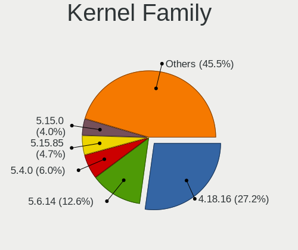
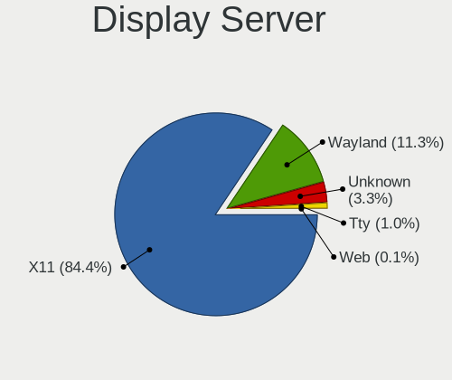
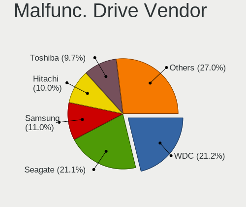
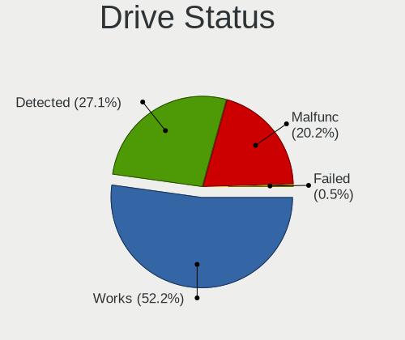
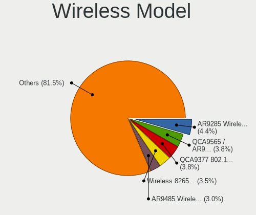
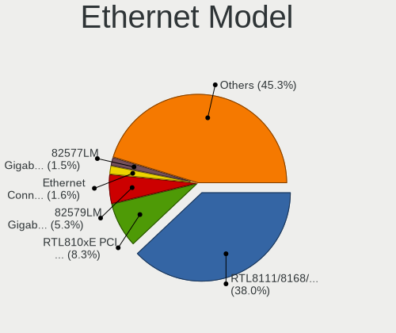

Linux in Hungary - Tested Hardware & Statistics
-----------------------------------------------

A project to collect tested hardware configurations for Linux in Hungary.

Anyone can contribute to this report by the [hw-probe](https://github.com/linuxhw/hw-probe) tool:

    sudo -E hw-probe -all -upload

Please contribute! Especially if your hardware is rare.

This is a report for all computer types. See also reports for [desktops](/Location/Hungary/Desktop/README.md) and [notebooks](/Location/Hungary/Notebook/README.md).

Contents
--------

* [ Test Cases ](#test-cases)

* [ System ](#system)
  - [ OS                       ](#os)
  - [ OS Family                ](#os-family)
  - [ Kernel                   ](#kernel)
  - [ Kernel Family            ](#kernel-family)
  - [ Kernel Major Ver.        ](#kernel-major-ver)
  - [ Arch                     ](#arch)
  - [ DE                       ](#de)
  - [ Display Server           ](#display-server)
  - [ Display Manager          ](#display-manager)
  - [ OS Lang                  ](#os-lang)
  - [ Boot Mode                ](#boot-mode)
  - [ Filesystem               ](#filesystem)
  - [ Part. scheme             ](#part-scheme)
  - [ Dual Boot with Linux/BSD ](#dual-boot-with-linuxbsd)
  - [ Dual Boot (Win)          ](#dual-boot-win)

* [ Board ](#board)
  - [ Vendor                   ](#vendor)
  - [ Model                    ](#model)
  - [ Model Family             ](#model-family)
  - [ MFG Year                 ](#mfg-year)
  - [ Form Factor              ](#form-factor)
  - [ Secure Boot              ](#secure-boot)
  - [ Coreboot                 ](#coreboot)
  - [ RAM Size                 ](#ram-size)
  - [ RAM Used                 ](#ram-used)
  - [ Total Drives             ](#total-drives)
  - [ Has CD-ROM               ](#has-cd-rom)
  - [ Has Ethernet             ](#has-ethernet)
  - [ Has WiFi                 ](#has-wifi)
  - [ Has Bluetooth            ](#has-bluetooth)

* [ Location ](#location)
  - [ Country                  ](#country)
  - [ City                     ](#city)

* [ Drives ](#drives)
  - [ Drive Vendor             ](#drive-vendor)
  - [ Drive Model              ](#drive-model)
  - [ HDD Vendor               ](#hdd-vendor)
  - [ SSD Vendor               ](#ssd-vendor)
  - [ Drive Kind               ](#drive-kind)
  - [ Drive Connector          ](#drive-connector)
  - [ Drive Size               ](#drive-size)
  - [ Space Total              ](#space-total)
  - [ Space Used               ](#space-used)
  - [ Malfunc. Drives          ](#malfunc-drives)
  - [ Malfunc. Drive Vendor    ](#malfunc-drive-vendor)
  - [ Malfunc. HDD Vendor      ](#malfunc-hdd-vendor)
  - [ Malfunc. Drive Kind      ](#malfunc-drive-kind)
  - [ Failed Drives            ](#failed-drives)
  - [ Failed Drive Vendor      ](#failed-drive-vendor)
  - [ Drive Status             ](#drive-status)

* [ Storage controller ](#storage-controller)
  - [ Storage Vendor           ](#storage-vendor)
  - [ Storage Model            ](#storage-model)
  - [ Storage Kind             ](#storage-kind)

* [ Processor ](#processor)
  - [ CPU Vendor               ](#cpu-vendor)
  - [ CPU Model                ](#cpu-model)
  - [ CPU Model Family         ](#cpu-model-family)
  - [ CPU Cores                ](#cpu-cores)
  - [ CPU Sockets              ](#cpu-sockets)
  - [ CPU Threads              ](#cpu-threads)
  - [ CPU Op-Modes             ](#cpu-op-modes)
  - [ CPU Microcode            ](#cpu-microcode)
  - [ CPU Microarch            ](#cpu-microarch)

* [ Graphics ](#graphics)
  - [ GPU Vendor               ](#gpu-vendor)
  - [ GPU Model                ](#gpu-model)
  - [ GPU Combo                ](#gpu-combo)
  - [ GPU Driver               ](#gpu-driver)
  - [ GPU Memory               ](#gpu-memory)

* [ Monitor ](#monitor)
  - [ Monitor Vendor           ](#monitor-vendor)
  - [ Monitor Model            ](#monitor-model)
  - [ Monitor Resolution       ](#monitor-resolution)
  - [ Monitor Diagonal         ](#monitor-diagonal)
  - [ Monitor Width            ](#monitor-width)
  - [ Aspect Ratio             ](#aspect-ratio)
  - [ Monitor Area             ](#monitor-area)
  - [ Pixel Density            ](#pixel-density)
  - [ Multiple Monitors        ](#multiple-monitors)

* [ Network ](#network)
  - [ Net Controller Vendor    ](#net-controller-vendor)
  - [ Net Controller Model     ](#net-controller-model)
  - [ Wireless Vendor          ](#wireless-vendor)
  - [ Wireless Model           ](#wireless-model)
  - [ Ethernet Vendor          ](#ethernet-vendor)
  - [ Ethernet Model           ](#ethernet-model)
  - [ Net Controller Kind      ](#net-controller-kind)
  - [ Used Controller          ](#used-controller)
  - [ NICs                     ](#nics)
  - [ IPv6                     ](#ipv6)

* [ Bluetooth ](#bluetooth)
  - [ Bluetooth Vendor         ](#bluetooth-vendor)
  - [ Bluetooth Model          ](#bluetooth-model)

* [ Sound ](#sound)
  - [ Sound Vendor             ](#sound-vendor)
  - [ Sound Model              ](#sound-model)

* [ Memory ](#memory)
  - [ Memory Vendor            ](#memory-vendor)
  - [ Memory Model             ](#memory-model)
  - [ Memory Kind              ](#memory-kind)
  - [ Memory Form Factor       ](#memory-form-factor)
  - [ Memory Size              ](#memory-size)
  - [ Memory Speed             ](#memory-speed)

* [ Printers & scanners ](#printers--scanners)
  - [ Printer Vendor           ](#printer-vendor)
  - [ Printer Model            ](#printer-model)
  - [ Scanner Vendor           ](#scanner-vendor)
  - [ Scanner Model            ](#scanner-model)

* [ Camera ](#camera)
  - [ Camera Vendor            ](#camera-vendor)
  - [ Camera Model             ](#camera-model)

* [ Security ](#security)
  - [ Fingerprint Vendor       ](#fingerprint-vendor)
  - [ Fingerprint Model        ](#fingerprint-model)
  - [ Chipcard Vendor          ](#chipcard-vendor)
  - [ Chipcard Model           ](#chipcard-model)

* [ Unsupported ](#unsupported)
  - [ Unsupported Devices      ](#unsupported-devices)
  - [ Unsupported Device Types ](#unsupported-device-types)

Test Cases
----------

Total: 7714

| Vendor        | Model                       | Form-Factor | Probe                                                      | Date         |
|---------------|-----------------------------|-------------|------------------------------------------------------------|--------------|
| Gigabyte      | P35-S3G                     | Desktop     | [71339b40ec](https://linux-hardware.org/?probe=71339b40ec) | Jun 10, 2023 |
| Acer          | Nitro AN515-44              | Notebook    | [c74a9048c0](https://linux-hardware.org/?probe=c74a9048c0) | Jun 10, 2023 |
| HP            | 250 G1                      | Notebook    | [1b9c881cae](https://linux-hardware.org/?probe=1b9c881cae) | Jun 10, 2023 |
| HP            | 250 G1                      | Notebook    | [0591407196](https://linux-hardware.org/?probe=0591407196) | Jun 10, 2023 |
| HP            | Pavilion dv6                | Notebook    | [1388a433de](https://linux-hardware.org/?probe=1388a433de) | Jun 10, 2023 |
| Valve         | Jupiter                     | Notebook    | [d2df298764](https://linux-hardware.org/?probe=d2df298764) | Jun 10, 2023 |
| MSI           | MS-7309                     | Desktop     | [9c6db3b61d](https://linux-hardware.org/?probe=9c6db3b61d) | Jun 10, 2023 |
| ASUSTek       | K54HR                       | Notebook    | [6eada916c0](https://linux-hardware.org/?probe=6eada916c0) | Jun 10, 2023 |
| Fujitsu       | D2828-A2 S26361-D2828-A2    | Desktop     | [dfac11ccad](https://linux-hardware.org/?probe=dfac11ccad) | Jun 10, 2023 |
| HP            | Victus by Laptop 16-e0xx... | Notebook    | [9cb24f9445](https://linux-hardware.org/?probe=9cb24f9445) | Jun 09, 2023 |
| Gigabyte      | P67A-D3-B3                  | Desktop     | [142fc47b59](https://linux-hardware.org/?probe=142fc47b59) | Jun 09, 2023 |
| Gigabyte      | G41M-ES2L                   | Desktop     | [22e9021ae3](https://linux-hardware.org/?probe=22e9021ae3) | Jun 09, 2023 |
| Acer          | Aspire 8930                 | Notebook    | [f8eb3278fe](https://linux-hardware.org/?probe=f8eb3278fe) | Jun 09, 2023 |
| HP            | 18E7                        | Desktop     | [d80810b7f8](https://linux-hardware.org/?probe=d80810b7f8) | Jun 08, 2023 |
| Gigabyte      | G41M-ES2L                   | Desktop     | [a707a562b8](https://linux-hardware.org/?probe=a707a562b8) | Jun 08, 2023 |
| Dell          | Inspiron 7737               | Notebook    | [6f7077634a](https://linux-hardware.org/?probe=6f7077634a) | Jun 08, 2023 |
| Fujitsu       | D3403-U1 S26361-D3403-U1    | Desktop     | [9de320e96f](https://linux-hardware.org/?probe=9de320e96f) | Jun 08, 2023 |
| Google        | Edgar                       | Notebook    | [bec197cb98](https://linux-hardware.org/?probe=bec197cb98) | Jun 07, 2023 |
| ASRock        | B85M-HDS                    | Desktop     | [e563fa3fe2](https://linux-hardware.org/?probe=e563fa3fe2) | Jun 07, 2023 |
| ASUSTek       | H110M-A                     | Desktop     | [a9ca37ac88](https://linux-hardware.org/?probe=a9ca37ac88) | Jun 07, 2023 |
| Gigabyte      | GA-880GM-D2H                | Desktop     | [328aaf23c9](https://linux-hardware.org/?probe=328aaf23c9) | Jun 07, 2023 |
| Dell          | Latitude E6420              | Notebook    | [011dadb850](https://linux-hardware.org/?probe=011dadb850) | Jun 07, 2023 |
| Dell          | Latitude E6420              | Notebook    | [a1c7c69a05](https://linux-hardware.org/?probe=a1c7c69a05) | Jun 07, 2023 |
| ASUSTek       | NARRA2                      | Desktop     | [e33a2ba9dc](https://linux-hardware.org/?probe=e33a2ba9dc) | Jun 07, 2023 |
| Fujitsu Si... | MS-7504VP-PV                | Desktop     | [3c89a2a6a2](https://linux-hardware.org/?probe=3c89a2a6a2) | Jun 07, 2023 |
| ASUSTek       | NARRA2                      | Desktop     | [e05fc7beed](https://linux-hardware.org/?probe=e05fc7beed) | Jun 07, 2023 |
| Gigabyte      | Z270N-WIFI-CF               | Desktop     | [26be42ecb8](https://linux-hardware.org/?probe=26be42ecb8) | Jun 07, 2023 |
| Lenovo        | ThinkPad X200 74595FG       | Notebook    | [26f1962805](https://linux-hardware.org/?probe=26f1962805) | Jun 07, 2023 |
| HP            | EliteBook 2540p             | Notebook    | [96a6ae8f4d](https://linux-hardware.org/?probe=96a6ae8f4d) | Jun 07, 2023 |
| Apple         | MacBookAir5,2               | Notebook    | [8ef73cacf2](https://linux-hardware.org/?probe=8ef73cacf2) | Jun 07, 2023 |
| Lenovo        | G585 20137                  | Notebook    | [6eeacffa3c](https://linux-hardware.org/?probe=6eeacffa3c) | Jun 07, 2023 |
| Gigabyte      | Z270N-WIFI-CF               | Desktop     | [6ba5aae544](https://linux-hardware.org/?probe=6ba5aae544) | Jun 07, 2023 |
| HP            | 250 G1                      | Notebook    | [f5c0548f17](https://linux-hardware.org/?probe=f5c0548f17) | Jun 07, 2023 |
| Lenovo        | ThinkPad X270 W10DG 20K5... | Notebook    | [9afe34cdd8](https://linux-hardware.org/?probe=9afe34cdd8) | Jun 06, 2023 |
| ASUSTek       | K73SJ                       | Notebook    | [a77a12f870](https://linux-hardware.org/?probe=a77a12f870) | Jun 06, 2023 |
| ASUSTek       | ASUS TUF Gaming F15 FX50... | Notebook    | [4c3091f9ff](https://linux-hardware.org/?probe=4c3091f9ff) | Jun 06, 2023 |
| Lenovo        | IdeaPad 330-15IKB 81DE      | Notebook    | [bb5f9c1964](https://linux-hardware.org/?probe=bb5f9c1964) | Jun 06, 2023 |
| HP            | 250 G1                      | Notebook    | [f6cab30981](https://linux-hardware.org/?probe=f6cab30981) | Jun 06, 2023 |
| ASUSTek       | PRIME B365M-A               | Desktop     | [c33a9e5ccb](https://linux-hardware.org/?probe=c33a9e5ccb) | Jun 06, 2023 |
| eMachines     | E725                        | Notebook    | [4e50fbb5a2](https://linux-hardware.org/?probe=4e50fbb5a2) | Jun 05, 2023 |
| Gigabyte      | AB350M-DS3H V2-CF           | Desktop     | [fa3bffbe76](https://linux-hardware.org/?probe=fa3bffbe76) | Jun 05, 2023 |
| MSI           | MAG B550 TOMAHAWK           | Desktop     | [0b48c563e5](https://linux-hardware.org/?probe=0b48c563e5) | Jun 05, 2023 |
| MSI           | MAG B550 TOMAHAWK           | Desktop     | [6f1c2a6a61](https://linux-hardware.org/?probe=6f1c2a6a61) | Jun 05, 2023 |
| Gigabyte      | G31M-ES2L                   | Desktop     | [6f15ff21e4](https://linux-hardware.org/?probe=6f15ff21e4) | Jun 05, 2023 |
| Dell          | Latitude E5520              | Notebook    | [ab87df9910](https://linux-hardware.org/?probe=ab87df9910) | Jun 05, 2023 |
| Dell          | 0VD5HY A07                  | Desktop     | [4e11e5ab66](https://linux-hardware.org/?probe=4e11e5ab66) | Jun 05, 2023 |
| Dell          | 055H3G A01                  | Desktop     | [3fc296df33](https://linux-hardware.org/?probe=3fc296df33) | Jun 05, 2023 |
| Lenovo        | IdeaPad 330-15IKB 81DE      | Notebook    | [e1fabecae3](https://linux-hardware.org/?probe=e1fabecae3) | Jun 04, 2023 |
| Lenovo        | IdeaPad 330-15IKB 81DE      | Notebook    | [66ed048f40](https://linux-hardware.org/?probe=66ed048f40) | Jun 04, 2023 |
| Lenovo        | V15-ADA 82C7                | Notebook    | [0fb6670b07](https://linux-hardware.org/?probe=0fb6670b07) | Jun 03, 2023 |
| HP            | ENVY x360 Convertible 15... | Convertible | [c2c0ba92d5](https://linux-hardware.org/?probe=c2c0ba92d5) | Jun 03, 2023 |
| Samsung       | RV411/RV511/E3511/S3511/... | Notebook    | [bcf794dd14](https://linux-hardware.org/?probe=bcf794dd14) | Jun 03, 2023 |
| Dell          | Inspiron 5558               | Notebook    | [746c0d0644](https://linux-hardware.org/?probe=746c0d0644) | Jun 03, 2023 |
| Lenovo        | ThinkPad E15 20RD003KHV     | Notebook    | [3903b22ffd](https://linux-hardware.org/?probe=3903b22ffd) | Jun 02, 2023 |
| Gigabyte      | H77N-WIFI                   | Desktop     | [8dce973d6b](https://linux-hardware.org/?probe=8dce973d6b) | Jun 02, 2023 |
| Dell          | Inspiron 5558               | Notebook    | [c747f45c48](https://linux-hardware.org/?probe=c747f45c48) | Jun 02, 2023 |
| ASUSTek       | ASUS EXPERTBOOK B1500CEA... | Notebook    | [c0d0a7cb50](https://linux-hardware.org/?probe=c0d0a7cb50) | Jun 01, 2023 |
| MSI           | U200                        | Notebook    | [a217267eb0](https://linux-hardware.org/?probe=a217267eb0) | Jun 01, 2023 |
| Fujitsu       | LIFEBOOK A555               | Notebook    | [f7e3bde58c](https://linux-hardware.org/?probe=f7e3bde58c) | Jun 01, 2023 |
| Samsung       | 300E4C/300E5C/300E7C        | Notebook    | [871cbcbb88](https://linux-hardware.org/?probe=871cbcbb88) | May 31, 2023 |
| HP            | Notebook                    | Notebook    | [7d7934f727](https://linux-hardware.org/?probe=7d7934f727) | May 31, 2023 |
| HP            | Notebook                    | Notebook    | [161aaf4150](https://linux-hardware.org/?probe=161aaf4150) | May 31, 2023 |
| Samsung       | 300E4C/300E5C/300E7C        | Notebook    | [f0d7ab6b7e](https://linux-hardware.org/?probe=f0d7ab6b7e) | May 31, 2023 |
| ASUSTek       | PRIME B365M-A               | Desktop     | [0005e56720](https://linux-hardware.org/?probe=0005e56720) | May 31, 2023 |
| Lenovo        | ThinkPad X270 20HMS1RM02    | Notebook    | [8f39bcbb17](https://linux-hardware.org/?probe=8f39bcbb17) | May 30, 2023 |
| ASUSTek       | X550CL                      | Notebook    | [ac1e17e897](https://linux-hardware.org/?probe=ac1e17e897) | May 30, 2023 |
| MSI           | MAG B550 TOMAHAWK           | Desktop     | [03d2cac76c](https://linux-hardware.org/?probe=03d2cac76c) | May 29, 2023 |
| MSI           | MAG B550 TOMAHAWK           | Desktop     | [54d3fad8f3](https://linux-hardware.org/?probe=54d3fad8f3) | May 29, 2023 |
| HP            | 8265                        | Desktop     | [a554e3bddf](https://linux-hardware.org/?probe=a554e3bddf) | May 29, 2023 |
| HP            | Pavilion Laptop 14-ce3xx... | Notebook    | [62764248cb](https://linux-hardware.org/?probe=62764248cb) | May 29, 2023 |
| Lenovo        | IdeaPad L340-15API 81LW     | Notebook    | [8e09d71949](https://linux-hardware.org/?probe=8e09d71949) | May 29, 2023 |
| Gigabyte      | H81M-S2H                    | Desktop     | [e681025f33](https://linux-hardware.org/?probe=e681025f33) | May 29, 2023 |
| HP            | 8265                        | Desktop     | [66f0a2d631](https://linux-hardware.org/?probe=66f0a2d631) | May 29, 2023 |
| Gigabyte      | H81M-S2H                    | Desktop     | [68ec8b84a1](https://linux-hardware.org/?probe=68ec8b84a1) | May 29, 2023 |
| Lenovo        | IdeaPad 100-15IBD 80QQ      | Notebook    | [deaa4b357c](https://linux-hardware.org/?probe=deaa4b357c) | May 29, 2023 |
| ASUSTek       | VivoBook S13 X330FN         | Notebook    | [e94b6fbf06](https://linux-hardware.org/?probe=e94b6fbf06) | May 29, 2023 |
| ASUSTek       | PRIME B365M-A               | Desktop     | [8c6f8829e2](https://linux-hardware.org/?probe=8c6f8829e2) | May 29, 2023 |
| Lenovo        | IdeaPad 100-15IBD 80QQ      | Notebook    | [af312b5e91](https://linux-hardware.org/?probe=af312b5e91) | May 29, 2023 |
| ASUSTek       | TUF Gaming H770-PRO WIFI    | Desktop     | [6729d5ffa7](https://linux-hardware.org/?probe=6729d5ffa7) | May 29, 2023 |
| MSI           | MAG B550 TOMAHAWK           | Desktop     | [035161324d](https://linux-hardware.org/?probe=035161324d) | May 28, 2023 |
| MSI           | MAG B550 TOMAHAWK           | Desktop     | [8656657a77](https://linux-hardware.org/?probe=8656657a77) | May 28, 2023 |
| Dell          | 0D883F A06                  | Desktop     | [82fa1dfa46](https://linux-hardware.org/?probe=82fa1dfa46) | May 28, 2023 |
| Dell          | 0D883F A06                  | Desktop     | [c301857917](https://linux-hardware.org/?probe=c301857917) | May 28, 2023 |
| Lenovo        | ThinkStation D20 4158AF8    | Desktop     | [1718d8d65e](https://linux-hardware.org/?probe=1718d8d65e) | May 28, 2023 |
| ASUSTek       | ASUS EXPERTBOOK B1400CEA... | Notebook    | [f068d88c01](https://linux-hardware.org/?probe=f068d88c01) | May 27, 2023 |
| Lenovo        | ThinkPad T400 2768WGB       | Notebook    | [447ea38d26](https://linux-hardware.org/?probe=447ea38d26) | May 27, 2023 |
| Lenovo        | ThinkPad T400 2768WGB       | Notebook    | [57dcd55314](https://linux-hardware.org/?probe=57dcd55314) | May 27, 2023 |
| Fujitsu Si... | D2824-A1 S26361-D2824-A1    | Desktop     | [3900a03a2c](https://linux-hardware.org/?probe=3900a03a2c) | May 27, 2023 |
| ASUSTek       | M5A97 EVO R2.0              | Desktop     | [0aac24410d](https://linux-hardware.org/?probe=0aac24410d) | May 27, 2023 |
| Dell          | 0XGMD0 A00                  | All in one  | [fef3f47b89](https://linux-hardware.org/?probe=fef3f47b89) | May 27, 2023 |
| HP            | 8265                        | Desktop     | [33488b045e](https://linux-hardware.org/?probe=33488b045e) | May 26, 2023 |
| Dell          | 0WMJ54 A01                  | Desktop     | [d26d09ef64](https://linux-hardware.org/?probe=d26d09ef64) | May 26, 2023 |
| Acer          | TravelMate 6292             | Notebook    | [0a4cb3e4b3](https://linux-hardware.org/?probe=0a4cb3e4b3) | May 25, 2023 |
| ASUSTek       | PRIME B450-PLUS             | Desktop     | [512abef14b](https://linux-hardware.org/?probe=512abef14b) | May 25, 2023 |
| ASUSTek       | PRIME B450-PLUS             | Desktop     | [d93a5e7c70](https://linux-hardware.org/?probe=d93a5e7c70) | May 25, 2023 |
| ASRock        | G41M-VS3                    | Desktop     | [575d3814e9](https://linux-hardware.org/?probe=575d3814e9) | May 25, 2023 |
| ASRock        | G41M-VS3                    | Desktop     | [d7d112d2f0](https://linux-hardware.org/?probe=d7d112d2f0) | May 25, 2023 |
| MSI           | A520M-A PRO                 | Desktop     | [6f1a19d503](https://linux-hardware.org/?probe=6f1a19d503) | May 25, 2023 |
| Toshiba       | Satellite M50D-A            | Notebook    | [9f7a16aa7b](https://linux-hardware.org/?probe=9f7a16aa7b) | May 25, 2023 |
| Toshiba       | Satellite M50D-A            | Notebook    | [bbb23b2823](https://linux-hardware.org/?probe=bbb23b2823) | May 25, 2023 |
| HP            | Pavilion 17                 | Notebook    | [792ac6919d](https://linux-hardware.org/?probe=792ac6919d) | May 24, 2023 |
| Fujitsu       | LIFEBOOK A555               | Notebook    | [920a4901d9](https://linux-hardware.org/?probe=920a4901d9) | May 24, 2023 |
| Acer          | Aspire A315-58              | Notebook    | [43069955ee](https://linux-hardware.org/?probe=43069955ee) | May 23, 2023 |
| Unknown       | Unknown                     | Notebook    | [da302bee4e](https://linux-hardware.org/?probe=da302bee4e) | May 23, 2023 |
| HP            | 250 G6 Notebook PC          | Notebook    | [431f2db1fc](https://linux-hardware.org/?probe=431f2db1fc) | May 23, 2023 |
| Lenovo        | V15-ADA 82C7                | Notebook    | [5fff4f66c1](https://linux-hardware.org/?probe=5fff4f66c1) | May 22, 2023 |
| Gigabyte      | G31M-ES2L                   | Desktop     | [5798ed934b](https://linux-hardware.org/?probe=5798ed934b) | May 22, 2023 |
| Lenovo        | IdeaPad 100-15IBD 80QQ      | Notebook    | [44b6477648](https://linux-hardware.org/?probe=44b6477648) | May 22, 2023 |
| Gigabyte      | B450M GAMING                | Desktop     | [9320baf9c8](https://linux-hardware.org/?probe=9320baf9c8) | May 22, 2023 |
| Medion        | MS-7748                     | Desktop     | [84765690f5](https://linux-hardware.org/?probe=84765690f5) | May 22, 2023 |
| Gigabyte      | B450M GAMING                | Desktop     | [88ffb8b020](https://linux-hardware.org/?probe=88ffb8b020) | May 22, 2023 |
| eMachines     | E725                        | Notebook    | [c75d7eb314](https://linux-hardware.org/?probe=c75d7eb314) | May 22, 2023 |
| eMachines     | E725                        | Notebook    | [f32fb866fa](https://linux-hardware.org/?probe=f32fb866fa) | May 22, 2023 |
| Gigabyte      | G31M-ES2L                   | Desktop     | [5f83edfb1e](https://linux-hardware.org/?probe=5f83edfb1e) | May 22, 2023 |
| HP            | 8265                        | Desktop     | [5ce02f4648](https://linux-hardware.org/?probe=5ce02f4648) | May 22, 2023 |
| Lenovo        | IdeaPad 100-15IBD 80QQ      | Notebook    | [0ab3a9817b](https://linux-hardware.org/?probe=0ab3a9817b) | May 21, 2023 |
| Gigabyte      | G31M-ES2L                   | Desktop     | [c0330d366f](https://linux-hardware.org/?probe=c0330d366f) | May 21, 2023 |
| Gigabyte      | F2A88XM-D3HP                | Desktop     | [2ab72e28d7](https://linux-hardware.org/?probe=2ab72e28d7) | May 21, 2023 |
| Lenovo        | V15-ADA 82C7                | Notebook    | [6e859c48e1](https://linux-hardware.org/?probe=6e859c48e1) | May 21, 2023 |
| Medion        | MS-7748                     | Desktop     | [dc5431a93b](https://linux-hardware.org/?probe=dc5431a93b) | May 21, 2023 |
| MSI           | MS-7309                     | Desktop     | [0b5d330939](https://linux-hardware.org/?probe=0b5d330939) | May 21, 2023 |
| Medion        | MS-7748                     | Desktop     | [d2fa9ef11a](https://linux-hardware.org/?probe=d2fa9ef11a) | May 21, 2023 |
| ASUSTek       | P8B75-M                     | Desktop     | [313fb9c88a](https://linux-hardware.org/?probe=313fb9c88a) | May 21, 2023 |
| Acer          | TravelMate Spin P614RN-5... | Convertible | [de2fc32d08](https://linux-hardware.org/?probe=de2fc32d08) | May 21, 2023 |
| ASUSTek       | H110M-K                     | Desktop     | [74122892bc](https://linux-hardware.org/?probe=74122892bc) | May 21, 2023 |
| ASUSTek       | H110M-K                     | Desktop     | [4e4024bced](https://linux-hardware.org/?probe=4e4024bced) | May 21, 2023 |
| Dell          | Inspiron 5558               | Notebook    | [958b40f42c](https://linux-hardware.org/?probe=958b40f42c) | May 21, 2023 |
| Dell          | Inspiron 5558               | Notebook    | [5043ac245f](https://linux-hardware.org/?probe=5043ac245f) | May 21, 2023 |
| Sony          | VGN-FW21Z                   | Notebook    | [aac218a1e0](https://linux-hardware.org/?probe=aac218a1e0) | May 20, 2023 |
| Gigabyte      | G31M-ES2L                   | Desktop     | [562bec5076](https://linux-hardware.org/?probe=562bec5076) | May 20, 2023 |
| Dell          | Inspiron 15-3567            | Notebook    | [7db14b0f6f](https://linux-hardware.org/?probe=7db14b0f6f) | May 20, 2023 |
| Lenovo        | ThinkPad L15 Gen 1 20U7S... | Notebook    | [2e78e77fef](https://linux-hardware.org/?probe=2e78e77fef) | May 19, 2023 |
| eMachines     | E725                        | Notebook    | [517ba05822](https://linux-hardware.org/?probe=517ba05822) | May 19, 2023 |
| HP            | 250 G2                      | Notebook    | [e3b94752ac](https://linux-hardware.org/?probe=e3b94752ac) | May 19, 2023 |
| Gigabyte      | M61SME-S2                   | Desktop     | [1d729ae4ea](https://linux-hardware.org/?probe=1d729ae4ea) | May 19, 2023 |
| Dell          | Latitude D630               | Notebook    | [9526ff1765](https://linux-hardware.org/?probe=9526ff1765) | May 19, 2023 |
| Lenovo        | ThinkStation D20 4158AF8    | Desktop     | [c791e54f97](https://linux-hardware.org/?probe=c791e54f97) | May 19, 2023 |
| Lenovo        | SDK0E50510 WIN              | Desktop     | [edbc15eb75](https://linux-hardware.org/?probe=edbc15eb75) | May 18, 2023 |
| Lenovo        | SDK0E50510 WIN              | Desktop     | [4587e40310](https://linux-hardware.org/?probe=4587e40310) | May 18, 2023 |
| ASRock        | B85M-HDS                    | Desktop     | [411344a862](https://linux-hardware.org/?probe=411344a862) | May 18, 2023 |
| Gigabyte      | H110M-S2V-CF                | Desktop     | [75c2a22eb5](https://linux-hardware.org/?probe=75c2a22eb5) | May 18, 2023 |
| ASRock        | B85M-HDS                    | Desktop     | [868d98e4f4](https://linux-hardware.org/?probe=868d98e4f4) | May 18, 2023 |
| HP            | 625                         | Notebook    | [8e34027a91](https://linux-hardware.org/?probe=8e34027a91) | May 18, 2023 |
| Dell          | Latitude D630               | Notebook    | [7a7497a4b3](https://linux-hardware.org/?probe=7a7497a4b3) | May 18, 2023 |
| Gigabyte      | M61SME-S2                   | Desktop     | [b3b39b07a5](https://linux-hardware.org/?probe=b3b39b07a5) | May 18, 2023 |
| Fujitsu       | LIFEBOOK A555               | Notebook    | [400b91098c](https://linux-hardware.org/?probe=400b91098c) | May 18, 2023 |
| Alcor Digi... | Snugbook N1431              | Notebook    | [a04e4c387e](https://linux-hardware.org/?probe=a04e4c387e) | May 17, 2023 |
| Gigabyte      | GA-A75M-D2H                 | Desktop     | [ad477b9698](https://linux-hardware.org/?probe=ad477b9698) | May 17, 2023 |
| ASUSTek       | M5A97 R2.0                  | Desktop     | [5d77e9825a](https://linux-hardware.org/?probe=5d77e9825a) | May 17, 2023 |
| Unknown       | Unknown                     | Notebook    | [0323142e79](https://linux-hardware.org/?probe=0323142e79) | May 17, 2023 |
| Unknown       | Unknown                     | Notebook    | [d734e52f59](https://linux-hardware.org/?probe=d734e52f59) | May 17, 2023 |
| Pine Micro... | Pine64 PinePhone (1.2)      | Phone       | [a65ace49b0](https://linux-hardware.org/?probe=a65ace49b0) | May 17, 2023 |
| Gigabyte      | GA-990X-Gaming SLI-CF       | Desktop     | [a7f0d5509c](https://linux-hardware.org/?probe=a7f0d5509c) | May 17, 2023 |
| Gigabyte      | GA-990X-Gaming SLI-CF       | Desktop     | [30c42f6f19](https://linux-hardware.org/?probe=30c42f6f19) | May 17, 2023 |
| Lenovo        | V15-ADA 82C7                | Notebook    | [6856deb5d7](https://linux-hardware.org/?probe=6856deb5d7) | May 16, 2023 |
| Dell          | 0GY6Y8 A01                  | Desktop     | [6b606c0c57](https://linux-hardware.org/?probe=6b606c0c57) | May 16, 2023 |
| Gigabyte      | F2A88XM-D3HP                | Desktop     | [f9672e78a2](https://linux-hardware.org/?probe=f9672e78a2) | May 16, 2023 |
| Dell          | 0782GW A00                  | Desktop     | [3699048599](https://linux-hardware.org/?probe=3699048599) | May 16, 2023 |
| HP            | ProBook 640 G8 Notebook ... | Notebook    | [e228d9926b](https://linux-hardware.org/?probe=e228d9926b) | May 16, 2023 |
| HP            | Compaq Presario CQ60        | Notebook    | [e01dbddbd0](https://linux-hardware.org/?probe=e01dbddbd0) | May 16, 2023 |
| HP            | Compaq Presario CQ60        | Notebook    | [72db5ccefc](https://linux-hardware.org/?probe=72db5ccefc) | May 15, 2023 |
| ASUSTek       | PRIME X370-PRO              | Desktop     | [f977ce9be3](https://linux-hardware.org/?probe=f977ce9be3) | May 15, 2023 |
| HP            | ProBook 640 G8 Notebook ... | Notebook    | [f286932235](https://linux-hardware.org/?probe=f286932235) | May 15, 2023 |
| Lenovo        | ThinkStation D20 4158AF8    | Desktop     | [d3bc261952](https://linux-hardware.org/?probe=d3bc261952) | May 15, 2023 |
| Dell          | Latitude 5490               | Notebook    | [0a6ee8c111](https://linux-hardware.org/?probe=0a6ee8c111) | May 14, 2023 |
| ASUSTek       | M5A97 EVO R2.0              | Desktop     | [8661cb20d2](https://linux-hardware.org/?probe=8661cb20d2) | May 14, 2023 |
| eMachines     | E725                        | Notebook    | [32c12bfb05](https://linux-hardware.org/?probe=32c12bfb05) | May 14, 2023 |
| ASUSTek       | PRIME X370-PRO              | Desktop     | [ba63571489](https://linux-hardware.org/?probe=ba63571489) | May 14, 2023 |
| Acer          | Aspire A717-72G             | Notebook    | [1ab0673015](https://linux-hardware.org/?probe=1ab0673015) | May 14, 2023 |
| Acer          | Aspire A717-72G             | Notebook    | [62a46acc18](https://linux-hardware.org/?probe=62a46acc18) | May 14, 2023 |
| ASUSTek       | PRIME B365M-A               | Desktop     | [d72abd1f09](https://linux-hardware.org/?probe=d72abd1f09) | May 14, 2023 |
| ASUSTek       | M2A-MX                      | Desktop     | [43c0de16a2](https://linux-hardware.org/?probe=43c0de16a2) | May 14, 2023 |
| eMachines     | E725                        | Notebook    | [8768af826f](https://linux-hardware.org/?probe=8768af826f) | May 14, 2023 |
| Lenovo        | G580 20150                  | Notebook    | [f6cf41154f](https://linux-hardware.org/?probe=f6cf41154f) | May 14, 2023 |
| eMachines     | E725                        | Notebook    | [fed9273467](https://linux-hardware.org/?probe=fed9273467) | May 14, 2023 |
| HP            | ProBook 640 G8 Notebook ... | Notebook    | [ae4ee3c43d](https://linux-hardware.org/?probe=ae4ee3c43d) | May 13, 2023 |
| HP            | ProBook 640 G8 Notebook ... | Notebook    | [0ae54cb7c4](https://linux-hardware.org/?probe=0ae54cb7c4) | May 13, 2023 |
| Dell          | Latitude 5480               | Notebook    | [63cd615fa8](https://linux-hardware.org/?probe=63cd615fa8) | May 13, 2023 |
| Unknown       | Unknown                     | Desktop     | [e172257a22](https://linux-hardware.org/?probe=e172257a22) | May 13, 2023 |
| Gigabyte      | B450M GAMING                | Desktop     | [60ac4f3964](https://linux-hardware.org/?probe=60ac4f3964) | May 13, 2023 |
| Gigabyte      | B450M GAMING                | Desktop     | [1e8aca1c49](https://linux-hardware.org/?probe=1e8aca1c49) | May 13, 2023 |
| HP            | Notebook                    | Notebook    | [9840f334f5](https://linux-hardware.org/?probe=9840f334f5) | May 13, 2023 |
| Fujitsu       | LIFEBOOK E756               | Notebook    | [d0f5ee2781](https://linux-hardware.org/?probe=d0f5ee2781) | May 13, 2023 |
| HP            | Notebook                    | Notebook    | [db9aaf4ce9](https://linux-hardware.org/?probe=db9aaf4ce9) | May 13, 2023 |
| ASRock        | B365M Pro4                  | Desktop     | [264720475a](https://linux-hardware.org/?probe=264720475a) | May 13, 2023 |
| eMachines     | E725                        | Notebook    | [52848aa6bd](https://linux-hardware.org/?probe=52848aa6bd) | May 13, 2023 |
| Toshiba       | Satellite C55-A-1NV         | Notebook    | [d06987bfd6](https://linux-hardware.org/?probe=d06987bfd6) | May 12, 2023 |
| ASUSTek       | VivoBook_ASUSLaptop M650... | Notebook    | [a7e9891909](https://linux-hardware.org/?probe=a7e9891909) | May 12, 2023 |
| HP            | 8055                        | Desktop     | [7f692f60e6](https://linux-hardware.org/?probe=7f692f60e6) | May 12, 2023 |
| HP            | Notebook                    | Notebook    | [bc25329bce](https://linux-hardware.org/?probe=bc25329bce) | May 12, 2023 |
| ASUSTek       | P5Q-E                       | Desktop     | [9efa5d994b](https://linux-hardware.org/?probe=9efa5d994b) | May 12, 2023 |
| Gigabyte      | P67A-D3-B3                  | Desktop     | [024b4d4f97](https://linux-hardware.org/?probe=024b4d4f97) | May 12, 2023 |
| Medion        | MS-7748                     | Desktop     | [c5b24a357f](https://linux-hardware.org/?probe=c5b24a357f) | May 12, 2023 |
| HP            | Notebook                    | Notebook    | [d527d781af](https://linux-hardware.org/?probe=d527d781af) | May 11, 2023 |
| Dell          | 0D883F A06                  | Desktop     | [e69c9bb60f](https://linux-hardware.org/?probe=e69c9bb60f) | May 11, 2023 |
| Dell          | 0D883F A06                  | Desktop     | [17cf022069](https://linux-hardware.org/?probe=17cf022069) | May 11, 2023 |
| eMachines     | E725                        | Notebook    | [94e51437e6](https://linux-hardware.org/?probe=94e51437e6) | May 11, 2023 |
| MSI           | A75MA-P35                   | Desktop     | [18b29879dd](https://linux-hardware.org/?probe=18b29879dd) | May 11, 2023 |
| MSI           | A75MA-P35                   | Desktop     | [abcfdbcbfc](https://linux-hardware.org/?probe=abcfdbcbfc) | May 11, 2023 |
| Lenovo        | V15-ADA 82C7                | Notebook    | [0c8d19bdf0](https://linux-hardware.org/?probe=0c8d19bdf0) | May 10, 2023 |
| Dell          | Inspiron 5558               | Notebook    | [dbc75c5600](https://linux-hardware.org/?probe=dbc75c5600) | May 10, 2023 |
| Dell          | Inspiron 5558               | Notebook    | [396be908b5](https://linux-hardware.org/?probe=396be908b5) | May 10, 2023 |
| Dell          | Latitude E6440              | Notebook    | [ea902a82a4](https://linux-hardware.org/?probe=ea902a82a4) | May 10, 2023 |
| Lenovo        | ThinkStation D20 4158AF8    | Desktop     | [56d9faa756](https://linux-hardware.org/?probe=56d9faa756) | May 10, 2023 |
| HP            | 250 G1                      | Notebook    | [09879bd463](https://linux-hardware.org/?probe=09879bd463) | May 10, 2023 |
| Apple         | MacBookAir5,2               | Notebook    | [bd3934d526](https://linux-hardware.org/?probe=bd3934d526) | May 10, 2023 |
| Lenovo        | ThinkPad T440s 20ARS06C0... | Notebook    | [543cce00c7](https://linux-hardware.org/?probe=543cce00c7) | May 09, 2023 |
| Fujitsu       | LIFEBOOK U745               | Notebook    | [7a97cdf93b](https://linux-hardware.org/?probe=7a97cdf93b) | May 09, 2023 |
| Fujitsu Si... | MS-7504VP-PV                | Desktop     | [78b60f4ad9](https://linux-hardware.org/?probe=78b60f4ad9) | May 09, 2023 |
| Dell          | 08NPPY A00                  | Desktop     | [6c55bc2118](https://linux-hardware.org/?probe=6c55bc2118) | May 09, 2023 |
| Gigabyte      | GA-A75M-D2H                 | Desktop     | [3d378ca82d](https://linux-hardware.org/?probe=3d378ca82d) | May 09, 2023 |
| Gigabyte      | GA-A75M-D2H                 | Desktop     | [4d3e8cb0e9](https://linux-hardware.org/?probe=4d3e8cb0e9) | May 09, 2023 |
| Gigabyte      | H110M-S2V-CF                | Desktop     | [fc9004551b](https://linux-hardware.org/?probe=fc9004551b) | May 09, 2023 |
| Dell          | Inspiron 7737               | Notebook    | [f900658289](https://linux-hardware.org/?probe=f900658289) | May 09, 2023 |
| Fujitsu       | LIFEBOOK E756               | Notebook    | [90bec72fa7](https://linux-hardware.org/?probe=90bec72fa7) | May 09, 2023 |
| Gigabyte      | Z270N-WIFI-CF               | Desktop     | [65b039a3f5](https://linux-hardware.org/?probe=65b039a3f5) | May 08, 2023 |
| ASUSTek       | H110M-K                     | Desktop     | [e5c5cd0fcf](https://linux-hardware.org/?probe=e5c5cd0fcf) | May 08, 2023 |
| Acer          | V5-131                      | Notebook    | [d68eaead66](https://linux-hardware.org/?probe=d68eaead66) | May 08, 2023 |
| Lenovo        | G570 20079                  | Notebook    | [bd15eaa1e6](https://linux-hardware.org/?probe=bd15eaa1e6) | May 08, 2023 |
| Fujitsu Si... | MS-7504VP-PV                | Desktop     | [1d06735e36](https://linux-hardware.org/?probe=1d06735e36) | May 08, 2023 |
| Lenovo        | IdeaPad L340-15API 81LW     | Notebook    | [8bbe8f0a3f](https://linux-hardware.org/?probe=8bbe8f0a3f) | May 08, 2023 |
| Dell          | 0VD5HY A07                  | Desktop     | [d17791f116](https://linux-hardware.org/?probe=d17791f116) | May 08, 2023 |
| Lenovo        | IdeaPad 700-15ISK 80RU      | Notebook    | [ad9af07a7c](https://linux-hardware.org/?probe=ad9af07a7c) | May 08, 2023 |
| eMachines     | E725                        | Notebook    | [bb9c7992f8](https://linux-hardware.org/?probe=bb9c7992f8) | May 08, 2023 |
| MSI           | B550M PRO-VDH WIFI          | Desktop     | [76748da9cd](https://linux-hardware.org/?probe=76748da9cd) | May 08, 2023 |
| Lenovo        | SHARKBAY 0B98401 PRO        | Desktop     | [7a1ffd8bd2](https://linux-hardware.org/?probe=7a1ffd8bd2) | May 07, 2023 |
| HP            | 339A                        | Desktop     | [3b40b9b869](https://linux-hardware.org/?probe=3b40b9b869) | May 07, 2023 |
| HP            | 339A                        | Desktop     | [b0200f5262](https://linux-hardware.org/?probe=b0200f5262) | May 07, 2023 |
| HP            | Laptop 15-dw1xxx            | Notebook    | [1f677501c0](https://linux-hardware.org/?probe=1f677501c0) | May 07, 2023 |
| HP            | 650                         | Notebook    | [3ece9ca18a](https://linux-hardware.org/?probe=3ece9ca18a) | May 07, 2023 |
| Lenovo        | ThinkStation D20 4158AF8    | Desktop     | [8c80fd3109](https://linux-hardware.org/?probe=8c80fd3109) | May 07, 2023 |
| Microsoft     | Surface Laptop Go           | Tablet      | [fd7a2486f2](https://linux-hardware.org/?probe=fd7a2486f2) | May 07, 2023 |
| Acer          | TravelMate P215-52          | Notebook    | [b76e0e7397](https://linux-hardware.org/?probe=b76e0e7397) | May 06, 2023 |
| Acer          | TravelMate P215-52          | Notebook    | [5cad7b7e28](https://linux-hardware.org/?probe=5cad7b7e28) | May 06, 2023 |
| Fujitsu Si... | MS-7504VP-PV                | Desktop     | [58de65fdbd](https://linux-hardware.org/?probe=58de65fdbd) | May 06, 2023 |
| HP            | 3033h                       | Desktop     | [a322bec919](https://linux-hardware.org/?probe=a322bec919) | May 06, 2023 |
| ASRock        | G41M-VS3                    | Desktop     | [e9a4f752c5](https://linux-hardware.org/?probe=e9a4f752c5) | May 06, 2023 |
| ASRock        | G41M-VS3                    | Desktop     | [2bd846964e](https://linux-hardware.org/?probe=2bd846964e) | May 06, 2023 |
| Fujitsu       | D2778-B1 S26361-D2778-B1    | Desktop     | [1495984c3f](https://linux-hardware.org/?probe=1495984c3f) | May 06, 2023 |
| ASUSTek       | K53BY                       | Notebook    | [6a9ae368ba](https://linux-hardware.org/?probe=6a9ae368ba) | May 06, 2023 |
| Fujitsu       | D3162-A1 S26361-D3162-A1    | Desktop     | [78bb45767d](https://linux-hardware.org/?probe=78bb45767d) | May 06, 2023 |
| eMachines     | E725                        | Notebook    | [15807b1086](https://linux-hardware.org/?probe=15807b1086) | May 06, 2023 |
| eMachines     | E725                        | Notebook    | [290d356d4c](https://linux-hardware.org/?probe=290d356d4c) | May 05, 2023 |
| HP            | Victus by Laptop 16-e0xx... | Notebook    | [9a0649d500](https://linux-hardware.org/?probe=9a0649d500) | May 05, 2023 |
| Lenovo        | SDK0E50510 WIN              | Desktop     | [e409298467](https://linux-hardware.org/?probe=e409298467) | May 05, 2023 |
| Fujitsu       | LIFEBOOK A555               | Notebook    | [9640ef7fa5](https://linux-hardware.org/?probe=9640ef7fa5) | May 05, 2023 |
| HP            | 339A                        | Desktop     | [920b722009](https://linux-hardware.org/?probe=920b722009) | May 05, 2023 |
| Lenovo        | ThinkPad T500 2056CL8       | Notebook    | [df56d361ef](https://linux-hardware.org/?probe=df56d361ef) | May 05, 2023 |
| ASUSTek       | X550CC                      | Notebook    | [0e338f138d](https://linux-hardware.org/?probe=0e338f138d) | May 04, 2023 |
| ASUSTek       | K54HR                       | Notebook    | [4114d6e81c](https://linux-hardware.org/?probe=4114d6e81c) | May 04, 2023 |
| Lenovo        | G50-30 80G0                 | Notebook    | [b322652461](https://linux-hardware.org/?probe=b322652461) | May 04, 2023 |
| Dell          | Latitude 5490               | Notebook    | [c2d5f80f6e](https://linux-hardware.org/?probe=c2d5f80f6e) | May 04, 2023 |
| Fujitsu Si... | MS-7504VP-PV                | Desktop     | [3678c25be6](https://linux-hardware.org/?probe=3678c25be6) | May 04, 2023 |
| Gigabyte      | H110M-S2V-CF                | Desktop     | [61d04b0e4c](https://linux-hardware.org/?probe=61d04b0e4c) | May 04, 2023 |
| Lenovo        | SDK0E50510 WIN              | Desktop     | [6014477aa0](https://linux-hardware.org/?probe=6014477aa0) | May 04, 2023 |
| Lenovo        | ThinkPad T420 4236W8L       | Notebook    | [aaad7b3a55](https://linux-hardware.org/?probe=aaad7b3a55) | May 04, 2023 |
| ASUSTek       | PRIME B365M-A               | Desktop     | [ba51ad63e8](https://linux-hardware.org/?probe=ba51ad63e8) | May 04, 2023 |
| Lenovo        | ThinkPad X200 74595FG       | Notebook    | [45035a5981](https://linux-hardware.org/?probe=45035a5981) | May 04, 2023 |
| ASUSTek       | K54HR                       | Notebook    | [77cbfa62cd](https://linux-hardware.org/?probe=77cbfa62cd) | May 04, 2023 |
| Fujitsu       | D2828-A2 S26361-D2828-A2    | Desktop     | [b7b6981f65](https://linux-hardware.org/?probe=b7b6981f65) | May 04, 2023 |
| Lenovo        | ThinkPad X250 20CLS1JN00    | Notebook    | [438c1a31ea](https://linux-hardware.org/?probe=438c1a31ea) | May 04, 2023 |
| HP            | ProBook 640 G8 Notebook ... | Notebook    | [182df1bb15](https://linux-hardware.org/?probe=182df1bb15) | May 04, 2023 |
| Acer          | Aspire 8930                 | Notebook    | [6e2629de4d](https://linux-hardware.org/?probe=6e2629de4d) | May 03, 2023 |
| Lenovo        | E50-80 80J2                 | Notebook    | [c82dd5d579](https://linux-hardware.org/?probe=c82dd5d579) | May 03, 2023 |
| Lenovo        | ThinkStation C30 1097A34    | Desktop     | [0eb86a808a](https://linux-hardware.org/?probe=0eb86a808a) | May 03, 2023 |
| Gigabyte      | AB350M-DS3H V2-CF           | Desktop     | [117d914e84](https://linux-hardware.org/?probe=117d914e84) | May 03, 2023 |
| ASUSTek       | H110M-A                     | Desktop     | [3aed695405](https://linux-hardware.org/?probe=3aed695405) | May 03, 2023 |
| Dell          | Latitude E5520              | Notebook    | [0861e85947](https://linux-hardware.org/?probe=0861e85947) | May 03, 2023 |
| Fujitsu       | D3061-A1 S26361-D3061-A1    | Desktop     | [8fab6deff5](https://linux-hardware.org/?probe=8fab6deff5) | May 03, 2023 |
| Lenovo        | IdeaPad 110-15ACL 80TJ      | Notebook    | [7e731cb85c](https://linux-hardware.org/?probe=7e731cb85c) | May 03, 2023 |
| Lenovo        | ThinkPad P1 Gen 4i 20Y30... | Notebook    | [43e6345cb8](https://linux-hardware.org/?probe=43e6345cb8) | May 03, 2023 |
| Lenovo        | V15-ADA 82C7                | Notebook    | [c8a19f5567](https://linux-hardware.org/?probe=c8a19f5567) | May 02, 2023 |
| MSI           | MS-7817                     | Desktop     | [71aac2d171](https://linux-hardware.org/?probe=71aac2d171) | May 02, 2023 |
| MSI           | MS-7817                     | Desktop     | [b9689d9c27](https://linux-hardware.org/?probe=b9689d9c27) | May 02, 2023 |
| Fujitsu       | D2618-C1 S26361-D2618-C1    | Desktop     | [bdb1e8c4a7](https://linux-hardware.org/?probe=bdb1e8c4a7) | May 02, 2023 |
| Fujitsu       | D2618-C1 S26361-D2618-C1    | Desktop     | [735d6f53e9](https://linux-hardware.org/?probe=735d6f53e9) | May 02, 2023 |
| Fujitsu       | LIFEBOOK A555               | Notebook    | [2280876e20](https://linux-hardware.org/?probe=2280876e20) | May 02, 2023 |
| HP            | 8265                        | Desktop     | [b2c0b909f0](https://linux-hardware.org/?probe=b2c0b909f0) | May 02, 2023 |
| HP            | 8265                        | Desktop     | [05641bda97](https://linux-hardware.org/?probe=05641bda97) | May 02, 2023 |
| Dell          | Inspiron 7737               | Notebook    | [9fcb4f708c](https://linux-hardware.org/?probe=9fcb4f708c) | May 02, 2023 |
| HP            | ProBook 640 G8 Notebook ... | Notebook    | [31e13940be](https://linux-hardware.org/?probe=31e13940be) | May 01, 2023 |
| HP            | 8265                        | Desktop     | [5fca5b8edd](https://linux-hardware.org/?probe=5fca5b8edd) | May 01, 2023 |
| ASUSTek       | X550CC                      | Notebook    | [cc784397f9](https://linux-hardware.org/?probe=cc784397f9) | May 01, 2023 |
| Valve         | Jupiter                     | Notebook    | [07ef050535](https://linux-hardware.org/?probe=07ef050535) | May 01, 2023 |
| Lenovo        | ThinkPad T420 4236W8L       | Notebook    | [96a8ba3062](https://linux-hardware.org/?probe=96a8ba3062) | May 01, 2023 |
| Lenovo        | ThinkPad T420 4236W8L       | Notebook    | [856577ad04](https://linux-hardware.org/?probe=856577ad04) | May 01, 2023 |
| HP            | ProBook 640 G8 Notebook ... | Notebook    | [f84a692777](https://linux-hardware.org/?probe=f84a692777) | Apr 30, 2023 |
| eMachines     | E725                        | Notebook    | [282c0c9f11](https://linux-hardware.org/?probe=282c0c9f11) | Apr 30, 2023 |
| Fujitsu       | D2828-A2 S26361-D2828-A2    | Desktop     | [8bf9a1841e](https://linux-hardware.org/?probe=8bf9a1841e) | Apr 30, 2023 |
| Fujitsu       | D2828-A2 S26361-D2828-A2    | Desktop     | [7afb6268da](https://linux-hardware.org/?probe=7afb6268da) | Apr 30, 2023 |
| ASUSTek       | VivoBook_ASUSLaptop X509... | Notebook    | [558cde0a43](https://linux-hardware.org/?probe=558cde0a43) | Apr 30, 2023 |
| eMachines     | E725                        | Notebook    | [25da91560d](https://linux-hardware.org/?probe=25da91560d) | Apr 30, 2023 |
| Lenovo        | ThinkPad T420 4236W8L       | Notebook    | [25c6042b4e](https://linux-hardware.org/?probe=25c6042b4e) | Apr 30, 2023 |
| Lenovo        | ThinkPad T420 4236W8L       | Notebook    | [230f3dd04b](https://linux-hardware.org/?probe=230f3dd04b) | Apr 30, 2023 |
| HP            | ProBook 640 G8 Notebook ... | Notebook    | [9d5cd21a8f](https://linux-hardware.org/?probe=9d5cd21a8f) | Apr 30, 2023 |
| HP            | ProBook 640 G8 Notebook ... | Notebook    | [9bb7a9b712](https://linux-hardware.org/?probe=9bb7a9b712) | Apr 30, 2023 |
| Gigabyte      | AB350M-DS3H V2-CF           | Desktop     | [292f489feb](https://linux-hardware.org/?probe=292f489feb) | Apr 29, 2023 |
| HP            | 8265                        | Desktop     | [5cdb9f6a93](https://linux-hardware.org/?probe=5cdb9f6a93) | Apr 28, 2023 |
| ASUSTek       | TUF Gaming B460-PLUS        | Desktop     | [b2616ea409](https://linux-hardware.org/?probe=b2616ea409) | Apr 28, 2023 |
| Dell          | Inspiron 5558               | Notebook    | [ada78ae33d](https://linux-hardware.org/?probe=ada78ae33d) | Apr 28, 2023 |
| Dell          | Inspiron 5558               | Notebook    | [9c2dd52f1e](https://linux-hardware.org/?probe=9c2dd52f1e) | Apr 28, 2023 |
| HP            | 8265                        | Desktop     | [71a48b0229](https://linux-hardware.org/?probe=71a48b0229) | Apr 27, 2023 |
| ASUSTek       | K52JB                       | Notebook    | [e9237f0d53](https://linux-hardware.org/?probe=e9237f0d53) | Apr 27, 2023 |
| eMachines     | E725                        | Notebook    | [668de483ca](https://linux-hardware.org/?probe=668de483ca) | Apr 27, 2023 |
| Acer          | Swift SF114-32              | Notebook    | [13d7dc019c](https://linux-hardware.org/?probe=13d7dc019c) | Apr 26, 2023 |
| Dell          | Inspiron 5558               | Notebook    | [9dd9301581](https://linux-hardware.org/?probe=9dd9301581) | Apr 26, 2023 |
| ASUSTek       | P8P67 LE                    | Desktop     | [e46f340908](https://linux-hardware.org/?probe=e46f340908) | Apr 25, 2023 |
| Lenovo        | G580 20150                  | Notebook    | [5d8b07dbbd](https://linux-hardware.org/?probe=5d8b07dbbd) | Apr 25, 2023 |
| Dell          | 0KYJ8C A00                  | Desktop     | [1e8226d149](https://linux-hardware.org/?probe=1e8226d149) | Apr 25, 2023 |
| Dell          | Inspiron 5570               | Notebook    | [dd27aa0575](https://linux-hardware.org/?probe=dd27aa0575) | Apr 25, 2023 |
| Dell          | Inspiron 5570               | Notebook    | [e0eef23b19](https://linux-hardware.org/?probe=e0eef23b19) | Apr 25, 2023 |
| ASUSTek       | VivoBook 15_ASUS Laptop ... | Notebook    | [7d5bd7e8fa](https://linux-hardware.org/?probe=7d5bd7e8fa) | Apr 25, 2023 |
| ASUSTek       | VivoBook 15_ASUS Laptop ... | Notebook    | [24bf298df5](https://linux-hardware.org/?probe=24bf298df5) | Apr 25, 2023 |
| ASUSTek       | M3A                         | Desktop     | [c16000b1e4](https://linux-hardware.org/?probe=c16000b1e4) | Apr 25, 2023 |
| Lenovo        | ThinkPad E15 20RD003KHV     | Notebook    | [b402183807](https://linux-hardware.org/?probe=b402183807) | Apr 24, 2023 |
| Lenovo        | 20RD001FHV                  | Notebook    | [782ded0435](https://linux-hardware.org/?probe=782ded0435) | Apr 24, 2023 |
| Lenovo        | ThinkPad T400 2768WGB       | Notebook    | [6b9130ca88](https://linux-hardware.org/?probe=6b9130ca88) | Apr 23, 2023 |
| Dell          | Latitude E6230              | Notebook    | [3ec9acadaa](https://linux-hardware.org/?probe=3ec9acadaa) | Apr 23, 2023 |
| Dell          | Latitude E6230              | Notebook    | [8114b606fb](https://linux-hardware.org/?probe=8114b606fb) | Apr 23, 2023 |
| Lenovo        | ThinkPad T420 4236B87       | Notebook    | [f855722ff3](https://linux-hardware.org/?probe=f855722ff3) | Apr 23, 2023 |
| Lenovo        | ThinkPad E15 20RD003KHV     | Notebook    | [090405a4a7](https://linux-hardware.org/?probe=090405a4a7) | Apr 22, 2023 |
| Alcor Digi... | Snugbook N1431              | Notebook    | [eeb69d730b](https://linux-hardware.org/?probe=eeb69d730b) | Apr 22, 2023 |
| Gigabyte      | G41MT-S2                    | Desktop     | [89464ddc07](https://linux-hardware.org/?probe=89464ddc07) | Apr 22, 2023 |
| Dell          | Inspiron M5040              | Notebook    | [ae29855106](https://linux-hardware.org/?probe=ae29855106) | Apr 22, 2023 |
| Dell          | Inspiron 5558               | Notebook    | [174aa789ca](https://linux-hardware.org/?probe=174aa789ca) | Apr 22, 2023 |
| ASUSTek       | ASUS TUF Gaming F17 FX70... | Notebook    | [918115dc84](https://linux-hardware.org/?probe=918115dc84) | Apr 21, 2023 |
| Gigabyte      | F2A88XM-HD3                 | Desktop     | [bf4fe08c1f](https://linux-hardware.org/?probe=bf4fe08c1f) | Apr 21, 2023 |
| Sony          | VPCS13V9E                   | Notebook    | [c0f35fa0d2](https://linux-hardware.org/?probe=c0f35fa0d2) | Apr 21, 2023 |
| MSI           | MS-7817                     | Desktop     | [337a6f2676](https://linux-hardware.org/?probe=337a6f2676) | Apr 20, 2023 |
| Gigabyte      | B450M GAMING                | Desktop     | [201add17b6](https://linux-hardware.org/?probe=201add17b6) | Apr 20, 2023 |
| Gigabyte      | B450M GAMING                | Desktop     | [12fa5cb019](https://linux-hardware.org/?probe=12fa5cb019) | Apr 20, 2023 |
| HP            | 8265                        | Desktop     | [edff983879](https://linux-hardware.org/?probe=edff983879) | Apr 20, 2023 |
| Gigabyte      | P67A-D3-B3                  | Desktop     | [b44e010551](https://linux-hardware.org/?probe=b44e010551) | Apr 20, 2023 |
| Foxconn       | 2ABF                        | Desktop     | [53d3a8d066](https://linux-hardware.org/?probe=53d3a8d066) | Apr 19, 2023 |
| Dell          | 08NPPY A00                  | Desktop     | [6780931a5d](https://linux-hardware.org/?probe=6780931a5d) | Apr 19, 2023 |
| Dell          | Latitude D630               | Notebook    | [4e4c4f519b](https://linux-hardware.org/?probe=4e4c4f519b) | Apr 18, 2023 |
| Samsung       | RV411/RV511/E3511/S3511/... | Notebook    | [bd73c6ceb9](https://linux-hardware.org/?probe=bd73c6ceb9) | Apr 18, 2023 |
| ASUSTek       | K52JB                       | Notebook    | [70a0b986fa](https://linux-hardware.org/?probe=70a0b986fa) | Apr 18, 2023 |
| ASUSTek       | P5QC                        | Desktop     | [7d47aa511b](https://linux-hardware.org/?probe=7d47aa511b) | Apr 18, 2023 |
| Fujitsu       | D2618-C1 S26361-D2618-C1    | Desktop     | [211aa29e44](https://linux-hardware.org/?probe=211aa29e44) | Apr 18, 2023 |
| Lenovo        | ThinkStation D20 4158AF8    | Desktop     | [f0a442ee36](https://linux-hardware.org/?probe=f0a442ee36) | Apr 17, 2023 |
| Fujitsu       | LIFEBOOK U745               | Notebook    | [fd7551020f](https://linux-hardware.org/?probe=fd7551020f) | Apr 17, 2023 |
| ASRock        | A520M-HVS                   | Desktop     | [264d99482b](https://linux-hardware.org/?probe=264d99482b) | Apr 17, 2023 |
| Fujitsu       | D2618-C1 S26361-D2618-C1    | Desktop     | [6d8f13d1df](https://linux-hardware.org/?probe=6d8f13d1df) | Apr 16, 2023 |
| Sony          | VPCS13V9E                   | Notebook    | [40d1573897](https://linux-hardware.org/?probe=40d1573897) | Apr 16, 2023 |
| ASRock        | A520M-HVS                   | Desktop     | [a0d799e140](https://linux-hardware.org/?probe=a0d799e140) | Apr 16, 2023 |
| Fujitsu Si... | D2660-A1 S26361-D2660-A1    | Desktop     | [a8d5f3a546](https://linux-hardware.org/?probe=a8d5f3a546) | Apr 15, 2023 |
| ASUSTek       | Zenbook UM3402YA_UM3402Y... | Notebook    | [5ef76fe165](https://linux-hardware.org/?probe=5ef76fe165) | Apr 15, 2023 |
| Samsung       | RV411/RV511/E3511/S3511/... | Notebook    | [f9b8914504](https://linux-hardware.org/?probe=f9b8914504) | Apr 15, 2023 |
| Fujitsu       | LIFEBOOK U745               | Notebook    | [3c0ca40bc5](https://linux-hardware.org/?probe=3c0ca40bc5) | Apr 15, 2023 |
| Toshiba       | Satellite M50D-A            | Notebook    | [17fc6af63a](https://linux-hardware.org/?probe=17fc6af63a) | Apr 15, 2023 |
| MSI           | FM2-A55M-E33                | Desktop     | [17beff29fa](https://linux-hardware.org/?probe=17beff29fa) | Apr 15, 2023 |
| MSI           | FM2-A55M-E33                | Desktop     | [53070e97ae](https://linux-hardware.org/?probe=53070e97ae) | Apr 15, 2023 |
| Lenovo        | ThinkPad P52 20MAS1LH00     | Notebook    | [06ba20dc47](https://linux-hardware.org/?probe=06ba20dc47) | Apr 15, 2023 |
| Dell          | 0HY9JP A02                  | Desktop     | [25a1ee5a25](https://linux-hardware.org/?probe=25a1ee5a25) | Apr 15, 2023 |
| HP            | ProBook 650 G3              | Notebook    | [00526690c9](https://linux-hardware.org/?probe=00526690c9) | Apr 15, 2023 |
| Acer          | Extensa 5635Z               | Notebook    | [b3c99bf352](https://linux-hardware.org/?probe=b3c99bf352) | Apr 14, 2023 |
| Lenovo        | MAHOBAY NOK                 | Desktop     | [5efa4919ef](https://linux-hardware.org/?probe=5efa4919ef) | Apr 14, 2023 |
| ASUSTek       | M5A78L-M LX3                | Desktop     | [1a2b2a323f](https://linux-hardware.org/?probe=1a2b2a323f) | Apr 14, 2023 |
| ASUSTek       | M5A78L-M LX3                | Desktop     | [c54473354b](https://linux-hardware.org/?probe=c54473354b) | Apr 14, 2023 |
| HP            | 8265                        | Desktop     | [d50c7e97cb](https://linux-hardware.org/?probe=d50c7e97cb) | Apr 13, 2023 |
| ASUSTek       | PRIME X399-A                | Desktop     | [b821e02641](https://linux-hardware.org/?probe=b821e02641) | Apr 13, 2023 |
| ASUSTek       | ROG STRIX X399-E GAMING     | Desktop     | [ecefe27269](https://linux-hardware.org/?probe=ecefe27269) | Apr 13, 2023 |
| eMachines     | E725                        | Notebook    | [bd87462ced](https://linux-hardware.org/?probe=bd87462ced) | Apr 13, 2023 |
| Lenovo        | ThinkPad T420 4236B87       | Notebook    | [6d2971f926](https://linux-hardware.org/?probe=6d2971f926) | Apr 13, 2023 |
| ASUSTek       | ROG Zephyrus M16 GU603ZM... | Notebook    | [a8184cfc25](https://linux-hardware.org/?probe=a8184cfc25) | Apr 13, 2023 |
| eMachines     | E725                        | Notebook    | [7cd5cba939](https://linux-hardware.org/?probe=7cd5cba939) | Apr 13, 2023 |
| Fujitsu Si... | D2660-A1 S26361-D2660-A1    | Desktop     | [ef975644ad](https://linux-hardware.org/?probe=ef975644ad) | Apr 12, 2023 |
| Fujitsu       | D3431-A1 S26361-D3431-A1    | Desktop     | [5394679f59](https://linux-hardware.org/?probe=5394679f59) | Apr 12, 2023 |
| Fujitsu       | D3431-A1 S26361-D3431-A1    | Desktop     | [ce3dac0358](https://linux-hardware.org/?probe=ce3dac0358) | Apr 12, 2023 |
| ASUSTek       | ROG Zephyrus M16 GU603ZM... | Notebook    | [e75be02a84](https://linux-hardware.org/?probe=e75be02a84) | Apr 12, 2023 |
| THD           | PX1 01                      | Notebook    | [c2c6b63123](https://linux-hardware.org/?probe=c2c6b63123) | Apr 12, 2023 |
| Gigabyte      | H310M S2H x.x               | Desktop     | [203aeef6a1](https://linux-hardware.org/?probe=203aeef6a1) | Apr 12, 2023 |
| Dell          | Inspiron 1525               | Notebook    | [50e64adbb3](https://linux-hardware.org/?probe=50e64adbb3) | Apr 12, 2023 |
| THD           | PX1 01                      | Notebook    | [f4efc1c20d](https://linux-hardware.org/?probe=f4efc1c20d) | Apr 12, 2023 |
| Dell          | Latitude D630               | Notebook    | [8c211bb7c5](https://linux-hardware.org/?probe=8c211bb7c5) | Apr 12, 2023 |
| Lenovo        | IdeaPad 5 Pro 16ACH6 82L... | Notebook    | [5662df110d](https://linux-hardware.org/?probe=5662df110d) | Apr 11, 2023 |
| Dell          | Inspiron M5030              | Notebook    | [a5dd0e262b](https://linux-hardware.org/?probe=a5dd0e262b) | Apr 10, 2023 |
| Dell          | Inspiron M5030              | Notebook    | [03fb4c2b22](https://linux-hardware.org/?probe=03fb4c2b22) | Apr 10, 2023 |
| Lenovo        | ThinkPad X201 3680WFQ       | Notebook    | [f90c2d47c7](https://linux-hardware.org/?probe=f90c2d47c7) | Apr 10, 2023 |
| Gigabyte      | H61M-S2PV                   | Desktop     | [28e5e7ba81](https://linux-hardware.org/?probe=28e5e7ba81) | Apr 09, 2023 |
| Gigabyte      | H61M-S2PV                   | Desktop     | [4688a4353a](https://linux-hardware.org/?probe=4688a4353a) | Apr 09, 2023 |
| Acer          | Aspire ES1-531              | Notebook    | [f36574c96a](https://linux-hardware.org/?probe=f36574c96a) | Apr 09, 2023 |
| ASUSTek       | VivoBook_ASUSLaptop TP40... | Convertible | [280e9879aa](https://linux-hardware.org/?probe=280e9879aa) | Apr 09, 2023 |
| ASUSTek       | VivoBook_ASUSLaptop TP40... | Convertible | [fd65306a4f](https://linux-hardware.org/?probe=fd65306a4f) | Apr 09, 2023 |
| Lenovo        | SDK0E50510 WIN              | Desktop     | [776313bab4](https://linux-hardware.org/?probe=776313bab4) | Apr 09, 2023 |
| ASUSTek       | M5A97 EVO R2.0              | Desktop     | [1ae6e29131](https://linux-hardware.org/?probe=1ae6e29131) | Apr 09, 2023 |
| ASUSTek       | M5A97 EVO R2.0              | Desktop     | [1fd391d90b](https://linux-hardware.org/?probe=1fd391d90b) | Apr 09, 2023 |
| Fujitsu       | D3162-A1 S26361-D3162-A1    | Desktop     | [eca06b42fa](https://linux-hardware.org/?probe=eca06b42fa) | Apr 09, 2023 |
| Lenovo        | ThinkPad T61 7659AB7        | Notebook    | [0b2f9a23ee](https://linux-hardware.org/?probe=0b2f9a23ee) | Apr 09, 2023 |
| Dell          | Inspiron 5558               | Notebook    | [57ed286290](https://linux-hardware.org/?probe=57ed286290) | Apr 09, 2023 |
| Shuttle       | B10IE01                     | Desktop     | [9888356d3d](https://linux-hardware.org/?probe=9888356d3d) | Apr 08, 2023 |
| HP            | 8055                        | Desktop     | [6eebbfc5bd](https://linux-hardware.org/?probe=6eebbfc5bd) | Apr 08, 2023 |
| Dell          | 0D883F A06                  | Desktop     | [7ebca35151](https://linux-hardware.org/?probe=7ebca35151) | Apr 08, 2023 |
| HP            | 8055                        | Desktop     | [f937179590](https://linux-hardware.org/?probe=f937179590) | Apr 08, 2023 |
| Gigabyte      | GA-78LMT-USB3               | Desktop     | [2d355e87d7](https://linux-hardware.org/?probe=2d355e87d7) | Apr 07, 2023 |
| Lenovo        | ThinkPad T60 2008VW7        | Notebook    | [de0d5654c0](https://linux-hardware.org/?probe=de0d5654c0) | Apr 07, 2023 |
| Dell          | Latitude 5431               | Notebook    | [d85ac2917b](https://linux-hardware.org/?probe=d85ac2917b) | Apr 07, 2023 |
| Gigabyte      | Z270N-WIFI-CF               | Desktop     | [0db60d0843](https://linux-hardware.org/?probe=0db60d0843) | Apr 06, 2023 |
| Dell          | 0D883F A06                  | Desktop     | [9a6876e458](https://linux-hardware.org/?probe=9a6876e458) | Apr 06, 2023 |
| Lenovo        | ThinkPad T400 2768WGB       | Notebook    | [ae224a45a1](https://linux-hardware.org/?probe=ae224a45a1) | Apr 06, 2023 |
| Gigabyte      | Z270N-WIFI-CF               | Desktop     | [37e8de5b1b](https://linux-hardware.org/?probe=37e8de5b1b) | Apr 06, 2023 |
| Dell          | 0HY9JP A00                  | Desktop     | [c8dd0aae14](https://linux-hardware.org/?probe=c8dd0aae14) | Apr 06, 2023 |
| HP            | 8265                        | Desktop     | [487cae97c1](https://linux-hardware.org/?probe=487cae97c1) | Apr 05, 2023 |
| ASUSTek       | VivoBook_ASUS Laptop E40... | Notebook    | [a451cfcce3](https://linux-hardware.org/?probe=a451cfcce3) | Apr 05, 2023 |
| Dell          | 0XGMD0 A00                  | All in one  | [eb106fa5d3](https://linux-hardware.org/?probe=eb106fa5d3) | Apr 05, 2023 |
| Lenovo        | ThinkPad T400 2768WGB       | Notebook    | [1e40d6be20](https://linux-hardware.org/?probe=1e40d6be20) | Apr 04, 2023 |
| Gigabyte      | B550M DS3H                  | Desktop     | [7a5ee5da76](https://linux-hardware.org/?probe=7a5ee5da76) | Apr 04, 2023 |
| Gigabyte      | H410M S2 V3                 | Desktop     | [fdff0f112e](https://linux-hardware.org/?probe=fdff0f112e) | Apr 04, 2023 |
| HP            | Notebook                    | Notebook    | [d8951b66b8](https://linux-hardware.org/?probe=d8951b66b8) | Apr 03, 2023 |
| HP            | Notebook                    | Notebook    | [05bdafdb5a](https://linux-hardware.org/?probe=05bdafdb5a) | Apr 03, 2023 |
| MSI           | H81M-E33                    | Desktop     | [34b04c305a](https://linux-hardware.org/?probe=34b04c305a) | Apr 03, 2023 |
| Gigabyte      | P67A-D3-B3                  | Desktop     | [024b88194a](https://linux-hardware.org/?probe=024b88194a) | Apr 03, 2023 |
| Fujitsu       | D3061-B1 S26361-D3061-B1    | Desktop     | [851f006807](https://linux-hardware.org/?probe=851f006807) | Apr 03, 2023 |
| Dell          | 0XGMD0 A00                  | All in one  | [f83ac785da](https://linux-hardware.org/?probe=f83ac785da) | Apr 02, 2023 |
| Gigabyte      | H61M-S2PV                   | Desktop     | [1994529ccc](https://linux-hardware.org/?probe=1994529ccc) | Apr 02, 2023 |
| HP            | 2820h                       | Desktop     | [8303a62d9a](https://linux-hardware.org/?probe=8303a62d9a) | Apr 02, 2023 |
| HP            | 2820h                       | Desktop     | [142a0ab5b0](https://linux-hardware.org/?probe=142a0ab5b0) | Apr 02, 2023 |
| Gigabyte      | H410M S2 V3                 | Desktop     | [b908036588](https://linux-hardware.org/?probe=b908036588) | Apr 02, 2023 |
| HP            | 8265                        | Desktop     | [b1e10a48ef](https://linux-hardware.org/?probe=b1e10a48ef) | Apr 01, 2023 |
| HP            | 250 G6 Notebook PC          | Notebook    | [c32ab093ae](https://linux-hardware.org/?probe=c32ab093ae) | Apr 01, 2023 |
| ASUSTek       | M5A97 LE R2.0               | Desktop     | [4f9739adf7](https://linux-hardware.org/?probe=4f9739adf7) | Apr 01, 2023 |
| ASUSTek       | K52JB                       | Notebook    | [0e18c3546c](https://linux-hardware.org/?probe=0e18c3546c) | Apr 01, 2023 |
| ASUSTek       | B250 MINING EXPERT          | Desktop     | [da86fa8f75](https://linux-hardware.org/?probe=da86fa8f75) | Apr 01, 2023 |
| HP            | Notebook                    | Notebook    | [7b9f1f44c9](https://linux-hardware.org/?probe=7b9f1f44c9) | Mar 31, 2023 |
| HP            | Notebook                    | Notebook    | [ad90621225](https://linux-hardware.org/?probe=ad90621225) | Mar 31, 2023 |
| ASRock        | H67DE3                      | Desktop     | [b055ccc048](https://linux-hardware.org/?probe=b055ccc048) | Mar 31, 2023 |
| ASRock        | H67DE3                      | Desktop     | [c82ba90d70](https://linux-hardware.org/?probe=c82ba90d70) | Mar 31, 2023 |
| Gigabyte      | H77N-WIFI                   | Desktop     | [24b14fa9bb](https://linux-hardware.org/?probe=24b14fa9bb) | Mar 30, 2023 |
| Lenovo        | ThinkPad T470s 20HGS07D0... | Notebook    | [7a8b075b23](https://linux-hardware.org/?probe=7a8b075b23) | Mar 29, 2023 |
| Dell          | 0K240Y A01                  | Desktop     | [ca97d61896](https://linux-hardware.org/?probe=ca97d61896) | Mar 29, 2023 |
| Dell          | 0K240Y A01                  | Desktop     | [4071aa0407](https://linux-hardware.org/?probe=4071aa0407) | Mar 29, 2023 |
| WinFast       | 6100M2MA FAB1.0             | Desktop     | [bed481b8ce](https://linux-hardware.org/?probe=bed481b8ce) | Mar 28, 2023 |
| ASUSTek       | P5G41T-M LX                 | Desktop     | [3f2f66842c](https://linux-hardware.org/?probe=3f2f66842c) | Mar 28, 2023 |
| Dell          | Inspiron 5558               | Notebook    | [796d0b6775](https://linux-hardware.org/?probe=796d0b6775) | Mar 28, 2023 |
| Intel         | DN2820FYK H24582-203        | Desktop     | [11c83c2356](https://linux-hardware.org/?probe=11c83c2356) | Mar 27, 2023 |
| Intel         | DN2820FYK H24582-203        | Desktop     | [ee7de6c56e](https://linux-hardware.org/?probe=ee7de6c56e) | Mar 27, 2023 |
| Lenovo        | ThinkPad T420 4236W8L       | Notebook    | [bc301a57a0](https://linux-hardware.org/?probe=bc301a57a0) | Mar 27, 2023 |
| Lenovo        | ThinkPad T420 4236W8L       | Notebook    | [e31b586083](https://linux-hardware.org/?probe=e31b586083) | Mar 27, 2023 |
| Dell          | Inspiron 5558               | Notebook    | [fd675e2bf8](https://linux-hardware.org/?probe=fd675e2bf8) | Mar 27, 2023 |
| ASUSTek       | K56CA                       | Notebook    | [43f064cb46](https://linux-hardware.org/?probe=43f064cb46) | Mar 27, 2023 |
| Gigabyte      | H310M A-CF x.x              | Desktop     | [42f3323eed](https://linux-hardware.org/?probe=42f3323eed) | Mar 27, 2023 |
| Gigabyte      | H310M A-CF x.x              | Desktop     | [f24b69538d](https://linux-hardware.org/?probe=f24b69538d) | Mar 27, 2023 |
| Toshiba       | Satellite L650              | Notebook    | [5006536f60](https://linux-hardware.org/?probe=5006536f60) | Mar 27, 2023 |
| ASUSTek       | PRIME B450M-A               | Desktop     | [2077f4f3ab](https://linux-hardware.org/?probe=2077f4f3ab) | Mar 27, 2023 |
| eMachines     | E725                        | Notebook    | [5212ab8375](https://linux-hardware.org/?probe=5212ab8375) | Mar 26, 2023 |
| eMachines     | E725                        | Notebook    | [8e1945a2c2](https://linux-hardware.org/?probe=8e1945a2c2) | Mar 26, 2023 |
| Dell          | Latitude 5480               | Notebook    | [a663d3bc84](https://linux-hardware.org/?probe=a663d3bc84) | Mar 26, 2023 |
| Lenovo        | ThinkPad E15 Gen 4 21E60... | Notebook    | [bb1915d1c3](https://linux-hardware.org/?probe=bb1915d1c3) | Mar 26, 2023 |
| Lenovo        | ThinkPad E15 Gen 4 21E60... | Notebook    | [23df41ca86](https://linux-hardware.org/?probe=23df41ca86) | Mar 26, 2023 |
| Lenovo        | ThinkPad E15 20RD003KHV     | Notebook    | [8701ff9985](https://linux-hardware.org/?probe=8701ff9985) | Mar 26, 2023 |
| Lenovo        | IdeaPad 700-15ISK 80RU      | Notebook    | [8a92687be7](https://linux-hardware.org/?probe=8a92687be7) | Mar 26, 2023 |
| HP            | 8437                        | Desktop     | [cdc32d8d8b](https://linux-hardware.org/?probe=cdc32d8d8b) | Mar 25, 2023 |
| HP            | 8437                        | Desktop     | [6fbb459a03](https://linux-hardware.org/?probe=6fbb459a03) | Mar 25, 2023 |
| MSI           | G41M-P26                    | Desktop     | [b51977b3e0](https://linux-hardware.org/?probe=b51977b3e0) | Mar 24, 2023 |
| MSI           | G41M-P26                    | Desktop     | [a3f7279278](https://linux-hardware.org/?probe=a3f7279278) | Mar 24, 2023 |
| Lenovo        | G570 20079                  | Notebook    | [ed6328937a](https://linux-hardware.org/?probe=ed6328937a) | Mar 24, 2023 |
| MSI           | MAG B550 TOMAHAWK           | Desktop     | [5d056a33d2](https://linux-hardware.org/?probe=5d056a33d2) | Mar 24, 2023 |
| Dell          | Vostro 3500                 | Notebook    | [a375452089](https://linux-hardware.org/?probe=a375452089) | Mar 23, 2023 |
| ASUSTek       | ROG STRIX B450-F GAMING ... | Notebook    | [f8f47e3220](https://linux-hardware.org/?probe=f8f47e3220) | Mar 23, 2023 |
| eMachines     | E725                        | Notebook    | [a5d9ff191b](https://linux-hardware.org/?probe=a5d9ff191b) | Mar 23, 2023 |
| eMachines     | E725                        | Notebook    | [4204fbff83](https://linux-hardware.org/?probe=4204fbff83) | Mar 23, 2023 |
| Dell          | Latitude E6420              | Notebook    | [6da9274d93](https://linux-hardware.org/?probe=6da9274d93) | Mar 22, 2023 |
| Lenovo        | ThinkPad X270 20HMS10600    | Notebook    | [5e97d4fdf3](https://linux-hardware.org/?probe=5e97d4fdf3) | Mar 22, 2023 |
| ASUSTek       | X550LN                      | Notebook    | [182b5af958](https://linux-hardware.org/?probe=182b5af958) | Mar 22, 2023 |
| ASUSTek       | X550LN                      | Notebook    | [e46c856c11](https://linux-hardware.org/?probe=e46c856c11) | Mar 22, 2023 |
| MSI           | MAG B550 TOMAHAWK           | Desktop     | [7000eb0f54](https://linux-hardware.org/?probe=7000eb0f54) | Mar 22, 2023 |
| THD           | PX1 01                      | Notebook    | [d210243a53](https://linux-hardware.org/?probe=d210243a53) | Mar 20, 2023 |
| ASUSTek       | PRIME B365M-A               | Desktop     | [a5b4163b7b](https://linux-hardware.org/?probe=a5b4163b7b) | Mar 20, 2023 |
| THD           | PX1 01                      | Notebook    | [246c888564](https://linux-hardware.org/?probe=246c888564) | Mar 20, 2023 |
| HP            | 339A                        | Desktop     | [44b186c1a1](https://linux-hardware.org/?probe=44b186c1a1) | Mar 19, 2023 |
| Lenovo        | G50-30 80G0                 | Notebook    | [255de14ecc](https://linux-hardware.org/?probe=255de14ecc) | Mar 19, 2023 |
| Gigabyte      | H310M A-CF x.x              | Desktop     | [41d461b7c7](https://linux-hardware.org/?probe=41d461b7c7) | Mar 19, 2023 |
| ASUSTek       | PRIME B365M-A               | Desktop     | [0b8157ef19](https://linux-hardware.org/?probe=0b8157ef19) | Mar 19, 2023 |
| Dell          | Inspiron 5558               | Notebook    | [79324bb5ca](https://linux-hardware.org/?probe=79324bb5ca) | Mar 19, 2023 |
| Lenovo        | IdeaPad 700-15ISK 80RU      | Notebook    | [1ee17b12bd](https://linux-hardware.org/?probe=1ee17b12bd) | Mar 19, 2023 |
| Dell          | Inspiron 5558               | Notebook    | [aad9ecc316](https://linux-hardware.org/?probe=aad9ecc316) | Mar 19, 2023 |
| Acer          | Swift SF113-31              | Notebook    | [f1db5ada96](https://linux-hardware.org/?probe=f1db5ada96) | Mar 18, 2023 |
| Toshiba       | Satellite C50-B             | Notebook    | [338da8730f](https://linux-hardware.org/?probe=338da8730f) | Mar 18, 2023 |
| Lenovo        | ThinkServer TS440           | Desktop     | [f34d8572e9](https://linux-hardware.org/?probe=f34d8572e9) | Mar 18, 2023 |
| Gigabyte      | B450M GAMING                | Desktop     | [f955acfdcd](https://linux-hardware.org/?probe=f955acfdcd) | Mar 18, 2023 |
| HP            | Notebook                    | Notebook    | [aa27725a50](https://linux-hardware.org/?probe=aa27725a50) | Mar 18, 2023 |
| HP            | Notebook                    | Notebook    | [a3496c8509](https://linux-hardware.org/?probe=a3496c8509) | Mar 18, 2023 |
| MSI           | A55M-E33                    | Desktop     | [88511d02b5](https://linux-hardware.org/?probe=88511d02b5) | Mar 17, 2023 |
| MSI           | A55M-E33                    | Desktop     | [17422a4444](https://linux-hardware.org/?probe=17422a4444) | Mar 17, 2023 |
| HP            | Laptop 17-ak0xx             | Notebook    | [32fbf8242d](https://linux-hardware.org/?probe=32fbf8242d) | Mar 17, 2023 |
| Dell          | Inspiron 5558               | Notebook    | [b0fa0d95b6](https://linux-hardware.org/?probe=b0fa0d95b6) | Mar 17, 2023 |
| Dell          | Inspiron 5558               | Notebook    | [871677af38](https://linux-hardware.org/?probe=871677af38) | Mar 17, 2023 |
| Gigabyte      | H310M A-CF x.x              | Desktop     | [a2fe86f9f4](https://linux-hardware.org/?probe=a2fe86f9f4) | Mar 17, 2023 |
| eMachines     | E725                        | Notebook    | [0ea3d3a0ca](https://linux-hardware.org/?probe=0ea3d3a0ca) | Mar 17, 2023 |
| ASUSTek       | X550LN                      | Notebook    | [105acd2203](https://linux-hardware.org/?probe=105acd2203) | Mar 16, 2023 |
| ASUSTek       | PRIME B365M-A               | Desktop     | [afb256fb37](https://linux-hardware.org/?probe=afb256fb37) | Mar 16, 2023 |
| Dell          | Inspiron 14 5425            | Notebook    | [1128b14745](https://linux-hardware.org/?probe=1128b14745) | Mar 16, 2023 |
| ASUSTek       | PRIME B365M-A               | Desktop     | [63015b2f93](https://linux-hardware.org/?probe=63015b2f93) | Mar 16, 2023 |
| ASUSTek       | VivoBook_ASUSLaptop X571... | Notebook    | [b606e7c92f](https://linux-hardware.org/?probe=b606e7c92f) | Mar 16, 2023 |
| Dell          | Inspiron 5559               | Notebook    | [966cfad104](https://linux-hardware.org/?probe=966cfad104) | Mar 15, 2023 |
| ASUSTek       | T100HAN                     | Notebook    | [b8585e81f9](https://linux-hardware.org/?probe=b8585e81f9) | Mar 15, 2023 |
| Dell          | 0D883F A06                  | Desktop     | [c5b3c4f484](https://linux-hardware.org/?probe=c5b3c4f484) | Mar 15, 2023 |
| Dell          | 0D883F A06                  | Desktop     | [809ad5e6ec](https://linux-hardware.org/?probe=809ad5e6ec) | Mar 15, 2023 |
| Gigabyte      | B450M GAMING                | Desktop     | [0f5be9d999](https://linux-hardware.org/?probe=0f5be9d999) | Mar 15, 2023 |
| Dell          | Inspiron 5559               | Notebook    | [2aa85f401e](https://linux-hardware.org/?probe=2aa85f401e) | Mar 15, 2023 |
| Gigabyte      | AB350M-DS3H V2-CF           | Desktop     | [cbb7c488cc](https://linux-hardware.org/?probe=cbb7c488cc) | Mar 15, 2023 |
| Gigabyte      | EG41MFT-US2H                | Desktop     | [992f5c7e77](https://linux-hardware.org/?probe=992f5c7e77) | Mar 15, 2023 |
| Gigabyte      | EG41MFT-US2H                | Desktop     | [fd4d8fac5f](https://linux-hardware.org/?probe=fd4d8fac5f) | Mar 15, 2023 |
| HP            | ProBook 640 G8 Notebook ... | Notebook    | [d7fbdbbc9f](https://linux-hardware.org/?probe=d7fbdbbc9f) | Mar 15, 2023 |
| HP            | ProBook 640 G8 Notebook ... | Notebook    | [34a0e74a78](https://linux-hardware.org/?probe=34a0e74a78) | Mar 15, 2023 |
| Sony          | VPCEB4L1E                   | Notebook    | [d91d243c75](https://linux-hardware.org/?probe=d91d243c75) | Mar 14, 2023 |
| Lenovo        | G570 20079                  | Notebook    | [aad6765ba3](https://linux-hardware.org/?probe=aad6765ba3) | Mar 14, 2023 |
| Acer          | Aspire C24-420              | All in one  | [04c483ee9b](https://linux-hardware.org/?probe=04c483ee9b) | Mar 14, 2023 |
| HP            | Laptop 17-ak0xx             | Notebook    | [0acca6eb92](https://linux-hardware.org/?probe=0acca6eb92) | Mar 14, 2023 |
| HP            | EliteBook 840 G1            | Notebook    | [cbb20e87cb](https://linux-hardware.org/?probe=cbb20e87cb) | Mar 14, 2023 |
| Gigabyte      | H310M A-CF x.x              | Desktop     | [fbd3d08c57](https://linux-hardware.org/?probe=fbd3d08c57) | Mar 14, 2023 |
| Lenovo        | IdeaPad 710S-13ISK 80SW     | Notebook    | [7f06c80526](https://linux-hardware.org/?probe=7f06c80526) | Mar 14, 2023 |
| ASUSTek       | P7H55D-M EVO                | Desktop     | [c628d02374](https://linux-hardware.org/?probe=c628d02374) | Mar 13, 2023 |
| ASUSTek       | P7H55D-M EVO                | Desktop     | [93effe5e22](https://linux-hardware.org/?probe=93effe5e22) | Mar 13, 2023 |
| HP            | ZBook Studio G4             | Notebook    | [2e04fad893](https://linux-hardware.org/?probe=2e04fad893) | Mar 13, 2023 |
| Lenovo        | ThinkPad X1 Carbon 6th 2... | Notebook    | [ad61830c15](https://linux-hardware.org/?probe=ad61830c15) | Mar 12, 2023 |
| Insyde        | BayTrail                    | Notebook    | [8d0337a8ee](https://linux-hardware.org/?probe=8d0337a8ee) | Mar 12, 2023 |
| eMachines     | E725                        | Notebook    | [9a49d6defc](https://linux-hardware.org/?probe=9a49d6defc) | Mar 12, 2023 |
| ASRock        | H81M-VG4                    | Desktop     | [f3354208de](https://linux-hardware.org/?probe=f3354208de) | Mar 11, 2023 |
| ASRock        | H81M-VG4                    | Desktop     | [dfe2fe939b](https://linux-hardware.org/?probe=dfe2fe939b) | Mar 11, 2023 |
| MSI           | B350 TOMAHAWK               | Desktop     | [9a0daebfc5](https://linux-hardware.org/?probe=9a0daebfc5) | Mar 10, 2023 |
| HP            | ProBook 450 15.6 inch G9... | Notebook    | [3f007adfc7](https://linux-hardware.org/?probe=3f007adfc7) | Mar 10, 2023 |
| ASUSTek       | TUF Gaming B550-PLUS WIF... | Desktop     | [447f2ec783](https://linux-hardware.org/?probe=447f2ec783) | Mar 09, 2023 |
| Lenovo        | MAHOBAY NOK                 | Desktop     | [d8face90be](https://linux-hardware.org/?probe=d8face90be) | Mar 09, 2023 |
| ASUSTek       | P7H55D-M EVO                | Desktop     | [5bd46158a2](https://linux-hardware.org/?probe=5bd46158a2) | Mar 09, 2023 |
| ASUSTek       | V-P7H55E                    | Desktop     | [58123ca697](https://linux-hardware.org/?probe=58123ca697) | Mar 09, 2023 |
| ASUSTek       | P7H55D-M EVO                | Desktop     | [119aa3cec3](https://linux-hardware.org/?probe=119aa3cec3) | Mar 09, 2023 |
| ASUSTek       | V-P7H55E                    | Desktop     | [9d2a7db234](https://linux-hardware.org/?probe=9d2a7db234) | Mar 09, 2023 |
| Fujitsu       | LIFEBOOK AH530              | Notebook    | [eca94a98c0](https://linux-hardware.org/?probe=eca94a98c0) | Mar 09, 2023 |
| eMachines     | E725                        | Notebook    | [a4a1665906](https://linux-hardware.org/?probe=a4a1665906) | Mar 09, 2023 |
| HP            | Laptop 15s-eq1xxx           | Notebook    | [fc2ee93757](https://linux-hardware.org/?probe=fc2ee93757) | Mar 08, 2023 |
| HP            | Laptop 15s-eq1xxx           | Notebook    | [e1ce357347](https://linux-hardware.org/?probe=e1ce357347) | Mar 08, 2023 |
| Gigabyte      | B450 GAMING X               | Desktop     | [6f7b473b62](https://linux-hardware.org/?probe=6f7b473b62) | Mar 08, 2023 |
| eMachines     | E725                        | Notebook    | [8efce0fe6f](https://linux-hardware.org/?probe=8efce0fe6f) | Mar 08, 2023 |
| HP            | Laptop 17-ak0xx             | Notebook    | [cda5fafaf9](https://linux-hardware.org/?probe=cda5fafaf9) | Mar 07, 2023 |
| HP            | Laptop 17-ak0xx             | Notebook    | [c27eecca48](https://linux-hardware.org/?probe=c27eecca48) | Mar 07, 2023 |
| ASUSTek       | ASUS TUF Gaming F15 FX50... | Notebook    | [85701c7290](https://linux-hardware.org/?probe=85701c7290) | Mar 07, 2023 |
| Fujitsu       | LIFEBOOK AH530              | Notebook    | [5f336adb00](https://linux-hardware.org/?probe=5f336adb00) | Mar 07, 2023 |
| Toshiba       | Satellite L650              | Notebook    | [ee9717cba3](https://linux-hardware.org/?probe=ee9717cba3) | Mar 07, 2023 |
| Toshiba       | Satellite L650              | Notebook    | [77f0d6b014](https://linux-hardware.org/?probe=77f0d6b014) | Mar 07, 2023 |
| Toshiba       | Satellite L650              | Notebook    | [267c62f49a](https://linux-hardware.org/?probe=267c62f49a) | Mar 07, 2023 |
| MSI           | Katana GF66 11UD            | Notebook    | [f464d5be92](https://linux-hardware.org/?probe=f464d5be92) | Mar 07, 2023 |
| ASUSTek       | GL552JX                     | Notebook    | [c8cff8908f](https://linux-hardware.org/?probe=c8cff8908f) | Mar 07, 2023 |
| ASUSTek       | ASUS P1512CEA_P1512CEA      | Notebook    | [ef2488509b](https://linux-hardware.org/?probe=ef2488509b) | Mar 06, 2023 |
| HP            | ENVY x360 Convertible 13... | Convertible | [57f7900a0d](https://linux-hardware.org/?probe=57f7900a0d) | Mar 06, 2023 |
| ASUSTek       | AM1M-A                      | Desktop     | [f3cffe6df3](https://linux-hardware.org/?probe=f3cffe6df3) | Mar 06, 2023 |
| Dell          | 0D883F A06                  | Desktop     | [da9dedfafa](https://linux-hardware.org/?probe=da9dedfafa) | Mar 05, 2023 |
| ASUSTek       | TUF Gaming B660M-E D4       | Desktop     | [5d94a30450](https://linux-hardware.org/?probe=5d94a30450) | Mar 05, 2023 |
| Dell          | 0D883F A06                  | Desktop     | [31d91c2f18](https://linux-hardware.org/?probe=31d91c2f18) | Mar 05, 2023 |
| Alcor         | SnugBook Q series           | Notebook    | [3b3c4fd9fd](https://linux-hardware.org/?probe=3b3c4fd9fd) | Mar 05, 2023 |
| HP            | 8597                        | Desktop     | [17c1e6efd7](https://linux-hardware.org/?probe=17c1e6efd7) | Mar 05, 2023 |
| ASUSTek       | H110M-A/M.2                 | Desktop     | [3c4bf3c1bd](https://linux-hardware.org/?probe=3c4bf3c1bd) | Mar 05, 2023 |
| Lenovo        | Y50-70 20378                | Notebook    | [c564adb32c](https://linux-hardware.org/?probe=c564adb32c) | Mar 04, 2023 |
| HP            | 650                         | Notebook    | [f595da7b8c](https://linux-hardware.org/?probe=f595da7b8c) | Mar 04, 2023 |
| HP            | 650                         | Notebook    | [9d0b38c967](https://linux-hardware.org/?probe=9d0b38c967) | Mar 04, 2023 |
| Dell          | Inspiron 3584               | Notebook    | [4b6e4a874b](https://linux-hardware.org/?probe=4b6e4a874b) | Mar 04, 2023 |
| HP            | Compaq 6720s                | Notebook    | [b422954b5a](https://linux-hardware.org/?probe=b422954b5a) | Mar 03, 2023 |
| Lenovo        | ThinkPad X270 20HMS10600    | Notebook    | [4bab3eb831](https://linux-hardware.org/?probe=4bab3eb831) | Mar 03, 2023 |
| ASUSTek       | TUF Gaming B660M-E D4       | Desktop     | [277d16fb2a](https://linux-hardware.org/?probe=277d16fb2a) | Mar 02, 2023 |
| HP            | ENVY x360 Convertible 13... | Convertible | [ac82e74c8e](https://linux-hardware.org/?probe=ac82e74c8e) | Mar 02, 2023 |
| Lenovo        | ThinkPad X270 20HMS10600    | Notebook    | [da2fc6826a](https://linux-hardware.org/?probe=da2fc6826a) | Mar 01, 2023 |
| Fujitsu Si... | AMILO Li3910                | Notebook    | [f29ead8551](https://linux-hardware.org/?probe=f29ead8551) | Mar 01, 2023 |
| MSI           | H110M PRO-VH                | Desktop     | [9b0b5b79f0](https://linux-hardware.org/?probe=9b0b5b79f0) | Mar 01, 2023 |
| TCL Commun... | 8090                        | Notebook    | [d1f86443c7](https://linux-hardware.org/?probe=d1f86443c7) | Feb 28, 2023 |
| ASUSTek       | Zenbook UX5401ZA_UX5401Z... | Notebook    | [5aad25779a](https://linux-hardware.org/?probe=5aad25779a) | Feb 28, 2023 |
| Acer          | Nitro AN515-51              | Notebook    | [984b6e660d](https://linux-hardware.org/?probe=984b6e660d) | Feb 28, 2023 |
| Lenovo        | 7052-A9G                    | Desktop     | [677c1ecc11](https://linux-hardware.org/?probe=677c1ecc11) | Feb 28, 2023 |
| Lenovo        | 7052-A9G                    | Desktop     | [4f30a3b58d](https://linux-hardware.org/?probe=4f30a3b58d) | Feb 28, 2023 |
| Lenovo        | ThinkPad X270 20HMS10600    | Notebook    | [3fa4d926e0](https://linux-hardware.org/?probe=3fa4d926e0) | Feb 28, 2023 |
| ASUSTek       | P8H61-M LX2                 | Desktop     | [b4efb334ea](https://linux-hardware.org/?probe=b4efb334ea) | Feb 28, 2023 |
| Intel         | DN2820FYK H24582-203        | Desktop     | [28e2b31136](https://linux-hardware.org/?probe=28e2b31136) | Feb 27, 2023 |
| Intel         | DN2820FYK H24582-203        | Desktop     | [ad2f612788](https://linux-hardware.org/?probe=ad2f612788) | Feb 27, 2023 |
| HP            | Notebook                    | Notebook    | [7e64e6bc1b](https://linux-hardware.org/?probe=7e64e6bc1b) | Feb 27, 2023 |
| Dell          | Latitude 3510               | Notebook    | [de938c4962](https://linux-hardware.org/?probe=de938c4962) | Feb 27, 2023 |
| Dell          | 0K240Y A01                  | Desktop     | [9548586341](https://linux-hardware.org/?probe=9548586341) | Feb 27, 2023 |
| Dell          | 0K240Y A01                  | Desktop     | [9cdb0f865a](https://linux-hardware.org/?probe=9cdb0f865a) | Feb 27, 2023 |
| Dell          | 0UP453                      | Desktop     | [e45bff8252](https://linux-hardware.org/?probe=e45bff8252) | Feb 26, 2023 |
| Acer          | Nitro AN515-51              | Notebook    | [e5fa16c859](https://linux-hardware.org/?probe=e5fa16c859) | Feb 25, 2023 |
| HP            | Unknown                     | Notebook    | [18a8d556cb](https://linux-hardware.org/?probe=18a8d556cb) | Feb 25, 2023 |
| Dell          | Vostro 14-5459              | Notebook    | [1f96898a48](https://linux-hardware.org/?probe=1f96898a48) | Feb 25, 2023 |
| HP            | Unknown                     | Notebook    | [dc26b08a65](https://linux-hardware.org/?probe=dc26b08a65) | Feb 25, 2023 |
| ASUSTek       | AM1M-A                      | Desktop     | [5f15361f57](https://linux-hardware.org/?probe=5f15361f57) | Feb 25, 2023 |
| ASUSTek       | X550LN                      | Notebook    | [6ebe283b1c](https://linux-hardware.org/?probe=6ebe283b1c) | Feb 25, 2023 |
| Dell          | XPS 13 9310                 | Notebook    | [1b60ef35ce](https://linux-hardware.org/?probe=1b60ef35ce) | Feb 24, 2023 |
| Dell          | 0M5DCD A00                  | Desktop     | [3259617752](https://linux-hardware.org/?probe=3259617752) | Feb 23, 2023 |
| Lenovo        | ThinkPad T410 2537CS0       | Notebook    | [8d4b399341](https://linux-hardware.org/?probe=8d4b399341) | Feb 23, 2023 |
| ASUSTek       | VivoBook_ASUSLaptop X150... | Notebook    | [4d2d4ca208](https://linux-hardware.org/?probe=4d2d4ca208) | Feb 23, 2023 |
| Lenovo        | ThinkPad E14 20RA0036HV     | Notebook    | [eef601ff61](https://linux-hardware.org/?probe=eef601ff61) | Feb 23, 2023 |
| HP            | Laptop 15-dw1xxx            | Notebook    | [bf47e38ec4](https://linux-hardware.org/?probe=bf47e38ec4) | Feb 22, 2023 |
| Lenovo        | 7052-A9G                    | Desktop     | [f2c76dc169](https://linux-hardware.org/?probe=f2c76dc169) | Feb 22, 2023 |
| Lenovo        | 7052-A9G                    | Desktop     | [fab92ac66f](https://linux-hardware.org/?probe=fab92ac66f) | Feb 22, 2023 |
| Acer          | Nitro AN515-51              | Notebook    | [c2be84fb6c](https://linux-hardware.org/?probe=c2be84fb6c) | Feb 21, 2023 |
| HP            | 250 G3                      | Notebook    | [638d8fa72b](https://linux-hardware.org/?probe=638d8fa72b) | Feb 21, 2023 |
| HP            | 250 G3                      | Notebook    | [eaf1a8a9ca](https://linux-hardware.org/?probe=eaf1a8a9ca) | Feb 21, 2023 |
| HP            | Laptop 17-ak0xx             | Notebook    | [d282ac975d](https://linux-hardware.org/?probe=d282ac975d) | Feb 21, 2023 |
| eMachines     | E725                        | Notebook    | [d982b1aa72](https://linux-hardware.org/?probe=d982b1aa72) | Feb 20, 2023 |
| Acer          | Nitro AN515-51              | Notebook    | [5df682e5d6](https://linux-hardware.org/?probe=5df682e5d6) | Feb 20, 2023 |
| HP            | EliteBook 735 G5            | Notebook    | [19d29283ed](https://linux-hardware.org/?probe=19d29283ed) | Feb 20, 2023 |
| HP            | EliteBook 735 G5            | Notebook    | [8d1bb46519](https://linux-hardware.org/?probe=8d1bb46519) | Feb 20, 2023 |
| ASUSTek       | K52F                        | Notebook    | [2cbb8f3f38](https://linux-hardware.org/?probe=2cbb8f3f38) | Feb 20, 2023 |
| Gigabyte      | H77N-WIFI                   | Desktop     | [f1b85863bc](https://linux-hardware.org/?probe=f1b85863bc) | Feb 20, 2023 |
| ASRock        | H61M-DGS R2.0               | Desktop     | [3d8b32f453](https://linux-hardware.org/?probe=3d8b32f453) | Feb 20, 2023 |
| ASUSTek       | X541NA                      | Notebook    | [b9ddd17e6c](https://linux-hardware.org/?probe=b9ddd17e6c) | Feb 19, 2023 |
| HP            | Laptop 15-dw1xxx            | Notebook    | [22dfb58516](https://linux-hardware.org/?probe=22dfb58516) | Feb 19, 2023 |
| ASUSTek       | TUF Gaming X570-PLUS        | Desktop     | [42099690a6](https://linux-hardware.org/?probe=42099690a6) | Feb 19, 2023 |
| Dell          | 0K240Y A01                  | Desktop     | [5fc896968e](https://linux-hardware.org/?probe=5fc896968e) | Feb 19, 2023 |
| ASUSTek       | PRIME B365M-A               | Desktop     | [c96027c178](https://linux-hardware.org/?probe=c96027c178) | Feb 19, 2023 |
| ASUSTek       | PRIME B365M-A               | Desktop     | [54d3430de9](https://linux-hardware.org/?probe=54d3430de9) | Feb 19, 2023 |
| Toshiba       | Satellite Pro L300          | Notebook    | [c2168db120](https://linux-hardware.org/?probe=c2168db120) | Feb 18, 2023 |
| Dell          | Inspiron 5558               | Notebook    | [40f71233c4](https://linux-hardware.org/?probe=40f71233c4) | Feb 17, 2023 |
| Dell          | Inspiron 5558               | Notebook    | [44e9817292](https://linux-hardware.org/?probe=44e9817292) | Feb 17, 2023 |
| HP            | Pavilion Gaming Laptop 1... | Notebook    | [a4f7bc0d84](https://linux-hardware.org/?probe=a4f7bc0d84) | Feb 17, 2023 |
| HP            | Pavilion Gaming Laptop 1... | Notebook    | [a6bde6db60](https://linux-hardware.org/?probe=a6bde6db60) | Feb 17, 2023 |
| HP            | 3031h                       | Desktop     | [f3d2748999](https://linux-hardware.org/?probe=f3d2748999) | Feb 17, 2023 |
| ASUSTek       | VivoBook 12_ASUS Laptop ... | Notebook    | [6d7740ca9d](https://linux-hardware.org/?probe=6d7740ca9d) | Feb 17, 2023 |
| HP            | EliteBook 840 G5            | Notebook    | [fb9eb2345d](https://linux-hardware.org/?probe=fb9eb2345d) | Feb 16, 2023 |
| Fujitsu       | LIFEBOOK U745               | Notebook    | [4f0e88ce52](https://linux-hardware.org/?probe=4f0e88ce52) | Feb 16, 2023 |
| Fujitsu       | LIFEBOOK U745               | Notebook    | [eac8d6ab9d](https://linux-hardware.org/?probe=eac8d6ab9d) | Feb 16, 2023 |
| HP            | 250 G1                      | Notebook    | [a673746c67](https://linux-hardware.org/?probe=a673746c67) | Feb 16, 2023 |
| Dell          | 0UT806                      | Desktop     | [0d1cdcdbe9](https://linux-hardware.org/?probe=0d1cdcdbe9) | Feb 16, 2023 |
| HP            | 250 G1                      | Notebook    | [cc5e272ca9](https://linux-hardware.org/?probe=cc5e272ca9) | Feb 16, 2023 |
| Lenovo        | ThinkCentre M58p 9728W47    | Desktop     | [9d197fed1d](https://linux-hardware.org/?probe=9d197fed1d) | Feb 16, 2023 |
| HP            | Pavilion Gaming Laptop 1... | Notebook    | [33b1f65ec0](https://linux-hardware.org/?probe=33b1f65ec0) | Feb 15, 2023 |
| Gigabyte      | H97M-D3H                    | Desktop     | [2ae439ec07](https://linux-hardware.org/?probe=2ae439ec07) | Feb 15, 2023 |
| Lenovo        | Z710 20250                  | Notebook    | [7b40745c7f](https://linux-hardware.org/?probe=7b40745c7f) | Feb 14, 2023 |
| Lenovo        | Z710 20250                  | Notebook    | [903deba17a](https://linux-hardware.org/?probe=903deba17a) | Feb 14, 2023 |
| Fujitsu       | D3041-A1 S26361-D3041-A1    | Desktop     | [995da369f0](https://linux-hardware.org/?probe=995da369f0) | Feb 14, 2023 |
| HP            | Pavilion dv5                | Notebook    | [fd6bd7275b](https://linux-hardware.org/?probe=fd6bd7275b) | Feb 14, 2023 |
| Fujitsu Si... | STYLISTIC ST5112            | Notebook    | [2334fc688f](https://linux-hardware.org/?probe=2334fc688f) | Feb 14, 2023 |
| Fujitsu Si... | STYLISTIC ST5112            | Notebook    | [e2f49b2fe4](https://linux-hardware.org/?probe=e2f49b2fe4) | Feb 14, 2023 |
| Fujitsu       | D3041-A1 S26361-D3041-A1    | Desktop     | [1e3c885566](https://linux-hardware.org/?probe=1e3c885566) | Feb 13, 2023 |
| ZOTAC         | ZBOXNANO-AD12               | Mini pc     | [3a6297d90b](https://linux-hardware.org/?probe=3a6297d90b) | Feb 13, 2023 |
| ZOTAC         | ZBOXNANO-AD12               | Mini pc     | [fdc4af9146](https://linux-hardware.org/?probe=fdc4af9146) | Feb 13, 2023 |
| Gigabyte      | B450M GAMING                | Desktop     | [9538925092](https://linux-hardware.org/?probe=9538925092) | Feb 13, 2023 |
| ASRock        | 4Core1600P35-WiFi+          | Desktop     | [7901a0c0ec](https://linux-hardware.org/?probe=7901a0c0ec) | Feb 13, 2023 |
| ASRock        | 4Core1600P35-WiFi+          | Desktop     | [fc5af11584](https://linux-hardware.org/?probe=fc5af11584) | Feb 13, 2023 |
| Dell          | Inspiron 15-3567            | Notebook    | [6fe738fa6d](https://linux-hardware.org/?probe=6fe738fa6d) | Feb 13, 2023 |
| Dell          | Inspiron 15-3567            | Notebook    | [122eded37e](https://linux-hardware.org/?probe=122eded37e) | Feb 13, 2023 |
| ASUSTek       | ROG Maximus X HERO          | Desktop     | [65815ad972](https://linux-hardware.org/?probe=65815ad972) | Feb 13, 2023 |
| Gigabyte      | H55-UD3H                    | Desktop     | [0d0c742e0e](https://linux-hardware.org/?probe=0d0c742e0e) | Feb 12, 2023 |
| Dell          | Latitude 5420               | Notebook    | [60cc86374d](https://linux-hardware.org/?probe=60cc86374d) | Feb 12, 2023 |
| Dell          | Latitude 5420               | Notebook    | [63a576e744](https://linux-hardware.org/?probe=63a576e744) | Feb 12, 2023 |
| Acer          | TravelMate 8571             | Notebook    | [609cc404fb](https://linux-hardware.org/?probe=609cc404fb) | Feb 12, 2023 |
| HP            | Compaq 6910p                | Notebook    | [328acaf5ee](https://linux-hardware.org/?probe=328acaf5ee) | Feb 12, 2023 |
| ASUSTek       | K52F                        | Notebook    | [ee35b00a7e](https://linux-hardware.org/?probe=ee35b00a7e) | Feb 12, 2023 |
| ASUSTek       | X541UAK                     | Notebook    | [e27e733bc0](https://linux-hardware.org/?probe=e27e733bc0) | Feb 12, 2023 |
| ASUSTek       | K52F                        | Notebook    | [364c41f9aa](https://linux-hardware.org/?probe=364c41f9aa) | Feb 11, 2023 |
| HP            | Laptop 14s-fq0xxx           | Notebook    | [eb1f7dfd26](https://linux-hardware.org/?probe=eb1f7dfd26) | Feb 10, 2023 |
| GIADA         | SHARKBAY JHS60C             | Desktop     | [71ce3b4e41](https://linux-hardware.org/?probe=71ce3b4e41) | Feb 09, 2023 |
| Gigabyte      | B450M GAMING                | Desktop     | [05a6c712af](https://linux-hardware.org/?probe=05a6c712af) | Feb 09, 2023 |
| Gigabyte      | B450M GAMING                | Desktop     | [4c34dd05d8](https://linux-hardware.org/?probe=4c34dd05d8) | Feb 09, 2023 |
| Dell          | Latitude E6230              | Notebook    | [d0a04b130a](https://linux-hardware.org/?probe=d0a04b130a) | Feb 09, 2023 |
| Dell          | Latitude E6230              | Notebook    | [11a1ba46f3](https://linux-hardware.org/?probe=11a1ba46f3) | Feb 09, 2023 |
| GIADA         | SHARKBAY JHS60C             | Desktop     | [91ca210b25](https://linux-hardware.org/?probe=91ca210b25) | Feb 09, 2023 |
| Fujitsu       | D3041-A1 S26361-D3041-A1    | Desktop     | [37aec8a881](https://linux-hardware.org/?probe=37aec8a881) | Feb 08, 2023 |
| HP            | 2129                        | Desktop     | [80920d0d75](https://linux-hardware.org/?probe=80920d0d75) | Feb 08, 2023 |
| MSI           | GX70 3CC                    | Notebook    | [c9abc5f038](https://linux-hardware.org/?probe=c9abc5f038) | Feb 07, 2023 |
| Acer          | Aspire A515-57G             | Notebook    | [dd6c2cbcc6](https://linux-hardware.org/?probe=dd6c2cbcc6) | Feb 07, 2023 |
| Acer          | Aspire A515-57G             | Notebook    | [470857588f](https://linux-hardware.org/?probe=470857588f) | Feb 07, 2023 |
| ASUSTek       | X541UAK                     | Notebook    | [62acbef04d](https://linux-hardware.org/?probe=62acbef04d) | Feb 07, 2023 |
| ASUSTek       | P5G41-M SI/DVI              | Desktop     | [d7568a0cef](https://linux-hardware.org/?probe=d7568a0cef) | Feb 07, 2023 |
| HP            | Unknown                     | Notebook    | [eb01c0393d](https://linux-hardware.org/?probe=eb01c0393d) | Feb 07, 2023 |
| HP            | Unknown                     | Notebook    | [db607a1e03](https://linux-hardware.org/?probe=db607a1e03) | Feb 07, 2023 |
| ASUSTek       | AM1M-A                      | Desktop     | [560142c79d](https://linux-hardware.org/?probe=560142c79d) | Feb 07, 2023 |
| ASUSTek       | PRIME B350-PLUS             | Desktop     | [0374aed4ef](https://linux-hardware.org/?probe=0374aed4ef) | Feb 06, 2023 |
| ASUSTek       | PRIME B350-PLUS             | Desktop     | [1031465bf3](https://linux-hardware.org/?probe=1031465bf3) | Feb 06, 2023 |
| ASUSTek       | AM1M-A                      | Desktop     | [a1aa0cc1e1](https://linux-hardware.org/?probe=a1aa0cc1e1) | Feb 06, 2023 |
| Lenovo        | ThinkPad T490 20N3S11B0V    | Notebook    | [3b35d51bfb](https://linux-hardware.org/?probe=3b35d51bfb) | Feb 06, 2023 |
| ASUSTek       | PRIME Z270-P                | Desktop     | [8884f6f6dd](https://linux-hardware.org/?probe=8884f6f6dd) | Feb 05, 2023 |
| Gigabyte      | AB350M-DS3H V2-CF           | Desktop     | [349dc10d17](https://linux-hardware.org/?probe=349dc10d17) | Feb 05, 2023 |
| Lenovo        | ThinkPad T410 2537CS0       | Notebook    | [8b6fbfa8f5](https://linux-hardware.org/?probe=8b6fbfa8f5) | Feb 04, 2023 |
| Dell          | 0D883F A06                  | Desktop     | [4fd635a0c1](https://linux-hardware.org/?probe=4fd635a0c1) | Feb 04, 2023 |
| Gigabyte      | H61M-S2PV                   | Desktop     | [62e5203c26](https://linux-hardware.org/?probe=62e5203c26) | Feb 04, 2023 |
| MSI           | MS-7817                     | Desktop     | [8ce9e243df](https://linux-hardware.org/?probe=8ce9e243df) | Feb 04, 2023 |
| Acer          | Aspire A515-51G             | Notebook    | [2b37c84303](https://linux-hardware.org/?probe=2b37c84303) | Feb 04, 2023 |
| MSI           | MS-7817                     | Desktop     | [bc7ccb9f9c](https://linux-hardware.org/?probe=bc7ccb9f9c) | Feb 04, 2023 |
| ASUSTek       | ROG STRIX B650E-F GAMING... | Desktop     | [bb7b67d9ef](https://linux-hardware.org/?probe=bb7b67d9ef) | Feb 04, 2023 |
| Lenovo        | ThinkPad L15 Gen 2 20X4S... | Notebook    | [a9e735ed75](https://linux-hardware.org/?probe=a9e735ed75) | Feb 03, 2023 |
| Dell          | Latitude D630               | Notebook    | [a1ea4874cf](https://linux-hardware.org/?probe=a1ea4874cf) | Feb 03, 2023 |
| Gigabyte      | AB350M-DS3H V2-CF           | Desktop     | [b77d4e1211](https://linux-hardware.org/?probe=b77d4e1211) | Feb 02, 2023 |
| Gigabyte      | AB350M-DS3H V2-CF           | Desktop     | [0e7aba127e](https://linux-hardware.org/?probe=0e7aba127e) | Feb 02, 2023 |
| Dell          | Vostro 15-3568              | Notebook    | [caf63a9d0f](https://linux-hardware.org/?probe=caf63a9d0f) | Feb 02, 2023 |
| Dell          | Latitude D630               | Notebook    | [7f34868246](https://linux-hardware.org/?probe=7f34868246) | Feb 02, 2023 |
| Lenovo        | IdeaPad C340-14API 81N6     | Notebook    | [6294616fc6](https://linux-hardware.org/?probe=6294616fc6) | Feb 01, 2023 |
| Dell          | Inspiron 7737               | Notebook    | [fb42f48fbe](https://linux-hardware.org/?probe=fb42f48fbe) | Feb 01, 2023 |
| eMachines     | E725                        | Notebook    | [4b1805b3f6](https://linux-hardware.org/?probe=4b1805b3f6) | Feb 01, 2023 |
| HP            | EliteBook 8570p             | Notebook    | [2f7f3a5b93](https://linux-hardware.org/?probe=2f7f3a5b93) | Feb 01, 2023 |
| Apple         | MacBookAir5,2               | Notebook    | [8a90f64e68](https://linux-hardware.org/?probe=8a90f64e68) | Feb 01, 2023 |
| HP            | 250 G1                      | Notebook    | [41f3eccf2e](https://linux-hardware.org/?probe=41f3eccf2e) | Feb 01, 2023 |
| Apple         | MacBookAir5,2               | Notebook    | [2bdd007ce6](https://linux-hardware.org/?probe=2bdd007ce6) | Feb 01, 2023 |
| HP            | 250 G1                      | Notebook    | [345cb01bcc](https://linux-hardware.org/?probe=345cb01bcc) | Feb 01, 2023 |
| Acer          | Aspire A315-21G             | Notebook    | [1a3af834c9](https://linux-hardware.org/?probe=1a3af834c9) | Feb 01, 2023 |
| Acer          | Aspire A315-21G             | Notebook    | [78f5b5c42b](https://linux-hardware.org/?probe=78f5b5c42b) | Feb 01, 2023 |
| HP            | 21EF                        | Desktop     | [0aacd43b02](https://linux-hardware.org/?probe=0aacd43b02) | Jan 31, 2023 |
| Lenovo        | Y50-70 20378                | Notebook    | [04c77927f5](https://linux-hardware.org/?probe=04c77927f5) | Jan 31, 2023 |
| Lenovo        | Y50-70 20378                | Notebook    | [5dc21f30b5](https://linux-hardware.org/?probe=5dc21f30b5) | Jan 31, 2023 |
| Fujitsu       | D3041-A1 S26361-D3041-A1    | Desktop     | [4762c2a35b](https://linux-hardware.org/?probe=4762c2a35b) | Jan 31, 2023 |
| Gigabyte      | H61M-S2PV                   | Desktop     | [4aa843346a](https://linux-hardware.org/?probe=4aa843346a) | Jan 31, 2023 |
| Fujitsu       | D3041-A1 S26361-D3041-A1    | Desktop     | [00fcd39954](https://linux-hardware.org/?probe=00fcd39954) | Jan 31, 2023 |
| Lenovo        | G580 20150                  | Notebook    | [339aef175f](https://linux-hardware.org/?probe=339aef175f) | Jan 30, 2023 |
| Lenovo        | G580 20150                  | Notebook    | [e0b08d335b](https://linux-hardware.org/?probe=e0b08d335b) | Jan 30, 2023 |
| Lenovo        | NO DPK                      | Desktop     | [35edbda29f](https://linux-hardware.org/?probe=35edbda29f) | Jan 30, 2023 |
| Lenovo        | NO DPK                      | Desktop     | [e21e3e152b](https://linux-hardware.org/?probe=e21e3e152b) | Jan 30, 2023 |
| Lenovo        | ThinkPad W510 431924G       | Notebook    | [c899463c77](https://linux-hardware.org/?probe=c899463c77) | Jan 30, 2023 |
| Apple         | Mac-35C5E08120C7EEAF Mac... | Mini pc     | [c89aeaf207](https://linux-hardware.org/?probe=c89aeaf207) | Jan 30, 2023 |
| Gigabyte      | H61M-S2PV                   | Desktop     | [a3e79a2330](https://linux-hardware.org/?probe=a3e79a2330) | Jan 30, 2023 |
| Gigabyte      | H61M-S2PV                   | Desktop     | [5181ba0a3d](https://linux-hardware.org/?probe=5181ba0a3d) | Jan 30, 2023 |
| Dell          | 0D883F A06                  | Desktop     | [5fe35cda58](https://linux-hardware.org/?probe=5fe35cda58) | Jan 29, 2023 |
| Dell          | 0D883F A06                  | Desktop     | [ec1220585a](https://linux-hardware.org/?probe=ec1220585a) | Jan 29, 2023 |
| HP            | ProBook 4520s               | Notebook    | [6a16110b08](https://linux-hardware.org/?probe=6a16110b08) | Jan 29, 2023 |
| HP            | ProBook 4520s               | Notebook    | [e973aeb114](https://linux-hardware.org/?probe=e973aeb114) | Jan 29, 2023 |
| Samsung       | N102S                       | Notebook    | [c23908cf42](https://linux-hardware.org/?probe=c23908cf42) | Jan 28, 2023 |
| Lenovo        | ThinkPad T480 20L6SF8C00    | Notebook    | [4ab453f835](https://linux-hardware.org/?probe=4ab453f835) | Jan 28, 2023 |
| Dell          | 0XGMD0 A00                  | All in one  | [c3438c97e8](https://linux-hardware.org/?probe=c3438c97e8) | Jan 28, 2023 |
| Gigabyte      | AB350M-DS3H V2-CF           | Desktop     | [f3530a6a1f](https://linux-hardware.org/?probe=f3530a6a1f) | Jan 28, 2023 |
| Lenovo        | IdeaPad C340-14API 81N6     | Notebook    | [c6770f3828](https://linux-hardware.org/?probe=c6770f3828) | Jan 28, 2023 |
| HP            | ProBook 430 G6              | Notebook    | [24fd7df5b6](https://linux-hardware.org/?probe=24fd7df5b6) | Jan 28, 2023 |
| Lenovo        | G580 20150                  | Notebook    | [7597b19143](https://linux-hardware.org/?probe=7597b19143) | Jan 26, 2023 |
| MSI           | MS-9661 SA                  | Server      | [eb8c03cb10](https://linux-hardware.org/?probe=eb8c03cb10) | Jan 25, 2023 |
| Lenovo        | IdeaPad 700-15ISK 80RU      | Notebook    | [4804425adc](https://linux-hardware.org/?probe=4804425adc) | Jan 25, 2023 |
| ASUSTek       | PRIME B365M-A               | Desktop     | [60fffa5422](https://linux-hardware.org/?probe=60fffa5422) | Jan 25, 2023 |
| Acer          | Aspire A517-53G             | Notebook    | [2a1ad07cce](https://linux-hardware.org/?probe=2a1ad07cce) | Jan 25, 2023 |
| Acer          | Aspire A515-57G             | Notebook    | [2b83e8779f](https://linux-hardware.org/?probe=2b83e8779f) | Jan 25, 2023 |
| Acer          | Aspire A515-57G             | Notebook    | [cc3599afd2](https://linux-hardware.org/?probe=cc3599afd2) | Jan 24, 2023 |
| Dell          | Latitude 5480               | Notebook    | [0e21cc929a](https://linux-hardware.org/?probe=0e21cc929a) | Jan 24, 2023 |
| UMAX          | VisionBook 14Wr Plus        | Notebook    | [16e64883d7](https://linux-hardware.org/?probe=16e64883d7) | Jan 24, 2023 |
| MSI           | MS-7817                     | Desktop     | [93d29f37d8](https://linux-hardware.org/?probe=93d29f37d8) | Jan 24, 2023 |
| MSI           | MS-7817                     | Desktop     | [db9c2416af](https://linux-hardware.org/?probe=db9c2416af) | Jan 24, 2023 |
| HP            | EliteBook Folio 9480m       | Notebook    | [39c54a5f09](https://linux-hardware.org/?probe=39c54a5f09) | Jan 24, 2023 |
| ASUSTek       | ProArt Z690-CREATOR WIFI    | Desktop     | [123c1db6ac](https://linux-hardware.org/?probe=123c1db6ac) | Jan 23, 2023 |
| ASUSTek       | ProArt Z690-CREATOR WIFI    | Desktop     | [48ee4a3eef](https://linux-hardware.org/?probe=48ee4a3eef) | Jan 23, 2023 |
| ASUSTek       | PRIME B365M-A               | Desktop     | [6727a94c5e](https://linux-hardware.org/?probe=6727a94c5e) | Jan 23, 2023 |
| ASUSTek       | PRIME B365M-A               | Desktop     | [b3e3fd8775](https://linux-hardware.org/?probe=b3e3fd8775) | Jan 23, 2023 |
| ASUSTek       | PRIME B365M-A               | Desktop     | [561b2897e2](https://linux-hardware.org/?probe=561b2897e2) | Jan 23, 2023 |
| Acer          | RS880M05                    | Desktop     | [c7e3fe60e1](https://linux-hardware.org/?probe=c7e3fe60e1) | Jan 23, 2023 |
| Fujitsu       | D2828-A2 S26361-D2828-A2    | Desktop     | [00f2a52261](https://linux-hardware.org/?probe=00f2a52261) | Jan 22, 2023 |
| Gigabyte      | M52LT-D3                    | Desktop     | [b53ddd69a6](https://linux-hardware.org/?probe=b53ddd69a6) | Jan 22, 2023 |
| Fujitsu       | D2828-A2 S26361-D2828-A2    | Desktop     | [dcecec2239](https://linux-hardware.org/?probe=dcecec2239) | Jan 22, 2023 |
| Gigabyte      | A320M-S2H V2-CF             | Desktop     | [2851ee7994](https://linux-hardware.org/?probe=2851ee7994) | Jan 22, 2023 |
| HP            | EliteBook Folio 9480m       | Notebook    | [ae139e78a0](https://linux-hardware.org/?probe=ae139e78a0) | Jan 22, 2023 |
| HP            | EliteBook Folio 9480m       | Notebook    | [d43d26ff9f](https://linux-hardware.org/?probe=d43d26ff9f) | Jan 22, 2023 |
| Gigabyte      | X470 AORUS ULTRA GAMING-... | Desktop     | [4584e904f8](https://linux-hardware.org/?probe=4584e904f8) | Jan 21, 2023 |
| ASUSTek       | VivoBook 12_ASUS Laptop ... | Notebook    | [53fb561c53](https://linux-hardware.org/?probe=53fb561c53) | Jan 21, 2023 |
| Dell          | 0XCR8D A03                  | Desktop     | [1abe984576](https://linux-hardware.org/?probe=1abe984576) | Jan 21, 2023 |
| Gigabyte      | H61M-D2-B3                  | Desktop     | [e261893ec4](https://linux-hardware.org/?probe=e261893ec4) | Jan 20, 2023 |
| Acer          | Aspire A317-33              | Notebook    | [b7147af4f6](https://linux-hardware.org/?probe=b7147af4f6) | Jan 20, 2023 |
| HP            | Pavilion Gaming Laptop 1... | Notebook    | [7aa00b2d9f](https://linux-hardware.org/?probe=7aa00b2d9f) | Jan 19, 2023 |
| Acer          | Nitro AN515-42              | Notebook    | [d6a24ede85](https://linux-hardware.org/?probe=d6a24ede85) | Jan 19, 2023 |
| MSI           | MAG B550 TOMAHAWK           | Desktop     | [0c77a64f45](https://linux-hardware.org/?probe=0c77a64f45) | Jan 18, 2023 |
| Dell          | Latitude 5420               | Notebook    | [cb511c0f82](https://linux-hardware.org/?probe=cb511c0f82) | Jan 18, 2023 |
| Lenovo        | Yoga 500-14IHW 80N5         | Notebook    | [e233e8d6d2](https://linux-hardware.org/?probe=e233e8d6d2) | Jan 18, 2023 |
| MSI           | H510M-A PRO                 | Desktop     | [221830de98](https://linux-hardware.org/?probe=221830de98) | Jan 17, 2023 |
| MSI           | MS-7817                     | Desktop     | [8eac0961cc](https://linux-hardware.org/?probe=8eac0961cc) | Jan 17, 2023 |
| MSI           | MS-7817                     | Desktop     | [14ae598595](https://linux-hardware.org/?probe=14ae598595) | Jan 17, 2023 |
| Gigabyte      | P67A-D3-B3                  | Desktop     | [3117124412](https://linux-hardware.org/?probe=3117124412) | Jan 16, 2023 |
| Gigabyte      | H61M-S2PV                   | Desktop     | [61f16ccc60](https://linux-hardware.org/?probe=61f16ccc60) | Jan 15, 2023 |
| Acer          | TravelMate 8571             | Notebook    | [2933c64a6d](https://linux-hardware.org/?probe=2933c64a6d) | Jan 15, 2023 |
| Acer          | TravelMate 8571             | Notebook    | [ad01651917](https://linux-hardware.org/?probe=ad01651917) | Jan 15, 2023 |
| HP            | EliteBook 745 G3            | Notebook    | [c20a339ddb](https://linux-hardware.org/?probe=c20a339ddb) | Jan 15, 2023 |
| ASUSTek       | H81M-C                      | Desktop     | [25f5800974](https://linux-hardware.org/?probe=25f5800974) | Jan 15, 2023 |
| ASUSTek       | H81M-C                      | Desktop     | [f1516ea54d](https://linux-hardware.org/?probe=f1516ea54d) | Jan 15, 2023 |
| Acer          | TravelMate B117-M           | Notebook    | [c760a021bf](https://linux-hardware.org/?probe=c760a021bf) | Jan 14, 2023 |
| Acer          | TravelMate B117-M           | Notebook    | [bee982f325](https://linux-hardware.org/?probe=bee982f325) | Jan 14, 2023 |
| HP            | ZBook 17 G3                 | Notebook    | [6c53f137fd](https://linux-hardware.org/?probe=6c53f137fd) | Jan 14, 2023 |
| Fujitsu       | D2828-A2 S26361-D2828-A2    | Desktop     | [1eb9f8fa55](https://linux-hardware.org/?probe=1eb9f8fa55) | Jan 14, 2023 |
| Fujitsu       | D2828-A2 S26361-D2828-A2    | Desktop     | [79d2961429](https://linux-hardware.org/?probe=79d2961429) | Jan 14, 2023 |
| Dell          | Inspiron 5558               | Notebook    | [798c78aaf7](https://linux-hardware.org/?probe=798c78aaf7) | Jan 14, 2023 |
| Gigabyte      | B450 AORUS ELITE            | Desktop     | [c541b9f1cd](https://linux-hardware.org/?probe=c541b9f1cd) | Jan 14, 2023 |
| ASUSTek       | X550LN                      | Notebook    | [d412367e44](https://linux-hardware.org/?probe=d412367e44) | Jan 13, 2023 |
| ASUSTek       | X550LN                      | Notebook    | [196ba30ef7](https://linux-hardware.org/?probe=196ba30ef7) | Jan 13, 2023 |
| Fujitsu       | LIFEBOOK T730               | Notebook    | [f9ba03526e](https://linux-hardware.org/?probe=f9ba03526e) | Jan 13, 2023 |
| Lenovo        | IdeaPad 330-15IKB 81DE      | Notebook    | [61f80cd38a](https://linux-hardware.org/?probe=61f80cd38a) | Jan 13, 2023 |
| ASUSTek       | B85M-G                      | Desktop     | [8c2c6b3355](https://linux-hardware.org/?probe=8c2c6b3355) | Jan 13, 2023 |
| UMAX          | VisionBook 14Wr Plus        | Notebook    | [10f4ae9765](https://linux-hardware.org/?probe=10f4ae9765) | Jan 12, 2023 |
| UMAX          | VisionBook 14Wr Plus        | Notebook    | [48531d8e05](https://linux-hardware.org/?probe=48531d8e05) | Jan 12, 2023 |
| Fujitsu       | LIFEBOOK U745               | Notebook    | [e3eb62db83](https://linux-hardware.org/?probe=e3eb62db83) | Jan 12, 2023 |
| Fujitsu       | LIFEBOOK U745               | Notebook    | [b36d8e79ea](https://linux-hardware.org/?probe=b36d8e79ea) | Jan 12, 2023 |
| HP            | ProBook 4535s               | Notebook    | [47cd489d8b](https://linux-hardware.org/?probe=47cd489d8b) | Jan 11, 2023 |
| Lenovo        | G50-45 80E3                 | Notebook    | [80f84b2854](https://linux-hardware.org/?probe=80f84b2854) | Jan 11, 2023 |
| HP            | 8265                        | Desktop     | [ff276ee116](https://linux-hardware.org/?probe=ff276ee116) | Jan 11, 2023 |
| HP            | EliteBook 8460p             | Notebook    | [a941237bf3](https://linux-hardware.org/?probe=a941237bf3) | Jan 11, 2023 |
| HP            | EliteBook 2540p             | Notebook    | [9eebe49454](https://linux-hardware.org/?probe=9eebe49454) | Jan 11, 2023 |
| HP            | EliteBook 2540p             | Notebook    | [106e3d9073](https://linux-hardware.org/?probe=106e3d9073) | Jan 11, 2023 |
| Lenovo        | IdeaPad S145-15IIL 81W8     | Notebook    | [1ebf7a4a09](https://linux-hardware.org/?probe=1ebf7a4a09) | Jan 11, 2023 |
| Lenovo        | G580 20150                  | Notebook    | [b1fb0a1f64](https://linux-hardware.org/?probe=b1fb0a1f64) | Jan 10, 2023 |
| Dell          | 0K240Y A01                  | Desktop     | [2baa58c11e](https://linux-hardware.org/?probe=2baa58c11e) | Jan 10, 2023 |
| HP            | 3032h                       | Desktop     | [1e729e9b75](https://linux-hardware.org/?probe=1e729e9b75) | Jan 09, 2023 |
| ASUSTek       | Strix 15 GL503GE            | Notebook    | [07b77ef803](https://linux-hardware.org/?probe=07b77ef803) | Jan 09, 2023 |
| Lenovo        | ThinkCentre M58p 9728W47    | Desktop     | [cdf4eb72bb](https://linux-hardware.org/?probe=cdf4eb72bb) | Jan 09, 2023 |
| Acer          | A515-44G                    | Notebook    | [0589eb53fa](https://linux-hardware.org/?probe=0589eb53fa) | Jan 08, 2023 |
| ASUSTek       | PRIME H410M-R               | Desktop     | [cfc6e0c455](https://linux-hardware.org/?probe=cfc6e0c455) | Jan 08, 2023 |
| VXL           | M6V90AI-VL                  | Desktop     | [1ad8dbaae1](https://linux-hardware.org/?probe=1ad8dbaae1) | Jan 08, 2023 |
| HP            | Laptop 17-ak0xx             | Notebook    | [beef7a74d4](https://linux-hardware.org/?probe=beef7a74d4) | Jan 08, 2023 |
| HP            | ProBook 6570b               | Notebook    | [ac7eff1b5e](https://linux-hardware.org/?probe=ac7eff1b5e) | Jan 08, 2023 |
| Lenovo        | ThinkPad X1 Yoga 2nd 20J... | Convertible | [922b7a2305](https://linux-hardware.org/?probe=922b7a2305) | Jan 08, 2023 |
| ASUSTek       | H110M-A                     | Desktop     | [8866a21a4b](https://linux-hardware.org/?probe=8866a21a4b) | Jan 08, 2023 |
| HP            | ProBook 6570b               | Notebook    | [819a1c02df](https://linux-hardware.org/?probe=819a1c02df) | Jan 08, 2023 |
| HP            | 3029h                       | Desktop     | [8d20c516df](https://linux-hardware.org/?probe=8d20c516df) | Jan 08, 2023 |
| HP            | Laptop 17-ak0xx             | Notebook    | [ffed123536](https://linux-hardware.org/?probe=ffed123536) | Jan 07, 2023 |
| HP            | Pavilion 15                 | Notebook    | [f946892969](https://linux-hardware.org/?probe=f946892969) | Jan 07, 2023 |
| Lenovo        | G580 20150                  | Notebook    | [daad153e9a](https://linux-hardware.org/?probe=daad153e9a) | Jan 06, 2023 |
| HP            | 255 G5 Notebook PC          | Notebook    | [7c62a0a238](https://linux-hardware.org/?probe=7c62a0a238) | Jan 06, 2023 |
| Dell          | Inspiron 5558               | Notebook    | [1473e6f0d9](https://linux-hardware.org/?probe=1473e6f0d9) | Jan 06, 2023 |
| Dell          | Inspiron 5558               | Notebook    | [74f479bd3e](https://linux-hardware.org/?probe=74f479bd3e) | Jan 06, 2023 |
| ASUSTek       | H81M-C                      | Desktop     | [ca27e27e15](https://linux-hardware.org/?probe=ca27e27e15) | Jan 06, 2023 |
| ASUSTek       | H81M-C                      | Desktop     | [7535d6b22b](https://linux-hardware.org/?probe=7535d6b22b) | Jan 05, 2023 |
| Dell          | Latitude E6420              | Notebook    | [8b590c65fc](https://linux-hardware.org/?probe=8b590c65fc) | Jan 05, 2023 |
| Dell          | Latitude 5430               | Notebook    | [4e8033e0f6](https://linux-hardware.org/?probe=4e8033e0f6) | Jan 05, 2023 |
| Lenovo        | G580 20150                  | Notebook    | [9a16949691](https://linux-hardware.org/?probe=9a16949691) | Jan 05, 2023 |
| Lenovo        | G580 20150                  | Notebook    | [b7119b52a7](https://linux-hardware.org/?probe=b7119b52a7) | Jan 05, 2023 |
| Gigabyte      | GA-MA69VM-S2                | Desktop     | [b1132f1491](https://linux-hardware.org/?probe=b1132f1491) | Jan 04, 2023 |
| Lenovo        | ThinkPad T410 2537BF9       | Notebook    | [30195a4ca0](https://linux-hardware.org/?probe=30195a4ca0) | Jan 04, 2023 |
| Lenovo        | ThinkPad T410 2537BF9       | Notebook    | [2e29dd8142](https://linux-hardware.org/?probe=2e29dd8142) | Jan 04, 2023 |
| HP            | Pavilion Gaming Laptop 1... | Notebook    | [4247d8d8b0](https://linux-hardware.org/?probe=4247d8d8b0) | Jan 04, 2023 |
| ASRock        | 760GM-HDV                   | Desktop     | [f994e91031](https://linux-hardware.org/?probe=f994e91031) | Jan 04, 2023 |
| HP            | Pavilion x360 Convertibl... | Convertible | [bd01380cb3](https://linux-hardware.org/?probe=bd01380cb3) | Jan 03, 2023 |
| Apple         | Mac-F4208EAA PVT            | Mini pc     | [564a8cf5c2](https://linux-hardware.org/?probe=564a8cf5c2) | Jan 03, 2023 |
| HP            | 255 G5 Notebook PC          | Notebook    | [cdb140b891](https://linux-hardware.org/?probe=cdb140b891) | Jan 03, 2023 |
| ASRock        | AB350M Pro4                 | Desktop     | [42b1f8124d](https://linux-hardware.org/?probe=42b1f8124d) | Jan 03, 2023 |
| Gigabyte      | AB350N-Gaming WIFI-CF       | Desktop     | [7125f2d1da](https://linux-hardware.org/?probe=7125f2d1da) | Jan 02, 2023 |
| Fujitsu       | D2828-A2 S26361-D2828-A2    | Desktop     | [8268625d25](https://linux-hardware.org/?probe=8268625d25) | Jan 02, 2023 |
| MSI           | MS-7817                     | Desktop     | [658352807e](https://linux-hardware.org/?probe=658352807e) | Jan 01, 2023 |
| MSI           | MS-7817                     | Desktop     | [135f56eb99](https://linux-hardware.org/?probe=135f56eb99) | Jan 01, 2023 |
| HP            | Pavilion Gaming Laptop 1... | Notebook    | [ed9ddacdce](https://linux-hardware.org/?probe=ed9ddacdce) | Jan 01, 2023 |
| Lenovo        | G565 20071                  | Notebook    | [e974b446ae](https://linux-hardware.org/?probe=e974b446ae) | Jan 01, 2023 |
| ASUSTek       | TUF Gaming B660M-E D4       | Desktop     | [a294963db9](https://linux-hardware.org/?probe=a294963db9) | Jan 01, 2023 |
| Lenovo        | IdeaPad 330-15IKB 81DE      | Notebook    | [cc19d2cf24](https://linux-hardware.org/?probe=cc19d2cf24) | Dec 31, 2022 |
| Lenovo        | ThinkCentre M58p 9728W47    | Desktop     | [68bc291efd](https://linux-hardware.org/?probe=68bc291efd) | Dec 31, 2022 |
| HP            | Pavilion Gaming Laptop 1... | Notebook    | [e0f696a9b9](https://linux-hardware.org/?probe=e0f696a9b9) | Dec 31, 2022 |
| Lenovo        | ThinkPad T410 2537BF9       | Notebook    | [f83ed1dd39](https://linux-hardware.org/?probe=f83ed1dd39) | Dec 30, 2022 |
| Dell          | G15 5520                    | Notebook    | [2e82f45fb6](https://linux-hardware.org/?probe=2e82f45fb6) | Dec 30, 2022 |
| HP            | Pavilion Gaming Laptop 1... | Notebook    | [6c00206f7e](https://linux-hardware.org/?probe=6c00206f7e) | Dec 30, 2022 |
| Dell          | Latitude 5480               | Notebook    | [e02be15b45](https://linux-hardware.org/?probe=e02be15b45) | Dec 30, 2022 |
| Dell          | Latitude 5480               | Notebook    | [5afd8e73be](https://linux-hardware.org/?probe=5afd8e73be) | Dec 30, 2022 |
| HP            | EliteBook 2540p             | Notebook    | [279718a62f](https://linux-hardware.org/?probe=279718a62f) | Dec 30, 2022 |
| Dell          | Latitude 5480               | Notebook    | [64aa4b9161](https://linux-hardware.org/?probe=64aa4b9161) | Dec 30, 2022 |
| Dell          | Vostro 1015                 | Notebook    | [fd48487066](https://linux-hardware.org/?probe=fd48487066) | Dec 30, 2022 |
| Gigabyte      | B450 AORUS ELITE V2         | Desktop     | [4b3cfd1d9c](https://linux-hardware.org/?probe=4b3cfd1d9c) | Dec 30, 2022 |
| ASUSTek       | TUF Gaming B560M-PLUS       | Desktop     | [b38e3cc51e](https://linux-hardware.org/?probe=b38e3cc51e) | Dec 30, 2022 |
| Gigabyte      | B450M GAMING                | Desktop     | [199a8927b8](https://linux-hardware.org/?probe=199a8927b8) | Dec 29, 2022 |
| Gigabyte      | B450M GAMING                | Desktop     | [012f398d07](https://linux-hardware.org/?probe=012f398d07) | Dec 29, 2022 |
| ASUSTek       | TUF Gaming FX705GM_FX705... | Notebook    | [c286883155](https://linux-hardware.org/?probe=c286883155) | Dec 29, 2022 |
| Dell          | Latitude 5480               | Notebook    | [b578e196dd](https://linux-hardware.org/?probe=b578e196dd) | Dec 29, 2022 |
| ASUSTek       | TUF Gaming B560M-PLUS       | Desktop     | [adb13e2649](https://linux-hardware.org/?probe=adb13e2649) | Dec 29, 2022 |
| Dell          | Latitude E6230              | Notebook    | [a8df3d8262](https://linux-hardware.org/?probe=a8df3d8262) | Dec 29, 2022 |
| Dell          | Latitude E6230              | Notebook    | [a57d2f5ccb](https://linux-hardware.org/?probe=a57d2f5ccb) | Dec 29, 2022 |
| Dell          | Vostro 1015                 | Notebook    | [11e78b0f9b](https://linux-hardware.org/?probe=11e78b0f9b) | Dec 29, 2022 |
| ASUSTek       | ROG STRIX B550-A GAMING     | Desktop     | [447852c33b](https://linux-hardware.org/?probe=447852c33b) | Dec 28, 2022 |
| Dell          | Latitude 5480               | Notebook    | [4b2fda33f4](https://linux-hardware.org/?probe=4b2fda33f4) | Dec 28, 2022 |
| Dell          | Latitude 5480               | Notebook    | [abcd3bea2f](https://linux-hardware.org/?probe=abcd3bea2f) | Dec 28, 2022 |
| Acer          | Aspire E5-573G              | Notebook    | [6e1255aa44](https://linux-hardware.org/?probe=6e1255aa44) | Dec 28, 2022 |
| Lenovo        | IdeaPadFlex 15 20309        | Notebook    | [5cbcee30c7](https://linux-hardware.org/?probe=5cbcee30c7) | Dec 28, 2022 |
| Lenovo        | IdeaPadFlex 15 20309        | Notebook    | [743ed4d93a](https://linux-hardware.org/?probe=743ed4d93a) | Dec 27, 2022 |
| HP            | Pavilion Gaming Laptop 1... | Notebook    | [819f9be803](https://linux-hardware.org/?probe=819f9be803) | Dec 27, 2022 |
| HP            | Pavilion Gaming Laptop 1... | Notebook    | [ad4d919e36](https://linux-hardware.org/?probe=ad4d919e36) | Dec 27, 2022 |
| Lenovo        | ThinkPad X1 Carbon 6th 2... | Notebook    | [eb5e0b8201](https://linux-hardware.org/?probe=eb5e0b8201) | Dec 27, 2022 |
| Lenovo        | ThinkPad X1 Carbon 6th 2... | Notebook    | [4ea69511df](https://linux-hardware.org/?probe=4ea69511df) | Dec 27, 2022 |
| ASRock        | Z370 Extreme4               | Desktop     | [8b02482c16](https://linux-hardware.org/?probe=8b02482c16) | Dec 26, 2022 |
| Acer          | Aspire A515-51G             | Notebook    | [56ceb67978](https://linux-hardware.org/?probe=56ceb67978) | Dec 26, 2022 |
| Acer          | Aspire A515-51G             | Notebook    | [e44b069b44](https://linux-hardware.org/?probe=e44b069b44) | Dec 26, 2022 |
| Gigabyte      | G41MT-S2PT                  | Desktop     | [14611d6c99](https://linux-hardware.org/?probe=14611d6c99) | Dec 26, 2022 |
| HP            | Compaq 610                  | Notebook    | [198b4d0586](https://linux-hardware.org/?probe=198b4d0586) | Dec 25, 2022 |
| HP            | Compaq 610                  | Notebook    | [0e9ab46e66](https://linux-hardware.org/?probe=0e9ab46e66) | Dec 25, 2022 |
| ASUSTek       | X550LN                      | Notebook    | [207f82e19c](https://linux-hardware.org/?probe=207f82e19c) | Dec 25, 2022 |
| Dell          | Inspiron N5010              | Notebook    | [389475ec30](https://linux-hardware.org/?probe=389475ec30) | Dec 25, 2022 |
| Lenovo        | ThinkBook 15-IIL 20SM       | Notebook    | [81fcc00d18](https://linux-hardware.org/?probe=81fcc00d18) | Dec 24, 2022 |
| Lenovo        | ThinkPad R61 8918DMG        | Notebook    | [d40595761e](https://linux-hardware.org/?probe=d40595761e) | Dec 24, 2022 |
| HP            | Compaq 6730b (NB034ET#UU... | Notebook    | [304e2ca750](https://linux-hardware.org/?probe=304e2ca750) | Dec 24, 2022 |
| ASUSTek       | M5A97 EVO R2.0              | Desktop     | [3f022cb1a7](https://linux-hardware.org/?probe=3f022cb1a7) | Dec 24, 2022 |
| ASUSTek       | M5A97 EVO R2.0              | Desktop     | [7c5a7b9036](https://linux-hardware.org/?probe=7c5a7b9036) | Dec 24, 2022 |
| Dell          | 0PTTT9 A01                  | Desktop     | [4618f09759](https://linux-hardware.org/?probe=4618f09759) | Dec 23, 2022 |
| Dell          | Latitude 7490               | Notebook    | [d5223c073b](https://linux-hardware.org/?probe=d5223c073b) | Dec 23, 2022 |
| eMachines     | E725                        | Notebook    | [86939210d0](https://linux-hardware.org/?probe=86939210d0) | Dec 22, 2022 |
| ASUSTek       | Zenbook UM5302TA_UM5302T... | Notebook    | [6db25ba5ca](https://linux-hardware.org/?probe=6db25ba5ca) | Dec 22, 2022 |
| HP            | Laptop 17-ak0xx             | Notebook    | [7e77870894](https://linux-hardware.org/?probe=7e77870894) | Dec 21, 2022 |
| HP            | Laptop 17-ak0xx             | Notebook    | [04c205c943](https://linux-hardware.org/?probe=04c205c943) | Dec 21, 2022 |
| Gigabyte      | Z690 UD AX                  | Desktop     | [95a82c6f4d](https://linux-hardware.org/?probe=95a82c6f4d) | Dec 19, 2022 |
| Gigabyte      | B450M GAMING                | Desktop     | [3b2deb36cb](https://linux-hardware.org/?probe=3b2deb36cb) | Dec 19, 2022 |
| Dell          | Latitude E6230              | Notebook    | [80012cb415](https://linux-hardware.org/?probe=80012cb415) | Dec 19, 2022 |
| ASRock        | B550M Pro4                  | Desktop     | [6bfb0295df](https://linux-hardware.org/?probe=6bfb0295df) | Dec 19, 2022 |
| Lenovo        | ThinkPad T450 20BUS0QT02    | Notebook    | [439cd38614](https://linux-hardware.org/?probe=439cd38614) | Dec 18, 2022 |
| ASRock        | AM1H-ITX                    | Desktop     | [88fc771e47](https://linux-hardware.org/?probe=88fc771e47) | Dec 18, 2022 |
| Acer          | Swift SF114-32              | Notebook    | [757b666913](https://linux-hardware.org/?probe=757b666913) | Dec 18, 2022 |
| ASUSTek       | Zenbook UM5302TA_UM5302T... | Notebook    | [56e75d70fa](https://linux-hardware.org/?probe=56e75d70fa) | Dec 18, 2022 |
| Gigabyte      | B450M GAMING                | Desktop     | [477947ea20](https://linux-hardware.org/?probe=477947ea20) | Dec 17, 2022 |
| Dell          | Latitude E6230              | Notebook    | [ba7fa25841](https://linux-hardware.org/?probe=ba7fa25841) | Dec 17, 2022 |
| ASUSTek       | ASUS EXPERTBOOK B1400CEA... | Notebook    | [a481e4a590](https://linux-hardware.org/?probe=a481e4a590) | Dec 17, 2022 |
| Dell          | Inspiron M5030              | Notebook    | [265739601c](https://linux-hardware.org/?probe=265739601c) | Dec 16, 2022 |
| HP            | Laptop 17-ak0xx             | Notebook    | [0ed9c8a241](https://linux-hardware.org/?probe=0ed9c8a241) | Dec 16, 2022 |
| HP            | 2215                        | Desktop     | [78151a5e1b](https://linux-hardware.org/?probe=78151a5e1b) | Dec 16, 2022 |
| Fujitsu       | D2901-A1 S26361-D2901-A1    | Desktop     | [d9ee8a9854](https://linux-hardware.org/?probe=d9ee8a9854) | Dec 16, 2022 |
| ASUSTek       | X550LN                      | Notebook    | [d09c34a000](https://linux-hardware.org/?probe=d09c34a000) | Dec 16, 2022 |
| ASUSTek       | B75M-A                      | Desktop     | [e350e12e7c](https://linux-hardware.org/?probe=e350e12e7c) | Dec 15, 2022 |
| Gigabyte      | F2A88XM-HD3                 | Desktop     | [96929b34ef](https://linux-hardware.org/?probe=96929b34ef) | Dec 15, 2022 |
| ASRock        | H310M-HDV/M.2               | Desktop     | [76dff63f5c](https://linux-hardware.org/?probe=76dff63f5c) | Dec 15, 2022 |
| HP            | EliteBook 850 G4            | Notebook    | [0a2fc94b9a](https://linux-hardware.org/?probe=0a2fc94b9a) | Dec 14, 2022 |
| ASUSTek       | P5PL2-E                     | Desktop     | [d304b202fc](https://linux-hardware.org/?probe=d304b202fc) | Dec 14, 2022 |
| HP            | 18E4                        | Desktop     | [fece9d45b4](https://linux-hardware.org/?probe=fece9d45b4) | Dec 14, 2022 |
| VXL           | M6V90AI-VL                  | Desktop     | [a16094bb41](https://linux-hardware.org/?probe=a16094bb41) | Dec 14, 2022 |
| ASUSTek       | M5A97 EVO R2.0              | Desktop     | [a7c03c5bfd](https://linux-hardware.org/?probe=a7c03c5bfd) | Dec 14, 2022 |
| ASUSTek       | M5A97 EVO R2.0              | Desktop     | [42eef61903](https://linux-hardware.org/?probe=42eef61903) | Dec 14, 2022 |
| Dell          | Inspiron 14 5401            | Notebook    | [0138a1b2d4](https://linux-hardware.org/?probe=0138a1b2d4) | Dec 13, 2022 |
| ASUSTek       | TUF Gaming X570-PLUS        | Desktop     | [466ea5976d](https://linux-hardware.org/?probe=466ea5976d) | Dec 13, 2022 |
| ASUSTek       | GL10DH                      | Desktop     | [ca2fb9f1a2](https://linux-hardware.org/?probe=ca2fb9f1a2) | Dec 13, 2022 |
| ASUSTek       | GL10DH                      | Desktop     | [5c148c3a41](https://linux-hardware.org/?probe=5c148c3a41) | Dec 13, 2022 |
| Lenovo        | E50-80 80J2                 | Notebook    | [9dc9070ae6](https://linux-hardware.org/?probe=9dc9070ae6) | Dec 13, 2022 |
| Lenovo        | E50-80 80J2                 | Notebook    | [cf9f4d4a79](https://linux-hardware.org/?probe=cf9f4d4a79) | Dec 13, 2022 |
| Gigabyte      | F2A68HM-DS2                 | Desktop     | [976923f807](https://linux-hardware.org/?probe=976923f807) | Dec 12, 2022 |
| Acer          | Extensa 5630                | Notebook    | [ec4f446d23](https://linux-hardware.org/?probe=ec4f446d23) | Dec 11, 2022 |
| Biostar       | A320MH                      | Desktop     | [31cc96d1d3](https://linux-hardware.org/?probe=31cc96d1d3) | Dec 11, 2022 |
| HP            | 1589                        | Desktop     | [4aa31e9d16](https://linux-hardware.org/?probe=4aa31e9d16) | Dec 11, 2022 |
| HP            | 8265                        | Desktop     | [da426053be](https://linux-hardware.org/?probe=da426053be) | Dec 11, 2022 |
| HP            | 255 G7 Notebook PC          | Notebook    | [b7a944c773](https://linux-hardware.org/?probe=b7a944c773) | Dec 11, 2022 |
| HP            | 650                         | Notebook    | [add4ca69e3](https://linux-hardware.org/?probe=add4ca69e3) | Dec 11, 2022 |
| HP            | 650                         | Notebook    | [9bb3729969](https://linux-hardware.org/?probe=9bb3729969) | Dec 11, 2022 |
| Acer          | TravelMate 8571             | Notebook    | [63aa77ba8d](https://linux-hardware.org/?probe=63aa77ba8d) | Dec 10, 2022 |
| ASUSTek       | K54HR                       | Notebook    | [32870f2fa3](https://linux-hardware.org/?probe=32870f2fa3) | Dec 10, 2022 |
| ASUSTek       | K54HR                       | Notebook    | [fac8091847](https://linux-hardware.org/?probe=fac8091847) | Dec 10, 2022 |
| Dell          | Inspiron 3542               | Notebook    | [eb1d437253](https://linux-hardware.org/?probe=eb1d437253) | Dec 10, 2022 |
| Dell          | Inspiron 13-5378            | Notebook    | [2a7d96e2eb](https://linux-hardware.org/?probe=2a7d96e2eb) | Dec 10, 2022 |
| Dell          | 0GY6Y8 A01                  | Desktop     | [afda77c820](https://linux-hardware.org/?probe=afda77c820) | Dec 10, 2022 |
| Dell          | 0HY9JP A02                  | Desktop     | [94a6153aeb](https://linux-hardware.org/?probe=94a6153aeb) | Dec 09, 2022 |
| ASUSTek       | X200MA                      | Notebook    | [1cb00c612b](https://linux-hardware.org/?probe=1cb00c612b) | Dec 09, 2022 |
| HP            | Laptop 15-db0xxx            | Notebook    | [9617825518](https://linux-hardware.org/?probe=9617825518) | Dec 09, 2022 |
| HP            | Laptop 15-db0xxx            | Notebook    | [7b1075fd9b](https://linux-hardware.org/?probe=7b1075fd9b) | Dec 09, 2022 |
| Acer          | TravelMate 8571             | Notebook    | [89270d1f7c](https://linux-hardware.org/?probe=89270d1f7c) | Dec 08, 2022 |
| Acer          | Nitro AN515-51              | Notebook    | [177d3d8e16](https://linux-hardware.org/?probe=177d3d8e16) | Dec 08, 2022 |
| Dell          | Inspiron M5030              | Notebook    | [f73021e3c7](https://linux-hardware.org/?probe=f73021e3c7) | Dec 08, 2022 |
| Lenovo        | ThinkPad E15 20RD003KHV     | Notebook    | [ea74cd284c](https://linux-hardware.org/?probe=ea74cd284c) | Dec 08, 2022 |
| ASUSTek       | K54HR                       | Notebook    | [66433bdc5e](https://linux-hardware.org/?probe=66433bdc5e) | Dec 07, 2022 |
| ASUSTek       | P7H55D-M PRO                | Desktop     | [dfe2221b21](https://linux-hardware.org/?probe=dfe2221b21) | Dec 06, 2022 |
| Acer          | TravelMate 8571             | Notebook    | [9e7f0672b2](https://linux-hardware.org/?probe=9e7f0672b2) | Dec 06, 2022 |
| Lenovo        | ThinkPad T470 20HES0E71M    | Notebook    | [85fc801717](https://linux-hardware.org/?probe=85fc801717) | Dec 05, 2022 |
| ASUSTek       | M5A97 EVO R2.0              | Desktop     | [639497d7e0](https://linux-hardware.org/?probe=639497d7e0) | Dec 05, 2022 |
| ASUSTek       | M5A97 EVO R2.0              | Desktop     | [6a477d4759](https://linux-hardware.org/?probe=6a477d4759) | Dec 05, 2022 |
| Lenovo        | Tilapia CRB                 | Desktop     | [a32aaf0f8c](https://linux-hardware.org/?probe=a32aaf0f8c) | Dec 05, 2022 |
| ASRock        | N68C-S UCC                  | Desktop     | [cdd460e503](https://linux-hardware.org/?probe=cdd460e503) | Dec 04, 2022 |
| HP            | EliteBook 840 G6            | Notebook    | [f8e5635371](https://linux-hardware.org/?probe=f8e5635371) | Dec 04, 2022 |
| ASUSTek       | K54HR                       | Notebook    | [264d0d02bb](https://linux-hardware.org/?probe=264d0d02bb) | Dec 04, 2022 |
| ASUSTek       | H110M-A                     | Desktop     | [6136553624](https://linux-hardware.org/?probe=6136553624) | Dec 03, 2022 |
| ASUSTek       | H110M-A                     | Desktop     | [9ac464aa29](https://linux-hardware.org/?probe=9ac464aa29) | Dec 03, 2022 |
| Acer          | TravelMate 8571             | Notebook    | [df032cacb6](https://linux-hardware.org/?probe=df032cacb6) | Dec 03, 2022 |
| HP            | Pavilion Gaming Laptop 1... | Notebook    | [32dbbbf380](https://linux-hardware.org/?probe=32dbbbf380) | Dec 03, 2022 |
| Dell          | Latitude E6220              | Notebook    | [8c99ad2bde](https://linux-hardware.org/?probe=8c99ad2bde) | Dec 02, 2022 |
| Gigabyte      | B85M-D3H                    | Desktop     | [5e58cb10a5](https://linux-hardware.org/?probe=5e58cb10a5) | Dec 02, 2022 |
| Gigabyte      | B85M-D3H                    | Desktop     | [81315b2876](https://linux-hardware.org/?probe=81315b2876) | Dec 02, 2022 |
| Lenovo        | ThinkPad E15 20RD003KHV     | Notebook    | [bdc64a5196](https://linux-hardware.org/?probe=bdc64a5196) | Dec 02, 2022 |
| ASRock        | AB350 Pro4                  | Desktop     | [de19b92dda](https://linux-hardware.org/?probe=de19b92dda) | Nov 30, 2022 |
| Lenovo        | SDK0E50510 WIN              | Desktop     | [76b79932d5](https://linux-hardware.org/?probe=76b79932d5) | Nov 29, 2022 |
| MSI           | D2414 S26361-D2414-A10      | Desktop     | [ef1367a574](https://linux-hardware.org/?probe=ef1367a574) | Nov 29, 2022 |
| ASUSTek       | ProArt X670E-CREATOR WIF... | Desktop     | [6d835027fa](https://linux-hardware.org/?probe=6d835027fa) | Nov 29, 2022 |
| Dell          | Latitude E5520              | Notebook    | [1b3b69b19f](https://linux-hardware.org/?probe=1b3b69b19f) | Nov 28, 2022 |
| MSI           | MS-7817                     | Desktop     | [3a740dd46a](https://linux-hardware.org/?probe=3a740dd46a) | Nov 28, 2022 |
| MSI           | MS-7817                     | Desktop     | [48ae0e1997](https://linux-hardware.org/?probe=48ae0e1997) | Nov 28, 2022 |
| Sony          | VPCYB3V1E                   | Notebook    | [8fc84889a5](https://linux-hardware.org/?probe=8fc84889a5) | Nov 28, 2022 |
| ASUSTek       | PRIME A320M-K               | Desktop     | [c56c5e5a10](https://linux-hardware.org/?probe=c56c5e5a10) | Nov 28, 2022 |
| ASUSTek       | PRIME A320M-K               | Desktop     | [e853b09dfa](https://linux-hardware.org/?probe=e853b09dfa) | Nov 28, 2022 |
| Fujitsu       | D2828-A2 S26361-D2828-A2    | Desktop     | [550b448753](https://linux-hardware.org/?probe=550b448753) | Nov 27, 2022 |
| ASUSTek       | ROG Zephyrus G15 GA503RM... | Notebook    | [83a97530e1](https://linux-hardware.org/?probe=83a97530e1) | Nov 26, 2022 |
| ASUSTek       | VivoBook_ASUSLaptop M350... | Notebook    | [cd9478ab62](https://linux-hardware.org/?probe=cd9478ab62) | Nov 26, 2022 |
| Dell          | Latitude E5520              | Notebook    | [ce72f1c2a9](https://linux-hardware.org/?probe=ce72f1c2a9) | Nov 25, 2022 |
| HP            | 650                         | Notebook    | [15c69c43ca](https://linux-hardware.org/?probe=15c69c43ca) | Nov 24, 2022 |
| Dell          | Latitude E6540              | Notebook    | [5c474a2cdb](https://linux-hardware.org/?probe=5c474a2cdb) | Nov 24, 2022 |
| Samsung       | 300E5EV/300E4EV/270E5EV/... | Notebook    | [adcb4db30d](https://linux-hardware.org/?probe=adcb4db30d) | Nov 24, 2022 |
| ASUSTek       | H110M-A                     | Desktop     | [03d5c6e735](https://linux-hardware.org/?probe=03d5c6e735) | Nov 23, 2022 |
| Acer          | Aspire A315-57G             | Notebook    | [93dc021b03](https://linux-hardware.org/?probe=93dc021b03) | Nov 23, 2022 |
| HP            | Compaq 6720s                | Notebook    | [63a0e0161c](https://linux-hardware.org/?probe=63a0e0161c) | Nov 22, 2022 |
| Lenovo        | G580 20150                  | Notebook    | [6e28c07a6c](https://linux-hardware.org/?probe=6e28c07a6c) | Nov 22, 2022 |
| Gigabyte      | B450M GAMING                | Desktop     | [ac5deb8230](https://linux-hardware.org/?probe=ac5deb8230) | Nov 22, 2022 |
| Gigabyte      | B450M GAMING                | Desktop     | [ffc3ff8f31](https://linux-hardware.org/?probe=ffc3ff8f31) | Nov 22, 2022 |
| Acer          | Aspire A315-57G             | Notebook    | [fd41589a1a](https://linux-hardware.org/?probe=fd41589a1a) | Nov 22, 2022 |
| ASUSTek       | Maximus VI GENE             | Desktop     | [62b0cb4c94](https://linux-hardware.org/?probe=62b0cb4c94) | Nov 22, 2022 |
| ASUSTek       | Maximus VI GENE             | Desktop     | [26e7d04331](https://linux-hardware.org/?probe=26e7d04331) | Nov 22, 2022 |
| ASRock        | Z590M-ITX/ax                | Desktop     | [f01dec11e4](https://linux-hardware.org/?probe=f01dec11e4) | Nov 21, 2022 |
| ASUSTek       | M5A97 EVO R2.0              | Desktop     | [855f11c57b](https://linux-hardware.org/?probe=855f11c57b) | Nov 21, 2022 |
| Lenovo        | Yoga 7 14ARB7 82QF          | Convertible | [be2c23e33c](https://linux-hardware.org/?probe=be2c23e33c) | Nov 21, 2022 |
| Gigabyte      | GA-MA770-UD3                | Desktop     | [b963fb74e2](https://linux-hardware.org/?probe=b963fb74e2) | Nov 21, 2022 |
| Fujitsu       | D3220-A1 S26361-D3220-A1    | Desktop     | [34f72bd414](https://linux-hardware.org/?probe=34f72bd414) | Nov 20, 2022 |
| Lenovo        | Z50-70 20354                | Notebook    | [4de72c5631](https://linux-hardware.org/?probe=4de72c5631) | Nov 20, 2022 |
| MSI           | MS-7817                     | Desktop     | [b2c48fde2c](https://linux-hardware.org/?probe=b2c48fde2c) | Nov 20, 2022 |
| MSI           | MS-7817                     | Desktop     | [ffc17a7303](https://linux-hardware.org/?probe=ffc17a7303) | Nov 20, 2022 |
| ASUSTek       | P8H61-M LX2                 | Desktop     | [4db9e36520](https://linux-hardware.org/?probe=4db9e36520) | Nov 20, 2022 |
| ASUSTek       | P8H61-M LX2                 | Desktop     | [716649aa59](https://linux-hardware.org/?probe=716649aa59) | Nov 20, 2022 |
| HP            | Pro x2 612 G2               | Tablet      | [6c49fe9d07](https://linux-hardware.org/?probe=6c49fe9d07) | Nov 20, 2022 |
| Valve         | Jupiter                     | Notebook    | [dd6f589d44](https://linux-hardware.org/?probe=dd6f589d44) | Nov 20, 2022 |
| ASUSTek       | H110M-A                     | Desktop     | [fd460bcba6](https://linux-hardware.org/?probe=fd460bcba6) | Nov 18, 2022 |
| HP            | EliteBook 840 G4            | Notebook    | [943027284b](https://linux-hardware.org/?probe=943027284b) | Nov 17, 2022 |
| ASUSTek       | B150M-A/M.2                 | Desktop     | [3e906bb29a](https://linux-hardware.org/?probe=3e906bb29a) | Nov 17, 2022 |
| ASUSTek       | VivoBook_ASUSLaptop X421... | Notebook    | [733e52cbdb](https://linux-hardware.org/?probe=733e52cbdb) | Nov 15, 2022 |
| Lenovo        | ThinkBook 15-IIL 20SM       | Notebook    | [3e46bbaa1b](https://linux-hardware.org/?probe=3e46bbaa1b) | Nov 15, 2022 |
| Lenovo        | ThinkBook 15-IIL 20SM       | Notebook    | [cf97226a28](https://linux-hardware.org/?probe=cf97226a28) | Nov 15, 2022 |
| Lenovo        | ThinkServer TS440           | Desktop     | [9fe9bc94a0](https://linux-hardware.org/?probe=9fe9bc94a0) | Nov 14, 2022 |
| Lenovo        | ThinkPad T450s 20BW000DH... | Notebook    | [b9913c760a](https://linux-hardware.org/?probe=b9913c760a) | Nov 14, 2022 |
| HP            | Unknown                     | Notebook    | [f76118ac5f](https://linux-hardware.org/?probe=f76118ac5f) | Nov 13, 2022 |
| HP            | Unknown                     | Notebook    | [8cd95516d0](https://linux-hardware.org/?probe=8cd95516d0) | Nov 13, 2022 |
| HP            | 650                         | Notebook    | [100707d1eb](https://linux-hardware.org/?probe=100707d1eb) | Nov 13, 2022 |
| ASUSTek       | P8H61-M LX3 PLUS R2.0       | Desktop     | [e7820d3dfb](https://linux-hardware.org/?probe=e7820d3dfb) | Nov 13, 2022 |
| Fujitsu       | LIFEBOOK E752               | Notebook    | [be50b73bfe](https://linux-hardware.org/?probe=be50b73bfe) | Nov 12, 2022 |
| Fujitsu       | LIFEBOOK E752               | Notebook    | [affbec4acb](https://linux-hardware.org/?probe=affbec4acb) | Nov 12, 2022 |
| ASUSTek       | AM1M-A                      | Desktop     | [11bffbe5e4](https://linux-hardware.org/?probe=11bffbe5e4) | Nov 12, 2022 |

...

See full list of test cases in the file [Test_Cases.md](</Location/Hungary/All/Test_Cases.md>).

System
------

OS
--

Installed operating systems

| Name                         | Computers | Percent |
|------------------------------|-----------|---------|
| BlackPanther 18.1            | 1967      | 49.43%  |
| Ubuntu 20.04                 | 269       | 6.76%   |
| BlackPanther 16.2            | 222       | 5.58%   |
| Ubuntu 18.04                 | 156       | 3.92%   |
| Ubuntu 22.04                 | 91        | 2.29%   |
| OpenMandriva 4.2             | 59        | 1.48%   |
| Debian 11                    | 50        | 1.26%   |
| OpenMandriva 4.3             | 39        | 0.98%   |
| Linux Mint 20.2              | 31        | 0.78%   |
| Arch Rolling                 | 29        | 0.73%   |
| Zorin 16                     | 27        | 0.68%   |
| Arch                         | 25        | 0.63%   |
| Ubuntu 19.10                 | 23        | 0.58%   |
| Linux Mint 19.3              | 22        | 0.55%   |
| Linux Mint 20.3              | 21        | 0.53%   |
| Debian 10                    | 21        | 0.53%   |
| Linux Mint 21.1              | 20        | 0.5%    |
| Linux Mint 20                | 20        | 0.5%    |
| Kubuntu 20.04                | 20        | 0.5%    |
| Fedora 36                    | 20        | 0.5%    |
| Xubuntu 20.04                | 19        | 0.48%   |
| Ubuntu 21.10                 | 19        | 0.48%   |
| Ubuntu 19.04                 | 19        | 0.48%   |
| KDE neon 20.04               | 19        | 0.48%   |
| OpenMandriva 23.03           | 18        | 0.45%   |
| ArcoLinux Rolling            | 18        | 0.45%   |
| Xubuntu 18.04                | 17        | 0.43%   |
| Ubuntu 21.04                 | 17        | 0.43%   |
| Pop!_OS 22.04                | 17        | 0.43%   |
| Manjaro                      | 17        | 0.43%   |
| Fedora 38                    | 16        | 0.4%    |
| OpenMandriva 4.50            | 15        | 0.38%   |
| Linux Mint 20.1              | 15        | 0.38%   |
| Fedora 37                    | 15        | 0.38%   |
| Fedora 35                    | 15        | 0.38%   |
| OpenMandriva 23.01           | 14        | 0.35%   |
| Fedora 33                    | 14        | 0.35%   |
| Ubuntu 20.10                 | 13        | 0.33%   |
| openSUSE Tumbleweed-XXXXXXXX | 13        | 0.33%   |
| Fedora 32                    | 13        | 0.33%   |

OS Family
---------

OS without a version

| Name          | Computers | Percent |
|---------------|-----------|---------|
| BlackPanther  | 2153      | 56.58%  |
| Ubuntu        | 601       | 15.8%   |
| OpenMandriva  | 149       | 3.92%   |
| Linux Mint    | 139       | 3.65%   |
| Fedora        | 89        | 2.34%   |
| Debian        | 85        | 2.23%   |
| Endless       | 82        | 2.16%   |
| Arch          | 53        | 1.39%   |
| Manjaro       | 50        | 1.31%   |
| Kubuntu       | 46        | 1.21%   |
| Xubuntu       | 44        | 1.16%   |
| Pop!_OS       | 40        | 1.05%   |
| Zorin         | 39        | 1.02%   |
| KDE neon      | 26        | 0.68%   |
| ROSA          | 22        | 0.58%   |
| ArcoLinux     | 22        | 0.58%   |
| Ubuntu MATE   | 19        | 0.5%    |
| openSUSE      | 19        | 0.5%    |
| Ubuntu Unity  | 15        | 0.39%   |
| Lubuntu       | 15        | 0.39%   |
| Elementary    | 10        | 0.26%   |
| Kali          | 9         | 0.24%   |
| Gentoo        | 9         | 0.24%   |
| Ubuntu Budgie | 6         | 0.16%   |
| Raspbian      | 5         | 0.13%   |
| EndeavourOS   | 5         | 0.13%   |
| SteamOS       | 4         | 0.11%   |
| Nobara        | 4         | 0.11%   |
| MX            | 4         | 0.11%   |
| LMDE          | 4         | 0.11%   |
| Clear Linux   | 4         | 0.11%   |
| Rocky Linux   | 3         | 0.08%   |
| Xero          | 2         | 0.05%   |
| UbuntuDDE     | 2         | 0.05%   |
| Q4OS          | 2         | 0.05%   |
| Garuda Linux  | 2         | 0.05%   |
| Devuan        | 2         | 0.05%   |
| UHU           | 1         | 0.03%   |
| Ubuntu Studio | 1         | 0.03%   |
| Solus         | 1         | 0.03%   |

Kernel
------

Version of the Linux kernel

| Version                  | Computers | Percent |
|--------------------------|-----------|---------|
| 4.18.16-desktop-1bP      | 1472      | 33.5%   |
| 5.6.14-desktop-2bP       | 615       | 14%     |
| 4.9.20-desktop-pae-1bP   | 205       | 4.67%   |
| 5.1.15-desktop-1bP       | 84        | 1.91%   |
| 5.10.14-desktop-1omv4002 | 55        | 1.25%   |
| 5.4.0-42-generic         | 42        | 0.96%   |
| 5.16.7-desktop-1omv4003  | 37        | 0.84%   |
| 5.4.0-58-generic         | 27        | 0.61%   |
| 5.15.85-desktop-1bP      | 27        | 0.61%   |
| 5.8.0-14-generic         | 24        | 0.55%   |
| 5.4.0-52-generic         | 21        | 0.48%   |
| 5.4.0-48-generic         | 19        | 0.43%   |
| 5.11.0-27-generic        | 19        | 0.43%   |
| 6.2.6-desktop-1omv2390   | 17        | 0.39%   |
| 5.15.0-56-generic        | 15        | 0.34%   |
| 6.1.1-desktop-1omv2290   | 14        | 0.32%   |
| 5.3.0-28-generic         | 14        | 0.32%   |
| 5.15.0-58-generic        | 14        | 0.32%   |
| 5.15.0-52-generic        | 14        | 0.32%   |
| 5.15.0-43-generic        | 14        | 0.32%   |
| 4.18.0-15-generic        | 14        | 0.32%   |
| 5.4.0-54-generic         | 13        | 0.3%    |
| 5.4.0-40-generic         | 13        | 0.3%    |
| 5.4.0-19-generic         | 13        | 0.3%    |
| 5.11.0-34-generic        | 13        | 0.3%    |
| 5.4.0-29-generic         | 12        | 0.27%   |
| 4.15.0-43-generic        | 12        | 0.27%   |
| 5.4.0-91-generic         | 11        | 0.25%   |
| 5.4.0-26-generic         | 11        | 0.25%   |
| 5.15.0-46-generic        | 11        | 0.25%   |
| 5.15.0-41-generic        | 11        | 0.25%   |
| 5.11.0-43-generic        | 11        | 0.25%   |
| 5.8.0-43-generic         | 10        | 0.23%   |
| 5.3.0-46-generic         | 10        | 0.23%   |
| 5.15.0-47-generic        | 10        | 0.23%   |
| 5.13.0-27-generic        | 10        | 0.23%   |
| 5.0.0-37-generic         | 10        | 0.23%   |
| 5.8.0-59-generic         | 9         | 0.2%    |
| 5.8.0-53-generic         | 9         | 0.2%    |
| 5.4.0-39-generic         | 9         | 0.2%    |

Kernel Family
-------------

Linux kernel without a distro release

| Version | Computers | Percent |
|---------|-----------|---------|
| 4.18.16 | 1472      | 34.48%  |
| 5.6.14  | 617       | 14.45%  |
| 5.4.0   | 337       | 7.89%   |
| 4.9.20  | 216       | 5.06%   |
| 5.15.0  | 149       | 3.49%   |
| 4.15.0  | 117       | 2.74%   |
| 5.8.0   | 102       | 2.39%   |
| 5.11.0  | 102       | 2.39%   |
| 5.1.15  | 85        | 1.99%   |
| 5.3.0   | 81        | 1.9%    |
| 5.13.0  | 80        | 1.87%   |
| 5.10.0  | 60        | 1.41%   |
| 5.0.0   | 56        | 1.31%   |
| 5.10.14 | 55        | 1.29%   |
| 5.19.0  | 40        | 0.94%   |
| 4.18.0  | 39        | 0.91%   |
| 5.16.7  | 38        | 0.89%   |
| 5.15.85 | 28        | 0.66%   |
| 6.2.6   | 22        | 0.52%   |
| 4.19.0  | 22        | 0.52%   |
| 6.1.1   | 18        | 0.42%   |
| 6.2.9   | 9         | 0.21%   |
| 6.0.12  | 9         | 0.21%   |
| 5.16.0  | 9         | 0.21%   |
| 5.14.0  | 9         | 0.21%   |
| 5.12.4  | 9         | 0.21%   |
| 4.13.0  | 9         | 0.21%   |
| 6.1.0   | 8         | 0.19%   |
| 5.18.12 | 8         | 0.19%   |
| 4.4.0   | 8         | 0.19%   |
| 5.13.13 | 7         | 0.16%   |
| 6.2.14  | 6         | 0.14%   |
| 5.9.16  | 6         | 0.14%   |
| 5.9.0   | 6         | 0.14%   |
| 6.2.15  | 5         | 0.12%   |
| 6.2.0   | 5         | 0.12%   |
| 6.0.0   | 5         | 0.12%   |
| 5.19.12 | 5         | 0.12%   |
| 5.18.0  | 5         | 0.12%   |
| 5.17.1  | 5         | 0.12%   |

Kernel Major Ver.
-----------------

Linux kernel major version

| Version | Computers | Percent |
|---------|-----------|---------|
| 4.18    | 1510      | 35.59%  |
| 5.6     | 632       | 14.9%   |
| 5.4     | 360       | 8.48%   |
| 4.9     | 228       | 5.37%   |
| 5.15    | 216       | 5.09%   |
| 5.10    | 141       | 3.32%   |
| 5.11    | 122       | 2.88%   |
| 5.8     | 118       | 2.78%   |
| 4.15    | 117       | 2.76%   |
| 5.13    | 92        | 2.17%   |
| 5.1     | 88        | 2.07%   |
| 5.3     | 87        | 2.05%   |
| 5.16    | 66        | 1.56%   |
| 5.19    | 63        | 1.48%   |
| 6.2     | 60        | 1.41%   |
| 5.0     | 56        | 1.32%   |
| 6.1     | 44        | 1.04%   |
| 6.0     | 30        | 0.71%   |
| 5.18    | 29        | 0.68%   |
| 5.9     | 25        | 0.59%   |
| 5.14    | 24        | 0.57%   |
| 4.19    | 24        | 0.57%   |
| 5.12    | 23        | 0.54%   |
| 5.17    | 17        | 0.4%    |
| 5.7     | 16        | 0.38%   |
| 4.13    | 9         | 0.21%   |
| 6.3     | 8         | 0.19%   |
| 4.4     | 8         | 0.19%   |
| 5.5     | 7         | 0.16%   |
| 4.7     | 5         | 0.12%   |
| 4.16    | 4         | 0.09%   |
| 4.5     | 2         | 0.05%   |
| 4.20    | 2         | 0.05%   |
| 4.14    | 2         | 0.05%   |
| 4.1     | 2         | 0.05%   |
| 6.4     | 1         | 0.02%   |
| 6       | 1         | 0.02%   |
| 5.2     | 1         | 0.02%   |
| 4.12    | 1         | 0.02%   |
| 4.10    | 1         | 0.02%   |

Arch
----

OS architecture (x86_64, i586, etc.)

| Name    | Computers | Percent |
|---------|-----------|---------|
| x86_64  | 3430      | 92.2%   |
| i686    | 279       | 7.5%    |
| armv7l  | 4         | 0.11%   |
| aarch64 | 4         | 0.11%   |
| armv6l  | 2         | 0.05%   |
| unknow  | 1         | 0.03%   |

DE
--

Desktop Environment

| Name            | Computers | Percent |
|-----------------|-----------|---------|
| KDE5            | 2386      | 62.79%  |
| GNOME           | 701       | 18.45%  |
| Unknown         | 251       | 6.61%   |
| XFCE            | 126       | 3.32%   |
| X-Cinnamon      | 103       | 2.71%   |
| MATE            | 63        | 1.66%   |
| KDE             | 38        | 1%      |
| Cinnamon        | 29        | 0.76%   |
| LXQt            | 23        | 0.61%   |
| Unity           | 15        | 0.39%   |
| KDE4            | 14        | 0.37%   |
| Pantheon        | 9         | 0.24%   |
| i3              | 8         | 0.21%   |
| Deepin          | 7         | 0.18%   |
| Budgie          | 7         | 0.18%   |
| LXDE            | 6         | 0.16%   |
| GNOME Flashback | 5         | 0.13%   |
| GNOME Classic   | 2         | 0.05%   |
| Trinity         | 1         | 0.03%   |
| qtile           | 1         | 0.03%   |
| ICEWM           | 1         | 0.03%   |
| Hyprland        | 1         | 0.03%   |
| Enlightenment   | 1         | 0.03%   |
| bspwm           | 1         | 0.03%   |
| awesome         | 1         | 0.03%   |

Display Server
--------------

X11 or Wayland

| Name    | Computers | Percent |
|---------|-----------|---------|
| X11     | 3339      | 89.25%  |
| Wayland | 225       | 6.01%   |
| Unknown | 145       | 3.88%   |
| Tty     | 31        | 0.83%   |
| Web     | 1         | 0.03%   |

Display Manager
---------------

SDDM, LightDM, etc.

| Name    | Computers | Percent |
|---------|-----------|---------|
| SDDM    | 2378      | 62.81%  |
| Unknown | 809       | 21.37%  |
| GDM     | 175       | 4.62%   |
| GDM3    | 173       | 4.57%   |
| LightDM | 165       | 4.36%   |
| TDM     | 64        | 1.69%   |
| KDM     | 14        | 0.37%   |
| SLiM    | 5         | 0.13%   |
| XDM     | 3         | 0.08%   |

OS Lang
-------

Language

| Lang       | Computers | Percent |
|------------|-----------|---------|
| Unknown    | 2323      | 61.47%  |
| hu_HU      | 873       | 23.1%   |
| en_US      | 468       | 12.38%  |
| en_GB      | 47        | 1.24%   |
| C          | 27        | 0.71%   |
| de_DE      | 17        | 0.45%   |
| ru_UA      | 3         | 0.08%   |
| ru_RU      | 3         | 0.08%   |
| POSIX      | 3         | 0.08%   |
| nl_NL      | 2         | 0.05%   |
| hu_HU.UTF8 | 2         | 0.05%   |
| en_AU      | 2         | 0.05%   |
| C.UTF8     | 2         | 0.05%   |
| it_IT      | 1         | 0.03%   |
| fr_FR      | 1         | 0.03%   |
| fr_BE      | 1         | 0.03%   |
| en_ZA      | 1         | 0.03%   |
| en_IN      | 1         | 0.03%   |
| en_AG      | 1         | 0.03%   |
| de_AT      | 1         | 0.03%   |

Boot Mode
---------

EFI or BIOS

| Mode | Computers | Percent |
|------|-----------|---------|
| BIOS | 2422      | 63.17%  |
| EFI  | 1412      | 36.83%  |

Filesystem
----------

Type of filesystem

| Type    | Computers | Percent |
|---------|-----------|---------|
| Ext4    | 2147      | 53.33%  |
| Overlay | 1627      | 40.41%  |
| Btrfs   | 120       | 2.98%   |
| Unknown | 80        | 1.99%   |
| Xfs     | 14        | 0.35%   |
| Tmpfs   | 10        | 0.25%   |
| Zfs     | 9         | 0.22%   |
| Ext2    | 9         | 0.22%   |
| Ext3    | 7         | 0.17%   |
| F2fs    | 2         | 0.05%   |
| XXXXXXX | 1         | 0.02%   |

Part. scheme
------------

Scheme of partitioning

| Type    | Computers | Percent |
|---------|-----------|---------|
| MBR     | 1736      | 44.81%  |
| GPT     | 1265      | 32.65%  |
| Unknown | 873       | 22.53%  |

Dual Boot with Linux/BSD
------------------------

Hosting more than one Linux/BSD

| Dual boot | Computers | Percent |
|-----------|-----------|---------|
| No        | 2935      | 73.8%   |
| Yes       | 1042      | 26.2%   |

Dual Boot (Win)
---------------

Hosting Linux and Windows

| Dual boot | Computers | Percent |
|-----------|-----------|---------|
| No        | 2114      | 53.98%  |
| Yes       | 1802      | 46.02%  |

Board
-----

Vendor
------

Motherboard manufacturer

| Name                    | Computers | Percent |
|-------------------------|-----------|---------|
| ASUSTek Computer        | 624       | 16.97%  |
| Hewlett-Packard         | 564       | 15.33%  |
| Dell                    | 515       | 14%     |
| Lenovo                  | 509       | 13.84%  |
| Gigabyte Technology     | 307       | 8.35%   |
| ASRock                  | 251       | 6.82%   |
| Acer                    | 249       | 6.77%   |
| MSI                     | 117       | 3.18%   |
| Fujitsu                 | 78        | 2.12%   |
| Fujitsu Siemens         | 63        | 1.71%   |
| Toshiba                 | 57        | 1.55%   |
| Samsung Electronics     | 38        | 1.03%   |
| Packard Bell            | 29        | 0.79%   |
| Intel                   | 29        | 0.79%   |
| Medion                  | 22        | 0.6%    |
| eMachines               | 22        | 0.6%    |
| Unknown                 | 21        | 0.57%   |
| Apple                   | 18        | 0.49%   |
| Sony                    | 16        | 0.44%   |
| Foxconn                 | 15        | 0.41%   |
| Alcor                   | 8         | 0.22%   |
| Raspberry Pi Foundation | 7         | 0.19%   |
| Hungaro Flotta Kft      | 7         | 0.19%   |
| HUAWEI                  | 6         | 0.16%   |
| Pegatron                | 5         | 0.14%   |
| Valve                   | 4         | 0.11%   |
| Supermicro              | 4         | 0.11%   |
| Microsoft               | 4         | 0.11%   |
| Insyde                  | 4         | 0.11%   |
| Biostar                 | 4         | 0.11%   |
| ZOTAC                   | 3         | 0.08%   |
| Timi                    | 3         | 0.08%   |
| Shuttle                 | 3         | 0.08%   |
| Clevo                   | 3         | 0.08%   |
| AOpen                   | 3         | 0.08%   |
| AMI                     | 3         | 0.08%   |
| ABIT                    | 3         | 0.08%   |
| VXL                     | 2         | 0.05%   |
| TUXEDO                  | 2         | 0.05%   |
| speedmaster             | 2         | 0.05%   |

Model
-----

Motherboard model

| Name                                 | Computers | Percent |
|--------------------------------------|-----------|---------|
| HP 250 G1                            | 41        | 1.11%   |
| ASRock FM2A75M Pro4+                 | 33        | 0.9%    |
| Unknown                              | 31        | 0.84%   |
| ASUS All Series                      | 28        | 0.76%   |
| Dell OptiPlex 3020                   | 17        | 0.46%   |
| Dell Latitude E6410                  | 17        | 0.46%   |
| HP 650                               | 13        | 0.35%   |
| HP Notebook                          | 12        | 0.33%   |
| Gigabyte G31M-ES2L                   | 12        | 0.33%   |
| ASUS P5KPL-AM EPU                    | 12        | 0.33%   |
| Lenovo IdeaPad 100-15IBD 80QQ        | 11        | 0.3%    |
| Dell OptiPlex 755                    | 11        | 0.3%    |
| Lenovo IdeaPad 330-15IKB 81DE        | 10        | 0.27%   |
| Lenovo G50-45 80E3                   | 10        | 0.27%   |
| HP 620                               | 10        | 0.27%   |
| Dell OptiPlex 780                    | 10        | 0.27%   |
| Lenovo ThinkPad T400 2768WGB         | 9         | 0.24%   |
| Dell OptiPlex 760                    | 9         | 0.24%   |
| Dell Latitude E6400                  | 9         | 0.24%   |
| HP Pavilion 15                       | 8         | 0.22%   |
| HP EliteBook 8460p                   | 8         | 0.22%   |
| Gigabyte H61M-S1                     | 8         | 0.22%   |
| Dell Precision WorkStation T3500     | 8         | 0.22%   |
| Dell OptiPlex 7010                   | 8         | 0.22%   |
| Dell Latitude E6530                  | 8         | 0.22%   |
| Dell Latitude E6420                  | 8         | 0.22%   |
| ASRock G41M-VS3                      | 8         | 0.22%   |
| Lenovo Z50-75 80EC                   | 7         | 0.19%   |
| Lenovo G580 20150                    | 7         | 0.19%   |
| Lenovo G550 20023                    | 7         | 0.19%   |
| HP ProDesk 600 G2 SFF                | 7         | 0.19%   |
| HP EliteBook 6930p                   | 7         | 0.19%   |
| Gigabyte 970A-DS3P                   | 7         | 0.19%   |
| Dell Inspiron 15-3567                | 7         | 0.19%   |
| ASUS X541NA                          | 7         | 0.19%   |
| ASUS VivoBook 15_ASUS Laptop X540UBR | 7         | 0.19%   |
| ASUS VivoBook 15_ASUS Laptop X540UAR | 7         | 0.19%   |
| ASRock N68C-S UCC                    | 7         | 0.19%   |
| MSI MS-7592                          | 6         | 0.16%   |
| Lenovo Z50-70 20354                  | 6         | 0.16%   |

Model Family
------------

Motherboard model prefix

| Name                    | Computers | Percent |
|-------------------------|-----------|---------|
| Lenovo ThinkPad         | 195       | 5.3%    |
| Dell Latitude           | 180       | 4.89%   |
| Acer Aspire             | 163       | 4.43%   |
| HP Compaq               | 129       | 3.51%   |
| Dell OptiPlex           | 121       | 3.29%   |
| Dell Inspiron           | 116       | 3.15%   |
| Lenovo IdeaPad          | 108       | 2.94%   |
| HP EliteBook            | 90        | 2.45%   |
| ASUS VivoBook           | 64        | 1.74%   |
| HP 250                  | 62        | 1.69%   |
| HP ProBook              | 57        | 1.55%   |
| Toshiba Satellite       | 51        | 1.39%   |
| HP Pavilion             | 51        | 1.39%   |
| Lenovo ThinkCentre      | 48        | 1.31%   |
| ASUS PRIME              | 44        | 1.2%    |
| Dell Vostro             | 35        | 0.95%   |
| Fujitsu ESPRIMO         | 34        | 0.92%   |
| ASRock FM2A75M          | 33        | 0.9%    |
| Fujitsu Siemens ESPRIMO | 31        | 0.84%   |
| ASUS ROG                | 31        | 0.84%   |
| Unknown                 | 31        | 0.84%   |
| Packard Bell EasyNote   | 29        | 0.79%   |
| ASUS All                | 28        | 0.76%   |
| Fujitsu LIFEBOOK        | 27        | 0.73%   |
| Dell Precision          | 27        | 0.73%   |
| Fujitsu Siemens AMILO   | 21        | 0.57%   |
| ASUS TUF                | 21        | 0.57%   |
| Acer TravelMate         | 20        | 0.54%   |
| HP Laptop               | 18        | 0.49%   |
| ASUS P5KPL-AM           | 17        | 0.46%   |
| Acer Veriton            | 16        | 0.44%   |
| HP EliteDesk            | 14        | 0.38%   |
| Gigabyte B450           | 14        | 0.38%   |
| Acer Swift              | 14        | 0.38%   |
| HP 650                  | 13        | 0.35%   |
| HP Notebook             | 12        | 0.33%   |
| Gigabyte G31M-ES2L      | 12        | 0.33%   |
| ASUS ASUS               | 12        | 0.33%   |
| HP ZBook                | 11        | 0.3%    |
| HP ProDesk              | 11        | 0.3%    |

MFG Year
--------

Motherboard manufacture year

| Year    | Computers | Percent |
|---------|-----------|---------|
| 2013    | 344       | 9.35%   |
| 2011    | 339       | 9.22%   |
| 2010    | 320       | 8.7%    |
| 2012    | 316       | 8.59%   |
| 2018    | 281       | 7.64%   |
| 2014    | 259       | 7.04%   |
| 2008    | 258       | 7.01%   |
| 2009    | 255       | 6.93%   |
| 2017    | 205       | 5.57%   |
| 2015    | 204       | 5.55%   |
| 2007    | 186       | 5.06%   |
| 2016    | 181       | 4.92%   |
| 2019    | 157       | 4.27%   |
| 2020    | 128       | 3.48%   |
| 2006    | 82        | 2.23%   |
| 2021    | 76        | 2.07%   |
| 2022    | 36        | 0.98%   |
| 2005    | 28        | 0.76%   |
| Unknown | 13        | 0.35%   |
| 2004    | 4         | 0.11%   |
| 2023    | 3         | 0.08%   |
| 2003    | 3         | 0.08%   |

Form Factor
-----------

Physical design of the computer

| Name           | Computers | Percent |
|----------------|-----------|---------|
| Notebook       | 2066      | 56.17%  |
| Desktop        | 1508      | 41%     |
| Convertible    | 27        | 0.73%   |
| All in one     | 25        | 0.68%   |
| Mini pc        | 21        | 0.57%   |
| Server         | 11        | 0.3%    |
| Tablet         | 10        | 0.27%   |
| System on chip | 9         | 0.24%   |
| Phone          | 1         | 0.03%   |

Secure Boot
-----------

Enabled or disabled

| State    | Computers | Percent |
|----------|-----------|---------|
| Disabled | 3566      | 96.51%  |
| Enabled  | 129       | 3.49%   |

Coreboot
--------

Have coreboot on board

| Used | Computers | Percent |
|------|-----------|---------|
| No   | 3677      | 99.97%  |
| Yes  | 1         | 0.03%   |

RAM Size
--------

Total RAM memory

| Size in GB  | Computers | Percent |
|-------------|-----------|---------|
| 3.01-4.0    | 1188      | 31.22%  |
| 4.01-8.0    | 809       | 21.26%  |
| 8.01-16.0   | 652       | 17.14%  |
| 16.01-24.0  | 406       | 10.67%  |
| 1.01-2.0    | 368       | 9.67%   |
| 32.01-64.0  | 146       | 3.84%   |
| 2.01-3.0    | 130       | 3.42%   |
| 0.51-1.0    | 41        | 1.08%   |
| 24.01-32.0  | 33        | 0.87%   |
| 64.01-256.0 | 28        | 0.74%   |
| 0.01-0.5    | 3         | 0.08%   |
| Unknown     | 1         | 0.03%   |

RAM Used
--------

Used RAM memory

| Used GB     | Computers | Percent |
|-------------|-----------|---------|
| 0.51-1.0    | 1339      | 30.95%  |
| 1.01-2.0    | 1293      | 29.88%  |
| 0.01-0.5    | 680       | 15.72%  |
| 2.01-3.0    | 490       | 11.32%  |
| 3.01-4.0    | 228       | 5.27%   |
| 4.01-8.0    | 220       | 5.08%   |
| 8.01-16.0   | 63        | 1.46%   |
| 16.01-24.0  | 10        | 0.23%   |
| Unknown     | 2         | 0.05%   |
| 32.01-64.0  | 1         | 0.02%   |
| 64.01-256.0 | 1         | 0.02%   |

Total Drives
------------

Number of drives on board

| Drives  | Computers | Percent |
|---------|-----------|---------|
| 1       | 2526      | 64.65%  |
| 2       | 881       | 22.55%  |
| 3       | 273       | 6.99%   |
| 4       | 104       | 2.66%   |
| 0       | 49        | 1.25%   |
| 5       | 45        | 1.15%   |
| 6       | 12        | 0.31%   |
| 8       | 5         | 0.13%   |
| 7       | 5         | 0.13%   |
| 9       | 3         | 0.08%   |
| 14      | 1         | 0.03%   |
| 11      | 1         | 0.03%   |
| 10      | 1         | 0.03%   |
| Unknown | 1         | 0.03%   |

Has CD-ROM
----------

Has CD-ROM on board

| Presented | Computers | Percent |
|-----------|-----------|---------|
| Yes       | 2049      | 54.58%  |
| No        | 1705      | 45.42%  |

Has Ethernet
------------

Has Ethernet on board

| Presented | Computers | Percent |
|-----------|-----------|---------|
| Yes       | 3419      | 92.83%  |
| No        | 264       | 7.17%   |

Has WiFi
--------

Has WiFi module

| Presented | Computers | Percent |
|-----------|-----------|---------|
| Yes       | 2521      | 67.86%  |
| No        | 1194      | 32.14%  |

Has Bluetooth
-------------

Has Bluetooth module

| Presented | Computers | Percent |
|-----------|-----------|---------|
| No        | 1906      | 50.96%  |
| Yes       | 1834      | 49.04%  |

Location
--------

Country
-------

Geographic location (country)

| Country | Computers | Percent |
|---------|-----------|---------|
| Hungary | 3678      | 100%    |

City
----

Geographic location (city)

| City              | Computers | Percent |
|-------------------|-----------|---------|
| Budapest          | 1444      | 33.52%  |
| Szeged            | 90        | 2.09%   |
| Pcs             | 90        | 2.09%   |
| Debrecen          | 83        | 1.93%   |
| Miskolc           | 82        | 1.9%    |
| Gyr             | 77        | 1.79%   |
| Tatabnya        | 74        | 1.72%   |
| Szkesfehrvr | 57        | 1.32%   |
| Szombathely       | 51        | 1.18%   |
| Kecskemt        | 51        | 1.18%   |
| rd              | 42        | 0.97%   |
| Nyiregyhaza       | 40        | 0.93%   |
| Zalaegerszeg      | 39        | 0.91%   |
| Szigetszentmiklos | 39        | 0.91%   |
| Veszprm         | 37        | 0.86%   |
| Szekszrd        | 36        | 0.84%   |
| Szolnok           | 31        | 0.72%   |
| Karcag            | 31        | 0.72%   |
| Gdll        | 29        | 0.67%   |
| Oroshaza          | 26        | 0.6%    |
| Dunajvros     | 26        | 0.6%    |
| Berettyjfalu  | 24        | 0.56%   |
| Eger              | 23        | 0.53%   |
| Toeroekbalint     | 22        | 0.51%   |
| Nagykanizsa       | 22        | 0.51%   |
| Salgotarjan       | 21        | 0.49%   |
| Hodmezovasarhely  | 20        | 0.46%   |
| Gyomro            | 20        | 0.46%   |
| Toekoel           | 19        | 0.44%   |
| Sopron            | 19        | 0.44%   |
| Hatvan            | 19        | 0.44%   |
| Mosonmagyarvr | 18        | 0.42%   |
| Esztergom         | 18        | 0.42%   |
| Ajka              | 18        | 0.42%   |
| Sifok           | 16        | 0.37%   |
| Pomaz             | 16        | 0.37%   |
| Kazincbarcika     | 16        | 0.37%   |
| Cegled            | 16        | 0.37%   |
| Bkscsaba      | 16        | 0.37%   |
| Veresegyhaz       | 15        | 0.35%   |

Drives
------

Drive Vendor
------------

Hard drive vendors

| Vendor                      | Computers | Drives | Percent |
|-----------------------------|-----------|--------|---------|
| WDC                         | 898       | 1591   | 16.81%  |
| Seagate                     | 764       | 1192   | 14.3%   |
| Samsung Electronics         | 742       | 1202   | 13.89%  |
| Kingston                    | 641       | 1048   | 12%     |
| Toshiba                     | 472       | 758    | 8.83%   |
| Hitachi                     | 254       | 351    | 4.75%   |
| HGST                        | 157       | 248    | 2.94%   |
| SanDisk                     | 139       | 205    | 2.6%    |
| Unknown                     | 134       | 187    | 2.51%   |
| A-DATA Technology           | 117       | 177    | 2.19%   |
| Intel                       | 89        | 136    | 1.67%   |
| SK hynix                    | 87        | 124    | 1.63%   |
| Crucial                     | 75        | 125    | 1.4%    |
| Fujitsu                     | 62        | 74     | 1.16%   |
| SPCC                        | 56        | 75     | 1.05%   |
| Micron Technology           | 55        | 73     | 1.03%   |
| Maxtor                      | 51        | 67     | 0.95%   |
| Apacer                      | 38        | 57     | 0.71%   |
| China                       | 29        | 47     | 0.54%   |
| Intenso                     | 27        | 42     | 0.51%   |
| OCZ                         | 26        | 32     | 0.49%   |
| JMicron Technology          | 25        | 29     | 0.47%   |
| LITEON                      | 22        | 27     | 0.41%   |
| Patriot                     | 21        | 37     | 0.39%   |
| Transcend                   | 20        | 22     | 0.37%   |
| PNY                         | 20        | 34     | 0.37%   |
| Kingmax                     | 19        | 35     | 0.36%   |
| Gigabyte Technology         | 19        | 45     | 0.36%   |
| KIOXIA                      | 15        | 17     | 0.28%   |
| KingSpec                    | 15        | 17     | 0.28%   |
| Hewlett-Packard             | 13        | 17     | 0.24%   |
| Phison                      | 11        | 15     | 0.21%   |
| Apple                       | 11        | 17     | 0.21%   |
| Team                        | 10        | 15     | 0.19%   |
| Kingston Technology Company | 10        | 10     | 0.19%   |
| Corsair                     | 9         | 11     | 0.17%   |
| Zheino                      | 8         | 16     | 0.15%   |
| Verbatim                    | 8         | 18     | 0.15%   |
| Silicon Motion              | 8         | 10     | 0.15%   |
| LITEONIT                    | 8         | 10     | 0.15%   |

Drive Model
-----------

Hard drive models

| Model                              | Computers | Percent |
|------------------------------------|-----------|---------|
| Kingston SA400S37240G 240GB SSD    | 145       | 2.5%    |
| Kingston SA400S37120G 120GB SSD    | 123       | 2.12%   |
| Kingston SV300S37A120G 120GB SSD   | 93        | 1.6%    |
| Seagate ST1000LM035-1RK172 1TB     | 58        | 1%      |
| Kingston SA400S37480G 480GB SSD    | 58        | 1%      |
| Toshiba DT01ACA100 1TB             | 52        | 0.9%    |
| Toshiba MQ01ABF050 500GB           | 50        | 0.86%   |
| Seagate ST1000LM024 HN-M101MBB 1TB | 48        | 0.83%   |
| Seagate ST500DM002-1BD142 500GB    | 46        | 0.79%   |
| Toshiba MQ01ABD100 1TB             | 44        | 0.76%   |
| Seagate ST500LT012-1DG142 500GB    | 41        | 0.71%   |
| Samsung SSD 850 EVO 250GB          | 41        | 0.71%   |
| Kingston SUV400S37120G 120GB SSD   | 38        | 0.65%   |
| HGST HTS545032A7E380 320GB         | 34        | 0.59%   |
| Toshiba DT01ACA050 500GB           | 33        | 0.57%   |
| A-DATA SU630 240GB SSD             | 31        | 0.53%   |
| Toshiba MQ04ABF100 1TB             | 30        | 0.52%   |
| HGST HTS545050A7E680 500GB         | 29        | 0.5%    |
| WDC WDS240G2G0A-00JH30 240GB SSD   | 28        | 0.48%   |
| Samsung SSD 860 EVO 250GB          | 26        | 0.45%   |
| Samsung SSD 860 EVO 500GB          | 25        | 0.43%   |
| Seagate ST380815AS 80GB            | 24        | 0.41%   |
| HGST HTS721010A9E630 1TB           | 24        | 0.41%   |
| Toshiba HDWD130 3TB                | 23        | 0.4%    |
| Samsung HD502HJ 500GB              | 23        | 0.4%    |
| Toshiba HDWD110 1TB                | 22        | 0.38%   |
| Toshiba DT01ACA200 2TB             | 22        | 0.38%   |
| Seagate ST9320325AS 320GB          | 22        | 0.38%   |
| A-DATA SU700 120GB SSD             | 22        | 0.38%   |
| Kingston SHFS37A120G 120GB SSD     | 21        | 0.36%   |
| WDC WD10EZEX-08WN4A0 1TB           | 20        | 0.34%   |
| SPCC Solid State Disk 256GB        | 19        | 0.33%   |
| Samsung SSD 850 EVO 500GB          | 19        | 0.33%   |
| Seagate ST9500325AS 500GB          | 18        | 0.31%   |
| Kingston SV300S37A240G 240GB SSD   | 18        | 0.31%   |
| HGST HTS541010A9E680 1TB           | 18        | 0.31%   |
| Unknown MMC Card  32GB             | 17        | 0.29%   |
| SPCC Solid State Disk 128GB        | 17        | 0.29%   |
| Seagate ST9250315AS 250GB          | 17        | 0.29%   |
| Seagate ST500LT012-9WS142 500GB    | 17        | 0.29%   |

HDD Vendor
----------

Hard disk drive vendors

| Vendor              | Computers | Drives | Percent |
|---------------------|-----------|--------|---------|
| WDC                 | 797       | 1395   | 28.34%  |
| Seagate             | 750       | 1167   | 26.67%  |
| Toshiba             | 413       | 662    | 14.69%  |
| Samsung Electronics | 274       | 418    | 9.74%   |
| Hitachi             | 254       | 351    | 9.03%   |
| HGST                | 157       | 248    | 5.58%   |
| Fujitsu             | 62        | 74     | 2.2%    |
| Maxtor              | 51        | 67     | 1.81%   |
| Unknown             | 14        | 18     | 0.5%    |
| Hewlett-Packard     | 7         | 7      | 0.25%   |
| HGST HTS            | 6         | 11     | 0.21%   |
| USB3.0              | 4         | 8      | 0.14%   |
| QUANTUM             | 4         | 4      | 0.14%   |
| IBM/Hitachi         | 4         | 5      | 0.14%   |
| Apple               | 3         | 5      | 0.11%   |
| WD MediaMax         | 2         | 4      | 0.07%   |
| ICY BOX             | 2         | 3      | 0.07%   |
| ASMedia             | 2         | 2      | 0.07%   |
| JMicron Technology  | 1         | 1      | 0.04%   |
| External            | 1         | 1      | 0.04%   |
| ExcelStor           | 1         | 1      | 0.04%   |
| Dell                | 1         | 1      | 0.04%   |
| CSD                 | 1         | 2      | 0.04%   |
| ASMT                | 1         | 1      | 0.04%   |

SSD Vendor
----------

Solid state drive vendors

| Vendor              | Computers | Drives | Percent |
|---------------------|-----------|--------|---------|
| Kingston            | 587       | 949    | 31.27%  |
| Samsung Electronics | 335       | 520    | 17.85%  |
| A-DATA Technology   | 109       | 163    | 5.81%   |
| SanDisk             | 95        | 133    | 5.06%   |
| WDC                 | 91        | 154    | 4.85%   |
| Crucial             | 69        | 117    | 3.68%   |
| Intel               | 58        | 91     | 3.09%   |
| SPCC                | 47        | 65     | 2.5%    |
| SK hynix            | 40        | 64     | 2.13%   |
| Micron Technology   | 38        | 50     | 2.02%   |
| Apacer              | 36        | 55     | 1.92%   |
| China               | 29        | 47     | 1.55%   |
| Toshiba             | 27        | 42     | 1.44%   |
| OCZ                 | 26        | 32     | 1.39%   |
| Intenso             | 24        | 38     | 1.28%   |
| LITEON              | 21        | 26     | 1.12%   |
| PNY                 | 20        | 34     | 1.07%   |
| Transcend           | 19        | 21     | 1.01%   |
| Kingmax             | 19        | 35     | 1.01%   |
| Patriot             | 18        | 33     | 0.96%   |
| JMicron Technology  | 17        | 20     | 0.91%   |
| Gigabyte Technology | 16        | 41     | 0.85%   |
| KingSpec            | 14        | 16     | 0.75%   |
| Team                | 9         | 14     | 0.48%   |
| Verbatim            | 8         | 18     | 0.43%   |
| LITEONIT            | 8         | 10     | 0.43%   |
| Corsair             | 8         | 10     | 0.43%   |
| GOODRAM             | 7         | 8      | 0.37%   |
| ASMT                | 6         | 8      | 0.32%   |
| Apple               | 6         | 8      | 0.32%   |
| Netac               | 5         | 11     | 0.27%   |
| Hewlett-Packard     | 4         | 5      | 0.21%   |
| Unknown             | 3         | 6      | 0.16%   |
| SATAFIRM            | 3         | 3      | 0.16%   |
| Leven               | 3         | 3      | 0.16%   |
| KingDian            | 3         | 3      | 0.16%   |
| HS-SSD-C100         | 3         | 3      | 0.16%   |
| BHT                 | 3         | 3      | 0.16%   |
| AMD                 | 3         | 3      | 0.16%   |
| WDC WDS             | 2         | 2      | 0.11%   |

Drive Kind
----------

HDD or SSD

| Kind    | Computers | Drives | Percent |
|---------|-----------|--------|---------|
| HDD     | 2372      | 4456   | 50.3%   |
| SSD     | 1657      | 2919   | 35.14%  |
| NVMe    | 503       | 792    | 10.67%  |
| MMC     | 129       | 192    | 2.74%   |
| Unknown | 55        | 71     | 1.17%   |

Drive Connector
---------------

SATA, SAS, NVMe, etc.

| Type | Computers | Drives | Percent |
|------|-----------|--------|---------|
| SATA | 3277      | 7199   | 80.67%  |
| NVMe | 503       | 792    | 12.38%  |
| SAS  | 153       | 247    | 3.77%   |
| MMC  | 129       | 192    | 3.18%   |

Drive Size
----------

Size of hard drive

| Size in TB | Computers | Drives | Percent |
|------------|-----------|--------|---------|
| 0.01-0.5   | 2843      | 5334   | 72.07%  |
| 0.51-1.0   | 821       | 1439   | 20.81%  |
| 1.01-2.0   | 163       | 264    | 4.13%   |
| 2.01-3.0   | 54        | 166    | 1.37%   |
| 3.01-4.0   | 40        | 103    | 1.01%   |
| 4.01-10.0  | 18        | 40     | 0.46%   |
| 10.01-20.0 | 6         | 29     | 0.15%   |

Space Total
-----------

Amount of disk space available on the file system

| Size in GB     | Computers | Percent |
|----------------|-----------|---------|
| Unknown        | 1491      | 34.96%  |
| 101-250        | 925       | 21.69%  |
| 251-500        | 586       | 13.74%  |
| 51-100         | 313       | 7.34%   |
| 501-1000       | 287       | 6.73%   |
| 1-20           | 200       | 4.69%   |
| 21-50          | 177       | 4.15%   |
| 1001-2000      | 156       | 3.66%   |
| More than 3000 | 72        | 1.69%   |
| 2001-3000      | 58        | 1.36%   |

Space Used
----------

Amount of used disk space

| Used GB        | Computers | Percent |
|----------------|-----------|---------|
| 1-20           | 1497      | 34.69%  |
| Unknown        | 1491      | 34.55%  |
| 21-50          | 403       | 9.34%   |
| 51-100         | 290       | 6.72%   |
| 101-250        | 265       | 6.14%   |
| 251-500        | 142       | 3.29%   |
| 501-1000       | 120       | 2.78%   |
| 1001-2000      | 69        | 1.6%    |
| More than 3000 | 25        | 0.58%   |
| 2001-3000      | 13        | 0.3%    |

Malfunc. Drives
---------------

Drive models with a malfunction

| Model                              | Computers | Drives | Percent |
|------------------------------------|-----------|--------|---------|
| HGST HTS545032A7E380 320GB         | 31        | 45     | 2.94%   |
| Kingston SV300S37A120G 120GB SSD   | 22        | 25     | 2.08%   |
| HGST HTS545050A7E680 500GB         | 19        | 29     | 1.8%    |
| A-DATA Technology SU630 240GB SSD  | 18        | 23     | 1.7%    |
| Seagate ST500DM002-1BD142 500GB    | 16        | 31     | 1.52%   |
| Seagate ST500LT012-9WS142 500GB    | 13        | 15     | 1.23%   |
| Seagate ST9320325AS 320GB          | 11        | 23     | 1.04%   |
| Seagate ST500LT012-1DG142 500GB    | 11        | 14     | 1.04%   |
| Toshiba MQ01ABF050 500GB           | 10        | 27     | 0.95%   |
| Seagate ST1000LM024 HN-M101MBB 1TB | 10        | 14     | 0.95%   |
| Samsung Electronics HD103UJ 1TB    | 10        | 18     | 0.95%   |
| Seagate ST9250315AS 250GB          | 9         | 14     | 0.85%   |
| Toshiba DT01ACA050 500GB           | 8         | 9      | 0.76%   |
| Seagate ST9500325AS 500GB          | 8         | 14     | 0.76%   |
| Seagate ST9320423AS 320GB          | 8         | 9      | 0.76%   |
| HGST HTS541010A9E680 1TB           | 8         | 17     | 0.76%   |
| WDC WD5000AADS-00S9B0 500GB        | 7         | 8      | 0.66%   |
| Toshiba MQ01ABD100 1TB             | 7         | 8      | 0.66%   |
| Samsung Electronics HM160HI 160GB  | 7         | 8      | 0.66%   |
| Hitachi HTS545050B9A300 500GB      | 7         | 11     | 0.66%   |
| WDC WD5000AAKX-001CA0 500GB        | 6         | 6      | 0.57%   |
| Toshiba DT01ACA100 1TB             | 6         | 12     | 0.57%   |
| Samsung Electronics HD161HJ 160GB  | 6         | 6      | 0.57%   |
| Hitachi HTS545016B9A300 160GB      | 6         | 6      | 0.57%   |
| Toshiba MQ01ABD050 500GB           | 5         | 5      | 0.47%   |
| Seagate ST980811AS 80GB            | 5         | 5      | 0.47%   |
| Seagate ST3250318AS 250GB          | 5         | 9      | 0.47%   |
| Seagate ST1000LM035-1RK172 1TB     | 5         | 6      | 0.47%   |
| Samsung Electronics HD502HJ 500GB  | 5         | 8      | 0.47%   |
| Samsung Electronics HD321KJ 320GB  | 5         | 5      | 0.47%   |
| Samsung Electronics HD103SI 1TB    | 5         | 5      | 0.47%   |
| Maxtor 6Y080M0 80GB                | 5         | 6      | 0.47%   |
| Hitachi HTS547550A9E384 500GB      | 5         | 16     | 0.47%   |
| Hitachi HTS545050A7E380 500GB      | 5         | 7      | 0.47%   |
| Hitachi HTS545032B9A300 320GB      | 5         | 6      | 0.47%   |
| Hitachi HTS541680J9SA00 80GB       | 5         | 5      | 0.47%   |
| HGST HTS545050A7E380 500GB         | 5         | 9      | 0.47%   |
| WDC WD5000AAKS-00UU3A0 500GB       | 4         | 7      | 0.38%   |
| WDC WD10PURZ-85U8XY0 1TB           | 4         | 5      | 0.38%   |
| WDC WD10JPVX-22JC3T0 1TB           | 4         | 7      | 0.38%   |

Malfunc. Drive Vendor
---------------------

Vendors of faulty drives

| Vendor              | Computers | Drives | Percent |
|---------------------|-----------|--------|---------|
| Seagate             | 225       | 319    | 21.91%  |
| WDC                 | 208       | 318    | 20.25%  |
| Samsung Electronics | 117       | 172    | 11.39%  |
| Hitachi             | 111       | 163    | 10.81%  |
| Toshiba             | 104       | 157    | 10.13%  |
| HGST                | 74        | 113    | 7.21%   |
| Kingston            | 50        | 62     | 4.87%   |
| Maxtor              | 28        | 42     | 2.73%   |
| A-DATA Technology   | 26        | 36     | 2.53%   |
| Fujitsu             | 20        | 27     | 1.95%   |
| Intel               | 15        | 25     | 1.46%   |
| SK hynix            | 9         | 13     | 0.88%   |
| SanDisk             | 4         | 5      | 0.39%   |
| Intenso             | 3         | 3      | 0.29%   |
| IBM/Hitachi         | 3         | 3      | 0.29%   |
| Hewlett-Packard     | 3         | 3      | 0.29%   |
| WD MediaMax         | 2         | 4      | 0.19%   |
| LITEON              | 2         | 2      | 0.19%   |
| KingSpec            | 2         | 2      | 0.19%   |
| Kingmax             | 2         | 2      | 0.19%   |
| China               | 2         | 2      | 0.19%   |
| Apacer              | 2         | 3      | 0.19%   |
| SPCC                | 1         | 1      | 0.1%    |
| SATAFIRM            | 1         | 1      | 0.1%    |
| R580                | 1         | 1      | 0.1%    |
| QUANTUM             | 1         | 1      | 0.1%    |
| OCZ                 | 1         | 3      | 0.1%    |
| Micron Technology   | 1         | 1      | 0.1%    |
| Leven               | 1         | 1      | 0.1%    |
| JMicron Technology  | 1         | 1      | 0.1%    |
| Initio              | 1         | 1      | 0.1%    |
| ICY BOX             | 1         | 1      | 0.1%    |
| ExcelStor           | 1         | 1      | 0.1%    |
| CSD                 | 1         | 2      | 0.1%    |
| Crucial             | 1         | 1      | 0.1%    |
| ASMT                | 1         | 1      | 0.1%    |
| Apple               | 1         | 3      | 0.1%    |

Malfunc. HDD Vendor
-------------------

Vendors of faulty HDD drives

| Vendor              | Computers | Drives | Percent |
|---------------------|-----------|--------|---------|
| Seagate             | 225       | 319    | 25.63%  |
| WDC                 | 203       | 312    | 23.12%  |
| Hitachi             | 111       | 163    | 12.64%  |
| Samsung Electronics | 108       | 157    | 12.3%   |
| Toshiba             | 97        | 142    | 11.05%  |
| HGST                | 74        | 113    | 8.43%   |
| Maxtor              | 28        | 42     | 3.19%   |
| Fujitsu             | 20        | 27     | 2.28%   |
| IBM/Hitachi         | 3         | 3      | 0.34%   |
| WD MediaMax         | 2         | 4      | 0.23%   |
| Hewlett-Packard     | 2         | 2      | 0.23%   |
| QUANTUM             | 1         | 1      | 0.11%   |
| ICY BOX             | 1         | 1      | 0.11%   |
| ExcelStor           | 1         | 1      | 0.11%   |
| CSD                 | 1         | 2      | 0.11%   |
| ASMT                | 1         | 1      | 0.11%   |

Malfunc. Drive Kind
-------------------

Kinds of faulty drives

| Kind    | Computers | Drives | Percent |
|---------|-----------|--------|---------|
| HDD     | 803       | 1290   | 84.53%  |
| SSD     | 140       | 198    | 14.74%  |
| NVMe    | 6         | 7      | 0.63%   |
| Unknown | 1         | 1      | 0.11%   |

Failed Drives
-------------

Failed drive models

| Model                              | Computers | Drives | Percent |
|------------------------------------|-----------|--------|---------|
| Samsung Electronics HD502HJ 500GB  | 2         | 2      | 8.33%   |
| Samsung Electronics HD103SJ 1TB    | 2         | 3      | 8.33%   |
| Zheino CHN-NGFFNV2280-256 256GB    | 1         | 1      | 4.17%   |
| WDC WD5000BEVT-22A0RT0 500GB       | 1         | 7      | 4.17%   |
| WDC WD3200BVVT-63A26Y0 320GB       | 1         | 1      | 4.17%   |
| WDC WD3200BPVT-24JJ5T0 320GB       | 1         | 1      | 4.17%   |
| WDC WD3200BEVT-08A23T1 320GB       | 1         | 1      | 4.17%   |
| WDC WD2500LPCX-24C6HT0 250GB       | 1         | 1      | 4.17%   |
| WDC WD1600BEVT-22ZCT0 160GB        | 1         | 1      | 4.17%   |
| Toshiba MQ01ABD050V 500GB          | 1         | 1      | 4.17%   |
| Toshiba MK6475GSX 640GB            | 1         | 1      | 4.17%   |
| Toshiba MK3275GSX 320GB            | 1         | 1      | 4.17%   |
| Seagate ST9160821AS 160GB          | 1         | 1      | 4.17%   |
| Seagate ST380815AS 80GB            | 1         | 3      | 4.17%   |
| Seagate ST1000LM024 HN-M101MBB 1TB | 1         | 1      | 4.17%   |
| Samsung Electronics SP0802N 80GB   | 1         | 1      | 4.17%   |
| Samsung Electronics HM060HI 64GB   | 1         | 1      | 4.17%   |
| Samsung Electronics HD204UI 2TB    | 1         | 1      | 4.17%   |
| Intel SSDPEKKW256G7 256GB          | 1         | 1      | 4.17%   |
| Hitachi HTS723232A7A364 320GB      | 1         | 1      | 4.17%   |
| Hitachi HDS721075CLA332 752GB      | 1         | 1      | 4.17%   |
| Hewlett-Packard SSD EX900 250GB    | 1         | 1      | 4.17%   |

Failed Drive Vendor
-------------------

Failed drive vendors

| Vendor              | Computers | Drives | Percent |
|---------------------|-----------|--------|---------|
| Samsung Electronics | 7         | 8      | 29.17%  |
| WDC                 | 6         | 12     | 25%     |
| Toshiba             | 3         | 3      | 12.5%   |
| Seagate             | 3         | 5      | 12.5%   |
| Hitachi             | 2         | 2      | 8.33%   |
| Zheino              | 1         | 1      | 4.17%   |
| Intel               | 1         | 1      | 4.17%   |
| Hewlett-Packard     | 1         | 1      | 4.17%   |

Drive Status
------------

Number of failed and malfunc. drives

| Status   | Computers | Drives | Percent |
|----------|-----------|--------|---------|
| Works    | 2182      | 4684   | 51.47%  |
| Detected | 1111      | 2217   | 26.21%  |
| Malfunc  | 922       | 1496   | 21.75%  |
| Failed   | 24        | 33     | 0.57%   |

Storage controller
------------------

Storage Vendor
--------------

Storage controller vendors

| Vendor                           | Computers | Percent |
|----------------------------------|-----------|---------|
| Intel                            | 2752      | 64.46%  |
| AMD                              | 662       | 15.51%  |
| Samsung Electronics              | 181       | 4.24%   |
| JMicron Technology               | 79        | 1.85%   |
| Nvidia                           | 75        | 1.76%   |
| Kingston Technology Company      | 73        | 1.71%   |
| SanDisk                          | 69        | 1.62%   |
| ASMedia Technology               | 61        | 1.43%   |
| SK hynix                         | 44        | 1.03%   |
| Marvell Technology Group         | 38        | 0.89%   |
| Phison Electronics               | 32        | 0.75%   |
| Toshiba America Info Systems     | 31        | 0.73%   |
| VIA Technologies                 | 21        | 0.49%   |
| KIOXIA                           | 20        | 0.47%   |
| Silicon Motion                   | 19        | 0.45%   |
| Micron Technology                | 18        | 0.42%   |
| Silicon Integrated Systems [SiS] | 14        | 0.33%   |
| Silicon Image                    | 12        | 0.28%   |
| LSI Logic / Symbios Logic        | 11        | 0.26%   |
| ADATA Technology                 | 10        | 0.23%   |
| Micron/Crucial Technology        | 8         | 0.19%   |
| Solid State Storage Technology   | 5         | 0.12%   |
| Integrated Technology Express    | 5         | 0.12%   |
| Broadcom / LSI                   | 4         | 0.09%   |
| Seagate Technology               | 3         | 0.07%   |
| Realtek Semiconductor            | 3         | 0.07%   |
| Union Memory (Shenzhen)          | 2         | 0.05%   |
| MAXIO Technology (Hangzhou)      | 2         | 0.05%   |
| Lite-On Technology               | 2         | 0.05%   |
| HighPoint Technologies           | 2         | 0.05%   |
| Hewlett-Packard                  | 2         | 0.05%   |
| Adaptec                          | 2         | 0.05%   |
| Shenzhen Longsys Electronics     | 1         | 0.02%   |
| Promise Technology               | 1         | 0.02%   |
| OCZ Technology Group             | 1         | 0.02%   |
| O2 Micro                         | 1         | 0.02%   |
| Initio                           | 1         | 0.02%   |
| Apple                            | 1         | 0.02%   |
| 3ware                            | 1         | 0.02%   |

Storage Model
-------------

Storage controller models

| Model                                                                                   | Computers | Percent |
|-----------------------------------------------------------------------------------------|-----------|---------|
| AMD FCH SATA Controller [AHCI mode]                                                     | 399       | 7.46%   |
| Intel 7 Series Chipset Family 6-port SATA Controller [AHCI mode]                        | 203       | 3.8%    |
| Intel Sunrise Point-LP SATA Controller [AHCI mode]                                      | 179       | 3.35%   |
| Intel NM10/ICH7 Family SATA Controller [IDE mode]                                       | 179       | 3.35%   |
| Intel 8 Series/C220 Series Chipset Family 6-port SATA Controller 1 [AHCI mode]          | 179       | 3.35%   |
| Intel 82801G (ICH7 Family) IDE Controller                                               | 169       | 3.16%   |
| Intel 82801IBM/IEM (ICH9M/ICH9M-E) 4 port SATA Controller [AHCI mode]                   | 146       | 2.73%   |
| Intel 6 Series/C200 Series Chipset Family 6 port Mobile SATA AHCI Controller            | 128       | 2.39%   |
| Intel 82801 Mobile SATA Controller [RAID mode]                                          | 121       | 2.26%   |
| AMD SB7x0/SB8x0/SB9x0 SATA Controller [AHCI mode]                                       | 108       | 2.02%   |
| AMD SB7x0/SB8x0/SB9x0 IDE Controller                                                    | 98        | 1.83%   |
| Samsung NVMe SSD Controller SM981/PM981/PM983                                           | 94        | 1.76%   |
| Intel 8 Series SATA Controller 1 [AHCI mode]                                            | 93        | 1.74%   |
| Intel 82801HM/HEM (ICH8M/ICH8M-E) IDE Controller                                        | 89        | 1.66%   |
| Intel 6 Series/C200 Series Chipset Family 6 port Desktop SATA AHCI Controller           | 89        | 1.66%   |
| Intel 5 Series/3400 Series Chipset 6 port SATA AHCI Controller                          | 80        | 1.5%    |
| Intel Q170/Q150/B150/H170/H110/Z170/CM236 Chipset SATA Controller [AHCI Mode]           | 79        | 1.48%   |
| Intel 82801HM/HEM (ICH8M/ICH8M-E) SATA Controller [AHCI mode]                           | 75        | 1.4%    |
| Intel 7 Series/C210 Series Chipset Family 6-port SATA Controller [AHCI mode]            | 75        | 1.4%    |
| Intel Wildcat Point-LP SATA Controller [AHCI Mode]                                      | 72        | 1.35%   |
| AMD FCH IDE Controller                                                                  | 72        | 1.35%   |
| AMD SB7x0/SB8x0/SB9x0 SATA Controller [IDE mode]                                        | 70        | 1.31%   |
| Intel 5 Series/3400 Series Chipset 4 port SATA AHCI Controller                          | 65        | 1.22%   |
| AMD 400 Series Chipset SATA Controller                                                  | 64        | 1.2%    |
| Intel 200 Series PCH SATA controller [AHCI mode]                                        | 55        | 1.03%   |
| ASMedia ASM1062 Serial ATA Controller                                                   | 54        | 1.01%   |
| Intel 4 Series Chipset PT IDER Controller                                               | 51        | 0.95%   |
| Intel Atom/Celeron/Pentium Processor x5-E8000/J3xxx/N3xxx Series SATA Controller        | 50        | 0.93%   |
| Intel Celeron/Pentium Silver Processor SATA Controller                                  | 47        | 0.88%   |
| Intel Cannon Lake Mobile PCH SATA AHCI Controller                                       | 47        | 0.88%   |
| Intel 82801I (ICH9 Family) 2 port SATA Controller [IDE mode]                            | 47        | 0.88%   |
| Intel 6 Series/C200 Series Chipset Family Desktop SATA Controller (IDE mode, ports 4-5) | 47        | 0.88%   |
| Intel 6 Series/C200 Series Chipset Family Desktop SATA Controller (IDE mode, ports 0-3) | 47        | 0.88%   |
| Intel SATA Controller [RAID mode]                                                       | 46        | 0.86%   |
| JMicron JMB363 SATA/IDE Controller                                                      | 45        | 0.84%   |
| Samsung NVMe SSD Controller 980                                                         | 42        | 0.79%   |
| Intel 5 Series/3400 Series Chipset 4 port SATA IDE Controller                           | 39        | 0.73%   |
| Intel 5 Series/3400 Series Chipset 2 port SATA IDE Controller                           | 39        | 0.73%   |
| Kingston Company A2000 NVMe SSD                                                         | 36        | 0.67%   |
| Intel NM10/ICH7 Family SATA Controller [AHCI mode]                                      | 36        | 0.67%   |

Storage Kind
------------

Kind of storage controller (IDE, SATA, NVMe, SAS, ...)

| Kind | Computers | Percent |
|------|-----------|---------|
| SATA | 2749      | 60.5%   |
| IDE  | 1022      | 22.49%  |
| NVMe | 510       | 11.22%  |
| RAID | 245       | 5.39%   |
| SAS  | 10        | 0.22%   |
| SCSI | 8         | 0.18%   |

Processor
---------

CPU Vendor
----------

Processor vendors

| Vendor       | Computers | Percent |
|--------------|-----------|---------|
| Intel        | 2892      | 78.63%  |
| AMD          | 772       | 20.99%  |
| ARM          | 10        | 0.27%   |
| CentaurHauls | 4         | 0.11%   |

CPU Model
---------

Processor models

| Model                                       | Computers | Percent |
|---------------------------------------------|-----------|---------|
| Intel Core i5-2520M CPU @ 2.50GHz           | 47        | 1.27%   |
| Intel Celeron CPU 1000M @ 1.80GHz           | 42        | 1.14%   |
| Intel Core 2 Duo CPU E8400 @ 3.00GHz        | 39        | 1.06%   |
| AMD A8-6600K APU with Radeon HD Graphics    | 36        | 0.97%   |
| Intel Core i5-7200U CPU @ 2.50GHz           | 35        | 0.95%   |
| Intel Core i5-8250U CPU @ 1.60GHz           | 32        | 0.87%   |
| Intel Core i5-3470 CPU @ 3.20GHz            | 27        | 0.73%   |
| Intel Core i3-6006U CPU @ 2.00GHz           | 27        | 0.73%   |
| Intel Core i5 CPU M 520 @ 2.40GHz           | 26        | 0.7%    |
| Intel Core i3-5005U CPU @ 2.00GHz           | 25        | 0.68%   |
| Intel Celeron CPU N3350 @ 1.10GHz           | 24        | 0.65%   |
| Intel Core i3-7020U CPU @ 2.30GHz           | 21        | 0.57%   |
| Intel Core i3-2120 CPU @ 3.30GHz            | 21        | 0.57%   |
| Intel Core 2 Duo CPU P8600 @ 2.40GHz        | 21        | 0.57%   |
| Intel Core 2 Duo CPU E7500 @ 2.93GHz        | 21        | 0.57%   |
| Intel Core i7-8750H CPU @ 2.20GHz           | 20        | 0.54%   |
| Intel Core i5-5300U CPU @ 2.30GHz           | 20        | 0.54%   |
| Intel Core i5-6500 CPU @ 3.20GHz            | 19        | 0.51%   |
| Intel Core i5-6200U CPU @ 2.30GHz           | 19        | 0.51%   |
| Intel Core i5-8265U CPU @ 1.60GHz           | 18        | 0.49%   |
| Intel Core i5-3320M CPU @ 2.60GHz           | 18        | 0.49%   |
| Intel Core 2 Duo CPU T7500 @ 2.20GHz        | 18        | 0.49%   |
| Intel Core 2 Duo CPU P8400 @ 2.26GHz        | 18        | 0.49%   |
| Intel Core i5-2400 CPU @ 3.10GHz            | 17        | 0.46%   |
| Intel Core i3-4160 CPU @ 3.60GHz            | 17        | 0.46%   |
| Intel Celeron CPU N3060 @ 1.60GHz           | 17        | 0.46%   |
| Intel Atom x5-Z8350 CPU @ 1.44GHz           | 17        | 0.46%   |
| Intel Pentium Dual-Core CPU T4400 @ 2.20GHz | 16        | 0.43%   |
| Intel Core i5-5200U CPU @ 2.20GHz           | 16        | 0.43%   |
| Intel Core i3-3220 CPU @ 3.30GHz            | 16        | 0.43%   |
| Intel Core i3-2350M CPU @ 2.30GHz           | 16        | 0.43%   |
| Intel Core 2 Duo CPU E7300 @ 2.66GHz        | 16        | 0.43%   |
| AMD FX-8350 Eight-Core Processor            | 16        | 0.43%   |
| Intel Core i5-4590 CPU @ 3.30GHz            | 15        | 0.41%   |
| Intel Core i5-4210U CPU @ 1.70GHz           | 15        | 0.41%   |
| Intel Core i5-4200U CPU @ 1.60GHz           | 15        | 0.41%   |
| Intel Core i5-10210U CPU @ 1.60GHz          | 15        | 0.41%   |
| AMD Ryzen 5 2600 Six-Core Processor         | 15        | 0.41%   |
| AMD FX-6300 Six-Core Processor              | 15        | 0.41%   |
| Intel Pentium Dual-Core CPU E5700 @ 3.00GHz | 14        | 0.38%   |

CPU Model Family
----------------

Processor model prefix

| Model                   | Computers | Percent |
|-------------------------|-----------|---------|
| Intel Core i5           | 775       | 21.01%  |
| Intel Core i3           | 424       | 11.49%  |
| Intel Core i7           | 341       | 9.24%   |
| Intel Core 2 Duo        | 325       | 8.81%   |
| Intel Celeron           | 270       | 7.32%   |
| Intel Pentium           | 159       | 4.31%   |
| AMD Ryzen 5             | 102       | 2.76%   |
| Intel Pentium Dual-Core | 99        | 2.68%   |
| Intel Atom              | 94        | 2.55%   |
| Other                   | 85        | 2.3%    |
| AMD A8                  | 80        | 2.17%   |
| Intel Xeon              | 68        | 1.84%   |
| AMD Ryzen 7             | 60        | 1.63%   |
| AMD FX                  | 55        | 1.49%   |
| Intel Core 2 Quad       | 53        | 1.44%   |
| AMD A4                  | 49        | 1.33%   |
| Intel Pentium Dual      | 48        | 1.3%    |
| Intel Core 2            | 47        | 1.27%   |
| AMD Athlon II X2        | 38        | 1.03%   |
| AMD Ryzen 3             | 37        | 1%      |
| AMD Athlon 64 X2        | 33        | 0.89%   |
| AMD A6                  | 32        | 0.87%   |
| AMD A10                 | 25        | 0.68%   |
| Intel Genuine           | 22        | 0.6%    |
| Intel Pentium 4         | 20        | 0.54%   |
| AMD Phenom II X4        | 19        | 0.52%   |
| AMD E1                  | 18        | 0.49%   |
| AMD E                   | 18        | 0.49%   |
| Intel Pentium Silver    | 15        | 0.41%   |
| AMD E2                  | 15        | 0.41%   |
| Intel Celeron M         | 13        | 0.35%   |
| Intel Celeron Dual-Core | 13        | 0.35%   |
| AMD Ryzen 9             | 13        | 0.35%   |
| Intel Pentium D         | 12        | 0.33%   |
| AMD Sempron             | 11        | 0.3%    |
| AMD Athlon II X4        | 11        | 0.3%    |
| AMD Athlon              | 11        | 0.3%    |
| AMD Athlon Dual Core    | 10        | 0.27%   |
| Intel Pentium M         | 9         | 0.24%   |
| AMD Athlon X4           | 9         | 0.24%   |

CPU Cores
---------

Number of processor cores

| Number  | Computers | Percent |
|---------|-----------|---------|
| 2       | 2158      | 58.4%   |
| 4       | 956       | 25.87%  |
| 1       | 231       | 6.25%   |
| 6       | 195       | 5.28%   |
| 8       | 91        | 2.46%   |
| 3       | 28        | 0.76%   |
| 12      | 13        | 0.35%   |
| 16      | 7         | 0.19%   |
| 10      | 6         | 0.16%   |
| 14      | 5         | 0.14%   |
| Unknown | 2         | 0.05%   |
| 36      | 1         | 0.03%   |
| 28      | 1         | 0.03%   |
| 20      | 1         | 0.03%   |

CPU Sockets
-----------

Number of sockets

| Number  | Computers | Percent |
|---------|-----------|---------|
| 1       | 3663      | 99.54%  |
| 2       | 16        | 0.43%   |
| Unknown | 1         | 0.03%   |

CPU Threads
-----------

Threads per core (Hyper-Threading)

| Number  | Computers | Percent |
|---------|-----------|---------|
| 1       | 1851      | 50.05%  |
| 2       | 1845      | 49.89%  |
| Unknown | 2         | 0.05%   |

CPU Op-Modes
------------

CPU Operation Modes (32-bit, 64-bit)

| Op mode        | Computers | Percent |
|----------------|-----------|---------|
| 32-bit, 64-bit | 3580      | 97.02%  |
| 32-bit         | 62        | 1.68%   |
| Unknown        | 48        | 1.3%    |

CPU Microcode
-------------

Microcode number

| Number     | Computers | Percent |
|------------|-----------|---------|
| Unknown    | 478       | 12.56%  |
| 0x1067a    | 316       | 8.3%    |
| 0x206a7    | 291       | 7.65%   |
| 0x306a9    | 268       | 7.04%   |
| 0x306c3    | 179       | 4.7%    |
| 0x20655    | 120       | 3.15%   |
| 0x6fd      | 104       | 2.73%   |
| 0x06001119 | 90        | 2.36%   |
| 0x40651    | 88        | 2.31%   |
| 0x10676    | 79        | 2.08%   |
| 0x406e3    | 76        | 2%      |
| 0x306d4    | 75        | 1.97%   |
| 0x506e3    | 71        | 1.87%   |
| 0x906ea    | 68        | 1.79%   |
| 0x806e9    | 62        | 1.63%   |
| 0x010000c8 | 59        | 1.55%   |
| 0x906e9    | 57        | 1.5%    |
| 0x806ea    | 53        | 1.39%   |
| 0x406c4    | 51        | 1.34%   |
| 0x6fb      | 49        | 1.29%   |
| 0x20652    | 44        | 1.16%   |
| 0x806ec    | 43        | 1.13%   |
| 0x106ca    | 38        | 1%      |
| 0x706a1    | 36        | 0.95%   |
| 0x30678    | 34        | 0.89%   |
| 0x806c1    | 31        | 0.81%   |
| 0x05000119 | 31        | 0.81%   |
| 0x0800820d | 30        | 0.79%   |
| 0x506c9    | 29        | 0.76%   |
| 0x6f2      | 27        | 0.71%   |
| 0x07030105 | 25        | 0.66%   |
| 0x06000852 | 25        | 0.66%   |
| 0x6f6      | 24        | 0.63%   |
| 0x406c3    | 23        | 0.6%    |
| 0x106c2    | 23        | 0.6%    |
| 0x806eb    | 22        | 0.58%   |
| 0x0700010f | 22        | 0.58%   |
| 0x06003106 | 22        | 0.58%   |
| 0x706e5    | 21        | 0.55%   |
| 0x106e5    | 20        | 0.53%   |

CPU Microarch
-------------

Microarchitecture

| Name             | Computers | Percent |
|------------------|-----------|---------|
| Penryn           | 419       | 11.39%  |
| KabyLake         | 387       | 10.52%  |
| SandyBridge      | 317       | 8.61%   |
| Haswell          | 304       | 8.26%   |
| IvyBridge        | 287       | 7.8%    |
| Core             | 235       | 6.39%   |
| Westmere         | 185       | 5.03%   |
| Skylake          | 176       | 4.78%   |
| Piledriver       | 138       | 3.75%   |
| Silvermont       | 120       | 3.26%   |
| K10              | 114       | 3.1%    |
| Broadwell        | 86        | 2.34%   |
| K8 Hammer        | 69        | 1.88%   |
| Bonnell          | 68        | 1.85%   |
| Zen 2            | 67        | 1.82%   |
| Zen+             | 60        | 1.63%   |
| Zen              | 50        | 1.36%   |
| Goldmont plus    | 49        | 1.33%   |
| Bobcat           | 46        | 1.25%   |
| NetBurst         | 45        | 1.22%   |
| Puma             | 41        | 1.11%   |
| Unknown          | 40        | 1.09%   |
| Excavator        | 37        | 1.01%   |
| Zen 3            | 35        | 0.95%   |
| Goldmont         | 35        | 0.95%   |
| TigerLake        | 34        | 0.92%   |
| Steamroller      | 34        | 0.92%   |
| P6               | 33        | 0.9%    |
| IceLake          | 33        | 0.9%    |
| Nehalem          | 31        | 0.84%   |
| Jaguar           | 27        | 0.73%   |
| CometLake        | 26        | 0.71%   |
| K10 Llano        | 19        | 0.52%   |
| Alderlake Hybrid | 15        | 0.41%   |
| Bulldozer        | 9         | 0.24%   |
| K8 & K10 hybrid  | 7         | 0.19%   |
| Tremont          | 1         | 0.03%   |
| K6               | 1         | 0.03%   |

Graphics
--------

GPU Vendor
----------

Vendors of graphics cards

| Vendor                                       | Computers | Percent |
|----------------------------------------------|-----------|---------|
| Intel                                        | 2183      | 51.38%  |
| Nvidia                                       | 1045      | 24.59%  |
| AMD                                          | 988       | 23.25%  |
| VIA Technologies                             | 13        | 0.31%   |
| Silicon Integrated Systems [SiS]             | 7         | 0.16%   |
| ASPEED Technology                            | 5         | 0.12%   |
| Matrox Electronics Systems                   | 4         | 0.09%   |
| XGI Technology (eXtreme Graphics Innovation) | 2         | 0.05%   |
| ATI Technologies                             | 2         | 0.05%   |

GPU Model
---------

Graphics card models

| Model                                                                                    | Computers | Percent |
|------------------------------------------------------------------------------------------|-----------|---------|
| Intel 2nd Generation Core Processor Family Integrated Graphics Controller                | 232       | 5.17%   |
| Intel 3rd Gen Core processor Graphics Controller                                         | 177       | 3.94%   |
| Intel Mobile 4 Series Chipset Integrated Graphics Controller                             | 146       | 3.25%   |
| Intel Core Processor Integrated Graphics Controller                                      | 113       | 2.52%   |
| Intel Haswell-ULT Integrated Graphics Controller                                         | 94        | 2.09%   |
| Intel Xeon E3-1200 v3/4th Gen Core Processor Integrated Graphics Controller              | 81        | 1.8%    |
| Intel Skylake GT2 [HD Graphics 520]                                                      | 81        | 1.8%    |
| Intel HD Graphics 620                                                                    | 77        | 1.72%   |
| Intel Atom/Celeron/Pentium Processor x5-E8000/J3xxx/N3xxx Integrated Graphics Controller | 77        | 1.72%   |
| Intel 4 Series Chipset Integrated Graphics Controller                                    | 76        | 1.69%   |
| Intel HD Graphics 5500                                                                   | 75        | 1.67%   |
| Intel HD Graphics 530                                                                    | 60        | 1.34%   |
| Intel Mobile 945GM/GMS/GME, 943/940GML Express Integrated Graphics Controller            | 58        | 1.29%   |
| Nvidia GK208B [GeForce GT 710]                                                           | 57        | 1.27%   |
| Intel UHD Graphics 620                                                                   | 57        | 1.27%   |
| Intel Mobile GM965/GL960 Integrated Graphics Controller (secondary)                      | 55        | 1.23%   |
| Intel Mobile GM965/GL960 Integrated Graphics Controller (primary)                        | 55        | 1.23%   |
| AMD Ellesmere [Radeon RX 470/480/570/570X/580/580X/590]                                  | 53        | 1.18%   |
| Intel Xeon E3-1200 v2/3rd Gen Core processor Graphics Controller                         | 50        | 1.11%   |
| Intel 4th Gen Core Processor Integrated Graphics Controller                              | 48        | 1.07%   |
| Intel CoffeeLake-H GT2 [UHD Graphics 630]                                                | 44        | 0.98%   |
| Intel Atom Processor Z36xxx/Z37xxx Series Graphics & Display                             | 43        | 0.96%   |
| Nvidia GT218 [GeForce 210]                                                               | 42        | 0.94%   |
| Intel WhiskeyLake-U GT2 [UHD Graphics 620]                                               | 42        | 0.94%   |
| Intel Mobile 945GM/GMS, 943/940GML Express Integrated Graphics Controller                | 39        | 0.87%   |
| Intel HD Graphics 630                                                                    | 37        | 0.82%   |
| Intel Atom Processor D4xx/D5xx/N4xx/N5xx Integrated Graphics Controller                  | 37        | 0.82%   |
| AMD Richland [Radeon HD 8570D]                                                           | 37        | 0.82%   |
| AMD Caicos [Radeon HD 6450/7450/8450 / R5 230 OEM]                                       | 37        | 0.82%   |
| Intel GeminiLake [UHD Graphics 600]                                                      | 35        | 0.78%   |
| Intel 82G33/G31 Express Integrated Graphics Controller                                   | 33        | 0.74%   |
| AMD Renoir                                                                               | 33        | 0.74%   |
| AMD Topaz XT [Radeon R7 M260/M265 / M340/M360 / M440/M445 / 530/535 / 620/625 Mobile]    | 32        | 0.71%   |
| Nvidia GP107 [GeForce GTX 1050 Ti]                                                       | 31        | 0.69%   |
| Nvidia GF117M [GeForce 610M/710M/810M/820M / GT 620M/625M/630M/720M]                     | 30        | 0.67%   |
| AMD Sun XT [Radeon HD 8670A/8670M/8690M / R5 M330 / M430 / Radeon 520 Mobile]            | 30        | 0.67%   |
| AMD Cedar [Radeon HD 5000/6000/7350/8350 Series]                                         | 30        | 0.67%   |
| Intel CometLake-U GT2 [UHD Graphics]                                                     | 29        | 0.65%   |
| Intel HD Graphics 500                                                                    | 28        | 0.62%   |
| Nvidia GK208BM [GeForce 920M]                                                            | 27        | 0.6%    |

GPU Combo
---------

Combinations of graphics cards

| Name                     | Computers | Percent |
|--------------------------|-----------|---------|
| 1 x Intel                | 1671      | 44.88%  |
| 1 x AMD                  | 751       | 20.17%  |
| 1 x Nvidia               | 637       | 17.11%  |
| Intel + Nvidia           | 373       | 10.02%  |
| Intel + AMD              | 106       | 2.85%   |
| 2 x AMD                  | 104       | 2.79%   |
| AMD + Nvidia             | 29        | 0.78%   |
| 1 x VIA                  | 13        | 0.35%   |
| Other                    | 11        | 0.3%    |
| 1 x SiS                  | 7         | 0.19%   |
| 2 x Nvidia               | 4         | 0.11%   |
| 1 x Matrox               | 4         | 0.11%   |
| 1 x ASPEED               | 4         | 0.11%   |
| 2 x Intel                | 3         | 0.08%   |
| AMD + XGI                | 2         | 0.05%   |
| 1 x Intel + 3 x AMD      | 1         | 0.03%   |
| Intel + 2 x Nvidia       | 1         | 0.03%   |
| Intel + AMD + 1 x Nvidia | 1         | 0.03%   |
| AMD + ASPEED             | 1         | 0.03%   |

GPU Driver
----------

Free vs proprietary

| Driver      | Computers | Percent |
|-------------|-----------|---------|
| Free        | 3339      | 89.78%  |
| Proprietary | 270       | 7.26%   |
| Unknown     | 110       | 2.96%   |

GPU Memory
----------

Total video memory

| Size in GB | Computers | Percent |
|------------|-----------|---------|
| Unknown    | 1875      | 49.11%  |
| 0.01-0.5   | 666       | 17.44%  |
| 1.01-2.0   | 513       | 13.44%  |
| 0.51-1.0   | 432       | 11.31%  |
| 3.01-4.0   | 191       | 5%      |
| 7.01-8.0   | 66        | 1.73%   |
| 5.01-6.0   | 47        | 1.23%   |
| 2.01-3.0   | 21        | 0.55%   |
| 8.01-16.0  | 4         | 0.1%    |
| 16.01-24.0 | 3         | 0.08%   |

Monitor
-------

Monitor Vendor
--------------

Monitor vendors

| Vendor                  | Computers | Percent |
|-------------------------|-----------|---------|
| Samsung Electronics     | 673       | 17.65%  |
| LG Display              | 445       | 11.67%  |
| AU Optronics            | 421       | 11.04%  |
| Goldstar                | 314       | 8.23%   |
| Chimei Innolux          | 273       | 7.16%   |
| BOE                     | 235       | 6.16%   |
| Dell                    | 146       | 3.83%   |
| Chi Mei Optoelectronics | 109       | 2.86%   |
| Lenovo                  | 102       | 2.68%   |
| Philips                 | 98        | 2.57%   |
| Ancor Communications    | 96        | 2.52%   |
| BenQ                    | 91        | 2.39%   |
| Acer                    | 87        | 2.28%   |
| Hewlett-Packard         | 82        | 2.15%   |
| Fujitsu Siemens         | 47        | 1.23%   |
| LG Philips              | 38        | 1%      |
| AOC                     | 38        | 1%      |
| HannStar                | 30        | 0.79%   |
| InfoVision              | 28        | 0.73%   |
| Sony                    | 27        | 0.71%   |
| Eizo                    | 25        | 0.66%   |
| ASUSTek Computer        | 25        | 0.66%   |
| LG Electronics          | 22        | 0.58%   |
| Vestel Elektronik       | 17        | 0.45%   |
| PANDA                   | 17        | 0.45%   |
| NEC Computers           | 17        | 0.45%   |
| HKC                     | 17        | 0.45%   |
| Apple                   | 16        | 0.42%   |
| Medion                  | 14        | 0.37%   |
| IBM                     | 14        | 0.37%   |
| CPT                     | 14        | 0.37%   |
| ViewSonic               | 13        | 0.34%   |
| Toshiba                 | 13        | 0.34%   |
| Unknown                 | 12        | 0.31%   |
| Belinea                 | 12        | 0.31%   |
| Sharp                   | 11        | 0.29%   |
| Panasonic               | 10        | 0.26%   |
| Arnos Instruments       | 10        | 0.26%   |
| Quanta Display          | 8         | 0.21%   |
| OEM                     | 8         | 0.21%   |

Monitor Model
-------------

Monitor models

| Model                                                                    | Computers | Percent |
|--------------------------------------------------------------------------|-----------|---------|
| LG Display LCD Monitor LGD0395 1366x768 344x194mm 15.5-inch              | 50        | 1.28%   |
| AU Optronics LCD Monitor AUO38ED 1920x1080 344x193mm 15.5-inch           | 38        | 0.98%   |
| Samsung Electronics LCD Monitor SEC5441 1280x800 331x207mm 15.4-inch     | 36        | 0.92%   |
| BenQ EW277HDR BNQ7948 1920x1080 598x336mm 27.0-inch                      | 31        | 0.8%    |
| Chimei Innolux LCD Monitor CMN15DB 1366x768 344x193mm 15.5-inch          | 25        | 0.64%   |
| AU Optronics LCD Monitor AUO22EC 1366x768 344x193mm 15.5-inch            | 24        | 0.62%   |
| LG Display LCD Monitor LGD02DC 1366x768 344x194mm 15.5-inch              | 21        | 0.54%   |
| BOE LCD Monitor BOE06A5 1366x768 344x194mm 15.5-inch                     | 20        | 0.51%   |
| Chi Mei Optoelectronics LCD Monitor CMO15A7 1366x768 344x193mm 15.5-inch | 19        | 0.49%   |
| Vestel Elektronik 43UHD_LCD_TV VES3700 3840x2160 950x540mm 43.0-inch     | 17        | 0.44%   |
| Lenovo LCD Monitor LEN4036 1440x900 303x190mm 14.1-inch                  | 15        | 0.39%   |
| AU Optronics LCD Monitor AUO21ED 1920x1080 344x194mm 15.5-inch           | 15        | 0.39%   |
| LG Display LP156WH2-TLAA LGD0230 1366x768 344x194mm 15.5-inch            | 14        | 0.36%   |
| Chimei Innolux LCD Monitor CMN15D5 1920x1080 344x193mm 15.5-inch         | 14        | 0.36%   |
| Chimei Innolux LCD Monitor CMN14D4 1920x1080 309x173mm 13.9-inch         | 14        | 0.36%   |
| AU Optronics LCD Monitor AUO26EC 1366x768 344x193mm 15.5-inch            | 14        | 0.36%   |
| LG Display LCD Monitor LGD033A 1366x768 344x194mm 15.5-inch              | 13        | 0.33%   |
| Samsung Electronics SyncMaster SAM011E 1280x1024 338x270mm 17.0-inch     | 12        | 0.31%   |
| Philips PHL 243V7 PHLC155 1920x1080 527x296mm 23.8-inch                  | 12        | 0.31%   |
| Philips PHL 223V5 PHLC0CF 1920x1080 477x268mm 21.5-inch                  | 12        | 0.31%   |
| HKC LCD Monitor HKC1850 1360x768 304x228mm 15.0-inch                     | 12        | 0.31%   |
| Goldstar MP59G GSM5B34 1920x1080 480x270mm 21.7-inch                     | 12        | 0.31%   |
| Chi Mei Optoelectronics LCD Monitor CMO1592 1366x768 344x193mm 15.5-inch | 12        | 0.31%   |
| BOE LCD Monitor BOE069C 1920x1080 344x193mm 15.5-inch                    | 12        | 0.31%   |
| BOE LCD Monitor BOE0672 1366x768 344x194mm 15.5-inch                     | 12        | 0.31%   |
| Samsung Electronics S24D330 SAM0D92 1920x1080 531x299mm 24.0-inch        | 11        | 0.28%   |
| Samsung Electronics S19B150 SAM08A2 1366x768 410x230mm 18.5-inch         | 11        | 0.28%   |
| Samsung Electronics LCD Monitor SEC325A 1366x768 344x194mm 15.5-inch     | 11        | 0.28%   |
| HannStar Hanns.G HQ191 HSD0013 1280x1024 376x301mm 19.0-inch             | 11        | 0.28%   |
| Goldstar W1934 GSM4B7A 1440x900 410x256mm 19.0-inch                      | 11        | 0.28%   |
| Goldstar ULTRAWIDE GSM59F1 2560x1080 673x284mm 28.8-inch                 | 11        | 0.28%   |
| Goldstar 2D HD TV GSM59CA 1366x768 509x286mm 23.0-inch                   | 11        | 0.28%   |
| BOE LCD Monitor BOE0675 1366x768 344x194mm 15.5-inch                     | 11        | 0.28%   |
| AU Optronics LCD Monitor AUO20EC 1366x768 344x193mm 15.5-inch            | 11        | 0.28%   |
| Ancor Communications VW195 ACI19AB 1440x900 408x255mm 18.9-inch          | 11        | 0.28%   |
| LG Display LCD Monitor LGD02AD 1366x768 344x194mm 15.5-inch              | 10        | 0.26%   |
| Chimei Innolux LCD Monitor CMN15CA 1366x768 344x193mm 15.5-inch          | 10        | 0.26%   |
| BOE LCD Monitor BOE0687 1920x1080 344x193mm 15.5-inch                    | 10        | 0.26%   |
| AU Optronics LCD Monitor AUO106C 1366x768 276x155mm 12.5-inch            | 10        | 0.26%   |
| Ancor Communications ASUS VW193D ACI19D5 1440x900 408x255mm 18.9-inch    | 10        | 0.26%   |

Monitor Resolution
------------------

Monitor screen resolution

| Resolution         | Computers | Percent |
|--------------------|-----------|---------|
| 1920x1080 (FHD)    | 1300      | 35.17%  |
| 1366x768 (WXGA)    | 934       | 25.27%  |
| 1280x1024 (SXGA)   | 284       | 7.68%   |
| 1280x800 (WXGA)    | 174       | 4.71%   |
| 1440x900 (WXGA+)   | 164       | 4.44%   |
| 1600x900 (HD+)     | 161       | 4.36%   |
| 1680x1050 (WSXGA+) | 150       | 4.06%   |
| 3840x2160 (4K)     | 115       | 3.11%   |
| 1920x1200 (WUXGA)  | 56        | 1.52%   |
| 2560x1440 (QHD)    | 55        | 1.49%   |
| 1360x768           | 40        | 1.08%   |
| 1024x768 (XGA)     | 40        | 1.08%   |
| 1024x600           | 39        | 1.06%   |
| 2560x1080          | 35        | 0.95%   |
| Unknown            | 22        | 0.6%    |
| 1920x540           | 18        | 0.49%   |
| 2880x1800          | 12        | 0.32%   |
| 3840x1080          | 10        | 0.27%   |
| 1600x1200          | 10        | 0.27%   |
| 2560x1600          | 8         | 0.22%   |
| 3440x1440          | 7         | 0.19%   |
| 1280x720 (HD)      | 7         | 0.19%   |
| 2288x1287          | 5         | 0.14%   |
| 1920x1280          | 4         | 0.11%   |
| 1400x1050          | 4         | 0.11%   |
| 800x1280           | 3         | 0.08%   |
| 3840x2400          | 3         | 0.08%   |
| 2160x1440          | 3         | 0.08%   |
| 1280x768           | 3         | 0.08%   |
| 3840x1200          | 2         | 0.05%   |
| 3280x1080          | 2         | 0.05%   |
| 3200x2000          | 2         | 0.05%   |
| 2880x1620          | 2         | 0.05%   |
| 2736x1824          | 2         | 0.05%   |
| 2048x1152          | 2         | 0.05%   |
| 1680x945           | 2         | 0.05%   |
| 1280x960           | 2         | 0.05%   |
| 1152x864           | 2         | 0.05%   |
| 7680x2160          | 1         | 0.03%   |
| 5760x2160          | 1         | 0.03%   |

Monitor Diagonal
----------------

Diagonal size in inches

| Inches  | Computers | Percent |
|---------|-----------|---------|
| 15      | 1230      | 32.24%  |
| 14      | 274       | 7.18%   |
| 17      | 263       | 6.89%   |
| 21      | 261       | 6.84%   |
| 19      | 242       | 6.34%   |
| 23      | 200       | 5.24%   |
| 24      | 188       | 4.93%   |
| 13      | 185       | 4.85%   |
| 27      | 158       | 4.14%   |
| Unknown | 110       | 2.88%   |
| 22      | 109       | 2.86%   |
| 18      | 104       | 2.73%   |
| 12      | 95        | 2.49%   |
| 20      | 51        | 1.34%   |
| 10      | 49        | 1.28%   |
| 34      | 41        | 1.07%   |
| 11      | 39        | 1.02%   |
| 84      | 33        | 0.87%   |
| 31      | 31        | 0.81%   |
| 72      | 20        | 0.52%   |
| 40      | 20        | 0.52%   |
| 32      | 13        | 0.34%   |
| 65      | 11        | 0.29%   |
| 54      | 11        | 0.29%   |
| 16      | 11        | 0.29%   |
| 52      | 7         | 0.18%   |
| 42      | 6         | 0.16%   |
| 60      | 5         | 0.13%   |
| 58      | 4         | 0.1%    |
| 49      | 4         | 0.1%    |
| 46      | 4         | 0.1%    |
| 64      | 3         | 0.08%   |
| 48      | 3         | 0.08%   |
| 39      | 3         | 0.08%   |
| 25      | 3         | 0.08%   |
| 8       | 3         | 0.08%   |
| 7       | 3         | 0.08%   |
| 142     | 2         | 0.05%   |
| 75      | 2         | 0.05%   |
| 55      | 2         | 0.05%   |

Monitor Width
-------------

Physical width

| Width in mm    | Computers | Percent |
|----------------|-----------|---------|
| 301-350        | 1695      | 44.89%  |
| 401-500        | 600       | 15.89%  |
| 501-600        | 528       | 13.98%  |
| 351-400        | 331       | 8.77%   |
| 201-300        | 262       | 6.94%   |
| Unknown        | 110       | 2.91%   |
| 1001-1500      | 58        | 1.54%   |
| 701-800        | 55        | 1.46%   |
| 1501-2000      | 55        | 1.46%   |
| 601-700        | 40        | 1.06%   |
| 801-900        | 24        | 0.64%   |
| 901-1000       | 8         | 0.21%   |
| 101-200        | 5         | 0.13%   |
| 1-100          | 3         | 0.08%   |
| More than 2000 | 2         | 0.05%   |

Aspect Ratio
------------

Proportional relationship between the width and the height

| Ratio   | Computers | Percent |
|---------|-----------|---------|
| 16/9    | 2504      | 70.54%  |
| 16/10   | 538       | 15.15%  |
| 5/4     | 273       | 7.69%   |
| Unknown | 84        | 2.37%   |
| 4/3     | 76        | 2.14%   |
| 21/9    | 41        | 1.15%   |
| 3/2     | 22        | 0.62%   |
| 6/5     | 5         | 0.14%   |
| 32/9    | 3         | 0.08%   |
| 1.00    | 2         | 0.06%   |
| 0.67    | 2         | 0.06%   |

Monitor Area
------------

Area in inch

| Area in inch | Computers | Percent |
|----------------|-----------|---------|
| 101-110        | 1214      | 32.02%  |
| 201-250        | 625       | 16.49%  |
| 81-90          | 388       | 10.23%  |
| 151-200        | 365       | 9.63%   |
| 141-150        | 218       | 5.75%   |
| 301-350        | 158       | 4.17%   |
| Unknown        | 110       | 2.9%    |
| More than 1000 | 105       | 2.77%   |
| 121-130        | 100       | 2.64%   |
| 351-500        | 86        | 2.27%   |
| 61-70          | 84        | 2.22%   |
| 71-80          | 74        | 1.95%   |
| 251-300        | 66        | 1.74%   |
| 41-50          | 47        | 1.24%   |
| 51-60          | 41        | 1.08%   |
| 501-1000       | 40        | 1.06%   |
| 131-140        | 29        | 0.76%   |
| 111-120        | 20        | 0.53%   |
| 91-100         | 13        | 0.34%   |
| 1-40           | 8         | 0.21%   |

Pixel Density
-------------

Pixels per inch

| Density       | Computers | Percent |
|---------------|-----------|---------|
| 51-100        | 1459      | 39.51%  |
| 101-120       | 1151      | 31.17%  |
| 121-160       | 774       | 20.96%  |
| Unknown       | 110       | 2.98%   |
| 161-240       | 95        | 2.57%   |
| 1-50          | 78        | 2.11%   |
| More than 240 | 26        | 0.7%    |

Multiple Monitors
-----------------

Total monitors connected

| Total | Computers | Percent |
|-------|-----------|---------|
| 1     | 3270      | 86.55%  |
| 2     | 382       | 10.11%  |
| 0     | 96        | 2.54%   |
| 3     | 29        | 0.77%   |
| 4     | 1         | 0.03%   |

Network
-------

Net Controller Vendor
---------------------

Controller vendors

| Vendor                            | Computers | Percent |
|-----------------------------------|-----------|---------|
| Realtek Semiconductor             | 1930      | 35.45%  |
| Intel                             | 1439      | 26.43%  |
| Qualcomm Atheros                  | 806       | 14.8%   |
| Broadcom                          | 345       | 6.34%   |
| Broadcom Limited                  | 138       | 2.53%   |
| Ralink                            | 119       | 2.19%   |
| Marvell Technology Group          | 77        | 1.41%   |
| Qualcomm Atheros Communications   | 69        | 1.27%   |
| Ralink Technology                 | 60        | 1.1%    |
| TP-Link                           | 54        | 0.99%   |
| Nvidia                            | 50        | 0.92%   |
| MediaTek                          | 42        | 0.77%   |
| Dell                              | 26        | 0.48%   |
| Samsung Electronics               | 24        | 0.44%   |
| Hewlett-Packard                   | 21        | 0.39%   |
| Huawei Technologies               | 19        | 0.35%   |
| Ericsson Business Mobile Networks | 18        | 0.33%   |
| VIA Technologies                  | 17        | 0.31%   |
| Xiaomi                            | 16        | 0.29%   |
| Sierra Wireless                   | 16        | 0.29%   |
| JMicron Technology                | 14        | 0.26%   |
| ASUSTek Computer                  | 13        | 0.24%   |
| Silicon Integrated Systems [SiS]  | 12        | 0.22%   |
| Attansic Technology               | 11        | 0.2%    |
| ASIX Electronics                  | 9         | 0.17%   |
| Aquantia                          | 8         | 0.15%   |
| Belkin Components                 | 7         | 0.13%   |
| Lenovo                            | 6         | 0.11%   |
| DisplayLink                       | 6         | 0.11%   |
| D-Link System                     | 6         | 0.11%   |
| IMC Networks                      | 5         | 0.09%   |
| Edimax Technology                 | 5         | 0.09%   |
| D-Link                            | 5         | 0.09%   |
| Qualcomm                          | 4         | 0.07%   |
| Microsoft                         | 4         | 0.07%   |
| Accton Technology                 | 4         | 0.07%   |
| Microchip Technology              | 3         | 0.06%   |
| ZyDAS                             | 2         | 0.04%   |
| ZTE WCDMA Technologies MSM        | 2         | 0.04%   |
| Sundance Technology Inc / IC Plus | 2         | 0.04%   |

Net Controller Model
--------------------

Controller models

| Model                                                                   | Computers | Percent |
|-------------------------------------------------------------------------|-----------|---------|
| Realtek RTL8111/8168/8411 PCI Express Gigabit Ethernet Controller       | 1354      | 21.43%  |
| Realtek RTL810xE PCI Express Fast Ethernet controller                   | 336       | 5.32%   |
| Intel 82579LM Gigabit Network Connection (Lewisville)                   | 189       | 2.99%   |
| Qualcomm Atheros AR9285 Wireless Network Adapter (PCI-Express)          | 119       | 1.88%   |
| Qualcomm Atheros QCA9565 / AR9565 Wireless Network Adapter              | 112       | 1.77%   |
| Qualcomm Atheros QCA9377 802.11ac Wireless Network Adapter              | 111       | 1.76%   |
| Qualcomm Atheros AR9485 Wireless Network Adapter                        | 89        | 1.41%   |
| Intel Wireless 8265 / 8275                                              | 83        | 1.31%   |
| Intel Centrino Advanced-N 6205 [Taylor Peak]                            | 76        | 1.2%    |
| Intel Wireless 7260                                                     | 73        | 1.16%   |
| Realtek RTL8723BE PCIe Wireless Network Adapter                         | 69        | 1.09%   |
| Ralink RT3290 Wireless 802.11n 1T/1R PCIe                               | 68        | 1.08%   |
| Qualcomm Atheros AR242x / AR542x Wireless Network Adapter (PCI-Express) | 63        | 1%      |
| Intel 82577LM Gigabit Network Connection                                | 63        | 1%      |
| Intel Wireless 7265                                                     | 61        | 0.97%   |
| Qualcomm Atheros AR9271 802.11n                                         | 60        | 0.95%   |
| Broadcom BCM4313 802.11bgn Wireless Network Adapter                     | 58        | 0.92%   |
| Intel 82567LM Gigabit Network Connection                                | 54        | 0.85%   |
| Intel PRO/Wireless 3945ABG [Golan] Network Connection                   | 53        | 0.84%   |
| Qualcomm Atheros QCA8171 Gigabit Ethernet                               | 52        | 0.82%   |
| Intel Ethernet Connection I217-LM                                       | 51        | 0.81%   |
| Intel Centrino Advanced-N 6200                                          | 51        | 0.81%   |
| Intel 82567LM-3 Gigabit Network Connection                              | 49        | 0.78%   |
| Realtek RTL-8100/8101L/8139 PCI Fast Ethernet Adapter                   | 48        | 0.76%   |
| Intel Wireless 3165                                                     | 48        | 0.76%   |
| Intel Ethernet Connection (2) I219-V                                    | 46        | 0.73%   |
| Intel Cannon Lake PCH CNVi WiFi                                         | 39        | 0.62%   |
| Realtek RTL8188EUS 802.11n Wireless Network Adapter                     | 38        | 0.6%    |
| Intel Wireless 3160                                                     | 38        | 0.6%    |
| Intel Wi-Fi 6 AX200                                                     | 38        | 0.6%    |
| Intel PRO/Wireless 4965 AG or AGN [Kedron] Network Connection           | 38        | 0.6%    |
| Intel Centrino Ultimate-N 6300                                          | 37        | 0.59%   |
| Intel Wireless 8260                                                     | 36        | 0.57%   |
| Qualcomm Atheros AR8132 Fast Ethernet                                   | 34        | 0.54%   |
| Intel PRO/Wireless 5100 AGN [Shiloh] Network Connection                 | 34        | 0.54%   |
| Realtek RTL8822CE 802.11ac PCIe Wireless Network Adapter                | 33        | 0.52%   |
| Realtek RTL8821CE 802.11ac PCIe Wireless Network Adapter                | 32        | 0.51%   |
| Intel I211 Gigabit Network Connection                                   | 32        | 0.51%   |
| Qualcomm Atheros AR8151 v2.0 Gigabit Ethernet                           | 31        | 0.49%   |
| Intel WiFi Link 5100                                                    | 31        | 0.49%   |

Wireless Vendor
---------------

Wireless vendors

| Vendor                          | Computers | Percent |
|---------------------------------|-----------|---------|
| Intel                           | 1016      | 38.62%  |
| Qualcomm Atheros                | 616       | 23.41%  |
| Realtek Semiconductor           | 351       | 13.34%  |
| Broadcom                        | 185       | 7.03%   |
| Ralink                          | 119       | 4.52%   |
| Qualcomm Atheros Communications | 69        | 2.62%   |
| Ralink Technology               | 60        | 2.28%   |
| TP-Link                         | 45        | 1.71%   |
| Broadcom Limited                | 44        | 1.67%   |
| MediaTek                        | 39        | 1.48%   |
| Sierra Wireless                 | 16        | 0.61%   |
| Dell                            | 15        | 0.57%   |
| ASUSTek Computer                | 13        | 0.49%   |
| Belkin Components               | 7         | 0.27%   |
| IMC Networks                    | 5         | 0.19%   |
| Edimax Technology               | 5         | 0.19%   |
| Microsoft                       | 4         | 0.15%   |
| D-Link                          | 4         | 0.15%   |
| Hewlett-Packard                 | 3         | 0.11%   |
| ZyDAS                           | 2         | 0.08%   |
| NetGear                         | 2         | 0.08%   |
| D-Link System                   | 2         | 0.08%   |
| VIA Technologies                | 1         | 0.04%   |
| TRENDnet                        | 1         | 0.04%   |
| Texas Instruments               | 1         | 0.04%   |
| Qualcomm                        | 1         | 0.04%   |
| Micro Star International        | 1         | 0.04%   |
| Mercucys                        | 1         | 0.04%   |
| Marvell Technology Group        | 1         | 0.04%   |
| Fujitsu Siemens Computers       | 1         | 0.04%   |
| Accton Technology               | 1         | 0.04%   |

Wireless Model
--------------

Wireless models

| Model                                                                   | Computers | Percent |
|-------------------------------------------------------------------------|-----------|---------|
| Qualcomm Atheros AR9285 Wireless Network Adapter (PCI-Express)          | 119       | 4.5%    |
| Qualcomm Atheros QCA9565 / AR9565 Wireless Network Adapter              | 112       | 4.24%   |
| Qualcomm Atheros QCA9377 802.11ac Wireless Network Adapter              | 111       | 4.2%    |
| Qualcomm Atheros AR9485 Wireless Network Adapter                        | 89        | 3.37%   |
| Intel Wireless 8265 / 8275                                              | 83        | 3.14%   |
| Intel Centrino Advanced-N 6205 [Taylor Peak]                            | 76        | 2.88%   |
| Intel Wireless 7260                                                     | 73        | 2.76%   |
| Realtek RTL8723BE PCIe Wireless Network Adapter                         | 69        | 2.61%   |
| Ralink RT3290 Wireless 802.11n 1T/1R PCIe                               | 68        | 2.57%   |
| Qualcomm Atheros AR242x / AR542x Wireless Network Adapter (PCI-Express) | 63        | 2.38%   |
| Intel Wireless 7265                                                     | 61        | 2.31%   |
| Qualcomm Atheros AR9271 802.11n                                         | 60        | 2.27%   |
| Broadcom BCM4313 802.11bgn Wireless Network Adapter                     | 58        | 2.19%   |
| Intel PRO/Wireless 3945ABG [Golan] Network Connection                   | 53        | 2.01%   |
| Intel Centrino Advanced-N 6200                                          | 51        | 1.93%   |
| Intel Wireless 3165                                                     | 48        | 1.82%   |
| Intel Cannon Lake PCH CNVi WiFi                                         | 39        | 1.48%   |
| Realtek RTL8188EUS 802.11n Wireless Network Adapter                     | 38        | 1.44%   |
| Intel Wireless 3160                                                     | 38        | 1.44%   |
| Intel Wi-Fi 6 AX200                                                     | 38        | 1.44%   |
| Intel PRO/Wireless 4965 AG or AGN [Kedron] Network Connection           | 38        | 1.44%   |
| Intel Centrino Ultimate-N 6300                                          | 37        | 1.4%    |
| Intel Wireless 8260                                                     | 36        | 1.36%   |
| Intel PRO/Wireless 5100 AGN [Shiloh] Network Connection                 | 34        | 1.29%   |
| Realtek RTL8822CE 802.11ac PCIe Wireless Network Adapter                | 33        | 1.25%   |
| Realtek RTL8821CE 802.11ac PCIe Wireless Network Adapter                | 32        | 1.21%   |
| Intel WiFi Link 5100                                                    | 31        | 1.17%   |
| Intel Wi-Fi 6 AX201                                                     | 29        | 1.1%    |
| Broadcom BCM43142 802.11b/g/n                                           | 28        | 1.06%   |
| Realtek RTL8821AE 802.11ac PCIe Wireless Network Adapter                | 27        | 1.02%   |
| Intel Dual Band Wireless-AC 3168NGW [Stone Peak]                        | 27        | 1.02%   |
| Ralink MT7601U Wireless Adapter                                         | 26        | 0.98%   |
| Broadcom BCM4312 802.11b/g LP-PHY                                       | 25        | 0.95%   |
| MediaTek MT7921 802.11ax PCI Express Wireless Network Adapter           | 24        | 0.91%   |
| Qualcomm Atheros AR928X Wireless Network Adapter (PCI-Express)          | 23        | 0.87%   |
| Qualcomm Atheros AR9287 Wireless Network Adapter (PCI-Express)          | 23        | 0.87%   |
| Qualcomm Atheros QCA6174 802.11ac Wireless Network Adapter              | 22        | 0.83%   |
| Intel Comet Lake PCH-LP CNVi WiFi                                       | 22        | 0.83%   |
| Intel Dual Band Wireless-AC 3165 Plus Bluetooth                         | 20        | 0.76%   |
| Broadcom Limited BCM4312 802.11b/g LP-PHY                               | 20        | 0.76%   |

Ethernet Vendor
---------------

Ethernet vendors

| Vendor                                 | Computers | Percent |
|----------------------------------------|-----------|---------|
| Realtek Semiconductor                  | 1815      | 51.04%  |
| Intel                                  | 884       | 24.86%  |
| Qualcomm Atheros                       | 277       | 7.79%   |
| Broadcom                               | 185       | 5.2%    |
| Broadcom Limited                       | 95        | 2.67%   |
| Marvell Technology Group               | 76        | 2.14%   |
| Nvidia                                 | 50        | 1.41%   |
| Xiaomi                                 | 16        | 0.45%   |
| Huawei Technologies                    | 16        | 0.45%   |
| VIA Technologies                       | 15        | 0.42%   |
| Samsung Electronics                    | 14        | 0.39%   |
| JMicron Technology                     | 14        | 0.39%   |
| Silicon Integrated Systems [SiS]       | 12        | 0.34%   |
| Attansic Technology                    | 11        | 0.31%   |
| TP-Link                                | 9         | 0.25%   |
| ASIX Electronics                       | 9         | 0.25%   |
| Aquantia                               | 8         | 0.22%   |
| Lenovo                                 | 6         | 0.17%   |
| DisplayLink                            | 6         | 0.17%   |
| D-Link System                          | 4         | 0.11%   |
| Qualcomm                               | 3         | 0.08%   |
| Microchip Technology                   | 3         | 0.08%   |
| MediaTek                               | 3         | 0.08%   |
| Accton Technology                      | 3         | 0.08%   |
| ZTE WCDMA Technologies MSM             | 2         | 0.06%   |
| Sundance Technology Inc / IC Plus      | 2         | 0.06%   |
| Hewlett-Packard                        | 2         | 0.06%   |
| T & A Mobile Phones                    | 1         | 0.03%   |
| Spreadtrum Communications              | 1         | 0.03%   |
| Sony Ericsson Mobile Communications AB | 1         | 0.03%   |
| QLogic                                 | 1         | 0.03%   |
| OPPO Electronics                       | 1         | 0.03%   |
| OnePlus Technology (Shenzhen)          | 1         | 0.03%   |
| Motorola PCS                           | 1         | 0.03%   |
| LG Electronics                         | 1         | 0.03%   |
| ICS Advent                             | 1         | 0.03%   |
| HMD Global                             | 1         | 0.03%   |
| Hangzhou Silan Microelectronics        | 1         | 0.03%   |
| Google                                 | 1         | 0.03%   |
| Davicom Semiconductor                  | 1         | 0.03%   |

Ethernet Model
--------------

Ethernet models

| Model                                                             | Computers | Percent |
|-------------------------------------------------------------------|-----------|---------|
| Realtek RTL8111/8168/8411 PCI Express Gigabit Ethernet Controller | 1354      | 37.63%  |
| Realtek RTL810xE PCI Express Fast Ethernet controller             | 336       | 9.34%   |
| Intel 82579LM Gigabit Network Connection (Lewisville)             | 189       | 5.25%   |
| Intel 82577LM Gigabit Network Connection                          | 63        | 1.75%   |
| Intel 82567LM Gigabit Network Connection                          | 54        | 1.5%    |
| Qualcomm Atheros QCA8171 Gigabit Ethernet                         | 52        | 1.45%   |
| Intel Ethernet Connection I217-LM                                 | 51        | 1.42%   |
| Intel 82567LM-3 Gigabit Network Connection                        | 49        | 1.36%   |
| Realtek RTL-8100/8101L/8139 PCI Fast Ethernet Adapter             | 48        | 1.33%   |
| Intel Ethernet Connection (2) I219-V                              | 46        | 1.28%   |
| Qualcomm Atheros AR8132 Fast Ethernet                             | 34        | 0.94%   |
| Intel I211 Gigabit Network Connection                             | 32        | 0.89%   |
| Qualcomm Atheros AR8151 v2.0 Gigabit Ethernet                     | 31        | 0.86%   |
| Intel 82566DM-2 Gigabit Network Connection                        | 31        | 0.86%   |
| Qualcomm Atheros AR8121/AR8113/AR8114 Gigabit or Fast Ethernet    | 30        | 0.83%   |
| Qualcomm Atheros AR8131 Gigabit Ethernet                          | 29        | 0.81%   |
| Intel Ethernet Connection I218-LM                                 | 29        | 0.81%   |
| Realtek RTL8169 PCI Gigabit Ethernet Controller                   | 28        | 0.78%   |
| Nvidia MCP61 Ethernet                                             | 28        | 0.78%   |
| Intel Ethernet Connection (4) I219-LM                             | 28        | 0.78%   |
| Intel Ethernet Connection (3) I218-LM                             | 27        | 0.75%   |
| Intel 82579V Gigabit Network Connection                           | 27        | 0.75%   |
| Realtek RTL8153 Gigabit Ethernet Adapter                          | 23        | 0.64%   |
| Intel Ethernet Connection (2) I219-LM                             | 23        | 0.64%   |
| Broadcom NetLink BCM57785 Gigabit Ethernet PCIe                   | 22        | 0.61%   |
| Intel 82566MM Gigabit Network Connection                          | 21        | 0.58%   |
| Realtek RTL8125 2.5GbE Controller                                 | 20        | 0.56%   |
| Broadcom NetXtreme BCM5761 Gigabit Ethernet PCIe                  | 20        | 0.56%   |
| Qualcomm Atheros AR8152 v2.0 Fast Ethernet                        | 19        | 0.53%   |
| Intel Ethernet Connection I217-V                                  | 18        | 0.5%    |
| Intel Ethernet Connection I219-LM                                 | 17        | 0.47%   |
| Realtek RTL8152 Fast Ethernet Adapter                             | 16        | 0.44%   |
| Qualcomm Atheros QCA8172 Fast Ethernet                            | 16        | 0.44%   |
| Marvell Group 88E8040 PCI-E Fast Ethernet Controller              | 16        | 0.44%   |
| Broadcom NetXtreme BCM5754 Gigabit Ethernet PCI Express           | 16        | 0.44%   |
| Qualcomm Atheros AR8161 Gigabit Ethernet                          | 15        | 0.42%   |
| Broadcom NetLink BCM57780 Gigabit Ethernet PCIe                   | 15        | 0.42%   |
| Broadcom Limited NetLink BCM5787M Gigabit Ethernet PCI Express    | 15        | 0.42%   |
| Xiaomi Mi/Redmi series (RNDIS)                                    | 14        | 0.39%   |
| Marvell Group 88E8056 PCI-E Gigabit Ethernet Controller           | 14        | 0.39%   |

Net Controller Kind
-------------------

Ethernet, WiFi or modem

| Kind     | Computers | Percent |
|----------|-----------|---------|
| Ethernet | 3414      | 56.82%  |
| WiFi     | 2518      | 41.91%  |
| Modem    | 74        | 1.23%   |
| Unknown  | 2         | 0.03%   |

Used Controller
---------------

Currently used network controller

| Kind     | Computers | Percent |
|----------|-----------|---------|
| WiFi     | 2002      | 51.37%  |
| Ethernet | 1894      | 48.6%   |
| Modem    | 1         | 0.03%   |

NICs
----

Total network controllers on board

| Total | Computers | Percent |
|-------|-----------|---------|
| 2     | 2071      | 56.11%  |
| 1     | 1511      | 40.94%  |
| 0     | 66        | 1.79%   |
| 3     | 36        | 0.98%   |
| 4     | 6         | 0.16%   |
| 5     | 1         | 0.03%   |

IPv6
----

IPv6 vs IPv4

| Used | Computers | Percent |
|------|-----------|---------|
| No   | 3200      | 83.57%  |
| Yes  | 629       | 16.43%  |

Bluetooth
---------

Bluetooth Vendor
----------------

Controller vendors

| Vendor                          | Computers | Percent |
|---------------------------------|-----------|---------|
| Intel                           | 628       | 34.02%  |
| Qualcomm Atheros Communications | 182       | 9.86%   |
| Broadcom                        | 157       | 8.5%    |
| Realtek Semiconductor           | 144       | 7.8%    |
| Cambridge Silicon Radio         | 129       | 6.99%   |
| Lite-On Technology              | 94        | 5.09%   |
| IMC Networks                    | 89        | 4.82%   |
| Dell                            | 79        | 4.28%   |
| Hewlett-Packard                 | 73        | 3.95%   |
| Ralink                          | 68        | 3.68%   |
| Foxconn / Hon Hai               | 66        | 3.58%   |
| ASUSTek Computer                | 25        | 1.35%   |
| Toshiba                         | 24        | 1.3%    |
| Apple                           | 15        | 0.81%   |
| Ralink Technology               | 10        | 0.54%   |
| Realtek                         | 8         | 0.43%   |
| Askey Computer                  | 7         | 0.38%   |
| Conwise Technology              | 6         | 0.33%   |
| Chicony Electronics             | 5         | 0.27%   |
| Belkin Components               | 5         | 0.27%   |
| Taiyo Yuden                     | 4         | 0.22%   |
| Logitech                        | 4         | 0.22%   |
| Integrated System Solution      | 4         | 0.22%   |
| Foxconn International           | 4         | 0.22%   |
| TP-Link                         | 3         | 0.16%   |
| Micro Star International        | 3         | 0.16%   |
| MediaTek                        | 3         | 0.16%   |
| Alps Electric                   | 3         | 0.16%   |
| Edimax Technology               | 2         | 0.11%   |
| Opticis                         | 1         | 0.05%   |
| Fujitsu Siemens Computers       | 1         | 0.05%   |

Bluetooth Model
---------------

Controller models

| Model                                               | Computers | Percent |
|-----------------------------------------------------|-----------|---------|
| Intel Bluetooth wireless interface                  | 345       | 18.66%  |
| Cambridge Silicon Radio Bluetooth Dongle (HCI mode) | 129       | 6.98%   |
| Intel Bluetooth 9460/9560 Jefferson Peak (JfP)      | 93        | 5.03%   |
| Realtek Bluetooth Radio                             | 80        | 4.33%   |
| Qualcomm Atheros  Bluetooth Device                  | 77        | 4.16%   |
| Ralink RT3290 Bluetooth                             | 68        | 3.68%   |
| Intel AX201 Bluetooth                               | 62        | 3.35%   |
| Dell DW375 Bluetooth Module                         | 39        | 2.11%   |
| Lite-On Qualcomm Atheros QCA9377 Bluetooth          | 38        | 2.06%   |
| HP Broadcom 2070 Bluetooth Combo                    | 36        | 1.95%   |
| Qualcomm Atheros AR3012 Bluetooth 4.0               | 34        | 1.84%   |
| Intel AX200 Bluetooth                               | 34        | 1.84%   |
| HP Bluetooth 2.0 Interface [Broadcom BCM2045]       | 34        | 1.84%   |
| Broadcom BCM2045B (BDC-2.1)                         | 34        | 1.84%   |
| Qualcomm Atheros AR3011 Bluetooth                   | 31        | 1.68%   |
| IMC Networks Bluetooth Radio                        | 27        | 1.46%   |
| Intel Wireless-AC 3168 Bluetooth                    | 26        | 1.41%   |
| IMC Networks Bluetooth Device                       | 26        | 1.41%   |
| Intel Bluetooth Device                              | 25        | 1.35%   |
| Intel Centrino Bluetooth Wireless Transceiver       | 24        | 1.3%    |
| Broadcom HP Portable SoftSailing                    | 22        | 1.19%   |
| Realtek RTL8723B Bluetooth                          | 21        | 1.14%   |
| Realtek  Bluetooth 4.2 Adapter                      | 21        | 1.14%   |
| Lite-On Bluetooth Device                            | 21        | 1.14%   |
| IMC Networks Wireless_Device                        | 20        | 1.08%   |
| Realtek RTL8821A Bluetooth                          | 19        | 1.03%   |
| Foxconn / Hon Hai Bluetooth Device                  | 19        | 1.03%   |
| Qualcomm Atheros AR9462 Bluetooth                   | 15        | 0.81%   |
| Lite-On Atheros AR3012 Bluetooth                    | 14        | 0.76%   |
| Dell BCM20702A0 Bluetooth Module                    | 14        | 0.76%   |
| Broadcom BCM2045B (BDC-2.1) [Bluetooth Controller]  | 13        | 0.7%    |
| Broadcom BCM2045B (BDC-2) [Bluetooth Controller]    | 12        | 0.65%   |
| Toshiba Bluetooth Device                            | 11        | 0.59%   |
| Intel Wireless-AC 9260 Bluetooth Adapter            | 11        | 0.59%   |
| Broadcom BCM2070 Bluetooth Device                   | 11        | 0.59%   |
| Ralink Motorola BC4 Bluetooth 3.0+HS Adapter        | 10        | 0.54%   |
| Foxconn / Hon Hai BCM20702A0                        | 9         | 0.49%   |
| Broadcom BCM20702 Bluetooth 4.0 [ThinkPad]          | 9         | 0.49%   |
| Broadcom BCM2045 Bluetooth                          | 9         | 0.49%   |
| Realtek Bluetooth Radio                             | 8         | 0.43%   |

Sound
-----

Sound Vendor
------------

Sound card vendors

| Vendor                               | Computers | Percent |
|--------------------------------------|-----------|---------|
| Intel                                | 2773      | 58.82%  |
| AMD                                  | 958       | 20.32%  |
| Nvidia                               | 673       | 14.28%  |
| C-Media Electronics                  | 82        | 1.74%   |
| Creative Labs                        | 39        | 0.83%   |
| Logitech                             | 19        | 0.4%    |
| VIA Technologies                     | 16        | 0.34%   |
| Texas Instruments                    | 15        | 0.32%   |
| Silicon Integrated Systems [SiS]     | 14        | 0.3%    |
| ASUSTek Computer                     | 13        | 0.28%   |
| Generalplus Technology               | 12        | 0.25%   |
| Plantronics                          | 7         | 0.15%   |
| Kingston Technology                  | 7         | 0.15%   |
| JMTek                                | 7         | 0.15%   |
| Creative Technology                  | 7         | 0.15%   |
| BEHRINGER International              | 6         | 0.13%   |
| SteelSeries ApS                      | 4         | 0.08%   |
| Lenovo                               | 4         | 0.08%   |
| GN Netcom                            | 4         | 0.08%   |
| Focusrite-Novation                   | 4         | 0.08%   |
| Samson Technologies                  | 3         | 0.06%   |
| Tenx Technology                      | 2         | 0.04%   |
| Realtek Semiconductor                | 2         | 0.04%   |
| Promethean Limited                   | 2         | 0.04%   |
| Hewlett-Packard                      | 2         | 0.04%   |
| Ensoniq                              | 2         | 0.04%   |
| D&M Holdings (Denon/Marantz)         | 2         | 0.04%   |
| ATI Technologies                     | 2         | 0.04%   |
| Yamaha                               | 1         | 0.02%   |
| Thesycon Systemsoftware & Consulting | 1         | 0.02%   |
| TEAC                                 | 1         | 0.02%   |
| Syntek                               | 1         | 0.02%   |
| Superlux digit                       | 1         | 0.02%   |
| Sunplus Technology                   | 1         | 0.02%   |
| Sony                                 | 1         | 0.02%   |
| SM950T Microphone                    | 1         | 0.02%   |
| Sennheiser Communications            | 1         | 0.02%   |
| Rotel                                | 1         | 0.02%   |
| Reloop                               | 1         | 0.02%   |
| PreSonus Audio Electronics           | 1         | 0.02%   |

Sound Model
-----------

Sound card models

| Model                                                                                             | Computers | Percent |
|---------------------------------------------------------------------------------------------------|-----------|---------|
| Intel 7 Series/C216 Chipset Family High Definition Audio Controller                               | 307       | 5.47%   |
| Intel 6 Series/C200 Series Chipset Family High Definition Audio Controller                        | 278       | 4.96%   |
| Intel NM10/ICH7 Family High Definition Audio Controller                                           | 266       | 4.74%   |
| Intel 82801I (ICH9 Family) HD Audio Controller                                                    | 244       | 4.35%   |
| AMD FCH Azalia Controller                                                                         | 236       | 4.21%   |
| Intel Sunrise Point-LP HD Audio                                                                   | 226       | 4.03%   |
| AMD SBx00 Azalia (Intel HDA)                                                                      | 193       | 3.44%   |
| Intel 5 Series/3400 Series Chipset High Definition Audio                                          | 186       | 3.32%   |
| Intel 8 Series/C220 Series Chipset High Definition Audio Controller                               | 185       | 3.3%    |
| Intel Xeon E3-1200 v3/4th Gen Core Processor HD Audio Controller                                  | 138       | 2.46%   |
| AMD Family 17h/19h HD Audio Controller                                                            | 124       | 2.21%   |
| Intel 82801H (ICH8 Family) HD Audio Controller                                                    | 113       | 2.01%   |
| Intel 8 Series HD Audio Controller                                                                | 97        | 1.73%   |
| Intel Haswell-ULT HD Audio Controller                                                             | 96        | 1.71%   |
| Nvidia GK208 HDMI/DP Audio Controller                                                             | 91        | 1.62%   |
| Intel 100 Series/C230 Series Chipset Family HD Audio Controller                                   | 89        | 1.59%   |
| Intel Broadwell-U Audio Controller                                                                | 86        | 1.53%   |
| AMD Kabini HDMI/DP Audio                                                                          | 86        | 1.53%   |
| Intel Wildcat Point-LP High Definition Audio Controller                                           | 85        | 1.52%   |
| AMD Trinity HDMI Audio Controller                                                                 | 82        | 1.46%   |
| Intel Cannon Lake PCH cAVS                                                                        | 75        | 1.34%   |
| Nvidia High Definition Audio Controller                                                           | 66        | 1.18%   |
| Intel 82801JD/DO (ICH10 Family) HD Audio Controller                                               | 63        | 1.12%   |
| Intel 200 Series PCH HD Audio                                                                     | 61        | 1.09%   |
| Nvidia GP107GL High Definition Audio Controller                                                   | 60        | 1.07%   |
| AMD Renoir Radeon High Definition Audio Controller                                                | 57        | 1.02%   |
| AMD Oland/Hainan/Cape Verde/Pitcairn HDMI Audio [Radeon HD 7000 Series]                           | 57        | 1.02%   |
| AMD Family 17h (Models 00h-0fh) HD Audio Controller                                               | 56        | 1%      |
| Intel Atom/Celeron/Pentium Processor x5-E8000/J3xxx/N3xxx Series High Definition Audio Controller | 55        | 0.98%   |
| AMD Caicos HDMI Audio [Radeon HD 6450 / 7450/8450/8490 OEM / R5 230/235/235X OEM]                 | 54        | 0.96%   |
| AMD Ellesmere HDMI Audio [Radeon RX 470/480 / 570/580/590]                                        | 53        | 0.94%   |
| Nvidia GF108 High Definition Audio Controller                                                     | 52        | 0.93%   |
| AMD Cedar HDMI Audio [Radeon HD 5400/6300/7300 Series]                                            | 50        | 0.89%   |
| Intel Celeron/Pentium Silver Processor High Definition Audio                                      | 49        | 0.87%   |
| Intel Cannon Point-LP High Definition Audio Controller                                            | 47        | 0.84%   |
| Intel 82801JI (ICH10 Family) HD Audio Controller                                                  | 45        | 0.8%    |
| AMD Wrestler HDMI Audio                                                                           | 45        | 0.8%    |
| AMD Raven/Raven2/Fenghuang HDMI/DP Audio Controller                                               | 45        | 0.8%    |
| Nvidia GP106 High Definition Audio Controller                                                     | 43        | 0.77%   |
| AMD Starship/Matisse HD Audio Controller                                                          | 39        | 0.7%    |

Memory
------

Memory Vendor
-------------

Memory module vendors

| Vendor                     | Computers | Percent |
|----------------------------|-----------|---------|
| Samsung Electronics        | 688       | 19.65%  |
| SK hynix                   | 656       | 18.74%  |
| Unknown                    | 620       | 17.71%  |
| Kingston                   | 557       | 15.91%  |
| Micron Technology          | 284       | 8.11%   |
| Nanya Technology           | 107       | 3.06%   |
| Elpida                     | 82        | 2.34%   |
| Crucial                    | 75        | 2.14%   |
| Kingmax                    | 74        | 2.11%   |
| Corsair                    | 61        | 1.74%   |
| Ramaxel Technology         | 52        | 1.49%   |
| G.Skill                    | 48        | 1.37%   |
| A-DATA Technology          | 39        | 1.11%   |
| CSX                        | 18        | 0.51%   |
| Team                       | 14        | 0.4%    |
| Qimonda                    | 12        | 0.34%   |
| Transcend                  | 11        | 0.31%   |
| Patriot                    | 10        | 0.29%   |
| 48spaces                   | 10        | 0.29%   |
| ASint Technology           | 9         | 0.26%   |
| Unknown (ABCD)             | 8         | 0.23%   |
| Melco                      | 8         | 0.23%   |
| Kingmax Semiconductor      | 6         | 0.17%   |
| Apacer                     | 5         | 0.14%   |
| OCZ                        | 4         | 0.11%   |
| GeIL                       | 4         | 0.11%   |
| Toshiba                    | 3         | 0.09%   |
| Unknown                    | 3         | 0.09%   |
| Unknown (09D5)             | 2         | 0.06%   |
| Silicon Power              | 2         | 0.06%   |
| Intersil                   | 2         | 0.06%   |
| Infineon                   | 2         | 0.06%   |
| Hikvision                  | 2         | 0.06%   |
| H                          | 2         | 0.06%   |
| Golden Empire              | 2         | 0.06%   |
| ZION                       | 1         | 0.03%   |
| Unknown (8A5B)             | 1         | 0.03%   |
| Unknown (7F7F7F7F7F970000) | 1         | 0.03%   |
| Unigen                     | 1         | 0.03%   |
| Toshiba-0098               | 1         | 0.03%   |

Memory Model
------------

Memory module models

| Model                                                     | Computers | Percent |
|-----------------------------------------------------------|-----------|---------|
| Kingston RAM KHX1600C10D3/4G 4GB DIMM DDR3 1866MT/s       | 44        | 1.13%   |
| Samsung RAM M471B5173EB0-YK0 4GB SODIMM DDR3 1600MT/s     | 41        | 1.06%   |
| SK hynix RAM HMT451S6BFR8A-PB 4GB SODIMM DDR3 1600MT/s    | 39        | 1%      |
| Unknown RAM Module 2048MB DIMM 800MT/s                    | 35        | 0.9%    |
| Samsung RAM M471B5173DB0-YK0 4GB SODIMM DDR3 1600MT/s     | 34        | 0.88%   |
| Unknown RAM Module 2048MB DIMM SDRAM                      | 33        | 0.85%   |
| Samsung RAM M471B5273DH0-CH9 4GB SODIMM DDR3 1334MT/s     | 33        | 0.85%   |
| Samsung RAM M471B5173QH0-YK0 4GB SODIMM DDR3 1600MT/s     | 33        | 0.85%   |
| SK hynix RAM HMT351S6CFR8C-PB 4GB SODIMM DDR3 1600MT/s    | 29        | 0.75%   |
| Unknown RAM Module 2048MB SODIMM DDR2 667MT/s             | 28        | 0.72%   |
| SK hynix RAM HMT325S6CFR8A-PB 2048MB SODIMM DDR3 1600MT/s | 25        | 0.64%   |
| Samsung RAM M471B5673FH0-CF8 2GB SODIMM DDR3 1067MT/s     | 24        | 0.62%   |
| Samsung RAM M471A5244CB0-CRC 4GB SODIMM DDR4 2667MT/s     | 23        | 0.59%   |
| SK hynix RAM HMT351S6EFR8A-PB 4GB SODIMM DDR3 1600MT/s    | 22        | 0.57%   |
| Kingston RAM KHX1600C10D3/8G 8GB DIMM DDR3 1600MT/s       | 22        | 0.57%   |
| SK hynix RAM HMA851S6AFR6N-UH 4GB SODIMM DDR4 2667MT/s    | 21        | 0.54%   |
| Samsung RAM M471B5773DH0-CH9 2GB SODIMM DDR3 1600MT/s     | 21        | 0.54%   |
| Samsung RAM M471B5273DH0-CK0 4GB SODIMM DDR3 1600MT/s     | 21        | 0.54%   |
| SK hynix RAM HMA81GS6AFR8N-UH 8GB SODIMM DDR4 2667MT/s    | 20        | 0.51%   |
| Unknown RAM Module 4096MB DIMM DDR3 1333MT/s              | 19        | 0.49%   |
| Unknown RAM Module 2048MB DIMM DDR2 800MT/s               | 19        | 0.49%   |
| SK hynix RAM HMT41GS6BFR8A-PB 8GB SODIMM DDR3 1600MT/s    | 19        | 0.49%   |
| Samsung RAM M471B5273CH0-CH9 4GB SODIMM DDR3 1334MT/s     | 19        | 0.49%   |
| Kingston RAM KHX1600C9D3/4GX 4GB DIMM DDR3 1600MT/s       | 19        | 0.49%   |
| Samsung RAM M471A5244CB0-CTD 4GB SODIMM DDR4 3266MT/s     | 18        | 0.46%   |
| Unknown RAM Module 1024MB DIMM SDRAM                      | 17        | 0.44%   |
| Unknown RAM Module 1024MB DIMM 800MT/s                    | 17        | 0.44%   |
| SK hynix RAM HMT451S6AFR8A-PB 4GB SODIMM DDR3 1600MT/s    | 17        | 0.44%   |
| Samsung RAM M471B5773CHS-CH9 2GB SODIMM DDR3 4199MT/s     | 17        | 0.44%   |
| Samsung RAM M471B1G73DB0-YK0 8GB SODIMM DDR3 1600MT/s     | 17        | 0.44%   |
| Micron RAM 8KTF51264HZ-1G6E1 4GB SODIMM DDR3 1600MT/s     | 17        | 0.44%   |
| Unknown RAM Module 2048MB SODIMM DDR2                     | 16        | 0.41%   |
| Unknown RAM Module 2048MB DIMM 1333MT/s                   | 16        | 0.41%   |
| Kingston RAM 99U5584-005.A00LF 4GB DIMM DDR3 1600MT/s     | 16        | 0.41%   |
| Unknown RAM Module 4096MB DIMM 1333MT/s                   | 15        | 0.39%   |
| Unknown RAM Module 1024MB SODIMM DDR2 667MT/s             | 15        | 0.39%   |
| Unknown RAM Module 1024MB SODIMM DDR2                     | 15        | 0.39%   |
| SK hynix RAM HMT325S6EFR8A-PB 2048MB SODIMM DDR3 1600MT/s | 15        | 0.39%   |
| Unknown RAM Module 2048MB DIMM DDR2 667MT/s               | 13        | 0.33%   |
| Unknown RAM Module 1024MB DIMM DDR2 667MT/s               | 13        | 0.33%   |

Memory Kind
-----------

Memory module kinds

| Kind    | Computers | Percent |
|---------|-----------|---------|
| DDR3    | 1380      | 46.09%  |
| DDR4    | 658       | 21.98%  |
| DDR2    | 394       | 13.16%  |
| SDRAM   | 227       | 7.58%   |
| Unknown | 185       | 6.18%   |
| DDR     | 59        | 1.97%   |
| LPDDR4  | 44        | 1.47%   |
| LPDDR3  | 21        | 0.7%    |
| DDR5    | 13        | 0.43%   |
| DRAM    | 9         | 0.3%    |
| LPDDR5  | 4         | 0.13%   |

Memory Form Factor
------------------

Physical design of the memory module

| Name         | Computers | Percent |
|--------------|-----------|---------|
| SODIMM       | 1632      | 56.33%  |
| DIMM         | 1208      | 41.7%   |
| Row Of Chips | 45        | 1.55%   |
| Chip         | 8         | 0.28%   |
| RIMM         | 2         | 0.07%   |
| FB-DIMM      | 1         | 0.03%   |
| Unknown      | 1         | 0.03%   |

Memory Size
-----------

Memory module size

| Size    | Computers | Percent |
|---------|-----------|---------|
| 4096    | 1188      | 36.1%   |
| 2048    | 888       | 26.98%  |
| 8192    | 627       | 19.05%  |
| 1024    | 340       | 10.33%  |
| 16384   | 158       | 4.8%    |
| 512     | 53        | 1.61%   |
| 32768   | 31        | 0.94%   |
| 256     | 4         | 0.12%   |
| Unknown | 2         | 0.06%   |

Memory Speed
------------

Memory module speed

| Speed   | Computers | Percent |
|---------|-----------|---------|
| 1600    | 841       | 25.43%  |
| 1333    | 311       | 9.4%    |
| 2667    | 256       | 7.74%   |
| 667     | 223       | 6.74%   |
| 800     | 214       | 6.47%   |
| 1334    | 182       | 5.5%    |
| 2400    | 162       | 4.9%    |
| Unknown | 141       | 4.26%   |
| 3200    | 135       | 4.08%   |
| 2133    | 111       | 3.36%   |
| 1067    | 87        | 2.63%   |
| 1866    | 67        | 2.03%   |
| 1867    | 54        | 1.63%   |
| 533     | 50        | 1.51%   |
| 1066    | 49        | 1.48%   |
| 2048    | 45        | 1.36%   |
| 4199    | 43        | 1.3%    |
| 3600    | 40        | 1.21%   |
| 400     | 35        | 1.06%   |
| 975     | 19        | 0.57%   |
| 3266    | 18        | 0.54%   |
| 1639    | 18        | 0.54%   |
| 1800    | 15        | 0.45%   |
| 333     | 14        | 0.42%   |
| 3466    | 12        | 0.36%   |
| 3400    | 12        | 0.36%   |
| 3000    | 10        | 0.3%    |
| 2933    | 10        | 0.3%    |
| 2666    | 10        | 0.3%    |
| 2000    | 9         | 0.27%   |
| 4800    | 8         | 0.24%   |
| 49926   | 7         | 0.21%   |
| 4267    | 7         | 0.21%   |
| 3151    | 7         | 0.21%   |
| 4266    | 6         | 0.18%   |
| 5808    | 5         | 0.15%   |
| 3733    | 5         | 0.15%   |
| 1648    | 5         | 0.15%   |
| 1400    | 5         | 0.15%   |
| 6400    | 4         | 0.12%   |

Printers & scanners
-------------------

Printer Vendor
--------------

Printer device vendors

| Vendor                | Computers | Percent |
|-----------------------|-----------|---------|
| Hewlett-Packard       | 57        | 47.5%   |
| Samsung Electronics   | 25        | 20.83%  |
| Canon                 | 14        | 11.67%  |
| Brother Industries    | 9         | 7.5%    |
| Seiko Epson           | 6         | 5%      |
| QinHeng Electronics   | 2         | 1.67%   |
| Lexmark International | 2         | 1.67%   |
| Xerox                 | 1         | 0.83%   |
| STMicroelectronics    | 1         | 0.83%   |
| Ricoh                 | 1         | 0.83%   |
| Prolific Technology   | 1         | 0.83%   |
| Oki Data              | 1         | 0.83%   |

Printer Model
-------------

Printer device models

| Model                                                     | Computers | Percent |
|-----------------------------------------------------------|-----------|---------|
| HP DeskJet 2600 series                                    | 8         | 6.56%   |
| HP LaserJet 1020                                          | 6         | 4.92%   |
| Samsung ML-2010P Mono Laser Printer                       | 5         | 4.1%    |
| Samsung M2020 Series                                      | 5         | 4.1%    |
| Samsung ML-1640 Series Laser Printer                      | 4         | 3.28%   |
| HP DeskJet 2130 series                                    | 4         | 3.28%   |
| HP LaserJet P1005                                         | 3         | 2.46%   |
| HP LaserJet 1018                                          | 3         | 2.46%   |
| HP Deskjet 2050 J510                                      | 3         | 2.46%   |
| Canon LiDE 400                                            | 3         | 2.46%   |
| Brother HL-1110 series                                    | 3         | 2.46%   |
| Samsung SCX-3400 Series                                   | 2         | 1.64%   |
| QinHeng CH340S                                            | 2         | 1.64%   |
| HP Officejet J4500 series                                 | 2         | 1.64%   |
| HP LaserJet P1102                                         | 2         | 1.64%   |
| HP LaserJet 1022                                          | 2         | 1.64%   |
| HP LaserJet 1010                                          | 2         | 1.64%   |
| HP LaserJet 1000                                          | 2         | 1.64%   |
| HP DeskJet F4100 Printer series                           | 2         | 1.64%   |
| HP Deskjet F2280 series                                   | 2         | 1.64%   |
| HP DeskJet F2100 Printer series                           | 2         | 1.64%   |
| HP DeskJet 840c                                           | 2         | 1.64%   |
| HP Deskjet 3520 series                                    | 2         | 1.64%   |
| Canon TS5100 series                                       | 2         | 1.64%   |
| Brother HL-L2300D series                                  | 2         | 1.64%   |
| Xerox WorkCentre 3119 Series                              | 1         | 0.82%   |
| STMicroelectronics LED badge -- mini LED display -- 11x44 | 1         | 0.82%   |
| Seiko Epson XP-243 245 247 Series                         | 1         | 0.82%   |
| Seiko Epson Stylus NX230/SX235W Series                    | 1         | 0.82%   |
| Seiko Epson Printer                                       | 1         | 0.82%   |
| Seiko Epson ME 320/330 Series [Stylus SX125]              | 1         | 0.82%   |
| Seiko Epson L396 Series                                   | 1         | 0.82%   |
| Seiko Epson L120 Series                                   | 1         | 0.82%   |
| Samsung Xerox Phaser 3117 Laser Printer                   | 1         | 0.82%   |
| Samsung SCX-4650 4x21S Series                             | 1         | 0.82%   |
| Samsung SCX-4623 Series                                   | 1         | 0.82%   |
| Samsung SCX-4200 series                                   | 1         | 0.82%   |
| Samsung ML-1660 Series                                    | 1         | 0.82%   |
| Samsung ML-1630 Series                                    | 1         | 0.82%   |
| Samsung Composite Device                                  | 1         | 0.82%   |

Scanner Vendor
--------------

Scanner device vendors

| Vendor                                         | Computers | Percent |
|------------------------------------------------|-----------|---------|
| Canon                                          | 15        | 65.22%  |
| Hewlett-Packard                                | 3         | 13.04%  |
| Mustek Systems                                 | 2         | 8.7%    |
| UMAX                                           | 1         | 4.35%   |
| Siemens Information and Communication Products | 1         | 4.35%   |
| Seiko Epson                                    | 1         | 4.35%   |

Scanner Model
-------------

Scanner device models

| Model                                                                           | Computers | Percent |
|---------------------------------------------------------------------------------|-----------|---------|
| Canon CanoScan N670U/N676U/LiDE 20                                              | 4         | 17.39%  |
| Canon CanoScan LIDE 25                                                          | 3         | 13.04%  |
| Canon CanoScan LiDE 110                                                         | 3         | 13.04%  |
| Mustek Systems SNAPSCAN e22                                                     | 2         | 8.7%    |
| HP Scanjet 300                                                                  | 2         | 8.7%    |
| Canon CanoScan LiDE 120                                                         | 2         | 8.7%    |
| UMAX Astra 4400/4450                                                            | 1         | 4.35%   |
| Siemens Information and Communication Products ID-Mouse with Fingerprint Reader | 1         | 4.35%   |
| Seiko Epson Stylus Photo RX500/510                                              | 1         | 4.35%   |
| HP ScanJet 3770                                                                 | 1         | 4.35%   |
| Canon CanoScan N1240U/LiDE 30                                                   | 1         | 4.35%   |
| Canon CanoScan LiDE 100                                                         | 1         | 4.35%   |
| Canon CanoScan 4200F                                                            | 1         | 4.35%   |

Camera
------

Camera Vendor
-------------

Camera device vendors

| Vendor                                 | Computers | Percent |
|----------------------------------------|-----------|---------|
| Chicony Electronics                    | 492       | 24.54%  |
| Microdia                               | 198       | 9.88%   |
| IMC Networks                           | 195       | 9.73%   |
| Realtek Semiconductor                  | 165       | 8.23%   |
| Sunplus Innovation Technology          | 125       | 6.23%   |
| Suyin                                  | 88        | 4.39%   |
| Bison Electronics                      | 87        | 4.34%   |
| Quanta                                 | 73        | 3.64%   |
| Cheng Uei Precision Industry (Foxlink) | 67        | 3.34%   |
| Logitech                               | 56        | 2.79%   |
| Syntek                                 | 49        | 2.44%   |
| Lite-On Technology                     | 36        | 1.8%    |
| Silicon Motion                         | 34        | 1.7%    |
| Lenovo                                 | 32        | 1.6%    |
| Acer                                   | 32        | 1.6%    |
| Z-Star Microelectronics                | 24        | 1.2%    |
| Alcor Micro                            | 23        | 1.15%   |
| Primax Electronics                     | 20        | 1%      |
| Apple                                  | 19        | 0.95%   |
| Ricoh                                  | 18        | 0.9%    |
| KYE Systems (Mouse Systems)            | 18        | 0.9%    |
| Microsoft                              | 17        | 0.85%   |
| GEMBIRD                                | 15        | 0.75%   |
| Samsung Electronics                    | 14        | 0.7%    |
| Luxvisions Innotech Limited            | 12        | 0.6%    |
| ALi                                    | 11        | 0.55%   |
| Importek                               | 9         | 0.45%   |
| Sonix Technology                       | 7         | 0.35%   |
| OmniVision Technologies                | 7         | 0.35%   |
| Trust                                  | 6         | 0.3%    |
| Arkmicro Technologies                  | 5         | 0.25%   |
| LG Electronics                         | 4         | 0.2%    |
| Generalplus Technology                 | 4         | 0.2%    |
| Aveo Technology                        | 4         | 0.2%    |
| Pixart Imaging                         | 3         | 0.15%   |
| MacroSilicon                           | 3         | 0.15%   |
| Jieli Technology                       | 3         | 0.15%   |
| DigiTech                               | 3         | 0.15%   |
| Cubeternet                             | 3         | 0.15%   |
| Creative Technology                    | 3         | 0.15%   |

Camera Model
------------

Camera device models

| Model                                         | Computers | Percent |
|-----------------------------------------------|-----------|---------|
| Chicony Integrated Camera                     | 60        | 2.98%   |
| IMC Networks USB2.0 VGA UVC WebCam            | 57        | 2.83%   |
| Chicony HD WebCam                             | 46        | 2.29%   |
| Microdia Integrated_Webcam_HD                 | 45        | 2.24%   |
| IMC Networks USB2.0 HD UVC WebCam             | 43        | 2.14%   |
| Chicony HP Truevision HD                      | 40        | 1.99%   |
| Sunplus Integrated_Webcam_HD                  | 31        | 1.54%   |
| Chicony USB2.0 VGA UVC WebCam                 | 29        | 1.44%   |
| Bison Lenovo EasyCamera                       | 29        | 1.44%   |
| Realtek Integrated_Webcam_HD                  | 27        | 1.34%   |
| Microdia Integrated Webcam                    | 25        | 1.24%   |
| Sunplus HP Truevision HD                      | 24        | 1.19%   |
| Chicony Lenovo EasyCamera                     | 24        | 1.19%   |
| Suyin Acer/HP Integrated Webcam [CN0314]      | 23        | 1.14%   |
| Realtek USB Camera                            | 21        | 1.04%   |
| Sunplus HD WebCam                             | 19        | 0.94%   |
| Logitech Webcam C270                          | 19        | 0.94%   |
| IMC Networks EasyCamera                       | 19        | 0.94%   |
| Lenovo Integrated Webcam                      | 18        | 0.89%   |
| IMC Networks Integrated Camera                | 18        | 0.89%   |
| Chicony USB2.0 HD UVC WebCam                  | 18        | 0.89%   |
| Chicony EasyCamera                            | 18        | 0.89%   |
| Quanta VGA WebCam                             | 17        | 0.84%   |
| Microdia Sonix USB 2.0 Camera                 | 17        | 0.84%   |
| Chicony VGA WebCam                            | 17        | 0.84%   |
| Chicony Integrated HP HD Webcam               | 17        | 0.84%   |
| Chicony FJ Camera                             | 17        | 0.84%   |
| Realtek Integrated Webcam                     | 16        | 0.79%   |
| Cheng Uei Precision Industry (Foxlink) Webcam | 16        | 0.79%   |
| Microdia Camera                               | 15        | 0.75%   |
| Syntek Integrated Camera                      | 14        | 0.7%    |
| Realtek Integrated Webcam HD                  | 14        | 0.7%    |
| Primax HP HD Webcam [Fixed]                   | 14        | 0.7%    |
| Microdia Laptop_Integrated_Webcam_HD          | 14        | 0.7%    |
| Chicony HP Webcam [2 MP Macro]                | 14        | 0.7%    |
| Syntek Lenovo EasyCamera                      | 13        | 0.65%   |
| Samsung Galaxy series, misc. (MTP mode)       | 13        | 0.65%   |
| Lenovo Integrated Webcam [R5U877]             | 13        | 0.65%   |
| Bison Integrated Camera                       | 13        | 0.65%   |
| Realtek Lenovo EasyCamera                     | 12        | 0.6%    |

Security
--------

Fingerprint Vendor
------------------

Fingerprint sensor vendors

| Vendor                             | Computers | Percent |
|------------------------------------|-----------|---------|
| Validity Sensors                   | 105       | 36.97%  |
| AuthenTec                          | 56        | 19.72%  |
| Synaptics                          | 36        | 12.68%  |
| Upek                               | 27        | 9.51%   |
| Shenzhen Goodix Technology         | 20        | 7.04%   |
| LighTuning Technology              | 17        | 5.99%   |
| STMicroelectronics                 | 11        | 3.87%   |
| Elan Microelectronics              | 10        | 3.52%   |
| Realtek USB2.0 Finger Print Bridge | 2         | 0.7%    |

Fingerprint Model
-----------------

Fingerprint sensor models

| Model                                                                      | Computers | Percent |
|----------------------------------------------------------------------------|-----------|---------|
| Validity Sensors VFS495 Fingerprint Reader                                 | 26        | 9.15%   |
| Upek Biometric Touchchip/Touchstrip Fingerprint Sensor                     | 26        | 9.15%   |
| AuthenTec AES2810                                                          | 23        | 8.1%    |
| AuthenTec AES2501 Fingerprint Sensor                                       | 19        | 6.69%   |
| Validity Sensors VFS471 Fingerprint Reader                                 | 12        | 4.23%   |
| Validity Sensors VFS451 Fingerprint Reader                                 | 12        | 4.23%   |
| Shenzhen Goodix  FingerPrint Device                                        | 12        | 4.23%   |
| STMicroelectronics Fingerprint Reader                                      | 11        | 3.87%   |
| Validity Sensors VFS491                                                    | 10        | 3.52%   |
| LighTuning EgisTec Touch Fingerprint Sensor                                | 10        | 3.52%   |
| Validity Sensors VFS7500 Touch Fingerprint Sensor                          | 9         | 3.17%   |
| Validity Sensors Synaptics WBDI                                            | 8         | 2.82%   |
| Validity Sensors VFS5011 Fingerprint Reader                                | 7         | 2.46%   |
| Synaptics Metallica MIS Touch Fingerprint Reader                           | 7         | 2.46%   |
| Shenzhen Goodix Fingerprint Reader                                         | 7         | 2.46%   |
| Elan ELAN:Fingerprint                                                      | 7         | 2.46%   |
| Validity Sensors VFS 5011 fingerprint sensor                               | 6         | 2.11%   |
| Synaptics Prometheus MIS Touch Fingerprint Reader                          | 6         | 2.11%   |
| LighTuning Fingerprint Reader                                              | 6         | 2.11%   |
| AuthenTec Fingerprint Sensor                                               | 6         | 2.11%   |
| Synaptics  WBDI                                                            | 5         | 1.76%   |
| AuthenTec AES1600                                                          | 5         | 1.76%   |
| Validity Sensors Synaptics VFS7552 Touch Fingerprint Sensor with PurePrint | 4         | 1.41%   |
| Synaptics  VFS7552 Touch Fingerprint Sensor with PurePrint                 | 4         | 1.41%   |
| Synaptics  FS7604 Touch Fingerprint Sensor with PurePrint                  | 4         | 1.41%   |
| Validity Sensors VFS101 Fingerprint Reader                                 | 3         | 1.06%   |
| Validity Sensors Swipe Fingerprint Sensor                                  | 3         | 1.06%   |
| Synaptics WBDI                                                             | 3         | 1.06%   |
| Validity Sensors Fingerprint scanner                                       | 2         | 0.7%    |
| Synaptics UWP WBDI                                                         | 2         | 0.7%    |
| Synaptics FS7604 Touch Fingerprint Sensor with PurePrint                   | 2         | 0.7%    |
| Realtek USB2.0 Finger Print Bridge FocalTech Fingerprint Device            | 2         | 0.7%    |
| Elan ELAN:ARM-M4                                                           | 2         | 0.7%    |
| AuthenTec AES2550 Fingerprint Sensor                                       | 2         | 0.7%    |
| Validity Sensors VFS301 Fingerprint Reader                                 | 1         | 0.35%   |
| Validity Sensors VFS Fingerprint sensor                                    | 1         | 0.35%   |
| Validity Sensors Synaptics VFS7552 Touch Fingerprint Sensor                | 1         | 0.35%   |
| Upek TCS5B Fingerprint sensor                                              | 1         | 0.35%   |
| Synaptics WBDI Device                                                      | 1         | 0.35%   |
| Synaptics UWP WBDI Device                                                  | 1         | 0.35%   |

Chipcard Vendor
---------------

Chipcard module vendors

| Vendor                    | Computers | Percent |
|---------------------------|-----------|---------|
| Broadcom                  | 116       | 53.95%  |
| Alcor Micro               | 32        | 14.88%  |
| Lenovo                    | 29        | 13.49%  |
| O2 Micro                  | 27        | 12.56%  |
| Upek                      | 3         | 1.4%    |
| Gemalto (was Gemplus)     | 3         | 1.4%    |
| Yubico.com                | 1         | 0.47%   |
| Reiner SCT Kartensysteme  | 1         | 0.47%   |
| Chicony Electronics       | 1         | 0.47%   |
| Aladdin Knowledge Systems | 1         | 0.47%   |
| Advanced Card Systems     | 1         | 0.47%   |

Chipcard Model
--------------

Chipcard module models

| Model                                                                        | Computers | Percent |
|------------------------------------------------------------------------------|-----------|---------|
| Broadcom BCM5880 Secure Applications Processor                               | 61        | 28.37%  |
| Alcor Micro AU9540 Smartcard Reader                                          | 32        | 14.88%  |
| Lenovo Integrated Smart Card Reader                                          | 29        | 13.49%  |
| O2 Micro OZ776 CCID Smartcard Reader                                         | 26        | 12.09%  |
| Broadcom BCM5880 Secure Applications Processor with fingerprint swipe sensor | 24        | 11.16%  |
| Broadcom 58200                                                               | 16        | 7.44%   |
| Broadcom 5880                                                                | 15        | 6.98%   |
| Upek TouchChip Fingerprint Coprocessor (WBF advanced mode)                   | 3         | 1.4%    |
| Yubico.com Yubikey 4/5 U2F+CCID                                              | 1         | 0.47%   |
| Reiner SCT Kartensysteme cyberJack RFID basis contactless smartcard reader   | 1         | 0.47%   |
| O2 Micro Oz776 SmartCard Reader                                              | 1         | 0.47%   |
| Gemalto (was Gemplus) GemPC Twin SmartCard Reader                            | 1         | 0.47%   |
| Gemalto (was Gemplus) GemPC Key SmartCard Reader                             | 1         | 0.47%   |
| Gemalto (was Gemplus) Compact Smart Card Reader Writer                       | 1         | 0.47%   |
| Chicony Electronics HP Skylab USB Smartcard Keyboard                         | 1         | 0.47%   |
| Aladdin Knowledge Systems Token JC                                           | 1         | 0.47%   |
| Advanced Card Systems ACR1252 Dual Reader                                    | 1         | 0.47%   |

Unsupported
-----------

Unsupported Devices
-------------------

Total unsupported devices on board

| Total | Computers | Percent |
|-------|-----------|---------|
| 0     | 2795      | 73.94%  |
| 1     | 823       | 21.77%  |
| 2     | 139       | 3.68%   |
| 3     | 16        | 0.42%   |
| 4     | 4         | 0.11%   |
| 10    | 1         | 0.03%   |
| 7     | 1         | 0.03%   |
| 5     | 1         | 0.03%   |

Unsupported Device Types
------------------------

Types of unsupported devices

| Type                     | Computers | Percent |
|--------------------------|-----------|---------|
| Fingerprint reader       | 283       | 24.96%  |
| Graphics card            | 270       | 23.81%  |
| Chipcard                 | 200       | 17.64%  |
| Net/wireless             | 93        | 8.2%    |
| Bluetooth                | 79        | 6.97%   |
| Multimedia controller    | 47        | 4.14%   |
| Storage                  | 37        | 3.26%   |
| Communication controller | 36        | 3.17%   |
| Camera                   | 25        | 2.2%    |
| Flash memory             | 18        | 1.59%   |
| Unassigned class         | 11        | 0.97%   |
| Card reader              | 8         | 0.71%   |
| Sound                    | 7         | 0.62%   |
| Net/ethernet             | 6         | 0.53%   |
| Storage/raid             | 4         | 0.35%   |
| Dvb card                 | 3         | 0.26%   |
| Network                  | 2         | 0.18%   |
| Modem                    | 2         | 0.18%   |
| Storage/ide              | 1         | 0.09%   |
| Storage/ata              | 1         | 0.09%   |
| Firewire controller      | 1         | 0.09%   |

