Linux in India - Tested Hardware & Statistics
---------------------------------------------

A project to collect tested hardware configurations for Linux in India.

Anyone can contribute to this report by the [hw-probe](https://github.com/linuxhw/hw-probe) tool:

    sudo -E hw-probe -all -upload

Please contribute! Especially if your hardware is rare.

This is a report for all computer types. See also reports for [desktops](/Location/India/Desktop/README.md) and [notebooks](/Location/India/Notebook/README.md).

Contents
--------

* [ Test Cases ](#test-cases)

* [ System ](#system)
  - [ OS                       ](#os)
  - [ OS Family                ](#os-family)
  - [ Kernel                   ](#kernel)
  - [ Kernel Family            ](#kernel-family)
  - [ Kernel Major Ver.        ](#kernel-major-ver)
  - [ Arch                     ](#arch)
  - [ DE                       ](#de)
  - [ Display Server           ](#display-server)
  - [ Display Manager          ](#display-manager)
  - [ OS Lang                  ](#os-lang)
  - [ Boot Mode                ](#boot-mode)
  - [ Filesystem               ](#filesystem)
  - [ Part. scheme             ](#part-scheme)
  - [ Dual Boot with Linux/BSD ](#dual-boot-with-linuxbsd)
  - [ Dual Boot (Win)          ](#dual-boot-win)

* [ Board ](#board)
  - [ Vendor                   ](#vendor)
  - [ Model                    ](#model)
  - [ Model Family             ](#model-family)
  - [ MFG Year                 ](#mfg-year)
  - [ Form Factor              ](#form-factor)
  - [ Secure Boot              ](#secure-boot)
  - [ Coreboot                 ](#coreboot)
  - [ RAM Size                 ](#ram-size)
  - [ RAM Used                 ](#ram-used)
  - [ Total Drives             ](#total-drives)
  - [ Has CD-ROM               ](#has-cd-rom)
  - [ Has Ethernet             ](#has-ethernet)
  - [ Has WiFi                 ](#has-wifi)
  - [ Has Bluetooth            ](#has-bluetooth)

* [ Location ](#location)
  - [ Country                  ](#country)
  - [ City                     ](#city)

* [ Drives ](#drives)
  - [ Drive Vendor             ](#drive-vendor)
  - [ Drive Model              ](#drive-model)
  - [ HDD Vendor               ](#hdd-vendor)
  - [ SSD Vendor               ](#ssd-vendor)
  - [ Drive Kind               ](#drive-kind)
  - [ Drive Connector          ](#drive-connector)
  - [ Drive Size               ](#drive-size)
  - [ Space Total              ](#space-total)
  - [ Space Used               ](#space-used)
  - [ Malfunc. Drives          ](#malfunc-drives)
  - [ Malfunc. Drive Vendor    ](#malfunc-drive-vendor)
  - [ Malfunc. HDD Vendor      ](#malfunc-hdd-vendor)
  - [ Malfunc. Drive Kind      ](#malfunc-drive-kind)
  - [ Failed Drives            ](#failed-drives)
  - [ Failed Drive Vendor      ](#failed-drive-vendor)
  - [ Drive Status             ](#drive-status)

* [ Storage controller ](#storage-controller)
  - [ Storage Vendor           ](#storage-vendor)
  - [ Storage Model            ](#storage-model)
  - [ Storage Kind             ](#storage-kind)

* [ Processor ](#processor)
  - [ CPU Vendor               ](#cpu-vendor)
  - [ CPU Model                ](#cpu-model)
  - [ CPU Model Family         ](#cpu-model-family)
  - [ CPU Cores                ](#cpu-cores)
  - [ CPU Sockets              ](#cpu-sockets)
  - [ CPU Threads              ](#cpu-threads)
  - [ CPU Op-Modes             ](#cpu-op-modes)
  - [ CPU Microcode            ](#cpu-microcode)
  - [ CPU Microarch            ](#cpu-microarch)

* [ Graphics ](#graphics)
  - [ GPU Vendor               ](#gpu-vendor)
  - [ GPU Model                ](#gpu-model)
  - [ GPU Combo                ](#gpu-combo)
  - [ GPU Driver               ](#gpu-driver)
  - [ GPU Memory               ](#gpu-memory)

* [ Monitor ](#monitor)
  - [ Monitor Vendor           ](#monitor-vendor)
  - [ Monitor Model            ](#monitor-model)
  - [ Monitor Resolution       ](#monitor-resolution)
  - [ Monitor Diagonal         ](#monitor-diagonal)
  - [ Monitor Width            ](#monitor-width)
  - [ Aspect Ratio             ](#aspect-ratio)
  - [ Monitor Area             ](#monitor-area)
  - [ Pixel Density            ](#pixel-density)
  - [ Multiple Monitors        ](#multiple-monitors)

* [ Network ](#network)
  - [ Net Controller Vendor    ](#net-controller-vendor)
  - [ Net Controller Model     ](#net-controller-model)
  - [ Wireless Vendor          ](#wireless-vendor)
  - [ Wireless Model           ](#wireless-model)
  - [ Ethernet Vendor          ](#ethernet-vendor)
  - [ Ethernet Model           ](#ethernet-model)
  - [ Net Controller Kind      ](#net-controller-kind)
  - [ Used Controller          ](#used-controller)
  - [ NICs                     ](#nics)
  - [ IPv6                     ](#ipv6)

* [ Bluetooth ](#bluetooth)
  - [ Bluetooth Vendor         ](#bluetooth-vendor)
  - [ Bluetooth Model          ](#bluetooth-model)

* [ Sound ](#sound)
  - [ Sound Vendor             ](#sound-vendor)
  - [ Sound Model              ](#sound-model)

* [ Memory ](#memory)
  - [ Memory Vendor            ](#memory-vendor)
  - [ Memory Model             ](#memory-model)
  - [ Memory Kind              ](#memory-kind)
  - [ Memory Form Factor       ](#memory-form-factor)
  - [ Memory Size              ](#memory-size)
  - [ Memory Speed             ](#memory-speed)

* [ Printers & scanners ](#printers--scanners)
  - [ Printer Vendor           ](#printer-vendor)
  - [ Printer Model            ](#printer-model)
  - [ Scanner Vendor           ](#scanner-vendor)
  - [ Scanner Model            ](#scanner-model)

* [ Camera ](#camera)
  - [ Camera Vendor            ](#camera-vendor)
  - [ Camera Model             ](#camera-model)

* [ Security ](#security)
  - [ Fingerprint Vendor       ](#fingerprint-vendor)
  - [ Fingerprint Model        ](#fingerprint-model)
  - [ Chipcard Vendor          ](#chipcard-vendor)
  - [ Chipcard Model           ](#chipcard-model)

* [ Unsupported ](#unsupported)
  - [ Unsupported Devices      ](#unsupported-devices)
  - [ Unsupported Device Types ](#unsupported-device-types)

Test Cases
----------

Total: 10132

| Vendor        | Model                       | Form-Factor | Probe                                                      | Date         |
|---------------|-----------------------------|-------------|------------------------------------------------------------|--------------|
| Gigabyte      | B450 GAMING X               | Desktop     | [1168ab54dc](https://linux-hardware.org/?probe=1168ab54dc) | Jan 03, 2026 |
| Lenovo        | LOQ 15IRX10 83JE            | Notebook    | [684b0955e8](https://linux-hardware.org/?probe=684b0955e8) | Jan 03, 2026 |
| Raspberry ... | Raspberry Pi 3 Model B R... | Soc         | [6b1abb16f8](https://linux-hardware.org/?probe=6b1abb16f8) | Jan 03, 2026 |
| Gigabyte      | B75M-D3H                    | Desktop     | [8bb1fac150](https://linux-hardware.org/?probe=8bb1fac150) | Jan 03, 2026 |
| Infinix       | INBOOK X1 NEO               | Notebook    | [7b811c93c3](https://linux-hardware.org/?probe=7b811c93c3) | Jan 03, 2026 |
| ASUSTek       | ASUS Zenbook 14 UM3406KA... | Notebook    | [2f9518ea91](https://linux-hardware.org/?probe=2f9518ea91) | Jan 03, 2026 |
| Lenovo        | ThinkBook 16 G7 IML 21MS    | Notebook    | [72c7b716cb](https://linux-hardware.org/?probe=72c7b716cb) | Jan 02, 2026 |
| Lenovo        | ThinkBook 16 G7 IML 21MS    | Notebook    | [3171162e7b](https://linux-hardware.org/?probe=3171162e7b) | Jan 02, 2026 |
| Dell          | 14 Plus DB14250             | Notebook    | [8fb27ccba1](https://linux-hardware.org/?probe=8fb27ccba1) | Jan 01, 2026 |
| Dell          | Latitude 7410               | Notebook    | [2521b6bcea](https://linux-hardware.org/?probe=2521b6bcea) | Jan 01, 2026 |
| Lenovo        | ThinkPad T560 20FJS3GD00    | Notebook    | [0dc85dc194](https://linux-hardware.org/?probe=0dc85dc194) | Dec 31, 2025 |
| HP            | Pavilion Laptop 14-ce0xx... | Notebook    | [d05dd0eb8a](https://linux-hardware.org/?probe=d05dd0eb8a) | Dec 29, 2025 |
| HP            | Laptop 15-fc0xxx            | Notebook    | [c1336df6b9](https://linux-hardware.org/?probe=c1336df6b9) | Dec 29, 2025 |
| Lenovo        | V15 G2 IJL 82QY             | Notebook    | [ff3feab16a](https://linux-hardware.org/?probe=ff3feab16a) | Dec 28, 2025 |
| Dell          | Vostro 15-3568              | Notebook    | [9bf916ef12](https://linux-hardware.org/?probe=9bf916ef12) | Dec 28, 2025 |
| Dell          | Inspiron 5570               | Notebook    | [9d300d27ae](https://linux-hardware.org/?probe=9d300d27ae) | Dec 28, 2025 |
| Dell          | Inspiron 15 3515            | Notebook    | [cbb6bf1dec](https://linux-hardware.org/?probe=cbb6bf1dec) | Dec 28, 2025 |
| HP            | 247 G8                      | Notebook    | [97873d3a15](https://linux-hardware.org/?probe=97873d3a15) | Dec 27, 2025 |
| Alienware     | 16X Aurora AC16251          | Notebook    | [841ce2264d](https://linux-hardware.org/?probe=841ce2264d) | Dec 27, 2025 |
| Acer          | Aspire A515-57G             | Notebook    | [0f8d86dcb8](https://linux-hardware.org/?probe=0f8d86dcb8) | Dec 27, 2025 |
| MSI           | B350M PRO-VDH               | Desktop     | [2a2132624a](https://linux-hardware.org/?probe=2a2132624a) | Dec 27, 2025 |
| Acer          | Aspire A515-51G             | Notebook    | [71091c4bcf](https://linux-hardware.org/?probe=71091c4bcf) | Dec 27, 2025 |
| ASUSTek       | X540YA                      | Notebook    | [f3e5553779](https://linux-hardware.org/?probe=f3e5553779) | Dec 27, 2025 |
| ASUSTek       | ASUS Zenbook 14 UX3405CA... | Notebook    | [1868dce98f](https://linux-hardware.org/?probe=1868dce98f) | Dec 26, 2025 |
| Acer          | Aspire A715-51G             | Notebook    | [505005da4e](https://linux-hardware.org/?probe=505005da4e) | Dec 26, 2025 |
| Acer          | Aspire A515-57G             | Notebook    | [3624607afd](https://linux-hardware.org/?probe=3624607afd) | Dec 26, 2025 |
| Acer          | Aspire A715-51G             | Notebook    | [65f64ecc40](https://linux-hardware.org/?probe=65f64ecc40) | Dec 26, 2025 |
| TECNO Mobi... | MEGABOOK T1 TGL             | Notebook    | [68a8776c16](https://linux-hardware.org/?probe=68a8776c16) | Dec 26, 2025 |
| HP            | ProBook 640 G5              | Notebook    | [49ffb772a6](https://linux-hardware.org/?probe=49ffb772a6) | Dec 25, 2025 |
| Lenovo        | ThinkPad E14 Gen 5 21JKS... | Notebook    | [d0d20763c3](https://linux-hardware.org/?probe=d0d20763c3) | Dec 25, 2025 |
| Lenovo        | ThinkPad E14 Gen 5 21JKS... | Notebook    | [fb2d923d87](https://linux-hardware.org/?probe=fb2d923d87) | Dec 25, 2025 |
| Lenovo        | LOQ 15IRX9 83DV             | Notebook    | [d455dc4074](https://linux-hardware.org/?probe=d455dc4074) | Dec 25, 2025 |
| ASRock        | B450 Pro4                   | Desktop     | [51f2950a0d](https://linux-hardware.org/?probe=51f2950a0d) | Dec 25, 2025 |
| Dell          | Latitude 7280               | Notebook    | [24add8751a](https://linux-hardware.org/?probe=24add8751a) | Dec 25, 2025 |
| HP            | Victus by Gaming Laptop ... | Notebook    | [fd414f0f51](https://linux-hardware.org/?probe=fd414f0f51) | Dec 24, 2025 |
| HP            | Victus by Gaming Laptop ... | Notebook    | [53bdd29466](https://linux-hardware.org/?probe=53bdd29466) | Dec 24, 2025 |
| Alienware     | 16X Aurora AC16251          | Notebook    | [34f4571f6a](https://linux-hardware.org/?probe=34f4571f6a) | Dec 24, 2025 |
| HP            | Pavilion Notebook 15-bc5... | Notebook    | [7328c738bb](https://linux-hardware.org/?probe=7328c738bb) | Dec 24, 2025 |
| MSI           | GF75 Thin 9SCXR             | Notebook    | [f1c9c1506a](https://linux-hardware.org/?probe=f1c9c1506a) | Dec 24, 2025 |
| Infinix       | INBOOK X1 NEO               | Notebook    | [1ff0cfd34c](https://linux-hardware.org/?probe=1ff0cfd34c) | Dec 24, 2025 |
| Lenovo        | ThinkPad T14 Gen 6 21QDC... | Notebook    | [8650910342](https://linux-hardware.org/?probe=8650910342) | Dec 23, 2025 |
| ASUSTek       | ASUS TUF Gaming F15 FX50... | Notebook    | [7d0acf82d1](https://linux-hardware.org/?probe=7d0acf82d1) | Dec 23, 2025 |
| Samsung       | 750XGK                      | Notebook    | [7a1d429e6d](https://linux-hardware.org/?probe=7a1d429e6d) | Dec 23, 2025 |
| Acer          | Swift SF314-41              | Notebook    | [53341c13f4](https://linux-hardware.org/?probe=53341c13f4) | Dec 23, 2025 |
| HP            | 250 G3                      | Notebook    | [0fe32ee268](https://linux-hardware.org/?probe=0fe32ee268) | Dec 23, 2025 |
| Acer          | 4250s                       | Notebook    | [e0c34a9c3a](https://linux-hardware.org/?probe=e0c34a9c3a) | Dec 23, 2025 |
| Dell          | Precision 3530              | Notebook    | [2a56cc3a22](https://linux-hardware.org/?probe=2a56cc3a22) | Dec 21, 2025 |
| HP            | 82FE 11                     | Desktop     | [2b31ff2283](https://linux-hardware.org/?probe=2b31ff2283) | Dec 21, 2025 |
| Dell          | Inspiron 3521               | Notebook    | [aca2e82d53](https://linux-hardware.org/?probe=aca2e82d53) | Dec 21, 2025 |
| ASUSTek       | VivoBook_ASUSLaptop M160... | Notebook    | [755b8d057f](https://linux-hardware.org/?probe=755b8d057f) | Dec 21, 2025 |
| Valve         | Galileo                     | Notebook    | [7feb61bc04](https://linux-hardware.org/?probe=7feb61bc04) | Dec 21, 2025 |
| Intel         | H61                         | Desktop     | [ba6d50b43d](https://linux-hardware.org/?probe=ba6d50b43d) | Dec 21, 2025 |
| HP            | 250 G3                      | Notebook    | [dcc0817027](https://linux-hardware.org/?probe=dcc0817027) | Dec 20, 2025 |
| HP            | Laptop 15s-eq2xxx           | Notebook    | [6545ced980](https://linux-hardware.org/?probe=6545ced980) | Dec 19, 2025 |
| Gigabyte      | H61M-DS2                    | Desktop     | [68c15421b7](https://linux-hardware.org/?probe=68c15421b7) | Dec 19, 2025 |
| Lenovo        | LOQ 15IRX9 83DV             | Notebook    | [1019de951c](https://linux-hardware.org/?probe=1019de951c) | Dec 19, 2025 |
| Lenovo        | ThinkPad E590 20NB001LUS    | Notebook    | [3f36ff0d54](https://linux-hardware.org/?probe=3f36ff0d54) | Dec 19, 2025 |
| Lenovo        | 3102 SDK0J40697 WIN 3305... | Desktop     | [eb08072d22](https://linux-hardware.org/?probe=eb08072d22) | Dec 18, 2025 |
| Intel         | cloudstar itx-c246          | Desktop     | [d363cd3981](https://linux-hardware.org/?probe=d363cd3981) | Dec 18, 2025 |
| Red Hat       | RHEL RHEL-9.6.0 PC          | Desktop     | [bc0e534974](https://linux-hardware.org/?probe=bc0e534974) | Dec 17, 2025 |
| HP            | Victus by Gaming Laptop ... | Notebook    | [96d1e843c6](https://linux-hardware.org/?probe=96d1e843c6) | Dec 17, 2025 |
| Red Hat       | RHEL RHEL-9.6.0 PC          | Desktop     | [d1780074a6](https://linux-hardware.org/?probe=d1780074a6) | Dec 17, 2025 |
| ECS           | H81H3-M4                    | Desktop     | [ee12afa721](https://linux-hardware.org/?probe=ee12afa721) | Dec 17, 2025 |
| HP            | Laptop 15s-fq2xxx           | Notebook    | [6d614e8aee](https://linux-hardware.org/?probe=6d614e8aee) | Dec 17, 2025 |
| HP            | 15                          | Notebook    | [76220de9e4](https://linux-hardware.org/?probe=76220de9e4) | Dec 17, 2025 |
| Acer          | 4250s                       | Notebook    | [e9ec2cf2ff](https://linux-hardware.org/?probe=e9ec2cf2ff) | Dec 17, 2025 |
| HP            | Laptop 15s-eq2xxx           | Notebook    | [59befe72c7](https://linux-hardware.org/?probe=59befe72c7) | Dec 16, 2025 |
| HP            | Laptop 15q-by0xx            | Notebook    | [279fb15bbb](https://linux-hardware.org/?probe=279fb15bbb) | Dec 16, 2025 |
| ASUSTek       | VivoBook_ASUSLaptop X140... | Notebook    | [fc4ff325a7](https://linux-hardware.org/?probe=fc4ff325a7) | Dec 16, 2025 |
| Intel         | H61                         | Desktop     | [7646f9b486](https://linux-hardware.org/?probe=7646f9b486) | Dec 16, 2025 |
| Lenovo        | ThinkPad X1 Carbon Gen 8... | Notebook    | [9252a59ffb](https://linux-hardware.org/?probe=9252a59ffb) | Dec 16, 2025 |
| HP            | OMEN by Gaming Laptop 16... | Notebook    | [29225d7c57](https://linux-hardware.org/?probe=29225d7c57) | Dec 16, 2025 |
| HP            | 250R 15.6 inch G9 Notebo... | Notebook    | [0c0df9a26c](https://linux-hardware.org/?probe=0c0df9a26c) | Dec 15, 2025 |
| ASUSTek       | ASUS TUF Gaming A15 FA50... | Notebook    | [772d95d6dd](https://linux-hardware.org/?probe=772d95d6dd) | Dec 15, 2025 |
| Dell          | Inspiron 3542               | Notebook    | [3a3a5136d5](https://linux-hardware.org/?probe=3a3a5136d5) | Dec 15, 2025 |
| Dell          | Inspiron 3542               | Notebook    | [e0a39253d3](https://linux-hardware.org/?probe=e0a39253d3) | Dec 15, 2025 |
| Acer          | B560H6-M7                   | Desktop     | [e09492f8e3](https://linux-hardware.org/?probe=e09492f8e3) | Dec 15, 2025 |
| Lenovo        | LOQ 15IRX9 83DV             | Notebook    | [aa980a4cb8](https://linux-hardware.org/?probe=aa980a4cb8) | Dec 15, 2025 |
| Acer          | Swift SF314-41              | Notebook    | [e6c4dc9a96](https://linux-hardware.org/?probe=e6c4dc9a96) | Dec 14, 2025 |
| Dell          | Latitude 5420               | Notebook    | [f5e7b86431](https://linux-hardware.org/?probe=f5e7b86431) | Dec 14, 2025 |
| MSI           | B450M-A PRO MAX             | Desktop     | [0d6db8c3bf](https://linux-hardware.org/?probe=0d6db8c3bf) | Dec 14, 2025 |
| Lenovo        | IdeaPad Gaming 3 15ACH6 ... | Notebook    | [336a805001](https://linux-hardware.org/?probe=336a805001) | Dec 14, 2025 |
| Lenovo        | IdeaPad Gaming 3 15ACH6 ... | Notebook    | [a21bb91b84](https://linux-hardware.org/?probe=a21bb91b84) | Dec 14, 2025 |
| ASUSTek       | PRIME B450M-A               | Desktop     | [6830acdf36](https://linux-hardware.org/?probe=6830acdf36) | Dec 14, 2025 |
| MSI           | GF75 Thin 9SCXR             | Notebook    | [893e50a165](https://linux-hardware.org/?probe=893e50a165) | Dec 13, 2025 |
| Acer          | PRO565AM4-M9                | Desktop     | [519c222b60](https://linux-hardware.org/?probe=519c222b60) | Dec 12, 2025 |
| ASUSTek       | ASUS Zenbook Duo UX8406M... | Tablet      | [0919c1a419](https://linux-hardware.org/?probe=0919c1a419) | Dec 12, 2025 |
| ASUSTek       | UX21E                       | Notebook    | [fd4b7a4f7f](https://linux-hardware.org/?probe=fd4b7a4f7f) | Dec 11, 2025 |
| HP            | Laptop 15-da0xxx            | Notebook    | [01a6ba4299](https://linux-hardware.org/?probe=01a6ba4299) | Dec 11, 2025 |
| Dell          | Inspiron 3501               | Notebook    | [c6a5aa8acf](https://linux-hardware.org/?probe=c6a5aa8acf) | Dec 11, 2025 |
| Dell          | Latitude E6320              | Notebook    | [e070c7a534](https://linux-hardware.org/?probe=e070c7a534) | Dec 11, 2025 |
| Lenovo        | LOQ 15AHP9 83DX             | Notebook    | [4df24ace52](https://linux-hardware.org/?probe=4df24ace52) | Dec 11, 2025 |
| Fusionstor    | Pro WS WRX80E-SAGE SE WI... | Desktop     | [7a9036b677](https://linux-hardware.org/?probe=7a9036b677) | Dec 11, 2025 |
| ASRock        | B450M-HDV R4.0              | Desktop     | [dfbd94fd9a](https://linux-hardware.org/?probe=dfbd94fd9a) | Dec 10, 2025 |
| Gigabyte      | B550 AORUS ELITE            | Desktop     | [bb820f47ee](https://linux-hardware.org/?probe=bb820f47ee) | Dec 10, 2025 |
| Intel         | DG41RQ AAE54511-203         | Desktop     | [33e8f7db1b](https://linux-hardware.org/?probe=33e8f7db1b) | Dec 09, 2025 |
| Acer          | PRO565AM4-M9                | Desktop     | [0823655d51](https://linux-hardware.org/?probe=0823655d51) | Dec 09, 2025 |
| Lenovo        | B490 20207                  | Notebook    | [179ef90451](https://linux-hardware.org/?probe=179ef90451) | Dec 09, 2025 |
| Lenovo        | B490 20207                  | Notebook    | [4b9f602be9](https://linux-hardware.org/?probe=4b9f602be9) | Dec 09, 2025 |
| Acer          | PRO565AM4-M9                | Desktop     | [b802d7f66d](https://linux-hardware.org/?probe=b802d7f66d) | Dec 09, 2025 |
| Acer          | PRO565AM4-M9                | Desktop     | [37107c573b](https://linux-hardware.org/?probe=37107c573b) | Dec 09, 2025 |
| Acer          | PRO565AM4-M9                | Desktop     | [65fbb13445](https://linux-hardware.org/?probe=65fbb13445) | Dec 09, 2025 |
| HP            | Victus by Gaming Laptop ... | Notebook    | [5775675b64](https://linux-hardware.org/?probe=5775675b64) | Dec 09, 2025 |
| Acer          | Nitro AN515-58              | Notebook    | [c14e86da6a](https://linux-hardware.org/?probe=c14e86da6a) | Dec 09, 2025 |
| HP            | Laptop 14s-cf3xxx           | Notebook    | [6907a4e8e9](https://linux-hardware.org/?probe=6907a4e8e9) | Dec 08, 2025 |
| Dell          | 0NRKPK A01                  | Desktop     | [e186d219ff](https://linux-hardware.org/?probe=e186d219ff) | Dec 08, 2025 |
| ASUSTek       | PRIME B450M-A               | Desktop     | [29f7b102f9](https://linux-hardware.org/?probe=29f7b102f9) | Dec 07, 2025 |
| HP            | Pavilion Gaming Laptop      | Notebook    | [a1cdae3c27](https://linux-hardware.org/?probe=a1cdae3c27) | Dec 07, 2025 |
| Gigabyte      | Z390 AORUS ELITE-CF         | Desktop     | [bbbe1ef53b](https://linux-hardware.org/?probe=bbbe1ef53b) | Dec 07, 2025 |
| Infinix       | INBOOK Y1 PLUS NEO          | Notebook    | [88fa5dcf2a](https://linux-hardware.org/?probe=88fa5dcf2a) | Dec 07, 2025 |
| Infinix       | INBOOK Y1 PLUS NEO          | Notebook    | [e2fece8541](https://linux-hardware.org/?probe=e2fece8541) | Dec 07, 2025 |
| ASRock        | B650M-HDV/M.2               | Desktop     | [4faf4c7271](https://linux-hardware.org/?probe=4faf4c7271) | Dec 07, 2025 |
| Gigabyte      | H61MS                       | Desktop     | [8065e3b9bb](https://linux-hardware.org/?probe=8065e3b9bb) | Dec 07, 2025 |
| ASUSTek       | B650M-AYW WIFI              | Desktop     | [d69e38d130](https://linux-hardware.org/?probe=d69e38d130) | Dec 07, 2025 |
| Gigabyte      | GA-78LMT-USB3               | Desktop     | [cad419425c](https://linux-hardware.org/?probe=cad419425c) | Dec 06, 2025 |
| Gigabyte      | H270-Gaming 3               | Desktop     | [1334920eda](https://linux-hardware.org/?probe=1334920eda) | Dec 06, 2025 |
| Dell          | G15 5511                    | Notebook    | [ac66e80afb](https://linux-hardware.org/?probe=ac66e80afb) | Dec 06, 2025 |
| Lenovo        | Flex 2-14 20404             | Notebook    | [79e7d64686](https://linux-hardware.org/?probe=79e7d64686) | Dec 06, 2025 |
| MSI           | Z97 GAMING 5                | Desktop     | [9ad8e49e14](https://linux-hardware.org/?probe=9ad8e49e14) | Dec 06, 2025 |
| ASUSTek       | ROG Strix G713IC_G713IC     | Notebook    | [18b5441443](https://linux-hardware.org/?probe=18b5441443) | Dec 06, 2025 |
| ASUSTek       | TUF Gaming Z790-PLUS WIF... | Desktop     | [633ca97b4d](https://linux-hardware.org/?probe=633ca97b4d) | Dec 06, 2025 |
| Dell          | G3 3579                     | Notebook    | [82592b5013](https://linux-hardware.org/?probe=82592b5013) | Dec 06, 2025 |
| Lenovo        | G50-70 20351                | Notebook    | [ee84f43573](https://linux-hardware.org/?probe=ee84f43573) | Dec 06, 2025 |
| Gigabyte      | B550M GAMING X WIFI6        | Desktop     | [68e25db4db](https://linux-hardware.org/?probe=68e25db4db) | Dec 05, 2025 |
| ASUSTek       | ROG Flow X13 GV301QH_GV3... | Notebook    | [acf20b4f53](https://linux-hardware.org/?probe=acf20b4f53) | Dec 05, 2025 |
| MSI           | X370 GAMING PLUS            | Desktop     | [b08e6b54fa](https://linux-hardware.org/?probe=b08e6b54fa) | Dec 04, 2025 |
| MSI           | MEG X570 UNIFY              | Desktop     | [4f0ef6ad9c](https://linux-hardware.org/?probe=4f0ef6ad9c) | Dec 04, 2025 |
| MSI           | PRO H610M-E DDR4            | Desktop     | [783d7ebddb](https://linux-hardware.org/?probe=783d7ebddb) | Dec 04, 2025 |
| Dell          | 0D24M8 A03                  | Desktop     | [d00acaabae](https://linux-hardware.org/?probe=d00acaabae) | Dec 04, 2025 |
| HP            | 245 G3                      | Notebook    | [b2c84b49b5](https://linux-hardware.org/?probe=b2c84b49b5) | Dec 04, 2025 |
| MSI           | X570-A PRO                  | Desktop     | [514b85107f](https://linux-hardware.org/?probe=514b85107f) | Dec 04, 2025 |
| MSI           | X570-A PRO                  | Desktop     | [9a2c106549](https://linux-hardware.org/?probe=9a2c106549) | Dec 04, 2025 |
| HP            | Pavilion dv6                | Notebook    | [6d3b5e9d94](https://linux-hardware.org/?probe=6d3b5e9d94) | Dec 03, 2025 |
| ASUSTek       | VivoBook_ASUSLaptop X140... | Notebook    | [cc3df6f9e3](https://linux-hardware.org/?probe=cc3df6f9e3) | Dec 03, 2025 |
| Lenovo        | IdeaPad 320-15ISK 80XH      | Notebook    | [82b2ea00b5](https://linux-hardware.org/?probe=82b2ea00b5) | Dec 03, 2025 |
| HP            | Pavilion 15                 | Notebook    | [86b03c3d2f](https://linux-hardware.org/?probe=86b03c3d2f) | Dec 03, 2025 |
| HP            | Pavilion 15                 | Notebook    | [69a42686b8](https://linux-hardware.org/?probe=69a42686b8) | Dec 03, 2025 |
| Intel         | DG41RQ AAE54511-203         | Desktop     | [1545e82a1b](https://linux-hardware.org/?probe=1545e82a1b) | Dec 02, 2025 |
| Gigabyte      | H61M-S1                     | Desktop     | [af29225a39](https://linux-hardware.org/?probe=af29225a39) | Dec 02, 2025 |
| HP            | Laptop 15-fd0xxx            | Notebook    | [a382febe8a](https://linux-hardware.org/?probe=a382febe8a) | Dec 02, 2025 |
| Lenovo        | ThinkCentre M58p 6137BH3    | Desktop     | [cebcb94024](https://linux-hardware.org/?probe=cebcb94024) | Dec 01, 2025 |
| Dell          | Inspiron 15 3511            | Notebook    | [bada936830](https://linux-hardware.org/?probe=bada936830) | Dec 01, 2025 |
| Dell          | XPS 13 9370                 | Notebook    | [269b2763a9](https://linux-hardware.org/?probe=269b2763a9) | Dec 01, 2025 |
| HP            | Laptop 15-fc0xxx            | Notebook    | [f082c90e01](https://linux-hardware.org/?probe=f082c90e01) | Nov 30, 2025 |
| HP            | OMEN by Gaming Laptop 16... | Notebook    | [3c04c57e59](https://linux-hardware.org/?probe=3c04c57e59) | Nov 29, 2025 |
| ASUSTek       | Vivobook Go E1504FA_E150... | Notebook    | [a595dab6a9](https://linux-hardware.org/?probe=a595dab6a9) | Nov 29, 2025 |
| HP            | 15                          | Notebook    | [4bd0fac1f8](https://linux-hardware.org/?probe=4bd0fac1f8) | Nov 29, 2025 |
| ASUSTek       | X556UQK                     | Notebook    | [19e775e49b](https://linux-hardware.org/?probe=19e775e49b) | Nov 29, 2025 |
| MSI           | B450M PRO-M2 MAX            | Desktop     | [13a1c3c18c](https://linux-hardware.org/?probe=13a1c3c18c) | Nov 28, 2025 |
| HP            | 15                          | Notebook    | [9113597967](https://linux-hardware.org/?probe=9113597967) | Nov 28, 2025 |
| MSI           | B550M PRO-VDH WIFI          | Desktop     | [eb544c449d](https://linux-hardware.org/?probe=eb544c449d) | Nov 28, 2025 |
| Dell          | Vostro 5402                 | Notebook    | [10dae57e98](https://linux-hardware.org/?probe=10dae57e98) | Nov 28, 2025 |
| Acer          | Swift SF314-512             | Notebook    | [43d69ddc2c](https://linux-hardware.org/?probe=43d69ddc2c) | Nov 27, 2025 |
| HP            | Pavilion Aero Laptop 13-... | Notebook    | [aefe864af4](https://linux-hardware.org/?probe=aefe864af4) | Nov 27, 2025 |
| Acer          | PRO565AM4-M9                | Desktop     | [4126b10cbe](https://linux-hardware.org/?probe=4126b10cbe) | Nov 27, 2025 |
| Lenovo        | ThinkPad L460 20FVA2RC00    | Notebook    | [860fc36873](https://linux-hardware.org/?probe=860fc36873) | Nov 27, 2025 |
| Lenovo        | NOK                         | Desktop     | [3404adc3aa](https://linux-hardware.org/?probe=3404adc3aa) | Nov 27, 2025 |
| Lenovo        | Flex 2-14 20404             | Notebook    | [3d6da661a3](https://linux-hardware.org/?probe=3d6da661a3) | Nov 26, 2025 |
| Lenovo        | IdeaPad Gaming3 15ARH05D... | Notebook    | [a314ae1382](https://linux-hardware.org/?probe=a314ae1382) | Nov 26, 2025 |
| HP            | EliteBook 840 G1            | Notebook    | [2160988d70](https://linux-hardware.org/?probe=2160988d70) | Nov 26, 2025 |
| Dell          | 0HJK12 A03                  | Server      | [be01b82eee](https://linux-hardware.org/?probe=be01b82eee) | Nov 26, 2025 |
| Lenovo        | ThinkPad E14 Gen 5 21JKS... | Notebook    | [a1952d7af3](https://linux-hardware.org/?probe=a1952d7af3) | Nov 25, 2025 |
| Gigabyte      | B450M DS3H-CF               | Desktop     | [4870f169f6](https://linux-hardware.org/?probe=4870f169f6) | Nov 25, 2025 |
| HP            | ENVY x360 Convertible 13... | Convertible | [64e8e68375](https://linux-hardware.org/?probe=64e8e68375) | Nov 25, 2025 |
| ASUSTek       | VivoBook_ASUSLaptop M650... | Notebook    | [afbdc5db3d](https://linux-hardware.org/?probe=afbdc5db3d) | Nov 25, 2025 |
| HP            | ENVY x360 Convertible 13... | Convertible | [b118ea90c1](https://linux-hardware.org/?probe=b118ea90c1) | Nov 25, 2025 |
| ASUSTek       | VivoBook_ASUSLaptop K350... | Notebook    | [565ed05546](https://linux-hardware.org/?probe=565ed05546) | Nov 24, 2025 |
| Intel         | H61                         | Desktop     | [121eef7d3e](https://linux-hardware.org/?probe=121eef7d3e) | Nov 24, 2025 |
| Intel         | H61                         | Desktop     | [c72a7556c8](https://linux-hardware.org/?probe=c72a7556c8) | Nov 24, 2025 |
| Gigabyte      | H81M-S                      | Desktop     | [d88df4e749](https://linux-hardware.org/?probe=d88df4e749) | Nov 24, 2025 |
| Lenovo        | IdeaPad Gaming 3 15ARH05... | Notebook    | [9af7463f60](https://linux-hardware.org/?probe=9af7463f60) | Nov 24, 2025 |
| ASUSTek       | ROG STRIX B760-I GAMING ... | Desktop     | [2284902152](https://linux-hardware.org/?probe=2284902152) | Nov 23, 2025 |
| HP            | ENVY x360 Convertible 13... | Convertible | [648895490b](https://linux-hardware.org/?probe=648895490b) | Nov 23, 2025 |
| HP            | OMEN by Gaming Laptop 16... | Notebook    | [1157c3b6d5](https://linux-hardware.org/?probe=1157c3b6d5) | Nov 23, 2025 |
| Lenovo        | V15 G4 ABP 83CR             | Notebook    | [c6677cafd4](https://linux-hardware.org/?probe=c6677cafd4) | Nov 23, 2025 |
| Dell          | Latitude 5490               | Notebook    | [581745177b](https://linux-hardware.org/?probe=581745177b) | Nov 22, 2025 |
| Lenovo        | V15 G2 ALC 82KD             | Notebook    | [9cc0e934f2](https://linux-hardware.org/?probe=9cc0e934f2) | Nov 22, 2025 |
| Intel         | DB85FL AAG89861-203         | Desktop     | [621845ec38](https://linux-hardware.org/?probe=621845ec38) | Nov 22, 2025 |
| Dell          | Vostro 3478                 | Notebook    | [41818a5684](https://linux-hardware.org/?probe=41818a5684) | Nov 21, 2025 |
| HP            | Notebook                    | Notebook    | [e63366cae1](https://linux-hardware.org/?probe=e63366cae1) | Nov 21, 2025 |
| HP            | Notebook                    | Notebook    | [dd2d0c05a0](https://linux-hardware.org/?probe=dd2d0c05a0) | Nov 21, 2025 |
| HP            | Victus by Gaming Laptop ... | Notebook    | [c9967e35a9](https://linux-hardware.org/?probe=c9967e35a9) | Nov 20, 2025 |
| ASUSTek       | PRIME A520M-K               | Desktop     | [c9c2185396](https://linux-hardware.org/?probe=c9c2185396) | Nov 20, 2025 |
| Lenovo        | ThinkPad S1 Yoga 12 20DK... | Notebook    | [451691799d](https://linux-hardware.org/?probe=451691799d) | Nov 20, 2025 |
| Infinix       | ZERO BOOK 13                | Notebook    | [aad1821267](https://linux-hardware.org/?probe=aad1821267) | Nov 20, 2025 |
| Dell          | Inspiron 15 3511            | Notebook    | [43fa7dddf1](https://linux-hardware.org/?probe=43fa7dddf1) | Nov 20, 2025 |
| Acer          | Aspire 5755                 | Notebook    | [2d5f49bf19](https://linux-hardware.org/?probe=2d5f49bf19) | Nov 20, 2025 |
| Google        | Kefka                       | Notebook    | [18a8d258c8](https://linux-hardware.org/?probe=18a8d258c8) | Nov 19, 2025 |
| Acer          | Predator PH315-51           | Notebook    | [176f9c54d3](https://linux-hardware.org/?probe=176f9c54d3) | Nov 19, 2025 |
| ASUSTek       | ROG Zephyrus G14 GA401IU... | Notebook    | [4e320e3aa2](https://linux-hardware.org/?probe=4e320e3aa2) | Nov 18, 2025 |
| ASRock        | B550 Steel Legend           | Desktop     | [68843c2fc9](https://linux-hardware.org/?probe=68843c2fc9) | Nov 17, 2025 |
| Lenovo        | ThinkPad X13 Gen 3 21CNC... | Notebook    | [ea55d38792](https://linux-hardware.org/?probe=ea55d38792) | Nov 16, 2025 |
| ASUSTek       | VivoBook_ASUSLaptop X430... | Notebook    | [f5096b01f3](https://linux-hardware.org/?probe=f5096b01f3) | Nov 16, 2025 |
| ASUSTek       | VivoBook_ASUSLaptop M150... | Notebook    | [a7210537da](https://linux-hardware.org/?probe=a7210537da) | Nov 15, 2025 |
| ASUSTek       | Vivobook Go E1404FA_E140... | Notebook    | [e22dec7404](https://linux-hardware.org/?probe=e22dec7404) | Nov 15, 2025 |
| HP            | Laptop 15s-eq2xxx           | Notebook    | [3a551c2c1a](https://linux-hardware.org/?probe=3a551c2c1a) | Nov 15, 2025 |
| Lenovo        | Legion 5 15AHP10 83M0       | Notebook    | [60dc70c33c](https://linux-hardware.org/?probe=60dc70c33c) | Nov 15, 2025 |
| HP            | Notebook                    | Notebook    | [19cd6e9710](https://linux-hardware.org/?probe=19cd6e9710) | Nov 14, 2025 |
| ASUSTek       | ASUS TUF Gaming A17 FA70... | Notebook    | [02c04cc446](https://linux-hardware.org/?probe=02c04cc446) | Nov 14, 2025 |
| ASUSTek       | VivoBook_ASUSLaptop TP47... | Convertible | [c68594a898](https://linux-hardware.org/?probe=c68594a898) | Nov 13, 2025 |
| Lenovo        | ThinkBook 15 G4 IAP INVA    | Notebook    | [9055461890](https://linux-hardware.org/?probe=9055461890) | Nov 13, 2025 |
| Lenovo        | IdeaPad Z510 20287          | Notebook    | [bd7cef132b](https://linux-hardware.org/?probe=bd7cef132b) | Nov 12, 2025 |
| Gigabyte      | B550M GAMING X WIFI6        | Desktop     | [539af2e7cd](https://linux-hardware.org/?probe=539af2e7cd) | Nov 12, 2025 |
| HP            | Laptop 14s-dy5xxx           | Notebook    | [05820a977a](https://linux-hardware.org/?probe=05820a977a) | Nov 12, 2025 |
| Lenovo        | ThinkPad E14 Gen 5 21JRS... | Notebook    | [355ab9c96c](https://linux-hardware.org/?probe=355ab9c96c) | Nov 12, 2025 |
| HP            | Laptop 14s-dy5xxx           | Notebook    | [4db9ea9fdf](https://linux-hardware.org/?probe=4db9ea9fdf) | Nov 12, 2025 |
| HP            | Pavilion Gaming Laptop 1... | Notebook    | [294abf1ccb](https://linux-hardware.org/?probe=294abf1ccb) | Nov 12, 2025 |
| Lenovo        | ThinkPad E14 Gen 5 21JRS... | Notebook    | [99056531ca](https://linux-hardware.org/?probe=99056531ca) | Nov 11, 2025 |
| ASUSTek       | ASUS TUF Gaming A17 FA70... | Notebook    | [c1eaad4d05](https://linux-hardware.org/?probe=c1eaad4d05) | Nov 11, 2025 |
| HP            | Laptop 15s-fq2xxx           | Notebook    | [52424b3e7d](https://linux-hardware.org/?probe=52424b3e7d) | Nov 11, 2025 |
| Dell          | G15 5530                    | Notebook    | [93efa36733](https://linux-hardware.org/?probe=93efa36733) | Nov 11, 2025 |
| HP            | 15                          | Notebook    | [4cc7799a19](https://linux-hardware.org/?probe=4cc7799a19) | Nov 11, 2025 |
| Dell          | Latitude 5424 Rugged        | Notebook    | [6fea276559](https://linux-hardware.org/?probe=6fea276559) | Nov 10, 2025 |
| Intel         | H81                         | Desktop     | [68787f2b50](https://linux-hardware.org/?probe=68787f2b50) | Nov 10, 2025 |
| Lenovo        | ThinkPad E470 20H10054IG    | Notebook    | [07f9bf2bb5](https://linux-hardware.org/?probe=07f9bf2bb5) | Nov 10, 2025 |
| Lenovo        | LOQ 15IRX9 83DV             | Notebook    | [4e7b668674](https://linux-hardware.org/?probe=4e7b668674) | Nov 10, 2025 |
| Lenovo        | LOQ 15IRX9 83DV             | Notebook    | [3481f10738](https://linux-hardware.org/?probe=3481f10738) | Nov 10, 2025 |
| Gigabyte      | B550M GAMING X WIFI6        | Desktop     | [e3ef66dd19](https://linux-hardware.org/?probe=e3ef66dd19) | Nov 10, 2025 |
| Dell          | 15 DC15255                  | Notebook    | [7f29c044c8](https://linux-hardware.org/?probe=7f29c044c8) | Nov 09, 2025 |
| MSI           | H310M PRO-VDH               | Desktop     | [c9502de63a](https://linux-hardware.org/?probe=c9502de63a) | Nov 08, 2025 |
| HP            | Laptop 15-da3xxx            | Notebook    | [397d71777f](https://linux-hardware.org/?probe=397d71777f) | Nov 07, 2025 |
| ASUSTek       | ROG Flow X13 GV301QH_GV3... | Notebook    | [307139b8d5](https://linux-hardware.org/?probe=307139b8d5) | Nov 07, 2025 |
| Lenovo        | ThinkPad S1 Yoga 12 20DK... | Notebook    | [962724f1f0](https://linux-hardware.org/?probe=962724f1f0) | Nov 07, 2025 |
| Gigabyte      | H81M-S                      | Desktop     | [b1d19337b6](https://linux-hardware.org/?probe=b1d19337b6) | Nov 06, 2025 |
| HP            | ProBook 430 G7              | Notebook    | [9b998d1b76](https://linux-hardware.org/?probe=9b998d1b76) | Nov 06, 2025 |
| HP            | 245 G7                      | Notebook    | [bc4b28a6ff](https://linux-hardware.org/?probe=bc4b28a6ff) | Nov 06, 2025 |
| Red Hat       | RHEL RHEL-9.6.0 PC          | Desktop     | [99889742ff](https://linux-hardware.org/?probe=99889742ff) | Nov 05, 2025 |
| ASUSTek       | B650M-AYW WIFI              | Desktop     | [486eb71e93](https://linux-hardware.org/?probe=486eb71e93) | Nov 05, 2025 |
| ASUSTek       | 1015CX                      | Notebook    | [c459b27a31](https://linux-hardware.org/?probe=c459b27a31) | Nov 05, 2025 |
| HP            | ProBook 440 G6              | Notebook    | [0b8ef18f00](https://linux-hardware.org/?probe=0b8ef18f00) | Nov 05, 2025 |
| HP            | ProBook 455 15.6 inch G9... | Notebook    | [2701ba7de8](https://linux-hardware.org/?probe=2701ba7de8) | Nov 05, 2025 |
| Lenovo        | Yoga 7 2-in-1 14AKP10 83... | Convertible | [cc947be280](https://linux-hardware.org/?probe=cc947be280) | Nov 04, 2025 |
| Lenovo        | Flex 2-14 20404             | Notebook    | [43bb40806d](https://linux-hardware.org/?probe=43bb40806d) | Nov 04, 2025 |
| FST           | MB-612D8A-FS                | Desktop     | [67e664b77a](https://linux-hardware.org/?probe=67e664b77a) | Nov 03, 2025 |
| Chuwi         | CoreBook X                  | Notebook    | [9a479ddd13](https://linux-hardware.org/?probe=9a479ddd13) | Nov 03, 2025 |
| Dell          | Inspiron 14 5430            | Notebook    | [d92e19038b](https://linux-hardware.org/?probe=d92e19038b) | Nov 03, 2025 |
| Gigabyte      | B650 GAMING X AX            | Desktop     | [230d920c40](https://linux-hardware.org/?probe=230d920c40) | Nov 03, 2025 |
| Lenovo        | ThinkPad T450 20BUS66H00    | Notebook    | [d751faa624](https://linux-hardware.org/?probe=d751faa624) | Nov 03, 2025 |
| Lenovo        | ThinkPad T450 20BUS66H00    | Notebook    | [376168f79c](https://linux-hardware.org/?probe=376168f79c) | Nov 03, 2025 |
| Fujitsu       | LIFEBOOK LH532              | Notebook    | [2486156dc5](https://linux-hardware.org/?probe=2486156dc5) | Nov 03, 2025 |
| Dell          | 0HD5W2 A00                  | Desktop     | [08995e3ce8](https://linux-hardware.org/?probe=08995e3ce8) | Nov 03, 2025 |
| Timi          | Mi NoteBook Ultra           | Notebook    | [73b9f7cc41](https://linux-hardware.org/?probe=73b9f7cc41) | Nov 02, 2025 |
| Lenovo        | Flex 2-14 20404             | Notebook    | [d9ae69c6a7](https://linux-hardware.org/?probe=d9ae69c6a7) | Nov 02, 2025 |
| ASUSTek       | 1015CX                      | Notebook    | [1085e05fc7](https://linux-hardware.org/?probe=1085e05fc7) | Nov 02, 2025 |
| Acer          | Predator PHN16-71           | Notebook    | [11b2d80f28](https://linux-hardware.org/?probe=11b2d80f28) | Nov 02, 2025 |
| ASUSTek       | K53SD                       | Notebook    | [525f2291f6](https://linux-hardware.org/?probe=525f2291f6) | Nov 02, 2025 |
| Dell          | Latitude 7390               | Notebook    | [d7cc61b05e](https://linux-hardware.org/?probe=d7cc61b05e) | Nov 02, 2025 |
| Dell          | XPS 13 9370                 | Notebook    | [b718ac0c9b](https://linux-hardware.org/?probe=b718ac0c9b) | Nov 01, 2025 |
| ASUSTek       | 1015CX                      | Notebook    | [5412403105](https://linux-hardware.org/?probe=5412403105) | Nov 01, 2025 |
| Intel         | DB85FL AAG89861-203         | Desktop     | [18a3f21962](https://linux-hardware.org/?probe=18a3f21962) | Nov 01, 2025 |
| Lenovo        | IdeaPad Gaming 3 15IHU6 ... | Notebook    | [413c591d9b](https://linux-hardware.org/?probe=413c591d9b) | Nov 01, 2025 |
| Fujitsu       | LIFEBOOK SH531/GFX          | Notebook    | [24441293a1](https://linux-hardware.org/?probe=24441293a1) | Nov 01, 2025 |
| Fujitsu       | UH-X                        | Notebook    | [948c1a4fe2](https://linux-hardware.org/?probe=948c1a4fe2) | Nov 01, 2025 |
| Dell          | Inspiron 3537               | Notebook    | [d741e1dbcb](https://linux-hardware.org/?probe=d741e1dbcb) | Nov 01, 2025 |
| Lenovo        | IdeaPad Pro 5 14AKP10 83... | Notebook    | [3736271245](https://linux-hardware.org/?probe=3736271245) | Oct 31, 2025 |
| Lenovo        | IdeaPad Gaming 3 15IHU6 ... | Notebook    | [f0082d4c66](https://linux-hardware.org/?probe=f0082d4c66) | Oct 31, 2025 |
| ASUSTek       | VivoBook_ASUSLaptop K360... | Notebook    | [1eb869af74](https://linux-hardware.org/?probe=1eb869af74) | Oct 31, 2025 |
| Dell          | 0VRWRC A00                  | Desktop     | [b8e26c4dab](https://linux-hardware.org/?probe=b8e26c4dab) | Oct 31, 2025 |
| Dell          | 0VTKY7 A00                  | Desktop     | [fa4a9ad9ab](https://linux-hardware.org/?probe=fa4a9ad9ab) | Oct 31, 2025 |
| ASUSTek       | VivoBook_ASUSLaptop X515... | Notebook    | [fdd75eca8f](https://linux-hardware.org/?probe=fdd75eca8f) | Oct 30, 2025 |
| ASUSTek       | VivoBook_ASUSLaptop X515... | Notebook    | [7a56c1d9fa](https://linux-hardware.org/?probe=7a56c1d9fa) | Oct 30, 2025 |
| ASUSTek       | VivoBook_ASUSLaptop X421... | Notebook    | [18c69d0ea9](https://linux-hardware.org/?probe=18c69d0ea9) | Oct 30, 2025 |
| Dell          | Inspiron 5567               | Notebook    | [0aeb21adab](https://linux-hardware.org/?probe=0aeb21adab) | Oct 29, 2025 |
| Gigabyte      | B450M DS3H WIFI-CF          | Desktop     | [cf14422d56](https://linux-hardware.org/?probe=cf14422d56) | Oct 29, 2025 |
| Acer          | Predator PH315-55           | Notebook    | [63dfcb163a](https://linux-hardware.org/?probe=63dfcb163a) | Oct 28, 2025 |
| HP            | EliteBook 845 14 inch G1... | Notebook    | [2328671b9c](https://linux-hardware.org/?probe=2328671b9c) | Oct 28, 2025 |
| Dell          | Inspiron 3501               | Notebook    | [adaf2d9d5b](https://linux-hardware.org/?probe=adaf2d9d5b) | Oct 28, 2025 |
| Samsung       | 750XGK                      | Notebook    | [717fcb9c81](https://linux-hardware.org/?probe=717fcb9c81) | Oct 28, 2025 |
| ASUSTek       | VivoBook_ASUSLaptop M160... | Notebook    | [46e554845e](https://linux-hardware.org/?probe=46e554845e) | Oct 28, 2025 |
| ASUSTek       | VivoBook_ASUSLaptop M160... | Notebook    | [490b8228e2](https://linux-hardware.org/?probe=490b8228e2) | Oct 28, 2025 |
| Gigabyte      | B450M K-CF                  | Desktop     | [858442f519](https://linux-hardware.org/?probe=858442f519) | Oct 27, 2025 |
| Lenovo        | Flex 2-14 20404             | Notebook    | [f7283cc94e](https://linux-hardware.org/?probe=f7283cc94e) | Oct 27, 2025 |
| HP            | Pavilion Notebook           | Notebook    | [e57fe57998](https://linux-hardware.org/?probe=e57fe57998) | Oct 27, 2025 |
| Unknown       | G41 Series                  | Desktop     | [11dc58af80](https://linux-hardware.org/?probe=11dc58af80) | Oct 27, 2025 |
| Dell          | Latitude E6540              | Notebook    | [c250807afe](https://linux-hardware.org/?probe=c250807afe) | Oct 26, 2025 |
| Gigabyte      | H110M-S2-CF                 | Desktop     | [840dba19b7](https://linux-hardware.org/?probe=840dba19b7) | Oct 26, 2025 |
| ASUSTek       | ASUS TUF Gaming F15 FX50... | Notebook    | [0a351e1ced](https://linux-hardware.org/?probe=0a351e1ced) | Oct 26, 2025 |
| ASUSTek       | ASUS TUF Gaming F15 FX50... | Notebook    | [32bc7d055d](https://linux-hardware.org/?probe=32bc7d055d) | Oct 26, 2025 |
| Valve         | Galileo                     | Notebook    | [0865739ff6](https://linux-hardware.org/?probe=0865739ff6) | Oct 26, 2025 |
| Valve         | Galileo                     | Notebook    | [2d1fbf95af](https://linux-hardware.org/?probe=2d1fbf95af) | Oct 26, 2025 |
| HP            | Compaq 620                  | Notebook    | [43b5eacc8b](https://linux-hardware.org/?probe=43b5eacc8b) | Oct 25, 2025 |
| ASUSTek       | PRIME H510M-E               | Desktop     | [08445ce0d7](https://linux-hardware.org/?probe=08445ce0d7) | Oct 25, 2025 |
| Lenovo        | IdeaPad Z560 20060          | Notebook    | [2a9702acce](https://linux-hardware.org/?probe=2a9702acce) | Oct 24, 2025 |
| Acer          | Predator PHN16-71           | Notebook    | [9eaa030bc0](https://linux-hardware.org/?probe=9eaa030bc0) | Oct 24, 2025 |
| Red Hat       | RHEL RHEL-9.4.0 PC          | Desktop     | [1dbfefe134](https://linux-hardware.org/?probe=1dbfefe134) | Oct 23, 2025 |
| Lenovo        | ThinkPad T14 Gen 2i 20W0... | Notebook    | [a602b6b35c](https://linux-hardware.org/?probe=a602b6b35c) | Oct 23, 2025 |
| Unknown       | Unknown                     | Desktop     | [076630b7fa](https://linux-hardware.org/?probe=076630b7fa) | Oct 22, 2025 |
| Gigabyte      | H61M-S1                     | Desktop     | [d2b8f811f2](https://linux-hardware.org/?probe=d2b8f811f2) | Oct 22, 2025 |
| ASUSTek       | ROG STRIX B650E-F GAMING... | Desktop     | [22a8e5f255](https://linux-hardware.org/?probe=22a8e5f255) | Oct 21, 2025 |
| Lenovo        | IdeaPad 320-15IKB 80XL      | Notebook    | [b51c4d5eb7](https://linux-hardware.org/?probe=b51c4d5eb7) | Oct 21, 2025 |
| ASUSTek       | VivoBook_ASUSLaptop X140... | Notebook    | [e14975c1ca](https://linux-hardware.org/?probe=e14975c1ca) | Oct 21, 2025 |
| HP            | OMEN by Gaming Laptop 16... | Notebook    | [2a9e6d79c5](https://linux-hardware.org/?probe=2a9e6d79c5) | Oct 21, 2025 |
| ASUSTek       | VivoBook_ASUSLaptop X150... | Notebook    | [4eeb3ec1c1](https://linux-hardware.org/?probe=4eeb3ec1c1) | Oct 20, 2025 |
| HP            | ENVY 17                     | Notebook    | [84498b0f36](https://linux-hardware.org/?probe=84498b0f36) | Oct 20, 2025 |
| Acer          | Extensa 215-23              | Notebook    | [b1a2f7c98c](https://linux-hardware.org/?probe=b1a2f7c98c) | Oct 19, 2025 |
| Gigabyte      | GA-78LMT-USB3 SEx           | Desktop     | [5209c0706f](https://linux-hardware.org/?probe=5209c0706f) | Oct 18, 2025 |
| HP            | Laptop 15-da3xxx            | Notebook    | [896167d9e3](https://linux-hardware.org/?probe=896167d9e3) | Oct 18, 2025 |
| HP            | OMEN by Gaming Laptop 16... | Notebook    | [86289ffd18](https://linux-hardware.org/?probe=86289ffd18) | Oct 18, 2025 |
| MSI           | PRO X870-P WIFI             | Desktop     | [cf11761c10](https://linux-hardware.org/?probe=cf11761c10) | Oct 18, 2025 |
| HP            | Pavilion dv6                | Notebook    | [494ad4b630](https://linux-hardware.org/?probe=494ad4b630) | Oct 17, 2025 |
| HP            | Unknown                     | Notebook    | [7816b8f401](https://linux-hardware.org/?probe=7816b8f401) | Oct 16, 2025 |
| Dell          | 0W0CHX A00                  | Desktop     | [b0b293fc93](https://linux-hardware.org/?probe=b0b293fc93) | Oct 16, 2025 |
| HP            | Notebook                    | Notebook    | [300ddc40bb](https://linux-hardware.org/?probe=300ddc40bb) | Oct 15, 2025 |
| Gigabyte      | B550M DS3H AC               | Desktop     | [23bb73b02a](https://linux-hardware.org/?probe=23bb73b02a) | Oct 14, 2025 |
| ASUSTek       | ASUS TUF Gaming A15 FA50... | Notebook    | [d5f87db05b](https://linux-hardware.org/?probe=d5f87db05b) | Oct 13, 2025 |
| ASUSTek       | VivoBook_ASUSLaptop X430... | Notebook    | [4d34bece4d](https://linux-hardware.org/?probe=4d34bece4d) | Oct 13, 2025 |
| ASUSTek       | SABERTOOTH 990FX R2.0       | Desktop     | [ea5e62afa0](https://linux-hardware.org/?probe=ea5e62afa0) | Oct 13, 2025 |
| Dell          | Inspiron 3593               | Notebook    | [5ff433a867](https://linux-hardware.org/?probe=5ff433a867) | Oct 12, 2025 |
| ASUSTek       | Maximus VII HERO            | Desktop     | [258bfdfd2c](https://linux-hardware.org/?probe=258bfdfd2c) | Oct 12, 2025 |
| ASUSTek       | M5A78L-M LX V2              | Desktop     | [c8bec165a0](https://linux-hardware.org/?probe=c8bec165a0) | Oct 12, 2025 |
| Lenovo        | IdeaPad 320-15IKB 80XL      | Notebook    | [3b3512eece](https://linux-hardware.org/?probe=3b3512eece) | Oct 12, 2025 |
| Dell          | Inspiron 3505               | Notebook    | [a922520b5f](https://linux-hardware.org/?probe=a922520b5f) | Oct 12, 2025 |
| ASUSTek       | VivoBook_ASUSLaptop X430... | Notebook    | [26ac6efe7a](https://linux-hardware.org/?probe=26ac6efe7a) | Oct 11, 2025 |
| ASUSTek       | ROG Strix G513QY_G513QY     | Notebook    | [f0f1082465](https://linux-hardware.org/?probe=f0f1082465) | Oct 11, 2025 |
| HP            | 250 G8 Notebook PC          | Notebook    | [1a5a6e3c13](https://linux-hardware.org/?probe=1a5a6e3c13) | Oct 11, 2025 |
| HP            | Pavilion Notebook           | Notebook    | [d89fe69574](https://linux-hardware.org/?probe=d89fe69574) | Oct 11, 2025 |
| POWERX        | H110 Ver:2.5                | Desktop     | [16379eb651](https://linux-hardware.org/?probe=16379eb651) | Oct 11, 2025 |
| HP            | 250 G8 Notebook PC          | Notebook    | [47b425a257](https://linux-hardware.org/?probe=47b425a257) | Oct 10, 2025 |
| ASUSTek       | H97-PRO GAMER               | Desktop     | [fd3e495cd0](https://linux-hardware.org/?probe=fd3e495cd0) | Oct 10, 2025 |
| Acer          | One 14 Z2-493               | Notebook    | [43c6e815ee](https://linux-hardware.org/?probe=43c6e815ee) | Oct 10, 2025 |
| ASUSTek       | H97-PRO GAMER               | Desktop     | [e6f059053c](https://linux-hardware.org/?probe=e6f059053c) | Oct 10, 2025 |
| Dell          | Vostro 3590                 | Notebook    | [c9b25c8851](https://linux-hardware.org/?probe=c9b25c8851) | Oct 09, 2025 |
| HP            | Pavilion x360 Convertibl... | Convertible | [f7a4020276](https://linux-hardware.org/?probe=f7a4020276) | Oct 09, 2025 |
| ASUSTek       | ASUS TUF Gaming A15 FA50... | Notebook    | [2c31ed886b](https://linux-hardware.org/?probe=2c31ed886b) | Oct 08, 2025 |
| Dell          | G3 3500                     | Notebook    | [0ea0f10179](https://linux-hardware.org/?probe=0ea0f10179) | Oct 08, 2025 |
| TECNO Mobi... | MEGABOOK T1 TGL             | Notebook    | [5abeb88764](https://linux-hardware.org/?probe=5abeb88764) | Oct 08, 2025 |
| MSI           | B650 GAMING PLUS WIFI       | Desktop     | [6977042ec0](https://linux-hardware.org/?probe=6977042ec0) | Oct 07, 2025 |
| MSI           | MAG Z790 TOMAHAWK MAX WI... | Desktop     | [d66a29ac09](https://linux-hardware.org/?probe=d66a29ac09) | Oct 07, 2025 |
| Dell          | Latitude E5430 non-vPro     | Notebook    | [81454a8083](https://linux-hardware.org/?probe=81454a8083) | Oct 07, 2025 |
| Acer          | Aspire 4738                 | Notebook    | [7491b934f3](https://linux-hardware.org/?probe=7491b934f3) | Oct 06, 2025 |
| HP            | Victus by Gaming Laptop ... | Notebook    | [b3ab31ea8f](https://linux-hardware.org/?probe=b3ab31ea8f) | Oct 06, 2025 |
| HP            | Victus by Gaming Laptop ... | Notebook    | [1d77878f8b](https://linux-hardware.org/?probe=1d77878f8b) | Oct 06, 2025 |
| Lenovo        | LOQ 15IAX9 83GS             | Notebook    | [1c692093bf](https://linux-hardware.org/?probe=1c692093bf) | Oct 05, 2025 |
| Lenovo        | ThinkPad P14s Gen 4 21K5... | Notebook    | [dff2f956e4](https://linux-hardware.org/?probe=dff2f956e4) | Oct 05, 2025 |
| Intel         | H81                         | Desktop     | [fc26300fa5](https://linux-hardware.org/?probe=fc26300fa5) | Oct 04, 2025 |
| MSI           | PRO B650M-P                 | Desktop     | [e4b7f5072f](https://linux-hardware.org/?probe=e4b7f5072f) | Oct 04, 2025 |
| HP            | Pavilion Gaming Laptop 1... | Notebook    | [1d951ed4e1](https://linux-hardware.org/?probe=1d951ed4e1) | Oct 04, 2025 |
| ASUSTek       | VivoBook_ASUSLaptop X421... | Notebook    | [d583946864](https://linux-hardware.org/?probe=d583946864) | Oct 04, 2025 |
| Acer          | Aspire 4738                 | Notebook    | [44f4836e4a](https://linux-hardware.org/?probe=44f4836e4a) | Oct 04, 2025 |
| ASUSTek       | VivoBook_ASUSLaptop X421... | Notebook    | [23965fc08c](https://linux-hardware.org/?probe=23965fc08c) | Oct 04, 2025 |
| Lenovo        | ThinkPad L14 Gen 2 20X1S... | Notebook    | [a5f9d3086b](https://linux-hardware.org/?probe=a5f9d3086b) | Oct 03, 2025 |
| Dell          | 0X9X1W A00                  | Desktop     | [6e424becad](https://linux-hardware.org/?probe=6e424becad) | Oct 03, 2025 |
| Dell          | 0X9X1W A00                  | Desktop     | [c3ed733de9](https://linux-hardware.org/?probe=c3ed733de9) | Oct 03, 2025 |
| Lenovo        | ThinkPad T480 20L6S29E1T    | Notebook    | [107366cd54](https://linux-hardware.org/?probe=107366cd54) | Oct 03, 2025 |
| Lenovo        | ThinkPad E14 Gen 4 21ECC... | Notebook    | [e48051f33f](https://linux-hardware.org/?probe=e48051f33f) | Oct 02, 2025 |
| Dell          | XPS 13 9370                 | Notebook    | [c920f10bfc](https://linux-hardware.org/?probe=c920f10bfc) | Oct 02, 2025 |
| Dell          | Vostro 14 3435              | Notebook    | [f64c381be0](https://linux-hardware.org/?probe=f64c381be0) | Oct 01, 2025 |
| Unknown       | Agni                        | Desktop     | [b219435b96](https://linux-hardware.org/?probe=b219435b96) | Oct 01, 2025 |
| Unknown       | Agni                        | Desktop     | [34f783d6bb](https://linux-hardware.org/?probe=34f783d6bb) | Oct 01, 2025 |
| ASUSTek       | ASUS EXPERTBOOK P1403CVA    | Notebook    | [a531a7cff1](https://linux-hardware.org/?probe=a531a7cff1) | Sep 28, 2025 |
| Intel         | H61                         | Desktop     | [bb1a58d487](https://linux-hardware.org/?probe=bb1a58d487) | Sep 27, 2025 |
| ASUSTek       | PRIME B360M-D               | Desktop     | [f89d2a5ea4](https://linux-hardware.org/?probe=f89d2a5ea4) | Sep 27, 2025 |
| Lenovo        | IdeaPad Y500 20193          | Notebook    | [81b57a2b4d](https://linux-hardware.org/?probe=81b57a2b4d) | Sep 27, 2025 |
| MSI           | PRO H610M-G DDR4            | Desktop     | [8bf18094b9](https://linux-hardware.org/?probe=8bf18094b9) | Sep 26, 2025 |
| HP            | Laptop 15g-dr0xxx           | Notebook    | [01add2c89d](https://linux-hardware.org/?probe=01add2c89d) | Sep 26, 2025 |
| Gigabyte      | A520M K V2                  | Desktop     | [59c02b1096](https://linux-hardware.org/?probe=59c02b1096) | Sep 26, 2025 |
| Infinix       | GL613                       | Notebook    | [fd1713a6e3](https://linux-hardware.org/?probe=fd1713a6e3) | Sep 26, 2025 |
| HP            | Notebook                    | Notebook    | [1d3cc56111](https://linux-hardware.org/?probe=1d3cc56111) | Sep 26, 2025 |
| ASUSTek       | ROG Flow X13 GV301QH_GV3... | Notebook    | [9a4f27c570](https://linux-hardware.org/?probe=9a4f27c570) | Sep 25, 2025 |
| ASUSTek       | ROG STRIX Z590-E GAMING ... | Desktop     | [103642d89d](https://linux-hardware.org/?probe=103642d89d) | Sep 25, 2025 |
| Lenovo        | IdeaPad 1 15ALC7 82R4       | Notebook    | [d6935bac2a](https://linux-hardware.org/?probe=d6935bac2a) | Sep 23, 2025 |
| Gigabyte      | B450M DS3H-CF               | Desktop     | [c32d1f64de](https://linux-hardware.org/?probe=c32d1f64de) | Sep 23, 2025 |
| Acer          | Aspire A715-42G             | Notebook    | [1ba9d3fa50](https://linux-hardware.org/?probe=1ba9d3fa50) | Sep 22, 2025 |
| Lenovo        | IdeaPad 3 15IIL05 U 81WE    | Notebook    | [d21c085a9e](https://linux-hardware.org/?probe=d21c085a9e) | Sep 22, 2025 |
| ASUSTek       | VivoBook_ASUSLaptop X150... | Notebook    | [02c9df8cbc](https://linux-hardware.org/?probe=02c9df8cbc) | Sep 22, 2025 |
| Lenovo        | IdeaPadFlex 5 14ARE05 81... | Convertible | [ad49ac45eb](https://linux-hardware.org/?probe=ad49ac45eb) | Sep 21, 2025 |
| Motorola      | 83NY                        | Notebook    | [4cddec57fd](https://linux-hardware.org/?probe=4cddec57fd) | Sep 21, 2025 |
| Lenovo        | IdeaPad 320-15IKB 80XL      | Notebook    | [4aa21f2a45](https://linux-hardware.org/?probe=4aa21f2a45) | Sep 21, 2025 |
| Gigabyte      | B550 VISION D-P             | Desktop     | [f6d7db5777](https://linux-hardware.org/?probe=f6d7db5777) | Sep 21, 2025 |
| Lenovo        | Flex 2-14 20404             | Notebook    | [fde585ff82](https://linux-hardware.org/?probe=fde585ff82) | Sep 20, 2025 |
| Acer          | Aspire A715-42G             | Notebook    | [e616df7c2f](https://linux-hardware.org/?probe=e616df7c2f) | Sep 20, 2025 |
| Lenovo        | IdeaPad 320-15IKB 80XL      | Notebook    | [1069d5f3ca](https://linux-hardware.org/?probe=1069d5f3ca) | Sep 20, 2025 |
| Unknown       | Unknown                     | Desktop     | [04df8f67e8](https://linux-hardware.org/?probe=04df8f67e8) | Sep 19, 2025 |
| ASUSTek       | Vivobook Go E1504FA_E150... | Notebook    | [6a198926c5](https://linux-hardware.org/?probe=6a198926c5) | Sep 19, 2025 |
| HP            | 3397                        | Desktop     | [f3f25516bd](https://linux-hardware.org/?probe=f3f25516bd) | Sep 19, 2025 |
| HP            | ProBook 440 G8 Notebook ... | Notebook    | [4aca0c4dd1](https://linux-hardware.org/?probe=4aca0c4dd1) | Sep 18, 2025 |
| Lenovo        | ThinkPad T480 20L6SBV800    | Notebook    | [77b711ff66](https://linux-hardware.org/?probe=77b711ff66) | Sep 18, 2025 |
| Lenovo        | G580 20157                  | Notebook    | [f9b704f806](https://linux-hardware.org/?probe=f9b704f806) | Sep 17, 2025 |
| Lenovo        | G500 20236                  | Notebook    | [da1520944d](https://linux-hardware.org/?probe=da1520944d) | Sep 17, 2025 |
| HONOR         | FRI-FXX                     | Notebook    | [3b3b185e4e](https://linux-hardware.org/?probe=3b3b185e4e) | Sep 17, 2025 |
| Lenovo        | SDK0E50510 WIN              | Desktop     | [fab4928841](https://linux-hardware.org/?probe=fab4928841) | Sep 17, 2025 |
| Dell          | XPS 13 9370                 | Notebook    | [fce7d28cb5](https://linux-hardware.org/?probe=fce7d28cb5) | Sep 16, 2025 |
| MSI           | GF63 Thin 11SC              | Notebook    | [873715915b](https://linux-hardware.org/?probe=873715915b) | Sep 16, 2025 |
| Lenovo        | ThinkPad P16v Gen 2 21KX... | Notebook    | [6e629343fd](https://linux-hardware.org/?probe=6e629343fd) | Sep 16, 2025 |
| Lenovo        | ThinkPad P16v Gen 2 21KX... | Notebook    | [2074ae9305](https://linux-hardware.org/?probe=2074ae9305) | Sep 16, 2025 |
| MSI           | Katana 15 B13VFK            | Notebook    | [a39fa37809](https://linux-hardware.org/?probe=a39fa37809) | Sep 16, 2025 |
| ASUSTek       | VivoBook_ASUSLaptop X513... | Notebook    | [4ae0e8b1a1](https://linux-hardware.org/?probe=4ae0e8b1a1) | Sep 16, 2025 |
| Acer          | Aspire A715-51G             | Notebook    | [5f352f5ec2](https://linux-hardware.org/?probe=5f352f5ec2) | Sep 15, 2025 |
| Acer          | Aspire A715-51G             | Notebook    | [c327e2d1f7](https://linux-hardware.org/?probe=c327e2d1f7) | Sep 15, 2025 |
| ASUSTek       | VivoBook 15_ASUS Laptop ... | Notebook    | [5b86b8976b](https://linux-hardware.org/?probe=5b86b8976b) | Sep 15, 2025 |
| HP            | EliteBook 745 G3            | Notebook    | [2a05174c25](https://linux-hardware.org/?probe=2a05174c25) | Sep 15, 2025 |
| HP            | Laptop 15s-fq2xxx           | Notebook    | [eee85f2c70](https://linux-hardware.org/?probe=eee85f2c70) | Sep 15, 2025 |
| Acer          | Nitro AN515-58              | Notebook    | [c4450a41b5](https://linux-hardware.org/?probe=c4450a41b5) | Sep 14, 2025 |
| Gigabyte      | B550 AORUS ELITE AX V2      | Desktop     | [32fa74db10](https://linux-hardware.org/?probe=32fa74db10) | Sep 14, 2025 |
| Lenovo        | ThinkPad T480 20L6SJRL00    | Notebook    | [4ee0f21dd4](https://linux-hardware.org/?probe=4ee0f21dd4) | Sep 14, 2025 |
| HP            | ENVY x360 Convertible 13... | Convertible | [a0b4d63f95](https://linux-hardware.org/?probe=a0b4d63f95) | Sep 14, 2025 |
| ASUSTek       | ROG Flow X13 GV301QH_GV3... | Notebook    | [aa49dc3c86](https://linux-hardware.org/?probe=aa49dc3c86) | Sep 13, 2025 |
| Lenovo        | ThinkPad X1 Yoga 1st 20F... | Notebook    | [7d34ee0f55](https://linux-hardware.org/?probe=7d34ee0f55) | Sep 13, 2025 |
| ASUSTek       | PRIME H410M-E               | Desktop     | [ded4b262de](https://linux-hardware.org/?probe=ded4b262de) | Sep 12, 2025 |
| Lenovo        | G580 20157                  | Notebook    | [380566ed6e](https://linux-hardware.org/?probe=380566ed6e) | Sep 12, 2025 |
| ASUSTek       | VivoBook_ASUSLaptop X415... | Notebook    | [0d2e9175e4](https://linux-hardware.org/?probe=0d2e9175e4) | Sep 11, 2025 |
| ASUSTek       | ROG Flow X13 GV301QH_GV3... | Notebook    | [41fce85f04](https://linux-hardware.org/?probe=41fce85f04) | Sep 11, 2025 |
| ASUSTek       | ASUS TUF Gaming F15 FX50... | Notebook    | [3e4adc9499](https://linux-hardware.org/?probe=3e4adc9499) | Sep 10, 2025 |
| HP            | 870E SMVB                   | Desktop     | [1ec65fb32e](https://linux-hardware.org/?probe=1ec65fb32e) | Sep 10, 2025 |
| Dell          | Latitude 3500               | Notebook    | [df001c0150](https://linux-hardware.org/?probe=df001c0150) | Sep 09, 2025 |
| Acer          | Aspire A715-79G             | Notebook    | [1d8c386a5f](https://linux-hardware.org/?probe=1d8c386a5f) | Sep 09, 2025 |
| ASUSTek       | ROG Strix G713IH_G713IH     | Notebook    | [79518759f9](https://linux-hardware.org/?probe=79518759f9) | Sep 09, 2025 |
| Lenovo        | Yoga Pro 7 14AKP10 83KG     | Notebook    | [a6459b3345](https://linux-hardware.org/?probe=a6459b3345) | Sep 08, 2025 |
| ASUSTek       | ASUS TUF Gaming A15 FA50... | Notebook    | [e931a92249](https://linux-hardware.org/?probe=e931a92249) | Sep 08, 2025 |
| HP            | Pavilion Gaming Laptop 1... | Notebook    | [0cc4b1a004](https://linux-hardware.org/?probe=0cc4b1a004) | Sep 07, 2025 |
| HP            | Laptop 15-bs0xx             | Notebook    | [1f75cb0cfb](https://linux-hardware.org/?probe=1f75cb0cfb) | Sep 06, 2025 |
| Intel         | X99 NALEX                   | Desktop     | [d947fffe43](https://linux-hardware.org/?probe=d947fffe43) | Sep 06, 2025 |
| ASUSTek       | ROG Flow X13 GV301QH_GV3... | Notebook    | [fbab0a328d](https://linux-hardware.org/?probe=fbab0a328d) | Sep 06, 2025 |
| Lenovo        | IdeaPadFlex 5 14ARE05 81... | Convertible | [faa4698c1e](https://linux-hardware.org/?probe=faa4698c1e) | Sep 06, 2025 |
| HP            | Laptop 15s-fq5xxx           | Notebook    | [e10fe70a87](https://linux-hardware.org/?probe=e10fe70a87) | Sep 05, 2025 |
| Lenovo        | Legion Y540-15IRH-PG0 81... | Notebook    | [a6331d2a3b](https://linux-hardware.org/?probe=a6331d2a3b) | Sep 05, 2025 |
| Gigabyte      | G41MT-S2                    | Desktop     | [ed299ccde0](https://linux-hardware.org/?probe=ed299ccde0) | Sep 05, 2025 |
| Lenovo        | Legion Y540-15IRH-PG0 81... | Notebook    | [6ca1a1a979](https://linux-hardware.org/?probe=6ca1a1a979) | Sep 05, 2025 |
| ASUSTek       | ASUS TUF Gaming F15 FX50... | Notebook    | [8884c598c4](https://linux-hardware.org/?probe=8884c598c4) | Sep 05, 2025 |
| Intel         | H81                         | Desktop     | [fe1bb6b1a7](https://linux-hardware.org/?probe=fe1bb6b1a7) | Sep 05, 2025 |
| Intel         | H81                         | Desktop     | [d14ff170e6](https://linux-hardware.org/?probe=d14ff170e6) | Sep 05, 2025 |
| MSI           | B450 TOMAHAWK MAX II        | Desktop     | [b8659c6baa](https://linux-hardware.org/?probe=b8659c6baa) | Sep 04, 2025 |
| ASRock        | B650M-H/M.2+                | Desktop     | [a7ee68634b](https://linux-hardware.org/?probe=a7ee68634b) | Sep 04, 2025 |
| Acer          | V5-131                      | Notebook    | [e512873313](https://linux-hardware.org/?probe=e512873313) | Sep 04, 2025 |
| Gigabyte      | B450M DS3H-CF               | Desktop     | [db2f5690b1](https://linux-hardware.org/?probe=db2f5690b1) | Sep 03, 2025 |
| HP            | Pavilion x360 Convertibl... | Convertible | [240a901c8c](https://linux-hardware.org/?probe=240a901c8c) | Sep 03, 2025 |
| Acer          | Nitro ANV15-51              | Notebook    | [0f07cd517a](https://linux-hardware.org/?probe=0f07cd517a) | Sep 02, 2025 |
| ASUSTek       | PRIME H610M-E D4            | Desktop     | [321b77d60c](https://linux-hardware.org/?probe=321b77d60c) | Sep 02, 2025 |
| HONOR         | FRI-FXX                     | Notebook    | [affa0bc1ef](https://linux-hardware.org/?probe=affa0bc1ef) | Sep 02, 2025 |
| ASUSTek       | VivoBook_ASUSLaptop X415... | Notebook    | [8dafc7e4e4](https://linux-hardware.org/?probe=8dafc7e4e4) | Sep 01, 2025 |
| HP            | Unknown                     | Notebook    | [93a2b9a7d5](https://linux-hardware.org/?probe=93a2b9a7d5) | Sep 01, 2025 |
| Intel         | X99 NALEX                   | Desktop     | [658ea76d10](https://linux-hardware.org/?probe=658ea76d10) | Aug 31, 2025 |
| HP            | Victus by Gaming Laptop ... | Notebook    | [09dc49c7e5](https://linux-hardware.org/?probe=09dc49c7e5) | Aug 31, 2025 |
| Star Labs     | StarBook                    | Notebook    | [ce9448d5e8](https://linux-hardware.org/?probe=ce9448d5e8) | Aug 31, 2025 |
| HP            | Pavilion Laptop 15-eh1xx... | Notebook    | [77b401a9ea](https://linux-hardware.org/?probe=77b401a9ea) | Aug 31, 2025 |
| ASUSTek       | PRIME B650M-A II            | Desktop     | [28b3e15e9c](https://linux-hardware.org/?probe=28b3e15e9c) | Aug 30, 2025 |
| ASUSTek       | PRIME B360M-D               | Desktop     | [4983a69e8e](https://linux-hardware.org/?probe=4983a69e8e) | Aug 29, 2025 |
| Lenovo        | G560 20042                  | Notebook    | [5a64fc8c37](https://linux-hardware.org/?probe=5a64fc8c37) | Aug 29, 2025 |
| HP            | ENVY x360 Con Refurb 13-... | Convertible | [a99edc0120](https://linux-hardware.org/?probe=a99edc0120) | Aug 27, 2025 |
| Lenovo        | ThinkPad X260 20F5A050IG    | Notebook    | [6943bfca8a](https://linux-hardware.org/?probe=6943bfca8a) | Aug 27, 2025 |
| Sony          | SVS15115FNB                 | Notebook    | [79ca4e52b4](https://linux-hardware.org/?probe=79ca4e52b4) | Aug 26, 2025 |
| ASUSTek       | ASUS TUF Gaming A15 FA50... | Notebook    | [7040bc30fd](https://linux-hardware.org/?probe=7040bc30fd) | Aug 26, 2025 |
| HP            | 845A                        | Desktop     | [325c3e94eb](https://linux-hardware.org/?probe=325c3e94eb) | Aug 26, 2025 |
| Intel         | H61                         | Desktop     | [349e32129f](https://linux-hardware.org/?probe=349e32129f) | Aug 26, 2025 |
| Lenovo        | 3140 SDK0Q55724 WIN 3273... | Desktop     | [b881c66b7c](https://linux-hardware.org/?probe=b881c66b7c) | Aug 26, 2025 |
| Acer          | Nitro AN515-43              | Notebook    | [2354031223](https://linux-hardware.org/?probe=2354031223) | Aug 25, 2025 |
| BY OEM        | ZRD1105                     | Desktop     | [16efc70338](https://linux-hardware.org/?probe=16efc70338) | Aug 24, 2025 |
| Gigabyte      | H61MS                       | Desktop     | [3d11fe3507](https://linux-hardware.org/?probe=3d11fe3507) | Aug 24, 2025 |
| ASUSTek       | ROG Zephyrus G15 GA503QM... | Notebook    | [a603153738](https://linux-hardware.org/?probe=a603153738) | Aug 24, 2025 |
| Lenovo        | IdeaPad 1 15AMN7 82VG       | Notebook    | [0e8fa70a07](https://linux-hardware.org/?probe=0e8fa70a07) | Aug 24, 2025 |
| Dell          | 16 Plus DB16255             | Notebook    | [6f0afe038c](https://linux-hardware.org/?probe=6f0afe038c) | Aug 24, 2025 |
| Intel         | H55                         | Desktop     | [e62463d0c3](https://linux-hardware.org/?probe=e62463d0c3) | Aug 24, 2025 |
| Valve         | Galileo                     | Notebook    | [ea619e3fa2](https://linux-hardware.org/?probe=ea619e3fa2) | Aug 24, 2025 |
| ASUSTek       | UX330UAK                    | Notebook    | [ac94d4ae81](https://linux-hardware.org/?probe=ac94d4ae81) | Aug 24, 2025 |
| Pegatron      | IPM41-D3                    | Desktop     | [d411498552](https://linux-hardware.org/?probe=d411498552) | Aug 23, 2025 |
| MSI           | A320M-A PRO                 | Desktop     | [d158d26d5e](https://linux-hardware.org/?probe=d158d26d5e) | Aug 23, 2025 |
| Intel         | NUC11TNBi7 M11895-403       | Mini pc     | [f76698e375](https://linux-hardware.org/?probe=f76698e375) | Aug 23, 2025 |
| Dell          | Inspiron 3505               | Notebook    | [3dde1a1a38](https://linux-hardware.org/?probe=3dde1a1a38) | Aug 23, 2025 |
| ASUSTek       | ROG Zephyrus G14 GA402XU... | Notebook    | [ab6202362e](https://linux-hardware.org/?probe=ab6202362e) | Aug 23, 2025 |
| Acer          | One 14 Z2-493               | Notebook    | [1f782cd916](https://linux-hardware.org/?probe=1f782cd916) | Aug 23, 2025 |
| Lenovo        | Legion 5 Pro 16ACH6H 82J... | Notebook    | [61071999a4](https://linux-hardware.org/?probe=61071999a4) | Aug 22, 2025 |
| Acer          | Aspire Lite AL15-41         | Notebook    | [d851a25a0e](https://linux-hardware.org/?probe=d851a25a0e) | Aug 22, 2025 |
| Timi          | RedmiBook 15 Pro            | Notebook    | [b7184c6f6d](https://linux-hardware.org/?probe=b7184c6f6d) | Aug 22, 2025 |
| Dell          | 03NJH0 A01                  | Desktop     | [e30dbdf574](https://linux-hardware.org/?probe=e30dbdf574) | Aug 22, 2025 |
| Pegatron      | IPM41-D3                    | Desktop     | [422732bfd6](https://linux-hardware.org/?probe=422732bfd6) | Aug 21, 2025 |
| Intel         | H81                         | Desktop     | [b8fabb83b3](https://linux-hardware.org/?probe=b8fabb83b3) | Aug 21, 2025 |
| ASUSTek       | PRIME B650M-R               | Desktop     | [f50ceaebfb](https://linux-hardware.org/?probe=f50ceaebfb) | Aug 21, 2025 |
| ASUSTek       | P5B-VM                      | Desktop     | [6987719713](https://linux-hardware.org/?probe=6987719713) | Aug 21, 2025 |
| ASUSTek       | ASUS TUF Gaming A15 FA50... | Notebook    | [fc175fecee](https://linux-hardware.org/?probe=fc175fecee) | Aug 21, 2025 |
| ASUSTek       | ASUS TUF Gaming A15 FA50... | Notebook    | [533f88fb35](https://linux-hardware.org/?probe=533f88fb35) | Aug 21, 2025 |
| HP            | Pavilion Laptop 15-eh3xx... | Notebook    | [5d37ca04b7](https://linux-hardware.org/?probe=5d37ca04b7) | Aug 20, 2025 |
| Lenovo        | IdeaPad 1 15ALC7 82R4       | Notebook    | [fd23a526ec](https://linux-hardware.org/?probe=fd23a526ec) | Aug 20, 2025 |
| ASUSTek       | VivoBook_ASUS Laptop X51... | Notebook    | [54d2f02939](https://linux-hardware.org/?probe=54d2f02939) | Aug 19, 2025 |
| Lenovo        | IdeaPad 1 15ALC7 82R4       | Notebook    | [693d85d4b1](https://linux-hardware.org/?probe=693d85d4b1) | Aug 19, 2025 |
| HP            | Victus by Gaming Laptop ... | Notebook    | [d214d340da](https://linux-hardware.org/?probe=d214d340da) | Aug 19, 2025 |
| HP            | Victus by Gaming Laptop ... | Notebook    | [5be2407afc](https://linux-hardware.org/?probe=5be2407afc) | Aug 19, 2025 |
| Dell          | Inspiron 15 3530            | Notebook    | [5c6527da9b](https://linux-hardware.org/?probe=5c6527da9b) | Aug 19, 2025 |
| HP            | 802E                        | Desktop     | [fa3b4cf803](https://linux-hardware.org/?probe=fa3b4cf803) | Aug 19, 2025 |
| HP            | Victus by Gaming Laptop ... | Notebook    | [a48f53c1df](https://linux-hardware.org/?probe=a48f53c1df) | Aug 19, 2025 |
| Samsung       | 930XED                      | Notebook    | [3961199270](https://linux-hardware.org/?probe=3961199270) | Aug 19, 2025 |
| Lenovo        | Legion Slim 7 16APH8 82Y... | Notebook    | [f050eebac6](https://linux-hardware.org/?probe=f050eebac6) | Aug 19, 2025 |
| HP            | Laptop 14s-dk0xxx           | Notebook    | [f0adeb6951](https://linux-hardware.org/?probe=f0adeb6951) | Aug 19, 2025 |
| HP            | 245 G5 Notebook PC          | Notebook    | [54a7f55ef3](https://linux-hardware.org/?probe=54a7f55ef3) | Aug 19, 2025 |
| HP            | 245 G5 Notebook PC          | Notebook    | [9c4e48f5e3](https://linux-hardware.org/?probe=9c4e48f5e3) | Aug 19, 2025 |
| Dell          | 0T10XW A00                  | Desktop     | [75c20c788a](https://linux-hardware.org/?probe=75c20c788a) | Aug 18, 2025 |
| Apple         | MacBookPro9,2               | Notebook    | [70adb99499](https://linux-hardware.org/?probe=70adb99499) | Aug 18, 2025 |
| Lenovo        | ThinkPad T480 20L6S42005    | Notebook    | [9b70dd839e](https://linux-hardware.org/?probe=9b70dd839e) | Aug 17, 2025 |
| Intel         | G41                         | Desktop     | [659c5f79b1](https://linux-hardware.org/?probe=659c5f79b1) | Aug 17, 2025 |
| Lenovo        | ThinkPad T430 23498W3       | Notebook    | [0a9767e13e](https://linux-hardware.org/?probe=0a9767e13e) | Aug 17, 2025 |
| Unknown       | Unknown                     | Desktop     | [871de53f6c](https://linux-hardware.org/?probe=871de53f6c) | Aug 16, 2025 |
| HP            | Laptop 15-fd1xxx            | Notebook    | [33cb897a4b](https://linux-hardware.org/?probe=33cb897a4b) | Aug 16, 2025 |
| Intel         | H61                         | Desktop     | [6c6001e4e1](https://linux-hardware.org/?probe=6c6001e4e1) | Aug 15, 2025 |
| Dell          | Inspiron 15 7000 Gaming     | Notebook    | [200a08c26a](https://linux-hardware.org/?probe=200a08c26a) | Aug 15, 2025 |
| HP            | Laptop 15-fd1xxx            | Notebook    | [6623baf153](https://linux-hardware.org/?probe=6623baf153) | Aug 15, 2025 |
| Lenovo        | ThinkPad P51 20HJA05MIG     | Notebook    | [a3391b8ef4](https://linux-hardware.org/?probe=a3391b8ef4) | Aug 14, 2025 |
| Lenovo        | 3178 SDK0J40697 WIN 3305... | Desktop     | [b91e220beb](https://linux-hardware.org/?probe=b91e220beb) | Aug 14, 2025 |
| Intel         | H61                         | Desktop     | [69b75e377c](https://linux-hardware.org/?probe=69b75e377c) | Aug 13, 2025 |
| HP            | Victus by Gaming Laptop ... | Notebook    | [c43a6eb147](https://linux-hardware.org/?probe=c43a6eb147) | Aug 13, 2025 |
| Dell          | Inspiron 15 3530            | Notebook    | [6fbec9675e](https://linux-hardware.org/?probe=6fbec9675e) | Aug 13, 2025 |
| ASUSTek       | TUF Gaming FX505GT_FX505... | Notebook    | [dccf8dc2cf](https://linux-hardware.org/?probe=dccf8dc2cf) | Aug 13, 2025 |
| ASUSTek       | ASUS TUF Gaming F15 FX50... | Notebook    | [8d9c41f5ab](https://linux-hardware.org/?probe=8d9c41f5ab) | Aug 13, 2025 |
| Acer          | H81-M1                      | Desktop     | [2e5b5ba668](https://linux-hardware.org/?probe=2e5b5ba668) | Aug 12, 2025 |
| Intel         | H61/B75                     | Desktop     | [f903887831](https://linux-hardware.org/?probe=f903887831) | Aug 12, 2025 |
| HP            | 15                          | Notebook    | [2339d3ea24](https://linux-hardware.org/?probe=2339d3ea24) | Aug 11, 2025 |
| Fujitsu       | CELSIUS H710                | Notebook    | [92add849f9](https://linux-hardware.org/?probe=92add849f9) | Aug 11, 2025 |
| Dell          | Latitude E7470              | Notebook    | [0ca5330918](https://linux-hardware.org/?probe=0ca5330918) | Aug 11, 2025 |
| ASUSTek       | VivoBook_ASUSLaptop X421... | Notebook    | [14c02ab82a](https://linux-hardware.org/?probe=14c02ab82a) | Aug 11, 2025 |
| ASUSTek       | GL553VD                     | Notebook    | [85e8f384b2](https://linux-hardware.org/?probe=85e8f384b2) | Aug 11, 2025 |
| HP            | 15AB521TX                   | Notebook    | [7426b8fc08](https://linux-hardware.org/?probe=7426b8fc08) | Aug 11, 2025 |
| Lenovo        | E41-25 81FS                 | Notebook    | [2935dae9e7](https://linux-hardware.org/?probe=2935dae9e7) | Aug 11, 2025 |
| AOKZOE        | A1 Pro                      | Tablet      | [77586be264](https://linux-hardware.org/?probe=77586be264) | Aug 11, 2025 |
| Gigabyte      | H61MS                       | Desktop     | [274f8d16a9](https://linux-hardware.org/?probe=274f8d16a9) | Aug 10, 2025 |
| HP            | Laptop 15s-fq2xxx           | Notebook    | [ae58eb9669](https://linux-hardware.org/?probe=ae58eb9669) | Aug 10, 2025 |
| Lenovo        | IdeaPad Slim 3 15IRH10 8... | Notebook    | [9ad2fa2fde](https://linux-hardware.org/?probe=9ad2fa2fde) | Aug 10, 2025 |
| Gigabyte      | B760M H                     | Desktop     | [a88a89d16b](https://linux-hardware.org/?probe=a88a89d16b) | Aug 10, 2025 |
| HP            | Laptop 15s-fq2xxx           | Notebook    | [c23bfc527d](https://linux-hardware.org/?probe=c23bfc527d) | Aug 10, 2025 |
| MSI           | B550M PRO-VDH               | Desktop     | [47ade4666e](https://linux-hardware.org/?probe=47ade4666e) | Aug 09, 2025 |
| Dell          | Latitude 7440               | Notebook    | [1344edc5c1](https://linux-hardware.org/?probe=1344edc5c1) | Aug 08, 2025 |
| Lenovo        | IdeaPadFlex Pro-13IKB 81... | Convertible | [c265352049](https://linux-hardware.org/?probe=c265352049) | Aug 08, 2025 |
| Sony          | SVS15115FNB                 | Notebook    | [1381efa077](https://linux-hardware.org/?probe=1381efa077) | Aug 08, 2025 |
| Gigabyte      | B760M H                     | Desktop     | [4c36cafd6d](https://linux-hardware.org/?probe=4c36cafd6d) | Aug 08, 2025 |
| Lenovo        | ThinkBook 15 G2 ITL 20VE    | Notebook    | [ae5857bac4](https://linux-hardware.org/?probe=ae5857bac4) | Aug 08, 2025 |
| Acer          | Aspire 5750                 | Notebook    | [d8ed682a3c](https://linux-hardware.org/?probe=d8ed682a3c) | Aug 08, 2025 |
| ASUSTek       | VivoBook_ASUSLaptop X150... | Notebook    | [adb5f9665e](https://linux-hardware.org/?probe=adb5f9665e) | Aug 08, 2025 |
| Lenovo        | IdeaPadFlex 5 14ALC05 82... | Convertible | [03ad6658d4](https://linux-hardware.org/?probe=03ad6658d4) | Aug 08, 2025 |
| ASUSTek       | ROG Flow X13 GV301QH_GV3... | Notebook    | [3206a96207](https://linux-hardware.org/?probe=3206a96207) | Aug 07, 2025 |
| MSI           | A320M-A PRO MAX             | Desktop     | [dca6c625eb](https://linux-hardware.org/?probe=dca6c625eb) | Aug 07, 2025 |
| HP            | ProBook 440 14 inch G11 ... | Notebook    | [4874269e3b](https://linux-hardware.org/?probe=4874269e3b) | Aug 07, 2025 |
| Samsung       | 930XED                      | Notebook    | [900a1c138a](https://linux-hardware.org/?probe=900a1c138a) | Aug 06, 2025 |
| Gigabyte      | A520M K V2                  | Desktop     | [08220024bf](https://linux-hardware.org/?probe=08220024bf) | Aug 06, 2025 |
| MSI           | Raider GE78 HX 14VIG        | Notebook    | [44d4548d61](https://linux-hardware.org/?probe=44d4548d61) | Aug 06, 2025 |
| Google        | Teemo                       | Desktop     | [a450219ba3](https://linux-hardware.org/?probe=a450219ba3) | Aug 06, 2025 |
| Lenovo        | G50-70 20351                | Notebook    | [8e5f9525b1](https://linux-hardware.org/?probe=8e5f9525b1) | Aug 06, 2025 |
| Dell          | Latitude E6430              | Notebook    | [376de54636](https://linux-hardware.org/?probe=376de54636) | Aug 05, 2025 |
| HP            | Laptop 15-fd0xxx            | Notebook    | [10179fed97](https://linux-hardware.org/?probe=10179fed97) | Aug 05, 2025 |
| Acer          | Aspire A715-42G             | Notebook    | [b9fb93fc30](https://linux-hardware.org/?probe=b9fb93fc30) | Aug 05, 2025 |
| Acer          | Swift SF314-51              | Notebook    | [533f02b8d1](https://linux-hardware.org/?probe=533f02b8d1) | Aug 05, 2025 |
| Lenovo        | V15-ADA 82C7                | Notebook    | [2e7e463ef8](https://linux-hardware.org/?probe=2e7e463ef8) | Aug 05, 2025 |
| Gigabyte      | H410M H                     | Desktop     | [99ebf49d09](https://linux-hardware.org/?probe=99ebf49d09) | Aug 05, 2025 |
| Lenovo        | IdeaPad Slim 5 15ARP10 8... | Notebook    | [36a0f73c50](https://linux-hardware.org/?probe=36a0f73c50) | Aug 04, 2025 |
| Acer          | Aspire A324-53              | Notebook    | [04ea23b9be](https://linux-hardware.org/?probe=04ea23b9be) | Aug 04, 2025 |
| HP            | Laptop 15-fd0xxx            | Notebook    | [40127c6c1e](https://linux-hardware.org/?probe=40127c6c1e) | Aug 04, 2025 |
| HP            | 8460                        | Desktop     | [448c3c0a55](https://linux-hardware.org/?probe=448c3c0a55) | Aug 04, 2025 |
| MSI           | Bravo 15 B5DD               | Notebook    | [e4afce584c](https://linux-hardware.org/?probe=e4afce584c) | Aug 04, 2025 |
| ASUSTek       | PRIME B760M-K               | Desktop     | [f974f9f739](https://linux-hardware.org/?probe=f974f9f739) | Aug 04, 2025 |
| Gigabyte      | B650M D3HP AX               | Desktop     | [4b8b5f390a](https://linux-hardware.org/?probe=4b8b5f390a) | Aug 04, 2025 |
| ASUSTek       | VivoBook_ASUSLaptop X515... | Notebook    | [d6976bf82a](https://linux-hardware.org/?probe=d6976bf82a) | Aug 04, 2025 |
| OEM           | G41 775 ICH7 8712           | Desktop     | [19f8aae6b9](https://linux-hardware.org/?probe=19f8aae6b9) | Aug 04, 2025 |
| OEM           | G41 775 ICH7 8712           | Desktop     | [bbe671d670](https://linux-hardware.org/?probe=bbe671d670) | Aug 03, 2025 |
| Acer          | Aspire A324-53              | Notebook    | [47650348ac](https://linux-hardware.org/?probe=47650348ac) | Aug 03, 2025 |
| Lenovo        | ThinkPad X9-15 Gen 1 21Q... | Notebook    | [dc41752b4d](https://linux-hardware.org/?probe=dc41752b4d) | Aug 02, 2025 |
| Gigabyte      | H61MS                       | Desktop     | [a6e7e179f6](https://linux-hardware.org/?probe=a6e7e179f6) | Aug 02, 2025 |
| Lenovo        | ThinkPad X9-15 Gen 1 21Q... | Notebook    | [fa36454316](https://linux-hardware.org/?probe=fa36454316) | Aug 02, 2025 |
| Dell          | XPS 13 9370                 | Notebook    | [d59a62efba](https://linux-hardware.org/?probe=d59a62efba) | Aug 02, 2025 |
| HP            | Pavilion Notebook           | Notebook    | [97d3a2452f](https://linux-hardware.org/?probe=97d3a2452f) | Aug 02, 2025 |
| Acer          | Nitro ANV15-51              | Notebook    | [b37375f8a4](https://linux-hardware.org/?probe=b37375f8a4) | Aug 01, 2025 |
| Intel         | H61                         | Desktop     | [b1484b3de5](https://linux-hardware.org/?probe=b1484b3de5) | Aug 01, 2025 |
| ASUSTek       | VivoBook_ASUSLaptop E410... | Notebook    | [3f1b7c6074](https://linux-hardware.org/?probe=3f1b7c6074) | Aug 01, 2025 |
| Acer          | Aspire Lite AL15-53         | Notebook    | [7bfb38e5d3](https://linux-hardware.org/?probe=7bfb38e5d3) | Aug 01, 2025 |
| Acer          | Aspire Lite AL15-53         | Notebook    | [8508e6bca3](https://linux-hardware.org/?probe=8508e6bca3) | Aug 01, 2025 |
| HPE           | ProLiant DL385 Gen10 Plu... | Server      | [6152d5b42a](https://linux-hardware.org/?probe=6152d5b42a) | Aug 01, 2025 |
| HP            | ENVY x360 Convertible 13... | Convertible | [dbfe1eb99c](https://linux-hardware.org/?probe=dbfe1eb99c) | Aug 01, 2025 |
| Gigabyte      | B550M DS3H                  | Desktop     | [84b5f1882c](https://linux-hardware.org/?probe=84b5f1882c) | Jul 31, 2025 |
| Dell          | Inspiron 3542               | Notebook    | [737a524909](https://linux-hardware.org/?probe=737a524909) | Jul 31, 2025 |
| HP            | Laptop 15-hr0xxx            | Notebook    | [30d6b87880](https://linux-hardware.org/?probe=30d6b87880) | Jul 31, 2025 |
| Gigabyte      | H410M H V3                  | Desktop     | [b9c2bc087e](https://linux-hardware.org/?probe=b9c2bc087e) | Jul 30, 2025 |
| Infinix       | ZEROBOOK Ultra              | Notebook    | [df81f2582e](https://linux-hardware.org/?probe=df81f2582e) | Jul 30, 2025 |
| MSI           | Bravo 15 A4DDR              | Notebook    | [8cecfff5e4](https://linux-hardware.org/?probe=8cecfff5e4) | Jul 28, 2025 |
| Red Hat       | RHEL RHEL-10.0.0 PC         | Desktop     | [890754209f](https://linux-hardware.org/?probe=890754209f) | Jul 27, 2025 |
| ASUSTek       | PRIME B550M-K               | Desktop     | [e78bc0db73](https://linux-hardware.org/?probe=e78bc0db73) | Jul 27, 2025 |
| HP            | Laptop 15s-eq2xxx           | Notebook    | [0d14de55e8](https://linux-hardware.org/?probe=0d14de55e8) | Jul 27, 2025 |
| ASUSTek       | ASUS TUF Gaming F15 FX50... | Notebook    | [6e8036251f](https://linux-hardware.org/?probe=6e8036251f) | Jul 26, 2025 |
| Samsung       | 300E4Z/300E5Z/300E7Z        | Notebook    | [c37a4550df](https://linux-hardware.org/?probe=c37a4550df) | Jul 26, 2025 |
| ASUSTek       | VivoBook_ASUSLaptop M650... | Notebook    | [67fb2323bb](https://linux-hardware.org/?probe=67fb2323bb) | Jul 25, 2025 |
| Dell          | Latitude 7290               | Notebook    | [e7eac59cda](https://linux-hardware.org/?probe=e7eac59cda) | Jul 25, 2025 |
| Lenovo        | V15-ADA 82C7                | Notebook    | [c22ce884c7](https://linux-hardware.org/?probe=c22ce884c7) | Jul 25, 2025 |
| Intel         | G41                         | Desktop     | [3f1948295b](https://linux-hardware.org/?probe=3f1948295b) | Jul 23, 2025 |
| Lenovo        | IdeaPad Pro 5 14AKP10 83... | Notebook    | [454f7b8a6f](https://linux-hardware.org/?probe=454f7b8a6f) | Jul 23, 2025 |
| Acer          | Aspire 4752                 | Notebook    | [c4e699fe7d](https://linux-hardware.org/?probe=c4e699fe7d) | Jul 23, 2025 |
| Lenovo        | Yoga Pro 7 14IAH10 83KF     | Notebook    | [5001f4bde4](https://linux-hardware.org/?probe=5001f4bde4) | Jul 23, 2025 |
| Dell          | Inspiron 5590               | Notebook    | [bba7bdec6d](https://linux-hardware.org/?probe=bba7bdec6d) | Jul 22, 2025 |
| ASUSTek       | ASUS Vivobook S 14 M5406... | Notebook    | [1cf3434930](https://linux-hardware.org/?probe=1cf3434930) | Jul 22, 2025 |
| Lenovo        | ThinkPad P15 Gen 1 20SUS... | Notebook    | [692666b0bf](https://linux-hardware.org/?probe=692666b0bf) | Jul 22, 2025 |
| ASUSTek       | X550CL                      | Notebook    | [ca632a7138](https://linux-hardware.org/?probe=ca632a7138) | Jul 22, 2025 |
| Lenovo        | ThinkPad E14 Gen 6 21M4C... | Notebook    | [b19b199401](https://linux-hardware.org/?probe=b19b199401) | Jul 22, 2025 |
| Lenovo        | IdeaPad Pro 5 14AKP10 83... | Notebook    | [92ec2f11e3](https://linux-hardware.org/?probe=92ec2f11e3) | Jul 22, 2025 |
| ASUSTek       | VivoBook_ASUSLaptop X513... | Notebook    | [2d48d84cba](https://linux-hardware.org/?probe=2d48d84cba) | Jul 22, 2025 |
| HP            | Laptop 15s-fq5xxx           | Notebook    | [4ea455c229](https://linux-hardware.org/?probe=4ea455c229) | Jul 21, 2025 |
| Lenovo        | IdeaPad 3 15IIL05 U 81WE    | Notebook    | [91e81c1def](https://linux-hardware.org/?probe=91e81c1def) | Jul 20, 2025 |
| HP            | 8B3D A                      | Desktop     | [8369d4c3ba](https://linux-hardware.org/?probe=8369d4c3ba) | Jul 20, 2025 |
| HP            | 8B3D A                      | Desktop     | [1603a2a76c](https://linux-hardware.org/?probe=1603a2a76c) | Jul 20, 2025 |
| Lenovo        | IdeaPadFlex 5 14ALC7 82R... | Convertible | [c17690b0f9](https://linux-hardware.org/?probe=c17690b0f9) | Jul 20, 2025 |
| Lenovo        | IdeaPadFlex 5 14ALC7 82R... | Convertible | [a92c47f2e1](https://linux-hardware.org/?probe=a92c47f2e1) | Jul 20, 2025 |
| HP            | ENVY 17                     | Notebook    | [04fa992d5b](https://linux-hardware.org/?probe=04fa992d5b) | Jul 20, 2025 |
| ASUSTek       | Vivobook Go E1504GAB_E15... | Notebook    | [22882b191b](https://linux-hardware.org/?probe=22882b191b) | Jul 20, 2025 |
| Lenovo        | Legion Slim 5 16ARP9 83E... | Notebook    | [42cf9e5f7e](https://linux-hardware.org/?probe=42cf9e5f7e) | Jul 20, 2025 |
| Gigabyte      | G5 MD                       | Notebook    | [217610671f](https://linux-hardware.org/?probe=217610671f) | Jul 19, 2025 |
| Raspberry ... | Raspberry Pi                | Soc         | [48c64987e7](https://linux-hardware.org/?probe=48c64987e7) | Jul 18, 2025 |
| Gigabyte      | H81M-S                      | Desktop     | [cc2433d688](https://linux-hardware.org/?probe=cc2433d688) | Jul 18, 2025 |
| Apple         | MacBookAir7,2               | Notebook    | [374f04384a](https://linux-hardware.org/?probe=374f04384a) | Jul 18, 2025 |
| HP            | Laptop 14-gr1xxx            | Notebook    | [81ab33fe93](https://linux-hardware.org/?probe=81ab33fe93) | Jul 18, 2025 |
| Lenovo        | IdeaPad 5 15ALC05 82LN      | Notebook    | [daafc6235c](https://linux-hardware.org/?probe=daafc6235c) | Jul 18, 2025 |
| ASUSTek       | Vivobook Go E1504FA_E150... | Notebook    | [fb51086f41](https://linux-hardware.org/?probe=fb51086f41) | Jul 18, 2025 |
| Acer          | Aspire 4741                 | Notebook    | [efc66797d5](https://linux-hardware.org/?probe=efc66797d5) | Jul 18, 2025 |
| HP            | Laptop 15g-dx0xxx           | Notebook    | [1edbaa26cd](https://linux-hardware.org/?probe=1edbaa26cd) | Jul 17, 2025 |
| Bernecker ... | APC910 5PC900.TS77-10       | Desktop     | [d0ef870d9c](https://linux-hardware.org/?probe=d0ef870d9c) | Jul 17, 2025 |
| Lenovo        | ThinkPad L480 20LTS4QA0F    | Notebook    | [d4773446d7](https://linux-hardware.org/?probe=d4773446d7) | Jul 17, 2025 |
| Intel         | H55                         | Desktop     | [815ca6fdff](https://linux-hardware.org/?probe=815ca6fdff) | Jul 16, 2025 |
| Lenovo        | G560 20042                  | Notebook    | [dcbe1ed878](https://linux-hardware.org/?probe=dcbe1ed878) | Jul 16, 2025 |
| ASUSTek       | ROG Zephyrus G15 GA503RM... | Notebook    | [7d18d9c39f](https://linux-hardware.org/?probe=7d18d9c39f) | Jul 16, 2025 |
| MSI           | Unknown                     | Notebook    | [37a5db1ac9](https://linux-hardware.org/?probe=37a5db1ac9) | Jul 15, 2025 |
| Lenovo        | ThinkPad E14 Gen 5 21JRS... | Notebook    | [2e740c60e5](https://linux-hardware.org/?probe=2e740c60e5) | Jul 15, 2025 |
| Dell          | 14 Plus DB14250             | Notebook    | [43e597feef](https://linux-hardware.org/?probe=43e597feef) | Jul 14, 2025 |
| Gigabyte      | H410M H V2                  | Desktop     | [1933ecffc7](https://linux-hardware.org/?probe=1933ecffc7) | Jul 14, 2025 |
| Dell          | G15 5530                    | Notebook    | [3ce061b6df](https://linux-hardware.org/?probe=3ce061b6df) | Jul 14, 2025 |
| Lenovo        | ThinkBook 14-IIL 20SL       | Notebook    | [34c0e06e94](https://linux-hardware.org/?probe=34c0e06e94) | Jul 14, 2025 |
| Lenovo        | IdeaPad 5 Pro 14ITL6 82L... | Notebook    | [4dc5cefe1f](https://linux-hardware.org/?probe=4dc5cefe1f) | Jul 13, 2025 |
| AVITA         | NS14A6                      | Notebook    | [7bc8b388db](https://linux-hardware.org/?probe=7bc8b388db) | Jul 13, 2025 |
| Lenovo        | Legion Slim 5 16APH8 82Y... | Notebook    | [130ffb5781](https://linux-hardware.org/?probe=130ffb5781) | Jul 13, 2025 |
| Dell          | 14 Plus DB14250             | Notebook    | [9d1d1b3f61](https://linux-hardware.org/?probe=9d1d1b3f61) | Jul 13, 2025 |
| Dell          | Vostro 3560                 | Notebook    | [81d84dd98d](https://linux-hardware.org/?probe=81d84dd98d) | Jul 13, 2025 |
| HP            | 89E9 0100                   | All in one  | [7361da8c08](https://linux-hardware.org/?probe=7361da8c08) | Jul 12, 2025 |
| HP            | Pavilion x360 Convertibl... | Convertible | [7324d280bb](https://linux-hardware.org/?probe=7324d280bb) | Jul 12, 2025 |
| ASUSTek       | ASUS BR1100FKA BR1100FKA... | Convertible | [85ad908cc7](https://linux-hardware.org/?probe=85ad908cc7) | Jul 12, 2025 |
| ASUSTek       | ASUS TUF Gaming F15 FX50... | Notebook    | [5073eba7cf](https://linux-hardware.org/?probe=5073eba7cf) | Jul 11, 2025 |
| Lenovo        | ThinkPad L480 20LTS4QA0F    | Notebook    | [b96c09ba7c](https://linux-hardware.org/?probe=b96c09ba7c) | Jul 11, 2025 |
| Gigabyte      | B650M D3HP AX               | Desktop     | [02f2feac8e](https://linux-hardware.org/?probe=02f2feac8e) | Jul 11, 2025 |
| HP            | ZBook 14u G6                | Notebook    | [34f6ca7d70](https://linux-hardware.org/?probe=34f6ca7d70) | Jul 11, 2025 |
| HP            | ZBook 14u G6                | Notebook    | [7f26a62f57](https://linux-hardware.org/?probe=7f26a62f57) | Jul 11, 2025 |
| Google        | Teemo                       | Desktop     | [ee0e2af7b6](https://linux-hardware.org/?probe=ee0e2af7b6) | Jul 11, 2025 |
| Dell          | Latitude 3520               | Notebook    | [03fad5a677](https://linux-hardware.org/?probe=03fad5a677) | Jul 11, 2025 |
| Lenovo        | IdeaPad Gaming 3 15IMH05... | Notebook    | [ccbd6625d4](https://linux-hardware.org/?probe=ccbd6625d4) | Jul 11, 2025 |
| HP            | EliteBook 840 G1            | Notebook    | [818f7e8f1f](https://linux-hardware.org/?probe=818f7e8f1f) | Jul 10, 2025 |
| Apple         | MacBookPro11,4              | Notebook    | [4de651f7a1](https://linux-hardware.org/?probe=4de651f7a1) | Jul 09, 2025 |
| Apple         | MacBookPro11,4              | Notebook    | [415d4f87c9](https://linux-hardware.org/?probe=415d4f87c9) | Jul 09, 2025 |
| Unknown       | Unknown                     | Notebook    | [b1f831d148](https://linux-hardware.org/?probe=b1f831d148) | Jul 09, 2025 |
| Infinix       | ZERO BOOK 13                | Notebook    | [f6533aa1d8](https://linux-hardware.org/?probe=f6533aa1d8) | Jul 09, 2025 |
| HP            | ProBook x360 435 G8 Note... | Convertible | [08d9b47650](https://linux-hardware.org/?probe=08d9b47650) | Jul 09, 2025 |
| ASUSTek       | VivoBook_ASUSLaptop M160... | Notebook    | [4c50342044](https://linux-hardware.org/?probe=4c50342044) | Jul 09, 2025 |
| ZEBRONICS     | G41                         | Desktop     | [dc661a7201](https://linux-hardware.org/?probe=dc661a7201) | Jul 09, 2025 |
| MSI           | MAG Z790 TOMAHAWK MAX WI... | Desktop     | [5cc2cf5970](https://linux-hardware.org/?probe=5cc2cf5970) | Jul 09, 2025 |
| HP            | Victus by Laptop 16-e0xx... | Notebook    | [f5e52020a0](https://linux-hardware.org/?probe=f5e52020a0) | Jul 09, 2025 |
| HP            | ProBook x360 435 G8 Note... | Convertible | [985d3bc08c](https://linux-hardware.org/?probe=985d3bc08c) | Jul 09, 2025 |
| HP            | Laptop 15q-bu0xx            | Notebook    | [bb5501ac66](https://linux-hardware.org/?probe=bb5501ac66) | Jul 08, 2025 |
| Gigabyte      | B650M D3HP AX               | Desktop     | [1dcbbd4a59](https://linux-hardware.org/?probe=1dcbbd4a59) | Jul 07, 2025 |
| ASUSTek       | ROG STRIX B550-I GAMING     | Desktop     | [653bca8696](https://linux-hardware.org/?probe=653bca8696) | Jul 07, 2025 |
| Intel         | H61                         | Desktop     | [3b634456da](https://linux-hardware.org/?probe=3b634456da) | Jul 07, 2025 |
| Dell          | Latitude 7420               | Notebook    | [30c614966f](https://linux-hardware.org/?probe=30c614966f) | Jul 06, 2025 |
| Gigabyte      | B660M AORUS PRO AX DDR4     | Desktop     | [e6c411c101](https://linux-hardware.org/?probe=e6c411c101) | Jul 06, 2025 |
| Gigabyte      | H61MS                       | Desktop     | [be286518b2](https://linux-hardware.org/?probe=be286518b2) | Jul 06, 2025 |
| Gigabyte      | H61MS                       | Desktop     | [920d23dec2](https://linux-hardware.org/?probe=920d23dec2) | Jul 06, 2025 |
| ZEBRONICS     | H81                         | Desktop     | [d3bd58b648](https://linux-hardware.org/?probe=d3bd58b648) | Jul 06, 2025 |
| ASUSTek       | ASUS TUF Dash F15 FX517Z... | Notebook    | [2ee0ff86c9](https://linux-hardware.org/?probe=2ee0ff86c9) | Jul 06, 2025 |
| Lenovo        | G50-70 20351                | Notebook    | [f8b83803bf](https://linux-hardware.org/?probe=f8b83803bf) | Jul 06, 2025 |
| ASUSTek       | ASUS TUF Dash F15 FX517Z... | Notebook    | [7f16faf68b](https://linux-hardware.org/?probe=7f16faf68b) | Jul 06, 2025 |
| ZEBRONICS     | H81                         | Desktop     | [9e03a4579e](https://linux-hardware.org/?probe=9e03a4579e) | Jul 06, 2025 |
| ASUSTek       | VivoBook_ASUSLaptop X421... | Notebook    | [760cbe2b7c](https://linux-hardware.org/?probe=760cbe2b7c) | Jul 06, 2025 |
| Acer          | Swift SF314-510G            | Notebook    | [a35ea41d81](https://linux-hardware.org/?probe=a35ea41d81) | Jul 05, 2025 |
| HP            | Pavilion Notebook           | Notebook    | [e94d1b75d5](https://linux-hardware.org/?probe=e94d1b75d5) | Jul 05, 2025 |
| ASRock        | Z790 Taichi Carrara         | Desktop     | [974ad03f10](https://linux-hardware.org/?probe=974ad03f10) | Jul 05, 2025 |
| ASUSTek       | Vivobook Go E1404FA_E140... | Notebook    | [aa1d5c511f](https://linux-hardware.org/?probe=aa1d5c511f) | Jul 05, 2025 |
| ASUSTek       | X507UB                      | Notebook    | [9972414011](https://linux-hardware.org/?probe=9972414011) | Jul 05, 2025 |
| HP            | OMEN by Gaming Laptop 16... | Notebook    | [0b92660693](https://linux-hardware.org/?probe=0b92660693) | Jul 05, 2025 |
| Acer          | Nitro ANV15-51              | Notebook    | [b43c247554](https://linux-hardware.org/?probe=b43c247554) | Jul 05, 2025 |
| HONOR         | BRN-FXX                     | Notebook    | [84973c7465](https://linux-hardware.org/?probe=84973c7465) | Jul 04, 2025 |
| ASRock        | B450M Pro4                  | Desktop     | [88bc696b74](https://linux-hardware.org/?probe=88bc696b74) | Jul 03, 2025 |
| Acer          | Aspire 4738Z                | Notebook    | [2c53085112](https://linux-hardware.org/?probe=2c53085112) | Jul 03, 2025 |
| Acer          | Nitro ANV15-51              | Notebook    | [c50205ae46](https://linux-hardware.org/?probe=c50205ae46) | Jul 03, 2025 |
| HP            | Laptop 15-bs0xx             | Notebook    | [39945f5a24](https://linux-hardware.org/?probe=39945f5a24) | Jul 02, 2025 |
| Acer          | Aspire A315-23              | Notebook    | [88cbb18a61](https://linux-hardware.org/?probe=88cbb18a61) | Jul 02, 2025 |
| HP            | EliteBook 840 G5            | Notebook    | [44332cb2d6](https://linux-hardware.org/?probe=44332cb2d6) | Jul 02, 2025 |
| Gigabyte      | B650M D3HP AX               | Desktop     | [e84e048c95](https://linux-hardware.org/?probe=e84e048c95) | Jul 02, 2025 |
| Lenovo        | IdeaPad 1 15ALC7 82R4       | Notebook    | [a0dbc3db3f](https://linux-hardware.org/?probe=a0dbc3db3f) | Jul 02, 2025 |
| Intel         | H61S                        | Desktop     | [60452452bf](https://linux-hardware.org/?probe=60452452bf) | Jul 02, 2025 |
| ASUSTek       | X555LD                      | Notebook    | [28b34f182f](https://linux-hardware.org/?probe=28b34f182f) | Jul 01, 2025 |
| HP            | 805B                        | Desktop     | [930f4dc37c](https://linux-hardware.org/?probe=930f4dc37c) | Jul 01, 2025 |
| ASUSTek       | VivoBook_ASUSLaptop K340... | Notebook    | [b3c3304b75](https://linux-hardware.org/?probe=b3c3304b75) | Jul 01, 2025 |
| Dell          | Vostro 3580                 | Notebook    | [66f739859d](https://linux-hardware.org/?probe=66f739859d) | Jul 01, 2025 |
| HP            | ENVY x360 Convertible 13... | Convertible | [4ecee6ec23](https://linux-hardware.org/?probe=4ecee6ec23) | Jul 01, 2025 |
| Infinix       | GL613                       | Notebook    | [0a7f9146e1](https://linux-hardware.org/?probe=0a7f9146e1) | Jun 30, 2025 |
| Lenovo        | IdeaPad Pro 5 14IMH9 83D... | Notebook    | [8fe34d4cd6](https://linux-hardware.org/?probe=8fe34d4cd6) | Jun 30, 2025 |
| ASUSTek       | VivoBook_ASUSLaptop X150... | Notebook    | [38a81edade](https://linux-hardware.org/?probe=38a81edade) | Jun 30, 2025 |
| Consistent    | H110 Ver:2.5                | Desktop     | [f1d4cfba49](https://linux-hardware.org/?probe=f1d4cfba49) | Jun 30, 2025 |
| ASUSTek       | PRIME H510M-E R2.0          | Desktop     | [16a46f3236](https://linux-hardware.org/?probe=16a46f3236) | Jun 30, 2025 |
| Infinix       | ZERO BOOK 13                | Notebook    | [51e86cb65b](https://linux-hardware.org/?probe=51e86cb65b) | Jun 30, 2025 |
| Intel         | Unknown                     | Desktop     | [5cc92e6c1f](https://linux-hardware.org/?probe=5cc92e6c1f) | Jun 30, 2025 |
| Dell          | Latitude 3450               | Notebook    | [02811d2776](https://linux-hardware.org/?probe=02811d2776) | Jun 30, 2025 |
| HP            | ENVY Laptop 14-eb0xxx       | Notebook    | [6b92afec50](https://linux-hardware.org/?probe=6b92afec50) | Jun 29, 2025 |
| TECNO Mobi... | MEGABOOK T1 TGL             | Notebook    | [cc64a58447](https://linux-hardware.org/?probe=cc64a58447) | Jun 29, 2025 |
| Dell          | Inspiron 5490               | Notebook    | [ab026b5fda](https://linux-hardware.org/?probe=ab026b5fda) | Jun 29, 2025 |
| HP            | EliteBook x360 1030 G4      | Convertible | [5863d20df4](https://linux-hardware.org/?probe=5863d20df4) | Jun 28, 2025 |
| Lenovo        | LOQ 15AHP9 83DX             | Notebook    | [baa333a225](https://linux-hardware.org/?probe=baa333a225) | Jun 28, 2025 |
| Lenovo        | ThinkPad E14 Gen 5 21JKS... | Notebook    | [bfd5cb7884](https://linux-hardware.org/?probe=bfd5cb7884) | Jun 28, 2025 |
| Intel         | H61                         | Desktop     | [0f509ed5f3](https://linux-hardware.org/?probe=0f509ed5f3) | Jun 28, 2025 |
| HP            | Notebook                    | Notebook    | [2af4c07426](https://linux-hardware.org/?probe=2af4c07426) | Jun 28, 2025 |
| MSI           | Modern 15 B11M              | Notebook    | [14e56fda2b](https://linux-hardware.org/?probe=14e56fda2b) | Jun 28, 2025 |
| Dell          | Vostro 3491                 | Notebook    | [4edb4fdc04](https://linux-hardware.org/?probe=4edb4fdc04) | Jun 28, 2025 |
| Dell          | Latitude 3520               | Notebook    | [2e0901f46b](https://linux-hardware.org/?probe=2e0901f46b) | Jun 27, 2025 |
| Dell          | Latitude 5490               | Notebook    | [da6bcfc1e4](https://linux-hardware.org/?probe=da6bcfc1e4) | Jun 27, 2025 |
| HP            | Laptop 15q-bu0xx            | Notebook    | [b23720a05b](https://linux-hardware.org/?probe=b23720a05b) | Jun 27, 2025 |
| ZEBRONICS     | H81                         | Desktop     | [6820a78161](https://linux-hardware.org/?probe=6820a78161) | Jun 27, 2025 |
| HP            | Victus by Laptop 16-e0xx... | Notebook    | [1197317fb9](https://linux-hardware.org/?probe=1197317fb9) | Jun 26, 2025 |
| Dell          | Vostro 15-3568              | Notebook    | [59c39613b1](https://linux-hardware.org/?probe=59c39613b1) | Jun 26, 2025 |
| Dell          | Vostro 15-3568              | Notebook    | [2802fabd51](https://linux-hardware.org/?probe=2802fabd51) | Jun 26, 2025 |
| Acer          | Aspire 4752                 | Notebook    | [07074af683](https://linux-hardware.org/?probe=07074af683) | Jun 26, 2025 |
| Acer          | Aspire A315-23              | Notebook    | [8cc1ca987f](https://linux-hardware.org/?probe=8cc1ca987f) | Jun 26, 2025 |
| Gigabyte      | Z690 UD                     | Desktop     | [31262a28b1](https://linux-hardware.org/?probe=31262a28b1) | Jun 26, 2025 |
| ZEBRONICS     | H81                         | Desktop     | [bbda73730f](https://linux-hardware.org/?probe=bbda73730f) | Jun 26, 2025 |
| Unknown       | Unknown                     | Desktop     | [bbcfec5c83](https://linux-hardware.org/?probe=bbcfec5c83) | Jun 26, 2025 |
| Lenovo        | ThinkPad E14 Gen 5 21JKS... | Notebook    | [59568f9939](https://linux-hardware.org/?probe=59568f9939) | Jun 26, 2025 |
| Lenovo        | IdeaPad S145-15IWL 81MV     | Notebook    | [e24d9e2d3c](https://linux-hardware.org/?probe=e24d9e2d3c) | Jun 25, 2025 |
| Acer          | Aspire 4738Z                | Notebook    | [5d165380f0](https://linux-hardware.org/?probe=5d165380f0) | Jun 25, 2025 |
| HP            | EliteBook 840 G6            | Notebook    | [67550e14fe](https://linux-hardware.org/?probe=67550e14fe) | Jun 25, 2025 |
| ASUSTek       | ASUS TUF Gaming F15 FX50... | Notebook    | [349355180d](https://linux-hardware.org/?probe=349355180d) | Jun 25, 2025 |
| Dell          | Inspiron 3505               | Notebook    | [bbd4e3eb30](https://linux-hardware.org/?probe=bbd4e3eb30) | Jun 25, 2025 |
| realme        | RMNBXXXX                    | Notebook    | [96374b17fc](https://linux-hardware.org/?probe=96374b17fc) | Jun 24, 2025 |
| Gigabyte      | H57M-USB3                   | Desktop     | [b16d5f84f3](https://linux-hardware.org/?probe=b16d5f84f3) | Jun 24, 2025 |
| Gigabyte      | H57M-USB3                   | Desktop     | [693dfbf092](https://linux-hardware.org/?probe=693dfbf092) | Jun 24, 2025 |
| Dell          | Inspiron 16 Plus 7620       | Notebook    | [6834640a0d](https://linux-hardware.org/?probe=6834640a0d) | Jun 24, 2025 |
| Dell          | Inspiron 7577               | Notebook    | [81eb91650c](https://linux-hardware.org/?probe=81eb91650c) | Jun 24, 2025 |
| Intel         | E-H61                       | Desktop     | [1f8f61d28f](https://linux-hardware.org/?probe=1f8f61d28f) | Jun 24, 2025 |
| Dell          | 02N3WF A03                  | Desktop     | [2c44ec5172](https://linux-hardware.org/?probe=2c44ec5172) | Jun 24, 2025 |
| HP            | OMEN by Gaming Laptop 16... | Notebook    | [ae70a200f4](https://linux-hardware.org/?probe=ae70a200f4) | Jun 23, 2025 |
| ASUSTek       | VivoBook_ASUSLaptop X150... | Notebook    | [a173de5cd0](https://linux-hardware.org/?probe=a173de5cd0) | Jun 23, 2025 |
| Toshiba       | Satellite C55-C             | Notebook    | [52043b8b9b](https://linux-hardware.org/?probe=52043b8b9b) | Jun 23, 2025 |
| Lenovo        | IdeaPad Gaming 3 15ACH6 ... | Notebook    | [0a9adff4ef](https://linux-hardware.org/?probe=0a9adff4ef) | Jun 23, 2025 |
| Lenovo        | IdeaPad 5 15ALC05 82LN      | Notebook    | [2d6034b14e](https://linux-hardware.org/?probe=2d6034b14e) | Jun 22, 2025 |
| Lenovo        | IdeaPad 5 15ALC05 82LN      | Notebook    | [a5def4ec2c](https://linux-hardware.org/?probe=a5def4ec2c) | Jun 22, 2025 |
| ASUSTek       | X510UNR                     | Notebook    | [0093463742](https://linux-hardware.org/?probe=0093463742) | Jun 22, 2025 |
| Lenovo        | IdeaPad 5 15ALC05 82LN      | Notebook    | [0c1b5ac601](https://linux-hardware.org/?probe=0c1b5ac601) | Jun 22, 2025 |
| Lenovo        | V14 G4 ABP 82YX             | Notebook    | [5ede7ee1eb](https://linux-hardware.org/?probe=5ede7ee1eb) | Jun 22, 2025 |
| MSI           | Bravo 15 B5ED               | Notebook    | [b5bf36039f](https://linux-hardware.org/?probe=b5bf36039f) | Jun 22, 2025 |
| Unknown       | Unknown                     | Desktop     | [009d1a26ca](https://linux-hardware.org/?probe=009d1a26ca) | Jun 21, 2025 |
| Intel         | H310B                       | Desktop     | [3091061f6c](https://linux-hardware.org/?probe=3091061f6c) | Jun 20, 2025 |
| MSI           | Thin GF63 12VE              | Notebook    | [1a267c7d9d](https://linux-hardware.org/?probe=1a267c7d9d) | Jun 20, 2025 |
| ASUSTek       | PRIME Z390-P                | Desktop     | [a05ddeea34](https://linux-hardware.org/?probe=a05ddeea34) | Jun 20, 2025 |
| Acer          | Aspire A515-51G             | Notebook    | [0639063b32](https://linux-hardware.org/?probe=0639063b32) | Jun 20, 2025 |
| Intel         | E-H61                       | Desktop     | [07764cb5c7](https://linux-hardware.org/?probe=07764cb5c7) | Jun 19, 2025 |
| Gigabyte      | H81M-S                      | Desktop     | [91145ec08d](https://linux-hardware.org/?probe=91145ec08d) | Jun 19, 2025 |
| Toshiba       | Satellite C55-C             | Notebook    | [c275e47aae](https://linux-hardware.org/?probe=c275e47aae) | Jun 19, 2025 |
| Lenovo        | Legion Y7000 2019 1050 8... | Notebook    | [50e73522f7](https://linux-hardware.org/?probe=50e73522f7) | Jun 19, 2025 |
| ASUSTek       | VivoBook_ASUSLaptop X415... | Notebook    | [ad2f338f5c](https://linux-hardware.org/?probe=ad2f338f5c) | Jun 19, 2025 |
| ASUSTek       | VivoBook_ASUSLaptop X415... | Notebook    | [684ec9de6e](https://linux-hardware.org/?probe=684ec9de6e) | Jun 19, 2025 |
| Acer          | H610MHP-E                   | Desktop     | [ca0ccf0dc6](https://linux-hardware.org/?probe=ca0ccf0dc6) | Jun 19, 2025 |
| Sony          | SVE15133CNW                 | Notebook    | [82e61cb2c7](https://linux-hardware.org/?probe=82e61cb2c7) | Jun 18, 2025 |
| ASUSTek       | ROG CROSSHAIR VII HERO      | Desktop     | [c49a8ffb9a](https://linux-hardware.org/?probe=c49a8ffb9a) | Jun 18, 2025 |
| ASUSTek       | VivoBook_ASUSLaptop X515... | Notebook    | [01851b5caf](https://linux-hardware.org/?probe=01851b5caf) | Jun 18, 2025 |
| ASUSTek       | Zephyrus S GX531GS_GX531... | Notebook    | [e9fdbcdd4b](https://linux-hardware.org/?probe=e9fdbcdd4b) | Jun 18, 2025 |
| Lenovo        | LOQ 15IRX9 83DV             | Notebook    | [b0a633f6a1](https://linux-hardware.org/?probe=b0a633f6a1) | Jun 17, 2025 |
| HP            | Laptop 15-bs0xx             | Notebook    | [94f94ed9aa](https://linux-hardware.org/?probe=94f94ed9aa) | Jun 17, 2025 |
| Dell          | Inspiron 3542               | Notebook    | [e375af7a4a](https://linux-hardware.org/?probe=e375af7a4a) | Jun 17, 2025 |
| ASUSTek       | ASUS TUF Gaming A17 FA70... | Notebook    | [dc905c2bd9](https://linux-hardware.org/?probe=dc905c2bd9) | Jun 17, 2025 |
| Lenovo        | ThinkPad T460s 20F9005BU... | Notebook    | [d6f439dc95](https://linux-hardware.org/?probe=d6f439dc95) | Jun 17, 2025 |
| Lenovo        | ThinkPad T460s 20F9005BU... | Notebook    | [1f0f51f241](https://linux-hardware.org/?probe=1f0f51f241) | Jun 17, 2025 |
| HP            | Pavilion 15                 | Notebook    | [ad3d478379](https://linux-hardware.org/?probe=ad3d478379) | Jun 17, 2025 |
| HP            | Pavilion 15                 | Notebook    | [791ed23d65](https://linux-hardware.org/?probe=791ed23d65) | Jun 17, 2025 |
| ASUSTek       | ASUS TUF Gaming F15 FX50... | Notebook    | [acdb18024c](https://linux-hardware.org/?probe=acdb18024c) | Jun 17, 2025 |
| ASUSTek       | Zephyrus S GX531GS_GX531... | Notebook    | [bc1234db05](https://linux-hardware.org/?probe=bc1234db05) | Jun 16, 2025 |
| HP            | 15                          | Notebook    | [83f13ac2e0](https://linux-hardware.org/?probe=83f13ac2e0) | Jun 16, 2025 |
| HP            | Laptop 15q-bu0xx            | Notebook    | [39a2844387](https://linux-hardware.org/?probe=39a2844387) | Jun 15, 2025 |
| Unknown       | Unknown                     | Desktop     | [3fd9d2edbd](https://linux-hardware.org/?probe=3fd9d2edbd) | Jun 15, 2025 |
| ASUSTek       | PRIME H610M-E D4            | Desktop     | [ae44173461](https://linux-hardware.org/?probe=ae44173461) | Jun 14, 2025 |
| Gigabyte      | B250M-D3H-CF                | Desktop     | [1a5b2ca19f](https://linux-hardware.org/?probe=1a5b2ca19f) | Jun 13, 2025 |
| Dell          | XPS 15 9500                 | Notebook    | [2bc09a8e15](https://linux-hardware.org/?probe=2bc09a8e15) | Jun 13, 2025 |
| HP            | OMEN Laptop 15-en0xxx       | Notebook    | [a4cc1fbb39](https://linux-hardware.org/?probe=a4cc1fbb39) | Jun 12, 2025 |
| Lenovo        | IdeaPad 1 15ALC7 82R4       | Notebook    | [c8701de18b](https://linux-hardware.org/?probe=c8701de18b) | Jun 12, 2025 |
| Lenovo        | IdeaPad 1 15ALC7 82R4       | Notebook    | [40c4a27ad8](https://linux-hardware.org/?probe=40c4a27ad8) | Jun 12, 2025 |
| Motorola      | 83J7                        | Notebook    | [42fd394604](https://linux-hardware.org/?probe=42fd394604) | Jun 12, 2025 |
| Gigabyte      | B550 AORUS ELITE AX V2      | Desktop     | [d043d9808a](https://linux-hardware.org/?probe=d043d9808a) | Jun 12, 2025 |
| Lenovo        | 3098 0B98401 PRO            | Desktop     | [d4cece8ea2](https://linux-hardware.org/?probe=d4cece8ea2) | Jun 11, 2025 |
| ASUSTek       | VivoBook_ASUSLaptop K350... | Notebook    | [d7c210dc34](https://linux-hardware.org/?probe=d7c210dc34) | Jun 11, 2025 |
| HP            | Notebook                    | Notebook    | [19f7ebd614](https://linux-hardware.org/?probe=19f7ebd614) | Jun 11, 2025 |
| ASUSTek       | ASUS TUF Gaming F15 FX50... | Notebook    | [7030dd5bbf](https://linux-hardware.org/?probe=7030dd5bbf) | Jun 11, 2025 |
| ASUSTek       | GL553VE                     | Notebook    | [db9037896f](https://linux-hardware.org/?probe=db9037896f) | Jun 11, 2025 |
| Lenovo        | IdeaPad 5 2-in-1 14AHP9 ... | Convertible | [428a862336](https://linux-hardware.org/?probe=428a862336) | Jun 10, 2025 |
| Gigabyte      | B450M DS3H-CF               | Desktop     | [869e6fe482](https://linux-hardware.org/?probe=869e6fe482) | Jun 10, 2025 |
| Lenovo        | ThinkPad T14 Gen 5 21MDC... | Notebook    | [2fb71f2c84](https://linux-hardware.org/?probe=2fb71f2c84) | Jun 10, 2025 |
| HP            | Pavilion Plus Laptop 14-... | Notebook    | [e83b0c28a4](https://linux-hardware.org/?probe=e83b0c28a4) | Jun 10, 2025 |
| ASUSTek       | VivoBook_ASUSLaptop X421... | Notebook    | [1efcf46287](https://linux-hardware.org/?probe=1efcf46287) | Jun 10, 2025 |
| Lenovo        | ThinkPad T16 Gen 1 21CJC... | Notebook    | [1fba316204](https://linux-hardware.org/?probe=1fba316204) | Jun 10, 2025 |
| Dell          | Inspiron N5110              | Notebook    | [102f81a286](https://linux-hardware.org/?probe=102f81a286) | Jun 10, 2025 |
| Dell          | Inspiron N5110              | Notebook    | [a4b12572b2](https://linux-hardware.org/?probe=a4b12572b2) | Jun 10, 2025 |
| ASUSTek       | VivoBook_ASUSLaptop K340... | Notebook    | [854cfb5e7a](https://linux-hardware.org/?probe=854cfb5e7a) | Jun 10, 2025 |
| ASUSTek       | ASUS BR1100CKA BR1100CKA... | Notebook    | [030fa32aac](https://linux-hardware.org/?probe=030fa32aac) | Jun 10, 2025 |
| HP            | EliteBook Folio 9470m       | Notebook    | [264ef11eab](https://linux-hardware.org/?probe=264ef11eab) | Jun 10, 2025 |
| ASUSTek       | VivoBook_ASUSLaptop K340... | Notebook    | [26b0a49d8a](https://linux-hardware.org/?probe=26b0a49d8a) | Jun 10, 2025 |
| Dell          | Inspiron 16 Plus 7630       | Notebook    | [c9ce3453ae](https://linux-hardware.org/?probe=c9ce3453ae) | Jun 09, 2025 |
| HP            | Laptop 15s-fr1xxx           | Notebook    | [3987ac4680](https://linux-hardware.org/?probe=3987ac4680) | Jun 09, 2025 |
| HP            | Laptop 15s-fr1xxx           | Notebook    | [9314c56c7b](https://linux-hardware.org/?probe=9314c56c7b) | Jun 09, 2025 |
| HP            | 255 15.6 inch G9 Noteboo... | Notebook    | [e6578d3c6c](https://linux-hardware.org/?probe=e6578d3c6c) | Jun 09, 2025 |
| MSI           | B650M GAMING PLUS WIFI      | Desktop     | [22d27df222](https://linux-hardware.org/?probe=22d27df222) | Jun 08, 2025 |
| Gigabyte      | A320M-S2H-CF                | Desktop     | [1bb0852ec9](https://linux-hardware.org/?probe=1bb0852ec9) | Jun 08, 2025 |
| Timi          | Xiaomi NoteBook Pro         | Notebook    | [6ac6fb5a53](https://linux-hardware.org/?probe=6ac6fb5a53) | Jun 08, 2025 |
| ASUSTek       | ROG Flow X13 GV301QH_GV3... | Notebook    | [04556c0b94](https://linux-hardware.org/?probe=04556c0b94) | Jun 08, 2025 |
| Lenovo        | 3098 0B98401 PRO            | Desktop     | [4b1fee239a](https://linux-hardware.org/?probe=4b1fee239a) | Jun 07, 2025 |
| Gigabyte      | B660M AORUS PRO AX DDR4     | Desktop     | [ce28658df0](https://linux-hardware.org/?probe=ce28658df0) | Jun 07, 2025 |
| ASUSTek       | VivoBook_ASUSLaptop M160... | Notebook    | [9e5c1b8ae2](https://linux-hardware.org/?probe=9e5c1b8ae2) | Jun 07, 2025 |
| ASUSTek       | ASUS TUF Gaming F15 FX50... | Notebook    | [b2b58964a5](https://linux-hardware.org/?probe=b2b58964a5) | Jun 07, 2025 |
| ASUSTek       | ASUS TUF Gaming F15 FX50... | Notebook    | [6627721dd4](https://linux-hardware.org/?probe=6627721dd4) | Jun 07, 2025 |
| ASUSTek       | ROG Zephyrus G14 GA402RJ... | Notebook    | [d81e3b00dc](https://linux-hardware.org/?probe=d81e3b00dc) | Jun 07, 2025 |
| Gigabyte      | B450M K-CF                  | Desktop     | [6cccc94600](https://linux-hardware.org/?probe=6cccc94600) | Jun 06, 2025 |
| Infinix       | ZERO BOOK 13                | Notebook    | [a9773fdb46](https://linux-hardware.org/?probe=a9773fdb46) | Jun 06, 2025 |
| ASUSTek       | VivoBook_ASUSLaptop X515... | Notebook    | [aae00a83af](https://linux-hardware.org/?probe=aae00a83af) | Jun 06, 2025 |
| Infinix       | ZERO BOOK 13                | Notebook    | [32c6289827](https://linux-hardware.org/?probe=32c6289827) | Jun 06, 2025 |
| Dell          | Inspiron 3501               | Notebook    | [6a1604c19b](https://linux-hardware.org/?probe=6a1604c19b) | Jun 06, 2025 |
| Gigabyte      | H61M-S1                     | Desktop     | [5f77b29c1c](https://linux-hardware.org/?probe=5f77b29c1c) | Jun 05, 2025 |
| Dell          | Inspiron 15 3511            | Notebook    | [4ed2ca1aaa](https://linux-hardware.org/?probe=4ed2ca1aaa) | Jun 05, 2025 |
| Dell          | Inspiron 3501               | Notebook    | [38aefb66d0](https://linux-hardware.org/?probe=38aefb66d0) | Jun 05, 2025 |
| Lenovo        | Yoga Pro 7 14IRH8 82Y7      | Notebook    | [305366a485](https://linux-hardware.org/?probe=305366a485) | Jun 05, 2025 |
| ASUSTek       | ROG Flow X13 GV301QH_GV3... | Notebook    | [c6b6fa4512](https://linux-hardware.org/?probe=c6b6fa4512) | Jun 04, 2025 |
| Timi          | Mi NoteBook Ultra           | Notebook    | [0ad7252cc5](https://linux-hardware.org/?probe=0ad7252cc5) | Jun 03, 2025 |
| HP            | 15                          | Notebook    | [0ea8246fe1](https://linux-hardware.org/?probe=0ea8246fe1) | Jun 03, 2025 |
| HP            | Laptop 15-fd0xxx            | Notebook    | [4246379416](https://linux-hardware.org/?probe=4246379416) | Jun 02, 2025 |
| HP            | Laptop 15-fd0xxx            | Notebook    | [3b76e25bd3](https://linux-hardware.org/?probe=3b76e25bd3) | Jun 02, 2025 |
| Gigabyte      | B560M DS3H AC               | Desktop     | [938d6cb06b](https://linux-hardware.org/?probe=938d6cb06b) | Jun 01, 2025 |
| MSI           | H310M PRO-VDH PLUS          | Desktop     | [cb0410f4af](https://linux-hardware.org/?probe=cb0410f4af) | Jun 01, 2025 |
| HP            | ENVY x360 Convertible 13... | Convertible | [05bdb1efe0](https://linux-hardware.org/?probe=05bdb1efe0) | Jun 01, 2025 |
| ASRock        | B450 Pro4                   | Desktop     | [07c12edb0b](https://linux-hardware.org/?probe=07c12edb0b) | May 31, 2025 |
| HP            | Notebook                    | Notebook    | [3b092da4af](https://linux-hardware.org/?probe=3b092da4af) | May 31, 2025 |
| ASUSTek       | X556UQK                     | Notebook    | [2eb396d635](https://linux-hardware.org/?probe=2eb396d635) | May 31, 2025 |
| ASUSTek       | ROG Flow X13 GV301QH_GV3... | Notebook    | [f01e23027c](https://linux-hardware.org/?probe=f01e23027c) | May 31, 2025 |
| HP            | ProBook 430 G5              | Notebook    | [c8b7313dde](https://linux-hardware.org/?probe=c8b7313dde) | May 30, 2025 |
| Dell          | Latitude 3510               | Notebook    | [d253ffdb03](https://linux-hardware.org/?probe=d253ffdb03) | May 30, 2025 |
| Dell          | Inspiron 3501               | Notebook    | [ccba92d6a6](https://linux-hardware.org/?probe=ccba92d6a6) | May 30, 2025 |
| ASUSTek       | VivoBook 15_ASUS Laptop ... | Notebook    | [24fe361240](https://linux-hardware.org/?probe=24fe361240) | May 30, 2025 |
| Unknown       | Unknown                     | Desktop     | [06c18fb9bb](https://linux-hardware.org/?probe=06c18fb9bb) | May 29, 2025 |
| ASUSTek       | ASUS ExpertBook P2451FB_... | Notebook    | [7dac69cd9e](https://linux-hardware.org/?probe=7dac69cd9e) | May 29, 2025 |
| Dell          | Inspiron N5010              | Notebook    | [ee3912edc1](https://linux-hardware.org/?probe=ee3912edc1) | May 29, 2025 |
| Acer          | E1-510                      | Notebook    | [f82cb281ed](https://linux-hardware.org/?probe=f82cb281ed) | May 29, 2025 |
| Dell          | Vostro 3480                 | Notebook    | [7ac6f37217](https://linux-hardware.org/?probe=7ac6f37217) | May 29, 2025 |
| Lenovo        | ThinkPad E14 Gen 2 20T6S... | Notebook    | [7a47e9d8bf](https://linux-hardware.org/?probe=7a47e9d8bf) | May 28, 2025 |
| HP            | EliteBook 830 G5            | Notebook    | [d347ceebae](https://linux-hardware.org/?probe=d347ceebae) | May 27, 2025 |
| Samsung       | 750XED                      | Notebook    | [4ecde40590](https://linux-hardware.org/?probe=4ecde40590) | May 27, 2025 |
| Lenovo        | HURONRIVER                  | All in one  | [db46d16a0e](https://linux-hardware.org/?probe=db46d16a0e) | May 26, 2025 |
| Lenovo        | IdeaPad Slim 5 16AKP10 8... | Notebook    | [e602548331](https://linux-hardware.org/?probe=e602548331) | May 25, 2025 |
| ASUSTek       | ROG Strix G531GT_G531GT     | Notebook    | [392bda43b7](https://linux-hardware.org/?probe=392bda43b7) | May 25, 2025 |
| ASUSTek       | ROG Strix G531GT_G531GT     | Notebook    | [697cd86d8c](https://linux-hardware.org/?probe=697cd86d8c) | May 25, 2025 |
| Lenovo        | G500 20236                  | Notebook    | [e7e0e9cca9](https://linux-hardware.org/?probe=e7e0e9cca9) | May 25, 2025 |
| ASUSTek       | VivoBook_ASUSLaptop X421... | Notebook    | [cb60b99338](https://linux-hardware.org/?probe=cb60b99338) | May 25, 2025 |
| ASUSTek       | VivoBook_ASUSLaptop X421... | Notebook    | [78c21e0286](https://linux-hardware.org/?probe=78c21e0286) | May 25, 2025 |
| Intel         | Unknown                     | Desktop     | [e7424a4899](https://linux-hardware.org/?probe=e7424a4899) | May 25, 2025 |
| Lenovo        | ThinkPad E14 Gen 5 21JSC... | Notebook    | [49bb5e4b3b](https://linux-hardware.org/?probe=49bb5e4b3b) | May 25, 2025 |
| Dell          | 0T10XW A00                  | Desktop     | [8b29e28616](https://linux-hardware.org/?probe=8b29e28616) | May 24, 2025 |
| ASUSTek       | ASUS ExpertBook P2451FB_... | Notebook    | [a3af0366d3](https://linux-hardware.org/?probe=a3af0366d3) | May 24, 2025 |
| ASUSTek       | X556UQK                     | Notebook    | [995c820e3b](https://linux-hardware.org/?probe=995c820e3b) | May 24, 2025 |
| ASUSTek       | VivoBook_ASUSLaptop M160... | Notebook    | [a7df5b59af](https://linux-hardware.org/?probe=a7df5b59af) | May 24, 2025 |
| Lenovo        | Yoga Pro 7 14ASP9 83HN      | Notebook    | [5d8aa2463a](https://linux-hardware.org/?probe=5d8aa2463a) | May 23, 2025 |
| ASUSTek       | Vivobook Go E1404FA_E140... | Notebook    | [fdeb3fc2f9](https://linux-hardware.org/?probe=fdeb3fc2f9) | May 23, 2025 |
| Dell          | Latitude E6320              | Notebook    | [fe6106d209](https://linux-hardware.org/?probe=fe6106d209) | May 22, 2025 |
| Acer          | Aspire Lite AL15-41         | Notebook    | [f71793dab8](https://linux-hardware.org/?probe=f71793dab8) | May 22, 2025 |
| Gigabyte      | B650M D3HP AX               | Desktop     | [9d2bb77f96](https://linux-hardware.org/?probe=9d2bb77f96) | May 22, 2025 |
| Gigabyte      | B650M D3HP AX               | Desktop     | [09a543afe6](https://linux-hardware.org/?probe=09a543afe6) | May 22, 2025 |
| HP            | ZBook Firefly 14 inch G8... | Notebook    | [c51095c857](https://linux-hardware.org/?probe=c51095c857) | May 22, 2025 |
| HP            | ZBook Power 16 inch G11 ... | Notebook    | [87a12a81b5](https://linux-hardware.org/?probe=87a12a81b5) | May 22, 2025 |
| HP            | 15                          | Notebook    | [eae8acd623](https://linux-hardware.org/?probe=eae8acd623) | May 22, 2025 |
| ASUSTek       | PRIME Z790-P                | Desktop     | [4649651dfb](https://linux-hardware.org/?probe=4649651dfb) | May 21, 2025 |
| ASUSTek       | ROG Flow X13 GV301QH_GV3... | Notebook    | [4a30b11608](https://linux-hardware.org/?probe=4a30b11608) | May 20, 2025 |
| Intel         | H61                         | Desktop     | [961283b3fb](https://linux-hardware.org/?probe=961283b3fb) | May 20, 2025 |
| Intel         | H61                         | Desktop     | [96e383fb13](https://linux-hardware.org/?probe=96e383fb13) | May 20, 2025 |
| Chuwi         | CoreBook X                  | Notebook    | [2698ac8ed0](https://linux-hardware.org/?probe=2698ac8ed0) | May 19, 2025 |
| Acer          | Aspire Lite AL15-41         | Notebook    | [b58f50ee34](https://linux-hardware.org/?probe=b58f50ee34) | May 19, 2025 |
| Apple         | Mac-F65AE981FFA204ED Mac... | Mini pc     | [e07bda9655](https://linux-hardware.org/?probe=e07bda9655) | May 19, 2025 |
| ASRock        | B450M Steel Legend          | Desktop     | [0345781289](https://linux-hardware.org/?probe=0345781289) | May 19, 2025 |
| HP            | Notebook                    | Notebook    | [f1966453c9](https://linux-hardware.org/?probe=f1966453c9) | May 18, 2025 |
| Dell          | Vostro 15-3568              | Notebook    | [0e0e906d5a](https://linux-hardware.org/?probe=0e0e906d5a) | May 18, 2025 |
| HP            | Laptop 15s-fq5xxx           | Notebook    | [36ee604c9b](https://linux-hardware.org/?probe=36ee604c9b) | May 17, 2025 |
| Dell          | Inspiron 15-3565            | Notebook    | [89a2711ff9](https://linux-hardware.org/?probe=89a2711ff9) | May 17, 2025 |
| ASUSTek       | ProArt X870E-CREATOR WIF... | Desktop     | [90ba580eb3](https://linux-hardware.org/?probe=90ba580eb3) | May 16, 2025 |
| HP            | Victus by Laptop 16-d0xx... | Notebook    | [9fe70736f6](https://linux-hardware.org/?probe=9fe70736f6) | May 16, 2025 |
| ASUSTek       | ASUS TUF Gaming F15 FX50... | Notebook    | [d52172215a](https://linux-hardware.org/?probe=d52172215a) | May 16, 2025 |
| Dell          | Inspiron 3542               | Notebook    | [9e6b982640](https://linux-hardware.org/?probe=9e6b982640) | May 16, 2025 |
| Lenovo        | ThinkBook 16 G7 ARP 21MW    | Notebook    | [09f72aa7f6](https://linux-hardware.org/?probe=09f72aa7f6) | May 16, 2025 |
| HP            | Laptop 15s-fr5xxx           | Notebook    | [ccf2e35fb1](https://linux-hardware.org/?probe=ccf2e35fb1) | May 16, 2025 |
| HP            | Laptop 15s-du3xxx           | Notebook    | [f7bb1043c0](https://linux-hardware.org/?probe=f7bb1043c0) | May 15, 2025 |
| MSI           | B450M-A PRO MAX II          | Desktop     | [4b5b0971b6](https://linux-hardware.org/?probe=4b5b0971b6) | May 15, 2025 |
| Lenovo        | IdeaPad 3 15ADA05 81W1      | Notebook    | [729b20859a](https://linux-hardware.org/?probe=729b20859a) | May 15, 2025 |
| Gigabyte      | H81M-S                      | Desktop     | [06c5a146ce](https://linux-hardware.org/?probe=06c5a146ce) | May 15, 2025 |
| Unknown       | Unknown                     | Desktop     | [5e6fb72a5f](https://linux-hardware.org/?probe=5e6fb72a5f) | May 14, 2025 |
| ASUSTek       | ASUS Vivobook S 14 M5406... | Notebook    | [cc2eeb37f0](https://linux-hardware.org/?probe=cc2eeb37f0) | May 14, 2025 |
| HP            | ProBook 445 G8 Notebook ... | Notebook    | [d68381eaa0](https://linux-hardware.org/?probe=d68381eaa0) | May 14, 2025 |
| ASUSTek       | ASUS Vivobook S 14 M5406... | Notebook    | [81f717e2cd](https://linux-hardware.org/?probe=81f717e2cd) | May 14, 2025 |
| ASUSTek       | X550CL                      | Notebook    | [54206f3839](https://linux-hardware.org/?probe=54206f3839) | May 14, 2025 |
| ASUSTek       | ASUS TUF Gaming A15 FA50... | Notebook    | [805dd82186](https://linux-hardware.org/?probe=805dd82186) | May 14, 2025 |
| ASUSTek       | ROG Zephyrus G14 GA401II... | Notebook    | [ded6a4709c](https://linux-hardware.org/?probe=ded6a4709c) | May 14, 2025 |
| HP            | Laptop 15q-bu0xx            | Notebook    | [ef0ae9258f](https://linux-hardware.org/?probe=ef0ae9258f) | May 14, 2025 |
| ASUSTek       | ROG STRIX B550-I GAMING     | Desktop     | [f939bdc9fc](https://linux-hardware.org/?probe=f939bdc9fc) | May 13, 2025 |
| HP            | Laptop 15-bw0xx             | Notebook    | [29d4f4781a](https://linux-hardware.org/?probe=29d4f4781a) | May 13, 2025 |
| ASUSTek       | ASUS TUF Gaming F15 FX50... | Notebook    | [d99125c48b](https://linux-hardware.org/?probe=d99125c48b) | May 13, 2025 |
| HP            | Laptop 15q-bu0xx            | Notebook    | [b7d9d0dcc0](https://linux-hardware.org/?probe=b7d9d0dcc0) | May 12, 2025 |
| Acer          | Aspire A715-75G             | Notebook    | [020899cc8d](https://linux-hardware.org/?probe=020899cc8d) | May 11, 2025 |
| Lenovo        | ThinkPad T495 20NKS29V00    | Notebook    | [f7214549ce](https://linux-hardware.org/?probe=f7214549ce) | May 11, 2025 |
| Lenovo        | Yoga Slim 7 15ILL9 83HM     | Notebook    | [3c3f5e30b9](https://linux-hardware.org/?probe=3c3f5e30b9) | May 11, 2025 |
| Lenovo        | IdeaPad Slim 5 13ARP10 8... | Notebook    | [7460a741a8](https://linux-hardware.org/?probe=7460a741a8) | May 11, 2025 |
| HONOR         | FRI-GXXXA                   | Notebook    | [0d9e730892](https://linux-hardware.org/?probe=0d9e730892) | May 11, 2025 |
| Lenovo        | SHARKBAY NOK                | Desktop     | [73ad0d1cc3](https://linux-hardware.org/?probe=73ad0d1cc3) | May 11, 2025 |
| Lenovo        | E4325 20306                 | Notebook    | [0e5f22aac2](https://linux-hardware.org/?probe=0e5f22aac2) | May 10, 2025 |
| Dell          | Vostro 3446                 | Notebook    | [99671ca093](https://linux-hardware.org/?probe=99671ca093) | May 09, 2025 |
| Dell          | Vostro 3446                 | Notebook    | [18454dc4de](https://linux-hardware.org/?probe=18454dc4de) | May 09, 2025 |
| HP            | OMEN by 16.1 inch Gaming... | Notebook    | [65b3eca69a](https://linux-hardware.org/?probe=65b3eca69a) | May 09, 2025 |
| HP            | 829A                        | Mini pc     | [19ac8cd52b](https://linux-hardware.org/?probe=19ac8cd52b) | May 09, 2025 |
| Gigabyte      | Z790 UD AX                  | Desktop     | [77b0c44db5](https://linux-hardware.org/?probe=77b0c44db5) | May 09, 2025 |
| HP            | Pavilion x360 Convertibl... | Convertible | [e36f799522](https://linux-hardware.org/?probe=e36f799522) | May 08, 2025 |
| HP            | 829A                        | Mini pc     | [925563cfa2](https://linux-hardware.org/?probe=925563cfa2) | May 08, 2025 |
| Acer          | Aspire A715-76G             | Notebook    | [9db4d918fc](https://linux-hardware.org/?probe=9db4d918fc) | May 08, 2025 |
| Acer          | Aspire A515-57G             | Notebook    | [c453d32ce0](https://linux-hardware.org/?probe=c453d32ce0) | May 08, 2025 |
| HP            | ENVY 17                     | Notebook    | [1aca5ec809](https://linux-hardware.org/?probe=1aca5ec809) | May 07, 2025 |
| HP            | ENVY 17                     | Notebook    | [4e1cddaf81](https://linux-hardware.org/?probe=4e1cddaf81) | May 07, 2025 |
| ASUSTek       | VivoBook_ASUSLaptop X160... | Notebook    | [9af7720a6f](https://linux-hardware.org/?probe=9af7720a6f) | May 06, 2025 |
| Dell          | Vostro 14-3468              | Notebook    | [0cae44583d](https://linux-hardware.org/?probe=0cae44583d) | May 06, 2025 |
| MSI           | Crosshair 15 B12UEZ         | Notebook    | [3fed583b45](https://linux-hardware.org/?probe=3fed583b45) | May 06, 2025 |
| ASUSTek       | X401A1                      | Notebook    | [80b585945c](https://linux-hardware.org/?probe=80b585945c) | May 06, 2025 |
| Timi          | Mi NoteBook Ultra           | Notebook    | [6957bc874f](https://linux-hardware.org/?probe=6957bc874f) | May 06, 2025 |
| HP            | Laptop 15-da0xxx            | Notebook    | [ef4b0ede77](https://linux-hardware.org/?probe=ef4b0ede77) | May 06, 2025 |
| Acer          | Swift SFG14-71              | Notebook    | [71855ea73f](https://linux-hardware.org/?probe=71855ea73f) | May 06, 2025 |
| MSI           | B350M MORTAR                | Desktop     | [b80d08e32d](https://linux-hardware.org/?probe=b80d08e32d) | May 06, 2025 |
| ASUSTek       | ZenBook UX333FA_UX333FA     | Notebook    | [f8de0a1a84](https://linux-hardware.org/?probe=f8de0a1a84) | May 06, 2025 |
| Infinix       | ZERO BOOK 13                | Notebook    | [1d694eea4a](https://linux-hardware.org/?probe=1d694eea4a) | May 06, 2025 |
| Infinix       | ZERO BOOK 13                | Notebook    | [faf7be3b51](https://linux-hardware.org/?probe=faf7be3b51) | May 06, 2025 |
| Infinix       | ZERO BOOK 13                | Notebook    | [a22424bce0](https://linux-hardware.org/?probe=a22424bce0) | May 06, 2025 |
| HP            | Notebook                    | Notebook    | [2b2ba706ab](https://linux-hardware.org/?probe=2b2ba706ab) | May 06, 2025 |
| HP            | Laptop 15-dy2xxx            | Notebook    | [7747cb814a](https://linux-hardware.org/?probe=7747cb814a) | May 05, 2025 |
| Acer          | Aspire A515-54G             | Notebook    | [6437fc54fc](https://linux-hardware.org/?probe=6437fc54fc) | May 05, 2025 |
| Acer          | Aspire A515-54G             | Notebook    | [ea751204f6](https://linux-hardware.org/?probe=ea751204f6) | May 05, 2025 |
| Dell          | Latitude 3540               | Notebook    | [b1ab252eb4](https://linux-hardware.org/?probe=b1ab252eb4) | May 05, 2025 |
| HP            | Spectre x360 Convertible... | Convertible | [b109e5b7e1](https://linux-hardware.org/?probe=b109e5b7e1) | May 05, 2025 |
| ASUSTek       | VivoBook_ASUSLaptop M160... | Notebook    | [1a27545c21](https://linux-hardware.org/?probe=1a27545c21) | May 04, 2025 |
| ASUSTek       | ASUS Vivobook S 14 M5406... | Notebook    | [6415a5a777](https://linux-hardware.org/?probe=6415a5a777) | May 04, 2025 |
| HP            | Laptop 15-bw0xx             | Notebook    | [b19cae5015](https://linux-hardware.org/?probe=b19cae5015) | May 04, 2025 |
| HP            | Pavilion dv6                | Notebook    | [7349e05f36](https://linux-hardware.org/?probe=7349e05f36) | May 03, 2025 |
| Lenovo        | IdeaPad 320-15ISK 80XH      | Notebook    | [b6ea4ceb31](https://linux-hardware.org/?probe=b6ea4ceb31) | May 03, 2025 |
| Gigabyte      | H61M-S2P-B3                 | Desktop     | [b1f7c49947](https://linux-hardware.org/?probe=b1f7c49947) | May 03, 2025 |
| HP            | Notebook                    | Notebook    | [5d349b1417](https://linux-hardware.org/?probe=5d349b1417) | May 02, 2025 |
| HP            | Laptop 15-bw0xx             | Notebook    | [329a64a252](https://linux-hardware.org/?probe=329a64a252) | May 02, 2025 |
| ASRock        | B550M Steel Legend          | Desktop     | [c23f62d544](https://linux-hardware.org/?probe=c23f62d544) | May 01, 2025 |
| Lenovo        | ThinkBook 14-IML 20RV       | Notebook    | [78977e2d12](https://linux-hardware.org/?probe=78977e2d12) | May 01, 2025 |
| Gigabyte      | H610M H V2 DDR4             | Desktop     | [eeab0c7f67](https://linux-hardware.org/?probe=eeab0c7f67) | May 01, 2025 |
| HP            | ENVY x360 Convertible 13... | Convertible | [9b287c5df4](https://linux-hardware.org/?probe=9b287c5df4) | May 01, 2025 |
| HP            | Pavilion dv4                | Notebook    | [bac31116af](https://linux-hardware.org/?probe=bac31116af) | May 01, 2025 |
| HP            | Laptop 15q-bu0xx            | Notebook    | [db49ae243a](https://linux-hardware.org/?probe=db49ae243a) | Apr 30, 2025 |
| HP            | Laptop 15q-bu0xx            | Notebook    | [d3dc2fb031](https://linux-hardware.org/?probe=d3dc2fb031) | Apr 30, 2025 |
| ASUSTek       | ASUS TUF Gaming A15 FA50... | Notebook    | [ab2f33aec3](https://linux-hardware.org/?probe=ab2f33aec3) | Apr 30, 2025 |
| Timi          | Mi NoteBook Ultra           | Notebook    | [0185315d3c](https://linux-hardware.org/?probe=0185315d3c) | Apr 30, 2025 |
| ASUSTek       | X542UQR                     | Notebook    | [e4b6df9782](https://linux-hardware.org/?probe=e4b6df9782) | Apr 30, 2025 |
| ASUSTek       | ASUS Vivobook S 14 M5406... | Notebook    | [9e619b5786](https://linux-hardware.org/?probe=9e619b5786) | Apr 29, 2025 |
| ASUSTek       | ROG Zephyrus G14 GA401IU... | Notebook    | [65ce4021d9](https://linux-hardware.org/?probe=65ce4021d9) | Apr 29, 2025 |
| ASUSTek       | VivoBook_ASUSLaptop K360... | Notebook    | [b807945bc4](https://linux-hardware.org/?probe=b807945bc4) | Apr 29, 2025 |
| HP            | Laptop 15-bw0xx             | Notebook    | [fd8f6aeaba](https://linux-hardware.org/?probe=fd8f6aeaba) | Apr 29, 2025 |
| Lenovo        | Legion 5 15ARH05b 82B5      | Notebook    | [5b23cab425](https://linux-hardware.org/?probe=5b23cab425) | Apr 28, 2025 |
| Intel         | H61 V1.1                    | Desktop     | [1f775af98c](https://linux-hardware.org/?probe=1f775af98c) | Apr 28, 2025 |
| HP            | Laptop 15q-bu0xx            | Notebook    | [9466e5a9d8](https://linux-hardware.org/?probe=9466e5a9d8) | Apr 28, 2025 |
| ASUSTek       | ROG Zephyrus G14 GA401II... | Notebook    | [9ed59fe815](https://linux-hardware.org/?probe=9ed59fe815) | Apr 28, 2025 |
| ASUSTek       | VivoBook_ASUSLaptop TN34... | Convertible | [bb88fdfeff](https://linux-hardware.org/?probe=bb88fdfeff) | Apr 28, 2025 |
| Gigabyte      | H510M H V2                  | Desktop     | [df4753756b](https://linux-hardware.org/?probe=df4753756b) | Apr 28, 2025 |
| Dell          | Latitude E5440              | Notebook    | [789093a73f](https://linux-hardware.org/?probe=789093a73f) | Apr 28, 2025 |
| HP            | Laptop 15-bw0xx             | Notebook    | [e81c092c22](https://linux-hardware.org/?probe=e81c092c22) | Apr 28, 2025 |
| ASUSTek       | ROG STRIX X870E-E GAMING... | Desktop     | [3245c0d87a](https://linux-hardware.org/?probe=3245c0d87a) | Apr 27, 2025 |
| Gigabyte      | H310M S2                    | Desktop     | [7a3d3b7e1a](https://linux-hardware.org/?probe=7a3d3b7e1a) | Apr 27, 2025 |
| Dell          | Inspiron 15 3515            | Notebook    | [bf31b3ff81](https://linux-hardware.org/?probe=bf31b3ff81) | Apr 26, 2025 |
| MSI           | B450M-A PRO MAX II          | Desktop     | [947bb7e112](https://linux-hardware.org/?probe=947bb7e112) | Apr 26, 2025 |
| ASUSTek       | ROG Zephyrus G15 GA502IV    | Notebook    | [6b0e377b21](https://linux-hardware.org/?probe=6b0e377b21) | Apr 26, 2025 |
| Lenovo        | Legion 5 15ARH05 82B5       | Notebook    | [eb42dd798b](https://linux-hardware.org/?probe=eb42dd798b) | Apr 25, 2025 |
| OEM           | H110 Ver:2.21               | Desktop     | [b6320103ca](https://linux-hardware.org/?probe=b6320103ca) | Apr 25, 2025 |
| Acer          | H610H7-M2                   | Desktop     | [fbeecc0017](https://linux-hardware.org/?probe=fbeecc0017) | Apr 25, 2025 |
| HP            | Laptop 15-fc0xxx            | Notebook    | [7b94a6ee56](https://linux-hardware.org/?probe=7b94a6ee56) | Apr 25, 2025 |
| Intel         | H61                         | Desktop     | [461759ac51](https://linux-hardware.org/?probe=461759ac51) | Apr 25, 2025 |
| Unknown       | Unknown                     | Desktop     | [0bf3ef60b9](https://linux-hardware.org/?probe=0bf3ef60b9) | Apr 25, 2025 |
| Dell          | Inspiron 14 5430            | Notebook    | [6ab22ab7dd](https://linux-hardware.org/?probe=6ab22ab7dd) | Apr 24, 2025 |
| Lenovo        | Legion 5 Pro 16ACH6H 82J... | Notebook    | [63b70c7e07](https://linux-hardware.org/?probe=63b70c7e07) | Apr 24, 2025 |
| Acer          | Aspire XXXX                 | Notebook    | [56ec6e284c](https://linux-hardware.org/?probe=56ec6e284c) | Apr 24, 2025 |
| HP            | Laptop 14-bs0xx             | Notebook    | [68d66de056](https://linux-hardware.org/?probe=68d66de056) | Apr 24, 2025 |
| Acer          | Aspire XXXX                 | Notebook    | [52c07b65d2](https://linux-hardware.org/?probe=52c07b65d2) | Apr 23, 2025 |
| Chuwi         | CoreBook X                  | Notebook    | [dd219be00e](https://linux-hardware.org/?probe=dd219be00e) | Apr 23, 2025 |
| Timi          | Mi NoteBook Pro             | Notebook    | [f06b998f84](https://linux-hardware.org/?probe=f06b998f84) | Apr 22, 2025 |
| HP            | Laptop 14s-dy5xxx           | Notebook    | [1be35eeb8e](https://linux-hardware.org/?probe=1be35eeb8e) | Apr 22, 2025 |
| Infinix       | INBOOK Y1 PLUS              | Notebook    | [0889d99164](https://linux-hardware.org/?probe=0889d99164) | Apr 22, 2025 |
| HP            | ProLiant ML10 v2            | Desktop     | [db9cb9d827](https://linux-hardware.org/?probe=db9cb9d827) | Apr 21, 2025 |
| Dell          | Inspiron 5537               | Notebook    | [ba132294fd](https://linux-hardware.org/?probe=ba132294fd) | Apr 21, 2025 |
| Apple         | Mac-942B5BF58194151B        | All in one  | [54fa16a578](https://linux-hardware.org/?probe=54fa16a578) | Apr 20, 2025 |
| ASUSTek       | VivoBook_ASUSLaptop K350... | Notebook    | [8b144a4ef7](https://linux-hardware.org/?probe=8b144a4ef7) | Apr 20, 2025 |
| Lenovo        | IdeaPad Slim 5 16IRL8 82... | Notebook    | [14ea2aa5d2](https://linux-hardware.org/?probe=14ea2aa5d2) | Apr 20, 2025 |
| ASUSTek       | Zenbook UM3402YAR_UM3402... | Notebook    | [32446b4bc8](https://linux-hardware.org/?probe=32446b4bc8) | Apr 19, 2025 |
| Dell          | Inspiron 3501               | Notebook    | [a7f9f86128](https://linux-hardware.org/?probe=a7f9f86128) | Apr 19, 2025 |
| Timi          | Mi NoteBook Pro             | Notebook    | [33dc2ffe0d](https://linux-hardware.org/?probe=33dc2ffe0d) | Apr 19, 2025 |
| Acer          | TravelMate P214-53          | Notebook    | [bffbb727d0](https://linux-hardware.org/?probe=bffbb727d0) | Apr 19, 2025 |
| ASUSTek       | VivoBook_ASUSLaptop X571... | Notebook    | [bc1d57f893](https://linux-hardware.org/?probe=bc1d57f893) | Apr 19, 2025 |
| Acer          | Nitro AN515-45              | Notebook    | [f0b8b32598](https://linux-hardware.org/?probe=f0b8b32598) | Apr 19, 2025 |
| Dell          | Inspiron 14 5430            | Notebook    | [15d50a33bb](https://linux-hardware.org/?probe=15d50a33bb) | Apr 18, 2025 |
| Gigabyte      | B450M DS3H-CF               | Desktop     | [31cf2a84ef](https://linux-hardware.org/?probe=31cf2a84ef) | Apr 18, 2025 |
| ASUSTek       | H81M-K                      | Desktop     | [6867d4e5c0](https://linux-hardware.org/?probe=6867d4e5c0) | Apr 18, 2025 |
| Shenzhen M... | F7BSC                       | Mini pc     | [8e546aa0a5](https://linux-hardware.org/?probe=8e546aa0a5) | Apr 18, 2025 |
| Lenovo        | V15 G4 ABP 82YY             | Notebook    | [9afd991be9](https://linux-hardware.org/?probe=9afd991be9) | Apr 18, 2025 |
| Lenovo        | ThinkBook 14s Yoga G2 IA... | Convertible | [c107670afd](https://linux-hardware.org/?probe=c107670afd) | Apr 17, 2025 |
| HP            | EliteBook 840 G3            | Notebook    | [6f483d8715](https://linux-hardware.org/?probe=6f483d8715) | Apr 17, 2025 |
| Dell          | Inspiron 7386               | Convertible | [8d97b1dd52](https://linux-hardware.org/?probe=8d97b1dd52) | Apr 17, 2025 |
| ASUSTek       | ROG STRIX Z790-H GAMING ... | Desktop     | [c4be479c34](https://linux-hardware.org/?probe=c4be479c34) | Apr 17, 2025 |
| Dell          | Latitude 5411               | Notebook    | [494f7ae1bf](https://linux-hardware.org/?probe=494f7ae1bf) | Apr 17, 2025 |
| Lenovo        | Legion 5 Pro 16ACH6H 82J... | Notebook    | [0bef35d1e3](https://linux-hardware.org/?probe=0bef35d1e3) | Apr 16, 2025 |
| HP            | Laptop 15-bw0xx             | Notebook    | [344374277c](https://linux-hardware.org/?probe=344374277c) | Apr 16, 2025 |
| Dell          | Inspiron 3501               | Notebook    | [f15af61211](https://linux-hardware.org/?probe=f15af61211) | Apr 15, 2025 |
| HP            | 8522 A01                    | Mini pc     | [71deba8df1](https://linux-hardware.org/?probe=71deba8df1) | Apr 15, 2025 |
| HP            | EliteBook 840 G1            | Notebook    | [b87be59327](https://linux-hardware.org/?probe=b87be59327) | Apr 15, 2025 |

...

See full list of test cases in the file [Test_Cases.md](</Location/India/All/Test_Cases.md>).

System
------

OS
--

Installed operating systems

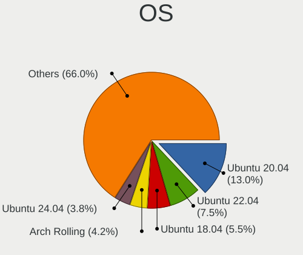

| Name                         | Computers | Percent |
|------------------------------|-----------|---------|
| Ubuntu 20.04                 | 995       | 12.98%  |
| Ubuntu 22.04                 | 577       | 7.53%   |
| Ubuntu 18.04                 | 420       | 5.48%   |
| Arch Rolling                 | 321       | 4.19%   |
| Ubuntu 24.04                 | 295       | 3.85%   |
| Pop!_OS 22.04                | 173       | 2.26%   |
| Fedora 40                    | 133       | 1.74%   |
| ArcoLinux Rolling            | 127       | 1.66%   |
| Debian 12                    | 105       | 1.37%   |
| Zorin 17                     | 104       | 1.36%   |
| Zorin 16                     | 104       | 1.36%   |
| Arch                         | 104       | 1.36%   |
| Fedora 41                    | 96        | 1.25%   |
| Fedora 38                    | 95        | 1.24%   |
| Fedora 42                    | 94        | 1.23%   |
| Fedora 39                    | 92        | 1.2%    |
| KDE neon 20.04               | 84        | 1.1%    |
| OpenMandriva 4.3             | 81        | 1.06%   |
| Fedora 36                    | 70        | 0.91%   |
| EndeavourOS Rolling          | 69        | 0.9%    |
| Pop!_OS 20.04                | 67        | 0.87%   |
| Manjaro                      | 64        | 0.84%   |
| Fedora 37                    | 63        | 0.82%   |
| Pop!_OS 21.04                | 60        | 0.78%   |
| Fedora 34                    | 59        | 0.77%   |
| Ubuntu 20.10                 | 58        | 0.76%   |
| Zorin 15                     | 57        | 0.74%   |
| OpenMandriva 4.2             | 57        | 0.74%   |
| KDE neon 22.04               | 56        | 0.73%   |
| Ubuntu 21.04                 | 55        | 0.72%   |
| OpenMandriva 24.12           | 55        | 0.72%   |
| Debian 11                    | 55        | 0.72%   |
| Ubuntu 19.10                 | 51        | 0.67%   |
| Linux Mint 22.1              | 48        | 0.63%   |
| openSUSE Tumbleweed-XXXXXXXX | 47        | 0.61%   |
| Ubuntu 23.04                 | 45        | 0.59%   |
| Ubuntu 21.10                 | 45        | 0.59%   |
| Ubuntu 19.04                 | 45        | 0.59%   |
| Linux Mint 21.1              | 45        | 0.59%   |
| Pop!_OS 20.10                | 44        | 0.57%   |

OS Family
---------

OS without a version

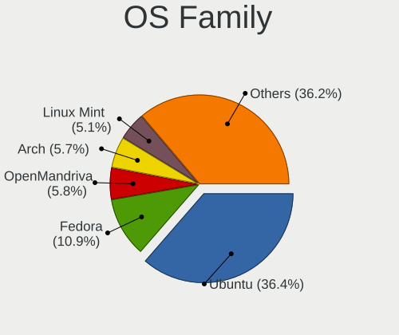

| Name          | Computers | Percent |
|---------------|-----------|---------|
| Ubuntu        | 2663      | 36.38%  |
| Fedora        | 796       | 10.88%  |
| OpenMandriva  | 421       | 5.75%   |
| Arch          | 416       | 5.68%   |
| Linux Mint    | 374       | 5.11%   |
| Pop!_OS       | 361       | 4.93%   |
| Zorin         | 277       | 3.78%   |
| Debian        | 231       | 3.16%   |
| KDE neon      | 169       | 2.31%   |
| Manjaro       | 159       | 2.17%   |
| Kali          | 135       | 1.84%   |
| ArcoLinux     | 133       | 1.82%   |
| Kubuntu       | 125       | 1.71%   |
| Elementary    | 81        | 1.11%   |
| EndeavourOS   | 73        | 1%      |
| Ubuntu Unity  | 61        | 0.83%   |
| openSUSE      | 59        | 0.81%   |
| Endless       | 54        | 0.74%   |
| Xubuntu       | 48        | 0.66%   |
| Garuda Linux  | 48        | 0.66%   |
| Finnix        | 46        | 0.63%   |
| MX            | 36        | 0.49%   |
| RHEL          | 34        | 0.46%   |
| CentOS        | 30        | 0.41%   |
| Nobara        | 29        | 0.4%    |
| Xero          | 28        | 0.38%   |
| Clear Linux   | 27        | 0.37%   |
| CachyOS       | 25        | 0.34%   |
| ROSA          | 24        | 0.33%   |
| Parrot        | 23        | 0.31%   |
| Gentoo        | 22        | 0.3%    |
| Ubuntu MATE   | 21        | 0.29%   |
| Lubuntu       | 21        | 0.29%   |
| Ubuntu Budgie | 19        | 0.26%   |
| Bazzite       | 18        | 0.25%   |
| NixOS         | 17        | 0.23%   |
| Void Linux    | 15        | 0.2%    |
| LMDE          | 12        | 0.16%   |
| SteamOS       | 11        | 0.15%   |
| Artix         | 11        | 0.15%   |

Kernel
------

Version of the Linux kernel

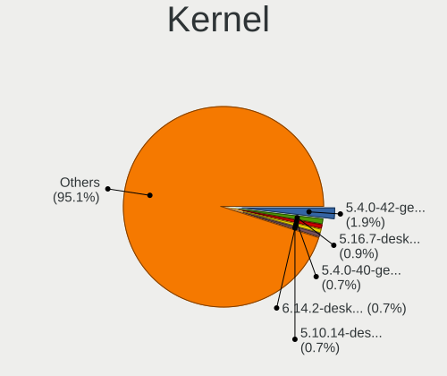

| Version                  | Computers | Percent |
|--------------------------|-----------|---------|
| 5.4.0-42-generic         | 154       | 1.87%   |
| 5.16.7-desktop-1omv4003  | 76        | 0.92%   |
| 5.4.0-40-generic         | 61        | 0.74%   |
| 6.14.2-desktop-3omv2590  | 57        | 0.69%   |
| 5.10.14-desktop-1omv4002 | 57        | 0.69%   |
| 5.15.0-56-generic        | 56        | 0.68%   |
| 6.8.0-40-generic         | 47        | 0.57%   |
| 5.4.0-48-generic         | 47        | 0.57%   |
| 5.4.0-58-generic         | 43        | 0.52%   |
| 5.11.0-27-generic        | 41        | 0.5%    |
| 6.8.0-51-generic         | 40        | 0.49%   |
| 5.4.0-52-generic         | 40        | 0.49%   |
| 5.4.0-26-generic         | 40        | 0.49%   |
| 6.8.0-52-generic         | 39        | 0.47%   |
| 6.8.0-41-generic         | 39        | 0.47%   |
| 6.12.1-desktop-1omv2490  | 39        | 0.47%   |
| 5.4.0-47-generic         | 39        | 0.47%   |
| 6.8.0-31-generic         | 38        | 0.46%   |
| 6.2.0-26-generic         | 37        | 0.45%   |
| 5.11.0-25-generic        | 34        | 0.41%   |
| 5.4.0-29-generic         | 33        | 0.4%    |
| 5.11.0-7620-generic      | 33        | 0.4%    |
| 6.2.6-desktop-1omv2390   | 32        | 0.39%   |
| 5.15.0-52-generic        | 32        | 0.39%   |
| 5.15.0-46-generic        | 32        | 0.39%   |
| 6.5.0-14-generic         | 31        | 0.38%   |
| 5.15.0-58-generic        | 30        | 0.36%   |
| 6.8.0-45-generic         | 29        | 0.35%   |
| 5.8.0-48-generic         | 29        | 0.35%   |
| 5.3.0-28-generic         | 29        | 0.35%   |
| 5.11.0-40-generic        | 29        | 0.35%   |
| 6.5.0-41-generic         | 28        | 0.34%   |
| 5.8.0-53-generic         | 28        | 0.34%   |
| 5.15.0-91-generic        | 28        | 0.34%   |
| 6.9.3-76060903-generic   | 27        | 0.33%   |
| 6.8.5-301.fc40.x86_64    | 27        | 0.33%   |
| 6.4.11-desktop-1omv2390  | 27        | 0.33%   |
| 5.8.0-55-generic         | 27        | 0.33%   |
| 5.8.0-43-generic         | 27        | 0.33%   |
| 5.4.0-37-generic         | 27        | 0.33%   |

Kernel Family
-------------

Linux kernel without a distro release

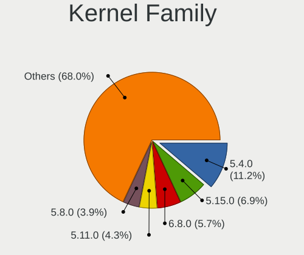

| Version | Computers | Percent |
|---------|-----------|---------|
| 5.4.0   | 888       | 11.23%  |
| 5.15.0  | 543       | 6.87%   |
| 6.8.0   | 448       | 5.67%   |
| 5.11.0  | 337       | 4.26%   |
| 5.8.0   | 310       | 3.92%   |
| 4.15.0  | 238       | 3.01%   |
| 6.5.0   | 237       | 3%      |
| 5.13.0  | 208       | 2.63%   |
| 5.19.0  | 193       | 2.44%   |
| 5.3.0   | 192       | 2.43%   |
| 6.2.0   | 177       | 2.24%   |
| 6.1.0   | 152       | 1.92%   |
| 6.14.0  | 139       | 1.76%   |
| 5.0.0   | 130       | 1.64%   |
| 6.11.0  | 116       | 1.47%   |
| 4.18.0  | 110       | 1.39%   |
| 5.10.0  | 88        | 1.11%   |
| 5.16.7  | 78        | 0.99%   |
| 6.14.2  | 76        | 0.96%   |
| 5.10.14 | 57        | 0.72%   |
| 6.2.6   | 54        | 0.68%   |
| 6.12.1  | 45        | 0.57%   |
| 5.14.0  | 40        | 0.51%   |
| 6.9.3   | 37        | 0.47%   |
| 6.12.10 | 32        | 0.4%    |
| 6.4.11  | 31        | 0.39%   |
| 4.19.0  | 30        | 0.38%   |
| 6.8.5   | 29        | 0.37%   |
| 6.6.2   | 29        | 0.37%   |
| 4.4.0   | 25        | 0.32%   |
| 6.17.7  | 23        | 0.29%   |
| 6.12.6  | 23        | 0.29%   |
| 6.1.1   | 22        | 0.28%   |
| 5.17.5  | 22        | 0.28%   |
| 6.11.4  | 21        | 0.27%   |
| 6.10.6  | 20        | 0.25%   |
| 6.8.7   | 19        | 0.24%   |
| 6.5.6   | 19        | 0.24%   |
| 6.2.9   | 19        | 0.24%   |
| 6.0.12  | 19        | 0.24%   |

Kernel Major Ver.
-----------------

Linux kernel major version

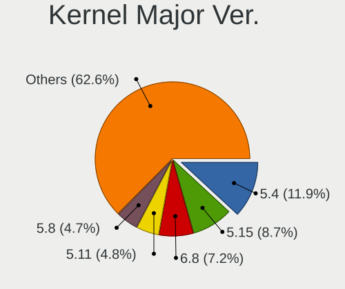

| Version | Computers | Percent |
|---------|-----------|---------|
| 5.4     | 930       | 11.91%  |
| 5.15    | 680       | 8.71%   |
| 6.8     | 564       | 7.22%   |
| 5.11    | 377       | 4.83%   |
| 5.8     | 370       | 4.74%   |
| 6.5     | 325       | 4.16%   |
| 6.2     | 308       | 3.94%   |
| 6.14    | 270       | 3.46%   |
| 5.13    | 264       | 3.38%   |
| 6.1     | 261       | 3.34%   |
| 5.19    | 250       | 3.2%    |
| 4.15    | 241       | 3.09%   |
| 6.12    | 233       | 2.98%   |
| 5.3     | 218       | 2.79%   |
| 5.10    | 218       | 2.79%   |
| 6.11    | 214       | 2.74%   |
| 6.6     | 166       | 2.13%   |
| 5.16    | 144       | 1.84%   |
| 5.0     | 135       | 1.73%   |
| 6.10    | 122       | 1.56%   |
| 6.9     | 117       | 1.5%    |
| 4.18    | 117       | 1.5%    |
| 6.0     | 113       | 1.45%   |
| 6.4     | 110       | 1.41%   |
| 6.17    | 105       | 1.34%   |
| 5.14    | 99        | 1.27%   |
| 6.7     | 88        | 1.13%   |
| 5.17    | 83        | 1.06%   |
| 6.13    | 72        | 0.92%   |
| 5.18    | 71        | 0.91%   |
| 6.15    | 66        | 0.85%   |
| 6.3     | 63        | 0.81%   |
| 5.12    | 56        | 0.72%   |
| 5.9     | 51        | 0.65%   |
| 5.7     | 49        | 0.63%   |
| 6.16    | 48        | 0.61%   |
| 5.6     | 42        | 0.54%   |
| 4.19    | 42        | 0.54%   |
| 4.4     | 28        | 0.36%   |
| 5.5     | 26        | 0.33%   |

Arch
----

OS architecture (x86_64, i586, etc.)

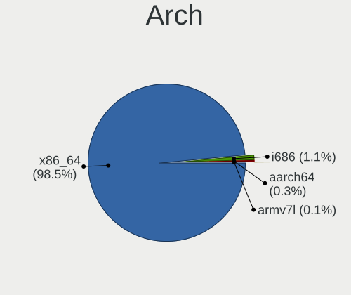

| Name    | Computers | Percent |
|---------|-----------|---------|
| x86_64  | 6891      | 98.47%  |
| i686    | 76        | 1.09%   |
| aarch64 | 23        | 0.33%   |
| armv7l  | 8         | 0.11%   |

DE
--

Desktop Environment

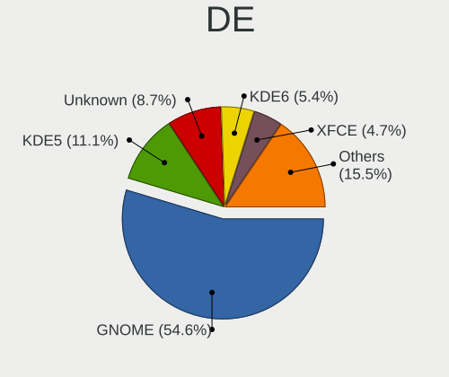

| Name                 | Computers | Percent |
|----------------------|-----------|---------|
| GNOME                | 4002      | 54.63%  |
| KDE5                 | 813       | 11.1%   |
| Unknown              | 638       | 8.71%   |
| KDE6                 | 392       | 5.35%   |
| XFCE                 | 343       | 4.68%   |
| X-Cinnamon           | 334       | 4.56%   |
| KDE                  | 132       | 1.8%    |
| Pantheon             | 79        | 1.08%   |
| MATE                 | 74        | 1.01%   |
| Unity                | 63        | 0.86%   |
| Hyprland             | 56        | 0.76%   |
| i3                   | 46        | 0.63%   |
| LXQt                 | 43        | 0.59%   |
| Cinnamon             | 40        | 0.55%   |
| Budgie               | 31        | 0.42%   |
| LXDE                 | 27        | 0.37%   |
| KDE4                 | 26        | 0.35%   |
| GNOME Flashback      | 26        | 0.35%   |
| GNOME Classic        | 20        | 0.27%   |
| bspwm                | 16        | 0.22%   |
| sway                 | 15        | 0.2%    |
| Deepin               | 15        | 0.2%    |
| awesome              | 13        | 0.18%   |
| dwm                  | 11        | 0.15%   |
| COSMIC               | 11        | 0.15%   |
| qtile                | 10        | 0.14%   |
| openbox              | 8         | 0.11%   |
| niri                 | 6         | 0.08%   |
| xmonad               | 5         | 0.07%   |
| LeftWM               | 5         | 0.07%   |
| icewm                | 3         | 0.04%   |
| herbstluftwm         | 3         | 0.04%   |
| lightdm-xsession     | 2         | 0.03%   |
| Enlightenment        | 2         | 0.03%   |
| Endless:GNOME        | 2         | 0.03%   |
| DesQ:Wayfire:wlroots | 2         | 0.03%   |
| Yaru:ubuntu:GNOME    | 1         | 0.01%   |
| Xsession             | 1         | 0.01%   |
| xinitrc              | 1         | 0.01%   |
| sway:wlroots         | 1         | 0.01%   |

Display Server
--------------

X11 or Wayland

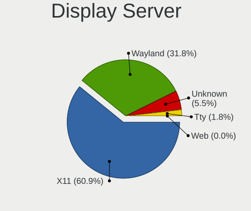

| Name    | Computers | Percent |
|---------|-----------|---------|
| X11     | 4418      | 60.85%  |
| Wayland | 2311      | 31.83%  |
| Unknown | 396       | 5.45%   |
| Tty     | 134       | 1.85%   |
| Web     | 1         | 0.01%   |

Display Manager
---------------

SDDM, LightDM, etc.

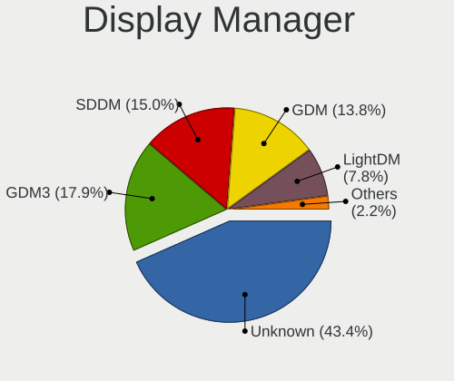

| Name                  | Computers | Percent |
|-----------------------|-----------|---------|
| Unknown               | 3164      | 43.38%  |
| GDM3                  | 1302      | 17.85%  |
| SDDM                  | 1092      | 14.97%  |
| GDM                   | 1007      | 13.81%  |
| LightDM               | 570       | 7.81%   |
| TDM                   | 105       | 1.44%   |
| KDM                   | 10        | 0.14%   |
| XDM                   | 9         | 0.12%   |
| GREETD                | 8         | 0.11%   |
| LY-DM                 | 7         | 0.1%    |
| Ly                    | 5         | 0.07%   |
| SLiM                  | 4         | 0.05%   |
| LXDM                  | 4         | 0.05%   |
| COSMIC-GREETER        | 3         | 0.04%   |
| SLIMSKI               | 2         | 0.03%   |
| DISPLAY-MANAGER-START | 2         | 0.03%   |

OS Lang
-------

Language

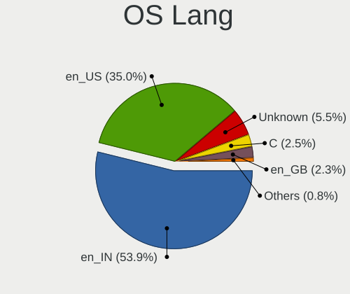

| Lang             | Computers | Percent |
|------------------|-----------|---------|
| en_IN            | 3918      | 53.86%  |
| en_US            | 2543      | 34.96%  |
| Unknown          | 403       | 5.54%   |
| C                | 184       | 2.53%   |
| en_GB            | 167       | 2.3%    |
| en_AG            | 10        | 0.14%   |
| en_CA            | 6         | 0.08%   |
| C.UTF8           | 6         | 0.08%   |
| POSIX            | 3         | 0.04%   |
| nl_NL            | 3         | 0.04%   |
| mr_IN            | 3         | 0.04%   |
| zh_TW            | 2         | 0.03%   |
| pl_PL            | 2         | 0.03%   |
| mni_IN           | 2         | 0.03%   |
| en_SG            | 2         | 0.03%   |
| en_IE            | 2         | 0.03%   |
| en_AU            | 2         | 0.03%   |
| uk_UA            | 1         | 0.01%   |
| ta_LK            | 1         | 0.01%   |
| sa_IN            | 1         | 0.01%   |
| ks_IN            | 1         | 0.01%   |
| hi_IN            | 1         | 0.01%   |
| fr_FR            | 1         | 0.01%   |
| es_ES            | 1         | 0.01%   |
| en_US.UTF-*      | 1         | 0.01%   |
| en_US.ISO-8859-1 | 1         | 0.01%   |
| en_NG            | 1         | 0.01%   |
| en_HK            | 1         | 0.01%   |
| en_DK            | 1         | 0.01%   |
| en_BW            | 1         | 0.01%   |
| de_DE            | 1         | 0.01%   |
| Default          | 1         | 0.01%   |
| bn_IN            | 1         | 0.01%   |
| aa_DJ            | 1         | 0.01%   |

Boot Mode
---------

EFI or BIOS

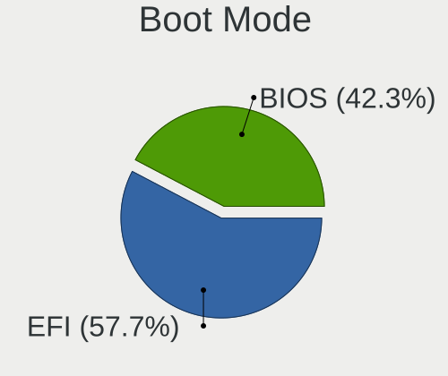

| Mode | Computers | Percent |
|------|-----------|---------|
| EFI  | 4126      | 57.7%   |
| BIOS | 3025      | 42.3%   |

Filesystem
----------

Type of filesystem

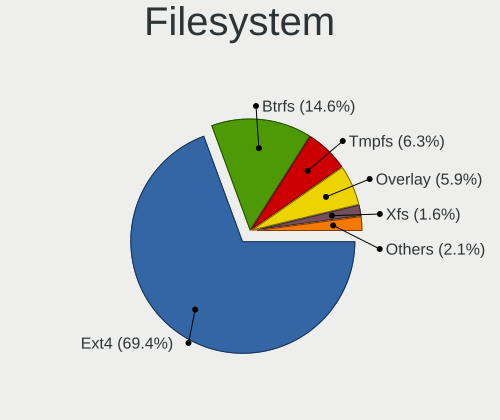

| Type    | Computers | Percent |
|---------|-----------|---------|
| Ext4    | 5022      | 69.39%  |
| Btrfs   | 1057      | 14.61%  |
| Tmpfs   | 458       | 6.33%   |
| Overlay | 428       | 5.91%   |
| Xfs     | 118       | 1.63%   |
| Unknown | 82        | 1.13%   |
| Zfs     | 27        | 0.37%   |
| F2fs    | 18        | 0.25%   |
| Ext2    | 14        | 0.19%   |
| Ext3    | 9         | 0.12%   |
| XXXXX   | 2         | 0.03%   |
| Jfs     | 1         | 0.01%   |
| Aufs    | 1         | 0.01%   |

Part. scheme
------------

Scheme of partitioning

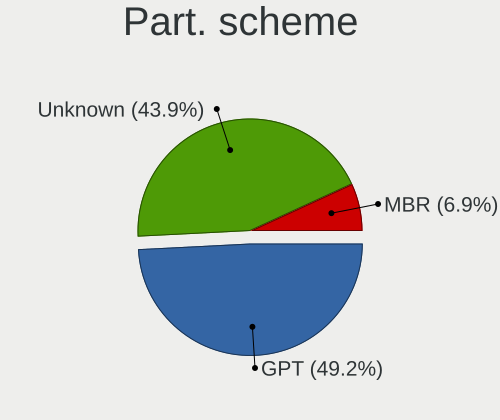

| Type    | Computers | Percent |
|---------|-----------|---------|
| GPT     | 3528      | 49.2%   |
| Unknown | 3151      | 43.94%  |
| MBR     | 492       | 6.86%   |

Dual Boot with Linux/BSD
------------------------

Hosting more than one Linux/BSD

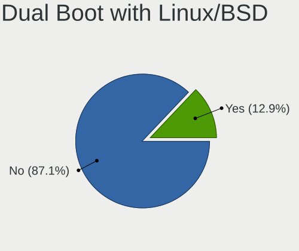

| Dual boot | Computers | Percent |
|-----------|-----------|---------|
| No        | 6199      | 87.06%  |
| Yes       | 921       | 12.94%  |

Dual Boot (Win)
---------------

Hosting Linux and Windows

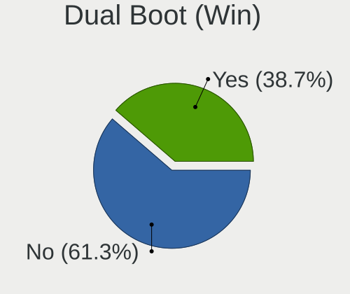

| Dual boot | Computers | Percent |
|-----------|-----------|---------|
| No        | 4367      | 61.33%  |
| Yes       | 2754      | 38.67%  |

Board
-----

Vendor
------

Motherboard manufacturer

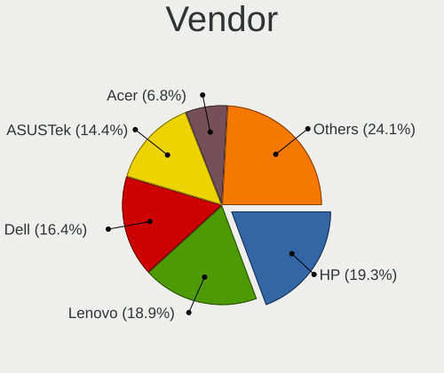

| Name                    | Computers | Percent |
|-------------------------|-----------|---------|
| Hewlett-Packard         | 1352      | 19.33%  |
| Lenovo                  | 1322      | 18.9%   |
| Dell                    | 1147      | 16.4%   |
| ASUSTek Computer        | 1007      | 14.4%   |
| Acer                    | 478       | 6.84%   |
| Gigabyte Technology     | 402       | 5.75%   |
| MSI                     | 267       | 3.82%   |
| Intel                   | 206       | 2.95%   |
| Unknown                 | 98        | 1.4%    |
| ASRock                  | 64        | 0.92%   |
| Apple                   | 60        | 0.86%   |
| Sony                    | 59        | 0.84%   |
| Timi                    | 58        | 0.83%   |
| Infinix                 | 42        | 0.6%    |
| Toshiba                 | 41        | 0.59%   |
| Samsung Electronics     | 37        | 0.53%   |
| AVITA                   | 27        | 0.39%   |
| Raspberry Pi Foundation | 19        | 0.27%   |
| OEM                     | 19        | 0.27%   |
| HONOR                   | 16        | 0.23%   |
| Fujitsu                 | 16        | 0.23%   |
| Google                  | 15        | 0.21%   |
| Biostar                 | 15        | 0.21%   |
| ECS                     | 13        | 0.19%   |
| HUAWEI                  | 10        | 0.14%   |
| HCL Infosystems Limited | 10        | 0.14%   |
| Foxconn                 | 10        | 0.14%   |
| AMI                     | 9         | 0.13%   |
| realme                  | 8         | 0.11%   |
| Alienware               | 7         | 0.1%    |
| ZEBRONICS               | 6         | 0.09%   |
| Valve                   | 6         | 0.09%   |
| Pegatron                | 6         | 0.09%   |
| LG Electronics          | 6         | 0.09%   |
| Gateway                 | 6         | 0.09%   |
| Chuwi                   | 6         | 0.09%   |
| TECNO Mobile Limited    | 5         | 0.07%   |
| Red Hat                 | 5         | 0.07%   |
| ITI LIMITED             | 5         | 0.07%   |
| Supermicro              | 4         | 0.06%   |

Model
-----

Motherboard model

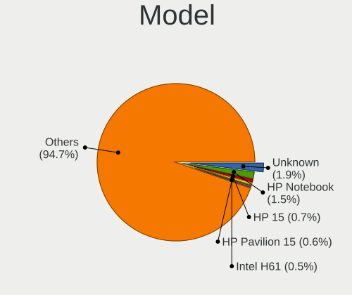

| Name                                   | Computers | Percent |
|----------------------------------------|-----------|---------|
| Unknown                                | 134       | 1.92%   |
| HP Notebook                            | 108       | 1.54%   |
| HP 15                                  | 48        | 0.69%   |
| HP Pavilion 15                         | 41        | 0.59%   |
| Intel H61                              | 38        | 0.54%   |
| Dell Inspiron 3542                     | 37        | 0.53%   |
| Lenovo E41-25 81FS                     | 29        | 0.41%   |
| HP Pavilion g6                         | 29        | 0.41%   |
| HP Laptop 15-bs0xx                     | 28        | 0.4%    |
| HP Pavilion Notebook                   | 26        | 0.37%   |
| Gigabyte H81M-S                        | 24        | 0.34%   |
| Gigabyte H410M H V3                    | 24        | 0.34%   |
| Dell Inspiron 15-3567                  | 24        | 0.34%   |
| Timi Mi NoteBook Ultra                 | 23        | 0.33%   |
| Dell Inspiron 5570                     | 23        | 0.33%   |
| HP Pavilion Gaming Laptop 15-ec2xxx    | 22        | 0.31%   |
| Dell Vostro 15-3568                    | 21        | 0.3%    |
| Dell Inspiron 3521                     | 21        | 0.3%    |
| Acer Aspire A715-75G                   | 21        | 0.3%    |
| Gigabyte H61MS                         | 20        | 0.29%   |
| Lenovo IdeaPad 330-15IKB 81DE          | 19        | 0.27%   |
| Lenovo G50-80 80E5                     | 19        | 0.27%   |
| ASUS TUF Gaming FX505DT_FX505DT        | 19        | 0.27%   |
| ASUS All Series                        | 18        | 0.26%   |
| Lenovo IdeaPad 320-15ISK 80XH          | 17        | 0.24%   |
| HP Pavilion Gaming Laptop 15-ec0xxx    | 17        | 0.24%   |
| HP Laptop 15-da0xxx                    | 17        | 0.24%   |
| Acer Aspire A715-51G                   | 17        | 0.24%   |
| HP Victus by Gaming Laptop 15-fb0xxx   | 16        | 0.23%   |
| HP Pavilion x360 Convertible 14-dh1xxx | 16        | 0.23%   |
| Gigabyte B450M DS3H                    | 16        | 0.23%   |
| Dell Vostro 3480                       | 16        | 0.23%   |
| Dell Inspiron 5559                     | 16        | 0.23%   |
| Acer Aspire A515-57G                   | 16        | 0.23%   |
| Intel H81                              | 15        | 0.21%   |
| HP Victus by Laptop 16-e0xxx           | 15        | 0.21%   |
| Gigabyte H310M S2 2.0                  | 15        | 0.21%   |
| Gigabyte H110M-S2                      | 15        | 0.21%   |
| Lenovo IdeaPad Gaming 3 15IHU6 82K1    | 14        | 0.2%    |
| Lenovo IdeaPad 320-15IKB 80XL          | 14        | 0.2%    |

Model Family
------------

Motherboard model prefix

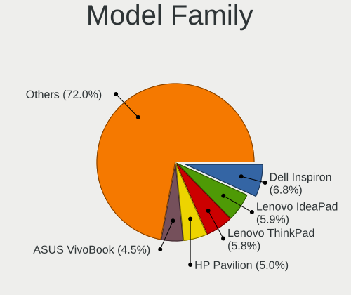

| Name               | Computers | Percent |
|--------------------|-----------|---------|
| Dell Inspiron      | 474       | 6.78%   |
| Lenovo IdeaPad     | 412       | 5.89%   |
| Lenovo ThinkPad    | 403       | 5.76%   |
| HP Pavilion        | 348       | 4.98%   |
| ASUS VivoBook      | 318       | 4.55%   |
| HP Laptop          | 263       | 3.76%   |
| Acer Aspire        | 252       | 3.6%    |
| Dell Latitude      | 240       | 3.43%   |
| Dell Vostro        | 195       | 2.79%   |
| Unknown            | 134       | 1.92%   |
| ASUS ROG           | 126       | 1.8%    |
| ASUS ASUS          | 122       | 1.74%   |
| HP Notebook        | 109       | 1.56%   |
| HP EliteBook       | 90        | 1.29%   |
| ASUS PRIME         | 89        | 1.27%   |
| HP ProBook         | 85        | 1.22%   |
| ASUS TUF           | 77        | 1.1%    |
| Dell OptiPlex      | 74        | 1.06%   |
| Acer Nitro         | 68        | 0.97%   |
| Lenovo Legion      | 58        | 0.83%   |
| HP ENVY            | 56        | 0.8%    |
| Lenovo ThinkBook   | 55        | 0.79%   |
| HP 15              | 50        | 0.72%   |
| Acer Swift         | 49        | 0.7%    |
| HP Victus          | 48        | 0.69%   |
| Dell Precision     | 48        | 0.69%   |
| Dell XPS           | 46        | 0.66%   |
| Timi Mi            | 45        | 0.64%   |
| Intel H61          | 42        | 0.6%    |
| Lenovo ThinkCentre | 41        | 0.59%   |
| Toshiba Satellite  | 36        | 0.51%   |
| HP OMEN            | 34        | 0.49%   |
| HP Compaq          | 34        | 0.49%   |
| Gigabyte H410M     | 33        | 0.47%   |
| Lenovo Yoga        | 32        | 0.46%   |
| Lenovo IdeaPadFlex | 32        | 0.46%   |
| Acer Predator      | 31        | 0.44%   |
| Lenovo E41-25      | 29        | 0.41%   |
| ASUS Zenbook       | 28        | 0.4%    |
| Gigabyte B450M     | 27        | 0.39%   |

MFG Year
--------

Motherboard manufacture year

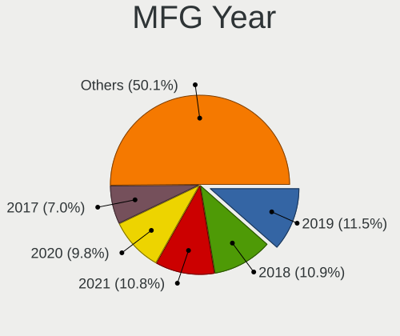

| Year    | Computers | Percent |
|---------|-----------|---------|
| 2019    | 803       | 11.48%  |
| 2018    | 762       | 10.9%   |
| 2021    | 752       | 10.75%  |
| 2020    | 683       | 9.77%   |
| 2017    | 487       | 6.96%   |
| 2022    | 480       | 6.86%   |
| 2023    | 367       | 5.25%   |
| 2016    | 367       | 5.25%   |
| 2013    | 362       | 5.18%   |
| 2014    | 352       | 5.03%   |
| 2012    | 346       | 4.95%   |
| 2011    | 282       | 4.03%   |
| 2015    | 250       | 3.58%   |
| 2010    | 200       | 2.86%   |
| 2024    | 138       | 1.97%   |
| 2009    | 128       | 1.83%   |
| 2008    | 110       | 1.57%   |
| 2025    | 39        | 0.56%   |
| 2007    | 31        | 0.44%   |
| Unknown | 27        | 0.39%   |
| 2006    | 21        | 0.3%    |
| 2005    | 4         | 0.06%   |
| 2004    | 1         | 0.01%   |
| 2003    | 1         | 0.01%   |

Form Factor
-----------

Physical design of the computer

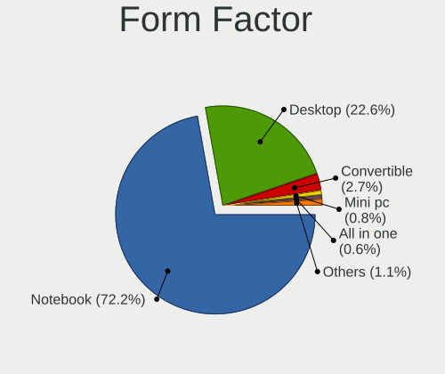

| Name           | Computers | Percent |
|----------------|-----------|---------|
| Notebook       | 5048      | 72.19%  |
| Desktop        | 1579      | 22.58%  |
| Convertible    | 191       | 2.73%   |
| Mini pc        | 54        | 0.77%   |
| All in one     | 44        | 0.63%   |
| System on chip | 29        | 0.41%   |
| Server         | 24        | 0.34%   |
| Tablet         | 23        | 0.33%   |
| Phone          | 1         | 0.01%   |

Secure Boot
-----------

Enabled or disabled

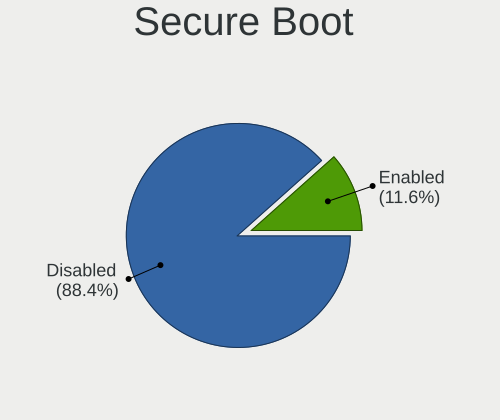

| State    | Computers | Percent |
|----------|-----------|---------|
| Disabled | 6246      | 88.41%  |
| Enabled  | 819       | 11.59%  |

Coreboot
--------

Have coreboot on board

| Used | Computers | Percent |
|------|-----------|---------|
| No   | 6967      | 99.63%  |
| Yes  | 26        | 0.37%   |

RAM Size
--------

Total RAM memory

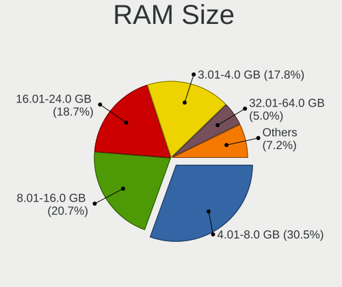

| Size in GB      | Computers | Percent |
|-----------------|-----------|---------|
| 4.01-8.0        | 2172      | 30.52%  |
| 8.01-16.0       | 1476      | 20.74%  |
| 16.01-24.0      | 1330      | 18.69%  |
| 3.01-4.0        | 1266      | 17.79%  |
| 32.01-64.0      | 358       | 5.03%   |
| 1.01-2.0        | 186       | 2.61%   |
| 24.01-32.0      | 136       | 1.91%   |
| 64.01-256.0     | 112       | 1.57%   |
| 2.01-3.0        | 51        | 0.72%   |
| 0.51-1.0        | 20        | 0.28%   |
| More than 256.0 | 7         | 0.1%    |
| 0.01-0.5        | 2         | 0.03%   |

RAM Used
--------

Used RAM memory

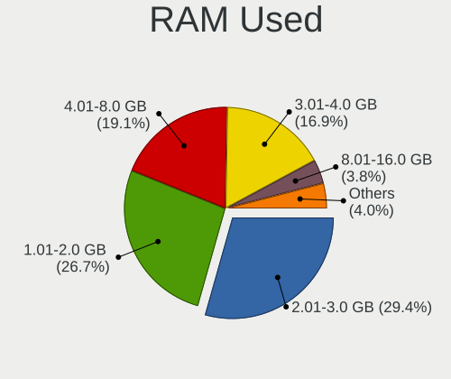

| Used GB     | Computers | Percent |
|-------------|-----------|---------|
| 2.01-3.0    | 2267      | 29.38%  |
| 1.01-2.0    | 2064      | 26.75%  |
| 4.01-8.0    | 1477      | 19.14%  |
| 3.01-4.0    | 1302      | 16.87%  |
| 8.01-16.0   | 296       | 3.84%   |
| 0.51-1.0    | 234       | 3.03%   |
| 0.01-0.5    | 42        | 0.54%   |
| 16.01-24.0  | 25        | 0.32%   |
| 32.01-64.0  | 3         | 0.04%   |
| 24.01-32.0  | 3         | 0.04%   |
| 64.01-256.0 | 3         | 0.04%   |
| Unknown     | 1         | 0.01%   |

Total Drives
------------

Number of drives on board

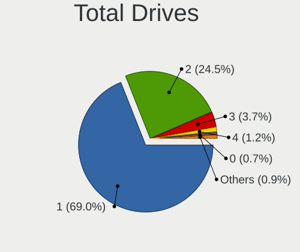

| Drives | Computers | Percent |
|--------|-----------|---------|
| 1      | 4906      | 69.01%  |
| 2      | 1741      | 24.49%  |
| 3      | 261       | 3.67%   |
| 4      | 87        | 1.22%   |
| 0      | 48        | 0.68%   |
| 5      | 41        | 0.58%   |
| 6      | 13        | 0.18%   |
| 7      | 6         | 0.08%   |
| 8      | 2         | 0.03%   |
| 21     | 1         | 0.01%   |
| 19     | 1         | 0.01%   |
| 10     | 1         | 0.01%   |
| 9      | 1         | 0.01%   |

Has CD-ROM
----------

Has CD-ROM on board

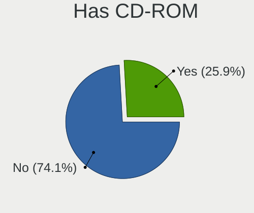

| Presented | Computers | Percent |
|-----------|-----------|---------|
| No        | 5212      | 74.11%  |
| Yes       | 1821      | 25.89%  |

Has Ethernet
------------

Has Ethernet on board

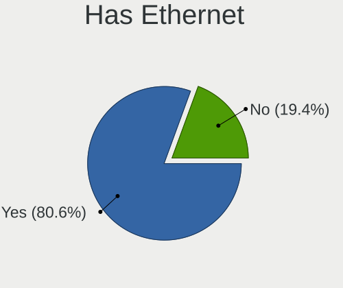

| Presented | Computers | Percent |
|-----------|-----------|---------|
| Yes       | 5651      | 80.58%  |
| No        | 1362      | 19.42%  |

Has WiFi
--------

Has WiFi module

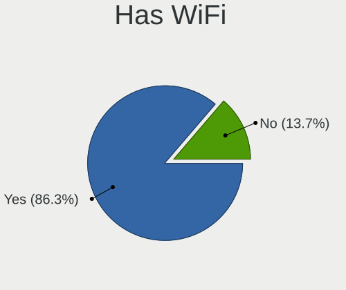

| Presented | Computers | Percent |
|-----------|-----------|---------|
| Yes       | 6060      | 86.26%  |
| No        | 965       | 13.74%  |

Has Bluetooth
-------------

Has Bluetooth module

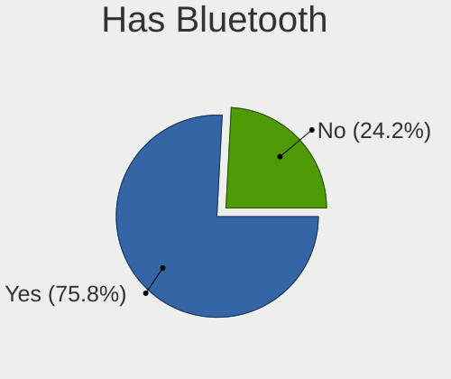

| Presented | Computers | Percent |
|-----------|-----------|---------|
| Yes       | 5355      | 75.84%  |
| No        | 1706      | 24.16%  |

Location
--------

Country
-------

Geographic location (country)

| Country | Computers | Percent |
|---------|-----------|---------|
| India   | 6993      | 100%    |

City
----

Geographic location (city)

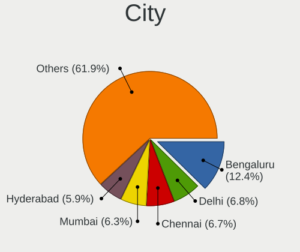

| City          | Computers | Percent |
|---------------|-----------|---------|
| Bengaluru     | 923       | 12.37%  |
| Delhi         | 504       | 6.75%   |
| Chennai       | 503       | 6.74%   |
| Mumbai        | 470       | 6.3%    |
| Hyderabad     | 443       | 5.94%   |
| Pune          | 365       | 4.89%   |
| Kolkata       | 305       | 4.09%   |
| New Delhi     | 230       | 3.08%   |
| Ahmedabad     | 171       | 2.29%   |
| Lucknow       | 143       | 1.92%   |
| Patna         | 135       | 1.81%   |
| Kochi         | 134       | 1.8%    |
| Jaipur        | 124       | 1.66%   |
| Bhubaneswar   | 118       | 1.58%   |
| Indore        | 94        | 1.26%   |
| Coimbatore    | 92        | 1.23%   |
| Gurgaon       | 84        | 1.13%   |
| Bhopal        | 84        | 1.13%   |
| Ernakulam     | 79        | 1.06%   |
| Trivandrum    | 72        | 0.96%   |
| Thrissur      | 68        | 0.91%   |
| Surat         | 67        | 0.9%    |
| Navi Mumbai   | 59        | 0.79%   |
| Guwahati      | 58        | 0.78%   |
| Nagpur        | 52        | 0.7%    |
| Ludhiana      | 52        | 0.7%    |
| Chandigarh    | 47        | 0.63%   |
| Malappuram    | 43        | 0.58%   |
| Noida         | 40        | 0.54%   |
| Ghaziabad     | 38        | 0.51%   |
| Kanpur        | 37        | 0.5%    |
| Kozhikode     | 35        | 0.47%   |
| Dehradun      | 34        | 0.46%   |
| Vadodara      | 33        | 0.44%   |
| Thane         | 29        | 0.39%   |
| Mohali        | 29        | 0.39%   |
| Visakhapatnam | 28        | 0.38%   |
| Vijayawada    | 27        | 0.36%   |
| Mangalore     | 26        | 0.35%   |
| Raipur        | 25        | 0.33%   |

Drives
------

Drive Vendor
------------

Hard drive vendors

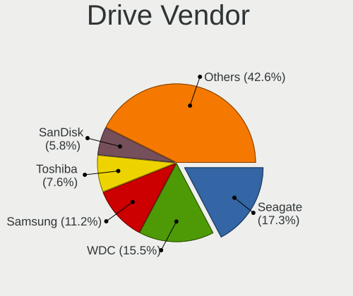

| Vendor                       | Computers | Drives | Percent |
|------------------------------|-----------|--------|---------|
| Seagate                      | 1584      | 2124   | 17.29%  |
| WDC                          | 1418      | 1886   | 15.48%  |
| Samsung Electronics          | 1025      | 1323   | 11.19%  |
| Toshiba                      | 697       | 808    | 7.61%   |
| SanDisk                      | 532       | 681    | 5.81%   |
| Micron Technology            | 410       | 495    | 4.48%   |
| Crucial                      | 393       | 521    | 4.29%   |
| SK hynix                     | 337       | 404    | 3.68%   |
| Kingston                     | 322       | 393    | 3.52%   |
| Intel                        | 311       | 413    | 3.4%    |
| HGST                         | 234       | 279    | 2.55%   |
| Unknown                      | 189       | 225    | 2.06%   |
| KIOXIA                       | 152       | 182    | 1.66%   |
| Hitachi                      | 136       | 162    | 1.48%   |
| China                        | 98        | 117    | 1.07%   |
| Micron/Crucial Technology    | 93        | 105    | 1.02%   |
| A-DATA Technology            | 92        | 102    | 1%      |
| Silicon Motion               | 62        | 69     | 0.68%   |
| Unknown                      | 60        | 72     | 0.66%   |
| Kingston Technology Company  | 49        | 53     | 0.53%   |
| EVM                          | 45        | 58     | 0.49%   |
| FORESEE                      | 40        | 48     | 0.44%   |
| Gigabyte Technology          | 39        | 45     | 0.43%   |
| Shenzhen Longsys Electronics | 38        | 48     | 0.41%   |
| CONSISTENT                   | 35        | 38     | 0.38%   |
| Apple                        | 35        | 49     | 0.38%   |
| Hewlett-Packard              | 34        | 40     | 0.37%   |
| Phison Electronics           | 32        | 38     | 0.35%   |
| Phison                       | 29        | 38     | 0.32%   |
| ADATA Technology             | 26        | 41     | 0.28%   |
| SPCC                         | 25        | 33     | 0.27%   |
| UMIS                         | 24        | 29     | 0.26%   |
| Realtek Semiconductor        | 24        | 31     | 0.26%   |
| LITEON                       | 20        | 24     | 0.22%   |
| Lexar                        | 19        | 20     | 0.21%   |
| Zebronics                    | 18        | 19     | 0.2%    |
| MAXIO Technology (Hangzhou)  | 18        | 19     | 0.2%    |
| Transcend                    | 15        | 20     | 0.16%   |
| JMicron Technology           | 14        | 14     | 0.15%   |
| Acer                         | 14        | 15     | 0.15%   |

Drive Model
-----------

Hard drive models

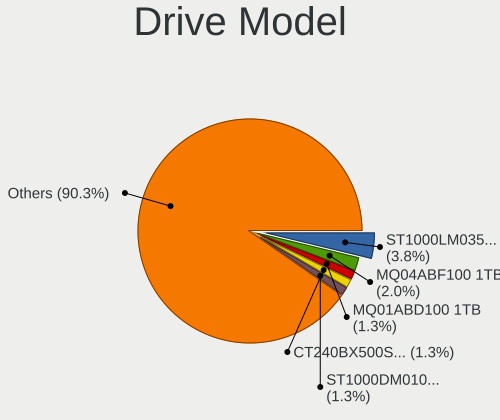

| Model                                                 | Computers | Percent |
|-------------------------------------------------------|-----------|---------|
| Seagate ST1000LM035-1RK172 1TB                        | 365       | 3.78%   |
| Toshiba MQ04ABF100 1TB                                | 192       | 1.99%   |
| Toshiba MQ01ABD100 1TB                                | 129       | 1.34%   |
| Crucial CT240BX500SSD1 240GB                          | 125       | 1.3%    |
| Seagate ST1000DM010-2EP102 1TB                        | 122       | 1.26%   |
| WDC WDS240G2G0A-00JH30 240GB SSD                      | 94        | 0.97%   |
| Seagate ST1000LM049-2GH172 1TB                        | 86        | 0.89%   |
| Samsung NVMe SSD Controller SM981/PM981/PM983 1TB     | 86        | 0.89%   |
| Seagate ST1000LM024 HN-M101MBB 1TB                    | 84        | 0.87%   |
| Seagate ST500LT012-1DG142 500GB                       | 83        | 0.86%   |
| Kingston SA400S37240G 240GB SSD                       | 71        | 0.74%   |
| Micron 2450_MTFDKBA512TFK 512GB                       | 69        | 0.71%   |
| SanDisk NVMe SSD Drive 512GB                          | 67        | 0.69%   |
| Toshiba MQ01ABF050 500GB                              | 62        | 0.64%   |
| Unknown                                               | 60        | 0.62%   |
| WDC WD10SPZX-60Z10T0 1TB                              | 57        | 0.59%   |
| Seagate ST500DM002-1BD142 500GB                       | 57        | 0.59%   |
| Toshiba DT01ACA100 1TB                                | 54        | 0.56%   |
| Samsung NVMe SSD Controller PM9A1/PM9A3/980PRO 1TB    | 52        | 0.54%   |
| Intel NVMe SSD Drive 512GB                            | 52        | 0.54%   |
| Micron/Crucial P2 NVMe PCIe SSD 2TB                   | 50        | 0.52%   |
| HGST HTS541010A9E680 1TB                              | 50        | 0.52%   |
| Seagate ST9500325AS 500GB                             | 47        | 0.49%   |
| WDC WD10SPZX-24Z10 1TB                                | 46        | 0.48%   |
| HGST HTS721010A9E630 1TB                              | 45        | 0.47%   |
| Seagate ST1000LM048-2E7172 1TB                        | 44        | 0.46%   |
| Sandisk WD Blue SN550 NVMe SSD 1024GB                 | 44        | 0.46%   |
| Crucial CT480BX500SSD1 480GB                          | 43        | 0.45%   |
| WDC WDS240G2G0B-00EPW0 240GB SSD                      | 41        | 0.42%   |
| Seagate ST2000LM007-1R8174 2TB                        | 41        | 0.42%   |
| Intel SSDPEKNW512G8 512GB                             | 41        | 0.42%   |
| WDC WD10EZEX-08WN4A0 1TB                              | 39        | 0.4%    |
| SanDisk NVMe SSD Drive 256GB                          | 39        | 0.4%    |
| Intel SSDPEKNU512GZ 512GB                             | 38        | 0.39%   |
| HGST HTS545050A7E680 500GB                            | 38        | 0.39%   |
| Crucial CT500BX500SSD1 500GB                          | 37        | 0.38%   |
| Samsung NVMe SSD Drive 512GB                          | 36        | 0.37%   |
| Intel SSD 660P Series 512GB                           | 36        | 0.37%   |
| WDC WD10JPVX-60JC3T1 1TB                              | 34        | 0.35%   |
| Silicon Motion SM2263EN/SM2263XT SSD Controller 512GB | 34        | 0.35%   |

HDD Vendor
----------

Hard disk drive vendors

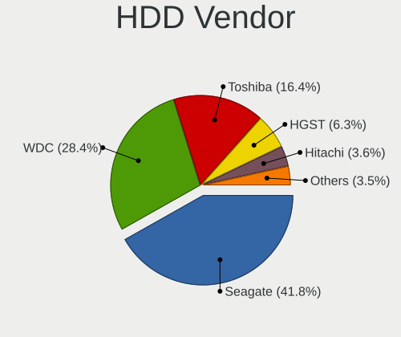

| Vendor              | Computers | Drives | Percent |
|---------------------|-----------|--------|---------|
| Seagate             | 1559      | 2091   | 41.83%  |
| WDC                 | 1057      | 1352   | 28.36%  |
| Toshiba             | 612       | 700    | 16.42%  |
| HGST                | 234       | 279    | 6.28%   |
| Hitachi             | 136       | 162    | 3.65%   |
| Unknown             | 33        | 38     | 0.89%   |
| Samsung Electronics | 29        | 35     | 0.78%   |
| Hewlett-Packard     | 10        | 11     | 0.27%   |
| Fujitsu             | 10        | 10     | 0.27%   |
| Apple               | 9         | 9      | 0.24%   |
| TO Exter            | 7         | 7      | 0.19%   |
| External            | 7         | 11     | 0.19%   |
| Maxtor              | 5         | 5      | 0.13%   |
| MARSHAL             | 3         | 3      | 0.08%   |
| Unknown             | 3         | 3      | 0.08%   |
| USB3.0              | 2         | 3      | 0.05%   |
| JMicron Technology  | 2         | 2      | 0.05%   |
| WD MediaMax         | 1         | 1      | 0.03%   |
| Verbatim            | 1         | 1      | 0.03%   |
| Synology            | 1         | 1      | 0.03%   |
| StoreJet            | 1         | 1      | 0.03%   |
| Lenovo              | 1         | 1      | 0.03%   |
| KESU                | 1         | 2      | 0.03%   |
| IBM-D050            | 1         | 6      | 0.03%   |
| IBM                 | 1         | 1      | 0.03%   |
| ASMedia             | 1         | 1      | 0.03%   |

SSD Vendor
----------

Solid state drive vendors

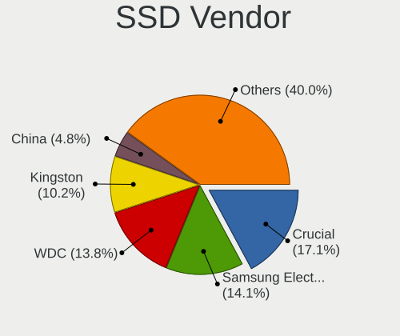

| Vendor              | Computers | Drives | Percent |
|---------------------|-----------|--------|---------|
| Crucial             | 346       | 461    | 17.13%  |
| Samsung Electronics | 284       | 373    | 14.06%  |
| WDC                 | 279       | 344    | 13.81%  |
| Kingston            | 206       | 266    | 10.2%   |
| China               | 96        | 114    | 4.75%   |
| SanDisk             | 88        | 110    | 4.36%   |
| A-DATA Technology   | 78        | 87     | 3.86%   |
| SK hynix            | 45        | 59     | 2.23%   |
| EVM                 | 43        | 56     | 2.13%   |
| Intel               | 35        | 38     | 1.73%   |
| CONSISTENT          | 34        | 37     | 1.68%   |
| Micron Technology   | 32        | 45     | 1.58%   |
| Gigabyte Technology | 31        | 34     | 1.53%   |
| Unknown             | 30        | 37     | 1.49%   |
| Apple               | 22        | 29     | 1.09%   |
| FORESEE             | 21        | 28     | 1.04%   |
| Hewlett-Packard     | 20        | 26     | 0.99%   |
| Zebronics           | 18        | 19     | 0.89%   |
| LITEON              | 18        | 22     | 0.89%   |
| Lexar               | 18        | 19     | 0.89%   |
| Toshiba             | 17        | 19     | 0.84%   |
| SPCC                | 17        | 21     | 0.84%   |
| Seagate             | 12        | 13     | 0.59%   |
| Transcend           | 11        | 16     | 0.54%   |
| PNY                 | 11        | 13     | 0.54%   |
| Acer                | 11        | 12     | 0.54%   |
| Aarvex              | 11        | 14     | 0.54%   |
| POWER               | 9         | 9      | 0.45%   |
| Netac               | 8         | 9      | 0.4%    |
| Maxtor              | 7         | 26     | 0.35%   |
| HS-SSD-E100         | 7         | 7      | 0.35%   |
| HS-SSD-C100         | 6         | 8      | 0.3%    |
| Unknown             | 5         | 5      | 0.25%   |
| LITEONIT            | 5         | 8      | 0.25%   |
| KLEVV               | 5         | 6      | 0.25%   |
| KingSpec            | 5         | 5      | 0.25%   |
| ESSENCORE           | 5         | 6      | 0.25%   |
| StoreJet            | 4         | 4      | 0.2%    |
| S930P               | 4         | 5      | 0.2%    |
| Plextor             | 4         | 4      | 0.2%    |

Drive Kind
----------

HDD or SSD

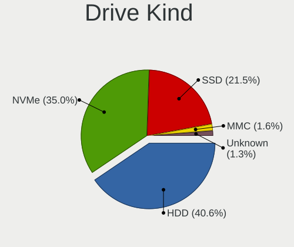

| Kind    | Computers | Drives | Percent |
|---------|-----------|--------|---------|
| HDD     | 3515      | 4736   | 40.55%  |
| NVMe    | 3034      | 4035   | 35%     |
| SSD     | 1867      | 2539   | 21.54%  |
| MMC     | 142       | 178    | 1.64%   |
| Unknown | 110       | 125    | 1.27%   |

Drive Connector
---------------

SATA, SAS, NVMe, etc.

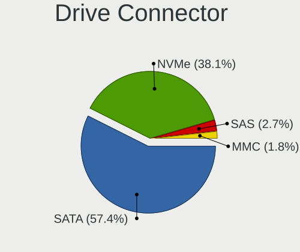

| Type | Computers | Drives | Percent |
|------|-----------|--------|---------|
| SATA | 4569      | 7145   | 57.41%  |
| NVMe | 3032      | 4026   | 38.1%   |
| SAS  | 216       | 264    | 2.71%   |
| MMC  | 142       | 178    | 1.78%   |

Drive Size
----------

Size of hard drive

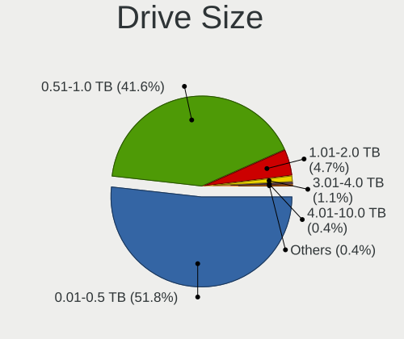

| Size in TB | Computers | Drives | Percent |
|------------|-----------|--------|---------|
| 0.01-0.5   | 2790      | 3816   | 51.76%  |
| 0.51-1.0   | 2242      | 2894   | 41.6%   |
| 1.01-2.0   | 254       | 379    | 4.71%   |
| 3.01-4.0   | 61        | 100    | 1.13%   |
| 4.01-10.0  | 24        | 43     | 0.45%   |
| 2.01-3.0   | 13        | 26     | 0.24%   |
| 10.01-20.0 | 5         | 16     | 0.09%   |
| 0          | 1         | 1      | 0.02%   |

Space Total
-----------

Amount of disk space available on the file system

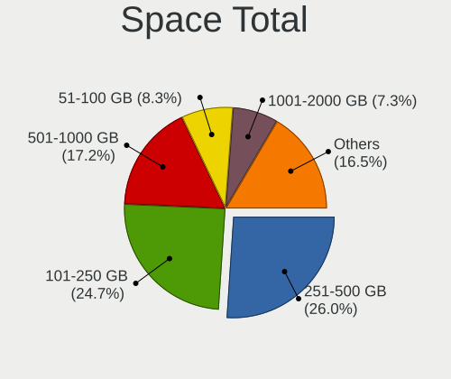

| Size in GB     | Computers | Percent |
|----------------|-----------|---------|
| 251-500        | 1933      | 26.05%  |
| 101-250        | 1830      | 24.66%  |
| 501-1000       | 1277      | 17.21%  |
| 51-100         | 615       | 8.29%   |
| 1001-2000      | 540       | 7.28%   |
| 1-20           | 446       | 6.01%   |
| 21-50          | 346       | 4.66%   |
| More than 3000 | 154       | 2.08%   |
| Unknown        | 153       | 2.06%   |
| 2001-3000      | 127       | 1.71%   |

Space Used
----------

Amount of used disk space

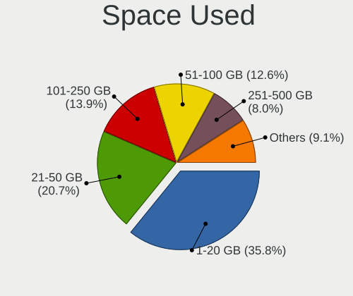

| Used GB        | Computers | Percent |
|----------------|-----------|---------|
| 1-20           | 2756      | 35.85%  |
| 21-50          | 1589      | 20.67%  |
| 101-250        | 1066      | 13.87%  |
| 51-100         | 965       | 12.55%  |
| 251-500        | 614       | 7.99%   |
| 501-1000       | 346       | 4.5%    |
| Unknown        | 153       | 1.99%   |
| 1001-2000      | 131       | 1.7%    |
| More than 3000 | 34        | 0.44%   |
| 2001-3000      | 27        | 0.35%   |
| 0              | 7         | 0.09%   |

Malfunc. Drives
---------------

Drive models with a malfunction

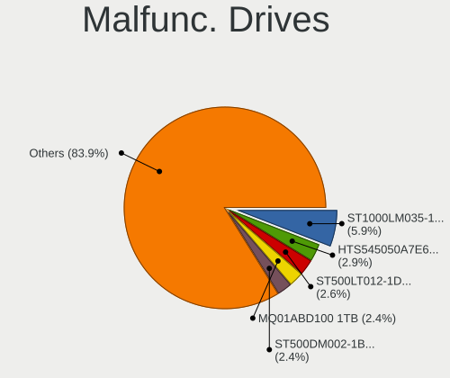

| Model                                | Computers | Drives | Percent |
|--------------------------------------|-----------|--------|---------|
| Seagate ST1000LM035-1RK172 1TB       | 39        | 48     | 5.88%   |
| HGST HTS545050A7E680 500GB           | 19        | 23     | 2.87%   |
| Seagate ST500LT012-1DG142 500GB      | 17        | 17     | 2.56%   |
| Toshiba MQ01ABD100 1TB               | 16        | 17     | 2.41%   |
| Seagate ST500DM002-1BD142 500GB      | 16        | 16     | 2.41%   |
| Seagate ST9500325AS 500GB            | 15        | 16     | 2.26%   |
| Seagate ST1000LM049-2GH172 1TB       | 14        | 18     | 2.11%   |
| Seagate ST1000LM024 HN-M101MBB 1TB   | 14        | 14     | 2.11%   |
| HGST HTS541010A9E680 1TB             | 14        | 14     | 2.11%   |
| Toshiba MQ04ABF100 1TB               | 9         | 10     | 1.36%   |
| Seagate ST500LT012-9WS142 500GB      | 8         | 9      | 1.21%   |
| HGST HTS545050A7E380 500GB           | 8         | 9      | 1.21%   |
| Toshiba MQ01ABF050 500GB             | 7         | 7      | 1.06%   |
| Seagate ST500LM021-1KJ152 500GB      | 7         | 7      | 1.06%   |
| HGST HTS725050A7E630 500GB           | 7         | 7      | 1.06%   |
| HGST HTS721010A9E630 1TB             | 7         | 7      | 1.06%   |
| WDC WDS240G2G0A-00JH30 240GB SSD     | 6         | 8      | 0.9%    |
| SK hynix PC711 HFS512GDE9X073N 512GB | 6         | 7      | 0.9%    |
| SK hynix PC711 HFS001TDE9X073N 1TB   | 6         | 8      | 0.9%    |
| Seagate ST3500312CS 500GB            | 6         | 6      | 0.9%    |
| Seagate ST2000LM007-1R8174 2TB       | 6         | 6      | 0.9%    |
| Seagate ST1000DM010-2EP102 1TB       | 6         | 6      | 0.9%    |
| WDC WD10SPZX-60Z10T0 1TB             | 5         | 5      | 0.75%   |
| WDC WD10EZEX-08WN4A0 1TB             | 5         | 5      | 0.75%   |
| WDC WD Green 2.5 240GB               | 5         | 5      | 0.75%   |
| Seagate ST9320325AS 320GB            | 5         | 5      | 0.75%   |
| Seagate ST3500418AS 500GB            | 5         | 5      | 0.75%   |
| Seagate ST1000DM003-1ER162 1TB       | 5         | 5      | 0.75%   |
| WDC WD10JPVX-60JC3T1 1TB             | 4         | 4      | 0.6%    |
| Toshiba DT01ACA100 1TB               | 4         | 7      | 0.6%    |
| Seagate ST3500414CS 500GB            | 4         | 4      | 0.6%    |
| Seagate ST320LT007-9ZV142 320GB      | 4         | 5      | 0.6%    |
| Seagate ST31000524AS 1TB             | 4         | 4      | 0.6%    |
| Seagate ST1000DM003-9YN162 1TB       | 4         | 4      | 0.6%    |
| Hitachi HTS547575A9E384 752GB        | 4         | 4      | 0.6%    |
| WDC WDS240G2G0B-00EPW0 240GB SSD     | 3         | 3      | 0.45%   |
| WDC WD5000LPVX-75V0TT0 500GB         | 3         | 3      | 0.45%   |
| WDC WD5000AAKX-60U6AA0 500GB         | 3         | 5      | 0.45%   |
| WDC WD5000AAKX-00ERMA0 500GB         | 3         | 5      | 0.45%   |
| WDC WD3200BEVT-22ZCT0 320GB          | 3         | 3      | 0.45%   |

Malfunc. Drive Vendor
---------------------

Vendors of faulty drives

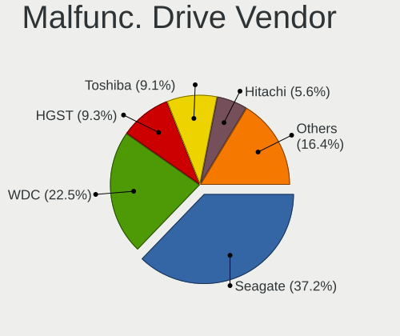

| Vendor                      | Computers | Drives | Percent |
|-----------------------------|-----------|--------|---------|
| Seagate                     | 241       | 278    | 37.19%  |
| WDC                         | 146       | 172    | 22.53%  |
| HGST                        | 60        | 65     | 9.26%   |
| Toshiba                     | 59        | 65     | 9.1%    |
| Hitachi                     | 36        | 41     | 5.56%   |
| SK hynix                    | 22        | 27     | 3.4%    |
| Samsung Electronics         | 16        | 21     | 2.47%   |
| SanDisk                     | 7         | 7      | 1.08%   |
| Crucial                     | 7         | 10     | 1.08%   |
| Micron Technology           | 6         | 7      | 0.93%   |
| Intel                       | 5         | 5      | 0.77%   |
| China                       | 3         | 3      | 0.46%   |
| Apple                       | 3         | 3      | 0.46%   |
| A-DATA Technology           | 3         | 4      | 0.46%   |
| Unknown                     | 3         | 4      | 0.46%   |
| YS                          | 2         | 2      | 0.31%   |
| SPCC                        | 2         | 2      | 0.31%   |
| Realtek Semiconductor       | 2         | 2      | 0.31%   |
| Kingston                    | 2         | 2      | 0.31%   |
| ZEB-SD26                    | 1         | 1      | 0.15%   |
| XPG                         | 1         | 1      | 0.15%   |
| Wibtek                      | 1         | 1      | 0.15%   |
| Unknown                     | 1         | 1      | 0.15%   |
| SSSTC                       | 1         | 1      | 0.15%   |
| Secure                      | 1         | 1      | 0.15%   |
| POWER                       | 1         | 1      | 0.15%   |
| Micron/Crucial Technology   | 1         | 1      | 0.15%   |
| MAXIO Technology (Hangzhou) | 1         | 1      | 0.15%   |
| MARSHAL                     | 1         | 1      | 0.15%   |
| LITEONIT                    | 1         | 1      | 0.15%   |
| LITEON                      | 1         | 1      | 0.15%   |
| Leven                       | 1         | 1      | 0.15%   |
| Lenovo                      | 1         | 2      | 0.15%   |
| Kingston Technology Company | 1         | 1      | 0.15%   |
| Innodisk                    | 1         | 1      | 0.15%   |
| IBM                         | 1         | 1      | 0.15%   |
| HP Phison                   | 1         | 1      | 0.15%   |
| Gigabyte Technology         | 1         | 2      | 0.15%   |
| Gamers                      | 1         | 1      | 0.15%   |
| Fujitsu                     | 1         | 1      | 0.15%   |

Malfunc. HDD Vendor
-------------------

Vendors of faulty HDD drives

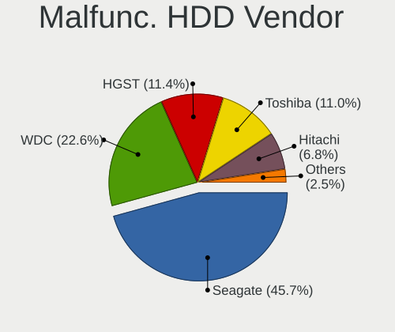

| Vendor              | Computers | Drives | Percent |
|---------------------|-----------|--------|---------|
| Seagate             | 241       | 278    | 45.73%  |
| WDC                 | 119       | 142    | 22.58%  |
| HGST                | 60        | 65     | 11.39%  |
| Toshiba             | 58        | 64     | 11.01%  |
| Hitachi             | 36        | 41     | 6.83%   |
| Samsung Electronics | 7         | 9      | 1.33%   |
| Apple               | 3         | 3      | 0.57%   |
| MARSHAL             | 1         | 1      | 0.19%   |
| IBM                 | 1         | 1      | 0.19%   |
| Fujitsu             | 1         | 1      | 0.19%   |

Malfunc. Drive Kind
-------------------

Kinds of faulty drives

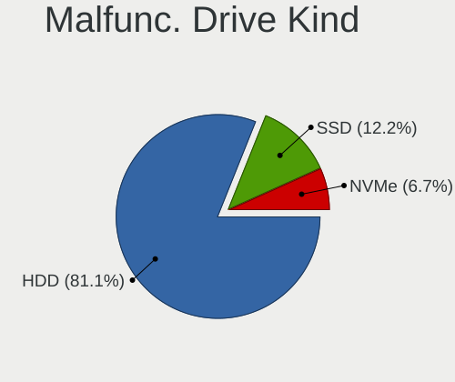

| Kind | Computers | Drives | Percent |
|------|-----------|--------|---------|
| HDD  | 518       | 605    | 81.06%  |
| SSD  | 78        | 89     | 12.21%  |
| NVMe | 43        | 52     | 6.73%   |

Failed Drives
-------------

Failed drive models

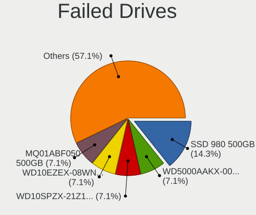

| Model                               | Computers | Drives | Percent |
|-------------------------------------|-----------|--------|---------|
| Samsung Electronics SSD 980 500GB   | 2         | 3      | 14.29%  |
| WDC WD5000AAKX-001CA0 500GB         | 1         | 1      | 7.14%   |
| WDC WD10SPZX-21Z10T0 1TB            | 1         | 1      | 7.14%   |
| WDC WD10EZEX-08WN4A0 1TB            | 1         | 1      | 7.14%   |
| Toshiba MQ01ABF050 500GB            | 1         | 1      | 7.14%   |
| Toshiba HDWD110 1TB                 | 1         | 1      | 7.14%   |
| Toshiba DT01ACA100 1TB              | 1         | 1      | 7.14%   |
| Seagate ST9320320AS 320GB           | 1         | 1      | 7.14%   |
| Seagate ST500LT012-1DG142 500GB     | 1         | 1      | 7.14%   |
| Seagate ST3320418AS 320GB           | 1         | 1      | 7.14%   |
| Seagate ST1000LM 024 HN-M101MBB 1TB | 1         | 1      | 7.14%   |
| Apple HDD HTS545050A7E362 500GB     | 1         | 1      | 7.14%   |
| Acer SSD FA100 256GB                | 1         | 1      | 7.14%   |

Failed Drive Vendor
-------------------

Failed drive vendors

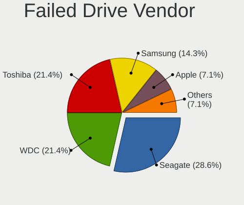

| Vendor              | Computers | Drives | Percent |
|---------------------|-----------|--------|---------|
| Seagate             | 4         | 4      | 28.57%  |
| WDC                 | 3         | 3      | 21.43%  |
| Toshiba             | 3         | 3      | 21.43%  |
| Samsung Electronics | 2         | 3      | 14.29%  |
| Apple               | 1         | 1      | 7.14%   |
| Acer                | 1         | 1      | 7.14%   |

Drive Status
------------

Number of failed and malfunc. drives

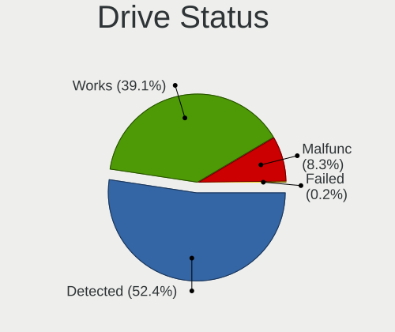

| Status   | Computers | Drives | Percent |
|----------|-----------|--------|---------|
| Detected | 3917      | 6331   | 52.38%  |
| Works    | 2925      | 4521   | 39.11%  |
| Malfunc  | 622       | 746    | 8.32%   |
| Failed   | 14        | 15     | 0.19%   |

Storage controller
------------------

Storage Vendor
--------------

Storage controller vendors

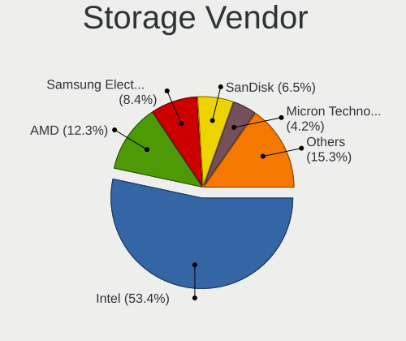

| Vendor                                  | Computers | Percent |
|-----------------------------------------|-----------|---------|
| Intel                                   | 4811      | 53.35%  |
| AMD                                     | 1106      | 12.27%  |
| Samsung Electronics                     | 755       | 8.37%   |
| SanDisk                                 | 583       | 6.47%   |
| Micron Technology                       | 383       | 4.25%   |
| SK hynix                                | 291       | 3.23%   |
| Kingston Technology Company             | 165       | 1.83%   |
| KIOXIA                                  | 153       | 1.7%    |
| Micron/Crucial Technology               | 133       | 1.47%   |
| Toshiba America Info Systems            | 83        | 0.92%   |
| Silicon Motion                          | 68        | 0.75%   |
| Phison Electronics                      | 67        | 0.74%   |
| Shenzhen Longsys Electronics            | 56        | 0.62%   |
| ASMedia Technology                      | 47        | 0.52%   |
| ADATA Technology                        | 47        | 0.52%   |
| Union Memory (Shenzhen)                 | 39        | 0.43%   |
| Realtek Semiconductor                   | 34        | 0.38%   |
| MAXIO Technology (Hangzhou)             | 22        | 0.24%   |
| Nvidia                                  | 21        | 0.23%   |
| Solid State Storage Technology          | 15        | 0.17%   |
| Biwin Storage Technology                | 15        | 0.17%   |
| Marvell Technology Group                | 14        | 0.16%   |
| Yangtze Memory Technologies             | 13        | 0.14%   |
| JMicron Technology                      | 11        | 0.12%   |
| Broadcom / LSI                          | 10        | 0.11%   |
| INNOGRIT                                | 9         | 0.1%    |
| Solidigm                                | 7         | 0.08%   |
| Lite-On Technology                      | 7         | 0.08%   |
| Lenovo                                  | 6         | 0.07%   |
| LSI Logic / Symbios Logic               | 5         | 0.06%   |
| Hosin Global Electronics                | 5         | 0.06%   |
| Apple                                   | 5         | 0.06%   |
| Silicon Integrated Systems [SiS]        | 4         | 0.04%   |
| Shenzhen Unionmemory Information System | 4         | 0.04%   |
| Seagate Technology                      | 4         | 0.04%   |
| VIA Technologies                        | 3         | 0.03%   |
| Hewlett-Packard                         | 3         | 0.03%   |
| Transcend                               | 2         | 0.02%   |
| Ramaxel Technology(Shenzhen) Limited    | 2         | 0.02%   |
| Adaptec                                 | 2         | 0.02%   |

Storage Model
-------------

Storage controller models

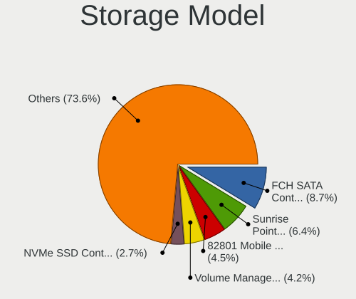

| Model                                                                          | Computers | Percent |
|--------------------------------------------------------------------------------|-----------|---------|
| AMD FCH SATA Controller [AHCI mode]                                            | 870       | 8.71%   |
| Intel Sunrise Point-LP SATA Controller [AHCI mode]                             | 636       | 6.37%   |
| Intel 82801 Mobile SATA Controller [RAID mode]                                 | 450       | 4.51%   |
| Intel Volume Management Device NVMe RAID Controller                            | 415       | 4.16%   |
| Samsung NVMe SSD Controller 980 (DRAM-less)                                    | 267       | 2.67%   |
| Intel 7 Series Chipset Family 6-port SATA Controller [AHCI mode]               | 257       | 2.57%   |
| Intel 8 Series SATA Controller 1 [AHCI mode]                                   | 245       | 2.45%   |
| Samsung NVMe SSD Controller SM981/PM981/PM983                                  | 230       | 2.3%    |
| Intel Tiger Lake-LP SATA Controller                                            | 180       | 1.8%    |
| Intel 8 Series/C220 Series Chipset Family 6-port SATA Controller 1 [AHCI mode] | 177       | 1.77%   |
| Intel Wildcat Point-LP SATA Controller [AHCI Mode]                             | 167       | 1.67%   |
| Intel NM10/ICH7 Family SATA Controller [IDE mode]                              | 167       | 1.67%   |
| Intel 6 Series/C200 Series Chipset Family 6 port Mobile SATA AHCI Controller   | 164       | 1.64%   |
| Intel Comet Lake SATA AHCI Controller                                          | 152       | 1.52%   |
| Intel Cannon Lake Mobile PCH SATA AHCI Controller                              | 140       | 1.4%    |
| Intel SSD 660P Series                                                          | 136       | 1.36%   |
| Intel 82801G (ICH7 Family) IDE Controller                                      | 135       | 1.35%   |
| Intel 6 Series/C200 Series Chipset Family 6 port Desktop SATA AHCI Controller  | 128       | 1.28%   |
| Intel Cannon Point-LP SATA Controller [AHCI Mode]                              | 121       | 1.21%   |
| SanDisk Ultra 3D / WD PC SN530, IX SN530, Blue SN550 NVMe SSD (DRAM-less)      | 115       | 1.15%   |
| Intel Q170/Q150/B150/H170/H110/Z170/CM236 Chipset SATA Controller [AHCI Mode]  | 114       | 1.14%   |
| AMD 400 Series Chipset SATA Controller                                         | 113       | 1.13%   |
| Micron 2450 NVMe SSD [HendrixV] (DRAM-less)                                    | 108       | 1.08%   |
| KIOXIA NVMe SSD Controller BG4 (DRAM-less)                                     | 106       | 1.06%   |
| SK hynix Gold P31/BC711/PC711 NVMe Solid State Drive                           | 104       | 1.04%   |
| Samsung NVMe SSD Controller PM9A1/PM9A3/980PRO                                 | 96        | 0.96%   |
| Intel 200 Series PCH SATA controller [AHCI mode]                               | 93        | 0.93%   |
| Micron 2210 NVMe SSD [Cobain]                                                  | 87        | 0.87%   |
| Intel SSD 670p Series [Keystone Harbor]                                        | 85        | 0.85%   |
| SanDisk WD SN560/SN740/SN770/SN5000 NVMe SSD                                   | 84        | 0.84%   |
| Intel 400 Series Chipset Family SATA AHCI Controller                           | 83        | 0.83%   |
| Intel Alder Lake-P SATA AHCI Controller                                        | 77        | 0.77%   |
| Micron/Crucial P2 [Nick P2] / P3 / P3 Plus NVMe PCIe SSD (DRAM-less)           | 74        | 0.74%   |
| Intel 5 Series/3400 Series Chipset 4 port SATA AHCI Controller                 | 72        | 0.72%   |
| Intel Ice Lake-LP SATA Controller [AHCI mode]                                  | 71        | 0.71%   |
| Intel Cannon Lake PCH SATA AHCI Controller                                     | 70        | 0.7%    |
| SanDisk WD Blue SN500 / PC SN520 x2 M.2 2280 NVMe SSD                          | 66        | 0.66%   |
| Micron 2400 NVMe SSD (DRAM-less)                                               | 64        | 0.64%   |
| AMD 500 Series Chipset SATA Controller                                         | 64        | 0.64%   |
| Silicon Motion SM2263EN/SM2263XT (DRAM-less) NVMe SSD Controllers              | 62        | 0.62%   |

Storage Kind
------------

Kind of storage controller (IDE, SATA, NVMe, SAS, ...)

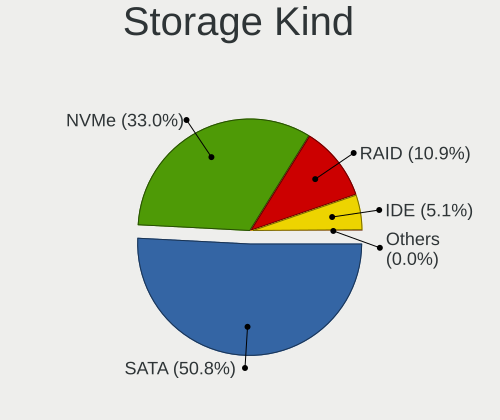

| Kind | Computers | Percent |
|------|-----------|---------|
| SATA | 4683      | 50.82%  |
| NVMe | 3045      | 33.04%  |
| RAID | 1003      | 10.88%  |
| IDE  | 473       | 5.13%   |
| SAS  | 9         | 0.1%    |
| SCSI | 2         | 0.02%   |

Processor
---------

CPU Vendor
----------

Processor vendors

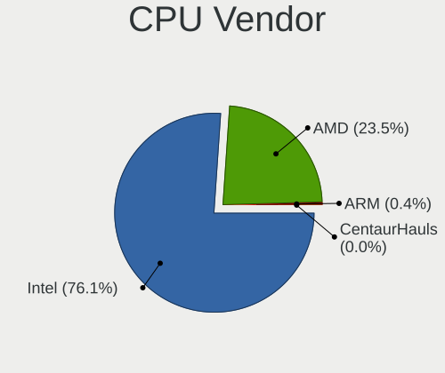

| Vendor       | Computers | Percent |
|--------------|-----------|---------|
| Intel        | 5320      | 76.08%  |
| AMD          | 1641      | 23.47%  |
| ARM          | 29        | 0.41%   |
| Qualcomm     | 2         | 0.03%   |
| CentaurHauls | 1         | 0.01%   |

CPU Model
---------

Processor models

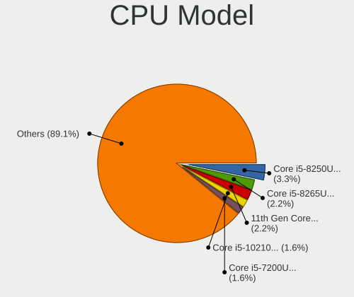

| Model                                         | Computers | Percent |
|-----------------------------------------------|-----------|---------|
| Intel Core i5-8250U CPU @ 1.60GHz             | 228       | 3.26%   |
| Intel Core i5-8265U CPU @ 1.60GHz             | 153       | 2.19%   |
| Intel 11th Gen Core i5-1135G7 @ 2.40GHz       | 153       | 2.19%   |
| Intel Core i5-10210U CPU @ 1.60GHz            | 115       | 1.64%   |
| Intel Core i5-7200U CPU @ 2.50GHz             | 112       | 1.6%    |
| Intel Core i3-6006U CPU @ 2.00GHz             | 100       | 1.43%   |
| AMD Ryzen 5 3500U with Radeon Vega Mobile Gfx | 75        | 1.07%   |
| AMD Ryzen 5 5600H with Radeon Graphics        | 73        | 1.04%   |
| Intel Core i5-9300H CPU @ 2.40GHz             | 69        | 0.99%   |
| Intel 11th Gen Core i3-1115G4 @ 3.00GHz       | 69        | 0.99%   |
| Intel Core i3-5005U CPU @ 2.00GHz             | 68        | 0.97%   |
| AMD Ryzen 5 5500U with Radeon Graphics        | 68        | 0.97%   |
| Intel Core i3-1005G1 CPU @ 1.20GHz            | 67        | 0.96%   |
| Intel Core i5-6200U CPU @ 2.30GHz             | 66        | 0.94%   |
| Intel Core i3-4005U CPU @ 1.70GHz             | 66        | 0.94%   |
| Intel Core i3-7020U CPU @ 2.30GHz             | 65        | 0.93%   |
| AMD Ryzen 5 3550H with Radeon Vega Mobile Gfx | 64        | 0.91%   |
| Intel Core i5-4210U CPU @ 1.70GHz             | 62        | 0.89%   |
| Intel Core i7-8550U CPU @ 1.80GHz             | 56        | 0.8%    |
| Intel Core i5-1035G1 CPU @ 1.00GHz            | 55        | 0.79%   |
| AMD Ryzen 7 5800H with Radeon Graphics        | 54        | 0.77%   |
| Intel Core i5-10300H CPU @ 2.50GHz            | 52        | 0.74%   |
| AMD Ryzen 5 4600H with Radeon Graphics        | 52        | 0.74%   |
| Intel Core i5-5200U CPU @ 2.20GHz             | 51        | 0.73%   |
| Intel 12th Gen Core i5-1240P                  | 51        | 0.73%   |
| Intel 11th Gen Core i7-1165G7 @ 2.80GHz       | 51        | 0.73%   |
| Intel Core i7-9750H CPU @ 2.60GHz             | 50        | 0.71%   |
| Intel Core i5-3210M CPU @ 2.50GHz             | 47        | 0.67%   |
| Intel 12th Gen Core i5-12500H                 | 44        | 0.63%   |
| Intel 12th Gen Core i5-12450H                 | 43        | 0.61%   |
| AMD Ryzen 7 4800H with Radeon Graphics        | 42        | 0.6%    |
| Intel Core i7-8750H CPU @ 2.20GHz             | 41        | 0.59%   |
| Intel Core i7-8565U CPU @ 1.80GHz             | 41        | 0.59%   |
| Intel Core i3-10110U CPU @ 2.10GHz            | 41        | 0.59%   |
| Intel 11th Gen Core i5-11300H @ 3.10GHz       | 40        | 0.57%   |
| Intel 12th Gen Core i5-1235U                  | 39        | 0.56%   |
| AMD Ryzen 5 2500U with Radeon Vega Mobile Gfx | 37        | 0.53%   |
| AMD Ryzen 7 5700U with Radeon Graphics        | 36        | 0.51%   |
| Intel Core i7-7700HQ CPU @ 2.80GHz            | 35        | 0.5%    |
| Intel Core i7-10510U CPU @ 1.80GHz            | 35        | 0.5%    |

CPU Model Family
----------------

Processor model prefix

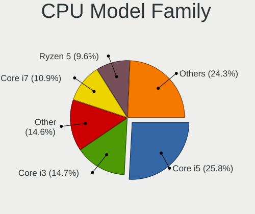

| Model                   | Computers | Percent |
|-------------------------|-----------|---------|
| Intel Core i5           | 1808      | 25.84%  |
| Intel Core i3           | 1026      | 14.66%  |
| Other                   | 1022      | 14.61%  |
| Intel Core i7           | 766       | 10.95%  |
| AMD Ryzen 5             | 673       | 9.62%   |
| AMD Ryzen 7             | 343       | 4.9%    |
| Intel Pentium           | 192       | 2.74%   |
| Intel Core 2 Duo        | 163       | 2.33%   |
| AMD Ryzen 3             | 141       | 2.02%   |
| Intel Celeron           | 116       | 1.66%   |
| AMD Ryzen 9             | 81        | 1.16%   |
| Intel Pentium Dual-Core | 69        | 0.99%   |
| AMD A6                  | 56        | 0.8%    |
| Intel Xeon              | 48        | 0.69%   |
| AMD A8                  | 42        | 0.6%    |
| Intel Core              | 36        | 0.51%   |
| AMD A4                  | 35        | 0.5%    |
| Intel Atom              | 33        | 0.47%   |
| AMD FX                  | 26        | 0.37%   |
| Intel Pentium Dual      | 24        | 0.34%   |
| AMD Ryzen 7 PRO         | 22        | 0.31%   |
| AMD A10                 | 22        | 0.31%   |
| Intel Core 2            | 21        | 0.3%    |
| Intel Core 2 Quad       | 19        | 0.27%   |
| AMD E1                  | 19        | 0.27%   |
| Intel Core i9           | 17        | 0.24%   |
| Intel Pentium Silver    | 15        | 0.21%   |
| AMD Ryzen 5 PRO         | 13        | 0.19%   |
| AMD Athlon              | 13        | 0.19%   |
| Intel Pentium Gold      | 11        | 0.16%   |
| AMD E2                  | 11        | 0.16%   |
| AMD Athlon II X2        | 8         | 0.11%   |
| Intel Pentium 4         | 7         | 0.1%    |
| ARM BCM                 | 7         | 0.1%    |
| AMD Ryzen Threadripper  | 6         | 0.09%   |
| AMD E                   | 6         | 0.09%   |
| Intel Xeon Silver       | 5         | 0.07%   |
| AMD Sempron             | 5         | 0.07%   |
| AMD Phenom II X6        | 5         | 0.07%   |
| AMD A12                 | 5         | 0.07%   |

CPU Cores
---------

Number of processor cores

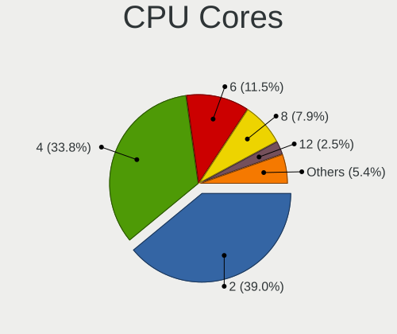

| Number  | Computers | Percent |
|---------|-----------|---------|
| 2       | 2733      | 39.03%  |
| 4       | 2364      | 33.76%  |
| 6       | 805       | 11.5%   |
| 8       | 551       | 7.87%   |
| 12      | 173       | 2.47%   |
| 10      | 118       | 1.69%   |
| 14      | 78        | 1.11%   |
| 1       | 63        | 0.9%    |
| 16      | 58        | 0.83%   |
| 24      | 19        | 0.27%   |
| 20      | 10        | 0.14%   |
| 3       | 8         | 0.11%   |
| 32      | 6         | 0.09%   |
| Unknown | 5         | 0.07%   |
| 64      | 2         | 0.03%   |
| 48      | 2         | 0.03%   |
| 28      | 2         | 0.03%   |
| 5       | 2         | 0.03%   |
| 56      | 1         | 0.01%   |
| 40      | 1         | 0.01%   |
| 36      | 1         | 0.01%   |

CPU Sockets
-----------

Number of sockets

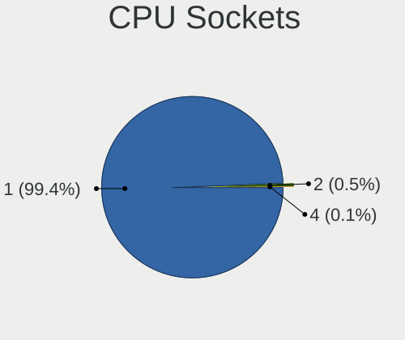

| Number  | Computers | Percent |
|---------|-----------|---------|
| 1       | 6948      | 99.36%  |
| 2       | 36        | 0.51%   |
| Unknown | 5         | 0.07%   |
| 4       | 4         | 0.06%   |

CPU Threads
-----------

Threads per core (Hyper-Threading)

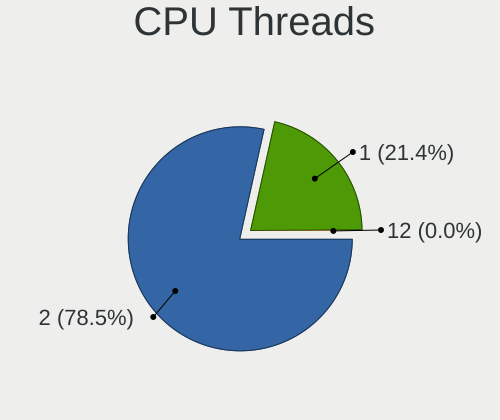

| Number  | Computers | Percent |
|---------|-----------|---------|
| 2       | 5495      | 78.48%  |
| 1       | 1499      | 21.41%  |
| Unknown | 5         | 0.07%   |
| 4       | 2         | 0.03%   |
| 12      | 1         | 0.01%   |

CPU Op-Modes
------------

CPU Operation Modes (32-bit, 64-bit)

| Op mode        | Computers | Percent |
|----------------|-----------|---------|
| 32-bit, 64-bit | 6931      | 99.07%  |
| Unknown        | 54        | 0.77%   |
| 32-bit         | 8         | 0.11%   |
| 64-bit         | 3         | 0.04%   |

CPU Microcode
-------------

Microcode number

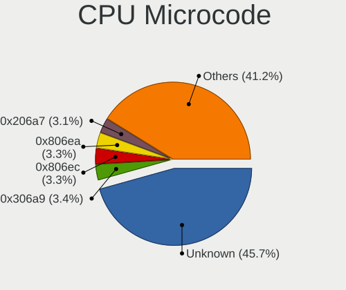

| Number     | Computers | Percent |
|------------|-----------|---------|
| Unknown    | 3304      | 45.67%  |
| 0x306a9    | 244       | 3.37%   |
| 0x806ec    | 241       | 3.33%   |
| 0x806ea    | 240       | 3.32%   |
| 0x206a7    | 227       | 3.14%   |
| 0x806c1    | 178       | 2.46%   |
| 0x906ea    | 164       | 2.27%   |
| 0x40651    | 159       | 2.2%    |
| 0x406e3    | 155       | 2.14%   |
| 0x806e9    | 154       | 2.13%   |
| 0x1067a    | 129       | 1.78%   |
| 0x306c3    | 122       | 1.69%   |
| 0x306d4    | 114       | 1.58%   |
| 0x08108109 | 108       | 1.49%   |
| 0x706e5    | 86        | 1.19%   |
| 0x0a50000c | 85        | 1.17%   |
| 0x906e9    | 70        | 0.97%   |
| 0x20655    | 67        | 0.93%   |
| 0x806eb    | 63        | 0.87%   |
| 0x506e3    | 62        | 0.86%   |
| 0x08108102 | 51        | 0.7%    |
| 0x06006705 | 48        | 0.66%   |
| 0xa0652    | 46        | 0.64%   |
| 0x0a50000d | 45        | 0.62%   |
| 0x6fd      | 42        | 0.58%   |
| 0x08608103 | 42        | 0.58%   |
| 0x08600106 | 42        | 0.58%   |
| 0x906a3    | 39        | 0.54%   |
| 0x07030105 | 34        | 0.47%   |
| 0xa0655    | 31        | 0.43%   |
| 0x20652    | 31        | 0.43%   |
| 0x08600104 | 31        | 0.43%   |
| 0x08701021 | 30        | 0.41%   |
| 0x0810100b | 29        | 0.4%    |
| 0x906ed    | 24        | 0.33%   |
| 0x30678    | 24        | 0.33%   |
| 0x08101007 | 22        | 0.3%    |
| 0x06001119 | 22        | 0.3%    |
| 0x010000c8 | 21        | 0.29%   |
| 0xa0653    | 18        | 0.25%   |

CPU Microarch
-------------

Microarchitecture

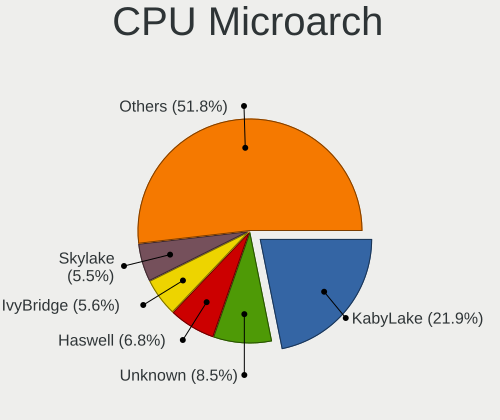

| Name               | Computers | Percent |
|--------------------|-----------|---------|
| KabyLake           | 1533      | 21.85%  |
| Unknown            | 594       | 8.47%   |
| Haswell            | 476       | 6.78%   |
| IvyBridge          | 390       | 5.56%   |
| Skylake            | 388       | 5.53%   |
| TigerLake          | 386       | 5.5%    |
| SandyBridge        | 345       | 4.92%   |
| Zen 3              | 342       | 4.87%   |
| Alderlake Hybrid   | 333       | 4.75%   |
| Zen+               | 280       | 3.99%   |
| Zen 2              | 251       | 3.58%   |
| Penryn             | 208       | 2.96%   |
| Broadwell          | 202       | 2.88%   |
| IceLake            | 191       | 2.72%   |
| CometLake          | 179       | 2.55%   |
| Westmere           | 152       | 2.17%   |
| Zen                | 111       | 1.58%   |
| Excavator          | 111       | 1.58%   |
| Core               | 98        | 1.4%    |
| Silvermont         | 83        | 1.18%   |
| Puma               | 65        | 0.93%   |
| Piledriver         | 51        | 0.73%   |
| Goldmont plus      | 37        | 0.53%   |
| K10                | 28        | 0.4%    |
| Goldmont           | 28        | 0.4%    |
| Nehalem            | 20        | 0.29%   |
| Tremont            | 16        | 0.23%   |
| Bobcat             | 16        | 0.23%   |
| Meteorlake Hybrid  | 14        | 0.2%    |
| K10 Llano          | 14        | 0.2%    |
| Jaguar             | 13        | 0.19%   |
| NetBurst           | 12        | 0.17%   |
| Bonnell            | 12        | 0.17%   |
| Steamroller        | 11        | 0.16%   |
| Bulldozer          | 6         | 0.09%   |
| P6                 | 5         | 0.07%   |
| Lunarlake Hybrid   | 5         | 0.07%   |
| K8 Hammer          | 5         | 0.07%   |
| Gracemont          | 4         | 0.06%   |
| ArrowLake-H Hybrid | 1         | 0.01%   |

Graphics
--------

GPU Vendor
----------

Vendors of graphics cards

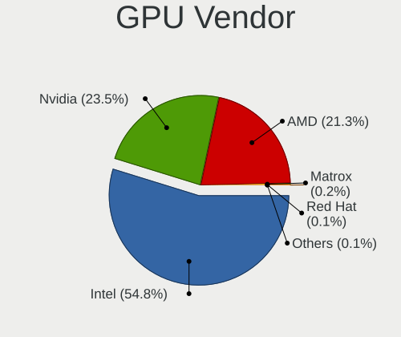

| Vendor                           | Computers | Percent |
|----------------------------------|-----------|---------|
| Intel                            | 4866      | 54.77%  |
| Nvidia                           | 2092      | 23.55%  |
| AMD                              | 1894      | 21.32%  |
| Matrox Electronics Systems       | 16        | 0.18%   |
| Red Hat                          | 5         | 0.06%   |
| ASPEED Technology                | 5         | 0.06%   |
| Silicon Integrated Systems [SiS] | 4         | 0.05%   |
| VIA Technologies                 | 1         | 0.01%   |
| ATI Technologies                 | 1         | 0.01%   |

GPU Model
---------

Graphics card models

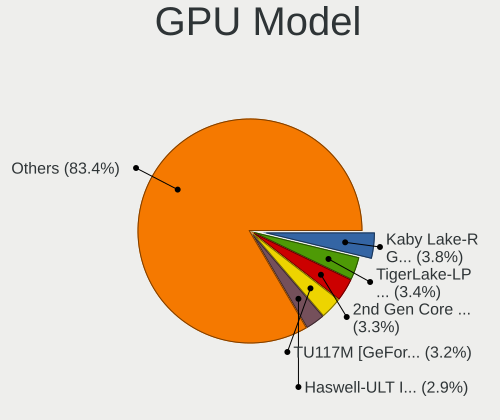

| Model                                                                                 | Computers | Percent |
|---------------------------------------------------------------------------------------|-----------|---------|
| Intel Kaby Lake-R GT2 [UHD Graphics 620]                                              | 342       | 3.77%   |
| Intel TigerLake-LP GT2 [Iris Xe Graphics]                                             | 305       | 3.36%   |
| Intel 2nd Generation Core Processor Family Integrated Graphics Controller             | 302       | 3.33%   |
| Nvidia TU117M [GeForce GTX 1650 Mobile / Max-Q]                                       | 294       | 3.24%   |
| Intel Haswell-ULT Integrated Graphics Controller                                      | 259       | 2.85%   |
| Intel WhiskeyLake-U GT2 [UHD Graphics 620]                                            | 249       | 2.74%   |
| AMD Picasso/Raven 2 [Radeon Vega Series / Radeon Vega Mobile Series]                  | 248       | 2.73%   |
| Intel 3rd Gen Core processor Graphics Controller                                      | 237       | 2.61%   |
| Intel Kaby Lake-U GT2 [HD Graphics 620]                                               | 226       | 2.49%   |
| AMD Cezanne [Radeon Vega Series / Radeon Vega Mobile Series]                          | 222       | 2.45%   |
| Intel Skylake-U GT2 [HD Graphics 520]                                                 | 221       | 2.44%   |
| Intel CometLake-U GT2 [UHD Graphics]                                                  | 210       | 2.31%   |
| Intel CoffeeLake-H GT2 [UHD Graphics 630]                                             | 199       | 2.19%   |
| AMD Renoir [Radeon Vega Series / Radeon Vega Mobile Series]                           | 170       | 1.87%   |
| Intel Broadwell-U GT2 [HD Graphics 5500]                                              | 168       | 1.85%   |
| AMD Sun XT [Radeon HD 8670A/8670M/8690M / R5 M330 / M430 / Radeon 520 Mobile]         | 144       | 1.59%   |
| Intel Iris Plus Graphics G1 (Ice Lake)                                                | 122       | 1.34%   |
| AMD Lucienne                                                                          | 120       | 1.32%   |
| Intel Core Processor Integrated Graphics Controller                                   | 114       | 1.26%   |
| Intel Alder Lake-P GT2 [Iris Xe Graphics]                                             | 110       | 1.21%   |
| Nvidia GK208B [GeForce GT 710]                                                        | 103       | 1.14%   |
| Nvidia GA107M [GeForce RTX 3050 Mobile]                                               | 100       | 1.1%    |
| Intel Xeon E3-1200 v2/3rd Gen Core processor Graphics Controller                      | 99        | 1.09%   |
| Intel CometLake-H GT2 [UHD Graphics]                                                  | 91        | 1%      |
| Intel Xeon E3-1200 v3/4th Gen Core Processor Integrated Graphics Controller           | 85        | 0.94%   |
| AMD Stoney [Radeon R2/R3/R4/R5 Graphics]                                              | 82        | 0.9%    |
| Intel Tiger Lake-LP GT2 [UHD Graphics G4]                                             | 80        | 0.88%   |
| Intel 4 Series Chipset Integrated Graphics Controller                                 | 77        | 0.85%   |
| AMD Raven Ridge [Radeon Vega Series / Radeon Vega Mobile Series]                      | 77        | 0.85%   |
| AMD Topaz XT [Radeon R7 M260/M265 / M340/M360 / M440/M445 / 530/535 / 620/625 Mobile] | 76        | 0.84%   |
| Nvidia GF117M [GeForce 610M/710M/810M/820M / GT 620M/625M/630M/720M]                  | 71        | 0.78%   |
| AMD Barcelo                                                                           | 70        | 0.77%   |
| Intel CoffeeLake-S GT2 [UHD Graphics 630]                                             | 69        | 0.76%   |
| Intel Raptor Lake-P [Iris Xe Graphics]                                                | 65        | 0.72%   |
| Intel Mobile 4 Series Chipset Integrated Graphics Controller                          | 64        | 0.71%   |
| Nvidia GP108M [GeForce MX250]                                                         | 58        | 0.64%   |
| AMD Rembrandt [Radeon 680M]                                                           | 58        | 0.64%   |
| Nvidia GM108M [GeForce 940MX]                                                         | 55        | 0.61%   |
| Intel CometLake-S GT2 [UHD Graphics 630]                                              | 53        | 0.58%   |
| Intel Alder Lake-P GT1 [UHD Graphics]                                                 | 52        | 0.57%   |

GPU Combo
---------

Combinations of graphics cards

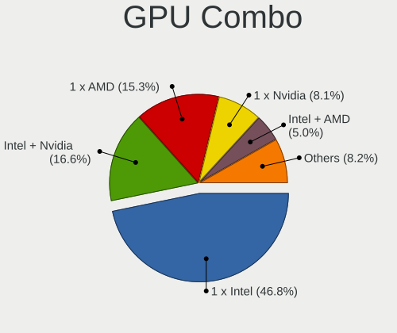

| Name               | Computers | Percent |
|--------------------|-----------|---------|
| 1 x Intel          | 3290      | 46.77%  |
| Intel + Nvidia     | 1168      | 16.6%   |
| 1 x AMD            | 1079      | 15.34%  |
| 1 x Nvidia         | 571       | 8.12%   |
| Intel + AMD        | 350       | 4.98%   |
| AMD + Nvidia       | 343       | 4.88%   |
| 2 x AMD            | 131       | 1.86%   |
| Other              | 38        | 0.54%   |
| 2 x Intel          | 26        | 0.37%   |
| 1 x Matrox         | 14        | 0.2%    |
| 2 x Nvidia         | 7         | 0.1%    |
| 1 x Red Hat        | 5         | 0.07%   |
| 1 x SiS            | 4         | 0.06%   |
| 1 x ASPEED         | 3         | 0.04%   |
| Nvidia + Matrox    | 2         | 0.03%   |
| Nvidia + ASPEED    | 2         | 0.03%   |
| 1 x VIA            | 1         | 0.01%   |
| Intel + 2 x Nvidia | 1         | 0.01%   |

GPU Driver
----------

Free vs proprietary

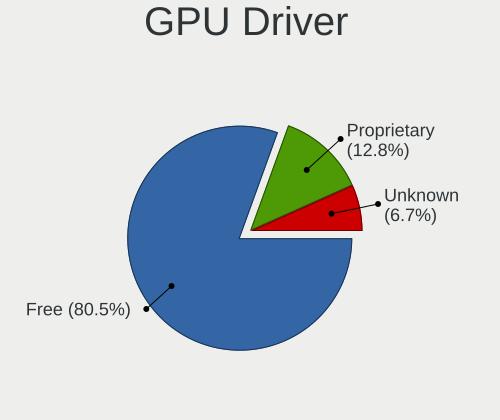

| Driver      | Computers | Percent |
|-------------|-----------|---------|
| Free        | 5722      | 80.52%  |
| Proprietary | 909       | 12.79%  |
| Unknown     | 475       | 6.68%   |

GPU Memory
----------

Total video memory

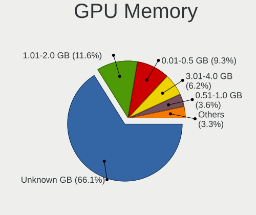

| Size in GB | Computers | Percent |
|------------|-----------|---------|
| Unknown    | 4751      | 66.09%  |
| 1.01-2.0   | 833       | 11.59%  |
| 0.01-0.5   | 665       | 9.25%   |
| 3.01-4.0   | 446       | 6.2%    |
| 0.51-1.0   | 256       | 3.56%   |
| 5.01-6.0   | 91        | 1.27%   |
| 7.01-8.0   | 74        | 1.03%   |
| 8.01-16.0  | 50        | 0.7%    |
| 16.01-24.0 | 12        | 0.17%   |
| 2.01-3.0   | 8         | 0.11%   |
| 32.01-64.0 | 2         | 0.03%   |
| 24.01-32.0 | 1         | 0.01%   |

Monitor
-------

Monitor Vendor
--------------

Monitor vendors

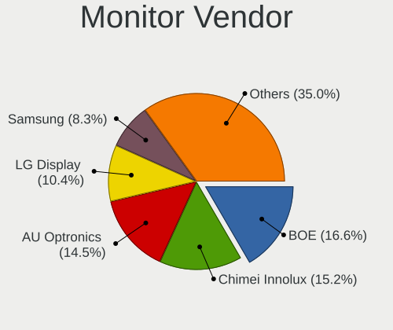

| Vendor                  | Computers | Percent |
|-------------------------|-----------|---------|
| BOE                     | 1213      | 16.62%  |
| Chimei Innolux          | 1110      | 15.21%  |
| AU Optronics            | 1061      | 14.53%  |
| LG Display              | 758       | 10.38%  |
| Samsung Electronics     | 606       | 8.3%    |
| Dell                    | 391       | 5.36%   |
| Goldstar                | 356       | 4.88%   |
| Acer                    | 225       | 3.08%   |
| BenQ                    | 196       | 2.68%   |
| PANDA                   | 173       | 2.37%   |
| Hewlett-Packard         | 143       | 1.96%   |
| Lenovo                  | 130       | 1.78%   |
| Sharp                   | 74        | 1.01%   |
| AOC                     | 74        | 1.01%   |
| InfoVision              | 54        | 0.74%   |
| Apple                   | 53        | 0.73%   |
| Chi Mei Optoelectronics | 52        | 0.71%   |
| ViewSonic               | 44        | 0.6%    |
| TMX                     | 40        | 0.55%   |
| Sony                    | 40        | 0.55%   |
| HKC                     | 29        | 0.4%    |
| Unknown                 | 24        | 0.33%   |
| Philips                 | 24        | 0.33%   |
| MSI                     | 24        | 0.33%   |
| HCL                     | 22        | 0.3%    |
| RTK                     | 17        | 0.23%   |
| Gigabyte Technology     | 17        | 0.23%   |
| Panasonic               | 14        | 0.19%   |
| LG Electronics          | 14        | 0.19%   |
| STD                     | 12        | 0.16%   |
| LG Philips              | 12        | 0.16%   |
| CSO                     | 12        | 0.16%   |
| KDB                     | 11        | 0.15%   |
| ASUSTek Computer        | 11        | 0.15%   |
| Ancor Communications    | 11        | 0.15%   |
| CSOT                    | 10        | 0.14%   |
| Toshiba                 | 9         | 0.12%   |
| SGT                     | 9         | 0.12%   |
| InnoLux Display         | 9         | 0.12%   |
| Unknown                 | 9         | 0.12%   |

Monitor Model
-------------

Monitor models

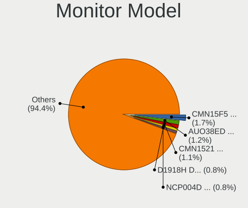

| Model                                                                 | Computers | Percent |
|-----------------------------------------------------------------------|-----------|---------|
| Chimei Innolux LCD Monitor CMN15F5 1920x1080 344x193mm 15.5-inch      | 129       | 1.75%   |
| AU Optronics LCD Monitor AUO38ED 1920x1080 344x193mm 15.5-inch        | 92        | 1.25%   |
| Chimei Innolux LCD Monitor CMN1521 1920x1080 344x193mm 15.5-inch      | 79        | 1.07%   |
| Dell D1918H DEL2005 1366x768 410x230mm 18.5-inch                      | 58        | 0.78%   |
| PANDA LCD Monitor NCP004D 1920x1080 344x194mm 15.5-inch               | 57        | 0.77%   |
| Chimei Innolux LCD Monitor CMN14D4 1920x1080 309x173mm 13.9-inch      | 54        | 0.73%   |
| Chimei Innolux LCD Monitor CMN15E7 1920x1080 344x193mm 15.5-inch      | 49        | 0.66%   |
| AU Optronics LCD Monitor AUO21ED 1920x1080 344x193mm 15.5-inch        | 49        | 0.66%   |
| BOE LCD Monitor BOE06A4 1366x768 344x194mm 15.5-inch                  | 48        | 0.65%   |
| BOE LCD Monitor BOE0687 1920x1080 344x193mm 15.5-inch                 | 48        | 0.65%   |
| Chimei Innolux LCD Monitor CMN14C3 1366x768 309x173mm 13.9-inch       | 47        | 0.64%   |
| Chimei Innolux LCD Monitor CMN15DB 1366x768 344x193mm 15.5-inch       | 43        | 0.58%   |
| Goldstar LG IPS FULLHD GSM5AB8 1920x1080 480x270mm 21.7-inch          | 42        | 0.57%   |
| Samsung Electronics LCD Monitor SEC5441 1280x800 331x207mm 15.4-inch  | 37        | 0.5%    |
| AU Optronics LCD Monitor AUO2E3C 1366x768 309x173mm 13.9-inch         | 36        | 0.49%   |
| BenQ GW2480 BNQ78E7 1920x1080 527x296mm 23.8-inch                     | 34        | 0.46%   |
| LG Display LCD Monitor LGD02DC 1366x768 344x194mm 15.5-inch           | 33        | 0.45%   |
| Chimei Innolux LCD Monitor CMN14D6 1366x768 309x173mm 13.9-inch       | 33        | 0.45%   |
| BenQ GW2283 BNQ78E9 1920x1080 476x268mm 21.5-inch                     | 32        | 0.43%   |
| AU Optronics LCD Monitor AUO45EC 1366x768 344x193mm 15.5-inch         | 32        | 0.43%   |
| Chimei Innolux LCD Monitor CMN14E5 1920x1080 309x173mm 13.9-inch      | 31        | 0.42%   |
| AU Optronics LCD Monitor AUO70EC 1366x768 344x193mm 15.5-inch         | 31        | 0.42%   |
| AU Optronics LCD Monitor AUO403D 1920x1080 309x174mm 14.0-inch        | 31        | 0.42%   |
| Chimei Innolux LCD Monitor CMN15D5 1920x1080 344x193mm 15.5-inch      | 28        | 0.38%   |
| TMX TL156MDMP11-0 TMX1560 3200x2000 336x210mm 15.6-inch               | 27        | 0.37%   |
| LG Display LCD Monitor LGD0456 1366x768 344x194mm 15.5-inch           | 27        | 0.37%   |
| BOE LCD Monitor BOE07F6 1920x1080 309x174mm 14.0-inch                 | 27        | 0.37%   |
| BOE LCD Monitor BOE0812 1920x1080 344x194mm 15.5-inch                 | 26        | 0.35%   |
| Samsung Electronics LCD Monitor SDC4171 2880x1800 302x189mm 14.0-inch | 24        | 0.32%   |
| AU Optronics LCD Monitor AUO71EC 1366x768 344x193mm 15.5-inch         | 24        | 0.32%   |
| AU Optronics LCD Monitor AUO2992 1920x1080 344x193mm 15.5-inch        | 24        | 0.32%   |
| Samsung Electronics LCD Monitor SDC4161 1920x1080 344x194mm 15.5-inch | 23        | 0.31%   |
| PANDA LCD Monitor NCP0036 1920x1080 344x194mm 15.5-inch               | 23        | 0.31%   |
| LG Display LCD Monitor LGD039F 1366x768 345x194mm 15.6-inch           | 23        | 0.31%   |
| Goldstar FULL HD GSM5B55 1920x1080 480x270mm 21.7-inch                | 23        | 0.31%   |
| Chimei Innolux LCD Monitor CMN153B 1920x1080 344x193mm 15.5-inch      | 23        | 0.31%   |
| AU Optronics LCD Monitor AUOD1ED 1920x1080 344x193mm 15.5-inch        | 23        | 0.31%   |
| PANDA LCD Monitor NCP002D 1920x1080 344x194mm 15.5-inch               | 21        | 0.28%   |
| BOE LCD Monitor BOE06A9 1920x1080 344x193mm 15.5-inch                 | 21        | 0.28%   |
| AU Optronics LCD Monitor AUO22EC 1366x768 344x193mm 15.5-inch         | 21        | 0.28%   |

Monitor Resolution
------------------

Monitor screen resolution

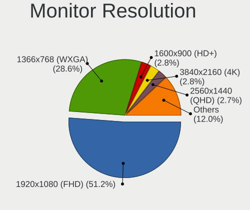

| Resolution         | Computers | Percent |
|--------------------|-----------|---------|
| 1920x1080 (FHD)    | 3601      | 51.18%  |
| 1366x768 (WXGA)    | 2015      | 28.64%  |
| 1600x900 (HD+)     | 197       | 2.8%    |
| 3840x2160 (4K)     | 195       | 2.77%   |
| 2560x1440 (QHD)    | 187       | 2.66%   |
| 1920x1200 (WUXGA)  | 178       | 2.53%   |
| 1440x900 (WXGA+)   | 90        | 1.28%   |
| 2560x1600          | 81        | 1.15%   |
| 2880x1800          | 66        | 0.94%   |
| 1280x800 (WXGA)    | 63        | 0.9%    |
| 2560x1080          | 49        | 0.7%    |
| 1360x768           | 41        | 0.58%   |
| 1280x1024 (SXGA)   | 35        | 0.5%    |
| 3200x2000          | 30        | 0.43%   |
| Unknown            | 29        | 0.41%   |
| 1680x1050 (WSXGA+) | 22        | 0.31%   |
| 3440x1440          | 15        | 0.21%   |
| 2160x1440          | 12        | 0.17%   |
| 3840x1080          | 10        | 0.14%   |
| 2288x1287          | 10        | 0.14%   |
| 2240x1400          | 9         | 0.13%   |
| 1024x768 (XGA)     | 9         | 0.13%   |
| 1024x600           | 8         | 0.11%   |
| 3840x2400          | 7         | 0.1%    |
| 800x1280           | 6         | 0.09%   |
| 3456x2160          | 5         | 0.07%   |
| 2880x1620          | 5         | 0.07%   |
| 2560x1397          | 5         | 0.07%   |
| 2256x1504          | 5         | 0.07%   |
| 1280x720 (HD)      | 5         | 0.07%   |
| 1920x1280          | 4         | 0.06%   |
| 4093x4093          | 3         | 0.04%   |
| 3840x1100          | 3         | 0.04%   |
| 3072x1920          | 3         | 0.04%   |
| 2880x1920          | 3         | 0.04%   |
| 1400x1050          | 2         | 0.03%   |
| 1280x768           | 2         | 0.03%   |
| 1200x1920          | 2         | 0.03%   |
| 1152x864           | 2         | 0.03%   |
| 8160x4627          | 1         | 0.01%   |

Monitor Diagonal
----------------

Diagonal size in inches

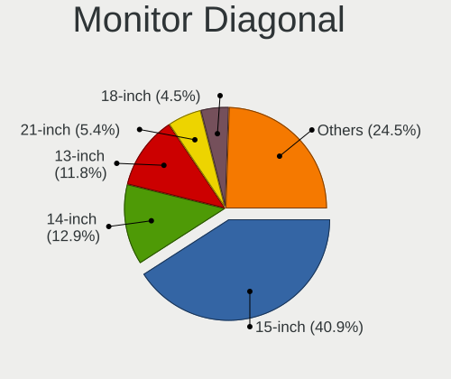

| Inches  | Computers | Percent |
|---------|-----------|---------|
| 15      | 2984      | 40.92%  |
| 14      | 943       | 12.93%  |
| 13      | 857       | 11.75%  |
| 21      | 397       | 5.44%   |
| 18      | 328       | 4.5%    |
| 24      | 281       | 3.85%   |
| 27      | 216       | 2.96%   |
| 23      | 202       | 2.77%   |
| 19      | 153       | 2.1%    |
| 16      | 146       | 2%      |
| Unknown | 140       | 1.92%   |
| 31      | 103       | 1.41%   |
| 17      | 87        | 1.19%   |
| 20      | 80        | 1.1%    |
| 12      | 68        | 0.93%   |
| 34      | 39        | 0.53%   |
| 11      | 29        | 0.4%    |
| 72      | 22        | 0.3%    |
| 46      | 20        | 0.27%   |
| 26      | 20        | 0.27%   |
| 40      | 14        | 0.19%   |
| 32      | 14        | 0.19%   |
| 22      | 14        | 0.19%   |
| 63      | 12        | 0.16%   |
| 10      | 12        | 0.16%   |
| 84      | 11        | 0.15%   |
| 142     | 9         | 0.12%   |
| 65      | 9         | 0.12%   |
| 25      | 9         | 0.12%   |
| 54      | 7         | 0.1%    |
| 29      | 7         | 0.1%    |
| 52      | 6         | 0.08%   |
| 39      | 6         | 0.08%   |
| 7       | 6         | 0.08%   |
| 64      | 4         | 0.05%   |
| 48      | 4         | 0.05%   |
| 42      | 4         | 0.05%   |
| 30      | 4         | 0.05%   |
| 86      | 3         | 0.04%   |
| 35      | 3         | 0.04%   |

Monitor Width
-------------

Physical width

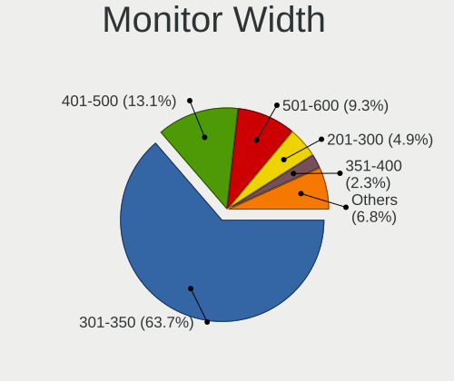

| Width in mm    | Computers | Percent |
|----------------|-----------|---------|
| 301-350        | 4613      | 63.68%  |
| 401-500        | 948       | 13.09%  |
| 501-600        | 674       | 9.3%    |
| 201-300        | 355       | 4.9%    |
| 351-400        | 163       | 2.25%   |
| 601-700        | 140       | 1.93%   |
| Unknown        | 140       | 1.93%   |
| 1001-1500      | 72        | 0.99%   |
| 701-800        | 56        | 0.77%   |
| 1501-2000      | 34        | 0.47%   |
| 801-900        | 25        | 0.35%   |
| More than 2000 | 9         | 0.12%   |
| 901-1000       | 7         | 0.1%    |
| 1-100          | 6         | 0.08%   |
| 101-200        | 2         | 0.03%   |

Aspect Ratio
------------

Proportional relationship between the width and the height

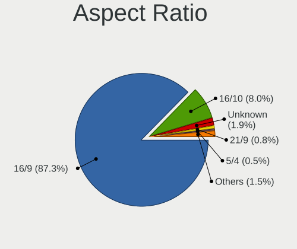

| Ratio   | Computers | Percent |
|---------|-----------|---------|
| 16/9    | 5917      | 87.34%  |
| 16/10   | 542       | 8%      |
| Unknown | 126       | 1.86%   |
| 21/9    | 54        | 0.8%    |
| 5/4     | 31        | 0.46%   |
| 3/2     | 31        | 0.46%   |
| 4/3     | 30        | 0.44%   |
| 1.00    | 9         | 0.13%   |
| 6/5     | 8         | 0.12%   |
| 2.00    | 7         | 0.1%    |
| 32/9    | 4         | 0.06%   |
| 0.67    | 4         | 0.06%   |
| 3.40    | 3         | 0.04%   |
| 0.62    | 3         | 0.04%   |
| 0.56    | 3         | 0.04%   |
| 0.63    | 2         | 0.03%   |
| 0.45    | 1         | 0.01%   |

Monitor Area
------------

Area in inch²

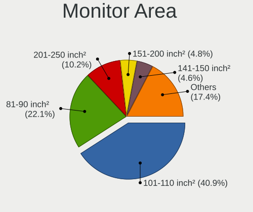

| Area in inch² | Computers | Percent |
|----------------|-----------|---------|
| 101-110        | 2978      | 40.89%  |
| 81-90          | 1612      | 22.13%  |
| 201-250        | 741       | 10.17%  |
| 151-200        | 348       | 4.78%   |
| 141-150        | 338       | 4.64%   |
| 301-350        | 227       | 3.12%   |
| 71-80          | 186       | 2.55%   |
| 351-500        | 164       | 2.25%   |
| Unknown        | 140       | 1.92%   |
| 111-120        | 125       | 1.72%   |
| More than 1000 | 91        | 1.25%   |
| 121-130        | 63        | 0.87%   |
| 251-300        | 60        | 0.82%   |
| 61-70          | 57        | 0.78%   |
| 501-1000       | 56        | 0.77%   |
| 51-60          | 32        | 0.44%   |
| 91-100         | 30        | 0.41%   |
| 131-140        | 15        | 0.21%   |
| 41-50          | 12        | 0.16%   |
| 1-40           | 8         | 0.11%   |

Pixel Density
-------------

Pixels per inch

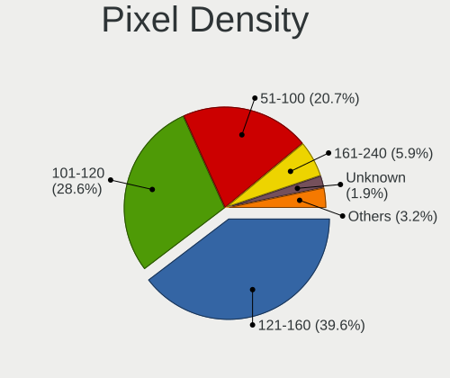

| Density       | Computers | Percent |
|---------------|-----------|---------|
| 121-160       | 2852      | 39.64%  |
| 101-120       | 2058      | 28.61%  |
| 51-100        | 1491      | 20.73%  |
| 161-240       | 421       | 5.85%   |
| Unknown       | 140       | 1.95%   |
| More than 240 | 135       | 1.88%   |
| 1-50          | 97        | 1.35%   |

Multiple Monitors
-----------------

Total monitors connected

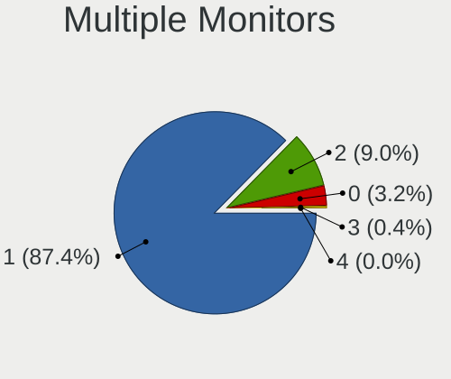

| Total | Computers | Percent |
|-------|-----------|---------|
| 1     | 6200      | 87.37%  |
| 2     | 636       | 8.96%   |
| 0     | 229       | 3.23%   |
| 3     | 28        | 0.39%   |
| 4     | 3         | 0.04%   |

Network
-------

Net Controller Vendor
---------------------

Controller vendors

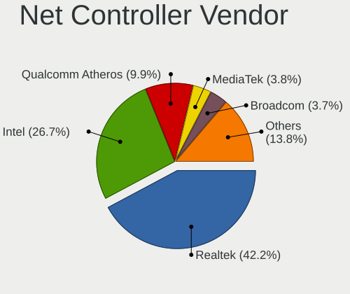

| Vendor                          | Computers | Percent |
|---------------------------------|-----------|---------|
| Realtek Semiconductor           | 4649      | 42.19%  |
| Intel                           | 2941      | 26.69%  |
| Qualcomm Atheros                | 1086      | 9.86%   |
| MediaTek                        | 422       | 3.83%   |
| Broadcom                        | 405       | 3.68%   |
| Ralink Technology               | 186       | 1.69%   |
| TP-Link                         | 165       | 1.5%    |
| Xiaomi                          | 144       | 1.31%   |
| Samsung Electronics             | 112       | 1.02%   |
| OPPO Electronics                | 109       | 0.99%   |
| Shenzhen Goodix Technology      | 92        | 0.83%   |
| Ralink                          | 91        | 0.83%   |
| Broadcom Limited                | 79        | 0.72%   |
| Qualcomm                        | 72        | 0.65%   |
| ASIX Electronics                | 45        | 0.41%   |
| Motorola PCS                    | 42        | 0.38%   |
| D-Link                          | 42        | 0.38%   |
| Marvell Technology Group        | 39        | 0.35%   |
| OnePlus Technology (Shenzhen)   | 26        | 0.24%   |
| Huawei Technologies             | 26        | 0.24%   |
| Google                          | 21        | 0.19%   |
| Nvidia                          | 17        | 0.15%   |
| Qualcomm Atheros Communications | 16        | 0.15%   |
| ICS Advent                      | 15        | 0.14%   |
| Foxconn / Hon Hai               | 15        | 0.14%   |
| vivo                            | 10        | 0.09%   |
| NetGear                         | 10        | 0.09%   |
| DisplayLink                     | 9         | 0.08%   |
| Microchip Technology            | 8         | 0.07%   |
| Lenovo                          | 8         | 0.07%   |
| JMicron Technology              | 8         | 0.07%   |
| ASUSTek Computer                | 7         | 0.06%   |
| Qualcomm Technologies           | 6         | 0.05%   |
| Edimax Technology               | 6         | 0.05%   |
| HMD Global                      | 5         | 0.05%   |
| Dell                            | 5         | 0.05%   |
| D-Link System                   | 5         | 0.05%   |
| Aquantia                        | 5         | 0.05%   |
| Altair Semiconductor            | 5         | 0.05%   |
| QinHeng Electronics             | 4         | 0.04%   |

Net Controller Model
--------------------

Controller models

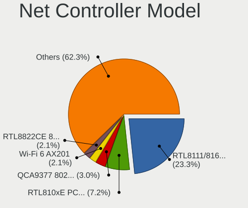

| Model                                                                  | Computers | Percent |
|------------------------------------------------------------------------|-----------|---------|
| Realtek RTL8111/8168/8211/8411 PCI Express Gigabit Ethernet Controller | 2992      | 23.33%  |
| Realtek RTL810xE PCI Express Fast Ethernet controller                  | 919       | 7.17%   |
| Qualcomm Atheros QCA9377 802.11ac Wireless Network Adapter             | 382       | 2.98%   |
| Intel Wi-Fi 6 AX201                                                    | 272       | 2.12%   |
| Realtek RTL8822CE 802.11ac PCIe Wireless Network Adapter               | 271       | 2.11%   |
| Intel Wi-Fi 6 AX200                                                    | 234       | 1.82%   |
| Intel Wireless 8265 / 8275                                             | 223       | 1.74%   |
| MediaTek MT7921 802.11ax PCIe Wireless Network Adapter [Filogic 330]   | 206       | 1.61%   |
| Intel Alder Lake-P PCH CNVi WiFi                                       | 197       | 1.54%   |
| Qualcomm Atheros QCA9565 / AR9565 Wireless Network Adapter             | 192       | 1.5%    |
| Realtek RTL8821CE 802.11ac PCIe Wireless Network Adapter               | 177       | 1.38%   |
| Ralink MT7601U Wireless Adapter                                        | 167       | 1.3%    |
| Intel Comet Lake PCH-LP CNVi WiFi                                      | 162       | 1.26%   |
| Intel Cannon Lake PCH CNVi WiFi                                        | 155       | 1.21%   |
| Realtek RTL8723BE PCIe Wireless Network Adapter                        | 154       | 1.2%    |
| Broadcom BCM43142 802.11b/g/n                                          | 140       | 1.09%   |
| Realtek RTL8723DE Wireless Network Adapter                             | 134       | 1.04%   |
| Realtek RTL8125 2.5GbE Controller                                      | 134       | 1.04%   |
| Intel Cannon Point-LP CNVi [Wireless-AC]                               | 132       | 1.03%   |
| Realtek RTL8188EUS 802.11n Wireless Network Adapter                    | 131       | 1.02%   |
| Qualcomm Atheros QCA6174 802.11ac Wireless Network Adapter             | 130       | 1.01%   |
| Intel Wireless 7265                                                    | 122       | 0.95%   |
| Realtek RTL8188FTV 802.11b/g/n 1T1R 2.4G WLAN Adapter                  | 119       | 0.93%   |
| Intel 82579LM Gigabit Network Connection (Lewisville)                  | 112       | 0.87%   |
| Qualcomm Atheros AR9485 Wireless Network Adapter                       | 107       | 0.83%   |
| Xiaomi Mi/Redmi series (RNDIS)                                         | 106       | 0.83%   |
| Realtek RTL8852BE PCIe 802.11ax Wireless Network Controller            | 102       | 0.8%    |
| Intel Wireless 3165                                                    | 102       | 0.8%    |
| Qualcomm Atheros AR9285 Wireless Network Adapter (PCI-Express)         | 101       | 0.79%   |
| OPPO Ace 3V                                                            | 96        | 0.75%   |
| Shenzhen Goodix Fingerprint Reader                                     | 92        | 0.72%   |
| Intel Wireless 3160                                                    | 88        | 0.69%   |
| Intel Ice Lake-LP PCH CNVi WiFi                                        | 85        | 0.66%   |
| MediaTek MT7922 802.11ax PCI Express Wireless Network Adapter          | 84        | 0.65%   |
| Samsung Galaxy series, misc. (tethering mode)                          | 80        | 0.62%   |
| Broadcom BCM4313 802.11bgn Wireless Network Adapter                    | 79        | 0.62%   |
| Realtek RTL8852AE 802.11ax PCIe Wireless Network Adapter               | 77        | 0.6%    |
| Intel Wireless 8260                                                    | 77        | 0.6%    |
| Intel Ethernet Connection (4) I219-LM                                  | 73        | 0.57%   |
| Ralink RT3290 Wireless 802.11n 1T/1R PCIe                              | 72        | 0.56%   |

Wireless Vendor
---------------

Wireless vendors

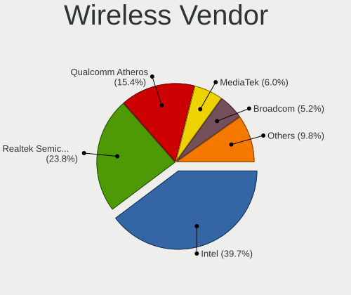

| Vendor                          | Computers | Percent |
|---------------------------------|-----------|---------|
| Intel                           | 2501      | 39.75%  |
| Realtek Semiconductor           | 1495      | 23.76%  |
| Qualcomm Atheros                | 970       | 15.42%  |
| MediaTek                        | 380       | 6.04%   |
| Broadcom                        | 329       | 5.23%   |
| Ralink Technology               | 186       | 2.96%   |
| TP-Link                         | 153       | 2.43%   |
| Ralink                          | 90        | 1.43%   |
| Broadcom Limited                | 63        | 1%      |
| D-Link                          | 42        | 0.67%   |
| Qualcomm                        | 22        | 0.35%   |
| Qualcomm Atheros Communications | 16        | 0.25%   |
| NetGear                         | 10        | 0.16%   |
| Edimax Technology               | 6         | 0.1%    |
| Dell                            | 4         | 0.06%   |
| Sierra Wireless                 | 3         | 0.05%   |
| Realtek                         | 3         | 0.05%   |
| Marvell Technology Group        | 3         | 0.05%   |
| D-Link System                   | 3         | 0.05%   |
| ASUSTek Computer                | 3         | 0.05%   |
| Qualcomm Technologies           | 2         | 0.03%   |
| Belkin Components               | 2         | 0.03%   |
| Wacom                           | 1         | 0.02%   |
| Samsung Electronics             | 1         | 0.02%   |
| Philips (or NXP)                | 1         | 0.02%   |
| Microsoft                       | 1         | 0.02%   |
| Micro Star International        | 1         | 0.02%   |
| IMC Networks                    | 1         | 0.02%   |

Wireless Model
--------------

Wireless models

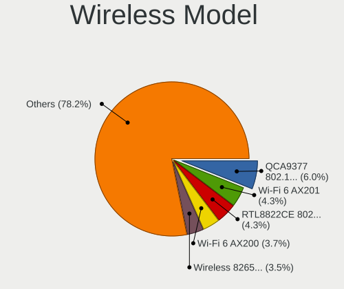

| Model                                                                | Computers | Percent |
|----------------------------------------------------------------------|-----------|---------|
| Qualcomm Atheros QCA9377 802.11ac Wireless Network Adapter           | 382       | 6.04%   |
| Intel Wi-Fi 6 AX201                                                  | 272       | 4.3%    |
| Realtek RTL8822CE 802.11ac PCIe Wireless Network Adapter             | 271       | 4.28%   |
| Intel Wi-Fi 6 AX200                                                  | 234       | 3.7%    |
| Intel Wireless 8265 / 8275                                           | 223       | 3.53%   |
| MediaTek MT7921 802.11ax PCIe Wireless Network Adapter [Filogic 330] | 206       | 3.26%   |
| Qualcomm Atheros QCA9565 / AR9565 Wireless Network Adapter           | 192       | 3.04%   |
| Realtek RTL8821CE 802.11ac PCIe Wireless Network Adapter             | 177       | 2.8%    |
| Ralink MT7601U Wireless Adapter                                      | 167       | 2.64%   |
| Intel Comet Lake PCH-LP CNVi WiFi                                    | 162       | 2.56%   |
| Intel Cannon Lake PCH CNVi WiFi                                      | 155       | 2.45%   |
| Realtek RTL8723BE PCIe Wireless Network Adapter                      | 154       | 2.43%   |
| Intel Alder Lake-P PCH CNVi WiFi                                     | 154       | 2.43%   |
| Broadcom BCM43142 802.11b/g/n                                        | 140       | 2.21%   |
| Realtek RTL8723DE Wireless Network Adapter                           | 134       | 2.12%   |
| Intel Cannon Point-LP CNVi [Wireless-AC]                             | 132       | 2.09%   |
| Realtek RTL8188EUS 802.11n Wireless Network Adapter                  | 131       | 2.07%   |
| Qualcomm Atheros QCA6174 802.11ac Wireless Network Adapter           | 130       | 2.06%   |
| Intel Wireless 7265                                                  | 122       | 1.93%   |
| Realtek RTL8188FTV 802.11b/g/n 1T1R 2.4G WLAN Adapter                | 119       | 1.88%   |
| Qualcomm Atheros AR9485 Wireless Network Adapter                     | 107       | 1.69%   |
| Intel Wireless 3165                                                  | 102       | 1.61%   |
| Qualcomm Atheros AR9285 Wireless Network Adapter (PCI-Express)       | 101       | 1.6%    |
| Realtek RTL8852BE PCIe 802.11ax Wireless Network Controller          | 98        | 1.55%   |
| Intel Wireless 3160                                                  | 88        | 1.39%   |
| Intel Ice Lake-LP PCH CNVi WiFi                                      | 85        | 1.34%   |
| Broadcom BCM4313 802.11bgn Wireless Network Adapter                  | 79        | 1.25%   |
| Realtek RTL8852AE 802.11ax PCIe Wireless Network Adapter             | 77        | 1.22%   |
| Intel Wireless 8260                                                  | 77        | 1.22%   |
| Ralink RT3290 Wireless 802.11n 1T/1R PCIe                            | 72        | 1.14%   |
| Realtek RTL8822BE 802.11a/b/g/n/ac WiFi adapter                      | 71        | 1.12%   |
| MediaTek MT7922 802.11ax PCI Express Wireless Network Adapter        | 70        | 1.11%   |
| Intel Comet Lake PCH CNVi WiFi                                       | 66        | 1.04%   |
| Intel Dual Band Wireless-AC 3168NGW [Stone Peak]                     | 65        | 1.03%   |
| MediaTek MT7902 802.11ax PCIe Wireless Network Adapter [Filogic 310] | 64        | 1.01%   |
| Intel Raptor Lake PCH CNVi WiFi                                      | 61        | 0.96%   |
| Intel Wireless 7260                                                  | 57        | 0.9%    |
| Intel Dual Band Wireless-AC 3165 Plus Bluetooth                      | 46        | 0.73%   |
| Intel Centrino Advanced-N 6205 [Taylor Peak]                         | 44        | 0.7%    |
| Intel Wi-Fi 5(802.11ac) Wireless-AC 9x6x [Thunder Peak]              | 42        | 0.66%   |

Ethernet Vendor
---------------

Ethernet vendors

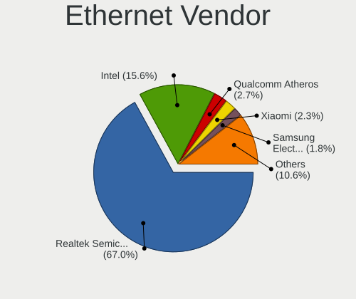

| Vendor                                 | Computers | Percent |
|----------------------------------------|-----------|---------|
| Realtek Semiconductor                  | 4184      | 67.01%  |
| Intel                                  | 973       | 15.58%  |
| Qualcomm Atheros                       | 171       | 2.74%   |
| Xiaomi                                 | 144       | 2.31%   |
| Samsung Electronics                    | 111       | 1.78%   |
| OPPO Electronics                       | 109       | 1.75%   |
| Broadcom                               | 109       | 1.75%   |
| Qualcomm                               | 50        | 0.8%    |
| MediaTek                               | 50        | 0.8%    |
| ASIX Electronics                       | 45        | 0.72%   |
| Motorola PCS                           | 42        | 0.67%   |
| Marvell Technology Group               | 36        | 0.58%   |
| Huawei Technologies                    | 22        | 0.35%   |
| Google                                 | 21        | 0.34%   |
| OnePlus Technology (Shenzhen)          | 20        | 0.32%   |
| Nvidia                                 | 16        | 0.26%   |
| Broadcom Limited                       | 16        | 0.26%   |
| ICS Advent                             | 15        | 0.24%   |
| TP-Link                                | 13        | 0.21%   |
| vivo                                   | 10        | 0.16%   |
| DisplayLink                            | 9         | 0.14%   |
| JMicron Technology                     | 8         | 0.13%   |
| Lenovo                                 | 7         | 0.11%   |
| Microchip Technology                   | 6         | 0.1%    |
| HMD Global                             | 5         | 0.08%   |
| Aquantia                               | 5         | 0.08%   |
| Altair Semiconductor                   | 5         | 0.08%   |
| Qualcomm Technologies                  | 4         | 0.06%   |
| Foxconn / Hon Hai                      | 4         | 0.06%   |
| ASUSTek Computer                       | 4         | 0.06%   |
| Attansic Technology                    | 3         | 0.05%   |
| Apple                                  | 3         | 0.05%   |
| AMTelecom                              | 3         | 0.05%   |
| Spreadtrum Communications              | 2         | 0.03%   |
| Silicon Integrated Systems [SiS]       | 2         | 0.03%   |
| D-Link System                          | 2         | 0.03%   |
| ZTE WCDMA Technologies MSM             | 1         | 0.02%   |
| VIA Technologies                       | 1         | 0.02%   |
| Sony Ericsson Mobile Communications AB | 1         | 0.02%   |
| Raspberry Pi                           | 1         | 0.02%   |

Ethernet Model
--------------

Ethernet models

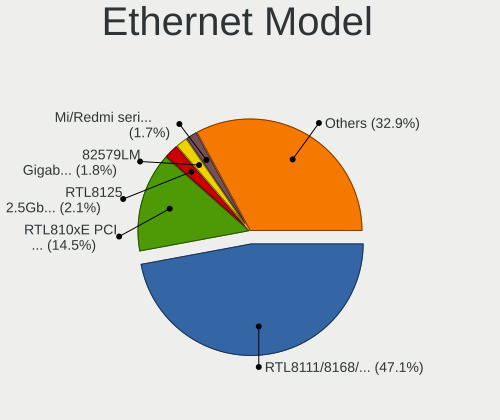

| Model                                                                  | Computers | Percent |
|------------------------------------------------------------------------|-----------|---------|
| Realtek RTL8111/8168/8211/8411 PCI Express Gigabit Ethernet Controller | 2992      | 47.08%  |
| Realtek RTL810xE PCI Express Fast Ethernet controller                  | 919       | 14.46%  |
| Realtek RTL8125 2.5GbE Controller                                      | 134       | 2.11%   |
| Intel 82579LM Gigabit Network Connection (Lewisville)                  | 112       | 1.76%   |
| Xiaomi Mi/Redmi series (RNDIS)                                         | 106       | 1.67%   |
| OPPO Ace 3V                                                            | 96        | 1.51%   |
| Samsung Galaxy series, misc. (tethering mode)                          | 80        | 1.26%   |
| Intel Ethernet Connection (4) I219-LM                                  | 73        | 1.15%   |
| Realtek RTL8153 Gigabit Ethernet Adapter                               | 58        | 0.91%   |
| Realtek Killer E2600 GbE Controller                                    | 52        | 0.82%   |
| Intel Ethernet Connection I219-LM                                      | 49        | 0.77%   |
| Intel Ethernet Connection (4) I219-V                                   | 44        | 0.69%   |
| Intel Ethernet Connection (2) I219-V                                   | 43        | 0.68%   |
| Intel Alder Lake-P PCH CNVi WiFi                                       | 43        | 0.68%   |
| Intel Ethernet Connection I217-LM                                      | 41        | 0.65%   |
| Intel Ethernet Controller I225-V                                       | 39        | 0.61%   |
| Xiaomi Mi/Redmi series (RNDIS + ADB)                                   | 38        | 0.6%    |
| Qualcomm Nokia X30 5G                                                  | 38        | 0.6%    |
| Intel I211 Gigabit Network Connection                                  | 38        | 0.6%    |
| ASIX AX88179 Gigabit Ethernet                                          | 38        | 0.6%    |
| Samsung GT-I9070 (network tethering, USB debugging enabled)            | 34        | 0.54%   |
| Intel Ethernet Connection I218-LM                                      | 34        | 0.54%   |
| Intel 82579V Gigabit Network Connection                                | 33        | 0.52%   |
| Motorola PCS motorola one 5G ace                                       | 29        | 0.46%   |
| Qualcomm Atheros QCA8172 Fast Ethernet                                 | 27        | 0.42%   |
| MediaTek Infinix HOT 50i                                               | 27        | 0.42%   |
| Intel Ethernet Connection (7) I219-LM                                  | 27        | 0.42%   |
| Intel Ethernet Connection (3) I218-LM                                  | 25        | 0.39%   |
| Intel Ethernet Connection (6) I219-LM                                  | 24        | 0.38%   |
| Intel Ethernet Connection (2) I219-LM                                  | 24        | 0.38%   |
| Realtek RTL8152 Fast Ethernet Adapter                                  | 23        | 0.36%   |
| OnePlus (Shenzhen) BE2029                                              | 20        | 0.31%   |
| Intel Ethernet Connection (10) I219-V                                  | 20        | 0.31%   |
| Intel 82577LM Gigabit Network Connection                               | 20        | 0.31%   |
| Broadcom NetLink BCM57785 Gigabit Ethernet PCIe                        | 20        | 0.31%   |
| Qualcomm Atheros AR8151 v2.0 Gigabit Ethernet                          | 19        | 0.3%    |
| Intel Ethernet Connection (7) I219-V                                   | 19        | 0.3%    |
| Intel Ethernet Connection (6) I219-V                                   | 19        | 0.3%    |
| Qualcomm Atheros QCA8171 Gigabit Ethernet                              | 18        | 0.28%   |
| Qualcomm Atheros AR8162 Fast Ethernet                                  | 18        | 0.28%   |

Net Controller Kind
-------------------

Ethernet, WiFi or modem

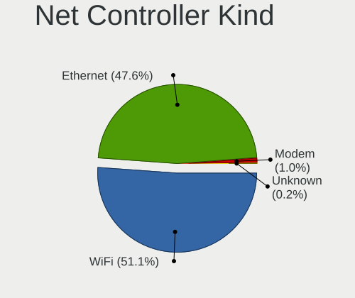

| Kind     | Computers | Percent |
|----------|-----------|---------|
| WiFi     | 6059      | 51.14%  |
| Ethernet | 5644      | 47.64%  |
| Modem    | 119       | 1%      |
| Unknown  | 26        | 0.22%   |

Used Controller
---------------

Currently used network controller

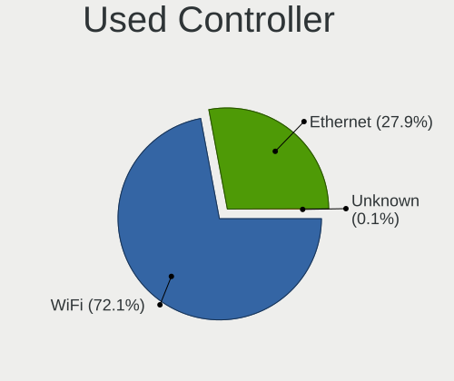

| Kind     | Computers | Percent |
|----------|-----------|---------|
| WiFi     | 5016      | 72.07%  |
| Ethernet | 1940      | 27.87%  |
| Unknown  | 4         | 0.06%   |

NICs
----

Total network controllers on board

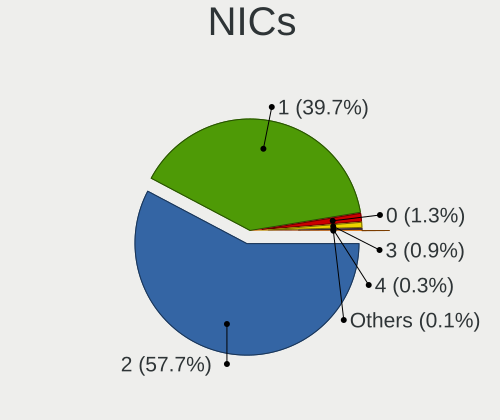

| Total | Computers | Percent |
|-------|-----------|---------|
| 2     | 4047      | 57.74%  |
| 1     | 2780      | 39.66%  |
| 0     | 90        | 1.28%   |
| 3     | 61        | 0.87%   |
| 4     | 23        | 0.33%   |
| 6     | 4         | 0.06%   |
| 8     | 2         | 0.03%   |
| 11    | 1         | 0.01%   |
| 10    | 1         | 0.01%   |

IPv6
----

IPv6 vs IPv4

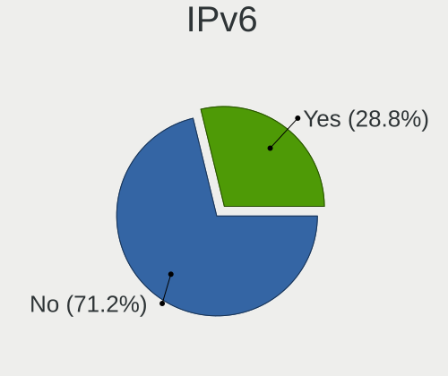

| Used | Computers | Percent |
|------|-----------|---------|
| No   | 5106      | 71.22%  |
| Yes  | 2063      | 28.78%  |

Bluetooth
---------

Bluetooth Vendor
----------------

Controller vendors

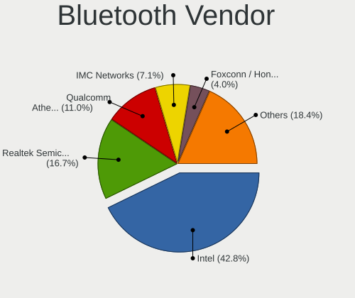

| Vendor                          | Computers | Percent |
|---------------------------------|-----------|---------|
| Intel                           | 2312      | 42.78%  |
| Realtek Semiconductor           | 901       | 16.67%  |
| Qualcomm Atheros Communications | 595       | 11.01%  |
| IMC Networks                    | 384       | 7.11%   |
| Foxconn / Hon Hai               | 217       | 4.02%   |
| Broadcom                        | 215       | 3.98%   |
| Cambridge Silicon Radio         | 199       | 3.68%   |
| Lite-On Technology              | 184       | 3.4%    |
| Ralink                          | 72        | 1.33%   |
| TP-Link                         | 61        | 1.13%   |
| Apple                           | 56        | 1.04%   |
| MediaTek                        | 49        | 0.91%   |
| Dell                            | 44        | 0.81%   |
| Hewlett-Packard                 | 24        | 0.44%   |
| Toshiba                         | 13        | 0.24%   |
| Foxconn International           | 11        | 0.2%    |
| USI                             | 10        | 0.19%   |
| Realtek                         | 10        | 0.19%   |
| ASUSTek Computer                | 10        | 0.19%   |
| Ralink Technology               | 8         | 0.15%   |
| Opticis                         | 6         | 0.11%   |
| Integrated System Solution      | 4         | 0.07%   |
| Chicony Electronics             | 3         | 0.06%   |
| Unknown                         | 3         | 0.06%   |
| SINO WEALTH                     | 2         | 0.04%   |
| Marvell Semiconductor           | 2         | 0.04%   |
| Alps Electric                   | 2         | 0.04%   |
| Actions                         | 2         | 0.04%   |
| Micro Star International        | 1         | 0.02%   |
| Conwise Technology              | 1         | 0.02%   |
| Belkin Components               | 1         | 0.02%   |
| AICSemi                         | 1         | 0.02%   |
| Accel Semiconductor             | 1         | 0.02%   |

Bluetooth Model
---------------

Controller models

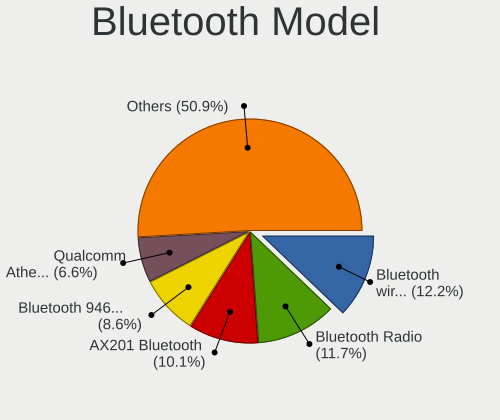

| Model                                               | Computers | Percent |
|-----------------------------------------------------|-----------|---------|
| Intel Bluetooth wireless interface                  | 657       | 12.16%  |
| Realtek Bluetooth Radio                             | 631       | 11.67%  |
| Intel AX201 Bluetooth                               | 545       | 10.08%  |
| Intel Bluetooth 9460/9560 Jefferson Peak (JfP)      | 466       | 8.62%   |
| Qualcomm Atheros  Bluetooth Device                  | 355       | 6.57%   |
| Intel AX200 Bluetooth                               | 230       | 4.26%   |
| Intel Bluetooth Device                              | 228       | 4.22%   |
| IMC Networks Wireless_Device                        | 209       | 3.87%   |
| Realtek  Bluetooth 4.2 Adapter                      | 203       | 3.76%   |
| Cambridge Silicon Radio Bluetooth Dongle (HCI mode) | 199       | 3.68%   |
| IMC Networks Bluetooth Radio                        | 102       | 1.89%   |
| Ralink RT3290 Bluetooth                             | 72        | 1.33%   |
| Qualcomm Atheros AR9462 Bluetooth                   | 72        | 1.33%   |
| IMC Networks Bluetooth Device                       | 65        | 1.2%    |
| Lite-On Bluetooth Device                            | 63        | 1.17%   |
| Intel Wireless-AC 3168 Bluetooth                    | 62        | 1.15%   |
| TP-Link TP-T@- UB500 Adapter                        | 61        | 1.13%   |
| Foxconn / Hon Hai Wireless_Device                   | 61        | 1.13%   |
| Lite-On Qualcomm Atheros QCA9377 Bluetooth          | 57        | 1.05%   |
| Broadcom BCM43142 Bluetooth 4.0                     | 56        | 1.04%   |
| Qualcomm Atheros AR3011 Bluetooth                   | 54        | 1%      |
| Qualcomm Atheros AR3012 Bluetooth 4.0               | 46        | 0.85%   |
| MediaTek Wireless_Device                            | 45        | 0.83%   |
| Qualcomm Atheros QCA61x4 Bluetooth 4.0              | 44        | 0.81%   |
| Foxconn / Hon Hai MediaTek Bluetooth Adapter        | 40        | 0.74%   |
| Foxconn / Hon Hai Bluetooth Device                  | 39        | 0.72%   |
| Intel Centrino Bluetooth Wireless Transceiver       | 38        | 0.7%    |
| Intel AX210 Bluetooth                               | 34        | 0.63%   |
| Apple Bluetooth USB Host Controller                 | 33        | 0.61%   |
| Lite-On Wireless_Device                             | 32        | 0.59%   |
| Intel Wireless-AC 9260 Bluetooth Adapter            | 32        | 0.59%   |
| Broadcom BCM43142A0 Bluetooth 4.0                   | 32        | 0.59%   |
| Realtek RTL8821A Bluetooth                          | 22        | 0.41%   |
| Realtek RTL8723B Bluetooth                          | 22        | 0.41%   |
| Intel Centrino Advanced-N 6230 Bluetooth adapter    | 21        | 0.39%   |
| Broadcom BCM43142A0 Bluetooth Device                | 21        | 0.39%   |
| Broadcom BCM2070 Bluetooth 2.1 + EDR                | 20        | 0.37%   |
| Realtek RTL8822BE Bluetooth 4.2 Adapter             | 18        | 0.33%   |
| Foxconn / Hon Hai Bluetooth USB Host Controller     | 18        | 0.33%   |
| HP Broadcom 2070 Bluetooth Combo                    | 16        | 0.3%    |

Sound
-----

Sound Vendor
------------

Sound card vendors

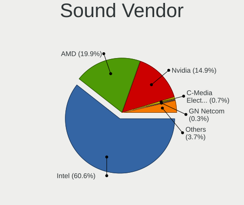

| Vendor                                       | Computers | Percent |
|----------------------------------------------|-----------|---------|
| Intel                                        | 5255      | 60.58%  |
| AMD                                          | 1722      | 19.85%  |
| Nvidia                                       | 1293      | 14.91%  |
| C-Media Electronics                          | 60        | 0.69%   |
| GN Netcom                                    | 27        | 0.31%   |
| ASUSTek Computer                             | 23        | 0.27%   |
| Logitech                                     | 18        | 0.21%   |
| Texas Instruments                            | 16        | 0.18%   |
| Realtek Semiconductor                        | 16        | 0.18%   |
| JMTek                                        | 15        | 0.17%   |
| Generalplus Technology                       | 15        | 0.17%   |
| Micro Star International                     | 14        | 0.16%   |
| Creative Labs                                | 13        | 0.15%   |
| Plantronics                                  | 12        | 0.14%   |
| Creative Technology                          | 11        | 0.13%   |
| Walmart                                      | 10        | 0.12%   |
| Zoran Co. Personal Media Division (Nogatech) | 9         | 0.1%    |
| DSEA A/S                                     | 8         | 0.09%   |
| Tenx Technology                              | 6         | 0.07%   |
| OPPO Electronics                             | 6         | 0.07%   |
| SteelSeries ApS                              | 5         | 0.06%   |
| Razer USA                                    | 5         | 0.06%   |
| Hewlett-Packard                              | 5         | 0.06%   |
| Silicon Integrated Systems [SiS]             | 4         | 0.05%   |
| Lenovo                                       | 4         | 0.05%   |
| KTMicro                                      | 4         | 0.05%   |
| GYROCOM C&C                                  | 4         | 0.05%   |
| Corsair                                      | 4         | 0.05%   |
| Apple                                        | 4         | 0.05%   |
| TTGK Technology                              | 3         | 0.03%   |
| Sony                                         | 3         | 0.03%   |
| Samsung Electronics                          | 3         | 0.03%   |
| M-Audio                                      | 3         | 0.03%   |
| Kingston Technology                          | 3         | 0.03%   |
| Jieli Technology                             | 3         | 0.03%   |
| Huawei Technologies                          | 3         | 0.03%   |
| Giga-Byte Technology                         | 3         | 0.03%   |
| Focusrite-Novation                           | 3         | 0.03%   |
| Unknown                                      | 3         | 0.03%   |
| YSTEK Technology                             | 2         | 0.02%   |

Sound Model
-----------

Sound card models

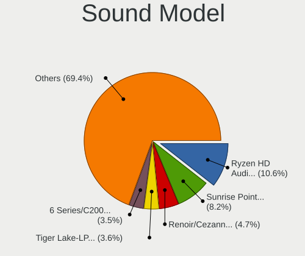

| Model                                                                      | Computers | Percent |
|----------------------------------------------------------------------------|-----------|---------|
| AMD Ryzen HD Audio Controller                                              | 1127      | 10.58%  |
| Intel Sunrise Point-LP HD Audio                                            | 870       | 8.17%   |
| AMD Renoir/Cezanne HDMI/DP Audio Controller                                | 501       | 4.7%    |
| Intel Tiger Lake-LP Smart Sound Technology Audio Controller                | 386       | 3.62%   |
| Intel 6 Series/C200 Series Chipset Family High Definition Audio Controller | 375       | 3.52%   |
| Intel 7 Series/C216 Chipset Family High Definition Audio Controller        | 349       | 3.28%   |
| Intel Cannon Lake PCH cAVS                                                 | 284       | 2.67%   |
| AMD Raven/Raven2/Fenghuang HDMI/DP Audio Controller                        | 281       | 2.64%   |
| Intel Alder Lake PCH-P High Definition Audio Controller                    | 268       | 2.52%   |
| Nvidia TU107 GeForce GTX 1650 High Definition Audio Controller             | 267       | 2.51%   |
| Intel 8 Series HD Audio Controller                                         | 259       | 2.43%   |
| Intel Haswell-ULT HD Audio Controller                                      | 257       | 2.41%   |
| Intel Cannon Point-LP High Definition Audio Controller                     | 253       | 2.37%   |
| Intel Comet Lake PCH-LP cAVS                                               | 214       | 2.01%   |
| Intel 8 Series/C220 Series Chipset High Definition Audio Controller        | 196       | 1.84%   |
| Intel Broadwell-U Audio Controller                                         | 191       | 1.79%   |
| AMD Radeon High Definition Audio Controller                                | 191       | 1.79%   |
| Intel Wildcat Point-LP High Definition Audio Controller                    | 190       | 1.78%   |
| Intel NM10/ICH7 Family High Definition Audio Controller                    | 183       | 1.72%   |
| Intel Xeon E3-1200 v3/4th Gen Core Processor HD Audio Controller           | 170       | 1.6%    |
| Intel 5 Series/3400 Series Chipset High Definition Audio                   | 165       | 1.55%   |
| Nvidia GK208 HDMI/DP Audio Controller                                      | 149       | 1.4%    |
| Intel Ice Lake-LP Smart Sound Technology Audio Controller                  | 148       | 1.39%   |
| AMD FCH Azalia Controller                                                  | 140       | 1.31%   |
| Intel 100 Series/C230 Series Chipset Family HD Audio Controller            | 129       | 1.21%   |
| Nvidia GA107 High Definition Audio Controller                              | 126       | 1.18%   |
| Intel Comet Lake PCH cAVS                                                  | 117       | 1.1%    |
| AMD Starship/Matisse HD Audio Controller                                   | 117       | 1.1%    |
| AMD Family 15h (Models 60h-6fh) Audio Controller                           | 108       | 1.01%   |
| Intel 200 Series PCH HD Audio                                              | 105       | 0.99%   |
| AMD Kabini HDMI/DP Audio                                                   | 101       | 0.95%   |
| Intel Raptor Lake-P/U/H cAVS                                               | 100       | 0.94%   |
| Nvidia GP107GL High Definition Audio Controller                            | 87        | 0.82%   |
| AMD High Definition Audio Controller                                       | 81        | 0.76%   |
| Nvidia TU116 High Definition Audio Controller                              | 78        | 0.73%   |
| Nvidia GA106 High Definition Audio Controller                              | 75        | 0.7%    |
| Intel 82801I (ICH9 Family) HD Audio Controller                             | 75        | 0.7%    |
| Intel Tiger Lake-H HD Audio Controller                                     | 66        | 0.62%   |
| AMD SBx00 Azalia (Intel HDA)                                               | 61        | 0.57%   |
| Nvidia AD107 High Definition Audio Controller                              | 59        | 0.55%   |

Memory
------

Memory Vendor
-------------

Memory module vendors

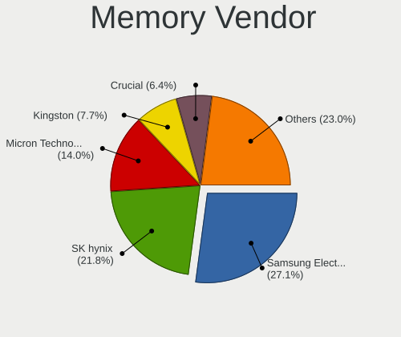

| Vendor                       | Computers | Percent |
|------------------------------|-----------|---------|
| Samsung Electronics          | 1320      | 27.11%  |
| SK hynix                     | 1063      | 21.83%  |
| Micron Technology            | 683       | 14.03%  |
| Kingston                     | 373       | 7.66%   |
| Crucial                      | 312       | 6.41%   |
| Unknown                      | 211       | 4.33%   |
| Corsair                      | 190       | 3.9%    |
| A-DATA Technology            | 165       | 3.39%   |
| Ramaxel Technology           | 135       | 2.77%   |
| G.Skill                      | 75        | 1.54%   |
| Transcend                    | 72        | 1.48%   |
| Unknown                      | 65        | 1.33%   |
| CSX                          | 37        | 0.76%   |
| Nanya Technology             | 36        | 0.74%   |
| Elpida                       | 29        | 0.6%    |
| Unknown (ABCD)               | 9         | 0.18%   |
| OM Nanotech                  | 9         | 0.18%   |
| Silicon Power                | 6         | 0.12%   |
| Red Hat                      | 5         | 0.1%    |
| Unknown (0x0CAB)             | 4         | 0.08%   |
| Apacer                       | 4         | 0.08%   |
| ACPI Digital                 | 4         | 0.08%   |
| ZION                         | 3         | 0.06%   |
| Team                         | 3         | 0.06%   |
| SHARETRONIC                  | 3         | 0.06%   |
| Avant                        | 3         | 0.06%   |
| Abacus                       | 3         | 0.06%   |
| Unknown (0x0CDC)             | 2         | 0.04%   |
| Strontium                    | 2         | 0.04%   |
| Qumo                         | 2         | 0.04%   |
| Qimonda                      | 2         | 0.04%   |
| NETSOL                       | 2         | 0.04%   |
| Kllisre                      | 2         | 0.04%   |
| Hikvision                    | 2         | 0.04%   |
| Gold Key                     | 2         | 0.04%   |
| ASint Technology             | 2         | 0.04%   |
| Acer                         | 2         | 0.04%   |
| Unknown (8AD6)               | 1         | 0.02%   |
| Unknown (0xAD44594E45540000) | 1         | 0.02%   |
| Unknown (0x1007)             | 1         | 0.02%   |

Memory Model
------------

Memory module models

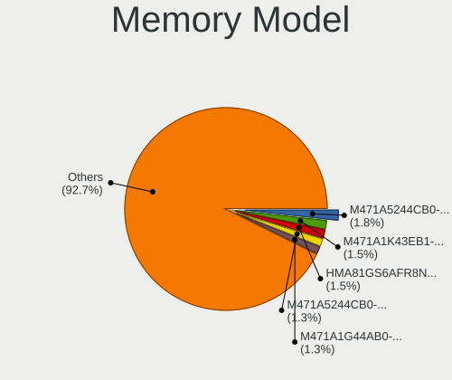

| Model                                                       | Computers | Percent |
|-------------------------------------------------------------|-----------|---------|
| Samsung RAM M471A5244CB0-CTD 4GB SODIMM DDR4 3266MT/s       | 90        | 1.75%   |
| Samsung RAM M471A1K43EB1-CWE 8GB SODIMM DDR4 3200MT/s       | 77        | 1.5%    |
| SK hynix RAM HMA81GS6AFR8N-UH 8GB SODIMM DDR4 2667MT/s      | 76        | 1.48%   |
| Samsung RAM M471A5244CB0-CRC 4GB SODIMM DDR4 2667MT/s       | 67        | 1.31%   |
| Samsung RAM M471A1G44AB0-CWE 8GiB SODIMM DDR4 3200MT/s      | 65        | 1.27%   |
| Micron RAM 8ATF1G64HZ-3G2R1 8GB SODIMM DDR4 3200MT/s        | 65        | 1.27%   |
| Unknown                                                     | 65        | 1.27%   |
| Samsung RAM M471A5244CB0-CWE 4GB SODIMM DDR4 3200MT/s       | 60        | 1.17%   |
| Samsung RAM M471A1G44BB0-CWE 8GB SODIMM DDR4 3200MT/s       | 59        | 1.15%   |
| SK hynix RAM HMT451S6BFR8A-PB 4GB SODIMM DDR3 1600MT/s      | 57        | 1.11%   |
| SK hynix RAM HMA81GS6DJR8N-XN 8GB SODIMM DDR4 3200MT/s      | 55        | 1.07%   |
| SK hynix RAM HMA851S6AFR6N-UH 4GB SODIMM DDR4 2667MT/s      | 51        | 0.99%   |
| Samsung RAM M471A1K43DB1-CTD 8GB SODIMM DDR4 2667MT/s       | 49        | 0.95%   |
| Samsung RAM M471A1K43DB1-CWE 8GB SODIMM DDR4 3200MT/s       | 48        | 0.94%   |
| Micron RAM 4ATF1G64HZ-3G2F1 8GB SODIMM DDR4 3200MT/s        | 48        | 0.94%   |
| SK hynix RAM HMA81GS6JJR8N-VK 8GB SODIMM DDR4 2667MT/s      | 47        | 0.92%   |
| Samsung RAM M471A1G44AB0-CWE 8GB Row Of Chips DDR4 3200MT/s | 43        | 0.84%   |
| SK hynix RAM HMAA1GS6CJR6N-XN 8GB SODIMM DDR4 3200MT/s      | 42        | 0.82%   |
| Micron RAM 8ATF1G64HZ-3G2J1 8GB SODIMM DDR4 3200MT/s        | 42        | 0.82%   |
| Samsung RAM M471A1K43CB1-CTD 8GB SODIMM DDR4 3200MT/s       | 40        | 0.78%   |
| SK hynix RAM HMA851S6CJR6N-VK 4GB SODIMM DDR4 2667MT/s      | 38        | 0.74%   |
| Micron RAM 4ATF51264HZ-3G2J1 4GB SODIMM DDR4 3200MT/s       | 36        | 0.7%    |
| SK hynix RAM HMA851S6JJR6N-VK 4GB SODIMM DDR4 2667MT/s      | 35        | 0.68%   |
| Samsung RAM M471B5173EB0-YK0 4GB SODIMM DDR3 1600MT/s       | 35        | 0.68%   |
| SK hynix RAM HMA81GS6CJR8N-VK 8GB SODIMM DDR4 2667MT/s      | 33        | 0.64%   |
| Samsung RAM M471B5173QH0-YK0 4GB SODIMM DDR3 1600MT/s       | 32        | 0.62%   |
| Micron RAM 4ATF1G64HZ-3G2E1 8GB SODIMM DDR4 3200MT/s        | 32        | 0.62%   |
| Samsung RAM M471A1K43CB1-CRC 8GB SODIMM DDR4 8400MT/s       | 30        | 0.58%   |
| Samsung RAM M471B5173DB0-YK0 4GB SODIMM DDR3 1600MT/s       | 28        | 0.55%   |
| Micron RAM 4ATF51264HZ-2G6E1 4GB SODIMM DDR4 2667MT/s       | 27        | 0.53%   |
| Micron RAM 8KTF51264HZ-1G6E1 4GB SODIMM DDR3 1600MT/s       | 26        | 0.51%   |
| SK hynix RAM HMA851S6DJR6N-XN 4GB SODIMM DDR4 3200MT/s      | 24        | 0.47%   |
| Corsair RAM CMK16GX4M1E3200C16 16GB DIMM DDR4 3200MT/s      | 24        | 0.47%   |
| Corsair RAM CMK8GX4M1D3000C16 8GB DIMM DDR4 3600MT/s        | 22        | 0.43%   |
| SK hynix RAM HMT351S6EFR8A-PB 4GB SODIMM DDR3 1600MT/s      | 21        | 0.41%   |
| Samsung RAM M471B1G73EB0-YK0 8192MB SODIMM DDR3 1600MT/s    | 21        | 0.41%   |
| Samsung RAM M471A1K43BB1-CRC 8GB SODIMM DDR4 2667MT/s       | 21        | 0.41%   |
| Corsair RAM CMK16GX4M1D3000C16 16GB DIMM DDR4 3600MT/s      | 21        | 0.41%   |
| SK hynix RAM HMT451S6AFR8A-PB 4GB SODIMM DDR3 1600MT/s      | 19        | 0.37%   |
| Crucial RAM CB8GS2400.C8ET 8GB SODIMM DDR4 2667MT/s         | 19        | 0.37%   |

Memory Kind
-----------

Memory module kinds

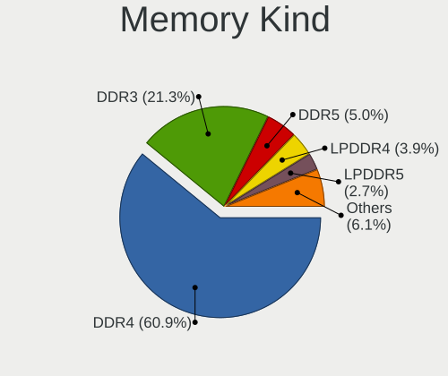

| Kind    | Computers | Percent |
|---------|-----------|---------|
| DDR4    | 2459      | 60.94%  |
| DDR3    | 860       | 21.31%  |
| DDR5    | 202       | 5.01%   |
| LPDDR4  | 158       | 3.92%   |
| LPDDR5  | 110       | 2.73%   |
| SDRAM   | 87        | 2.16%   |
| DDR2    | 63        | 1.56%   |
| LPDDR3  | 50        | 1.24%   |
| Unknown | 31        | 0.77%   |
| DDR     | 8         | 0.2%    |
| RAM     | 5         | 0.12%   |
| DRAM    | 2         | 0.05%   |

Memory Form Factor
------------------

Physical design of the memory module

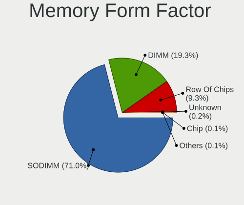

| Name         | Computers | Percent |
|--------------|-----------|---------|
| SODIMM       | 2848      | 71.02%  |
| DIMM         | 772       | 19.25%  |
| Row Of Chips | 374       | 9.33%   |
| Unknown      | 7         | 0.17%   |
| Chip         | 6         | 0.15%   |
| RIMM         | 3         | 0.07%   |

Memory Size
-----------

Memory module size

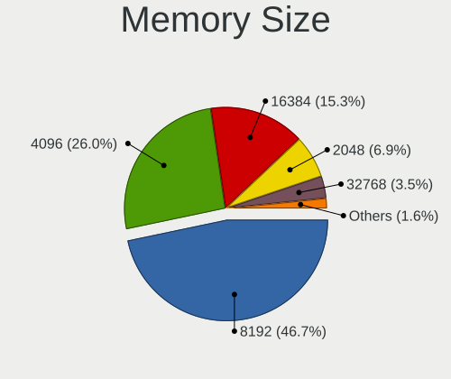

| Size   | Computers | Percent |
|--------|-----------|---------|
| 8192   | 2063      | 46.71%  |
| 4096   | 1147      | 25.97%  |
| 16384  | 676       | 15.3%   |
| 2048   | 303       | 6.86%   |
| 32768  | 156       | 3.53%   |
| 1024   | 52        | 1.18%   |
| 512    | 5         | 0.11%   |
| 12288  | 4         | 0.09%   |
| 6144   | 3         | 0.07%   |
| 49152  | 2         | 0.05%   |
| 131072 | 1         | 0.02%   |
| 65536  | 1         | 0.02%   |
| 8124   | 1         | 0.02%   |
| 3072   | 1         | 0.02%   |
| 1536   | 1         | 0.02%   |
| 256    | 1         | 0.02%   |

Memory Speed
------------

Memory module speed

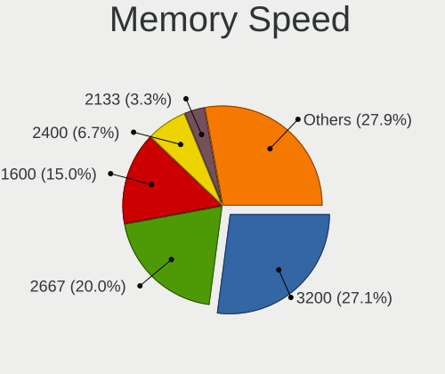

| Speed   | Computers | Percent |
|---------|-----------|---------|
| 3200    | 1184      | 27.08%  |
| 2667    | 875       | 20.01%  |
| 1600    | 657       | 15.02%  |
| 2400    | 292       | 6.68%   |
| 2133    | 146       | 3.34%   |
| 1333    | 145       | 3.32%   |
| 3600    | 101       | 2.31%   |
| 4800    | 98        | 2.24%   |
| 3266    | 93        | 2.13%   |
| 6400    | 70        | 1.6%    |
| Unknown | 65        | 1.49%   |
| 4267    | 63        | 1.44%   |
| 1334    | 59        | 1.35%   |
| 5600    | 57        | 1.3%    |
| 667     | 41        | 0.94%   |
| 2666    | 39        | 0.89%   |
| 8400    | 34        | 0.78%   |
| 1067    | 32        | 0.73%   |
| 4199    | 26        | 0.59%   |
| 3066    | 24        | 0.55%   |
| 7500    | 21        | 0.48%   |
| 6000    | 21        | 0.48%   |
| 800     | 21        | 0.48%   |
| 1867    | 18        | 0.41%   |
| 5200    | 14        | 0.32%   |
| 975     | 14        | 0.32%   |
| 3733    | 13        | 0.3%    |
| 1866    | 10        | 0.23%   |
| 8533    | 8         | 0.18%   |
| 5500    | 8         | 0.18%   |
| 4266    | 8         | 0.18%   |
| 4000    | 7         | 0.16%   |
| 2460    | 7         | 0.16%   |
| 2048    | 7         | 0.16%   |
| 1800    | 7         | 0.16%   |
| 3800    | 5         | 0.11%   |
| 3000    | 5         | 0.11%   |
| 2933    | 5         | 0.11%   |
| 1066    | 5         | 0.11%   |
| 7467    | 4         | 0.09%   |

Printers & scanners
-------------------

Printer Vendor
--------------

Printer device vendors

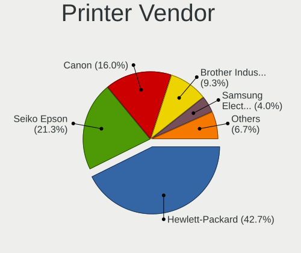

| Vendor              | Computers | Percent |
|---------------------|-----------|---------|
| Hewlett-Packard     | 32        | 42.67%  |
| Seiko Epson         | 16        | 21.33%  |
| Canon               | 12        | 16%     |
| Brother Industries  | 7         | 9.33%   |
| Samsung Electronics | 3         | 4%      |
| STMicroelectronics  | 1         | 1.33%   |
| Ricoh               | 1         | 1.33%   |
| Pantum              | 1         | 1.33%   |
| Konica Minolta      | 1         | 1.33%   |
| Analog Devices      | 1         | 1.33%   |

Printer Model
-------------

Printer device models

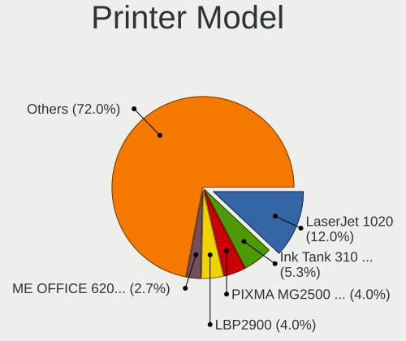

| Model                                                                 | Computers | Percent |
|-----------------------------------------------------------------------|-----------|---------|
| HP LaserJet 1020                                                      | 9         | 12%     |
| HP Ink Tank 310 series                                                | 4         | 5.33%   |
| Canon PIXMA MG2500 Series                                             | 3         | 4%      |
| Canon LBP2900                                                         | 3         | 4%      |
| Seiko Epson ME OFFICE 620F Series/Stylus Office BX305F/BX305FW/TX320F | 2         | 2.67%   |
| Seiko Epson L405 Series                                               | 2         | 2.67%   |
| Seiko Epson L380 Series                                               | 2         | 2.67%   |
| Seiko Epson ET-2710 Series                                            | 2         | 2.67%   |
| HP Smart Tank 500 series                                              | 2         | 2.67%   |
| HP DeskJet 2130 series                                                | 2         | 2.67%   |
| HP Deskjet 1510                                                       | 2         | 2.67%   |
| HP DeskJet 1110 series                                                | 2         | 2.67%   |
| STMicroelectronics USB Printing Support                               | 1         | 1.33%   |
| Seiko Epson USB2.0 Printer (Hi-speed)                                 | 1         | 1.33%   |
| Seiko Epson M100 Series                                               | 1         | 1.33%   |
| Seiko Epson L3210 Series                                              | 1         | 1.33%   |
| Seiko Epson L3200 Series                                              | 1         | 1.33%   |
| Seiko Epson L3110 Series                                              | 1         | 1.33%   |
| Seiko Epson ET-3750 Series                                            | 1         | 1.33%   |
| Seiko Epson EPSON L220 Series                                         | 1         | 1.33%   |
| Seiko Epson EPSON L132 Series                                         | 1         | 1.33%   |
| Samsung Xerox Phaser 3117 Laser Printer                               | 1         | 1.33%   |
| Samsung SCX-4300 Series                                               | 1         | 1.33%   |
| Samsung ML-1640 Series Laser Printer                                  | 1         | 1.33%   |
| Ricoh SP 111SU                                                        | 1         | 1.33%   |
| Pantum P2200 series                                                   | 1         | 1.33%   |
| Konica Minolta KONICA MINOLTA 206                                     | 1         | 1.33%   |
| HP Printing Support                                                   | 1         | 1.33%   |
| HP LaserJet Professional P1566                                        | 1         | 1.33%   |
| HP LaserJet Pro M329                                                  | 1         | 1.33%   |
| HP LaserJet Pro M201dw                                                | 1         | 1.33%   |
| HP LaserJet P1102                                                     | 1         | 1.33%   |
| HP LaserJet CP1025nw                                                  | 1         | 1.33%   |
| HP HP LaserJet Professional P1606dn                                   | 1         | 1.33%   |
| HP DeskJet 4800 series                                                | 1         | 1.33%   |
| HP DeskJet 3630 series                                                | 1         | 1.33%   |
| HP DeskJet 2600 series                                                | 1         | 1.33%   |
| HP DeskJet 2300 series                                                | 1         | 1.33%   |
| Canon PIXMA MP280                                                     | 1         | 1.33%   |
| Canon PIXMA MP190                                                     | 1         | 1.33%   |

Scanner Vendor
--------------

Scanner device vendors

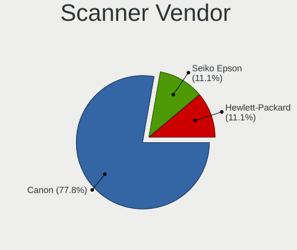

| Vendor          | Computers | Percent |
|-----------------|-----------|---------|
| Canon           | 8         | 80%     |
| Seiko Epson     | 1         | 10%     |
| Hewlett-Packard | 1         | 10%     |

Scanner Model
-------------

Scanner device models

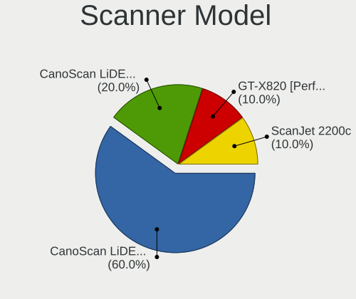

| Model                                       | Computers | Percent |
|---------------------------------------------|-----------|---------|
| Canon CanoScan LiDE 110                     | 6         | 60%     |
| Canon CanoScan LiDE 120                     | 2         | 20%     |
| Seiko Epson GT-X820 [Perfection V600 Photo] | 1         | 10%     |
| HP ScanJet 2200c                            | 1         | 10%     |

Camera
------

Camera Vendor
-------------

Camera device vendors

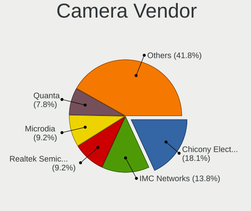

| Vendor                                 | Computers | Percent |
|----------------------------------------|-----------|---------|
| Chicony Electronics                    | 936       | 18.1%   |
| IMC Networks                           | 712       | 13.77%  |
| Realtek Semiconductor                  | 477       | 9.22%   |
| Microdia                               | 477       | 9.22%   |
| Quanta                                 | 405       | 7.83%   |
| Bison Electronics                      | 315       | 6.09%   |
| Sunplus Innovation Technology          | 275       | 5.32%   |
| Cheng Uei Precision Industry (Foxlink) | 242       | 4.68%   |
| Luxvisions Innotech Limited            | 204       | 3.95%   |
| Syntek                                 | 186       | 3.6%    |
| Suyin                                  | 156       | 3.02%   |
| Sonix Technology                       | 114       | 2.2%    |
| Logitech                               | 99        | 1.91%   |
| Lite-On Technology                     | 88        | 1.7%    |
| Apple                                  | 46        | 0.89%   |
| Alcor Micro                            | 44        | 0.85%   |
| ShineTech                              | 36        | 0.7%    |
| Samsung Electronics                    | 31        | 0.6%    |
| SunplusIT                              | 27        | 0.52%   |
| Silicon Motion                         | 26        | 0.5%    |
| Lenovo                                 | 24        | 0.46%   |
| Acer                                   | 22        | 0.43%   |
| Ricoh                                  | 18        | 0.35%   |
| Importek                               | 13        | 0.25%   |
| Z-Star Microelectronics                | 12        | 0.23%   |
| Primax Electronics                     | 11        | 0.21%   |
| Hewlett-Packard                        | 11        | 0.21%   |
| Unknown                                | 9         | 0.17%   |
| OPPO Electronics                       | 9         | 0.17%   |
| OmniVision Technologies                | 9         | 0.17%   |
| MacroSilicon                           | 9         | 0.17%   |
| Microsoft                              | 8         | 0.15%   |
| GEMBIRD                                | 8         | 0.15%   |
| Arkmicro Technologies                  | 8         | 0.15%   |
| SN0002                                 | 6         | 0.12%   |
| ShineOptics                            | 6         | 0.12%   |
| Intel                                  | 6         | 0.12%   |
| Cubeternet                             | 6         | 0.12%   |
| Foxlink                                | 5         | 0.1%    |
| ARC International                      | 5         | 0.1%    |

Camera Model
------------

Camera device models

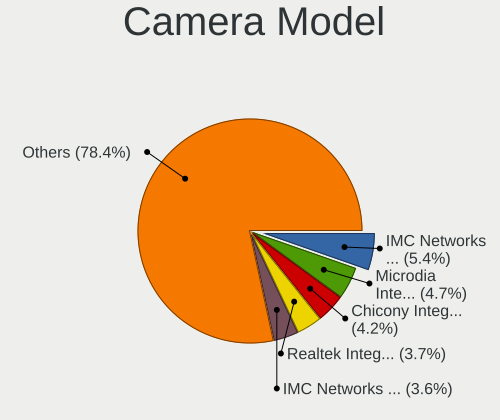

| Model                                                          | Computers | Percent |
|----------------------------------------------------------------|-----------|---------|
| IMC Networks USB2.0 HD UVC WebCam                              | 278       | 5.35%   |
| Microdia Integrated_Webcam_HD                                  | 244       | 4.7%    |
| Chicony Integrated Camera                                      | 218       | 4.2%    |
| Realtek Integrated_Webcam_HD                                   | 193       | 3.72%   |
| IMC Networks Integrated Camera                                 | 189       | 3.64%   |
| Syntek Integrated Camera                                       | 121       | 2.33%   |
| Sunplus Integrated_Webcam_HD                                   | 119       | 2.29%   |
| IMC Networks USB2.0 VGA UVC WebCam                             | 105       | 2.02%   |
| Chicony HP TrueVision HD Camera                                | 97        | 1.87%   |
| Bison Integrated Camera                                        | 97        | 1.87%   |
| Quanta HP TrueVision HD Camera                                 | 79        | 1.52%   |
| Chicony HP TrueVision HD                                       | 77        | 1.48%   |
| Sonix USB2.0 HD UVC WebCam                                     | 76        | 1.46%   |
| Quanta HD Webcam                                               | 75        | 1.44%   |
| Realtek Integrated Webcam                                      | 74        | 1.42%   |
| Luxvisions Innotech Limited HP TrueVision HD Camera            | 67        | 1.29%   |
| Quanta HP Wide Vision HD Camera                                | 61        | 1.17%   |
| Chicony EasyCamera                                             | 61        | 1.17%   |
| Quanta HD User Facing                                          | 59        | 1.14%   |
| Luxvisions Innotech Limited HP Wide Vision HD Camera           | 56        | 1.08%   |
| Chicony HP Wide Vision HD Camera                               | 56        | 1.08%   |
| Suyin HP Truevision HD                                         | 55        | 1.06%   |
| Chicony HD WebCam                                              | 55        | 1.06%   |
| Logitech Webcam C270                                           | 52        | 1%      |
| Luxvisions Innotech Limited Integrated Camera                  | 47        | 0.91%   |
| Cheng Uei Precision Industry (Foxlink) HP TrueVision HD Camera | 47        | 0.91%   |
| Chicony HD User Facing                                         | 44        | 0.85%   |
| Bison HD Webcam                                                | 44        | 0.85%   |
| Cheng Uei Precision Industry (Foxlink) HP TrueVision HD        | 42        | 0.81%   |
| Bison EasyCamera                                               | 42        | 0.81%   |
| Microdia USB 2.0 Camera                                        | 41        | 0.79%   |
| Bison Lenovo EasyCamera                                        | 38        | 0.73%   |
| Syntek EasyCamera                                              | 37        | 0.71%   |
| Lite-On Integrated Camera                                      | 37        | 0.71%   |
| Chicony HP HD Camera                                           | 37        | 0.71%   |
| IMC Networks HP TrueVision HD Camera                           | 35        | 0.67%   |
| Microdia Laptop_Integrated_Webcam_HD                           | 34        | 0.65%   |
| Microdia Integrated Webcam                                     | 34        | 0.65%   |
| Sunplus XiaoMi USB 2.0 Webcam                                  | 33        | 0.64%   |
| Chicony Integrated Camera (1280x720@30)                        | 32        | 0.62%   |

Security
--------

Fingerprint Vendor
------------------

Fingerprint sensor vendors

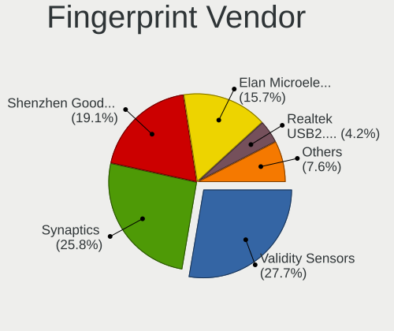

| Vendor                             | Computers | Percent |
|------------------------------------|-----------|---------|
| Validity Sensors                   | 249       | 27.67%  |
| Synaptics                          | 232       | 25.78%  |
| Shenzhen Goodix Technology         | 172       | 19.11%  |
| Elan Microelectronics              | 141       | 15.67%  |
| Realtek USB2.0 Finger Print Bridge | 38        | 4.22%   |
| LighTuning Technology              | 26        | 2.89%   |
| AuthenTec                          | 15        | 1.67%   |
| Upek                               | 14        | 1.56%   |
| Focal-systems.Corp                 | 6         | 0.67%   |
| HOLTEK                             | 3         | 0.33%   |
| STMicroelectronics                 | 2         | 0.22%   |
| Futronic Technology                | 1         | 0.11%   |
| DigitalPersona                     | 1         | 0.11%   |

Fingerprint Model
-----------------

Fingerprint sensor models

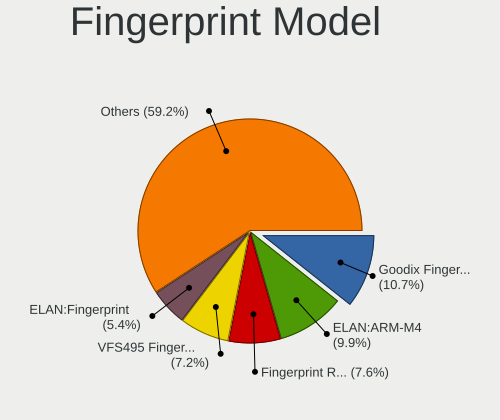

| Model                                                                      | Computers | Percent |
|----------------------------------------------------------------------------|-----------|---------|
| Shenzhen Goodix  FingerPrint Device                                        | 96        | 10.67%  |
| Elan ELAN:ARM-M4                                                           | 89        | 9.89%   |
| Shenzhen Goodix Fingerprint Reader                                         | 68        | 7.56%   |
| Validity Sensors VFS495 Fingerprint Reader                                 | 65        | 7.22%   |
| Elan ELAN:Fingerprint                                                      | 49        | 5.44%   |
| Realtek USB2.0 Finger Print Bridge FocalTech Fingerprint Device            | 38        | 4.22%   |
| Synaptics Metallica MIS Touch Fingerprint Reader                           | 36        | 4%      |
| Synaptics WBDI                                                             | 31        | 3.44%   |
| Synaptics UWP WBDI                                                         | 31        | 3.44%   |
| Synaptics Prometheus MIS Touch Fingerprint Reader                          | 31        | 3.44%   |
| Validity Sensors VFS5011 Fingerprint Reader                                | 29        | 3.22%   |
| Validity Sensors Synaptics VFS7552 Touch Fingerprint Sensor                | 26        | 2.89%   |
| LighTuning EgisTec Touch Fingerprint Sensor                                | 26        | 2.89%   |
| Synaptics  WBDI                                                            | 23        | 2.56%   |
| Validity Sensors Synaptics WBDI                                            | 20        | 2.22%   |
| Synaptics Fingerprint scanner                                              | 20        | 2.22%   |
| Synaptics Metallica MOH Touch Fingerprint Reader                           | 18        | 2%      |
| Validity Sensors VFS 5011 fingerprint sensor                               | 17        | 1.89%   |
| Validity Sensors VFS491                                                    | 16        | 1.78%   |
| Validity Sensors Synaptics VFS7552 Touch Fingerprint Sensor with PurePrint | 16        | 1.78%   |
| Validity Sensors VFS Fingerprint sensor                                    | 14        | 1.56%   |
| Upek Biometric Touchchip/Touchstrip Fingerprint Sensor                     | 13        | 1.44%   |
| Synaptics FS7604 Touch Fingerprint Sensor with PurePrint                   | 13        | 1.44%   |
| Synaptics Fingerprint reader [HP G6]                                       | 12        | 1.33%   |
| Validity Sensors VFS7500 Touch Fingerprint Sensor                          | 10        | 1.11%   |
| Validity Sensors Fingerprint scanner                                       | 9         | 1%      |
| Shenzhen Goodix FingerPrint                                                | 8         | 0.89%   |
| Validity Sensors VFS471 Fingerprint Reader                                 | 7         | 0.78%   |
| Validity Sensors Swipe Fingerprint Sensor                                  | 7         | 0.78%   |
| Validity Sensors VFS451 Fingerprint Reader                                 | 6         | 0.67%   |
| Focal-systems.Corp FT9201Fingerprint.                                      | 6         | 0.67%   |
| Synaptics UWP WBDI Device                                                  | 5         | 0.56%   |
| AuthenTec Fingerprint Sensor                                               | 5         | 0.56%   |
| Validity Sensors VFS301 Fingerprint Reader                                 | 4         | 0.44%   |
| Synaptics WBDI Fingerprint Reader USB 086                                  | 4         | 0.44%   |
| AuthenTec AES1660 Fingerprint Sensor                                       | 4         | 0.44%   |
| HOLTEK FocalTech Fingerprint Device                                        | 3         | 0.33%   |
| Elan fingerprint sensor [FeinTech FPS00200]                                | 3         | 0.33%   |
| AuthenTec AES1600                                                          | 3         | 0.33%   |
| Validity Sensors VFS101 Fingerprint Reader                                 | 2         | 0.22%   |

Chipcard Vendor
---------------

Chipcard module vendors

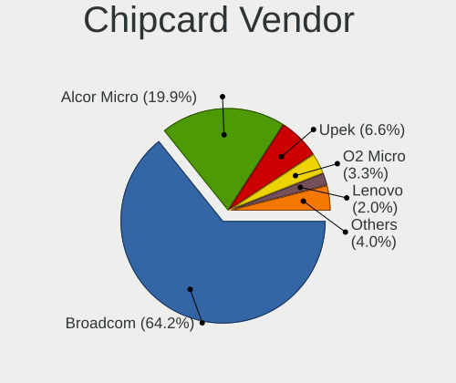

| Vendor                    | Computers | Percent |
|---------------------------|-----------|---------|
| Broadcom                  | 97        | 64.24%  |
| Alcor Micro               | 30        | 19.87%  |
| Upek                      | 10        | 6.62%   |
| O2 Micro                  | 5         | 3.31%   |
| Lenovo                    | 3         | 1.99%   |
| Yubico.com                | 2         | 1.32%   |
| Gemalto (was Gemplus)     | 1         | 0.66%   |
| Clay Logic                | 1         | 0.66%   |
| Aladdin Knowledge Systems | 1         | 0.66%   |
| Advanced Card Systems     | 1         | 0.66%   |

Chipcard Model
--------------

Chipcard module models

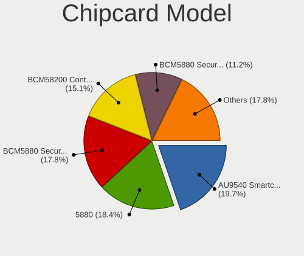

| Model                                                                        | Computers | Percent |
|------------------------------------------------------------------------------|-----------|---------|
| Alcor Micro AU9540 Smartcard Reader                                          | 30        | 19.74%  |
| Broadcom 5880                                                                | 28        | 18.42%  |
| Broadcom BCM5880 Secure Applications Processor                               | 27        | 17.76%  |
| Broadcom BCM58200 ControlVault 3 (FingerPrint sensor + Contacted SmartCard)  | 23        | 15.13%  |
| Broadcom BCM5880 Secure Applications Processor with fingerprint swipe sensor | 17        | 11.18%  |
| Upek TouchChip Fingerprint Coprocessor (WBF advanced mode)                   | 10        | 6.58%   |
| O2 Micro OZ776 CCID Smartcard Reader                                         | 4         | 2.63%   |
| Lenovo Integrated Smart Card Reader                                          | 3         | 1.97%   |
| Broadcom 58200                                                               | 3         | 1.97%   |
| Yubico.com Yubikey 4/5 U2F+CCID                                              | 2         | 1.32%   |
| O2 Micro Oz776 SmartCard Reader                                              | 1         | 0.66%   |
| Gemalto (was Gemplus) Compact Smart Card Reader Writer                       | 1         | 0.66%   |
| Clay Logic Nitrokey HSM                                                      | 1         | 0.66%   |
| Aladdin Knowledge Systems Token JC                                           | 1         | 0.66%   |
| Advanced Card Systems ACR1252 Dual Reader                                    | 1         | 0.66%   |

Unsupported
-----------

Unsupported Devices
-------------------

Total unsupported devices on board

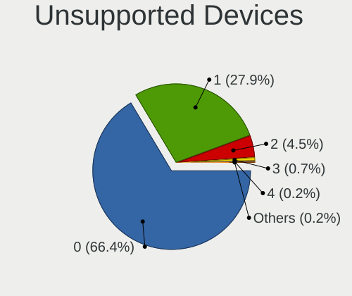

| Total | Computers | Percent |
|-------|-----------|---------|
| 0     | 4765      | 66.42%  |
| 1     | 2005      | 27.95%  |
| 2     | 323       | 4.5%    |
| 3     | 52        | 0.72%   |
| 4     | 14        | 0.2%    |
| 5     | 10        | 0.14%   |
| 6     | 3         | 0.04%   |
| 9     | 2         | 0.03%   |

Unsupported Device Types
------------------------

Types of unsupported devices

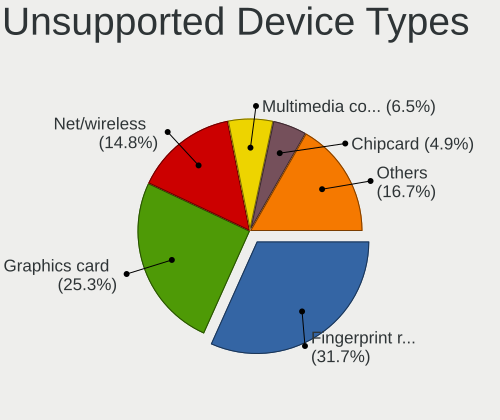

| Type                     | Computers | Percent |
|--------------------------|-----------|---------|
| Fingerprint reader       | 893       | 31.71%  |
| Graphics card            | 712       | 25.28%  |
| Net/wireless             | 418       | 14.84%  |
| Multimedia controller    | 183       | 6.5%    |
| Chipcard                 | 139       | 4.94%   |
| Bluetooth                | 118       | 4.19%   |
| Camera                   | 111       | 3.94%   |
| Communication controller | 94        | 3.34%   |
| Sound                    | 35        | 1.24%   |
| Net/ethernet             | 33        | 1.17%   |
| Unassigned class         | 26        | 0.92%   |
| Storage                  | 19        | 0.67%   |
| Network                  | 13        | 0.46%   |
| Modem                    | 7         | 0.25%   |
| Card reader              | 5         | 0.18%   |
| Storage/ide              | 3         | 0.11%   |
| Storage/raid             | 2         | 0.07%   |
| Firewire controller      | 2         | 0.07%   |
| Storage/nvme             | 1         | 0.04%   |
| Storage/ata              | 1         | 0.04%   |
| Dvb card                 | 1         | 0.04%   |

