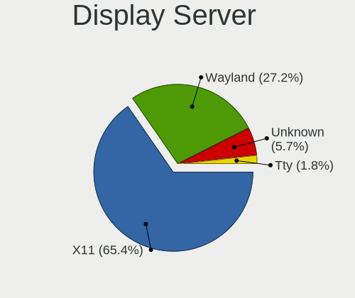
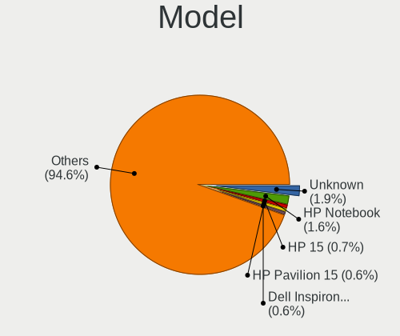
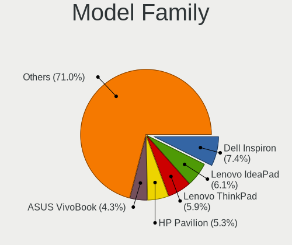
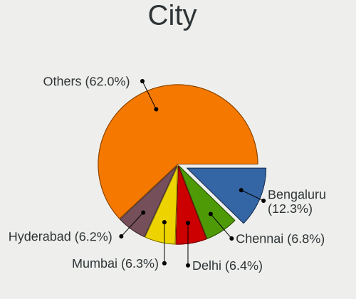
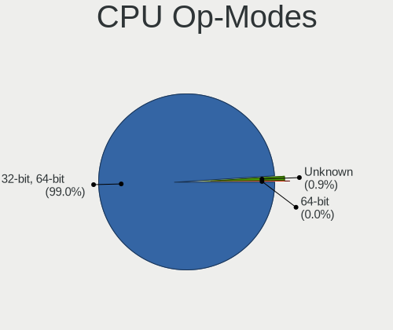
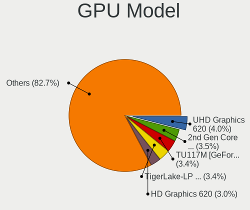
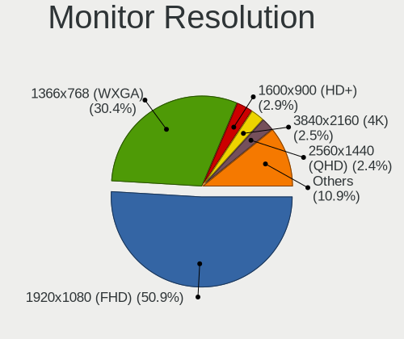
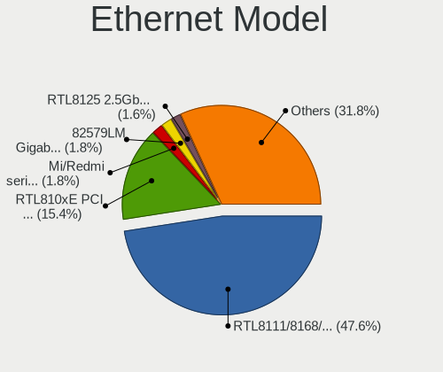

Linux in India - Tested Hardware & Statistics
---------------------------------------------

A project to collect tested hardware configurations for Linux in India.

Anyone can contribute to this report by the [hw-probe](https://github.com/linuxhw/hw-probe) tool:

    sudo -E hw-probe -all -upload

Please contribute! Especially if your hardware is rare.

This is a report for all computer types. See also reports for [desktops](/Location/India/Desktop/README.md) and [notebooks](/Location/India/Notebook/README.md).

Contents
--------

* [ Test Cases ](#test-cases)

* [ System ](#system)
  - [ OS                       ](#os)
  - [ OS Family                ](#os-family)
  - [ Kernel                   ](#kernel)
  - [ Kernel Family            ](#kernel-family)
  - [ Kernel Major Ver.        ](#kernel-major-ver)
  - [ Arch                     ](#arch)
  - [ DE                       ](#de)
  - [ Display Server           ](#display-server)
  - [ Display Manager          ](#display-manager)
  - [ OS Lang                  ](#os-lang)
  - [ Boot Mode                ](#boot-mode)
  - [ Filesystem               ](#filesystem)
  - [ Part. scheme             ](#part-scheme)
  - [ Dual Boot with Linux/BSD ](#dual-boot-with-linuxbsd)
  - [ Dual Boot (Win)          ](#dual-boot-win)

* [ Board ](#board)
  - [ Vendor                   ](#vendor)
  - [ Model                    ](#model)
  - [ Model Family             ](#model-family)
  - [ MFG Year                 ](#mfg-year)
  - [ Form Factor              ](#form-factor)
  - [ Secure Boot              ](#secure-boot)
  - [ Coreboot                 ](#coreboot)
  - [ RAM Size                 ](#ram-size)
  - [ RAM Used                 ](#ram-used)
  - [ Total Drives             ](#total-drives)
  - [ Has CD-ROM               ](#has-cd-rom)
  - [ Has Ethernet             ](#has-ethernet)
  - [ Has WiFi                 ](#has-wifi)
  - [ Has Bluetooth            ](#has-bluetooth)

* [ Location ](#location)
  - [ Country                  ](#country)
  - [ City                     ](#city)

* [ Drives ](#drives)
  - [ Drive Vendor             ](#drive-vendor)
  - [ Drive Model              ](#drive-model)
  - [ HDD Vendor               ](#hdd-vendor)
  - [ SSD Vendor               ](#ssd-vendor)
  - [ Drive Kind               ](#drive-kind)
  - [ Drive Connector          ](#drive-connector)
  - [ Drive Size               ](#drive-size)
  - [ Space Total              ](#space-total)
  - [ Space Used               ](#space-used)
  - [ Malfunc. Drives          ](#malfunc-drives)
  - [ Malfunc. Drive Vendor    ](#malfunc-drive-vendor)
  - [ Malfunc. HDD Vendor      ](#malfunc-hdd-vendor)
  - [ Malfunc. Drive Kind      ](#malfunc-drive-kind)
  - [ Failed Drives            ](#failed-drives)
  - [ Failed Drive Vendor      ](#failed-drive-vendor)
  - [ Drive Status             ](#drive-status)

* [ Storage controller ](#storage-controller)
  - [ Storage Vendor           ](#storage-vendor)
  - [ Storage Model            ](#storage-model)
  - [ Storage Kind             ](#storage-kind)

* [ Processor ](#processor)
  - [ CPU Vendor               ](#cpu-vendor)
  - [ CPU Model                ](#cpu-model)
  - [ CPU Model Family         ](#cpu-model-family)
  - [ CPU Cores                ](#cpu-cores)
  - [ CPU Sockets              ](#cpu-sockets)
  - [ CPU Threads              ](#cpu-threads)
  - [ CPU Op-Modes             ](#cpu-op-modes)
  - [ CPU Microcode            ](#cpu-microcode)
  - [ CPU Microarch            ](#cpu-microarch)

* [ Graphics ](#graphics)
  - [ GPU Vendor               ](#gpu-vendor)
  - [ GPU Model                ](#gpu-model)
  - [ GPU Combo                ](#gpu-combo)
  - [ GPU Driver               ](#gpu-driver)
  - [ GPU Memory               ](#gpu-memory)

* [ Monitor ](#monitor)
  - [ Monitor Vendor           ](#monitor-vendor)
  - [ Monitor Model            ](#monitor-model)
  - [ Monitor Resolution       ](#monitor-resolution)
  - [ Monitor Diagonal         ](#monitor-diagonal)
  - [ Monitor Width            ](#monitor-width)
  - [ Aspect Ratio             ](#aspect-ratio)
  - [ Monitor Area             ](#monitor-area)
  - [ Pixel Density            ](#pixel-density)
  - [ Multiple Monitors        ](#multiple-monitors)

* [ Network ](#network)
  - [ Net Controller Vendor    ](#net-controller-vendor)
  - [ Net Controller Model     ](#net-controller-model)
  - [ Wireless Vendor          ](#wireless-vendor)
  - [ Wireless Model           ](#wireless-model)
  - [ Ethernet Vendor          ](#ethernet-vendor)
  - [ Ethernet Model           ](#ethernet-model)
  - [ Net Controller Kind      ](#net-controller-kind)
  - [ Used Controller          ](#used-controller)
  - [ NICs                     ](#nics)
  - [ IPv6                     ](#ipv6)

* [ Bluetooth ](#bluetooth)
  - [ Bluetooth Vendor         ](#bluetooth-vendor)
  - [ Bluetooth Model          ](#bluetooth-model)

* [ Sound ](#sound)
  - [ Sound Vendor             ](#sound-vendor)
  - [ Sound Model              ](#sound-model)

* [ Memory ](#memory)
  - [ Memory Vendor            ](#memory-vendor)
  - [ Memory Model             ](#memory-model)
  - [ Memory Kind              ](#memory-kind)
  - [ Memory Form Factor       ](#memory-form-factor)
  - [ Memory Size              ](#memory-size)
  - [ Memory Speed             ](#memory-speed)

* [ Printers & scanners ](#printers--scanners)
  - [ Printer Vendor           ](#printer-vendor)
  - [ Printer Model            ](#printer-model)
  - [ Scanner Vendor           ](#scanner-vendor)
  - [ Scanner Model            ](#scanner-model)

* [ Camera ](#camera)
  - [ Camera Vendor            ](#camera-vendor)
  - [ Camera Model             ](#camera-model)

* [ Security ](#security)
  - [ Fingerprint Vendor       ](#fingerprint-vendor)
  - [ Fingerprint Model        ](#fingerprint-model)
  - [ Chipcard Vendor          ](#chipcard-vendor)
  - [ Chipcard Model           ](#chipcard-model)

* [ Unsupported ](#unsupported)
  - [ Unsupported Devices      ](#unsupported-devices)
  - [ Unsupported Device Types ](#unsupported-device-types)

Test Cases
----------

Total: 4780

| Vendor        | Model                       | Form-Factor | Probe                                                      | Date         |
|---------------|-----------------------------|-------------|------------------------------------------------------------|--------------|
| Lenovo        | ThinkPad X13 Gen 1 20T2S... | Notebook    | [70fe076856](https://linux-hardware.org/?probe=70fe076856) | May 06, 2022 |
| Google        | Lick                        | Notebook    | [60e52e55e1](https://linux-hardware.org/?probe=60e52e55e1) | May 06, 2022 |
| Lenovo        | ThinkPad L13 20R3S10R00     | Notebook    | [b173909e06](https://linux-hardware.org/?probe=b173909e06) | May 06, 2022 |
| HP            | Notebook                    | Notebook    | [05f1b18534](https://linux-hardware.org/?probe=05f1b18534) | May 04, 2022 |
| HP            | EliteBook 8470p             | Notebook    | [db81dd7652](https://linux-hardware.org/?probe=db81dd7652) | May 04, 2022 |
| Gigabyte      | H110M-S2-CF                 | Desktop     | [156de9d4de](https://linux-hardware.org/?probe=156de9d4de) | May 04, 2022 |
| Lenovo        | Yoga 530-14IKB 81EK         | Convertible | [aa14a3b075](https://linux-hardware.org/?probe=aa14a3b075) | May 04, 2022 |
| HP            | OMEN Laptop 15-en0xxx       | Notebook    | [8bfd6ecc71](https://linux-hardware.org/?probe=8bfd6ecc71) | May 04, 2022 |
| Gigabyte      | G31M-ES2L                   | Desktop     | [bf9f724f45](https://linux-hardware.org/?probe=bf9f724f45) | May 04, 2022 |
| Gigabyte      | G31M-ES2L                   | Desktop     | [05585fedf4](https://linux-hardware.org/?probe=05585fedf4) | May 04, 2022 |
| HP            | Pavilion Laptop 15-cs1xx... | Notebook    | [ca91daf662](https://linux-hardware.org/?probe=ca91daf662) | May 04, 2022 |
| HUAWEI        | BOHK-WAX9X                  | Notebook    | [329673fcbf](https://linux-hardware.org/?probe=329673fcbf) | May 03, 2022 |
| ASUSTek       | ROG Strix G713RC_G713RC     | Notebook    | [2ce25fb058](https://linux-hardware.org/?probe=2ce25fb058) | May 03, 2022 |
| Lenovo        | 3724                        | All in one  | [fa47d5fd48](https://linux-hardware.org/?probe=fa47d5fd48) | May 03, 2022 |
| HP            | Laptop 15-bs1xx             | Notebook    | [aa3fb50ed5](https://linux-hardware.org/?probe=aa3fb50ed5) | May 03, 2022 |
| Toshiba       | Satellite U940              | Notebook    | [3d6bd2511e](https://linux-hardware.org/?probe=3d6bd2511e) | May 03, 2022 |
| HP            | Presario CQ42               | Notebook    | [93ac0fd52a](https://linux-hardware.org/?probe=93ac0fd52a) | May 02, 2022 |
| Maxtone       | HIS-G41L V1.1               | Desktop     | [ce61ffd777](https://linux-hardware.org/?probe=ce61ffd777) | May 02, 2022 |
| MSI           | GP76 Leopard 11UG           | Notebook    | [dcea7cd8c0](https://linux-hardware.org/?probe=dcea7cd8c0) | May 02, 2022 |
| Maxtone       | HIS-G41L V1.1               | Desktop     | [63fc1199bc](https://linux-hardware.org/?probe=63fc1199bc) | May 01, 2022 |
| Lenovo        | IdeaPad 3 15IIL05 81WE      | Notebook    | [0eb277ff80](https://linux-hardware.org/?probe=0eb277ff80) | May 01, 2022 |
| HP            | Laptop 15-bw0xx             | Notebook    | [549ca9da46](https://linux-hardware.org/?probe=549ca9da46) | May 01, 2022 |
| HP            | Laptop 15-bw0xx             | Notebook    | [ec3ccc4967](https://linux-hardware.org/?probe=ec3ccc4967) | May 01, 2022 |
| Dell          | Latitude 3490               | Notebook    | [ff6e81ce15](https://linux-hardware.org/?probe=ff6e81ce15) | May 01, 2022 |
| Acer          | Aspire A715-75G             | Notebook    | [50d37d9cf7](https://linux-hardware.org/?probe=50d37d9cf7) | May 01, 2022 |
| Acer          | Swift SF314-55G             | Notebook    | [1935c949a2](https://linux-hardware.org/?probe=1935c949a2) | May 01, 2022 |
| Dell          | Inspiron 7559               | Notebook    | [37b324ecf9](https://linux-hardware.org/?probe=37b324ecf9) | May 01, 2022 |
| Dell          | G3 3500                     | Notebook    | [df72f36c52](https://linux-hardware.org/?probe=df72f36c52) | Apr 30, 2022 |
| Google        | Lick                        | Notebook    | [33d1e6209a](https://linux-hardware.org/?probe=33d1e6209a) | Apr 30, 2022 |
| Dell          | G3 3500                     | Notebook    | [c9ee387b32](https://linux-hardware.org/?probe=c9ee387b32) | Apr 30, 2022 |
| eMachines     | eME730                      | Notebook    | [ac985950eb](https://linux-hardware.org/?probe=ac985950eb) | Apr 30, 2022 |
| ASUSTek       | ROG STRIX X470-F GAMING     | Desktop     | [809ea3e76a](https://linux-hardware.org/?probe=809ea3e76a) | Apr 29, 2022 |
| Dell          | Inspiron 3542               | Notebook    | [19f5e16bce](https://linux-hardware.org/?probe=19f5e16bce) | Apr 29, 2022 |
| Lenovo        | ThinkPad T450 20BUS1MN00    | Notebook    | [4e2b073a5c](https://linux-hardware.org/?probe=4e2b073a5c) | Apr 29, 2022 |
| Dell          | G5 5500                     | Notebook    | [c6064853ad](https://linux-hardware.org/?probe=c6064853ad) | Apr 29, 2022 |
| Dell          | Inspiron 3505               | Notebook    | [1f6bbce46b](https://linux-hardware.org/?probe=1f6bbce46b) | Apr 28, 2022 |
| Dell          | Inspiron 3542               | Notebook    | [6e00a18a0f](https://linux-hardware.org/?probe=6e00a18a0f) | Apr 28, 2022 |
| Gigabyte      | H310M H                     | Desktop     | [182e82d90e](https://linux-hardware.org/?probe=182e82d90e) | Apr 28, 2022 |
| HP            | Stream Laptop 14-ds0xxx     | Notebook    | [59a8e467c6](https://linux-hardware.org/?probe=59a8e467c6) | Apr 28, 2022 |
| Lenovo        | V14 G2 ITL Ua 82KA          | Notebook    | [f191c49754](https://linux-hardware.org/?probe=f191c49754) | Apr 28, 2022 |
| HP            | Notebook                    | Notebook    | [daaa31b65a](https://linux-hardware.org/?probe=daaa31b65a) | Apr 27, 2022 |
| HP            | Notebook                    | Notebook    | [cbac71290e](https://linux-hardware.org/?probe=cbac71290e) | Apr 27, 2022 |
| Lenovo        | IdeaPad Gaming 3 15IMH05... | Notebook    | [a696a35961](https://linux-hardware.org/?probe=a696a35961) | Apr 27, 2022 |
| HP            | Notebook                    | Notebook    | [ec93418371](https://linux-hardware.org/?probe=ec93418371) | Apr 26, 2022 |
| Acer          | Aspire ES1-512              | Notebook    | [f0ed67e309](https://linux-hardware.org/?probe=f0ed67e309) | Apr 26, 2022 |
| Lenovo        | IdeaPad 5 14ALC05 82LM      | Notebook    | [ea3e0b8695](https://linux-hardware.org/?probe=ea3e0b8695) | Apr 26, 2022 |
| Biostar       | J3160NH                     | Desktop     | [8ffd3a1aa4](https://linux-hardware.org/?probe=8ffd3a1aa4) | Apr 26, 2022 |
| MSI           | Z68A-GD80                   | Desktop     | [fedca9082a](https://linux-hardware.org/?probe=fedca9082a) | Apr 25, 2022 |
| HP            | Laptop 15s-du3xxx           | Notebook    | [8197ac9c77](https://linux-hardware.org/?probe=8197ac9c77) | Apr 25, 2022 |
| HP            | 348 G4                      | Notebook    | [54db7eb2da](https://linux-hardware.org/?probe=54db7eb2da) | Apr 25, 2022 |
| ASUSTek       | X555LF                      | Notebook    | [0aa3a88c0c](https://linux-hardware.org/?probe=0aa3a88c0c) | Apr 25, 2022 |
| Lenovo        | IdeaPad 320-15ISK 80XH      | Notebook    | [b4577b2374](https://linux-hardware.org/?probe=b4577b2374) | Apr 25, 2022 |
| Dell          | Inspiron 3501               | Notebook    | [99bd45c11d](https://linux-hardware.org/?probe=99bd45c11d) | Apr 25, 2022 |
| Lenovo        | IdeaPad 5 Pro 14ITL6 82L... | Notebook    | [a260bf9ce6](https://linux-hardware.org/?probe=a260bf9ce6) | Apr 24, 2022 |
| Lenovo        | ThinkPad E14 Gen 2 20TA0... | Notebook    | [45b9330abf](https://linux-hardware.org/?probe=45b9330abf) | Apr 23, 2022 |
| Nvidia        | Tegra                       | Soc         | [36bbd53ec1](https://linux-hardware.org/?probe=36bbd53ec1) | Apr 23, 2022 |
| Lenovo        | E41-25 81FS                 | Notebook    | [4880f7c2d5](https://linux-hardware.org/?probe=4880f7c2d5) | Apr 22, 2022 |
| Lenovo        | Z50-70 20354                | Notebook    | [6d50395aee](https://linux-hardware.org/?probe=6d50395aee) | Apr 22, 2022 |
| Intel         | DH61SA AAG38870-201         | Desktop     | [d8868878ca](https://linux-hardware.org/?probe=d8868878ca) | Apr 22, 2022 |
| Toshiba       | Satellite C850-A786         | Notebook    | [e57aca482e](https://linux-hardware.org/?probe=e57aca482e) | Apr 22, 2022 |
| ECS           | H61H2-MV                    | Desktop     | [939f87564f](https://linux-hardware.org/?probe=939f87564f) | Apr 21, 2022 |
| Unknown       | G41 Series                  | Desktop     | [c6040e6638](https://linux-hardware.org/?probe=c6040e6638) | Apr 21, 2022 |
| HP            | Laptop 15s-du2xxx           | Notebook    | [fe39cbe3d1](https://linux-hardware.org/?probe=fe39cbe3d1) | Apr 20, 2022 |
| Lenovo        | Legion Y530-15ICH 81FV      | Notebook    | [88764ed497](https://linux-hardware.org/?probe=88764ed497) | Apr 20, 2022 |
| Toshiba       | Satellite L50-C             | Notebook    | [9e2b287533](https://linux-hardware.org/?probe=9e2b287533) | Apr 20, 2022 |
| Dell          | Inspiron 5559               | Notebook    | [6ddb878f3e](https://linux-hardware.org/?probe=6ddb878f3e) | Apr 20, 2022 |
| HP            | Notebook                    | Notebook    | [bec9c06e6e](https://linux-hardware.org/?probe=bec9c06e6e) | Apr 20, 2022 |
| HP            | ENVY x360 Convertible 13... | Convertible | [53199db8c8](https://linux-hardware.org/?probe=53199db8c8) | Apr 20, 2022 |
| ASUSTek       | VivoBook_ASUSLaptop X415... | Notebook    | [f3d940677f](https://linux-hardware.org/?probe=f3d940677f) | Apr 19, 2022 |
| MSI           | B550M PRO-VDH WIFI          | Desktop     | [4ec65c693a](https://linux-hardware.org/?probe=4ec65c693a) | Apr 19, 2022 |
| AMI           | Aptio CRB                   | Mini pc     | [7d16b45ebd](https://linux-hardware.org/?probe=7d16b45ebd) | Apr 18, 2022 |
| Gigabyte      | A320M-H-CF                  | Desktop     | [6247b19a2f](https://linux-hardware.org/?probe=6247b19a2f) | Apr 18, 2022 |
| Dell          | Latitude E5520              | Notebook    | [1b428165cf](https://linux-hardware.org/?probe=1b428165cf) | Apr 18, 2022 |
| Lenovo        | IdeaPad S340-15IWL 81N8     | Notebook    | [b895187681](https://linux-hardware.org/?probe=b895187681) | Apr 17, 2022 |
| Gigabyte      | H110M-H-CF                  | Desktop     | [66ef9c9e5f](https://linux-hardware.org/?probe=66ef9c9e5f) | Apr 16, 2022 |
| Dell          | Inspiron 15 7000 Gaming     | Notebook    | [ca0b0f6a8a](https://linux-hardware.org/?probe=ca0b0f6a8a) | Apr 16, 2022 |
| Lenovo        | IdeaPad Gaming 3 15ARH05... | Notebook    | [8350598ef6](https://linux-hardware.org/?probe=8350598ef6) | Apr 15, 2022 |
| Lenovo        | ThinkPad P14s Gen 2a 21A... | Notebook    | [cffdde259f](https://linux-hardware.org/?probe=cffdde259f) | Apr 15, 2022 |
| Timi          | Mi NoteBook 14              | Notebook    | [88abcd9e70](https://linux-hardware.org/?probe=88abcd9e70) | Apr 14, 2022 |
| Gigabyte      | H61MS                       | Desktop     | [84e8094305](https://linux-hardware.org/?probe=84e8094305) | Apr 14, 2022 |
| HP            | Laptop 14s-dk0xxx           | Notebook    | [ef76ce862d](https://linux-hardware.org/?probe=ef76ce862d) | Apr 14, 2022 |
| Lenovo        | IdeaPad 320-14ISK 80XG      | Notebook    | [5f85d41ef2](https://linux-hardware.org/?probe=5f85d41ef2) | Apr 14, 2022 |
| ECS           | H81H3-I                     | Desktop     | [1bf6cc284c](https://linux-hardware.org/?probe=1bf6cc284c) | Apr 13, 2022 |
| Dynabook      | TECRA X40-F                 | Notebook    | [6d6f37f70e](https://linux-hardware.org/?probe=6d6f37f70e) | Apr 13, 2022 |
| Lenovo        | IdeaPadFlex 5 14ALC05 82... | Convertible | [efc9013314](https://linux-hardware.org/?probe=efc9013314) | Apr 13, 2022 |
| HP            | EliteBook 840 G1            | Notebook    | [d06a50d75c](https://linux-hardware.org/?probe=d06a50d75c) | Apr 13, 2022 |
| Lenovo        | V14 G2 ITL Ua 82KA          | Notebook    | [b680349236](https://linux-hardware.org/?probe=b680349236) | Apr 12, 2022 |
| AMI           | Aptio CRB                   | Mini pc     | [64b8dd4120](https://linux-hardware.org/?probe=64b8dd4120) | Apr 12, 2022 |
| HP            | Pavilion Gaming Laptop 1... | Notebook    | [c7a9564044](https://linux-hardware.org/?probe=c7a9564044) | Apr 12, 2022 |
| Lenovo        | IdeaPadFlex 5 14ARE05 81... | Convertible | [eccb5e26fc](https://linux-hardware.org/?probe=eccb5e26fc) | Apr 12, 2022 |
| Lenovo        | E41-25 81FS                 | Notebook    | [8d0dfa3de3](https://linux-hardware.org/?probe=8d0dfa3de3) | Apr 12, 2022 |
| HP            | Notebook                    | Notebook    | [de9a13770b](https://linux-hardware.org/?probe=de9a13770b) | Apr 11, 2022 |
| Toshiba       | Satellite C50D-A0386        | Notebook    | [31b131cc55](https://linux-hardware.org/?probe=31b131cc55) | Apr 11, 2022 |
| Acer          | Nitro AN515-45              | Notebook    | [4e0bcf3318](https://linux-hardware.org/?probe=4e0bcf3318) | Apr 11, 2022 |
| HP            | Laptop 15s-gr0xxx           | Notebook    | [36e02535fb](https://linux-hardware.org/?probe=36e02535fb) | Apr 11, 2022 |
| Lenovo        | G500 20236                  | Notebook    | [6feb6018af](https://linux-hardware.org/?probe=6feb6018af) | Apr 10, 2022 |
| HP            | 246                         | Notebook    | [4ef673dd00](https://linux-hardware.org/?probe=4ef673dd00) | Apr 10, 2022 |
| Acer          | One 14 Z2-485               | Notebook    | [57f307fa80](https://linux-hardware.org/?probe=57f307fa80) | Apr 09, 2022 |
| HP            | Pavilion Notebook           | Notebook    | [f76d101440](https://linux-hardware.org/?probe=f76d101440) | Apr 09, 2022 |
| Intel         | DH61SA AAG38870-201         | Desktop     | [6f45a55332](https://linux-hardware.org/?probe=6f45a55332) | Apr 08, 2022 |
| Intel         | DH61SA AAG38870-201         | Desktop     | [516d1a3e43](https://linux-hardware.org/?probe=516d1a3e43) | Apr 08, 2022 |
| Apple         | MacBookPro12,1              | Notebook    | [7ec2454548](https://linux-hardware.org/?probe=7ec2454548) | Apr 08, 2022 |
| HP            | Pavilion Laptop 15-cc1xx    | Notebook    | [a8c92b8a4c](https://linux-hardware.org/?probe=a8c92b8a4c) | Apr 08, 2022 |
| ASUSTek       | TUF Gaming B560-PLUS WIF... | Desktop     | [21bef916af](https://linux-hardware.org/?probe=21bef916af) | Apr 08, 2022 |
| HP            | Pavilion Notebook           | Notebook    | [94a611644c](https://linux-hardware.org/?probe=94a611644c) | Apr 07, 2022 |
| Gigabyte      | H310M H                     | Desktop     | [e392bf72e9](https://linux-hardware.org/?probe=e392bf72e9) | Apr 07, 2022 |
| Lenovo        | G560 20042                  | Notebook    | [945def6907](https://linux-hardware.org/?probe=945def6907) | Apr 07, 2022 |
| Lenovo        | MAHOBAY                     | All in one  | [787307fc39](https://linux-hardware.org/?probe=787307fc39) | Apr 07, 2022 |
| HP            | Laptop 14q-cy0xxx           | Notebook    | [625bad986e](https://linux-hardware.org/?probe=625bad986e) | Apr 07, 2022 |
| ASUSTek       | X542UQR                     | Notebook    | [57c9a10617](https://linux-hardware.org/?probe=57c9a10617) | Apr 07, 2022 |
| ASUSTek       | X542UQR                     | Notebook    | [15c5f13718](https://linux-hardware.org/?probe=15c5f13718) | Apr 07, 2022 |
| ASUSTek       | VivoBook_ASUSLaptop X515... | Notebook    | [c5c24ea4c2](https://linux-hardware.org/?probe=c5c24ea4c2) | Apr 06, 2022 |
| Gigabyte      | H410M H V3                  | Desktop     | [5b5118db5d](https://linux-hardware.org/?probe=5b5118db5d) | Apr 06, 2022 |
| Samsung       | 300E4C/300E5C/300E7C        | Notebook    | [96b467ce52](https://linux-hardware.org/?probe=96b467ce52) | Apr 05, 2022 |
| Dell          | Vostro 3578                 | Notebook    | [8e2637c774](https://linux-hardware.org/?probe=8e2637c774) | Apr 05, 2022 |
| ASUSTek       | X550LC                      | Notebook    | [bc017137e8](https://linux-hardware.org/?probe=bc017137e8) | Apr 04, 2022 |
| Lenovo        | ThinkPad E14 Gen 2 20TAS... | Notebook    | [1d3cd04256](https://linux-hardware.org/?probe=1d3cd04256) | Apr 04, 2022 |
| Gigabyte      | F2A68HM-H                   | Desktop     | [bd5be9b918](https://linux-hardware.org/?probe=bd5be9b918) | Apr 04, 2022 |
| HP            | OMEN Laptop 15-en1xxx       | Notebook    | [3e8d03d8d6](https://linux-hardware.org/?probe=3e8d03d8d6) | Apr 03, 2022 |
| Dell          | Inspiron 3505               | Notebook    | [982bcd3a5b](https://linux-hardware.org/?probe=982bcd3a5b) | Apr 03, 2022 |
| Dell          | Inspiron 5559               | Notebook    | [ba24b37041](https://linux-hardware.org/?probe=ba24b37041) | Apr 03, 2022 |
| Lenovo        | Erazer Y50-70               | Notebook    | [36d3d65801](https://linux-hardware.org/?probe=36d3d65801) | Apr 03, 2022 |
| HP            | Laptop 15s-dr1xxx           | Notebook    | [86ca12c772](https://linux-hardware.org/?probe=86ca12c772) | Apr 03, 2022 |
| Dell          | Inspiron 5559               | Notebook    | [57a0d73ab9](https://linux-hardware.org/?probe=57a0d73ab9) | Apr 02, 2022 |
| HP            | Notebook                    | Notebook    | [f46a05a044](https://linux-hardware.org/?probe=f46a05a044) | Apr 02, 2022 |
| MSI           | GF63 Thin 9SCXR             | Notebook    | [3bc3694efb](https://linux-hardware.org/?probe=3bc3694efb) | Apr 02, 2022 |
| HP            | Pavilion Laptop 14-ce2xx... | Notebook    | [d103b2cb25](https://linux-hardware.org/?probe=d103b2cb25) | Apr 02, 2022 |
| Dell          | Inspiron 7386               | Convertible | [0052645485](https://linux-hardware.org/?probe=0052645485) | Apr 02, 2022 |
| Dell          | Inspiron 5520               | Notebook    | [63f818dc19](https://linux-hardware.org/?probe=63f818dc19) | Apr 02, 2022 |
| Intel         | H61                         | Desktop     | [47b28b972b](https://linux-hardware.org/?probe=47b28b972b) | Apr 01, 2022 |
| AMI           | Aptio CRB                   | Mini pc     | [a1fc5c114a](https://linux-hardware.org/?probe=a1fc5c114a) | Apr 01, 2022 |
| Dell          | 09M8Y8 A01                  | Desktop     | [d2e5eda16f](https://linux-hardware.org/?probe=d2e5eda16f) | Apr 01, 2022 |
| Dell          | Inspiron 14 5410            | Notebook    | [3acec795a6](https://linux-hardware.org/?probe=3acec795a6) | Apr 01, 2022 |
| Dell          | G5 5500                     | Notebook    | [56b5d0d490](https://linux-hardware.org/?probe=56b5d0d490) | Apr 01, 2022 |
| ASUSTek       | ROG Zephyrus G14 GA401QC... | Notebook    | [87dfbaa9e8](https://linux-hardware.org/?probe=87dfbaa9e8) | Apr 01, 2022 |
| ASUSTek       | ROG Zephyrus G14 GA401QC... | Notebook    | [36563f3934](https://linux-hardware.org/?probe=36563f3934) | Apr 01, 2022 |
| Unknown       | G41 Series                  | Desktop     | [e5276074c9](https://linux-hardware.org/?probe=e5276074c9) | Apr 01, 2022 |
| Gigabyte      | H110M-S2-CF                 | Desktop     | [a4d2271eaa](https://linux-hardware.org/?probe=a4d2271eaa) | Mar 31, 2022 |
| MSI           | B450M GAMING PLUS           | Desktop     | [bd60416a2f](https://linux-hardware.org/?probe=bd60416a2f) | Mar 31, 2022 |
| Dell          | XPS 13 9305                 | Notebook    | [946628cb20](https://linux-hardware.org/?probe=946628cb20) | Mar 30, 2022 |
| Lenovo        | Legion 5 15ITH6 82JK        | Notebook    | [85f1411d0e](https://linux-hardware.org/?probe=85f1411d0e) | Mar 30, 2022 |
| Lenovo        | Legion 5 15ITH6 82JK        | Notebook    | [f8edce28d5](https://linux-hardware.org/?probe=f8edce28d5) | Mar 30, 2022 |
| Lenovo        | IdeaPad S145-15IWL 81MV     | Notebook    | [513f01a83f](https://linux-hardware.org/?probe=513f01a83f) | Mar 30, 2022 |
| Dell          | 0Y2YM6 A01                  | Desktop     | [4578be5a1e](https://linux-hardware.org/?probe=4578be5a1e) | Mar 30, 2022 |
| Dell          | Latitude E6420              | Notebook    | [411b1a3a51](https://linux-hardware.org/?probe=411b1a3a51) | Mar 30, 2022 |
| HP            | Laptop 15-da1xxx            | Notebook    | [fcbd3df931](https://linux-hardware.org/?probe=fcbd3df931) | Mar 29, 2022 |
| ASUSTek       | VivoBook_ASUSLaptop X515... | Notebook    | [58c7c253ca](https://linux-hardware.org/?probe=58c7c253ca) | Mar 28, 2022 |
| Dell          | Studio 1450                 | Notebook    | [1b7df0163d](https://linux-hardware.org/?probe=1b7df0163d) | Mar 28, 2022 |
| HP            | Pavilion dv3                | Notebook    | [bd8d09108e](https://linux-hardware.org/?probe=bd8d09108e) | Mar 28, 2022 |
| HP            | 18E7                        | Desktop     | [5dc3eea8b5](https://linux-hardware.org/?probe=5dc3eea8b5) | Mar 28, 2022 |
| Unknown       | G41 Series                  | Desktop     | [4dbde5e06f](https://linux-hardware.org/?probe=4dbde5e06f) | Mar 28, 2022 |
| ASUSTek       | X550LC                      | Notebook    | [be86aa43d0](https://linux-hardware.org/?probe=be86aa43d0) | Mar 27, 2022 |
| Unknown       | G41 Series                  | Desktop     | [e11644e5c8](https://linux-hardware.org/?probe=e11644e5c8) | Mar 27, 2022 |
| HP            | Pavilion g4                 | Notebook    | [893eaf3bca](https://linux-hardware.org/?probe=893eaf3bca) | Mar 27, 2022 |
| Unknown       | G41 Series                  | Desktop     | [5064d12f0b](https://linux-hardware.org/?probe=5064d12f0b) | Mar 27, 2022 |
| HP            | Pavilion Gaming Laptop 1... | Notebook    | [d5e927b59e](https://linux-hardware.org/?probe=d5e927b59e) | Mar 26, 2022 |
| HP            | 18E7                        | Desktop     | [d8d1c3d468](https://linux-hardware.org/?probe=d8d1c3d468) | Mar 26, 2022 |
| ASUSTek       | VivoBook_ASUSLaptop X430... | Notebook    | [2465ab5a58](https://linux-hardware.org/?probe=2465ab5a58) | Mar 26, 2022 |
| ASUSTek       | VivoBook 15_ASUS Laptop ... | Notebook    | [e09438b057](https://linux-hardware.org/?probe=e09438b057) | Mar 26, 2022 |
| Dell          | Inspiron 3505               | Notebook    | [11abcc854d](https://linux-hardware.org/?probe=11abcc854d) | Mar 25, 2022 |
| Dell          | Inspiron 3542               | Notebook    | [870e407665](https://linux-hardware.org/?probe=870e407665) | Mar 25, 2022 |
| HP            | Victus by Laptop 16-e0xx... | Notebook    | [4ba4683a05](https://linux-hardware.org/?probe=4ba4683a05) | Mar 24, 2022 |
| HP            | EliteBook 840 G3            | Notebook    | [f06216a521](https://linux-hardware.org/?probe=f06216a521) | Mar 24, 2022 |
| Lenovo        | ThinkBook 15 G2 ITL 20VE    | Notebook    | [8533e3cf0d](https://linux-hardware.org/?probe=8533e3cf0d) | Mar 23, 2022 |
| Lenovo        | ThinkPad L490 20Q5S0M600    | Notebook    | [1f816ed931](https://linux-hardware.org/?probe=1f816ed931) | Mar 23, 2022 |
| MSI           | B450M PRO-VDH MAX           | Desktop     | [a6718f483b](https://linux-hardware.org/?probe=a6718f483b) | Mar 22, 2022 |
| Acer          | Swift SF314-52              | Notebook    | [2d8ab46eed](https://linux-hardware.org/?probe=2d8ab46eed) | Mar 21, 2022 |
| Acer          | Swift SF314-52              | Notebook    | [b1bdc8c7d4](https://linux-hardware.org/?probe=b1bdc8c7d4) | Mar 21, 2022 |
| Lenovo        | ThinkPad X230 23251Q0       | Notebook    | [0a705ba05c](https://linux-hardware.org/?probe=0a705ba05c) | Mar 21, 2022 |
| Dell          | Latitude 3400               | Notebook    | [031b95db58](https://linux-hardware.org/?probe=031b95db58) | Mar 20, 2022 |
| Apple         | MacBookPro12,1              | Notebook    | [0e4992c717](https://linux-hardware.org/?probe=0e4992c717) | Mar 20, 2022 |
| HP            | Pavilion 14                 | Notebook    | [537e877606](https://linux-hardware.org/?probe=537e877606) | Mar 20, 2022 |
| HP            | Laptop 15-da0xxx            | Notebook    | [66de21a937](https://linux-hardware.org/?probe=66de21a937) | Mar 19, 2022 |
| HP            | Spectre x360 Convertible... | Convertible | [01bd3bd062](https://linux-hardware.org/?probe=01bd3bd062) | Mar 19, 2022 |
| HP            | Pavilion dv3                | Notebook    | [3dbd970796](https://linux-hardware.org/?probe=3dbd970796) | Mar 19, 2022 |
| Lenovo        | G505s 20255                 | Notebook    | [2b30c1219e](https://linux-hardware.org/?probe=2b30c1219e) | Mar 18, 2022 |
| HP            | Laptop 15-bw0xx             | Notebook    | [221de9592b](https://linux-hardware.org/?probe=221de9592b) | Mar 16, 2022 |
| Dell          | Latitude E7450              | Notebook    | [107065a152](https://linux-hardware.org/?probe=107065a152) | Mar 15, 2022 |
| ASUSTek       | VivoBook S14 X430UA         | Notebook    | [9a04e16d4a](https://linux-hardware.org/?probe=9a04e16d4a) | Mar 15, 2022 |
| Lenovo        | Erazer Y50-70               | Notebook    | [ae9a6ee7cb](https://linux-hardware.org/?probe=ae9a6ee7cb) | Mar 14, 2022 |
| ASUSTek       | ROG STRIX B450-F GAMING ... | Desktop     | [71dc914b7b](https://linux-hardware.org/?probe=71dc914b7b) | Mar 14, 2022 |
| ASUSTek       | ROG STRIX B450-F GAMING ... | Desktop     | [3af6b6632d](https://linux-hardware.org/?probe=3af6b6632d) | Mar 14, 2022 |
| Dell          | G5 5500                     | Notebook    | [12a4380cad](https://linux-hardware.org/?probe=12a4380cad) | Mar 14, 2022 |
| Intel         | G31                         | Desktop     | [02eaa5ef51](https://linux-hardware.org/?probe=02eaa5ef51) | Mar 14, 2022 |
| HP            | Laptop 14s-dk0xxx           | Notebook    | [89d17b56d6](https://linux-hardware.org/?probe=89d17b56d6) | Mar 14, 2022 |
| HP            | Laptop 14s-dk0xxx           | Notebook    | [737a2d4c61](https://linux-hardware.org/?probe=737a2d4c61) | Mar 14, 2022 |
| AMI           | Aptio CRB                   | Mini pc     | [8f4386fdc5](https://linux-hardware.org/?probe=8f4386fdc5) | Mar 14, 2022 |
| Intel         | DH61WW AAG23116-302         | Desktop     | [20682db2fa](https://linux-hardware.org/?probe=20682db2fa) | Mar 14, 2022 |
| Gigabyte      | H310M H x.x                 | Desktop     | [0a16c273a4](https://linux-hardware.org/?probe=0a16c273a4) | Mar 13, 2022 |
| Gigabyte      | GA-78LMT-S2                 | Desktop     | [218c306874](https://linux-hardware.org/?probe=218c306874) | Mar 13, 2022 |
| Gigabyte      | GA-78LMT-S2                 | Desktop     | [f7fe5893d5](https://linux-hardware.org/?probe=f7fe5893d5) | Mar 13, 2022 |
| Lenovo        | ThinkPad L14 Gen 2a 20X6... | Notebook    | [11bd4e97e6](https://linux-hardware.org/?probe=11bd4e97e6) | Mar 13, 2022 |
| Intel         | H61                         | Desktop     | [8efa81cf12](https://linux-hardware.org/?probe=8efa81cf12) | Mar 12, 2022 |
| ASRock        | H61M-S1 PLUS                | Desktop     | [56c15fcbf6](https://linux-hardware.org/?probe=56c15fcbf6) | Mar 12, 2022 |
| Alienware     | 13 R3                       | Notebook    | [a8b07f9c17](https://linux-hardware.org/?probe=a8b07f9c17) | Mar 12, 2022 |
| Dell          | Latitude E5410              | Notebook    | [8015e22264](https://linux-hardware.org/?probe=8015e22264) | Mar 12, 2022 |
| ASUSTek       | ROG Strix G513IC_G513IC     | Notebook    | [cb2918a35e](https://linux-hardware.org/?probe=cb2918a35e) | Mar 12, 2022 |
| Gigabyte      | B660M AORUS PRO AX DDR4     | Desktop     | [508f6f6c0c](https://linux-hardware.org/?probe=508f6f6c0c) | Mar 11, 2022 |
| IBM           | 4367 SVT                    | Server      | [3d7400ea9b](https://linux-hardware.org/?probe=3d7400ea9b) | Mar 11, 2022 |
| Gigabyte      | B660M AORUS PRO AX DDR4     | Desktop     | [59405132c9](https://linux-hardware.org/?probe=59405132c9) | Mar 11, 2022 |
| Gigabyte      | H410M H V3                  | Desktop     | [41088e9fa5](https://linux-hardware.org/?probe=41088e9fa5) | Mar 11, 2022 |
| Gigabyte      | H410M H V3                  | Desktop     | [2669052d03](https://linux-hardware.org/?probe=2669052d03) | Mar 11, 2022 |
| Gigabyte      | H410M H V3                  | Desktop     | [04495b10d4](https://linux-hardware.org/?probe=04495b10d4) | Mar 11, 2022 |
| Gigabyte      | H410M H V3                  | Desktop     | [e8d1f7870b](https://linux-hardware.org/?probe=e8d1f7870b) | Mar 11, 2022 |
| Gigabyte      | H410M H V3                  | Desktop     | [cd44006f68](https://linux-hardware.org/?probe=cd44006f68) | Mar 11, 2022 |
| Gigabyte      | H410M H V3                  | Desktop     | [a0206ab2c4](https://linux-hardware.org/?probe=a0206ab2c4) | Mar 11, 2022 |
| Gigabyte      | H410M H V3                  | Desktop     | [2d8b8572f9](https://linux-hardware.org/?probe=2d8b8572f9) | Mar 11, 2022 |
| Gigabyte      | H410M H V3                  | Desktop     | [77f1ffb185](https://linux-hardware.org/?probe=77f1ffb185) | Mar 11, 2022 |
| Gigabyte      | H410M H V3                  | Desktop     | [03e601d730](https://linux-hardware.org/?probe=03e601d730) | Mar 11, 2022 |
| Gigabyte      | H410M H V3                  | Desktop     | [fae4aba20f](https://linux-hardware.org/?probe=fae4aba20f) | Mar 11, 2022 |
| Gigabyte      | H410M H V3                  | Desktop     | [19106d39f2](https://linux-hardware.org/?probe=19106d39f2) | Mar 11, 2022 |
| Gigabyte      | H410M H V3                  | Desktop     | [953465453c](https://linux-hardware.org/?probe=953465453c) | Mar 11, 2022 |
| Gigabyte      | H410M H V3                  | Desktop     | [d2bb880660](https://linux-hardware.org/?probe=d2bb880660) | Mar 11, 2022 |
| Gigabyte      | H410M H V3                  | Desktop     | [da0ed74962](https://linux-hardware.org/?probe=da0ed74962) | Mar 11, 2022 |
| Dell          | Latitude 7480               | Notebook    | [cbff798f89](https://linux-hardware.org/?probe=cbff798f89) | Mar 11, 2022 |
| Dell          | Latitude 7480               | Notebook    | [02e748e3ac](https://linux-hardware.org/?probe=02e748e3ac) | Mar 11, 2022 |
| Dell          | Inspiron 5409               | Notebook    | [e99c4341ca](https://linux-hardware.org/?probe=e99c4341ca) | Mar 11, 2022 |
| Dell          | Inspiron 5409               | Notebook    | [777b585f05](https://linux-hardware.org/?probe=777b585f05) | Mar 11, 2022 |
| Dell          | Latitude 3410               | Notebook    | [49491fb71a](https://linux-hardware.org/?probe=49491fb71a) | Mar 11, 2022 |
| Gigabyte      | H310M H                     | Desktop     | [994d0f847e](https://linux-hardware.org/?probe=994d0f847e) | Mar 10, 2022 |
| ASRock        | A320M-HDV R4.0              | Desktop     | [145e63a7a5](https://linux-hardware.org/?probe=145e63a7a5) | Mar 09, 2022 |
| Dell          | 0HMX8D A01                  | Desktop     | [cfff92df80](https://linux-hardware.org/?probe=cfff92df80) | Mar 09, 2022 |
| Dell          | Inspiron 3793               | Notebook    | [1fb19c1b23](https://linux-hardware.org/?probe=1fb19c1b23) | Mar 09, 2022 |
| Micromax      | Canvas Laptab LT777         | Notebook    | [7ff8a61256](https://linux-hardware.org/?probe=7ff8a61256) | Mar 08, 2022 |
| ASUSTek       | PRIME H310M-E R2.0          | Desktop     | [ea074742d5](https://linux-hardware.org/?probe=ea074742d5) | Mar 08, 2022 |
| Acer          | Aspire 4752                 | Notebook    | [291341394c](https://linux-hardware.org/?probe=291341394c) | Mar 07, 2022 |
| Gigabyte      | H310M H                     | Desktop     | [bd17b4c7fd](https://linux-hardware.org/?probe=bd17b4c7fd) | Mar 07, 2022 |
| ASRock        | H310M-HDV                   | Desktop     | [5be286e220](https://linux-hardware.org/?probe=5be286e220) | Mar 07, 2022 |
| Dell          | Latitude E6540              | Notebook    | [97de37d664](https://linux-hardware.org/?probe=97de37d664) | Mar 06, 2022 |
| Gigabyte      | A320M-S2H-CF                | Desktop     | [69b7c755dc](https://linux-hardware.org/?probe=69b7c755dc) | Mar 05, 2022 |
| Lenovo        | ThinkPad L14 Gen 1 20U1S... | Notebook    | [61ebab5e1f](https://linux-hardware.org/?probe=61ebab5e1f) | Mar 04, 2022 |
| Gigabyte      | B150M-D3H-CF                | Desktop     | [479a3a52de](https://linux-hardware.org/?probe=479a3a52de) | Mar 03, 2022 |
| Lenovo        | ThinkPad L14 Gen 1 20U1S... | Notebook    | [ae88c42f40](https://linux-hardware.org/?probe=ae88c42f40) | Mar 03, 2022 |
| Intel         | DG41CN AAE82429-102         | Desktop     | [0e75969d4d](https://linux-hardware.org/?probe=0e75969d4d) | Mar 03, 2022 |
| HP            | Laptop 14s-dk0xxx           | Notebook    | [c5bf02a4d7](https://linux-hardware.org/?probe=c5bf02a4d7) | Mar 03, 2022 |
| Lenovo        | IdeaPad S145-15IIL 82C5     | Notebook    | [d4b6e7276e](https://linux-hardware.org/?probe=d4b6e7276e) | Mar 03, 2022 |
| ASUSTek       | ROG Strix G513IC_G513IC     | Notebook    | [ee905a56c9](https://linux-hardware.org/?probe=ee905a56c9) | Mar 02, 2022 |
| Intel         | DG41CN AAE82429-102         | Desktop     | [a4145828e3](https://linux-hardware.org/?probe=a4145828e3) | Mar 02, 2022 |
| Lenovo        | E41-25 81FS                 | Notebook    | [f7cf64afde](https://linux-hardware.org/?probe=f7cf64afde) | Mar 02, 2022 |
| Lenovo        | IdeaPad Z510 20287          | Notebook    | [f61c04b0a8](https://linux-hardware.org/?probe=f61c04b0a8) | Mar 01, 2022 |
| ASUSTek       | ROG Strix G513IC_G513IC     | Notebook    | [45e459af5a](https://linux-hardware.org/?probe=45e459af5a) | Mar 01, 2022 |
| Dell          | Latitude 5289               | Convertible | [937ae2db89](https://linux-hardware.org/?probe=937ae2db89) | Feb 28, 2022 |
| HP            | Notebook                    | Notebook    | [24f32b44ea](https://linux-hardware.org/?probe=24f32b44ea) | Feb 28, 2022 |
| Lenovo        | ThinkPad X230 2330A17       | Notebook    | [ed014e00c8](https://linux-hardware.org/?probe=ed014e00c8) | Feb 27, 2022 |
| HP            | Presario CQ42               | Notebook    | [de34294599](https://linux-hardware.org/?probe=de34294599) | Feb 27, 2022 |
| ASUSTek       | VivoBook_ASUSLaptop X510... | Notebook    | [d7b815d3d6](https://linux-hardware.org/?probe=d7b815d3d6) | Feb 27, 2022 |
| Gigabyte      | H310M S2 x.x                | Desktop     | [feb1d977ea](https://linux-hardware.org/?probe=feb1d977ea) | Feb 26, 2022 |
| ASUSTek       | ROG Strix G513IC_G513IC     | Notebook    | [9bac80064d](https://linux-hardware.org/?probe=9bac80064d) | Feb 26, 2022 |
| Lenovo        | B40-70 20392                | Notebook    | [ab691617d6](https://linux-hardware.org/?probe=ab691617d6) | Feb 26, 2022 |
| ASUSTek       | ROG Strix G513IC_G513IC     | Notebook    | [36e7b3c4aa](https://linux-hardware.org/?probe=36e7b3c4aa) | Feb 26, 2022 |
| HP            | Pavilion 15                 | Notebook    | [463d26d75c](https://linux-hardware.org/?probe=463d26d75c) | Feb 26, 2022 |
| ASUSTek       | ASUS TUF Gaming A15 FA50... | Notebook    | [ea12d27cf9](https://linux-hardware.org/?probe=ea12d27cf9) | Feb 26, 2022 |
| Lenovo        | IdeaPad 5 14ALC05 82LM      | Notebook    | [ab78767b82](https://linux-hardware.org/?probe=ab78767b82) | Feb 26, 2022 |
| ASUSTek       | ASUS TUF Gaming A15 FA50... | Notebook    | [b3e65653c6](https://linux-hardware.org/?probe=b3e65653c6) | Feb 25, 2022 |
| ASUSTek       | PRIME H510M-E               | Desktop     | [b1fe013c4c](https://linux-hardware.org/?probe=b1fe013c4c) | Feb 25, 2022 |
| Lenovo        | IdeaPad 330-15IGM 81D1      | Notebook    | [b3086480e5](https://linux-hardware.org/?probe=b3086480e5) | Feb 25, 2022 |
| Dell          | 0GXM1W A02                  | Desktop     | [044a00e086](https://linux-hardware.org/?probe=044a00e086) | Feb 25, 2022 |
| Gigabyte      | H510M S2                    | Desktop     | [2049c813f6](https://linux-hardware.org/?probe=2049c813f6) | Feb 24, 2022 |
| Gigabyte      | H510M S2                    | Desktop     | [ae837f007b](https://linux-hardware.org/?probe=ae837f007b) | Feb 24, 2022 |
| HP            | 15                          | Notebook    | [7f0f38dc4d](https://linux-hardware.org/?probe=7f0f38dc4d) | Feb 24, 2022 |
| HP            | 15                          | Notebook    | [72f40f8b9a](https://linux-hardware.org/?probe=72f40f8b9a) | Feb 24, 2022 |
| HP            | 15                          | Notebook    | [9fad172623](https://linux-hardware.org/?probe=9fad172623) | Feb 24, 2022 |
| Dell          | Inspiron 5567               | Notebook    | [0e9130cffe](https://linux-hardware.org/?probe=0e9130cffe) | Feb 24, 2022 |
| Lenovo        | IdeaPad 3 15IML05 U 81WB    | Notebook    | [73c7d63295](https://linux-hardware.org/?probe=73c7d63295) | Feb 23, 2022 |
| HP            | 245 G6 Notebook PC          | Notebook    | [4cf4344d75](https://linux-hardware.org/?probe=4cf4344d75) | Feb 23, 2022 |
| Lenovo        | ThinkPad L14 Gen 2a 20X6... | Notebook    | [73c98934ee](https://linux-hardware.org/?probe=73c98934ee) | Feb 23, 2022 |
| Gigabyte      | G31M-S2L                    | Desktop     | [38511163be](https://linux-hardware.org/?probe=38511163be) | Feb 22, 2022 |
| ASUSTek       | STRIX Z270F GAMING          | Desktop     | [baa9583c06](https://linux-hardware.org/?probe=baa9583c06) | Feb 22, 2022 |
| Lenovo        | IdeaPad S540-15IWL D 81N... | Notebook    | [c736f239ba](https://linux-hardware.org/?probe=c736f239ba) | Feb 21, 2022 |
| HP            | Notebook                    | Notebook    | [d8dd214532](https://linux-hardware.org/?probe=d8dd214532) | Feb 21, 2022 |
| HP            | ZBook 15 G5                 | Notebook    | [1947127ef5](https://linux-hardware.org/?probe=1947127ef5) | Feb 21, 2022 |
| HP            | Pavilion Laptop 14-dv0xx... | Notebook    | [5810a7b666](https://linux-hardware.org/?probe=5810a7b666) | Feb 20, 2022 |
| ASUSTek       | PRIME H510M-E               | Desktop     | [ea2ce4070c](https://linux-hardware.org/?probe=ea2ce4070c) | Feb 20, 2022 |
| Dell          | System XPS L502X            | Notebook    | [110f0aa3e3](https://linux-hardware.org/?probe=110f0aa3e3) | Feb 19, 2022 |
| Fujitsu       | LIFEBOOK AH532              | Notebook    | [8aaf1cdcde](https://linux-hardware.org/?probe=8aaf1cdcde) | Feb 19, 2022 |
| Dell          | Inspiron 15-3567            | Notebook    | [0fd79af602](https://linux-hardware.org/?probe=0fd79af602) | Feb 19, 2022 |
| ASUSTek       | X555LAB                     | Notebook    | [413a122ef8](https://linux-hardware.org/?probe=413a122ef8) | Feb 19, 2022 |
| Gigabyte      | B450 AORUS ELITE            | Desktop     | [e9ac28286b](https://linux-hardware.org/?probe=e9ac28286b) | Feb 18, 2022 |
| ASUSTek       | X550LC                      | Notebook    | [b6e0cd1dc2](https://linux-hardware.org/?probe=b6e0cd1dc2) | Feb 18, 2022 |
| Lenovo        | ThinkPad X1 Carbon 7th 2... | Notebook    | [917db2bac9](https://linux-hardware.org/?probe=917db2bac9) | Feb 17, 2022 |
| Lenovo        | IdeaPad 5 14ALC05 82LM      | Notebook    | [6537d452d8](https://linux-hardware.org/?probe=6537d452d8) | Feb 16, 2022 |
| Acer          | Aspire V3-472PG             | Notebook    | [70c80ae356](https://linux-hardware.org/?probe=70c80ae356) | Feb 16, 2022 |
| Lenovo        | ThinkPad X230 2330A17       | Notebook    | [882f7d3c8b](https://linux-hardware.org/?probe=882f7d3c8b) | Feb 16, 2022 |
| Acer          | Aspire ES1-572              | Notebook    | [ca8f1af83d](https://linux-hardware.org/?probe=ca8f1af83d) | Feb 15, 2022 |
| Dell          | Inspiron 7577               | Notebook    | [bc0d38c096](https://linux-hardware.org/?probe=bc0d38c096) | Feb 15, 2022 |
| Acer          | Aspire ES1-572              | Notebook    | [9d72302b5a](https://linux-hardware.org/?probe=9d72302b5a) | Feb 15, 2022 |
| ASUSTek       | ROG Zephyrus G15 GA503QM... | Notebook    | [2dd964cf93](https://linux-hardware.org/?probe=2dd964cf93) | Feb 15, 2022 |
| Gigabyte      | H410M H V3                  | Desktop     | [44d0691c56](https://linux-hardware.org/?probe=44d0691c56) | Feb 15, 2022 |
| Gigabyte      | A320M-S2H-CF                | Desktop     | [647b6a350d](https://linux-hardware.org/?probe=647b6a350d) | Feb 15, 2022 |
| HP            | Snappy                      | Notebook    | [eae991d921](https://linux-hardware.org/?probe=eae991d921) | Feb 14, 2022 |
| Gigabyte      | H97M-D3H                    | Desktop     | [6a911fe257](https://linux-hardware.org/?probe=6a911fe257) | Feb 14, 2022 |
| ASUSTek       | H81M-CS                     | Desktop     | [28b9a2b500](https://linux-hardware.org/?probe=28b9a2b500) | Feb 14, 2022 |
| HP            | Laptop 15s-gr0xxx           | Notebook    | [db6e83a4b8](https://linux-hardware.org/?probe=db6e83a4b8) | Feb 14, 2022 |
| Gigabyte      | H310M S2 x.x                | Desktop     | [9f58500ff7](https://linux-hardware.org/?probe=9f58500ff7) | Feb 13, 2022 |
| Lenovo        | IdeaPad 5 14ALC05 82LM      | Notebook    | [6284595dc0](https://linux-hardware.org/?probe=6284595dc0) | Feb 13, 2022 |
| ASRock        | A320M-HDV R4.0              | Desktop     | [1493ffdab1](https://linux-hardware.org/?probe=1493ffdab1) | Feb 13, 2022 |
| Dell          | Latitude E6410              | Notebook    | [787eacd33c](https://linux-hardware.org/?probe=787eacd33c) | Feb 13, 2022 |
| Dell          | Latitude 3420               | Notebook    | [625f453d9a](https://linux-hardware.org/?probe=625f453d9a) | Feb 12, 2022 |
| Sony          | SVE15115EN                  | Notebook    | [facd08033e](https://linux-hardware.org/?probe=facd08033e) | Feb 12, 2022 |
| Lenovo        | ThinkPad T440p 20AN00DJA... | Notebook    | [9209921869](https://linux-hardware.org/?probe=9209921869) | Feb 12, 2022 |
| ASUSTek       | H81M-CS                     | Desktop     | [4f647b985e](https://linux-hardware.org/?probe=4f647b985e) | Feb 12, 2022 |
| Acer          | Aspire A515-54G             | Notebook    | [f8e7f688a6](https://linux-hardware.org/?probe=f8e7f688a6) | Feb 11, 2022 |
| Gigabyte      | A320M-H-CF                  | Desktop     | [d50e2fa538](https://linux-hardware.org/?probe=d50e2fa538) | Feb 11, 2022 |
| Gigabyte      | X570S AORUS PRO AX          | Desktop     | [e329340668](https://linux-hardware.org/?probe=e329340668) | Feb 11, 2022 |
| Lenovo        | No DPK                      | All in one  | [3e79cadcea](https://linux-hardware.org/?probe=3e79cadcea) | Feb 11, 2022 |
| Gigabyte      | H310M H                     | Desktop     | [1dc6783a71](https://linux-hardware.org/?probe=1dc6783a71) | Feb 11, 2022 |
| Foxconn       | ETON                        | Desktop     | [6069f286d8](https://linux-hardware.org/?probe=6069f286d8) | Feb 11, 2022 |
| HP            | Laptop 15s-dr1xxx           | Notebook    | [8abd201999](https://linux-hardware.org/?probe=8abd201999) | Feb 11, 2022 |
| HP            | Laptop 15s-dr1xxx           | Notebook    | [a84b20f4fd](https://linux-hardware.org/?probe=a84b20f4fd) | Feb 11, 2022 |
| ASUSTek       | VivoBook_ASUSLaptop X509... | Notebook    | [6df20f0f72](https://linux-hardware.org/?probe=6df20f0f72) | Feb 11, 2022 |
| Lenovo        | ThinkBook 14-IIL 20SL       | Notebook    | [52eb1d5693](https://linux-hardware.org/?probe=52eb1d5693) | Feb 11, 2022 |
| Lenovo        | G50-80 80E5                 | Notebook    | [5182b3bbf6](https://linux-hardware.org/?probe=5182b3bbf6) | Feb 10, 2022 |
| HP            | Notebook                    | Notebook    | [d90ba0e218](https://linux-hardware.org/?probe=d90ba0e218) | Feb 10, 2022 |
| Gigabyte      | H410M H V3                  | Desktop     | [473350fcea](https://linux-hardware.org/?probe=473350fcea) | Feb 10, 2022 |
| ASUSTek       | ASUS TUF Gaming F15 FX50... | Notebook    | [b2d14e7f15](https://linux-hardware.org/?probe=b2d14e7f15) | Feb 10, 2022 |
| Gigabyte      | H410M H V3                  | Desktop     | [93c353df0c](https://linux-hardware.org/?probe=93c353df0c) | Feb 10, 2022 |
| ASUSTek       | ASUS TUF Gaming F15 FX50... | Notebook    | [2661cf0743](https://linux-hardware.org/?probe=2661cf0743) | Feb 10, 2022 |
| Gigabyte      | H410M H V3                  | Desktop     | [a70524e39c](https://linux-hardware.org/?probe=a70524e39c) | Feb 10, 2022 |
| Lenovo        | IdeaPad S145-15API 81UT     | Notebook    | [869a837ab1](https://linux-hardware.org/?probe=869a837ab1) | Feb 10, 2022 |
| Gigabyte      | H310M S2 x.x                | Desktop     | [63cbb99892](https://linux-hardware.org/?probe=63cbb99892) | Feb 09, 2022 |
| Intel         | DB75EN AAG39650-302         | Desktop     | [da2b6f0bce](https://linux-hardware.org/?probe=da2b6f0bce) | Feb 09, 2022 |
| Gigabyte      | H410M H V3                  | Desktop     | [ba4d22ff13](https://linux-hardware.org/?probe=ba4d22ff13) | Feb 09, 2022 |
| Gigabyte      | H410M H V3                  | Desktop     | [12985472a1](https://linux-hardware.org/?probe=12985472a1) | Feb 09, 2022 |
| Gigabyte      | H410M H V3                  | Desktop     | [075bf197c2](https://linux-hardware.org/?probe=075bf197c2) | Feb 09, 2022 |
| Gigabyte      | H410M H V3                  | Desktop     | [e17b468160](https://linux-hardware.org/?probe=e17b468160) | Feb 09, 2022 |
| HP            | Pavilion x360 Convertibl... | Convertible | [36ed4fcffa](https://linux-hardware.org/?probe=36ed4fcffa) | Feb 09, 2022 |
| Dell          | 0X2MKR A03                  | All in one  | [4a6b3c26fb](https://linux-hardware.org/?probe=4a6b3c26fb) | Feb 09, 2022 |
| Raspberry ... | Raspberry Pi                | Soc         | [7e1b85d2b0](https://linux-hardware.org/?probe=7e1b85d2b0) | Feb 08, 2022 |
| HP            | Pavilion Aero Laptop 13-... | Notebook    | [bbedc56833](https://linux-hardware.org/?probe=bbedc56833) | Feb 08, 2022 |
| Gigabyte      | A320M-S2H-CF                | Desktop     | [23adc0f637](https://linux-hardware.org/?probe=23adc0f637) | Feb 08, 2022 |
| Dell          | 0X2MKR A00                  | All in one  | [b0f204f246](https://linux-hardware.org/?probe=b0f204f246) | Feb 08, 2022 |
| Dell          | 0X2MKR A03                  | All in one  | [3f801b9d90](https://linux-hardware.org/?probe=3f801b9d90) | Feb 08, 2022 |
| Lenovo        | G500s 20245                 | Notebook    | [841d62ce23](https://linux-hardware.org/?probe=841d62ce23) | Feb 08, 2022 |
| ASUSTek       | TUF GAMING X570-PLUS        | Desktop     | [231aaa6f98](https://linux-hardware.org/?probe=231aaa6f98) | Feb 07, 2022 |
| Dell          | G5 5500                     | Notebook    | [de24d5a5f8](https://linux-hardware.org/?probe=de24d5a5f8) | Feb 07, 2022 |
| HP            | Laptop 15q-ds0xxx           | Notebook    | [250ec15d99](https://linux-hardware.org/?probe=250ec15d99) | Feb 07, 2022 |
| Lenovo        | IdeaPad S540-15IML D 81N... | Notebook    | [978a3994a9](https://linux-hardware.org/?probe=978a3994a9) | Feb 07, 2022 |
| ASUSTek       | VivoBook_ASUSLaptop X512... | Notebook    | [14c25ecf4d](https://linux-hardware.org/?probe=14c25ecf4d) | Feb 07, 2022 |
| Dell          | 0X2MKR A03                  | All in one  | [1e51735e51](https://linux-hardware.org/?probe=1e51735e51) | Feb 07, 2022 |
| ASUSTek       | X550LC                      | Notebook    | [c51c48fa73](https://linux-hardware.org/?probe=c51c48fa73) | Feb 07, 2022 |
| HP            | Spectre x360 Convertible... | Convertible | [88b0ecde64](https://linux-hardware.org/?probe=88b0ecde64) | Feb 07, 2022 |
| Dell          | 05XGC8 A00                  | Desktop     | [89478dc9b1](https://linux-hardware.org/?probe=89478dc9b1) | Feb 07, 2022 |
| Dell          | 0X2MKR A03                  | All in one  | [dccfa32dd7](https://linux-hardware.org/?probe=dccfa32dd7) | Feb 07, 2022 |
| Dell          | 0X2MKR A00                  | All in one  | [9e8740a8c1](https://linux-hardware.org/?probe=9e8740a8c1) | Feb 07, 2022 |
| Apple         | MacBookPro6,2               | Notebook    | [b298d77ce8](https://linux-hardware.org/?probe=b298d77ce8) | Feb 06, 2022 |
| Dell          | 07F37C A00                  | Desktop     | [7caf8ccbb1](https://linux-hardware.org/?probe=7caf8ccbb1) | Feb 06, 2022 |
| ASUSTek       | VivoBook_ASUSLaptop X513... | Notebook    | [6f11d75bcd](https://linux-hardware.org/?probe=6f11d75bcd) | Feb 06, 2022 |
| HP            | Pavilion 15                 | Notebook    | [58a4d59a59](https://linux-hardware.org/?probe=58a4d59a59) | Feb 05, 2022 |
| HP            | Pavilion 15                 | Notebook    | [35d4cb0015](https://linux-hardware.org/?probe=35d4cb0015) | Feb 05, 2022 |
| AVITA         | NS12T5                      | Tablet      | [74b4233584](https://linux-hardware.org/?probe=74b4233584) | Feb 05, 2022 |
| Dell          | 0X2MKR A00                  | All in one  | [db976889a5](https://linux-hardware.org/?probe=db976889a5) | Feb 05, 2022 |
| ASUSTek       | VivoBook_ASUSLaptop X512... | Notebook    | [9b802670e0](https://linux-hardware.org/?probe=9b802670e0) | Feb 05, 2022 |
| Lenovo        | ThinkPad E14 Gen 2 20TAS... | Notebook    | [d457ee5311](https://linux-hardware.org/?probe=d457ee5311) | Feb 05, 2022 |
| Lenovo        | Legion Y7000 2019 PG0 81... | Notebook    | [f79196e39c](https://linux-hardware.org/?probe=f79196e39c) | Feb 05, 2022 |
| Dell          | G5 5500                     | Notebook    | [edd04957d8](https://linux-hardware.org/?probe=edd04957d8) | Feb 05, 2022 |
| Microsoft     | Surface Pro 7               | Tablet      | [a4e86f6259](https://linux-hardware.org/?probe=a4e86f6259) | Feb 05, 2022 |
| ASUSTek       | X510UNR                     | Notebook    | [df6616c490](https://linux-hardware.org/?probe=df6616c490) | Feb 04, 2022 |
| Gigabyte      | GA-78LMT-S2                 | Desktop     | [80cf2c4065](https://linux-hardware.org/?probe=80cf2c4065) | Feb 04, 2022 |
| Lenovo        | G560 20042                  | Notebook    | [642e27a7bd](https://linux-hardware.org/?probe=642e27a7bd) | Feb 04, 2022 |
| HP            | Laptop 15g-br1xx            | Notebook    | [092ea39c7e](https://linux-hardware.org/?probe=092ea39c7e) | Feb 03, 2022 |
| Dell          | Inspiron 5509               | Notebook    | [40aa956ad5](https://linux-hardware.org/?probe=40aa956ad5) | Feb 03, 2022 |
| Gigabyte      | F2A55M-DS2                  | Desktop     | [05d8bff376](https://linux-hardware.org/?probe=05d8bff376) | Feb 02, 2022 |
| HP            | Pavilion Aero Laptop 13-... | Notebook    | [a2876a28be](https://linux-hardware.org/?probe=a2876a28be) | Feb 01, 2022 |
| Dell          | Latitude 3520               | Notebook    | [7f6955e406](https://linux-hardware.org/?probe=7f6955e406) | Feb 01, 2022 |
| HP            | Laptop 15s-gr0xxx           | Notebook    | [5943c38ac0](https://linux-hardware.org/?probe=5943c38ac0) | Feb 01, 2022 |
| Samsung       | RV409/RV509/RV709           | Notebook    | [535f5504f0](https://linux-hardware.org/?probe=535f5504f0) | Feb 01, 2022 |
| Dell          | Inspiron 3584               | Notebook    | [14630b0a02](https://linux-hardware.org/?probe=14630b0a02) | Feb 01, 2022 |
| Lenovo        | G580 20157                  | Notebook    | [fe6a35d3f8](https://linux-hardware.org/?probe=fe6a35d3f8) | Jan 31, 2022 |
| Lenovo        | IdeaPad 330-15ARR 81D2      | Notebook    | [b86eb71aa1](https://linux-hardware.org/?probe=b86eb71aa1) | Jan 31, 2022 |
| HP            | Pavilion Aero Laptop 13-... | Notebook    | [016bea7377](https://linux-hardware.org/?probe=016bea7377) | Jan 31, 2022 |
| Dell          | Inspiron 3521               | Notebook    | [712c420215](https://linux-hardware.org/?probe=712c420215) | Jan 31, 2022 |
| Dell          | Inspiron 3521               | Notebook    | [0c05019294](https://linux-hardware.org/?probe=0c05019294) | Jan 31, 2022 |
| Dell          | Vostro 3558                 | Notebook    | [05d97f5a85](https://linux-hardware.org/?probe=05d97f5a85) | Jan 30, 2022 |
| Lenovo        | V310-15ISK 80SY             | Notebook    | [58781ff3be](https://linux-hardware.org/?probe=58781ff3be) | Jan 30, 2022 |
| Lenovo        | Legion Y740-15IRHg 81UH     | Notebook    | [b0cc5e0cbc](https://linux-hardware.org/?probe=b0cc5e0cbc) | Jan 29, 2022 |
| Acer          | Swift SF314-59              | Notebook    | [697f73bc7c](https://linux-hardware.org/?probe=697f73bc7c) | Jan 29, 2022 |
| HP            | 15                          | Notebook    | [81961b52a9](https://linux-hardware.org/?probe=81961b52a9) | Jan 29, 2022 |
| Acer          | TravelMate P214-53G         | Notebook    | [b81086aa28](https://linux-hardware.org/?probe=b81086aa28) | Jan 28, 2022 |
| Dell          | Inspiron 3505               | Notebook    | [4a4b0e0660](https://linux-hardware.org/?probe=4a4b0e0660) | Jan 28, 2022 |
| Acer          | TravelMate P214-53          | Notebook    | [8b138118b8](https://linux-hardware.org/?probe=8b138118b8) | Jan 28, 2022 |
| Lenovo        | E41-25 81FS                 | Notebook    | [692c64fd48](https://linux-hardware.org/?probe=692c64fd48) | Jan 28, 2022 |
| Dell          | Studio 1450                 | Notebook    | [9c2bf5854d](https://linux-hardware.org/?probe=9c2bf5854d) | Jan 28, 2022 |
| Dell          | Inspiron 15-3567            | Notebook    | [eb4d280c2e](https://linux-hardware.org/?probe=eb4d280c2e) | Jan 28, 2022 |
| ASUSTek       | F1A55-M LX PLUS             | Desktop     | [706b5f2fab](https://linux-hardware.org/?probe=706b5f2fab) | Jan 27, 2022 |
| HP            | EliteBook 1050 G1           | Notebook    | [cf9b0bf009](https://linux-hardware.org/?probe=cf9b0bf009) | Jan 27, 2022 |
| Unknown       | G41 Series                  | Desktop     | [28502ce22e](https://linux-hardware.org/?probe=28502ce22e) | Jan 27, 2022 |
| ASUSTek       | VivoBook_ASUSLaptop X512... | Notebook    | [75082acc94](https://linux-hardware.org/?probe=75082acc94) | Jan 27, 2022 |
| ASUSTek       | ASUS TUF Gaming F15 FX50... | Notebook    | [eeadbaa61e](https://linux-hardware.org/?probe=eeadbaa61e) | Jan 26, 2022 |
| HP            | Pavilion Laptop 15-cc0xx    | Notebook    | [e12ec125c1](https://linux-hardware.org/?probe=e12ec125c1) | Jan 26, 2022 |
| Sony          | SVE15113ENW                 | Notebook    | [4ed2d681e5](https://linux-hardware.org/?probe=4ed2d681e5) | Jan 26, 2022 |
| HP            | Laptop 15-bs0xx             | Notebook    | [17282e26a5](https://linux-hardware.org/?probe=17282e26a5) | Jan 26, 2022 |
| Dell          | Vostro 3500                 | Notebook    | [c9b1b53061](https://linux-hardware.org/?probe=c9b1b53061) | Jan 25, 2022 |
| Gigabyte      | H310M H                     | Desktop     | [accf15d1dc](https://linux-hardware.org/?probe=accf15d1dc) | Jan 24, 2022 |
| ASUSTek       | VivoBook_ASUSLaptop X532... | Notebook    | [bc4d814298](https://linux-hardware.org/?probe=bc4d814298) | Jan 24, 2022 |
| Apple         | MacBookPro12,1              | Notebook    | [36709c59ac](https://linux-hardware.org/?probe=36709c59ac) | Jan 24, 2022 |
| Acer          | Aspire A315-21              | Notebook    | [880cca4c8f](https://linux-hardware.org/?probe=880cca4c8f) | Jan 24, 2022 |
| Dell          | 0Y2YM6 A01                  | Desktop     | [7db41f9b7e](https://linux-hardware.org/?probe=7db41f9b7e) | Jan 24, 2022 |
| ASUSTek       | D642MF                      | Desktop     | [1d59c9470c](https://linux-hardware.org/?probe=1d59c9470c) | Jan 23, 2022 |
| Acer          | Nitro AN515-45              | Notebook    | [34568da477](https://linux-hardware.org/?probe=34568da477) | Jan 23, 2022 |
| ASUSTek       | ROG Strix G513IC_G513IC     | Notebook    | [d6ea0ad749](https://linux-hardware.org/?probe=d6ea0ad749) | Jan 23, 2022 |
| Acer          | Nitro AN515-45              | Notebook    | [1cb9ebbbd4](https://linux-hardware.org/?probe=1cb9ebbbd4) | Jan 23, 2022 |
| ASUSTek       | VivoBook_ASUSLaptop X421... | Notebook    | [086f2b17b3](https://linux-hardware.org/?probe=086f2b17b3) | Jan 23, 2022 |
| MSI           | H510M-A PRO                 | Desktop     | [8e23028f92](https://linux-hardware.org/?probe=8e23028f92) | Jan 23, 2022 |
| MSI           | H510M-A PRO                 | Desktop     | [ce753b3532](https://linux-hardware.org/?probe=ce753b3532) | Jan 23, 2022 |
| HP            | Laptop 14q-cs0xxx           | Notebook    | [ec9061dcb1](https://linux-hardware.org/?probe=ec9061dcb1) | Jan 22, 2022 |
| Acer          | Predator PH315-51           | Notebook    | [1df9cf7c06](https://linux-hardware.org/?probe=1df9cf7c06) | Jan 22, 2022 |
| Dell          | Inspiron 15-3567            | Notebook    | [af6171a374](https://linux-hardware.org/?probe=af6171a374) | Jan 22, 2022 |
| Lenovo        | IdeaPad 3 15ADA05 81W1      | Notebook    | [33079ee3bf](https://linux-hardware.org/?probe=33079ee3bf) | Jan 22, 2022 |
| Acer          | Predator PH315-51           | Notebook    | [291f22ae53](https://linux-hardware.org/?probe=291f22ae53) | Jan 21, 2022 |
| HP            | Laptop 15s-eq0xxx           | Notebook    | [0df160c245](https://linux-hardware.org/?probe=0df160c245) | Jan 21, 2022 |
| Fujitsu       | LIFEBOOK LH532              | Notebook    | [0459069843](https://linux-hardware.org/?probe=0459069843) | Jan 21, 2022 |
| Dell          | G15 5511                    | Notebook    | [b1a127367b](https://linux-hardware.org/?probe=b1a127367b) | Jan 20, 2022 |
| HP            | Pavilion Laptop 14-dv1xx... | Notebook    | [e092fc4b26](https://linux-hardware.org/?probe=e092fc4b26) | Jan 20, 2022 |
| Gigabyte      | H310M H                     | Desktop     | [462f42e8f1](https://linux-hardware.org/?probe=462f42e8f1) | Jan 20, 2022 |
| HP            | ZBook Power 15.6 inch G8... | Notebook    | [245123d0a8](https://linux-hardware.org/?probe=245123d0a8) | Jan 20, 2022 |
| HP            | Pavilion x360 Convertibl... | Convertible | [675d700954](https://linux-hardware.org/?probe=675d700954) | Jan 20, 2022 |
| HP            | Pavilion x360 Convertibl... | Convertible | [5fe905242e](https://linux-hardware.org/?probe=5fe905242e) | Jan 20, 2022 |
| Fujitsu       | LIFEBOOK LH532              | Notebook    | [58be376485](https://linux-hardware.org/?probe=58be376485) | Jan 20, 2022 |
| HP            | ZBook Power 15.6 inch G8... | Notebook    | [0b07369103](https://linux-hardware.org/?probe=0b07369103) | Jan 19, 2022 |
| Lenovo        | ThinkBook 13s G2 ITL 20V... | Notebook    | [d99cb4b767](https://linux-hardware.org/?probe=d99cb4b767) | Jan 19, 2022 |
| Dell          | Precision 5540              | Notebook    | [2d971f9a85](https://linux-hardware.org/?probe=2d971f9a85) | Jan 19, 2022 |
| ASUSTek       | ROG Zephyrus M15 GU502LW... | Notebook    | [2407b5f5bb](https://linux-hardware.org/?probe=2407b5f5bb) | Jan 19, 2022 |
| ASUSTek       | TUF B365M-PLUS GAMING       | Desktop     | [ec51f5ca3e](https://linux-hardware.org/?probe=ec51f5ca3e) | Jan 19, 2022 |
| ASUSTek       | TUF Gaming FX505DT_FX505... | Notebook    | [2e7e3ccc17](https://linux-hardware.org/?probe=2e7e3ccc17) | Jan 19, 2022 |
| MSI           | H510M-A PRO                 | Desktop     | [671bce45f0](https://linux-hardware.org/?probe=671bce45f0) | Jan 19, 2022 |
| Gigabyte      | A320M-S2H-CF                | Desktop     | [6efcabe998](https://linux-hardware.org/?probe=6efcabe998) | Jan 18, 2022 |
| Acer          | Nitro AN515-45              | Notebook    | [a30f5fabcd](https://linux-hardware.org/?probe=a30f5fabcd) | Jan 18, 2022 |
| HP            | Pavilion Gaming Laptop 1... | Notebook    | [0fddd05eae](https://linux-hardware.org/?probe=0fddd05eae) | Jan 18, 2022 |
| MSI           | H510M-A PRO                 | Desktop     | [a6375c93b8](https://linux-hardware.org/?probe=a6375c93b8) | Jan 18, 2022 |
| ASUSTek       | VivoBook_ASUSLaptop X411... | Notebook    | [6294ff032d](https://linux-hardware.org/?probe=6294ff032d) | Jan 18, 2022 |
| HP            | Pavilion Laptop 14-ec0xx... | Notebook    | [9901f0a14a](https://linux-hardware.org/?probe=9901f0a14a) | Jan 18, 2022 |
| HP            | Pavilion Laptop 14-ec0xx... | Notebook    | [3837c06ca1](https://linux-hardware.org/?probe=3837c06ca1) | Jan 18, 2022 |
| Lenovo        | ThinkCentre M71e 3157R75    | Desktop     | [871b2aecd9](https://linux-hardware.org/?probe=871b2aecd9) | Jan 17, 2022 |
| Lenovo        | IdeaPad S340-14API 81NB     | Notebook    | [8ffc80bc8d](https://linux-hardware.org/?probe=8ffc80bc8d) | Jan 17, 2022 |
| Lenovo        | IdeaPad S340-14API 81NB     | Notebook    | [5a6275014a](https://linux-hardware.org/?probe=5a6275014a) | Jan 17, 2022 |
| Lenovo        | IdeaPad 100-15IBY 80MJ      | Notebook    | [7cc691c557](https://linux-hardware.org/?probe=7cc691c557) | Jan 16, 2022 |
| HP            | Laptop 15s-fq2xxx           | Notebook    | [ff8151d1c1](https://linux-hardware.org/?probe=ff8151d1c1) | Jan 16, 2022 |
| HP            | Pavilion Aero Laptop 13-... | Notebook    | [b70c5a1312](https://linux-hardware.org/?probe=b70c5a1312) | Jan 16, 2022 |
| Dell          | Latitude E6510              | Notebook    | [c0d3a6c31a](https://linux-hardware.org/?probe=c0d3a6c31a) | Jan 16, 2022 |
| Lenovo        | IdeaPad 110-15ISK 80UD      | Notebook    | [a1fffe7c0f](https://linux-hardware.org/?probe=a1fffe7c0f) | Jan 16, 2022 |
| Gigabyte      | B250M-D3H-CF                | Desktop     | [339d7aa470](https://linux-hardware.org/?probe=339d7aa470) | Jan 15, 2022 |
| Dell          | Inspiron 1545               | Notebook    | [a6c2013bf1](https://linux-hardware.org/?probe=a6c2013bf1) | Jan 15, 2022 |
| ASUSTek       | VivoBook_ASUSLaptop X513... | Notebook    | [80f7288259](https://linux-hardware.org/?probe=80f7288259) | Jan 15, 2022 |
| Lenovo        | G580 20157                  | Notebook    | [67c671c04f](https://linux-hardware.org/?probe=67c671c04f) | Jan 15, 2022 |
| HP            | Laptop 15s-du2xxx           | Notebook    | [7ea05d0591](https://linux-hardware.org/?probe=7ea05d0591) | Jan 15, 2022 |
| ASUSTek       | ROG Zephyrus G15 GA503QM... | Notebook    | [71480de13b](https://linux-hardware.org/?probe=71480de13b) | Jan 14, 2022 |
| Acer          | Swift SF314-55G             | Notebook    | [fc48cf8ace](https://linux-hardware.org/?probe=fc48cf8ace) | Jan 14, 2022 |
| HP            | OMEN Laptop 15-en0xxx       | Notebook    | [23160ed698](https://linux-hardware.org/?probe=23160ed698) | Jan 14, 2022 |
| ASUSTek       | VivoBook_ASUSLaptop X513... | Notebook    | [eee9a2ae45](https://linux-hardware.org/?probe=eee9a2ae45) | Jan 14, 2022 |
| ASUSTek       | H61M-CS                     | Desktop     | [8855875fbd](https://linux-hardware.org/?probe=8855875fbd) | Jan 14, 2022 |
| Timi          | Mi NoteBook Ultra           | Notebook    | [7a5a59c6e6](https://linux-hardware.org/?probe=7a5a59c6e6) | Jan 13, 2022 |
| Dell          | Latitude 5480               | Notebook    | [c1f1846378](https://linux-hardware.org/?probe=c1f1846378) | Jan 13, 2022 |
| Dell          | 0X2MKR A00                  | All in one  | [a3637ddcd4](https://linux-hardware.org/?probe=a3637ddcd4) | Jan 13, 2022 |
| HP            | 82F2                        | Desktop     | [708ffd7bb5](https://linux-hardware.org/?probe=708ffd7bb5) | Jan 13, 2022 |
| Lenovo        | IdeaPad S340-14API 81NB     | Notebook    | [a68454eff9](https://linux-hardware.org/?probe=a68454eff9) | Jan 13, 2022 |
| Dell          | Latitude E5470              | Notebook    | [f1f2897964](https://linux-hardware.org/?probe=f1f2897964) | Jan 13, 2022 |
| ASUSTek       | VivoBook_ASUSLaptop X513... | Notebook    | [97274ab2da](https://linux-hardware.org/?probe=97274ab2da) | Jan 12, 2022 |
| Lenovo        | IdeaPad 310-15IKB 80TV      | Notebook    | [d8c919f740](https://linux-hardware.org/?probe=d8c919f740) | Jan 12, 2022 |
| Dell          | Vostro 3405                 | Notebook    | [0e2887ca4f](https://linux-hardware.org/?probe=0e2887ca4f) | Jan 12, 2022 |
| ASUSTek       | X542BA                      | Notebook    | [d5180ebfbc](https://linux-hardware.org/?probe=d5180ebfbc) | Jan 12, 2022 |
| ASUSTek       | TUF B450M-PRO GAMING        | Desktop     | [bc26b76df4](https://linux-hardware.org/?probe=bc26b76df4) | Jan 11, 2022 |
| Dell          | Vostro 3446                 | Notebook    | [405aa63dc4](https://linux-hardware.org/?probe=405aa63dc4) | Jan 11, 2022 |
| Lenovo        | IdeaPad S540-15IWL          | Notebook    | [34bf588c0b](https://linux-hardware.org/?probe=34bf588c0b) | Jan 11, 2022 |
| Lenovo        | 36ED                        | All in one  | [0407a557b8](https://linux-hardware.org/?probe=0407a557b8) | Jan 11, 2022 |
| Lenovo        | ThinkPad E490 20N8S11G00    | Notebook    | [9db0c57d6e](https://linux-hardware.org/?probe=9db0c57d6e) | Jan 11, 2022 |
| Lenovo        | IdeaPad S540-15IWL          | Notebook    | [63c5a7136b](https://linux-hardware.org/?probe=63c5a7136b) | Jan 11, 2022 |
| ASUSTek       | X550LC                      | Notebook    | [b4de8de24e](https://linux-hardware.org/?probe=b4de8de24e) | Jan 11, 2022 |
| Lenovo        | ThinkPad X240 20AMA34HMN    | Notebook    | [a4dfbb6e38](https://linux-hardware.org/?probe=a4dfbb6e38) | Jan 10, 2022 |
| HP            | Notebook                    | Notebook    | [3b26596e87](https://linux-hardware.org/?probe=3b26596e87) | Jan 10, 2022 |
| Acer          | Nitro AN515-54              | Notebook    | [d46da820e0](https://linux-hardware.org/?probe=d46da820e0) | Jan 10, 2022 |
| ASUSTek       | VivoBook_ASUSLaptop X509... | Notebook    | [04cd3cf175](https://linux-hardware.org/?probe=04cd3cf175) | Jan 10, 2022 |
| HP            | Presario CQ56               | Notebook    | [17e7a9c9d1](https://linux-hardware.org/?probe=17e7a9c9d1) | Jan 09, 2022 |
| Lenovo        | Legion 5 Pro 16ACH6H 82J... | Notebook    | [214a818f06](https://linux-hardware.org/?probe=214a818f06) | Jan 09, 2022 |
| Acer          | Aspire A514-52G             | Notebook    | [5f6504d850](https://linux-hardware.org/?probe=5f6504d850) | Jan 09, 2022 |
| HP            | Notebook                    | Notebook    | [66028752f5](https://linux-hardware.org/?probe=66028752f5) | Jan 09, 2022 |
| Dell          | Inspiron 15 3511            | Notebook    | [51d602d55f](https://linux-hardware.org/?probe=51d602d55f) | Jan 09, 2022 |
| Timi          | RedmiBook 15                | Notebook    | [7e9c17db98](https://linux-hardware.org/?probe=7e9c17db98) | Jan 08, 2022 |
| Timi          | RedmiBook 15                | Notebook    | [f52e0a4cf1](https://linux-hardware.org/?probe=f52e0a4cf1) | Jan 08, 2022 |
| Lenovo        | Legion Y540-15IRH-PG0 81... | Notebook    | [3df8a1c560](https://linux-hardware.org/?probe=3df8a1c560) | Jan 08, 2022 |
| HP            | Laptop 15s-du2xxx           | Notebook    | [e6c704567e](https://linux-hardware.org/?probe=e6c704567e) | Jan 08, 2022 |
| Dell          | Inspiron 3501               | Notebook    | [804f5dab32](https://linux-hardware.org/?probe=804f5dab32) | Jan 08, 2022 |
| Dell          | 04Y8V0 A02                  | Desktop     | [fa29ca9b4b](https://linux-hardware.org/?probe=fa29ca9b4b) | Jan 08, 2022 |
| Dell          | 04Y8V0 A02                  | Desktop     | [2564a1e4de](https://linux-hardware.org/?probe=2564a1e4de) | Jan 08, 2022 |
| HP            | OMEN Laptop 15-en1xxx       | Notebook    | [9ad04f3022](https://linux-hardware.org/?probe=9ad04f3022) | Jan 07, 2022 |
| Dell          | XPS 15 7590                 | Notebook    | [26bd64900c](https://linux-hardware.org/?probe=26bd64900c) | Jan 07, 2022 |
| Dell          | Inspiron 5570               | Notebook    | [298e22210d](https://linux-hardware.org/?probe=298e22210d) | Jan 07, 2022 |
| ASUSTek       | VivoBook_ASUSLaptop X515... | Notebook    | [568c503df0](https://linux-hardware.org/?probe=568c503df0) | Jan 07, 2022 |
| ASUSTek       | VivoBook_ASUSLaptop X515... | Notebook    | [fb627691ce](https://linux-hardware.org/?probe=fb627691ce) | Jan 07, 2022 |
| HP            | Laptop 15s-dr0xxx           | Notebook    | [be60e498db](https://linux-hardware.org/?probe=be60e498db) | Jan 06, 2022 |
| HP            | Laptop 15s-du2xxx           | Notebook    | [8213cb22ff](https://linux-hardware.org/?probe=8213cb22ff) | Jan 05, 2022 |
| Lenovo        | IdeaPad S340-15IIL 81WL     | Notebook    | [be129c3a7a](https://linux-hardware.org/?probe=be129c3a7a) | Jan 05, 2022 |
| ASUSTek       | VivoBook_ASUSLaptop X421... | Notebook    | [e4526aa9d8](https://linux-hardware.org/?probe=e4526aa9d8) | Jan 05, 2022 |
| Acer          | Aspire XXXX                 | Notebook    | [d52d9dc2bd](https://linux-hardware.org/?probe=d52d9dc2bd) | Jan 04, 2022 |
| Lenovo        | Yoga 300-11IBR 80M1         | Notebook    | [b18501f890](https://linux-hardware.org/?probe=b18501f890) | Jan 04, 2022 |
| HUAWEI        | KPL-W0X                     | Notebook    | [9d633f7bdb](https://linux-hardware.org/?probe=9d633f7bdb) | Jan 04, 2022 |
| Lenovo        | IdeaPad 310-15ISK 80SM      | Notebook    | [023df04f60](https://linux-hardware.org/?probe=023df04f60) | Jan 04, 2022 |
| Acer          | Aspire XXXX                 | Notebook    | [b5d8962bbc](https://linux-hardware.org/?probe=b5d8962bbc) | Jan 04, 2022 |
| HUAWEI        | KPL-W0X                     | Notebook    | [1015862a37](https://linux-hardware.org/?probe=1015862a37) | Jan 04, 2022 |
| Lenovo        | 3178 NOK                    | Desktop     | [38785dd89c](https://linux-hardware.org/?probe=38785dd89c) | Jan 03, 2022 |
| Dell          | Latitude E5440              | Notebook    | [15287271e2](https://linux-hardware.org/?probe=15287271e2) | Jan 02, 2022 |
| Dell          | XPS 15 7590                 | Notebook    | [3299ab62e8](https://linux-hardware.org/?probe=3299ab62e8) | Jan 02, 2022 |
| Acer          | Aspire A315-42              | Notebook    | [d44b06ec61](https://linux-hardware.org/?probe=d44b06ec61) | Jan 01, 2022 |
| HP            | Pavilion Gaming Laptop 1... | Notebook    | [3fc1d4b98d](https://linux-hardware.org/?probe=3fc1d4b98d) | Dec 31, 2021 |
| MSI           | B450M GAMING PLUS           | Desktop     | [81846348e9](https://linux-hardware.org/?probe=81846348e9) | Dec 31, 2021 |
| Dell          | Inspiron 3542               | Notebook    | [a611e12778](https://linux-hardware.org/?probe=a611e12778) | Dec 31, 2021 |
| Acer          | Aspire A515-51G             | Notebook    | [4d615644e4](https://linux-hardware.org/?probe=4d615644e4) | Dec 31, 2021 |
| Lenovo        | Legion 5 Pro 16ACH6H 82J... | Notebook    | [efa5e2c12a](https://linux-hardware.org/?probe=efa5e2c12a) | Dec 31, 2021 |
| Lenovo        | Legion 5 Pro 16ACH6H 82J... | Notebook    | [c02c5039fb](https://linux-hardware.org/?probe=c02c5039fb) | Dec 31, 2021 |
| Dell          | Latitude 3420               | Notebook    | [a248c25326](https://linux-hardware.org/?probe=a248c25326) | Dec 31, 2021 |
| HP            | Pavilion Gaming Laptop 1... | Notebook    | [b330382ad9](https://linux-hardware.org/?probe=b330382ad9) | Dec 31, 2021 |
| HP            | Presario CQ56               | Notebook    | [aacf56218d](https://linux-hardware.org/?probe=aacf56218d) | Dec 31, 2021 |
| Dell          | Inspiron 5437               | Notebook    | [d33def1f56](https://linux-hardware.org/?probe=d33def1f56) | Dec 30, 2021 |
| HP            | Pavilion Gaming Laptop 1... | Notebook    | [881eb5100e](https://linux-hardware.org/?probe=881eb5100e) | Dec 30, 2021 |
| Dell          | Vostro 3590                 | Notebook    | [9e77a2584c](https://linux-hardware.org/?probe=9e77a2584c) | Dec 30, 2021 |
| Gigabyte      | X570 AORUS PRO WIFI         | Desktop     | [59c54334ce](https://linux-hardware.org/?probe=59c54334ce) | Dec 30, 2021 |
| Lenovo        | B460e                       | Notebook    | [808fae9674](https://linux-hardware.org/?probe=808fae9674) | Dec 30, 2021 |
| Dell          | Latitude 5410               | Notebook    | [7d5de2cff2](https://linux-hardware.org/?probe=7d5de2cff2) | Dec 30, 2021 |
| Lenovo        | IdeaPad S540-15IWL          | Notebook    | [c3497fe5bd](https://linux-hardware.org/?probe=c3497fe5bd) | Dec 29, 2021 |
| Lenovo        | Yoga C740-15IML 81TD        | Convertible | [fccbadb883](https://linux-hardware.org/?probe=fccbadb883) | Dec 29, 2021 |
| Lenovo        | Yoga C740-15IML 81TD        | Convertible | [c989baa3b2](https://linux-hardware.org/?probe=c989baa3b2) | Dec 29, 2021 |
| ASUSTek       | ASUS TUF Gaming A15 FA50... | Notebook    | [e0bce9d433](https://linux-hardware.org/?probe=e0bce9d433) | Dec 29, 2021 |
| Acer          | Nitro AN515-44              | Notebook    | [01d210ed18](https://linux-hardware.org/?probe=01d210ed18) | Dec 29, 2021 |
| ASUSTek       | Zephyrus G GU502DU_GA502... | Notebook    | [4a1c70f95f](https://linux-hardware.org/?probe=4a1c70f95f) | Dec 28, 2021 |
| Dell          | Inspiron 5537               | Notebook    | [f29a5f0ecb](https://linux-hardware.org/?probe=f29a5f0ecb) | Dec 28, 2021 |
| Acer          | Swift SF315-51G             | Notebook    | [3a5fb0d8ac](https://linux-hardware.org/?probe=3a5fb0d8ac) | Dec 28, 2021 |
| Acer          | Swift SF315-51G             | Notebook    | [cf31c436c0](https://linux-hardware.org/?probe=cf31c436c0) | Dec 28, 2021 |
| Dell          | Vostro 3590                 | Notebook    | [31338a4a85](https://linux-hardware.org/?probe=31338a4a85) | Dec 27, 2021 |
| Toshiba       | TECRA R840                  | Notebook    | [753c7caef6](https://linux-hardware.org/?probe=753c7caef6) | Dec 27, 2021 |
| MSI           | GL63 9RCX                   | Notebook    | [ad2628ee28](https://linux-hardware.org/?probe=ad2628ee28) | Dec 27, 2021 |
| HP            | Pavilion Gaming Laptop 1... | Notebook    | [114ec171a7](https://linux-hardware.org/?probe=114ec171a7) | Dec 27, 2021 |
| HP            | Pavilion Gaming Laptop 1... | Notebook    | [12c90ed760](https://linux-hardware.org/?probe=12c90ed760) | Dec 27, 2021 |
| Acer          | Aspire 4736                 | Notebook    | [128ea022f0](https://linux-hardware.org/?probe=128ea022f0) | Dec 26, 2021 |
| ASUSTek       | ROG Strix G712LU_G712LU     | Notebook    | [4e4cc2bfb3](https://linux-hardware.org/?probe=4e4cc2bfb3) | Dec 26, 2021 |
| Gigabyte      | H61M-WW                     | Desktop     | [b3db848ed2](https://linux-hardware.org/?probe=b3db848ed2) | Dec 25, 2021 |
| Gigabyte      | H310M H                     | Desktop     | [e5e6e59569](https://linux-hardware.org/?probe=e5e6e59569) | Dec 25, 2021 |
| Dell          | Inspiron 5558               | Notebook    | [58e49e7f72](https://linux-hardware.org/?probe=58e49e7f72) | Dec 25, 2021 |
| Dell          | Inspiron N5050              | Notebook    | [df6e5df46d](https://linux-hardware.org/?probe=df6e5df46d) | Dec 24, 2021 |
| Dell          | Inspiron N5050              | Notebook    | [211b723554](https://linux-hardware.org/?probe=211b723554) | Dec 24, 2021 |
| HP            | Pavilion Aero Laptop 13-... | Notebook    | [3f3fd8aa2e](https://linux-hardware.org/?probe=3f3fd8aa2e) | Dec 24, 2021 |
| Lenovo        | IdeaPad 3 14ALC6 82KT       | Notebook    | [894fb9a205](https://linux-hardware.org/?probe=894fb9a205) | Dec 24, 2021 |
| Lenovo        | Legion 5 15ACH6 82JW        | Notebook    | [2144a3a32c](https://linux-hardware.org/?probe=2144a3a32c) | Dec 23, 2021 |
| Dell          | Inspiron 3542               | Notebook    | [277f97ef07](https://linux-hardware.org/?probe=277f97ef07) | Dec 23, 2021 |
| Lenovo        | ThinkPad E15 Gen 2 20TDS... | Notebook    | [d22c47d314](https://linux-hardware.org/?probe=d22c47d314) | Dec 23, 2021 |
| ASUSTek       | VivoBook_ASUSLaptop X509... | Notebook    | [1638195805](https://linux-hardware.org/?probe=1638195805) | Dec 22, 2021 |
| Lenovo        | MAHOBAY                     | Desktop     | [2c859e7444](https://linux-hardware.org/?probe=2c859e7444) | Dec 22, 2021 |
| Dell          | Inspiron 5570               | Notebook    | [2d2ccb3dea](https://linux-hardware.org/?probe=2d2ccb3dea) | Dec 22, 2021 |
| Lenovo        | Legion Y7000 2019 1050 8... | Notebook    | [b16546ce2c](https://linux-hardware.org/?probe=b16546ce2c) | Dec 22, 2021 |
| MSI           | B460M PRO-VDH WIFI          | Desktop     | [aad21a9d66](https://linux-hardware.org/?probe=aad21a9d66) | Dec 21, 2021 |
| HP            | Pavilion Laptop 14-dv0xx... | Notebook    | [7f946b3d42](https://linux-hardware.org/?probe=7f946b3d42) | Dec 21, 2021 |
| ASUSTek       | X510UNR                     | Notebook    | [0733a05806](https://linux-hardware.org/?probe=0733a05806) | Dec 21, 2021 |
| HP            | ProBook 640 G3              | Notebook    | [be09fb6d79](https://linux-hardware.org/?probe=be09fb6d79) | Dec 21, 2021 |
| Dell          | Inspiron 1545               | Notebook    | [f163884100](https://linux-hardware.org/?probe=f163884100) | Dec 20, 2021 |
| Gigabyte      | H310M H                     | Desktop     | [9430c312db](https://linux-hardware.org/?probe=9430c312db) | Dec 20, 2021 |
| Lenovo        | Legion 5 15ACH6 82JW        | Notebook    | [b03f7a8ab8](https://linux-hardware.org/?probe=b03f7a8ab8) | Dec 20, 2021 |
| Dell          | Precision M4800             | Notebook    | [3dc8c7e96d](https://linux-hardware.org/?probe=3dc8c7e96d) | Dec 20, 2021 |
| Gigabyte      | H110M-S2-CF                 | Desktop     | [c927367ed3](https://linux-hardware.org/?probe=c927367ed3) | Dec 20, 2021 |
| Dell          | 0K83V0 A00                  | Desktop     | [529ea6f59b](https://linux-hardware.org/?probe=529ea6f59b) | Dec 19, 2021 |
| ASUSTek       | PRIME B350M-A               | Desktop     | [f4e89f3e6c](https://linux-hardware.org/?probe=f4e89f3e6c) | Dec 19, 2021 |
| Unknown       | Unknown                     | Desktop     | [86f9e26389](https://linux-hardware.org/?probe=86f9e26389) | Dec 19, 2021 |
| Unknown       | Unknown                     | Desktop     | [0b6e5a76bf](https://linux-hardware.org/?probe=0b6e5a76bf) | Dec 19, 2021 |
| MSI           | H510M-A PRO                 | Desktop     | [981389dd86](https://linux-hardware.org/?probe=981389dd86) | Dec 19, 2021 |
| Unknown       | Unknown                     | Desktop     | [66758e1d27](https://linux-hardware.org/?probe=66758e1d27) | Dec 18, 2021 |
| Lenovo        | IdeaPad 5 14ARE05 81YM      | Notebook    | [ae4b7d946e](https://linux-hardware.org/?probe=ae4b7d946e) | Dec 18, 2021 |
| Gigabyte      | B85M-D3V-A                  | Desktop     | [bdb4359e0b](https://linux-hardware.org/?probe=bdb4359e0b) | Dec 18, 2021 |
| Lenovo        | G50-80 80E5                 | Notebook    | [2f8a6719a1](https://linux-hardware.org/?probe=2f8a6719a1) | Dec 18, 2021 |
| Lenovo        | ThinkBook 15 G2 ITL 20VE    | Notebook    | [45bee865bc](https://linux-hardware.org/?probe=45bee865bc) | Dec 17, 2021 |
| ASUSTek       | VivoBook 15_ASUS Laptop ... | Notebook    | [dda5e17a21](https://linux-hardware.org/?probe=dda5e17a21) | Dec 17, 2021 |
| ASUSTek       | PN50                        | Mini pc     | [c05211db95](https://linux-hardware.org/?probe=c05211db95) | Dec 17, 2021 |
| ASUSTek       | M5A97 LE R2.0               | Desktop     | [819f25a884](https://linux-hardware.org/?probe=819f25a884) | Dec 16, 2021 |
| MSI           | MAG B550 TOMAHAWK           | Desktop     | [8b9e71b388](https://linux-hardware.org/?probe=8b9e71b388) | Dec 16, 2021 |
| HP            | 805D                        | Desktop     | [dfdc70512c](https://linux-hardware.org/?probe=dfdc70512c) | Dec 16, 2021 |
| Lenovo        | ThinkPad T490 20RYS07R00    | Notebook    | [0bdc5ce080](https://linux-hardware.org/?probe=0bdc5ce080) | Dec 16, 2021 |
| MSI           | H510M-A PRO                 | Desktop     | [0346a95626](https://linux-hardware.org/?probe=0346a95626) | Dec 16, 2021 |
| Acer          | Aspire A514-54              | Notebook    | [186dd90bed](https://linux-hardware.org/?probe=186dd90bed) | Dec 16, 2021 |
| ASRock        | B450M Steel Legend          | Desktop     | [f9f891f9b2](https://linux-hardware.org/?probe=f9f891f9b2) | Dec 16, 2021 |
| Lenovo        | IdeaPad S340-14API 81NB     | Notebook    | [b671826144](https://linux-hardware.org/?probe=b671826144) | Dec 16, 2021 |
| Dell          | 040DDP A00                  | Desktop     | [b3f8a68c99](https://linux-hardware.org/?probe=b3f8a68c99) | Dec 15, 2021 |
| Toshiba       | Satellite C600              | Notebook    | [dd417ecb87](https://linux-hardware.org/?probe=dd417ecb87) | Dec 15, 2021 |
| Gigabyte      | H61MS                       | Desktop     | [f5d1de8ec2](https://linux-hardware.org/?probe=f5d1de8ec2) | Dec 15, 2021 |
| Lenovo        | G50-80 80E5                 | Notebook    | [349550727a](https://linux-hardware.org/?probe=349550727a) | Dec 14, 2021 |
| HP            | 15                          | Notebook    | [70e648805f](https://linux-hardware.org/?probe=70e648805f) | Dec 14, 2021 |
| Lenovo        | IdeaPad Gaming 3 15IMH05... | Notebook    | [397525b971](https://linux-hardware.org/?probe=397525b971) | Dec 14, 2021 |
| Acer          | Aspire E5-532G              | Notebook    | [8cbbaee4ad](https://linux-hardware.org/?probe=8cbbaee4ad) | Dec 14, 2021 |
| Lenovo        | IdeaPad 5 15ITL05 82FG      | Notebook    | [28d196a1a0](https://linux-hardware.org/?probe=28d196a1a0) | Dec 14, 2021 |
| Gigabyte      | A520M S2H                   | Desktop     | [ac16731df8](https://linux-hardware.org/?probe=ac16731df8) | Dec 14, 2021 |
| Lenovo        | G50-80 80E5                 | Notebook    | [f7678361d9](https://linux-hardware.org/?probe=f7678361d9) | Dec 14, 2021 |
| Lenovo        | IdeaPadFlex 5 14ALC05 82... | Convertible | [6d5612f136](https://linux-hardware.org/?probe=6d5612f136) | Dec 13, 2021 |
| MSI           | MAG B550 TOMAHAWK           | Desktop     | [e536222841](https://linux-hardware.org/?probe=e536222841) | Dec 13, 2021 |
| HP            | Pavilion g6                 | Notebook    | [a39e3fe72e](https://linux-hardware.org/?probe=a39e3fe72e) | Dec 13, 2021 |
| Dell          | 0HN7XN A01                  | Desktop     | [648ce917b9](https://linux-hardware.org/?probe=648ce917b9) | Dec 13, 2021 |
| HP            | Pavilion x360 Convertibl... | Convertible | [995b673472](https://linux-hardware.org/?probe=995b673472) | Dec 13, 2021 |
| Lenovo        | ThinkPad X280 20KES51D00    | Notebook    | [65730aa825](https://linux-hardware.org/?probe=65730aa825) | Dec 13, 2021 |
| HP            | Pavilion dv6                | Notebook    | [24e1124f28](https://linux-hardware.org/?probe=24e1124f28) | Dec 12, 2021 |
| Acer          | Nitro AN515-45              | Notebook    | [5975d86599](https://linux-hardware.org/?probe=5975d86599) | Dec 12, 2021 |
| Lenovo        | IdeaPad S340-14API 81NB     | Notebook    | [807bd77769](https://linux-hardware.org/?probe=807bd77769) | Dec 12, 2021 |
| Gigabyte      | H81M-S                      | Desktop     | [c11f61f55f](https://linux-hardware.org/?probe=c11f61f55f) | Dec 12, 2021 |
| MSI           | H510M-A PRO                 | Desktop     | [87885c944e](https://linux-hardware.org/?probe=87885c944e) | Dec 12, 2021 |
| HP            | 8643 SMVB                   | Desktop     | [0b61d9479e](https://linux-hardware.org/?probe=0b61d9479e) | Dec 12, 2021 |
| Dell          | 0NKW6Y A00                  | Desktop     | [f7798827ff](https://linux-hardware.org/?probe=f7798827ff) | Dec 12, 2021 |
| Lenovo        | ThinkBook 15 G2 ITL 20VE    | Notebook    | [d09c52b686](https://linux-hardware.org/?probe=d09c52b686) | Dec 11, 2021 |
| ASUSTek       | M5A78L-M/USB3               | Desktop     | [b52176e414](https://linux-hardware.org/?probe=b52176e414) | Dec 11, 2021 |
| ASUSTek       | M5A78L-M/USB3               | Desktop     | [7bd2f898d4](https://linux-hardware.org/?probe=7bd2f898d4) | Dec 11, 2021 |
| Dell          | Latitude 3420               | Notebook    | [ebeaeaa5c8](https://linux-hardware.org/?probe=ebeaeaa5c8) | Dec 11, 2021 |
| Lenovo        | IdeaPad 3 14ITL6 82H7       | Notebook    | [584be17bec](https://linux-hardware.org/?probe=584be17bec) | Dec 11, 2021 |
| Unknown       | G41 Series                  | Desktop     | [45a2524e2b](https://linux-hardware.org/?probe=45a2524e2b) | Dec 11, 2021 |
| Intel         | DG41CN AAE82429-102         | Desktop     | [cd0e6354c3](https://linux-hardware.org/?probe=cd0e6354c3) | Dec 11, 2021 |
| Dell          | Inspiron 5547               | Notebook    | [6b6f86a9f7](https://linux-hardware.org/?probe=6b6f86a9f7) | Dec 10, 2021 |
| Raspberry ... | Raspberry Pi                | Soc         | [38cd03103a](https://linux-hardware.org/?probe=38cd03103a) | Dec 10, 2021 |
| HP            | Laptop 15-bs0xx             | Notebook    | [6dcc36a8bb](https://linux-hardware.org/?probe=6dcc36a8bb) | Dec 10, 2021 |
| ASUSTek       | TUF GAMING X570-PLUS        | Desktop     | [e67fb470e5](https://linux-hardware.org/?probe=e67fb470e5) | Dec 09, 2021 |
| HP            | Laptop 15-bs0xx             | Notebook    | [c2e4bc90c5](https://linux-hardware.org/?probe=c2e4bc90c5) | Dec 09, 2021 |
| MSI           | A320M PRO-VD/S              | Desktop     | [bef9139f6f](https://linux-hardware.org/?probe=bef9139f6f) | Dec 09, 2021 |
| Intel         | NUC8BEB J72692-310          | Mini pc     | [a64ada193d](https://linux-hardware.org/?probe=a64ada193d) | Dec 09, 2021 |
| HP            | Laptop 15s-gr0xxx           | Notebook    | [b87ba06410](https://linux-hardware.org/?probe=b87ba06410) | Dec 09, 2021 |
| HP            | Laptop 15g-dx0xxx           | Notebook    | [1bdf2932b8](https://linux-hardware.org/?probe=1bdf2932b8) | Dec 09, 2021 |
| Unknown       | G41 Series                  | Desktop     | [77c738bc15](https://linux-hardware.org/?probe=77c738bc15) | Dec 09, 2021 |
| Dell          | Latitude E5440              | Notebook    | [5b77ab747a](https://linux-hardware.org/?probe=5b77ab747a) | Dec 09, 2021 |
| Dell          | Latitude 3410               | Notebook    | [4b84ebe353](https://linux-hardware.org/?probe=4b84ebe353) | Dec 08, 2021 |
| Lenovo        | ThinkPad L13 20R3S10R00     | Notebook    | [fa749fa343](https://linux-hardware.org/?probe=fa749fa343) | Dec 08, 2021 |
| Dell          | Latitude 3410               | Notebook    | [c2a6a9ad6b](https://linux-hardware.org/?probe=c2a6a9ad6b) | Dec 08, 2021 |
| Lenovo        | ThinkPad L14 Gen 1 20U2S... | Notebook    | [a4ef5df716](https://linux-hardware.org/?probe=a4ef5df716) | Dec 08, 2021 |
| Intel         | H61                         | Desktop     | [7fd4c92c2b](https://linux-hardware.org/?probe=7fd4c92c2b) | Dec 08, 2021 |
| ASUSTek       | ASUS TUF Gaming A15 FA50... | Notebook    | [2552e40ec2](https://linux-hardware.org/?probe=2552e40ec2) | Dec 08, 2021 |
| HP            | Laptop 15-bs0xx             | Notebook    | [636c2de145](https://linux-hardware.org/?probe=636c2de145) | Dec 08, 2021 |
| Intel         | NUC11PABi5 K90634-304       | Mini pc     | [80630ad3ed](https://linux-hardware.org/?probe=80630ad3ed) | Dec 08, 2021 |
| HP            | Laptop 15g-dx0xxx           | Notebook    | [ec251b5172](https://linux-hardware.org/?probe=ec251b5172) | Dec 08, 2021 |
| Lenovo        | ThinkBook 14-IML 20RV       | Notebook    | [b2d2913170](https://linux-hardware.org/?probe=b2d2913170) | Dec 07, 2021 |
| HP            | Laptop 15g-dx0xxx           | Notebook    | [646587b02b](https://linux-hardware.org/?probe=646587b02b) | Dec 07, 2021 |
| Lenovo        | ThinkBook 14-IML 20RV       | Notebook    | [429851405d](https://linux-hardware.org/?probe=429851405d) | Dec 07, 2021 |
| HP            | Pavilion Gaming Laptop 1... | Notebook    | [7d51663cb1](https://linux-hardware.org/?probe=7d51663cb1) | Dec 07, 2021 |
| ASUSTek       | P5KPL-AM IN                 | Desktop     | [55cfc4cbf2](https://linux-hardware.org/?probe=55cfc4cbf2) | Dec 07, 2021 |
| Foxconn       | B75MX                       | Desktop     | [029ee6b952](https://linux-hardware.org/?probe=029ee6b952) | Dec 07, 2021 |
| Acer          | Aspire A315-42              | Notebook    | [c5d73b2d3a](https://linux-hardware.org/?probe=c5d73b2d3a) | Dec 07, 2021 |
| Foxconn       | B75MX                       | Desktop     | [4715fec55b](https://linux-hardware.org/?probe=4715fec55b) | Dec 06, 2021 |
| AVITA         | NS14A6                      | Notebook    | [0e6d32c71b](https://linux-hardware.org/?probe=0e6d32c71b) | Dec 06, 2021 |
| Gigabyte      | H110M-S2-CF                 | Desktop     | [686ad1e3ec](https://linux-hardware.org/?probe=686ad1e3ec) | Dec 06, 2021 |
| ASUSTek       | ROG Zephyrus G14 GA401QM... | Notebook    | [e18de7567f](https://linux-hardware.org/?probe=e18de7567f) | Dec 06, 2021 |
| HP            | Laptop 15s-fq1xxx           | Notebook    | [aa6c695947](https://linux-hardware.org/?probe=aa6c695947) | Dec 06, 2021 |
| Dell          | 0NNGP2 A00                  | Desktop     | [d658556dc5](https://linux-hardware.org/?probe=d658556dc5) | Dec 06, 2021 |
| Unknown       | G41 Series                  | Desktop     | [8f861614bc](https://linux-hardware.org/?probe=8f861614bc) | Dec 06, 2021 |
| Acer          | Nitro AN515-45              | Notebook    | [8641f9b078](https://linux-hardware.org/?probe=8641f9b078) | Dec 05, 2021 |
| Unknown       | G41 Series                  | Desktop     | [e9846d4aa5](https://linux-hardware.org/?probe=e9846d4aa5) | Dec 05, 2021 |
| HP            | ProBook 440 G2              | Notebook    | [0d522a3c93](https://linux-hardware.org/?probe=0d522a3c93) | Dec 05, 2021 |
| ASUSTek       | ASUS TUF Dash F15 FX516P... | Notebook    | [9143857ca7](https://linux-hardware.org/?probe=9143857ca7) | Dec 05, 2021 |
| Lenovo        | ThinkPad E480 20KNS0E200    | Notebook    | [be3c6c3e84](https://linux-hardware.org/?probe=be3c6c3e84) | Dec 04, 2021 |
| Lenovo        | ThinkPad E480 20KNS0E200    | Notebook    | [6239b4eda5](https://linux-hardware.org/?probe=6239b4eda5) | Dec 04, 2021 |
| HP            | 1497                        | Desktop     | [f848ad29cd](https://linux-hardware.org/?probe=f848ad29cd) | Dec 04, 2021 |
| GALAX         | B550M                       | Desktop     | [a6866c8a45](https://linux-hardware.org/?probe=a6866c8a45) | Dec 04, 2021 |
| HP            | Notebook                    | Notebook    | [9f7082bedb](https://linux-hardware.org/?probe=9f7082bedb) | Dec 03, 2021 |
| Sony          | SVE15123CNB                 | Notebook    | [f17d814746](https://linux-hardware.org/?probe=f17d814746) | Dec 03, 2021 |
| Sony          | SVE15123CNB                 | Notebook    | [d34798375b](https://linux-hardware.org/?probe=d34798375b) | Dec 03, 2021 |
| HP            | Laptop 15-da1xxx            | Notebook    | [d35f5cfc98](https://linux-hardware.org/?probe=d35f5cfc98) | Dec 03, 2021 |
| Dell          | Latitude E6520              | Notebook    | [3377d2b25b](https://linux-hardware.org/?probe=3377d2b25b) | Dec 03, 2021 |
| Lenovo        | IdeaPad 520-15IKB 81BF      | Notebook    | [3ebefe7b95](https://linux-hardware.org/?probe=3ebefe7b95) | Dec 03, 2021 |
| Dell          | 042P49 A01                  | Desktop     | [ba4e1b739a](https://linux-hardware.org/?probe=ba4e1b739a) | Dec 03, 2021 |
| Unknown       | G41                         | Desktop     | [3f29d6f6fe](https://linux-hardware.org/?probe=3f29d6f6fe) | Dec 03, 2021 |
| Lenovo        | IdeaPad 310-15ISK 80SM      | Notebook    | [81b2b16aab](https://linux-hardware.org/?probe=81b2b16aab) | Dec 03, 2021 |
| Intel         | H55                         | Desktop     | [57390a46ad](https://linux-hardware.org/?probe=57390a46ad) | Dec 02, 2021 |
| Foxconn       | 2A8C                        | Desktop     | [8d24862bd6](https://linux-hardware.org/?probe=8d24862bd6) | Dec 02, 2021 |
| Lenovo        | ThinkPad P1 Gen 2 20QUS4... | Notebook    | [fd15abec74](https://linux-hardware.org/?probe=fd15abec74) | Dec 02, 2021 |
| HP            | 15                          | Notebook    | [8d1ef12e0e](https://linux-hardware.org/?probe=8d1ef12e0e) | Dec 02, 2021 |
| HP            | Laptop 15-bs0xx             | Notebook    | [c082140569](https://linux-hardware.org/?probe=c082140569) | Dec 02, 2021 |
| Intel         | H81                         | Desktop     | [10c11c55c0](https://linux-hardware.org/?probe=10c11c55c0) | Dec 02, 2021 |
| Intel         | D865GSA AAD52278-203        | Desktop     | [9b874becf9](https://linux-hardware.org/?probe=9b874becf9) | Dec 01, 2021 |
| Intel         | D865GSA AAD52278-203        | Desktop     | [ae2963be56](https://linux-hardware.org/?probe=ae2963be56) | Dec 01, 2021 |
| Unknown       | G41                         | Desktop     | [90924fdb20](https://linux-hardware.org/?probe=90924fdb20) | Dec 01, 2021 |
| LG Electro... | 14Z990-V.AR52A2             | Notebook    | [316684da39](https://linux-hardware.org/?probe=316684da39) | Dec 01, 2021 |
| ASUSTek       | X556UQK                     | Notebook    | [a07eddd257](https://linux-hardware.org/?probe=a07eddd257) | Nov 30, 2021 |
| HP            | OMEN Laptop 15-en0xxx       | Notebook    | [e9fd574b87](https://linux-hardware.org/?probe=e9fd574b87) | Nov 30, 2021 |
| MSI           | B460M-A PRO                 | Desktop     | [53de3c938f](https://linux-hardware.org/?probe=53de3c938f) | Nov 30, 2021 |
| Lenovo        | G560 20042                  | Notebook    | [ec6397d5a2](https://linux-hardware.org/?probe=ec6397d5a2) | Nov 30, 2021 |
| ASUSTek       | ASUS TUF Dash F15 FX516P... | Notebook    | [5052f33272](https://linux-hardware.org/?probe=5052f33272) | Nov 30, 2021 |
| Acer          | Aspire 5560                 | Notebook    | [db900fbb00](https://linux-hardware.org/?probe=db900fbb00) | Nov 29, 2021 |
| Dell          | Vostro 2420                 | Notebook    | [3135a53e32](https://linux-hardware.org/?probe=3135a53e32) | Nov 29, 2021 |
| Sony          | SVE14117GNB                 | Notebook    | [5af55d3525](https://linux-hardware.org/?probe=5af55d3525) | Nov 29, 2021 |
| Intel         | H61                         | Desktop     | [e4a2b68a1b](https://linux-hardware.org/?probe=e4a2b68a1b) | Nov 29, 2021 |
| Toshiba       | Satellite C660              | Notebook    | [e4f4713ac2](https://linux-hardware.org/?probe=e4f4713ac2) | Nov 29, 2021 |
| HP            | Laptop 15-bs0xx             | Notebook    | [39be7e36b9](https://linux-hardware.org/?probe=39be7e36b9) | Nov 29, 2021 |
| Intel         | H61                         | Desktop     | [b182392c11](https://linux-hardware.org/?probe=b182392c11) | Nov 29, 2021 |
| HP            | Pavilion 15                 | Notebook    | [0e07acbea7](https://linux-hardware.org/?probe=0e07acbea7) | Nov 28, 2021 |
| Lenovo        | IdeaPad S145-15IWL 81MV     | Notebook    | [0852350348](https://linux-hardware.org/?probe=0852350348) | Nov 28, 2021 |
| Dell          | Latitude E6520              | Notebook    | [805faf7481](https://linux-hardware.org/?probe=805faf7481) | Nov 28, 2021 |
| HP            | Victus by Laptop 16-e0xx... | Notebook    | [94a08519cc](https://linux-hardware.org/?probe=94a08519cc) | Nov 28, 2021 |
| Dell          | Vostro 2420                 | Notebook    | [4dd6f799b3](https://linux-hardware.org/?probe=4dd6f799b3) | Nov 28, 2021 |
| Dell          | Latitude 3490               | Notebook    | [d93276d2fa](https://linux-hardware.org/?probe=d93276d2fa) | Nov 28, 2021 |
| Timi          | Mi NoteBook Pro             | Notebook    | [9bc4093f84](https://linux-hardware.org/?probe=9bc4093f84) | Nov 28, 2021 |
| HP            | Pavilion dm4                | Notebook    | [e2c582f687](https://linux-hardware.org/?probe=e2c582f687) | Nov 28, 2021 |
| HP            | Victus by Laptop 16-e0xx... | Notebook    | [d33f38e279](https://linux-hardware.org/?probe=d33f38e279) | Nov 27, 2021 |
| Lenovo        | ThinkPad E480 20KNS0E200    | Notebook    | [968f938b4e](https://linux-hardware.org/?probe=968f938b4e) | Nov 27, 2021 |
| ASUSTek       | X556UQK                     | Notebook    | [38ca30691b](https://linux-hardware.org/?probe=38ca30691b) | Nov 26, 2021 |
| Dell          | Latitude 3450               | Notebook    | [216b89c0f8](https://linux-hardware.org/?probe=216b89c0f8) | Nov 26, 2021 |
| Lenovo        | MAHOBAY NO DPK              | Desktop     | [f4106ba538](https://linux-hardware.org/?probe=f4106ba538) | Nov 26, 2021 |
| Gigabyte      | H81M-S                      | Desktop     | [3df1e42b0e](https://linux-hardware.org/?probe=3df1e42b0e) | Nov 26, 2021 |
| HP            | 240 G7                      | Notebook    | [943883dd42](https://linux-hardware.org/?probe=943883dd42) | Nov 26, 2021 |
| Lenovo        | IdeaPad Y570 0862           | Notebook    | [c795d5132c](https://linux-hardware.org/?probe=c795d5132c) | Nov 26, 2021 |
| HP            | Laptop 15-bs0xx             | Notebook    | [a81716d237](https://linux-hardware.org/?probe=a81716d237) | Nov 25, 2021 |
| HP            | Compaq 15                   | Notebook    | [8aede4cf2d](https://linux-hardware.org/?probe=8aede4cf2d) | Nov 25, 2021 |
| MSI           | A320M PRO-VD/S              | Desktop     | [85b97be2c2](https://linux-hardware.org/?probe=85b97be2c2) | Nov 25, 2021 |
| Toshiba       | Satellite C660              | Notebook    | [995eaf8345](https://linux-hardware.org/?probe=995eaf8345) | Nov 25, 2021 |
| HP            | Laptop 15-bs0xx             | Notebook    | [31dd043382](https://linux-hardware.org/?probe=31dd043382) | Nov 25, 2021 |
| Dell          | Latitude 7420               | Notebook    | [3a99101a33](https://linux-hardware.org/?probe=3a99101a33) | Nov 25, 2021 |
| HP            | 8717                        | Desktop     | [a00d17d8c4](https://linux-hardware.org/?probe=a00d17d8c4) | Nov 25, 2021 |
| Acer          | G31T-M5                     | Desktop     | [a561aa834a](https://linux-hardware.org/?probe=a561aa834a) | Nov 25, 2021 |
| ASUSTek       | Zephyrus G GU502DU_GA502... | Notebook    | [55a7f1df10](https://linux-hardware.org/?probe=55a7f1df10) | Nov 24, 2021 |
| MSI           | A320M PRO-VD/S              | Desktop     | [4d46d77c18](https://linux-hardware.org/?probe=4d46d77c18) | Nov 24, 2021 |
| HP            | Laptop 15s-gr0xxx           | Notebook    | [839f56bd09](https://linux-hardware.org/?probe=839f56bd09) | Nov 24, 2021 |
| HP            | Laptop 15s-eq2xxx           | Notebook    | [0110ddef8c](https://linux-hardware.org/?probe=0110ddef8c) | Nov 24, 2021 |
| Lenovo        | ThinkBook 15-IIL 20SM       | Notebook    | [2b67e46016](https://linux-hardware.org/?probe=2b67e46016) | Nov 24, 2021 |
| HP            | Laptop 14q-cs0xxx           | Notebook    | [c8edde8f8d](https://linux-hardware.org/?probe=c8edde8f8d) | Nov 23, 2021 |
| Lenovo        | IdeaPad 320-15ISK 80XH      | Notebook    | [81d28ee0b3](https://linux-hardware.org/?probe=81d28ee0b3) | Nov 23, 2021 |
| Dell          | Precision 3560              | Notebook    | [9c4ede18f3](https://linux-hardware.org/?probe=9c4ede18f3) | Nov 23, 2021 |
| Lenovo        | G400s Touch 20262           | Notebook    | [e4431f506c](https://linux-hardware.org/?probe=e4431f506c) | Nov 23, 2021 |
| Acer          | One S1002                   | Notebook    | [8ae39c3aaf](https://linux-hardware.org/?probe=8ae39c3aaf) | Nov 23, 2021 |
| HP            | ENVY Laptop 14-eb0xxx       | Notebook    | [5be975dd37](https://linux-hardware.org/?probe=5be975dd37) | Nov 23, 2021 |
| HP            | 15                          | Notebook    | [1753404669](https://linux-hardware.org/?probe=1753404669) | Nov 22, 2021 |
| HP            | ENVY Laptop 14-eb0xxx       | Notebook    | [365b3888e6](https://linux-hardware.org/?probe=365b3888e6) | Nov 22, 2021 |
| Coconics P... | CNBIC-AA01                  | Notebook    | [f0f3a4c995](https://linux-hardware.org/?probe=f0f3a4c995) | Nov 22, 2021 |
| Dell          | XPS 13 9300                 | Notebook    | [1c031d5824](https://linux-hardware.org/?probe=1c031d5824) | Nov 22, 2021 |
| ASUSTek       | ROG Zephyrus G15 GA503QM... | Notebook    | [e6eb602b05](https://linux-hardware.org/?probe=e6eb602b05) | Nov 22, 2021 |
| ASUSTek       | ASUS TUF Gaming F15 FX50... | Notebook    | [cd9d182e6e](https://linux-hardware.org/?probe=cd9d182e6e) | Nov 22, 2021 |
| HP            | 15                          | Notebook    | [bca58eb5e0](https://linux-hardware.org/?probe=bca58eb5e0) | Nov 22, 2021 |
| Dell          | Latitude 3420               | Notebook    | [c55e359625](https://linux-hardware.org/?probe=c55e359625) | Nov 22, 2021 |
| HP            | Pavilion Gaming Laptop 1... | Notebook    | [7a91d6d644](https://linux-hardware.org/?probe=7a91d6d644) | Nov 22, 2021 |
| HP            | 1998                        | Desktop     | [f9ce0b362e](https://linux-hardware.org/?probe=f9ce0b362e) | Nov 22, 2021 |
| ASUSTek       | PRIME A320M-K               | Desktop     | [9e9b6fd944](https://linux-hardware.org/?probe=9e9b6fd944) | Nov 21, 2021 |
| Acer          | Aspire A315-42              | Notebook    | [aa83ee865b](https://linux-hardware.org/?probe=aa83ee865b) | Nov 21, 2021 |
| Acer          | TravelMate P214-53          | Notebook    | [1b3974717e](https://linux-hardware.org/?probe=1b3974717e) | Nov 20, 2021 |
| HP            | ProBook 4420s               | Notebook    | [2e24dd8185](https://linux-hardware.org/?probe=2e24dd8185) | Nov 20, 2021 |
| Lenovo        | IdeaPad S145-15IIL 81W8     | Notebook    | [18b6969d5d](https://linux-hardware.org/?probe=18b6969d5d) | Nov 20, 2021 |
| MSI           | 760GM-P21                   | Desktop     | [60c42a39dc](https://linux-hardware.org/?probe=60c42a39dc) | Nov 19, 2021 |
| Dell          | 088DT1 A01                  | Desktop     | [7d81492722](https://linux-hardware.org/?probe=7d81492722) | Nov 19, 2021 |
| Dell          | 088DT1 A01                  | Desktop     | [b64807c87a](https://linux-hardware.org/?probe=b64807c87a) | Nov 19, 2021 |
| Lenovo        | IdeaPad S340-14API 81NB     | Notebook    | [1afc762c2d](https://linux-hardware.org/?probe=1afc762c2d) | Nov 19, 2021 |
| MSI           | A320M-A PRO MAX             | Desktop     | [d9f71fda8f](https://linux-hardware.org/?probe=d9f71fda8f) | Nov 18, 2021 |
| Lenovo        | ThinkPad T480 20L6S29E1T    | Notebook    | [df288ab5f0](https://linux-hardware.org/?probe=df288ab5f0) | Nov 18, 2021 |
| Lenovo        | ThinkPad X230 2330A17       | Notebook    | [1a1f1149c1](https://linux-hardware.org/?probe=1a1f1149c1) | Nov 18, 2021 |
| ASUSTek       | ZenBook UX425EA_UX425EA     | Notebook    | [38d8d7827f](https://linux-hardware.org/?probe=38d8d7827f) | Nov 18, 2021 |
| Lenovo        | IdeaPad 3 14ITL6 82H7       | Notebook    | [656d8093b0](https://linux-hardware.org/?probe=656d8093b0) | Nov 18, 2021 |
| ASUSTek       | X540LA                      | Notebook    | [3c531f009d](https://linux-hardware.org/?probe=3c531f009d) | Nov 18, 2021 |
| Lenovo        | MAHOBAY NO DPK              | Desktop     | [1472c79f80](https://linux-hardware.org/?probe=1472c79f80) | Nov 17, 2021 |
| ASUSTek       | VivoBook_ASUSLaptop X515... | Notebook    | [e85f83dd93](https://linux-hardware.org/?probe=e85f83dd93) | Nov 17, 2021 |
| Lenovo        | 36F7 NOK                    | Desktop     | [b534951152](https://linux-hardware.org/?probe=b534951152) | Nov 17, 2021 |
| HP            | Laptop 15-da1xxx            | Notebook    | [fa80a56340](https://linux-hardware.org/?probe=fa80a56340) | Nov 17, 2021 |
| ASRock        | X370M-HDV                   | Desktop     | [a991fee412](https://linux-hardware.org/?probe=a991fee412) | Nov 17, 2021 |
| Dell          | Inspiron 5515               | Notebook    | [acd9469780](https://linux-hardware.org/?probe=acd9469780) | Nov 16, 2021 |
| ASUSTek       | X550LD                      | Notebook    | [6337158c74](https://linux-hardware.org/?probe=6337158c74) | Nov 16, 2021 |
| HP            | Laptop 15-bs0xx             | Notebook    | [63b0a88544](https://linux-hardware.org/?probe=63b0a88544) | Nov 16, 2021 |
| HP            | 15                          | Notebook    | [43b117b7a1](https://linux-hardware.org/?probe=43b117b7a1) | Nov 16, 2021 |
| Dell          | Precision M4800             | Notebook    | [39b69fa4c0](https://linux-hardware.org/?probe=39b69fa4c0) | Nov 15, 2021 |
| Dell          | Inspiron 14 5408            | Notebook    | [d484fd58e6](https://linux-hardware.org/?probe=d484fd58e6) | Nov 15, 2021 |
| HP            | 15                          | Notebook    | [d1c144c887](https://linux-hardware.org/?probe=d1c144c887) | Nov 15, 2021 |
| HP            | 828A                        | Desktop     | [4c00982fbf](https://linux-hardware.org/?probe=4c00982fbf) | Nov 15, 2021 |
| HP            | Pavilion Laptop 15-eg0xx... | Notebook    | [2f1a38b181](https://linux-hardware.org/?probe=2f1a38b181) | Nov 15, 2021 |
| Lenovo        | IdeaPad S540-15IWL          | Notebook    | [516e448510](https://linux-hardware.org/?probe=516e448510) | Nov 14, 2021 |
| Lenovo        | G50-80 80E5                 | Notebook    | [25ce89b0fe](https://linux-hardware.org/?probe=25ce89b0fe) | Nov 14, 2021 |
| HP            | Pavilion 15                 | Notebook    | [6092ab718a](https://linux-hardware.org/?probe=6092ab718a) | Nov 14, 2021 |
| Acer          | One S1003                   | Tablet      | [e88252db3f](https://linux-hardware.org/?probe=e88252db3f) | Nov 13, 2021 |
| HP            | Pavilion Laptop 15-eg0xx... | Notebook    | [198506f87c](https://linux-hardware.org/?probe=198506f87c) | Nov 13, 2021 |
| ASUSTek       | P5G41T-M LX3                | Desktop     | [8977322809](https://linux-hardware.org/?probe=8977322809) | Nov 13, 2021 |
| ASUSTek       | P5G41T-M LX3                | Desktop     | [ca1c803f34](https://linux-hardware.org/?probe=ca1c803f34) | Nov 13, 2021 |
| ASUSTek       | H61M-CS                     | Desktop     | [22858e9ab9](https://linux-hardware.org/?probe=22858e9ab9) | Nov 13, 2021 |
| Dell          | Vostro 3445                 | Notebook    | [2681383fc7](https://linux-hardware.org/?probe=2681383fc7) | Nov 12, 2021 |
| Lenovo        | IdeaPad 130-14IKB 81H6      | Notebook    | [7f8d17d99d](https://linux-hardware.org/?probe=7f8d17d99d) | Nov 12, 2021 |
| Lenovo        | ThinkPad T460 .MFG_IN_GO    | Notebook    | [91bd573a72](https://linux-hardware.org/?probe=91bd573a72) | Nov 12, 2021 |
| Intel         | DH61BF AAG81311-101         | Desktop     | [42b9be4071](https://linux-hardware.org/?probe=42b9be4071) | Nov 11, 2021 |
| Gigabyte      | 8I915ME                     | Desktop     | [51fcf421f8](https://linux-hardware.org/?probe=51fcf421f8) | Nov 11, 2021 |
| HP            | EliteBook 840 G2            | Notebook    | [aac98db670](https://linux-hardware.org/?probe=aac98db670) | Nov 11, 2021 |
| Dell          | Latitude E7440              | Notebook    | [e907f0bbf1](https://linux-hardware.org/?probe=e907f0bbf1) | Nov 11, 2021 |
| Sony          | SVE15115EN                  | Notebook    | [03cbf5ac5a](https://linux-hardware.org/?probe=03cbf5ac5a) | Nov 11, 2021 |
| Toshiba       | Satellite C665              | Notebook    | [a136cdd51d](https://linux-hardware.org/?probe=a136cdd51d) | Nov 11, 2021 |
| ASUSTek       | EX-A320M-GAMING             | Desktop     | [5fbb91e4d3](https://linux-hardware.org/?probe=5fbb91e4d3) | Nov 10, 2021 |
| Dell          | Inspiron 15 7510            | Notebook    | [ba69916825](https://linux-hardware.org/?probe=ba69916825) | Nov 10, 2021 |
| Dell          | Latitude E6520              | Notebook    | [b8fbfba2d8](https://linux-hardware.org/?probe=b8fbfba2d8) | Nov 10, 2021 |
| Dell          | Latitude E6520              | Notebook    | [e877868aa2](https://linux-hardware.org/?probe=e877868aa2) | Nov 10, 2021 |
| Acer          | Aspire ES1-512              | Notebook    | [67a347a5e8](https://linux-hardware.org/?probe=67a347a5e8) | Nov 09, 2021 |
| ASUSTek       | VivoBook_ASUSLaptop X412... | Notebook    | [73f34ef0db](https://linux-hardware.org/?probe=73f34ef0db) | Nov 08, 2021 |
| Gigabyte      | H97M-D3H                    | Desktop     | [74b5acd6cd](https://linux-hardware.org/?probe=74b5acd6cd) | Nov 08, 2021 |
| ASUSTek       | VivoBook_ASUSLaptop X515... | Notebook    | [8e59cd7beb](https://linux-hardware.org/?probe=8e59cd7beb) | Nov 08, 2021 |
| Intel         | H61                         | Desktop     | [135c503c38](https://linux-hardware.org/?probe=135c503c38) | Nov 08, 2021 |
| Intel         | H61                         | Desktop     | [c640c6c791](https://linux-hardware.org/?probe=c640c6c791) | Nov 08, 2021 |
| Lenovo        | ThinkPad E14 20RAS1M600     | Notebook    | [d1ca56887d](https://linux-hardware.org/?probe=d1ca56887d) | Nov 07, 2021 |
| Dell          | Inspiron 15 7510            | Notebook    | [abfb939be0](https://linux-hardware.org/?probe=abfb939be0) | Nov 07, 2021 |
| Dell          | 0XFWHV A00                  | Desktop     | [996dc4f402](https://linux-hardware.org/?probe=996dc4f402) | Nov 07, 2021 |
| HP            | Laptop 15s-eq1xxx           | Notebook    | [e9f038aeae](https://linux-hardware.org/?probe=e9f038aeae) | Nov 07, 2021 |
| Dell          | Inspiron 15-3567            | Notebook    | [d10b2ec1ef](https://linux-hardware.org/?probe=d10b2ec1ef) | Nov 07, 2021 |
| Lenovo        | E4325 20306                 | Notebook    | [d4790abbb6](https://linux-hardware.org/?probe=d4790abbb6) | Nov 07, 2021 |
| HP            | EliteBook 745 G6            | Notebook    | [04917c90d8](https://linux-hardware.org/?probe=04917c90d8) | Nov 06, 2021 |
| Lenovo        | G400s Touch 20262           | Notebook    | [b6ec90b9a0](https://linux-hardware.org/?probe=b6ec90b9a0) | Nov 06, 2021 |
| HP            | Pavilion Gaming Laptop 1... | Notebook    | [f59c9252b5](https://linux-hardware.org/?probe=f59c9252b5) | Nov 06, 2021 |
| Dell          | Inspiron 1464               | Notebook    | [26f50eb4a8](https://linux-hardware.org/?probe=26f50eb4a8) | Nov 06, 2021 |
| Intel         | H55                         | Desktop     | [4c8cd7427e](https://linux-hardware.org/?probe=4c8cd7427e) | Nov 05, 2021 |
| HP            | Pavilion x360 Convertibl... | Convertible | [66109af766](https://linux-hardware.org/?probe=66109af766) | Nov 05, 2021 |
| Lenovo        | IdeaPad 520-15IKB 80YL      | Notebook    | [457ff82f17](https://linux-hardware.org/?probe=457ff82f17) | Nov 05, 2021 |
| MSI           | B550M PRO-VDH WIFI          | Desktop     | [eacd84e04d](https://linux-hardware.org/?probe=eacd84e04d) | Nov 05, 2021 |
| Gigabyte      | H97M-D3H                    | Desktop     | [fa84d0d544](https://linux-hardware.org/?probe=fa84d0d544) | Nov 04, 2021 |
| ASUSTek       | ASUS EXPERTBOOK P2451FB_... | Notebook    | [976bcf4121](https://linux-hardware.org/?probe=976bcf4121) | Nov 04, 2021 |
| Lenovo        | IdeaPad Gaming 3 15ARH05... | Notebook    | [6f2a987a42](https://linux-hardware.org/?probe=6f2a987a42) | Nov 04, 2021 |
| HP            | ENVY x360 Convertible 13... | Convertible | [894d17db7b](https://linux-hardware.org/?probe=894d17db7b) | Nov 04, 2021 |
| MSI           | H510M-A PRO                 | Desktop     | [745d661721](https://linux-hardware.org/?probe=745d661721) | Nov 03, 2021 |
| MSI           | B460M PRO-VDH WIFI          | Desktop     | [4e1b94d5c2](https://linux-hardware.org/?probe=4e1b94d5c2) | Nov 03, 2021 |
| ASUSTek       | VivoBook_ASUSLaptop X513... | Notebook    | [bd5646426b](https://linux-hardware.org/?probe=bd5646426b) | Nov 03, 2021 |
| Dell          | Latitude E5430 non-vPro     | Notebook    | [c2e407becb](https://linux-hardware.org/?probe=c2e407becb) | Nov 03, 2021 |
| HP            | Laptop 15-bs1xx             | Notebook    | [8cd178e855](https://linux-hardware.org/?probe=8cd178e855) | Nov 03, 2021 |
| HP            | Laptop 15-bs1xx             | Notebook    | [6923f57080](https://linux-hardware.org/?probe=6923f57080) | Nov 03, 2021 |
| HP            | ProBook 640 G3              | Notebook    | [963f7ece86](https://linux-hardware.org/?probe=963f7ece86) | Nov 03, 2021 |
| HP            | ProBook 640 G3              | Notebook    | [6562b8530e](https://linux-hardware.org/?probe=6562b8530e) | Nov 03, 2021 |
| HP            | Laptop 15-bs0xx             | Notebook    | [9b44901d5c](https://linux-hardware.org/?probe=9b44901d5c) | Nov 02, 2021 |
| HP            | Laptop 15-bs0xx             | Notebook    | [0b6816c174](https://linux-hardware.org/?probe=0b6816c174) | Nov 02, 2021 |
| ASUSTek       | TUF Gaming FX505GD_FX505... | Notebook    | [638e01b2f1](https://linux-hardware.org/?probe=638e01b2f1) | Nov 01, 2021 |
| Dell          | Inspiron 1464               | Notebook    | [4063779d5a](https://linux-hardware.org/?probe=4063779d5a) | Nov 01, 2021 |
| Lenovo        | IdeaPad 3 14ITL6 82H7       | Notebook    | [5fbff69f17](https://linux-hardware.org/?probe=5fbff69f17) | Nov 01, 2021 |
| HCL Infosy... | HCL ME LAPTOP               | Notebook    | [0db069b4f1](https://linux-hardware.org/?probe=0db069b4f1) | Nov 01, 2021 |
| Lenovo        | ThinkPad X230 23252Z8       | Notebook    | [5f6561d2b2](https://linux-hardware.org/?probe=5f6561d2b2) | Nov 01, 2021 |
| HP            | Notebook                    | Notebook    | [e2906726e3](https://linux-hardware.org/?probe=e2906726e3) | Nov 01, 2021 |
| HP            | Pavilion Laptop 15-cs2xx... | Notebook    | [5d24c37f6b](https://linux-hardware.org/?probe=5d24c37f6b) | Nov 01, 2021 |
| MSI           | B460M PRO-VDH WIFI          | Desktop     | [97ece593e1](https://linux-hardware.org/?probe=97ece593e1) | Nov 01, 2021 |
| ASUSTek       | ASUS TUF Gaming A15 FA50... | Notebook    | [6641b46f0d](https://linux-hardware.org/?probe=6641b46f0d) | Nov 01, 2021 |
| Intel         | H61                         | Desktop     | [6978cd209f](https://linux-hardware.org/?probe=6978cd209f) | Oct 31, 2021 |
| ASUSTek       | ASUS TUF Gaming F15 FX50... | Notebook    | [c205261fa4](https://linux-hardware.org/?probe=c205261fa4) | Oct 30, 2021 |
| Gigabyte      | F2A55M-HD2                  | Desktop     | [2bc95c7d30](https://linux-hardware.org/?probe=2bc95c7d30) | Oct 30, 2021 |
| Gigabyte      | F2A55M-HD2                  | Desktop     | [ab38738b30](https://linux-hardware.org/?probe=ab38738b30) | Oct 30, 2021 |
| Lenovo        | IdeaPad Gaming 3 15IHU6 ... | Notebook    | [47907aec3e](https://linux-hardware.org/?probe=47907aec3e) | Oct 30, 2021 |
| ASUSTek       | VivoBook_ASUS Laptop X50... | Notebook    | [31b241368b](https://linux-hardware.org/?probe=31b241368b) | Oct 30, 2021 |
| Lenovo        | ThinkPad X1 Carbon 3rd 2... | Notebook    | [eb89bbebfe](https://linux-hardware.org/?probe=eb89bbebfe) | Oct 30, 2021 |
| MSI           | Z97 PC Mate                 | Desktop     | [5ca8bbd80d](https://linux-hardware.org/?probe=5ca8bbd80d) | Oct 30, 2021 |
| Lenovo        | MAHOBAY NO DPK              | Desktop     | [c7d7caca33](https://linux-hardware.org/?probe=c7d7caca33) | Oct 29, 2021 |
| MSI           | H510M-A PRO                 | Desktop     | [9e0858267b](https://linux-hardware.org/?probe=9e0858267b) | Oct 29, 2021 |
| Supermicro    | X10DRG-Q                    | Desktop     | [9efba142dd](https://linux-hardware.org/?probe=9efba142dd) | Oct 29, 2021 |
| HP            | Pavilion g6                 | Notebook    | [e75dc5dcfb](https://linux-hardware.org/?probe=e75dc5dcfb) | Oct 29, 2021 |
| HP            | Pavilion g6                 | Notebook    | [e795d20638](https://linux-hardware.org/?probe=e795d20638) | Oct 29, 2021 |
| realme        | RMNBXXXX                    | Notebook    | [70b65bbcf8](https://linux-hardware.org/?probe=70b65bbcf8) | Oct 28, 2021 |
| ASUSTek       | VivoBook 15_ASUS Laptop ... | Notebook    | [f3511cb0aa](https://linux-hardware.org/?probe=f3511cb0aa) | Oct 28, 2021 |
| Dell          | Inspiron 15-3567            | Notebook    | [7901cd9339](https://linux-hardware.org/?probe=7901cd9339) | Oct 28, 2021 |
| HP            | Pavilion 15                 | Notebook    | [d932ac65a5](https://linux-hardware.org/?probe=d932ac65a5) | Oct 28, 2021 |
| Lenovo        | ThinkBook 14-IML 20RV       | Notebook    | [ea4cd876ad](https://linux-hardware.org/?probe=ea4cd876ad) | Oct 27, 2021 |
| HP            | Pavilion 15                 | Notebook    | [1621201fb8](https://linux-hardware.org/?probe=1621201fb8) | Oct 27, 2021 |
| Lenovo        | IdeaPad Z570 HuronRiver ... | Notebook    | [6074680fba](https://linux-hardware.org/?probe=6074680fba) | Oct 27, 2021 |
| Dell          | Latitude E7270              | Notebook    | [94d1c284a1](https://linux-hardware.org/?probe=94d1c284a1) | Oct 26, 2021 |
| Intel         | H61                         | Desktop     | [f1d3a975c0](https://linux-hardware.org/?probe=f1d3a975c0) | Oct 26, 2021 |
| Lenovo        | IdeaPad Gaming 3 15IMH05... | Notebook    | [fa4ce0cf37](https://linux-hardware.org/?probe=fa4ce0cf37) | Oct 26, 2021 |
| Lenovo        | ThinkPad P1 Gen 3 20TJS2... | Notebook    | [aea3645cbe](https://linux-hardware.org/?probe=aea3645cbe) | Oct 26, 2021 |
| Lenovo        | ThinkPad L14 Gen 1 20U2S... | Notebook    | [9cda8e2aaa](https://linux-hardware.org/?probe=9cda8e2aaa) | Oct 26, 2021 |
| ASUSTek       | ROG Zephyrus G14 GA401II... | Notebook    | [2f23c1aaa4](https://linux-hardware.org/?probe=2f23c1aaa4) | Oct 25, 2021 |
| Dell          | Inspiron 5502               | Notebook    | [2cc8769ad0](https://linux-hardware.org/?probe=2cc8769ad0) | Oct 25, 2021 |
| ASUSTek       | PRIME B450M-A               | Desktop     | [3b40847ac4](https://linux-hardware.org/?probe=3b40847ac4) | Oct 25, 2021 |
| HP            | Pavilion Gaming Laptop 1... | Notebook    | [0598490f94](https://linux-hardware.org/?probe=0598490f94) | Oct 24, 2021 |
| Lenovo        | IdeaPad 330-15ARR 81D2      | Notebook    | [0c3651af28](https://linux-hardware.org/?probe=0c3651af28) | Oct 24, 2021 |
| Toshiba       | Satellite C650              | Notebook    | [8c3c797348](https://linux-hardware.org/?probe=8c3c797348) | Oct 24, 2021 |
| Dell          | Inspiron 5570               | Notebook    | [702bdda3bf](https://linux-hardware.org/?probe=702bdda3bf) | Oct 24, 2021 |
| ASUSTek       | PRIME B450M-A               | Desktop     | [d7ee1e117f](https://linux-hardware.org/?probe=d7ee1e117f) | Oct 24, 2021 |
| Lenovo        | IdeaPad S540-15IML D 81N... | Notebook    | [3b7bf6fdeb](https://linux-hardware.org/?probe=3b7bf6fdeb) | Oct 24, 2021 |
| Dell          | Inspiron N4050              | Notebook    | [b5606f7f92](https://linux-hardware.org/?probe=b5606f7f92) | Oct 24, 2021 |
| ASUSTek       | VivoBook_ASUSLaptop X509... | Notebook    | [2a54689fb3](https://linux-hardware.org/?probe=2a54689fb3) | Oct 24, 2021 |
| HP            | ProBook 440 G5              | Notebook    | [508961bc42](https://linux-hardware.org/?probe=508961bc42) | Oct 24, 2021 |
| HP            | ProBook 440 G5              | Notebook    | [db61c07848](https://linux-hardware.org/?probe=db61c07848) | Oct 23, 2021 |
| Dell          | Inspiron 5570               | Notebook    | [46971ff562](https://linux-hardware.org/?probe=46971ff562) | Oct 23, 2021 |
| Timi          | Mi NoteBook Pro             | Notebook    | [97b4291e10](https://linux-hardware.org/?probe=97b4291e10) | Oct 23, 2021 |
| Lenovo        | IdeaPad 3 14ARE05 U 81W3    | Notebook    | [9d4a2f6f5b](https://linux-hardware.org/?probe=9d4a2f6f5b) | Oct 23, 2021 |
| Dell          | Inspiron 15 5501            | Notebook    | [d252623e18](https://linux-hardware.org/?probe=d252623e18) | Oct 22, 2021 |
| Lenovo        | ThinkPad T14s Gen 1 20T1... | Notebook    | [59dfcd3b23](https://linux-hardware.org/?probe=59dfcd3b23) | Oct 22, 2021 |
| Lenovo        | Yoga 310-11IAP 80U2         | Convertible | [4fd337bca7](https://linux-hardware.org/?probe=4fd337bca7) | Oct 22, 2021 |
| Gigabyte      | 970-GAMING                  | Desktop     | [9a9b258736](https://linux-hardware.org/?probe=9a9b258736) | Oct 22, 2021 |
| Gigabyte      | 970-GAMING                  | Desktop     | [264e021ecb](https://linux-hardware.org/?probe=264e021ecb) | Oct 22, 2021 |
| HP            | 430                         | Notebook    | [fe546db3ce](https://linux-hardware.org/?probe=fe546db3ce) | Oct 21, 2021 |
| realme        | RMNBXXXX                    | Notebook    | [daa57fd7da](https://linux-hardware.org/?probe=daa57fd7da) | Oct 21, 2021 |
| Dell          | 0NK5PH A00                  | Desktop     | [36e6c22cc6](https://linux-hardware.org/?probe=36e6c22cc6) | Oct 20, 2021 |
| Unknown       | Unknown                     | Desktop     | [8c412b3b5b](https://linux-hardware.org/?probe=8c412b3b5b) | Oct 20, 2021 |
| Dell          | Vostro 3578                 | Notebook    | [f2ca8e8d38](https://linux-hardware.org/?probe=f2ca8e8d38) | Oct 20, 2021 |
| Dell          | Inspiron 7570               | Notebook    | [b2c129fb23](https://linux-hardware.org/?probe=b2c129fb23) | Oct 19, 2021 |
| MSI           | A320M PRO-VH PLUS           | Desktop     | [20613df3d5](https://linux-hardware.org/?probe=20613df3d5) | Oct 19, 2021 |
| Lenovo        | ThinkPad E14 20RAS1M600     | Notebook    | [a14a745c3a](https://linux-hardware.org/?probe=a14a745c3a) | Oct 19, 2021 |
| ASUSTek       | VivoBook_ASUSLaptop X515... | Notebook    | [3c2435e571](https://linux-hardware.org/?probe=3c2435e571) | Oct 19, 2021 |
| Lenovo        | IdeaPad S145-15IIL 81W8     | Notebook    | [5369a455a4](https://linux-hardware.org/?probe=5369a455a4) | Oct 19, 2021 |
| Lenovo        | SDK0E50510 WIN              | Desktop     | [718011bc1a](https://linux-hardware.org/?probe=718011bc1a) | Oct 19, 2021 |
| HP            | Pavilion x360 Convertibl... | Convertible | [7e241b1f69](https://linux-hardware.org/?probe=7e241b1f69) | Oct 19, 2021 |
| HP            | Pavilion Gaming Laptop 1... | Notebook    | [35db97aa9b](https://linux-hardware.org/?probe=35db97aa9b) | Oct 19, 2021 |
| Lenovo        | IdeaPad S145-15IIL 81W8     | Notebook    | [be75240e07](https://linux-hardware.org/?probe=be75240e07) | Oct 19, 2021 |
| HP            | Pavilion Gaming Laptop 1... | Notebook    | [947c19d55c](https://linux-hardware.org/?probe=947c19d55c) | Oct 19, 2021 |
| Dell          | 0Y2YM6 A00                  | Desktop     | [d9a12dc22c](https://linux-hardware.org/?probe=d9a12dc22c) | Oct 19, 2021 |
| Dell          | 0Y2YM6 A00                  | Desktop     | [34a55551e2](https://linux-hardware.org/?probe=34a55551e2) | Oct 19, 2021 |
| Lenovo        | Legion 5 Pro 16ACH6H 82J... | Notebook    | [bfe1992b00](https://linux-hardware.org/?probe=bfe1992b00) | Oct 19, 2021 |
| ASUSTek       | K53SM                       | Notebook    | [3b4778d345](https://linux-hardware.org/?probe=3b4778d345) | Oct 18, 2021 |
| Lenovo        | MAHOBAY NO DPK              | Desktop     | [a2d8cc587d](https://linux-hardware.org/?probe=a2d8cc587d) | Oct 18, 2021 |
| ASUSTek       | VivoBook 15_ASUS Laptop ... | Notebook    | [6210b749a1](https://linux-hardware.org/?probe=6210b749a1) | Oct 18, 2021 |
| ASUSTek       | VivoBook 15_ASUS Laptop ... | Notebook    | [dbf1e020b0](https://linux-hardware.org/?probe=dbf1e020b0) | Oct 18, 2021 |
| HP            | Pavilion dv6                | Notebook    | [5f60360c09](https://linux-hardware.org/?probe=5f60360c09) | Oct 18, 2021 |
| HP            | Laptop 15q-dy0xxx           | Notebook    | [aa4c6c2a25](https://linux-hardware.org/?probe=aa4c6c2a25) | Oct 18, 2021 |
| HP            | Pavilion dv6                | Notebook    | [0f4e1b6fe5](https://linux-hardware.org/?probe=0f4e1b6fe5) | Oct 17, 2021 |
| MSI           | MAG B550 TOMAHAWK           | Desktop     | [3061eaa067](https://linux-hardware.org/?probe=3061eaa067) | Oct 17, 2021 |
| Intel         | H61                         | Desktop     | [ad7ebcc3c5](https://linux-hardware.org/?probe=ad7ebcc3c5) | Oct 17, 2021 |
| Intel         | DG31PR AAE39516-304         | Desktop     | [b6addf8d7b](https://linux-hardware.org/?probe=b6addf8d7b) | Oct 17, 2021 |
| Samsung       | 300V3A/300V4A/300V5A/200... | Notebook    | [d8167a915b](https://linux-hardware.org/?probe=d8167a915b) | Oct 17, 2021 |
| Dell          | XPS 13 9305                 | Notebook    | [723edcabd5](https://linux-hardware.org/?probe=723edcabd5) | Oct 17, 2021 |
| ASUSTek       | K53SM                       | Notebook    | [8a6b8cd7b4](https://linux-hardware.org/?probe=8a6b8cd7b4) | Oct 16, 2021 |
| realme        | RMNBXXXX                    | Notebook    | [968a52c56a](https://linux-hardware.org/?probe=968a52c56a) | Oct 16, 2021 |
| ASUSTek       | ASUS TUF Gaming A15 FA50... | Notebook    | [8fbafb0d7e](https://linux-hardware.org/?probe=8fbafb0d7e) | Oct 16, 2021 |
| Acer          | Aspire ES1-531              | Notebook    | [a7058244ce](https://linux-hardware.org/?probe=a7058244ce) | Oct 16, 2021 |
| ASUSTek       | ROG Zephyrus G14 GA401QM... | Notebook    | [adeb7e2546](https://linux-hardware.org/?probe=adeb7e2546) | Oct 16, 2021 |
| ASUSTek       | ROG Zephyrus G14 GA401QM... | Notebook    | [be5792fc80](https://linux-hardware.org/?probe=be5792fc80) | Oct 16, 2021 |
| HP            | EliteBook 8470p             | Notebook    | [11c1f1666a](https://linux-hardware.org/?probe=11c1f1666a) | Oct 16, 2021 |
| Lenovo        | IdeaPad Gaming 3 15IMH05... | Notebook    | [7c710bf16a](https://linux-hardware.org/?probe=7c710bf16a) | Oct 16, 2021 |
| Dell          | 051FJ8 A02                  | Desktop     | [e89c4e8e1c](https://linux-hardware.org/?probe=e89c4e8e1c) | Oct 16, 2021 |
| Lenovo        | ThinkBook 15-IML 20RW       | Notebook    | [c6478e67c7](https://linux-hardware.org/?probe=c6478e67c7) | Oct 15, 2021 |
| HP            | EliteBook 820 G3            | Notebook    | [8031f0cc74](https://linux-hardware.org/?probe=8031f0cc74) | Oct 15, 2021 |
| HP            | Pavilion x360 Convertibl... | Convertible | [63ebd660d8](https://linux-hardware.org/?probe=63ebd660d8) | Oct 15, 2021 |
| ASUSTek       | PRIME H310M-E               | Desktop     | [b2f99b2872](https://linux-hardware.org/?probe=b2f99b2872) | Oct 15, 2021 |
| Dell          | Inspiron N5010              | Notebook    | [eca5c4cbf7](https://linux-hardware.org/?probe=eca5c4cbf7) | Oct 15, 2021 |
| Lenovo        | ThinkPad E470 20H10052IG    | Notebook    | [1342d4ce00](https://linux-hardware.org/?probe=1342d4ce00) | Oct 15, 2021 |
| HP            | Pavilion Aero Laptop 13-... | Notebook    | [22fe7977f0](https://linux-hardware.org/?probe=22fe7977f0) | Oct 15, 2021 |
| HP            | EliteBook 820 G3            | Notebook    | [7a325e408c](https://linux-hardware.org/?probe=7a325e408c) | Oct 14, 2021 |
| HP            | EliteBook 820 G3            | Notebook    | [3072c48d09](https://linux-hardware.org/?probe=3072c48d09) | Oct 14, 2021 |
| ASRock        | B550M Pro4                  | Desktop     | [87ab64b604](https://linux-hardware.org/?probe=87ab64b604) | Oct 14, 2021 |
| Dell          | Inspiron 5570               | Notebook    | [bd90c00536](https://linux-hardware.org/?probe=bd90c00536) | Oct 14, 2021 |
| HP            | 15                          | Notebook    | [5534f9e3fc](https://linux-hardware.org/?probe=5534f9e3fc) | Oct 14, 2021 |
| HP            | 15                          | Notebook    | [bfc196e22b](https://linux-hardware.org/?probe=bfc196e22b) | Oct 13, 2021 |
| HP            | Pavilion Gaming Laptop 1... | Notebook    | [7ceb1b4fe3](https://linux-hardware.org/?probe=7ceb1b4fe3) | Oct 12, 2021 |
| HP            | 15                          | Notebook    | [4a1053be74](https://linux-hardware.org/?probe=4a1053be74) | Oct 12, 2021 |
| ASUSTek       | P5B-VM                      | Desktop     | [1207b5d281](https://linux-hardware.org/?probe=1207b5d281) | Oct 12, 2021 |
| ASUSTek       | P5B-VM                      | Desktop     | [8e9082cb5b](https://linux-hardware.org/?probe=8e9082cb5b) | Oct 12, 2021 |
| HP            | Pavilion 15                 | Notebook    | [5878089a0c](https://linux-hardware.org/?probe=5878089a0c) | Oct 12, 2021 |
| Dell          | Inspiron 3541               | Notebook    | [957024f0b6](https://linux-hardware.org/?probe=957024f0b6) | Oct 11, 2021 |
| Dell          | Inspiron 3541               | Notebook    | [71df253ae7](https://linux-hardware.org/?probe=71df253ae7) | Oct 11, 2021 |
| Samsung       | 300V3A/300V4A/300V5A/200... | Notebook    | [d7a870e424](https://linux-hardware.org/?probe=d7a870e424) | Oct 11, 2021 |
| Dell          | 0D90HM A00                  | All in one  | [d6656ac69f](https://linux-hardware.org/?probe=d6656ac69f) | Oct 11, 2021 |
| HP            | 346 G3                      | Notebook    | [f743b5e0cb](https://linux-hardware.org/?probe=f743b5e0cb) | Oct 11, 2021 |
| ASUSTek       | TUF GAMING X570-PLUS        | Desktop     | [7729a22e1f](https://linux-hardware.org/?probe=7729a22e1f) | Oct 11, 2021 |
| Acer          | Aspire E1-531               | Notebook    | [167da11bb6](https://linux-hardware.org/?probe=167da11bb6) | Oct 10, 2021 |
| Intel         | DB75EN AAG39650-302         | Desktop     | [c780997373](https://linux-hardware.org/?probe=c780997373) | Oct 10, 2021 |
| Unknown       | Unknown                     | Desktop     | [3598241674](https://linux-hardware.org/?probe=3598241674) | Oct 10, 2021 |
| HP            | 245 G7                      | Notebook    | [03367e80df](https://linux-hardware.org/?probe=03367e80df) | Oct 10, 2021 |
| HP            | 245 G7                      | Notebook    | [dd8c9db3db](https://linux-hardware.org/?probe=dd8c9db3db) | Oct 10, 2021 |
| Biostar       | G41-M7                      | Desktop     | [94efede651](https://linux-hardware.org/?probe=94efede651) | Oct 10, 2021 |
| ASUSTek       | VivoBook_ASUSLaptop X513... | Notebook    | [7feefea573](https://linux-hardware.org/?probe=7feefea573) | Oct 10, 2021 |
| ASUSTek       | VivoBook_ASUSLaptop X513... | Notebook    | [7d1d1eb603](https://linux-hardware.org/?probe=7d1d1eb603) | Oct 10, 2021 |
| HP            | 15                          | Notebook    | [2e0d4e88e6](https://linux-hardware.org/?probe=2e0d4e88e6) | Oct 10, 2021 |
| ASUSTek       | VivoBook_ASUSLaptop X421... | Notebook    | [5310a67717](https://linux-hardware.org/?probe=5310a67717) | Oct 10, 2021 |
| HP            | Laptop 15s-du2xxx           | Notebook    | [efd77c4894](https://linux-hardware.org/?probe=efd77c4894) | Oct 10, 2021 |
| Biostar       | G41-M7                      | Desktop     | [4f1889a1de](https://linux-hardware.org/?probe=4f1889a1de) | Oct 09, 2021 |
| Gigabyte      | X570 AORUS MASTER           | Desktop     | [e309ba4276](https://linux-hardware.org/?probe=e309ba4276) | Oct 09, 2021 |
| Lenovo        | ThinkPad L13 20R3S10R00     | Notebook    | [ab4a557225](https://linux-hardware.org/?probe=ab4a557225) | Oct 09, 2021 |
| Acer          | Nitro AN515-45              | Notebook    | [778b409af2](https://linux-hardware.org/?probe=778b409af2) | Oct 09, 2021 |
| Lenovo        | Yoga 7 14ITL5 82BH          | Convertible | [ccfc193543](https://linux-hardware.org/?probe=ccfc193543) | Oct 09, 2021 |
| Lenovo        | ThinkPad T440p 20AN00DJA... | Notebook    | [0797c0312e](https://linux-hardware.org/?probe=0797c0312e) | Oct 09, 2021 |
| ASUSTek       | ROG Zephyrus G15 GA503QM... | Notebook    | [33f88867d6](https://linux-hardware.org/?probe=33f88867d6) | Oct 08, 2021 |
| Acer          | Aspire E5-432               | Notebook    | [ff1a22fdc4](https://linux-hardware.org/?probe=ff1a22fdc4) | Oct 08, 2021 |
| HP            | Pavilion Gaming Laptop 1... | Notebook    | [ae38205e7f](https://linux-hardware.org/?probe=ae38205e7f) | Oct 08, 2021 |
| Lenovo        | Legion 5 Pro 16ACH6H 82J... | Notebook    | [48c1ff5b7e](https://linux-hardware.org/?probe=48c1ff5b7e) | Oct 07, 2021 |
| Lenovo        | IdeaPad Gaming 3 15IHU6 ... | Notebook    | [9e72075ce8](https://linux-hardware.org/?probe=9e72075ce8) | Oct 07, 2021 |
| Acer          | Nitro AN515-45              | Notebook    | [8758f75501](https://linux-hardware.org/?probe=8758f75501) | Oct 07, 2021 |
| Lenovo        | IdeaPad Gaming 3 15IHU6 ... | Notebook    | [018213b3d3](https://linux-hardware.org/?probe=018213b3d3) | Oct 06, 2021 |
| Acer          | Aspire 5560                 | Notebook    | [6a49f40963](https://linux-hardware.org/?probe=6a49f40963) | Oct 06, 2021 |
| Acer          | Aspire 5560                 | Notebook    | [ac4da0432d](https://linux-hardware.org/?probe=ac4da0432d) | Oct 06, 2021 |
| Gigabyte      | 970-GAMING                  | Desktop     | [9a4c250f63](https://linux-hardware.org/?probe=9a4c250f63) | Oct 06, 2021 |
| HP            | Pavilion Laptop 14-dv0xx... | Notebook    | [16a15c4fc3](https://linux-hardware.org/?probe=16a15c4fc3) | Oct 05, 2021 |
| Acer          | Nitro AN515-45              | Notebook    | [c439170645](https://linux-hardware.org/?probe=c439170645) | Oct 05, 2021 |
| Timi          | Mi NoteBook Horizon Edit... | Notebook    | [f88ea3973e](https://linux-hardware.org/?probe=f88ea3973e) | Oct 04, 2021 |
| Acer          | Nitro AN515-54              | Notebook    | [cfe8864b1f](https://linux-hardware.org/?probe=cfe8864b1f) | Oct 04, 2021 |
| Acer          | TravelMate P214-53          | Notebook    | [950a903ff1](https://linux-hardware.org/?probe=950a903ff1) | Oct 03, 2021 |
| Dell          | XPS 15 7590                 | Notebook    | [c40c540510](https://linux-hardware.org/?probe=c40c540510) | Oct 03, 2021 |
| Dell          | XPS 15 7590                 | Notebook    | [5a9aedea87](https://linux-hardware.org/?probe=5a9aedea87) | Oct 03, 2021 |
| HP            | 15                          | Notebook    | [ef614cc235](https://linux-hardware.org/?probe=ef614cc235) | Oct 03, 2021 |
| Lenovo        | IdeaPad 5 15ALC05 82LN      | Notebook    | [96264b5cde](https://linux-hardware.org/?probe=96264b5cde) | Oct 02, 2021 |
| Lenovo        | IdeaPad S540-15IWL          | Notebook    | [34fe72eb86](https://linux-hardware.org/?probe=34fe72eb86) | Oct 02, 2021 |
| Intel         | H81                         | Desktop     | [23eb69d194](https://linux-hardware.org/?probe=23eb69d194) | Oct 02, 2021 |
| Lenovo        | IdeaPad 330S-15IKB D 81F... | Notebook    | [2432bc7806](https://linux-hardware.org/?probe=2432bc7806) | Oct 02, 2021 |
| ASRock        | B550M Steel Legend          | Desktop     | [79dbcb1462](https://linux-hardware.org/?probe=79dbcb1462) | Oct 02, 2021 |
| ASRock        | B550M Steel Legend          | Desktop     | [65cd087b8c](https://linux-hardware.org/?probe=65cd087b8c) | Oct 02, 2021 |
| Intel         | Unknown                     | Desktop     | [e97eb92439](https://linux-hardware.org/?probe=e97eb92439) | Oct 01, 2021 |
| Apple         | Mac-F22C86C8                | Mini pc     | [8699437e9e](https://linux-hardware.org/?probe=8699437e9e) | Oct 01, 2021 |
| Lenovo        | Legion 5 15IMH05 82AU       | Notebook    | [ebe4382dbe](https://linux-hardware.org/?probe=ebe4382dbe) | Oct 01, 2021 |
| Lenovo        | ThinkPad L490 20Q5S0PR00    | Notebook    | [bbf6b89f02](https://linux-hardware.org/?probe=bbf6b89f02) | Oct 01, 2021 |
| Acer          | Aspire 4820T                | Notebook    | [a91911ca90](https://linux-hardware.org/?probe=a91911ca90) | Oct 01, 2021 |
| Dell          | 0HN7XN A00                  | Desktop     | [cc8a68bbd6](https://linux-hardware.org/?probe=cc8a68bbd6) | Sep 30, 2021 |
| Acer          | Aspire A515-51G             | Notebook    | [5f1948a3b7](https://linux-hardware.org/?probe=5f1948a3b7) | Sep 30, 2021 |
| Acer          | Aspire A515-51G             | Notebook    | [362a75caba](https://linux-hardware.org/?probe=362a75caba) | Sep 30, 2021 |
| Dell          | 0HN7XN A00                  | Desktop     | [5f56956871](https://linux-hardware.org/?probe=5f56956871) | Sep 30, 2021 |
| Gigabyte      | H310M M.2 x.x               | Desktop     | [6ad302377d](https://linux-hardware.org/?probe=6ad302377d) | Sep 30, 2021 |
| Dell          | Latitude 5501               | Notebook    | [ff74518f4a](https://linux-hardware.org/?probe=ff74518f4a) | Sep 30, 2021 |
| Dell          | Latitude 5501               | Notebook    | [49c50ac1e2](https://linux-hardware.org/?probe=49c50ac1e2) | Sep 30, 2021 |
| Dell          | Latitude 3420               | Notebook    | [9f9079b43b](https://linux-hardware.org/?probe=9f9079b43b) | Sep 29, 2021 |
| MSI           | GF63 Thin 9RC               | Notebook    | [74ec2d7e70](https://linux-hardware.org/?probe=74ec2d7e70) | Sep 29, 2021 |
| ASUSTek       | VivoBook 14_ASUS Laptop ... | Notebook    | [3688fae067](https://linux-hardware.org/?probe=3688fae067) | Sep 29, 2021 |
| Dell          | System XPS L502X            | Notebook    | [437cc938df](https://linux-hardware.org/?probe=437cc938df) | Sep 28, 2021 |
| HP            | Pavilion x360 Convertibl... | Convertible | [57161fdb4f](https://linux-hardware.org/?probe=57161fdb4f) | Sep 28, 2021 |
| HP            | Laptop 14-ck0xxx            | Notebook    | [912702c329](https://linux-hardware.org/?probe=912702c329) | Sep 28, 2021 |
| ASUSTek       | VivoBook_ASUSLaptop X512... | Notebook    | [2de9f80d98](https://linux-hardware.org/?probe=2de9f80d98) | Sep 27, 2021 |
| Timi          | Mi NoteBook Ultra           | Notebook    | [67a48fdc00](https://linux-hardware.org/?probe=67a48fdc00) | Sep 27, 2021 |
| Unknown       | Unknown                     | Desktop     | [7baf2629b9](https://linux-hardware.org/?probe=7baf2629b9) | Sep 26, 2021 |
| Dell          | System XPS L502X            | Notebook    | [763d21b747](https://linux-hardware.org/?probe=763d21b747) | Sep 26, 2021 |
| Dell          | System XPS L502X            | Notebook    | [1bb2d0be95](https://linux-hardware.org/?probe=1bb2d0be95) | Sep 26, 2021 |
| Lenovo        | Yoga 300-11IBR 80M1         | Notebook    | [fbcf277174](https://linux-hardware.org/?probe=fbcf277174) | Sep 26, 2021 |
| Intel         | DB75EN AAG39650-302         | Desktop     | [0b4dcc064a](https://linux-hardware.org/?probe=0b4dcc064a) | Sep 25, 2021 |
| Acer          | Predator G3-572             | Notebook    | [98d185914a](https://linux-hardware.org/?probe=98d185914a) | Sep 25, 2021 |
| ASUSTek       | VivoBook_ASUSLaptop X512... | Notebook    | [9cdb52410c](https://linux-hardware.org/?probe=9cdb52410c) | Sep 25, 2021 |
| ASUSTek       | VivoBook_ASUSLaptop X512... | Notebook    | [2c53bf192a](https://linux-hardware.org/?probe=2c53bf192a) | Sep 25, 2021 |
| Gigabyte      | H110M-S2-CF                 | Desktop     | [a20f426eed](https://linux-hardware.org/?probe=a20f426eed) | Sep 25, 2021 |
| HP            | 250 G5 Notebook PC          | Notebook    | [cc28e09d3f](https://linux-hardware.org/?probe=cc28e09d3f) | Sep 25, 2021 |
| Gigabyte      | H81M-S                      | Desktop     | [357f7466e6](https://linux-hardware.org/?probe=357f7466e6) | Sep 25, 2021 |
| Gigabyte      | GA-78LMT-S2PT               | Desktop     | [c5f2dac6af](https://linux-hardware.org/?probe=c5f2dac6af) | Sep 25, 2021 |
| Gigabyte      | H310M S2 x.x                | Desktop     | [3aad736b24](https://linux-hardware.org/?probe=3aad736b24) | Sep 24, 2021 |
| Gigabyte      | H310M S2 x.x                | Desktop     | [f52b1c6b1b](https://linux-hardware.org/?probe=f52b1c6b1b) | Sep 24, 2021 |
| HP            | Laptop                      | Notebook    | [a12360b5dc](https://linux-hardware.org/?probe=a12360b5dc) | Sep 24, 2021 |
| Gigabyte      | X570 AORUS MASTER           | Desktop     | [434da8cb2d](https://linux-hardware.org/?probe=434da8cb2d) | Sep 24, 2021 |
| Lenovo        | IdeaPad 330S-15IKB D 81F... | Notebook    | [2dd60fc133](https://linux-hardware.org/?probe=2dd60fc133) | Sep 24, 2021 |
| Gigabyte      | H110M-S2-CF                 | Desktop     | [429f43afa1](https://linux-hardware.org/?probe=429f43afa1) | Sep 23, 2021 |
| Acer          | Aspire 5920                 | Notebook    | [d7c90eb05b](https://linux-hardware.org/?probe=d7c90eb05b) | Sep 23, 2021 |
| Dell          | XPS 13 7390                 | Notebook    | [213a152920](https://linux-hardware.org/?probe=213a152920) | Sep 23, 2021 |
| Intel         | DG35EC AAE29266-205         | Desktop     | [9c84944d48](https://linux-hardware.org/?probe=9c84944d48) | Sep 23, 2021 |
| ASUSTek       | P52F                        | Notebook    | [c2b1320139](https://linux-hardware.org/?probe=c2b1320139) | Sep 23, 2021 |
| ASUSTek       | P52F                        | Notebook    | [4bffba8efe](https://linux-hardware.org/?probe=4bffba8efe) | Sep 23, 2021 |
| HP            | Pavilion Laptop 15-eg0xx... | Notebook    | [b4144de42e](https://linux-hardware.org/?probe=b4144de42e) | Sep 22, 2021 |
| HP            | Pavilion Laptop 15-eg0xx... | Notebook    | [79dfb71453](https://linux-hardware.org/?probe=79dfb71453) | Sep 22, 2021 |
| HP            | Pavilion x360 Convertibl... | Convertible | [572d5cd292](https://linux-hardware.org/?probe=572d5cd292) | Sep 22, 2021 |
| Gigabyte      | H61M-DS2 DVI                | Desktop     | [92e151e105](https://linux-hardware.org/?probe=92e151e105) | Sep 22, 2021 |
| Dell          | Latitude E7470              | Notebook    | [74701faf6a](https://linux-hardware.org/?probe=74701faf6a) | Sep 22, 2021 |
| Dell          | Inspiron 5558               | Notebook    | [85436af47e](https://linux-hardware.org/?probe=85436af47e) | Sep 22, 2021 |
| Samsung       | 535U4C                      | Notebook    | [e79b1309cb](https://linux-hardware.org/?probe=e79b1309cb) | Sep 21, 2021 |
| HP            | Pavilion Gaming Laptop 1... | Notebook    | [a43f2dc4bf](https://linux-hardware.org/?probe=a43f2dc4bf) | Sep 21, 2021 |
| HP            | Pavilion Gaming Laptop 1... | Notebook    | [069c0cafd0](https://linux-hardware.org/?probe=069c0cafd0) | Sep 21, 2021 |
| Apple         | Mac-031AEE4D24BFF0B1 Mac... | Mini pc     | [75c3385947](https://linux-hardware.org/?probe=75c3385947) | Sep 20, 2021 |
| Apple         | Mac-031AEE4D24BFF0B1 Mac... | Mini pc     | [7f635cc338](https://linux-hardware.org/?probe=7f635cc338) | Sep 20, 2021 |
| HP            | Pavilion g6                 | Notebook    | [4c2e2b745c](https://linux-hardware.org/?probe=4c2e2b745c) | Sep 20, 2021 |
| Dell          | 0FM586                      | Desktop     | [5ec44ec202](https://linux-hardware.org/?probe=5ec44ec202) | Sep 20, 2021 |
| Lenovo        | IdeaPad S540-15IWL          | Notebook    | [39249e7f87](https://linux-hardware.org/?probe=39249e7f87) | Sep 20, 2021 |
| Lenovo        | IdeaPad 3 15IIL05 81WE      | Notebook    | [dbc99d3590](https://linux-hardware.org/?probe=dbc99d3590) | Sep 20, 2021 |
| ASUSTek       | ZenBook 13 UX331UAL         | Notebook    | [d995c3e46c](https://linux-hardware.org/?probe=d995c3e46c) | Sep 19, 2021 |
| MSI           | H510M-A PRO                 | Desktop     | [edb11a70a9](https://linux-hardware.org/?probe=edb11a70a9) | Sep 19, 2021 |
| MSI           | H510M-A PRO                 | Desktop     | [67509b31b1](https://linux-hardware.org/?probe=67509b31b1) | Sep 19, 2021 |
| HP            | Notebook                    | Notebook    | [542a7f54f0](https://linux-hardware.org/?probe=542a7f54f0) | Sep 18, 2021 |
| ASUSTek       | VivoBook_ASUS Laptop X50... | Notebook    | [7fbc9198ca](https://linux-hardware.org/?probe=7fbc9198ca) | Sep 18, 2021 |
| Gigabyte      | X570 AORUS MASTER           | Desktop     | [84484315de](https://linux-hardware.org/?probe=84484315de) | Sep 18, 2021 |
| Lenovo        | ThinkPad T14 Gen 1 20UES... | Notebook    | [b528c44b32](https://linux-hardware.org/?probe=b528c44b32) | Sep 18, 2021 |
| Dell          | 0Y2YM6 A00                  | Desktop     | [0362443cc0](https://linux-hardware.org/?probe=0362443cc0) | Sep 18, 2021 |
| HP            | 348 G3                      | Notebook    | [9e7cba60b4](https://linux-hardware.org/?probe=9e7cba60b4) | Sep 18, 2021 |
| ASUSTek       | VivoBook_ASUS Laptop X50... | Notebook    | [b4749d300a](https://linux-hardware.org/?probe=b4749d300a) | Sep 17, 2021 |
| ASUSTek       | VivoBook_ASUS Laptop X50... | Notebook    | [b9d873983c](https://linux-hardware.org/?probe=b9d873983c) | Sep 17, 2021 |
| Dell          | Inspiron 5559               | Notebook    | [e646bde765](https://linux-hardware.org/?probe=e646bde765) | Sep 17, 2021 |
| Dell          | Vostro 15-3568              | Notebook    | [42d68963c6](https://linux-hardware.org/?probe=42d68963c6) | Sep 17, 2021 |
| Dell          | Vostro 15-3568              | Notebook    | [50f90e7684](https://linux-hardware.org/?probe=50f90e7684) | Sep 17, 2021 |
| Lenovo        | IdeaPad S100 20109          | Notebook    | [e6141c6cd2](https://linux-hardware.org/?probe=e6141c6cd2) | Sep 17, 2021 |
| Lenovo        | IdeaPad S100 20109          | Notebook    | [1063edf542](https://linux-hardware.org/?probe=1063edf542) | Sep 17, 2021 |
| HP            | Pavilion x360 Convertibl... | Convertible | [ffd8fa11af](https://linux-hardware.org/?probe=ffd8fa11af) | Sep 16, 2021 |
| HP            | 245 G5 Notebook PC          | Notebook    | [ece740cf39](https://linux-hardware.org/?probe=ece740cf39) | Sep 16, 2021 |
| HP            | Pavilion x360 Convertibl... | Convertible | [799d37094f](https://linux-hardware.org/?probe=799d37094f) | Sep 16, 2021 |
| Dell          | Latitude E6520              | Notebook    | [1bd8b6a82f](https://linux-hardware.org/?probe=1bd8b6a82f) | Sep 15, 2021 |
| Dell          | Inspiron 5570               | Notebook    | [218d153444](https://linux-hardware.org/?probe=218d153444) | Sep 15, 2021 |
| Dell          | Inspiron 5558               | Notebook    | [1cbcb7bda4](https://linux-hardware.org/?probe=1cbcb7bda4) | Sep 15, 2021 |
| Lenovo        | 312A NOK                    | Desktop     | [1367af7ef2](https://linux-hardware.org/?probe=1367af7ef2) | Sep 15, 2021 |
| Lenovo        | IdeaPad 520-15IKB 80YL      | Notebook    | [de6c566c7f](https://linux-hardware.org/?probe=de6c566c7f) | Sep 15, 2021 |
| HP            | EliteBook 8740w             | Notebook    | [13796b8e87](https://linux-hardware.org/?probe=13796b8e87) | Sep 15, 2021 |
| Lenovo        | IdeaPad 320S-14IKB 80X4     | Notebook    | [8407fe83d7](https://linux-hardware.org/?probe=8407fe83d7) | Sep 14, 2021 |
| ASUSTek       | M5A78L-M/USB3               | Desktop     | [2526813ce2](https://linux-hardware.org/?probe=2526813ce2) | Sep 14, 2021 |
| Dell          | Inspiron 3521               | Notebook    | [1e2e03c85c](https://linux-hardware.org/?probe=1e2e03c85c) | Sep 14, 2021 |
| Toshiba       | Satellite U940              | Notebook    | [8f227ccc77](https://linux-hardware.org/?probe=8f227ccc77) | Sep 14, 2021 |
| Sony          | VPCEB14EN                   | Notebook    | [50b276b8b6](https://linux-hardware.org/?probe=50b276b8b6) | Sep 13, 2021 |
| Sony          | VPCEB14EN                   | Notebook    | [fb37c6e0d3](https://linux-hardware.org/?probe=fb37c6e0d3) | Sep 13, 2021 |
| Lenovo        | ThinkPad P1 20MES29300      | Notebook    | [3a76cbdc51](https://linux-hardware.org/?probe=3a76cbdc51) | Sep 13, 2021 |
| Acer          | Aspire A715-75G             | Notebook    | [904c16266a](https://linux-hardware.org/?probe=904c16266a) | Sep 13, 2021 |
| HP            | Pavilion 15                 | Notebook    | [2efabbe11e](https://linux-hardware.org/?probe=2efabbe11e) | Sep 12, 2021 |
| ASUSTek       | X541UAK                     | Notebook    | [a0ac07d0ac](https://linux-hardware.org/?probe=a0ac07d0ac) | Sep 12, 2021 |
| Lenovo        | IdeaPad 5 15ITL05 82FG      | Notebook    | [14f654b5ed](https://linux-hardware.org/?probe=14f654b5ed) | Sep 12, 2021 |
| HP            | EliteBook 840 G1            | Notebook    | [1124d5133b](https://linux-hardware.org/?probe=1124d5133b) | Sep 12, 2021 |
| Lenovo        | IdeaPad 5 15ITL05 82FG      | Notebook    | [2b89b381a3](https://linux-hardware.org/?probe=2b89b381a3) | Sep 12, 2021 |
| ASUSTek       | ZenBook UX425JA_UX425JA     | Notebook    | [44e4c991ca](https://linux-hardware.org/?probe=44e4c991ca) | Sep 12, 2021 |
| Lenovo        | IdeaPad 3 14ITL6 82H7       | Notebook    | [ed7eccc83b](https://linux-hardware.org/?probe=ed7eccc83b) | Sep 12, 2021 |
| HP            | Victus by HP Laptop 16-e... | Notebook    | [6a980ac620](https://linux-hardware.org/?probe=6a980ac620) | Sep 12, 2021 |
| Lenovo        | IdeaPad 3 14ITL6 82H7       | Notebook    | [edc7645bfe](https://linux-hardware.org/?probe=edc7645bfe) | Sep 12, 2021 |
| Dell          | Inspiron 3521               | Notebook    | [20b80d480f](https://linux-hardware.org/?probe=20b80d480f) | Sep 12, 2021 |
| ASUSTek       | VivoBook_ASUSLaptop X509... | Notebook    | [05a468cb86](https://linux-hardware.org/?probe=05a468cb86) | Sep 12, 2021 |
| HP            | Pavilion g6                 | Notebook    | [e303d0a48a](https://linux-hardware.org/?probe=e303d0a48a) | Sep 12, 2021 |
| HP            | ENVY x360 Convertible 13... | Convertible | [a23af43cbf](https://linux-hardware.org/?probe=a23af43cbf) | Sep 12, 2021 |
| HP            | Pavilion x360 Convertibl... | Convertible | [4a621d71b7](https://linux-hardware.org/?probe=4a621d71b7) | Sep 12, 2021 |
| HP            | Pavilion g6                 | Notebook    | [b970db8313](https://linux-hardware.org/?probe=b970db8313) | Sep 12, 2021 |
| HP            | 15                          | Notebook    | [d88dbb5aa3](https://linux-hardware.org/?probe=d88dbb5aa3) | Sep 12, 2021 |
| Dell          | Inspiron 3501               | Notebook    | [ac41fbd595](https://linux-hardware.org/?probe=ac41fbd595) | Sep 12, 2021 |
| HP            | Pavilion 15                 | Notebook    | [b339989818](https://linux-hardware.org/?probe=b339989818) | Sep 11, 2021 |
| Dell          | Latitude 3520               | Notebook    | [e911bf8f26](https://linux-hardware.org/?probe=e911bf8f26) | Sep 11, 2021 |
| HP            | EliteBook 840 G1            | Notebook    | [c8da3fea5a](https://linux-hardware.org/?probe=c8da3fea5a) | Sep 11, 2021 |
| Lenovo        | ThinkPad Edge E440 20C5A... | Notebook    | [c4f27d054c](https://linux-hardware.org/?probe=c4f27d054c) | Sep 11, 2021 |
| Dell          | Latitude 3520               | Notebook    | [b28801bf6c](https://linux-hardware.org/?probe=b28801bf6c) | Sep 10, 2021 |
| Unknown       | Unknown                     | Desktop     | [d45a63af74](https://linux-hardware.org/?probe=d45a63af74) | Sep 10, 2021 |
| HP            | 15                          | Notebook    | [e52cff6202](https://linux-hardware.org/?probe=e52cff6202) | Sep 10, 2021 |
| Dell          | Vostro 3546                 | Notebook    | [60998541a6](https://linux-hardware.org/?probe=60998541a6) | Sep 10, 2021 |
| HP            | Pavilion 15                 | Notebook    | [8231cbdcc6](https://linux-hardware.org/?probe=8231cbdcc6) | Sep 10, 2021 |
| HP            | Pavilion 15                 | Notebook    | [f719e2f8e0](https://linux-hardware.org/?probe=f719e2f8e0) | Sep 10, 2021 |
| Gigabyte      | TRX40 AORUS MASTER          | Desktop     | [afb539ff26](https://linux-hardware.org/?probe=afb539ff26) | Sep 10, 2021 |
| MSI           | H110M PRO-VH PLUS           | Desktop     | [d5fd52882a](https://linux-hardware.org/?probe=d5fd52882a) | Sep 09, 2021 |
| ASRock        | B450M Pro4                  | Desktop     | [3adb27d9b9](https://linux-hardware.org/?probe=3adb27d9b9) | Sep 09, 2021 |
| Acer          | Aspire A715-42G             | Notebook    | [41e7d9f66e](https://linux-hardware.org/?probe=41e7d9f66e) | Sep 09, 2021 |
| Lenovo        | IdeaPad S145-15IWL 81MV     | Notebook    | [ca4395c421](https://linux-hardware.org/?probe=ca4395c421) | Sep 09, 2021 |
| Timi          | Mi NoteBook Ultra           | Notebook    | [1619cb6257](https://linux-hardware.org/?probe=1619cb6257) | Sep 08, 2021 |
| Acer          | one 14 Z476                 | Notebook    | [67f7a82edc](https://linux-hardware.org/?probe=67f7a82edc) | Sep 08, 2021 |
| Lenovo        | IdeaPad Gaming3 15ARH05D... | Notebook    | [f1bdc44923](https://linux-hardware.org/?probe=f1bdc44923) | Sep 08, 2021 |
| MSI           | Bravo 15 B5DD               | Notebook    | [74bbee7dfb](https://linux-hardware.org/?probe=74bbee7dfb) | Sep 07, 2021 |
| HP            | Pavilion Gaming Laptop 1... | Notebook    | [4c732a0023](https://linux-hardware.org/?probe=4c732a0023) | Sep 07, 2021 |
| Lenovo        | IdeaPad S145-15IWL 81MV     | Notebook    | [66acc2cf73](https://linux-hardware.org/?probe=66acc2cf73) | Sep 07, 2021 |
| HP            | Pavilion Gaming Laptop 1... | Notebook    | [6fc35e97d8](https://linux-hardware.org/?probe=6fc35e97d8) | Sep 07, 2021 |
| MSI           | H510M-A PRO                 | Desktop     | [13781fb053](https://linux-hardware.org/?probe=13781fb053) | Sep 07, 2021 |
| Lenovo        | V310-14IKB 80T2             | Notebook    | [9036570a3d](https://linux-hardware.org/?probe=9036570a3d) | Sep 07, 2021 |
| MSI           | H510M-A PRO                 | Desktop     | [db625f00d5](https://linux-hardware.org/?probe=db625f00d5) | Sep 07, 2021 |
| Dell          | Inspiron 5577               | Notebook    | [d7b97d1fff](https://linux-hardware.org/?probe=d7b97d1fff) | Sep 07, 2021 |
| ASUSTek       | VivoBook_ASUSLaptop X412... | Notebook    | [e4b2e7056f](https://linux-hardware.org/?probe=e4b2e7056f) | Sep 07, 2021 |
| ASUSTek       | EX-A320M-GAMING             | Desktop     | [a2f662c199](https://linux-hardware.org/?probe=a2f662c199) | Sep 07, 2021 |
| HP            | Laptop 15s-du2xxx           | Notebook    | [70ee4d532d](https://linux-hardware.org/?probe=70ee4d532d) | Sep 07, 2021 |
| Lenovo        | ThinkPad L13 20R3S10R00     | Notebook    | [aa226bce39](https://linux-hardware.org/?probe=aa226bce39) | Sep 06, 2021 |
| Acer          | Nitro AN515-45              | Notebook    | [a5bc100a73](https://linux-hardware.org/?probe=a5bc100a73) | Sep 06, 2021 |
| Acer          | Nitro AN515-45              | Notebook    | [39e6188042](https://linux-hardware.org/?probe=39e6188042) | Sep 06, 2021 |
| HP            | Laptop 15s-du2xxx           | Notebook    | [89fd32f270](https://linux-hardware.org/?probe=89fd32f270) | Sep 06, 2021 |
| ASUSTek       | VivoBook_ASUSLaptop X403... | Notebook    | [28e7ef2fa0](https://linux-hardware.org/?probe=28e7ef2fa0) | Sep 06, 2021 |
| ASUSTek       | VivoBook_ASUSLaptop X403... | Notebook    | [bbab91fdd7](https://linux-hardware.org/?probe=bbab91fdd7) | Sep 06, 2021 |
| HP            | Laptop 15s-eq1xxx           | Notebook    | [5ca84f9e19](https://linux-hardware.org/?probe=5ca84f9e19) | Sep 06, 2021 |
| Lenovo        | IdeaPad Gaming3 15ARH05D... | Notebook    | [782ea245a4](https://linux-hardware.org/?probe=782ea245a4) | Sep 06, 2021 |
| Dell          | G3 3590                     | Notebook    | [d298ff81d9](https://linux-hardware.org/?probe=d298ff81d9) | Sep 06, 2021 |
| Lenovo        | ThinkPad T450s 20BWS04K0... | Notebook    | [3c7ed2f9b7](https://linux-hardware.org/?probe=3c7ed2f9b7) | Sep 06, 2021 |
| Gigabyte      | G31M-ES2L                   | Desktop     | [d94c35ce11](https://linux-hardware.org/?probe=d94c35ce11) | Sep 05, 2021 |
| Gigabyte      | GA-78LMT-USB3               | Desktop     | [99c69c213a](https://linux-hardware.org/?probe=99c69c213a) | Sep 05, 2021 |
| Apple         | MacBookAir7,2               | Notebook    | [92978eec15](https://linux-hardware.org/?probe=92978eec15) | Sep 05, 2021 |
| HP            | Laptop 15-bs1xx             | Notebook    | [91ecd39f66](https://linux-hardware.org/?probe=91ecd39f66) | Sep 05, 2021 |
| Lenovo        | ThinkPad E15 Gen 2 20TDS... | Notebook    | [c74e02cb70](https://linux-hardware.org/?probe=c74e02cb70) | Sep 04, 2021 |
| Acer          | Aspire A715-42G             | Notebook    | [90e51e312c](https://linux-hardware.org/?probe=90e51e312c) | Sep 04, 2021 |
| HP            | Laptop 15q-bu0xx            | Notebook    | [bc433a2411](https://linux-hardware.org/?probe=bc433a2411) | Sep 04, 2021 |
| HP            | 15                          | Notebook    | [1392606c17](https://linux-hardware.org/?probe=1392606c17) | Sep 04, 2021 |
| Lenovo        | G505s 20255                 | Notebook    | [263eeefef0](https://linux-hardware.org/?probe=263eeefef0) | Sep 04, 2021 |
| Lenovo        | G505s 20255                 | Notebook    | [8cd745db58](https://linux-hardware.org/?probe=8cd745db58) | Sep 04, 2021 |
| Dell          | Inspiron 5558               | Notebook    | [04ee8db8eb](https://linux-hardware.org/?probe=04ee8db8eb) | Sep 04, 2021 |
| HP            | 348 G7                      | Notebook    | [f329018b7c](https://linux-hardware.org/?probe=f329018b7c) | Sep 03, 2021 |
| Gigabyte      | A320M-S2H-CF                | Desktop     | [126d9974b1](https://linux-hardware.org/?probe=126d9974b1) | Sep 03, 2021 |
| Lenovo        | IdeaPad Z510 20287          | Notebook    | [4fbd368c1a](https://linux-hardware.org/?probe=4fbd368c1a) | Sep 03, 2021 |
| HP            | Pavilion 15                 | Notebook    | [bef47b45ee](https://linux-hardware.org/?probe=bef47b45ee) | Sep 03, 2021 |
| Timi          | Mi NoteBook Pro             | Notebook    | [961d544318](https://linux-hardware.org/?probe=961d544318) | Sep 03, 2021 |
| Timi          | Mi NoteBook Pro             | Notebook    | [e613526ac5](https://linux-hardware.org/?probe=e613526ac5) | Sep 03, 2021 |
| Apple         | MacBookPro16,1              | Notebook    | [4bb5bbcfd7](https://linux-hardware.org/?probe=4bb5bbcfd7) | Sep 02, 2021 |
| HP            | Laptop 14s-dr1xxx           | Notebook    | [2988460af5](https://linux-hardware.org/?probe=2988460af5) | Sep 02, 2021 |
| Lenovo        | V310-14IKB 80T2             | Notebook    | [682d409384](https://linux-hardware.org/?probe=682d409384) | Sep 02, 2021 |
| Dell          | Latitude 5410               | Notebook    | [b42321b1c2](https://linux-hardware.org/?probe=b42321b1c2) | Sep 01, 2021 |
| Acer          | Nitro AN515-45              | Notebook    | [5bad88330d](https://linux-hardware.org/?probe=5bad88330d) | Sep 01, 2021 |
| Dell          | Vostro 3578                 | Notebook    | [0d25c4f1d0](https://linux-hardware.org/?probe=0d25c4f1d0) | Sep 01, 2021 |
| HP            | 348 G7                      | Notebook    | [903938bb0e](https://linux-hardware.org/?probe=903938bb0e) | Sep 01, 2021 |
| ASUSTek       | ASUS TUF Gaming F15 FX50... | Notebook    | [7c07413efb](https://linux-hardware.org/?probe=7c07413efb) | Sep 01, 2021 |
| AVITA         | NS14A8                      | Notebook    | [475f6f129a](https://linux-hardware.org/?probe=475f6f129a) | Aug 31, 2021 |
| HP            | 82B4                        | Desktop     | [9bedbc0963](https://linux-hardware.org/?probe=9bedbc0963) | Aug 31, 2021 |
| Lenovo        | IdeaPad Y700-15ISK 80NV     | Notebook    | [1f7855670f](https://linux-hardware.org/?probe=1f7855670f) | Aug 31, 2021 |
| HP            | Laptop 15-da1xxx            | Notebook    | [a8b63a81b3](https://linux-hardware.org/?probe=a8b63a81b3) | Aug 31, 2021 |
| Dell          | Inspiron 3542               | Notebook    | [e17f8070d9](https://linux-hardware.org/?probe=e17f8070d9) | Aug 30, 2021 |
| ASUSTek       | VivoBook_ASUSLaptop X421... | Notebook    | [a21f02142b](https://linux-hardware.org/?probe=a21f02142b) | Aug 30, 2021 |
| Dell          | Inspiron 5520               | Notebook    | [ff1579dda4](https://linux-hardware.org/?probe=ff1579dda4) | Aug 29, 2021 |
| Gigabyte      | G41M-ES2L                   | Desktop     | [ed21ca940e](https://linux-hardware.org/?probe=ed21ca940e) | Aug 29, 2021 |
| HP            | Pavilion 15                 | Notebook    | [07fa7a60ab](https://linux-hardware.org/?probe=07fa7a60ab) | Aug 29, 2021 |
| Lenovo        | ThinkPad T14 Gen 1 20UES... | Notebook    | [38cfc910ab](https://linux-hardware.org/?probe=38cfc910ab) | Aug 29, 2021 |
| Lenovo        | QIWG5                       | Notebook    | [7287242b4c](https://linux-hardware.org/?probe=7287242b4c) | Aug 28, 2021 |
| Acer          | Aspire A515-56              | Notebook    | [2672ce2fe7](https://linux-hardware.org/?probe=2672ce2fe7) | Aug 28, 2021 |
| Lenovo        | QIWG5                       | Notebook    | [b9edb3e2ab](https://linux-hardware.org/?probe=b9edb3e2ab) | Aug 28, 2021 |
| HP            | Laptop 15-bs0xx             | Notebook    | [9851ca193c](https://linux-hardware.org/?probe=9851ca193c) | Aug 28, 2021 |
| Gigabyte      | B450M DS3H-CF               | Desktop     | [99b7f572be](https://linux-hardware.org/?probe=99b7f572be) | Aug 28, 2021 |
| Acer          | Nitro AN515-45              | Notebook    | [3d54bf05f1](https://linux-hardware.org/?probe=3d54bf05f1) | Aug 28, 2021 |
| Dell          | XPS M1330                   | Notebook    | [9dbd1f4ad9](https://linux-hardware.org/?probe=9dbd1f4ad9) | Aug 28, 2021 |
| Lenovo        | IdeaPad Gaming3 15ARH05D... | Notebook    | [757d521e89](https://linux-hardware.org/?probe=757d521e89) | Aug 28, 2021 |
| Dell          | XPS M1330                   | Notebook    | [f4e126fba9](https://linux-hardware.org/?probe=f4e126fba9) | Aug 28, 2021 |
| HP            | Pavilion Notebook           | Notebook    | [26c8b8bd13](https://linux-hardware.org/?probe=26c8b8bd13) | Aug 28, 2021 |
| Eluktronic... | MAG-15 2070                 | Notebook    | [28b869ed18](https://linux-hardware.org/?probe=28b869ed18) | Aug 28, 2021 |
| ASUSTek       | ROG STRIX B450-F GAMING     | Desktop     | [2ad8401f8f](https://linux-hardware.org/?probe=2ad8401f8f) | Aug 28, 2021 |
| Dell          | Vostro 3446                 | Notebook    | [8cb49cc67e](https://linux-hardware.org/?probe=8cb49cc67e) | Aug 28, 2021 |
| Dell          | XPS 15 7590                 | Notebook    | [80e5272f76](https://linux-hardware.org/?probe=80e5272f76) | Aug 28, 2021 |
| Lenovo        | ThinkPad E14 Gen 3 20YDC... | Notebook    | [7ca800480b](https://linux-hardware.org/?probe=7ca800480b) | Aug 28, 2021 |
| Lenovo        | IdeaPad S145-15IWL 81MV     | Notebook    | [95a2b3a95d](https://linux-hardware.org/?probe=95a2b3a95d) | Aug 27, 2021 |
| Lenovo        | ThinkPad P51s 20HBCTO1WW    | Notebook    | [e2f22f9f40](https://linux-hardware.org/?probe=e2f22f9f40) | Aug 27, 2021 |
| AVITA         | NE14A2                      | Notebook    | [29fc75c469](https://linux-hardware.org/?probe=29fc75c469) | Aug 27, 2021 |
| Acer          | Nitro AN515-45              | Notebook    | [1e4bb62683](https://linux-hardware.org/?probe=1e4bb62683) | Aug 27, 2021 |
| Dell          | Vostro 3500                 | Notebook    | [1c69788cc8](https://linux-hardware.org/?probe=1c69788cc8) | Aug 27, 2021 |
| Dell          | Vostro 15-3568              | Notebook    | [92830eb0cd](https://linux-hardware.org/?probe=92830eb0cd) | Aug 27, 2021 |
| Acer          | Aspire A515-51G             | Notebook    | [df0d3e8ac4](https://linux-hardware.org/?probe=df0d3e8ac4) | Aug 26, 2021 |
| HP            | ProBook 440 G8 Notebook ... | Notebook    | [d866edfe76](https://linux-hardware.org/?probe=d866edfe76) | Aug 26, 2021 |
| HP            | 8948 A                      | Desktop     | [ba9218e6b0](https://linux-hardware.org/?probe=ba9218e6b0) | Aug 26, 2021 |
| Lenovo        | G580 20157                  | Notebook    | [ae522b269d](https://linux-hardware.org/?probe=ae522b269d) | Aug 26, 2021 |
| Lenovo        | ThinkPad P1 Gen 3 20TJS2... | Notebook    | [7bf4b860a8](https://linux-hardware.org/?probe=7bf4b860a8) | Aug 26, 2021 |
| Dell          | Inspiron 15-3567            | Notebook    | [36a61e4fb0](https://linux-hardware.org/?probe=36a61e4fb0) | Aug 26, 2021 |
| Lenovo        | ThinkPad P1 Gen 3 20TJS2... | Notebook    | [9f3d5555ce](https://linux-hardware.org/?probe=9f3d5555ce) | Aug 26, 2021 |
| Lenovo        | ThinkPad E14 Gen 2 20T6S... | Notebook    | [aa5161faee](https://linux-hardware.org/?probe=aa5161faee) | Aug 26, 2021 |
| Razer         | Blade Stealth 13 (Early ... | Notebook    | [d29fcfd047](https://linux-hardware.org/?probe=d29fcfd047) | Aug 26, 2021 |
| Acer          | Nitro AN515-45              | Notebook    | [ebee6d7bb9](https://linux-hardware.org/?probe=ebee6d7bb9) | Aug 25, 2021 |
| Acer          | Nitro AN515-45              | Notebook    | [cd3b96cd8f](https://linux-hardware.org/?probe=cd3b96cd8f) | Aug 25, 2021 |
| Dell          | Precision 5540              | Notebook    | [2ce5cc68e2](https://linux-hardware.org/?probe=2ce5cc68e2) | Aug 25, 2021 |
| Lenovo        | IdeaPad S540-15IWL D 81N... | Notebook    | [d4ec4c5e60](https://linux-hardware.org/?probe=d4ec4c5e60) | Aug 25, 2021 |
| ASUSTek       | P5G41T-M LX3                | Desktop     | [4908383621](https://linux-hardware.org/?probe=4908383621) | Aug 25, 2021 |
| Gigabyte      | B450 AORUS PRO WIFI-CF      | Desktop     | [c6bb5b219f](https://linux-hardware.org/?probe=c6bb5b219f) | Aug 25, 2021 |
| Intel         | DB75EN AAG39650-302         | Desktop     | [517d599afa](https://linux-hardware.org/?probe=517d599afa) | Aug 24, 2021 |
| Sony          | VPCEH16EN                   | Notebook    | [b74cb4b68e](https://linux-hardware.org/?probe=b74cb4b68e) | Aug 24, 2021 |
| Lenovo        | ThinkPad P52s 20LB0021US    | Notebook    | [740fef6474](https://linux-hardware.org/?probe=740fef6474) | Aug 23, 2021 |
| HP            | Presario CQ56               | Notebook    | [027cb6df75](https://linux-hardware.org/?probe=027cb6df75) | Aug 23, 2021 |
| HP            | Presario CQ56               | Notebook    | [c6937372a1](https://linux-hardware.org/?probe=c6937372a1) | Aug 23, 2021 |
| HP            | Notebook                    | Notebook    | [99c987fc26](https://linux-hardware.org/?probe=99c987fc26) | Aug 23, 2021 |
| Acer          | Aspire ES1-533              | Notebook    | [b34f696c70](https://linux-hardware.org/?probe=b34f696c70) | Aug 23, 2021 |
| HP            | Notebook                    | Notebook    | [5edda59c62](https://linux-hardware.org/?probe=5edda59c62) | Aug 23, 2021 |
| HP            | Laptop 15-da0xxx            | Notebook    | [2aafbc0a72](https://linux-hardware.org/?probe=2aafbc0a72) | Aug 23, 2021 |
| Lenovo        | E41-25 81FS                 | Notebook    | [6babb58c51](https://linux-hardware.org/?probe=6babb58c51) | Aug 23, 2021 |
| Lenovo        | IdeaPad 110-15ISK 80UD      | Notebook    | [1893452fad](https://linux-hardware.org/?probe=1893452fad) | Aug 22, 2021 |
| Intel         | NUC8BEB J72688-304          | Mini pc     | [294a7d53b8](https://linux-hardware.org/?probe=294a7d53b8) | Aug 22, 2021 |
| HP            | NOTEBOOKE 15-AY084TU        | Notebook    | [fe06a5029a](https://linux-hardware.org/?probe=fe06a5029a) | Aug 22, 2021 |
| Dell          | Inspiron 5577               | Notebook    | [f6fa87a9c7](https://linux-hardware.org/?probe=f6fa87a9c7) | Aug 22, 2021 |
| Dell          | XPS 15 9550                 | Notebook    | [1215c27927](https://linux-hardware.org/?probe=1215c27927) | Aug 21, 2021 |
| Dell          | Inspiron 13-7359            | Notebook    | [555a25c577](https://linux-hardware.org/?probe=555a25c577) | Aug 21, 2021 |
| HP            | ProBook 450 G2              | Notebook    | [99f47f1645](https://linux-hardware.org/?probe=99f47f1645) | Aug 21, 2021 |
| HP            | Notebook                    | Notebook    | [2586dc3a41](https://linux-hardware.org/?probe=2586dc3a41) | Aug 21, 2021 |
| Acer          | Aspire A515-43              | Notebook    | [32f81dc962](https://linux-hardware.org/?probe=32f81dc962) | Aug 21, 2021 |
| HP            | ProBook 440 G7              | Notebook    | [b7f995c3a4](https://linux-hardware.org/?probe=b7f995c3a4) | Aug 21, 2021 |
| Dell          | Inspiron 3521               | Notebook    | [75e6190a50](https://linux-hardware.org/?probe=75e6190a50) | Aug 20, 2021 |
| Acer          | Nitro AN515-45              | Notebook    | [6136df7463](https://linux-hardware.org/?probe=6136df7463) | Aug 20, 2021 |
| HP            | ProBook 450 G6              | Notebook    | [a7ce746e66](https://linux-hardware.org/?probe=a7ce746e66) | Aug 20, 2021 |
| Lenovo        | ThinkPad P43s 20RJS1C200    | Notebook    | [3dab4fd1db](https://linux-hardware.org/?probe=3dab4fd1db) | Aug 20, 2021 |
| Dell          | Inspiron N5050              | Notebook    | [ed6b51261d](https://linux-hardware.org/?probe=ed6b51261d) | Aug 20, 2021 |
| HP            | 8432                        | All in one  | [8564d3491b](https://linux-hardware.org/?probe=8564d3491b) | Aug 20, 2021 |
| HP            | Laptop 15-bs0xx             | Notebook    | [fae546f5cb](https://linux-hardware.org/?probe=fae546f5cb) | Aug 20, 2021 |
| Gigabyte      | H310M S2 x.x                | Desktop     | [e26140d6a5](https://linux-hardware.org/?probe=e26140d6a5) | Aug 19, 2021 |
| Acer          | Nitro AN515-54              | Notebook    | [70e32af3f7](https://linux-hardware.org/?probe=70e32af3f7) | Aug 19, 2021 |
| Acer          | Nitro AN515-54              | Notebook    | [5019993be7](https://linux-hardware.org/?probe=5019993be7) | Aug 19, 2021 |
| Sony          | VGN-CS22GH_B                | Notebook    | [07b5e13dbf](https://linux-hardware.org/?probe=07b5e13dbf) | Aug 19, 2021 |
| Sony          | VGN-CS22GH_B                | Notebook    | [4fb957a1bd](https://linux-hardware.org/?probe=4fb957a1bd) | Aug 19, 2021 |
| Gigabyte      | H310M S2 x.x                | Desktop     | [5b1f68ea4d](https://linux-hardware.org/?probe=5b1f68ea4d) | Aug 18, 2021 |
| Dell          | Latitude 3510               | Notebook    | [4f6a32e6f0](https://linux-hardware.org/?probe=4f6a32e6f0) | Aug 18, 2021 |
| ASUSTek       | ZenBook UX433FA_UX433FA     | Notebook    | [1c2b2cbb27](https://linux-hardware.org/?probe=1c2b2cbb27) | Aug 18, 2021 |
| Acer          | Nitro AN515-45              | Notebook    | [d98d816e7f](https://linux-hardware.org/?probe=d98d816e7f) | Aug 18, 2021 |
| Gigabyte      | H310M S2 x.x                | Desktop     | [53873c7c63](https://linux-hardware.org/?probe=53873c7c63) | Aug 17, 2021 |
| Gigabyte      | H310M S2 x.x                | Desktop     | [462df98aea](https://linux-hardware.org/?probe=462df98aea) | Aug 17, 2021 |
| Intel         | SandyBridge Platform        | Notebook    | [91ef1010bc](https://linux-hardware.org/?probe=91ef1010bc) | Aug 17, 2021 |
| Gigabyte      | H310M S2 x.x                | Desktop     | [3e3018cc57](https://linux-hardware.org/?probe=3e3018cc57) | Aug 17, 2021 |
| Dell          | Vostro 3590                 | Notebook    | [079bb1f26a](https://linux-hardware.org/?probe=079bb1f26a) | Aug 17, 2021 |
| HP            | ProBook 450 G2              | Notebook    | [a3e170c339](https://linux-hardware.org/?probe=a3e170c339) | Aug 17, 2021 |
| Dell          | 0Y2YM6 A00                  | Desktop     | [4d3d87b641](https://linux-hardware.org/?probe=4d3d87b641) | Aug 17, 2021 |
| ASUSTek       | PRIME B450M-A               | Desktop     | [31be6a3198](https://linux-hardware.org/?probe=31be6a3198) | Aug 17, 2021 |
| ASUSTek       | PRIME B450M-A               | Desktop     | [172d3ae175](https://linux-hardware.org/?probe=172d3ae175) | Aug 17, 2021 |
| HP            | Notebook                    | Notebook    | [1f4e6dc981](https://linux-hardware.org/?probe=1f4e6dc981) | Aug 16, 2021 |
| Dell          | Vostro 3491                 | Notebook    | [0f23db87f7](https://linux-hardware.org/?probe=0f23db87f7) | Aug 16, 2021 |
| Acer          | Nitro AN515-45              | Notebook    | [49cd3453c7](https://linux-hardware.org/?probe=49cd3453c7) | Aug 16, 2021 |
| Dell          | Inspiron 3521               | Notebook    | [50690c0d28](https://linux-hardware.org/?probe=50690c0d28) | Aug 15, 2021 |
| Dell          | Inspiron 3521               | Notebook    | [e9cc6eb00c](https://linux-hardware.org/?probe=e9cc6eb00c) | Aug 15, 2021 |
| Dell          | XPS 15 9575                 | Convertible | [a5da505b83](https://linux-hardware.org/?probe=a5da505b83) | Aug 15, 2021 |
| HP            | ProBook 440 G8 Notebook ... | Notebook    | [d604866e29](https://linux-hardware.org/?probe=d604866e29) | Aug 15, 2021 |
| Lenovo        | ThinkPad E14 Gen 2 20T6S... | Notebook    | [f4503e4a04](https://linux-hardware.org/?probe=f4503e4a04) | Aug 15, 2021 |
| ASUSTek       | ASUS TUF Gaming A15 FA50... | Notebook    | [fcfd1e5ba9](https://linux-hardware.org/?probe=fcfd1e5ba9) | Aug 15, 2021 |
| HP            | EliteBook 840 G2            | Notebook    | [63ab8c05a0](https://linux-hardware.org/?probe=63ab8c05a0) | Aug 14, 2021 |
| Intel         | DH61BF AAG81311-101         | Desktop     | [3b7ec326cc](https://linux-hardware.org/?probe=3b7ec326cc) | Aug 14, 2021 |
| Dell          | 0NK5PH A00                  | Desktop     | [676c2b2a79](https://linux-hardware.org/?probe=676c2b2a79) | Aug 14, 2021 |
| Dell          | Inspiron 5577               | Notebook    | [ae8d8171a7](https://linux-hardware.org/?probe=ae8d8171a7) | Aug 14, 2021 |
| Dell          | Inspiron 3537               | Notebook    | [6ea89661ff](https://linux-hardware.org/?probe=6ea89661ff) | Aug 14, 2021 |
| ASUSTek       | P52F                        | Notebook    | [fc349f9fbb](https://linux-hardware.org/?probe=fc349f9fbb) | Aug 14, 2021 |
| Dell          | Inspiron 5577               | Notebook    | [613d21d87b](https://linux-hardware.org/?probe=613d21d87b) | Aug 14, 2021 |
| Acer          | Predator PH315-51           | Notebook    | [ba639d6606](https://linux-hardware.org/?probe=ba639d6606) | Aug 13, 2021 |
| Gigabyte      | H110M-H-CF                  | Desktop     | [4ecff1893b](https://linux-hardware.org/?probe=4ecff1893b) | Aug 13, 2021 |
| Lenovo        | IdeaPad Gaming 3 15ARH05... | Notebook    | [9097b32d41](https://linux-hardware.org/?probe=9097b32d41) | Aug 13, 2021 |
| Lenovo        | IdeaPad Flex 5 14IIL05 8... | Convertible | [dfeae9cc41](https://linux-hardware.org/?probe=dfeae9cc41) | Aug 13, 2021 |
| ASUSTek       | VivoBook_ASUSLaptop X512... | Notebook    | [337e23a395](https://linux-hardware.org/?probe=337e23a395) | Aug 13, 2021 |
| Acer          | Aspire E1-522               | Notebook    | [4ec8d56e38](https://linux-hardware.org/?probe=4ec8d56e38) | Aug 13, 2021 |
| Acer          | Aspire E1-522               | Notebook    | [c8892394cf](https://linux-hardware.org/?probe=c8892394cf) | Aug 13, 2021 |
| Dell          | Latitude 3490               | Notebook    | [b5ee6e7dd0](https://linux-hardware.org/?probe=b5ee6e7dd0) | Aug 13, 2021 |
| Dell          | Latitude 3490               | Notebook    | [e37be32bbc](https://linux-hardware.org/?probe=e37be32bbc) | Aug 13, 2021 |
| Acer          | Nitro AN515-45              | Notebook    | [5320b136ea](https://linux-hardware.org/?probe=5320b136ea) | Aug 12, 2021 |
| Gigabyte      | H110M-H-CF                  | Desktop     | [1c6c86c222](https://linux-hardware.org/?probe=1c6c86c222) | Aug 12, 2021 |
| Dell          | Vostro 3491                 | Notebook    | [125085e464](https://linux-hardware.org/?probe=125085e464) | Aug 12, 2021 |
| Dell          | OptiPlex 3010               | Desktop     | [2ab7258099](https://linux-hardware.org/?probe=2ab7258099) | Aug 12, 2021 |
| Dell          | Vostro 3578                 | Notebook    | [020db283f7](https://linux-hardware.org/?probe=020db283f7) | Aug 12, 2021 |
| Dell          | Vostro 3578                 | Notebook    | [347be9e234](https://linux-hardware.org/?probe=347be9e234) | Aug 12, 2021 |
| Lenovo        | ThinkPad P51 20HHCTO1WW     | Notebook    | [e42d32bf2a](https://linux-hardware.org/?probe=e42d32bf2a) | Aug 12, 2021 |
| MSI           | B450 TOMAHAWK MAX           | Desktop     | [b741d2ab2b](https://linux-hardware.org/?probe=b741d2ab2b) | Aug 12, 2021 |
| Dell          | Inspiron 3521               | Notebook    | [c68ce33d52](https://linux-hardware.org/?probe=c68ce33d52) | Aug 11, 2021 |
| Dell          | Inspiron 14 5410 2-in-1     | Notebook    | [ccdf0ef4b2](https://linux-hardware.org/?probe=ccdf0ef4b2) | Aug 11, 2021 |
| Dell          | Inspiron 3521               | Notebook    | [9a422a10d3](https://linux-hardware.org/?probe=9a422a10d3) | Aug 11, 2021 |
| HP            | EliteBook 8560p             | Notebook    | [4d6406a01d](https://linux-hardware.org/?probe=4d6406a01d) | Aug 11, 2021 |
| Lenovo        | 370C SDK0Q55722 WIN 3273... | All in one  | [b9a115e6a4](https://linux-hardware.org/?probe=b9a115e6a4) | Aug 11, 2021 |
| Dell          | Inspiron 15-3567            | Notebook    | [f3dce1cf9c](https://linux-hardware.org/?probe=f3dce1cf9c) | Aug 11, 2021 |
| Dell          | XPS L502X                   | Notebook    | [7e109579e0](https://linux-hardware.org/?probe=7e109579e0) | Aug 11, 2021 |
| HP            | Pavilion 15                 | Notebook    | [4e8387b8e9](https://linux-hardware.org/?probe=4e8387b8e9) | Aug 11, 2021 |
| Dell          | Inspiron 3542               | Notebook    | [ce8ad2ae9c](https://linux-hardware.org/?probe=ce8ad2ae9c) | Aug 10, 2021 |
| HP            | Pavilion Gaming Laptop 1... | Notebook    | [4e6f050b43](https://linux-hardware.org/?probe=4e6f050b43) | Aug 10, 2021 |
| HP            | ProBook 450 G2              | Notebook    | [67956ca49e](https://linux-hardware.org/?probe=67956ca49e) | Aug 10, 2021 |
| Lenovo        | IdeaPad 3 15ADA05 81W1      | Notebook    | [ea69d45c4e](https://linux-hardware.org/?probe=ea69d45c4e) | Aug 10, 2021 |
| ASUSTek       | D642MF                      | Desktop     | [e50f269bc9](https://linux-hardware.org/?probe=e50f269bc9) | Aug 10, 2021 |
| ASUSTek       | ROG STRIX Z390-F GAMING     | Desktop     | [4c76b4ed71](https://linux-hardware.org/?probe=4c76b4ed71) | Aug 09, 2021 |
| Dell          | Inspiron 14 5410 2-in-1     | Notebook    | [db1bc7ae43](https://linux-hardware.org/?probe=db1bc7ae43) | Aug 09, 2021 |
| Timi          | Mi NoteBook 14              | Notebook    | [6c8b6c5471](https://linux-hardware.org/?probe=6c8b6c5471) | Aug 09, 2021 |
| Lenovo        | IdeaPad 110-15ISK 80UD      | Notebook    | [457acf4b11](https://linux-hardware.org/?probe=457acf4b11) | Aug 09, 2021 |
| HP            | Laptop 15q-bu1xx            | Notebook    | [5aced87a3f](https://linux-hardware.org/?probe=5aced87a3f) | Aug 09, 2021 |
| Lenovo        | ThinkPad T440p 20AW0004U... | Notebook    | [d8fe0c6208](https://linux-hardware.org/?probe=d8fe0c6208) | Aug 09, 2021 |
| HP            | Laptop 15s-dr1xxx           | Notebook    | [7bfdfce284](https://linux-hardware.org/?probe=7bfdfce284) | Aug 09, 2021 |
| Dell          | 0XC7MM A01                  | Desktop     | [cb0876d388](https://linux-hardware.org/?probe=cb0876d388) | Aug 09, 2021 |
| Gigabyte      | G41MT-S2                    | Desktop     | [4020644ba6](https://linux-hardware.org/?probe=4020644ba6) | Aug 09, 2021 |
| HP            | EliteBook 840 G4            | Notebook    | [756d4b46ad](https://linux-hardware.org/?probe=756d4b46ad) | Aug 08, 2021 |
| HP            | EliteBook 840 G1            | Notebook    | [a3f1ef00ff](https://linux-hardware.org/?probe=a3f1ef00ff) | Aug 07, 2021 |
| MSI           | MAG B460M MORTAR WIFI       | Desktop     | [f51ff5d22f](https://linux-hardware.org/?probe=f51ff5d22f) | Aug 07, 2021 |
| Lenovo        | ThinkPad E14 Gen 2 20T6S... | Notebook    | [5bdf209ba5](https://linux-hardware.org/?probe=5bdf209ba5) | Aug 07, 2021 |
| Dell          | Inspiron 7586               | Convertible | [a5d699a294](https://linux-hardware.org/?probe=a5d699a294) | Aug 07, 2021 |
| Dell          | Inspiron 5558               | Notebook    | [7b24aa2b0c](https://linux-hardware.org/?probe=7b24aa2b0c) | Aug 07, 2021 |
| HP            | EliteBook 840 G4            | Notebook    | [0dd35a18fe](https://linux-hardware.org/?probe=0dd35a18fe) | Aug 07, 2021 |
| ASUSTek       | VivoBook_ASUSLaptop X512... | Notebook    | [f6189bceee](https://linux-hardware.org/?probe=f6189bceee) | Aug 07, 2021 |
| HP            | ENVY Laptop 13-ba1xxx       | Notebook    | [da4fd46a9b](https://linux-hardware.org/?probe=da4fd46a9b) | Aug 06, 2021 |
| HP            | Laptop 15q-bu0xx            | Notebook    | [e772a79cbe](https://linux-hardware.org/?probe=e772a79cbe) | Aug 06, 2021 |
| Intel         | DB75EN AAG39650-302         | Desktop     | [21df8e00b3](https://linux-hardware.org/?probe=21df8e00b3) | Aug 05, 2021 |
| Gigabyte      | GA-78LMT-USB3 SEx           | Desktop     | [ec3d187aa3](https://linux-hardware.org/?probe=ec3d187aa3) | Aug 05, 2021 |
| HP            | 8432                        | All in one  | [ab036fdfb9](https://linux-hardware.org/?probe=ab036fdfb9) | Aug 05, 2021 |
| Dell          | Inspiron 1545               | Notebook    | [d11f412a80](https://linux-hardware.org/?probe=d11f412a80) | Aug 05, 2021 |
| Gigabyte      | GA-78LMT-USB3 SEx           | Desktop     | [c1bc1684cd](https://linux-hardware.org/?probe=c1bc1684cd) | Aug 05, 2021 |
| HP            | Pavilion x360 Convertibl... | Convertible | [7d9588f740](https://linux-hardware.org/?probe=7d9588f740) | Aug 04, 2021 |
| Dell          | Vostro 3480                 | Notebook    | [6d18272b62](https://linux-hardware.org/?probe=6d18272b62) | Aug 04, 2021 |
| Dell          | Inspiron 5370               | Notebook    | [40360bb1e3](https://linux-hardware.org/?probe=40360bb1e3) | Aug 04, 2021 |
| Lenovo        | Legion 7 15IMHg05 81YU      | Notebook    | [299ffd9bea](https://linux-hardware.org/?probe=299ffd9bea) | Aug 04, 2021 |
| Lenovo        | ThinkPad L13 20R3S10R00     | Notebook    | [53b9b1cce7](https://linux-hardware.org/?probe=53b9b1cce7) | Aug 04, 2021 |
| Lenovo        | IdeaPad 510-15IKB 80SV      | Notebook    | [c434457251](https://linux-hardware.org/?probe=c434457251) | Aug 03, 2021 |
| ONDA          | OBOOK 20 PLUS               | Notebook    | [90881c19e5](https://linux-hardware.org/?probe=90881c19e5) | Aug 03, 2021 |
| HP            | 18E7                        | Desktop     | [e55fad04ba](https://linux-hardware.org/?probe=e55fad04ba) | Aug 03, 2021 |
| Lenovo        | ThinkPad E14 20RBCTO1WW     | Notebook    | [bed31de6b8](https://linux-hardware.org/?probe=bed31de6b8) | Aug 03, 2021 |
| HP            | 18E7                        | Desktop     | [6010d35600](https://linux-hardware.org/?probe=6010d35600) | Aug 03, 2021 |
| Dell          | G3 3500                     | Notebook    | [3480d1f83d](https://linux-hardware.org/?probe=3480d1f83d) | Aug 03, 2021 |
| Dell          | G3 3500                     | Notebook    | [239b740235](https://linux-hardware.org/?probe=239b740235) | Aug 03, 2021 |
| Lenovo        | ThinkPad T440p 20AW0002I... | Notebook    | [7f53bdba21](https://linux-hardware.org/?probe=7f53bdba21) | Aug 03, 2021 |
| HP            | Unknown                     | Notebook    | [b3d1832830](https://linux-hardware.org/?probe=b3d1832830) | Aug 03, 2021 |
| Dell          | Inspiron 7590 2n1           | Convertible | [90e00a5174](https://linux-hardware.org/?probe=90e00a5174) | Aug 02, 2021 |
| MSI           | Modern 14 B4MW              | Notebook    | [840e7730e2](https://linux-hardware.org/?probe=840e7730e2) | Aug 02, 2021 |
| MSI           | Modern 14 B4MW              | Notebook    | [ac04deced5](https://linux-hardware.org/?probe=ac04deced5) | Aug 02, 2021 |
| ASUSTek       | ASUS TUF Gaming F15 FX50... | Notebook    | [0d83a1132d](https://linux-hardware.org/?probe=0d83a1132d) | Aug 02, 2021 |
| Lenovo        | IdeaPad S145-15IIL 81W8     | Notebook    | [078b1aaa28](https://linux-hardware.org/?probe=078b1aaa28) | Aug 02, 2021 |
| Lenovo        | G50-80 80E5                 | Notebook    | [bdc9722571](https://linux-hardware.org/?probe=bdc9722571) | Aug 01, 2021 |
| Lenovo        | G50-80 80E5                 | Notebook    | [d80f3541bb](https://linux-hardware.org/?probe=d80f3541bb) | Aug 01, 2021 |
| HP            | ProBook 430 G2              | Notebook    | [d0a3bc75ca](https://linux-hardware.org/?probe=d0a3bc75ca) | Aug 01, 2021 |
| Dell          | Latitude E6540              | Notebook    | [90dd07b88f](https://linux-hardware.org/?probe=90dd07b88f) | Aug 01, 2021 |
| Dell          | Latitude E5430 vPro         | Notebook    | [8c45da134f](https://linux-hardware.org/?probe=8c45da134f) | Aug 01, 2021 |
| Gigabyte      | G31M-ES2L                   | Desktop     | [0e44549ee5](https://linux-hardware.org/?probe=0e44549ee5) | Aug 01, 2021 |
| Lenovo        | IdeaPad C340-14IWL 81N4     | Convertible | [977edacab3](https://linux-hardware.org/?probe=977edacab3) | Jul 31, 2021 |
| Acer          | T                           | Notebook    | [1f7bbeae41](https://linux-hardware.org/?probe=1f7bbeae41) | Jul 31, 2021 |
| Dell          | Vostro 3560                 | Notebook    | [430f6cc2f7](https://linux-hardware.org/?probe=430f6cc2f7) | Jul 30, 2021 |
| Unknown       | Unknown                     | Desktop     | [8534f439ad](https://linux-hardware.org/?probe=8534f439ad) | Jul 30, 2021 |
| Lenovo        | IdeaPad S340-15IILTouch ... | Notebook    | [ed461c00ca](https://linux-hardware.org/?probe=ed461c00ca) | Jul 30, 2021 |
| MSI           | H410M-A PRO                 | Desktop     | [c515475743](https://linux-hardware.org/?probe=c515475743) | Jul 30, 2021 |
| ASUSTek       | ASUS TUF Gaming A15 FA50... | Notebook    | [64b0d25c3a](https://linux-hardware.org/?probe=64b0d25c3a) | Jul 29, 2021 |
| ASUSTek       | ASUS TUF Gaming A15 FA50... | Notebook    | [5c8b0fb32b](https://linux-hardware.org/?probe=5c8b0fb32b) | Jul 29, 2021 |
| Dell          | Inspiron 3542               | Notebook    | [323bd4a7d0](https://linux-hardware.org/?probe=323bd4a7d0) | Jul 29, 2021 |
| Acer          | Swift SF314-55G             | Notebook    | [a85c066987](https://linux-hardware.org/?probe=a85c066987) | Jul 29, 2021 |
| Dell          | Latitude E5430 vPro         | Notebook    | [2bd47e953e](https://linux-hardware.org/?probe=2bd47e953e) | Jul 29, 2021 |
| Lenovo        | V14-IKB 81YA                | Notebook    | [b4daa065c8](https://linux-hardware.org/?probe=b4daa065c8) | Jul 29, 2021 |
| HP            | Pavilion Laptop 14-dv0xx... | Notebook    | [8121463c28](https://linux-hardware.org/?probe=8121463c28) | Jul 29, 2021 |
| Lenovo        | IdeaPad 3 15IIL05 81WE      | Notebook    | [77529337bc](https://linux-hardware.org/?probe=77529337bc) | Jul 29, 2021 |
| Lenovo        | IdeaPad 3 15IIL05 81WE      | Notebook    | [8279602440](https://linux-hardware.org/?probe=8279602440) | Jul 29, 2021 |
| Dell          | Inspiron 1525               | Notebook    | [20c7598430](https://linux-hardware.org/?probe=20c7598430) | Jul 29, 2021 |
| Gigabyte      | X570 AORUS MASTER           | Desktop     | [43cbf83241](https://linux-hardware.org/?probe=43cbf83241) | Jul 29, 2021 |
| AMI           | T3 MRD                      | Notebook    | [a99db95526](https://linux-hardware.org/?probe=a99db95526) | Jul 29, 2021 |
| AMI           | T3 MRD                      | Notebook    | [7c187a1edc](https://linux-hardware.org/?probe=7c187a1edc) | Jul 29, 2021 |
| eMachines     | eME732Z                     | Notebook    | [791707e61b](https://linux-hardware.org/?probe=791707e61b) | Jul 28, 2021 |
| Lenovo        | ThinkPad E15 Gen 2 20TDS... | Notebook    | [cfea0d4009](https://linux-hardware.org/?probe=cfea0d4009) | Jul 28, 2021 |
| ASUSTek       | TUF Gaming FX505DT_FX505... | Notebook    | [ab4d5dfa6d](https://linux-hardware.org/?probe=ab4d5dfa6d) | Jul 28, 2021 |
| Lenovo        | IdeaPad Z510 20287          | Notebook    | [380758e335](https://linux-hardware.org/?probe=380758e335) | Jul 28, 2021 |
| Lenovo        | IdeaPad Z510 20287          | Notebook    | [a5a11a0de1](https://linux-hardware.org/?probe=a5a11a0de1) | Jul 28, 2021 |
| Gigabyte      | B450M DS3H-CF               | Desktop     | [79309f259e](https://linux-hardware.org/?probe=79309f259e) | Jul 28, 2021 |
| Dell          | 028PX1 A00                  | Server      | [8a1397b10c](https://linux-hardware.org/?probe=8a1397b10c) | Jul 28, 2021 |
| ASUSTek       | TUF Gaming FX505DT_FX505... | Notebook    | [e184c22f47](https://linux-hardware.org/?probe=e184c22f47) | Jul 27, 2021 |
| Dell          | Vostro 1015                 | Notebook    | [4e5cfeff31](https://linux-hardware.org/?probe=4e5cfeff31) | Jul 27, 2021 |
| Dell          | Latitude 3410               | Notebook    | [dc59e18036](https://linux-hardware.org/?probe=dc59e18036) | Jul 27, 2021 |
| ASUSTek       | TUF GAMING X570-PLUS        | Desktop     | [a2315056dd](https://linux-hardware.org/?probe=a2315056dd) | Jul 27, 2021 |
| ASUSTek       | TUF GAMING X570-PLUS        | Desktop     | [074220bf25](https://linux-hardware.org/?probe=074220bf25) | Jul 27, 2021 |
| Lenovo        | ThinkPad E14 20RAS13M00     | Notebook    | [b46ca83c19](https://linux-hardware.org/?probe=b46ca83c19) | Jul 27, 2021 |
| Dell          | Inspiron 5558               | Notebook    | [1bbe185e86](https://linux-hardware.org/?probe=1bbe185e86) | Jul 26, 2021 |
| AVITA         | NS14A8                      | Notebook    | [c52b88e6ea](https://linux-hardware.org/?probe=c52b88e6ea) | Jul 26, 2021 |
| Lenovo        | G50-80 80E5                 | Notebook    | [eaedf12907](https://linux-hardware.org/?probe=eaedf12907) | Jul 26, 2021 |
| Gigabyte      | H81M-S                      | Desktop     | [8289c622e0](https://linux-hardware.org/?probe=8289c622e0) | Jul 26, 2021 |
| HP            | 2B34                        | Desktop     | [ff2d39838e](https://linux-hardware.org/?probe=ff2d39838e) | Jul 26, 2021 |
| Lenovo        | ThinkPad E15 Gen 2 20TDS... | Notebook    | [f3199bc88b](https://linux-hardware.org/?probe=f3199bc88b) | Jul 25, 2021 |
| Dell          | Inspiron 5558               | Notebook    | [1cbc95eb56](https://linux-hardware.org/?probe=1cbc95eb56) | Jul 25, 2021 |
| Dell          | Vostro 3446                 | Notebook    | [566fe43065](https://linux-hardware.org/?probe=566fe43065) | Jul 25, 2021 |
| Dell          | Vostro 3446                 | Notebook    | [9a984d5856](https://linux-hardware.org/?probe=9a984d5856) | Jul 25, 2021 |
| Dell          | Inspiron 3505               | Notebook    | [be67f17212](https://linux-hardware.org/?probe=be67f17212) | Jul 25, 2021 |
| ASUSTek       | ASUS TUF Gaming A15 FA50... | Notebook    | [4402dc1e62](https://linux-hardware.org/?probe=4402dc1e62) | Jul 25, 2021 |
| Lenovo        | IdeaPad 330-15ARR 81D2      | Notebook    | [5a4803b91b](https://linux-hardware.org/?probe=5a4803b91b) | Jul 25, 2021 |
| Lenovo        | IdeaPad 330-15IKB 81DE      | Notebook    | [fb8dc2feb1](https://linux-hardware.org/?probe=fb8dc2feb1) | Jul 25, 2021 |
| Lenovo        | IdeaPad 330-15IKB 81DE      | Notebook    | [49198ead06](https://linux-hardware.org/?probe=49198ead06) | Jul 25, 2021 |
| Gigabyte      | H61MS                       | Desktop     | [742ede3c3e](https://linux-hardware.org/?probe=742ede3c3e) | Jul 25, 2021 |
| Lenovo        | ThinkPad X260 20F5S46R00    | Notebook    | [c72e326772](https://linux-hardware.org/?probe=c72e326772) | Jul 25, 2021 |
| ASUSTek       | ZenBook UX425EA_UX425EA     | Notebook    | [9b5622bf6b](https://linux-hardware.org/?probe=9b5622bf6b) | Jul 25, 2021 |
| Dell          | Inspiron 7391 2n1           | Convertible | [40a7a1942f](https://linux-hardware.org/?probe=40a7a1942f) | Jul 24, 2021 |
| Dell          | Inspiron 1420               | Notebook    | [1dae73900e](https://linux-hardware.org/?probe=1dae73900e) | Jul 24, 2021 |
| Gigabyte      | B250M-D2V-CF                | Desktop     | [8f26e55e5a](https://linux-hardware.org/?probe=8f26e55e5a) | Jul 24, 2021 |
| Acer          | Aspire ES1-571              | Notebook    | [8f73c6c81e](https://linux-hardware.org/?probe=8f73c6c81e) | Jul 23, 2021 |
| HP            | Laptop 15s-eq1xxx           | Notebook    | [5de2604652](https://linux-hardware.org/?probe=5de2604652) | Jul 23, 2021 |
| ASUSTek       | P5QPL-AM                    | Desktop     | [4f780d6f05](https://linux-hardware.org/?probe=4f780d6f05) | Jul 23, 2021 |
| HP            | Notebook                    | Notebook    | [71959b30db](https://linux-hardware.org/?probe=71959b30db) | Jul 23, 2021 |
| Dell          | Vostro 3480                 | Notebook    | [2624eb4416](https://linux-hardware.org/?probe=2624eb4416) | Jul 22, 2021 |
| HP            | Laptop 15s-du2xxx           | Notebook    | [1278e5ca19](https://linux-hardware.org/?probe=1278e5ca19) | Jul 22, 2021 |
| Lenovo        | G510 20238                  | Notebook    | [b4305228dd](https://linux-hardware.org/?probe=b4305228dd) | Jul 22, 2021 |
| Dell          | Inspiron N5010              | Notebook    | [4a76f84bf5](https://linux-hardware.org/?probe=4a76f84bf5) | Jul 22, 2021 |
| HP            | Pavilion g6                 | Notebook    | [9a5dcf0b58](https://linux-hardware.org/?probe=9a5dcf0b58) | Jul 21, 2021 |
| Lenovo        | ThinkPad L13 20R3S10R00     | Notebook    | [87db5a35e0](https://linux-hardware.org/?probe=87db5a35e0) | Jul 21, 2021 |
| ASUSTek       | D642MF                      | Desktop     | [e978b0f3b9](https://linux-hardware.org/?probe=e978b0f3b9) | Jul 21, 2021 |
| HP            | 340S G7                     | Notebook    | [2551be381b](https://linux-hardware.org/?probe=2551be381b) | Jul 20, 2021 |
| Dell          | Inspiron 5570               | Notebook    | [2803a67fa3](https://linux-hardware.org/?probe=2803a67fa3) | Jul 20, 2021 |
| Lenovo        | V14-IIL 82C4                | Notebook    | [06fc9c7b37](https://linux-hardware.org/?probe=06fc9c7b37) | Jul 20, 2021 |
| Apple         | Mac-031AEE4D24BFF0B1 Mac... | Mini pc     | [64f0e3b193](https://linux-hardware.org/?probe=64f0e3b193) | Jul 20, 2021 |
| HP            | Laptop 15-bw0xx             | Notebook    | [c8821b395f](https://linux-hardware.org/?probe=c8821b395f) | Jul 19, 2021 |
| HP            | Pavilion Laptop 15-cs3xx... | Notebook    | [30a28565e9](https://linux-hardware.org/?probe=30a28565e9) | Jul 19, 2021 |
| Lenovo        | ThinkPad E14 20RBCTO1WW     | Notebook    | [0fa2e93ef1](https://linux-hardware.org/?probe=0fa2e93ef1) | Jul 19, 2021 |
| Dell          | Vostro 15-3568              | Notebook    | [99f556e12c](https://linux-hardware.org/?probe=99f556e12c) | Jul 19, 2021 |
| Lenovo        | 36C5 SDK0Q55724 WIN 3273... | Desktop     | [ccff510db8](https://linux-hardware.org/?probe=ccff510db8) | Jul 19, 2021 |
| Lenovo        | IdeaPad S540-15IWL          | Notebook    | [8cee50ac90](https://linux-hardware.org/?probe=8cee50ac90) | Jul 19, 2021 |
| Gigabyte      | H310M H                     | Desktop     | [d5bda28e79](https://linux-hardware.org/?probe=d5bda28e79) | Jul 19, 2021 |
| Dell          | Latitude E6510              | Notebook    | [0fcbbc62ad](https://linux-hardware.org/?probe=0fcbbc62ad) | Jul 19, 2021 |
| HP            | Pavilion g4                 | Notebook    | [656a370d74](https://linux-hardware.org/?probe=656a370d74) | Jul 19, 2021 |
| ASUSTek       | VivoBook 15_ASUS Laptop ... | Notebook    | [5dd5acf493](https://linux-hardware.org/?probe=5dd5acf493) | Jul 18, 2021 |
| Gigabyte      | H410M S2                    | Desktop     | [58f64de8e9](https://linux-hardware.org/?probe=58f64de8e9) | Jul 18, 2021 |
| Lenovo        | B50-70 20384                | Notebook    | [89af51488a](https://linux-hardware.org/?probe=89af51488a) | Jul 18, 2021 |
| Lenovo        | ThinkPad X220 Tablet 429... | Notebook    | [56d7776704](https://linux-hardware.org/?probe=56d7776704) | Jul 17, 2021 |
| Lenovo        | Legion Y530-15ICH 81FV      | Notebook    | [4039f38caf](https://linux-hardware.org/?probe=4039f38caf) | Jul 17, 2021 |
| Dell          | XPS M1330                   | Notebook    | [55de50364d](https://linux-hardware.org/?probe=55de50364d) | Jul 17, 2021 |
| Dell          | XPS M1330                   | Notebook    | [69cc932202](https://linux-hardware.org/?probe=69cc932202) | Jul 17, 2021 |
| HP            | Laptop 15-da0xxx            | Notebook    | [4cb2daf424](https://linux-hardware.org/?probe=4cb2daf424) | Jul 16, 2021 |
| Lenovo        | Legion Y530-15ICH 81FV      | Notebook    | [9432efa655](https://linux-hardware.org/?probe=9432efa655) | Jul 16, 2021 |
| Unknown       | Unknown                     | Notebook    | [9ca9eda8bc](https://linux-hardware.org/?probe=9ca9eda8bc) | Jul 16, 2021 |
| Unknown       | Unknown                     | Notebook    | [4b59053a89](https://linux-hardware.org/?probe=4b59053a89) | Jul 16, 2021 |
| HP            | Pavilion x360 Convertibl... | Convertible | [708ac9b009](https://linux-hardware.org/?probe=708ac9b009) | Jul 15, 2021 |
| Lenovo        | IdeaPad 3 14IIL05 81WD      | Notebook    | [6eb11aed64](https://linux-hardware.org/?probe=6eb11aed64) | Jul 15, 2021 |
| ASUSTek       | D642MF                      | Desktop     | [5eb73244a2](https://linux-hardware.org/?probe=5eb73244a2) | Jul 15, 2021 |
| ASUSTek       | D642MF                      | Desktop     | [644c081ad3](https://linux-hardware.org/?probe=644c081ad3) | Jul 15, 2021 |
| Dell          | Inspiron 15-3567            | Notebook    | [1b1591901f](https://linux-hardware.org/?probe=1b1591901f) | Jul 15, 2021 |
| HP            | Pavilion Gaming Laptop 1... | Notebook    | [e43b3def6c](https://linux-hardware.org/?probe=e43b3def6c) | Jul 15, 2021 |
| Dell          | 0T1D10 A01                  | Desktop     | [6ccad39b34](https://linux-hardware.org/?probe=6ccad39b34) | Jul 15, 2021 |
| Dell          | 0T1D10 A01                  | Desktop     | [68e1b1de78](https://linux-hardware.org/?probe=68e1b1de78) | Jul 15, 2021 |
| HP            | Pavilion Laptop 14-dv0xx... | Notebook    | [7031c79ec6](https://linux-hardware.org/?probe=7031c79ec6) | Jul 14, 2021 |
| ASUSTek       | Strix GL504GM_GL504GM       | Notebook    | [ab5c3475d8](https://linux-hardware.org/?probe=ab5c3475d8) | Jul 14, 2021 |
| Lenovo        | ThinkPad P1 20MES0LP14      | Notebook    | [81406b52a8](https://linux-hardware.org/?probe=81406b52a8) | Jul 14, 2021 |
| HP            | Pavilion Laptop 14-dv0xx... | Notebook    | [6aba3abdc9](https://linux-hardware.org/?probe=6aba3abdc9) | Jul 14, 2021 |
| Lenovo        | Legion 5 15ARH05 82B5       | Notebook    | [be2edf1657](https://linux-hardware.org/?probe=be2edf1657) | Jul 14, 2021 |
| AVITA         | NS14A8                      | Notebook    | [a8d131cd6a](https://linux-hardware.org/?probe=a8d131cd6a) | Jul 14, 2021 |
| Lenovo        | IdeaPad 130-15IKB 81H7      | Notebook    | [a70f51ef56](https://linux-hardware.org/?probe=a70f51ef56) | Jul 14, 2021 |
| Lenovo        | IdeaPad S340-14IIL 81VV     | Notebook    | [9c0958869b](https://linux-hardware.org/?probe=9c0958869b) | Jul 13, 2021 |
| HP            | 245 G7                      | Notebook    | [0205b31132](https://linux-hardware.org/?probe=0205b31132) | Jul 13, 2021 |
| Dell          | Vostro 3500                 | Notebook    | [d7240929fc](https://linux-hardware.org/?probe=d7240929fc) | Jul 13, 2021 |
| HP            | Pavilion Laptop 14-dv0xx... | Notebook    | [c632e51628](https://linux-hardware.org/?probe=c632e51628) | Jul 13, 2021 |
| HP            | Notebook                    | Notebook    | [021a011da8](https://linux-hardware.org/?probe=021a011da8) | Jul 13, 2021 |
| Intel         | DH67BL AAG10189-208         | Desktop     | [86410612af](https://linux-hardware.org/?probe=86410612af) | Jul 12, 2021 |
| Intel         | DH77EB AAG39073-304         | Desktop     | [7b5c0224d7](https://linux-hardware.org/?probe=7b5c0224d7) | Jul 12, 2021 |
| Lenovo        | ThinkPad E15 Gen 2 20TDS... | Notebook    | [c534106096](https://linux-hardware.org/?probe=c534106096) | Jul 12, 2021 |
| HP            | Pavilion Laptop 14-dv0xx... | Notebook    | [3427802385](https://linux-hardware.org/?probe=3427802385) | Jul 12, 2021 |
| Lenovo        | IdeaPad S540-15IWL          | Notebook    | [4056165c35](https://linux-hardware.org/?probe=4056165c35) | Jul 11, 2021 |
| HP            | Pavilion Laptop 14-dv0xx... | Notebook    | [d1c166c13e](https://linux-hardware.org/?probe=d1c166c13e) | Jul 11, 2021 |
| HP            | Laptop 15-da0xxx            | Notebook    | [cdc4222058](https://linux-hardware.org/?probe=cdc4222058) | Jul 11, 2021 |
| Lenovo        | IdeaPad 330-15IKB 81DE      | Notebook    | [fe1a9a377b](https://linux-hardware.org/?probe=fe1a9a377b) | Jul 11, 2021 |
| Lenovo        | IdeaPad 330S-15IKB D 81F... | Notebook    | [e284b1617f](https://linux-hardware.org/?probe=e284b1617f) | Jul 11, 2021 |
| HP            | Pavilion Laptop 14-dv0xx... | Notebook    | [c65f4896a2](https://linux-hardware.org/?probe=c65f4896a2) | Jul 11, 2021 |
| HP            | Laptop 14s-dr2xxx           | Notebook    | [1648ffb04e](https://linux-hardware.org/?probe=1648ffb04e) | Jul 11, 2021 |
| Acer          | Nitro AN515-54              | Notebook    | [61ea8363bc](https://linux-hardware.org/?probe=61ea8363bc) | Jul 10, 2021 |
| Dell          | Inspiron 1525               | Notebook    | [eeb389df50](https://linux-hardware.org/?probe=eeb389df50) | Jul 10, 2021 |
| Lenovo        | Legion 5 15ARH05 82B5       | Notebook    | [329bbc8c40](https://linux-hardware.org/?probe=329bbc8c40) | Jul 10, 2021 |
| Dell          | Vostro 15-3568              | Notebook    | [ac2e3d5529](https://linux-hardware.org/?probe=ac2e3d5529) | Jul 10, 2021 |
| Dell          | 0NK5PH A00                  | Desktop     | [f79af9ba9b](https://linux-hardware.org/?probe=f79af9ba9b) | Jul 10, 2021 |
| HP            | 2B34                        | Desktop     | [0de82dabad](https://linux-hardware.org/?probe=0de82dabad) | Jul 10, 2021 |
| HP            | 240 G8                      | Notebook    | [ccf0bf3b8d](https://linux-hardware.org/?probe=ccf0bf3b8d) | Jul 10, 2021 |
| Lenovo        | ThinkPad E14 Gen 2 20T6C... | Notebook    | [516709833b](https://linux-hardware.org/?probe=516709833b) | Jul 10, 2021 |
| HP            | Laptop 14-df0xxx            | Notebook    | [ce0ac9c2fe](https://linux-hardware.org/?probe=ce0ac9c2fe) | Jul 10, 2021 |
| Dell          | Latitude E5450              | Notebook    | [86aec45182](https://linux-hardware.org/?probe=86aec45182) | Jul 10, 2021 |
| Lenovo        | G50-80 80E5                 | Notebook    | [5fa7af68b0](https://linux-hardware.org/?probe=5fa7af68b0) | Jul 09, 2021 |
| Lenovo        | G50-80 80E5                 | Notebook    | [9eb83e5542](https://linux-hardware.org/?probe=9eb83e5542) | Jul 09, 2021 |
| HP            | ProBook 640 G5              | Notebook    | [fde720d5c3](https://linux-hardware.org/?probe=fde720d5c3) | Jul 09, 2021 |
| AVITA         | NS14A8                      | Notebook    | [b068bad0be](https://linux-hardware.org/?probe=b068bad0be) | Jul 09, 2021 |
| Sony          | VPCEH16EA                   | Notebook    | [189be303f7](https://linux-hardware.org/?probe=189be303f7) | Jul 09, 2021 |
| Lenovo        | IdeaPad S510p 20298         | Notebook    | [1d9cf03bf3](https://linux-hardware.org/?probe=1d9cf03bf3) | Jul 09, 2021 |
| HP            | 15                          | Notebook    | [73bd1763a0](https://linux-hardware.org/?probe=73bd1763a0) | Jul 08, 2021 |
| Acer          | Aspire A515-54G             | Notebook    | [bcc1877c20](https://linux-hardware.org/?probe=bcc1877c20) | Jul 08, 2021 |
| Sony          | VPCEH16EA                   | Notebook    | [c93e5aee87](https://linux-hardware.org/?probe=c93e5aee87) | Jul 08, 2021 |
| ASUSTek       | ASUS EXPERTBOOK P2451FB_... | Notebook    | [af389420e2](https://linux-hardware.org/?probe=af389420e2) | Jul 08, 2021 |
| OEM           | G41 775 ICH7 8712           | Desktop     | [3ea6b3ce71](https://linux-hardware.org/?probe=3ea6b3ce71) | Jul 08, 2021 |
| Dell          | Vostro 14-3468              | Notebook    | [2e203beafd](https://linux-hardware.org/?probe=2e203beafd) | Jul 08, 2021 |
| ASUSTek       | P5QL-ASUS-SE                | Desktop     | [ee944ac7ac](https://linux-hardware.org/?probe=ee944ac7ac) | Jul 07, 2021 |
| HP            | OMEN Laptop 15-en0xxx       | Notebook    | [b2c74f71e2](https://linux-hardware.org/?probe=b2c74f71e2) | Jul 07, 2021 |
| ASUSTek       | VivoBook_ASUSLaptop X509... | Notebook    | [78a45bb533](https://linux-hardware.org/?probe=78a45bb533) | Jul 07, 2021 |
| ASUSTek       | ASUS EXPERTBOOK P2451FB_... | Notebook    | [4831f1aed2](https://linux-hardware.org/?probe=4831f1aed2) | Jul 07, 2021 |
| Lenovo        | B50-70 20384                | Notebook    | [203014691a](https://linux-hardware.org/?probe=203014691a) | Jul 07, 2021 |
| Lenovo        | ThinkPad E14 Gen 2 20T6S... | Notebook    | [ccee12d014](https://linux-hardware.org/?probe=ccee12d014) | Jul 06, 2021 |
| Lenovo        | IdeaPad Z500 20202          | Notebook    | [62f902e5b2](https://linux-hardware.org/?probe=62f902e5b2) | Jul 06, 2021 |
| Lenovo        | IdeaPad Z500 20202          | Notebook    | [98f068fb9d](https://linux-hardware.org/?probe=98f068fb9d) | Jul 06, 2021 |
| Lenovo        | ThinkPad E480 20KNS0E200    | Notebook    | [e031e80b6b](https://linux-hardware.org/?probe=e031e80b6b) | Jul 06, 2021 |
| Lenovo        | IdeaPad S340-15IWL 81N8     | Notebook    | [8fad40cd01](https://linux-hardware.org/?probe=8fad40cd01) | Jul 06, 2021 |
| ASUSTek       | GL552VX                     | Notebook    | [e67cb25813](https://linux-hardware.org/?probe=e67cb25813) | Jul 05, 2021 |
| HP            | Laptop 15s-eq1xxx           | Notebook    | [ae2dac42fe](https://linux-hardware.org/?probe=ae2dac42fe) | Jul 05, 2021 |
| HP            | Laptop 15s-eq1xxx           | Notebook    | [edd575658c](https://linux-hardware.org/?probe=edd575658c) | Jul 05, 2021 |
| Lenovo        | G50-80 80E5                 | Notebook    | [7f1fee802e](https://linux-hardware.org/?probe=7f1fee802e) | Jul 05, 2021 |
| Lenovo        | IdeaPad 5 15ALC05 82LN      | Notebook    | [abc27b0df5](https://linux-hardware.org/?probe=abc27b0df5) | Jul 05, 2021 |
| HP            | Notebook                    | Notebook    | [f336a5302b](https://linux-hardware.org/?probe=f336a5302b) | Jul 05, 2021 |
| AVITA         | NS13A2                      | Notebook    | [8ccfb136b0](https://linux-hardware.org/?probe=8ccfb136b0) | Jul 04, 2021 |
| Intel         | DH61WW AAG23116-303         | Desktop     | [abccd59a4f](https://linux-hardware.org/?probe=abccd59a4f) | Jul 04, 2021 |
| Dell          | Vostro 3590                 | Notebook    | [96dfeeae01](https://linux-hardware.org/?probe=96dfeeae01) | Jul 04, 2021 |
| ASUSTek       | X510UNR                     | Notebook    | [3c8630ec48](https://linux-hardware.org/?probe=3c8630ec48) | Jul 04, 2021 |
| ASUSTek       | VivoBook 14_ASUS Laptop ... | Notebook    | [19f235e9dd](https://linux-hardware.org/?probe=19f235e9dd) | Jul 04, 2021 |
| Gigabyte      | X470 AORUS ULTRA GAMING-... | Desktop     | [0e5e9b16b8](https://linux-hardware.org/?probe=0e5e9b16b8) | Jul 03, 2021 |
| Dell          | Inspiron 5570               | Notebook    | [b760b0d9cc](https://linux-hardware.org/?probe=b760b0d9cc) | Jul 03, 2021 |
| Lenovo        | ThinkPad T490s 20NYS7K91... | Notebook    | [a03b6b86cc](https://linux-hardware.org/?probe=a03b6b86cc) | Jul 03, 2021 |
| Lenovo        | ThinkPad T490s 20NYS7K91... | Notebook    | [500c95d16b](https://linux-hardware.org/?probe=500c95d16b) | Jul 03, 2021 |
| Lenovo        | Y50-70 20378                | Notebook    | [cd4215f3d2](https://linux-hardware.org/?probe=cd4215f3d2) | Jul 03, 2021 |
| ASUSTek       | ASUS TUF Gaming A15 FA50... | Notebook    | [3a6d347329](https://linux-hardware.org/?probe=3a6d347329) | Jul 02, 2021 |
| Intel         | MAHOBAY                     | Desktop     | [aee99a1f0b](https://linux-hardware.org/?probe=aee99a1f0b) | Jul 02, 2021 |
| Lenovo        | IdeaPad L340-15IRH Gamin... | Notebook    | [88c9ccda6d](https://linux-hardware.org/?probe=88c9ccda6d) | Jul 02, 2021 |
| Biostar       | H61MLV2                     | Desktop     | [45f8d339a6](https://linux-hardware.org/?probe=45f8d339a6) | Jul 02, 2021 |
| Dell          | Inspiron 5547               | Notebook    | [8065b0496a](https://linux-hardware.org/?probe=8065b0496a) | Jul 02, 2021 |
| Dell          | Inspiron 5547               | Notebook    | [f866d3b521](https://linux-hardware.org/?probe=f866d3b521) | Jul 02, 2021 |
| Dell          | Inspiron 5570               | Notebook    | [44b96068f2](https://linux-hardware.org/?probe=44b96068f2) | Jul 02, 2021 |
| Gigabyte      | X570 AORUS MASTER           | Desktop     | [8cf6670ab0](https://linux-hardware.org/?probe=8cf6670ab0) | Jul 02, 2021 |
| Dell          | Inspiron 3442               | Notebook    | [a4e06ddea2](https://linux-hardware.org/?probe=a4e06ddea2) | Jul 02, 2021 |
| Raspberry ... | Raspberry Pi 3 Model B R... | Soc         | [b246ebe37c](https://linux-hardware.org/?probe=b246ebe37c) | Jul 01, 2021 |
| MSI           | PS42 Modern 8MO             | Notebook    | [641630ed35](https://linux-hardware.org/?probe=641630ed35) | Jul 01, 2021 |
| Unknown       | Unknown                     | Desktop     | [d0faab3929](https://linux-hardware.org/?probe=d0faab3929) | Jul 01, 2021 |
| Unknown       | Unknown                     | Desktop     | [7393125e2c](https://linux-hardware.org/?probe=7393125e2c) | Jul 01, 2021 |
| HP            | Pavilion g6                 | Notebook    | [5634d8522e](https://linux-hardware.org/?probe=5634d8522e) | Jul 01, 2021 |
| HP            | Laptop 15s-eq0xxx           | Notebook    | [3ad43d8863](https://linux-hardware.org/?probe=3ad43d8863) | Jul 01, 2021 |
| Dell          | Inspiron 5558               | Notebook    | [f595b10578](https://linux-hardware.org/?probe=f595b10578) | Jul 01, 2021 |
| Intel         | NUC7i3BNB J22859-303        | Mini pc     | [cfb64114ff](https://linux-hardware.org/?probe=cfb64114ff) | Jun 30, 2021 |
| ASUSTek       | Z170 PRO GAMING             | Desktop     | [db98032fee](https://linux-hardware.org/?probe=db98032fee) | Jun 30, 2021 |
| Unknown       | Unknown                     | Desktop     | [4e9c2c5b00](https://linux-hardware.org/?probe=4e9c2c5b00) | Jun 30, 2021 |
| Acer          | Swift SF314-55G             | Notebook    | [c371b46cbe](https://linux-hardware.org/?probe=c371b46cbe) | Jun 30, 2021 |
| HP            | Notebook                    | Notebook    | [389f9d10c3](https://linux-hardware.org/?probe=389f9d10c3) | Jun 30, 2021 |
| AVITA         | NS14A8                      | Notebook    | [21cd45dcdc](https://linux-hardware.org/?probe=21cd45dcdc) | Jun 30, 2021 |
| Dell          | Vostro 3445                 | Notebook    | [ad9808a85b](https://linux-hardware.org/?probe=ad9808a85b) | Jun 29, 2021 |
| Dell          | Inspiron N5110              | Notebook    | [d4e8e626d8](https://linux-hardware.org/?probe=d4e8e626d8) | Jun 29, 2021 |
| Dell          | Inspiron N5110              | Notebook    | [e6ed64ca6d](https://linux-hardware.org/?probe=e6ed64ca6d) | Jun 29, 2021 |
| Dell          | Vostro 15-3568              | Notebook    | [925ca9ef0d](https://linux-hardware.org/?probe=925ca9ef0d) | Jun 29, 2021 |
| HP            | Pavilion 14                 | Notebook    | [01491528b1](https://linux-hardware.org/?probe=01491528b1) | Jun 28, 2021 |
| HP            | Laptop 15q-bu1xx            | Notebook    | [af9f2a95ec](https://linux-hardware.org/?probe=af9f2a95ec) | Jun 28, 2021 |
| Acer          | Predator G3-572             | Notebook    | [982137c856](https://linux-hardware.org/?probe=982137c856) | Jun 28, 2021 |
| Intel         | DG33FB AAD81072-306         | Desktop     | [55c7b15db3](https://linux-hardware.org/?probe=55c7b15db3) | Jun 28, 2021 |
| Intel         | DG33FB AAD81072-306         | Desktop     | [5259f5e799](https://linux-hardware.org/?probe=5259f5e799) | Jun 28, 2021 |
| Dell          | Inspiron 5570               | Notebook    | [5335641d04](https://linux-hardware.org/?probe=5335641d04) | Jun 28, 2021 |
| ASUSTek       | ROG STRIX Z390-E GAMING     | Desktop     | [4f3e40fb84](https://linux-hardware.org/?probe=4f3e40fb84) | Jun 28, 2021 |
| Dell          | Latitude E5470              | Notebook    | [a4c33f1b5b](https://linux-hardware.org/?probe=a4c33f1b5b) | Jun 28, 2021 |
| Dell          | Inspiron 5570               | Notebook    | [0632a7bf28](https://linux-hardware.org/?probe=0632a7bf28) | Jun 28, 2021 |
| Lenovo        | ThinkPad P14s Gen 1 20Y2... | Notebook    | [6f712e13a8](https://linux-hardware.org/?probe=6f712e13a8) | Jun 27, 2021 |
| Dell          | G7 7588                     | Notebook    | [259694c4a1](https://linux-hardware.org/?probe=259694c4a1) | Jun 27, 2021 |
| OEM           | Unknown                     | Desktop     | [cc2cebb89c](https://linux-hardware.org/?probe=cc2cebb89c) | Jun 27, 2021 |
| AVITA         | NS14A8                      | Notebook    | [6521791247](https://linux-hardware.org/?probe=6521791247) | Jun 27, 2021 |
| Gigabyte      | Z490 UD                     | Desktop     | [f564cbb6e0](https://linux-hardware.org/?probe=f564cbb6e0) | Jun 26, 2021 |
| ASUSTek       | D642MF                      | Desktop     | [7abaed0ad5](https://linux-hardware.org/?probe=7abaed0ad5) | Jun 26, 2021 |
| Dell          | Latitude E6430              | Notebook    | [ed72da5de8](https://linux-hardware.org/?probe=ed72da5de8) | Jun 25, 2021 |
| Dell          | Latitude E6430              | Notebook    | [899e8720e1](https://linux-hardware.org/?probe=899e8720e1) | Jun 25, 2021 |
| ASUSTek       | TUF Gaming FX505DT_FX505... | Notebook    | [369a214905](https://linux-hardware.org/?probe=369a214905) | Jun 25, 2021 |
| ASUSTek       | ROG STRIX X570-E GAMING     | Desktop     | [c7684068c8](https://linux-hardware.org/?probe=c7684068c8) | Jun 25, 2021 |
| ASUSTek       | D642MF                      | Desktop     | [3e17a01010](https://linux-hardware.org/?probe=3e17a01010) | Jun 25, 2021 |
| Lenovo        | ThinkPad T480 20L6S7U200    | Notebook    | [e6844c8ad0](https://linux-hardware.org/?probe=e6844c8ad0) | Jun 25, 2021 |
| Acer          | Aspire A515-51G             | Notebook    | [22674334b7](https://linux-hardware.org/?probe=22674334b7) | Jun 24, 2021 |
| HP            | OMEN by Laptop 15-dc1xxx    | Notebook    | [0a87a16629](https://linux-hardware.org/?probe=0a87a16629) | Jun 24, 2021 |
| MSI           | Modern 14 A10M              | Notebook    | [a07552d987](https://linux-hardware.org/?probe=a07552d987) | Jun 24, 2021 |
| HP            | OMEN by Laptop 15-dc1xxx    | Notebook    | [f08002593f](https://linux-hardware.org/?probe=f08002593f) | Jun 24, 2021 |
| HP            | 245 G6                      | Notebook    | [7f8e4b050a](https://linux-hardware.org/?probe=7f8e4b050a) | Jun 24, 2021 |
| Gigabyte      | H110M-H-CF                  | Desktop     | [f8a74fc57a](https://linux-hardware.org/?probe=f8a74fc57a) | Jun 24, 2021 |
| Sony          | VPCSB16FG                   | Notebook    | [ead356e548](https://linux-hardware.org/?probe=ead356e548) | Jun 24, 2021 |
| Lenovo        | ThinkPad L480 20LTS7030V    | Notebook    | [270ed6d0d7](https://linux-hardware.org/?probe=270ed6d0d7) | Jun 24, 2021 |
| ASUSTek       | PRIME H310M-CS R2.0         | Desktop     | [1bc2fafd63](https://linux-hardware.org/?probe=1bc2fafd63) | Jun 23, 2021 |
| HP            | Notebook                    | Notebook    | [ba5f208eae](https://linux-hardware.org/?probe=ba5f208eae) | Jun 23, 2021 |
| Dell          | Vostro 5581                 | Notebook    | [5e0ea603d3](https://linux-hardware.org/?probe=5e0ea603d3) | Jun 23, 2021 |
| Dell          | 0MD99X A05                  | Server      | [11f129340e](https://linux-hardware.org/?probe=11f129340e) | Jun 23, 2021 |
| HP            | EliteBook Folio 9480m       | Notebook    | [01d7b82335](https://linux-hardware.org/?probe=01d7b82335) | Jun 22, 2021 |
| HP            | Pavilion x360 Convertibl... | Convertible | [535cde043a](https://linux-hardware.org/?probe=535cde043a) | Jun 22, 2021 |
| Toshiba       | Satellite C665              | Notebook    | [f3944c5e68](https://linux-hardware.org/?probe=f3944c5e68) | Jun 21, 2021 |
| Dell          | Vostro 5581                 | Notebook    | [bd7fdd93ec](https://linux-hardware.org/?probe=bd7fdd93ec) | Jun 21, 2021 |
| Lenovo        | IdeaPad Z470                | Notebook    | [2719abf21a](https://linux-hardware.org/?probe=2719abf21a) | Jun 21, 2021 |
| AVITA         | NS14A8                      | Notebook    | [672516212c](https://linux-hardware.org/?probe=672516212c) | Jun 21, 2021 |
| Dell          | Vostro 15-3568              | Notebook    | [8610a2ee33](https://linux-hardware.org/?probe=8610a2ee33) | Jun 21, 2021 |
| Dell          | 0T1D10 A01                  | Desktop     | [75d24b4725](https://linux-hardware.org/?probe=75d24b4725) | Jun 20, 2021 |
| Lenovo        | ThinkPad T490s 20NYS7K91... | Notebook    | [eccdf8e8c1](https://linux-hardware.org/?probe=eccdf8e8c1) | Jun 20, 2021 |
| Dell          | Vostro 3583                 | Notebook    | [9453655cd3](https://linux-hardware.org/?probe=9453655cd3) | Jun 20, 2021 |
| ASUSTek       | VivoBook_ASUSLaptop X513... | Notebook    | [b9607a8d06](https://linux-hardware.org/?probe=b9607a8d06) | Jun 20, 2021 |
| Dell          | Inspiron 15-3567            | Notebook    | [044a11b487](https://linux-hardware.org/?probe=044a11b487) | Jun 20, 2021 |
| HP            | 15                          | Notebook    | [a8f326c25e](https://linux-hardware.org/?probe=a8f326c25e) | Jun 20, 2021 |
| HP            | Laptop 15-bw0xx             | Notebook    | [caaff9219d](https://linux-hardware.org/?probe=caaff9219d) | Jun 20, 2021 |
| Lenovo        | G580 20157                  | Notebook    | [7d1f3e1253](https://linux-hardware.org/?probe=7d1f3e1253) | Jun 19, 2021 |
| Lenovo        | G580 20157                  | Notebook    | [14d687731f](https://linux-hardware.org/?probe=14d687731f) | Jun 19, 2021 |
| HP            | 15                          | Notebook    | [743600cb81](https://linux-hardware.org/?probe=743600cb81) | Jun 19, 2021 |
| HP            | 15                          | Notebook    | [722c9f93bc](https://linux-hardware.org/?probe=722c9f93bc) | Jun 19, 2021 |
| HP            | EliteBook 8470p             | Notebook    | [84ad09ac35](https://linux-hardware.org/?probe=84ad09ac35) | Jun 19, 2021 |
| Dell          | Inspiron MP061              | Notebook    | [16b5ee2323](https://linux-hardware.org/?probe=16b5ee2323) | Jun 19, 2021 |
| HP            | Laptop 15-bw0xx             | Notebook    | [4eb31969fc](https://linux-hardware.org/?probe=4eb31969fc) | Jun 19, 2021 |
| HP            | Laptop 15-bw0xx             | Notebook    | [66530c0620](https://linux-hardware.org/?probe=66530c0620) | Jun 19, 2021 |
| Acer          | Swift SF315-41              | Notebook    | [8df5e13fc0](https://linux-hardware.org/?probe=8df5e13fc0) | Jun 18, 2021 |
| ASUSTek       | VivoBook_ASUS Laptop X50... | Notebook    | [0fe1eac567](https://linux-hardware.org/?probe=0fe1eac567) | Jun 18, 2021 |
| Lenovo        | G50-45 80E3                 | Notebook    | [6355f174de](https://linux-hardware.org/?probe=6355f174de) | Jun 18, 2021 |
| Dell          | Vostro 3583                 | Notebook    | [168418f316](https://linux-hardware.org/?probe=168418f316) | Jun 18, 2021 |
| AVITA         | NS14A8                      | Notebook    | [988dabdd0e](https://linux-hardware.org/?probe=988dabdd0e) | Jun 17, 2021 |
| Acer          | Aspire A715-75G             | Notebook    | [32ef787520](https://linux-hardware.org/?probe=32ef787520) | Jun 17, 2021 |
| HP            | Laptop 15s-du1xxx           | Notebook    | [f26dcee159](https://linux-hardware.org/?probe=f26dcee159) | Jun 17, 2021 |
| HP            | Laptop 15q-bu0xx            | Notebook    | [86dd8373b6](https://linux-hardware.org/?probe=86dd8373b6) | Jun 16, 2021 |
| Dell          | Inspiron 5547               | Notebook    | [dca302a80b](https://linux-hardware.org/?probe=dca302a80b) | Jun 16, 2021 |
| Acer          | Aspire A715-75G             | Notebook    | [886132fd6a](https://linux-hardware.org/?probe=886132fd6a) | Jun 16, 2021 |
| HP            | Notebook                    | Notebook    | [d8ac22f956](https://linux-hardware.org/?probe=d8ac22f956) | Jun 15, 2021 |
| Dell          | Inspiron N4010              | Notebook    | [d385bb7617](https://linux-hardware.org/?probe=d385bb7617) | Jun 15, 2021 |
| Dell          | Inspiron N4010              | Notebook    | [be79fbc95c](https://linux-hardware.org/?probe=be79fbc95c) | Jun 15, 2021 |
| MSI           | Modern 14 B4MW              | Notebook    | [d9cfb22a1e](https://linux-hardware.org/?probe=d9cfb22a1e) | Jun 15, 2021 |
| Dell          | Inspiron 5379               | Notebook    | [0e30997ff6](https://linux-hardware.org/?probe=0e30997ff6) | Jun 15, 2021 |
| Gigabyte      | H61MS                       | Desktop     | [b1f256c977](https://linux-hardware.org/?probe=b1f256c977) | Jun 15, 2021 |
| Lenovo        | IdeaPad S540-15IWL          | Notebook    | [ab0934d142](https://linux-hardware.org/?probe=ab0934d142) | Jun 15, 2021 |
| Dell          | Inspiron 7590 2n1           | Convertible | [fab20d7724](https://linux-hardware.org/?probe=fab20d7724) | Jun 15, 2021 |
| ASUSTek       | ASUS TUF Dash F15 FX516P... | Notebook    | [2f73140174](https://linux-hardware.org/?probe=2f73140174) | Jun 14, 2021 |
| HP            | Notebook                    | Notebook    | [bb26df509d](https://linux-hardware.org/?probe=bb26df509d) | Jun 13, 2021 |
| Dell          | Latitude E6510              | Notebook    | [7ba03d8b70](https://linux-hardware.org/?probe=7ba03d8b70) | Jun 12, 2021 |
| Gigabyte      | B450M DS3H-CF               | Desktop     | [7adb895b11](https://linux-hardware.org/?probe=7adb895b11) | Jun 12, 2021 |
| HP            | EliteBook Folio 9480m       | Notebook    | [9268173dfd](https://linux-hardware.org/?probe=9268173dfd) | Jun 12, 2021 |
| Gigabyte      | B450M DS3H-CF               | Desktop     | [4bc44963b2](https://linux-hardware.org/?probe=4bc44963b2) | Jun 12, 2021 |
| Sony          | VPCEB46FG                   | Notebook    | [52320d9d23](https://linux-hardware.org/?probe=52320d9d23) | Jun 12, 2021 |
| Lenovo        | Z50-70 20354                | Notebook    | [b37415e3c3](https://linux-hardware.org/?probe=b37415e3c3) | Jun 12, 2021 |
| Lenovo        | G50-45 80E3                 | Notebook    | [7597ac4c65](https://linux-hardware.org/?probe=7597ac4c65) | Jun 12, 2021 |
| Acer          | Aspire A514-53              | Notebook    | [3e707763d8](https://linux-hardware.org/?probe=3e707763d8) | Jun 12, 2021 |
| ASUSTek       | VivoBook_ASUSLaptop X509... | Notebook    | [3641fab1a0](https://linux-hardware.org/?probe=3641fab1a0) | Jun 12, 2021 |
| Dell          | Inspiron 5555               | Notebook    | [dd9bf62ea7](https://linux-hardware.org/?probe=dd9bf62ea7) | Jun 11, 2021 |
| Unknown       | Unknown                     | Desktop     | [e373b5b1c7](https://linux-hardware.org/?probe=e373b5b1c7) | Jun 11, 2021 |
| ASUSTek       | VivoBook_ASUSLaptop X509... | Notebook    | [d4c54270ff](https://linux-hardware.org/?probe=d4c54270ff) | Jun 11, 2021 |
| ASUSTek       | VivoBook_ASUSLaptop X509... | Notebook    | [c346ece974](https://linux-hardware.org/?probe=c346ece974) | Jun 11, 2021 |
| ASUSTek       | VivoBook_ASUSLaptop X512... | Notebook    | [60f0994fdd](https://linux-hardware.org/?probe=60f0994fdd) | Jun 11, 2021 |
| HP            | 82B4                        | Desktop     | [f0e573ac8f](https://linux-hardware.org/?probe=f0e573ac8f) | Jun 11, 2021 |
| Unknown       | Unknown                     | Desktop     | [1b15747580](https://linux-hardware.org/?probe=1b15747580) | Jun 11, 2021 |
| Acer          | Aspire ES1-523              | Notebook    | [7643e3b408](https://linux-hardware.org/?probe=7643e3b408) | Jun 11, 2021 |
| HP            | Pavilion x360 Convertibl... | Convertible | [ca868aa68c](https://linux-hardware.org/?probe=ca868aa68c) | Jun 11, 2021 |
| Gigabyte      | H61MS                       | Desktop     | [25a8c3b2f2](https://linux-hardware.org/?probe=25a8c3b2f2) | Jun 11, 2021 |
| Gigabyte      | H61MS                       | Desktop     | [c74e490e4d](https://linux-hardware.org/?probe=c74e490e4d) | Jun 11, 2021 |
| Lenovo        | ThinkPad P14s Gen 1 20S5... | Notebook    | [1ad33111ad](https://linux-hardware.org/?probe=1ad33111ad) | Jun 11, 2021 |
| ASUSTek       | ASUS TUF Gaming A15 FA50... | Notebook    | [48d8dbcb8c](https://linux-hardware.org/?probe=48d8dbcb8c) | Jun 11, 2021 |
| Dell          | Latitude E5430 non-vPro     | Notebook    | [3515fe7908](https://linux-hardware.org/?probe=3515fe7908) | Jun 10, 2021 |
| Lenovo        | ThinkPad E14 Gen 2 20T6S... | Notebook    | [a120ac908c](https://linux-hardware.org/?probe=a120ac908c) | Jun 10, 2021 |
| HP            | Laptop 15q-bu0xx            | Notebook    | [758cd92d87](https://linux-hardware.org/?probe=758cd92d87) | Jun 10, 2021 |
| HP            | Pavilion Notebook           | Notebook    | [c51cb3ca6a](https://linux-hardware.org/?probe=c51cb3ca6a) | Jun 10, 2021 |
| Lenovo        | ThinkPad L480 20LTS5XM00    | Notebook    | [1351472288](https://linux-hardware.org/?probe=1351472288) | Jun 10, 2021 |
| Lenovo        | IdeaPad Flex 5 14IIL05 8... | Convertible | [32c831090c](https://linux-hardware.org/?probe=32c831090c) | Jun 10, 2021 |
| Lenovo        | ThinkPad L13 20R3S10R00     | Notebook    | [f52b3f1242](https://linux-hardware.org/?probe=f52b3f1242) | Jun 10, 2021 |
| Dell          | Inspiron 7560               | Notebook    | [e0d6a428c2](https://linux-hardware.org/?probe=e0d6a428c2) | Jun 09, 2021 |
| HCL Infosy... | HCL ME Laptop               | Notebook    | [0aaf1b69bc](https://linux-hardware.org/?probe=0aaf1b69bc) | Jun 08, 2021 |
| Razer         | Blade Stealth 13 (Early ... | Notebook    | [f6fd68c42a](https://linux-hardware.org/?probe=f6fd68c42a) | Jun 08, 2021 |
| HP            | 15                          | Notebook    | [f2132922af](https://linux-hardware.org/?probe=f2132922af) | Jun 08, 2021 |
| Lenovo        | 30C1                        | Desktop     | [e6fcdd8be6](https://linux-hardware.org/?probe=e6fcdd8be6) | Jun 08, 2021 |
| Lenovo        | ThinkPad E15 20RDS18B00     | Notebook    | [7f9592967e](https://linux-hardware.org/?probe=7f9592967e) | Jun 08, 2021 |
| MSI           | B450 GAMING PLUS MAX        | Desktop     | [dd1471e42c](https://linux-hardware.org/?probe=dd1471e42c) | Jun 07, 2021 |
| Dell          | Inspiron 3542               | Notebook    | [9a300fec29](https://linux-hardware.org/?probe=9a300fec29) | Jun 07, 2021 |
| Dell          | Inspiron 3542               | Notebook    | [ee3eb77530](https://linux-hardware.org/?probe=ee3eb77530) | Jun 07, 2021 |
| HP            | Laptop 15s-dy3xxx           | Notebook    | [57af01737d](https://linux-hardware.org/?probe=57af01737d) | Jun 07, 2021 |
| ASUSTek       | ASUS EXPERTBOOK P2451FA_... | Notebook    | [39aefefc95](https://linux-hardware.org/?probe=39aefefc95) | Jun 07, 2021 |
| HP            | Laptop 15-bs0xx             | Notebook    | [c4d67707af](https://linux-hardware.org/?probe=c4d67707af) | Jun 07, 2021 |
| HP            | Notebook                    | Notebook    | [aa603459f8](https://linux-hardware.org/?probe=aa603459f8) | Jun 06, 2021 |
| Dell          | Latitude 3410               | Notebook    | [41ede986f7](https://linux-hardware.org/?probe=41ede986f7) | Jun 06, 2021 |
| HP            | Pavilion 15                 | Notebook    | [010da56dde](https://linux-hardware.org/?probe=010da56dde) | Jun 06, 2021 |
| Gigabyte      | B85M-D3H-A                  | Desktop     | [6f4295380b](https://linux-hardware.org/?probe=6f4295380b) | Jun 06, 2021 |
| Gigabyte      | G41MT-S2                    | Desktop     | [13f6fa20f2](https://linux-hardware.org/?probe=13f6fa20f2) | Jun 05, 2021 |
| Lenovo        | Yoga Slim 7 14ITL05 82A3    | Notebook    | [4d1b4591dd](https://linux-hardware.org/?probe=4d1b4591dd) | Jun 05, 2021 |
| Gigabyte      | H61MS                       | Desktop     | [29f633706a](https://linux-hardware.org/?probe=29f633706a) | Jun 05, 2021 |
| Intel         | DG31GL AAE33912-200         | Desktop     | [1b0aa26214](https://linux-hardware.org/?probe=1b0aa26214) | Jun 05, 2021 |
| ASUSTek       | P7H55-M LX                  | Desktop     | [a80a7c748b](https://linux-hardware.org/?probe=a80a7c748b) | Jun 04, 2021 |
| Dell          | Vostro 3578                 | Notebook    | [20665ac634](https://linux-hardware.org/?probe=20665ac634) | Jun 04, 2021 |
| Lenovo        | Yoga Slim 7 14ITL05 82A3    | Notebook    | [1150c29e9c](https://linux-hardware.org/?probe=1150c29e9c) | Jun 04, 2021 |
| ASUSTek       | P7H55-M LX                  | Desktop     | [65cc99b31c](https://linux-hardware.org/?probe=65cc99b31c) | Jun 04, 2021 |
| HP            | 0AECh D                     | Desktop     | [0a0a487efe](https://linux-hardware.org/?probe=0a0a487efe) | Jun 04, 2021 |
| Lenovo        | ThinkPad L13 20R3S10R00     | Notebook    | [a09e2eb4c6](https://linux-hardware.org/?probe=a09e2eb4c6) | Jun 04, 2021 |
| ASUSTek       | VivoBook_ASUSLaptop X415... | Notebook    | [da937332f8](https://linux-hardware.org/?probe=da937332f8) | Jun 04, 2021 |
| Acer          | Aspire 5742G                | Notebook    | [b0ab61deff](https://linux-hardware.org/?probe=b0ab61deff) | Jun 04, 2021 |
| HP            | Pavilion Laptop 15-cc1xx    | Notebook    | [c970f056b5](https://linux-hardware.org/?probe=c970f056b5) | Jun 04, 2021 |
| Dell          | Inspiron 5590               | Notebook    | [9661aabafc](https://linux-hardware.org/?probe=9661aabafc) | Jun 03, 2021 |
| HP            | ProBook 4430s               | Notebook    | [46588303b9](https://linux-hardware.org/?probe=46588303b9) | Jun 03, 2021 |
| HP            | ProBook 4430s               | Notebook    | [53188205ea](https://linux-hardware.org/?probe=53188205ea) | Jun 03, 2021 |
| ASUSTek       | ROG Zephyrus GX550LXS_GX... | Notebook    | [5d36f4d5d1](https://linux-hardware.org/?probe=5d36f4d5d1) | Jun 03, 2021 |
| Acer          | Aspire 4750                 | Notebook    | [b6fa661fdd](https://linux-hardware.org/?probe=b6fa661fdd) | Jun 03, 2021 |
| Acer          | Aspire 4750                 | Notebook    | [ce76b09872](https://linux-hardware.org/?probe=ce76b09872) | Jun 03, 2021 |
| Intel         | DG31GL AAE33912-200         | Desktop     | [f9ec7fb220](https://linux-hardware.org/?probe=f9ec7fb220) | Jun 03, 2021 |
| Gigabyte      | G41MT-S2                    | Desktop     | [0253d6a97e](https://linux-hardware.org/?probe=0253d6a97e) | Jun 02, 2021 |
| HP            | Notebook                    | Notebook    | [9eab1835d1](https://linux-hardware.org/?probe=9eab1835d1) | Jun 01, 2021 |
| Dell          | Inspiron 5370               | Notebook    | [51235b00db](https://linux-hardware.org/?probe=51235b00db) | Jun 01, 2021 |
| Dell          | Vostro 3590                 | Notebook    | [72fac92add](https://linux-hardware.org/?probe=72fac92add) | Jun 01, 2021 |
| ASUSTek       | ROG Zephyrus G14 GA401II... | Notebook    | [add3cc76ee](https://linux-hardware.org/?probe=add3cc76ee) | Jun 01, 2021 |
| ASUSTek       | X550LD                      | Notebook    | [13ff923546](https://linux-hardware.org/?probe=13ff923546) | May 31, 2021 |
| ASUSTek       | H110M-D                     | Desktop     | [47aa9c9e14](https://linux-hardware.org/?probe=47aa9c9e14) | May 31, 2021 |
| ASUSTek       | TUF GAMING X570-PLUS        | Desktop     | [379d2f0b1c](https://linux-hardware.org/?probe=379d2f0b1c) | May 31, 2021 |
| Biostar       | G31D-M7                     | Desktop     | [960762905f](https://linux-hardware.org/?probe=960762905f) | May 31, 2021 |
| HP            | Notebook                    | Notebook    | [7493540206](https://linux-hardware.org/?probe=7493540206) | May 31, 2021 |
| Lenovo        | IdeaPad S540-15IML D 81N... | Notebook    | [acc650a900](https://linux-hardware.org/?probe=acc650a900) | May 31, 2021 |
| HP            | Notebook                    | Notebook    | [eaabc0c626](https://linux-hardware.org/?probe=eaabc0c626) | May 31, 2021 |
| ASRock        | B450M Pro4                  | Desktop     | [fcfe2f037f](https://linux-hardware.org/?probe=fcfe2f037f) | May 31, 2021 |
| MSI           | B450M PRO-M2 MAX            | Desktop     | [f7e3cd3e35](https://linux-hardware.org/?probe=f7e3cd3e35) | May 31, 2021 |
| Dell          | 0HMX8D A01                  | Desktop     | [4f04eea322](https://linux-hardware.org/?probe=4f04eea322) | May 31, 2021 |
| Acer          | TravelMate P253             | Notebook    | [b732f94275](https://linux-hardware.org/?probe=b732f94275) | May 31, 2021 |
| Acer          | TravelMate P253             | Notebook    | [7da43e03f3](https://linux-hardware.org/?probe=7da43e03f3) | May 31, 2021 |
| Dell          | XPS 15 7590                 | Notebook    | [9cde952049](https://linux-hardware.org/?probe=9cde952049) | May 31, 2021 |
| HP            | Pavilion x2 Detachable      | Notebook    | [49a6d8dec1](https://linux-hardware.org/?probe=49a6d8dec1) | May 30, 2021 |
| HCL Infosy... | HCL ME Laptop               | Notebook    | [5c17f36c61](https://linux-hardware.org/?probe=5c17f36c61) | May 30, 2021 |
| Apple         | MacBookAir7,2               | Notebook    | [c0ed6370c5](https://linux-hardware.org/?probe=c0ed6370c5) | May 30, 2021 |
| HP            | Laptop 15-bs0xx             | Notebook    | [04350c36d5](https://linux-hardware.org/?probe=04350c36d5) | May 30, 2021 |
| Lenovo        | IdeaPad Flex 5 14ARE05 8... | Convertible | [64a9e43743](https://linux-hardware.org/?probe=64a9e43743) | May 30, 2021 |
| Intel         | D945GCPE AAD97209-201       | Desktop     | [101800e413](https://linux-hardware.org/?probe=101800e413) | May 29, 2021 |
| Lenovo        | IdeaPad 320-15IKB 80XL      | Notebook    | [27b310bdd9](https://linux-hardware.org/?probe=27b310bdd9) | May 29, 2021 |
| Lenovo        | G50-45 80E3                 | Notebook    | [8e075758bf](https://linux-hardware.org/?probe=8e075758bf) | May 29, 2021 |
| Gigabyte      | X570 AORUS ELITE WIFI       | Desktop     | [06bb083e38](https://linux-hardware.org/?probe=06bb083e38) | May 29, 2021 |
| HP            | Pavilion g4                 | Notebook    | [6a3471480a](https://linux-hardware.org/?probe=6a3471480a) | May 29, 2021 |
| Acer          | Nitro AN515-56              | Notebook    | [d468019e77](https://linux-hardware.org/?probe=d468019e77) | May 29, 2021 |
| Lenovo        | Y520-15IKBN 80WK            | Notebook    | [c45342870c](https://linux-hardware.org/?probe=c45342870c) | May 28, 2021 |
| Lenovo        | ThinkPad E14 Gen 2 20T6S... | Notebook    | [441e3aa589](https://linux-hardware.org/?probe=441e3aa589) | May 28, 2021 |
| Lenovo        | ThinkPad E14 Gen 2 20T6S... | Notebook    | [1e53e3635e](https://linux-hardware.org/?probe=1e53e3635e) | May 28, 2021 |
| HP            | ENVY x360 Convertible 15... | Convertible | [168717d052](https://linux-hardware.org/?probe=168717d052) | May 28, 2021 |
| Gigabyte      | B75M-D3H                    | Desktop     | [0ba5dc5123](https://linux-hardware.org/?probe=0ba5dc5123) | May 28, 2021 |
| HP            | Laptop 15s-eq1xxx           | Notebook    | [f0eec3e2aa](https://linux-hardware.org/?probe=f0eec3e2aa) | May 28, 2021 |
| Lenovo        | IdeaPad 520-15IKB 81BF      | Notebook    | [e2d1740f3a](https://linux-hardware.org/?probe=e2d1740f3a) | May 28, 2021 |
| Dell          | Inspiron N5010              | Notebook    | [4d213f721e](https://linux-hardware.org/?probe=4d213f721e) | May 28, 2021 |
| Acer          | AO756                       | Notebook    | [342f07fa37](https://linux-hardware.org/?probe=342f07fa37) | May 27, 2021 |
| HP            | Pavilion 15                 | Notebook    | [379b83c4c6](https://linux-hardware.org/?probe=379b83c4c6) | May 27, 2021 |
| ASUSTek       | EX-A320M-GAMING             | Desktop     | [b3724909ec](https://linux-hardware.org/?probe=b3724909ec) | May 27, 2021 |
| ASUSTek       | EX-A320M-GAMING             | Desktop     | [a2c8a068e9](https://linux-hardware.org/?probe=a2c8a068e9) | May 27, 2021 |
| HP            | Pavilion dv6                | Notebook    | [e46444c885](https://linux-hardware.org/?probe=e46444c885) | May 27, 2021 |
| Dell          | Inspiron 5521               | Notebook    | [772947f344](https://linux-hardware.org/?probe=772947f344) | May 26, 2021 |
| Lenovo        | IdeaPad S340-15IIL 81WL     | Notebook    | [cafd8230a3](https://linux-hardware.org/?probe=cafd8230a3) | May 26, 2021 |
| ASUSTek       | VivoBook_ASUS Laptop X50... | Notebook    | [22f2fd6b39](https://linux-hardware.org/?probe=22f2fd6b39) | May 26, 2021 |
| HP            | 1000                        | Notebook    | [9b998d7c8a](https://linux-hardware.org/?probe=9b998d7c8a) | May 26, 2021 |
| ASUSTek       | TUF Gaming FX505DT_FX505... | Notebook    | [59e32967c4](https://linux-hardware.org/?probe=59e32967c4) | May 26, 2021 |
| Dell          | Latitude E5470              | Notebook    | [a725e7458e](https://linux-hardware.org/?probe=a725e7458e) | May 25, 2021 |
| Lenovo        | IdeaPad S540-15IML D 81N... | Notebook    | [168387e434](https://linux-hardware.org/?probe=168387e434) | May 25, 2021 |
| MSI           | B450I GAMING PLUS AC        | Desktop     | [b2b10d4380](https://linux-hardware.org/?probe=b2b10d4380) | May 25, 2021 |
| Dell          | Inspiron 5559               | Notebook    | [7aec563171](https://linux-hardware.org/?probe=7aec563171) | May 24, 2021 |
| HP            | Laptop 15s-fr1xxx           | Notebook    | [18b2fe81c2](https://linux-hardware.org/?probe=18b2fe81c2) | May 24, 2021 |
| Acer          | Aspire Z3620 V1.1A          | All in one  | [d0f0da0187](https://linux-hardware.org/?probe=d0f0da0187) | May 24, 2021 |
| Acer          | Aspire Z3620 V1.1A          | All in one  | [555941e094](https://linux-hardware.org/?probe=555941e094) | May 24, 2021 |
| ASUSTek       | ROG Zephyrus G14 GA401II... | Notebook    | [824c15f0c7](https://linux-hardware.org/?probe=824c15f0c7) | May 24, 2021 |
| Lenovo        | IdeaPad 320-15AST 80XV      | Notebook    | [8a15a421cf](https://linux-hardware.org/?probe=8a15a421cf) | May 23, 2021 |
| Lenovo        | IdeaPad 320-15AST 80XV      | Notebook    | [4a8cf8b939](https://linux-hardware.org/?probe=4a8cf8b939) | May 23, 2021 |
| ASUSTek       | X540YA                      | Notebook    | [369ebd51b8](https://linux-hardware.org/?probe=369ebd51b8) | May 23, 2021 |
| Lenovo        | ThinkPad Edge E430 3254A... | Notebook    | [9f605297cb](https://linux-hardware.org/?probe=9f605297cb) | May 23, 2021 |
| Lenovo        | ThinkPad E14 20RAS0SE00     | Notebook    | [35cbafe051](https://linux-hardware.org/?probe=35cbafe051) | May 22, 2021 |
| MSI           | GP62 6QE                    | Notebook    | [9e207c2902](https://linux-hardware.org/?probe=9e207c2902) | May 22, 2021 |
| Lenovo        | ThinkPad E14 20RBCTO1WW     | Notebook    | [7600096eaf](https://linux-hardware.org/?probe=7600096eaf) | May 22, 2021 |
| MSI           | GP62 6QE                    | Notebook    | [8298ca1140](https://linux-hardware.org/?probe=8298ca1140) | May 22, 2021 |
| Unknown       | Unknown                     | Desktop     | [ad90a50d8d](https://linux-hardware.org/?probe=ad90a50d8d) | May 22, 2021 |
| Unknown       | Unknown                     | Desktop     | [acaa4c3731](https://linux-hardware.org/?probe=acaa4c3731) | May 22, 2021 |
| Lenovo        | ThinkPad E480 20KNS0E200    | Notebook    | [893f642cbb](https://linux-hardware.org/?probe=893f642cbb) | May 22, 2021 |
| Lenovo        | IdeaPad Y510P 20217         | Notebook    | [c1b869c13a](https://linux-hardware.org/?probe=c1b869c13a) | May 22, 2021 |
| Dell          | Vostro 5568                 | Notebook    | [36d41713f7](https://linux-hardware.org/?probe=36d41713f7) | May 21, 2021 |
| Lenovo        | ThinkPad Edge E430 3254A... | Notebook    | [7a6f3bf823](https://linux-hardware.org/?probe=7a6f3bf823) | May 21, 2021 |
| ASUSTek       | ROG Zephyrus G15 GA502IV... | Notebook    | [5515030001](https://linux-hardware.org/?probe=5515030001) | May 21, 2021 |
| ASRock        | B450M Pro4                  | Desktop     | [6e221f68fc](https://linux-hardware.org/?probe=6e221f68fc) | May 21, 2021 |
| HP            | 1906                        | Desktop     | [e2c686283c](https://linux-hardware.org/?probe=e2c686283c) | May 21, 2021 |
| HP            | Laptop 15-da0xxx            | Notebook    | [197cbc5a5d](https://linux-hardware.org/?probe=197cbc5a5d) | May 21, 2021 |
| Lenovo        | ThinkPad P1 20MES0LP14      | Notebook    | [8fa5616036](https://linux-hardware.org/?probe=8fa5616036) | May 20, 2021 |
| Lenovo        | IdeaPad Y510P 20217         | Notebook    | [e18030e5f0](https://linux-hardware.org/?probe=e18030e5f0) | May 20, 2021 |
| Lenovo        | IdeaPad 330-15ARR 81D2      | Notebook    | [302b62a5c7](https://linux-hardware.org/?probe=302b62a5c7) | May 20, 2021 |
| Dell          | Inspiron N411Z              | Notebook    | [5a34d03130](https://linux-hardware.org/?probe=5a34d03130) | May 20, 2021 |
| HP            | 250 G7 Notebook PC          | Notebook    | [850cd6457d](https://linux-hardware.org/?probe=850cd6457d) | May 20, 2021 |
| ASUSTek       | VivoBook_ASUSLaptop X421... | Notebook    | [013af3c5de](https://linux-hardware.org/?probe=013af3c5de) | May 19, 2021 |
| HP            | 15                          | Notebook    | [9912e504f2](https://linux-hardware.org/?probe=9912e504f2) | May 19, 2021 |
| Lenovo        | IdeaPad 330-15IKB 81DE      | Notebook    | [5fb0c03c28](https://linux-hardware.org/?probe=5fb0c03c28) | May 19, 2021 |
| Lenovo        | Yoga 530-14IKB 81EK         | Convertible | [eaa1882521](https://linux-hardware.org/?probe=eaa1882521) | May 19, 2021 |
| Dell          | Inspiron 1440               | Notebook    | [e19b6c0b16](https://linux-hardware.org/?probe=e19b6c0b16) | May 18, 2021 |
| Dell          | Vostro 5490                 | Notebook    | [9d8401675e](https://linux-hardware.org/?probe=9d8401675e) | May 18, 2021 |
| Dell          | Vostro 5490                 | Notebook    | [3f02204090](https://linux-hardware.org/?probe=3f02204090) | May 18, 2021 |
| ASUSTek       | VivoBook_ASUSLaptop X409... | Notebook    | [72e52c0472](https://linux-hardware.org/?probe=72e52c0472) | May 18, 2021 |
| Dell          | Inspiron 1440               | Notebook    | [a99d7b017b](https://linux-hardware.org/?probe=a99d7b017b) | May 17, 2021 |
| Acer          | Swift SF313-51              | Notebook    | [2b27dc30ac](https://linux-hardware.org/?probe=2b27dc30ac) | May 17, 2021 |
| HP            | Pavilion Laptop 14-dv0xx... | Notebook    | [ed92840007](https://linux-hardware.org/?probe=ed92840007) | May 17, 2021 |
| Lenovo        | ThinkPad T460s 20FAS5ML0... | Notebook    | [24b49e957c](https://linux-hardware.org/?probe=24b49e957c) | May 16, 2021 |
| ASUSTek       | Strix 15 GL503GE            | Notebook    | [2760b3a746](https://linux-hardware.org/?probe=2760b3a746) | May 16, 2021 |
| HP            | Pavilion Laptop 14-dv0xx... | Notebook    | [0c0dec114b](https://linux-hardware.org/?probe=0c0dec114b) | May 16, 2021 |
| Lenovo        | Unknown                     | Notebook    | [f13106d67b](https://linux-hardware.org/?probe=f13106d67b) | May 14, 2021 |
| Unknown       | Unknown                     | Desktop     | [e4d83d150b](https://linux-hardware.org/?probe=e4d83d150b) | May 14, 2021 |
| Dell          | 0XHGV1 A03                  | Desktop     | [b9807fa858](https://linux-hardware.org/?probe=b9807fa858) | May 14, 2021 |
| HP            | EliteBook 840 G5            | Notebook    | [7454af9190](https://linux-hardware.org/?probe=7454af9190) | May 14, 2021 |
| Lenovo        | ThinkPad L14 Gen 1 20U1S... | Notebook    | [b3c9fa1026](https://linux-hardware.org/?probe=b3c9fa1026) | May 13, 2021 |
| HP            | EliteBook 735 G6            | Notebook    | [fa3e3ff217](https://linux-hardware.org/?probe=fa3e3ff217) | May 13, 2021 |
| MSI           | B450 GAMING PLUS MAX        | Desktop     | [a19d3efa70](https://linux-hardware.org/?probe=a19d3efa70) | May 13, 2021 |
| AMI           | Aptio CRB                   | Mini pc     | [63e4da1d94](https://linux-hardware.org/?probe=63e4da1d94) | May 13, 2021 |
| Gigabyte      | H61MS                       | Desktop     | [2d937d9e5a](https://linux-hardware.org/?probe=2d937d9e5a) | May 13, 2021 |
| Dell          | Inspiron 5555               | Notebook    | [e0a49e12f1](https://linux-hardware.org/?probe=e0a49e12f1) | May 12, 2021 |
| Lenovo        | IdeaPad Flex 5 14IIL05 8... | Convertible | [7c965e245c](https://linux-hardware.org/?probe=7c965e245c) | May 12, 2021 |
| Dell          | Inspiron 5558               | Notebook    | [79f2d3f9d7](https://linux-hardware.org/?probe=79f2d3f9d7) | May 12, 2021 |
| Dell          | Inspiron 15-3567            | Notebook    | [a7a01005c4](https://linux-hardware.org/?probe=a7a01005c4) | May 12, 2021 |
| ASUSTek       | VivoBook_ASUSLaptop X509... | Notebook    | [da20ca4c64](https://linux-hardware.org/?probe=da20ca4c64) | May 11, 2021 |
| Dell          | Latitude 5410               | Notebook    | [adaa278398](https://linux-hardware.org/?probe=adaa278398) | May 11, 2021 |
| Gigabyte      | B250M-D2V-CF                | Desktop     | [4a801daf44](https://linux-hardware.org/?probe=4a801daf44) | May 11, 2021 |
| Dell          | Latitude E7450              | Notebook    | [5f0ce579ec](https://linux-hardware.org/?probe=5f0ce579ec) | May 11, 2021 |
| ASUSTek       | M5A78L-M PLUS/USB3          | Desktop     | [98ad000dc7](https://linux-hardware.org/?probe=98ad000dc7) | May 11, 2021 |
| Lenovo        | Board                       | Desktop     | [a7113d0b62](https://linux-hardware.org/?probe=a7113d0b62) | May 11, 2021 |
| Lenovo        | Board                       | Desktop     | [0fd06d657e](https://linux-hardware.org/?probe=0fd06d657e) | May 11, 2021 |
| Lenovo        | IdeaPad S540-15IML D 81N... | Notebook    | [f8e48d44b1](https://linux-hardware.org/?probe=f8e48d44b1) | May 11, 2021 |
| Lenovo        | ThinkPad T420 4236RM8       | Notebook    | [11fdc99047](https://linux-hardware.org/?probe=11fdc99047) | May 11, 2021 |
| Acer          | Aspire A715-75G             | Notebook    | [dd8dec2a48](https://linux-hardware.org/?probe=dd8dec2a48) | May 10, 2021 |
| Acer          | Aspire A715-75G             | Notebook    | [96839adfaf](https://linux-hardware.org/?probe=96839adfaf) | May 10, 2021 |
| Gigabyte      | B250M-D2V-CF                | Desktop     | [c2b1b16459](https://linux-hardware.org/?probe=c2b1b16459) | May 10, 2021 |
| Dell          | Latitude E6440              | Notebook    | [fcd8e5d146](https://linux-hardware.org/?probe=fcd8e5d146) | May 10, 2021 |
| ASUSTek       | TUF Gaming FX505DT_FX505... | Notebook    | [0d98994072](https://linux-hardware.org/?probe=0d98994072) | May 10, 2021 |
| Coconics P... | CNBIC-AA01                  | Notebook    | [94adcf0179](https://linux-hardware.org/?probe=94adcf0179) | May 10, 2021 |
| AVITA         | NS14A8                      | Notebook    | [94d2095d5f](https://linux-hardware.org/?probe=94d2095d5f) | May 09, 2021 |
| AVITA         | NS14A8                      | Notebook    | [dc84c5ea7a](https://linux-hardware.org/?probe=dc84c5ea7a) | May 09, 2021 |
| Acer          | Aspire A315-33              | Notebook    | [b50018b47b](https://linux-hardware.org/?probe=b50018b47b) | May 09, 2021 |
| Dell          | Inspiron 5570               | Notebook    | [3b091ec023](https://linux-hardware.org/?probe=3b091ec023) | May 09, 2021 |
| Lenovo        | IdeaPad 320-15IKB 80XL      | Notebook    | [62395ad900](https://linux-hardware.org/?probe=62395ad900) | May 09, 2021 |
| Lenovo        | ThinkPad E14 Gen 2 20T6S... | Notebook    | [fbc432b3fb](https://linux-hardware.org/?probe=fbc432b3fb) | May 08, 2021 |
| Sony          | VPCEB46FG                   | Notebook    | [e79e0f2021](https://linux-hardware.org/?probe=e79e0f2021) | May 08, 2021 |
| HP            | Laptop 15s-du3xxx           | Notebook    | [25f309da06](https://linux-hardware.org/?probe=25f309da06) | May 08, 2021 |
| HP            | Notebook                    | Notebook    | [3f48466214](https://linux-hardware.org/?probe=3f48466214) | May 08, 2021 |
| Lenovo        | E41-25 81FS                 | Notebook    | [4ccf4659d4](https://linux-hardware.org/?probe=4ccf4659d4) | May 08, 2021 |
| Lenovo        | E41-25 81FS                 | Notebook    | [532af26481](https://linux-hardware.org/?probe=532af26481) | May 08, 2021 |
| Lenovo        | ThinkPad E14 Gen 2 20T6S... | Notebook    | [dc95288d50](https://linux-hardware.org/?probe=dc95288d50) | May 08, 2021 |
| Gigabyte      | B560M DS3H AC               | Desktop     | [7d79c9afb9](https://linux-hardware.org/?probe=7d79c9afb9) | May 08, 2021 |
| Intel         | H81                         | Desktop     | [9ac69468dc](https://linux-hardware.org/?probe=9ac69468dc) | May 07, 2021 |
| Google        | Teemo                       | Desktop     | [4f9aeaad47](https://linux-hardware.org/?probe=4f9aeaad47) | May 07, 2021 |
| ASUSTek       | VivoBook_ASUSLaptop X509... | Notebook    | [b5937cda81](https://linux-hardware.org/?probe=b5937cda81) | May 07, 2021 |
| Lenovo        | ThinkPad T14 Gen 1 20S0S... | Notebook    | [e096476cef](https://linux-hardware.org/?probe=e096476cef) | May 06, 2021 |
| Lenovo        | IdeaPad 320-15IKB 80XL      | Notebook    | [9e64212d9f](https://linux-hardware.org/?probe=9e64212d9f) | May 05, 2021 |
| Lenovo        | IdeaPad Flex 5 14IIL05 8... | Convertible | [f650cdcae7](https://linux-hardware.org/?probe=f650cdcae7) | May 05, 2021 |
| Lenovo        | V15-IIL 82C5                | Notebook    | [2abd900016](https://linux-hardware.org/?probe=2abd900016) | May 04, 2021 |
| Apple         | MacBookPro9,2               | Notebook    | [b01fc7a8a4](https://linux-hardware.org/?probe=b01fc7a8a4) | May 04, 2021 |
| HP            | ENVY x360 Convertible 13... | Convertible | [e3bb17dee5](https://linux-hardware.org/?probe=e3bb17dee5) | May 04, 2021 |
| HP            | Notebook                    | Notebook    | [342db0e97a](https://linux-hardware.org/?probe=342db0e97a) | May 03, 2021 |
| Gigabyte      | B250M-D2V-CF                | Desktop     | [0593821f29](https://linux-hardware.org/?probe=0593821f29) | May 03, 2021 |
| Lenovo        | ThinkPad L14 Gen 1 20U1S... | Notebook    | [522b86dc40](https://linux-hardware.org/?probe=522b86dc40) | May 03, 2021 |
| Lenovo        | V15-IIL 82C5                | Notebook    | [5d3979531d](https://linux-hardware.org/?probe=5d3979531d) | May 03, 2021 |
| HP            | Notebook                    | Notebook    | [419a488779](https://linux-hardware.org/?probe=419a488779) | May 03, 2021 |
| Gigabyte      | H61M-S1                     | Desktop     | [70f4bee444](https://linux-hardware.org/?probe=70f4bee444) | May 03, 2021 |
| Lenovo        | ThinkPad T580 20LAS3NJ0R    | Notebook    | [11c98724d5](https://linux-hardware.org/?probe=11c98724d5) | May 03, 2021 |
| Lenovo        | ThinkPad T580 20LAS3NJ0R    | Notebook    | [6b88e1bda9](https://linux-hardware.org/?probe=6b88e1bda9) | May 03, 2021 |
| Gigabyte      | H61M-S1                     | Desktop     | [9de2e760bb](https://linux-hardware.org/?probe=9de2e760bb) | May 03, 2021 |
| OEM           | G41 775 ICH7 8712           | Desktop     | [0ff4565a31](https://linux-hardware.org/?probe=0ff4565a31) | May 02, 2021 |
| Dell          | Latitude E5440              | Notebook    | [ea59351ece](https://linux-hardware.org/?probe=ea59351ece) | May 01, 2021 |
| Gigabyte      | B360M GAMING HD             | Desktop     | [766b1edee2](https://linux-hardware.org/?probe=766b1edee2) | Apr 30, 2021 |
| Gigabyte      | B250M-D2V-CF                | Desktop     | [ccfac71aff](https://linux-hardware.org/?probe=ccfac71aff) | Apr 30, 2021 |
| Lenovo        | IdeaPad Flex 5 14IIL05 8... | Convertible | [d9219c5c79](https://linux-hardware.org/?probe=d9219c5c79) | Apr 30, 2021 |
| Gigabyte      | H370 AORUS GAMING 3 WIFI... | Desktop     | [80bd915b0b](https://linux-hardware.org/?probe=80bd915b0b) | Apr 29, 2021 |
| HP            | Pavilion Gaming Laptop 1... | Notebook    | [ea69344051](https://linux-hardware.org/?probe=ea69344051) | Apr 29, 2021 |
| Dell          | Latitude 5410               | Notebook    | [4f3ab4993c](https://linux-hardware.org/?probe=4f3ab4993c) | Apr 29, 2021 |
| HP            | Notebook                    | Notebook    | [0374ca0b61](https://linux-hardware.org/?probe=0374ca0b61) | Apr 29, 2021 |
| Intel         | H81                         | Desktop     | [7dcf5b56b6](https://linux-hardware.org/?probe=7dcf5b56b6) | Apr 28, 2021 |
| ASUSTek       | VivoBook_ASUS Laptop X50... | Notebook    | [0777eb3a1f](https://linux-hardware.org/?probe=0777eb3a1f) | Apr 28, 2021 |
| HP            | Pavilion Notebook           | Notebook    | [23338b5afc](https://linux-hardware.org/?probe=23338b5afc) | Apr 28, 2021 |
| OEM           | Unknown                     | Desktop     | [51130ac641](https://linux-hardware.org/?probe=51130ac641) | Apr 28, 2021 |
| ASUSTek       | TUF Gaming FX705DY_FX705... | Notebook    | [8f2d03dd20](https://linux-hardware.org/?probe=8f2d03dd20) | Apr 28, 2021 |
| OEM           | Unknown                     | Desktop     | [84aeeab85b](https://linux-hardware.org/?probe=84aeeab85b) | Apr 28, 2021 |
| HP            | 18E7                        | Desktop     | [b0fbea4680](https://linux-hardware.org/?probe=b0fbea4680) | Apr 28, 2021 |
| HP            | 18E7                        | Desktop     | [36781b7664](https://linux-hardware.org/?probe=36781b7664) | Apr 28, 2021 |
| ASUSTek       | VivoBook 15_ASUS Laptop ... | Notebook    | [275b4d0c4d](https://linux-hardware.org/?probe=275b4d0c4d) | Apr 27, 2021 |
| Lenovo        | IdeaPad C340-14IWL 81N4     | Convertible | [ac5c64fed1](https://linux-hardware.org/?probe=ac5c64fed1) | Apr 27, 2021 |
| Lenovo        | IdeaPad C340-14IWL 81N4     | Convertible | [4634762ca0](https://linux-hardware.org/?probe=4634762ca0) | Apr 27, 2021 |
| Dell          | 0CU395                      | Desktop     | [c564e5d84a](https://linux-hardware.org/?probe=c564e5d84a) | Apr 26, 2021 |
| Lenovo        | ThinkPad E14 Gen 2 20T6S... | Notebook    | [8117a3bdde](https://linux-hardware.org/?probe=8117a3bdde) | Apr 26, 2021 |
| Dell          | Latitude E5470              | Notebook    | [d172a2b0c9](https://linux-hardware.org/?probe=d172a2b0c9) | Apr 25, 2021 |
| AVITA         | NS14A8                      | Notebook    | [8ae9a8180a](https://linux-hardware.org/?probe=8ae9a8180a) | Apr 25, 2021 |
| Unknown       | G41 Series                  | Desktop     | [0fd9a49651](https://linux-hardware.org/?probe=0fd9a49651) | Apr 25, 2021 |
| ASUSTek       | P7H55-M                     | Desktop     | [f4a2af7fa8](https://linux-hardware.org/?probe=f4a2af7fa8) | Apr 24, 2021 |
| Lenovo        | 30D2 SDK0J40705 WIN 3425... | Desktop     | [c6ce44e518](https://linux-hardware.org/?probe=c6ce44e518) | Apr 24, 2021 |
| HP            | EliteBook 8470p             | Notebook    | [6cbbbdbda4](https://linux-hardware.org/?probe=6cbbbdbda4) | Apr 24, 2021 |
| Gigabyte      | MZBAYAP-00                  | Desktop     | [ccad01d04d](https://linux-hardware.org/?probe=ccad01d04d) | Apr 24, 2021 |
| HP            | EliteBook 8440p             | Notebook    | [8fa156b86f](https://linux-hardware.org/?probe=8fa156b86f) | Apr 23, 2021 |
| ASRock        | 760GM-HDV                   | Desktop     | [3d5408fb8a](https://linux-hardware.org/?probe=3d5408fb8a) | Apr 23, 2021 |
| Intel         | DH77EB AAG39073-305         | Desktop     | [6c8ed29bb6](https://linux-hardware.org/?probe=6c8ed29bb6) | Apr 23, 2021 |
| Gigabyte      | B560M DS3H AC               | Desktop     | [04ecaf98a1](https://linux-hardware.org/?probe=04ecaf98a1) | Apr 23, 2021 |
| Gigabyte      | Z390 AORUS PRO WIFI-CF      | Desktop     | [1e8dea1c28](https://linux-hardware.org/?probe=1e8dea1c28) | Apr 23, 2021 |
| ASUSTek       | ASUS TUF Gaming A15 FA50... | Notebook    | [69d01aead7](https://linux-hardware.org/?probe=69d01aead7) | Apr 23, 2021 |
| ASUSTek       | VivoBook 15_ASUS Laptop ... | Notebook    | [661dda1b85](https://linux-hardware.org/?probe=661dda1b85) | Apr 23, 2021 |
| Dell          | Inspiron 5570               | Notebook    | [7f54dbe547](https://linux-hardware.org/?probe=7f54dbe547) | Apr 22, 2021 |
| Dell          | Inspiron 5570               | Notebook    | [d4736fdcbc](https://linux-hardware.org/?probe=d4736fdcbc) | Apr 22, 2021 |
| Dell          | Latitude E7250              | Notebook    | [8f57fef409](https://linux-hardware.org/?probe=8f57fef409) | Apr 22, 2021 |
| HP            | Laptop 15-bw0xx             | Notebook    | [8911fc397f](https://linux-hardware.org/?probe=8911fc397f) | Apr 22, 2021 |
| HP            | 430                         | Notebook    | [bbf49e5d53](https://linux-hardware.org/?probe=bbf49e5d53) | Apr 21, 2021 |
| Lenovo        | Legion 5 15ARH05 82B5       | Notebook    | [39b121f107](https://linux-hardware.org/?probe=39b121f107) | Apr 21, 2021 |
| Lenovo        | Legion 5 15ARH05 82B5       | Notebook    | [8ccbc14bca](https://linux-hardware.org/?probe=8ccbc14bca) | Apr 21, 2021 |
| ASUSTek       | TUF Gaming FX505DD_FX505... | Notebook    | [fde4bfbb76](https://linux-hardware.org/?probe=fde4bfbb76) | Apr 20, 2021 |
| Lenovo        | ThinkPad T430s 2352CTO      | Notebook    | [f56ba8b880](https://linux-hardware.org/?probe=f56ba8b880) | Apr 20, 2021 |
| HP            | Pavilion 15                 | Notebook    | [cb55fa7fcd](https://linux-hardware.org/?probe=cb55fa7fcd) | Apr 19, 2021 |
| Dell          | Inspiron 3590               | Notebook    | [7abac766f3](https://linux-hardware.org/?probe=7abac766f3) | Apr 19, 2021 |
| Dell          | Latitude 5310 2-in-1        | Convertible | [7f030d7425](https://linux-hardware.org/?probe=7f030d7425) | Apr 19, 2021 |
| Gigabyte      | B560M DS3H AC               | Desktop     | [9622491640](https://linux-hardware.org/?probe=9622491640) | Apr 19, 2021 |
| Dell          | Latitude D620               | Notebook    | [116568909e](https://linux-hardware.org/?probe=116568909e) | Apr 19, 2021 |
| Dell          | XPS 17 9700                 | Notebook    | [5c1c513377](https://linux-hardware.org/?probe=5c1c513377) | Apr 18, 2021 |
| Unknown       | G41 Series                  | Desktop     | [e11cca9b05](https://linux-hardware.org/?probe=e11cca9b05) | Apr 18, 2021 |
| Unknown       | G41 Series                  | Desktop     | [b10ddcc5a6](https://linux-hardware.org/?probe=b10ddcc5a6) | Apr 18, 2021 |
| Acer          | Aspire A315-41              | Notebook    | [41e3d7fac9](https://linux-hardware.org/?probe=41e3d7fac9) | Apr 18, 2021 |
| Acer          | Aspire A315-41              | Notebook    | [73eeddfa8f](https://linux-hardware.org/?probe=73eeddfa8f) | Apr 18, 2021 |
| Gigabyte      | B560M DS3H AC               | Desktop     | [8a81b827c0](https://linux-hardware.org/?probe=8a81b827c0) | Apr 17, 2021 |
| ASUSTek       | ASUS TUF Gaming A15 FA50... | Notebook    | [3c027406a8](https://linux-hardware.org/?probe=3c027406a8) | Apr 17, 2021 |
| HP            | Notebook                    | Notebook    | [477ac12b5f](https://linux-hardware.org/?probe=477ac12b5f) | Apr 17, 2021 |
| Dell          | Vostro 3405                 | Notebook    | [dbb56fa0e8](https://linux-hardware.org/?probe=dbb56fa0e8) | Apr 17, 2021 |
| HP            | Pavilion g6                 | Notebook    | [c774724c5f](https://linux-hardware.org/?probe=c774724c5f) | Apr 17, 2021 |
| HP            | Laptop 15s-fq2xxx           | Notebook    | [888e055121](https://linux-hardware.org/?probe=888e055121) | Apr 16, 2021 |
| Lenovo        | IdeaPad 520-15IKB 81BF      | Notebook    | [85cd011117](https://linux-hardware.org/?probe=85cd011117) | Apr 15, 2021 |
| HP            | ProBook 645 G1              | Notebook    | [501e0bc33f](https://linux-hardware.org/?probe=501e0bc33f) | Apr 15, 2021 |
| Dell          | Inspiron 5520               | Notebook    | [7617104233](https://linux-hardware.org/?probe=7617104233) | Apr 15, 2021 |
| Dell          | Inspiron 5520               | Notebook    | [b1e531ffb0](https://linux-hardware.org/?probe=b1e531ffb0) | Apr 15, 2021 |
| Intel         | H55 INTEL                   | Desktop     | [a5e4100a0a](https://linux-hardware.org/?probe=a5e4100a0a) | Apr 15, 2021 |
| Lenovo        | G50-45 80E3                 | Notebook    | [7633456df0](https://linux-hardware.org/?probe=7633456df0) | Apr 15, 2021 |
| Dell          | Vostro 3578                 | Notebook    | [466033ee28](https://linux-hardware.org/?probe=466033ee28) | Apr 15, 2021 |
| Lenovo        | 317E NOK                    | Desktop     | [2ce2a68735](https://linux-hardware.org/?probe=2ce2a68735) | Apr 14, 2021 |
| Lenovo        | ThinkPad E14 20RAS1RH00     | Notebook    | [3b5787be3d](https://linux-hardware.org/?probe=3b5787be3d) | Apr 14, 2021 |
| Lenovo        | ThinkPad E14 Gen 2 20T6S... | Notebook    | [b9029b876c](https://linux-hardware.org/?probe=b9029b876c) | Apr 14, 2021 |
| ASUSTek       | Q550LF                      | Notebook    | [3219b23727](https://linux-hardware.org/?probe=3219b23727) | Apr 13, 2021 |
| Intel         | DH61WW AAG23116-302         | Desktop     | [362fec2e51](https://linux-hardware.org/?probe=362fec2e51) | Apr 13, 2021 |
| HP            | Pavilion dx6500             | Notebook    | [091cc2c616](https://linux-hardware.org/?probe=091cc2c616) | Apr 13, 2021 |
| HP            | Pavilion dx6500             | Notebook    | [6ad0d5c87f](https://linux-hardware.org/?probe=6ad0d5c87f) | Apr 13, 2021 |
| Lenovo        | IdeaPad 520-15IKB 81BF      | Notebook    | [f693dac136](https://linux-hardware.org/?probe=f693dac136) | Apr 12, 2021 |
| ASUSTek       | ASUSPRO P1440FAC_P1440FA    | Notebook    | [3cc8c8b804](https://linux-hardware.org/?probe=3cc8c8b804) | Apr 12, 2021 |
| Lenovo        | IdeaPad C340-14IWL 81N4     | Convertible | [070a7f89dc](https://linux-hardware.org/?probe=070a7f89dc) | Apr 12, 2021 |
| Lenovo        | ThinkPad T580 20LAS3NJ0R    | Notebook    | [5fcc2f08ec](https://linux-hardware.org/?probe=5fcc2f08ec) | Apr 12, 2021 |
| Lenovo        | IdeaPad 330-15IKB 81DC      | Notebook    | [2bf6861e5d](https://linux-hardware.org/?probe=2bf6861e5d) | Apr 11, 2021 |
| Dell          | Latitude 3490               | Notebook    | [31b6fb7db1](https://linux-hardware.org/?probe=31b6fb7db1) | Apr 11, 2021 |
| ASUSTek       | PRIME H310M-E R2.0          | Desktop     | [d9b576ee3b](https://linux-hardware.org/?probe=d9b576ee3b) | Apr 11, 2021 |
| ASUSTek       | PRIME H310M-E R2.0          | Desktop     | [1fb62cbd82](https://linux-hardware.org/?probe=1fb62cbd82) | Apr 11, 2021 |
| Dell          | G5 5505                     | Notebook    | [a334c90529](https://linux-hardware.org/?probe=a334c90529) | Apr 11, 2021 |
| Lenovo        | ThinkPad L480 20LTS1YG00    | Notebook    | [8b28cbbcc0](https://linux-hardware.org/?probe=8b28cbbcc0) | Apr 11, 2021 |
| Dell          | Latitude E7440              | Notebook    | [3dbfeb8f00](https://linux-hardware.org/?probe=3dbfeb8f00) | Apr 11, 2021 |
| Dell          | Latitude E6410              | Notebook    | [28ae13a93f](https://linux-hardware.org/?probe=28ae13a93f) | Apr 11, 2021 |
| Lenovo        | IdeaPad 330-15IKB 81DE      | Notebook    | [ea4c9a44c4](https://linux-hardware.org/?probe=ea4c9a44c4) | Apr 11, 2021 |
| Lenovo        | IdeaPad 330-15IKB 81DC      | Notebook    | [78fa0f2089](https://linux-hardware.org/?probe=78fa0f2089) | Apr 11, 2021 |
| Lenovo        | ThinkPad L480 20LTS1YG00    | Notebook    | [fdf0a710c4](https://linux-hardware.org/?probe=fdf0a710c4) | Apr 11, 2021 |
| Dell          | G5 5505                     | Notebook    | [d30b0357a0](https://linux-hardware.org/?probe=d30b0357a0) | Apr 11, 2021 |
| Toshiba       | Satellite L500              | Notebook    | [8423e3a982](https://linux-hardware.org/?probe=8423e3a982) | Apr 11, 2021 |
| Dell          | Latitude D620               | Notebook    | [f0eb74cd27](https://linux-hardware.org/?probe=f0eb74cd27) | Apr 11, 2021 |
| Dell          | Latitude D620               | Notebook    | [599e543d6b](https://linux-hardware.org/?probe=599e543d6b) | Apr 11, 2021 |
| HP            | Laptop 15q-bu0xx            | Notebook    | [1a7ef4a483](https://linux-hardware.org/?probe=1a7ef4a483) | Apr 10, 2021 |
| HP            | Laptop 15q-bu0xx            | Notebook    | [f7641f0df8](https://linux-hardware.org/?probe=f7641f0df8) | Apr 10, 2021 |
| Acer          | Aspire A515-54              | Notebook    | [a1f4d1a0e6](https://linux-hardware.org/?probe=a1f4d1a0e6) | Apr 09, 2021 |
| HP            | Pavilion Laptop 15-cc1xx    | Notebook    | [ce1143c27b](https://linux-hardware.org/?probe=ce1143c27b) | Apr 08, 2021 |
| Lenovo        | G500s 20245                 | Notebook    | [4951478521](https://linux-hardware.org/?probe=4951478521) | Apr 08, 2021 |
| Dell          | Latitude E6400              | Notebook    | [fae671f165](https://linux-hardware.org/?probe=fae671f165) | Apr 08, 2021 |
| Dell          | Inspiron 5584               | Notebook    | [bbb81ccca4](https://linux-hardware.org/?probe=bbb81ccca4) | Apr 08, 2021 |
| ASUSTek       | X542URR                     | Notebook    | [d49a5f2b6c](https://linux-hardware.org/?probe=d49a5f2b6c) | Apr 07, 2021 |
| Lenovo        | G50-80 80E5                 | Notebook    | [ef1dd58e8a](https://linux-hardware.org/?probe=ef1dd58e8a) | Apr 07, 2021 |
| Dell          | Inspiron 3541               | Notebook    | [b47d90cfd3](https://linux-hardware.org/?probe=b47d90cfd3) | Apr 07, 2021 |
| Dell          | Latitude E7440              | Notebook    | [f80e78075c](https://linux-hardware.org/?probe=f80e78075c) | Apr 06, 2021 |
| Dell          | Inspiron 5580               | Notebook    | [9f4333693a](https://linux-hardware.org/?probe=9f4333693a) | Apr 06, 2021 |
| Intel         | DB85FL AAG89861-201         | Desktop     | [8db20773bd](https://linux-hardware.org/?probe=8db20773bd) | Apr 06, 2021 |
| Lenovo        | ThinkPad T580 20LAS3NJ0R    | Notebook    | [afa49ede85](https://linux-hardware.org/?probe=afa49ede85) | Apr 06, 2021 |
| ASUSTek       | M5A99FX PRO R2.0            | Desktop     | [d0e2d3f6d8](https://linux-hardware.org/?probe=d0e2d3f6d8) | Apr 05, 2021 |
| Dell          | Latitude E7440              | Notebook    | [ff58c09a85](https://linux-hardware.org/?probe=ff58c09a85) | Apr 05, 2021 |
| Lenovo        | ThinkBook 14-IML 20RV       | Notebook    | [2d6d32697b](https://linux-hardware.org/?probe=2d6d32697b) | Apr 05, 2021 |
| Dell          | Latitude E7440              | Notebook    | [997c281b86](https://linux-hardware.org/?probe=997c281b86) | Apr 05, 2021 |
| HP            | 86F0 11000                  | All in one  | [9fdcc0f2af](https://linux-hardware.org/?probe=9fdcc0f2af) | Apr 05, 2021 |
| HP            | 86F0 11000                  | All in one  | [8ba2689fd8](https://linux-hardware.org/?probe=8ba2689fd8) | Apr 05, 2021 |
| HP            | 3397                        | Desktop     | [d47e199e7c](https://linux-hardware.org/?probe=d47e199e7c) | Apr 05, 2021 |
| ASUSTek       | VivoBook_ASUSLaptop X421... | Notebook    | [cfc34dded2](https://linux-hardware.org/?probe=cfc34dded2) | Apr 04, 2021 |
| Acer          | Nitro AN515-44              | Notebook    | [9f68dee6f5](https://linux-hardware.org/?probe=9f68dee6f5) | Apr 04, 2021 |
| HP            | Notebook                    | Notebook    | [e8e5c7f100](https://linux-hardware.org/?probe=e8e5c7f100) | Apr 04, 2021 |
| HP            | Pavilion 15                 | Notebook    | [53a0cecd9f](https://linux-hardware.org/?probe=53a0cecd9f) | Apr 03, 2021 |
| Samsung       | 300E4Z/300E5Z/300E7Z        | Notebook    | [90fef8fe89](https://linux-hardware.org/?probe=90fef8fe89) | Apr 02, 2021 |
| Gigabyte      | H310M S2                    | Desktop     | [37d39f6139](https://linux-hardware.org/?probe=37d39f6139) | Apr 02, 2021 |
| Intel         | DH61WW AAG23116-302         | Desktop     | [cf6f22ee01](https://linux-hardware.org/?probe=cf6f22ee01) | Apr 01, 2021 |
| Lenovo        | IdeaPad Y700-15ISK 80NV     | Notebook    | [9e5b4c92f4](https://linux-hardware.org/?probe=9e5b4c92f4) | Apr 01, 2021 |
| Dell          | Inspiron 14-3467            | Notebook    | [ec4dffc1e2](https://linux-hardware.org/?probe=ec4dffc1e2) | Apr 01, 2021 |
| HP            | 1495                        | Desktop     | [259f10153b](https://linux-hardware.org/?probe=259f10153b) | Apr 01, 2021 |
| ASRock        | B450M Pro4                  | Desktop     | [4c3c3f8172](https://linux-hardware.org/?probe=4c3c3f8172) | Apr 01, 2021 |
| Fujitsu       | LIFEBOOK AH531/GFO          | Notebook    | [9571db7610](https://linux-hardware.org/?probe=9571db7610) | Apr 01, 2021 |
| Lenovo        | Y50-70 20378                | Notebook    | [63da66bc9d](https://linux-hardware.org/?probe=63da66bc9d) | Mar 31, 2021 |
| Dell          | XPS 15 7590                 | Notebook    | [88c68001c8](https://linux-hardware.org/?probe=88c68001c8) | Mar 31, 2021 |
| HP            | Laptop 15q-dy0xxx           | Notebook    | [cccd8a5ddf](https://linux-hardware.org/?probe=cccd8a5ddf) | Mar 30, 2021 |
| OEM           | Unknown                     | Desktop     | [ac29343d4d](https://linux-hardware.org/?probe=ac29343d4d) | Mar 30, 2021 |
| MSI           | B450 TOMAHAWK               | Desktop     | [2aaa9a69cf](https://linux-hardware.org/?probe=2aaa9a69cf) | Mar 30, 2021 |
| ASUSTek       | VivoBook_ASUSLaptop X512... | Notebook    | [07ad242a41](https://linux-hardware.org/?probe=07ad242a41) | Mar 30, 2021 |
| Dell          | 0F3KHR A00                  | Desktop     | [9bd5b1ed99](https://linux-hardware.org/?probe=9bd5b1ed99) | Mar 30, 2021 |
| ASUSTek       | VivoBook_ASUSLaptop X512... | Notebook    | [2499b7c329](https://linux-hardware.org/?probe=2499b7c329) | Mar 30, 2021 |
| Dell          | G5 5505                     | Notebook    | [466cbb0b8e](https://linux-hardware.org/?probe=466cbb0b8e) | Mar 30, 2021 |
| Intel         | DH67BL AAG10189-211         | Desktop     | [71fc23907c](https://linux-hardware.org/?probe=71fc23907c) | Mar 29, 2021 |
| Gigabyte      | B85M-D3H                    | Desktop     | [fc24430dca](https://linux-hardware.org/?probe=fc24430dca) | Mar 29, 2021 |
| Dell          | Inspiron 3542               | Notebook    | [0f2c962321](https://linux-hardware.org/?probe=0f2c962321) | Mar 29, 2021 |
| Gigabyte      | B85M-D3H                    | Desktop     | [0e68c4877e](https://linux-hardware.org/?probe=0e68c4877e) | Mar 28, 2021 |
| Dell          | Inspiron 5409               | Notebook    | [198dee2b2b](https://linux-hardware.org/?probe=198dee2b2b) | Mar 28, 2021 |
| Dell          | Inspiron 5402               | Notebook    | [d4d3621d36](https://linux-hardware.org/?probe=d4d3621d36) | Mar 28, 2021 |
| Lenovo        | IdeaPad Y700-15ISK 80NV     | Notebook    | [269185aba1](https://linux-hardware.org/?probe=269185aba1) | Mar 28, 2021 |
| Dell          | Inspiron 5402               | Notebook    | [9db78e1177](https://linux-hardware.org/?probe=9db78e1177) | Mar 28, 2021 |
| HP            | Pavilion 15                 | Notebook    | [b5c4f3e278](https://linux-hardware.org/?probe=b5c4f3e278) | Mar 27, 2021 |
| Gigabyte      | GA-78LMT-S2PT               | Desktop     | [52218fdca1](https://linux-hardware.org/?probe=52218fdca1) | Mar 27, 2021 |
| Gigabyte      | GA-78LMT-S2PT               | Desktop     | [4d15819ac8](https://linux-hardware.org/?probe=4d15819ac8) | Mar 27, 2021 |
| Lenovo        | Yoga 510-14IKB 80VB         | Convertible | [5047f16729](https://linux-hardware.org/?probe=5047f16729) | Mar 27, 2021 |
| Lenovo        | Yoga 510-14IKB 80VB         | Convertible | [8f65c60fa5](https://linux-hardware.org/?probe=8f65c60fa5) | Mar 27, 2021 |
| Lenovo        | ThinkPad E14 Gen 2 20T6S... | Notebook    | [e5ad26eb13](https://linux-hardware.org/?probe=e5ad26eb13) | Mar 26, 2021 |
| Lenovo        | ThinkPad E14 Gen 2 20T6S... | Notebook    | [cdf576e17f](https://linux-hardware.org/?probe=cdf576e17f) | Mar 26, 2021 |
| HP            | Pavilion Laptop 14-dv0xx... | Notebook    | [865565b3cf](https://linux-hardware.org/?probe=865565b3cf) | Mar 25, 2021 |
| Sony          | VPCEH35EN                   | Notebook    | [05cead3cc9](https://linux-hardware.org/?probe=05cead3cc9) | Mar 25, 2021 |
| MSI           | B150 PC MATE                | Desktop     | [64351f808e](https://linux-hardware.org/?probe=64351f808e) | Mar 25, 2021 |
| Gigabyte      | H110M-S2-CF                 | Desktop     | [0fd959715f](https://linux-hardware.org/?probe=0fd959715f) | Mar 25, 2021 |
| ASUSTek       | ROG Zephyrus G14 GA401II... | Notebook    | [46c2a31f93](https://linux-hardware.org/?probe=46c2a31f93) | Mar 25, 2021 |
| Gigabyte      | H110M-S2-CF                 | Desktop     | [aed64a617c](https://linux-hardware.org/?probe=aed64a617c) | Mar 25, 2021 |
| HP            | Notebook                    | Notebook    | [2fb1dd8825](https://linux-hardware.org/?probe=2fb1dd8825) | Mar 25, 2021 |
| Dell          | Inspiron 5370               | Notebook    | [b2b3b644dc](https://linux-hardware.org/?probe=b2b3b644dc) | Mar 24, 2021 |
| Gigabyte      | B250M-D2V-CF                | Desktop     | [c0c992eb4e](https://linux-hardware.org/?probe=c0c992eb4e) | Mar 24, 2021 |
| MSI           | B450 TOMAHAWK MAX II        | Desktop     | [b76dad46f9](https://linux-hardware.org/?probe=b76dad46f9) | Mar 24, 2021 |
| Gigabyte      | B250M-D2V-CF                | Desktop     | [e6c2394c9d](https://linux-hardware.org/?probe=e6c2394c9d) | Mar 24, 2021 |
| HP            | ENVY x360 Convertible 13... | Convertible | [63113f5727](https://linux-hardware.org/?probe=63113f5727) | Mar 24, 2021 |
| HP            | Laptop 15-bw0xx             | Notebook    | [4bc371b85e](https://linux-hardware.org/?probe=4bc371b85e) | Mar 23, 2021 |
| Dell          | Inspiron 5593               | Notebook    | [0348f8af6b](https://linux-hardware.org/?probe=0348f8af6b) | Mar 23, 2021 |
| Gigabyte      | G31M-ES2L                   | Desktop     | [416150c68a](https://linux-hardware.org/?probe=416150c68a) | Mar 23, 2021 |
| Gigabyte      | A320M-H-CF                  | Desktop     | [01c43fc8b4](https://linux-hardware.org/?probe=01c43fc8b4) | Mar 23, 2021 |
| ASUSTek       | VivoBook_ASUS Laptop X51... | Notebook    | [8d90b0a084](https://linux-hardware.org/?probe=8d90b0a084) | Mar 23, 2021 |
| Lenovo        | ThinkPad E14 Gen 2 20T6S... | Notebook    | [af48ee99ba](https://linux-hardware.org/?probe=af48ee99ba) | Mar 22, 2021 |
| Lenovo        | ThinkPad E14 Gen 2 20T6S... | Notebook    | [abf65dee00](https://linux-hardware.org/?probe=abf65dee00) | Mar 22, 2021 |
| HP            | 86F0 11000                  | All in one  | [a4aad218c8](https://linux-hardware.org/?probe=a4aad218c8) | Mar 22, 2021 |
| Dell          | Inspiron 15-3567            | Notebook    | [bf26c2ed9f](https://linux-hardware.org/?probe=bf26c2ed9f) | Mar 22, 2021 |
| Unknown       | Unknown                     | Desktop     | [37b1114873](https://linux-hardware.org/?probe=37b1114873) | Mar 22, 2021 |
| Lenovo        | ThinkPad E14 20RAS1GM00     | Notebook    | [191a3d7ddc](https://linux-hardware.org/?probe=191a3d7ddc) | Mar 22, 2021 |
| Unknown       | Unknown                     | Desktop     | [7ded0f16cd](https://linux-hardware.org/?probe=7ded0f16cd) | Mar 20, 2021 |
| HP            | Pavilion 15                 | Notebook    | [17082f21ac](https://linux-hardware.org/?probe=17082f21ac) | Mar 20, 2021 |
| Toshiba       | Satellite C50-A283          | Notebook    | [24ae6b1824](https://linux-hardware.org/?probe=24ae6b1824) | Mar 20, 2021 |
| Acer          | TravelMate 5744             | Notebook    | [e1cc2aee02](https://linux-hardware.org/?probe=e1cc2aee02) | Mar 19, 2021 |
| ASUSTek       | X550LC                      | Notebook    | [12d3166453](https://linux-hardware.org/?probe=12d3166453) | Mar 19, 2021 |
| Lenovo        | ThinkPad X230 2325LQ3       | Notebook    | [7b1a9ede80](https://linux-hardware.org/?probe=7b1a9ede80) | Mar 19, 2021 |
| HP            | 1495                        | Desktop     | [a5e0a07e26](https://linux-hardware.org/?probe=a5e0a07e26) | Mar 19, 2021 |
| HP            | ENVY x360 Convertible 13... | Convertible | [04b13bc046](https://linux-hardware.org/?probe=04b13bc046) | Mar 18, 2021 |
| ASUSTek       | H97M-E                      | Desktop     | [5b66ed3114](https://linux-hardware.org/?probe=5b66ed3114) | Mar 17, 2021 |
| ASUSTek       | H97M-E                      | Desktop     | [f6316adf72](https://linux-hardware.org/?probe=f6316adf72) | Mar 17, 2021 |
| Acer          | B350AM4-M                   | Desktop     | [277bbc0e9e](https://linux-hardware.org/?probe=277bbc0e9e) | Mar 16, 2021 |
| Dell          | Inspiron 5555               | Notebook    | [4b3ec85962](https://linux-hardware.org/?probe=4b3ec85962) | Mar 16, 2021 |
| ASUSTek       | X55U                        | Notebook    | [69cef0eb79](https://linux-hardware.org/?probe=69cef0eb79) | Mar 15, 2021 |
| AVITA         | NS14A8                      | Notebook    | [a981459133](https://linux-hardware.org/?probe=a981459133) | Mar 14, 2021 |
| Lenovo        | IdeaPad Z470                | Notebook    | [ffbd8e919a](https://linux-hardware.org/?probe=ffbd8e919a) | Mar 14, 2021 |
| Lenovo        | IdeaPad Z470                | Notebook    | [e713c3e901](https://linux-hardware.org/?probe=e713c3e901) | Mar 14, 2021 |
| Lenovo        | IdeaPad Z510 20287          | Notebook    | [137ace937b](https://linux-hardware.org/?probe=137ace937b) | Mar 14, 2021 |
| ASUSTek       | X55U                        | Notebook    | [e20c3ec1d8](https://linux-hardware.org/?probe=e20c3ec1d8) | Mar 14, 2021 |
| Lenovo        | IdeaPad 320-15ISK 80XH      | Notebook    | [7ee629f7a2](https://linux-hardware.org/?probe=7ee629f7a2) | Mar 14, 2021 |
| Lenovo        | IdeaPad 520-15IKB 81BF      | Notebook    | [fb89928476](https://linux-hardware.org/?probe=fb89928476) | Mar 14, 2021 |
| HP            | ProBook 450 G3              | Notebook    | [9eee4e6838](https://linux-hardware.org/?probe=9eee4e6838) | Mar 13, 2021 |
| HP            | 240 G7                      | Notebook    | [9f4f9a0186](https://linux-hardware.org/?probe=9f4f9a0186) | Mar 13, 2021 |
| ASUSTek       | VivoBook_ASUS Laptop X50... | Notebook    | [02962e3835](https://linux-hardware.org/?probe=02962e3835) | Mar 13, 2021 |
| MSI           | B150 PC MATE                | Desktop     | [1ae44a9dc7](https://linux-hardware.org/?probe=1ae44a9dc7) | Mar 13, 2021 |
| HP            | Notebook                    | Notebook    | [7e650c8477](https://linux-hardware.org/?probe=7e650c8477) | Mar 13, 2021 |
| HP            | EliteBook 840 G3            | Notebook    | [eff8399ee5](https://linux-hardware.org/?probe=eff8399ee5) | Mar 13, 2021 |
| Dell          | Inspiron 3521               | Notebook    | [ab17d60924](https://linux-hardware.org/?probe=ab17d60924) | Mar 12, 2021 |
| Dell          | Inspiron 3521               | Notebook    | [d804a4fde6](https://linux-hardware.org/?probe=d804a4fde6) | Mar 12, 2021 |
| ASUSTek       | ASUS TUF Gaming A15 FA50... | Notebook    | [906da38d61](https://linux-hardware.org/?probe=906da38d61) | Mar 12, 2021 |
| ASUSTek       | ASUS TUF Gaming A15 FA50... | Notebook    | [884a26eed6](https://linux-hardware.org/?probe=884a26eed6) | Mar 12, 2021 |
| Dell          | Inspiron 3541               | Notebook    | [40b603ca3d](https://linux-hardware.org/?probe=40b603ca3d) | Mar 12, 2021 |
| Lenovo        | ThinkPad E14 20RBS32N00     | Notebook    | [c9dd659e78](https://linux-hardware.org/?probe=c9dd659e78) | Mar 12, 2021 |
| Lenovo        | ThinkPad E14 20RBS32N00     | Notebook    | [e16a2ee3be](https://linux-hardware.org/?probe=e16a2ee3be) | Mar 12, 2021 |
| Lenovo        | IdeaPad S540-15IWL D 81N... | Notebook    | [ede1a75775](https://linux-hardware.org/?probe=ede1a75775) | Mar 12, 2021 |
| Lenovo        | IdeaPad S540-15IWL D 81N... | Notebook    | [51d358f446](https://linux-hardware.org/?probe=51d358f446) | Mar 12, 2021 |
| HP            | Pavilion 15                 | Notebook    | [afb0a4d0a7](https://linux-hardware.org/?probe=afb0a4d0a7) | Mar 11, 2021 |
| HP            | Laptop 15s-gr0xxx           | Notebook    | [e06c6b44d4](https://linux-hardware.org/?probe=e06c6b44d4) | Mar 11, 2021 |
| HP            | Laptop 15s-gr0xxx           | Notebook    | [7b9c56a2d1](https://linux-hardware.org/?probe=7b9c56a2d1) | Mar 11, 2021 |
| ASUSTek       | A68HM-K                     | Desktop     | [04cd9cbfad](https://linux-hardware.org/?probe=04cd9cbfad) | Mar 11, 2021 |
| HP            | Laptop 15-bw0xx             | Notebook    | [3afc594820](https://linux-hardware.org/?probe=3afc594820) | Mar 11, 2021 |
| HP            | Laptop 15-bw0xx             | Notebook    | [2310001d74](https://linux-hardware.org/?probe=2310001d74) | Mar 11, 2021 |
| Lenovo        | IdeaPad S540-15IWL          | Notebook    | [a25fa47a43](https://linux-hardware.org/?probe=a25fa47a43) | Mar 11, 2021 |
| Lenovo        | IdeaPad S540-15IWL          | Notebook    | [3d1764734b](https://linux-hardware.org/?probe=3d1764734b) | Mar 11, 2021 |
| Acer          | Nitro AN515-51              | Notebook    | [1b5616e4e5](https://linux-hardware.org/?probe=1b5616e4e5) | Mar 11, 2021 |
| Dell          | Vostro 5581                 | Notebook    | [1d2c9b6f1c](https://linux-hardware.org/?probe=1d2c9b6f1c) | Mar 11, 2021 |
| ASUSTek       | VivoBook_ASUS Laptop X50... | Notebook    | [800fa8f91a](https://linux-hardware.org/?probe=800fa8f91a) | Mar 10, 2021 |
| Sony          | SVE14A37CNH                 | Notebook    | [c0766ac3d0](https://linux-hardware.org/?probe=c0766ac3d0) | Mar 10, 2021 |
| HP            | Pavilion 15                 | Notebook    | [839252db8d](https://linux-hardware.org/?probe=839252db8d) | Mar 10, 2021 |
| HASEE Comp... | HEC41                       | Notebook    | [01aae2731d](https://linux-hardware.org/?probe=01aae2731d) | Mar 10, 2021 |
| Lenovo        | ThinkPad E14 Gen 2 20T6S... | Notebook    | [f877a10bc1](https://linux-hardware.org/?probe=f877a10bc1) | Mar 10, 2021 |
| MSI           | GE72 2QF                    | Notebook    | [e2202b634e](https://linux-hardware.org/?probe=e2202b634e) | Mar 09, 2021 |
| EVOO          | EVC156-2                    | Notebook    | [7e160e28d9](https://linux-hardware.org/?probe=7e160e28d9) | Mar 09, 2021 |
| Lenovo        | ThinkPad E14 Gen 2 20T6S... | Notebook    | [fc8cfb0a09](https://linux-hardware.org/?probe=fc8cfb0a09) | Mar 09, 2021 |
| ASUSTek       | G60JX                       | Notebook    | [1543283ec3](https://linux-hardware.org/?probe=1543283ec3) | Mar 09, 2021 |
| Lenovo        | IdeaPad Flex 5 14ITL05 8... | Convertible | [6834d8137c](https://linux-hardware.org/?probe=6834d8137c) | Mar 08, 2021 |
| Dell          | Vostro 3445                 | Notebook    | [f32fa45145](https://linux-hardware.org/?probe=f32fa45145) | Mar 07, 2021 |
| Dell          | Vostro 3445                 | Notebook    | [d72e6e2a09](https://linux-hardware.org/?probe=d72e6e2a09) | Mar 07, 2021 |
| Dell          | Inspiron N5050              | Notebook    | [e09786723b](https://linux-hardware.org/?probe=e09786723b) | Mar 07, 2021 |
| Lenovo        | G50-45 80E3                 | Notebook    | [811f54b73b](https://linux-hardware.org/?probe=811f54b73b) | Mar 07, 2021 |
| Intel         | DH61WW AAG23116-302         | Desktop     | [522170bd85](https://linux-hardware.org/?probe=522170bd85) | Mar 07, 2021 |
| Dell          | G3 3579                     | Notebook    | [8b9fde5650](https://linux-hardware.org/?probe=8b9fde5650) | Mar 06, 2021 |
| Acer          | H81H3-M4                    | Desktop     | [d4cb261bc8](https://linux-hardware.org/?probe=d4cb261bc8) | Mar 06, 2021 |
| Acer          | H81H3-M4                    | Desktop     | [aa9eb6b693](https://linux-hardware.org/?probe=aa9eb6b693) | Mar 06, 2021 |
| HP            | Laptop 15s-eq0xxx           | Notebook    | [7036b49ef8](https://linux-hardware.org/?probe=7036b49ef8) | Mar 05, 2021 |
| Lenovo        | ThinkPad E14 Gen 2 20T6S... | Notebook    | [6c0ed116b0](https://linux-hardware.org/?probe=6c0ed116b0) | Mar 05, 2021 |
| Sony          | VPCCB45FN                   | Notebook    | [cfae359669](https://linux-hardware.org/?probe=cfae359669) | Mar 05, 2021 |
| Dell          | Vostro 3478                 | Notebook    | [c5dfc3ea83](https://linux-hardware.org/?probe=c5dfc3ea83) | Mar 05, 2021 |
| Lenovo        | ThinkPad E14 Gen 2 20T6S... | Notebook    | [713d3ef071](https://linux-hardware.org/?probe=713d3ef071) | Mar 05, 2021 |
| Unknown       | Unknown                     | Desktop     | [bbed457cf0](https://linux-hardware.org/?probe=bbed457cf0) | Mar 05, 2021 |
| Gigabyte      | B250M-D2V-CF                | Desktop     | [003ebcf2a0](https://linux-hardware.org/?probe=003ebcf2a0) | Mar 04, 2021 |
| HP            | Notebook                    | Notebook    | [113644885d](https://linux-hardware.org/?probe=113644885d) | Mar 04, 2021 |
| HP            | Pavilion 15                 | Notebook    | [8ff71fd31f](https://linux-hardware.org/?probe=8ff71fd31f) | Mar 04, 2021 |
| Acer          | One 14 Z2-485               | Notebook    | [06dd742005](https://linux-hardware.org/?probe=06dd742005) | Mar 03, 2021 |
| Lenovo        | IdeaPad 520-15IKB 81BF      | Notebook    | [bc74bb4f90](https://linux-hardware.org/?probe=bc74bb4f90) | Mar 03, 2021 |
| Dell          | XPS 15 9500                 | Notebook    | [15af6ceda0](https://linux-hardware.org/?probe=15af6ceda0) | Mar 03, 2021 |
| Intel         | DG41RQ AAE54511-205         | Desktop     | [799bd82a1f](https://linux-hardware.org/?probe=799bd82a1f) | Mar 03, 2021 |
| Dell          | Inspiron 7386               | Convertible | [b49dcb2a1e](https://linux-hardware.org/?probe=b49dcb2a1e) | Mar 03, 2021 |
| Lenovo        | IdeaPad 520-15IKB 81BF      | Notebook    | [fb28446162](https://linux-hardware.org/?probe=fb28446162) | Mar 03, 2021 |
| HP            | Pavilion 15                 | Notebook    | [a773d526bc](https://linux-hardware.org/?probe=a773d526bc) | Mar 03, 2021 |
| Lenovo        | G570 20079                  | Notebook    | [972b45600e](https://linux-hardware.org/?probe=972b45600e) | Mar 02, 2021 |
| MSI           | MS-1453                     | Notebook    | [2be581dfbb](https://linux-hardware.org/?probe=2be581dfbb) | Mar 02, 2021 |
| MSI           | MS-1453                     | Notebook    | [bfaf417259](https://linux-hardware.org/?probe=bfaf417259) | Mar 02, 2021 |
| HP            | Pavilion g4                 | Notebook    | [9737a60ba9](https://linux-hardware.org/?probe=9737a60ba9) | Mar 02, 2021 |
| Lenovo        | 3129 NOK                    | Desktop     | [6691773220](https://linux-hardware.org/?probe=6691773220) | Mar 01, 2021 |
| ASUSTek       | PRIME B450M-A II            | Desktop     | [71c4ab6da6](https://linux-hardware.org/?probe=71c4ab6da6) | Mar 01, 2021 |
| HP            | Pavilion 15                 | Notebook    | [b5aad84b26](https://linux-hardware.org/?probe=b5aad84b26) | Mar 01, 2021 |
| HP            | Pavilion 15                 | Notebook    | [0f555e85ca](https://linux-hardware.org/?probe=0f555e85ca) | Mar 01, 2021 |
| Lenovo        | ThinkPad E480 20KNS0E200    | Notebook    | [a0f3c875ed](https://linux-hardware.org/?probe=a0f3c875ed) | Feb 28, 2021 |
| HP            | Laptop 15q-bu1xx            | Notebook    | [008868f177](https://linux-hardware.org/?probe=008868f177) | Feb 28, 2021 |
| HP            | Notebook                    | Notebook    | [201023370e](https://linux-hardware.org/?probe=201023370e) | Feb 28, 2021 |
| HP            | Notebook                    | Notebook    | [a1f9deaebe](https://linux-hardware.org/?probe=a1f9deaebe) | Feb 28, 2021 |
| Lenovo        | IdeaPad 520-15IKB 81BF      | Notebook    | [4281b7e921](https://linux-hardware.org/?probe=4281b7e921) | Feb 28, 2021 |
| Dell          | Vostro 2520                 | Notebook    | [5e3b359ea7](https://linux-hardware.org/?probe=5e3b359ea7) | Feb 27, 2021 |
| Lenovo        | G50-45 80E3                 | Notebook    | [686e15d925](https://linux-hardware.org/?probe=686e15d925) | Feb 27, 2021 |
| Acer          | Nitro AN515-51              | Notebook    | [ae11180d33](https://linux-hardware.org/?probe=ae11180d33) | Feb 27, 2021 |
| Acer          | Nitro AN515-51              | Notebook    | [b80b20055f](https://linux-hardware.org/?probe=b80b20055f) | Feb 27, 2021 |
| Dell          | XPS L501X                   | Notebook    | [02e4b06fd2](https://linux-hardware.org/?probe=02e4b06fd2) | Feb 27, 2021 |
| HP            | 245 G5 Notebook PC          | Notebook    | [e0f7984527](https://linux-hardware.org/?probe=e0f7984527) | Feb 27, 2021 |
| HP            | 245 G5 Notebook PC          | Notebook    | [961104f82f](https://linux-hardware.org/?probe=961104f82f) | Feb 27, 2021 |
| Lenovo        | ThinkPad T470 20HEA0JGIG    | Notebook    | [ba0ef9b804](https://linux-hardware.org/?probe=ba0ef9b804) | Feb 27, 2021 |
| Lenovo        | ThinkPad T470 20HEA0JGIG    | Notebook    | [e4c7ddbcf3](https://linux-hardware.org/?probe=e4c7ddbcf3) | Feb 27, 2021 |
| LORD ELECT... | LORD G4x 775 ICH7 8712 A... | Desktop     | [78345a9988](https://linux-hardware.org/?probe=78345a9988) | Feb 26, 2021 |
| Lenovo        | U310                        | Notebook    | [7949d8f509](https://linux-hardware.org/?probe=7949d8f509) | Feb 25, 2021 |
| Lenovo        | U310                        | Notebook    | [7cd5bb834b](https://linux-hardware.org/?probe=7cd5bb834b) | Feb 25, 2021 |
| Dell          | Latitude E7440              | Notebook    | [fc3ea12735](https://linux-hardware.org/?probe=fc3ea12735) | Feb 25, 2021 |
| Dell          | Latitude 5401               | Notebook    | [1eae80813c](https://linux-hardware.org/?probe=1eae80813c) | Feb 24, 2021 |
| Lenovo        | ThinkPad E14 20RBCTO1WW     | Notebook    | [e5ed131e67](https://linux-hardware.org/?probe=e5ed131e67) | Feb 23, 2021 |
| Intel         | DG45ID AAE27729-310         | Desktop     | [0935f61041](https://linux-hardware.org/?probe=0935f61041) | Feb 23, 2021 |
| Dell          | 0H6C3V A00                  | All in one  | [83612fbdee](https://linux-hardware.org/?probe=83612fbdee) | Feb 23, 2021 |
| Lenovo        | IdeaPad 530S-14IKB 81EU     | Notebook    | [0edd97c492](https://linux-hardware.org/?probe=0edd97c492) | Feb 23, 2021 |
| Dell          | Inspiron 5502               | Notebook    | [f0c5ba0fc2](https://linux-hardware.org/?probe=f0c5ba0fc2) | Feb 23, 2021 |
| Sony          | VPCCB45FN                   | Notebook    | [d29d238549](https://linux-hardware.org/?probe=d29d238549) | Feb 23, 2021 |
| MSI           | H410M PRO-VH                | Desktop     | [33c0defce3](https://linux-hardware.org/?probe=33c0defce3) | Feb 23, 2021 |
| Dell          | Inspiron N5110              | Notebook    | [59dcfdb186](https://linux-hardware.org/?probe=59dcfdb186) | Feb 23, 2021 |
| Lenovo        | ThinkPad E14 Gen 2 20T6S... | Notebook    | [61d694e3c1](https://linux-hardware.org/?probe=61d694e3c1) | Feb 22, 2021 |
| Dell          | Vostro 3480                 | Notebook    | [8e93ed08f0](https://linux-hardware.org/?probe=8e93ed08f0) | Feb 22, 2021 |
| Dell          | G5 5505                     | Notebook    | [04613915fc](https://linux-hardware.org/?probe=04613915fc) | Feb 22, 2021 |
| HP            | 15                          | Notebook    | [5af5a32dd9](https://linux-hardware.org/?probe=5af5a32dd9) | Feb 21, 2021 |
| Acer          | Aspire E1-571G              | Notebook    | [426f825009](https://linux-hardware.org/?probe=426f825009) | Feb 20, 2021 |
| HP            | Pavilion Notebook 15-bc5... | Notebook    | [6937a336d9](https://linux-hardware.org/?probe=6937a336d9) | Feb 20, 2021 |
| Lenovo        | Legion Y540-15IRH-PG0 81... | Notebook    | [3194981fa8](https://linux-hardware.org/?probe=3194981fa8) | Feb 20, 2021 |
| Lenovo        | Legion Y540-15IRH-PG0 81... | Notebook    | [a2aa8afb84](https://linux-hardware.org/?probe=a2aa8afb84) | Feb 20, 2021 |
| Dell          | 0P03DX A01                  | Desktop     | [fe04b5c5be](https://linux-hardware.org/?probe=fe04b5c5be) | Feb 20, 2021 |
| Unknown       | Unknown                     | Notebook    | [2721960a14](https://linux-hardware.org/?probe=2721960a14) | Feb 19, 2021 |
| Unknown       | Unknown                     | Notebook    | [b5c80cfa67](https://linux-hardware.org/?probe=b5c80cfa67) | Feb 19, 2021 |
| Intel         | DZ75ML-45K AAG75008-102     | Desktop     | [40acbec12f](https://linux-hardware.org/?probe=40acbec12f) | Feb 19, 2021 |
| Acer          | Swift SF314-55G             | Notebook    | [9f42837f6f](https://linux-hardware.org/?probe=9f42837f6f) | Feb 19, 2021 |
| Dell          | Inspiron 7559               | Notebook    | [8bc21f6070](https://linux-hardware.org/?probe=8bc21f6070) | Feb 18, 2021 |
| Lenovo        | ThinkPad E14 Gen 2 20T6S... | Notebook    | [829bdd1f19](https://linux-hardware.org/?probe=829bdd1f19) | Feb 18, 2021 |
| Dell          | Vostro 3500                 | Notebook    | [ab7a3a95bb](https://linux-hardware.org/?probe=ab7a3a95bb) | Feb 18, 2021 |
| Dell          | Vostro 3500                 | Notebook    | [35c104c6a9](https://linux-hardware.org/?probe=35c104c6a9) | Feb 18, 2021 |
| Gigabyte      | J1800M-D3P                  | Desktop     | [49fa200cd3](https://linux-hardware.org/?probe=49fa200cd3) | Feb 17, 2021 |
| ASUSTek       | TUF Gaming FX505DD_FX505... | Notebook    | [de3199a457](https://linux-hardware.org/?probe=de3199a457) | Feb 17, 2021 |
| Lenovo        | IdeaPad 330-15ARR 81D2      | Notebook    | [139aa703d1](https://linux-hardware.org/?probe=139aa703d1) | Feb 17, 2021 |
| ASUSTek       | PRIME H410M-E               | Desktop     | [782c2e06ef](https://linux-hardware.org/?probe=782c2e06ef) | Feb 17, 2021 |
| Dell          | 0HHV7N A00                  | Desktop     | [375d6b6557](https://linux-hardware.org/?probe=375d6b6557) | Feb 17, 2021 |
| Gigabyte      | H61MS                       | Desktop     | [ece4642f97](https://linux-hardware.org/?probe=ece4642f97) | Feb 16, 2021 |
| Lenovo        | ThinkBook 14-IML 20RV       | Notebook    | [03ad7f19d1](https://linux-hardware.org/?probe=03ad7f19d1) | Feb 16, 2021 |
| ASUSTek       | VivoBook_ASUSLaptop X512... | Notebook    | [f03901aded](https://linux-hardware.org/?probe=f03901aded) | Feb 16, 2021 |
| Gigabyte      | H61MS                       | Desktop     | [b7f638bfbb](https://linux-hardware.org/?probe=b7f638bfbb) | Feb 16, 2021 |
| Lenovo        | Legion Y530-15ICH 81FV      | Notebook    | [f1c277189f](https://linux-hardware.org/?probe=f1c277189f) | Feb 16, 2021 |
| Dell          | Inspiron 5370               | Notebook    | [4684d49d1f](https://linux-hardware.org/?probe=4684d49d1f) | Feb 14, 2021 |
| AVITA         | NS14A2                      | Notebook    | [c60a58ecb0](https://linux-hardware.org/?probe=c60a58ecb0) | Feb 13, 2021 |
| AVITA         | NS14A2                      | Notebook    | [41386e0e1d](https://linux-hardware.org/?probe=41386e0e1d) | Feb 13, 2021 |
| Pegatron      | IPM41-D3                    | Desktop     | [25bf10702a](https://linux-hardware.org/?probe=25bf10702a) | Feb 13, 2021 |
| Intel         | DZ75ML-45K AAG75008-102     | Desktop     | [766f49163c](https://linux-hardware.org/?probe=766f49163c) | Feb 13, 2021 |
| ASUSTek       | X541UAK                     | Notebook    | [8357fb4f0c](https://linux-hardware.org/?probe=8357fb4f0c) | Feb 13, 2021 |
| Dell          | Inspiron N5110              | Notebook    | [d574fb5416](https://linux-hardware.org/?probe=d574fb5416) | Feb 13, 2021 |
| Acer          | Swift SF313-53              | Notebook    | [86efa70b13](https://linux-hardware.org/?probe=86efa70b13) | Feb 13, 2021 |
| Apple         | MacBookAir7,2               | Notebook    | [4d3d8da564](https://linux-hardware.org/?probe=4d3d8da564) | Feb 12, 2021 |
| Lenovo        | IdeaPad 520-15IKB 81BF      | Notebook    | [c78166bd2c](https://linux-hardware.org/?probe=c78166bd2c) | Feb 12, 2021 |
| Lenovo        | ThinkPad W540 20BHS0JD00    | Notebook    | [82dd6c05e5](https://linux-hardware.org/?probe=82dd6c05e5) | Feb 12, 2021 |
| Apple         | MacBookAir7,2               | Notebook    | [ac0e66bce2](https://linux-hardware.org/?probe=ac0e66bce2) | Feb 12, 2021 |
| Lenovo        | IdeaPad 330-15IKB 81DE      | Notebook    | [e721627144](https://linux-hardware.org/?probe=e721627144) | Feb 12, 2021 |
| ASUSTek       | ROG Strix G531GT_G531GT     | Notebook    | [0024c7cf9c](https://linux-hardware.org/?probe=0024c7cf9c) | Feb 12, 2021 |
| Dell          | Inspiron 7590 2n1           | Convertible | [c086ba0897](https://linux-hardware.org/?probe=c086ba0897) | Feb 11, 2021 |
| Gigabyte      | B365M D3H-CF                | Desktop     | [8701200aea](https://linux-hardware.org/?probe=8701200aea) | Feb 11, 2021 |
| Intel         | NUC6i7KYB H90766-406        | Mini pc     | [f24d65afec](https://linux-hardware.org/?probe=f24d65afec) | Feb 11, 2021 |
| Sony          | VPCCB45FN                   | Notebook    | [3726bb4a60](https://linux-hardware.org/?probe=3726bb4a60) | Feb 11, 2021 |
| HP            | Notebook                    | Notebook    | [69f70d7a09](https://linux-hardware.org/?probe=69f70d7a09) | Feb 10, 2021 |
| Gigabyte      | GA-78LMT-S2P                | Desktop     | [a2bd5bab18](https://linux-hardware.org/?probe=a2bd5bab18) | Feb 10, 2021 |
| Lenovo        | IdeaPad S340-14IIL 81VV     | Notebook    | [ccc2f6c11f](https://linux-hardware.org/?probe=ccc2f6c11f) | Feb 10, 2021 |
| ASUSTek       | VivoBook_ASUSLaptop X571... | Notebook    | [cc811e1faf](https://linux-hardware.org/?probe=cc811e1faf) | Feb 10, 2021 |
| HP            | 15                          | Notebook    | [2da5811c6c](https://linux-hardware.org/?probe=2da5811c6c) | Feb 10, 2021 |
| Dell          | Vostro 3478                 | Notebook    | [a3d09e7d2f](https://linux-hardware.org/?probe=a3d09e7d2f) | Feb 09, 2021 |
| Dell          | Vostro 3478                 | Notebook    | [1eaa53684d](https://linux-hardware.org/?probe=1eaa53684d) | Feb 09, 2021 |
| Acer          | Aspire A715-75G             | Notebook    | [01930ff74e](https://linux-hardware.org/?probe=01930ff74e) | Feb 09, 2021 |
| HP            | 8432                        | All in one  | [83c11588bb](https://linux-hardware.org/?probe=83c11588bb) | Feb 09, 2021 |
| AVITA         | NS14A8                      | Notebook    | [9fe516acfa](https://linux-hardware.org/?probe=9fe516acfa) | Feb 09, 2021 |
| Lenovo        | IdeaPad 3 15ADA05 81W1      | Notebook    | [02536a3f62](https://linux-hardware.org/?probe=02536a3f62) | Feb 09, 2021 |
| Lenovo        | ThinkPad T14 Gen 1 20S1S... | Notebook    | [071f1be343](https://linux-hardware.org/?probe=071f1be343) | Feb 09, 2021 |
| Gigabyte      | H61MS                       | Desktop     | [dd73b0d0d0](https://linux-hardware.org/?probe=dd73b0d0d0) | Feb 09, 2021 |
| ASUSTek       | VivoBook_ASUSLaptop X571... | Notebook    | [a62e3c73f8](https://linux-hardware.org/?probe=a62e3c73f8) | Feb 09, 2021 |
| Gigabyte      | B75M-D3H                    | Desktop     | [8ff77d6638](https://linux-hardware.org/?probe=8ff77d6638) | Feb 08, 2021 |
| Lenovo        | ThinkPad L14 Gen 1 20U1S... | Notebook    | [8c056e4751](https://linux-hardware.org/?probe=8c056e4751) | Feb 08, 2021 |
| HP            | ZBook Studio x360 G5        | Convertible | [2668a6580a](https://linux-hardware.org/?probe=2668a6580a) | Feb 08, 2021 |
| HP            | ProBook 4430s               | Notebook    | [1ae4ab7b99](https://linux-hardware.org/?probe=1ae4ab7b99) | Feb 07, 2021 |
| HP            | Notebook                    | Notebook    | [bc881fe4ba](https://linux-hardware.org/?probe=bc881fe4ba) | Feb 06, 2021 |
| ASUSTek       | K53U                        | Notebook    | [c1a72b8513](https://linux-hardware.org/?probe=c1a72b8513) | Feb 06, 2021 |
| ASUSTek       | K53U                        | Notebook    | [eaaba55cd0](https://linux-hardware.org/?probe=eaaba55cd0) | Feb 06, 2021 |
| Lenovo        | IdeaPad 3 15ADA05 81W1      | Notebook    | [9af620032f](https://linux-hardware.org/?probe=9af620032f) | Feb 06, 2021 |
| Dell          | Inspiron 7560               | Notebook    | [fdf7ad81a5](https://linux-hardware.org/?probe=fdf7ad81a5) | Feb 06, 2021 |
| Lenovo        | IdeaPad 3 15ADA05 81W1      | Notebook    | [33c8ea77df](https://linux-hardware.org/?probe=33c8ea77df) | Feb 06, 2021 |
| ASUSTek       | P8H61-M LX3 R2.0            | Desktop     | [93cee314a4](https://linux-hardware.org/?probe=93cee314a4) | Feb 06, 2021 |
| Sony          | VPCCB45FN                   | Notebook    | [5d86ec2004](https://linux-hardware.org/?probe=5d86ec2004) | Feb 05, 2021 |
| HP            | 340S G7                     | Notebook    | [27ece71401](https://linux-hardware.org/?probe=27ece71401) | Feb 04, 2021 |
| MSI           | GF63 Thin 9SC               | Notebook    | [99b1cc18d1](https://linux-hardware.org/?probe=99b1cc18d1) | Feb 03, 2021 |
| Lenovo        | IdeaPad 320-15IKB 80XL      | Notebook    | [c94818db0e](https://linux-hardware.org/?probe=c94818db0e) | Feb 03, 2021 |
| Dell          | Latitude 3510               | Notebook    | [ce94b93e78](https://linux-hardware.org/?probe=ce94b93e78) | Feb 03, 2021 |
| MSI           | GF63 Thin 9SC               | Notebook    | [99b1e06583](https://linux-hardware.org/?probe=99b1e06583) | Feb 03, 2021 |
| Samsung       | 300V3A/300V4A/300V5A/200... | Notebook    | [0d70488bf3](https://linux-hardware.org/?probe=0d70488bf3) | Feb 03, 2021 |
| Dell          | Latitude E5450              | Notebook    | [f8c13fc25e](https://linux-hardware.org/?probe=f8c13fc25e) | Feb 02, 2021 |
| Dell          | Inspiron 3542               | Notebook    | [34d6e4d7fa](https://linux-hardware.org/?probe=34d6e4d7fa) | Feb 02, 2021 |
| Dell          | Inspiron 3542               | Notebook    | [1e29329880](https://linux-hardware.org/?probe=1e29329880) | Feb 02, 2021 |
| HP            | 158B                        | Desktop     | [5e6b9531d7](https://linux-hardware.org/?probe=5e6b9531d7) | Feb 01, 2021 |
| Acer          | Aspire ES1-572              | Notebook    | [2c470c8a64](https://linux-hardware.org/?probe=2c470c8a64) | Feb 01, 2021 |
| Dell          | Vostro 3446                 | Notebook    | [990471c0ab](https://linux-hardware.org/?probe=990471c0ab) | Feb 01, 2021 |
| Gigabyte      | Z390 AORUS ELITE-CF         | Desktop     | [0da0c2c6e5](https://linux-hardware.org/?probe=0da0c2c6e5) | Feb 01, 2021 |
| Gigabyte      | Z390 AORUS ELITE-CF         | Desktop     | [5f05787b7f](https://linux-hardware.org/?probe=5f05787b7f) | Feb 01, 2021 |
| Gigabyte      | 970-GAMING                  | Desktop     | [a321246a64](https://linux-hardware.org/?probe=a321246a64) | Jan 31, 2021 |
| Gigabyte      | 970-GAMING                  | Desktop     | [031ceb3eb2](https://linux-hardware.org/?probe=031ceb3eb2) | Jan 31, 2021 |
| HP            | ENVY Laptop 15-ep0xxx       | Notebook    | [b6e221105f](https://linux-hardware.org/?probe=b6e221105f) | Jan 31, 2021 |
| HP            | Pavilion x360 Convertibl... | Convertible | [bb8f4ba1f4](https://linux-hardware.org/?probe=bb8f4ba1f4) | Jan 31, 2021 |
| HP            | Pavilion x360 Convertibl... | Convertible | [85148c9a9e](https://linux-hardware.org/?probe=85148c9a9e) | Jan 31, 2021 |
| Sony          | VPCZ217GG                   | Notebook    | [1a88d54dfc](https://linux-hardware.org/?probe=1a88d54dfc) | Jan 30, 2021 |
| Dell          | Latitude 3490               | Notebook    | [7bc77a84ea](https://linux-hardware.org/?probe=7bc77a84ea) | Jan 30, 2021 |
| HP            | ProBook 450 G4              | Notebook    | [d1b597357c](https://linux-hardware.org/?probe=d1b597357c) | Jan 30, 2021 |
| ASUSTek       | VivoBook_ASUSLaptop X412... | Notebook    | [fc44e79593](https://linux-hardware.org/?probe=fc44e79593) | Jan 29, 2021 |
| Gigabyte      | B250M-D2V-CF                | Desktop     | [e04aaa4e85](https://linux-hardware.org/?probe=e04aaa4e85) | Jan 29, 2021 |
| HCL Infosy... | HCL ME LAPTOP               | Notebook    | [c5de7e66db](https://linux-hardware.org/?probe=c5de7e66db) | Jan 28, 2021 |
| Lenovo        | ThinkBook 14-IML 20RV       | Notebook    | [ac89be49c4](https://linux-hardware.org/?probe=ac89be49c4) | Jan 28, 2021 |
| Dell          | Latitude E5450              | Notebook    | [0616927bd0](https://linux-hardware.org/?probe=0616927bd0) | Jan 28, 2021 |
| Lenovo        | ThinkPad E14 Gen 2 20T6S... | Notebook    | [4893ceae1c](https://linux-hardware.org/?probe=4893ceae1c) | Jan 27, 2021 |
| Lenovo        | ThinkPad E14 Gen 2 20T6S... | Notebook    | [24f21a6c0d](https://linux-hardware.org/?probe=24f21a6c0d) | Jan 27, 2021 |
| Acer          | Aspire A515-51G             | Notebook    | [2ef4c3ea4e](https://linux-hardware.org/?probe=2ef4c3ea4e) | Jan 27, 2021 |
| Gigabyte      | Z390 AORUS ELITE-CF         | Desktop     | [2c5292a42a](https://linux-hardware.org/?probe=2c5292a42a) | Jan 27, 2021 |
| Gigabyte      | B250M-D2V-CF                | Desktop     | [7dfca3eca6](https://linux-hardware.org/?probe=7dfca3eca6) | Jan 27, 2021 |
| Gigabyte      | B250M-D2V-CF                | Desktop     | [d0892db496](https://linux-hardware.org/?probe=d0892db496) | Jan 27, 2021 |
| Dell          | Latitude E5450              | Notebook    | [708f821fbb](https://linux-hardware.org/?probe=708f821fbb) | Jan 26, 2021 |
| Sony          | VPCCB45FN                   | Notebook    | [91fa744516](https://linux-hardware.org/?probe=91fa744516) | Jan 26, 2021 |
| HP            | 245 G7                      | Notebook    | [3576d95b51](https://linux-hardware.org/?probe=3576d95b51) | Jan 26, 2021 |
| HP            | ProBook 450 G4              | Notebook    | [d33b1450cd](https://linux-hardware.org/?probe=d33b1450cd) | Jan 26, 2021 |
| Intel         | DG31GL AAE33912-200         | Desktop     | [21ceb7eb55](https://linux-hardware.org/?probe=21ceb7eb55) | Jan 26, 2021 |
| HP            | 15                          | Notebook    | [8b0aa1adfe](https://linux-hardware.org/?probe=8b0aa1adfe) | Jan 25, 2021 |
| Lenovo        | ThinkPad E14 20RAS0D800     | Notebook    | [e770a4a319](https://linux-hardware.org/?probe=e770a4a319) | Jan 25, 2021 |
| ASUSTek       | VivoBook_ASUS Laptop X50... | Notebook    | [e2c31a760a](https://linux-hardware.org/?probe=e2c31a760a) | Jan 25, 2021 |
| Dell          | Inspiron 5379               | Notebook    | [21e40acbd3](https://linux-hardware.org/?probe=21e40acbd3) | Jan 25, 2021 |
| ASUSTek       | ROG STRIX B350-F GAMING     | Desktop     | [0bb6c600d0](https://linux-hardware.org/?probe=0bb6c600d0) | Jan 25, 2021 |
| Google        | Minnie                      | Notebook    | [37cc3280df](https://linux-hardware.org/?probe=37cc3280df) | Jan 24, 2021 |
| Google        | Minnie                      | Notebook    | [1abdf31d6d](https://linux-hardware.org/?probe=1abdf31d6d) | Jan 24, 2021 |
| Lenovo        | ThinkCentre XXXX 9632AU8    | Desktop     | [cdc139f77e](https://linux-hardware.org/?probe=cdc139f77e) | Jan 24, 2021 |
| MSI           | MAG B550M MORTAR WIFI       | Desktop     | [f33eba0574](https://linux-hardware.org/?probe=f33eba0574) | Jan 24, 2021 |
| Dell          | XPS L421X                   | Notebook    | [2702894032](https://linux-hardware.org/?probe=2702894032) | Jan 23, 2021 |
| ASUSTek       | TUF Gaming FX505DY_FX505... | Notebook    | [971309a434](https://linux-hardware.org/?probe=971309a434) | Jan 23, 2021 |
| Acer          | Aspire A715-75G             | Notebook    | [1da095d457](https://linux-hardware.org/?probe=1da095d457) | Jan 22, 2021 |
| Acer          | Aspire A715-75G             | Notebook    | [51f78acbe4](https://linux-hardware.org/?probe=51f78acbe4) | Jan 22, 2021 |
| Lenovo        | ThinkPad E14 Gen 2 20T6S... | Notebook    | [b745154213](https://linux-hardware.org/?probe=b745154213) | Jan 22, 2021 |
| Gigabyte      | B75M-D3H                    | Desktop     | [56a51c9c59](https://linux-hardware.org/?probe=56a51c9c59) | Jan 21, 2021 |
| HP            | Notebook                    | Notebook    | [2cf80e068b](https://linux-hardware.org/?probe=2cf80e068b) | Jan 21, 2021 |
| HP            | Notebook                    | Notebook    | [e7cdccaf96](https://linux-hardware.org/?probe=e7cdccaf96) | Jan 21, 2021 |
| ASUSTek       | VivoBook_ASUSLaptop X571... | Notebook    | [6eaee0a299](https://linux-hardware.org/?probe=6eaee0a299) | Jan 21, 2021 |
| ASUSTek       | VivoBook_ASUSLaptop X571... | Notebook    | [3a7376e391](https://linux-hardware.org/?probe=3a7376e391) | Jan 21, 2021 |
| Dell          | Inspiron 3542               | Notebook    | [b2c85118e7](https://linux-hardware.org/?probe=b2c85118e7) | Jan 21, 2021 |
| Dell          | Latitude E6410              | Notebook    | [df26202549](https://linux-hardware.org/?probe=df26202549) | Jan 21, 2021 |
| Dell          | Latitude E6410              | Notebook    | [a728b70ddf](https://linux-hardware.org/?probe=a728b70ddf) | Jan 21, 2021 |
| Intel         | DH61WW AAG23116-302         | Desktop     | [f338b9b61b](https://linux-hardware.org/?probe=f338b9b61b) | Jan 21, 2021 |
| Dell          | Inspiron 3542               | Notebook    | [d169a2ec90](https://linux-hardware.org/?probe=d169a2ec90) | Jan 20, 2021 |
| Intel         | DH61HO AAG62445-102         | Desktop     | [7be6ed70a7](https://linux-hardware.org/?probe=7be6ed70a7) | Jan 20, 2021 |
| Acer          | Aspire A515-51G             | Notebook    | [48791021f7](https://linux-hardware.org/?probe=48791021f7) | Jan 20, 2021 |
| HP            | ENVY x360 Convertible 13... | Convertible | [f4ba31a2c1](https://linux-hardware.org/?probe=f4ba31a2c1) | Jan 20, 2021 |
| Dell          | Inspiron 1525               | Notebook    | [7449f85c63](https://linux-hardware.org/?probe=7449f85c63) | Jan 19, 2021 |
| Lenovo        | ThinkPad E14 20RBCTO1WW     | Notebook    | [b956cce0cb](https://linux-hardware.org/?probe=b956cce0cb) | Jan 19, 2021 |
| Dell          | Precision 5530              | Notebook    | [a3ff57b5ec](https://linux-hardware.org/?probe=a3ff57b5ec) | Jan 19, 2021 |
| Lenovo        | G570 20079                  | Notebook    | [b108045dab](https://linux-hardware.org/?probe=b108045dab) | Jan 19, 2021 |
| Lenovo        | G570 20079                  | Notebook    | [656a83f916](https://linux-hardware.org/?probe=656a83f916) | Jan 19, 2021 |
| Acer          | Aspire A715-75G             | Notebook    | [3ae4352c8c](https://linux-hardware.org/?probe=3ae4352c8c) | Jan 19, 2021 |
| ASUSTek       | Strix 15 GL503GE            | Notebook    | [0333bda726](https://linux-hardware.org/?probe=0333bda726) | Jan 19, 2021 |
| Lenovo        | ThinkPad E14 Gen 2 20T6S... | Notebook    | [291b259728](https://linux-hardware.org/?probe=291b259728) | Jan 18, 2021 |
| ASUSTek       | H61M-K                      | Desktop     | [c31f39f48f](https://linux-hardware.org/?probe=c31f39f48f) | Jan 18, 2021 |
| ASUSTek       | VivoBook_ASUSLaptop X421... | Notebook    | [bcc97fd52d](https://linux-hardware.org/?probe=bcc97fd52d) | Jan 18, 2021 |
| Acer          | Aspire A515-51G             | Notebook    | [8c3fc4efa6](https://linux-hardware.org/?probe=8c3fc4efa6) | Jan 18, 2021 |
| Lenovo        | ThinkPad T14 Gen 1 20S1S... | Notebook    | [1a1bbc078f](https://linux-hardware.org/?probe=1a1bbc078f) | Jan 18, 2021 |
| Lenovo        | ThinkPad T580 20LAS22W00    | Notebook    | [e17a601e52](https://linux-hardware.org/?probe=e17a601e52) | Jan 18, 2021 |
| Sony          | VPCCB45FN                   | Notebook    | [a93d25d2b5](https://linux-hardware.org/?probe=a93d25d2b5) | Jan 17, 2021 |
| Gigabyte      | 970-GAMING                  | Desktop     | [d86e2fc3f1](https://linux-hardware.org/?probe=d86e2fc3f1) | Jan 17, 2021 |
| Lenovo        | G510 20238                  | Notebook    | [0e1c3c194c](https://linux-hardware.org/?probe=0e1c3c194c) | Jan 17, 2021 |
| Gigabyte      | H110M-S2-CF                 | Desktop     | [417ee3633a](https://linux-hardware.org/?probe=417ee3633a) | Jan 17, 2021 |
| Lenovo        | ThinkPad E14 Gen 2 20T6S... | Notebook    | [2b771ba349](https://linux-hardware.org/?probe=2b771ba349) | Jan 17, 2021 |
| Lenovo        | ThinkPad E14 Gen 2 20T6S... | Notebook    | [2e14599c30](https://linux-hardware.org/?probe=2e14599c30) | Jan 17, 2021 |
| MSI           | B450M PRO-VDH V2            | Desktop     | [4f3eda13a7](https://linux-hardware.org/?probe=4f3eda13a7) | Jan 16, 2021 |
| HP            | Notebook                    | Notebook    | [d240c01f0a](https://linux-hardware.org/?probe=d240c01f0a) | Jan 16, 2021 |
| Gigabyte      | H81M-S                      | Desktop     | [fb624e8c08](https://linux-hardware.org/?probe=fb624e8c08) | Jan 15, 2021 |
| Acer          | Aspire A515-51G             | Notebook    | [b4e80257d8](https://linux-hardware.org/?probe=b4e80257d8) | Jan 15, 2021 |
| ASUSTek       | H61M-K                      | Desktop     | [1a4df8052f](https://linux-hardware.org/?probe=1a4df8052f) | Jan 15, 2021 |
| ASUSTek       | H61M-K                      | Desktop     | [4a149d30a8](https://linux-hardware.org/?probe=4a149d30a8) | Jan 15, 2021 |
| Lenovo        | Legion Y530-15ICH 81FV      | Notebook    | [caf02c9f37](https://linux-hardware.org/?probe=caf02c9f37) | Jan 15, 2021 |
| Dell          | Inspiron N5050              | Notebook    | [abb4fd0897](https://linux-hardware.org/?probe=abb4fd0897) | Jan 15, 2021 |
| Acer          | Aspire A515-51G             | Notebook    | [e6d3b7a5f8](https://linux-hardware.org/?probe=e6d3b7a5f8) | Jan 14, 2021 |
| HP            | EliteBook Folio 9470m       | Notebook    | [b6ee2e6c0c](https://linux-hardware.org/?probe=b6ee2e6c0c) | Jan 14, 2021 |
| MSI           | H81M-E33                    | Desktop     | [531fd99a38](https://linux-hardware.org/?probe=531fd99a38) | Jan 13, 2021 |
| MSI           | GL63 9SEK                   | Notebook    | [054df8bc6d](https://linux-hardware.org/?probe=054df8bc6d) | Jan 13, 2021 |
| ECS           | H81H3-M4                    | Desktop     | [eadc9f65b1](https://linux-hardware.org/?probe=eadc9f65b1) | Jan 13, 2021 |
| Lenovo        | ThinkPad E14 20RAS0BY00     | Notebook    | [0178b6f04d](https://linux-hardware.org/?probe=0178b6f04d) | Jan 13, 2021 |
| Acer          | Aspire A515-51G             | Notebook    | [db80c2f3b3](https://linux-hardware.org/?probe=db80c2f3b3) | Jan 13, 2021 |
| HP            | 2B2A                        | Desktop     | [552faf7d65](https://linux-hardware.org/?probe=552faf7d65) | Jan 13, 2021 |
| Lenovo        | IdeaPad 320-15IKB 81BT      | Notebook    | [aa518857b7](https://linux-hardware.org/?probe=aa518857b7) | Jan 13, 2021 |
| Gigabyte      | H110M-S2-CF                 | Desktop     | [84a3ead843](https://linux-hardware.org/?probe=84a3ead843) | Jan 13, 2021 |
| Sony          | VPCCB45FN                   | Notebook    | [246a56e730](https://linux-hardware.org/?probe=246a56e730) | Jan 12, 2021 |
| Gigabyte      | H110M-S2-CF                 | Desktop     | [6a9bd6bee5](https://linux-hardware.org/?probe=6a9bd6bee5) | Jan 12, 2021 |
| Acer          | Aspire A515-51G             | Notebook    | [747b6745cf](https://linux-hardware.org/?probe=747b6745cf) | Jan 12, 2021 |
| Gigabyte      | B250M-D2V-CF                | Desktop     | [e445189769](https://linux-hardware.org/?probe=e445189769) | Jan 12, 2021 |
| Lenovo        | ThinkPad E14 Gen 2 20T6S... | Notebook    | [c09b685ff9](https://linux-hardware.org/?probe=c09b685ff9) | Jan 11, 2021 |
| Lenovo        | ThinkPad T430 2349GR4       | Notebook    | [6f03ba01fd](https://linux-hardware.org/?probe=6f03ba01fd) | Jan 11, 2021 |
| MSI           | H81M-E33                    | Desktop     | [680f4eac8d](https://linux-hardware.org/?probe=680f4eac8d) | Jan 10, 2021 |
| Lenovo        | IdeaPad S340-14IIL 81VV     | Notebook    | [e833b83bbf](https://linux-hardware.org/?probe=e833b83bbf) | Jan 10, 2021 |
| ASUSTek       | VivoBook 15_ASUS Laptop ... | Notebook    | [98bbde04e4](https://linux-hardware.org/?probe=98bbde04e4) | Jan 10, 2021 |
| AVITA         | NS13A2                      | Notebook    | [d6c1fa83b4](https://linux-hardware.org/?probe=d6c1fa83b4) | Jan 10, 2021 |
| AVITA         | NS13A2                      | Notebook    | [5192b76f9e](https://linux-hardware.org/?probe=5192b76f9e) | Jan 10, 2021 |
| AVITA         | NS13A2                      | Notebook    | [7cd3879e0d](https://linux-hardware.org/?probe=7cd3879e0d) | Jan 10, 2021 |
| Dell          | Inspiron 5520               | Notebook    | [c01d9d9dd0](https://linux-hardware.org/?probe=c01d9d9dd0) | Jan 10, 2021 |
| Gigabyte      | H110M-S2-CF                 | Desktop     | [d9ddc9a19d](https://linux-hardware.org/?probe=d9ddc9a19d) | Jan 09, 2021 |
| Lenovo        | IdeaPad S340-14IIL 81VV     | Notebook    | [cfc53fc935](https://linux-hardware.org/?probe=cfc53fc935) | Jan 09, 2021 |
| ASUSTek       | X541UV                      | Notebook    | [e0543e1fae](https://linux-hardware.org/?probe=e0543e1fae) | Jan 09, 2021 |
| Lenovo        | ThinkPad E14 Gen 2 20T6S... | Notebook    | [c9fe6f08de](https://linux-hardware.org/?probe=c9fe6f08de) | Jan 09, 2021 |
| Lenovo        | ThinkPad E14 Gen 2 20T6S... | Notebook    | [a8b9f50492](https://linux-hardware.org/?probe=a8b9f50492) | Jan 09, 2021 |
| ASUSTek       | ZenBook UX434FL_UX434FL     | Notebook    | [df05a19403](https://linux-hardware.org/?probe=df05a19403) | Jan 09, 2021 |
| Lenovo        | IdeaPad 330-15IKB 81DE      | Notebook    | [2afa3d349e](https://linux-hardware.org/?probe=2afa3d349e) | Jan 09, 2021 |
| Lenovo        | IdeaPad 330-15IKB 81DE      | Notebook    | [fa3455718e](https://linux-hardware.org/?probe=fa3455718e) | Jan 09, 2021 |
| ASUSTek       | VivoBook_ASUSLaptop X421... | Notebook    | [e9e2cb2f3d](https://linux-hardware.org/?probe=e9e2cb2f3d) | Jan 08, 2021 |
| ASUSTek       | VivoBook_ASUSLaptop X421... | Notebook    | [7250d3b87b](https://linux-hardware.org/?probe=7250d3b87b) | Jan 08, 2021 |
| HP            | 1495                        | Desktop     | [077521de61](https://linux-hardware.org/?probe=077521de61) | Jan 08, 2021 |
| Lenovo        | ThinkPad E14 Gen 2 20T6S... | Notebook    | [48862eef26](https://linux-hardware.org/?probe=48862eef26) | Jan 08, 2021 |
| Lenovo        | ThinkPad E14 Gen 2 20T6S... | Notebook    | [6af8c5910a](https://linux-hardware.org/?probe=6af8c5910a) | Jan 08, 2021 |
| ASUSTek       | X540LA                      | Notebook    | [bb806e7c6c](https://linux-hardware.org/?probe=bb806e7c6c) | Jan 08, 2021 |
| Lenovo        | V15-IIL 82C5                | Notebook    | [a25d93686f](https://linux-hardware.org/?probe=a25d93686f) | Jan 08, 2021 |
| Lenovo        | IdeaPad Gaming3 15ARH05D... | Notebook    | [5a2511d845](https://linux-hardware.org/?probe=5a2511d845) | Jan 08, 2021 |
| ASUSTek       | K53SC                       | Notebook    | [9f95c25d5d](https://linux-hardware.org/?probe=9f95c25d5d) | Jan 07, 2021 |
| ECS           | H81H3-M4                    | Desktop     | [dac2900f44](https://linux-hardware.org/?probe=dac2900f44) | Jan 07, 2021 |
| Dell          | Inspiron N5010              | Notebook    | [313eb1d925](https://linux-hardware.org/?probe=313eb1d925) | Jan 07, 2021 |
| Dell          | Inspiron 3576               | Notebook    | [046b9e24ee](https://linux-hardware.org/?probe=046b9e24ee) | Jan 07, 2021 |
| Dell          | XPS 13 9360                 | Notebook    | [df444c69ca](https://linux-hardware.org/?probe=df444c69ca) | Jan 07, 2021 |
| Lenovo        | V15-IIL 82C5                | Notebook    | [aadc39a98b](https://linux-hardware.org/?probe=aadc39a98b) | Jan 07, 2021 |
| HP            | Notebook                    | Notebook    | [d6d8eead59](https://linux-hardware.org/?probe=d6d8eead59) | Jan 07, 2021 |
| Sony          | VPCEA36FG                   | Notebook    | [8eaf269201](https://linux-hardware.org/?probe=8eaf269201) | Jan 06, 2021 |
| Intel         | DG41WV AAE90319-103         | Desktop     | [ca8dcd489c](https://linux-hardware.org/?probe=ca8dcd489c) | Jan 06, 2021 |
| Sony          | VPCEA36FG                   | Notebook    | [dede7f09cb](https://linux-hardware.org/?probe=dede7f09cb) | Jan 06, 2021 |
| Dell          | Inspiron 3420               | Notebook    | [ee741ae355](https://linux-hardware.org/?probe=ee741ae355) | Jan 06, 2021 |
| Gigabyte      | A320M-S2H-CF                | Desktop     | [98669c427f](https://linux-hardware.org/?probe=98669c427f) | Jan 06, 2021 |
| HCL Infosy... | HCL Notebook                | Notebook    | [437ad8b19d](https://linux-hardware.org/?probe=437ad8b19d) | Jan 06, 2021 |
| HP            | Laptop 15s-fr2xxx           | Notebook    | [ab13b90940](https://linux-hardware.org/?probe=ab13b90940) | Jan 06, 2021 |
| HP            | Notebook                    | Notebook    | [486d5fbc07](https://linux-hardware.org/?probe=486d5fbc07) | Jan 05, 2021 |
| Dell          | Inspiron 3420               | Notebook    | [67dcf3b060](https://linux-hardware.org/?probe=67dcf3b060) | Jan 05, 2021 |
| HP            | 2B1E                        | Desktop     | [940750f549](https://linux-hardware.org/?probe=940750f549) | Jan 05, 2021 |
| Lenovo        | ThinkPad T14s Gen 1 20T1... | Notebook    | [e24d02bc67](https://linux-hardware.org/?probe=e24d02bc67) | Jan 05, 2021 |
| MSI           | X399 SLI PLUS               | Desktop     | [19134e5599](https://linux-hardware.org/?probe=19134e5599) | Jan 05, 2021 |
| MSI           | X399 SLI PLUS               | Desktop     | [7b4ed97216](https://linux-hardware.org/?probe=7b4ed97216) | Jan 05, 2021 |
| Dell          | 0GDG8Y A00                  | Desktop     | [4d912e4005](https://linux-hardware.org/?probe=4d912e4005) | Jan 05, 2021 |
| Dell          | 0GDG8Y A00                  | Desktop     | [65ff98ae78](https://linux-hardware.org/?probe=65ff98ae78) | Jan 05, 2021 |
| Biostar       | H61MLV3                     | Desktop     | [1240190a42](https://linux-hardware.org/?probe=1240190a42) | Jan 05, 2021 |
| ASUSTek       | ROG Strix G531GT_G531GT     | Notebook    | [7fceb6a11b](https://linux-hardware.org/?probe=7fceb6a11b) | Jan 04, 2021 |
| ASUSTek       | ROG Strix G531GT_G531GT     | Notebook    | [ce5125de5c](https://linux-hardware.org/?probe=ce5125de5c) | Jan 04, 2021 |
| Dell          | Latitude 5401               | Notebook    | [71a3a132f9](https://linux-hardware.org/?probe=71a3a132f9) | Jan 04, 2021 |
| HP            | ENVY 15                     | Notebook    | [1a553ad802](https://linux-hardware.org/?probe=1a553ad802) | Jan 04, 2021 |
| HP            | ENVY 15                     | Notebook    | [037d8faac5](https://linux-hardware.org/?probe=037d8faac5) | Jan 04, 2021 |
| Dell          | Latitude 5401               | Notebook    | [ef10490d86](https://linux-hardware.org/?probe=ef10490d86) | Jan 04, 2021 |
| HP            | OMEN Laptop 15-en0xxx       | Notebook    | [49395e2b5a](https://linux-hardware.org/?probe=49395e2b5a) | Jan 04, 2021 |
| HP            | 15                          | Notebook    | [309c5e96b9](https://linux-hardware.org/?probe=309c5e96b9) | Jan 04, 2021 |
| Intel         | S1200RP_SE G62252-405       | Server      | [1eaaae85a8](https://linux-hardware.org/?probe=1eaaae85a8) | Jan 04, 2021 |
| HP            | Laptop 15s-eq0xxx           | Notebook    | [82b84b408a](https://linux-hardware.org/?probe=82b84b408a) | Jan 04, 2021 |
| HP            | 2B1E                        | Desktop     | [a199582766](https://linux-hardware.org/?probe=a199582766) | Jan 04, 2021 |
| Acer          | Swift SF315-41              | Notebook    | [135820bc8a](https://linux-hardware.org/?probe=135820bc8a) | Jan 04, 2021 |
| HP            | ZBook 15u G5                | Notebook    | [ca53c07074](https://linux-hardware.org/?probe=ca53c07074) | Jan 03, 2021 |
| MSI           | H81M-E33                    | Desktop     | [583b415d68](https://linux-hardware.org/?probe=583b415d68) | Jan 03, 2021 |
| HP            | Pavilion 15                 | Notebook    | [ab60cef23b](https://linux-hardware.org/?probe=ab60cef23b) | Jan 03, 2021 |
| HP            | Pavilion 15                 | Notebook    | [aadb1e451d](https://linux-hardware.org/?probe=aadb1e451d) | Jan 03, 2021 |
| Acer          | Aspire A715-75G             | Notebook    | [03fa4d83a0](https://linux-hardware.org/?probe=03fa4d83a0) | Jan 02, 2021 |
| Acer          | Aspire A715-75G             | Notebook    | [15880b3912](https://linux-hardware.org/?probe=15880b3912) | Jan 02, 2021 |
| MSI           | B450M PRO-VDH               | Desktop     | [29e1d5935f](https://linux-hardware.org/?probe=29e1d5935f) | Jan 02, 2021 |
| ASUSTek       | X556UF                      | Notebook    | [1d7ea14b31](https://linux-hardware.org/?probe=1d7ea14b31) | Jan 01, 2021 |
| Gigabyte      | TRX40 AORUS XTREME          | Desktop     | [c8ad5f8ef8](https://linux-hardware.org/?probe=c8ad5f8ef8) | Jan 01, 2021 |
| Sony          | VPCCB45FN                   | Notebook    | [1f0715ef70](https://linux-hardware.org/?probe=1f0715ef70) | Dec 31, 2020 |
| ASRock        | Z390 Taichi                 | Desktop     | [9b2f7341f2](https://linux-hardware.org/?probe=9b2f7341f2) | Dec 30, 2020 |
| HP            | 0A08h                       | Desktop     | [c20157d427](https://linux-hardware.org/?probe=c20157d427) | Dec 30, 2020 |
| Dell          | G5 5505                     | Notebook    | [cb7704238a](https://linux-hardware.org/?probe=cb7704238a) | Dec 30, 2020 |
| Acer          | Swift SF314-55G             | Notebook    | [6f94a2e40c](https://linux-hardware.org/?probe=6f94a2e40c) | Dec 30, 2020 |
| HP            | Pavilion x360 Convertibl... | Convertible | [59c1ff5ab8](https://linux-hardware.org/?probe=59c1ff5ab8) | Dec 30, 2020 |
| Dell          | Inspiron 3501               | Notebook    | [c28650e007](https://linux-hardware.org/?probe=c28650e007) | Dec 29, 2020 |
| Lenovo        | IdeaPad Gaming3 15ARH05D... | Notebook    | [3363a52fff](https://linux-hardware.org/?probe=3363a52fff) | Dec 29, 2020 |
| Gigabyte      | Z390 AORUS PRO WIFI-CF      | Desktop     | [772d85a76d](https://linux-hardware.org/?probe=772d85a76d) | Dec 29, 2020 |
| Gigabyte      | H81M-S1                     | Desktop     | [43b6380a07](https://linux-hardware.org/?probe=43b6380a07) | Dec 29, 2020 |
| HP            | Pavilion Gaming Laptop 1... | Notebook    | [b3c8e240b2](https://linux-hardware.org/?probe=b3c8e240b2) | Dec 29, 2020 |
| Gigabyte      | H61M-S2P-R3                 | Desktop     | [1bb1099d2e](https://linux-hardware.org/?probe=1bb1099d2e) | Dec 28, 2020 |
| ASUSTek       | X541UV                      | Notebook    | [e1ad008f03](https://linux-hardware.org/?probe=e1ad008f03) | Dec 28, 2020 |
| ASUSTek       | TUF GAMING X570-PLUS        | Desktop     | [095b9feabe](https://linux-hardware.org/?probe=095b9feabe) | Dec 28, 2020 |
| Lenovo        | IdeaPad 5 14ARE05 81YM      | Notebook    | [30212c2240](https://linux-hardware.org/?probe=30212c2240) | Dec 28, 2020 |
| Lenovo        | ThinkPad E14 20RAS13M00     | Notebook    | [eb8783bba9](https://linux-hardware.org/?probe=eb8783bba9) | Dec 28, 2020 |
| Lenovo        | IdeaPad 5 14ARE05 81YM      | Notebook    | [e5b5e5fdc2](https://linux-hardware.org/?probe=e5b5e5fdc2) | Dec 28, 2020 |
| ASRock        | 960GC-GS FX                 | Desktop     | [324a0faa28](https://linux-hardware.org/?probe=324a0faa28) | Dec 28, 2020 |
| Dell          | Inspiron 7591               | Notebook    | [c49e0543bd](https://linux-hardware.org/?probe=c49e0543bd) | Dec 28, 2020 |
| ASUSTek       | X541UV                      | Notebook    | [fe37af1bdc](https://linux-hardware.org/?probe=fe37af1bdc) | Dec 28, 2020 |
| ASUSTek       | X541UV                      | Notebook    | [87937031b8](https://linux-hardware.org/?probe=87937031b8) | Dec 28, 2020 |
| Acer          | Aspire A715-75G             | Notebook    | [2fb095785a](https://linux-hardware.org/?probe=2fb095785a) | Dec 27, 2020 |
| Gigabyte      | H310M S2 x.x                | Desktop     | [9689fe2e28](https://linux-hardware.org/?probe=9689fe2e28) | Dec 27, 2020 |
| Lenovo        | E41-25 81FS                 | Notebook    | [634b349c4c](https://linux-hardware.org/?probe=634b349c4c) | Dec 27, 2020 |
| Sony          | VPCCB45FN                   | Notebook    | [9990dec613](https://linux-hardware.org/?probe=9990dec613) | Dec 27, 2020 |
| Dell          | Vostro 5568                 | Notebook    | [d56e5445aa](https://linux-hardware.org/?probe=d56e5445aa) | Dec 26, 2020 |
| Lenovo        | ThinkPad X1 Carbon 6th 2... | Notebook    | [8142898589](https://linux-hardware.org/?probe=8142898589) | Dec 26, 2020 |
| Intel         | DG41WV AAE90319-103         | Desktop     | [1e116f880a](https://linux-hardware.org/?probe=1e116f880a) | Dec 26, 2020 |
| Gigabyte      | TRX40 AORUS XTREME          | Desktop     | [63aff6b7e7](https://linux-hardware.org/?probe=63aff6b7e7) | Dec 26, 2020 |
| Unknown       | G41 Series                  | Desktop     | [5269381983](https://linux-hardware.org/?probe=5269381983) | Dec 25, 2020 |
| Unknown       | G41 Series                  | Desktop     | [b0a897d878](https://linux-hardware.org/?probe=b0a897d878) | Dec 25, 2020 |
| Dell          | Latitude 3340               | Notebook    | [2d075dfba1](https://linux-hardware.org/?probe=2d075dfba1) | Dec 25, 2020 |
| Lenovo        | IdeaPad 320-15IKB 81BT      | Notebook    | [1d66647923](https://linux-hardware.org/?probe=1d66647923) | Dec 25, 2020 |
| Acer          | Aspire E5-575               | Notebook    | [dbb2fb0ab2](https://linux-hardware.org/?probe=dbb2fb0ab2) | Dec 25, 2020 |
| Gigabyte      | H61M-S2P-R3                 | Desktop     | [2fb0c896b0](https://linux-hardware.org/?probe=2fb0c896b0) | Dec 25, 2020 |
| Lenovo        | Legion Y540-15IRH-PG0 81... | Notebook    | [71e19bcc98](https://linux-hardware.org/?probe=71e19bcc98) | Dec 24, 2020 |
| ASUSTek       | K43SJ                       | Notebook    | [afb522a8bd](https://linux-hardware.org/?probe=afb522a8bd) | Dec 24, 2020 |
| ASUSTek       | K43SJ                       | Notebook    | [8cc0409fc9](https://linux-hardware.org/?probe=8cc0409fc9) | Dec 24, 2020 |
| Lenovo        | ThinkPad E480 20KNS0E200    | Notebook    | [e2bb0bd7ec](https://linux-hardware.org/?probe=e2bb0bd7ec) | Dec 24, 2020 |
| HP            | OMEN Laptop 15-en0xxx       | Notebook    | [f98663f878](https://linux-hardware.org/?probe=f98663f878) | Dec 24, 2020 |
| Dell          | Latitude 7480               | Notebook    | [9a51d2e113](https://linux-hardware.org/?probe=9a51d2e113) | Dec 23, 2020 |
| HP            | Pavilion Notebook           | Notebook    | [7460421730](https://linux-hardware.org/?probe=7460421730) | Dec 23, 2020 |
| Lenovo        | ThinkPad P1 20MES0LP14      | Notebook    | [af7bbfd81d](https://linux-hardware.org/?probe=af7bbfd81d) | Dec 23, 2020 |
| Pegatron      | IPMSB-H61A                  | Desktop     | [29b0d5e80b](https://linux-hardware.org/?probe=29b0d5e80b) | Dec 23, 2020 |
| Pegatron      | IPMSB-H61A                  | Desktop     | [567c72e735](https://linux-hardware.org/?probe=567c72e735) | Dec 23, 2020 |
| ASUSTek       | VivoBook_ASUSLaptop X421... | Notebook    | [02b0ef549c](https://linux-hardware.org/?probe=02b0ef549c) | Dec 23, 2020 |
| ASUSTek       | VivoBook_ASUSLaptop X421... | Notebook    | [9e8681fc2e](https://linux-hardware.org/?probe=9e8681fc2e) | Dec 23, 2020 |
| Lenovo        | IdeaPad Z510 20287          | Notebook    | [80094ec5d6](https://linux-hardware.org/?probe=80094ec5d6) | Dec 22, 2020 |
| Acer          | Nitro AN515-52              | Notebook    | [23ee774ad2](https://linux-hardware.org/?probe=23ee774ad2) | Dec 22, 2020 |
| ASUSTek       | VivoBook_ASUSLaptop X421... | Notebook    | [9fc1e83873](https://linux-hardware.org/?probe=9fc1e83873) | Dec 22, 2020 |
| Acer          | Swift SF314-52              | Notebook    | [1309454fd2](https://linux-hardware.org/?probe=1309454fd2) | Dec 22, 2020 |
| Sony          | VPCEA45FG                   | Notebook    | [55b56d4aef](https://linux-hardware.org/?probe=55b56d4aef) | Dec 22, 2020 |
| MSI           | H170M PRO-VDH               | Desktop     | [6f25e34bc5](https://linux-hardware.org/?probe=6f25e34bc5) | Dec 22, 2020 |
| ASUSTek       | X510UNR                     | Notebook    | [7fc0a0ffd4](https://linux-hardware.org/?probe=7fc0a0ffd4) | Dec 21, 2020 |
| Acer          | Swift SF314-52              | Notebook    | [03604da5bf](https://linux-hardware.org/?probe=03604da5bf) | Dec 21, 2020 |
| Sony          | VPCCB45FN                   | Notebook    | [62f3f894a7](https://linux-hardware.org/?probe=62f3f894a7) | Dec 21, 2020 |
| Dell          | 0NRKPK A01                  | Desktop     | [53161d1e25](https://linux-hardware.org/?probe=53161d1e25) | Dec 21, 2020 |
| Unknown       | Unknown                     | Notebook    | [fede086cb3](https://linux-hardware.org/?probe=fede086cb3) | Dec 21, 2020 |
| Sony          | VPCCB45FN                   | Notebook    | [6ceb37c713](https://linux-hardware.org/?probe=6ceb37c713) | Dec 21, 2020 |
| Lenovo        | ThinkPad E14 Gen 2 20T6C... | Notebook    | [c86f5a0e32](https://linux-hardware.org/?probe=c86f5a0e32) | Dec 20, 2020 |
| Acer          | Predator PH315-51           | Notebook    | [9924f885a3](https://linux-hardware.org/?probe=9924f885a3) | Dec 20, 2020 |
| Dell          | Vostro 3581                 | Notebook    | [df7c7a3a20](https://linux-hardware.org/?probe=df7c7a3a20) | Dec 20, 2020 |
| Dell          | Latitude E6330              | Notebook    | [8e2d55c05c](https://linux-hardware.org/?probe=8e2d55c05c) | Dec 20, 2020 |
| Intel         | DG41WV AAE90319-103         | Desktop     | [dd3033636c](https://linux-hardware.org/?probe=dd3033636c) | Dec 20, 2020 |
| HP            | EliteBook 8470p             | Notebook    | [33960a08de](https://linux-hardware.org/?probe=33960a08de) | Dec 20, 2020 |
| Lenovo        | E41-25 81FS                 | Notebook    | [08e607180b](https://linux-hardware.org/?probe=08e607180b) | Dec 19, 2020 |
| ASUSTek       | VivoBook_ASUSLaptop X512... | Notebook    | [853034d003](https://linux-hardware.org/?probe=853034d003) | Dec 18, 2020 |
| Gigabyte      | H110M-S2-CF                 | Desktop     | [b5d80cf898](https://linux-hardware.org/?probe=b5d80cf898) | Dec 18, 2020 |
| Gigabyte      | H110M-S2-CF                 | Desktop     | [37f2ab4599](https://linux-hardware.org/?probe=37f2ab4599) | Dec 18, 2020 |
| Sony          | VPCCB45FN                   | Notebook    | [1c01f59ed5](https://linux-hardware.org/?probe=1c01f59ed5) | Dec 18, 2020 |
| Lenovo        | IdeaPad 3 14IIL05 81WD      | Notebook    | [50701be088](https://linux-hardware.org/?probe=50701be088) | Dec 18, 2020 |
| HP            | Laptop 15-da0xxx            | Notebook    | [22f9c259ea](https://linux-hardware.org/?probe=22f9c259ea) | Dec 17, 2020 |
| Gigabyte      | B250M-D3H-CF                | Desktop     | [af29aabff9](https://linux-hardware.org/?probe=af29aabff9) | Dec 16, 2020 |
| Gigabyte      | B250M-D2V-CF                | Desktop     | [b967f971b7](https://linux-hardware.org/?probe=b967f971b7) | Dec 16, 2020 |
| Dell          | Inspiron 5490               | Notebook    | [9526669d26](https://linux-hardware.org/?probe=9526669d26) | Dec 16, 2020 |
| Gigabyte      | H61MS                       | Desktop     | [c207702232](https://linux-hardware.org/?probe=c207702232) | Dec 16, 2020 |
| ASUSTek       | VivoBook_ASUSLaptop X421... | Notebook    | [a21d55f123](https://linux-hardware.org/?probe=a21d55f123) | Dec 16, 2020 |
| Acer          | Aspire A715-75G             | Notebook    | [29eae2b7ea](https://linux-hardware.org/?probe=29eae2b7ea) | Dec 16, 2020 |
| ASUSTek       | VivoBook_ASUSLaptop X421... | Notebook    | [c2cfa91ccf](https://linux-hardware.org/?probe=c2cfa91ccf) | Dec 16, 2020 |
| Gigabyte      | B250M-D2V-CF                | Desktop     | [7022c1a41d](https://linux-hardware.org/?probe=7022c1a41d) | Dec 16, 2020 |
| Lenovo        | G50-80 80E5                 | Notebook    | [e5b2d56529](https://linux-hardware.org/?probe=e5b2d56529) | Dec 15, 2020 |
| Acer          | Gateway NE46Rs              | Notebook    | [b04f216a38](https://linux-hardware.org/?probe=b04f216a38) | Dec 15, 2020 |
| Dell          | Inspiron 5520               | Notebook    | [2cfdec308d](https://linux-hardware.org/?probe=2cfdec308d) | Dec 15, 2020 |
| Dell          | Inspiron 5520               | Notebook    | [87736377a2](https://linux-hardware.org/?probe=87736377a2) | Dec 15, 2020 |
| HP            | Compaq 420                  | Notebook    | [042448994a](https://linux-hardware.org/?probe=042448994a) | Dec 15, 2020 |
| Intel         | DG41WV AAE90319-103         | Desktop     | [ae71efb4bf](https://linux-hardware.org/?probe=ae71efb4bf) | Dec 15, 2020 |
| Lenovo        | ThinkPad E480 20KNS0E200    | Notebook    | [b345e98f2d](https://linux-hardware.org/?probe=b345e98f2d) | Dec 15, 2020 |
| HP            | 340S G7                     | Notebook    | [e2bbc89654](https://linux-hardware.org/?probe=e2bbc89654) | Dec 14, 2020 |
| Sony          | VPCCB45FN                   | Notebook    | [1964b1c451](https://linux-hardware.org/?probe=1964b1c451) | Dec 14, 2020 |
| Lenovo        | ThinkBook 14-IML 20RV       | Notebook    | [9fbca999e9](https://linux-hardware.org/?probe=9fbca999e9) | Dec 14, 2020 |
| Lenovo        | ThinkPad T490s 20NYS7K91... | Notebook    | [f95e7c46f7](https://linux-hardware.org/?probe=f95e7c46f7) | Dec 14, 2020 |
| HP            | Laptop 15-da0xxx            | Notebook    | [a310162405](https://linux-hardware.org/?probe=a310162405) | Dec 13, 2020 |
| ASUSTek       | VivoBook 15_ASUS Laptop ... | Notebook    | [8687f4ff8b](https://linux-hardware.org/?probe=8687f4ff8b) | Dec 12, 2020 |
| Lenovo        | ThinkPad E480 20KNS0JU00    | Notebook    | [f3cb796c84](https://linux-hardware.org/?probe=f3cb796c84) | Dec 12, 2020 |
| Sony          | VPCCB45FN                   | Notebook    | [95f1d2430c](https://linux-hardware.org/?probe=95f1d2430c) | Dec 12, 2020 |
| Acer          | Aspire A515-51G             | Notebook    | [2fb1ea72f1](https://linux-hardware.org/?probe=2fb1ea72f1) | Dec 12, 2020 |
| Lenovo        | IdeaPad S145-15API 81UT     | Notebook    | [517a0a386f](https://linux-hardware.org/?probe=517a0a386f) | Dec 12, 2020 |
| HP            | Pavilion g4                 | Notebook    | [8945755d60](https://linux-hardware.org/?probe=8945755d60) | Dec 11, 2020 |
| Google        | Stout                       | Notebook    | [2e966e7fba](https://linux-hardware.org/?probe=2e966e7fba) | Dec 11, 2020 |
| Google        | Stout                       | Notebook    | [e93637345c](https://linux-hardware.org/?probe=e93637345c) | Dec 11, 2020 |
| HUAWEI        | BOHK-WAX9X                  | Notebook    | [9b4606d701](https://linux-hardware.org/?probe=9b4606d701) | Dec 11, 2020 |
| HUAWEI        | BOHK-WAX9X                  | Notebook    | [f3f08406ee](https://linux-hardware.org/?probe=f3f08406ee) | Dec 11, 2020 |
| Toshiba       | Satellite R630              | Notebook    | [816b966aa8](https://linux-hardware.org/?probe=816b966aa8) | Dec 11, 2020 |
| HUAWEI        | BOHK-WAX9X                  | Notebook    | [a3a025e2fa](https://linux-hardware.org/?probe=a3a025e2fa) | Dec 11, 2020 |
| ASUSTek       | VivoBook 15_ASUS Laptop ... | Notebook    | [be5938c983](https://linux-hardware.org/?probe=be5938c983) | Dec 11, 2020 |
| HP            | Notebook                    | Notebook    | [8369264e25](https://linux-hardware.org/?probe=8369264e25) | Dec 11, 2020 |
| HP            | Pavilion g4                 | Notebook    | [c6b567d904](https://linux-hardware.org/?probe=c6b567d904) | Dec 10, 2020 |
| ASUSTek       | VivoBook 15_ASUS Laptop ... | Notebook    | [b9692da1e6](https://linux-hardware.org/?probe=b9692da1e6) | Dec 10, 2020 |
| Lenovo        | ThinkPad E14 20RBS7AY00     | Notebook    | [eaf18af70a](https://linux-hardware.org/?probe=eaf18af70a) | Dec 10, 2020 |
| ASUSTek       | TUF Gaming FX505GT_FX505... | Notebook    | [e8ad4359a8](https://linux-hardware.org/?probe=e8ad4359a8) | Dec 10, 2020 |
| Dell          | Inspiron 5490               | Notebook    | [19a4179257](https://linux-hardware.org/?probe=19a4179257) | Dec 10, 2020 |
| HP            | ENVY Laptop 13-ba0xxx       | Notebook    | [b6d1af1efd](https://linux-hardware.org/?probe=b6d1af1efd) | Dec 10, 2020 |
| Acer          | AOD260                      | Notebook    | [635a9139e1](https://linux-hardware.org/?probe=635a9139e1) | Dec 09, 2020 |
| Sony          | VPCCB45FN                   | Notebook    | [ead40ba601](https://linux-hardware.org/?probe=ead40ba601) | Dec 09, 2020 |
| AVITA         | WT9T12C44T6                 | Tablet      | [41aff1038a](https://linux-hardware.org/?probe=41aff1038a) | Dec 09, 2020 |
| AVITA         | WT9T12C44T6                 | Tablet      | [0a89090f7b](https://linux-hardware.org/?probe=0a89090f7b) | Dec 09, 2020 |
| HP            | Laptop 15-bw0xx             | Notebook    | [577608cf6f](https://linux-hardware.org/?probe=577608cf6f) | Dec 08, 2020 |
| HP            | Laptop 15-bw0xx             | Notebook    | [f20b348140](https://linux-hardware.org/?probe=f20b348140) | Dec 08, 2020 |
| HP            | Pavilion 15                 | Notebook    | [c5b85861f3](https://linux-hardware.org/?probe=c5b85861f3) | Dec 08, 2020 |
| Gigabyte      | B250M-D2V-CF                | Desktop     | [07d1cb327c](https://linux-hardware.org/?probe=07d1cb327c) | Dec 08, 2020 |
| Dell          | Latitude E5470              | Notebook    | [206052e2ee](https://linux-hardware.org/?probe=206052e2ee) | Dec 08, 2020 |
| Gigabyte      | H81M-S                      | Desktop     | [ca23fc62e7](https://linux-hardware.org/?probe=ca23fc62e7) | Dec 07, 2020 |
| Lenovo        | V130-14IKB 81HQ             | Notebook    | [727ab3e997](https://linux-hardware.org/?probe=727ab3e997) | Dec 07, 2020 |
| Dell          | 0HMX8D A01                  | Desktop     | [83be78121c](https://linux-hardware.org/?probe=83be78121c) | Dec 07, 2020 |
| Dell          | 045M96 A02                  | Server      | [03cc317284](https://linux-hardware.org/?probe=03cc317284) | Dec 07, 2020 |
| Lenovo        | ThinkPad E14 20RAS0SE00     | Notebook    | [6f4a845bea](https://linux-hardware.org/?probe=6f4a845bea) | Dec 06, 2020 |
| Sony          | VPCCB45FN                   | Notebook    | [51c9b182f5](https://linux-hardware.org/?probe=51c9b182f5) | Dec 06, 2020 |
| Sony          | VPCCB45FN                   | Notebook    | [efafc7880c](https://linux-hardware.org/?probe=efafc7880c) | Dec 06, 2020 |
| Gigabyte      | H61MS                       | Desktop     | [5a8ff19dc9](https://linux-hardware.org/?probe=5a8ff19dc9) | Dec 06, 2020 |
| Dell          | Inspiron 5593               | Notebook    | [5e942bf535](https://linux-hardware.org/?probe=5e942bf535) | Dec 06, 2020 |
| ASUSTek       | TUF Gaming FX505DY_FX505... | Notebook    | [fe692a31bf](https://linux-hardware.org/?probe=fe692a31bf) | Dec 06, 2020 |
| ASUSTek       | VivoBook_ASUSLaptop X512... | Notebook    | [648d0e60a8](https://linux-hardware.org/?probe=648d0e60a8) | Dec 06, 2020 |
| Acer          | Aspire A715-75G             | Notebook    | [cbd945ed57](https://linux-hardware.org/?probe=cbd945ed57) | Dec 06, 2020 |
| ASUSTek       | TUF Gaming FX505DY_FX505... | Notebook    | [8b662e194c](https://linux-hardware.org/?probe=8b662e194c) | Dec 06, 2020 |
| MSI           | GF63 8RC                    | Notebook    | [807db9dea0](https://linux-hardware.org/?probe=807db9dea0) | Dec 05, 2020 |
| MSI           | GF63 8RC                    | Notebook    | [89656eef14](https://linux-hardware.org/?probe=89656eef14) | Dec 05, 2020 |
| Lenovo        | ThinkPad L480 20LSS0GL00    | Notebook    | [980c51244e](https://linux-hardware.org/?probe=980c51244e) | Dec 05, 2020 |
| Sony          | SVE1511AENB                 | Notebook    | [359b7c241b](https://linux-hardware.org/?probe=359b7c241b) | Dec 05, 2020 |
| Dell          | G3 3500                     | Notebook    | [7964a692f9](https://linux-hardware.org/?probe=7964a692f9) | Dec 04, 2020 |
| Gigabyte      | H110M-S2-CF                 | Desktop     | [9f1a71b568](https://linux-hardware.org/?probe=9f1a71b568) | Dec 04, 2020 |
| Gigabyte      | H61MS                       | Desktop     | [b8384c0c28](https://linux-hardware.org/?probe=b8384c0c28) | Dec 04, 2020 |
| Lenovo        | ThinkPad E480 20KNS0E200    | Notebook    | [0babcce4f8](https://linux-hardware.org/?probe=0babcce4f8) | Dec 04, 2020 |
| Lenovo        | ThinkPad E14 20RAS1GM00     | Notebook    | [81a89590a4](https://linux-hardware.org/?probe=81a89590a4) | Dec 03, 2020 |
| Lenovo        | ThinkPad E14 20RAS1GM00     | Notebook    | [f83d0305f5](https://linux-hardware.org/?probe=f83d0305f5) | Dec 03, 2020 |
| Lenovo        | Board                       | Desktop     | [0c1cd05e39](https://linux-hardware.org/?probe=0c1cd05e39) | Dec 03, 2020 |
| Intel         | DH55TC AAE70932-303         | Desktop     | [11dd667a88](https://linux-hardware.org/?probe=11dd667a88) | Dec 03, 2020 |
| Lenovo        | ThinkPad X250 20CLS0H807    | Notebook    | [a70d23cd77](https://linux-hardware.org/?probe=a70d23cd77) | Dec 02, 2020 |
| Lenovo        | ThinkPad X250 20CLS0H807    | Notebook    | [b446c7d5a5](https://linux-hardware.org/?probe=b446c7d5a5) | Dec 02, 2020 |
| Lenovo        | ThinkPad X250 20CLS0H807    | Notebook    | [81c97fb756](https://linux-hardware.org/?probe=81c97fb756) | Dec 02, 2020 |
| Acer          | Aspire 4736Z                | Notebook    | [2821370c1b](https://linux-hardware.org/?probe=2821370c1b) | Dec 02, 2020 |
| Dell          | Inspiron 3542               | Notebook    | [634959fc72](https://linux-hardware.org/?probe=634959fc72) | Dec 02, 2020 |
| Unknown       | Unknown                     | Desktop     | [f713c4a908](https://linux-hardware.org/?probe=f713c4a908) | Dec 02, 2020 |
| Lenovo        | ThinkpadT460 20BUS0QT0A     | Notebook    | [c0487ec734](https://linux-hardware.org/?probe=c0487ec734) | Dec 02, 2020 |
| Gigabyte      | H110M-S2-CF                 | Desktop     | [01319dde42](https://linux-hardware.org/?probe=01319dde42) | Dec 02, 2020 |
| Dell          | XPS 15 9500                 | Notebook    | [3dce367417](https://linux-hardware.org/?probe=3dce367417) | Dec 02, 2020 |
| Dell          | XPS 15 9500                 | Notebook    | [3aac8d5cc3](https://linux-hardware.org/?probe=3aac8d5cc3) | Dec 02, 2020 |
| ASRock        | B365 Phantom Gaming 4       | Desktop     | [ff80509878](https://linux-hardware.org/?probe=ff80509878) | Dec 01, 2020 |
| ASUSTek       | TUF Gaming FA506II_FA506... | Notebook    | [d27007007f](https://linux-hardware.org/?probe=d27007007f) | Dec 01, 2020 |
| Sony          | VPCCB45FN                   | Notebook    | [93abb06daf](https://linux-hardware.org/?probe=93abb06daf) | Dec 01, 2020 |
| Lenovo        | ThinkPad L470 20J5S3DY00    | Notebook    | [029d4ad3d6](https://linux-hardware.org/?probe=029d4ad3d6) | Dec 01, 2020 |
| ASUSTek       | TUF Gaming FX505DT_FX505... | Notebook    | [c0b9af35b9](https://linux-hardware.org/?probe=c0b9af35b9) | Dec 01, 2020 |
| HP            | Pavilion x360 Convertibl... | Convertible | [4796134bf9](https://linux-hardware.org/?probe=4796134bf9) | Nov 30, 2020 |
| HP            | 15                          | Notebook    | [10efee6d59](https://linux-hardware.org/?probe=10efee6d59) | Nov 30, 2020 |
| Toshiba       | Unknown                     | Notebook    | [c73313f8ee](https://linux-hardware.org/?probe=c73313f8ee) | Nov 30, 2020 |
| HP            | 15                          | Notebook    | [e47226233f](https://linux-hardware.org/?probe=e47226233f) | Nov 30, 2020 |
| Lenovo        | ThinkPad E14 20RAS1GM00     | Notebook    | [d2e58e1467](https://linux-hardware.org/?probe=d2e58e1467) | Nov 30, 2020 |
| Gigabyte      | B250M-D2V-CF                | Desktop     | [00b76bf4f6](https://linux-hardware.org/?probe=00b76bf4f6) | Nov 30, 2020 |
| Dell          | Vostro 3578                 | Notebook    | [ce3a3ddf1f](https://linux-hardware.org/?probe=ce3a3ddf1f) | Nov 30, 2020 |
| Dell          | Latitude E6410              | Notebook    | [073ae61394](https://linux-hardware.org/?probe=073ae61394) | Nov 30, 2020 |
| Toshiba       | Unknown                     | Notebook    | [89ec57718b](https://linux-hardware.org/?probe=89ec57718b) | Nov 30, 2020 |
| Sony          | VPCCB45FN                   | Notebook    | [b15ae2dc54](https://linux-hardware.org/?probe=b15ae2dc54) | Nov 29, 2020 |
| HASEE Comp... | HEC41                       | Notebook    | [03bc0ff889](https://linux-hardware.org/?probe=03bc0ff889) | Nov 29, 2020 |
| Lenovo        | G50-45 80E3                 | Notebook    | [5f2121a53c](https://linux-hardware.org/?probe=5f2121a53c) | Nov 29, 2020 |
| Acer          | Aspire A315-22              | Notebook    | [6db45d962d](https://linux-hardware.org/?probe=6db45d962d) | Nov 28, 2020 |
| HP            | 15                          | Notebook    | [4c3dc11dcb](https://linux-hardware.org/?probe=4c3dc11dcb) | Nov 28, 2020 |
| HP            | 15                          | Notebook    | [f7bce9f90e](https://linux-hardware.org/?probe=f7bce9f90e) | Nov 28, 2020 |
| Dell          | Latitude E6410              | Notebook    | [c17a248879](https://linux-hardware.org/?probe=c17a248879) | Nov 28, 2020 |
| HP            | Laptop 15s-du1xxx           | Notebook    | [733da06df4](https://linux-hardware.org/?probe=733da06df4) | Nov 28, 2020 |
| Dell          | Inspiron 3542               | Notebook    | [edc094e993](https://linux-hardware.org/?probe=edc094e993) | Nov 28, 2020 |
| Toshiba       | Unknown                     | Notebook    | [1ea71422f0](https://linux-hardware.org/?probe=1ea71422f0) | Nov 28, 2020 |
| Lenovo        | IdeaPad Z580                | Notebook    | [44fe92f388](https://linux-hardware.org/?probe=44fe92f388) | Nov 28, 2020 |
| Sony          | VPCCB45FN                   | Notebook    | [2ccb7c0aff](https://linux-hardware.org/?probe=2ccb7c0aff) | Nov 28, 2020 |
| Intel         | DZ75ML-45K AAG75008-102     | Desktop     | [bd0b514554](https://linux-hardware.org/?probe=bd0b514554) | Nov 27, 2020 |
| Intel         | DZ75ML-45K AAG75008-102     | Desktop     | [035dace0ff](https://linux-hardware.org/?probe=035dace0ff) | Nov 27, 2020 |
| Lenovo        | ThinkPad E480 20KNS0E200    | Notebook    | [71ba8d8557](https://linux-hardware.org/?probe=71ba8d8557) | Nov 27, 2020 |
| Lenovo        | ThinkPad E14 20RAS1GM00     | Notebook    | [fad6172ae5](https://linux-hardware.org/?probe=fad6172ae5) | Nov 27, 2020 |
| Lenovo        | ThinkPad E14 20RAS1GM00     | Notebook    | [4aeaa3deb6](https://linux-hardware.org/?probe=4aeaa3deb6) | Nov 27, 2020 |
| Toshiba       | Satellite U940              | Notebook    | [b79abd0c0d](https://linux-hardware.org/?probe=b79abd0c0d) | Nov 27, 2020 |
| Dell          | Inspiron 5490               | Notebook    | [f4c00d0f5c](https://linux-hardware.org/?probe=f4c00d0f5c) | Nov 27, 2020 |
| Lenovo        | ThinkPad E490 20N8S11G00    | Notebook    | [5d5796fb35](https://linux-hardware.org/?probe=5d5796fb35) | Nov 27, 2020 |
| Lenovo        | ThinkPad E480 20KNS0E200    | Notebook    | [5cc5f53248](https://linux-hardware.org/?probe=5cc5f53248) | Nov 27, 2020 |
| Lenovo        | ThinkPad E480 20KNS0E200    | Notebook    | [38fc16d84d](https://linux-hardware.org/?probe=38fc16d84d) | Nov 27, 2020 |
| Unknown       | Unknown                     | Desktop     | [8184bf3cea](https://linux-hardware.org/?probe=8184bf3cea) | Nov 26, 2020 |
| ASUSTek       | EX-A320M-GAMING             | Desktop     | [23a376624f](https://linux-hardware.org/?probe=23a376624f) | Nov 26, 2020 |
| Gigabyte      | J1800M-D3P                  | Desktop     | [2f99d6bb55](https://linux-hardware.org/?probe=2f99d6bb55) | Nov 25, 2020 |
| Gigabyte      | H81M-S2PV                   | Desktop     | [55be09d6d7](https://linux-hardware.org/?probe=55be09d6d7) | Nov 25, 2020 |
| Dell          | Latitude 7480               | Notebook    | [f298af9d57](https://linux-hardware.org/?probe=f298af9d57) | Nov 24, 2020 |
| HP            | EliteBook 820 G4            | Notebook    | [43bc535b27](https://linux-hardware.org/?probe=43bc535b27) | Nov 24, 2020 |
| Gigabyte      | H310M S2                    | Desktop     | [ae6b33954a](https://linux-hardware.org/?probe=ae6b33954a) | Nov 24, 2020 |
| HP            | Laptop 15s-eq1xxx           | Notebook    | [eff87e9d55](https://linux-hardware.org/?probe=eff87e9d55) | Nov 24, 2020 |
| HP            | 340S G7                     | Notebook    | [04ff8fd068](https://linux-hardware.org/?probe=04ff8fd068) | Nov 24, 2020 |
| HP            | 340S G7                     | Notebook    | [7a64077ec7](https://linux-hardware.org/?probe=7a64077ec7) | Nov 23, 2020 |
| HP            | Pavilion Gaming Laptop 1... | Notebook    | [897393ece0](https://linux-hardware.org/?probe=897393ece0) | Nov 23, 2020 |
| HP            | Pavilion Gaming Laptop 1... | Notebook    | [c68ada17e0](https://linux-hardware.org/?probe=c68ada17e0) | Nov 23, 2020 |
| HP            | 339A                        | Desktop     | [dd6fb2ca16](https://linux-hardware.org/?probe=dd6fb2ca16) | Nov 23, 2020 |
| HP            | ProBook 430 G2              | Notebook    | [a2951584bd](https://linux-hardware.org/?probe=a2951584bd) | Nov 23, 2020 |
| Acer          | Aspire A315-55G             | Notebook    | [5e19227f50](https://linux-hardware.org/?probe=5e19227f50) | Nov 23, 2020 |
| Lenovo        | V145-15AST 81MT             | Notebook    | [02b853f194](https://linux-hardware.org/?probe=02b853f194) | Nov 23, 2020 |
| Lenovo        | V145-15AST 81MT             | Notebook    | [89f7d3ce84](https://linux-hardware.org/?probe=89f7d3ce84) | Nov 23, 2020 |
| Gigabyte      | G41M-ES2L                   | Desktop     | [30a27020c0](https://linux-hardware.org/?probe=30a27020c0) | Nov 22, 2020 |
| HP            | Unknown                     | Notebook    | [4ba13d7406](https://linux-hardware.org/?probe=4ba13d7406) | Nov 22, 2020 |
| HP            | Pavilion Gaming Laptop 1... | Notebook    | [d3eeeaf1f7](https://linux-hardware.org/?probe=d3eeeaf1f7) | Nov 22, 2020 |
| Sony          | VPCCB45FN                   | Notebook    | [3cee6aeb6b](https://linux-hardware.org/?probe=3cee6aeb6b) | Nov 22, 2020 |
| Lenovo        | IdeaPad 330-15IKB 81DE      | Notebook    | [6e6b492e60](https://linux-hardware.org/?probe=6e6b492e60) | Nov 22, 2020 |
| Gigabyte      | H110M-S2-CF                 | Desktop     | [f3bba2752f](https://linux-hardware.org/?probe=f3bba2752f) | Nov 22, 2020 |
| Lenovo        | ThinkPad E490 20N8S11G00    | Notebook    | [cdfe510977](https://linux-hardware.org/?probe=cdfe510977) | Nov 22, 2020 |
| HP            | 15 TS                       | Notebook    | [07b1a04ff3](https://linux-hardware.org/?probe=07b1a04ff3) | Nov 22, 2020 |
| Dell          | Inspiron 5570               | Notebook    | [f61c0d3af3](https://linux-hardware.org/?probe=f61c0d3af3) | Nov 22, 2020 |
| Dell          | Inspiron 5520               | Notebook    | [0b0deaee62](https://linux-hardware.org/?probe=0b0deaee62) | Nov 21, 2020 |
| Dell          | Inspiron 5559               | Notebook    | [22aeb74356](https://linux-hardware.org/?probe=22aeb74356) | Nov 21, 2020 |
| HP            | Notebook                    | Notebook    | [91e2a44ed8](https://linux-hardware.org/?probe=91e2a44ed8) | Nov 21, 2020 |
| HP            | Pavilion Gaming Laptop 1... | Notebook    | [740873c31e](https://linux-hardware.org/?probe=740873c31e) | Nov 20, 2020 |
| Lenovo        | MAHOBAY                     | Desktop     | [23269890ea](https://linux-hardware.org/?probe=23269890ea) | Nov 20, 2020 |
| Dell          | Inspiron 5577               | Notebook    | [d2aeabbcb0](https://linux-hardware.org/?probe=d2aeabbcb0) | Nov 20, 2020 |
| HP            | Pavilion Gaming Laptop 1... | Notebook    | [9dddee5889](https://linux-hardware.org/?probe=9dddee5889) | Nov 20, 2020 |
| Sony          | VPCCB45FN                   | Notebook    | [040712cb18](https://linux-hardware.org/?probe=040712cb18) | Nov 20, 2020 |
| Dell          | Latitude E6410              | Notebook    | [4879940968](https://linux-hardware.org/?probe=4879940968) | Nov 19, 2020 |
| Gigabyte      | H310M S2                    | Desktop     | [172ba30715](https://linux-hardware.org/?probe=172ba30715) | Nov 19, 2020 |
| Gigabyte      | H310M S2                    | Desktop     | [cd0917bc2b](https://linux-hardware.org/?probe=cd0917bc2b) | Nov 19, 2020 |
| Dell          | Inspiron 7570               | Notebook    | [0dd01e0814](https://linux-hardware.org/?probe=0dd01e0814) | Nov 19, 2020 |
| Dell          | Latitude 3440               | Notebook    | [22e8c29f28](https://linux-hardware.org/?probe=22e8c29f28) | Nov 19, 2020 |
| Lenovo        | IdeaPad 320-15ISK 80XH      | Notebook    | [c3aa7a6297](https://linux-hardware.org/?probe=c3aa7a6297) | Nov 18, 2020 |
| Lenovo        | ThinkPad L430 24665F7       | Notebook    | [411179a7b8](https://linux-hardware.org/?probe=411179a7b8) | Nov 18, 2020 |
| Dell          | Inspiron 5577               | Notebook    | [efb6f602ba](https://linux-hardware.org/?probe=efb6f602ba) | Nov 18, 2020 |
| Acer          | Nitro AN515-55              | Notebook    | [b4990a6c56](https://linux-hardware.org/?probe=b4990a6c56) | Nov 18, 2020 |
| Lenovo        | IdeaPad 320-15ISK 80XH      | Notebook    | [3e8df8bd9c](https://linux-hardware.org/?probe=3e8df8bd9c) | Nov 18, 2020 |
| Dell          | Inspiron 5590               | Notebook    | [af669b46cb](https://linux-hardware.org/?probe=af669b46cb) | Nov 18, 2020 |
| Unknown       | G41 Series                  | Desktop     | [cf9dc3c90d](https://linux-hardware.org/?probe=cf9dc3c90d) | Nov 17, 2020 |
| Lenovo        | V14-IIL 82C4                | Notebook    | [24f6bec1fe](https://linux-hardware.org/?probe=24f6bec1fe) | Nov 17, 2020 |
| Gigabyte      | H310M H                     | Desktop     | [f260ee5789](https://linux-hardware.org/?probe=f260ee5789) | Nov 17, 2020 |
| Lenovo        | E41-25 81FS                 | Notebook    | [80dddc0eef](https://linux-hardware.org/?probe=80dddc0eef) | Nov 17, 2020 |
| Sony          | VPCCB45FN                   | Notebook    | [9a2de8d043](https://linux-hardware.org/?probe=9a2de8d043) | Nov 17, 2020 |
| Sony          | VPCCB45FN                   | Notebook    | [c5773ea291](https://linux-hardware.org/?probe=c5773ea291) | Nov 17, 2020 |
| Acer          | Nitro AN515-43              | Notebook    | [382a7ad625](https://linux-hardware.org/?probe=382a7ad625) | Nov 16, 2020 |
| Lenovo        | ThinkPad E14 20RAS0D800     | Notebook    | [917538201a](https://linux-hardware.org/?probe=917538201a) | Nov 16, 2020 |
| Raspberry ... | Raspberry Pi 4 Model B R... | Soc         | [1633bade6f](https://linux-hardware.org/?probe=1633bade6f) | Nov 16, 2020 |
| Dell          | Latitude E6410              | Notebook    | [415cdc7c74](https://linux-hardware.org/?probe=415cdc7c74) | Nov 15, 2020 |
| MSI           | GL65 Leopard 10SEK          | Notebook    | [3fba3faa99](https://linux-hardware.org/?probe=3fba3faa99) | Nov 15, 2020 |
| MSI           | GL65 Leopard 10SEK          | Notebook    | [25b58a150f](https://linux-hardware.org/?probe=25b58a150f) | Nov 15, 2020 |
| Lenovo        | IdeaPad 320-15IKB 80XL      | Notebook    | [fbf0cfa9d1](https://linux-hardware.org/?probe=fbf0cfa9d1) | Nov 15, 2020 |
| Lenovo        | IdeaPad S145-15IWL 81MV     | Notebook    | [a56ec2c629](https://linux-hardware.org/?probe=a56ec2c629) | Nov 15, 2020 |
| ASUSTek       | P453UA                      | Notebook    | [436354e3e3](https://linux-hardware.org/?probe=436354e3e3) | Nov 15, 2020 |
| Apple         | MacBookAir7,2               | Notebook    | [0789da98e3](https://linux-hardware.org/?probe=0789da98e3) | Nov 15, 2020 |
| Dell          | XPS 13 9300                 | Notebook    | [54040ced86](https://linux-hardware.org/?probe=54040ced86) | Nov 14, 2020 |
| ASUSTek       | PN40                        | Mini pc     | [075e6f6415](https://linux-hardware.org/?probe=075e6f6415) | Nov 14, 2020 |
| ASUSTek       | PN40                        | Mini pc     | [63d21b790f](https://linux-hardware.org/?probe=63d21b790f) | Nov 14, 2020 |
| Apple         | MacBookAir7,2               | Notebook    | [2f46606e61](https://linux-hardware.org/?probe=2f46606e61) | Nov 14, 2020 |
| HP            | Pavilion 15                 | Notebook    | [ecff50edb3](https://linux-hardware.org/?probe=ecff50edb3) | Nov 14, 2020 |
| HP            | Pavilion 15                 | Notebook    | [11322c473a](https://linux-hardware.org/?probe=11322c473a) | Nov 14, 2020 |
| HP            | Compaq 6730s                | Notebook    | [a586d3058b](https://linux-hardware.org/?probe=a586d3058b) | Nov 14, 2020 |
| HP            | Compaq 6730s                | Notebook    | [432326bf8c](https://linux-hardware.org/?probe=432326bf8c) | Nov 14, 2020 |
| ASRock        | B450M Pro4                  | Desktop     | [226c831834](https://linux-hardware.org/?probe=226c831834) | Nov 14, 2020 |
| HP            | 81B4                        | Desktop     | [12ac27dcb5](https://linux-hardware.org/?probe=12ac27dcb5) | Nov 14, 2020 |
| HP            | 81B4                        | Desktop     | [faf7b737fe](https://linux-hardware.org/?probe=faf7b737fe) | Nov 14, 2020 |
| Dell          | Inspiron 7591               | Notebook    | [e13eef8e9b](https://linux-hardware.org/?probe=e13eef8e9b) | Nov 13, 2020 |
| Dell          | Inspiron 3542               | Notebook    | [a61e523ec8](https://linux-hardware.org/?probe=a61e523ec8) | Nov 13, 2020 |
| Dell          | Inspiron 3542               | Notebook    | [3b32f13fb6](https://linux-hardware.org/?probe=3b32f13fb6) | Nov 13, 2020 |
| Dell          | Latitude E6410              | Notebook    | [11be79ed72](https://linux-hardware.org/?probe=11be79ed72) | Nov 13, 2020 |
| Intel         | DH61WW AAG23116-300         | Desktop     | [f799605ed9](https://linux-hardware.org/?probe=f799605ed9) | Nov 12, 2020 |
| Intel         | DH61WW AAG23116-300         | Desktop     | [92f163fda2](https://linux-hardware.org/?probe=92f163fda2) | Nov 12, 2020 |
| HP            | Laptop 15-di2xxx            | Notebook    | [b67146c5e1](https://linux-hardware.org/?probe=b67146c5e1) | Nov 12, 2020 |
| Lenovo        | ThinkPad T480s 20L8S7KH0... | Notebook    | [12db3bfed3](https://linux-hardware.org/?probe=12db3bfed3) | Nov 12, 2020 |
| Gigabyte      | H410M S2                    | Desktop     | [aabd247214](https://linux-hardware.org/?probe=aabd247214) | Nov 12, 2020 |
| Acer          | Aspire SW3-016              | Notebook    | [231f8617d7](https://linux-hardware.org/?probe=231f8617d7) | Nov 12, 2020 |
| Dell          | Latitude E7270              | Notebook    | [5776b695cd](https://linux-hardware.org/?probe=5776b695cd) | Nov 12, 2020 |
| ASUSTek       | X541UAK                     | Notebook    | [a2c6f3a6bd](https://linux-hardware.org/?probe=a2c6f3a6bd) | Nov 11, 2020 |
| Acer          | Aspire A715-75G             | Notebook    | [84a098d806](https://linux-hardware.org/?probe=84a098d806) | Nov 11, 2020 |
| Dell          | Inspiron 5520               | Notebook    | [9b43a0e649](https://linux-hardware.org/?probe=9b43a0e649) | Nov 11, 2020 |
| Gigabyte      | J1800M-D3P                  | Desktop     | [9ab6ea275f](https://linux-hardware.org/?probe=9ab6ea275f) | Nov 11, 2020 |
| Gigabyte      | J1800M-D3P                  | Desktop     | [ae71ad880b](https://linux-hardware.org/?probe=ae71ad880b) | Nov 10, 2020 |
| HP            | Notebook                    | Notebook    | [636add61ed](https://linux-hardware.org/?probe=636add61ed) | Nov 10, 2020 |
| HP            | Notebook                    | Notebook    | [6b0502f1dd](https://linux-hardware.org/?probe=6b0502f1dd) | Nov 10, 2020 |
| Acer          | Predator PT315-51           | Notebook    | [14e577c1b9](https://linux-hardware.org/?probe=14e577c1b9) | Nov 10, 2020 |
| Gigabyte      | H410M S2                    | Desktop     | [55b04b9fe9](https://linux-hardware.org/?probe=55b04b9fe9) | Nov 10, 2020 |
| ASUSTek       | VivoBook_ASUSLaptop X421... | Notebook    | [c4e3cf4d4b](https://linux-hardware.org/?probe=c4e3cf4d4b) | Nov 10, 2020 |
| Dell          | Latitude 2120               | Notebook    | [a012bd1eaa](https://linux-hardware.org/?probe=a012bd1eaa) | Nov 10, 2020 |
| Dell          | Latitude 2120               | Notebook    | [3b2aa2d7b0](https://linux-hardware.org/?probe=3b2aa2d7b0) | Nov 10, 2020 |
| HP            | ProBook 640 G2              | Notebook    | [239d1a4663](https://linux-hardware.org/?probe=239d1a4663) | Nov 09, 2020 |
| Lenovo        | E41-25 81FS                 | Notebook    | [981f77fdb0](https://linux-hardware.org/?probe=981f77fdb0) | Nov 09, 2020 |
| Lenovo        | IdeaPad 320-15IKB 80XL      | Notebook    | [5ff78d4f2a](https://linux-hardware.org/?probe=5ff78d4f2a) | Nov 08, 2020 |
| OEM           | G41 775 ICH7 8712           | Desktop     | [a135ed4b82](https://linux-hardware.org/?probe=a135ed4b82) | Nov 08, 2020 |
| OEM           | G41 775 ICH7 8712           | Desktop     | [151ca5d99e](https://linux-hardware.org/?probe=151ca5d99e) | Nov 08, 2020 |
| Gigabyte      | B250M-D3H-CF                | Desktop     | [7266773030](https://linux-hardware.org/?probe=7266773030) | Nov 08, 2020 |
| Dell          | Inspiron N5050              | Notebook    | [ed0f541200](https://linux-hardware.org/?probe=ed0f541200) | Nov 08, 2020 |
| HP            | Pavilion dv7                | Notebook    | [f25be97764](https://linux-hardware.org/?probe=f25be97764) | Nov 08, 2020 |
| ASRock        | B450 Steel Legend           | Desktop     | [743ace0d80](https://linux-hardware.org/?probe=743ace0d80) | Nov 08, 2020 |
| HP            | Pavilion dv7                | Notebook    | [8f1b45fe8f](https://linux-hardware.org/?probe=8f1b45fe8f) | Nov 08, 2020 |
| MSI           | Z490-A PRO                  | Desktop     | [5dafd1e729](https://linux-hardware.org/?probe=5dafd1e729) | Nov 07, 2020 |
| MSI           | Z490-A PRO                  | Desktop     | [f2ddfec1bc](https://linux-hardware.org/?probe=f2ddfec1bc) | Nov 07, 2020 |
| Biostar       | H81MHV3                     | Desktop     | [8e8419e91f](https://linux-hardware.org/?probe=8e8419e91f) | Nov 07, 2020 |
| Toshiba       | Satellite A505              | Notebook    | [d76aa15e2c](https://linux-hardware.org/?probe=d76aa15e2c) | Nov 07, 2020 |
| Gigabyte      | H110M-S2-CF                 | Desktop     | [5796661fb1](https://linux-hardware.org/?probe=5796661fb1) | Nov 07, 2020 |
| MSI           | B450M PRO-M2 MAX            | Desktop     | [f2face0a01](https://linux-hardware.org/?probe=f2face0a01) | Nov 07, 2020 |
| Lenovo        | IdeaPad Flex 5 14ARE05 8... | Convertible | [c35e817f3e](https://linux-hardware.org/?probe=c35e817f3e) | Nov 06, 2020 |
| Dell          | Inspiron 5490               | Notebook    | [0337e6541e](https://linux-hardware.org/?probe=0337e6541e) | Nov 06, 2020 |
| Unknown       | Unknown                     | Notebook    | [60453117b6](https://linux-hardware.org/?probe=60453117b6) | Nov 06, 2020 |
| Unknown       | Unknown                     | Notebook    | [b39ccf3477](https://linux-hardware.org/?probe=b39ccf3477) | Nov 06, 2020 |
| Gigabyte      | H110M-S2-CF                 | Desktop     | [2e44e5ccd1](https://linux-hardware.org/?probe=2e44e5ccd1) | Nov 06, 2020 |
| Dell          | 0200DY A02                  | Desktop     | [5021d10768](https://linux-hardware.org/?probe=5021d10768) | Nov 06, 2020 |
| Dell          | Latitude E6540              | Notebook    | [90caadb7ca](https://linux-hardware.org/?probe=90caadb7ca) | Nov 05, 2020 |
| Dell          | Vostro 3480                 | Notebook    | [cb5c81504b](https://linux-hardware.org/?probe=cb5c81504b) | Nov 05, 2020 |
| Lenovo        | IdeaPad 320-15IKB 80XL      | Notebook    | [6a86433f1b](https://linux-hardware.org/?probe=6a86433f1b) | Nov 05, 2020 |
| Lenovo        | ThinkPad E480 20KNS0E200    | Notebook    | [9bf24e9c51](https://linux-hardware.org/?probe=9bf24e9c51) | Nov 05, 2020 |
| Gigabyte      | B250M-D2V-CF                | Desktop     | [a89a12a297](https://linux-hardware.org/?probe=a89a12a297) | Nov 05, 2020 |
| Gigabyte      | B250M-D2V-CF                | Desktop     | [67605e9575](https://linux-hardware.org/?probe=67605e9575) | Nov 05, 2020 |
| Gigabyte      | B250M-D3H-CF                | Desktop     | [0a7ea62580](https://linux-hardware.org/?probe=0a7ea62580) | Nov 05, 2020 |
| Gigabyte      | H61M-S1                     | Desktop     | [ee4eec2eb4](https://linux-hardware.org/?probe=ee4eec2eb4) | Nov 05, 2020 |
| Toshiba       | Satellite C640              | Notebook    | [8e923f88b6](https://linux-hardware.org/?probe=8e923f88b6) | Nov 05, 2020 |
| ASUSTek       | P453UA                      | Notebook    | [f5d5857f8d](https://linux-hardware.org/?probe=f5d5857f8d) | Nov 04, 2020 |
| HP            | Notebook                    | Notebook    | [4c6578a2ec](https://linux-hardware.org/?probe=4c6578a2ec) | Nov 04, 2020 |
| Toshiba       | Satellite A505              | Notebook    | [25ee3c71be](https://linux-hardware.org/?probe=25ee3c71be) | Nov 04, 2020 |
| HP            | Notebook                    | Notebook    | [553904684f](https://linux-hardware.org/?probe=553904684f) | Nov 04, 2020 |
| HP            | Notebook                    | Notebook    | [8d85007db4](https://linux-hardware.org/?probe=8d85007db4) | Nov 04, 2020 |
| MSI           | B450M PRO-VDH V2            | Desktop     | [381d988425](https://linux-hardware.org/?probe=381d988425) | Nov 03, 2020 |
| Dell          | XPS 13 9300                 | Notebook    | [1ac8c8268c](https://linux-hardware.org/?probe=1ac8c8268c) | Nov 03, 2020 |
| Lenovo        | IdeaPad 320-15IKB 80XL      | Notebook    | [65b1afb8b7](https://linux-hardware.org/?probe=65b1afb8b7) | Nov 03, 2020 |
| MSI           | B450M PRO-VDH V2            | Desktop     | [c6059b25a9](https://linux-hardware.org/?probe=c6059b25a9) | Nov 03, 2020 |
| Acer          | Nitro AN715-51              | Notebook    | [8cb76bb2f8](https://linux-hardware.org/?probe=8cb76bb2f8) | Nov 03, 2020 |
| Dell          | XPS 13 9300                 | Notebook    | [b3b5d44f28](https://linux-hardware.org/?probe=b3b5d44f28) | Nov 03, 2020 |
| Acer          | Nitro AN715-51              | Notebook    | [485080dff0](https://linux-hardware.org/?probe=485080dff0) | Nov 03, 2020 |
| HP            | Notebook                    | Notebook    | [b2b4c34465](https://linux-hardware.org/?probe=b2b4c34465) | Nov 03, 2020 |
| Acer          | Aspire E1-522               | Notebook    | [105d49fff8](https://linux-hardware.org/?probe=105d49fff8) | Nov 03, 2020 |
| Acer          | Aspire E1-522               | Notebook    | [565e92bb38](https://linux-hardware.org/?probe=565e92bb38) | Nov 03, 2020 |
| HP            | Pavilion 15                 | Notebook    | [5d86322e73](https://linux-hardware.org/?probe=5d86322e73) | Nov 03, 2020 |
| Gigabyte      | B75M-D3H                    | Desktop     | [10df1923c0](https://linux-hardware.org/?probe=10df1923c0) | Nov 02, 2020 |
| Lenovo        | ThinkBook 14-IML 20RV       | Notebook    | [515dec80a7](https://linux-hardware.org/?probe=515dec80a7) | Nov 02, 2020 |
| Dell          | Inspiron 5570               | Notebook    | [a7565e7265](https://linux-hardware.org/?probe=a7565e7265) | Nov 02, 2020 |
| Gigabyte      | H310M S2                    | Desktop     | [ba2349eeee](https://linux-hardware.org/?probe=ba2349eeee) | Nov 02, 2020 |
| HP            | 3397                        | Desktop     | [081e0c4b21](https://linux-hardware.org/?probe=081e0c4b21) | Nov 02, 2020 |
| Dell          | XPS 13 9380                 | Notebook    | [b1c2434360](https://linux-hardware.org/?probe=b1c2434360) | Nov 01, 2020 |
| Acer          | Predator PH315-51           | Notebook    | [f1cbfd0785](https://linux-hardware.org/?probe=f1cbfd0785) | Nov 01, 2020 |
| Kobian        | PSM4                        | Desktop     | [bc9321c29f](https://linux-hardware.org/?probe=bc9321c29f) | Nov 01, 2020 |
| Dell          | G7 7588                     | Notebook    | [2ec9509b50](https://linux-hardware.org/?probe=2ec9509b50) | Nov 01, 2020 |
| Acer          | Nitro AN515-43              | Notebook    | [63a32ead42](https://linux-hardware.org/?probe=63a32ead42) | Oct 31, 2020 |
| Intel         | DB85FL AAG89861-203         | Desktop     | [683b6eec9e](https://linux-hardware.org/?probe=683b6eec9e) | Oct 31, 2020 |
| ASRock        | B450M Steel Legend          | Desktop     | [72563cd858](https://linux-hardware.org/?probe=72563cd858) | Oct 31, 2020 |
| ASUSTek       | TUF Gaming FX505DT_FX505... | Notebook    | [5d9438eb40](https://linux-hardware.org/?probe=5d9438eb40) | Oct 31, 2020 |
| Apple         | MacBookPro9,2               | Notebook    | [4aaf74d94f](https://linux-hardware.org/?probe=4aaf74d94f) | Oct 31, 2020 |
| Dell          | Inspiron 5490               | Notebook    | [c4f6ded184](https://linux-hardware.org/?probe=c4f6ded184) | Oct 30, 2020 |
| Lenovo        | ThinkPad L380 20M6S39R00    | Notebook    | [22dfeb867a](https://linux-hardware.org/?probe=22dfeb867a) | Oct 30, 2020 |
| Dell          | Inspiron 5490               | Notebook    | [84917fe45e](https://linux-hardware.org/?probe=84917fe45e) | Oct 30, 2020 |
| Acer          | Aspire SW3-016              | Notebook    | [be195992d0](https://linux-hardware.org/?probe=be195992d0) | Oct 30, 2020 |
| ASUSTek       | PRIME X570-P                | Desktop     | [4e9d94747a](https://linux-hardware.org/?probe=4e9d94747a) | Oct 30, 2020 |
| HP            | ENVY x360 Convertible 13... | Convertible | [8fa0442052](https://linux-hardware.org/?probe=8fa0442052) | Oct 30, 2020 |
| HP            | ENVY x360 Convertible 13... | Convertible | [c1ea987c50](https://linux-hardware.org/?probe=c1ea987c50) | Oct 30, 2020 |
| ASUSTek       | ROG Strix G731GU_G731GU     | Notebook    | [58c9866f53](https://linux-hardware.org/?probe=58c9866f53) | Oct 29, 2020 |
| Dell          | Vostro 3480                 | Notebook    | [e18329ea2d](https://linux-hardware.org/?probe=e18329ea2d) | Oct 29, 2020 |
| Dell          | 0H6C3V A00                  | All in one  | [9f7e711061](https://linux-hardware.org/?probe=9f7e711061) | Oct 29, 2020 |
| Gigabyte      | H61M-S2P                    | Desktop     | [fee9992aee](https://linux-hardware.org/?probe=fee9992aee) | Oct 29, 2020 |
| Lenovo        | IdeaPad 310-14IKB 80TU      | Notebook    | [2500032f4e](https://linux-hardware.org/?probe=2500032f4e) | Oct 29, 2020 |
| Gigabyte      | H97M-D3H                    | Desktop     | [a5e11e51fd](https://linux-hardware.org/?probe=a5e11e51fd) | Oct 29, 2020 |
| Gigabyte      | H97M-D3H                    | Desktop     | [c2fe811929](https://linux-hardware.org/?probe=c2fe811929) | Oct 29, 2020 |
| Dell          | Vostro 3578                 | Notebook    | [a282f61487](https://linux-hardware.org/?probe=a282f61487) | Oct 29, 2020 |
| MSI           | X570-A PRO                  | Desktop     | [fe23ac717c](https://linux-hardware.org/?probe=fe23ac717c) | Oct 29, 2020 |
| ASUSTek       | VivoBook_ASUSLaptop X409... | Notebook    | [ab57c2a0cd](https://linux-hardware.org/?probe=ab57c2a0cd) | Oct 29, 2020 |
| Dell          | Inspiron 5577               | Notebook    | [72d8aa2645](https://linux-hardware.org/?probe=72d8aa2645) | Oct 28, 2020 |
| Dell          | Inspiron 5577               | Notebook    | [23438f0db3](https://linux-hardware.org/?probe=23438f0db3) | Oct 28, 2020 |
| ASUSTek       | TUF Gaming FX505DT_FX505... | Notebook    | [68b18b6442](https://linux-hardware.org/?probe=68b18b6442) | Oct 28, 2020 |
| Lenovo        | ThinkPad L480 20LSS0GL00    | Notebook    | [7401cec82c](https://linux-hardware.org/?probe=7401cec82c) | Oct 28, 2020 |
| HP            | 15                          | Notebook    | [9f3c14e3c1](https://linux-hardware.org/?probe=9f3c14e3c1) | Oct 28, 2020 |
| Toshiba       | Satellite C855              | Notebook    | [4dfc5ad85e](https://linux-hardware.org/?probe=4dfc5ad85e) | Oct 28, 2020 |
| ASUSTek       | VivoBook_ASUSLaptop X421... | Notebook    | [d992d44e88](https://linux-hardware.org/?probe=d992d44e88) | Oct 28, 2020 |
| ASUSTek       | VivoBook_ASUSLaptop X421... | Notebook    | [faa055219d](https://linux-hardware.org/?probe=faa055219d) | Oct 28, 2020 |
| Lenovo        | ThinkPad E420 11412SQ       | Notebook    | [9e0db67536](https://linux-hardware.org/?probe=9e0db67536) | Oct 27, 2020 |
| Lenovo        | ThinkPad E420 11412SQ       | Notebook    | [5afd81bb16](https://linux-hardware.org/?probe=5afd81bb16) | Oct 27, 2020 |
| Lenovo        | ThinkPad E520 1143ADU       | Notebook    | [0c14814bb0](https://linux-hardware.org/?probe=0c14814bb0) | Oct 27, 2020 |
| Lenovo        | ThinkPad L480 20LSS0GL00    | Notebook    | [70d33d80bb](https://linux-hardware.org/?probe=70d33d80bb) | Oct 27, 2020 |
| Lenovo        | IdeaPad 530S-14IKB 81EU     | Notebook    | [ca21786685](https://linux-hardware.org/?probe=ca21786685) | Oct 27, 2020 |
| HP            | Pavilion g4                 | Notebook    | [76a63d5474](https://linux-hardware.org/?probe=76a63d5474) | Oct 26, 2020 |
| Lenovo        | V330-14IKB 81B0             | Notebook    | [874bbfac25](https://linux-hardware.org/?probe=874bbfac25) | Oct 26, 2020 |
| ASUSTek       | TUF GAMING FX504GD_FX80G... | Notebook    | [6f98575351](https://linux-hardware.org/?probe=6f98575351) | Oct 26, 2020 |
| ASUSTek       | M5A78L-M/USB3               | Desktop     | [a468117ad9](https://linux-hardware.org/?probe=a468117ad9) | Oct 26, 2020 |
| HP            | ProBook 440 G4              | Notebook    | [89cbf9e480](https://linux-hardware.org/?probe=89cbf9e480) | Oct 26, 2020 |
| Gigabyte      | B250M-D3H-CF                | Desktop     | [fb20b8ea23](https://linux-hardware.org/?probe=fb20b8ea23) | Oct 26, 2020 |
| Dell          | XPS 13 9380                 | Notebook    | [7f017254a1](https://linux-hardware.org/?probe=7f017254a1) | Oct 26, 2020 |
| Intel         | NUC6i7KYB H90766-406        | Mini pc     | [4f15f56e0f](https://linux-hardware.org/?probe=4f15f56e0f) | Oct 26, 2020 |
| ASUSTek       | VivoBook_ASUSLaptop X430... | Notebook    | [f3973d2e0e](https://linux-hardware.org/?probe=f3973d2e0e) | Oct 26, 2020 |
| Acer          | Predator PH315-52           | Notebook    | [db705a1d3c](https://linux-hardware.org/?probe=db705a1d3c) | Oct 25, 2020 |
| ASUSTek       | TUF Gaming FX505DT_FX505... | Notebook    | [3e49c517bb](https://linux-hardware.org/?probe=3e49c517bb) | Oct 25, 2020 |
| MSI           | A320M PRO-VD/S V2           | Desktop     | [56d1218104](https://linux-hardware.org/?probe=56d1218104) | Oct 25, 2020 |
| Intel         | DQ45CB AAE30148-206         | Desktop     | [f8bf9afbe7](https://linux-hardware.org/?probe=f8bf9afbe7) | Oct 25, 2020 |
| ASUSTek       | H170-PLUS D3                | Desktop     | [ebe7f7795c](https://linux-hardware.org/?probe=ebe7f7795c) | Oct 24, 2020 |
| ASUSTek       | H170-PLUS D3                | Desktop     | [2052f68636](https://linux-hardware.org/?probe=2052f68636) | Oct 24, 2020 |
| ASUSTek       | M4N78 PRO                   | Desktop     | [4e80cdbeb0](https://linux-hardware.org/?probe=4e80cdbeb0) | Oct 24, 2020 |
| Sony          | SVE1513BYNB                 | Notebook    | [94bf96beb5](https://linux-hardware.org/?probe=94bf96beb5) | Oct 24, 2020 |
| Lenovo        | ThinkPad E490 20N8S01H00    | Notebook    | [6618c28f1b](https://linux-hardware.org/?probe=6618c28f1b) | Oct 24, 2020 |
| Lenovo        | ThinkPad X1 Carbon 6th 2... | Notebook    | [cdbcef8264](https://linux-hardware.org/?probe=cdbcef8264) | Oct 23, 2020 |
| Lenovo        | IdeaPad S540-14IWL 81ND     | Notebook    | [6c7ef2fa98](https://linux-hardware.org/?probe=6c7ef2fa98) | Oct 23, 2020 |
| HP            | Pavilion Notebook           | Notebook    | [8e9900028e](https://linux-hardware.org/?probe=8e9900028e) | Oct 23, 2020 |
| Dell          | Inspiron 7352               | Notebook    | [8aa1c4c21c](https://linux-hardware.org/?probe=8aa1c4c21c) | Oct 22, 2020 |
| ASUSTek       | ROG STRIX B450-F GAMING     | Desktop     | [4ca80ad93e](https://linux-hardware.org/?probe=4ca80ad93e) | Oct 22, 2020 |
| HP            | Pavilion x360 Convertibl... | Convertible | [bbbe176b0c](https://linux-hardware.org/?probe=bbbe176b0c) | Oct 21, 2020 |
| Unknown       | Unknown                     | Desktop     | [ed651484d3](https://linux-hardware.org/?probe=ed651484d3) | Oct 21, 2020 |
| HP            | Notebook                    | Notebook    | [f7267cbac6](https://linux-hardware.org/?probe=f7267cbac6) | Oct 20, 2020 |
| HP            | ENVY 15                     | Notebook    | [30909eaf3d](https://linux-hardware.org/?probe=30909eaf3d) | Oct 20, 2020 |
| Sony          | SVE15115ENB                 | Notebook    | [fb5da6e89d](https://linux-hardware.org/?probe=fb5da6e89d) | Oct 20, 2020 |
| Lenovo        | ThinkPad E14 20RAS0SE00     | Notebook    | [205df7a413](https://linux-hardware.org/?probe=205df7a413) | Oct 20, 2020 |
| HP            | Notebook                    | Notebook    | [8057d8104a](https://linux-hardware.org/?probe=8057d8104a) | Oct 19, 2020 |
| ASUSTek       | PRIME H310M-E R2.0          | Desktop     | [e9e6adfb66](https://linux-hardware.org/?probe=e9e6adfb66) | Oct 19, 2020 |
| ASUSTek       | B85M-K                      | Desktop     | [593f27d247](https://linux-hardware.org/?probe=593f27d247) | Oct 19, 2020 |
| ASUSTek       | ZenBook 13 UX331FAL         | Notebook    | [cd9aefbc7f](https://linux-hardware.org/?probe=cd9aefbc7f) | Oct 19, 2020 |
| MSI           | B450M PRO-VDH MAX           | Desktop     | [5cd7440bc0](https://linux-hardware.org/?probe=5cd7440bc0) | Oct 19, 2020 |
| Intel         | DH61SA AAG38870-204         | Desktop     | [2be588b12f](https://linux-hardware.org/?probe=2be588b12f) | Oct 19, 2020 |
| HP            | 18E7                        | Desktop     | [5185e845cd](https://linux-hardware.org/?probe=5185e845cd) | Oct 19, 2020 |
| HP            | Pavilion x360 Convertibl... | Convertible | [1d361d770c](https://linux-hardware.org/?probe=1d361d770c) | Oct 19, 2020 |
| HP            | Pavilion x360 Convertibl... | Convertible | [67be80003b](https://linux-hardware.org/?probe=67be80003b) | Oct 19, 2020 |
| Dell          | Inspiron 3481               | Notebook    | [46f6296844](https://linux-hardware.org/?probe=46f6296844) | Oct 18, 2020 |
| Gigabyte      | TRX40 AORUS MASTER          | Desktop     | [18c2dcb2b2](https://linux-hardware.org/?probe=18c2dcb2b2) | Oct 18, 2020 |
| HP            | Laptop 15s-eq1xxx           | Notebook    | [b5121a49ac](https://linux-hardware.org/?probe=b5121a49ac) | Oct 18, 2020 |
| Dell          | Inspiron N5110              | Notebook    | [fe557d9bf0](https://linux-hardware.org/?probe=fe557d9bf0) | Oct 18, 2020 |
| Lenovo        | ThinkPad X1 Carbon 6th 2... | Notebook    | [c4224f0de1](https://linux-hardware.org/?probe=c4224f0de1) | Oct 18, 2020 |
| ASUSTek       | Strix GL504GS               | Notebook    | [8ad3c543dd](https://linux-hardware.org/?probe=8ad3c543dd) | Oct 17, 2020 |
| Sony          | VPCEH35EN                   | Notebook    | [300aad45a6](https://linux-hardware.org/?probe=300aad45a6) | Oct 17, 2020 |
| ASUSTek       | VivoBook_ASUSLaptop X512... | Notebook    | [477a81854f](https://linux-hardware.org/?probe=477a81854f) | Oct 17, 2020 |
| ASUSTek       | VivoBook_ASUSLaptop X512... | Notebook    | [83855bfa54](https://linux-hardware.org/?probe=83855bfa54) | Oct 17, 2020 |
| Acer          | Nitro AN715-51              | Notebook    | [2b5fdf6c6d](https://linux-hardware.org/?probe=2b5fdf6c6d) | Oct 16, 2020 |
| Lenovo        | IdeaPad 320-15IKB 80XL      | Notebook    | [3d676e48d8](https://linux-hardware.org/?probe=3d676e48d8) | Oct 16, 2020 |
| Unknown       | Unknown                     | Desktop     | [af3b6362c6](https://linux-hardware.org/?probe=af3b6362c6) | Oct 16, 2020 |
| Lenovo        | IdeaPad 320-15IKB 80XL      | Notebook    | [02192c5dda](https://linux-hardware.org/?probe=02192c5dda) | Oct 16, 2020 |
| HP            | Pavilion Gaming Laptop 1... | Notebook    | [310a8e04c3](https://linux-hardware.org/?probe=310a8e04c3) | Oct 16, 2020 |
| Lenovo        | ThinkPad W530 24491B7       | Notebook    | [266ac35e01](https://linux-hardware.org/?probe=266ac35e01) | Oct 16, 2020 |
| ASUSTek       | ROG Zephyrus G14 GA401IV... | Notebook    | [c407b66411](https://linux-hardware.org/?probe=c407b66411) | Oct 16, 2020 |
| Sony          | SVF15318SNB                 | Notebook    | [600b06bc21](https://linux-hardware.org/?probe=600b06bc21) | Oct 15, 2020 |
| Sony          | SVF15318SNB                 | Notebook    | [cd7bfa655a](https://linux-hardware.org/?probe=cd7bfa655a) | Oct 15, 2020 |
| HP            | Pavilion 15                 | Notebook    | [ded3ec96e6](https://linux-hardware.org/?probe=ded3ec96e6) | Oct 15, 2020 |
| HP            | Laptop 15q-bu1xx            | Notebook    | [bb0de25ace](https://linux-hardware.org/?probe=bb0de25ace) | Oct 15, 2020 |
| Acer          | Aspire A315-31              | Notebook    | [eff06045f9](https://linux-hardware.org/?probe=eff06045f9) | Oct 15, 2020 |
| ASUSTek       | TUF GAMING B550-PLUS        | Desktop     | [a9acafce7f](https://linux-hardware.org/?probe=a9acafce7f) | Oct 15, 2020 |
| ASUSTek       | TUF GAMING B550-PLUS        | Desktop     | [d15fadde51](https://linux-hardware.org/?probe=d15fadde51) | Oct 15, 2020 |
| Acer          | Aspire A315-31              | Notebook    | [0ebdbd6f54](https://linux-hardware.org/?probe=0ebdbd6f54) | Oct 15, 2020 |
| Acer          | Aspire A715-75G             | Notebook    | [8eaca6c79e](https://linux-hardware.org/?probe=8eaca6c79e) | Oct 15, 2020 |
| ASUSTek       | X541UAK                     | Notebook    | [d55e3c53ee](https://linux-hardware.org/?probe=d55e3c53ee) | Oct 14, 2020 |
| HP            | Pavilion Gaming Laptop 1... | Notebook    | [c51e5d8d0c](https://linux-hardware.org/?probe=c51e5d8d0c) | Oct 14, 2020 |
| HP            | Unknown                     | Notebook    | [2409a315a7](https://linux-hardware.org/?probe=2409a315a7) | Oct 14, 2020 |
| MSI           | GL63 8RD                    | Notebook    | [3c8df1620c](https://linux-hardware.org/?probe=3c8df1620c) | Oct 14, 2020 |
| Dell          | 0H6C3V A00                  | All in one  | [efb9d4bef8](https://linux-hardware.org/?probe=efb9d4bef8) | Oct 14, 2020 |
| Lenovo        | IdeaPad 110-15ACL 80TJ      | Notebook    | [6bf3279da2](https://linux-hardware.org/?probe=6bf3279da2) | Oct 14, 2020 |
| Lenovo        | ThinkPad E14 20RAS0SE00     | Notebook    | [0d097ea6ee](https://linux-hardware.org/?probe=0d097ea6ee) | Oct 13, 2020 |
| MSI           | B450 GAMING PRO CARBON A... | Desktop     | [2d7a971085](https://linux-hardware.org/?probe=2d7a971085) | Oct 13, 2020 |
| ASUSTek       | TUF Gaming FX505DT_FX505... | Notebook    | [494aef06fb](https://linux-hardware.org/?probe=494aef06fb) | Oct 13, 2020 |
| Unknown       | Unknown                     | Desktop     | [f82db8cb1c](https://linux-hardware.org/?probe=f82db8cb1c) | Oct 13, 2020 |
| Lenovo        | ThinkPad X1 Carbon 6th 2... | Notebook    | [e35ef2196f](https://linux-hardware.org/?probe=e35ef2196f) | Oct 13, 2020 |
| ASUSTek       | VivoBook_ASUSLaptop X409... | Notebook    | [15a7a25585](https://linux-hardware.org/?probe=15a7a25585) | Oct 13, 2020 |
| Intel         | DH77EB AAG39073-304         | Desktop     | [7b343f8fa7](https://linux-hardware.org/?probe=7b343f8fa7) | Oct 12, 2020 |
| Intel         | DH77EB AAG39073-304         | Desktop     | [0330ca5431](https://linux-hardware.org/?probe=0330ca5431) | Oct 12, 2020 |
| Acer          | Swift SF314-52              | Notebook    | [a45adf668f](https://linux-hardware.org/?probe=a45adf668f) | Oct 12, 2020 |
| Lenovo        | ThinkPad E420 1141FSQ       | Notebook    | [29b093d4ba](https://linux-hardware.org/?probe=29b093d4ba) | Oct 12, 2020 |
| Intel         | D945GCPE AAD97209-201       | Desktop     | [0005f7ece5](https://linux-hardware.org/?probe=0005f7ece5) | Oct 12, 2020 |
| ASUSTek       | TUF Gaming FX505DT_FX505... | Notebook    | [e8f0459471](https://linux-hardware.org/?probe=e8f0459471) | Oct 11, 2020 |
| Gigabyte      | B250M-D2V-CF                | Desktop     | [5b3b796b72](https://linux-hardware.org/?probe=5b3b796b72) | Oct 11, 2020 |
| Intel         | D945GCPE AAD97209-201       | Desktop     | [5f55a12b54](https://linux-hardware.org/?probe=5f55a12b54) | Oct 11, 2020 |
| Dell          | Vostro 3480                 | Notebook    | [77a2ef2967](https://linux-hardware.org/?probe=77a2ef2967) | Oct 11, 2020 |
| ASUSTek       | PRIME H310M-E               | Desktop     | [1d3d540cc6](https://linux-hardware.org/?probe=1d3d540cc6) | Oct 10, 2020 |
| Dell          | Vostro 1015                 | Notebook    | [ca936265ce](https://linux-hardware.org/?probe=ca936265ce) | Oct 10, 2020 |
| Lenovo        | V15-ADA 82C7                | Notebook    | [43301a0ab2](https://linux-hardware.org/?probe=43301a0ab2) | Oct 09, 2020 |
| Dell          | Precision 5540              | Notebook    | [cd9b198477](https://linux-hardware.org/?probe=cd9b198477) | Oct 09, 2020 |
| Dell          | Vostro 1015                 | Notebook    | [7ae2d0367f](https://linux-hardware.org/?probe=7ae2d0367f) | Oct 09, 2020 |
| HP            | Notebook                    | Notebook    | [0d023159fc](https://linux-hardware.org/?probe=0d023159fc) | Oct 08, 2020 |
| HP            | Notebook                    | Notebook    | [60b847baba](https://linux-hardware.org/?probe=60b847baba) | Oct 08, 2020 |
| Gigabyte      | H81M-S                      | Desktop     | [1a38c910c8](https://linux-hardware.org/?probe=1a38c910c8) | Oct 08, 2020 |
| HP            | Pavilion Laptop 15-cs2xx... | Notebook    | [523972a932](https://linux-hardware.org/?probe=523972a932) | Oct 08, 2020 |
| HP            | Pavilion Laptop 15-cs2xx... | Notebook    | [cdc0d416ab](https://linux-hardware.org/?probe=cdc0d416ab) | Oct 08, 2020 |
| Dell          | Latitude E7440              | Notebook    | [af51c480cd](https://linux-hardware.org/?probe=af51c480cd) | Oct 07, 2020 |
| Unknown       | Unknown                     | Desktop     | [f679dc033f](https://linux-hardware.org/?probe=f679dc033f) | Oct 07, 2020 |
| Unknown       | Unknown                     | Desktop     | [8a67d51598](https://linux-hardware.org/?probe=8a67d51598) | Oct 07, 2020 |
| Lenovo        | IdeaPad C340-14API 81N6     | Notebook    | [f2819bea60](https://linux-hardware.org/?probe=f2819bea60) | Oct 06, 2020 |
| HP            | Notebook                    | Notebook    | [bc47fa87fc](https://linux-hardware.org/?probe=bc47fa87fc) | Oct 06, 2020 |
| Lenovo        | ThinkPad E14 20RBCTO1WW     | Notebook    | [6b1746f16b](https://linux-hardware.org/?probe=6b1746f16b) | Oct 06, 2020 |
| Lenovo        | V14-IIL 82C4                | Notebook    | [4fac689a8b](https://linux-hardware.org/?probe=4fac689a8b) | Oct 06, 2020 |
| Gigabyte      | H81M-DS2                    | Desktop     | [520e2f1fdf](https://linux-hardware.org/?probe=520e2f1fdf) | Oct 06, 2020 |
| Dell          | Vostro 1015                 | Notebook    | [229eb116c1](https://linux-hardware.org/?probe=229eb116c1) | Oct 05, 2020 |
| Dell          | Vostro 3480                 | Notebook    | [bb180edbd0](https://linux-hardware.org/?probe=bb180edbd0) | Oct 05, 2020 |
| HP            | 1495                        | Desktop     | [64ec3993ea](https://linux-hardware.org/?probe=64ec3993ea) | Oct 05, 2020 |
| Lenovo        | IdeaPad 320-14ISK 80XG      | Notebook    | [9ab5836917](https://linux-hardware.org/?probe=9ab5836917) | Oct 04, 2020 |
| Intel         | DG41RQ AAE54511-205         | Desktop     | [e9df4cf24b](https://linux-hardware.org/?probe=e9df4cf24b) | Oct 04, 2020 |
| Intel         | DG41RQ AAE54511-205         | Desktop     | [41df3bfa9c](https://linux-hardware.org/?probe=41df3bfa9c) | Oct 04, 2020 |
| Dell          | Inspiron 1545               | Notebook    | [413bfe75ca](https://linux-hardware.org/?probe=413bfe75ca) | Oct 04, 2020 |
| ASUSTek       | P5KPL-CM                    | Desktop     | [2d90c09427](https://linux-hardware.org/?probe=2d90c09427) | Oct 03, 2020 |
| ASUSTek       | P5KPL-CM                    | Desktop     | [20363cd2d5](https://linux-hardware.org/?probe=20363cd2d5) | Oct 03, 2020 |
| HP            | Notebook                    | Notebook    | [8541b5b378](https://linux-hardware.org/?probe=8541b5b378) | Oct 03, 2020 |
| HP            | Notebook                    | Notebook    | [d3fbcd084f](https://linux-hardware.org/?probe=d3fbcd084f) | Oct 03, 2020 |
| Gigabyte      | Z97X-UD3H-BK-CF             | Desktop     | [c9fc98f567](https://linux-hardware.org/?probe=c9fc98f567) | Oct 03, 2020 |
| HP            | ProBook 6450b               | Notebook    | [7f6ebd0e09](https://linux-hardware.org/?probe=7f6ebd0e09) | Oct 03, 2020 |
| Lenovo        | ThinkPad E14 20RAS00100     | Notebook    | [8daeeee12f](https://linux-hardware.org/?probe=8daeeee12f) | Oct 03, 2020 |
| Sony          | VPCEB14EN                   | Notebook    | [453001b187](https://linux-hardware.org/?probe=453001b187) | Oct 03, 2020 |
| MSI           | MS-1453                     | Notebook    | [346d11f196](https://linux-hardware.org/?probe=346d11f196) | Oct 03, 2020 |
| MSI           | MS-1453                     | Notebook    | [21a4e809e3](https://linux-hardware.org/?probe=21a4e809e3) | Oct 03, 2020 |
| Sony          | SVE1513BYNB                 | Notebook    | [39f544a880](https://linux-hardware.org/?probe=39f544a880) | Oct 02, 2020 |
| Sony          | SVE1513BYNB                 | Notebook    | [2f909c5cc7](https://linux-hardware.org/?probe=2f909c5cc7) | Oct 02, 2020 |
| AVITA         | NS14A8                      | Notebook    | [22816382c6](https://linux-hardware.org/?probe=22816382c6) | Oct 02, 2020 |
| AVITA         | NS14A8                      | Notebook    | [80a43e6b42](https://linux-hardware.org/?probe=80a43e6b42) | Oct 02, 2020 |
| Lenovo        | Y520-15IKBN 80WK            | Notebook    | [1a9de92015](https://linux-hardware.org/?probe=1a9de92015) | Oct 02, 2020 |
| Lenovo        | Y520-15IKBN 80WK            | Notebook    | [5d6f7cfcf4](https://linux-hardware.org/?probe=5d6f7cfcf4) | Oct 02, 2020 |
| Lenovo        | IdeaPad 530S-14IKB 81EU     | Notebook    | [5ec8b65ef9](https://linux-hardware.org/?probe=5ec8b65ef9) | Oct 01, 2020 |
| Lenovo        | IdeaPad 300-15ISK 80Q7      | Notebook    | [0819cc6875](https://linux-hardware.org/?probe=0819cc6875) | Oct 01, 2020 |
| MSI           | MS-1453                     | Notebook    | [14020777b4](https://linux-hardware.org/?probe=14020777b4) | Oct 01, 2020 |
| Lenovo        | V15-ADA 82C7                | Notebook    | [94232bb3bb](https://linux-hardware.org/?probe=94232bb3bb) | Oct 01, 2020 |
| Acer          | Aspire A315-55G             | Notebook    | [d24561be9e](https://linux-hardware.org/?probe=d24561be9e) | Oct 01, 2020 |
| Dell          | Inspiron N5050              | Notebook    | [249f61939d](https://linux-hardware.org/?probe=249f61939d) | Oct 01, 2020 |
| Lenovo        | IdeaPad 320-14ISK 80XG      | Notebook    | [424e927834](https://linux-hardware.org/?probe=424e927834) | Oct 01, 2020 |
| Dell          | Vostro 3480                 | Notebook    | [a66786b8c8](https://linux-hardware.org/?probe=a66786b8c8) | Oct 01, 2020 |
| Lenovo        | ThinkPad E520 1143ADU       | Notebook    | [124d606ddd](https://linux-hardware.org/?probe=124d606ddd) | Sep 30, 2020 |
| MSI           | Unknown                     | Notebook    | [afefe2ac35](https://linux-hardware.org/?probe=afefe2ac35) | Sep 30, 2020 |
| Lenovo        | IdeaPad S205 Brazos         | Notebook    | [ea76cd71d1](https://linux-hardware.org/?probe=ea76cd71d1) | Sep 30, 2020 |
| MSI           | GE63 Raider RGB 9SE         | Notebook    | [ff206c2be9](https://linux-hardware.org/?probe=ff206c2be9) | Sep 30, 2020 |
| Lenovo        | IdeaPad S205 Brazos         | Notebook    | [74a119b0d1](https://linux-hardware.org/?probe=74a119b0d1) | Sep 30, 2020 |
| HP            | Pavilion g6                 | Notebook    | [6be335c558](https://linux-hardware.org/?probe=6be335c558) | Sep 30, 2020 |
| Sony          | VPCEH35EN                   | Notebook    | [d25f275fa3](https://linux-hardware.org/?probe=d25f275fa3) | Sep 30, 2020 |
| Sony          | VPCEH35EN                   | Notebook    | [2a3f9b51bb](https://linux-hardware.org/?probe=2a3f9b51bb) | Sep 30, 2020 |
| Lenovo        | ThinkPad E480 20KNS0E200    | Notebook    | [f257b6acf2](https://linux-hardware.org/?probe=f257b6acf2) | Sep 30, 2020 |
| ASUSTek       | VivoBook_ASUSLaptop X412... | Notebook    | [c9b9d00fd9](https://linux-hardware.org/?probe=c9b9d00fd9) | Sep 30, 2020 |
| Intel         | DG41RQ AAE54511-204         | Desktop     | [651cef3c94](https://linux-hardware.org/?probe=651cef3c94) | Sep 29, 2020 |
| MSI           | H81M-E33                    | Desktop     | [565650d2ef](https://linux-hardware.org/?probe=565650d2ef) | Sep 29, 2020 |
| Dell          | 0FDY5C A00                  | Desktop     | [038934461b](https://linux-hardware.org/?probe=038934461b) | Sep 29, 2020 |
| HP            | Notebook                    | Notebook    | [0ad6264bdf](https://linux-hardware.org/?probe=0ad6264bdf) | Sep 29, 2020 |
| Lenovo        | ThinkPad E495 20NECTO1WW    | Notebook    | [d05fedd2c6](https://linux-hardware.org/?probe=d05fedd2c6) | Sep 29, 2020 |
| ASUSTek       | VivoBook_ASUSLaptop X412... | Notebook    | [991ddb27de](https://linux-hardware.org/?probe=991ddb27de) | Sep 29, 2020 |
| ASUSTek       | X556UR                      | Notebook    | [5dc27247ca](https://linux-hardware.org/?probe=5dc27247ca) | Sep 29, 2020 |
| Gigabyte      | TRX40 AORUS MASTER          | Desktop     | [1334f17913](https://linux-hardware.org/?probe=1334f17913) | Sep 29, 2020 |
| Dell          | Inspiron N4010              | Notebook    | [79bbdd0b58](https://linux-hardware.org/?probe=79bbdd0b58) | Sep 29, 2020 |
| Apple         | Mac-942B5BF58194151B        | All in one  | [fada790e7e](https://linux-hardware.org/?probe=fada790e7e) | Sep 28, 2020 |
| ASUSTek       | ASUS Gaming FX570UD         | Notebook    | [e663ff24f6](https://linux-hardware.org/?probe=e663ff24f6) | Sep 28, 2020 |
| ECS           | G31T-M7                     | Desktop     | [6b6145a221](https://linux-hardware.org/?probe=6b6145a221) | Sep 28, 2020 |
| Gigabyte      | AB350-Gaming 3-CF           | Desktop     | [f20b6ce31c](https://linux-hardware.org/?probe=f20b6ce31c) | Sep 28, 2020 |
| Lenovo        | Legion Y540-15IRH 81SX      | Notebook    | [2a0e9530f3](https://linux-hardware.org/?probe=2a0e9530f3) | Sep 28, 2020 |
| Lenovo        | SHARKBAY NOK                | Desktop     | [a1fa21b82c](https://linux-hardware.org/?probe=a1fa21b82c) | Sep 28, 2020 |
| Intel         | DG41WV AAE90319-103         | Desktop     | [97375e7c5b](https://linux-hardware.org/?probe=97375e7c5b) | Sep 28, 2020 |
| HP            | Laptop 15-bs0xx             | Notebook    | [e4ac85c99c](https://linux-hardware.org/?probe=e4ac85c99c) | Sep 28, 2020 |
| HP            | Pavilion 15                 | Notebook    | [a413848f1a](https://linux-hardware.org/?probe=a413848f1a) | Sep 28, 2020 |
| HP            | Pavilion 15                 | Notebook    | [e4f5655890](https://linux-hardware.org/?probe=e4f5655890) | Sep 28, 2020 |
| HP            | Laptop 15-bs0xx             | Notebook    | [9f78dfb8a2](https://linux-hardware.org/?probe=9f78dfb8a2) | Sep 28, 2020 |
| Lenovo        | G50-70 20351                | Notebook    | [c5ea28ed29](https://linux-hardware.org/?probe=c5ea28ed29) | Sep 28, 2020 |
| Apple         | Mac-942B5BF58194151B        | All in one  | [0f16d3683f](https://linux-hardware.org/?probe=0f16d3683f) | Sep 27, 2020 |
| Lenovo        | V15-ADA 82C7                | Notebook    | [cc6bbc6dd3](https://linux-hardware.org/?probe=cc6bbc6dd3) | Sep 27, 2020 |
| Dell          | Inspiron 3542               | Notebook    | [400054a1f5](https://linux-hardware.org/?probe=400054a1f5) | Sep 27, 2020 |
| Lenovo        | V15-ADA 82C7                | Notebook    | [bb65e41d45](https://linux-hardware.org/?probe=bb65e41d45) | Sep 27, 2020 |
| Intel         | DH77EB AAG39073-304         | Desktop     | [836f45b16a](https://linux-hardware.org/?probe=836f45b16a) | Sep 27, 2020 |
| ASUSTek       | M4A88T-M/USB3               | Desktop     | [3e94f68a0b](https://linux-hardware.org/?probe=3e94f68a0b) | Sep 27, 2020 |
| ASUSTek       | M4A88T-M/USB3               | Desktop     | [0df898e51a](https://linux-hardware.org/?probe=0df898e51a) | Sep 27, 2020 |
| Dell          | Inspiron N5050              | Notebook    | [e6d9192749](https://linux-hardware.org/?probe=e6d9192749) | Sep 27, 2020 |
| Sony          | VPCEB14EN                   | Notebook    | [005bc2e356](https://linux-hardware.org/?probe=005bc2e356) | Sep 27, 2020 |
| MSI           | GP62 6QE                    | Notebook    | [52d5c7a47d](https://linux-hardware.org/?probe=52d5c7a47d) | Sep 26, 2020 |
| Dell          | Vostro 1015                 | Notebook    | [e1bf7c3eb5](https://linux-hardware.org/?probe=e1bf7c3eb5) | Sep 26, 2020 |
| OEM           | Unknown                     | Desktop     | [2e7a212437](https://linux-hardware.org/?probe=2e7a212437) | Sep 26, 2020 |
| HP            | Notebook                    | Notebook    | [99001b203d](https://linux-hardware.org/?probe=99001b203d) | Sep 26, 2020 |
| Unknown       | Unknown                     | Desktop     | [a161793c28](https://linux-hardware.org/?probe=a161793c28) | Sep 26, 2020 |
| Unknown       | Unknown                     | Desktop     | [14749614a3](https://linux-hardware.org/?probe=14749614a3) | Sep 26, 2020 |
| Dell          | Vostro 1015                 | Notebook    | [f8815a41c3](https://linux-hardware.org/?probe=f8815a41c3) | Sep 26, 2020 |
| Lenovo        | 3185 No DPK                 | All in one  | [324f862858](https://linux-hardware.org/?probe=324f862858) | Sep 26, 2020 |
| Dell          | Inspiron 1464               | Notebook    | [196c451481](https://linux-hardware.org/?probe=196c451481) | Sep 26, 2020 |
| MSI           | GP62 6QE                    | Notebook    | [f63e624302](https://linux-hardware.org/?probe=f63e624302) | Sep 26, 2020 |
| Lenovo        | IdeaPad 320-14ISK 80XG      | Notebook    | [c343ef5bb2](https://linux-hardware.org/?probe=c343ef5bb2) | Sep 25, 2020 |
| HP            | Laptop 15-bs0xx             | Notebook    | [0f0022c703](https://linux-hardware.org/?probe=0f0022c703) | Sep 25, 2020 |
| HP            | Pavilion Notebook           | Notebook    | [40f9abcc93](https://linux-hardware.org/?probe=40f9abcc93) | Sep 25, 2020 |
| Lenovo        | ThinkPad E520 1143ADU       | Notebook    | [df32036184](https://linux-hardware.org/?probe=df32036184) | Sep 25, 2020 |
| ASUSTek       | ZenBook 13 UX331FAL         | Notebook    | [4073662eb9](https://linux-hardware.org/?probe=4073662eb9) | Sep 25, 2020 |
| Sony          | SVE1513BYNB                 | Notebook    | [ebfc2e9651](https://linux-hardware.org/?probe=ebfc2e9651) | Sep 25, 2020 |
| HP            | Laptop 15q-bu1xx            | Notebook    | [8a2c7d0a65](https://linux-hardware.org/?probe=8a2c7d0a65) | Sep 25, 2020 |
| Dell          | Inspiron 7386               | Convertible | [596f7d426d](https://linux-hardware.org/?probe=596f7d426d) | Sep 25, 2020 |
| Unknown       | Unknown                     | Desktop     | [d5f1275ae6](https://linux-hardware.org/?probe=d5f1275ae6) | Sep 25, 2020 |
| Dell          | Inspiron 5447               | Notebook    | [a316ca39ef](https://linux-hardware.org/?probe=a316ca39ef) | Sep 25, 2020 |
| Sony          | SVE1513BYNB                 | Notebook    | [78243e0d1a](https://linux-hardware.org/?probe=78243e0d1a) | Sep 24, 2020 |
| Dell          | Precision 5750              | Notebook    | [37c2be0784](https://linux-hardware.org/?probe=37c2be0784) | Sep 24, 2020 |
| HP            | Laptop 15q-bu0xx            | Notebook    | [870d41154a](https://linux-hardware.org/?probe=870d41154a) | Sep 24, 2020 |
| HP            | 8381 1000                   | All in one  | [81f098c937](https://linux-hardware.org/?probe=81f098c937) | Sep 24, 2020 |
| HP            | Laptop 15q-bu0xx            | Notebook    | [6cb90dabae](https://linux-hardware.org/?probe=6cb90dabae) | Sep 24, 2020 |
| HP            | Laptop 15q-bu1xx            | Notebook    | [b0f3a8c5f0](https://linux-hardware.org/?probe=b0f3a8c5f0) | Sep 24, 2020 |
| Lenovo        | IdeaPad 320-15IKB 80XL      | Notebook    | [b35a2376eb](https://linux-hardware.org/?probe=b35a2376eb) | Sep 24, 2020 |
| Lenovo        | IdeaPad L340-15IRH Gamin... | Notebook    | [6eb8a5fa03](https://linux-hardware.org/?probe=6eb8a5fa03) | Sep 24, 2020 |
| Lenovo        | IdeaPad 320-15IKB 80XL      | Notebook    | [9f7cfe4716](https://linux-hardware.org/?probe=9f7cfe4716) | Sep 24, 2020 |
| Lenovo        | ThinkPad E14 20RAS0SG00     | Notebook    | [f27d219cf9](https://linux-hardware.org/?probe=f27d219cf9) | Sep 24, 2020 |
| Intel         | DG41WV AAE90319-103         | Desktop     | [e69bd9508c](https://linux-hardware.org/?probe=e69bd9508c) | Sep 24, 2020 |
| HUAWEI        | BOHK-WAX9X                  | Notebook    | [9e5762c2a0](https://linux-hardware.org/?probe=9e5762c2a0) | Sep 24, 2020 |
| HUAWEI        | BOHK-WAX9X                  | Notebook    | [aa4ca900b4](https://linux-hardware.org/?probe=aa4ca900b4) | Sep 24, 2020 |
| Lenovo        | IdeaPad 320-15IKB 80XL      | Notebook    | [6bdcfbce42](https://linux-hardware.org/?probe=6bdcfbce42) | Sep 24, 2020 |
| MSI           | Creator 15M A10SD           | Notebook    | [9d39878ae6](https://linux-hardware.org/?probe=9d39878ae6) | Sep 23, 2020 |
| Dell          | Latitude E7440              | Notebook    | [be36c33bed](https://linux-hardware.org/?probe=be36c33bed) | Sep 23, 2020 |
| Lenovo        | ThinkPad E14 20RBCTO1WW     | Notebook    | [be86184bd3](https://linux-hardware.org/?probe=be86184bd3) | Sep 23, 2020 |
| Dell          | Inspiron 3558               | Notebook    | [1a191a6c1c](https://linux-hardware.org/?probe=1a191a6c1c) | Sep 23, 2020 |
| Sony          | SVF15213SNB                 | Notebook    | [720289f5d2](https://linux-hardware.org/?probe=720289f5d2) | Sep 23, 2020 |
| ASUSTek       | X411UA                      | Notebook    | [64e44a0459](https://linux-hardware.org/?probe=64e44a0459) | Sep 22, 2020 |
| Dell          | Inspiron 13-7359            | Notebook    | [5f15030f71](https://linux-hardware.org/?probe=5f15030f71) | Sep 22, 2020 |
| Acer          | Extensa 4620                | Notebook    | [a163441b9e](https://linux-hardware.org/?probe=a163441b9e) | Sep 22, 2020 |
| Dell          | Inspiron 3542               | Notebook    | [f23ec6d7af](https://linux-hardware.org/?probe=f23ec6d7af) | Sep 22, 2020 |
| Dell          | 0M9KCM A02                  | Desktop     | [3e66c830f8](https://linux-hardware.org/?probe=3e66c830f8) | Sep 22, 2020 |
| Intel         | DG41WV AAE90319-103         | Desktop     | [76219c806c](https://linux-hardware.org/?probe=76219c806c) | Sep 21, 2020 |
| HP            | ProBook 430 G2              | Notebook    | [51ecdcc515](https://linux-hardware.org/?probe=51ecdcc515) | Sep 21, 2020 |
| ASUSTek       | X510UNR                     | Notebook    | [a5bfdb2990](https://linux-hardware.org/?probe=a5bfdb2990) | Sep 21, 2020 |
| HP            | Pavilion g6                 | Notebook    | [5dc8528948](https://linux-hardware.org/?probe=5dc8528948) | Sep 21, 2020 |
| Lenovo        | G570 20079                  | Notebook    | [66c60e019d](https://linux-hardware.org/?probe=66c60e019d) | Sep 20, 2020 |
| HP            | Notebook                    | Notebook    | [35a5d6dd0b](https://linux-hardware.org/?probe=35a5d6dd0b) | Sep 20, 2020 |
| HP            | Notebook                    | Notebook    | [034fd40954](https://linux-hardware.org/?probe=034fd40954) | Sep 20, 2020 |
| Dell          | G3 3500                     | Notebook    | [41c9f4de7b](https://linux-hardware.org/?probe=41c9f4de7b) | Sep 20, 2020 |
| Dell          | G3 3500                     | Notebook    | [9e73ea0f6f](https://linux-hardware.org/?probe=9e73ea0f6f) | Sep 20, 2020 |
| MSI           | MS-1453                     | Notebook    | [4ad04ead12](https://linux-hardware.org/?probe=4ad04ead12) | Sep 20, 2020 |
| Lenovo        | IdeaPad 320-15ISK 80XH      | Notebook    | [9d38beef1d](https://linux-hardware.org/?probe=9d38beef1d) | Sep 20, 2020 |
| HP            | Laptop                      | Notebook    | [c473d72b27](https://linux-hardware.org/?probe=c473d72b27) | Sep 19, 2020 |
| MSI           | MS-1453                     | Notebook    | [1a19bf5db8](https://linux-hardware.org/?probe=1a19bf5db8) | Sep 19, 2020 |
| HP            | Notebook                    | Notebook    | [8c7d0991d0](https://linux-hardware.org/?probe=8c7d0991d0) | Sep 19, 2020 |
| Lenovo        | IdeaPad 320-14ISK 80XG      | Notebook    | [7be29be678](https://linux-hardware.org/?probe=7be29be678) | Sep 19, 2020 |
| ASUSTek       | VivoBook 15_ASUS Laptop ... | Notebook    | [e7d200c8be](https://linux-hardware.org/?probe=e7d200c8be) | Sep 18, 2020 |
| ASUSTek       | ROG STRIX X570-E GAMING     | Desktop     | [efdfba9e50](https://linux-hardware.org/?probe=efdfba9e50) | Sep 18, 2020 |
| Dell          | Vostro 3578                 | Notebook    | [ee6132d6d0](https://linux-hardware.org/?probe=ee6132d6d0) | Sep 18, 2020 |
| Acer          | H81-M1                      | Desktop     | [b03a5f7fab](https://linux-hardware.org/?probe=b03a5f7fab) | Sep 18, 2020 |
| HP            | Compaq Presario C700        | Notebook    | [4e8ba77ee3](https://linux-hardware.org/?probe=4e8ba77ee3) | Sep 18, 2020 |
| HP            | Compaq Presario C700        | Notebook    | [b9b510693c](https://linux-hardware.org/?probe=b9b510693c) | Sep 18, 2020 |
| HP            | EliteBook 8540w             | Notebook    | [cf88f6d76b](https://linux-hardware.org/?probe=cf88f6d76b) | Sep 18, 2020 |
| Lenovo        | B590 20208                  | Notebook    | [7a100aa941](https://linux-hardware.org/?probe=7a100aa941) | Sep 17, 2020 |
| Supermicro    | X11SPW-TF                   | Server      | [94ef768b34](https://linux-hardware.org/?probe=94ef768b34) | Sep 17, 2020 |
| Toshiba       | Satellite L510              | Notebook    | [9dcc5aa12e](https://linux-hardware.org/?probe=9dcc5aa12e) | Sep 17, 2020 |
| Toshiba       | Satellite L510              | Notebook    | [3907064a8b](https://linux-hardware.org/?probe=3907064a8b) | Sep 17, 2020 |
| Intel         | DG41WV AAE90319-103         | Desktop     | [77387fef23](https://linux-hardware.org/?probe=77387fef23) | Sep 17, 2020 |
| Lenovo        | ThinkBook 14-IML 20RV       | Notebook    | [2fe97ab051](https://linux-hardware.org/?probe=2fe97ab051) | Sep 17, 2020 |
| Lenovo        | IdeaPad 330-15AST 81D6      | Notebook    | [7a40cf5c4c](https://linux-hardware.org/?probe=7a40cf5c4c) | Sep 17, 2020 |
| Lenovo        | IdeaPad 330-15AST 81D6      | Notebook    | [a75cb5b614](https://linux-hardware.org/?probe=a75cb5b614) | Sep 17, 2020 |
| Lenovo        | ThinkPad E14 20RBCTO1WW     | Notebook    | [5ddba82243](https://linux-hardware.org/?probe=5ddba82243) | Sep 17, 2020 |
| Unknown       | Unknown                     | Desktop     | [67ad062e28](https://linux-hardware.org/?probe=67ad062e28) | Sep 17, 2020 |
| Unknown       | Unknown                     | Desktop     | [0bc4949d0e](https://linux-hardware.org/?probe=0bc4949d0e) | Sep 17, 2020 |
| Lenovo        | IdeaPad S540-15IWL D 81N... | Notebook    | [35a87c06b7](https://linux-hardware.org/?probe=35a87c06b7) | Sep 17, 2020 |
| Lenovo        | IdeaPad 320-15IKB 80XL      | Notebook    | [803e3f2947](https://linux-hardware.org/?probe=803e3f2947) | Sep 16, 2020 |
| Acer          | Nitro AN715-51              | Notebook    | [d375c469b7](https://linux-hardware.org/?probe=d375c469b7) | Sep 16, 2020 |
| HP            | Laptop 15q-dy0xxx           | Notebook    | [9091194273](https://linux-hardware.org/?probe=9091194273) | Sep 16, 2020 |
| Unknown       | Unknown                     | Desktop     | [6f786fc511](https://linux-hardware.org/?probe=6f786fc511) | Sep 15, 2020 |
| Dell          | Latitude E7440              | Notebook    | [55f906ba66](https://linux-hardware.org/?probe=55f906ba66) | Sep 15, 2020 |
| Dell          | Vostro 3578                 | Notebook    | [b2d09b0c6b](https://linux-hardware.org/?probe=b2d09b0c6b) | Sep 15, 2020 |
| Lenovo        | ThinkBook 14-IML 20RV       | Notebook    | [18ca2202f5](https://linux-hardware.org/?probe=18ca2202f5) | Sep 15, 2020 |
| Lenovo        | ThinkPad E14 20RAS0SG00     | Notebook    | [38fbd3a11a](https://linux-hardware.org/?probe=38fbd3a11a) | Sep 15, 2020 |
| Dell          | Latitude 5400               | Notebook    | [623e6b93ad](https://linux-hardware.org/?probe=623e6b93ad) | Sep 15, 2020 |
| HP            | 1495                        | Desktop     | [937392f20a](https://linux-hardware.org/?probe=937392f20a) | Sep 15, 2020 |
| HP            | Pavilion x360 Convertibl... | Convertible | [dcce2df6ab](https://linux-hardware.org/?probe=dcce2df6ab) | Sep 14, 2020 |
| Sony          | VPCEA45FG                   | Notebook    | [a39d589cd9](https://linux-hardware.org/?probe=a39d589cd9) | Sep 14, 2020 |
| Sony          | VPCEG25EN                   | Notebook    | [10bd76f50c](https://linux-hardware.org/?probe=10bd76f50c) | Sep 14, 2020 |
| HP            | OMEN Laptop 15-en0xxx       | Notebook    | [26a5c24a57](https://linux-hardware.org/?probe=26a5c24a57) | Sep 14, 2020 |
| NEC Comput... | Versa Premium               | Notebook    | [2ee7fa4da9](https://linux-hardware.org/?probe=2ee7fa4da9) | Sep 14, 2020 |
| HP            | Pavilion x360 Convertibl... | Convertible | [7efe74b3b5](https://linux-hardware.org/?probe=7efe74b3b5) | Sep 14, 2020 |
| ECS           | MCP61M-M3                   | Desktop     | [d13b047f66](https://linux-hardware.org/?probe=d13b047f66) | Sep 14, 2020 |
| ASUSTek       | H61M-CS                     | Desktop     | [664f2509b7](https://linux-hardware.org/?probe=664f2509b7) | Sep 14, 2020 |
| ASUSTek       | VivoBook_ASUSLaptop X512... | Notebook    | [88539519fd](https://linux-hardware.org/?probe=88539519fd) | Sep 14, 2020 |
| Dell          | Latitude 5490               | Notebook    | [c2bcb4ffd2](https://linux-hardware.org/?probe=c2bcb4ffd2) | Sep 13, 2020 |
| Dell          | Latitude 5490               | Notebook    | [4f3f119a9f](https://linux-hardware.org/?probe=4f3f119a9f) | Sep 13, 2020 |
| HP            | OMEN Laptop 15-en0xxx       | Notebook    | [1b7f03a824](https://linux-hardware.org/?probe=1b7f03a824) | Sep 13, 2020 |
| Unknown       | Unknown                     | Desktop     | [3dcc8d0adf](https://linux-hardware.org/?probe=3dcc8d0adf) | Sep 13, 2020 |
| Unknown       | Unknown                     | Desktop     | [9fb96136eb](https://linux-hardware.org/?probe=9fb96136eb) | Sep 12, 2020 |
| Lenovo        | IdeaPad Z570 HuronRiver ... | Notebook    | [8fd6b4646a](https://linux-hardware.org/?probe=8fd6b4646a) | Sep 12, 2020 |
| Lenovo        | IdeaPad Z570 HuronRiver ... | Notebook    | [4799958e8d](https://linux-hardware.org/?probe=4799958e8d) | Sep 12, 2020 |
| Unknown       | Unknown                     | Desktop     | [009196be84](https://linux-hardware.org/?probe=009196be84) | Sep 12, 2020 |
| Unknown       | Unknown                     | Desktop     | [7ecbe80662](https://linux-hardware.org/?probe=7ecbe80662) | Sep 12, 2020 |
| Gigabyte      | A320M-S2H-CF                | Desktop     | [c7631d7914](https://linux-hardware.org/?probe=c7631d7914) | Sep 12, 2020 |
| Lenovo        | ThinkPad E14 20RAS0KY00     | Notebook    | [065d91c080](https://linux-hardware.org/?probe=065d91c080) | Sep 12, 2020 |

...

See full list of test cases in the file [Test_Cases.md](</Location/India/All/Test_Cases.md>).

System
------

OS
--

Installed operating systems

| Name                 | Computers | Percent |
|----------------------|-----------|---------|
| Ubuntu 20.04         | 854       | 26.03%  |
| Ubuntu 18.04         | 407       | 12.4%   |
| Arch                 | 87        | 2.65%   |
| KDE neon 20.04       | 71        | 2.16%   |
| Pop!_OS 20.04        | 67        | 2.04%   |
| Ubuntu 16.04         | 63        | 1.92%   |
| Pop!_OS 21.04        | 59        | 1.8%    |
| Ubuntu 20.10         | 58        | 1.77%   |
| Fedora 34            | 58        | 1.77%   |
| Zorin 15             | 55        | 1.68%   |
| Ubuntu 21.04         | 54        | 1.65%   |
| Ubuntu 19.10         | 54        | 1.65%   |
| OpenMandriva 4.2     | 54        | 1.65%   |
| Arch Rolling         | 47        | 1.43%   |
| Ubuntu 19.04         | 46        | 1.4%    |
| Pop!_OS 20.10        | 44        | 1.34%   |
| OpenMandriva 4.3     | 44        | 1.34%   |
| Ubuntu 21.10         | 43        | 1.31%   |
| Zorin 16             | 40        | 1.22%   |
| ArcoLinux Rolling    | 39        | 1.19%   |
| Manjaro              | 38        | 1.16%   |
| Fedora 35            | 38        | 1.16%   |
| Fedora 32            | 38        | 1.16%   |
| Fedora 33            | 34        | 1.04%   |
| Linux Mint 20        | 33        | 1.01%   |
| Linux Mint 20.2      | 31        | 0.94%   |
| Linux Mint 20.1      | 30        | 0.91%   |
| Debian 10            | 26        | 0.79%   |
| Kubuntu 20.04        | 24        | 0.73%   |
| Linux Mint 19.3      | 22        | 0.67%   |
| Pop!_OS 21.10        | 20        | 0.61%   |
| Ubuntu 22.04         | 19        | 0.58%   |
| Linux Mint 20.3      | 19        | 0.58%   |
| Fedora 31            | 18        | 0.55%   |
| Elementary 6.1       | 17        | 0.52%   |
| Debian 11            | 16        | 0.49%   |
| CentOS 8             | 16        | 0.49%   |
| RHEL 8               | 15        | 0.46%   |
| Elementary 6         | 14        | 0.43%   |
| Ubuntu 18.10         | 13        | 0.4%    |
| EndeavourOS Rolling  | 13        | 0.4%    |
| Xubuntu 20.04        | 12        | 0.37%   |
| KDE neon 18.04       | 11        | 0.34%   |
| Elementary 5.1.7     | 10        | 0.3%    |
| Xubuntu 18.04        | 9         | 0.27%   |
| Kali 2020.3          | 9         | 0.27%   |
| Garuda Linux Soaring | 9         | 0.27%   |
| Fedora 30            | 9         | 0.27%   |
| Debian Testing       | 9         | 0.27%   |
| Kali 2020.2          | 8         | 0.24%   |
| Xero Rolling         | 7         | 0.21%   |
| Void Linux Rolling   | 7         | 0.21%   |
| Peppermint 10        | 7         | 0.21%   |
| OpenMandriva 4.50    | 7         | 0.21%   |
| Manjaro 20.1         | 7         | 0.21%   |
| Kali 2021.3          | 7         | 0.21%   |
| ROSA R9              | 6         | 0.18%   |
| Pop!_OS 22.04        | 6         | 0.18%   |
| Linux Mint 19.1      | 6         | 0.18%   |
| Kubuntu 20.10        | 6         | 0.18%   |

OS Family
---------

OS without a version

| Name             | Computers | Percent |
|------------------|-----------|---------|
| Ubuntu           | 1580      | 49.83%  |
| Pop!_OS          | 191       | 6.02%   |
| Fedora           | 182       | 5.74%   |
| Linux Mint       | 140       | 4.42%   |
| Arch             | 129       | 4.07%   |
| OpenMandriva     | 105       | 3.31%   |
| Zorin            | 95        | 3%      |
| Manjaro          | 91        | 2.87%   |
| KDE neon         | 81        | 2.55%   |
| Debian           | 60        | 1.89%   |
| Endless          | 47        | 1.48%   |
| Kubuntu          | 46        | 1.45%   |
| Elementary       | 46        | 1.45%   |
| Kali             | 45        | 1.42%   |
| ArcoLinux        | 45        | 1.42%   |
| Xubuntu          | 28        | 0.88%   |
| openSUSE         | 22        | 0.69%   |
| CentOS           | 21        | 0.66%   |
| ROSA             | 18        | 0.57%   |
| Clear Linux      | 18        | 0.57%   |
| RHEL             | 16        | 0.5%    |
| EndeavourOS      | 14        | 0.44%   |
| Garuda Linux     | 12        | 0.38%   |
| Ubuntu Budgie    | 11        | 0.35%   |
| Ubuntu MATE      | 10        | 0.32%   |
| Lubuntu          | 10        | 0.32%   |
| Solus            | 9         | 0.28%   |
| Void Linux       | 8         | 0.25%   |
| Parrot           | 8         | 0.25%   |
| MX               | 8         | 0.25%   |
| Xero             | 7         | 0.22%   |
| Peppermint       | 7         | 0.22%   |
| Gentoo           | 6         | 0.19%   |
| BlackPanther     | 6         | 0.19%   |
| Slackware        | 4         | 0.13%   |
| LMDE             | 4         | 0.13%   |
| LinuxFX          | 4         | 0.13%   |
| Raspbian         | 3         | 0.09%   |
| Boss             | 3         | 0.09%   |
| Artix            | 3         | 0.09%   |
| Reborn OS        | 2         | 0.06%   |
| Deepin           | 2         | 0.06%   |
| BunsenLabs       | 2         | 0.06%   |
| Archcraft        | 2         | 0.06%   |
| SuperX Pro       | 1         | 0.03%   |
| SuperX           | 1         | 0.03%   |
| Storm OS         | 1         | 0.03%   |
| SLED             | 1         | 0.03%   |
| Rocky Linux      | 1         | 0.03%   |
| Poky             | 1         | 0.03%   |
| Pear OS          | 1         | 0.03%   |
| Parabola         | 1         | 0.03%   |
| org.kde.Platform | 1         | 0.03%   |
| Oracle Linux     | 1         | 0.03%   |
| Manjaro-ARM      | 1         | 0.03%   |
| Kaisen           | 1         | 0.03%   |
| GNOME OS         | 1         | 0.03%   |
| Generic          | 1         | 0.03%   |
| Devuan           | 1         | 0.03%   |
| Chrome OS        | 1         | 0.03%   |

Kernel
------

Version of the Linux kernel

| Version                  | Computers | Percent |
|--------------------------|-----------|---------|
| 5.4.0-42-generic         | 153       | 4.31%   |
| 5.4.0-40-generic         | 61        | 1.72%   |
| 5.10.14-desktop-1omv4002 | 54        | 1.52%   |
| 5.4.0-48-generic         | 48        | 1.35%   |
| 5.4.0-58-generic         | 44        | 1.24%   |
| 5.16.7-desktop-1omv4003  | 42        | 1.18%   |
| 5.4.0-52-generic         | 40        | 1.13%   |
| 5.4.0-47-generic         | 40        | 1.13%   |
| 5.4.0-26-generic         | 40        | 1.13%   |
| 5.11.0-27-generic        | 38        | 1.07%   |
| 5.11.0-25-generic        | 36        | 1.01%   |
| 5.11.0-7620-generic      | 34        | 0.96%   |
| 5.4.0-29-generic         | 33        | 0.93%   |
| 5.8.0-48-generic         | 30        | 0.85%   |
| 5.8.0-53-generic         | 29        | 0.82%   |
| 5.3.0-28-generic         | 29        | 0.82%   |
| 5.8.0-55-generic         | 28        | 0.79%   |
| 5.11.0-40-generic        | 28        | 0.79%   |
| 5.8.0-43-generic         | 27        | 0.76%   |
| 5.4.0-37-generic         | 27        | 0.76%   |
| 5.11.0-38-generic        | 26        | 0.73%   |
| 5.11.0-37-generic        | 26        | 0.73%   |
| 5.8.0-44-generic         | 25        | 0.7%    |
| 5.3.0-40-generic         | 25        | 0.7%    |
| 5.11.0-43-generic        | 25        | 0.7%    |
| 5.0.0-37-generic         | 25        | 0.7%    |
| 5.8.0-59-generic         | 24        | 0.68%   |
| 5.4.0-74-generic         | 24        | 0.68%   |
| 4.15.0-45-generic        | 24        | 0.68%   |
| 5.4.0-45-generic         | 23        | 0.65%   |
| 5.3.0-51-generic         | 23        | 0.65%   |
| 5.11.0-41-generic        | 22        | 0.62%   |
| 5.0.0-23-generic         | 22        | 0.62%   |
| 5.8.0-7630-generic       | 21        | 0.59%   |
| 5.8.0-50-generic         | 21        | 0.59%   |
| 5.4.0-39-generic         | 21        | 0.59%   |
| 5.4.0-54-generic         | 20        | 0.56%   |
| 5.4.0-33-generic         | 20        | 0.56%   |
| 5.4.0-31-generic         | 20        | 0.56%   |
| 5.13.0-28-generic        | 20        | 0.56%   |
| 4.18.0-15-generic        | 20        | 0.56%   |
| 5.11.0-34-generic        | 19        | 0.54%   |
| 5.4.0-28-generic         | 18        | 0.51%   |
| 5.3.0-46-generic         | 18        | 0.51%   |
| 5.13.0-39-generic        | 18        | 0.51%   |
| 5.13.0-30-generic        | 18        | 0.51%   |
| 5.4.0-7634-generic       | 17        | 0.48%   |
| 5.4.0-65-generic         | 17        | 0.48%   |
| 5.0.0-25-generic         | 17        | 0.48%   |
| 4.15.0-29-generic        | 17        | 0.48%   |
| 5.8.0-63-generic         | 16        | 0.45%   |
| 5.4.0-91-generic         | 16        | 0.45%   |
| 5.4.0-56-generic         | 16        | 0.45%   |
| 5.4.0-53-generic         | 16        | 0.45%   |
| 5.13.0-7614-generic      | 16        | 0.45%   |
| 5.4.0-72-generic         | 15        | 0.42%   |
| 5.4.0-7642-generic       | 14        | 0.39%   |
| 5.13.0-40-generic        | 14        | 0.39%   |
| 5.13.0-27-generic        | 14        | 0.39%   |
| 5.4.0-51-generic         | 13        | 0.37%   |

Kernel Family
-------------

Linux kernel without a distro release

| Version | Computers | Percent |
|---------|-----------|---------|
| 5.4.0   | 837       | 24.83%  |
| 5.11.0  | 328       | 9.73%   |
| 5.8.0   | 311       | 9.23%   |
| 4.15.0  | 229       | 6.79%   |
| 5.3.0   | 195       | 5.78%   |
| 5.13.0  | 162       | 4.81%   |
| 5.0.0   | 131       | 3.89%   |
| 4.18.0  | 100       | 2.97%   |
| 5.10.14 | 54        | 1.6%    |
| 5.10.0  | 51        | 1.51%   |
| 5.16.7  | 44        | 1.31%   |
| 4.19.0  | 27        | 0.8%    |
| 4.4.0   | 25        | 0.74%   |
| 5.15.0  | 24        | 0.71%   |
| 5.7.0   | 14        | 0.42%   |
| 5.9.0   | 12        | 0.36%   |
| 5.15.11 | 12        | 0.36%   |
| 5.14.0  | 12        | 0.36%   |
| 5.16.11 | 10        | 0.3%    |
| 5.13.12 | 10        | 0.3%    |
| 5.9.16  | 9         | 0.27%   |
| 5.6.6   | 9         | 0.27%   |
| 5.15.5  | 9         | 0.27%   |
| 5.13.9  | 9         | 0.27%   |
| 5.6.0   | 8         | 0.24%   |
| 5.5.0   | 8         | 0.24%   |
| 5.15.8  | 8         | 0.24%   |
| 5.15.12 | 8         | 0.24%   |
| 5.13.19 | 8         | 0.24%   |
| 5.12.7  | 8         | 0.24%   |
| 5.8.15  | 7         | 0.21%   |
| 5.17.4  | 7         | 0.21%   |
| 5.15.7  | 7         | 0.21%   |
| 5.15.6  | 7         | 0.21%   |
| 5.14.7  | 7         | 0.21%   |
| 5.14.14 | 7         | 0.21%   |
| 5.11.11 | 7         | 0.21%   |
| 5.9.11  | 6         | 0.18%   |
| 5.8.6   | 6         | 0.18%   |
| 5.8.11  | 6         | 0.18%   |
| 5.8.10  | 6         | 0.18%   |
| 5.3.18  | 6         | 0.18%   |
| 5.3.11  | 6         | 0.18%   |
| 5.16.19 | 6         | 0.18%   |
| 5.16.0  | 6         | 0.18%   |
| 5.15.13 | 6         | 0.18%   |
| 5.12.9  | 6         | 0.18%   |
| 5.12.14 | 6         | 0.18%   |
| 5.12.13 | 6         | 0.18%   |
| 5.10.7  | 6         | 0.18%   |
| 3.10.0  | 6         | 0.18%   |
| 5.9.1   | 5         | 0.15%   |
| 5.8.5   | 5         | 0.15%   |
| 5.8.4   | 5         | 0.15%   |
| 5.8.13  | 5         | 0.15%   |
| 5.7.7   | 5         | 0.15%   |
| 5.17.1  | 5         | 0.15%   |
| 5.16.8  | 5         | 0.15%   |
| 5.15.4  | 5         | 0.15%   |
| 5.14.10 | 5         | 0.15%   |

Kernel Major Ver.
-----------------

Linux kernel major version

| Version | Computers | Percent |
|---------|-----------|---------|
| 5.4     | 877       | 26.31%  |
| 5.8     | 371       | 11.13%  |
| 5.11    | 365       | 10.95%  |
| 4.15    | 232       | 6.96%   |
| 5.3     | 221       | 6.63%   |
| 5.13    | 217       | 6.51%   |
| 5.10    | 175       | 5.25%   |
| 5.0     | 133       | 3.99%   |
| 5.15    | 114       | 3.42%   |
| 4.18    | 106       | 3.18%   |
| 5.16    | 99        | 2.97%   |
| 5.14    | 61        | 1.83%   |
| 5.12    | 55        | 1.65%   |
| 5.9     | 49        | 1.47%   |
| 5.7     | 49        | 1.47%   |
| 5.6     | 41        | 1.23%   |
| 4.19    | 39        | 1.17%   |
| 4.4     | 28        | 0.84%   |
| 5.5     | 26        | 0.78%   |
| 5.17    | 21        | 0.63%   |
| 4.9     | 16        | 0.48%   |
| 5.2     | 8         | 0.24%   |
| 3.10    | 6         | 0.18%   |
| 4.13    | 5         | 0.15%   |
| 5.1     | 4         | 0.12%   |
| 4.20    | 3         | 0.09%   |
| 3.16    | 3         | 0.09%   |
| 4.14    | 2         | 0.06%   |
| 5       | 1         | 0.03%   |
| 4.17    | 1         | 0.03%   |
| 4.16    | 1         | 0.03%   |
| 4.12    | 1         | 0.03%   |
| 4.10    | 1         | 0.03%   |
| 4.1     | 1         | 0.03%   |
| 3.13    | 1         | 0.03%   |

Arch
----

OS architecture (x86_64, i586, etc.)

| Name    | Computers | Percent |
|---------|-----------|---------|
| x86_64  | 2996      | 97.43%  |
| i686    | 63        | 2.05%   |
| aarch64 | 10        | 0.33%   |
| armv7l  | 6         | 0.2%    |

DE
--

Desktop Environment

| Name              | Computers | Percent |
|-------------------|-----------|---------|
| GNOME             | 1788      | 56.07%  |
| Unknown           | 439       | 13.77%  |
| KDE5              | 310       | 9.72%   |
| XFCE              | 137       | 4.3%    |
| X-Cinnamon        | 105       | 3.29%   |
| KDE               | 104       | 3.26%   |
| Unity             | 60        | 1.88%   |
| Pantheon          | 44        | 1.38%   |
| MATE              | 35        | 1.1%    |
| Cinnamon          | 34        | 1.07%   |
| GNOME Flashback   | 23        | 0.72%   |
| Budgie            | 18        | 0.56%   |
| LXDE              | 15        | 0.47%   |
| Deepin            | 12        | 0.38%   |
| LXQt              | 10        | 0.31%   |
| i3                | 10        | 0.31%   |
| KDE4              | 9         | 0.28%   |
| Sway              | 5         | 0.16%   |
| Openbox           | 5         | 0.16%   |
| bspwm             | 5         | 0.16%   |
| awesome           | 5         | 0.16%   |
| xmonad            | 3         | 0.09%   |
| qtile             | 3         | 0.09%   |
| GNOME Classic     | 3         | 0.09%   |
| LeftWM            | 2         | 0.06%   |
| Yaru:ubuntu:GNOME | 1         | 0.03%   |
| lightdm-xsession  | 1         | 0.03%   |
| i3-with-shmlog    | 1         | 0.03%   |
| i3-gaps           | 1         | 0.03%   |
| dwm               | 1         | 0.03%   |

Display Server
--------------

X11 or Wayland

| Name    | Computers | Percent |
|---------|-----------|---------|
| X11     | 2470      | 78.49%  |
| Wayland | 371       | 11.79%  |
| Unknown | 273       | 8.67%   |
| Tty     | 33        | 1.05%   |

Display Manager
---------------

SDDM, LightDM, etc.

| Name    | Computers | Percent |
|---------|-----------|---------|
| Unknown | 1863      | 58.92%  |
| GDM     | 579       | 18.31%  |
| SDDM    | 293       | 9.27%   |
| LightDM | 155       | 4.9%    |
| GDM3    | 144       | 4.55%   |
| TDM     | 110       | 3.48%   |
| KDM     | 8         | 0.25%   |
| XDM     | 3         | 0.09%   |
| LXDM    | 3         | 0.09%   |
| SLiM    | 2         | 0.06%   |
| Ly      | 2         | 0.06%   |

OS Lang
-------

Language

| Lang    | Computers | Percent |
|---------|-----------|---------|
| en_IN   | 1930      | 60.75%  |
| en_US   | 748       | 23.54%  |
| Unknown | 368       | 11.58%  |
| en_GB   | 59        | 1.86%   |
| C       | 54        | 1.7%    |
| en_CA   | 3         | 0.09%   |
| POSIX   | 2         | 0.06%   |
| mni_IN  | 2         | 0.06%   |
| zh_TW   | 1         | 0.03%   |
| sa_IN   | 1         | 0.03%   |
| mr_IN   | 1         | 0.03%   |
| ks_IN   | 1         | 0.03%   |
| es_ES   | 1         | 0.03%   |
| en_SG   | 1         | 0.03%   |
| en_IE   | 1         | 0.03%   |
| en_BW   | 1         | 0.03%   |
| en_AU   | 1         | 0.03%   |
| de_DE   | 1         | 0.03%   |
| C.UTF8  | 1         | 0.03%   |

Boot Mode
---------

EFI or BIOS

| Mode | Computers | Percent |
|------|-----------|---------|
| EFI  | 1778      | 56.84%  |
| BIOS | 1350      | 43.16%  |

Filesystem
----------

Type of filesystem

| Type    | Computers | Percent |
|---------|-----------|---------|
| Ext4    | 2649      | 84.85%  |
| Btrfs   | 197       | 6.31%   |
| Overlay | 120       | 3.84%   |
| Unknown | 72        | 2.31%   |
| Xfs     | 51        | 1.63%   |
| Ext2    | 11        | 0.35%   |
| Zfs     | 8         | 0.26%   |
| Ext3    | 8         | 0.26%   |
| Tmpfs   | 2         | 0.06%   |
| F2fs    | 2         | 0.06%   |
| Jfs     | 1         | 0.03%   |
| Aufs    | 1         | 0.03%   |

Part. scheme
------------

Scheme of partitioning

| Type    | Computers | Percent |
|---------|-----------|---------|
| Unknown | 1948      | 62.54%  |
| GPT     | 951       | 30.53%  |
| MBR     | 216       | 6.93%   |

Dual Boot with Linux/BSD
------------------------

Hosting more than one Linux/BSD

| Dual boot | Computers | Percent |
|-----------|-----------|---------|
| No        | 2734      | 87.63%  |
| Yes       | 386       | 12.37%  |

Dual Boot (Win)
---------------

Hosting Linux and Windows

| Dual boot | Computers | Percent |
|-----------|-----------|---------|
| No        | 1858      | 59.55%  |
| Yes       | 1262      | 40.45%  |

Board
-----

Vendor
------

Motherboard manufacturer

| Name                     | Computers | Percent |
|--------------------------|-----------|---------|
| Hewlett-Packard          | 597       | 19.43%  |
| Lenovo                   | 591       | 19.23%  |
| Dell                     | 585       | 19.04%  |
| ASUSTek Computer         | 388       | 12.63%  |
| Gigabyte Technology      | 196       | 6.38%   |
| Acer                     | 196       | 6.38%   |
| Intel                    | 107       | 3.48%   |
| MSI                      | 86        | 2.8%    |
| Unknown                  | 50        | 1.63%   |
| Sony                     | 39        | 1.27%   |
| Toshiba                  | 29        | 0.94%   |
| ASRock                   | 23        | 0.75%   |
| Samsung Electronics      | 21        | 0.68%   |
| Apple                    | 21        | 0.68%   |
| AVITA                    | 15        | 0.49%   |
| ECS                      | 11        | 0.36%   |
| Biostar                  | 10        | 0.33%   |
| OEM                      | 9         | 0.29%   |
| Timi                     | 8         | 0.26%   |
| Raspberry Pi Foundation  | 7         | 0.23%   |
| HCL Infosystems Limited  | 7         | 0.23%   |
| AMI                      | 7         | 0.23%   |
| Fujitsu                  | 6         | 0.2%    |
| Foxconn                  | 6         | 0.2%    |
| HUAWEI                   | 5         | 0.16%   |
| Radxa                    | 4         | 0.13%   |
| Google                   | 4         | 0.13%   |
| realme                   | 3         | 0.1%    |
| Pegatron                 | 3         | 0.1%    |
| LG Electronics           | 3         | 0.1%    |
| eMachines                | 3         | 0.1%    |
| WIPRO                    | 2         | 0.07%   |
| Supermicro               | 2         | 0.07%   |
| LORD ELECTRONICS         | 2         | 0.07%   |
| Insyde                   | 2         | 0.07%   |
| Gateway                  | 2         | 0.07%   |
| Coconics Private Limited | 2         | 0.07%   |
| Alienware                | 2         | 0.07%   |
| System76                 | 1         | 0.03%   |
| Rockchip                 | 1         | 0.03%   |
| Razer                    | 1         | 0.03%   |
| ONDA                     | 1         | 0.03%   |
| Nvidia                   | 1         | 0.03%   |
| Notebook                 | 1         | 0.03%   |
| NEC Computers            | 1         | 0.03%   |
| Microsoft                | 1         | 0.03%   |
| Micromax                 | 1         | 0.03%   |
| Maxtone                  | 1         | 0.03%   |
| Kobian                   | 1         | 0.03%   |
| IBM                      | 1         | 0.03%   |
| iBall                    | 1         | 0.03%   |
| Huanan                   | 1         | 0.03%   |
| HASEE Computer           | 1         | 0.03%   |
| GALAX                    | 1         | 0.03%   |
| EVOO                     | 1         | 0.03%   |
| Eluktronics              | 1         | 0.03%   |
| Dynabook                 | 1         | 0.03%   |

Model
-----

Motherboard model

| Name                                   | Computers | Percent |
|----------------------------------------|-----------|---------|
| Unknown                                | 68        | 2.21%   |
| HP Notebook                            | 64        | 2.08%   |
| Gigabyte H410M H V3                    | 23        | 0.75%   |
| HP Pavilion 15                         | 22        | 0.72%   |
| Dell Inspiron 3542                     | 22        | 0.72%   |
| HP 15                                  | 21        | 0.68%   |
| Dell Inspiron 5570                     | 20        | 0.65%   |
| Dell Inspiron 15-3567                  | 20        | 0.65%   |
| HP Laptop 15-bs0xx                     | 19        | 0.62%   |
| HP Pavilion g6                         | 18        | 0.59%   |
| Lenovo IdeaPad 330-15IKB 81DE          | 16        | 0.52%   |
| Lenovo E41-25 81FS                     | 15        | 0.49%   |
| Dell Inspiron 3521                     | 15        | 0.49%   |
| HP Pavilion Notebook                   | 14        | 0.46%   |
| Acer Aspire A715-75G                   | 14        | 0.46%   |
| Dell Vostro 3480                       | 13        | 0.42%   |
| ASUS TUF Gaming FX505DT_FX505DT        | 13        | 0.42%   |
| Lenovo G50-80 80E5                     | 12        | 0.39%   |
| Gigabyte H61MS                         | 12        | 0.39%   |
| Intel H61                              | 11        | 0.36%   |
| Dell Vostro 3578                       | 11        | 0.36%   |
| Lenovo G50-45 80E3                     | 10        | 0.33%   |
| Intel HCL Desktop                      | 10        | 0.33%   |
| HP Pavilion x360 Convertible 14-dh1xxx | 10        | 0.33%   |
| HP Laptop 15-da0xxx                    | 10        | 0.33%   |
| HP Laptop 15-bw0xx                     | 10        | 0.33%   |
| Gigabyte H110M-S2                      | 10        | 0.33%   |
| Dell Vostro 3478                       | 10        | 0.33%   |
| Dell Vostro 15-3568                    | 10        | 0.33%   |
| ASUS X510UNR                           | 10        | 0.33%   |
| Lenovo IdeaPad 520-15IKB 81BF          | 9         | 0.29%   |
| Lenovo IdeaPad 320-15ISK 80XH          | 9         | 0.29%   |
| Gigabyte H81M-S                        | 9         | 0.29%   |
| Dell Inspiron 5559                     | 9         | 0.29%   |
| ASUS VivoBook_ASUSLaptop X512FL_X512FL | 9         | 0.29%   |
| ASUS All Series                        | 9         | 0.29%   |
| Lenovo IdeaPad S540-15IWL D 81NE       | 8         | 0.26%   |
| Lenovo IdeaPad 320-15IKB 80XL          | 8         | 0.26%   |
| HP Pavilion g4                         | 8         | 0.26%   |
| HP Pavilion dv6                        | 8         | 0.26%   |
| Gigabyte A320M-S2H                     | 8         | 0.26%   |
| Dell Inspiron 5520                     | 8         | 0.26%   |
| Dell Inspiron 5370                     | 8         | 0.26%   |
| Dell Inspiron 3541                     | 8         | 0.26%   |
| AVITA NS14A8                           | 8         | 0.26%   |
| ASUS VivoBook 15_ASUS Laptop X507UAR   | 8         | 0.26%   |
| Acer Aspire A515-51G                   | 8         | 0.26%   |
| Samsung 300E4C/300E5C/300E7C           | 7         | 0.23%   |
| Lenovo ThinkBook 14-IML 20RV           | 7         | 0.23%   |
| Lenovo G580 20157                      | 7         | 0.23%   |
| HP Pavilion Gaming Laptop 15-ec2xxx    | 7         | 0.23%   |
| HP OMEN Laptop 15-en0xxx               | 7         | 0.23%   |
| HP EliteBook 8470p                     | 7         | 0.23%   |
| Dell XPS 15 7590                       | 7         | 0.23%   |
| Dell Inspiron N5050                    | 7         | 0.23%   |
| ASUS X556UQK                           | 7         | 0.23%   |
| ASUS TUF Gaming FX505DY_FX505DY        | 7         | 0.23%   |
| Lenovo IdeaPad S145-15IWL 81MV         | 6         | 0.2%    |
| Lenovo IdeaPad 330-15AST 81D6          | 6         | 0.2%    |
| HP Pavilion x360 Convertible 14-cd0xxx | 6         | 0.2%    |

Model Family
------------

Motherboard model prefix

| Name               | Computers | Percent |
|--------------------|-----------|---------|
| Dell Inspiron      | 269       | 8.75%   |
| Lenovo IdeaPad     | 201       | 6.54%   |
| Lenovo ThinkPad    | 183       | 5.96%   |
| HP Pavilion        | 163       | 5.3%    |
| HP Laptop          | 118       | 3.84%   |
| ASUS VivoBook      | 111       | 3.61%   |
| Dell Vostro        | 108       | 3.51%   |
| Acer Aspire        | 105       | 3.42%   |
| Dell Latitude      | 103       | 3.35%   |
| Unknown            | 68        | 2.21%   |
| HP Notebook        | 64        | 2.08%   |
| HP EliteBook       | 42        | 1.37%   |
| ASUS TUF           | 41        | 1.33%   |
| HP ProBook         | 38        | 1.24%   |
| Dell OptiPlex      | 36        | 1.17%   |
| ASUS ROG           | 31        | 1.01%   |
| Dell XPS           | 28        | 0.91%   |
| Toshiba Satellite  | 25        | 0.81%   |
| ASUS PRIME         | 25        | 0.81%   |
| Gigabyte H410M     | 24        | 0.78%   |
| Acer Nitro         | 24        | 0.78%   |
| Lenovo Legion      | 23        | 0.75%   |
| HP 15              | 22        | 0.72%   |
| ASUS ASUS          | 21        | 0.68%   |
| Acer Swift         | 21        | 0.68%   |
| HP Compaq          | 19        | 0.62%   |
| HP ENVY            | 16        | 0.52%   |
| Dell Precision     | 16        | 0.52%   |
| Lenovo E41-25      | 15        | 0.49%   |
| Lenovo ThinkBook   | 14        | 0.46%   |
| HP OMEN            | 13        | 0.42%   |
| Lenovo G50-80      | 12        | 0.39%   |
| Gigabyte H61MS     | 12        | 0.39%   |
| Gigabyte H310M     | 12        | 0.39%   |
| Lenovo Yoga        | 11        | 0.36%   |
| Lenovo ThinkCentre | 11        | 0.36%   |
| Intel H61          | 11        | 0.36%   |
| Acer Predator      | 11        | 0.36%   |
| Lenovo IdeaCentre  | 10        | 0.33%   |
| Lenovo G50-45      | 10        | 0.33%   |
| Intel HCL          | 10        | 0.33%   |
| Gigabyte H110M-S2  | 10        | 0.33%   |
| ASUS X510UNR       | 10        | 0.33%   |
| Acer Veriton       | 10        | 0.33%   |
| HP Presario        | 9         | 0.29%   |
| HP 245             | 9         | 0.29%   |
| Gigabyte H81M-S    | 9         | 0.29%   |
| Dell G3            | 9         | 0.29%   |
| ASUS All           | 9         | 0.29%   |
| Intel DH61WW       | 8         | 0.26%   |
| HP ZBook           | 8         | 0.26%   |
| HP ProDesk         | 8         | 0.26%   |
| Gigabyte A320M-S2H | 8         | 0.26%   |
| AVITA NS14A8       | 8         | 0.26%   |
| ASUS ZenBook       | 8         | 0.26%   |
| ASUS Strix         | 8         | 0.26%   |
| ASUS M5A78L-M      | 8         | 0.26%   |
| Timi Mi            | 7         | 0.23%   |
| Samsung 300E4C     | 7         | 0.23%   |
| RPi Raspberry      | 7         | 0.23%   |

MFG Year
--------

Motherboard manufacture year

| Year    | Computers | Percent |
|---------|-----------|---------|
| 2018    | 456       | 14.84%  |
| 2019    | 438       | 14.25%  |
| 2020    | 303       | 9.86%   |
| 2017    | 297       | 9.66%   |
| 2012    | 208       | 6.77%   |
| 2016    | 202       | 6.57%   |
| 2014    | 185       | 6.02%   |
| 2011    | 184       | 5.99%   |
| 2013    | 178       | 5.79%   |
| 2021    | 171       | 5.56%   |
| 2015    | 151       | 4.91%   |
| 2010    | 133       | 4.33%   |
| 2008    | 63        | 2.05%   |
| 2009    | 57        | 1.85%   |
| 2007    | 19        | 0.62%   |
| Unknown | 14        | 0.46%   |
| 2006    | 7         | 0.23%   |
| 2022    | 3         | 0.1%    |
| 2005    | 3         | 0.1%    |
| 2003    | 1         | 0.03%   |

Form Factor
-----------

Physical design of the computer

| Name           | Computers | Percent |
|----------------|-----------|---------|
| Notebook       | 2226      | 72.44%  |
| Desktop        | 705       | 22.94%  |
| Convertible    | 65        | 2.12%   |
| Mini pc        | 24        | 0.78%   |
| All in one     | 22        | 0.72%   |
| System on chip | 15        | 0.49%   |
| Tablet         | 8         | 0.26%   |
| Server         | 8         | 0.26%   |

Secure Boot
-----------

Enabled or disabled

| State    | Computers | Percent |
|----------|-----------|---------|
| Disabled | 2712      | 87.54%  |
| Enabled  | 386       | 12.46%  |

Coreboot
--------

Have coreboot on board

| Used | Computers | Percent |
|------|-----------|---------|
| No   | 3066      | 99.77%  |
| Yes  | 7         | 0.23%   |

RAM Size
--------

Total RAM memory

| Size in GB  | Computers | Percent |
|-------------|-----------|---------|
| 4.01-8.0    | 959       | 30.92%  |
| 3.01-4.0    | 803       | 25.89%  |
| 8.01-16.0   | 577       | 18.6%   |
| 16.01-24.0  | 442       | 14.25%  |
| 1.01-2.0    | 133       | 4.29%   |
| 32.01-64.0  | 97        | 3.13%   |
| 2.01-3.0    | 34        | 1.1%    |
| 64.01-256.0 | 21        | 0.68%   |
| 24.01-32.0  | 19        | 0.61%   |
| 0.51-1.0    | 15        | 0.48%   |
| 0.01-0.5    | 2         | 0.06%   |

RAM Used
--------

Used RAM memory

| Used GB    | Computers | Percent |
|------------|-----------|---------|
| 1.01-2.0   | 1170      | 34.86%  |
| 2.01-3.0   | 1087      | 32.39%  |
| 4.01-8.0   | 431       | 12.84%  |
| 3.01-4.0   | 425       | 12.66%  |
| 0.51-1.0   | 131       | 3.9%    |
| 8.01-16.0  | 75        | 2.23%   |
| 0.01-0.5   | 29        | 0.86%   |
| 16.01-24.0 | 5         | 0.15%   |
| 32.01-64.0 | 1         | 0.03%   |
| 24.01-32.0 | 1         | 0.03%   |
| Unknown    | 1         | 0.03%   |

Total Drives
------------

Number of drives on board

| Drives | Computers | Percent |
|--------|-----------|---------|
| 1      | 2220      | 71.22%  |
| 2      | 731       | 23.45%  |
| 3      | 95        | 3.05%   |
| 0      | 27        | 0.87%   |
| 4      | 25        | 0.8%    |
| 5      | 9         | 0.29%   |
| 6      | 7         | 0.22%   |
| 9      | 1         | 0.03%   |
| 8      | 1         | 0.03%   |
| 7      | 1         | 0.03%   |

Has CD-ROM
----------

Has CD-ROM on board

| Presented | Computers | Percent |
|-----------|-----------|---------|
| No        | 1927      | 62.4%   |
| Yes       | 1161      | 37.6%   |

Has Ethernet
------------

Has Ethernet on board

| Presented | Computers | Percent |
|-----------|-----------|---------|
| Yes       | 2592      | 84.21%  |
| No        | 486       | 15.79%  |

Has WiFi
--------

Has WiFi module

| Presented | Computers | Percent |
|-----------|-----------|---------|
| Yes       | 2663      | 86.26%  |
| No        | 424       | 13.74%  |

Has Bluetooth
-------------

Has Bluetooth module

| Presented | Computers | Percent |
|-----------|-----------|---------|
| Yes       | 2214      | 71.37%  |
| No        | 888       | 28.63%  |

Location
--------

Country
-------

Geographic location (country)

| Country | Computers | Percent |
|---------|-----------|---------|
| India   | 3073      | 100%    |

City
----

Geographic location (city)

| City          | Computers | Percent |
|---------------|-----------|---------|
| Bengaluru     | 377       | 11.56%  |
| Chennai       | 224       | 6.87%   |
| Mumbai        | 222       | 6.81%   |
| Pune          | 176       | 5.4%    |
| Hyderabad     | 172       | 5.27%   |
| Delhi         | 169       | 5.18%   |
| Kolkata       | 145       | 4.45%   |
| New Delhi     | 133       | 4.08%   |
| Ernakulam     | 84        | 2.58%   |
| Ahmedabad     | 80        | 2.45%   |
| Lucknow       | 66        | 2.02%   |
| Patna         | 51        | 1.56%   |
| Jaipur        | 49        | 1.5%    |
| Bhopal        | 44        | 1.35%   |
| Noida         | 41        | 1.26%   |
| Coimbatore    | 38        | 1.16%   |
| Thrissur      | 35        | 1.07%   |
| Gurgaon       | 35        | 1.07%   |
| Indore        | 32        | 0.98%   |
| Trivandrum    | 30        | 0.92%   |
| Surat         | 26        | 0.8%    |
| Ludhiana      | 25        | 0.77%   |
| Kochi         | 25        | 0.77%   |
| Guwahati      | 25        | 0.77%   |
| Gonikoppal    | 22        | 0.67%   |
| Thane         | 20        | 0.61%   |
| Nagpur        | 19        | 0.58%   |
| Kozhikode     | 19        | 0.58%   |
| Vijayawada    | 18        | 0.55%   |
| Ghaziabad     | 18        | 0.55%   |
| Visakhapatnam | 17        | 0.52%   |
| Kottayam      | 16        | 0.49%   |
| Chandigarh    | 16        | 0.49%   |
| Vadodara      | 15        | 0.46%   |
| Raipur        | 14        | 0.43%   |
| Mohali        | 14        | 0.43%   |
| Machhagan     | 14        | 0.43%   |
| Salem         | 13        | 0.4%    |
| Navi Mumbai   | 13        | 0.4%    |
| Mysore        | 13        | 0.4%    |
| Mangalore     | 12        | 0.37%   |
| Kanpur        | 12        | 0.37%   |
| Ranchi        | 11        | 0.34%   |
| Puducherry    | 11        | 0.34%   |
| Dehradun      | 11        | 0.34%   |
| Shimla        | 10        | 0.31%   |
| Kannur        | 10        | 0.31%   |
| Jalandhar     | 9         | 0.28%   |
| Bhubaneswar   | 9         | 0.28%   |
| Palakkad      | 8         | 0.25%   |
| Nashik        | 8         | 0.25%   |
| Malappuram    | 8         | 0.25%   |
| Jamshedpur    | 8         | 0.25%   |
| Jammu         | 8         | 0.25%   |
| Guntur        | 8         | 0.25%   |
| Srinagar      | 7         | 0.21%   |
| Kollam        | 7         | 0.21%   |
| Karnal        | 7         | 0.21%   |
| Faridabad     | 7         | 0.21%   |
| Ulhasnagar    | 6         | 0.18%   |

Drives
------

Drive Vendor
------------

Hard drive vendors

| Vendor                      | Computers | Drives | Percent |
|-----------------------------|-----------|--------|---------|
| Seagate                     | 923       | 1196   | 23.97%  |
| WDC                         | 781       | 980    | 20.29%  |
| Toshiba                     | 428       | 487    | 11.12%  |
| Samsung Electronics         | 341       | 445    | 8.86%   |
| Kingston                    | 151       | 187    | 3.92%   |
| Sandisk                     | 140       | 183    | 3.64%   |
| SK Hynix                    | 128       | 144    | 3.32%   |
| HGST                        | 128       | 151    | 3.32%   |
| Intel                       | 119       | 162    | 3.09%   |
| Crucial                     | 119       | 154    | 3.09%   |
| Unknown                     | 97        | 124    | 2.52%   |
| Hitachi                     | 91        | 110    | 2.36%   |
| A-DATA Technology           | 57        | 63     | 1.48%   |
| Micron Technology           | 54        | 66     | 1.4%    |
| KIOXIA                      | 32        | 37     | 0.83%   |
| Gigabyte Technology         | 15        | 18     | 0.39%   |
| China                       | 15        | 17     | 0.39%   |
| Phison                      | 14        | 16     | 0.36%   |
| Hewlett-Packard             | 14        | 20     | 0.36%   |
| Apple                       | 14        | 18     | 0.36%   |
| Micron/Crucial Technology   | 12        | 13     | 0.31%   |
| Silicon Motion              | 11        | 13     | 0.29%   |
| LITEON                      | 11        | 12     | 0.29%   |
| MAXTOR                      | 9         | 22     | 0.23%   |
| FORESEE                     | 9         | 10     | 0.23%   |
| SPCC                        | 8         | 12     | 0.21%   |
| UMIS                        | 7         | 8      | 0.18%   |
| Fujitsu                     | 7         | 7      | 0.18%   |
| Unknown                     | 7         | 7      | 0.18%   |
| Union Memory                | 5         | 6      | 0.13%   |
| Transcend                   | 5         | 6      | 0.13%   |
| TO Exter                    | 4         | 4      | 0.1%    |
| PNY                         | 4         | 6      | 0.1%    |
| Lexar                       | 4         | 4      | 0.1%    |
| External                    | 4         | 5      | 0.1%    |
| XPG                         | 3         | 4      | 0.08%   |
| PLEXTOR                     | 3         | 3      | 0.08%   |
| LITEONIT                    | 3         | 4      | 0.08%   |
| Lenovo                      | 3         | 4      | 0.08%   |
| HS-SSD-C100                 | 3         | 5      | 0.08%   |
| Corsair                     | 3         | 5      | 0.08%   |
| ASMT                        | 3         | 3      | 0.08%   |
| Yangtze Memory              | 2         | 2      | 0.05%   |
| Team                        | 2         | 2      | 0.05%   |
| StoreJet                    | 2         | 2      | 0.05%   |
| Realtek Semiconductor       | 2         | 2      | 0.05%   |
| OSCOO                       | 2         | 3      | 0.05%   |
| OCZ                         | 2         | 2      | 0.05%   |
| MARSHAL                     | 2         | 2      | 0.05%   |
| Lite-On                     | 2         | 2      | 0.05%   |
| Leven                       | 2         | 2      | 0.05%   |
| KLEVV                       | 2         | 2      | 0.05%   |
| KingSpec                    | 2         | 2      | 0.05%   |
| KingDian                    | 2         | 2      | 0.05%   |
| JMicron                     | 2         | 2      | 0.05%   |
| HUAWEI                      | 2         | 2      | 0.05%   |
| AGI                         | 2         | 4      | 0.05%   |
| YMTC                        | 1         | 1      | 0.03%   |
| Yangtze Memory Technologies | 1         | 3      | 0.03%   |
| WD MediaMax                 | 1         | 1      | 0.03%   |

Drive Model
-----------

Hard drive models

| Model                               | Computers | Percent |
|-------------------------------------|-----------|---------|
| Seagate ST1000LM035-1RK172 1TB      | 229       | 5.66%   |
| Toshiba MQ04ABF100 1TB              | 115       | 2.84%   |
| Toshiba MQ01ABD100 1TB              | 91        | 2.25%   |
| Seagate ST1000DM010-2EP102 1TB      | 67        | 1.66%   |
| WDC WDS240G2G0A-00JH30 240GB SSD    | 53        | 1.31%   |
| Seagate ST1000LM049-2GH172 1TB      | 50        | 1.24%   |
| Seagate ST1000LM024 HN-M101MBB 1TB  | 50        | 1.24%   |
| Seagate ST500LT012-1DG142 500GB     | 47        | 1.16%   |
| Intel NVMe SSD Drive 512GB          | 47        | 1.16%   |
| Crucial CT240BX500SSD1 240GB        | 44        | 1.09%   |
| Kingston SA400S37240G 240GB SSD     | 40        | 0.99%   |
| Toshiba MQ01ABF050 500GB            | 36        | 0.89%   |
| Sandisk NVMe SSD Drive 256GB        | 34        | 0.84%   |
| Toshiba DT01ACA100 1TB              | 31        | 0.77%   |
| Intel SSDPEKNW512G8 512GB           | 31        | 0.77%   |
| Seagate ST9500325AS 500GB           | 30        | 0.74%   |
| Sandisk NVMe SSD Drive 512GB        | 30        | 0.74%   |
| SK Hynix NVMe SSD Drive 512GB       | 29        | 0.72%   |
| Samsung NVMe SSD Drive 512GB        | 29        | 0.72%   |
| HGST HTS541010A9E680 1TB            | 28        | 0.69%   |
| Seagate ST500DM002-1BD142 500GB     | 27        | 0.67%   |
| Seagate ST2000LM007-1R8174 2TB      | 26        | 0.64%   |
| WDC WD10SPZX-60Z10T0 1TB            | 25        | 0.62%   |
| Samsung NVMe SSD Drive 256GB        | 25        | 0.62%   |
| WDC WDS240G2G0B-00EPW0 240GB SSD    | 24        | 0.59%   |
| WDC WD10SPZX-24Z10 1TB              | 24        | 0.59%   |
| WDC WD10SPZX-21Z10T0 1TB            | 24        | 0.59%   |
| WDC WD10JPVX-60JC3T1 1TB            | 23        | 0.57%   |
| HGST HTS721010A9E630 1TB            | 22        | 0.54%   |
| A-DATA SU750 256GB SSD              | 22        | 0.54%   |
| WDC WD10EZEX-08WN4A0 1TB            | 21        | 0.52%   |
| Seagate ST1000LM048-2E7172 1TB      | 20        | 0.49%   |
| Samsung SSD 860 EVO 250GB           | 20        | 0.49%   |
| HGST HTS545050A7E680 500GB          | 20        | 0.49%   |
| Seagate ST3500418AS 500GB           | 19        | 0.47%   |
| Seagate ST500LT012-9WS142 500GB     | 18        | 0.45%   |
| WDC WD10JPCX-24UE4T0 1TB            | 17        | 0.42%   |
| Samsung SSD 850 EVO 250GB           | 17        | 0.42%   |
| Samsung NVMe SSD Drive 1024GB       | 17        | 0.42%   |
| Kingston SA400S37120G 120GB SSD     | 17        | 0.42%   |
| WDC WDS120G2G0A-00JH30 120GB SSD    | 16        | 0.4%    |
| WDC WD10SPZX-24Z10T0 1TB            | 15        | 0.37%   |
| Unknown SD/MMC/MS PRO 128GB         | 15        | 0.37%   |
| Kingston SA400S37480G 480GB SSD     | 15        | 0.37%   |
| HGST HTS545050A7E380 500GB          | 15        | 0.37%   |
| WDC WD5000LPVX-75V0TT0 500GB        | 14        | 0.35%   |
| WDC WD10SPZX-08Z10 1TB              | 14        | 0.35%   |
| WDC WD10JPVX-60JC3T0 1TB            | 14        | 0.35%   |
| Toshiba DT01ACA050 500GB            | 14        | 0.35%   |
| Seagate ST3500312CS 500GB           | 14        | 0.35%   |
| Samsung SSD 860 EVO 500GB           | 14        | 0.35%   |
| WDC WD10JPVX-75JC3T0 1TB            | 13        | 0.32%   |
| Unknown MMC Card  32GB              | 13        | 0.32%   |
| Toshiba NVMe SSD Drive 256GB        | 13        | 0.32%   |
| Seagate ST500LM012 HN-M500MBB 500GB | 13        | 0.32%   |
| Seagate ST3500414CS 500GB           | 13        | 0.32%   |
| HGST HTS725050A7E630 500GB          | 13        | 0.32%   |
| Seagate ST500LM021-1KJ152 500GB     | 12        | 0.3%    |
| Seagate ST2000DM005-2CW102 2TB      | 12        | 0.3%    |
| Seagate ST1000DM003-1SB102 1TB      | 12        | 0.3%    |

HDD Vendor
----------

Hard disk drive vendors

| Vendor              | Computers | Drives | Percent |
|---------------------|-----------|--------|---------|
| Seagate             | 914       | 1183   | 42.14%  |
| WDC                 | 597       | 720    | 27.52%  |
| Toshiba             | 374       | 415    | 17.24%  |
| HGST                | 128       | 151    | 5.9%    |
| Hitachi             | 91        | 110    | 4.2%    |
| Samsung Electronics | 19        | 22     | 0.88%   |
| Unknown             | 16        | 20     | 0.74%   |
| Fujitsu             | 7         | 7      | 0.32%   |
| Apple               | 6         | 6      | 0.28%   |
| Hewlett-Packard     | 5         | 6      | 0.23%   |
| MAXTOR              | 3         | 3      | 0.14%   |
| ASMT                | 2         | 2      | 0.09%   |
| WD MediaMax         | 1         | 1      | 0.05%   |
| SYNOLOGY            | 1         | 1      | 0.05%   |
| MARSHAL             | 1         | 1      | 0.05%   |
| Lenovo              | 1         | 1      | 0.05%   |
| KESU                | 1         | 1      | 0.05%   |
| IBM                 | 1         | 1      | 0.05%   |
| asmedia             | 1         | 1      | 0.05%   |

SSD Vendor
----------

Solid state drive vendors

| Vendor              | Computers | Drives | Percent |
|---------------------|-----------|--------|---------|
| Samsung Electronics | 147       | 193    | 17.8%   |
| WDC                 | 129       | 156    | 15.62%  |
| Crucial             | 108       | 143    | 13.08%  |
| Kingston            | 107       | 137    | 12.95%  |
| A-DATA Technology   | 55        | 61     | 6.66%   |
| SanDisk             | 49        | 66     | 5.93%   |
| SK Hynix            | 32        | 34     | 3.87%   |
| Micron Technology   | 21        | 28     | 2.54%   |
| Intel               | 14        | 15     | 1.69%   |
| China               | 14        | 16     | 1.69%   |
| Toshiba             | 11        | 12     | 1.33%   |
| Gigabyte Technology | 11        | 12     | 1.33%   |
| LITEON              | 10        | 11     | 1.21%   |
| FORESEE             | 9         | 10     | 1.09%   |
| Hewlett-Packard     | 8         | 13     | 0.97%   |
| Seagate             | 7         | 7      | 0.85%   |
| Apple               | 7         | 11     | 0.85%   |
| SPCC                | 6         | 8      | 0.73%   |
| MAXTOR              | 6         | 19     | 0.73%   |
| Unknown             | 5         | 5      | 0.61%   |
| Transcend           | 5         | 6      | 0.61%   |
| TO Exter            | 4         | 4      | 0.48%   |
| PNY                 | 4         | 6      | 0.48%   |
| Lexar               | 4         | 4      | 0.48%   |
| External            | 4         | 5      | 0.48%   |
| Unknown             | 4         | 4      | 0.48%   |
| PLEXTOR             | 3         | 3      | 0.36%   |
| LITEONIT            | 3         | 4      | 0.36%   |
| HS-SSD-C100         | 3         | 4      | 0.36%   |
| Team                | 2         | 2      | 0.24%   |
| StoreJet            | 2         | 2      | 0.24%   |
| OCZ                 | 2         | 2      | 0.24%   |
| Leven               | 2         | 2      | 0.24%   |
| KLEVV               | 2         | 2      | 0.24%   |
| KingSpec            | 2         | 2      | 0.24%   |
| KingDian            | 2         | 2      | 0.24%   |
| W800S               | 1         | 1      | 0.12%   |
| SSD                 | 1         | 1      | 0.12%   |
| Secureye            | 1         | 1      | 0.12%   |
| Phison              | 1         | 1      | 0.12%   |
| OSCOO               | 1         | 2      | 0.12%   |
| LITEON C            | 1         | 1      | 0.12%   |
| KIOXIA-EXCERIA      | 1         | 1      | 0.12%   |
| Hoodisk             | 1         | 1      | 0.12%   |
| Dahua               | 1         | 1      | 0.12%   |
| CT480BX5            | 1         | 1      | 0.12%   |
| CS900               | 1         | 1      | 0.12%   |
| Corsair             | 1         | 1      | 0.12%   |
| Chiprex             | 1         | 1      | 0.12%   |
| Bryt                | 1         | 1      | 0.12%   |
| BlitzWolf           | 1         | 1      | 0.12%   |
| BIWIN               | 1         | 1      | 0.12%   |
| BHT                 | 1         | 1      | 0.12%   |
| Apacer              | 1         | 1      | 0.12%   |
| AGI                 | 1         | 1      | 0.12%   |
| Acer                | 1         | 1      | 0.12%   |
| AARVEX              | 1         | 1      | 0.12%   |
| 2.5                 | 1         | 1      | 0.12%   |

Drive Kind
----------

HDD or SSD

| Kind    | Computers | Drives | Percent |
|---------|-----------|--------|---------|
| HDD     | 2055      | 2652   | 55.53%  |
| SSD     | 782       | 1034   | 21.13%  |
| NVMe    | 774       | 1005   | 20.91%  |
| MMC     | 72        | 97     | 1.95%   |
| Unknown | 18        | 22     | 0.49%   |

Drive Connector
---------------

SATA, SAS, NVMe, etc.

| Type | Computers | Drives | Percent |
|------|-----------|--------|---------|
| SATA | 2476      | 3594   | 72.65%  |
| NVMe | 774       | 1005   | 22.71%  |
| SAS  | 86        | 114    | 2.52%   |
| MMC  | 72        | 97     | 2.11%   |

Drive Size
----------

Size of hard drive

| Size in TB | Computers | Drives | Percent |
|------------|-----------|--------|---------|
| 0.01-0.5   | 1482      | 1911   | 51.55%  |
| 0.51-1.0   | 1235      | 1517   | 42.96%  |
| 1.01-2.0   | 115       | 178    | 4%      |
| 3.01-4.0   | 25        | 49     | 0.87%   |
| 4.01-10.0  | 10        | 20     | 0.35%   |
| 2.01-3.0   | 8         | 11     | 0.28%   |

Space Total
-----------

Amount of disk space available on the file system

| Size in GB     | Computers | Percent |
|----------------|-----------|---------|
| 251-500        | 838       | 26.15%  |
| 101-250        | 818       | 25.53%  |
| 501-1000       | 562       | 17.54%  |
| 51-100         | 309       | 9.64%   |
| 21-50          | 209       | 6.52%   |
| 1001-2000      | 189       | 5.9%    |
| 1-20           | 148       | 4.62%   |
| More than 3000 | 49        | 1.53%   |
| Unknown        | 47        | 1.47%   |
| 2001-3000      | 35        | 1.09%   |

Space Used
----------

Amount of used disk space

| Used GB        | Computers | Percent |
|----------------|-----------|---------|
| 1-20           | 1339      | 40.36%  |
| 21-50          | 683       | 20.58%  |
| 101-250        | 427       | 12.87%  |
| 51-100         | 395       | 11.9%   |
| 251-500        | 221       | 6.66%   |
| 501-1000       | 144       | 4.34%   |
| Unknown        | 47        | 1.42%   |
| 1001-2000      | 39        | 1.18%   |
| More than 3000 | 16        | 0.48%   |
| 2001-3000      | 6         | 0.18%   |
| 0              | 1         | 0.03%   |

Malfunc. Drives
---------------

Drive models with a malfunction

| Model                                | Computers | Drives | Percent |
|--------------------------------------|-----------|--------|---------|
| Seagate ST1000LM035-1RK172 1TB       | 19        | 20     | 7.45%   |
| HGST HTS541010A9E680 1TB             | 10        | 10     | 3.92%   |
| Seagate ST1000LM049-2GH172 1TB       | 9         | 10     | 3.53%   |
| Seagate ST1000LM024 HN-M101MBB 1TB   | 8         | 8      | 3.14%   |
| Toshiba MQ01ABD100 1TB               | 7         | 7      | 2.75%   |
| Seagate ST500LT012-1DG142 500GB      | 7         | 7      | 2.75%   |
| Seagate ST9500325AS 500GB            | 6         | 6      | 2.35%   |
| HGST HTS545050A7E680 500GB           | 6         | 8      | 2.35%   |
| Seagate ST500LM021-1KJ152 500GB      | 5         | 5      | 1.96%   |
| Seagate ST500DM002-1BD142 500GB      | 5         | 5      | 1.96%   |
| WDC WD10EZEX-08WN4A0 1TB             | 4         | 4      | 1.57%   |
| Toshiba MQ01ABF050 500GB             | 4         | 4      | 1.57%   |
| Seagate ST500LT012-9WS142 500GB      | 4         | 4      | 1.57%   |
| Seagate ST3500418AS 500GB            | 4         | 4      | 1.57%   |
| Seagate ST320LT007-9ZV142 320GB      | 4         | 4      | 1.57%   |
| Toshiba MQ04ABF100 1TB               | 3         | 4      | 1.18%   |
| Seagate ST2000LM007-1R8174 2TB       | 3         | 3      | 1.18%   |
| HGST HTS545050A7E380 500GB           | 3         | 3      | 1.18%   |
| WDC WD5000LPVX-75V0TT0 500GB         | 2         | 2      | 0.78%   |
| WDC WD5000LPVT-22G33T0 500GB         | 2         | 2      | 0.78%   |
| WDC WD5000AAKX-001CA0 500GB          | 2         | 6      | 0.78%   |
| WDC WD3200AAJS-00L7A0 320GB          | 2         | 2      | 0.78%   |
| WDC WD10JPCX-24UE4T0 1TB             | 2         | 2      | 0.78%   |
| Toshiba MQ01ABD050 500GB             | 2         | 2      | 0.78%   |
| Toshiba HDWD110 1TB                  | 2         | 2      | 0.78%   |
| Toshiba DT01ACA100 1TB               | 2         | 2      | 0.78%   |
| SK Hynix PC711 HFS512GDE9X073N 512GB | 2         | 2      | 0.78%   |
| Seagate ST9160314AS 160GB            | 2         | 2      | 0.78%   |
| Seagate ST1000LX015-1U7172-SSHD 1TB  | 2         | 4      | 0.78%   |
| Seagate ST1000LM014-1EJ164 1TB       | 2         | 2      | 0.78%   |
| Seagate ST1000DM010-2EP102 1TB       | 2         | 2      | 0.78%   |
| Seagate ST1000DM003-1ER162 1TB       | 2         | 2      | 0.78%   |
| Seagate ST1000DM003-1CH162 1TB       | 2         | 2      | 0.78%   |
| SanDisk SSD P4 32GB                  | 2         | 2      | 0.78%   |
| SanDisk SD9SN8W-128G-1006 128GB SSD  | 2         | 2      | 0.78%   |
| Hitachi HTS547575A9E384 752GB        | 2         | 2      | 0.78%   |
| Hitachi HTS545050B9A300 500GB        | 2         | 2      | 0.78%   |
| Hitachi HTS545032B9A300 320GB        | 2         | 3      | 0.78%   |
| Hitachi HTS543232A7A384 320GB        | 2         | 2      | 0.78%   |
| Hitachi HTS542516K9SA00 160GB        | 2         | 2      | 0.78%   |
| HGST HTS725050A7E630 500GB           | 2         | 2      | 0.78%   |
| HGST HTS721010A9E630 1TB             | 2         | 2      | 0.78%   |
| Crucial CT500P1SSD8 500GB            | 2         | 2      | 0.78%   |
| Crucial CT3500SC 500GB SSD           | 2         | 3      | 0.78%   |
| WDC WDS480G2G0A-00JH30 480GB SSD     | 1         | 1      | 0.39%   |
| WDC WDS240G2G0A-00JH30 240GB SSD     | 1         | 1      | 0.39%   |
| WDC WDS100T2G0A-00JH30 1TB SSD       | 1         | 1      | 0.39%   |
| WDC WD5000LPVX-22V0TT0 500GB         | 1         | 1      | 0.39%   |
| WDC WD5000LPCX-60VHAT0 500GB         | 1         | 1      | 0.39%   |
| WDC WD5000LPCX-22VHAT0 500GB         | 1         | 1      | 0.39%   |
| WDC WD5000BEVT-60ZAT1 500GB          | 1         | 1      | 0.39%   |
| WDC WD5000AZRX-00A8LB0 500GB         | 1         | 1      | 0.39%   |
| WDC WD5000AAKS-00A7B2 500GB          | 1         | 1      | 0.39%   |
| WDC WD3200BPVT-55ZEST0 320GB         | 1         | 1      | 0.39%   |
| WDC WD3200BEVT-22ZCT0 320GB          | 1         | 1      | 0.39%   |
| WDC WD3200BEVT-08A23T1 320GB         | 1         | 2      | 0.39%   |
| WDC WD3200AAJS-56M0A0 320GB          | 1         | 1      | 0.39%   |
| WDC WD2500LPCX-24C6HT0 250GB         | 1         | 1      | 0.39%   |
| WDC WD2500BPVT-75JJ5T0 250GB         | 1         | 1      | 0.39%   |
| WDC WD2500BEKT-75A25T0 250GB         | 1         | 1      | 0.39%   |

Malfunc. Drive Vendor
---------------------

Vendors of faulty drives

| Vendor              | Computers | Drives | Percent |
|---------------------|-----------|--------|---------|
| Seagate             | 107       | 116    | 42.8%   |
| WDC                 | 42        | 52     | 16.8%   |
| Toshiba             | 25        | 27     | 10%     |
| HGST                | 25        | 27     | 10%     |
| Hitachi             | 20        | 21     | 8%      |
| SK Hynix            | 7         | 8      | 2.8%    |
| SanDisk             | 6         | 6      | 2.4%    |
| Samsung Electronics | 6         | 7      | 2.4%    |
| Crucial             | 4         | 5      | 1.6%    |
| Apple               | 2         | 2      | 0.8%    |
| A-DATA Technology   | 2         | 2      | 0.8%    |
| Unknown             | 1         | 1      | 0.4%    |
| Micron Technology   | 1         | 1      | 0.4%    |
| MARSHAL             | 1         | 1      | 0.4%    |
| IBM                 | 1         | 1      | 0.4%    |

Malfunc. HDD Vendor
-------------------

Vendors of faulty HDD drives

| Vendor              | Computers | Drives | Percent |
|---------------------|-----------|--------|---------|
| Seagate             | 107       | 116    | 47.77%  |
| WDC                 | 39        | 49     | 17.41%  |
| Toshiba             | 25        | 27     | 11.16%  |
| HGST                | 25        | 27     | 11.16%  |
| Hitachi             | 20        | 21     | 8.93%   |
| Samsung Electronics | 4         | 5      | 1.79%   |
| Apple               | 2         | 2      | 0.89%   |
| MARSHAL             | 1         | 1      | 0.45%   |
| IBM                 | 1         | 1      | 0.45%   |

Malfunc. Drive Kind
-------------------

Kinds of faulty drives

| Kind | Computers | Drives | Percent |
|------|-----------|--------|---------|
| HDD  | 223       | 249    | 89.56%  |
| SSD  | 17        | 18     | 6.83%   |
| NVMe | 9         | 10     | 3.61%   |

Failed Drives
-------------

Failed drive models

| Model                               | Computers | Drives | Percent |
|-------------------------------------|-----------|--------|---------|
| WDC WD10SPZX-21Z10T0 1TB            | 1         | 1      | 20%     |
| Seagate ST500LT012-1DG142 500GB     | 1         | 1      | 20%     |
| Seagate ST3320418AS 320GB           | 1         | 1      | 20%     |
| Seagate ST1000LM 024 HN-M101MBB 1TB | 1         | 1      | 20%     |
| Apple HDD HTS545050A7E362 500GB     | 1         | 1      | 20%     |

Failed Drive Vendor
-------------------

Failed drive vendors

| Vendor  | Computers | Drives | Percent |
|---------|-----------|--------|---------|
| Seagate | 3         | 3      | 60%     |
| WDC     | 1         | 1      | 20%     |
| Apple   | 1         | 1      | 20%     |

Drive Status
------------

Number of failed and malfunc. drives

| Status   | Computers | Drives | Percent |
|----------|-----------|--------|---------|
| Detected | 2010      | 3097   | 62.17%  |
| Works    | 971       | 1431   | 30.03%  |
| Malfunc  | 247       | 277    | 7.64%   |
| Failed   | 5         | 5      | 0.15%   |

Storage controller
------------------

Storage Vendor
--------------

Storage controller vendors

| Vendor                           | Computers | Percent |
|----------------------------------|-----------|---------|
| Intel                            | 2369      | 65.68%  |
| AMD                              | 475       | 13.17%  |
| Samsung Electronics              | 193       | 5.35%   |
| Sandisk                          | 167       | 4.63%   |
| SK Hynix                         | 95        | 2.63%   |
| Toshiba America Info Systems     | 53        | 1.47%   |
| Kingston Technology Company      | 46        | 1.28%   |
| KIOXIA                           | 36        | 1%      |
| Micron Technology                | 33        | 0.91%   |
| Micron/Crucial Technology        | 21        | 0.58%   |
| Phison Electronics               | 17        | 0.47%   |
| ASMedia Technology               | 15        | 0.42%   |
| Union Memory (Shenzhen)          | 14        | 0.39%   |
| Silicon Motion                   | 14        | 0.39%   |
| Nvidia                           | 13        | 0.36%   |
| JMicron Technology               | 8         | 0.22%   |
| Marvell Technology Group         | 6         | 0.17%   |
| Silicon Integrated Systems [SiS] | 4         | 0.11%   |
| Realtek Semiconductor            | 4         | 0.11%   |
| ADATA Technology                 | 4         | 0.11%   |
| Yangtze Memory Technologies      | 3         | 0.08%   |
| LSI Logic / Symbios Logic        | 3         | 0.08%   |
| Lite-On Technology               | 3         | 0.08%   |
| Broadcom / LSI                   | 3         | 0.08%   |
| VIA Technologies                 | 2         | 0.06%   |
| Lenovo                           | 2         | 0.06%   |
| Solid State Storage Technology   | 1         | 0.03%   |
| Shenzhen Longsys Electronics     | 1         | 0.03%   |
| Integrated Technology Express    | 1         | 0.03%   |
| Apple                            | 1         | 0.03%   |

Storage Model
-------------

Storage controller models

| Model                                                                                   | Computers | Percent |
|-----------------------------------------------------------------------------------------|-----------|---------|
| AMD FCH SATA Controller [AHCI mode]                                                     | 408       | 10.09%  |
| Intel Sunrise Point-LP SATA Controller [AHCI mode]                                      | 366       | 9.05%   |
| Intel 82801 Mobile SATA Controller [RAID mode]                                          | 260       | 6.43%   |
| Intel 7 Series Chipset Family 6-port SATA Controller [AHCI mode]                        | 150       | 3.71%   |
| Intel 8 Series SATA Controller 1 [AHCI mode]                                            | 134       | 3.31%   |
| Intel NM10/ICH7 Family SATA Controller [IDE mode]                                       | 118       | 2.92%   |
| Intel 6 Series/C200 Series Chipset Family 6 port Mobile SATA AHCI Controller            | 106       | 2.62%   |
| Samsung NVMe SSD Controller SM981/PM981/PM983                                           | 101       | 2.5%    |
| Intel Wildcat Point-LP SATA Controller [AHCI Mode]                                      | 96        | 2.37%   |
| Intel 82801G (ICH7 Family) IDE Controller                                               | 90        | 2.23%   |
| Intel Cannon Lake Mobile PCH SATA AHCI Controller                                       | 86        | 2.13%   |
| Intel 8 Series/C220 Series Chipset Family 6-port SATA Controller 1 [AHCI mode]          | 86        | 2.13%   |
| Intel Comet Lake SATA AHCI Controller                                                   | 82        | 2.03%   |
| Intel Cannon Point-LP SATA Controller [AHCI Mode]                                       | 78        | 1.93%   |
| Intel SSD 660P Series                                                                   | 76        | 1.88%   |
| Intel Volume Management Device NVMe RAID Controller                                     | 66        | 1.63%   |
| Samsung NVMe SSD Controller 980                                                         | 65        | 1.61%   |
| Intel 6 Series/C200 Series Chipset Family 6 port Desktop SATA AHCI Controller           | 58        | 1.43%   |
| Intel Q170/Q150/B150/H170/H110/Z170/CM236 Chipset SATA Controller [AHCI Mode]           | 53        | 1.31%   |
| Intel 5 Series/3400 Series Chipset 4 port SATA AHCI Controller                          | 47        | 1.16%   |
| Sandisk WD Blue SN550 NVMe SSD                                                          | 44        | 1.09%   |
| Sandisk WD Blue SN500 / PC SN520 NVMe SSD                                               | 44        | 1.09%   |
| Intel Tiger Lake-LP SATA Controller [AHCI mode]                                         | 43        | 1.06%   |
| AMD 400 Series Chipset SATA Controller                                                  | 42        | 1.04%   |
| Intel 82801IBM/IEM (ICH9M/ICH9M-E) 4 port SATA Controller [AHCI mode]                   | 40        | 0.99%   |
| KIOXIA Non-Volatile memory controller                                                   | 36        | 0.89%   |
| SK Hynix BC501 NVMe Solid State Drive                                                   | 35        | 0.87%   |
| Intel Cannon Lake PCH SATA AHCI Controller                                              | 35        | 0.87%   |
| Intel 200 Series PCH SATA controller [AHCI mode]                                        | 35        | 0.87%   |
| Intel HM170/QM170 Chipset SATA Controller [AHCI Mode]                                   | 34        | 0.84%   |
| Micron Non-Volatile memory controller                                                   | 33        | 0.82%   |
| Intel 6 Series/C200 Series Chipset Family Desktop SATA Controller (IDE mode, ports 4-5) | 33        | 0.82%   |
| Intel 6 Series/C200 Series Chipset Family Desktop SATA Controller (IDE mode, ports 0-3) | 33        | 0.82%   |
| Intel Ice Lake-LP SATA Controller [AHCI mode]                                           | 31        | 0.77%   |
| Intel 500 Series Chipset Family SATA AHCI Controller                                    | 31        | 0.77%   |
| AMD SB7x0/SB8x0/SB9x0 IDE Controller                                                    | 31        | 0.77%   |
| Toshiba America Info Systems XG6 NVMe SSD Controller                                    | 29        | 0.72%   |
| Sandisk WD Black SN750 / PC SN730 NVMe SSD                                              | 29        | 0.72%   |
| Intel 5 Series/3400 Series Chipset 6 port SATA AHCI Controller                          | 28        | 0.69%   |
| Intel 7 Series/C210 Series Chipset Family 6-port SATA Controller [AHCI mode]            | 26        | 0.64%   |
| AMD SB7x0/SB8x0/SB9x0 SATA Controller [IDE mode]                                        | 26        | 0.64%   |
| AMD FCH SATA Controller D                                                               | 26        | 0.64%   |
| SK Hynix BC511                                                                          | 25        | 0.62%   |
| SK Hynix Gold P31 SSD                                                                   | 22        | 0.54%   |
| Intel SATA Controller [RAID mode]                                                       | 21        | 0.52%   |
| Intel 400 Series Chipset Family SATA AHCI Controller                                    | 21        | 0.52%   |
| Kingston Company U-SNS8154P3 NVMe SSD                                                   | 19        | 0.47%   |
| Intel Celeron/Pentium Silver Processor SATA Controller                                  | 19        | 0.47%   |
| Intel 5 Series/3400 Series Chipset 4 port SATA IDE Controller                           | 19        | 0.47%   |
| Intel 5 Series/3400 Series Chipset 2 port SATA IDE Controller                           | 19        | 0.47%   |
| Sandisk Non-Volatile memory controller                                                  | 18        | 0.45%   |
| Intel Atom/Celeron/Pentium Processor x5-E8000/J3xxx/N3xxx Series SATA Controller        | 18        | 0.45%   |
| Intel Atom Processor E3800 Series SATA AHCI Controller                                  | 17        | 0.42%   |
| Sandisk WD Black 2018/SN750 / PC SN720 NVMe SSD                                         | 16        | 0.4%    |
| Toshiba America Info Systems BG3 NVMe SSD Controller                                    | 15        | 0.37%   |
| Intel 82801HM/HEM (ICH8M/ICH8M-E) IDE Controller                                        | 15        | 0.37%   |
| ASMedia ASM1062 Serial ATA Controller                                                   | 15        | 0.37%   |
| AMD SB7x0/SB8x0/SB9x0 SATA Controller [AHCI mode]                                       | 15        | 0.37%   |
| Union Memory (Shenzhen) Non-Volatile memory controller                                  | 14        | 0.35%   |
| Sandisk PC SN520 NVMe SSD                                                               | 14        | 0.35%   |

Storage Kind
------------

Kind of storage controller (IDE, SATA, NVMe, SAS, ...)

| Kind | Computers | Percent |
|------|-----------|---------|
| SATA | 2271      | 61.08%  |
| NVMe | 782       | 21.03%  |
| RAID | 356       | 9.58%   |
| IDE  | 305       | 8.2%    |
| SAS  | 2         | 0.05%   |
| SCSI | 2         | 0.05%   |

Processor
---------

CPU Vendor
----------

Processor vendors

| Vendor       | Computers | Percent |
|--------------|-----------|---------|
| Intel        | 2503      | 81.45%  |
| AMD          | 553       | 18%     |
| ARM          | 16        | 0.52%   |
| CentaurHauls | 1         | 0.03%   |

CPU Model
---------

Processor models

| Model                                         | Computers | Percent |
|-----------------------------------------------|-----------|---------|
| Intel Core i5-8250U CPU @ 1.60GHz             | 163       | 5.3%    |
| Intel Core i5-8265U CPU @ 1.60GHz             | 96        | 3.12%   |
| Intel Core i5-10210U CPU @ 1.60GHz            | 69        | 2.25%   |
| Intel Core i5-7200U CPU @ 2.50GHz             | 65        | 2.12%   |
| Intel Core i3-6006U CPU @ 2.00GHz             | 61        | 1.99%   |
| Intel 11th Gen Core i5-1135G7 @ 2.40GHz       | 52        | 1.69%   |
| Intel Core i5-4210U CPU @ 1.70GHz             | 41        | 1.33%   |
| Intel Core i7-8550U CPU @ 1.80GHz             | 40        | 1.3%    |
| Intel Core i3-7020U CPU @ 2.30GHz             | 39        | 1.27%   |
| AMD Ryzen 5 3500U with Radeon Vega Mobile Gfx | 39        | 1.27%   |
| Intel Core i3-5005U CPU @ 2.00GHz             | 38        | 1.24%   |
| Intel Core i5-9300H CPU @ 2.40GHz             | 37        | 1.2%    |
| Intel Core i5-6200U CPU @ 2.30GHz             | 36        | 1.17%   |
| Intel Core i7-9750H CPU @ 2.60GHz             | 32        | 1.04%   |
| Intel Core i5-5200U CPU @ 2.20GHz             | 30        | 0.98%   |
| AMD Ryzen 5 3550H with Radeon Vega Mobile Gfx | 30        | 0.98%   |
| Intel Core i3-4005U CPU @ 1.70GHz             | 29        | 0.94%   |
| Intel Core i5-1035G1 CPU @ 1.00GHz            | 28        | 0.91%   |
| Intel Core i7-8750H CPU @ 2.20GHz             | 27        | 0.88%   |
| Intel Core i5-3210M CPU @ 2.50GHz             | 27        | 0.88%   |
| Intel Core i3-10110U CPU @ 2.10GHz            | 27        | 0.88%   |
| Intel Core i3-1005G1 CPU @ 1.20GHz            | 25        | 0.81%   |
| AMD Ryzen 5 2500U with Radeon Vega Mobile Gfx | 25        | 0.81%   |
| Intel Core i7-8565U CPU @ 1.80GHz             | 24        | 0.78%   |
| Intel Core i7-7700HQ CPU @ 2.80GHz            | 24        | 0.78%   |
| Intel Core i5-10400 CPU @ 2.90GHz             | 23        | 0.75%   |
| Intel 11th Gen Core i7-1165G7 @ 2.80GHz       | 23        | 0.75%   |
| Intel Core i5-3320M CPU @ 2.60GHz             | 22        | 0.72%   |
| AMD Ryzen 5 4600H with Radeon Graphics        | 21        | 0.68%   |
| Intel Core i3-2350M CPU @ 2.30GHz             | 20        | 0.65%   |
| Intel Core i7-10510U CPU @ 1.80GHz            | 19        | 0.62%   |
| Intel Core i5-3230M CPU @ 2.60GHz             | 19        | 0.62%   |
| Intel Core i7-7500U CPU @ 2.70GHz             | 18        | 0.59%   |
| Intel Core i3-7100U CPU @ 2.40GHz             | 17        | 0.55%   |
| AMD Ryzen 5 4500U with Radeon Graphics        | 17        | 0.55%   |
| Intel Core i5-8300H CPU @ 2.30GHz             | 16        | 0.52%   |
| Intel Core i3-3220 CPU @ 3.30GHz              | 16        | 0.52%   |
| AMD PRO A4-4350B R4, 5 COMPUTE CORES 2C+3G    | 16        | 0.52%   |
| Intel Core i5-2450M CPU @ 2.50GHz             | 15        | 0.49%   |
| Intel Core i3-4130 CPU @ 3.40GHz              | 15        | 0.49%   |
| Intel Core i5-4200U CPU @ 1.60GHz             | 14        | 0.46%   |
| Intel Core i5-2410M CPU @ 2.30GHz             | 14        | 0.46%   |
| Intel Core 2 Duo CPU E7500 @ 2.93GHz          | 14        | 0.46%   |
| AMD Ryzen 7 4800H with Radeon Graphics        | 14        | 0.46%   |
| Intel Core i5-2430M CPU @ 2.40GHz             | 13        | 0.42%   |
| Intel Core i5-10300H CPU @ 2.50GHz            | 13        | 0.42%   |
| Intel Core i3-8145U CPU @ 2.10GHz             | 13        | 0.42%   |
| Intel Core i3-2330M CPU @ 2.20GHz             | 13        | 0.42%   |
| Intel Pentium Dual-Core CPU E6700 @ 3.20GHz   | 12        | 0.39%   |
| Intel 11th Gen Core i3-1115G4 @ 3.00GHz       | 12        | 0.39%   |
| Intel Core i7-10750H CPU @ 2.60GHz            | 11        | 0.36%   |
| Intel Core i7-1065G7 CPU @ 1.30GHz            | 11        | 0.36%   |
| Intel Core i5-3470 CPU @ 3.20GHz              | 11        | 0.36%   |
| Intel Core i3-2120 CPU @ 3.30GHz              | 11        | 0.36%   |
| AMD Ryzen 5 5600H with Radeon Graphics        | 11        | 0.36%   |
| AMD Ryzen 5 3600 6-Core Processor             | 11        | 0.36%   |
| AMD A8-6410 APU with AMD Radeon R5 Graphics   | 11        | 0.36%   |
| Intel Pentium CPU B950 @ 2.10GHz              | 10        | 0.33%   |
| Intel Core i7-6700HQ CPU @ 2.60GHz            | 10        | 0.33%   |
| Intel Core i7-6600U CPU @ 2.60GHz             | 10        | 0.33%   |

CPU Model Family
----------------

Processor model prefix

| Model                   | Computers | Percent |
|-------------------------|-----------|---------|
| Intel Core i5           | 1010      | 32.87%  |
| Intel Core i3           | 535       | 17.41%  |
| Intel Core i7           | 405       | 13.18%  |
| AMD Ryzen 5             | 209       | 6.8%    |
| Other                   | 156       | 5.08%   |
| Intel Pentium           | 109       | 3.55%   |
| Intel Core 2 Duo        | 105       | 3.42%   |
| AMD Ryzen 7             | 69        | 2.25%   |
| Intel Celeron           | 54        | 1.76%   |
| Intel Pentium Dual-Core | 49        | 1.59%   |
| AMD Ryzen 3             | 39        | 1.27%   |
| AMD A6                  | 37        | 1.2%    |
| AMD A8                  | 27        | 0.88%   |
| AMD A4                  | 26        | 0.85%   |
| Intel Atom              | 22        | 0.72%   |
| AMD FX                  | 21        | 0.68%   |
| Intel Xeon              | 17        | 0.55%   |
| Intel Core 2            | 16        | 0.52%   |
| AMD Ryzen 9             | 16        | 0.52%   |
| Intel Pentium Dual      | 15        | 0.49%   |
| AMD A10                 | 15        | 0.49%   |
| Intel Core 2 Quad       | 12        | 0.39%   |
| AMD E1                  | 9         | 0.29%   |
| Intel Pentium Silver    | 7         | 0.23%   |
| Intel Core i9           | 7         | 0.23%   |
| Intel Pentium Gold      | 6         | 0.2%    |
| AMD E                   | 6         | 0.2%    |
| AMD Athlon II X2        | 6         | 0.2%    |
| Intel Pentium 4         | 5         | 0.16%   |
| ARM BCM                 | 5         | 0.16%   |
| AMD Ryzen 7 PRO         | 5         | 0.16%   |
| AMD Ryzen 5 PRO         | 5         | 0.16%   |
| AMD Phenom II X4        | 4         | 0.13%   |
| AMD Phenom II X2        | 4         | 0.13%   |
| AMD E2                  | 4         | 0.13%   |
| Intel Xeon Silver       | 3         | 0.1%    |
| Intel Pentium D         | 3         | 0.1%    |
| Intel Genuine           | 3         | 0.1%    |
| AMD Ryzen Threadripper  | 3         | 0.1%    |
| AMD Athlon 64 X2        | 3         | 0.1%    |
| AMD Athlon              | 3         | 0.1%    |
| AMD A12                 | 3         | 0.1%    |
| AMD Sempron             | 2         | 0.07%   |
| AMD Phenom II X6        | 2         | 0.07%   |
| AMD C-50                | 2         | 0.07%   |
| Intel Xeon Gold         | 1         | 0.03%   |
| Intel Pentium M         | 1         | 0.03%   |
| Intel Core m3           | 1         | 0.03%   |
| Intel Celeron M         | 1         | 0.03%   |
| Intel Celeron Dual-Core | 1         | 0.03%   |
| CentaurHauls VIA Eden   | 1         | 0.03%   |
| AMD Ryzen 3 PRO         | 1         | 0.03%   |
| AMD PRO A10             | 1         | 0.03%   |
| AMD C-60                | 1         | 0.03%   |

CPU Cores
---------

Number of processor cores

| Number | Computers | Percent |
|--------|-----------|---------|
| 2      | 1507      | 49.01%  |
| 4      | 1140      | 37.07%  |
| 6      | 256       | 8.33%   |
| 8      | 107       | 3.48%   |
| 1      | 40        | 1.3%    |
| 3      | 7         | 0.23%   |
| 12     | 6         | 0.2%    |
| 16     | 4         | 0.13%   |
| 32     | 2         | 0.07%   |
| 24     | 2         | 0.07%   |
| 10     | 2         | 0.07%   |
| 36     | 1         | 0.03%   |
| 20     | 1         | 0.03%   |

CPU Sockets
-----------

Number of sockets

| Number | Computers | Percent |
|--------|-----------|---------|
| 1      | 3059      | 99.54%  |
| 2      | 14        | 0.46%   |

CPU Threads
-----------

Threads per core (Hyper-Threading)

| Number | Computers | Percent |
|--------|-----------|---------|
| 2      | 2308      | 75.11%  |
| 1      | 764       | 24.86%  |
| 4      | 1         | 0.03%   |

CPU Op-Modes
------------

CPU Operation Modes (32-bit, 64-bit)

| Op mode        | Computers | Percent |
|----------------|-----------|---------|
| 32-bit, 64-bit | 3021      | 98.21%  |
| Unknown        | 49        | 1.59%   |
| 32-bit         | 5         | 0.16%   |
| 64-bit         | 1         | 0.03%   |

CPU Microcode
-------------

Microcode number

| Number     | Computers | Percent |
|------------|-----------|---------|
| Unknown    | 506       | 16.07%  |
| 0x806ea    | 208       | 6.61%   |
| 0x306a9    | 181       | 5.75%   |
| 0x806ec    | 180       | 5.72%   |
| 0x206a7    | 179       | 5.69%   |
| 0x906ea    | 128       | 4.07%   |
| 0x806e9    | 124       | 3.94%   |
| 0x40651    | 119       | 3.78%   |
| 0x406e3    | 110       | 3.49%   |
| 0x1067a    | 105       | 3.34%   |
| 0x806c1    | 91        | 2.89%   |
| 0x306d4    | 90        | 2.86%   |
| 0x306c3    | 87        | 2.76%   |
| 0x706e5    | 59        | 1.87%   |
| 0x906e9    | 54        | 1.72%   |
| 0x806eb    | 52        | 1.65%   |
| 0x20655    | 51        | 1.62%   |
| 0x08108109 | 50        | 1.59%   |
| 0x506e3    | 42        | 1.33%   |
| 0x08108102 | 40        | 1.27%   |
| 0x06006705 | 33        | 1.05%   |
| 0x6fd      | 32        | 1.02%   |
| 0x07030105 | 26        | 0.83%   |
| 0xa0655    | 25        | 0.79%   |
| 0xa0652    | 24        | 0.76%   |
| 0x0a50000c | 24        | 0.76%   |
| 0x08701021 | 23        | 0.73%   |
| 0x08600104 | 23        | 0.73%   |
| 0x0810100b | 23        | 0.73%   |
| 0x20652    | 22        | 0.7%    |
| 0x906ed    | 19        | 0.6%    |
| 0x08600106 | 19        | 0.6%    |
| 0x30678    | 17        | 0.54%   |
| 0x08101007 | 17        | 0.54%   |
| 0x06001119 | 16        | 0.51%   |
| 0x010000c8 | 15        | 0.48%   |
| 0x10676    | 14        | 0.44%   |
| 0x706a1    | 13        | 0.41%   |
| 0x506c9    | 12        | 0.38%   |
| 0x06000852 | 12        | 0.38%   |
| 0x6fb      | 11        | 0.35%   |
| 0x6f2      | 11        | 0.35%   |
| 0x106e5    | 11        | 0.35%   |
| 0x08600103 | 11        | 0.35%   |
| 0x06006704 | 11        | 0.35%   |
| 0x03000027 | 10        | 0.32%   |
| 0x906eb    | 9         | 0.29%   |
| 0x406c4    | 9         | 0.29%   |
| 0x0600611a | 9         | 0.29%   |
| 0xa0653    | 8         | 0.25%   |
| 0x406c3    | 8         | 0.25%   |
| 0x106ca    | 8         | 0.25%   |
| 0x08608103 | 8         | 0.25%   |
| 0x0800820d | 8         | 0.25%   |
| 0x706a8    | 7         | 0.22%   |
| 0x08701013 | 7         | 0.22%   |
| 0x08101016 | 7         | 0.22%   |
| 0x07030106 | 7         | 0.22%   |
| 0x806d1    | 6         | 0.19%   |
| 0x6f6      | 6         | 0.19%   |

CPU Microarch
-------------

Microarchitecture

| Name          | Computers | Percent |
|---------------|-----------|---------|
| KabyLake      | 888       | 28.89%  |
| Haswell       | 242       | 7.87%   |
| IvyBridge     | 209       | 6.8%    |
| SandyBridge   | 208       | 6.77%   |
| Skylake       | 187       | 6.08%   |
| Penryn        | 138       | 4.49%   |
| Zen+          | 122       | 3.97%   |
| Zen 2         | 111       | 3.61%   |
| Broadwell     | 111       | 3.61%   |
| TigerLake     | 101       | 3.29%   |
| Westmere      | 87        | 2.83%   |
| IceLake       | 75        | 2.44%   |
| Excavator     | 67        | 2.18%   |
| Core          | 67        | 2.18%   |
| CometLake     | 65        | 2.11%   |
| Zen           | 63        | 2.05%   |
| Silvermont    | 48        | 1.56%   |
| Puma          | 42        | 1.37%   |
| Unknown       | 39        | 1.27%   |
| Piledriver    | 38        | 1.24%   |
| Zen 3         | 36        | 1.17%   |
| Goldmont plus | 20        | 0.65%   |
| K10           | 18        | 0.59%   |
| Goldmont      | 18        | 0.59%   |
| Nehalem       | 14        | 0.46%   |
| K10 Llano     | 12        | 0.39%   |
| Bobcat        | 10        | 0.33%   |
| NetBurst      | 9         | 0.29%   |
| Bonnell       | 9         | 0.29%   |
| Jaguar        | 5         | 0.16%   |
| Bulldozer     | 5         | 0.16%   |
| Steamroller   | 4         | 0.13%   |
| P6            | 3         | 0.1%    |
| K8 Hammer     | 3         | 0.1%    |

Graphics
--------

GPU Vendor
----------

Vendors of graphics cards

| Vendor                           | Computers | Percent |
|----------------------------------|-----------|---------|
| Intel                            | 2279      | 57.99%  |
| Nvidia                           | 895       | 22.77%  |
| AMD                              | 745       | 18.96%  |
| Silicon Integrated Systems [SiS] | 4         | 0.1%    |
| Matrox Electronics Systems       | 3         | 0.08%   |
| ASPEED Technology                | 2         | 0.05%   |
| VIA Technologies                 | 1         | 0.03%   |
| ATI Technologies                 | 1         | 0.03%   |

GPU Model
---------

Graphics card models

| Model                                                                                    | Computers | Percent |
|------------------------------------------------------------------------------------------|-----------|---------|
| Intel UHD Graphics 620                                                                   | 220       | 5.48%   |
| Intel 2nd Generation Core Processor Family Integrated Graphics Controller                | 180       | 4.49%   |
| Intel WhiskeyLake-U GT2 [UHD Graphics 620]                                               | 145       | 3.61%   |
| Intel Haswell-ULT Integrated Graphics Controller                                         | 139       | 3.46%   |
| Intel 3rd Gen Core processor Graphics Controller                                         | 136       | 3.39%   |
| Intel HD Graphics 620                                                                    | 127       | 3.17%   |
| Intel CoffeeLake-H GT2 [UHD Graphics 630]                                                | 122       | 3.04%   |
| Intel CometLake-U GT2 [UHD Graphics]                                                     | 120       | 2.99%   |
| Intel Skylake GT2 [HD Graphics 520]                                                      | 112       | 2.79%   |
| AMD Picasso/Raven 2 [Radeon Vega Series / Radeon Vega Mobile Series]                     | 105       | 2.62%   |
| Intel HD Graphics 5500                                                                   | 99        | 2.47%   |
| Intel TigerLake-LP GT2 [Iris Xe Graphics]                                                | 87        | 2.17%   |
| AMD Sun XT [Radeon HD 8670A/8670M/8690M / R5 M330 / M430 / Radeon 520 Mobile]            | 87        | 2.17%   |
| AMD Renoir                                                                               | 71        | 1.77%   |
| Intel Core Processor Integrated Graphics Controller                                      | 64        | 1.6%    |
| AMD Topaz XT [Radeon R7 M260/M265 / M340/M360 / M440/M445 / 530/535 / 620/625 Mobile]    | 63        | 1.57%   |
| Intel Iris Plus Graphics G1 (Ice Lake)                                                   | 53        | 1.32%   |
| Nvidia TU117M [GeForce GTX 1650 Mobile / Max-Q]                                          | 51        | 1.27%   |
| AMD Stoney [Radeon R2/R3/R4/R5 Graphics]                                                 | 51        | 1.27%   |
| Nvidia GK208B [GeForce GT 710]                                                           | 50        | 1.25%   |
| Intel HD Graphics 630                                                                    | 50        | 1.25%   |
| Intel Xeon E3-1200 v2/3rd Gen Core processor Graphics Controller                         | 49        | 1.22%   |
| Intel 4 Series Chipset Integrated Graphics Controller                                    | 49        | 1.22%   |
| AMD Raven Ridge [Radeon Vega Series / Radeon Vega Mobile Series]                         | 45        | 1.12%   |
| Intel Mobile 4 Series Chipset Integrated Graphics Controller                             | 44        | 1.1%    |
| Nvidia GP108M [GeForce MX250]                                                            | 42        | 1.05%   |
| Nvidia GF117M [GeForce 610M/710M/810M/820M / GT 620M/625M/630M/720M]                     | 42        | 1.05%   |
| Nvidia GP108M [GeForce MX150]                                                            | 38        | 0.95%   |
| Nvidia TU117M                                                                            | 36        | 0.9%    |
| Intel Xeon E3-1200 v3/4th Gen Core Processor Integrated Graphics Controller              | 36        | 0.9%    |
| Intel CoffeeLake-S GT2 [UHD Graphics 630]                                                | 32        | 0.8%    |
| Nvidia GP107M [GeForce GTX 1050 Mobile]                                                  | 31        | 0.77%   |
| Nvidia GM108M [GeForce MX130]                                                            | 31        | 0.77%   |
| Nvidia GM108M [GeForce 940MX]                                                            | 31        | 0.77%   |
| AMD Mullins [Radeon R4/R5 Graphics]                                                      | 31        | 0.77%   |
| AMD Cezanne                                                                              | 31        | 0.77%   |
| Intel 82G33/G31 Express Integrated Graphics Controller                                   | 30        | 0.75%   |
| Intel CometLake-S GT2 [UHD Graphics 630]                                                 | 29        | 0.72%   |
| Intel 4th Gen Core Processor Integrated Graphics Controller                              | 29        | 0.72%   |
| Intel HD Graphics 530                                                                    | 28        | 0.7%    |
| Intel CometLake-H GT2 [UHD Graphics]                                                     | 27        | 0.67%   |
| Nvidia GP107M [GeForce GTX 1050 Ti Mobile]                                               | 26        | 0.65%   |
| Nvidia TU117M [GeForce GTX 1650 Ti Mobile]                                               | 24        | 0.6%    |
| Intel Atom/Celeron/Pentium Processor x5-E8000/J3xxx/N3xxx Integrated Graphics Controller | 24        | 0.6%    |
| Intel Atom Processor Z36xxx/Z37xxx Series Graphics & Display                             | 23        | 0.57%   |
| Intel 4th Generation Core Processor Family Integrated Graphics Controller                | 23        | 0.57%   |
| AMD Jet PRO [Radeon R5 M230 / R7 M260DX / Radeon 520 Mobile]                             | 23        | 0.57%   |
| Nvidia GT218 [GeForce 210]                                                               | 20        | 0.5%    |
| AMD Thames [Radeon HD 7500M/7600M Series]                                                | 20        | 0.5%    |
| AMD Seymour [Radeon HD 6400M/7400M Series]                                               | 20        | 0.5%    |
| Nvidia GP107 [GeForce GTX 1050 Ti]                                                       | 19        | 0.47%   |
| Intel Kaby Lake-U GT2f HD 620 Graphics Controller                                        | 19        | 0.47%   |
| Intel 82945G/GZ Integrated Graphics Controller                                           | 19        | 0.47%   |
| Nvidia GP108M [GeForce MX330]                                                            | 16        | 0.4%    |
| Intel Mobile GM965/GL960 Integrated Graphics Controller (secondary)                      | 16        | 0.4%    |
| Intel Mobile GM965/GL960 Integrated Graphics Controller (primary)                        | 16        | 0.4%    |
| Intel HD Graphics 520                                                                    | 16        | 0.4%    |
| AMD Wani [Radeon R5/R6/R7 Graphics]                                                      | 16        | 0.4%    |
| AMD RS780L [Radeon 3000]                                                                 | 16        | 0.4%    |
| AMD Lucienne                                                                             | 16        | 0.4%    |

GPU Combo
---------

Combinations of graphics cards

| Name               | Computers | Percent |
|--------------------|-----------|---------|
| 1 x Intel          | 1494      | 48.4%   |
| Intel + Nvidia     | 542       | 17.56%  |
| 1 x AMD            | 381       | 12.34%  |
| 1 x Nvidia         | 266       | 8.62%   |
| Intel + AMD        | 230       | 7.45%   |
| AMD + Nvidia       | 83        | 2.69%   |
| 2 x AMD            | 56        | 1.81%   |
| Other              | 22        | 0.71%   |
| 1 x SiS            | 4         | 0.13%   |
| 1 x Matrox         | 3         | 0.1%    |
| 2 x Nvidia         | 2         | 0.06%   |
| 1 x VIA            | 1         | 0.03%   |
| Nvidia + ASPEED    | 1         | 0.03%   |
| Intel + 2 x Nvidia | 1         | 0.03%   |
| 1 x ASPEED         | 1         | 0.03%   |

GPU Driver
----------

Free vs proprietary

| Driver      | Computers | Percent |
|-------------|-----------|---------|
| Free        | 2517      | 80.91%  |
| Proprietary | 489       | 15.72%  |
| Unknown     | 105       | 3.38%   |

GPU Memory
----------

Total video memory

| Size in GB | Computers | Percent |
|------------|-----------|---------|
| Unknown    | 1837      | 58.19%  |
| 1.01-2.0   | 551       | 17.45%  |
| 0.01-0.5   | 272       | 8.62%   |
| 3.01-4.0   | 255       | 8.08%   |
| 0.51-1.0   | 153       | 4.85%   |
| 5.01-6.0   | 45        | 1.43%   |
| 7.01-8.0   | 30        | 0.95%   |
| 8.01-16.0  | 7         | 0.22%   |
| 16.01-24.0 | 4         | 0.13%   |
| 2.01-3.0   | 3         | 0.1%    |

Monitor
-------

Monitor Vendor
--------------

Monitor vendors

| Vendor                  | Computers | Percent |
|-------------------------|-----------|---------|
| AU Optronics            | 504       | 16.02%  |
| BOE                     | 503       | 15.98%  |
| Chimei Innolux          | 463       | 14.71%  |
| LG Display              | 382       | 12.14%  |
| Samsung Electronics     | 272       | 8.64%   |
| Dell                    | 190       | 6.04%   |
| Goldstar                | 127       | 4.04%   |
| BenQ                    | 102       | 3.24%   |
| Acer                    | 79        | 2.51%   |
| PANDA                   | 73        | 2.32%   |
| Hewlett-Packard         | 57        | 1.81%   |
| Lenovo                  | 45        | 1.43%   |
| AOC                     | 42        | 1.33%   |
| Sharp                   | 34        | 1.08%   |
| Chi Mei Optoelectronics | 33        | 1.05%   |
| InfoVision              | 21        | 0.67%   |
| ViewSonic               | 20        | 0.64%   |
| Sony                    | 18        | 0.57%   |
| HCL                     | 17        | 0.54%   |
| Apple                   | 15        | 0.48%   |
| Unknown                 | 12        | 0.38%   |
| Philips                 | 11        | 0.35%   |
| LG Electronics          | 10        | 0.32%   |
| ASUSTek Computer        | 7         | 0.22%   |
| InnoLux Display         | 6         | 0.19%   |
| Ancor Communications    | 6         | 0.19%   |
| Panasonic               | 5         | 0.16%   |
| LG Philips              | 5         | 0.16%   |
| Toshiba                 | 4         | 0.13%   |
| TMX                     | 4         | 0.13%   |
| STD                     | 4         | 0.13%   |
| LGD                     | 3         | 0.1%    |
| AOpen                   | 3         | 0.1%    |
| ___                     | 2         | 0.06%   |
| Xiaomi                  | 2         | 0.06%   |
| STA                     | 2         | 0.06%   |
| RTK                     | 2         | 0.06%   |
| NEW                     | 2         | 0.06%   |
| Lenovo Group Limited    | 2         | 0.06%   |
| KTC                     | 2         | 0.06%   |
| KNK                     | 2         | 0.06%   |
| KDC                     | 2         | 0.06%   |
| HPN                     | 2         | 0.06%   |
| HKC                     | 2         | 0.06%   |
| HIC                     | 2         | 0.06%   |
| HannStar                | 2         | 0.06%   |
| Gigabyte Technology     | 2         | 0.06%   |
| CPT                     | 2         | 0.06%   |
| AGO                     | 2         | 0.06%   |
| ZEH                     | 1         | 0.03%   |
| WDT                     | 1         | 0.03%   |
| UTV                     | 1         | 0.03%   |
| Unknown (XXX)           | 1         | 0.03%   |
| Tech Concepts           | 1         | 0.03%   |
| TCL                     | 1         | 0.03%   |
| SKK                     | 1         | 0.03%   |
| SGT                     | 1         | 0.03%   |
| Seiko/Epson             | 1         | 0.03%   |
| Sanyo                   | 1         | 0.03%   |
| S2-Tek                  | 1         | 0.03%   |

Monitor Model
-------------

Monitor models

| Model                                                                | Computers | Percent |
|----------------------------------------------------------------------|-----------|---------|
| Chimei Innolux LCD Monitor CMN15F5 1920x1080 344x193mm 15.5-inch     | 64        | 2.01%   |
| AU Optronics LCD Monitor AUO38ED 1920x1080 344x193mm 15.5-inch       | 57        | 1.79%   |
| Chimei Innolux LCD Monitor CMN14D4 1920x1080 309x173mm 13.9-inch     | 35        | 1.1%    |
| BOE LCD Monitor BOE06A4 1366x768 344x194mm 15.5-inch                 | 34        | 1.07%   |
| BOE LCD Monitor BOE0687 1920x1080 344x193mm 15.5-inch                | 32        | 1.01%   |
| Chimei Innolux LCD Monitor CMN15DB 1366x768 344x193mm 15.5-inch      | 31        | 0.98%   |
| Dell D1918H DEL2005 1366x768 410x230mm 18.5-inch                     | 28        | 0.88%   |
| Chimei Innolux LCD Monitor CMN14C3 1366x768 309x173mm 13.9-inch      | 27        | 0.85%   |
| AU Optronics LCD Monitor AUO21ED 1920x1080 344x193mm 15.5-inch       | 24        | 0.76%   |
| AU Optronics LCD Monitor AUO70EC 1366x768 344x193mm 15.5-inch        | 23        | 0.72%   |
| AU Optronics LCD Monitor AUO61ED 1920x1080 344x194mm 15.5-inch       | 23        | 0.72%   |
| Samsung Electronics LCD Monitor SEC5441 1366x768 309x174mm 14.0-inch | 22        | 0.69%   |
| AU Optronics LCD Monitor AUO2E3C 1366x768 309x173mm 13.9-inch        | 22        | 0.69%   |
| Chimei Innolux LCD Monitor CMN15D5 1920x1080 344x193mm 15.5-inch     | 20        | 0.63%   |
| BenQ GW2283 BNQ78E9 1920x1080 476x268mm 21.5-inch                    | 20        | 0.63%   |
| LG Display LCD Monitor LGD02DC 1366x768 344x194mm 15.5-inch          | 19        | 0.6%    |
| AU Optronics LCD Monitor AUO71EC 1366x768 344x193mm 15.5-inch        | 18        | 0.57%   |
| AU Optronics LCD Monitor AUO45EC 1366x768 344x193mm 15.5-inch        | 18        | 0.57%   |
| LG Display LCD Monitor LGD0456 1366x768 344x194mm 15.5-inch          | 17        | 0.53%   |
| PANDA LCD Monitor NCP004D 1920x1080 344x194mm 15.5-inch              | 15        | 0.47%   |
| PANDA LCD Monitor NCP0036 1920x1080 344x194mm 15.5-inch              | 15        | 0.47%   |
| Goldstar IPS FULLHD GSM5AB8 1920x1080 480x270mm 21.7-inch            | 15        | 0.47%   |
| Chimei Innolux LCD Monitor CMN14D6 1366x768 309x173mm 13.9-inch      | 15        | 0.47%   |
| BOE LCD Monitor BOE07F6 1920x1080 309x174mm 14.0-inch                | 15        | 0.47%   |
| BOE LCD Monitor BOE07BD 1920x1080 309x174mm 14.0-inch                | 15        | 0.47%   |
| BOE LCD Monitor BOE06A9 1920x1080 344x193mm 15.5-inch                | 15        | 0.47%   |
| BenQ GW2480 BNQ78E7 1920x1080 527x296mm 23.8-inch                    | 15        | 0.47%   |
| AU Optronics LCD Monitor AUO403D 1920x1080 309x173mm 13.9-inch       | 15        | 0.47%   |
| LG Display LCD Monitor LGD039F 1366x768 345x194mm 15.6-inch          | 13        | 0.41%   |
| BOE LCD Monitor BOE0671 1366x768 344x194mm 15.5-inch                 | 13        | 0.41%   |
| PANDA LCD Monitor NCP002D 1920x1080 344x194mm 15.5-inch              | 12        | 0.38%   |
| LG Display LCD Monitor LGD065A 1920x1080 344x194mm 15.5-inch         | 12        | 0.38%   |
| LG Display LCD Monitor LGD033A 1366x768 344x194mm 15.5-inch          | 12        | 0.38%   |
| BOE LCD Monitor BOE07F1 1920x1080 344x193mm 15.5-inch                | 12        | 0.38%   |
| BOE LCD Monitor BOE06BA 1920x1080 344x193mm 15.5-inch                | 12        | 0.38%   |
| Chimei Innolux LCD Monitor CMN15C6 1366x768 344x193mm 15.5-inch      | 11        | 0.35%   |
| BOE LCD Monitor BOE082C 1920x1080 309x174mm 14.0-inch                | 11        | 0.35%   |
| BOE LCD Monitor BOE0812 1920x1080 344x194mm 15.5-inch                | 11        | 0.35%   |
| BOE LCD Monitor BOE0697 1366x768 309x173mm 13.9-inch                 | 11        | 0.35%   |
| BOE LCD Monitor BOE0672 1366x768 344x194mm 15.5-inch                 | 11        | 0.35%   |
| LG Display LCD Monitor LGD05E5 1920x1080 344x194mm 15.5-inch         | 10        | 0.31%   |
| Chimei Innolux LCD Monitor CMN15BF 1366x768 344x194mm 15.5-inch      | 10        | 0.31%   |
| Chimei Innolux LCD Monitor CMN14C9 1920x1080 309x173mm 13.9-inch     | 10        | 0.31%   |
| BOE LCD Monitor BOE07C9 1920x1080 309x173mm 13.9-inch                | 10        | 0.31%   |
| AU Optronics LCD Monitor AUO22EC 1366x768 344x193mm 15.5-inch        | 10        | 0.31%   |
| Sharp LCD Monitor SHP14BA 1920x1080 344x194mm 15.5-inch              | 9         | 0.28%   |
| LG Display LCD Monitor LGD060F 1920x1080 309x174mm 14.0-inch         | 9         | 0.28%   |
| LG Display LCD Monitor LGD0468 1366x768 344x194mm 15.5-inch          | 9         | 0.28%   |
| Goldstar FULL HD GSM5B55 1920x1080 480x270mm 21.7-inch               | 9         | 0.28%   |
| Chimei Innolux LCD Monitor CMN15CA 1366x768 344x193mm 15.5-inch      | 9         | 0.28%   |
| Chimei Innolux LCD Monitor CMN14D5 1920x1080 309x173mm 13.9-inch     | 9         | 0.28%   |
| BOE LCD Monitor BOE0700 1920x1080 344x194mm 15.5-inch                | 9         | 0.28%   |
| AU Optronics LCD Monitor AUO23ED 1920x1080 344x194mm 15.5-inch       | 9         | 0.28%   |
| AU Optronics LCD Monitor AUO106C 1366x768 277x156mm 12.5-inch        | 9         | 0.28%   |
| Samsung Electronics LCD Monitor SDC4852 1366x768 344x194mm 15.5-inch | 8         | 0.25%   |
| LG Display LCD Monitor LGD053F 1920x1080 344x194mm 15.5-inch         | 8         | 0.25%   |
| Dell S2216H DELD07A 1920x1080 476x268mm 21.5-inch                    | 8         | 0.25%   |
| Dell E1916HV DELF06C 1366x768 409x230mm 18.5-inch                    | 8         | 0.25%   |
| Chimei Innolux LCD Monitor CMN15E7 1920x1080 344x193mm 15.5-inch     | 8         | 0.25%   |
| Chimei Innolux LCD Monitor CMN15B7 1366x768 344x193mm 15.5-inch      | 8         | 0.25%   |

Monitor Resolution
------------------

Monitor screen resolution

| Resolution         | Computers | Percent |
|--------------------|-----------|---------|
| 1920x1080 (FHD)    | 1460      | 47.59%  |
| 1366x768 (WXGA)    | 1160      | 37.81%  |
| 1600x900 (HD+)     | 98        | 3.19%   |
| 3840x2160 (4K)     | 71        | 2.31%   |
| 1440x900 (WXGA+)   | 47        | 1.53%   |
| 1280x800 (WXGA)    | 35        | 1.14%   |
| 2560x1440 (QHD)    | 31        | 1.01%   |
| 1280x1024 (SXGA)   | 26        | 0.85%   |
| 1920x1200 (WUXGA)  | 23        | 0.75%   |
| 1360x768           | 23        | 0.75%   |
| 2560x1080          | 13        | 0.42%   |
| Unknown            | 13        | 0.42%   |
| 1680x1050 (WSXGA+) | 10        | 0.33%   |
| 3840x1080          | 8         | 0.26%   |
| 2560x1600          | 8         | 0.26%   |
| 1024x600           | 7         | 0.23%   |
| 1024x768 (XGA)     | 6         | 0.2%    |
| 1280x720 (HD)      | 5         | 0.16%   |
| 3200x2000          | 3         | 0.1%    |
| 2160x1440          | 3         | 0.1%    |
| 3456x2160          | 2         | 0.07%   |
| 1152x864           | 2         | 0.07%   |
| 8160x4627          | 1         | 0.03%   |
| 6400x2160          | 1         | 0.03%   |
| 4480x1080          | 1         | 0.03%   |
| 3840x2400          | 1         | 0.03%   |
| 3840x1100          | 1         | 0.03%   |
| 3200x900           | 1         | 0.03%   |
| 3072x1920          | 1         | 0.03%   |
| 3000x2000          | 1         | 0.03%   |
| 2736x1824          | 1         | 0.03%   |
| 2732x768           | 1         | 0.03%   |
| 2288x1287          | 1         | 0.03%   |
| 2256x1504          | 1         | 0.03%   |
| 2240x1400          | 1         | 0.03%   |
| 1920x1280          | 1         | 0.03%   |

Monitor Diagonal
----------------

Diagonal size in inches

| Inches  | Computers | Percent |
|---------|-----------|---------|
| 15      | 1389      | 44.19%  |
| 13      | 412       | 13.11%  |
| 14      | 368       | 11.71%  |
| 21      | 191       | 6.08%   |
| 18      | 175       | 5.57%   |
| 24      | 95        | 3.02%   |
| Unknown | 81        | 2.58%   |
| 19      | 74        | 2.35%   |
| 23      | 66        | 2.1%    |
| 27      | 56        | 1.78%   |
| 20      | 38        | 1.21%   |
| 17      | 38        | 1.21%   |
| 12      | 37        | 1.18%   |
| 31      | 18        | 0.57%   |
| 11      | 12        | 0.38%   |
| 72      | 11        | 0.35%   |
| 40      | 10        | 0.32%   |
| 34      | 10        | 0.32%   |
| 16      | 9         | 0.29%   |
| 10      | 9         | 0.29%   |
| 32      | 6         | 0.19%   |
| 26      | 6         | 0.19%   |
| 22      | 6         | 0.19%   |
| 84      | 5         | 0.16%   |
| 25      | 4         | 0.13%   |
| 65      | 3         | 0.1%    |
| 54      | 3         | 0.1%    |
| 46      | 3         | 0.1%    |
| 42      | 3         | 0.1%    |
| 39      | 3         | 0.1%    |
| 142     | 1         | 0.03%   |
| 52      | 1         | 0.03%   |

Monitor Width
-------------

Physical width

| Width in mm    | Computers | Percent |
|----------------|-----------|---------|
| 301-350        | 2057      | 65.68%  |
| 401-500        | 477       | 15.23%  |
| 501-600        | 211       | 6.74%   |
| 201-300        | 158       | 5.04%   |
| Unknown        | 81        | 2.59%   |
| 351-400        | 64        | 2.04%   |
| 601-700        | 25        | 0.8%    |
| 701-800        | 16        | 0.51%   |
| 1501-2000      | 16        | 0.51%   |
| 801-900        | 13        | 0.42%   |
| 1001-1500      | 10        | 0.32%   |
| 901-1000       | 3         | 0.1%    |
| More than 2000 | 1         | 0.03%   |

Aspect Ratio
------------

Proportional relationship between the width and the height

| Ratio   | Computers | Percent |
|---------|-----------|---------|
| 16/9    | 2692      | 90.73%  |
| 16/10   | 130       | 4.38%   |
| Unknown | 78        | 2.63%   |
| 4/3     | 22        | 0.74%   |
| 5/4     | 18        | 0.61%   |
| 21/9    | 10        | 0.34%   |
| 3/2     | 9         | 0.3%    |
| 6/5     | 6         | 0.2%    |
| 3.40    | 1         | 0.03%   |
| 1.00    | 1         | 0.03%   |

Monitor Area
------------

Area in inch

| Area in inch | Computers | Percent |
|----------------|-----------|---------|
| 101-110        | 1375      | 43.76%  |
| 81-90          | 699       | 22.25%  |
| 201-250        | 310       | 9.87%   |
| 141-150        | 182       | 5.79%   |
| 151-200        | 143       | 4.55%   |
| 71-80          | 81        | 2.58%   |
| Unknown        | 81        | 2.58%   |
| 301-350        | 60        | 1.91%   |
| 351-500        | 34        | 1.08%   |
| 61-70          | 31        | 0.99%   |
| More than 1000 | 24        | 0.76%   |
| 251-300        | 24        | 0.76%   |
| 121-130        | 24        | 0.76%   |
| 501-1000       | 19        | 0.6%    |
| 51-60          | 13        | 0.41%   |
| 91-100         | 13        | 0.41%   |
| 111-120        | 12        | 0.38%   |
| 41-50          | 9         | 0.29%   |
| 131-140        | 8         | 0.25%   |

Pixel Density
-------------

Pixels per inch

| Density       | Computers | Percent |
|---------------|-----------|---------|
| 121-160       | 1126      | 36.26%  |
| 101-120       | 1115      | 35.91%  |
| 51-100        | 638       | 20.55%  |
| 161-240       | 96        | 3.09%   |
| Unknown       | 81        | 2.61%   |
| 1-50          | 26        | 0.84%   |
| More than 240 | 23        | 0.74%   |

Multiple Monitors
-----------------

Total monitors connected

| Total | Computers | Percent |
|-------|-----------|---------|
| 1     | 2783      | 89.4%   |
| 2     | 230       | 7.39%   |
| 0     | 93        | 2.99%   |
| 3     | 7         | 0.22%   |

Network
-------

Net Controller Vendor
---------------------

Controller vendors

| Vendor                            | Computers | Percent |
|-----------------------------------|-----------|---------|
| Realtek Semiconductor             | 2090      | 42.68%  |
| Intel                             | 1227      | 25.06%  |
| Qualcomm Atheros                  | 652       | 13.31%  |
| Broadcom                          | 225       | 4.59%   |
| Ralink Technology                 | 106       | 2.16%   |
| Xiaomi                            | 84        | 1.72%   |
| TP-Link                           | 61        | 1.25%   |
| Ralink                            | 45        | 0.92%   |
| MediaTek                          | 45        | 0.92%   |
| Broadcom Limited                  | 41        | 0.84%   |
| Samsung Electronics               | 38        | 0.78%   |
| OPPO Electronics                  | 32        | 0.65%   |
| Qualcomm                          | 26        | 0.53%   |
| Marvell Technology Group          | 23        | 0.47%   |
| D-Link                            | 23        | 0.47%   |
| Huawei Technologies               | 20        | 0.41%   |
| Foxconn / Hon Hai                 | 15        | 0.31%   |
| OnePlus Technology (Shenzhen)     | 12        | 0.25%   |
| Motorola PCS                      | 12        | 0.25%   |
| Qualcomm Atheros Communications   | 10        | 0.2%    |
| Nvidia                            | 10        | 0.2%    |
| ASIX Electronics                  | 7         | 0.14%   |
| Lenovo                            | 6         | 0.12%   |
| ICS Advent                        | 6         | 0.12%   |
| Google                            | 6         | 0.12%   |
| Edimax Technology                 | 6         | 0.12%   |
| OnePlus                           | 5         | 0.1%    |
| NTmore                            | 5         | 0.1%    |
| NetGear                           | 5         | 0.1%    |
| JMicron Technology                | 5         | 0.1%    |
| HMD Global                        | 5         | 0.1%    |
| DisplayLink                       | 4         | 0.08%   |
| D-Link System                     | 4         | 0.08%   |
| ASUSTek Computer                  | 4         | 0.08%   |
| Microchip Technology              | 3         | 0.06%   |
| ZTE WCDMA Technologies MSM        | 2         | 0.04%   |
| Spreadtrum Communications         | 2         | 0.04%   |
| Silicon Integrated Systems [SiS]  | 2         | 0.04%   |
| Sierra Wireless                   | 2         | 0.04%   |
| Ericsson Business Mobile Networks | 2         | 0.04%   |
| Dell                              | 2         | 0.04%   |
| Attansic Technology               | 2         | 0.04%   |
| Apple                             | 2         | 0.04%   |
| Wacom                             | 1         | 0.02%   |
| vivo                              | 1         | 0.02%   |
| VIA Technologies                  | 1         | 0.02%   |
| Standard Microsystems             | 1         | 0.02%   |
| SILICON Laboratories              | 1         | 0.02%   |
| Motorola                          | 1         | 0.02%   |
| Micro Star International          | 1         | 0.02%   |
| LG Electronics                    | 1         | 0.02%   |
| HTC (High Tech Computer)          | 1         | 0.02%   |
| Exar                              | 1         | 0.02%   |
| Davicom Semiconductor             | 1         | 0.02%   |
| Aquantia                          | 1         | 0.02%   |
| Android                           | 1         | 0.02%   |

Net Controller Model
--------------------

Controller models

| Model                                                             | Computers | Percent |
|-------------------------------------------------------------------|-----------|---------|
| Realtek RTL8111/8168/8411 PCI Express Gigabit Ethernet Controller | 1385      | 24.32%  |
| Realtek RTL810xE PCI Express Fast Ethernet controller             | 512       | 8.99%   |
| Qualcomm Atheros QCA9377 802.11ac Wireless Network Adapter        | 235       | 4.13%   |
| Qualcomm Atheros QCA9565 / AR9565 Wireless Network Adapter        | 112       | 1.97%   |
| Intel Wi-Fi 6 AX200                                               | 110       | 1.93%   |
| Intel Wireless 8265 / 8275                                        | 106       | 1.86%   |
| Ralink MT7601U Wireless Adapter                                   | 93        | 1.63%   |
| Intel Comet Lake PCH-LP CNVi WiFi                                 | 90        | 1.58%   |
| Realtek RTL8723BE PCIe Wireless Network Adapter                   | 89        | 1.56%   |
| Realtek RTL8723DE Wireless Network Adapter                        | 83        | 1.46%   |
| Realtek RTL8822CE 802.11ac PCIe Wireless Network Adapter          | 82        | 1.44%   |
| Intel Cannon Point-LP CNVi [Wireless-AC]                          | 80        | 1.4%    |
| Intel Cannon Lake PCH CNVi WiFi                                   | 80        | 1.4%    |
| Broadcom BCM43142 802.11b/g/n                                     | 78        | 1.37%   |
| Realtek RTL8821CE 802.11ac PCIe Wireless Network Adapter          | 77        | 1.35%   |
| Intel Wi-Fi 6 AX201                                               | 77        | 1.35%   |
| Qualcomm Atheros AR9485 Wireless Network Adapter                  | 69        | 1.21%   |
| Qualcomm Atheros AR9285 Wireless Network Adapter (PCI-Express)    | 65        | 1.14%   |
| Realtek RTL8188FTV 802.11b/g/n 1T1R 2.4G WLAN Adapter             | 63        | 1.11%   |
| Qualcomm Atheros QCA6174 802.11ac Wireless Network Adapter        | 63        | 1.11%   |
| Intel Wireless 3165                                               | 62        | 1.09%   |
| Intel 82579LM Gigabit Network Connection (Lewisville)             | 61        | 1.07%   |
| Xiaomi Mi/Redmi series (RNDIS)                                    | 60        | 1.05%   |
| Intel Wireless 7265                                               | 60        | 1.05%   |
| Realtek RTL8188EUS 802.11n Wireless Network Adapter               | 58        | 1.02%   |
| Intel Wireless 3160                                               | 52        | 0.91%   |
| Realtek RTL8822BE 802.11a/b/g/n/ac WiFi adapter                   | 50        | 0.88%   |
| Broadcom BCM4313 802.11bgn Wireless Network Adapter               | 50        | 0.88%   |
| Intel Ice Lake-LP PCH CNVi WiFi                                   | 35        | 0.61%   |
| Ralink RT3290 Wireless 802.11n 1T/1R PCIe                         | 33        | 0.58%   |
| Intel Ethernet Connection (4) I219-V                              | 33        | 0.58%   |
| OPPO SDM665-IDP _SN:18689828                                      | 32        | 0.56%   |
| Intel Dual Band Wireless-AC 3168NGW [Stone Peak]                  | 32        | 0.56%   |
| Samsung Galaxy series, misc. (tethering mode)                     | 30        | 0.53%   |
| Intel Wireless 8260                                               | 30        | 0.53%   |
| Intel Wireless 7260                                               | 30        | 0.53%   |
| Intel Dual Band Wireless-AC 3165 Plus Bluetooth                   | 29        | 0.51%   |
| Intel Wireless-AC 9260                                            | 25        | 0.44%   |
| Intel 82579V Gigabit Network Connection                           | 25        | 0.44%   |
| Xiaomi Mi/Redmi series (RNDIS + ADB)                              | 24        | 0.42%   |
| Intel Centrino Advanced-N 6205 [Taylor Peak]                      | 24        | 0.42%   |
| Intel Comet Lake PCH CNVi WiFi                                    | 23        | 0.4%    |
| Qualcomm Redmi 9T                                                 | 22        | 0.39%   |
| Intel Ethernet Connection I217-LM                                 | 22        | 0.39%   |
| Intel Ethernet Connection (2) I219-V                              | 22        | 0.39%   |
| MEDIATEK MT7921 802.11ax PCI Express Wireless Network Adapter     | 21        | 0.37%   |
| Intel I211 Gigabit Network Connection                             | 21        | 0.37%   |
| Realtek RTL8188EE Wireless Network Adapter                        | 19        | 0.33%   |
| Intel Ethernet Connection I218-LM                                 | 19        | 0.33%   |
| Realtek RTL8852AE 802.11ax PCIe Wireless Network Adapter          | 18        | 0.32%   |
| Qualcomm Atheros QCA8172 Fast Ethernet                            | 17        | 0.3%    |
| Intel Ethernet Connection I219-LM                                 | 17        | 0.3%    |
| Realtek RTL8153 Gigabit Ethernet Adapter                          | 16        | 0.28%   |
| TP-Link TL-WN823N v2/v3 [Realtek RTL8192EU]                       | 15        | 0.26%   |
| Realtek RTL8821AE 802.11ac PCIe Wireless Network Adapter          | 15        | 0.26%   |
| Intel Ethernet Connection (3) I218-LM                             | 15        | 0.26%   |
| Intel Ethernet Connection (10) I219-V                             | 15        | 0.26%   |
| Intel Ethernet Connection (7) I219-V                              | 14        | 0.25%   |
| Intel Centrino Wireless-N 1000 [Condor Peak]                      | 14        | 0.25%   |
| Intel 82577LM Gigabit Network Connection                          | 14        | 0.25%   |

Wireless Vendor
---------------

Wireless vendors

| Vendor                          | Computers | Percent |
|---------------------------------|-----------|---------|
| Intel                           | 1059      | 38.41%  |
| Realtek Semiconductor           | 618       | 22.42%  |
| Qualcomm Atheros                | 578       | 20.96%  |
| Broadcom                        | 185       | 6.71%   |
| Ralink Technology               | 106       | 3.84%   |
| TP-Link                         | 57        | 2.07%   |
| Ralink                          | 44        | 1.6%    |
| Broadcom Limited                | 32        | 1.16%   |
| MEDIATEK                        | 24        | 0.87%   |
| D-Link                          | 23        | 0.83%   |
| Qualcomm Atheros Communications | 10        | 0.36%   |
| Edimax Technology               | 6         | 0.22%   |
| NetGear                         | 5         | 0.18%   |
| Dell                            | 2         | 0.07%   |
| D-Link System                   | 2         | 0.07%   |
| Wacom                           | 1         | 0.04%   |
| Sierra Wireless                 | 1         | 0.04%   |
| Qualcomm                        | 1         | 0.04%   |
| Micro Star International        | 1         | 0.04%   |
| Marvell Technology Group        | 1         | 0.04%   |
| ASUSTek Computer                | 1         | 0.04%   |

Wireless Model
--------------

Wireless models

| Model                                                                | Computers | Percent |
|----------------------------------------------------------------------|-----------|---------|
| Qualcomm Atheros QCA9377 802.11ac Wireless Network Adapter           | 235       | 8.49%   |
| Qualcomm Atheros QCA9565 / AR9565 Wireless Network Adapter           | 112       | 4.04%   |
| Intel Wi-Fi 6 AX200                                                  | 110       | 3.97%   |
| Intel Wireless 8265 / 8275                                           | 106       | 3.83%   |
| Ralink MT7601U Wireless Adapter                                      | 93        | 3.36%   |
| Intel Comet Lake PCH-LP CNVi WiFi                                    | 90        | 3.25%   |
| Realtek RTL8723BE PCIe Wireless Network Adapter                      | 89        | 3.21%   |
| Realtek RTL8723DE Wireless Network Adapter                           | 83        | 3%      |
| Realtek RTL8822CE 802.11ac PCIe Wireless Network Adapter             | 82        | 2.96%   |
| Intel Cannon Point-LP CNVi [Wireless-AC]                             | 80        | 2.89%   |
| Intel Cannon Lake PCH CNVi WiFi                                      | 80        | 2.89%   |
| Broadcom BCM43142 802.11b/g/n                                        | 78        | 2.82%   |
| Realtek RTL8821CE 802.11ac PCIe Wireless Network Adapter             | 77        | 2.78%   |
| Intel Wi-Fi 6 AX201                                                  | 77        | 2.78%   |
| Qualcomm Atheros AR9485 Wireless Network Adapter                     | 69        | 2.49%   |
| Qualcomm Atheros AR9285 Wireless Network Adapter (PCI-Express)       | 65        | 2.35%   |
| Realtek RTL8188FTV 802.11b/g/n 1T1R 2.4G WLAN Adapter                | 63        | 2.28%   |
| Qualcomm Atheros QCA6174 802.11ac Wireless Network Adapter           | 63        | 2.28%   |
| Intel Wireless 3165                                                  | 62        | 2.24%   |
| Intel Wireless 7265                                                  | 60        | 2.17%   |
| Realtek RTL8188EUS 802.11n Wireless Network Adapter                  | 58        | 2.09%   |
| Intel Wireless 3160                                                  | 52        | 1.88%   |
| Realtek RTL8822BE 802.11a/b/g/n/ac WiFi adapter                      | 50        | 1.81%   |
| Broadcom BCM4313 802.11bgn Wireless Network Adapter                  | 50        | 1.81%   |
| Intel Ice Lake-LP PCH CNVi WiFi                                      | 35        | 1.26%   |
| Ralink RT3290 Wireless 802.11n 1T/1R PCIe                            | 33        | 1.19%   |
| Intel Dual Band Wireless-AC 3168NGW [Stone Peak]                     | 32        | 1.16%   |
| Intel Wireless 8260                                                  | 30        | 1.08%   |
| Intel Wireless 7260                                                  | 30        | 1.08%   |
| Intel Dual Band Wireless-AC 3165 Plus Bluetooth                      | 29        | 1.05%   |
| Intel Wireless-AC 9260                                               | 25        | 0.9%    |
| Intel Centrino Advanced-N 6205 [Taylor Peak]                         | 24        | 0.87%   |
| Intel Comet Lake PCH CNVi WiFi                                       | 23        | 0.83%   |
| MEDIATEK MT7921 802.11ax PCI Express Wireless Network Adapter        | 21        | 0.76%   |
| Realtek RTL8188EE Wireless Network Adapter                           | 19        | 0.69%   |
| Realtek RTL8852AE 802.11ax PCIe Wireless Network Adapter             | 18        | 0.65%   |
| TP-Link TL-WN823N v2/v3 [Realtek RTL8192EU]                          | 15        | 0.54%   |
| Realtek RTL8821AE 802.11ac PCIe Wireless Network Adapter             | 15        | 0.54%   |
| Intel Centrino Wireless-N 1000 [Condor Peak]                         | 14        | 0.51%   |
| TP-Link AC600 wireless Realtek RTL8811AU [Archer T2U Nano]           | 13        | 0.47%   |
| Qualcomm Atheros AR9462 Wireless Network Adapter                     | 12        | 0.43%   |
| Intel Centrino Wireless-N 2230                                       | 12        | 0.43%   |
| Intel Centrino Advanced-N 6200                                       | 12        | 0.43%   |
| D-Link DWA-131 Wireless N Nano Adapter (Rev. E1) [Realtek RTL8192EU] | 12        | 0.43%   |
| Broadcom BCM4312 802.11b/g LP-PHY                                    | 12        | 0.43%   |
| Realtek RTL8188CE 802.11b/g/n WiFi Adapter                           | 11        | 0.4%    |
| Intel Centrino Ultimate-N 6300                                       | 11        | 0.4%    |
| Qualcomm Atheros AR9271 802.11n                                      | 10        | 0.36%   |
| Broadcom Limited BCM4312 802.11b/g LP-PHY                            | 10        | 0.36%   |
| Broadcom BCM43228 802.11a/b/g/n                                      | 10        | 0.36%   |
| Intel Centrino Advanced-N 6235                                       | 9         | 0.33%   |
| Realtek RTL8192EU 802.11b/g/n WLAN Adapter                           | 8         | 0.29%   |
| Realtek 802.11n WLAN Adapter                                         | 8         | 0.29%   |
| Qualcomm Atheros AR9287 Wireless Network Adapter (PCI-Express)       | 8         | 0.29%   |
| Broadcom Limited BCM4313 802.11bgn Wireless Network Adapter          | 8         | 0.29%   |
| TP-Link 802.11ac WLAN Adapter                                        | 7         | 0.25%   |
| Realtek RTL8723AE PCIe Wireless Network Adapter                      | 7         | 0.25%   |
| Ralink RT5370 Wireless Adapter                                       | 7         | 0.25%   |
| Intel PRO/Wireless 3945ABG [Golan] Network Connection                | 7         | 0.25%   |
| Broadcom BCM43224 802.11a/b/g/n                                      | 7         | 0.25%   |

Ethernet Vendor
---------------

Ethernet vendors

| Vendor                           | Computers | Percent |
|----------------------------------|-----------|---------|
| Realtek Semiconductor            | 1938      | 67.79%  |
| Intel                            | 401       | 14.03%  |
| Qualcomm Atheros                 | 109       | 3.81%   |
| Xiaomi                           | 84        | 2.94%   |
| Broadcom                         | 59        | 2.06%   |
| Samsung Electronics              | 38        | 1.33%   |
| OPPO Electronics                 | 32        | 1.12%   |
| Qualcomm                         | 25        | 0.87%   |
| MediaTek                         | 22        | 0.77%   |
| Marvell Technology Group         | 22        | 0.77%   |
| Huawei Technologies              | 17        | 0.59%   |
| OnePlus Technology (Shenzhen)    | 12        | 0.42%   |
| Nvidia                           | 10        | 0.35%   |
| Broadcom Limited                 | 9         | 0.31%   |
| Motorola PCS                     | 7         | 0.24%   |
| ASIX Electronics                 | 7         | 0.24%   |
| ICS Advent                       | 6         | 0.21%   |
| Google                           | 6         | 0.21%   |
| NTmore                           | 5         | 0.17%   |
| JMicron Technology               | 5         | 0.17%   |
| HMD Global                       | 5         | 0.17%   |
| TP-Link                          | 4         | 0.14%   |
| Lenovo                           | 4         | 0.14%   |
| Foxconn / Hon Hai                | 4         | 0.14%   |
| DisplayLink                      | 4         | 0.14%   |
| Microchip Technology             | 3         | 0.1%    |
| ASUSTek Computer                 | 3         | 0.1%    |
| Spreadtrum Communications        | 2         | 0.07%   |
| Silicon Integrated Systems [SiS] | 2         | 0.07%   |
| D-Link System                    | 2         | 0.07%   |
| Attansic Technology              | 2         | 0.07%   |
| ZTE WCDMA Technologies MSM       | 1         | 0.03%   |
| VIA Technologies                 | 1         | 0.03%   |
| Standard Microsystems            | 1         | 0.03%   |
| Sierra Wireless                  | 1         | 0.03%   |
| LG Electronics                   | 1         | 0.03%   |
| HTC (High Tech Computer)         | 1         | 0.03%   |
| Davicom Semiconductor            | 1         | 0.03%   |
| Aquantia                         | 1         | 0.03%   |
| Apple                            | 1         | 0.03%   |
| Android                          | 1         | 0.03%   |

Ethernet Model
--------------

Ethernet models

| Model                                                                          | Computers | Percent |
|--------------------------------------------------------------------------------|-----------|---------|
| Realtek RTL8111/8168/8411 PCI Express Gigabit Ethernet Controller              | 1385      | 47.96%  |
| Realtek RTL810xE PCI Express Fast Ethernet controller                          | 512       | 17.73%  |
| Intel 82579LM Gigabit Network Connection (Lewisville)                          | 61        | 2.11%   |
| Xiaomi Mi/Redmi series (RNDIS)                                                 | 60        | 2.08%   |
| Intel Ethernet Connection (4) I219-V                                           | 33        | 1.14%   |
| OPPO SDM665-IDP _SN:18689828                                                   | 32        | 1.11%   |
| Samsung Galaxy series, misc. (tethering mode)                                  | 30        | 1.04%   |
| Intel 82579V Gigabit Network Connection                                        | 25        | 0.87%   |
| Xiaomi Mi/Redmi series (RNDIS + ADB)                                           | 24        | 0.83%   |
| Qualcomm Redmi 9T                                                              | 22        | 0.76%   |
| Intel Ethernet Connection I217-LM                                              | 22        | 0.76%   |
| Intel Ethernet Connection (2) I219-V                                           | 22        | 0.76%   |
| Intel I211 Gigabit Network Connection                                          | 21        | 0.73%   |
| Intel Ethernet Connection I218-LM                                              | 19        | 0.66%   |
| Qualcomm Atheros QCA8172 Fast Ethernet                                         | 17        | 0.59%   |
| Intel Ethernet Connection I219-LM                                              | 17        | 0.59%   |
| Realtek RTL8153 Gigabit Ethernet Adapter                                       | 16        | 0.55%   |
| Intel Ethernet Connection (3) I218-LM                                          | 15        | 0.52%   |
| Intel Ethernet Connection (10) I219-V                                          | 15        | 0.52%   |
| Intel Ethernet Connection (7) I219-V                                           | 14        | 0.48%   |
| Intel 82577LM Gigabit Network Connection                                       | 14        | 0.48%   |
| Qualcomm Atheros AR8162 Fast Ethernet                                          | 13        | 0.45%   |
| MediaTek NOA N2                                                                | 13        | 0.45%   |
| Intel Ethernet Connection (4) I219-LM                                          | 13        | 0.45%   |
| Realtek RTL8125 2.5GbE Controller                                              | 12        | 0.42%   |
| OnePlus (Shenzhen) AC2001                                                      | 12        | 0.42%   |
| Marvell Group 88E8040 PCI-E Fast Ethernet Controller                           | 12        | 0.42%   |
| Broadcom NetLink BCM57785 Gigabit Ethernet PCIe                                | 12        | 0.42%   |
| Qualcomm Atheros AR8151 v2.0 Gigabit Ethernet                                  | 11        | 0.38%   |
| Intel Ethernet Connection (6) I219-V                                           | 11        | 0.38%   |
| Qualcomm Atheros QCA8171 Gigabit Ethernet                                      | 10        | 0.35%   |
| Qualcomm Atheros AR8152 v2.0 Fast Ethernet                                     | 10        | 0.35%   |
| Qualcomm Atheros AR8131 Gigabit Ethernet                                       | 10        | 0.35%   |
| Samsung GT-I9070 (network tethering, USB debugging enabled)                    | 9         | 0.31%   |
| Intel Ethernet Connection (7) I219-LM                                          | 9         | 0.31%   |
| Intel Ethernet Connection (6) I219-LM                                          | 9         | 0.31%   |
| Intel Ethernet Connection (2) I219-LM                                          | 9         | 0.31%   |
| Huawei E353/E3131                                                              | 9         | 0.31%   |
| Realtek RTL-8100/8101L/8139 PCI Fast Ethernet Adapter                          | 8         | 0.28%   |
| Realtek Killer E2600 Gigabit Ethernet Controller                               | 8         | 0.28%   |
| Qualcomm Atheros Killer E2500 Gigabit Ethernet Controller                      | 8         | 0.28%   |
| Qualcomm Atheros Killer E2400 Gigabit Ethernet Controller                      | 8         | 0.28%   |
| Huawei JNY-LX1                                                                 | 8         | 0.28%   |
| Broadcom NetLink BCM57780 Gigabit Ethernet PCIe                                | 8         | 0.28%   |
| Qualcomm Atheros AR8152 v1.1 Fast Ethernet                                     | 7         | 0.24%   |
| Nvidia MCP61 Ethernet                                                          | 7         | 0.24%   |
| Motorola PCS moto g(30)                                                        | 7         | 0.24%   |
| Intel I210 Gigabit Network Connection                                          | 7         | 0.24%   |
| Intel 82567LM-3 Gigabit Network Connection                                     | 7         | 0.24%   |
| Realtek RTL8152 Fast Ethernet Adapter                                          | 6         | 0.21%   |
| Intel PRO/100 VE Network Connection                                            | 6         | 0.21%   |
| Intel Ethernet Connection (5) I219-LM                                          | 6         | 0.21%   |
| Google Nexus/Pixel Device (tether)                                             | 6         | 0.21%   |
| NTmore JMR814                                                                  | 5         | 0.17%   |
| MediaTek vivo                                                                  | 5         | 0.17%   |
| Marvell Group Yukon Optima 88E8059 [PCIe Gigabit Ethernet Controller with AVB] | 5         | 0.17%   |
| HMD Global Android                                                             | 5         | 0.17%   |
| Broadcom NetXtreme BCM57765 Gigabit Ethernet PCIe                              | 5         | 0.17%   |
| Broadcom NetXtreme BCM5761 Gigabit Ethernet PCIe                               | 5         | 0.17%   |
| Qualcomm Atheros AR8161 Gigabit Ethernet                                       | 4         | 0.14%   |

Net Controller Kind
-------------------

Ethernet, WiFi or modem

| Kind     | Computers | Percent |
|----------|-----------|---------|
| WiFi     | 2664      | 50.36%  |
| Ethernet | 2589      | 48.94%  |
| Unknown  | 27        | 0.51%   |
| Modem    | 10        | 0.19%   |

Used Controller
---------------

Currently used network controller

| Kind     | Computers | Percent |
|----------|-----------|---------|
| WiFi     | 2299      | 62.24%  |
| Ethernet | 1390      | 37.63%  |
| Unknown  | 5         | 0.14%   |

NICs
----

Total network controllers on board

| Total | Computers | Percent |
|-------|-----------|---------|
| 2     | 1902      | 61.77%  |
| 1     | 1101      | 35.76%  |
| 0     | 52        | 1.69%   |
| 3     | 18        | 0.58%   |
| 4     | 5         | 0.16%   |
| 6     | 1         | 0.03%   |

IPv6
----

IPv6 vs IPv4

| Used | Computers | Percent |
|------|-----------|---------|
| No   | 2718      | 87.54%  |
| Yes  | 387       | 12.46%  |

Bluetooth
---------

Bluetooth Vendor
----------------

Controller vendors

| Vendor                          | Computers | Percent |
|---------------------------------|-----------|---------|
| Intel                           | 910       | 40.84%  |
| Qualcomm Atheros Communications | 354       | 15.89%  |
| Realtek Semiconductor           | 352       | 15.8%   |
| Broadcom                        | 125       | 5.61%   |
| IMC Networks                    | 96        | 4.31%   |
| Lite-On Technology              | 92        | 4.13%   |
| Cambridge Silicon Radio         | 90        | 4.04%   |
| Foxconn / Hon Hai               | 64        | 2.87%   |
| Ralink                          | 33        | 1.48%   |
| Dell                            | 28        | 1.26%   |
| Apple                           | 21        | 0.94%   |
| Hewlett-Packard                 | 14        | 0.63%   |
| Foxconn International           | 8         | 0.36%   |
| Toshiba                         | 7         | 0.31%   |
| Ralink Technology               | 6         | 0.27%   |
| ASUSTek Computer                | 6         | 0.27%   |
| TP-Link                         | 5         | 0.22%   |
| Realtek                         | 5         | 0.22%   |
| MediaTek                        | 2         | 0.09%   |
| Integrated System Solution      | 2         | 0.09%   |
| Chicony Electronics             | 2         | 0.09%   |
| USI                             | 1         | 0.04%   |
| Unknown                         | 1         | 0.04%   |
| SINO WEALTH                     | 1         | 0.04%   |
| Micro Star International        | 1         | 0.04%   |
| Belkin Components               | 1         | 0.04%   |
| Alps Electric                   | 1         | 0.04%   |

Bluetooth Model
---------------

Controller models

| Model                                                                               | Computers | Percent |
|-------------------------------------------------------------------------------------|-----------|---------|
| Intel Bluetooth wireless interface                                                  | 342       | 15.35%  |
| Intel Bluetooth 9460/9560 Jefferson Peak (JfP)                                      | 229       | 10.28%  |
| Qualcomm Atheros  Bluetooth Device                                                  | 210       | 9.43%   |
| Realtek Bluetooth Radio                                                             | 200       | 8.98%   |
| Intel AX201 Bluetooth                                                               | 149       | 6.69%   |
| Intel AX200 Bluetooth                                                               | 107       | 4.8%    |
| Cambridge Silicon Radio Bluetooth Dongle (HCI mode)                                 | 90        | 4.04%   |
| Realtek 802.11n WLAN Adapter                                                        | 75        | 3.37%   |
| Realtek  Bluetooth 4.2 Adapter                                                      | 48        | 2.15%   |
| Qualcomm Atheros AR9462 Bluetooth                                                   | 43        | 1.93%   |
| IMC Networks Bluetooth Radio                                                        | 42        | 1.89%   |
| IMC Networks Bluetooth Device                                                       | 38        | 1.71%   |
| Lite-On Qualcomm Atheros QCA9377 Bluetooth                                          | 37        | 1.66%   |
| Qualcomm Atheros AR3011 Bluetooth                                                   | 36        | 1.62%   |
| Ralink RT3290 Bluetooth                                                             | 33        | 1.48%   |
| Lite-On Bluetooth Device                                                            | 33        | 1.48%   |
| Intel Wireless-AC 3168 Bluetooth                                                    | 32        | 1.44%   |
| Qualcomm Atheros AR3012 Bluetooth 4.0                                               | 29        | 1.3%    |
| Broadcom BCM43142 Bluetooth 4.0                                                     | 27        | 1.21%   |
| Broadcom BCM43142A0 Bluetooth 4.0                                                   | 22        | 0.99%   |
| Qualcomm Atheros QCA61x4 Bluetooth 4.0                                              | 20        | 0.9%    |
| Intel Centrino Bluetooth Wireless Transceiver                                       | 20        | 0.9%    |
| Intel Wireless-AC 9260 Bluetooth Adapter                                            | 17        | 0.76%   |
| Qualcomm Atheros Bluetooth USB Host Controller                                      | 16        | 0.72%   |
| Foxconn / Hon Hai Bluetooth Device                                                  | 15        | 0.67%   |
| Realtek RTL8821A Bluetooth                                                          | 14        | 0.63%   |
| Realtek RTL8723B Bluetooth                                                          | 13        | 0.58%   |
| Intel Bluetooth Device                                                              | 13        | 0.58%   |
| IMC Networks Wireless_Device                                                        | 13        | 0.58%   |
| Foxconn / Hon Hai Bluetooth USB Host Controller                                     | 12        | 0.54%   |
| Broadcom BCM2070 Bluetooth 2.1 + EDR                                                | 12        | 0.54%   |
| Apple Bluetooth USB Host Controller                                                 | 11        | 0.49%   |
| Dell Wireless 365 Bluetooth                                                         | 10        | 0.45%   |
| Broadcom BCM43142A0 Bluetooth Device                                                | 10        | 0.45%   |
| HP Broadcom 2070 Bluetooth Combo                                                    | 9         | 0.4%    |
| Foxconn / Hon Hai Broadcom Bluetooth 2.1 Device                                     | 9         | 0.4%    |
| Foxconn International BCM43142A0 Bluetooth module                                   | 8         | 0.36%   |
| Broadcom BCM2045B (BDC-2.1)                                                         | 8         | 0.36%   |
| Lite-On Atheros AR3012 Bluetooth                                                    | 7         | 0.31%   |
| Foxconn / Hon Hai Foxconn T77H114 BCM2070 [Single-Chip Bluetooth 2.1 + EDR Adapter] | 7         | 0.31%   |
| Dell DW375 Bluetooth Module                                                         | 7         | 0.31%   |
| Broadcom HP Portable Valentine                                                      | 7         | 0.31%   |
| Broadcom BCM20702 Bluetooth 4.0 [ThinkPad]                                          | 7         | 0.31%   |
| Foxconn / Hon Hai Wireless_Device                                                   | 6         | 0.27%   |
| Dell Wireless 355 Bluetooth                                                         | 6         | 0.27%   |
| Apple Bluetooth Host Controller                                                     | 6         | 0.27%   |
| TP-Link TP-TR- UB500 Adapter                                                       | 5         | 0.22%   |
| Realtek Bluetooth Radio                                                             | 5         | 0.22%   |
| Lite-On Bluetooth Radio                                                             | 5         | 0.22%   |
| Foxconn / Hon Hai Broadcom BCM20702 Bluetooth                                       | 5         | 0.22%   |
| Foxconn / Hon Hai BCM43142A0                                                        | 5         | 0.22%   |
| Broadcom HP Portable SoftSailing                                                    | 5         | 0.22%   |
| Broadcom HP Portable Bumble Bee                                                     | 5         | 0.22%   |
| Broadcom BCM20702A0 Bluetooth 4.0                                                   | 5         | 0.22%   |
| Broadcom BCM2070 Bluetooth Device                                                   | 5         | 0.22%   |
| Toshiba RT Bluetooth Radio                                                          | 4         | 0.18%   |
| Lite-On Broadcom BCM43142A0 Bluetooth Device                                        | 4         | 0.18%   |
| HP Bluetooth 2.0 Interface [Broadcom BCM2045]                                       | 4         | 0.18%   |
| Ralink Motorola BC4 Bluetooth 3.0+HS Adapter                                        | 3         | 0.13%   |
| Ralink CSR BS8510                                                                   | 3         | 0.13%   |

Sound
-----

Sound Vendor
------------

Sound card vendors

| Vendor                                          | Computers | Percent |
|-------------------------------------------------|-----------|---------|
| Intel                                           | 2470      | 67.38%  |
| AMD                                             | 596       | 16.26%  |
| Nvidia                                          | 476       | 12.98%  |
| C-Media Electronics                             | 21        | 0.57%   |
| GN Netcom                                       | 13        | 0.35%   |
| Creative Labs                                   | 9         | 0.25%   |
| Logitech                                        | 6         | 0.16%   |
| Generalplus Technology                          | 6         | 0.16%   |
| Plantronics                                     | 5         | 0.14%   |
| Creative Technology                             | 5         | 0.14%   |
| Tenx Technology                                 | 4         | 0.11%   |
| Silicon Integrated Systems [SiS]                | 4         | 0.11%   |
| Sennheiser Communications                       | 4         | 0.11%   |
| Realtek Semiconductor                           | 4         | 0.11%   |
| JMTek                                           | 4         | 0.11%   |
| Texas Instruments                               | 3         | 0.08%   |
| SteelSeries ApS                                 | 3         | 0.08%   |
| M-Audio                                         | 2         | 0.05%   |
| Giga-Byte Technology                            | 2         | 0.05%   |
| ZOOM                                            | 1         | 0.03%   |
| Yamaha                                          | 1         | 0.03%   |
| XMOS                                            | 1         | 0.03%   |
| VIA Technologies                                | 1         | 0.03%   |
| Vault                                           | 1         | 0.03%   |
| SZSanJing                                       | 1         | 0.03%   |
| Sony                                            | 1         | 0.03%   |
| Shenzhen Rapoo Technology                       | 1         | 0.03%   |
| SAVITECH                                        | 1         | 0.03%   |
| Razer USA                                       | 1         | 0.03%   |
| Panasonic (Matsushita)                          | 1         | 0.03%   |
| OPPO Electronics                                | 1         | 0.03%   |
| NEC Computers                                   | 1         | 0.03%   |
| Mad Catz                                        | 1         | 0.03%   |
| Licensed by Sony Computer Entertainment America | 1         | 0.03%   |
| Lenovo                                          | 1         | 0.03%   |
| Kingston Technology                             | 1         | 0.03%   |
| Hewlett-Packard                                 | 1         | 0.03%   |
| GYROCOM C&C                                     | 1         | 0.03%   |
| Focusrite-Novation                              | 1         | 0.03%   |
| FiiO Electronics Technology                     | 1         | 0.03%   |
| ESS Technology                                  | 1         | 0.03%   |
| Corsair                                         | 1         | 0.03%   |
| Cambridge Silicon Radio                         | 1         | 0.03%   |
| AudioQuest                                      | 1         | 0.03%   |
| ASUSTek Computer                                | 1         | 0.03%   |
| Arturia                                         | 1         | 0.03%   |
| Apple                                           | 1         | 0.03%   |
| Afatech                                         | 1         | 0.03%   |

Sound Model
-----------

Sound card models

| Model                                                                                             | Computers | Percent |
|---------------------------------------------------------------------------------------------------|-----------|---------|
| Intel Sunrise Point-LP HD Audio                                                                   | 502       | 11.39%  |
| AMD Family 17h/19h HD Audio Controller                                                            | 277       | 6.29%   |
| Intel 6 Series/C200 Series Chipset Family High Definition Audio Controller                        | 209       | 4.74%   |
| Intel 7 Series/C216 Chipset Family High Definition Audio Controller                               | 203       | 4.61%   |
| Intel Cannon Lake PCH cAVS                                                                        | 162       | 3.68%   |
| Intel Cannon Point-LP High Definition Audio Controller                                            | 147       | 3.34%   |
| Intel 8 Series HD Audio Controller                                                                | 140       | 3.18%   |
| Intel Haswell-ULT HD Audio Controller                                                             | 139       | 3.15%   |
| AMD Raven/Raven2/Fenghuang HDMI/DP Audio Controller                                               | 131       | 2.97%   |
| Intel NM10/ICH7 Family High Definition Audio Controller                                           | 126       | 2.86%   |
| Intel Comet Lake PCH-LP cAVS                                                                      | 123       | 2.79%   |
| Intel Broadwell-U Audio Controller                                                                | 108       | 2.45%   |
| Intel Wildcat Point-LP High Definition Audio Controller                                           | 107       | 2.43%   |
| Intel Tiger Lake-LP Smart Sound Technology Audio Controller                                       | 101       | 2.29%   |
| Intel 5 Series/3400 Series Chipset High Definition Audio                                          | 98        | 2.22%   |
| Nvidia TU107 GeForce GTX 1650 High Definition Audio Controller                                    | 93        | 2.11%   |
| Intel 8 Series/C220 Series Chipset High Definition Audio Controller                               | 93        | 2.11%   |
| AMD FCH Azalia Controller                                                                         | 88        | 2%      |
| AMD Renoir Radeon High Definition Audio Controller                                                | 83        | 1.88%   |
| Intel Xeon E3-1200 v3/4th Gen Core Processor HD Audio Controller                                  | 81        | 1.84%   |
| Nvidia GK208 HDMI/DP Audio Controller                                                             | 72        | 1.63%   |
| Intel Ice Lake-LP Smart Sound Technology Audio Controller                                         | 65        | 1.48%   |
| Intel 100 Series/C230 Series Chipset Family HD Audio Controller                                   | 65        | 1.48%   |
| AMD Family 15h (Models 60h-6fh) Audio Controller                                                  | 65        | 1.48%   |
| AMD Kabini HDMI/DP Audio                                                                          | 60        | 1.36%   |
| Nvidia GP107GL High Definition Audio Controller                                                   | 59        | 1.34%   |
| AMD High Definition Audio Controller                                                              | 51        | 1.16%   |
| Intel 82801I (ICH9 Family) HD Audio Controller                                                    | 50        | 1.13%   |
| AMD Starship/Matisse HD Audio Controller                                                          | 42        | 0.95%   |
| AMD SBx00 Azalia (Intel HDA)                                                                      | 42        | 0.95%   |
| Intel 200 Series PCH HD Audio                                                                     | 40        | 0.91%   |
| Nvidia High Definition Audio Controller                                                           | 36        | 0.82%   |
| Nvidia TU116 High Definition Audio Controller                                                     | 35        | 0.79%   |
| Intel Comet Lake PCH cAVS                                                                         | 32        | 0.73%   |
| Intel CM238 HD Audio Controller                                                                   | 30        | 0.68%   |
| AMD Family 17h (Models 00h-0fh) HD Audio Controller                                               | 30        | 0.68%   |
| Nvidia Audio device                                                                               | 29        | 0.66%   |
| Intel Audio device                                                                                | 23        | 0.52%   |
| Nvidia GF119 HDMI Audio Controller                                                                | 21        | 0.48%   |
| Nvidia GF108 High Definition Audio Controller                                                     | 20        | 0.45%   |
| Intel Celeron/Pentium Silver Processor High Definition Audio                                      | 20        | 0.45%   |
| Intel 82801H (ICH8 Family) HD Audio Controller                                                    | 20        | 0.45%   |
| Intel Atom/Celeron/Pentium Processor x5-E8000/J3xxx/N3xxx Series High Definition Audio Controller | 19        | 0.43%   |
| Nvidia GP106 High Definition Audio Controller                                                     | 18        | 0.41%   |
| Intel Atom Processor Z36xxx/Z37xxx Series High Definition Audio Controller                        | 18        | 0.41%   |
| AMD Trinity HDMI Audio Controller                                                                 | 18        | 0.41%   |
| Nvidia TU106 High Definition Audio Controller                                                     | 17        | 0.39%   |
| Intel Celeron N3350/Pentium N4200/Atom E3900 Series Audio Cluster                                 | 16        | 0.36%   |
| AMD Cedar HDMI Audio [Radeon HD 5400/6300/7300 Series]                                            | 15        | 0.34%   |
| Intel Tiger Lake-H HD Audio Controller                                                            | 13        | 0.3%    |
| AMD Ellesmere HDMI Audio [Radeon RX 470/480 / 570/580/590]                                        | 11        | 0.25%   |
| Nvidia GM107 High Definition Audio Controller [GeForce 940MX]                                     | 10        | 0.23%   |
| AMD Wrestler HDMI Audio                                                                           | 10        | 0.23%   |
| Nvidia MCP61 High Definition Audio                                                                | 9         | 0.2%    |
| Nvidia GK107 HDMI Audio Controller                                                                | 9         | 0.2%    |
| Intel 9 Series Chipset Family HD Audio Controller                                                 | 9         | 0.2%    |
| AMD Oland/Hainan/Cape Verde/Pitcairn HDMI Audio [Radeon HD 7000 Series]                           | 9         | 0.2%    |
| Nvidia TU104 HD Audio Controller                                                                  | 8         | 0.18%   |
| Nvidia GM206 High Definition Audio Controller                                                     | 8         | 0.18%   |
| Intel Comet Lake PCH-V cAVS                                                                       | 8         | 0.18%   |

Memory
------

Memory Vendor
-------------

Memory module vendors

| Vendor                       | Computers | Percent |
|------------------------------|-----------|---------|
| Samsung Electronics          | 472       | 25.16%  |
| SK Hynix                     | 448       | 23.88%  |
| Micron Technology            | 231       | 12.31%  |
| Kingston                     | 164       | 8.74%   |
| Unknown                      | 98        | 5.22%   |
| Crucial                      | 94        | 5.01%   |
| A-DATA Technology            | 78        | 4.16%   |
| Ramaxel Technology           | 77        | 4.1%    |
| Corsair                      | 77        | 4.1%    |
| Transcend                    | 44        | 2.35%   |
| G.Skill                      | 17        | 0.91%   |
| CSX                          | 16        | 0.85%   |
| Nanya Technology             | 15        | 0.8%    |
| Elpida                       | 15        | 0.8%    |
| OM Nanotech                  | 4         | 0.21%   |
| Silicon Power                | 3         | 0.16%   |
| Avant                        | 3         | 0.16%   |
| Unknown (ABCD)               | 2         | 0.11%   |
| Kllisre                      | 2         | 0.11%   |
| Apacer                       | 2         | 0.11%   |
| ZION                         | 1         | 0.05%   |
| Unknown (0xAD44594E45540000) | 1         | 0.05%   |
| Unknown (0x1007)             | 1         | 0.05%   |
| Unknown (09D5)               | 1         | 0.05%   |
| Unknown (07F7)               | 1         | 0.05%   |
| Team                         | 1         | 0.05%   |
| SHARETRONIC                  | 1         | 0.05%   |
| Qumo                         | 1         | 0.05%   |
| Qimonda                      | 1         | 0.05%   |
| NETSOL                       | 1         | 0.05%   |
| Goldkey                      | 1         | 0.05%   |
| Gold Key                     | 1         | 0.05%   |
| ASint Technology             | 1         | 0.05%   |
| Unknown                      | 1         | 0.05%   |

Memory Model
------------

Memory module models

| Model                                                        | Computers | Percent |
|--------------------------------------------------------------|-----------|---------|
| Samsung RAM M471A5244CB0-CTD 4GB SODIMM DDR4 3266MT/s        | 57        | 2.9%    |
| Samsung RAM M471A5244CB0-CRC 4096MB SODIMM DDR4 2667MT/s     | 52        | 2.64%   |
| SK Hynix RAM HMA81GS6AFR8N-UH 8GB SODIMM DDR4 2667MT/s       | 39        | 1.98%   |
| SK Hynix RAM HMA81GS6JJR8N-VK 8GB SODIMM DDR4 2667MT/s       | 33        | 1.68%   |
| SK Hynix RAM HMA851S6AFR6N-UH 4GB SODIMM DDR4 2667MT/s       | 30        | 1.52%   |
| SK Hynix RAM HMA851S6JJR6N-VK 4GB SODIMM DDR4 2667MT/s       | 26        | 1.32%   |
| Samsung RAM M471A1K43DB1-CTD 8GB SODIMM DDR4 2667MT/s        | 24        | 1.22%   |
| SK Hynix RAM HMA851S6CJR6N-VK 4GB SODIMM DDR4 2667MT/s       | 22        | 1.12%   |
| SK Hynix RAM HMT451S6BFR8A-PB 4GB SODIMM DDR3 1600MT/s       | 21        | 1.07%   |
| Samsung RAM M471A1K43DB1-CWE 8GB SODIMM DDR4 3200MT/s        | 21        | 1.07%   |
| Samsung RAM M471A1G44AB0-CWE 8GB SODIMM DDR4 3200MT/s        | 18        | 0.91%   |
| SK Hynix RAM HMA81GS6DJR8N-XN 8GB SODIMM DDR4 3200MT/s       | 17        | 0.86%   |
| Samsung RAM M471B5173QH0-YK0 4GB SODIMM DDR3 1600MT/s        | 17        | 0.86%   |
| Micron RAM Module 8GB DIMM DDR4 2666MT/s                     | 17        | 0.86%   |
| SK Hynix RAM HMA81GS6CJR8N-VK 8GB SODIMM DDR4 2667MT/s       | 16        | 0.81%   |
| Samsung RAM M471A1K43CB1-CRC 8GB SODIMM DDR4 2667MT/s        | 16        | 0.81%   |
| Micron RAM 4ATF51264HZ-2G6E1 4096MB SODIMM DDR4 2667MT/s     | 16        | 0.81%   |
| Crucial RAM CB8GS2400.C8ET 8GB SODIMM DDR4 2667MT/s          | 16        | 0.81%   |
| Samsung RAM M471B5173EB0-YK0 4GB SODIMM DDR3 1600MT/s        | 15        | 0.76%   |
| Samsung RAM M471A5244CB0-CWE 4GB SODIMM DDR4 3200MT/s        | 15        | 0.76%   |
| Micron RAM 8ATF1G64HZ-3G2J1 8192MB SODIMM DDR4 3200MT/s      | 15        | 0.76%   |
| Samsung RAM M471A1K43CB1-CTD 8GB SODIMM DDR4 2667MT/s        | 14        | 0.71%   |
| Corsair RAM CMK16GX4M1D3000C16 16GB DIMM DDR4 3000MT/s       | 14        | 0.71%   |
| Ramaxel RAM RMSA3260ME78HAF-2666 8GB SODIMM DDR4 2667MT/s    | 13        | 0.66%   |
| Micron RAM 8KTF51264HZ-1G6E1 4GB SODIMM DDR3 1600MT/s        | 13        | 0.66%   |
| Micron RAM 4ATF1G64HZ-3G2E1 8GB SODIMM DDR4 3200MT/s         | 13        | 0.66%   |
| Samsung RAM M471B1G73DB0-YK0 8GB SODIMM DDR3 1600MT/s        | 12        | 0.61%   |
| Micron RAM 4ATF51264HZ-3G2J1 4GB SODIMM DDR4 3200MT/s        | 12        | 0.61%   |
| Micron RAM 4ATF51264HZ-2G3E1 4GB SODIMM DDR4 2667MT/s        | 12        | 0.61%   |
| SK Hynix RAM HMA851S6AFR6N-UH 4GB SODIMM DDR4 2400MT/s       | 11        | 0.56%   |
| Samsung RAM M471B5173DB0-YK0 4096MB SODIMM DDR3 1600MT/s     | 11        | 0.56%   |
| Samsung RAM M471A1K43BB1-CRC 8GB SODIMM DDR4 2667MT/s        | 11        | 0.56%   |
| Samsung RAM M471A1G44AB0-CWE 8GB Row Of Chips DDR4 3200MT/s  | 11        | 0.56%   |
| SK Hynix RAM HMT351S6EFR8A-PB 4GB SODIMM DDR3 1600MT/s       | 10        | 0.51%   |
| Micron RAM 4ATF1G64HZ-3G2E2 8GB SODIMM DDR4 3200MT/s         | 10        | 0.51%   |
| Corsair RAM CMK8GX4M1D3000C16 8GB DIMM DDR4 3200MT/s         | 10        | 0.51%   |
| SK Hynix RAM HMT451S6BFR8A-PB 4096MB SODIMM DDR3 1600MT/s    | 9         | 0.46%   |
| SK Hynix RAM HMT41GS6BFR8A-PB 8GB SODIMM DDR3 1600MT/s       | 9         | 0.46%   |
| Ramaxel RAM RMSA3270ME86H9F-2666 4GB SODIMM DDR4 2667MT/s    | 9         | 0.46%   |
| Crucial RAM CB8GS2400.C8JT 8GB SODIMM DDR4 2400MT/s          | 9         | 0.46%   |
| Samsung RAM M471B5773CHS-CH9 2GB SODIMM DDR3 4199MT/s        | 8         | 0.41%   |
| Samsung RAM M471B1G73QH0-YK0 8GB SODIMM DDR3 1600MT/s        | 8         | 0.41%   |
| Samsung RAM M471B1G73EB0-YK0 8192MB SODIMM DDR3 1600MT/s     | 8         | 0.41%   |
| Ramaxel RAM RMSA3260MF68H9F-2666 4096MB SODIMM DDR4 2400MT/s | 8         | 0.41%   |
| Kingston RAM 99U5428-018.A00LF 8192MB SODIMM DDR3 1600MT/s   | 8         | 0.41%   |
| Corsair RAM CMK8GX4M1A2400C16 8GB DIMM DDR4 2800MT/s         | 8         | 0.41%   |
| SK Hynix RAM HMA82GS6CJR8N-VK 16GB SODIMM DDR4 2667MT/s      | 7         | 0.36%   |
| Micron RAM 8ATF1G64HZ-2G3E1 8GB SODIMM DDR4 2400MT/s         | 7         | 0.36%   |
| Kingston RAM ACR26D4S9S8ME-8 8GB SODIMM DDR4 2667MT/s        | 7         | 0.36%   |
| Crucial RAM CB16GS2666.C8ET 16384MB SODIMM DDR4 2667MT/s     | 7         | 0.36%   |
| A-DATA RAM DDR4 3200 8GB DIMM DDR4 3200MT/s                  | 7         | 0.36%   |
| Transcend RAM TS512MLK64V3H 4GB DIMM DDR3 1333MT/s           | 6         | 0.3%    |
| Transcend RAM JM1333KLN-4G 4GB DIMM DDR3 1333MT/s            | 6         | 0.3%    |
| SK Hynix RAM HMA851S6DJR6N-XN 4GB SODIMM DDR4 3200MT/s       | 6         | 0.3%    |
| SK Hynix RAM HMA82GS6JJR8N-VK 16GB SODIMM DDR4 2667MT/s      | 6         | 0.3%    |
| SK Hynix RAM HMA41GS6AFR8N-TF 8GB SODIMM DDR4 2667MT/s       | 6         | 0.3%    |
| Samsung RAM M471B5673FH0-CH9 2048MB SODIMM DDR3 1334MT/s     | 6         | 0.3%    |
| Samsung RAM M471B5273DH0-CK0 4GB SODIMM DDR3 1600MT/s        | 6         | 0.3%    |
| Samsung RAM M471A5244BB0-CRC 4GB SODIMM DDR4 2667MT/s        | 6         | 0.3%    |
| Samsung RAM M471A5244BB0-CPB 4GB SODIMM DDR4 2400MT/s        | 6         | 0.3%    |

Memory Kind
-----------

Memory module kinds

| Kind    | Computers | Percent |
|---------|-----------|---------|
| DDR4    | 963       | 62.13%  |
| DDR3    | 432       | 27.87%  |
| LPDDR4  | 48        | 3.1%    |
| SDRAM   | 40        | 2.58%   |
| DDR2    | 31        | 2%      |
| LPDDR3  | 19        | 1.23%   |
| Unknown | 13        | 0.84%   |
| DDR     | 4         | 0.26%   |

Memory Form Factor
------------------

Physical design of the memory module

| Name         | Computers | Percent |
|--------------|-----------|---------|
| SODIMM       | 1154      | 75.67%  |
| DIMM         | 295       | 19.34%  |
| Row Of Chips | 72        | 4.72%   |
| Unknown      | 2         | 0.13%   |
| RIMM         | 1         | 0.07%   |
| Chip         | 1         | 0.07%   |

Memory Size
-----------

Memory module size

| Size  | Computers | Percent |
|-------|-----------|---------|
| 8192  | 715       | 42.71%  |
| 4096  | 600       | 35.84%  |
| 16384 | 160       | 9.56%   |
| 2048  | 158       | 9.44%   |
| 1024  | 24        | 1.43%   |
| 32768 | 13        | 0.78%   |
| 512   | 3         | 0.18%   |
| 1536  | 1         | 0.06%   |

Memory Speed
------------

Memory module speed

| Speed   | Computers | Percent |
|---------|-----------|---------|
| 2667    | 483       | 28.53%  |
| 1600    | 316       | 18.67%  |
| 3200    | 244       | 14.41%  |
| 2400    | 187       | 11.05%  |
| 1333    | 74        | 4.37%   |
| 2133    | 65        | 3.84%   |
| 3266    | 57        | 3.37%   |
| 1334    | 48        | 2.84%   |
| Unknown | 25        | 1.48%   |
| 2666    | 24        | 1.42%   |
| 667     | 23        | 1.36%   |
| 3000    | 21        | 1.24%   |
| 4199    | 17        | 1%      |
| 1067    | 16        | 0.95%   |
| 3600    | 15        | 0.89%   |
| 800     | 13        | 0.77%   |
| 4267    | 12        | 0.71%   |
| 2800    | 10        | 0.59%   |
| 1867    | 10        | 0.59%   |
| 1866    | 6         | 0.35%   |
| 975     | 6         | 0.35%   |
| 2048    | 4         | 0.24%   |
| 1066    | 3         | 0.18%   |
| 1800    | 2         | 0.12%   |
| 3733    | 1         | 0.06%   |
| 3666    | 1         | 0.06%   |
| 3467    | 1         | 0.06%   |
| 3400    | 1         | 0.06%   |
| 2933    | 1         | 0.06%   |
| 2733    | 1         | 0.06%   |
| 2200    | 1         | 0.06%   |
| 2000    | 1         | 0.06%   |
| 1648    | 1         | 0.06%   |
| 1639    | 1         | 0.06%   |
| 1400    | 1         | 0.06%   |
| 320     | 1         | 0.06%   |

Printers & scanners
-------------------

Printer Vendor
--------------

Printer device vendors

| Vendor              | Computers | Percent |
|---------------------|-----------|---------|
| Hewlett-Packard     | 15        | 40.54%  |
| Seiko Epson         | 8         | 21.62%  |
| Canon               | 7         | 18.92%  |
| Brother Industries  | 3         | 8.11%   |
| STMicroelectronics  | 1         | 2.7%    |
| Samsung Electronics | 1         | 2.7%    |
| Ricoh               | 1         | 2.7%    |
| Konica Minolta      | 1         | 2.7%    |

Printer Model
-------------

Printer device models

| Model                                                                 | Computers | Percent |
|-----------------------------------------------------------------------|-----------|---------|
| HP LaserJet 1020                                                      | 5         | 13.51%  |
| Seiko Epson L380 Series                                               | 2         | 5.41%   |
| HP Ink Tank 310 series                                                | 2         | 5.41%   |
| HP DeskJet 1110 series                                                | 2         | 5.41%   |
| Canon PIXMA MG2500 Series                                             | 2         | 5.41%   |
| STMicroelectronics USB Printer P                                      | 1         | 2.7%    |
| Seiko Epson USB2.0 Printer (Hi-speed)                                 | 1         | 2.7%    |
| Seiko Epson ME OFFICE 620F Series/Stylus Office BX305F/BX305FW/TX320F | 1         | 2.7%    |
| Seiko Epson M100 Series                                               | 1         | 2.7%    |
| Seiko Epson L405 Series                                               | 1         | 2.7%    |
| Seiko Epson L222 Series                                               | 1         | 2.7%    |
| Seiko Epson L132 Series                                               | 1         | 2.7%    |
| Samsung ML-1640 Series Laser Printer                                  | 1         | 2.7%    |
| Ricoh SP 111SU                                                        | 1         | 2.7%    |
| Konica Minolta 206                                                    | 1         | 2.7%    |
| HP Printing Support                                                   | 1         | 2.7%    |
| HP LaserJet Professional P1566                                        | 1         | 2.7%    |
| HP DeskJet 3630 series                                                | 1         | 2.7%    |
| HP DeskJet 2600 series                                                | 1         | 2.7%    |
| HP DeskJet 2130 series                                                | 1         | 2.7%    |
| HP Deskjet 1510                                                       | 1         | 2.7%    |
| Canon PIXMA MP280                                                     | 1         | 2.7%    |
| Canon PIXMA MP190                                                     | 1         | 2.7%    |
| Canon MF4800 Series                                                   | 1         | 2.7%    |
| Canon LBP2900                                                         | 1         | 2.7%    |
| Canon G2000 series                                                    | 1         | 2.7%    |
| Brother Printer                                                       | 1         | 2.7%    |
| Brother HL-L2320D series                                              | 1         | 2.7%    |
| Brother DCP-T310                                                      | 1         | 2.7%    |

Scanner Vendor
--------------

Scanner device vendors

| Vendor          | Computers | Percent |
|-----------------|-----------|---------|
| Canon           | 6         | 75%     |
| Seiko Epson     | 1         | 12.5%   |
| Hewlett-Packard | 1         | 12.5%   |

Scanner Model
-------------

Scanner device models

| Model                                       | Computers | Percent |
|---------------------------------------------|-----------|---------|
| Canon CanoScan LiDE 110                     | 5         | 62.5%   |
| Seiko Epson GT-X820 [Perfection V600 Photo] | 1         | 12.5%   |
| HP ScanJet 2200c                            | 1         | 12.5%   |
| Canon CanoScan LiDE 120                     | 1         | 12.5%   |

Camera
------

Camera Vendor
-------------

Camera device vendors

| Vendor                                 | Computers | Percent |
|----------------------------------------|-----------|---------|
| Chicony Electronics                    | 428       | 18.9%   |
| IMC Networks                           | 316       | 13.96%  |
| Realtek Semiconductor                  | 254       | 11.22%  |
| Microdia                               | 227       | 10.03%  |
| Acer                                   | 146       | 6.45%   |
| Quanta                                 | 136       | 6.01%   |
| Sunplus Innovation Technology          | 125       | 5.52%   |
| Cheng Uei Precision Industry (Foxlink) | 120       | 5.3%    |
| Suyin                                  | 92        | 4.06%   |
| Syntek                                 | 85        | 3.75%   |
| Lite-On Technology                     | 51        | 2.25%   |
| Logitech                               | 42        | 1.86%   |
| Luxvisions Innotech Limited            | 35        | 1.55%   |
| Alcor Micro                            | 23        | 1.02%   |
| Silicon Motion                         | 19        | 0.84%   |
| Apple                                  | 16        | 0.71%   |
| Samsung Electronics                    | 14        | 0.62%   |
| Ricoh                                  | 13        | 0.57%   |
| Z-Star Microelectronics                | 10        | 0.44%   |
| Importek                               | 10        | 0.44%   |
| Unknown                                | 8         | 0.35%   |
| Sonix Technology                       | 8         | 0.35%   |
| OmniVision Technologies                | 8         | 0.35%   |
| Primax Electronics                     | 7         | 0.31%   |
| Lenovo                                 | 7         | 0.31%   |
| GEMBIRD                                | 6         | 0.27%   |
| Microsoft                              | 5         | 0.22%   |
| Arkmicro Technologies                  | 5         | 0.22%   |
| 8SSC20F27114V1GZ07N14V2                | 5         | 0.22%   |
| Intel                                  | 4         | 0.18%   |
| SunplusIT                              | 3         | 0.13%   |
| MSD                                    | 3         | 0.13%   |
| Jieli Technology                       | 3         | 0.13%   |
| Cubeternet                             | 3         | 0.13%   |
| Spreadtrum Communications              | 2         | 0.09%   |
| Sony                                   | 2         | 0.09%   |
| Pixart Imaging                         | 2         | 0.09%   |
| Holitech                               | 2         | 0.09%   |
| Foxconn / Hon Hai                      | 2         | 0.09%   |
| eMPIA Technology                       | 2         | 0.09%   |
| DJHAAA29IE6391                         | 2         | 0.09%   |
| TANDBERG                               | 1         | 0.04%   |
| MacroSilicon                           | 1         | 0.04%   |
| LG Electronics                         | 1         | 0.04%   |
| Huawei Technologies                    | 1         | 0.04%   |
| Hewlett-Packard                        | 1         | 0.04%   |
| Google                                 | 1         | 0.04%   |
| Generalplus Technology                 | 1         | 0.04%   |
| Creative Technology                    | 1         | 0.04%   |
| Aveo Technology                        | 1         | 0.04%   |
| ARC International                      | 1         | 0.04%   |
| ALi                                    | 1         | 0.04%   |
| 8SSC20F27145V1SR19P0BEK                | 1         | 0.04%   |
| Unknown                                | 1         | 0.04%   |

Camera Model
------------

Camera device models

| Model                                                                      | Computers | Percent |
|----------------------------------------------------------------------------|-----------|---------|
| Microdia Integrated_Webcam_HD                                              | 116       | 5.11%   |
| Realtek Integrated_Webcam_HD                                               | 100       | 4.4%    |
| IMC Networks USB2.0 HD UVC WebCam                                          | 99        | 4.36%   |
| IMC Networks Integrated Camera                                             | 80        | 3.52%   |
| Chicony Integrated Camera                                                  | 76        | 3.35%   |
| Sunplus Integrated_Webcam_HD                                               | 74        | 3.26%   |
| IMC Networks USB2.0 VGA UVC WebCam                                         | 65        | 2.86%   |
| Realtek Integrated Webcam                                                  | 49        | 2.16%   |
| Acer Integrated Camera                                                     | 48        | 2.11%   |
| Syntek Integrated Camera                                                   | 43        | 1.89%   |
| Chicony HP Truevision HD                                                   | 42        | 1.85%   |
| Chicony HP TrueVision HD Camera                                            | 39        | 1.72%   |
| Chicony EasyCamera                                                         | 38        | 1.67%   |
| Chicony HD WebCam                                                          | 36        | 1.59%   |
| Suyin HP TrueVision HD                                                     | 34        | 1.5%    |
| Quanta HP TrueVision HD Camera                                             | 33        | 1.45%   |
| Cheng Uei Precision Industry (Foxlink) HP TrueVision HD                    | 30        | 1.32%   |
| Quanta HD User Facing                                                      | 28        | 1.23%   |
| Syntek EasyCamera                                                          | 27        | 1.19%   |
| Acer EasyCamera                                                            | 26        | 1.14%   |
| Logitech Webcam C270                                                       | 23        | 1.01%   |
| Cheng Uei Precision Industry (Foxlink) HP TrueVision HD Camera             | 23        | 1.01%   |
| Quanta HD Webcam                                                           | 22        | 0.97%   |
| Lite-On Integrated Camera                                                  | 22        | 0.97%   |
| Acer Lenovo EasyCamera                                                     | 22        | 0.97%   |
| Microdia Integrated Webcam                                                 | 20        | 0.88%   |
| Luxvisions Innotech Limited HP TrueVision HD Camera                        | 20        | 0.88%   |
| Chicony HD User Facing                                                     | 20        | 0.88%   |
| Realtek EasyCamera                                                         | 19        | 0.84%   |
| IMC Networks HP TrueVision HD Camera                                       | 18        | 0.79%   |
| Microdia Laptop_Integrated_Webcam_HD                                       | 17        | 0.75%   |
| Suyin Integrated_Webcam_HD                                                 | 16        | 0.7%    |
| Quanta HP Wide Vision HD Camera                                            | 16        | 0.7%    |
| Chicony Integrated Camera (1280x720@30)                                    | 16        | 0.7%    |
| IMC Networks VGA UVC WebCam                                                | 15        | 0.66%   |
| Chicony HP Wide Vision HD Camera                                           | 15        | 0.66%   |
| Cheng Uei Precision Industry (Foxlink) HP Wide Vision HD Camera            | 15        | 0.66%   |
| Acer SunplusIT Integrated Camera                                           | 15        | 0.66%   |
| Samsung Galaxy A5 (MTP)                                                    | 14        | 0.62%   |
| Sunplus HP TrueVision HD Camera                                            | 13        | 0.57%   |
| Realtek Lenovo EasyCamera                                                  | 13        | 0.57%   |
| Realtek Integrated Webcam HD                                               | 13        | 0.57%   |
| Luxvisions Innotech Limited HP Wide Vision HD Camera                       | 13        | 0.57%   |
| Chicony HP HD Camera                                                       | 13        | 0.57%   |
| Syntek Lenovo EasyCamera                                                   | 12        | 0.53%   |
| Realtek HP Truevision HD                                                   | 12        | 0.53%   |
| Chicony Lenovo EasyCamera                                                  | 12        | 0.53%   |
| Chicony HP HD Webcam                                                       | 12        | 0.53%   |
| Acer Lenovo Integrated Webcam                                              | 12        | 0.53%   |
| Quanta VGA WebCam                                                          | 11        | 0.48%   |
| IMC Networks Lenovo EasyCamera                                             | 11        | 0.48%   |
| Microdia Dell Laptop Integrated Webcam HD                                  | 10        | 0.44%   |
| Lite-On HP HD Camera                                                       | 10        | 0.44%   |
| Cheng Uei Precision Industry (Foxlink) HP Wide Vision HD Integrated Webcam | 10        | 0.44%   |
| Logitech Webcam C310                                                       | 9         | 0.4%    |
| Lite-On HP Wide Vision HD Camera                                           | 9         | 0.4%    |
| IMC Networks EasyCamera                                                    | 9         | 0.4%    |
| Cheng Uei Precision Industry (Foxlink) Webcam                              | 9         | 0.4%    |
| Alcor Micro 720P USB Webcam                                                | 9         | 0.4%    |
| Suyin HP TrueVision HD Integrated Webcam                                   | 8         | 0.35%   |

Security
--------

Fingerprint Vendor
------------------

Fingerprint sensor vendors

| Vendor                     | Computers | Percent |
|----------------------------|-----------|---------|
| Validity Sensors           | 137       | 32.7%   |
| Synaptics                  | 99        | 23.63%  |
| Shenzhen Goodix Technology | 81        | 19.33%  |
| Elan Microelectronics      | 57        | 13.6%   |
| LighTuning Technology      | 19        | 4.53%   |
| Upek                       | 10        | 2.39%   |
| AuthenTec                  | 9         | 2.15%   |
| Focal-systems.Corp         | 4         | 0.95%   |
| STMicroelectronics         | 1         | 0.24%   |
| Futronic Technology        | 1         | 0.24%   |
| DigitalPersona             | 1         | 0.24%   |

Fingerprint Model
-----------------

Fingerprint sensor models

| Model                                                                      | Computers | Percent |
|----------------------------------------------------------------------------|-----------|---------|
| Shenzhen Goodix  Fingerprint Device                                        | 38        | 9.07%   |
| Validity Sensors VFS495 Fingerprint Reader                                 | 37        | 8.83%   |
| Shenzhen Goodix Fingerprint Reader                                         | 37        | 8.83%   |
| Unknown                                                                    | 31        | 7.4%    |
| Elan ELAN:ARM-M4                                                           | 29        | 6.92%   |
| Elan ELAN:Fingerprint                                                      | 26        | 6.21%   |
| Validity Sensors Synaptics VFS7552 Touch Fingerprint Sensor                | 21        | 5.01%   |
| Synaptics Metallica MIS Touch Fingerprint Reader                           | 20        | 4.77%   |
| LighTuning EgisTec Touch Fingerprint Sensor                                | 19        | 4.53%   |
| Validity Sensors VFS5011 Fingerprint Reader                                | 18        | 4.3%    |
| Synaptics  WBDI                                                            | 18        | 4.3%    |
| Synaptics Prometheus MIS Touch Fingerprint Reader                          | 13        | 3.1%    |
| Synaptics Metallica MOH Touch Fingerprint Reader                           | 11        | 2.63%   |
| Validity Sensors VFS491                                                    | 9         | 2.15%   |
| Upek Biometric Touchchip/Touchstrip Fingerprint Sensor                     | 9         | 2.15%   |
| Validity Sensors VFS Fingerprint sensor                                    | 8         | 1.91%   |
| Validity Sensors VFS 5011 fingerprint sensor                               | 8         | 1.91%   |
| Validity Sensors Synaptics VFS7552 Touch Fingerprint Sensor with PurePrint | 7         | 1.67%   |
| Shenzhen Goodix FingerPrint                                                | 6         | 1.43%   |
| Validity Sensors VFS471 Fingerprint Reader                                 | 5         | 1.19%   |
| Validity Sensors VFS451 Fingerprint Reader                                 | 5         | 1.19%   |
| Validity Sensors Fingerprint scanner                                       | 5         | 1.19%   |
| Validity Sensors Synaptics WBDI                                            | 4         | 0.95%   |
| Validity Sensors Swipe Fingerprint Sensor                                  | 4         | 0.95%   |
| Synaptics  VFS7552 Touch Fingerprint Sensor with PurePrint                 | 4         | 0.95%   |
| Focal-systems.Corp FT9201Fingerprint.                                      | 4         | 0.95%   |
| AuthenTec Fingerprint Sensor                                               | 4         | 0.95%   |
| AuthenTec AES1660 Fingerprint Sensor                                       | 3         | 0.72%   |
| Validity Sensors VFS7500 Touch Fingerprint Sensor                          | 2         | 0.48%   |
| Validity Sensors VFS301 Fingerprint Reader                                 | 2         | 0.48%   |
| Elan fingerprint sensor [FeinTech FPS00200]                                | 2         | 0.48%   |
| AuthenTec AES1600                                                          | 2         | 0.48%   |
| Validity Sensors VFS7552 Touch Fingerprint Sensor                          | 1         | 0.24%   |
| Validity Sensors VFS101 Fingerprint Reader                                 | 1         | 0.24%   |
| Upek TCS5B Fingerprint sensor                                              | 1         | 0.24%   |
| Synaptics  WBDI Fingerprint Reader - USB 052                               | 1         | 0.24%   |
| Synaptics  FS7604 Touch Fingerprint Sensor with PurePrint                  | 1         | 0.24%   |
| STMicroelectronics Fingerprint Reader                                      | 1         | 0.24%   |
| Futronic FS81 Fingerprint Scanner Module                                   | 1         | 0.24%   |
| DigitalPersona Fingerprint Reader                                          | 1         | 0.24%   |

Chipcard Vendor
---------------

Chipcard module vendors

| Vendor      | Computers | Percent |
|-------------|-----------|---------|
| Broadcom    | 40        | 65.57%  |
| Alcor Micro | 10        | 16.39%  |
| Upek        | 5         | 8.2%    |
| Lenovo      | 3         | 4.92%   |
| O2 Micro    | 2         | 3.28%   |
| Clay Logic  | 1         | 1.64%   |

Chipcard Model
--------------

Chipcard module models

| Model                                                                        | Computers | Percent |
|------------------------------------------------------------------------------|-----------|---------|
| Broadcom BCM5880 Secure Applications Processor                               | 16        | 26.23%  |
| Alcor Micro AU9540 Smartcard Reader                                          | 10        | 16.39%  |
| Broadcom BCM5880 Secure Applications Processor with fingerprint swipe sensor | 9         | 14.75%  |
| Broadcom 5880                                                                | 9         | 14.75%  |
| Broadcom 58200                                                               | 6         | 9.84%   |
| Upek TouchChip Fingerprint Coprocessor (WBF advanced mode)                   | 5         | 8.2%    |
| Lenovo Integrated Smart Card Reader                                          | 3         | 4.92%   |
| O2 Micro Oz776 SmartCard Reader                                              | 1         | 1.64%   |
| O2 Micro OZ776 CCID Smartcard Reader                                         | 1         | 1.64%   |
| Clay Logic Nitrokey HSM                                                      | 1         | 1.64%   |

Unsupported
-----------

Unsupported Devices
-------------------

Total unsupported devices on board

| Total | Computers | Percent |
|-------|-----------|---------|
| 0     | 2152      | 68.43%  |
| 1     | 840       | 26.71%  |
| 2     | 123       | 3.91%   |
| 3     | 18        | 0.57%   |
| 4     | 8         | 0.25%   |
| 5     | 3         | 0.1%    |
| 6     | 1         | 0.03%   |

Unsupported Device Types
------------------------

Types of unsupported devices

| Type                     | Computers | Percent |
|--------------------------|-----------|---------|
| Fingerprint reader       | 415       | 36.09%  |
| Graphics card            | 257       | 22.35%  |
| Net/wireless             | 211       | 18.35%  |
| Chipcard                 | 61        | 5.3%    |
| Multimedia controller    | 51        | 4.43%   |
| Bluetooth                | 48        | 4.17%   |
| Communication controller | 35        | 3.04%   |
| Camera                   | 20        | 1.74%   |
| Sound                    | 13        | 1.13%   |
| Net/ethernet             | 12        | 1.04%   |
| Unassigned class         | 9         | 0.78%   |
| Storage                  | 7         | 0.61%   |
| Modem                    | 5         | 0.43%   |
| Network                  | 3         | 0.26%   |
| Card reader              | 2         | 0.17%   |
| Storage/ide              | 1         | 0.09%   |

