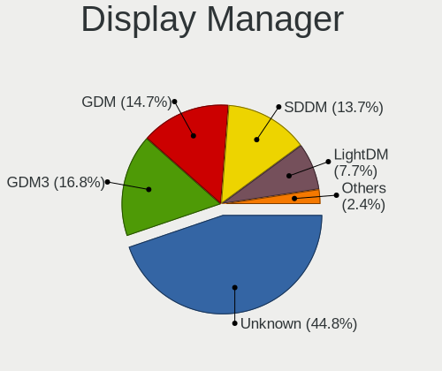
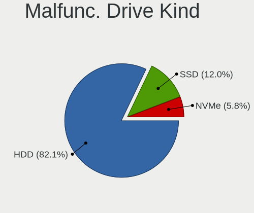
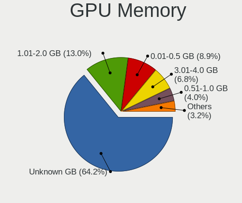
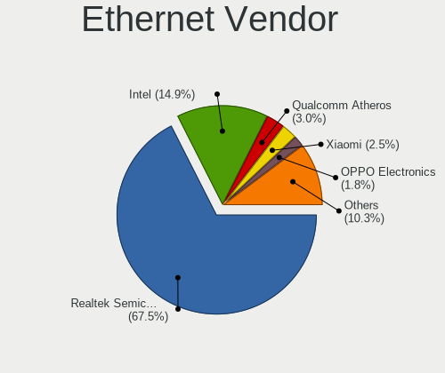
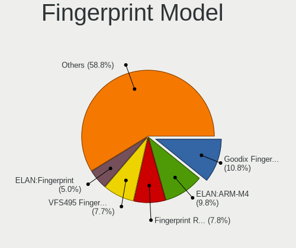

Linux in India - Tested Hardware & Statistics
---------------------------------------------

A project to collect tested hardware configurations for Linux in India.

Anyone can contribute to this report by the [hw-probe](https://github.com/linuxhw/hw-probe) tool:

    sudo -E hw-probe -all -upload

Please contribute! Especially if your hardware is rare.

This is a report for all computer types. See also reports for [desktops](/Location/India/Desktop/README.md) and [notebooks](/Location/India/Notebook/README.md).

Contents
--------

* [ Test Cases ](#test-cases)

* [ System ](#system)
  - [ OS                       ](#os)
  - [ OS Family                ](#os-family)
  - [ Kernel                   ](#kernel)
  - [ Kernel Family            ](#kernel-family)
  - [ Kernel Major Ver.        ](#kernel-major-ver)
  - [ Arch                     ](#arch)
  - [ DE                       ](#de)
  - [ Display Server           ](#display-server)
  - [ Display Manager          ](#display-manager)
  - [ OS Lang                  ](#os-lang)
  - [ Boot Mode                ](#boot-mode)
  - [ Filesystem               ](#filesystem)
  - [ Part. scheme             ](#part-scheme)
  - [ Dual Boot with Linux/BSD ](#dual-boot-with-linuxbsd)
  - [ Dual Boot (Win)          ](#dual-boot-win)

* [ Board ](#board)
  - [ Vendor                   ](#vendor)
  - [ Model                    ](#model)
  - [ Model Family             ](#model-family)
  - [ MFG Year                 ](#mfg-year)
  - [ Form Factor              ](#form-factor)
  - [ Secure Boot              ](#secure-boot)
  - [ Coreboot                 ](#coreboot)
  - [ RAM Size                 ](#ram-size)
  - [ RAM Used                 ](#ram-used)
  - [ Total Drives             ](#total-drives)
  - [ Has CD-ROM               ](#has-cd-rom)
  - [ Has Ethernet             ](#has-ethernet)
  - [ Has WiFi                 ](#has-wifi)
  - [ Has Bluetooth            ](#has-bluetooth)

* [ Location ](#location)
  - [ Country                  ](#country)
  - [ City                     ](#city)

* [ Drives ](#drives)
  - [ Drive Vendor             ](#drive-vendor)
  - [ Drive Model              ](#drive-model)
  - [ HDD Vendor               ](#hdd-vendor)
  - [ SSD Vendor               ](#ssd-vendor)
  - [ Drive Kind               ](#drive-kind)
  - [ Drive Connector          ](#drive-connector)
  - [ Drive Size               ](#drive-size)
  - [ Space Total              ](#space-total)
  - [ Space Used               ](#space-used)
  - [ Malfunc. Drives          ](#malfunc-drives)
  - [ Malfunc. Drive Vendor    ](#malfunc-drive-vendor)
  - [ Malfunc. HDD Vendor      ](#malfunc-hdd-vendor)
  - [ Malfunc. Drive Kind      ](#malfunc-drive-kind)
  - [ Failed Drives            ](#failed-drives)
  - [ Failed Drive Vendor      ](#failed-drive-vendor)
  - [ Drive Status             ](#drive-status)

* [ Storage controller ](#storage-controller)
  - [ Storage Vendor           ](#storage-vendor)
  - [ Storage Model            ](#storage-model)
  - [ Storage Kind             ](#storage-kind)

* [ Processor ](#processor)
  - [ CPU Vendor               ](#cpu-vendor)
  - [ CPU Model                ](#cpu-model)
  - [ CPU Model Family         ](#cpu-model-family)
  - [ CPU Cores                ](#cpu-cores)
  - [ CPU Sockets              ](#cpu-sockets)
  - [ CPU Threads              ](#cpu-threads)
  - [ CPU Op-Modes             ](#cpu-op-modes)
  - [ CPU Microcode            ](#cpu-microcode)
  - [ CPU Microarch            ](#cpu-microarch)

* [ Graphics ](#graphics)
  - [ GPU Vendor               ](#gpu-vendor)
  - [ GPU Model                ](#gpu-model)
  - [ GPU Combo                ](#gpu-combo)
  - [ GPU Driver               ](#gpu-driver)
  - [ GPU Memory               ](#gpu-memory)

* [ Monitor ](#monitor)
  - [ Monitor Vendor           ](#monitor-vendor)
  - [ Monitor Model            ](#monitor-model)
  - [ Monitor Resolution       ](#monitor-resolution)
  - [ Monitor Diagonal         ](#monitor-diagonal)
  - [ Monitor Width            ](#monitor-width)
  - [ Aspect Ratio             ](#aspect-ratio)
  - [ Monitor Area             ](#monitor-area)
  - [ Pixel Density            ](#pixel-density)
  - [ Multiple Monitors        ](#multiple-monitors)

* [ Network ](#network)
  - [ Net Controller Vendor    ](#net-controller-vendor)
  - [ Net Controller Model     ](#net-controller-model)
  - [ Wireless Vendor          ](#wireless-vendor)
  - [ Wireless Model           ](#wireless-model)
  - [ Ethernet Vendor          ](#ethernet-vendor)
  - [ Ethernet Model           ](#ethernet-model)
  - [ Net Controller Kind      ](#net-controller-kind)
  - [ Used Controller          ](#used-controller)
  - [ NICs                     ](#nics)
  - [ IPv6                     ](#ipv6)

* [ Bluetooth ](#bluetooth)
  - [ Bluetooth Vendor         ](#bluetooth-vendor)
  - [ Bluetooth Model          ](#bluetooth-model)

* [ Sound ](#sound)
  - [ Sound Vendor             ](#sound-vendor)
  - [ Sound Model              ](#sound-model)

* [ Memory ](#memory)
  - [ Memory Vendor            ](#memory-vendor)
  - [ Memory Model             ](#memory-model)
  - [ Memory Kind              ](#memory-kind)
  - [ Memory Form Factor       ](#memory-form-factor)
  - [ Memory Size              ](#memory-size)
  - [ Memory Speed             ](#memory-speed)

* [ Printers & scanners ](#printers--scanners)
  - [ Printer Vendor           ](#printer-vendor)
  - [ Printer Model            ](#printer-model)
  - [ Scanner Vendor           ](#scanner-vendor)
  - [ Scanner Model            ](#scanner-model)

* [ Camera ](#camera)
  - [ Camera Vendor            ](#camera-vendor)
  - [ Camera Model             ](#camera-model)

* [ Security ](#security)
  - [ Fingerprint Vendor       ](#fingerprint-vendor)
  - [ Fingerprint Model        ](#fingerprint-model)
  - [ Chipcard Vendor          ](#chipcard-vendor)
  - [ Chipcard Model           ](#chipcard-model)

* [ Unsupported ](#unsupported)
  - [ Unsupported Devices      ](#unsupported-devices)
  - [ Unsupported Device Types ](#unsupported-device-types)

Test Cases
----------

Total: 6344

| Vendor        | Model                       | Form-Factor | Probe                                                      | Date         |
|---------------|-----------------------------|-------------|------------------------------------------------------------|--------------|
| Lenovo        | ThinkPad E490 20N8CTO1WW    | Notebook    | [c336f9aa8c](https://linux-hardware.org/?probe=c336f9aa8c) | Aug 11, 2023 |
| ASUSTek       | PRIME X670-P WIFI           | Desktop     | [7d31344218](https://linux-hardware.org/?probe=7d31344218) | Aug 11, 2023 |
| HP            | Pavilion Notebook           | Notebook    | [980f6773f8](https://linux-hardware.org/?probe=980f6773f8) | Aug 10, 2023 |
| Dell          | 0YF8P5 A00                  | Desktop     | [93f35a6d26](https://linux-hardware.org/?probe=93f35a6d26) | Aug 10, 2023 |
| HP            | Pavilion Laptop 14-dv2xx... | Notebook    | [479f066821](https://linux-hardware.org/?probe=479f066821) | Aug 10, 2023 |
| Intel         | DG41RQ AAE54511-203         | Desktop     | [646d098c58](https://linux-hardware.org/?probe=646d098c58) | Aug 10, 2023 |
| Apple         | MacBookPro9,2               | Notebook    | [e703bb179f](https://linux-hardware.org/?probe=e703bb179f) | Aug 10, 2023 |
| Valve         | Jupiter                     | Notebook    | [eee501d93c](https://linux-hardware.org/?probe=eee501d93c) | Aug 09, 2023 |
| Dell          | 06CJMN A00                  | Desktop     | [cead9bd601](https://linux-hardware.org/?probe=cead9bd601) | Aug 09, 2023 |
| Lenovo        | IdeaPad 5 15ALC05 82LN      | Notebook    | [eec04bec1d](https://linux-hardware.org/?probe=eec04bec1d) | Aug 08, 2023 |
| ASUSTek       | ASUS TUF Gaming F15 FX50... | Notebook    | [c9c978701a](https://linux-hardware.org/?probe=c9c978701a) | Aug 08, 2023 |
| HP            | ProBook 445 G8 Notebook ... | Notebook    | [f69459e15a](https://linux-hardware.org/?probe=f69459e15a) | Aug 08, 2023 |
| Lenovo        | Bantry CRB SDK0E50510 WI... | Desktop     | [6ffda81a5e](https://linux-hardware.org/?probe=6ffda81a5e) | Aug 08, 2023 |
| ASUSTek       | VivoBook_ASUS Laptop X50... | Notebook    | [58446ba97c](https://linux-hardware.org/?probe=58446ba97c) | Aug 08, 2023 |
| ASUSTek       | PRIME X670-P WIFI           | Desktop     | [2335e10b59](https://linux-hardware.org/?probe=2335e10b59) | Aug 08, 2023 |
| MSI           | GL63 8RC                    | Notebook    | [d91d6193e6](https://linux-hardware.org/?probe=d91d6193e6) | Aug 07, 2023 |
| Gigabyte      | B450M DS3H WIFI-CF          | Desktop     | [608c3967b2](https://linux-hardware.org/?probe=608c3967b2) | Aug 07, 2023 |
| Lenovo        | ThinkPad E14 Gen 5 21JRS... | Notebook    | [ebcf58253e](https://linux-hardware.org/?probe=ebcf58253e) | Aug 07, 2023 |
| HP            | ProBook 640 G2              | Notebook    | [8dae611904](https://linux-hardware.org/?probe=8dae611904) | Aug 06, 2023 |
| Dell          | Inspiron 15-3552            | Notebook    | [91376cc583](https://linux-hardware.org/?probe=91376cc583) | Aug 06, 2023 |
| ASRock        | B650 PG Lightning           | Desktop     | [bc55c09547](https://linux-hardware.org/?probe=bc55c09547) | Aug 06, 2023 |
| HP            | EliteBook 840 G4            | Notebook    | [44d851d327](https://linux-hardware.org/?probe=44d851d327) | Aug 06, 2023 |
| Dell          | Inspiron 7572               | Notebook    | [2509709a1e](https://linux-hardware.org/?probe=2509709a1e) | Aug 06, 2023 |
| Dell          | Precision 3571              | Notebook    | [fdbbd33ee6](https://linux-hardware.org/?probe=fdbbd33ee6) | Aug 06, 2023 |
| Dell          | Precision 3571              | Notebook    | [76de48bd02](https://linux-hardware.org/?probe=76de48bd02) | Aug 06, 2023 |
| Dell          | Inspiron 3542               | Notebook    | [6af70944d8](https://linux-hardware.org/?probe=6af70944d8) | Aug 05, 2023 |
| Dell          | Inspiron 3542               | Notebook    | [1790fa9d72](https://linux-hardware.org/?probe=1790fa9d72) | Aug 05, 2023 |
| ASRock        | B450M Pro4                  | Desktop     | [1e157ae535](https://linux-hardware.org/?probe=1e157ae535) | Aug 05, 2023 |
| HP            | 15                          | Notebook    | [77ae1d8e7e](https://linux-hardware.org/?probe=77ae1d8e7e) | Aug 05, 2023 |
| HP            | Pavilion Laptop 15-cc1xx    | Notebook    | [771a45e46f](https://linux-hardware.org/?probe=771a45e46f) | Aug 05, 2023 |
| Fujitsu       | LIFEBOOK LH532              | Notebook    | [ba3a2e1773](https://linux-hardware.org/?probe=ba3a2e1773) | Aug 04, 2023 |
| Lenovo        | V15 G3 ABA 82TV             | Notebook    | [0147060507](https://linux-hardware.org/?probe=0147060507) | Aug 04, 2023 |
| HP            | Compaq Presario CQ40        | Notebook    | [c5ea71f927](https://linux-hardware.org/?probe=c5ea71f927) | Aug 04, 2023 |
| HP            | ENVY Laptop 16-h0xxx        | Notebook    | [082f92da07](https://linux-hardware.org/?probe=082f92da07) | Aug 04, 2023 |
| HP            | ENVY Laptop 16-h0xxx        | Notebook    | [1078db460a](https://linux-hardware.org/?probe=1078db460a) | Aug 04, 2023 |
| Dell          | Vostro 3405                 | Notebook    | [db4954c21d](https://linux-hardware.org/?probe=db4954c21d) | Aug 03, 2023 |
| Gigabyte      | B550M DS3H AC               | Desktop     | [f27f9b2a7f](https://linux-hardware.org/?probe=f27f9b2a7f) | Aug 03, 2023 |
| Gigabyte      | B550M DS3H AC               | Desktop     | [8193f810ab](https://linux-hardware.org/?probe=8193f810ab) | Aug 03, 2023 |
| Lenovo        | ThinkPad E14 Gen 4 21E3S... | Notebook    | [0cf8e99478](https://linux-hardware.org/?probe=0cf8e99478) | Aug 03, 2023 |
| Acer          | Nitro AN515-44              | Notebook    | [38f33f3878](https://linux-hardware.org/?probe=38f33f3878) | Aug 03, 2023 |
| OEM           | Intel H81                   | Desktop     | [82606b5050](https://linux-hardware.org/?probe=82606b5050) | Aug 03, 2023 |
| Alienware     | 14                          | Notebook    | [90512d5e80](https://linux-hardware.org/?probe=90512d5e80) | Aug 02, 2023 |
| HP            | Notebook                    | Notebook    | [258f6a82ad](https://linux-hardware.org/?probe=258f6a82ad) | Aug 02, 2023 |
| Dell          | Inspiron 1545               | Notebook    | [97d2508df2](https://linux-hardware.org/?probe=97d2508df2) | Aug 02, 2023 |
| Dell          | Inspiron 15-3552            | Notebook    | [2019699cac](https://linux-hardware.org/?probe=2019699cac) | Aug 02, 2023 |
| Acer          | Nitro AN515-45              | Notebook    | [5523e61097](https://linux-hardware.org/?probe=5523e61097) | Aug 02, 2023 |
| ASUSTek       | VivoBook_ASUSLaptop K350... | Notebook    | [32d205bbdf](https://linux-hardware.org/?probe=32d205bbdf) | Aug 02, 2023 |
| HP            | ProBook 440 G5              | Notebook    | [c0de5c7032](https://linux-hardware.org/?probe=c0de5c7032) | Aug 02, 2023 |
| ASUSTek       | Z170 PRO GAMING             | Desktop     | [a0270160ad](https://linux-hardware.org/?probe=a0270160ad) | Aug 02, 2023 |
| Lenovo        | Bantry CRB SDK0E50510 WI... | Desktop     | [69cd0aae71](https://linux-hardware.org/?probe=69cd0aae71) | Aug 02, 2023 |
| HP            | ENVY Laptop 13-aq0xxx       | Notebook    | [6fe0b53a1b](https://linux-hardware.org/?probe=6fe0b53a1b) | Aug 02, 2023 |
| Dell          | Latitude E7470              | Notebook    | [d377538364](https://linux-hardware.org/?probe=d377538364) | Aug 01, 2023 |
| ASUSTek       | VivoBook_ASUSLaptop M650... | Notebook    | [5650f66cd4](https://linux-hardware.org/?probe=5650f66cd4) | Jul 31, 2023 |
| HP            | Pavilion Laptop 14-ec1xx... | Notebook    | [ff6816b285](https://linux-hardware.org/?probe=ff6816b285) | Jul 31, 2023 |
| Lenovo        | V15 G3 IAP 82TT             | Notebook    | [f641b9c622](https://linux-hardware.org/?probe=f641b9c622) | Jul 30, 2023 |
| Dell          | Latitude E5270              | Notebook    | [ae07c57989](https://linux-hardware.org/?probe=ae07c57989) | Jul 30, 2023 |
| MSI           | Bravo 15 B5DD               | Notebook    | [d9d3f5bce4](https://linux-hardware.org/?probe=d9d3f5bce4) | Jul 30, 2023 |
| MSI           | H510M-A PRO                 | Desktop     | [20d5d0a3ad](https://linux-hardware.org/?probe=20d5d0a3ad) | Jul 30, 2023 |
| Lenovo        | G500s 20245                 | Notebook    | [eff9350e7f](https://linux-hardware.org/?probe=eff9350e7f) | Jul 29, 2023 |
| Lenovo        | 3132 NOK                    | Desktop     | [6ab9975946](https://linux-hardware.org/?probe=6ab9975946) | Jul 29, 2023 |
| Dell          | Inspiron 5593               | Notebook    | [6a6420b23e](https://linux-hardware.org/?probe=6a6420b23e) | Jul 29, 2023 |
| ASUSTek       | P7H55-M LX                  | Desktop     | [bc92202f16](https://linux-hardware.org/?probe=bc92202f16) | Jul 29, 2023 |
| Dell          | Precision 3550              | Notebook    | [0ecac77f90](https://linux-hardware.org/?probe=0ecac77f90) | Jul 28, 2023 |
| Dell          | Precision 3550              | Notebook    | [95ae018833](https://linux-hardware.org/?probe=95ae018833) | Jul 28, 2023 |
| HP            | Pavilion Laptop 15-eg3xx... | Notebook    | [2f6969a3c9](https://linux-hardware.org/?probe=2f6969a3c9) | Jul 27, 2023 |
| MSI           | Alpha 15 B5EEK              | Notebook    | [d6a4c29101](https://linux-hardware.org/?probe=d6a4c29101) | Jul 27, 2023 |
| Dell          | 0W7JN5 A01                  | Server      | [8f86e6220c](https://linux-hardware.org/?probe=8f86e6220c) | Jul 27, 2023 |
| Dell          | 0W7JN5 A01                  | Server      | [568da91aee](https://linux-hardware.org/?probe=568da91aee) | Jul 27, 2023 |
| Lenovo        | ThinkPad T16 Gen 1 21CJC... | Notebook    | [d7fa33e7b1](https://linux-hardware.org/?probe=d7fa33e7b1) | Jul 27, 2023 |
| Lenovo        | ThinkPad E14 20RBCTO1WW     | Notebook    | [1bac11c715](https://linux-hardware.org/?probe=1bac11c715) | Jul 26, 2023 |
| Lenovo        | ThinkPad E14 20RBCTO1WW     | Notebook    | [1409af2a38](https://linux-hardware.org/?probe=1409af2a38) | Jul 26, 2023 |
| ASRock        | B650 PG Lightning           | Desktop     | [2c7364f005](https://linux-hardware.org/?probe=2c7364f005) | Jul 26, 2023 |
| HP            | 87A4 10100                  | All in one  | [99d5e60209](https://linux-hardware.org/?probe=99d5e60209) | Jul 26, 2023 |
| Lenovo        | ThinkPad E560 20EVCTO1WW    | Notebook    | [866a4197cd](https://linux-hardware.org/?probe=866a4197cd) | Jul 26, 2023 |
| Acer          | Aspire A715-42G             | Notebook    | [a6abe36eef](https://linux-hardware.org/?probe=a6abe36eef) | Jul 26, 2023 |
| Acer          | Aspire A515-57G             | Notebook    | [8a297cb644](https://linux-hardware.org/?probe=8a297cb644) | Jul 26, 2023 |
| HP            | Pavilion x360 Convertibl... | Convertible | [aa34907e3a](https://linux-hardware.org/?probe=aa34907e3a) | Jul 26, 2023 |
| Dell          | Vostro 3405                 | Notebook    | [82a990b785](https://linux-hardware.org/?probe=82a990b785) | Jul 26, 2023 |
| Dell          | Vostro 3405                 | Notebook    | [dc97ca175a](https://linux-hardware.org/?probe=dc97ca175a) | Jul 25, 2023 |
| HP            | ENVY Notebook               | Notebook    | [9ab8362949](https://linux-hardware.org/?probe=9ab8362949) | Jul 25, 2023 |
| Timi          | Mi NoteBook Ultra           | Notebook    | [e1fea727ff](https://linux-hardware.org/?probe=e1fea727ff) | Jul 24, 2023 |
| Timi          | Mi NoteBook Ultra           | Notebook    | [61646d77f1](https://linux-hardware.org/?probe=61646d77f1) | Jul 24, 2023 |
| ASUSTek       | ROG Strix G713PV_G713PV     | Notebook    | [61c84247e6](https://linux-hardware.org/?probe=61c84247e6) | Jul 24, 2023 |
| ASUSTek       | VivoBook_ASUSLaptop X415... | Notebook    | [8377b87a66](https://linux-hardware.org/?probe=8377b87a66) | Jul 24, 2023 |
| ASUSTek       | X541UV                      | Notebook    | [eb0aac9c32](https://linux-hardware.org/?probe=eb0aac9c32) | Jul 24, 2023 |
| Acer          | Aspire A315-59              | Notebook    | [8ecb2eb1fc](https://linux-hardware.org/?probe=8ecb2eb1fc) | Jul 24, 2023 |
| Lenovo        | E41-25 81FS                 | Notebook    | [d9f18f8f28](https://linux-hardware.org/?probe=d9f18f8f28) | Jul 24, 2023 |
| HP            | Pavilion Laptop 14-ec1xx... | Notebook    | [e822964466](https://linux-hardware.org/?probe=e822964466) | Jul 24, 2023 |
| HP            | Pavilion Laptop 15-eg3xx... | Notebook    | [313f3aa210](https://linux-hardware.org/?probe=313f3aa210) | Jul 23, 2023 |
| Lenovo        | Yoga 7 16IAP7 82QG          | Convertible | [d47fdd358d](https://linux-hardware.org/?probe=d47fdd358d) | Jul 23, 2023 |
| Gigabyte      | H61MS                       | Desktop     | [545d840e2f](https://linux-hardware.org/?probe=545d840e2f) | Jul 23, 2023 |
| Dell          | Latitude 3490               | Notebook    | [8988026686](https://linux-hardware.org/?probe=8988026686) | Jul 23, 2023 |
| Dell          | Latitude 3490               | Notebook    | [b7f8f886f8](https://linux-hardware.org/?probe=b7f8f886f8) | Jul 23, 2023 |
| Lenovo        | IdeaPad 330S-15IKB 81F5     | Notebook    | [6c0c0671df](https://linux-hardware.org/?probe=6c0c0671df) | Jul 23, 2023 |
| ASUSTek       | VivoBook_ASUSLaptop X421... | Notebook    | [cc08425e5b](https://linux-hardware.org/?probe=cc08425e5b) | Jul 22, 2023 |
| Dell          | Inspiron 3558               | Notebook    | [2cad6d3cb7](https://linux-hardware.org/?probe=2cad6d3cb7) | Jul 22, 2023 |
| Timi          | Mi NoteBook Horizon Edit... | Notebook    | [72a5dfb7cd](https://linux-hardware.org/?probe=72a5dfb7cd) | Jul 21, 2023 |
| Dell          | 0NKW6Y A00                  | Desktop     | [a331a92532](https://linux-hardware.org/?probe=a331a92532) | Jul 21, 2023 |
| Lenovo        | Z50-70 20354                | Notebook    | [33150ea27b](https://linux-hardware.org/?probe=33150ea27b) | Jul 21, 2023 |
| Timi          | Mi NoteBook Ultra           | Notebook    | [6bb2b5bfb6](https://linux-hardware.org/?probe=6bb2b5bfb6) | Jul 20, 2023 |
| HP            | EliteBook 840 G5            | Notebook    | [df9e2bd667](https://linux-hardware.org/?probe=df9e2bd667) | Jul 20, 2023 |
| ASUSTek       | ROG Strix G713PI_G713PI     | Notebook    | [061efe2135](https://linux-hardware.org/?probe=061efe2135) | Jul 20, 2023 |
| Acer          | Nitro AN515-58              | Notebook    | [18a6e9f055](https://linux-hardware.org/?probe=18a6e9f055) | Jul 20, 2023 |
| HP            | Pavilion Notebook           | Notebook    | [d366e7101c](https://linux-hardware.org/?probe=d366e7101c) | Jul 20, 2023 |
| AVITA         | NS14A6                      | Notebook    | [594afbeb74](https://linux-hardware.org/?probe=594afbeb74) | Jul 19, 2023 |
| ASUSTek       | ASUS TUF Gaming A17 FA70... | Notebook    | [77468bcff7](https://linux-hardware.org/?probe=77468bcff7) | Jul 19, 2023 |
| ASUSTek       | ASUS TUF Gaming A17 FA70... | Notebook    | [eb7b37c1d2](https://linux-hardware.org/?probe=eb7b37c1d2) | Jul 19, 2023 |
| HP            | Notebook                    | Notebook    | [2ccf016245](https://linux-hardware.org/?probe=2ccf016245) | Jul 19, 2023 |
| Gigabyte      | H61M-DS2                    | Desktop     | [06e511f834](https://linux-hardware.org/?probe=06e511f834) | Jul 19, 2023 |
| HP            | Pavilion Laptop 15-eg3xx... | Notebook    | [38c5f4d547](https://linux-hardware.org/?probe=38c5f4d547) | Jul 19, 2023 |
| Gigabyte      | H61M-DS2                    | Desktop     | [0c537839b2](https://linux-hardware.org/?probe=0c537839b2) | Jul 19, 2023 |
| Unknown       | G41 Series                  | Desktop     | [5890a777c5](https://linux-hardware.org/?probe=5890a777c5) | Jul 19, 2023 |
| Dell          | Precision 3581              | Notebook    | [68d58784d5](https://linux-hardware.org/?probe=68d58784d5) | Jul 18, 2023 |
| Dell          | Latitude 5480               | Notebook    | [30aaaf3ba8](https://linux-hardware.org/?probe=30aaaf3ba8) | Jul 18, 2023 |
| Dell          | Latitude 3590               | Notebook    | [6386a869e5](https://linux-hardware.org/?probe=6386a869e5) | Jul 18, 2023 |
| Acer          | Predator PH315-53           | Notebook    | [3d0b2577a1](https://linux-hardware.org/?probe=3d0b2577a1) | Jul 18, 2023 |
| Dell          | Latitude 7480               | Notebook    | [83caa544f7](https://linux-hardware.org/?probe=83caa544f7) | Jul 18, 2023 |
| Dell          | Latitude 7480               | Notebook    | [526e020c94](https://linux-hardware.org/?probe=526e020c94) | Jul 18, 2023 |
| Dell          | 0XFWHV A00                  | Desktop     | [0c229a1245](https://linux-hardware.org/?probe=0c229a1245) | Jul 18, 2023 |
| Gigabyte      | H61M-DS2                    | Desktop     | [5b68d7d6e2](https://linux-hardware.org/?probe=5b68d7d6e2) | Jul 16, 2023 |
| Intel         | DH61BF AAG81311-102         | Desktop     | [bc2e347565](https://linux-hardware.org/?probe=bc2e347565) | Jul 16, 2023 |
| ASUSTek       | VivoBook_ASUSLaptop X515... | Notebook    | [d43ad7594c](https://linux-hardware.org/?probe=d43ad7594c) | Jul 16, 2023 |
| HP            | 15                          | Notebook    | [73b0c0312f](https://linux-hardware.org/?probe=73b0c0312f) | Jul 15, 2023 |
| Timi          | Mi NoteBook Ultra           | Notebook    | [94f963ff8c](https://linux-hardware.org/?probe=94f963ff8c) | Jul 15, 2023 |
| POWERX        | G41                         | Desktop     | [70a6d4e6bf](https://linux-hardware.org/?probe=70a6d4e6bf) | Jul 15, 2023 |
| Lenovo        | G50-70 20351                | Notebook    | [b8481d7a4c](https://linux-hardware.org/?probe=b8481d7a4c) | Jul 14, 2023 |
| Dell          | Latitude 5480               | Notebook    | [c74dc748f5](https://linux-hardware.org/?probe=c74dc748f5) | Jul 14, 2023 |
| Lenovo        | IdeaPad Gaming 3 15IHU6 ... | Notebook    | [1e2b959156](https://linux-hardware.org/?probe=1e2b959156) | Jul 14, 2023 |
| ASUSTek       | VivoBook_ASUSLaptop M340... | Notebook    | [e042e7c94e](https://linux-hardware.org/?probe=e042e7c94e) | Jul 14, 2023 |
| ASUSTek       | PRIME Z690-P D4             | Desktop     | [b8b0b27baf](https://linux-hardware.org/?probe=b8b0b27baf) | Jul 14, 2023 |
| HP            | 86F3 00100                  | All in one  | [3ab66add04](https://linux-hardware.org/?probe=3ab66add04) | Jul 14, 2023 |
| HP            | 86F3 00100                  | All in one  | [95577f518a](https://linux-hardware.org/?probe=95577f518a) | Jul 14, 2023 |
| ASUSTek       | ASUS TUF Gaming F15 FX50... | Notebook    | [76513f6a7d](https://linux-hardware.org/?probe=76513f6a7d) | Jul 14, 2023 |
| Gigabyte      | B550 GAMING X               | Desktop     | [67b2bb6155](https://linux-hardware.org/?probe=67b2bb6155) | Jul 14, 2023 |
| ASUSTek       | VivoBook_ASUSLaptop M340... | Notebook    | [934947072a](https://linux-hardware.org/?probe=934947072a) | Jul 13, 2023 |
| HP            | Pavilion Laptop 14-dv0xx... | Notebook    | [d5079cefe1](https://linux-hardware.org/?probe=d5079cefe1) | Jul 13, 2023 |
| MSI           | Katana GF66 11UC            | Notebook    | [d22ab22240](https://linux-hardware.org/?probe=d22ab22240) | Jul 13, 2023 |
| Acer          | Nitro AN515-58              | Notebook    | [b31130eea6](https://linux-hardware.org/?probe=b31130eea6) | Jul 13, 2023 |
| Timi          | Mi NoteBook Ultra           | Notebook    | [04c4e233af](https://linux-hardware.org/?probe=04c4e233af) | Jul 12, 2023 |
| Timi          | Xiaomi NoteBook Pro         | Notebook    | [618c0c975b](https://linux-hardware.org/?probe=618c0c975b) | Jul 12, 2023 |
| Gigabyte      | Z270X-Gaming 5              | Desktop     | [949ca22bb2](https://linux-hardware.org/?probe=949ca22bb2) | Jul 12, 2023 |
| ASUSTek       | Zenbook UX3402ZA_UX3402Z... | Convertible | [3532802c06](https://linux-hardware.org/?probe=3532802c06) | Jul 12, 2023 |
| Dell          | Inspiron 5590               | Notebook    | [f3c9995017](https://linux-hardware.org/?probe=f3c9995017) | Jul 12, 2023 |
| ASUSTek       | VivoBook_ASUSLaptop M340... | Notebook    | [aea754f076](https://linux-hardware.org/?probe=aea754f076) | Jul 11, 2023 |
| MSI           | H510M-A PRO                 | Desktop     | [995e13dee9](https://linux-hardware.org/?probe=995e13dee9) | Jul 11, 2023 |
| Lenovo        | ThinkPad E14 20RAS1RA00     | Notebook    | [05f889dc1a](https://linux-hardware.org/?probe=05f889dc1a) | Jul 11, 2023 |
| Lenovo        | Yoga 9 14ITL5 82BG          | Convertible | [ad7b13940b](https://linux-hardware.org/?probe=ad7b13940b) | Jul 11, 2023 |
| ASUSTek       | PRIME H310M-E R2.0          | Desktop     | [7a8f3c985f](https://linux-hardware.org/?probe=7a8f3c985f) | Jul 11, 2023 |
| HP            | Pavilion Laptop 14-dv1xx... | Notebook    | [37bc760339](https://linux-hardware.org/?probe=37bc760339) | Jul 11, 2023 |
| Acer          | Nitro AN515-58              | Notebook    | [76d89b3b3b](https://linux-hardware.org/?probe=76d89b3b3b) | Jul 11, 2023 |
| Dell          | Inspiron 1545               | Notebook    | [50ed801045](https://linux-hardware.org/?probe=50ed801045) | Jul 11, 2023 |
| HP            | Pavilion - 14-CE2068ST      | Notebook    | [bdf8b67813](https://linux-hardware.org/?probe=bdf8b67813) | Jul 10, 2023 |
| Lenovo        | Legion Y540-15IRH-PG0 81... | Notebook    | [806e14ad19](https://linux-hardware.org/?probe=806e14ad19) | Jul 10, 2023 |
| Lenovo        | 3106 SDK0J40697 WIN 3305... | Desktop     | [784f886357](https://linux-hardware.org/?probe=784f886357) | Jul 10, 2023 |
| Gigabyte      | B365M DS3H WIFI             | Desktop     | [150b2a2675](https://linux-hardware.org/?probe=150b2a2675) | Jul 09, 2023 |
| Gigabyte      | B365M DS3H WIFI             | Desktop     | [a887a01dd7](https://linux-hardware.org/?probe=a887a01dd7) | Jul 09, 2023 |
| ASUSTek       | VivoBook_ASUSLaptop M340... | Notebook    | [3a1baa8f6c](https://linux-hardware.org/?probe=3a1baa8f6c) | Jul 09, 2023 |
| HP            | Notebook                    | Notebook    | [a1c37a6a4b](https://linux-hardware.org/?probe=a1c37a6a4b) | Jul 09, 2023 |
| Intel         | H61                         | Desktop     | [11e024727c](https://linux-hardware.org/?probe=11e024727c) | Jul 09, 2023 |
| MSI           | Z97 GUARD-PRO               | Desktop     | [298da90a40](https://linux-hardware.org/?probe=298da90a40) | Jul 09, 2023 |
| HP            | Pavilion Laptop 14-dv0xx... | Notebook    | [ce4fed4466](https://linux-hardware.org/?probe=ce4fed4466) | Jul 08, 2023 |
| Dell          | Latitude E5440              | Notebook    | [9b4a70fe2b](https://linux-hardware.org/?probe=9b4a70fe2b) | Jul 08, 2023 |
| HP            | Pavilion Laptop 15-eg3xx... | Notebook    | [629f165835](https://linux-hardware.org/?probe=629f165835) | Jul 07, 2023 |
| Dell          | Inspiron 3543               | Notebook    | [b7459d1653](https://linux-hardware.org/?probe=b7459d1653) | Jul 07, 2023 |
| HP            | ProBook 4525s               | Notebook    | [e70917548c](https://linux-hardware.org/?probe=e70917548c) | Jul 07, 2023 |
| HP            | Laptop                      | Notebook    | [30a1d8ec1c](https://linux-hardware.org/?probe=30a1d8ec1c) | Jul 06, 2023 |
| Lenovo        | IdeaPad Gaming 3 15ARH05... | Notebook    | [e555b073b5](https://linux-hardware.org/?probe=e555b073b5) | Jul 05, 2023 |
| Lenovo        | IdeaPad Gaming 3 15ARH05... | Notebook    | [b11fe33b8c](https://linux-hardware.org/?probe=b11fe33b8c) | Jul 05, 2023 |
| Lenovo        | G500s 20245                 | Notebook    | [f5f96d51ed](https://linux-hardware.org/?probe=f5f96d51ed) | Jul 05, 2023 |
| HP            | 339A                        | Desktop     | [e746807776](https://linux-hardware.org/?probe=e746807776) | Jul 05, 2023 |
| ASUSTek       | ROG STRIX B550-F GAMING ... | Desktop     | [ca637a5884](https://linux-hardware.org/?probe=ca637a5884) | Jul 05, 2023 |
| HP            | Laptop 14s-ef1xxx           | Notebook    | [14e321559e](https://linux-hardware.org/?probe=14e321559e) | Jul 04, 2023 |
| ASUSTek       | ASUS TUF Gaming A15 FA50... | Notebook    | [a889efa719](https://linux-hardware.org/?probe=a889efa719) | Jul 04, 2023 |
| MSI           | GF63 Thin 11UC              | Notebook    | [86c82575ec](https://linux-hardware.org/?probe=86c82575ec) | Jul 04, 2023 |
| Dell          | Precision 3581              | Notebook    | [1d4db3cec3](https://linux-hardware.org/?probe=1d4db3cec3) | Jul 03, 2023 |
| Gigabyte      | A320M-H-CF                  | Desktop     | [5634ff05d5](https://linux-hardware.org/?probe=5634ff05d5) | Jul 03, 2023 |
| ASUSTek       | VivoBook_ASUSLaptop K650... | Notebook    | [dfd66d3d07](https://linux-hardware.org/?probe=dfd66d3d07) | Jul 03, 2023 |
| ASUSTek       | X541UAK                     | Notebook    | [c4dcbea71d](https://linux-hardware.org/?probe=c4dcbea71d) | Jul 03, 2023 |
| HP            | 861A                        | Desktop     | [0531675f82](https://linux-hardware.org/?probe=0531675f82) | Jul 03, 2023 |
| ASUSTek       | VivoBook 15_ASUS Laptop ... | Notebook    | [da24c07da6](https://linux-hardware.org/?probe=da24c07da6) | Jul 02, 2023 |
| Gigabyte      | GA-H61M-S                   | Desktop     | [351a27ff5e](https://linux-hardware.org/?probe=351a27ff5e) | Jul 02, 2023 |
| Gigabyte      | B460M DS3H AC               | Desktop     | [71aa2fd160](https://linux-hardware.org/?probe=71aa2fd160) | Jul 02, 2023 |
| HP            | EliteBook 820 G3            | Notebook    | [09c7b86b2c](https://linux-hardware.org/?probe=09c7b86b2c) | Jul 02, 2023 |
| ASUSTek       | VivoBook_ASUSLaptop M340... | Notebook    | [835f3a390f](https://linux-hardware.org/?probe=835f3a390f) | Jul 02, 2023 |
| Lenovo        | ThinkPad E14 20RBCTO1WW     | Notebook    | [3271b3b559](https://linux-hardware.org/?probe=3271b3b559) | Jul 02, 2023 |
| HONOR         | NMH-WCX9                    | Notebook    | [a8caf9af8e](https://linux-hardware.org/?probe=a8caf9af8e) | Jul 02, 2023 |
| ASRock        | B150M Pro4/Hyper            | Desktop     | [84eee16dd5](https://linux-hardware.org/?probe=84eee16dd5) | Jul 01, 2023 |
| Lenovo        | IdeaPad 130-15AST 81H5      | Notebook    | [0c4c59cf86](https://linux-hardware.org/?probe=0c4c59cf86) | Jul 01, 2023 |
| ASUSTek       | X541UV                      | Notebook    | [d0fc2ea58e](https://linux-hardware.org/?probe=d0fc2ea58e) | Jul 01, 2023 |
| ASUSTek       | X541UV                      | Notebook    | [8b5dc3456b](https://linux-hardware.org/?probe=8b5dc3456b) | Jul 01, 2023 |
| Lenovo        | ThinkPad E14 Gen 3 20YDC... | Notebook    | [0aed51f639](https://linux-hardware.org/?probe=0aed51f639) | Jul 01, 2023 |
| Infinix       | INBOOK X2 PLUS              | Notebook    | [9a74f19725](https://linux-hardware.org/?probe=9a74f19725) | Jul 01, 2023 |
| Acer          | Aspire E5-575G              | Notebook    | [f127804b4a](https://linux-hardware.org/?probe=f127804b4a) | Jun 30, 2023 |
| Lenovo        | Yoga 7 16IAP7 82QG          | Convertible | [5ac29ea67f](https://linux-hardware.org/?probe=5ac29ea67f) | Jun 30, 2023 |
| ASUSTek       | ASUS TUF Gaming F15 FX50... | Notebook    | [10467d9f3e](https://linux-hardware.org/?probe=10467d9f3e) | Jun 30, 2023 |
| HP            | 15                          | Notebook    | [2d80407689](https://linux-hardware.org/?probe=2d80407689) | Jun 30, 2023 |
| HP            | 15                          | Notebook    | [398d659d8c](https://linux-hardware.org/?probe=398d659d8c) | Jun 30, 2023 |
| Acer          | Aspire E5-575               | Notebook    | [602d134940](https://linux-hardware.org/?probe=602d134940) | Jun 30, 2023 |
| Dell          | Inspiron N5010              | Notebook    | [eab5331f66](https://linux-hardware.org/?probe=eab5331f66) | Jun 30, 2023 |
| Lenovo        | ThinkPad E15 Gen 2 20TDC... | Notebook    | [62ff10cadc](https://linux-hardware.org/?probe=62ff10cadc) | Jun 29, 2023 |
| Gigabyte      | H310M H                     | Desktop     | [0ad496c06d](https://linux-hardware.org/?probe=0ad496c06d) | Jun 29, 2023 |
| ASUSTek       | VivoBook_ASUSLaptop X512... | Notebook    | [0f0defbd9c](https://linux-hardware.org/?probe=0f0defbd9c) | Jun 29, 2023 |
| Lenovo        | ThinkBook 14p Gen 3 21EJ    | Notebook    | [0086cae258](https://linux-hardware.org/?probe=0086cae258) | Jun 29, 2023 |
| Lenovo        | IdeaPad S540-15IWL          | Notebook    | [de699b13ba](https://linux-hardware.org/?probe=de699b13ba) | Jun 28, 2023 |
| HP            | Pavilion Laptop 15-eh2xx... | Notebook    | [5d30ae9d05](https://linux-hardware.org/?probe=5d30ae9d05) | Jun 28, 2023 |
| ASUSTek       | VivoBook 15_ASUS Laptop ... | Notebook    | [6a29eda577](https://linux-hardware.org/?probe=6a29eda577) | Jun 28, 2023 |
| ASUSTek       | VivoBook 15_ASUS Laptop ... | Notebook    | [bf4abd6e9e](https://linux-hardware.org/?probe=bf4abd6e9e) | Jun 28, 2023 |
| Dell          | Inspiron 3543               | Notebook    | [4baea798b1](https://linux-hardware.org/?probe=4baea798b1) | Jun 27, 2023 |
| Acer          | Swift SFG14-71              | Notebook    | [f66ac636e6](https://linux-hardware.org/?probe=f66ac636e6) | Jun 27, 2023 |
| HP            | Pavilion Laptop 15-eh2xx... | Notebook    | [fc7f2b378b](https://linux-hardware.org/?probe=fc7f2b378b) | Jun 27, 2023 |
| Dell          | Inspiron 1545               | Notebook    | [d6b3d5cb90](https://linux-hardware.org/?probe=d6b3d5cb90) | Jun 27, 2023 |
| ASUSTek       | ROG STRIX B450-F GAMING     | Desktop     | [13c7f88d66](https://linux-hardware.org/?probe=13c7f88d66) | Jun 26, 2023 |
| ASUSTek       | H61M-CS                     | Desktop     | [2878c06857](https://linux-hardware.org/?probe=2878c06857) | Jun 26, 2023 |
| Acer          | Aspire A715-51G             | Notebook    | [08ba4bf92b](https://linux-hardware.org/?probe=08ba4bf92b) | Jun 26, 2023 |
| Acer          | Aspire A715-51G             | Notebook    | [3dc15705c8](https://linux-hardware.org/?probe=3dc15705c8) | Jun 26, 2023 |
| ASUSTek       | ASUS EXPERTBOOK B1402CBA    | Notebook    | [8a764f6629](https://linux-hardware.org/?probe=8a764f6629) | Jun 26, 2023 |
| Gigabyte      | B75M-D3H                    | Desktop     | [aeb1c6b8d2](https://linux-hardware.org/?probe=aeb1c6b8d2) | Jun 26, 2023 |
| ASUSTek       | ROG STRIX B550-F GAMING ... | Desktop     | [1a21c582de](https://linux-hardware.org/?probe=1a21c582de) | Jun 26, 2023 |
| HP            | Laptop 14s-dq2xxx           | Notebook    | [23499b1838](https://linux-hardware.org/?probe=23499b1838) | Jun 25, 2023 |
| HP            | Pavilion x360 Convertibl... | Convertible | [1fc0c8e328](https://linux-hardware.org/?probe=1fc0c8e328) | Jun 25, 2023 |
| Acer          | Aspire E5-575G              | Notebook    | [2f5357533f](https://linux-hardware.org/?probe=2f5357533f) | Jun 25, 2023 |
| Lenovo        | E41-55 82FJ                 | Notebook    | [f725e1bd1a](https://linux-hardware.org/?probe=f725e1bd1a) | Jun 25, 2023 |
| Dell          | Precision M6400             | Notebook    | [b68c09e274](https://linux-hardware.org/?probe=b68c09e274) | Jun 25, 2023 |
| HP            | Laptop 15s-eq2xxx           | Notebook    | [14cc9e067f](https://linux-hardware.org/?probe=14cc9e067f) | Jun 25, 2023 |
| Dell          | Precision 5540              | Notebook    | [7d6c1fe39d](https://linux-hardware.org/?probe=7d6c1fe39d) | Jun 25, 2023 |
| Dell          | Inspiron 1545               | Notebook    | [7f8217bce2](https://linux-hardware.org/?probe=7f8217bce2) | Jun 25, 2023 |
| ASUSTek       | TUF Gaming FX505DT_FX505... | Notebook    | [5679200535](https://linux-hardware.org/?probe=5679200535) | Jun 24, 2023 |
| Dell          | Vostro 2520                 | Notebook    | [9279842ec3](https://linux-hardware.org/?probe=9279842ec3) | Jun 24, 2023 |
| HP            | Pavilion Gaming Laptop 1... | Notebook    | [628fca0448](https://linux-hardware.org/?probe=628fca0448) | Jun 24, 2023 |
| Dell          | Inspiron 15 3515            | Notebook    | [77473ea84c](https://linux-hardware.org/?probe=77473ea84c) | Jun 24, 2023 |
| ASUSTek       | TUF Gaming FX505DY_FX505... | Notebook    | [de0580cf77](https://linux-hardware.org/?probe=de0580cf77) | Jun 24, 2023 |
| HP            | Pavilion g6                 | Notebook    | [b8d79ce295](https://linux-hardware.org/?probe=b8d79ce295) | Jun 24, 2023 |
| Dell          | G5 5505                     | Notebook    | [dbe52869d7](https://linux-hardware.org/?probe=dbe52869d7) | Jun 23, 2023 |
| Lenovo        | G500s 20245                 | Notebook    | [515f5a5392](https://linux-hardware.org/?probe=515f5a5392) | Jun 23, 2023 |
| Lenovo        | IdeaPad Y510P 20217         | Notebook    | [15fd4078ea](https://linux-hardware.org/?probe=15fd4078ea) | Jun 23, 2023 |
| Lenovo        | G500s 20245                 | Notebook    | [4d9c9f9bd0](https://linux-hardware.org/?probe=4d9c9f9bd0) | Jun 23, 2023 |
| Dell          | G5 5505                     | Notebook    | [f435440e91](https://linux-hardware.org/?probe=f435440e91) | Jun 23, 2023 |
| Acer          | Aspire E5-575G              | Notebook    | [5c76172491](https://linux-hardware.org/?probe=5c76172491) | Jun 22, 2023 |
| Lenovo        | V15 G2 ITL Ua 82KB          | Notebook    | [110c366456](https://linux-hardware.org/?probe=110c366456) | Jun 22, 2023 |
| HP            | 250 G6 Notebook PC          | Notebook    | [7cc301b3f7](https://linux-hardware.org/?probe=7cc301b3f7) | Jun 21, 2023 |
| Dell          | Inspiron 3558               | Notebook    | [baab7764b1](https://linux-hardware.org/?probe=baab7764b1) | Jun 21, 2023 |
| Acer          | Aspire R3-131T              | Notebook    | [ab7c961e2b](https://linux-hardware.org/?probe=ab7c961e2b) | Jun 21, 2023 |
| HP            | 250 G6 Notebook PC          | Notebook    | [1ba2e18bc1](https://linux-hardware.org/?probe=1ba2e18bc1) | Jun 21, 2023 |
| MSI           | Bravo 15 B5DD               | Notebook    | [c80413d259](https://linux-hardware.org/?probe=c80413d259) | Jun 21, 2023 |
| Dell          | Inspiron 3558               | Notebook    | [3375eaaeb3](https://linux-hardware.org/?probe=3375eaaeb3) | Jun 20, 2023 |
| Dell          | Precision 5560              | Notebook    | [ee53248c8c](https://linux-hardware.org/?probe=ee53248c8c) | Jun 20, 2023 |
| Intel         | H61                         | Desktop     | [d8de2bb1a7](https://linux-hardware.org/?probe=d8de2bb1a7) | Jun 20, 2023 |
| POWERX        | G41                         | Desktop     | [5d1b37ec3a](https://linux-hardware.org/?probe=5d1b37ec3a) | Jun 20, 2023 |
| Lenovo        | ThinkPad T460s 20F9005BU... | Notebook    | [59a527c934](https://linux-hardware.org/?probe=59a527c934) | Jun 20, 2023 |
| Timi          | RedmiBook 15                | Notebook    | [f975205ebd](https://linux-hardware.org/?probe=f975205ebd) | Jun 20, 2023 |
| Lenovo        | IdeaPad 3 14ITL6 82H7       | Notebook    | [6dea148dd7](https://linux-hardware.org/?probe=6dea148dd7) | Jun 19, 2023 |
| Dell          | Inspiron 3501               | Notebook    | [63381e724a](https://linux-hardware.org/?probe=63381e724a) | Jun 19, 2023 |
| MSI           | Bravo 15 B5DD               | Notebook    | [5a89024be5](https://linux-hardware.org/?probe=5a89024be5) | Jun 19, 2023 |
| HP            | ProBook 440 G4              | Notebook    | [4b20fef62f](https://linux-hardware.org/?probe=4b20fef62f) | Jun 19, 2023 |
| Dell          | Vostro 1015                 | Notebook    | [e195f838c3](https://linux-hardware.org/?probe=e195f838c3) | Jun 18, 2023 |
| ASUSTek       | ROG STRIX B550-F GAMING ... | Desktop     | [94999d2965](https://linux-hardware.org/?probe=94999d2965) | Jun 18, 2023 |
| HONOR         | BRN-FXX                     | Notebook    | [d3671dca6a](https://linux-hardware.org/?probe=d3671dca6a) | Jun 18, 2023 |
| HP            | EliteBook x360 1030 G4      | Convertible | [acaa27666b](https://linux-hardware.org/?probe=acaa27666b) | Jun 17, 2023 |
| ASUSTek       | ROG STRIX Z690-A GAMING ... | Desktop     | [a585caa218](https://linux-hardware.org/?probe=a585caa218) | Jun 17, 2023 |
| ASUSTek       | TUF Gaming FX505DT_FX505... | Notebook    | [4907b6927a](https://linux-hardware.org/?probe=4907b6927a) | Jun 16, 2023 |
| ASUSTek       | VivoBook_ASUSLaptop K340... | Notebook    | [edd82d072b](https://linux-hardware.org/?probe=edd82d072b) | Jun 16, 2023 |
| ASUSTek       | TUF Gaming B550-PLUS WIF... | Desktop     | [ccb49000fa](https://linux-hardware.org/?probe=ccb49000fa) | Jun 16, 2023 |
| Unknown       | G41 Series                  | Desktop     | [07122155fa](https://linux-hardware.org/?probe=07122155fa) | Jun 15, 2023 |
| HP            | EliteBook 2540p             | Notebook    | [20ddd7a28b](https://linux-hardware.org/?probe=20ddd7a28b) | Jun 15, 2023 |
| Dell          | Vostro 3420                 | Notebook    | [c1b8b07db0](https://linux-hardware.org/?probe=c1b8b07db0) | Jun 15, 2023 |
| Dell          | Inspiron 15-3567            | Notebook    | [69048c54c9](https://linux-hardware.org/?probe=69048c54c9) | Jun 14, 2023 |
| HP            | ProBook 430 G4              | Notebook    | [fe39c9b2ce](https://linux-hardware.org/?probe=fe39c9b2ce) | Jun 14, 2023 |
| HP            | ProBook 430 G4              | Notebook    | [2b4d088695](https://linux-hardware.org/?probe=2b4d088695) | Jun 14, 2023 |
| Dell          | 0VNM11 A01                  | Desktop     | [a5143e68f8](https://linux-hardware.org/?probe=a5143e68f8) | Jun 14, 2023 |
| Dell          | 0VNM11 A01                  | Desktop     | [138e3687ac](https://linux-hardware.org/?probe=138e3687ac) | Jun 14, 2023 |
| Lenovo        | E41-25 81FS                 | Notebook    | [fffb0a25f1](https://linux-hardware.org/?probe=fffb0a25f1) | Jun 13, 2023 |
| Dell          | Vostro 3420                 | Notebook    | [1ede32fb28](https://linux-hardware.org/?probe=1ede32fb28) | Jun 13, 2023 |
| Dell          | XPS 17 9710                 | Notebook    | [9ab7a065c4](https://linux-hardware.org/?probe=9ab7a065c4) | Jun 13, 2023 |
| Lenovo        | IdeaPad 5 15IAL7 82SF       | Notebook    | [5e636c4693](https://linux-hardware.org/?probe=5e636c4693) | Jun 13, 2023 |
| Gigabyte      | H310M S2 x.x                | Desktop     | [c0e73c1ff8](https://linux-hardware.org/?probe=c0e73c1ff8) | Jun 12, 2023 |
| Acer          | Aspire ES1-572              | Notebook    | [e6713db4c3](https://linux-hardware.org/?probe=e6713db4c3) | Jun 12, 2023 |
| Lenovo        | Yoga 9 14ITL5 82BG          | Convertible | [f31365f369](https://linux-hardware.org/?probe=f31365f369) | Jun 12, 2023 |
| Lenovo        | Yoga 9 14ITL5 82BG          | Convertible | [ffd9da63dd](https://linux-hardware.org/?probe=ffd9da63dd) | Jun 12, 2023 |
| Unknown       | Unknown                     | Desktop     | [0d80451f80](https://linux-hardware.org/?probe=0d80451f80) | Jun 11, 2023 |
| Unknown       | Unknown                     | Desktop     | [b25c3a4ecb](https://linux-hardware.org/?probe=b25c3a4ecb) | Jun 11, 2023 |
| Lenovo        | E41-25 81FS                 | Notebook    | [a192769f1b](https://linux-hardware.org/?probe=a192769f1b) | Jun 11, 2023 |
| HP            | Pavilion Laptop 14-ec1xx... | Notebook    | [66aa96212a](https://linux-hardware.org/?probe=66aa96212a) | Jun 11, 2023 |
| ASUSTek       | ROG STRIX B550-F GAMING ... | Desktop     | [864729436a](https://linux-hardware.org/?probe=864729436a) | Jun 11, 2023 |
| ASUSTek       | ASUS TUF Gaming A15 FA50... | Notebook    | [1d46e48d92](https://linux-hardware.org/?probe=1d46e48d92) | Jun 10, 2023 |
| ASUSTek       | ROG STRIX B550-F GAMING ... | Desktop     | [7ab0866235](https://linux-hardware.org/?probe=7ab0866235) | Jun 10, 2023 |
| Intel         | DH55TC AAE70932-302         | Desktop     | [6090a53f8a](https://linux-hardware.org/?probe=6090a53f8a) | Jun 10, 2023 |
| HP            | 339A                        | Desktop     | [348ce53f71](https://linux-hardware.org/?probe=348ce53f71) | Jun 10, 2023 |
| HP            | Pavilion Laptop 14-ec1xx... | Notebook    | [1eeb12a5ca](https://linux-hardware.org/?probe=1eeb12a5ca) | Jun 10, 2023 |
| HP            | Pavilion Laptop 14-ec1xx... | Notebook    | [e46f2fe66e](https://linux-hardware.org/?probe=e46f2fe66e) | Jun 10, 2023 |
| HP            | G42                         | Notebook    | [83eca37118](https://linux-hardware.org/?probe=83eca37118) | Jun 10, 2023 |
| HP            | Laptop 15-db0xxx            | Notebook    | [5dd8c1fed8](https://linux-hardware.org/?probe=5dd8c1fed8) | Jun 09, 2023 |
| ASUSTek       | VivoBook_ASUSLaptop M160... | Notebook    | [e355aa21b5](https://linux-hardware.org/?probe=e355aa21b5) | Jun 08, 2023 |
| ASUSTek       | VivoBook_ASUSLaptop M160... | Notebook    | [c5a1a47343](https://linux-hardware.org/?probe=c5a1a47343) | Jun 08, 2023 |
| Valve         | Jupiter                     | Notebook    | [b23bc1dc48](https://linux-hardware.org/?probe=b23bc1dc48) | Jun 08, 2023 |
| ASUSTek       | ROG Strix G513RC_G513RC     | Notebook    | [fb6aca39d9](https://linux-hardware.org/?probe=fb6aca39d9) | Jun 08, 2023 |
| HP            | Pavilion Laptop 15-eg3xx... | Notebook    | [e103817b2d](https://linux-hardware.org/?probe=e103817b2d) | Jun 07, 2023 |
| Lenovo        | IdeaPad S340-15IIL 81WL     | Notebook    | [6062ee64a9](https://linux-hardware.org/?probe=6062ee64a9) | Jun 07, 2023 |
| Dell          | G15 5511                    | Notebook    | [ddee46cbfa](https://linux-hardware.org/?probe=ddee46cbfa) | Jun 07, 2023 |
| Gigabyte      | B250M-D3H-CF                | Desktop     | [14016f0f6f](https://linux-hardware.org/?probe=14016f0f6f) | Jun 07, 2023 |
| ASUSTek       | ZenBook UX325JA_UX325JA     | Notebook    | [721ff5908a](https://linux-hardware.org/?probe=721ff5908a) | Jun 06, 2023 |
| HP            | Pavilion Laptop 14-ec1xx... | Notebook    | [de4c183b01](https://linux-hardware.org/?probe=de4c183b01) | Jun 06, 2023 |
| Dell          | Latitude E6430              | Notebook    | [bfa5da5406](https://linux-hardware.org/?probe=bfa5da5406) | Jun 06, 2023 |
| ASUSTek       | VivoBook_ASUSLaptop M650... | Notebook    | [1e5a50fa47](https://linux-hardware.org/?probe=1e5a50fa47) | Jun 06, 2023 |
| Acer          | Aspire A314-36M             | Notebook    | [7cab0d1591](https://linux-hardware.org/?probe=7cab0d1591) | Jun 06, 2023 |
| HP            | 3397                        | Desktop     | [f85e642ee3](https://linux-hardware.org/?probe=f85e642ee3) | Jun 06, 2023 |
| ASUSTek       | ROG Strix G531GT_G531GT     | Notebook    | [503bc1f4cc](https://linux-hardware.org/?probe=503bc1f4cc) | Jun 06, 2023 |
| ASUSTek       | ROG Strix G531GT_G531GT     | Notebook    | [31a814cd0e](https://linux-hardware.org/?probe=31a814cd0e) | Jun 06, 2023 |
| HP            | Pavilion Laptop 15-eg3xx... | Notebook    | [2a612dc748](https://linux-hardware.org/?probe=2a612dc748) | Jun 06, 2023 |
| Lenovo        | IdeaPad 3 14ITL6 82H7       | Notebook    | [5159be9e2b](https://linux-hardware.org/?probe=5159be9e2b) | Jun 06, 2023 |
| ASUSTek       | ASUS TUF Gaming A15 FA50... | Notebook    | [841eeea3f9](https://linux-hardware.org/?probe=841eeea3f9) | Jun 05, 2023 |
| Sony          | VPCEH25EN                   | Notebook    | [2b47c1b9a5](https://linux-hardware.org/?probe=2b47c1b9a5) | Jun 05, 2023 |
| HP            | 3397                        | Desktop     | [ea59ba572e](https://linux-hardware.org/?probe=ea59ba572e) | Jun 05, 2023 |
| Lenovo        | ThinkPad E14 Gen 4 21E3S... | Notebook    | [6528b4bffe](https://linux-hardware.org/?probe=6528b4bffe) | Jun 05, 2023 |
| Dell          | Latitude 3460               | Notebook    | [1a92cd0779](https://linux-hardware.org/?probe=1a92cd0779) | Jun 05, 2023 |
| Lenovo        | ThinkPad E14 Gen 4 21E3S... | Notebook    | [dbc9b8df0b](https://linux-hardware.org/?probe=dbc9b8df0b) | Jun 05, 2023 |
| Lenovo        | IdeaPad 3 14ITL6 82H7       | Notebook    | [ceab55a00c](https://linux-hardware.org/?probe=ceab55a00c) | Jun 05, 2023 |
| HP            | 3397                        | Desktop     | [e9dd850e23](https://linux-hardware.org/?probe=e9dd850e23) | Jun 05, 2023 |
| BY OEM        | ZRD1103                     | Desktop     | [316792c3ac](https://linux-hardware.org/?probe=316792c3ac) | Jun 05, 2023 |
| Lenovo        | ThinkPad T450 20BUS0LW02    | Notebook    | [27f6e7df80](https://linux-hardware.org/?probe=27f6e7df80) | Jun 04, 2023 |
| AVITA         | NS14A8                      | Notebook    | [a576b4d5cc](https://linux-hardware.org/?probe=a576b4d5cc) | Jun 04, 2023 |
| ASUSTek       | VivoBook_ASUSLaptop X421... | Notebook    | [87b33e1181](https://linux-hardware.org/?probe=87b33e1181) | Jun 04, 2023 |
| Lenovo        | Yoga S740-14IIL 81RS        | Notebook    | [1e4ffa48ce](https://linux-hardware.org/?probe=1e4ffa48ce) | Jun 03, 2023 |
| Dell          | Latitude E6420              | Notebook    | [e86a159ec5](https://linux-hardware.org/?probe=e86a159ec5) | Jun 03, 2023 |
| Dell          | Latitude E6420              | Notebook    | [01cd20c83d](https://linux-hardware.org/?probe=01cd20c83d) | Jun 03, 2023 |
| Dell          | Inspiron 5490               | Notebook    | [a0cc355293](https://linux-hardware.org/?probe=a0cc355293) | Jun 03, 2023 |
| Acer          | Aspire ES1-523              | Notebook    | [a080a07f52](https://linux-hardware.org/?probe=a080a07f52) | Jun 02, 2023 |
| Lenovo        | ThinkBook 15 G3 ACL 21A4    | Notebook    | [b8c8f96b56](https://linux-hardware.org/?probe=b8c8f96b56) | Jun 02, 2023 |
| Lenovo        | ThinkPad E14 Gen 2 20TAS... | Notebook    | [13adb1e221](https://linux-hardware.org/?probe=13adb1e221) | Jun 02, 2023 |
| Acer          | Nitro AN515-42              | Notebook    | [0acaadb3d1](https://linux-hardware.org/?probe=0acaadb3d1) | Jun 01, 2023 |
| HP            | ProBook 440 G4              | Notebook    | [af2f742bc5](https://linux-hardware.org/?probe=af2f742bc5) | Jun 01, 2023 |
| OEM           | Intel H81                   | Desktop     | [b62ec659fa](https://linux-hardware.org/?probe=b62ec659fa) | Jun 01, 2023 |
| Lenovo        | Yoga S740-14IIL 81RS        | Notebook    | [b7032438d2](https://linux-hardware.org/?probe=b7032438d2) | May 31, 2023 |
| Lenovo        | Yoga S740-14IIL 81RS        | Notebook    | [2c315764a9](https://linux-hardware.org/?probe=2c315764a9) | May 31, 2023 |
| Dell          | Inspiron 5559               | Notebook    | [6c814f5bb5](https://linux-hardware.org/?probe=6c814f5bb5) | May 31, 2023 |
| Toshiba       | Satellite L850              | Notebook    | [cee0a13d3f](https://linux-hardware.org/?probe=cee0a13d3f) | May 31, 2023 |
| Dell          | Inspiron 15-3567            | Notebook    | [dc6256036e](https://linux-hardware.org/?probe=dc6256036e) | May 30, 2023 |
| Intel         | DH61BF AAG81311-102         | Desktop     | [22123492ab](https://linux-hardware.org/?probe=22123492ab) | May 30, 2023 |
| Lenovo        | 3740 NOK                    | Desktop     | [c15d9d37c7](https://linux-hardware.org/?probe=c15d9d37c7) | May 30, 2023 |
| Lenovo        | 3106 SDK0J40697 WIN 3305... | Desktop     | [01076d8e8b](https://linux-hardware.org/?probe=01076d8e8b) | May 30, 2023 |
| ASUSTek       | VivoBook_ASUSLaptop M650... | Notebook    | [7653baa0f8](https://linux-hardware.org/?probe=7653baa0f8) | May 30, 2023 |
| ASUSTek       | VivoBook_ASUSLaptop M650... | Notebook    | [89bb5ff663](https://linux-hardware.org/?probe=89bb5ff663) | May 29, 2023 |
| Lenovo        | ThinkPad E14 20RAS1RA00     | Notebook    | [087565aed3](https://linux-hardware.org/?probe=087565aed3) | May 29, 2023 |
| Acer          | Aspire A515-56              | Notebook    | [108833c92b](https://linux-hardware.org/?probe=108833c92b) | May 29, 2023 |
| Samsung       | 300E4Z/300E5Z/300E7Z        | Notebook    | [c5b13d6ea2](https://linux-hardware.org/?probe=c5b13d6ea2) | May 28, 2023 |
| Lenovo        | ThinkPad T440p 20AWS1420... | Notebook    | [7faaacfcaf](https://linux-hardware.org/?probe=7faaacfcaf) | May 28, 2023 |
| Dell          | Inspiron 3542               | Notebook    | [423fe90cad](https://linux-hardware.org/?probe=423fe90cad) | May 28, 2023 |
| HP            | EliteBook 840 G1            | Notebook    | [a1aa06298d](https://linux-hardware.org/?probe=a1aa06298d) | May 28, 2023 |
| Acer          | Aspire A515-56              | Notebook    | [4d8767d94b](https://linux-hardware.org/?probe=4d8767d94b) | May 28, 2023 |
| HP            | Laptop 14s-dk0xxx           | Notebook    | [902b837f1a](https://linux-hardware.org/?probe=902b837f1a) | May 27, 2023 |
| Dell          | Latitude 7480               | Notebook    | [2c74ec8198](https://linux-hardware.org/?probe=2c74ec8198) | May 27, 2023 |
| HP            | Laptop 14s-dk0xxx           | Notebook    | [5cf35078b0](https://linux-hardware.org/?probe=5cf35078b0) | May 26, 2023 |
| Gigabyte      | B450M DS3H-CF               | Desktop     | [c9c4e5ddb5](https://linux-hardware.org/?probe=c9c4e5ddb5) | May 26, 2023 |
| Dell          | 0H6C3V A00                  | All in one  | [16ce047abb](https://linux-hardware.org/?probe=16ce047abb) | May 26, 2023 |
| HP            | Spectre x360 Convertible... | Convertible | [4a59deb075](https://linux-hardware.org/?probe=4a59deb075) | May 25, 2023 |
| Timi          | Xiaomi NoteBook Pro         | Notebook    | [0316f8d274](https://linux-hardware.org/?probe=0316f8d274) | May 25, 2023 |
| Dell          | 0H6C3V A00                  | All in one  | [a6b57b9588](https://linux-hardware.org/?probe=a6b57b9588) | May 25, 2023 |
| ASUSTek       | ROG Zephyrus G15 GA503RW... | Notebook    | [270540781d](https://linux-hardware.org/?probe=270540781d) | May 25, 2023 |
| Acer          | Aspire A715-51G             | Notebook    | [53cbfa6255](https://linux-hardware.org/?probe=53cbfa6255) | May 25, 2023 |
| ASUSTek       | ASUS TUF Gaming A15 FA50... | Notebook    | [1fea1a6529](https://linux-hardware.org/?probe=1fea1a6529) | May 25, 2023 |
| Dell          | Vostro 3480                 | Notebook    | [490c47960a](https://linux-hardware.org/?probe=490c47960a) | May 25, 2023 |
| MSI           | GF63 Thin 9RC               | Notebook    | [aef2c48b64](https://linux-hardware.org/?probe=aef2c48b64) | May 24, 2023 |
| Dell          | Vostro 3480                 | Notebook    | [ae4f8dba2c](https://linux-hardware.org/?probe=ae4f8dba2c) | May 24, 2023 |
| Dell          | Vostro 2420                 | Notebook    | [ebff669275](https://linux-hardware.org/?probe=ebff669275) | May 24, 2023 |
| ASUSTek       | SABERTOOTH 990FX R2.0       | Desktop     | [bcb5af2775](https://linux-hardware.org/?probe=bcb5af2775) | May 24, 2023 |
| Lenovo        | IdeaPad S340-15IIL 81WL     | Notebook    | [e8bc14fc34](https://linux-hardware.org/?probe=e8bc14fc34) | May 23, 2023 |
| Lenovo        | IdeaPad S340-15IIL 81WL     | Notebook    | [c5615351bb](https://linux-hardware.org/?probe=c5615351bb) | May 23, 2023 |
| ASUSTek       | VivoBook_ASUSLaptop M340... | Notebook    | [691b17e221](https://linux-hardware.org/?probe=691b17e221) | May 23, 2023 |
| HP            | Pavilion Gaming Laptop 1... | Notebook    | [3d4cdd163c](https://linux-hardware.org/?probe=3d4cdd163c) | May 23, 2023 |
| HP            | Pavilion Gaming Laptop 1... | Notebook    | [c3251b8c63](https://linux-hardware.org/?probe=c3251b8c63) | May 23, 2023 |
| Lenovo        | IdeaPad 330S-15IKB 81F5     | Notebook    | [d704fd9efd](https://linux-hardware.org/?probe=d704fd9efd) | May 23, 2023 |
| Dell          | Inspiron 5575               | Notebook    | [7d93944943](https://linux-hardware.org/?probe=7d93944943) | May 23, 2023 |
| Unknown       | Unknown                     | Desktop     | [aec9e5a959](https://linux-hardware.org/?probe=aec9e5a959) | May 22, 2023 |
| AZW           | SER V1.0                    | Mini pc     | [5838a30c8b](https://linux-hardware.org/?probe=5838a30c8b) | May 22, 2023 |
| Lenovo        | ThinkPad E14 20RAS1RA00     | Notebook    | [33773ecf4d](https://linux-hardware.org/?probe=33773ecf4d) | May 22, 2023 |
| Lenovo        | ThinkPad T490s 20NYS7K91... | Notebook    | [7d81e00b27](https://linux-hardware.org/?probe=7d81e00b27) | May 22, 2023 |
| HP            | 8599                        | Desktop     | [2e9caaf13a](https://linux-hardware.org/?probe=2e9caaf13a) | May 22, 2023 |
| Lenovo        | ThinkPad T440p              | Notebook    | [b6c59c331b](https://linux-hardware.org/?probe=b6c59c331b) | May 21, 2023 |
| Apple         | MacBookPro9,2               | Notebook    | [88d77ec57e](https://linux-hardware.org/?probe=88d77ec57e) | May 21, 2023 |
| HP            | Pavilion Gaming Laptop 1... | Notebook    | [59464cac80](https://linux-hardware.org/?probe=59464cac80) | May 20, 2023 |
| ASUSTek       | ZenBook UX325EA_UX325EA     | Notebook    | [ff730fcbf6](https://linux-hardware.org/?probe=ff730fcbf6) | May 20, 2023 |
| ASUSTek       | SABERTOOTH 990FX R2.0       | Desktop     | [7aef6229db](https://linux-hardware.org/?probe=7aef6229db) | May 20, 2023 |
| Apple         | MacBookAir7,2               | Notebook    | [d11ecdffaf](https://linux-hardware.org/?probe=d11ecdffaf) | May 20, 2023 |
| HP            | Laptop 15s-dr3xxx           | Notebook    | [4c44db2d32](https://linux-hardware.org/?probe=4c44db2d32) | May 19, 2023 |
| Gigabyte      | H310M S2                    | Desktop     | [61f60c8a7d](https://linux-hardware.org/?probe=61f60c8a7d) | May 19, 2023 |
| Lenovo        | IdeaPad 5 15IAL7 82SF       | Notebook    | [b0ed659e7d](https://linux-hardware.org/?probe=b0ed659e7d) | May 19, 2023 |
| Dell          | 0MGK50 A02                  | Desktop     | [7b98244b73](https://linux-hardware.org/?probe=7b98244b73) | May 19, 2023 |
| Fujitsu       | JIB75Y3                     | Desktop     | [1926915856](https://linux-hardware.org/?probe=1926915856) | May 19, 2023 |
| Gigabyte      | H310M S2                    | Desktop     | [b8a04e73b8](https://linux-hardware.org/?probe=b8a04e73b8) | May 18, 2023 |
| Dell          | Inspiron 14 5408            | Notebook    | [c1853f7df2](https://linux-hardware.org/?probe=c1853f7df2) | May 17, 2023 |
| HP            | Pavilion g6                 | Notebook    | [da7af17667](https://linux-hardware.org/?probe=da7af17667) | May 17, 2023 |
| HP            | Laptop 15s-du0xxx           | Notebook    | [ddc3152cbc](https://linux-hardware.org/?probe=ddc3152cbc) | May 17, 2023 |
| MSI           | GF63 Thin 9RC               | Notebook    | [b8f2e92853](https://linux-hardware.org/?probe=b8f2e92853) | May 16, 2023 |
| HP            | 339A                        | Desktop     | [72433c7d24](https://linux-hardware.org/?probe=72433c7d24) | May 16, 2023 |
| Lenovo        | 3168 NOK                    | Desktop     | [d541bf827b](https://linux-hardware.org/?probe=d541bf827b) | May 15, 2023 |
| Dell          | XPS 13 9350                 | Notebook    | [3e34d3a71c](https://linux-hardware.org/?probe=3e34d3a71c) | May 15, 2023 |
| HP            | Laptop 14s-dk0xxx           | Notebook    | [000f3c2444](https://linux-hardware.org/?probe=000f3c2444) | May 15, 2023 |
| Fujitsu       | JIB75Y3                     | Desktop     | [31146fe86e](https://linux-hardware.org/?probe=31146fe86e) | May 15, 2023 |
| HONOR         | NMH-WCX9                    | Notebook    | [b938ce8d64](https://linux-hardware.org/?probe=b938ce8d64) | May 15, 2023 |
| HP            | 3397                        | Desktop     | [17d9dcc121](https://linux-hardware.org/?probe=17d9dcc121) | May 15, 2023 |
| HP            | ZBook Firefly 16 inch G9... | Notebook    | [fb4bda01b7](https://linux-hardware.org/?probe=fb4bda01b7) | May 15, 2023 |
| Lenovo        | IdeaPad Gaming 3 15IMH05... | Notebook    | [0060b3cb1c](https://linux-hardware.org/?probe=0060b3cb1c) | May 14, 2023 |
| Lenovo        | E41-25 81FS                 | Notebook    | [b9e5026a6a](https://linux-hardware.org/?probe=b9e5026a6a) | May 14, 2023 |
| Lenovo        | ThinkPad E14 Gen 2 20TAS... | Notebook    | [4a322b398b](https://linux-hardware.org/?probe=4a322b398b) | May 13, 2023 |
| Lenovo        | ThinkPad E14 Gen 2 20TAS... | Notebook    | [d251ccd249](https://linux-hardware.org/?probe=d251ccd249) | May 13, 2023 |
| MSI           | X470 GAMING PLUS            | Desktop     | [bc0dacd119](https://linux-hardware.org/?probe=bc0dacd119) | May 13, 2023 |
| Dell          | Inspiron 7520               | Notebook    | [d06731c12e](https://linux-hardware.org/?probe=d06731c12e) | May 13, 2023 |
| MSI           | B450M PRO-VDH MAX           | Desktop     | [677e681a2d](https://linux-hardware.org/?probe=677e681a2d) | May 13, 2023 |
| Lenovo        | ThinkPad X1 Yoga 2nd 20J... | Convertible | [a8c81eafb0](https://linux-hardware.org/?probe=a8c81eafb0) | May 13, 2023 |
| Dell          | G3 3590                     | Notebook    | [696d2d38df](https://linux-hardware.org/?probe=696d2d38df) | May 13, 2023 |
| ASUSTek       | PRIME B250M-A               | Desktop     | [388408dc4b](https://linux-hardware.org/?probe=388408dc4b) | May 13, 2023 |
| ASUSTek       | PRIME B250M-A               | Desktop     | [e0c2e78cad](https://linux-hardware.org/?probe=e0c2e78cad) | May 13, 2023 |
| AVITA         | NS14A6                      | Notebook    | [253f084ba1](https://linux-hardware.org/?probe=253f084ba1) | May 12, 2023 |
| HP            | Pavilion Gaming Laptop 1... | Notebook    | [c9597b5b24](https://linux-hardware.org/?probe=c9597b5b24) | May 11, 2023 |
| Lenovo        | IdeaPadFlex 5-1570 81CA     | Convertible | [6cd766b17e](https://linux-hardware.org/?probe=6cd766b17e) | May 11, 2023 |
| Dell          | Latitude E5470              | Notebook    | [59c95182ec](https://linux-hardware.org/?probe=59c95182ec) | May 11, 2023 |
| AVITA         | NS14A6                      | Notebook    | [d2cdbff22c](https://linux-hardware.org/?probe=d2cdbff22c) | May 11, 2023 |
| Lenovo        | IdeaPad 1 15ADA7 82R1       | Notebook    | [328d899b1c](https://linux-hardware.org/?probe=328d899b1c) | May 11, 2023 |
| MSI           | H110M PRO-VH PLUS           | Desktop     | [040f5917ec](https://linux-hardware.org/?probe=040f5917ec) | May 10, 2023 |
| Lenovo        | IdeaPad Gaming 3 15IHU6 ... | Notebook    | [601a09abf6](https://linux-hardware.org/?probe=601a09abf6) | May 10, 2023 |
| ASUSTek       | P8H61-M LX3 R2.0            | Desktop     | [02c4a35621](https://linux-hardware.org/?probe=02c4a35621) | May 10, 2023 |
| Lenovo        | ThinkPad T570 W10DG 20JW... | Notebook    | [0308c5d0c5](https://linux-hardware.org/?probe=0308c5d0c5) | May 10, 2023 |
| Lenovo        | IdeaPad 320-15ISK 80XH      | Notebook    | [d2d1037c9d](https://linux-hardware.org/?probe=d2d1037c9d) | May 09, 2023 |
| Dell          | Latitude 3490               | Notebook    | [f9ed2aa5ab](https://linux-hardware.org/?probe=f9ed2aa5ab) | May 09, 2023 |
| HP            | Pavilion Laptop 14-dv0xx... | Notebook    | [745096932c](https://linux-hardware.org/?probe=745096932c) | May 09, 2023 |
| ASUSTek       | VivoBook_ASUSLaptop E410... | Notebook    | [dfe5f362e2](https://linux-hardware.org/?probe=dfe5f362e2) | May 09, 2023 |
| HP            | Pavilion Aero Laptop 13-... | Notebook    | [cbc45e8ffa](https://linux-hardware.org/?probe=cbc45e8ffa) | May 09, 2023 |
| ASUSTek       | H110M-K                     | Desktop     | [c4a2b98dc5](https://linux-hardware.org/?probe=c4a2b98dc5) | May 09, 2023 |
| MSI           | MPG Z790 CARBON WIFI        | Desktop     | [bcccbb24de](https://linux-hardware.org/?probe=bcccbb24de) | May 09, 2023 |
| HP            | Laptop 15-da1xxx            | Notebook    | [e1313af3e6](https://linux-hardware.org/?probe=e1313af3e6) | May 08, 2023 |
| Intel         | NUC5CPYB H61145-404         | Mini pc     | [410350c836](https://linux-hardware.org/?probe=410350c836) | May 08, 2023 |
| Acer          | Aspire A315-53              | Notebook    | [c74bb83ac9](https://linux-hardware.org/?probe=c74bb83ac9) | May 08, 2023 |
| Lenovo        | IdeaPad 320-15AST 80XV      | Notebook    | [f5acf4a186](https://linux-hardware.org/?probe=f5acf4a186) | May 08, 2023 |
| ASUSTek       | VivoBook 15_ASUS Laptop ... | Notebook    | [7e003cf7a9](https://linux-hardware.org/?probe=7e003cf7a9) | May 07, 2023 |
| ASUSTek       | TUF Gaming X570-PLUS        | Desktop     | [99fbd772e8](https://linux-hardware.org/?probe=99fbd772e8) | May 07, 2023 |
| ASUSTek       | ASUS TUF Gaming F15 FX50... | Notebook    | [b1b0fa7485](https://linux-hardware.org/?probe=b1b0fa7485) | May 07, 2023 |
| Dell          | Vostro 15-3568              | Notebook    | [08b1152328](https://linux-hardware.org/?probe=08b1152328) | May 07, 2023 |
| ASUSTek       | ASUS TUF Gaming F15 FX50... | Notebook    | [741b9f90e1](https://linux-hardware.org/?probe=741b9f90e1) | May 07, 2023 |
| HP            | Pavilion Aero Laptop 13-... | Notebook    | [1dbc92c072](https://linux-hardware.org/?probe=1dbc92c072) | May 07, 2023 |
| Lenovo        | ThinkBook 14 G2 ITL Ub 2... | Notebook    | [845c2112be](https://linux-hardware.org/?probe=845c2112be) | May 06, 2023 |
| Lenovo        | ThinkBook 14 G2 ITL Ub 2... | Notebook    | [3569e8fb31](https://linux-hardware.org/?probe=3569e8fb31) | May 06, 2023 |
| Dell          | Inspiron 3537               | Notebook    | [5b49eec8c6](https://linux-hardware.org/?probe=5b49eec8c6) | May 06, 2023 |
| HP            | EliteBook Folio 9470m       | Notebook    | [20461b100d](https://linux-hardware.org/?probe=20461b100d) | May 06, 2023 |
| Lenovo        | IdeaPad 320-15IKB 80XL      | Notebook    | [834d2304aa](https://linux-hardware.org/?probe=834d2304aa) | May 06, 2023 |
| HP            | Laptop 15-db1xxx            | Notebook    | [dd6f6a940f](https://linux-hardware.org/?probe=dd6f6a940f) | May 05, 2023 |
| HP            | Laptop 15-db1xxx            | Notebook    | [c7b66fbdc3](https://linux-hardware.org/?probe=c7b66fbdc3) | May 05, 2023 |
| Acer          | Aspire E5-576               | Notebook    | [a73b11b28f](https://linux-hardware.org/?probe=a73b11b28f) | May 05, 2023 |
| ASUSTek       | P8H61-M LX3 R2.0            | Desktop     | [36de4a9de4](https://linux-hardware.org/?probe=36de4a9de4) | May 05, 2023 |
| HP            | ProBook 440 G5              | Notebook    | [f6251eeeb1](https://linux-hardware.org/?probe=f6251eeeb1) | May 05, 2023 |
| Lenovo        | ThinkPad E14 20RAS0SE00     | Notebook    | [c5d4b5a3a7](https://linux-hardware.org/?probe=c5d4b5a3a7) | May 05, 2023 |
| Lenovo        | ThinkPad Yoga 260 20FES1... | Convertible | [b7a4021d1f](https://linux-hardware.org/?probe=b7a4021d1f) | May 05, 2023 |
| MSI           | MAG Z690 TOMAHAWK WIFI D... | Desktop     | [4cc44f819d](https://linux-hardware.org/?probe=4cc44f819d) | May 05, 2023 |
| Sony          | SVE15117FNW                 | Notebook    | [7ec421e4a1](https://linux-hardware.org/?probe=7ec421e4a1) | May 04, 2023 |
| Dell          | Inspiron 1545               | Notebook    | [e60b96481a](https://linux-hardware.org/?probe=e60b96481a) | May 04, 2023 |
| Gateway       | NE46R                       | Notebook    | [05291d9029](https://linux-hardware.org/?probe=05291d9029) | May 04, 2023 |
| Unknown       | Unknown                     | Desktop     | [5b46ed614a](https://linux-hardware.org/?probe=5b46ed614a) | May 04, 2023 |
| Dell          | Latitude 5490               | Notebook    | [2ce70b7a2c](https://linux-hardware.org/?probe=2ce70b7a2c) | May 04, 2023 |
| HP            | ProBook 440 G4              | Notebook    | [ac499d5a17](https://linux-hardware.org/?probe=ac499d5a17) | May 04, 2023 |
| Gigabyte      | H410M H                     | Desktop     | [6116c0df52](https://linux-hardware.org/?probe=6116c0df52) | May 04, 2023 |
| Gigabyte      | H410M H                     | Desktop     | [f115dd1851](https://linux-hardware.org/?probe=f115dd1851) | May 03, 2023 |
| Dell          | Latitude 5480               | Notebook    | [a8b85d06d8](https://linux-hardware.org/?probe=a8b85d06d8) | May 03, 2023 |
| Lenovo        | IdeaPad 3 15ADA05 81W1      | Notebook    | [530aaeef9d](https://linux-hardware.org/?probe=530aaeef9d) | May 02, 2023 |
| Lenovo        | SHARKBAY 0B98401 WIN        | Desktop     | [eae11b1ac4](https://linux-hardware.org/?probe=eae11b1ac4) | May 02, 2023 |
| HP            | 86FC MVB                    | Desktop     | [de40052f4c](https://linux-hardware.org/?probe=de40052f4c) | May 02, 2023 |
| Intel         | NUC5CPYB H61145-404         | Mini pc     | [0873c73291](https://linux-hardware.org/?probe=0873c73291) | May 02, 2023 |
| Dell          | Inspiron 1564               | Notebook    | [e94ef67ab2](https://linux-hardware.org/?probe=e94ef67ab2) | May 01, 2023 |
| Dell          | Inspiron 14 5420            | Notebook    | [cc65b3de6f](https://linux-hardware.org/?probe=cc65b3de6f) | May 01, 2023 |
| Acer          | Aspire A715-51G             | Notebook    | [842333a8da](https://linux-hardware.org/?probe=842333a8da) | May 01, 2023 |
| Acer          | Aspire A715-51G             | Notebook    | [4f72daaab8](https://linux-hardware.org/?probe=4f72daaab8) | May 01, 2023 |
| Dell          | Latitude E5420              | Notebook    | [df8c9e7f40](https://linux-hardware.org/?probe=df8c9e7f40) | Apr 30, 2023 |
| Apple         | MacBook5,1                  | Notebook    | [7077a00b02](https://linux-hardware.org/?probe=7077a00b02) | Apr 30, 2023 |
| Gigabyte      | GA-78LMT-USB3 SEx           | Desktop     | [ccb46c2a2b](https://linux-hardware.org/?probe=ccb46c2a2b) | Apr 30, 2023 |
| HP            | Pavilion Gaming Laptop 1... | Notebook    | [446a548122](https://linux-hardware.org/?probe=446a548122) | Apr 30, 2023 |
| Unknown       | Unknown                     | Desktop     | [4b0542737c](https://linux-hardware.org/?probe=4b0542737c) | Apr 29, 2023 |
| Dell          | Inspiron N5110              | Notebook    | [85df1ec917](https://linux-hardware.org/?probe=85df1ec917) | Apr 29, 2023 |
| Acer          | Nitro AN515-58              | Notebook    | [2c335c5bfb](https://linux-hardware.org/?probe=2c335c5bfb) | Apr 29, 2023 |
| Lenovo        | IdeaPad 3 14ITL05 81X7      | Notebook    | [0ea5e1926e](https://linux-hardware.org/?probe=0ea5e1926e) | Apr 29, 2023 |
| Dell          | Latitude E5470              | Notebook    | [c6c943679f](https://linux-hardware.org/?probe=c6c943679f) | Apr 29, 2023 |
| ASUSTek       | VivoBook_ASUS Laptop E41... | Notebook    | [216a4b9b67](https://linux-hardware.org/?probe=216a4b9b67) | Apr 28, 2023 |
| ASUSTek       | VivoBook_ASUS Laptop E41... | Notebook    | [6736f3d911](https://linux-hardware.org/?probe=6736f3d911) | Apr 28, 2023 |
| Acer          | Swift SF314-512             | Notebook    | [2ba1bab0fe](https://linux-hardware.org/?probe=2ba1bab0fe) | Apr 28, 2023 |
| Dell          | 0DNMV1 A01                  | Desktop     | [ab17992052](https://linux-hardware.org/?probe=ab17992052) | Apr 28, 2023 |
| Dell          | 0DNMV1 A01                  | Desktop     | [04bfccce7b](https://linux-hardware.org/?probe=04bfccce7b) | Apr 28, 2023 |
| Lenovo        | V15 G2 ITL Ua 82KB          | Notebook    | [65f390b956](https://linux-hardware.org/?probe=65f390b956) | Apr 28, 2023 |
| Gigabyte      | H110M-S2-CF                 | Desktop     | [eb327f9dc8](https://linux-hardware.org/?probe=eb327f9dc8) | Apr 28, 2023 |
| Unknown       | G41                         | Desktop     | [2a6a185bec](https://linux-hardware.org/?probe=2a6a185bec) | Apr 28, 2023 |
| Acer          | Nitro AN515-54              | Notebook    | [000022b2dd](https://linux-hardware.org/?probe=000022b2dd) | Apr 28, 2023 |
| Gigabyte      | H110M-S2-CF                 | Desktop     | [ca9179cae4](https://linux-hardware.org/?probe=ca9179cae4) | Apr 28, 2023 |
| Dell          | 0200DY A02                  | Desktop     | [2499c633a5](https://linux-hardware.org/?probe=2499c633a5) | Apr 27, 2023 |
| MSI           | Modern 14 C7M               | Notebook    | [5946c9a0d2](https://linux-hardware.org/?probe=5946c9a0d2) | Apr 27, 2023 |
| Dell          | Inspiron 1545               | Notebook    | [a23cf53cec](https://linux-hardware.org/?probe=a23cf53cec) | Apr 27, 2023 |
| ASUSTek       | TUF Gaming X570-PLUS        | Desktop     | [3e8fe7fed4](https://linux-hardware.org/?probe=3e8fe7fed4) | Apr 27, 2023 |
| Lenovo        | ThinkPad E14 Gen 3 20Y7S... | Notebook    | [4bdb6b2a7f](https://linux-hardware.org/?probe=4bdb6b2a7f) | Apr 27, 2023 |
| Dell          | Vostro 1550                 | Notebook    | [d7951530f0](https://linux-hardware.org/?probe=d7951530f0) | Apr 26, 2023 |
| Valve         | Jupiter                     | Notebook    | [7ab7e066cf](https://linux-hardware.org/?probe=7ab7e066cf) | Apr 26, 2023 |
| Lenovo        | ThinkPad T430s 23539MU      | Notebook    | [83a1144be6](https://linux-hardware.org/?probe=83a1144be6) | Apr 26, 2023 |
| HP            | EliteBook Folio 9470m       | Notebook    | [e0d69966e9](https://linux-hardware.org/?probe=e0d69966e9) | Apr 26, 2023 |
| Lenovo        | IdeaPad 3 14ITL6 82H7       | Notebook    | [ab52633e07](https://linux-hardware.org/?probe=ab52633e07) | Apr 26, 2023 |
| Timi          | Mi NoteBook Ultra           | Notebook    | [b6b7cdfe22](https://linux-hardware.org/?probe=b6b7cdfe22) | Apr 25, 2023 |
| Unknown       | Unknown                     | Desktop     | [a2c2f1f536](https://linux-hardware.org/?probe=a2c2f1f536) | Apr 25, 2023 |
| Lenovo        | ThinkPad E14 20RAS1DB00     | Notebook    | [8e09a153f5](https://linux-hardware.org/?probe=8e09a153f5) | Apr 25, 2023 |
| Lenovo        | V14-IIL 82C4                | Notebook    | [42a0a6d5e4](https://linux-hardware.org/?probe=42a0a6d5e4) | Apr 25, 2023 |
| Lenovo        | V14-IIL 82C4                | Notebook    | [7ab59d4ba9](https://linux-hardware.org/?probe=7ab59d4ba9) | Apr 25, 2023 |
| HP            | ENVY Laptop 16-h0xxx        | Notebook    | [45199e8296](https://linux-hardware.org/?probe=45199e8296) | Apr 25, 2023 |
| Lenovo        | IdeaPad Gaming 3 15IMH05... | Notebook    | [2787d97e6e](https://linux-hardware.org/?probe=2787d97e6e) | Apr 24, 2023 |
| Lenovo        | ThinkPad T15g Gen 2i 20Y... | Notebook    | [8bfea5add2](https://linux-hardware.org/?probe=8bfea5add2) | Apr 24, 2023 |
| HP            | G42                         | Notebook    | [58b0a0981e](https://linux-hardware.org/?probe=58b0a0981e) | Apr 23, 2023 |
| HP            | Laptop 15s-du3xxx           | Notebook    | [45af810de1](https://linux-hardware.org/?probe=45af810de1) | Apr 21, 2023 |
| Gigabyte      | H110M-S2-CF                 | Desktop     | [cb9c1bfb3c](https://linux-hardware.org/?probe=cb9c1bfb3c) | Apr 21, 2023 |
| ASUSTek       | TUF Gaming FX505DT_FX505... | Notebook    | [888b7bed45](https://linux-hardware.org/?probe=888b7bed45) | Apr 21, 2023 |
| Lenovo        | IdeaPad S540-15IWL          | Notebook    | [8578f44f47](https://linux-hardware.org/?probe=8578f44f47) | Apr 21, 2023 |
| ASUSTek       | VivoBook_ASUSLaptop X540... | Notebook    | [91999697ba](https://linux-hardware.org/?probe=91999697ba) | Apr 20, 2023 |
| Acer          | Aspire 5745                 | Notebook    | [19e6d70ce0](https://linux-hardware.org/?probe=19e6d70ce0) | Apr 20, 2023 |
| Lenovo        | ThinkPad T14 Gen 3 21AHS... | Notebook    | [59d7ef5ddd](https://linux-hardware.org/?probe=59d7ef5ddd) | Apr 20, 2023 |
| Acer          | Aspire A715-42G             | Notebook    | [46ade409df](https://linux-hardware.org/?probe=46ade409df) | Apr 20, 2023 |
| Acer          | Aspire A715-42G             | Notebook    | [954388c5e0](https://linux-hardware.org/?probe=954388c5e0) | Apr 19, 2023 |
| Lenovo        | ThinkPad X260 20F5S2WX0W    | Notebook    | [97447a0777](https://linux-hardware.org/?probe=97447a0777) | Apr 19, 2023 |
| MSI           | 0B58h                       | Desktop     | [6473456480](https://linux-hardware.org/?probe=6473456480) | Apr 19, 2023 |
| HP            | Pavilion 15                 | Notebook    | [3a855386b4](https://linux-hardware.org/?probe=3a855386b4) | Apr 18, 2023 |
| MSI           | GP65 Leopard 10SEK          | Notebook    | [3b852bad57](https://linux-hardware.org/?probe=3b852bad57) | Apr 18, 2023 |
| Lenovo        | E41-25 81FS                 | Notebook    | [10bfabc1b8](https://linux-hardware.org/?probe=10bfabc1b8) | Apr 18, 2023 |
| Foxconn       | A76GMV                      | Desktop     | [bafa62c759](https://linux-hardware.org/?probe=bafa62c759) | Apr 18, 2023 |
| Foxconn       | A76GMV                      | Desktop     | [f129cb2de1](https://linux-hardware.org/?probe=f129cb2de1) | Apr 18, 2023 |
| Dell          | 0200DY A02                  | Desktop     | [6041b126fa](https://linux-hardware.org/?probe=6041b126fa) | Apr 18, 2023 |
| HP            | 630                         | Notebook    | [daeae9f12e](https://linux-hardware.org/?probe=daeae9f12e) | Apr 18, 2023 |
| ASUSTek       | ZenBook UX425EA_UX425EA     | Notebook    | [9be6e0f395](https://linux-hardware.org/?probe=9be6e0f395) | Apr 18, 2023 |
| HP            | Laptop 15-da0xxx            | Notebook    | [d1d3cf9928](https://linux-hardware.org/?probe=d1d3cf9928) | Apr 17, 2023 |
| HP            | Laptop 15-da0xxx            | Notebook    | [786daebed0](https://linux-hardware.org/?probe=786daebed0) | Apr 17, 2023 |
| ASUSTek       | ROG STRIX B550-F GAMING ... | Desktop     | [dbd2cfbd81](https://linux-hardware.org/?probe=dbd2cfbd81) | Apr 17, 2023 |
| Lenovo        | Yoga 2 13 20344             | Notebook    | [895f57e6d5](https://linux-hardware.org/?probe=895f57e6d5) | Apr 17, 2023 |
| ASUSTek       | EX-B560M-V5                 | Desktop     | [243b7b3722](https://linux-hardware.org/?probe=243b7b3722) | Apr 17, 2023 |
| Gigabyte      | GA-78LMT-USB3 SEx           | Desktop     | [7f5feb82ab](https://linux-hardware.org/?probe=7f5feb82ab) | Apr 17, 2023 |
| Gigabyte      | H81M-S                      | Desktop     | [db6516c973](https://linux-hardware.org/?probe=db6516c973) | Apr 16, 2023 |
| Dell          | Vostro 3580                 | Notebook    | [b7d9953b54](https://linux-hardware.org/?probe=b7d9953b54) | Apr 16, 2023 |
| Lenovo        | Y50-70 20378                | Notebook    | [f146ce9da7](https://linux-hardware.org/?probe=f146ce9da7) | Apr 16, 2023 |
| ASUSTek       | VivoBook_ASUSLaptop M340... | Notebook    | [0dfc78d12a](https://linux-hardware.org/?probe=0dfc78d12a) | Apr 15, 2023 |
| HP            | ENVY x360 Convertible 13... | Convertible | [bfaea1065e](https://linux-hardware.org/?probe=bfaea1065e) | Apr 15, 2023 |
| Unknown       | Unknown                     | Desktop     | [3738d57a9c](https://linux-hardware.org/?probe=3738d57a9c) | Apr 15, 2023 |
| Apple         | MacBookPro16,1              | Notebook    | [bc7d49c64c](https://linux-hardware.org/?probe=bc7d49c64c) | Apr 15, 2023 |
| Gigabyte      | GA-78LMT-USB3 SEx           | Desktop     | [7d9278e08a](https://linux-hardware.org/?probe=7d9278e08a) | Apr 15, 2023 |
| MSI           | X399 GAMING PRO CARBON A... | Desktop     | [c99626b458](https://linux-hardware.org/?probe=c99626b458) | Apr 14, 2023 |
| Microsoft     | Surface Pro 7               | Tablet      | [a2b5435974](https://linux-hardware.org/?probe=a2b5435974) | Apr 14, 2023 |
| Microsoft     | Surface Pro 7               | Tablet      | [50a9e6f749](https://linux-hardware.org/?probe=50a9e6f749) | Apr 14, 2023 |
| Acer          | AO756                       | Notebook    | [c17d5276ec](https://linux-hardware.org/?probe=c17d5276ec) | Apr 14, 2023 |
| Gigabyte      | B75M-D3H                    | Desktop     | [6106a2c31f](https://linux-hardware.org/?probe=6106a2c31f) | Apr 13, 2023 |
| Acer          | Aspire A515-57G             | Notebook    | [42e4889a44](https://linux-hardware.org/?probe=42e4889a44) | Apr 13, 2023 |
| MSI           | X370 GAMING PLUS            | Desktop     | [f63c87bf19](https://linux-hardware.org/?probe=f63c87bf19) | Apr 13, 2023 |
| Apple         | MacBookAir7,2               | Notebook    | [0d0ff5240b](https://linux-hardware.org/?probe=0d0ff5240b) | Apr 12, 2023 |
| ASUSTek       | K53U                        | Notebook    | [19ec753136](https://linux-hardware.org/?probe=19ec753136) | Apr 12, 2023 |
| Dell          | Precision 5520              | Notebook    | [32eb960b25](https://linux-hardware.org/?probe=32eb960b25) | Apr 12, 2023 |
| MSI           | B460M PRO-VDH WIFI          | Desktop     | [8b0573684a](https://linux-hardware.org/?probe=8b0573684a) | Apr 12, 2023 |
| MSI           | GF63 Thin 9SCXR             | Notebook    | [3225aa17d2](https://linux-hardware.org/?probe=3225aa17d2) | Apr 11, 2023 |
| Lenovo        | IdeaPad 5 14ARE05 81YM      | Notebook    | [40c7ac46e2](https://linux-hardware.org/?probe=40c7ac46e2) | Apr 10, 2023 |
| Lenovo        | IdeaPad 3 15ITL6 82H8       | Notebook    | [b9d22dfaea](https://linux-hardware.org/?probe=b9d22dfaea) | Apr 10, 2023 |
| AMI           | Aptio CRB                   | Mini pc     | [bc18513752](https://linux-hardware.org/?probe=bc18513752) | Apr 09, 2023 |
| HP            | Pavilion Sleekbook 15 PC    | Notebook    | [0bbe9702ca](https://linux-hardware.org/?probe=0bbe9702ca) | Apr 09, 2023 |
| Lenovo        | IdeaPad 5 Pro 16ACH6 82L... | Notebook    | [c82c56c81e](https://linux-hardware.org/?probe=c82c56c81e) | Apr 09, 2023 |
| Dell          | Latitude 7275               | Notebook    | [d1a55f8f55](https://linux-hardware.org/?probe=d1a55f8f55) | Apr 09, 2023 |
| HONOR         | NMH-WCX9                    | Notebook    | [51c8f59aeb](https://linux-hardware.org/?probe=51c8f59aeb) | Apr 08, 2023 |
| Dell          | Latitude 3410               | Notebook    | [9fd7d9d439](https://linux-hardware.org/?probe=9fd7d9d439) | Apr 08, 2023 |
| Gigabyte      | GA-78LMT-S2PT               | Desktop     | [10c9b38ed6](https://linux-hardware.org/?probe=10c9b38ed6) | Apr 07, 2023 |
| HP            | Pavilion Gaming Laptop 1... | Notebook    | [133568abf2](https://linux-hardware.org/?probe=133568abf2) | Apr 07, 2023 |
| ASUSTek       | K54C                        | Notebook    | [4f37849c94](https://linux-hardware.org/?probe=4f37849c94) | Apr 07, 2023 |
| ASUSTek       | PRIME B450M-A               | Desktop     | [122c9d0ae2](https://linux-hardware.org/?probe=122c9d0ae2) | Apr 06, 2023 |
| Apple         | MacBookPro9,2               | Notebook    | [f29d8154a2](https://linux-hardware.org/?probe=f29d8154a2) | Apr 06, 2023 |
| ASRock        | A320M-HDV R4.0              | Desktop     | [c26cae6392](https://linux-hardware.org/?probe=c26cae6392) | Apr 05, 2023 |
| ASRock        | B450 Steel Legend           | Desktop     | [62bdbae29c](https://linux-hardware.org/?probe=62bdbae29c) | Apr 05, 2023 |
| Lenovo        | IdeaPad S340-15IWL 81N8     | Notebook    | [fef3cbc941](https://linux-hardware.org/?probe=fef3cbc941) | Apr 05, 2023 |
| Valve         | Jupiter                     | Notebook    | [8425bb5da3](https://linux-hardware.org/?probe=8425bb5da3) | Apr 04, 2023 |
| HP            | 1495                        | Desktop     | [c0665ecb23](https://linux-hardware.org/?probe=c0665ecb23) | Apr 04, 2023 |
| Samsung       | 300E4Z/300E5Z/300E7Z        | Notebook    | [d56565f374](https://linux-hardware.org/?probe=d56565f374) | Apr 04, 2023 |
| Dell          | Latitude E6420              | Notebook    | [b35bf27d28](https://linux-hardware.org/?probe=b35bf27d28) | Apr 04, 2023 |
| HP            | 1000                        | Notebook    | [111c9bd980](https://linux-hardware.org/?probe=111c9bd980) | Apr 04, 2023 |
| Unknown       | Unknown                     | Notebook    | [7325272558](https://linux-hardware.org/?probe=7325272558) | Apr 04, 2023 |
| Lenovo        | Unknown                     | Notebook    | [4216d2969c](https://linux-hardware.org/?probe=4216d2969c) | Apr 04, 2023 |
| MSI           | X470 GAMING PLUS            | Desktop     | [d3a27ee996](https://linux-hardware.org/?probe=d3a27ee996) | Apr 03, 2023 |
| Lenovo        | 3724                        | All in one  | [690f25d1ab](https://linux-hardware.org/?probe=690f25d1ab) | Apr 03, 2023 |
| Gateway       | NE56R                       | Notebook    | [ffa6b1d3f3](https://linux-hardware.org/?probe=ffa6b1d3f3) | Apr 03, 2023 |
| MSI           | 760GM-P33                   | Desktop     | [4145a32920](https://linux-hardware.org/?probe=4145a32920) | Apr 03, 2023 |
| Lenovo        | ThinkPad E14 20RAS1RA00     | Notebook    | [6ace928ea5](https://linux-hardware.org/?probe=6ace928ea5) | Apr 03, 2023 |
| Lenovo        | Flex 2-14 20404             | Notebook    | [cc341f3faf](https://linux-hardware.org/?probe=cc341f3faf) | Apr 02, 2023 |
| ASUSTek       | VivoBook_ASUSLaptop E210... | Notebook    | [3a225208fd](https://linux-hardware.org/?probe=3a225208fd) | Apr 02, 2023 |
| Lenovo        | ThinkPad E14 20RAS0D800     | Notebook    | [ea2f5b484f](https://linux-hardware.org/?probe=ea2f5b484f) | Apr 02, 2023 |
| Lenovo        | Yoga C640-13IML 81UE        | Convertible | [1561095eff](https://linux-hardware.org/?probe=1561095eff) | Apr 02, 2023 |
| MSI           | A320M PRO-VD/S V2           | Desktop     | [5380352186](https://linux-hardware.org/?probe=5380352186) | Apr 02, 2023 |
| Timi          | Xiaomi NoteBook Pro         | Notebook    | [d018871b72](https://linux-hardware.org/?probe=d018871b72) | Apr 02, 2023 |
| HP            | Laptop 15q-ds0xxx           | Notebook    | [42bd53a04e](https://linux-hardware.org/?probe=42bd53a04e) | Apr 02, 2023 |
| Lenovo        | ThinkPad T440 20B7S0JC0K    | Notebook    | [bfba694531](https://linux-hardware.org/?probe=bfba694531) | Apr 01, 2023 |
| Lenovo        | ThinkPad T440 20B7S0JC0K    | Notebook    | [4169f13182](https://linux-hardware.org/?probe=4169f13182) | Apr 01, 2023 |
| Lenovo        | V310-14ISK 80SX             | Notebook    | [cd6dee4651](https://linux-hardware.org/?probe=cd6dee4651) | Apr 01, 2023 |
| Dell          | Vostro 15-3568              | Notebook    | [d93b1d27e1](https://linux-hardware.org/?probe=d93b1d27e1) | Apr 01, 2023 |
| Lenovo        | Legion Y540-15IRH-PG0 81... | Notebook    | [af258dcd36](https://linux-hardware.org/?probe=af258dcd36) | Mar 31, 2023 |
| MSI           | H110M PRO-VH PLUS           | Desktop     | [0992e2d8d8](https://linux-hardware.org/?probe=0992e2d8d8) | Mar 31, 2023 |
| HP            | 250 G3                      | Notebook    | [519b0e31a8](https://linux-hardware.org/?probe=519b0e31a8) | Mar 30, 2023 |
| Dell          | Vostro 15-3568              | Notebook    | [3636f7f999](https://linux-hardware.org/?probe=3636f7f999) | Mar 30, 2023 |
| Lenovo        | Flex 2-14 20404             | Notebook    | [f24b481b5b](https://linux-hardware.org/?probe=f24b481b5b) | Mar 30, 2023 |
| HP            | Pavilion Laptop 15-cs1xx... | Notebook    | [c68415cbb6](https://linux-hardware.org/?probe=c68415cbb6) | Mar 30, 2023 |
| ASUSTek       | VivoBook_ASUSLaptop M140... | Notebook    | [d1295d9d1e](https://linux-hardware.org/?probe=d1295d9d1e) | Mar 30, 2023 |
| Acer          | Extensa 215-23              | Notebook    | [bf5730d468](https://linux-hardware.org/?probe=bf5730d468) | Mar 29, 2023 |
| Lenovo        | IdeaPad 130-14IKB 81H6      | Notebook    | [a2ba637448](https://linux-hardware.org/?probe=a2ba637448) | Mar 29, 2023 |
| Dell          | 0T2HR0 A02                  | Desktop     | [bf959f65d2](https://linux-hardware.org/?probe=bf959f65d2) | Mar 29, 2023 |
| Intel         | H61                         | Desktop     | [bb6e201a08](https://linux-hardware.org/?probe=bb6e201a08) | Mar 29, 2023 |
| Apple         | MacBookPro13,1              | Notebook    | [d6be820d7d](https://linux-hardware.org/?probe=d6be820d7d) | Mar 29, 2023 |
| Apple         | MacBookPro13,1              | Notebook    | [c800850b44](https://linux-hardware.org/?probe=c800850b44) | Mar 29, 2023 |
| Lenovo        | ThinkPad P50 20EN0013US     | Notebook    | [67789fc0d1](https://linux-hardware.org/?probe=67789fc0d1) | Mar 28, 2023 |
| Gigabyte      | H310M S2 x.x                | Desktop     | [21504643b4](https://linux-hardware.org/?probe=21504643b4) | Mar 28, 2023 |
| Gigabyte      | H61M-S2P-R3                 | Desktop     | [428dc61d58](https://linux-hardware.org/?probe=428dc61d58) | Mar 28, 2023 |
| MSI           | Alpha 15 B5EEK              | Notebook    | [c7f5eaf3f1](https://linux-hardware.org/?probe=c7f5eaf3f1) | Mar 28, 2023 |
| Dell          | Vostro 2420                 | Notebook    | [0a1739f44c](https://linux-hardware.org/?probe=0a1739f44c) | Mar 28, 2023 |
| Dell          | G15 5511                    | Notebook    | [7f15a1e2c7](https://linux-hardware.org/?probe=7f15a1e2c7) | Mar 28, 2023 |
| Lenovo        | G560 20042                  | Notebook    | [83407cead8](https://linux-hardware.org/?probe=83407cead8) | Mar 28, 2023 |
| ASUSTek       | PRIME H510M-E               | Desktop     | [046b4b7497](https://linux-hardware.org/?probe=046b4b7497) | Mar 28, 2023 |
| Lenovo        | ThinkPad E14 Gen 4 21E3S... | Notebook    | [d484c5e138](https://linux-hardware.org/?probe=d484c5e138) | Mar 27, 2023 |
| Dell          | 0J8H4R A00                  | Desktop     | [63d85fd315](https://linux-hardware.org/?probe=63d85fd315) | Mar 27, 2023 |
| Dell          | Inspiron 3537               | Notebook    | [5b1971e361](https://linux-hardware.org/?probe=5b1971e361) | Mar 27, 2023 |
| HP            | Spectre x360 Convertible... | Convertible | [8ffc3ea292](https://linux-hardware.org/?probe=8ffc3ea292) | Mar 26, 2023 |
| Dell          | Inspiron 1545               | Notebook    | [70c5569887](https://linux-hardware.org/?probe=70c5569887) | Mar 26, 2023 |
| ASUSTek       | ROG Strix G512LI_G512LI     | Notebook    | [3c7b4a17ed](https://linux-hardware.org/?probe=3c7b4a17ed) | Mar 26, 2023 |
| Dell          | Inspiron 3501               | Notebook    | [14cc8c6a5e](https://linux-hardware.org/?probe=14cc8c6a5e) | Mar 26, 2023 |
| ASUSTek       | ROG CROSSHAIR X670E HERO    | Desktop     | [fc01cd79a4](https://linux-hardware.org/?probe=fc01cd79a4) | Mar 26, 2023 |
| ASRock        | A320M-HDV R4.0              | Desktop     | [1b5f2b52bc](https://linux-hardware.org/?probe=1b5f2b52bc) | Mar 25, 2023 |
| Lenovo        | G500s 20245                 | Notebook    | [bad00d337f](https://linux-hardware.org/?probe=bad00d337f) | Mar 25, 2023 |
| Lenovo        | E41-25 81FS                 | Notebook    | [9d9e4e184f](https://linux-hardware.org/?probe=9d9e4e184f) | Mar 25, 2023 |
| Dell          | 0T1D10 A01                  | Desktop     | [6c4d5eee3f](https://linux-hardware.org/?probe=6c4d5eee3f) | Mar 25, 2023 |
| Lenovo        | IdeaPad Gaming 3 15ACH6 ... | Notebook    | [c114580013](https://linux-hardware.org/?probe=c114580013) | Mar 24, 2023 |
| Lenovo        | ThinkPad T470 20HES4EG00    | Notebook    | [20f698f6d1](https://linux-hardware.org/?probe=20f698f6d1) | Mar 24, 2023 |
| HP            | Laptop 15s-du2xxx           | Notebook    | [882f1dbee1](https://linux-hardware.org/?probe=882f1dbee1) | Mar 24, 2023 |
| HP            | Pavilion Gaming Laptop 1... | Notebook    | [19efb75aa1](https://linux-hardware.org/?probe=19efb75aa1) | Mar 23, 2023 |
| HP            | Pavilion 15                 | Notebook    | [6c184935d3](https://linux-hardware.org/?probe=6c184935d3) | Mar 23, 2023 |
| HP            | Pavilion Gaming Laptop 1... | Notebook    | [85accc79b1](https://linux-hardware.org/?probe=85accc79b1) | Mar 23, 2023 |
| HP            | Victus by Laptop 16-e0xx... | Notebook    | [f8cd7d94b2](https://linux-hardware.org/?probe=f8cd7d94b2) | Mar 23, 2023 |
| HONOR         | NMH-WCX9                    | Notebook    | [21f61b5987](https://linux-hardware.org/?probe=21f61b5987) | Mar 23, 2023 |
| HP            | ENVY x360 2-in-1 Laptop ... | Convertible | [8c48ff04b2](https://linux-hardware.org/?probe=8c48ff04b2) | Mar 23, 2023 |
| Dell          | Precision 7720              | Notebook    | [c3ef75d6eb](https://linux-hardware.org/?probe=c3ef75d6eb) | Mar 23, 2023 |
| Acer          | Predator PH315-53           | Notebook    | [25c6ad6f8b](https://linux-hardware.org/?probe=25c6ad6f8b) | Mar 23, 2023 |
| OEM           | H110 Ver:2.21               | Desktop     | [4b80817d4b](https://linux-hardware.org/?probe=4b80817d4b) | Mar 22, 2023 |
| Intel         | G41                         | Desktop     | [c9fccfc8c1](https://linux-hardware.org/?probe=c9fccfc8c1) | Mar 22, 2023 |
| Lenovo        | IdeaPad 320-15AST 80XV      | Notebook    | [8c5fde8c1e](https://linux-hardware.org/?probe=8c5fde8c1e) | Mar 22, 2023 |
| OEM           | H110 Ver:2.21               | Desktop     | [9c01b0ee80](https://linux-hardware.org/?probe=9c01b0ee80) | Mar 22, 2023 |
| Dell          | Vostro 2420                 | Notebook    | [e885d387ee](https://linux-hardware.org/?probe=e885d387ee) | Mar 22, 2023 |
| Lenovo        | ThinkPad X13 Gen 2a 20XH... | Notebook    | [ae63ffa582](https://linux-hardware.org/?probe=ae63ffa582) | Mar 21, 2023 |
| ASUSTek       | TUF Gaming FX504GE_FX80G... | Notebook    | [d068d67f2d](https://linux-hardware.org/?probe=d068d67f2d) | Mar 21, 2023 |
| Dell          | Latitude E6420              | Notebook    | [0ed503758b](https://linux-hardware.org/?probe=0ed503758b) | Mar 20, 2023 |
| Dell          | Vostro 2420                 | Notebook    | [a98665cff1](https://linux-hardware.org/?probe=a98665cff1) | Mar 20, 2023 |
| ASUSTek       | PRIME H510M-E               | Desktop     | [8c46e42391](https://linux-hardware.org/?probe=8c46e42391) | Mar 20, 2023 |
| Lenovo        | IdeaPad 330S-15IKB 81F5     | Notebook    | [3f233b6f9d](https://linux-hardware.org/?probe=3f233b6f9d) | Mar 20, 2023 |
| Timi          | Xiaomi NoteBook Pro         | Notebook    | [a911c14f22](https://linux-hardware.org/?probe=a911c14f22) | Mar 19, 2023 |
| HP            | Pavilion Sleekbook 15 PC    | Notebook    | [28092bd4a4](https://linux-hardware.org/?probe=28092bd4a4) | Mar 19, 2023 |
| ASUSTek       | VivoBook_ASUSLaptop X509... | Notebook    | [ee8b155a83](https://linux-hardware.org/?probe=ee8b155a83) | Mar 18, 2023 |
| Intel         | H55                         | Desktop     | [2b6fdbe93c](https://linux-hardware.org/?probe=2b6fdbe93c) | Mar 18, 2023 |
| ASUSTek       | TUF Gaming FX504GE_FX80G... | Notebook    | [928a8fe84e](https://linux-hardware.org/?probe=928a8fe84e) | Mar 18, 2023 |
| ASUSTek       | TUF Gaming FX504GE_FX80G... | Notebook    | [00dc1c3b6e](https://linux-hardware.org/?probe=00dc1c3b6e) | Mar 18, 2023 |
| Unknown       | Unknown                     | Desktop     | [d91eb1923c](https://linux-hardware.org/?probe=d91eb1923c) | Mar 17, 2023 |
| Dell          | Latitude 5420               | Notebook    | [a0555ea0f6](https://linux-hardware.org/?probe=a0555ea0f6) | Mar 17, 2023 |
| Foxconn       | G41MXE/G41MXE-K             | Desktop     | [8f1c6b4288](https://linux-hardware.org/?probe=8f1c6b4288) | Mar 17, 2023 |
| Foxconn       | G41MXE/G41MXE-K             | Desktop     | [571d56ae48](https://linux-hardware.org/?probe=571d56ae48) | Mar 17, 2023 |
| HP            | Victus by Gaming Laptop ... | Notebook    | [6bee303acb](https://linux-hardware.org/?probe=6bee303acb) | Mar 17, 2023 |
| Lenovo        | Yoga 2 13 20344             | Notebook    | [06dd580c2e](https://linux-hardware.org/?probe=06dd580c2e) | Mar 16, 2023 |
| HP            | Pavilion Sleekbook 15 PC    | Notebook    | [e5ec1e2903](https://linux-hardware.org/?probe=e5ec1e2903) | Mar 16, 2023 |
| HP            | Laptop 15s-du0xxx           | Notebook    | [2eff18f570](https://linux-hardware.org/?probe=2eff18f570) | Mar 16, 2023 |
| HP            | Laptop 15s-du0xxx           | Notebook    | [2c0d31ff9e](https://linux-hardware.org/?probe=2c0d31ff9e) | Mar 16, 2023 |
| HP            | Laptop 15-dw3xxx            | Notebook    | [87046cb547](https://linux-hardware.org/?probe=87046cb547) | Mar 16, 2023 |
| Gigabyte      | B450M DS3H-CF               | Desktop     | [a85b96633c](https://linux-hardware.org/?probe=a85b96633c) | Mar 16, 2023 |
| Dell          | Inspiron 5505               | Notebook    | [33c9adbcee](https://linux-hardware.org/?probe=33c9adbcee) | Mar 16, 2023 |
| Dell          | Latitude 3490               | Notebook    | [ec0778fc94](https://linux-hardware.org/?probe=ec0778fc94) | Mar 15, 2023 |
| HP            | Pavilion Sleekbook 15 PC    | Notebook    | [8272edb058](https://linux-hardware.org/?probe=8272edb058) | Mar 15, 2023 |
| HCL Infosy... | HCL ME LAPTOP               | Notebook    | [af254fca4d](https://linux-hardware.org/?probe=af254fca4d) | Mar 15, 2023 |
| HP            | 245 G8 Notebook PC          | Notebook    | [6c73c46184](https://linux-hardware.org/?probe=6c73c46184) | Mar 15, 2023 |
| Lenovo        | ThinkPad E480 20KNA01HIG    | Notebook    | [c8054d1090](https://linux-hardware.org/?probe=c8054d1090) | Mar 15, 2023 |
| Dell          | Vostro 2420                 | Notebook    | [a87952a308](https://linux-hardware.org/?probe=a87952a308) | Mar 14, 2023 |
| HP            | OMEN by Laptop 16-c0xxx     | Notebook    | [a13648959d](https://linux-hardware.org/?probe=a13648959d) | Mar 14, 2023 |
| Dell          | Latitude 3490               | Notebook    | [bd46ba543b](https://linux-hardware.org/?probe=bd46ba543b) | Mar 14, 2023 |
| RDP           | ThinBook 1010               | Notebook    | [fe650dfe16](https://linux-hardware.org/?probe=fe650dfe16) | Mar 14, 2023 |
| HP            | 245 G6 Notebook PC          | Notebook    | [8ff2a816b5](https://linux-hardware.org/?probe=8ff2a816b5) | Mar 13, 2023 |
| Valve         | Jupiter                     | Notebook    | [e9844f7162](https://linux-hardware.org/?probe=e9844f7162) | Mar 13, 2023 |
| Dell          | Inspiron 5505               | Notebook    | [fc24776ab1](https://linux-hardware.org/?probe=fc24776ab1) | Mar 13, 2023 |
| HP            | Laptop 15s-du0xxx           | Notebook    | [8c91461d71](https://linux-hardware.org/?probe=8c91461d71) | Mar 12, 2023 |
| Dell          | Latitude 3510               | Notebook    | [13ed29770d](https://linux-hardware.org/?probe=13ed29770d) | Mar 12, 2023 |
| ASUSTek       | TUF Gaming FX505DY_FX505... | Notebook    | [d1bf2f0a8b](https://linux-hardware.org/?probe=d1bf2f0a8b) | Mar 12, 2023 |
| HP            | Pavilion Gaming Laptop 1... | Notebook    | [3d98940e14](https://linux-hardware.org/?probe=3d98940e14) | Mar 12, 2023 |
| Infinix       | INBOOK X2 PLUS              | Notebook    | [62b4169c3e](https://linux-hardware.org/?probe=62b4169c3e) | Mar 11, 2023 |
| Dell          | G15 Special Edition 5521    | Notebook    | [f6b2a6bfe0](https://linux-hardware.org/?probe=f6b2a6bfe0) | Mar 11, 2023 |
| Dell          | G15 Special Edition 5521    | Notebook    | [9fab787ede](https://linux-hardware.org/?probe=9fab787ede) | Mar 11, 2023 |
| HP            | Laptop 15s-du0xxx           | Notebook    | [36133f02b8](https://linux-hardware.org/?probe=36133f02b8) | Mar 11, 2023 |
| Dell          | Inspiron 5505               | Notebook    | [a493a6ea35](https://linux-hardware.org/?probe=a493a6ea35) | Mar 11, 2023 |
| Lenovo        | IdeaPad 330S-15IKB 81F5     | Notebook    | [126b4a73a2](https://linux-hardware.org/?probe=126b4a73a2) | Mar 11, 2023 |
| Lenovo        | ThinkPad T460s 20FAS55Q1... | Notebook    | [302abad9dc](https://linux-hardware.org/?probe=302abad9dc) | Mar 11, 2023 |
| HONOR         | NMH-WCX9                    | Notebook    | [f9cf8b06f6](https://linux-hardware.org/?probe=f9cf8b06f6) | Mar 10, 2023 |
| Gigabyte      | H61MS                       | Desktop     | [bdf01893f8](https://linux-hardware.org/?probe=bdf01893f8) | Mar 10, 2023 |
| Lenovo        | ThinkPad X1 Carbon Gen 1... | Notebook    | [d35772b8bc](https://linux-hardware.org/?probe=d35772b8bc) | Mar 09, 2023 |
| HP            | Notebook                    | Notebook    | [b5ee32f085](https://linux-hardware.org/?probe=b5ee32f085) | Mar 09, 2023 |
| HP            | Pavilion 15                 | Notebook    | [80a4b9038d](https://linux-hardware.org/?probe=80a4b9038d) | Mar 09, 2023 |
| Dell          | 0XW3KG A02                  | All in one  | [d45b4c63fa](https://linux-hardware.org/?probe=d45b4c63fa) | Mar 09, 2023 |
| Dell          | 0XW3KG A02                  | All in one  | [f4e6d8e7a0](https://linux-hardware.org/?probe=f4e6d8e7a0) | Mar 09, 2023 |
| Lenovo        | IdeaPad 330-15IKB 81DE      | Notebook    | [187761b57d](https://linux-hardware.org/?probe=187761b57d) | Mar 09, 2023 |
| Gigabyte      | X470 AORUS GAMING 5 WIFI... | Desktop     | [9c59079b1f](https://linux-hardware.org/?probe=9c59079b1f) | Mar 09, 2023 |
| Lenovo        | IdeaPad 330-15IKB 81DE      | Notebook    | [4e1196658a](https://linux-hardware.org/?probe=4e1196658a) | Mar 09, 2023 |
| Timi          | Xiaomi NoteBook Pro         | Notebook    | [07f4220473](https://linux-hardware.org/?probe=07f4220473) | Mar 09, 2023 |
| HP            | Laptop 15s-du3xxx           | Notebook    | [bdfaf09cd0](https://linux-hardware.org/?probe=bdfaf09cd0) | Mar 09, 2023 |
| Lenovo        | ThinkBook 14 G2 ITL Ub 2... | Notebook    | [3e32daea8a](https://linux-hardware.org/?probe=3e32daea8a) | Mar 09, 2023 |
| ASUSTek       | TUF Gaming B550-PLUS WIF... | Desktop     | [6328a68180](https://linux-hardware.org/?probe=6328a68180) | Mar 09, 2023 |
| Gigabyte      | H61MS                       | Desktop     | [24444c6d30](https://linux-hardware.org/?probe=24444c6d30) | Mar 08, 2023 |
| Lenovo        | IdeaPad S540-15IML D 81N... | Notebook    | [31e144de96](https://linux-hardware.org/?probe=31e144de96) | Mar 08, 2023 |
| Lenovo        | IdeaPadFlex 5 14ALC05 82... | Convertible | [79f2717461](https://linux-hardware.org/?probe=79f2717461) | Mar 08, 2023 |
| Dell          | Inspiron 15 3520            | Notebook    | [face0290e3](https://linux-hardware.org/?probe=face0290e3) | Mar 08, 2023 |
| Lenovo        | IdeaPad 330S-15IKB 81F5     | Notebook    | [3087a03cb5](https://linux-hardware.org/?probe=3087a03cb5) | Mar 08, 2023 |
| Acer          | Aspire A515-45              | Notebook    | [3089c37fd4](https://linux-hardware.org/?probe=3089c37fd4) | Mar 08, 2023 |
| Intel         | Raptor Lake Client Platf... | Notebook    | [f52d925104](https://linux-hardware.org/?probe=f52d925104) | Mar 08, 2023 |
| Dell          | Latitude 5400               | Notebook    | [3d2504745e](https://linux-hardware.org/?probe=3d2504745e) | Mar 08, 2023 |
| Dell          | G15 5515                    | Notebook    | [fc1b55ddc1](https://linux-hardware.org/?probe=fc1b55ddc1) | Mar 07, 2023 |
| HP            | Laptop 15s-dr1xxx           | Notebook    | [be222c3e23](https://linux-hardware.org/?probe=be222c3e23) | Mar 07, 2023 |
| Dell          | Inspiron 15-3567            | Notebook    | [ff582d0370](https://linux-hardware.org/?probe=ff582d0370) | Mar 07, 2023 |
| Dell          | Inspiron N5010              | Notebook    | [16d683966c](https://linux-hardware.org/?probe=16d683966c) | Mar 07, 2023 |
| HP            | Stream Laptop 14-ds0xxx     | Notebook    | [d00485842a](https://linux-hardware.org/?probe=d00485842a) | Mar 06, 2023 |
| Dell          | 0Y2K8N A01                  | Desktop     | [a7a9f81898](https://linux-hardware.org/?probe=a7a9f81898) | Mar 06, 2023 |
| ASUSTek       | SABERTOOTH 990FX R2.0       | Desktop     | [896ab1f527](https://linux-hardware.org/?probe=896ab1f527) | Mar 06, 2023 |
| ASUSTek       | SABERTOOTH 990FX R2.0       | Desktop     | [0328fa718e](https://linux-hardware.org/?probe=0328fa718e) | Mar 06, 2023 |
| Lenovo        | G50-80 80E5                 | Notebook    | [75dab4cddf](https://linux-hardware.org/?probe=75dab4cddf) | Mar 06, 2023 |
| Gigabyte      | B450M GAMING                | Desktop     | [b75483941a](https://linux-hardware.org/?probe=b75483941a) | Mar 05, 2023 |
| Dell          | Latitude 7480               | Notebook    | [c4e5e8923c](https://linux-hardware.org/?probe=c4e5e8923c) | Mar 05, 2023 |
| HP            | Pavilion 15                 | Notebook    | [3a06e7e211](https://linux-hardware.org/?probe=3a06e7e211) | Mar 05, 2023 |
| ASUSTek       | ASUS TUF Gaming F15 FX50... | Notebook    | [657175938b](https://linux-hardware.org/?probe=657175938b) | Mar 05, 2023 |
| Lenovo        | IdeaPad 5 15ITL05 82FG      | Notebook    | [2a93373173](https://linux-hardware.org/?probe=2a93373173) | Mar 04, 2023 |
| Lenovo        | IdeaPad 5 15ITL05 82FG      | Notebook    | [5871fdcf26](https://linux-hardware.org/?probe=5871fdcf26) | Mar 04, 2023 |
| HP            | Pavilion 15                 | Notebook    | [50a27abb52](https://linux-hardware.org/?probe=50a27abb52) | Mar 04, 2023 |
| Lenovo        | ThinkBook 15 G2 ITL 20VE    | Notebook    | [5a15c4c2b0](https://linux-hardware.org/?probe=5a15c4c2b0) | Mar 03, 2023 |
| Timi          | Xiaomi NoteBook Pro         | Notebook    | [20dc6b7a10](https://linux-hardware.org/?probe=20dc6b7a10) | Mar 03, 2023 |
| Dell          | Inspiron 15-3567            | Notebook    | [aefdf1040c](https://linux-hardware.org/?probe=aefdf1040c) | Mar 03, 2023 |
| ZOTAC         | ZBOX-ECM73070C/53060C       | Mini pc     | [1a24f06457](https://linux-hardware.org/?probe=1a24f06457) | Mar 03, 2023 |
| ASRock        | B550M Pro4                  | Desktop     | [5823762138](https://linux-hardware.org/?probe=5823762138) | Mar 03, 2023 |
| ASUSTek       | P7H55-M LX                  | Desktop     | [80e66c5eac](https://linux-hardware.org/?probe=80e66c5eac) | Mar 03, 2023 |
| Acer          | H110D4-M1                   | Desktop     | [65210fefa2](https://linux-hardware.org/?probe=65210fefa2) | Mar 03, 2023 |
| Lenovo        | ThinkPad W530 2447C83       | Notebook    | [c5f046d2fb](https://linux-hardware.org/?probe=c5f046d2fb) | Mar 02, 2023 |
| ASUSTek       | VivoBook_ASUSLaptop X421... | Notebook    | [edf5f00bf8](https://linux-hardware.org/?probe=edf5f00bf8) | Mar 01, 2023 |
| HP            | 834F                        | Desktop     | [96631603b3](https://linux-hardware.org/?probe=96631603b3) | Mar 01, 2023 |
| Lenovo        | IdeaPad Gaming 3 15IHU6 ... | Notebook    | [23d5a9e0a8](https://linux-hardware.org/?probe=23d5a9e0a8) | Mar 01, 2023 |
| Lenovo        | ThinkBook 15 G4 ABA 21DL    | Notebook    | [94809b7bc2](https://linux-hardware.org/?probe=94809b7bc2) | Mar 01, 2023 |
| ASUSTek       | ROG Strix G713IH_G713IH     | Notebook    | [e9b7ee04ec](https://linux-hardware.org/?probe=e9b7ee04ec) | Mar 01, 2023 |
| Getac         | B360                        | Notebook    | [c4bd09adf1](https://linux-hardware.org/?probe=c4bd09adf1) | Mar 01, 2023 |
| Gigabyte      | H61MS                       | Desktop     | [ecdef0f6db](https://linux-hardware.org/?probe=ecdef0f6db) | Mar 01, 2023 |
| ASUSTek       | VivoBook_ASUSLaptop K340... | Notebook    | [e1733fa8c9](https://linux-hardware.org/?probe=e1733fa8c9) | Mar 01, 2023 |
| Gigabyte      | H61MS                       | Desktop     | [166a6bbb4b](https://linux-hardware.org/?probe=166a6bbb4b) | Feb 28, 2023 |
| Lenovo        | 3102 NOK                    | Desktop     | [17a2e663e1](https://linux-hardware.org/?probe=17a2e663e1) | Feb 28, 2023 |
| Lenovo        | 3102 NOK                    | Desktop     | [6dabaffa28](https://linux-hardware.org/?probe=6dabaffa28) | Feb 28, 2023 |
| Intel         | D945GCPE AAD97209-201       | Desktop     | [672684e416](https://linux-hardware.org/?probe=672684e416) | Feb 28, 2023 |
| Intel         | D945GCPE AAD97209-201       | Desktop     | [edf2240a74](https://linux-hardware.org/?probe=edf2240a74) | Feb 28, 2023 |
| Dell          | Inspiron N5110              | Notebook    | [5a6d88e081](https://linux-hardware.org/?probe=5a6d88e081) | Feb 28, 2023 |
| Lenovo        | ThinkPad T460s 20FAS55Q1... | Notebook    | [815b6ea9f2](https://linux-hardware.org/?probe=815b6ea9f2) | Feb 27, 2023 |
| Gigabyte      | Z690M AORUS ELITE AX DDR... | Desktop     | [686c8d56c4](https://linux-hardware.org/?probe=686c8d56c4) | Feb 27, 2023 |
| Dell          | Inspiron 15 3511            | Notebook    | [4c96506f38](https://linux-hardware.org/?probe=4c96506f38) | Feb 27, 2023 |
| HCL Infosy... | HCL ME LAPTOP               | Notebook    | [82a40f1881](https://linux-hardware.org/?probe=82a40f1881) | Feb 27, 2023 |
| ASUSTek       | VivoBook_ASUS Laptop X50... | Notebook    | [fe8735a027](https://linux-hardware.org/?probe=fe8735a027) | Feb 26, 2023 |
| Dell          | Vostro 3578                 | Notebook    | [da6968c8ac](https://linux-hardware.org/?probe=da6968c8ac) | Feb 26, 2023 |
| Gigabyte      | H510M S2                    | Desktop     | [24ea8468ca](https://linux-hardware.org/?probe=24ea8468ca) | Feb 26, 2023 |
| Acer          | Nitro AN515-58              | Notebook    | [1c93095718](https://linux-hardware.org/?probe=1c93095718) | Feb 26, 2023 |
| Lenovo        | ThinkPad L430 24663D1       | Notebook    | [b410d220e6](https://linux-hardware.org/?probe=b410d220e6) | Feb 26, 2023 |
| Raspberry ... | Raspberry Pi 4 Model B R... | Soc         | [b05fb1c01b](https://linux-hardware.org/?probe=b05fb1c01b) | Feb 26, 2023 |
| HP            | Victus by 16 Laptop PC      | Notebook    | [05ef574a7c](https://linux-hardware.org/?probe=05ef574a7c) | Feb 25, 2023 |
| Gigabyte      | H310M S2 x.x                | Desktop     | [27fa5a62b6](https://linux-hardware.org/?probe=27fa5a62b6) | Feb 24, 2023 |
| Gigabyte      | H310M S2 x.x                | Desktop     | [99b5c2f7f9](https://linux-hardware.org/?probe=99b5c2f7f9) | Feb 24, 2023 |
| Gigabyte      | H310M S2 x.x                | Desktop     | [0bb7bc3713](https://linux-hardware.org/?probe=0bb7bc3713) | Feb 24, 2023 |
| HP            | Laptop 15s-eq2xxx           | Notebook    | [64504d9860](https://linux-hardware.org/?probe=64504d9860) | Feb 24, 2023 |
| ASUSTek       | ASUS TUF Gaming A15 FA50... | Notebook    | [787270bc9e](https://linux-hardware.org/?probe=787270bc9e) | Feb 24, 2023 |
| Lenovo        | G50-80 80E5                 | Notebook    | [759b3114be](https://linux-hardware.org/?probe=759b3114be) | Feb 24, 2023 |
| Gigabyte      | H310M S2 x.x                | Desktop     | [f4e2bfd7a0](https://linux-hardware.org/?probe=f4e2bfd7a0) | Feb 24, 2023 |
| Acer          | Aspire A315-23              | Notebook    | [e0fcd4e578](https://linux-hardware.org/?probe=e0fcd4e578) | Feb 24, 2023 |
| ASUSTek       | ASUS TUF Gaming A15 FA50... | Notebook    | [f7063f868f](https://linux-hardware.org/?probe=f7063f868f) | Feb 24, 2023 |
| HP            | 245 G8 Notebook PC          | Notebook    | [7686bcd76d](https://linux-hardware.org/?probe=7686bcd76d) | Feb 24, 2023 |
| Lenovo        | Legion 5 15IMH05 82AU       | Notebook    | [93dfbdd8cd](https://linux-hardware.org/?probe=93dfbdd8cd) | Feb 24, 2023 |
| Lenovo        | Legion 5 15IMH05C 82AU      | Notebook    | [a5a58a8dc4](https://linux-hardware.org/?probe=a5a58a8dc4) | Feb 23, 2023 |
| Lenovo        | Legion Y540-15IRH 81SX      | Notebook    | [ead0af8ae4](https://linux-hardware.org/?probe=ead0af8ae4) | Feb 23, 2023 |
| Gigabyte      | B660M AORUS PRO AX DDR4     | Desktop     | [523ab73c43](https://linux-hardware.org/?probe=523ab73c43) | Feb 23, 2023 |
| Dell          | Vostro 3446                 | Notebook    | [c6df0f1b65](https://linux-hardware.org/?probe=c6df0f1b65) | Feb 23, 2023 |
| Dell          | Studio 1450                 | Notebook    | [c26228f66f](https://linux-hardware.org/?probe=c26228f66f) | Feb 22, 2023 |
| Dell          | 0200DY A02                  | Desktop     | [a39eba7e6a](https://linux-hardware.org/?probe=a39eba7e6a) | Feb 22, 2023 |
| Lenovo        | G50-80 80E5                 | Notebook    | [d196877f8d](https://linux-hardware.org/?probe=d196877f8d) | Feb 22, 2023 |
| Lenovo        | G50-80 80E5                 | Notebook    | [9485c15a78](https://linux-hardware.org/?probe=9485c15a78) | Feb 22, 2023 |
| Gigabyte      | H410M S2 V3                 | Desktop     | [b517bb25cc](https://linux-hardware.org/?probe=b517bb25cc) | Feb 21, 2023 |
| Lenovo        | ThinkBook 15 G3 ACL 21A4    | Notebook    | [d09dc2494a](https://linux-hardware.org/?probe=d09dc2494a) | Feb 21, 2023 |
| Gigabyte      | H310M H                     | Desktop     | [73f07e0ebf](https://linux-hardware.org/?probe=73f07e0ebf) | Feb 21, 2023 |
| HP            | Stream 8 Tablet             | Tablet      | [211438a893](https://linux-hardware.org/?probe=211438a893) | Feb 20, 2023 |
| Dell          | Vostro 3491                 | Notebook    | [d557c581cf](https://linux-hardware.org/?probe=d557c581cf) | Feb 20, 2023 |
| HP            | ENVY x360 Convertible 13... | Convertible | [0c7a3d458a](https://linux-hardware.org/?probe=0c7a3d458a) | Feb 20, 2023 |
| Lenovo        | ThinkBook 15 G3 ACL 21A4    | Notebook    | [6033e6cb63](https://linux-hardware.org/?probe=6033e6cb63) | Feb 20, 2023 |
| ASRock        | B550M Steel Legend          | Desktop     | [c3f49d4cee](https://linux-hardware.org/?probe=c3f49d4cee) | Feb 20, 2023 |
| HP            | ProBook 440 G4              | Notebook    | [d495b4eb1e](https://linux-hardware.org/?probe=d495b4eb1e) | Feb 20, 2023 |
| HP            | Laptop 15s-dr0xxx           | Notebook    | [6733a448f9](https://linux-hardware.org/?probe=6733a448f9) | Feb 20, 2023 |
| HP            | Pavilion 15                 | Notebook    | [7c652212fb](https://linux-hardware.org/?probe=7c652212fb) | Feb 19, 2023 |
| HP            | Pavilion 15                 | Notebook    | [cecc8c4a23](https://linux-hardware.org/?probe=cecc8c4a23) | Feb 19, 2023 |
| Acer          | G43T-AM3                    | Desktop     | [5ec1aa8af7](https://linux-hardware.org/?probe=5ec1aa8af7) | Feb 19, 2023 |
| Dell          | Precision 3510              | Notebook    | [b20156e847](https://linux-hardware.org/?probe=b20156e847) | Feb 19, 2023 |
| Lenovo        | ThinkPad X1 Carbon Gen 9... | Notebook    | [affa3bb9f1](https://linux-hardware.org/?probe=affa3bb9f1) | Feb 19, 2023 |
| ASUSTek       | VivoBook_ASUSLaptop X430... | Notebook    | [7e5327c1ed](https://linux-hardware.org/?probe=7e5327c1ed) | Feb 19, 2023 |
| HP            | ProBook 440 G4              | Notebook    | [f6372e6b96](https://linux-hardware.org/?probe=f6372e6b96) | Feb 19, 2023 |
| HP            | ProBook 445 G1              | Notebook    | [bcd5c952f1](https://linux-hardware.org/?probe=bcd5c952f1) | Feb 18, 2023 |
| HP            | Unknown                     | Notebook    | [3fea6a053b](https://linux-hardware.org/?probe=3fea6a053b) | Feb 18, 2023 |
| Dell          | Inspiron 14 7420 2-in-1     | Convertible | [7daf230ef2](https://linux-hardware.org/?probe=7daf230ef2) | Feb 18, 2023 |
| HP            | 15                          | Notebook    | [4db2520843](https://linux-hardware.org/?probe=4db2520843) | Feb 18, 2023 |
| Dell          | G7 7588                     | Notebook    | [caf1cd6176](https://linux-hardware.org/?probe=caf1cd6176) | Feb 18, 2023 |
| Gigabyte      | B450M DS3H WIFI-CF          | Desktop     | [be751c4a5b](https://linux-hardware.org/?probe=be751c4a5b) | Feb 18, 2023 |
| Dell          | Inspiron 3537               | Notebook    | [7890bf1c68](https://linux-hardware.org/?probe=7890bf1c68) | Feb 17, 2023 |
| Apple         | MacBookPro9,2               | Notebook    | [e67f600749](https://linux-hardware.org/?probe=e67f600749) | Feb 16, 2023 |
| Dell          | Inspiron 1545               | Notebook    | [32794e5a2e](https://linux-hardware.org/?probe=32794e5a2e) | Feb 16, 2023 |
| Dell          | Latitude 7490               | Notebook    | [796443d889](https://linux-hardware.org/?probe=796443d889) | Feb 16, 2023 |
| Dell          | Inspiron 1564               | Notebook    | [7b90c0a5cc](https://linux-hardware.org/?probe=7b90c0a5cc) | Feb 15, 2023 |
| ASUSTek       | ROG Strix G512LI_G512LI     | Notebook    | [0488cd4f01](https://linux-hardware.org/?probe=0488cd4f01) | Feb 15, 2023 |
| Timi          | Xiaomi NoteBook Pro         | Notebook    | [561e1a6160](https://linux-hardware.org/?probe=561e1a6160) | Feb 14, 2023 |
| Gigabyte      | H310M S2 x.x                | Desktop     | [0206821577](https://linux-hardware.org/?probe=0206821577) | Feb 14, 2023 |
| Gigabyte      | H310M S2 x.x                | Desktop     | [fcbd0e4770](https://linux-hardware.org/?probe=fcbd0e4770) | Feb 14, 2023 |
| Acer          | H410H6-M17 P21-A1           | Desktop     | [beaef7f0ab](https://linux-hardware.org/?probe=beaef7f0ab) | Feb 14, 2023 |
| HP            | Pavilion 15                 | Notebook    | [7f54c595f1](https://linux-hardware.org/?probe=7f54c595f1) | Feb 14, 2023 |
| HP            | Laptop 15s-du3xxx           | Notebook    | [4750f3ad3a](https://linux-hardware.org/?probe=4750f3ad3a) | Feb 13, 2023 |
| HP            | Pavilion Gaming Laptop 1... | Notebook    | [31593ae5b9](https://linux-hardware.org/?probe=31593ae5b9) | Feb 13, 2023 |
| ASUSTek       | ASUS TUF Gaming F15 FX50... | Notebook    | [a54bcd6d70](https://linux-hardware.org/?probe=a54bcd6d70) | Feb 13, 2023 |
| Lenovo        | IdeaPad Slim 7 Pro 14IHU... | Notebook    | [a6af7624cd](https://linux-hardware.org/?probe=a6af7624cd) | Feb 13, 2023 |
| MSI           | X470 GAMING PLUS            | Desktop     | [debdb17904](https://linux-hardware.org/?probe=debdb17904) | Feb 12, 2023 |
| HP            | ProBook 440 G5              | Notebook    | [566c6a5316](https://linux-hardware.org/?probe=566c6a5316) | Feb 12, 2023 |
| HP            | ProBook 440 G5              | Notebook    | [a833fa9a0c](https://linux-hardware.org/?probe=a833fa9a0c) | Feb 12, 2023 |
| HP            | Notebook                    | Notebook    | [a17adfd867](https://linux-hardware.org/?probe=a17adfd867) | Feb 12, 2023 |
| HP            | 430                         | Notebook    | [9350af0a6b](https://linux-hardware.org/?probe=9350af0a6b) | Feb 12, 2023 |
| Dell          | Vostro 3446                 | Notebook    | [e3784684f4](https://linux-hardware.org/?probe=e3784684f4) | Feb 11, 2023 |
| Lenovo        | IdeaPad S540-15IWL          | Notebook    | [321710ca2d](https://linux-hardware.org/?probe=321710ca2d) | Feb 11, 2023 |
| Lenovo        | ThinkPad T460s 20FAS2K13... | Notebook    | [5f2fb779b4](https://linux-hardware.org/?probe=5f2fb779b4) | Feb 11, 2023 |
| Intel         | DB85FL AAG89861-203         | Desktop     | [4403212f84](https://linux-hardware.org/?probe=4403212f84) | Feb 11, 2023 |
| ASUSTek       | K52F                        | Notebook    | [6820e56394](https://linux-hardware.org/?probe=6820e56394) | Feb 11, 2023 |
| Acer          | Aspire A715-41G             | Notebook    | [92b7a6f08d](https://linux-hardware.org/?probe=92b7a6f08d) | Feb 11, 2023 |
| Dell          | Inspiron 1564               | Notebook    | [687573b718](https://linux-hardware.org/?probe=687573b718) | Feb 10, 2023 |
| Timi          | Mi NoteBook Pro             | Notebook    | [34e8df3dea](https://linux-hardware.org/?probe=34e8df3dea) | Feb 10, 2023 |
| Dell          | Inspiron 1564               | Notebook    | [043eef223c](https://linux-hardware.org/?probe=043eef223c) | Feb 10, 2023 |
| ASUSTek       | ROG Strix G513RW_G513RW     | Notebook    | [482b3ea2be](https://linux-hardware.org/?probe=482b3ea2be) | Feb 10, 2023 |
| HP            | Pavilion 15                 | Notebook    | [8e014440da](https://linux-hardware.org/?probe=8e014440da) | Feb 10, 2023 |
| HP            | Pavilion Laptop 15-eg2xx... | Notebook    | [c4ba4f3bc6](https://linux-hardware.org/?probe=c4ba4f3bc6) | Feb 10, 2023 |
| HP            | Pavilion Laptop 15-eg2xx... | Notebook    | [812df42bc4](https://linux-hardware.org/?probe=812df42bc4) | Feb 10, 2023 |
| Lenovo        | ThinkPad T460s 20FAS2K13... | Notebook    | [fc292cd441](https://linux-hardware.org/?probe=fc292cd441) | Feb 09, 2023 |
| Dell          | Inspiron 3576               | Notebook    | [69949c02d9](https://linux-hardware.org/?probe=69949c02d9) | Feb 09, 2023 |
| Dell          | Latitude 5410               | Notebook    | [08ab3250ae](https://linux-hardware.org/?probe=08ab3250ae) | Feb 08, 2023 |
| Lenovo        | IdeaPad Gaming 3 15IMH05... | Notebook    | [ce71e8ab61](https://linux-hardware.org/?probe=ce71e8ab61) | Feb 08, 2023 |
| MSI           | GF63 Thin 11UC              | Notebook    | [722d0ce3be](https://linux-hardware.org/?probe=722d0ce3be) | Feb 07, 2023 |
| Lenovo        | ThinkBook 13s G2 ITL 20V... | Notebook    | [fa97fe509b](https://linux-hardware.org/?probe=fa97fe509b) | Feb 07, 2023 |
| Gigabyte      | H310M S2                    | Desktop     | [b84a916a22](https://linux-hardware.org/?probe=b84a916a22) | Feb 07, 2023 |
| HP            | ENVY Notebook PC            | Convertible | [a8165997b7](https://linux-hardware.org/?probe=a8165997b7) | Feb 06, 2023 |
| HP            | Stream x360 Convertible ... | Convertible | [3e487446eb](https://linux-hardware.org/?probe=3e487446eb) | Feb 06, 2023 |
| HONOR         | NMH-WCX9                    | Notebook    | [1f2418bafb](https://linux-hardware.org/?probe=1f2418bafb) | Feb 06, 2023 |
| Lenovo        | G505 20240                  | Notebook    | [31e2c2f5e1](https://linux-hardware.org/?probe=31e2c2f5e1) | Feb 06, 2023 |
| Dell          | Latitude 7480               | Notebook    | [850e6ed168](https://linux-hardware.org/?probe=850e6ed168) | Feb 06, 2023 |
| ASUSTek       | VivoBook_ASUS Laptop X50... | Notebook    | [1ce10af418](https://linux-hardware.org/?probe=1ce10af418) | Feb 06, 2023 |
| ASUSTek       | ASUS TUF Gaming F15 FX50... | Notebook    | [d95f28d447](https://linux-hardware.org/?probe=d95f28d447) | Feb 05, 2023 |
| ASUSTek       | TUF Gaming FX504GE_FX80G... | Notebook    | [400b29056d](https://linux-hardware.org/?probe=400b29056d) | Feb 05, 2023 |
| ASUSTek       | ASUS TUF Gaming A15 FA50... | Notebook    | [de72d92ada](https://linux-hardware.org/?probe=de72d92ada) | Feb 05, 2023 |
| Dell          | Latitude 7490               | Notebook    | [b8ecfb712c](https://linux-hardware.org/?probe=b8ecfb712c) | Feb 05, 2023 |
| Dell          | Latitude 7490               | Notebook    | [aa51c3690f](https://linux-hardware.org/?probe=aa51c3690f) | Feb 05, 2023 |
| HP            | Pavilion 15                 | Notebook    | [00ebdfe948](https://linux-hardware.org/?probe=00ebdfe948) | Feb 04, 2023 |
| HP            | ENVY x360 2-in-1 Laptop ... | Convertible | [c12f38950f](https://linux-hardware.org/?probe=c12f38950f) | Feb 04, 2023 |
| Acer          | Nitro AN515-43              | Notebook    | [8fd252af27](https://linux-hardware.org/?probe=8fd252af27) | Feb 04, 2023 |
| Dell          | Inspiron 5593               | Notebook    | [e08416e7a9](https://linux-hardware.org/?probe=e08416e7a9) | Feb 04, 2023 |
| Lenovo        | IdeaPad Gaming 3 15IMH05... | Notebook    | [b3eac5c97d](https://linux-hardware.org/?probe=b3eac5c97d) | Feb 04, 2023 |
| HP            | Pavilion 15                 | Notebook    | [a5508059a1](https://linux-hardware.org/?probe=a5508059a1) | Feb 04, 2023 |
| Unknown       | G41 Series                  | Desktop     | [69d4cb64a2](https://linux-hardware.org/?probe=69d4cb64a2) | Feb 03, 2023 |
| Dell          | Inspiron 5537               | Notebook    | [5bfa4ad142](https://linux-hardware.org/?probe=5bfa4ad142) | Feb 02, 2023 |
| MSI           | GE63 Raider RGB 9SE         | Notebook    | [b7ec016843](https://linux-hardware.org/?probe=b7ec016843) | Feb 02, 2023 |
| Gigabyte      | H510M H                     | Desktop     | [861b7c5aa7](https://linux-hardware.org/?probe=861b7c5aa7) | Feb 02, 2023 |
| Dell          | Inspiron 3584               | Notebook    | [4bfcbe7c13](https://linux-hardware.org/?probe=4bfcbe7c13) | Feb 02, 2023 |
| Acer          | Aspire ES1-572              | Notebook    | [09d76d7d2a](https://linux-hardware.org/?probe=09d76d7d2a) | Feb 02, 2023 |
| ASUSTek       | Z170-DELUXE                 | Desktop     | [2cb0ec3b98](https://linux-hardware.org/?probe=2cb0ec3b98) | Feb 01, 2023 |
| Lenovo        | ThinkPad P1 Gen 3 20TJS2... | Notebook    | [22abfb4a79](https://linux-hardware.org/?probe=22abfb4a79) | Feb 01, 2023 |
| Lenovo        | ThinkPad E14 20RAS1RA00     | Notebook    | [8360c9e13f](https://linux-hardware.org/?probe=8360c9e13f) | Feb 01, 2023 |
| Timi          | Mi NoteBook Ultra           | Notebook    | [d897ec0114](https://linux-hardware.org/?probe=d897ec0114) | Feb 01, 2023 |
| HUAWEI        | BOHK-WAX9X                  | Notebook    | [07b498f669](https://linux-hardware.org/?probe=07b498f669) | Feb 01, 2023 |
| HP            | Pavilion 15                 | Notebook    | [e3adac798e](https://linux-hardware.org/?probe=e3adac798e) | Jan 30, 2023 |
| HP            | 15                          | Notebook    | [409a15bdf3](https://linux-hardware.org/?probe=409a15bdf3) | Jan 30, 2023 |
| ASUSTek       | X507UA                      | Notebook    | [49cc52b5b2](https://linux-hardware.org/?probe=49cc52b5b2) | Jan 29, 2023 |
| Lenovo        | IdeaPad Y560                | Notebook    | [47438e081a](https://linux-hardware.org/?probe=47438e081a) | Jan 29, 2023 |
| Lenovo        | IdeaPad 5 15ITL05 82FG      | Notebook    | [4b8206c892](https://linux-hardware.org/?probe=4b8206c892) | Jan 29, 2023 |
| HP            | Pavilion 15                 | Notebook    | [c5ac9f6d89](https://linux-hardware.org/?probe=c5ac9f6d89) | Jan 29, 2023 |
| Lenovo        | IdeaPad Y560                | Notebook    | [621aca8707](https://linux-hardware.org/?probe=621aca8707) | Jan 29, 2023 |
| Lenovo        | IdeaPad Y560                | Notebook    | [55fe252b4e](https://linux-hardware.org/?probe=55fe252b4e) | Jan 29, 2023 |
| Lenovo        | ThinkPad X61 7674BE1        | Notebook    | [a22ac0a9f5](https://linux-hardware.org/?probe=a22ac0a9f5) | Jan 28, 2023 |
| Acer          | Aspire A515-57G             | Notebook    | [f5492fbdaa](https://linux-hardware.org/?probe=f5492fbdaa) | Jan 27, 2023 |
| Timi          | Mi NoteBook Pro             | Notebook    | [33905a4ee9](https://linux-hardware.org/?probe=33905a4ee9) | Jan 26, 2023 |
| Dell          | Latitude 7480               | Notebook    | [3cb61c5b71](https://linux-hardware.org/?probe=3cb61c5b71) | Jan 26, 2023 |
| Lenovo        | E41-25 81FS                 | Notebook    | [6de2ea7d90](https://linux-hardware.org/?probe=6de2ea7d90) | Jan 26, 2023 |
| HP            | Pavilion 15                 | Notebook    | [e3ac708616](https://linux-hardware.org/?probe=e3ac708616) | Jan 26, 2023 |
| Acer          | Aspire A515-52G             | Notebook    | [a95489f0b7](https://linux-hardware.org/?probe=a95489f0b7) | Jan 24, 2023 |
| MSI           | GF63 Thin 9SCXR             | Notebook    | [edbaabb13a](https://linux-hardware.org/?probe=edbaabb13a) | Jan 24, 2023 |
| Acer          | Aspire ES1-521              | Notebook    | [32a1eb6d60](https://linux-hardware.org/?probe=32a1eb6d60) | Jan 23, 2023 |
| Lenovo        | Legion 5 Pro 16ACH6H 82J... | Notebook    | [07005e3e32](https://linux-hardware.org/?probe=07005e3e32) | Jan 22, 2023 |
| Lenovo        | Legion 5 Pro 16ACH6H 82J... | Notebook    | [348a78bb64](https://linux-hardware.org/?probe=348a78bb64) | Jan 22, 2023 |
| ASRock        | J3455B-ITX                  | Desktop     | [b4419e8fce](https://linux-hardware.org/?probe=b4419e8fce) | Jan 22, 2023 |
| Lenovo        | Legion 5 Pro 16ACH6H 82J... | Notebook    | [c6a463e92f](https://linux-hardware.org/?probe=c6a463e92f) | Jan 22, 2023 |
| ASUSTek       | VivoBook_ASUSLaptop X515... | Notebook    | [a09d1d224c](https://linux-hardware.org/?probe=a09d1d224c) | Jan 22, 2023 |
| HP            | 2B00 A01                    | Desktop     | [467ef856dd](https://linux-hardware.org/?probe=467ef856dd) | Jan 21, 2023 |
| MSI           | X470 GAMING PLUS            | Desktop     | [441e45daa2](https://linux-hardware.org/?probe=441e45daa2) | Jan 21, 2023 |
| Timi          | Mi Notebook Pro             | Notebook    | [1db1382f0b](https://linux-hardware.org/?probe=1db1382f0b) | Jan 21, 2023 |
| ASRock        | B550 Extreme4               | Desktop     | [329f1d0701](https://linux-hardware.org/?probe=329f1d0701) | Jan 21, 2023 |
| ASUSTek       | PRIME Z790M-PLUS D4         | Desktop     | [36e6df452d](https://linux-hardware.org/?probe=36e6df452d) | Jan 21, 2023 |
| MSI           | MAG B650 TOMAHAWK WIFI      | Desktop     | [ce99cb312d](https://linux-hardware.org/?probe=ce99cb312d) | Jan 20, 2023 |
| Dell          | Inspiron 5505               | Notebook    | [9a17165647](https://linux-hardware.org/?probe=9a17165647) | Jan 20, 2023 |
| Dell          | Inspiron 5505               | Notebook    | [e1003a85c9](https://linux-hardware.org/?probe=e1003a85c9) | Jan 20, 2023 |
| ASUSTek       | ROG STRIX B550-I GAMING     | Desktop     | [6b1a8f8d9d](https://linux-hardware.org/?probe=6b1a8f8d9d) | Jan 20, 2023 |
| HP            | 85A2                        | All in one  | [13fcd2dd69](https://linux-hardware.org/?probe=13fcd2dd69) | Jan 20, 2023 |
| ASUSTek       | VivoBook_ASUSLaptop E410... | Notebook    | [0f079e1dc7](https://linux-hardware.org/?probe=0f079e1dc7) | Jan 19, 2023 |
| Acer          | Aspire A315-23              | Notebook    | [90049e4bb7](https://linux-hardware.org/?probe=90049e4bb7) | Jan 19, 2023 |
| Dell          | Latitude E6510              | Notebook    | [4b10c4532e](https://linux-hardware.org/?probe=4b10c4532e) | Jan 19, 2023 |
| Dell          | Latitude E6510              | Notebook    | [6b8112e4c1](https://linux-hardware.org/?probe=6b8112e4c1) | Jan 19, 2023 |
| Lenovo        | ThinkPad X200 7459VB9       | Notebook    | [a58c604cf7](https://linux-hardware.org/?probe=a58c604cf7) | Jan 18, 2023 |
| Dell          | Inspiron 3442               | Notebook    | [04fe55a1a1](https://linux-hardware.org/?probe=04fe55a1a1) | Jan 18, 2023 |
| HP            | Victus by Gaming Laptop ... | Notebook    | [533d99e2f1](https://linux-hardware.org/?probe=533d99e2f1) | Jan 18, 2023 |
| HP            | 15                          | Notebook    | [cebe1b150e](https://linux-hardware.org/?probe=cebe1b150e) | Jan 18, 2023 |
| Lenovo        | IdeaPadFlex 5 14ARE05 81... | Convertible | [f050195c33](https://linux-hardware.org/?probe=f050195c33) | Jan 17, 2023 |
| Timi          | Xiaomi NoteBook Pro         | Notebook    | [681de2b0c1](https://linux-hardware.org/?probe=681de2b0c1) | Jan 17, 2023 |
| MSI           | GF63 Thin 9SCXR             | Notebook    | [592a29d649](https://linux-hardware.org/?probe=592a29d649) | Jan 17, 2023 |
| Timi          | Xiaomi NoteBook Pro         | Notebook    | [f1ee502754](https://linux-hardware.org/?probe=f1ee502754) | Jan 17, 2023 |
| ASUSTek       | ASUS TUF Gaming A15 FA50... | Notebook    | [0d91852ebf](https://linux-hardware.org/?probe=0d91852ebf) | Jan 17, 2023 |
| MSI           | Prestige 15 A11SCX          | Notebook    | [9c5bf0d05c](https://linux-hardware.org/?probe=9c5bf0d05c) | Jan 16, 2023 |
| Lenovo        | IdeaPad Gaming 3 15IHU6 ... | Notebook    | [1a51848ffb](https://linux-hardware.org/?probe=1a51848ffb) | Jan 16, 2023 |
| Lenovo        | V14-IIL 82C4                | Notebook    | [1b195c04d8](https://linux-hardware.org/?probe=1b195c04d8) | Jan 16, 2023 |
| Lenovo        | ThinkPad A485 20MVS0X600    | Notebook    | [2c2e9caacc](https://linux-hardware.org/?probe=2c2e9caacc) | Jan 16, 2023 |
| HP            | ENVY x360 Convertible 13... | Convertible | [9cdfb3119e](https://linux-hardware.org/?probe=9cdfb3119e) | Jan 15, 2023 |
| Gigabyte      | H310M H                     | Desktop     | [30917eef19](https://linux-hardware.org/?probe=30917eef19) | Jan 15, 2023 |
| Lenovo        | ThinkPad T440p 20AN00DJA... | Notebook    | [250aa5a61b](https://linux-hardware.org/?probe=250aa5a61b) | Jan 15, 2023 |
| HP            | Pavilion g6                 | Notebook    | [fba7cebfff](https://linux-hardware.org/?probe=fba7cebfff) | Jan 14, 2023 |
| MSI           | Bravo 15 B5DD               | Notebook    | [ffb8653d34](https://linux-hardware.org/?probe=ffb8653d34) | Jan 14, 2023 |
| Gigabyte      | H310M H                     | Desktop     | [0ac9fa6100](https://linux-hardware.org/?probe=0ac9fa6100) | Jan 14, 2023 |
| Lenovo        | ThinkPad W540 20BHS1840P    | Notebook    | [0046521475](https://linux-hardware.org/?probe=0046521475) | Jan 14, 2023 |
| Dell          | XPS 15 9570                 | Notebook    | [bff6278ed8](https://linux-hardware.org/?probe=bff6278ed8) | Jan 14, 2023 |
| HONOR         | NMH-WCX9                    | Notebook    | [10a9c33aed](https://linux-hardware.org/?probe=10a9c33aed) | Jan 13, 2023 |
| Gigabyte      | 970A-DS3                    | Desktop     | [c6819f38a0](https://linux-hardware.org/?probe=c6819f38a0) | Jan 13, 2023 |
| MSI           | GF63 Thin 9SCXR             | Notebook    | [3ba9f40d9b](https://linux-hardware.org/?probe=3ba9f40d9b) | Jan 13, 2023 |
| Gigabyte      | H81M-S                      | Desktop     | [77fc83eb85](https://linux-hardware.org/?probe=77fc83eb85) | Jan 12, 2023 |
| Lenovo        | ThinkPad L430 24663D1       | Notebook    | [1987221c12](https://linux-hardware.org/?probe=1987221c12) | Jan 12, 2023 |
| HP            | 245 G7 Notebook PC          | Notebook    | [3997d98a9a](https://linux-hardware.org/?probe=3997d98a9a) | Jan 11, 2023 |
| SmbiosType... | SmbiosType1_SystemProduc... | Notebook    | [6c67fc3995](https://linux-hardware.org/?probe=6c67fc3995) | Jan 11, 2023 |
| Acer          | TravelMate P245-M           | Notebook    | [1722e41c8d](https://linux-hardware.org/?probe=1722e41c8d) | Jan 11, 2023 |
| Gigabyte      | H61MS                       | Desktop     | [4e7660a1e0](https://linux-hardware.org/?probe=4e7660a1e0) | Jan 10, 2023 |
| Lenovo        | IdeaPad 320-15ISK 80XH      | Notebook    | [a786384700](https://linux-hardware.org/?probe=a786384700) | Jan 10, 2023 |
| SmbiosType... | SmbiosType1_SystemProduc... | Notebook    | [8367c27d81](https://linux-hardware.org/?probe=8367c27d81) | Jan 10, 2023 |
| ITI LIMITE... | ITI SMAASH ITIB11LCE        | Convertible | [a01c6e0730](https://linux-hardware.org/?probe=a01c6e0730) | Jan 10, 2023 |
| MSI           | GF63 Thin 9SCXR             | Notebook    | [805265229e](https://linux-hardware.org/?probe=805265229e) | Jan 10, 2023 |
| ASUSTek       | K53SM                       | Notebook    | [f1ac679157](https://linux-hardware.org/?probe=f1ac679157) | Jan 10, 2023 |
| Gigabyte      | X570S UD                    | Desktop     | [7ac5117a93](https://linux-hardware.org/?probe=7ac5117a93) | Jan 09, 2023 |
| Acer          | H110D4-M1                   | Desktop     | [c652bb7179](https://linux-hardware.org/?probe=c652bb7179) | Jan 09, 2023 |
| ASUSTek       | ZenBook 13 UX331FAL_UX33... | Notebook    | [debe9fa9d2](https://linux-hardware.org/?probe=debe9fa9d2) | Jan 08, 2023 |
| Gigabyte      | GA-78LMT-USB3               | Desktop     | [d759bb7551](https://linux-hardware.org/?probe=d759bb7551) | Jan 08, 2023 |
| Lenovo        | ThinkPad T430 2349E56       | Notebook    | [ff2639c47b](https://linux-hardware.org/?probe=ff2639c47b) | Jan 07, 2023 |
| ASUSTek       | PRIME H410M-E               | Desktop     | [e8f5b2590f](https://linux-hardware.org/?probe=e8f5b2590f) | Jan 07, 2023 |
| ASUSTek       | VivoBook_ASUSLaptop X430... | Notebook    | [f191d63ace](https://linux-hardware.org/?probe=f191d63ace) | Jan 07, 2023 |
| MSI           | GF63 Thin 9SCXR             | Notebook    | [a6b7ce48a7](https://linux-hardware.org/?probe=a6b7ce48a7) | Jan 07, 2023 |
| MSI           | GF63 Thin 9SCXR             | Notebook    | [a3cc92ede0](https://linux-hardware.org/?probe=a3cc92ede0) | Jan 07, 2023 |
| MSI           | GF63 8RD                    | Notebook    | [d9fc4d53c9](https://linux-hardware.org/?probe=d9fc4d53c9) | Jan 07, 2023 |
| Intel         | DH61WW AAG23116-302         | Desktop     | [702bf83225](https://linux-hardware.org/?probe=702bf83225) | Jan 06, 2023 |
| Dell          | Vostro 15-3568              | Notebook    | [2dd2c1c022](https://linux-hardware.org/?probe=2dd2c1c022) | Jan 06, 2023 |
| Dell          | Vostro 15-3568              | Notebook    | [f3d1187b29](https://linux-hardware.org/?probe=f3d1187b29) | Jan 06, 2023 |
| ASUSTek       | ASUS TUF Gaming A15 FA50... | Notebook    | [fd5120fea6](https://linux-hardware.org/?probe=fd5120fea6) | Jan 06, 2023 |
| MSI           | H510M PRO-E                 | Desktop     | [762142dfbb](https://linux-hardware.org/?probe=762142dfbb) | Jan 06, 2023 |
| HP            | Laptop 14s-dk0xxx           | Notebook    | [00212160f7](https://linux-hardware.org/?probe=00212160f7) | Jan 05, 2023 |
| Lenovo        | ThinkBook 13s G2 ITL 20V... | Notebook    | [482205e492](https://linux-hardware.org/?probe=482205e492) | Jan 05, 2023 |
| HP            | Notebook                    | Notebook    | [611e618b60](https://linux-hardware.org/?probe=611e618b60) | Jan 03, 2023 |
| Lenovo        | SKYBAY NOK                  | Desktop     | [29970ac3f3](https://linux-hardware.org/?probe=29970ac3f3) | Jan 03, 2023 |
| ASUSTek       | Z170-DELUXE                 | Desktop     | [4a37b87ecf](https://linux-hardware.org/?probe=4a37b87ecf) | Jan 02, 2023 |
| Gigabyte      | H310M H                     | Desktop     | [8706565860](https://linux-hardware.org/?probe=8706565860) | Jan 02, 2023 |
| Lenovo        | ThinkPad E490 20N8S0H300    | Notebook    | [fb3233e525](https://linux-hardware.org/?probe=fb3233e525) | Jan 02, 2023 |
| ITI LIMITE... | ITI Smaash ITIB15LI3        | Notebook    | [6e271cd1c3](https://linux-hardware.org/?probe=6e271cd1c3) | Jan 02, 2023 |
| Lenovo        | ThinkPad L430 24663D1       | Notebook    | [8eada9744e](https://linux-hardware.org/?probe=8eada9744e) | Jan 01, 2023 |
| HP            | Laptop HP Laptop 14s-dr1... | Notebook    | [2a27236865](https://linux-hardware.org/?probe=2a27236865) | Jan 01, 2023 |
| AMI           | Aptio CRB                   | Mini pc     | [d25dd69250](https://linux-hardware.org/?probe=d25dd69250) | Jan 01, 2023 |
| Lenovo        | ThinkPad T470s W10DG 20J... | Notebook    | [60b4a8e506](https://linux-hardware.org/?probe=60b4a8e506) | Jan 01, 2023 |
| ASUSTek       | TUF Gaming B650-PLUS WIF... | Desktop     | [b1dc879a16](https://linux-hardware.org/?probe=b1dc879a16) | Jan 01, 2023 |
| Timi          | Xiaomi NoteBook Pro         | Notebook    | [5d0ff5ea2d](https://linux-hardware.org/?probe=5d0ff5ea2d) | Dec 31, 2022 |
| Dell          | Inspiron 3421               | Notebook    | [d2cd50a2a6](https://linux-hardware.org/?probe=d2cd50a2a6) | Dec 30, 2022 |
| Dell          | Inspiron 3421               | Notebook    | [ae7d821823](https://linux-hardware.org/?probe=ae7d821823) | Dec 30, 2022 |
| HP            | Pavilion x360 Convertibl... | Convertible | [7be9115c85](https://linux-hardware.org/?probe=7be9115c85) | Dec 30, 2022 |
| Intel         | H61                         | Desktop     | [b294748570](https://linux-hardware.org/?probe=b294748570) | Dec 30, 2022 |
| ITI LIMITE... | ITI Smaash ITIB15LI3        | Notebook    | [6a08f378e2](https://linux-hardware.org/?probe=6a08f378e2) | Dec 30, 2022 |
| ITI LIMITE... | ITI Smaash ITIB15LI3        | Notebook    | [282a44d1ff](https://linux-hardware.org/?probe=282a44d1ff) | Dec 30, 2022 |
| Lenovo        | IdeaPad 320-15IKB 81BT      | Notebook    | [3a7cfd8073](https://linux-hardware.org/?probe=3a7cfd8073) | Dec 30, 2022 |
| Gigabyte      | H310M S2 x.x                | Desktop     | [9aba0ac647](https://linux-hardware.org/?probe=9aba0ac647) | Dec 30, 2022 |
| Lenovo        | IdeaPadFlex 5 14IIL05 81... | Convertible | [30e1303337](https://linux-hardware.org/?probe=30e1303337) | Dec 30, 2022 |
| Lenovo        | ThinkPad E14 Gen 3 20Y7S... | Notebook    | [5bf3ff5c0e](https://linux-hardware.org/?probe=5bf3ff5c0e) | Dec 29, 2022 |
| Lenovo        | ThinkPad E14 Gen 3 20Y7S... | Notebook    | [4f63c4474c](https://linux-hardware.org/?probe=4f63c4474c) | Dec 29, 2022 |
| ASUSTek       | VivoBook_ASUSLaptop X512... | Notebook    | [ce45aaceaf](https://linux-hardware.org/?probe=ce45aaceaf) | Dec 29, 2022 |
| HP            | Pavilion 15                 | Notebook    | [264e3738ec](https://linux-hardware.org/?probe=264e3738ec) | Dec 29, 2022 |
| Intel         | H61                         | Desktop     | [39f3cddffb](https://linux-hardware.org/?probe=39f3cddffb) | Dec 29, 2022 |
| Dell          | Latitude 3420               | Notebook    | [eb6d4c6921](https://linux-hardware.org/?probe=eb6d4c6921) | Dec 29, 2022 |
| HP            | Pavilion 15                 | Notebook    | [15ec0001c5](https://linux-hardware.org/?probe=15ec0001c5) | Dec 29, 2022 |
| HP            | Pavilion 15                 | Notebook    | [e84551a6eb](https://linux-hardware.org/?probe=e84551a6eb) | Dec 29, 2022 |
| Lenovo        | IdeaPad 320-15IKB 81BT      | Notebook    | [d5be261567](https://linux-hardware.org/?probe=d5be261567) | Dec 29, 2022 |
| HP            | ENVY x360 2-in-1 Laptop ... | Convertible | [0382c36a9d](https://linux-hardware.org/?probe=0382c36a9d) | Dec 28, 2022 |
| HP            | ENVY x360 2-in-1 Laptop ... | Convertible | [a42da327a2](https://linux-hardware.org/?probe=a42da327a2) | Dec 28, 2022 |
| HP            | ENVY Laptop 13-ba1xxx       | Notebook    | [c25b644aca](https://linux-hardware.org/?probe=c25b644aca) | Dec 28, 2022 |
| Lenovo        | IdeaPad 320-15IKB 81BT      | Notebook    | [5054f77353](https://linux-hardware.org/?probe=5054f77353) | Dec 27, 2022 |
| Timi          | RedmiBook 15                | Notebook    | [cf38b14bc5](https://linux-hardware.org/?probe=cf38b14bc5) | Dec 27, 2022 |
| HP            | Pavilion Gaming Laptop 1... | Notebook    | [c8b85cb0cd](https://linux-hardware.org/?probe=c8b85cb0cd) | Dec 26, 2022 |
| Lenovo        | G510 20238                  | Notebook    | [812d6eb07e](https://linux-hardware.org/?probe=812d6eb07e) | Dec 26, 2022 |
| Dell          | Inspiron N5010              | Notebook    | [69ac8a9522](https://linux-hardware.org/?probe=69ac8a9522) | Dec 26, 2022 |
| Dell          | Latitude E6400              | Notebook    | [435ac90ddc](https://linux-hardware.org/?probe=435ac90ddc) | Dec 26, 2022 |
| Sony          | SVE15133CNB                 | Notebook    | [40ac0f9ffc](https://linux-hardware.org/?probe=40ac0f9ffc) | Dec 25, 2022 |
| Lenovo        | Y520-15IKBN 80WK            | Notebook    | [576fb3852f](https://linux-hardware.org/?probe=576fb3852f) | Dec 25, 2022 |
| Unknown       | Unknown                     | Desktop     | [9d66e8f05d](https://linux-hardware.org/?probe=9d66e8f05d) | Dec 25, 2022 |
| Dell          | Vostro 3501                 | Notebook    | [2bd2de39fb](https://linux-hardware.org/?probe=2bd2de39fb) | Dec 24, 2022 |
| HP            | Pavilion Laptop 14-ec0xx... | Notebook    | [978bb114dc](https://linux-hardware.org/?probe=978bb114dc) | Dec 23, 2022 |
| HP            | EliteBook 840 G5            | Notebook    | [05ab61864f](https://linux-hardware.org/?probe=05ab61864f) | Dec 23, 2022 |
| HP            | Laptop 14s-dk0xxx           | Notebook    | [53aa474cf5](https://linux-hardware.org/?probe=53aa474cf5) | Dec 23, 2022 |

...

See full list of test cases in the file [Test_Cases.md](</Location/India/All/Test_Cases.md>).

System
------

OS
--

Installed operating systems

| Name                         | Computers | Percent |
|------------------------------|-----------|---------|
| Ubuntu 20.04                 | 934       | 19.8%   |
| Ubuntu 18.04                 | 413       | 8.75%   |
| Ubuntu 22.04                 | 319       | 6.76%   |
| Arch                         | 104       | 2.2%    |
| Arch Rolling                 | 101       | 2.14%   |
| Zorin 16                     | 87        | 1.84%   |
| KDE neon 20.04               | 84        | 1.78%   |
| Pop!_OS 22.04                | 82        | 1.74%   |
| OpenMandriva 4.3             | 77        | 1.63%   |
| ArcoLinux Rolling            | 76        | 1.61%   |
| Fedora 36                    | 69        | 1.46%   |
| Pop!_OS 20.04                | 67        | 1.42%   |
| Pop!_OS 21.04                | 60        | 1.27%   |
| Fedora 37                    | 60        | 1.27%   |
| Ubuntu 20.10                 | 58        | 1.23%   |
| Fedora 34                    | 58        | 1.23%   |
| OpenMandriva 4.2             | 57        | 1.21%   |
| Zorin 15                     | 56        | 1.19%   |
| Ubuntu 21.04                 | 54        | 1.14%   |
| Fedora 38                    | 54        | 1.14%   |
| Manjaro                      | 53        | 1.12%   |
| Ubuntu 19.10                 | 51        | 1.08%   |
| Ubuntu 21.10                 | 45        | 0.95%   |
| Ubuntu 19.04                 | 45        | 0.95%   |
| Pop!_OS 20.10                | 44        | 0.93%   |
| Debian 11                    | 42        | 0.89%   |
| Linux Mint 21.1              | 40        | 0.85%   |
| Fedora 35                    | 40        | 0.85%   |
| Fedora 32                    | 39        | 0.83%   |
| Ubuntu Unity 16.04           | 34        | 0.72%   |
| Linux Mint 20                | 34        | 0.72%   |
| Fedora 33                    | 34        | 0.72%   |
| Ubuntu 16.04                 | 32        | 0.68%   |
| OpenMandriva 23.03           | 32        | 0.68%   |
| Linux Mint 20.2              | 32        | 0.68%   |
| Linux Mint 20.3              | 31        | 0.66%   |
| Linux Mint 20.1              | 30        | 0.64%   |
| Debian 10                    | 28        | 0.59%   |
| openSUSE Tumbleweed-XXXXXXXX | 27        | 0.57%   |
| Ubuntu 22.10                 | 26        | 0.55%   |

OS Family
---------

OS without a version

| Name          | Computers | Percent |
|---------------|-----------|---------|
| Ubuntu        | 1963      | 43.21%  |
| Fedora        | 356       | 7.84%   |
| Pop!_OS       | 266       | 5.86%   |
| Linux Mint    | 208       | 4.58%   |
| OpenMandriva  | 200       | 4.4%    |
| Arch          | 197       | 4.34%   |
| Zorin         | 143       | 3.15%   |
| Manjaro       | 130       | 2.86%   |
| KDE neon      | 119       | 2.62%   |
| Debian        | 102       | 2.25%   |
| Kali          | 86        | 1.89%   |
| ArcoLinux     | 82        | 1.8%    |
| Kubuntu       | 75        | 1.65%   |
| Ubuntu Unity  | 60        | 1.32%   |
| Elementary    | 57        | 1.25%   |
| Endless       | 51        | 1.12%   |
| Xubuntu       | 36        | 0.79%   |
| openSUSE      | 34        | 0.75%   |
| EndeavourOS   | 29        | 0.64%   |
| CentOS        | 27        | 0.59%   |
| Garuda Linux  | 25        | 0.55%   |
| RHEL          | 24        | 0.53%   |
| ROSA          | 22        | 0.48%   |
| Clear Linux   | 22        | 0.48%   |
| MX            | 17        | 0.37%   |
| Xero          | 16        | 0.35%   |
| Ubuntu Budgie | 16        | 0.35%   |
| Parrot        | 16        | 0.35%   |
| Ubuntu MATE   | 14        | 0.31%   |
| Lubuntu       | 13        | 0.29%   |
| Void Linux    | 10        | 0.22%   |
| Solus         | 9         | 0.2%    |
| Gentoo        | 9         | 0.2%    |
| Artix         | 8         | 0.18%   |
| Peppermint    | 7         | 0.15%   |
| Nobara        | 7         | 0.15%   |
| Slackware     | 6         | 0.13%   |
| BlackPanther  | 6         | 0.13%   |
| LMDE          | 5         | 0.11%   |
| LinuxFX       | 4         | 0.09%   |

Kernel
------

Version of the Linux kernel

| Version                  | Computers | Percent |
|--------------------------|-----------|---------|
| 5.4.0-42-generic         | 153       | 3.02%   |
| 5.16.7-desktop-1omv4003  | 73        | 1.44%   |
| 5.4.0-40-generic         | 61        | 1.2%    |
| 5.10.14-desktop-1omv4002 | 57        | 1.12%   |
| 5.15.0-56-generic        | 54        | 1.07%   |
| 5.4.0-48-generic         | 47        | 0.93%   |
| 5.4.0-58-generic         | 43        | 0.85%   |
| 5.11.0-27-generic        | 41        | 0.81%   |
| 5.4.0-52-generic         | 40        | 0.79%   |
| 5.4.0-26-generic         | 40        | 0.79%   |
| 5.4.0-47-generic         | 39        | 0.77%   |
| 5.11.0-25-generic        | 35        | 0.69%   |
| 5.11.0-7620-generic      | 34        | 0.67%   |
| 5.4.0-29-generic         | 33        | 0.65%   |
| 6.2.6-desktop-1omv2390   | 32        | 0.63%   |
| 5.15.0-52-generic        | 32        | 0.63%   |
| 5.15.0-46-generic        | 31        | 0.61%   |
| 5.15.0-58-generic        | 30        | 0.59%   |
| 5.8.0-48-generic         | 29        | 0.57%   |
| 5.3.0-28-generic         | 29        | 0.57%   |
| 5.11.0-40-generic        | 29        | 0.57%   |
| 5.8.0-53-generic         | 28        | 0.55%   |
| 5.8.0-55-generic         | 27        | 0.53%   |
| 5.8.0-43-generic         | 27        | 0.53%   |
| 5.4.0-37-generic         | 27        | 0.53%   |
| 5.11.0-43-generic        | 26        | 0.51%   |
| 5.11.0-38-generic        | 26        | 0.51%   |
| 5.11.0-37-generic        | 26        | 0.51%   |
| 5.0.0-37-generic         | 25        | 0.49%   |
| 5.8.0-59-generic         | 24        | 0.47%   |
| 5.8.0-44-generic         | 24        | 0.47%   |
| 5.4.0-74-generic         | 24        | 0.47%   |
| 5.3.0-40-generic         | 24        | 0.47%   |
| 5.19.0-41-generic        | 24        | 0.47%   |
| 5.19.0-38-generic        | 24        | 0.47%   |
| 5.13.0-30-generic        | 24        | 0.47%   |
| 4.15.0-45-generic        | 24        | 0.47%   |
| 5.4.0-45-generic         | 23        | 0.45%   |
| 5.3.0-51-generic         | 23        | 0.45%   |
| 5.15.0-43-generic        | 23        | 0.45%   |

Kernel Family
-------------

Linux kernel without a distro release

| Version | Computers | Percent |
|---------|-----------|---------|
| 5.4.0   | 867       | 17.91%  |
| 5.15.0  | 401       | 8.29%   |
| 5.11.0  | 336       | 6.94%   |
| 5.8.0   | 310       | 6.4%    |
| 4.15.0  | 237       | 4.9%    |
| 5.13.0  | 206       | 4.26%   |
| 5.3.0   | 192       | 3.97%   |
| 5.19.0  | 186       | 3.84%   |
| 5.0.0   | 130       | 2.69%   |
| 4.18.0  | 103       | 2.13%   |
| 5.16.7  | 75        | 1.55%   |
| 5.10.0  | 73        | 1.51%   |
| 5.10.14 | 57        | 1.18%   |
| 6.2.6   | 48        | 0.99%   |
| 6.2.0   | 36        | 0.74%   |
| 6.1.0   | 36        | 0.74%   |
| 5.14.0  | 33        | 0.68%   |
| 4.19.0  | 30        | 0.62%   |
| 4.4.0   | 25        | 0.52%   |
| 6.1.1   | 22        | 0.45%   |
| 5.17.5  | 22        | 0.45%   |
| 6.0.12  | 19        | 0.39%   |
| 6.0.0   | 17        | 0.35%   |
| 5.7.0   | 14        | 0.29%   |
| 6.0.8   | 13        | 0.27%   |
| 6.0.6   | 13        | 0.27%   |
| 5.18.0  | 13        | 0.27%   |
| 5.15.11 | 13        | 0.27%   |
| 6.3.8   | 12        | 0.25%   |
| 6.0.9   | 12        | 0.25%   |
| 5.9.0   | 12        | 0.25%   |
| 3.10.0  | 12        | 0.25%   |
| 6.2.9   | 11        | 0.23%   |
| 5.17.9  | 11        | 0.23%   |
| 6.3.5   | 10        | 0.21%   |
| 5.16.11 | 10        | 0.21%   |
| 5.16.0  | 10        | 0.21%   |
| 5.13.12 | 10        | 0.21%   |
| 6.2.8   | 9         | 0.19%   |
| 5.6.6   | 9         | 0.19%   |

Kernel Major Ver.
-----------------

Linux kernel major version

| Version | Computers | Percent |
|---------|-----------|---------|
| 5.4     | 907       | 18.94%  |
| 5.15    | 534       | 11.15%  |
| 5.11    | 375       | 7.83%   |
| 5.8     | 370       | 7.72%   |
| 5.13    | 260       | 5.43%   |
| 5.19    | 241       | 5.03%   |
| 4.15    | 240       | 5.01%   |
| 5.3     | 218       | 4.55%   |
| 5.10    | 202       | 4.22%   |
| 6.2     | 146       | 3.05%   |
| 5.16    | 140       | 2.92%   |
| 5.0     | 135       | 2.82%   |
| 6.1     | 128       | 2.67%   |
| 6.0     | 111       | 2.32%   |
| 4.18    | 109       | 2.28%   |
| 5.14    | 86        | 1.8%    |
| 5.17    | 83        | 1.73%   |
| 5.18    | 70        | 1.46%   |
| 6.3     | 57        | 1.19%   |
| 5.12    | 56        | 1.17%   |
| 5.9     | 51        | 1.06%   |
| 5.7     | 49        | 1.02%   |
| 4.19    | 42        | 0.88%   |
| 5.6     | 41        | 0.86%   |
| 4.4     | 28        | 0.58%   |
| 5.5     | 26        | 0.54%   |
| 6.4     | 24        | 0.5%    |
| 4.9     | 16        | 0.33%   |
| 3.10    | 12        | 0.25%   |
| 5.2     | 8         | 0.17%   |
| 4.13    | 5         | 0.1%    |
| 5.1     | 4         | 0.08%   |
| 4.20    | 3         | 0.06%   |
| 3.16    | 3         | 0.06%   |
| 4.14    | 2         | 0.04%   |
| 4.1     | 2         | 0.04%   |
| 5       | 1         | 0.02%   |
| 4.17    | 1         | 0.02%   |
| 4.16    | 1         | 0.02%   |
| 4.12    | 1         | 0.02%   |

Arch
----

OS architecture (x86_64, i586, etc.)

| Name    | Computers | Percent |
|---------|-----------|---------|
| x86_64  | 4290      | 97.99%  |
| i686    | 69        | 1.58%   |
| aarch64 | 13        | 0.3%    |
| armv7l  | 6         | 0.14%   |

DE
--

Desktop Environment

| Name              | Computers | Percent |
|-------------------|-----------|---------|
| GNOME             | 2579      | 56.64%  |
| KDE5              | 589       | 12.94%  |
| Unknown           | 474       | 10.41%  |
| XFCE              | 220       | 4.83%   |
| X-Cinnamon        | 174       | 3.82%   |
| KDE               | 106       | 2.33%   |
| Unity             | 61        | 1.34%   |
| Pantheon          | 55        | 1.21%   |
| MATE              | 53        | 1.16%   |
| Cinnamon          | 35        | 0.77%   |
| i3                | 27        | 0.59%   |
| GNOME Flashback   | 25        | 0.55%   |
| Budgie            | 23        | 0.51%   |
| LXDE              | 17        | 0.37%   |
| LXQt              | 16        | 0.35%   |
| Deepin            | 14        | 0.31%   |
| KDE4              | 11        | 0.24%   |
| awesome           | 11        | 0.24%   |
| bspwm             | 10        | 0.22%   |
| GNOME Classic     | 9         | 0.2%    |
| Sway              | 7         | 0.15%   |
| qtile             | 6         | 0.13%   |
| Hyprland          | 6         | 0.13%   |
| openbox           | 5         | 0.11%   |
| DWM               | 5         | 0.11%   |
| xmonad            | 4         | 0.09%   |
| LeftWM            | 4         | 0.09%   |
| lightdm-xsession  | 2         | 0.04%   |
| Yaru:ubuntu:GNOME | 1         | 0.02%   |
| i3-with-shmlog    | 1         | 0.02%   |
| i3-gaps           | 1         | 0.02%   |
| Enlightenment     | 1         | 0.02%   |
| chadwm            | 1         | 0.02%   |

Display Server
--------------

X11 or Wayland

| Name    | Computers | Percent |
|---------|-----------|---------|
| X11     | 3323      | 73.81%  |
| Wayland | 831       | 18.46%  |
| Unknown | 295       | 6.55%   |
| Tty     | 53        | 1.18%   |

Display Manager
---------------

SDDM, LightDM, etc.

| Name    | Computers | Percent |
|---------|-----------|---------|
| Unknown | 2224      | 49.08%  |
| GDM     | 758       | 16.73%  |
| GDM3    | 567       | 12.51%  |
| SDDM    | 535       | 11.81%  |
| LightDM | 313       | 6.91%   |
| TDM     | 105       | 2.32%   |
| XDM     | 9         | 0.2%    |
| KDM     | 9         | 0.2%    |
| LXDM    | 4         | 0.09%   |
| SLiM    | 3         | 0.07%   |
| Ly      | 3         | 0.07%   |
| GREETD  | 1         | 0.02%   |

OS Lang
-------

Language

| Lang    | Computers | Percent |
|---------|-----------|---------|
| en_IN   | 2728      | 60.3%   |
| en_US   | 1223      | 27.03%  |
| Unknown | 379       | 8.38%   |
| en_GB   | 82        | 1.81%   |
| C       | 74        | 1.64%   |
| en_AG   | 8         | 0.18%   |
| en_CA   | 5         | 0.11%   |
| zh_TW   | 2         | 0.04%   |
| POSIX   | 2         | 0.04%   |
| mr_IN   | 2         | 0.04%   |
| mni_IN  | 2         | 0.04%   |
| en_IE   | 2         | 0.04%   |
| en_AU   | 2         | 0.04%   |
| ta_LK   | 1         | 0.02%   |
| sa_IN   | 1         | 0.02%   |
| pl_PL   | 1         | 0.02%   |
| ks_IN   | 1         | 0.02%   |
| es_ES   | 1         | 0.02%   |
| en_SG   | 1         | 0.02%   |
| en_NG   | 1         | 0.02%   |
| en_DK   | 1         | 0.02%   |
| en_BW   | 1         | 0.02%   |
| de_DE   | 1         | 0.02%   |
| Default | 1         | 0.02%   |
| C.UTF8  | 1         | 0.02%   |
| aa_DJ   | 1         | 0.02%   |

Boot Mode
---------

EFI or BIOS

| Mode | Computers | Percent |
|------|-----------|---------|
| EFI  | 2598      | 58.3%   |
| BIOS | 1858      | 41.7%   |

Filesystem
----------

Type of filesystem

| Type    | Computers | Percent |
|---------|-----------|---------|
| Ext4    | 3564      | 79.48%  |
| Btrfs   | 432       | 9.63%   |
| Overlay | 208       | 4.64%   |
| Unknown | 79        | 1.76%   |
| Xfs     | 75        | 1.67%   |
| Tmpfs   | 69        | 1.54%   |
| Zfs     | 20        | 0.45%   |
| F2fs    | 13        | 0.29%   |
| Ext2    | 13        | 0.29%   |
| Ext3    | 9         | 0.2%    |
| Jfs     | 1         | 0.02%   |
| Aufs    | 1         | 0.02%   |

Part. scheme
------------

Scheme of partitioning

| Type    | Computers | Percent |
|---------|-----------|---------|
| Unknown | 2355      | 52.78%  |
| GPT     | 1758      | 39.4%   |
| MBR     | 349       | 7.82%   |

Dual Boot with Linux/BSD
------------------------

Hosting more than one Linux/BSD

| Dual boot | Computers | Percent |
|-----------|-----------|---------|
| No        | 3860      | 86.76%  |
| Yes       | 589       | 13.24%  |

Dual Boot (Win)
---------------

Hosting Linux and Windows

| Dual boot | Computers | Percent |
|-----------|-----------|---------|
| No        | 2689      | 60.45%  |
| Yes       | 1759      | 39.55%  |

Board
-----

Vendor
------

Motherboard manufacturer

| Name                    | Computers | Percent |
|-------------------------|-----------|---------|
| Lenovo                  | 861       | 19.68%  |
| Hewlett-Packard         | 842       | 19.24%  |
| Dell                    | 817       | 18.67%  |
| ASUSTek Computer        | 559       | 12.77%  |
| Acer                    | 279       | 6.38%   |
| Gigabyte Technology     | 262       | 5.99%   |
| MSI                     | 142       | 3.24%   |
| Intel                   | 131       | 2.99%   |
| Unknown                 | 66        | 1.51%   |
| Sony                    | 49        | 1.12%   |
| ASRock                  | 36        | 0.82%   |
| Toshiba                 | 34        | 0.78%   |
| Apple                   | 32        | 0.73%   |
| Timi                    | 31        | 0.71%   |
| Samsung Electronics     | 26        | 0.59%   |
| AVITA                   | 22        | 0.5%    |
| OEM                     | 15        | 0.34%   |
| ECS                     | 11        | 0.25%   |
| Biostar                 | 11        | 0.25%   |
| Raspberry Pi Foundation | 10        | 0.23%   |
| Fujitsu                 | 9         | 0.21%   |
| AMI                     | 9         | 0.21%   |
| HCL Infosystems Limited | 8         | 0.18%   |
| Foxconn                 | 8         | 0.18%   |
| HUAWEI                  | 7         | 0.16%   |
| HONOR                   | 7         | 0.16%   |
| Google                  | 6         | 0.14%   |
| LG Electronics          | 5         | 0.11%   |
| Alienware               | 5         | 0.11%   |
| Radxa                   | 4         | 0.09%   |
| ITI LIMITED             | 4         | 0.09%   |
| Gateway                 | 4         | 0.09%   |
| eMachines               | 4         | 0.09%   |
| WIPRO                   | 3         | 0.07%   |
| Valve                   | 3         | 0.07%   |
| realme                  | 3         | 0.07%   |
| Pegatron                | 3         | 0.07%   |
| LORD ELECTRONICS        | 3         | 0.07%   |
| Supermicro              | 2         | 0.05%   |
| Razer                   | 2         | 0.05%   |

Model
-----

Motherboard model

| Name                                   | Computers | Percent |
|----------------------------------------|-----------|---------|
| Unknown                                | 91        | 2.08%   |
| HP Notebook                            | 76        | 1.74%   |
| HP 15                                  | 33        | 0.75%   |
| HP Pavilion 15                         | 30        | 0.69%   |
| HP Pavilion g6                         | 27        | 0.62%   |
| Dell Inspiron 3542                     | 27        | 0.62%   |
| Gigabyte H410M H V3                    | 23        | 0.53%   |
| Lenovo E41-25 81FS                     | 22        | 0.5%    |
| Dell Inspiron 15-3567                  | 22        | 0.5%    |
| HP Laptop 15-bs0xx                     | 21        | 0.48%   |
| Dell Inspiron 5570                     | 20        | 0.46%   |
| Lenovo IdeaPad 330-15IKB 81DE          | 18        | 0.41%   |
| Intel H61                              | 18        | 0.41%   |
| HP Pavilion Notebook                   | 18        | 0.41%   |
| Dell Inspiron 3521                     | 18        | 0.41%   |
| ASUS TUF Gaming FX505DT_FX505DT        | 17        | 0.39%   |
| Acer Aspire A715-75G                   | 16        | 0.37%   |
| Lenovo G50-80 80E5                     | 15        | 0.34%   |
| Gigabyte H61MS                         | 15        | 0.34%   |
| Dell Vostro 3480                       | 15        | 0.34%   |
| Dell Vostro 15-3568                    | 15        | 0.34%   |
| Gigabyte H81M-S                        | 14        | 0.32%   |
| HP Laptop 15-da0xxx                    | 13        | 0.3%    |
| Dell Vostro 3578                       | 13        | 0.3%    |
| Dell Inspiron 1545                     | 13        | 0.3%    |
| HP Pavilion Gaming Laptop 15-ec2xxx    | 12        | 0.27%   |
| Dell Inspiron 5559                     | 12        | 0.27%   |
| ASUS X510UNR                           | 12        | 0.27%   |
| Lenovo IdeaPad 320-15ISK 80XH          | 11        | 0.25%   |
| Lenovo G50-45 80E3                     | 11        | 0.25%   |
| HP Pavilion x360 Convertible 14-dh1xxx | 11        | 0.25%   |
| HP Pavilion Laptop 14-dv0xxx           | 11        | 0.25%   |
| HP Laptop 15-bw0xx                     | 11        | 0.25%   |
| Gigabyte H310M S2 2.0                  | 11        | 0.25%   |
| Gigabyte H110M-S2                      | 11        | 0.25%   |
| Dell Inspiron N5010                    | 11        | 0.25%   |
| ASUS VivoBook 15_ASUS Laptop X507UAR   | 11        | 0.25%   |
| ASUS TUF Gaming FX505DY_FX505DY        | 11        | 0.25%   |
| Timi Mi NoteBook Ultra                 | 10        | 0.23%   |
| Intel HCL Desktop                      | 10        | 0.23%   |

Model Family
------------

Motherboard model prefix

| Name               | Computers | Percent |
|--------------------|-----------|---------|
| Dell Inspiron      | 366       | 8.36%   |
| Lenovo ThinkPad    | 275       | 6.28%   |
| Lenovo IdeaPad     | 270       | 6.17%   |
| HP Pavilion        | 236       | 5.39%   |
| ASUS VivoBook      | 160       | 3.66%   |
| HP Laptop          | 159       | 3.63%   |
| Dell Latitude      | 155       | 3.54%   |
| Dell Vostro        | 147       | 3.36%   |
| Acer Aspire        | 147       | 3.36%   |
| Unknown            | 91        | 2.08%   |
| HP Notebook        | 77        | 1.76%   |
| HP EliteBook       | 59        | 1.35%   |
| ASUS TUF           | 57        | 1.3%    |
| ASUS ROG           | 54        | 1.23%   |
| HP ProBook         | 50        | 1.14%   |
| ASUS ASUS          | 48        | 1.1%    |
| Dell OptiPlex      | 45        | 1.03%   |
| Acer Nitro         | 39        | 0.89%   |
| ASUS PRIME         | 37        | 0.85%   |
| HP 15              | 34        | 0.78%   |
| Lenovo Legion      | 33        | 0.75%   |
| HP ENVY            | 32        | 0.73%   |
| Dell XPS           | 32        | 0.73%   |
| Dell Precision     | 31        | 0.71%   |
| Toshiba Satellite  | 29        | 0.66%   |
| Gigabyte H410M     | 29        | 0.66%   |
| Lenovo ThinkBook   | 28        | 0.64%   |
| HP Compaq          | 27        | 0.62%   |
| Acer Swift         | 27        | 0.62%   |
| Lenovo ThinkCentre | 24        | 0.55%   |
| Lenovo E41-25      | 22        | 0.5%    |
| Gigabyte H310M     | 22        | 0.5%    |
| Timi Mi            | 21        | 0.48%   |
| Lenovo Yoga        | 18        | 0.41%   |
| Lenovo IdeaPadFlex | 18        | 0.41%   |
| Intel H61          | 18        | 0.41%   |
| ASUS ZenBook       | 17        | 0.39%   |
| Acer Veriton       | 17        | 0.39%   |
| Acer Predator      | 17        | 0.39%   |
| Lenovo G50-80      | 15        | 0.34%   |

MFG Year
--------

Motherboard manufacture year

| Year    | Computers | Percent |
|---------|-----------|---------|
| 2018    | 588       | 13.44%  |
| 2019    | 569       | 13%     |
| 2020    | 452       | 10.33%  |
| 2021    | 404       | 9.23%   |
| 2017    | 374       | 8.55%   |
| 2016    | 276       | 6.31%   |
| 2012    | 267       | 6.1%    |
| 2013    | 257       | 5.87%   |
| 2014    | 249       | 5.69%   |
| 2011    | 226       | 5.16%   |
| 2015    | 191       | 4.36%   |
| 2010    | 168       | 3.84%   |
| 2022    | 141       | 3.22%   |
| 2008    | 78        | 1.78%   |
| 2009    | 69        | 1.58%   |
| 2007    | 25        | 0.57%   |
| Unknown | 17        | 0.39%   |
| 2023    | 13        | 0.3%    |
| 2006    | 8         | 0.18%   |
| 2005    | 3         | 0.07%   |
| 2003    | 1         | 0.02%   |

Form Factor
-----------

Physical design of the computer

| Name           | Computers | Percent |
|----------------|-----------|---------|
| Notebook       | 3186      | 72.81%  |
| Desktop        | 971       | 22.19%  |
| Convertible    | 117       | 2.67%   |
| Mini pc        | 31        | 0.71%   |
| All in one     | 31        | 0.71%   |
| System on chip | 18        | 0.41%   |
| Tablet         | 11        | 0.25%   |
| Server         | 11        | 0.25%   |

Secure Boot
-----------

Enabled or disabled

| State    | Computers | Percent |
|----------|-----------|---------|
| Disabled | 3871      | 87.74%  |
| Enabled  | 541       | 12.26%  |

Coreboot
--------

Have coreboot on board

| Used | Computers | Percent |
|------|-----------|---------|
| No   | 4363      | 99.7%   |
| Yes  | 13        | 0.3%    |

RAM Size
--------

Total RAM memory

| Size in GB  | Computers | Percent |
|-------------|-----------|---------|
| 4.01-8.0    | 1410      | 31.8%   |
| 3.01-4.0    | 1009      | 22.76%  |
| 8.01-16.0   | 854       | 19.26%  |
| 16.01-24.0  | 724       | 16.33%  |
| 32.01-64.0  | 155       | 3.5%    |
| 1.01-2.0    | 155       | 3.5%    |
| 2.01-3.0    | 41        | 0.92%   |
| 64.01-256.0 | 38        | 0.86%   |
| 24.01-32.0  | 29        | 0.65%   |
| 0.51-1.0    | 17        | 0.38%   |
| 0.01-0.5    | 2         | 0.05%   |

RAM Used
--------

Used RAM memory

| Used GB    | Computers | Percent |
|------------|-----------|---------|
| 1.01-2.0   | 1512      | 31.58%  |
| 2.01-3.0   | 1499      | 31.31%  |
| 4.01-8.0   | 712       | 14.87%  |
| 3.01-4.0   | 698       | 14.58%  |
| 0.51-1.0   | 175       | 3.65%   |
| 8.01-16.0  | 143       | 2.99%   |
| 0.01-0.5   | 33        | 0.69%   |
| 16.01-24.0 | 11        | 0.23%   |
| 32.01-64.0 | 2         | 0.04%   |
| 24.01-32.0 | 2         | 0.04%   |
| Unknown    | 1         | 0.02%   |

Total Drives
------------

Number of drives on board

| Drives | Computers | Percent |
|--------|-----------|---------|
| 1      | 3107      | 70.02%  |
| 2      | 1084      | 24.43%  |
| 3      | 148       | 3.34%   |
| 4      | 37        | 0.83%   |
| 0      | 32        | 0.72%   |
| 5      | 16        | 0.36%   |
| 6      | 8         | 0.18%   |
| 7      | 3         | 0.07%   |
| 9      | 1         | 0.02%   |
| 8      | 1         | 0.02%   |

Has CD-ROM
----------

Has CD-ROM on board

| Presented | Computers | Percent |
|-----------|-----------|---------|
| No        | 2960      | 67.2%   |
| Yes       | 1445      | 32.8%   |

Has Ethernet
------------

Has Ethernet on board

| Presented | Computers | Percent |
|-----------|-----------|---------|
| Yes       | 3626      | 82.71%  |
| No        | 758       | 17.29%  |

Has WiFi
--------

Has WiFi module

| Presented | Computers | Percent |
|-----------|-----------|---------|
| Yes       | 3840      | 87.41%  |
| No        | 553       | 12.59%  |

Has Bluetooth
-------------

Has Bluetooth module

| Presented | Computers | Percent |
|-----------|-----------|---------|
| Yes       | 3254      | 73.55%  |
| No        | 1170      | 26.45%  |

Location
--------

Country
-------

Geographic location (country)

| Country | Computers | Percent |
|---------|-----------|---------|
| India   | 4376      | 100%    |

City
----

Geographic location (city)

| City          | Computers | Percent |
|---------------|-----------|---------|
| Bengaluru     | 555       | 11.9%   |
| Mumbai        | 305       | 6.54%   |
| Chennai       | 299       | 6.41%   |
| Hyderabad     | 273       | 5.85%   |
| Delhi         | 240       | 5.15%   |
| Pune          | 226       | 4.85%   |
| Kolkata       | 194       | 4.16%   |
| New Delhi     | 191       | 4.1%    |
| Ahmedabad     | 105       | 2.25%   |
| Lucknow       | 87        | 1.87%   |
| Ernakulam     | 79        | 1.69%   |
| Patna         | 78        | 1.67%   |
| Jaipur        | 78        | 1.67%   |
| Gurgaon       | 65        | 1.39%   |
| Indore        | 58        | 1.24%   |
| Coimbatore    | 55        | 1.18%   |
| Bhopal        | 54        | 1.16%   |
| Navi Mumbai   | 52        | 1.12%   |
| Kochi         | 51        | 1.09%   |
| Trivandrum    | 48        | 1.03%   |
| Surat         | 47        | 1.01%   |
| Thrissur      | 45        | 0.97%   |
| Guwahati      | 39        | 0.84%   |
| Nagpur        | 35        | 0.75%   |
| Malappuram    | 35        | 0.75%   |
| Ludhiana      | 33        | 0.71%   |
| Bhubaneswar   | 33        | 0.71%   |
| Noida         | 27        | 0.58%   |
| Thane         | 23        | 0.49%   |
| Vadodara      | 22        | 0.47%   |
| Mangalore     | 22        | 0.47%   |
| Kanpur        | 22        | 0.47%   |
| Gonikoppal    | 22        | 0.47%   |
| Ghaziabad     | 22        | 0.47%   |
| Chandigarh    | 22        | 0.47%   |
| Visakhapatnam | 21        | 0.45%   |
| Vijayawada    | 21        | 0.45%   |
| Dehradun      | 19        | 0.41%   |
| Kozhikode     | 18        | 0.39%   |
| Tiruchi       | 17        | 0.36%   |

Drives
------

Drive Vendor
------------

Hard drive vendors

| Vendor                      | Computers | Drives | Percent |
|-----------------------------|-----------|--------|---------|
| Seagate                     | 1194      | 1552   | 21.32%  |
| WDC                         | 1031      | 1327   | 18.41%  |
| Toshiba                     | 552       | 634    | 9.86%   |
| Samsung Electronics         | 532       | 684    | 9.5%    |
| SanDisk                     | 233       | 289    | 4.16%   |
| Crucial                     | 222       | 287    | 3.96%   |
| Kingston                    | 215       | 260    | 3.84%   |
| SK hynix                    | 194       | 219    | 3.46%   |
| Intel                       | 183       | 245    | 3.27%   |
| HGST                        | 173       | 205    | 3.09%   |
| Micron Technology           | 144       | 163    | 2.57%   |
| Unknown                     | 124       | 154    | 2.21%   |
| Hitachi                     | 107       | 129    | 1.91%   |
| KIOXIA                      | 80        | 93     | 1.43%   |
| A-DATA Technology           | 71        | 78     | 1.27%   |
| China                       | 47        | 57     | 0.84%   |
| Unknown                     | 30        | 35     | 0.54%   |
| Gigabyte Technology         | 27        | 32     | 0.48%   |
| Micron/Crucial Technology   | 26        | 28     | 0.46%   |
| FORESEE                     | 21        | 23     | 0.37%   |
| UMIS                        | 19        | 22     | 0.34%   |
| Silicon Motion              | 19        | 22     | 0.34%   |
| Apple                       | 19        | 26     | 0.34%   |
| Phison                      | 18        | 21     | 0.32%   |
| Hewlett-Packard             | 17        | 23     | 0.3%    |
| LITEON                      | 16        | 20     | 0.29%   |
| Kingston Technology Company | 13        | 15     | 0.23%   |
| Acer                        | 12        | 12     | 0.21%   |
| SPCC                        | 11        | 18     | 0.2%    |
| Lexar                       | 11        | 11     | 0.2%    |
| Maxtor                      | 10        | 25     | 0.18%   |
| ADATA Technology            | 10        | 13     | 0.18%   |
| XPG                         | 9         | 10     | 0.16%   |
| Transcend                   | 9         | 10     | 0.16%   |
| Realtek Semiconductor       | 9         | 14     | 0.16%   |
| Fujitsu                     | 9         | 9      | 0.16%   |
| Union Memory (Shenzhen)     | 7         | 7      | 0.12%   |
| TO Exter                    | 7         | 7      | 0.12%   |
| PNY                         | 7         | 9      | 0.12%   |
| Union Memory                | 6         | 7      | 0.11%   |

Drive Model
-----------

Hard drive models

| Model                              | Computers | Percent |
|------------------------------------|-----------|---------|
| Seagate ST1000LM035-1RK172 1TB     | 288       | 4.89%   |
| Toshiba MQ04ABF100 1TB             | 152       | 2.58%   |
| Toshiba MQ01ABD100 1TB             | 108       | 1.83%   |
| Seagate ST1000DM010-2EP102 1TB     | 87        | 1.48%   |
| Crucial CT240BX500SSD1 240GB       | 75        | 1.27%   |
| WDC WDS240G2G0A-00JH30 240GB SSD   | 73        | 1.24%   |
| Seagate ST1000LM049-2GH172 1TB     | 67        | 1.14%   |
| Seagate ST1000LM024 HN-M101MBB 1TB | 63        | 1.07%   |
| Seagate ST500LT012-1DG142 500GB    | 61        | 1.04%   |
| Kingston SA400S37240G 240GB SSD    | 55        | 0.93%   |
| Intel NVMe SSD Drive 512GB         | 52        | 0.88%   |
| Toshiba MQ01ABF050 500GB           | 46        | 0.78%   |
| Seagate ST500DM002-1BD142 500GB    | 42        | 0.71%   |
| Toshiba DT01ACA100 1TB             | 41        | 0.7%    |
| SanDisk NVMe SSD Drive 512GB       | 40        | 0.68%   |
| HGST HTS541010A9E680 1TB           | 39        | 0.66%   |
| SanDisk NVMe SSD Drive 256GB       | 38        | 0.65%   |
| Intel SSDPEKNW512G8 512GB          | 38        | 0.65%   |
| WDC WD10SPZX-60Z10T0 1TB           | 37        | 0.63%   |
| Seagate ST9500325AS 500GB          | 36        | 0.61%   |
| Samsung NVMe SSD Drive 512GB       | 36        | 0.61%   |
| Seagate ST2000LM007-1R8174 2TB     | 35        | 0.59%   |
| WDC WD10SPZX-24Z10 1TB             | 34        | 0.58%   |
| Seagate ST1000LM048-2E7172 1TB     | 33        | 0.56%   |
| HGST HTS721010A9E630 1TB           | 32        | 0.54%   |
| SK hynix NVMe SSD Drive 512GB      | 30        | 0.51%   |
| Unknown                            | 30        | 0.51%   |
| WDC WDS240G2G0B-00EPW0 240GB SSD   | 28        | 0.48%   |
| WDC WD10JPVX-60JC3T1 1TB           | 27        | 0.46%   |
| Samsung NVMe SSD Drive 256GB       | 26        | 0.44%   |
| HGST HTS545050A7E680 500GB         | 26        | 0.44%   |
| Crucial CT480BX500SSD1 480GB       | 26        | 0.44%   |
| WDC WD10SPZX-21Z10T0 1TB           | 25        | 0.42%   |
| WDC WD10EZEX-08WN4A0 1TB           | 25        | 0.42%   |
| Samsung SSD 860 EVO 250GB          | 24        | 0.41%   |
| A-DATA SU750 256GB SSD             | 23        | 0.39%   |
| Seagate ST500LT012-9WS142 500GB    | 22        | 0.37%   |
| Seagate ST3500418AS 500GB          | 22        | 0.37%   |
| KIOXIA KBG40ZNS512G NVMe 512GB     | 22        | 0.37%   |
| Kingston SA400S37480G 480GB SSD    | 22        | 0.37%   |

HDD Vendor
----------

Hard disk drive vendors

| Vendor              | Computers | Drives | Percent |
|---------------------|-----------|--------|---------|
| Seagate             | 1180      | 1534   | 42.1%   |
| WDC                 | 772       | 955    | 27.54%  |
| Toshiba             | 489       | 551    | 17.45%  |
| HGST                | 173       | 205    | 6.17%   |
| Hitachi             | 107       | 129    | 3.82%   |
| Samsung Electronics | 23        | 28     | 0.82%   |
| Unknown             | 18        | 22     | 0.64%   |
| Fujitsu             | 9         | 9      | 0.32%   |
| Apple               | 7         | 7      | 0.25%   |
| Hewlett-Packard     | 6         | 7      | 0.21%   |
| External            | 5         | 9      | 0.18%   |
| Maxtor              | 3         | 3      | 0.11%   |
| ASMT                | 2         | 2      | 0.07%   |
| WD MediaMax         | 1         | 1      | 0.04%   |
| Synology            | 1         | 1      | 0.04%   |
| StoreJet            | 1         | 1      | 0.04%   |
| MARSHAL             | 1         | 1      | 0.04%   |
| Lenovo              | 1         | 1      | 0.04%   |
| KESU                | 1         | 2      | 0.04%   |
| JMicron Technology  | 1         | 1      | 0.04%   |
| IBM                 | 1         | 1      | 0.04%   |
| ASMedia             | 1         | 1      | 0.04%   |

SSD Vendor
----------

Solid state drive vendors

| Vendor              | Computers | Drives | Percent |
|---------------------|-----------|--------|---------|
| Samsung Electronics | 196       | 250    | 15.71%  |
| Crucial             | 196       | 259    | 15.71%  |
| WDC                 | 184       | 227    | 14.74%  |
| Kingston            | 148       | 186    | 11.86%  |
| SanDisk             | 65        | 84     | 5.21%   |
| A-DATA Technology   | 64        | 71     | 5.13%   |
| China               | 46        | 56     | 3.69%   |
| SK hynix            | 37        | 39     | 2.96%   |
| Micron Technology   | 26        | 34     | 2.08%   |
| Intel               | 23        | 24     | 1.84%   |
| Gigabyte Technology | 22        | 25     | 1.76%   |
| FORESEE             | 18        | 20     | 1.44%   |
| Unknown             | 17        | 18     | 1.36%   |
| Toshiba             | 14        | 15     | 1.12%   |
| LITEON              | 14        | 18     | 1.12%   |
| Lexar               | 11        | 11     | 0.88%   |
| Hewlett-Packard     | 10        | 15     | 0.8%    |
| Acer                | 10        | 10     | 0.8%    |
| Seagate             | 9         | 9      | 0.72%   |
| Apple               | 9         | 13     | 0.72%   |
| SPCC                | 8         | 12     | 0.64%   |
| Transcend           | 7         | 8      | 0.56%   |
| TO Exter            | 7         | 7      | 0.56%   |
| PNY                 | 7         | 9      | 0.56%   |
| Maxtor              | 7         | 22     | 0.56%   |
| Unknown             | 5         | 5      | 0.4%    |
| EVM                 | 5         | 7      | 0.4%    |
| Netac               | 4         | 4      | 0.32%   |
| Leven               | 4         | 4      | 0.32%   |
| KingSpec            | 4         | 4      | 0.32%   |
| StoreJet            | 3         | 3      | 0.24%   |
| Plextor             | 3         | 3      | 0.24%   |
| LITEONIT            | 3         | 6      | 0.24%   |
| KLEVV               | 3         | 4      | 0.24%   |
| HS-SSD-C100         | 3         | 4      | 0.24%   |
| Zebronics           | 2         | 2      | 0.16%   |
| Unknown (690)       | 2         | 2      | 0.16%   |
| Team                | 2         | 2      | 0.16%   |
| POWER               | 2         | 2      | 0.16%   |
| OSCOO               | 2         | 4      | 0.16%   |

Drive Kind
----------

HDD or SSD

| Kind    | Computers | Drives | Percent |
|---------|-----------|--------|---------|
| HDD     | 2656      | 3471   | 49.41%  |
| NVMe    | 1396      | 1784   | 25.97%  |
| SSD     | 1180      | 1548   | 21.95%  |
| MMC     | 100       | 130    | 1.86%   |
| Unknown | 43        | 53     | 0.8%    |

Drive Connector
---------------

SATA, SAS, NVMe, etc.

| Type | Computers | Drives | Percent |
|------|-----------|--------|---------|
| SATA | 3309      | 4913   | 67.13%  |
| NVMe | 1395      | 1783   | 28.3%   |
| SAS  | 125       | 160    | 2.54%   |
| MMC  | 100       | 130    | 2.03%   |

Drive Size
----------

Size of hard drive

| Size in TB | Computers | Drives | Percent |
|------------|-----------|--------|---------|
| 0.01-0.5   | 1995      | 2627   | 51.78%  |
| 0.51-1.0   | 1642      | 2058   | 42.62%  |
| 1.01-2.0   | 151       | 218    | 3.92%   |
| 3.01-4.0   | 38        | 68     | 0.99%   |
| 4.01-10.0  | 14        | 25     | 0.36%   |
| 2.01-3.0   | 10        | 16     | 0.26%   |
| 10.01-20.0 | 3         | 7      | 0.08%   |

Space Total
-----------

Amount of disk space available on the file system

| Size in GB     | Computers | Percent |
|----------------|-----------|---------|
| 251-500        | 1237      | 26.87%  |
| 101-250        | 1180      | 25.63%  |
| 501-1000       | 779       | 16.92%  |
| 51-100         | 414       | 8.99%   |
| 1001-2000      | 286       | 6.21%   |
| 21-50          | 269       | 5.84%   |
| 1-20           | 239       | 5.19%   |
| More than 3000 | 75        | 1.63%   |
| Unknown        | 65        | 1.41%   |
| 2001-3000      | 60        | 1.3%    |

Space Used
----------

Amount of used disk space

| Used GB        | Computers | Percent |
|----------------|-----------|---------|
| 1-20           | 1805      | 37.9%   |
| 21-50          | 994       | 20.87%  |
| 101-250        | 657       | 13.8%   |
| 51-100         | 579       | 12.16%  |
| 251-500        | 359       | 7.54%   |
| 501-1000       | 202       | 4.24%   |
| 1001-2000      | 67        | 1.41%   |
| Unknown        | 65        | 1.36%   |
| More than 3000 | 21        | 0.44%   |
| 2001-3000      | 12        | 0.25%   |
| 0              | 1         | 0.02%   |

Malfunc. Drives
---------------

Drive models with a malfunction

| Model                                | Computers | Drives | Percent |
|--------------------------------------|-----------|--------|---------|
| Seagate ST1000LM035-1RK172 1TB       | 25        | 27     | 6.25%   |
| HGST HTS541010A9E680 1TB             | 14        | 14     | 3.5%    |
| Toshiba MQ01ABD100 1TB               | 11        | 11     | 2.75%   |
| Seagate ST500DM002-1BD142 500GB      | 11        | 11     | 2.75%   |
| Seagate ST1000LM024 HN-M101MBB 1TB   | 11        | 11     | 2.75%   |
| HGST HTS545050A7E680 500GB           | 11        | 15     | 2.75%   |
| Seagate ST500LT012-1DG142 500GB      | 10        | 10     | 2.5%    |
| Seagate ST9500325AS 500GB            | 9         | 9      | 2.25%   |
| Seagate ST1000LM049-2GH172 1TB       | 9         | 11     | 2.25%   |
| Toshiba MQ04ABF100 1TB               | 6         | 7      | 1.5%    |
| Toshiba MQ01ABF050 500GB             | 6         | 6      | 1.5%    |
| Seagate ST500LT012-9WS142 500GB      | 6         | 7      | 1.5%    |
| Seagate ST500LM021-1KJ152 500GB      | 6         | 6      | 1.5%    |
| Seagate ST3500418AS 500GB            | 5         | 5      | 1.25%   |
| HGST HTS721010A9E630 1TB             | 5         | 5      | 1.25%   |
| WDC WD10EZEX-08WN4A0 1TB             | 4         | 4      | 1%      |
| Seagate ST320LT007-9ZV142 320GB      | 4         | 4      | 1%      |
| HGST HTS545050A7E380 500GB           | 4         | 4      | 1%      |
| WDC WD10JPVX-60JC3T1 1TB             | 3         | 3      | 0.75%   |
| Toshiba DT01ACA100 1TB               | 3         | 5      | 0.75%   |
| SK hynix PC711 HFS512GDE9X073N 512GB | 3         | 3      | 0.75%   |
| Seagate ST9320325AS 320GB            | 3         | 3      | 0.75%   |
| Seagate ST9160314AS 160GB            | 3         | 4      | 0.75%   |
| Seagate ST2000LM007-1R8174 2TB       | 3         | 3      | 0.75%   |
| Seagate ST1000LM048-2E7172 1TB       | 3         | 3      | 0.75%   |
| Seagate ST1000DM003-1ER162 1TB       | 3         | 3      | 0.75%   |
| Hitachi HTS547575A9E384 752GB        | 3         | 3      | 0.75%   |
| Hitachi HTS545032B9A300 320GB        | 3         | 5      | 0.75%   |
| HGST HTS725050A7E630 500GB           | 3         | 3      | 0.75%   |
| WDC WDS480G2G0A-00JH30 480GB SSD     | 2         | 2      | 0.5%    |
| WDC WDS240G2G0A-00JH30 240GB SSD     | 2         | 2      | 0.5%    |
| WDC WD5000LPVX-75V0TT0 500GB         | 2         | 2      | 0.5%    |
| WDC WD5000LPVT-22G33T0 500GB         | 2         | 2      | 0.5%    |
| WDC WD5000AAKX-00ERMA0 500GB         | 2         | 2      | 0.5%    |
| WDC WD5000AAKX-001CA0 500GB          | 2         | 6      | 0.5%    |
| WDC WD3200BEVT-22ZCT0 320GB          | 2         | 2      | 0.5%    |
| WDC WD3200AAJS-00L7A0 320GB          | 2         | 2      | 0.5%    |
| WDC WD10SPZX-24Z10 1TB               | 2         | 2      | 0.5%    |
| WDC WD10JPCX-24UE4T0 1TB             | 2         | 2      | 0.5%    |
| Toshiba MQ01ABD050 500GB             | 2         | 2      | 0.5%    |

Malfunc. Drive Vendor
---------------------

Vendors of faulty drives

| Vendor                      | Computers | Drives | Percent |
|-----------------------------|-----------|--------|---------|
| Seagate                     | 156       | 170    | 39.69%  |
| WDC                         | 69        | 81     | 17.56%  |
| Toshiba                     | 43        | 47     | 10.94%  |
| HGST                        | 41        | 45     | 10.43%  |
| Hitachi                     | 27        | 30     | 6.87%   |
| SK hynix                    | 13        | 14     | 3.31%   |
| Samsung Electronics         | 9         | 12     | 2.29%   |
| SanDisk                     | 7         | 7      | 1.78%   |
| Intel                       | 4         | 4      | 1.02%   |
| Crucial                     | 4         | 5      | 1.02%   |
| A-DATA Technology           | 3         | 4      | 0.76%   |
| Apple                       | 2         | 2      | 0.51%   |
| Unknown                     | 2         | 2      | 0.51%   |
| YS                          | 1         | 1      | 0.25%   |
| Wibtek                      | 1         | 1      | 0.25%   |
| Unknown                     | 1         | 1      | 0.25%   |
| SPCC                        | 1         | 1      | 0.25%   |
| Micron Technology           | 1         | 1      | 0.25%   |
| MAXIO Technology (Hangzhou) | 1         | 1      | 0.25%   |
| MARSHAL                     | 1         | 1      | 0.25%   |
| LITEON                      | 1         | 1      | 0.25%   |
| Leven                       | 1         | 1      | 0.25%   |
| Lenovo                      | 1         | 2      | 0.25%   |
| Innodisk                    | 1         | 1      | 0.25%   |
| IBM                         | 1         | 1      | 0.25%   |
| China                       | 1         | 1      | 0.25%   |

Malfunc. HDD Vendor
-------------------

Vendors of faulty HDD drives

| Vendor              | Computers | Drives | Percent |
|---------------------|-----------|--------|---------|
| Seagate             | 156       | 170    | 46.15%  |
| WDC                 | 63        | 74     | 18.64%  |
| Toshiba             | 42        | 46     | 12.43%  |
| HGST                | 41        | 45     | 12.13%  |
| Hitachi             | 27        | 30     | 7.99%   |
| Samsung Electronics | 5         | 7      | 1.48%   |
| Apple               | 2         | 2      | 0.59%   |
| MARSHAL             | 1         | 1      | 0.3%    |
| IBM                 | 1         | 1      | 0.3%    |

Malfunc. Drive Kind
-------------------

Kinds of faulty drives

| Kind | Computers | Drives | Percent |
|------|-----------|--------|---------|
| HDD  | 335       | 376    | 85.9%   |
| SSD  | 35        | 39     | 8.97%   |
| NVMe | 20        | 22     | 5.13%   |

Failed Drives
-------------

Failed drive models

| Model                               | Computers | Drives | Percent |
|-------------------------------------|-----------|--------|---------|
| WDC WD5000AAKX-001CA0 500GB         | 1         | 1      | 12.5%   |
| WDC WD10SPZX-21Z10T0 1TB            | 1         | 1      | 12.5%   |
| Seagate ST500LT012-1DG142 500GB     | 1         | 1      | 12.5%   |
| Seagate ST3320418AS 320GB           | 1         | 1      | 12.5%   |
| Seagate ST1000LM 024 HN-M101MBB 1TB | 1         | 1      | 12.5%   |
| Samsung Electronics SSD 980 500GB   | 1         | 2      | 12.5%   |
| Apple HDD HTS545050A7E362 500GB     | 1         | 1      | 12.5%   |
| Acer SSD FA100 256GB                | 1         | 1      | 12.5%   |

Failed Drive Vendor
-------------------

Failed drive vendors

| Vendor              | Computers | Drives | Percent |
|---------------------|-----------|--------|---------|
| Seagate             | 3         | 3      | 37.5%   |
| WDC                 | 2         | 2      | 25%     |
| Samsung Electronics | 1         | 2      | 12.5%   |
| Apple               | 1         | 1      | 12.5%   |
| Acer                | 1         | 1      | 12.5%   |

Drive Status
------------

Number of failed and malfunc. drives

| Status   | Computers | Drives | Percent |
|----------|-----------|--------|---------|
| Detected | 2629      | 4112   | 56.51%  |
| Works    | 1632      | 2428   | 35.08%  |
| Malfunc  | 383       | 437    | 8.23%   |
| Failed   | 8         | 9      | 0.17%   |

Storage controller
------------------

Storage Vendor
--------------

Storage controller vendors

| Vendor                                  | Computers | Percent |
|-----------------------------------------|-----------|---------|
| Intel                                   | 3251      | 61.21%  |
| AMD                                     | 683       | 12.86%  |
| Samsung Electronics                     | 336       | 6.33%   |
| SanDisk                                 | 274       | 5.16%   |
| SK hynix                                | 156       | 2.94%   |
| Micron Technology                       | 118       | 2.22%   |
| KIOXIA                                  | 84        | 1.58%   |
| Kingston Technology Company             | 80        | 1.51%   |
| Toshiba America Info Systems            | 60        | 1.13%   |
| Micron/Crucial Technology               | 50        | 0.94%   |
| Union Memory (Shenzhen)                 | 29        | 0.55%   |
| Phison Electronics                      | 25        | 0.47%   |
| Silicon Motion                          | 24        | 0.45%   |
| ASMedia Technology                      | 23        | 0.43%   |
| ADATA Technology                        | 23        | 0.43%   |
| Nvidia                                  | 17        | 0.32%   |
| Realtek Semiconductor                   | 14        | 0.26%   |
| Yangtze Memory Technologies             | 8         | 0.15%   |
| JMicron Technology                      | 8         | 0.15%   |
| Solid State Storage Technology          | 7         | 0.13%   |
| Marvell Technology Group                | 6         | 0.11%   |
| Shenzhen Longsys Electronics            | 5         | 0.09%   |
| Silicon Integrated Systems [SiS]        | 4         | 0.08%   |
| LSI Logic / Symbios Logic               | 4         | 0.08%   |
| Lite-On Technology                      | 4         | 0.08%   |
| Lenovo                                  | 3         | 0.06%   |
| Broadcom / LSI                          | 3         | 0.06%   |
| Apple                                   | 3         | 0.06%   |
| VIA Technologies                        | 2         | 0.04%   |
| MAXIO Technology (Hangzhou)             | 2         | 0.04%   |
| INNOGRIT                                | 2         | 0.04%   |
| Shenzhen Unionmemory Information System | 1         | 0.02%   |
| Seagate Technology                      | 1         | 0.02%   |
| Integrated Technology Express           | 1         | 0.02%   |

Storage Model
-------------

Storage controller models

| Model                                                                                   | Computers | Percent |
|-----------------------------------------------------------------------------------------|-----------|---------|
| AMD FCH SATA Controller [AHCI mode]                                                     | 585       | 9.86%   |
| Intel Sunrise Point-LP SATA Controller [AHCI mode]                                      | 485       | 8.18%   |
| Intel 82801 Mobile SATA Controller [RAID mode]                                          | 333       | 5.61%   |
| Intel 7 Series Chipset Family 6-port SATA Controller [AHCI mode]                        | 201       | 3.39%   |
| Intel 8 Series SATA Controller 1 [AHCI mode]                                            | 182       | 3.07%   |
| Intel Volume Management Device NVMe RAID Controller                                     | 173       | 2.92%   |
| Samsung NVMe SSD Controller SM981/PM981/PM983                                           | 141       | 2.38%   |
| Intel NM10/ICH7 Family SATA Controller [IDE mode]                                       | 141       | 2.38%   |
| Samsung NVMe SSD Controller 980                                                         | 138       | 2.33%   |
| Intel 6 Series/C200 Series Chipset Family 6 port Mobile SATA AHCI Controller            | 127       | 2.14%   |
| Intel Wildcat Point-LP SATA Controller [AHCI Mode]                                      | 119       | 2.01%   |
| Intel 8 Series/C220 Series Chipset Family 6-port SATA Controller 1 [AHCI mode]          | 118       | 1.99%   |
| Intel Comet Lake SATA AHCI Controller                                                   | 116       | 1.96%   |
| Intel 82801G (ICH7 Family) IDE Controller                                               | 112       | 1.89%   |
| Intel Cannon Lake Mobile PCH SATA AHCI Controller                                       | 108       | 1.82%   |
| Intel SSD 660P Series                                                                   | 103       | 1.74%   |
| Intel Tiger Lake-LP SATA Controller                                                     | 98        | 1.65%   |
| Intel Cannon Point-LP SATA Controller [AHCI Mode]                                       | 92        | 1.55%   |
| Intel 6 Series/C200 Series Chipset Family 6 port Desktop SATA AHCI Controller           | 79        | 1.33%   |
| SanDisk WD Blue SN550 NVMe SSD                                                          | 76        | 1.28%   |
| KIOXIA NVMe SSD Controller BG4 (DRAM-less)                                              | 73        | 1.23%   |
| Intel Q170/Q150/B150/H170/H110/Z170/CM236 Chipset SATA Controller [AHCI Mode]           | 73        | 1.23%   |
| Intel 5 Series/3400 Series Chipset 4 port SATA AHCI Controller                          | 60        | 1.01%   |
| AMD 400 Series Chipset SATA Controller                                                  | 59        | 0.99%   |
| Intel 200 Series PCH SATA controller [AHCI mode]                                        | 54        | 0.91%   |
| SanDisk WD Blue SN500 / PC SN520 NVMe SSD                                               | 53        | 0.89%   |
| SK hynix Gold P31/BC711/PC711 NVMe Solid State Drive                                    | 51        | 0.86%   |
| Intel 82801IBM/IEM (ICH9M/ICH9M-E) 4 port SATA Controller [AHCI mode]                   | 51        | 0.86%   |
| Intel Ice Lake-LP SATA Controller [AHCI mode]                                           | 48        | 0.81%   |
| Intel 400 Series Chipset Family SATA AHCI Controller                                    | 48        | 0.81%   |
| Intel Cannon Lake PCH SATA AHCI Controller                                              | 46        | 0.78%   |
| SK hynix BC501 NVMe Solid State Drive                                                   | 44        | 0.74%   |
| Intel 6 Series/C200 Series Chipset Family Desktop SATA Controller (IDE mode, ports 4-5) | 43        | 0.73%   |
| Intel 6 Series/C200 Series Chipset Family Desktop SATA Controller (IDE mode, ports 0-3) | 43        | 0.73%   |
| SanDisk WD Black SN750 / PC SN730 NVMe SSD                                              | 42        | 0.71%   |
| Micron 2210 NVMe SSD [Cobain]                                                           | 40        | 0.67%   |
| Intel 500 Series Chipset Family SATA AHCI Controller                                    | 40        | 0.67%   |
| Intel HM170/QM170 Chipset SATA Controller [AHCI Mode]                                   | 39        | 0.66%   |
| Intel 5 Series/3400 Series Chipset 6 port SATA AHCI Controller                          | 39        | 0.66%   |
| Intel 7 Series/C210 Series Chipset Family 6-port SATA Controller [AHCI mode]            | 38        | 0.64%   |

Storage Kind
------------

Kind of storage controller (IDE, SATA, NVMe, SAS, ...)

| Kind | Computers | Percent |
|------|-----------|---------|
| SATA | 3159      | 57.53%  |
| NVMe | 1406      | 25.61%  |
| RAID | 554       | 10.09%  |
| IDE  | 368       | 6.7%    |
| SAS  | 2         | 0.04%   |
| SCSI | 2         | 0.04%   |

Processor
---------

CPU Vendor
----------

Processor vendors

| Vendor       | Computers | Percent |
|--------------|-----------|---------|
| Intel        | 3489      | 79.73%  |
| AMD          | 867       | 19.81%  |
| ARM          | 19        | 0.43%   |
| CentaurHauls | 1         | 0.02%   |

CPU Model
---------

Processor models

| Model                                         | Computers | Percent |
|-----------------------------------------------|-----------|---------|
| Intel Core i5-8250U CPU @ 1.60GHz             | 193       | 4.41%   |
| Intel Core i5-8265U CPU @ 1.60GHz             | 122       | 2.79%   |
| Intel 11th Gen Core i5-1135G7 @ 2.40GHz       | 99        | 2.26%   |
| Intel Core i5-10210U CPU @ 1.60GHz            | 92        | 2.1%    |
| Intel Core i5-7200U CPU @ 2.50GHz             | 82        | 1.87%   |
| Intel Core i3-6006U CPU @ 2.00GHz             | 77        | 1.76%   |
| AMD Ryzen 5 3500U with Radeon Vega Mobile Gfx | 56        | 1.28%   |
| Intel Core i5-4210U CPU @ 1.70GHz             | 52        | 1.19%   |
| Intel Core i5-9300H CPU @ 2.40GHz             | 50        | 1.14%   |
| Intel Core i3-7020U CPU @ 2.30GHz             | 50        | 1.14%   |
| Intel Core i5-6200U CPU @ 2.30GHz             | 48        | 1.1%    |
| AMD Ryzen 5 3550H with Radeon Vega Mobile Gfx | 48        | 1.1%    |
| Intel Core i3-5005U CPU @ 2.00GHz             | 47        | 1.07%   |
| Intel Core i3-4005U CPU @ 1.70GHz             | 46        | 1.05%   |
| Intel Core i7-8550U CPU @ 1.80GHz             | 43        | 0.98%   |
| Intel Core i3-1005G1 CPU @ 1.20GHz            | 38        | 0.87%   |
| Intel Core i7-9750H CPU @ 2.60GHz             | 37        | 0.85%   |
| Intel Core i5-1035G1 CPU @ 1.00GHz            | 37        | 0.85%   |
| Intel Core i5-5200U CPU @ 2.20GHz             | 36        | 0.82%   |
| Intel Core i5-3210M CPU @ 2.50GHz             | 35        | 0.8%    |
| Intel Core i3-10110U CPU @ 2.10GHz            | 34        | 0.78%   |
| Intel 11th Gen Core i3-1115G4 @ 3.00GHz       | 33        | 0.75%   |
| AMD Ryzen 5 4600H with Radeon Graphics        | 33        | 0.75%   |
| Intel Core i7-8750H CPU @ 2.20GHz             | 32        | 0.73%   |
| Intel 11th Gen Core i7-1165G7 @ 2.80GHz       | 31        | 0.71%   |
| AMD Ryzen 7 5800H with Radeon Graphics        | 31        | 0.71%   |
| AMD Ryzen 5 2500U with Radeon Vega Mobile Gfx | 31        | 0.71%   |
| Intel Core i7-8565U CPU @ 1.80GHz             | 29        | 0.66%   |
| Intel Core i7-10510U CPU @ 1.80GHz            | 29        | 0.66%   |
| Intel Core i5-3320M CPU @ 2.60GHz             | 29        | 0.66%   |
| AMD Ryzen 5 5500U with Radeon Graphics        | 29        | 0.66%   |
| Intel Core i7-7700HQ CPU @ 2.80GHz            | 27        | 0.62%   |
| Intel Core i5-10400 CPU @ 2.90GHz             | 26        | 0.59%   |
| Intel Core i3-7100U CPU @ 2.40GHz             | 24        | 0.55%   |
| AMD Ryzen 5 5600H with Radeon Graphics        | 24        | 0.55%   |
| Intel Core i7-7500U CPU @ 2.70GHz             | 23        | 0.53%   |
| Intel Core i7-10750H CPU @ 2.60GHz            | 23        | 0.53%   |
| Intel Core i5-4200U CPU @ 1.60GHz             | 23        | 0.53%   |
| Intel Core i5-3230M CPU @ 2.60GHz             | 23        | 0.53%   |
| Intel Core i5-10300H CPU @ 2.50GHz            | 23        | 0.53%   |

CPU Model Family
----------------

Processor model prefix

| Model                   | Computers | Percent |
|-------------------------|-----------|---------|
| Intel Core i5           | 1318      | 30.11%  |
| Intel Core i3           | 727       | 16.61%  |
| Intel Core i7           | 550       | 12.56%  |
| Other                   | 389       | 8.89%   |
| AMD Ryzen 5             | 342       | 7.81%   |
| AMD Ryzen 7             | 144       | 3.29%   |
| Intel Pentium           | 138       | 3.15%   |
| Intel Core 2 Duo        | 130       | 2.97%   |
| Intel Celeron           | 80        | 1.83%   |
| AMD Ryzen 3             | 70        | 1.6%    |
| Intel Pentium Dual-Core | 58        | 1.32%   |
| AMD A6                  | 45        | 1.03%   |
| AMD A8                  | 32        | 0.73%   |
| AMD Ryzen 9             | 31        | 0.71%   |
| AMD A4                  | 29        | 0.66%   |
| Intel Atom              | 27        | 0.62%   |
| Intel Xeon              | 24        | 0.55%   |
| AMD FX                  | 23        | 0.53%   |
| Intel Pentium Dual      | 19        | 0.43%   |
| Intel Core 2            | 18        | 0.41%   |
| AMD A10                 | 17        | 0.39%   |
| Intel Core 2 Quad       | 16        | 0.37%   |
| AMD E1                  | 15        | 0.34%   |
| Intel Pentium Silver    | 12        | 0.27%   |
| Intel Core i9           | 9         | 0.21%   |
| AMD Ryzen 7 PRO         | 9         | 0.21%   |
| AMD E2                  | 8         | 0.18%   |
| Intel Pentium Gold      | 7         | 0.16%   |
| Intel Pentium 4         | 7         | 0.16%   |
| AMD Athlon II X2        | 7         | 0.16%   |
| AMD Ryzen 5 PRO         | 6         | 0.14%   |
| AMD E                   | 6         | 0.14%   |
| ARM BCM                 | 5         | 0.11%   |
| AMD Sempron             | 5         | 0.11%   |
| Intel Pentium D         | 4         | 0.09%   |
| AMD Ryzen Threadripper  | 4         | 0.09%   |
| AMD Phenom II X4        | 4         | 0.09%   |
| AMD Phenom II X2        | 4         | 0.09%   |
| AMD Athlon              | 4         | 0.09%   |
| Intel Xeon Silver       | 3         | 0.07%   |

CPU Cores
---------

Number of processor cores

| Number | Computers | Percent |
|--------|-----------|---------|
| 2      | 2006      | 45.81%  |
| 4      | 1586      | 36.22%  |
| 6      | 398       | 9.09%   |
| 8      | 226       | 5.16%   |
| 1      | 54        | 1.23%   |
| 12     | 48        | 1.1%    |
| 10     | 21        | 0.48%   |
| 14     | 14        | 0.32%   |
| 16     | 12        | 0.27%   |
| 3      | 7         | 0.16%   |
| 24     | 3         | 0.07%   |
| 32     | 2         | 0.05%   |
| 36     | 1         | 0.02%   |
| 20     | 1         | 0.02%   |

CPU Sockets
-----------

Number of sockets

| Number | Computers | Percent |
|--------|-----------|---------|
| 1      | 4362      | 99.68%  |
| 2      | 14        | 0.32%   |

CPU Threads
-----------

Threads per core (Hyper-Threading)

| Number | Computers | Percent |
|--------|-----------|---------|
| 2      | 3351      | 76.58%  |
| 1      | 1022      | 23.35%  |
| 4      | 2         | 0.05%   |
| 12     | 1         | 0.02%   |

CPU Op-Modes
------------

CPU Operation Modes (32-bit, 64-bit)

| Op mode        | Computers | Percent |
|----------------|-----------|---------|
| 32-bit, 64-bit | 4321      | 98.68%  |
| Unknown        | 51        | 1.16%   |
| 32-bit         | 6         | 0.14%   |
| 64-bit         | 1         | 0.02%   |

CPU Microcode
-------------

Microcode number

| Number     | Computers | Percent |
|------------|-----------|---------|
| Unknown    | 989       | 21.92%  |
| 0x806ea    | 231       | 5.12%   |
| 0x306a9    | 231       | 5.12%   |
| 0x806ec    | 224       | 4.97%   |
| 0x206a7    | 209       | 4.63%   |
| 0x806c1    | 162       | 3.59%   |
| 0x906ea    | 156       | 3.46%   |
| 0x406e3    | 152       | 3.37%   |
| 0x40651    | 152       | 3.37%   |
| 0x806e9    | 146       | 3.24%   |
| 0x1067a    | 119       | 2.64%   |
| 0x306c3    | 111       | 2.46%   |
| 0x306d4    | 108       | 2.39%   |
| 0x08108109 | 87        | 1.93%   |
| 0x706e5    | 81        | 1.8%    |
| 0x0a50000c | 65        | 1.44%   |
| 0x20655    | 63        | 1.4%    |
| 0x906e9    | 62        | 1.37%   |
| 0x806eb    | 62        | 1.37%   |
| 0x506e3    | 57        | 1.26%   |
| 0x08108102 | 50        | 1.11%   |
| 0xa0652    | 44        | 0.98%   |
| 0x06006705 | 43        | 0.95%   |
| 0x6fd      | 37        | 0.82%   |
| 0x08600106 | 34        | 0.75%   |
| 0x906a3    | 31        | 0.69%   |
| 0x07030105 | 31        | 0.69%   |
| 0x20652    | 30        | 0.67%   |
| 0x08600104 | 30        | 0.67%   |
| 0x08608103 | 29        | 0.64%   |
| 0x0810100b | 28        | 0.62%   |
| 0xa0655    | 27        | 0.6%    |
| 0x08701021 | 26        | 0.58%   |
| 0x906ed    | 23        | 0.51%   |
| 0x30678    | 23        | 0.51%   |
| 0x08101007 | 21        | 0.47%   |
| 0x010000c8 | 21        | 0.47%   |
| 0x06001119 | 20        | 0.44%   |
| 0x0a50000d | 18        | 0.4%    |
| 0x706a1    | 16        | 0.35%   |

CPU Microarch
-------------

Microarchitecture

| Name             | Computers | Percent |
|------------------|-----------|---------|
| KabyLake         | 1133      | 25.87%  |
| Haswell          | 330       | 7.54%   |
| IvyBridge        | 288       | 6.58%   |
| Skylake          | 272       | 6.21%   |
| SandyBridge      | 258       | 5.89%   |
| TigerLake        | 208       | 4.75%   |
| Zen+             | 188       | 4.29%   |
| Penryn           | 172       | 3.93%   |
| Zen 2            | 155       | 3.54%   |
| Broadwell        | 138       | 3.15%   |
| Unknown          | 124       | 2.83%   |
| IceLake          | 122       | 2.79%   |
| Westmere         | 115       | 2.63%   |
| Zen 3            | 112       | 2.56%   |
| CometLake        | 112       | 2.56%   |
| Zen              | 86        | 1.96%   |
| Excavator        | 84        | 1.92%   |
| Core             | 78        | 1.78%   |
| Alderlake Hybrid | 73        | 1.67%   |
| Silvermont       | 65        | 1.48%   |
| Puma             | 52        | 1.19%   |
| Piledriver       | 44        | 1%      |
| Goldmont plus    | 29        | 0.66%   |
| K10              | 25        | 0.57%   |
| Goldmont         | 23        | 0.53%   |
| Nehalem          | 15        | 0.34%   |
| K10 Llano        | 13        | 0.3%    |
| Bobcat           | 13        | 0.3%    |
| NetBurst         | 12        | 0.27%   |
| Bonnell          | 11        | 0.25%   |
| Steamroller      | 6         | 0.14%   |
| Jaguar           | 6         | 0.14%   |
| Bulldozer        | 6         | 0.14%   |
| Tremont          | 4         | 0.09%   |
| K8 Hammer        | 4         | 0.09%   |
| P6               | 3         | 0.07%   |

Graphics
--------

GPU Vendor
----------

Vendors of graphics cards

| Vendor                           | Computers | Percent |
|----------------------------------|-----------|---------|
| Intel                            | 3184      | 56.87%  |
| Nvidia                           | 1291      | 23.06%  |
| AMD                              | 1112      | 19.86%  |
| Silicon Integrated Systems [SiS] | 4         | 0.07%   |
| Matrox Electronics Systems       | 4         | 0.07%   |
| ASPEED Technology                | 2         | 0.04%   |
| VIA Technologies                 | 1         | 0.02%   |
| ATI Technologies                 | 1         | 0.02%   |

GPU Model
---------

Graphics card models

| Model                                                                                 | Computers | Percent |
|---------------------------------------------------------------------------------------|-----------|---------|
| Intel UHD Graphics 620                                                                | 263       | 4.6%    |
| Intel 2nd Generation Core Processor Family Integrated Graphics Controller             | 228       | 3.99%   |
| Intel HD Graphics 620                                                                 | 194       | 3.4%    |
| Intel Haswell-ULT Integrated Graphics Controller                                      | 189       | 3.31%   |
| Intel WhiskeyLake-U GT2 [UHD Graphics 620]                                            | 184       | 3.22%   |
| Intel 3rd Gen Core processor Graphics Controller                                      | 181       | 3.17%   |
| Intel TigerLake-LP GT2 [Iris Xe Graphics]                                             | 170       | 2.98%   |
| Intel Skylake GT2 [HD Graphics 520]                                                   | 166       | 2.91%   |
| AMD Picasso/Raven 2 [Radeon Vega Series / Radeon Vega Mobile Series]                  | 165       | 2.89%   |
| Intel CometLake-U GT2 [UHD Graphics]                                                  | 163       | 2.85%   |
| Intel CoffeeLake-H GT2 [UHD Graphics 630]                                             | 147       | 2.57%   |
| Intel HD Graphics 5500                                                                | 122       | 2.14%   |
| AMD Sun XT [Radeon HD 8670A/8670M/8690M / R5 M330 / M430 / Radeon 520 Mobile]         | 111       | 1.94%   |
| AMD Renoir                                                                            | 103       | 1.8%    |
| Nvidia TU117M [GeForce GTX 1650 Mobile / Max-Q]                                       | 96        | 1.68%   |
| AMD Cezanne [Radeon Vega Series / Radeon Vega Mobile Series]                          | 86        | 1.51%   |
| Intel Core Processor Integrated Graphics Controller                                   | 85        | 1.49%   |
| Intel Iris Plus Graphics G1 (Ice Lake)                                                | 75        | 1.31%   |
| Nvidia GK208B [GeForce GT 710]                                                        | 72        | 1.26%   |
| Nvidia TU117M                                                                         | 71        | 1.24%   |
| AMD Topaz XT [Radeon R7 M260/M265 / M340/M360 / M440/M445 / 530/535 / 620/625 Mobile] | 70        | 1.23%   |
| Intel Xeon E3-1200 v2/3rd Gen Core processor Graphics Controller                      | 69        | 1.21%   |
| AMD Stoney [Radeon R2/R3/R4/R5 Graphics]                                              | 66        | 1.16%   |
| Intel 4 Series Chipset Integrated Graphics Controller                                 | 65        | 1.14%   |
| AMD Raven Ridge [Radeon Vega Series / Radeon Vega Mobile Series]                      | 61        | 1.07%   |
| Intel HD Graphics 630                                                                 | 60        | 1.05%   |
| Nvidia GF117M [GeForce 610M/710M/810M/820M / GT 620M/625M/630M/720M]                  | 58        | 1.02%   |
| Intel Mobile 4 Series Chipset Integrated Graphics Controller                          | 57        | 1%      |
| Nvidia GP108M [GeForce MX250]                                                         | 52        | 0.91%   |
| Intel Xeon E3-1200 v3/4th Gen Core Processor Integrated Graphics Controller           | 51        | 0.89%   |
| Intel CometLake-H GT2 [UHD Graphics]                                                  | 51        | 0.89%   |
| AMD Lucienne                                                                          | 50        | 0.88%   |
| Nvidia GP108M [GeForce MX150]                                                         | 45        | 0.79%   |
| Intel CoffeeLake-S GT2 [UHD Graphics 630]                                             | 43        | 0.75%   |
| Intel 4th Gen Core Processor Integrated Graphics Controller                           | 42        | 0.74%   |
| Nvidia GM108M [GeForce MX130]                                                         | 41        | 0.72%   |
| Intel HD Graphics 530                                                                 | 41        | 0.72%   |
| Nvidia GM108M [GeForce 940MX]                                                         | 40        | 0.7%    |
| Intel Alder Lake-P Integrated Graphics Controller                                     | 40        | 0.7%    |
| Intel CometLake-S GT2 [UHD Graphics 630]                                              | 39        | 0.68%   |

GPU Combo
---------

Combinations of graphics cards

| Name               | Computers | Percent |
|--------------------|-----------|---------|
| 1 x Intel          | 2098      | 47.7%   |
| Intel + Nvidia     | 769       | 17.49%  |
| 1 x AMD            | 588       | 13.37%  |
| 1 x Nvidia         | 362       | 8.23%   |
| Intel + AMD        | 291       | 6.62%   |
| AMD + Nvidia       | 156       | 3.55%   |
| 2 x AMD            | 82        | 1.86%   |
| Other              | 25        | 0.57%   |
| 2 x Intel          | 12        | 0.27%   |
| 1 x SiS            | 4         | 0.09%   |
| 1 x Matrox         | 4         | 0.09%   |
| 2 x Nvidia         | 3         | 0.07%   |
| 1 x VIA            | 1         | 0.02%   |
| Nvidia + ASPEED    | 1         | 0.02%   |
| Intel + 2 x Nvidia | 1         | 0.02%   |
| 1 x ASPEED         | 1         | 0.02%   |

GPU Driver
----------

Free vs proprietary

| Driver      | Computers | Percent |
|-------------|-----------|---------|
| Free        | 3593      | 81.05%  |
| Proprietary | 700       | 15.79%  |
| Unknown     | 140       | 3.16%   |

GPU Memory
----------

Total video memory

| Size in GB | Computers | Percent |
|------------|-----------|---------|
| Unknown    | 2743      | 60.98%  |
| 1.01-2.0   | 692       | 15.38%  |
| 0.01-0.5   | 394       | 8.76%   |
| 3.01-4.0   | 328       | 7.29%   |
| 0.51-1.0   | 208       | 4.62%   |
| 5.01-6.0   | 65        | 1.45%   |
| 7.01-8.0   | 41        | 0.91%   |
| 8.01-16.0  | 16        | 0.36%   |
| 16.01-24.0 | 6         | 0.13%   |
| 2.01-3.0   | 5         | 0.11%   |

Monitor
-------

Monitor Vendor
--------------

Monitor vendors

| Vendor                  | Computers | Percent |
|-------------------------|-----------|---------|
| BOE                     | 734       | 16.41%  |
| Chimei Innolux          | 687       | 15.36%  |
| AU Optronics            | 678       | 15.15%  |
| LG Display              | 535       | 11.96%  |
| Samsung Electronics     | 365       | 8.16%   |
| Dell                    | 255       | 5.7%    |
| Goldstar                | 190       | 4.25%   |
| BenQ                    | 124       | 2.77%   |
| Acer                    | 119       | 2.66%   |
| PANDA                   | 109       | 2.44%   |
| Hewlett-Packard         | 86        | 1.92%   |
| Lenovo                  | 72        | 1.61%   |
| AOC                     | 54        | 1.21%   |
| Sharp                   | 48        | 1.07%   |
| Chi Mei Optoelectronics | 41        | 0.92%   |
| InfoVision              | 37        | 0.83%   |
| Apple                   | 26        | 0.58%   |
| ViewSonic               | 25        | 0.56%   |
| Sony                    | 25        | 0.56%   |
| HCL                     | 19        | 0.42%   |
| Philips                 | 16        | 0.36%   |
| TMX                     | 15        | 0.34%   |
| Unknown                 | 14        | 0.31%   |
| LG Electronics          | 13        | 0.29%   |
| ASUSTek Computer        | 9         | 0.2%    |
| LG Philips              | 8         | 0.18%   |
| CSO                     | 8         | 0.18%   |
| STD                     | 7         | 0.16%   |
| InnoLux Display         | 7         | 0.16%   |
| Toshiba                 | 6         | 0.13%   |
| Panasonic               | 6         | 0.13%   |
| Ancor Communications    | 6         | 0.13%   |
| SGT                     | 5         | 0.11%   |
| HKC                     | 5         | 0.11%   |
| Gigabyte Technology     | 5         | 0.11%   |
| Xiaomi                  | 4         | 0.09%   |
| RTK                     | 4         | 0.09%   |
| MSI                     | 4         | 0.09%   |
| AOpen                   | 4         | 0.09%   |
| Valve                   | 3         | 0.07%   |

Monitor Model
-------------

Monitor models

| Model                                                                | Computers | Percent |
|----------------------------------------------------------------------|-----------|---------|
| Chimei Innolux LCD Monitor CMN15F5 1920x1080 344x193mm 15.5-inch     | 87        | 1.92%   |
| AU Optronics LCD Monitor AUO38ED 1920x1080 344x193mm 15.5-inch       | 71        | 1.57%   |
| Chimei Innolux LCD Monitor CMN14D4 1920x1080 309x173mm 13.9-inch     | 45        | 1%      |
| BOE LCD Monitor BOE06A4 1366x768 344x194mm 15.5-inch                 | 40        | 0.88%   |
| Chimei Innolux LCD Monitor CMN14C3 1366x768 309x173mm 13.9-inch      | 37        | 0.82%   |
| BOE LCD Monitor BOE0687 1920x1080 344x193mm 15.5-inch                | 37        | 0.82%   |
| AU Optronics LCD Monitor AUO21ED 1920x1080 344x194mm 15.5-inch       | 36        | 0.8%    |
| Chimei Innolux LCD Monitor CMN15DB 1366x768 344x193mm 15.5-inch      | 35        | 0.77%   |
| Dell D1918H DEL2005 1366x768 410x230mm 18.5-inch                     | 33        | 0.73%   |
| PANDA LCD Monitor NCP004D 1920x1080 344x194mm 15.5-inch              | 32        | 0.71%   |
| AU Optronics LCD Monitor AUO2E3C 1366x768 309x173mm 13.9-inch        | 29        | 0.64%   |
| Samsung Electronics LCD Monitor SEC5441 1366x768 344x194mm 15.5-inch | 27        | 0.6%    |
| AU Optronics LCD Monitor AUO70EC 1366x768 344x193mm 15.5-inch        | 27        | 0.6%    |
| BenQ GW2283 BNQ78E9 1920x1080 476x268mm 21.5-inch                    | 26        | 0.57%   |
| Chimei Innolux LCD Monitor CMN15D5 1920x1080 344x193mm 15.5-inch     | 25        | 0.55%   |
| Goldstar LG IPS FULLHD GSM5AB8 1920x1080 480x270mm 21.7-inch         | 24        | 0.53%   |
| LG Display LCD Monitor LGD02DC 1366x768 344x194mm 15.5-inch          | 23        | 0.51%   |
| Chimei Innolux LCD Monitor CMN1521 1920x1080 344x193mm 15.5-inch     | 23        | 0.51%   |
| LG Display LCD Monitor LGD0456 1366x768 344x194mm 15.5-inch          | 22        | 0.49%   |
| Chimei Innolux LCD Monitor CMN15E7 1920x1080 344x193mm 15.5-inch     | 22        | 0.49%   |
| Chimei Innolux LCD Monitor CMN14E5 1920x1080 309x173mm 13.9-inch     | 22        | 0.49%   |
| Chimei Innolux LCD Monitor CMN14D6 1366x768 309x173mm 13.9-inch      | 22        | 0.49%   |
| AU Optronics LCD Monitor AUO45EC 1366x768 344x193mm 15.5-inch        | 22        | 0.49%   |
| AU Optronics LCD Monitor AUO403D 1920x1080 309x174mm 14.0-inch       | 21        | 0.46%   |
| PANDA LCD Monitor NCP0036 1920x1080 344x194mm 15.5-inch              | 20        | 0.44%   |
| AU Optronics LCD Monitor AUO71EC 1366x768 344x193mm 15.5-inch        | 20        | 0.44%   |
| BenQ GW2480 BNQ78E7 1920x1080 527x296mm 23.8-inch                    | 19        | 0.42%   |
| BOE LCD Monitor BOE07F6 1920x1080 309x174mm 14.0-inch                | 18        | 0.4%    |
| LG Display LCD Monitor LGD039F 1366x768 345x194mm 15.6-inch          | 17        | 0.38%   |
| PANDA LCD Monitor NCP002D 1920x1080 344x194mm 15.5-inch              | 16        | 0.35%   |
| BOE LCD Monitor BOE07BD 1920x1080 309x174mm 14.0-inch                | 16        | 0.35%   |
| BOE LCD Monitor BOE06A9 1920x1080 344x193mm 15.5-inch                | 16        | 0.35%   |
| LG Display LCD Monitor LGD05E5 1920x1080 344x194mm 15.5-inch         | 15        | 0.33%   |
| BOE LCD Monitor BOE0672 1366x768 344x194mm 15.5-inch                 | 15        | 0.33%   |
| LG Display LCD Monitor LGD065A 1920x1080 344x194mm 15.5-inch         | 14        | 0.31%   |
| LG Display LCD Monitor LGD033A 1366x768 344x194mm 15.5-inch          | 14        | 0.31%   |
| Goldstar FULL HD GSM5B55 1920x1080 480x270mm 21.7-inch               | 14        | 0.31%   |
| Dell E1916HV DELF06C 1366x768 409x230mm 18.5-inch                    | 14        | 0.31%   |
| BOE LCD Monitor BOE0812 1920x1080 344x194mm 15.5-inch                | 14        | 0.31%   |
| BOE LCD Monitor BOE0671 1366x768 344x194mm 15.5-inch                 | 14        | 0.31%   |

Monitor Resolution
------------------

Monitor screen resolution

| Resolution         | Computers | Percent |
|--------------------|-----------|---------|
| 1920x1080 (FHD)    | 2128      | 48.92%  |
| 1366x768 (WXGA)    | 1522      | 34.99%  |
| 1600x900 (HD+)     | 134       | 3.08%   |
| 3840x2160 (4K)     | 100       | 2.3%    |
| 2560x1440 (QHD)    | 78        | 1.79%   |
| 1440x900 (WXGA+)   | 61        | 1.4%    |
| 1280x800 (WXGA)    | 46        | 1.06%   |
| 1920x1200 (WUXGA)  | 43        | 0.99%   |
| 2560x1600          | 29        | 0.67%   |
| 1360x768           | 26        | 0.6%    |
| 1280x1024 (SXGA)   | 25        | 0.57%   |
| 2560x1080          | 22        | 0.51%   |
| 2880x1800          | 18        | 0.41%   |
| 1680x1050 (WSXGA+) | 17        | 0.39%   |
| Unknown            | 15        | 0.34%   |
| 3200x2000          | 10        | 0.23%   |
| 3840x1080          | 9         | 0.21%   |
| 1024x768 (XGA)     | 8         | 0.18%   |
| 1024x600           | 7         | 0.16%   |
| 1280x720 (HD)      | 6         | 0.14%   |
| 3840x2400          | 4         | 0.09%   |
| 3440x1440          | 4         | 0.09%   |
| 800x1280           | 3         | 0.07%   |
| 4093x4093          | 3         | 0.07%   |
| 2160x1440          | 3         | 0.07%   |
| 3456x2160          | 2         | 0.05%   |
| 3072x1920          | 2         | 0.05%   |
| 2736x1824          | 2         | 0.05%   |
| 2256x1504          | 2         | 0.05%   |
| 2240x1400          | 2         | 0.05%   |
| 1280x768           | 2         | 0.05%   |
| 1152x864           | 2         | 0.05%   |
| 8160x4627          | 1         | 0.02%   |
| 6400x2160          | 1         | 0.02%   |
| 5760x2160          | 1         | 0.02%   |
| 4480x1080          | 1         | 0.02%   |
| 3840x1100          | 1         | 0.02%   |
| 3286x1080          | 1         | 0.02%   |
| 3200x900           | 1         | 0.02%   |
| 3200x1800 (QHD+)   | 1         | 0.02%   |

Monitor Diagonal
----------------

Diagonal size in inches

| Inches  | Computers | Percent |
|---------|-----------|---------|
| 15      | 1918      | 42.89%  |
| 13      | 589       | 13.17%  |
| 14      | 563       | 12.59%  |
| 21      | 267       | 5.97%   |
| 18      | 231       | 5.17%   |
| 24      | 133       | 2.97%   |
| 19      | 108       | 2.42%   |
| 23      | 103       | 2.3%    |
| Unknown | 100       | 2.24%   |
| 27      | 81        | 1.81%   |
| 20      | 55        | 1.23%   |
| 12      | 53        | 1.19%   |
| 17      | 50        | 1.12%   |
| 31      | 36        | 0.81%   |
| 16      | 31        | 0.69%   |
| 34      | 21        | 0.47%   |
| 11      | 19        | 0.42%   |
| 26      | 15        | 0.34%   |
| 72      | 12        | 0.27%   |
| 40      | 11        | 0.25%   |
| 32      | 10        | 0.22%   |
| 22      | 10        | 0.22%   |
| 10      | 10        | 0.22%   |
| 84      | 7         | 0.16%   |
| 46      | 7         | 0.16%   |
| 65      | 5         | 0.11%   |
| 52      | 4         | 0.09%   |
| 25      | 4         | 0.09%   |
| 54      | 3         | 0.07%   |
| 42      | 3         | 0.07%   |
| 39      | 3         | 0.07%   |
| 7       | 3         | 0.07%   |
| 36      | 2         | 0.04%   |
| 142     | 1         | 0.02%   |
| 63      | 1         | 0.02%   |
| 58      | 1         | 0.02%   |
| 48      | 1         | 0.02%   |
| 35      | 1         | 0.02%   |

Monitor Width
-------------

Physical width

| Width in mm    | Computers | Percent |
|----------------|-----------|---------|
| 301-350        | 2921      | 65.6%   |
| 401-500        | 659       | 14.8%   |
| 501-600        | 312       | 7.01%   |
| 201-300        | 226       | 5.08%   |
| Unknown        | 100       | 2.25%   |
| 351-400        | 93        | 2.09%   |
| 601-700        | 46        | 1.03%   |
| 701-800        | 33        | 0.74%   |
| 1001-1500      | 22        | 0.49%   |
| 1501-2000      | 19        | 0.43%   |
| 801-900        | 15        | 0.34%   |
| 901-1000       | 3         | 0.07%   |
| 1-100          | 3         | 0.07%   |
| More than 2000 | 1         | 0.02%   |

Aspect Ratio
------------

Proportional relationship between the width and the height

| Ratio   | Computers | Percent |
|---------|-----------|---------|
| 16/9    | 3780      | 89.98%  |
| 16/10   | 228       | 5.43%   |
| Unknown | 96        | 2.29%   |
| 4/3     | 26        | 0.62%   |
| 21/9    | 22        | 0.52%   |
| 5/4     | 21        | 0.5%    |
| 3/2     | 11        | 0.26%   |
| 6/5     | 6         | 0.14%   |
| 2.00    | 5         | 0.12%   |
| 0.67    | 3         | 0.07%   |
| 32/9    | 1         | 0.02%   |
| 3.40    | 1         | 0.02%   |
| 1.00    | 1         | 0.02%   |

Monitor Area
------------

Area in inch

| Area in inch | Computers | Percent |
|----------------|-----------|---------|
| 101-110        | 1902      | 42.57%  |
| 81-90          | 1039      | 23.25%  |
| 201-250        | 437       | 9.78%   |
| 141-150        | 239       | 5.35%   |
| 151-200        | 218       | 4.88%   |
| 71-80          | 116       | 2.6%    |
| Unknown        | 100       | 2.24%   |
| 301-350        | 86        | 1.92%   |
| 351-500        | 68        | 1.52%   |
| 61-70          | 44        | 0.98%   |
| 121-130        | 35        | 0.78%   |
| More than 1000 | 34        | 0.76%   |
| 251-300        | 33        | 0.74%   |
| 111-120        | 30        | 0.67%   |
| 501-1000       | 27        | 0.6%    |
| 51-60          | 20        | 0.45%   |
| 91-100         | 17        | 0.38%   |
| 41-50          | 10        | 0.22%   |
| 131-140        | 10        | 0.22%   |
| 1-40           | 3         | 0.07%   |

Pixel Density
-------------

Pixels per inch

| Density       | Computers | Percent |
|---------------|-----------|---------|
| 121-160       | 1668      | 37.73%  |
| 101-120       | 1487      | 33.63%  |
| 51-100        | 891       | 20.15%  |
| 161-240       | 180       | 4.07%   |
| Unknown       | 100       | 2.26%   |
| More than 240 | 55        | 1.24%   |
| 1-50          | 40        | 0.9%    |

Multiple Monitors
-----------------

Total monitors connected

| Total | Computers | Percent |
|-------|-----------|---------|
| 1     | 3936      | 88.81%  |
| 2     | 348       | 7.85%   |
| 0     | 139       | 3.14%   |
| 3     | 9         | 0.2%    |

Network
-------

Net Controller Vendor
---------------------

Controller vendors

| Vendor                            | Computers | Percent |
|-----------------------------------|-----------|---------|
| Realtek Semiconductor             | 2950      | 42.42%  |
| Intel                             | 1801      | 25.9%   |
| Qualcomm Atheros                  | 863       | 12.41%  |
| Broadcom                          | 288       | 4.14%   |
| Ralink Technology                 | 128       | 1.84%   |
| Xiaomi                            | 109       | 1.57%   |
| MediaTek                          | 106       | 1.52%   |
| TP-Link                           | 97        | 1.39%   |
| Ralink                            | 69        | 0.99%   |
| Samsung Electronics               | 65        | 0.93%   |
| OPPO Electronics                  | 62        | 0.89%   |
| Broadcom Limited                  | 54        | 0.78%   |
| Qualcomm                          | 43        | 0.62%   |
| D-Link                            | 34        | 0.49%   |
| Marvell Technology Group          | 31        | 0.45%   |
| ASIX Electronics                  | 26        | 0.37%   |
| OnePlus Technology (Shenzhen)     | 24        | 0.35%   |
| Huawei Technologies               | 24        | 0.35%   |
| Motorola PCS                      | 19        | 0.27%   |
| Foxconn / Hon Hai                 | 15        | 0.22%   |
| Qualcomm Atheros Communications   | 14        | 0.2%    |
| Nvidia                            | 13        | 0.19%   |
| ICS Advent                        | 9         | 0.13%   |
| Google                            | 9         | 0.13%   |
| vivo                              | 8         | 0.12%   |
| NetGear                           | 8         | 0.12%   |
| Lenovo                            | 7         | 0.1%    |
| JMicron Technology                | 6         | 0.09%   |
| Edimax Technology                 | 6         | 0.09%   |
| NTmore                            | 5         | 0.07%   |
| HMD Global                        | 5         | 0.07%   |
| DisplayLink                       | 5         | 0.07%   |
| ASUSTek Computer                  | 5         | 0.07%   |
| Microchip Technology              | 4         | 0.06%   |
| Dell                              | 4         | 0.06%   |
| D-Link System                     | 4         | 0.06%   |
| Ericsson Business Mobile Networks | 3         | 0.04%   |
| ZTE WCDMA Technologies MSM        | 2         | 0.03%   |
| Spreadtrum Communications         | 2         | 0.03%   |
| Silicon Integrated Systems [SiS]  | 2         | 0.03%   |

Net Controller Model
--------------------

Controller models

| Model                                                             | Computers | Percent |
|-------------------------------------------------------------------|-----------|---------|
| Realtek RTL8111/8168/8411 PCI Express Gigabit Ethernet Controller | 1937      | 23.94%  |
| Realtek RTL810xE PCI Express Fast Ethernet controller             | 676       | 8.36%   |
| Qualcomm Atheros QCA9377 802.11ac Wireless Network Adapter        | 307       | 3.79%   |
| Realtek RTL8822CE 802.11ac PCIe Wireless Network Adapter          | 157       | 1.94%   |
| Intel Wi-Fi 6 AX201                                               | 155       | 1.92%   |
| Qualcomm Atheros QCA9565 / AR9565 Wireless Network Adapter        | 153       | 1.89%   |
| Intel Wi-Fi 6 AX200                                               | 150       | 1.85%   |
| Intel Wireless 8265 / 8275                                        | 146       | 1.8%    |
| Intel Comet Lake PCH-LP CNVi WiFi                                 | 125       | 1.55%   |
| Realtek RTL8821CE 802.11ac PCIe Wireless Network Adapter          | 115       | 1.42%   |
| Ralink MT7601U Wireless Adapter                                   | 113       | 1.4%    |
| Realtek RTL8723BE PCIe Wireless Network Adapter                   | 111       | 1.37%   |
| Broadcom BCM43142 802.11b/g/n                                     | 106       | 1.31%   |
| Realtek RTL8723DE Wireless Network Adapter                        | 104       | 1.29%   |
| Intel Cannon Lake PCH CNVi WiFi                                   | 102       | 1.26%   |
| Intel Cannon Point-LP CNVi [Wireless-AC]                          | 98        | 1.21%   |
| Qualcomm Atheros AR9485 Wireless Network Adapter                  | 92        | 1.14%   |
| Qualcomm Atheros QCA6174 802.11ac Wireless Network Adapter        | 89        | 1.1%    |
| Intel 82579LM Gigabit Network Connection (Lewisville)             | 87        | 1.08%   |
| Qualcomm Atheros AR9285 Wireless Network Adapter (PCI-Express)    | 85        | 1.05%   |
| Realtek RTL8188EUS 802.11n Wireless Network Adapter               | 82        | 1.01%   |
| Realtek RTL8188FTV 802.11b/g/n 1T1R 2.4G WLAN Adapter             | 81        | 1%      |
| Intel Wireless 7265                                               | 81        | 1%      |
| Xiaomi Mi/Redmi series (RNDIS)                                    | 78        | 0.96%   |
| Intel Wireless 3165                                               | 76        | 0.94%   |
| MediaTek MT7921 802.11ax PCI Express Wireless Network Adapter     | 63        | 0.78%   |
| Intel Wireless 3160                                               | 63        | 0.78%   |
| Broadcom BCM4313 802.11bgn Wireless Network Adapter               | 63        | 0.78%   |
| Realtek RTL8822BE 802.11a/b/g/n/ac WiFi adapter                   | 58        | 0.72%   |
| Intel Alder Lake-P PCH CNVi WiFi                                  | 57        | 0.7%    |
| Ralink RT3290 Wireless 802.11n 1T/1R PCIe                         | 54        | 0.67%   |
| OPPO SM6375-QRD _SN:F4A23F05                                      | 54        | 0.67%   |
| Intel Wireless 8260                                               | 52        | 0.64%   |
| Intel Ice Lake-LP PCH CNVi WiFi                                   | 51        | 0.63%   |
| Samsung Galaxy series, misc. (tethering mode)                     | 49        | 0.61%   |
| Intel Dual Band Wireless-AC 3168NGW [Stone Peak]                  | 43        | 0.53%   |
| Realtek RTL8852AE 802.11ax PCIe Wireless Network Adapter          | 41        | 0.51%   |
| Intel Comet Lake PCH CNVi WiFi                                    | 41        | 0.51%   |
| Intel Wireless 7260                                               | 40        | 0.49%   |
| Intel Dual Band Wireless-AC 3165 Plus Bluetooth                   | 36        | 0.44%   |

Wireless Vendor
---------------

Wireless vendors

| Vendor                            | Computers | Percent |
|-----------------------------------|-----------|---------|
| Intel                             | 1559      | 39.15%  |
| Realtek Semiconductor             | 908       | 22.8%   |
| Qualcomm Atheros                  | 769       | 19.31%  |
| Broadcom                          | 243       | 6.1%    |
| Ralink Technology                 | 128       | 3.21%   |
| TP-Link                           | 89        | 2.24%   |
| MediaTek                          | 89        | 2.24%   |
| Ralink                            | 68        | 1.71%   |
| Broadcom Limited                  | 42        | 1.05%   |
| D-Link                            | 34        | 0.85%   |
| Qualcomm Atheros Communications   | 14        | 0.35%   |
| Qualcomm                          | 8         | 0.2%    |
| NetGear                           | 8         | 0.2%    |
| Edimax Technology                 | 6         | 0.15%   |
| Dell                              | 4         | 0.1%    |
| Sierra Wireless                   | 2         | 0.05%   |
| D-Link System                     | 2         | 0.05%   |
| ASUSTek Computer                  | 2         | 0.05%   |
| Wacom                             | 1         | 0.03%   |
| Philips (or NXP)                  | 1         | 0.03%   |
| Micro Star International          | 1         | 0.03%   |
| Marvell Technology Group          | 1         | 0.03%   |
| IMC Networks                      | 1         | 0.03%   |
| Ericsson Business Mobile Networks | 1         | 0.03%   |
| Belkin Components                 | 1         | 0.03%   |

Wireless Model
--------------

Wireless models

| Model                                                                | Computers | Percent |
|----------------------------------------------------------------------|-----------|---------|
| Qualcomm Atheros QCA9377 802.11ac Wireless Network Adapter           | 307       | 7.68%   |
| Realtek RTL8822CE 802.11ac PCIe Wireless Network Adapter             | 157       | 3.93%   |
| Intel Wi-Fi 6 AX201                                                  | 155       | 3.88%   |
| Qualcomm Atheros QCA9565 / AR9565 Wireless Network Adapter           | 153       | 3.83%   |
| Intel Wi-Fi 6 AX200                                                  | 150       | 3.75%   |
| Intel Wireless 8265 / 8275                                           | 146       | 3.65%   |
| Intel Comet Lake PCH-LP CNVi WiFi                                    | 125       | 3.13%   |
| Realtek RTL8821CE 802.11ac PCIe Wireless Network Adapter             | 115       | 2.88%   |
| Ralink MT7601U Wireless Adapter                                      | 113       | 2.83%   |
| Realtek RTL8723BE PCIe Wireless Network Adapter                      | 111       | 2.78%   |
| Broadcom BCM43142 802.11b/g/n                                        | 106       | 2.65%   |
| Realtek RTL8723DE Wireless Network Adapter                           | 104       | 2.6%    |
| Intel Cannon Lake PCH CNVi WiFi                                      | 102       | 2.55%   |
| Intel Cannon Point-LP CNVi [Wireless-AC]                             | 98        | 2.45%   |
| Qualcomm Atheros AR9485 Wireless Network Adapter                     | 92        | 2.3%    |
| Qualcomm Atheros QCA6174 802.11ac Wireless Network Adapter           | 89        | 2.23%   |
| Qualcomm Atheros AR9285 Wireless Network Adapter (PCI-Express)       | 85        | 2.13%   |
| Realtek RTL8188EUS 802.11n Wireless Network Adapter                  | 82        | 2.05%   |
| Realtek RTL8188FTV 802.11b/g/n 1T1R 2.4G WLAN Adapter                | 81        | 2.03%   |
| Intel Wireless 7265                                                  | 81        | 2.03%   |
| Intel Wireless 3165                                                  | 76        | 1.9%    |
| MediaTek MT7921 802.11ax PCI Express Wireless Network Adapter        | 63        | 1.58%   |
| Intel Wireless 3160                                                  | 63        | 1.58%   |
| Broadcom BCM4313 802.11bgn Wireless Network Adapter                  | 63        | 1.58%   |
| Realtek RTL8822BE 802.11a/b/g/n/ac WiFi adapter                      | 58        | 1.45%   |
| Intel Alder Lake-P PCH CNVi WiFi                                     | 57        | 1.43%   |
| Ralink RT3290 Wireless 802.11n 1T/1R PCIe                            | 54        | 1.35%   |
| Intel Wireless 8260                                                  | 52        | 1.3%    |
| Intel Ice Lake-LP PCH CNVi WiFi                                      | 51        | 1.28%   |
| Intel Dual Band Wireless-AC 3168NGW [Stone Peak]                     | 43        | 1.08%   |
| Realtek RTL8852AE 802.11ax PCIe Wireless Network Adapter             | 41        | 1.03%   |
| Intel Comet Lake PCH CNVi WiFi                                       | 41        | 1.03%   |
| Intel Wireless 7260                                                  | 40        | 1%      |
| Intel Dual Band Wireless-AC 3165 Plus Bluetooth                      | 36        | 0.9%    |
| Intel Wireless-AC 9260                                               | 33        | 0.83%   |
| Intel Centrino Advanced-N 6205 [Taylor Peak]                         | 33        | 0.83%   |
| Realtek RTL8188EE Wireless Network Adapter                           | 26        | 0.65%   |
| TP-Link TL-WN823N v2/v3 [Realtek RTL8192EU]                          | 24        | 0.6%    |
| Intel Centrino Wireless-N 1000 [Condor Peak]                         | 21        | 0.53%   |
| D-Link DWA-131 Wireless N Nano Adapter (Rev. E1) [Realtek RTL8192EU] | 21        | 0.53%   |

Ethernet Vendor
---------------

Ethernet vendors

| Vendor                           | Computers | Percent |
|----------------------------------|-----------|---------|
| Realtek Semiconductor            | 2702      | 67.84%  |
| Intel                            | 585       | 14.69%  |
| Qualcomm Atheros                 | 139       | 3.49%   |
| Xiaomi                           | 109       | 2.74%   |
| Broadcom                         | 67        | 1.68%   |
| OPPO Electronics                 | 62        | 1.56%   |
| Samsung Electronics              | 49        | 1.23%   |
| Qualcomm                         | 35        | 0.88%   |
| Marvell Technology Group         | 30        | 0.75%   |
| ASIX Electronics                 | 26        | 0.65%   |
| Huawei Technologies              | 20        | 0.5%    |
| OnePlus Technology (Shenzhen)    | 18        | 0.45%   |
| MediaTek                         | 18        | 0.45%   |
| Nvidia                           | 12        | 0.3%    |
| Motorola PCS                     | 12        | 0.3%    |
| Broadcom Limited                 | 12        | 0.3%    |
| ICS Advent                       | 9         | 0.23%   |
| Google                           | 9         | 0.23%   |
| TP-Link                          | 8         | 0.2%    |
| vivo                             | 6         | 0.15%   |
| Lenovo                           | 6         | 0.15%   |
| JMicron Technology               | 6         | 0.15%   |
| NTmore                           | 5         | 0.13%   |
| HMD Global                       | 5         | 0.13%   |
| DisplayLink                      | 5         | 0.13%   |
| Foxconn / Hon Hai                | 4         | 0.1%    |
| Microchip Technology             | 3         | 0.08%   |
| ASUSTek Computer                 | 3         | 0.08%   |
| Spreadtrum Communications        | 2         | 0.05%   |
| Silicon Integrated Systems [SiS] | 2         | 0.05%   |
| D-Link System                    | 2         | 0.05%   |
| Attansic Technology              | 2         | 0.05%   |
| Aquantia                         | 2         | 0.05%   |
| ZTE WCDMA Technologies MSM       | 1         | 0.03%   |
| VIA Technologies                 | 1         | 0.03%   |
| Standard Microsystems            | 1         | 0.03%   |
| LG Electronics                   | 1         | 0.03%   |
| LeEco                            | 1         | 0.03%   |
| HTC (High Tech Computer)         | 1         | 0.03%   |
| Davicom Semiconductor            | 1         | 0.03%   |

Ethernet Model
--------------

Ethernet models

| Model                                                             | Computers | Percent |
|-------------------------------------------------------------------|-----------|---------|
| Realtek RTL8111/8168/8411 PCI Express Gigabit Ethernet Controller | 1937      | 48.14%  |
| Realtek RTL810xE PCI Express Fast Ethernet controller             | 676       | 16.8%   |
| Intel 82579LM Gigabit Network Connection (Lewisville)             | 87        | 2.16%   |
| Xiaomi Mi/Redmi series (RNDIS)                                    | 78        | 1.94%   |
| OPPO SM6375-QRD _SN:F4A23F05                                      | 54        | 1.34%   |
| Samsung Galaxy series, misc. (tethering mode)                     | 49        | 1.22%   |
| Intel Ethernet Connection I219-LM                                 | 35        | 0.87%   |
| Intel Ethernet Connection (4) I219-V                              | 34        | 0.84%   |
| Intel Ethernet Connection (4) I219-LM                             | 34        | 0.84%   |
| Realtek RTL8125 2.5GbE Controller                                 | 33        | 0.82%   |
| Xiaomi Mi/Redmi series (RNDIS + ADB)                              | 31        | 0.77%   |
| Qualcomm Redmi Note 8                                             | 30        | 0.75%   |
| Intel Ethernet Connection I217-LM                                 | 30        | 0.75%   |
| Intel Ethernet Connection (2) I219-V                              | 28        | 0.7%    |
| Realtek RTL8153 Gigabit Ethernet Adapter                          | 27        | 0.67%   |
| Intel Ethernet Connection I218-LM                                 | 27        | 0.67%   |
| Intel 82579V Gigabit Network Connection                           | 27        | 0.67%   |
| Intel I211 Gigabit Network Connection                             | 26        | 0.65%   |
| Realtek Killer E2600 Gigabit Ethernet Controller                  | 23        | 0.57%   |
| Qualcomm Atheros QCA8172 Fast Ethernet                            | 23        | 0.57%   |
| ASIX AX88179 Gigabit Ethernet                                     | 20        | 0.5%    |
| Intel Ethernet Controller I225-V                                  | 19        | 0.47%   |
| Intel Ethernet Connection (3) I218-LM                             | 19        | 0.47%   |
| OnePlus (Shenzhen) OnePlus                                        | 18        | 0.45%   |
| Intel Ethernet Connection (10) I219-V                             | 17        | 0.42%   |
| Intel 82577LM Gigabit Network Connection                          | 16        | 0.4%    |
| Intel Ethernet Connection (7) I219-V                              | 15        | 0.37%   |
| Intel Ethernet Connection (7) I219-LM                             | 15        | 0.37%   |
| Intel Ethernet Connection (6) I219-V                              | 15        | 0.37%   |
| Qualcomm Atheros QCA8171 Gigabit Ethernet                         | 14        | 0.35%   |
| Qualcomm Atheros AR8162 Fast Ethernet                             | 14        | 0.35%   |
| Intel Ethernet Connection (2) I219-LM                             | 14        | 0.35%   |
| Qualcomm Atheros AR8152 v2.0 Fast Ethernet                        | 13        | 0.32%   |
| Qualcomm Atheros AR8151 v2.0 Gigabit Ethernet                     | 13        | 0.32%   |
| MediaTek Titan pocket                                             | 13        | 0.32%   |
| Broadcom NetLink BCM57785 Gigabit Ethernet PCIe                   | 13        | 0.32%   |
| Qualcomm Atheros Killer E2500 Gigabit Ethernet Controller         | 12        | 0.3%    |
| Motorola PCS XT1032                                               | 12        | 0.3%    |
| Marvell Group 88E8040 PCI-E Fast Ethernet Controller              | 12        | 0.3%    |
| Intel Ethernet Connection (6) I219-LM                             | 12        | 0.3%    |

Net Controller Kind
-------------------

Ethernet, WiFi or modem

| Kind     | Computers | Percent |
|----------|-----------|---------|
| WiFi     | 3839      | 51.02%  |
| Ethernet | 3620      | 48.11%  |
| Modem    | 34        | 0.45%   |
| Unknown  | 32        | 0.43%   |

Used Controller
---------------

Currently used network controller

| Kind     | Computers | Percent |
|----------|-----------|---------|
| WiFi     | 3179      | 73.22%  |
| Ethernet | 1157      | 26.65%  |
| Unknown  | 4         | 0.09%   |
| Modem    | 2         | 0.05%   |

NICs
----

Total network controllers on board

| Total | Computers | Percent |
|-------|-----------|---------|
| 2     | 2671      | 60.88%  |
| 1     | 1614      | 36.79%  |
| 0     | 62        | 1.41%   |
| 3     | 32        | 0.73%   |
| 4     | 7         | 0.16%   |
| 6     | 1         | 0.02%   |

IPv6
----

IPv6 vs IPv4

| Used | Computers | Percent |
|------|-----------|---------|
| No   | 3583      | 80.55%  |
| Yes  | 865       | 19.45%  |

Bluetooth
---------

Bluetooth Vendor
----------------

Controller vendors

| Vendor                          | Computers | Percent |
|---------------------------------|-----------|---------|
| Intel                           | 1360      | 41.51%  |
| Realtek Semiconductor           | 520       | 15.87%  |
| Qualcomm Atheros Communications | 468       | 14.29%  |
| IMC Networks                    | 166       | 5.07%   |
| Broadcom                        | 165       | 5.04%   |
| Cambridge Silicon Radio         | 139       | 4.24%   |
| Lite-On Technology              | 131       | 4%      |
| Foxconn / Hon Hai               | 99        | 3.02%   |
| Ralink                          | 54        | 1.65%   |
| Dell                            | 36        | 1.1%    |
| Apple                           | 30        | 0.92%   |
| TP-Link                         | 20        | 0.61%   |
| Hewlett-Packard                 | 17        | 0.52%   |
| MediaTek                        | 12        | 0.37%   |
| Foxconn International           | 10        | 0.31%   |
| Toshiba                         | 8         | 0.24%   |
| ASUSTek Computer                | 8         | 0.24%   |
| Realtek                         | 7         | 0.21%   |
| Ralink Technology               | 7         | 0.21%   |
| Opticis                         | 5         | 0.15%   |
| Integrated System Solution      | 4         | 0.12%   |
| USI                             | 2         | 0.06%   |
| SINO WEALTH                     | 2         | 0.06%   |
| Chicony Electronics             | 2         | 0.06%   |
| Micro Star International        | 1         | 0.03%   |
| Belkin Components               | 1         | 0.03%   |
| Alps Electric                   | 1         | 0.03%   |
| Accel Semiconductor             | 1         | 0.03%   |

Bluetooth Model
---------------

Controller models

| Model                                               | Computers | Percent |
|-----------------------------------------------------|-----------|---------|
| Intel Bluetooth wireless interface                  | 450       | 13.73%  |
| Realtek Bluetooth Radio                             | 317       | 9.67%   |
| Intel Bluetooth 9460/9560 Jefferson Peak (JfP)      | 309       | 9.43%   |
| Intel AX201 Bluetooth                               | 289       | 8.82%   |
| Qualcomm Atheros  Bluetooth Device                  | 279       | 8.51%   |
| Realtek  Bluetooth 4.2 Adapter                      | 153       | 4.67%   |
| Intel AX200 Bluetooth                               | 147       | 4.49%   |
| Cambridge Silicon Radio Bluetooth Dongle (HCI mode) | 139       | 4.24%   |
| IMC Networks Bluetooth Radio                        | 62        | 1.89%   |
| Qualcomm Atheros AR9462 Bluetooth                   | 58        | 1.77%   |
| IMC Networks Bluetooth Device                       | 56        | 1.71%   |
| Ralink RT3290 Bluetooth                             | 54        | 1.65%   |
| Lite-On Bluetooth Device                            | 48        | 1.46%   |
| Lite-On Qualcomm Atheros QCA9377 Bluetooth          | 47        | 1.43%   |
| IMC Networks Wireless_Device                        | 45        | 1.37%   |
| Qualcomm Atheros AR3011 Bluetooth                   | 44        | 1.34%   |
| Intel Bluetooth Device                              | 44        | 1.34%   |
| Broadcom BCM43142 Bluetooth 4.0                     | 42        | 1.28%   |
| Intel Wireless-AC 3168 Bluetooth                    | 41        | 1.25%   |
| Qualcomm Atheros AR3012 Bluetooth 4.0               | 37        | 1.13%   |
| Qualcomm Atheros QCA61x4 Bluetooth 4.0              | 30        | 0.92%   |
| Intel Centrino Bluetooth Wireless Transceiver       | 29        | 0.88%   |
| Broadcom BCM43142A0 Bluetooth 4.0                   | 26        | 0.79%   |
| Intel Wireless-AC 9260 Bluetooth Adapter            | 23        | 0.7%    |
| Foxconn / Hon Hai Bluetooth Device                  | 21        | 0.64%   |
| TP-Link UB500 Adapter                               | 20        | 0.61%   |
| Intel Centrino Advanced-N 6230 Bluetooth adapter    | 18        | 0.55%   |
| Realtek RTL8821A Bluetooth                          | 17        | 0.52%   |
| Realtek RTL8723B Bluetooth                          | 16        | 0.49%   |
| Apple Bluetooth USB Host Controller                 | 16        | 0.49%   |
| Realtek RTL8822BE Bluetooth 4.2 Adapter             | 15        | 0.46%   |
| Foxconn / Hon Hai Bluetooth USB Host Controller     | 15        | 0.46%   |
| Broadcom BCM43142A0 Bluetooth Device                | 15        | 0.46%   |
| Broadcom BCM2070 Bluetooth 2.1 + EDR                | 15        | 0.46%   |
| Dell Wireless 365 Bluetooth                         | 13        | 0.4%    |
| Foxconn / Hon Hai MediaTek Bluetooth Adapter        | 12        | 0.37%   |
| Foxconn / Hon Hai Broadcom Bluetooth 2.1 Device     | 12        | 0.37%   |
| Broadcom BCM20702 Bluetooth 4.0 [ThinkPad]          | 12        | 0.37%   |
| Qualcomm Atheros Bluetooth                          | 11        | 0.34%   |
| Lite-On Wireless_Device                             | 11        | 0.34%   |

Sound
-----

Sound Vendor
------------

Sound card vendors

| Vendor                                       | Computers | Percent |
|----------------------------------------------|-----------|---------|
| Intel                                        | 3445      | 65.12%  |
| AMD                                          | 925       | 17.49%  |
| Nvidia                                       | 717       | 13.55%  |
| C-Media Electronics                          | 35        | 0.66%   |
| GN Netcom                                    | 19        | 0.36%   |
| Creative Labs                                | 10        | 0.19%   |
| Plantronics                                  | 9         | 0.17%   |
| Generalplus Technology                       | 9         | 0.17%   |
| Texas Instruments                            | 8         | 0.15%   |
| JMTek                                        | 8         | 0.15%   |
| Realtek Semiconductor                        | 7         | 0.13%   |
| Logitech                                     | 7         | 0.13%   |
| ASUSTek Computer                             | 7         | 0.13%   |
| Tenx Technology                              | 5         | 0.09%   |
| Creative Technology                          | 5         | 0.09%   |
| SteelSeries ApS                              | 4         | 0.08%   |
| Silicon Integrated Systems [SiS]             | 4         | 0.08%   |
| Sennheiser Communications                    | 4         | 0.08%   |
| Micro Star International                     | 3         | 0.06%   |
| Lenovo                                       | 3         | 0.06%   |
| Jieli Technology                             | 3         | 0.06%   |
| Hewlett-Packard                              | 3         | 0.06%   |
| OPPO Electronics                             | 2         | 0.04%   |
| M-Audio                                      | 2         | 0.04%   |
| Kingston Technology                          | 2         | 0.04%   |
| GYROCOM C&C                                  | 2         | 0.04%   |
| Giga-Byte Technology                         | 2         | 0.04%   |
| FUXIN                                        | 2         | 0.04%   |
| Focusrite-Novation                           | 2         | 0.04%   |
| Corsair                                      | 2         | 0.04%   |
| Cambridge Silicon Radio                      | 2         | 0.04%   |
| Apple                                        | 2         | 0.04%   |
| Zoran Co. Personal Media Division (Nogatech) | 1         | 0.02%   |
| ZOOM                                         | 1         | 0.02%   |
| Yamaha                                       | 1         | 0.02%   |
| XMOS                                         | 1         | 0.02%   |
| VIA Technologies                             | 1         | 0.02%   |
| Vault                                        | 1         | 0.02%   |
| SZSanJing                                    | 1         | 0.02%   |
| Synaptics                                    | 1         | 0.02%   |

Sound Model
-----------

Sound card models

| Model                                                                      | Computers | Percent |
|----------------------------------------------------------------------------|-----------|---------|
| Intel Sunrise Point-LP HD Audio                                            | 656       | 10.26%  |
| AMD Family 17h/19h HD Audio Controller                                     | 502       | 7.85%   |
| Intel 7 Series/C216 Chipset Family High Definition Audio Controller        | 273       | 4.27%   |
| Intel 6 Series/C200 Series Chipset Family High Definition Audio Controller | 267       | 4.18%   |
| Intel Tiger Lake-LP Smart Sound Technology Audio Controller                | 208       | 3.25%   |
| Intel Cannon Lake PCH cAVS                                                 | 202       | 3.16%   |
| AMD Renoir Radeon High Definition Audio Controller                         | 201       | 3.14%   |
| AMD Raven/Raven2/Fenghuang HDMI/DP Audio Controller                        | 195       | 3.05%   |
| Intel 8 Series HD Audio Controller                                         | 189       | 2.96%   |
| Intel Haswell-ULT HD Audio Controller                                      | 187       | 2.92%   |
| Intel Cannon Point-LP High Definition Audio Controller                     | 186       | 2.91%   |
| Intel Comet Lake PCH-LP cAVS                                               | 167       | 2.61%   |
| Nvidia TU107 GeForce GTX 1650 High Definition Audio Controller             | 154       | 2.41%   |
| Intel NM10/ICH7 Family High Definition Audio Controller                    | 153       | 2.39%   |
| Intel Broadwell-U Audio Controller                                         | 134       | 2.1%    |
| Intel Wildcat Point-LP High Definition Audio Controller                    | 133       | 2.08%   |
| Intel 8 Series/C220 Series Chipset High Definition Audio Controller        | 129       | 2.02%   |
| Intel 5 Series/3400 Series Chipset High Definition Audio                   | 127       | 1.99%   |
| Intel Xeon E3-1200 v3/4th Gen Core Processor HD Audio Controller           | 112       | 1.75%   |
| AMD FCH Azalia Controller                                                  | 108       | 1.69%   |
| Nvidia GK208 HDMI/DP Audio Controller                                      | 105       | 1.64%   |
| Intel Ice Lake-LP Smart Sound Technology Audio Controller                  | 96        | 1.5%    |
| Intel 100 Series/C230 Series Chipset Family HD Audio Controller            | 88        | 1.38%   |
| AMD Family 15h (Models 60h-6fh) Audio Controller                           | 82        | 1.28%   |
| AMD Kabini HDMI/DP Audio                                                   | 72        | 1.13%   |
| Intel Alder Lake PCH-P High Definition Audio Controller                    | 70        | 1.09%   |
| Nvidia GP107GL High Definition Audio Controller                            | 67        | 1.05%   |
| Intel Comet Lake PCH cAVS                                                  | 66        | 1.03%   |
| AMD High Definition Audio Controller                                       | 65        | 1.02%   |
| Intel 82801I (ICH9 Family) HD Audio Controller                             | 64        | 1%      |
| Intel 200 Series PCH HD Audio                                              | 62        | 0.97%   |
| AMD Starship/Matisse HD Audio Controller                                   | 60        | 0.94%   |
| AMD SBx00 Azalia (Intel HDA)                                               | 53        | 0.83%   |
| Nvidia TU116 High Definition Audio Controller                              | 50        | 0.78%   |
| AMD Family 17h (Models 00h-0fh) HD Audio Controller                        | 43        | 0.67%   |
| Nvidia High Definition Audio Controller                                    | 42        | 0.66%   |
| Nvidia Audio device                                                        | 36        | 0.56%   |
| Intel CM238 HD Audio Controller                                            | 36        | 0.56%   |
| Nvidia GA106 High Definition Audio Controller                              | 32        | 0.5%    |
| Intel Tiger Lake-H HD Audio Controller                                     | 32        | 0.5%    |

Memory
------

Memory Vendor
-------------

Memory module vendors

| Vendor                       | Computers | Percent |
|------------------------------|-----------|---------|
| Samsung Electronics          | 757       | 26.02%  |
| SK hynix                     | 687       | 23.62%  |
| Micron Technology            | 376       | 12.93%  |
| Kingston                     | 250       | 8.59%   |
| Crucial                      | 169       | 5.81%   |
| Unknown                      | 139       | 4.78%   |
| A-DATA Technology            | 113       | 3.88%   |
| Corsair                      | 104       | 3.58%   |
| Ramaxel Technology           | 103       | 3.54%   |
| Transcend                    | 57        | 1.96%   |
| G.Skill                      | 33        | 1.13%   |
| CSX                          | 28        | 0.96%   |
| Nanya Technology             | 22        | 0.76%   |
| Elpida                       | 20        | 0.69%   |
| Unknown (ABCD)               | 7         | 0.24%   |
| OM Nanotech                  | 6         | 0.21%   |
| Unknown                      | 6         | 0.21%   |
| Silicon Power                | 4         | 0.14%   |
| Avant                        | 3         | 0.1%    |
| ZION                         | 2         | 0.07%   |
| Team                         | 2         | 0.07%   |
| Kllisre                      | 2         | 0.07%   |
| ASint Technology             | 2         | 0.07%   |
| Apacer                       | 2         | 0.07%   |
| Unknown (0xAD44594E45540000) | 1         | 0.03%   |
| Unknown (0x1007)             | 1         | 0.03%   |
| Unknown (0x0CDC)             | 1         | 0.03%   |
| Unknown (09D5)               | 1         | 0.03%   |
| Unknown (07F7)               | 1         | 0.03%   |
| Strontium                    | 1         | 0.03%   |
| SHARETRONIC                  | 1         | 0.03%   |
| Ramos Technology             | 1         | 0.03%   |
| Qumo                         | 1         | 0.03%   |
| Qimonda                      | 1         | 0.03%   |
| Patriot Memory (PDP Systems) | 1         | 0.03%   |
| NETSOL                       | 1         | 0.03%   |
| Lexar Co Limited             | 1         | 0.03%   |
| Goldkey                      | 1         | 0.03%   |
| Gold Key                     | 1         | 0.03%   |

Memory Model
------------

Memory module models

| Model                                                       | Computers | Percent |
|-------------------------------------------------------------|-----------|---------|
| Samsung RAM M471A5244CB0-CTD 4GB SODIMM DDR4 3266MT/s       | 69        | 2.26%   |
| Samsung RAM M471A5244CB0-CRC 4GB SODIMM DDR4 2667MT/s       | 60        | 1.96%   |
| SK hynix RAM HMA81GS6AFR8N-UH 8GB SODIMM DDR4 2667MT/s      | 55        | 1.8%    |
| SK hynix RAM HMT451S6BFR8A-PB 4GB SODIMM DDR3 1600MT/s      | 42        | 1.37%   |
| SK hynix RAM HMA851S6AFR6N-UH 4096MB SODIMM DDR4 2667MT/s   | 40        | 1.31%   |
| SK hynix RAM HMA81GS6JJR8N-VK 8GB SODIMM DDR4 2667MT/s      | 40        | 1.31%   |
| Samsung RAM M471A1G44AB0-CWE 8GB SODIMM DDR4 3200MT/s       | 39        | 1.28%   |
| SK hynix RAM HMA81GS6DJR8N-XN 8GB SODIMM DDR4 3200MT/s      | 34        | 1.11%   |
| SK hynix RAM HMA851S6JJR6N-VK 4GB SODIMM DDR4 2667MT/s      | 32        | 1.05%   |
| Samsung RAM M471A1K43DB1-CWE 8192MB SODIMM DDR4 3200MT/s    | 32        | 1.05%   |
| Samsung RAM M471A1K43DB1-CTD 8GB SODIMM DDR4 2667MT/s       | 32        | 1.05%   |
| Samsung RAM M471A5244CB0-CWE 4GB SODIMM DDR4 3200MT/s       | 31        | 1.01%   |
| Micron RAM 8ATF1G64HZ-3G2J1 8GB SODIMM DDR4 3200MT/s        | 30        | 0.98%   |
| SK hynix RAM HMA81GS6CJR8N-VK 8GB SODIMM DDR4 2667MT/s      | 28        | 0.92%   |
| Samsung RAM M471B5173QH0-YK0 4096MB SODIMM DDR3 1600MT/s    | 28        | 0.92%   |
| SK hynix RAM HMA851S6CJR6N-VK 4GB SODIMM DDR4 2667MT/s      | 27        | 0.88%   |
| Samsung RAM M471A1G44AB0-CWE 8GB Row Of Chips DDR4 3200MT/s | 25        | 0.82%   |
| Samsung RAM M471A1K43CB1-CTD 8GB SODIMM DDR4 2667MT/s       | 24        | 0.79%   |
| Micron RAM 4ATF1G64HZ-3G2E1 8GB SODIMM DDR4 3200MT/s        | 24        | 0.79%   |
| Samsung RAM M471B5173EB0-YK0 4GB SODIMM DDR3 1600MT/s       | 23        | 0.75%   |
| Samsung RAM M471A1K43CB1-CRC 8GB SODIMM DDR4 2667MT/s       | 23        | 0.75%   |
| SK hynix RAM HMAA1GS6CJR6N-XN 8GB SODIMM DDR4 3200MT/s      | 22        | 0.72%   |
| Samsung RAM M471A1K43EB1-CWE 8GB SODIMM DDR4 3200MT/s       | 22        | 0.72%   |
| Micron RAM 4ATF51264HZ-3G2J1 4GB SODIMM DDR4 3200MT/s       | 21        | 0.69%   |
| Micron RAM 8KTF51264HZ-1G6E1 4GB SODIMM DDR3 1600MT/s       | 19        | 0.62%   |
| Micron RAM 4ATF51264HZ-2G6E1 4GB SODIMM DDR4 2667MT/s       | 19        | 0.62%   |
| SK hynix RAM HMT351S6EFR8A-PB 4GB SODIMM DDR3 1600MT/s      | 18        | 0.59%   |
| SK hynix RAM HMT41GS6BFR8A-PB 8GB SODIMM DDR3 1600MT/s      | 17        | 0.56%   |
| Micron RAM Module 8GB DIMM DDR4 2666MT/s                    | 17        | 0.56%   |
| Micron RAM 8ATF1G64HZ-3G2R1 8GB SODIMM DDR4 3200MT/s        | 17        | 0.56%   |
| Crucial RAM CB8GS2400.C8ET 8GB SODIMM DDR4 2667MT/s         | 17        | 0.56%   |
| Samsung RAM M471A1G44BB0-CWE 8GB SODIMM DDR4 3200MT/s       | 16        | 0.52%   |
| Corsair RAM CMK16GX4M1D3000C16 16GB DIMM DDR4 3000MT/s      | 16        | 0.52%   |
| Ramaxel RAM RMSA3270ME86H9F-2666 4GB SODIMM DDR4 2667MT/s   | 15        | 0.49%   |
| Samsung RAM M471B5173DB0-YK0 4GB SODIMM DDR3 1600MT/s       | 14        | 0.46%   |
| Micron RAM 4ATF51264HZ-2G3E1 4GB SODIMM DDR4 2667MT/s       | 14        | 0.46%   |
| Corsair RAM CMK8GX4M1A2400C16 8GB DIMM DDR4 2800MT/s        | 14        | 0.46%   |
| SK hynix RAM HMT451S6AFR8A-PB 4GB SODIMM DDR3 1600MT/s      | 13        | 0.43%   |
| SK hynix RAM HMA851S6DJR6N-XN 4GB SODIMM DDR4 3200MT/s      | 13        | 0.43%   |
| Samsung RAM M471B1G73DB0-YK0 8GB SODIMM DDR3 1600MT/s       | 13        | 0.43%   |

Memory Kind
-----------

Memory module kinds

| Kind    | Computers | Percent |
|---------|-----------|---------|
| DDR4    | 1509      | 62.98%  |
| DDR3    | 614       | 25.63%  |
| LPDDR4  | 80        | 3.34%   |
| SDRAM   | 58        | 2.42%   |
| DDR2    | 45        | 1.88%   |
| LPDDR3  | 30        | 1.25%   |
| DDR5    | 20        | 0.83%   |
| Unknown | 20        | 0.83%   |
| LPDDR5  | 15        | 0.63%   |
| DDR     | 5         | 0.21%   |

Memory Form Factor
------------------

Physical design of the memory module

| Name         | Computers | Percent |
|--------------|-----------|---------|
| SODIMM       | 1775      | 74.61%  |
| DIMM         | 438       | 18.41%  |
| Row Of Chips | 159       | 6.68%   |
| Chip         | 4         | 0.17%   |
| Unknown      | 2         | 0.08%   |
| RIMM         | 1         | 0.04%   |

Memory Size
-----------

Memory module size

| Size  | Computers | Percent |
|-------|-----------|---------|
| 8192  | 1227      | 46.57%  |
| 4096  | 802       | 30.44%  |
| 16384 | 310       | 11.76%  |
| 2048  | 228       | 8.65%   |
| 1024  | 34        | 1.29%   |
| 32768 | 29        | 1.1%    |
| 512   | 4         | 0.15%   |
| 1536  | 1         | 0.04%   |

Memory Speed
------------

Memory module speed

| Speed   | Computers | Percent |
|---------|-----------|---------|
| 2667    | 659       | 25.32%  |
| 3200    | 541       | 20.78%  |
| 1600    | 461       | 17.71%  |
| 2400    | 241       | 9.26%   |
| 1333    | 108       | 4.15%   |
| 2133    | 92        | 3.53%   |
| 3266    | 69        | 2.65%   |
| 1334    | 62        | 2.38%   |
| Unknown | 40        | 1.54%   |
| 3600    | 34        | 1.31%   |
| 2666    | 29        | 1.11%   |
| 667     | 29        | 1.11%   |
| 4267    | 23        | 0.88%   |
| 1067    | 22        | 0.85%   |
| 4199    | 19        | 0.73%   |
| 6400    | 17        | 0.65%   |
| 3000    | 17        | 0.65%   |
| 2800    | 17        | 0.65%   |
| 1867    | 16        | 0.61%   |
| 4800    | 15        | 0.58%   |
| 800     | 15        | 0.58%   |
| 975     | 14        | 0.54%   |
| 1866    | 8         | 0.31%   |
| 3733    | 6         | 0.23%   |
| 8400    | 4         | 0.15%   |
| 2048    | 4         | 0.15%   |
| 1800    | 4         | 0.15%   |
| 1066    | 4         | 0.15%   |
| 4266    | 3         | 0.12%   |
| 3400    | 3         | 0.12%   |
| 5200    | 2         | 0.08%   |
| 3866    | 2         | 0.08%   |
| 3466    | 2         | 0.08%   |
| 3066    | 2         | 0.08%   |
| 2933    | 2         | 0.08%   |
| 1648    | 2         | 0.08%   |
| 1400    | 2         | 0.08%   |
| 533     | 2         | 0.08%   |
| 5600    | 1         | 0.04%   |
| 3666    | 1         | 0.04%   |

Printers & scanners
-------------------

Printer Vendor
--------------

Printer device vendors

| Vendor              | Computers | Percent |
|---------------------|-----------|---------|
| Hewlett-Packard     | 20        | 41.67%  |
| Seiko Epson         | 11        | 22.92%  |
| Canon               | 8         | 16.67%  |
| Brother Industries  | 5         | 10.42%  |
| STMicroelectronics  | 1         | 2.08%   |
| Samsung Electronics | 1         | 2.08%   |
| Ricoh               | 1         | 2.08%   |
| Konica Minolta      | 1         | 2.08%   |

Printer Model
-------------

Printer device models

| Model                                                                 | Computers | Percent |
|-----------------------------------------------------------------------|-----------|---------|
| HP LaserJet 1020                                                      | 6         | 12.5%   |
| HP Ink Tank 310 series                                                | 3         | 6.25%   |
| Seiko Epson L380 Series                                               | 2         | 4.17%   |
| HP DeskJet 2130 series                                                | 2         | 4.17%   |
| HP DeskJet 1110 series                                                | 2         | 4.17%   |
| Canon PIXMA MG2500 Series                                             | 2         | 4.17%   |
| Canon LBP2900                                                         | 2         | 4.17%   |
| STMicroelectronics USB Printing Support                               | 1         | 2.08%   |
| Seiko Epson USB2.0 Printer (Hi-speed)                                 | 1         | 2.08%   |
| Seiko Epson ME OFFICE 620F Series/Stylus Office BX305F/BX305FW/TX320F | 1         | 2.08%   |
| Seiko Epson M100 Series                                               | 1         | 2.08%   |
| Seiko Epson L405 Series                                               | 1         | 2.08%   |
| Seiko Epson L360 Series                                               | 1         | 2.08%   |
| Seiko Epson L3200 Series                                              | 1         | 2.08%   |
| Seiko Epson L3110 Series                                              | 1         | 2.08%   |
| Seiko Epson L132 Series                                               | 1         | 2.08%   |
| Seiko Epson ET-2710 Series                                            | 1         | 2.08%   |
| Samsung ML-1640 Series Laser Printer                                  | 1         | 2.08%   |
| Ricoh SP 112SU                                                        | 1         | 2.08%   |
| Konica Minolta 206                                                    | 1         | 2.08%   |
| HP Smart Install                                                      | 1         | 2.08%   |
| HP Printing Support                                                   | 1         | 2.08%   |
| HP LaserJet Professional P1566                                        | 1         | 2.08%   |
| HP LaserJet Pro M201dw                                                | 1         | 2.08%   |
| HP DeskJet 3630 series                                                | 1         | 2.08%   |
| HP DeskJet 2620 All-in-One Printer                                    | 1         | 2.08%   |
| HP Deskjet 1510                                                       | 1         | 2.08%   |
| Canon PIXMA MP280                                                     | 1         | 2.08%   |
| Canon PIXMA MP190                                                     | 1         | 2.08%   |
| Canon MF4800 Series                                                   | 1         | 2.08%   |
| Canon G2000 series                                                    | 1         | 2.08%   |
| Brother Printer                                                       | 1         | 2.08%   |
| Brother HL-L2320D series                                              | 1         | 2.08%   |
| Brother DCP-T510W                                                     | 1         | 2.08%   |
| Brother DCP-T310                                                      | 1         | 2.08%   |
| Brother DCP-L2520D                                                    | 1         | 2.08%   |

Scanner Vendor
--------------

Scanner device vendors

| Vendor          | Computers | Percent |
|-----------------|-----------|---------|
| Canon           | 6         | 75%     |
| Seiko Epson     | 1         | 12.5%   |
| Hewlett-Packard | 1         | 12.5%   |

Scanner Model
-------------

Scanner device models

| Model                                       | Computers | Percent |
|---------------------------------------------|-----------|---------|
| Canon CanoScan LiDE 110                     | 5         | 62.5%   |
| Seiko Epson GT-X820 [Perfection V600 Photo] | 1         | 12.5%   |
| HP ScanJet 2200c                            | 1         | 12.5%   |
| Canon CanoScan LiDE 120                     | 1         | 12.5%   |

Camera
------

Camera Vendor
-------------

Camera device vendors

| Vendor                                 | Computers | Percent |
|----------------------------------------|-----------|---------|
| Chicony Electronics                    | 606       | 18.49%  |
| IMC Networks                           | 472       | 14.4%   |
| Realtek Semiconductor                  | 332       | 10.13%  |
| Microdia                               | 325       | 9.91%   |
| Quanta                                 | 220       | 6.71%   |
| Sunplus Innovation Technology          | 190       | 5.8%    |
| Cheng Uei Precision Industry (Foxlink) | 163       | 4.97%   |
| Bison Electronics                      | 138       | 4.21%   |
| Syntek                                 | 128       | 3.9%    |
| Suyin                                  | 122       | 3.72%   |
| Acer                                   | 78        | 2.38%   |
| Luxvisions Innotech Limited            | 77        | 2.35%   |
| Logitech                               | 67        | 2.04%   |
| Lite-On Technology                     | 59        | 1.8%    |
| Alcor Micro                            | 34        | 1.04%   |
| Sonix Technology                       | 30        | 0.92%   |
| Samsung Electronics                    | 25        | 0.76%   |
| Apple                                  | 25        | 0.76%   |
| Silicon Motion                         | 21        | 0.64%   |
| Ricoh                                  | 14        | 0.43%   |
| Lenovo                                 | 14        | 0.43%   |
| Importek                               | 12        | 0.37%   |
| Z-Star Microelectronics                | 10        | 0.31%   |
| Primax Electronics                     | 10        | 0.31%   |
| Unknown                                | 9         | 0.27%   |
| OmniVision Technologies                | 8         | 0.24%   |
| OPPO Electronics                       | 7         | 0.21%   |
| SunplusIT                              | 6         | 0.18%   |
| Microsoft                              | 6         | 0.18%   |
| GEMBIRD                                | 6         | 0.18%   |
| Arkmicro Technologies                  | 6         | 0.18%   |
| Intel                                  | 5         | 0.15%   |
| Pixart Imaging                         | 4         | 0.12%   |
| Cubeternet                             | 4         | 0.12%   |
| vivo                                   | 3         | 0.09%   |
| MSD                                    | 3         | 0.09%   |
| MacroSilicon                           | 3         | 0.09%   |
| Jieli Technology                       | 3         | 0.09%   |
| ValueHD                                | 2         | 0.06%   |
| Spreadtrum Communications              | 2         | 0.06%   |

Camera Model
------------

Camera device models

| Model                                                          | Computers | Percent |
|----------------------------------------------------------------|-----------|---------|
| Microdia Integrated_Webcam_HD                                  | 167       | 5.08%   |
| IMC Networks USB2.0 HD UVC WebCam                              | 158       | 4.81%   |
| Realtek Integrated_Webcam_HD                                   | 133       | 4.05%   |
| IMC Networks Integrated Camera                                 | 127       | 3.86%   |
| Chicony Integrated Camera                                      | 123       | 3.74%   |
| Sunplus Integrated_Webcam_HD                                   | 94        | 2.86%   |
| IMC Networks USB2.0 VGA UVC WebCam                             | 87        | 2.65%   |
| Syntek Integrated Camera                                       | 74        | 2.25%   |
| Chicony HP Truevision HD camera                                | 62        | 1.89%   |
| Realtek Integrated Webcam                                      | 61        | 1.86%   |
| Chicony HP TrueVision HD                                       | 56        | 1.7%    |
| Chicony EasyCamera                                             | 48        | 1.46%   |
| Quanta HP TrueVision HD Camera                                 | 47        | 1.43%   |
| Chicony HD WebCam                                              | 46        | 1.4%    |
| Quanta HD User Facing                                          | 43        | 1.31%   |
| Suyin HP Truevision HD                                         | 42        | 1.28%   |
| Logitech Webcam C270                                           | 39        | 1.19%   |
| Acer Integrated Camera                                         | 38        | 1.16%   |
| Bison Integrated Camera                                        | 37        | 1.13%   |
| Cheng Uei Precision Industry (Foxlink) HP Truevision HD        | 34        | 1.03%   |
| Syntek EasyCamera                                              | 33        | 1%      |
| Quanta HP Wide Vision HD Camera                                | 32        | 0.97%   |
| Luxvisions Innotech Limited HP TrueVision HD Camera            | 32        | 0.97%   |
| Chicony HP Wide Vision HD Camera                               | 31        | 0.94%   |
| Cheng Uei Precision Industry (Foxlink) HP TrueVision HD Camera | 31        | 0.94%   |
| Chicony HD User Facing                                         | 30        | 0.91%   |
| Quanta HD Webcam                                               | 29        | 0.88%   |
| Lite-On Integrated Camera                                      | 26        | 0.79%   |
| IMC Networks HP TrueVision HD Camera                           | 26        | 0.79%   |
| Bison EasyCamera                                               | 26        | 0.79%   |
| Samsung Galaxy series, misc. (MTP mode)                        | 25        | 0.76%   |
| Suyin Integrated_Webcam_HD                                     | 24        | 0.73%   |
| Sonix USB2.0 HD UVC WebCam                                     | 24        | 0.73%   |
| Microdia Laptop_Integrated_Webcam_HD                           | 24        | 0.73%   |
| Microdia Integrated Webcam                                     | 24        | 0.73%   |
| Bison Lenovo EasyCamera                                        | 23        | 0.7%    |
| Realtek EasyCamera                                             | 22        | 0.67%   |
| Luxvisions Innotech Limited HP Wide Vision HD Camera           | 21        | 0.64%   |
| Bison SunplusIT Integrated Camera                              | 21        | 0.64%   |
| Luxvisions Innotech Limited Integrated Camera                  | 20        | 0.61%   |

Security
--------

Fingerprint Vendor
------------------

Fingerprint sensor vendors

| Vendor                             | Computers | Percent |
|------------------------------------|-----------|---------|
| Validity Sensors                   | 184       | 30.31%  |
| Synaptics                          | 146       | 24.05%  |
| Shenzhen Goodix Technology         | 126       | 20.76%  |
| Elan Microelectronics              | 89        | 14.66%  |
| LighTuning Technology              | 21        | 3.46%   |
| AuthenTec                          | 12        | 1.98%   |
| Upek                               | 10        | 1.65%   |
| Realtek USB2.0 Finger Print Bridge | 10        | 1.65%   |
| Focal-systems.Corp                 | 6         | 0.99%   |
| STMicroelectronics                 | 1         | 0.16%   |
| Futronic Technology                | 1         | 0.16%   |
| DigitalPersona                     | 1         | 0.16%   |

Fingerprint Model
-----------------

Fingerprint sensor models

| Model                                                                      | Computers | Percent |
|----------------------------------------------------------------------------|-----------|---------|
| Shenzhen Goodix  FingerPrint Device                                        | 68        | 11.2%   |
| Elan ELAN:ARM-M4                                                           | 56        | 9.23%   |
| Shenzhen Goodix Fingerprint Reader                                         | 52        | 8.57%   |
| Validity Sensors VFS495 Fingerprint Reader                                 | 51        | 8.4%    |
| Elan ELAN:Fingerprint                                                      | 30        | 4.94%   |
| Validity Sensors Synaptics VFS7552 Touch Fingerprint Sensor                | 25        | 4.12%   |
| Synaptics WBDI                                                             | 25        | 4.12%   |
| Synaptics Metallica MIS Touch Fingerprint Reader                           | 24        | 3.95%   |
| Validity Sensors VFS5011 Fingerprint Reader                                | 23        | 3.79%   |
| LighTuning EgisTec Touch Fingerprint Sensor                                | 21        | 3.46%   |
| Synaptics UWP WBDI                                                         | 20        | 3.29%   |
| Synaptics  WBDI                                                            | 19        | 3.13%   |
| Synaptics Prometheus MIS Touch Fingerprint Reader                          | 17        | 2.8%    |
| Synaptics Metallica MOH Touch Fingerprint Reader                           | 15        | 2.47%   |
| Synaptics Fingerprint scanner                                              | 13        | 2.14%   |
| Validity Sensors VFS491                                                    | 11        | 1.81%   |
| Validity Sensors VFS Fingerprint sensor                                    | 11        | 1.81%   |
| Validity Sensors VFS 5011 fingerprint sensor                               | 11        | 1.81%   |
| Validity Sensors Synaptics VFS7552 Touch Fingerprint Sensor with PurePrint | 10        | 1.65%   |
| Realtek USB2.0 Finger Print Bridge FocalTech Fingerprint Device            | 10        | 1.65%   |
| Validity Sensors Synaptics WBDI                                            | 9         | 1.48%   |
| Upek Biometric Touchchip/Touchstrip Fingerprint Sensor                     | 9         | 1.48%   |
| Validity Sensors VFS7500 Touch Fingerprint Sensor                          | 7         | 1.15%   |
| Validity Sensors VFS451 Fingerprint Reader                                 | 6         | 0.99%   |
| Validity Sensors Fingerprint scanner                                       | 6         | 0.99%   |
| Shenzhen Goodix FingerPrint                                                | 6         | 0.99%   |
| Focal-systems.Corp FT9201Fingerprint.                                      | 6         | 0.99%   |
| Validity Sensors VFS471 Fingerprint Reader                                 | 5         | 0.82%   |
| Validity Sensors Swipe Fingerprint Sensor                                  | 5         | 0.82%   |
| Synaptics Fingerprint reader [HP G6]                                       | 5         | 0.82%   |
| AuthenTec Fingerprint Sensor                                               | 5         | 0.82%   |
| Synaptics WBDI Fingerprint Reader USB 086                                  | 4         | 0.66%   |
| Elan fingerprint sensor [FeinTech FPS00200]                                | 3         | 0.49%   |
| AuthenTec AES1660 Fingerprint Sensor                                       | 3         | 0.49%   |
| Validity Sensors VFS301 Fingerprint Reader                                 | 2         | 0.33%   |
| Synaptics FS7604 Touch Fingerprint Sensor with PurePrint                   | 2         | 0.33%   |
| AuthenTec AES2810                                                          | 2         | 0.33%   |
| AuthenTec AES1600                                                          | 2         | 0.33%   |
| Validity Sensors VFS7552 Touch Fingerprint Sensor                          | 1         | 0.16%   |
| Validity Sensors VFS101 Fingerprint Reader                                 | 1         | 0.16%   |

Chipcard Vendor
---------------

Chipcard module vendors

| Vendor                | Computers | Percent |
|-----------------------|-----------|---------|
| Broadcom              | 64        | 64.65%  |
| Alcor Micro           | 19        | 19.19%  |
| Upek                  | 8         | 8.08%   |
| O2 Micro              | 3         | 3.03%   |
| Lenovo                | 3         | 3.03%   |
| Gemalto (was Gemplus) | 1         | 1.01%   |
| Clay Logic            | 1         | 1.01%   |

Chipcard Model
--------------

Chipcard module models

| Model                                                                        | Computers | Percent |
|------------------------------------------------------------------------------|-----------|---------|
| Broadcom BCM5880 Secure Applications Processor                               | 22        | 22%     |
| Alcor Micro AU9540 Smartcard Reader                                          | 19        | 19%     |
| Broadcom 5880                                                                | 18        | 18%     |
| Broadcom BCM5880 Secure Applications Processor with fingerprint swipe sensor | 13        | 13%     |
| Broadcom 58200                                                               | 12        | 12%     |
| Upek TouchChip Fingerprint Coprocessor (WBF advanced mode)                   | 8         | 8%      |
| Lenovo Integrated Smart Card Reader                                          | 3         | 3%      |
| O2 Micro OZ776 CCID Smartcard Reader                                         | 2         | 2%      |
| O2 Micro Oz776 SmartCard Reader                                              | 1         | 1%      |
| Gemalto (was Gemplus) Compact Smart Card Reader Writer                       | 1         | 1%      |
| Clay Logic Nitrokey HSM                                                      | 1         | 1%      |

Unsupported
-----------

Unsupported Devices
-------------------

Total unsupported devices on board

| Total | Computers | Percent |
|-------|-----------|---------|
| 0     | 3003      | 67.05%  |
| 1     | 1229      | 27.44%  |
| 2     | 197       | 4.4%    |
| 3     | 28        | 0.63%   |
| 4     | 13        | 0.29%   |
| 5     | 6         | 0.13%   |
| 9     | 2         | 0.04%   |
| 6     | 1         | 0.02%   |

Unsupported Device Types
------------------------

Types of unsupported devices

| Type                     | Computers | Percent |
|--------------------------|-----------|---------|
| Fingerprint reader       | 602       | 34.66%  |
| Graphics card            | 405       | 23.32%  |
| Net/wireless             | 271       | 15.6%   |
| Chipcard                 | 95        | 5.47%   |
| Bluetooth                | 86        | 4.95%   |
| Multimedia controller    | 79        | 4.55%   |
| Communication controller | 57        | 3.28%   |
| Camera                   | 53        | 3.05%   |
| Net/ethernet             | 23        | 1.32%   |
| Sound                    | 20        | 1.15%   |
| Storage                  | 12        | 0.69%   |
| Unassigned class         | 9         | 0.52%   |
| Network                  | 9         | 0.52%   |
| Modem                    | 7         | 0.4%    |
| Card reader              | 5         | 0.29%   |
| Storage/raid             | 1         | 0.06%   |
| Storage/nvme             | 1         | 0.06%   |
| Storage/ide              | 1         | 0.06%   |
| Firewire controller      | 1         | 0.06%   |

