Linux in India - Tested Hardware & Statistics
---------------------------------------------

A project to collect tested hardware configurations for Linux in India.

Anyone can contribute to this report by the [hw-probe](https://github.com/linuxhw/hw-probe) tool:

    sudo -E hw-probe -all -upload

Please contribute! Especially if your hardware is rare.

This is a report for all computer types. See also reports for [desktops](/Location/India/Desktop/README.md) and [notebooks](/Location/India/Notebook/README.md).

Contents
--------

* [ Test Cases ](#test-cases)

* [ System ](#system)
  - [ OS                       ](#os)
  - [ OS Family                ](#os-family)
  - [ Kernel                   ](#kernel)
  - [ Kernel Family            ](#kernel-family)
  - [ Kernel Major Ver.        ](#kernel-major-ver)
  - [ Arch                     ](#arch)
  - [ DE                       ](#de)
  - [ Display Server           ](#display-server)
  - [ Display Manager          ](#display-manager)
  - [ OS Lang                  ](#os-lang)
  - [ Boot Mode                ](#boot-mode)
  - [ Filesystem               ](#filesystem)
  - [ Part. scheme             ](#part-scheme)
  - [ Dual Boot with Linux/BSD ](#dual-boot-with-linuxbsd)
  - [ Dual Boot (Win)          ](#dual-boot-win)

* [ Board ](#board)
  - [ Vendor                   ](#vendor)
  - [ Model                    ](#model)
  - [ Model Family             ](#model-family)
  - [ MFG Year                 ](#mfg-year)
  - [ Form Factor              ](#form-factor)
  - [ Secure Boot              ](#secure-boot)
  - [ Coreboot                 ](#coreboot)
  - [ RAM Size                 ](#ram-size)
  - [ RAM Used                 ](#ram-used)
  - [ Total Drives             ](#total-drives)
  - [ Has CD-ROM               ](#has-cd-rom)
  - [ Has Ethernet             ](#has-ethernet)
  - [ Has WiFi                 ](#has-wifi)
  - [ Has Bluetooth            ](#has-bluetooth)

* [ Location ](#location)
  - [ Country                  ](#country)
  - [ City                     ](#city)

* [ Drives ](#drives)
  - [ Drive Vendor             ](#drive-vendor)
  - [ Drive Model              ](#drive-model)
  - [ HDD Vendor               ](#hdd-vendor)
  - [ SSD Vendor               ](#ssd-vendor)
  - [ Drive Kind               ](#drive-kind)
  - [ Drive Connector          ](#drive-connector)
  - [ Drive Size               ](#drive-size)
  - [ Space Total              ](#space-total)
  - [ Space Used               ](#space-used)
  - [ Malfunc. Drives          ](#malfunc-drives)
  - [ Malfunc. Drive Vendor    ](#malfunc-drive-vendor)
  - [ Malfunc. HDD Vendor      ](#malfunc-hdd-vendor)
  - [ Malfunc. Drive Kind      ](#malfunc-drive-kind)
  - [ Failed Drives            ](#failed-drives)
  - [ Failed Drive Vendor      ](#failed-drive-vendor)
  - [ Drive Status             ](#drive-status)

* [ Storage controller ](#storage-controller)
  - [ Storage Vendor           ](#storage-vendor)
  - [ Storage Model            ](#storage-model)
  - [ Storage Kind             ](#storage-kind)

* [ Processor ](#processor)
  - [ CPU Vendor               ](#cpu-vendor)
  - [ CPU Model                ](#cpu-model)
  - [ CPU Model Family         ](#cpu-model-family)
  - [ CPU Cores                ](#cpu-cores)
  - [ CPU Sockets              ](#cpu-sockets)
  - [ CPU Threads              ](#cpu-threads)
  - [ CPU Op-Modes             ](#cpu-op-modes)
  - [ CPU Microcode            ](#cpu-microcode)
  - [ CPU Microarch            ](#cpu-microarch)

* [ Graphics ](#graphics)
  - [ GPU Vendor               ](#gpu-vendor)
  - [ GPU Model                ](#gpu-model)
  - [ GPU Combo                ](#gpu-combo)
  - [ GPU Driver               ](#gpu-driver)
  - [ GPU Memory               ](#gpu-memory)

* [ Monitor ](#monitor)
  - [ Monitor Vendor           ](#monitor-vendor)
  - [ Monitor Model            ](#monitor-model)
  - [ Monitor Resolution       ](#monitor-resolution)
  - [ Monitor Diagonal         ](#monitor-diagonal)
  - [ Monitor Width            ](#monitor-width)
  - [ Aspect Ratio             ](#aspect-ratio)
  - [ Monitor Area             ](#monitor-area)
  - [ Pixel Density            ](#pixel-density)
  - [ Multiple Monitors        ](#multiple-monitors)

* [ Network ](#network)
  - [ Net Controller Vendor    ](#net-controller-vendor)
  - [ Net Controller Model     ](#net-controller-model)
  - [ Wireless Vendor          ](#wireless-vendor)
  - [ Wireless Model           ](#wireless-model)
  - [ Ethernet Vendor          ](#ethernet-vendor)
  - [ Ethernet Model           ](#ethernet-model)
  - [ Net Controller Kind      ](#net-controller-kind)
  - [ Used Controller          ](#used-controller)
  - [ NICs                     ](#nics)
  - [ IPv6                     ](#ipv6)

* [ Bluetooth ](#bluetooth)
  - [ Bluetooth Vendor         ](#bluetooth-vendor)
  - [ Bluetooth Model          ](#bluetooth-model)

* [ Sound ](#sound)
  - [ Sound Vendor             ](#sound-vendor)
  - [ Sound Model              ](#sound-model)

* [ Memory ](#memory)
  - [ Memory Vendor            ](#memory-vendor)
  - [ Memory Model             ](#memory-model)
  - [ Memory Kind              ](#memory-kind)
  - [ Memory Form Factor       ](#memory-form-factor)
  - [ Memory Size              ](#memory-size)
  - [ Memory Speed             ](#memory-speed)

* [ Printers & scanners ](#printers--scanners)
  - [ Printer Vendor           ](#printer-vendor)
  - [ Printer Model            ](#printer-model)
  - [ Scanner Vendor           ](#scanner-vendor)
  - [ Scanner Model            ](#scanner-model)

* [ Camera ](#camera)
  - [ Camera Vendor            ](#camera-vendor)
  - [ Camera Model             ](#camera-model)

* [ Security ](#security)
  - [ Fingerprint Vendor       ](#fingerprint-vendor)
  - [ Fingerprint Model        ](#fingerprint-model)
  - [ Chipcard Vendor          ](#chipcard-vendor)
  - [ Chipcard Model           ](#chipcard-model)

* [ Unsupported ](#unsupported)
  - [ Unsupported Devices      ](#unsupported-devices)
  - [ Unsupported Device Types ](#unsupported-device-types)

Test Cases
----------

Total: 8677

| Vendor        | Model                       | Form-Factor | Probe                                                      | Date         |
|---------------|-----------------------------|-------------|------------------------------------------------------------|--------------|
| Acer          | Aspire E5-575               | Notebook    | [8a7b632b3f](https://linux-hardware.org/?probe=8a7b632b3f) | Jan 06, 2025 |
| HP            | Laptop 15-bw0xx             | Notebook    | [63a7238333](https://linux-hardware.org/?probe=63a7238333) | Jan 06, 2025 |
| MSI           | Prestige 16 AI Studio B1... | Notebook    | [22d073249b](https://linux-hardware.org/?probe=22d073249b) | Jan 06, 2025 |
| MSI           | Prestige 16 AI Studio B1... | Notebook    | [d8d6ab4b82](https://linux-hardware.org/?probe=d8d6ab4b82) | Jan 06, 2025 |
| Dell          | 0V0D45 A01                  | All in one  | [d019c812b7](https://linux-hardware.org/?probe=d019c812b7) | Jan 06, 2025 |
| Dell          | 01G0M6 A02                  | Desktop     | [9018a2ac09](https://linux-hardware.org/?probe=9018a2ac09) | Jan 06, 2025 |
| Acer          | Aspire A715-75G             | Notebook    | [c27afe3737](https://linux-hardware.org/?probe=c27afe3737) | Jan 06, 2025 |
| Qualcomm T... | SDMMAGPIE PM6150 SWEET      | Phone       | [aed6f78d9b](https://linux-hardware.org/?probe=aed6f78d9b) | Jan 05, 2025 |
| Dell          | Latitude 7400               | Notebook    | [9c347a93bf](https://linux-hardware.org/?probe=9c347a93bf) | Jan 05, 2025 |
| Dell          | Latitude 7400               | Notebook    | [70481b51db](https://linux-hardware.org/?probe=70481b51db) | Jan 05, 2025 |
| Lenovo        | IdeaPad Slim 5 16IRL8 82... | Notebook    | [c7c71ab41b](https://linux-hardware.org/?probe=c7c71ab41b) | Jan 04, 2025 |
| ZOTAC         | ZBOX-ID81                   | Mini pc     | [6c6b63aa60](https://linux-hardware.org/?probe=6c6b63aa60) | Jan 04, 2025 |
| HP            | Laptop 15-bw0xx             | Notebook    | [43b69637a0](https://linux-hardware.org/?probe=43b69637a0) | Jan 04, 2025 |
| ASRock        | X470 Taichi                 | Desktop     | [72c6b2bcbb](https://linux-hardware.org/?probe=72c6b2bcbb) | Jan 03, 2025 |
| ASRock        | X470 Taichi                 | Desktop     | [8cadf9a645](https://linux-hardware.org/?probe=8cadf9a645) | Jan 03, 2025 |
| Lenovo        | IdeaPad 3 15ADA05 81W1      | Notebook    | [e8a17155a5](https://linux-hardware.org/?probe=e8a17155a5) | Jan 03, 2025 |
| Infinix       | ZERO BOOK 13                | Notebook    | [13a15ed2a6](https://linux-hardware.org/?probe=13a15ed2a6) | Jan 03, 2025 |
| Infinix       | ZERO BOOK 13                | Notebook    | [ed7c4d2c05](https://linux-hardware.org/?probe=ed7c4d2c05) | Jan 03, 2025 |
| Gigabyte      | B550M DS3H AC               | Desktop     | [1540589e08](https://linux-hardware.org/?probe=1540589e08) | Jan 02, 2025 |
| ASUSTek       | Vivobook Go E1504FA         | Notebook    | [8e5f1ab7d6](https://linux-hardware.org/?probe=8e5f1ab7d6) | Jan 02, 2025 |
| HP            | Notebook                    | Notebook    | [06877f4048](https://linux-hardware.org/?probe=06877f4048) | Jan 02, 2025 |
| ASUSTek       | ASUS TUF Gaming F15 FX50... | Notebook    | [79854a5556](https://linux-hardware.org/?probe=79854a5556) | Jan 02, 2025 |
| ASUSTek       | PRIME B650M-R               | Desktop     | [9d53ddc561](https://linux-hardware.org/?probe=9d53ddc561) | Jan 01, 2025 |
| ASUSTek       | PRIME B650M-R               | Desktop     | [bacb5075e2](https://linux-hardware.org/?probe=bacb5075e2) | Jan 01, 2025 |
| Dell          | Vostro 3558                 | Notebook    | [4f78b23a1f](https://linux-hardware.org/?probe=4f78b23a1f) | Jan 01, 2025 |
| Dell          | Latitude E7470              | Notebook    | [b4c31f2860](https://linux-hardware.org/?probe=b4c31f2860) | Jan 01, 2025 |
| ASUSTek       | ASUS TUF Gaming F15 FX50... | Notebook    | [173b640d4f](https://linux-hardware.org/?probe=173b640d4f) | Jan 01, 2025 |
| Dell          | G15 5520                    | Notebook    | [19d5a43273](https://linux-hardware.org/?probe=19d5a43273) | Jan 01, 2025 |
| Dell          | Precision 5520              | Notebook    | [88832dcaf1](https://linux-hardware.org/?probe=88832dcaf1) | Dec 31, 2024 |
| HP            | EliteBook 830 G5            | Notebook    | [8382fe388f](https://linux-hardware.org/?probe=8382fe388f) | Dec 31, 2024 |
| HP            | EliteBook 830 G5            | Notebook    | [a61a178741](https://linux-hardware.org/?probe=a61a178741) | Dec 31, 2024 |
| HP            | Victus by Gaming Laptop ... | Notebook    | [779320377b](https://linux-hardware.org/?probe=779320377b) | Dec 31, 2024 |
| Dell          | Inspiron 1564               | Notebook    | [2c9fde1f45](https://linux-hardware.org/?probe=2c9fde1f45) | Dec 31, 2024 |
| Biostar       | H61MLV3                     | Desktop     | [22552600f9](https://linux-hardware.org/?probe=22552600f9) | Dec 31, 2024 |
| Biostar       | H61MLV3                     | Desktop     | [fb0d735a6e](https://linux-hardware.org/?probe=fb0d735a6e) | Dec 31, 2024 |
| HP            | ENVY x360 Convertible 13... | Convertible | [f3519fbd26](https://linux-hardware.org/?probe=f3519fbd26) | Dec 31, 2024 |
| Acer          | Aspire A715-51G             | Notebook    | [cfd28ac9de](https://linux-hardware.org/?probe=cfd28ac9de) | Dec 31, 2024 |
| HP            | Pavilion Laptop 15-eg2xx... | Notebook    | [51986f627d](https://linux-hardware.org/?probe=51986f627d) | Dec 31, 2024 |
| Lenovo        | 3111 SDK0J40697 WIN 3305... | Mini pc     | [319daa2c12](https://linux-hardware.org/?probe=319daa2c12) | Dec 30, 2024 |
| HP            | 8592                        | Desktop     | [abf909ed60](https://linux-hardware.org/?probe=abf909ed60) | Dec 30, 2024 |
| MITSUBISHI    | MELSEC WinCPU               | Desktop     | [7a70e43e33](https://linux-hardware.org/?probe=7a70e43e33) | Dec 30, 2024 |
| HPE           | ProLiant DL380 Gen10        | Server      | [d9f97b2071](https://linux-hardware.org/?probe=d9f97b2071) | Dec 30, 2024 |
| HPE           | ProLiant DL380 Gen10        | Server      | [3fbe889e10](https://linux-hardware.org/?probe=3fbe889e10) | Dec 30, 2024 |
| HP            | Laptop 15-bw0xx             | Notebook    | [d9da8c385d](https://linux-hardware.org/?probe=d9da8c385d) | Dec 30, 2024 |
| Lenovo        | 3111 SDK0J40697 WIN 3305... | Mini pc     | [f238160729](https://linux-hardware.org/?probe=f238160729) | Dec 30, 2024 |
| Intel         | H110                        | Desktop     | [e5396f2a33](https://linux-hardware.org/?probe=e5396f2a33) | Dec 30, 2024 |
| Lenovo        | LOQ 15IRX9 83DV             | Notebook    | [5e54f584cf](https://linux-hardware.org/?probe=5e54f584cf) | Dec 29, 2024 |
| ASUSTek       | VivoBook_ASUSLaptop M650... | Notebook    | [21c6eba6fd](https://linux-hardware.org/?probe=21c6eba6fd) | Dec 29, 2024 |
| ASUSTek       | VivoBook_ASUSLaptop M650... | Notebook    | [73ea07394a](https://linux-hardware.org/?probe=73ea07394a) | Dec 29, 2024 |
| Lenovo        | ThinkBook 15 G5 ABP 21JF    | Notebook    | [ec36d41ebe](https://linux-hardware.org/?probe=ec36d41ebe) | Dec 29, 2024 |
| ASUSTek       | Vivobook Go E1404FA_E140... | Notebook    | [5b91ae868c](https://linux-hardware.org/?probe=5b91ae868c) | Dec 29, 2024 |
| Acer          | Aspire E5-576               | Notebook    | [4ae46bc01a](https://linux-hardware.org/?probe=4ae46bc01a) | Dec 29, 2024 |
| Acer          | Aspire A715-76G             | Notebook    | [2eac48d513](https://linux-hardware.org/?probe=2eac48d513) | Dec 28, 2024 |
| Gigabyte      | B250M-D3H-CF                | Desktop     | [ddda94bd1e](https://linux-hardware.org/?probe=ddda94bd1e) | Dec 28, 2024 |
| Intel         | DZ75ML-45K AAG75008-102     | Desktop     | [8b81a310de](https://linux-hardware.org/?probe=8b81a310de) | Dec 28, 2024 |
| Intel         | D54250WYK H13922-303        | Desktop     | [77fd66459a](https://linux-hardware.org/?probe=77fd66459a) | Dec 27, 2024 |
| Apple         | MacBookPro13,2              | Notebook    | [126e6ce8f9](https://linux-hardware.org/?probe=126e6ce8f9) | Dec 26, 2024 |
| ASUSTek       | VivoBook_ASUSLaptop K550... | Notebook    | [09c6b6944f](https://linux-hardware.org/?probe=09c6b6944f) | Dec 25, 2024 |
| Gigabyte      | B365M GAMING HD             | Desktop     | [c72350ab41](https://linux-hardware.org/?probe=c72350ab41) | Dec 25, 2024 |
| Lenovo        | IdeaPad 3 14ITL6 82H7       | Notebook    | [e642f51eb3](https://linux-hardware.org/?probe=e642f51eb3) | Dec 25, 2024 |
| Dell          | Vostro 3491                 | Notebook    | [f0cc8a9f56](https://linux-hardware.org/?probe=f0cc8a9f56) | Dec 25, 2024 |
| Acer          | Aspire ES1-531              | Notebook    | [c09e9c415c](https://linux-hardware.org/?probe=c09e9c415c) | Dec 25, 2024 |
| ASUSTek       | VivoBook_ASUSLaptop X140... | Notebook    | [466079d6a0](https://linux-hardware.org/?probe=466079d6a0) | Dec 25, 2024 |
| Lenovo        | ThinkPad E14 Gen 5 21JRS... | Notebook    | [debe380fb9](https://linux-hardware.org/?probe=debe380fb9) | Dec 24, 2024 |
| HP            | Laptop 14-em0xxx            | Notebook    | [86de6fe058](https://linux-hardware.org/?probe=86de6fe058) | Dec 24, 2024 |
| Lenovo        | V14 G4 ABP 82YX             | Notebook    | [66c7a6f6dc](https://linux-hardware.org/?probe=66c7a6f6dc) | Dec 24, 2024 |
| Acer          | Aspire 5742                 | Notebook    | [1464964b4c](https://linux-hardware.org/?probe=1464964b4c) | Dec 24, 2024 |
| Lenovo        | ThinkPad X1 Yoga 1st 20F... | Convertible | [0458999e07](https://linux-hardware.org/?probe=0458999e07) | Dec 24, 2024 |
| ASUSTek       | ROG Zephyrus G14 GA401IU... | Notebook    | [6a859ac63c](https://linux-hardware.org/?probe=6a859ac63c) | Dec 24, 2024 |
| Unknown       | BENA-2142H                  | Desktop     | [0fbb9383fa](https://linux-hardware.org/?probe=0fbb9383fa) | Dec 24, 2024 |
| Gigabyte      | H110M-S2-CF                 | Desktop     | [1b9078c7d8](https://linux-hardware.org/?probe=1b9078c7d8) | Dec 23, 2024 |
| Lenovo        | ThinkBook 14-IIL 20SL       | Notebook    | [ba5d8c06f6](https://linux-hardware.org/?probe=ba5d8c06f6) | Dec 23, 2024 |
| ASUSTek       | ASUS EXPERTBOOK B1403CVA    | Notebook    | [b51fc6a4fb](https://linux-hardware.org/?probe=b51fc6a4fb) | Dec 23, 2024 |
| ASUSTek       | VivoBook_ASUSLaptop K360... | Notebook    | [7972c46b80](https://linux-hardware.org/?probe=7972c46b80) | Dec 23, 2024 |
| ASUSTek       | VivoBook_ASUSLaptop K360... | Notebook    | [755b6a8ac6](https://linux-hardware.org/?probe=755b6a8ac6) | Dec 23, 2024 |
| Lenovo        | IdeaPad 5 15ALC05 82LN      | Notebook    | [bf0860ac14](https://linux-hardware.org/?probe=bf0860ac14) | Dec 22, 2024 |
| Raspberry ... | Raspberry Pi 5 Model B R... | Soc         | [5df2c9510c](https://linux-hardware.org/?probe=5df2c9510c) | Dec 22, 2024 |
| Lenovo        | IdeaPad 5 15ALC05 82LN      | Notebook    | [c2dcf0826e](https://linux-hardware.org/?probe=c2dcf0826e) | Dec 22, 2024 |
| HPE           | ProLiant DL380 Gen10        | Server      | [be48e1a4cd](https://linux-hardware.org/?probe=be48e1a4cd) | Dec 22, 2024 |
| Lenovo        | IdeaPad 3 14ALC6 82KT       | Notebook    | [83a0db5938](https://linux-hardware.org/?probe=83a0db5938) | Dec 22, 2024 |
| ASUSTek       | ASUS TUF Gaming A15 FA50... | Notebook    | [4f994766ca](https://linux-hardware.org/?probe=4f994766ca) | Dec 22, 2024 |
| Lenovo        | ThinkPad E14 Gen 6 21M4C... | Notebook    | [6fa3114483](https://linux-hardware.org/?probe=6fa3114483) | Dec 22, 2024 |
| Dell          | Inspiron 3542               | Notebook    | [81c6c26fa4](https://linux-hardware.org/?probe=81c6c26fa4) | Dec 21, 2024 |
| HPE           | ProLiant DL380 Gen10        | Server      | [9776cada4c](https://linux-hardware.org/?probe=9776cada4c) | Dec 21, 2024 |
| ASUSTek       | VivoBook_ASUSLaptop X509... | Notebook    | [5eab44b863](https://linux-hardware.org/?probe=5eab44b863) | Dec 21, 2024 |
| ASUSTek       | PRIME B650M-R               | Desktop     | [22e801bada](https://linux-hardware.org/?probe=22e801bada) | Dec 21, 2024 |
| Dell          | 0GDG8Y A00                  | Desktop     | [0219cb33b6](https://linux-hardware.org/?probe=0219cb33b6) | Dec 20, 2024 |
| Lenovo        | V15-IIL 82C5                | Notebook    | [3200caab14](https://linux-hardware.org/?probe=3200caab14) | Dec 20, 2024 |
| MSI           | Modern 14 C7M               | Notebook    | [b6144f4789](https://linux-hardware.org/?probe=b6144f4789) | Dec 20, 2024 |
| Lenovo        | 30D0 SDK0J40697 WIN 3305... | Desktop     | [bf94a86edc](https://linux-hardware.org/?probe=bf94a86edc) | Dec 20, 2024 |
| Lenovo        | IdeaPad Z580                | Notebook    | [85ca1549f4](https://linux-hardware.org/?probe=85ca1549f4) | Dec 20, 2024 |
| MSI           | PRO H610M-S DDR4            | Desktop     | [9cec96a0b8](https://linux-hardware.org/?probe=9cec96a0b8) | Dec 20, 2024 |
| ASUSTek       | ASUS TUF Gaming A15 FA50... | Notebook    | [6816110a56](https://linux-hardware.org/?probe=6816110a56) | Dec 20, 2024 |
| ASUSTek       | TUF Gaming FX505GE_FX505... | Notebook    | [26283d6910](https://linux-hardware.org/?probe=26283d6910) | Dec 20, 2024 |
| HP            | Laptop 14q-cs0xxx           | Notebook    | [f9fc2fe784](https://linux-hardware.org/?probe=f9fc2fe784) | Dec 20, 2024 |
| Google        | Teemo                       | Desktop     | [220fc873b9](https://linux-hardware.org/?probe=220fc873b9) | Dec 19, 2024 |
| ASUSTek       | H110M-D                     | Desktop     | [e553338f2c](https://linux-hardware.org/?probe=e553338f2c) | Dec 19, 2024 |
| Gigabyte      | X570S AORUS PRO AX          | Desktop     | [f0168d3f71](https://linux-hardware.org/?probe=f0168d3f71) | Dec 19, 2024 |
| Lenovo        | ThinkBook 15 G2 ITL 20VE    | Notebook    | [5577ce8b2a](https://linux-hardware.org/?probe=5577ce8b2a) | Dec 18, 2024 |
| MSI           | MAG X870 TOMAHAWK WIFI      | Desktop     | [18273fb5dd](https://linux-hardware.org/?probe=18273fb5dd) | Dec 18, 2024 |
| HP            | Pavilion Gaming Laptop 1... | Notebook    | [1d44dea703](https://linux-hardware.org/?probe=1d44dea703) | Dec 18, 2024 |
| Lenovo        | Z50-70 20354                | Notebook    | [8f484e94de](https://linux-hardware.org/?probe=8f484e94de) | Dec 18, 2024 |
| MSI           | PRO B550M-P GEN3            | Desktop     | [454a6a7330](https://linux-hardware.org/?probe=454a6a7330) | Dec 17, 2024 |
| Acer          | Aspire A315-59              | Notebook    | [3b299a7625](https://linux-hardware.org/?probe=3b299a7625) | Dec 17, 2024 |
| Lenovo        | ThinkPad X250 20CLA2GEIG    | Notebook    | [e29cc227ae](https://linux-hardware.org/?probe=e29cc227ae) | Dec 17, 2024 |
| HP            | Laptop 15q-bu0xx            | Notebook    | [4d69567892](https://linux-hardware.org/?probe=4d69567892) | Dec 17, 2024 |
| Timi          | Mi NoteBook Pro             | Notebook    | [635ad0c15c](https://linux-hardware.org/?probe=635ad0c15c) | Dec 17, 2024 |
| Lenovo        | LOQ 15IAX9 83GS             | Notebook    | [4cc0adf6ee](https://linux-hardware.org/?probe=4cc0adf6ee) | Dec 17, 2024 |
| MSI           | PRO H610M-S DDR4            | Desktop     | [5df9fcc399](https://linux-hardware.org/?probe=5df9fcc399) | Dec 17, 2024 |
| Lenovo        | LOQ 15IAX9 83GS             | Notebook    | [9121321176](https://linux-hardware.org/?probe=9121321176) | Dec 17, 2024 |
| Dell          | 0JP3NX A00                  | Desktop     | [9c57ea74e2](https://linux-hardware.org/?probe=9c57ea74e2) | Dec 16, 2024 |
| ASUSTek       | ASUS EXPERTBOOK B1403CVA    | Notebook    | [dc66ca3bfc](https://linux-hardware.org/?probe=dc66ca3bfc) | Dec 16, 2024 |
| HP            | EliteBook 845 G8 Noteboo... | Notebook    | [6e8d4af36b](https://linux-hardware.org/?probe=6e8d4af36b) | Dec 16, 2024 |
| ASUSTek       | ASUS TUF Gaming A15 FA50... | Notebook    | [65556a9424](https://linux-hardware.org/?probe=65556a9424) | Dec 15, 2024 |
| ASUSTek       | Zenbook UM5401QAB_UM5401... | Notebook    | [80eb154594](https://linux-hardware.org/?probe=80eb154594) | Dec 15, 2024 |
| Acer          | Aspire A715-76G             | Notebook    | [4908ac95bd](https://linux-hardware.org/?probe=4908ac95bd) | Dec 14, 2024 |
| ASUSTek       | VivoBook_ASUSLaptop K340... | Notebook    | [ed3d05274d](https://linux-hardware.org/?probe=ed3d05274d) | Dec 14, 2024 |
| Lenovo        | ThinkPad L490 20Q6S1VS00    | Notebook    | [065746dd51](https://linux-hardware.org/?probe=065746dd51) | Dec 14, 2024 |
| Acer          | Aspire A315-56              | Notebook    | [8d47454624](https://linux-hardware.org/?probe=8d47454624) | Dec 14, 2024 |
| Lenovo        | B490 20205                  | Notebook    | [68e4babaf4](https://linux-hardware.org/?probe=68e4babaf4) | Dec 14, 2024 |
| Lenovo        | ThinkPad L490 20Q6S1VS00    | Notebook    | [1884970842](https://linux-hardware.org/?probe=1884970842) | Dec 14, 2024 |
| ASUSTek       | ROG STRIX B550-F GAMING     | Desktop     | [99ca8a0388](https://linux-hardware.org/?probe=99ca8a0388) | Dec 13, 2024 |
| Gigabyte      | B450M DS3H-CF               | Desktop     | [a6f9793144](https://linux-hardware.org/?probe=a6f9793144) | Dec 13, 2024 |
| Gigabyte      | B450M DS3H-CF               | Desktop     | [6e31ffceab](https://linux-hardware.org/?probe=6e31ffceab) | Dec 13, 2024 |
| Acer          | Aspire A715-75G             | Notebook    | [4add35f086](https://linux-hardware.org/?probe=4add35f086) | Dec 13, 2024 |
| HP            | EliteBook 840 G1            | Notebook    | [bd27b16177](https://linux-hardware.org/?probe=bd27b16177) | Dec 13, 2024 |
| ASRock        | H310CM-HDV/M.2 SE           | Desktop     | [3fafbb2133](https://linux-hardware.org/?probe=3fafbb2133) | Dec 12, 2024 |
| ASUSTek       | VivoBook_ASUSLaptop K550... | Notebook    | [6dbbb0dd7b](https://linux-hardware.org/?probe=6dbbb0dd7b) | Dec 11, 2024 |
| Dell          | Vostro 15-3568              | Notebook    | [15e5f0c8f1](https://linux-hardware.org/?probe=15e5f0c8f1) | Dec 11, 2024 |
| Infinix       | ZERO BOOK 13                | Notebook    | [fa51c92790](https://linux-hardware.org/?probe=fa51c92790) | Dec 11, 2024 |
| HP            | EliteBook x360 1030 G4      | Convertible | [3172535eb4](https://linux-hardware.org/?probe=3172535eb4) | Dec 11, 2024 |
| Acer          | Predator PHN16-71           | Notebook    | [e18ec1de74](https://linux-hardware.org/?probe=e18ec1de74) | Dec 10, 2024 |
| Lenovo        | ThinkPad E14 Gen 6 21M4C... | Notebook    | [791f38ca0c](https://linux-hardware.org/?probe=791f38ca0c) | Dec 10, 2024 |
| Acer          | Aspire E5-573               | Notebook    | [0f87e3502b](https://linux-hardware.org/?probe=0f87e3502b) | Dec 10, 2024 |
| Acer          | Aspire E5-573               | Notebook    | [1d8c086425](https://linux-hardware.org/?probe=1d8c086425) | Dec 10, 2024 |
| Lenovo        | E41-25 81FS                 | Notebook    | [95f7d93b0e](https://linux-hardware.org/?probe=95f7d93b0e) | Dec 10, 2024 |
| HP            | 1825                        | Desktop     | [a5a96d92a8](https://linux-hardware.org/?probe=a5a96d92a8) | Dec 09, 2024 |
| ASRock        | B650M PG Riptide            | Desktop     | [ec69fb26c9](https://linux-hardware.org/?probe=ec69fb26c9) | Dec 09, 2024 |
| ASUSTek       | PRIME B650M-R               | Desktop     | [847b409b68](https://linux-hardware.org/?probe=847b409b68) | Dec 08, 2024 |
| ASUSTek       | VivoBook_ASUSLaptop X421... | Notebook    | [7ec6f9d3b2](https://linux-hardware.org/?probe=7ec6f9d3b2) | Dec 07, 2024 |
| Lenovo        | ThinkPad P52 20MAS1WD0S     | Notebook    | [49359bfaf2](https://linux-hardware.org/?probe=49359bfaf2) | Dec 07, 2024 |
| Lenovo        | ThinkPad T470 20HES18R03    | Notebook    | [a60cfb9794](https://linux-hardware.org/?probe=a60cfb9794) | Dec 06, 2024 |
| Lenovo        | ThinkPad T470 20HES18R03    | Notebook    | [5f11c9c3a7](https://linux-hardware.org/?probe=5f11c9c3a7) | Dec 06, 2024 |
| Dell          | Inspiron 7415 2-in-1        | Convertible | [1c3315060c](https://linux-hardware.org/?probe=1c3315060c) | Dec 06, 2024 |
| Gigabyte      | B450M DS3H-CF               | Desktop     | [fc67178348](https://linux-hardware.org/?probe=fc67178348) | Dec 04, 2024 |
| HP            | Laptop 15s-du3xxx           | Notebook    | [b1288c3570](https://linux-hardware.org/?probe=b1288c3570) | Dec 04, 2024 |
| Timi          | Mi NoteBook Ultra           | Notebook    | [12e0599060](https://linux-hardware.org/?probe=12e0599060) | Dec 04, 2024 |
| Lenovo        | ThinkPad W520 4284FK4       | Notebook    | [0ac4ac5006](https://linux-hardware.org/?probe=0ac4ac5006) | Dec 03, 2024 |
| Dell          | Inspiron 14-3467            | Notebook    | [edff58c886](https://linux-hardware.org/?probe=edff58c886) | Dec 03, 2024 |
| Unknown       | Unknown                     | Desktop     | [02faf52e1b](https://linux-hardware.org/?probe=02faf52e1b) | Dec 03, 2024 |
| Lenovo        | ThinkPad E14 Gen 6 21M4C... | Notebook    | [f73390cd6f](https://linux-hardware.org/?probe=f73390cd6f) | Dec 03, 2024 |
| Lenovo        | ThinkPad T480 20L6S42005    | Notebook    | [d500ee2a02](https://linux-hardware.org/?probe=d500ee2a02) | Dec 02, 2024 |
| Dell          | Inspiron 15 3520            | Notebook    | [b7df1128f3](https://linux-hardware.org/?probe=b7df1128f3) | Dec 02, 2024 |
| HP            | Pavilion 15                 | Notebook    | [08872063ba](https://linux-hardware.org/?probe=08872063ba) | Dec 02, 2024 |
| Unknown       | G41 Series                  | Desktop     | [ba02f81d29](https://linux-hardware.org/?probe=ba02f81d29) | Dec 02, 2024 |
| Gigabyte      | X870 AORUS ELITE WIFI7      | Desktop     | [ad3c58249d](https://linux-hardware.org/?probe=ad3c58249d) | Dec 02, 2024 |
| Lenovo        | IdeaPad 3 15ITL6 82H8       | Notebook    | [1723ab7830](https://linux-hardware.org/?probe=1723ab7830) | Dec 02, 2024 |
| Lenovo        | LOQ 15IAX9 83GS             | Notebook    | [c056898b94](https://linux-hardware.org/?probe=c056898b94) | Dec 01, 2024 |
| Dell          | Inspiron 3542               | Notebook    | [0d619706e0](https://linux-hardware.org/?probe=0d619706e0) | Dec 01, 2024 |
| Dell          | Latitude 5420               | Notebook    | [397c049a0c](https://linux-hardware.org/?probe=397c049a0c) | Dec 01, 2024 |
| Lenovo        | Z50-70 20354                | Notebook    | [18d0728c77](https://linux-hardware.org/?probe=18d0728c77) | Dec 01, 2024 |
| Dell          | Inspiron 5559               | Notebook    | [bcea3803cc](https://linux-hardware.org/?probe=bcea3803cc) | Dec 01, 2024 |
| HP            | 240 G6 Notebook PC          | Notebook    | [1cffd55e50](https://linux-hardware.org/?probe=1cffd55e50) | Dec 01, 2024 |
| Unknown       | Unknown                     | Desktop     | [d6d61e90b7](https://linux-hardware.org/?probe=d6d61e90b7) | Nov 30, 2024 |
| Gigabyte      | H61M-DS2                    | Desktop     | [ce0e3b2719](https://linux-hardware.org/?probe=ce0e3b2719) | Nov 29, 2024 |
| Timi          | Mi NoteBook Pro             | Notebook    | [f7b3a69ddf](https://linux-hardware.org/?probe=f7b3a69ddf) | Nov 29, 2024 |
| HP            | Pavilion Laptop 15-eg2xx... | Notebook    | [38d2a6bb11](https://linux-hardware.org/?probe=38d2a6bb11) | Nov 29, 2024 |
| Dell          | Inspiron 3543               | Notebook    | [a87d08ca42](https://linux-hardware.org/?probe=a87d08ca42) | Nov 28, 2024 |
| HP            | Pavilion Laptop 15-cc5xx    | Notebook    | [8d3d4f6e65](https://linux-hardware.org/?probe=8d3d4f6e65) | Nov 28, 2024 |
| Lenovo        | ThinkPad T480 20L6S42005    | Notebook    | [8347e35fc9](https://linux-hardware.org/?probe=8347e35fc9) | Nov 28, 2024 |
| HP            | 15                          | Notebook    | [9abcf874e9](https://linux-hardware.org/?probe=9abcf874e9) | Nov 28, 2024 |
| HP            | Laptop 15-bs0xx             | Notebook    | [f7d2817b20](https://linux-hardware.org/?probe=f7d2817b20) | Nov 27, 2024 |
| HP            | Laptop 15g-br1xx            | Notebook    | [046384f425](https://linux-hardware.org/?probe=046384f425) | Nov 27, 2024 |
| HP            | Laptop 15-bw0xx             | Notebook    | [91bb956a52](https://linux-hardware.org/?probe=91bb956a52) | Nov 27, 2024 |
| Dell          | Inspiron 5590               | Notebook    | [6849528aa9](https://linux-hardware.org/?probe=6849528aa9) | Nov 27, 2024 |
| ASUSTek       | ASUS TUF Gaming F15 FX50... | Notebook    | [097217bba2](https://linux-hardware.org/?probe=097217bba2) | Nov 26, 2024 |
| Dell          | Latitude 5411               | Notebook    | [ebb8abde35](https://linux-hardware.org/?probe=ebb8abde35) | Nov 26, 2024 |
| Lenovo        | IdeaPad 3 15ITL05 81X8      | Notebook    | [43e8620ad6](https://linux-hardware.org/?probe=43e8620ad6) | Nov 26, 2024 |
| ASUSTek       | VivoBook_ASUSLaptop K350... | Notebook    | [8464af3717](https://linux-hardware.org/?probe=8464af3717) | Nov 26, 2024 |
| ASUSTek       | VivoBook_ASUSLaptop M340... | Notebook    | [30d5372617](https://linux-hardware.org/?probe=30d5372617) | Nov 26, 2024 |
| HP            | Gumboz                      | Notebook    | [528fc2780e](https://linux-hardware.org/?probe=528fc2780e) | Nov 26, 2024 |
| Dell          | Inspiron 3543               | Notebook    | [bcc801145a](https://linux-hardware.org/?probe=bcc801145a) | Nov 25, 2024 |
| Lenovo        | IdeaPad 3 15ITL05 81X8      | Notebook    | [6cf4118337](https://linux-hardware.org/?probe=6cf4118337) | Nov 25, 2024 |
| Dell          | Latitude 3189               | Notebook    | [881f99bc57](https://linux-hardware.org/?probe=881f99bc57) | Nov 25, 2024 |
| Lenovo        | Legion Pro 5 16IRX9 83DF    | Notebook    | [a5494e7f6e](https://linux-hardware.org/?probe=a5494e7f6e) | Nov 25, 2024 |
| ASUSTek       | PRIME B650M-R               | Desktop     | [b4167ba44b](https://linux-hardware.org/?probe=b4167ba44b) | Nov 25, 2024 |
| HP            | Gumboz                      | Notebook    | [b10cae6218](https://linux-hardware.org/?probe=b10cae6218) | Nov 25, 2024 |
| ASUSTek       | ROG Strix G634JZ_G634JZ     | Notebook    | [75d0d803d0](https://linux-hardware.org/?probe=75d0d803d0) | Nov 24, 2024 |
| Dell          | Latitude 3470               | Notebook    | [4f50b50441](https://linux-hardware.org/?probe=4f50b50441) | Nov 24, 2024 |
| Lenovo        | ThinkPad E14 Gen 5 21JRS... | Notebook    | [5f86dccde5](https://linux-hardware.org/?probe=5f86dccde5) | Nov 24, 2024 |
| HP            | Laptop 14s-dq3xxx           | Notebook    | [4bb9d7ef12](https://linux-hardware.org/?probe=4bb9d7ef12) | Nov 24, 2024 |
| Lenovo        | IdeaPad 5 Pro 14ACN6 82L... | Notebook    | [1a3c4e52b0](https://linux-hardware.org/?probe=1a3c4e52b0) | Nov 24, 2024 |
| Lenovo        | V15 G4 ABP 83CR             | Notebook    | [7babc4592f](https://linux-hardware.org/?probe=7babc4592f) | Nov 24, 2024 |
| Chuwi         | CoreBook X                  | Notebook    | [5e2d0c17d4](https://linux-hardware.org/?probe=5e2d0c17d4) | Nov 23, 2024 |
| Dell          | G3 3590                     | Notebook    | [06181baaa8](https://linux-hardware.org/?probe=06181baaa8) | Nov 23, 2024 |
| ASUSTek       | ASUS Vivobook S 16 S5606... | Notebook    | [2b9ffeae7c](https://linux-hardware.org/?probe=2b9ffeae7c) | Nov 23, 2024 |
| Dell          | Inspiron N5050              | Notebook    | [0770122667](https://linux-hardware.org/?probe=0770122667) | Nov 22, 2024 |
| HP            | Laptop 15s-fr2xxx           | Notebook    | [012b4023c2](https://linux-hardware.org/?probe=012b4023c2) | Nov 22, 2024 |
| MSI           | GF63 Thin 11UC              | Notebook    | [e904ce34f1](https://linux-hardware.org/?probe=e904ce34f1) | Nov 21, 2024 |
| MSI           | GF63 Thin 11UC              | Notebook    | [cbaee77b72](https://linux-hardware.org/?probe=cbaee77b72) | Nov 21, 2024 |
| Gigabyte      | B660M AORUS PRO AX DDR4     | Desktop     | [5921d4b833](https://linux-hardware.org/?probe=5921d4b833) | Nov 21, 2024 |
| Unknown       | adnbsc01                    | Desktop     | [c1941e3d3c](https://linux-hardware.org/?probe=c1941e3d3c) | Nov 21, 2024 |
| Intel         | S3420GPV E80883-108         | Server      | [d735382568](https://linux-hardware.org/?probe=d735382568) | Nov 20, 2024 |
| Lenovo        | IdeaPad Flex-15IWL 81SR     | Convertible | [927729dd14](https://linux-hardware.org/?probe=927729dd14) | Nov 20, 2024 |
| HP            | ProBook 440 G8 Notebook ... | Notebook    | [ead3eaf12f](https://linux-hardware.org/?probe=ead3eaf12f) | Nov 20, 2024 |
| ASUSTek       | ASUS TUF Gaming A14 FA40... | Notebook    | [6078f351c2](https://linux-hardware.org/?probe=6078f351c2) | Nov 20, 2024 |
| HP            | Laptop 15-bw0xx             | Notebook    | [fa4cf0c660](https://linux-hardware.org/?probe=fa4cf0c660) | Nov 20, 2024 |
| Lenovo        | ThinkPad E14 20RAS13J00     | Notebook    | [7a8cc3c5a4](https://linux-hardware.org/?probe=7a8cc3c5a4) | Nov 19, 2024 |
| Infinix       | Y4 Max                      | Notebook    | [6d4386c347](https://linux-hardware.org/?probe=6d4386c347) | Nov 19, 2024 |
| HP            | ProBook 440 G8 Notebook ... | Notebook    | [2e716d168e](https://linux-hardware.org/?probe=2e716d168e) | Nov 19, 2024 |
| HP            | 15                          | Notebook    | [ae229ea058](https://linux-hardware.org/?probe=ae229ea058) | Nov 19, 2024 |
| MSI           | B450 TOMAHAWK MAX           | Desktop     | [036d7dee4d](https://linux-hardware.org/?probe=036d7dee4d) | Nov 18, 2024 |
| ASRock        | B550M Steel Legend          | Desktop     | [12b473d08e](https://linux-hardware.org/?probe=12b473d08e) | Nov 18, 2024 |
| ASUSTek       | PRIME H410M-CS              | Desktop     | [51e9a88fad](https://linux-hardware.org/?probe=51e9a88fad) | Nov 18, 2024 |
| Gigabyte      | X670E AORUS PRO X           | Desktop     | [2d5582b3a9](https://linux-hardware.org/?probe=2d5582b3a9) | Nov 18, 2024 |
| Dell          | 05KY9C A01                  | Server      | [e3af2babd8](https://linux-hardware.org/?probe=e3af2babd8) | Nov 18, 2024 |
| Dell          | 05KY9C A01                  | Server      | [f1d33c43a7](https://linux-hardware.org/?probe=f1d33c43a7) | Nov 18, 2024 |
| ASUSTek       | VivoBook 14_ASUS Laptop ... | Notebook    | [ded486b775](https://linux-hardware.org/?probe=ded486b775) | Nov 18, 2024 |
| ASUSTek       | PRIME B650M-R               | Desktop     | [45750db0a7](https://linux-hardware.org/?probe=45750db0a7) | Nov 18, 2024 |
| Timi          | Mi Notebook Pro             | Notebook    | [deaf367a3e](https://linux-hardware.org/?probe=deaf367a3e) | Nov 17, 2024 |
| Lenovo        | ThinkPad E14 Gen 6 21M4C... | Notebook    | [371079416f](https://linux-hardware.org/?probe=371079416f) | Nov 17, 2024 |
| Lenovo        | IdeaPad S145-15API 81UT     | Notebook    | [0aeac8749e](https://linux-hardware.org/?probe=0aeac8749e) | Nov 17, 2024 |
| ASUSTek       | PRIME B650M-R               | Desktop     | [1114829024](https://linux-hardware.org/?probe=1114829024) | Nov 17, 2024 |
| Gigabyte      | H310M S2                    | Desktop     | [f025c7ec84](https://linux-hardware.org/?probe=f025c7ec84) | Nov 17, 2024 |
| ASUSTek       | VivoBook_ASUSLaptop M650... | Notebook    | [fe024604b1](https://linux-hardware.org/?probe=fe024604b1) | Nov 17, 2024 |
| Dell          | Latitude 7440               | Notebook    | [5935702b41](https://linux-hardware.org/?probe=5935702b41) | Nov 16, 2024 |
| Lenovo        | ThinkBook 16 G6 ABP 21KK    | Notebook    | [6600c1ef88](https://linux-hardware.org/?probe=6600c1ef88) | Nov 16, 2024 |
| Lenovo        | LOQ 15IAX9 83GS             | Notebook    | [36339f74c4](https://linux-hardware.org/?probe=36339f74c4) | Nov 15, 2024 |
| Lenovo        | IdeaPad Gaming3 15ARH05D... | Notebook    | [ee4d99aac5](https://linux-hardware.org/?probe=ee4d99aac5) | Nov 15, 2024 |
| HP            | EliteBook 840 G6            | Notebook    | [013364c2a0](https://linux-hardware.org/?probe=013364c2a0) | Nov 15, 2024 |
| ASUSTek       | ASUS TUF Gaming A14 FA40... | Notebook    | [cd0cd38834](https://linux-hardware.org/?probe=cd0cd38834) | Nov 15, 2024 |
| HP            | ProBook 650 G4              | Notebook    | [aa662f23e7](https://linux-hardware.org/?probe=aa662f23e7) | Nov 15, 2024 |
| Gigabyte      | H310M S2 x.x                | Desktop     | [d1de0835ba](https://linux-hardware.org/?probe=d1de0835ba) | Nov 15, 2024 |
| Lenovo        | ThinkPad 20NKMLPOPU         | Notebook    | [c983cfe628](https://linux-hardware.org/?probe=c983cfe628) | Nov 15, 2024 |
| Acer          | Swift SFG14-73              | Notebook    | [d8d4beb318](https://linux-hardware.org/?probe=d8d4beb318) | Nov 15, 2024 |
| Chuwi         | CoreBook X                  | Notebook    | [972031ce24](https://linux-hardware.org/?probe=972031ce24) | Nov 14, 2024 |
| Gigabyte      | H110M-H-CF                  | Desktop     | [4bb6f528f5](https://linux-hardware.org/?probe=4bb6f528f5) | Nov 14, 2024 |
| Dell          | Latitude 5430               | Notebook    | [a62e978a5b](https://linux-hardware.org/?probe=a62e978a5b) | Nov 14, 2024 |
| Lenovo        | IdeaPadFlex 5 14ITL05 82... | Convertible | [074bf6646f](https://linux-hardware.org/?probe=074bf6646f) | Nov 14, 2024 |
| HP            | ZBook Firefly 14 inch G9... | Notebook    | [08244ca4ee](https://linux-hardware.org/?probe=08244ca4ee) | Nov 14, 2024 |
| HP            | ZBook 14u G6                | Notebook    | [147b73bcae](https://linux-hardware.org/?probe=147b73bcae) | Nov 14, 2024 |
| HP            | ZBook 14u G6                | Notebook    | [c783c0f8e7](https://linux-hardware.org/?probe=c783c0f8e7) | Nov 14, 2024 |
| AYANEO        | GEEK 1S                     | Tablet      | [de191bc771](https://linux-hardware.org/?probe=de191bc771) | Nov 13, 2024 |
| ASUSTek       | VivoBook_ASUSLaptop M160... | Notebook    | [d9dc178744](https://linux-hardware.org/?probe=d9dc178744) | Nov 13, 2024 |
| ASUSTek       | PRIME B650M-R               | Desktop     | [dd58467e3f](https://linux-hardware.org/?probe=dd58467e3f) | Nov 12, 2024 |
| HP            | ProBook 650 G4              | Notebook    | [5211ddeeac](https://linux-hardware.org/?probe=5211ddeeac) | Nov 12, 2024 |
| Dell          | Inspiron 5447               | Notebook    | [bf1b6ee49f](https://linux-hardware.org/?probe=bf1b6ee49f) | Nov 12, 2024 |
| ASUSTek       | PRIME B650M-R               | Desktop     | [33be9bd750](https://linux-hardware.org/?probe=33be9bd750) | Nov 12, 2024 |
| Lenovo        | IdeaPad Gaming 3 15IHU6 ... | Notebook    | [feb8fd8dbc](https://linux-hardware.org/?probe=feb8fd8dbc) | Nov 12, 2024 |
| HP            | Laptop 15-bs0xx             | Notebook    | [5313e4e080](https://linux-hardware.org/?probe=5313e4e080) | Nov 12, 2024 |
| Lenovo        | IdeaPad 3 15IAU7 82RK       | Notebook    | [a84e5baa04](https://linux-hardware.org/?probe=a84e5baa04) | Nov 11, 2024 |
| Dell          | Precision 3561              | Notebook    | [43f06770e1](https://linux-hardware.org/?probe=43f06770e1) | Nov 11, 2024 |
| AYANEO        | GEEK 1S                     | Tablet      | [0da3c1e2fb](https://linux-hardware.org/?probe=0da3c1e2fb) | Nov 11, 2024 |
| Lenovo        | ThinkPad E14 Gen 4 21E3S... | Notebook    | [f414da24f7](https://linux-hardware.org/?probe=f414da24f7) | Nov 11, 2024 |
| Infinix       | INBOOK Y1 PLUS              | Notebook    | [53ea4dc826](https://linux-hardware.org/?probe=53ea4dc826) | Nov 11, 2024 |
| HP            | Pavilion Aero Laptop 13-... | Notebook    | [ca7bd9eeca](https://linux-hardware.org/?probe=ca7bd9eeca) | Nov 10, 2024 |
| Samsung       | 750XED                      | Notebook    | [83c70c1c73](https://linux-hardware.org/?probe=83c70c1c73) | Nov 10, 2024 |
| Dell          | Precision 5550              | Notebook    | [1f2d07fe7f](https://linux-hardware.org/?probe=1f2d07fe7f) | Nov 10, 2024 |
| ASUSTek       | VivoBook_ASUSLaptop X150... | Notebook    | [653af95fb0](https://linux-hardware.org/?probe=653af95fb0) | Nov 10, 2024 |
| Lenovo        | ThinkPad T470s 20HGS1RQ1... | Notebook    | [701fc032db](https://linux-hardware.org/?probe=701fc032db) | Nov 10, 2024 |
| Lenovo        | G50-80 80E5                 | Notebook    | [3532af1d5e](https://linux-hardware.org/?probe=3532af1d5e) | Nov 10, 2024 |
| Lenovo        | G50-80 80E5                 | Notebook    | [03181287b8](https://linux-hardware.org/?probe=03181287b8) | Nov 10, 2024 |
| HCL Infosy... | HCL ME Laptop               | Notebook    | [c7f687a378](https://linux-hardware.org/?probe=c7f687a378) | Nov 10, 2024 |
| HCL Infosy... | HCL ME Laptop               | Notebook    | [2a89582677](https://linux-hardware.org/?probe=2a89582677) | Nov 10, 2024 |
| HP            | Laptop 14s-fq1xxx           | Notebook    | [93dcb6c0cb](https://linux-hardware.org/?probe=93dcb6c0cb) | Nov 09, 2024 |
| HP            | Victus by Gaming Laptop ... | Notebook    | [4b1a134723](https://linux-hardware.org/?probe=4b1a134723) | Nov 09, 2024 |
| Gigabyte      | B650 GAMING X AX            | Desktop     | [30c15a1d24](https://linux-hardware.org/?probe=30c15a1d24) | Nov 08, 2024 |
| Intel         | DH61BF AAG81311-102         | Desktop     | [fa09fae0e6](https://linux-hardware.org/?probe=fa09fae0e6) | Nov 08, 2024 |
| ASUSTek       | ASUS TUF Dash F15 FX517Z... | Notebook    | [1032f0a1e6](https://linux-hardware.org/?probe=1032f0a1e6) | Nov 08, 2024 |
| ASUSTek       | VivoBook_ASUSLaptop K350... | Notebook    | [5568d3cc9d](https://linux-hardware.org/?probe=5568d3cc9d) | Nov 07, 2024 |
| ASUSTek       | ASUS Vivobook S 16 S5606... | Notebook    | [c967424ce9](https://linux-hardware.org/?probe=c967424ce9) | Nov 07, 2024 |
| HP            | Pavilion dv6                | Notebook    | [16d9fab8f0](https://linux-hardware.org/?probe=16d9fab8f0) | Nov 06, 2024 |
| HP            | Victus by Gaming Laptop ... | Notebook    | [2610105fd5](https://linux-hardware.org/?probe=2610105fd5) | Nov 06, 2024 |
| MSI           | MAG B650 TOMAHAWK WIFI      | Desktop     | [20bf647a5f](https://linux-hardware.org/?probe=20bf647a5f) | Nov 05, 2024 |
| Flipkart I... | NKi511TL165S                | Notebook    | [0f7b63ec96](https://linux-hardware.org/?probe=0f7b63ec96) | Nov 05, 2024 |
| HP            | Victus by Gaming Laptop ... | Notebook    | [86767496b1](https://linux-hardware.org/?probe=86767496b1) | Nov 05, 2024 |
| Chuwi         | FreeBook                    | Notebook    | [a381dac424](https://linux-hardware.org/?probe=a381dac424) | Nov 05, 2024 |
| Chuwi         | FreeBook                    | Notebook    | [3eaecb4536](https://linux-hardware.org/?probe=3eaecb4536) | Nov 05, 2024 |
| HP            | Pavilion Aero Laptop 13-... | Notebook    | [2df5abc471](https://linux-hardware.org/?probe=2df5abc471) | Nov 05, 2024 |
| Microsoft     | Surface Pro 4               | Tablet      | [5f57a9c80c](https://linux-hardware.org/?probe=5f57a9c80c) | Nov 05, 2024 |
| Lenovo        | LOQ 15APH8 82XT             | Notebook    | [2e21380eb1](https://linux-hardware.org/?probe=2e21380eb1) | Nov 04, 2024 |
| HP            | Notebook                    | Notebook    | [2430b14aee](https://linux-hardware.org/?probe=2430b14aee) | Nov 03, 2024 |
| HP            | EliteBook 845 G7 Noteboo... | Notebook    | [24c052007e](https://linux-hardware.org/?probe=24c052007e) | Nov 03, 2024 |
| HP            | Victus by Laptop 16-e0xx... | Notebook    | [bb50b544e2](https://linux-hardware.org/?probe=bb50b544e2) | Nov 03, 2024 |
| Timi          | Mi NoteBook Pro             | Notebook    | [a7887e72f4](https://linux-hardware.org/?probe=a7887e72f4) | Nov 03, 2024 |
| Sony          | SVE14A16FNH                 | Notebook    | [404b6aeed8](https://linux-hardware.org/?probe=404b6aeed8) | Nov 03, 2024 |
| Lenovo        | IdeaPad S145-15API 81UT     | Notebook    | [5317b1e30b](https://linux-hardware.org/?probe=5317b1e30b) | Nov 03, 2024 |
| ASUSTek       | ASUS EXPERTBOOK P2451FB_... | Notebook    | [28ffaaba80](https://linux-hardware.org/?probe=28ffaaba80) | Nov 02, 2024 |
| HP            | Pavilion Laptop 15-cs3xx... | Notebook    | [4b20824a61](https://linux-hardware.org/?probe=4b20824a61) | Nov 02, 2024 |
| HP            | 250 G7 Notebook PC          | Notebook    | [b369f42808](https://linux-hardware.org/?probe=b369f42808) | Nov 02, 2024 |
| Lenovo        | G50-70 20351                | Notebook    | [b24412605d](https://linux-hardware.org/?probe=b24412605d) | Nov 02, 2024 |
| Lenovo        | IdeaPad 110-15ACL 80TJ      | Notebook    | [61b0699eda](https://linux-hardware.org/?probe=61b0699eda) | Nov 02, 2024 |
| Timi          | Mi NoteBook 14              | Notebook    | [bd31a530d2](https://linux-hardware.org/?probe=bd31a530d2) | Nov 02, 2024 |
| Timi          | Mi NoteBook 14              | Notebook    | [cea3d5c9e2](https://linux-hardware.org/?probe=cea3d5c9e2) | Nov 02, 2024 |
| Lenovo        | ThinkPad T460 20FMS3CV0V    | Notebook    | [9a1a8e0d40](https://linux-hardware.org/?probe=9a1a8e0d40) | Nov 01, 2024 |
| Lenovo        | IdeaPad 3 15IAU7 82RK       | Notebook    | [60fae9118e](https://linux-hardware.org/?probe=60fae9118e) | Nov 01, 2024 |
| Dell          | Latitude 7490               | Notebook    | [2852dd1c31](https://linux-hardware.org/?probe=2852dd1c31) | Nov 01, 2024 |
| Lenovo        | IdeaPad Slim 5 14ABR8 82... | Notebook    | [5415bd125a](https://linux-hardware.org/?probe=5415bd125a) | Nov 01, 2024 |
| Inventec      | D CLASS A02                 | Desktop     | [fd2e5b9416](https://linux-hardware.org/?probe=fd2e5b9416) | Nov 01, 2024 |
| Acer          | One 14 Z8-415               | Notebook    | [30bd329571](https://linux-hardware.org/?probe=30bd329571) | Nov 01, 2024 |
| Lenovo        | IdeaPad Slim 5 14ABR8 82... | Notebook    | [5ab5f3a01c](https://linux-hardware.org/?probe=5ab5f3a01c) | Nov 01, 2024 |
| ASUSTek       | VivoBook_ASUSLaptop X513... | Notebook    | [6e52b4f65d](https://linux-hardware.org/?probe=6e52b4f65d) | Oct 31, 2024 |
| Infinix       | ZERO BOOK 13                | Notebook    | [b821e45601](https://linux-hardware.org/?probe=b821e45601) | Oct 31, 2024 |
| Lenovo        | ThinkPad T570 W10DG 20JX... | Notebook    | [02bd9e8eda](https://linux-hardware.org/?probe=02bd9e8eda) | Oct 31, 2024 |
| ASUSTek       | ASUS TUF Gaming F15 FX50... | Notebook    | [c49f5edf81](https://linux-hardware.org/?probe=c49f5edf81) | Oct 31, 2024 |
| Unknown       | Unknown                     | Desktop     | [b73f669319](https://linux-hardware.org/?probe=b73f669319) | Oct 31, 2024 |
| Unknown       | Unknown                     | Desktop     | [aabc0b8d5c](https://linux-hardware.org/?probe=aabc0b8d5c) | Oct 31, 2024 |
| Dell          | Inspiron 3543               | Notebook    | [ca851926b9](https://linux-hardware.org/?probe=ca851926b9) | Oct 31, 2024 |
| ASUSTek       | VivoBook_ASUSLaptop M650... | Notebook    | [d901f51891](https://linux-hardware.org/?probe=d901f51891) | Oct 30, 2024 |
| Dell          | Inspiron 3543               | Notebook    | [3872f48485](https://linux-hardware.org/?probe=3872f48485) | Oct 30, 2024 |
| Acer          | Aspire 5830TG               | Notebook    | [f93513560e](https://linux-hardware.org/?probe=f93513560e) | Oct 29, 2024 |
| MSI           | H410M PRO-VH                | Desktop     | [11a6d15fa6](https://linux-hardware.org/?probe=11a6d15fa6) | Oct 29, 2024 |
| Acer          | Aspire Lite AL15-52         | Notebook    | [fe9498f7a0](https://linux-hardware.org/?probe=fe9498f7a0) | Oct 29, 2024 |
| Dell          | Vostro 2520                 | Notebook    | [960761e532](https://linux-hardware.org/?probe=960761e532) | Oct 28, 2024 |
| Lenovo        | ThinkBook 16 G6 ABP 21KK    | Notebook    | [43f03f4788](https://linux-hardware.org/?probe=43f03f4788) | Oct 28, 2024 |
| Lenovo        | IdeaPad 5 Pro 16ACH6 82L... | Notebook    | [f5d019253b](https://linux-hardware.org/?probe=f5d019253b) | Oct 28, 2024 |
| ASUSTek       | VivoBook_ASUSLaptop K340... | Notebook    | [b0ef59bd7f](https://linux-hardware.org/?probe=b0ef59bd7f) | Oct 28, 2024 |
| Lenovo        | ThinkPad T480 20L6S43307    | Notebook    | [4438378408](https://linux-hardware.org/?probe=4438378408) | Oct 28, 2024 |
| Lenovo        | ThinkPad E14 Gen 4 21E3S... | Notebook    | [b48d086216](https://linux-hardware.org/?probe=b48d086216) | Oct 28, 2024 |
| HP            | Casablanca H710             | Notebook    | [f80673dbdc](https://linux-hardware.org/?probe=f80673dbdc) | Oct 28, 2024 |
| HP            | Pavilion Laptop 15-cs3xx... | Notebook    | [c2761a98de](https://linux-hardware.org/?probe=c2761a98de) | Oct 27, 2024 |
| Infinix       | ZERO BOOK 13                | Notebook    | [a2e892c47b](https://linux-hardware.org/?probe=a2e892c47b) | Oct 27, 2024 |
| MSI           | B450 TOMAHAWK               | Desktop     | [7daf128f4f](https://linux-hardware.org/?probe=7daf128f4f) | Oct 27, 2024 |
| Acer          | Aspire A315-55G             | Notebook    | [fe0e0f75ec](https://linux-hardware.org/?probe=fe0e0f75ec) | Oct 27, 2024 |
| Lenovo        | IdeaPad 5 Pro 16ACH6 82L... | Notebook    | [cb5e0b58a1](https://linux-hardware.org/?probe=cb5e0b58a1) | Oct 27, 2024 |
| HP            | 8158 A01                    | Mini pc     | [31d2d49a69](https://linux-hardware.org/?probe=31d2d49a69) | Oct 27, 2024 |
| HP            | 8158 A01                    | Mini pc     | [dc60936a78](https://linux-hardware.org/?probe=dc60936a78) | Oct 27, 2024 |
| MSI           | GF75 Thin 9SC               | Notebook    | [4f081485ec](https://linux-hardware.org/?probe=4f081485ec) | Oct 26, 2024 |
| ASUSTek       | VivoBook_ASUSLaptop X415... | Notebook    | [7cbafd2cd7](https://linux-hardware.org/?probe=7cbafd2cd7) | Oct 26, 2024 |
| Inventec      | D CLASS A02                 | Desktop     | [0627d6ec78](https://linux-hardware.org/?probe=0627d6ec78) | Oct 26, 2024 |
| realme        | RMNBXXXX                    | Notebook    | [2ff9eb751d](https://linux-hardware.org/?probe=2ff9eb751d) | Oct 26, 2024 |
| realme        | RMNBXXXX                    | Notebook    | [e0543a3b3c](https://linux-hardware.org/?probe=e0543a3b3c) | Oct 26, 2024 |
| Dell          | Vostro 3401                 | Notebook    | [742985a42d](https://linux-hardware.org/?probe=742985a42d) | Oct 26, 2024 |
| HP            | Pavilion x360 Convertibl... | Convertible | [a80fdf7324](https://linux-hardware.org/?probe=a80fdf7324) | Oct 25, 2024 |
| Acer          | Aspire A315-55G             | Notebook    | [0401925fcf](https://linux-hardware.org/?probe=0401925fcf) | Oct 25, 2024 |
| Dell          | 03KWTV A00                  | Desktop     | [c441f21812](https://linux-hardware.org/?probe=c441f21812) | Oct 25, 2024 |
| ASUSTek       | VivoBook_ASUSLaptop K650... | Notebook    | [49d53c27f9](https://linux-hardware.org/?probe=49d53c27f9) | Oct 25, 2024 |
| Lenovo        | G560 20042                  | Notebook    | [50698eb6a2](https://linux-hardware.org/?probe=50698eb6a2) | Oct 25, 2024 |
| ASUSTek       | TUF Gaming FX505GD_FX505... | Notebook    | [60f87c4f6d](https://linux-hardware.org/?probe=60f87c4f6d) | Oct 24, 2024 |
| Dell          | 0WWJRX A01                  | Desktop     | [2cd4d15e77](https://linux-hardware.org/?probe=2cd4d15e77) | Oct 24, 2024 |
| Intel         | H81                         | Desktop     | [1080e68a76](https://linux-hardware.org/?probe=1080e68a76) | Oct 24, 2024 |
| HP            | Laptop 15q-bu0xx            | Notebook    | [7b23ec7cd0](https://linux-hardware.org/?probe=7b23ec7cd0) | Oct 23, 2024 |
| ASUSTek       | ASUS TUF Gaming F15 FX50... | Notebook    | [cb81bdd86a](https://linux-hardware.org/?probe=cb81bdd86a) | Oct 23, 2024 |
| ASUSTek       | EX-B760M-V5 D4              | Desktop     | [d49ca3de0e](https://linux-hardware.org/?probe=d49ca3de0e) | Oct 22, 2024 |
| ASUSTek       | EX-B760M-V5 D4              | Desktop     | [f02bc3e598](https://linux-hardware.org/?probe=f02bc3e598) | Oct 22, 2024 |
| ASUSTek       | P8Z77-M PRO                 | Desktop     | [169807fa93](https://linux-hardware.org/?probe=169807fa93) | Oct 22, 2024 |
| AVITA         | NS12T5                      | Tablet      | [d3ac0f6a92](https://linux-hardware.org/?probe=d3ac0f6a92) | Oct 21, 2024 |
| Acer          | Swift SFG14-71              | Notebook    | [3cfedf7732](https://linux-hardware.org/?probe=3cfedf7732) | Oct 21, 2024 |
| HP            | ProBook 4430s               | Notebook    | [8fa5d75dbe](https://linux-hardware.org/?probe=8fa5d75dbe) | Oct 21, 2024 |
| Dell          | 02YRK5 A02                  | Desktop     | [b1ba54be2e](https://linux-hardware.org/?probe=b1ba54be2e) | Oct 20, 2024 |
| ASUSTek       | TUF Gaming X570-PLUS        | Desktop     | [b2de5db2ae](https://linux-hardware.org/?probe=b2de5db2ae) | Oct 20, 2024 |
| ASUSTek       | VivoBook_ASUSLaptop X513... | Notebook    | [9db5365bb8](https://linux-hardware.org/?probe=9db5365bb8) | Oct 20, 2024 |
| Lenovo        | ThinkPad X380 Yoga 20LJS... | Convertible | [7749980cf5](https://linux-hardware.org/?probe=7749980cf5) | Oct 20, 2024 |
| Lenovo        | ThinkBook 14-IML 20RV       | Notebook    | [2100666d4a](https://linux-hardware.org/?probe=2100666d4a) | Oct 19, 2024 |
| HP            | Pavilion dv7                | Notebook    | [77e53f9398](https://linux-hardware.org/?probe=77e53f9398) | Oct 19, 2024 |
| HP            | 15                          | Notebook    | [b9758a830e](https://linux-hardware.org/?probe=b9758a830e) | Oct 19, 2024 |
| HP            | 15                          | Notebook    | [2219fa443f](https://linux-hardware.org/?probe=2219fa443f) | Oct 19, 2024 |
| Dell          | Latitude 5411               | Notebook    | [e0e43f1847](https://linux-hardware.org/?probe=e0e43f1847) | Oct 19, 2024 |
| ASUSTek       | M4A88T-M LE                 | Desktop     | [1763fc4e35](https://linux-hardware.org/?probe=1763fc4e35) | Oct 19, 2024 |
| Dell          | Inspiron 15-3567            | Notebook    | [dc60299015](https://linux-hardware.org/?probe=dc60299015) | Oct 19, 2024 |
| Lenovo        | IdeaPad Slim 3 15AMN8 82... | Notebook    | [20656c5659](https://linux-hardware.org/?probe=20656c5659) | Oct 18, 2024 |
| HP            | Laptop 14s-fq1xxx           | Notebook    | [3159bdee79](https://linux-hardware.org/?probe=3159bdee79) | Oct 18, 2024 |
| Lenovo        | IdeaPad 1 15ALC7 82R4       | Notebook    | [49497d4a81](https://linux-hardware.org/?probe=49497d4a81) | Oct 18, 2024 |
| Lenovo        | IdeaPad Slim 3 15AMN8 82... | Notebook    | [a5369540c2](https://linux-hardware.org/?probe=a5369540c2) | Oct 18, 2024 |
| HP            | Laptop 15-bw0xx             | Notebook    | [234f632ba7](https://linux-hardware.org/?probe=234f632ba7) | Oct 18, 2024 |
| Lenovo        | IdeaPad 3 14ITL6 82H7       | Notebook    | [44efb7d0d0](https://linux-hardware.org/?probe=44efb7d0d0) | Oct 17, 2024 |
| MSI           | MAG B550 TOMAHAWK           | Desktop     | [54dc4eb74e](https://linux-hardware.org/?probe=54dc4eb74e) | Oct 17, 2024 |
| ASUSTek       | VivoBook_ASUSLaptop X512... | Notebook    | [537a4d29f8](https://linux-hardware.org/?probe=537a4d29f8) | Oct 17, 2024 |
| HP            | Pavilion Laptop 15-eh3xx... | Notebook    | [be1e94fceb](https://linux-hardware.org/?probe=be1e94fceb) | Oct 17, 2024 |
| Lenovo        | ThinkPad T470s 20HGS17B0... | Notebook    | [a22be910d2](https://linux-hardware.org/?probe=a22be910d2) | Oct 17, 2024 |
| MSI           | PRO Z790-A WIFI             | Desktop     | [84d6b1223c](https://linux-hardware.org/?probe=84d6b1223c) | Oct 17, 2024 |
| Apple         | MacBookPro14,1              | Notebook    | [13b45a29d3](https://linux-hardware.org/?probe=13b45a29d3) | Oct 16, 2024 |
| Dell          | Latitude 3440               | Notebook    | [d6d3377f4d](https://linux-hardware.org/?probe=d6d3377f4d) | Oct 16, 2024 |
| Gigabyte      | B450 AORUS PRO WIFI-CF      | Desktop     | [0ce8e146cf](https://linux-hardware.org/?probe=0ce8e146cf) | Oct 16, 2024 |
| ASUSTek       | ASUS TUF Gaming A15 FA50... | Notebook    | [91835aeee5](https://linux-hardware.org/?probe=91835aeee5) | Oct 16, 2024 |
| Acer          | Nitro ANV15-41              | Notebook    | [18f0945dc6](https://linux-hardware.org/?probe=18f0945dc6) | Oct 16, 2024 |
| ASUSTek       | ROG Zephyrus G16 GA605WI... | Notebook    | [65b7bf7dc9](https://linux-hardware.org/?probe=65b7bf7dc9) | Oct 15, 2024 |
| Dell          | Latitude 3400               | Notebook    | [52efd2e71e](https://linux-hardware.org/?probe=52efd2e71e) | Oct 15, 2024 |
| ASUSTek       | ROG Strix G513IC_G513IC     | Notebook    | [56fa2a9b2a](https://linux-hardware.org/?probe=56fa2a9b2a) | Oct 15, 2024 |
| ASUSTek       | TUF Gaming Z690-PLUS WIF... | Desktop     | [043f4904ae](https://linux-hardware.org/?probe=043f4904ae) | Oct 15, 2024 |
| Intel         | DQ57TM AAE92694-401         | Desktop     | [30f4142d3d](https://linux-hardware.org/?probe=30f4142d3d) | Oct 15, 2024 |
| ASUSTek       | VivoBook_ASUSLaptop K340... | Notebook    | [c9fbbcf188](https://linux-hardware.org/?probe=c9fbbcf188) | Oct 15, 2024 |
| Dell          | Latitude E6520              | Notebook    | [1fccf13e1b](https://linux-hardware.org/?probe=1fccf13e1b) | Oct 14, 2024 |
| Lenovo        | ThinkPad E14 20RAS0D800     | Notebook    | [11927afbf6](https://linux-hardware.org/?probe=11927afbf6) | Oct 14, 2024 |
| Dell          | 0NK70N A03                  | Desktop     | [33c83f5d6f](https://linux-hardware.org/?probe=33c83f5d6f) | Oct 14, 2024 |
| Dell          | 0Y3R3K A02                  | Desktop     | [3505885ed1](https://linux-hardware.org/?probe=3505885ed1) | Oct 13, 2024 |
| ASUSTek       | X510UNR                     | Notebook    | [200df6e03a](https://linux-hardware.org/?probe=200df6e03a) | Oct 13, 2024 |
| ASUSTek       | ROG Zephyrus G16 GA605WI... | Notebook    | [157d66f0e8](https://linux-hardware.org/?probe=157d66f0e8) | Oct 12, 2024 |
| Apple         | MacBookAir7,2               | Notebook    | [25f5532900](https://linux-hardware.org/?probe=25f5532900) | Oct 11, 2024 |
| Lenovo        | IdeaPadFlex 5 14ALC7 82R... | Convertible | [c43beecd0e](https://linux-hardware.org/?probe=c43beecd0e) | Oct 11, 2024 |
| Lenovo        | LOQ 15IAX9 83GS             | Notebook    | [cef125c743](https://linux-hardware.org/?probe=cef125c743) | Oct 11, 2024 |
| Gigabyte      | B250M-D3H-CF                | Desktop     | [6f18077de5](https://linux-hardware.org/?probe=6f18077de5) | Oct 11, 2024 |
| ASUSTek       | ROG STRIX B450-F GAMING ... | Desktop     | [7368ae1893](https://linux-hardware.org/?probe=7368ae1893) | Oct 10, 2024 |
| HP            | Laptop 15s-eq2xxx           | Notebook    | [fe4bfb3208](https://linux-hardware.org/?probe=fe4bfb3208) | Oct 10, 2024 |
| Acer          | Predator PHN16-71           | Notebook    | [36e4ba09ca](https://linux-hardware.org/?probe=36e4ba09ca) | Oct 10, 2024 |
| ASUSTek       | PRIME H510M-E               | Desktop     | [0ae2204768](https://linux-hardware.org/?probe=0ae2204768) | Oct 10, 2024 |
| Acer          | Aspire A515-57G             | Notebook    | [aa7826ee61](https://linux-hardware.org/?probe=aa7826ee61) | Oct 10, 2024 |
| Acer          | Aspire A324-51              | Notebook    | [62f90fa076](https://linux-hardware.org/?probe=62f90fa076) | Oct 10, 2024 |
| Xco One       | TitanEdge - 4090            | Notebook    | [affb0e719f](https://linux-hardware.org/?probe=affb0e719f) | Oct 09, 2024 |
| Dell          | 0Y3R3K A02                  | Desktop     | [8dae707bf1](https://linux-hardware.org/?probe=8dae707bf1) | Oct 09, 2024 |
| HP            | Laptop 15-bw0xx             | Notebook    | [b4de287afb](https://linux-hardware.org/?probe=b4de287afb) | Oct 09, 2024 |
| HP            | Victus by Gaming Laptop ... | Notebook    | [4618b6e25f](https://linux-hardware.org/?probe=4618b6e25f) | Oct 08, 2024 |
| MSI           | PRO H610M-E DDR4            | Desktop     | [a95a15d17b](https://linux-hardware.org/?probe=a95a15d17b) | Oct 08, 2024 |
| Dell          | Latitude 3420               | Notebook    | [6a658fd34d](https://linux-hardware.org/?probe=6a658fd34d) | Oct 07, 2024 |
| MSI           | PRO Z790-P WIFI             | Desktop     | [0b70f80342](https://linux-hardware.org/?probe=0b70f80342) | Oct 07, 2024 |
| MSI           | PRO Z790-P WIFI             | Desktop     | [55212a6d55](https://linux-hardware.org/?probe=55212a6d55) | Oct 07, 2024 |
| ASUSTek       | M4A88T-M LE                 | Desktop     | [5711f54684](https://linux-hardware.org/?probe=5711f54684) | Oct 07, 2024 |
| ASUSTek       | M4A88T-M LE                 | Desktop     | [e9af67157f](https://linux-hardware.org/?probe=e9af67157f) | Oct 07, 2024 |
| MSI           | A320M-A PRO MAX             | Desktop     | [b5c390b381](https://linux-hardware.org/?probe=b5c390b381) | Oct 07, 2024 |
| Lenovo        | ThinkPad L14 Gen 1 20U1S... | Notebook    | [81e045d718](https://linux-hardware.org/?probe=81e045d718) | Oct 07, 2024 |
| Lenovo        | ThinkPad L14 Gen 1 20U1S... | Notebook    | [6d3e3dc090](https://linux-hardware.org/?probe=6d3e3dc090) | Oct 07, 2024 |
| Dell          | Vostro 3400                 | Notebook    | [ae6fa2eca7](https://linux-hardware.org/?probe=ae6fa2eca7) | Oct 06, 2024 |
| OEM           | G41 775 ICH7 8712           | Desktop     | [5f37948592](https://linux-hardware.org/?probe=5f37948592) | Oct 06, 2024 |
| OEM           | G41 775 ICH7 8712           | Desktop     | [79a8f8be9d](https://linux-hardware.org/?probe=79a8f8be9d) | Oct 06, 2024 |
| ASUSTek       | ROG Flow X13 GV301QH_GV3... | Notebook    | [ad76a5fb72](https://linux-hardware.org/?probe=ad76a5fb72) | Oct 06, 2024 |
| Timi          | Mi NoteBook Ultra           | Notebook    | [de4f512319](https://linux-hardware.org/?probe=de4f512319) | Oct 05, 2024 |
| ASUSTek       | ROG Strix G531GT_G531GT     | Notebook    | [171a018ea1](https://linux-hardware.org/?probe=171a018ea1) | Oct 04, 2024 |
| ASUSTek       | EX-B760M-V5 D4              | Desktop     | [3acaec054c](https://linux-hardware.org/?probe=3acaec054c) | Oct 04, 2024 |
| ASUSTek       | ROG Strix G713QR_G713QR     | Notebook    | [5579539a91](https://linux-hardware.org/?probe=5579539a91) | Oct 04, 2024 |
| ASUSTek       | VivoBook_ASUSLaptop X513... | Notebook    | [2661558b69](https://linux-hardware.org/?probe=2661558b69) | Oct 04, 2024 |
| Infinix       | ZERO BOOK 13                | Notebook    | [322d289721](https://linux-hardware.org/?probe=322d289721) | Oct 03, 2024 |
| HP            | Laptop 14s-cr1xxx           | Notebook    | [c33dc0f102](https://linux-hardware.org/?probe=c33dc0f102) | Oct 03, 2024 |
| HP            | ProBook 440 G6              | Notebook    | [abad2fb323](https://linux-hardware.org/?probe=abad2fb323) | Oct 03, 2024 |
| HP            | ProBook 440 G6              | Notebook    | [b3994d4637](https://linux-hardware.org/?probe=b3994d4637) | Oct 03, 2024 |
| Dell          | Inspiron 1464               | Notebook    | [3dfbfb7472](https://linux-hardware.org/?probe=3dfbfb7472) | Oct 03, 2024 |
| ASUSTek       | VivoBook_ASUSLaptop X160... | Notebook    | [4084c5c4b5](https://linux-hardware.org/?probe=4084c5c4b5) | Oct 03, 2024 |
| Dell          | Inspiron 3542               | Notebook    | [00df4d9abd](https://linux-hardware.org/?probe=00df4d9abd) | Oct 03, 2024 |
| MSI           | MPG B550 GAMING PLUS        | Desktop     | [5b165540b2](https://linux-hardware.org/?probe=5b165540b2) | Oct 03, 2024 |
| Lenovo        | IdeaPadFlex 5 14ALC05 82... | Convertible | [52a46aaa4c](https://linux-hardware.org/?probe=52a46aaa4c) | Oct 03, 2024 |
| MSI           | Cyborg 15 A12VE             | Notebook    | [7db44a2126](https://linux-hardware.org/?probe=7db44a2126) | Oct 03, 2024 |
| HP            | Laptop 15-bw0xx             | Notebook    | [7d2fb16eb2](https://linux-hardware.org/?probe=7d2fb16eb2) | Oct 03, 2024 |
| Apple         | MacBookPro14,2              | Notebook    | [72082f6569](https://linux-hardware.org/?probe=72082f6569) | Oct 02, 2024 |
| Lenovo        | IdeaPad S540-15IWL D 81N... | Notebook    | [50fb26a910](https://linux-hardware.org/?probe=50fb26a910) | Oct 02, 2024 |
| Dell          | Latitude 7300               | Notebook    | [307f867fd2](https://linux-hardware.org/?probe=307f867fd2) | Oct 02, 2024 |
| Dell          | Latitude 7300               | Notebook    | [f7d7fa3792](https://linux-hardware.org/?probe=f7d7fa3792) | Oct 02, 2024 |
| HP            | Laptop 15s-eq2xxx           | Notebook    | [caae52edaa](https://linux-hardware.org/?probe=caae52edaa) | Oct 02, 2024 |
| Acer          | NC-VN7-571G-71KY            | Notebook    | [961929c4a3](https://linux-hardware.org/?probe=961929c4a3) | Oct 02, 2024 |
| ASUSTek       | X510UNR                     | Notebook    | [8716e495f7](https://linux-hardware.org/?probe=8716e495f7) | Oct 02, 2024 |
| ASUSTek       | TUF Gaming X570-PLUS        | Desktop     | [dfea07d14a](https://linux-hardware.org/?probe=dfea07d14a) | Oct 02, 2024 |
| Acer          | Aspire A515-57G             | Notebook    | [dcd31e08ae](https://linux-hardware.org/?probe=dcd31e08ae) | Oct 02, 2024 |
| HP            | Laptop 15s-du1xxx           | Notebook    | [3baf2e3784](https://linux-hardware.org/?probe=3baf2e3784) | Oct 02, 2024 |
| Unknown       | Unknown                     | Desktop     | [0b63ae81a4](https://linux-hardware.org/?probe=0b63ae81a4) | Oct 02, 2024 |
| HP            | Laptop 15s-eq2xxx           | Notebook    | [41c47dbc9f](https://linux-hardware.org/?probe=41c47dbc9f) | Oct 02, 2024 |
| ASUSTek       | VivoBook_ASUSLaptop X160... | Notebook    | [aa3699db01](https://linux-hardware.org/?probe=aa3699db01) | Oct 01, 2024 |
| HP            | EliteBook 840 G4            | Notebook    | [fafdd4fa44](https://linux-hardware.org/?probe=fafdd4fa44) | Oct 01, 2024 |
| Dell          | Precision 5480              | Notebook    | [14d865504e](https://linux-hardware.org/?probe=14d865504e) | Oct 01, 2024 |
| ASUSTek       | VivoBook 14_ASUS Laptop ... | Notebook    | [fb66863176](https://linux-hardware.org/?probe=fb66863176) | Oct 01, 2024 |
| HP            | Pavilion Gaming Laptop 1... | Notebook    | [3d0642e693](https://linux-hardware.org/?probe=3d0642e693) | Sep 30, 2024 |
| HP            | Pavilion Gaming Laptop 1... | Notebook    | [bd54b4b008](https://linux-hardware.org/?probe=bd54b4b008) | Sep 30, 2024 |
| Gateway       | NE56R                       | Notebook    | [6a762ab06d](https://linux-hardware.org/?probe=6a762ab06d) | Sep 30, 2024 |
| Acer          | Aspire A315-55G             | Notebook    | [843b16df11](https://linux-hardware.org/?probe=843b16df11) | Sep 30, 2024 |
| Lenovo        | G510 20238                  | Notebook    | [df4e3d53be](https://linux-hardware.org/?probe=df4e3d53be) | Sep 29, 2024 |
| Dell          | G15 5520                    | Notebook    | [de13e89911](https://linux-hardware.org/?probe=de13e89911) | Sep 29, 2024 |
| HP            | Laptop 15s-eq2xxx           | Notebook    | [dbc07b818f](https://linux-hardware.org/?probe=dbc07b818f) | Sep 29, 2024 |
| Timi          | Mi NoteBook 14              | Notebook    | [7e9cbce7a8](https://linux-hardware.org/?probe=7e9cbce7a8) | Sep 29, 2024 |
| Dell          | G15 5520                    | Notebook    | [93de68d50d](https://linux-hardware.org/?probe=93de68d50d) | Sep 28, 2024 |
| HP            | Victus by Gaming Laptop ... | Notebook    | [b27c7324e8](https://linux-hardware.org/?probe=b27c7324e8) | Sep 28, 2024 |
| Acer          | TMP453-M                    | Notebook    | [4602737698](https://linux-hardware.org/?probe=4602737698) | Sep 28, 2024 |
| ASUSTek       | ASUS TUF Gaming F17 FX70... | Notebook    | [d06aa85297](https://linux-hardware.org/?probe=d06aa85297) | Sep 28, 2024 |
| Gigabyte      | G31M-ES2L                   | Desktop     | [f2804709e8](https://linux-hardware.org/?probe=f2804709e8) | Sep 28, 2024 |
| Dell          | Latitude 7480               | Notebook    | [36028e7ce7](https://linux-hardware.org/?probe=36028e7ce7) | Sep 28, 2024 |
| Dell          | XPS 15 9530                 | Notebook    | [5f718e6c39](https://linux-hardware.org/?probe=5f718e6c39) | Sep 28, 2024 |
| Lenovo        | IdeaPad 3 15IAU7 82RK       | Notebook    | [ec34d76149](https://linux-hardware.org/?probe=ec34d76149) | Sep 27, 2024 |
| Acidanther... | Mac-AA95B1DDAB278B95 iMa... | All in one  | [30221d4c1c](https://linux-hardware.org/?probe=30221d4c1c) | Sep 27, 2024 |
| Lenovo        | IdeaPad Gaming 3 15IHU6 ... | Notebook    | [35ddc3009c](https://linux-hardware.org/?probe=35ddc3009c) | Sep 27, 2024 |
| Lenovo        | IdeaPad 3 15IAU7 82RK       | Notebook    | [48982f9836](https://linux-hardware.org/?probe=48982f9836) | Sep 26, 2024 |
| Gigabyte      | H470M DS3H                  | Desktop     | [67b6cc4673](https://linux-hardware.org/?probe=67b6cc4673) | Sep 26, 2024 |
| ASUSTek       | ROG Strix G731GT_G731GT     | Notebook    | [fd7f6af786](https://linux-hardware.org/?probe=fd7f6af786) | Sep 26, 2024 |
| HP            | Laptop 15-bw0xx             | Notebook    | [7bfac56bec](https://linux-hardware.org/?probe=7bfac56bec) | Sep 25, 2024 |
| realme        | RMNBXXXX                    | Notebook    | [a56e71a36d](https://linux-hardware.org/?probe=a56e71a36d) | Sep 25, 2024 |
| Lenovo        | IdeaPad 3 15ITL6 82H8       | Notebook    | [600cfabd14](https://linux-hardware.org/?probe=600cfabd14) | Sep 25, 2024 |
| Infinix       | ZERO BOOK 13                | Notebook    | [bcb586c7a7](https://linux-hardware.org/?probe=bcb586c7a7) | Sep 24, 2024 |
| HP            | ProBook 4445s               | Notebook    | [64c920edf6](https://linux-hardware.org/?probe=64c920edf6) | Sep 24, 2024 |
| ASUSTek       | ROG Strix G731GT_G731GT     | Notebook    | [6eb428f2a4](https://linux-hardware.org/?probe=6eb428f2a4) | Sep 24, 2024 |
| Dell          | Latitude 7450               | Notebook    | [633f72ed99](https://linux-hardware.org/?probe=633f72ed99) | Sep 24, 2024 |
| Acer          | Nitro AN515-42              | Notebook    | [1587daa6db](https://linux-hardware.org/?probe=1587daa6db) | Sep 23, 2024 |
| Dell          | Inspiron 1464               | Notebook    | [d270e309df](https://linux-hardware.org/?probe=d270e309df) | Sep 23, 2024 |
| HP            | EliteBook 840 G5            | Notebook    | [f7e7228893](https://linux-hardware.org/?probe=f7e7228893) | Sep 23, 2024 |
| Lenovo        | E41-25 81FS                 | Notebook    | [d07d1919dc](https://linux-hardware.org/?probe=d07d1919dc) | Sep 23, 2024 |
| Intel         | DH55TC AAE70932-300         | Desktop     | [9ecaf37dcf](https://linux-hardware.org/?probe=9ecaf37dcf) | Sep 22, 2024 |
| HP            | Pavilion 15                 | Notebook    | [617c9c6fd3](https://linux-hardware.org/?probe=617c9c6fd3) | Sep 22, 2024 |
| Dell          | Latitude 3420               | Notebook    | [59c3c821bb](https://linux-hardware.org/?probe=59c3c821bb) | Sep 22, 2024 |
| ASUSTek       | X301A                       | Notebook    | [db18ef4472](https://linux-hardware.org/?probe=db18ef4472) | Sep 22, 2024 |
| HP            | Pavilion 15                 | Notebook    | [47d81a32ab](https://linux-hardware.org/?probe=47d81a32ab) | Sep 22, 2024 |
| ASUSTek       | ASUS EXPERTBOOK P2451FB_... | Notebook    | [bcd50e8573](https://linux-hardware.org/?probe=bcd50e8573) | Sep 21, 2024 |
| Lenovo        | IdeaPad Gaming 3 15ARH05... | Notebook    | [fdc7cf356a](https://linux-hardware.org/?probe=fdc7cf356a) | Sep 21, 2024 |
| Lenovo        | ThinkBook 16 G6 ABP 21KK    | Notebook    | [16e05d44a4](https://linux-hardware.org/?probe=16e05d44a4) | Sep 21, 2024 |
| Dell          | 02N3WF A02                  | Desktop     | [981192c3ae](https://linux-hardware.org/?probe=981192c3ae) | Sep 21, 2024 |
| HP            | Pavilion Aero Laptop 13-... | Notebook    | [013963e401](https://linux-hardware.org/?probe=013963e401) | Sep 20, 2024 |
| HP            | Victus by Gaming Laptop ... | Notebook    | [033d4545e2](https://linux-hardware.org/?probe=033d4545e2) | Sep 20, 2024 |
| ASUSTek       | VivoBook_ASUSLaptop M650... | Notebook    | [387c75427e](https://linux-hardware.org/?probe=387c75427e) | Sep 20, 2024 |
| ASUSTek       | VivoBook_ASUSLaptop M650... | Notebook    | [7397996420](https://linux-hardware.org/?probe=7397996420) | Sep 20, 2024 |
| realme        | RMNBXXXX                    | Notebook    | [40ebd6d2d1](https://linux-hardware.org/?probe=40ebd6d2d1) | Sep 19, 2024 |
| ASUSTek       | ROG Zephyrus G14 GA401IH... | Notebook    | [1defe7685f](https://linux-hardware.org/?probe=1defe7685f) | Sep 18, 2024 |
| HP            | Victus by Gaming Laptop ... | Notebook    | [7c1d897a8d](https://linux-hardware.org/?probe=7c1d897a8d) | Sep 18, 2024 |
| HP            | ProBook 640 G2              | Notebook    | [cee6ea7b0e](https://linux-hardware.org/?probe=cee6ea7b0e) | Sep 18, 2024 |
| Lenovo        | IdeaPad 330-15ARR 81D2      | Notebook    | [89afe04276](https://linux-hardware.org/?probe=89afe04276) | Sep 18, 2024 |
| Lenovo        | IdeaPad Gaming 3 15IAH7 ... | Notebook    | [6d272a054d](https://linux-hardware.org/?probe=6d272a054d) | Sep 18, 2024 |
| HP            | EliteBook 850 G6            | Notebook    | [b17e3e3f74](https://linux-hardware.org/?probe=b17e3e3f74) | Sep 17, 2024 |
| Acer          | Nitro AN515-58              | Notebook    | [c4d1b20e65](https://linux-hardware.org/?probe=c4d1b20e65) | Sep 17, 2024 |
| Intel         | NUC7JYB M37348-602          | Mini pc     | [4c804e6fbd](https://linux-hardware.org/?probe=4c804e6fbd) | Sep 17, 2024 |
| Acer          | Swift SFG14-71              | Notebook    | [37c684a68a](https://linux-hardware.org/?probe=37c684a68a) | Sep 17, 2024 |
| Lenovo        | IdeaPad S145-15IWL 81MV     | Notebook    | [b58a1c0dc1](https://linux-hardware.org/?probe=b58a1c0dc1) | Sep 17, 2024 |
| Lenovo        | IdeaPadFlex 5 14ALC05 82... | Convertible | [770b676efb](https://linux-hardware.org/?probe=770b676efb) | Sep 17, 2024 |
| Acer          | Nitro AN515-58              | Notebook    | [44c005d71d](https://linux-hardware.org/?probe=44c005d71d) | Sep 16, 2024 |
| ASUSTek       | ASUS TUF Gaming F15 FX50... | Notebook    | [20d890925f](https://linux-hardware.org/?probe=20d890925f) | Sep 16, 2024 |
| Lenovo        | IdeaPad Slim 5 14ABR8 82... | Notebook    | [1d112da2c7](https://linux-hardware.org/?probe=1d112da2c7) | Sep 16, 2024 |
| ASUSTek       | ASUS TUF Gaming F15 FX50... | Notebook    | [e8560c4b23](https://linux-hardware.org/?probe=e8560c4b23) | Sep 16, 2024 |
| ASUSTek       | Zenbook UM3402YAR_UM3402... | Notebook    | [8bc9d0de32](https://linux-hardware.org/?probe=8bc9d0de32) | Sep 16, 2024 |
| HP            | Victus by Gaming Laptop ... | Notebook    | [dbb975a4e4](https://linux-hardware.org/?probe=dbb975a4e4) | Sep 15, 2024 |
| Biostar       | H81MHV3 5.0                 | Desktop     | [7abd7f5dda](https://linux-hardware.org/?probe=7abd7f5dda) | Sep 15, 2024 |
| ASUSTek       | Vivobook Go E1404FA_E140... | Notebook    | [61cbf2c77f](https://linux-hardware.org/?probe=61cbf2c77f) | Sep 15, 2024 |
| Timi          | Mi NoteBook Pro             | Notebook    | [5cc0f3b8dc](https://linux-hardware.org/?probe=5cc0f3b8dc) | Sep 15, 2024 |
| Lenovo        | IdeaPad Gaming 3 15IHU6 ... | Notebook    | [fa47254387](https://linux-hardware.org/?probe=fa47254387) | Sep 15, 2024 |
| HP            | ProBook x360 440 G1         | Convertible | [06e37effcc](https://linux-hardware.org/?probe=06e37effcc) | Sep 15, 2024 |
| ASUSTek       | PRIME B450M-A               | Desktop     | [ef3e670b71](https://linux-hardware.org/?probe=ef3e670b71) | Sep 14, 2024 |
| Intel         | NUC7JYB M37348-602          | Mini pc     | [2174267de0](https://linux-hardware.org/?probe=2174267de0) | Sep 14, 2024 |
| HP            | EliteBook 840 G8 Noteboo... | Notebook    | [69358ccff4](https://linux-hardware.org/?probe=69358ccff4) | Sep 14, 2024 |
| ASUSTek       | PRIME B450M-A               | Desktop     | [72c90d2d0c](https://linux-hardware.org/?probe=72c90d2d0c) | Sep 14, 2024 |
| Timi          | Mi NoteBook Pro             | Notebook    | [dd2c9cdb6a](https://linux-hardware.org/?probe=dd2c9cdb6a) | Sep 14, 2024 |
| Dell          | G15 5530                    | Notebook    | [6595f399ec](https://linux-hardware.org/?probe=6595f399ec) | Sep 13, 2024 |
| Gigabyte      | B450M DS3H-CF               | Desktop     | [68f79e8587](https://linux-hardware.org/?probe=68f79e8587) | Sep 13, 2024 |
| ASUSTek       | VivoBook_ASUSLaptop X150... | Notebook    | [9c2fa1866b](https://linux-hardware.org/?probe=9c2fa1866b) | Sep 12, 2024 |
| MSI           | G41M-P26                    | Desktop     | [1b4b146b2d](https://linux-hardware.org/?probe=1b4b146b2d) | Sep 12, 2024 |
| HP            | 8460                        | Desktop     | [f7c5abe471](https://linux-hardware.org/?probe=f7c5abe471) | Sep 12, 2024 |
| ASUSTek       | ASUS TUF Gaming A15 FA50... | Notebook    | [c303f60d53](https://linux-hardware.org/?probe=c303f60d53) | Sep 12, 2024 |
| HP            | OMEN by 16 Laptop PC        | Notebook    | [f23fbda1cb](https://linux-hardware.org/?probe=f23fbda1cb) | Sep 12, 2024 |
| Lenovo        | ThinkBook 15 G5 ABP 21JF    | Notebook    | [9eb6ba53d9](https://linux-hardware.org/?probe=9eb6ba53d9) | Sep 12, 2024 |
| Timi          | RedmiBook 15                | Notebook    | [0b5157905f](https://linux-hardware.org/?probe=0b5157905f) | Sep 12, 2024 |
| Timi          | RedmiBook 15                | Notebook    | [8c6e9cf4a7](https://linux-hardware.org/?probe=8c6e9cf4a7) | Sep 12, 2024 |
| HP            | Notebook                    | Notebook    | [8716f923e7](https://linux-hardware.org/?probe=8716f923e7) | Sep 11, 2024 |
| HP            | Notebook                    | Notebook    | [2b867c924b](https://linux-hardware.org/?probe=2b867c924b) | Sep 11, 2024 |
| Dell          | Vostro 2520                 | Notebook    | [39215cb0ac](https://linux-hardware.org/?probe=39215cb0ac) | Sep 11, 2024 |
| HP            | Laptop 15q-bu0xx            | Notebook    | [9e5ea8d7b5](https://linux-hardware.org/?probe=9e5ea8d7b5) | Sep 11, 2024 |
| HP            | 2000                        | Notebook    | [9748b491a9](https://linux-hardware.org/?probe=9748b491a9) | Sep 11, 2024 |
| HP            | OMEN by Gaming Laptop 16... | Notebook    | [c904fcc486](https://linux-hardware.org/?probe=c904fcc486) | Sep 11, 2024 |
| Acer          | Aspire A715-76G             | Notebook    | [7aaa2d14c2](https://linux-hardware.org/?probe=7aaa2d14c2) | Sep 11, 2024 |
| Lenovo        | IdeaPad 1 15ADA7 82R1       | Notebook    | [fb1ef66210](https://linux-hardware.org/?probe=fb1ef66210) | Sep 10, 2024 |
| ASUSTek       | VivoBook_ASUSLaptop K360... | Notebook    | [a89fe7cf2e](https://linux-hardware.org/?probe=a89fe7cf2e) | Sep 10, 2024 |
| Lenovo        | IdeaPad 130-15IKB 81H7      | Notebook    | [afe420697f](https://linux-hardware.org/?probe=afe420697f) | Sep 10, 2024 |
| HP            | Pro Tablet 610 G1           | Notebook    | [01d3a1b770](https://linux-hardware.org/?probe=01d3a1b770) | Sep 10, 2024 |
| ASUSTek       | H110M-CS                    | Desktop     | [90196d4184](https://linux-hardware.org/?probe=90196d4184) | Sep 09, 2024 |
| ASUSTek       | VivoBook_ASUSLaptop K340... | Notebook    | [602105f7eb](https://linux-hardware.org/?probe=602105f7eb) | Sep 09, 2024 |
| Toshiba       | Satellite L650              | Notebook    | [8957799b27](https://linux-hardware.org/?probe=8957799b27) | Sep 09, 2024 |
| HP            | Victus by Laptop 16-e0xx... | Notebook    | [97358eeb4e](https://linux-hardware.org/?probe=97358eeb4e) | Sep 09, 2024 |
| ASUSTek       | PRIME X670-P WIFI           | Desktop     | [647986fc12](https://linux-hardware.org/?probe=647986fc12) | Sep 09, 2024 |
| Lenovo        | IdeaPad 5 Pro 14ITL6 82L... | Notebook    | [3763d4baa3](https://linux-hardware.org/?probe=3763d4baa3) | Sep 09, 2024 |
| ASUSTek       | Zenbook UX3402VA_UX3402V... | Notebook    | [79ec830607](https://linux-hardware.org/?probe=79ec830607) | Sep 09, 2024 |
| Apple         | MacBookPro5,5               | Notebook    | [21e725ce12](https://linux-hardware.org/?probe=21e725ce12) | Sep 09, 2024 |
| ASUSTek       | ASUS TUF Gaming F15 FX50... | Notebook    | [4030cf137e](https://linux-hardware.org/?probe=4030cf137e) | Sep 09, 2024 |
| HP            | Laptop 14s-fq1xxx           | Notebook    | [afd4f003e2](https://linux-hardware.org/?probe=afd4f003e2) | Sep 09, 2024 |
| Timi          | Mi NoteBook Ultra           | Notebook    | [65b3524b81](https://linux-hardware.org/?probe=65b3524b81) | Sep 08, 2024 |
| ASUSTek       | M5A78L-M LX V2              | Desktop     | [ad890df61e](https://linux-hardware.org/?probe=ad890df61e) | Sep 08, 2024 |
| Dell          | Inspiron 7570               | Notebook    | [8487de4413](https://linux-hardware.org/?probe=8487de4413) | Sep 08, 2024 |
| HP            | Laptop 15s-du1xxx           | Notebook    | [278c041b98](https://linux-hardware.org/?probe=278c041b98) | Sep 08, 2024 |
| HP            | Pavilion Gaming Laptop 1... | Notebook    | [d46b86a77f](https://linux-hardware.org/?probe=d46b86a77f) | Sep 08, 2024 |
| HP            | Victus by Laptop PC         | Notebook    | [9e793a27cc](https://linux-hardware.org/?probe=9e793a27cc) | Sep 08, 2024 |
| HP            | 225E                        | Desktop     | [daedc61ab7](https://linux-hardware.org/?probe=daedc61ab7) | Sep 08, 2024 |
| Lenovo        | G50-70 20351                | Notebook    | [e102e0153d](https://linux-hardware.org/?probe=e102e0153d) | Sep 07, 2024 |
| HP            | Pavilion dv6                | Notebook    | [3912214dfe](https://linux-hardware.org/?probe=3912214dfe) | Sep 07, 2024 |
| HP            | Pavilion dv6                | Notebook    | [c76473b98c](https://linux-hardware.org/?probe=c76473b98c) | Sep 07, 2024 |
| Lenovo        | IdeaPad S145-15IWL 81MV     | Notebook    | [17b4aaf4b5](https://linux-hardware.org/?probe=17b4aaf4b5) | Sep 07, 2024 |
| HP            | 225E                        | Desktop     | [240678cc5d](https://linux-hardware.org/?probe=240678cc5d) | Sep 07, 2024 |
| Lenovo        | IdeaPad 130-15IKB 81H7      | Notebook    | [9c44e7602a](https://linux-hardware.org/?probe=9c44e7602a) | Sep 07, 2024 |
| Lenovo        | IdeaPad 130-15IKB 81H7      | Notebook    | [5bcc850dbd](https://linux-hardware.org/?probe=5bcc850dbd) | Sep 07, 2024 |
| Dell          | Latitude 5480               | Notebook    | [5a335696d8](https://linux-hardware.org/?probe=5a335696d8) | Sep 07, 2024 |
| Gigabyte      | H410M H V2                  | Desktop     | [9f316fe29c](https://linux-hardware.org/?probe=9f316fe29c) | Sep 06, 2024 |
| ASRock        | G41M-VS3                    | Desktop     | [466fe39be5](https://linux-hardware.org/?probe=466fe39be5) | Sep 06, 2024 |
| ASUSTek       | ROG Strix G513IC_G513IC     | Notebook    | [b0493e9066](https://linux-hardware.org/?probe=b0493e9066) | Sep 06, 2024 |
| Unknown       | G41                         | Desktop     | [58106ba597](https://linux-hardware.org/?probe=58106ba597) | Sep 05, 2024 |
| HP            | Laptop 15-bw0xx             | Notebook    | [872773ec0b](https://linux-hardware.org/?probe=872773ec0b) | Sep 05, 2024 |
| ASUSTek       | VivoBook_ASUSLaptop X513... | Notebook    | [a7799b7d29](https://linux-hardware.org/?probe=a7799b7d29) | Sep 04, 2024 |
| HP            | 14                          | Notebook    | [934fc68127](https://linux-hardware.org/?probe=934fc68127) | Sep 04, 2024 |
| Intel         | X99                         | Desktop     | [cb1938142e](https://linux-hardware.org/?probe=cb1938142e) | Sep 04, 2024 |
| HP            | ProBook 440 G10             | Notebook    | [a04d32ffaf](https://linux-hardware.org/?probe=a04d32ffaf) | Sep 04, 2024 |
| Nexstgo       | VAIO SE14                   | Notebook    | [290eb450ea](https://linux-hardware.org/?probe=290eb450ea) | Sep 04, 2024 |
| ASUSTek       | PRIME B450M-K II            | Desktop     | [077355ee89](https://linux-hardware.org/?probe=077355ee89) | Sep 03, 2024 |
| Dell          | Inspiron N5110              | Notebook    | [118508fdea](https://linux-hardware.org/?probe=118508fdea) | Sep 03, 2024 |
| Lenovo        | 371D SDK0Q55722 WIN 3273... | All in one  | [7ebf0b1dd0](https://linux-hardware.org/?probe=7ebf0b1dd0) | Sep 03, 2024 |
| Gateway       | NE56R                       | Notebook    | [a8681c6feb](https://linux-hardware.org/?probe=a8681c6feb) | Sep 03, 2024 |
| Infinix       | INBOOK Y1 PLUS              | Notebook    | [f3e328e66e](https://linux-hardware.org/?probe=f3e328e66e) | Sep 03, 2024 |
| Infinix       | INBOOK Y1 PLUS              | Notebook    | [6a6f2a1af9](https://linux-hardware.org/?probe=6a6f2a1af9) | Sep 03, 2024 |
| HP            | Compaq 510                  | Notebook    | [9d6336524c](https://linux-hardware.org/?probe=9d6336524c) | Sep 02, 2024 |
| Lenovo        | IdeaPad Slim 5 16IMH9 83... | Notebook    | [ad77d695dc](https://linux-hardware.org/?probe=ad77d695dc) | Sep 02, 2024 |
| Acer          | Aspire R3-131T              | Notebook    | [9d2dddaa01](https://linux-hardware.org/?probe=9d2dddaa01) | Sep 02, 2024 |
| Acer          | Aspire A315-24P             | Notebook    | [3f3c62d2ba](https://linux-hardware.org/?probe=3f3c62d2ba) | Sep 02, 2024 |
| Lenovo        | 3136 SDK0J40697 WIN 3305... | Mini pc     | [ddf9499a62](https://linux-hardware.org/?probe=ddf9499a62) | Sep 02, 2024 |
| HP            | 8598                        | Desktop     | [638124dd74](https://linux-hardware.org/?probe=638124dd74) | Sep 01, 2024 |
| Gigabyte      | H310M H                     | Desktop     | [95c1ab90c2](https://linux-hardware.org/?probe=95c1ab90c2) | Sep 01, 2024 |
| HP            | Pavilion Gaming Laptop 1... | Notebook    | [db303fb0b8](https://linux-hardware.org/?probe=db303fb0b8) | Sep 01, 2024 |
| Dell          | Inspiron 3583               | Notebook    | [844d4bbc33](https://linux-hardware.org/?probe=844d4bbc33) | Sep 01, 2024 |
| HP            | Laptop 15s-eq2xxx           | Notebook    | [58092e72c2](https://linux-hardware.org/?probe=58092e72c2) | Aug 31, 2024 |
| MSI           | GF65 Thin 9SD               | Notebook    | [d5f8e16118](https://linux-hardware.org/?probe=d5f8e16118) | Aug 31, 2024 |
| Gigabyte      | GB-BSi5-1135G7              | Desktop     | [24c103a266](https://linux-hardware.org/?probe=24c103a266) | Aug 31, 2024 |
| Gigabyte      | B450 AORUS PRO-CF           | Desktop     | [8eb3f4820f](https://linux-hardware.org/?probe=8eb3f4820f) | Aug 31, 2024 |
| Gigabyte      | B450 AORUS PRO-CF           | Desktop     | [a09a263f48](https://linux-hardware.org/?probe=a09a263f48) | Aug 31, 2024 |
| Lenovo        | ThinkPad E14 Gen 5 21JRS... | Notebook    | [9a62c7a99d](https://linux-hardware.org/?probe=9a62c7a99d) | Aug 31, 2024 |
| HP            | Laptop 15s-fq3xxx           | Notebook    | [836d39ff5a](https://linux-hardware.org/?probe=836d39ff5a) | Aug 31, 2024 |
| HP            | 14                          | Notebook    | [403a63941b](https://linux-hardware.org/?probe=403a63941b) | Aug 31, 2024 |
| HP            | 14                          | Notebook    | [37ecce3de3](https://linux-hardware.org/?probe=37ecce3de3) | Aug 31, 2024 |
| ASUSTek       | ASUS TUF Gaming F15 FX50... | Notebook    | [367519af2d](https://linux-hardware.org/?probe=367519af2d) | Aug 31, 2024 |
| Dell          | Inspiron 3583               | Notebook    | [6e31c3a495](https://linux-hardware.org/?probe=6e31c3a495) | Aug 30, 2024 |
| ASUSTek       | PRIME B650M-A II            | Desktop     | [3e9b51ef74](https://linux-hardware.org/?probe=3e9b51ef74) | Aug 30, 2024 |
| ASUSTek       | PRIME B650M-A II            | Desktop     | [bf580dc719](https://linux-hardware.org/?probe=bf580dc719) | Aug 30, 2024 |
| ASUSTek       | PRIME B650M-A II            | Desktop     | [6e89e61a1c](https://linux-hardware.org/?probe=6e89e61a1c) | Aug 30, 2024 |
| Timi          | Mi Notebook Pro             | Notebook    | [b51c55748c](https://linux-hardware.org/?probe=b51c55748c) | Aug 30, 2024 |
| HP            | ProBook 6450b               | Notebook    | [f5302408a2](https://linux-hardware.org/?probe=f5302408a2) | Aug 30, 2024 |
| HP            | Pavilion Notebook           | Notebook    | [8caf513b9c](https://linux-hardware.org/?probe=8caf513b9c) | Aug 29, 2024 |
| ASUSTek       | VivoBook_ASUSLaptop K360... | Notebook    | [16656b68d9](https://linux-hardware.org/?probe=16656b68d9) | Aug 29, 2024 |
| HP            | 8648                        | Desktop     | [cd449a247f](https://linux-hardware.org/?probe=cd449a247f) | Aug 29, 2024 |
| ASUSTek       | VivoBook_ASUSLaptop X160... | Notebook    | [d290bcd98c](https://linux-hardware.org/?probe=d290bcd98c) | Aug 29, 2024 |
| HP            | Pavilion Laptop 14-ce3xx... | Notebook    | [064e1eae52](https://linux-hardware.org/?probe=064e1eae52) | Aug 29, 2024 |
| HP            | Pavilion Laptop 14-ce3xx... | Notebook    | [3cfbee40d3](https://linux-hardware.org/?probe=3cfbee40d3) | Aug 29, 2024 |
| Acer          | Aspire A715-51G             | Notebook    | [f631cf58e3](https://linux-hardware.org/?probe=f631cf58e3) | Aug 29, 2024 |
| Acer          | Aspire A514-53              | Notebook    | [e6bd15fdb9](https://linux-hardware.org/?probe=e6bd15fdb9) | Aug 29, 2024 |
| Dell          | Inspiron 15 5518            | Notebook    | [ca63eb0a22](https://linux-hardware.org/?probe=ca63eb0a22) | Aug 29, 2024 |
| HP            | EliteBook 640 14 inch G9... | Notebook    | [1bfbf243ff](https://linux-hardware.org/?probe=1bfbf243ff) | Aug 29, 2024 |
| Dell          | Inspiron 5575               | Notebook    | [740d89cf5e](https://linux-hardware.org/?probe=740d89cf5e) | Aug 29, 2024 |
| Gigabyte      | H410M H                     | Desktop     | [3910ecd921](https://linux-hardware.org/?probe=3910ecd921) | Aug 28, 2024 |
| Lenovo        | IdeaPad 1 15ALC7 82R4       | Notebook    | [61821b0da6](https://linux-hardware.org/?probe=61821b0da6) | Aug 28, 2024 |
| ASUSTek       | VivoBook_ASUSLaptop X160... | Notebook    | [76e22bbf10](https://linux-hardware.org/?probe=76e22bbf10) | Aug 28, 2024 |
| ASUSTek       | TUF Gaming Z690-PLUS D4     | Desktop     | [de5916af69](https://linux-hardware.org/?probe=de5916af69) | Aug 28, 2024 |
| HP            | Pavilion Notebook           | Notebook    | [bc3d3571cf](https://linux-hardware.org/?probe=bc3d3571cf) | Aug 28, 2024 |
| Gigabyte      | H310M H                     | Desktop     | [d36cdaa55f](https://linux-hardware.org/?probe=d36cdaa55f) | Aug 27, 2024 |
| ASUSTek       | VivoBook_ASUSLaptop M160... | Notebook    | [c702923fbb](https://linux-hardware.org/?probe=c702923fbb) | Aug 27, 2024 |
| Lenovo        | Legion Pro 5 16IRX9 83DF    | Notebook    | [4d7cca554c](https://linux-hardware.org/?probe=4d7cca554c) | Aug 27, 2024 |
| ASUSTek       | VivoBook_ASUSLaptop K550... | Notebook    | [ac5e85a515](https://linux-hardware.org/?probe=ac5e85a515) | Aug 27, 2024 |
| Acer          | Predator PHN16-71           | Notebook    | [337b7305bc](https://linux-hardware.org/?probe=337b7305bc) | Aug 27, 2024 |
| Lenovo        | ThinkPad T490 20N3S74301    | Notebook    | [b9218766de](https://linux-hardware.org/?probe=b9218766de) | Aug 27, 2024 |
| Lenovo        | ThinkPad E490 20N8S0WH00    | Notebook    | [2bd95848ec](https://linux-hardware.org/?probe=2bd95848ec) | Aug 27, 2024 |
| Lenovo        | ThinkPad P52 20MAS3V600     | Notebook    | [bbc65cf9ff](https://linux-hardware.org/?probe=bbc65cf9ff) | Aug 27, 2024 |
| HP            | EliteBook 840 G3            | Notebook    | [caf63dfcd4](https://linux-hardware.org/?probe=caf63dfcd4) | Aug 27, 2024 |
| ASUSTek       | TUF Gaming FX505DT_FX505... | Notebook    | [279a906ea1](https://linux-hardware.org/?probe=279a906ea1) | Aug 27, 2024 |
| ASUSTek       | TUF Gaming FX505DT_FX505... | Notebook    | [98661fedcc](https://linux-hardware.org/?probe=98661fedcc) | Aug 26, 2024 |
| Intel         | DG45ID AAE27729-310         | Desktop     | [1b25e65d41](https://linux-hardware.org/?probe=1b25e65d41) | Aug 26, 2024 |
| Intel         | DG45ID AAE27729-310         | Desktop     | [2eec4fd640](https://linux-hardware.org/?probe=2eec4fd640) | Aug 26, 2024 |
| MSI           | Modern 14 C7M               | Notebook    | [1a17c4b375](https://linux-hardware.org/?probe=1a17c4b375) | Aug 26, 2024 |
| Lenovo        | ThinkPad X1 Carbon 7th 2... | Notebook    | [8538d936b2](https://linux-hardware.org/?probe=8538d936b2) | Aug 26, 2024 |
| Lenovo        | ThinkPad X1 Carbon 7th 2... | Notebook    | [1c7a3b751e](https://linux-hardware.org/?probe=1c7a3b751e) | Aug 26, 2024 |
| Dell          | Latitude 7410               | Notebook    | [a7eb8d9d58](https://linux-hardware.org/?probe=a7eb8d9d58) | Aug 26, 2024 |
| GPU Compan... | GWTN141-10                  | Notebook    | [56d15172b4](https://linux-hardware.org/?probe=56d15172b4) | Aug 26, 2024 |
| HP            | EliteBook 840 G1            | Notebook    | [da0a33fa31](https://linux-hardware.org/?probe=da0a33fa31) | Aug 25, 2024 |
| Acer          | Aspire A325-51              | Notebook    | [f201d44896](https://linux-hardware.org/?probe=f201d44896) | Aug 25, 2024 |
| Acer          | Aspire A325-51              | Notebook    | [8adf5d0a48](https://linux-hardware.org/?probe=8adf5d0a48) | Aug 25, 2024 |
| MSI           | GV62 8RE                    | Notebook    | [ef4da35648](https://linux-hardware.org/?probe=ef4da35648) | Aug 25, 2024 |
| ASUSTek       | VivoBook_ASUSLaptop K360... | Notebook    | [c6be7f3bf3](https://linux-hardware.org/?probe=c6be7f3bf3) | Aug 25, 2024 |
| Star Labs     | StarLite                    | Tablet      | [0bd93dc5e1](https://linux-hardware.org/?probe=0bd93dc5e1) | Aug 25, 2024 |
| Lenovo        | ThinkPad T480 20L6S29E1T    | Notebook    | [30420d87d3](https://linux-hardware.org/?probe=30420d87d3) | Aug 25, 2024 |
| Lenovo        | IdeaPad Gaming 3 15ARH05... | Notebook    | [0fe297be4c](https://linux-hardware.org/?probe=0fe297be4c) | Aug 24, 2024 |
| Dell          | Inspiron 3543               | Notebook    | [7b1f9f4905](https://linux-hardware.org/?probe=7b1f9f4905) | Aug 24, 2024 |
| HP            | Notebook                    | Notebook    | [2774b74cac](https://linux-hardware.org/?probe=2774b74cac) | Aug 24, 2024 |
| ASUSTek       | Vivobook Go E1504FA_E150... | Notebook    | [c35c3ff2ea](https://linux-hardware.org/?probe=c35c3ff2ea) | Aug 24, 2024 |
| HP            | OMEN by Laptop PC hp        | Notebook    | [b4e637708b](https://linux-hardware.org/?probe=b4e637708b) | Aug 24, 2024 |
| HP            | Notebook                    | Notebook    | [6ed4167b2b](https://linux-hardware.org/?probe=6ed4167b2b) | Aug 24, 2024 |
| Dell          | 0DR845                      | Desktop     | [479d25843a](https://linux-hardware.org/?probe=479d25843a) | Aug 24, 2024 |
| Lenovo        | IdeaPad Gaming 3 15ARH7 ... | Notebook    | [4d95dacca6](https://linux-hardware.org/?probe=4d95dacca6) | Aug 24, 2024 |
| Apple         | MacBookAir7,2               | Notebook    | [d092a5e005](https://linux-hardware.org/?probe=d092a5e005) | Aug 24, 2024 |
| HP            | Notebook                    | Notebook    | [8330d22ee5](https://linux-hardware.org/?probe=8330d22ee5) | Aug 23, 2024 |
| MSI           | GF63 8RC                    | Notebook    | [ea6d76ec59](https://linux-hardware.org/?probe=ea6d76ec59) | Aug 23, 2024 |
| Dell          | Inspiron 3576               | Notebook    | [828309f88d](https://linux-hardware.org/?probe=828309f88d) | Aug 23, 2024 |
| ASUSTek       | ROG STRIX X670E-E GAMING... | Desktop     | [0b7b774741](https://linux-hardware.org/?probe=0b7b774741) | Aug 23, 2024 |
| ASRock        | G41M-VS3                    | Desktop     | [af4ac4810c](https://linux-hardware.org/?probe=af4ac4810c) | Aug 23, 2024 |
| Acer          | Aspire A715-76G             | Notebook    | [6bb6091576](https://linux-hardware.org/?probe=6bb6091576) | Aug 23, 2024 |
| Dell          | Inspiron N5050              | Notebook    | [1b5da9d1f9](https://linux-hardware.org/?probe=1b5da9d1f9) | Aug 23, 2024 |
| ASUSTek       | ROG Zephyrus G16 GU605MI... | Notebook    | [cea20417a6](https://linux-hardware.org/?probe=cea20417a6) | Aug 22, 2024 |
| Infinix       | INBOOK X1 SLIM              | Notebook    | [999c2e224d](https://linux-hardware.org/?probe=999c2e224d) | Aug 22, 2024 |
| Infinix       | INBOOK X1 SLIM              | Notebook    | [446644ec62](https://linux-hardware.org/?probe=446644ec62) | Aug 22, 2024 |
| ASUSTek       | ROG Strix G531GT_G531GT     | Notebook    | [002fb2285a](https://linux-hardware.org/?probe=002fb2285a) | Aug 22, 2024 |
| Foxconn       | 17A0                        | Desktop     | [34e71b0b28](https://linux-hardware.org/?probe=34e71b0b28) | Aug 22, 2024 |
| MSI           | Bravo 15 B5DD               | Notebook    | [7e7ea801a9](https://linux-hardware.org/?probe=7e7ea801a9) | Aug 22, 2024 |
| Acer          | Aspire A715-51G             | Notebook    | [955693106d](https://linux-hardware.org/?probe=955693106d) | Aug 21, 2024 |
| ASUSTek       | PRIME B450M-K II            | Desktop     | [ce07d43e58](https://linux-hardware.org/?probe=ce07d43e58) | Aug 20, 2024 |
| Lenovo        | ThinkPad X230 2325BD0       | Notebook    | [194b0dcd9a](https://linux-hardware.org/?probe=194b0dcd9a) | Aug 20, 2024 |
| ASUSTek       | PRIME B550M-K ARGB          | Desktop     | [30feefb9ec](https://linux-hardware.org/?probe=30feefb9ec) | Aug 20, 2024 |
| Lenovo        | IdeaPad 1 15ADA7 82R1       | Notebook    | [df1f476ad7](https://linux-hardware.org/?probe=df1f476ad7) | Aug 20, 2024 |
| HP            | ProBook 4540s               | Notebook    | [13f0555881](https://linux-hardware.org/?probe=13f0555881) | Aug 20, 2024 |
| Lenovo        | 3000 G530 4151/200          | Notebook    | [1d9b0a4f71](https://linux-hardware.org/?probe=1d9b0a4f71) | Aug 19, 2024 |
| Lenovo        | 3000 G530 4151/200          | Notebook    | [c12d510377](https://linux-hardware.org/?probe=c12d510377) | Aug 19, 2024 |
| ASUSTek       | D642MF                      | Desktop     | [30e5e46f4b](https://linux-hardware.org/?probe=30e5e46f4b) | Aug 19, 2024 |
| MSI           | A68HM-E33 V2                | Desktop     | [541793a65b](https://linux-hardware.org/?probe=541793a65b) | Aug 19, 2024 |
| ASUSTek       | PRIME Z690-A                | Desktop     | [29f3802bff](https://linux-hardware.org/?probe=29f3802bff) | Aug 18, 2024 |
| Lenovo        | IdeaPad 310-15ISK 80SM      | Notebook    | [43c423e685](https://linux-hardware.org/?probe=43c423e685) | Aug 18, 2024 |
| Lenovo        | LOQ 15IRX9 83DV             | Notebook    | [351efc3c9e](https://linux-hardware.org/?probe=351efc3c9e) | Aug 18, 2024 |
| Lenovo        | LOQ 15IRX9 83DV             | Notebook    | [e587a55332](https://linux-hardware.org/?probe=e587a55332) | Aug 18, 2024 |
| MSI           | Modern 15 A5M               | Notebook    | [f4ded1c426](https://linux-hardware.org/?probe=f4ded1c426) | Aug 18, 2024 |
| Lenovo        | ThinkPad X230 2325BD0       | Notebook    | [030ffaec8e](https://linux-hardware.org/?probe=030ffaec8e) | Aug 18, 2024 |
| ASUSTek       | ASUS TUF Gaming F15 FX50... | Notebook    | [582e7cf94c](https://linux-hardware.org/?probe=582e7cf94c) | Aug 18, 2024 |
| HP            | OMEN by Gaming Laptop 16... | Notebook    | [7e888f8c9e](https://linux-hardware.org/?probe=7e888f8c9e) | Aug 17, 2024 |
| Lenovo        | ThinkPad E14 Gen 6 21M8C... | Notebook    | [f5d07ea64f](https://linux-hardware.org/?probe=f5d07ea64f) | Aug 17, 2024 |
| HP            | 2AF2 A01                    | Desktop     | [6fbeb8f276](https://linux-hardware.org/?probe=6fbeb8f276) | Aug 17, 2024 |
| Timi          | Mi NoteBook Horizon Edit... | Notebook    | [c2a062a947](https://linux-hardware.org/?probe=c2a062a947) | Aug 17, 2024 |
| Lenovo        | IdeaPad 310-15ISK 80SM      | Notebook    | [c764da870f](https://linux-hardware.org/?probe=c764da870f) | Aug 16, 2024 |
| ASUSTek       | X555LJ                      | Notebook    | [3e3d437b60](https://linux-hardware.org/?probe=3e3d437b60) | Aug 15, 2024 |
| Lenovo        | IdeaPad Slim 5 16AHP9 83... | Notebook    | [8b6c97cbc4](https://linux-hardware.org/?probe=8b6c97cbc4) | Aug 15, 2024 |
| ASUSTek       | VivoBook_ASUSLaptop M150... | Notebook    | [85ca0418bb](https://linux-hardware.org/?probe=85ca0418bb) | Aug 15, 2024 |
| Intel         | DH55TC AAE70932-300         | Desktop     | [f263039c24](https://linux-hardware.org/?probe=f263039c24) | Aug 14, 2024 |
| Dell          | Vostro 14-3468              | Notebook    | [dd8f759e76](https://linux-hardware.org/?probe=dd8f759e76) | Aug 14, 2024 |
| Dell          | Vostro 14-3468              | Notebook    | [225da9f323](https://linux-hardware.org/?probe=225da9f323) | Aug 14, 2024 |
| Acer          | Nitro AN515-45              | Notebook    | [54a3435959](https://linux-hardware.org/?probe=54a3435959) | Aug 14, 2024 |
| Lenovo        | IdeaPad 320-15ISK 80XH      | Notebook    | [4c1c6b8a9b](https://linux-hardware.org/?probe=4c1c6b8a9b) | Aug 14, 2024 |
| Acer          | Aspire A715-75G             | Notebook    | [28a66b1ddc](https://linux-hardware.org/?probe=28a66b1ddc) | Aug 13, 2024 |
| MSI           | PRO Z690-A WIFI DDR4        | Desktop     | [c08fbd9c96](https://linux-hardware.org/?probe=c08fbd9c96) | Aug 13, 2024 |
| HP            | Laptop 15s-eq2xxx           | Notebook    | [649a1fe61e](https://linux-hardware.org/?probe=649a1fe61e) | Aug 12, 2024 |
| Lenovo        | ThinkBook 16 G6 ABP 21KK    | Notebook    | [0889080083](https://linux-hardware.org/?probe=0889080083) | Aug 12, 2024 |
| Gigabyte      | H270-Gaming 3               | Desktop     | [890175ad83](https://linux-hardware.org/?probe=890175ad83) | Aug 12, 2024 |
| ASUSTek       | K53SM                       | Notebook    | [b3f8198314](https://linux-hardware.org/?probe=b3f8198314) | Aug 12, 2024 |
| Lenovo        | ThinkPad E490 20N8S0WH00    | Notebook    | [4df92c7741](https://linux-hardware.org/?probe=4df92c7741) | Aug 12, 2024 |
| Dell          | Latitude 5490               | Notebook    | [843f15f8a7](https://linux-hardware.org/?probe=843f15f8a7) | Aug 12, 2024 |
| HP            | Notebook                    | Notebook    | [0d521e10c8](https://linux-hardware.org/?probe=0d521e10c8) | Aug 11, 2024 |
| Lenovo        | V14 G2 ITL Ua 82KA          | Notebook    | [ce750370b2](https://linux-hardware.org/?probe=ce750370b2) | Aug 11, 2024 |
| Lenovo        | IdeaPad 5 14ARE05 81YM      | Notebook    | [7297f40ea4](https://linux-hardware.org/?probe=7297f40ea4) | Aug 11, 2024 |
| Lenovo        | Legion 5 15ACH6 82JW        | Notebook    | [c81f8dd4de](https://linux-hardware.org/?probe=c81f8dd4de) | Aug 11, 2024 |
| Lenovo        | IdeaPad 510-15IKB 80SV      | Notebook    | [bbee45ae05](https://linux-hardware.org/?probe=bbee45ae05) | Aug 11, 2024 |
| Lenovo        | Legion 5 15ACH6 82JW        | Notebook    | [1e58fea72e](https://linux-hardware.org/?probe=1e58fea72e) | Aug 11, 2024 |
| HP            | Laptop 15-bw0xx             | Notebook    | [e8bc8d2a63](https://linux-hardware.org/?probe=e8bc8d2a63) | Aug 11, 2024 |
| HP            | 2129                        | Desktop     | [d2ae5dc64d](https://linux-hardware.org/?probe=d2ae5dc64d) | Aug 11, 2024 |
| HP            | Laptop 15s-fr2xxx           | Notebook    | [b8d714ed83](https://linux-hardware.org/?probe=b8d714ed83) | Aug 10, 2024 |
| Acer          | Aspire E5-571               | Notebook    | [8b7d727bd8](https://linux-hardware.org/?probe=8b7d727bd8) | Aug 10, 2024 |
| HP            | Laptop 15s-fq2xxx           | Notebook    | [ac1ac21dd3](https://linux-hardware.org/?probe=ac1ac21dd3) | Aug 10, 2024 |
| IBM           | 00MU198                     | Desktop     | [fcbeeb8e93](https://linux-hardware.org/?probe=fcbeeb8e93) | Aug 10, 2024 |
| Lenovo        | IdeaPad 5 15ITL05 Ua 82F... | Notebook    | [efb10df5c5](https://linux-hardware.org/?probe=efb10df5c5) | Aug 10, 2024 |
| Unknown       | Unknown                     | Desktop     | [319fbba633](https://linux-hardware.org/?probe=319fbba633) | Aug 09, 2024 |
| Dell          | G5 5505                     | Notebook    | [c0bc033ada](https://linux-hardware.org/?probe=c0bc033ada) | Aug 09, 2024 |
| Lenovo        | B50-70 20384                | Notebook    | [028adb4ab6](https://linux-hardware.org/?probe=028adb4ab6) | Aug 08, 2024 |
| HP            | Laptop 15-fd0xxx            | Notebook    | [d088c58e33](https://linux-hardware.org/?probe=d088c58e33) | Aug 08, 2024 |
| HP            | Pavilion Laptop 14-ec1xx... | Notebook    | [62bed81ffc](https://linux-hardware.org/?probe=62bed81ffc) | Aug 08, 2024 |
| ASUSTek       | ROG STRIX Z590-E GAMING ... | Desktop     | [590679ee62](https://linux-hardware.org/?probe=590679ee62) | Aug 08, 2024 |
| HP            | Elite x2 1012 G1            | Notebook    | [529a3779d5](https://linux-hardware.org/?probe=529a3779d5) | Aug 08, 2024 |
| ASUSTek       | ROG Zephyrus G14 GA401QM... | Notebook    | [3da5ee71b9](https://linux-hardware.org/?probe=3da5ee71b9) | Aug 07, 2024 |
| Lenovo        | G560 20042                  | Notebook    | [0d7aec50bd](https://linux-hardware.org/?probe=0d7aec50bd) | Aug 07, 2024 |
| ASUSTek       | PRIME B550M-K ARGB          | Desktop     | [905e94560c](https://linux-hardware.org/?probe=905e94560c) | Aug 07, 2024 |
| ASUSTek       | PRIME B550M-K ARGB          | Desktop     | [56727697be](https://linux-hardware.org/?probe=56727697be) | Aug 07, 2024 |
| AVITA         | NS12T5                      | Tablet      | [baac229086](https://linux-hardware.org/?probe=baac229086) | Aug 07, 2024 |
| ASUSTek       | PRIME B550M-K ARGB          | Desktop     | [2c5f23b94c](https://linux-hardware.org/?probe=2c5f23b94c) | Aug 07, 2024 |
| HP            | Pavilion Gaming Laptop 1... | Notebook    | [401cfb2317](https://linux-hardware.org/?probe=401cfb2317) | Aug 07, 2024 |
| HP            | Pavilion Gaming Laptop 1... | Notebook    | [ea0fee7c1b](https://linux-hardware.org/?probe=ea0fee7c1b) | Aug 07, 2024 |
| ASUSTek       | X411UA                      | Notebook    | [26aa2c669a](https://linux-hardware.org/?probe=26aa2c669a) | Aug 06, 2024 |
| Dell          | Latitude 7490               | Notebook    | [5902632aa7](https://linux-hardware.org/?probe=5902632aa7) | Aug 06, 2024 |
| Acer          | Nitro AN517-51              | Notebook    | [cadb92592e](https://linux-hardware.org/?probe=cadb92592e) | Aug 06, 2024 |
| Dell          | Latitude 7490               | Notebook    | [11737a0a64](https://linux-hardware.org/?probe=11737a0a64) | Aug 06, 2024 |
| Dell          | Inspiron 5570               | Notebook    | [82cb591c5b](https://linux-hardware.org/?probe=82cb591c5b) | Aug 06, 2024 |
| Timi          | RedmiBook 15 Pro            | Notebook    | [94e360dadb](https://linux-hardware.org/?probe=94e360dadb) | Aug 05, 2024 |
| Dell          | 0WMJ54 A01                  | Desktop     | [1a48bdf24e](https://linux-hardware.org/?probe=1a48bdf24e) | Aug 05, 2024 |
| Dell          | 0WMJ54 A01                  | Desktop     | [a624a815ba](https://linux-hardware.org/?probe=a624a815ba) | Aug 05, 2024 |
| HP            | Pavilion 15                 | Notebook    | [57e8c42dac](https://linux-hardware.org/?probe=57e8c42dac) | Aug 04, 2024 |
| HP            | Pavilion 15                 | Notebook    | [9a6044e07e](https://linux-hardware.org/?probe=9a6044e07e) | Aug 04, 2024 |
| HP            | Laptop 15-bs0xx             | Notebook    | [650940cedd](https://linux-hardware.org/?probe=650940cedd) | Aug 04, 2024 |
| HP            | Laptop 15-bs0xx             | Notebook    | [20dfe07c6d](https://linux-hardware.org/?probe=20dfe07c6d) | Aug 04, 2024 |
| Acer          | Nitro AN515-47              | Notebook    | [f34d977fe6](https://linux-hardware.org/?probe=f34d977fe6) | Aug 04, 2024 |
| HP            | ProBook 6470b               | Notebook    | [d4803c88c4](https://linux-hardware.org/?probe=d4803c88c4) | Aug 03, 2024 |
| Acer          | Aspire A315-59              | Notebook    | [b569c598c9](https://linux-hardware.org/?probe=b569c598c9) | Aug 02, 2024 |
| Lenovo        | G40-80 80E4                 | Notebook    | [cae3e82b42](https://linux-hardware.org/?probe=cae3e82b42) | Aug 02, 2024 |
| Dell          | G15 5530                    | Notebook    | [95c89ca596](https://linux-hardware.org/?probe=95c89ca596) | Aug 02, 2024 |
| Dell          | G15 5530                    | Notebook    | [f0df1387f3](https://linux-hardware.org/?probe=f0df1387f3) | Aug 02, 2024 |
| HP            | ENVY Laptop 13-ba1xxx       | Notebook    | [456bb30cc7](https://linux-hardware.org/?probe=456bb30cc7) | Aug 01, 2024 |
| HP            | Victus by Gaming Laptop ... | Notebook    | [22c0d405de](https://linux-hardware.org/?probe=22c0d405de) | Aug 01, 2024 |
| Lenovo        | Legion 5 Pro 16ACH6H 82J... | Notebook    | [1b30e5cbb9](https://linux-hardware.org/?probe=1b30e5cbb9) | Aug 01, 2024 |
| Intel         | DH55TC AAE70932-300         | Desktop     | [91c2d21a34](https://linux-hardware.org/?probe=91c2d21a34) | Aug 01, 2024 |
| Dell          | Latitude 5290               | Notebook    | [2252d3473f](https://linux-hardware.org/?probe=2252d3473f) | Jul 31, 2024 |
| Lenovo        | IdeaPad S145-15API 81UT     | Notebook    | [21d1a8fdfa](https://linux-hardware.org/?probe=21d1a8fdfa) | Jul 31, 2024 |
| HP            | Laptop 15s-eq2xxx           | Notebook    | [977adb971d](https://linux-hardware.org/?probe=977adb971d) | Jul 31, 2024 |
| Gigabyte      | H410M H V3                  | Desktop     | [7075f2bce4](https://linux-hardware.org/?probe=7075f2bce4) | Jul 31, 2024 |
| HP            | Laptop 15s-eq2xxx           | Notebook    | [311a527637](https://linux-hardware.org/?probe=311a527637) | Jul 31, 2024 |
| Gigabyte      | H410M H V3                  | Desktop     | [6f9995bd18](https://linux-hardware.org/?probe=6f9995bd18) | Jul 31, 2024 |
| HP            | 15                          | Notebook    | [8d588a04b9](https://linux-hardware.org/?probe=8d588a04b9) | Jul 31, 2024 |
| HP            | 15                          | Notebook    | [8e33813ccc](https://linux-hardware.org/?probe=8e33813ccc) | Jul 30, 2024 |
| Lenovo        | IdeaPad Gaming 3 15ACH6 ... | Notebook    | [781641a5c9](https://linux-hardware.org/?probe=781641a5c9) | Jul 30, 2024 |
| Dell          | Latitude 7400 2-in-1        | Convertible | [a71409acaf](https://linux-hardware.org/?probe=a71409acaf) | Jul 29, 2024 |
| ASUSTek       | VivoBook_ASUSLaptop M740... | Notebook    | [71278f0ac9](https://linux-hardware.org/?probe=71278f0ac9) | Jul 29, 2024 |
| HP            | Pavilion Aero Laptop 13-... | Notebook    | [ce143e95bf](https://linux-hardware.org/?probe=ce143e95bf) | Jul 29, 2024 |
| Dell          | Inspiron 3505               | Notebook    | [cc70120a28](https://linux-hardware.org/?probe=cc70120a28) | Jul 29, 2024 |
| ASUSTek       | ASUS TUF Gaming F17 FX70... | Notebook    | [b25848736e](https://linux-hardware.org/?probe=b25848736e) | Jul 28, 2024 |
| ASUSTek       | ROG Strix G513RS_G513RS     | Notebook    | [bfa037a75c](https://linux-hardware.org/?probe=bfa037a75c) | Jul 28, 2024 |
| Infinix       | INBOOK X2 PLUS              | Notebook    | [ca4293fe92](https://linux-hardware.org/?probe=ca4293fe92) | Jul 28, 2024 |
| Google        | Dratini                     | Notebook    | [8bb5dafec1](https://linux-hardware.org/?probe=8bb5dafec1) | Jul 28, 2024 |
| Lenovo        | 3130 SDK0J40697 WIN 3305... | Mini pc     | [1f2770be0f](https://linux-hardware.org/?probe=1f2770be0f) | Jul 28, 2024 |
| ASRock        | B450 Steel Legend           | Desktop     | [795fa8008b](https://linux-hardware.org/?probe=795fa8008b) | Jul 27, 2024 |
| HP            | 8055                        | Desktop     | [bcbf6bf73e](https://linux-hardware.org/?probe=bcbf6bf73e) | Jul 27, 2024 |
| Lenovo        | G560 20042                  | Notebook    | [d2dc729fc7](https://linux-hardware.org/?probe=d2dc729fc7) | Jul 27, 2024 |
| Timi          | RedmiBook 15 Pro            | Notebook    | [b092b38301](https://linux-hardware.org/?probe=b092b38301) | Jul 27, 2024 |
| Gigabyte      | H81M-S                      | Desktop     | [4552df8e63](https://linux-hardware.org/?probe=4552df8e63) | Jul 27, 2024 |
| Lenovo        | LOQ 15IAX9 83GS             | Notebook    | [bc4f13dbe8](https://linux-hardware.org/?probe=bc4f13dbe8) | Jul 27, 2024 |
| HP            | Laptop 14s-fq1xxx           | Notebook    | [1f30c64abe](https://linux-hardware.org/?probe=1f30c64abe) | Jul 27, 2024 |
| Dell          | G15 5530                    | Notebook    | [7ccef962d4](https://linux-hardware.org/?probe=7ccef962d4) | Jul 26, 2024 |
| Lenovo        | IdeaPad 3 15ALC6 Ub 82KU    | Notebook    | [f17452eb98](https://linux-hardware.org/?probe=f17452eb98) | Jul 26, 2024 |
| HP            | Laptop 15-fd0xxx            | Notebook    | [3fac36768f](https://linux-hardware.org/?probe=3fac36768f) | Jul 26, 2024 |
| HP            | Laptop 15-bw0xx             | Notebook    | [52b9aa54d4](https://linux-hardware.org/?probe=52b9aa54d4) | Jul 26, 2024 |
| Timi          | Mi NoteBook Pro             | Notebook    | [363f9c519e](https://linux-hardware.org/?probe=363f9c519e) | Jul 26, 2024 |
| Intel         | H61                         | Desktop     | [69378e73b9](https://linux-hardware.org/?probe=69378e73b9) | Jul 25, 2024 |
| Unknown       | Unknown                     | Desktop     | [ab02245e68](https://linux-hardware.org/?probe=ab02245e68) | Jul 25, 2024 |
| Intel         | H61/B75                     | Desktop     | [316cf38c13](https://linux-hardware.org/?probe=316cf38c13) | Jul 25, 2024 |
| HP            | 8055                        | Desktop     | [9b70e4da17](https://linux-hardware.org/?probe=9b70e4da17) | Jul 24, 2024 |
| Lenovo        | ThinkPad Edge E420s 4401... | Notebook    | [d82b3e19a7](https://linux-hardware.org/?probe=d82b3e19a7) | Jul 24, 2024 |
| Gigabyte      | B85M-DS3H-A                 | Desktop     | [345e2f9291](https://linux-hardware.org/?probe=345e2f9291) | Jul 24, 2024 |
| Lenovo        | 3000 N100 0768FPG           | Notebook    | [1f529ec188](https://linux-hardware.org/?probe=1f529ec188) | Jul 24, 2024 |
| Dell          | G15 5535                    | Notebook    | [cf73f42320](https://linux-hardware.org/?probe=cf73f42320) | Jul 24, 2024 |
| Lenovo        | E41-25 81FS                 | Notebook    | [555c630dd8](https://linux-hardware.org/?probe=555c630dd8) | Jul 23, 2024 |
| ASUSTek       | GL553VE                     | Notebook    | [d89d19eac2](https://linux-hardware.org/?probe=d89d19eac2) | Jul 23, 2024 |
| Dell          | Latitude 5410               | Notebook    | [69eeeacfcb](https://linux-hardware.org/?probe=69eeeacfcb) | Jul 23, 2024 |
| HP            | Laptop 14-dq2xxx            | Notebook    | [a10b0859cc](https://linux-hardware.org/?probe=a10b0859cc) | Jul 23, 2024 |
| Lenovo        | ThinkPad T14 Gen 2i 20W1... | Notebook    | [b0865c6595](https://linux-hardware.org/?probe=b0865c6595) | Jul 23, 2024 |
| ASUSTek       | ROG Strix G513RS_G513RS     | Notebook    | [c96af5e8bb](https://linux-hardware.org/?probe=c96af5e8bb) | Jul 22, 2024 |
| Lenovo        | IdeaPad 3 15IAU7 82RK       | Notebook    | [82c228e3c1](https://linux-hardware.org/?probe=82c228e3c1) | Jul 22, 2024 |
| Acer          | Aspire A715-51G             | Notebook    | [a449598316](https://linux-hardware.org/?probe=a449598316) | Jul 22, 2024 |
| Dell          | 0W0CHX A00                  | Desktop     | [ca19b1d118](https://linux-hardware.org/?probe=ca19b1d118) | Jul 22, 2024 |
| Dell          | 0W0CHX A00                  | Desktop     | [48e627bbf5](https://linux-hardware.org/?probe=48e627bbf5) | Jul 22, 2024 |
| Acer          | H610MHP-E                   | Desktop     | [54e0a6ed60](https://linux-hardware.org/?probe=54e0a6ed60) | Jul 22, 2024 |
| ASUSTek       | VivoBook_ASUSLaptop M650... | Notebook    | [9b16a4eef5](https://linux-hardware.org/?probe=9b16a4eef5) | Jul 22, 2024 |
| Lenovo        | G580 20157                  | Notebook    | [381fe11c9f](https://linux-hardware.org/?probe=381fe11c9f) | Jul 22, 2024 |
| Dell          | Precision M3800             | Notebook    | [ab9f1041b4](https://linux-hardware.org/?probe=ab9f1041b4) | Jul 21, 2024 |
| ASUSTek       | PRIME X570-P                | Desktop     | [747f8d06d0](https://linux-hardware.org/?probe=747f8d06d0) | Jul 21, 2024 |
| HP            | Pavilion Gaming Laptop 1... | Notebook    | [80df55e151](https://linux-hardware.org/?probe=80df55e151) | Jul 21, 2024 |
| HP            | Pavilion Gaming Laptop 1... | Notebook    | [e8b1f0a6fc](https://linux-hardware.org/?probe=e8b1f0a6fc) | Jul 21, 2024 |
| Dell          | Vostro 5620                 | Notebook    | [5ab903f619](https://linux-hardware.org/?probe=5ab903f619) | Jul 20, 2024 |
| Intel         | H61                         | Desktop     | [73424fabae](https://linux-hardware.org/?probe=73424fabae) | Jul 20, 2024 |
| AZW           | SER V2.0                    | Mini pc     | [837e9b7169](https://linux-hardware.org/?probe=837e9b7169) | Jul 20, 2024 |
| Acer          | Predator PH315-51           | Notebook    | [f36e31d89f](https://linux-hardware.org/?probe=f36e31d89f) | Jul 20, 2024 |
| HP            | Pavilion TS 11              | Notebook    | [bf6fca4675](https://linux-hardware.org/?probe=bf6fca4675) | Jul 19, 2024 |
| Supermicro    | X7DB8                       | Desktop     | [207f3950ca](https://linux-hardware.org/?probe=207f3950ca) | Jul 19, 2024 |
| Dell          | Latitude E5420              | Notebook    | [b7ff049926](https://linux-hardware.org/?probe=b7ff049926) | Jul 19, 2024 |
| Lenovo        | IdeaPad Slim 5 16AHP9 83... | Notebook    | [97b127dc88](https://linux-hardware.org/?probe=97b127dc88) | Jul 18, 2024 |
| Lenovo        | ThinkPad T410 2537FP3       | Notebook    | [d0c191da8b](https://linux-hardware.org/?probe=d0c191da8b) | Jul 18, 2024 |
| Acer          | Swift SF314-512             | Notebook    | [94708254db](https://linux-hardware.org/?probe=94708254db) | Jul 18, 2024 |
| Acer          | Aspire A715-51G             | Notebook    | [7a7bfda457](https://linux-hardware.org/?probe=7a7bfda457) | Jul 18, 2024 |
| MSI           | B450M PRO-VDH               | Desktop     | [d67dd1db13](https://linux-hardware.org/?probe=d67dd1db13) | Jul 18, 2024 |
| HP            | Pavilion 15                 | Notebook    | [9a417a6d47](https://linux-hardware.org/?probe=9a417a6d47) | Jul 18, 2024 |
| Microsoft     | Surface Pro                 | Tablet      | [d6fd99468f](https://linux-hardware.org/?probe=d6fd99468f) | Jul 18, 2024 |
| Pegatron      | Eureka3                     | Desktop     | [e1be68932e](https://linux-hardware.org/?probe=e1be68932e) | Jul 17, 2024 |
| Lenovo        | IdeaPad 5 15ALC05 82LN      | Notebook    | [f7b2ff4d05](https://linux-hardware.org/?probe=f7b2ff4d05) | Jul 17, 2024 |
| Lenovo        | ThinkPad X1 Carbon 7th 2... | Notebook    | [15ddacce79](https://linux-hardware.org/?probe=15ddacce79) | Jul 17, 2024 |
| Acer          | Predator PH315-51           | Notebook    | [c0fb0f5d78](https://linux-hardware.org/?probe=c0fb0f5d78) | Jul 17, 2024 |
| ASUSTek       | ASUS TUF Gaming F15 FX50... | Notebook    | [97a6642e86](https://linux-hardware.org/?probe=97a6642e86) | Jul 16, 2024 |
| HP            | Notebook                    | Notebook    | [308c168e0c](https://linux-hardware.org/?probe=308c168e0c) | Jul 16, 2024 |
| Dell          | 0Y2YM6 A00                  | Desktop     | [d0d5e9527f](https://linux-hardware.org/?probe=d0d5e9527f) | Jul 16, 2024 |
| Acer          | Aspire A515-57G             | Notebook    | [7a1506fd38](https://linux-hardware.org/?probe=7a1506fd38) | Jul 15, 2024 |
| Acer          | Aspire A315-23              | Notebook    | [f687f1ad13](https://linux-hardware.org/?probe=f687f1ad13) | Jul 15, 2024 |
| Lenovo        | ThinkBook 14-IML 20RV       | Notebook    | [82095acd1a](https://linux-hardware.org/?probe=82095acd1a) | Jul 15, 2024 |
| MSI           | B450M-A PRO MAX II          | Desktop     | [dd3e786ebe](https://linux-hardware.org/?probe=dd3e786ebe) | Jul 15, 2024 |
| HP            | 8953                        | Desktop     | [d036e100be](https://linux-hardware.org/?probe=d036e100be) | Jul 15, 2024 |
| Lenovo        | Legion Slim 7 16IRH8 82Y... | Notebook    | [9b3d862a01](https://linux-hardware.org/?probe=9b3d862a01) | Jul 14, 2024 |
| Lenovo        | IdeaPad S340-14IWL 81N7     | Notebook    | [af2f1ac950](https://linux-hardware.org/?probe=af2f1ac950) | Jul 14, 2024 |
| Dell          | Latitude 3410               | Notebook    | [0e08c272b1](https://linux-hardware.org/?probe=0e08c272b1) | Jul 14, 2024 |
| Lenovo        | ThinkPad E14 Gen 6 21M4C... | Notebook    | [23858cf60e](https://linux-hardware.org/?probe=23858cf60e) | Jul 14, 2024 |
| Gateway       | NV57H                       | Notebook    | [8524f6ae6c](https://linux-hardware.org/?probe=8524f6ae6c) | Jul 13, 2024 |
| Acer          | Swift SF314-510G            | Notebook    | [44267cfb15](https://linux-hardware.org/?probe=44267cfb15) | Jul 13, 2024 |
| HP            | 15                          | Notebook    | [68695995c2](https://linux-hardware.org/?probe=68695995c2) | Jul 13, 2024 |
| Lenovo        | ThinkPad E14 Gen 6 21M4C... | Notebook    | [7383ff4ada](https://linux-hardware.org/?probe=7383ff4ada) | Jul 13, 2024 |
| MSI           | Modern 15 A5M               | Notebook    | [4b48ce7222](https://linux-hardware.org/?probe=4b48ce7222) | Jul 13, 2024 |
| Dell          | Inspiron 14 5425            | Notebook    | [99b68ec00e](https://linux-hardware.org/?probe=99b68ec00e) | Jul 13, 2024 |
| Lenovo        | Yoga Slim 7 Pro 14IHU5 8... | Notebook    | [f18dbea655](https://linux-hardware.org/?probe=f18dbea655) | Jul 13, 2024 |
| HP            | OMEN by Laptop 16-c0xxx     | Notebook    | [4e2108bdaf](https://linux-hardware.org/?probe=4e2108bdaf) | Jul 13, 2024 |
| Lenovo        | Z50-70 20354                | Notebook    | [e54bb6906a](https://linux-hardware.org/?probe=e54bb6906a) | Jul 13, 2024 |
| Lenovo        | ThinkPad E495 20NES02N00    | Notebook    | [693fc60eb1](https://linux-hardware.org/?probe=693fc60eb1) | Jul 13, 2024 |
| HP            | Laptop 15q-bu0xx            | Notebook    | [77ee2f5972](https://linux-hardware.org/?probe=77ee2f5972) | Jul 12, 2024 |
| ASUSTek       | ASUS TUF Gaming F15 FX50... | Notebook    | [15f5c057e8](https://linux-hardware.org/?probe=15f5c057e8) | Jul 12, 2024 |
| Dell          | G15 5530                    | Notebook    | [19fab7014a](https://linux-hardware.org/?probe=19fab7014a) | Jul 12, 2024 |
| Dell          | 0080PM A00                  | Desktop     | [5c09a4ce54](https://linux-hardware.org/?probe=5c09a4ce54) | Jul 12, 2024 |
| Dell          | 0080PM A00                  | Desktop     | [a5c0f1401f](https://linux-hardware.org/?probe=a5c0f1401f) | Jul 12, 2024 |
| ASUSTek       | ROG Zephyrus G14 GA401IU... | Notebook    | [fce5b7123b](https://linux-hardware.org/?probe=fce5b7123b) | Jul 11, 2024 |
| Acer          | Aspire A515-57G             | Notebook    | [579c814377](https://linux-hardware.org/?probe=579c814377) | Jul 11, 2024 |
| Lenovo        | ThinkPad T14s Gen 3 21CR... | Notebook    | [ca845576e9](https://linux-hardware.org/?probe=ca845576e9) | Jul 11, 2024 |
| HP            | Pavilion x360 Convertibl... | Convertible | [9832546db4](https://linux-hardware.org/?probe=9832546db4) | Jul 11, 2024 |
| HP            | Pavilion Notebook           | Notebook    | [4df876b56e](https://linux-hardware.org/?probe=4df876b56e) | Jul 11, 2024 |
| Lenovo        | IdeaPad S540-15IWL          | Notebook    | [212f79e390](https://linux-hardware.org/?probe=212f79e390) | Jul 10, 2024 |
| Lenovo        | IdeaPad S540-15IWL          | Notebook    | [c84a6b9035](https://linux-hardware.org/?probe=c84a6b9035) | Jul 10, 2024 |
| HP            | Pavilion dv6                | Notebook    | [d9b18a2c0f](https://linux-hardware.org/?probe=d9b18a2c0f) | Jul 10, 2024 |
| Infinix       | INBOOK Y2 PLUS              | Notebook    | [50a734bfe1](https://linux-hardware.org/?probe=50a734bfe1) | Jul 10, 2024 |
| ASUSTek       | VivoBook_ASUSLaptop K650... | Notebook    | [06c5c12532](https://linux-hardware.org/?probe=06c5c12532) | Jul 10, 2024 |
| Sony          | VGN-SZ38GP_C                | Notebook    | [78f33888aa](https://linux-hardware.org/?probe=78f33888aa) | Jul 09, 2024 |
| HP            | Pavilion dv6                | Notebook    | [2e7e0d85b4](https://linux-hardware.org/?probe=2e7e0d85b4) | Jul 09, 2024 |
| ASUSTek       | VivoBook_ASUSLaptop X513... | Notebook    | [c6d3a065fc](https://linux-hardware.org/?probe=c6d3a065fc) | Jul 09, 2024 |
| HP            | Pavilion dv6                | Notebook    | [fe0691adba](https://linux-hardware.org/?probe=fe0691adba) | Jul 09, 2024 |
| HP            | Pavilion Gaming Laptop 8... | Notebook    | [17deef7f0a](https://linux-hardware.org/?probe=17deef7f0a) | Jul 09, 2024 |
| Dell          | Inspiron 3584               | Notebook    | [4f150dd655](https://linux-hardware.org/?probe=4f150dd655) | Jul 09, 2024 |
| Lenovo        | ThinkPad E16 Gen 2 21MBC... | Notebook    | [377b4b89f3](https://linux-hardware.org/?probe=377b4b89f3) | Jul 08, 2024 |
| ASUSTek       | X401A1                      | Notebook    | [f671942cf6](https://linux-hardware.org/?probe=f671942cf6) | Jul 08, 2024 |
| Fujitsu       | LIFEBOOK LH532              | Notebook    | [35121c087c](https://linux-hardware.org/?probe=35121c087c) | Jul 08, 2024 |
| HP            | Laptop 15s-fq2xxx           | Notebook    | [4e0d33434c](https://linux-hardware.org/?probe=4e0d33434c) | Jul 08, 2024 |
| Acer          | Predator PHN16-71           | Notebook    | [ca2d81b4cd](https://linux-hardware.org/?probe=ca2d81b4cd) | Jul 08, 2024 |
| Acer          | Aspire V3-574G              | Notebook    | [1d95c49b6b](https://linux-hardware.org/?probe=1d95c49b6b) | Jul 08, 2024 |
| HP            | Pavilion Gaming Laptop 1... | Notebook    | [b5c9dec75c](https://linux-hardware.org/?probe=b5c9dec75c) | Jul 08, 2024 |
| ASUSTek       | ROG Zephyrus G14 GA401QC... | Notebook    | [9ee6b2f00b](https://linux-hardware.org/?probe=9ee6b2f00b) | Jul 08, 2024 |
| Gigabyte      | B450M K-CF                  | Desktop     | [d3145e9e2d](https://linux-hardware.org/?probe=d3145e9e2d) | Jul 07, 2024 |
| Apple         | MacBookAir7,2               | Notebook    | [cdfb1b77ce](https://linux-hardware.org/?probe=cdfb1b77ce) | Jul 07, 2024 |
| Apple         | MacBookAir7,2               | Notebook    | [4136670860](https://linux-hardware.org/?probe=4136670860) | Jul 07, 2024 |
| HP            | EliteBook 645 G10           | Notebook    | [00474e045c](https://linux-hardware.org/?probe=00474e045c) | Jul 07, 2024 |
| HP            | EliteBook 645 G10           | Notebook    | [01a7c5bf5d](https://linux-hardware.org/?probe=01a7c5bf5d) | Jul 07, 2024 |
| Apple         | MacBookAir7,2               | Notebook    | [bc7ad433a3](https://linux-hardware.org/?probe=bc7ad433a3) | Jul 07, 2024 |
| HP            | EliteBook 840 G3            | Notebook    | [5f2562a66e](https://linux-hardware.org/?probe=5f2562a66e) | Jul 07, 2024 |
| HP            | Pavilion Laptop 15-eg2xx... | Notebook    | [fc3ce1564b](https://linux-hardware.org/?probe=fc3ce1564b) | Jul 06, 2024 |
| MSI           | B450M PRO-VDH MAX           | Desktop     | [7dcaf9e889](https://linux-hardware.org/?probe=7dcaf9e889) | Jul 06, 2024 |
| ASUSTek       | VivoBook_ASUSLaptop E410... | Notebook    | [7215624379](https://linux-hardware.org/?probe=7215624379) | Jul 06, 2024 |
| HP            | Pavilion 15                 | Notebook    | [36896ccf49](https://linux-hardware.org/?probe=36896ccf49) | Jul 05, 2024 |
| HP            | Pavilion Gaming Laptop 1... | Notebook    | [433636d39f](https://linux-hardware.org/?probe=433636d39f) | Jul 05, 2024 |
| ASUSTek       | VivoBook_ASUSLaptop K350... | Notebook    | [52a189f138](https://linux-hardware.org/?probe=52a189f138) | Jul 05, 2024 |
| MSI           | MAG B460M MORTAR WIFI       | Desktop     | [8669e80f71](https://linux-hardware.org/?probe=8669e80f71) | Jul 05, 2024 |
| Dell          | Latitude 3540               | Notebook    | [0e611f47c5](https://linux-hardware.org/?probe=0e611f47c5) | Jul 05, 2024 |
| Dell          | G15 5530                    | Notebook    | [9fe2ccc4da](https://linux-hardware.org/?probe=9fe2ccc4da) | Jul 04, 2024 |
| ASUSTek       | ASUS TUF Gaming F15 FX50... | Notebook    | [b5a909722b](https://linux-hardware.org/?probe=b5a909722b) | Jul 04, 2024 |
| Dell          | Inspiron 5555               | Notebook    | [1d789f2ec8](https://linux-hardware.org/?probe=1d789f2ec8) | Jul 04, 2024 |
| ASRock        | Z77 Extreme4                | Desktop     | [2b69725226](https://linux-hardware.org/?probe=2b69725226) | Jul 04, 2024 |
| Dell          | Vostro 1400                 | Notebook    | [f6c68ed76d](https://linux-hardware.org/?probe=f6c68ed76d) | Jul 03, 2024 |
| ASUSTek       | ROG CROSSHAIR X670E HERO    | Desktop     | [9a5f752078](https://linux-hardware.org/?probe=9a5f752078) | Jul 03, 2024 |
| MSI           | B550M PRO-VDH WIFI          | Desktop     | [2ff76535c0](https://linux-hardware.org/?probe=2ff76535c0) | Jul 02, 2024 |
| ASUSTek       | Vivobook Go E1504FA_E150... | Notebook    | [c8633ca7b1](https://linux-hardware.org/?probe=c8633ca7b1) | Jul 02, 2024 |
| Dell          | Inspiron 7577               | Notebook    | [5928e12b3d](https://linux-hardware.org/?probe=5928e12b3d) | Jul 02, 2024 |
| Dell          | G15 5535                    | Notebook    | [c6e745bd08](https://linux-hardware.org/?probe=c6e745bd08) | Jul 01, 2024 |
| Dell          | G15 5520                    | Notebook    | [6595829ce4](https://linux-hardware.org/?probe=6595829ce4) | Jul 01, 2024 |
| Lenovo        | IdeaPad 3 15ALC6 Ub 82KU    | Notebook    | [72aba43d2b](https://linux-hardware.org/?probe=72aba43d2b) | Jun 30, 2024 |
| MSI           | Modern 14 B4MW              | Notebook    | [37c7f6ea72](https://linux-hardware.org/?probe=37c7f6ea72) | Jun 30, 2024 |
| Gigabyte      | B550M DS3H AC               | Desktop     | [f5b77c555c](https://linux-hardware.org/?probe=f5b77c555c) | Jun 30, 2024 |
| ASUSTek       | ASUS TUF Gaming F15 FX50... | Notebook    | [87ea068b0e](https://linux-hardware.org/?probe=87ea068b0e) | Jun 29, 2024 |
| HP            | Laptop 15q-ds0xxx           | Notebook    | [43cdbecdb5](https://linux-hardware.org/?probe=43cdbecdb5) | Jun 29, 2024 |
| Acer          | Aspire Lite AL15-41         | Notebook    | [7e4a1d5796](https://linux-hardware.org/?probe=7e4a1d5796) | Jun 29, 2024 |
| Gigabyte      | Z170-D3H-CF                 | Desktop     | [9772dd0c68](https://linux-hardware.org/?probe=9772dd0c68) | Jun 28, 2024 |
| Gigabyte      | H510M S2 V2                 | Desktop     | [a305c47b50](https://linux-hardware.org/?probe=a305c47b50) | Jun 28, 2024 |
| Lenovo        | IdeaPad S210 Touch 20257    | Notebook    | [b5b71f63b3](https://linux-hardware.org/?probe=b5b71f63b3) | Jun 27, 2024 |
| HP            | 15                          | Notebook    | [087a0cbdea](https://linux-hardware.org/?probe=087a0cbdea) | Jun 27, 2024 |
| Intel         | NUC8i7HNB J68197-502        | Mini pc     | [46387fa0f7](https://linux-hardware.org/?probe=46387fa0f7) | Jun 27, 2024 |
| Gigabyte      | Z370 HD3P-CF                | Desktop     | [2ef72f2472](https://linux-hardware.org/?probe=2ef72f2472) | Jun 27, 2024 |
| Acer          | B360H5-M14 P21-A0           | Desktop     | [e66929de9b](https://linux-hardware.org/?probe=e66929de9b) | Jun 27, 2024 |
| ASUSTek       | TUF Gaming X570-PLUS        | Desktop     | [34ac307ec2](https://linux-hardware.org/?probe=34ac307ec2) | Jun 27, 2024 |
| Lenovo        | IdeaPad Slim 5 16AHP9 83... | Notebook    | [429efadc97](https://linux-hardware.org/?probe=429efadc97) | Jun 26, 2024 |
| HP            | 15                          | Notebook    | [b768a13ccb](https://linux-hardware.org/?probe=b768a13ccb) | Jun 26, 2024 |
| HP            | Laptop 15-da1xxx            | Notebook    | [adc60a11ee](https://linux-hardware.org/?probe=adc60a11ee) | Jun 25, 2024 |
| ASUSTek       | ASUS TUF Gaming F15 FX50... | Notebook    | [0964e757e8](https://linux-hardware.org/?probe=0964e757e8) | Jun 25, 2024 |
| Lenovo        | V330-14IKB 81B0             | Notebook    | [f5f645daa7](https://linux-hardware.org/?probe=f5f645daa7) | Jun 25, 2024 |
| Timi          | Mi NoteBook Ultra           | Notebook    | [e381cee291](https://linux-hardware.org/?probe=e381cee291) | Jun 25, 2024 |
| ASUSTek       | EX-B760M-V5 D4              | Desktop     | [a11bbae7fe](https://linux-hardware.org/?probe=a11bbae7fe) | Jun 25, 2024 |
| Infinix       | INBOOK Y2 PLUS              | Notebook    | [b572c6fad3](https://linux-hardware.org/?probe=b572c6fad3) | Jun 25, 2024 |
| Infinix       | INBOOK Y2 PLUS              | Notebook    | [dc6cfbbd30](https://linux-hardware.org/?probe=dc6cfbbd30) | Jun 25, 2024 |
| ASUSTek       | VivoBook_ASUSLaptop X571... | Notebook    | [5e9b93f0ff](https://linux-hardware.org/?probe=5e9b93f0ff) | Jun 25, 2024 |
| ASUSTek       | TUF Gaming FX705DT_FX705... | Notebook    | [b66e3e2a8c](https://linux-hardware.org/?probe=b66e3e2a8c) | Jun 24, 2024 |
| ASUSTek       | VivoBook_ASUSLaptop M650... | Notebook    | [311865fe8f](https://linux-hardware.org/?probe=311865fe8f) | Jun 24, 2024 |
| Lenovo        | ThinkBook 15 G5 ABP 21JF    | Notebook    | [bdd29cc49f](https://linux-hardware.org/?probe=bdd29cc49f) | Jun 24, 2024 |
| ASUSTek       | ROG CROSSHAIR X670E HERO    | Desktop     | [6292603be7](https://linux-hardware.org/?probe=6292603be7) | Jun 24, 2024 |
| Acer          | Nitro AN515-53              | Notebook    | [cf75739c9a](https://linux-hardware.org/?probe=cf75739c9a) | Jun 24, 2024 |
| Dell          | G15 5520                    | Notebook    | [d56628373d](https://linux-hardware.org/?probe=d56628373d) | Jun 24, 2024 |
| ASUSTek       | Pro WS W680-ACE             | Desktop     | [75e8291b90](https://linux-hardware.org/?probe=75e8291b90) | Jun 23, 2024 |
| ASUSTek       | ROG Strix G513RS_G513RS     | Notebook    | [0442724a7a](https://linux-hardware.org/?probe=0442724a7a) | Jun 22, 2024 |
| Lenovo        | 3740 SDK0T76528 WIN 3556... | Desktop     | [bc03c6aad9](https://linux-hardware.org/?probe=bc03c6aad9) | Jun 22, 2024 |
| HP            | Notebook                    | Notebook    | [05f77943e9](https://linux-hardware.org/?probe=05f77943e9) | Jun 22, 2024 |
| Lenovo        | 3740 SDK0T76528 WIN 3556... | Desktop     | [0eb5ea866c](https://linux-hardware.org/?probe=0eb5ea866c) | Jun 22, 2024 |
| HP            | Pavilion Gaming Laptop 1... | Notebook    | [6e291c60fd](https://linux-hardware.org/?probe=6e291c60fd) | Jun 22, 2024 |
| HP            | Laptop 15s-fq2xxx           | Notebook    | [ab345bac13](https://linux-hardware.org/?probe=ab345bac13) | Jun 22, 2024 |
| HP            | Pavilion dv6                | Notebook    | [cdae092b5f](https://linux-hardware.org/?probe=cdae092b5f) | Jun 22, 2024 |
| HP            | Pavilion x360 Convertibl... | Convertible | [ba4b21892a](https://linux-hardware.org/?probe=ba4b21892a) | Jun 21, 2024 |
| Gigabyte      | H110M-S2-CF                 | Desktop     | [f114a27ae5](https://linux-hardware.org/?probe=f114a27ae5) | Jun 21, 2024 |
| Gigabyte      | H61MS                       | Desktop     | [ad12532c28](https://linux-hardware.org/?probe=ad12532c28) | Jun 21, 2024 |
| Lenovo        | IdeaPad 3 15IML05 D 81WB    | Notebook    | [8d01eb8f59](https://linux-hardware.org/?probe=8d01eb8f59) | Jun 21, 2024 |
| Intel         | Unknown                     | Desktop     | [65f3b4e3b8](https://linux-hardware.org/?probe=65f3b4e3b8) | Jun 21, 2024 |
| Gigabyte      | B550 AORUS ELITE AX V2      | Desktop     | [3b3002d062](https://linux-hardware.org/?probe=3b3002d062) | Jun 21, 2024 |
| ASUSTek       | Zenbook UM5302TA_UM5302T... | Notebook    | [17f4e262fd](https://linux-hardware.org/?probe=17f4e262fd) | Jun 21, 2024 |
| Lenovo        | IdeaPad 3 15IML05 D 81WB    | Notebook    | [8cf2ea9e51](https://linux-hardware.org/?probe=8cf2ea9e51) | Jun 21, 2024 |
| Gigabyte      | B550 AORUS ELITE AX V2      | Desktop     | [3047e08dec](https://linux-hardware.org/?probe=3047e08dec) | Jun 21, 2024 |
| Gigabyte      | H81M-S                      | Desktop     | [3b0a0c0745](https://linux-hardware.org/?probe=3b0a0c0745) | Jun 20, 2024 |
| ASUSTek       | EX-B760M-V5 D4              | Desktop     | [eff55901d2](https://linux-hardware.org/?probe=eff55901d2) | Jun 20, 2024 |
| ASUSTek       | ROG STRIX B550-I GAMING     | Desktop     | [7b55c456c8](https://linux-hardware.org/?probe=7b55c456c8) | Jun 19, 2024 |
| Timi          | Mi NoteBook Ultra           | Notebook    | [fff463d905](https://linux-hardware.org/?probe=fff463d905) | Jun 19, 2024 |
| Lenovo        | IdeaPad 5 14ARE05 81YM      | Notebook    | [dfdddb640d](https://linux-hardware.org/?probe=dfdddb640d) | Jun 19, 2024 |
| HP            | Pavilion Laptop 15-eh3xx... | Notebook    | [f25f3da2d2](https://linux-hardware.org/?probe=f25f3da2d2) | Jun 19, 2024 |
| Lenovo        | IdeaPad 5 15IAL7 82SF       | Notebook    | [5e359fca84](https://linux-hardware.org/?probe=5e359fca84) | Jun 19, 2024 |
| Acer          | Nitro AN515-44              | Notebook    | [1705a51bab](https://linux-hardware.org/?probe=1705a51bab) | Jun 19, 2024 |
| Dell          | Inspiron 14-3452            | Notebook    | [448c9edca9](https://linux-hardware.org/?probe=448c9edca9) | Jun 19, 2024 |
| ASUSTek       | ROG Strix G634JZ_G634JZ     | Notebook    | [d44d8c07d2](https://linux-hardware.org/?probe=d44d8c07d2) | Jun 17, 2024 |
| ASUSTek       | ROG Strix G634JZ_G634JZ     | Notebook    | [f9ba7cedb0](https://linux-hardware.org/?probe=f9ba7cedb0) | Jun 17, 2024 |
| ASUSTek       | ROG Zephyrus G14 GA401QM... | Notebook    | [23eb684057](https://linux-hardware.org/?probe=23eb684057) | Jun 17, 2024 |
| Lenovo        | IdeaPad 1 15AMN7 82VG       | Notebook    | [36e193013f](https://linux-hardware.org/?probe=36e193013f) | Jun 17, 2024 |
| Lenovo        | IdeaPad 320-15IKB 80XL      | Notebook    | [b35ccdfc0a](https://linux-hardware.org/?probe=b35ccdfc0a) | Jun 17, 2024 |
| MSI           | PRO H510M-B                 | Desktop     | [9e0e489f26](https://linux-hardware.org/?probe=9e0e489f26) | Jun 17, 2024 |
| MSI           | PRO H510M-B                 | Desktop     | [afc5b2ad34](https://linux-hardware.org/?probe=afc5b2ad34) | Jun 17, 2024 |
| Unknown       | Unknown                     | Desktop     | [2198e555d2](https://linux-hardware.org/?probe=2198e555d2) | Jun 16, 2024 |
| Acer          | Swift SF314-512             | Notebook    | [6b8cd293c1](https://linux-hardware.org/?probe=6b8cd293c1) | Jun 16, 2024 |
| ASUSTek       | TUF Gaming FX705DT_FX705... | Notebook    | [71e19e0d5a](https://linux-hardware.org/?probe=71e19e0d5a) | Jun 16, 2024 |
| Lenovo        | ThinkPad T480 20L50011US    | Notebook    | [fbe9435761](https://linux-hardware.org/?probe=fbe9435761) | Jun 16, 2024 |
| ASUSTek       | GL553VD                     | Notebook    | [58e6aec2c3](https://linux-hardware.org/?probe=58e6aec2c3) | Jun 16, 2024 |
| Pegatron      | Eureka3                     | Desktop     | [20309be77a](https://linux-hardware.org/?probe=20309be77a) | Jun 15, 2024 |
| HP            | Pavilion Gaming Laptop 1... | Notebook    | [e2f4b2305a](https://linux-hardware.org/?probe=e2f4b2305a) | Jun 15, 2024 |
| Acer          | Aspire E5-573               | Notebook    | [5109988d9b](https://linux-hardware.org/?probe=5109988d9b) | Jun 15, 2024 |
| HP            | ENVY Laptop 14-eb0xxx       | Notebook    | [c206ef14ed](https://linux-hardware.org/?probe=c206ef14ed) | Jun 15, 2024 |
| HP            | Pavilion Laptop 15-eh3xx... | Notebook    | [dd9e5dbe38](https://linux-hardware.org/?probe=dd9e5dbe38) | Jun 15, 2024 |
| Acer          | Aspire A715-51G             | Notebook    | [f7350286aa](https://linux-hardware.org/?probe=f7350286aa) | Jun 15, 2024 |
| HP            | EliteBook 840 G3            | Notebook    | [544b5d59e1](https://linux-hardware.org/?probe=544b5d59e1) | Jun 15, 2024 |
| ASUSTek       | EX-B760M-V5 D4              | Desktop     | [618ee89fa4](https://linux-hardware.org/?probe=618ee89fa4) | Jun 13, 2024 |
| HP            | Notebook                    | Notebook    | [6d6dbf0b69](https://linux-hardware.org/?probe=6d6dbf0b69) | Jun 12, 2024 |
| Zebronics     | ZEB-NBC 4S                  | Notebook    | [d7adbe838f](https://linux-hardware.org/?probe=d7adbe838f) | Jun 12, 2024 |
| OEM           | Intel H81                   | Desktop     | [99c5e91228](https://linux-hardware.org/?probe=99c5e91228) | Jun 12, 2024 |
| Dell          | Inspiron 5570               | Notebook    | [7420a2e7db](https://linux-hardware.org/?probe=7420a2e7db) | Jun 12, 2024 |
| ASRock        | B450M Steel Legend          | Desktop     | [5bb7bb03ad](https://linux-hardware.org/?probe=5bb7bb03ad) | Jun 12, 2024 |
| Gigabyte      | X570 UD                     | Desktop     | [468d9bb326](https://linux-hardware.org/?probe=468d9bb326) | Jun 12, 2024 |
| Dell          | Latitude E6330              | Notebook    | [845fb34bde](https://linux-hardware.org/?probe=845fb34bde) | Jun 11, 2024 |
| Dell          | Latitude E6330              | Notebook    | [1915c05b62](https://linux-hardware.org/?probe=1915c05b62) | Jun 11, 2024 |
| HP            | Laptop 15q-bu0xx            | Notebook    | [16a2d3fe17](https://linux-hardware.org/?probe=16a2d3fe17) | Jun 11, 2024 |
| ASUSTek       | ROG Zephyrus G15 GA503RM... | Notebook    | [c49b8c7361](https://linux-hardware.org/?probe=c49b8c7361) | Jun 11, 2024 |
| HP            | Pavilion Gaming Laptop      | Notebook    | [4ac50b19a6](https://linux-hardware.org/?probe=4ac50b19a6) | Jun 11, 2024 |
| HP            | Laptop 15q-ds0xxx           | Notebook    | [4636977750](https://linux-hardware.org/?probe=4636977750) | Jun 11, 2024 |
| ASUSTek       | Vivobook Go E1404FA_E140... | Notebook    | [5f544361f0](https://linux-hardware.org/?probe=5f544361f0) | Jun 11, 2024 |
| Lenovo        | ThinkBook 15 G2 ITL 20VE    | Notebook    | [912a2278f4](https://linux-hardware.org/?probe=912a2278f4) | Jun 11, 2024 |
| Acer          | Aspire A515-43              | Notebook    | [4facb4ae50](https://linux-hardware.org/?probe=4facb4ae50) | Jun 10, 2024 |
| ASUSTek       | ROG Strix G531GT_G531GT     | Notebook    | [e0ef36f3a8](https://linux-hardware.org/?probe=e0ef36f3a8) | Jun 10, 2024 |
| ASUSTek       | ASUS TUF Gaming A15 FA50... | Notebook    | [bbba629192](https://linux-hardware.org/?probe=bbba629192) | Jun 09, 2024 |

...

See full list of test cases in the file [Test_Cases.md](</Location/India/All/Test_Cases.md>).

System
------

OS
--

Installed operating systems

| Name                         | Computers | Percent |
|------------------------------|-----------|---------|
| Ubuntu 20.04                 | 983       | 15.11%  |
| Ubuntu 22.04                 | 533       | 8.19%   |
| Ubuntu 18.04                 | 416       | 6.39%   |
| Arch Rolling                 | 238       | 3.66%   |
| Pop!_OS 22.04                | 149       | 2.29%   |
| Ubuntu 24.04                 | 142       | 2.18%   |
| Fedora 40                    | 130       | 2%      |
| ArcoLinux Rolling            | 122       | 1.88%   |
| Zorin 16                     | 104       | 1.6%    |
| Arch                         | 104       | 1.6%    |
| Fedora 38                    | 94        | 1.44%   |
| Fedora 39                    | 90        | 1.38%   |
| KDE neon 20.04               | 84        | 1.29%   |
| Debian 12                    | 82        | 1.26%   |
| OpenMandriva 4.3             | 81        | 1.25%   |
| Fedora 36                    | 70        | 1.08%   |
| Pop!_OS 20.04                | 67        | 1.03%   |
| Fedora 37                    | 63        | 0.97%   |
| Pop!_OS 21.04                | 60        | 0.92%   |
| Manjaro                      | 60        | 0.92%   |
| Ubuntu 20.10                 | 58        | 0.89%   |
| Fedora 34                    | 58        | 0.89%   |
| Zorin 17                     | 57        | 0.88%   |
| Zorin 15                     | 57        | 0.88%   |
| OpenMandriva 4.2             | 57        | 0.88%   |
| Ubuntu 21.04                 | 55        | 0.85%   |
| EndeavourOS Rolling          | 55        | 0.85%   |
| KDE neon 22.04               | 54        | 0.83%   |
| Debian 11                    | 53        | 0.81%   |
| Ubuntu 19.10                 | 51        | 0.78%   |
| Ubuntu 23.04                 | 45        | 0.69%   |
| Ubuntu 21.10                 | 45        | 0.69%   |
| Ubuntu 19.04                 | 45        | 0.69%   |
| Linux Mint 21.1              | 45        | 0.69%   |
| Pop!_OS 20.10                | 44        | 0.68%   |
| openSUSE Tumbleweed-XXXXXXXX | 42        | 0.65%   |
| Fedora 41                    | 42        | 0.65%   |
| Fedora 35                    | 40        | 0.61%   |
| OpenMandriva 23.08           | 39        | 0.6%    |
| Fedora 32                    | 39        | 0.6%    |

OS Family
---------

OS without a version

| Name          | Computers | Percent |
|---------------|-----------|---------|
| Ubuntu        | 2422      | 38.94%  |
| Fedora        | 622       | 10%     |
| Pop!_OS       | 333       | 5.35%   |
| Arch          | 333       | 5.35%   |
| OpenMandriva  | 296       | 4.76%   |
| Linux Mint    | 291       | 4.68%   |
| Zorin         | 214       | 3.44%   |
| Debian        | 185       | 2.97%   |
| KDE neon      | 152       | 2.44%   |
| Manjaro       | 149       | 2.4%    |
| ArcoLinux     | 128       | 2.06%   |
| Kali          | 118       | 1.9%    |
| Kubuntu       | 107       | 1.72%   |
| Elementary    | 68        | 1.09%   |
| Ubuntu Unity  | 61        | 0.98%   |
| EndeavourOS   | 59        | 0.95%   |
| Endless       | 54        | 0.87%   |
| openSUSE      | 53        | 0.85%   |
| Xubuntu       | 43        | 0.69%   |
| Garuda Linux  | 34        | 0.55%   |
| RHEL          | 30        | 0.48%   |
| CentOS        | 29        | 0.47%   |
| Xero          | 28        | 0.45%   |
| MX            | 28        | 0.45%   |
| Clear Linux   | 25        | 0.4%    |
| ROSA          | 24        | 0.39%   |
| Nobara        | 22        | 0.35%   |
| Parrot        | 20        | 0.32%   |
| Ubuntu MATE   | 19        | 0.31%   |
| Finnix        | 19        | 0.31%   |
| Ubuntu Budgie | 18        | 0.29%   |
| Lubuntu       | 17        | 0.27%   |
| Gentoo        | 17        | 0.27%   |
| Void Linux    | 12        | 0.19%   |
| NixOS         | 11        | 0.18%   |
| Artix         | 11        | 0.18%   |
| Solus         | 10        | 0.16%   |
| LMDE          | 10        | 0.16%   |
| Finnix Dev    | 9         | 0.14%   |
| Archcraft     | 8         | 0.13%   |

Kernel
------

Version of the Linux kernel

| Version                  | Computers | Percent |
|--------------------------|-----------|---------|
| 5.4.0-42-generic         | 154       | 2.2%    |
| 5.16.7-desktop-1omv4003  | 76        | 1.09%   |
| 5.4.0-40-generic         | 61        | 0.87%   |
| 5.10.14-desktop-1omv4002 | 57        | 0.81%   |
| 5.15.0-56-generic        | 56        | 0.8%    |
| 5.4.0-48-generic         | 47        | 0.67%   |
| 6.8.0-40-generic         | 44        | 0.63%   |
| 5.4.0-58-generic         | 43        | 0.61%   |
| 5.11.0-27-generic        | 41        | 0.59%   |
| 5.4.0-52-generic         | 40        | 0.57%   |
| 5.4.0-26-generic         | 40        | 0.57%   |
| 5.4.0-47-generic         | 39        | 0.56%   |
| 6.2.0-26-generic         | 37        | 0.53%   |
| 6.8.0-31-generic         | 36        | 0.51%   |
| 5.11.0-25-generic        | 34        | 0.49%   |
| 5.4.0-29-generic         | 33        | 0.47%   |
| 5.11.0-7620-generic      | 33        | 0.47%   |
| 6.2.6-desktop-1omv2390   | 32        | 0.46%   |
| 5.15.0-52-generic        | 32        | 0.46%   |
| 5.15.0-46-generic        | 32        | 0.46%   |
| 6.8.0-41-generic         | 30        | 0.43%   |
| 6.5.0-14-generic         | 30        | 0.43%   |
| 5.15.0-58-generic        | 30        | 0.43%   |
| 5.8.0-48-generic         | 29        | 0.41%   |
| 5.3.0-28-generic         | 29        | 0.41%   |
| 5.11.0-40-generic        | 29        | 0.41%   |
| 6.8.0-45-generic         | 28        | 0.4%    |
| 5.8.0-53-generic         | 28        | 0.4%    |
| 5.15.0-91-generic        | 28        | 0.4%    |
| 6.4.11-desktop-1omv2390  | 27        | 0.39%   |
| 5.8.0-55-generic         | 27        | 0.39%   |
| 5.8.0-43-generic         | 27        | 0.39%   |
| 5.4.0-37-generic         | 27        | 0.39%   |
| 6.8.5-301.fc40.x86_64    | 26        | 0.37%   |
| 6.2.0-39-generic         | 26        | 0.37%   |
| 5.11.0-43-generic        | 26        | 0.37%   |
| 5.11.0-38-generic        | 26        | 0.37%   |
| 5.11.0-37-generic        | 26        | 0.37%   |
| 5.19.0-41-generic        | 25        | 0.36%   |
| 5.15.0-43-generic        | 25        | 0.36%   |

Kernel Family
-------------

Linux kernel without a distro release

| Version | Computers | Percent |
|---------|-----------|---------|
| 5.4.0   | 880       | 13.1%   |
| 5.15.0  | 524       | 7.8%    |
| 5.11.0  | 337       | 5.02%   |
| 5.8.0   | 310       | 4.62%   |
| 6.8.0   | 249       | 3.71%   |
| 4.15.0  | 237       | 3.53%   |
| 6.5.0   | 223       | 3.32%   |
| 5.13.0  | 208       | 3.1%    |
| 5.19.0  | 193       | 2.87%   |
| 5.3.0   | 192       | 2.86%   |
| 6.2.0   | 177       | 2.64%   |
| 5.0.0   | 130       | 1.94%   |
| 6.1.0   | 126       | 1.88%   |
| 4.18.0  | 108       | 1.61%   |
| 5.10.0  | 85        | 1.27%   |
| 5.16.7  | 78        | 1.16%   |
| 5.10.14 | 57        | 0.85%   |
| 6.2.6   | 54        | 0.8%    |
| 5.14.0  | 38        | 0.57%   |
| 6.9.3   | 34        | 0.51%   |
| 6.4.11  | 31        | 0.46%   |
| 4.19.0  | 30        | 0.45%   |
| 6.8.5   | 28        | 0.42%   |
| 6.11.0  | 25        | 0.37%   |
| 4.4.0   | 25        | 0.37%   |
| 6.6.2   | 22        | 0.33%   |
| 6.12.1  | 22        | 0.33%   |
| 6.1.1   | 22        | 0.33%   |
| 5.17.5  | 22        | 0.33%   |
| 6.10.6  | 20        | 0.3%    |
| 6.8.7   | 19        | 0.28%   |
| 6.2.9   | 19        | 0.28%   |
| 6.0.12  | 19        | 0.28%   |
| 6.0.0   | 19        | 0.28%   |
| 6.9.12  | 18        | 0.27%   |
| 6.6.6   | 18        | 0.27%   |
| 6.5.6   | 18        | 0.27%   |
| 6.4.8   | 16        | 0.24%   |
| 6.11.5  | 16        | 0.24%   |
| 6.10.0  | 16        | 0.24%   |

Kernel Major Ver.
-----------------

Linux kernel major version

| Version | Computers | Percent |
|---------|-----------|---------|
| 5.4     | 922       | 13.91%  |
| 5.15    | 660       | 9.95%   |
| 5.11    | 376       | 5.67%   |
| 5.8     | 370       | 5.58%   |
| 6.8     | 351       | 5.29%   |
| 6.5     | 310       | 4.68%   |
| 6.2     | 308       | 4.65%   |
| 5.13    | 264       | 3.98%   |
| 5.19    | 250       | 3.77%   |
| 4.15    | 240       | 3.62%   |
| 6.1     | 235       | 3.54%   |
| 5.3     | 218       | 3.29%   |
| 5.10    | 214       | 3.23%   |
| 6.6     | 152       | 2.29%   |
| 5.16    | 144       | 2.17%   |
| 5.0     | 135       | 2.04%   |
| 4.18    | 115       | 1.73%   |
| 6.9     | 113       | 1.7%    |
| 6.10    | 113       | 1.7%    |
| 6.0     | 113       | 1.7%    |
| 6.4     | 107       | 1.61%   |
| 6.11    | 104       | 1.57%   |
| 5.14    | 97        | 1.46%   |
| 6.7     | 86        | 1.3%    |
| 5.17    | 83        | 1.25%   |
| 5.18    | 71        | 1.07%   |
| 6.3     | 63        | 0.95%   |
| 6.12    | 58        | 0.87%   |
| 5.12    | 56        | 0.84%   |
| 5.9     | 51        | 0.77%   |
| 5.7     | 49        | 0.74%   |
| 5.6     | 42        | 0.63%   |
| 4.19    | 42        | 0.63%   |
| 4.4     | 28        | 0.42%   |
| 5.5     | 26        | 0.39%   |
| 4.9     | 16        | 0.24%   |
| 3.10    | 12        | 0.18%   |
| 5.2     | 8         | 0.12%   |
| 4.13    | 5         | 0.08%   |
| 5.1     | 4         | 0.06%   |

Arch
----

OS architecture (x86_64, i586, etc.)

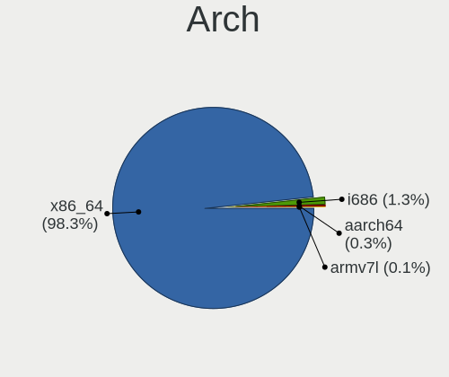

| Name    | Computers | Percent |
|---------|-----------|---------|
| x86_64  | 5858      | 98.31%  |
| i686    | 75        | 1.26%   |
| aarch64 | 20        | 0.34%   |
| armv7l  | 6         | 0.1%    |

DE
--

Desktop Environment

| Name                 | Computers | Percent |
|----------------------|-----------|---------|
| GNOME                | 3489      | 56.07%  |
| KDE5                 | 787       | 12.65%  |
| Unknown              | 603       | 9.69%   |
| XFCE                 | 300       | 4.82%   |
| X-Cinnamon           | 264       | 4.24%   |
| KDE                  | 121       | 1.94%   |
| KDE6                 | 107       | 1.72%   |
| Pantheon             | 66        | 1.06%   |
| MATE                 | 66        | 1.06%   |
| Unity                | 63        | 1.01%   |
| i3                   | 41        | 0.66%   |
| Cinnamon             | 38        | 0.61%   |
| LXQt                 | 27        | 0.43%   |
| Budgie               | 27        | 0.43%   |
| hyprland             | 26        | 0.42%   |
| GNOME Flashback      | 25        | 0.4%    |
| LXDE                 | 24        | 0.39%   |
| GNOME Classic        | 17        | 0.27%   |
| KDE4                 | 16        | 0.26%   |
| Deepin               | 15        | 0.24%   |
| sway                 | 14        | 0.22%   |
| bspwm                | 14        | 0.22%   |
| awesome              | 12        | 0.19%   |
| qtile                | 10        | 0.16%   |
| dwm                  | 9         | 0.14%   |
| Openbox              | 8         | 0.13%   |
| xmonad               | 5         | 0.08%   |
| LeftWM               | 5         | 0.08%   |
| COSMIC               | 4         | 0.06%   |
| herbstluftwm         | 3         | 0.05%   |
| lightdm-xsession     | 2         | 0.03%   |
| icewm                | 2         | 0.03%   |
| Enlightenment        | 2         | 0.03%   |
| Endless:GNOME        | 2         | 0.03%   |
| DesQ:Wayfire:wlroots | 2         | 0.03%   |
| Yaru:ubuntu:GNOME    | 1         | 0.02%   |
| Xsession             | 1         | 0.02%   |
| xinitrc              | 1         | 0.02%   |
| niri                 | 1         | 0.02%   |
| i3-with-shmlog       | 1         | 0.02%   |

Display Server
--------------

X11 or Wayland

| Name    | Computers | Percent |
|---------|-----------|---------|
| X11     | 4035      | 65.39%  |
| Wayland | 1678      | 27.19%  |
| Unknown | 349       | 5.66%   |
| Tty     | 109       | 1.77%   |

Display Manager
---------------

SDDM, LightDM, etc.

| Name                  | Computers | Percent |
|-----------------------|-----------|---------|
| Unknown               | 2778      | 44.78%  |
| GDM3                  | 1040      | 16.77%  |
| GDM                   | 910       | 14.67%  |
| SDDM                  | 848       | 13.67%  |
| LightDM               | 478       | 7.71%   |
| TDM                   | 105       | 1.69%   |
| KDM                   | 10        | 0.16%   |
| XDM                   | 9         | 0.15%   |
| LY-DM                 | 6         | 0.1%    |
| Ly                    | 4         | 0.06%   |
| LXDM                  | 4         | 0.06%   |
| GREETD                | 4         | 0.06%   |
| SLiM                  | 3         | 0.05%   |
| SLIMSKI               | 2         | 0.03%   |
| DISPLAY-MANAGER-START | 1         | 0.02%   |
| COSMIC-GREETER        | 1         | 0.02%   |

OS Lang
-------

Language

| Lang             | Computers | Percent |
|------------------|-----------|---------|
| en_IN            | 3474      | 56.11%  |
| en_US            | 1980      | 31.98%  |
| Unknown          | 398       | 6.43%   |
| C                | 146       | 2.36%   |
| en_GB            | 142       | 2.29%   |
| en_AG            | 9         | 0.15%   |
| en_CA            | 6         | 0.1%    |
| C.UTF8           | 5         | 0.08%   |
| POSIX            | 3         | 0.05%   |
| mr_IN            | 3         | 0.05%   |
| zh_TW            | 2         | 0.03%   |
| mni_IN           | 2         | 0.03%   |
| en_IE            | 2         | 0.03%   |
| en_AU            | 2         | 0.03%   |
| uk_UA            | 1         | 0.02%   |
| ta_LK            | 1         | 0.02%   |
| sa_IN            | 1         | 0.02%   |
| pl_PL            | 1         | 0.02%   |
| ks_IN            | 1         | 0.02%   |
| es_ES            | 1         | 0.02%   |
| en_US.UTF-*      | 1         | 0.02%   |
| en_US.ISO-8859-1 | 1         | 0.02%   |
| en_SG            | 1         | 0.02%   |
| en_NG            | 1         | 0.02%   |
| en_HK            | 1         | 0.02%   |
| en_DK            | 1         | 0.02%   |
| en_BW            | 1         | 0.02%   |
| de_DE            | 1         | 0.02%   |
| Default          | 1         | 0.02%   |
| bn_IN            | 1         | 0.02%   |
| aa_DJ            | 1         | 0.02%   |

Boot Mode
---------

EFI or BIOS

| Mode | Computers | Percent |
|------|-----------|---------|
| EFI  | 3549      | 58.33%  |
| BIOS | 2535      | 41.67%  |

Filesystem
----------

Type of filesystem

| Type    | Computers | Percent |
|---------|-----------|---------|
| Ext4    | 4473      | 72.7%   |
| Btrfs   | 794       | 12.9%   |
| Overlay | 322       | 5.23%   |
| Tmpfs   | 307       | 4.99%   |
| Xfs     | 107       | 1.74%   |
| Unknown | 82        | 1.33%   |
| Zfs     | 27        | 0.44%   |
| F2fs    | 14        | 0.23%   |
| Ext2    | 14        | 0.23%   |
| Ext3    | 9         | 0.15%   |
| XXXXX   | 2         | 0.03%   |
| Jfs     | 1         | 0.02%   |
| Aufs    | 1         | 0.02%   |

Part. scheme
------------

Scheme of partitioning

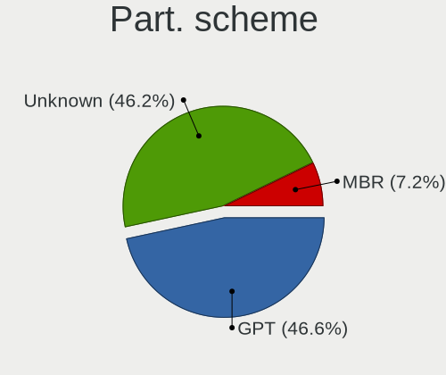

| Type    | Computers | Percent |
|---------|-----------|---------|
| GPT     | 2844      | 46.63%  |
| Unknown | 2818      | 46.2%   |
| MBR     | 437       | 7.17%   |

Dual Boot with Linux/BSD
------------------------

Hosting more than one Linux/BSD

| Dual boot | Computers | Percent |
|-----------|-----------|---------|
| No        | 5269      | 86.86%  |
| Yes       | 797       | 13.14%  |

Dual Boot (Win)
---------------

Hosting Linux and Windows

| Dual boot | Computers | Percent |
|-----------|-----------|---------|
| No        | 3684      | 60.8%   |
| Yes       | 2375      | 39.2%   |

Board
-----

Vendor
------

Motherboard manufacturer

| Name                    | Computers | Percent |
|-------------------------|-----------|---------|
| Hewlett-Packard         | 1155      | 19.4%   |
| Lenovo                  | 1145      | 19.23%  |
| Dell                    | 1025      | 17.21%  |
| ASUSTek Computer        | 825       | 13.85%  |
| Acer                    | 406       | 6.82%   |
| Gigabyte Technology     | 339       | 5.69%   |
| MSI                     | 214       | 3.59%   |
| Intel                   | 169       | 2.84%   |
| Unknown                 | 86        | 1.44%   |
| Sony                    | 57        | 0.96%   |
| Timi                    | 50        | 0.84%   |
| ASRock                  | 50        | 0.84%   |
| Apple                   | 50        | 0.84%   |
| Toshiba                 | 38        | 0.64%   |
| Samsung Electronics     | 32        | 0.54%   |
| Infinix                 | 27        | 0.45%   |
| AVITA                   | 25        | 0.42%   |
| OEM                     | 18        | 0.3%    |
| Raspberry Pi Foundation | 16        | 0.27%   |
| Biostar                 | 15        | 0.25%   |
| ECS                     | 12        | 0.2%    |
| HONOR                   | 11        | 0.18%   |
| Google                  | 11        | 0.18%   |
| Fujitsu                 | 11        | 0.18%   |
| HCL Infosystems Limited | 10        | 0.17%   |
| Foxconn                 | 10        | 0.17%   |
| HUAWEI                  | 9         | 0.15%   |
| AMI                     | 9         | 0.15%   |
| realme                  | 6         | 0.1%    |
| LG Electronics          | 6         | 0.1%    |
| Gateway                 | 6         | 0.1%    |
| Alienware               | 6         | 0.1%    |
| Pegatron                | 5         | 0.08%   |
| Valve                   | 4         | 0.07%   |
| Radxa                   | 4         | 0.07%   |
| Microsoft               | 4         | 0.07%   |
| ITI LIMITED             | 4         | 0.07%   |
| eMachines               | 4         | 0.07%   |
| Chuwi                   | 4         | 0.07%   |
| ZOTAC                   | 3         | 0.05%   |

Model
-----

Motherboard model

| Name                                   | Computers | Percent |
|----------------------------------------|-----------|---------|
| Unknown                                | 114       | 1.91%   |
| HP Notebook                            | 97        | 1.63%   |
| HP 15                                  | 41        | 0.69%   |
| HP Pavilion 15                         | 38        | 0.64%   |
| Dell Inspiron 3542                     | 33        | 0.55%   |
| HP Pavilion g6                         | 29        | 0.49%   |
| Lenovo E41-25 81FS                     | 28        | 0.47%   |
| Intel H61                              | 26        | 0.44%   |
| HP Laptop 15-bs0xx                     | 25        | 0.42%   |
| Gigabyte H410M H V3                    | 24        | 0.4%    |
| Dell Inspiron 15-3567                  | 24        | 0.4%    |
| HP Pavilion Notebook                   | 22        | 0.37%   |
| Dell Inspiron 5570                     | 22        | 0.37%   |
| Timi Mi NoteBook Ultra                 | 20        | 0.34%   |
| HP Pavilion Gaming Laptop 15-ec2xxx    | 20        | 0.34%   |
| Dell Inspiron 3521                     | 20        | 0.34%   |
| Acer Aspire A715-75G                   | 20        | 0.34%   |
| Lenovo IdeaPad 330-15IKB 81DE          | 19        | 0.32%   |
| ASUS TUF Gaming FX505DT_FX505DT        | 19        | 0.32%   |
| Gigabyte H81M-S                        | 18        | 0.3%    |
| Lenovo G50-80 80E5                     | 17        | 0.29%   |
| Gigabyte H61MS                         | 17        | 0.29%   |
| Dell Vostro 15-3568                    | 17        | 0.29%   |
| HP Pavilion Gaming Laptop 15-ec0xxx    | 16        | 0.27%   |
| Acer Aspire A715-51G                   | 16        | 0.27%   |
| Lenovo IdeaPad 320-15ISK 80XH          | 15        | 0.25%   |
| HP Pavilion x360 Convertible 14-dh1xxx | 15        | 0.25%   |
| HP Laptop 15-da0xxx                    | 15        | 0.25%   |
| Dell Vostro 3480                       | 15        | 0.25%   |
| Dell Inspiron 5559                     | 15        | 0.25%   |
| Gigabyte H310M S2 2.0                  | 14        | 0.24%   |
| Dell Vostro 3578                       | 14        | 0.24%   |
| HP Pavilion dv6                        | 13        | 0.22%   |
| Gigabyte H110M-S2                      | 13        | 0.22%   |
| Dell Inspiron 3543                     | 13        | 0.22%   |
| Dell Inspiron 1545                     | 13        | 0.22%   |
| ASUS X510UNR                           | 13        | 0.22%   |
| Lenovo IdeaPad Gaming 3 15IHU6 82K1    | 12        | 0.2%    |
| Lenovo G50-45 80E3                     | 12        | 0.2%    |
| HP Victus by Laptop 16-e0xxx           | 12        | 0.2%    |

Model Family
------------

Motherboard model prefix

| Name               | Computers | Percent |
|--------------------|-----------|---------|
| Dell Inspiron      | 440       | 7.39%   |
| Lenovo IdeaPad     | 362       | 6.08%   |
| Lenovo ThinkPad    | 352       | 5.91%   |
| HP Pavilion        | 315       | 5.29%   |
| ASUS VivoBook      | 258       | 4.33%   |
| HP Laptop          | 222       | 3.73%   |
| Acer Aspire        | 218       | 3.66%   |
| Dell Latitude      | 207       | 3.48%   |
| Dell Vostro        | 176       | 2.96%   |
| Unknown            | 114       | 1.91%   |
| HP Notebook        | 98        | 1.65%   |
| ASUS ROG           | 98        | 1.65%   |
| ASUS ASUS          | 90        | 1.51%   |
| HP EliteBook       | 81        | 1.36%   |
| ASUS TUF           | 73        | 1.23%   |
| HP ProBook         | 72        | 1.21%   |
| ASUS PRIME         | 67        | 1.13%   |
| Dell OptiPlex      | 65        | 1.09%   |
| Acer Nitro         | 57        | 0.96%   |
| Lenovo Legion      | 47        | 0.79%   |
| Lenovo ThinkBook   | 46        | 0.77%   |
| HP ENVY            | 46        | 0.77%   |
| HP 15              | 43        | 0.72%   |
| Dell Precision     | 41        | 0.69%   |
| Acer Swift         | 41        | 0.69%   |
| Timi Mi            | 39        | 0.65%   |
| Dell XPS           | 39        | 0.65%   |
| Toshiba Satellite  | 33        | 0.55%   |
| Lenovo ThinkCentre | 33        | 0.55%   |
| HP Victus          | 32        | 0.54%   |
| Gigabyte H410M     | 32        | 0.54%   |
| HP Compaq          | 29        | 0.49%   |
| Lenovo E41-25      | 28        | 0.47%   |
| Intel H61          | 28        | 0.47%   |
| Acer Predator      | 27        | 0.45%   |
| Lenovo IdeaPadFlex | 26        | 0.44%   |
| HP OMEN            | 26        | 0.44%   |
| Gigabyte H310M     | 25        | 0.42%   |
| Lenovo Yoga        | 24        | 0.4%    |
| ASUS ZenBook       | 23        | 0.39%   |

MFG Year
--------

Motherboard manufacture year

| Year    | Computers | Percent |
|---------|-----------|---------|
| 2019    | 725       | 12.17%  |
| 2018    | 690       | 11.59%  |
| 2021    | 649       | 10.9%   |
| 2020    | 594       | 9.97%   |
| 2017    | 461       | 7.74%   |
| 2022    | 352       | 5.91%   |
| 2016    | 325       | 5.46%   |
| 2013    | 318       | 5.34%   |
| 2014    | 309       | 5.19%   |
| 2012    | 308       | 5.17%   |
| 2011    | 265       | 4.45%   |
| 2015    | 229       | 3.85%   |
| 2023    | 211       | 3.54%   |
| 2010    | 187       | 3.14%   |
| 2008    | 105       | 1.76%   |
| 2009    | 85        | 1.43%   |
| 2024    | 63        | 1.06%   |
| 2007    | 41        | 0.69%   |
| Unknown | 23        | 0.39%   |
| 2006    | 9         | 0.15%   |
| 2005    | 4         | 0.07%   |
| 2004    | 1         | 0.02%   |
| 2003    | 1         | 0.02%   |

Form Factor
-----------

Physical design of the computer

| Name           | Computers | Percent |
|----------------|-----------|---------|
| Notebook       | 4347      | 73%     |
| Desktop        | 1300      | 21.83%  |
| Convertible    | 160       | 2.69%   |
| Mini pc        | 46        | 0.77%   |
| All in one     | 38        | 0.64%   |
| System on chip | 24        | 0.4%    |
| Tablet         | 20        | 0.34%   |
| Server         | 19        | 0.32%   |
| Phone          | 1         | 0.02%   |

Secure Boot
-----------

Enabled or disabled

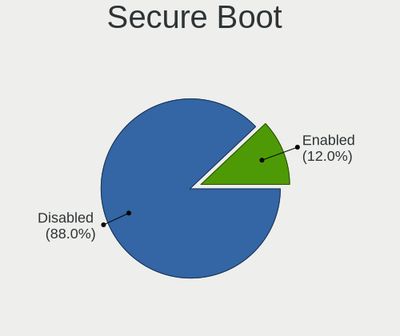

| State    | Computers | Percent |
|----------|-----------|---------|
| Disabled | 5292      | 87.97%  |
| Enabled  | 724       | 12.03%  |

Coreboot
--------

Have coreboot on board

| Used | Computers | Percent |
|------|-----------|---------|
| No   | 5935      | 99.66%  |
| Yes  | 20        | 0.34%   |

RAM Size
--------

Total RAM memory

| Size in GB      | Computers | Percent |
|-----------------|-----------|---------|
| 4.01-8.0        | 1905      | 31.47%  |
| 8.01-16.0       | 1217      | 20.1%   |
| 3.01-4.0        | 1168      | 19.29%  |
| 16.01-24.0      | 1087      | 17.96%  |
| 32.01-64.0      | 263       | 4.34%   |
| 1.01-2.0        | 178       | 2.94%   |
| 24.01-32.0      | 85        | 1.4%    |
| 64.01-256.0     | 78        | 1.29%   |
| 2.01-3.0        | 49        | 0.81%   |
| 0.51-1.0        | 19        | 0.31%   |
| More than 256.0 | 3         | 0.05%   |
| 0.01-0.5        | 2         | 0.03%   |

RAM Used
--------

Used RAM memory

| Used GB     | Computers | Percent |
|-------------|-----------|---------|
| 2.01-3.0    | 1975      | 30.09%  |
| 1.01-2.0    | 1860      | 28.34%  |
| 4.01-8.0    | 1172      | 17.86%  |
| 3.01-4.0    | 1052      | 16.03%  |
| 8.01-16.0   | 231       | 3.52%   |
| 0.51-1.0    | 211       | 3.21%   |
| 0.01-0.5    | 36        | 0.55%   |
| 16.01-24.0  | 18        | 0.27%   |
| 32.01-64.0  | 3         | 0.05%   |
| 24.01-32.0  | 3         | 0.05%   |
| 64.01-256.0 | 1         | 0.02%   |
| Unknown     | 1         | 0.02%   |

Total Drives
------------

Number of drives on board

| Drives | Computers | Percent |
|--------|-----------|---------|
| 1      | 4194      | 69.25%  |
| 2      | 1501      | 24.79%  |
| 3      | 213       | 3.52%   |
| 4      | 63        | 1.04%   |
| 0      | 39        | 0.64%   |
| 5      | 26        | 0.43%   |
| 6      | 12        | 0.2%    |
| 7      | 5         | 0.08%   |
| 19     | 1         | 0.02%   |
| 9      | 1         | 0.02%   |
| 8      | 1         | 0.02%   |

Has CD-ROM
----------

Has CD-ROM on board

| Presented | Computers | Percent |
|-----------|-----------|---------|
| No        | 4313      | 71.99%  |
| Yes       | 1678      | 28.01%  |

Has Ethernet
------------

Has Ethernet on board

| Presented | Computers | Percent |
|-----------|-----------|---------|
| Yes       | 4843      | 81.15%  |
| No        | 1125      | 18.85%  |

Has WiFi
--------

Has WiFi module

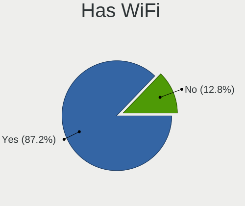

| Presented | Computers | Percent |
|-----------|-----------|---------|
| Yes       | 5214      | 87.19%  |
| No        | 766       | 12.81%  |

Has Bluetooth
-------------

Has Bluetooth module

| Presented | Computers | Percent |
|-----------|-----------|---------|
| Yes       | 4532      | 75.31%  |
| No        | 1486      | 24.69%  |

Location
--------

Country
-------

Geographic location (country)

| Country | Computers | Percent |
|---------|-----------|---------|
| India   | 5955      | 100%    |

City
----

Geographic location (city)

| City          | Computers | Percent |
|---------------|-----------|---------|
| Bengaluru     | 783       | 12.31%  |
| Chennai       | 434       | 6.82%   |
| Delhi         | 406       | 6.38%   |
| Mumbai        | 404       | 6.35%   |
| Hyderabad     | 393       | 6.18%   |
| Pune          | 317       | 4.98%   |
| Kolkata       | 266       | 4.18%   |
| New Delhi     | 207       | 3.25%   |
| Ahmedabad     | 142       | 2.23%   |
| Lucknow       | 124       | 1.95%   |
| Patna         | 115       | 1.81%   |
| Jaipur        | 107       | 1.68%   |
| Kochi         | 97        | 1.52%   |
| Indore        | 82        | 1.29%   |
| Bhubaneswar   | 80        | 1.26%   |
| Ernakulam     | 79        | 1.24%   |
| Gurgaon       | 78        | 1.23%   |
| Coimbatore    | 75        | 1.18%   |
| Bhopal        | 74        | 1.16%   |
| Trivandrum    | 62        | 0.97%   |
| Surat         | 60        | 0.94%   |
| Thrissur      | 58        | 0.91%   |
| Navi Mumbai   | 57        | 0.9%    |
| Guwahati      | 49        | 0.77%   |
| Nagpur        | 45        | 0.71%   |
| Ludhiana      | 43        | 0.68%   |
| Malappuram    | 40        | 0.63%   |
| Chandigarh    | 40        | 0.63%   |
| Noida         | 37        | 0.58%   |
| Ghaziabad     | 33        | 0.52%   |
| Kanpur        | 31        | 0.49%   |
| Dehradun      | 29        | 0.46%   |
| Vadodara      | 27        | 0.42%   |
| Visakhapatnam | 26        | 0.41%   |
| Mangalore     | 26        | 0.41%   |
| Kozhikode     | 26        | 0.41%   |
| Thane         | 25        | 0.39%   |
| Vijayawada    | 24        | 0.38%   |
| Mohali        | 23        | 0.36%   |
| Tiruchi       | 22        | 0.35%   |

Drives
------

Drive Vendor
------------

Hard drive vendors

| Vendor                       | Computers | Drives | Percent |
|------------------------------|-----------|--------|---------|
| Seagate                      | 1437      | 1896   | 18.53%  |
| WDC                          | 1294      | 1709   | 16.68%  |
| Samsung Electronics          | 833       | 1060   | 10.74%  |
| Toshiba                      | 644       | 744    | 8.3%    |
| SanDisk                      | 403       | 507    | 5.2%    |
| Micron Technology            | 319       | 381    | 4.11%   |
| Crucial                      | 314       | 424    | 4.05%   |
| Kingston                     | 286       | 345    | 3.69%   |
| SK hynix                     | 278       | 327    | 3.58%   |
| Intel                        | 263       | 349    | 3.39%   |
| HGST                         | 209       | 252    | 2.69%   |
| Unknown                      | 166       | 201    | 2.14%   |
| Hitachi                      | 128       | 154    | 1.65%   |
| KIOXIA                       | 119       | 145    | 1.53%   |
| A-DATA Technology            | 86        | 93     | 1.11%   |
| China                        | 74        | 89     | 0.95%   |
| Micron/Crucial Technology    | 68        | 78     | 0.88%   |
| Unknown                      | 44        | 56     | 0.57%   |
| Silicon Motion               | 42        | 46     | 0.54%   |
| Gigabyte Technology          | 35        | 41     | 0.45%   |
| FORESEE                      | 33        | 40     | 0.43%   |
| Kingston Technology Company  | 31        | 34     | 0.4%    |
| Apple                        | 30        | 42     | 0.39%   |
| Hewlett-Packard              | 27        | 32     | 0.35%   |
| EVM                          | 24        | 26     | 0.31%   |
| UMIS                         | 23        | 28     | 0.3%    |
| Shenzhen Longsys Electronics | 23        | 30     | 0.3%    |
| Phison                       | 23        | 30     | 0.3%    |
| ADATA Technology             | 22        | 33     | 0.28%   |
| SPCC                         | 20        | 27     | 0.26%   |
| LITEON                       | 17        | 21     | 0.22%   |
| Lexar                        | 17        | 18     | 0.22%   |
| Realtek Semiconductor        | 16        | 23     | 0.21%   |
| Phison Electronics           | 16        | 18     | 0.21%   |
| CONSISTENT                   | 16        | 17     | 0.21%   |
| XPG                          | 13        | 19     | 0.17%   |
| Transcend                    | 13        | 17     | 0.17%   |
| Maxtor                       | 12        | 31     | 0.15%   |
| Acer                         | 12        | 13     | 0.15%   |
| Zebronics                    | 10        | 10     | 0.13%   |

Drive Model
-----------

Hard drive models

| Model                                                | Computers | Percent |
|------------------------------------------------------|-----------|---------|
| Seagate ST1000LM035-1RK172 1TB                       | 343       | 4.21%   |
| Toshiba MQ04ABF100 1TB                               | 173       | 2.12%   |
| Toshiba MQ01ABD100 1TB                               | 123       | 1.51%   |
| Seagate ST1000DM010-2EP102 1TB                       | 108       | 1.32%   |
| Crucial CT240BX500SSD1 240GB                         | 99        | 1.21%   |
| WDC WDS240G2G0A-00JH30 240GB SSD                     | 83        | 1.02%   |
| Seagate ST1000LM049-2GH172 1TB                       | 81        | 0.99%   |
| Seagate ST1000LM024 HN-M101MBB 1TB                   | 79        | 0.97%   |
| Seagate ST500LT012-1DG142 500GB                      | 75        | 0.92%   |
| Kingston SA400S37240G 240GB SSD                      | 65        | 0.8%    |
| Micron 2450_MTFDKBA512TFK 512GB                      | 62        | 0.76%   |
| Toshiba MQ01ABF050 500GB                             | 57        | 0.7%    |
| Samsung NVMe SSD Controller SM981/PM981/PM983 512GB  | 57        | 0.7%    |
| SanDisk NVMe SSD Drive 512GB                         | 55        | 0.67%   |
| Seagate ST500DM002-1BD142 500GB                      | 52        | 0.64%   |
| Intel NVMe SSD Drive 512GB                           | 52        | 0.64%   |
| Toshiba DT01ACA100 1TB                               | 51        | 0.63%   |
| WDC WD10SPZX-60Z10T0 1TB                             | 50        | 0.61%   |
| HGST HTS541010A9E680 1TB                             | 46        | 0.56%   |
| Unknown                                              | 44        | 0.54%   |
| WDC WD10SPZX-24Z10 1TB                               | 42        | 0.52%   |
| Seagate ST9500325AS 500GB                            | 41        | 0.5%    |
| Intel SSDPEKNW512G8 512GB                            | 41        | 0.5%    |
| HGST HTS721010A9E630 1TB                             | 41        | 0.5%    |
| Seagate ST1000LM048-2E7172 1TB                       | 40        | 0.49%   |
| Seagate ST2000LM007-1R8174 2TB                       | 39        | 0.48%   |
| SanDisk NVMe SSD Drive 256GB                         | 39        | 0.48%   |
| Micron/Crucial P2 NVMe PCIe SSD 500GB                | 39        | 0.48%   |
| WDC WDS240G2G0B-00EPW0 240GB SSD                     | 37        | 0.45%   |
| Samsung NVMe SSD Drive 512GB                         | 36        | 0.44%   |
| Samsung NVMe SSD Controller PM9A1/PM9A3/980PRO 512GB | 36        | 0.44%   |
| Crucial CT480BX500SSD1 480GB                         | 36        | 0.44%   |
| WDC WD10EZEX-08WN4A0 1TB                             | 35        | 0.43%   |
| Sandisk WD Blue SN550 NVMe SSD 256GB                 | 35        | 0.43%   |
| Samsung SSD 860 EVO 250GB                            | 31        | 0.38%   |
| Samsung SSD 850 EVO 250GB                            | 31        | 0.38%   |
| HGST HTS545050A7E680 500GB                           | 31        | 0.38%   |
| WDC WD10SPZX-21Z10T0 1TB                             | 30        | 0.37%   |
| WDC WD10JPVX-60JC3T1 1TB                             | 30        | 0.37%   |
| SK hynix NVMe SSD Drive 512GB                        | 30        | 0.37%   |

HDD Vendor
----------

Hard disk drive vendors

| Vendor              | Computers | Drives | Percent |
|---------------------|-----------|--------|---------|
| Seagate             | 1417      | 1869   | 41.68%  |
| WDC                 | 964       | 1227   | 28.35%  |
| Toshiba             | 566       | 645    | 16.65%  |
| HGST                | 209       | 252    | 6.15%   |
| Hitachi             | 128       | 154    | 3.76%   |
| Unknown             | 28        | 32     | 0.82%   |
| Samsung Electronics | 25        | 30     | 0.74%   |
| Fujitsu             | 10        | 10     | 0.29%   |
| Apple               | 9         | 9      | 0.26%   |
| Hewlett-Packard     | 8         | 9      | 0.24%   |
| TO Exter            | 7         | 7      | 0.21%   |
| External            | 7         | 11     | 0.21%   |
| Maxtor              | 5         | 5      | 0.15%   |
| MARSHAL             | 3         | 3      | 0.09%   |
| ASMT                | 2         | 2      | 0.06%   |
| WD MediaMax         | 1         | 1      | 0.03%   |
| Verbatim            | 1         | 1      | 0.03%   |
| USB3.0              | 1         | 2      | 0.03%   |
| Synology            | 1         | 1      | 0.03%   |
| StoreJet            | 1         | 1      | 0.03%   |
| SABRENT             | 1         | 1      | 0.03%   |
| Lenovo              | 1         | 1      | 0.03%   |
| KESU                | 1         | 2      | 0.03%   |
| JMicron Technology  | 1         | 1      | 0.03%   |
| IBM                 | 1         | 1      | 0.03%   |
| ASMedia             | 1         | 1      | 0.03%   |
| Unknown             | 1         | 1      | 0.03%   |

SSD Vendor
----------

Solid state drive vendors

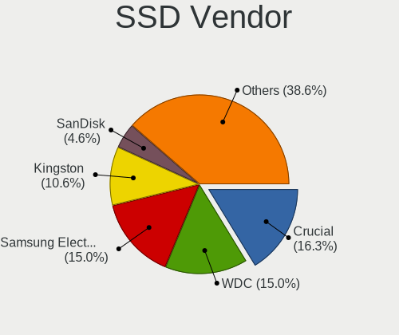

| Vendor              | Computers | Drives | Percent |
|---------------------|-----------|--------|---------|
| Crucial             | 274       | 373    | 16.27%  |
| WDC                 | 252       | 311    | 14.96%  |
| Samsung Electronics | 252       | 327    | 14.96%  |
| Kingston            | 179       | 228    | 10.63%  |
| SanDisk             | 77        | 98     | 4.57%   |
| China               | 73        | 88     | 4.33%   |
| A-DATA Technology   | 73        | 80     | 4.33%   |
| SK hynix            | 44        | 54     | 2.61%   |
| Intel               | 31        | 34     | 1.84%   |
| Micron Technology   | 28        | 36     | 1.66%   |
| Gigabyte Technology | 28        | 31     | 1.66%   |
| Unknown             | 23        | 25     | 1.37%   |
| EVM                 | 22        | 24     | 1.31%   |
| FORESEE             | 19        | 25     | 1.13%   |
| Apple               | 17        | 22     | 1.01%   |
| Lexar               | 16        | 17     | 0.95%   |
| Hewlett-Packard     | 16        | 21     | 0.95%   |
| CONSISTENT          | 16        | 17     | 0.95%   |
| LITEON              | 15        | 19     | 0.89%   |
| Toshiba             | 14        | 15     | 0.83%   |
| SPCC                | 14        | 18     | 0.83%   |
| Zebronics           | 10        | 10     | 0.59%   |
| Seagate             | 10        | 11     | 0.59%   |
| Acer                | 10        | 11     | 0.59%   |
| Transcend           | 9         | 13     | 0.53%   |
| PNY                 | 9         | 11     | 0.53%   |
| POWER               | 8         | 8      | 0.48%   |
| Maxtor              | 7         | 26     | 0.42%   |
| Aarvex              | 7         | 9      | 0.42%   |
| Netac               | 6         | 6      | 0.36%   |
| Unknown             | 5         | 5      | 0.3%    |
| KLEVV               | 5         | 6      | 0.3%    |
| KingSpec            | 5         | 5      | 0.3%    |
| HS-SSD-C100         | 5         | 6      | 0.3%    |
| LITEONIT            | 4         | 7      | 0.24%   |
| Leven               | 4         | 4      | 0.24%   |
| Ant                 | 4         | 5      | 0.24%   |
| Unknown (690)       | 3         | 3      | 0.18%   |
| StoreJet            | 3         | 3      | 0.18%   |
| SCUDA               | 3         | 4      | 0.18%   |

Drive Kind
----------

HDD or SSD

| Kind    | Computers | Drives | Percent |
|---------|-----------|--------|---------|
| HDD     | 3213      | 4279   | 43.56%  |
| NVMe    | 2384      | 3142   | 32.32%  |
| SSD     | 1573      | 2108   | 21.33%  |
| MMC     | 127       | 162    | 1.72%   |
| Unknown | 79        | 96     | 1.07%   |

Drive Connector
---------------

SATA, SAS, NVMe, etc.

| Type | Computers | Drives | Percent |
|------|-----------|--------|---------|
| SATA | 4072      | 6271   | 60.24%  |
| NVMe | 2381      | 3130   | 35.22%  |
| SAS  | 180       | 224    | 2.66%   |
| MMC  | 127       | 162    | 1.88%   |

Drive Size
----------

Size of hard drive

| Size in TB | Computers | Drives | Percent |
|------------|-----------|--------|---------|
| 0.01-0.5   | 2461      | 3341   | 51.52%  |
| 0.51-1.0   | 2027      | 2602   | 42.43%  |
| 1.01-2.0   | 203       | 294    | 4.25%   |
| 3.01-4.0   | 49        | 83     | 1.03%   |
| 4.01-10.0  | 20        | 39     | 0.42%   |
| 2.01-3.0   | 11        | 17     | 0.23%   |
| 10.01-20.0 | 6         | 11     | 0.13%   |

Space Total
-----------

Amount of disk space available on the file system

| Size in GB     | Computers | Percent |
|----------------|-----------|---------|
| 251-500        | 1657      | 26.23%  |
| 101-250        | 1603      | 25.38%  |
| 501-1000       | 1091      | 17.27%  |
| 51-100         | 540       | 8.55%   |
| 1001-2000      | 427       | 6.76%   |
| 1-20           | 363       | 5.75%   |
| 21-50          | 320       | 5.07%   |
| More than 3000 | 117       | 1.85%   |
| Unknown        | 100       | 1.58%   |
| 2001-3000      | 99        | 1.57%   |

Space Used
----------

Amount of used disk space

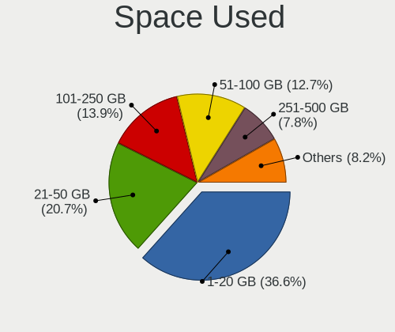

| Used GB        | Computers | Percent |
|----------------|-----------|---------|
| 1-20           | 2394      | 36.63%  |
| 21-50          | 1355      | 20.73%  |
| 101-250        | 908       | 13.89%  |
| 51-100         | 831       | 12.72%  |
| 251-500        | 509       | 7.79%   |
| 501-1000       | 288       | 4.41%   |
| 1001-2000      | 101       | 1.55%   |
| Unknown        | 100       | 1.53%   |
| More than 3000 | 27        | 0.41%   |
| 2001-3000      | 18        | 0.28%   |
| 0              | 4         | 0.06%   |

Malfunc. Drives
---------------

Drive models with a malfunction

| Model                                           | Computers | Drives | Percent |
|-------------------------------------------------|-----------|--------|---------|
| Seagate ST1000LM035-1RK172 1TB                  | 35        | 41     | 6.23%   |
| Seagate ST500LT012-1DG142 500GB                 | 15        | 15     | 2.67%   |
| Toshiba MQ01ABD100 1TB                          | 14        | 15     | 2.49%   |
| Seagate ST500DM002-1BD142 500GB                 | 14        | 14     | 2.49%   |
| HGST HTS545050A7E680 500GB                      | 14        | 18     | 2.49%   |
| HGST HTS541010A9E680 1TB                        | 14        | 14     | 2.49%   |
| Seagate ST1000LM024 HN-M101MBB 1TB              | 13        | 13     | 2.31%   |
| Seagate ST1000LM049-2GH172 1TB                  | 12        | 16     | 2.14%   |
| Seagate ST9500325AS 500GB                       | 11        | 12     | 1.96%   |
| Toshiba MQ04ABF100 1TB                          | 9         | 10     | 1.6%    |
| Seagate ST500LT012-9WS142 500GB                 | 7         | 8      | 1.25%   |
| Seagate ST500LM021-1KJ152 500GB                 | 7         | 7      | 1.25%   |
| HGST HTS721010A9E630 1TB                        | 7         | 7      | 1.25%   |
| HGST HTS545050A7E380 500GB                      | 7         | 8      | 1.25%   |
| Toshiba MQ01ABF050 500GB                        | 6         | 6      | 1.07%   |
| HGST HTS725050A7E630 500GB                      | 6         | 6      | 1.07%   |
| WDC WDS240G2G0A-00JH30 240GB SSD                | 5         | 7      | 0.89%   |
| WDC WD10EZEX-08WN4A0 1TB                        | 5         | 5      | 0.89%   |
| WDC WD Green 2.5 240GB SSD                      | 5         | 5      | 0.89%   |
| SK hynix PC711 HFS512GDE9X073N 512GB            | 5         | 6      | 0.89%   |
| Seagate ST3500418AS 500GB                       | 5         | 5      | 0.89%   |
| Seagate ST3500312CS 500GB                       | 5         | 5      | 0.89%   |
| Seagate ST2000LM007-1R8174 2TB                  | 5         | 5      | 0.89%   |
| Seagate ST1000DM010-2EP102 1TB                  | 5         | 5      | 0.89%   |
| WDC WD10SPZX-60Z10T0 1TB                        | 4         | 4      | 0.71%   |
| WDC WD10JPVX-60JC3T1 1TB                        | 4         | 4      | 0.71%   |
| Seagate ST320LT007-9ZV142 320GB                 | 4         | 5      | 0.71%   |
| Seagate ST1000DM003-1ER162 1TB                  | 4         | 4      | 0.71%   |
| WDC WD5000LPVX-75V0TT0 500GB                    | 3         | 3      | 0.53%   |
| WDC WD3200BEVT-22ZCT0 320GB                     | 3         | 3      | 0.53%   |
| WDC WD3200BEKT-75PVMT0 320GB                    | 3         | 3      | 0.53%   |
| WDC WD10SPZX-24Z10 1TB                          | 3         | 3      | 0.53%   |
| Toshiba DT01ACA100 1TB                          | 3         | 6      | 0.53%   |
| Seagate ST9320325AS 320GB                       | 3         | 3      | 0.53%   |
| Seagate ST9160314AS 160GB                       | 3         | 4      | 0.53%   |
| Seagate ST1000LM048-2E7172 1TB                  | 3         | 5      | 0.53%   |
| Seagate ST1000DM003-1CH162 1TB                  | 3         | 3      | 0.53%   |
| Micron Technology MTFDKBA512TFK-1BC1AABHA 512GB | 3         | 3      | 0.53%   |
| Hitachi HTS547575A9E384 752GB                   | 3         | 3      | 0.53%   |
| Hitachi HTS545032B9A300 320GB                   | 3         | 6      | 0.53%   |

Malfunc. Drive Vendor
---------------------

Vendors of faulty drives

| Vendor                      | Computers | Drives | Percent |
|-----------------------------|-----------|--------|---------|
| Seagate                     | 208       | 235    | 37.48%  |
| WDC                         | 119       | 143    | 21.44%  |
| Toshiba                     | 53        | 59     | 9.55%   |
| HGST                        | 53        | 58     | 9.55%   |
| Hitachi                     | 34        | 39     | 6.13%   |
| SK hynix                    | 16        | 20     | 2.88%   |
| Samsung Electronics         | 13        | 18     | 2.34%   |
| SanDisk                     | 7         | 7      | 1.26%   |
| Crucial                     | 7         | 10     | 1.26%   |
| Micron Technology           | 5         | 5      | 0.9%    |
| Intel                       | 5         | 5      | 0.9%    |
| China                       | 3         | 3      | 0.54%   |
| Apple                       | 3         | 3      | 0.54%   |
| A-DATA Technology           | 3         | 4      | 0.54%   |
| Unknown                     | 3         | 4      | 0.54%   |
| SPCC                        | 2         | 2      | 0.36%   |
| ZEB-SD26                    | 1         | 1      | 0.18%   |
| YS                          | 1         | 1      | 0.18%   |
| XPG                         | 1         | 1      | 0.18%   |
| Wibtek                      | 1         | 1      | 0.18%   |
| Unknown                     | 1         | 1      | 0.18%   |
| Secure                      | 1         | 1      | 0.18%   |
| POWER                       | 1         | 1      | 0.18%   |
| Micron/Crucial Technology   | 1         | 1      | 0.18%   |
| MAXIO Technology (Hangzhou) | 1         | 1      | 0.18%   |
| MARSHAL                     | 1         | 1      | 0.18%   |
| LITEONIT                    | 1         | 1      | 0.18%   |
| LITEON                      | 1         | 1      | 0.18%   |
| Leven                       | 1         | 1      | 0.18%   |
| Lenovo                      | 1         | 2      | 0.18%   |
| Kingston                    | 1         | 1      | 0.18%   |
| Innodisk                    | 1         | 1      | 0.18%   |
| IBM                         | 1         | 1      | 0.18%   |
| Gigabyte Technology         | 1         | 2      | 0.18%   |
| Gamers                      | 1         | 1      | 0.18%   |
| Fujitsu                     | 1         | 1      | 0.18%   |
| 2.5"                        | 1         | 1      | 0.18%   |

Malfunc. HDD Vendor
-------------------

Vendors of faulty HDD drives

| Vendor              | Computers | Drives | Percent |
|---------------------|-----------|--------|---------|
| Seagate             | 208       | 235    | 45.51%  |
| WDC                 | 99        | 120    | 21.66%  |
| HGST                | 53        | 58     | 11.6%   |
| Toshiba             | 52        | 58     | 11.38%  |
| Hitachi             | 34        | 39     | 7.44%   |
| Samsung Electronics | 5         | 7      | 1.09%   |
| Apple               | 3         | 3      | 0.66%   |
| MARSHAL             | 1         | 1      | 0.22%   |
| IBM                 | 1         | 1      | 0.22%   |
| Fujitsu             | 1         | 1      | 0.22%   |

Malfunc. Drive Kind
-------------------

Kinds of faulty drives

| Kind | Computers | Drives | Percent |
|------|-----------|--------|---------|
| HDD  | 450       | 523    | 82.12%  |
| SSD  | 66        | 76     | 12.04%  |
| NVMe | 32        | 39     | 5.84%   |

Failed Drives
-------------

Failed drive models

| Model                               | Computers | Drives | Percent |
|-------------------------------------|-----------|--------|---------|
| Samsung Electronics SSD 980 500GB   | 2         | 3      | 18.18%  |
| WDC WD5000AAKX-001CA0 500GB         | 1         | 1      | 9.09%   |
| WDC WD10SPZX-21Z10T0 1TB            | 1         | 1      | 9.09%   |
| Toshiba HDWD110 1TB                 | 1         | 1      | 9.09%   |
| Seagate ST9320320AS 320GB           | 1         | 1      | 9.09%   |
| Seagate ST500LT012-1DG142 500GB     | 1         | 1      | 9.09%   |
| Seagate ST3320418AS 320GB           | 1         | 1      | 9.09%   |
| Seagate ST1000LM 024 HN-M101MBB 1TB | 1         | 1      | 9.09%   |
| Apple HDD HTS545050A7E362 500GB     | 1         | 1      | 9.09%   |
| Acer SSD FA100 256GB                | 1         | 1      | 9.09%   |

Failed Drive Vendor
-------------------

Failed drive vendors

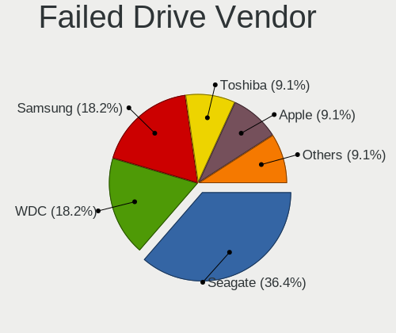

| Vendor              | Computers | Drives | Percent |
|---------------------|-----------|--------|---------|
| Seagate             | 4         | 4      | 36.36%  |
| WDC                 | 2         | 2      | 18.18%  |
| Samsung Electronics | 2         | 3      | 18.18%  |
| Toshiba             | 1         | 1      | 9.09%   |
| Apple               | 1         | 1      | 9.09%   |
| Acer                | 1         | 1      | 9.09%   |

Drive Status
------------

Number of failed and malfunc. drives

| Status   | Computers | Drives | Percent |
|----------|-----------|--------|---------|
| Detected | 3393      | 5440   | 53.29%  |
| Works    | 2429      | 3697   | 38.15%  |
| Malfunc  | 534       | 638    | 8.39%   |
| Failed   | 11        | 12     | 0.17%   |

Storage controller
------------------

Storage Vendor
--------------

Storage controller vendors

| Vendor                                  | Computers | Percent |
|-----------------------------------------|-----------|---------|
| Intel                                   | 4229      | 55.86%  |
| AMD                                     | 928       | 12.26%  |
| Samsung Electronics                     | 586       | 7.74%   |
| SanDisk                                 | 453       | 5.98%   |
| Micron Technology                       | 293       | 3.87%   |
| SK hynix                                | 233       | 3.08%   |
| Kingston Technology Company             | 138       | 1.82%   |
| KIOXIA                                  | 121       | 1.6%    |
| Micron/Crucial Technology               | 103       | 1.36%   |
| Toshiba America Info Systems            | 77        | 1.02%   |
| Silicon Motion                          | 47        | 0.62%   |
| Phison Electronics                      | 45        | 0.59%   |
| ADATA Technology                        | 42        | 0.55%   |
| Shenzhen Longsys Electronics            | 38        | 0.5%    |
| Union Memory (Shenzhen)                 | 35        | 0.46%   |
| ASMedia Technology                      | 35        | 0.46%   |
| Realtek Semiconductor                   | 23        | 0.3%    |
| Nvidia                                  | 20        | 0.26%   |
| Yangtze Memory Technologies             | 12        | 0.16%   |
| MAXIO Technology (Hangzhou)             | 12        | 0.16%   |
| Marvell Technology Group                | 11        | 0.15%   |
| Solid State Storage Technology          | 10        | 0.13%   |
| JMicron Technology                      | 9         | 0.12%   |
| Lite-On Technology                      | 7         | 0.09%   |
| Broadcom / LSI                          | 7         | 0.09%   |
| INNOGRIT                                | 6         | 0.08%   |
| Lenovo                                  | 5         | 0.07%   |
| Biwin Storage Technology                | 5         | 0.07%   |
| Apple                                   | 5         | 0.07%   |
| Silicon Integrated Systems [SiS]        | 4         | 0.05%   |
| LSI Logic / Symbios Logic               | 4         | 0.05%   |
| VIA Technologies                        | 3         | 0.04%   |
| Solidigm                                | 3         | 0.04%   |
| Shenzhen Unionmemory Information System | 3         | 0.04%   |
| Seagate Technology                      | 3         | 0.04%   |
| Hosin Global Electronics                | 3         | 0.04%   |
| Transcend                               | 2         | 0.03%   |
| Hewlett-Packard                         | 2         | 0.03%   |
| Adaptec                                 | 2         | 0.03%   |
| ShenZhen TIGO Semiconductor             | 1         | 0.01%   |

Storage Model
-------------

Storage controller models

| Model                                                                                   | Computers | Percent |
|-----------------------------------------------------------------------------------------|-----------|---------|
| AMD FCH SATA Controller [AHCI mode]                                                     | 758       | 9.01%   |
| Intel Sunrise Point-LP SATA Controller [AHCI mode]                                      | 576       | 6.85%   |
| Intel 82801 Mobile SATA Controller [RAID mode]                                          | 412       | 4.9%    |
| Intel Volume Management Device NVMe RAID Controller                                     | 348       | 4.14%   |
| Intel 7 Series Chipset Family 6-port SATA Controller [AHCI mode]                        | 230       | 2.73%   |
| Samsung NVMe SSD Controller 980 (DRAM-less)                                             | 226       | 2.69%   |
| Intel 8 Series SATA Controller 1 [AHCI mode]                                            | 223       | 2.65%   |
| Samsung NVMe SSD Controller SM981/PM981/PM983                                           | 197       | 2.34%   |
| Intel NM10/ICH7 Family SATA Controller [IDE mode]                                       | 159       | 1.89%   |
| Intel Wildcat Point-LP SATA Controller [AHCI Mode]                                      | 154       | 1.83%   |
| Intel 6 Series/C200 Series Chipset Family 6 port Mobile SATA AHCI Controller            | 153       | 1.82%   |
| Intel Tiger Lake-LP SATA Controller                                                     | 152       | 1.81%   |
| Intel 8 Series/C220 Series Chipset Family 6-port SATA Controller 1 [AHCI mode]          | 149       | 1.77%   |
| Intel Comet Lake SATA AHCI Controller                                                   | 137       | 1.63%   |
| Intel Cannon Lake Mobile PCH SATA AHCI Controller                                       | 132       | 1.57%   |
| Intel 82801G (ICH7 Family) IDE Controller                                               | 130       | 1.55%   |
| Intel SSD 660P Series                                                                   | 124       | 1.47%   |
| Intel Cannon Point-LP SATA Controller [AHCI Mode]                                       | 112       | 1.33%   |
| Intel 6 Series/C200 Series Chipset Family 6 port Desktop SATA AHCI Controller           | 104       | 1.24%   |
| SanDisk Ultra 3D / WD PC SN530, IX SN530, Blue SN550 NVMe SSD (DRAM-less)               | 101       | 1.2%    |
| Intel Q170/Q150/B150/H170/H110/Z170/CM236 Chipset SATA Controller [AHCI Mode]           | 99        | 1.18%   |
| KIOXIA NVMe SSD Controller BG4 (DRAM-less)                                              | 96        | 1.14%   |
| Micron 2450 NVMe SSD [HendrixV] (DRAM-less)                                             | 88        | 1.05%   |
| AMD 400 Series Chipset SATA Controller                                                  | 87        | 1.03%   |
| SK hynix Gold P31/BC711/PC711 NVMe Solid State Drive                                    | 85        | 1.01%   |
| Intel 200 Series PCH SATA controller [AHCI mode]                                        | 77        | 0.92%   |
| Micron 2210 NVMe SSD [Cobain]                                                           | 75        | 0.89%   |
| Samsung NVMe SSD Controller PM9A1/PM9A3/980PRO                                          | 74        | 0.88%   |
| Intel 400 Series Chipset Family SATA AHCI Controller                                    | 73        | 0.87%   |
| Intel 5 Series/3400 Series Chipset 4 port SATA AHCI Controller                          | 67        | 0.8%    |
| SanDisk WD Blue SN500 / PC SN520 x2 M.2 2280 NVMe SSD                                   | 64        | 0.76%   |
| Intel Ice Lake-LP SATA Controller [AHCI mode]                                           | 61        | 0.73%   |
| Intel Cannon Lake PCH SATA AHCI Controller                                              | 61        | 0.73%   |
| Micron/Crucial P2 [Nick P2] / P3 / P3 Plus NVMe PCIe SSD (DRAM-less)                    | 60        | 0.71%   |
| Intel SSD 670p Series [Keystone Harbor]                                                 | 60        | 0.71%   |
| Intel 82801IBM/IEM (ICH9M/ICH9M-E) 4 port SATA Controller [AHCI mode]                   | 56        | 0.67%   |
| SanDisk Extreme Pro / WD Black SN750 / PC SN730 / Red SN700 NVMe SSD                    | 55        | 0.65%   |
| Intel 6 Series/C200 Series Chipset Family Desktop SATA Controller (IDE mode, ports 0-3) | 54        | 0.64%   |
| Intel 6 Series/C200 Series Chipset Family Desktop SATA Controller (IDE mode, ports 4-5) | 53        | 0.63%   |
| SK hynix BC501 NVMe Solid State Drive                                                   | 50        | 0.59%   |

Storage Kind
------------

Kind of storage controller (IDE, SATA, NVMe, SAS, ...)

| Kind | Computers | Percent |
|------|-----------|---------|
| SATA | 4071      | 52.35%  |
| NVMe | 2393      | 30.77%  |
| RAID | 861       | 11.07%  |
| IDE  | 441       | 5.67%   |
| SAS  | 8         | 0.1%    |
| SCSI | 2         | 0.03%   |

Processor
---------

CPU Vendor
----------

Processor vendors

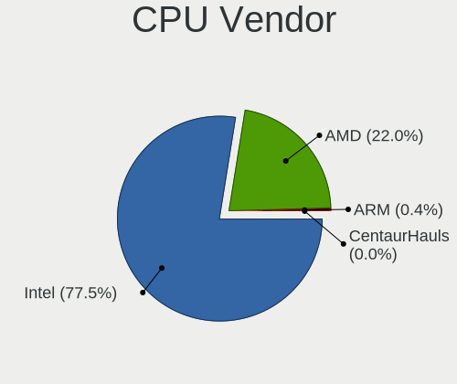

| Vendor       | Computers | Percent |
|--------------|-----------|---------|
| Intel        | 4617      | 77.53%  |
| AMD          | 1311      | 22.02%  |
| ARM          | 25        | 0.42%   |
| Qualcomm     | 1         | 0.02%   |
| CentaurHauls | 1         | 0.02%   |

CPU Model
---------

Processor models

| Model                                         | Computers | Percent |
|-----------------------------------------------|-----------|---------|
| Intel Core i5-8250U CPU @ 1.60GHz             | 216       | 3.63%   |
| Intel Core i5-8265U CPU @ 1.60GHz             | 145       | 2.43%   |
| Intel 11th Gen Core i5-1135G7 @ 2.40GHz       | 138       | 2.32%   |
| Intel Core i5-10210U CPU @ 1.60GHz            | 110       | 1.85%   |
| Intel Core i5-7200U CPU @ 2.50GHz             | 97        | 1.63%   |
| Intel Core i3-6006U CPU @ 2.00GHz             | 90        | 1.51%   |
| AMD Ryzen 5 3500U with Radeon Vega Mobile Gfx | 70        | 1.17%   |
| Intel Core i3-5005U CPU @ 2.00GHz             | 63        | 1.06%   |
| Intel Core i5-9300H CPU @ 2.40GHz             | 62        | 1.04%   |
| Intel Core i5-6200U CPU @ 2.30GHz             | 62        | 1.04%   |
| AMD Ryzen 5 3550H with Radeon Vega Mobile Gfx | 62        | 1.04%   |
| Intel Core i3-7020U CPU @ 2.30GHz             | 60        | 1.01%   |
| Intel Core i5-4210U CPU @ 1.70GHz             | 59        | 0.99%   |
| AMD Ryzen 5 5600H with Radeon Graphics        | 59        | 0.99%   |
| Intel Core i3-4005U CPU @ 1.70GHz             | 58        | 0.97%   |
| Intel Core i3-1005G1 CPU @ 1.20GHz            | 56        | 0.94%   |
| Intel 11th Gen Core i3-1115G4 @ 3.00GHz       | 55        | 0.92%   |
| AMD Ryzen 5 5500U with Radeon Graphics        | 55        | 0.92%   |
| Intel Core i5-1035G1 CPU @ 1.00GHz            | 49        | 0.82%   |
| Intel Core i7-8550U CPU @ 1.80GHz             | 48        | 0.81%   |
| Intel Core i7-9750H CPU @ 2.60GHz             | 47        | 0.79%   |
| Intel Core i5-5200U CPU @ 2.20GHz             | 46        | 0.77%   |
| Intel Core i5-10300H CPU @ 2.50GHz            | 46        | 0.77%   |
| AMD Ryzen 7 5800H with Radeon Graphics        | 46        | 0.77%   |
| Intel 12th Gen Core i5-1240P                  | 43        | 0.72%   |
| AMD Ryzen 5 4600H with Radeon Graphics        | 43        | 0.72%   |
| Intel Core i5-3210M CPU @ 2.50GHz             | 42        | 0.7%    |
| Intel 11th Gen Core i7-1165G7 @ 2.80GHz       | 41        | 0.69%   |
| Intel Core i7-8750H CPU @ 2.20GHz             | 39        | 0.65%   |
| Intel Core i7-8565U CPU @ 1.80GHz             | 39        | 0.65%   |
| Intel Core i3-10110U CPU @ 2.10GHz            | 37        | 0.62%   |
| Intel 12th Gen Core i5-12500H                 | 36        | 0.6%    |
| Intel 11th Gen Core i5-11300H @ 3.10GHz       | 34        | 0.57%   |
| AMD Ryzen 5 2500U with Radeon Vega Mobile Gfx | 34        | 0.57%   |
| Intel Core i7-10510U CPU @ 1.80GHz            | 33        | 0.55%   |
| AMD Ryzen 7 4800H with Radeon Graphics        | 33        | 0.55%   |
| AMD Ryzen 7 5700U with Radeon Graphics        | 32        | 0.54%   |
| Intel Core i7-7700HQ CPU @ 2.80GHz            | 31        | 0.52%   |
| Intel Core i5-3320M CPU @ 2.60GHz             | 31        | 0.52%   |
| Intel Core i5-8300H CPU @ 2.30GHz             | 30        | 0.5%    |

CPU Model Family
----------------

Processor model prefix

| Model                   | Computers | Percent |
|-------------------------|-----------|---------|
| Intel Core i5           | 1635      | 27.45%  |
| Intel Core i3           | 902       | 15.14%  |
| Other                   | 781       | 13.11%  |
| Intel Core i7           | 679       | 11.4%   |
| AMD Ryzen 5             | 533       | 8.95%   |
| AMD Ryzen 7             | 264       | 4.43%   |
| Intel Pentium           | 169       | 2.84%   |
| Intel Core 2 Duo        | 153       | 2.57%   |
| AMD Ryzen 3             | 111       | 1.86%   |
| Intel Celeron           | 101       | 1.7%    |
| Intel Pentium Dual-Core | 66        | 1.11%   |
| AMD Ryzen 9             | 58        | 0.97%   |
| AMD A6                  | 52        | 0.87%   |
| AMD A8                  | 41        | 0.69%   |
| Intel Xeon              | 34        | 0.57%   |
| AMD A4                  | 33        | 0.55%   |
| Intel Atom              | 32        | 0.54%   |
| Intel Pentium Dual      | 24        | 0.4%    |
| AMD FX                  | 24        | 0.4%    |
| AMD A10                 | 21        | 0.35%   |
| Intel Core 2            | 20        | 0.34%   |
| Intel Core 2 Quad       | 18        | 0.3%    |
| AMD E1                  | 18        | 0.3%    |
| AMD Ryzen 7 PRO         | 17        | 0.29%   |
| Intel Pentium Silver    | 14        | 0.24%   |
| Intel Core i9           | 11        | 0.18%   |
| Intel Core              | 11        | 0.18%   |
| AMD Ryzen 5 PRO         | 11        | 0.18%   |
| Intel Pentium Gold      | 10        | 0.17%   |
| AMD E2                  | 9         | 0.15%   |
| AMD Athlon II X2        | 8         | 0.13%   |
| AMD Athlon              | 8         | 0.13%   |
| Intel Pentium 4         | 7         | 0.12%   |
| AMD E                   | 6         | 0.1%    |
| Intel Xeon Silver       | 5         | 0.08%   |
| ARM BCM                 | 5         | 0.08%   |
| AMD Sempron             | 5         | 0.08%   |
| AMD Phenom II X6        | 5         | 0.08%   |
| Intel Pentium D         | 4         | 0.07%   |
| AMD Ryzen Threadripper  | 4         | 0.07%   |

CPU Cores
---------

Number of processor cores

| Number  | Computers | Percent |
|---------|-----------|---------|
| 2       | 2451      | 41.12%  |
| 4       | 2075      | 34.82%  |
| 6       | 626       | 10.5%   |
| 8       | 411       | 6.9%    |
| 12      | 139       | 2.33%   |
| 10      | 71        | 1.19%   |
| 1       | 62        | 1.04%   |
| 14      | 52        | 0.87%   |
| 16      | 36        | 0.6%    |
| 24      | 11        | 0.18%   |
| 3       | 8         | 0.13%   |
| 32      | 4         | 0.07%   |
| 20      | 4         | 0.07%   |
| Unknown | 4         | 0.07%   |
| 48      | 2         | 0.03%   |
| 28      | 2         | 0.03%   |
| 56      | 1         | 0.02%   |
| 36      | 1         | 0.02%   |

CPU Sockets
-----------

Number of sockets

| Number  | Computers | Percent |
|---------|-----------|---------|
| 1       | 5924      | 99.48%  |
| 2       | 27        | 0.45%   |
| Unknown | 4         | 0.07%   |

CPU Threads
-----------

Threads per core (Hyper-Threading)

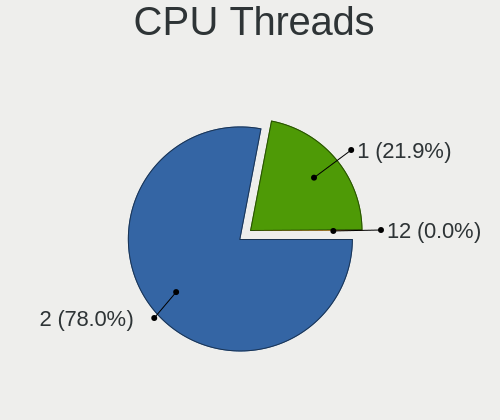

| Number  | Computers | Percent |
|---------|-----------|---------|
| 2       | 4650      | 78.01%  |
| 1       | 1304      | 21.88%  |
| Unknown | 4         | 0.07%   |
| 4       | 2         | 0.03%   |
| 12      | 1         | 0.02%   |

CPU Op-Modes
------------

CPU Operation Modes (32-bit, 64-bit)

| Op mode        | Computers | Percent |
|----------------|-----------|---------|
| 32-bit, 64-bit | 5897      | 98.98%  |
| Unknown        | 52        | 0.87%   |
| 32-bit         | 8         | 0.13%   |
| 64-bit         | 1         | 0.02%   |

CPU Microcode
-------------

Microcode number

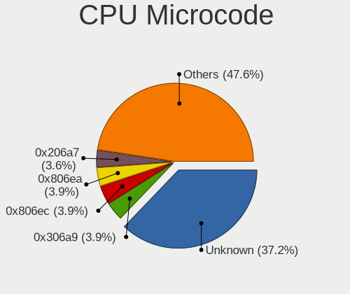

| Number     | Computers | Percent |
|------------|-----------|---------|
| Unknown    | 2294      | 37.16%  |
| 0x306a9    | 241       | 3.9%    |
| 0x806ec    | 239       | 3.87%   |
| 0x806ea    | 239       | 3.87%   |
| 0x206a7    | 222       | 3.6%    |
| 0x806c1    | 174       | 2.82%   |
| 0x906ea    | 162       | 2.62%   |
| 0x40651    | 159       | 2.58%   |
| 0x406e3    | 155       | 2.51%   |
| 0x806e9    | 153       | 2.48%   |
| 0x1067a    | 129       | 2.09%   |
| 0x306c3    | 119       | 1.93%   |
| 0x306d4    | 114       | 1.85%   |
| 0x08108109 | 106       | 1.72%   |
| 0x706e5    | 85        | 1.38%   |
| 0x0a50000c | 85        | 1.38%   |
| 0x906e9    | 68        | 1.1%    |
| 0x20655    | 67        | 1.09%   |
| 0x806eb    | 63        | 1.02%   |
| 0x506e3    | 60        | 0.97%   |
| 0x08108102 | 51        | 0.83%   |
| 0x06006705 | 47        | 0.76%   |
| 0xa0652    | 46        | 0.75%   |
| 0x0a50000d | 45        | 0.73%   |
| 0x6fd      | 42        | 0.68%   |
| 0x08608103 | 42        | 0.68%   |
| 0x08600106 | 42        | 0.68%   |
| 0x906a3    | 37        | 0.6%    |
| 0x07030105 | 34        | 0.55%   |
| 0x20652    | 31        | 0.5%    |
| 0x08600104 | 31        | 0.5%    |
| 0x08701021 | 30        | 0.49%   |
| 0xa0655    | 29        | 0.47%   |
| 0x0810100b | 29        | 0.47%   |
| 0x906ed    | 24        | 0.39%   |
| 0x30678    | 24        | 0.39%   |
| 0x08101007 | 22        | 0.36%   |
| 0x06001119 | 22        | 0.36%   |
| 0x010000c8 | 21        | 0.34%   |
| 0xa0653    | 16        | 0.26%   |

CPU Microarch
-------------

Microarchitecture

| Name              | Computers | Percent |
|-------------------|-----------|---------|
| KabyLake          | 1394      | 23.34%  |
| Haswell           | 409       | 6.85%   |
| Unknown           | 372       | 6.23%   |
| Skylake           | 342       | 5.73%   |
| IvyBridge         | 340       | 5.69%   |
| TigerLake         | 328       | 5.49%   |
| SandyBridge       | 313       | 5.24%   |
| Zen 3             | 256       | 4.29%   |
| Zen+              | 247       | 4.14%   |
| Alderlake Hybrid  | 239       | 4%      |
| Zen 2             | 206       | 3.45%   |
| Penryn            | 196       | 3.28%   |
| Broadwell         | 182       | 3.05%   |
| IceLake           | 165       | 2.76%   |
| CometLake         | 159       | 2.66%   |
| Westmere          | 137       | 2.29%   |
| Zen               | 98        | 1.64%   |
| Excavator         | 98        | 1.64%   |
| Core              | 95        | 1.59%   |
| Silvermont        | 75        | 1.26%   |
| Puma              | 61        | 1.02%   |
| Piledriver        | 48        | 0.8%    |
| Goldmont plus     | 35        | 0.59%   |
| K10               | 28        | 0.47%   |
| Goldmont          | 27        | 0.45%   |
| Nehalem           | 17        | 0.28%   |
| Bobcat            | 15        | 0.25%   |
| K10 Llano         | 13        | 0.22%   |
| NetBurst          | 12        | 0.2%    |
| Tremont           | 11        | 0.18%   |
| Jaguar            | 11        | 0.18%   |
| Bonnell           | 11        | 0.18%   |
| Steamroller       | 10        | 0.17%   |
| Bulldozer         | 6         | 0.1%    |
| P6                | 5         | 0.08%   |
| K8 Hammer         | 5         | 0.08%   |
| Meteorlake Hybrid | 4         | 0.07%   |
| Gracemont         | 2         | 0.03%   |

Graphics
--------

GPU Vendor
----------

Vendors of graphics cards

| Vendor                           | Computers | Percent |
|----------------------------------|-----------|---------|
| Intel                            | 4227      | 55.55%  |
| Nvidia                           | 1786      | 23.47%  |
| AMD                              | 1576      | 20.71%  |
| Matrox Electronics Systems       | 10        | 0.13%   |
| Silicon Integrated Systems [SiS] | 4         | 0.05%   |
| ASPEED Technology                | 4         | 0.05%   |
| VIA Technologies                 | 1         | 0.01%   |
| ATI Technologies                 | 1         | 0.01%   |

GPU Model
---------

Graphics card models

| Model                                                                                 | Computers | Percent |
|---------------------------------------------------------------------------------------|-----------|---------|
| Intel UHD Graphics 620                                                                | 310       | 3.99%   |
| Intel 2nd Generation Core Processor Family Integrated Graphics Controller             | 275       | 3.54%   |
| Nvidia TU117M [GeForce GTX 1650 Mobile / Max-Q]                                       | 262       | 3.37%   |
| Intel TigerLake-LP GT2 [Iris Xe Graphics]                                             | 261       | 3.36%   |
| Intel HD Graphics 620                                                                 | 233       | 3%      |
| Intel WhiskeyLake-U GT2 [UHD Graphics 620]                                            | 232       | 2.99%   |
| Intel Haswell-ULT Integrated Graphics Controller                                      | 232       | 2.99%   |
| AMD Picasso/Raven 2 [Radeon Vega Series / Radeon Vega Mobile Series]                  | 218       | 2.81%   |
| Intel 3rd Gen Core processor Graphics Controller                                      | 207       | 2.66%   |
| Intel Skylake GT2 [HD Graphics 520]                                                   | 201       | 2.59%   |
| Intel CometLake-U GT2 [UHD Graphics]                                                  | 195       | 2.51%   |
| Intel CoffeeLake-H GT2 [UHD Graphics 630]                                             | 184       | 2.37%   |
| AMD Cezanne [Radeon Vega Series / Radeon Vega Mobile Series]                          | 175       | 2.25%   |
| Intel HD Graphics 5500                                                                | 156       | 2.01%   |
| AMD Renoir [Radeon Vega Series / Radeon Vega Mobile Series]                           | 141       | 1.81%   |
| AMD Sun XT [Radeon HD 8670A/8670M/8690M / R5 M330 / M430 / Radeon 520 Mobile]         | 136       | 1.75%   |
| Intel Iris Plus Graphics G1 (Ice Lake)                                                | 105       | 1.35%   |
| Intel Core Processor Integrated Graphics Controller                                   | 103       | 1.33%   |
| AMD Lucienne                                                                          | 100       | 1.29%   |
| Intel Alder Lake-P GT2 [Iris Xe Graphics]                                             | 90        | 1.16%   |
| Nvidia GK208B [GeForce GT 710]                                                        | 88        | 1.13%   |
| Intel Xeon E3-1200 v2/3rd Gen Core processor Graphics Controller                      | 83        | 1.07%   |
| Intel HD Graphics 630                                                                 | 81        | 1.04%   |
| Intel CometLake-H GT2 [UHD Graphics]                                                  | 81        | 1.04%   |
| Nvidia GA107M [GeForce RTX 3050 Mobile]                                               | 77        | 0.99%   |
| AMD Stoney [Radeon R2/R3/R4/R5 Graphics]                                              | 75        | 0.97%   |
| AMD Topaz XT [Radeon R7 M260/M265 / M340/M360 / M440/M445 / 530/535 / 620/625 Mobile] | 74        | 0.95%   |
| Intel Xeon E3-1200 v3/4th Gen Core Processor Integrated Graphics Controller           | 70        | 0.9%    |
| Intel 4 Series Chipset Integrated Graphics Controller                                 | 70        | 0.9%    |
| AMD Raven Ridge [Radeon Vega Series / Radeon Vega Mobile Series]                      | 69        | 0.89%   |
| Intel Tiger Lake-LP GT2 [UHD Graphics G4]                                             | 66        | 0.85%   |
| Nvidia GF117M [GeForce 610M/710M/810M/820M / GT 620M/625M/630M/720M]                  | 65        | 0.84%   |
| Intel Mobile 4 Series Chipset Integrated Graphics Controller                          | 61        | 0.79%   |
| Intel CoffeeLake-S GT2 [UHD Graphics 630]                                             | 60        | 0.77%   |
| Nvidia GP108M [GeForce MX250]                                                         | 57        | 0.73%   |
| Intel HD Graphics 530                                                                 | 57        | 0.73%   |
| AMD Barcelo                                                                           | 49        | 0.63%   |
| Nvidia GM108M [GeForce MX130]                                                         | 47        | 0.6%    |
| Intel CometLake-S GT2 [UHD Graphics 630]                                              | 47        | 0.6%    |
| Nvidia GP108M [GeForce MX150]                                                         | 46        | 0.59%   |

GPU Combo
---------

Combinations of graphics cards

| Name               | Computers | Percent |
|--------------------|-----------|---------|
| 1 x Intel          | 2819      | 47.06%  |
| Intel + Nvidia     | 1026      | 17.13%  |
| 1 x AMD            | 866       | 14.46%  |
| 1 x Nvidia         | 483       | 8.06%   |
| Intel + AMD        | 334       | 5.58%   |
| AMD + Nvidia       | 271       | 4.52%   |
| 2 x AMD            | 112       | 1.87%   |
| Other              | 32        | 0.53%   |
| 2 x Intel          | 23        | 0.38%   |
| 1 x Matrox         | 9         | 0.15%   |
| 2 x Nvidia         | 4         | 0.07%   |
| 1 x SiS            | 4         | 0.07%   |
| Nvidia + ASPEED    | 2         | 0.03%   |
| 1 x ASPEED         | 2         | 0.03%   |
| 1 x VIA            | 1         | 0.02%   |
| Nvidia + Matrox    | 1         | 0.02%   |
| Intel + 2 x Nvidia | 1         | 0.02%   |

GPU Driver
----------

Free vs proprietary

| Driver      | Computers | Percent |
|-------------|-----------|---------|
| Free        | 4763      | 78.73%  |
| Proprietary | 991       | 16.38%  |
| Unknown     | 296       | 4.89%   |

GPU Memory
----------

Total video memory

| Size in GB | Computers | Percent |
|------------|-----------|---------|
| Unknown    | 3930      | 64.16%  |
| 1.01-2.0   | 794       | 12.96%  |
| 0.01-0.5   | 545       | 8.9%    |
| 3.01-4.0   | 418       | 6.82%   |
| 0.51-1.0   | 242       | 3.95%   |
| 5.01-6.0   | 83        | 1.36%   |
| 7.01-8.0   | 59        | 0.96%   |
| 8.01-16.0  | 36        | 0.59%   |
| 16.01-24.0 | 11        | 0.18%   |
| 2.01-3.0   | 6         | 0.1%    |
| 32.01-64.0 | 1         | 0.02%   |

Monitor
-------

Monitor Vendor
--------------

Monitor vendors

| Vendor                  | Computers | Percent |
|-------------------------|-----------|---------|
| BOE                     | 1041      | 16.81%  |
| Chimei Innolux          | 947       | 15.3%   |
| AU Optronics            | 924       | 14.92%  |
| LG Display              | 676       | 10.92%  |
| Samsung Electronics     | 511       | 8.25%   |
| Dell                    | 339       | 5.48%   |
| Goldstar                | 279       | 4.51%   |
| BenQ                    | 175       | 2.83%   |
| Acer                    | 169       | 2.73%   |
| PANDA                   | 151       | 2.44%   |
| Hewlett-Packard         | 119       | 1.92%   |
| Lenovo                  | 98        | 1.58%   |
| AOC                     | 67        | 1.08%   |
| Sharp                   | 64        | 1.03%   |
| InfoVision              | 51        | 0.82%   |
| Chi Mei Optoelectronics | 49        | 0.79%   |
| Apple                   | 44        | 0.71%   |
| Sony                    | 34        | 0.55%   |
| ViewSonic               | 33        | 0.53%   |
| TMX                     | 32        | 0.52%   |
| Philips                 | 22        | 0.36%   |
| HCL                     | 22        | 0.36%   |
| Unknown                 | 21        | 0.34%   |
| HKC                     | 19        | 0.31%   |
| MSI                     | 16        | 0.26%   |
| RTK                     | 15        | 0.24%   |
| LG Electronics          | 13        | 0.21%   |
| Panasonic               | 12        | 0.19%   |
| LG Philips              | 12        | 0.19%   |
| Gigabyte Technology     | 12        | 0.19%   |
| CSO                     | 12        | 0.19%   |
| ASUSTek Computer        | 11        | 0.18%   |
| Toshiba                 | 9         | 0.15%   |
| STD                     | 9         | 0.15%   |
| SGT                     | 8         | 0.13%   |
| InnoLux Display         | 8         | 0.13%   |
| Xiaomi                  | 7         | 0.11%   |
| Ancor Communications    | 7         | 0.11%   |
| KDC                     | 6         | 0.1%    |
| HJC                     | 6         | 0.1%    |

Monitor Model
-------------

Monitor models

| Model                                                                 | Computers | Percent |
|-----------------------------------------------------------------------|-----------|---------|
| Chimei Innolux LCD Monitor CMN15F5 1920x1080 344x193mm 15.5-inch      | 114       | 1.82%   |
| AU Optronics LCD Monitor AUO38ED 1920x1080 344x193mm 15.5-inch        | 85        | 1.36%   |
| Chimei Innolux LCD Monitor CMN1521 1920x1080 344x193mm 15.5-inch      | 55        | 0.88%   |
| PANDA LCD Monitor NCP004D 1920x1080 344x194mm 15.5-inch               | 49        | 0.78%   |
| Chimei Innolux LCD Monitor CMN14D4 1920x1080 309x173mm 13.9-inch      | 48        | 0.77%   |
| AU Optronics LCD Monitor AUO21ED 1920x1080 344x193mm 15.5-inch        | 46        | 0.73%   |
| Dell D1918H DEL2005 1366x768 410x230mm 18.5-inch                      | 45        | 0.72%   |
| BOE LCD Monitor BOE06A4 1366x768 344x194mm 15.5-inch                  | 44        | 0.7%    |
| BOE LCD Monitor BOE0687 1920x1080 344x193mm 15.5-inch                 | 43        | 0.69%   |
| Chimei Innolux LCD Monitor CMN15DB 1366x768 344x193mm 15.5-inch       | 41        | 0.65%   |
| Chimei Innolux LCD Monitor CMN14C3 1366x768 309x173mm 13.9-inch       | 41        | 0.65%   |
| Chimei Innolux LCD Monitor CMN15E7 1920x1080 344x193mm 15.5-inch      | 39        | 0.62%   |
| Samsung Electronics LCD Monitor SEC5441 1280x800 286x179mm 13.3-inch  | 33        | 0.53%   |
| Goldstar IPS FULLHD GSM5AB8 1920x1080 480x270mm 21.7-inch             | 32        | 0.51%   |
| AU Optronics LCD Monitor AUO2E3C 1366x768 309x173mm 13.9-inch         | 32        | 0.51%   |
| BenQ GW2480 BNQ78E7 1920x1080 527x296mm 23.8-inch                     | 31        | 0.49%   |
| LG Display LCD Monitor LGD02DC 1366x768 344x194mm 15.5-inch           | 30        | 0.48%   |
| BenQ GW2283 BNQ78E9 1920x1080 476x268mm 21.5-inch                     | 30        | 0.48%   |
| AU Optronics LCD Monitor AUO70EC 1366x768 344x193mm 15.5-inch         | 30        | 0.48%   |
| Chimei Innolux LCD Monitor CMN14D6 1366x768 309x173mm 13.9-inch       | 29        | 0.46%   |
| AU Optronics LCD Monitor AUO45EC 1366x768 344x193mm 15.5-inch         | 29        | 0.46%   |
| Chimei Innolux LCD Monitor CMN14E5 1920x1080 309x173mm 13.9-inch      | 27        | 0.43%   |
| LG Display LCD Monitor LGD0456 1366x768 344x194mm 15.5-inch           | 26        | 0.41%   |
| Chimei Innolux LCD Monitor CMN15D5 1920x1080 344x193mm 15.5-inch      | 26        | 0.41%   |
| BOE LCD Monitor BOE07F6 1920x1080 309x174mm 14.0-inch                 | 25        | 0.4%    |
| AU Optronics LCD Monitor AUO403D 1920x1080 309x174mm 14.0-inch        | 25        | 0.4%    |
| TMX TL156VDXP01 TMX1560 1920x1080 344x194mm 15.5-inch                 | 23        | 0.37%   |
| Samsung Electronics LCD Monitor SDC4171 2880x1800 302x189mm 14.0-inch | 23        | 0.37%   |
| AU Optronics LCD Monitor AUO71EC 1366x768 344x193mm 15.5-inch         | 23        | 0.37%   |
| PANDA LCD Monitor NCP0036 1920x1080 344x194mm 15.5-inch               | 22        | 0.35%   |
| BOE LCD Monitor BOE0812 1920x1080 344x194mm 15.5-inch                 | 22        | 0.35%   |
| LG Display LCD Monitor LGD039F 1366x768 345x194mm 15.6-inch           | 21        | 0.34%   |
| AU Optronics LCD Monitor AUO2992 1920x1080 344x193mm 15.5-inch        | 21        | 0.34%   |
| PANDA LCD Monitor NCP002D 1920x1080 344x194mm 15.5-inch               | 20        | 0.32%   |
| Goldstar FULL HD GSM5B55 1920x1080 480x270mm 21.7-inch                | 20        | 0.32%   |
| BOE LCD Monitor BOE06A9 1920x1080 344x193mm 15.5-inch                 | 20        | 0.32%   |
| AU Optronics LCD Monitor AUOD1ED 1920x1080 344x193mm 15.5-inch        | 20        | 0.32%   |
| AU Optronics LCD Monitor AUO22EC 1366x768 344x193mm 15.5-inch         | 20        | 0.32%   |
| LG Display LCD Monitor LGD060F 1920x1080 309x174mm 14.0-inch          | 18        | 0.29%   |
| Dell E1916HV DELF06C 1366x768 409x230mm 18.5-inch                     | 18        | 0.29%   |

Monitor Resolution
------------------

Monitor screen resolution

| Resolution         | Computers | Percent |
|--------------------|-----------|---------|
| 1920x1080 (FHD)    | 3047      | 50.94%  |
| 1366x768 (WXGA)    | 1820      | 30.42%  |
| 1600x900 (HD+)     | 175       | 2.93%   |
| 3840x2160 (4K)     | 149       | 2.49%   |
| 2560x1440 (QHD)    | 141       | 2.36%   |
| 1920x1200 (WUXGA)  | 117       | 1.96%   |
| 1440x900 (WXGA+)   | 77        | 1.29%   |
| 2560x1600          | 59        | 0.99%   |
| 1280x800 (WXGA)    | 58        | 0.97%   |
| 2880x1800          | 48        | 0.8%    |
| 1360x768           | 35        | 0.59%   |
| 2560x1080          | 33        | 0.55%   |
| 1280x1024 (SXGA)   | 31        | 0.52%   |
| 3200x2000          | 25        | 0.42%   |
| 1680x1050 (WSXGA+) | 20        | 0.33%   |
| Unknown            | 19        | 0.32%   |
| 3840x1080          | 9         | 0.15%   |
| 2240x1400          | 9         | 0.15%   |
| 1024x768 (XGA)     | 9         | 0.15%   |
| 3440x1440          | 8         | 0.13%   |
| 2160x1440          | 8         | 0.13%   |
| 2288x1287          | 7         | 0.12%   |
| 1024x600           | 7         | 0.12%   |
| 3840x2400          | 6         | 0.1%    |
| 1280x720 (HD)      | 6         | 0.1%    |
| 3456x2160          | 5         | 0.08%   |
| 2880x1620          | 5         | 0.08%   |
| 2256x1504          | 5         | 0.08%   |
| 800x1280           | 4         | 0.07%   |
| 1920x1280          | 4         | 0.07%   |
| 4093x4093          | 3         | 0.05%   |
| 3840x1100          | 3         | 0.05%   |
| 2880x1920          | 3         | 0.05%   |
| 3072x1920          | 2         | 0.03%   |
| 1400x1050          | 2         | 0.03%   |
| 1280x768           | 2         | 0.03%   |
| 1152x864           | 2         | 0.03%   |
| 8160x4627          | 1         | 0.02%   |
| 7680x2160          | 1         | 0.02%   |
| 6400x2160          | 1         | 0.02%   |

Monitor Diagonal
----------------

Diagonal size in inches

| Inches  | Computers | Percent |
|---------|-----------|---------|
| 15      | 2590      | 41.82%  |
| 14      | 810       | 13.08%  |
| 13      | 755       | 12.19%  |
| 21      | 326       | 5.26%   |
| 18      | 285       | 4.6%    |
| 24      | 228       | 3.68%   |
| 23      | 161       | 2.6%    |
| 27      | 157       | 2.54%   |
| 19      | 137       | 2.21%   |
| Unknown | 122       | 1.97%   |
| 16      | 99        | 1.6%    |
| 31      | 83        | 1.34%   |
| 20      | 73        | 1.18%   |
| 17      | 73        | 1.18%   |
| 12      | 62        | 1%      |
| 34      | 33        | 0.53%   |
| 11      | 25        | 0.4%    |
| 72      | 19        | 0.31%   |
| 46      | 18        | 0.29%   |
| 26      | 18        | 0.29%   |
| 22      | 12        | 0.19%   |
| 40      | 11        | 0.18%   |
| 32      | 11        | 0.18%   |
| 10      | 11        | 0.18%   |
| 84      | 9         | 0.15%   |
| 65      | 8         | 0.13%   |
| 142     | 6         | 0.1%    |
| 52      | 6         | 0.1%    |
| 25      | 6         | 0.1%    |
| 54      | 5         | 0.08%   |
| 42      | 4         | 0.06%   |
| 7       | 4         | 0.06%   |
| 86      | 3         | 0.05%   |
| 64      | 3         | 0.05%   |
| 39      | 3         | 0.05%   |
| 43      | 2         | 0.03%   |
| 36      | 2         | 0.03%   |
| 75      | 1         | 0.02%   |
| 67      | 1         | 0.02%   |
| 63      | 1         | 0.02%   |

Monitor Width
-------------

Physical width

| Width in mm    | Computers | Percent |
|----------------|-----------|---------|
| 301-350        | 3995      | 64.92%  |
| 401-500        | 812       | 13.19%  |
| 501-600        | 529       | 8.6%    |
| 201-300        | 302       | 4.91%   |
| 351-400        | 135       | 2.19%   |
| Unknown        | 122       | 1.98%   |
| 601-700        | 101       | 1.64%   |
| 1001-1500      | 49        | 0.8%    |
| 701-800        | 47        | 0.76%   |
| 1501-2000      | 29        | 0.47%   |
| 801-900        | 17        | 0.28%   |
| More than 2000 | 6         | 0.1%    |
| 901-1000       | 6         | 0.1%    |
| 1-100          | 4         | 0.06%   |

Aspect Ratio
------------

Proportional relationship between the width and the height

| Ratio   | Computers | Percent |
|---------|-----------|---------|
| 16/9    | 5084      | 88.19%  |
| 16/10   | 415       | 7.2%    |
| Unknown | 113       | 1.96%   |
| 21/9    | 38        | 0.66%   |
| 5/4     | 29        | 0.5%    |
| 4/3     | 28        | 0.49%   |
| 3/2     | 24        | 0.42%   |
| 6/5     | 7         | 0.12%   |
| 2.00    | 7         | 0.12%   |
| 1.00    | 6         | 0.1%    |
| 0.67    | 4         | 0.07%   |
| 3.40    | 3         | 0.05%   |
| 0.56    | 3         | 0.05%   |
| 32/9    | 2         | 0.03%   |
| 0.62    | 1         | 0.02%   |
| 0.45    | 1         | 0.02%   |

Monitor Area
------------

Area in inch

| Area in inch | Computers | Percent |
|----------------|-----------|---------|
| 101-110        | 2580      | 41.69%  |
| 81-90          | 1413      | 22.83%  |
| 201-250        | 608       | 9.82%   |
| 141-150        | 296       | 4.78%   |
| 151-200        | 294       | 4.75%   |
| 301-350        | 164       | 2.65%   |
| 71-80          | 151       | 2.44%   |
| 351-500        | 128       | 2.07%   |
| Unknown        | 122       | 1.97%   |
| 111-120        | 85        | 1.37%   |
| More than 1000 | 65        | 1.05%   |
| 61-70          | 53        | 0.86%   |
| 251-300        | 53        | 0.86%   |
| 121-130        | 53        | 0.86%   |
| 501-1000       | 44        | 0.71%   |
| 51-60          | 28        | 0.45%   |
| 91-100         | 24        | 0.39%   |
| 131-140        | 13        | 0.21%   |
| 41-50          | 11        | 0.18%   |
| 1-40           | 4         | 0.06%   |

Pixel Density
-------------

Pixels per inch

| Density       | Computers | Percent |
|---------------|-----------|---------|
| 121-160       | 2420      | 39.59%  |
| 101-120       | 1803      | 29.5%   |
| 51-100        | 1265      | 20.7%   |
| 161-240       | 319       | 5.22%   |
| Unknown       | 122       | 2%      |
| More than 240 | 107       | 1.75%   |
| 1-50          | 76        | 1.24%   |

Multiple Monitors
-----------------

Total monitors connected

| Total | Computers | Percent |
|-------|-----------|---------|
| 1     | 5299      | 87.64%  |
| 2     | 537       | 8.88%   |
| 0     | 192       | 3.18%   |
| 3     | 17        | 0.28%   |
| 4     | 1         | 0.02%   |

Network
-------

Net Controller Vendor
---------------------

Controller vendors

| Vendor                          | Computers | Percent |
|---------------------------------|-----------|---------|
| Realtek Semiconductor           | 3961      | 42.25%  |
| Intel                           | 2516      | 26.84%  |
| Qualcomm Atheros                | 1009      | 10.76%  |
| Broadcom                        | 359       | 3.83%   |
| MediaTek                        | 282       | 3.01%   |
| Ralink Technology               | 166       | 1.77%   |
| TP-Link                         | 137       | 1.46%   |
| Xiaomi                          | 135       | 1.44%   |
| OPPO Electronics                | 94        | 1%      |
| Samsung Electronics             | 90        | 0.96%   |
| Ralink                          | 83        | 0.89%   |
| Broadcom Limited                | 75        | 0.8%    |
| Qualcomm                        | 63        | 0.67%   |
| Marvell Technology Group        | 39        | 0.42%   |
| D-Link                          | 39        | 0.42%   |
| ASIX Electronics                | 37        | 0.39%   |
| Motorola PCS                    | 31        | 0.33%   |
| OnePlus Technology (Shenzhen)   | 26        | 0.28%   |
| Huawei Technologies             | 25        | 0.27%   |
| Google                          | 17        | 0.18%   |
| Nvidia                          | 16        | 0.17%   |
| Qualcomm Atheros Communications | 15        | 0.16%   |
| Foxconn / Hon Hai               | 15        | 0.16%   |
| ICS Advent                      | 13        | 0.14%   |
| vivo                            | 10        | 0.11%   |
| NetGear                         | 10        | 0.11%   |
| Lenovo                          | 8         | 0.09%   |
| JMicron Technology              | 8         | 0.09%   |
| DisplayLink                     | 8         | 0.09%   |
| ASUSTek Computer                | 7         | 0.07%   |
| Microchip Technology            | 6         | 0.06%   |
| Edimax Technology               | 6         | 0.06%   |
| HMD Global                      | 5         | 0.05%   |
| Dell                            | 5         | 0.05%   |
| Altair Semiconductor            | 5         | 0.05%   |
| D-Link System                   | 4         | 0.04%   |
| Aquantia                        | 4         | 0.04%   |
| Apple                           | 4         | 0.04%   |
| Sierra Wireless                 | 3         | 0.03%   |
| QinHeng Electronics             | 3         | 0.03%   |

Net Controller Model
--------------------

Controller models

| Model                                                                  | Computers | Percent |
|------------------------------------------------------------------------|-----------|---------|
| Realtek RTL8111/8168/8211/8411 PCI Express Gigabit Ethernet Controller | 2568      | 23.52%  |
| Realtek RTL810xE PCI Express Fast Ethernet controller                  | 829       | 7.59%   |
| Qualcomm Atheros QCA9377 802.11ac Wireless Network Adapter             | 363       | 3.33%   |
| Realtek RTL8822CE 802.11ac PCIe Wireless Network Adapter               | 237       | 2.17%   |
| Intel Wi-Fi 6 AX201                                                    | 236       | 2.16%   |
| Intel Wi-Fi 6 AX200                                                    | 204       | 1.87%   |
| Intel Wireless 8265 / 8275                                             | 195       | 1.79%   |
| Qualcomm Atheros QCA9565 / AR9565 Wireless Network Adapter             | 178       | 1.63%   |
| MediaTek MT7921 802.11ax PCI Express Wireless Network Adapter          | 156       | 1.43%   |
| Intel Alder Lake-P PCH CNVi WiFi                                       | 153       | 1.4%    |
| Realtek RTL8821CE 802.11ac PCIe Wireless Network Adapter               | 150       | 1.37%   |
| Intel Comet Lake PCH-LP CNVi WiFi                                      | 149       | 1.36%   |
| Ralink MT7601U Wireless Adapter                                        | 148       | 1.36%   |
| Intel Cannon Lake PCH CNVi WiFi                                        | 141       | 1.29%   |
| Realtek RTL8723BE PCIe Wireless Network Adapter                        | 138       | 1.26%   |
| Broadcom BCM43142 802.11b/g/n                                          | 129       | 1.18%   |
| Realtek RTL8723DE Wireless Network Adapter                             | 122       | 1.12%   |
| Intel Cannon Point-LP CNVi [Wireless-AC]                               | 121       | 1.11%   |
| Realtek RTL8188EUS 802.11n Wireless Network Adapter                    | 116       | 1.06%   |
| Qualcomm Atheros QCA6174 802.11ac Wireless Network Adapter             | 112       | 1.03%   |
| Realtek RTL8188FTV 802.11b/g/n 1T1R 2.4G WLAN Adapter                  | 105       | 0.96%   |
| Intel Wireless 7265                                                    | 104       | 0.95%   |
| Qualcomm Atheros AR9485 Wireless Network Adapter                       | 101       | 0.93%   |
| Xiaomi Mi/Redmi series (RNDIS)                                         | 98        | 0.9%    |
| Intel 82579LM Gigabit Network Connection (Lewisville)                  | 98        | 0.9%    |
| Qualcomm Atheros AR9285 Wireless Network Adapter (PCI-Express)         | 94        | 0.86%   |
| Realtek RTL8125 2.5GbE Controller                                      | 89        | 0.82%   |
| Intel Wireless 3165                                                    | 89        | 0.82%   |
| Intel Wireless 3160                                                    | 85        | 0.78%   |
| OPPO OnePlus Nord 4                                                    | 84        | 0.77%   |
| Broadcom BCM4313 802.11bgn Wireless Network Adapter                    | 73        | 0.67%   |
| Intel Ice Lake-LP PCH CNVi WiFi                                        | 71        | 0.65%   |
| Intel Wireless 8260                                                    | 68        | 0.62%   |
| Realtek RTL8852AE 802.11ax PCIe Wireless Network Adapter               | 65        | 0.6%    |
| Realtek RTL8822BE 802.11a/b/g/n/ac WiFi adapter                        | 65        | 0.6%    |
| Samsung Galaxy series, misc. (tethering mode)                          | 64        | 0.59%   |
| Ralink RT3290 Wireless 802.11n 1T/1R PCIe                              | 64        | 0.59%   |
| Intel Comet Lake PCH CNVi WiFi                                         | 60        | 0.55%   |
| Intel Ethernet Connection (4) I219-LM                                  | 59        | 0.54%   |
| Realtek RTL8852BE PCIe 802.11ax Wireless Network Controller            | 58        | 0.53%   |

Wireless Vendor
---------------

Wireless vendors

| Vendor                          | Computers | Percent |
|---------------------------------|-----------|---------|
| Intel                           | 2198      | 40.57%  |
| Realtek Semiconductor           | 1242      | 22.92%  |
| Qualcomm Atheros                | 898       | 16.57%  |
| Broadcom                        | 298       | 5.5%    |
| MediaTek                        | 240       | 4.43%   |
| Ralink Technology               | 166       | 3.06%   |
| TP-Link                         | 127       | 2.34%   |
| Ralink                          | 82        | 1.51%   |
| Broadcom Limited                | 59        | 1.09%   |
| D-Link                          | 39        | 0.72%   |
| Qualcomm                        | 16        | 0.3%    |
| Qualcomm Atheros Communications | 15        | 0.28%   |
| NetGear                         | 10        | 0.18%   |
| Edimax Technology               | 6         | 0.11%   |
| Dell                            | 4         | 0.07%   |
| Sierra Wireless                 | 3         | 0.06%   |
| Marvell Technology Group        | 3         | 0.06%   |
| ASUSTek Computer                | 3         | 0.06%   |
| Qualcomm Technologies           | 2         | 0.04%   |
| D-Link System                   | 2         | 0.04%   |
| Wacom                           | 1         | 0.02%   |
| Philips (or NXP)                | 1         | 0.02%   |
| Micro Star International        | 1         | 0.02%   |
| IMC Networks                    | 1         | 0.02%   |
| Belkin Components               | 1         | 0.02%   |

Wireless Model
--------------

Wireless models

| Model                                                          | Computers | Percent |
|----------------------------------------------------------------|-----------|---------|
| Qualcomm Atheros QCA9377 802.11ac Wireless Network Adapter     | 363       | 6.67%   |
| Realtek RTL8822CE 802.11ac PCIe Wireless Network Adapter       | 237       | 4.35%   |
| Intel Wi-Fi 6 AX201                                            | 236       | 4.34%   |
| Intel Wi-Fi 6 AX200                                            | 204       | 3.75%   |
| Intel Wireless 8265 / 8275                                     | 195       | 3.58%   |
| Qualcomm Atheros QCA9565 / AR9565 Wireless Network Adapter     | 178       | 3.27%   |
| MediaTek MT7921 802.11ax PCI Express Wireless Network Adapter  | 156       | 2.87%   |
| Intel Alder Lake-P PCH CNVi WiFi                               | 153       | 2.81%   |
| Realtek RTL8821CE 802.11ac PCIe Wireless Network Adapter       | 150       | 2.76%   |
| Intel Comet Lake PCH-LP CNVi WiFi                              | 149       | 2.74%   |
| Ralink MT7601U Wireless Adapter                                | 148       | 2.72%   |
| Intel Cannon Lake PCH CNVi WiFi                                | 141       | 2.59%   |
| Realtek RTL8723BE PCIe Wireless Network Adapter                | 138       | 2.53%   |
| Broadcom BCM43142 802.11b/g/n                                  | 129       | 2.37%   |
| Realtek RTL8723DE Wireless Network Adapter                     | 122       | 2.24%   |
| Intel Cannon Point-LP CNVi [Wireless-AC]                       | 121       | 2.22%   |
| Realtek RTL8188EUS 802.11n Wireless Network Adapter            | 116       | 2.13%   |
| Qualcomm Atheros QCA6174 802.11ac Wireless Network Adapter     | 112       | 2.06%   |
| Realtek RTL8188FTV 802.11b/g/n 1T1R 2.4G WLAN Adapter          | 105       | 1.93%   |
| Intel Wireless 7265                                            | 104       | 1.91%   |
| Qualcomm Atheros AR9485 Wireless Network Adapter               | 101       | 1.86%   |
| Qualcomm Atheros AR9285 Wireless Network Adapter (PCI-Express) | 94        | 1.73%   |
| Intel Wireless 3165                                            | 89        | 1.63%   |
| Intel Wireless 3160                                            | 85        | 1.56%   |
| Broadcom BCM4313 802.11bgn Wireless Network Adapter            | 73        | 1.34%   |
| Intel Ice Lake-LP PCH CNVi WiFi                                | 71        | 1.3%    |
| Intel Wireless 8260                                            | 68        | 1.25%   |
| Realtek RTL8852AE 802.11ax PCIe Wireless Network Adapter       | 65        | 1.19%   |
| Realtek RTL8822BE 802.11a/b/g/n/ac WiFi adapter                | 65        | 1.19%   |
| Ralink RT3290 Wireless 802.11n 1T/1R PCIe                      | 64        | 1.18%   |
| Intel Comet Lake PCH CNVi WiFi                                 | 60        | 1.1%    |
| Realtek RTL8852BE PCIe 802.11ax Wireless Network Controller    | 54        | 0.99%   |
| Intel Dual Band Wireless-AC 3168NGW [Stone Peak]               | 54        | 0.99%   |
| Intel Wireless 7260                                            | 49        | 0.9%    |
| Intel Dual Band Wireless-AC 3165 Plus Bluetooth                | 39        | 0.72%   |
| Intel Wi-Fi 5(802.11ac) Wireless-AC 9x6x [Thunder Peak]        | 38        | 0.7%    |
| Intel Centrino Advanced-N 6205 [Taylor Peak]                   | 38        | 0.7%    |
| Intel Raptor Lake PCH CNVi WiFi                                | 37        | 0.68%   |
| TP-Link TL-WN823N v2/v3 [Realtek RTL8192EU]                    | 30        | 0.55%   |
| MediaTek MT7922 802.11ax PCI Express Wireless Network Adapter  | 30        | 0.55%   |

Ethernet Vendor
---------------

Ethernet vendors

| Vendor                                 | Computers | Percent |
|----------------------------------------|-----------|---------|
| Realtek Semiconductor                  | 3597      | 67.54%  |
| Intel                                  | 793       | 14.89%  |
| Qualcomm Atheros                       | 161       | 3.02%   |
| Xiaomi                                 | 135       | 2.53%   |
| OPPO Electronics                       | 94        | 1.76%   |
| Broadcom                               | 90        | 1.69%   |
| Samsung Electronics                    | 64        | 1.2%    |
| Qualcomm                               | 47        | 0.88%   |
| MediaTek                               | 45        | 0.84%   |
| ASIX Electronics                       | 37        | 0.69%   |
| Marvell Technology Group               | 36        | 0.68%   |
| Motorola PCS                           | 31        | 0.58%   |
| Huawei Technologies                    | 21        | 0.39%   |
| OnePlus Technology (Shenzhen)          | 20        | 0.38%   |
| Google                                 | 16        | 0.3%    |
| Broadcom Limited                       | 16        | 0.3%    |
| Nvidia                                 | 15        | 0.28%   |
| ICS Advent                             | 13        | 0.24%   |
| TP-Link                                | 11        | 0.21%   |
| vivo                                   | 10        | 0.19%   |
| JMicron Technology                     | 8         | 0.15%   |
| DisplayLink                            | 8         | 0.15%   |
| Lenovo                                 | 7         | 0.13%   |
| Microchip Technology                   | 5         | 0.09%   |
| HMD Global                             | 5         | 0.09%   |
| Altair Semiconductor                   | 5         | 0.09%   |
| Foxconn / Hon Hai                      | 4         | 0.08%   |
| ASUSTek Computer                       | 4         | 0.08%   |
| Aquantia                               | 4         | 0.08%   |
| Apple                                  | 3         | 0.06%   |
| Spreadtrum Communications              | 2         | 0.04%   |
| Silicon Integrated Systems [SiS]       | 2         | 0.04%   |
| D-Link System                          | 2         | 0.04%   |
| Attansic Technology                    | 2         | 0.04%   |
| ZTE WCDMA Technologies MSM             | 1         | 0.02%   |
| VIA Technologies                       | 1         | 0.02%   |
| Sony Ericsson Mobile Communications AB | 1         | 0.02%   |
| Raspberry Pi                           | 1         | 0.02%   |
| LG Electronics                         | 1         | 0.02%   |
| LeEco                                  | 1         | 0.02%   |

Ethernet Model
--------------

Ethernet models

| Model                                                                  | Computers | Percent |
|------------------------------------------------------------------------|-----------|---------|
| Realtek RTL8111/8168/8211/8411 PCI Express Gigabit Ethernet Controller | 2568      | 47.56%  |
| Realtek RTL810xE PCI Express Fast Ethernet controller                  | 829       | 15.35%  |
| Xiaomi Mi/Redmi series (RNDIS)                                         | 98        | 1.81%   |
| Intel 82579LM Gigabit Network Connection (Lewisville)                  | 98        | 1.81%   |
| Realtek RTL8125 2.5GbE Controller                                      | 89        | 1.65%   |
| OPPO OnePlus Nord 4                                                    | 84        | 1.56%   |
| Samsung Galaxy series, misc. (tethering mode)                          | 64        | 1.19%   |
| Intel Ethernet Connection (4) I219-LM                                  | 59        | 1.09%   |
| Realtek RTL8153 Gigabit Ethernet Adapter                               | 47        | 0.87%   |
| Intel Ethernet Connection I219-LM                                      | 45        | 0.83%   |
| Realtek Killer E2600 GbE Controller                                    | 43        | 0.8%    |
| Intel Ethernet Connection (4) I219-V                                   | 41        | 0.76%   |
| Intel Ethernet Connection (2) I219-V                                   | 39        | 0.72%   |
| Xiaomi Mi/Redmi series (RNDIS + ADB)                                   | 37        | 0.69%   |
| Qualcomm Airtel 4G                                                     | 36        | 0.67%   |
| Intel Ethernet Controller I225-V                                       | 36        | 0.67%   |
| Intel I211 Gigabit Network Connection                                  | 34        | 0.63%   |
| Intel Ethernet Connection I217-LM                                      | 33        | 0.61%   |
| Intel 82579V Gigabit Network Connection                                | 31        | 0.57%   |
| ASIX AX88179 Gigabit Ethernet                                          | 31        | 0.57%   |
| Intel Ethernet Connection I218-LM                                      | 29        | 0.54%   |
| Qualcomm Atheros QCA8172 Fast Ethernet                                 | 24        | 0.44%   |
| Intel Ethernet Connection (7) I219-LM                                  | 24        | 0.44%   |
| Intel Ethernet Connection (3) I218-LM                                  | 24        | 0.44%   |
| Motorola PCS moto g84 5G                                               | 21        | 0.39%   |
| Intel Ethernet Connection (6) I219-LM                                  | 21        | 0.39%   |
| OnePlus (Shenzhen) OnePlus                                             | 20        | 0.37%   |
| MediaTek Infinix SMART 5                                               | 20        | 0.37%   |
| Intel 82577LM Gigabit Network Connection                               | 20        | 0.37%   |
| Intel Ethernet Connection (6) I219-V                                   | 19        | 0.35%   |
| Intel Ethernet Connection (2) I219-LM                                  | 19        | 0.35%   |
| Intel Ethernet Connection (10) I219-V                                  | 19        | 0.35%   |
| Qualcomm Atheros QCA8171 Gigabit Ethernet                              | 18        | 0.33%   |
| Intel Ethernet Connection (7) I219-V                                   | 18        | 0.33%   |
| Qualcomm Atheros AR8162 Fast Ethernet                                  | 17        | 0.31%   |
| MediaTek MT7922 802.11ax PCI Express Wireless Network Adapter          | 17        | 0.31%   |
| Realtek RTL8152 Fast Ethernet Adapter                                  | 16        | 0.3%    |
| Qualcomm Atheros AR8151 v2.0 Gigabit Ethernet                          | 16        | 0.3%    |
| Broadcom NetLink BCM57785 Gigabit Ethernet PCIe                        | 16        | 0.3%    |
| Qualcomm Atheros Killer E2500 Gigabit Ethernet Controller              | 15        | 0.28%   |

Net Controller Kind
-------------------

Ethernet, WiFi or modem

| Kind     | Computers | Percent |
|----------|-----------|---------|
| WiFi     | 5214      | 51.5%   |
| Ethernet | 4838      | 47.78%  |
| Modem    | 49        | 0.48%   |
| Unknown  | 24        | 0.24%   |

Used Controller
---------------

Currently used network controller

| Kind     | Computers | Percent |
|----------|-----------|---------|
| WiFi     | 4324      | 72.72%  |
| Ethernet | 1617      | 27.19%  |
| Unknown  | 4         | 0.07%   |
| Modem    | 1         | 0.02%   |

NICs
----

Total network controllers on board

| Total | Computers | Percent |
|-------|-----------|---------|
| 2     | 3526      | 59.07%  |
| 1     | 2299      | 38.52%  |
| 0     | 78        | 1.31%   |
| 3     | 45        | 0.75%   |
| 4     | 15        | 0.25%   |
| 6     | 3         | 0.05%   |
| 11    | 1         | 0.02%   |
| 10    | 1         | 0.02%   |
| 8     | 1         | 0.02%   |

IPv6
----

IPv6 vs IPv4

| Used | Computers | Percent |
|------|-----------|---------|
| No   | 4509      | 74%     |
| Yes  | 1584      | 26%     |

Bluetooth
---------

Bluetooth Vendor
----------------

Controller vendors

| Vendor                          | Computers | Percent |
|---------------------------------|-----------|---------|
| Intel                           | 1962      | 42.94%  |
| Realtek Semiconductor           | 743       | 16.26%  |
| Qualcomm Atheros Communications | 558       | 12.21%  |
| IMC Networks                    | 284       | 6.22%   |
| Broadcom                        | 202       | 4.42%   |
| Cambridge Silicon Radio         | 178       | 3.9%    |
| Lite-On Technology              | 165       | 3.61%   |
| Foxconn / Hon Hai               | 158       | 3.46%   |
| Ralink                          | 64        | 1.4%    |
| Apple                           | 46        | 1.01%   |
| Dell                            | 40        | 0.88%   |
| TP-Link                         | 39        | 0.85%   |
| MediaTek                        | 30        | 0.66%   |
| Hewlett-Packard                 | 22        | 0.48%   |
| Foxconn International           | 11        | 0.24%   |
| Toshiba                         | 10        | 0.22%   |
| Realtek                         | 9         | 0.2%    |
| ASUSTek Computer                | 9         | 0.2%    |
| Ralink Technology               | 8         | 0.18%   |
| USI                             | 7         | 0.15%   |
| Opticis                         | 5         | 0.11%   |
| Integrated System Solution      | 4         | 0.09%   |
| SINO WEALTH                     | 2         | 0.04%   |
| Marvell Semiconductor           | 2         | 0.04%   |
| Chicony Electronics             | 2         | 0.04%   |
| Alps Electric                   | 2         | 0.04%   |
| Unknown                         | 2         | 0.04%   |
| Micro Star International        | 1         | 0.02%   |
| Conwise Technology              | 1         | 0.02%   |
| Belkin Components               | 1         | 0.02%   |
| Actions                         | 1         | 0.02%   |
| Accel Semiconductor             | 1         | 0.02%   |

Bluetooth Model
---------------

Controller models

| Model                                               | Computers | Percent |
|-----------------------------------------------------|-----------|---------|
| Intel Bluetooth wireless interface                  | 577       | 12.62%  |
| Intel AX201 Bluetooth                               | 448       | 9.8%    |
| Realtek Bluetooth Radio                             | 424       | 9.28%   |
| Intel Bluetooth 9460/9560 Jefferson Peak (JfP)      | 421       | 9.21%   |
| Qualcomm Atheros  Bluetooth Device                  | 334       | 7.31%   |
| Intel AX200 Bluetooth                               | 200       | 4.38%   |
| Realtek  Bluetooth 4.2 Adapter                      | 181       | 3.96%   |
| Cambridge Silicon Radio Bluetooth Dongle (HCI mode) | 178       | 3.89%   |
| Intel AX211 Bluetooth                               | 161       | 3.52%   |
| IMC Networks Wireless_Device                        | 134       | 2.93%   |
| IMC Networks Bluetooth Radio                        | 84        | 1.84%   |
| Realtek 802.11ac WLAN Adapter                       | 77        | 1.68%   |
| Qualcomm Atheros AR9462 Bluetooth                   | 67        | 1.47%   |
| Ralink RT3290 Bluetooth                             | 64        | 1.4%    |
| IMC Networks Bluetooth Device                       | 61        | 1.33%   |
| Lite-On Bluetooth Device                            | 56        | 1.23%   |
| Lite-On Qualcomm Atheros QCA9377 Bluetooth          | 54        | 1.18%   |
| Intel Wireless-AC 3168 Bluetooth                    | 52        | 1.14%   |
| Qualcomm Atheros AR3011 Bluetooth                   | 51        | 1.12%   |
| Broadcom BCM43142 Bluetooth 4.0                     | 50        | 1.09%   |
| Qualcomm Atheros AR3012 Bluetooth 4.0               | 43        | 0.94%   |
| TP-Link TP-Link Bluetooth USB Adapter               | 39        | 0.85%   |
| Qualcomm Atheros QCA61x4 Bluetooth 4.0              | 39        | 0.85%   |
| Intel Centrino Bluetooth Wireless Transceiver       | 32        | 0.7%    |
| Foxconn / Hon Hai Wireless_Device                   | 32        | 0.7%    |
| Foxconn / Hon Hai MediaTek Bluetooth Adapter        | 30        | 0.66%   |
| Broadcom BCM43142A0 Bluetooth 4.0                   | 30        | 0.66%   |
| Foxconn / Hon Hai Bluetooth Device                  | 29        | 0.63%   |
| Intel Wireless-AC 9260 Bluetooth Adapter            | 28        | 0.61%   |
| MediaTek Wireless_Device                            | 26        | 0.57%   |
| Lite-On Wireless_Device                             | 26        | 0.57%   |
| Apple Bluetooth USB Host Controller                 | 26        | 0.57%   |
| Realtek RTL8821A Bluetooth                          | 22        | 0.48%   |
| Intel AX210 Bluetooth                               | 22        | 0.48%   |
| Broadcom BCM43142A0 Bluetooth Device                | 21        | 0.46%   |
| Realtek RTL8723B Bluetooth                          | 19        | 0.42%   |
| Intel Centrino Advanced-N 6230 Bluetooth adapter    | 19        | 0.42%   |
| Broadcom BCM2070 Bluetooth 2.1 + EDR                | 19        | 0.42%   |
| Realtek RTL8822BE Bluetooth 4.2 Adapter             | 18        | 0.39%   |
| Foxconn / Hon Hai Bluetooth USB Host Controller     | 16        | 0.35%   |

Sound
-----

Sound Vendor
------------

Sound card vendors

| Vendor                                       | Computers | Percent |
|----------------------------------------------|-----------|---------|
| Intel                                        | 4564      | 62.28%  |
| AMD                                          | 1385      | 18.9%   |
| Nvidia                                       | 1066      | 14.55%  |
| C-Media Electronics                          | 50        | 0.68%   |
| GN Netcom                                    | 24        | 0.33%   |
| ASUSTek Computer                             | 15        | 0.2%    |
| Realtek Semiconductor                        | 14        | 0.19%   |
| Creative Labs                                | 13        | 0.18%   |
| Texas Instruments                            | 12        | 0.16%   |
| JMTek                                        | 12        | 0.16%   |
| Plantronics                                  | 11        | 0.15%   |
| Logitech                                     | 11        | 0.15%   |
| Generalplus Technology                       | 11        | 0.15%   |
| Micro Star International                     | 10        | 0.14%   |
| Creative Technology                          | 8         | 0.11%   |
| DSEA A/S                                     | 7         | 0.1%    |
| Tenx Technology                              | 6         | 0.08%   |
| Zoran Co. Personal Media Division (Nogatech) | 5         | 0.07%   |
| Walmart                                      | 5         | 0.07%   |
| SteelSeries ApS                              | 5         | 0.07%   |
| OPPO Electronics                             | 5         | 0.07%   |
| Hewlett-Packard                              | 5         | 0.07%   |
| Silicon Integrated Systems [SiS]             | 4         | 0.05%   |
| Corsair                                      | 4         | 0.05%   |
| Sony                                         | 3         | 0.04%   |
| M-Audio                                      | 3         | 0.04%   |
| Lenovo                                       | 3         | 0.04%   |
| KTMicro                                      | 3         | 0.04%   |
| Kingston Technology                          | 3         | 0.04%   |
| Jieli Technology                             | 3         | 0.04%   |
| GYROCOM C&C                                  | 3         | 0.04%   |
| Apple                                        | 3         | 0.04%   |
| YSTEK Technology                             | 2         | 0.03%   |
| Samsung Electronics                          | 2         | 0.03%   |
| Samson Technologies                          | 2         | 0.03%   |
| Razer USA                                    | 2         | 0.03%   |
| Giga-Byte Technology                         | 2         | 0.03%   |
| Focusrite-Novation                           | 2         | 0.03%   |
| ClearOne Communications                      | 2         | 0.03%   |
| Cambridge Silicon Radio                      | 2         | 0.03%   |

Sound Model
-----------

Sound card models

| Model                                                                      | Computers | Percent |
|----------------------------------------------------------------------------|-----------|---------|
| AMD Family 17h/19h/1ah HD Audio Controller                                 | 866       | 9.69%   |
| Intel Sunrise Point-LP HD Audio                                            | 789       | 8.82%   |
| AMD Renoir Radeon High Definition Audio Controller                         | 395       | 4.42%   |
| Intel 6 Series/C200 Series Chipset Family High Definition Audio Controller | 331       | 3.7%    |
| Intel Tiger Lake-LP Smart Sound Technology Audio Controller                | 328       | 3.67%   |
| Intel 7 Series/C216 Chipset Family High Definition Audio Controller        | 314       | 3.51%   |
| Intel Cannon Lake PCH cAVS                                                 | 258       | 2.89%   |
| AMD Raven/Raven2/Fenghuang HDMI/DP Audio Controller                        | 244       | 2.73%   |
| Nvidia TU107 GeForce GTX 1650 High Definition Audio Controller             | 235       | 2.63%   |
| Intel Cannon Point-LP High Definition Audio Controller                     | 235       | 2.63%   |
| Intel 8 Series HD Audio Controller                                         | 232       | 2.59%   |
| Intel Haswell-ULT HD Audio Controller                                      | 230       | 2.57%   |
| Intel Comet Lake PCH-LP cAVS                                               | 199       | 2.23%   |
| Intel Alder Lake PCH-P High Definition Audio Controller                    | 196       | 2.19%   |
| Intel Broadwell-U Audio Controller                                         | 175       | 1.96%   |
| Intel Wildcat Point-LP High Definition Audio Controller                    | 174       | 1.95%   |
| Intel NM10/ICH7 Family High Definition Audio Controller                    | 174       | 1.95%   |
| Intel 8 Series/C220 Series Chipset High Definition Audio Controller        | 161       | 1.8%    |
| Intel 5 Series/3400 Series Chipset High Definition Audio                   | 149       | 1.67%   |
| Intel Xeon E3-1200 v3/4th Gen Core Processor HD Audio Controller           | 141       | 1.58%   |
| Nvidia GK208 HDMI/DP Audio Controller                                      | 130       | 1.45%   |
| AMD FCH Azalia Controller                                                  | 130       | 1.45%   |
| Intel Ice Lake-LP Smart Sound Technology Audio Controller                  | 128       | 1.43%   |
| Intel 100 Series/C230 Series Chipset Family HD Audio Controller            | 112       | 1.25%   |
| Intel Comet Lake PCH cAVS                                                  | 103       | 1.15%   |
| AMD Rembrandt Radeon High Definition Audio Controller                      | 96        | 1.07%   |
| AMD Family 15h (Models 60h-6fh) Audio Controller                           | 96        | 1.07%   |
| AMD Kabini HDMI/DP Audio                                                   | 91        | 1.02%   |
| Nvidia GA107 High Definition Audio Controller                              | 89        | 1%      |
| Intel 200 Series PCH HD Audio                                              | 88        | 0.98%   |
| AMD Starship/Matisse HD Audio Controller                                   | 86        | 0.96%   |
| Nvidia GP107GL High Definition Audio Controller                            | 79        | 0.88%   |
| AMD High Definition Audio Controller                                       | 74        | 0.83%   |
| Intel 82801I (ICH9 Family) HD Audio Controller                             | 71        | 0.79%   |
| Nvidia TU116 High Definition Audio Controller                              | 67        | 0.75%   |
| Nvidia GA106 High Definition Audio Controller                              | 59        | 0.66%   |
| AMD SBx00 Azalia (Intel HDA)                                               | 58        | 0.65%   |
| Intel Tiger Lake-H HD Audio Controller                                     | 54        | 0.6%    |
| Intel Raptor Lake-P/U/H cAVS                                               | 53        | 0.59%   |
| AMD Family 17h (Models 00h-0fh) HD Audio Controller                        | 50        | 0.56%   |

Memory
------

Memory Vendor
-------------

Memory module vendors

| Vendor                       | Computers | Percent |
|------------------------------|-----------|---------|
| Samsung Electronics          | 1118      | 27.06%  |
| SK hynix                     | 926       | 22.42%  |
| Micron Technology            | 558       | 13.51%  |
| Kingston                     | 337       | 8.16%   |
| Crucial                      | 261       | 6.32%   |
| Unknown                      | 184       | 4.45%   |
| Corsair                      | 155       | 3.75%   |
| A-DATA Technology            | 146       | 3.53%   |
| Ramaxel Technology           | 122       | 2.95%   |
| Transcend                    | 68        | 1.65%   |
| G.Skill                      | 55        | 1.33%   |
| Unknown                      | 39        | 0.94%   |
| CSX                          | 33        | 0.8%    |
| Nanya Technology             | 29        | 0.7%    |
| Elpida                       | 26        | 0.63%   |
| Unknown (ABCD)               | 9         | 0.22%   |
| OM Nanotech                  | 8         | 0.19%   |
| Silicon Power                | 5         | 0.12%   |
| Unknown (0x0CAB)             | 4         | 0.1%    |
| ZION                         | 3         | 0.07%   |
| SHARETRONIC                  | 3         | 0.07%   |
| Avant                        | 3         | 0.07%   |
| Apacer                       | 3         | 0.07%   |
| Unknown (0x0CDC)             | 2         | 0.05%   |
| Team                         | 2         | 0.05%   |
| Strontium                    | 2         | 0.05%   |
| Qimonda                      | 2         | 0.05%   |
| NETSOL                       | 2         | 0.05%   |
| Kllisre                      | 2         | 0.05%   |
| Gold Key                     | 2         | 0.05%   |
| ASint Technology             | 2         | 0.05%   |
| Unknown (8AD6)               | 1         | 0.02%   |
| Unknown (0xAD44594E45540000) | 1         | 0.02%   |
| Unknown (0x1007)             | 1         | 0.02%   |
| Unknown (0x0080)             | 1         | 0.02%   |
| Unknown (09D5)               | 1         | 0.02%   |
| Unknown (07F7)               | 1         | 0.02%   |
| SanMax                       | 1         | 0.02%   |
| Ramos Technology             | 1         | 0.02%   |
| Qumo                         | 1         | 0.02%   |

Memory Model
------------

Memory module models

| Model                                                       | Computers | Percent |
|-------------------------------------------------------------|-----------|---------|
| Samsung RAM M471A5244CB0-CTD 4GB SODIMM DDR4 3266MT/s       | 86        | 1.97%   |
| SK hynix RAM HMA81GS6AFR8N-UH 8GB SODIMM DDR4 2667MT/s      | 70        | 1.61%   |
| Samsung RAM M471A5244CB0-CRC 4GB SODIMM DDR4 2667MT/s       | 65        | 1.49%   |
| Samsung RAM M471A1K43EB1-CWE 8GB SODIMM DDR4 3200MT/s       | 62        | 1.42%   |
| Samsung RAM M471A1G44AB0-CWE 8GB SODIMM DDR4 3200MT/s       | 57        | 1.31%   |
| Samsung RAM M471A5244CB0-CWE 4096MB SODIMM DDR4 3200MT/s    | 50        | 1.15%   |
| Micron RAM 8ATF1G64HZ-3G2R1 8GB SODIMM DDR4 3200MT/s        | 49        | 1.12%   |
| SK hynix RAM HMA81GS6DJR8N-XN 8GB SODIMM DDR4 3200MT/s      | 48        | 1.1%    |
| SK hynix RAM HMA851S6AFR6N-UH 4GB SODIMM DDR4 2667MT/s      | 46        | 1.06%   |
| Samsung RAM M471A1K43DB1-CTD 8GB SODIMM DDR4 2667MT/s       | 45        | 1.03%   |
| SK hynix RAM HMA81GS6JJR8N-VK 8GB SODIMM DDR4 2667MT/s      | 44        | 1.01%   |
| Samsung RAM M471A1K43DB1-CWE 8GB SODIMM DDR4 3200MT/s       | 44        | 1.01%   |
| Samsung RAM M471A1G44BB0-CWE 8GB SODIMM DDR4 3200MT/s       | 44        | 1.01%   |
| Unknown                                                     | 39        | 0.9%    |
| SK hynix RAM HMAA1GS6CJR6N-XN 8GB SODIMM DDR4 3200MT/s      | 38        | 0.87%   |
| Samsung RAM M471A1G44AB0-CWE 8GB Row Of Chips DDR4 3200MT/s | 38        | 0.87%   |
| Micron RAM 8ATF1G64HZ-3G2J1 8GB SODIMM DDR4 3200MT/s        | 38        | 0.87%   |
| Samsung RAM M471A1K43CB1-CTD 8GB SODIMM DDR4 2667MT/s       | 37        | 0.85%   |
| SK hynix RAM HMA851S6CJR6N-VK 4GB SODIMM DDR4 2667MT/s      | 36        | 0.83%   |
| SK hynix RAM HMA851S6JJR6N-VK 4GB SODIMM DDR4 2667MT/s      | 34        | 0.78%   |
| SK hynix RAM HMA81GS6CJR8N-VK 8GB SODIMM DDR4 2667MT/s      | 33        | 0.76%   |
| Samsung RAM M471B5173EB0-YK0 4GB SODIMM DDR3 1600MT/s       | 32        | 0.73%   |
| Micron RAM 4ATF1G64HZ-3G2F1 8GB SODIMM DDR4 3200MT/s        | 31        | 0.71%   |
| Micron RAM 4ATF1G64HZ-3G2E1 8GB SODIMM DDR4 3200MT/s        | 31        | 0.71%   |
| Samsung RAM M471B5173QH0-YK0 4GB SODIMM DDR3 1600MT/s       | 30        | 0.69%   |
| Samsung RAM M471A1K43CB1-CRC 8GB SODIMM DDR4 2667MT/s       | 29        | 0.67%   |
| Micron RAM 4ATF51264HZ-3G2J1 4GB SODIMM DDR4 3200MT/s       | 29        | 0.67%   |
| SK hynix RAM HMT451S6BFR8A-PB 4096MB SODIMM DDR3 1600MT/s   | 28        | 0.64%   |
| Samsung RAM M471B5173DB0-YK0 4GB SODIMM DDR3 1600MT/s       | 26        | 0.6%    |
| Micron RAM 8KTF51264HZ-1G6E1 4GB SODIMM DDR3 1600MT/s       | 24        | 0.55%   |
| Micron RAM 4ATF51264HZ-2G6E1 4GB SODIMM DDR4 2667MT/s       | 24        | 0.55%   |
| Corsair RAM CMK16GX4M1E3200C16 16GB DIMM DDR4 3200MT/s      | 22        | 0.5%    |
| SK hynix RAM HMT451S6BFR8A-PB 4GB SODIMM DDR3 1600MT/s      | 20        | 0.46%   |
| SK hynix RAM HMT41GS6BFR8A-PB 8GB SODIMM DDR3 1600MT/s      | 20        | 0.46%   |
| SK hynix RAM HMT351S6EFR8A-PB 4GB SODIMM DDR3 1600MT/s      | 20        | 0.46%   |
| SK hynix RAM HMA851S6DJR6N-XN 4GB SODIMM DDR4 3200MT/s      | 20        | 0.46%   |
| Corsair RAM CMK16GX4M1D3000C16 16GB DIMM DDR4 3000MT/s      | 20        | 0.46%   |
| Crucial RAM CB8GS2400.C8ET 8GB SODIMM DDR4 2667MT/s         | 19        | 0.44%   |
| Corsair RAM CMK8GX4M1D3000C16 8GB DIMM DDR4 3600MT/s        | 19        | 0.44%   |
| Samsung RAM M471A1K43BB1-CRC 8GB SODIMM DDR4 2667MT/s       | 18        | 0.41%   |

Memory Kind
-----------

Memory module kinds

| Kind    | Computers | Percent |
|---------|-----------|---------|
| DDR4    | 2129      | 62.47%  |
| DDR3    | 772       | 22.65%  |
| LPDDR4  | 130       | 3.81%   |
| DDR5    | 103       | 3.02%   |
| SDRAM   | 72        | 2.11%   |
| LPDDR5  | 62        | 1.82%   |
| DDR2    | 60        | 1.76%   |
| LPDDR3  | 40        | 1.17%   |
| Unknown | 30        | 0.88%   |
| DDR     | 8         | 0.23%   |
| DRAM    | 2         | 0.06%   |

Memory Form Factor
------------------

Physical design of the memory module

| Name         | Computers | Percent |
|--------------|-----------|---------|
| SODIMM       | 2465      | 72.8%   |
| DIMM         | 622       | 18.37%  |
| Row Of Chips | 289       | 8.54%   |
| Chip         | 4         | 0.12%   |
| Unknown      | 4         | 0.12%   |
| RIMM         | 2         | 0.06%   |

Memory Size
-----------

Memory module size

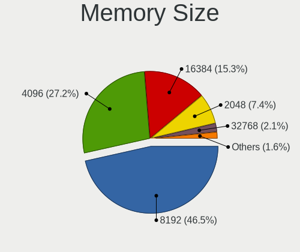

| Size  | Computers | Percent |
|-------|-----------|---------|
| 8192  | 1741      | 46.5%   |
| 4096  | 1018      | 27.19%  |
| 16384 | 571       | 15.25%  |
| 2048  | 276       | 7.37%   |
| 32768 | 78        | 2.08%   |
| 1024  | 50        | 1.34%   |
| 512   | 5         | 0.13%   |
| 12288 | 2         | 0.05%   |
| 3072  | 1         | 0.03%   |
| 1536  | 1         | 0.03%   |
| 256   | 1         | 0.03%   |

Memory Speed
------------

Memory module speed

| Speed   | Computers | Percent |
|---------|-----------|---------|
| 3200    | 920       | 24.93%  |
| 2667    | 845       | 22.9%   |
| 1600    | 576       | 15.61%  |
| 2400    | 288       | 7.8%    |
| 1333    | 135       | 3.66%   |
| 2133    | 123       | 3.33%   |
| 3266    | 86        | 2.33%   |
| 4800    | 73        | 1.98%   |
| 1334    | 73        | 1.98%   |
| 3600    | 66        | 1.79%   |
| Unknown | 51        | 1.38%   |
| 6400    | 48        | 1.3%    |
| 4267    | 46        | 1.25%   |
| 2666    | 38        | 1.03%   |
| 667     | 37        | 1%      |
| 1067    | 32        | 0.87%   |
| 4199    | 22        | 0.6%    |
| 3066    | 22        | 0.6%    |
| 3000    | 21        | 0.57%   |
| 800     | 20        | 0.54%   |
| 1867    | 18        | 0.49%   |
| 5600    | 16        | 0.43%   |
| 975     | 14        | 0.38%   |
| 7500    | 10        | 0.27%   |
| 6000    | 9         | 0.24%   |
| 1866    | 9         | 0.24%   |
| 4266    | 7         | 0.19%   |
| 3733    | 7         | 0.19%   |
| 2048    | 7         | 0.19%   |
| 1800    | 7         | 0.19%   |
| 4000    | 6         | 0.16%   |
| 8400    | 4         | 0.11%   |
| 5200    | 4         | 0.11%   |
| 3666    | 4         | 0.11%   |
| 3400    | 4         | 0.11%   |
| 1066    | 4         | 0.11%   |
| 533     | 4         | 0.11%   |
| 5500    | 3         | 0.08%   |
| 2800    | 3         | 0.08%   |
| 1648    | 3         | 0.08%   |

Printers & scanners
-------------------

Printer Vendor
--------------

Printer device vendors

| Vendor              | Computers | Percent |
|---------------------|-----------|---------|
| Hewlett-Packard     | 27        | 40.91%  |
| Seiko Epson         | 15        | 22.73%  |
| Canon               | 12        | 18.18%  |
| Brother Industries  | 7         | 10.61%  |
| Samsung Electronics | 2         | 3.03%   |
| STMicroelectronics  | 1         | 1.52%   |
| Ricoh               | 1         | 1.52%   |
| Konica Minolta      | 1         | 1.52%   |

Printer Model
-------------

Printer device models

| Model                                                                 | Computers | Percent |
|-----------------------------------------------------------------------|-----------|---------|
| HP LaserJet 1020                                                      | 8         | 12.12%  |
| HP Ink Tank 310 series                                                | 4         | 6.06%   |
| Canon PIXMA MG2500 Series                                             | 3         | 4.55%   |
| Canon LBP2900                                                         | 3         | 4.55%   |
| Seiko Epson ME OFFICE 620F Series/Stylus Office BX305F/BX305FW/TX320F | 2         | 3.03%   |
| Seiko Epson L382 Series                                               | 2         | 3.03%   |
| Seiko Epson L3150 Series                                              | 2         | 3.03%   |
| HP DeskJet 2130 series                                                | 2         | 3.03%   |
| HP Deskjet 1510                                                       | 2         | 3.03%   |
| HP DeskJet 1110 series                                                | 2         | 3.03%   |
| STMicroelectronics USB Printer Port                                   | 1         | 1.52%   |
| Seiko Epson USB2.0 Printer                                            | 1         | 1.52%   |
| Seiko Epson M100 Series                                               | 1         | 1.52%   |
| Seiko Epson L386 Series                                               | 1         | 1.52%   |
| Seiko Epson L360 Series                                               | 1         | 1.52%   |
| Seiko Epson L3210 Series                                              | 1         | 1.52%   |
| Seiko Epson L3200 Series                                              | 1         | 1.52%   |
| Seiko Epson L3110 Series                                              | 1         | 1.52%   |
| Seiko Epson ET-3750 Series                                            | 1         | 1.52%   |
| Seiko Epson EPSON L132 Series                                         | 1         | 1.52%   |
| Samsung Xerox Phaser 3117 Laser Printer                               | 1         | 1.52%   |
| Samsung ML-1640 Series Laser Printer                                  | 1         | 1.52%   |
| Ricoh SP 111SU                                                        | 1         | 1.52%   |
| Konica Minolta KONICA MINOLTA 206                                     | 1         | 1.52%   |
| HP Smart Tank 500 series                                              | 1         | 1.52%   |
| HP Printing Support                                                   | 1         | 1.52%   |
| HP LaserJet Professional P1606dn                                      | 1         | 1.52%   |
| HP LaserJet Professional P1566                                        | 1         | 1.52%   |
| HP LaserJet Pro M201dw                                                | 1         | 1.52%   |
| HP LaserJet P1102                                                     | 1         | 1.52%   |
| HP DeskJet 3630 series                                                | 1         | 1.52%   |
| HP DeskJet 2620 All-in-One Printer                                    | 1         | 1.52%   |
| HP DeskJet 2300 series                                                | 1         | 1.52%   |
| Canon PIXMA MP280                                                     | 1         | 1.52%   |
| Canon PIXMA MP190                                                     | 1         | 1.52%   |
| Canon MF4800 Series                                                   | 1         | 1.52%   |
| Canon MF240 Series UFRII LT                                           | 1         | 1.52%   |
| Canon LiDE 400                                                        | 1         | 1.52%   |
| Canon G2000 series                                                    | 1         | 1.52%   |
| Brother HL-L2320D series                                              | 1         | 1.52%   |

Scanner Vendor
--------------

Scanner device vendors

| Vendor          | Computers | Percent |
|-----------------|-----------|---------|
| Canon           | 8         | 80%     |
| Seiko Epson     | 1         | 10%     |
| Hewlett-Packard | 1         | 10%     |

Scanner Model
-------------

Scanner device models

| Model                                       | Computers | Percent |
|---------------------------------------------|-----------|---------|
| Canon CanoScan LiDE 110                     | 6         | 60%     |
| Canon CanoScan LiDE 120                     | 2         | 20%     |
| Seiko Epson GT-X820 [Perfection V600 Photo] | 1         | 10%     |
| HP ScanJet 2200c                            | 1         | 10%     |

Camera
------

Camera Vendor
-------------

Camera device vendors

| Vendor                                 | Computers | Percent |
|----------------------------------------|-----------|---------|
| Chicony Electronics                    | 796       | 17.92%  |
| IMC Networks                           | 637       | 14.34%  |
| Realtek Semiconductor                  | 423       | 9.52%   |
| Microdia                               | 421       | 9.48%   |
| Quanta                                 | 342       | 7.7%    |
| Sunplus Innovation Technology          | 246       | 5.54%   |
| Bison Electronics                      | 241       | 5.43%   |
| Cheng Uei Precision Industry (Foxlink) | 207       | 4.66%   |
| Syntek                                 | 167       | 3.76%   |
| Luxvisions Innotech Limited            | 148       | 3.33%   |
| Suyin                                  | 147       | 3.31%   |
| Logitech                               | 84        | 1.89%   |
| Sonix Technology                       | 80        | 1.8%    |
| Lite-On Technology                     | 80        | 1.8%    |
| Acer                                   | 56        | 1.26%   |
| Alcor Micro                            | 40        | 0.9%    |
| Apple                                  | 38        | 0.86%   |
| Samsung Electronics                    | 27        | 0.61%   |
| Silicon Motion                         | 23        | 0.52%   |
| Lenovo                                 | 19        | 0.43%   |
| ShineTech                              | 17        | 0.38%   |
| SunplusIT                              | 16        | 0.36%   |
| Ricoh                                  | 16        | 0.36%   |
| Importek                               | 13        | 0.29%   |
| Z-Star Microelectronics                | 11        | 0.25%   |
| Primax Electronics                     | 10        | 0.23%   |
| Unknown                                | 9         | 0.2%    |
| OmniVision Technologies                | 9         | 0.2%    |
| OPPO Electronics                       | 8         | 0.18%   |
| Microsoft                              | 7         | 0.16%   |
| Hewlett-Packard                        | 7         | 0.16%   |
| GEMBIRD                                | 7         | 0.16%   |
| Arkmicro Technologies                  | 7         | 0.16%   |
| MacroSilicon                           | 6         | 0.14%   |
| Intel                                  | 5         | 0.11%   |
| vivo                                   | 4         | 0.09%   |
| Pixart Imaging                         | 4         | 0.09%   |
| MSD                                    | 4         | 0.09%   |
| Cubeternet                             | 4         | 0.09%   |
| ARC International                      | 4         | 0.09%   |

Camera Model
------------

Camera device models

| Model                                                           | Computers | Percent |
|-----------------------------------------------------------------|-----------|---------|
| IMC Networks USB2.0 HD UVC WebCam                               | 238       | 5.34%   |
| Microdia Integrated_Webcam_HD                                   | 217       | 4.87%   |
| Chicony Integrated Camera                                       | 181       | 4.06%   |
| Realtek Integrated_Webcam_HD                                    | 172       | 3.86%   |
| IMC Networks Integrated Camera                                  | 172       | 3.86%   |
| Sunplus Integrated_Webcam_HD                                    | 112       | 2.51%   |
| Syntek Integrated Camera                                        | 104       | 2.33%   |
| IMC Networks USB2.0 VGA UVC WebCam                              | 96        | 2.15%   |
| Chicony HP TrueVision HD Camera                                 | 83        | 1.86%   |
| Bison Integrated Camera                                         | 78        | 1.75%   |
| Quanta HP TrueVision HD Camera                                  | 70        | 1.57%   |
| Chicony HP TrueVision HD                                        | 70        | 1.57%   |
| Realtek Integrated Webcam                                       | 67        | 1.5%    |
| Luxvisions Innotech Limited HP TrueVision HD Camera             | 57        | 1.28%   |
| Chicony EasyCamera                                              | 55        | 1.23%   |
| Sonix USB2.0 HD UVC WebCam                                      | 54        | 1.21%   |
| Quanta HD User Facing                                           | 54        | 1.21%   |
| Suyin HP TrueVision HD                                          | 53        | 1.19%   |
| Quanta HP Wide Vision HD Camera                                 | 52        | 1.17%   |
| Quanta ACER HD User Facing                                      | 50        | 1.12%   |
| Logitech Webcam C270                                            | 49        | 1.1%    |
| Luxvisions Innotech Limited HP Wide Vision HD Camera            | 45        | 1.01%   |
| Chicony HD User Facing                                          | 41        | 0.92%   |
| Cheng Uei Precision Industry (Foxlink) HP TrueVision HD Camera  | 41        | 0.92%   |
| Chicony HP Wide Vision HD Camera                                | 39        | 0.88%   |
| Chicony HD WebCam                                               | 39        | 0.88%   |
| Cheng Uei Precision Industry (Foxlink) HP Truevision HD         | 38        | 0.85%   |
| Syntek EasyCamera                                               | 37        | 0.83%   |
| Bison HD Webcam                                                 | 37        | 0.83%   |
| Bison EasyCamera                                                | 37        | 0.83%   |
| Lite-On Integrated Camera                                       | 35        | 0.79%   |
| IMC Networks HP TrueVision HD Camera                            | 35        | 0.79%   |
| Chicony HP HD Camera                                            | 34        | 0.76%   |
| Quanta HD Webcam                                                | 33        | 0.74%   |
| Microdia USB 2.0 Camera                                         | 33        | 0.74%   |
| Luxvisions Innotech Limited Integrated Camera                   | 32        | 0.72%   |
| Suyin Integrated_Webcam_HD                                      | 29        | 0.65%   |
| Sunplus XiaoMi USB 2.0 Webcam                                   | 29        | 0.65%   |
| Cheng Uei Precision Industry (Foxlink) HP Wide Vision HD Camera | 28        | 0.63%   |
| Samsung Galaxy series, misc. (MTP mode)                         | 27        | 0.61%   |

Security
--------

Fingerprint Vendor
------------------

Fingerprint sensor vendors

| Vendor                             | Computers | Percent |
|------------------------------------|-----------|---------|
| Validity Sensors                   | 230       | 28.64%  |
| Synaptics                          | 198       | 24.66%  |
| Shenzhen Goodix Technology         | 157       | 19.55%  |
| Elan Microelectronics              | 123       | 15.32%  |
| Realtek USB2.0 Finger Print Bridge | 34        | 4.23%   |
| LighTuning Technology              | 23        | 2.86%   |
| Upek                               | 13        | 1.62%   |
| AuthenTec                          | 13        | 1.62%   |
| Focal-systems.Corp                 | 6         | 0.75%   |
| STMicroelectronics                 | 2         | 0.25%   |
| HOLTEK                             | 2         | 0.25%   |
| Futronic Technology                | 1         | 0.12%   |
| DigitalPersona                     | 1         | 0.12%   |

Fingerprint Model
-----------------

Fingerprint sensor models

| Model                                                                      | Computers | Percent |
|----------------------------------------------------------------------------|-----------|---------|
| Shenzhen Goodix  FingerPrint Device                                        | 87        | 10.83%  |
| Elan ELAN:ARM-M4                                                           | 79        | 9.84%   |
| Shenzhen Goodix Fingerprint Reader                                         | 63        | 7.85%   |
| Validity Sensors VFS495 Fingerprint Reader                                 | 62        | 7.72%   |
| Elan ELAN:Fingerprint                                                      | 40        | 4.98%   |
| Realtek USB2.0 Finger Print Bridge FocalTech Fingerprint Device            | 34        | 4.23%   |
| Synaptics Metallica MIS Touch Fingerprint Reader                           | 32        | 3.99%   |
| Synaptics WBDI                                                             | 30        | 3.74%   |
| Validity Sensors VFS5011 Fingerprint Reader                                | 27        | 3.36%   |
| Synaptics Prometheus MIS Touch Fingerprint Reader                          | 26        | 3.24%   |
| Validity Sensors Synaptics VFS7552 Touch Fingerprint Sensor                | 25        | 3.11%   |
| Synaptics UWP WBDI                                                         | 24        | 2.99%   |
| LighTuning EgisTec Touch Fingerprint Sensor                                | 23        | 2.86%   |
| Synaptics  WBDI                                                            | 21        | 2.62%   |
| Synaptics Fingerprint scanner                                              | 18        | 2.24%   |
| Validity Sensors Synaptics WBDI                                            | 17        | 2.12%   |
| Synaptics Metallica MOH Touch Fingerprint Reader                           | 17        | 2.12%   |
| Validity Sensors Synaptics VFS7552 Touch Fingerprint Sensor with PurePrint | 16        | 1.99%   |
| Validity Sensors VFS491                                                    | 14        | 1.74%   |
| Validity Sensors VFS 5011 fingerprint sensor                               | 14        | 1.74%   |
| Validity Sensors VFS Fingerprint sensor                                    | 13        | 1.62%   |
| Upek Biometric Touchchip/Touchstrip Fingerprint Sensor                     | 12        | 1.49%   |
| Validity Sensors VFS7500 Touch Fingerprint Sensor                          | 9         | 1.12%   |
| Validity Sensors Fingerprint scanner                                       | 9         | 1.12%   |
| Synaptics FS7604 Touch Fingerprint Sensor with PurePrint                   | 9         | 1.12%   |
| Synaptics Fingerprint reader [HP G6]                                       | 8         | 1%      |
| Validity Sensors VFS471 Fingerprint Reader                                 | 7         | 0.87%   |
| Shenzhen Goodix FingerPrint                                                | 7         | 0.87%   |
| Validity Sensors VFS451 Fingerprint Reader                                 | 6         | 0.75%   |
| Validity Sensors Swipe Fingerprint Sensor                                  | 6         | 0.75%   |
| Focal-systems.Corp FT9201Fingerprint.                                  | 6         | 0.75%   |
| AuthenTec Fingerprint Sensor                                               | 5         | 0.62%   |
| Synaptics WBDI Fingerprint Reader USB 086                                  | 4         | 0.5%    |
| Elan fingerprint sensor [FeinTech FPS00200]                                | 3         | 0.37%   |
| AuthenTec AES1660 Fingerprint Sensor                                       | 3         | 0.37%   |
| Validity Sensors VFS301 Fingerprint Reader                                 | 2         | 0.25%   |
| Validity Sensors VFS101 Fingerprint Reader                                 | 2         | 0.25%   |
| Synaptics TouchPad                                                         | 2         | 0.25%   |
| Synaptics  FS7604 Touch Fingerprint Sensor with PurePrint                  | 2         | 0.25%   |
| Synaptics Prometheus Fingerprint Reader                                    | 2         | 0.25%   |

Chipcard Vendor
---------------

Chipcard module vendors

| Vendor                | Computers | Percent |
|-----------------------|-----------|---------|
| Broadcom              | 83        | 64.34%  |
| Alcor Micro           | 26        | 20.16%  |
| Upek                  | 9         | 6.98%   |
| O2 Micro              | 4         | 3.1%    |
| Lenovo                | 3         | 2.33%   |
| Yubico.com            | 2         | 1.55%   |
| Gemalto (was Gemplus) | 1         | 0.78%   |
| Clay Logic            | 1         | 0.78%   |

Chipcard Model
--------------

Chipcard module models

| Model                                                                        | Computers | Percent |
|------------------------------------------------------------------------------|-----------|---------|
| Alcor Micro AU9540 Smartcard Reader                                          | 26        | 20%     |
| Broadcom BCM5880 Secure Applications Processor                               | 25        | 19.23%  |
| Broadcom 5880                                                                | 24        | 18.46%  |
| Broadcom 58200                                                               | 20        | 15.38%  |
| Broadcom BCM5880 Secure Applications Processor with fingerprint swipe sensor | 15        | 11.54%  |
| Upek TouchChip Fingerprint Coprocessor (WBF advanced mode)                   | 9         | 6.92%   |
| O2 Micro OZ776 CCID Smartcard Reader                                         | 3         | 2.31%   |
| Lenovo Integrated Smart Card Reader                                          | 3         | 2.31%   |
| Yubico.com Yubikey 4/5 U2F+CCID                                              | 2         | 1.54%   |
| O2 Micro Oz776 SmartCard Reader                                              | 1         | 0.77%   |
| Gemalto (was Gemplus) Compact Smart Card Reader Writer                       | 1         | 0.77%   |
| Clay Logic Nitrokey HSM                                                      | 1         | 0.77%   |

Unsupported
-----------

Unsupported Devices
-------------------

Total unsupported devices on board

| Total | Computers | Percent |
|-------|-----------|---------|
| 0     | 4056      | 66.46%  |
| 1     | 1708      | 27.99%  |
| 2     | 271       | 4.44%   |
| 3     | 41        | 0.67%   |
| 4     | 14        | 0.23%   |
| 5     | 8         | 0.13%   |
| 6     | 3         | 0.05%   |
| 9     | 2         | 0.03%   |

Unsupported Device Types
------------------------

Types of unsupported devices

| Type                     | Computers | Percent |
|--------------------------|-----------|---------|
| Fingerprint reader       | 798       | 33.15%  |
| Graphics card            | 593       | 24.64%  |
| Net/wireless             | 350       | 14.54%  |
| Multimedia controller    | 146       | 6.07%   |
| Chipcard                 | 118       | 4.9%    |
| Bluetooth                | 106       | 4.4%    |
| Camera                   | 100       | 4.15%   |
| Communication controller | 72        | 2.99%   |
| Net/ethernet             | 30        | 1.25%   |
| Sound                    | 29        | 1.2%    |
| Unassigned class         | 18        | 0.75%   |
| Storage                  | 18        | 0.75%   |
| Network                  | 10        | 0.42%   |
| Modem                    | 7         | 0.29%   |
| Card reader              | 5         | 0.21%   |
| Storage/ide              | 2         | 0.08%   |
| Firewire controller      | 2         | 0.08%   |
| Storage/raid             | 1         | 0.04%   |
| Storage/nvme             | 1         | 0.04%   |
| Storage/ata              | 1         | 0.04%   |

