Linux in India - Tested Hardware & Statistics (Desktops)
--------------------------------------------------------

A project to collect tested hardware configurations for Linux in India.

Anyone can contribute to this report by the [hw-probe](https://github.com/linuxhw/hw-probe) tool:

    sudo -E hw-probe -all -upload

Please contribute! Especially if your hardware is rare.

Contents
--------

* [ Test Cases ](#test-cases)

* [ System ](#system)
  - [ OS                       ](#os)
  - [ OS Family                ](#os-family)
  - [ Kernel                   ](#kernel)
  - [ Kernel Family            ](#kernel-family)
  - [ Kernel Major Ver.        ](#kernel-major-ver)
  - [ Arch                     ](#arch)
  - [ DE                       ](#de)
  - [ Display Server           ](#display-server)
  - [ Display Manager          ](#display-manager)
  - [ OS Lang                  ](#os-lang)
  - [ Boot Mode                ](#boot-mode)
  - [ Filesystem               ](#filesystem)
  - [ Part. scheme             ](#part-scheme)
  - [ Dual Boot with Linux/BSD ](#dual-boot-with-linuxbsd)
  - [ Dual Boot (Win)          ](#dual-boot-win)

* [ Board ](#board)
  - [ Vendor                   ](#vendor)
  - [ Model                    ](#model)
  - [ Model Family             ](#model-family)
  - [ MFG Year                 ](#mfg-year)
  - [ Form Factor              ](#form-factor)
  - [ Secure Boot              ](#secure-boot)
  - [ Coreboot                 ](#coreboot)
  - [ RAM Size                 ](#ram-size)
  - [ RAM Used                 ](#ram-used)
  - [ Total Drives             ](#total-drives)
  - [ Has CD-ROM               ](#has-cd-rom)
  - [ Has Ethernet             ](#has-ethernet)
  - [ Has WiFi                 ](#has-wifi)
  - [ Has Bluetooth            ](#has-bluetooth)

* [ Location ](#location)
  - [ Country                  ](#country)
  - [ City                     ](#city)

* [ Drives ](#drives)
  - [ Drive Vendor             ](#drive-vendor)
  - [ Drive Model              ](#drive-model)
  - [ HDD Vendor               ](#hdd-vendor)
  - [ SSD Vendor               ](#ssd-vendor)
  - [ Drive Kind               ](#drive-kind)
  - [ Drive Connector          ](#drive-connector)
  - [ Drive Size               ](#drive-size)
  - [ Space Total              ](#space-total)
  - [ Space Used               ](#space-used)
  - [ Malfunc. Drives          ](#malfunc-drives)
  - [ Malfunc. Drive Vendor    ](#malfunc-drive-vendor)
  - [ Malfunc. HDD Vendor      ](#malfunc-hdd-vendor)
  - [ Malfunc. Drive Kind      ](#malfunc-drive-kind)
  - [ Failed Drives            ](#failed-drives)
  - [ Failed Drive Vendor      ](#failed-drive-vendor)
  - [ Drive Status             ](#drive-status)

* [ Storage controller ](#storage-controller)
  - [ Storage Vendor           ](#storage-vendor)
  - [ Storage Model            ](#storage-model)
  - [ Storage Kind             ](#storage-kind)

* [ Processor ](#processor)
  - [ CPU Vendor               ](#cpu-vendor)
  - [ CPU Model                ](#cpu-model)
  - [ CPU Model Family         ](#cpu-model-family)
  - [ CPU Cores                ](#cpu-cores)
  - [ CPU Sockets              ](#cpu-sockets)
  - [ CPU Threads              ](#cpu-threads)
  - [ CPU Op-Modes             ](#cpu-op-modes)
  - [ CPU Microcode            ](#cpu-microcode)
  - [ CPU Microarch            ](#cpu-microarch)

* [ Graphics ](#graphics)
  - [ GPU Vendor               ](#gpu-vendor)
  - [ GPU Model                ](#gpu-model)
  - [ GPU Combo                ](#gpu-combo)
  - [ GPU Driver               ](#gpu-driver)
  - [ GPU Memory               ](#gpu-memory)

* [ Monitor ](#monitor)
  - [ Monitor Vendor           ](#monitor-vendor)
  - [ Monitor Model            ](#monitor-model)
  - [ Monitor Resolution       ](#monitor-resolution)
  - [ Monitor Diagonal         ](#monitor-diagonal)
  - [ Monitor Width            ](#monitor-width)
  - [ Aspect Ratio             ](#aspect-ratio)
  - [ Monitor Area             ](#monitor-area)
  - [ Pixel Density            ](#pixel-density)
  - [ Multiple Monitors        ](#multiple-monitors)

* [ Network ](#network)
  - [ Net Controller Vendor    ](#net-controller-vendor)
  - [ Net Controller Model     ](#net-controller-model)
  - [ Wireless Vendor          ](#wireless-vendor)
  - [ Wireless Model           ](#wireless-model)
  - [ Ethernet Vendor          ](#ethernet-vendor)
  - [ Ethernet Model           ](#ethernet-model)
  - [ Net Controller Kind      ](#net-controller-kind)
  - [ Used Controller          ](#used-controller)
  - [ NICs                     ](#nics)
  - [ IPv6                     ](#ipv6)

* [ Bluetooth ](#bluetooth)
  - [ Bluetooth Vendor         ](#bluetooth-vendor)
  - [ Bluetooth Model          ](#bluetooth-model)

* [ Sound ](#sound)
  - [ Sound Vendor             ](#sound-vendor)
  - [ Sound Model              ](#sound-model)

* [ Memory ](#memory)
  - [ Memory Vendor            ](#memory-vendor)
  - [ Memory Model             ](#memory-model)
  - [ Memory Kind              ](#memory-kind)
  - [ Memory Form Factor       ](#memory-form-factor)
  - [ Memory Size              ](#memory-size)
  - [ Memory Speed             ](#memory-speed)

* [ Printers & scanners ](#printers--scanners)
  - [ Printer Vendor           ](#printer-vendor)
  - [ Printer Model            ](#printer-model)
  - [ Scanner Vendor           ](#scanner-vendor)
  - [ Scanner Model            ](#scanner-model)

* [ Camera ](#camera)
  - [ Camera Vendor            ](#camera-vendor)
  - [ Camera Model             ](#camera-model)

* [ Security ](#security)
  - [ Fingerprint Vendor       ](#fingerprint-vendor)
  - [ Fingerprint Model        ](#fingerprint-model)
  - [ Chipcard Vendor          ](#chipcard-vendor)
  - [ Chipcard Model           ](#chipcard-model)

* [ Unsupported ](#unsupported)
  - [ Unsupported Devices      ](#unsupported-devices)
  - [ Unsupported Device Types ](#unsupported-device-types)

Test Cases
----------

Total: 1228

| Vendor        | Model                       | Probe                                                      | Date         |
|---------------|-----------------------------|------------------------------------------------------------|--------------|
| ASRock        | J3455B-ITX                  | [b4419e8fce](https://linux-hardware.org/?probe=b4419e8fce) | Jan 22, 2023 |
| HP            | 2B00 A01                    | [467ef856dd](https://linux-hardware.org/?probe=467ef856dd) | Jan 21, 2023 |
| MSI           | X470 GAMING PLUS            | [441e45daa2](https://linux-hardware.org/?probe=441e45daa2) | Jan 21, 2023 |
| ASRock        | B550 Extreme4               | [329f1d0701](https://linux-hardware.org/?probe=329f1d0701) | Jan 21, 2023 |
| ASUSTek       | PRIME Z790M-PLUS D4         | [36e6df452d](https://linux-hardware.org/?probe=36e6df452d) | Jan 21, 2023 |
| MSI           | MAG B650 TOMAHAWK WIFI      | [ce99cb312d](https://linux-hardware.org/?probe=ce99cb312d) | Jan 20, 2023 |
| ASUSTek       | ROG STRIX B550-I GAMING     | [6b1a8f8d9d](https://linux-hardware.org/?probe=6b1a8f8d9d) | Jan 20, 2023 |
| Gigabyte      | H310M H                     | [30917eef19](https://linux-hardware.org/?probe=30917eef19) | Jan 15, 2023 |
| Gigabyte      | H310M H                     | [0ac9fa6100](https://linux-hardware.org/?probe=0ac9fa6100) | Jan 14, 2023 |
| Gigabyte      | 970A-DS3                    | [c6819f38a0](https://linux-hardware.org/?probe=c6819f38a0) | Jan 13, 2023 |
| Gigabyte      | H81M-S                      | [77fc83eb85](https://linux-hardware.org/?probe=77fc83eb85) | Jan 12, 2023 |
| Gigabyte      | H61MS                       | [4e7660a1e0](https://linux-hardware.org/?probe=4e7660a1e0) | Jan 10, 2023 |
| Gigabyte      | X570S UD                    | [7ac5117a93](https://linux-hardware.org/?probe=7ac5117a93) | Jan 09, 2023 |
| Acer          | H110D4-M1                   | [c652bb7179](https://linux-hardware.org/?probe=c652bb7179) | Jan 09, 2023 |
| Gigabyte      | GA-78LMT-USB3               | [d759bb7551](https://linux-hardware.org/?probe=d759bb7551) | Jan 08, 2023 |
| ASUSTek       | PRIME H410M-E               | [e8f5b2590f](https://linux-hardware.org/?probe=e8f5b2590f) | Jan 07, 2023 |
| Intel         | DH61WW AAG23116-302         | [702bf83225](https://linux-hardware.org/?probe=702bf83225) | Jan 06, 2023 |
| MSI           | H510M PRO-E                 | [762142dfbb](https://linux-hardware.org/?probe=762142dfbb) | Jan 06, 2023 |
| Lenovo        | SKYBAY NOK                  | [29970ac3f3](https://linux-hardware.org/?probe=29970ac3f3) | Jan 03, 2023 |
| ASUSTek       | Z170-DELUXE                 | [4a37b87ecf](https://linux-hardware.org/?probe=4a37b87ecf) | Jan 02, 2023 |
| Gigabyte      | H310M H                     | [8706565860](https://linux-hardware.org/?probe=8706565860) | Jan 02, 2023 |
| ASUSTek       | TUF Gaming B650-PLUS WIF... | [b1dc879a16](https://linux-hardware.org/?probe=b1dc879a16) | Jan 01, 2023 |
| Intel         | H61                         | [b294748570](https://linux-hardware.org/?probe=b294748570) | Dec 30, 2022 |
| Gigabyte      | H310M S2 x.x                | [9aba0ac647](https://linux-hardware.org/?probe=9aba0ac647) | Dec 30, 2022 |
| Intel         | H61                         | [39f3cddffb](https://linux-hardware.org/?probe=39f3cddffb) | Dec 29, 2022 |
| Unknown       | Unknown                     | [9d66e8f05d](https://linux-hardware.org/?probe=9d66e8f05d) | Dec 25, 2022 |
| Intel         | DH55PJ AAE93812-303         | [bf511c3913](https://linux-hardware.org/?probe=bf511c3913) | Dec 16, 2022 |
| ASUSTek       | Z170-DELUXE                 | [3a524796f6](https://linux-hardware.org/?probe=3a524796f6) | Dec 16, 2022 |
| Acer          | Veriton Series              | [1bd09d0c08](https://linux-hardware.org/?probe=1bd09d0c08) | Dec 15, 2022 |
| Lenovo        | 3140 NO DPK                 | [4a114b9cc1](https://linux-hardware.org/?probe=4a114b9cc1) | Dec 12, 2022 |
| Lenovo        | 3140 NO DPK                 | [d4abe79f4f](https://linux-hardware.org/?probe=d4abe79f4f) | Dec 12, 2022 |
| Dell          | 0MGK50 A01                  | [439311be3e](https://linux-hardware.org/?probe=439311be3e) | Dec 12, 2022 |
| Gigabyte      | AB350-Gaming 3-CF           | [8442e3381c](https://linux-hardware.org/?probe=8442e3381c) | Dec 06, 2022 |
| Dell          | 02YRK5 A02                  | [53689d832d](https://linux-hardware.org/?probe=53689d832d) | Dec 06, 2022 |
| Dell          | 02YRK5 A02                  | [b28f5fee52](https://linux-hardware.org/?probe=b28f5fee52) | Dec 02, 2022 |
| Gigabyte      | H81M-S                      | [bdb8b7f059](https://linux-hardware.org/?probe=bdb8b7f059) | Dec 02, 2022 |
| Gigabyte      | B75M-D3H                    | [39557e6703](https://linux-hardware.org/?probe=39557e6703) | Dec 02, 2022 |
| OEM           | H110 Ver:2.21               | [ad7fffd9e3](https://linux-hardware.org/?probe=ad7fffd9e3) | Nov 30, 2022 |
| OEM           | H110 Ver:2.21               | [2e7e420f42](https://linux-hardware.org/?probe=2e7e420f42) | Nov 29, 2022 |
| Gigabyte      | H81M-S                      | [fab21fa561](https://linux-hardware.org/?probe=fab21fa561) | Nov 28, 2022 |
| ASUSTek       | H81M-V3                     | [f6be8306c7](https://linux-hardware.org/?probe=f6be8306c7) | Nov 22, 2022 |
| HP            | 1998                        | [7290e58261](https://linux-hardware.org/?probe=7290e58261) | Nov 21, 2022 |
| Gigabyte      | H110M-S2-CF                 | [a5af222fa3](https://linux-hardware.org/?probe=a5af222fa3) | Nov 21, 2022 |
| Intel         | H61                         | [8b718d964b](https://linux-hardware.org/?probe=8b718d964b) | Nov 12, 2022 |
| MSI           | B450M PRO-VDH MAX           | [c73b422075](https://linux-hardware.org/?probe=c73b422075) | Nov 12, 2022 |
| Lenovo        | 314F NO DPK                 | [a069831b82](https://linux-hardware.org/?probe=a069831b82) | Nov 11, 2022 |
| HP            | 8717                        | [57479419c9](https://linux-hardware.org/?probe=57479419c9) | Nov 10, 2022 |
| Gigabyte      | B460M DS3H V2               | [bc5466e5ac](https://linux-hardware.org/?probe=bc5466e5ac) | Nov 08, 2022 |
| Dell          | 0200DY A02                  | [43db111de5](https://linux-hardware.org/?probe=43db111de5) | Nov 07, 2022 |
| Acer          | H81H3-M4                    | [40c67913d8](https://linux-hardware.org/?probe=40c67913d8) | Nov 06, 2022 |
| Lenovo        | MAHOBAY 0B98401 PRO         | [625b40327b](https://linux-hardware.org/?probe=625b40327b) | Nov 05, 2022 |
| HP            | 89B5 A                      | [1b04604c98](https://linux-hardware.org/?probe=1b04604c98) | Nov 03, 2022 |
| MSI           | A320M PRO-VD/S              | [920c4567d3](https://linux-hardware.org/?probe=920c4567d3) | Nov 03, 2022 |
| HP            | 8717                        | [00cbc9cd2a](https://linux-hardware.org/?probe=00cbc9cd2a) | Nov 03, 2022 |
| ASUSTek       | ROG STRIX B550-F GAMING     | [40a3de202d](https://linux-hardware.org/?probe=40a3de202d) | Nov 03, 2022 |
| Gigabyte      | H310M H                     | [115025ee59](https://linux-hardware.org/?probe=115025ee59) | Nov 01, 2022 |
| Gigabyte      | H310M H                     | [74af46599e](https://linux-hardware.org/?probe=74af46599e) | Nov 01, 2022 |
| Acer          | H410H6-M17 P21-A1           | [9333be5120](https://linux-hardware.org/?probe=9333be5120) | Nov 01, 2022 |
| MSI           | MAG B550 TOMAHAWK           | [24203a87c9](https://linux-hardware.org/?probe=24203a87c9) | Nov 01, 2022 |
| Unknown       | Unknown                     | [1b29e58b30](https://linux-hardware.org/?probe=1b29e58b30) | Oct 29, 2022 |
| ASUSTek       | PRIME B365M-C               | [ccf9650f9a](https://linux-hardware.org/?probe=ccf9650f9a) | Oct 29, 2022 |
| MSI           | B450M GAMING PLUS           | [b31400d1d1](https://linux-hardware.org/?probe=b31400d1d1) | Oct 27, 2022 |
| Gigabyte      | H97N-WIFI                   | [aa2345213b](https://linux-hardware.org/?probe=aa2345213b) | Oct 27, 2022 |
| Intel         | D945GCNL AAD97184-102       | [a057daae25](https://linux-hardware.org/?probe=a057daae25) | Oct 26, 2022 |
| Lenovo        | MAHOBAY NOK                 | [91437ee9a7](https://linux-hardware.org/?probe=91437ee9a7) | Oct 25, 2022 |
| Gigabyte      | G31M-S2L                    | [0c7ba9c00c](https://linux-hardware.org/?probe=0c7ba9c00c) | Oct 23, 2022 |
| Gigabyte      | G31M-S2L                    | [8a9c9435e3](https://linux-hardware.org/?probe=8a9c9435e3) | Oct 22, 2022 |
| MSI           | MPG Z390 GAMING PLUS        | [d2fa2b9b63](https://linux-hardware.org/?probe=d2fa2b9b63) | Oct 20, 2022 |
| HP            | 2B1E                        | [1a79dbe66a](https://linux-hardware.org/?probe=1a79dbe66a) | Oct 20, 2022 |
| Dell          | 0K83V0 A00                  | [dde4cfd592](https://linux-hardware.org/?probe=dde4cfd592) | Oct 20, 2022 |
| Intel         | DH61BF AAG81311-101         | [770d8bf876](https://linux-hardware.org/?probe=770d8bf876) | Oct 19, 2022 |
| Gigabyte      | B450M DS3H-CF               | [36c0e4dd87](https://linux-hardware.org/?probe=36c0e4dd87) | Oct 18, 2022 |
| Gigabyte      | B250M-D3H-CF                | [5d3a1ab999](https://linux-hardware.org/?probe=5d3a1ab999) | Oct 17, 2022 |
| MSI           | A68HM-E33 V2                | [ff59edf4e0](https://linux-hardware.org/?probe=ff59edf4e0) | Oct 16, 2022 |
| ASRock        | H61M-DGS                    | [732979f5a2](https://linux-hardware.org/?probe=732979f5a2) | Oct 16, 2022 |
| ASRock        | H61M-DGS                    | [bc42f70bc3](https://linux-hardware.org/?probe=bc42f70bc3) | Oct 16, 2022 |
| Acer          | H110D4-M1                   | [d4972bc5f9](https://linux-hardware.org/?probe=d4972bc5f9) | Oct 15, 2022 |
| Lenovo        | 3740 NOK                    | [fbda7a369f](https://linux-hardware.org/?probe=fbda7a369f) | Oct 14, 2022 |
| Dell          | 0VG93V A00                  | [e0c7462fba](https://linux-hardware.org/?probe=e0c7462fba) | Oct 14, 2022 |
| ASUSTek       | PRIME X570-PRO              | [83a49e76b9](https://linux-hardware.org/?probe=83a49e76b9) | Oct 06, 2022 |
| Gigabyte      | H310M S2 x.x                | [5a77d6df0b](https://linux-hardware.org/?probe=5a77d6df0b) | Oct 02, 2022 |
| MSI           | B350M PRO-VDH               | [1a0d8b695d](https://linux-hardware.org/?probe=1a0d8b695d) | Oct 01, 2022 |
| Lenovo        | 3098 NOK                    | [a46521af41](https://linux-hardware.org/?probe=a46521af41) | Oct 01, 2022 |
| ASUSTek       | TUF Gaming B560M-PLUS WI... | [a686f595ee](https://linux-hardware.org/?probe=a686f595ee) | Sep 29, 2022 |
| MSI           | B450M GAMING PLUS           | [265d059992](https://linux-hardware.org/?probe=265d059992) | Sep 27, 2022 |
| ASUSTek       | ROG STRIX B550-I GAMING     | [0546e47f90](https://linux-hardware.org/?probe=0546e47f90) | Sep 25, 2022 |
| ASUSTek       | PRIME X570-P                | [5f1b4b1679](https://linux-hardware.org/?probe=5f1b4b1679) | Sep 23, 2022 |
| Gigabyte      | A320M-S2H V2-CF             | [71766e04c0](https://linux-hardware.org/?probe=71766e04c0) | Sep 23, 2022 |
| HP            | 1998                        | [f8399e0d3a](https://linux-hardware.org/?probe=f8399e0d3a) | Sep 22, 2022 |
| MSI           | MAG B550 TOMAHAWK           | [3fd067abd9](https://linux-hardware.org/?probe=3fd067abd9) | Sep 21, 2022 |
| ASUSTek       | ROG STRIX B550-F GAMING ... | [c0cc0dc101](https://linux-hardware.org/?probe=c0cc0dc101) | Sep 21, 2022 |
| Gigabyte      | H310M H                     | [1ec0fcefa2](https://linux-hardware.org/?probe=1ec0fcefa2) | Sep 21, 2022 |
| Gigabyte      | GA-78LMT-S2                 | [5175ba7e7c](https://linux-hardware.org/?probe=5175ba7e7c) | Sep 20, 2022 |
| MSI           | H410M-A PRO                 | [76c03610be](https://linux-hardware.org/?probe=76c03610be) | Sep 20, 2022 |
| Intel         | DH61BF AAG81311-101         | [43c2f57807](https://linux-hardware.org/?probe=43c2f57807) | Sep 19, 2022 |
| Acer          | A75F2-M2 P21-A1             | [2d00ba463b](https://linux-hardware.org/?probe=2d00ba463b) | Sep 18, 2022 |
| Lenovo        | ThinkCentre M58e 7298A76    | [4775ccd67f](https://linux-hardware.org/?probe=4775ccd67f) | Sep 18, 2022 |
| ASUSTek       | ROG STRIX B550-I GAMING     | [3b06edf9e6](https://linux-hardware.org/?probe=3b06edf9e6) | Sep 18, 2022 |
| MiTAC         | Cedar Trail                 | [75dc595c8f](https://linux-hardware.org/?probe=75dc595c8f) | Sep 17, 2022 |
| MiTAC         | Cedar Trail                 | [c5bd90dad6](https://linux-hardware.org/?probe=c5bd90dad6) | Sep 17, 2022 |
| HP            | 339A                        | [78e4f67b19](https://linux-hardware.org/?probe=78e4f67b19) | Sep 14, 2022 |
| MSI           | MPG Z390 GAMING PLUS        | [9a3cc70094](https://linux-hardware.org/?probe=9a3cc70094) | Sep 13, 2022 |
| Gigabyte      | H61MS                       | [9b10176111](https://linux-hardware.org/?probe=9b10176111) | Sep 12, 2022 |
| Gigabyte      | G41MT-S2                    | [1441e1783d](https://linux-hardware.org/?probe=1441e1783d) | Sep 06, 2022 |
| MSI           | 760GM-P21                   | [c3eb52f6ab](https://linux-hardware.org/?probe=c3eb52f6ab) | Sep 06, 2022 |
| Gigabyte      | H81M-WW                     | [2a56f256a3](https://linux-hardware.org/?probe=2a56f256a3) | Sep 01, 2022 |
| Gigabyte      | H110M-S2-CF                 | [6f3bb6200f](https://linux-hardware.org/?probe=6f3bb6200f) | Aug 31, 2022 |
| WIPRO         | G31T-M                      | [51cea718eb](https://linux-hardware.org/?probe=51cea718eb) | Aug 28, 2022 |
| Dell          | OptiPlex 3020M              | [84f424cfb7](https://linux-hardware.org/?probe=84f424cfb7) | Aug 28, 2022 |
| Gigabyte      | H61MS                       | [8ccf243309](https://linux-hardware.org/?probe=8ccf243309) | Aug 27, 2022 |
| Gigabyte      | H61MS                       | [24164369fd](https://linux-hardware.org/?probe=24164369fd) | Aug 27, 2022 |
| Gigabyte      | H81M-S                      | [0b1e1d125d](https://linux-hardware.org/?probe=0b1e1d125d) | Aug 23, 2022 |
| MSI           | H310M PRO-VH PLUS           | [b177563e19](https://linux-hardware.org/?probe=b177563e19) | Aug 23, 2022 |
| ASRock        | G41M-VS3                    | [97772a7cb6](https://linux-hardware.org/?probe=97772a7cb6) | Aug 23, 2022 |
| Gigabyte      | H410M S2 V2                 | [cb43b7a4cf](https://linux-hardware.org/?probe=cb43b7a4cf) | Aug 22, 2022 |
| Intel         | H61                         | [f2a42b45ca](https://linux-hardware.org/?probe=f2a42b45ca) | Aug 22, 2022 |
| OEM           | Intel H81                   | [5e354c60d1](https://linux-hardware.org/?probe=5e354c60d1) | Aug 20, 2022 |
| HP            | 81C5 MVB                    | [86a0520dc6](https://linux-hardware.org/?probe=86a0520dc6) | Aug 20, 2022 |
| ASUSTek       | PRIME B365M-C               | [8ae386a7a0](https://linux-hardware.org/?probe=8ae386a7a0) | Aug 20, 2022 |
| ASUSTek       | H110M-CS                    | [df6dff3fa3](https://linux-hardware.org/?probe=df6dff3fa3) | Aug 19, 2022 |
| Gigabyte      | H410M S2 V2                 | [944a99ea66](https://linux-hardware.org/?probe=944a99ea66) | Aug 17, 2022 |
| MSI           | H110M PRO-VH PLUS           | [e6e4efd93a](https://linux-hardware.org/?probe=e6e4efd93a) | Aug 17, 2022 |
| Gigabyte      | H110M-S2-CF                 | [265b666497](https://linux-hardware.org/?probe=265b666497) | Aug 14, 2022 |
| ASRock        | B450M Steel Legend          | [a24161deaa](https://linux-hardware.org/?probe=a24161deaa) | Aug 10, 2022 |
| Unknown       | Unknown                     | [e4c7906333](https://linux-hardware.org/?probe=e4c7906333) | Aug 09, 2022 |
| ASUSTek       | H110M-CS                    | [98c601bb55](https://linux-hardware.org/?probe=98c601bb55) | Aug 08, 2022 |
| Unknown       | Unknown                     | [49c2378f28](https://linux-hardware.org/?probe=49c2378f28) | Aug 08, 2022 |
| ASUSTek       | H110M-CS                    | [01e4feaac6](https://linux-hardware.org/?probe=01e4feaac6) | Aug 07, 2022 |
| ASUSTek       | D340MC-C                    | [69ddbb7acd](https://linux-hardware.org/?probe=69ddbb7acd) | Aug 05, 2022 |
| ASUSTek       | D340MC-C                    | [a87fc1ec66](https://linux-hardware.org/?probe=a87fc1ec66) | Aug 05, 2022 |
| Gigabyte      | B360M GAMING HD             | [95e1eb0fcb](https://linux-hardware.org/?probe=95e1eb0fcb) | Aug 03, 2022 |
| LORD ELECT... | GM965 Series                | [b60dce21e7](https://linux-hardware.org/?probe=b60dce21e7) | Aug 03, 2022 |
| ASUSTek       | P7H55-M LX                  | [ad8af5c718](https://linux-hardware.org/?probe=ad8af5c718) | Aug 02, 2022 |
| ASUSTek       | P7H55-M LX                  | [b4e172e88b](https://linux-hardware.org/?probe=b4e172e88b) | Aug 02, 2022 |
| Intel         | DH55TC AAE70932-303         | [f275229d83](https://linux-hardware.org/?probe=f275229d83) | Jul 31, 2022 |
| HP            | 86E9 A                      | [6634eaee32](https://linux-hardware.org/?probe=6634eaee32) | Jul 27, 2022 |
| Unknown       | Unknown                     | [89398a36b1](https://linux-hardware.org/?probe=89398a36b1) | Jul 27, 2022 |
| MSI           | B450M PRO-VDH MAX           | [9002ca2e54](https://linux-hardware.org/?probe=9002ca2e54) | Jul 23, 2022 |
| HP            | 3397                        | [017afa048c](https://linux-hardware.org/?probe=017afa048c) | Jul 20, 2022 |
| ASUSTek       | PRIME H410M-E               | [db7cb6f32b](https://linux-hardware.org/?probe=db7cb6f32b) | Jul 18, 2022 |
| Lenovo        | MAHOBAY                     | [c1c146a0f9](https://linux-hardware.org/?probe=c1c146a0f9) | Jul 18, 2022 |
| Dell          | 0Y2YM6 A00                  | [8b5480a55e](https://linux-hardware.org/?probe=8b5480a55e) | Jul 16, 2022 |
| Gigabyte      | H310M S2 x.x                | [a55538b651](https://linux-hardware.org/?probe=a55538b651) | Jul 14, 2022 |
| MSI           | H310M PRO-VDH PLUS          | [aba10c973c](https://linux-hardware.org/?probe=aba10c973c) | Jul 11, 2022 |
| Gigabyte      | F2A55M-DS2                  | [46e84f6c32](https://linux-hardware.org/?probe=46e84f6c32) | Jul 10, 2022 |
| Intel         | DH61WW AAG23116-301         | [3b4120b3af](https://linux-hardware.org/?probe=3b4120b3af) | Jul 09, 2022 |
| Intel         | H81                         | [e1a730a6e6](https://linux-hardware.org/?probe=e1a730a6e6) | Jul 08, 2022 |
| Dell          | 0HD5W2 A01                  | [f9d01cacbb](https://linux-hardware.org/?probe=f9d01cacbb) | Jul 07, 2022 |
| HP            | 3397                        | [5f251b624d](https://linux-hardware.org/?probe=5f251b624d) | Jul 07, 2022 |
| Unknown       | Unknown                     | [16c6df7b29](https://linux-hardware.org/?probe=16c6df7b29) | Jul 07, 2022 |
| Unknown       | Unknown                     | [6b25430dc1](https://linux-hardware.org/?probe=6b25430dc1) | Jul 07, 2022 |
| Gigabyte      | B660M AORUS PRO AX DDR4     | [342362a5f8](https://linux-hardware.org/?probe=342362a5f8) | Jul 06, 2022 |
| Gigabyte      | B660M AORUS PRO AX DDR4     | [21f58df6b0](https://linux-hardware.org/?probe=21f58df6b0) | Jul 06, 2022 |
| OEM           | G41 775 ICH7 8712           | [4f82c838cb](https://linux-hardware.org/?probe=4f82c838cb) | Jul 04, 2022 |
| MSI           | B365M PRO-VDH               | [8ce7059868](https://linux-hardware.org/?probe=8ce7059868) | Jul 03, 2022 |
| Gigabyte      | H81M-S                      | [4a6acd9191](https://linux-hardware.org/?probe=4a6acd9191) | Jul 02, 2022 |
| Gigabyte      | GB-BSi5-1135G7              | [4701b81ce2](https://linux-hardware.org/?probe=4701b81ce2) | Jun 30, 2022 |
| MSI           | A320M PRO-VD/S V2           | [fc5a5d812c](https://linux-hardware.org/?probe=fc5a5d812c) | Jun 29, 2022 |
| Acer          | H81-M1                      | [9ddfb2ec8d](https://linux-hardware.org/?probe=9ddfb2ec8d) | Jun 28, 2022 |
| ASUSTek       | ProArt Z690-CREATOR WIFI    | [dc3e219327](https://linux-hardware.org/?probe=dc3e219327) | Jun 28, 2022 |
| Unknown       | Unknown                     | [bd912e1acc](https://linux-hardware.org/?probe=bd912e1acc) | Jun 27, 2022 |
| Intel         | DH61WW AAG23116-302         | [7e1e1cf659](https://linux-hardware.org/?probe=7e1e1cf659) | Jun 27, 2022 |
| Acer          | H110H4-M14 P21-A2E          | [f3c553d3f0](https://linux-hardware.org/?probe=f3c553d3f0) | Jun 22, 2022 |
| Gigabyte      | H61M-S2P                    | [ac99674975](https://linux-hardware.org/?probe=ac99674975) | Jun 22, 2022 |
| Acer          | H110H4-M14 P21-A2E          | [17e46ecec3](https://linux-hardware.org/?probe=17e46ecec3) | Jun 22, 2022 |
| ASUSTek       | ProArt Z690-CREATOR WIFI    | [f25ac785b7](https://linux-hardware.org/?probe=f25ac785b7) | Jun 22, 2022 |
| Gigabyte      | H410M S2 V3                 | [79ac3d3f38](https://linux-hardware.org/?probe=79ac3d3f38) | Jun 21, 2022 |
| OEM           | G41 775 ICH7 8712           | [31cdb7f2fc](https://linux-hardware.org/?probe=31cdb7f2fc) | Jun 17, 2022 |
| Unknown       | G41 Series                  | [d257436f52](https://linux-hardware.org/?probe=d257436f52) | Jun 17, 2022 |
| ITI LIMITE... | SMAASH XU3i                 | [549a55efdf](https://linux-hardware.org/?probe=549a55efdf) | Jun 16, 2022 |
| ITI LIMITE... | SMAASH XU3i                 | [693d81e1a3](https://linux-hardware.org/?probe=693d81e1a3) | Jun 16, 2022 |
| Gigabyte      | B450M DS3H-CF               | [2b307211cd](https://linux-hardware.org/?probe=2b307211cd) | Jun 14, 2022 |
| Gigabyte      | A320M-S2H-CF                | [0ca08532ce](https://linux-hardware.org/?probe=0ca08532ce) | Jun 14, 2022 |
| Gigabyte      | B550M AORUS PRO-P           | [ab0ad88b31](https://linux-hardware.org/?probe=ab0ad88b31) | Jun 10, 2022 |
| Dell          | 0XFWHV A00                  | [4102e98034](https://linux-hardware.org/?probe=4102e98034) | Jun 09, 2022 |
| Biostar       | H61MLV3                     | [dd47d4aac6](https://linux-hardware.org/?probe=dd47d4aac6) | Jun 08, 2022 |
| Biostar       | H61MLV3                     | [906bb764d6](https://linux-hardware.org/?probe=906bb764d6) | Jun 08, 2022 |
| Unknown       | Unknown                     | [b27a6ef652](https://linux-hardware.org/?probe=b27a6ef652) | Jun 08, 2022 |
| Unknown       | X31_ICH7                    | [f8ab18b666](https://linux-hardware.org/?probe=f8ab18b666) | Jun 07, 2022 |
| Intel         | H61                         | [8178c4da07](https://linux-hardware.org/?probe=8178c4da07) | Jun 06, 2022 |
| HP            | 8648                        | [155bf69660](https://linux-hardware.org/?probe=155bf69660) | Jun 05, 2022 |
| Gigabyte      | B365M GAMING HD             | [5b8924befc](https://linux-hardware.org/?probe=5b8924befc) | May 31, 2022 |
| MSI           | B450M GAMING PLUS           | [db537b41f4](https://linux-hardware.org/?probe=db537b41f4) | May 31, 2022 |
| ASUSTek       | ProArt Z690-CREATOR WIFI    | [f3a24fbc49](https://linux-hardware.org/?probe=f3a24fbc49) | May 30, 2022 |
| Dell          | 0NKW6Y A00                  | [778ccadd42](https://linux-hardware.org/?probe=778ccadd42) | May 27, 2022 |
| Unknown       | G41 Series                  | [e9a273726a](https://linux-hardware.org/?probe=e9a273726a) | May 26, 2022 |
| MSI           | PRO Z690-A DDR4             | [38ac6de56d](https://linux-hardware.org/?probe=38ac6de56d) | May 25, 2022 |
| Unknown       | G41 Series                  | [f0890bb556](https://linux-hardware.org/?probe=f0890bb556) | May 24, 2022 |
| INP           | i1000BTS                    | [95da2ada33](https://linux-hardware.org/?probe=95da2ada33) | May 24, 2022 |
| ASUSTek       | PRIME Z690-P D4             | [01e2d063e8](https://linux-hardware.org/?probe=01e2d063e8) | May 21, 2022 |
| ASUSTek       | PRIME Z690-P D4             | [f3986d7e7d](https://linux-hardware.org/?probe=f3986d7e7d) | May 21, 2022 |
| Gigabyte      | B660M DS3H AX DDR4          | [d5e0667318](https://linux-hardware.org/?probe=d5e0667318) | May 20, 2022 |
| Unknown       | G41 Series                  | [94dcbec5e7](https://linux-hardware.org/?probe=94dcbec5e7) | May 20, 2022 |
| Gigabyte      | X470 AORUS ULTRA GAMING-... | [d831b6cb22](https://linux-hardware.org/?probe=d831b6cb22) | May 17, 2022 |
| Gigabyte      | H110M-S2-CF                 | [a2fa413622](https://linux-hardware.org/?probe=a2fa413622) | May 15, 2022 |
| MSI           | B350M MORTAR                | [459e7e3586](https://linux-hardware.org/?probe=459e7e3586) | May 15, 2022 |
| Gigabyte      | H110M-S2-CF                 | [156de9d4de](https://linux-hardware.org/?probe=156de9d4de) | May 04, 2022 |
| Gigabyte      | G31M-ES2L                   | [bf9f724f45](https://linux-hardware.org/?probe=bf9f724f45) | May 04, 2022 |
| Gigabyte      | G31M-ES2L                   | [05585fedf4](https://linux-hardware.org/?probe=05585fedf4) | May 04, 2022 |
| Maxtone       | HIS-G41L V1.1               | [ce61ffd777](https://linux-hardware.org/?probe=ce61ffd777) | May 02, 2022 |
| Maxtone       | HIS-G41L V1.1               | [63fc1199bc](https://linux-hardware.org/?probe=63fc1199bc) | May 01, 2022 |
| ASUSTek       | ROG STRIX X470-F GAMING     | [809ea3e76a](https://linux-hardware.org/?probe=809ea3e76a) | Apr 29, 2022 |
| Gigabyte      | H310M H                     | [182e82d90e](https://linux-hardware.org/?probe=182e82d90e) | Apr 28, 2022 |
| Biostar       | J3160NH                     | [8ffd3a1aa4](https://linux-hardware.org/?probe=8ffd3a1aa4) | Apr 26, 2022 |
| MSI           | Z68A-GD80                   | [fedca9082a](https://linux-hardware.org/?probe=fedca9082a) | Apr 25, 2022 |
| Intel         | DH61SA AAG38870-201         | [d8868878ca](https://linux-hardware.org/?probe=d8868878ca) | Apr 22, 2022 |
| ECS           | H61H2-MV                    | [939f87564f](https://linux-hardware.org/?probe=939f87564f) | Apr 21, 2022 |
| Unknown       | G41 Series                  | [c6040e6638](https://linux-hardware.org/?probe=c6040e6638) | Apr 21, 2022 |
| MSI           | B550M PRO-VDH WIFI          | [4ec65c693a](https://linux-hardware.org/?probe=4ec65c693a) | Apr 19, 2022 |
| Gigabyte      | A320M-H-CF                  | [6247b19a2f](https://linux-hardware.org/?probe=6247b19a2f) | Apr 18, 2022 |
| Gigabyte      | H110M-H-CF                  | [66ef9c9e5f](https://linux-hardware.org/?probe=66ef9c9e5f) | Apr 16, 2022 |
| Gigabyte      | H61MS                       | [84e8094305](https://linux-hardware.org/?probe=84e8094305) | Apr 14, 2022 |
| ECS           | H81H3-I                     | [1bf6cc284c](https://linux-hardware.org/?probe=1bf6cc284c) | Apr 13, 2022 |
| Intel         | DH61SA AAG38870-201         | [516d1a3e43](https://linux-hardware.org/?probe=516d1a3e43) | Apr 08, 2022 |
| ASUSTek       | TUF Gaming B560-PLUS WIF... | [21bef916af](https://linux-hardware.org/?probe=21bef916af) | Apr 08, 2022 |
| Gigabyte      | H310M H                     | [e392bf72e9](https://linux-hardware.org/?probe=e392bf72e9) | Apr 07, 2022 |
| Gigabyte      | H410M H V3                  | [5b5118db5d](https://linux-hardware.org/?probe=5b5118db5d) | Apr 06, 2022 |
| Gigabyte      | F2A68HM-H                   | [bd5be9b918](https://linux-hardware.org/?probe=bd5be9b918) | Apr 04, 2022 |
| Intel         | H61                         | [47b28b972b](https://linux-hardware.org/?probe=47b28b972b) | Apr 01, 2022 |
| Dell          | 09M8Y8 A01                  | [d2e5eda16f](https://linux-hardware.org/?probe=d2e5eda16f) | Apr 01, 2022 |
| Gigabyte      | H110M-S2-CF                 | [a4d2271eaa](https://linux-hardware.org/?probe=a4d2271eaa) | Mar 31, 2022 |
| Dell          | 0Y2YM6 A01                  | [4578be5a1e](https://linux-hardware.org/?probe=4578be5a1e) | Mar 30, 2022 |
| HP            | 18E7                        | [5dc3eea8b5](https://linux-hardware.org/?probe=5dc3eea8b5) | Mar 28, 2022 |
| Unknown       | G41 Series                  | [4dbde5e06f](https://linux-hardware.org/?probe=4dbde5e06f) | Mar 28, 2022 |
| HP            | 18E7                        | [d8d1c3d468](https://linux-hardware.org/?probe=d8d1c3d468) | Mar 26, 2022 |
| MSI           | B450M PRO-VDH MAX           | [a6718f483b](https://linux-hardware.org/?probe=a6718f483b) | Mar 22, 2022 |
| ASUSTek       | ROG STRIX B450-F GAMING ... | [71dc914b7b](https://linux-hardware.org/?probe=71dc914b7b) | Mar 14, 2022 |
| ASUSTek       | ROG STRIX B450-F GAMING ... | [3af6b6632d](https://linux-hardware.org/?probe=3af6b6632d) | Mar 14, 2022 |
| Intel         | G31                         | [02eaa5ef51](https://linux-hardware.org/?probe=02eaa5ef51) | Mar 14, 2022 |
| Intel         | DH61WW AAG23116-302         | [20682db2fa](https://linux-hardware.org/?probe=20682db2fa) | Mar 14, 2022 |
| Gigabyte      | H310M H x.x                 | [0a16c273a4](https://linux-hardware.org/?probe=0a16c273a4) | Mar 13, 2022 |
| Gigabyte      | GA-78LMT-S2                 | [218c306874](https://linux-hardware.org/?probe=218c306874) | Mar 13, 2022 |
| Gigabyte      | GA-78LMT-S2                 | [f7fe5893d5](https://linux-hardware.org/?probe=f7fe5893d5) | Mar 13, 2022 |
| Intel         | H61                         | [8efa81cf12](https://linux-hardware.org/?probe=8efa81cf12) | Mar 12, 2022 |
| ASRock        | H61M-S1 PLUS                | [56c15fcbf6](https://linux-hardware.org/?probe=56c15fcbf6) | Mar 12, 2022 |
| Gigabyte      | B660M AORUS PRO AX DDR4     | [508f6f6c0c](https://linux-hardware.org/?probe=508f6f6c0c) | Mar 11, 2022 |
| Gigabyte      | B660M AORUS PRO AX DDR4     | [59405132c9](https://linux-hardware.org/?probe=59405132c9) | Mar 11, 2022 |
| Gigabyte      | H410M H V3                  | [41088e9fa5](https://linux-hardware.org/?probe=41088e9fa5) | Mar 11, 2022 |
| Gigabyte      | H410M H V3                  | [2669052d03](https://linux-hardware.org/?probe=2669052d03) | Mar 11, 2022 |
| Gigabyte      | H410M H V3                  | [04495b10d4](https://linux-hardware.org/?probe=04495b10d4) | Mar 11, 2022 |
| Gigabyte      | H410M H V3                  | [e8d1f7870b](https://linux-hardware.org/?probe=e8d1f7870b) | Mar 11, 2022 |
| Gigabyte      | H410M H V3                  | [cd44006f68](https://linux-hardware.org/?probe=cd44006f68) | Mar 11, 2022 |
| Gigabyte      | H410M H V3                  | [a0206ab2c4](https://linux-hardware.org/?probe=a0206ab2c4) | Mar 11, 2022 |
| Gigabyte      | H410M H V3                  | [2d8b8572f9](https://linux-hardware.org/?probe=2d8b8572f9) | Mar 11, 2022 |
| Gigabyte      | H410M H V3                  | [77f1ffb185](https://linux-hardware.org/?probe=77f1ffb185) | Mar 11, 2022 |
| Gigabyte      | H410M H V3                  | [03e601d730](https://linux-hardware.org/?probe=03e601d730) | Mar 11, 2022 |
| Gigabyte      | H410M H V3                  | [fae4aba20f](https://linux-hardware.org/?probe=fae4aba20f) | Mar 11, 2022 |
| Gigabyte      | H410M H V3                  | [19106d39f2](https://linux-hardware.org/?probe=19106d39f2) | Mar 11, 2022 |
| Gigabyte      | H410M H V3                  | [953465453c](https://linux-hardware.org/?probe=953465453c) | Mar 11, 2022 |
| Gigabyte      | H410M H V3                  | [d2bb880660](https://linux-hardware.org/?probe=d2bb880660) | Mar 11, 2022 |
| Gigabyte      | H410M H V3                  | [da0ed74962](https://linux-hardware.org/?probe=da0ed74962) | Mar 11, 2022 |
| ASRock        | A320M-HDV R4.0              | [145e63a7a5](https://linux-hardware.org/?probe=145e63a7a5) | Mar 09, 2022 |
| Dell          | 0HMX8D A01                  | [cfff92df80](https://linux-hardware.org/?probe=cfff92df80) | Mar 09, 2022 |
| ASUSTek       | PRIME H310M-E R2.0          | [ea074742d5](https://linux-hardware.org/?probe=ea074742d5) | Mar 08, 2022 |
| Gigabyte      | H310M H                     | [bd17b4c7fd](https://linux-hardware.org/?probe=bd17b4c7fd) | Mar 07, 2022 |
| ASRock        | H310M-HDV                   | [5be286e220](https://linux-hardware.org/?probe=5be286e220) | Mar 07, 2022 |
| Gigabyte      | A320M-S2H-CF                | [69b7c755dc](https://linux-hardware.org/?probe=69b7c755dc) | Mar 05, 2022 |
| Gigabyte      | B150M-D3H-CF                | [479a3a52de](https://linux-hardware.org/?probe=479a3a52de) | Mar 03, 2022 |
| Intel         | DG41CN AAE82429-102         | [0e75969d4d](https://linux-hardware.org/?probe=0e75969d4d) | Mar 03, 2022 |
| Intel         | DG41CN AAE82429-102         | [a4145828e3](https://linux-hardware.org/?probe=a4145828e3) | Mar 02, 2022 |
| Gigabyte      | H310M S2 x.x                | [feb1d977ea](https://linux-hardware.org/?probe=feb1d977ea) | Feb 26, 2022 |
| ASUSTek       | PRIME H510M-E               | [b1fe013c4c](https://linux-hardware.org/?probe=b1fe013c4c) | Feb 25, 2022 |
| Dell          | 0GXM1W A02                  | [044a00e086](https://linux-hardware.org/?probe=044a00e086) | Feb 25, 2022 |
| Gigabyte      | H510M S2                    | [2049c813f6](https://linux-hardware.org/?probe=2049c813f6) | Feb 24, 2022 |
| Gigabyte      | H510M S2                    | [ae837f007b](https://linux-hardware.org/?probe=ae837f007b) | Feb 24, 2022 |
| Gigabyte      | G31M-S2L                    | [38511163be](https://linux-hardware.org/?probe=38511163be) | Feb 22, 2022 |
| ASUSTek       | STRIX Z270F GAMING          | [baa9583c06](https://linux-hardware.org/?probe=baa9583c06) | Feb 22, 2022 |
| ASUSTek       | PRIME H510M-E               | [ea2ce4070c](https://linux-hardware.org/?probe=ea2ce4070c) | Feb 20, 2022 |
| Gigabyte      | B450 AORUS ELITE            | [e9ac28286b](https://linux-hardware.org/?probe=e9ac28286b) | Feb 18, 2022 |
| Gigabyte      | H410M H V3                  | [44d0691c56](https://linux-hardware.org/?probe=44d0691c56) | Feb 15, 2022 |
| Gigabyte      | A320M-S2H-CF                | [647b6a350d](https://linux-hardware.org/?probe=647b6a350d) | Feb 15, 2022 |
| Gigabyte      | H97M-D3H                    | [6a911fe257](https://linux-hardware.org/?probe=6a911fe257) | Feb 14, 2022 |
| ASUSTek       | H81M-CS                     | [28b9a2b500](https://linux-hardware.org/?probe=28b9a2b500) | Feb 14, 2022 |
| Gigabyte      | H310M S2 x.x                | [9f58500ff7](https://linux-hardware.org/?probe=9f58500ff7) | Feb 13, 2022 |
| ASRock        | A320M-HDV R4.0              | [1493ffdab1](https://linux-hardware.org/?probe=1493ffdab1) | Feb 13, 2022 |
| ASUSTek       | H81M-CS                     | [4f647b985e](https://linux-hardware.org/?probe=4f647b985e) | Feb 12, 2022 |
| Gigabyte      | A320M-H-CF                  | [d50e2fa538](https://linux-hardware.org/?probe=d50e2fa538) | Feb 11, 2022 |
| Gigabyte      | X570S AORUS PRO AX          | [e329340668](https://linux-hardware.org/?probe=e329340668) | Feb 11, 2022 |
| Gigabyte      | H310M H                     | [1dc6783a71](https://linux-hardware.org/?probe=1dc6783a71) | Feb 11, 2022 |
| Foxconn       | ETON                        | [6069f286d8](https://linux-hardware.org/?probe=6069f286d8) | Feb 11, 2022 |
| Gigabyte      | H410M H V3                  | [473350fcea](https://linux-hardware.org/?probe=473350fcea) | Feb 10, 2022 |
| Gigabyte      | H410M H V3                  | [93c353df0c](https://linux-hardware.org/?probe=93c353df0c) | Feb 10, 2022 |
| Gigabyte      | H410M H V3                  | [a70524e39c](https://linux-hardware.org/?probe=a70524e39c) | Feb 10, 2022 |
| Gigabyte      | H310M S2 x.x                | [63cbb99892](https://linux-hardware.org/?probe=63cbb99892) | Feb 09, 2022 |
| Intel         | DB75EN AAG39650-302         | [da2b6f0bce](https://linux-hardware.org/?probe=da2b6f0bce) | Feb 09, 2022 |
| Gigabyte      | H410M H V3                  | [ba4d22ff13](https://linux-hardware.org/?probe=ba4d22ff13) | Feb 09, 2022 |
| Gigabyte      | H410M H V3                  | [12985472a1](https://linux-hardware.org/?probe=12985472a1) | Feb 09, 2022 |
| Gigabyte      | H410M H V3                  | [075bf197c2](https://linux-hardware.org/?probe=075bf197c2) | Feb 09, 2022 |
| Gigabyte      | H410M H V3                  | [e17b468160](https://linux-hardware.org/?probe=e17b468160) | Feb 09, 2022 |
| Gigabyte      | A320M-S2H-CF                | [23adc0f637](https://linux-hardware.org/?probe=23adc0f637) | Feb 08, 2022 |
| ASUSTek       | TUF Gaming X570-PLUS        | [231aaa6f98](https://linux-hardware.org/?probe=231aaa6f98) | Feb 07, 2022 |
| Dell          | 05XGC8 A00                  | [89478dc9b1](https://linux-hardware.org/?probe=89478dc9b1) | Feb 07, 2022 |
| Dell          | 07F37C A00                  | [7caf8ccbb1](https://linux-hardware.org/?probe=7caf8ccbb1) | Feb 06, 2022 |
| Gigabyte      | GA-78LMT-S2                 | [80cf2c4065](https://linux-hardware.org/?probe=80cf2c4065) | Feb 04, 2022 |
| Gigabyte      | F2A55M-DS2                  | [05d8bff376](https://linux-hardware.org/?probe=05d8bff376) | Feb 02, 2022 |
| ASUSTek       | F1A55-M LX PLUS             | [706b5f2fab](https://linux-hardware.org/?probe=706b5f2fab) | Jan 27, 2022 |
| Unknown       | G41 Series                  | [28502ce22e](https://linux-hardware.org/?probe=28502ce22e) | Jan 27, 2022 |
| Dell          | 0Y2YM6 A01                  | [7db41f9b7e](https://linux-hardware.org/?probe=7db41f9b7e) | Jan 24, 2022 |
| ASUSTek       | D642MF                      | [1d59c9470c](https://linux-hardware.org/?probe=1d59c9470c) | Jan 23, 2022 |
| MSI           | H510M-A PRO                 | [8e23028f92](https://linux-hardware.org/?probe=8e23028f92) | Jan 23, 2022 |
| MSI           | H510M-A PRO                 | [ce753b3532](https://linux-hardware.org/?probe=ce753b3532) | Jan 23, 2022 |
| Gigabyte      | H310M H                     | [462f42e8f1](https://linux-hardware.org/?probe=462f42e8f1) | Jan 20, 2022 |
| ASUSTek       | TUF B365M-PLUS GAMING       | [ec51f5ca3e](https://linux-hardware.org/?probe=ec51f5ca3e) | Jan 19, 2022 |
| Gigabyte      | A320M-S2H-CF                | [6efcabe998](https://linux-hardware.org/?probe=6efcabe998) | Jan 18, 2022 |
| Lenovo        | ThinkCentre M71e 3157R75    | [871b2aecd9](https://linux-hardware.org/?probe=871b2aecd9) | Jan 17, 2022 |
| Gigabyte      | B250M-D3H-CF                | [339d7aa470](https://linux-hardware.org/?probe=339d7aa470) | Jan 15, 2022 |
| ASUSTek       | H61M-CS                     | [8855875fbd](https://linux-hardware.org/?probe=8855875fbd) | Jan 14, 2022 |
| HP            | 82F2                        | [708ffd7bb5](https://linux-hardware.org/?probe=708ffd7bb5) | Jan 13, 2022 |
| ASUSTek       | TUF B450M-PRO GAMING        | [bc26b76df4](https://linux-hardware.org/?probe=bc26b76df4) | Jan 11, 2022 |
| Dell          | 04Y8V0 A02                  | [fa29ca9b4b](https://linux-hardware.org/?probe=fa29ca9b4b) | Jan 08, 2022 |
| Dell          | 04Y8V0 A02                  | [2564a1e4de](https://linux-hardware.org/?probe=2564a1e4de) | Jan 08, 2022 |
| Lenovo        | 3178 NOK                    | [38785dd89c](https://linux-hardware.org/?probe=38785dd89c) | Jan 03, 2022 |
| MSI           | B450M GAMING PLUS           | [81846348e9](https://linux-hardware.org/?probe=81846348e9) | Dec 31, 2021 |
| Gigabyte      | X570 AORUS PRO WIFI         | [59c54334ce](https://linux-hardware.org/?probe=59c54334ce) | Dec 30, 2021 |
| Gigabyte      | H61M-WW                     | [b3db848ed2](https://linux-hardware.org/?probe=b3db848ed2) | Dec 25, 2021 |
| Lenovo        | MAHOBAY                     | [2c859e7444](https://linux-hardware.org/?probe=2c859e7444) | Dec 22, 2021 |
| MSI           | B460M PRO-VDH WIFI          | [aad21a9d66](https://linux-hardware.org/?probe=aad21a9d66) | Dec 21, 2021 |
| Gigabyte      | H310M H                     | [9430c312db](https://linux-hardware.org/?probe=9430c312db) | Dec 20, 2021 |
| Gigabyte      | H110M-S2-CF                 | [c927367ed3](https://linux-hardware.org/?probe=c927367ed3) | Dec 20, 2021 |
| Dell          | 0K83V0 A00                  | [529ea6f59b](https://linux-hardware.org/?probe=529ea6f59b) | Dec 19, 2021 |
| ASUSTek       | PRIME B350M-A               | [f4e89f3e6c](https://linux-hardware.org/?probe=f4e89f3e6c) | Dec 19, 2021 |
| Unknown       | Unknown                     | [86f9e26389](https://linux-hardware.org/?probe=86f9e26389) | Dec 19, 2021 |
| Unknown       | Unknown                     | [0b6e5a76bf](https://linux-hardware.org/?probe=0b6e5a76bf) | Dec 19, 2021 |
| Unknown       | Unknown                     | [66758e1d27](https://linux-hardware.org/?probe=66758e1d27) | Dec 18, 2021 |
| Gigabyte      | B85M-D3V-A                  | [bdb4359e0b](https://linux-hardware.org/?probe=bdb4359e0b) | Dec 18, 2021 |
| ASUSTek       | M5A97 LE R2.0               | [819f25a884](https://linux-hardware.org/?probe=819f25a884) | Dec 16, 2021 |
| MSI           | MAG B550 TOMAHAWK           | [8b9e71b388](https://linux-hardware.org/?probe=8b9e71b388) | Dec 16, 2021 |
| HP            | 805D                        | [dfdc70512c](https://linux-hardware.org/?probe=dfdc70512c) | Dec 16, 2021 |
| ASRock        | B450M Steel Legend          | [f9f891f9b2](https://linux-hardware.org/?probe=f9f891f9b2) | Dec 16, 2021 |
| Dell          | 040DDP A00                  | [b3f8a68c99](https://linux-hardware.org/?probe=b3f8a68c99) | Dec 15, 2021 |
| Gigabyte      | H61MS                       | [f5d1de8ec2](https://linux-hardware.org/?probe=f5d1de8ec2) | Dec 15, 2021 |
| Gigabyte      | A520M S2H                   | [ac16731df8](https://linux-hardware.org/?probe=ac16731df8) | Dec 14, 2021 |
| Dell          | 0HN7XN A01                  | [648ce917b9](https://linux-hardware.org/?probe=648ce917b9) | Dec 13, 2021 |
| Gigabyte      | H81M-S                      | [c11f61f55f](https://linux-hardware.org/?probe=c11f61f55f) | Dec 12, 2021 |
| MSI           | H510M-A PRO                 | [87885c944e](https://linux-hardware.org/?probe=87885c944e) | Dec 12, 2021 |
| HP            | 8643 SMVB                   | [0b61d9479e](https://linux-hardware.org/?probe=0b61d9479e) | Dec 12, 2021 |
| Dell          | 0NKW6Y A00                  | [f7798827ff](https://linux-hardware.org/?probe=f7798827ff) | Dec 12, 2021 |
| ASUSTek       | M5A78L-M/USB3               | [b52176e414](https://linux-hardware.org/?probe=b52176e414) | Dec 11, 2021 |
| ASUSTek       | M5A78L-M/USB3               | [7bd2f898d4](https://linux-hardware.org/?probe=7bd2f898d4) | Dec 11, 2021 |
| Unknown       | G41 Series                  | [45a2524e2b](https://linux-hardware.org/?probe=45a2524e2b) | Dec 11, 2021 |
| Intel         | DG41CN AAE82429-102         | [cd0e6354c3](https://linux-hardware.org/?probe=cd0e6354c3) | Dec 11, 2021 |
| ASUSTek       | TUF Gaming X570-PLUS        | [e67fb470e5](https://linux-hardware.org/?probe=e67fb470e5) | Dec 09, 2021 |
| MSI           | A320M PRO-VD/S              | [bef9139f6f](https://linux-hardware.org/?probe=bef9139f6f) | Dec 09, 2021 |
| Unknown       | G41 Series                  | [77c738bc15](https://linux-hardware.org/?probe=77c738bc15) | Dec 09, 2021 |
| Intel         | H61                         | [7fd4c92c2b](https://linux-hardware.org/?probe=7fd4c92c2b) | Dec 08, 2021 |
| ASUSTek       | P5KPL-AM IN                 | [55cfc4cbf2](https://linux-hardware.org/?probe=55cfc4cbf2) | Dec 07, 2021 |
| Foxconn       | B75MX                       | [029ee6b952](https://linux-hardware.org/?probe=029ee6b952) | Dec 07, 2021 |
| Foxconn       | B75MX                       | [4715fec55b](https://linux-hardware.org/?probe=4715fec55b) | Dec 06, 2021 |
| Dell          | 0NNGP2 A00                  | [d658556dc5](https://linux-hardware.org/?probe=d658556dc5) | Dec 06, 2021 |
| Unknown       | G41 Series                  | [e9846d4aa5](https://linux-hardware.org/?probe=e9846d4aa5) | Dec 05, 2021 |
| HP            | 1497                        | [f848ad29cd](https://linux-hardware.org/?probe=f848ad29cd) | Dec 04, 2021 |
| GALAX         | B550M                       | [a6866c8a45](https://linux-hardware.org/?probe=a6866c8a45) | Dec 04, 2021 |
| Dell          | 042P49 A01                  | [ba4e1b739a](https://linux-hardware.org/?probe=ba4e1b739a) | Dec 03, 2021 |
| Unknown       | G41                         | [3f29d6f6fe](https://linux-hardware.org/?probe=3f29d6f6fe) | Dec 03, 2021 |
| Intel         | H55                         | [57390a46ad](https://linux-hardware.org/?probe=57390a46ad) | Dec 02, 2021 |
| Foxconn       | 2A8C                        | [8d24862bd6](https://linux-hardware.org/?probe=8d24862bd6) | Dec 02, 2021 |
| Intel         | H81                         | [10c11c55c0](https://linux-hardware.org/?probe=10c11c55c0) | Dec 02, 2021 |
| Intel         | D865GSA AAD52278-203        | [9b874becf9](https://linux-hardware.org/?probe=9b874becf9) | Dec 01, 2021 |
| Intel         | D865GSA AAD52278-203        | [ae2963be56](https://linux-hardware.org/?probe=ae2963be56) | Dec 01, 2021 |
| Unknown       | G41                         | [90924fdb20](https://linux-hardware.org/?probe=90924fdb20) | Dec 01, 2021 |
| MSI           | B460M-A PRO                 | [53de3c938f](https://linux-hardware.org/?probe=53de3c938f) | Nov 30, 2021 |
| Intel         | H61                         | [e4a2b68a1b](https://linux-hardware.org/?probe=e4a2b68a1b) | Nov 29, 2021 |
| Intel         | H61                         | [b182392c11](https://linux-hardware.org/?probe=b182392c11) | Nov 29, 2021 |
| Lenovo        | MAHOBAY NO DPK              | [f4106ba538](https://linux-hardware.org/?probe=f4106ba538) | Nov 26, 2021 |
| Gigabyte      | H81M-S                      | [3df1e42b0e](https://linux-hardware.org/?probe=3df1e42b0e) | Nov 26, 2021 |
| HP            | 8717                        | [a00d17d8c4](https://linux-hardware.org/?probe=a00d17d8c4) | Nov 25, 2021 |
| Acer          | G31T-M5                     | [a561aa834a](https://linux-hardware.org/?probe=a561aa834a) | Nov 25, 2021 |
| MSI           | A320M PRO-VD/S              | [4d46d77c18](https://linux-hardware.org/?probe=4d46d77c18) | Nov 24, 2021 |
| HP            | 1998                        | [f9ce0b362e](https://linux-hardware.org/?probe=f9ce0b362e) | Nov 22, 2021 |
| ASUSTek       | PRIME A320M-K               | [9e9b6fd944](https://linux-hardware.org/?probe=9e9b6fd944) | Nov 21, 2021 |
| MSI           | 760GM-P21                   | [60c42a39dc](https://linux-hardware.org/?probe=60c42a39dc) | Nov 19, 2021 |
| Dell          | 088DT1 A01                  | [7d81492722](https://linux-hardware.org/?probe=7d81492722) | Nov 19, 2021 |
| Dell          | 088DT1 A01                  | [b64807c87a](https://linux-hardware.org/?probe=b64807c87a) | Nov 19, 2021 |
| MSI           | A320M-A PRO MAX             | [d9f71fda8f](https://linux-hardware.org/?probe=d9f71fda8f) | Nov 18, 2021 |
| Lenovo        | 36F7 NOK                    | [b534951152](https://linux-hardware.org/?probe=b534951152) | Nov 17, 2021 |
| ASRock        | X370M-HDV                   | [a991fee412](https://linux-hardware.org/?probe=a991fee412) | Nov 17, 2021 |
| HP            | 828A                        | [4c00982fbf](https://linux-hardware.org/?probe=4c00982fbf) | Nov 15, 2021 |
| ASUSTek       | P5G41T-M LX3                | [8977322809](https://linux-hardware.org/?probe=8977322809) | Nov 13, 2021 |
| ASUSTek       | P5G41T-M LX3                | [ca1c803f34](https://linux-hardware.org/?probe=ca1c803f34) | Nov 13, 2021 |
| ASUSTek       | H61M-CS                     | [22858e9ab9](https://linux-hardware.org/?probe=22858e9ab9) | Nov 13, 2021 |
| Intel         | DH61BF AAG81311-101         | [42b9be4071](https://linux-hardware.org/?probe=42b9be4071) | Nov 11, 2021 |
| Gigabyte      | 8I915ME                     | [51fcf421f8](https://linux-hardware.org/?probe=51fcf421f8) | Nov 11, 2021 |
| ASUSTek       | EX-A320M-GAMING             | [5fbb91e4d3](https://linux-hardware.org/?probe=5fbb91e4d3) | Nov 10, 2021 |
| Gigabyte      | H97M-D3H                    | [74b5acd6cd](https://linux-hardware.org/?probe=74b5acd6cd) | Nov 08, 2021 |
| Intel         | H61                         | [135c503c38](https://linux-hardware.org/?probe=135c503c38) | Nov 08, 2021 |
| Intel         | H61                         | [c640c6c791](https://linux-hardware.org/?probe=c640c6c791) | Nov 08, 2021 |
| Dell          | 0XFWHV A00                  | [996dc4f402](https://linux-hardware.org/?probe=996dc4f402) | Nov 07, 2021 |
| Intel         | H55                         | [4c8cd7427e](https://linux-hardware.org/?probe=4c8cd7427e) | Nov 05, 2021 |
| MSI           | B550M PRO-VDH WIFI          | [eacd84e04d](https://linux-hardware.org/?probe=eacd84e04d) | Nov 05, 2021 |
| Gigabyte      | H97M-D3H                    | [fa84d0d544](https://linux-hardware.org/?probe=fa84d0d544) | Nov 04, 2021 |
| MSI           | H510M-A PRO                 | [745d661721](https://linux-hardware.org/?probe=745d661721) | Nov 03, 2021 |
| MSI           | B460M PRO-VDH WIFI          | [97ece593e1](https://linux-hardware.org/?probe=97ece593e1) | Nov 01, 2021 |
| Intel         | H61                         | [6978cd209f](https://linux-hardware.org/?probe=6978cd209f) | Oct 31, 2021 |
| Gigabyte      | F2A55M-HD2                  | [2bc95c7d30](https://linux-hardware.org/?probe=2bc95c7d30) | Oct 30, 2021 |
| Gigabyte      | F2A55M-HD2                  | [ab38738b30](https://linux-hardware.org/?probe=ab38738b30) | Oct 30, 2021 |
| MSI           | Z97 PC Mate                 | [5ca8bbd80d](https://linux-hardware.org/?probe=5ca8bbd80d) | Oct 30, 2021 |
| Lenovo        | MAHOBAY NO DPK              | [c7d7caca33](https://linux-hardware.org/?probe=c7d7caca33) | Oct 29, 2021 |
| Supermicro    | X10DRG-Q                    | [9efba142dd](https://linux-hardware.org/?probe=9efba142dd) | Oct 29, 2021 |
| Intel         | H61                         | [f1d3a975c0](https://linux-hardware.org/?probe=f1d3a975c0) | Oct 26, 2021 |
| ASUSTek       | PRIME B450M-A               | [3b40847ac4](https://linux-hardware.org/?probe=3b40847ac4) | Oct 25, 2021 |
| ASUSTek       | PRIME B450M-A               | [d7ee1e117f](https://linux-hardware.org/?probe=d7ee1e117f) | Oct 24, 2021 |
| Gigabyte      | 970-GAMING                  | [9a9b258736](https://linux-hardware.org/?probe=9a9b258736) | Oct 22, 2021 |
| Dell          | 0NK5PH A00                  | [36e6c22cc6](https://linux-hardware.org/?probe=36e6c22cc6) | Oct 20, 2021 |
| Unknown       | Unknown                     | [8c412b3b5b](https://linux-hardware.org/?probe=8c412b3b5b) | Oct 20, 2021 |
| MSI           | A320M PRO-VH PLUS           | [20613df3d5](https://linux-hardware.org/?probe=20613df3d5) | Oct 19, 2021 |
| Lenovo        | SDK0E50510 WIN              | [718011bc1a](https://linux-hardware.org/?probe=718011bc1a) | Oct 19, 2021 |
| Dell          | 0Y2YM6 A00                  | [d9a12dc22c](https://linux-hardware.org/?probe=d9a12dc22c) | Oct 19, 2021 |
| Dell          | 0Y2YM6 A00                  | [34a55551e2](https://linux-hardware.org/?probe=34a55551e2) | Oct 19, 2021 |
| Lenovo        | MAHOBAY NO DPK              | [a2d8cc587d](https://linux-hardware.org/?probe=a2d8cc587d) | Oct 18, 2021 |
| MSI           | MAG B550 TOMAHAWK           | [3061eaa067](https://linux-hardware.org/?probe=3061eaa067) | Oct 17, 2021 |
| Intel         | H61                         | [ad7ebcc3c5](https://linux-hardware.org/?probe=ad7ebcc3c5) | Oct 17, 2021 |
| Intel         | DG31PR AAE39516-304         | [b6addf8d7b](https://linux-hardware.org/?probe=b6addf8d7b) | Oct 17, 2021 |
| Dell          | 051FJ8 A02                  | [e89c4e8e1c](https://linux-hardware.org/?probe=e89c4e8e1c) | Oct 16, 2021 |
| ASUSTek       | PRIME H310M-E               | [b2f99b2872](https://linux-hardware.org/?probe=b2f99b2872) | Oct 15, 2021 |
| ASRock        | B550M Pro4                  | [87ab64b604](https://linux-hardware.org/?probe=87ab64b604) | Oct 14, 2021 |
| ASUSTek       | P5B-VM                      | [1207b5d281](https://linux-hardware.org/?probe=1207b5d281) | Oct 12, 2021 |
| ASUSTek       | P5B-VM                      | [8e9082cb5b](https://linux-hardware.org/?probe=8e9082cb5b) | Oct 12, 2021 |
| ASUSTek       | TUF Gaming X570-PLUS        | [7729a22e1f](https://linux-hardware.org/?probe=7729a22e1f) | Oct 11, 2021 |
| Intel         | DB75EN AAG39650-302         | [c780997373](https://linux-hardware.org/?probe=c780997373) | Oct 10, 2021 |
| Unknown       | Unknown                     | [3598241674](https://linux-hardware.org/?probe=3598241674) | Oct 10, 2021 |
| Biostar       | G41-M7                      | [94efede651](https://linux-hardware.org/?probe=94efede651) | Oct 10, 2021 |
| Biostar       | G41-M7                      | [4f1889a1de](https://linux-hardware.org/?probe=4f1889a1de) | Oct 09, 2021 |
| Gigabyte      | X570 AORUS MASTER           | [e309ba4276](https://linux-hardware.org/?probe=e309ba4276) | Oct 09, 2021 |
| Gigabyte      | 970-GAMING                  | [9a4c250f63](https://linux-hardware.org/?probe=9a4c250f63) | Oct 06, 2021 |
| Intel         | H81                         | [23eb69d194](https://linux-hardware.org/?probe=23eb69d194) | Oct 02, 2021 |
| ASRock        | B550M Steel Legend          | [79dbcb1462](https://linux-hardware.org/?probe=79dbcb1462) | Oct 02, 2021 |
| ASRock        | B550M Steel Legend          | [65cd087b8c](https://linux-hardware.org/?probe=65cd087b8c) | Oct 02, 2021 |
| Intel         | Unknown                     | [e97eb92439](https://linux-hardware.org/?probe=e97eb92439) | Oct 01, 2021 |
| Dell          | 0HN7XN A00                  | [cc8a68bbd6](https://linux-hardware.org/?probe=cc8a68bbd6) | Sep 30, 2021 |
| Dell          | 0HN7XN A00                  | [5f56956871](https://linux-hardware.org/?probe=5f56956871) | Sep 30, 2021 |
| Gigabyte      | H310M M.2 x.x               | [6ad302377d](https://linux-hardware.org/?probe=6ad302377d) | Sep 30, 2021 |
| Unknown       | Unknown                     | [7baf2629b9](https://linux-hardware.org/?probe=7baf2629b9) | Sep 26, 2021 |
| Gigabyte      | H110M-S2-CF                 | [a20f426eed](https://linux-hardware.org/?probe=a20f426eed) | Sep 25, 2021 |
| Gigabyte      | H81M-S                      | [357f7466e6](https://linux-hardware.org/?probe=357f7466e6) | Sep 25, 2021 |
| Gigabyte      | GA-78LMT-S2PT               | [c5f2dac6af](https://linux-hardware.org/?probe=c5f2dac6af) | Sep 25, 2021 |
| Gigabyte      | H310M S2 x.x                | [3aad736b24](https://linux-hardware.org/?probe=3aad736b24) | Sep 24, 2021 |
| Gigabyte      | X570 AORUS MASTER           | [434da8cb2d](https://linux-hardware.org/?probe=434da8cb2d) | Sep 24, 2021 |
| Intel         | DG35EC AAE29266-205         | [9c84944d48](https://linux-hardware.org/?probe=9c84944d48) | Sep 23, 2021 |
| Gigabyte      | H61M-DS2 DVI                | [92e151e105](https://linux-hardware.org/?probe=92e151e105) | Sep 22, 2021 |
| Dell          | 0FM586                      | [5ec44ec202](https://linux-hardware.org/?probe=5ec44ec202) | Sep 20, 2021 |
| MSI           | H510M-A PRO                 | [edb11a70a9](https://linux-hardware.org/?probe=edb11a70a9) | Sep 19, 2021 |
| Gigabyte      | X570 AORUS MASTER           | [84484315de](https://linux-hardware.org/?probe=84484315de) | Sep 18, 2021 |
| Dell          | 0Y2YM6 A00                  | [0362443cc0](https://linux-hardware.org/?probe=0362443cc0) | Sep 18, 2021 |
| Lenovo        | 312A NOK                    | [1367af7ef2](https://linux-hardware.org/?probe=1367af7ef2) | Sep 15, 2021 |
| ASUSTek       | M5A78L-M/USB3               | [2526813ce2](https://linux-hardware.org/?probe=2526813ce2) | Sep 14, 2021 |
| Unknown       | Unknown                     | [d45a63af74](https://linux-hardware.org/?probe=d45a63af74) | Sep 10, 2021 |
| Gigabyte      | TRX40 AORUS MASTER          | [afb539ff26](https://linux-hardware.org/?probe=afb539ff26) | Sep 10, 2021 |
| MSI           | H110M PRO-VH PLUS           | [d5fd52882a](https://linux-hardware.org/?probe=d5fd52882a) | Sep 09, 2021 |
| ASRock        | B450M Pro4                  | [3adb27d9b9](https://linux-hardware.org/?probe=3adb27d9b9) | Sep 09, 2021 |
| MSI           | H510M-A PRO                 | [db625f00d5](https://linux-hardware.org/?probe=db625f00d5) | Sep 07, 2021 |
| ASUSTek       | EX-A320M-GAMING             | [a2f662c199](https://linux-hardware.org/?probe=a2f662c199) | Sep 07, 2021 |
| Gigabyte      | G31M-ES2L                   | [d94c35ce11](https://linux-hardware.org/?probe=d94c35ce11) | Sep 05, 2021 |
| Gigabyte      | GA-78LMT-USB3               | [99c69c213a](https://linux-hardware.org/?probe=99c69c213a) | Sep 05, 2021 |
| Gigabyte      | A320M-S2H-CF                | [126d9974b1](https://linux-hardware.org/?probe=126d9974b1) | Sep 03, 2021 |
| HP            | 82B4                        | [9bedbc0963](https://linux-hardware.org/?probe=9bedbc0963) | Aug 31, 2021 |
| Gigabyte      | G41M-ES2L                   | [ed21ca940e](https://linux-hardware.org/?probe=ed21ca940e) | Aug 29, 2021 |
| Gigabyte      | B450M DS3H-CF               | [99b7f572be](https://linux-hardware.org/?probe=99b7f572be) | Aug 28, 2021 |
| ASUSTek       | ROG STRIX B450-F GAMING     | [2ad8401f8f](https://linux-hardware.org/?probe=2ad8401f8f) | Aug 28, 2021 |
| HP            | 8948 A                      | [ba9218e6b0](https://linux-hardware.org/?probe=ba9218e6b0) | Aug 26, 2021 |
| ASUSTek       | P5G41T-M LX3                | [4908383621](https://linux-hardware.org/?probe=4908383621) | Aug 25, 2021 |
| Gigabyte      | B450 AORUS PRO WIFI-CF      | [c6bb5b219f](https://linux-hardware.org/?probe=c6bb5b219f) | Aug 25, 2021 |
| Intel         | DB75EN AAG39650-302         | [517d599afa](https://linux-hardware.org/?probe=517d599afa) | Aug 24, 2021 |
| Gigabyte      | H310M S2 x.x                | [e26140d6a5](https://linux-hardware.org/?probe=e26140d6a5) | Aug 19, 2021 |
| Gigabyte      | H310M S2 x.x                | [3e3018cc57](https://linux-hardware.org/?probe=3e3018cc57) | Aug 17, 2021 |
| Dell          | 0Y2YM6 A00                  | [4d3d87b641](https://linux-hardware.org/?probe=4d3d87b641) | Aug 17, 2021 |
| ASUSTek       | PRIME B450M-A               | [31be6a3198](https://linux-hardware.org/?probe=31be6a3198) | Aug 17, 2021 |
| ASUSTek       | PRIME B450M-A               | [172d3ae175](https://linux-hardware.org/?probe=172d3ae175) | Aug 17, 2021 |
| Intel         | DH61BF AAG81311-101         | [3b7ec326cc](https://linux-hardware.org/?probe=3b7ec326cc) | Aug 14, 2021 |
| Dell          | 0NK5PH A00                  | [676c2b2a79](https://linux-hardware.org/?probe=676c2b2a79) | Aug 14, 2021 |
| Gigabyte      | H110M-H-CF                  | [4ecff1893b](https://linux-hardware.org/?probe=4ecff1893b) | Aug 13, 2021 |
| Gigabyte      | H110M-H-CF                  | [1c6c86c222](https://linux-hardware.org/?probe=1c6c86c222) | Aug 12, 2021 |
| Dell          | OptiPlex 3010               | [2ab7258099](https://linux-hardware.org/?probe=2ab7258099) | Aug 12, 2021 |
| MSI           | B450 TOMAHAWK MAX           | [b741d2ab2b](https://linux-hardware.org/?probe=b741d2ab2b) | Aug 12, 2021 |
| ASUSTek       | D642MF                      | [e50f269bc9](https://linux-hardware.org/?probe=e50f269bc9) | Aug 10, 2021 |
| ASUSTek       | ROG STRIX Z390-F GAMING     | [4c76b4ed71](https://linux-hardware.org/?probe=4c76b4ed71) | Aug 09, 2021 |
| Dell          | 0XC7MM A01                  | [cb0876d388](https://linux-hardware.org/?probe=cb0876d388) | Aug 09, 2021 |
| Gigabyte      | G41MT-S2                    | [4020644ba6](https://linux-hardware.org/?probe=4020644ba6) | Aug 09, 2021 |
| MSI           | MAG B460M MORTAR WIFI       | [f51ff5d22f](https://linux-hardware.org/?probe=f51ff5d22f) | Aug 07, 2021 |
| Intel         | DB75EN AAG39650-302         | [21df8e00b3](https://linux-hardware.org/?probe=21df8e00b3) | Aug 05, 2021 |
| Gigabyte      | GA-78LMT-USB3 SEx           | [ec3d187aa3](https://linux-hardware.org/?probe=ec3d187aa3) | Aug 05, 2021 |
| Gigabyte      | GA-78LMT-USB3 SEx           | [c1bc1684cd](https://linux-hardware.org/?probe=c1bc1684cd) | Aug 05, 2021 |
| HP            | 18E7                        | [e55fad04ba](https://linux-hardware.org/?probe=e55fad04ba) | Aug 03, 2021 |
| HP            | 18E7                        | [6010d35600](https://linux-hardware.org/?probe=6010d35600) | Aug 03, 2021 |
| Gigabyte      | G31M-ES2L                   | [0e44549ee5](https://linux-hardware.org/?probe=0e44549ee5) | Aug 01, 2021 |
| Unknown       | Unknown                     | [8534f439ad](https://linux-hardware.org/?probe=8534f439ad) | Jul 30, 2021 |
| MSI           | H410M-A PRO                 | [c515475743](https://linux-hardware.org/?probe=c515475743) | Jul 30, 2021 |
| Gigabyte      | X570 AORUS MASTER           | [43cbf83241](https://linux-hardware.org/?probe=43cbf83241) | Jul 29, 2021 |
| Gigabyte      | B450M DS3H-CF               | [79309f259e](https://linux-hardware.org/?probe=79309f259e) | Jul 28, 2021 |
| ASUSTek       | TUF Gaming X570-PLUS        | [a2315056dd](https://linux-hardware.org/?probe=a2315056dd) | Jul 27, 2021 |
| ASUSTek       | TUF Gaming X570-PLUS        | [074220bf25](https://linux-hardware.org/?probe=074220bf25) | Jul 27, 2021 |
| Gigabyte      | H81M-S                      | [8289c622e0](https://linux-hardware.org/?probe=8289c622e0) | Jul 26, 2021 |
| HP            | 2B34                        | [ff2d39838e](https://linux-hardware.org/?probe=ff2d39838e) | Jul 26, 2021 |
| Gigabyte      | H61MS                       | [742ede3c3e](https://linux-hardware.org/?probe=742ede3c3e) | Jul 25, 2021 |
| Gigabyte      | B250M-D2V-CF                | [8f26e55e5a](https://linux-hardware.org/?probe=8f26e55e5a) | Jul 24, 2021 |
| ASUSTek       | P5QPL-AM                    | [4f780d6f05](https://linux-hardware.org/?probe=4f780d6f05) | Jul 23, 2021 |
| ASUSTek       | D642MF                      | [e978b0f3b9](https://linux-hardware.org/?probe=e978b0f3b9) | Jul 21, 2021 |
| Lenovo        | 36C5 SDK0Q55724 WIN 3273... | [ccff510db8](https://linux-hardware.org/?probe=ccff510db8) | Jul 19, 2021 |
| Gigabyte      | H310M H                     | [d5bda28e79](https://linux-hardware.org/?probe=d5bda28e79) | Jul 19, 2021 |
| Gigabyte      | H410M S2                    | [58f64de8e9](https://linux-hardware.org/?probe=58f64de8e9) | Jul 18, 2021 |
| ASUSTek       | D642MF                      | [644c081ad3](https://linux-hardware.org/?probe=644c081ad3) | Jul 15, 2021 |
| Dell          | 0T1D10 A01                  | [6ccad39b34](https://linux-hardware.org/?probe=6ccad39b34) | Jul 15, 2021 |
| Dell          | 0T1D10 A01                  | [68e1b1de78](https://linux-hardware.org/?probe=68e1b1de78) | Jul 15, 2021 |
| Intel         | DH67BL AAG10189-208         | [86410612af](https://linux-hardware.org/?probe=86410612af) | Jul 12, 2021 |
| Intel         | DH77EB AAG39073-304         | [7b5c0224d7](https://linux-hardware.org/?probe=7b5c0224d7) | Jul 12, 2021 |
| Dell          | 0NK5PH A00                  | [f79af9ba9b](https://linux-hardware.org/?probe=f79af9ba9b) | Jul 10, 2021 |
| HP            | 2B34                        | [0de82dabad](https://linux-hardware.org/?probe=0de82dabad) | Jul 10, 2021 |
| OEM           | G41 775 ICH7 8712           | [3ea6b3ce71](https://linux-hardware.org/?probe=3ea6b3ce71) | Jul 08, 2021 |
| ASUSTek       | P5QL-ASUS-SE                | [ee944ac7ac](https://linux-hardware.org/?probe=ee944ac7ac) | Jul 07, 2021 |
| Intel         | DH61WW AAG23116-303         | [abccd59a4f](https://linux-hardware.org/?probe=abccd59a4f) | Jul 04, 2021 |
| Gigabyte      | X470 AORUS ULTRA GAMING-... | [0e5e9b16b8](https://linux-hardware.org/?probe=0e5e9b16b8) | Jul 03, 2021 |
| Intel         | MAHOBAY                     | [aee99a1f0b](https://linux-hardware.org/?probe=aee99a1f0b) | Jul 02, 2021 |
| Biostar       | H61MLV2                     | [45f8d339a6](https://linux-hardware.org/?probe=45f8d339a6) | Jul 02, 2021 |
| Gigabyte      | X570 AORUS MASTER           | [8cf6670ab0](https://linux-hardware.org/?probe=8cf6670ab0) | Jul 02, 2021 |
| Unknown       | Unknown                     | [d0faab3929](https://linux-hardware.org/?probe=d0faab3929) | Jul 01, 2021 |
| Unknown       | Unknown                     | [7393125e2c](https://linux-hardware.org/?probe=7393125e2c) | Jul 01, 2021 |
| ASUSTek       | Z170 PRO GAMING             | [db98032fee](https://linux-hardware.org/?probe=db98032fee) | Jun 30, 2021 |
| Unknown       | Unknown                     | [4e9c2c5b00](https://linux-hardware.org/?probe=4e9c2c5b00) | Jun 30, 2021 |
| Intel         | DG33FB AAD81072-306         | [55c7b15db3](https://linux-hardware.org/?probe=55c7b15db3) | Jun 28, 2021 |
| Intel         | DG33FB AAD81072-306         | [5259f5e799](https://linux-hardware.org/?probe=5259f5e799) | Jun 28, 2021 |
| ASUSTek       | ROG STRIX Z390-E GAMING     | [4f3e40fb84](https://linux-hardware.org/?probe=4f3e40fb84) | Jun 28, 2021 |
| OEM           | Unknown                     | [cc2cebb89c](https://linux-hardware.org/?probe=cc2cebb89c) | Jun 27, 2021 |
| Gigabyte      | Z490 UD                     | [f564cbb6e0](https://linux-hardware.org/?probe=f564cbb6e0) | Jun 26, 2021 |
| ASUSTek       | D642MF                      | [7abaed0ad5](https://linux-hardware.org/?probe=7abaed0ad5) | Jun 26, 2021 |
| ASUSTek       | ROG STRIX X570-E GAMING     | [c7684068c8](https://linux-hardware.org/?probe=c7684068c8) | Jun 25, 2021 |
| ASUSTek       | D642MF                      | [3e17a01010](https://linux-hardware.org/?probe=3e17a01010) | Jun 25, 2021 |
| Gigabyte      | H110M-H-CF                  | [f8a74fc57a](https://linux-hardware.org/?probe=f8a74fc57a) | Jun 24, 2021 |
| ASUSTek       | PRIME H310M-CS R2.0         | [1bc2fafd63](https://linux-hardware.org/?probe=1bc2fafd63) | Jun 23, 2021 |
| Dell          | 0T1D10 A01                  | [75d24b4725](https://linux-hardware.org/?probe=75d24b4725) | Jun 20, 2021 |
| Gigabyte      | H61MS                       | [b1f256c977](https://linux-hardware.org/?probe=b1f256c977) | Jun 15, 2021 |
| Gigabyte      | B450M DS3H-CF               | [7adb895b11](https://linux-hardware.org/?probe=7adb895b11) | Jun 12, 2021 |
| Gigabyte      | B450M DS3H-CF               | [4bc44963b2](https://linux-hardware.org/?probe=4bc44963b2) | Jun 12, 2021 |
| Unknown       | Unknown                     | [e373b5b1c7](https://linux-hardware.org/?probe=e373b5b1c7) | Jun 11, 2021 |
| HP            | 82B4                        | [f0e573ac8f](https://linux-hardware.org/?probe=f0e573ac8f) | Jun 11, 2021 |
| Unknown       | Unknown                     | [1b15747580](https://linux-hardware.org/?probe=1b15747580) | Jun 11, 2021 |
| Gigabyte      | H61MS                       | [25a8c3b2f2](https://linux-hardware.org/?probe=25a8c3b2f2) | Jun 11, 2021 |
| Gigabyte      | H61MS                       | [c74e490e4d](https://linux-hardware.org/?probe=c74e490e4d) | Jun 11, 2021 |
| Lenovo        | 30C1                        | [e6fcdd8be6](https://linux-hardware.org/?probe=e6fcdd8be6) | Jun 08, 2021 |
| MSI           | B450 GAMING PLUS MAX        | [dd1471e42c](https://linux-hardware.org/?probe=dd1471e42c) | Jun 07, 2021 |
| Gigabyte      | B85M-D3H-A                  | [6f4295380b](https://linux-hardware.org/?probe=6f4295380b) | Jun 06, 2021 |
| Gigabyte      | G41MT-S2                    | [13f6fa20f2](https://linux-hardware.org/?probe=13f6fa20f2) | Jun 05, 2021 |
| Gigabyte      | H61MS                       | [29f633706a](https://linux-hardware.org/?probe=29f633706a) | Jun 05, 2021 |
| Intel         | DG31GL AAE33912-200         | [1b0aa26214](https://linux-hardware.org/?probe=1b0aa26214) | Jun 05, 2021 |
| ASUSTek       | P7H55-M LX                  | [a80a7c748b](https://linux-hardware.org/?probe=a80a7c748b) | Jun 04, 2021 |
| ASUSTek       | P7H55-M LX                  | [65cc99b31c](https://linux-hardware.org/?probe=65cc99b31c) | Jun 04, 2021 |
| HP            | 0AECh D                     | [0a0a487efe](https://linux-hardware.org/?probe=0a0a487efe) | Jun 04, 2021 |
| Intel         | DG31GL AAE33912-200         | [f9ec7fb220](https://linux-hardware.org/?probe=f9ec7fb220) | Jun 03, 2021 |
| Gigabyte      | G41MT-S2                    | [0253d6a97e](https://linux-hardware.org/?probe=0253d6a97e) | Jun 02, 2021 |
| ASUSTek       | H110M-D                     | [47aa9c9e14](https://linux-hardware.org/?probe=47aa9c9e14) | May 31, 2021 |
| ASUSTek       | TUF Gaming X570-PLUS        | [379d2f0b1c](https://linux-hardware.org/?probe=379d2f0b1c) | May 31, 2021 |
| Biostar       | G31D-M7                     | [960762905f](https://linux-hardware.org/?probe=960762905f) | May 31, 2021 |
| ASRock        | B450M Pro4                  | [fcfe2f037f](https://linux-hardware.org/?probe=fcfe2f037f) | May 31, 2021 |
| MSI           | B450M PRO-M2 MAX            | [f7e3cd3e35](https://linux-hardware.org/?probe=f7e3cd3e35) | May 31, 2021 |
| Dell          | 0HMX8D A01                  | [4f04eea322](https://linux-hardware.org/?probe=4f04eea322) | May 31, 2021 |
| Intel         | D945GCPE AAD97209-201       | [101800e413](https://linux-hardware.org/?probe=101800e413) | May 29, 2021 |
| Gigabyte      | X570 AORUS ELITE WIFI       | [06bb083e38](https://linux-hardware.org/?probe=06bb083e38) | May 29, 2021 |
| Gigabyte      | B75M-D3H                    | [0ba5dc5123](https://linux-hardware.org/?probe=0ba5dc5123) | May 28, 2021 |
| ASUSTek       | EX-A320M-GAMING             | [b3724909ec](https://linux-hardware.org/?probe=b3724909ec) | May 27, 2021 |
| ASUSTek       | EX-A320M-GAMING             | [a2c8a068e9](https://linux-hardware.org/?probe=a2c8a068e9) | May 27, 2021 |
| MSI           | B450I GAMING PLUS AC        | [b2b10d4380](https://linux-hardware.org/?probe=b2b10d4380) | May 25, 2021 |
| Unknown       | Unknown                     | [ad90a50d8d](https://linux-hardware.org/?probe=ad90a50d8d) | May 22, 2021 |
| Unknown       | Unknown                     | [acaa4c3731](https://linux-hardware.org/?probe=acaa4c3731) | May 22, 2021 |
| HP            | 1906                        | [e2c686283c](https://linux-hardware.org/?probe=e2c686283c) | May 21, 2021 |
| Unknown       | Unknown                     | [e4d83d150b](https://linux-hardware.org/?probe=e4d83d150b) | May 14, 2021 |
| Dell          | 0XHGV1 A03                  | [b9807fa858](https://linux-hardware.org/?probe=b9807fa858) | May 14, 2021 |
| MSI           | B450 GAMING PLUS MAX        | [a19d3efa70](https://linux-hardware.org/?probe=a19d3efa70) | May 13, 2021 |
| Gigabyte      | H61MS                       | [2d937d9e5a](https://linux-hardware.org/?probe=2d937d9e5a) | May 13, 2021 |
| Gigabyte      | B250M-D2V-CF                | [4a801daf44](https://linux-hardware.org/?probe=4a801daf44) | May 11, 2021 |
| ASUSTek       | M5A78L-M PLUS/USB3          | [98ad000dc7](https://linux-hardware.org/?probe=98ad000dc7) | May 11, 2021 |
| Lenovo        | Unknown                     | [a7113d0b62](https://linux-hardware.org/?probe=a7113d0b62) | May 11, 2021 |
| Gigabyte      | B250M-D2V-CF                | [c2b1b16459](https://linux-hardware.org/?probe=c2b1b16459) | May 10, 2021 |
| Gigabyte      | B560M DS3H AC               | [7d79c9afb9](https://linux-hardware.org/?probe=7d79c9afb9) | May 08, 2021 |
| Intel         | H81                         | [9ac69468dc](https://linux-hardware.org/?probe=9ac69468dc) | May 07, 2021 |
| Google        | Teemo                       | [4f9aeaad47](https://linux-hardware.org/?probe=4f9aeaad47) | May 07, 2021 |
| Gigabyte      | H61M-S1                     | [70f4bee444](https://linux-hardware.org/?probe=70f4bee444) | May 03, 2021 |
| Gigabyte      | H61M-S1                     | [9de2e760bb](https://linux-hardware.org/?probe=9de2e760bb) | May 03, 2021 |
| OEM           | G41 775 ICH7 8712           | [0ff4565a31](https://linux-hardware.org/?probe=0ff4565a31) | May 02, 2021 |
| Gigabyte      | B360M GAMING HD             | [766b1edee2](https://linux-hardware.org/?probe=766b1edee2) | Apr 30, 2021 |
| Gigabyte      | B250M-D2V-CF                | [ccfac71aff](https://linux-hardware.org/?probe=ccfac71aff) | Apr 30, 2021 |
| Gigabyte      | H370 AORUS GAMING 3 WIFI... | [80bd915b0b](https://linux-hardware.org/?probe=80bd915b0b) | Apr 29, 2021 |
| Intel         | H81                         | [7dcf5b56b6](https://linux-hardware.org/?probe=7dcf5b56b6) | Apr 28, 2021 |
| OEM           | Unknown                     | [51130ac641](https://linux-hardware.org/?probe=51130ac641) | Apr 28, 2021 |
| OEM           | Unknown                     | [84aeeab85b](https://linux-hardware.org/?probe=84aeeab85b) | Apr 28, 2021 |
| HP            | 18E7                        | [b0fbea4680](https://linux-hardware.org/?probe=b0fbea4680) | Apr 28, 2021 |
| HP            | 18E7                        | [36781b7664](https://linux-hardware.org/?probe=36781b7664) | Apr 28, 2021 |
| Dell          | 0CU395                      | [c564e5d84a](https://linux-hardware.org/?probe=c564e5d84a) | Apr 26, 2021 |
| Unknown       | G41 Series                  | [0fd9a49651](https://linux-hardware.org/?probe=0fd9a49651) | Apr 25, 2021 |
| ASUSTek       | P7H55-M                     | [f4a2af7fa8](https://linux-hardware.org/?probe=f4a2af7fa8) | Apr 24, 2021 |
| Lenovo        | 30D2 SDK0J40705 WIN 3425... | [c6ce44e518](https://linux-hardware.org/?probe=c6ce44e518) | Apr 24, 2021 |
| Gigabyte      | MZBAYAP-00                  | [ccad01d04d](https://linux-hardware.org/?probe=ccad01d04d) | Apr 24, 2021 |
| ASRock        | 760GM-HDV                   | [3d5408fb8a](https://linux-hardware.org/?probe=3d5408fb8a) | Apr 23, 2021 |
| Intel         | DH77EB AAG39073-305         | [6c8ed29bb6](https://linux-hardware.org/?probe=6c8ed29bb6) | Apr 23, 2021 |
| Gigabyte      | Z390 AORUS PRO WIFI-CF      | [1e8dea1c28](https://linux-hardware.org/?probe=1e8dea1c28) | Apr 23, 2021 |
| Gigabyte      | B560M DS3H AC               | [9622491640](https://linux-hardware.org/?probe=9622491640) | Apr 19, 2021 |
| Unknown       | G41 Series                  | [e11cca9b05](https://linux-hardware.org/?probe=e11cca9b05) | Apr 18, 2021 |
| Unknown       | G41 Series                  | [b10ddcc5a6](https://linux-hardware.org/?probe=b10ddcc5a6) | Apr 18, 2021 |
| Gigabyte      | B560M DS3H AC               | [8a81b827c0](https://linux-hardware.org/?probe=8a81b827c0) | Apr 17, 2021 |
| Intel         | H55                         | [a5e4100a0a](https://linux-hardware.org/?probe=a5e4100a0a) | Apr 15, 2021 |
| Lenovo        | 317E NOK                    | [2ce2a68735](https://linux-hardware.org/?probe=2ce2a68735) | Apr 14, 2021 |
| Intel         | DH61WW AAG23116-302         | [362fec2e51](https://linux-hardware.org/?probe=362fec2e51) | Apr 13, 2021 |
| ASUSTek       | PRIME H310M-E R2.0          | [d9b576ee3b](https://linux-hardware.org/?probe=d9b576ee3b) | Apr 11, 2021 |
| ASUSTek       | PRIME H310M-E R2.0          | [1fb62cbd82](https://linux-hardware.org/?probe=1fb62cbd82) | Apr 11, 2021 |
| Intel         | DB85FL AAG89861-201         | [8db20773bd](https://linux-hardware.org/?probe=8db20773bd) | Apr 06, 2021 |
| ASUSTek       | M5A99FX PRO R2.0            | [d0e2d3f6d8](https://linux-hardware.org/?probe=d0e2d3f6d8) | Apr 05, 2021 |
| HP            | 3397                        | [d47e199e7c](https://linux-hardware.org/?probe=d47e199e7c) | Apr 05, 2021 |
| Gigabyte      | H310M S2                    | [37d39f6139](https://linux-hardware.org/?probe=37d39f6139) | Apr 02, 2021 |
| Intel         | DH61WW AAG23116-302         | [cf6f22ee01](https://linux-hardware.org/?probe=cf6f22ee01) | Apr 01, 2021 |
| HP            | 1495                        | [259f10153b](https://linux-hardware.org/?probe=259f10153b) | Apr 01, 2021 |
| OEM           | Unknown                     | [ac29343d4d](https://linux-hardware.org/?probe=ac29343d4d) | Mar 30, 2021 |
| MSI           | B450 TOMAHAWK               | [2aaa9a69cf](https://linux-hardware.org/?probe=2aaa9a69cf) | Mar 30, 2021 |
| Dell          | 0F3KHR A00                  | [9bd5b1ed99](https://linux-hardware.org/?probe=9bd5b1ed99) | Mar 30, 2021 |
| Intel         | DH67BL AAG10189-211         | [71fc23907c](https://linux-hardware.org/?probe=71fc23907c) | Mar 29, 2021 |
| Gigabyte      | B85M-D3H                    | [fc24430dca](https://linux-hardware.org/?probe=fc24430dca) | Mar 29, 2021 |
| Gigabyte      | B85M-D3H                    | [0e68c4877e](https://linux-hardware.org/?probe=0e68c4877e) | Mar 28, 2021 |
| Gigabyte      | GA-78LMT-S2PT               | [52218fdca1](https://linux-hardware.org/?probe=52218fdca1) | Mar 27, 2021 |
| Gigabyte      | GA-78LMT-S2PT               | [4d15819ac8](https://linux-hardware.org/?probe=4d15819ac8) | Mar 27, 2021 |
| MSI           | B150 PC MATE                | [64351f808e](https://linux-hardware.org/?probe=64351f808e) | Mar 25, 2021 |
| Gigabyte      | B250M-D2V-CF                | [c0c992eb4e](https://linux-hardware.org/?probe=c0c992eb4e) | Mar 24, 2021 |
| MSI           | B450 TOMAHAWK MAX II        | [b76dad46f9](https://linux-hardware.org/?probe=b76dad46f9) | Mar 24, 2021 |
| Gigabyte      | G31M-ES2L                   | [416150c68a](https://linux-hardware.org/?probe=416150c68a) | Mar 23, 2021 |
| Gigabyte      | A320M-H-CF                  | [01c43fc8b4](https://linux-hardware.org/?probe=01c43fc8b4) | Mar 23, 2021 |
| Unknown       | Unknown                     | [37b1114873](https://linux-hardware.org/?probe=37b1114873) | Mar 22, 2021 |
| Unknown       | Unknown                     | [7ded0f16cd](https://linux-hardware.org/?probe=7ded0f16cd) | Mar 20, 2021 |
| HP            | 1495                        | [a5e0a07e26](https://linux-hardware.org/?probe=a5e0a07e26) | Mar 19, 2021 |
| ASUSTek       | H97M-E                      | [5b66ed3114](https://linux-hardware.org/?probe=5b66ed3114) | Mar 17, 2021 |
| ASUSTek       | H97M-E                      | [f6316adf72](https://linux-hardware.org/?probe=f6316adf72) | Mar 17, 2021 |
| Acer          | B350AM4-M                   | [277bbc0e9e](https://linux-hardware.org/?probe=277bbc0e9e) | Mar 16, 2021 |
| MSI           | B150 PC MATE                | [1ae44a9dc7](https://linux-hardware.org/?probe=1ae44a9dc7) | Mar 13, 2021 |
| ASUSTek       | A68HM-K                     | [04cd9cbfad](https://linux-hardware.org/?probe=04cd9cbfad) | Mar 11, 2021 |
| Acer          | H81H3-M4                    | [d4cb261bc8](https://linux-hardware.org/?probe=d4cb261bc8) | Mar 06, 2021 |
| Acer          | H81H3-M4                    | [aa9eb6b693](https://linux-hardware.org/?probe=aa9eb6b693) | Mar 06, 2021 |
| Unknown       | Unknown                     | [bbed457cf0](https://linux-hardware.org/?probe=bbed457cf0) | Mar 05, 2021 |
| Unknown       | Unknown                     | [799bd82a1f](https://linux-hardware.org/?probe=799bd82a1f) | Mar 03, 2021 |
| Lenovo        | 3129 NOK                    | [6691773220](https://linux-hardware.org/?probe=6691773220) | Mar 01, 2021 |
| ASUSTek       | PRIME B450M-A II            | [71c4ab6da6](https://linux-hardware.org/?probe=71c4ab6da6) | Mar 01, 2021 |
| LORD ELECT... | LORD G4x 775 ICH7 8712 A... | [78345a9988](https://linux-hardware.org/?probe=78345a9988) | Feb 26, 2021 |
| Intel         | DG45ID AAE27729-310         | [0935f61041](https://linux-hardware.org/?probe=0935f61041) | Feb 23, 2021 |
| MSI           | H410M PRO-VH                | [33c0defce3](https://linux-hardware.org/?probe=33c0defce3) | Feb 23, 2021 |
| Dell          | 0P03DX A01                  | [fe04b5c5be](https://linux-hardware.org/?probe=fe04b5c5be) | Feb 20, 2021 |
| Intel         | DZ75ML-45K AAG75008-102     | [40acbec12f](https://linux-hardware.org/?probe=40acbec12f) | Feb 19, 2021 |
| Gigabyte      | J1800M-D3P                  | [49fa200cd3](https://linux-hardware.org/?probe=49fa200cd3) | Feb 17, 2021 |
| ASUSTek       | PRIME H410M-E               | [782c2e06ef](https://linux-hardware.org/?probe=782c2e06ef) | Feb 17, 2021 |
| Dell          | 0HHV7N A00                  | [375d6b6557](https://linux-hardware.org/?probe=375d6b6557) | Feb 17, 2021 |
| Gigabyte      | H61MS                       | [ece4642f97](https://linux-hardware.org/?probe=ece4642f97) | Feb 16, 2021 |
| Gigabyte      | H61MS                       | [b7f638bfbb](https://linux-hardware.org/?probe=b7f638bfbb) | Feb 16, 2021 |
| Pegatron      | IPM41-D3                    | [25bf10702a](https://linux-hardware.org/?probe=25bf10702a) | Feb 13, 2021 |
| Intel         | DZ75ML-45K AAG75008-102     | [766f49163c](https://linux-hardware.org/?probe=766f49163c) | Feb 13, 2021 |
| Gigabyte      | B365M D3H-CF                | [8701200aea](https://linux-hardware.org/?probe=8701200aea) | Feb 11, 2021 |
| Gigabyte      | GA-78LMT-S2P                | [a2bd5bab18](https://linux-hardware.org/?probe=a2bd5bab18) | Feb 10, 2021 |
| Gigabyte      | H61MS                       | [dd73b0d0d0](https://linux-hardware.org/?probe=dd73b0d0d0) | Feb 09, 2021 |
| Gigabyte      | B75M-D3H                    | [8ff77d6638](https://linux-hardware.org/?probe=8ff77d6638) | Feb 08, 2021 |
| ASUSTek       | P8H61-M LX3 R2.0            | [93cee314a4](https://linux-hardware.org/?probe=93cee314a4) | Feb 06, 2021 |
| HP            | 158B                        | [5e6b9531d7](https://linux-hardware.org/?probe=5e6b9531d7) | Feb 01, 2021 |
| Gigabyte      | Z390 AORUS ELITE-CF         | [0da0c2c6e5](https://linux-hardware.org/?probe=0da0c2c6e5) | Feb 01, 2021 |
| Gigabyte      | Z390 AORUS ELITE-CF         | [5f05787b7f](https://linux-hardware.org/?probe=5f05787b7f) | Feb 01, 2021 |
| Gigabyte      | 970-GAMING                  | [a321246a64](https://linux-hardware.org/?probe=a321246a64) | Jan 31, 2021 |
| Gigabyte      | 970-GAMING                  | [031ceb3eb2](https://linux-hardware.org/?probe=031ceb3eb2) | Jan 31, 2021 |
| Gigabyte      | B250M-D2V-CF                | [e04aaa4e85](https://linux-hardware.org/?probe=e04aaa4e85) | Jan 29, 2021 |
| Gigabyte      | Z390 AORUS ELITE-CF         | [2c5292a42a](https://linux-hardware.org/?probe=2c5292a42a) | Jan 27, 2021 |
| Gigabyte      | B250M-D2V-CF                | [7dfca3eca6](https://linux-hardware.org/?probe=7dfca3eca6) | Jan 27, 2021 |
| Intel         | DG31GL AAE33912-200         | [21ceb7eb55](https://linux-hardware.org/?probe=21ceb7eb55) | Jan 26, 2021 |
| ASUSTek       | ROG STRIX B350-F GAMING     | [0bb6c600d0](https://linux-hardware.org/?probe=0bb6c600d0) | Jan 25, 2021 |
| Lenovo        | ThinkCentre XXXX 9632AU8    | [cdc139f77e](https://linux-hardware.org/?probe=cdc139f77e) | Jan 24, 2021 |
| MSI           | MAG B550M MORTAR WIFI       | [f33eba0574](https://linux-hardware.org/?probe=f33eba0574) | Jan 24, 2021 |
| Gigabyte      | B75M-D3H                    | [56a51c9c59](https://linux-hardware.org/?probe=56a51c9c59) | Jan 21, 2021 |
| Intel         | DH61WW AAG23116-302         | [f338b9b61b](https://linux-hardware.org/?probe=f338b9b61b) | Jan 21, 2021 |
| Intel         | DH61HO AAG62445-102         | [7be6ed70a7](https://linux-hardware.org/?probe=7be6ed70a7) | Jan 20, 2021 |
| ASUSTek       | H61M-K                      | [c31f39f48f](https://linux-hardware.org/?probe=c31f39f48f) | Jan 18, 2021 |
| Gigabyte      | 970-GAMING                  | [d86e2fc3f1](https://linux-hardware.org/?probe=d86e2fc3f1) | Jan 17, 2021 |
| MSI           | B450M PRO-VDH V2            | [4f3eda13a7](https://linux-hardware.org/?probe=4f3eda13a7) | Jan 16, 2021 |
| Gigabyte      | H81M-S                      | [fb624e8c08](https://linux-hardware.org/?probe=fb624e8c08) | Jan 15, 2021 |
| ASUSTek       | H61M-K                      | [1a4df8052f](https://linux-hardware.org/?probe=1a4df8052f) | Jan 15, 2021 |
| ASUSTek       | H61M-K                      | [4a149d30a8](https://linux-hardware.org/?probe=4a149d30a8) | Jan 15, 2021 |
| MSI           | H81M-E33                    | [531fd99a38](https://linux-hardware.org/?probe=531fd99a38) | Jan 13, 2021 |
| ECS           | H81H3-M4                    | [eadc9f65b1](https://linux-hardware.org/?probe=eadc9f65b1) | Jan 13, 2021 |
| HP            | 2B2A                        | [552faf7d65](https://linux-hardware.org/?probe=552faf7d65) | Jan 13, 2021 |
| Gigabyte      | B250M-D2V-CF                | [e445189769](https://linux-hardware.org/?probe=e445189769) | Jan 12, 2021 |
| MSI           | H81M-E33                    | [680f4eac8d](https://linux-hardware.org/?probe=680f4eac8d) | Jan 10, 2021 |
| Gigabyte      | H110M-S2-CF                 | [d9ddc9a19d](https://linux-hardware.org/?probe=d9ddc9a19d) | Jan 09, 2021 |
| ECS           | H81H3-M4                    | [dac2900f44](https://linux-hardware.org/?probe=dac2900f44) | Jan 07, 2021 |
| Intel         | DG41WV AAE90319-103         | [ca8dcd489c](https://linux-hardware.org/?probe=ca8dcd489c) | Jan 06, 2021 |
| Gigabyte      | A320M-S2H-CF                | [98669c427f](https://linux-hardware.org/?probe=98669c427f) | Jan 06, 2021 |
| HP            | 2B1E                        | [940750f549](https://linux-hardware.org/?probe=940750f549) | Jan 05, 2021 |
| MSI           | X399 SLI PLUS               | [19134e5599](https://linux-hardware.org/?probe=19134e5599) | Jan 05, 2021 |
| MSI           | X399 SLI PLUS               | [7b4ed97216](https://linux-hardware.org/?probe=7b4ed97216) | Jan 05, 2021 |
| Dell          | 0GDG8Y A00                  | [4d912e4005](https://linux-hardware.org/?probe=4d912e4005) | Jan 05, 2021 |
| Dell          | 0GDG8Y A00                  | [65ff98ae78](https://linux-hardware.org/?probe=65ff98ae78) | Jan 05, 2021 |
| Biostar       | H61MLV3                     | [1240190a42](https://linux-hardware.org/?probe=1240190a42) | Jan 05, 2021 |
| HP            | 2B1E                        | [a199582766](https://linux-hardware.org/?probe=a199582766) | Jan 04, 2021 |
| MSI           | H81M-E33                    | [583b415d68](https://linux-hardware.org/?probe=583b415d68) | Jan 03, 2021 |
| MSI           | B450M PRO-VDH               | [29e1d5935f](https://linux-hardware.org/?probe=29e1d5935f) | Jan 02, 2021 |
| Gigabyte      | TRX40 AORUS XTREME          | [c8ad5f8ef8](https://linux-hardware.org/?probe=c8ad5f8ef8) | Jan 01, 2021 |
| ASRock        | Z390 Taichi                 | [9b2f7341f2](https://linux-hardware.org/?probe=9b2f7341f2) | Dec 30, 2020 |
| HP            | 0A08h                       | [c20157d427](https://linux-hardware.org/?probe=c20157d427) | Dec 30, 2020 |
| Gigabyte      | Z390 AORUS PRO WIFI-CF      | [772d85a76d](https://linux-hardware.org/?probe=772d85a76d) | Dec 29, 2020 |
| Gigabyte      | H81M-S1                     | [43b6380a07](https://linux-hardware.org/?probe=43b6380a07) | Dec 29, 2020 |
| Gigabyte      | H61M-S2P-R3                 | [1bb1099d2e](https://linux-hardware.org/?probe=1bb1099d2e) | Dec 28, 2020 |
| ASUSTek       | TUF Gaming X570-PLUS        | [095b9feabe](https://linux-hardware.org/?probe=095b9feabe) | Dec 28, 2020 |
| ASRock        | 960GC-GS FX                 | [324a0faa28](https://linux-hardware.org/?probe=324a0faa28) | Dec 28, 2020 |
| Gigabyte      | H310M S2 x.x                | [9689fe2e28](https://linux-hardware.org/?probe=9689fe2e28) | Dec 27, 2020 |
| Intel         | DG41WV AAE90319-103         | [1e116f880a](https://linux-hardware.org/?probe=1e116f880a) | Dec 26, 2020 |
| Gigabyte      | TRX40 AORUS XTREME          | [63aff6b7e7](https://linux-hardware.org/?probe=63aff6b7e7) | Dec 26, 2020 |
| Unknown       | G41 Series                  | [5269381983](https://linux-hardware.org/?probe=5269381983) | Dec 25, 2020 |
| Unknown       | G41 Series                  | [b0a897d878](https://linux-hardware.org/?probe=b0a897d878) | Dec 25, 2020 |
| Gigabyte      | H61M-S2P-R3                 | [2fb0c896b0](https://linux-hardware.org/?probe=2fb0c896b0) | Dec 25, 2020 |
| Pegatron      | IPMSB-H61A                  | [29b0d5e80b](https://linux-hardware.org/?probe=29b0d5e80b) | Dec 23, 2020 |
| Pegatron      | IPMSB-H61A                  | [567c72e735](https://linux-hardware.org/?probe=567c72e735) | Dec 23, 2020 |
| MSI           | H170M PRO-VDH               | [6f25e34bc5](https://linux-hardware.org/?probe=6f25e34bc5) | Dec 22, 2020 |
| Dell          | 0NRKPK A01                  | [53161d1e25](https://linux-hardware.org/?probe=53161d1e25) | Dec 21, 2020 |
| Intel         | DG41WV AAE90319-103         | [dd3033636c](https://linux-hardware.org/?probe=dd3033636c) | Dec 20, 2020 |
| Gigabyte      | B250M-D3H-CF                | [af29aabff9](https://linux-hardware.org/?probe=af29aabff9) | Dec 16, 2020 |
| Gigabyte      | B250M-D2V-CF                | [b967f971b7](https://linux-hardware.org/?probe=b967f971b7) | Dec 16, 2020 |
| Gigabyte      | H61MS                       | [c207702232](https://linux-hardware.org/?probe=c207702232) | Dec 16, 2020 |
| Gigabyte      | B250M-D2V-CF                | [7022c1a41d](https://linux-hardware.org/?probe=7022c1a41d) | Dec 16, 2020 |
| Intel         | DG41WV AAE90319-103         | [ae71efb4bf](https://linux-hardware.org/?probe=ae71efb4bf) | Dec 15, 2020 |
| Gigabyte      | B250M-D2V-CF                | [07d1cb327c](https://linux-hardware.org/?probe=07d1cb327c) | Dec 08, 2020 |
| Gigabyte      | H81M-S                      | [ca23fc62e7](https://linux-hardware.org/?probe=ca23fc62e7) | Dec 07, 2020 |
| Dell          | 0HMX8D A01                  | [83be78121c](https://linux-hardware.org/?probe=83be78121c) | Dec 07, 2020 |
| Gigabyte      | H110M-S2-CF                 | [9f1a71b568](https://linux-hardware.org/?probe=9f1a71b568) | Dec 04, 2020 |
| Gigabyte      | H61MS                       | [b8384c0c28](https://linux-hardware.org/?probe=b8384c0c28) | Dec 04, 2020 |
| Intel         | DH55TC AAE70932-303         | [11dd667a88](https://linux-hardware.org/?probe=11dd667a88) | Dec 03, 2020 |
| Unknown       | Unknown                     | [f713c4a908](https://linux-hardware.org/?probe=f713c4a908) | Dec 02, 2020 |
| ASRock        | B365 Phantom Gaming 4       | [ff80509878](https://linux-hardware.org/?probe=ff80509878) | Dec 01, 2020 |
| Gigabyte      | B250M-D2V-CF                | [00b76bf4f6](https://linux-hardware.org/?probe=00b76bf4f6) | Nov 30, 2020 |
| Intel         | DZ75ML-45K AAG75008-102     | [bd0b514554](https://linux-hardware.org/?probe=bd0b514554) | Nov 27, 2020 |
| Intel         | DZ75ML-45K AAG75008-102     | [035dace0ff](https://linux-hardware.org/?probe=035dace0ff) | Nov 27, 2020 |
| Unknown       | Unknown                     | [8184bf3cea](https://linux-hardware.org/?probe=8184bf3cea) | Nov 26, 2020 |
| ASUSTek       | EX-A320M-GAMING             | [23a376624f](https://linux-hardware.org/?probe=23a376624f) | Nov 26, 2020 |
| Gigabyte      | J1800M-D3P                  | [2f99d6bb55](https://linux-hardware.org/?probe=2f99d6bb55) | Nov 25, 2020 |
| Gigabyte      | H81M-S2PV                   | [55be09d6d7](https://linux-hardware.org/?probe=55be09d6d7) | Nov 25, 2020 |
| HP            | 339A                        | [dd6fb2ca16](https://linux-hardware.org/?probe=dd6fb2ca16) | Nov 23, 2020 |
| Gigabyte      | G41M-ES2L                   | [30a27020c0](https://linux-hardware.org/?probe=30a27020c0) | Nov 22, 2020 |
| Gigabyte      | H110M-S2-CF                 | [f3bba2752f](https://linux-hardware.org/?probe=f3bba2752f) | Nov 22, 2020 |
| Lenovo        | MAHOBAY                     | [23269890ea](https://linux-hardware.org/?probe=23269890ea) | Nov 20, 2020 |
| Gigabyte      | H310M S2                    | [172ba30715](https://linux-hardware.org/?probe=172ba30715) | Nov 19, 2020 |
| Unknown       | G41 Series                  | [cf9dc3c90d](https://linux-hardware.org/?probe=cf9dc3c90d) | Nov 17, 2020 |
| Gigabyte      | H310M H                     | [f260ee5789](https://linux-hardware.org/?probe=f260ee5789) | Nov 17, 2020 |
| ASRock        | B450M Pro4                  | [226c831834](https://linux-hardware.org/?probe=226c831834) | Nov 14, 2020 |
| HP            | 81B4                        | [12ac27dcb5](https://linux-hardware.org/?probe=12ac27dcb5) | Nov 14, 2020 |
| HP            | 81B4                        | [faf7b737fe](https://linux-hardware.org/?probe=faf7b737fe) | Nov 14, 2020 |
| Intel         | DH61WW AAG23116-300         | [f799605ed9](https://linux-hardware.org/?probe=f799605ed9) | Nov 12, 2020 |
| Intel         | DH61WW AAG23116-300         | [92f163fda2](https://linux-hardware.org/?probe=92f163fda2) | Nov 12, 2020 |
| Gigabyte      | H410M S2                    | [aabd247214](https://linux-hardware.org/?probe=aabd247214) | Nov 12, 2020 |
| Gigabyte      | J1800M-D3P                  | [9ab6ea275f](https://linux-hardware.org/?probe=9ab6ea275f) | Nov 11, 2020 |
| Gigabyte      | J1800M-D3P                  | [ae71ad880b](https://linux-hardware.org/?probe=ae71ad880b) | Nov 10, 2020 |
| Gigabyte      | H410M S2                    | [55b04b9fe9](https://linux-hardware.org/?probe=55b04b9fe9) | Nov 10, 2020 |
| OEM           | G41 775 ICH7 8712           | [a135ed4b82](https://linux-hardware.org/?probe=a135ed4b82) | Nov 08, 2020 |
| OEM           | G41 775 ICH7 8712           | [151ca5d99e](https://linux-hardware.org/?probe=151ca5d99e) | Nov 08, 2020 |
| Gigabyte      | B250M-D3H-CF                | [7266773030](https://linux-hardware.org/?probe=7266773030) | Nov 08, 2020 |
| ASRock        | B450 Steel Legend           | [743ace0d80](https://linux-hardware.org/?probe=743ace0d80) | Nov 08, 2020 |
| MSI           | Z490-A PRO                  | [5dafd1e729](https://linux-hardware.org/?probe=5dafd1e729) | Nov 07, 2020 |
| MSI           | Z490-A PRO                  | [f2ddfec1bc](https://linux-hardware.org/?probe=f2ddfec1bc) | Nov 07, 2020 |
| Biostar       | H81MHV3                     | [8e8419e91f](https://linux-hardware.org/?probe=8e8419e91f) | Nov 07, 2020 |
| MSI           | B450M PRO-M2 MAX            | [f2face0a01](https://linux-hardware.org/?probe=f2face0a01) | Nov 07, 2020 |
| Gigabyte      | H110M-S2-CF                 | [2e44e5ccd1](https://linux-hardware.org/?probe=2e44e5ccd1) | Nov 06, 2020 |
| Dell          | 0200DY A02                  | [5021d10768](https://linux-hardware.org/?probe=5021d10768) | Nov 06, 2020 |
| Gigabyte      | B250M-D3H-CF                | [0a7ea62580](https://linux-hardware.org/?probe=0a7ea62580) | Nov 05, 2020 |
| Gigabyte      | H61M-S1                     | [ee4eec2eb4](https://linux-hardware.org/?probe=ee4eec2eb4) | Nov 05, 2020 |
| MSI           | B450M PRO-VDH V2            | [381d988425](https://linux-hardware.org/?probe=381d988425) | Nov 03, 2020 |
| MSI           | B450M PRO-VDH V2            | [c6059b25a9](https://linux-hardware.org/?probe=c6059b25a9) | Nov 03, 2020 |
| Gigabyte      | B75M-D3H                    | [10df1923c0](https://linux-hardware.org/?probe=10df1923c0) | Nov 02, 2020 |
| Gigabyte      | H310M S2                    | [ba2349eeee](https://linux-hardware.org/?probe=ba2349eeee) | Nov 02, 2020 |
| HP            | 3397                        | [081e0c4b21](https://linux-hardware.org/?probe=081e0c4b21) | Nov 02, 2020 |
| Kobian        | PSM4                        | [bc9321c29f](https://linux-hardware.org/?probe=bc9321c29f) | Nov 01, 2020 |
| Intel         | DB85FL AAG89861-203         | [683b6eec9e](https://linux-hardware.org/?probe=683b6eec9e) | Oct 31, 2020 |
| ASRock        | B450M Steel Legend          | [72563cd858](https://linux-hardware.org/?probe=72563cd858) | Oct 31, 2020 |
| ASUSTek       | PRIME X570-P                | [4e9d94747a](https://linux-hardware.org/?probe=4e9d94747a) | Oct 30, 2020 |
| Gigabyte      | H61M-S2P                    | [fee9992aee](https://linux-hardware.org/?probe=fee9992aee) | Oct 29, 2020 |
| Gigabyte      | H97M-D3H                    | [a5e11e51fd](https://linux-hardware.org/?probe=a5e11e51fd) | Oct 29, 2020 |
| Gigabyte      | H97M-D3H                    | [c2fe811929](https://linux-hardware.org/?probe=c2fe811929) | Oct 29, 2020 |
| MSI           | X570-A PRO                  | [fe23ac717c](https://linux-hardware.org/?probe=fe23ac717c) | Oct 29, 2020 |
| ASUSTek       | M5A78L-M/USB3               | [a468117ad9](https://linux-hardware.org/?probe=a468117ad9) | Oct 26, 2020 |
| Gigabyte      | B250M-D3H-CF                | [fb20b8ea23](https://linux-hardware.org/?probe=fb20b8ea23) | Oct 26, 2020 |
| MSI           | A320M PRO-VD/S V2           | [56d1218104](https://linux-hardware.org/?probe=56d1218104) | Oct 25, 2020 |
| Intel         | DQ45CB AAE30148-206         | [f8bf9afbe7](https://linux-hardware.org/?probe=f8bf9afbe7) | Oct 25, 2020 |
| ASUSTek       | H170-PLUS D3                | [ebe7f7795c](https://linux-hardware.org/?probe=ebe7f7795c) | Oct 24, 2020 |
| ASUSTek       | H170-PLUS D3                | [2052f68636](https://linux-hardware.org/?probe=2052f68636) | Oct 24, 2020 |
| ASUSTek       | M4N78 PRO                   | [4e80cdbeb0](https://linux-hardware.org/?probe=4e80cdbeb0) | Oct 24, 2020 |
| ASUSTek       | ROG STRIX B450-F GAMING     | [4ca80ad93e](https://linux-hardware.org/?probe=4ca80ad93e) | Oct 22, 2020 |
| Unknown       | Unknown                     | [ed651484d3](https://linux-hardware.org/?probe=ed651484d3) | Oct 21, 2020 |
| ASUSTek       | PRIME H310M-E R2.0          | [e9e6adfb66](https://linux-hardware.org/?probe=e9e6adfb66) | Oct 19, 2020 |
| ASUSTek       | B85M-K                      | [593f27d247](https://linux-hardware.org/?probe=593f27d247) | Oct 19, 2020 |
| MSI           | B450M PRO-VDH MAX           | [5cd7440bc0](https://linux-hardware.org/?probe=5cd7440bc0) | Oct 19, 2020 |
| Intel         | DH61SA AAG38870-204         | [2be588b12f](https://linux-hardware.org/?probe=2be588b12f) | Oct 19, 2020 |
| HP            | 18E7                        | [5185e845cd](https://linux-hardware.org/?probe=5185e845cd) | Oct 19, 2020 |
| Gigabyte      | TRX40 AORUS MASTER          | [18c2dcb2b2](https://linux-hardware.org/?probe=18c2dcb2b2) | Oct 18, 2020 |
| Unknown       | Unknown                     | [af3b6362c6](https://linux-hardware.org/?probe=af3b6362c6) | Oct 16, 2020 |
| ASUSTek       | TUF Gaming B550-PLUS        | [a9acafce7f](https://linux-hardware.org/?probe=a9acafce7f) | Oct 15, 2020 |
| ASUSTek       | TUF Gaming B550-PLUS        | [d15fadde51](https://linux-hardware.org/?probe=d15fadde51) | Oct 15, 2020 |
| MSI           | B450 GAMING PRO CARBON A... | [2d7a971085](https://linux-hardware.org/?probe=2d7a971085) | Oct 13, 2020 |
| Unknown       | Unknown                     | [f82db8cb1c](https://linux-hardware.org/?probe=f82db8cb1c) | Oct 13, 2020 |
| Intel         | DH77EB AAG39073-304         | [7b343f8fa7](https://linux-hardware.org/?probe=7b343f8fa7) | Oct 12, 2020 |
| Intel         | D945GCPE AAD97209-201       | [0005f7ece5](https://linux-hardware.org/?probe=0005f7ece5) | Oct 12, 2020 |
| Gigabyte      | B250M-D2V-CF                | [5b3b796b72](https://linux-hardware.org/?probe=5b3b796b72) | Oct 11, 2020 |
| Intel         | D945GCPE AAD97209-201       | [5f55a12b54](https://linux-hardware.org/?probe=5f55a12b54) | Oct 11, 2020 |
| ASUSTek       | PRIME H310M-E               | [1d3d540cc6](https://linux-hardware.org/?probe=1d3d540cc6) | Oct 10, 2020 |
| Gigabyte      | H81M-S                      | [1a38c910c8](https://linux-hardware.org/?probe=1a38c910c8) | Oct 08, 2020 |
| Unknown       | Unknown                     | [f679dc033f](https://linux-hardware.org/?probe=f679dc033f) | Oct 07, 2020 |
| Unknown       | Unknown                     | [8a67d51598](https://linux-hardware.org/?probe=8a67d51598) | Oct 07, 2020 |
| Gigabyte      | H81M-DS2                    | [520e2f1fdf](https://linux-hardware.org/?probe=520e2f1fdf) | Oct 06, 2020 |
| Intel         | DG41RQ AAE54511-205         | [e9df4cf24b](https://linux-hardware.org/?probe=e9df4cf24b) | Oct 04, 2020 |
| Intel         | DG41RQ AAE54511-205         | [41df3bfa9c](https://linux-hardware.org/?probe=41df3bfa9c) | Oct 04, 2020 |
| ASUSTek       | P5KPL-CM                    | [2d90c09427](https://linux-hardware.org/?probe=2d90c09427) | Oct 03, 2020 |
| ASUSTek       | P5KPL-CM                    | [20363cd2d5](https://linux-hardware.org/?probe=20363cd2d5) | Oct 03, 2020 |
| Gigabyte      | Z97X-UD3H-BK-CF             | [c9fc98f567](https://linux-hardware.org/?probe=c9fc98f567) | Oct 03, 2020 |
| Intel         | DG41RQ AAE54511-204         | [651cef3c94](https://linux-hardware.org/?probe=651cef3c94) | Sep 29, 2020 |
| MSI           | H81M-E33                    | [565650d2ef](https://linux-hardware.org/?probe=565650d2ef) | Sep 29, 2020 |
| Dell          | 0FDY5C A00                  | [038934461b](https://linux-hardware.org/?probe=038934461b) | Sep 29, 2020 |
| Gigabyte      | TRX40 AORUS MASTER          | [1334f17913](https://linux-hardware.org/?probe=1334f17913) | Sep 29, 2020 |
| ECS           | G31T-M7                     | [6b6145a221](https://linux-hardware.org/?probe=6b6145a221) | Sep 28, 2020 |
| Gigabyte      | AB350-Gaming 3-CF           | [f20b6ce31c](https://linux-hardware.org/?probe=f20b6ce31c) | Sep 28, 2020 |
| Lenovo        | SHARKBAY NOK                | [a1fa21b82c](https://linux-hardware.org/?probe=a1fa21b82c) | Sep 28, 2020 |
| Intel         | DG41WV AAE90319-103         | [97375e7c5b](https://linux-hardware.org/?probe=97375e7c5b) | Sep 28, 2020 |
| Intel         | DH77EB AAG39073-304         | [836f45b16a](https://linux-hardware.org/?probe=836f45b16a) | Sep 27, 2020 |
| ASUSTek       | M4A88T-M/USB3               | [3e94f68a0b](https://linux-hardware.org/?probe=3e94f68a0b) | Sep 27, 2020 |
| ASUSTek       | M4A88T-M/USB3               | [0df898e51a](https://linux-hardware.org/?probe=0df898e51a) | Sep 27, 2020 |
| OEM           | Unknown                     | [2e7a212437](https://linux-hardware.org/?probe=2e7a212437) | Sep 26, 2020 |
| Unknown       | Unknown                     | [a161793c28](https://linux-hardware.org/?probe=a161793c28) | Sep 26, 2020 |
| Unknown       | Unknown                     | [14749614a3](https://linux-hardware.org/?probe=14749614a3) | Sep 26, 2020 |
| Unknown       | Unknown                     | [d5f1275ae6](https://linux-hardware.org/?probe=d5f1275ae6) | Sep 25, 2020 |
| Intel         | DG41WV AAE90319-103         | [e69bd9508c](https://linux-hardware.org/?probe=e69bd9508c) | Sep 24, 2020 |
| Dell          | 0M9KCM A02                  | [3e66c830f8](https://linux-hardware.org/?probe=3e66c830f8) | Sep 22, 2020 |
| Intel         | DG41WV AAE90319-103         | [76219c806c](https://linux-hardware.org/?probe=76219c806c) | Sep 21, 2020 |
| ASUSTek       | ROG STRIX X570-E GAMING     | [efdfba9e50](https://linux-hardware.org/?probe=efdfba9e50) | Sep 18, 2020 |
| Acer          | H81-M1                      | [b03a5f7fab](https://linux-hardware.org/?probe=b03a5f7fab) | Sep 18, 2020 |
| Intel         | DG41WV AAE90319-103         | [77387fef23](https://linux-hardware.org/?probe=77387fef23) | Sep 17, 2020 |
| Unknown       | Unknown                     | [67ad062e28](https://linux-hardware.org/?probe=67ad062e28) | Sep 17, 2020 |
| Unknown       | Unknown                     | [0bc4949d0e](https://linux-hardware.org/?probe=0bc4949d0e) | Sep 17, 2020 |
| Unknown       | Unknown                     | [6f786fc511](https://linux-hardware.org/?probe=6f786fc511) | Sep 15, 2020 |
| ECS           | MCP61M-M3                   | [d13b047f66](https://linux-hardware.org/?probe=d13b047f66) | Sep 14, 2020 |
| ASUSTek       | H61M-CS                     | [664f2509b7](https://linux-hardware.org/?probe=664f2509b7) | Sep 14, 2020 |
| Unknown       | Unknown                     | [3dcc8d0adf](https://linux-hardware.org/?probe=3dcc8d0adf) | Sep 13, 2020 |
| Unknown       | Unknown                     | [9fb96136eb](https://linux-hardware.org/?probe=9fb96136eb) | Sep 12, 2020 |
| Unknown       | Unknown                     | [009196be84](https://linux-hardware.org/?probe=009196be84) | Sep 12, 2020 |
| Unknown       | Unknown                     | [7ecbe80662](https://linux-hardware.org/?probe=7ecbe80662) | Sep 12, 2020 |
| Gigabyte      | A320M-S2H-CF                | [c7631d7914](https://linux-hardware.org/?probe=c7631d7914) | Sep 12, 2020 |
| ASUSTek       | EX-A320M-GAMING             | [34b5392204](https://linux-hardware.org/?probe=34b5392204) | Sep 12, 2020 |
| Intel         | H55                         | [14eb06b5ff](https://linux-hardware.org/?probe=14eb06b5ff) | Sep 11, 2020 |
| Dell          | 0W0CHX A00                  | [5fb3788e57](https://linux-hardware.org/?probe=5fb3788e57) | Sep 11, 2020 |
| HP            | 1998                        | [050db44430](https://linux-hardware.org/?probe=050db44430) | Sep 09, 2020 |
| Intel         | D945GCNL AAD97184-104       | [7fcd9aa9b9](https://linux-hardware.org/?probe=7fcd9aa9b9) | Sep 08, 2020 |
| Lenovo        | MAHOBAY NOK                 | [57318d8535](https://linux-hardware.org/?probe=57318d8535) | Sep 06, 2020 |
| Intel         | DG41WV AAE90319-103         | [81af399590](https://linux-hardware.org/?probe=81af399590) | Sep 05, 2020 |
| ASUSTek       | EX-A320M-GAMING             | [3a06864a17](https://linux-hardware.org/?probe=3a06864a17) | Sep 05, 2020 |
| ASUSTek       | TUF B350M-PLUS GAMING       | [d5a727915a](https://linux-hardware.org/?probe=d5a727915a) | Sep 05, 2020 |
| Unknown       | Unknown                     | [dbd8d30f2d](https://linux-hardware.org/?probe=dbd8d30f2d) | Sep 04, 2020 |
| Acer          | Veriton M6620G v1.0         | [b053a10294](https://linux-hardware.org/?probe=b053a10294) | Sep 04, 2020 |
| Intel         | H61                         | [0884f451ba](https://linux-hardware.org/?probe=0884f451ba) | Sep 04, 2020 |
| Gigabyte      | H270M-D3H-CF                | [b60df4de74](https://linux-hardware.org/?probe=b60df4de74) | Sep 03, 2020 |
| Gigabyte      | H110M-S2-CF                 | [a7f91e005a](https://linux-hardware.org/?probe=a7f91e005a) | Sep 03, 2020 |
| MSI           | H81M-E33                    | [47da99bf05](https://linux-hardware.org/?probe=47da99bf05) | Sep 02, 2020 |
| ASUSTek       | TUF X470-PLUS GAMING        | [a153048697](https://linux-hardware.org/?probe=a153048697) | Sep 01, 2020 |
| Dell          | 0YNVJG A02                  | [3e734fe17c](https://linux-hardware.org/?probe=3e734fe17c) | Sep 01, 2020 |
| Unknown       | Unknown                     | [2af0e5e962](https://linux-hardware.org/?probe=2af0e5e962) | Sep 01, 2020 |
| ASUSTek       | H110M-CS                    | [658465109b](https://linux-hardware.org/?probe=658465109b) | Aug 29, 2020 |
| Gigabyte      | H61M-S2P-R3                 | [934684f3d1](https://linux-hardware.org/?probe=934684f3d1) | Aug 25, 2020 |
| Gigabyte      | TRX40 AORUS MASTER          | [fd46899426](https://linux-hardware.org/?probe=fd46899426) | Aug 24, 2020 |
| ASRock        | B360M-HDV                   | [4f441e2005](https://linux-hardware.org/?probe=4f441e2005) | Aug 24, 2020 |
| ASRock        | Z390 Taichi                 | [9be9ba0eda](https://linux-hardware.org/?probe=9be9ba0eda) | Aug 24, 2020 |
| Intel         | DG41WV AAE90319-103         | [7c2efe2553](https://linux-hardware.org/?probe=7c2efe2553) | Aug 23, 2020 |
| Dell          | 0HN7XN A01                  | [a7bd220822](https://linux-hardware.org/?probe=a7bd220822) | Aug 23, 2020 |
| Pegatron      | IPM41-D3                    | [be55d7ba4e](https://linux-hardware.org/?probe=be55d7ba4e) | Aug 22, 2020 |
| HP            | 81B4                        | [9e3aa00a36](https://linux-hardware.org/?probe=9e3aa00a36) | Aug 21, 2020 |
| HP            | 3648h                       | [78acca94e5](https://linux-hardware.org/?probe=78acca94e5) | Aug 19, 2020 |
| HP            | 3648h                       | [75cf3b2238](https://linux-hardware.org/?probe=75cf3b2238) | Aug 19, 2020 |
| Lenovo        | MAHOBAY NOK                 | [3645266194](https://linux-hardware.org/?probe=3645266194) | Aug 18, 2020 |
| Lenovo        | Unknown                     | [ce25b58c15](https://linux-hardware.org/?probe=ce25b58c15) | Aug 18, 2020 |
| MSI           | B360M PRO-VDH               | [59569a1ebc](https://linux-hardware.org/?probe=59569a1ebc) | Aug 17, 2020 |
| Lenovo        | Unknown                     | [317a952c6b](https://linux-hardware.org/?probe=317a952c6b) | Aug 16, 2020 |
| Lenovo        | Unknown                     | [a58cceda96](https://linux-hardware.org/?probe=a58cceda96) | Aug 16, 2020 |
| Intel         | DG41WV AAE90319-103         | [15045d314a](https://linux-hardware.org/?probe=15045d314a) | Aug 16, 2020 |
| Gigabyte      | B365M D3H-CF                | [3d4c5f8e9e](https://linux-hardware.org/?probe=3d4c5f8e9e) | Aug 16, 2020 |
| Gigabyte      | B365M D3H-CF                | [0487dce911](https://linux-hardware.org/?probe=0487dce911) | Aug 16, 2020 |
| ASUSTek       | P8H61-M LX3 R2.0            | [fd59235192](https://linux-hardware.org/?probe=fd59235192) | Aug 15, 2020 |
| Dell          | 0R849J A01                  | [cecf0c8f48](https://linux-hardware.org/?probe=cecf0c8f48) | Aug 15, 2020 |
| MSI           | H110M PRO-VH PLUS           | [9c53e23f4b](https://linux-hardware.org/?probe=9c53e23f4b) | Aug 14, 2020 |
| Intel         | D945GCCR AAD78645-304       | [dc25790dc4](https://linux-hardware.org/?probe=dc25790dc4) | Aug 13, 2020 |
| Intel         | D945GCCR AAD78645-304       | [04d82691d7](https://linux-hardware.org/?probe=04d82691d7) | Aug 13, 2020 |
| Intel         | DH67CL AAG10212-210         | [c74325f2ae](https://linux-hardware.org/?probe=c74325f2ae) | Aug 12, 2020 |
| MSI           | B450M PRO-M2 MAX            | [ae1d50f093](https://linux-hardware.org/?probe=ae1d50f093) | Aug 12, 2020 |
| MSI           | B450M PRO-M2 MAX            | [01285c3047](https://linux-hardware.org/?probe=01285c3047) | Aug 10, 2020 |
| Unknown       | Unknown                     | [c82c08efcb](https://linux-hardware.org/?probe=c82c08efcb) | Aug 09, 2020 |
| Unknown       | Unknown                     | [cd24b9b765](https://linux-hardware.org/?probe=cd24b9b765) | Aug 09, 2020 |
| ASUSTek       | PRIME B350M-A               | [46ae6f742c](https://linux-hardware.org/?probe=46ae6f742c) | Aug 08, 2020 |
| ASUSTek       | PRIME B350M-A               | [8e570abc6e](https://linux-hardware.org/?probe=8e570abc6e) | Aug 08, 2020 |
| MSI           | H110M PRO-VH PLUS           | [91ab91aa0f](https://linux-hardware.org/?probe=91ab91aa0f) | Aug 06, 2020 |
| Intel         | DH61WW AAG23116-302         | [f3fb742ad2](https://linux-hardware.org/?probe=f3fb742ad2) | Aug 05, 2020 |
| Intel         | H61                         | [30db1ea135](https://linux-hardware.org/?probe=30db1ea135) | Aug 04, 2020 |
| Intel         | H61                         | [a98ac231e1](https://linux-hardware.org/?probe=a98ac231e1) | Aug 03, 2020 |
| Unknown       | Unknown                     | [151f16b506](https://linux-hardware.org/?probe=151f16b506) | Aug 02, 2020 |
| Unknown       | Unknown                     | [592d0f8731](https://linux-hardware.org/?probe=592d0f8731) | Aug 02, 2020 |
| Gigabyte      | GA-78LMT-S2                 | [4b7394f2c4](https://linux-hardware.org/?probe=4b7394f2c4) | Aug 01, 2020 |
| Gigabyte      | F2A55M-S1                   | [355600cf2f](https://linux-hardware.org/?probe=355600cf2f) | Jul 30, 2020 |
| Gigabyte      | A320M-S2H-CF                | [89923e5007](https://linux-hardware.org/?probe=89923e5007) | Jul 30, 2020 |
| Gigabyte      | B450M DS3H-CF               | [1b951c02fe](https://linux-hardware.org/?probe=1b951c02fe) | Jul 26, 2020 |
| HP            | 81B4                        | [03c849fcd2](https://linux-hardware.org/?probe=03c849fcd2) | Jul 26, 2020 |
| Dell          | 03NVJ6 A00                  | [9a71c8b7d5](https://linux-hardware.org/?probe=9a71c8b7d5) | Jul 25, 2020 |
| Dell          | 03NVJ6 A00                  | [00bde8e6ae](https://linux-hardware.org/?probe=00bde8e6ae) | Jul 25, 2020 |
| ASUSTek       | H170-PLUS D3                | [07a9c0fbab](https://linux-hardware.org/?probe=07a9c0fbab) | Jul 25, 2020 |
| ASRock        | A320M-HDV                   | [a9998462ae](https://linux-hardware.org/?probe=a9998462ae) | Jul 24, 2020 |
| HP            | 1495                        | [355ebb87e3](https://linux-hardware.org/?probe=355ebb87e3) | Jul 24, 2020 |
| Gigabyte      | GA-78LMT-S2                 | [2fe506ee29](https://linux-hardware.org/?probe=2fe506ee29) | Jul 23, 2020 |
| Foxconn       | ETON                        | [1ce6254671](https://linux-hardware.org/?probe=1ce6254671) | Jul 23, 2020 |
| Foxconn       | ETON                        | [d6e6a10345](https://linux-hardware.org/?probe=d6e6a10345) | Jul 23, 2020 |
| Intel         | H55                         | [fdc8203eec](https://linux-hardware.org/?probe=fdc8203eec) | Jul 21, 2020 |
| Intel         | H55                         | [bbe735084f](https://linux-hardware.org/?probe=bbe735084f) | Jul 20, 2020 |
| ASUSTek       | M5A78L-M/USB3               | [c626ca3259](https://linux-hardware.org/?probe=c626ca3259) | Jul 19, 2020 |
| ASUSTek       | M5A78L-M/USB3               | [b433ce9bc1](https://linux-hardware.org/?probe=b433ce9bc1) | Jul 19, 2020 |
| Intel         | ChiefRiver                  | [b639281846](https://linux-hardware.org/?probe=b639281846) | Jul 18, 2020 |
| Foxconn       | G41MXE/G41MXE-K             | [9d3a7e0a49](https://linux-hardware.org/?probe=9d3a7e0a49) | Jul 18, 2020 |
| Intel         | DG31PR AAD97573-304         | [853d8154ca](https://linux-hardware.org/?probe=853d8154ca) | Jul 18, 2020 |
| Unknown       | Unknown                     | [cd8f4333f4](https://linux-hardware.org/?probe=cd8f4333f4) | Jul 16, 2020 |
| ASUSTek       | PRIME H310M-CS R2.0         | [74859119df](https://linux-hardware.org/?probe=74859119df) | Jul 15, 2020 |
| Gigabyte      | H55M-D2H                    | [cddce7afa7](https://linux-hardware.org/?probe=cddce7afa7) | Jul 15, 2020 |
| Intel         | D945GTP AAC97841-303        | [207ab6bfc7](https://linux-hardware.org/?probe=207ab6bfc7) | Jul 15, 2020 |
| Dell          | 0G214D A00                  | [9c5753fc6e](https://linux-hardware.org/?probe=9c5753fc6e) | Jul 14, 2020 |
| Dell          | 0G214D A00                  | [ae01950fe8](https://linux-hardware.org/?probe=ae01950fe8) | Jul 13, 2020 |
| ASRock        | B450M Pro4                  | [039ac129df](https://linux-hardware.org/?probe=039ac129df) | Jul 13, 2020 |
| WIPRO         | H55MXV Series               | [9328f95175](https://linux-hardware.org/?probe=9328f95175) | Jul 12, 2020 |
| Gigabyte      | GA-78LMT-USB3 x.x           | [4e802964e8](https://linux-hardware.org/?probe=4e802964e8) | Jul 12, 2020 |
| Dell          | 0D28YY A01                  | [5f7e44de44](https://linux-hardware.org/?probe=5f7e44de44) | Jul 11, 2020 |
| Unknown       | G41 Series                  | [d07fc41c8e](https://linux-hardware.org/?probe=d07fc41c8e) | Jul 11, 2020 |
| Unknown       | G41 Series                  | [2315bd91d9](https://linux-hardware.org/?probe=2315bd91d9) | Jul 10, 2020 |
| Gigabyte      | B450 GAMING X               | [12f157dbdd](https://linux-hardware.org/?probe=12f157dbdd) | Jul 10, 2020 |
| ASUSTek       | H81M-CS                     | [da47c9103a](https://linux-hardware.org/?probe=da47c9103a) | Jul 09, 2020 |
| Unknown       | Unknown                     | [398053b030](https://linux-hardware.org/?probe=398053b030) | Jul 08, 2020 |
| Dell          | 0HN7XN A01                  | [e6c7530237](https://linux-hardware.org/?probe=e6c7530237) | Jul 07, 2020 |
| MSI           | H81M-E33                    | [e11c3c3704](https://linux-hardware.org/?probe=e11c3c3704) | Jul 06, 2020 |
| Gigabyte      | F2A58M-S1                   | [8193fb75ec](https://linux-hardware.org/?probe=8193fb75ec) | Jul 06, 2020 |
| HP            | 81B4                        | [28ffc63321](https://linux-hardware.org/?probe=28ffc63321) | Jul 04, 2020 |
| HP            | 81B4                        | [f15eae3bc1](https://linux-hardware.org/?probe=f15eae3bc1) | Jul 04, 2020 |
| ASUSTek       | PRIME H310M-E               | [5b767b582b](https://linux-hardware.org/?probe=5b767b582b) | Jul 01, 2020 |
| Gigabyte      | B450M DS3H-CF               | [a33f2a6b60](https://linux-hardware.org/?probe=a33f2a6b60) | Jun 29, 2020 |
| Intel         | DG965RY AAD41691-207        | [31c395cfbd](https://linux-hardware.org/?probe=31c395cfbd) | Jun 28, 2020 |
| Gigabyte      | B250M-D2V-CF                | [792538fb78](https://linux-hardware.org/?probe=792538fb78) | Jun 27, 2020 |
| ASUSTek       | P8Z68-V LE                  | [9a970a7bdd](https://linux-hardware.org/?probe=9a970a7bdd) | Jun 26, 2020 |
| MSI           | H170M PRO-VDH               | [32e368db1b](https://linux-hardware.org/?probe=32e368db1b) | Jun 25, 2020 |
| Dell          | 06JWJY A00                  | [7ebc883b35](https://linux-hardware.org/?probe=7ebc883b35) | Jun 24, 2020 |
| MSI           | X470 GAMING M7 AC           | [2e61e55648](https://linux-hardware.org/?probe=2e61e55648) | Jun 23, 2020 |
| ASUSTek       | PRIME H310M-E               | [72102ceb51](https://linux-hardware.org/?probe=72102ceb51) | Jun 23, 2020 |
| Dell          | 0GCXFM A00                  | [affcf0da59](https://linux-hardware.org/?probe=affcf0da59) | Jun 23, 2020 |
| Gigabyte      | B85M-DS3H-A                 | [e4685da29c](https://linux-hardware.org/?probe=e4685da29c) | Jun 21, 2020 |
| MSI           | X470 GAMING M7 AC           | [2d2cb7b759](https://linux-hardware.org/?probe=2d2cb7b759) | Jun 20, 2020 |
| ASRock        | G31M-S                      | [0475eabaae](https://linux-hardware.org/?probe=0475eabaae) | Jun 20, 2020 |
| ASUSTek       | Maximus VII HERO            | [5cb49656ec](https://linux-hardware.org/?probe=5cb49656ec) | Jun 20, 2020 |
| MSI           | X370 GAMING PLUS            | [77d19d0831](https://linux-hardware.org/?probe=77d19d0831) | Jun 20, 2020 |
| Gigabyte      | H110M-H-CF                  | [dd8265a650](https://linux-hardware.org/?probe=dd8265a650) | Jun 14, 2020 |
| Unknown       | Unknown                     | [fa22f357b7](https://linux-hardware.org/?probe=fa22f357b7) | Jun 14, 2020 |
| MSI           | B250M PRO-VD                | [e8b015bd37](https://linux-hardware.org/?probe=e8b015bd37) | Jun 13, 2020 |
| Intel         | DG965RY AAD41691-207        | [8b5553a1c6](https://linux-hardware.org/?probe=8b5553a1c6) | Jun 13, 2020 |
| Huanan        | X79 INTEL (INTEL Xeon E5... | [54b75369c7](https://linux-hardware.org/?probe=54b75369c7) | Jun 12, 2020 |
| ASUSTek       | CM6330_CM6630_CM6730_CM6... | [96ea0d1786](https://linux-hardware.org/?probe=96ea0d1786) | Jun 10, 2020 |
| ASUSTek       | ROG STRIX Z390-E GAMING     | [c0aed5851e](https://linux-hardware.org/?probe=c0aed5851e) | Jun 09, 2020 |
| ASUSTek       | CM6330_CM6630_CM6730_CM6... | [b03c6bffae](https://linux-hardware.org/?probe=b03c6bffae) | Jun 08, 2020 |
| ASRock        | 970 Extreme4                | [2e966224cc](https://linux-hardware.org/?probe=2e966224cc) | Jun 08, 2020 |
| MSI           | Z370 GAMING PLUS            | [b3ae454f4d](https://linux-hardware.org/?probe=b3ae454f4d) | Jun 07, 2020 |
| ASRock        | 970 Extreme4                | [6e5338f53e](https://linux-hardware.org/?probe=6e5338f53e) | Jun 07, 2020 |
| Acer          | H81H3-M4                    | [87bb650389](https://linux-hardware.org/?probe=87bb650389) | Jun 05, 2020 |
| Intel         | DG31PR AAD97573-306         | [d40fd8c6f7](https://linux-hardware.org/?probe=d40fd8c6f7) | Jun 03, 2020 |
| Unknown       | Unknown                     | [ab2b7ec671](https://linux-hardware.org/?probe=ab2b7ec671) | Jun 02, 2020 |
| Gigabyte      | H110M-S2-CF                 | [dd3fc8b450](https://linux-hardware.org/?probe=dd3fc8b450) | Jun 02, 2020 |
| Gigabyte      | H110M-S2H-CF                | [4d40264618](https://linux-hardware.org/?probe=4d40264618) | Jun 01, 2020 |
| ASUSTek       | P7H55-M PRO                 | [47e53d6f09](https://linux-hardware.org/?probe=47e53d6f09) | Jun 01, 2020 |
| ASUSTek       | PRIME A320M-K               | [0dcb3450d9](https://linux-hardware.org/?probe=0dcb3450d9) | May 31, 2020 |
| ASUSTek       | P8Z77-V PRO                 | [7615b20687](https://linux-hardware.org/?probe=7615b20687) | May 30, 2020 |
| Acer          | H81H3-M4                    | [2b766fb3c9](https://linux-hardware.org/?probe=2b766fb3c9) | May 30, 2020 |
| ASUSTek       | M5A78L-M LX3                | [5df674e3e5](https://linux-hardware.org/?probe=5df674e3e5) | May 28, 2020 |
| Gigabyte      | B250M-D2V-CF                | [4e27d84d06](https://linux-hardware.org/?probe=4e27d84d06) | May 27, 2020 |
| Gigabyte      | B250M-D2V-CF                | [151653b730](https://linux-hardware.org/?probe=151653b730) | May 27, 2020 |
| Acer          | Veriton M2610               | [9fc70d1bb5](https://linux-hardware.org/?probe=9fc70d1bb5) | May 27, 2020 |
| MSI           | H81M-E33                    | [6ccae39521](https://linux-hardware.org/?probe=6ccae39521) | May 27, 2020 |
| Gigabyte      | GA-E240N                    | [aac6e55551](https://linux-hardware.org/?probe=aac6e55551) | May 26, 2020 |
| MSI           | A320M PRO-VD/S V2           | [752c7f0af4](https://linux-hardware.org/?probe=752c7f0af4) | May 25, 2020 |
| Gigabyte      | B75MS                       | [0a89e7c898](https://linux-hardware.org/?probe=0a89e7c898) | May 24, 2020 |
| Gigabyte      | B75MS                       | [45e89b7d24](https://linux-hardware.org/?probe=45e89b7d24) | May 24, 2020 |
| ASUSTek       | STRIX Z270F GAMING          | [c73e80a13a](https://linux-hardware.org/?probe=c73e80a13a) | May 23, 2020 |
| Gigabyte      | GA-78LMT-S2PT               | [90f3ca9c43](https://linux-hardware.org/?probe=90f3ca9c43) | May 23, 2020 |
| ASRock        | 960GC-GS FX                 | [443f5e2835](https://linux-hardware.org/?probe=443f5e2835) | May 22, 2020 |
| MSI           | A320M PRO-VD/S V2           | [4d8c93ab54](https://linux-hardware.org/?probe=4d8c93ab54) | May 22, 2020 |
| MSI           | A320M PRO-VD/S V2           | [dfaf3165df](https://linux-hardware.org/?probe=dfaf3165df) | May 22, 2020 |
| Biostar       | H81MHV3                     | [091092f69d](https://linux-hardware.org/?probe=091092f69d) | May 21, 2020 |
| Intel         | DG41WV AAE90316-103         | [816a1c8fb0](https://linux-hardware.org/?probe=816a1c8fb0) | May 20, 2020 |
| Gigabyte      | A320M-S2H-CF                | [322d15cc8e](https://linux-hardware.org/?probe=322d15cc8e) | May 18, 2020 |
| MSI           | Z270-A PRO                  | [4d1502c972](https://linux-hardware.org/?probe=4d1502c972) | May 18, 2020 |
| Dell          | 0M863N A01                  | [268aa5d0dd](https://linux-hardware.org/?probe=268aa5d0dd) | May 16, 2020 |
| Intel         | DH61WW AAG23116-204         | [80bd79cb65](https://linux-hardware.org/?probe=80bd79cb65) | May 16, 2020 |
| Lenovo        | Unknown                     | [5198626553](https://linux-hardware.org/?probe=5198626553) | May 14, 2020 |
| MSI           | B450 TOMAHAWK MAX           | [db8887bb7a](https://linux-hardware.org/?probe=db8887bb7a) | May 13, 2020 |
| ASUSTek       | P8Z77-V PRO                 | [fe1ff42ad7](https://linux-hardware.org/?probe=fe1ff42ad7) | May 12, 2020 |
| Intel         | DG41WV AAE90316-103         | [2bcb7e511f](https://linux-hardware.org/?probe=2bcb7e511f) | May 12, 2020 |
| Gigabyte      | G31M-S2L                    | [5679fe6384](https://linux-hardware.org/?probe=5679fe6384) | May 11, 2020 |
| Intel         | DG41WV AAE90316-103         | [5b5e95544c](https://linux-hardware.org/?probe=5b5e95544c) | May 11, 2020 |
| Intel         | DG41WV AAE90316-103         | [f9154fa464](https://linux-hardware.org/?probe=f9154fa464) | May 11, 2020 |
| Gigabyte      | H55M-D2H                    | [2dbe4baffe](https://linux-hardware.org/?probe=2dbe4baffe) | May 11, 2020 |
| ASUSTek       | ROG STRIX Z390-E GAMING     | [3f8bc33813](https://linux-hardware.org/?probe=3f8bc33813) | May 09, 2020 |
| Gigabyte      | GA-78LMT-USB3 x.x           | [84c68e492a](https://linux-hardware.org/?probe=84c68e492a) | May 09, 2020 |
| Intel         | DG41RQ AAE54511-203         | [bcbb042adf](https://linux-hardware.org/?probe=bcbb042adf) | May 09, 2020 |
| ASUSTek       | P8H61-M LX3 R2.0            | [fffe413032](https://linux-hardware.org/?probe=fffe413032) | May 09, 2020 |
| Intel         | DH61BE AAG14062-211         | [b329156b00](https://linux-hardware.org/?probe=b329156b00) | May 09, 2020 |
| Biostar       | N68S3B                      | [eb78261aa2](https://linux-hardware.org/?probe=eb78261aa2) | May 06, 2020 |
| Gigabyte      | N3050MD3P                   | [2f1527bb77](https://linux-hardware.org/?probe=2f1527bb77) | May 06, 2020 |
| Intel         | DB75EN AAG39650-302         | [6ac87a44fc](https://linux-hardware.org/?probe=6ac87a44fc) | May 05, 2020 |

...

See full list of test cases in the file [Test_Cases.md](</Location/India/Desktop/Test_Cases.md>).

System
------

OS
--

Installed operating systems

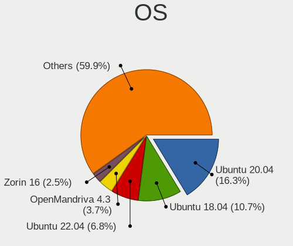

| Name               | Desktops | Percent |
|--------------------|----------|---------|
| Ubuntu 20.04       | 174      | 19.29%  |
| Ubuntu 18.04       | 121      | 13.41%  |
| OpenMandriva 4.3   | 41       | 4.55%   |
| Ubuntu 22.04       | 34       | 3.77%   |
| KDE neon 20.04     | 23       | 2.55%   |
| OpenMandriva 4.2   | 22       | 2.44%   |
| Zorin 16           | 20       | 2.22%   |
| Arch Rolling       | 18       | 2%      |
| Zorin 15           | 17       | 1.88%   |
| Arch               | 16       | 1.77%   |
| Ubuntu 16.04       | 15       | 1.66%   |
| Manjaro            | 15       | 1.66%   |
| ArcoLinux Rolling  | 15       | 1.66%   |
| Pop!_OS 20.04      | 12       | 1.33%   |
| Linux Mint 20      | 11       | 1.22%   |
| Fedora 36          | 11       | 1.22%   |
| Debian 10          | 11       | 1.22%   |
| Ubuntu 21.10       | 10       | 1.11%   |
| Ubuntu 19.10       | 10       | 1.11%   |
| Ubuntu 19.04       | 10       | 1.11%   |
| Fedora 34          | 10       | 1.11%   |
| CentOS 8           | 10       | 1.11%   |
| Ubuntu 21.04       | 9        | 1%      |
| Pop!_OS 21.04      | 9        | 1%      |
| Ubuntu 20.10       | 8        | 0.89%   |
| Fedora 32          | 8        | 0.89%   |
| Debian 11          | 8        | 0.89%   |
| CentOS 7           | 8        | 0.89%   |
| Ubuntu Unity 16.04 | 7        | 0.78%   |
| Fedora 33          | 7        | 0.78%   |
| Linux Mint 20.2    | 6        | 0.67%   |
| Linux Mint 19.3    | 6        | 0.67%   |
| Fedora 35          | 6        | 0.67%   |
| Ubuntu 18.10       | 5        | 0.55%   |
| Pop!_OS 22.04      | 5        | 0.55%   |
| Pop!_OS 20.10      | 5        | 0.55%   |
| Peppermint 10      | 5        | 0.55%   |
| Fedora 30          | 5        | 0.55%   |
| Ubuntu Unity 20.04 | 4        | 0.44%   |
| Linux Mint 20.1    | 4        | 0.44%   |

OS Family
---------

OS without a version

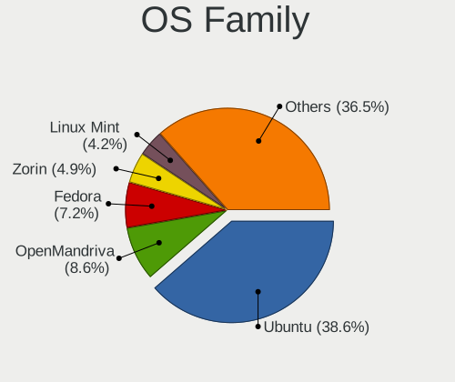

| Name          | Desktops | Percent |
|---------------|----------|---------|
| Ubuntu        | 387      | 44.33%  |
| OpenMandriva  | 67       | 7.67%   |
| Fedora        | 48       | 5.5%    |
| Zorin         | 37       | 4.24%   |
| Linux Mint    | 36       | 4.12%   |
| Pop!_OS       | 34       | 3.89%   |
| Arch          | 33       | 3.78%   |
| KDE neon      | 29       | 3.32%   |
| Manjaro       | 22       | 2.52%   |
| Debian        | 21       | 2.41%   |
| CentOS        | 18       | 2.06%   |
| ArcoLinux     | 15       | 1.72%   |
| Ubuntu Unity  | 14       | 1.6%    |
| Endless       | 13       | 1.49%   |
| Kubuntu       | 10       | 1.15%   |
| Clear Linux   | 8        | 0.92%   |
| Elementary    | 7        | 0.8%    |
| ROSA          | 6        | 0.69%   |
| RHEL          | 5        | 0.57%   |
| Peppermint    | 5        | 0.57%   |
| Xubuntu       | 4        | 0.46%   |
| Parrot        | 4        | 0.46%   |
| openSUSE      | 4        | 0.46%   |
| MX            | 4        | 0.46%   |
| Lubuntu       | 4        | 0.46%   |
| Kali          | 4        | 0.46%   |
| EndeavourOS   | 4        | 0.46%   |
| BlackPanther  | 4        | 0.46%   |
| Garuda Linux  | 3        | 0.34%   |
| Ubuntu MATE   | 2        | 0.23%   |
| Reborn OS     | 2        | 0.23%   |
| LinuxFX       | 2        | 0.23%   |
| Gentoo        | 2        | 0.23%   |
| Xero          | 1        | 0.11%   |
| Void Linux    | 1        | 0.11%   |
| viar-os       | 1        | 0.11%   |
| Ubuntu Budgie | 1        | 0.11%   |
| Solus         | 1        | 0.11%   |
| Rocky Linux   | 1        | 0.11%   |
| Pear OS       | 1        | 0.11%   |

Kernel
------

Version of the Linux kernel

| Version                  | Desktops | Percent |
|--------------------------|----------|---------|
| 5.16.7-desktop-1omv4003  | 40       | 4.11%   |
| 5.4.0-42-generic         | 37       | 3.8%    |
| 5.10.14-desktop-1omv4002 | 22       | 2.26%   |
| 5.4.0-58-generic         | 16       | 1.64%   |
| 5.4.0-48-generic         | 15       | 1.54%   |
| 5.4.0-52-generic         | 13       | 1.33%   |
| 5.4.0-26-generic         | 10       | 1.03%   |
| 5.15.0-52-generic        | 10       | 1.03%   |
| 5.4.0-47-generic         | 9        | 0.92%   |
| 5.8.0-59-generic         | 8        | 0.82%   |
| 5.15.0-46-generic        | 8        | 0.82%   |
| 5.11.0-25-generic        | 8        | 0.82%   |
| 5.0.0-37-generic         | 8        | 0.82%   |
| 5.4.0-91-generic         | 7        | 0.72%   |
| 5.4.0-40-generic         | 7        | 0.72%   |
| 5.4.0-37-generic         | 7        | 0.72%   |
| 5.4.0-29-generic         | 7        | 0.72%   |
| 5.3.0-46-generic         | 7        | 0.72%   |
| 5.15.0-56-generic        | 7        | 0.72%   |
| 5.13.0-28-generic        | 7        | 0.72%   |
| 5.11.0-41-generic        | 7        | 0.72%   |
| 5.0.0-25-generic         | 7        | 0.72%   |
| 5.0.0-23-generic         | 7        | 0.72%   |
| 4.18.0-17-generic        | 7        | 0.72%   |
| 5.8.0-53-generic         | 6        | 0.62%   |
| 5.8.0-48-generic         | 6        | 0.62%   |
| 5.3.0-53-generic         | 6        | 0.62%   |
| 5.11.0-40-generic        | 6        | 0.62%   |
| 5.11.0-27-generic        | 6        | 0.62%   |
| 4.15.0-45-generic        | 6        | 0.62%   |
| 5.8.0-55-generic         | 5        | 0.51%   |
| 5.8.0-43-generic         | 5        | 0.51%   |
| 5.4.0-7634-generic       | 5        | 0.51%   |
| 5.4.0-74-generic         | 5        | 0.51%   |
| 5.4.0-31-generic         | 5        | 0.51%   |
| 5.3.0-62-generic         | 5        | 0.51%   |
| 5.3.0-51-generic         | 5        | 0.51%   |
| 5.3.0-28-generic         | 5        | 0.51%   |
| 5.15.0-47-generic        | 5        | 0.51%   |
| 5.15.0-43-generic        | 5        | 0.51%   |

Kernel Family
-------------

Linux kernel without a distro release

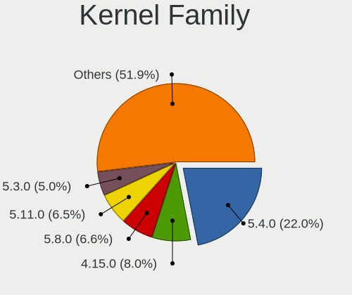

| Version | Desktops | Percent |
|---------|----------|---------|
| 5.4.0   | 197      | 21.46%  |
| 4.15.0  | 72       | 7.84%   |
| 5.8.0   | 59       | 6.43%   |
| 5.11.0  | 58       | 6.32%   |
| 5.15.0  | 56       | 6.1%    |
| 5.3.0   | 44       | 4.79%   |
| 5.16.7  | 41       | 4.47%   |
| 5.13.0  | 41       | 4.47%   |
| 4.18.0  | 36       | 3.92%   |
| 5.0.0   | 35       | 3.81%   |
| 5.10.14 | 22       | 2.4%    |
| 4.19.0  | 14       | 1.53%   |
| 5.10.0  | 10       | 1.09%   |
| 3.10.0  | 8        | 0.87%   |
| 5.14.0  | 7        | 0.76%   |
| 5.19.0  | 4        | 0.44%   |
| 6.1.1   | 3        | 0.33%   |
| 5.8.5   | 3        | 0.33%   |
| 5.18.5  | 3        | 0.33%   |
| 5.18.0  | 3        | 0.33%   |
| 5.17.9  | 3        | 0.33%   |
| 5.15.6  | 3        | 0.33%   |
| 4.18.16 | 3        | 0.33%   |
| 4.15.18 | 3        | 0.33%   |
| 4.13.0  | 3        | 0.33%   |
| 5.9.16  | 2        | 0.22%   |
| 5.9.11  | 2        | 0.22%   |
| 5.8.15  | 2        | 0.22%   |
| 5.7.0   | 2        | 0.22%   |
| 5.6.18  | 2        | 0.22%   |
| 5.6.15  | 2        | 0.22%   |
| 5.6.14  | 2        | 0.22%   |
| 5.4.13  | 2        | 0.22%   |
| 5.18.9  | 2        | 0.22%   |
| 5.18.10 | 2        | 0.22%   |
| 5.17.5  | 2        | 0.22%   |
| 5.16.11 | 2        | 0.22%   |
| 5.16.0  | 2        | 0.22%   |
| 5.15.8  | 2        | 0.22%   |
| 5.15.7  | 2        | 0.22%   |

Kernel Major Ver.
-----------------

Linux kernel major version

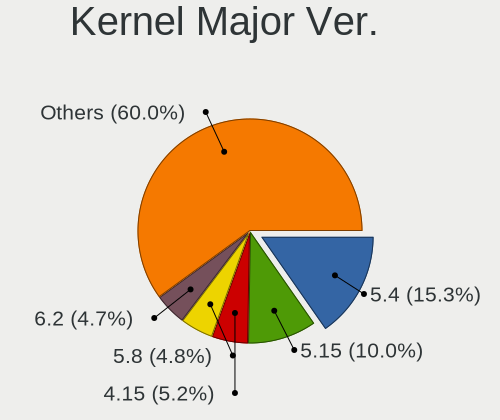

| Version | Desktops | Percent |
|---------|----------|---------|
| 5.4     | 208      | 22.78%  |
| 5.15    | 83       | 9.09%   |
| 4.15    | 75       | 8.21%   |
| 5.8     | 69       | 7.56%   |
| 5.11    | 63       | 6.9%    |
| 5.13    | 52       | 5.7%    |
| 5.16    | 50       | 5.48%   |
| 5.3     | 47       | 5.15%   |
| 5.10    | 47       | 5.15%   |
| 4.18    | 40       | 4.38%   |
| 5.0     | 38       | 4.16%   |
| 5.14    | 22       | 2.41%   |
| 4.19    | 17       | 1.86%   |
| 5.18    | 15       | 1.64%   |
| 5.6     | 10       | 1.1%    |
| 5.19    | 10       | 1.1%    |
| 5.17    | 10       | 1.1%    |
| 5.12    | 8        | 0.88%   |
| 3.10    | 8        | 0.88%   |
| 5.7     | 7        | 0.77%   |
| 6.1     | 6        | 0.66%   |
| 5.9     | 6        | 0.66%   |
| 4.9     | 4        | 0.44%   |
| 6.0     | 3        | 0.33%   |
| 4.13    | 3        | 0.33%   |
| 5.5     | 2        | 0.22%   |
| 5.2     | 2        | 0.22%   |
| 4.4     | 2        | 0.22%   |
| 4.20    | 2        | 0.22%   |
| 4.14    | 2        | 0.22%   |
| 5.1     | 1        | 0.11%   |
| 3.13    | 1        | 0.11%   |

Arch
----

OS architecture (x86_64, i586, etc.)

| Name   | Desktops | Percent |
|--------|----------|---------|
| x86_64 | 820      | 96.7%   |
| i686   | 28       | 3.3%    |

DE
--

Desktop Environment

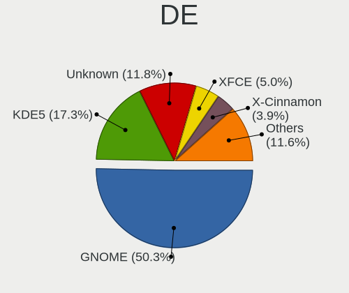

| Name            | Desktops | Percent |
|-----------------|----------|---------|
| GNOME           | 448      | 51.03%  |
| KDE5            | 131      | 14.92%  |
| Unknown         | 125      | 14.24%  |
| XFCE            | 38       | 4.33%   |
| X-Cinnamon      | 29       | 3.3%    |
| KDE             | 27       | 3.08%   |
| MATE            | 15       | 1.71%   |
| Unity           | 14       | 1.59%   |
| GNOME Classic   | 8        | 0.91%   |
| Pantheon        | 7        | 0.8%    |
| LXDE            | 6        | 0.68%   |
| Cinnamon        | 4        | 0.46%   |
| KDE4            | 3        | 0.34%   |
| i3              | 3        | 0.34%   |
| GNOME Flashback | 3        | 0.34%   |
| Deepin          | 3        | 0.34%   |
| LXQt            | 2        | 0.23%   |
| Budgie          | 2        | 0.23%   |
| awesome         | 2        | 0.23%   |
| xmonad          | 1        | 0.11%   |
| sway            | 1        | 0.11%   |
| qtile           | 1        | 0.11%   |
| openbox         | 1        | 0.11%   |
| LeftWM          | 1        | 0.11%   |
| Enlightenment   | 1        | 0.11%   |
| dwm             | 1        | 0.11%   |
| bspwm           | 1        | 0.11%   |

Display Server
--------------

X11 or Wayland

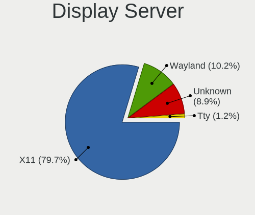

| Name    | Desktops | Percent |
|---------|----------|---------|
| X11     | 689      | 79.29%  |
| Wayland | 96       | 11.05%  |
| Unknown | 72       | 8.29%   |
| Tty     | 12       | 1.38%   |

Display Manager
---------------

SDDM, LightDM, etc.

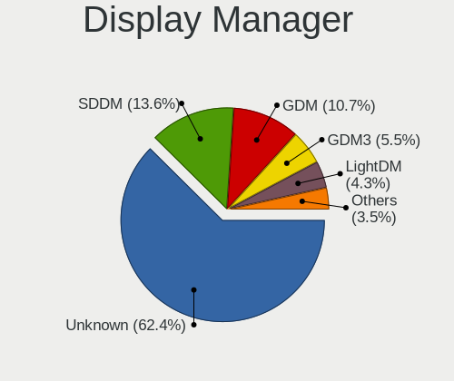

| Name    | Desktops | Percent |
|---------|----------|---------|
| Unknown | 509      | 58.51%  |
| SDDM    | 123      | 14.14%  |
| GDM     | 94       | 10.8%   |
| GDM3    | 73       | 8.39%   |
| LightDM | 49       | 5.63%   |
| TDM     | 18       | 2.07%   |
| KDM     | 3        | 0.34%   |
| Ly      | 1        | 0.11%   |

OS Lang
-------

Language

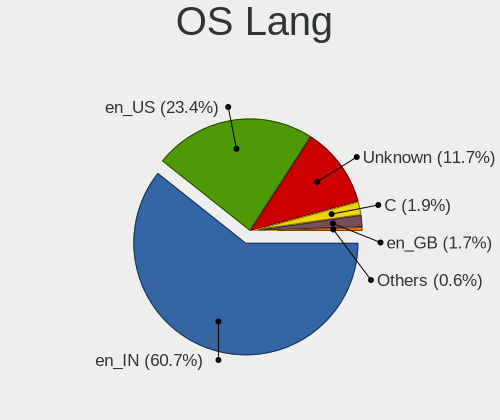

| Lang    | Desktops | Percent |
|---------|----------|---------|
| en_IN   | 531      | 60.69%  |
| en_US   | 205      | 23.43%  |
| Unknown | 102      | 11.66%  |
| C       | 17       | 1.94%   |
| en_GB   | 15       | 1.71%   |
| mni_IN  | 2        | 0.23%   |
| ta_LK   | 1        | 0.11%   |
| sa_IN   | 1        | 0.11%   |
| en_CA   | 1        | 0.11%   |

Boot Mode
---------

EFI or BIOS

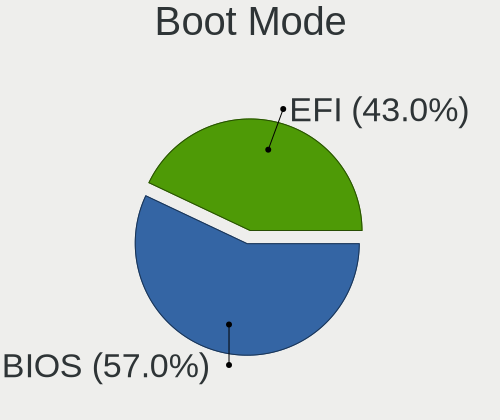

| Mode | Desktops | Percent |
|------|----------|---------|
| BIOS | 513      | 59.44%  |
| EFI  | 350      | 40.56%  |

Filesystem
----------

Type of filesystem

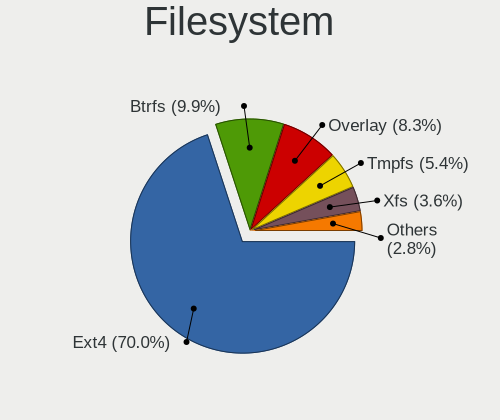

| Type    | Desktops | Percent |
|---------|----------|---------|
| Ext4    | 678      | 78.84%  |
| Btrfs   | 61       | 7.09%   |
| Overlay | 60       | 6.98%   |
| Xfs     | 31       | 3.6%    |
| Unknown | 20       | 2.33%   |
| Ext2    | 4        | 0.47%   |
| Zfs     | 2        | 0.23%   |
| Ext3    | 2        | 0.23%   |
| Jfs     | 1        | 0.12%   |
| F2fs    | 1        | 0.12%   |

Part. scheme
------------

Scheme of partitioning

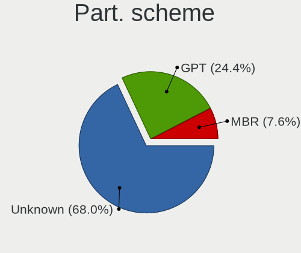

| Type    | Desktops | Percent |
|---------|----------|---------|
| Unknown | 550      | 63.81%  |
| GPT     | 233      | 27.03%  |
| MBR     | 79       | 9.16%   |

Dual Boot with Linux/BSD
------------------------

Hosting more than one Linux/BSD

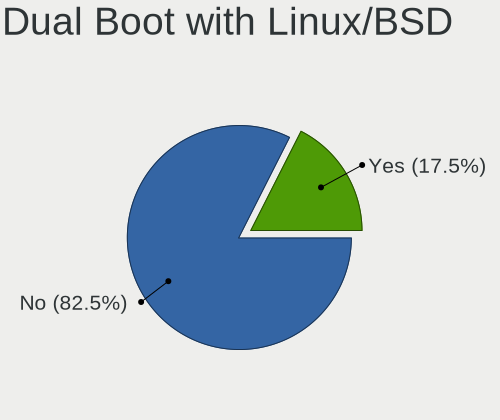

| Dual boot | Desktops | Percent |
|-----------|----------|---------|
| No        | 708      | 81.85%  |
| Yes       | 157      | 18.15%  |

Dual Boot (Win)
---------------

Hosting Linux and Windows

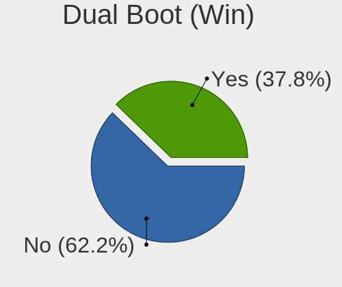

| Dual boot | Desktops | Percent |
|-----------|----------|---------|
| No        | 537      | 62.22%  |
| Yes       | 326      | 37.78%  |

Board
-----

Vendor
------

Motherboard manufacturer

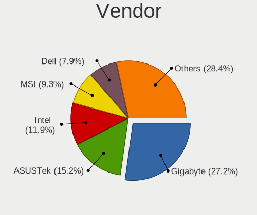

| Name                | Desktops | Percent |
|---------------------|----------|---------|
| Gigabyte Technology | 230      | 27.12%  |
| ASUSTek Computer    | 133      | 15.68%  |
| Intel               | 103      | 12.15%  |
| MSI                 | 79       | 9.32%   |
| Dell                | 65       | 7.67%   |
| Unknown             | 52       | 6.13%   |
| Hewlett-Packard     | 49       | 5.78%   |
| Lenovo              | 31       | 3.66%   |
| ASRock              | 28       | 3.3%    |
| Acer                | 18       | 2.12%   |
| OEM                 | 13       | 1.53%   |
| ECS                 | 11       | 1.3%    |
| Biostar             | 11       | 1.3%    |
| Foxconn             | 6        | 0.71%   |
| Pegatron            | 3        | 0.35%   |
| LORD ELECTRONICS    | 3        | 0.35%   |
| WIPRO               | 2        | 0.24%   |
| Insyde              | 2        | 0.24%   |
| Supermicro          | 1        | 0.12%   |
| MiTAC               | 1        | 0.12%   |
| Maxtone             | 1        | 0.12%   |
| Kobian              | 1        | 0.12%   |
| ITI LIMITED         | 1        | 0.12%   |
| INP                 | 1        | 0.12%   |
| Huanan              | 1        | 0.12%   |
| Google              | 1        | 0.12%   |
| GALAX               | 1        | 0.12%   |

Model
-----

Motherboard model

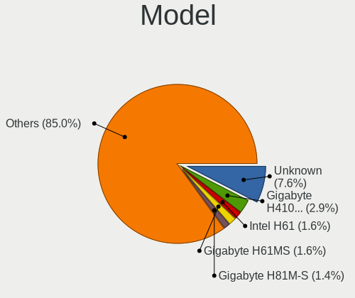

| Name                          | Desktops | Percent |
|-------------------------------|----------|---------|
| Unknown                       | 62       | 7.31%   |
| Gigabyte H410M H V3           | 23       | 2.71%   |
| Intel H61                     | 15       | 1.77%   |
| Gigabyte H61MS                | 14       | 1.65%   |
| Gigabyte H81M-S               | 13       | 1.53%   |
| Intel HCL Desktop             | 10       | 1.18%   |
| Gigabyte H110M-S2             | 10       | 1.18%   |
| ASUS All Series               | 10       | 1.18%   |
| Gigabyte A320M-S2H            | 9        | 1.06%   |
| Gigabyte B450M DS3H           | 8        | 0.94%   |
| MSI MS-7A38                   | 7        | 0.83%   |
| Gigabyte H310M S2 2.0         | 7        | 0.83%   |
| OEM G41 775 ICH7 8712         | 5        | 0.59%   |
| MSI MS-7C02                   | 5        | 0.59%   |
| MSI MS-7A36                   | 5        | 0.59%   |
| Gigabyte H310M H              | 5        | 0.59%   |
| Gigabyte G31M-ES2L            | 5        | 0.59%   |
| Gigabyte B75M-D3H             | 5        | 0.59%   |
| ASUS TUF Gaming X570-PLUS     | 5        | 0.59%   |
| ASUS M5A78L-M/USB3            | 5        | 0.59%   |
| Acer Veriton M200-H81         | 5        | 0.59%   |
| MSI MS-7A15                   | 4        | 0.47%   |
| MSI MS-7817                   | 4        | 0.47%   |
| Intel H81                     | 4        | 0.47%   |
| Intel H55                     | 4        | 0.47%   |
| Intel DZ75ML-45K AAG75008-102 | 4        | 0.47%   |
| Intel DH55TC AAE70932-303     | 4        | 0.47%   |
| HP ProDesk 600 G1 SFF         | 4        | 0.47%   |
| HP EliteDesk 800 G1 SFF       | 4        | 0.47%   |
| Gigabyte J1800M-D3P           | 4        | 0.47%   |
| Gigabyte H110M-H              | 4        | 0.47%   |
| Gigabyte GA-78LMT-S2          | 4        | 0.47%   |
| Dell Vostro 3268              | 4        | 0.47%   |
| Dell OptiPlex 380             | 4        | 0.47%   |
| Biostar H81MHV3               | 4        | 0.47%   |
| ASUS H110M-CS                 | 4        | 0.47%   |
| ASUS EX-A320M-GAMING          | 4        | 0.47%   |
| Acer Veriton Series           | 4        | 0.47%   |
| MSI MS-7C91                   | 3        | 0.35%   |
| MSI MS-7C89                   | 3        | 0.35%   |

Model Family
------------

Motherboard model prefix

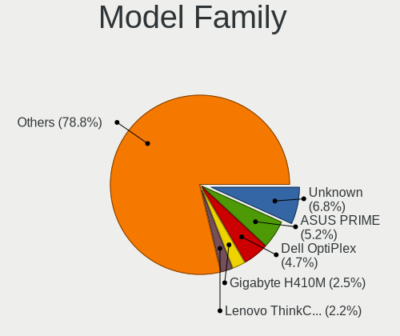

| Name               | Desktops | Percent |
|--------------------|----------|---------|
| Unknown            | 62       | 7.31%   |
| Dell OptiPlex      | 40       | 4.72%   |
| ASUS PRIME         | 31       | 3.66%   |
| Gigabyte H410M     | 27       | 3.18%   |
| Lenovo ThinkCentre | 17       | 2%      |
| Acer Veriton       | 17       | 2%      |
| Intel H61          | 15       | 1.77%   |
| Gigabyte H310M     | 15       | 1.77%   |
| Gigabyte H61MS     | 14       | 1.65%   |
| Gigabyte H81M-S    | 13       | 1.53%   |
| ASUS TUF           | 13       | 1.53%   |
| ASUS ROG           | 13       | 1.53%   |
| HP Compaq          | 11       | 1.3%    |
| Intel HCL          | 10       | 1.18%   |
| Intel DH61WW       | 10       | 1.18%   |
| HP ProDesk         | 10       | 1.18%   |
| Gigabyte H110M-S2  | 10       | 1.18%   |
| Gigabyte A320M-S2H | 10       | 1.18%   |
| Dell Vostro        | 10       | 1.18%   |
| ASUS All           | 10       | 1.18%   |
| Dell Inspiron      | 9        | 1.06%   |
| Gigabyte B450M     | 8        | 0.94%   |
| ASUS M5A78L-M      | 8        | 0.94%   |
| MSI MS-7A38        | 7        | 0.83%   |
| Lenovo IdeaCentre  | 6        | 0.71%   |
| Gigabyte Z390      | 6        | 0.71%   |
| OEM G41            | 5        | 0.59%   |
| MSI MS-7C02        | 5        | 0.59%   |
| MSI MS-7A36        | 5        | 0.59%   |
| Intel DG31PR       | 5        | 0.59%   |
| Gigabyte G31M-ES2L | 5        | 0.59%   |
| Gigabyte B75M-D3H  | 5        | 0.59%   |
| Dell Precision     | 5        | 0.59%   |
| MSI MS-7A15        | 4        | 0.47%   |
| MSI MS-7817        | 4        | 0.47%   |
| Intel H81          | 4        | 0.47%   |
| Intel H55          | 4        | 0.47%   |
| Intel DZ75ML-45K   | 4        | 0.47%   |
| Intel DH55TC       | 4        | 0.47%   |
| Intel D945GCPE     | 4        | 0.47%   |

MFG Year
--------

Motherboard manufacture year

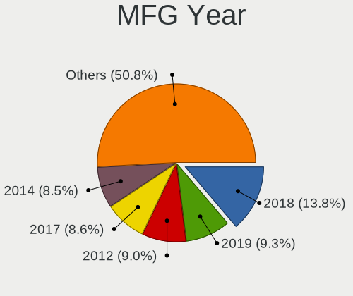

| Year    | Desktops | Percent |
|---------|----------|---------|
| 2018    | 113      | 13.33%  |
| 2019    | 79       | 9.32%   |
| 2012    | 78       | 9.2%    |
| 2017    | 76       | 8.96%   |
| 2014    | 73       | 8.61%   |
| 2013    | 64       | 7.55%   |
| 2016    | 59       | 6.96%   |
| 2010    | 55       | 6.49%   |
| 2021    | 52       | 6.13%   |
| 2020    | 42       | 4.95%   |
| 2011    | 39       | 4.6%    |
| 2015    | 32       | 3.77%   |
| 2009    | 29       | 3.42%   |
| 2008    | 24       | 2.83%   |
| 2007    | 14       | 1.65%   |
| 2022    | 9        | 1.06%   |
| 2006    | 6        | 0.71%   |
| 2005    | 2        | 0.24%   |
| Unknown | 2        | 0.24%   |

Form Factor
-----------

Physical design of the computer

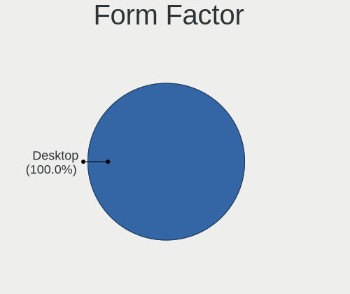

| Name    | Desktops | Percent |
|---------|----------|---------|
| Desktop | 848      | 100%    |

Secure Boot
-----------

Enabled or disabled

| State    | Desktops | Percent |
|----------|----------|---------|
| Disabled | 830      | 97.65%  |
| Enabled  | 20       | 2.35%   |

Coreboot
--------

Have coreboot on board

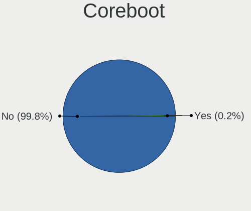

| Used | Desktops | Percent |
|------|----------|---------|
| No   | 847      | 99.88%  |
| Yes  | 1        | 0.12%   |

RAM Size
--------

Total RAM memory

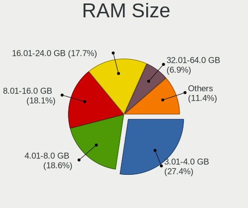

| Size in GB  | Desktops | Percent |
|-------------|----------|---------|
| 3.01-4.0    | 245      | 28.59%  |
| 4.01-8.0    | 160      | 18.67%  |
| 16.01-24.0  | 147      | 17.15%  |
| 8.01-16.0   | 147      | 17.15%  |
| 32.01-64.0  | 56       | 6.53%   |
| 1.01-2.0    | 53       | 6.18%   |
| 64.01-256.0 | 22       | 2.57%   |
| 2.01-3.0    | 13       | 1.52%   |
| 24.01-32.0  | 7        | 0.82%   |
| 0.51-1.0    | 6        | 0.7%    |
| 0.01-0.5    | 1        | 0.12%   |

RAM Used
--------

Used RAM memory

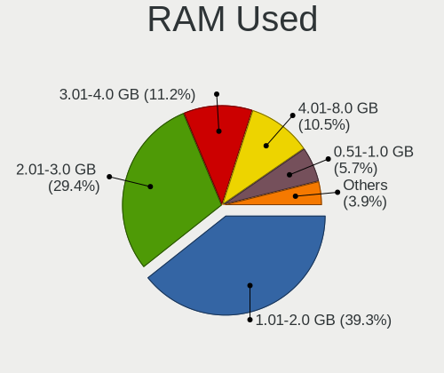

| Used GB    | Desktops | Percent |
|------------|----------|---------|
| 1.01-2.0   | 393      | 42.81%  |
| 2.01-3.0   | 277      | 30.17%  |
| 4.01-8.0   | 82       | 8.93%   |
| 3.01-4.0   | 79       | 8.61%   |
| 0.51-1.0   | 54       | 5.88%   |
| 8.01-16.0  | 15       | 1.63%   |
| 0.01-0.5   | 10       | 1.09%   |
| 16.01-24.0 | 5        | 0.54%   |
| 32.01-64.0 | 2        | 0.22%   |
| Unknown    | 1        | 0.11%   |

Total Drives
------------

Number of drives on board

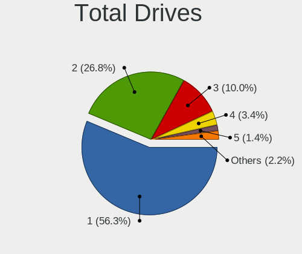

| Drives | Desktops | Percent |
|--------|----------|---------|
| 1      | 488      | 56.48%  |
| 2      | 231      | 26.74%  |
| 3      | 86       | 9.95%   |
| 4      | 30       | 3.47%   |
| 5      | 10       | 1.16%   |
| 6      | 7        | 0.81%   |
| 0      | 7        | 0.81%   |
| 7      | 3        | 0.35%   |
| 9      | 1        | 0.12%   |
| 8      | 1        | 0.12%   |

Has CD-ROM
----------

Has CD-ROM on board

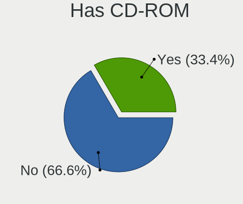

| Presented | Desktops | Percent |
|-----------|----------|---------|
| No        | 539      | 63.04%  |
| Yes       | 316      | 36.96%  |

Has Ethernet
------------

Has Ethernet on board

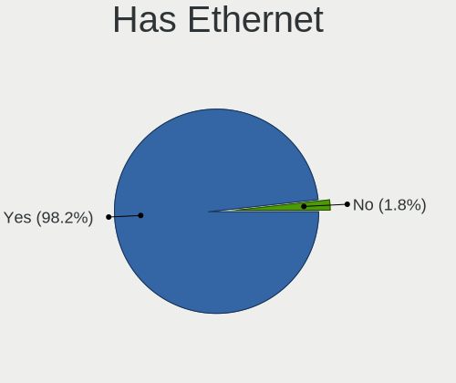

| Presented | Desktops | Percent |
|-----------|----------|---------|
| Yes       | 830      | 97.88%  |
| No        | 18       | 2.12%   |

Has WiFi
--------

Has WiFi module

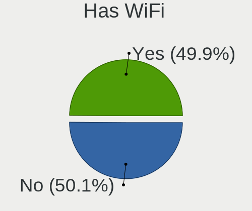

| Presented | Desktops | Percent |
|-----------|----------|---------|
| No        | 432      | 50.12%  |
| Yes       | 430      | 49.88%  |

Has Bluetooth
-------------

Has Bluetooth module

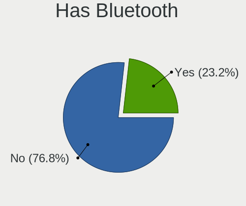

| Presented | Desktops | Percent |
|-----------|----------|---------|
| No        | 651      | 75.87%  |
| Yes       | 207      | 24.13%  |

Location
--------

Country
-------

Geographic location (country)

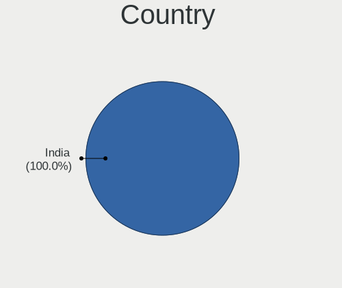

| Country | Desktops | Percent |
|---------|----------|---------|
| India   | 848      | 100%    |

City
----

Geographic location (city)

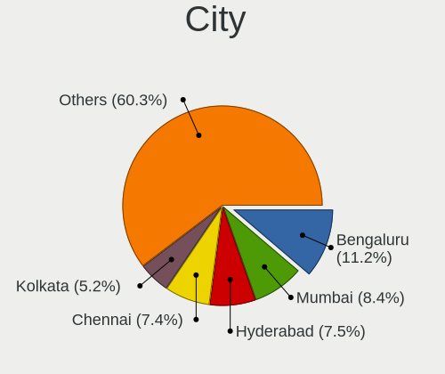

| City        | Desktops | Percent |
|-------------|----------|---------|
| Bengaluru   | 103      | 11.65%  |
| Mumbai      | 78       | 8.82%   |
| Chennai     | 64       | 7.24%   |
| Hyderabad   | 60       | 6.79%   |
| Kolkata     | 48       | 5.43%   |
| Pune        | 35       | 3.96%   |
| New Delhi   | 34       | 3.85%   |
| Delhi       | 23       | 2.6%    |
| Gonikoppal  | 22       | 2.49%   |
| Ahmedabad   | 19       | 2.15%   |
| Ernakulam   | 17       | 1.92%   |
| Bhopal      | 17       | 1.92%   |
| Patna       | 16       | 1.81%   |
| Jaipur      | 13       | 1.47%   |
| Surat       | 11       | 1.24%   |
| Navi Mumbai | 11       | 1.24%   |
| Indore      | 11       | 1.24%   |
| Trivandrum  | 9        | 1.02%   |
| Thrissur    | 9        | 1.02%   |
| Lucknow     | 9        | 1.02%   |
| Guwahati    | 9        | 1.02%   |
| Gurgaon     | 8        | 0.9%    |
| Vadodara    | 7        | 0.79%   |
| Vijayawada  | 6        | 0.68%   |
| Thane       | 6        | 0.68%   |
| Nagpur      | 6        | 0.68%   |
| Malappuram  | 6        | 0.68%   |
| Kochi       | 5        | 0.57%   |
| Kanpur      | 5        | 0.57%   |
| Bhubaneswar | 5        | 0.57%   |
| Tiruchi     | 4        | 0.45%   |
| Rajkot      | 4        | 0.45%   |
| Noida       | 4        | 0.45%   |
| Ludhiana    | 4        | 0.45%   |
| Imphal      | 4        | 0.45%   |
| Coimbatore  | 4        | 0.45%   |
| Chunchura   | 4        | 0.45%   |
| Alappuzha   | 4        | 0.45%   |
| Varanasi    | 3        | 0.34%   |
| Udupi       | 3        | 0.34%   |

Drives
------

Drive Vendor
------------

Hard drive vendors

| Vendor                    | Desktops | Drives | Percent |
|---------------------------|----------|--------|---------|
| Seagate                   | 369      | 538    | 29.76%  |
| WDC                       | 314      | 455    | 25.32%  |
| Toshiba                   | 85       | 91     | 6.85%   |
| Samsung Electronics       | 79       | 125    | 6.37%   |
| Kingston                  | 63       | 78     | 5.08%   |
| Crucial                   | 58       | 86     | 4.68%   |
| A-DATA Technology         | 39       | 43     | 3.15%   |
| Hitachi                   | 30       | 38     | 2.42%   |
| SanDisk                   | 26       | 29     | 2.1%    |
| Intel                     | 15       | 19     | 1.21%   |
| Gigabyte Technology       | 15       | 17     | 1.21%   |
| HGST                      | 12       | 23     | 0.97%   |
| China                     | 10       | 12     | 0.81%   |
| Unknown                   | 9        | 11     | 0.73%   |
| Unknown                   | 7        | 8      | 0.56%   |
| SPCC                      | 6        | 9      | 0.48%   |
| Phison                    | 6        | 8      | 0.48%   |
| Maxtor                    | 6        | 18     | 0.48%   |
| Hewlett-Packard           | 6        | 8      | 0.48%   |
| Micron/Crucial Technology | 5        | 6      | 0.4%    |
| XPG                       | 4        | 5      | 0.32%   |
| Transcend                 | 4        | 5      | 0.32%   |
| SK hynix                  | 4        | 4      | 0.32%   |
| Realtek Semiconductor     | 4        | 5      | 0.32%   |
| Lexar                     | 4        | 4      | 0.32%   |
| Silicon Motion            | 3        | 3      | 0.24%   |
| Plextor                   | 3        | 3      | 0.24%   |
| Leven                     | 3        | 3      | 0.24%   |
| Corsair                   | 3        | 5      | 0.24%   |
| TO Exter                  | 2        | 2      | 0.16%   |
| StoreJet                  | 2        | 2      | 0.16%   |
| POWER                     | 2        | 2      | 0.16%   |
| Micron Technology         | 2        | 5      | 0.16%   |
| LITEONIT                  | 2        | 2      | 0.16%   |
| KIOXIA-EXCERIA            | 2        | 2      | 0.16%   |
| KingSpec                  | 2        | 2      | 0.16%   |
| HS-SSD-C100               | 2        | 3      | 0.16%   |
| ASMT                      | 2        | 2      | 0.16%   |
| Apple                     | 2        | 5      | 0.16%   |
| AGI                       | 2        | 4      | 0.16%   |

Drive Model
-----------

Hard drive models

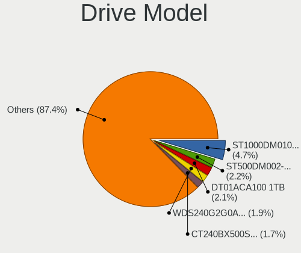

| Model                            | Desktops | Percent |
|----------------------------------|----------|---------|
| Seagate ST1000DM010-2EP102 1TB   | 77       | 5.58%   |
| Seagate ST500DM002-1BD142 500GB  | 36       | 2.61%   |
| Toshiba DT01ACA100 1TB           | 34       | 2.46%   |
| WDC WDS240G2G0A-00JH30 240GB SSD | 31       | 2.25%   |
| A-DATA SU750 256GB SSD           | 23       | 1.67%   |
| WDC WD10EZEX-08WN4A0 1TB         | 21       | 1.52%   |
| Seagate ST3500418AS 500GB        | 21       | 1.52%   |
| Kingston SA400S37240G 240GB SSD  | 20       | 1.45%   |
| Crucial CT240BX500SSD1 240GB     | 19       | 1.38%   |
| Seagate ST3500312CS 500GB        | 18       | 1.3%    |
| Toshiba DT01ACA050 500GB         | 17       | 1.23%   |
| WDC WD10EZEX-22MFCA0 1TB         | 14       | 1.01%   |
| Toshiba HDWD110 1TB              | 13       | 0.94%   |
| Seagate ST3500414CS 500GB        | 13       | 0.94%   |
| Seagate ST2000DM005-2CW102 2TB   | 12       | 0.87%   |
| Seagate ST1000DM003-1SB102 1TB   | 12       | 0.87%   |
| Kingston SA400S37120G 120GB SSD  | 12       | 0.87%   |
| Seagate ST1000DM003-1ER162 1TB   | 10       | 0.72%   |
| WDC WDS120G2G0A-00JH30 120GB SSD | 9        | 0.65%   |
| WDC WD20EZAZ-00GGJB0 2TB         | 9        | 0.65%   |
| WDC WD10EZEX-75WN4A1 1TB         | 9        | 0.65%   |
| Seagate ST4000DM004-2CV104 4TB   | 9        | 0.65%   |
| Samsung HD162GJ 160GB            | 9        | 0.65%   |
| WDC WD10EZEX-75WN4A0 1TB         | 8        | 0.58%   |
| Seagate ST3160215AS 160GB        | 8        | 0.58%   |
| Seagate ST1000DM003-1CH162 1TB   | 8        | 0.58%   |
| WDC WDS240G2G0B-00EPW0 240GB SSD | 7        | 0.51%   |
| Seagate ST31000524AS 1TB         | 7        | 0.51%   |
| SanDisk NVMe SSD Drive 500GB     | 7        | 0.51%   |
| Samsung SSD 860 EVO 250GB        | 7        | 0.51%   |
| Samsung SSD 850 EVO 250GB        | 7        | 0.51%   |
| Unknown                          | 7        | 0.51%   |
| WDC WD5000AAKX-75U6AA0 500GB     | 6        | 0.43%   |
| WDC WD5000AAKX-001CA0 500GB      | 6        | 0.43%   |
| WDC WD3200AAJS-00L7A0 320GB      | 6        | 0.43%   |
| WDC WD20EZRZ-00Z5HB0 2TB         | 6        | 0.43%   |
| WDC WD10EZEX-60WN4A0 1TB         | 6        | 0.43%   |
| WDC WD10EZEX-21WN4A0 1TB         | 6        | 0.43%   |
| WDC WD10EZEX-00MFCA0 1TB         | 6        | 0.43%   |
| Seagate ST1000VX005-2EZ102 1TB   | 6        | 0.43%   |

HDD Vendor
----------

Hard disk drive vendors

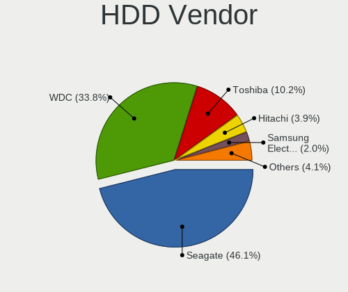

| Vendor              | Desktops | Drives | Percent |
|---------------------|----------|--------|---------|
| Seagate             | 364      | 531    | 46.19%  |
| WDC                 | 267      | 361    | 33.88%  |
| Toshiba             | 81       | 86     | 10.28%  |
| Hitachi             | 30       | 38     | 3.81%   |
| Samsung Electronics | 15       | 18     | 1.9%    |
| HGST                | 12       | 23     | 1.52%   |
| Unknown             | 5        | 7      | 0.63%   |
| Maxtor              | 3        | 3      | 0.38%   |
| Hewlett-Packard     | 3        | 3      | 0.38%   |
| ASMT                | 2        | 2      | 0.25%   |
| WD MediaMax         | 1        | 1      | 0.13%   |
| Synology            | 1        | 1      | 0.13%   |
| Lenovo              | 1        | 1      | 0.13%   |
| KESU                | 1        | 2      | 0.13%   |
| ASMedia             | 1        | 1      | 0.13%   |
| Apple               | 1        | 1      | 0.13%   |

SSD Vendor
----------

Solid state drive vendors

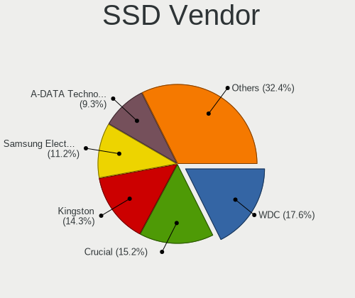

| Vendor              | Desktops | Drives | Percent |
|---------------------|----------|--------|---------|
| WDC                 | 65       | 89     | 18.41%  |
| Kingston            | 57       | 71     | 16.15%  |
| Crucial             | 50       | 77     | 14.16%  |
| Samsung Electronics | 42       | 69     | 11.9%   |
| A-DATA Technology   | 38       | 42     | 10.76%  |
| SanDisk             | 12       | 14     | 3.4%    |
| Gigabyte Technology | 10       | 10     | 2.83%   |
| China               | 10       | 12     | 2.83%   |
| SPCC                | 5        | 6      | 1.42%   |
| Transcend           | 4        | 5      | 1.13%   |
| Lexar               | 4        | 4      | 1.13%   |
| Intel               | 4        | 4      | 1.13%   |
| Toshiba             | 3        | 4      | 0.85%   |
| Plextor             | 3        | 3      | 0.85%   |
| Maxtor              | 3        | 15     | 0.85%   |
| Leven               | 3        | 3      | 0.85%   |
| Hewlett-Packard     | 3        | 5      | 0.85%   |
| TO Exter            | 2        | 2      | 0.57%   |
| StoreJet            | 2        | 2      | 0.57%   |
| SK hynix            | 2        | 2      | 0.57%   |
| POWER               | 2        | 2      | 0.57%   |
| LITEONIT            | 2        | 2      | 0.57%   |
| KIOXIA-EXCERIA      | 2        | 2      | 0.57%   |
| KingSpec            | 2        | 2      | 0.57%   |
| Unknown             | 2        | 2      | 0.57%   |
| YS                  | 1        | 1      | 0.28%   |
| SSD                 | 1        | 1      | 0.28%   |
| Seagate             | 1        | 1      | 0.28%   |
| PNY                 | 1        | 1      | 0.28%   |
| OCZ                 | 1        | 1      | 0.28%   |
| Micron Technology   | 1        | 4      | 0.28%   |
| LITEON              | 1        | 1      | 0.28%   |
| KLEVV               | 1        | 1      | 0.28%   |
| KingDian            | 1        | 1      | 0.28%   |
| JMicron Technology  | 1        | 1      | 0.28%   |
| Innodisk            | 1        | 1      | 0.28%   |
| HS-SSD-C100         | 1        | 2      | 0.28%   |
| GAMER               | 1        | 1      | 0.28%   |
| FRONTECH            | 1        | 1      | 0.28%   |
| Dahua               | 1        | 1      | 0.28%   |

Drive Kind
----------

HDD or SSD

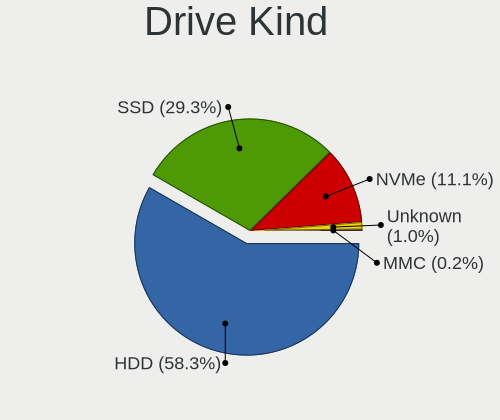

| Kind    | Desktops | Drives | Percent |
|---------|----------|--------|---------|
| HDD     | 685      | 1079   | 61.32%  |
| SSD     | 317      | 477    | 28.38%  |
| NVMe    | 99       | 143    | 8.86%   |
| Unknown | 13       | 18     | 1.16%   |
| MMC     | 3        | 3      | 0.27%   |

Drive Connector
---------------

SATA, SAS, NVMe, etc.

| Type | Desktops | Drives | Percent |
|------|----------|--------|---------|
| SATA | 815      | 1514   | 85.07%  |
| NVMe | 99       | 143    | 10.33%  |
| SAS  | 41       | 60     | 4.28%   |
| MMC  | 3        | 3      | 0.31%   |

Drive Size
----------

Size of hard drive

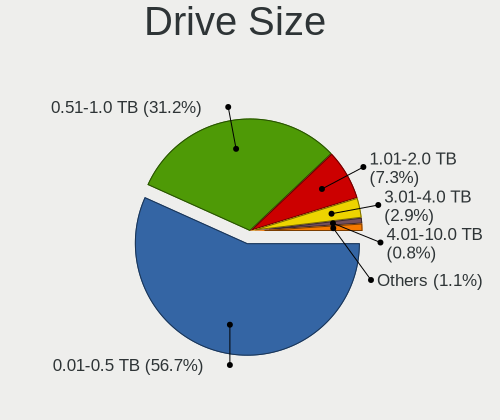

| Size in TB | Desktops | Drives | Percent |
|------------|----------|--------|---------|
| 0.01-0.5   | 601      | 864    | 57.24%  |
| 0.51-1.0   | 324      | 467    | 30.86%  |
| 1.01-2.0   | 77       | 133    | 7.33%   |
| 3.01-4.0   | 30       | 60     | 2.86%   |
| 2.01-3.0   | 9        | 15     | 0.86%   |
| 4.01-10.0  | 6        | 10     | 0.57%   |
| 10.01-20.0 | 3        | 7      | 0.29%   |

Space Total
-----------

Amount of disk space available on the file system

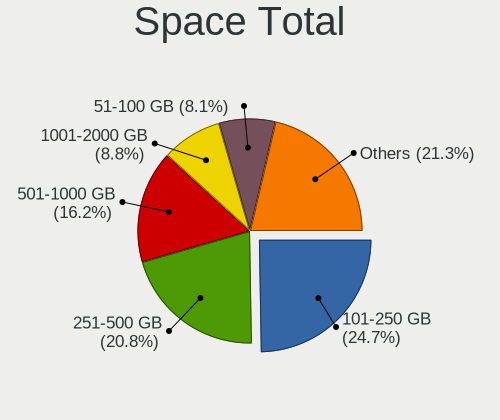

| Size in GB     | Desktops | Percent |
|----------------|----------|---------|
| 101-250        | 209      | 23.7%   |
| 251-500        | 188      | 21.32%  |
| 501-1000       | 135      | 15.31%  |
| 1001-2000      | 78       | 8.84%   |
| 51-100         | 72       | 8.16%   |
| 21-50          | 71       | 8.05%   |
| 1-20           | 55       | 6.24%   |
| More than 3000 | 40       | 4.54%   |
| 2001-3000      | 23       | 2.61%   |
| Unknown        | 11       | 1.25%   |

Space Used
----------

Amount of used disk space

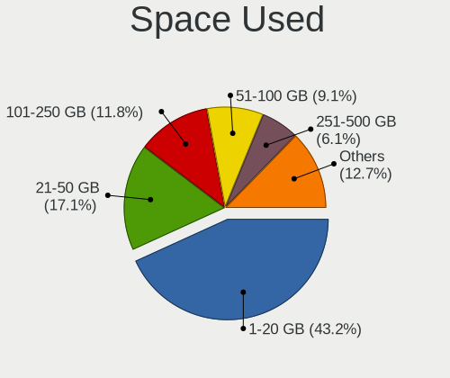

| Used GB        | Desktops | Percent |
|----------------|----------|---------|
| 1-20           | 392      | 42.98%  |
| 21-50          | 155      | 17%     |
| 101-250        | 109      | 11.95%  |
| 51-100         | 80       | 8.77%   |
| 251-500        | 59       | 6.47%   |
| 501-1000       | 52       | 5.7%    |
| 1001-2000      | 30       | 3.29%   |
| More than 3000 | 18       | 1.97%   |
| Unknown        | 11       | 1.21%   |
| 2001-3000      | 6        | 0.66%   |

Malfunc. Drives
---------------

Drive models with a malfunction

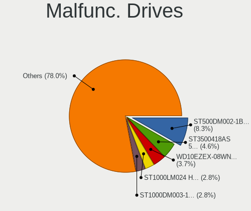

| Model                            | Desktops | Drives | Percent |
|----------------------------------|----------|--------|---------|
| Seagate ST500DM002-1BD142 500GB  | 9        | 9      | 9.89%   |
| Seagate ST3500418AS 500GB        | 5        | 5      | 5.49%   |
| WDC WD10EZEX-08WN4A0 1TB         | 4        | 4      | 4.4%    |
| Seagate ST1000DM003-1ER162 1TB   | 3        | 3      | 3.3%    |
| WDC WD5000AAKX-001CA0 500GB      | 2        | 5      | 2.2%    |
| WDC WD3200AAJS-00L7A0 320GB      | 2        | 2      | 2.2%    |
| Toshiba HDWD110 1TB              | 2        | 2      | 2.2%    |
| Toshiba DT01ACA100 1TB           | 2        | 2      | 2.2%    |
| Seagate ST2000DM001-1CH164 2TB   | 2        | 2      | 2.2%    |
| Seagate ST1000DM010-2EP102 1TB   | 2        | 2      | 2.2%    |
| Seagate ST1000DM003-1CH162 1TB   | 2        | 2      | 2.2%    |
| Crucial CT3500SC 500GB SSD       | 2        | 3      | 2.2%    |
| YS SSD 128GB                     | 1        | 1      | 1.1%    |
| WDC WDS100T2G0A-00JH30 1TB SSD   | 1        | 1      | 1.1%    |
| WDC WD5000AZRX-00A8LB0 500GB     | 1        | 1      | 1.1%    |
| WDC WD5000AAKX-00ERMA0 500GB     | 1        | 1      | 1.1%    |
| WDC WD5000AAKS-00A7B2 500GB      | 1        | 1      | 1.1%    |
| WDC WD40PURZ-85AKKY0 4TB         | 1        | 1      | 1.1%    |
| WDC WD3200BEVT-22ZCT0 320GB      | 1        | 1      | 1.1%    |
| WDC WD3200AAKS-61L9A0 320GB      | 1        | 1      | 1.1%    |
| WDC WD3200AAJS-56M0A0 320GB      | 1        | 1      | 1.1%    |
| WDC WD20EZRX-00SPEB0 2TB         | 1        | 1      | 1.1%    |
| WDC WD20EARX-00AZ6B0 2TB         | 1        | 1      | 1.1%    |
| WDC WD1600AVVS-63L2B0 160GB      | 1        | 2      | 1.1%    |
| WDC WD1600AAJS-22L7A0 160GB      | 1        | 1      | 1.1%    |
| WDC WD10SPCX-60KHST0 1TB         | 1        | 1      | 1.1%    |
| WDC WD10PURZ-85U8XY0 1TB         | 1        | 1      | 1.1%    |
| WDC WD10EZRX-00L4HB0 1TB         | 1        | 1      | 1.1%    |
| WDC WD10EZEX-60ZF5A0 1TB         | 1        | 1      | 1.1%    |
| WDC WD10EZEX-21WN4A0 1TB         | 1        | 1      | 1.1%    |
| WDC WD10EARX-00N0YB0 1TB         | 1        | 1      | 1.1%    |
| WDC WD10EARS-00Z5B1 1TB          | 1        | 1      | 1.1%    |
| WDC WD10EARS-00MVWB0 1TB         | 1        | 1      | 1.1%    |
| WDC WD10EADS-114BB1 1TB          | 1        | 1      | 1.1%    |
| WDC WD10EADS-00M2B0 1TB          | 1        | 1      | 1.1%    |
| Toshiba MQ01ACF050 500GB         | 1        | 1      | 1.1%    |
| Seagate ST9500325AS 500GB        | 1        | 1      | 1.1%    |
| Seagate ST9160314AS 160GB        | 1        | 1      | 1.1%    |
| Seagate ST500LT012-1DG142 500GB  | 1        | 1      | 1.1%    |
| Seagate ST500DM005 HD502HJ 500GB | 1        | 1      | 1.1%    |

Malfunc. Drive Vendor
---------------------

Vendors of faulty drives

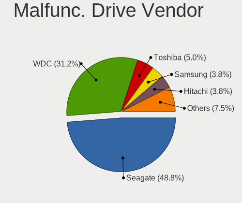

| Vendor              | Desktops | Drives | Percent |
|---------------------|----------|--------|---------|
| Seagate             | 43       | 46     | 50%     |
| WDC                 | 26       | 34     | 30.23%  |
| Toshiba             | 5        | 5      | 5.81%   |
| Samsung Electronics | 3        | 4      | 3.49%   |
| Hitachi             | 3        | 3      | 3.49%   |
| Crucial             | 2        | 3      | 2.33%   |
| A-DATA Technology   | 2        | 2      | 2.33%   |
| YS                  | 1        | 1      | 1.16%   |
| Innodisk            | 1        | 1      | 1.16%   |

Malfunc. HDD Vendor
-------------------

Vendors of faulty HDD drives

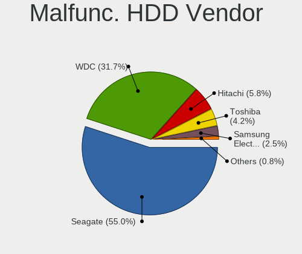

| Vendor              | Desktops | Drives | Percent |
|---------------------|----------|--------|---------|
| Seagate             | 43       | 46     | 54.43%  |
| WDC                 | 25       | 33     | 31.65%  |
| Toshiba             | 5        | 5      | 6.33%   |
| Samsung Electronics | 3        | 4      | 3.8%    |
| Hitachi             | 3        | 3      | 3.8%    |

Malfunc. Drive Kind
-------------------

Kinds of faulty drives

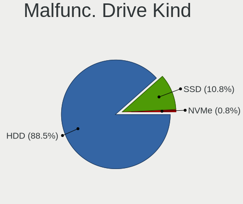

| Kind | Desktops | Drives | Percent |
|------|----------|--------|---------|
| HDD  | 78       | 91     | 91.76%  |
| SSD  | 7        | 8      | 8.24%   |

Failed Drives
-------------

Failed drive models

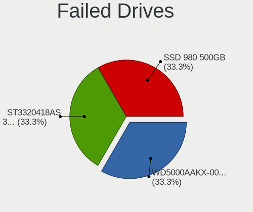

| Model                             | Desktops | Drives | Percent |
|-----------------------------------|----------|--------|---------|
| Seagate ST3320418AS 320GB         | 1        | 1      | 50%     |
| Samsung Electronics SSD 980 500GB | 1        | 2      | 50%     |

Failed Drive Vendor
-------------------

Failed drive vendors

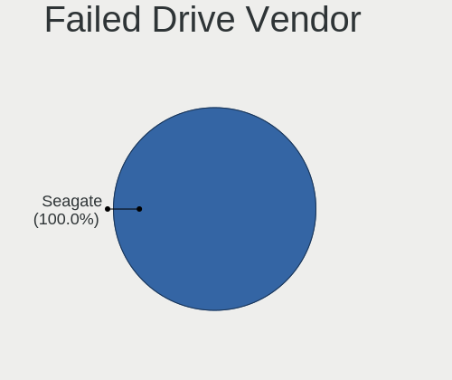

| Vendor              | Desktops | Drives | Percent |
|---------------------|----------|--------|---------|
| Seagate             | 1        | 1      | 50%     |
| Samsung Electronics | 1        | 2      | 50%     |

Drive Status
------------

Number of failed and malfunc. drives

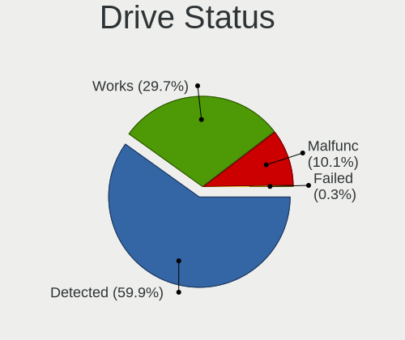

| Status   | Desktops | Drives | Percent |
|----------|----------|--------|---------|
| Detected | 576      | 1132   | 62.88%  |
| Works    | 256      | 486    | 27.95%  |
| Malfunc  | 82       | 99     | 8.95%   |
| Failed   | 2        | 3      | 0.22%   |

Storage controller
------------------

Storage Vendor
--------------

Storage controller vendors

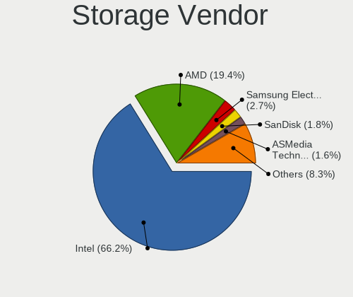

| Vendor                           | Desktops | Percent |
|----------------------------------|----------|---------|
| Intel                            | 644      | 65.71%  |
| AMD                              | 190      | 19.39%  |
| Samsung Electronics              | 29       | 2.96%   |
| SanDisk                          | 19       | 1.94%   |
| ASMedia Technology               | 17       | 1.73%   |
| Micron/Crucial Technology        | 12       | 1.22%   |
| Phison Electronics               | 11       | 1.12%   |
| Nvidia                           | 11       | 1.12%   |
| JMicron Technology               | 8        | 0.82%   |
| Kingston Technology Company      | 7        | 0.71%   |
| Realtek Semiconductor            | 5        | 0.51%   |
| ADATA Technology                 | 5        | 0.51%   |
| Marvell Technology Group         | 4        | 0.41%   |
| Silicon Motion                   | 3        | 0.31%   |
| Silicon Integrated Systems [SiS] | 3        | 0.31%   |
| Broadcom / LSI                   | 3        | 0.31%   |
| SK hynix                         | 2        | 0.2%    |
| VIA Technologies                 | 1        | 0.1%    |
| Toshiba America Info Systems     | 1        | 0.1%    |
| Shenzhen Longsys Electronics     | 1        | 0.1%    |
| Seagate Technology               | 1        | 0.1%    |
| Micron Technology                | 1        | 0.1%    |
| LSI Logic / Symbios Logic        | 1        | 0.1%    |
| Integrated Technology Express    | 1        | 0.1%    |

Storage Model
-------------

Storage controller models

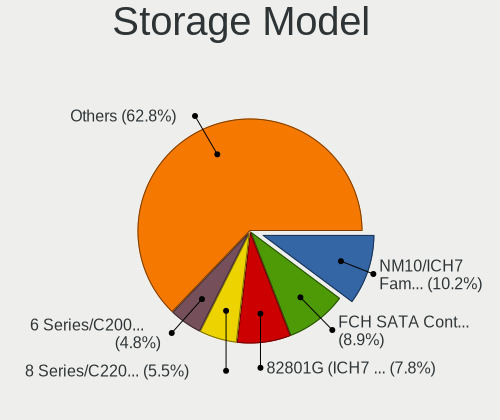

| Model                                                                                   | Desktops | Percent |
|-----------------------------------------------------------------------------------------|----------|---------|
| Intel NM10/ICH7 Family SATA Controller [IDE mode]                                       | 130      | 9.8%    |
| AMD FCH SATA Controller [AHCI mode]                                                     | 119      | 8.97%   |
| Intel 82801G (ICH7 Family) IDE Controller                                               | 99       | 7.46%   |
| Intel 8 Series/C220 Series Chipset Family 6-port SATA Controller 1 [AHCI mode]          | 75       | 5.65%   |
| Intel 6 Series/C200 Series Chipset Family 6 port Desktop SATA AHCI Controller           | 66       | 4.97%   |
| Intel Q170/Q150/B150/H170/H110/Z170/CM236 Chipset SATA Controller [AHCI Mode]           | 55       | 4.14%   |
| AMD 400 Series Chipset SATA Controller                                                  | 49       | 3.69%   |
| Intel 200 Series PCH SATA controller [AHCI mode]                                        | 45       | 3.39%   |
| Intel 6 Series/C200 Series Chipset Family Desktop SATA Controller (IDE mode, ports 4-5) | 37       | 2.79%   |
| Intel 6 Series/C200 Series Chipset Family Desktop SATA Controller (IDE mode, ports 0-3) | 37       | 2.79%   |
| Intel Cannon Lake PCH SATA AHCI Controller                                              | 36       | 2.71%   |
| Intel 500 Series Chipset Family SATA AHCI Controller                                    | 33       | 2.49%   |
| AMD SB7x0/SB8x0/SB9x0 IDE Controller                                                    | 32       | 2.41%   |
| Intel 7 Series/C210 Series Chipset Family 6-port SATA Controller [AHCI mode]            | 31       | 2.34%   |
| AMD FCH SATA Controller D                                                               | 29       | 2.19%   |
| AMD SB7x0/SB8x0/SB9x0 SATA Controller [IDE mode]                                        | 28       | 2.11%   |
| Intel SATA Controller [RAID mode]                                                       | 21       | 1.58%   |
| Intel 5 Series/3400 Series Chipset 4 port SATA IDE Controller                           | 17       | 1.28%   |
| ASMedia ASM1062 Serial ATA Controller                                                   | 17       | 1.28%   |
| Samsung NVMe SSD Controller SM981/PM981/PM983                                           | 16       | 1.21%   |
| Intel 5 Series/3400 Series Chipset 2 port SATA IDE Controller                           | 16       | 1.21%   |
| AMD 500 Series Chipset SATA Controller                                                  | 16       | 1.21%   |
| AMD 300 Series Chipset SATA Controller                                                  | 14       | 1.06%   |
| Samsung NVMe SSD Controller 980                                                         | 11       | 0.83%   |
| Intel 9 Series Chipset Family SATA Controller [AHCI Mode]                               | 10       | 0.75%   |
| Intel 400 Series Chipset Family SATA AHCI Controller                                    | 10       | 0.75%   |
| Nvidia MCP61 SATA Controller                                                            | 9        | 0.68%   |
| Intel Comet Lake SATA AHCI Controller                                                   | 9        | 0.68%   |
| AMD SB7x0/SB8x0/SB9x0 SATA Controller [AHCI mode]                                       | 9        | 0.68%   |
| SanDisk WD Blue SN570 NVMe SSD                                                          | 8        | 0.6%    |
| Nvidia MCP61 IDE                                                                        | 8        | 0.6%    |
| Intel Alder Lake-S PCH SATA Controller [AHCI Mode]                                      | 8        | 0.6%    |
| AMD FCH SATA Controller [IDE mode]                                                      | 8        | 0.6%    |
| AMD FCH IDE Controller                                                                  | 8        | 0.6%    |
| SanDisk WD Blue SN550 NVMe SSD                                                          | 6        | 0.45%   |
| Phison PS5013 E13 NVMe Controller                                                       | 6        | 0.45%   |
| Intel SSD 660P Series                                                                   | 6        | 0.45%   |
| Intel Volume Management Device NVMe RAID Controller                                     | 5        | 0.38%   |
| Intel Atom Processor E3800 Series SATA AHCI Controller                                  | 5        | 0.38%   |
| Intel 5 Series/3400 Series Chipset PT IDER Controller                                   | 5        | 0.38%   |

Storage Kind
------------

Kind of storage controller (IDE, SATA, NVMe, SAS, ...)

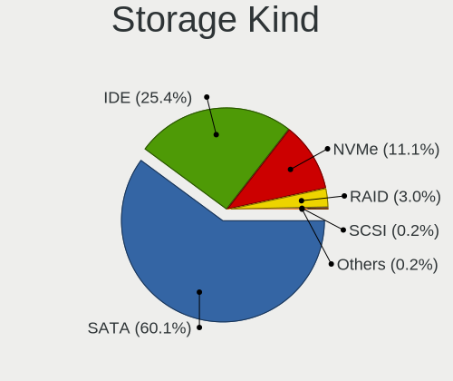

| Kind | Desktops | Percent |
|------|----------|---------|
| SATA | 603      | 59.53%  |
| IDE  | 274      | 27.05%  |
| NVMe | 100      | 9.87%   |
| RAID | 32       | 3.16%   |
| SAS  | 2        | 0.2%    |
| SCSI | 2        | 0.2%    |

Processor
---------

CPU Vendor
----------

Processor vendors

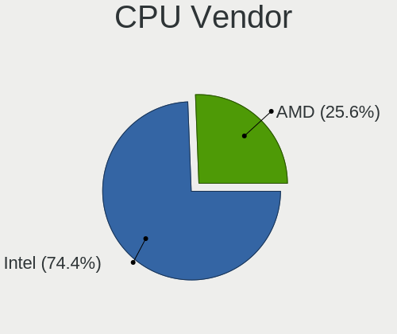

| Vendor | Desktops | Percent |
|--------|----------|---------|
| Intel  | 649      | 76.53%  |
| AMD    | 199      | 23.47%  |

CPU Model
---------

Processor models

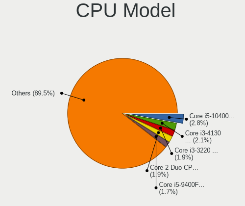

| Model                                       | Desktops | Percent |
|---------------------------------------------|----------|---------|
| Intel Core i5-10400 CPU @ 2.90GHz           | 25       | 2.94%   |
| Intel Core i3-4130 CPU @ 3.40GHz            | 18       | 2.12%   |
| Intel Core i3-3220 CPU @ 3.30GHz            | 17       | 2%      |
| Intel Core 2 Duo CPU E7500 @ 2.93GHz        | 17       | 2%      |
| Intel Core i5-9400F CPU @ 2.90GHz           | 15       | 1.77%   |
| AMD Ryzen 5 3600 6-Core Processor           | 14       | 1.65%   |
| Intel Core i5-3470 CPU @ 3.20GHz            | 13       | 1.53%   |
| Intel Core i3-2120 CPU @ 3.30GHz            | 13       | 1.53%   |
| Intel Core i3-2100 CPU @ 3.10GHz            | 13       | 1.53%   |
| AMD Ryzen 3 2200G with Radeon Vega Graphics | 13       | 1.53%   |
| Intel Pentium Dual-Core CPU E6700 @ 3.20GHz | 12       | 1.41%   |
| Intel Core i3-7100 CPU @ 3.90GHz            | 10       | 1.18%   |
| Intel Core 2 Duo CPU E8400 @ 3.00GHz        | 10       | 1.18%   |
| AMD Ryzen 7 3700X 8-Core Processor          | 10       | 1.18%   |
| Intel Core i5-8400 CPU @ 2.80GHz            | 9        | 1.06%   |
| Intel Core i5-6500 CPU @ 3.20GHz            | 9        | 1.06%   |
| Intel Core i5-2400 CPU @ 3.10GHz            | 9        | 1.06%   |
| AMD Ryzen 3 3200G with Radeon Vega Graphics | 9        | 1.06%   |
| Intel Pentium Dual-Core CPU E5700 @ 3.00GHz | 8        | 0.94%   |
| Intel Core i3-4150 CPU @ 3.50GHz            | 8        | 0.94%   |
| Intel Core i5-4440 CPU @ 3.10GHz            | 7        | 0.82%   |
| Intel Core i3-9100F CPU @ 3.60GHz           | 7        | 0.82%   |
| Intel Core 2 Duo CPU E7400 @ 2.80GHz        | 7        | 0.82%   |
| AMD Ryzen 7 2700 Eight-Core Processor       | 7        | 0.82%   |
| AMD Ryzen 5 3400G with Radeon Vega Graphics | 7        | 0.82%   |
| AMD Ryzen 5 1600 Six-Core Processor         | 7        | 0.82%   |
| Intel Pentium Dual-Core CPU E5300 @ 2.60GHz | 6        | 0.71%   |
| Intel Pentium Dual CPU E2140 @ 1.60GHz      | 6        | 0.71%   |
| Intel Pentium CPU G3240 @ 3.10GHz           | 6        | 0.71%   |
| Intel Core i7-8700 CPU @ 3.20GHz            | 6        | 0.71%   |
| Intel Core i5-7400 CPU @ 3.00GHz            | 6        | 0.71%   |
| Intel Core i5-4570 CPU @ 3.20GHz            | 6        | 0.71%   |
| Intel Core i5-3570 CPU @ 3.40GHz            | 6        | 0.71%   |
| Intel Core i3-9100 CPU @ 3.60GHz            | 6        | 0.71%   |
| Intel Core i3-3210 CPU @ 3.20GHz            | 6        | 0.71%   |
| Intel Core 2 Quad CPU Q6600 @ 2.40GHz       | 6        | 0.71%   |
| Intel Core 2 Duo CPU E4500 @ 2.20GHz        | 6        | 0.71%   |
| AMD Ryzen 5 2400G with Radeon Vega Graphics | 6        | 0.71%   |
| AMD FX-6300 Six-Core Processor              | 6        | 0.71%   |
| AMD FX-4300 Quad-Core Processor             | 6        | 0.71%   |

CPU Model Family
----------------

Processor model prefix

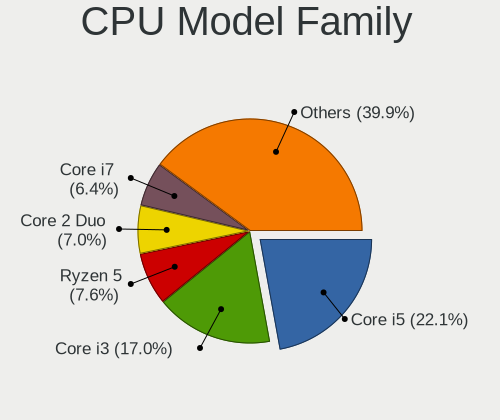

| Model                   | Desktops | Percent |
|-------------------------|----------|---------|
| Intel Core i5           | 186      | 21.91%  |
| Intel Core i3           | 144      | 16.96%  |
| Intel Core 2 Duo        | 63       | 7.42%   |
| AMD Ryzen 5             | 60       | 7.07%   |
| Intel Core i7           | 54       | 6.36%   |
| Intel Pentium           | 45       | 5.3%    |
| Intel Pentium Dual-Core | 43       | 5.06%   |
| AMD Ryzen 7             | 27       | 3.18%   |
| AMD Ryzen 3             | 24       | 2.83%   |
| AMD FX                  | 22       | 2.59%   |
| Other                   | 18       | 2.12%   |
| Intel Xeon              | 15       | 1.77%   |
| Intel Celeron           | 15       | 1.77%   |
| Intel Core 2 Quad       | 14       | 1.65%   |
| Intel Pentium Dual      | 13       | 1.53%   |
| Intel Core 2            | 12       | 1.41%   |
| AMD Ryzen 9             | 12       | 1.41%   |
| AMD A4                  | 9        | 1.06%   |
| Intel Pentium Gold      | 7        | 0.82%   |
| AMD Athlon II X2        | 7        | 0.82%   |
| Intel Core i9           | 6        | 0.71%   |
| AMD A8                  | 6        | 0.71%   |
| Intel Pentium 4         | 5        | 0.59%   |
| Intel Pentium D         | 4        | 0.47%   |
| AMD Phenom II X4        | 4        | 0.47%   |
| AMD Phenom II X2        | 4        | 0.47%   |
| AMD Athlon              | 4        | 0.47%   |
| Intel Atom              | 3        | 0.35%   |
| AMD Sempron             | 3        | 0.35%   |
| AMD Ryzen Threadripper  | 3        | 0.35%   |
| AMD Athlon 64 X2        | 3        | 0.35%   |
| AMD A6                  | 3        | 0.35%   |
| Intel Genuine           | 2        | 0.24%   |
| AMD Ryzen 5 PRO         | 2        | 0.24%   |
| AMD Phenom II X6        | 2        | 0.24%   |
| AMD E                   | 2        | 0.24%   |
| Intel Pentium Silver    | 1        | 0.12%   |
| AMD Ryzen 3 PRO         | 1        | 0.12%   |
| AMD E1                  | 1        | 0.12%   |

CPU Cores
---------

Number of processor cores

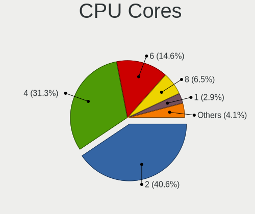

| Number | Desktops | Percent |
|--------|----------|---------|
| 2      | 366      | 43.06%  |
| 4      | 259      | 30.47%  |
| 6      | 123      | 14.47%  |
| 8      | 49       | 5.76%   |
| 1      | 23       | 2.71%   |
| 12     | 11       | 1.29%   |
| 16     | 7        | 0.82%   |
| 3      | 5        | 0.59%   |
| 10     | 3        | 0.35%   |
| 32     | 2        | 0.24%   |
| 36     | 1        | 0.12%   |
| 14     | 1        | 0.12%   |

CPU Sockets
-----------

Number of sockets

| Number | Desktops | Percent |
|--------|----------|---------|
| 1      | 844      | 99.53%  |
| 2      | 4        | 0.47%   |

CPU Threads
-----------

Threads per core (Hyper-Threading)

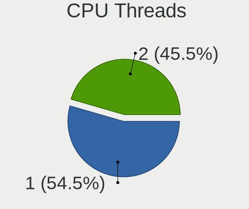

| Number | Desktops | Percent |
|--------|----------|---------|
| 1      | 453      | 53.42%  |
| 2      | 395      | 46.58%  |

CPU Op-Modes
------------

CPU Operation Modes (32-bit, 64-bit)

| Op mode        | Desktops | Percent |
|----------------|----------|---------|
| 32-bit, 64-bit | 836      | 98.47%  |
| Unknown        | 12       | 1.41%   |
| 32-bit         | 1        | 0.12%   |

CPU Microcode
-------------

Microcode number

| Number     | Desktops | Percent |
|------------|----------|---------|
| Unknown    | 145      | 16.65%  |
| 0x1067a    | 78       | 8.96%   |
| 0x306c3    | 72       | 8.27%   |
| 0x306a9    | 70       | 8.04%   |
| 0x206a7    | 55       | 6.31%   |
| 0x906ea    | 36       | 4.13%   |
| 0x506e3    | 36       | 4.13%   |
| 0x906e9    | 29       | 3.33%   |
| 0xa0655    | 26       | 2.99%   |
| 0x08701021 | 25       | 2.87%   |
| 0x6fd      | 20       | 2.3%    |
| 0x010000c8 | 17       | 1.95%   |
| 0xa0653    | 13       | 1.49%   |
| 0x08108109 | 13       | 1.49%   |
| 0x906eb    | 12       | 1.38%   |
| 0x06000852 | 12       | 1.38%   |
| 0x20655    | 11       | 1.26%   |
| 0x0800820d | 11       | 1.26%   |
| 0x6fb      | 10       | 1.15%   |
| 0x08101016 | 10       | 1.15%   |
| 0x906ed    | 9        | 1.03%   |
| 0x6f2      | 9        | 1.03%   |
| 0x10676    | 9        | 1.03%   |
| 0x08701013 | 8        | 0.92%   |
| 0x0810100b | 8        | 0.92%   |
| 0x06001119 | 8        | 0.92%   |
| 0x08001137 | 7        | 0.8%    |
| 0xa0671    | 6        | 0.69%   |
| 0x6f6      | 5        | 0.57%   |
| 0x90672    | 4        | 0.46%   |
| 0x20652    | 4        | 0.46%   |
| 0x106e5    | 4        | 0.46%   |
| 0x08001138 | 4        | 0.46%   |
| 0x0600063e | 4        | 0.46%   |
| 0xf65      | 3        | 0.34%   |
| 0xf41      | 3        | 0.34%   |
| 0x90675    | 3        | 0.34%   |
| 0x506c9    | 3        | 0.34%   |
| 0x30678    | 3        | 0.34%   |
| 0x0a201016 | 3        | 0.34%   |

CPU Microarch
-------------

Microarchitecture

| Name             | Desktops | Percent |
|------------------|----------|---------|
| KabyLake         | 107      | 12.6%   |
| Penryn           | 101      | 11.9%   |
| Haswell          | 89       | 10.48%  |
| IvyBridge        | 80       | 9.42%   |
| SandyBridge      | 64       | 7.54%   |
| Core             | 48       | 5.65%   |
| Zen 2            | 46       | 5.42%   |
| CometLake        | 45       | 5.3%    |
| Skylake          | 43       | 5.06%   |
| Zen              | 39       | 4.59%   |
| Zen+             | 35       | 4.12%   |
| Piledriver       | 26       | 3.06%   |
| K10              | 20       | 2.36%   |
| Westmere         | 16       | 1.88%   |
| Zen 3            | 10       | 1.18%   |
| NetBurst         | 10       | 1.18%   |
| Silvermont       | 8        | 0.94%   |
| Alderlake Hybrid | 8        | 0.94%   |
| Nehalem          | 7        | 0.82%   |
| Unknown          | 7        | 0.82%   |
| Icelake          | 5        | 0.59%   |
| Goldmont         | 5        | 0.59%   |
| Bulldozer        | 5        | 0.59%   |
| Excavator        | 4        | 0.47%   |
| Broadwell        | 4        | 0.47%   |
| Steamroller      | 3        | 0.35%   |
| K8 Hammer        | 3        | 0.35%   |
| Goldmont plus    | 3        | 0.35%   |
| Bobcat           | 3        | 0.35%   |
| K10 Llano        | 2        | 0.24%   |
| TigerLake        | 1        | 0.12%   |
| Jaguar           | 1        | 0.12%   |
| Bonnell          | 1        | 0.12%   |

Graphics
--------

GPU Vendor
----------

Vendors of graphics cards

| Vendor                           | Desktops | Percent |
|----------------------------------|----------|---------|
| Intel                            | 473      | 53.33%  |
| Nvidia                           | 275      | 31%     |
| AMD                              | 135      | 15.22%  |
| Silicon Integrated Systems [SiS] | 3        | 0.34%   |
| ASPEED Technology                | 1        | 0.11%   |

GPU Model
---------

Graphics card models

| Model                                                                       | Desktops | Percent |
|-----------------------------------------------------------------------------|----------|---------|
| Nvidia GK208B [GeForce GT 710]                                              | 64       | 7.15%   |
| Intel Xeon E3-1200 v2/3rd Gen Core processor Graphics Controller            | 59       | 6.59%   |
| Intel 4 Series Chipset Integrated Graphics Controller                       | 57       | 6.37%   |
| Intel 2nd Generation Core Processor Family Integrated Graphics Controller   | 50       | 5.59%   |
| Intel Xeon E3-1200 v3/4th Gen Core Processor Integrated Graphics Controller | 48       | 5.36%   |
| Intel CometLake-S GT2 [UHD Graphics 630]                                    | 35       | 3.91%   |
| Intel CoffeeLake-S GT2 [UHD Graphics 630]                                   | 34       | 3.8%    |
| Intel 82G33/G31 Express Integrated Graphics Controller                      | 34       | 3.8%    |
| Intel 4th Generation Core Processor Family Integrated Graphics Controller   | 27       | 3.02%   |
| Nvidia GP107 [GeForce GTX 1050 Ti]                                          | 23       | 2.57%   |
| Nvidia GT218 [GeForce 210]                                                  | 21       | 2.35%   |
| Intel HD Graphics 630                                                       | 21       | 2.35%   |
| Intel 82945G/GZ Integrated Graphics Controller                              | 21       | 2.35%   |
| Intel HD Graphics 530                                                       | 19       | 2.12%   |
| AMD RS780L [Radeon 3000]                                                    | 18       | 2.01%   |
| AMD Raven Ridge [Radeon Vega Series / Radeon Vega Mobile Series]            | 18       | 2.01%   |
| AMD Picasso/Raven 2 [Radeon Vega Series / Radeon Vega Mobile Series]        | 15       | 1.68%   |
| AMD Ellesmere [Radeon RX 470/480/570/570X/580/580X/590]                     | 14       | 1.56%   |
| Nvidia GF119 [GeForce GT 610]                                               | 13       | 1.45%   |
| Nvidia GK208B [GeForce GT 730]                                              | 12       | 1.34%   |
| Intel Core Processor Integrated Graphics Controller                         | 12       | 1.34%   |
| Nvidia TU116 [GeForce GTX 1660]                                             | 8        | 0.89%   |
| Nvidia GP106 [GeForce GTX 1060 6GB]                                         | 7        | 0.78%   |
| Nvidia GM206 [GeForce GTX 960]                                              | 7        | 0.78%   |
| Nvidia TU116 [GeForce GTX 1660 SUPER]                                       | 6        | 0.67%   |
| Nvidia GM107 [GeForce GTX 750 Ti]                                           | 6        | 0.67%   |
| Intel HD Graphics 510                                                       | 6        | 0.67%   |
| Intel Atom Processor Z36xxx/Z37xxx Series Graphics & Display                | 6        | 0.67%   |
| AMD Cedar [Radeon HD 5000/6000/7350/8350 Series]                            | 6        | 0.67%   |
| AMD Caicos [Radeon HD 6450/7450/8450 / R5 230 OEM]                          | 6        | 0.67%   |
| Nvidia TU117 [GeForce GTX 1650]                                             | 5        | 0.56%   |
| Nvidia TU116 [GeForce GTX 1660 Ti]                                          | 5        | 0.56%   |
| Nvidia GP108 [GeForce GT 1030]                                              | 5        | 0.56%   |
| Nvidia GA104 [GeForce RTX 3060 Ti Lite Hash Rate]                           | 5        | 0.56%   |
| Nvidia C61 [GeForce 7025 / nForce 630a]                                     | 5        | 0.56%   |
| Intel CoffeeLake-S GT1 [UHD Graphics 610]                                   | 5        | 0.56%   |
| Nvidia GM204 [GeForce GTX 970]                                              | 4        | 0.45%   |
| Nvidia TU106 [GeForce RTX 2060 SUPER]                                       | 3        | 0.34%   |
| Nvidia TU104 [GeForce RTX 2070 SUPER]                                       | 3        | 0.34%   |
| Nvidia GT218 [GeForce G210]                                                 | 3        | 0.34%   |

GPU Combo
---------

Combinations of graphics cards

| Name               | Desktops | Percent |
|--------------------|----------|---------|
| 1 x Intel          | 438      | 51.23%  |
| 1 x Nvidia         | 258      | 30.18%  |
| 1 x AMD            | 125      | 14.62%  |
| Intel + Nvidia     | 11       | 1.29%   |
| Intel + AMD        | 7        | 0.82%   |
| AMD + Nvidia       | 4        | 0.47%   |
| Other              | 3        | 0.35%   |
| 2 x Nvidia         | 3        | 0.35%   |
| 1 x SiS            | 3        | 0.35%   |
| 2 x AMD            | 1        | 0.12%   |
| Nvidia + ASPEED    | 1        | 0.12%   |
| Intel + 2 x Nvidia | 1        | 0.12%   |

GPU Driver
----------

Free vs proprietary

| Driver      | Desktops | Percent |
|-------------|----------|---------|
| Free        | 660      | 76.74%  |
| Proprietary | 162      | 18.84%  |
| Unknown     | 38       | 4.42%   |

GPU Memory
----------

Total video memory

| Size in GB | Desktops | Percent |
|------------|----------|---------|
| Unknown    | 479      | 54.99%  |
| 1.01-2.0   | 150      | 17.22%  |
| 0.01-0.5   | 67       | 7.69%   |
| 3.01-4.0   | 57       | 6.54%   |
| 0.51-1.0   | 53       | 6.08%   |
| 7.01-8.0   | 27       | 3.1%    |
| 5.01-6.0   | 24       | 2.76%   |
| 8.01-16.0  | 10       | 1.15%   |
| 16.01-24.0 | 3        | 0.34%   |
| 2.01-3.0   | 1        | 0.11%   |

Monitor
-------

Monitor Vendor
--------------

Monitor vendors

| Vendor               | Desktops | Percent |
|----------------------|----------|---------|
| Dell                 | 160      | 20.49%  |
| Goldstar             | 115      | 14.72%  |
| Samsung Electronics  | 100      | 12.8%   |
| Acer                 | 74       | 9.48%   |
| BenQ                 | 66       | 8.45%   |
| Hewlett-Packard      | 46       | 5.89%   |
| AOC                  | 41       | 5.25%   |
| Lenovo               | 22       | 2.82%   |
| ViewSonic            | 19       | 2.43%   |
| HCL                  | 19       | 2.43%   |
| Philips              | 13       | 1.66%   |
| LG Electronics       | 11       | 1.41%   |
| Unknown              | 10       | 1.28%   |
| Sony                 | 7        | 0.9%    |
| STD                  | 6        | 0.77%   |
| Ancor Communications | 5        | 0.64%   |
| Xiaomi               | 4        | 0.51%   |
| ASUSTek Computer     | 4        | 0.51%   |
| Panasonic            | 3        | 0.38%   |
| AOpen                | 3        | 0.38%   |
| Unknown              | 3        | 0.38%   |
| ___                  | 2        | 0.26%   |
| SGT                  | 2        | 0.26%   |
| RTK                  | 2        | 0.26%   |
| NEW                  | 2        | 0.26%   |
| KTC                  | 2        | 0.26%   |
| KNK                  | 2        | 0.26%   |
| HPN                  | 2        | 0.26%   |
| Gigabyte Technology  | 2        | 0.26%   |
| Gateway              | 2        | 0.26%   |
| ZEH                  | 1        | 0.13%   |
| WDT                  | 1        | 0.13%   |
| UTV                  | 1        | 0.13%   |
| Unknown (ACE)        | 1        | 0.13%   |
| Toshiba              | 1        | 0.13%   |
| Tech Concepts        | 1        | 0.13%   |
| Skyworth             | 1        | 0.13%   |
| SKK                  | 1        | 0.13%   |
| SANYO                | 1        | 0.13%   |
| PZG                  | 1        | 0.13%   |

Monitor Model
-------------

Monitor models

| Model                                                                | Desktops | Percent |
|----------------------------------------------------------------------|----------|---------|
| Dell D1918H DEL2005 1366x768 410x230mm 18.5-inch                     | 28       | 3.44%   |
| BenQ GW2283 BNQ78E9 1920x1080 476x268mm 21.5-inch                    | 13       | 1.6%    |
| Dell E1916HV DELF06C 1366x768 409x230mm 18.5-inch                    | 11       | 1.35%   |
| Goldstar IPS FULLHD GSM5AB8 1920x1080 480x270mm 21.7-inch            | 10       | 1.23%   |
| Goldstar IPS FULLHD GSM5AB6 1920x1080 480x270mm 21.7-inch            | 9        | 1.1%    |
| Goldstar FULL HD GSM5B55 1920x1080 480x270mm 21.7-inch               | 8        | 0.98%   |
| Lenovo LEN LS1922wA LEN0A14 1366x768 410x230mm 18.5-inch             | 7        | 0.86%   |
| Goldstar HD GSM5ACB 1366x768 410x230mm 18.5-inch                     | 7        | 0.86%   |
| AOC 1970W AOC1970 1366x768 410x230mm 18.5-inch                       | 7        | 0.86%   |
| Samsung Electronics S19F350 SAM0D46 1366x768 410x230mm 18.5-inch     | 6        | 0.74%   |
| Goldstar W1943 GSM4BAD 1360x768 406x229mm 18.4-inch                  | 6        | 0.74%   |
| Goldstar FULL HD GSM5B54 1920x1080 480x270mm 21.7-inch               | 6        | 0.74%   |
| Dell S2240L DELD054 1920x1080 476x267mm 21.5-inch                    | 6        | 0.74%   |
| Dell IN2030M DELF03C 1600x900 443x249mm 20.0-inch                    | 6        | 0.74%   |
| BenQ GW2480 BNQ78E7 1920x1080 530x300mm 24.0-inch                    | 6        | 0.74%   |
| Goldstar LG HD GSM5ACD 1366x768 410x230mm 18.5-inch                  | 5        | 0.61%   |
| Dell S2216H DELD07A 1920x1080 476x268mm 21.5-inch                    | 5        | 0.61%   |
| Acer V206HQLB ACR051A 1366x768 434x236mm 19.4-inch                   | 5        | 0.61%   |
| Acer V193HQL ACR0127 1366x768 410x230mm 18.5-inch                    | 5        | 0.61%   |
| Xiaomi Mi TV XMD004A 1920x1080 708x398mm 32.0-inch                   | 4        | 0.49%   |
| STD LCD Monitor STD0001 1920x1080                                    | 4        | 0.49%   |
| Hewlett-Packard Compaq F191 HWP3177 1366x768 410x230mm 18.5-inch     | 4        | 0.49%   |
| HCL HCMELWBN11 HCME444 1366x768 410x230mm 18.5-inch                  | 4        | 0.49%   |
| Dell U2415 DELA0BA 1920x1200 518x324mm 24.1-inch                     | 4        | 0.49%   |
| Dell E2016HV DELF06E 1600x900 434x236mm 19.4-inch                    | 4        | 0.49%   |
| BenQ GW2470 BNQ78E4 1920x1080 527x296mm 23.8-inch                    | 4        | 0.49%   |
| BenQ GW2270 BNQ78DB 1920x1080 480x270mm 21.7-inch                    | 4        | 0.49%   |
| Samsung Electronics SyncMaster SAM0027 1280x1024 312x234mm 15.4-inch | 3        | 0.37%   |
| Samsung Electronics SMS16A100 SAM0880 1366x768 344x194mm 15.5-inch   | 3        | 0.37%   |
| Samsung Electronics SMB1930N SAM0632 1360x768 410x230mm 18.5-inch    | 3        | 0.37%   |
| Samsung Electronics S22F350 SAM0D1B 1920x1080 477x268mm 21.5-inch    | 3        | 0.37%   |
| Samsung Electronics S22F350 SAM0D1A 1920x1080 477x268mm 21.5-inch    | 3        | 0.37%   |
| Philips 192EL PHLC04E 1366x768 410x230mm 18.5-inch                   | 3        | 0.37%   |
| Lenovo LEN E2054A LEN60DF 1440x900 419x262mm 19.5-inch               | 3        | 0.37%   |
| Hewlett-Packard v185e HWP2838 1366x768 410x230mm 18.5-inch           | 3        | 0.37%   |
| Hewlett-Packard Compaq B191 HWP3334 1366x768 410x230mm 18.5-inch     | 3        | 0.37%   |
| Hewlett-Packard 22w HPN3430 1920x1080 476x268mm 21.5-inch            | 3        | 0.37%   |
| HCL HCMEEWBD11 HCMB472 1366x768 410x230mm 18.5-inch                  | 3        | 0.37%   |
| Goldstar W1941 GSM4B91 1360x768 406x229mm 18.4-inch                  | 3        | 0.37%   |
| Goldstar ULTRAWIDE GSM76F9 2560x1080 531x298mm 24.0-inch             | 3        | 0.37%   |

Monitor Resolution
------------------

Monitor screen resolution

| Resolution         | Desktops | Percent |
|--------------------|----------|---------|
| 1920x1080 (FHD)    | 305      | 38.66%  |
| 1366x768 (WXGA)    | 214      | 27.12%  |
| 1600x900 (HD+)     | 69       | 8.75%   |
| 3840x2160 (4K)     | 42       | 5.32%   |
| 1440x900 (WXGA+)   | 31       | 3.93%   |
| 2560x1440 (QHD)    | 20       | 2.53%   |
| 1360x768           | 19       | 2.41%   |
| 1280x1024 (SXGA)   | 18       | 2.28%   |
| Unknown            | 13       | 1.65%   |
| 3840x1080          | 9        | 1.14%   |
| 2560x1080          | 8        | 1.01%   |
| 1680x1050 (WSXGA+) | 7        | 0.89%   |
| 1024x768 (XGA)     | 7        | 0.89%   |
| 1920x1200 (WUXGA)  | 6        | 0.76%   |
| 1280x720 (HD)      | 5        | 0.63%   |
| 4093x4093          | 3        | 0.38%   |
| 1152x864           | 2        | 0.25%   |
| 8160x4627          | 1        | 0.13%   |
| 6400x2160          | 1        | 0.13%   |
| 5760x2160          | 1        | 0.13%   |
| 4480x1080          | 1        | 0.13%   |
| 3200x900           | 1        | 0.13%   |
| 2560x1600          | 1        | 0.13%   |
| 2288x1287          | 1        | 0.13%   |
| 1920x540           | 1        | 0.13%   |
| 1400x1050          | 1        | 0.13%   |
| 1280x800 (WXGA)    | 1        | 0.13%   |
| 1280x768           | 1        | 0.13%   |

Monitor Diagonal
----------------

Diagonal size in inches

| Inches  | Desktops | Percent |
|---------|----------|---------|
| 18      | 187      | 23.73%  |
| 21      | 153      | 19.42%  |
| Unknown | 76       | 9.64%   |
| 19      | 72       | 9.14%   |
| 24      | 56       | 7.11%   |
| 23      | 47       | 5.96%   |
| 20      | 39       | 4.95%   |
| 27      | 37       | 4.7%    |
| 15      | 28       | 3.55%   |
| 31      | 15       | 1.9%    |
| 17      | 15       | 1.9%    |
| 72      | 7        | 0.89%   |
| 34      | 7        | 0.89%   |
| 40      | 6        | 0.76%   |
| 22      | 6        | 0.76%   |
| 32      | 5        | 0.63%   |
| 84      | 4        | 0.51%   |
| 65      | 4        | 0.51%   |
| 46      | 3        | 0.38%   |
| 26      | 3        | 0.38%   |
| 25      | 3        | 0.38%   |
| 12      | 3        | 0.38%   |
| 42      | 2        | 0.25%   |
| 39      | 2        | 0.25%   |
| 16      | 2        | 0.25%   |
| 13      | 2        | 0.25%   |
| 142     | 1        | 0.13%   |
| 54      | 1        | 0.13%   |
| 52      | 1        | 0.13%   |
| 48      | 1        | 0.13%   |

Monitor Width
-------------

Physical width

| Width in mm    | Desktops | Percent |
|----------------|----------|---------|
| 401-500        | 446      | 57.25%  |
| 501-600        | 135      | 17.33%  |
| Unknown        | 76       | 9.76%   |
| 301-350        | 37       | 4.75%   |
| 601-700        | 22       | 2.82%   |
| 701-800        | 12       | 1.54%   |
| 351-400        | 11       | 1.41%   |
| 1501-2000      | 11       | 1.41%   |
| 1001-1500      | 10       | 1.28%   |
| 801-900        | 8        | 1.03%   |
| 201-300        | 8        | 1.03%   |
| 901-1000       | 2        | 0.26%   |
| More than 2000 | 1        | 0.13%   |

Aspect Ratio
------------

Proportional relationship between the width and the height

| Ratio   | Desktops | Percent |
|---------|----------|---------|
| 16/9    | 600      | 77.92%  |
| Unknown | 74       | 9.61%   |
| 16/10   | 50       | 6.49%   |
| 5/4     | 16       | 2.08%   |
| 4/3     | 16       | 2.08%   |
| 21/9    | 7        | 0.91%   |
| 6/5     | 4        | 0.52%   |
| 32/9    | 1        | 0.13%   |
| 3/2     | 1        | 0.13%   |
| 1.00    | 1        | 0.13%   |

Monitor Area
------------

Area in inch²

| Area in inch² | Desktops | Percent |
|----------------|----------|---------|
| 201-250        | 225      | 28.59%  |
| 141-150        | 195      | 24.78%  |
| 151-200        | 139      | 17.66%  |
| Unknown        | 76       | 9.66%   |
| 301-350        | 37       | 4.7%    |
| 351-500        | 27       | 3.43%   |
| More than 1000 | 18       | 2.29%   |
| 101-110        | 18       | 2.29%   |
| 251-300        | 17       | 2.16%   |
| 501-1000       | 14       | 1.78%   |
| 111-120        | 6        | 0.76%   |
| 131-140        | 5        | 0.64%   |
| 71-80          | 3        | 0.38%   |
| 121-130        | 3        | 0.38%   |
| 91-100         | 3        | 0.38%   |
| 81-90          | 1        | 0.13%   |

Pixel Density
-------------

Pixels per inch

| Density | Desktops | Percent |
|---------|----------|---------|
| 51-100  | 479      | 61.65%  |
| 101-120 | 175      | 22.52%  |
| Unknown | 76       | 9.78%   |
| 1-50    | 21       | 2.7%    |
| 121-160 | 14       | 1.8%    |
| 161-240 | 12       | 1.54%   |

Multiple Monitors
-----------------

Total monitors connected

| Total | Desktops | Percent |
|-------|----------|---------|
| 1     | 767      | 89.6%   |
| 0     | 52       | 6.07%   |
| 2     | 34       | 3.97%   |
| 3     | 3        | 0.35%   |

Network
-------

Net Controller Vendor
---------------------

Controller vendors

| Vendor                           | Desktops | Percent |
|----------------------------------|----------|---------|
| Realtek Semiconductor            | 644      | 51.15%  |
| Intel                            | 215      | 17.08%  |
| Ralink Technology                | 88       | 6.99%   |
| Qualcomm Atheros                 | 48       | 3.81%   |
| TP-Link                          | 39       | 3.1%    |
| Xiaomi                           | 29       | 2.3%    |
| D-Link                           | 26       | 2.07%   |
| Broadcom                         | 18       | 1.43%   |
| OPPO Electronics                 | 15       | 1.19%   |
| Samsung Electronics              | 13       | 1.03%   |
| Qualcomm Atheros Communications  | 11       | 0.87%   |
| MediaTek                         | 11       | 0.87%   |
| Foxconn / Hon Hai                | 10       | 0.79%   |
| Qualcomm                         | 9        | 0.71%   |
| Nvidia                           | 9        | 0.71%   |
| OnePlus Technology (Shenzhen)    | 8        | 0.64%   |
| Huawei Technologies              | 8        | 0.64%   |
| Ralink                           | 6        | 0.48%   |
| NetGear                          | 5        | 0.4%    |
| vivo                             | 4        | 0.32%   |
| Edimax Technology                | 4        | 0.32%   |
| ASIX Electronics                 | 4        | 0.32%   |
| NTmore                           | 3        | 0.24%   |
| Motorola PCS                     | 3        | 0.24%   |
| Marvell Technology Group         | 3        | 0.24%   |
| Lenovo                           | 3        | 0.24%   |
| D-Link System                    | 3        | 0.24%   |
| ASUSTek Computer                 | 3        | 0.24%   |
| Spreadtrum Communications        | 2        | 0.16%   |
| Broadcom Limited                 | 2        | 0.16%   |
| Aquantia                         | 2        | 0.16%   |
| Wacom                            | 1        | 0.08%   |
| SILICON Laboratories             | 1        | 0.08%   |
| Silicon Integrated Systems [SiS] | 1        | 0.08%   |
| Motorola                         | 1        | 0.08%   |
| LG Electronics                   | 1        | 0.08%   |
| JMicron Technology               | 1        | 0.08%   |
| ICS Advent                       | 1        | 0.08%   |
| HTC (High Tech Computer)         | 1        | 0.08%   |
| HMD Global                       | 1        | 0.08%   |

Net Controller Model
--------------------

Controller models

| Model                                                                | Desktops | Percent |
|----------------------------------------------------------------------|----------|---------|
| Realtek RTL8111/8168/8411 PCI Express Gigabit Ethernet Controller    | 471      | 32.6%   |
| Realtek RTL810xE PCI Express Fast Ethernet controller                | 111      | 7.68%   |
| Ralink MT7601U Wireless Adapter                                      | 84       | 5.81%   |
| Realtek RTL8188FTV 802.11b/g/n 1T1R 2.4G WLAN Adapter                | 57       | 3.94%   |
| Realtek RTL8188EUS 802.11n Wireless Network Adapter                  | 46       | 3.18%   |
| Intel 82579V Gigabit Network Connection                              | 27       | 1.87%   |
| Xiaomi Mi/Redmi series (RNDIS)                                       | 24       | 1.66%   |
| Intel 82579LM Gigabit Network Connection (Lewisville)                | 24       | 1.66%   |
| Intel I211 Gigabit Network Connection                                | 23       | 1.59%   |
| Intel Ethernet Connection (2) I219-V                                 | 23       | 1.59%   |
| Realtek RTL8125 2.5GbE Controller                                    | 20       | 1.38%   |
| TP-Link TL-WN823N v2/v3 [Realtek RTL8192EU]                          | 15       | 1.04%   |
| OPPO SDM710-MTP _SN:2396E2D4                                         | 15       | 1.04%   |
| D-Link DWA-131 Wireless N Nano Adapter (Rev. E1) [Realtek RTL8192EU] | 15       | 1.04%   |
| Intel Ethernet Connection I217-LM                                    | 13       | 0.9%    |
| Intel Ethernet Connection (7) I219-V                                 | 13       | 0.9%    |
| Qualcomm Atheros AR9485 Wireless Network Adapter                     | 12       | 0.83%   |
| Qualcomm Atheros AR9271 802.11n                                      | 11       | 0.76%   |
| Intel Wi-Fi 6 AX200                                                  | 11       | 0.76%   |
| Samsung Galaxy series, misc. (tethering mode)                        | 10       | 0.69%   |
| Realtek RTL8821CE 802.11ac PCIe Wireless Network Adapter             | 10       | 0.69%   |
| Intel Dual Band Wireless-AC 3168NGW [Stone Peak]                     | 10       | 0.69%   |
| Realtek RTL8192EU 802.11b/g/n WLAN Adapter                           | 9        | 0.62%   |
| Qualcomm Atheros QCA9565 / AR9565 Wireless Network Adapter           | 9        | 0.62%   |
| Intel Ethernet Controller I225-V                                     | 9        | 0.62%   |
| Foxconn / Hon Hai Android                                            | 9        | 0.62%   |
| Intel 82567LM-3 Gigabit Network Connection                           | 8        | 0.55%   |
| Realtek RTL-8100/8101L/8139 PCI Fast Ethernet Adapter                | 7        | 0.48%   |
| Qualcomm FP3                                                         | 7        | 0.48%   |
| OnePlus (Shenzhen) OnePlus                                           | 7        | 0.48%   |
| Nvidia MCP61 Ethernet                                                | 7        | 0.48%   |
| Realtek RTL8188EE Wireless Network Adapter                           | 6        | 0.42%   |
| Intel Cannon Lake PCH CNVi WiFi                                      | 6        | 0.42%   |
| Xiaomi Mi/Redmi series (RNDIS + ADB)                                 | 5        | 0.35%   |
| TP-Link TL-WN821N v5/v6 [RTL8192EU]                                  | 5        | 0.35%   |
| Realtek RTL8812AE 802.11ac PCIe Wireless Network Adapter             | 5        | 0.35%   |
| Realtek 802.11n WLAN Adapter                                         | 5        | 0.35%   |
| Qualcomm Atheros AR8151 v2.0 Gigabit Ethernet                        | 5        | 0.35%   |
| MediaTek File-CD Gadget                                              | 5        | 0.35%   |
| Intel Wireless-AC 9260                                               | 5        | 0.35%   |

Wireless Vendor
---------------

Wireless vendors

| Vendor                          | Desktops | Percent |
|---------------------------------|----------|---------|
| Realtek Semiconductor           | 172      | 38.74%  |
| Ralink Technology               | 88       | 19.82%  |
| Intel                           | 53       | 11.94%  |
| TP-Link                         | 36       | 8.11%   |
| Qualcomm Atheros                | 28       | 6.31%   |
| D-Link                          | 26       | 5.86%   |
| Qualcomm Atheros Communications | 11       | 2.48%   |
| Broadcom                        | 7        | 1.58%   |
| Ralink                          | 5        | 1.13%   |
| NetGear                         | 5        | 1.13%   |
| Edimax Technology               | 4        | 0.9%    |
| MediaTek                        | 3        | 0.68%   |
| ASUSTek Computer                | 2        | 0.45%   |
| Wacom                           | 1        | 0.23%   |
| Marvell Technology Group        | 1        | 0.23%   |
| D-Link System                   | 1        | 0.23%   |
| Broadcom Limited                | 1        | 0.23%   |

Wireless Model
--------------

Wireless models

| Model                                                                | Desktops | Percent |
|----------------------------------------------------------------------|----------|---------|
| Ralink MT7601U Wireless Adapter                                      | 84       | 18.79%  |
| Realtek RTL8188FTV 802.11b/g/n 1T1R 2.4G WLAN Adapter                | 57       | 12.75%  |
| Realtek RTL8188EUS 802.11n Wireless Network Adapter                  | 46       | 10.29%  |
| TP-Link TL-WN823N v2/v3 [Realtek RTL8192EU]                          | 15       | 3.36%   |
| D-Link DWA-131 Wireless N Nano Adapter (Rev. E1) [Realtek RTL8192EU] | 15       | 3.36%   |
| Qualcomm Atheros AR9485 Wireless Network Adapter                     | 12       | 2.68%   |
| Qualcomm Atheros AR9271 802.11n                                      | 11       | 2.46%   |
| Intel Wi-Fi 6 AX200                                                  | 11       | 2.46%   |
| Realtek RTL8821CE 802.11ac PCIe Wireless Network Adapter             | 10       | 2.24%   |
| Intel Dual Band Wireless-AC 3168NGW [Stone Peak]                     | 10       | 2.24%   |
| Realtek RTL8192EU 802.11b/g/n WLAN Adapter                           | 9        | 2.01%   |
| Qualcomm Atheros QCA9565 / AR9565 Wireless Network Adapter           | 9        | 2.01%   |
| Realtek RTL8188EE Wireless Network Adapter                           | 6        | 1.34%   |
| Intel Cannon Lake PCH CNVi WiFi                                      | 6        | 1.34%   |
| TP-Link TL-WN821N v5/v6 [RTL8192EU]                                  | 5        | 1.12%   |
| Realtek RTL8812AE 802.11ac PCIe Wireless Network Adapter             | 5        | 1.12%   |
| Realtek 802.11n WLAN Adapter                                         | 5        | 1.12%   |
| Intel Wireless-AC 9260                                               | 5        | 1.12%   |
| Broadcom BCM4360 802.11ac Wireless Network Adapter                   | 5        | 1.12%   |
| TP-Link Archer T2U PLUS [RTL8821AU]                                  | 4        | 0.89%   |
| TP-Link AC600 wireless Realtek RTL8811AU [Archer T2U Nano]           | 4        | 0.89%   |
| Realtek RTL88x2bu [AC1200 Techkey]                                   | 4        | 0.89%   |
| Realtek RTL8723BU 802.11b/g/n WLAN Adapter                           | 4        | 0.89%   |
| Realtek RTL8192EE PCIe Wireless Network Adapter                      | 4        | 0.89%   |
| Realtek RTL8188GU 802.11n WLAN Adapter (After Modeswitch)            | 4        | 0.89%   |
| Realtek RTL8188CUS 802.11n WLAN Adapter                              | 4        | 0.89%   |
| Realtek RTL8723BE PCIe Wireless Network Adapter                      | 3        | 0.67%   |
| Intel Wi-Fi 6 AX210/AX211/AX411 160MHz                               | 3        | 0.67%   |
| Intel Dual Band Wireless-AC 3165 Plus Bluetooth                      | 3        | 0.67%   |
| Intel Alder Lake-S PCH CNVi WiFi                                     | 3        | 0.67%   |
| D-Link DWA-123 Wireless N 150 Adapter (rev.D1)                       | 3        | 0.67%   |
| TP-Link TL-WN722N v2/v3 [Realtek RTL8188EUS]                         | 2        | 0.45%   |
| TP-Link Archer T3U [Realtek RTL8812BU]                               | 2        | 0.45%   |
| TP-Link 802.11ac WLAN Adapter                                        | 2        | 0.45%   |
| Realtek RTL8192CU 802.11n WLAN Adapter                               | 2        | 0.45%   |
| Realtek RTL8191SU 802.11n WLAN Adapter                               | 2        | 0.45%   |
| Ralink RT5370 Wireless Adapter                                       | 2        | 0.45%   |
| Ralink RT5360 Wireless 802.11n 1T/1R                                 | 2        | 0.45%   |
| Ralink RT3060 Wireless 802.11n 1T/1R                                 | 2        | 0.45%   |
| Qualcomm Atheros AR9287 Wireless Network Adapter (PCI-Express)       | 2        | 0.45%   |

Ethernet Vendor
---------------

Ethernet vendors

| Vendor                           | Desktops | Percent |
|----------------------------------|----------|---------|
| Realtek Semiconductor            | 603      | 62.94%  |
| Intel                            | 192      | 20.04%  |
| Xiaomi                           | 29       | 3.03%   |
| Qualcomm Atheros                 | 20       | 2.09%   |
| OPPO Electronics                 | 15       | 1.57%   |
| Samsung Electronics              | 13       | 1.36%   |
| Broadcom                         | 10       | 1.04%   |
| Qualcomm                         | 9        | 0.94%   |
| Nvidia                           | 8        | 0.84%   |
| MediaTek                         | 8        | 0.84%   |
| OnePlus Technology (Shenzhen)    | 7        | 0.73%   |
| Huawei Technologies              | 7        | 0.73%   |
| vivo                             | 4        | 0.42%   |
| ASIX Electronics                 | 4        | 0.42%   |
| TP-Link                          | 3        | 0.31%   |
| NTmore                           | 3        | 0.31%   |
| Spreadtrum Communications        | 2        | 0.21%   |
| Motorola PCS                     | 2        | 0.21%   |
| Marvell Technology Group         | 2        | 0.21%   |
| Lenovo                           | 2        | 0.21%   |
| D-Link System                    | 2        | 0.21%   |
| Aquantia                         | 2        | 0.21%   |
| Silicon Integrated Systems [SiS] | 1        | 0.1%    |
| LG Electronics                   | 1        | 0.1%    |
| JMicron Technology               | 1        | 0.1%    |
| ICS Advent                       | 1        | 0.1%    |
| HTC (High Tech Computer)         | 1        | 0.1%    |
| HMD Global                       | 1        | 0.1%    |
| Google                           | 1        | 0.1%    |
| Foxconn / Hon Hai                | 1        | 0.1%    |
| Davicom Semiconductor            | 1        | 0.1%    |
| Broadcom Limited                 | 1        | 0.1%    |
| ASUSTek Computer                 | 1        | 0.1%    |

Ethernet Model
--------------

Ethernet models

| Model                                                             | Desktops | Percent |
|-------------------------------------------------------------------|----------|---------|
| Realtek RTL8111/8168/8411 PCI Express Gigabit Ethernet Controller | 471      | 48.11%  |
| Realtek RTL810xE PCI Express Fast Ethernet controller             | 111      | 11.34%  |
| Intel 82579V Gigabit Network Connection                           | 27       | 2.76%   |
| Xiaomi Mi/Redmi series (RNDIS)                                    | 24       | 2.45%   |
| Intel 82579LM Gigabit Network Connection (Lewisville)             | 24       | 2.45%   |
| Intel I211 Gigabit Network Connection                             | 23       | 2.35%   |
| Intel Ethernet Connection (2) I219-V                              | 23       | 2.35%   |
| Realtek RTL8125 2.5GbE Controller                                 | 20       | 2.04%   |
| OPPO SDM710-MTP _SN:2396E2D4                                      | 15       | 1.53%   |
| Intel Ethernet Connection I217-LM                                 | 13       | 1.33%   |
| Intel Ethernet Connection (7) I219-V                              | 13       | 1.33%   |
| Samsung Galaxy series, misc. (tethering mode)                     | 10       | 1.02%   |
| Intel Ethernet Controller I225-V                                  | 9        | 0.92%   |
| Intel 82567LM-3 Gigabit Network Connection                        | 8        | 0.82%   |
| Realtek RTL-8100/8101L/8139 PCI Fast Ethernet Adapter             | 7        | 0.72%   |
| Qualcomm FP3                                                      | 7        | 0.72%   |
| OnePlus (Shenzhen) OnePlus                                        | 7        | 0.72%   |
| Nvidia MCP61 Ethernet                                             | 7        | 0.72%   |
| Xiaomi Mi/Redmi series (RNDIS + ADB)                              | 5        | 0.51%   |
| Qualcomm Atheros AR8151 v2.0 Gigabit Ethernet                     | 5        | 0.51%   |
| MediaTek File-CD Gadget                                           | 5        | 0.51%   |
| Intel Ethernet Connection (2) I219-LM                             | 5        | 0.51%   |
| Intel 82578DC Gigabit Network Connection                          | 5        | 0.51%   |
| vivo 1806                                                         | 4        | 0.41%   |
| Samsung GT-I9070 (network tethering, USB debugging enabled)       | 4        | 0.41%   |
| Qualcomm Atheros AR8131 Gigabit Ethernet                          | 4        | 0.41%   |
| Intel PRO/100 VE Network Connection                               | 4        | 0.41%   |
| Intel I210 Gigabit Network Connection                             | 4        | 0.41%   |
| Intel Ethernet Connection I217-V                                  | 4        | 0.41%   |
| Intel Ethernet Connection (5) I219-LM                             | 4        | 0.41%   |
| Intel Ethernet Connection (2) I218-V                              | 4        | 0.41%   |
| Huawei E353/E3131                                                 | 4        | 0.41%   |
| Broadcom NetLink BCM57780 Gigabit Ethernet PCIe                   | 4        | 0.41%   |
| TP-Link UE300 10/100/1000 LAN (ethernet mode) [Realtek RTL8153]   | 3        | 0.31%   |
| NTmore JMR814                                                     | 3        | 0.31%   |
| Intel Ethernet Connection (7) I219-LM                             | 3        | 0.31%   |
| Intel Ethernet Connection (12) I219-V                             | 3        | 0.31%   |
| Intel Ethernet Connection (11) I219-V                             | 3        | 0.31%   |
| Intel Ethernet Connection (11) I219-LM                            | 3        | 0.31%   |
| Huawei ELS-NX9                                                    | 3        | 0.31%   |

Net Controller Kind
-------------------

Ethernet, WiFi or modem

| Kind     | Desktops | Percent |
|----------|----------|---------|
| Ethernet | 830      | 64.89%  |
| WiFi     | 430      | 33.62%  |
| Unknown  | 14       | 1.09%   |
| Modem    | 5        | 0.39%   |

Used Controller
---------------

Currently used network controller

| Kind     | Desktops | Percent |
|----------|----------|---------|
| Ethernet | 556      | 67.97%  |
| WiFi     | 258      | 31.54%  |
| Unknown  | 3        | 0.37%   |
| Modem    | 1        | 0.12%   |

NICs
----

Total network controllers on board

| Total | Desktops | Percent |
|-------|----------|---------|
| 1     | 667      | 78.38%  |
| 2     | 140      | 16.45%  |
| 3     | 21       | 2.47%   |
| 0     | 21       | 2.47%   |
| 4     | 2        | 0.24%   |

IPv6
----

IPv6 vs IPv4

| Used | Desktops | Percent |
|------|----------|---------|
| No   | 755      | 88.2%   |
| Yes  | 101      | 11.8%   |

Bluetooth
---------

Bluetooth Vendor
----------------

Controller vendors

| Vendor                          | Desktops | Percent |
|---------------------------------|----------|---------|
| Cambridge Silicon Radio         | 100      | 47.85%  |
| Intel                           | 53       | 25.36%  |
| Realtek Semiconductor           | 17       | 8.13%   |
| Qualcomm Atheros Communications | 10       | 4.78%   |
| Broadcom                        | 9        | 4.31%   |
| TP-Link                         | 5        | 2.39%   |
| Integrated System Solution      | 3        | 1.44%   |
| IMC Networks                    | 3        | 1.44%   |
| ASUSTek Computer                | 3        | 1.44%   |
| Unknown                         | 1        | 0.48%   |
| SIN                             | 1        | 0.48%   |
| MediaTek                        | 1        | 0.48%   |
| Dell                            | 1        | 0.48%   |
| Belkin Components               | 1        | 0.48%   |
| Apple                           | 1        | 0.48%   |

Bluetooth Model
---------------

Controller models

| Model                                                 | Desktops | Percent |
|-------------------------------------------------------|----------|---------|
| Cambridge Silicon Radio Bluetooth Dongle (HCI mode)   | 100      | 47.85%  |
| Intel Bluetooth wireless interface                    | 13       | 6.22%   |
| Intel AX200 Bluetooth                                 | 11       | 5.26%   |
| Realtek Bluetooth Radio                               | 10       | 4.78%   |
| Intel Wireless-AC 3168 Bluetooth                      | 10       | 4.78%   |
| Qualcomm Atheros  Bluetooth Device                    | 8        | 3.83%   |
| Realtek  Bluetooth 4.2 Adapter                        | 7        | 3.35%   |
| Intel Bluetooth 9460/9560 Jefferson Peak (JfP)        | 6        | 2.87%   |
| Broadcom BCM20702A0 Bluetooth 4.0                     | 6        | 2.87%   |
| TP-Link TPuLink UB500 Adapter                         | 5        | 2.39%   |
| Intel Wireless-AC 9260 Bluetooth Adapter              | 5        | 2.39%   |
| Intel Bluetooth Device                                | 5        | 2.39%   |
| Intel AX210 Bluetooth                                 | 3        | 1.44%   |
| Integrated System Solution KY-BT100 Bluetooth Adapter | 3        | 1.44%   |
| Qualcomm Atheros AR9462 Bluetooth                     | 2        | 0.96%   |
| IMC Networks Bluetooth Radio                          | 2        | 0.96%   |
| Broadcom Bluetooth 2.0+eDR dongle                     | 2        | 0.96%   |
| ASUS Broadcom BCM20702 Single-Chip Bluetooth 4.0 + LE | 2        | 0.96%   |
| Unknown Bluetooth Device                              | 1        | 0.48%   |
| SIN Bluetooth Keyboard                                | 1        | 0.48%   |
| MediaTek Wireless_Device                              | 1        | 0.48%   |
| IMC Networks Wireless_Device                          | 1        | 0.48%   |
| Dell BT Mini-Receiver                                 | 1        | 0.48%   |
| Broadcom Bluetooth Device                             | 1        | 0.48%   |
| Belkin Components F8T001v2 Bluetooth                  | 1        | 0.48%   |
| ASUS BCM20702A0                                       | 1        | 0.48%   |
| Apple Bluetooth USB Host Controller                   | 1        | 0.48%   |

Sound
-----

Sound Vendor
------------

Sound card vendors

| Vendor                                          | Desktops | Percent |
|-------------------------------------------------|----------|---------|
| Intel                                           | 636      | 52.91%  |
| Nvidia                                          | 265      | 22.05%  |
| AMD                                             | 217      | 18.05%  |
| C-Media Electronics                             | 13       | 1.08%   |
| Creative Labs                                   | 10       | 0.83%   |
| GN Netcom                                       | 6        | 0.5%    |
| Texas Instruments                               | 5        | 0.42%   |
| Plantronics                                     | 4        | 0.33%   |
| Generalplus Technology                          | 4        | 0.33%   |
| Creative Technology                             | 4        | 0.33%   |
| Tenx Technology                                 | 3        | 0.25%   |
| Silicon Integrated Systems [SiS]                | 3        | 0.25%   |
| Logitech                                        | 3        | 0.25%   |
| JMTek                                           | 3        | 0.25%   |
| OPPO Electronics                                | 2        | 0.17%   |
| M-Audio                                         | 2        | 0.17%   |
| Giga-Byte Technology                            | 2        | 0.17%   |
| Cambridge Silicon Radio                         | 2        | 0.17%   |
| Zoran Co. Personal Media Division (Nogatech)    | 1        | 0.08%   |
| SZSanJing                                       | 1        | 0.08%   |
| SteelSeries ApS                                 | 1        | 0.08%   |
| Sony                                            | 1        | 0.08%   |
| Sennheiser Communications                       | 1        | 0.08%   |
| SAVITECH                                        | 1        | 0.08%   |
| Realtek Semiconductor                           | 1        | 0.08%   |
| NEC Computers                                   | 1        | 0.08%   |
| Micro Star International                        | 1        | 0.08%   |
| Mad Catz                                        | 1        | 0.08%   |
| Licensed by Sony Computer Entertainment America | 1        | 0.08%   |
| Hewlett-Packard                                 | 1        | 0.08%   |
| GYROCOM C&C                                     | 1        | 0.08%   |
| ESS Technology                                  | 1        | 0.08%   |
| ClearOne Communications                         | 1        | 0.08%   |
| AudioQuest                                      | 1        | 0.08%   |
| ASUSTek Computer                                | 1        | 0.08%   |
| Afatech                                         | 1        | 0.08%   |

Sound Model
-----------

Sound card models

| Model                                                                      | Desktops | Percent |
|----------------------------------------------------------------------------|----------|---------|
| Intel NM10/ICH7 Family High Definition Audio Controller                    | 127      | 9.27%   |
| Intel 6 Series/C200 Series Chipset Family High Definition Audio Controller | 104      | 7.59%   |
| Intel 8 Series/C220 Series Chipset High Definition Audio Controller        | 79       | 5.77%   |
| Nvidia GK208 HDMI/DP Audio Controller                                      | 75       | 5.47%   |
| Intel Xeon E3-1200 v3/4th Gen Core Processor HD Audio Controller           | 68       | 4.96%   |
| Intel 100 Series/C230 Series Chipset Family HD Audio Controller            | 56       | 4.09%   |
| AMD Starship/Matisse HD Audio Controller                                   | 54       | 3.94%   |
| Intel 200 Series PCH HD Audio                                              | 51       | 3.72%   |
| AMD Family 17h/19h HD Audio Controller                                     | 42       | 3.07%   |
| Intel Cannon Lake PCH cAVS                                                 | 39       | 2.85%   |
| AMD SBx00 Azalia (Intel HDA)                                               | 38       | 2.77%   |
| Intel 7 Series/C216 Chipset Family High Definition Audio Controller        | 36       | 2.63%   |
| AMD Family 17h (Models 00h-0fh) HD Audio Controller                        | 36       | 2.63%   |
| AMD Raven/Raven2/Fenghuang HDMI/DP Audio Controller                        | 33       | 2.41%   |
| Nvidia High Definition Audio Controller                                    | 29       | 2.12%   |
| Nvidia GP107GL High Definition Audio Controller                            | 27       | 1.97%   |
| Intel Audio device                                                         | 26       | 1.9%    |
| Nvidia TU116 High Definition Audio Controller                              | 23       | 1.68%   |
| Intel 5 Series/3400 Series Chipset High Definition Audio                   | 21       | 1.53%   |
| AMD FCH Azalia Controller                                                  | 18       | 1.31%   |
| Nvidia GF119 HDMI Audio Controller                                         | 14       | 1.02%   |
| AMD Ellesmere HDMI Audio [Radeon RX 470/480 / 570/580/590]                 | 14       | 1.02%   |
| Intel Comet Lake PCH-V cAVS                                                | 11       | 0.8%    |
| Intel 9 Series Chipset Family HD Audio Controller                          | 10       | 0.73%   |
| Nvidia MCP61 High Definition Audio                                         | 9        | 0.66%   |
| Nvidia GP106 High Definition Audio Controller                              | 9        | 0.66%   |
| Nvidia GM206 High Definition Audio Controller                              | 9        | 0.66%   |
| Intel Comet Lake PCH cAVS                                                  | 9        | 0.66%   |
| AMD Oland/Hainan/Cape Verde/Pitcairn HDMI Audio [Radeon HD 7000 Series]    | 9        | 0.66%   |
| Nvidia GM107 High Definition Audio Controller [GeForce 940MX]              | 8        | 0.58%   |
| Nvidia GA104 High Definition Audio Controller                              | 8        | 0.58%   |
| Intel Tiger Lake-H HD Audio Controller                                     | 8        | 0.58%   |
| Intel Alder Lake-S HD Audio Controller                                     | 8        | 0.58%   |
| Intel 82801JD/DO (ICH10 Family) HD Audio Controller                        | 8        | 0.58%   |
| Nvidia GP104 High Definition Audio Controller                              | 7        | 0.51%   |
| Intel 82801JI (ICH10 Family) HD Audio Controller                           | 7        | 0.51%   |
| AMD RS780 HDMI Audio [Radeon 3000/3100 / HD 3200/3300]                     | 7        | 0.51%   |
| AMD Navi 21/23 HDMI/DP Audio Controller                                    | 7        | 0.51%   |
| AMD Cedar HDMI Audio [Radeon HD 5400/6300/7300 Series]                     | 7        | 0.51%   |
| Nvidia TU104 HD Audio Controller                                           | 6        | 0.44%   |

Memory
------

Memory Vendor
-------------

Memory module vendors

| Vendor                       | Desktops | Percent |
|------------------------------|----------|---------|
| Corsair                      | 80       | 18.87%  |
| Unknown                      | 69       | 16.27%  |
| Kingston                     | 49       | 11.56%  |
| SK hynix                     | 42       | 9.91%   |
| Samsung Electronics          | 35       | 8.25%   |
| Micron Technology            | 34       | 8.02%   |
| A-DATA Technology            | 27       | 6.37%   |
| Transcend                    | 25       | 5.9%    |
| Crucial                      | 22       | 5.19%   |
| G.Skill                      | 18       | 4.25%   |
| OM Nanotech                  | 4        | 0.94%   |
| Silicon Power                | 3        | 0.71%   |
| Ramaxel Technology           | 3        | 0.71%   |
| Nanya Technology             | 2        | 0.47%   |
| CSX                          | 2        | 0.47%   |
| Unknown                      | 2        | 0.47%   |
| ZION                         | 1        | 0.24%   |
| Unknown (ABCD)               | 1        | 0.24%   |
| Unknown (0xAD44594E45540000) | 1        | 0.24%   |
| Kllisre                      | 1        | 0.24%   |
| Goldkey                      | 1        | 0.24%   |
| Avant                        | 1        | 0.24%   |
| Apacer                       | 1        | 0.24%   |

Memory Model
------------

Memory module models

| Model                                                       | Desktops | Percent |
|-------------------------------------------------------------|----------|---------|
| Micron RAM Module 8GB DIMM DDR4 2666MT/s                    | 17       | 3.73%   |
| Corsair RAM CMK16GX4M1D3000C16 16384MB DIMM DDR4 3000MT/s   | 15       | 3.29%   |
| Corsair RAM CMK8GX4M1D3000C16 8GB DIMM DDR4 3200MT/s        | 10       | 2.19%   |
| Corsair RAM CMK8GX4M1A2400C16 8GB DIMM DDR4 2800MT/s        | 10       | 2.19%   |
| Corsair RAM CMK16GX4M1E3200C16 16GB DIMM DDR4 3200MT/s      | 8        | 1.75%   |
| A-DATA RAM DDR4 3000 8GB DIMM DDR4 3600MT/s                 | 8        | 1.75%   |
| Corsair RAM CMK8GX4M1E3200C16 8GB DIMM DDR4 3200MT/s        | 7        | 1.54%   |
| Transcend RAM TS512MLK64V3H 4096MB DIMM DDR3 1333MT/s       | 6        | 1.32%   |
| Transcend RAM JM1333KLN-4G 4GB DIMM 1600MT/s                | 6        | 1.32%   |
| A-DATA RAM DDR4 3200 8GB DIMM DDR4 3400MT/s                 | 6        | 1.32%   |
| Unknown RAM Module 8192MB DIMM DDR3 1333MT/s                | 5        | 1.1%    |
| Unknown RAM Module 2048MB DIMM SDRAM                        | 5        | 1.1%    |
| SK hynix RAM DMT351E6CFR8C-H9 4GB DIMM DDR3 1333MT/s        | 5        | 1.1%    |
| Samsung RAM M378B5173DB0-CK0 4GB DIMM DDR3 1600MT/s         | 5        | 1.1%    |
| Corsair RAM CMK16GX4M1A2400C16 16GB DIMM DDR4 2400MT/s      | 5        | 1.1%    |
| Unknown RAM Module 4GB DIMM SDRAM                           | 4        | 0.88%   |
| SK hynix RAM HMT451U6BFR8C-PB 4GB DIMM DDR3 1600MT/s        | 4        | 0.88%   |
| OM Nanotech RAM V23D4L88GB2G81G82666 8GB DIMM DDR4 2666MT/s | 4        | 0.88%   |
| G.Skill RAM F4-3200C16-16GVK 16GB DIMM DDR4 3600MT/s        | 4        | 0.88%   |
| Crucial RAM CB8GU2400.C8ET 8GB DIMM DDR4 2400MT/s           | 4        | 0.88%   |
| Corsair RAM CMZ8GX3M1A1600C10 8GB DIMM DDR3 1600MT/s        | 4        | 0.88%   |
| Unknown RAM Module 2GB DIMM SDRAM                           | 3        | 0.66%   |
| Unknown RAM Module 2GB DIMM DDR2 800MT/s                    | 3        | 0.66%   |
| Unknown RAM Module 2048MB DIMM DDR2 667MT/s                 | 3        | 0.66%   |
| Transcend RAM TS1GLK64W6H 8192MB DIMM DDR3 1600MT/s         | 3        | 0.66%   |
| SK hynix RAM HMA82GU6JJR8N-VK 16GB DIMM DDR4 2667MT/s       | 3        | 0.66%   |
| Samsung RAM Module 8192MB DIMM DDR4 3200MT/s                | 3        | 0.66%   |
| Samsung RAM M378B5273DH0-CH9 4GB DIMM DDR3 2133MT/s         | 3        | 0.66%   |
| Samsung RAM M378B5173QH0-CK0 4GB DIMM DDR3 1600MT/s         | 3        | 0.66%   |
| Micron RAM 8JTF51264AZ-1G6E1 4GB DIMM DDR3 1600MT/s         | 3        | 0.66%   |
| Kingston RAM KHX1866C10D3/8G 8192MB DIMM DDR3 2133MT/s      | 3        | 0.66%   |
| Kingston RAM KF3200C16D4/16GX 16GB DIMM DDR4 3200MT/s       | 3        | 0.66%   |
| Crucial RAM CB8GU2666.C8JT 8GB DIMM DDR4 2666MT/s           | 3        | 0.66%   |
| Corsair RAM CMV4GX3M1A1333C9 4GB DIMM DDR3 1600MT/s         | 3        | 0.66%   |
| Unknown RAM V02D4LF8GB5285282400 8192MB DIMM DDR4 2400MT/s  | 2        | 0.44%   |
| Unknown RAM Module 8GB DIMM DDR3 1333MT/s                   | 2        | 0.44%   |
| Unknown RAM Module 4GB DIMM DDR3 1600MT/s                   | 2        | 0.44%   |
| Unknown RAM Module 4GB DIMM DDR3                            | 2        | 0.44%   |
| Unknown RAM Module 4GB DIMM 1600MT/s                        | 2        | 0.44%   |
| Unknown RAM Module 4096MB DIMM DDR3 1333MT/s                | 2        | 0.44%   |

Memory Kind
-----------

Memory module kinds

| Kind    | Desktops | Percent |
|---------|----------|---------|
| DDR4    | 198      | 52.8%   |
| DDR3    | 117      | 31.2%   |
| SDRAM   | 23       | 6.13%   |
| DDR2    | 15       | 4%      |
| Unknown | 15       | 4%      |
| DDR     | 4        | 1.07%   |
| DDR5    | 2        | 0.53%   |
| LPDDR4  | 1        | 0.27%   |

Memory Form Factor
------------------

Physical design of the memory module

| Name   | Desktops | Percent |
|--------|----------|---------|
| DIMM   | 364      | 97.85%  |
| SODIMM | 7        | 1.88%   |
| RIMM   | 1        | 0.27%   |

Memory Size
-----------

Memory module size

| Size  | Desktops | Percent |
|-------|----------|---------|
| 8192  | 139      | 34.49%  |
| 4096  | 109      | 27.05%  |
| 16384 | 77       | 19.11%  |
| 2048  | 54       | 13.4%   |
| 1024  | 12       | 2.98%   |
| 32768 | 10       | 2.48%   |
| 512   | 2        | 0.5%    |

Memory Speed
------------

Memory module speed

| Speed   | Desktops | Percent |
|---------|----------|---------|
| 1600    | 73       | 17.94%  |
| 1333    | 55       | 13.51%  |
| 3200    | 48       | 11.79%  |
| 2400    | 39       | 9.58%   |
| 2666    | 28       | 6.88%   |
| 3600    | 21       | 5.16%   |
| Unknown | 19       | 4.67%   |
| 2667    | 17       | 4.18%   |
| 3000    | 16       | 3.93%   |
| 2133    | 13       | 3.19%   |
| 2800    | 12       | 2.95%   |
| 667     | 12       | 2.95%   |
| 3400    | 9        | 2.21%   |
| 1866    | 8        | 1.97%   |
| 800     | 8        | 1.97%   |
| 1867    | 3        | 0.74%   |
| 1067    | 3        | 0.74%   |
| 1066    | 3        | 0.74%   |
| 3066    | 2        | 0.49%   |
| 1800    | 2        | 0.49%   |
| 1648    | 2        | 0.49%   |
| 1400    | 2        | 0.49%   |
| 6000    | 1        | 0.25%   |
| 5200    | 1        | 0.25%   |
| 3733    | 1        | 0.25%   |
| 3666    | 1        | 0.25%   |
| 3467    | 1        | 0.25%   |
| 3466    | 1        | 0.25%   |
| 3266    | 1        | 0.25%   |
| 2733    | 1        | 0.25%   |
| 2200    | 1        | 0.25%   |
| 2048    | 1        | 0.25%   |
| 2000    | 1        | 0.25%   |
| 320     | 1        | 0.25%   |

Printers & scanners
-------------------

Printer Vendor
--------------

Printer device vendors

| Vendor              | Desktops | Percent |
|---------------------|----------|---------|
| Hewlett-Packard     | 13       | 48.15%  |
| Seiko Epson         | 7        | 25.93%  |
| Brother Industries  | 3        | 11.11%  |
| Canon               | 2        | 7.41%   |
| Samsung Electronics | 1        | 3.7%    |
| Konica Minolta      | 1        | 3.7%    |

Printer Model
-------------

Printer device models

| Model                                                                 | Desktops | Percent |
|-----------------------------------------------------------------------|----------|---------|
| HP LaserJet 1020                                                      | 4        | 14.81%  |
| Seiko Epson L380 Series                                               | 2        | 7.41%   |
| HP Ink Tank 310 series                                                | 2        | 7.41%   |
| Seiko Epson USB2.0 Printer (Hi-speed)                                 | 1        | 3.7%    |
| Seiko Epson ME OFFICE 620F Series/Stylus Office BX305F/BX305FW/TX320F | 1        | 3.7%    |
| Seiko Epson L405 Series                                               | 1        | 3.7%    |
| Seiko Epson L3200 Series                                              | 1        | 3.7%    |
| Seiko Epson ET-2710 Series                                            | 1        | 3.7%    |
| Samsung ML-1640 Series Laser Printer                                  | 1        | 3.7%    |
| Konica Minolta 206                                                    | 1        | 3.7%    |
| HP Smart Install                                                      | 1        | 3.7%    |
| HP Printing Support                                                   | 1        | 3.7%    |
| HP LaserJet Professional P1566                                        | 1        | 3.7%    |
| HP LaserJet Pro M202dw                                                | 1        | 3.7%    |
| HP DeskJet 3630 series                                                | 1        | 3.7%    |
| HP DeskJet 2130 series                                                | 1        | 3.7%    |
| HP Deskjet 1510                                                       | 1        | 3.7%    |
| Canon PIXMA MP280                                                     | 1        | 3.7%    |
| Canon PIXMA MG2500 Series                                             | 1        | 3.7%    |
| Brother Printer                                                       | 1        | 3.7%    |
| Brother DCP-T510W                                                     | 1        | 3.7%    |
| Brother DCP-T310                                                      | 1        | 3.7%    |

Scanner Vendor
--------------

Scanner device vendors

| Vendor          | Desktops | Percent |
|-----------------|----------|---------|
| Canon           | 4        | 66.67%  |
| Seiko Epson     | 1        | 16.67%  |
| Hewlett-Packard | 1        | 16.67%  |

Scanner Model
-------------

Scanner device models

| Model                                       | Desktops | Percent |
|---------------------------------------------|----------|---------|
| Canon CanoScan LiDE 110                     | 3        | 50%     |
| Seiko Epson GT-X820 [Perfection V600 Photo] | 1        | 16.67%  |
| HP ScanJet 2200c                            | 1        | 16.67%  |
| Canon CanoScan LiDE 120                     | 1        | 16.67%  |

Camera
------

Camera Vendor
-------------

Camera device vendors

| Vendor                      | Desktops | Percent |
|-----------------------------|----------|---------|
| Logitech                    | 43       | 36.13%  |
| Microdia                    | 15       | 12.61%  |
| Unknown                     | 6        | 5.04%   |
| Microsoft                   | 6        | 5.04%   |
| Lenovo                      | 6        | 5.04%   |
| Arkmicro Technologies       | 5        | 4.2%    |
| GEMBIRD                     | 4        | 3.36%   |
| Jieli Technology            | 3        | 2.52%   |
| IMC Networks                | 3        | 2.52%   |
| Cubeternet                  | 3        | 2.52%   |
| Z-Star Microelectronics     | 2        | 1.68%   |
| Sony                        | 2        | 1.68%   |
| Samsung Electronics         | 2        | 1.68%   |
| OPPO Electronics            | 2        | 1.68%   |
| Chicony Electronics         | 2        | 1.68%   |
| Spreadtrum Communications   | 1        | 0.84%   |
| Sonix Technology            | 1        | 0.84%   |
| SN0002                      | 1        | 0.84%   |
| Realtek Semiconductor       | 1        | 0.84%   |
| MacroSilicon                | 1        | 0.84%   |
| LG Electronics              | 1        | 0.84%   |
| KYE Systems (Mouse Systems) | 1        | 0.84%   |
| Huawei Technologies         | 1        | 0.84%   |
| Hewlett-Packard             | 1        | 0.84%   |
| eMPIA Technology            | 1        | 0.84%   |
| CVT Electronics.Co.         | 1        | 0.84%   |
| Creative Technology         | 1        | 0.84%   |
| Aveo Technology             | 1        | 0.84%   |
| Apple                       | 1        | 0.84%   |
| Unknown                     | 1        | 0.84%   |

Camera Model
------------

Camera device models

| Model                                               | Desktops | Percent |
|-----------------------------------------------------|----------|---------|
| Logitech Webcam C270                                | 26       | 21.85%  |
| Logitech Webcam C310                                | 8        | 6.72%   |
| Unknown HD Camera                                   | 6        | 5.04%   |
| Microdia USB 2.0 Camera                             | 5        | 4.2%    |
| Microdia Laptop_Integrated_Webcam_FHD               | 5        | 4.2%    |
| Lenovo FHD Webcam Audio                             | 5        | 4.2%    |
| Jieli USB PHY 2.0                                   | 3        | 2.52%   |
| IMC Networks XHC Camera                             | 3        | 2.52%   |
| GEMBIRD Generic UVC 1.00 camera [AppoTech AX2311]   | 3        | 2.52%   |
| Arkmicro USB2.0 PC CAMERA                           | 3        | 2.52%   |
| Sony CEVCECM                                        | 2        | 1.68%   |
| Samsung Galaxy A5 (MTP)                             | 2        | 1.68%   |
| OPPO RMX3581                                        | 2        | 1.68%   |
| Microsoft LifeCam VX-700                            | 2        | 1.68%   |
| Microsoft LifeCam HD-5000                           | 2        | 1.68%   |
| Microdia Defender G-Lens 2577 HD720p Camera         | 2        | 1.68%   |
| Microdia Camera                                     | 2        | 1.68%   |
| Logitech HD Pro Webcam C920                         | 2        | 1.68%   |
| Logitech C922 Pro Stream Webcam                     | 2        | 1.68%   |
| Cubeternet WebCam                                   | 2        | 1.68%   |
| Arkmicro Webcam Carrefour                           | 2        | 1.68%   |
| Z-Star Vimicro USB Camera (Altair)                  | 1        | 0.84%   |
| Z-Star Sirius USB2.0 Camera                         | 1        | 0.84%   |
| Spreadtrum Twist 3                                  | 1        | 0.84%   |
| Sonix USB 2.0 Camera                                | 1        | 0.84%   |
| SN0002 1080P Web Camera                             | 1        | 0.84%   |
| Realtek HP 1.0MP High Definition Webcam             | 1        | 0.84%   |
| Microsoft Microsoft LifeCam HD-6000 for Notebooks | 1        | 0.84%   |
| Microsoft LifeCam VX-2000                           | 1        | 0.84%   |
| Microdia Webcam Vitade AF                           | 1        | 0.84%   |
| MacroSilicon USB Video                              | 1        | 0.84%   |
| Logitech Webcam Pro 9000                            | 1        | 0.84%   |
| Logitech Webcam C170                                | 1        | 0.84%   |
| Logitech Webcam C110                                | 1        | 0.84%   |
| Logitech C505e HD Webcam                            | 1        | 0.84%   |
| Logitech B525 HD Webcam                             | 1        | 0.84%   |
| LG AN-VC500 Camera                                  | 1        | 0.84%   |
| Lenovo 500 RGB Camera                               | 1        | 0.84%   |
| KYE Systems (Mouse Systems) PC-LM1E Camera          | 1        | 0.84%   |
| Huawei UVC Camera                                   | 1        | 0.84%   |

Security
--------

Fingerprint Vendor
------------------

Fingerprint sensor vendors

| Vendor                | Desktops | Percent |
|-----------------------|----------|---------|
| Elan Microelectronics | 2        | 40%     |
| Synaptics             | 1        | 20%     |
| Futronic Technology   | 1        | 20%     |
| DigitalPersona        | 1        | 20%     |

Fingerprint Model
-----------------

Fingerprint sensor models

| Model                                        | Desktops | Percent |
|----------------------------------------------|----------|---------|
| Elan fingerprint sensor [FeinTech FPS00200]  | 2        | 40%     |
| Synaptics  WBDI Fingerprint Reader - USB 052 | 1        | 20%     |
| Futronic FS81 Fingerprint Scanner Module     | 1        | 20%     |
| DigitalPersona Fingerprint Reader            | 1        | 20%     |

Chipcard Vendor
---------------

Chipcard module vendors

| Vendor     | Desktops | Percent |
|------------|----------|---------|
| Clay Logic | 1        | 100%    |

Chipcard Model
--------------

Chipcard module models

| Model                   | Desktops | Percent |
|-------------------------|----------|---------|
| Clay Logic Nitrokey HSM | 1        | 100%    |

Unsupported
-----------

Unsupported Devices
-------------------

Total unsupported devices on board

| Total | Desktops | Percent |
|-------|----------|---------|
| 0     | 713      | 82.71%  |
| 1     | 123      | 14.27%  |
| 2     | 18       | 2.09%   |
| 4     | 4        | 0.46%   |
| 5     | 2        | 0.23%   |
| 3     | 2        | 0.23%   |

Unsupported Device Types
------------------------

Types of unsupported devices

| Type                     | Desktops | Percent |
|--------------------------|----------|---------|
| Net/wireless             | 77       | 42.08%  |
| Graphics card            | 49       | 26.78%  |
| Communication controller | 18       | 9.84%   |
| Net/ethernet             | 6        | 3.28%   |
| Unassigned class         | 5        | 2.73%   |
| Sound                    | 5        | 2.73%   |
| Fingerprint reader       | 5        | 2.73%   |
| Network                  | 4        | 2.19%   |
| Modem                    | 3        | 1.64%   |
| Camera                   | 3        | 1.64%   |
| Multimedia controller    | 2        | 1.09%   |
| Bluetooth                | 2        | 1.09%   |
| Storage/raid             | 1        | 0.55%   |
| Storage/ide              | 1        | 0.55%   |
| Firewire controller      | 1        | 0.55%   |
| Chipcard                 | 1        | 0.55%   |

