Linux in India - Tested Hardware & Statistics (Desktops)
--------------------------------------------------------

A project to collect tested hardware configurations for Linux in India.

Anyone can contribute to this report by the [hw-probe](https://github.com/linuxhw/hw-probe) tool:

    sudo -E hw-probe -all -upload

Please contribute! Especially if your hardware is rare.

Contents
--------

* [ Test Cases ](#test-cases)

* [ System ](#system)
  - [ OS                       ](#os)
  - [ OS Family                ](#os-family)
  - [ Kernel                   ](#kernel)
  - [ Kernel Family            ](#kernel-family)
  - [ Kernel Major Ver.        ](#kernel-major-ver)
  - [ Arch                     ](#arch)
  - [ DE                       ](#de)
  - [ Display Server           ](#display-server)
  - [ Display Manager          ](#display-manager)
  - [ OS Lang                  ](#os-lang)
  - [ Boot Mode                ](#boot-mode)
  - [ Filesystem               ](#filesystem)
  - [ Part. scheme             ](#part-scheme)
  - [ Dual Boot with Linux/BSD ](#dual-boot-with-linuxbsd)
  - [ Dual Boot (Win)          ](#dual-boot-win)

* [ Board ](#board)
  - [ Vendor                   ](#vendor)
  - [ Model                    ](#model)
  - [ Model Family             ](#model-family)
  - [ MFG Year                 ](#mfg-year)
  - [ Form Factor              ](#form-factor)
  - [ Secure Boot              ](#secure-boot)
  - [ Coreboot                 ](#coreboot)
  - [ RAM Size                 ](#ram-size)
  - [ RAM Used                 ](#ram-used)
  - [ Total Drives             ](#total-drives)
  - [ Has CD-ROM               ](#has-cd-rom)
  - [ Has Ethernet             ](#has-ethernet)
  - [ Has WiFi                 ](#has-wifi)
  - [ Has Bluetooth            ](#has-bluetooth)

* [ Location ](#location)
  - [ Country                  ](#country)
  - [ City                     ](#city)

* [ Drives ](#drives)
  - [ Drive Vendor             ](#drive-vendor)
  - [ Drive Model              ](#drive-model)
  - [ HDD Vendor               ](#hdd-vendor)
  - [ SSD Vendor               ](#ssd-vendor)
  - [ Drive Kind               ](#drive-kind)
  - [ Drive Connector          ](#drive-connector)
  - [ Drive Size               ](#drive-size)
  - [ Space Total              ](#space-total)
  - [ Space Used               ](#space-used)
  - [ Malfunc. Drives          ](#malfunc-drives)
  - [ Malfunc. Drive Vendor    ](#malfunc-drive-vendor)
  - [ Malfunc. HDD Vendor      ](#malfunc-hdd-vendor)
  - [ Malfunc. Drive Kind      ](#malfunc-drive-kind)
  - [ Failed Drives            ](#failed-drives)
  - [ Failed Drive Vendor      ](#failed-drive-vendor)
  - [ Drive Status             ](#drive-status)

* [ Storage controller ](#storage-controller)
  - [ Storage Vendor           ](#storage-vendor)
  - [ Storage Model            ](#storage-model)
  - [ Storage Kind             ](#storage-kind)

* [ Processor ](#processor)
  - [ CPU Vendor               ](#cpu-vendor)
  - [ CPU Model                ](#cpu-model)
  - [ CPU Model Family         ](#cpu-model-family)
  - [ CPU Cores                ](#cpu-cores)
  - [ CPU Sockets              ](#cpu-sockets)
  - [ CPU Threads              ](#cpu-threads)
  - [ CPU Op-Modes             ](#cpu-op-modes)
  - [ CPU Microcode            ](#cpu-microcode)
  - [ CPU Microarch            ](#cpu-microarch)

* [ Graphics ](#graphics)
  - [ GPU Vendor               ](#gpu-vendor)
  - [ GPU Model                ](#gpu-model)
  - [ GPU Combo                ](#gpu-combo)
  - [ GPU Driver               ](#gpu-driver)
  - [ GPU Memory               ](#gpu-memory)

* [ Monitor ](#monitor)
  - [ Monitor Vendor           ](#monitor-vendor)
  - [ Monitor Model            ](#monitor-model)
  - [ Monitor Resolution       ](#monitor-resolution)
  - [ Monitor Diagonal         ](#monitor-diagonal)
  - [ Monitor Width            ](#monitor-width)
  - [ Aspect Ratio             ](#aspect-ratio)
  - [ Monitor Area             ](#monitor-area)
  - [ Pixel Density            ](#pixel-density)
  - [ Multiple Monitors        ](#multiple-monitors)

* [ Network ](#network)
  - [ Net Controller Vendor    ](#net-controller-vendor)
  - [ Net Controller Model     ](#net-controller-model)
  - [ Wireless Vendor          ](#wireless-vendor)
  - [ Wireless Model           ](#wireless-model)
  - [ Ethernet Vendor          ](#ethernet-vendor)
  - [ Ethernet Model           ](#ethernet-model)
  - [ Net Controller Kind      ](#net-controller-kind)
  - [ Used Controller          ](#used-controller)
  - [ NICs                     ](#nics)
  - [ IPv6                     ](#ipv6)

* [ Bluetooth ](#bluetooth)
  - [ Bluetooth Vendor         ](#bluetooth-vendor)
  - [ Bluetooth Model          ](#bluetooth-model)

* [ Sound ](#sound)
  - [ Sound Vendor             ](#sound-vendor)
  - [ Sound Model              ](#sound-model)

* [ Memory ](#memory)
  - [ Memory Vendor            ](#memory-vendor)
  - [ Memory Model             ](#memory-model)
  - [ Memory Kind              ](#memory-kind)
  - [ Memory Form Factor       ](#memory-form-factor)
  - [ Memory Size              ](#memory-size)
  - [ Memory Speed             ](#memory-speed)

* [ Printers & scanners ](#printers--scanners)
  - [ Printer Vendor           ](#printer-vendor)
  - [ Printer Model            ](#printer-model)
  - [ Scanner Vendor           ](#scanner-vendor)
  - [ Scanner Model            ](#scanner-model)

* [ Camera ](#camera)
  - [ Camera Vendor            ](#camera-vendor)
  - [ Camera Model             ](#camera-model)

* [ Security ](#security)
  - [ Fingerprint Vendor       ](#fingerprint-vendor)
  - [ Fingerprint Model        ](#fingerprint-model)
  - [ Chipcard Vendor          ](#chipcard-vendor)
  - [ Chipcard Model           ](#chipcard-model)

* [ Unsupported ](#unsupported)
  - [ Unsupported Devices      ](#unsupported-devices)
  - [ Unsupported Device Types ](#unsupported-device-types)

Test Cases
----------

Total: 2249

| Vendor        | Model                       | Probe                                                      | Date         |
|---------------|-----------------------------|------------------------------------------------------------|--------------|
| Gigabyte      | B450 GAMING X               | [1168ab54dc](https://linux-hardware.org/?probe=1168ab54dc) | Jan 03, 2026 |
| Gigabyte      | B75M-D3H                    | [8bb1fac150](https://linux-hardware.org/?probe=8bb1fac150) | Jan 03, 2026 |
| MSI           | B350M PRO-VDH               | [2a2132624a](https://linux-hardware.org/?probe=2a2132624a) | Dec 27, 2025 |
| ASRock        | B450 Pro4                   | [51f2950a0d](https://linux-hardware.org/?probe=51f2950a0d) | Dec 25, 2025 |
| HP            | 82FE 11                     | [2b31ff2283](https://linux-hardware.org/?probe=2b31ff2283) | Dec 21, 2025 |
| Intel         | H61                         | [ba6d50b43d](https://linux-hardware.org/?probe=ba6d50b43d) | Dec 21, 2025 |
| Gigabyte      | H61M-DS2                    | [68c15421b7](https://linux-hardware.org/?probe=68c15421b7) | Dec 19, 2025 |
| Lenovo        | 3102 SDK0J40697 WIN 3305... | [eb08072d22](https://linux-hardware.org/?probe=eb08072d22) | Dec 18, 2025 |
| Intel         | cloudstar itx-c246          | [d363cd3981](https://linux-hardware.org/?probe=d363cd3981) | Dec 18, 2025 |
| Red Hat       | RHEL RHEL-9.6.0 PC          | [bc0e534974](https://linux-hardware.org/?probe=bc0e534974) | Dec 17, 2025 |
| Red Hat       | RHEL RHEL-9.6.0 PC          | [d1780074a6](https://linux-hardware.org/?probe=d1780074a6) | Dec 17, 2025 |
| ECS           | H81H3-M4                    | [ee12afa721](https://linux-hardware.org/?probe=ee12afa721) | Dec 17, 2025 |
| Intel         | H61                         | [7646f9b486](https://linux-hardware.org/?probe=7646f9b486) | Dec 16, 2025 |
| Acer          | B560H6-M7                   | [e09492f8e3](https://linux-hardware.org/?probe=e09492f8e3) | Dec 15, 2025 |
| MSI           | B450M-A PRO MAX             | [0d6db8c3bf](https://linux-hardware.org/?probe=0d6db8c3bf) | Dec 14, 2025 |
| ASUSTek       | PRIME B450M-A               | [6830acdf36](https://linux-hardware.org/?probe=6830acdf36) | Dec 14, 2025 |
| Acer          | PRO565AM4-M9                | [519c222b60](https://linux-hardware.org/?probe=519c222b60) | Dec 12, 2025 |
| Fusionstor    | Pro WS WRX80E-SAGE SE WI... | [7a9036b677](https://linux-hardware.org/?probe=7a9036b677) | Dec 11, 2025 |
| ASRock        | B450M-HDV R4.0              | [dfbd94fd9a](https://linux-hardware.org/?probe=dfbd94fd9a) | Dec 10, 2025 |
| Gigabyte      | B550 AORUS ELITE            | [bb820f47ee](https://linux-hardware.org/?probe=bb820f47ee) | Dec 10, 2025 |
| Intel         | DG41RQ AAE54511-203         | [33e8f7db1b](https://linux-hardware.org/?probe=33e8f7db1b) | Dec 09, 2025 |
| Acer          | PRO565AM4-M9                | [0823655d51](https://linux-hardware.org/?probe=0823655d51) | Dec 09, 2025 |
| Acer          | PRO565AM4-M9                | [b802d7f66d](https://linux-hardware.org/?probe=b802d7f66d) | Dec 09, 2025 |
| Acer          | PRO565AM4-M9                | [37107c573b](https://linux-hardware.org/?probe=37107c573b) | Dec 09, 2025 |
| Acer          | PRO565AM4-M9                | [65fbb13445](https://linux-hardware.org/?probe=65fbb13445) | Dec 09, 2025 |
| Dell          | 0NRKPK A01                  | [e186d219ff](https://linux-hardware.org/?probe=e186d219ff) | Dec 08, 2025 |
| ASUSTek       | PRIME B450M-A               | [29f7b102f9](https://linux-hardware.org/?probe=29f7b102f9) | Dec 07, 2025 |
| Gigabyte      | Z390 AORUS ELITE-CF         | [bbbe1ef53b](https://linux-hardware.org/?probe=bbbe1ef53b) | Dec 07, 2025 |
| ASRock        | B650M-HDV/M.2               | [4faf4c7271](https://linux-hardware.org/?probe=4faf4c7271) | Dec 07, 2025 |
| Gigabyte      | H61MS                       | [8065e3b9bb](https://linux-hardware.org/?probe=8065e3b9bb) | Dec 07, 2025 |
| ASUSTek       | B650M-AYW WIFI              | [d69e38d130](https://linux-hardware.org/?probe=d69e38d130) | Dec 07, 2025 |
| Gigabyte      | GA-78LMT-USB3               | [cad419425c](https://linux-hardware.org/?probe=cad419425c) | Dec 06, 2025 |
| Gigabyte      | H270-Gaming 3               | [1334920eda](https://linux-hardware.org/?probe=1334920eda) | Dec 06, 2025 |
| MSI           | Z97 GAMING 5                | [9ad8e49e14](https://linux-hardware.org/?probe=9ad8e49e14) | Dec 06, 2025 |
| ASUSTek       | TUF Gaming Z790-PLUS WIF... | [633ca97b4d](https://linux-hardware.org/?probe=633ca97b4d) | Dec 06, 2025 |
| Gigabyte      | B550M GAMING X WIFI6        | [68e25db4db](https://linux-hardware.org/?probe=68e25db4db) | Dec 05, 2025 |
| MSI           | X370 GAMING PLUS            | [b08e6b54fa](https://linux-hardware.org/?probe=b08e6b54fa) | Dec 04, 2025 |
| MSI           | MEG X570 UNIFY              | [4f0ef6ad9c](https://linux-hardware.org/?probe=4f0ef6ad9c) | Dec 04, 2025 |
| MSI           | PRO H610M-E DDR4            | [783d7ebddb](https://linux-hardware.org/?probe=783d7ebddb) | Dec 04, 2025 |
| Dell          | 0D24M8 A03                  | [d00acaabae](https://linux-hardware.org/?probe=d00acaabae) | Dec 04, 2025 |
| MSI           | X570-A PRO                  | [514b85107f](https://linux-hardware.org/?probe=514b85107f) | Dec 04, 2025 |
| MSI           | X570-A PRO                  | [9a2c106549](https://linux-hardware.org/?probe=9a2c106549) | Dec 04, 2025 |
| Intel         | DG41RQ AAE54511-203         | [1545e82a1b](https://linux-hardware.org/?probe=1545e82a1b) | Dec 02, 2025 |
| Gigabyte      | H61M-S1                     | [af29225a39](https://linux-hardware.org/?probe=af29225a39) | Dec 02, 2025 |
| Lenovo        | ThinkCentre M58p 6137BH3    | [cebcb94024](https://linux-hardware.org/?probe=cebcb94024) | Dec 01, 2025 |
| MSI           | B450M PRO-M2 MAX            | [13a1c3c18c](https://linux-hardware.org/?probe=13a1c3c18c) | Nov 28, 2025 |
| MSI           | B550M PRO-VDH WIFI          | [eb544c449d](https://linux-hardware.org/?probe=eb544c449d) | Nov 28, 2025 |
| Acer          | PRO565AM4-M9                | [4126b10cbe](https://linux-hardware.org/?probe=4126b10cbe) | Nov 27, 2025 |
| Lenovo        | NOK                         | [3404adc3aa](https://linux-hardware.org/?probe=3404adc3aa) | Nov 27, 2025 |
| Gigabyte      | B450M DS3H-CF               | [4870f169f6](https://linux-hardware.org/?probe=4870f169f6) | Nov 25, 2025 |
| Intel         | H61                         | [121eef7d3e](https://linux-hardware.org/?probe=121eef7d3e) | Nov 24, 2025 |
| Intel         | H61                         | [c72a7556c8](https://linux-hardware.org/?probe=c72a7556c8) | Nov 24, 2025 |
| Gigabyte      | H81M-S                      | [d88df4e749](https://linux-hardware.org/?probe=d88df4e749) | Nov 24, 2025 |
| ASUSTek       | ROG STRIX B760-I GAMING ... | [2284902152](https://linux-hardware.org/?probe=2284902152) | Nov 23, 2025 |
| Intel         | DB85FL AAG89861-203         | [621845ec38](https://linux-hardware.org/?probe=621845ec38) | Nov 22, 2025 |
| ASUSTek       | PRIME A520M-K               | [c9c2185396](https://linux-hardware.org/?probe=c9c2185396) | Nov 20, 2025 |
| ASRock        | B550 Steel Legend           | [68843c2fc9](https://linux-hardware.org/?probe=68843c2fc9) | Nov 17, 2025 |
| Gigabyte      | B550M GAMING X WIFI6        | [539af2e7cd](https://linux-hardware.org/?probe=539af2e7cd) | Nov 12, 2025 |
| Intel         | H81                         | [68787f2b50](https://linux-hardware.org/?probe=68787f2b50) | Nov 10, 2025 |
| Gigabyte      | B550M GAMING X WIFI6        | [e3ef66dd19](https://linux-hardware.org/?probe=e3ef66dd19) | Nov 10, 2025 |
| MSI           | H310M PRO-VDH               | [c9502de63a](https://linux-hardware.org/?probe=c9502de63a) | Nov 08, 2025 |
| Gigabyte      | H81M-S                      | [b1d19337b6](https://linux-hardware.org/?probe=b1d19337b6) | Nov 06, 2025 |
| Red Hat       | RHEL RHEL-9.6.0 PC          | [99889742ff](https://linux-hardware.org/?probe=99889742ff) | Nov 05, 2025 |
| ASUSTek       | B650M-AYW WIFI              | [486eb71e93](https://linux-hardware.org/?probe=486eb71e93) | Nov 05, 2025 |
| FST           | MB-612D8A-FS                | [67e664b77a](https://linux-hardware.org/?probe=67e664b77a) | Nov 03, 2025 |
| Gigabyte      | B650 GAMING X AX            | [230d920c40](https://linux-hardware.org/?probe=230d920c40) | Nov 03, 2025 |
| Dell          | 0HD5W2 A00                  | [08995e3ce8](https://linux-hardware.org/?probe=08995e3ce8) | Nov 03, 2025 |
| Intel         | DB85FL AAG89861-203         | [18a3f21962](https://linux-hardware.org/?probe=18a3f21962) | Nov 01, 2025 |
| Dell          | 0VRWRC A00                  | [b8e26c4dab](https://linux-hardware.org/?probe=b8e26c4dab) | Oct 31, 2025 |
| Dell          | 0VTKY7 A00                  | [fa4a9ad9ab](https://linux-hardware.org/?probe=fa4a9ad9ab) | Oct 31, 2025 |
| Gigabyte      | B450M DS3H WIFI-CF          | [cf14422d56](https://linux-hardware.org/?probe=cf14422d56) | Oct 29, 2025 |
| Gigabyte      | B450M K-CF                  | [858442f519](https://linux-hardware.org/?probe=858442f519) | Oct 27, 2025 |
| Unknown       | G41 Series                  | [11dc58af80](https://linux-hardware.org/?probe=11dc58af80) | Oct 27, 2025 |
| Gigabyte      | H110M-S2-CF                 | [840dba19b7](https://linux-hardware.org/?probe=840dba19b7) | Oct 26, 2025 |
| ASUSTek       | PRIME H510M-E               | [08445ce0d7](https://linux-hardware.org/?probe=08445ce0d7) | Oct 25, 2025 |
| Red Hat       | RHEL RHEL-9.4.0 PC          | [1dbfefe134](https://linux-hardware.org/?probe=1dbfefe134) | Oct 23, 2025 |
| Unknown       | Unknown                     | [076630b7fa](https://linux-hardware.org/?probe=076630b7fa) | Oct 22, 2025 |
| Gigabyte      | H61M-S1                     | [d2b8f811f2](https://linux-hardware.org/?probe=d2b8f811f2) | Oct 22, 2025 |
| ASUSTek       | ROG STRIX B650E-F GAMING... | [22a8e5f255](https://linux-hardware.org/?probe=22a8e5f255) | Oct 21, 2025 |
| Gigabyte      | GA-78LMT-USB3 SEx           | [5209c0706f](https://linux-hardware.org/?probe=5209c0706f) | Oct 18, 2025 |
| MSI           | PRO X870-P WIFI             | [cf11761c10](https://linux-hardware.org/?probe=cf11761c10) | Oct 18, 2025 |
| Dell          | 0W0CHX A00                  | [b0b293fc93](https://linux-hardware.org/?probe=b0b293fc93) | Oct 16, 2025 |
| Gigabyte      | B550M DS3H AC               | [23bb73b02a](https://linux-hardware.org/?probe=23bb73b02a) | Oct 14, 2025 |
| ASUSTek       | SABERTOOTH 990FX R2.0       | [ea5e62afa0](https://linux-hardware.org/?probe=ea5e62afa0) | Oct 13, 2025 |
| ASUSTek       | Maximus VII HERO            | [258bfdfd2c](https://linux-hardware.org/?probe=258bfdfd2c) | Oct 12, 2025 |
| ASUSTek       | M5A78L-M LX V2              | [c8bec165a0](https://linux-hardware.org/?probe=c8bec165a0) | Oct 12, 2025 |
| POWERX        | H110 Ver:2.5                | [16379eb651](https://linux-hardware.org/?probe=16379eb651) | Oct 11, 2025 |
| ASUSTek       | H97-PRO GAMER               | [fd3e495cd0](https://linux-hardware.org/?probe=fd3e495cd0) | Oct 10, 2025 |
| ASUSTek       | H97-PRO GAMER               | [e6f059053c](https://linux-hardware.org/?probe=e6f059053c) | Oct 10, 2025 |
| MSI           | B650 GAMING PLUS WIFI       | [6977042ec0](https://linux-hardware.org/?probe=6977042ec0) | Oct 07, 2025 |
| MSI           | MAG Z790 TOMAHAWK MAX WI... | [d66a29ac09](https://linux-hardware.org/?probe=d66a29ac09) | Oct 07, 2025 |
| Intel         | H81                         | [fc26300fa5](https://linux-hardware.org/?probe=fc26300fa5) | Oct 04, 2025 |
| MSI           | PRO B650M-P                 | [e4b7f5072f](https://linux-hardware.org/?probe=e4b7f5072f) | Oct 04, 2025 |
| Dell          | 0X9X1W A00                  | [6e424becad](https://linux-hardware.org/?probe=6e424becad) | Oct 03, 2025 |
| Dell          | 0X9X1W A00                  | [c3ed733de9](https://linux-hardware.org/?probe=c3ed733de9) | Oct 03, 2025 |
| Unknown       | Agni                        | [b219435b96](https://linux-hardware.org/?probe=b219435b96) | Oct 01, 2025 |
| Unknown       | Agni                        | [34f783d6bb](https://linux-hardware.org/?probe=34f783d6bb) | Oct 01, 2025 |
| Intel         | H61                         | [bb1a58d487](https://linux-hardware.org/?probe=bb1a58d487) | Sep 27, 2025 |
| ASUSTek       | PRIME B360M-D               | [f89d2a5ea4](https://linux-hardware.org/?probe=f89d2a5ea4) | Sep 27, 2025 |
| MSI           | PRO H610M-G DDR4            | [8bf18094b9](https://linux-hardware.org/?probe=8bf18094b9) | Sep 26, 2025 |
| Gigabyte      | A520M K V2                  | [59c02b1096](https://linux-hardware.org/?probe=59c02b1096) | Sep 26, 2025 |
| ASUSTek       | ROG STRIX Z590-E GAMING ... | [103642d89d](https://linux-hardware.org/?probe=103642d89d) | Sep 25, 2025 |
| Gigabyte      | B450M DS3H-CF               | [c32d1f64de](https://linux-hardware.org/?probe=c32d1f64de) | Sep 23, 2025 |
| Gigabyte      | B550 VISION D-P             | [f6d7db5777](https://linux-hardware.org/?probe=f6d7db5777) | Sep 21, 2025 |
| Unknown       | Unknown                     | [04df8f67e8](https://linux-hardware.org/?probe=04df8f67e8) | Sep 19, 2025 |
| HP            | 3397                        | [f3f25516bd](https://linux-hardware.org/?probe=f3f25516bd) | Sep 19, 2025 |
| Lenovo        | SDK0E50510 WIN              | [fab4928841](https://linux-hardware.org/?probe=fab4928841) | Sep 17, 2025 |
| Gigabyte      | B550 AORUS ELITE AX V2      | [32fa74db10](https://linux-hardware.org/?probe=32fa74db10) | Sep 14, 2025 |
| ASUSTek       | PRIME H410M-E               | [ded4b262de](https://linux-hardware.org/?probe=ded4b262de) | Sep 12, 2025 |
| HP            | 870E SMVB                   | [1ec65fb32e](https://linux-hardware.org/?probe=1ec65fb32e) | Sep 10, 2025 |
| Intel         | X99 NALEX                   | [d947fffe43](https://linux-hardware.org/?probe=d947fffe43) | Sep 06, 2025 |
| Gigabyte      | G41MT-S2                    | [ed299ccde0](https://linux-hardware.org/?probe=ed299ccde0) | Sep 05, 2025 |
| Intel         | H81                         | [fe1bb6b1a7](https://linux-hardware.org/?probe=fe1bb6b1a7) | Sep 05, 2025 |
| Intel         | H81                         | [d14ff170e6](https://linux-hardware.org/?probe=d14ff170e6) | Sep 05, 2025 |
| MSI           | B450 TOMAHAWK MAX II        | [b8659c6baa](https://linux-hardware.org/?probe=b8659c6baa) | Sep 04, 2025 |
| ASRock        | B650M-H/M.2+                | [a7ee68634b](https://linux-hardware.org/?probe=a7ee68634b) | Sep 04, 2025 |
| Gigabyte      | B450M DS3H-CF               | [db2f5690b1](https://linux-hardware.org/?probe=db2f5690b1) | Sep 03, 2025 |
| ASUSTek       | PRIME H610M-E D4            | [321b77d60c](https://linux-hardware.org/?probe=321b77d60c) | Sep 02, 2025 |
| Intel         | X99 NALEX                   | [658ea76d10](https://linux-hardware.org/?probe=658ea76d10) | Aug 31, 2025 |
| ASUSTek       | PRIME B650M-A II            | [28b3e15e9c](https://linux-hardware.org/?probe=28b3e15e9c) | Aug 30, 2025 |
| ASUSTek       | PRIME B360M-D               | [4983a69e8e](https://linux-hardware.org/?probe=4983a69e8e) | Aug 29, 2025 |
| HP            | 845A                        | [325c3e94eb](https://linux-hardware.org/?probe=325c3e94eb) | Aug 26, 2025 |
| Intel         | H61                         | [349e32129f](https://linux-hardware.org/?probe=349e32129f) | Aug 26, 2025 |
| Lenovo        | 3140 SDK0Q55724 WIN 3273... | [b881c66b7c](https://linux-hardware.org/?probe=b881c66b7c) | Aug 26, 2025 |
| BY OEM        | ZRD1105                     | [16efc70338](https://linux-hardware.org/?probe=16efc70338) | Aug 24, 2025 |
| Gigabyte      | H61MS                       | [3d11fe3507](https://linux-hardware.org/?probe=3d11fe3507) | Aug 24, 2025 |
| Intel         | H55                         | [e62463d0c3](https://linux-hardware.org/?probe=e62463d0c3) | Aug 24, 2025 |
| Pegatron      | IPM41-D3                    | [d411498552](https://linux-hardware.org/?probe=d411498552) | Aug 23, 2025 |
| MSI           | A320M-A PRO                 | [d158d26d5e](https://linux-hardware.org/?probe=d158d26d5e) | Aug 23, 2025 |
| Dell          | 03NJH0 A01                  | [e30dbdf574](https://linux-hardware.org/?probe=e30dbdf574) | Aug 22, 2025 |
| Pegatron      | IPM41-D3                    | [422732bfd6](https://linux-hardware.org/?probe=422732bfd6) | Aug 21, 2025 |
| Intel         | H81                         | [b8fabb83b3](https://linux-hardware.org/?probe=b8fabb83b3) | Aug 21, 2025 |
| ASUSTek       | PRIME B650M-R               | [f50ceaebfb](https://linux-hardware.org/?probe=f50ceaebfb) | Aug 21, 2025 |
| ASUSTek       | P5B-VM                      | [6987719713](https://linux-hardware.org/?probe=6987719713) | Aug 21, 2025 |
| HP            | 802E                        | [fa3b4cf803](https://linux-hardware.org/?probe=fa3b4cf803) | Aug 19, 2025 |
| Dell          | 0T10XW A00                  | [75c20c788a](https://linux-hardware.org/?probe=75c20c788a) | Aug 18, 2025 |
| Intel         | G41                         | [659c5f79b1](https://linux-hardware.org/?probe=659c5f79b1) | Aug 17, 2025 |
| Unknown       | Unknown                     | [871de53f6c](https://linux-hardware.org/?probe=871de53f6c) | Aug 16, 2025 |
| Intel         | H61                         | [6c6001e4e1](https://linux-hardware.org/?probe=6c6001e4e1) | Aug 15, 2025 |
| Lenovo        | 3178 SDK0J40697 WIN 3305... | [b91e220beb](https://linux-hardware.org/?probe=b91e220beb) | Aug 14, 2025 |
| Intel         | H61                         | [69b75e377c](https://linux-hardware.org/?probe=69b75e377c) | Aug 13, 2025 |
| Acer          | H81-M1                      | [2e5b5ba668](https://linux-hardware.org/?probe=2e5b5ba668) | Aug 12, 2025 |
| Intel         | H61/B75                     | [f903887831](https://linux-hardware.org/?probe=f903887831) | Aug 12, 2025 |
| Gigabyte      | H61MS                       | [274f8d16a9](https://linux-hardware.org/?probe=274f8d16a9) | Aug 10, 2025 |
| Gigabyte      | B760M H                     | [a88a89d16b](https://linux-hardware.org/?probe=a88a89d16b) | Aug 10, 2025 |
| MSI           | B550M PRO-VDH               | [47ade4666e](https://linux-hardware.org/?probe=47ade4666e) | Aug 09, 2025 |
| Gigabyte      | B760M H                     | [4c36cafd6d](https://linux-hardware.org/?probe=4c36cafd6d) | Aug 08, 2025 |
| MSI           | A320M-A PRO MAX             | [dca6c625eb](https://linux-hardware.org/?probe=dca6c625eb) | Aug 07, 2025 |
| Gigabyte      | A520M K V2                  | [08220024bf](https://linux-hardware.org/?probe=08220024bf) | Aug 06, 2025 |
| Google        | Teemo                       | [a450219ba3](https://linux-hardware.org/?probe=a450219ba3) | Aug 06, 2025 |
| Gigabyte      | H410M H                     | [99ebf49d09](https://linux-hardware.org/?probe=99ebf49d09) | Aug 05, 2025 |
| HP            | 8460                        | [448c3c0a55](https://linux-hardware.org/?probe=448c3c0a55) | Aug 04, 2025 |
| ASUSTek       | PRIME B760M-K               | [f974f9f739](https://linux-hardware.org/?probe=f974f9f739) | Aug 04, 2025 |
| Gigabyte      | B650M D3HP AX               | [4b8b5f390a](https://linux-hardware.org/?probe=4b8b5f390a) | Aug 04, 2025 |
| OEM           | G41 775 ICH7 8712           | [19f8aae6b9](https://linux-hardware.org/?probe=19f8aae6b9) | Aug 04, 2025 |
| OEM           | G41 775 ICH7 8712           | [bbe671d670](https://linux-hardware.org/?probe=bbe671d670) | Aug 03, 2025 |
| Gigabyte      | H61MS                       | [a6e7e179f6](https://linux-hardware.org/?probe=a6e7e179f6) | Aug 02, 2025 |
| Intel         | H61                         | [b1484b3de5](https://linux-hardware.org/?probe=b1484b3de5) | Aug 01, 2025 |
| Gigabyte      | B550M DS3H                  | [84b5f1882c](https://linux-hardware.org/?probe=84b5f1882c) | Jul 31, 2025 |
| Gigabyte      | H410M H V3                  | [b9c2bc087e](https://linux-hardware.org/?probe=b9c2bc087e) | Jul 30, 2025 |
| Red Hat       | RHEL RHEL-10.0.0 PC         | [890754209f](https://linux-hardware.org/?probe=890754209f) | Jul 27, 2025 |
| ASUSTek       | PRIME B550M-K               | [e78bc0db73](https://linux-hardware.org/?probe=e78bc0db73) | Jul 27, 2025 |
| Intel         | G41                         | [3f1948295b](https://linux-hardware.org/?probe=3f1948295b) | Jul 23, 2025 |
| HP            | 8B3D A                      | [8369d4c3ba](https://linux-hardware.org/?probe=8369d4c3ba) | Jul 20, 2025 |
| HP            | 8B3D A                      | [1603a2a76c](https://linux-hardware.org/?probe=1603a2a76c) | Jul 20, 2025 |
| Gigabyte      | H81M-S                      | [cc2433d688](https://linux-hardware.org/?probe=cc2433d688) | Jul 18, 2025 |
| Bernecker ... | APC910 5PC900.TS77-10       | [d0ef870d9c](https://linux-hardware.org/?probe=d0ef870d9c) | Jul 17, 2025 |
| Intel         | H55                         | [815ca6fdff](https://linux-hardware.org/?probe=815ca6fdff) | Jul 16, 2025 |
| Gigabyte      | H410M H V2                  | [1933ecffc7](https://linux-hardware.org/?probe=1933ecffc7) | Jul 14, 2025 |
| Gigabyte      | B650M D3HP AX               | [02f2feac8e](https://linux-hardware.org/?probe=02f2feac8e) | Jul 11, 2025 |
| Google        | Teemo                       | [ee0e2af7b6](https://linux-hardware.org/?probe=ee0e2af7b6) | Jul 11, 2025 |
| ZEBRONICS     | G41                         | [dc661a7201](https://linux-hardware.org/?probe=dc661a7201) | Jul 09, 2025 |
| MSI           | MAG Z790 TOMAHAWK MAX WI... | [5cc2cf5970](https://linux-hardware.org/?probe=5cc2cf5970) | Jul 09, 2025 |
| Gigabyte      | B650M D3HP AX               | [1dcbbd4a59](https://linux-hardware.org/?probe=1dcbbd4a59) | Jul 07, 2025 |
| ASUSTek       | ROG STRIX B550-I GAMING     | [653bca8696](https://linux-hardware.org/?probe=653bca8696) | Jul 07, 2025 |
| Intel         | H61                         | [3b634456da](https://linux-hardware.org/?probe=3b634456da) | Jul 07, 2025 |
| Gigabyte      | B660M AORUS PRO AX DDR4     | [e6c411c101](https://linux-hardware.org/?probe=e6c411c101) | Jul 06, 2025 |
| Gigabyte      | H61MS                       | [be286518b2](https://linux-hardware.org/?probe=be286518b2) | Jul 06, 2025 |
| Gigabyte      | H61MS                       | [920d23dec2](https://linux-hardware.org/?probe=920d23dec2) | Jul 06, 2025 |
| ZEBRONICS     | H81                         | [d3bd58b648](https://linux-hardware.org/?probe=d3bd58b648) | Jul 06, 2025 |
| ZEBRONICS     | H81                         | [9e03a4579e](https://linux-hardware.org/?probe=9e03a4579e) | Jul 06, 2025 |
| ASRock        | Z790 Taichi Carrara         | [974ad03f10](https://linux-hardware.org/?probe=974ad03f10) | Jul 05, 2025 |
| ASRock        | B450M Pro4                  | [88bc696b74](https://linux-hardware.org/?probe=88bc696b74) | Jul 03, 2025 |
| Gigabyte      | B650M D3HP AX               | [e84e048c95](https://linux-hardware.org/?probe=e84e048c95) | Jul 02, 2025 |
| Intel         | H61S                        | [60452452bf](https://linux-hardware.org/?probe=60452452bf) | Jul 02, 2025 |
| HP            | 805B                        | [930f4dc37c](https://linux-hardware.org/?probe=930f4dc37c) | Jul 01, 2025 |
| Consistent    | H110 Ver:2.5                | [f1d4cfba49](https://linux-hardware.org/?probe=f1d4cfba49) | Jun 30, 2025 |
| ASUSTek       | PRIME H510M-E R2.0          | [16a46f3236](https://linux-hardware.org/?probe=16a46f3236) | Jun 30, 2025 |
| Intel         | Unknown                     | [5cc92e6c1f](https://linux-hardware.org/?probe=5cc92e6c1f) | Jun 30, 2025 |
| Intel         | H61                         | [0f509ed5f3](https://linux-hardware.org/?probe=0f509ed5f3) | Jun 28, 2025 |
| ZEBRONICS     | H81                         | [6820a78161](https://linux-hardware.org/?probe=6820a78161) | Jun 27, 2025 |
| Gigabyte      | Z690 UD                     | [31262a28b1](https://linux-hardware.org/?probe=31262a28b1) | Jun 26, 2025 |
| ZEBRONICS     | H81                         | [bbda73730f](https://linux-hardware.org/?probe=bbda73730f) | Jun 26, 2025 |
| Unknown       | Unknown                     | [bbcfec5c83](https://linux-hardware.org/?probe=bbcfec5c83) | Jun 26, 2025 |
| Gigabyte      | H57M-USB3                   | [b16d5f84f3](https://linux-hardware.org/?probe=b16d5f84f3) | Jun 24, 2025 |
| Gigabyte      | H57M-USB3                   | [693dfbf092](https://linux-hardware.org/?probe=693dfbf092) | Jun 24, 2025 |
| Intel         | E-H61                       | [1f8f61d28f](https://linux-hardware.org/?probe=1f8f61d28f) | Jun 24, 2025 |
| Dell          | 02N3WF A03                  | [2c44ec5172](https://linux-hardware.org/?probe=2c44ec5172) | Jun 24, 2025 |
| Unknown       | Unknown                     | [009d1a26ca](https://linux-hardware.org/?probe=009d1a26ca) | Jun 21, 2025 |
| Intel         | H310B                       | [3091061f6c](https://linux-hardware.org/?probe=3091061f6c) | Jun 20, 2025 |
| ASUSTek       | PRIME Z390-P                | [a05ddeea34](https://linux-hardware.org/?probe=a05ddeea34) | Jun 20, 2025 |
| Intel         | E-H61                       | [07764cb5c7](https://linux-hardware.org/?probe=07764cb5c7) | Jun 19, 2025 |
| Gigabyte      | H81M-S                      | [91145ec08d](https://linux-hardware.org/?probe=91145ec08d) | Jun 19, 2025 |
| Acer          | H610MHP-E                   | [ca0ccf0dc6](https://linux-hardware.org/?probe=ca0ccf0dc6) | Jun 19, 2025 |
| ASUSTek       | ROG CROSSHAIR VII HERO      | [c49a8ffb9a](https://linux-hardware.org/?probe=c49a8ffb9a) | Jun 18, 2025 |
| Unknown       | Unknown                     | [3fd9d2edbd](https://linux-hardware.org/?probe=3fd9d2edbd) | Jun 15, 2025 |
| ASUSTek       | PRIME H610M-E D4            | [ae44173461](https://linux-hardware.org/?probe=ae44173461) | Jun 14, 2025 |
| Gigabyte      | B250M-D3H-CF                | [1a5b2ca19f](https://linux-hardware.org/?probe=1a5b2ca19f) | Jun 13, 2025 |
| Gigabyte      | B550 AORUS ELITE AX V2      | [d043d9808a](https://linux-hardware.org/?probe=d043d9808a) | Jun 12, 2025 |
| Lenovo        | 3098 0B98401 PRO            | [d4cece8ea2](https://linux-hardware.org/?probe=d4cece8ea2) | Jun 11, 2025 |
| Gigabyte      | B450M DS3H-CF               | [869e6fe482](https://linux-hardware.org/?probe=869e6fe482) | Jun 10, 2025 |
| MSI           | B650M GAMING PLUS WIFI      | [22d27df222](https://linux-hardware.org/?probe=22d27df222) | Jun 08, 2025 |
| Gigabyte      | A320M-S2H-CF                | [1bb0852ec9](https://linux-hardware.org/?probe=1bb0852ec9) | Jun 08, 2025 |
| Lenovo        | 3098 0B98401 PRO            | [4b1fee239a](https://linux-hardware.org/?probe=4b1fee239a) | Jun 07, 2025 |
| Gigabyte      | B660M AORUS PRO AX DDR4     | [ce28658df0](https://linux-hardware.org/?probe=ce28658df0) | Jun 07, 2025 |
| Gigabyte      | B450M K-CF                  | [6cccc94600](https://linux-hardware.org/?probe=6cccc94600) | Jun 06, 2025 |
| Gigabyte      | H61M-S1                     | [5f77b29c1c](https://linux-hardware.org/?probe=5f77b29c1c) | Jun 05, 2025 |
| Gigabyte      | B560M DS3H AC               | [938d6cb06b](https://linux-hardware.org/?probe=938d6cb06b) | Jun 01, 2025 |
| MSI           | H310M PRO-VDH PLUS          | [cb0410f4af](https://linux-hardware.org/?probe=cb0410f4af) | Jun 01, 2025 |
| ASRock        | B450 Pro4                   | [07c12edb0b](https://linux-hardware.org/?probe=07c12edb0b) | May 31, 2025 |
| Unknown       | Unknown                     | [06c18fb9bb](https://linux-hardware.org/?probe=06c18fb9bb) | May 29, 2025 |
| Intel         | Unknown                     | [e7424a4899](https://linux-hardware.org/?probe=e7424a4899) | May 25, 2025 |
| Dell          | 0T10XW A00                  | [8b29e28616](https://linux-hardware.org/?probe=8b29e28616) | May 24, 2025 |
| Gigabyte      | B650M D3HP AX               | [9d2bb77f96](https://linux-hardware.org/?probe=9d2bb77f96) | May 22, 2025 |
| Gigabyte      | B650M D3HP AX               | [09a543afe6](https://linux-hardware.org/?probe=09a543afe6) | May 22, 2025 |
| ASUSTek       | PRIME Z790-P                | [4649651dfb](https://linux-hardware.org/?probe=4649651dfb) | May 21, 2025 |
| Intel         | H61                         | [961283b3fb](https://linux-hardware.org/?probe=961283b3fb) | May 20, 2025 |
| Intel         | H61                         | [96e383fb13](https://linux-hardware.org/?probe=96e383fb13) | May 20, 2025 |
| ASRock        | B450M Steel Legend          | [0345781289](https://linux-hardware.org/?probe=0345781289) | May 19, 2025 |
| ASUSTek       | ProArt X870E-CREATOR WIF... | [90ba580eb3](https://linux-hardware.org/?probe=90ba580eb3) | May 16, 2025 |
| MSI           | B450M-A PRO MAX II          | [4b5b0971b6](https://linux-hardware.org/?probe=4b5b0971b6) | May 15, 2025 |
| Gigabyte      | H81M-S                      | [06c5a146ce](https://linux-hardware.org/?probe=06c5a146ce) | May 15, 2025 |
| Unknown       | Unknown                     | [5e6fb72a5f](https://linux-hardware.org/?probe=5e6fb72a5f) | May 14, 2025 |
| ASUSTek       | ROG STRIX B550-I GAMING     | [f939bdc9fc](https://linux-hardware.org/?probe=f939bdc9fc) | May 13, 2025 |
| Lenovo        | SHARKBAY NOK                | [73ad0d1cc3](https://linux-hardware.org/?probe=73ad0d1cc3) | May 11, 2025 |
| Gigabyte      | Z790 UD AX                  | [77b0c44db5](https://linux-hardware.org/?probe=77b0c44db5) | May 09, 2025 |
| MSI           | B350M MORTAR                | [b80d08e32d](https://linux-hardware.org/?probe=b80d08e32d) | May 06, 2025 |
| Gigabyte      | H61M-S2P-B3                 | [b1f7c49947](https://linux-hardware.org/?probe=b1f7c49947) | May 03, 2025 |
| ASRock        | B550M Steel Legend          | [c23f62d544](https://linux-hardware.org/?probe=c23f62d544) | May 01, 2025 |
| Gigabyte      | H610M H V2 DDR4             | [eeab0c7f67](https://linux-hardware.org/?probe=eeab0c7f67) | May 01, 2025 |
| Intel         | H61 V1.1                    | [1f775af98c](https://linux-hardware.org/?probe=1f775af98c) | Apr 28, 2025 |
| Gigabyte      | H510M H V2                  | [df4753756b](https://linux-hardware.org/?probe=df4753756b) | Apr 28, 2025 |
| ASUSTek       | ROG STRIX X870E-E GAMING... | [3245c0d87a](https://linux-hardware.org/?probe=3245c0d87a) | Apr 27, 2025 |
| Gigabyte      | H310M S2                    | [7a3d3b7e1a](https://linux-hardware.org/?probe=7a3d3b7e1a) | Apr 27, 2025 |
| MSI           | B450M-A PRO MAX II          | [947bb7e112](https://linux-hardware.org/?probe=947bb7e112) | Apr 26, 2025 |
| OEM           | H110 Ver:2.21               | [b6320103ca](https://linux-hardware.org/?probe=b6320103ca) | Apr 25, 2025 |
| Acer          | H610H7-M2                   | [fbeecc0017](https://linux-hardware.org/?probe=fbeecc0017) | Apr 25, 2025 |
| Intel         | H61                         | [461759ac51](https://linux-hardware.org/?probe=461759ac51) | Apr 25, 2025 |
| Unknown       | Unknown                     | [0bf3ef60b9](https://linux-hardware.org/?probe=0bf3ef60b9) | Apr 25, 2025 |
| HP            | ProLiant ML10 v2            | [db9cb9d827](https://linux-hardware.org/?probe=db9cb9d827) | Apr 21, 2025 |
| Gigabyte      | B450M DS3H-CF               | [31cf2a84ef](https://linux-hardware.org/?probe=31cf2a84ef) | Apr 18, 2025 |
| ASUSTek       | H81M-K                      | [6867d4e5c0](https://linux-hardware.org/?probe=6867d4e5c0) | Apr 18, 2025 |
| ASUSTek       | ROG STRIX Z790-H GAMING ... | [c4be479c34](https://linux-hardware.org/?probe=c4be479c34) | Apr 17, 2025 |
| ASRock        | B550M-ITX/ac                | [a4d97423fa](https://linux-hardware.org/?probe=a4d97423fa) | Apr 15, 2025 |
| Gigabyte      | B450M DS3H V3-CF            | [8debcf8af2](https://linux-hardware.org/?probe=8debcf8af2) | Apr 14, 2025 |
| Fujitsu       | D2991-A1 S26361-D2991-A1    | [ae2f0e8552](https://linux-hardware.org/?probe=ae2f0e8552) | Apr 14, 2025 |
| MSI           | B450M PRO-VDH MAX           | [af54da56e1](https://linux-hardware.org/?probe=af54da56e1) | Apr 14, 2025 |
| Unknown       | adnasc01                    | [1ef32c8cee](https://linux-hardware.org/?probe=1ef32c8cee) | Apr 13, 2025 |
| Gigabyte      | B450M DS3H V3-CF            | [92bc048a6d](https://linux-hardware.org/?probe=92bc048a6d) | Apr 12, 2025 |
| ASUSTek       | PRIME B650M-R               | [b52cbe63c4](https://linux-hardware.org/?probe=b52cbe63c4) | Apr 12, 2025 |
| ASUSTek       | PRIME B650M-R               | [833c0e0aa3](https://linux-hardware.org/?probe=833c0e0aa3) | Apr 11, 2025 |
| Gigabyte      | H110M-S2-CF                 | [13b95f2c3a](https://linux-hardware.org/?probe=13b95f2c3a) | Apr 10, 2025 |
| ASUSTek       | PRIME B650M-R               | [517f5ec558](https://linux-hardware.org/?probe=517f5ec558) | Apr 10, 2025 |
| ASUSTek       | PRIME B650M-R               | [eac039a739](https://linux-hardware.org/?probe=eac039a739) | Apr 10, 2025 |
| Gigabyte      | X570 AORUS MASTER           | [cc90dcefbb](https://linux-hardware.org/?probe=cc90dcefbb) | Apr 06, 2025 |
| ASUSTek       | PRIME A320M-K               | [36d4323e90](https://linux-hardware.org/?probe=36d4323e90) | Apr 06, 2025 |
| MSI           | PRO Z790-A MAX WIFI         | [601f8f286a](https://linux-hardware.org/?probe=601f8f286a) | Apr 06, 2025 |
| Intel         | DB75EN AAG39650-302         | [f02aa5fbc6](https://linux-hardware.org/?probe=f02aa5fbc6) | Apr 05, 2025 |
| POWERX        | H310C Ver:1.00              | [dcb6f39722](https://linux-hardware.org/?probe=dcb6f39722) | Apr 04, 2025 |
| Intel         | DB75EN AAG39650-302         | [971fdadcd6](https://linux-hardware.org/?probe=971fdadcd6) | Apr 02, 2025 |
| Intel         | H61                         | [e127098f1e](https://linux-hardware.org/?probe=e127098f1e) | Apr 01, 2025 |
| MSI           | MPG B550 GAMING PLUS        | [12929f5006](https://linux-hardware.org/?probe=12929f5006) | Mar 30, 2025 |
| MSI           | MPG B650I EDGE WIFI         | [2cdb560f2c](https://linux-hardware.org/?probe=2cdb560f2c) | Mar 24, 2025 |
| ZRD           | H618D3G V10                 | [95c5f75247](https://linux-hardware.org/?probe=95c5f75247) | Mar 23, 2025 |
| ASUSTek       | X99-A                       | [a7ffa12a18](https://linux-hardware.org/?probe=a7ffa12a18) | Mar 23, 2025 |
| Inventec      | ZQ Class A02                | [6a6a965f16](https://linux-hardware.org/?probe=6a6a965f16) | Mar 23, 2025 |
| Intel         | H61                         | [0ed1d04672](https://linux-hardware.org/?probe=0ed1d04672) | Mar 21, 2025 |
| MSI           | MAG Z790 TOMAHAWK MAX WI... | [60d98c0eaf](https://linux-hardware.org/?probe=60d98c0eaf) | Mar 20, 2025 |
| Gigabyte      | B550 AORUS ELITE            | [adf589d0dd](https://linux-hardware.org/?probe=adf589d0dd) | Mar 20, 2025 |
| Gigabyte      | J1800M-D3P                  | [f0bf984524](https://linux-hardware.org/?probe=f0bf984524) | Mar 19, 2025 |
| ASUSTek       | ROG STRIX X370-F GAMING     | [4485640a24](https://linux-hardware.org/?probe=4485640a24) | Mar 17, 2025 |
| MSI           | MAG Z790 TOMAHAWK WIFI      | [adf8127953](https://linux-hardware.org/?probe=adf8127953) | Mar 16, 2025 |
| MSI           | B460M PRO-VDH WIFI          | [8dec177809](https://linux-hardware.org/?probe=8dec177809) | Mar 15, 2025 |
| MSI           | H110M PRO-VD PLUS           | [a10cad97fe](https://linux-hardware.org/?probe=a10cad97fe) | Mar 15, 2025 |
| Intel         | H61/B75                     | [0db683b57b](https://linux-hardware.org/?probe=0db683b57b) | Mar 15, 2025 |
| HP            | 1495                        | [abcc376227](https://linux-hardware.org/?probe=abcc376227) | Mar 15, 2025 |
| ASUSTek       | Z170 PRO GAMING             | [5e849309e3](https://linux-hardware.org/?probe=5e849309e3) | Mar 15, 2025 |
| ASUSTek       | Maximus VII HERO            | [4b7b4481dc](https://linux-hardware.org/?probe=4b7b4481dc) | Mar 14, 2025 |
| Gigabyte      | TRX40 AORUS MASTER          | [eeee8e51f8](https://linux-hardware.org/?probe=eeee8e51f8) | Mar 13, 2025 |
| ASUSTek       | PRIME B650M-R               | [04a3e73aa4](https://linux-hardware.org/?probe=04a3e73aa4) | Mar 13, 2025 |
| Intel         | H81                         | [54abf0e0af](https://linux-hardware.org/?probe=54abf0e0af) | Mar 11, 2025 |
| ASUSTek       | PRIME A320M-K               | [d02940fbed](https://linux-hardware.org/?probe=d02940fbed) | Mar 11, 2025 |
| Lenovo        | MAHOBAY NOK                 | [2f3db6f6ec](https://linux-hardware.org/?probe=2f3db6f6ec) | Mar 07, 2025 |
| ASUSTek       | PRIME B650M-R               | [d559f0b02f](https://linux-hardware.org/?probe=d559f0b02f) | Mar 07, 2025 |
| ASRock        | FM2A68M-DG3+                | [44a5d38216](https://linux-hardware.org/?probe=44a5d38216) | Mar 06, 2025 |
| Dell          | 0VTKY7 A00                  | [91f405bb17](https://linux-hardware.org/?probe=91f405bb17) | Mar 06, 2025 |
| Gigabyte      | X670 AORUS ELITE AX         | [4e15dd5034](https://linux-hardware.org/?probe=4e15dd5034) | Mar 06, 2025 |
| MSI           | H110M PRO-VH PLUS           | [0fe22619bd](https://linux-hardware.org/?probe=0fe22619bd) | Mar 04, 2025 |
| HP            | 0B4Ch D                     | [f817a96097](https://linux-hardware.org/?probe=f817a96097) | Mar 03, 2025 |
| MSI           | H270-A PRO                  | [71d5c84d53](https://linux-hardware.org/?probe=71d5c84d53) | Feb 27, 2025 |
| HP            | 8434 11                     | [0f5c911d39](https://linux-hardware.org/?probe=0f5c911d39) | Feb 25, 2025 |
| MSI           | H310M PRO-VDH PLUS          | [bee6c93884](https://linux-hardware.org/?probe=bee6c93884) | Feb 24, 2025 |
| HP            | 8717                        | [045ebb4d20](https://linux-hardware.org/?probe=045ebb4d20) | Feb 24, 2025 |
| ASUSTek       | ROG STRIX B650E-F GAMING... | [9abb404dc3](https://linux-hardware.org/?probe=9abb404dc3) | Feb 21, 2025 |
| Dell          | 02J54D A02                  | [84326f02e6](https://linux-hardware.org/?probe=84326f02e6) | Feb 20, 2025 |
| Intel         | H81                         | [4f083d2717](https://linux-hardware.org/?probe=4f083d2717) | Feb 19, 2025 |
| ASUSTek       | TUF Gaming X570-PLUS        | [da80e9e6fa](https://linux-hardware.org/?probe=da80e9e6fa) | Feb 18, 2025 |
| ASUSTek       | TUF Gaming X570-PLUS        | [bd73cf4d5e](https://linux-hardware.org/?probe=bd73cf4d5e) | Feb 18, 2025 |
| ASRock        | X370 Taichi                 | [2e03fb938a](https://linux-hardware.org/?probe=2e03fb938a) | Feb 15, 2025 |
| ASUSTek       | H81M-CS                     | [77b72d843b](https://linux-hardware.org/?probe=77b72d843b) | Feb 14, 2025 |
| Gigabyte      | H81M-S                      | [2fa7b8f599](https://linux-hardware.org/?probe=2fa7b8f599) | Feb 13, 2025 |
| Gigabyte      | H81M-S                      | [df7bc807d8](https://linux-hardware.org/?probe=df7bc807d8) | Feb 13, 2025 |
| Inventec      | ZQ Class A02                | [23320f1cf1](https://linux-hardware.org/?probe=23320f1cf1) | Feb 12, 2025 |
| MSI           | MAG Z790 TOMAHAWK WIFI      | [3568c38388](https://linux-hardware.org/?probe=3568c38388) | Feb 08, 2025 |
| HP            | 89B3 A                      | [4a49c259a1](https://linux-hardware.org/?probe=4a49c259a1) | Feb 07, 2025 |
| MSI           | A320M-A PRO                 | [6612d45c0b](https://linux-hardware.org/?probe=6612d45c0b) | Feb 07, 2025 |
| ASUSTek       | STRIX Z270F GAMING          | [2673a81a1b](https://linux-hardware.org/?probe=2673a81a1b) | Feb 06, 2025 |
| Intel         | E-H110                      | [a8ce59f9c9](https://linux-hardware.org/?probe=a8ce59f9c9) | Feb 05, 2025 |
| HP            | 89B3 A                      | [8243ecd0e0](https://linux-hardware.org/?probe=8243ecd0e0) | Feb 05, 2025 |
| HP            | 89B3 A                      | [f032191dd0](https://linux-hardware.org/?probe=f032191dd0) | Feb 05, 2025 |
| Gigabyte      | H310M S2                    | [ebcc9f60f7](https://linux-hardware.org/?probe=ebcc9f60f7) | Feb 04, 2025 |
| Dell          | 09WH54 A00                  | [822bee0191](https://linux-hardware.org/?probe=822bee0191) | Feb 03, 2025 |
| HP            | 3031h                       | [19d5336355](https://linux-hardware.org/?probe=19d5336355) | Feb 02, 2025 |
| MSI           | MAG Z790 TOMAHAWK WIFI      | [0074296ede](https://linux-hardware.org/?probe=0074296ede) | Feb 02, 2025 |
| Intel         | H81                         | [88bb70fce0](https://linux-hardware.org/?probe=88bb70fce0) | Jan 31, 2025 |
| Gigabyte      | H510M H V2                  | [8c2cbda31c](https://linux-hardware.org/?probe=8c2cbda31c) | Jan 31, 2025 |
| HP            | 805D                        | [62b8bae934](https://linux-hardware.org/?probe=62b8bae934) | Jan 31, 2025 |
| Intel         | DB75EN AAG39650-400         | [e3e6f86e75](https://linux-hardware.org/?probe=e3e6f86e75) | Jan 30, 2025 |
| ASRock        | B450 Steel Legend           | [37d2a4c0ba](https://linux-hardware.org/?probe=37d2a4c0ba) | Jan 29, 2025 |
| ASUSTek       | PRIME A320M-K               | [8cd4461327](https://linux-hardware.org/?probe=8cd4461327) | Jan 29, 2025 |
| ASRock        | B450 Steel Legend           | [c37e20a4f9](https://linux-hardware.org/?probe=c37e20a4f9) | Jan 27, 2025 |
| HP            | 2B4A MVB                    | [c99251d686](https://linux-hardware.org/?probe=c99251d686) | Jan 27, 2025 |
| ASUSTek       | PRIME X870-P WIFI           | [8e4fce1eac](https://linux-hardware.org/?probe=8e4fce1eac) | Jan 27, 2025 |
| Lenovo        | 3708 NOK                    | [06ef208374](https://linux-hardware.org/?probe=06ef208374) | Jan 26, 2025 |
| ASUSTek       | H81M-CS                     | [5d6098ce09](https://linux-hardware.org/?probe=5d6098ce09) | Jan 25, 2025 |
| MSI           | B650M GAMING PLUS WIFI      | [d3265daab9](https://linux-hardware.org/?probe=d3265daab9) | Jan 23, 2025 |
| Lenovo        | SHARKBAY NOK                | [3719abc79b](https://linux-hardware.org/?probe=3719abc79b) | Jan 23, 2025 |
| Dell          | 0Y5DDC A00                  | [7de7ed0ed4](https://linux-hardware.org/?probe=7de7ed0ed4) | Jan 22, 2025 |
| Red Hat       | RHEL RHEL-9.4.0 PC          | [db0ca5a05f](https://linux-hardware.org/?probe=db0ca5a05f) | Jan 22, 2025 |
| Gigabyte      | B550M AORUS ELITE AX        | [be2fdb61a3](https://linux-hardware.org/?probe=be2fdb61a3) | Jan 19, 2025 |
| Gigabyte      | A320M-S2H-CF                | [e0675b149c](https://linux-hardware.org/?probe=e0675b149c) | Jan 19, 2025 |
| HP            | 339A                        | [415c6f86df](https://linux-hardware.org/?probe=415c6f86df) | Jan 18, 2025 |
| Biostar       | H81MHV3 5.0                 | [9788072c80](https://linux-hardware.org/?probe=9788072c80) | Jan 17, 2025 |
| ASRock        | B550M-ITX/ac                | [b69635a3b2](https://linux-hardware.org/?probe=b69635a3b2) | Jan 16, 2025 |
| Lenovo        | 30D2 SDK0J40697 WIN 3305... | [fc3113af7b](https://linux-hardware.org/?probe=fc3113af7b) | Jan 15, 2025 |
| MSI           | B650M GAMING WIFI           | [40503a4d71](https://linux-hardware.org/?probe=40503a4d71) | Jan 14, 2025 |
| Qbits Tech... | L1EA0B V1.0                 | [75d531d079](https://linux-hardware.org/?probe=75d531d079) | Jan 14, 2025 |
| Gigabyte      | B650M GAMING X AX           | [8a500c8868](https://linux-hardware.org/?probe=8a500c8868) | Jan 13, 2025 |
| ASUSTek       | P8P67-M                     | [ac06d9495a](https://linux-hardware.org/?probe=ac06d9495a) | Jan 13, 2025 |
| Dell          | 03NJH0 A03                  | [e0acf014fb](https://linux-hardware.org/?probe=e0acf014fb) | Jan 12, 2025 |
| MSI           | MS-B0A81                    | [96dd4212ef](https://linux-hardware.org/?probe=96dd4212ef) | Jan 11, 2025 |
| Unknown       | Unknown                     | [970650af4b](https://linux-hardware.org/?probe=970650af4b) | Jan 11, 2025 |
| MSI           | B450 TOMAHAWK MAX II        | [c2700be630](https://linux-hardware.org/?probe=c2700be630) | Jan 10, 2025 |
| HP            | ProLiant ML350 Gen9         | [f2cab986e4](https://linux-hardware.org/?probe=f2cab986e4) | Jan 10, 2025 |
| Gigabyte      | H61MS                       | [5da2790e93](https://linux-hardware.org/?probe=5da2790e93) | Jan 10, 2025 |
| MSI           | Z270 GAMING PRO             | [3ff7b8a2d8](https://linux-hardware.org/?probe=3ff7b8a2d8) | Jan 09, 2025 |
| ASUSTek       | ROG STRIX Z590-E GAMING ... | [34b6a667ad](https://linux-hardware.org/?probe=34b6a667ad) | Jan 08, 2025 |
| Gigabyte      | B550M DS3H AC               | [dedc55b1f8](https://linux-hardware.org/?probe=dedc55b1f8) | Jan 07, 2025 |
| Dell          | 01G0M6 A02                  | [9018a2ac09](https://linux-hardware.org/?probe=9018a2ac09) | Jan 06, 2025 |
| ASRock        | X470 Taichi                 | [72c6b2bcbb](https://linux-hardware.org/?probe=72c6b2bcbb) | Jan 03, 2025 |
| ASRock        | X470 Taichi                 | [8cadf9a645](https://linux-hardware.org/?probe=8cadf9a645) | Jan 03, 2025 |
| Gigabyte      | B550M DS3H AC               | [1540589e08](https://linux-hardware.org/?probe=1540589e08) | Jan 02, 2025 |
| ASUSTek       | PRIME B650M-R               | [9d53ddc561](https://linux-hardware.org/?probe=9d53ddc561) | Jan 01, 2025 |
| ASUSTek       | PRIME B650M-R               | [bacb5075e2](https://linux-hardware.org/?probe=bacb5075e2) | Jan 01, 2025 |
| Biostar       | H61MLV3                     | [22552600f9](https://linux-hardware.org/?probe=22552600f9) | Dec 31, 2024 |
| Biostar       | H61MLV3                     | [fb0d735a6e](https://linux-hardware.org/?probe=fb0d735a6e) | Dec 31, 2024 |
| HP            | 8592                        | [abf909ed60](https://linux-hardware.org/?probe=abf909ed60) | Dec 30, 2024 |
| MITSUBISHI    | MELSEC WinCPU               | [7a70e43e33](https://linux-hardware.org/?probe=7a70e43e33) | Dec 30, 2024 |
| Intel         | H110                        | [e5396f2a33](https://linux-hardware.org/?probe=e5396f2a33) | Dec 30, 2024 |
| Gigabyte      | B250M-D3H-CF                | [ddda94bd1e](https://linux-hardware.org/?probe=ddda94bd1e) | Dec 28, 2024 |
| Intel         | DZ75ML-45K AAG75008-102     | [8b81a310de](https://linux-hardware.org/?probe=8b81a310de) | Dec 28, 2024 |
| Intel         | D54250WYK H13922-303        | [77fd66459a](https://linux-hardware.org/?probe=77fd66459a) | Dec 27, 2024 |
| Gigabyte      | B365M GAMING HD             | [c72350ab41](https://linux-hardware.org/?probe=c72350ab41) | Dec 25, 2024 |
| Unknown       | BENA-2142H                  | [0fbb9383fa](https://linux-hardware.org/?probe=0fbb9383fa) | Dec 24, 2024 |
| Gigabyte      | H110M-S2-CF                 | [1b9078c7d8](https://linux-hardware.org/?probe=1b9078c7d8) | Dec 23, 2024 |
| ASUSTek       | PRIME B650M-R               | [22e801bada](https://linux-hardware.org/?probe=22e801bada) | Dec 21, 2024 |
| Dell          | 0GDG8Y A00                  | [0219cb33b6](https://linux-hardware.org/?probe=0219cb33b6) | Dec 20, 2024 |
| Lenovo        | 30D0 SDK0J40697 WIN 3305... | [bf94a86edc](https://linux-hardware.org/?probe=bf94a86edc) | Dec 20, 2024 |
| MSI           | PRO H610M-S DDR4            | [9cec96a0b8](https://linux-hardware.org/?probe=9cec96a0b8) | Dec 20, 2024 |
| Google        | Teemo                       | [220fc873b9](https://linux-hardware.org/?probe=220fc873b9) | Dec 19, 2024 |
| ASUSTek       | H110M-D                     | [e553338f2c](https://linux-hardware.org/?probe=e553338f2c) | Dec 19, 2024 |
| Gigabyte      | X570S AORUS PRO AX          | [f0168d3f71](https://linux-hardware.org/?probe=f0168d3f71) | Dec 19, 2024 |
| MSI           | MAG X870 TOMAHAWK WIFI      | [18273fb5dd](https://linux-hardware.org/?probe=18273fb5dd) | Dec 18, 2024 |
| MSI           | PRO B550M-P GEN3            | [454a6a7330](https://linux-hardware.org/?probe=454a6a7330) | Dec 17, 2024 |
| MSI           | PRO H610M-S DDR4            | [5df9fcc399](https://linux-hardware.org/?probe=5df9fcc399) | Dec 17, 2024 |
| Dell          | 0JP3NX A00                  | [9c57ea74e2](https://linux-hardware.org/?probe=9c57ea74e2) | Dec 16, 2024 |
| ASUSTek       | ROG STRIX B550-F GAMING     | [99ca8a0388](https://linux-hardware.org/?probe=99ca8a0388) | Dec 13, 2024 |
| Gigabyte      | B450M DS3H-CF               | [a6f9793144](https://linux-hardware.org/?probe=a6f9793144) | Dec 13, 2024 |
| Gigabyte      | B450M DS3H-CF               | [6e31ffceab](https://linux-hardware.org/?probe=6e31ffceab) | Dec 13, 2024 |
| ASRock        | H310CM-HDV/M.2 SE           | [3fafbb2133](https://linux-hardware.org/?probe=3fafbb2133) | Dec 12, 2024 |
| HP            | 1825                        | [a5a96d92a8](https://linux-hardware.org/?probe=a5a96d92a8) | Dec 09, 2024 |
| ASRock        | B650M PG Riptide            | [ec69fb26c9](https://linux-hardware.org/?probe=ec69fb26c9) | Dec 09, 2024 |
| ASUSTek       | PRIME B650M-R               | [847b409b68](https://linux-hardware.org/?probe=847b409b68) | Dec 08, 2024 |
| Gigabyte      | B450M DS3H-CF               | [fc67178348](https://linux-hardware.org/?probe=fc67178348) | Dec 04, 2024 |
| Unknown       | Unknown                     | [02faf52e1b](https://linux-hardware.org/?probe=02faf52e1b) | Dec 03, 2024 |
| Unknown       | G41 Series                  | [ba02f81d29](https://linux-hardware.org/?probe=ba02f81d29) | Dec 02, 2024 |
| Gigabyte      | X870 AORUS ELITE WIFI7      | [ad3c58249d](https://linux-hardware.org/?probe=ad3c58249d) | Dec 02, 2024 |
| Unknown       | Unknown                     | [d6d61e90b7](https://linux-hardware.org/?probe=d6d61e90b7) | Nov 30, 2024 |
| Gigabyte      | H61M-DS2                    | [ce0e3b2719](https://linux-hardware.org/?probe=ce0e3b2719) | Nov 29, 2024 |
| ASUSTek       | PRIME B650M-R               | [b4167ba44b](https://linux-hardware.org/?probe=b4167ba44b) | Nov 25, 2024 |
| Gigabyte      | B660M AORUS PRO AX DDR4     | [5921d4b833](https://linux-hardware.org/?probe=5921d4b833) | Nov 21, 2024 |
| Unknown       | adnbsc01                    | [c1941e3d3c](https://linux-hardware.org/?probe=c1941e3d3c) | Nov 21, 2024 |
| MSI           | B450 TOMAHAWK MAX           | [036d7dee4d](https://linux-hardware.org/?probe=036d7dee4d) | Nov 18, 2024 |
| ASRock        | B550M Steel Legend          | [12b473d08e](https://linux-hardware.org/?probe=12b473d08e) | Nov 18, 2024 |
| ASUSTek       | PRIME H410M-CS              | [51e9a88fad](https://linux-hardware.org/?probe=51e9a88fad) | Nov 18, 2024 |
| Gigabyte      | X670E AORUS PRO X           | [2d5582b3a9](https://linux-hardware.org/?probe=2d5582b3a9) | Nov 18, 2024 |
| ASUSTek       | PRIME B650M-R               | [45750db0a7](https://linux-hardware.org/?probe=45750db0a7) | Nov 18, 2024 |
| ASUSTek       | PRIME B650M-R               | [1114829024](https://linux-hardware.org/?probe=1114829024) | Nov 17, 2024 |
| Gigabyte      | H310M S2                    | [f025c7ec84](https://linux-hardware.org/?probe=f025c7ec84) | Nov 17, 2024 |
| Gigabyte      | H310M S2 x.x                | [d1de0835ba](https://linux-hardware.org/?probe=d1de0835ba) | Nov 15, 2024 |
| Gigabyte      | H110M-H-CF                  | [4bb6f528f5](https://linux-hardware.org/?probe=4bb6f528f5) | Nov 14, 2024 |
| ASUSTek       | PRIME B650M-R               | [dd58467e3f](https://linux-hardware.org/?probe=dd58467e3f) | Nov 12, 2024 |
| ASUSTek       | PRIME B650M-R               | [33be9bd750](https://linux-hardware.org/?probe=33be9bd750) | Nov 12, 2024 |
| Gigabyte      | B650 GAMING X AX            | [30c15a1d24](https://linux-hardware.org/?probe=30c15a1d24) | Nov 08, 2024 |
| Intel         | DH61BF AAG81311-102         | [fa09fae0e6](https://linux-hardware.org/?probe=fa09fae0e6) | Nov 08, 2024 |
| MSI           | MAG B650 TOMAHAWK WIFI      | [20bf647a5f](https://linux-hardware.org/?probe=20bf647a5f) | Nov 05, 2024 |
| Inventec      | D CLASS A02                 | [fd2e5b9416](https://linux-hardware.org/?probe=fd2e5b9416) | Nov 01, 2024 |
| Unknown       | Unknown                     | [b73f669319](https://linux-hardware.org/?probe=b73f669319) | Oct 31, 2024 |
| Unknown       | Unknown                     | [aabc0b8d5c](https://linux-hardware.org/?probe=aabc0b8d5c) | Oct 31, 2024 |
| MSI           | H410M PRO-VH                | [11a6d15fa6](https://linux-hardware.org/?probe=11a6d15fa6) | Oct 29, 2024 |
| MSI           | B450 TOMAHAWK               | [7daf128f4f](https://linux-hardware.org/?probe=7daf128f4f) | Oct 27, 2024 |
| Inventec      | D CLASS A02                 | [0627d6ec78](https://linux-hardware.org/?probe=0627d6ec78) | Oct 26, 2024 |
| Dell          | 03KWTV A00                  | [c441f21812](https://linux-hardware.org/?probe=c441f21812) | Oct 25, 2024 |
| Dell          | 0WWJRX A01                  | [2cd4d15e77](https://linux-hardware.org/?probe=2cd4d15e77) | Oct 24, 2024 |
| Intel         | H81                         | [1080e68a76](https://linux-hardware.org/?probe=1080e68a76) | Oct 24, 2024 |
| ASUSTek       | EX-B760M-V5 D4              | [d49ca3de0e](https://linux-hardware.org/?probe=d49ca3de0e) | Oct 22, 2024 |
| ASUSTek       | EX-B760M-V5 D4              | [f02bc3e598](https://linux-hardware.org/?probe=f02bc3e598) | Oct 22, 2024 |
| ASUSTek       | P8Z77-M PRO                 | [169807fa93](https://linux-hardware.org/?probe=169807fa93) | Oct 22, 2024 |
| Dell          | 02YRK5 A02                  | [b1ba54be2e](https://linux-hardware.org/?probe=b1ba54be2e) | Oct 20, 2024 |
| ASUSTek       | TUF Gaming X570-PLUS        | [b2de5db2ae](https://linux-hardware.org/?probe=b2de5db2ae) | Oct 20, 2024 |
| ASUSTek       | M4A88T-M LE                 | [1763fc4e35](https://linux-hardware.org/?probe=1763fc4e35) | Oct 19, 2024 |
| MSI           | MAG B550 TOMAHAWK           | [54dc4eb74e](https://linux-hardware.org/?probe=54dc4eb74e) | Oct 17, 2024 |
| MSI           | PRO Z790-A WIFI             | [84d6b1223c](https://linux-hardware.org/?probe=84d6b1223c) | Oct 17, 2024 |
| Gigabyte      | B450 AORUS PRO WIFI-CF      | [0ce8e146cf](https://linux-hardware.org/?probe=0ce8e146cf) | Oct 16, 2024 |
| ASUSTek       | TUF Gaming Z690-PLUS WIF... | [043f4904ae](https://linux-hardware.org/?probe=043f4904ae) | Oct 15, 2024 |
| Intel         | DQ57TM AAE92694-401         | [30f4142d3d](https://linux-hardware.org/?probe=30f4142d3d) | Oct 15, 2024 |
| Dell          | 0NK70N A03                  | [33c83f5d6f](https://linux-hardware.org/?probe=33c83f5d6f) | Oct 14, 2024 |
| Dell          | 0Y3R3K A02                  | [3505885ed1](https://linux-hardware.org/?probe=3505885ed1) | Oct 13, 2024 |
| Gigabyte      | B250M-D3H-CF                | [6f18077de5](https://linux-hardware.org/?probe=6f18077de5) | Oct 11, 2024 |
| ASUSTek       | ROG STRIX B450-F GAMING ... | [7368ae1893](https://linux-hardware.org/?probe=7368ae1893) | Oct 10, 2024 |
| ASUSTek       | PRIME H510M-E               | [0ae2204768](https://linux-hardware.org/?probe=0ae2204768) | Oct 10, 2024 |
| Dell          | 0Y3R3K A02                  | [8dae707bf1](https://linux-hardware.org/?probe=8dae707bf1) | Oct 09, 2024 |
| MSI           | PRO H610M-E DDR4            | [a95a15d17b](https://linux-hardware.org/?probe=a95a15d17b) | Oct 08, 2024 |
| MSI           | PRO Z790-P WIFI             | [0b70f80342](https://linux-hardware.org/?probe=0b70f80342) | Oct 07, 2024 |
| MSI           | PRO Z790-P WIFI             | [55212a6d55](https://linux-hardware.org/?probe=55212a6d55) | Oct 07, 2024 |
| ASUSTek       | M4A88T-M LE                 | [5711f54684](https://linux-hardware.org/?probe=5711f54684) | Oct 07, 2024 |
| ASUSTek       | M4A88T-M LE                 | [e9af67157f](https://linux-hardware.org/?probe=e9af67157f) | Oct 07, 2024 |
| MSI           | A320M-A PRO MAX             | [b5c390b381](https://linux-hardware.org/?probe=b5c390b381) | Oct 07, 2024 |
| OEM           | G41 775 ICH7 8712           | [5f37948592](https://linux-hardware.org/?probe=5f37948592) | Oct 06, 2024 |
| OEM           | G41 775 ICH7 8712           | [79a8f8be9d](https://linux-hardware.org/?probe=79a8f8be9d) | Oct 06, 2024 |
| ASUSTek       | EX-B760M-V5 D4              | [3acaec054c](https://linux-hardware.org/?probe=3acaec054c) | Oct 04, 2024 |
| MSI           | MPG B550 GAMING PLUS        | [5b165540b2](https://linux-hardware.org/?probe=5b165540b2) | Oct 03, 2024 |
| ASUSTek       | TUF Gaming X570-PLUS        | [dfea07d14a](https://linux-hardware.org/?probe=dfea07d14a) | Oct 02, 2024 |
| Unknown       | Unknown                     | [0b63ae81a4](https://linux-hardware.org/?probe=0b63ae81a4) | Oct 02, 2024 |
| Gigabyte      | G31M-ES2L                   | [f2804709e8](https://linux-hardware.org/?probe=f2804709e8) | Sep 28, 2024 |
| Gigabyte      | H470M DS3H                  | [67b6cc4673](https://linux-hardware.org/?probe=67b6cc4673) | Sep 26, 2024 |
| Intel         | DH55TC AAE70932-300         | [9ecaf37dcf](https://linux-hardware.org/?probe=9ecaf37dcf) | Sep 22, 2024 |
| Dell          | 02N3WF A02                  | [981192c3ae](https://linux-hardware.org/?probe=981192c3ae) | Sep 21, 2024 |
| Biostar       | H81MHV3 5.0                 | [7abd7f5dda](https://linux-hardware.org/?probe=7abd7f5dda) | Sep 15, 2024 |
| ASUSTek       | PRIME B450M-A               | [ef3e670b71](https://linux-hardware.org/?probe=ef3e670b71) | Sep 14, 2024 |
| ASUSTek       | PRIME B450M-A               | [72c90d2d0c](https://linux-hardware.org/?probe=72c90d2d0c) | Sep 14, 2024 |
| Gigabyte      | B450M DS3H-CF               | [68f79e8587](https://linux-hardware.org/?probe=68f79e8587) | Sep 13, 2024 |
| MSI           | G41M-P26                    | [1b4b146b2d](https://linux-hardware.org/?probe=1b4b146b2d) | Sep 12, 2024 |
| HP            | 8460                        | [f7c5abe471](https://linux-hardware.org/?probe=f7c5abe471) | Sep 12, 2024 |
| ASUSTek       | H110M-CS                    | [90196d4184](https://linux-hardware.org/?probe=90196d4184) | Sep 09, 2024 |
| ASUSTek       | PRIME X670-P WIFI           | [647986fc12](https://linux-hardware.org/?probe=647986fc12) | Sep 09, 2024 |
| ASUSTek       | M5A78L-M LX V2              | [ad890df61e](https://linux-hardware.org/?probe=ad890df61e) | Sep 08, 2024 |
| HP            | 225E                        | [daedc61ab7](https://linux-hardware.org/?probe=daedc61ab7) | Sep 08, 2024 |
| HP            | 225E                        | [240678cc5d](https://linux-hardware.org/?probe=240678cc5d) | Sep 07, 2024 |
| Gigabyte      | H410M H V2                  | [9f316fe29c](https://linux-hardware.org/?probe=9f316fe29c) | Sep 06, 2024 |
| ASRock        | G41M-VS3                    | [466fe39be5](https://linux-hardware.org/?probe=466fe39be5) | Sep 06, 2024 |
| Unknown       | G41                         | [58106ba597](https://linux-hardware.org/?probe=58106ba597) | Sep 05, 2024 |
| Intel         | X99                         | [cb1938142e](https://linux-hardware.org/?probe=cb1938142e) | Sep 04, 2024 |
| ASUSTek       | PRIME B450M-K II            | [077355ee89](https://linux-hardware.org/?probe=077355ee89) | Sep 03, 2024 |
| HP            | 8598                        | [638124dd74](https://linux-hardware.org/?probe=638124dd74) | Sep 01, 2024 |
| Gigabyte      | H310M H                     | [95c1ab90c2](https://linux-hardware.org/?probe=95c1ab90c2) | Sep 01, 2024 |
| Gigabyte      | GB-BSi5-1135G7              | [24c103a266](https://linux-hardware.org/?probe=24c103a266) | Aug 31, 2024 |
| Gigabyte      | B450 AORUS PRO-CF           | [8eb3f4820f](https://linux-hardware.org/?probe=8eb3f4820f) | Aug 31, 2024 |
| Gigabyte      | B450 AORUS PRO-CF           | [a09a263f48](https://linux-hardware.org/?probe=a09a263f48) | Aug 31, 2024 |
| ASUSTek       | PRIME B650M-A II            | [3e9b51ef74](https://linux-hardware.org/?probe=3e9b51ef74) | Aug 30, 2024 |
| ASUSTek       | PRIME B650M-A II            | [bf580dc719](https://linux-hardware.org/?probe=bf580dc719) | Aug 30, 2024 |
| ASUSTek       | PRIME B650M-A II            | [6e89e61a1c](https://linux-hardware.org/?probe=6e89e61a1c) | Aug 30, 2024 |
| HP            | 8648                        | [cd449a247f](https://linux-hardware.org/?probe=cd449a247f) | Aug 29, 2024 |
| Gigabyte      | H410M H                     | [3910ecd921](https://linux-hardware.org/?probe=3910ecd921) | Aug 28, 2024 |
| ASUSTek       | TUF Gaming Z690-PLUS D4     | [de5916af69](https://linux-hardware.org/?probe=de5916af69) | Aug 28, 2024 |
| Gigabyte      | H310M H                     | [d36cdaa55f](https://linux-hardware.org/?probe=d36cdaa55f) | Aug 27, 2024 |
| Intel         | DG45ID AAE27729-310         | [1b25e65d41](https://linux-hardware.org/?probe=1b25e65d41) | Aug 26, 2024 |
| Intel         | DG45ID AAE27729-310         | [2eec4fd640](https://linux-hardware.org/?probe=2eec4fd640) | Aug 26, 2024 |
| Dell          | 0DR845                      | [479d25843a](https://linux-hardware.org/?probe=479d25843a) | Aug 24, 2024 |
| ASUSTek       | ROG STRIX X670E-E GAMING... | [0b7b774741](https://linux-hardware.org/?probe=0b7b774741) | Aug 23, 2024 |
| ASRock        | G41M-VS3                    | [af4ac4810c](https://linux-hardware.org/?probe=af4ac4810c) | Aug 23, 2024 |
| Foxconn       | 17A0                        | [34e71b0b28](https://linux-hardware.org/?probe=34e71b0b28) | Aug 22, 2024 |
| ASUSTek       | PRIME B450M-K II            | [ce07d43e58](https://linux-hardware.org/?probe=ce07d43e58) | Aug 20, 2024 |
| ASUSTek       | PRIME B550M-K ARGB          | [30feefb9ec](https://linux-hardware.org/?probe=30feefb9ec) | Aug 20, 2024 |
| ASUSTek       | D642MF                      | [30e5e46f4b](https://linux-hardware.org/?probe=30e5e46f4b) | Aug 19, 2024 |
| MSI           | A68HM-E33 V2                | [541793a65b](https://linux-hardware.org/?probe=541793a65b) | Aug 19, 2024 |
| ASUSTek       | PRIME Z690-A                | [29f3802bff](https://linux-hardware.org/?probe=29f3802bff) | Aug 18, 2024 |
| HP            | 2AF2 A01                    | [6fbeb8f276](https://linux-hardware.org/?probe=6fbeb8f276) | Aug 17, 2024 |
| Intel         | DH55TC AAE70932-300         | [f263039c24](https://linux-hardware.org/?probe=f263039c24) | Aug 14, 2024 |
| MSI           | PRO Z690-A WIFI DDR4        | [c08fbd9c96](https://linux-hardware.org/?probe=c08fbd9c96) | Aug 13, 2024 |
| Gigabyte      | H270-Gaming 3               | [890175ad83](https://linux-hardware.org/?probe=890175ad83) | Aug 12, 2024 |
| HP            | 2129                        | [d2ae5dc64d](https://linux-hardware.org/?probe=d2ae5dc64d) | Aug 11, 2024 |
| IBM           | 00MU198                     | [fcbeeb8e93](https://linux-hardware.org/?probe=fcbeeb8e93) | Aug 10, 2024 |
| Unknown       | Unknown                     | [319fbba633](https://linux-hardware.org/?probe=319fbba633) | Aug 09, 2024 |
| ASUSTek       | ROG STRIX Z590-E GAMING ... | [590679ee62](https://linux-hardware.org/?probe=590679ee62) | Aug 08, 2024 |
| ASUSTek       | PRIME B550M-K ARGB          | [905e94560c](https://linux-hardware.org/?probe=905e94560c) | Aug 07, 2024 |
| ASUSTek       | PRIME B550M-K ARGB          | [56727697be](https://linux-hardware.org/?probe=56727697be) | Aug 07, 2024 |
| ASUSTek       | PRIME B550M-K ARGB          | [2c5f23b94c](https://linux-hardware.org/?probe=2c5f23b94c) | Aug 07, 2024 |
| Dell          | 0WMJ54 A01                  | [1a48bdf24e](https://linux-hardware.org/?probe=1a48bdf24e) | Aug 05, 2024 |
| Dell          | 0WMJ54 A01                  | [a624a815ba](https://linux-hardware.org/?probe=a624a815ba) | Aug 05, 2024 |
| Intel         | DH55TC AAE70932-300         | [91c2d21a34](https://linux-hardware.org/?probe=91c2d21a34) | Aug 01, 2024 |
| Gigabyte      | H410M H V3                  | [7075f2bce4](https://linux-hardware.org/?probe=7075f2bce4) | Jul 31, 2024 |
| Gigabyte      | H410M H V3                  | [6f9995bd18](https://linux-hardware.org/?probe=6f9995bd18) | Jul 31, 2024 |
| ASRock        | B450 Steel Legend           | [795fa8008b](https://linux-hardware.org/?probe=795fa8008b) | Jul 27, 2024 |
| HP            | 8055                        | [bcbf6bf73e](https://linux-hardware.org/?probe=bcbf6bf73e) | Jul 27, 2024 |
| Gigabyte      | H81M-S                      | [4552df8e63](https://linux-hardware.org/?probe=4552df8e63) | Jul 27, 2024 |
| Intel         | H61                         | [69378e73b9](https://linux-hardware.org/?probe=69378e73b9) | Jul 25, 2024 |
| Unknown       | Unknown                     | [ab02245e68](https://linux-hardware.org/?probe=ab02245e68) | Jul 25, 2024 |
| Intel         | H61/B75                     | [316cf38c13](https://linux-hardware.org/?probe=316cf38c13) | Jul 25, 2024 |
| HP            | 8055                        | [9b70e4da17](https://linux-hardware.org/?probe=9b70e4da17) | Jul 24, 2024 |
| Gigabyte      | B85M-DS3H-A                 | [345e2f9291](https://linux-hardware.org/?probe=345e2f9291) | Jul 24, 2024 |
| Dell          | 0W0CHX A00                  | [ca19b1d118](https://linux-hardware.org/?probe=ca19b1d118) | Jul 22, 2024 |
| Dell          | 0W0CHX A00                  | [48e627bbf5](https://linux-hardware.org/?probe=48e627bbf5) | Jul 22, 2024 |
| Acer          | H610MHP-E                   | [54e0a6ed60](https://linux-hardware.org/?probe=54e0a6ed60) | Jul 22, 2024 |
| ASUSTek       | PRIME X570-P                | [747f8d06d0](https://linux-hardware.org/?probe=747f8d06d0) | Jul 21, 2024 |
| Intel         | H61                         | [73424fabae](https://linux-hardware.org/?probe=73424fabae) | Jul 20, 2024 |
| Supermicro    | X7DB8                       | [207f3950ca](https://linux-hardware.org/?probe=207f3950ca) | Jul 19, 2024 |
| MSI           | B450M PRO-VDH               | [d67dd1db13](https://linux-hardware.org/?probe=d67dd1db13) | Jul 18, 2024 |
| Pegatron      | Eureka3                     | [e1be68932e](https://linux-hardware.org/?probe=e1be68932e) | Jul 17, 2024 |
| Dell          | 0Y2YM6 A00                  | [d0d5e9527f](https://linux-hardware.org/?probe=d0d5e9527f) | Jul 16, 2024 |
| MSI           | B450M-A PRO MAX II          | [dd3e786ebe](https://linux-hardware.org/?probe=dd3e786ebe) | Jul 15, 2024 |
| HP            | 8953                        | [d036e100be](https://linux-hardware.org/?probe=d036e100be) | Jul 15, 2024 |
| Dell          | 0080PM A00                  | [5c09a4ce54](https://linux-hardware.org/?probe=5c09a4ce54) | Jul 12, 2024 |
| Dell          | 0080PM A00                  | [a5c0f1401f](https://linux-hardware.org/?probe=a5c0f1401f) | Jul 12, 2024 |
| Gigabyte      | B450M K-CF                  | [d3145e9e2d](https://linux-hardware.org/?probe=d3145e9e2d) | Jul 07, 2024 |
| MSI           | B450M PRO-VDH MAX           | [7dcaf9e889](https://linux-hardware.org/?probe=7dcaf9e889) | Jul 06, 2024 |
| MSI           | MAG B460M MORTAR WIFI       | [8669e80f71](https://linux-hardware.org/?probe=8669e80f71) | Jul 05, 2024 |
| ASRock        | Z77 Extreme4                | [2b69725226](https://linux-hardware.org/?probe=2b69725226) | Jul 04, 2024 |
| ASUSTek       | ROG CROSSHAIR X670E HERO    | [9a5f752078](https://linux-hardware.org/?probe=9a5f752078) | Jul 03, 2024 |
| MSI           | B550M PRO-VDH WIFI          | [2ff76535c0](https://linux-hardware.org/?probe=2ff76535c0) | Jul 02, 2024 |
| Gigabyte      | B550M DS3H AC               | [f5b77c555c](https://linux-hardware.org/?probe=f5b77c555c) | Jun 30, 2024 |
| Gigabyte      | Z170-D3H-CF                 | [9772dd0c68](https://linux-hardware.org/?probe=9772dd0c68) | Jun 28, 2024 |
| Gigabyte      | H510M S2 V2                 | [a305c47b50](https://linux-hardware.org/?probe=a305c47b50) | Jun 28, 2024 |
| Gigabyte      | Z370 HD3P-CF                | [2ef72f2472](https://linux-hardware.org/?probe=2ef72f2472) | Jun 27, 2024 |
| Acer          | B360H5-M14 P21-A0           | [e66929de9b](https://linux-hardware.org/?probe=e66929de9b) | Jun 27, 2024 |
| ASUSTek       | TUF Gaming X570-PLUS        | [34ac307ec2](https://linux-hardware.org/?probe=34ac307ec2) | Jun 27, 2024 |
| ASUSTek       | EX-B760M-V5 D4              | [a11bbae7fe](https://linux-hardware.org/?probe=a11bbae7fe) | Jun 25, 2024 |
| ASUSTek       | ROG CROSSHAIR X670E HERO    | [6292603be7](https://linux-hardware.org/?probe=6292603be7) | Jun 24, 2024 |
| ASUSTek       | Pro WS W680-ACE             | [75e8291b90](https://linux-hardware.org/?probe=75e8291b90) | Jun 23, 2024 |
| Lenovo        | 3740 SDK0T76528 WIN 3556... | [bc03c6aad9](https://linux-hardware.org/?probe=bc03c6aad9) | Jun 22, 2024 |
| Lenovo        | 3740 SDK0T76528 WIN 3556... | [0eb5ea866c](https://linux-hardware.org/?probe=0eb5ea866c) | Jun 22, 2024 |
| Gigabyte      | H110M-S2-CF                 | [f114a27ae5](https://linux-hardware.org/?probe=f114a27ae5) | Jun 21, 2024 |
| Gigabyte      | H61MS                       | [ad12532c28](https://linux-hardware.org/?probe=ad12532c28) | Jun 21, 2024 |
| Intel         | Unknown                     | [65f3b4e3b8](https://linux-hardware.org/?probe=65f3b4e3b8) | Jun 21, 2024 |
| Gigabyte      | B550 AORUS ELITE AX V2      | [3b3002d062](https://linux-hardware.org/?probe=3b3002d062) | Jun 21, 2024 |
| Gigabyte      | B550 AORUS ELITE AX V2      | [3047e08dec](https://linux-hardware.org/?probe=3047e08dec) | Jun 21, 2024 |
| Gigabyte      | H81M-S                      | [3b0a0c0745](https://linux-hardware.org/?probe=3b0a0c0745) | Jun 20, 2024 |
| ASUSTek       | EX-B760M-V5 D4              | [eff55901d2](https://linux-hardware.org/?probe=eff55901d2) | Jun 20, 2024 |
| ASUSTek       | ROG STRIX B550-I GAMING     | [7b55c456c8](https://linux-hardware.org/?probe=7b55c456c8) | Jun 19, 2024 |
| MSI           | PRO H510M-B                 | [9e0e489f26](https://linux-hardware.org/?probe=9e0e489f26) | Jun 17, 2024 |
| MSI           | PRO H510M-B                 | [afc5b2ad34](https://linux-hardware.org/?probe=afc5b2ad34) | Jun 17, 2024 |
| Unknown       | Unknown                     | [2198e555d2](https://linux-hardware.org/?probe=2198e555d2) | Jun 16, 2024 |
| Pegatron      | Eureka3                     | [20309be77a](https://linux-hardware.org/?probe=20309be77a) | Jun 15, 2024 |
| ASUSTek       | EX-B760M-V5 D4              | [618ee89fa4](https://linux-hardware.org/?probe=618ee89fa4) | Jun 13, 2024 |
| OEM           | Intel H81                   | [99c5e91228](https://linux-hardware.org/?probe=99c5e91228) | Jun 12, 2024 |
| ASRock        | B450M Steel Legend          | [5bb7bb03ad](https://linux-hardware.org/?probe=5bb7bb03ad) | Jun 12, 2024 |
| Gigabyte      | X570 UD                     | [468d9bb326](https://linux-hardware.org/?probe=468d9bb326) | Jun 12, 2024 |
| MSI           | H510M-A PRO                 | [6b5f581ac8](https://linux-hardware.org/?probe=6b5f581ac8) | Jun 06, 2024 |
| MSI           | H510M-A PRO                 | [a2056521c9](https://linux-hardware.org/?probe=a2056521c9) | Jun 06, 2024 |
| Intel         | E-H61                       | [6baa1c7a17](https://linux-hardware.org/?probe=6baa1c7a17) | Jun 05, 2024 |
| Intel         | E-H61                       | [7bd3d422d3](https://linux-hardware.org/?probe=7bd3d422d3) | Jun 01, 2024 |
| MSI           | PRO B660M-A WIFI DDR4       | [f3cc621f63](https://linux-hardware.org/?probe=f3cc621f63) | Jun 01, 2024 |
| ASRock        | B450 Steel Legend           | [6210e40c07](https://linux-hardware.org/?probe=6210e40c07) | May 30, 2024 |
| ASRock        | B550M Pro4                  | [8a1c7e40bf](https://linux-hardware.org/?probe=8a1c7e40bf) | May 30, 2024 |
| Intel         | B250                        | [a90e5182a9](https://linux-hardware.org/?probe=a90e5182a9) | May 26, 2024 |
| Intel         | B250                        | [546d5b5432](https://linux-hardware.org/?probe=546d5b5432) | May 26, 2024 |
| ASUSTek       | PRIME B450M-A II            | [2c3f2f8859](https://linux-hardware.org/?probe=2c3f2f8859) | May 25, 2024 |
| Gigabyte      | H310M S2                    | [3c4df5dc63](https://linux-hardware.org/?probe=3c4df5dc63) | May 25, 2024 |
| Gigabyte      | H61MS                       | [4bcc404a35](https://linux-hardware.org/?probe=4bcc404a35) | May 23, 2024 |
| ASUSTek       | PRIME B760M-K               | [da226f6f9f](https://linux-hardware.org/?probe=da226f6f9f) | May 23, 2024 |
| ASUSTek       | PRIME B760M-K               | [7ef3833d37](https://linux-hardware.org/?probe=7ef3833d37) | May 23, 2024 |
| ASUSTek       | PRIME B760M-K               | [1f59f18cf6](https://linux-hardware.org/?probe=1f59f18cf6) | May 23, 2024 |
| Unknown       | Unknown                     | [79d5d5a418](https://linux-hardware.org/?probe=79d5d5a418) | May 20, 2024 |
| Intel         | H61                         | [82eb95baf1](https://linux-hardware.org/?probe=82eb95baf1) | May 19, 2024 |
| Unknown       | Unknown                     | [716ecf10ff](https://linux-hardware.org/?probe=716ecf10ff) | May 19, 2024 |
| Intel         | H61                         | [7e84e54543](https://linux-hardware.org/?probe=7e84e54543) | May 17, 2024 |
| MSI           | MAG Z690 TOMAHAWK WIFI D... | [8848310fde](https://linux-hardware.org/?probe=8848310fde) | May 06, 2024 |
| MSI           | PRO B660M-A WIFI DDR4       | [7988d977fe](https://linux-hardware.org/?probe=7988d977fe) | May 05, 2024 |
| Unknown       | Unknown                     | [d676549abd](https://linux-hardware.org/?probe=d676549abd) | May 05, 2024 |
| Gigabyte      | B550M K                     | [ad98dca4f1](https://linux-hardware.org/?probe=ad98dca4f1) | May 02, 2024 |
| HP            | 89B3 A                      | [5bc44b7b14](https://linux-hardware.org/?probe=5bc44b7b14) | May 02, 2024 |
| HP            | 89B3 A                      | [7ba4c8e1a2](https://linux-hardware.org/?probe=7ba4c8e1a2) | May 02, 2024 |
| Gigabyte      | H110M-S2-CF                 | [5f757d3cc1](https://linux-hardware.org/?probe=5f757d3cc1) | May 01, 2024 |
| Lenovo        | H410                        | [d16690b0c4](https://linux-hardware.org/?probe=d16690b0c4) | May 01, 2024 |
| Intel         | H61S                        | [6b425a599b](https://linux-hardware.org/?probe=6b425a599b) | Apr 30, 2024 |
| Acer          | H81-M1                      | [cf0c78b108](https://linux-hardware.org/?probe=cf0c78b108) | Apr 30, 2024 |
| Dell          | 0R790T A00                  | [2086c30418](https://linux-hardware.org/?probe=2086c30418) | Apr 30, 2024 |
| MSI           | PRO X670-P WIFI             | [6dd6177312](https://linux-hardware.org/?probe=6dd6177312) | Apr 29, 2024 |
| Gigabyte      | B760M D2H                   | [5ff47b02a8](https://linux-hardware.org/?probe=5ff47b02a8) | Apr 23, 2024 |
| MSI           | A320M PRO-VD/S              | [1c4a853ae2](https://linux-hardware.org/?probe=1c4a853ae2) | Apr 21, 2024 |
| Biostar       | TP43E Combo                 | [b952037ea6](https://linux-hardware.org/?probe=b952037ea6) | Apr 19, 2024 |
| ASUSTek       | PRIME H510M-E               | [31e1a13f27](https://linux-hardware.org/?probe=31e1a13f27) | Apr 19, 2024 |
| ASUSTek       | M4A88TD-V EVO/USB3          | [5378e196b0](https://linux-hardware.org/?probe=5378e196b0) | Apr 19, 2024 |
| ASUSTek       | H110M-CS                    | [551218b127](https://linux-hardware.org/?probe=551218b127) | Apr 17, 2024 |
| Gigabyte      | H110M-S2-CF                 | [8b14a90950](https://linux-hardware.org/?probe=8b14a90950) | Apr 16, 2024 |
| Biostar       | H61MLC                      | [8f70d8bdb9](https://linux-hardware.org/?probe=8f70d8bdb9) | Apr 16, 2024 |
| Acer          | H81-M1                      | [1c508f5a38](https://linux-hardware.org/?probe=1c508f5a38) | Apr 16, 2024 |
| Dell          | 07WP95 A02                  | [46e0a9d4d4](https://linux-hardware.org/?probe=46e0a9d4d4) | Apr 15, 2024 |
| Intel         | H61                         | [725607d481](https://linux-hardware.org/?probe=725607d481) | Apr 12, 2024 |
| Intel         | H61                         | [e9f84da864](https://linux-hardware.org/?probe=e9f84da864) | Apr 12, 2024 |
| Intel         | H61                         | [cfc6e7e901](https://linux-hardware.org/?probe=cfc6e7e901) | Apr 09, 2024 |
| ASUSTek       | TUF Gaming X670E-PLUS WI... | [c01d2bc687](https://linux-hardware.org/?probe=c01d2bc687) | Apr 07, 2024 |
| Dell          | 0KV62T A00                  | [4a6dd2d88a](https://linux-hardware.org/?probe=4a6dd2d88a) | Apr 04, 2024 |
| HP            | 18E4                        | [3718a56186](https://linux-hardware.org/?probe=3718a56186) | Apr 03, 2024 |
| ASRock        | B450M-HDV R4.0              | [d2f236e563](https://linux-hardware.org/?probe=d2f236e563) | Apr 02, 2024 |
| HP            | 861A                        | [cc38b92cf4](https://linux-hardware.org/?probe=cc38b92cf4) | Mar 26, 2024 |
| Gigabyte      | Z370M D3H-CF                | [300fa525c8](https://linux-hardware.org/?probe=300fa525c8) | Mar 25, 2024 |
| MSI           | B450M-A PRO MAX II          | [81d81323e9](https://linux-hardware.org/?probe=81d81323e9) | Mar 20, 2024 |
| Intel         | DH67BL AAG10189-205         | [a8bf4c62c7](https://linux-hardware.org/?probe=a8bf4c62c7) | Mar 13, 2024 |
| Gigabyte      | H61MS                       | [5bc31084ad](https://linux-hardware.org/?probe=5bc31084ad) | Mar 10, 2024 |
| MSI           | B450M-A PRO MAX II          | [e38d871b42](https://linux-hardware.org/?probe=e38d871b42) | Mar 10, 2024 |
| ASUSTek       | PRIME H310M-E R2.0          | [a3776fd539](https://linux-hardware.org/?probe=a3776fd539) | Mar 10, 2024 |
| ASRock        | H81M-VG4 R3.0               | [173d836621](https://linux-hardware.org/?probe=173d836621) | Mar 10, 2024 |
| Intel         | DG31PR AAE39516-300         | [787913150f](https://linux-hardware.org/?probe=787913150f) | Mar 10, 2024 |
| ASUSTek       | H81M-CS                     | [3f7a881615](https://linux-hardware.org/?probe=3f7a881615) | Mar 09, 2024 |
| Gigabyte      | G31M-ES2L                   | [0d5657518d](https://linux-hardware.org/?probe=0d5657518d) | Mar 07, 2024 |
| Gigabyte      | G31M-ES2L                   | [61e1fc891a](https://linux-hardware.org/?probe=61e1fc891a) | Mar 07, 2024 |
| ASUSTek       | PRIME H510M-E               | [35d70301d6](https://linux-hardware.org/?probe=35d70301d6) | Mar 04, 2024 |
| Lenovo        | 312A NOK                    | [7455692b10](https://linux-hardware.org/?probe=7455692b10) | Mar 04, 2024 |
| Gigabyte      | Z390 AORUS ULTRA-CF         | [01c04e14c0](https://linux-hardware.org/?probe=01c04e14c0) | Mar 04, 2024 |
| ASRock        | B760M Steel Legend WiFi     | [e693b43cc0](https://linux-hardware.org/?probe=e693b43cc0) | Mar 03, 2024 |
| Gigabyte      | AX370-Gaming K5-CF          | [03ffd1aa1b](https://linux-hardware.org/?probe=03ffd1aa1b) | Mar 03, 2024 |
| MSI           | H110M PRO-VH PLUS           | [729100c106](https://linux-hardware.org/?probe=729100c106) | Mar 03, 2024 |
| Intel         | DH55TC AAE70932-300         | [81c051c583](https://linux-hardware.org/?probe=81c051c583) | Mar 03, 2024 |
| Pegatron      | IPM41-D3                    | [5249318369](https://linux-hardware.org/?probe=5249318369) | Feb 29, 2024 |
| HP            | 225E                        | [a9fb0165ad](https://linux-hardware.org/?probe=a9fb0165ad) | Feb 28, 2024 |
| Gigabyte      | H61MS                       | [734eead932](https://linux-hardware.org/?probe=734eead932) | Feb 26, 2024 |
| Gigabyte      | H61MS                       | [34e5453caa](https://linux-hardware.org/?probe=34e5453caa) | Feb 25, 2024 |
| HP            | 158A                        | [a31b6f549f](https://linux-hardware.org/?probe=a31b6f549f) | Feb 25, 2024 |
| Unknown       | E-H61                       | [899be10105](https://linux-hardware.org/?probe=899be10105) | Feb 24, 2024 |
| Unknown       | E-H61                       | [fa84a51212](https://linux-hardware.org/?probe=fa84a51212) | Feb 24, 2024 |
| DIGILITE      | DL-H61M-VG4                 | [3a30f126c4](https://linux-hardware.org/?probe=3a30f126c4) | Feb 24, 2024 |
| Intel         | X58                         | [f4526c5a1c](https://linux-hardware.org/?probe=f4526c5a1c) | Feb 23, 2024 |
| ASRock        | B760M Steel Legend WiFi     | [189241b2a9](https://linux-hardware.org/?probe=189241b2a9) | Feb 18, 2024 |
| DIGILITE      | DL-H61M-VG4                 | [0293cc001a](https://linux-hardware.org/?probe=0293cc001a) | Feb 17, 2024 |
| MSI           | MAG Z790 TOMAHAWK WIFI      | [e6c55ff752](https://linux-hardware.org/?probe=e6c55ff752) | Feb 17, 2024 |
| ASRock        | B760M Steel Legend WiFi     | [6307ab0c5c](https://linux-hardware.org/?probe=6307ab0c5c) | Feb 16, 2024 |
| Dell          | 05GD68 A00                  | [f6acc40fe3](https://linux-hardware.org/?probe=f6acc40fe3) | Feb 15, 2024 |
| ASUSTek       | TUF Gaming B650-PLUS        | [526bbe59b5](https://linux-hardware.org/?probe=526bbe59b5) | Feb 11, 2024 |
| MSI           | MAG B650 TOMAHAWK WIFI      | [26bfc4dd27](https://linux-hardware.org/?probe=26bfc4dd27) | Feb 11, 2024 |
| MSI           | B450M GAMING PLUS           | [093c937aa6](https://linux-hardware.org/?probe=093c937aa6) | Feb 07, 2024 |
| ASUSTek       | PRIME H510M-E               | [c5b2a7386a](https://linux-hardware.org/?probe=c5b2a7386a) | Feb 04, 2024 |
| MSI           | B450M PRO-VDH MAX           | [ba51380320](https://linux-hardware.org/?probe=ba51380320) | Feb 03, 2024 |
| HP            | 859C                        | [bc1cc805c6](https://linux-hardware.org/?probe=bc1cc805c6) | Feb 02, 2024 |
| INP           | i1000BTS                    | [3148738295](https://linux-hardware.org/?probe=3148738295) | Feb 02, 2024 |
| Intel         | DH61HO AAG62445-102         | [f6db94d707](https://linux-hardware.org/?probe=f6db94d707) | Feb 01, 2024 |
| Intel         | DH61HO AAG62445-102         | [4752f66f57](https://linux-hardware.org/?probe=4752f66f57) | Feb 01, 2024 |
| MSI           | Z370 PC PRO                 | [b0a50105f7](https://linux-hardware.org/?probe=b0a50105f7) | Feb 01, 2024 |
| Dell          | 0N0992 A00                  | [b1aae1e53b](https://linux-hardware.org/?probe=b1aae1e53b) | Feb 01, 2024 |
| ASUSTek       | PRIME X570-P                | [0b1a4a9d6c](https://linux-hardware.org/?probe=0b1a4a9d6c) | Jan 28, 2024 |
| Google        | Kench                       | [42065dff7f](https://linux-hardware.org/?probe=42065dff7f) | Jan 26, 2024 |
| Gigabyte      | H61M-S1                     | [91f61c4366](https://linux-hardware.org/?probe=91f61c4366) | Jan 23, 2024 |
| Dell          | 0YF8P5 A00                  | [dce46de08f](https://linux-hardware.org/?probe=dce46de08f) | Jan 21, 2024 |
| Intel         | H55                         | [ab5eadebb8](https://linux-hardware.org/?probe=ab5eadebb8) | Jan 19, 2024 |
| Dell          | 0Y2YM6 A00                  | [5cb5cb9692](https://linux-hardware.org/?probe=5cb5cb9692) | Jan 19, 2024 |
| Gigabyte      | B450M DS3H V2               | [8d75949d34](https://linux-hardware.org/?probe=8d75949d34) | Jan 18, 2024 |
| Gigabyte      | F2A55M-DS2                  | [972e4192b6](https://linux-hardware.org/?probe=972e4192b6) | Jan 17, 2024 |
| Dell          | 0NW6H5 A00                  | [f1ec7dddcf](https://linux-hardware.org/?probe=f1ec7dddcf) | Jan 16, 2024 |
| Gigabyte      | B250M-DS3H-CF               | [7f3e95be9c](https://linux-hardware.org/?probe=7f3e95be9c) | Jan 14, 2024 |
| Gigabyte      | H610M H DDR4                | [7ad8786f92](https://linux-hardware.org/?probe=7ad8786f92) | Jan 13, 2024 |
| Gigabyte      | B450M S2H                   | [f29e741e2b](https://linux-hardware.org/?probe=f29e741e2b) | Jan 13, 2024 |
| Google        | Kench                       | [09cb7c7c8c](https://linux-hardware.org/?probe=09cb7c7c8c) | Jan 12, 2024 |
| Gigabyte      | Z87X-UD3H-CF                | [212135f3b5](https://linux-hardware.org/?probe=212135f3b5) | Jan 12, 2024 |
| Dell          | 0J9VVP A00                  | [855cc5cb5c](https://linux-hardware.org/?probe=855cc5cb5c) | Jan 10, 2024 |
| ASUSTek       | ROG STRIX X570-E GAMING     | [5c2e8e03c6](https://linux-hardware.org/?probe=5c2e8e03c6) | Jan 10, 2024 |
| Gigabyte      | H370N WIFI-CF               | [2ed3ba8539](https://linux-hardware.org/?probe=2ed3ba8539) | Jan 08, 2024 |
| MSI           | Z97 PC Mate                 | [3911439492](https://linux-hardware.org/?probe=3911439492) | Jan 05, 2024 |
| MSI           | Z97 PC Mate                 | [86e4288461](https://linux-hardware.org/?probe=86e4288461) | Jan 05, 2024 |
| Intel         | H61/B75                     | [e44ccc1a76](https://linux-hardware.org/?probe=e44ccc1a76) | Jan 05, 2024 |
| Gigabyte      | B560M H                     | [d7952bcc19](https://linux-hardware.org/?probe=d7952bcc19) | Jan 05, 2024 |
| ASUSTek       | Rampage V EDITION 10        | [e666d40d0e](https://linux-hardware.org/?probe=e666d40d0e) | Jan 04, 2024 |
| Lenovo        | ThinkCentre M71e 3156PT5    | [53089d138d](https://linux-hardware.org/?probe=53089d138d) | Jan 03, 2024 |
| ASUSTek       | PRIME H510M-E               | [cfec230076](https://linux-hardware.org/?probe=cfec230076) | Dec 30, 2023 |
| ASUSTek       | PRIME H510M-E               | [85ac43fbee](https://linux-hardware.org/?probe=85ac43fbee) | Dec 29, 2023 |
| MSI           | PRO Z790-A WIFI             | [74b6d51ade](https://linux-hardware.org/?probe=74b6d51ade) | Dec 29, 2023 |
| Acer          | H410H6-M17 P21-A1           | [6c4e2313d7](https://linux-hardware.org/?probe=6c4e2313d7) | Dec 28, 2023 |
| BY OEM        | B365C5                      | [b1f312c091](https://linux-hardware.org/?probe=b1f312c091) | Dec 28, 2023 |
| Acer          | H410H6-M17 P21-A1           | [106af034ae](https://linux-hardware.org/?probe=106af034ae) | Dec 27, 2023 |
| Gigabyte      | B450 AORUS ELITE            | [c3b34cdeb4](https://linux-hardware.org/?probe=c3b34cdeb4) | Dec 26, 2023 |
| HP            | 8299                        | [b579f81db7](https://linux-hardware.org/?probe=b579f81db7) | Dec 24, 2023 |
| HP            | 8299                        | [9d48e9f8cb](https://linux-hardware.org/?probe=9d48e9f8cb) | Dec 24, 2023 |
| Gigabyte      | H510M H                     | [f9cf1edcee](https://linux-hardware.org/?probe=f9cf1edcee) | Dec 24, 2023 |
| Dell          | 0WMJ54 A01                  | [31f29a3843](https://linux-hardware.org/?probe=31f29a3843) | Dec 24, 2023 |
| ASUSTek       | PRIME B450M-A II            | [3366f8e90d](https://linux-hardware.org/?probe=3366f8e90d) | Dec 24, 2023 |
| Acer          | H81-M1                      | [e9fd2a5dc4](https://linux-hardware.org/?probe=e9fd2a5dc4) | Dec 23, 2023 |
| ASUSTek       | PRIME H510M-E               | [a2194f1fc6](https://linux-hardware.org/?probe=a2194f1fc6) | Dec 21, 2023 |
| Unknown       | Unknown                     | [ded73c0619](https://linux-hardware.org/?probe=ded73c0619) | Dec 21, 2023 |
| Gigabyte      | H81M-S                      | [5583555782](https://linux-hardware.org/?probe=5583555782) | Dec 20, 2023 |
| Gigabyte      | H81M-S                      | [eded3a5ce4](https://linux-hardware.org/?probe=eded3a5ce4) | Dec 20, 2023 |
| Unknown       | Unknown                     | [675b79ace4](https://linux-hardware.org/?probe=675b79ace4) | Dec 20, 2023 |
| Dell          | 0NV0M7 A02                  | [577e6d8d0e](https://linux-hardware.org/?probe=577e6d8d0e) | Dec 18, 2023 |
| Gigabyte      | B85-HD3-A                   | [e3d139cdb3](https://linux-hardware.org/?probe=e3d139cdb3) | Dec 16, 2023 |
| Intel         | H81                         | [9aaa6b2ab6](https://linux-hardware.org/?probe=9aaa6b2ab6) | Dec 16, 2023 |
| Dell          | 0RT6HT A01                  | [3509be8560](https://linux-hardware.org/?probe=3509be8560) | Dec 16, 2023 |
| MSI           | PRO H410M-B                 | [0729c86d23](https://linux-hardware.org/?probe=0729c86d23) | Dec 15, 2023 |
| Gigabyte      | B85-HD3-A                   | [b60d191f59](https://linux-hardware.org/?probe=b60d191f59) | Dec 15, 2023 |
| MSI           | MAG B550 TOMAHAWK           | [b653a2fdf8](https://linux-hardware.org/?probe=b653a2fdf8) | Dec 15, 2023 |
| Acer          | Aspire 1510 Rev.A           | [452be93d1b](https://linux-hardware.org/?probe=452be93d1b) | Dec 13, 2023 |
| MSI           | Z370 PC PRO                 | [b718b97eef](https://linux-hardware.org/?probe=b718b97eef) | Dec 12, 2023 |
| Dell          | 0Y2YM6 A00                  | [f985ca6bbb](https://linux-hardware.org/?probe=f985ca6bbb) | Dec 12, 2023 |
| Acer          | H81-M1                      | [c6f5b1d841](https://linux-hardware.org/?probe=c6f5b1d841) | Dec 11, 2023 |
| Dell          | 0J4NFV A01                  | [11207ddb80](https://linux-hardware.org/?probe=11207ddb80) | Dec 11, 2023 |
| Dell          | 0Y2YM6 A00                  | [0b11b5e28f](https://linux-hardware.org/?probe=0b11b5e28f) | Dec 11, 2023 |
| Gigabyte      | B250M-DS3H-CF               | [dd7e60da66](https://linux-hardware.org/?probe=dd7e60da66) | Dec 09, 2023 |
| Gigabyte      | B250M-DS3H-CF               | [1ce8dbd527](https://linux-hardware.org/?probe=1ce8dbd527) | Dec 08, 2023 |
| Acer          | H81-M1                      | [76ff7a29ae](https://linux-hardware.org/?probe=76ff7a29ae) | Dec 07, 2023 |
| ASUSTek       | ROG STRIX B550-F GAMING ... | [69fcc32b2c](https://linux-hardware.org/?probe=69fcc32b2c) | Dec 07, 2023 |
| Gigabyte      | B450M DS3H V2               | [d1337f45be](https://linux-hardware.org/?probe=d1337f45be) | Dec 06, 2023 |
| Gigabyte      | B450M DS3H V2               | [f2a72d7b29](https://linux-hardware.org/?probe=f2a72d7b29) | Dec 06, 2023 |
| Gigabyte      | Z690 UD                     | [d73ebb5e8c](https://linux-hardware.org/?probe=d73ebb5e8c) | Dec 06, 2023 |
| Gigabyte      | B550 AORUS ELITE AX V2      | [54d3b585e6](https://linux-hardware.org/?probe=54d3b585e6) | Dec 05, 2023 |
| Dell          | 02N3WF A03                  | [2974cc160f](https://linux-hardware.org/?probe=2974cc160f) | Dec 05, 2023 |
| Gigabyte      | B650M DS3H                  | [0cd9d3d156](https://linux-hardware.org/?probe=0cd9d3d156) | Dec 02, 2023 |
| Gigabyte      | B660M DS3H AX DDR4          | [53bc6eba90](https://linux-hardware.org/?probe=53bc6eba90) | Dec 01, 2023 |
| Gigabyte      | A320M-S2H-CF                | [5cfd0eb0f5](https://linux-hardware.org/?probe=5cfd0eb0f5) | Nov 30, 2023 |
| Gigabyte      | B660M DS3H AX DDR4          | [6eb25169c1](https://linux-hardware.org/?probe=6eb25169c1) | Nov 28, 2023 |
| Gigabyte      | B450 AORUS ELITE            | [7c4bb8dad1](https://linux-hardware.org/?probe=7c4bb8dad1) | Nov 28, 2023 |
| Dell          | 0RT6HT A01                  | [aedd0fa212](https://linux-hardware.org/?probe=aedd0fa212) | Nov 25, 2023 |
| Gigabyte      | B660M DS3H AX DDR4          | [409c3e67d2](https://linux-hardware.org/?probe=409c3e67d2) | Nov 25, 2023 |
| ASRock        | B550M Steel Legend          | [9cb8304240](https://linux-hardware.org/?probe=9cb8304240) | Nov 24, 2023 |
| ASRock        | B550M Steel Legend          | [8cfb18380e](https://linux-hardware.org/?probe=8cfb18380e) | Nov 24, 2023 |
| ASRock        | B550M Pro4                  | [c1d0f0a97d](https://linux-hardware.org/?probe=c1d0f0a97d) | Nov 22, 2023 |
| Dell          | 0Y2YM6 A00                  | [ce96501574](https://linux-hardware.org/?probe=ce96501574) | Nov 22, 2023 |
| ASRock        | H61M-VS                     | [b380bd45bd](https://linux-hardware.org/?probe=b380bd45bd) | Nov 21, 2023 |
| MSI           | MPG X570 GAMING PLUS        | [49139037ec](https://linux-hardware.org/?probe=49139037ec) | Nov 20, 2023 |
| ASUSTek       | PRIME B450M-A               | [4a8b7c376d](https://linux-hardware.org/?probe=4a8b7c376d) | Nov 18, 2023 |
| HP            | 802E                        | [9046cfa950](https://linux-hardware.org/?probe=9046cfa950) | Nov 16, 2023 |
| Gigabyte      | B650M K                     | [8abd967216](https://linux-hardware.org/?probe=8abd967216) | Nov 13, 2023 |
| ASUSTek       | ProArt X670E-CREATOR WIF... | [bbf00de926](https://linux-hardware.org/?probe=bbf00de926) | Nov 12, 2023 |
| MSI           | H61M-P20                    | [6b4c00d564](https://linux-hardware.org/?probe=6b4c00d564) | Nov 11, 2023 |
| ZX            | H610ITXG                    | [89891cb41b](https://linux-hardware.org/?probe=89891cb41b) | Nov 11, 2023 |
| ASUSTek       | H97-PRO GAMER               | [26f1a89e53](https://linux-hardware.org/?probe=26f1a89e53) | Nov 10, 2023 |
| Gigabyte      | H510M H                     | [08c8ac6e4d](https://linux-hardware.org/?probe=08c8ac6e4d) | Nov 09, 2023 |
| Gigabyte      | H510M H                     | [c0e0567705](https://linux-hardware.org/?probe=c0e0567705) | Nov 09, 2023 |
| ASRock        | B450M-HDV R4.0              | [c17ad7033c](https://linux-hardware.org/?probe=c17ad7033c) | Nov 05, 2023 |
| MSI           | MAG B660M MORTAR WIFI DD... | [3521a1f918](https://linux-hardware.org/?probe=3521a1f918) | Nov 04, 2023 |
| Intel         | DG41RQ AAE54511-203         | [dff06d88c5](https://linux-hardware.org/?probe=dff06d88c5) | Nov 03, 2023 |
| Gigabyte      | A520M K V2                  | [10670f1068](https://linux-hardware.org/?probe=10670f1068) | Nov 01, 2023 |
| ASRock        | B450M-HDV R4.0              | [d9da25aaae](https://linux-hardware.org/?probe=d9da25aaae) | Oct 31, 2023 |
| Gigabyte      | F2A55M-DS2                  | [069872b404](https://linux-hardware.org/?probe=069872b404) | Oct 31, 2023 |
| Intel         | H81                         | [2e37259d45](https://linux-hardware.org/?probe=2e37259d45) | Oct 29, 2023 |
| ASUSTek       | TUF Gaming Z790-PLUS WIF... | [4e093f6544](https://linux-hardware.org/?probe=4e093f6544) | Oct 29, 2023 |
| Dell          | 0T1D10 A01                  | [1b0a34d774](https://linux-hardware.org/?probe=1b0a34d774) | Oct 29, 2023 |
| ASUSTek       | TUF Gaming Z790-PLUS WIF... | [8157e9bd12](https://linux-hardware.org/?probe=8157e9bd12) | Oct 28, 2023 |
| Intel         | DB85FL AAG89861-201         | [44b772393d](https://linux-hardware.org/?probe=44b772393d) | Oct 27, 2023 |
| ECS           | H81H3-M3S                   | [6f4c530a93](https://linux-hardware.org/?probe=6f4c530a93) | Oct 26, 2023 |
| Google        | Teemo                       | [ae5140ac26](https://linux-hardware.org/?probe=ae5140ac26) | Oct 24, 2023 |
| ASUSTek       | ROG STRIX X470-F GAMING     | [673f62810a](https://linux-hardware.org/?probe=673f62810a) | Oct 23, 2023 |
| Gigabyte      | B75M-D3H                    | [5a23f97862](https://linux-hardware.org/?probe=5a23f97862) | Oct 23, 2023 |
| ASUSTek       | PRIME B450M-A               | [cf347b4567](https://linux-hardware.org/?probe=cf347b4567) | Oct 23, 2023 |
| Gigabyte      | F2A55M-DS2                  | [422e70640a](https://linux-hardware.org/?probe=422e70640a) | Oct 21, 2023 |
| ASUSTek       | PRIME B650M-A WIFI          | [0c6accd4fc](https://linux-hardware.org/?probe=0c6accd4fc) | Oct 19, 2023 |
| ASUSTek       | PRIME B650M-A WIFI          | [c05a67e739](https://linux-hardware.org/?probe=c05a67e739) | Oct 19, 2023 |
| Fujitsu       | D2991-A1 S26361-D2991-A1    | [9ad763d3a1](https://linux-hardware.org/?probe=9ad763d3a1) | Oct 18, 2023 |
| Intel         | DG31PR AAD97573-206         | [5064906065](https://linux-hardware.org/?probe=5064906065) | Oct 18, 2023 |
| Intel         | DH77KC AAG39641-401         | [abfbdc1640](https://linux-hardware.org/?probe=abfbdc1640) | Oct 17, 2023 |
| ASRock        | B550M-ITX/ac                | [83cb446c19](https://linux-hardware.org/?probe=83cb446c19) | Oct 16, 2023 |
| Gigabyte      | GA-78LMT-S2 R2              | [038f59eb24](https://linux-hardware.org/?probe=038f59eb24) | Oct 15, 2023 |
| ASUSTek       | P7H55-M LX                  | [17d1931208](https://linux-hardware.org/?probe=17d1931208) | Oct 13, 2023 |
| Fujitsu       | D2991-A1 S26361-D2991-A1    | [9ca6bc0b08](https://linux-hardware.org/?probe=9ca6bc0b08) | Oct 11, 2023 |
| Gigabyte      | H81M-S                      | [9799f9f959](https://linux-hardware.org/?probe=9799f9f959) | Oct 10, 2023 |
| Gigabyte      | F2A55M-DS2                  | [dd44b0dc9e](https://linux-hardware.org/?probe=dd44b0dc9e) | Oct 08, 2023 |
| Gigabyte      | B660M DS3H AX DDR4          | [d8cf994cfe](https://linux-hardware.org/?probe=d8cf994cfe) | Oct 08, 2023 |
| Intel         | H61                         | [a37805d0d3](https://linux-hardware.org/?probe=a37805d0d3) | Oct 07, 2023 |
| Gigabyte      | H510M H                     | [9be367f445](https://linux-hardware.org/?probe=9be367f445) | Oct 06, 2023 |
| HP            | 198E                        | [a586865b3d](https://linux-hardware.org/?probe=a586865b3d) | Oct 05, 2023 |
| Gigabyte      | B550M DS3H                  | [ccd7cf5f34](https://linux-hardware.org/?probe=ccd7cf5f34) | Oct 05, 2023 |
| MSI           | B450M GAMING PLUS           | [8a780dd81c](https://linux-hardware.org/?probe=8a780dd81c) | Oct 02, 2023 |
| Pegatron      | Eureka3                     | [e5c7ff0c70](https://linux-hardware.org/?probe=e5c7ff0c70) | Sep 30, 2023 |
| Lenovo        | H410                        | [f49a6ce32f](https://linux-hardware.org/?probe=f49a6ce32f) | Sep 28, 2023 |
| MSI           | Z490-A PRO                  | [7ff4162cbb](https://linux-hardware.org/?probe=7ff4162cbb) | Sep 25, 2023 |
| MSI           | Z490-A PRO                  | [55f54a0aeb](https://linux-hardware.org/?probe=55f54a0aeb) | Sep 25, 2023 |
| ASRock        | B150M Pro4/Hyper            | [6bd5055b96](https://linux-hardware.org/?probe=6bd5055b96) | Sep 24, 2023 |
| Unknown       | Unknown                     | [e2c17f3a64](https://linux-hardware.org/?probe=e2c17f3a64) | Sep 23, 2023 |
| Intel         | DB85FL AAG89861-201         | [58b289a69d](https://linux-hardware.org/?probe=58b289a69d) | Sep 23, 2023 |
| HP            | 834F                        | [b69b667f2c](https://linux-hardware.org/?probe=b69b667f2c) | Sep 22, 2023 |
| Gigabyte      | Z790 AERO G                 | [0c99fa225e](https://linux-hardware.org/?probe=0c99fa225e) | Sep 20, 2023 |
| Lenovo        | H320 10044                  | [bf4ffce3e9](https://linux-hardware.org/?probe=bf4ffce3e9) | Sep 20, 2023 |
| Intel         | DZ68PL AAG42750-301         | [c16c7202a1](https://linux-hardware.org/?probe=c16c7202a1) | Sep 20, 2023 |
| Intel         | H61                         | [82a94f86d2](https://linux-hardware.org/?probe=82a94f86d2) | Sep 20, 2023 |
| Gigabyte      | Z790 AERO G                 | [6ded2501bf](https://linux-hardware.org/?probe=6ded2501bf) | Sep 20, 2023 |
| Intel         | DG31PR AAD97573-206         | [da930461ec](https://linux-hardware.org/?probe=da930461ec) | Sep 18, 2023 |
| ASUSTek       | TUF B450-PLUS GAMING        | [a64dc1766a](https://linux-hardware.org/?probe=a64dc1766a) | Sep 18, 2023 |
| Gigabyte      | H310M S2                    | [f6a841ea3d](https://linux-hardware.org/?probe=f6a841ea3d) | Sep 18, 2023 |
| ASUSTek       | PRIME H310M-E R2.0          | [160685ce41](https://linux-hardware.org/?probe=160685ce41) | Sep 14, 2023 |
| MSI           | B250M PRO-VDH               | [23ded25239](https://linux-hardware.org/?probe=23ded25239) | Sep 12, 2023 |
| ASUSTek       | ROG STRIX B550-F GAMING ... | [ecc13f9294](https://linux-hardware.org/?probe=ecc13f9294) | Sep 12, 2023 |
| ASUSTek       | ROG STRIX B550-F GAMING ... | [f08f8e5ce8](https://linux-hardware.org/?probe=f08f8e5ce8) | Sep 09, 2023 |
| Intel         | H81                         | [52fa5b7a15](https://linux-hardware.org/?probe=52fa5b7a15) | Sep 08, 2023 |
| ASUSTek       | ROG STRIX B550-F GAMING ... | [fd7e472e9b](https://linux-hardware.org/?probe=fd7e472e9b) | Sep 07, 2023 |
| Dell          | 0KP561                      | [90055b146d](https://linux-hardware.org/?probe=90055b146d) | Sep 06, 2023 |
| Intel         | H81                         | [5a16cea30a](https://linux-hardware.org/?probe=5a16cea30a) | Sep 06, 2023 |
| ASUSTek       | ROG STRIX B550-F GAMING ... | [586f1d2fa7](https://linux-hardware.org/?probe=586f1d2fa7) | Sep 06, 2023 |
| Intel         | H61                         | [d749d1595f](https://linux-hardware.org/?probe=d749d1595f) | Sep 05, 2023 |
| Gigabyte      | X570 AORUS ELITE WIFI       | [7c5a59da7b](https://linux-hardware.org/?probe=7c5a59da7b) | Sep 05, 2023 |
| Gigabyte      | X570 AORUS ELITE WIFI       | [b595dd4436](https://linux-hardware.org/?probe=b595dd4436) | Sep 05, 2023 |
| Gigabyte      | B450M DS3H V2               | [e0b3a3a55b](https://linux-hardware.org/?probe=e0b3a3a55b) | Sep 03, 2023 |
| Intel         | DB85FL AAG89861-201         | [9845368fc2](https://linux-hardware.org/?probe=9845368fc2) | Sep 03, 2023 |
| ASUSTek       | F1A55-M LX PLUS             | [a2aebc52bd](https://linux-hardware.org/?probe=a2aebc52bd) | Sep 03, 2023 |
| MSI           | MPG Z390 GAMING PLUS        | [2c9f663c14](https://linux-hardware.org/?probe=2c9f663c14) | Sep 01, 2023 |
| Gigabyte      | H110M-H-CF                  | [ec5d9509f6](https://linux-hardware.org/?probe=ec5d9509f6) | Sep 01, 2023 |
| Unknown       | H110M2                      | [bff031410a](https://linux-hardware.org/?probe=bff031410a) | Aug 31, 2023 |
| HP            | 339A                        | [6c323fe4d4](https://linux-hardware.org/?probe=6c323fe4d4) | Aug 31, 2023 |
| Intel         | DB85FL AAG89861-201         | [035f2909a1](https://linux-hardware.org/?probe=035f2909a1) | Aug 30, 2023 |
| OEM           | Intel H81                   | [7d179cb8e9](https://linux-hardware.org/?probe=7d179cb8e9) | Aug 30, 2023 |
| Intel         | H61                         | [9e5ed4db62](https://linux-hardware.org/?probe=9e5ed4db62) | Aug 28, 2023 |
| Gigabyte      | H110M-S2-CF                 | [08f577f854](https://linux-hardware.org/?probe=08f577f854) | Aug 27, 2023 |
| ASUSTek       | ROG STRIX B550-F GAMING ... | [04426b4b83](https://linux-hardware.org/?probe=04426b4b83) | Aug 25, 2023 |
| ASUSTek       | ROG STRIX B550-F GAMING ... | [c63d6cfab0](https://linux-hardware.org/?probe=c63d6cfab0) | Aug 24, 2023 |
| Foxconn       | G31MXP FAB:1.1              | [c16bd959dc](https://linux-hardware.org/?probe=c16bd959dc) | Aug 21, 2023 |
| Gigabyte      | B550M DS3H                  | [b50e7eb542](https://linux-hardware.org/?probe=b50e7eb542) | Aug 20, 2023 |
| ASRockRack    | EP2C612D16C-4L              | [61802adf5b](https://linux-hardware.org/?probe=61802adf5b) | Aug 19, 2023 |
| ASRockRack    | EP2C612D16C-4L              | [52d818cdbd](https://linux-hardware.org/?probe=52d818cdbd) | Aug 19, 2023 |
| ASRock        | B450 Steel Legend           | [6c31be997f](https://linux-hardware.org/?probe=6c31be997f) | Aug 17, 2023 |
| ASUSTek       | PRIME X670-P WIFI           | [12f64c8222](https://linux-hardware.org/?probe=12f64c8222) | Aug 16, 2023 |
| Lenovo        | ThinkCentre M58p 7220AR1    | [2bc1532fb7](https://linux-hardware.org/?probe=2bc1532fb7) | Aug 14, 2023 |
| Gigabyte      | B550M DS3H AC               | [dea6e2f8b8](https://linux-hardware.org/?probe=dea6e2f8b8) | Aug 13, 2023 |
| Dell          | 0100P6 A01                  | [2cf993001c](https://linux-hardware.org/?probe=2cf993001c) | Aug 13, 2023 |
| Gigabyte      | B550M DS3H AC               | [1034423357](https://linux-hardware.org/?probe=1034423357) | Aug 13, 2023 |
| ASUSTek       | PRIME X670-P WIFI           | [7d31344218](https://linux-hardware.org/?probe=7d31344218) | Aug 11, 2023 |
| Dell          | 0YF8P5 A00                  | [93f35a6d26](https://linux-hardware.org/?probe=93f35a6d26) | Aug 10, 2023 |
| Intel         | DG41RQ AAE54511-203         | [646d098c58](https://linux-hardware.org/?probe=646d098c58) | Aug 10, 2023 |
| Dell          | 06CJMN A00                  | [cead9bd601](https://linux-hardware.org/?probe=cead9bd601) | Aug 09, 2023 |
| Lenovo        | Bantry CRB SDK0E50510 WI... | [6ffda81a5e](https://linux-hardware.org/?probe=6ffda81a5e) | Aug 08, 2023 |
| ASUSTek       | PRIME X670-P WIFI           | [2335e10b59](https://linux-hardware.org/?probe=2335e10b59) | Aug 08, 2023 |
| Gigabyte      | B450M DS3H WIFI-CF          | [608c3967b2](https://linux-hardware.org/?probe=608c3967b2) | Aug 07, 2023 |
| ASRock        | B650 PG Lightning           | [bc55c09547](https://linux-hardware.org/?probe=bc55c09547) | Aug 06, 2023 |
| ASRock        | B450M Pro4                  | [1e157ae535](https://linux-hardware.org/?probe=1e157ae535) | Aug 05, 2023 |
| Gigabyte      | B550M DS3H AC               | [f27f9b2a7f](https://linux-hardware.org/?probe=f27f9b2a7f) | Aug 03, 2023 |
| Gigabyte      | B550M DS3H AC               | [8193f810ab](https://linux-hardware.org/?probe=8193f810ab) | Aug 03, 2023 |
| OEM           | Intel H81                   | [82606b5050](https://linux-hardware.org/?probe=82606b5050) | Aug 03, 2023 |
| ASUSTek       | Z170 PRO GAMING             | [a0270160ad](https://linux-hardware.org/?probe=a0270160ad) | Aug 02, 2023 |
| Lenovo        | Bantry CRB SDK0E50510 WI... | [69cd0aae71](https://linux-hardware.org/?probe=69cd0aae71) | Aug 02, 2023 |
| MSI           | H510M-A PRO                 | [20d5d0a3ad](https://linux-hardware.org/?probe=20d5d0a3ad) | Jul 30, 2023 |
| Lenovo        | 3132 NOK                    | [6ab9975946](https://linux-hardware.org/?probe=6ab9975946) | Jul 29, 2023 |
| ASUSTek       | P7H55-M LX                  | [bc92202f16](https://linux-hardware.org/?probe=bc92202f16) | Jul 29, 2023 |
| ASRock        | B650 PG Lightning           | [2c7364f005](https://linux-hardware.org/?probe=2c7364f005) | Jul 26, 2023 |
| Gigabyte      | H61MS                       | [545d840e2f](https://linux-hardware.org/?probe=545d840e2f) | Jul 23, 2023 |
| Dell          | 0NKW6Y A00                  | [a331a92532](https://linux-hardware.org/?probe=a331a92532) | Jul 21, 2023 |
| Gigabyte      | H61M-DS2                    | [06e511f834](https://linux-hardware.org/?probe=06e511f834) | Jul 19, 2023 |
| Gigabyte      | H61M-DS2                    | [0c537839b2](https://linux-hardware.org/?probe=0c537839b2) | Jul 19, 2023 |
| Unknown       | G41 Series                  | [5890a777c5](https://linux-hardware.org/?probe=5890a777c5) | Jul 19, 2023 |
| Dell          | 0XFWHV A00                  | [0c229a1245](https://linux-hardware.org/?probe=0c229a1245) | Jul 18, 2023 |
| Gigabyte      | H61M-DS2                    | [5b68d7d6e2](https://linux-hardware.org/?probe=5b68d7d6e2) | Jul 16, 2023 |
| Intel         | DH61BF AAG81311-102         | [bc2e347565](https://linux-hardware.org/?probe=bc2e347565) | Jul 16, 2023 |
| POWERX        | G41                         | [70a6d4e6bf](https://linux-hardware.org/?probe=70a6d4e6bf) | Jul 15, 2023 |
| ASUSTek       | PRIME Z690-P D4             | [b8b0b27baf](https://linux-hardware.org/?probe=b8b0b27baf) | Jul 14, 2023 |
| Gigabyte      | B550 GAMING X               | [67b2bb6155](https://linux-hardware.org/?probe=67b2bb6155) | Jul 14, 2023 |
| Gigabyte      | Z270X-Gaming 5              | [949ca22bb2](https://linux-hardware.org/?probe=949ca22bb2) | Jul 12, 2023 |
| MSI           | H510M-A PRO                 | [995e13dee9](https://linux-hardware.org/?probe=995e13dee9) | Jul 11, 2023 |
| ASUSTek       | PRIME H310M-E R2.0          | [7a8f3c985f](https://linux-hardware.org/?probe=7a8f3c985f) | Jul 11, 2023 |
| Gigabyte      | B365M DS3H WIFI             | [150b2a2675](https://linux-hardware.org/?probe=150b2a2675) | Jul 09, 2023 |
| Gigabyte      | B365M DS3H WIFI             | [a887a01dd7](https://linux-hardware.org/?probe=a887a01dd7) | Jul 09, 2023 |
| Intel         | H61                         | [11e024727c](https://linux-hardware.org/?probe=11e024727c) | Jul 09, 2023 |
| MSI           | Z97 GUARD-PRO               | [298da90a40](https://linux-hardware.org/?probe=298da90a40) | Jul 09, 2023 |
| HP            | 339A                        | [e746807776](https://linux-hardware.org/?probe=e746807776) | Jul 05, 2023 |
| ASUSTek       | ROG STRIX B550-F GAMING ... | [ca637a5884](https://linux-hardware.org/?probe=ca637a5884) | Jul 05, 2023 |
| Gigabyte      | A320M-H-CF                  | [5634ff05d5](https://linux-hardware.org/?probe=5634ff05d5) | Jul 03, 2023 |
| HP            | 861A                        | [0531675f82](https://linux-hardware.org/?probe=0531675f82) | Jul 03, 2023 |
| Gigabyte      | GA-H61M-S                   | [351a27ff5e](https://linux-hardware.org/?probe=351a27ff5e) | Jul 02, 2023 |
| Gigabyte      | B460M DS3H AC               | [71aa2fd160](https://linux-hardware.org/?probe=71aa2fd160) | Jul 02, 2023 |
| ASRock        | B150M Pro4/Hyper            | [84eee16dd5](https://linux-hardware.org/?probe=84eee16dd5) | Jul 01, 2023 |
| Gigabyte      | H310M H                     | [0ad496c06d](https://linux-hardware.org/?probe=0ad496c06d) | Jun 29, 2023 |
| ASUSTek       | ROG STRIX B450-F GAMING     | [13c7f88d66](https://linux-hardware.org/?probe=13c7f88d66) | Jun 26, 2023 |
| ASUSTek       | H61M-CS                     | [2878c06857](https://linux-hardware.org/?probe=2878c06857) | Jun 26, 2023 |
| Gigabyte      | B75M-D3H                    | [aeb1c6b8d2](https://linux-hardware.org/?probe=aeb1c6b8d2) | Jun 26, 2023 |
| ASUSTek       | ROG STRIX B550-F GAMING ... | [1a21c582de](https://linux-hardware.org/?probe=1a21c582de) | Jun 26, 2023 |
| Intel         | H61                         | [d8de2bb1a7](https://linux-hardware.org/?probe=d8de2bb1a7) | Jun 20, 2023 |
| POWERX        | G41                         | [5d1b37ec3a](https://linux-hardware.org/?probe=5d1b37ec3a) | Jun 20, 2023 |
| ASUSTek       | ROG STRIX B550-F GAMING ... | [94999d2965](https://linux-hardware.org/?probe=94999d2965) | Jun 18, 2023 |
| ASUSTek       | ROG STRIX Z690-A GAMING ... | [a585caa218](https://linux-hardware.org/?probe=a585caa218) | Jun 17, 2023 |
| ASUSTek       | TUF Gaming B550-PLUS WIF... | [ccb49000fa](https://linux-hardware.org/?probe=ccb49000fa) | Jun 16, 2023 |
| Unknown       | G41 Series                  | [07122155fa](https://linux-hardware.org/?probe=07122155fa) | Jun 15, 2023 |
| Dell          | 0VNM11 A01                  | [a5143e68f8](https://linux-hardware.org/?probe=a5143e68f8) | Jun 14, 2023 |
| Dell          | 0VNM11 A01                  | [138e3687ac](https://linux-hardware.org/?probe=138e3687ac) | Jun 14, 2023 |
| Gigabyte      | H310M S2 x.x                | [c0e73c1ff8](https://linux-hardware.org/?probe=c0e73c1ff8) | Jun 12, 2023 |
| Unknown       | Unknown                     | [0d80451f80](https://linux-hardware.org/?probe=0d80451f80) | Jun 11, 2023 |
| Unknown       | Unknown                     | [b25c3a4ecb](https://linux-hardware.org/?probe=b25c3a4ecb) | Jun 11, 2023 |
| ASUSTek       | ROG STRIX B550-F GAMING ... | [864729436a](https://linux-hardware.org/?probe=864729436a) | Jun 11, 2023 |
| ASUSTek       | ROG STRIX B550-F GAMING ... | [7ab0866235](https://linux-hardware.org/?probe=7ab0866235) | Jun 10, 2023 |
| Intel         | DH55TC AAE70932-302         | [6090a53f8a](https://linux-hardware.org/?probe=6090a53f8a) | Jun 10, 2023 |
| HP            | 339A                        | [348ce53f71](https://linux-hardware.org/?probe=348ce53f71) | Jun 10, 2023 |
| Gigabyte      | B250M-D3H-CF                | [14016f0f6f](https://linux-hardware.org/?probe=14016f0f6f) | Jun 07, 2023 |
| HP            | 3397                        | [f85e642ee3](https://linux-hardware.org/?probe=f85e642ee3) | Jun 06, 2023 |
| HP            | 3397                        | [ea59ba572e](https://linux-hardware.org/?probe=ea59ba572e) | Jun 05, 2023 |
| HP            | 3397                        | [e9dd850e23](https://linux-hardware.org/?probe=e9dd850e23) | Jun 05, 2023 |
| BY OEM        | ZRD1103                     | [316792c3ac](https://linux-hardware.org/?probe=316792c3ac) | Jun 05, 2023 |
| OEM           | Intel H81                   | [b62ec659fa](https://linux-hardware.org/?probe=b62ec659fa) | Jun 01, 2023 |
| Intel         | DH61BF AAG81311-102         | [22123492ab](https://linux-hardware.org/?probe=22123492ab) | May 30, 2023 |
| Lenovo        | 3740 NOK                    | [c15d9d37c7](https://linux-hardware.org/?probe=c15d9d37c7) | May 30, 2023 |
| Gigabyte      | B450M DS3H-CF               | [c9c4e5ddb5](https://linux-hardware.org/?probe=c9c4e5ddb5) | May 26, 2023 |
| ASUSTek       | SABERTOOTH 990FX R2.0       | [bcb5af2775](https://linux-hardware.org/?probe=bcb5af2775) | May 24, 2023 |
| Unknown       | Unknown                     | [aec9e5a959](https://linux-hardware.org/?probe=aec9e5a959) | May 22, 2023 |
| HP            | 8599                        | [2e9caaf13a](https://linux-hardware.org/?probe=2e9caaf13a) | May 22, 2023 |
| ASUSTek       | SABERTOOTH 990FX R2.0       | [7aef6229db](https://linux-hardware.org/?probe=7aef6229db) | May 20, 2023 |
| Gigabyte      | H310M S2                    | [61f60c8a7d](https://linux-hardware.org/?probe=61f60c8a7d) | May 19, 2023 |
| Dell          | 0MGK50 A02                  | [7b98244b73](https://linux-hardware.org/?probe=7b98244b73) | May 19, 2023 |
| Fujitsu       | JIB75Y3                     | [1926915856](https://linux-hardware.org/?probe=1926915856) | May 19, 2023 |
| Gigabyte      | H310M S2                    | [b8a04e73b8](https://linux-hardware.org/?probe=b8a04e73b8) | May 18, 2023 |
| HP            | 339A                        | [72433c7d24](https://linux-hardware.org/?probe=72433c7d24) | May 16, 2023 |
| Lenovo        | 3168 NOK                    | [d541bf827b](https://linux-hardware.org/?probe=d541bf827b) | May 15, 2023 |
| Fujitsu       | JIB75Y3                     | [31146fe86e](https://linux-hardware.org/?probe=31146fe86e) | May 15, 2023 |
| HP            | 3397                        | [17d9dcc121](https://linux-hardware.org/?probe=17d9dcc121) | May 15, 2023 |
| MSI           | X470 GAMING PLUS            | [bc0dacd119](https://linux-hardware.org/?probe=bc0dacd119) | May 13, 2023 |
| MSI           | B450M PRO-VDH MAX           | [677e681a2d](https://linux-hardware.org/?probe=677e681a2d) | May 13, 2023 |
| ASUSTek       | PRIME B250M-A               | [388408dc4b](https://linux-hardware.org/?probe=388408dc4b) | May 13, 2023 |
| ASUSTek       | PRIME B250M-A               | [e0c2e78cad](https://linux-hardware.org/?probe=e0c2e78cad) | May 13, 2023 |
| MSI           | H110M PRO-VH PLUS           | [040f5917ec](https://linux-hardware.org/?probe=040f5917ec) | May 10, 2023 |
| ASUSTek       | P8H61-M LX3 R2.0            | [02c4a35621](https://linux-hardware.org/?probe=02c4a35621) | May 10, 2023 |
| ASUSTek       | H110M-K                     | [c4a2b98dc5](https://linux-hardware.org/?probe=c4a2b98dc5) | May 09, 2023 |
| MSI           | MPG Z790 CARBON WIFI        | [bcccbb24de](https://linux-hardware.org/?probe=bcccbb24de) | May 09, 2023 |
| ASUSTek       | TUF Gaming X570-PLUS        | [99fbd772e8](https://linux-hardware.org/?probe=99fbd772e8) | May 07, 2023 |
| ASUSTek       | P8H61-M LX3 R2.0            | [36de4a9de4](https://linux-hardware.org/?probe=36de4a9de4) | May 05, 2023 |
| MSI           | MAG Z690 TOMAHAWK WIFI D... | [4cc44f819d](https://linux-hardware.org/?probe=4cc44f819d) | May 05, 2023 |
| Unknown       | Unknown                     | [5b46ed614a](https://linux-hardware.org/?probe=5b46ed614a) | May 04, 2023 |
| Gigabyte      | H410M H                     | [6116c0df52](https://linux-hardware.org/?probe=6116c0df52) | May 04, 2023 |
| Gigabyte      | H410M H                     | [f115dd1851](https://linux-hardware.org/?probe=f115dd1851) | May 03, 2023 |
| Lenovo        | SHARKBAY 0B98401 WIN        | [eae11b1ac4](https://linux-hardware.org/?probe=eae11b1ac4) | May 02, 2023 |
| HP            | 86FC MVB                    | [de40052f4c](https://linux-hardware.org/?probe=de40052f4c) | May 02, 2023 |
| Gigabyte      | GA-78LMT-USB3 SEx           | [ccb46c2a2b](https://linux-hardware.org/?probe=ccb46c2a2b) | Apr 30, 2023 |
| Unknown       | Unknown                     | [4b0542737c](https://linux-hardware.org/?probe=4b0542737c) | Apr 29, 2023 |
| Dell          | 0DNMV1 A01                  | [ab17992052](https://linux-hardware.org/?probe=ab17992052) | Apr 28, 2023 |
| Dell          | 0DNMV1 A01                  | [04bfccce7b](https://linux-hardware.org/?probe=04bfccce7b) | Apr 28, 2023 |
| Gigabyte      | H110M-S2-CF                 | [eb327f9dc8](https://linux-hardware.org/?probe=eb327f9dc8) | Apr 28, 2023 |
| Unknown       | G41                         | [2a6a185bec](https://linux-hardware.org/?probe=2a6a185bec) | Apr 28, 2023 |
| Gigabyte      | H110M-S2-CF                 | [ca9179cae4](https://linux-hardware.org/?probe=ca9179cae4) | Apr 28, 2023 |
| Dell          | 0200DY A02                  | [2499c633a5](https://linux-hardware.org/?probe=2499c633a5) | Apr 27, 2023 |
| ASUSTek       | TUF Gaming X570-PLUS        | [3e8fe7fed4](https://linux-hardware.org/?probe=3e8fe7fed4) | Apr 27, 2023 |
| Unknown       | Unknown                     | [a2c2f1f536](https://linux-hardware.org/?probe=a2c2f1f536) | Apr 25, 2023 |
| Gigabyte      | H110M-S2-CF                 | [cb9c1bfb3c](https://linux-hardware.org/?probe=cb9c1bfb3c) | Apr 21, 2023 |
| MSI           | 0B58h                       | [6473456480](https://linux-hardware.org/?probe=6473456480) | Apr 19, 2023 |
| Foxconn       | A76GMV                      | [bafa62c759](https://linux-hardware.org/?probe=bafa62c759) | Apr 18, 2023 |
| Foxconn       | A76GMV                      | [f129cb2de1](https://linux-hardware.org/?probe=f129cb2de1) | Apr 18, 2023 |
| Dell          | 0200DY A02                  | [6041b126fa](https://linux-hardware.org/?probe=6041b126fa) | Apr 18, 2023 |
| ASUSTek       | ROG STRIX B550-F GAMING ... | [dbd2cfbd81](https://linux-hardware.org/?probe=dbd2cfbd81) | Apr 17, 2023 |
| ASUSTek       | EX-B560M-V5                 | [243b7b3722](https://linux-hardware.org/?probe=243b7b3722) | Apr 17, 2023 |
| Gigabyte      | GA-78LMT-USB3 SEx           | [7f5feb82ab](https://linux-hardware.org/?probe=7f5feb82ab) | Apr 17, 2023 |
| Gigabyte      | H81M-S                      | [db6516c973](https://linux-hardware.org/?probe=db6516c973) | Apr 16, 2023 |
| Unknown       | Unknown                     | [3738d57a9c](https://linux-hardware.org/?probe=3738d57a9c) | Apr 15, 2023 |
| Gigabyte      | GA-78LMT-USB3 SEx           | [7d9278e08a](https://linux-hardware.org/?probe=7d9278e08a) | Apr 15, 2023 |
| MSI           | X399 GAMING PRO CARBON A... | [c99626b458](https://linux-hardware.org/?probe=c99626b458) | Apr 14, 2023 |
| Gigabyte      | B75M-D3H                    | [6106a2c31f](https://linux-hardware.org/?probe=6106a2c31f) | Apr 13, 2023 |
| MSI           | X370 GAMING PLUS            | [f63c87bf19](https://linux-hardware.org/?probe=f63c87bf19) | Apr 13, 2023 |
| MSI           | B460M PRO-VDH WIFI          | [8b0573684a](https://linux-hardware.org/?probe=8b0573684a) | Apr 12, 2023 |
| Gigabyte      | GA-78LMT-S2PT               | [10c9b38ed6](https://linux-hardware.org/?probe=10c9b38ed6) | Apr 07, 2023 |
| ASUSTek       | PRIME B450M-A               | [122c9d0ae2](https://linux-hardware.org/?probe=122c9d0ae2) | Apr 06, 2023 |
| ASRock        | A320M-HDV R4.0              | [c26cae6392](https://linux-hardware.org/?probe=c26cae6392) | Apr 05, 2023 |
| ASRock        | B450 Steel Legend           | [62bdbae29c](https://linux-hardware.org/?probe=62bdbae29c) | Apr 05, 2023 |
| HP            | 1495                        | [c0665ecb23](https://linux-hardware.org/?probe=c0665ecb23) | Apr 04, 2023 |
| MSI           | X470 GAMING PLUS            | [d3a27ee996](https://linux-hardware.org/?probe=d3a27ee996) | Apr 03, 2023 |
| MSI           | 760GM-P33                   | [4145a32920](https://linux-hardware.org/?probe=4145a32920) | Apr 03, 2023 |
| MSI           | A320M PRO-VD/S V2           | [5380352186](https://linux-hardware.org/?probe=5380352186) | Apr 02, 2023 |
| MSI           | H110M PRO-VH PLUS           | [0992e2d8d8](https://linux-hardware.org/?probe=0992e2d8d8) | Mar 31, 2023 |
| Dell          | 0T2HR0 A02                  | [bf959f65d2](https://linux-hardware.org/?probe=bf959f65d2) | Mar 29, 2023 |
| Intel         | H61                         | [bb6e201a08](https://linux-hardware.org/?probe=bb6e201a08) | Mar 29, 2023 |
| Gigabyte      | H310M S2 x.x                | [21504643b4](https://linux-hardware.org/?probe=21504643b4) | Mar 28, 2023 |
| Gigabyte      | H61M-S2P-R3                 | [428dc61d58](https://linux-hardware.org/?probe=428dc61d58) | Mar 28, 2023 |
| ASUSTek       | PRIME H510M-E               | [046b4b7497](https://linux-hardware.org/?probe=046b4b7497) | Mar 28, 2023 |
| Dell          | 0J8H4R A00                  | [63d85fd315](https://linux-hardware.org/?probe=63d85fd315) | Mar 27, 2023 |
| ASUSTek       | ROG CROSSHAIR X670E HERO    | [fc01cd79a4](https://linux-hardware.org/?probe=fc01cd79a4) | Mar 26, 2023 |
| ASRock        | A320M-HDV R4.0              | [1b5f2b52bc](https://linux-hardware.org/?probe=1b5f2b52bc) | Mar 25, 2023 |
| Dell          | 0T1D10 A01                  | [6c4d5eee3f](https://linux-hardware.org/?probe=6c4d5eee3f) | Mar 25, 2023 |
| OEM           | H110 Ver:2.21               | [4b80817d4b](https://linux-hardware.org/?probe=4b80817d4b) | Mar 22, 2023 |
| Intel         | G41                         | [c9fccfc8c1](https://linux-hardware.org/?probe=c9fccfc8c1) | Mar 22, 2023 |
| OEM           | H110 Ver:2.21               | [9c01b0ee80](https://linux-hardware.org/?probe=9c01b0ee80) | Mar 22, 2023 |
| ASUSTek       | PRIME H510M-E               | [8c46e42391](https://linux-hardware.org/?probe=8c46e42391) | Mar 20, 2023 |
| Intel         | H55                         | [2b6fdbe93c](https://linux-hardware.org/?probe=2b6fdbe93c) | Mar 18, 2023 |
| Unknown       | Unknown                     | [d91eb1923c](https://linux-hardware.org/?probe=d91eb1923c) | Mar 17, 2023 |
| Foxconn       | G41MXE/G41MXE-K             | [8f1c6b4288](https://linux-hardware.org/?probe=8f1c6b4288) | Mar 17, 2023 |
| Foxconn       | G41MXE/G41MXE-K             | [571d56ae48](https://linux-hardware.org/?probe=571d56ae48) | Mar 17, 2023 |
| Gigabyte      | B450M DS3H-CF               | [a85b96633c](https://linux-hardware.org/?probe=a85b96633c) | Mar 16, 2023 |
| Gigabyte      | H61MS                       | [bdf01893f8](https://linux-hardware.org/?probe=bdf01893f8) | Mar 10, 2023 |
| Gigabyte      | X470 AORUS GAMING 5 WIFI... | [9c59079b1f](https://linux-hardware.org/?probe=9c59079b1f) | Mar 09, 2023 |
| ASUSTek       | TUF Gaming B550-PLUS WIF... | [6328a68180](https://linux-hardware.org/?probe=6328a68180) | Mar 09, 2023 |
| Gigabyte      | H61MS                       | [24444c6d30](https://linux-hardware.org/?probe=24444c6d30) | Mar 08, 2023 |
| Dell          | 0Y2K8N A01                  | [a7a9f81898](https://linux-hardware.org/?probe=a7a9f81898) | Mar 06, 2023 |
| ASUSTek       | SABERTOOTH 990FX R2.0       | [896ab1f527](https://linux-hardware.org/?probe=896ab1f527) | Mar 06, 2023 |
| ASUSTek       | SABERTOOTH 990FX R2.0       | [0328fa718e](https://linux-hardware.org/?probe=0328fa718e) | Mar 06, 2023 |
| Gigabyte      | B450M GAMING                | [b75483941a](https://linux-hardware.org/?probe=b75483941a) | Mar 05, 2023 |
| ASRock        | B550M Pro4                  | [5823762138](https://linux-hardware.org/?probe=5823762138) | Mar 03, 2023 |
| ASUSTek       | P7H55-M LX                  | [80e66c5eac](https://linux-hardware.org/?probe=80e66c5eac) | Mar 03, 2023 |
| Acer          | H110D4-M1                   | [65210fefa2](https://linux-hardware.org/?probe=65210fefa2) | Mar 03, 2023 |
| HP            | 834F                        | [96631603b3](https://linux-hardware.org/?probe=96631603b3) | Mar 01, 2023 |
| Gigabyte      | H61MS                       | [ecdef0f6db](https://linux-hardware.org/?probe=ecdef0f6db) | Mar 01, 2023 |
| Gigabyte      | H61MS                       | [166a6bbb4b](https://linux-hardware.org/?probe=166a6bbb4b) | Feb 28, 2023 |
| Lenovo        | 3102 NOK                    | [17a2e663e1](https://linux-hardware.org/?probe=17a2e663e1) | Feb 28, 2023 |
| Lenovo        | 3102 NOK                    | [6dabaffa28](https://linux-hardware.org/?probe=6dabaffa28) | Feb 28, 2023 |
| Intel         | D945GCPE AAD97209-201       | [672684e416](https://linux-hardware.org/?probe=672684e416) | Feb 28, 2023 |
| Intel         | D945GCPE AAD97209-201       | [edf2240a74](https://linux-hardware.org/?probe=edf2240a74) | Feb 28, 2023 |
| Gigabyte      | Z690M AORUS ELITE AX DDR... | [686c8d56c4](https://linux-hardware.org/?probe=686c8d56c4) | Feb 27, 2023 |
| Gigabyte      | H510M S2                    | [24ea8468ca](https://linux-hardware.org/?probe=24ea8468ca) | Feb 26, 2023 |

...

See full list of test cases in the file [Test_Cases.md](</Location/India/Desktop/Test_Cases.md>).

System
------

OS
--

Installed operating systems

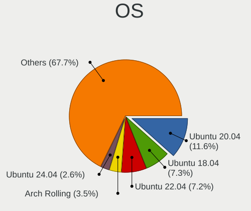

| Name                | Desktops | Percent |
|---------------------|----------|---------|
| Ubuntu 20.04        | 199      | 11.63%  |
| Ubuntu 18.04        | 125      | 7.31%   |
| Ubuntu 22.04        | 124      | 7.25%   |
| Arch Rolling        | 60       | 3.51%   |
| Ubuntu 24.04        | 44       | 2.57%   |
| OpenMandriva 4.3    | 42       | 2.45%   |
| ArcoLinux Rolling   | 37       | 2.16%   |
| Zorin 17            | 33       | 1.93%   |
| Zorin 16            | 30       | 1.75%   |
| OpenMandriva 24.12  | 30       | 1.75%   |
| Debian 12           | 24       | 1.4%    |
| KDE neon 20.04      | 23       | 1.34%   |
| OpenMandriva 4.2    | 22       | 1.29%   |
| Fedora 40           | 21       | 1.23%   |
| Manjaro             | 20       | 1.17%   |
| Zorin 15            | 18       | 1.05%   |
| Pop!_OS 22.04       | 16       | 0.94%   |
| KDE neon 22.04      | 16       | 0.94%   |
| Debian 11           | 16       | 0.94%   |
| Arch                | 16       | 0.94%   |
| Ubuntu 16.04        | 15       | 0.88%   |
| Finnix 126          | 15       | 0.88%   |
| Fedora 42           | 15       | 0.88%   |
| Fedora 41           | 15       | 0.88%   |
| OpenMandriva 23.08  | 14       | 0.82%   |
| EndeavourOS Rolling | 14       | 0.82%   |
| OpenMandriva 25.90  | 13       | 0.76%   |
| Pop!_OS 20.04       | 12       | 0.7%    |
| OpenMandriva 23.03  | 12       | 0.7%    |
| Fedora 36           | 12       | 0.7%    |
| Ubuntu 21.04        | 11       | 0.64%   |
| Linux Mint 20       | 11       | 0.64%   |
| Debian 10           | 11       | 0.64%   |
| CentOS 8            | 11       | 0.64%   |
| Ubuntu 23.04        | 10       | 0.58%   |
| Ubuntu 21.10        | 10       | 0.58%   |
| Ubuntu 19.10        | 10       | 0.58%   |
| Ubuntu 19.04        | 10       | 0.58%   |
| Finnix Dev          | 10       | 0.58%   |
| Fedora 38           | 10       | 0.58%   |

OS Family
---------

OS without a version

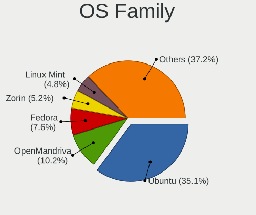

| Name         | Desktops | Percent |
|--------------|----------|---------|
| Ubuntu       | 576      | 35.1%   |
| OpenMandriva | 167      | 10.18%  |
| Fedora       | 124      | 7.56%   |
| Zorin        | 85       | 5.18%   |
| Linux Mint   | 79       | 4.81%   |
| Arch         | 74       | 4.51%   |
| Debian       | 58       | 3.53%   |
| KDE neon     | 48       | 2.93%   |
| Pop!_OS      | 46       | 2.8%    |
| Finnix       | 37       | 2.25%   |
| ArcoLinux    | 37       | 2.25%   |
| Manjaro      | 30       | 1.83%   |
| Kubuntu      | 24       | 1.46%   |
| CentOS       | 19       | 1.16%   |
| Ubuntu Unity | 15       | 0.91%   |
| Endless      | 15       | 0.91%   |
| EndeavourOS  | 15       | 0.91%   |
| Kali         | 14       | 0.85%   |
| MX           | 13       | 0.79%   |
| Elementary   | 11       | 0.67%   |
| Xubuntu      | 10       | 0.61%   |
| Clear Linux  | 9        | 0.55%   |
| RHEL         | 8        | 0.49%   |
| openSUSE     | 8        | 0.49%   |
| Gentoo       | 7        | 0.43%   |
| Finnix Dev   | 7        | 0.43%   |
| ROSA         | 6        | 0.37%   |
| Parrot       | 6        | 0.37%   |
| Nobara       | 6        | 0.37%   |
| Lubuntu      | 6        | 0.37%   |
| CachyOS      | 6        | 0.37%   |
| Peppermint   | 5        | 0.3%    |
| Garuda Linux | 5        | 0.3%    |
| Bazzite      | 5        | 0.3%    |
| Xero         | 4        | 0.24%   |
| LMDE         | 4        | 0.24%   |
| BlackPanther | 4        | 0.24%   |
| TUXEDO OS    | 3        | 0.18%   |
| Rocky Linux  | 3        | 0.18%   |
| blendOS      | 3        | 0.18%   |

Kernel
------

Version of the Linux kernel

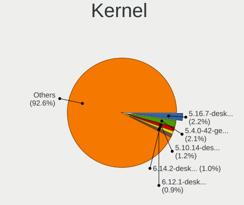

| Version                  | Desktops | Percent |
|--------------------------|----------|---------|
| 5.16.7-desktop-1omv4003  | 41       | 2.22%   |
| 5.4.0-42-generic         | 38       | 2.06%   |
| 5.10.14-desktop-1omv4002 | 22       | 1.19%   |
| 6.14.2-desktop-3omv2590  | 18       | 0.98%   |
| 6.12.1-desktop-1omv2490  | 17       | 0.92%   |
| 5.4.0-58-generic         | 16       | 0.87%   |
| 6.8.12-amd64             | 15       | 0.81%   |
| 5.4.0-48-generic         | 15       | 0.81%   |
| 6.2.6-desktop-1omv2390   | 13       | 0.7%    |
| 5.4.0-52-generic         | 13       | 0.7%    |
| 6.8.0-40-generic         | 12       | 0.65%   |
| 5.15.0-91-generic        | 12       | 0.65%   |
| 6.12.6-desktop-1omv2490  | 11       | 0.6%    |
| 6.5.0-41-generic         | 10       | 0.54%   |
| 6.2.0-39-generic         | 10       | 0.54%   |
| 5.4.0-26-generic         | 10       | 0.54%   |
| 5.15.0-52-generic        | 10       | 0.54%   |
| 5.4.0-47-generic         | 9        | 0.49%   |
| 6.4.11-desktop-1omv2390  | 8        | 0.43%   |
| 6.12.17-amd64            | 8        | 0.43%   |
| 6.10.0-desktop-1omv2490  | 8        | 0.43%   |
| 5.8.0-59-generic         | 8        | 0.43%   |
| 5.15.0-46-generic        | 8        | 0.43%   |
| 5.11.0-25-generic        | 8        | 0.43%   |
| 5.0.0-37-generic         | 8        | 0.43%   |
| 6.9.12-amd64             | 7        | 0.38%   |
| 6.8.0-60-generic         | 7        | 0.38%   |
| 6.8.0-52-generic         | 7        | 0.38%   |
| 6.8.0-51-generic         | 7        | 0.38%   |
| 6.6.2-desktop-1omv2390   | 7        | 0.38%   |
| 6.2.0-26-generic         | 7        | 0.38%   |
| 6.14.0-27-generic        | 7        | 0.38%   |
| 5.4.0-91-generic         | 7        | 0.38%   |
| 5.4.0-40-generic         | 7        | 0.38%   |
| 5.4.0-37-generic         | 7        | 0.38%   |
| 5.4.0-29-generic         | 7        | 0.38%   |
| 5.3.0-46-generic         | 7        | 0.38%   |
| 5.19.0-38-generic        | 7        | 0.38%   |
| 5.15.0-67-generic        | 7        | 0.38%   |
| 5.15.0-56-generic        | 7        | 0.38%   |

Kernel Family
-------------

Linux kernel without a distro release

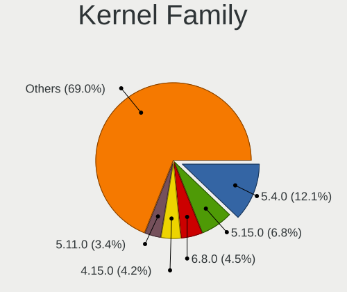

| Version | Desktops | Percent |
|---------|----------|---------|
| 5.4.0   | 213      | 12.13%  |
| 5.15.0  | 120      | 6.83%   |
| 6.8.0   | 79       | 4.5%    |
| 4.15.0  | 73       | 4.16%   |
| 5.11.0  | 60       | 3.42%   |
| 5.8.0   | 59       | 3.36%   |
| 6.5.0   | 54       | 3.08%   |
| 6.1.0   | 45       | 2.56%   |
| 5.3.0   | 44       | 2.51%   |
| 5.16.7  | 42       | 2.39%   |
| 5.13.0  | 41       | 2.33%   |
| 6.2.0   | 40       | 2.28%   |
| 4.18.0  | 39       | 2.22%   |
| 6.14.0  | 38       | 2.16%   |
| 5.19.0  | 38       | 2.16%   |
| 5.0.0   | 35       | 1.99%   |
| 6.11.0  | 24       | 1.37%   |
| 5.10.14 | 22       | 1.25%   |
| 6.14.2  | 21       | 1.2%    |
| 6.12.1  | 18       | 1.03%   |
| 5.10.0  | 18       | 1.03%   |
| 6.8.12  | 16       | 0.91%   |
| 6.2.6   | 14       | 0.8%    |
| 4.19.0  | 14       | 0.8%    |
| 6.12.6  | 13       | 0.74%   |
| 5.14.0  | 10       | 0.57%   |
| 6.6.2   | 9        | 0.51%   |
| 6.4.11  | 9        | 0.51%   |
| 6.12.17 | 8        | 0.46%   |
| 6.10.0  | 8        | 0.46%   |
| 3.10.0  | 8        | 0.46%   |
| 6.9.12  | 7        | 0.4%    |
| 6.4.8   | 7        | 0.4%    |
| 6.11.4  | 7        | 0.4%    |
| 6.10.9  | 7        | 0.4%    |
| 6.8.5   | 6        | 0.34%   |
| 6.1.1   | 6        | 0.34%   |
| 6.17.9  | 5        | 0.28%   |
| 6.17.7  | 5        | 0.28%   |
| 6.15.0  | 5        | 0.28%   |

Kernel Major Ver.
-----------------

Linux kernel major version

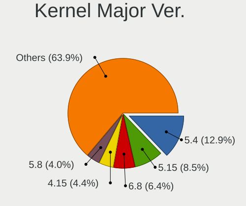

| Version | Desktops | Percent |
|---------|----------|---------|
| 5.4     | 225      | 12.9%   |
| 5.15    | 149      | 8.54%   |
| 6.8     | 111      | 6.36%   |
| 4.15    | 76       | 4.36%   |
| 5.8     | 69       | 3.96%   |
| 6.12    | 68       | 3.9%    |
| 6.2     | 67       | 3.84%   |
| 6.14    | 67       | 3.84%   |
| 6.5     | 66       | 3.78%   |
| 6.1     | 66       | 3.78%   |
| 5.11    | 66       | 3.78%   |
| 5.10    | 55       | 3.15%   |
| 5.13    | 52       | 2.98%   |
| 5.16    | 51       | 2.92%   |
| 5.3     | 47       | 2.69%   |
| 6.11    | 44       | 2.52%   |
| 5.19    | 44       | 2.52%   |
| 4.18    | 43       | 2.47%   |
| 5.0     | 38       | 2.18%   |
| 6.6     | 33       | 1.89%   |
| 6.10    | 30       | 1.72%   |
| 6.17    | 26       | 1.49%   |
| 5.14    | 26       | 1.49%   |
| 6.4     | 25       | 1.43%   |
| 6.13    | 22       | 1.26%   |
| 4.19    | 17       | 0.97%   |
| 6.9     | 16       | 0.92%   |
| 6.7     | 15       | 0.86%   |
| 5.18    | 15       | 0.86%   |
| 6.15    | 13       | 0.75%   |
| 6.3     | 12       | 0.69%   |
| 5.6     | 11       | 0.63%   |
| 6.16    | 10       | 0.57%   |
| 5.17    | 10       | 0.57%   |
| 6.0     | 9        | 0.52%   |
| 5.12    | 8        | 0.46%   |
| 3.10    | 8        | 0.46%   |
| 5.7     | 7        | 0.4%    |
| 5.9     | 6        | 0.34%   |
| 4.9     | 4        | 0.23%   |

Arch
----

OS architecture (x86_64, i586, etc.)

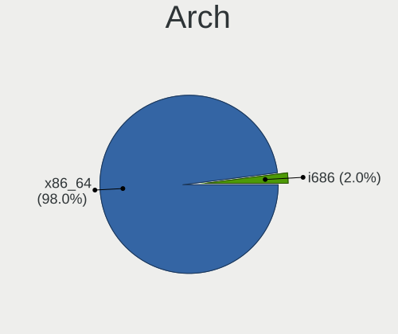

| Name   | Desktops | Percent |
|--------|----------|---------|
| x86_64 | 1548     | 97.97%  |
| i686   | 32       | 2.03%   |

DE
--

Desktop Environment

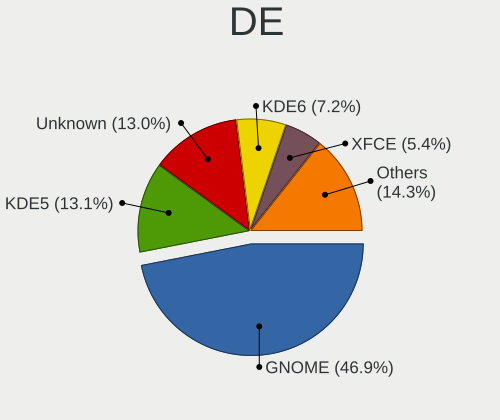

| Name            | Desktops | Percent |
|-----------------|----------|---------|
| GNOME           | 776      | 46.92%  |
| KDE5            | 217      | 13.12%  |
| Unknown         | 215      | 13%     |
| KDE6            | 119      | 7.19%   |
| XFCE            | 90       | 5.44%   |
| X-Cinnamon      | 75       | 4.53%   |
| KDE             | 35       | 2.12%   |
| MATE            | 19       | 1.15%   |
| Unity           | 15       | 0.91%   |
| Pantheon        | 11       | 0.67%   |
| GNOME Classic   | 11       | 0.67%   |
| LXDE            | 10       | 0.6%    |
| Cinnamon        | 8        | 0.48%   |
| LXQt            | 5        | 0.3%    |
| KDE4            | 5        | 0.3%    |
| i3              | 5        | 0.3%    |
| Budgie          | 5        | 0.3%    |
| bspwm           | 5        | 0.3%    |
| dwm             | 4        | 0.24%   |
| Hyprland        | 3        | 0.18%   |
| GNOME Flashback | 3        | 0.18%   |
| Deepin          | 3        | 0.18%   |
| Enlightenment   | 2        | 0.12%   |
| awesome         | 2        | 0.12%   |
| xmonad          | 1        | 0.06%   |
| sway            | 1        | 0.06%   |
| qtile           | 1        | 0.06%   |
| openbox         | 1        | 0.06%   |
| Niri            | 1        | 0.06%   |
| LeftWM          | 1        | 0.06%   |
| icewm           | 1        | 0.06%   |
| herbstluftwm    | 1        | 0.06%   |
| GTK             | 1        | 0.06%   |
| Endless:GNOME   | 1        | 0.06%   |
| COSMIC          | 1        | 0.06%   |

Display Server
--------------

X11 or Wayland

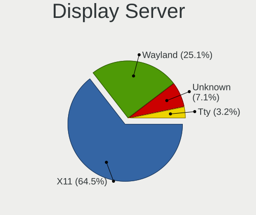

| Name    | Desktops | Percent |
|---------|----------|---------|
| X11     | 1052     | 64.5%   |
| Wayland | 410      | 25.14%  |
| Unknown | 116      | 7.11%   |
| Tty     | 53       | 3.25%   |

Display Manager
---------------

SDDM, LightDM, etc.

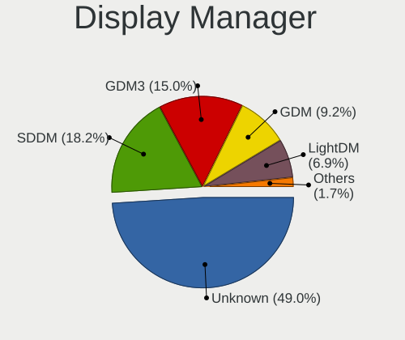

| Name    | Desktops | Percent |
|---------|----------|---------|
| Unknown | 802      | 48.99%  |
| SDDM    | 298      | 18.2%   |
| GDM3    | 246      | 15.03%  |
| GDM     | 150      | 9.16%   |
| LightDM | 113      | 6.9%    |
| TDM     | 18       | 1.1%    |
| KDM     | 3        | 0.18%   |
| SLiM    | 2        | 0.12%   |
| Ly      | 2        | 0.12%   |
| GREETD  | 2        | 0.12%   |
| SLIMSKI | 1        | 0.06%   |

OS Lang
-------

Language

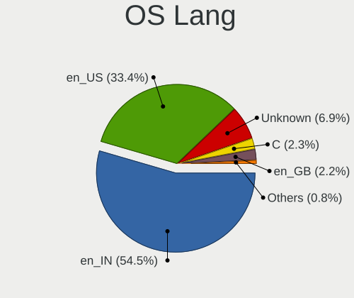

| Lang    | Desktops | Percent |
|---------|----------|---------|
| en_IN   | 891      | 54.5%   |
| en_US   | 546      | 33.39%  |
| Unknown | 112      | 6.85%   |
| C       | 37       | 2.26%   |
| en_GB   | 36       | 2.2%    |
| C.UTF8  | 3        | 0.18%   |
| mni_IN  | 2        | 0.12%   |
| ta_LK   | 1        | 0.06%   |
| sa_IN   | 1        | 0.06%   |
| pl_PL   | 1        | 0.06%   |
| nl_NL   | 1        | 0.06%   |
| en_SG   | 1        | 0.06%   |
| en_DK   | 1        | 0.06%   |
| en_CA   | 1        | 0.06%   |
| bn_IN   | 1        | 0.06%   |

Boot Mode
---------

EFI or BIOS

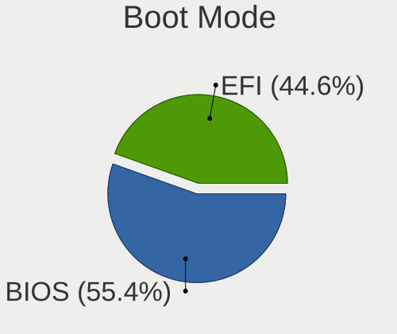

| Mode | Desktops | Percent |
|------|----------|---------|
| BIOS | 891      | 55.44%  |
| EFI  | 716      | 44.56%  |

Filesystem
----------

Type of filesystem

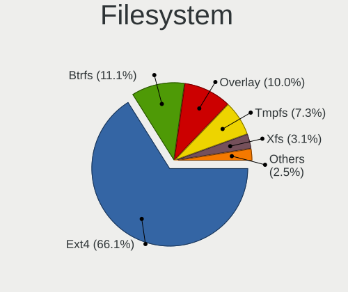

| Type    | Desktops | Percent |
|---------|----------|---------|
| Ext4    | 1075     | 66.07%  |
| Btrfs   | 181      | 11.12%  |
| Overlay | 162      | 9.96%   |
| Tmpfs   | 119      | 7.31%   |
| Xfs     | 50       | 3.07%   |
| Unknown | 21       | 1.29%   |
| Zfs     | 6        | 0.37%   |
| Ext2    | 4        | 0.25%   |
| F2fs    | 3        | 0.18%   |
| Ext3    | 3        | 0.18%   |
| XXXXX   | 2        | 0.12%   |
| Jfs     | 1        | 0.06%   |

Part. scheme
------------

Scheme of partitioning

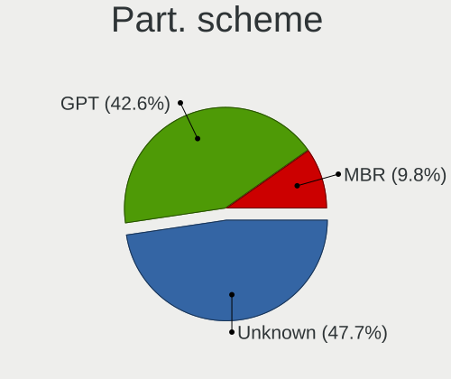

| Type    | Desktops | Percent |
|---------|----------|---------|
| Unknown | 772      | 47.65%  |
| GPT     | 690      | 42.59%  |
| MBR     | 158      | 9.75%   |

Dual Boot with Linux/BSD
------------------------

Hosting more than one Linux/BSD

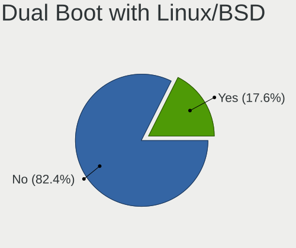

| Dual boot | Desktops | Percent |
|-----------|----------|---------|
| No        | 1330     | 82.4%   |
| Yes       | 284      | 17.6%   |

Dual Boot (Win)
---------------

Hosting Linux and Windows

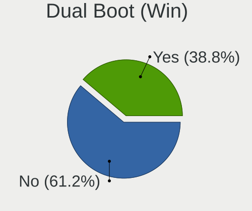

| Dual boot | Desktops | Percent |
|-----------|----------|---------|
| No        | 987      | 61.19%  |
| Yes       | 626      | 38.81%  |

Board
-----

Vendor
------

Motherboard manufacturer

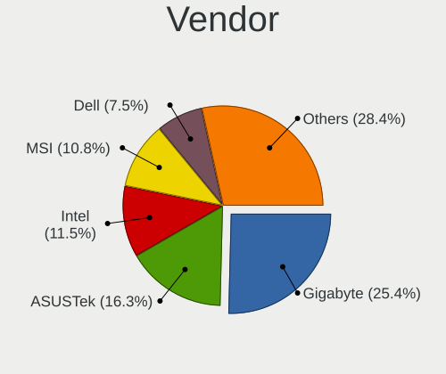

| Name                | Desktops | Percent |
|---------------------|----------|---------|
| Gigabyte Technology | 401      | 25.4%   |
| ASUSTek Computer    | 257      | 16.28%  |
| Intel               | 182      | 11.53%  |
| MSI                 | 171      | 10.83%  |
| Dell                | 119      | 7.54%   |
| Hewlett-Packard     | 96       | 6.08%   |
| Unknown             | 88       | 5.57%   |
| ASRock              | 64       | 4.05%   |
| Lenovo              | 54       | 3.42%   |
| Acer                | 30       | 1.9%    |
| OEM                 | 19       | 1.2%    |
| Biostar             | 15       | 0.95%   |
| ECS                 | 13       | 0.82%   |
| Foxconn             | 10       | 0.63%   |
| Pegatron            | 6        | 0.38%   |
| Google              | 6        | 0.38%   |
| Red Hat             | 5        | 0.32%   |
| ZEBRONICS           | 4        | 0.25%   |
| POWERX              | 3        | 0.19%   |
| LORD ELECTRONICS    | 3        | 0.19%   |
| Inventec            | 3        | 0.19%   |
| BY OEM              | 3        | 0.19%   |
| WIPRO               | 2        | 0.13%   |
| Supermicro          | 2        | 0.13%   |
| Insyde              | 2        | 0.13%   |
| INP                 | 2        | 0.13%   |
| Fujitsu             | 2        | 0.13%   |
| ZX                  | 1        | 0.06%   |
| ZRD                 | 1        | 0.06%   |
| Qbits Technologies  | 1        | 0.06%   |
| MITSUBISHI          | 1        | 0.06%   |
| MiTAC               | 1        | 0.06%   |
| Maxtone             | 1        | 0.06%   |
| Kobian              | 1        | 0.06%   |
| ITI LIMITED         | 1        | 0.06%   |
| IBM                 | 1        | 0.06%   |
| Huanan              | 1        | 0.06%   |
| GALAX               | 1        | 0.06%   |
| Fusionstor          | 1        | 0.06%   |
| FST                 | 1        | 0.06%   |

Model
-----

Motherboard model

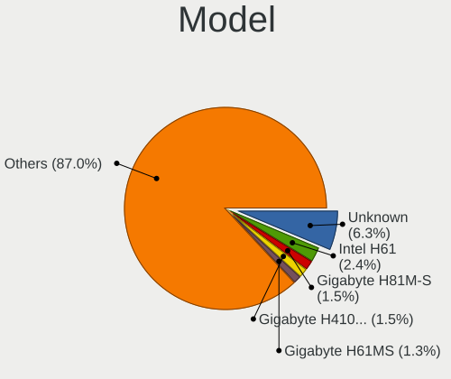

| Name                      | Desktops | Percent |
|---------------------------|----------|---------|
| Unknown                   | 100      | 6.33%   |
| Intel H61                 | 38       | 2.41%   |
| Gigabyte H81M-S           | 24       | 1.52%   |
| Gigabyte H410M H V3       | 24       | 1.52%   |
| Gigabyte H61MS            | 20       | 1.27%   |
| ASUS All Series           | 18       | 1.14%   |
| Gigabyte B450M DS3H       | 16       | 1.01%   |
| Intel H81                 | 15       | 0.95%   |
| Gigabyte H310M S2 2.0     | 15       | 0.95%   |
| Gigabyte H110M-S2         | 15       | 0.95%   |
| MSI MS-7A38               | 13       | 0.82%   |
| ASUS PRIME B650M-R        | 13       | 0.82%   |
| Gigabyte A320M-S2H        | 11       | 0.7%    |
| Intel HCL Desktop         | 10       | 0.63%   |
| MSI MS-7C02               | 9        | 0.57%   |
| ASUS TUF Gaming X570-PLUS | 9        | 0.57%   |
| MSI MS-7C52               | 8        | 0.51%   |
| MSI MS-7A15               | 8        | 0.51%   |
| Intel H55                 | 8        | 0.51%   |
| MSI MS-7A36               | 7        | 0.44%   |
| Gigabyte H310M H          | 7        | 0.44%   |
| Gigabyte G31M-ES2L        | 7        | 0.44%   |
| Dell OptiPlex 3070        | 7        | 0.44%   |
| ASUS PRIME H510M-E        | 7        | 0.44%   |
| ASUS PRIME B450M-A        | 7        | 0.44%   |
| Acer Veriton M200-H81     | 7        | 0.44%   |
| OEM G41 775 ICH7 8712     | 6        | 0.38%   |
| Gigabyte H61M-S1          | 6        | 0.38%   |
| Gigabyte H110M-H          | 6        | 0.38%   |
| Gigabyte B75M-D3H         | 6        | 0.38%   |
| Gigabyte B650M D3HP AX    | 6        | 0.38%   |
| Dell Vostro 3268          | 6        | 0.38%   |
| ASUS H110M-CS             | 6        | 0.38%   |
| Red Hat KVM               | 5        | 0.32%   |
| MSI MS-7C95               | 5        | 0.32%   |
| MSI MS-7C91               | 5        | 0.32%   |
| HP Compaq Elite 8300 SFF  | 5        | 0.32%   |
| Google Teemo              | 5        | 0.32%   |
| Gigabyte J1800M-D3P       | 5        | 0.32%   |
| Gigabyte H61M-DS2         | 5        | 0.32%   |

Model Family
------------

Motherboard model prefix

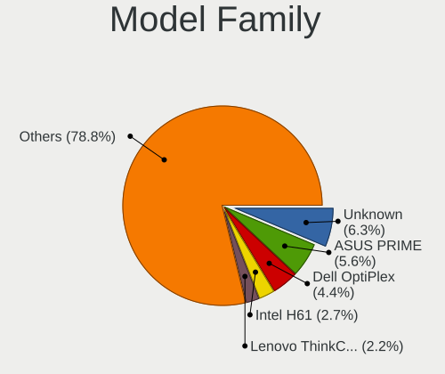

| Name               | Desktops | Percent |
|--------------------|----------|---------|
| Unknown            | 100      | 6.33%   |
| ASUS PRIME         | 89       | 5.64%   |
| Dell OptiPlex      | 69       | 4.37%   |
| Intel H61          | 42       | 2.66%   |
| Lenovo ThinkCentre | 35       | 2.22%   |
| Gigabyte H410M     | 33       | 2.09%   |
| ASUS ROG           | 32       | 2.03%   |
| Gigabyte B450M     | 27       | 1.71%   |
| Acer Veriton       | 27       | 1.71%   |
| Gigabyte H310M     | 26       | 1.65%   |
| ASUS TUF           | 25       | 1.58%   |
| Gigabyte H81M-S    | 24       | 1.52%   |
| Gigabyte H61MS     | 20       | 1.27%   |
| HP Compaq          | 19       | 1.2%    |
| Dell Vostro        | 19       | 1.2%    |
| HP ProDesk         | 18       | 1.14%   |
| ASUS All           | 18       | 1.14%   |
| Intel H81          | 15       | 0.95%   |
| Gigabyte H110M-S2  | 15       | 0.95%   |
| HP EliteDesk       | 14       | 0.89%   |
| Dell Inspiron      | 14       | 0.89%   |
| MSI MS-7A38        | 13       | 0.82%   |
| Gigabyte A320M-S2H | 12       | 0.76%   |
| Dell Precision     | 12       | 0.76%   |
| Gigabyte B550M     | 11       | 0.7%    |
| Intel HCL          | 10       | 0.63%   |
| Intel DH61WW       | 10       | 0.63%   |
| MSI MS-7C02        | 9        | 0.57%   |
| Gigabyte B650M     | 9        | 0.57%   |
| Gigabyte B450      | 9        | 0.57%   |
| ASUS M5A78L-M      | 9        | 0.57%   |
| MSI MS-7C52        | 8        | 0.51%   |
| MSI MS-7A15        | 8        | 0.51%   |
| Lenovo IdeaCentre  | 8        | 0.51%   |
| Intel H55          | 8        | 0.51%   |
| Gigabyte Z390      | 8        | 0.51%   |
| Gigabyte H510M     | 8        | 0.51%   |
| ASRock B450M       | 8        | 0.51%   |
| MSI MS-7A36        | 7        | 0.44%   |
| Intel DG31PR       | 7        | 0.44%   |

MFG Year
--------

Motherboard manufacture year

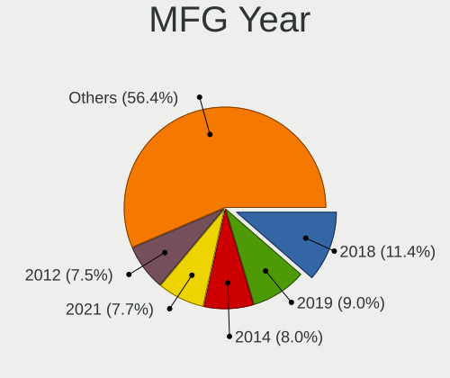

| Year    | Desktops | Percent |
|---------|----------|---------|
| 2018    | 180      | 11.4%   |
| 2019    | 142      | 8.99%   |
| 2014    | 127      | 8.04%   |
| 2021    | 121      | 7.66%   |
| 2012    | 118      | 7.47%   |
| 2016    | 97       | 6.14%   |
| 2020    | 96       | 6.08%   |
| 2013    | 93       | 5.89%   |
| 2017    | 89       | 5.64%   |
| 2023    | 84       | 5.32%   |
| 2022    | 79       | 5%      |
| 2009    | 72       | 4.56%   |
| 2010    | 69       | 4.37%   |
| 2011    | 55       | 3.48%   |
| 2015    | 50       | 3.17%   |
| 2024    | 37       | 2.34%   |
| 2008    | 30       | 1.9%    |
| 2007    | 18       | 1.14%   |
| 2025    | 10       | 0.63%   |
| 2006    | 6        | 0.38%   |
| Unknown | 3        | 0.19%   |
| 2005    | 2        | 0.13%   |
| 2004    | 1        | 0.06%   |

Form Factor
-----------

Physical design of the computer

| Name    | Desktops | Percent |
|---------|----------|---------|
| Desktop | 1579     | 100%    |

Secure Boot
-----------

Enabled or disabled

| State    | Desktops | Percent |
|----------|----------|---------|
| Disabled | 1537     | 96.91%  |
| Enabled  | 49       | 3.09%   |

Coreboot
--------

Have coreboot on board

| Used | Desktops | Percent |
|------|----------|---------|
| No   | 1572     | 99.56%  |
| Yes  | 7        | 0.44%   |

RAM Size
--------

Total RAM memory

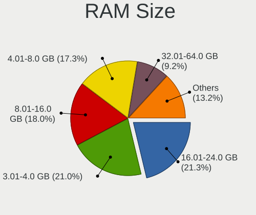

| Size in GB      | Desktops | Percent |
|-----------------|----------|---------|
| 16.01-24.0      | 342      | 21.26%  |
| 3.01-4.0        | 338      | 21.01%  |
| 8.01-16.0       | 290      | 18.02%  |
| 4.01-8.0        | 279      | 17.34%  |
| 32.01-64.0      | 148      | 9.2%    |
| 64.01-256.0     | 72       | 4.47%   |
| 1.01-2.0        | 70       | 4.35%   |
| 24.01-32.0      | 43       | 2.67%   |
| 2.01-3.0        | 17       | 1.06%   |
| 0.51-1.0        | 6        | 0.37%   |
| More than 256.0 | 3        | 0.19%   |
| 0.01-0.5        | 1        | 0.06%   |

RAM Used
--------

Used RAM memory

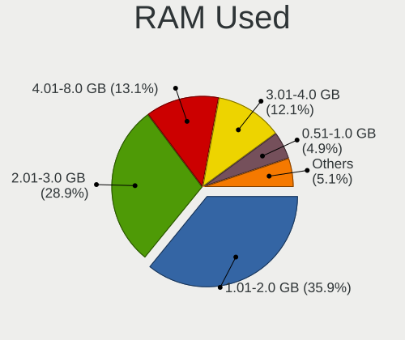

| Used GB     | Desktops | Percent |
|-------------|----------|---------|
| 1.01-2.0    | 621      | 35.88%  |
| 2.01-3.0    | 500      | 28.89%  |
| 4.01-8.0    | 227      | 13.11%  |
| 3.01-4.0    | 209      | 12.07%  |
| 0.51-1.0    | 85       | 4.91%   |
| 8.01-16.0   | 55       | 3.18%   |
| 16.01-24.0  | 14       | 0.81%   |
| 0.01-0.5    | 14       | 0.81%   |
| 32.01-64.0  | 3        | 0.17%   |
| 24.01-32.0  | 1        | 0.06%   |
| 64.01-256.0 | 1        | 0.06%   |
| Unknown     | 1        | 0.06%   |

Total Drives
------------

Number of drives on board

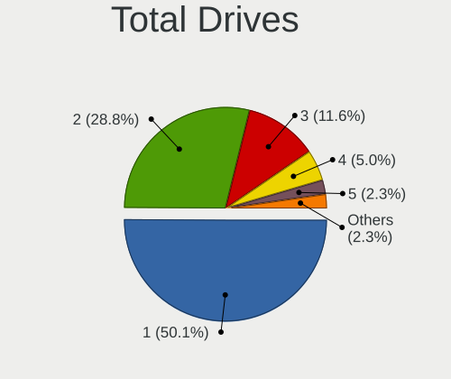

| Drives | Desktops | Percent |
|--------|----------|---------|
| 1      | 817      | 50.09%  |
| 2      | 469      | 28.76%  |
| 3      | 190      | 11.65%  |
| 4      | 81       | 4.97%   |
| 5      | 37       | 2.27%   |
| 0      | 16       | 0.98%   |
| 6      | 11       | 0.67%   |
| 7      | 6        | 0.37%   |
| 19     | 1        | 0.06%   |
| 10     | 1        | 0.06%   |
| 9      | 1        | 0.06%   |
| 8      | 1        | 0.06%   |

Has CD-ROM
----------

Has CD-ROM on board

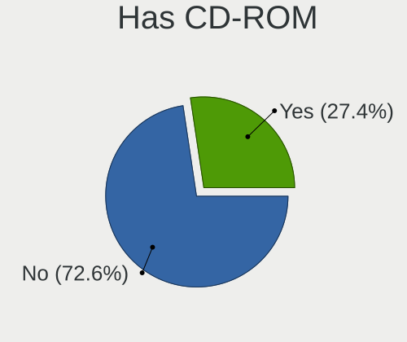

| Presented | Desktops | Percent |
|-----------|----------|---------|
| No        | 1155     | 72.64%  |
| Yes       | 435      | 27.36%  |

Has Ethernet
------------

Has Ethernet on board

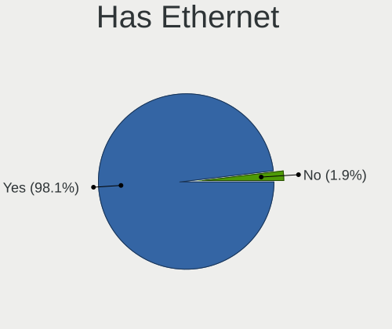

| Presented | Desktops | Percent |
|-----------|----------|---------|
| Yes       | 1550     | 98.1%   |
| No        | 30       | 1.9%    |

Has WiFi
--------

Has WiFi module

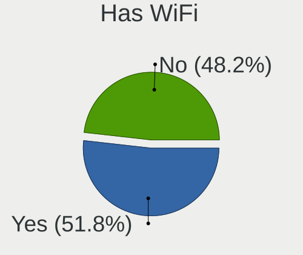

| Presented | Desktops | Percent |
|-----------|----------|---------|
| Yes       | 832      | 51.77%  |
| No        | 775      | 48.23%  |

Has Bluetooth
-------------

Has Bluetooth module

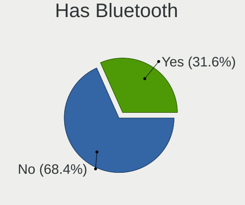

| Presented | Desktops | Percent |
|-----------|----------|---------|
| No        | 1095     | 68.35%  |
| Yes       | 507      | 31.65%  |

Location
--------

Country
-------

Geographic location (country)

| Country | Desktops | Percent |
|---------|----------|---------|
| India   | 1579     | 100%    |

City
----

Geographic location (city)

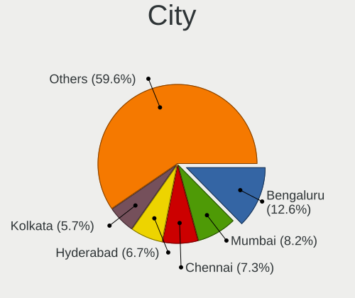

| City          | Desktops | Percent |
|---------------|----------|---------|
| Bengaluru     | 210      | 12.62%  |
| Mumbai        | 136      | 8.17%   |
| Chennai       | 121      | 7.27%   |
| Hyderabad     | 111      | 6.67%   |
| Kolkata       | 95       | 5.71%   |
| Delhi         | 82       | 4.93%   |
| Pune          | 72       | 4.33%   |
| Bhubaneswar   | 56       | 3.37%   |
| New Delhi     | 41       | 2.46%   |
| Ahmedabad     | 31       | 1.86%   |
| Patna         | 25       | 1.5%    |
| Indore        | 25       | 1.5%    |
| Kochi         | 24       | 1.44%   |
| Jaipur        | 23       | 1.38%   |
| Gonikoppal    | 22       | 1.32%   |
| Bhopal        | 22       | 1.32%   |
| Lucknow       | 21       | 1.26%   |
| Surat         | 19       | 1.14%   |
| Ernakulam     | 17       | 1.02%   |
| Trivandrum    | 16       | 0.96%   |
| Thrissur      | 15       | 0.9%    |
| Guwahati      | 15       | 0.9%    |
| Navi Mumbai   | 14       | 0.84%   |
| Coimbatore    | 13       | 0.78%   |
| Gurgaon       | 12       | 0.72%   |
| Nashik        | 11       | 0.66%   |
| Chandigarh    | 11       | 0.66%   |
| Nagpur        | 10       | 0.6%    |
| Vijayawada    | 9        | 0.54%   |
| Kanpur        | 9        | 0.54%   |
| Vadodara      | 8        | 0.48%   |
| Thane         | 8        | 0.48%   |
| Malappuram    | 8        | 0.48%   |
| Raipur        | 7        | 0.42%   |
| Visakhapatnam | 6        | 0.36%   |
| Tiruchi       | 6        | 0.36%   |
| Salem         | 6        | 0.36%   |
| Ludhiana      | 6        | 0.36%   |
| Rajkot        | 5        | 0.3%    |
| Noida         | 5        | 0.3%    |

Drives
------

Drive Vendor
------------

Hard drive vendors

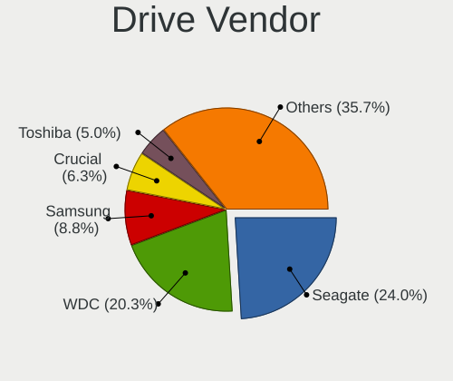

| Vendor                      | Desktops | Drives | Percent |
|-----------------------------|----------|--------|---------|
| Seagate                     | 606      | 899    | 24.04%  |
| WDC                         | 511      | 775    | 20.27%  |
| Samsung Electronics         | 221      | 324    | 8.77%   |
| Crucial                     | 158      | 229    | 6.27%   |
| Toshiba                     | 126      | 144    | 5%      |
| Kingston                    | 120      | 154    | 4.76%   |
| Sandisk                     | 91       | 124    | 3.61%   |
| A-DATA Technology           | 53       | 60     | 2.1%    |
| Hitachi                     | 45       | 53     | 1.79%   |
| China                       | 44       | 53     | 1.75%   |
| Micron/Crucial Technology   | 35       | 42     | 1.39%   |
| Gigabyte Technology         | 28       | 32     | 1.11%   |
| Intel                       | 27       | 35     | 1.07%   |
| HGST                        | 26       | 48     | 1.03%   |
| Silicon Motion              | 24       | 25     | 0.95%   |
| Unknown                     | 22       | 24     | 0.87%   |
| Micron Technology           | 21       | 25     | 0.83%   |
| Unknown                     | 20       | 23     | 0.79%   |
| EVM                         | 18       | 22     | 0.71%   |
| ADATA Technology            | 18       | 26     | 0.71%   |
| Kingston Technology Company | 16       | 17     | 0.63%   |
| Hewlett-Packard             | 16       | 19     | 0.63%   |
| CONSISTENT                  | 15       | 16     | 0.6%    |
| SPCC                        | 14       | 21     | 0.56%   |
| Phison Electronics          | 12       | 16     | 0.48%   |
| SK hynix                    | 11       | 11     | 0.44%   |
| Realtek Semiconductor       | 11       | 14     | 0.44%   |
| Zebronics                   | 10       | 11     | 0.4%    |
| XPG                         | 9        | 15     | 0.36%   |
| Phison                      | 8        | 10     | 0.32%   |
| Maxtor                      | 8        | 25     | 0.32%   |
| Lexar                       | 8        | 8      | 0.32%   |
| POWER                       | 7        | 7      | 0.28%   |
| Transcend                   | 6        | 7      | 0.24%   |
| PNY                         | 6        | 6      | 0.24%   |
| MAXIO Technology (Hangzhou) | 6        | 6      | 0.24%   |
| HS-SSD-E100                 | 6        | 7      | 0.24%   |
| Plextor                     | 4        | 4      | 0.16%   |
| KingSpec                    | 4        | 4      | 0.16%   |
| HS-SSD-C100                 | 4        | 6      | 0.16%   |

Drive Model
-----------

Hard drive models

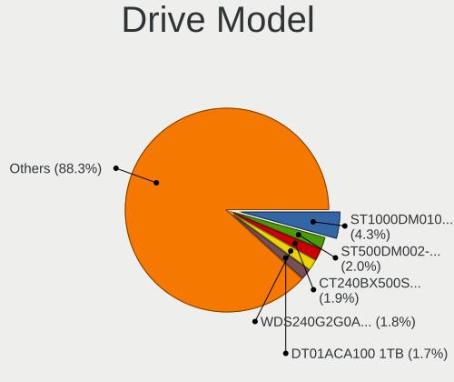

| Model                                                 | Desktops | Percent |
|-------------------------------------------------------|----------|---------|
| Seagate ST1000DM010-2EP102 1TB                        | 121      | 4.3%    |
| Seagate ST500DM002-1BD142 500GB                       | 55       | 1.95%   |
| Crucial CT240BX500SSD1 240GB                          | 54       | 1.92%   |
| WDC WDS240G2G0A-00JH30 240GB SSD                      | 51       | 1.81%   |
| Toshiba DT01ACA100 1TB                                | 49       | 1.74%   |
| WDC WD10EZEX-08WN4A0 1TB                              | 36       | 1.28%   |
| Samsung NVMe SSD Controller SM981/PM981/PM983 1TB     | 30       | 1.07%   |
| Kingston SA400S37240G 240GB SSD                       | 30       | 1.07%   |
| Seagate ST3500312CS 500GB                             | 29       | 1.03%   |
| Seagate ST3500418AS 500GB                             | 26       | 0.92%   |
| WDC WD10EZEX-22MFCA0 1TB                              | 25       | 0.89%   |
| Seagate ST3500414CS 500GB                             | 23       | 0.82%   |
| Kingston SA400S37120G 120GB SSD                       | 23       | 0.82%   |
| A-DATA SU750 256GB SSD                                | 23       | 0.82%   |
| Toshiba HDWD110 1TB                                   | 22       | 0.78%   |
| Toshiba DT01ACA050 500GB                              | 22       | 0.78%   |
| Seagate ST1000DM003-1SB102 1TB                        | 20       | 0.71%   |
| Unknown                                               | 20       | 0.71%   |
| Seagate ST1000DM003-1ER162 1TB                        | 19       | 0.67%   |
| Micron/Crucial P2 NVMe PCIe SSD 2TB                   | 19       | 0.67%   |
| Seagate ST2000DM005-2CW102 2TB                        | 17       | 0.6%    |
| WDC WDS120G2G0A-00JH30 120GB SSD                      | 16       | 0.57%   |
| Samsung SSD 860 EVO 250GB                             | 16       | 0.57%   |
| Silicon Motion SM2263EN/SM2263XT SSD Controller 512GB | 15       | 0.53%   |
| Seagate ST31000524AS 1TB                              | 15       | 0.53%   |
| Crucial CT1000BX500SSD1 1TB                           | 15       | 0.53%   |
| WDC WDS240G2G0B-00EPW0 240GB SSD                      | 14       | 0.5%    |
| Seagate ST4000DM004-2CV104 4TB                        | 14       | 0.5%    |
| WDC WD20EZBX-00AYRA0 2TB                              | 13       | 0.46%   |
| WDC WD10EZEX-75WN4A1 1TB                              | 13       | 0.46%   |
| WDC WD10EZEX-75WN4A0 1TB                              | 13       | 0.46%   |
| Samsung SSD 990 PRO 1TB                               | 13       | 0.46%   |
| Samsung SSD 980 500GB                                 | 13       | 0.46%   |
| Samsung SSD 850 EVO 250GB                             | 13       | 0.46%   |
| Gigabyte GP-GSTFS31240GNTD 240GB SSD                  | 13       | 0.46%   |
| Crucial CT480BX500SSD1 480GB                          | 13       | 0.46%   |
| Seagate ST1000LM035-1RK172 1TB                        | 12       | 0.43%   |
| Seagate ST1000DM003-1CH162 1TB                        | 12       | 0.43%   |
| Crucial CT500BX500SSD1 500GB                          | 12       | 0.43%   |
| WDC WD10EZEX-00BBHA0 1TB                              | 11       | 0.39%   |

HDD Vendor
----------

Hard disk drive vendors

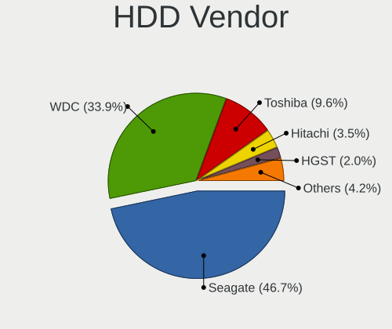

| Vendor              | Desktops | Drives | Percent |
|---------------------|----------|--------|---------|
| Seagate             | 596      | 884    | 46.75%  |
| WDC                 | 432      | 605    | 33.88%  |
| Toshiba             | 122      | 139    | 9.57%   |
| Hitachi             | 45       | 53     | 3.53%   |
| HGST                | 26       | 48     | 2.04%   |
| Samsung Electronics | 20       | 26     | 1.57%   |
| Unknown             | 11       | 13     | 0.86%   |
| Maxtor              | 5        | 5      | 0.39%   |
| Hewlett-Packard     | 5        | 5      | 0.39%   |
| TO Exter            | 2        | 2      | 0.16%   |
| Unknown             | 2        | 2      | 0.16%   |
| WD MediaMax         | 1        | 1      | 0.08%   |
| Verbatim            | 1        | 1      | 0.08%   |
| USB3.0              | 1        | 2      | 0.08%   |
| Synology            | 1        | 1      | 0.08%   |
| Lenovo              | 1        | 1      | 0.08%   |
| KESU                | 1        | 2      | 0.08%   |
| JMicron Technology  | 1        | 1      | 0.08%   |
| ASMedia             | 1        | 1      | 0.08%   |
| Apple               | 1        | 1      | 0.08%   |

SSD Vendor
----------

Solid state drive vendors

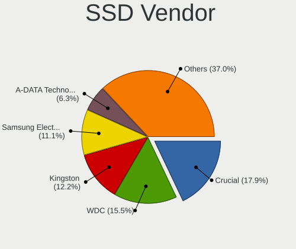

| Vendor              | Desktops | Drives | Percent |
|---------------------|----------|--------|---------|
| Crucial             | 140      | 202    | 17.93%  |
| WDC                 | 121      | 162    | 15.49%  |
| Kingston            | 95       | 123    | 12.16%  |
| Samsung Electronics | 87       | 130    | 11.14%  |
| A-DATA Technology   | 49       | 56     | 6.27%   |
| China               | 43       | 51     | 5.51%   |
| Gigabyte Technology | 22       | 24     | 2.82%   |
| SanDisk             | 18       | 21     | 2.3%    |
| EVM                 | 18       | 22     | 2.3%    |
| CONSISTENT          | 15       | 16     | 1.92%   |
| Zebronics           | 10       | 11     | 1.28%   |
| SPCC                | 10       | 13     | 1.28%   |
| Intel               | 10       | 11     | 1.28%   |
| Hewlett-Packard     | 10       | 13     | 1.28%   |
| Lexar               | 8        | 8      | 1.02%   |
| POWER               | 6        | 6      | 0.77%   |
| PNY                 | 6        | 6      | 0.77%   |
| Unknown             | 6        | 7      | 0.77%   |
| Transcend           | 5        | 6      | 0.64%   |
| Plextor             | 4        | 4      | 0.51%   |
| KingSpec            | 4        | 4      | 0.51%   |
| Aarvex              | 4        | 5      | 0.51%   |
| Toshiba             | 3        | 4      | 0.38%   |
| Seagate             | 3        | 4      | 0.38%   |
| Micron Technology   | 3        | 6      | 0.38%   |
| Maxtor              | 3        | 20     | 0.38%   |
| LITEONIT            | 3        | 5      | 0.38%   |
| Leven               | 3        | 3      | 0.38%   |
| KIOXIA-EXCERIA      | 3        | 3      | 0.38%   |
| HS-SSD-E100         | 3        | 3      | 0.38%   |
| HS-SSD-C100         | 3        | 5      | 0.38%   |
| YS                  | 2        | 2      | 0.26%   |
| Unknown (690)       | 2        | 3      | 0.26%   |
| StoreJet            | 2        | 2      | 0.26%   |
| SK hynix            | 2        | 2      | 0.26%   |
| S930P               | 2        | 2      | 0.26%   |
| Patriot             | 2        | 2      | 0.26%   |
| Matrix              | 2        | 2      | 0.26%   |
| KLEVV               | 2        | 2      | 0.26%   |
| GAMER               | 2        | 2      | 0.26%   |

Drive Kind
----------

HDD or SSD

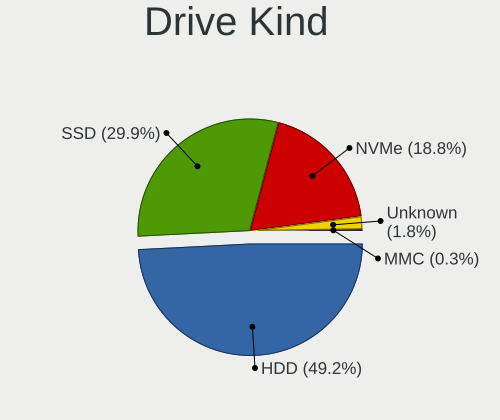

| Kind    | Desktops | Drives | Percent |
|---------|----------|--------|---------|
| HDD     | 1104     | 1793   | 49.2%   |
| SSD     | 671      | 1025   | 29.9%   |
| NVMe    | 422      | 626    | 18.81%  |
| Unknown | 41       | 45     | 1.83%   |
| MMC     | 6        | 6      | 0.27%   |

Drive Connector
---------------

SATA, SAS, NVMe, etc.

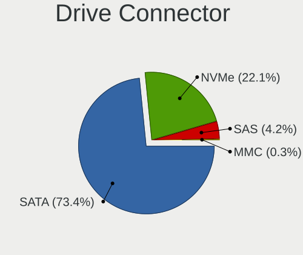

| Type | Desktops | Drives | Percent |
|------|----------|--------|---------|
| SATA | 1400     | 2764   | 73.41%  |
| NVMe | 421      | 623    | 22.08%  |
| SAS  | 80       | 102    | 4.2%    |
| MMC  | 6        | 6      | 0.31%   |

Drive Size
----------

Size of hard drive

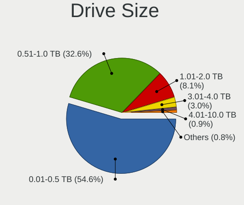

| Size in TB | Desktops | Drives | Percent |
|------------|----------|--------|---------|
| 0.01-0.5   | 1005     | 1552   | 54.59%  |
| 0.51-1.0   | 601      | 868    | 32.65%  |
| 1.01-2.0   | 149      | 250    | 8.09%   |
| 3.01-4.0   | 55       | 93     | 2.99%   |
| 4.01-10.0  | 16       | 27     | 0.87%   |
| 2.01-3.0   | 11       | 18     | 0.6%    |
| 10.01-20.0 | 4        | 10     | 0.22%   |

Space Total
-----------

Amount of disk space available on the file system

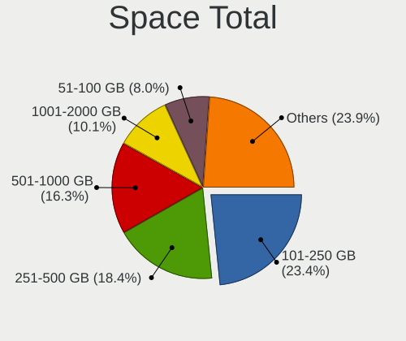

| Size in GB     | Desktops | Percent |
|----------------|----------|---------|
| 101-250        | 393      | 23.39%  |
| 251-500        | 309      | 18.39%  |
| 501-1000       | 274      | 16.31%  |
| 1001-2000      | 169      | 10.06%  |
| 51-100         | 134      | 7.98%   |
| 1-20           | 128      | 7.62%   |
| 21-50          | 88       | 5.24%   |
| More than 3000 | 86       | 5.12%   |
| 2001-3000      | 55       | 3.27%   |
| Unknown        | 44       | 2.62%   |

Space Used
----------

Amount of used disk space

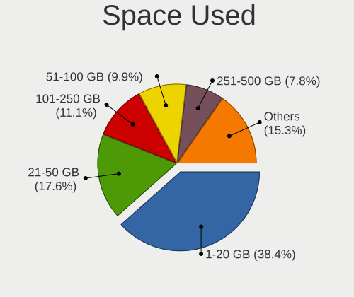

| Used GB        | Desktops | Percent |
|----------------|----------|---------|
| 1-20           | 667      | 38.42%  |
| 21-50          | 305      | 17.57%  |
| 101-250        | 192      | 11.06%  |
| 51-100         | 171      | 9.85%   |
| 251-500        | 135      | 7.78%   |
| 501-1000       | 113      | 6.51%   |
| 1001-2000      | 63       | 3.63%   |
| Unknown        | 44       | 2.53%   |
| More than 3000 | 25       | 1.44%   |
| 2001-3000      | 19       | 1.09%   |
| 0              | 2        | 0.12%   |

Malfunc. Drives
---------------

Drive models with a malfunction

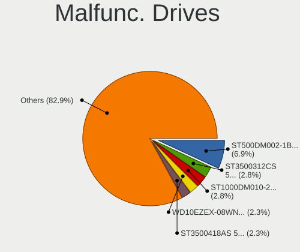

| Model                              | Desktops | Drives | Percent |
|------------------------------------|----------|--------|---------|
| Seagate ST500DM002-1BD142 500GB    | 15       | 15     | 6.91%   |
| Seagate ST3500312CS 500GB          | 6        | 6      | 2.76%   |
| Seagate ST1000DM010-2EP102 1TB     | 6        | 6      | 2.76%   |
| WDC WD10EZEX-08WN4A0 1TB           | 5        | 5      | 2.3%    |
| Seagate ST3500418AS 500GB          | 5        | 5      | 2.3%    |
| Seagate ST1000DM003-1ER162 1TB     | 5        | 5      | 2.3%    |
| Seagate ST3500414CS 500GB          | 4        | 4      | 1.84%   |
| Seagate ST31000524AS 1TB           | 4        | 4      | 1.84%   |
| Seagate ST1000DM003-9YN162 1TB     | 4        | 4      | 1.84%   |
| WDC WD5000AAKX-60U6AA0 500GB       | 3        | 5      | 1.38%   |
| WDC WD5000AAKX-00ERMA0 500GB       | 3        | 5      | 1.38%   |
| Toshiba DT01ACA100 1TB             | 3        | 6      | 1.38%   |
| Seagate ST9500325AS 500GB          | 3        | 3      | 1.38%   |
| Seagate ST1000LM024 HN-M101MBB 1TB | 3        | 3      | 1.38%   |
| Seagate ST1000DM003-1CH162 1TB     | 3        | 3      | 1.38%   |
| Hitachi HDS721050CLA660 500GB      | 3        | 3      | 1.38%   |
| YS SSD 128GB                       | 2        | 2      | 0.92%   |
| WDC WDS240G2G0B-00EPW0 240GB SSD   | 2        | 2      | 0.92%   |
| WDC WDS120G2G0A-00JH30 120GB SSD   | 2        | 2      | 0.92%   |
| WDC WD5000AAKX-22ERMA0 500GB       | 2        | 3      | 0.92%   |
| WDC WD5000AAKX-001CA0 500GB        | 2        | 6      | 0.92%   |
| WDC WD3200AAKS-61L9A0 320GB        | 2        | 3      | 0.92%   |
| WDC WD3200AAJS-00L7A0 320GB        | 2        | 2      | 0.92%   |
| WDC WD20EZRZ-00Z5HB0 2TB           | 2        | 2      | 0.92%   |
| WDC WD10EARX-00N0YB0 1TB           | 2        | 2      | 0.92%   |
| Toshiba HDWD110 1TB                | 2        | 2      | 0.92%   |
| SPCC Solid State Disk 128GB        | 2        | 2      | 0.92%   |
| Seagate ST9160314AS 160GB          | 2        | 3      | 0.92%   |
| Seagate ST500LT012-1DG142 500GB    | 2        | 2      | 0.92%   |
| Seagate ST4000DM004-2CV104 4TB     | 2        | 2      | 0.92%   |
| Seagate ST3250318AS 250GB          | 2        | 2      | 0.92%   |
| Seagate ST31000528AS 1TB           | 2        | 2      | 0.92%   |
| Seagate ST2000DM001-1CH164 2TB     | 2        | 2      | 0.92%   |
| Seagate ST1000LM035-1RK172 1TB     | 2        | 3      | 0.92%   |
| Hitachi HDS721032CLA362 320GB      | 2        | 2      | 0.92%   |
| HGST HTS725050A7E630 500GB         | 2        | 2      | 0.92%   |
| Crucial CT3500SC 500GB SSD         | 2        | 3      | 0.92%   |
| ZEB-SD26 SSD 256G                  | 1        | 1      | 0.46%   |
| XPG GAMMIX S70 1TB                 | 1        | 1      | 0.46%   |
| WDC WDS240G2G0A-00JH30 240GB SSD   | 1        | 1      | 0.46%   |

Malfunc. Drive Vendor
---------------------

Vendors of faulty drives

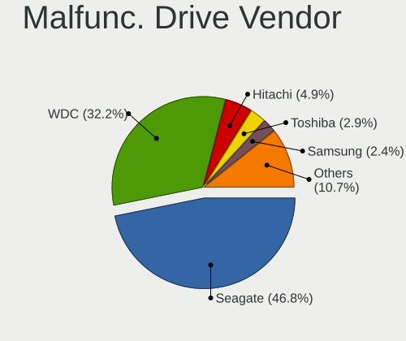

| Vendor                      | Desktops | Drives | Percent |
|-----------------------------|----------|--------|---------|
| Seagate                     | 96       | 110    | 46.83%  |
| WDC                         | 66       | 87     | 32.2%   |
| Hitachi                     | 10       | 10     | 4.88%   |
| Toshiba                     | 6        | 9      | 2.93%   |
| Samsung Electronics         | 5        | 7      | 2.44%   |
| HGST                        | 4        | 6      | 1.95%   |
| YS                          | 2        | 2      | 0.98%   |
| SPCC                        | 2        | 2      | 0.98%   |
| Crucial                     | 2        | 3      | 0.98%   |
| A-DATA Technology           | 2        | 3      | 0.98%   |
| ZEB-SD26                    | 1        | 1      | 0.49%   |
| XPG                         | 1        | 1      | 0.49%   |
| Realtek Semiconductor       | 1        | 1      | 0.49%   |
| MAXIO Technology (Hangzhou) | 1        | 1      | 0.49%   |
| Kingston                    | 1        | 1      | 0.49%   |
| Innodisk                    | 1        | 1      | 0.49%   |
| Gamers                      | 1        | 1      | 0.49%   |
| China                       | 1        | 1      | 0.49%   |
| Aarvex                      | 1        | 2      | 0.49%   |
| 2.5"                        | 1        | 1      | 0.49%   |

Malfunc. HDD Vendor
-------------------

Vendors of faulty HDD drives

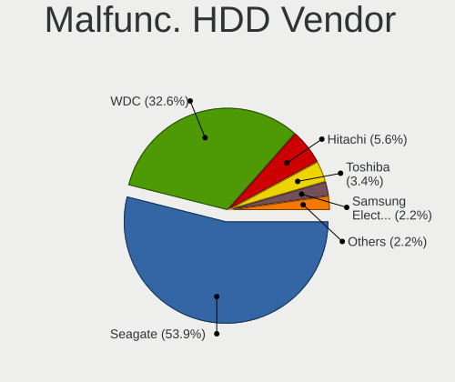

| Vendor              | Desktops | Drives | Percent |
|---------------------|----------|--------|---------|
| Seagate             | 96       | 110    | 53.93%  |
| WDC                 | 58       | 78     | 32.58%  |
| Hitachi             | 10       | 10     | 5.62%   |
| Toshiba             | 6        | 9      | 3.37%   |
| Samsung Electronics | 4        | 6      | 2.25%   |
| HGST                | 4        | 6      | 2.25%   |

Malfunc. Drive Kind
-------------------

Kinds of faulty drives

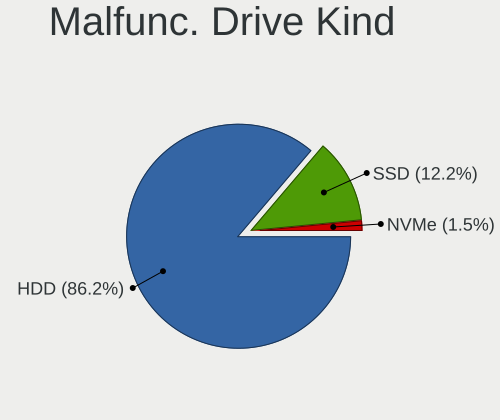

| Kind | Desktops | Drives | Percent |
|------|----------|--------|---------|
| HDD  | 169      | 219    | 86.22%  |
| SSD  | 24       | 28     | 12.24%  |
| NVMe | 3        | 3      | 1.53%   |

Failed Drives
-------------

Failed drive models

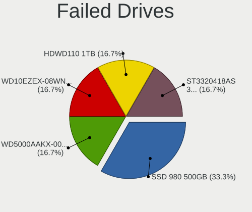

| Model                             | Desktops | Drives | Percent |
|-----------------------------------|----------|--------|---------|
| Samsung Electronics SSD 980 500GB | 2        | 3      | 33.33%  |
| WDC WD5000AAKX-001CA0 500GB       | 1        | 1      | 16.67%  |
| WDC WD10EZEX-08WN4A0 1TB          | 1        | 1      | 16.67%  |
| Toshiba HDWD110 1TB               | 1        | 1      | 16.67%  |
| Seagate ST3320418AS 320GB         | 1        | 1      | 16.67%  |

Failed Drive Vendor
-------------------

Failed drive vendors

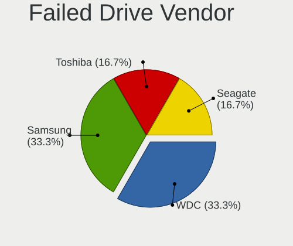

| Vendor              | Desktops | Drives | Percent |
|---------------------|----------|--------|---------|
| WDC                 | 2        | 2      | 33.33%  |
| Samsung Electronics | 2        | 3      | 33.33%  |
| Toshiba             | 1        | 1      | 16.67%  |
| Seagate             | 1        | 1      | 16.67%  |

Drive Status
------------

Number of failed and malfunc. drives

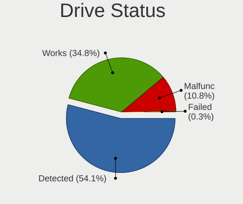

| Status   | Desktops | Drives | Percent |
|----------|----------|--------|---------|
| Detected | 939      | 2004   | 54.09%  |
| Works    | 604      | 1234   | 34.79%  |
| Malfunc  | 187      | 250    | 10.77%  |
| Failed   | 6        | 7      | 0.35%   |

Storage controller
------------------

Storage Vendor
--------------

Storage controller vendors

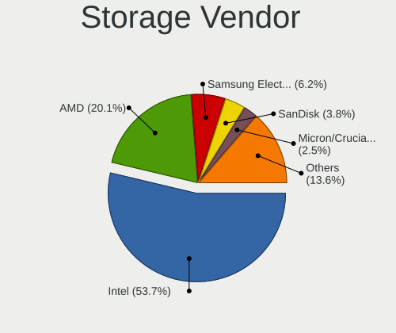

| Vendor                           | Desktops | Percent |
|----------------------------------|----------|---------|
| Intel                            | 1138     | 53.7%   |
| AMD                              | 425      | 20.06%  |
| Samsung Electronics              | 132      | 6.23%   |
| SanDisk                          | 81       | 3.82%   |
| Micron/Crucial Technology        | 54       | 2.55%   |
| ASMedia Technology               | 46       | 2.17%   |
| Kingston Technology Company      | 40       | 1.89%   |
| Phison Electronics               | 27       | 1.27%   |
| ADATA Technology                 | 27       | 1.27%   |
| Silicon Motion                   | 25       | 1.18%   |
| Micron Technology                | 19       | 0.9%    |
| Realtek Semiconductor            | 16       | 0.76%   |
| Nvidia                           | 12       | 0.57%   |
| JMicron Technology               | 11       | 0.52%   |
| Marvell Technology Group         | 10       | 0.47%   |
| SK hynix                         | 9        | 0.42%   |
| MAXIO Technology (Hangzhou)      | 7        | 0.33%   |
| Broadcom / LSI                   | 6        | 0.28%   |
| INNOGRIT                         | 5        | 0.24%   |
| Biwin Storage Technology         | 5        | 0.24%   |
| Seagate Technology               | 4        | 0.19%   |
| Silicon Integrated Systems [SiS] | 3        | 0.14%   |
| VIA Technologies                 | 2        | 0.09%   |
| KIOXIA                           | 2        | 0.09%   |
| Hosin Global Electronics         | 2        | 0.09%   |
| Toshiba America Info Systems     | 1        | 0.05%   |
| ShenZhen TIGO Semiconductor      | 1        | 0.05%   |
| Shenzhen Techwinsemi Technology  | 1        | 0.05%   |
| Shenzhen Longsys Electronics     | 1        | 0.05%   |
| Nextorage                        | 1        | 0.05%   |
| LSI Logic / Symbios Logic        | 1        | 0.05%   |
| Lite-On Technology               | 1        | 0.05%   |
| Lenovo                           | 1        | 0.05%   |
| Integrated Technology Express    | 1        | 0.05%   |
| Hewlett-Packard                  | 1        | 0.05%   |
| 3ware                            | 1        | 0.05%   |

Storage Model
-------------

Storage controller models

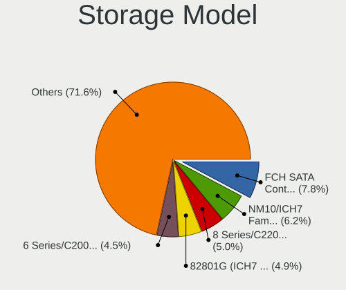

| Model                                                                                   | Desktops | Percent |
|-----------------------------------------------------------------------------------------|----------|---------|
| AMD FCH SATA Controller [AHCI mode]                                                     | 207      | 7.77%   |
| Intel NM10/ICH7 Family SATA Controller [IDE mode]                                       | 166      | 6.23%   |
| Intel 8 Series/C220 Series Chipset Family 6-port SATA Controller 1 [AHCI mode]          | 132      | 4.96%   |
| Intel 82801G (ICH7 Family) IDE Controller                                               | 130      | 4.88%   |
| Intel 6 Series/C200 Series Chipset Family 6 port Desktop SATA AHCI Controller           | 121      | 4.54%   |
| AMD 400 Series Chipset SATA Controller                                                  | 113      | 4.24%   |
| Intel Q170/Q150/B150/H170/H110/Z170/CM236 Chipset SATA Controller [AHCI Mode]           | 98       | 3.68%   |
| Intel 200 Series PCH SATA controller [AHCI mode]                                        | 85       | 3.19%   |
| Intel Cannon Lake PCH SATA AHCI Controller                                              | 65       | 2.44%   |
| AMD 500 Series Chipset SATA Controller                                                  | 64       | 2.4%    |
| AMD 600 Series Chipset SATA Controller                                                  | 62       | 2.33%   |
| Intel 6 Series/C200 Series Chipset Family Desktop SATA Controller (IDE mode, ports 4-5) | 59       | 2.22%   |
| Intel 6 Series/C200 Series Chipset Family Desktop SATA Controller (IDE mode, ports 0-3) | 59       | 2.22%   |
| Intel 500 Series Chipset Family SATA AHCI Controller                                    | 52       | 1.95%   |
| Intel Alder Lake-S PCH SATA Controller [AHCI Mode]                                      | 50       | 1.88%   |
| Samsung NVMe SSD Controller SM981/PM981/PM983                                           | 49       | 1.84%   |
| Intel 7 Series/C210 Series Chipset Family 6-port SATA Controller [AHCI mode]            | 47       | 1.76%   |
| ASMedia ASM1061/ASM1062 Serial ATA Controller                                           | 43       | 1.61%   |
| Intel SATA Controller [RAID Mode]                                                       | 42       | 1.58%   |
| AMD SB7x0/SB8x0/SB9x0 IDE Controller                                                    | 40       | 1.5%    |
| AMD A320 Chipset SATA Controller [AHCI mode]                                            | 40       | 1.5%    |
| AMD SB7x0/SB8x0/SB9x0 SATA Controller [IDE mode]                                        | 36       | 1.35%   |
| Samsung NVMe SSD Controller 980 (DRAM-less)                                             | 34       | 1.28%   |
| Samsung NVMe SSD Controller S4LV008[Pascal]                                             | 29       | 1.09%   |
| Intel Raptor Lake SATA AHCI Controller                                                  | 29       | 1.09%   |
| Micron/Crucial P2 [Nick P2] / P3 / P3 Plus NVMe PCIe SSD (DRAM-less)                    | 27       | 1.01%   |
| SanDisk Ultra 3D / WD Blue SN570 NVMe SSD (DRAM-less)                                   | 25       | 0.94%   |
| Intel Volume Management Device NVMe RAID Controller                                     | 24       | 0.9%    |
| Silicon Motion SM2263EN/SM2263XT (DRAM-less) NVMe SSD Controllers                       | 22       | 0.83%   |
| Intel 5 Series/3400 Series Chipset 4 port SATA IDE Controller                           | 22       | 0.83%   |
| Intel 5 Series/3400 Series Chipset 2 port SATA IDE Controller                           | 21       | 0.79%   |
| Intel 400 Series Chipset Family SATA AHCI Controller                                    | 20       | 0.75%   |
| Samsung NVMe SSD Controller PM9A1/PM9A3/980PRO                                          | 19       | 0.71%   |
| AMD 300 Series Chipset SATA Controller                                                  | 19       | 0.71%   |
| Intel Comet Lake SATA AHCI Controller                                                   | 18       | 0.68%   |
| Intel 9 Series Chipset Family SATA Controller [AHCI Mode]                               | 16       | 0.6%    |
| Micron 2550 NVMe SSD (DRAM-less)                                                        | 15       | 0.56%   |
| SanDisk WD SN560/SN740/SN770/SN5000 NVMe SSD                                            | 14       | 0.53%   |
| Phison PS5013-E13 PCIe3 NVMe Controller (DRAM-less)                                     | 12       | 0.45%   |
| AMD SB7x0/SB8x0/SB9x0 SATA Controller [AHCI mode]                                       | 12       | 0.45%   |

Storage Kind
------------

Kind of storage controller (IDE, SATA, NVMe, SAS, ...)

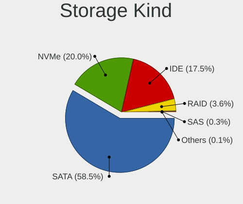

| Kind | Desktops | Percent |
|------|----------|---------|
| SATA | 1237     | 58.51%  |
| NVMe | 423      | 20.01%  |
| IDE  | 369      | 17.46%  |
| RAID | 77       | 3.64%   |
| SAS  | 6        | 0.28%   |
| SCSI | 2        | 0.09%   |

Processor
---------

CPU Vendor
----------

Processor vendors

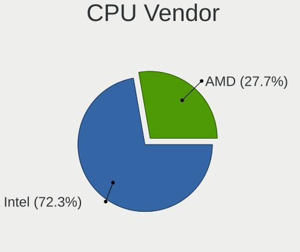

| Vendor | Desktops | Percent |
|--------|----------|---------|
| Intel  | 1141     | 72.26%  |
| AMD    | 438      | 27.74%  |

CPU Model
---------

Processor models

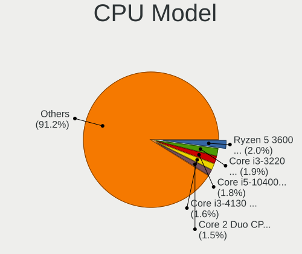

| Model                                       | Desktops | Percent |
|---------------------------------------------|----------|---------|
| AMD Ryzen 5 3600 6-Core Processor           | 32       | 2.02%   |
| Intel Core i3-3220 CPU @ 3.30GHz            | 30       | 1.9%    |
| Intel Core i5-10400 CPU @ 2.90GHz           | 29       | 1.83%   |
| Intel Core i3-4130 CPU @ 3.40GHz            | 25       | 1.58%   |
| Intel Core 2 Duo CPU E7500 @ 2.93GHz        | 24       | 1.52%   |
| Intel Core i3-2120 CPU @ 3.30GHz            | 23       | 1.45%   |
| Intel Core i5-3470 CPU @ 3.20GHz            | 20       | 1.26%   |
| AMD Ryzen 3 3200G with Radeon Vega Graphics | 20       | 1.26%   |
| Intel Core i5-9400F CPU @ 2.90GHz           | 19       | 1.2%    |
| Intel Core i3-7100 CPU @ 3.90GHz            | 19       | 1.2%    |
| AMD Ryzen 5 5600G with Radeon Graphics      | 18       | 1.14%   |
| Intel Core i3-9100F CPU @ 3.60GHz           | 17       | 1.07%   |
| Intel Core i3-2100 CPU @ 3.10GHz            | 17       | 1.07%   |
| AMD Ryzen 5 8500G w/ Radeon 740M Graphics   | 17       | 1.07%   |
| AMD Ryzen 3 2200G with Radeon Vega Graphics | 17       | 1.07%   |
| Intel Pentium Dual-Core CPU E6700 @ 3.20GHz | 15       | 0.95%   |
| Intel Core i5-6500 CPU @ 3.20GHz            | 15       | 0.95%   |
| Intel Core i5-8400 CPU @ 2.80GHz            | 14       | 0.88%   |
| Intel Core i5-4440 CPU @ 3.10GHz            | 14       | 0.88%   |
| Intel Core i5-2400 CPU @ 3.10GHz            | 14       | 0.88%   |
| Intel Core 2 Duo CPU E8400 @ 3.00GHz        | 14       | 0.88%   |
| Intel 12th Gen Core i3-12100                | 14       | 0.88%   |
| AMD Ryzen 7 3700X 8-Core Processor          | 14       | 0.88%   |
| Intel Core i5-7400 CPU @ 3.00GHz            | 13       | 0.82%   |
| Intel Core i3-4150 CPU @ 3.50GHz            | 12       | 0.76%   |
| Intel Core i3-10100 CPU @ 3.60GHz           | 12       | 0.76%   |
| AMD Ryzen 5 2400G with Radeon Vega Graphics | 12       | 0.76%   |
| Intel Pentium CPU G4400 @ 3.30GHz           | 11       | 0.69%   |
| Intel Pentium CPU G3240 @ 3.10GHz           | 11       | 0.69%   |
| Intel Core i7-9700 CPU @ 3.00GHz            | 11       | 0.69%   |
| AMD Ryzen 5 5600X 6-Core Processor          | 11       | 0.69%   |
| AMD Ryzen 5 3400G with Radeon Vega Graphics | 11       | 0.69%   |
| AMD Ryzen 5 1600 Six-Core Processor         | 11       | 0.69%   |
| Intel Pentium CPU G2030 @ 3.00GHz           | 10       | 0.63%   |
| Intel Core i7-3770 CPU @ 3.40GHz            | 10       | 0.63%   |
| Intel Core i5-4570 CPU @ 3.20GHz            | 10       | 0.63%   |
| Intel Pentium Dual-Core CPU E5700 @ 3.00GHz | 9        | 0.57%   |
| Intel Core i5-3450 CPU @ 3.10GHz            | 9        | 0.57%   |
| Intel Core i3-6100 CPU @ 3.70GHz            | 9        | 0.57%   |
| Intel Core i3-6098P CPU @ 3.60GHz           | 9        | 0.57%   |

CPU Model Family
----------------

Processor model prefix

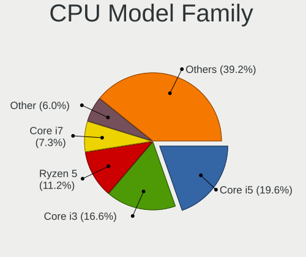

| Model                   | Desktops | Percent |
|-------------------------|----------|---------|
| Intel Core i5           | 311      | 19.65%  |
| Intel Core i3           | 263      | 16.61%  |
| AMD Ryzen 5             | 178      | 11.24%  |
| Intel Core i7           | 115      | 7.26%   |
| Other                   | 95       | 6%      |
| Intel Core 2 Duo        | 85       | 5.37%   |
| Intel Pentium           | 76       | 4.8%    |
| AMD Ryzen 7             | 65       | 4.11%   |
| Intel Pentium Dual-Core | 55       | 3.47%   |
| AMD Ryzen 3             | 43       | 2.72%   |
| AMD Ryzen 9             | 42       | 2.65%   |
| Intel Xeon              | 33       | 2.08%   |
| AMD FX                  | 26       | 1.64%   |
| Intel Core 2 Quad       | 19       | 1.2%    |
| Intel Celeron           | 19       | 1.2%    |
| Intel Pentium Dual      | 17       | 1.07%   |
| Intel Core 2            | 15       | 0.95%   |
| Intel Pentium Gold      | 11       | 0.69%   |
| Intel Core i9           | 11       | 0.69%   |
| AMD A4                  | 11       | 0.69%   |
| AMD A8                  | 9        | 0.57%   |
| AMD Athlon II X2        | 8        | 0.51%   |
| Intel Pentium 4         | 7        | 0.44%   |
| AMD Ryzen Threadripper  | 6        | 0.38%   |
| Intel Atom              | 5        | 0.32%   |
| AMD Sempron             | 5        | 0.32%   |
| AMD Phenom II X6        | 5        | 0.32%   |
| AMD Athlon              | 5        | 0.32%   |
| AMD A6                  | 5        | 0.32%   |
| Intel Pentium D         | 4        | 0.25%   |
| AMD Ryzen 3 PRO         | 4        | 0.25%   |
| AMD Phenom II X4        | 4        | 0.25%   |
| AMD Phenom II X2        | 4        | 0.25%   |
| AMD Ryzen 5 PRO         | 3        | 0.19%   |
| AMD Athlon 64 X2        | 3        | 0.19%   |
| Intel Genuine           | 2        | 0.13%   |
| AMD GX                  | 2        | 0.13%   |
| AMD E1                  | 2        | 0.13%   |
| AMD E                   | 2        | 0.13%   |
| AMD A10                 | 2        | 0.13%   |

CPU Cores
---------

Number of processor cores

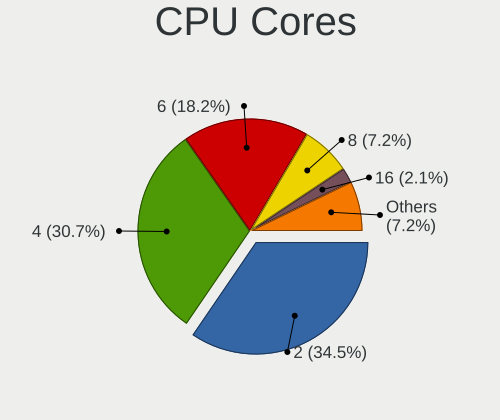

| Number | Desktops | Percent |
|--------|----------|---------|
| 2      | 547      | 34.53%  |
| 4      | 487      | 30.74%  |
| 6      | 288      | 18.18%  |
| 8      | 114      | 7.2%    |
| 16     | 34       | 2.15%   |
| 12     | 34       | 2.15%   |
| 1      | 34       | 2.15%   |
| 24     | 11       | 0.69%   |
| 14     | 9        | 0.57%   |
| 10     | 8        | 0.51%   |
| 3      | 6        | 0.38%   |
| 20     | 4        | 0.25%   |
| 32     | 3        | 0.19%   |
| 28     | 2        | 0.13%   |
| 56     | 1        | 0.06%   |
| 40     | 1        | 0.06%   |
| 36     | 1        | 0.06%   |

CPU Sockets
-----------

Number of sockets

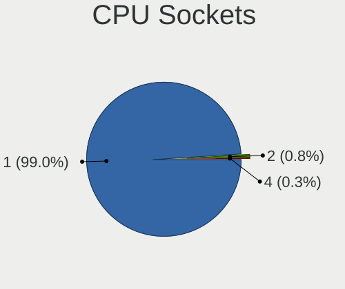

| Number | Desktops | Percent |
|--------|----------|---------|
| 1      | 1563     | 98.99%  |
| 2      | 12       | 0.76%   |
| 4      | 4        | 0.25%   |

CPU Threads
-----------

Threads per core (Hyper-Threading)

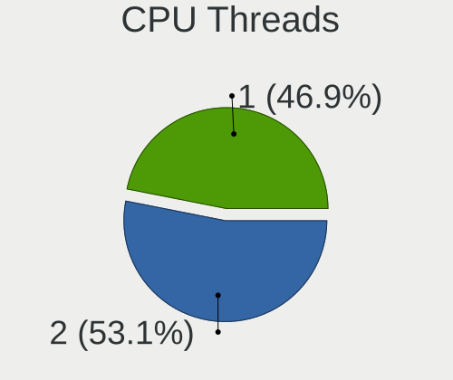

| Number | Desktops | Percent |
|--------|----------|---------|
| 2      | 839      | 53.1%   |
| 1      | 741      | 46.9%   |

CPU Op-Modes
------------

CPU Operation Modes (32-bit, 64-bit)

| Op mode        | Desktops | Percent |
|----------------|----------|---------|
| 32-bit, 64-bit | 1566     | 99.11%  |
| Unknown        | 12       | 0.76%   |
| 32-bit         | 2        | 0.13%   |

CPU Microcode
-------------

Microcode number

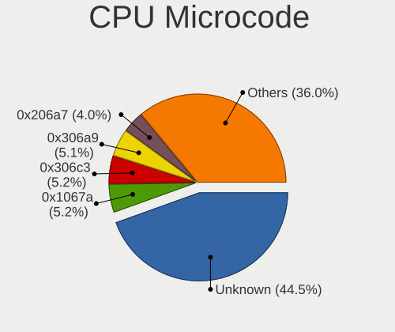

| Number     | Desktops | Percent |
|------------|----------|---------|
| Unknown    | 730      | 44.51%  |
| 0x1067a    | 86       | 5.24%   |
| 0x306c3    | 85       | 5.18%   |
| 0x306a9    | 83       | 5.06%   |
| 0x206a7    | 65       | 3.96%   |
| 0x506e3    | 45       | 2.74%   |
| 0x906ea    | 41       | 2.5%    |
| 0x906e9    | 35       | 2.13%   |
| 0x08701021 | 30       | 1.83%   |
| 0xa0655    | 29       | 1.77%   |
| 0x6fd      | 23       | 1.4%    |
| 0x08108109 | 19       | 1.16%   |
| 0x010000c8 | 19       | 1.16%   |
| 0xa0653    | 18       | 1.1%    |
| 0x0800820d | 16       | 0.98%   |
| 0x906eb    | 15       | 0.91%   |
| 0x90672    | 12       | 0.73%   |
| 0x06000852 | 12       | 0.73%   |
| 0x90675    | 11       | 0.67%   |
| 0x20655    | 11       | 0.67%   |
| 0x08101016 | 11       | 0.67%   |
| 0x6fb      | 10       | 0.61%   |
| 0x6f2      | 10       | 0.61%   |
| 0x10676    | 10       | 0.61%   |
| 0x08701013 | 10       | 0.61%   |
| 0x0810100b | 10       | 0.61%   |
| 0x06001119 | 10       | 0.61%   |
| 0xa0671    | 9        | 0.55%   |
| 0x906ed    | 9        | 0.55%   |
| 0xb0671    | 7        | 0.43%   |
| 0x08001137 | 7        | 0.43%   |
| 0x20652    | 6        | 0.37%   |
| 0x0a601203 | 6        | 0.37%   |
| 0x08001138 | 6        | 0.37%   |
| 0x6f6      | 5        | 0.3%    |
| 0x0a50000d | 5        | 0.3%    |
| 0x0a50000c | 5        | 0.3%    |
| 0x0600063e | 5        | 0.3%    |
| 0xf65      | 4        | 0.24%   |
| 0x106e5    | 4        | 0.24%   |

CPU Microarch
-------------

Microarchitecture

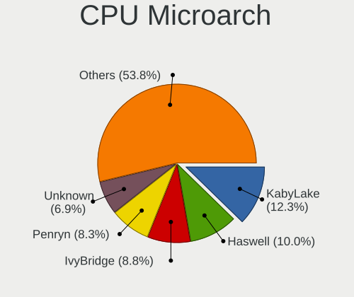

| Name             | Desktops | Percent |
|------------------|----------|---------|
| KabyLake         | 195      | 12.3%   |
| Haswell          | 158      | 9.97%   |
| IvyBridge        | 139      | 8.77%   |
| Penryn           | 132      | 8.33%   |
| Unknown          | 109      | 6.88%   |
| SandyBridge      | 104      | 6.56%   |
| Skylake          | 87       | 5.49%   |
| Zen 2            | 84       | 5.3%    |
| Zen 3            | 77       | 4.86%   |
| CometLake        | 76       | 4.79%   |
| Zen+             | 65       | 4.1%    |
| Core             | 64       | 4.04%   |
| Zen              | 56       | 3.53%   |
| Alderlake Hybrid | 53       | 3.34%   |
| Piledriver       | 31       | 1.96%   |
| K10              | 26       | 1.64%   |
| Westmere         | 24       | 1.51%   |
| NetBurst         | 12       | 0.76%   |
| Nehalem          | 11       | 0.69%   |
| Broadwell        | 10       | 0.63%   |
| Steamroller      | 9        | 0.57%   |
| Silvermont       | 9        | 0.57%   |
| Icelake          | 9        | 0.57%   |
| Goldmont         | 8        | 0.5%    |
| Excavator        | 7        | 0.44%   |
| Bulldozer        | 6        | 0.38%   |
| Bobcat           | 5        | 0.32%   |
| K8 Hammer        | 4        | 0.25%   |
| Jaguar           | 3        | 0.19%   |
| Gracemont        | 3        | 0.19%   |
| Goldmont plus    | 3        | 0.19%   |
| TigerLake        | 2        | 0.13%   |
| K10 Llano        | 2        | 0.13%   |
| Tremont          | 1        | 0.06%   |
| Bonnell          | 1        | 0.06%   |

Graphics
--------

GPU Vendor
----------

Vendors of graphics cards

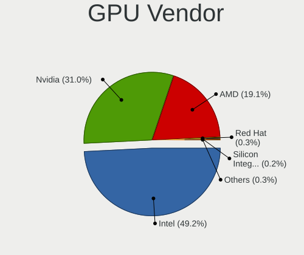

| Vendor                           | Desktops | Percent |
|----------------------------------|----------|---------|
| Intel                            | 833      | 49.2%   |
| Nvidia                           | 524      | 30.95%  |
| AMD                              | 323      | 19.08%  |
| Red Hat                          | 5        | 0.3%    |
| Silicon Integrated Systems [SiS] | 3        | 0.18%   |
| Matrox Electronics Systems       | 3        | 0.18%   |
| ASPEED Technology                | 2        | 0.12%   |

GPU Model
---------

Graphics card models

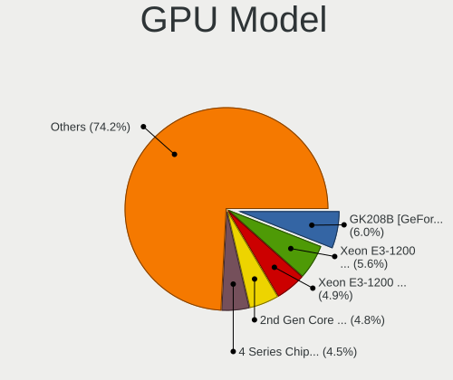

| Model                                                                       | Desktops | Percent |
|-----------------------------------------------------------------------------|----------|---------|
| Nvidia GK208B [GeForce GT 710]                                              | 103      | 5.97%   |
| Intel Xeon E3-1200 v2/3rd Gen Core processor Graphics Controller            | 97       | 5.63%   |
| Intel Xeon E3-1200 v3/4th Gen Core Processor Integrated Graphics Controller | 85       | 4.93%   |
| Intel 2nd Generation Core Processor Family Integrated Graphics Controller   | 83       | 4.81%   |
| Intel 4 Series Chipset Integrated Graphics Controller                       | 77       | 4.47%   |
| Intel CoffeeLake-S GT2 [UHD Graphics 630]                                   | 66       | 3.83%   |
| Intel CometLake-S GT2 [UHD Graphics 630]                                    | 50       | 2.9%    |
| Intel 82G33/G31 Express Integrated Graphics Controller                      | 45       | 2.61%   |
| Intel 4th Generation Core Processor Family Integrated Graphics Controller   | 45       | 2.61%   |
| Intel Kaby Lake-S GT2 [HD Graphics 630]                                     | 43       | 2.49%   |
| Intel Skylake-S GT2 [HD Graphics 530]                                       | 40       | 2.32%   |
| Nvidia GF119 [GeForce GT 610]                                               | 34       | 1.97%   |
| AMD Cezanne [Radeon Vega Series / Radeon Vega Mobile Series]                | 32       | 1.86%   |
| Nvidia GP107 [GeForce GTX 1050 Ti]                                          | 31       | 1.8%    |
| AMD Picasso/Raven 2 [Radeon Vega Series / Radeon Vega Mobile Series]        | 31       | 1.8%    |
| AMD Raphael                                                                 | 30       | 1.74%   |
| Nvidia GT218 [GeForce 210]                                                  | 25       | 1.45%   |
| Nvidia GK208B [GeForce GT 730]                                              | 25       | 1.45%   |
| Intel 82945G/GZ Integrated Graphics Controller                              | 25       | 1.45%   |
| AMD Raven Ridge [Radeon Vega Series / Radeon Vega Mobile Series]            | 24       | 1.39%   |
| Intel Alder Lake-S GT1 [UHD Graphics 730]                                   | 22       | 1.28%   |
| AMD RS780L [Radeon 3000]                                                    | 22       | 1.28%   |
| Intel Alder Lake-S GT1 [UHD Graphics 770]                                   | 21       | 1.22%   |
| AMD Ellesmere [Radeon RX 470/480/570/570X/580/580X/590]                     | 21       | 1.22%   |
| Nvidia GA106 [GeForce RTX 3060 Lite Hash Rate]                              | 18       | 1.04%   |
| Intel Raptor Lake-S GT1 [UHD Graphics 770]                                  | 17       | 0.99%   |
| Intel Core Processor Integrated Graphics Controller                         | 17       | 0.99%   |
| AMD Phoenix2                                                                | 17       | 0.99%   |
| Intel Skylake-S GT1 [HD Graphics 510]                                       | 16       | 0.93%   |
| Nvidia GP108 [GeForce GT 1030]                                              | 13       | 0.75%   |
| Nvidia TU117 [GeForce GTX 1650]                                             | 12       | 0.7%    |
| Nvidia TU116 [GeForce GTX 1660]                                             | 12       | 0.7%    |
| Nvidia TU116 [GeForce GTX 1660 SUPER]                                       | 12       | 0.7%    |
| Nvidia TU116 [GeForce GTX 1660 Ti]                                          | 11       | 0.64%   |
| AMD Navi 23 [Radeon RX 6600/6600 XT/6600M]                                  | 11       | 0.64%   |
| Nvidia GM107 [GeForce GTX 750 Ti]                                           | 10       | 0.58%   |
| Nvidia GP106 [GeForce GTX 1060 6GB]                                         | 9        | 0.52%   |
| Intel IvyBridge GT2 [HD Graphics 4000]                                      | 9        | 0.52%   |
| Nvidia GM206 [GeForce GTX 960]                                              | 8        | 0.46%   |
| Nvidia GF108 [GeForce GT 730]                                               | 8        | 0.46%   |

GPU Combo
---------

Combinations of graphics cards

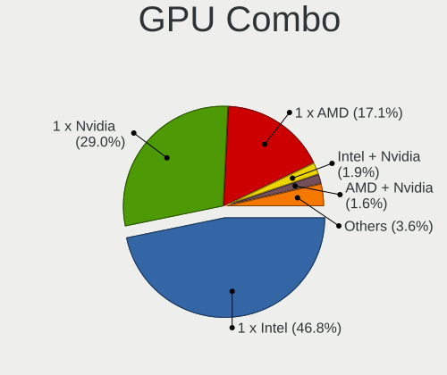

| Name               | Desktops | Percent |
|--------------------|----------|---------|
| 1 x Intel          | 749      | 46.78%  |
| 1 x Nvidia         | 464      | 28.98%  |
| 1 x AMD            | 274      | 17.11%  |
| Intel + Nvidia     | 31       | 1.94%   |
| AMD + Nvidia       | 25       | 1.56%   |
| Intel + AMD        | 15       | 0.94%   |
| 2 x AMD            | 13       | 0.81%   |
| 2 x Intel          | 7        | 0.44%   |
| 2 x Nvidia         | 6        | 0.37%   |
| 1 x Red Hat        | 5        | 0.31%   |
| Other              | 3        | 0.19%   |
| 1 x SiS            | 3        | 0.19%   |
| 1 x Matrox         | 3        | 0.19%   |
| Nvidia + ASPEED    | 1        | 0.06%   |
| Intel + 2 x Nvidia | 1        | 0.06%   |
| 1 x ASPEED         | 1        | 0.06%   |

GPU Driver
----------

Free vs proprietary

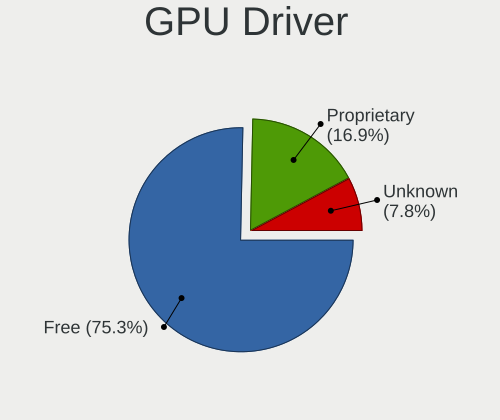

| Driver      | Desktops | Percent |
|-------------|----------|---------|
| Free        | 1215     | 75.33%  |
| Proprietary | 272      | 16.86%  |
| Unknown     | 126      | 7.81%   |

GPU Memory
----------

Total video memory

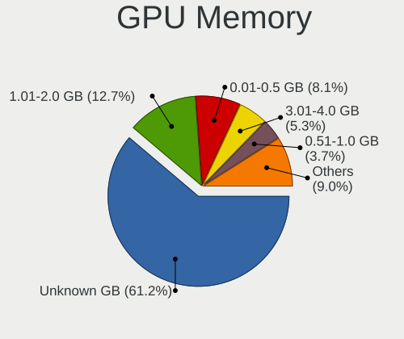

| Size in GB | Desktops | Percent |
|------------|----------|---------|
| Unknown    | 1000     | 61.2%   |
| 1.01-2.0   | 207      | 12.67%  |
| 0.01-0.5   | 132      | 8.08%   |
| 3.01-4.0   | 87       | 5.32%   |
| 0.51-1.0   | 61       | 3.73%   |
| 7.01-8.0   | 52       | 3.18%   |
| 8.01-16.0  | 44       | 2.69%   |
| 5.01-6.0   | 36       | 2.2%    |
| 16.01-24.0 | 10       | 0.61%   |
| 2.01-3.0   | 3        | 0.18%   |
| 32.01-64.0 | 1        | 0.06%   |
| 24.01-32.0 | 1        | 0.06%   |

Monitor
-------

Monitor Vendor
--------------

Monitor vendors

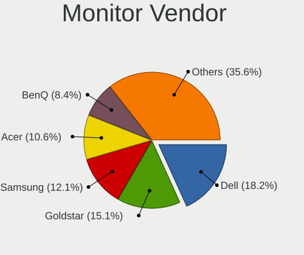

| Vendor               | Desktops | Percent |
|----------------------|----------|---------|
| Dell                 | 273      | 18.24%  |
| Goldstar             | 226      | 15.1%   |
| Samsung Electronics  | 181      | 12.09%  |
| Acer                 | 159      | 10.62%  |
| BenQ                 | 125      | 8.35%   |
| Hewlett-Packard      | 95       | 6.35%   |
| AOC                  | 59       | 3.94%   |
| Lenovo               | 51       | 3.41%   |
| ViewSonic            | 33       | 2.2%    |
| Philips              | 21       | 1.4%    |
| HCL                  | 21       | 1.4%    |
| Sony                 | 16       | 1.07%   |
| Unknown              | 14       | 0.94%   |
| RTK                  | 14       | 0.94%   |
| LG Electronics       | 14       | 0.94%   |
| Gigabyte Technology  | 12       | 0.8%    |
| MSI                  | 11       | 0.73%   |
| Ancor Communications | 10       | 0.67%   |
| STD                  | 9        | 0.6%    |
| Panasonic            | 8        | 0.53%   |
| ASUSTek Computer     | 8        | 0.53%   |
| Unknown              | 8        | 0.53%   |
| Xiaomi               | 6        | 0.4%    |
| SGT                  | 6        | 0.4%    |
| RHT                  | 5        | 0.33%   |
| PZG                  | 5        | 0.33%   |
| AOpen                | 5        | 0.33%   |
| Iiyama               | 4        | 0.27%   |
| HPN                  | 4        | 0.27%   |
| Gateway              | 4        | 0.27%   |
| ___                  | 3        | 0.2%    |
| Unknown (XXX)        | 3        | 0.2%    |
| Toshiba              | 3        | 0.2%    |
| SKY                  | 3        | 0.2%    |
| KTC                  | 3        | 0.2%    |
| YSD                  | 2        | 0.13%   |
| UTV                  | 2        | 0.13%   |
| TXD                  | 2        | 0.13%   |
| SANYO                | 2        | 0.13%   |
| NEW                  | 2        | 0.13%   |

Monitor Model
-------------

Monitor models

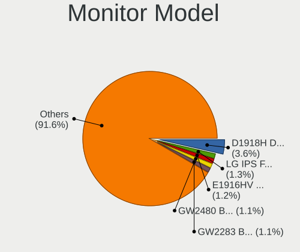

| Model                                                             | Desktops | Percent |
|-------------------------------------------------------------------|----------|---------|
| Dell D1918H DEL2005 1366x768 410x230mm 18.5-inch                  | 56       | 3.58%   |
| Goldstar LG IPS FULLHD GSM5AB8 1920x1080 480x270mm 21.7-inch      | 20       | 1.28%   |
| Dell E1916HV DELF06C 1366x768 409x230mm 18.5-inch                 | 19       | 1.21%   |
| BenQ GW2480 BNQ78E7 1920x1080 527x296mm 23.8-inch                 | 18       | 1.15%   |
| BenQ GW2283 BNQ78E9 1920x1080 476x268mm 21.5-inch                 | 18       | 1.15%   |
| Goldstar FULL HD GSM5B55 1920x1080 480x270mm 21.7-inch            | 17       | 1.09%   |
| Goldstar HD GSM5ACB 1366x768 410x230mm 18.5-inch                  | 15       | 0.96%   |
| RTK LCD Monitor RTK1D1A 1920x1080 1020x570mm 46.0-inch            | 13       | 0.83%   |
| Goldstar IPS FULLHD GSM5AB6 1920x1080 480x270mm 21.7-inch         | 10       | 0.64%   |
| Dell D1918H DEL2004 1366x768 410x230mm 18.5-inch                  | 10       | 0.64%   |
| Samsung Electronics S19F350 SAM0D46 1366x768 410x230mm 18.5-inch  | 9        | 0.57%   |
| Acer V206HQLB ACR051A 1366x768 434x236mm 19.4-inch                | 9        | 0.57%   |
| Goldstar HD GSM5ACD 1366x768 410x230mm 18.5-inch                  | 8        | 0.51%   |
| Dell S2240L DELD054 1920x1080 476x267mm 21.5-inch                 | 8        | 0.51%   |
| AOC 1970W AOC1970 1366x768 410x230mm 18.5-inch                    | 8        | 0.51%   |
| Unknown                                                           | 8        | 0.51%   |
| Samsung Electronics SMB1930N SAM0632 1366x768 410x230mm 18.5-inch | 7        | 0.45%   |
| Lenovo LEN E2054A LEN60DF 1440x900 419x262mm 19.5-inch            | 7        | 0.45%   |
| Lenovo LEN D186wA LEN0A14 1366x768 410x230mm 18.5-inch            | 7        | 0.45%   |
| Goldstar W1943 GSM4BAD 1360x768 406x229mm 18.4-inch               | 7        | 0.45%   |
| Dell IN2030M DELF03C 1600x900 443x249mm 20.0-inch                 | 7        | 0.45%   |
| Acer V193HQL ACR0127 1366x768 410x230mm 18.5-inch                 | 7        | 0.45%   |
| Samsung Electronics LF24T35 SAM707D 1920x1080 528x297mm 23.9-inch | 6        | 0.38%   |
| Hewlett-Packard Compaq F191 HWP3177 1366x768 410x230mm 18.5-inch  | 6        | 0.38%   |
| Goldstar HDR QHD GSM5B96 2560x1440 698x392mm 31.5-inch            | 6        | 0.38%   |
| Goldstar FULL HD GSM5B54 1920x1080 480x270mm 21.7-inch            | 6        | 0.38%   |
| Dell E2418HN DELA105 1920x1080 527x296mm 23.8-inch                | 6        | 0.38%   |
| BenQ GW2780 BNQ78E6 1920x1080 598x336mm 27.0-inch                 | 6        | 0.38%   |
| Xiaomi Mi TV XMD004A 3840x2160 708x398mm 32.0-inch                | 5        | 0.32%   |
| Samsung Electronics S22B370 SAM0899 1920x1080 477x268mm 21.5-inch | 5        | 0.32%   |
| Samsung Electronics C24F390 SAM0D2C 1920x1080 521x293mm 23.5-inch | 5        | 0.32%   |
| RHT QEMU Monitor RHT1234 2048x1152 325x203mm 15.1-inch            | 5        | 0.32%   |
| Goldstar ULTRAWIDE GSM76F9 2560x1080 531x298mm 24.0-inch          | 5        | 0.32%   |
| Goldstar IPS WSXGA GSM5B20 1440x900 419x262mm 19.5-inch           | 5        | 0.32%   |
| Dell SE2219H DELF10F 1920x1080 476x268mm 21.5-inch                | 5        | 0.32%   |
| Dell S2216H DELD07A 1920x1080 476x268mm 21.5-inch                 | 5        | 0.32%   |
| Dell P2419H DELD0DA 1920x1080 527x296mm 23.8-inch                 | 5        | 0.32%   |
| Dell E2218HN DELF09E 1920x1080 476x268mm 21.5-inch                | 5        | 0.32%   |
| Dell E1914H DELD03A 1366x768 410x230mm 18.5-inch                  | 5        | 0.32%   |
| BenQ GW2470 BNQ78E4 1920x1080 527x296mm 23.8-inch                 | 5        | 0.32%   |

Monitor Resolution
------------------

Monitor screen resolution

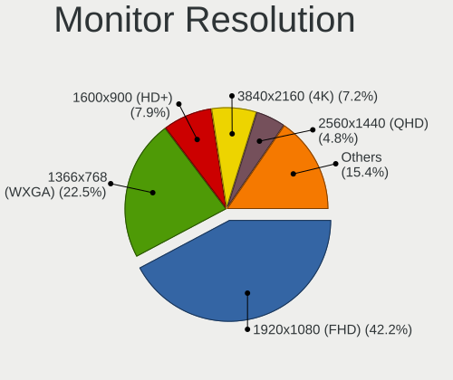

| Resolution         | Desktops | Percent |
|--------------------|----------|---------|
| 1920x1080 (FHD)    | 627      | 42.22%  |
| 1366x768 (WXGA)    | 334      | 22.49%  |
| 1600x900 (HD+)     | 117      | 7.88%   |
| 3840x2160 (4K)     | 107      | 7.21%   |
| 2560x1440 (QHD)    | 71       | 4.78%   |
| 1440x900 (WXGA+)   | 53       | 3.57%   |
| 1360x768           | 27       | 1.82%   |
| 1280x1024 (SXGA)   | 26       | 1.75%   |
| 2560x1080          | 21       | 1.41%   |
| Unknown            | 16       | 1.08%   |
| 1680x1050 (WSXGA+) | 15       | 1.01%   |
| 3840x1080          | 10       | 0.67%   |
| 3440x1440          | 10       | 0.67%   |
| 1920x1200 (WUXGA)  | 8        | 0.54%   |
| 1024x768 (XGA)     | 8        | 0.54%   |
| 2560x1397          | 5        | 0.34%   |
| 2288x1287          | 4        | 0.27%   |
| 1280x720 (HD)      | 4        | 0.27%   |
| 4093x4093          | 3        | 0.2%    |
| 1400x1050          | 2        | 0.13%   |
| 1280x800 (WXGA)    | 2        | 0.13%   |
| 1152x864           | 2        | 0.13%   |
| 8160x4627          | 1        | 0.07%   |
| 7680x2160          | 1        | 0.07%   |
| 6400x2160          | 1        | 0.07%   |
| 5760x2160          | 1        | 0.07%   |
| 4480x1080          | 1        | 0.07%   |
| 3840x2560          | 1        | 0.07%   |
| 3520x1080          | 1        | 0.07%   |
| 3200x900           | 1        | 0.07%   |
| 3200x1080          | 1        | 0.07%   |
| 2560x1600          | 1        | 0.07%   |
| 1920x540           | 1        | 0.07%   |
| 1280x960           | 1        | 0.07%   |
| 1280x768           | 1        | 0.07%   |

Monitor Diagonal
----------------

Diagonal size in inches

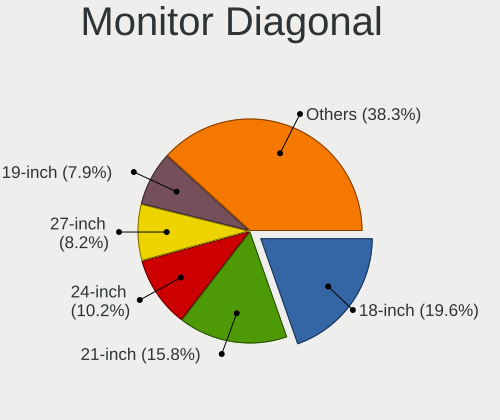

| Inches  | Desktops | Percent |
|---------|----------|---------|
| 18      | 295      | 19.63%  |
| 21      | 238      | 15.83%  |
| 24      | 154      | 10.25%  |
| 27      | 123      | 8.18%   |
| 19      | 118      | 7.85%   |
| 23      | 110      | 7.32%   |
| Unknown | 105      | 6.99%   |
| 31      | 65       | 4.32%   |
| 20      | 64       | 4.26%   |
| 15      | 37       | 2.46%   |
| 17      | 22       | 1.46%   |
| 34      | 21       | 1.4%    |
| 46      | 14       | 0.93%   |
| 72      | 12       | 0.8%    |
| 22      | 12       | 0.8%    |
| 26      | 11       | 0.73%   |
| 84      | 9        | 0.6%    |
| 32      | 9        | 0.6%    |
| 40      | 8        | 0.53%   |
| 65      | 6        | 0.4%    |
| 63      | 6        | 0.4%    |
| 29      | 6        | 0.4%    |
| 39      | 5        | 0.33%   |
| 25      | 5        | 0.33%   |
| 142     | 4        | 0.27%   |
| 52      | 4        | 0.27%   |
| 48      | 4        | 0.27%   |
| 16      | 4        | 0.27%   |
| 12      | 4        | 0.27%   |
| 64      | 3        | 0.2%    |
| 54      | 3        | 0.2%    |
| 42      | 3        | 0.2%    |
| 49      | 2        | 0.13%   |
| 43      | 2        | 0.13%   |
| 38      | 2        | 0.13%   |
| 36      | 2        | 0.13%   |
| 35      | 2        | 0.13%   |
| 13      | 2        | 0.13%   |
| 75      | 1        | 0.07%   |
| 61      | 1        | 0.07%   |

Monitor Width
-------------

Physical width

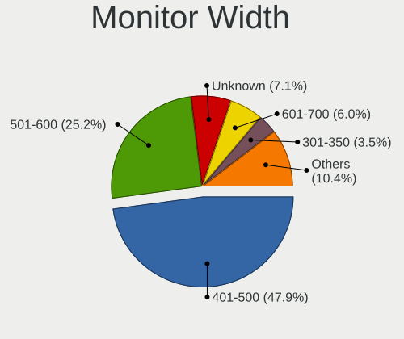

| Width in mm    | Desktops | Percent |
|----------------|----------|---------|
| 401-500        | 705      | 47.86%  |
| 501-600        | 371      | 25.19%  |
| Unknown        | 105      | 7.13%   |
| 601-700        | 88       | 5.97%   |
| 301-350        | 51       | 3.46%   |
| 1001-1500      | 46       | 3.12%   |
| 701-800        | 32       | 2.17%   |
| 1501-2000      | 22       | 1.49%   |
| 351-400        | 17       | 1.15%   |
| 801-900        | 16       | 1.09%   |
| 201-300        | 10       | 0.68%   |
| 901-1000       | 6        | 0.41%   |
| More than 2000 | 4        | 0.27%   |

Aspect Ratio
------------

Proportional relationship between the width and the height

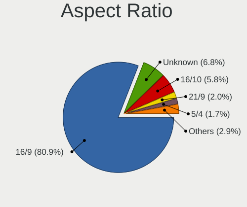

| Ratio   | Desktops | Percent |
|---------|----------|---------|
| 16/9    | 1154     | 80.93%  |
| Unknown | 97       | 6.8%    |
| 16/10   | 82       | 5.75%   |
| 21/9    | 28       | 1.96%   |
| 5/4     | 24       | 1.68%   |
| 4/3     | 20       | 1.4%    |
| 2.00    | 6        | 0.42%   |
| 6/5     | 5        | 0.35%   |
| 32/9    | 4        | 0.28%   |
| 1.00    | 4        | 0.28%   |
| 3/2     | 2        | 0.14%   |

Monitor Area
------------

Area in inch²

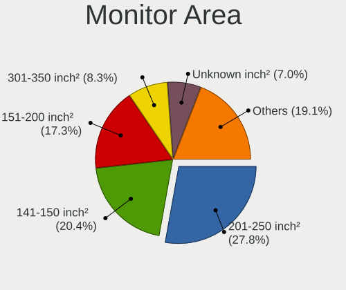

| Area in inch² | Desktops | Percent |
|----------------|----------|---------|
| 201-250        | 417      | 27.82%  |
| 141-150        | 306      | 20.41%  |
| 151-200        | 259      | 17.28%  |
| 301-350        | 125      | 8.34%   |
| Unknown        | 105      | 7%      |
| 351-500        | 103      | 6.87%   |
| More than 1000 | 53       | 3.54%   |
| 501-1000       | 41       | 2.74%   |
| 251-300        | 37       | 2.47%   |
| 101-110        | 23       | 1.53%   |
| 111-120        | 8        | 0.53%   |
| 131-140        | 7        | 0.47%   |
| 91-100         | 6        | 0.4%    |
| 71-80          | 4        | 0.27%   |
| 121-130        | 4        | 0.27%   |
| 81-90          | 1        | 0.07%   |

Pixel Density
-------------

Pixels per inch

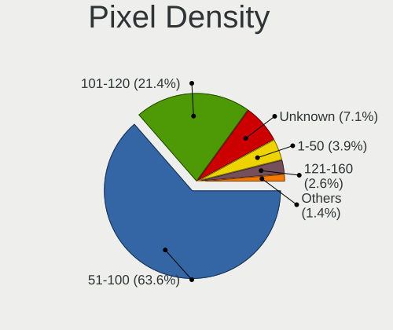

| Density | Desktops | Percent |
|---------|----------|---------|
| 51-100  | 935      | 63.61%  |
| 101-120 | 314      | 21.36%  |
| Unknown | 105      | 7.14%   |
| 1-50    | 58       | 3.95%   |
| 121-160 | 38       | 2.59%   |
| 161-240 | 20       | 1.36%   |

Multiple Monitors
-----------------

Total monitors connected

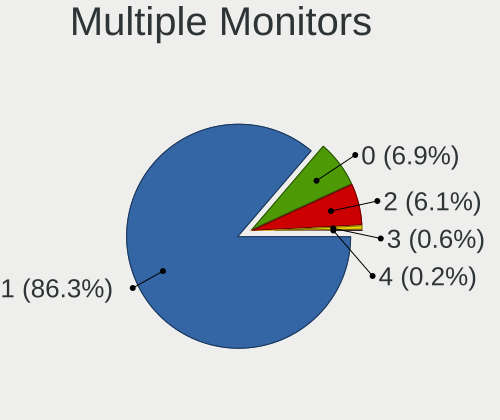

| Total | Desktops | Percent |
|-------|----------|---------|
| 1     | 1382     | 86.27%  |
| 0     | 110      | 6.87%   |
| 2     | 97       | 6.05%   |
| 3     | 10       | 0.62%   |
| 4     | 3        | 0.19%   |

Network
-------

Net Controller Vendor
---------------------

Controller vendors

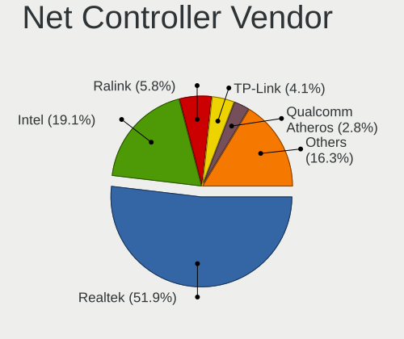

| Vendor                          | Desktops | Percent |
|---------------------------------|----------|---------|
| Realtek Semiconductor           | 1220     | 51.87%  |
| Intel                           | 449      | 19.09%  |
| Ralink Technology               | 136      | 5.78%   |
| TP-Link                         | 96       | 4.08%   |
| Qualcomm Atheros                | 67       | 2.85%   |
| MediaTek                        | 45       | 1.91%   |
| Xiaomi                          | 42       | 1.79%   |
| OPPO Electronics                | 34       | 1.45%   |
| D-Link                          | 32       | 1.36%   |
| Broadcom                        | 29       | 1.23%   |
| Samsung Electronics             | 27       | 1.15%   |
| Qualcomm                        | 16       | 0.68%   |
| Qualcomm Atheros Communications | 13       | 0.55%   |
| Motorola PCS                    | 11       | 0.47%   |
| Nvidia                          | 10       | 0.43%   |
| Foxconn / Hon Hai               | 10       | 0.43%   |
| OnePlus Technology (Shenzhen)   | 9        | 0.38%   |
| ASIX Electronics                | 9        | 0.38%   |
| Ralink                          | 8        | 0.34%   |
| NetGear                         | 8        | 0.34%   |
| Huawei Technologies             | 8        | 0.34%   |
| vivo                            | 6        | 0.26%   |
| Qualcomm Technologies           | 5        | 0.21%   |
| Aquantia                        | 5        | 0.21%   |
| Google                          | 4        | 0.17%   |
| Edimax Technology               | 4        | 0.17%   |
| D-Link System                   | 4        | 0.17%   |
| Broadcom Limited                | 4        | 0.17%   |
| Marvell Technology Group        | 3        | 0.13%   |
| Lenovo                          | 3        | 0.13%   |
| ASUSTek Computer                | 3        | 0.13%   |
| Altair Semiconductor            | 3        | 0.13%   |
| Unknown                         | 3        | 0.13%   |
| Spreadtrum Communications       | 2        | 0.09%   |
| Realtek                         | 2        | 0.09%   |
| QinHeng Electronics             | 2        | 0.09%   |
| Megawin Technology              | 2        | 0.09%   |
| ICS Advent                      | 2        | 0.09%   |
| IBM                             | 2        | 0.09%   |
| Belkin Components               | 2        | 0.09%   |

Net Controller Model
--------------------

Controller models

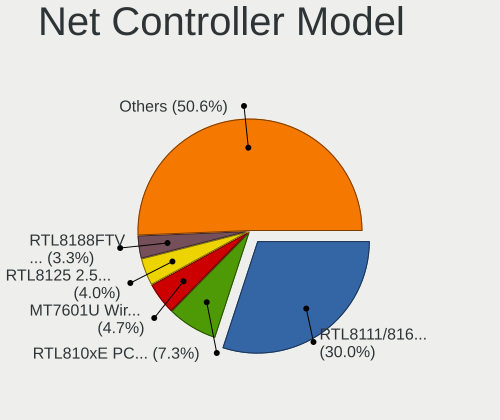

| Model                                                                  | Desktops | Percent |
|------------------------------------------------------------------------|----------|---------|
| Realtek RTL8111/8168/8211/8411 PCI Express Gigabit Ethernet Controller | 823      | 30.03%  |
| Realtek RTL810xE PCI Express Fast Ethernet controller                  | 201      | 7.33%   |
| Ralink MT7601U Wireless Adapter                                        | 128      | 4.67%   |
| Realtek RTL8125 2.5GbE Controller                                      | 110      | 4.01%   |
| Realtek RTL8188FTV 802.11b/g/n 1T1R 2.4G WLAN Adapter                  | 91       | 3.32%   |
| Realtek RTL8188EUS 802.11n Wireless Network Adapter                    | 80       | 2.92%   |
| Intel Ethernet Connection (2) I219-V                                   | 39       | 1.42%   |
| Intel I211 Gigabit Network Connection                                  | 38       | 1.39%   |
| Intel Ethernet Controller I225-V                                       | 36       | 1.31%   |
| Intel 82579LM Gigabit Network Connection (Lewisville)                  | 36       | 1.31%   |
| Xiaomi Mi/Redmi series (RNDIS)                                         | 34       | 1.24%   |
| TP-Link TL-WN823N v2/v3 [Realtek RTL8192EU]                            | 33       | 1.2%    |
| Intel 82579V Gigabit Network Connection                                | 32       | 1.17%   |
| OPPO Ace 3V                                                            | 29       | 1.06%   |
| Intel Wi-Fi 6 AX200                                                    | 27       | 0.99%   |
| Intel Dual Band Wireless-AC 3168NGW [Stone Peak]                       | 23       | 0.84%   |
| Samsung Galaxy series, misc. (tethering mode)                          | 21       | 0.77%   |
| Intel Wireless 7265                                                    | 20       | 0.73%   |
| D-Link DWA-131 Wireless N Nano Adapter (Rev. E1) [Realtek RTL8192EU]   | 20       | 0.73%   |
| Intel Ethernet Connection I217-LM                                      | 19       | 0.69%   |
| Intel Wi-Fi 6E(802.11ax) AX210/AX1675* 2x2 [Typhoon Peak]              | 17       | 0.62%   |
| Intel Alder Lake-S PCH CNVi WiFi                                       | 17       | 0.62%   |
| Realtek 802.11ac NIC                                                   | 16       | 0.58%   |
| Intel Ethernet Connection (7) I219-V                                   | 16       | 0.58%   |
| Realtek RTL8821CE 802.11ac PCIe Wireless Network Adapter               | 15       | 0.55%   |
| Qualcomm Atheros QCA9565 / AR9565 Wireless Network Adapter             | 15       | 0.55%   |
| Qualcomm Atheros AR9485 Wireless Network Adapter                       | 15       | 0.55%   |
| Intel Ethernet Controller I226-V                                       | 15       | 0.55%   |
| MediaTek MT7922 802.11ax PCI Express Wireless Network Adapter          | 14       | 0.51%   |
| Intel Ethernet Connection (7) I219-LM                                  | 14       | 0.51%   |
| Realtek RTL8192EU 802.11b/g/n WLAN Adapter                             | 13       | 0.47%   |
| Qualcomm Atheros AR9271 802.11n                                        | 13       | 0.47%   |
| Intel Ethernet Connection (2) I219-LM                                  | 13       | 0.47%   |
| TP-Link AC600 wireless Realtek RTL8811AU [Archer T2U Nano]             | 12       | 0.44%   |
| Realtek RTL8852BE PCIe 802.11ax Wireless Network Controller            | 12       | 0.44%   |
| Intel Cannon Lake PCH CNVi WiFi                                        | 12       | 0.44%   |
| Qualcomm Nokia X30 5G                                                  | 11       | 0.4%    |
| Intel 82567LM-3 Gigabit Network Connection                             | 11       | 0.4%    |
| TP-Link 802.11ac NIC                                                   | 10       | 0.36%   |
| Realtek RTL8188ETV Wireless LAN 802.11n Network Adapter                | 10       | 0.36%   |

Wireless Vendor
---------------

Wireless vendors

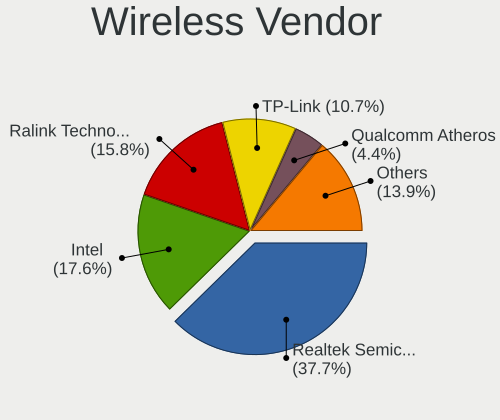

| Vendor                          | Desktops | Percent |
|---------------------------------|----------|---------|
| Realtek Semiconductor           | 325      | 37.66%  |
| Intel                           | 152      | 17.61%  |
| Ralink Technology               | 136      | 15.76%  |
| TP-Link                         | 92       | 10.66%  |
| Qualcomm Atheros                | 38       | 4.4%    |
| MediaTek                        | 32       | 3.71%   |
| D-Link                          | 32       | 3.71%   |
| Qualcomm Atheros Communications | 13       | 1.51%   |
| Broadcom                        | 10       | 1.16%   |
| NetGear                         | 8        | 0.93%   |
| Ralink                          | 7        | 0.81%   |
| Edimax Technology               | 4        | 0.46%   |
| Realtek                         | 2        | 0.23%   |
| D-Link System                   | 2        | 0.23%   |
| Broadcom Limited                | 2        | 0.23%   |
| Belkin Components               | 2        | 0.23%   |
| ASUSTek Computer                | 2        | 0.23%   |
| Wacom                           | 1        | 0.12%   |
| Qualcomm Technologies           | 1        | 0.12%   |
| Microsoft                       | 1        | 0.12%   |
| Marvell Technology Group        | 1        | 0.12%   |

Wireless Model
--------------

Wireless models

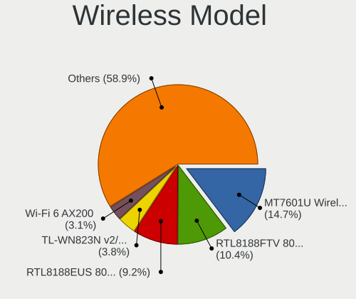

| Model                                                                | Desktops | Percent |
|----------------------------------------------------------------------|----------|---------|
| Ralink MT7601U Wireless Adapter                                      | 128      | 14.66%  |
| Realtek RTL8188FTV 802.11b/g/n 1T1R 2.4G WLAN Adapter                | 91       | 10.42%  |
| Realtek RTL8188EUS 802.11n Wireless Network Adapter                  | 80       | 9.16%   |
| TP-Link TL-WN823N v2/v3 [Realtek RTL8192EU]                          | 33       | 3.78%   |
| Intel Wi-Fi 6 AX200                                                  | 27       | 3.09%   |
| Intel Dual Band Wireless-AC 3168NGW [Stone Peak]                     | 23       | 2.63%   |
| Intel Wireless 7265                                                  | 20       | 2.29%   |
| D-Link DWA-131 Wireless N Nano Adapter (Rev. E1) [Realtek RTL8192EU] | 20       | 2.29%   |
| Intel Wi-Fi 6E(802.11ax) AX210/AX1675* 2x2 [Typhoon Peak]            | 17       | 1.95%   |
| Realtek 802.11ac NIC                                                 | 16       | 1.83%   |
| Realtek RTL8821CE 802.11ac PCIe Wireless Network Adapter             | 15       | 1.72%   |
| Qualcomm Atheros QCA9565 / AR9565 Wireless Network Adapter           | 15       | 1.72%   |
| Qualcomm Atheros AR9485 Wireless Network Adapter                     | 15       | 1.72%   |
| MediaTek MT7922 802.11ax PCI Express Wireless Network Adapter        | 14       | 1.6%    |
| Realtek RTL8192EU 802.11b/g/n WLAN Adapter                           | 13       | 1.49%   |
| Qualcomm Atheros AR9271 802.11n                                      | 13       | 1.49%   |
| TP-Link AC600 wireless Realtek RTL8811AU [Archer T2U Nano]           | 12       | 1.37%   |
| Intel Cannon Lake PCH CNVi WiFi                                      | 12       | 1.37%   |
| TP-Link 802.11ac NIC                                                 | 10       | 1.15%   |
| Realtek RTL8188ETV Wireless LAN 802.11n Network Adapter              | 10       | 1.15%   |
| Realtek RTL8188EE Wireless Network Adapter                           | 10       | 1.15%   |
| Realtek 802.11n WLAN Adapter                                         | 10       | 1.15%   |
| Intel Wi-Fi 5(802.11ac) Wireless-AC 9x6x [Thunder Peak]              | 10       | 1.15%   |
| Intel 700 Series Chipset CNVi WiFi                                   | 10       | 1.15%   |
| TP-Link Archer T2U PLUS [RTL8821AU]                                  | 9        | 1.03%   |
| Realtek RTL8852BE PCIe 802.11ax Wireless Network Controller          | 9        | 1.03%   |
| Realtek RTL8812AE 802.11ac PCIe Wireless Network Adapter             | 9        | 1.03%   |
| Realtek RTL8852CE PCIe 802.11ax Wireless Network Controller          | 8        | 0.92%   |
| Realtek RTL8192EE PCIe Wireless Network Adapter                      | 8        | 0.92%   |
| MediaTek MT7921K (RZ608) Wi-Fi 6E 80MHz                              | 8        | 0.92%   |
| TP-Link TL-WN821N v5/v6 [RTL8192EU]                                  | 7        | 0.8%    |
| TP-Link TL-WN722N v2/v3 [Realtek RTL8188EUS]                         | 7        | 0.8%    |
| Intel Wireless 7260                                                  | 7        | 0.8%    |
| Broadcom BCM4360 802.11ac Dual Band Wireless Network Adapter         | 7        | 0.8%    |
| Realtek RTL88x2bu [AC1200 Techkey]                                   | 6        | 0.69%   |
| Realtek RTL8723BU 802.11b/g/n WLAN Adapter                           | 6        | 0.69%   |
| Intel Alder Lake-S PCH CNVi WiFi                                     | 6        | 0.69%   |
| TP-Link Archer T3U [Realtek RTL8812BU]                               | 5        | 0.57%   |
| TP-Link 802.11ac WLAN Adapter                                        | 5        | 0.57%   |
| Realtek RTL8822CE 802.11ac PCIe Wireless Network Adapter             | 5        | 0.57%   |

Ethernet Vendor
---------------

Ethernet vendors

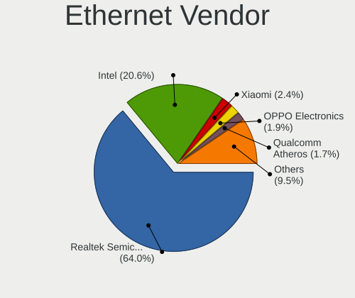

| Vendor                           | Desktops | Percent |
|----------------------------------|----------|---------|
| Realtek Semiconductor            | 1142     | 64.01%  |
| Intel                            | 367      | 20.57%  |
| Xiaomi                           | 42       | 2.35%   |
| OPPO Electronics                 | 34       | 1.91%   |
| Qualcomm Atheros                 | 30       | 1.68%   |
| Samsung Electronics              | 27       | 1.51%   |
| Broadcom                         | 19       | 1.07%   |
| Qualcomm                         | 16       | 0.9%    |
| MediaTek                         | 13       | 0.73%   |
| Motorola PCS                     | 11       | 0.62%   |
| Nvidia                           | 9        | 0.5%    |
| ASIX Electronics                 | 9        | 0.5%    |
| OnePlus Technology (Shenzhen)    | 8        | 0.45%   |
| Huawei Technologies              | 7        | 0.39%   |
| vivo                             | 6        | 0.34%   |
| TP-Link                          | 5        | 0.28%   |
| Aquantia                         | 5        | 0.28%   |
| Qualcomm Technologies            | 4        | 0.22%   |
| Google                           | 4        | 0.22%   |
| Altair Semiconductor             | 3        | 0.17%   |
| Spreadtrum Communications        | 2        | 0.11%   |
| Marvell Technology Group         | 2        | 0.11%   |
| Lenovo                           | 2        | 0.11%   |
| ICS Advent                       | 2        | 0.11%   |
| D-Link System                    | 2        | 0.11%   |
| Broadcom Limited                 | 2        | 0.11%   |
| Silicon Integrated Systems [SiS] | 1        | 0.06%   |
| LG Electronics                   | 1        | 0.06%   |
| JMicron Technology               | 1        | 0.06%   |
| IBM                              | 1        | 0.06%   |
| HTC (High Tech Computer)         | 1        | 0.06%   |
| HMD Global                       | 1        | 0.06%   |
| Foxconn / Hon Hai                | 1        | 0.06%   |
| Davicom Semiconductor            | 1        | 0.06%   |
| ASUSTek Computer                 | 1        | 0.06%   |
| AMTelecom                        | 1        | 0.06%   |
| Unknown                          | 1        | 0.06%   |

Ethernet Model
--------------

Ethernet models

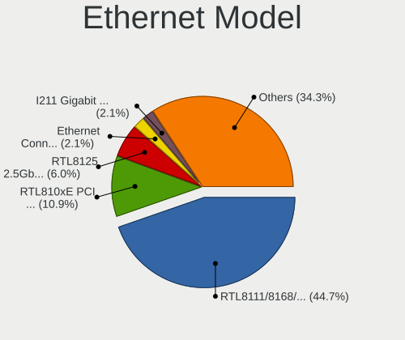

| Model                                                                  | Desktops | Percent |
|------------------------------------------------------------------------|----------|---------|
| Realtek RTL8111/8168/8211/8411 PCI Express Gigabit Ethernet Controller | 823      | 44.68%  |
| Realtek RTL810xE PCI Express Fast Ethernet controller                  | 201      | 10.91%  |
| Realtek RTL8125 2.5GbE Controller                                      | 110      | 5.97%   |
| Intel Ethernet Connection (2) I219-V                                   | 39       | 2.12%   |
| Intel I211 Gigabit Network Connection                                  | 38       | 2.06%   |
| Intel Ethernet Controller I225-V                                       | 36       | 1.95%   |
| Intel 82579LM Gigabit Network Connection (Lewisville)                  | 36       | 1.95%   |
| Xiaomi Mi/Redmi series (RNDIS)                                         | 34       | 1.85%   |
| Intel 82579V Gigabit Network Connection                                | 32       | 1.74%   |
| OPPO Ace 3V                                                            | 29       | 1.57%   |
| Samsung Galaxy series, misc. (tethering mode)                          | 21       | 1.14%   |
| Intel Ethernet Connection I217-LM                                      | 19       | 1.03%   |
| Intel Ethernet Connection (7) I219-V                                   | 16       | 0.87%   |
| Intel Ethernet Controller I226-V                                       | 15       | 0.81%   |
| Intel Ethernet Connection (7) I219-LM                                  | 14       | 0.76%   |
| Intel Ethernet Connection (2) I219-LM                                  | 13       | 0.71%   |
| Qualcomm Nokia X30 5G                                                  | 11       | 0.6%    |
| Intel Alder Lake-S PCH CNVi WiFi                                       | 11       | 0.6%    |
| Intel 82567LM-3 Gigabit Network Connection                             | 11       | 0.6%    |
| Motorola PCS motorola one 5G ace                                       | 10       | 0.54%   |
| Realtek RTL-8100/8101L/8139 PCI Fast Ethernet Adapter                  | 9        | 0.49%   |
| MediaTek Infinix HOT 50i                                               | 9        | 0.49%   |
| Intel I210 Gigabit Network Connection                                  | 9        | 0.49%   |
| Xiaomi Mi/Redmi series (RNDIS + ADB)                                   | 8        | 0.43%   |
| Realtek RTL8111/8168/8411 PCI Express Gigabit Ethernet Controller      | 8        | 0.43%   |
| OnePlus (Shenzhen) BE2029                                              | 8        | 0.43%   |
| Intel Ethernet Connection (2) I218-V                                   | 8        | 0.43%   |
| Intel Ethernet Connection (17) I219-LM                                 | 8        | 0.43%   |
| Intel Ethernet Connection (14) I219-V                                  | 8        | 0.43%   |
| Intel 82578DC Gigabit Network Connection                               | 8        | 0.43%   |
| Samsung GT-I9070 (network tethering, USB debugging enabled)            | 7        | 0.38%   |
| Qualcomm Atheros AR8151 v2.0 Gigabit Ethernet                          | 7        | 0.38%   |
| Nvidia MCP61 Ethernet                                                  | 7        | 0.38%   |
| Intel Ethernet Connection I217-V                                       | 7        | 0.38%   |
| Intel Ethernet Connection (5) I219-LM                                  | 7        | 0.38%   |
| ASIX AX88179 Gigabit Ethernet                                          | 7        | 0.38%   |
| Qualcomm Atheros AR8131 Gigabit Ethernet                               | 6        | 0.33%   |
| OPPO RMX3741                                                           | 6        | 0.33%   |
| Intel Ethernet Connection (17) I219-V                                  | 6        | 0.33%   |
| Intel Ethernet Connection (11) I219-V                                  | 6        | 0.33%   |

Net Controller Kind
-------------------

Ethernet, WiFi or modem

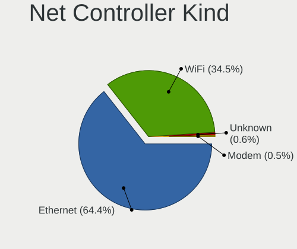

| Kind     | Desktops | Percent |
|----------|----------|---------|
| Ethernet | 1551     | 64.41%  |
| WiFi     | 831      | 34.51%  |
| Unknown  | 15       | 0.62%   |
| Modem    | 11       | 0.46%   |

Used Controller
---------------

Currently used network controller

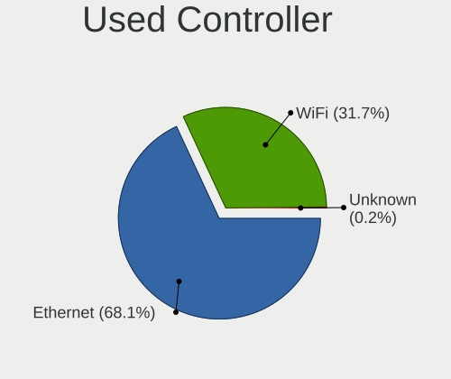

| Kind     | Desktops | Percent |
|----------|----------|---------|
| Ethernet | 1062     | 68.08%  |
| WiFi     | 495      | 31.73%  |
| Unknown  | 3        | 0.19%   |

NICs
----

Total network controllers on board

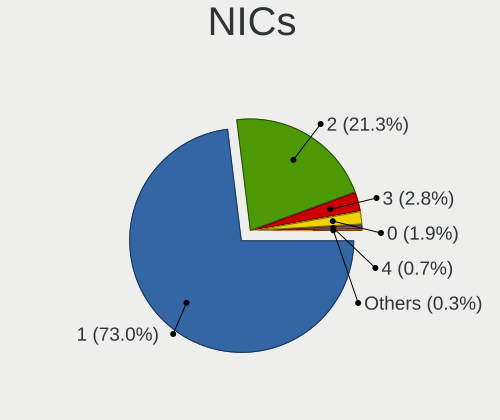

| Total | Desktops | Percent |
|-------|----------|---------|
| 1     | 1160     | 73.05%  |
| 2     | 339      | 21.35%  |
| 3     | 44       | 2.77%   |
| 0     | 30       | 1.89%   |
| 4     | 11       | 0.69%   |
| 6     | 2        | 0.13%   |
| 11    | 1        | 0.06%   |
| 10    | 1        | 0.06%   |

IPv6
----

IPv6 vs IPv4

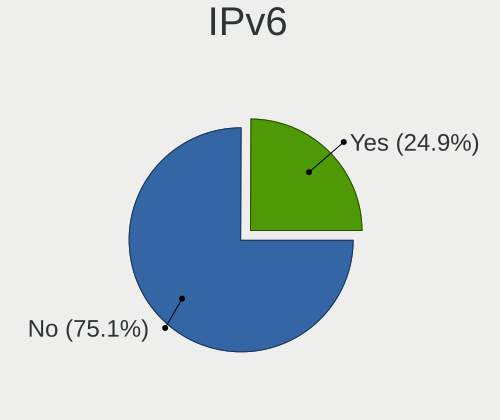

| Used | Desktops | Percent |
|------|----------|---------|
| No   | 1213     | 75.06%  |
| Yes  | 403      | 24.94%  |

Bluetooth
---------

Bluetooth Vendor
----------------

Controller vendors

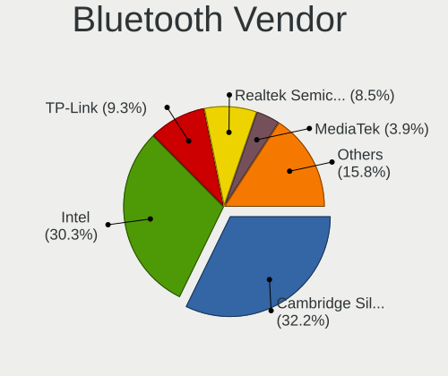

| Vendor                          | Desktops | Percent |
|---------------------------------|----------|---------|
| Cambridge Silicon Radio         | 167      | 32.24%  |
| Intel                           | 157      | 30.31%  |
| TP-Link                         | 48       | 9.27%   |
| Realtek Semiconductor           | 44       | 8.49%   |
| MediaTek                        | 20       | 3.86%   |
| IMC Networks                    | 20       | 3.86%   |
| Qualcomm Atheros Communications | 18       | 3.47%   |
| Broadcom                        | 15       | 2.9%    |
| Foxconn / Hon Hai               | 11       | 2.12%   |
| ASUSTek Computer                | 4        | 0.77%   |
| Integrated System Solution      | 3        | 0.58%   |
| Apple                           | 2        | 0.39%   |
| Actions                         | 2        | 0.39%   |
| Unknown                         | 2        | 0.39%   |
| SINO WEALTH                     | 1        | 0.19%   |
| Dell                            | 1        | 0.19%   |
| Conwise Technology              | 1        | 0.19%   |
| Belkin Components               | 1        | 0.19%   |
| Accel Semiconductor             | 1        | 0.19%   |

Bluetooth Model
---------------

Controller models

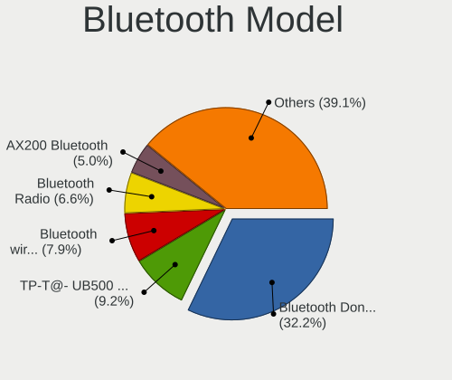

| Model                                                 | Desktops | Percent |
|-------------------------------------------------------|----------|---------|
| Cambridge Silicon Radio Bluetooth Dongle (HCI mode)   | 167      | 32.18%  |
| TP-Link TP-T@- UB500 Adapter                          | 48       | 9.25%   |
| Intel Bluetooth wireless interface                    | 41       | 7.9%    |
| Realtek Bluetooth Radio                               | 34       | 6.55%   |
| Intel AX200 Bluetooth                                 | 26       | 5.01%   |
| Intel Wireless-AC 3168 Bluetooth                      | 22       | 4.24%   |
| Intel Bluetooth Device                                | 21       | 4.05%   |
| MediaTek Wireless_Device                              | 20       | 3.85%   |
| Intel AX210 Bluetooth                                 | 16       | 3.08%   |
| Qualcomm Atheros  Bluetooth Device                    | 15       | 2.89%   |
| Intel Bluetooth 9460/9560 Jefferson Peak (JfP)        | 12       | 2.31%   |
| IMC Networks Bluetooth Radio                          | 12       | 2.31%   |
| Intel Wireless-AC 9260 Bluetooth Adapter              | 10       | 1.93%   |
| Intel AX201 Bluetooth                                 | 10       | 1.93%   |
| Realtek  Bluetooth 4.2 Adapter                        | 8        | 1.54%   |
| IMC Networks Wireless_Device                          | 8        | 1.54%   |
| Foxconn / Hon Hai Wireless_Device                     | 6        | 1.16%   |
| Broadcom BCM20702A0 Bluetooth 4.0                     | 6        | 1.16%   |
| Foxconn / Hon Hai Bluetooth Device                    | 5        | 0.96%   |
| Qualcomm Atheros AR9462 Bluetooth                     | 3        | 0.58%   |
| Integrated System Solution KY-BT100 Bluetooth Adapter | 3        | 0.58%   |
| Broadcom Bluetooth 2.0+eDR dongle                     | 3        | 0.58%   |
| Broadcom Bluetooth Controller                         | 2        | 0.39%   |
| Broadcom BCM2045 Bluetooth                            | 2        | 0.39%   |
| ASUS Broadcom BCM20702 Single-Chip Bluetooth 4.0 + LE | 2        | 0.39%   |
| Apple Bluetooth USB Host Controller                   | 2        | 0.39%   |
| Actions general adapter                               | 2        | 0.39%   |
| Unknown                                               | 2        | 0.39%   |
| SINO WEALTH Bluetooth Keyboard                        | 1        | 0.19%   |
| Realtek Bluetooth 5.4 Radio                           | 1        | 0.19%   |
| Realtek Bluetooth 5.3 Radio                           | 1        | 0.19%   |
| Dell BT Mini-Receiver                                 | 1        | 0.19%   |
| Conwise CW6622                                        | 1        | 0.19%   |
| Broadcom Bluetooth Device                             | 1        | 0.19%   |
| Broadcom Bluetooth 3.0 Device                         | 1        | 0.19%   |
| Belkin Components F8T001v2 Bluetooth                  | 1        | 0.19%   |
| ASUS Bluetooth Radio                                  | 1        | 0.19%   |
| ASUS BCM20702A0                                       | 1        | 0.19%   |
| Accel Bluetooth Device                                | 1        | 0.19%   |

Sound
-----

Sound Vendor
------------

Sound card vendors

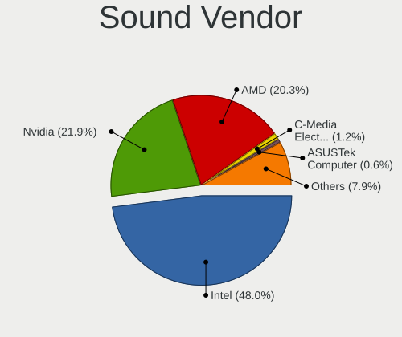

| Vendor                                       | Desktops | Percent |
|----------------------------------------------|----------|---------|
| Intel                                        | 1119     | 47.98%  |
| Nvidia                                       | 511      | 21.91%  |
| AMD                                          | 474      | 20.33%  |
| C-Media Electronics                          | 28       | 1.2%    |
| ASUSTek Computer                             | 15       | 0.64%   |
| Micro Star International                     | 14       | 0.6%    |
| GN Netcom                                    | 13       | 0.56%   |
| Creative Labs                                | 13       | 0.56%   |
| Texas Instruments                            | 12       | 0.51%   |
| Generalplus Technology                       | 10       | 0.43%   |
| Creative Technology                          | 10       | 0.43%   |
| Zoran Co. Personal Media Division (Nogatech) | 9        | 0.39%   |
| Logitech                                     | 9        | 0.39%   |
| JMTek                                        | 7        | 0.3%    |
| Plantronics                                  | 6        | 0.26%   |
| Tenx Technology                              | 4        | 0.17%   |
| OPPO Electronics                             | 4        | 0.17%   |
| Hewlett-Packard                              | 4        | 0.17%   |
| GYROCOM C&C                                  | 4        | 0.17%   |
| Silicon Integrated Systems [SiS]             | 3        | 0.13%   |
| Realtek Semiconductor                        | 3        | 0.13%   |
| M-Audio                                      | 3        | 0.13%   |
| Giga-Byte Technology                         | 3        | 0.13%   |
| Corsair                                      | 3        | 0.13%   |
| Walmart                                      | 2        | 0.09%   |
| TTGK Technology                              | 2        | 0.09%   |
| SteelSeries ApS                              | 2        | 0.09%   |
| Sony                                         | 2        | 0.09%   |
| Razer USA                                    | 2        | 0.09%   |
| KTMicro                                      | 2        | 0.09%   |
| Kingston Technology                          | 2        | 0.09%   |
| Focusrite-Novation                           | 2        | 0.09%   |
| DSEA A/S                                     | 2        | 0.09%   |
| Cambridge Silicon Radio                      | 2        | 0.09%   |
| Blue Microphones                             | 2        | 0.09%   |
| XMOS                                         | 1        | 0.04%   |
| SZSanJing                                    | 1        | 0.04%   |
| Sennheiser electronic                        | 1        | 0.04%   |
| SAVITECH                                     | 1        | 0.04%   |
| Samsung Electronics                          | 1        | 0.04%   |

Sound Model
-----------

Sound card models

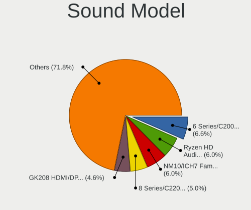

| Model                                                                      | Desktops | Percent |
|----------------------------------------------------------------------------|----------|---------|
| Intel 6 Series/C200 Series Chipset Family High Definition Audio Controller | 181      | 6.6%    |
| AMD Ryzen HD Audio Controller                                              | 165      | 6.02%   |
| Intel NM10/ICH7 Family High Definition Audio Controller                    | 164      | 5.98%   |
| Intel 8 Series/C220 Series Chipset High Definition Audio Controller        | 138      | 5.03%   |
| Nvidia GK208 HDMI/DP Audio Controller                                      | 125      | 4.56%   |
| Intel Xeon E3-1200 v3/4th Gen Core Processor HD Audio Controller           | 120      | 4.38%   |
| AMD Starship/Matisse HD Audio Controller                                   | 117      | 4.27%   |
| Intel 100 Series/C230 Series Chipset Family HD Audio Controller            | 102      | 3.72%   |
| Intel 200 Series PCH HD Audio                                              | 96       | 3.5%    |
| Intel Cannon Lake PCH cAVS                                                 | 70       | 2.55%   |
| AMD Radeon High Definition Audio Controller                                | 58       | 2.12%   |
| AMD Family 17h (Models 00h-0fh) HD Audio Controller                        | 56       | 2.04%   |
| AMD Raven/Raven2/Fenghuang HDMI/DP Audio Controller                        | 55       | 2.01%   |
| Intel 7 Series/C216 Chipset Family High Definition Audio Controller        | 54       | 1.97%   |
| Intel Alder Lake-S HD Audio Controller                                     | 51       | 1.86%   |
| AMD SBx00 Azalia (Intel HDA)                                               | 49       | 1.79%   |
| Nvidia TU116 High Definition Audio Controller                              | 44       | 1.61%   |
| AMD Renoir/Cezanne HDMI/DP Audio Controller                                | 44       | 1.61%   |
| Nvidia GF119 HDMI Audio Controller                                         | 38       | 1.39%   |
| Nvidia High Definition Audio Controller                                    | 37       | 1.35%   |
| Nvidia GP107GL High Definition Audio Controller                            | 36       | 1.31%   |
| Intel Smart Sound Technology (SST) Audio Controller                        | 36       | 1.31%   |
| AMD Navi 21/23 HDMI/DP Audio Controller                                    | 33       | 1.2%    |
| Intel 5 Series/3400 Series Chipset High Definition Audio                   | 31       | 1.13%   |
| AMD FCH Azalia Controller                                                  | 30       | 1.09%   |
| Intel Raptor Lake High Definition Audio Controller                         | 29       | 1.06%   |
| Nvidia GA106 High Definition Audio Controller                              | 24       | 0.88%   |
| Nvidia GA104 High Definition Audio Controller                              | 24       | 0.88%   |
| Intel Comet Lake PCH-V cAVS                                                | 22       | 0.8%    |
| AMD Ellesmere HDMI Audio [Radeon RX 470/480 / 570/580/590]                 | 21       | 0.77%   |
| Nvidia TU107 GeForce GTX 1650 High Definition Audio Controller             | 18       | 0.66%   |
| Intel Comet Lake PCH cAVS                                                  | 18       | 0.66%   |
| Nvidia GM107 High Definition Audio Controller [GeForce 940MX]              | 17       | 0.62%   |
| Intel Tiger Lake-H HD Audio Controller                                     | 17       | 0.62%   |
| Intel 9 Series Chipset Family HD Audio Controller                          | 16       | 0.58%   |
| Nvidia TU106 High Definition Audio Controller                              | 15       | 0.55%   |
| Nvidia GF108 High Definition Audio Controller                              | 14       | 0.51%   |
| Micro Star International USB Audio                                         | 14       | 0.51%   |
| AMD Oland/Hainan/Cape Verde/Pitcairn HDMI Audio [Radeon HD 7000 Series]    | 14       | 0.51%   |
| AMD Navi 31 HDMI/DP Audio                                                  | 14       | 0.51%   |

Memory
------

Memory Vendor
-------------

Memory module vendors

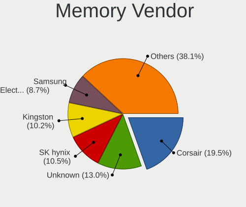

| Vendor                             | Desktops | Percent |
|------------------------------------|----------|---------|
| Corsair                            | 176      | 19.53%  |
| Unknown                            | 117      | 12.99%  |
| SK hynix                           | 95       | 10.54%  |
| Kingston                           | 92       | 10.21%  |
| Samsung Electronics                | 78       | 8.66%   |
| Crucial                            | 61       | 6.77%   |
| A-DATA Technology                  | 59       | 6.55%   |
| G.Skill                            | 57       | 6.33%   |
| Micron Technology                  | 51       | 5.66%   |
| Transcend                          | 29       | 3.22%   |
| Unknown                            | 23       | 2.55%   |
| CSX                                | 8        | 0.89%   |
| OM Nanotech                        | 7        | 0.78%   |
| Red Hat                            | 5        | 0.55%   |
| Ramaxel Technology                 | 5        | 0.55%   |
| Nanya Technology                   | 5        | 0.55%   |
| Silicon Power                      | 4        | 0.44%   |
| ZION                               | 2        | 0.22%   |
| Team                               | 2        | 0.22%   |
| Hikvision                          | 2        | 0.22%   |
| Acer                               | 2        | 0.22%   |
| Abacus                             | 2        | 0.22%   |
| Unknown (ABCD)                     | 1        | 0.11%   |
| Unknown (0xAD44594E45540000)       | 1        | 0.11%   |
| Unknown (0x0CAB)                   | 1        | 0.11%   |
| Unknown (0x0B85)                   | 1        | 0.11%   |
| Timetec                            | 1        | 0.11%   |
| Ramos Technology                   | 1        | 0.11%   |
| Qumo                               | 1        | 0.11%   |
| Patriot Memory (PDP Systems)       | 1        | 0.11%   |
| Lexar                              | 1        | 0.11%   |
| Kllisre                            | 1        | 0.11%   |
| Kimtigo Semiconductor (HK) Limited | 1        | 0.11%   |
| Inte                               | 1        | 0.11%   |
| Innodisk                           | 1        | 0.11%   |
| Goldkey                            | 1        | 0.11%   |
| Dynet                              | 1        | 0.11%   |
| Axiom                              | 1        | 0.11%   |
| Avant                              | 1        | 0.11%   |
| Apacer                             | 1        | 0.11%   |

Memory Model
------------

Memory module models

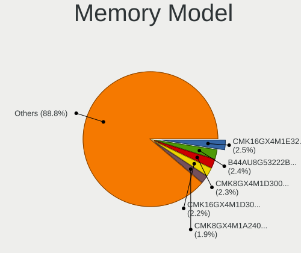

| Model                                                       | Desktops | Percent |
|-------------------------------------------------------------|----------|---------|
| Corsair RAM CMK16GX4M1E3200C16 16GB DIMM DDR4 3200MT/s      | 24       | 2.46%   |
| Unknown                                                     | 23       | 2.36%   |
| Corsair RAM CMK8GX4M1D3000C16 8GB DIMM DDR4 3600MT/s        | 22       | 2.25%   |
| Corsair RAM CMK16GX4M1D3000C16 16GB DIMM DDR4 3600MT/s      | 21       | 2.15%   |
| Corsair RAM CMK8GX4M1A2400C16 8GB DIMM DDR4 3066MT/s        | 19       | 1.95%   |
| Micron RAM Module 8GB DIMM DDR4 2666MT/s                    | 17       | 1.74%   |
| Corsair RAM CMK16GX5M1B5200C40 16GB DIMM DDR5 4800MT/s      | 14       | 1.43%   |
| A-DATA RAM DDR4 3200 16GB DIMM DDR4 3600MT/s                | 13       | 1.33%   |
| A-DATA RAM DDR4 3000 8GB DIMM DDR4 3600MT/s                 | 12       | 1.23%   |
| Unknown RAM Module 4GB DIMM SDRAM                           | 11       | 1.13%   |
| Corsair RAM CMK8GX4M1E3200C16 8GB DIMM DDR4 3200MT/s        | 11       | 1.13%   |
| G.Skill RAM F4-3200C16-16GVK 16GB DIMM DDR4 3600MT/s        | 10       | 1.02%   |
| Corsair RAM CMZ8GX3M1A1600C10 8GB DIMM DDR3 1600MT/s        | 9        | 0.92%   |
| Unknown RAM Module 2GB DIMM SDRAM                           | 8        | 0.82%   |
| Corsair RAM CMK32GX5M1B5200C40 32GB DIMM DDR5 5200MT/s      | 8        | 0.82%   |
| Unknown RAM Module 8GB DIMM DDR3 1600MT/s                   | 7        | 0.72%   |
| SK hynix RAM DMT351E6CFR8C-H9 4GB DIMM DDR3 1333MT/s        | 7        | 0.72%   |
| Samsung RAM M378B5173DB0-CK0 4096MB DIMM DDR3 1600MT/s      | 7        | 0.72%   |
| Crucial RAM CB8GU2400.C8ET 8GB DIMM DDR4 2460MT/s           | 7        | 0.72%   |
| Corsair RAM CMK16GX4M1A2400C16 16GB DIMM DDR4 2400MT/s      | 7        | 0.72%   |
| Unknown RAM Module 2048MB DIMM SDRAM                        | 6        | 0.61%   |
| Transcend RAM TS512MLK64V3H 4GB DIMM DDR3 1333MT/s          | 6        | 0.61%   |
| Transcend RAM JM1333KLN-4G 4GB DIMM DDR3 1333MT/s           | 6        | 0.61%   |
| G.Skill RAM F4-3200C16-8GVKB 8GB DIMM DDR4 4000MT/s         | 6        | 0.61%   |
| Unknown RAM Module 8192MB DIMM DDR3 1333MT/s                | 5        | 0.51%   |
| Unknown RAM Module 4GB DIMM DDR3 1333MT/s                   | 5        | 0.51%   |
| Transcend RAM TS1GLK64W6H 8GB DIMM DDR3 1600MT/s            | 5        | 0.51%   |
| Micron RAM CP16G60C48U5.M8D1 16GB DIMM DDR5 6000MT/s        | 5        | 0.51%   |
| Kingston RAM KHX2133C14/8G 8GB DIMM DDR4 2666MT/s           | 5        | 0.51%   |
| Kingston RAM KHX1866C10D3/8G 8GB DIMM DDR3 1867MT/s         | 5        | 0.51%   |
| Unknown RAM Module 8GB DIMM 1600MT/s                        | 4        | 0.41%   |
| SK hynix RAM HMT451U6BFR8C-PB 4GB DIMM DDR3 1600MT/s        | 4        | 0.41%   |
| SK hynix RAM HMT351U6CFR8C-PB 4GB DIMM DDR3 1800MT/s        | 4        | 0.41%   |
| Samsung RAM M378B5273DH0-CH9 4GB DIMM DDR3 2133MT/s         | 4        | 0.41%   |
| Samsung RAM M378B5173QH0-CK0 4GB DIMM DDR3                  | 4        | 0.41%   |
| Samsung RAM M378A5244CB0-CRC 4GB DIMM DDR4 3066MT/s         | 4        | 0.41%   |
| OM Nanotech RAM V23D4L88GB2G81G82666 8GB DIMM DDR4 2666MT/s | 4        | 0.41%   |
| Kingston RAM KF3200C16D4/16GX 16GB DIMM DDR4 3733MT/s       | 4        | 0.41%   |
| G.Skill RAM F5-6000J3636F16G 16GB DIMM DDR5 6400MT/s        | 4        | 0.41%   |
| Crucial RAM CT16G48C40U5.M8A1 16GB DIMM DDR5 5000MT/s       | 4        | 0.41%   |

Memory Kind
-----------

Memory module kinds

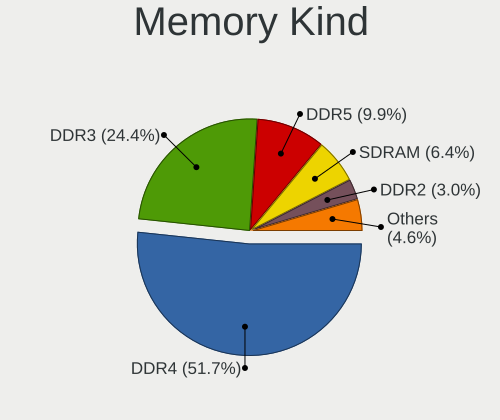

| Kind    | Desktops | Percent |
|---------|----------|---------|
| DDR4    | 417      | 51.67%  |
| DDR3    | 197      | 24.41%  |
| DDR5    | 80       | 9.91%   |
| SDRAM   | 52       | 6.44%   |
| DDR2    | 24       | 2.97%   |
| Unknown | 23       | 2.85%   |
| DDR     | 6        | 0.74%   |
| RAM     | 5        | 0.62%   |
| DRAM    | 2        | 0.25%   |
| LPDDR4  | 1        | 0.12%   |

Memory Form Factor
------------------

Physical design of the memory module

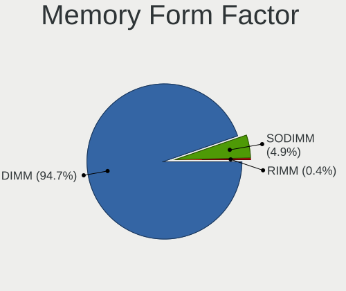

| Name   | Desktops | Percent |
|--------|----------|---------|
| DIMM   | 753      | 94.72%  |
| SODIMM | 39       | 4.91%   |
| RIMM   | 3        | 0.38%   |

Memory Size
-----------

Memory module size

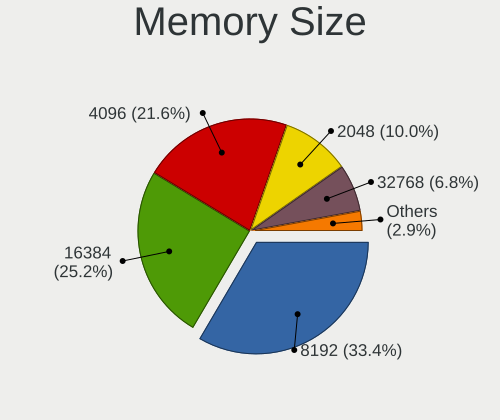

| Size  | Desktops | Percent |
|-------|----------|---------|
| 8192  | 289      | 33.45%  |
| 16384 | 218      | 25.23%  |
| 4096  | 187      | 21.64%  |
| 2048  | 86       | 9.95%   |
| 32768 | 59       | 6.83%   |
| 1024  | 19       | 2.2%    |
| 49152 | 2        | 0.23%   |
| 512   | 2        | 0.23%   |
| 8124  | 1        | 0.12%   |
| 256   | 1        | 0.12%   |

Memory Speed
------------

Memory module speed

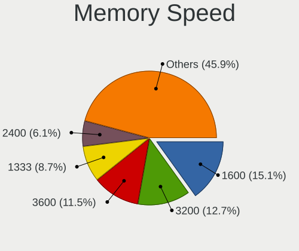

| Speed   | Desktops | Percent |
|---------|----------|---------|
| 1600    | 133      | 15.1%   |
| 3200    | 112      | 12.71%  |
| 3600    | 101      | 11.46%  |
| 1333    | 77       | 8.74%   |
| 2400    | 54       | 6.13%   |
| 2667    | 46       | 5.22%   |
| Unknown | 46       | 5.22%   |
| 2666    | 37       | 4.2%    |
| 2133    | 30       | 3.41%   |
| 4800    | 28       | 3.18%   |
| 3066    | 23       | 2.61%   |
| 6000    | 21       | 2.38%   |
| 667     | 19       | 2.16%   |
| 5200    | 13       | 1.48%   |
| 800     | 10       | 1.14%   |
| 1866    | 9        | 1.02%   |
| 3733    | 8        | 0.91%   |
| 4000    | 7        | 0.79%   |
| 2460    | 7        | 0.79%   |
| 1800    | 7        | 0.79%   |
| 1067    | 7        | 0.79%   |
| 6400    | 5        | 0.57%   |
| 3800    | 5        | 0.57%   |
| 3000    | 5        | 0.57%   |
| 2933    | 5        | 0.57%   |
| 5600    | 4        | 0.45%   |
| 5000    | 4        | 0.45%   |
| 3400    | 4        | 0.45%   |
| 3266    | 4        | 0.45%   |
| 3666    | 3        | 0.34%   |
| 2800    | 3        | 0.34%   |
| 2000    | 3        | 0.34%   |
| 1648    | 3        | 0.34%   |
| 1066    | 3        | 0.34%   |
| 49926   | 2        | 0.23%   |
| 6200    | 2        | 0.23%   |
| 4333    | 2        | 0.23%   |
| 3866    | 2        | 0.23%   |
| 3533    | 2        | 0.23%   |
| 3466    | 2        | 0.23%   |

Printers & scanners
-------------------

Printer Vendor
--------------

Printer device vendors

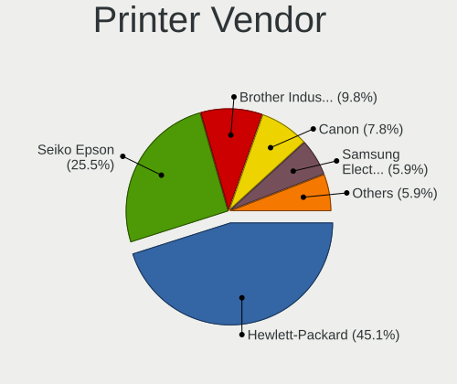

| Vendor              | Desktops | Percent |
|---------------------|----------|---------|
| Hewlett-Packard     | 23       | 45.1%   |
| Seiko Epson         | 13       | 25.49%  |
| Brother Industries  | 5        | 9.8%    |
| Canon               | 4        | 7.84%   |
| Samsung Electronics | 3        | 5.88%   |
| Pantum              | 1        | 1.96%   |
| Konica Minolta      | 1        | 1.96%   |
| Analog Devices      | 1        | 1.96%   |

Printer Model
-------------

Printer device models

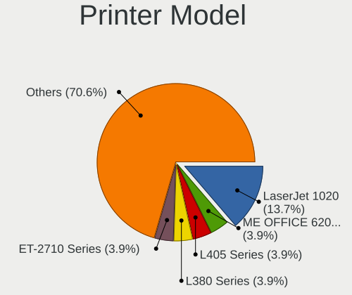

| Model                                                                 | Desktops | Percent |
|-----------------------------------------------------------------------|----------|---------|
| HP LaserJet 1020                                                      | 7        | 13.73%  |
| Seiko Epson ME OFFICE 620F Series/Stylus Office BX305F/BX305FW/TX320F | 2        | 3.92%   |
| Seiko Epson L405 Series                                               | 2        | 3.92%   |
| Seiko Epson L380 Series                                               | 2        | 3.92%   |
| Seiko Epson ET-2710 Series                                            | 2        | 3.92%   |
| HP Smart Tank 500 series                                              | 2        | 3.92%   |
| HP Ink Tank 310 series                                                | 2        | 3.92%   |
| HP Deskjet 1510                                                       | 2        | 3.92%   |
| Canon PIXMA MG2500 Series                                             | 2        | 3.92%   |
| Seiko Epson USB2.0 Printer (Hi-speed)                                 | 1        | 1.96%   |
| Seiko Epson L3210 Series                                              | 1        | 1.96%   |
| Seiko Epson L3200 Series                                              | 1        | 1.96%   |
| Seiko Epson L3110 Series                                              | 1        | 1.96%   |
| Seiko Epson ET-3750 Series                                            | 1        | 1.96%   |
| Samsung Xerox Phaser 3117 Laser Printer                               | 1        | 1.96%   |
| Samsung SCX-4300 Series                                               | 1        | 1.96%   |
| Samsung ML-1640 Series Laser Printer                                  | 1        | 1.96%   |
| Pantum P2200 series                                                   | 1        | 1.96%   |
| Konica Minolta KONICA MINOLTA 206                                     | 1        | 1.96%   |
| HP Printing Support                                                   | 1        | 1.96%   |
| HP LaserJet Professional P1566                                        | 1        | 1.96%   |
| HP LaserJet Pro M329                                                  | 1        | 1.96%   |
| HP LaserJet Pro M201dw                                                | 1        | 1.96%   |
| HP LaserJet P1102                                                     | 1        | 1.96%   |
| HP HP LaserJet Professional P1606dn                                   | 1        | 1.96%   |
| HP DeskJet 4800 series                                                | 1        | 1.96%   |
| HP DeskJet 3630 series                                                | 1        | 1.96%   |
| HP DeskJet 2300 series                                                | 1        | 1.96%   |
| HP DeskJet 2130 series                                                | 1        | 1.96%   |
| Canon PIXMA MP280                                                     | 1        | 1.96%   |
| Canon LiDE 400                                                        | 1        | 1.96%   |
| Brother DCP-T820DW                                                    | 1        | 1.96%   |
| Brother DCP-T510W                                                     | 1        | 1.96%   |
| Brother DCP-T310                                                      | 1        | 1.96%   |
| Brother DCP-L2520D                                                    | 1        | 1.96%   |
| Brother DCP-7065DN                                                    | 1        | 1.96%   |
| Analog Devices USB POS Printer                                        | 1        | 1.96%   |

Scanner Vendor
--------------

Scanner device vendors

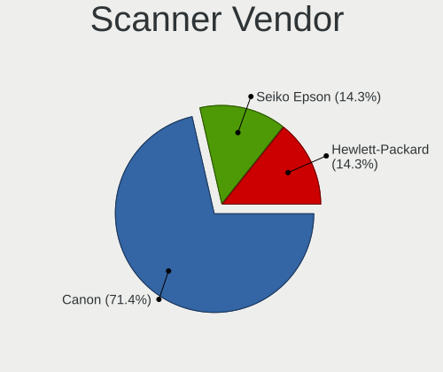

| Vendor          | Desktops | Percent |
|-----------------|----------|---------|
| Canon           | 6        | 75%     |
| Seiko Epson     | 1        | 12.5%   |
| Hewlett-Packard | 1        | 12.5%   |

Scanner Model
-------------

Scanner device models

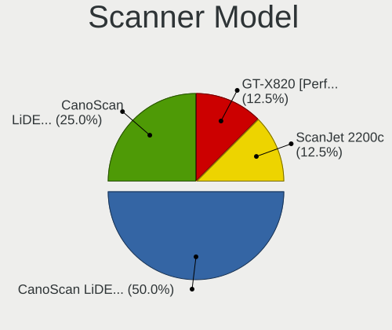

| Model                                       | Desktops | Percent |
|---------------------------------------------|----------|---------|
| Canon CanoScan LiDE 110                     | 4        | 50%     |
| Canon CanoScan LiDE 120                     | 2        | 25%     |
| Seiko Epson GT-X820 [Perfection V600 Photo] | 1        | 12.5%   |
| HP ScanJet 2200c                            | 1        | 12.5%   |

Camera
------

Camera Vendor
-------------

Camera device vendors

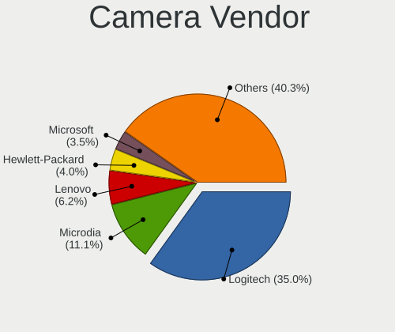

| Vendor                      | Desktops | Percent |
|-----------------------------|----------|---------|
| Logitech                    | 79       | 34.96%  |
| Microdia                    | 25       | 11.06%  |
| Lenovo                      | 14       | 6.19%   |
| Hewlett-Packard             | 9        | 3.98%   |
| Microsoft                   | 8        | 3.54%   |
| Unknown                     | 7        | 3.1%    |
| Arkmicro Technologies       | 7        | 3.1%    |
| GEMBIRD                     | 6        | 2.65%   |
| Samsung Electronics         | 5        | 2.21%   |
| OPPO Electronics            | 5        | 2.21%   |
| MacroSilicon                | 5        | 2.21%   |
| IMC Networks                | 4        | 1.77%   |
| Cubeternet                  | 4        | 1.77%   |
| ValueHD                     | 3        | 1.33%   |
| SN0002                      | 3        | 1.33%   |
| Jieli Technology            | 3        | 1.33%   |
| Chicony Electronics         | 3        | 1.33%   |
| ARC International           | 3        | 1.33%   |
| Apple                       | 3        | 1.33%   |
| Z-Star Microelectronics     | 2        | 0.88%   |
| Sony                        | 2        | 0.88%   |
| Realtek Semiconductor       | 2        | 0.88%   |
| Huawei Technologies         | 2        | 0.88%   |
| CVT Electronics.Co.         | 2        | 0.88%   |
| Creative Technology         | 2        | 0.88%   |
| Asuscom Network             | 2        | 0.88%   |
| Unknown                     | 2        | 0.88%   |
| WCM_USB                     | 1        | 0.44%   |
| Syntek                      | 1        | 0.44%   |
| SunplusIT                   | 1        | 0.44%   |
| Spreadtrum Communications   | 1        | 0.44%   |
| Sonix Technology            | 1        | 0.44%   |
| Polycom                     | 1        | 0.44%   |
| Luxvisions Innotech Limited | 1        | 0.44%   |
| LG Electronics              | 1        | 0.44%   |
| KYE Systems (Mouse Systems) | 1        | 0.44%   |
| Insta360                    | 1        | 0.44%   |
| FINGERS                     | 1        | 0.44%   |
| eMPIA Technology            | 1        | 0.44%   |
| eMeet                       | 1        | 0.44%   |

Camera Model
------------

Camera device models

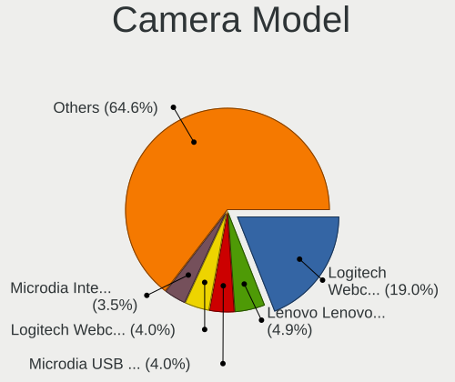

| Model                                             | Desktops | Percent |
|---------------------------------------------------|----------|---------|
| Logitech Webcam C270                              | 43       | 19.03%  |
| Lenovo Lenovo FHD Webcam Audio                    | 11       | 4.87%   |
| Microdia USB 2.0 Camera                           | 9        | 3.98%   |
| Logitech Webcam C310                              | 9        | 3.98%   |
| Microdia Integrated Camera                        | 8        | 3.54%   |
| Logitech C922 Pro Stream Webcam                   | 8        | 3.54%   |
| Unknown HD camera                                 | 7        | 3.1%    |
| Samsung Galaxy series, misc. (MTP mode)           | 5        | 2.21%   |
| HP W100                                           | 5        | 2.21%   |
| MacroSilicon USB Video                            | 4        | 1.77%   |
| Logitech HD Pro Webcam C920                       | 4        | 1.77%   |
| IMC Networks XHC Camera                           | 4        | 1.77%   |
| GEMBIRD Generic UVC 1.00 camera [AppoTech AX2311] | 4        | 1.77%   |
| Arkmicro USB2.0 PC CAMERA                         | 4        | 1.77%   |
| ValueHD HD Camera                                 | 3        | 1.33%   |
| SN0002 1080P Web Camera                           | 3        | 1.33%   |
| OPPO OnePlus 13R                                  | 3        | 1.33%   |
| Logitech C920 PRO HD Webcam                       | 3        | 1.33%   |
| Jieli USB PHY 2.0                                 | 3        | 1.33%   |
| Arkmicro Webcam Carrefour                         | 3        | 1.33%   |
| ARC International Camera                          | 3        | 1.33%   |
| Apple iPhone 5/5C/5S/6/SE/7/8/X                   | 3        | 1.33%   |
| Sony CEVCECM                                      | 2        | 0.88%   |
| OPPO Oppo N1                                      | 2        | 0.88%   |
| Microsoft Microsoft LifeCam HD-6000 for Notebooks | 2        | 0.88%   |
| Microsoft LifeCam VX-700                          | 2        | 0.88%   |
| Microsoft LifeCam HD-5000                         | 2        | 0.88%   |
| Microdia Defender G-Lens 2577 HD720p Camera       | 2        | 0.88%   |
| Microdia CyberTrack H7                            | 2        | 0.88%   |
| Microdia Camera                                   | 2        | 0.88%   |
| Logitech Webcam C170                              | 2        | 0.88%   |
| Logitech B525 HD Webcam                           | 2        | 0.88%   |
| Lenovo 500 RGB Camera                             | 2        | 0.88%   |
| Huawei HiCamera                                   | 2        | 0.88%   |
| GEMBIRD USB2.0 PC CAMERA                          | 2        | 0.88%   |
| CVT Electronics.Co. USB Camera                    | 2        | 0.88%   |
| Cubeternet WebCam                                 | 2        | 0.88%   |
| Asuscom Network HD 1080P PC-Camera                | 2        | 0.88%   |
| Unknown                                           | 2        | 0.88%   |
| Z-Star Sirius USB2.0 Camera                       | 1        | 0.44%   |

Security
--------

Fingerprint Vendor
------------------

Fingerprint sensor vendors

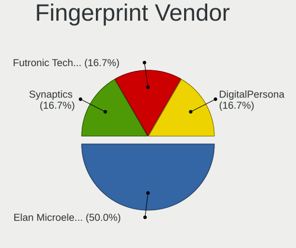

| Vendor                | Desktops | Percent |
|-----------------------|----------|---------|
| Elan Microelectronics | 3        | 50%     |
| Synaptics             | 1        | 16.67%  |
| Futronic Technology   | 1        | 16.67%  |
| DigitalPersona        | 1        | 16.67%  |

Fingerprint Model
-----------------

Fingerprint sensor models

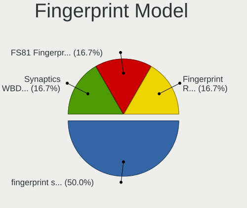

| Model                                        | Desktops | Percent |
|----------------------------------------------|----------|---------|
| Elan fingerprint sensor [FeinTech FPS00200]  | 3        | 50%     |
| Synaptics  WBDI Fingerprint Reader - USB 052 | 1        | 16.67%  |
| Futronic FS81 Fingerprint Scanner Module     | 1        | 16.67%  |
| DigitalPersona Fingerprint Reader            | 1        | 16.67%  |

Chipcard Vendor
---------------

Chipcard module vendors

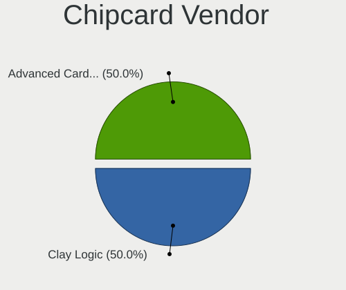

| Vendor                | Desktops | Percent |
|-----------------------|----------|---------|
| Clay Logic            | 1        | 50%     |
| Advanced Card Systems | 1        | 50%     |

Chipcard Model
--------------

Chipcard module models

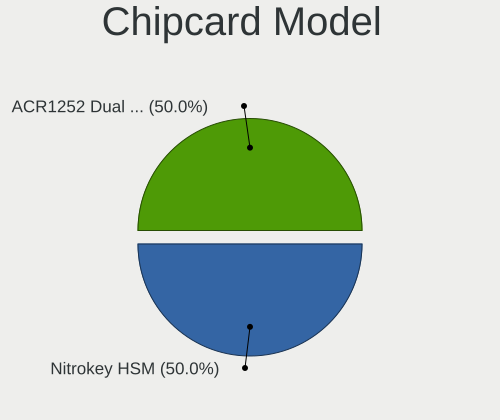

| Model                                     | Desktops | Percent |
|-------------------------------------------|----------|---------|
| Clay Logic Nitrokey HSM                   | 1        | 50%     |
| Advanced Card Systems ACR1252 Dual Reader | 1        | 50%     |

Unsupported
-----------

Unsupported Devices
-------------------

Total unsupported devices on board

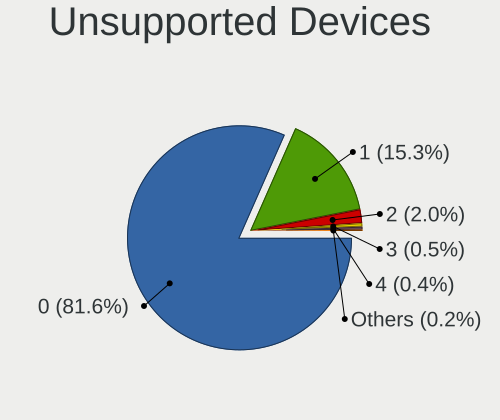

| Total | Desktops | Percent |
|-------|----------|---------|
| 0     | 1313     | 81.6%   |
| 1     | 246      | 15.29%  |
| 2     | 32       | 1.99%   |
| 3     | 8        | 0.5%    |
| 4     | 7        | 0.44%   |
| 5     | 3        | 0.19%   |

Unsupported Device Types
------------------------

Types of unsupported devices

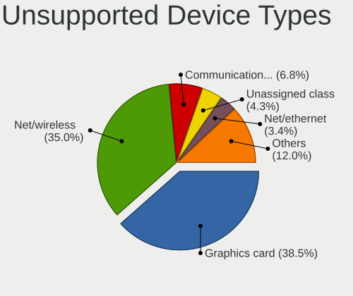

| Type                     | Desktops | Percent |
|--------------------------|----------|---------|
| Graphics card            | 135      | 38.46%  |
| Net/wireless             | 123      | 35.04%  |
| Communication controller | 24       | 6.84%   |
| Unassigned class         | 15       | 4.27%   |
| Net/ethernet             | 12       | 3.42%   |
| Sound                    | 9        | 2.56%   |
| Network                  | 7        | 1.99%   |
| Fingerprint reader       | 6        | 1.71%   |
| Bluetooth                | 4        | 1.14%   |
| Multimedia controller    | 3        | 0.85%   |
| Modem                    | 3        | 0.85%   |
| Camera                   | 3        | 0.85%   |
| Storage/ide              | 2        | 0.57%   |
| Chipcard                 | 2        | 0.57%   |
| Storage/raid             | 1        | 0.28%   |
| Firewire controller      | 1        | 0.28%   |
| Dvb card                 | 1        | 0.28%   |

