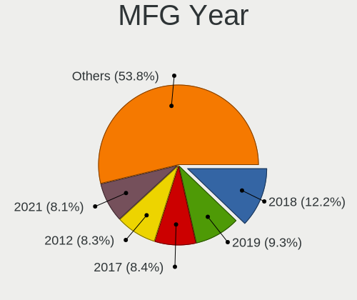
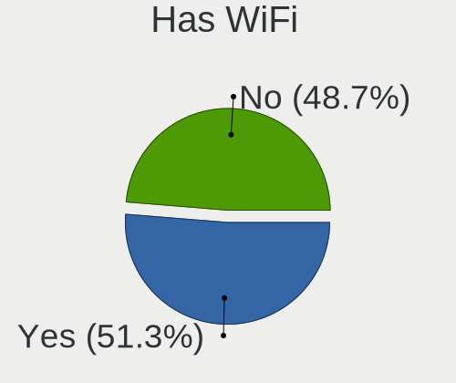
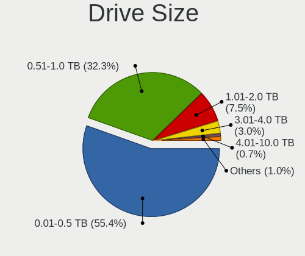
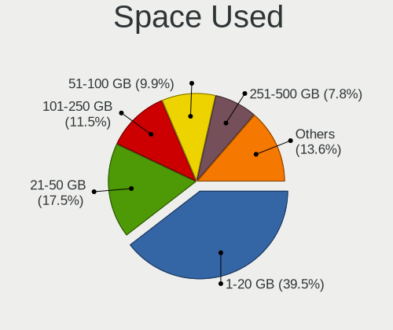
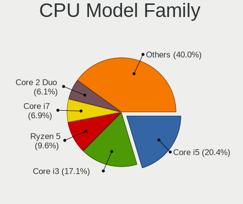
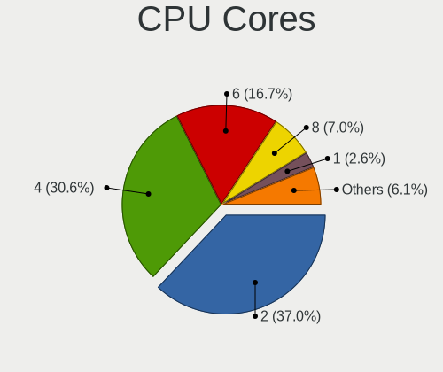
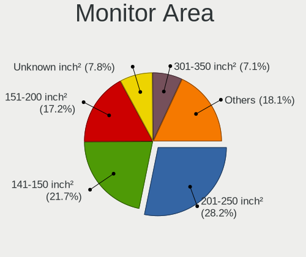
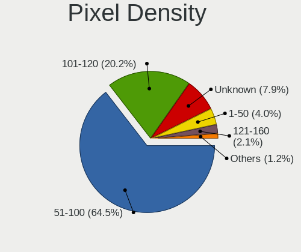
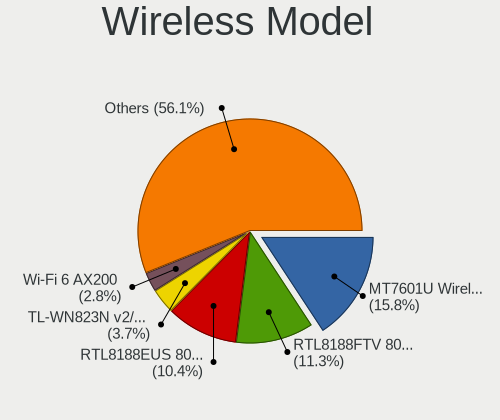

Linux in India - Tested Hardware & Statistics (Desktops)
--------------------------------------------------------

A project to collect tested hardware configurations for Linux in India.

Anyone can contribute to this report by the [hw-probe](https://github.com/linuxhw/hw-probe) tool:

    sudo -E hw-probe -all -upload

Please contribute! Especially if your hardware is rare.

Contents
--------

* [ Test Cases ](#test-cases)

* [ System ](#system)
  - [ OS                       ](#os)
  - [ OS Family                ](#os-family)
  - [ Kernel                   ](#kernel)
  - [ Kernel Family            ](#kernel-family)
  - [ Kernel Major Ver.        ](#kernel-major-ver)
  - [ Arch                     ](#arch)
  - [ DE                       ](#de)
  - [ Display Server           ](#display-server)
  - [ Display Manager          ](#display-manager)
  - [ OS Lang                  ](#os-lang)
  - [ Boot Mode                ](#boot-mode)
  - [ Filesystem               ](#filesystem)
  - [ Part. scheme             ](#part-scheme)
  - [ Dual Boot with Linux/BSD ](#dual-boot-with-linuxbsd)
  - [ Dual Boot (Win)          ](#dual-boot-win)

* [ Board ](#board)
  - [ Vendor                   ](#vendor)
  - [ Model                    ](#model)
  - [ Model Family             ](#model-family)
  - [ MFG Year                 ](#mfg-year)
  - [ Form Factor              ](#form-factor)
  - [ Secure Boot              ](#secure-boot)
  - [ Coreboot                 ](#coreboot)
  - [ RAM Size                 ](#ram-size)
  - [ RAM Used                 ](#ram-used)
  - [ Total Drives             ](#total-drives)
  - [ Has CD-ROM               ](#has-cd-rom)
  - [ Has Ethernet             ](#has-ethernet)
  - [ Has WiFi                 ](#has-wifi)
  - [ Has Bluetooth            ](#has-bluetooth)

* [ Location ](#location)
  - [ Country                  ](#country)
  - [ City                     ](#city)

* [ Drives ](#drives)
  - [ Drive Vendor             ](#drive-vendor)
  - [ Drive Model              ](#drive-model)
  - [ HDD Vendor               ](#hdd-vendor)
  - [ SSD Vendor               ](#ssd-vendor)
  - [ Drive Kind               ](#drive-kind)
  - [ Drive Connector          ](#drive-connector)
  - [ Drive Size               ](#drive-size)
  - [ Space Total              ](#space-total)
  - [ Space Used               ](#space-used)
  - [ Malfunc. Drives          ](#malfunc-drives)
  - [ Malfunc. Drive Vendor    ](#malfunc-drive-vendor)
  - [ Malfunc. HDD Vendor      ](#malfunc-hdd-vendor)
  - [ Malfunc. Drive Kind      ](#malfunc-drive-kind)
  - [ Failed Drives            ](#failed-drives)
  - [ Failed Drive Vendor      ](#failed-drive-vendor)
  - [ Drive Status             ](#drive-status)

* [ Storage controller ](#storage-controller)
  - [ Storage Vendor           ](#storage-vendor)
  - [ Storage Model            ](#storage-model)
  - [ Storage Kind             ](#storage-kind)

* [ Processor ](#processor)
  - [ CPU Vendor               ](#cpu-vendor)
  - [ CPU Model                ](#cpu-model)
  - [ CPU Model Family         ](#cpu-model-family)
  - [ CPU Cores                ](#cpu-cores)
  - [ CPU Sockets              ](#cpu-sockets)
  - [ CPU Threads              ](#cpu-threads)
  - [ CPU Op-Modes             ](#cpu-op-modes)
  - [ CPU Microcode            ](#cpu-microcode)
  - [ CPU Microarch            ](#cpu-microarch)

* [ Graphics ](#graphics)
  - [ GPU Vendor               ](#gpu-vendor)
  - [ GPU Model                ](#gpu-model)
  - [ GPU Combo                ](#gpu-combo)
  - [ GPU Driver               ](#gpu-driver)
  - [ GPU Memory               ](#gpu-memory)

* [ Monitor ](#monitor)
  - [ Monitor Vendor           ](#monitor-vendor)
  - [ Monitor Model            ](#monitor-model)
  - [ Monitor Resolution       ](#monitor-resolution)
  - [ Monitor Diagonal         ](#monitor-diagonal)
  - [ Monitor Width            ](#monitor-width)
  - [ Aspect Ratio             ](#aspect-ratio)
  - [ Monitor Area             ](#monitor-area)
  - [ Pixel Density            ](#pixel-density)
  - [ Multiple Monitors        ](#multiple-monitors)

* [ Network ](#network)
  - [ Net Controller Vendor    ](#net-controller-vendor)
  - [ Net Controller Model     ](#net-controller-model)
  - [ Wireless Vendor          ](#wireless-vendor)
  - [ Wireless Model           ](#wireless-model)
  - [ Ethernet Vendor          ](#ethernet-vendor)
  - [ Ethernet Model           ](#ethernet-model)
  - [ Net Controller Kind      ](#net-controller-kind)
  - [ Used Controller          ](#used-controller)
  - [ NICs                     ](#nics)
  - [ IPv6                     ](#ipv6)

* [ Bluetooth ](#bluetooth)
  - [ Bluetooth Vendor         ](#bluetooth-vendor)
  - [ Bluetooth Model          ](#bluetooth-model)

* [ Sound ](#sound)
  - [ Sound Vendor             ](#sound-vendor)
  - [ Sound Model              ](#sound-model)

* [ Memory ](#memory)
  - [ Memory Vendor            ](#memory-vendor)
  - [ Memory Model             ](#memory-model)
  - [ Memory Kind              ](#memory-kind)
  - [ Memory Form Factor       ](#memory-form-factor)
  - [ Memory Size              ](#memory-size)
  - [ Memory Speed             ](#memory-speed)

* [ Printers & scanners ](#printers--scanners)
  - [ Printer Vendor           ](#printer-vendor)
  - [ Printer Model            ](#printer-model)
  - [ Scanner Vendor           ](#scanner-vendor)
  - [ Scanner Model            ](#scanner-model)

* [ Camera ](#camera)
  - [ Camera Vendor            ](#camera-vendor)
  - [ Camera Model             ](#camera-model)

* [ Security ](#security)
  - [ Fingerprint Vendor       ](#fingerprint-vendor)
  - [ Fingerprint Model        ](#fingerprint-model)
  - [ Chipcard Vendor          ](#chipcard-vendor)
  - [ Chipcard Model           ](#chipcard-model)

* [ Unsupported ](#unsupported)
  - [ Unsupported Devices      ](#unsupported-devices)
  - [ Unsupported Device Types ](#unsupported-device-types)

Test Cases
----------

Total: 1893

| Vendor        | Model                       | Probe                                                      | Date         |
|---------------|-----------------------------|------------------------------------------------------------|--------------|
| Dell          | 01G0M6 A02                  | [9018a2ac09](https://linux-hardware.org/?probe=9018a2ac09) | Jan 06, 2025 |
| ASRock        | X470 Taichi                 | [72c6b2bcbb](https://linux-hardware.org/?probe=72c6b2bcbb) | Jan 03, 2025 |
| ASRock        | X470 Taichi                 | [8cadf9a645](https://linux-hardware.org/?probe=8cadf9a645) | Jan 03, 2025 |
| Gigabyte      | B550M DS3H AC               | [1540589e08](https://linux-hardware.org/?probe=1540589e08) | Jan 02, 2025 |
| ASUSTek       | PRIME B650M-R               | [9d53ddc561](https://linux-hardware.org/?probe=9d53ddc561) | Jan 01, 2025 |
| ASUSTek       | PRIME B650M-R               | [bacb5075e2](https://linux-hardware.org/?probe=bacb5075e2) | Jan 01, 2025 |
| Biostar       | H61MLV3                     | [22552600f9](https://linux-hardware.org/?probe=22552600f9) | Dec 31, 2024 |
| Biostar       | H61MLV3                     | [fb0d735a6e](https://linux-hardware.org/?probe=fb0d735a6e) | Dec 31, 2024 |
| HP            | 8592                        | [abf909ed60](https://linux-hardware.org/?probe=abf909ed60) | Dec 30, 2024 |
| MITSUBISHI    | MELSEC WinCPU               | [7a70e43e33](https://linux-hardware.org/?probe=7a70e43e33) | Dec 30, 2024 |
| Intel         | H110                        | [e5396f2a33](https://linux-hardware.org/?probe=e5396f2a33) | Dec 30, 2024 |
| Gigabyte      | B250M-D3H-CF                | [ddda94bd1e](https://linux-hardware.org/?probe=ddda94bd1e) | Dec 28, 2024 |
| Intel         | DZ75ML-45K AAG75008-102     | [8b81a310de](https://linux-hardware.org/?probe=8b81a310de) | Dec 28, 2024 |
| Intel         | D54250WYK H13922-303        | [77fd66459a](https://linux-hardware.org/?probe=77fd66459a) | Dec 27, 2024 |
| Gigabyte      | B365M GAMING HD             | [c72350ab41](https://linux-hardware.org/?probe=c72350ab41) | Dec 25, 2024 |
| Unknown       | BENA-2142H                  | [0fbb9383fa](https://linux-hardware.org/?probe=0fbb9383fa) | Dec 24, 2024 |
| Gigabyte      | H110M-S2-CF                 | [1b9078c7d8](https://linux-hardware.org/?probe=1b9078c7d8) | Dec 23, 2024 |
| ASUSTek       | PRIME B650M-R               | [22e801bada](https://linux-hardware.org/?probe=22e801bada) | Dec 21, 2024 |
| Dell          | 0GDG8Y A00                  | [0219cb33b6](https://linux-hardware.org/?probe=0219cb33b6) | Dec 20, 2024 |
| Lenovo        | 30D0 SDK0J40697 WIN 3305... | [bf94a86edc](https://linux-hardware.org/?probe=bf94a86edc) | Dec 20, 2024 |
| MSI           | PRO H610M-S DDR4            | [9cec96a0b8](https://linux-hardware.org/?probe=9cec96a0b8) | Dec 20, 2024 |
| Google        | Teemo                       | [220fc873b9](https://linux-hardware.org/?probe=220fc873b9) | Dec 19, 2024 |
| ASUSTek       | H110M-D                     | [e553338f2c](https://linux-hardware.org/?probe=e553338f2c) | Dec 19, 2024 |
| Gigabyte      | X570S AORUS PRO AX          | [f0168d3f71](https://linux-hardware.org/?probe=f0168d3f71) | Dec 19, 2024 |
| MSI           | MAG X870 TOMAHAWK WIFI      | [18273fb5dd](https://linux-hardware.org/?probe=18273fb5dd) | Dec 18, 2024 |
| MSI           | PRO B550M-P GEN3            | [454a6a7330](https://linux-hardware.org/?probe=454a6a7330) | Dec 17, 2024 |
| MSI           | PRO H610M-S DDR4            | [5df9fcc399](https://linux-hardware.org/?probe=5df9fcc399) | Dec 17, 2024 |
| Dell          | 0JP3NX A00                  | [9c57ea74e2](https://linux-hardware.org/?probe=9c57ea74e2) | Dec 16, 2024 |
| ASUSTek       | ROG STRIX B550-F GAMING     | [99ca8a0388](https://linux-hardware.org/?probe=99ca8a0388) | Dec 13, 2024 |
| Gigabyte      | B450M DS3H-CF               | [a6f9793144](https://linux-hardware.org/?probe=a6f9793144) | Dec 13, 2024 |
| Gigabyte      | B450M DS3H-CF               | [6e31ffceab](https://linux-hardware.org/?probe=6e31ffceab) | Dec 13, 2024 |
| ASRock        | H310CM-HDV/M.2 SE           | [3fafbb2133](https://linux-hardware.org/?probe=3fafbb2133) | Dec 12, 2024 |
| HP            | 1825                        | [a5a96d92a8](https://linux-hardware.org/?probe=a5a96d92a8) | Dec 09, 2024 |
| ASRock        | B650M PG Riptide            | [ec69fb26c9](https://linux-hardware.org/?probe=ec69fb26c9) | Dec 09, 2024 |
| ASUSTek       | PRIME B650M-R               | [847b409b68](https://linux-hardware.org/?probe=847b409b68) | Dec 08, 2024 |
| Gigabyte      | B450M DS3H-CF               | [fc67178348](https://linux-hardware.org/?probe=fc67178348) | Dec 04, 2024 |
| Unknown       | Unknown                     | [02faf52e1b](https://linux-hardware.org/?probe=02faf52e1b) | Dec 03, 2024 |
| Unknown       | G41 Series                  | [ba02f81d29](https://linux-hardware.org/?probe=ba02f81d29) | Dec 02, 2024 |
| Gigabyte      | X870 AORUS ELITE WIFI7      | [ad3c58249d](https://linux-hardware.org/?probe=ad3c58249d) | Dec 02, 2024 |
| Unknown       | Unknown                     | [d6d61e90b7](https://linux-hardware.org/?probe=d6d61e90b7) | Nov 30, 2024 |
| Gigabyte      | H61M-DS2                    | [ce0e3b2719](https://linux-hardware.org/?probe=ce0e3b2719) | Nov 29, 2024 |
| ASUSTek       | PRIME B650M-R               | [b4167ba44b](https://linux-hardware.org/?probe=b4167ba44b) | Nov 25, 2024 |
| Gigabyte      | B660M AORUS PRO AX DDR4     | [5921d4b833](https://linux-hardware.org/?probe=5921d4b833) | Nov 21, 2024 |
| Unknown       | adnbsc01                    | [c1941e3d3c](https://linux-hardware.org/?probe=c1941e3d3c) | Nov 21, 2024 |
| MSI           | B450 TOMAHAWK MAX           | [036d7dee4d](https://linux-hardware.org/?probe=036d7dee4d) | Nov 18, 2024 |
| ASRock        | B550M Steel Legend          | [12b473d08e](https://linux-hardware.org/?probe=12b473d08e) | Nov 18, 2024 |
| ASUSTek       | PRIME H410M-CS              | [51e9a88fad](https://linux-hardware.org/?probe=51e9a88fad) | Nov 18, 2024 |
| Gigabyte      | X670E AORUS PRO X           | [2d5582b3a9](https://linux-hardware.org/?probe=2d5582b3a9) | Nov 18, 2024 |
| ASUSTek       | PRIME B650M-R               | [45750db0a7](https://linux-hardware.org/?probe=45750db0a7) | Nov 18, 2024 |
| ASUSTek       | PRIME B650M-R               | [1114829024](https://linux-hardware.org/?probe=1114829024) | Nov 17, 2024 |
| Gigabyte      | H310M S2                    | [f025c7ec84](https://linux-hardware.org/?probe=f025c7ec84) | Nov 17, 2024 |
| Gigabyte      | H310M S2 x.x                | [d1de0835ba](https://linux-hardware.org/?probe=d1de0835ba) | Nov 15, 2024 |
| Gigabyte      | H110M-H-CF                  | [4bb6f528f5](https://linux-hardware.org/?probe=4bb6f528f5) | Nov 14, 2024 |
| ASUSTek       | PRIME B650M-R               | [dd58467e3f](https://linux-hardware.org/?probe=dd58467e3f) | Nov 12, 2024 |
| ASUSTek       | PRIME B650M-R               | [33be9bd750](https://linux-hardware.org/?probe=33be9bd750) | Nov 12, 2024 |
| Gigabyte      | B650 GAMING X AX            | [30c15a1d24](https://linux-hardware.org/?probe=30c15a1d24) | Nov 08, 2024 |
| Intel         | DH61BF AAG81311-102         | [fa09fae0e6](https://linux-hardware.org/?probe=fa09fae0e6) | Nov 08, 2024 |
| MSI           | MAG B650 TOMAHAWK WIFI      | [20bf647a5f](https://linux-hardware.org/?probe=20bf647a5f) | Nov 05, 2024 |
| Inventec      | D CLASS A02                 | [fd2e5b9416](https://linux-hardware.org/?probe=fd2e5b9416) | Nov 01, 2024 |
| Unknown       | Unknown                     | [b73f669319](https://linux-hardware.org/?probe=b73f669319) | Oct 31, 2024 |
| Unknown       | Unknown                     | [aabc0b8d5c](https://linux-hardware.org/?probe=aabc0b8d5c) | Oct 31, 2024 |
| MSI           | H410M PRO-VH                | [11a6d15fa6](https://linux-hardware.org/?probe=11a6d15fa6) | Oct 29, 2024 |
| MSI           | B450 TOMAHAWK               | [7daf128f4f](https://linux-hardware.org/?probe=7daf128f4f) | Oct 27, 2024 |
| Inventec      | D CLASS A02                 | [0627d6ec78](https://linux-hardware.org/?probe=0627d6ec78) | Oct 26, 2024 |
| Dell          | 03KWTV A00                  | [c441f21812](https://linux-hardware.org/?probe=c441f21812) | Oct 25, 2024 |
| Dell          | 0WWJRX A01                  | [2cd4d15e77](https://linux-hardware.org/?probe=2cd4d15e77) | Oct 24, 2024 |
| Intel         | H81                         | [1080e68a76](https://linux-hardware.org/?probe=1080e68a76) | Oct 24, 2024 |
| ASUSTek       | EX-B760M-V5 D4              | [d49ca3de0e](https://linux-hardware.org/?probe=d49ca3de0e) | Oct 22, 2024 |
| ASUSTek       | EX-B760M-V5 D4              | [f02bc3e598](https://linux-hardware.org/?probe=f02bc3e598) | Oct 22, 2024 |
| ASUSTek       | P8Z77-M PRO                 | [169807fa93](https://linux-hardware.org/?probe=169807fa93) | Oct 22, 2024 |
| Dell          | 02YRK5 A02                  | [b1ba54be2e](https://linux-hardware.org/?probe=b1ba54be2e) | Oct 20, 2024 |
| ASUSTek       | TUF Gaming X570-PLUS        | [b2de5db2ae](https://linux-hardware.org/?probe=b2de5db2ae) | Oct 20, 2024 |
| ASUSTek       | M4A88T-M LE                 | [1763fc4e35](https://linux-hardware.org/?probe=1763fc4e35) | Oct 19, 2024 |
| MSI           | MAG B550 TOMAHAWK           | [54dc4eb74e](https://linux-hardware.org/?probe=54dc4eb74e) | Oct 17, 2024 |
| MSI           | PRO Z790-A WIFI             | [84d6b1223c](https://linux-hardware.org/?probe=84d6b1223c) | Oct 17, 2024 |
| Gigabyte      | B450 AORUS PRO WIFI-CF      | [0ce8e146cf](https://linux-hardware.org/?probe=0ce8e146cf) | Oct 16, 2024 |
| ASUSTek       | TUF Gaming Z690-PLUS WIF... | [043f4904ae](https://linux-hardware.org/?probe=043f4904ae) | Oct 15, 2024 |
| Intel         | DQ57TM AAE92694-401         | [30f4142d3d](https://linux-hardware.org/?probe=30f4142d3d) | Oct 15, 2024 |
| Dell          | 0NK70N A03                  | [33c83f5d6f](https://linux-hardware.org/?probe=33c83f5d6f) | Oct 14, 2024 |
| Dell          | 0Y3R3K A02                  | [3505885ed1](https://linux-hardware.org/?probe=3505885ed1) | Oct 13, 2024 |
| Gigabyte      | B250M-D3H-CF                | [6f18077de5](https://linux-hardware.org/?probe=6f18077de5) | Oct 11, 2024 |
| ASUSTek       | ROG STRIX B450-F GAMING ... | [7368ae1893](https://linux-hardware.org/?probe=7368ae1893) | Oct 10, 2024 |
| ASUSTek       | PRIME H510M-E               | [0ae2204768](https://linux-hardware.org/?probe=0ae2204768) | Oct 10, 2024 |
| Dell          | 0Y3R3K A02                  | [8dae707bf1](https://linux-hardware.org/?probe=8dae707bf1) | Oct 09, 2024 |
| MSI           | PRO H610M-E DDR4            | [a95a15d17b](https://linux-hardware.org/?probe=a95a15d17b) | Oct 08, 2024 |
| MSI           | PRO Z790-P WIFI             | [0b70f80342](https://linux-hardware.org/?probe=0b70f80342) | Oct 07, 2024 |
| MSI           | PRO Z790-P WIFI             | [55212a6d55](https://linux-hardware.org/?probe=55212a6d55) | Oct 07, 2024 |
| ASUSTek       | M4A88T-M LE                 | [5711f54684](https://linux-hardware.org/?probe=5711f54684) | Oct 07, 2024 |
| ASUSTek       | M4A88T-M LE                 | [e9af67157f](https://linux-hardware.org/?probe=e9af67157f) | Oct 07, 2024 |
| MSI           | A320M-A PRO MAX             | [b5c390b381](https://linux-hardware.org/?probe=b5c390b381) | Oct 07, 2024 |
| OEM           | G41 775 ICH7 8712           | [5f37948592](https://linux-hardware.org/?probe=5f37948592) | Oct 06, 2024 |
| OEM           | G41 775 ICH7 8712           | [79a8f8be9d](https://linux-hardware.org/?probe=79a8f8be9d) | Oct 06, 2024 |
| ASUSTek       | EX-B760M-V5 D4              | [3acaec054c](https://linux-hardware.org/?probe=3acaec054c) | Oct 04, 2024 |
| MSI           | MPG B550 GAMING PLUS        | [5b165540b2](https://linux-hardware.org/?probe=5b165540b2) | Oct 03, 2024 |
| ASUSTek       | TUF Gaming X570-PLUS        | [dfea07d14a](https://linux-hardware.org/?probe=dfea07d14a) | Oct 02, 2024 |
| Unknown       | Unknown                     | [0b63ae81a4](https://linux-hardware.org/?probe=0b63ae81a4) | Oct 02, 2024 |
| Gigabyte      | G31M-ES2L                   | [f2804709e8](https://linux-hardware.org/?probe=f2804709e8) | Sep 28, 2024 |
| Gigabyte      | H470M DS3H                  | [67b6cc4673](https://linux-hardware.org/?probe=67b6cc4673) | Sep 26, 2024 |
| Intel         | DH55TC AAE70932-300         | [9ecaf37dcf](https://linux-hardware.org/?probe=9ecaf37dcf) | Sep 22, 2024 |
| Dell          | 02N3WF A02                  | [981192c3ae](https://linux-hardware.org/?probe=981192c3ae) | Sep 21, 2024 |
| Biostar       | H81MHV3 5.0                 | [7abd7f5dda](https://linux-hardware.org/?probe=7abd7f5dda) | Sep 15, 2024 |
| ASUSTek       | PRIME B450M-A               | [ef3e670b71](https://linux-hardware.org/?probe=ef3e670b71) | Sep 14, 2024 |
| ASUSTek       | PRIME B450M-A               | [72c90d2d0c](https://linux-hardware.org/?probe=72c90d2d0c) | Sep 14, 2024 |
| Gigabyte      | B450M DS3H-CF               | [68f79e8587](https://linux-hardware.org/?probe=68f79e8587) | Sep 13, 2024 |
| MSI           | G41M-P26                    | [1b4b146b2d](https://linux-hardware.org/?probe=1b4b146b2d) | Sep 12, 2024 |
| HP            | 8460                        | [f7c5abe471](https://linux-hardware.org/?probe=f7c5abe471) | Sep 12, 2024 |
| ASUSTek       | H110M-CS                    | [90196d4184](https://linux-hardware.org/?probe=90196d4184) | Sep 09, 2024 |
| ASUSTek       | PRIME X670-P WIFI           | [647986fc12](https://linux-hardware.org/?probe=647986fc12) | Sep 09, 2024 |
| ASUSTek       | M5A78L-M LX V2              | [ad890df61e](https://linux-hardware.org/?probe=ad890df61e) | Sep 08, 2024 |
| HP            | 225E                        | [daedc61ab7](https://linux-hardware.org/?probe=daedc61ab7) | Sep 08, 2024 |
| HP            | 225E                        | [240678cc5d](https://linux-hardware.org/?probe=240678cc5d) | Sep 07, 2024 |
| Gigabyte      | H410M H V2                  | [9f316fe29c](https://linux-hardware.org/?probe=9f316fe29c) | Sep 06, 2024 |
| ASRock        | G41M-VS3                    | [466fe39be5](https://linux-hardware.org/?probe=466fe39be5) | Sep 06, 2024 |
| Unknown       | G41                         | [58106ba597](https://linux-hardware.org/?probe=58106ba597) | Sep 05, 2024 |
| Intel         | X99                         | [cb1938142e](https://linux-hardware.org/?probe=cb1938142e) | Sep 04, 2024 |
| ASUSTek       | PRIME B450M-K II            | [077355ee89](https://linux-hardware.org/?probe=077355ee89) | Sep 03, 2024 |
| HP            | 8598                        | [638124dd74](https://linux-hardware.org/?probe=638124dd74) | Sep 01, 2024 |
| Gigabyte      | H310M H                     | [95c1ab90c2](https://linux-hardware.org/?probe=95c1ab90c2) | Sep 01, 2024 |
| Gigabyte      | GB-BSi5-1135G7              | [24c103a266](https://linux-hardware.org/?probe=24c103a266) | Aug 31, 2024 |
| Gigabyte      | B450 AORUS PRO-CF           | [8eb3f4820f](https://linux-hardware.org/?probe=8eb3f4820f) | Aug 31, 2024 |
| Gigabyte      | B450 AORUS PRO-CF           | [a09a263f48](https://linux-hardware.org/?probe=a09a263f48) | Aug 31, 2024 |
| ASUSTek       | PRIME B650M-A II            | [3e9b51ef74](https://linux-hardware.org/?probe=3e9b51ef74) | Aug 30, 2024 |
| ASUSTek       | PRIME B650M-A II            | [bf580dc719](https://linux-hardware.org/?probe=bf580dc719) | Aug 30, 2024 |
| ASUSTek       | PRIME B650M-A II            | [6e89e61a1c](https://linux-hardware.org/?probe=6e89e61a1c) | Aug 30, 2024 |
| HP            | 8648                        | [cd449a247f](https://linux-hardware.org/?probe=cd449a247f) | Aug 29, 2024 |
| Gigabyte      | H410M H                     | [3910ecd921](https://linux-hardware.org/?probe=3910ecd921) | Aug 28, 2024 |
| ASUSTek       | TUF Gaming Z690-PLUS D4     | [de5916af69](https://linux-hardware.org/?probe=de5916af69) | Aug 28, 2024 |
| Gigabyte      | H310M H                     | [d36cdaa55f](https://linux-hardware.org/?probe=d36cdaa55f) | Aug 27, 2024 |
| Intel         | DG45ID AAE27729-310         | [1b25e65d41](https://linux-hardware.org/?probe=1b25e65d41) | Aug 26, 2024 |
| Intel         | DG45ID AAE27729-310         | [2eec4fd640](https://linux-hardware.org/?probe=2eec4fd640) | Aug 26, 2024 |
| Dell          | 0DR845                      | [479d25843a](https://linux-hardware.org/?probe=479d25843a) | Aug 24, 2024 |
| ASUSTek       | ROG STRIX X670E-E GAMING... | [0b7b774741](https://linux-hardware.org/?probe=0b7b774741) | Aug 23, 2024 |
| ASRock        | G41M-VS3                    | [af4ac4810c](https://linux-hardware.org/?probe=af4ac4810c) | Aug 23, 2024 |
| Foxconn       | 17A0                        | [34e71b0b28](https://linux-hardware.org/?probe=34e71b0b28) | Aug 22, 2024 |
| ASUSTek       | PRIME B450M-K II            | [ce07d43e58](https://linux-hardware.org/?probe=ce07d43e58) | Aug 20, 2024 |
| ASUSTek       | PRIME B550M-K ARGB          | [30feefb9ec](https://linux-hardware.org/?probe=30feefb9ec) | Aug 20, 2024 |
| ASUSTek       | D642MF                      | [30e5e46f4b](https://linux-hardware.org/?probe=30e5e46f4b) | Aug 19, 2024 |
| MSI           | A68HM-E33 V2                | [541793a65b](https://linux-hardware.org/?probe=541793a65b) | Aug 19, 2024 |
| ASUSTek       | PRIME Z690-A                | [29f3802bff](https://linux-hardware.org/?probe=29f3802bff) | Aug 18, 2024 |
| HP            | 2AF2 A01                    | [6fbeb8f276](https://linux-hardware.org/?probe=6fbeb8f276) | Aug 17, 2024 |
| Intel         | DH55TC AAE70932-300         | [f263039c24](https://linux-hardware.org/?probe=f263039c24) | Aug 14, 2024 |
| MSI           | PRO Z690-A WIFI DDR4        | [c08fbd9c96](https://linux-hardware.org/?probe=c08fbd9c96) | Aug 13, 2024 |
| Gigabyte      | H270-Gaming 3               | [890175ad83](https://linux-hardware.org/?probe=890175ad83) | Aug 12, 2024 |
| HP            | 2129                        | [d2ae5dc64d](https://linux-hardware.org/?probe=d2ae5dc64d) | Aug 11, 2024 |
| IBM           | 00MU198                     | [fcbeeb8e93](https://linux-hardware.org/?probe=fcbeeb8e93) | Aug 10, 2024 |
| Unknown       | Unknown                     | [319fbba633](https://linux-hardware.org/?probe=319fbba633) | Aug 09, 2024 |
| ASUSTek       | ROG STRIX Z590-E GAMING ... | [590679ee62](https://linux-hardware.org/?probe=590679ee62) | Aug 08, 2024 |
| ASUSTek       | PRIME B550M-K ARGB          | [905e94560c](https://linux-hardware.org/?probe=905e94560c) | Aug 07, 2024 |
| ASUSTek       | PRIME B550M-K ARGB          | [56727697be](https://linux-hardware.org/?probe=56727697be) | Aug 07, 2024 |
| ASUSTek       | PRIME B550M-K ARGB          | [2c5f23b94c](https://linux-hardware.org/?probe=2c5f23b94c) | Aug 07, 2024 |
| Dell          | 0WMJ54 A01                  | [1a48bdf24e](https://linux-hardware.org/?probe=1a48bdf24e) | Aug 05, 2024 |
| Dell          | 0WMJ54 A01                  | [a624a815ba](https://linux-hardware.org/?probe=a624a815ba) | Aug 05, 2024 |
| Intel         | DH55TC AAE70932-300         | [91c2d21a34](https://linux-hardware.org/?probe=91c2d21a34) | Aug 01, 2024 |
| Gigabyte      | H410M H V3                  | [7075f2bce4](https://linux-hardware.org/?probe=7075f2bce4) | Jul 31, 2024 |
| Gigabyte      | H410M H V3                  | [6f9995bd18](https://linux-hardware.org/?probe=6f9995bd18) | Jul 31, 2024 |
| ASRock        | B450 Steel Legend           | [795fa8008b](https://linux-hardware.org/?probe=795fa8008b) | Jul 27, 2024 |
| HP            | 8055                        | [bcbf6bf73e](https://linux-hardware.org/?probe=bcbf6bf73e) | Jul 27, 2024 |
| Gigabyte      | H81M-S                      | [4552df8e63](https://linux-hardware.org/?probe=4552df8e63) | Jul 27, 2024 |
| Intel         | H61                         | [69378e73b9](https://linux-hardware.org/?probe=69378e73b9) | Jul 25, 2024 |
| Unknown       | Unknown                     | [ab02245e68](https://linux-hardware.org/?probe=ab02245e68) | Jul 25, 2024 |
| Intel         | H61/B75                     | [316cf38c13](https://linux-hardware.org/?probe=316cf38c13) | Jul 25, 2024 |
| HP            | 8055                        | [9b70e4da17](https://linux-hardware.org/?probe=9b70e4da17) | Jul 24, 2024 |
| Gigabyte      | B85M-DS3H-A                 | [345e2f9291](https://linux-hardware.org/?probe=345e2f9291) | Jul 24, 2024 |
| Dell          | 0W0CHX A00                  | [ca19b1d118](https://linux-hardware.org/?probe=ca19b1d118) | Jul 22, 2024 |
| Dell          | 0W0CHX A00                  | [48e627bbf5](https://linux-hardware.org/?probe=48e627bbf5) | Jul 22, 2024 |
| Acer          | H610MHP-E                   | [54e0a6ed60](https://linux-hardware.org/?probe=54e0a6ed60) | Jul 22, 2024 |
| ASUSTek       | PRIME X570-P                | [747f8d06d0](https://linux-hardware.org/?probe=747f8d06d0) | Jul 21, 2024 |
| Intel         | H61                         | [73424fabae](https://linux-hardware.org/?probe=73424fabae) | Jul 20, 2024 |
| Supermicro    | X7DB8                       | [207f3950ca](https://linux-hardware.org/?probe=207f3950ca) | Jul 19, 2024 |
| MSI           | B450M PRO-VDH               | [d67dd1db13](https://linux-hardware.org/?probe=d67dd1db13) | Jul 18, 2024 |
| Pegatron      | Eureka3                     | [e1be68932e](https://linux-hardware.org/?probe=e1be68932e) | Jul 17, 2024 |
| Dell          | 0Y2YM6 A00                  | [d0d5e9527f](https://linux-hardware.org/?probe=d0d5e9527f) | Jul 16, 2024 |
| MSI           | B450M-A PRO MAX II          | [dd3e786ebe](https://linux-hardware.org/?probe=dd3e786ebe) | Jul 15, 2024 |
| HP            | 8953                        | [d036e100be](https://linux-hardware.org/?probe=d036e100be) | Jul 15, 2024 |
| Dell          | 0080PM A00                  | [5c09a4ce54](https://linux-hardware.org/?probe=5c09a4ce54) | Jul 12, 2024 |
| Dell          | 0080PM A00                  | [a5c0f1401f](https://linux-hardware.org/?probe=a5c0f1401f) | Jul 12, 2024 |
| Gigabyte      | B450M K-CF                  | [d3145e9e2d](https://linux-hardware.org/?probe=d3145e9e2d) | Jul 07, 2024 |
| MSI           | B450M PRO-VDH MAX           | [7dcaf9e889](https://linux-hardware.org/?probe=7dcaf9e889) | Jul 06, 2024 |
| MSI           | MAG B460M MORTAR WIFI       | [8669e80f71](https://linux-hardware.org/?probe=8669e80f71) | Jul 05, 2024 |
| ASRock        | Z77 Extreme4                | [2b69725226](https://linux-hardware.org/?probe=2b69725226) | Jul 04, 2024 |
| ASUSTek       | ROG CROSSHAIR X670E HERO    | [9a5f752078](https://linux-hardware.org/?probe=9a5f752078) | Jul 03, 2024 |
| MSI           | B550M PRO-VDH WIFI          | [2ff76535c0](https://linux-hardware.org/?probe=2ff76535c0) | Jul 02, 2024 |
| Gigabyte      | B550M DS3H AC               | [f5b77c555c](https://linux-hardware.org/?probe=f5b77c555c) | Jun 30, 2024 |
| Gigabyte      | Z170-D3H-CF                 | [9772dd0c68](https://linux-hardware.org/?probe=9772dd0c68) | Jun 28, 2024 |
| Gigabyte      | H510M S2 V2                 | [a305c47b50](https://linux-hardware.org/?probe=a305c47b50) | Jun 28, 2024 |
| Gigabyte      | Z370 HD3P-CF                | [2ef72f2472](https://linux-hardware.org/?probe=2ef72f2472) | Jun 27, 2024 |
| Acer          | B360H5-M14 P21-A0           | [e66929de9b](https://linux-hardware.org/?probe=e66929de9b) | Jun 27, 2024 |
| ASUSTek       | TUF Gaming X570-PLUS        | [34ac307ec2](https://linux-hardware.org/?probe=34ac307ec2) | Jun 27, 2024 |
| ASUSTek       | EX-B760M-V5 D4              | [a11bbae7fe](https://linux-hardware.org/?probe=a11bbae7fe) | Jun 25, 2024 |
| ASUSTek       | ROG CROSSHAIR X670E HERO    | [6292603be7](https://linux-hardware.org/?probe=6292603be7) | Jun 24, 2024 |
| ASUSTek       | Pro WS W680-ACE             | [75e8291b90](https://linux-hardware.org/?probe=75e8291b90) | Jun 23, 2024 |
| Lenovo        | 3740 SDK0T76528 WIN 3556... | [bc03c6aad9](https://linux-hardware.org/?probe=bc03c6aad9) | Jun 22, 2024 |
| Lenovo        | 3740 SDK0T76528 WIN 3556... | [0eb5ea866c](https://linux-hardware.org/?probe=0eb5ea866c) | Jun 22, 2024 |
| Gigabyte      | H110M-S2-CF                 | [f114a27ae5](https://linux-hardware.org/?probe=f114a27ae5) | Jun 21, 2024 |
| Gigabyte      | H61MS                       | [ad12532c28](https://linux-hardware.org/?probe=ad12532c28) | Jun 21, 2024 |
| Intel         | Unknown                     | [65f3b4e3b8](https://linux-hardware.org/?probe=65f3b4e3b8) | Jun 21, 2024 |
| Gigabyte      | B550 AORUS ELITE AX V2      | [3b3002d062](https://linux-hardware.org/?probe=3b3002d062) | Jun 21, 2024 |
| Gigabyte      | B550 AORUS ELITE AX V2      | [3047e08dec](https://linux-hardware.org/?probe=3047e08dec) | Jun 21, 2024 |
| Gigabyte      | H81M-S                      | [3b0a0c0745](https://linux-hardware.org/?probe=3b0a0c0745) | Jun 20, 2024 |
| ASUSTek       | EX-B760M-V5 D4              | [eff55901d2](https://linux-hardware.org/?probe=eff55901d2) | Jun 20, 2024 |
| ASUSTek       | ROG STRIX B550-I GAMING     | [7b55c456c8](https://linux-hardware.org/?probe=7b55c456c8) | Jun 19, 2024 |
| MSI           | PRO H510M-B                 | [9e0e489f26](https://linux-hardware.org/?probe=9e0e489f26) | Jun 17, 2024 |
| MSI           | PRO H510M-B                 | [afc5b2ad34](https://linux-hardware.org/?probe=afc5b2ad34) | Jun 17, 2024 |
| Unknown       | Unknown                     | [2198e555d2](https://linux-hardware.org/?probe=2198e555d2) | Jun 16, 2024 |
| Pegatron      | Eureka3                     | [20309be77a](https://linux-hardware.org/?probe=20309be77a) | Jun 15, 2024 |
| ASUSTek       | EX-B760M-V5 D4              | [618ee89fa4](https://linux-hardware.org/?probe=618ee89fa4) | Jun 13, 2024 |
| OEM           | Intel H81                   | [99c5e91228](https://linux-hardware.org/?probe=99c5e91228) | Jun 12, 2024 |
| ASRock        | B450M Steel Legend          | [5bb7bb03ad](https://linux-hardware.org/?probe=5bb7bb03ad) | Jun 12, 2024 |
| Gigabyte      | X570 UD                     | [468d9bb326](https://linux-hardware.org/?probe=468d9bb326) | Jun 12, 2024 |
| MSI           | H510M-A PRO                 | [6b5f581ac8](https://linux-hardware.org/?probe=6b5f581ac8) | Jun 06, 2024 |
| MSI           | H510M-A PRO                 | [a2056521c9](https://linux-hardware.org/?probe=a2056521c9) | Jun 06, 2024 |
| Intel         | E-H61                       | [6baa1c7a17](https://linux-hardware.org/?probe=6baa1c7a17) | Jun 05, 2024 |
| Intel         | E-H61                       | [7bd3d422d3](https://linux-hardware.org/?probe=7bd3d422d3) | Jun 01, 2024 |
| MSI           | PRO B660M-A WIFI DDR4       | [f3cc621f63](https://linux-hardware.org/?probe=f3cc621f63) | Jun 01, 2024 |
| ASRock        | B450 Steel Legend           | [6210e40c07](https://linux-hardware.org/?probe=6210e40c07) | May 30, 2024 |
| ASRock        | B550M Pro4                  | [8a1c7e40bf](https://linux-hardware.org/?probe=8a1c7e40bf) | May 30, 2024 |
| Intel         | B250                        | [a90e5182a9](https://linux-hardware.org/?probe=a90e5182a9) | May 26, 2024 |
| Intel         | B250                        | [546d5b5432](https://linux-hardware.org/?probe=546d5b5432) | May 26, 2024 |
| ASUSTek       | PRIME B450M-A II            | [2c3f2f8859](https://linux-hardware.org/?probe=2c3f2f8859) | May 25, 2024 |
| Gigabyte      | H310M S2 x.x                | [3c4df5dc63](https://linux-hardware.org/?probe=3c4df5dc63) | May 25, 2024 |
| Gigabyte      | H61MS                       | [4bcc404a35](https://linux-hardware.org/?probe=4bcc404a35) | May 23, 2024 |
| ASUSTek       | PRIME B760M-K               | [da226f6f9f](https://linux-hardware.org/?probe=da226f6f9f) | May 23, 2024 |
| ASUSTek       | PRIME B760M-K               | [7ef3833d37](https://linux-hardware.org/?probe=7ef3833d37) | May 23, 2024 |
| ASUSTek       | PRIME B760M-K               | [1f59f18cf6](https://linux-hardware.org/?probe=1f59f18cf6) | May 23, 2024 |
| Unknown       | Unknown                     | [79d5d5a418](https://linux-hardware.org/?probe=79d5d5a418) | May 20, 2024 |
| Intel         | H61                         | [82eb95baf1](https://linux-hardware.org/?probe=82eb95baf1) | May 19, 2024 |
| Unknown       | Unknown                     | [716ecf10ff](https://linux-hardware.org/?probe=716ecf10ff) | May 19, 2024 |
| Intel         | H61                         | [7e84e54543](https://linux-hardware.org/?probe=7e84e54543) | May 17, 2024 |
| MSI           | MAG Z690 TOMAHAWK WIFI D... | [8848310fde](https://linux-hardware.org/?probe=8848310fde) | May 06, 2024 |
| MSI           | PRO B660M-A WIFI DDR4       | [7988d977fe](https://linux-hardware.org/?probe=7988d977fe) | May 05, 2024 |
| Unknown       | Unknown                     | [d676549abd](https://linux-hardware.org/?probe=d676549abd) | May 05, 2024 |
| Gigabyte      | B550M K                     | [ad98dca4f1](https://linux-hardware.org/?probe=ad98dca4f1) | May 02, 2024 |
| HP            | 89B3 A                      | [5bc44b7b14](https://linux-hardware.org/?probe=5bc44b7b14) | May 02, 2024 |
| HP            | 89B3 A                      | [7ba4c8e1a2](https://linux-hardware.org/?probe=7ba4c8e1a2) | May 02, 2024 |
| Gigabyte      | H110M-S2-CF                 | [5f757d3cc1](https://linux-hardware.org/?probe=5f757d3cc1) | May 01, 2024 |
| Lenovo        | H410                        | [d16690b0c4](https://linux-hardware.org/?probe=d16690b0c4) | May 01, 2024 |
| Intel         | H61S                        | [6b425a599b](https://linux-hardware.org/?probe=6b425a599b) | Apr 30, 2024 |
| Acer          | H81-M1                      | [cf0c78b108](https://linux-hardware.org/?probe=cf0c78b108) | Apr 30, 2024 |
| Dell          | 0R790T A00                  | [2086c30418](https://linux-hardware.org/?probe=2086c30418) | Apr 30, 2024 |
| MSI           | PRO X670-P WIFI             | [6dd6177312](https://linux-hardware.org/?probe=6dd6177312) | Apr 29, 2024 |
| Gigabyte      | B760M D2H                   | [5ff47b02a8](https://linux-hardware.org/?probe=5ff47b02a8) | Apr 23, 2024 |
| MSI           | A320M PRO-VD/S              | [1c4a853ae2](https://linux-hardware.org/?probe=1c4a853ae2) | Apr 21, 2024 |
| Biostar       | TP43E Combo                 | [b952037ea6](https://linux-hardware.org/?probe=b952037ea6) | Apr 19, 2024 |
| ASUSTek       | PRIME H510M-E               | [31e1a13f27](https://linux-hardware.org/?probe=31e1a13f27) | Apr 19, 2024 |
| ASUSTek       | M4A88TD-V EVO/USB3          | [5378e196b0](https://linux-hardware.org/?probe=5378e196b0) | Apr 19, 2024 |
| ASUSTek       | H110M-CS                    | [551218b127](https://linux-hardware.org/?probe=551218b127) | Apr 17, 2024 |
| Gigabyte      | H110M-S2-CF                 | [8b14a90950](https://linux-hardware.org/?probe=8b14a90950) | Apr 16, 2024 |
| Biostar       | H61MLC                      | [8f70d8bdb9](https://linux-hardware.org/?probe=8f70d8bdb9) | Apr 16, 2024 |
| Acer          | H81-M1                      | [1c508f5a38](https://linux-hardware.org/?probe=1c508f5a38) | Apr 16, 2024 |
| Dell          | 07WP95 A02                  | [46e0a9d4d4](https://linux-hardware.org/?probe=46e0a9d4d4) | Apr 15, 2024 |
| Intel         | H61                         | [725607d481](https://linux-hardware.org/?probe=725607d481) | Apr 12, 2024 |
| Intel         | H61                         | [e9f84da864](https://linux-hardware.org/?probe=e9f84da864) | Apr 12, 2024 |
| Intel         | H61                         | [cfc6e7e901](https://linux-hardware.org/?probe=cfc6e7e901) | Apr 09, 2024 |
| ASUSTek       | TUF Gaming X670E-PLUS WI... | [c01d2bc687](https://linux-hardware.org/?probe=c01d2bc687) | Apr 07, 2024 |
| Dell          | 0KV62T A00                  | [4a6dd2d88a](https://linux-hardware.org/?probe=4a6dd2d88a) | Apr 04, 2024 |
| HP            | 18E4                        | [3718a56186](https://linux-hardware.org/?probe=3718a56186) | Apr 03, 2024 |
| ASRock        | B450M-HDV R4.0              | [d2f236e563](https://linux-hardware.org/?probe=d2f236e563) | Apr 02, 2024 |
| HP            | 861A                        | [cc38b92cf4](https://linux-hardware.org/?probe=cc38b92cf4) | Mar 26, 2024 |
| Gigabyte      | Z370M D3H-CF                | [300fa525c8](https://linux-hardware.org/?probe=300fa525c8) | Mar 25, 2024 |
| MSI           | B450M-A PRO MAX II          | [81d81323e9](https://linux-hardware.org/?probe=81d81323e9) | Mar 20, 2024 |
| Intel         | DH67BL AAG10189-205         | [a8bf4c62c7](https://linux-hardware.org/?probe=a8bf4c62c7) | Mar 13, 2024 |
| Gigabyte      | H61MS                       | [5bc31084ad](https://linux-hardware.org/?probe=5bc31084ad) | Mar 10, 2024 |
| MSI           | B450M-A PRO MAX II          | [e38d871b42](https://linux-hardware.org/?probe=e38d871b42) | Mar 10, 2024 |
| ASUSTek       | PRIME H310M-E R2.0          | [a3776fd539](https://linux-hardware.org/?probe=a3776fd539) | Mar 10, 2024 |
| ASRock        | H81M-VG4 R3.0               | [173d836621](https://linux-hardware.org/?probe=173d836621) | Mar 10, 2024 |
| Intel         | DG31PR AAE39516-300         | [787913150f](https://linux-hardware.org/?probe=787913150f) | Mar 10, 2024 |
| ASUSTek       | H81M-CS                     | [3f7a881615](https://linux-hardware.org/?probe=3f7a881615) | Mar 09, 2024 |
| Gigabyte      | G31M-ES2L                   | [0d5657518d](https://linux-hardware.org/?probe=0d5657518d) | Mar 07, 2024 |
| Gigabyte      | G31M-ES2L                   | [61e1fc891a](https://linux-hardware.org/?probe=61e1fc891a) | Mar 07, 2024 |
| ASUSTek       | PRIME H510M-E               | [35d70301d6](https://linux-hardware.org/?probe=35d70301d6) | Mar 04, 2024 |
| Lenovo        | 312A NOK                    | [7455692b10](https://linux-hardware.org/?probe=7455692b10) | Mar 04, 2024 |
| Gigabyte      | Z390 AORUS ULTRA-CF         | [01c04e14c0](https://linux-hardware.org/?probe=01c04e14c0) | Mar 04, 2024 |
| ASRock        | B760M Steel Legend WiFi     | [e693b43cc0](https://linux-hardware.org/?probe=e693b43cc0) | Mar 03, 2024 |
| Gigabyte      | AX370-Gaming K5-CF          | [03ffd1aa1b](https://linux-hardware.org/?probe=03ffd1aa1b) | Mar 03, 2024 |
| MSI           | H110M PRO-VH PLUS           | [729100c106](https://linux-hardware.org/?probe=729100c106) | Mar 03, 2024 |
| Intel         | DH55TC AAE70932-300         | [81c051c583](https://linux-hardware.org/?probe=81c051c583) | Mar 03, 2024 |
| Pegatron      | IPM41-D3                    | [5249318369](https://linux-hardware.org/?probe=5249318369) | Feb 29, 2024 |
| HP            | 225E                        | [a9fb0165ad](https://linux-hardware.org/?probe=a9fb0165ad) | Feb 28, 2024 |
| Gigabyte      | H61MS                       | [734eead932](https://linux-hardware.org/?probe=734eead932) | Feb 26, 2024 |
| Gigabyte      | H61MS                       | [34e5453caa](https://linux-hardware.org/?probe=34e5453caa) | Feb 25, 2024 |
| HP            | 158A                        | [a31b6f549f](https://linux-hardware.org/?probe=a31b6f549f) | Feb 25, 2024 |
| Unknown       | E-H61                       | [899be10105](https://linux-hardware.org/?probe=899be10105) | Feb 24, 2024 |
| Unknown       | E-H61                       | [fa84a51212](https://linux-hardware.org/?probe=fa84a51212) | Feb 24, 2024 |
| DIGILITE      | DL-H61M-VG4                 | [3a30f126c4](https://linux-hardware.org/?probe=3a30f126c4) | Feb 24, 2024 |
| Intel         | X58                         | [f4526c5a1c](https://linux-hardware.org/?probe=f4526c5a1c) | Feb 23, 2024 |
| ASRock        | B760M Steel Legend WiFi     | [189241b2a9](https://linux-hardware.org/?probe=189241b2a9) | Feb 18, 2024 |
| DIGILITE      | DL-H61M-VG4                 | [0293cc001a](https://linux-hardware.org/?probe=0293cc001a) | Feb 17, 2024 |
| MSI           | MAG Z790 TOMAHAWK WIFI      | [e6c55ff752](https://linux-hardware.org/?probe=e6c55ff752) | Feb 17, 2024 |
| ASRock        | B760M Steel Legend WiFi     | [6307ab0c5c](https://linux-hardware.org/?probe=6307ab0c5c) | Feb 16, 2024 |
| Dell          | 05GD68 A00                  | [f6acc40fe3](https://linux-hardware.org/?probe=f6acc40fe3) | Feb 15, 2024 |
| ASUSTek       | TUF Gaming B650-PLUS        | [526bbe59b5](https://linux-hardware.org/?probe=526bbe59b5) | Feb 11, 2024 |
| MSI           | MAG B650 TOMAHAWK WIFI      | [26bfc4dd27](https://linux-hardware.org/?probe=26bfc4dd27) | Feb 11, 2024 |
| MSI           | B450M GAMING PLUS           | [093c937aa6](https://linux-hardware.org/?probe=093c937aa6) | Feb 07, 2024 |
| ASUSTek       | PRIME H510M-E               | [c5b2a7386a](https://linux-hardware.org/?probe=c5b2a7386a) | Feb 04, 2024 |
| MSI           | B450M PRO-VDH MAX           | [ba51380320](https://linux-hardware.org/?probe=ba51380320) | Feb 03, 2024 |
| HP            | 859C                        | [bc1cc805c6](https://linux-hardware.org/?probe=bc1cc805c6) | Feb 02, 2024 |
| INP           | i1000BTS                    | [3148738295](https://linux-hardware.org/?probe=3148738295) | Feb 02, 2024 |
| Intel         | DH61HO AAG62445-102         | [f6db94d707](https://linux-hardware.org/?probe=f6db94d707) | Feb 01, 2024 |
| Intel         | DH61HO AAG62445-102         | [4752f66f57](https://linux-hardware.org/?probe=4752f66f57) | Feb 01, 2024 |
| MSI           | Z370 PC PRO                 | [b0a50105f7](https://linux-hardware.org/?probe=b0a50105f7) | Feb 01, 2024 |
| Dell          | 0N0992 A00                  | [b1aae1e53b](https://linux-hardware.org/?probe=b1aae1e53b) | Feb 01, 2024 |
| ASUSTek       | PRIME X570-P                | [0b1a4a9d6c](https://linux-hardware.org/?probe=0b1a4a9d6c) | Jan 28, 2024 |
| Google        | Kench                       | [42065dff7f](https://linux-hardware.org/?probe=42065dff7f) | Jan 26, 2024 |
| Gigabyte      | H61M-S1                     | [91f61c4366](https://linux-hardware.org/?probe=91f61c4366) | Jan 23, 2024 |
| Dell          | 0YF8P5 A00                  | [dce46de08f](https://linux-hardware.org/?probe=dce46de08f) | Jan 21, 2024 |
| Intel         | H55                         | [ab5eadebb8](https://linux-hardware.org/?probe=ab5eadebb8) | Jan 19, 2024 |
| Dell          | 0Y2YM6 A00                  | [5cb5cb9692](https://linux-hardware.org/?probe=5cb5cb9692) | Jan 19, 2024 |
| Gigabyte      | B450M DS3H V2               | [8d75949d34](https://linux-hardware.org/?probe=8d75949d34) | Jan 18, 2024 |
| Gigabyte      | F2A55M-DS2                  | [972e4192b6](https://linux-hardware.org/?probe=972e4192b6) | Jan 17, 2024 |
| Dell          | 0NW6H5 A00                  | [f1ec7dddcf](https://linux-hardware.org/?probe=f1ec7dddcf) | Jan 16, 2024 |
| Gigabyte      | B250M-DS3H-CF               | [7f3e95be9c](https://linux-hardware.org/?probe=7f3e95be9c) | Jan 14, 2024 |
| Gigabyte      | H610M H DDR4                | [7ad8786f92](https://linux-hardware.org/?probe=7ad8786f92) | Jan 13, 2024 |
| Gigabyte      | B450M S2H                   | [f29e741e2b](https://linux-hardware.org/?probe=f29e741e2b) | Jan 13, 2024 |
| Google        | Kench                       | [09cb7c7c8c](https://linux-hardware.org/?probe=09cb7c7c8c) | Jan 12, 2024 |
| Gigabyte      | Z87X-UD3H-CF                | [212135f3b5](https://linux-hardware.org/?probe=212135f3b5) | Jan 12, 2024 |
| Dell          | 0J9VVP A00                  | [855cc5cb5c](https://linux-hardware.org/?probe=855cc5cb5c) | Jan 10, 2024 |
| ASUSTek       | ROG STRIX X570-E GAMING     | [5c2e8e03c6](https://linux-hardware.org/?probe=5c2e8e03c6) | Jan 10, 2024 |
| Gigabyte      | H370N WIFI-CF               | [2ed3ba8539](https://linux-hardware.org/?probe=2ed3ba8539) | Jan 08, 2024 |
| MSI           | Z97 PC Mate                 | [3911439492](https://linux-hardware.org/?probe=3911439492) | Jan 05, 2024 |
| MSI           | Z97 PC Mate                 | [86e4288461](https://linux-hardware.org/?probe=86e4288461) | Jan 05, 2024 |
| Intel         | H61/B75                     | [e44ccc1a76](https://linux-hardware.org/?probe=e44ccc1a76) | Jan 05, 2024 |
| Gigabyte      | B560M H                     | [d7952bcc19](https://linux-hardware.org/?probe=d7952bcc19) | Jan 05, 2024 |
| ASUSTek       | Rampage V EDITION 10        | [e666d40d0e](https://linux-hardware.org/?probe=e666d40d0e) | Jan 04, 2024 |
| Lenovo        | ThinkCentre M71e 3156PT5    | [53089d138d](https://linux-hardware.org/?probe=53089d138d) | Jan 03, 2024 |
| ASUSTek       | PRIME H510M-E               | [cfec230076](https://linux-hardware.org/?probe=cfec230076) | Dec 30, 2023 |
| ASUSTek       | PRIME H510M-E               | [85ac43fbee](https://linux-hardware.org/?probe=85ac43fbee) | Dec 29, 2023 |
| MSI           | PRO Z790-A WIFI             | [74b6d51ade](https://linux-hardware.org/?probe=74b6d51ade) | Dec 29, 2023 |
| Acer          | H410H6-M17 P21-A1           | [6c4e2313d7](https://linux-hardware.org/?probe=6c4e2313d7) | Dec 28, 2023 |
| BY OEM        | B365C5                      | [b1f312c091](https://linux-hardware.org/?probe=b1f312c091) | Dec 28, 2023 |
| Acer          | H410H6-M17 P21-A1           | [106af034ae](https://linux-hardware.org/?probe=106af034ae) | Dec 27, 2023 |
| Gigabyte      | B450 AORUS ELITE            | [c3b34cdeb4](https://linux-hardware.org/?probe=c3b34cdeb4) | Dec 26, 2023 |
| HP            | 8299                        | [b579f81db7](https://linux-hardware.org/?probe=b579f81db7) | Dec 24, 2023 |
| HP            | 8299                        | [9d48e9f8cb](https://linux-hardware.org/?probe=9d48e9f8cb) | Dec 24, 2023 |
| Gigabyte      | H510M H                     | [f9cf1edcee](https://linux-hardware.org/?probe=f9cf1edcee) | Dec 24, 2023 |
| Dell          | 0WMJ54 A01                  | [31f29a3843](https://linux-hardware.org/?probe=31f29a3843) | Dec 24, 2023 |
| ASUSTek       | PRIME B450M-A II            | [3366f8e90d](https://linux-hardware.org/?probe=3366f8e90d) | Dec 24, 2023 |
| Acer          | H81-M1                      | [e9fd2a5dc4](https://linux-hardware.org/?probe=e9fd2a5dc4) | Dec 23, 2023 |
| ASUSTek       | PRIME H510M-E               | [a2194f1fc6](https://linux-hardware.org/?probe=a2194f1fc6) | Dec 21, 2023 |
| Unknown       | Unknown                     | [ded73c0619](https://linux-hardware.org/?probe=ded73c0619) | Dec 21, 2023 |
| Gigabyte      | H81M-S                      | [5583555782](https://linux-hardware.org/?probe=5583555782) | Dec 20, 2023 |
| Gigabyte      | H81M-S                      | [eded3a5ce4](https://linux-hardware.org/?probe=eded3a5ce4) | Dec 20, 2023 |
| Unknown       | Unknown                     | [675b79ace4](https://linux-hardware.org/?probe=675b79ace4) | Dec 20, 2023 |
| Dell          | 0NV0M7 A02                  | [577e6d8d0e](https://linux-hardware.org/?probe=577e6d8d0e) | Dec 18, 2023 |
| Gigabyte      | B85-HD3-A                   | [e3d139cdb3](https://linux-hardware.org/?probe=e3d139cdb3) | Dec 16, 2023 |
| Intel         | H81                         | [9aaa6b2ab6](https://linux-hardware.org/?probe=9aaa6b2ab6) | Dec 16, 2023 |
| Dell          | 0RT6HT A01                  | [3509be8560](https://linux-hardware.org/?probe=3509be8560) | Dec 16, 2023 |
| MSI           | PRO H410M-B                 | [0729c86d23](https://linux-hardware.org/?probe=0729c86d23) | Dec 15, 2023 |
| Gigabyte      | B85-HD3-A                   | [b60d191f59](https://linux-hardware.org/?probe=b60d191f59) | Dec 15, 2023 |
| MSI           | MAG B550 TOMAHAWK           | [b653a2fdf8](https://linux-hardware.org/?probe=b653a2fdf8) | Dec 15, 2023 |
| Acer          | Aspire 1510 Rev.A           | [452be93d1b](https://linux-hardware.org/?probe=452be93d1b) | Dec 13, 2023 |
| MSI           | Z370 PC PRO                 | [b718b97eef](https://linux-hardware.org/?probe=b718b97eef) | Dec 12, 2023 |
| Dell          | 0Y2YM6 A00                  | [f985ca6bbb](https://linux-hardware.org/?probe=f985ca6bbb) | Dec 12, 2023 |
| Acer          | H81-M1                      | [c6f5b1d841](https://linux-hardware.org/?probe=c6f5b1d841) | Dec 11, 2023 |
| Dell          | 0J4NFV A01                  | [11207ddb80](https://linux-hardware.org/?probe=11207ddb80) | Dec 11, 2023 |
| Dell          | 0Y2YM6 A00                  | [0b11b5e28f](https://linux-hardware.org/?probe=0b11b5e28f) | Dec 11, 2023 |
| Gigabyte      | B250M-DS3H-CF               | [dd7e60da66](https://linux-hardware.org/?probe=dd7e60da66) | Dec 09, 2023 |
| Gigabyte      | B250M-DS3H-CF               | [1ce8dbd527](https://linux-hardware.org/?probe=1ce8dbd527) | Dec 08, 2023 |
| Acer          | H81-M1                      | [76ff7a29ae](https://linux-hardware.org/?probe=76ff7a29ae) | Dec 07, 2023 |
| ASUSTek       | ROG STRIX B550-F GAMING ... | [69fcc32b2c](https://linux-hardware.org/?probe=69fcc32b2c) | Dec 07, 2023 |
| Gigabyte      | B450M DS3H V2               | [d1337f45be](https://linux-hardware.org/?probe=d1337f45be) | Dec 06, 2023 |
| Gigabyte      | B450M DS3H V2               | [f2a72d7b29](https://linux-hardware.org/?probe=f2a72d7b29) | Dec 06, 2023 |
| Gigabyte      | Z690 UD                     | [d73ebb5e8c](https://linux-hardware.org/?probe=d73ebb5e8c) | Dec 06, 2023 |
| Gigabyte      | B550 AORUS ELITE AX V2      | [54d3b585e6](https://linux-hardware.org/?probe=54d3b585e6) | Dec 05, 2023 |
| Dell          | 02N3WF A03                  | [2974cc160f](https://linux-hardware.org/?probe=2974cc160f) | Dec 05, 2023 |
| Gigabyte      | B650M DS3H                  | [0cd9d3d156](https://linux-hardware.org/?probe=0cd9d3d156) | Dec 02, 2023 |
| Gigabyte      | B660M DS3H AX DDR4          | [53bc6eba90](https://linux-hardware.org/?probe=53bc6eba90) | Dec 01, 2023 |
| Gigabyte      | A320M-S2H-CF                | [5cfd0eb0f5](https://linux-hardware.org/?probe=5cfd0eb0f5) | Nov 30, 2023 |
| Gigabyte      | B660M DS3H AX DDR4          | [6eb25169c1](https://linux-hardware.org/?probe=6eb25169c1) | Nov 28, 2023 |
| Gigabyte      | B450 AORUS ELITE            | [7c4bb8dad1](https://linux-hardware.org/?probe=7c4bb8dad1) | Nov 28, 2023 |
| Dell          | 0RT6HT A01                  | [aedd0fa212](https://linux-hardware.org/?probe=aedd0fa212) | Nov 25, 2023 |
| Gigabyte      | B660M DS3H AX DDR4          | [409c3e67d2](https://linux-hardware.org/?probe=409c3e67d2) | Nov 25, 2023 |
| ASRock        | B550M Steel Legend          | [9cb8304240](https://linux-hardware.org/?probe=9cb8304240) | Nov 24, 2023 |
| ASRock        | B550M Steel Legend          | [8cfb18380e](https://linux-hardware.org/?probe=8cfb18380e) | Nov 24, 2023 |
| ASRock        | B550M Pro4                  | [c1d0f0a97d](https://linux-hardware.org/?probe=c1d0f0a97d) | Nov 22, 2023 |
| Dell          | 0Y2YM6 A00                  | [ce96501574](https://linux-hardware.org/?probe=ce96501574) | Nov 22, 2023 |
| ASRock        | H61M-VS                     | [b380bd45bd](https://linux-hardware.org/?probe=b380bd45bd) | Nov 21, 2023 |
| MSI           | MPG X570 GAMING PLUS        | [49139037ec](https://linux-hardware.org/?probe=49139037ec) | Nov 20, 2023 |
| ASUSTek       | PRIME B450M-A               | [4a8b7c376d](https://linux-hardware.org/?probe=4a8b7c376d) | Nov 18, 2023 |
| HP            | 802E                        | [9046cfa950](https://linux-hardware.org/?probe=9046cfa950) | Nov 16, 2023 |
| Gigabyte      | B650M K                     | [8abd967216](https://linux-hardware.org/?probe=8abd967216) | Nov 13, 2023 |
| ASUSTek       | ProArt X670E-CREATOR WIF... | [bbf00de926](https://linux-hardware.org/?probe=bbf00de926) | Nov 12, 2023 |
| MSI           | H61M-P20                    | [6b4c00d564](https://linux-hardware.org/?probe=6b4c00d564) | Nov 11, 2023 |
| ZX            | H610ITXG                    | [89891cb41b](https://linux-hardware.org/?probe=89891cb41b) | Nov 11, 2023 |
| ASUSTek       | H97-PRO GAMER               | [26f1a89e53](https://linux-hardware.org/?probe=26f1a89e53) | Nov 10, 2023 |
| Gigabyte      | H510M H                     | [08c8ac6e4d](https://linux-hardware.org/?probe=08c8ac6e4d) | Nov 09, 2023 |
| Gigabyte      | H510M H                     | [c0e0567705](https://linux-hardware.org/?probe=c0e0567705) | Nov 09, 2023 |
| ASRock        | B450M-HDV R4.0              | [c17ad7033c](https://linux-hardware.org/?probe=c17ad7033c) | Nov 05, 2023 |
| MSI           | MAG B660M MORTAR WIFI DD... | [3521a1f918](https://linux-hardware.org/?probe=3521a1f918) | Nov 04, 2023 |
| Intel         | DG41RQ AAE54511-203         | [dff06d88c5](https://linux-hardware.org/?probe=dff06d88c5) | Nov 03, 2023 |
| Gigabyte      | A520M K V2                  | [10670f1068](https://linux-hardware.org/?probe=10670f1068) | Nov 01, 2023 |
| ASRock        | B450M-HDV R4.0              | [d9da25aaae](https://linux-hardware.org/?probe=d9da25aaae) | Oct 31, 2023 |
| Gigabyte      | F2A55M-DS2                  | [069872b404](https://linux-hardware.org/?probe=069872b404) | Oct 31, 2023 |
| Intel         | H81                         | [2e37259d45](https://linux-hardware.org/?probe=2e37259d45) | Oct 29, 2023 |
| ASUSTek       | TUF Gaming Z790-PLUS WIF... | [4e093f6544](https://linux-hardware.org/?probe=4e093f6544) | Oct 29, 2023 |
| Dell          | 0T1D10 A01                  | [1b0a34d774](https://linux-hardware.org/?probe=1b0a34d774) | Oct 29, 2023 |
| ASUSTek       | TUF Gaming Z790-PLUS WIF... | [8157e9bd12](https://linux-hardware.org/?probe=8157e9bd12) | Oct 28, 2023 |
| Intel         | DB85FL AAG89861-201         | [44b772393d](https://linux-hardware.org/?probe=44b772393d) | Oct 27, 2023 |
| ECS           | H81H3-M3S                   | [6f4c530a93](https://linux-hardware.org/?probe=6f4c530a93) | Oct 26, 2023 |
| Google        | Teemo                       | [ae5140ac26](https://linux-hardware.org/?probe=ae5140ac26) | Oct 24, 2023 |
| ASUSTek       | ROG STRIX X470-F GAMING     | [673f62810a](https://linux-hardware.org/?probe=673f62810a) | Oct 23, 2023 |
| Gigabyte      | B75M-D3H                    | [5a23f97862](https://linux-hardware.org/?probe=5a23f97862) | Oct 23, 2023 |
| ASUSTek       | PRIME B450M-A               | [cf347b4567](https://linux-hardware.org/?probe=cf347b4567) | Oct 23, 2023 |
| Gigabyte      | F2A55M-DS2                  | [422e70640a](https://linux-hardware.org/?probe=422e70640a) | Oct 21, 2023 |
| ASUSTek       | PRIME B650M-A WIFI          | [0c6accd4fc](https://linux-hardware.org/?probe=0c6accd4fc) | Oct 19, 2023 |
| ASUSTek       | PRIME B650M-A WIFI          | [c05a67e739](https://linux-hardware.org/?probe=c05a67e739) | Oct 19, 2023 |
| Fujitsu       | D2991-A1 S26361-D2991-A1    | [9ad763d3a1](https://linux-hardware.org/?probe=9ad763d3a1) | Oct 18, 2023 |
| Intel         | DG31PR AAD97573-206         | [5064906065](https://linux-hardware.org/?probe=5064906065) | Oct 18, 2023 |
| Intel         | DH77KC AAG39641-401         | [abfbdc1640](https://linux-hardware.org/?probe=abfbdc1640) | Oct 17, 2023 |
| ASRock        | B550M-ITX/ac                | [83cb446c19](https://linux-hardware.org/?probe=83cb446c19) | Oct 16, 2023 |
| Gigabyte      | GA-78LMT-S2 R2              | [038f59eb24](https://linux-hardware.org/?probe=038f59eb24) | Oct 15, 2023 |
| ASUSTek       | P7H55-M LX                  | [17d1931208](https://linux-hardware.org/?probe=17d1931208) | Oct 13, 2023 |
| Fujitsu       | D2991-A1 S26361-D2991-A1    | [9ca6bc0b08](https://linux-hardware.org/?probe=9ca6bc0b08) | Oct 11, 2023 |
| Gigabyte      | H81M-S                      | [9799f9f959](https://linux-hardware.org/?probe=9799f9f959) | Oct 10, 2023 |
| Gigabyte      | F2A55M-DS2                  | [dd44b0dc9e](https://linux-hardware.org/?probe=dd44b0dc9e) | Oct 08, 2023 |
| Gigabyte      | B660M DS3H AX DDR4          | [d8cf994cfe](https://linux-hardware.org/?probe=d8cf994cfe) | Oct 08, 2023 |
| Intel         | H61                         | [a37805d0d3](https://linux-hardware.org/?probe=a37805d0d3) | Oct 07, 2023 |
| Gigabyte      | H510M H                     | [9be367f445](https://linux-hardware.org/?probe=9be367f445) | Oct 06, 2023 |
| HP            | 198E                        | [a586865b3d](https://linux-hardware.org/?probe=a586865b3d) | Oct 05, 2023 |
| Gigabyte      | B550M DS3H                  | [ccd7cf5f34](https://linux-hardware.org/?probe=ccd7cf5f34) | Oct 05, 2023 |
| MSI           | B450M GAMING PLUS           | [8a780dd81c](https://linux-hardware.org/?probe=8a780dd81c) | Oct 02, 2023 |
| Pegatron      | Eureka3                     | [e5c7ff0c70](https://linux-hardware.org/?probe=e5c7ff0c70) | Sep 30, 2023 |
| Lenovo        | H410                        | [f49a6ce32f](https://linux-hardware.org/?probe=f49a6ce32f) | Sep 28, 2023 |
| MSI           | Z490-A PRO                  | [7ff4162cbb](https://linux-hardware.org/?probe=7ff4162cbb) | Sep 25, 2023 |
| MSI           | Z490-A PRO                  | [55f54a0aeb](https://linux-hardware.org/?probe=55f54a0aeb) | Sep 25, 2023 |
| ASRock        | B150M Pro4/Hyper            | [6bd5055b96](https://linux-hardware.org/?probe=6bd5055b96) | Sep 24, 2023 |
| Unknown       | Unknown                     | [e2c17f3a64](https://linux-hardware.org/?probe=e2c17f3a64) | Sep 23, 2023 |
| Intel         | DB85FL AAG89861-201         | [58b289a69d](https://linux-hardware.org/?probe=58b289a69d) | Sep 23, 2023 |
| HP            | 834F                        | [b69b667f2c](https://linux-hardware.org/?probe=b69b667f2c) | Sep 22, 2023 |
| Gigabyte      | Z790 AERO G                 | [0c99fa225e](https://linux-hardware.org/?probe=0c99fa225e) | Sep 20, 2023 |
| Lenovo        | H320 10044                  | [bf4ffce3e9](https://linux-hardware.org/?probe=bf4ffce3e9) | Sep 20, 2023 |
| Intel         | DZ68PL AAG42750-301         | [c16c7202a1](https://linux-hardware.org/?probe=c16c7202a1) | Sep 20, 2023 |
| Intel         | H61                         | [82a94f86d2](https://linux-hardware.org/?probe=82a94f86d2) | Sep 20, 2023 |
| Gigabyte      | Z790 AERO G                 | [6ded2501bf](https://linux-hardware.org/?probe=6ded2501bf) | Sep 20, 2023 |
| Intel         | DG31PR AAD97573-206         | [da930461ec](https://linux-hardware.org/?probe=da930461ec) | Sep 18, 2023 |
| ASUSTek       | TUF B450-PLUS GAMING        | [a64dc1766a](https://linux-hardware.org/?probe=a64dc1766a) | Sep 18, 2023 |
| Gigabyte      | H310M S2                    | [f6a841ea3d](https://linux-hardware.org/?probe=f6a841ea3d) | Sep 18, 2023 |
| ASUSTek       | PRIME H310M-E R2.0          | [160685ce41](https://linux-hardware.org/?probe=160685ce41) | Sep 14, 2023 |
| MSI           | B250M PRO-VDH               | [23ded25239](https://linux-hardware.org/?probe=23ded25239) | Sep 12, 2023 |
| ASUSTek       | ROG STRIX B550-F GAMING ... | [ecc13f9294](https://linux-hardware.org/?probe=ecc13f9294) | Sep 12, 2023 |
| ASUSTek       | ROG STRIX B550-F GAMING ... | [f08f8e5ce8](https://linux-hardware.org/?probe=f08f8e5ce8) | Sep 09, 2023 |
| Intel         | H81                         | [52fa5b7a15](https://linux-hardware.org/?probe=52fa5b7a15) | Sep 08, 2023 |
| ASUSTek       | ROG STRIX B550-F GAMING ... | [fd7e472e9b](https://linux-hardware.org/?probe=fd7e472e9b) | Sep 07, 2023 |
| Dell          | 0KP561                      | [90055b146d](https://linux-hardware.org/?probe=90055b146d) | Sep 06, 2023 |
| Intel         | H81                         | [5a16cea30a](https://linux-hardware.org/?probe=5a16cea30a) | Sep 06, 2023 |
| ASUSTek       | ROG STRIX B550-F GAMING ... | [586f1d2fa7](https://linux-hardware.org/?probe=586f1d2fa7) | Sep 06, 2023 |
| Intel         | H61                         | [d749d1595f](https://linux-hardware.org/?probe=d749d1595f) | Sep 05, 2023 |
| Gigabyte      | X570 AORUS ELITE WIFI       | [7c5a59da7b](https://linux-hardware.org/?probe=7c5a59da7b) | Sep 05, 2023 |
| Gigabyte      | X570 AORUS ELITE WIFI       | [b595dd4436](https://linux-hardware.org/?probe=b595dd4436) | Sep 05, 2023 |
| Gigabyte      | B450M DS3H V2               | [e0b3a3a55b](https://linux-hardware.org/?probe=e0b3a3a55b) | Sep 03, 2023 |
| Intel         | DB85FL AAG89861-201         | [9845368fc2](https://linux-hardware.org/?probe=9845368fc2) | Sep 03, 2023 |
| ASUSTek       | F1A55-M LX PLUS             | [a2aebc52bd](https://linux-hardware.org/?probe=a2aebc52bd) | Sep 03, 2023 |
| MSI           | MPG Z390 GAMING PLUS        | [2c9f663c14](https://linux-hardware.org/?probe=2c9f663c14) | Sep 01, 2023 |
| Gigabyte      | H110M-H-CF                  | [ec5d9509f6](https://linux-hardware.org/?probe=ec5d9509f6) | Sep 01, 2023 |
| Unknown       | H110M2                      | [bff031410a](https://linux-hardware.org/?probe=bff031410a) | Aug 31, 2023 |
| HP            | 339A                        | [6c323fe4d4](https://linux-hardware.org/?probe=6c323fe4d4) | Aug 31, 2023 |
| Intel         | DB85FL AAG89861-201         | [035f2909a1](https://linux-hardware.org/?probe=035f2909a1) | Aug 30, 2023 |
| OEM           | Intel H81                   | [7d179cb8e9](https://linux-hardware.org/?probe=7d179cb8e9) | Aug 30, 2023 |
| Intel         | H61                         | [9e5ed4db62](https://linux-hardware.org/?probe=9e5ed4db62) | Aug 28, 2023 |
| Gigabyte      | H110M-S2-CF                 | [08f577f854](https://linux-hardware.org/?probe=08f577f854) | Aug 27, 2023 |
| ASUSTek       | ROG STRIX B550-F GAMING ... | [04426b4b83](https://linux-hardware.org/?probe=04426b4b83) | Aug 25, 2023 |
| ASUSTek       | ROG STRIX B550-F GAMING ... | [c63d6cfab0](https://linux-hardware.org/?probe=c63d6cfab0) | Aug 24, 2023 |
| Foxconn       | G31MXP FAB:1.1              | [c16bd959dc](https://linux-hardware.org/?probe=c16bd959dc) | Aug 21, 2023 |
| Gigabyte      | B550M DS3H                  | [b50e7eb542](https://linux-hardware.org/?probe=b50e7eb542) | Aug 20, 2023 |
| ASRockRack    | EP2C612D16C-4L              | [61802adf5b](https://linux-hardware.org/?probe=61802adf5b) | Aug 19, 2023 |
| ASRockRack    | EP2C612D16C-4L              | [52d818cdbd](https://linux-hardware.org/?probe=52d818cdbd) | Aug 19, 2023 |
| ASRock        | B450 Steel Legend           | [6c31be997f](https://linux-hardware.org/?probe=6c31be997f) | Aug 17, 2023 |
| ASUSTek       | PRIME X670-P WIFI           | [12f64c8222](https://linux-hardware.org/?probe=12f64c8222) | Aug 16, 2023 |
| Lenovo        | ThinkCentre M58p 7220AR1    | [2bc1532fb7](https://linux-hardware.org/?probe=2bc1532fb7) | Aug 14, 2023 |
| Gigabyte      | B550M DS3H AC               | [dea6e2f8b8](https://linux-hardware.org/?probe=dea6e2f8b8) | Aug 13, 2023 |
| Dell          | 0100P6 A01                  | [2cf993001c](https://linux-hardware.org/?probe=2cf993001c) | Aug 13, 2023 |
| Gigabyte      | B550M DS3H AC               | [1034423357](https://linux-hardware.org/?probe=1034423357) | Aug 13, 2023 |
| ASUSTek       | PRIME X670-P WIFI           | [7d31344218](https://linux-hardware.org/?probe=7d31344218) | Aug 11, 2023 |
| Dell          | 0YF8P5 A00                  | [93f35a6d26](https://linux-hardware.org/?probe=93f35a6d26) | Aug 10, 2023 |
| Intel         | DG41RQ AAE54511-203         | [646d098c58](https://linux-hardware.org/?probe=646d098c58) | Aug 10, 2023 |
| Dell          | 06CJMN A00                  | [cead9bd601](https://linux-hardware.org/?probe=cead9bd601) | Aug 09, 2023 |
| Lenovo        | Bantry CRB SDK0E50510 WI... | [6ffda81a5e](https://linux-hardware.org/?probe=6ffda81a5e) | Aug 08, 2023 |
| ASUSTek       | PRIME X670-P WIFI           | [2335e10b59](https://linux-hardware.org/?probe=2335e10b59) | Aug 08, 2023 |
| Gigabyte      | B450M DS3H WIFI-CF          | [608c3967b2](https://linux-hardware.org/?probe=608c3967b2) | Aug 07, 2023 |
| ASRock        | B650 PG Lightning           | [bc55c09547](https://linux-hardware.org/?probe=bc55c09547) | Aug 06, 2023 |
| ASRock        | B450M Pro4                  | [1e157ae535](https://linux-hardware.org/?probe=1e157ae535) | Aug 05, 2023 |
| Gigabyte      | B550M DS3H AC               | [f27f9b2a7f](https://linux-hardware.org/?probe=f27f9b2a7f) | Aug 03, 2023 |
| Gigabyte      | B550M DS3H AC               | [8193f810ab](https://linux-hardware.org/?probe=8193f810ab) | Aug 03, 2023 |
| OEM           | Intel H81                   | [82606b5050](https://linux-hardware.org/?probe=82606b5050) | Aug 03, 2023 |
| ASUSTek       | Z170 PRO GAMING             | [a0270160ad](https://linux-hardware.org/?probe=a0270160ad) | Aug 02, 2023 |
| Lenovo        | Bantry CRB SDK0E50510 WI... | [69cd0aae71](https://linux-hardware.org/?probe=69cd0aae71) | Aug 02, 2023 |
| MSI           | H510M-A PRO                 | [20d5d0a3ad](https://linux-hardware.org/?probe=20d5d0a3ad) | Jul 30, 2023 |
| Lenovo        | 3132 NOK                    | [6ab9975946](https://linux-hardware.org/?probe=6ab9975946) | Jul 29, 2023 |
| ASUSTek       | P7H55-M LX                  | [bc92202f16](https://linux-hardware.org/?probe=bc92202f16) | Jul 29, 2023 |
| ASRock        | B650 PG Lightning           | [2c7364f005](https://linux-hardware.org/?probe=2c7364f005) | Jul 26, 2023 |
| Gigabyte      | H61MS                       | [545d840e2f](https://linux-hardware.org/?probe=545d840e2f) | Jul 23, 2023 |
| Dell          | 0NKW6Y A00                  | [a331a92532](https://linux-hardware.org/?probe=a331a92532) | Jul 21, 2023 |
| Gigabyte      | H61M-DS2                    | [06e511f834](https://linux-hardware.org/?probe=06e511f834) | Jul 19, 2023 |
| Gigabyte      | H61M-DS2                    | [0c537839b2](https://linux-hardware.org/?probe=0c537839b2) | Jul 19, 2023 |
| Unknown       | G41 Series                  | [5890a777c5](https://linux-hardware.org/?probe=5890a777c5) | Jul 19, 2023 |
| Dell          | 0XFWHV A00                  | [0c229a1245](https://linux-hardware.org/?probe=0c229a1245) | Jul 18, 2023 |
| Gigabyte      | H61M-DS2                    | [5b68d7d6e2](https://linux-hardware.org/?probe=5b68d7d6e2) | Jul 16, 2023 |
| Intel         | DH61BF AAG81311-102         | [bc2e347565](https://linux-hardware.org/?probe=bc2e347565) | Jul 16, 2023 |
| POWERX        | G41                         | [70a6d4e6bf](https://linux-hardware.org/?probe=70a6d4e6bf) | Jul 15, 2023 |
| ASUSTek       | PRIME Z690-P D4             | [b8b0b27baf](https://linux-hardware.org/?probe=b8b0b27baf) | Jul 14, 2023 |
| Gigabyte      | B550 GAMING X               | [67b2bb6155](https://linux-hardware.org/?probe=67b2bb6155) | Jul 14, 2023 |
| Gigabyte      | Z270X-Gaming 5              | [949ca22bb2](https://linux-hardware.org/?probe=949ca22bb2) | Jul 12, 2023 |
| MSI           | H510M-A PRO                 | [995e13dee9](https://linux-hardware.org/?probe=995e13dee9) | Jul 11, 2023 |
| ASUSTek       | PRIME H310M-E R2.0          | [7a8f3c985f](https://linux-hardware.org/?probe=7a8f3c985f) | Jul 11, 2023 |
| Lenovo        | 3106 SDK0J40697 WIN 3305... | [784f886357](https://linux-hardware.org/?probe=784f886357) | Jul 10, 2023 |
| Gigabyte      | B365M DS3H WIFI             | [150b2a2675](https://linux-hardware.org/?probe=150b2a2675) | Jul 09, 2023 |
| Gigabyte      | B365M DS3H WIFI             | [a887a01dd7](https://linux-hardware.org/?probe=a887a01dd7) | Jul 09, 2023 |
| Intel         | H61                         | [11e024727c](https://linux-hardware.org/?probe=11e024727c) | Jul 09, 2023 |
| MSI           | Z97 GUARD-PRO               | [298da90a40](https://linux-hardware.org/?probe=298da90a40) | Jul 09, 2023 |
| HP            | 339A                        | [e746807776](https://linux-hardware.org/?probe=e746807776) | Jul 05, 2023 |
| ASUSTek       | ROG STRIX B550-F GAMING ... | [ca637a5884](https://linux-hardware.org/?probe=ca637a5884) | Jul 05, 2023 |
| Gigabyte      | A320M-H-CF                  | [5634ff05d5](https://linux-hardware.org/?probe=5634ff05d5) | Jul 03, 2023 |
| HP            | 861A                        | [0531675f82](https://linux-hardware.org/?probe=0531675f82) | Jul 03, 2023 |
| Gigabyte      | GA-H61M-S                   | [351a27ff5e](https://linux-hardware.org/?probe=351a27ff5e) | Jul 02, 2023 |
| Gigabyte      | B460M DS3H AC               | [71aa2fd160](https://linux-hardware.org/?probe=71aa2fd160) | Jul 02, 2023 |
| ASRock        | B150M Pro4/Hyper            | [84eee16dd5](https://linux-hardware.org/?probe=84eee16dd5) | Jul 01, 2023 |
| Gigabyte      | H310M H                     | [0ad496c06d](https://linux-hardware.org/?probe=0ad496c06d) | Jun 29, 2023 |
| ASUSTek       | ROG STRIX B450-F GAMING     | [13c7f88d66](https://linux-hardware.org/?probe=13c7f88d66) | Jun 26, 2023 |
| ASUSTek       | H61M-CS                     | [2878c06857](https://linux-hardware.org/?probe=2878c06857) | Jun 26, 2023 |
| Gigabyte      | B75M-D3H                    | [aeb1c6b8d2](https://linux-hardware.org/?probe=aeb1c6b8d2) | Jun 26, 2023 |
| ASUSTek       | ROG STRIX B550-F GAMING ... | [1a21c582de](https://linux-hardware.org/?probe=1a21c582de) | Jun 26, 2023 |
| Intel         | H61                         | [d8de2bb1a7](https://linux-hardware.org/?probe=d8de2bb1a7) | Jun 20, 2023 |
| POWERX        | G41                         | [5d1b37ec3a](https://linux-hardware.org/?probe=5d1b37ec3a) | Jun 20, 2023 |
| ASUSTek       | ROG STRIX B550-F GAMING ... | [94999d2965](https://linux-hardware.org/?probe=94999d2965) | Jun 18, 2023 |
| ASUSTek       | ROG STRIX Z690-A GAMING ... | [a585caa218](https://linux-hardware.org/?probe=a585caa218) | Jun 17, 2023 |
| ASUSTek       | TUF Gaming B550-PLUS WIF... | [ccb49000fa](https://linux-hardware.org/?probe=ccb49000fa) | Jun 16, 2023 |
| Unknown       | G41 Series                  | [07122155fa](https://linux-hardware.org/?probe=07122155fa) | Jun 15, 2023 |
| Dell          | 0VNM11 A01                  | [a5143e68f8](https://linux-hardware.org/?probe=a5143e68f8) | Jun 14, 2023 |
| Dell          | 0VNM11 A01                  | [138e3687ac](https://linux-hardware.org/?probe=138e3687ac) | Jun 14, 2023 |
| Gigabyte      | H310M S2 x.x                | [c0e73c1ff8](https://linux-hardware.org/?probe=c0e73c1ff8) | Jun 12, 2023 |
| Unknown       | Unknown                     | [0d80451f80](https://linux-hardware.org/?probe=0d80451f80) | Jun 11, 2023 |
| Unknown       | Unknown                     | [b25c3a4ecb](https://linux-hardware.org/?probe=b25c3a4ecb) | Jun 11, 2023 |
| ASUSTek       | ROG STRIX B550-F GAMING ... | [864729436a](https://linux-hardware.org/?probe=864729436a) | Jun 11, 2023 |
| ASUSTek       | ROG STRIX B550-F GAMING ... | [7ab0866235](https://linux-hardware.org/?probe=7ab0866235) | Jun 10, 2023 |
| Intel         | DH55TC AAE70932-302         | [6090a53f8a](https://linux-hardware.org/?probe=6090a53f8a) | Jun 10, 2023 |
| HP            | 339A                        | [348ce53f71](https://linux-hardware.org/?probe=348ce53f71) | Jun 10, 2023 |
| Gigabyte      | B250M-D3H-CF                | [14016f0f6f](https://linux-hardware.org/?probe=14016f0f6f) | Jun 07, 2023 |
| HP            | 3397                        | [f85e642ee3](https://linux-hardware.org/?probe=f85e642ee3) | Jun 06, 2023 |
| HP            | 3397                        | [ea59ba572e](https://linux-hardware.org/?probe=ea59ba572e) | Jun 05, 2023 |
| HP            | 3397                        | [e9dd850e23](https://linux-hardware.org/?probe=e9dd850e23) | Jun 05, 2023 |
| BY OEM        | ZRD1103                     | [316792c3ac](https://linux-hardware.org/?probe=316792c3ac) | Jun 05, 2023 |
| OEM           | Intel H81                   | [b62ec659fa](https://linux-hardware.org/?probe=b62ec659fa) | Jun 01, 2023 |
| Intel         | DH61BF AAG81311-102         | [22123492ab](https://linux-hardware.org/?probe=22123492ab) | May 30, 2023 |
| Lenovo        | 3740 NOK                    | [c15d9d37c7](https://linux-hardware.org/?probe=c15d9d37c7) | May 30, 2023 |
| Lenovo        | 3106 SDK0J40697 WIN 3305... | [01076d8e8b](https://linux-hardware.org/?probe=01076d8e8b) | May 30, 2023 |
| Gigabyte      | B450M DS3H-CF               | [c9c4e5ddb5](https://linux-hardware.org/?probe=c9c4e5ddb5) | May 26, 2023 |
| ASUSTek       | SABERTOOTH 990FX R2.0       | [bcb5af2775](https://linux-hardware.org/?probe=bcb5af2775) | May 24, 2023 |
| Unknown       | Unknown                     | [aec9e5a959](https://linux-hardware.org/?probe=aec9e5a959) | May 22, 2023 |
| HP            | 8599                        | [2e9caaf13a](https://linux-hardware.org/?probe=2e9caaf13a) | May 22, 2023 |
| ASUSTek       | SABERTOOTH 990FX R2.0       | [7aef6229db](https://linux-hardware.org/?probe=7aef6229db) | May 20, 2023 |
| Gigabyte      | H310M S2                    | [61f60c8a7d](https://linux-hardware.org/?probe=61f60c8a7d) | May 19, 2023 |
| Dell          | 0MGK50 A02                  | [7b98244b73](https://linux-hardware.org/?probe=7b98244b73) | May 19, 2023 |
| Fujitsu       | JIB75Y3                     | [1926915856](https://linux-hardware.org/?probe=1926915856) | May 19, 2023 |
| Gigabyte      | H310M S2                    | [b8a04e73b8](https://linux-hardware.org/?probe=b8a04e73b8) | May 18, 2023 |
| HP            | 339A                        | [72433c7d24](https://linux-hardware.org/?probe=72433c7d24) | May 16, 2023 |
| Lenovo        | 3168 NOK                    | [d541bf827b](https://linux-hardware.org/?probe=d541bf827b) | May 15, 2023 |
| Fujitsu       | JIB75Y3                     | [31146fe86e](https://linux-hardware.org/?probe=31146fe86e) | May 15, 2023 |
| HP            | 3397                        | [17d9dcc121](https://linux-hardware.org/?probe=17d9dcc121) | May 15, 2023 |
| MSI           | X470 GAMING PLUS            | [bc0dacd119](https://linux-hardware.org/?probe=bc0dacd119) | May 13, 2023 |
| MSI           | B450M PRO-VDH MAX           | [677e681a2d](https://linux-hardware.org/?probe=677e681a2d) | May 13, 2023 |
| ASUSTek       | PRIME B250M-A               | [388408dc4b](https://linux-hardware.org/?probe=388408dc4b) | May 13, 2023 |
| ASUSTek       | PRIME B250M-A               | [e0c2e78cad](https://linux-hardware.org/?probe=e0c2e78cad) | May 13, 2023 |
| MSI           | H110M PRO-VH PLUS           | [040f5917ec](https://linux-hardware.org/?probe=040f5917ec) | May 10, 2023 |
| ASUSTek       | P8H61-M LX3 R2.0            | [02c4a35621](https://linux-hardware.org/?probe=02c4a35621) | May 10, 2023 |
| ASUSTek       | H110M-K                     | [c4a2b98dc5](https://linux-hardware.org/?probe=c4a2b98dc5) | May 09, 2023 |
| MSI           | MPG Z790 CARBON WIFI        | [bcccbb24de](https://linux-hardware.org/?probe=bcccbb24de) | May 09, 2023 |
| ASUSTek       | TUF Gaming X570-PLUS        | [99fbd772e8](https://linux-hardware.org/?probe=99fbd772e8) | May 07, 2023 |
| ASUSTek       | P8H61-M LX3 R2.0            | [36de4a9de4](https://linux-hardware.org/?probe=36de4a9de4) | May 05, 2023 |
| MSI           | MAG Z690 TOMAHAWK WIFI D... | [4cc44f819d](https://linux-hardware.org/?probe=4cc44f819d) | May 05, 2023 |
| Unknown       | Unknown                     | [5b46ed614a](https://linux-hardware.org/?probe=5b46ed614a) | May 04, 2023 |
| Gigabyte      | H410M H                     | [6116c0df52](https://linux-hardware.org/?probe=6116c0df52) | May 04, 2023 |
| Gigabyte      | H410M H                     | [f115dd1851](https://linux-hardware.org/?probe=f115dd1851) | May 03, 2023 |
| Lenovo        | SHARKBAY 0B98401 WIN        | [eae11b1ac4](https://linux-hardware.org/?probe=eae11b1ac4) | May 02, 2023 |
| HP            | 86FC MVB                    | [de40052f4c](https://linux-hardware.org/?probe=de40052f4c) | May 02, 2023 |
| Gigabyte      | GA-78LMT-USB3 SEx           | [ccb46c2a2b](https://linux-hardware.org/?probe=ccb46c2a2b) | Apr 30, 2023 |
| Unknown       | Unknown                     | [4b0542737c](https://linux-hardware.org/?probe=4b0542737c) | Apr 29, 2023 |
| Dell          | 0DNMV1 A01                  | [ab17992052](https://linux-hardware.org/?probe=ab17992052) | Apr 28, 2023 |
| Dell          | 0DNMV1 A01                  | [04bfccce7b](https://linux-hardware.org/?probe=04bfccce7b) | Apr 28, 2023 |
| Gigabyte      | H110M-S2-CF                 | [eb327f9dc8](https://linux-hardware.org/?probe=eb327f9dc8) | Apr 28, 2023 |
| Unknown       | G41                         | [2a6a185bec](https://linux-hardware.org/?probe=2a6a185bec) | Apr 28, 2023 |
| Gigabyte      | H110M-S2-CF                 | [ca9179cae4](https://linux-hardware.org/?probe=ca9179cae4) | Apr 28, 2023 |
| Dell          | 0200DY A02                  | [2499c633a5](https://linux-hardware.org/?probe=2499c633a5) | Apr 27, 2023 |
| ASUSTek       | TUF Gaming X570-PLUS        | [3e8fe7fed4](https://linux-hardware.org/?probe=3e8fe7fed4) | Apr 27, 2023 |
| Unknown       | Unknown                     | [a2c2f1f536](https://linux-hardware.org/?probe=a2c2f1f536) | Apr 25, 2023 |
| Gigabyte      | H110M-S2-CF                 | [cb9c1bfb3c](https://linux-hardware.org/?probe=cb9c1bfb3c) | Apr 21, 2023 |
| MSI           | 0B58h                       | [6473456480](https://linux-hardware.org/?probe=6473456480) | Apr 19, 2023 |
| Foxconn       | A76GMV                      | [bafa62c759](https://linux-hardware.org/?probe=bafa62c759) | Apr 18, 2023 |
| Foxconn       | A76GMV                      | [f129cb2de1](https://linux-hardware.org/?probe=f129cb2de1) | Apr 18, 2023 |
| Dell          | 0200DY A02                  | [6041b126fa](https://linux-hardware.org/?probe=6041b126fa) | Apr 18, 2023 |
| ASUSTek       | ROG STRIX B550-F GAMING ... | [dbd2cfbd81](https://linux-hardware.org/?probe=dbd2cfbd81) | Apr 17, 2023 |
| ASUSTek       | EX-B560M-V5                 | [243b7b3722](https://linux-hardware.org/?probe=243b7b3722) | Apr 17, 2023 |
| Gigabyte      | GA-78LMT-USB3 SEx           | [7f5feb82ab](https://linux-hardware.org/?probe=7f5feb82ab) | Apr 17, 2023 |
| Gigabyte      | H81M-S                      | [db6516c973](https://linux-hardware.org/?probe=db6516c973) | Apr 16, 2023 |
| Unknown       | Unknown                     | [3738d57a9c](https://linux-hardware.org/?probe=3738d57a9c) | Apr 15, 2023 |
| Gigabyte      | GA-78LMT-USB3 SEx           | [7d9278e08a](https://linux-hardware.org/?probe=7d9278e08a) | Apr 15, 2023 |
| MSI           | X399 GAMING PRO CARBON A... | [c99626b458](https://linux-hardware.org/?probe=c99626b458) | Apr 14, 2023 |
| Gigabyte      | B75M-D3H                    | [6106a2c31f](https://linux-hardware.org/?probe=6106a2c31f) | Apr 13, 2023 |
| MSI           | X370 GAMING PLUS            | [f63c87bf19](https://linux-hardware.org/?probe=f63c87bf19) | Apr 13, 2023 |
| MSI           | B460M PRO-VDH WIFI          | [8b0573684a](https://linux-hardware.org/?probe=8b0573684a) | Apr 12, 2023 |
| Gigabyte      | GA-78LMT-S2PT               | [10c9b38ed6](https://linux-hardware.org/?probe=10c9b38ed6) | Apr 07, 2023 |
| ASUSTek       | PRIME B450M-A               | [122c9d0ae2](https://linux-hardware.org/?probe=122c9d0ae2) | Apr 06, 2023 |
| ASRock        | A320M-HDV R4.0              | [c26cae6392](https://linux-hardware.org/?probe=c26cae6392) | Apr 05, 2023 |
| ASRock        | B450 Steel Legend           | [62bdbae29c](https://linux-hardware.org/?probe=62bdbae29c) | Apr 05, 2023 |
| HP            | 1495                        | [c0665ecb23](https://linux-hardware.org/?probe=c0665ecb23) | Apr 04, 2023 |
| MSI           | X470 GAMING PLUS            | [d3a27ee996](https://linux-hardware.org/?probe=d3a27ee996) | Apr 03, 2023 |
| MSI           | 760GM-P33                   | [4145a32920](https://linux-hardware.org/?probe=4145a32920) | Apr 03, 2023 |
| MSI           | A320M PRO-VD/S V2           | [5380352186](https://linux-hardware.org/?probe=5380352186) | Apr 02, 2023 |
| MSI           | H110M PRO-VH PLUS           | [0992e2d8d8](https://linux-hardware.org/?probe=0992e2d8d8) | Mar 31, 2023 |
| Dell          | 0T2HR0 A02                  | [bf959f65d2](https://linux-hardware.org/?probe=bf959f65d2) | Mar 29, 2023 |
| Intel         | H61                         | [bb6e201a08](https://linux-hardware.org/?probe=bb6e201a08) | Mar 29, 2023 |
| Gigabyte      | H310M S2 x.x                | [21504643b4](https://linux-hardware.org/?probe=21504643b4) | Mar 28, 2023 |
| Gigabyte      | H61M-S2P-R3                 | [428dc61d58](https://linux-hardware.org/?probe=428dc61d58) | Mar 28, 2023 |
| ASUSTek       | PRIME H510M-E               | [046b4b7497](https://linux-hardware.org/?probe=046b4b7497) | Mar 28, 2023 |
| Dell          | 0J8H4R A00                  | [63d85fd315](https://linux-hardware.org/?probe=63d85fd315) | Mar 27, 2023 |
| ASUSTek       | ROG CROSSHAIR X670E HERO    | [fc01cd79a4](https://linux-hardware.org/?probe=fc01cd79a4) | Mar 26, 2023 |
| ASRock        | A320M-HDV R4.0              | [1b5f2b52bc](https://linux-hardware.org/?probe=1b5f2b52bc) | Mar 25, 2023 |
| Dell          | 0T1D10 A01                  | [6c4d5eee3f](https://linux-hardware.org/?probe=6c4d5eee3f) | Mar 25, 2023 |
| OEM           | H110 Ver:2.21               | [4b80817d4b](https://linux-hardware.org/?probe=4b80817d4b) | Mar 22, 2023 |
| Intel         | G41                         | [c9fccfc8c1](https://linux-hardware.org/?probe=c9fccfc8c1) | Mar 22, 2023 |
| OEM           | H110 Ver:2.21               | [9c01b0ee80](https://linux-hardware.org/?probe=9c01b0ee80) | Mar 22, 2023 |
| ASUSTek       | PRIME H510M-E               | [8c46e42391](https://linux-hardware.org/?probe=8c46e42391) | Mar 20, 2023 |
| Intel         | H55                         | [2b6fdbe93c](https://linux-hardware.org/?probe=2b6fdbe93c) | Mar 18, 2023 |
| Unknown       | Unknown                     | [d91eb1923c](https://linux-hardware.org/?probe=d91eb1923c) | Mar 17, 2023 |
| Foxconn       | G41MXE/G41MXE-K             | [8f1c6b4288](https://linux-hardware.org/?probe=8f1c6b4288) | Mar 17, 2023 |
| Foxconn       | G41MXE/G41MXE-K             | [571d56ae48](https://linux-hardware.org/?probe=571d56ae48) | Mar 17, 2023 |
| Gigabyte      | B450M DS3H-CF               | [a85b96633c](https://linux-hardware.org/?probe=a85b96633c) | Mar 16, 2023 |
| Gigabyte      | H61MS                       | [bdf01893f8](https://linux-hardware.org/?probe=bdf01893f8) | Mar 10, 2023 |
| Gigabyte      | X470 AORUS GAMING 5 WIFI... | [9c59079b1f](https://linux-hardware.org/?probe=9c59079b1f) | Mar 09, 2023 |
| ASUSTek       | TUF Gaming B550-PLUS WIF... | [6328a68180](https://linux-hardware.org/?probe=6328a68180) | Mar 09, 2023 |
| Gigabyte      | H61MS                       | [24444c6d30](https://linux-hardware.org/?probe=24444c6d30) | Mar 08, 2023 |
| Dell          | 0Y2K8N A01                  | [a7a9f81898](https://linux-hardware.org/?probe=a7a9f81898) | Mar 06, 2023 |
| ASUSTek       | SABERTOOTH 990FX R2.0       | [896ab1f527](https://linux-hardware.org/?probe=896ab1f527) | Mar 06, 2023 |
| ASUSTek       | SABERTOOTH 990FX R2.0       | [0328fa718e](https://linux-hardware.org/?probe=0328fa718e) | Mar 06, 2023 |
| Gigabyte      | B450M GAMING                | [b75483941a](https://linux-hardware.org/?probe=b75483941a) | Mar 05, 2023 |
| ASRock        | B550M Pro4                  | [5823762138](https://linux-hardware.org/?probe=5823762138) | Mar 03, 2023 |
| ASUSTek       | P7H55-M LX                  | [80e66c5eac](https://linux-hardware.org/?probe=80e66c5eac) | Mar 03, 2023 |
| Acer          | H110D4-M1                   | [65210fefa2](https://linux-hardware.org/?probe=65210fefa2) | Mar 03, 2023 |
| HP            | 834F                        | [96631603b3](https://linux-hardware.org/?probe=96631603b3) | Mar 01, 2023 |
| Gigabyte      | H61MS                       | [ecdef0f6db](https://linux-hardware.org/?probe=ecdef0f6db) | Mar 01, 2023 |
| Gigabyte      | H61MS                       | [166a6bbb4b](https://linux-hardware.org/?probe=166a6bbb4b) | Feb 28, 2023 |
| Lenovo        | 3102 NOK                    | [17a2e663e1](https://linux-hardware.org/?probe=17a2e663e1) | Feb 28, 2023 |
| Lenovo        | 3102 NOK                    | [6dabaffa28](https://linux-hardware.org/?probe=6dabaffa28) | Feb 28, 2023 |
| Intel         | D945GCPE AAD97209-201       | [672684e416](https://linux-hardware.org/?probe=672684e416) | Feb 28, 2023 |
| Intel         | D945GCPE AAD97209-201       | [edf2240a74](https://linux-hardware.org/?probe=edf2240a74) | Feb 28, 2023 |
| Gigabyte      | Z690M AORUS ELITE AX DDR... | [686c8d56c4](https://linux-hardware.org/?probe=686c8d56c4) | Feb 27, 2023 |
| Gigabyte      | H510M S2                    | [24ea8468ca](https://linux-hardware.org/?probe=24ea8468ca) | Feb 26, 2023 |
| Gigabyte      | H310M S2 x.x                | [27fa5a62b6](https://linux-hardware.org/?probe=27fa5a62b6) | Feb 24, 2023 |
| Gigabyte      | H310M S2 x.x                | [99b5c2f7f9](https://linux-hardware.org/?probe=99b5c2f7f9) | Feb 24, 2023 |
| Gigabyte      | H310M S2 x.x                | [0bb7bc3713](https://linux-hardware.org/?probe=0bb7bc3713) | Feb 24, 2023 |
| Gigabyte      | H310M S2 x.x                | [f4e2bfd7a0](https://linux-hardware.org/?probe=f4e2bfd7a0) | Feb 24, 2023 |
| Gigabyte      | B660M AORUS PRO AX DDR4     | [523ab73c43](https://linux-hardware.org/?probe=523ab73c43) | Feb 23, 2023 |
| Dell          | 0200DY A02                  | [a39eba7e6a](https://linux-hardware.org/?probe=a39eba7e6a) | Feb 22, 2023 |
| Gigabyte      | H410M S2 V3                 | [b517bb25cc](https://linux-hardware.org/?probe=b517bb25cc) | Feb 21, 2023 |
| Gigabyte      | H310M H                     | [73f07e0ebf](https://linux-hardware.org/?probe=73f07e0ebf) | Feb 21, 2023 |
| ASRock        | B550M Steel Legend          | [c3f49d4cee](https://linux-hardware.org/?probe=c3f49d4cee) | Feb 20, 2023 |
| Acer          | G43T-AM3                    | [5ec1aa8af7](https://linux-hardware.org/?probe=5ec1aa8af7) | Feb 19, 2023 |
| Gigabyte      | B450M DS3H WIFI-CF          | [be751c4a5b](https://linux-hardware.org/?probe=be751c4a5b) | Feb 18, 2023 |
| Gigabyte      | H310M S2 x.x                | [0206821577](https://linux-hardware.org/?probe=0206821577) | Feb 14, 2023 |
| Gigabyte      | H310M S2 x.x                | [fcbd0e4770](https://linux-hardware.org/?probe=fcbd0e4770) | Feb 14, 2023 |
| Acer          | H410H6-M17 P21-A1           | [beaef7f0ab](https://linux-hardware.org/?probe=beaef7f0ab) | Feb 14, 2023 |
| MSI           | X470 GAMING PLUS            | [debdb17904](https://linux-hardware.org/?probe=debdb17904) | Feb 12, 2023 |
| Intel         | DB85FL AAG89861-203         | [4403212f84](https://linux-hardware.org/?probe=4403212f84) | Feb 11, 2023 |
| Gigabyte      | H310M S2                    | [b84a916a22](https://linux-hardware.org/?probe=b84a916a22) | Feb 07, 2023 |
| Unknown       | G41 Series                  | [69d4cb64a2](https://linux-hardware.org/?probe=69d4cb64a2) | Feb 03, 2023 |
| Gigabyte      | H510M H                     | [861b7c5aa7](https://linux-hardware.org/?probe=861b7c5aa7) | Feb 02, 2023 |
| ASUSTek       | Z170-DELUXE                 | [2cb0ec3b98](https://linux-hardware.org/?probe=2cb0ec3b98) | Feb 01, 2023 |
| ASRock        | J3455B-ITX                  | [b4419e8fce](https://linux-hardware.org/?probe=b4419e8fce) | Jan 22, 2023 |
| HP            | 2B00 A01                    | [467ef856dd](https://linux-hardware.org/?probe=467ef856dd) | Jan 21, 2023 |
| MSI           | X470 GAMING PLUS            | [441e45daa2](https://linux-hardware.org/?probe=441e45daa2) | Jan 21, 2023 |
| ASRock        | B550 Extreme4               | [329f1d0701](https://linux-hardware.org/?probe=329f1d0701) | Jan 21, 2023 |
| ASUSTek       | PRIME Z790M-PLUS D4         | [36e6df452d](https://linux-hardware.org/?probe=36e6df452d) | Jan 21, 2023 |
| MSI           | MAG B650 TOMAHAWK WIFI      | [ce99cb312d](https://linux-hardware.org/?probe=ce99cb312d) | Jan 20, 2023 |
| ASUSTek       | ROG STRIX B550-I GAMING     | [6b1a8f8d9d](https://linux-hardware.org/?probe=6b1a8f8d9d) | Jan 20, 2023 |
| Gigabyte      | H310M H                     | [30917eef19](https://linux-hardware.org/?probe=30917eef19) | Jan 15, 2023 |
| Gigabyte      | H310M H                     | [0ac9fa6100](https://linux-hardware.org/?probe=0ac9fa6100) | Jan 14, 2023 |
| Gigabyte      | 970A-DS3                    | [c6819f38a0](https://linux-hardware.org/?probe=c6819f38a0) | Jan 13, 2023 |
| Gigabyte      | H81M-S                      | [77fc83eb85](https://linux-hardware.org/?probe=77fc83eb85) | Jan 12, 2023 |
| Gigabyte      | H61MS                       | [4e7660a1e0](https://linux-hardware.org/?probe=4e7660a1e0) | Jan 10, 2023 |
| Gigabyte      | X570S UD                    | [7ac5117a93](https://linux-hardware.org/?probe=7ac5117a93) | Jan 09, 2023 |
| Acer          | H110D4-M1                   | [c652bb7179](https://linux-hardware.org/?probe=c652bb7179) | Jan 09, 2023 |
| Gigabyte      | GA-78LMT-USB3               | [d759bb7551](https://linux-hardware.org/?probe=d759bb7551) | Jan 08, 2023 |
| ASUSTek       | PRIME H410M-E               | [e8f5b2590f](https://linux-hardware.org/?probe=e8f5b2590f) | Jan 07, 2023 |
| Intel         | DH61WW AAG23116-302         | [702bf83225](https://linux-hardware.org/?probe=702bf83225) | Jan 06, 2023 |
| MSI           | H510M PRO-E                 | [762142dfbb](https://linux-hardware.org/?probe=762142dfbb) | Jan 06, 2023 |
| Lenovo        | SKYBAY NOK                  | [29970ac3f3](https://linux-hardware.org/?probe=29970ac3f3) | Jan 03, 2023 |
| ASUSTek       | Z170-DELUXE                 | [4a37b87ecf](https://linux-hardware.org/?probe=4a37b87ecf) | Jan 02, 2023 |
| Gigabyte      | H310M H                     | [8706565860](https://linux-hardware.org/?probe=8706565860) | Jan 02, 2023 |
| ASUSTek       | TUF Gaming B650-PLUS WIF... | [b1dc879a16](https://linux-hardware.org/?probe=b1dc879a16) | Jan 01, 2023 |
| Intel         | H61                         | [b294748570](https://linux-hardware.org/?probe=b294748570) | Dec 30, 2022 |
| Gigabyte      | H310M S2 x.x                | [9aba0ac647](https://linux-hardware.org/?probe=9aba0ac647) | Dec 30, 2022 |
| Intel         | H61                         | [39f3cddffb](https://linux-hardware.org/?probe=39f3cddffb) | Dec 29, 2022 |
| Unknown       | Unknown                     | [9d66e8f05d](https://linux-hardware.org/?probe=9d66e8f05d) | Dec 25, 2022 |
| Intel         | DH55PJ AAE93812-303         | [bf511c3913](https://linux-hardware.org/?probe=bf511c3913) | Dec 16, 2022 |
| ASUSTek       | Z170-DELUXE                 | [3a524796f6](https://linux-hardware.org/?probe=3a524796f6) | Dec 16, 2022 |
| Acer          | Veriton Series              | [1bd09d0c08](https://linux-hardware.org/?probe=1bd09d0c08) | Dec 15, 2022 |
| Lenovo        | 3140 NO DPK                 | [4a114b9cc1](https://linux-hardware.org/?probe=4a114b9cc1) | Dec 12, 2022 |
| Lenovo        | 3140 NO DPK                 | [d4abe79f4f](https://linux-hardware.org/?probe=d4abe79f4f) | Dec 12, 2022 |
| Dell          | 0MGK50 A01                  | [439311be3e](https://linux-hardware.org/?probe=439311be3e) | Dec 12, 2022 |
| Gigabyte      | AB350-Gaming 3-CF           | [8442e3381c](https://linux-hardware.org/?probe=8442e3381c) | Dec 06, 2022 |
| Dell          | 02YRK5 A02                  | [53689d832d](https://linux-hardware.org/?probe=53689d832d) | Dec 06, 2022 |
| Dell          | 02YRK5 A02                  | [b28f5fee52](https://linux-hardware.org/?probe=b28f5fee52) | Dec 02, 2022 |
| Gigabyte      | H81M-S                      | [bdb8b7f059](https://linux-hardware.org/?probe=bdb8b7f059) | Dec 02, 2022 |
| Gigabyte      | B75M-D3H                    | [39557e6703](https://linux-hardware.org/?probe=39557e6703) | Dec 02, 2022 |
| OEM           | H110 Ver:2.21               | [ad7fffd9e3](https://linux-hardware.org/?probe=ad7fffd9e3) | Nov 30, 2022 |
| OEM           | H110 Ver:2.21               | [2e7e420f42](https://linux-hardware.org/?probe=2e7e420f42) | Nov 29, 2022 |
| Gigabyte      | H81M-S                      | [fab21fa561](https://linux-hardware.org/?probe=fab21fa561) | Nov 28, 2022 |
| ASUSTek       | H81M-V3                     | [f6be8306c7](https://linux-hardware.org/?probe=f6be8306c7) | Nov 22, 2022 |
| HP            | 1998                        | [7290e58261](https://linux-hardware.org/?probe=7290e58261) | Nov 21, 2022 |
| Gigabyte      | H110M-S2-CF                 | [a5af222fa3](https://linux-hardware.org/?probe=a5af222fa3) | Nov 21, 2022 |
| Intel         | H61                         | [8b718d964b](https://linux-hardware.org/?probe=8b718d964b) | Nov 12, 2022 |
| MSI           | B450M PRO-VDH MAX           | [c73b422075](https://linux-hardware.org/?probe=c73b422075) | Nov 12, 2022 |
| Lenovo        | 314F NO DPK                 | [a069831b82](https://linux-hardware.org/?probe=a069831b82) | Nov 11, 2022 |
| HP            | 8717                        | [57479419c9](https://linux-hardware.org/?probe=57479419c9) | Nov 10, 2022 |
| Gigabyte      | B460M DS3H V2               | [bc5466e5ac](https://linux-hardware.org/?probe=bc5466e5ac) | Nov 08, 2022 |
| Dell          | 0200DY A02                  | [43db111de5](https://linux-hardware.org/?probe=43db111de5) | Nov 07, 2022 |
| Acer          | H81H3-M4                    | [40c67913d8](https://linux-hardware.org/?probe=40c67913d8) | Nov 06, 2022 |
| Lenovo        | MAHOBAY 0B98401 PRO         | [625b40327b](https://linux-hardware.org/?probe=625b40327b) | Nov 05, 2022 |
| HP            | 89B5 A                      | [1b04604c98](https://linux-hardware.org/?probe=1b04604c98) | Nov 03, 2022 |
| MSI           | A320M PRO-VD/S              | [920c4567d3](https://linux-hardware.org/?probe=920c4567d3) | Nov 03, 2022 |
| HP            | 8717                        | [00cbc9cd2a](https://linux-hardware.org/?probe=00cbc9cd2a) | Nov 03, 2022 |
| ASUSTek       | ROG STRIX B550-F GAMING     | [40a3de202d](https://linux-hardware.org/?probe=40a3de202d) | Nov 03, 2022 |
| Gigabyte      | H310M H                     | [115025ee59](https://linux-hardware.org/?probe=115025ee59) | Nov 01, 2022 |
| Gigabyte      | H310M H                     | [74af46599e](https://linux-hardware.org/?probe=74af46599e) | Nov 01, 2022 |
| Acer          | H410H6-M17 P21-A1           | [9333be5120](https://linux-hardware.org/?probe=9333be5120) | Nov 01, 2022 |
| MSI           | MAG B550 TOMAHAWK           | [24203a87c9](https://linux-hardware.org/?probe=24203a87c9) | Nov 01, 2022 |
| Unknown       | Unknown                     | [1b29e58b30](https://linux-hardware.org/?probe=1b29e58b30) | Oct 29, 2022 |
| ASUSTek       | PRIME B365M-C               | [ccf9650f9a](https://linux-hardware.org/?probe=ccf9650f9a) | Oct 29, 2022 |
| MSI           | B450M GAMING PLUS           | [b31400d1d1](https://linux-hardware.org/?probe=b31400d1d1) | Oct 27, 2022 |
| Gigabyte      | H97N-WIFI                   | [aa2345213b](https://linux-hardware.org/?probe=aa2345213b) | Oct 27, 2022 |
| Intel         | D945GCNL AAD97184-102       | [a057daae25](https://linux-hardware.org/?probe=a057daae25) | Oct 26, 2022 |
| Lenovo        | MAHOBAY NOK                 | [91437ee9a7](https://linux-hardware.org/?probe=91437ee9a7) | Oct 25, 2022 |
| Gigabyte      | G31M-S2L                    | [0c7ba9c00c](https://linux-hardware.org/?probe=0c7ba9c00c) | Oct 23, 2022 |
| Gigabyte      | G31M-S2L                    | [8a9c9435e3](https://linux-hardware.org/?probe=8a9c9435e3) | Oct 22, 2022 |
| MSI           | MPG Z390 GAMING PLUS        | [d2fa2b9b63](https://linux-hardware.org/?probe=d2fa2b9b63) | Oct 20, 2022 |
| HP            | 2B1E                        | [1a79dbe66a](https://linux-hardware.org/?probe=1a79dbe66a) | Oct 20, 2022 |
| Dell          | 0K83V0 A00                  | [dde4cfd592](https://linux-hardware.org/?probe=dde4cfd592) | Oct 20, 2022 |
| Intel         | DH61BF AAG81311-101         | [770d8bf876](https://linux-hardware.org/?probe=770d8bf876) | Oct 19, 2022 |
| Gigabyte      | B450M DS3H-CF               | [36c0e4dd87](https://linux-hardware.org/?probe=36c0e4dd87) | Oct 18, 2022 |
| Gigabyte      | B250M-D3H-CF                | [5d3a1ab999](https://linux-hardware.org/?probe=5d3a1ab999) | Oct 17, 2022 |
| MSI           | A68HM-E33 V2                | [ff59edf4e0](https://linux-hardware.org/?probe=ff59edf4e0) | Oct 16, 2022 |
| ASRock        | H61M-DGS                    | [732979f5a2](https://linux-hardware.org/?probe=732979f5a2) | Oct 16, 2022 |
| ASRock        | H61M-DGS                    | [bc42f70bc3](https://linux-hardware.org/?probe=bc42f70bc3) | Oct 16, 2022 |
| Acer          | H110D4-M1                   | [d4972bc5f9](https://linux-hardware.org/?probe=d4972bc5f9) | Oct 15, 2022 |
| Lenovo        | 3740 NOK                    | [fbda7a369f](https://linux-hardware.org/?probe=fbda7a369f) | Oct 14, 2022 |
| Dell          | 0VG93V A00                  | [e0c7462fba](https://linux-hardware.org/?probe=e0c7462fba) | Oct 14, 2022 |
| ASUSTek       | PRIME X570-PRO              | [83a49e76b9](https://linux-hardware.org/?probe=83a49e76b9) | Oct 06, 2022 |
| Gigabyte      | H310M S2 x.x                | [5a77d6df0b](https://linux-hardware.org/?probe=5a77d6df0b) | Oct 02, 2022 |
| MSI           | B350M PRO-VDH               | [1a0d8b695d](https://linux-hardware.org/?probe=1a0d8b695d) | Oct 01, 2022 |
| Lenovo        | 3098 NOK                    | [a46521af41](https://linux-hardware.org/?probe=a46521af41) | Oct 01, 2022 |
| ASUSTek       | TUF Gaming B560M-PLUS WI... | [a686f595ee](https://linux-hardware.org/?probe=a686f595ee) | Sep 29, 2022 |
| MSI           | B450M GAMING PLUS           | [265d059992](https://linux-hardware.org/?probe=265d059992) | Sep 27, 2022 |
| ASUSTek       | ROG STRIX B550-I GAMING     | [0546e47f90](https://linux-hardware.org/?probe=0546e47f90) | Sep 25, 2022 |
| ASUSTek       | PRIME X570-P                | [5f1b4b1679](https://linux-hardware.org/?probe=5f1b4b1679) | Sep 23, 2022 |
| Gigabyte      | A320M-S2H V2-CF             | [71766e04c0](https://linux-hardware.org/?probe=71766e04c0) | Sep 23, 2022 |
| HP            | 1998                        | [f8399e0d3a](https://linux-hardware.org/?probe=f8399e0d3a) | Sep 22, 2022 |
| MSI           | MAG B550 TOMAHAWK           | [3fd067abd9](https://linux-hardware.org/?probe=3fd067abd9) | Sep 21, 2022 |
| ASUSTek       | ROG STRIX B550-F GAMING ... | [c0cc0dc101](https://linux-hardware.org/?probe=c0cc0dc101) | Sep 21, 2022 |
| Gigabyte      | H310M H                     | [1ec0fcefa2](https://linux-hardware.org/?probe=1ec0fcefa2) | Sep 21, 2022 |
| Gigabyte      | GA-78LMT-S2                 | [5175ba7e7c](https://linux-hardware.org/?probe=5175ba7e7c) | Sep 20, 2022 |
| MSI           | H410M-A PRO                 | [76c03610be](https://linux-hardware.org/?probe=76c03610be) | Sep 20, 2022 |
| Intel         | DH61BF AAG81311-101         | [43c2f57807](https://linux-hardware.org/?probe=43c2f57807) | Sep 19, 2022 |
| Acer          | A75F2-M2 P21-A1             | [2d00ba463b](https://linux-hardware.org/?probe=2d00ba463b) | Sep 18, 2022 |
| Lenovo        | ThinkCentre M58e 7298A76    | [4775ccd67f](https://linux-hardware.org/?probe=4775ccd67f) | Sep 18, 2022 |
| ASUSTek       | ROG STRIX B550-I GAMING     | [3b06edf9e6](https://linux-hardware.org/?probe=3b06edf9e6) | Sep 18, 2022 |
| MiTAC         | Cedar Trail                 | [75dc595c8f](https://linux-hardware.org/?probe=75dc595c8f) | Sep 17, 2022 |
| MiTAC         | Cedar Trail                 | [c5bd90dad6](https://linux-hardware.org/?probe=c5bd90dad6) | Sep 17, 2022 |
| HP            | 339A                        | [78e4f67b19](https://linux-hardware.org/?probe=78e4f67b19) | Sep 14, 2022 |
| MSI           | MPG Z390 GAMING PLUS        | [9a3cc70094](https://linux-hardware.org/?probe=9a3cc70094) | Sep 13, 2022 |
| Gigabyte      | H61MS                       | [9b10176111](https://linux-hardware.org/?probe=9b10176111) | Sep 12, 2022 |
| Gigabyte      | G41MT-S2                    | [1441e1783d](https://linux-hardware.org/?probe=1441e1783d) | Sep 06, 2022 |
| MSI           | 760GM-P21                   | [c3eb52f6ab](https://linux-hardware.org/?probe=c3eb52f6ab) | Sep 06, 2022 |
| Gigabyte      | H81M-WW                     | [2a56f256a3](https://linux-hardware.org/?probe=2a56f256a3) | Sep 01, 2022 |
| Gigabyte      | H110M-S2-CF                 | [6f3bb6200f](https://linux-hardware.org/?probe=6f3bb6200f) | Aug 31, 2022 |
| WIPRO         | G31T-M                      | [51cea718eb](https://linux-hardware.org/?probe=51cea718eb) | Aug 28, 2022 |
| Dell          | OptiPlex 3020M              | [84f424cfb7](https://linux-hardware.org/?probe=84f424cfb7) | Aug 28, 2022 |
| Gigabyte      | H61MS                       | [8ccf243309](https://linux-hardware.org/?probe=8ccf243309) | Aug 27, 2022 |
| Gigabyte      | H61MS                       | [24164369fd](https://linux-hardware.org/?probe=24164369fd) | Aug 27, 2022 |
| Gigabyte      | H81M-S                      | [0b1e1d125d](https://linux-hardware.org/?probe=0b1e1d125d) | Aug 23, 2022 |
| MSI           | H310M PRO-VH PLUS           | [b177563e19](https://linux-hardware.org/?probe=b177563e19) | Aug 23, 2022 |
| ASRock        | G41M-VS3                    | [97772a7cb6](https://linux-hardware.org/?probe=97772a7cb6) | Aug 23, 2022 |
| Gigabyte      | H410M S2 V2                 | [cb43b7a4cf](https://linux-hardware.org/?probe=cb43b7a4cf) | Aug 22, 2022 |
| Intel         | H61                         | [f2a42b45ca](https://linux-hardware.org/?probe=f2a42b45ca) | Aug 22, 2022 |
| OEM           | Intel H81                   | [5e354c60d1](https://linux-hardware.org/?probe=5e354c60d1) | Aug 20, 2022 |
| HP            | 81C5 MVB                    | [86a0520dc6](https://linux-hardware.org/?probe=86a0520dc6) | Aug 20, 2022 |
| ASUSTek       | PRIME B365M-C               | [8ae386a7a0](https://linux-hardware.org/?probe=8ae386a7a0) | Aug 20, 2022 |
| ASUSTek       | H110M-CS                    | [df6dff3fa3](https://linux-hardware.org/?probe=df6dff3fa3) | Aug 19, 2022 |
| Gigabyte      | H410M S2 V2                 | [944a99ea66](https://linux-hardware.org/?probe=944a99ea66) | Aug 17, 2022 |
| MSI           | H110M PRO-VH PLUS           | [e6e4efd93a](https://linux-hardware.org/?probe=e6e4efd93a) | Aug 17, 2022 |
| Gigabyte      | H110M-S2-CF                 | [265b666497](https://linux-hardware.org/?probe=265b666497) | Aug 14, 2022 |
| ASRock        | B450M Steel Legend          | [a24161deaa](https://linux-hardware.org/?probe=a24161deaa) | Aug 10, 2022 |
| Unknown       | Unknown                     | [e4c7906333](https://linux-hardware.org/?probe=e4c7906333) | Aug 09, 2022 |
| ASUSTek       | H110M-CS                    | [98c601bb55](https://linux-hardware.org/?probe=98c601bb55) | Aug 08, 2022 |
| Unknown       | Unknown                     | [49c2378f28](https://linux-hardware.org/?probe=49c2378f28) | Aug 08, 2022 |
| ASUSTek       | H110M-CS                    | [01e4feaac6](https://linux-hardware.org/?probe=01e4feaac6) | Aug 07, 2022 |
| ASUSTek       | D340MC-C                    | [69ddbb7acd](https://linux-hardware.org/?probe=69ddbb7acd) | Aug 05, 2022 |
| ASUSTek       | D340MC-C                    | [a87fc1ec66](https://linux-hardware.org/?probe=a87fc1ec66) | Aug 05, 2022 |
| Gigabyte      | B360M GAMING HD             | [95e1eb0fcb](https://linux-hardware.org/?probe=95e1eb0fcb) | Aug 03, 2022 |
| LORD ELECT... | GM965 Series                | [b60dce21e7](https://linux-hardware.org/?probe=b60dce21e7) | Aug 03, 2022 |
| ASUSTek       | P7H55-M LX                  | [ad8af5c718](https://linux-hardware.org/?probe=ad8af5c718) | Aug 02, 2022 |
| ASUSTek       | P7H55-M LX                  | [b4e172e88b](https://linux-hardware.org/?probe=b4e172e88b) | Aug 02, 2022 |
| Intel         | DH55TC AAE70932-303         | [f275229d83](https://linux-hardware.org/?probe=f275229d83) | Jul 31, 2022 |
| HP            | 86E9 A                      | [6634eaee32](https://linux-hardware.org/?probe=6634eaee32) | Jul 27, 2022 |
| Unknown       | Unknown                     | [89398a36b1](https://linux-hardware.org/?probe=89398a36b1) | Jul 27, 2022 |
| MSI           | B450M PRO-VDH MAX           | [9002ca2e54](https://linux-hardware.org/?probe=9002ca2e54) | Jul 23, 2022 |
| HP            | 3397                        | [017afa048c](https://linux-hardware.org/?probe=017afa048c) | Jul 20, 2022 |
| ASUSTek       | PRIME H410M-E               | [db7cb6f32b](https://linux-hardware.org/?probe=db7cb6f32b) | Jul 18, 2022 |
| Lenovo        | MAHOBAY                     | [c1c146a0f9](https://linux-hardware.org/?probe=c1c146a0f9) | Jul 18, 2022 |
| Dell          | 0Y2YM6 A00                  | [8b5480a55e](https://linux-hardware.org/?probe=8b5480a55e) | Jul 16, 2022 |
| Gigabyte      | H310M S2 x.x                | [a55538b651](https://linux-hardware.org/?probe=a55538b651) | Jul 14, 2022 |
| MSI           | H310M PRO-VDH PLUS          | [aba10c973c](https://linux-hardware.org/?probe=aba10c973c) | Jul 11, 2022 |
| Gigabyte      | F2A55M-DS2                  | [46e84f6c32](https://linux-hardware.org/?probe=46e84f6c32) | Jul 10, 2022 |
| Intel         | DH61WW AAG23116-301         | [3b4120b3af](https://linux-hardware.org/?probe=3b4120b3af) | Jul 09, 2022 |
| Intel         | H81                         | [e1a730a6e6](https://linux-hardware.org/?probe=e1a730a6e6) | Jul 08, 2022 |
| Dell          | 0HD5W2 A01                  | [f9d01cacbb](https://linux-hardware.org/?probe=f9d01cacbb) | Jul 07, 2022 |
| HP            | 3397                        | [5f251b624d](https://linux-hardware.org/?probe=5f251b624d) | Jul 07, 2022 |
| Unknown       | Unknown                     | [16c6df7b29](https://linux-hardware.org/?probe=16c6df7b29) | Jul 07, 2022 |
| Unknown       | Unknown                     | [6b25430dc1](https://linux-hardware.org/?probe=6b25430dc1) | Jul 07, 2022 |
| Gigabyte      | B660M AORUS PRO AX DDR4     | [342362a5f8](https://linux-hardware.org/?probe=342362a5f8) | Jul 06, 2022 |
| Gigabyte      | B660M AORUS PRO AX DDR4     | [21f58df6b0](https://linux-hardware.org/?probe=21f58df6b0) | Jul 06, 2022 |
| OEM           | G41 775 ICH7 8712           | [4f82c838cb](https://linux-hardware.org/?probe=4f82c838cb) | Jul 04, 2022 |
| MSI           | B365M PRO-VDH               | [8ce7059868](https://linux-hardware.org/?probe=8ce7059868) | Jul 03, 2022 |
| Gigabyte      | H81M-S                      | [4a6acd9191](https://linux-hardware.org/?probe=4a6acd9191) | Jul 02, 2022 |
| Gigabyte      | GB-BSi5-1135G7              | [4701b81ce2](https://linux-hardware.org/?probe=4701b81ce2) | Jun 30, 2022 |
| MSI           | A320M PRO-VD/S V2           | [fc5a5d812c](https://linux-hardware.org/?probe=fc5a5d812c) | Jun 29, 2022 |
| Acer          | H81-M1                      | [9ddfb2ec8d](https://linux-hardware.org/?probe=9ddfb2ec8d) | Jun 28, 2022 |
| ASUSTek       | ProArt Z690-CREATOR WIFI    | [dc3e219327](https://linux-hardware.org/?probe=dc3e219327) | Jun 28, 2022 |
| Unknown       | Unknown                     | [bd912e1acc](https://linux-hardware.org/?probe=bd912e1acc) | Jun 27, 2022 |
| Intel         | DH61WW AAG23116-302         | [7e1e1cf659](https://linux-hardware.org/?probe=7e1e1cf659) | Jun 27, 2022 |
| Acer          | H110H4-M14 P21-A2E          | [f3c553d3f0](https://linux-hardware.org/?probe=f3c553d3f0) | Jun 22, 2022 |
| Gigabyte      | H61M-S2P                    | [ac99674975](https://linux-hardware.org/?probe=ac99674975) | Jun 22, 2022 |
| Acer          | H110H4-M14 P21-A2E          | [17e46ecec3](https://linux-hardware.org/?probe=17e46ecec3) | Jun 22, 2022 |
| ASUSTek       | ProArt Z690-CREATOR WIFI    | [f25ac785b7](https://linux-hardware.org/?probe=f25ac785b7) | Jun 22, 2022 |
| Gigabyte      | H410M S2 V3                 | [79ac3d3f38](https://linux-hardware.org/?probe=79ac3d3f38) | Jun 21, 2022 |
| OEM           | G41 775 ICH7 8712           | [31cdb7f2fc](https://linux-hardware.org/?probe=31cdb7f2fc) | Jun 17, 2022 |
| Unknown       | G41 Series                  | [d257436f52](https://linux-hardware.org/?probe=d257436f52) | Jun 17, 2022 |
| ITI LIMITE... | SMAASH XU3i                 | [549a55efdf](https://linux-hardware.org/?probe=549a55efdf) | Jun 16, 2022 |
| ITI LIMITE... | SMAASH XU3i                 | [693d81e1a3](https://linux-hardware.org/?probe=693d81e1a3) | Jun 16, 2022 |
| Gigabyte      | B450M DS3H-CF               | [2b307211cd](https://linux-hardware.org/?probe=2b307211cd) | Jun 14, 2022 |
| Gigabyte      | A320M-S2H-CF                | [0ca08532ce](https://linux-hardware.org/?probe=0ca08532ce) | Jun 14, 2022 |
| Gigabyte      | B550M AORUS PRO-P           | [ab0ad88b31](https://linux-hardware.org/?probe=ab0ad88b31) | Jun 10, 2022 |
| Dell          | 0XFWHV A00                  | [4102e98034](https://linux-hardware.org/?probe=4102e98034) | Jun 09, 2022 |
| Biostar       | H61MLV3                     | [dd47d4aac6](https://linux-hardware.org/?probe=dd47d4aac6) | Jun 08, 2022 |
| Biostar       | H61MLV3                     | [906bb764d6](https://linux-hardware.org/?probe=906bb764d6) | Jun 08, 2022 |
| Unknown       | Unknown                     | [b27a6ef652](https://linux-hardware.org/?probe=b27a6ef652) | Jun 08, 2022 |
| Unknown       | X31_ICH7                    | [f8ab18b666](https://linux-hardware.org/?probe=f8ab18b666) | Jun 07, 2022 |
| Intel         | H61                         | [8178c4da07](https://linux-hardware.org/?probe=8178c4da07) | Jun 06, 2022 |
| HP            | 8648                        | [155bf69660](https://linux-hardware.org/?probe=155bf69660) | Jun 05, 2022 |
| Gigabyte      | B365M GAMING HD             | [5b8924befc](https://linux-hardware.org/?probe=5b8924befc) | May 31, 2022 |
| MSI           | B450M GAMING PLUS           | [db537b41f4](https://linux-hardware.org/?probe=db537b41f4) | May 31, 2022 |
| ASUSTek       | ProArt Z690-CREATOR WIFI    | [f3a24fbc49](https://linux-hardware.org/?probe=f3a24fbc49) | May 30, 2022 |
| Dell          | 0NKW6Y A00                  | [778ccadd42](https://linux-hardware.org/?probe=778ccadd42) | May 27, 2022 |
| Unknown       | G41 Series                  | [e9a273726a](https://linux-hardware.org/?probe=e9a273726a) | May 26, 2022 |
| MSI           | PRO Z690-A DDR4             | [38ac6de56d](https://linux-hardware.org/?probe=38ac6de56d) | May 25, 2022 |
| Unknown       | G41 Series                  | [f0890bb556](https://linux-hardware.org/?probe=f0890bb556) | May 24, 2022 |
| INP           | i1000BTS                    | [95da2ada33](https://linux-hardware.org/?probe=95da2ada33) | May 24, 2022 |
| ASUSTek       | PRIME Z690-P D4             | [01e2d063e8](https://linux-hardware.org/?probe=01e2d063e8) | May 21, 2022 |
| ASUSTek       | PRIME Z690-P D4             | [f3986d7e7d](https://linux-hardware.org/?probe=f3986d7e7d) | May 21, 2022 |
| Gigabyte      | B660M DS3H AX DDR4          | [d5e0667318](https://linux-hardware.org/?probe=d5e0667318) | May 20, 2022 |
| Unknown       | G41 Series                  | [94dcbec5e7](https://linux-hardware.org/?probe=94dcbec5e7) | May 20, 2022 |
| Gigabyte      | X470 AORUS ULTRA GAMING-... | [d831b6cb22](https://linux-hardware.org/?probe=d831b6cb22) | May 17, 2022 |
| Gigabyte      | H110M-S2-CF                 | [a2fa413622](https://linux-hardware.org/?probe=a2fa413622) | May 15, 2022 |
| MSI           | B350M MORTAR                | [459e7e3586](https://linux-hardware.org/?probe=459e7e3586) | May 15, 2022 |
| Gigabyte      | H110M-S2-CF                 | [156de9d4de](https://linux-hardware.org/?probe=156de9d4de) | May 04, 2022 |
| Gigabyte      | G31M-ES2L                   | [bf9f724f45](https://linux-hardware.org/?probe=bf9f724f45) | May 04, 2022 |
| Gigabyte      | G31M-ES2L                   | [05585fedf4](https://linux-hardware.org/?probe=05585fedf4) | May 04, 2022 |
| Maxtone       | HIS-G41L V1.1               | [ce61ffd777](https://linux-hardware.org/?probe=ce61ffd777) | May 02, 2022 |
| Maxtone       | HIS-G41L V1.1               | [63fc1199bc](https://linux-hardware.org/?probe=63fc1199bc) | May 01, 2022 |
| ASUSTek       | ROG STRIX X470-F GAMING     | [809ea3e76a](https://linux-hardware.org/?probe=809ea3e76a) | Apr 29, 2022 |
| Gigabyte      | H310M H                     | [182e82d90e](https://linux-hardware.org/?probe=182e82d90e) | Apr 28, 2022 |
| Biostar       | J3160NH                     | [8ffd3a1aa4](https://linux-hardware.org/?probe=8ffd3a1aa4) | Apr 26, 2022 |
| MSI           | Z68A-GD80                   | [fedca9082a](https://linux-hardware.org/?probe=fedca9082a) | Apr 25, 2022 |
| Intel         | DH61SA AAG38870-201         | [d8868878ca](https://linux-hardware.org/?probe=d8868878ca) | Apr 22, 2022 |
| ECS           | H61H2-MV                    | [939f87564f](https://linux-hardware.org/?probe=939f87564f) | Apr 21, 2022 |
| Unknown       | G41 Series                  | [c6040e6638](https://linux-hardware.org/?probe=c6040e6638) | Apr 21, 2022 |
| MSI           | B550M PRO-VDH WIFI          | [4ec65c693a](https://linux-hardware.org/?probe=4ec65c693a) | Apr 19, 2022 |
| Gigabyte      | A320M-H-CF                  | [6247b19a2f](https://linux-hardware.org/?probe=6247b19a2f) | Apr 18, 2022 |
| Gigabyte      | H110M-H-CF                  | [66ef9c9e5f](https://linux-hardware.org/?probe=66ef9c9e5f) | Apr 16, 2022 |
| Gigabyte      | H61MS                       | [84e8094305](https://linux-hardware.org/?probe=84e8094305) | Apr 14, 2022 |
| ECS           | H81H3-I                     | [1bf6cc284c](https://linux-hardware.org/?probe=1bf6cc284c) | Apr 13, 2022 |
| Intel         | DH61SA AAG38870-201         | [516d1a3e43](https://linux-hardware.org/?probe=516d1a3e43) | Apr 08, 2022 |
| ASUSTek       | TUF Gaming B560-PLUS WIF... | [21bef916af](https://linux-hardware.org/?probe=21bef916af) | Apr 08, 2022 |
| Gigabyte      | H310M H                     | [e392bf72e9](https://linux-hardware.org/?probe=e392bf72e9) | Apr 07, 2022 |
| Gigabyte      | H410M H V3                  | [5b5118db5d](https://linux-hardware.org/?probe=5b5118db5d) | Apr 06, 2022 |
| Gigabyte      | F2A68HM-H                   | [bd5be9b918](https://linux-hardware.org/?probe=bd5be9b918) | Apr 04, 2022 |
| Intel         | H61                         | [47b28b972b](https://linux-hardware.org/?probe=47b28b972b) | Apr 01, 2022 |
| Dell          | 09M8Y8 A01                  | [d2e5eda16f](https://linux-hardware.org/?probe=d2e5eda16f) | Apr 01, 2022 |
| Gigabyte      | H110M-S2-CF                 | [a4d2271eaa](https://linux-hardware.org/?probe=a4d2271eaa) | Mar 31, 2022 |
| Dell          | 0Y2YM6 A01                  | [4578be5a1e](https://linux-hardware.org/?probe=4578be5a1e) | Mar 30, 2022 |
| HP            | 18E7                        | [5dc3eea8b5](https://linux-hardware.org/?probe=5dc3eea8b5) | Mar 28, 2022 |
| Unknown       | G41 Series                  | [4dbde5e06f](https://linux-hardware.org/?probe=4dbde5e06f) | Mar 28, 2022 |
| HP            | 18E7                        | [d8d1c3d468](https://linux-hardware.org/?probe=d8d1c3d468) | Mar 26, 2022 |
| MSI           | B450M PRO-VDH MAX           | [a6718f483b](https://linux-hardware.org/?probe=a6718f483b) | Mar 22, 2022 |
| ASUSTek       | ROG STRIX B450-F GAMING ... | [71dc914b7b](https://linux-hardware.org/?probe=71dc914b7b) | Mar 14, 2022 |
| ASUSTek       | ROG STRIX B450-F GAMING ... | [3af6b6632d](https://linux-hardware.org/?probe=3af6b6632d) | Mar 14, 2022 |
| Intel         | G31                         | [02eaa5ef51](https://linux-hardware.org/?probe=02eaa5ef51) | Mar 14, 2022 |
| Intel         | DH61WW AAG23116-302         | [20682db2fa](https://linux-hardware.org/?probe=20682db2fa) | Mar 14, 2022 |
| Gigabyte      | H310M H x.x                 | [0a16c273a4](https://linux-hardware.org/?probe=0a16c273a4) | Mar 13, 2022 |
| Gigabyte      | GA-78LMT-S2                 | [218c306874](https://linux-hardware.org/?probe=218c306874) | Mar 13, 2022 |
| Gigabyte      | GA-78LMT-S2                 | [f7fe5893d5](https://linux-hardware.org/?probe=f7fe5893d5) | Mar 13, 2022 |
| Intel         | H61                         | [8efa81cf12](https://linux-hardware.org/?probe=8efa81cf12) | Mar 12, 2022 |
| ASRock        | H61M-S1 PLUS                | [56c15fcbf6](https://linux-hardware.org/?probe=56c15fcbf6) | Mar 12, 2022 |
| Gigabyte      | B660M AORUS PRO AX DDR4     | [508f6f6c0c](https://linux-hardware.org/?probe=508f6f6c0c) | Mar 11, 2022 |
| Gigabyte      | B660M AORUS PRO AX DDR4     | [59405132c9](https://linux-hardware.org/?probe=59405132c9) | Mar 11, 2022 |
| Gigabyte      | H410M H V3                  | [41088e9fa5](https://linux-hardware.org/?probe=41088e9fa5) | Mar 11, 2022 |
| Gigabyte      | H410M H V3                  | [2669052d03](https://linux-hardware.org/?probe=2669052d03) | Mar 11, 2022 |
| Gigabyte      | H410M H V3                  | [04495b10d4](https://linux-hardware.org/?probe=04495b10d4) | Mar 11, 2022 |
| Gigabyte      | H410M H V3                  | [e8d1f7870b](https://linux-hardware.org/?probe=e8d1f7870b) | Mar 11, 2022 |
| Gigabyte      | H410M H V3                  | [cd44006f68](https://linux-hardware.org/?probe=cd44006f68) | Mar 11, 2022 |
| Gigabyte      | H410M H V3                  | [a0206ab2c4](https://linux-hardware.org/?probe=a0206ab2c4) | Mar 11, 2022 |
| Gigabyte      | H410M H V3                  | [2d8b8572f9](https://linux-hardware.org/?probe=2d8b8572f9) | Mar 11, 2022 |
| Gigabyte      | H410M H V3                  | [77f1ffb185](https://linux-hardware.org/?probe=77f1ffb185) | Mar 11, 2022 |
| Gigabyte      | H410M H V3                  | [03e601d730](https://linux-hardware.org/?probe=03e601d730) | Mar 11, 2022 |
| Gigabyte      | H410M H V3                  | [fae4aba20f](https://linux-hardware.org/?probe=fae4aba20f) | Mar 11, 2022 |
| Gigabyte      | H410M H V3                  | [19106d39f2](https://linux-hardware.org/?probe=19106d39f2) | Mar 11, 2022 |
| Gigabyte      | H410M H V3                  | [953465453c](https://linux-hardware.org/?probe=953465453c) | Mar 11, 2022 |
| Gigabyte      | H410M H V3                  | [d2bb880660](https://linux-hardware.org/?probe=d2bb880660) | Mar 11, 2022 |
| Gigabyte      | H410M H V3                  | [da0ed74962](https://linux-hardware.org/?probe=da0ed74962) | Mar 11, 2022 |
| ASRock        | A320M-HDV R4.0              | [145e63a7a5](https://linux-hardware.org/?probe=145e63a7a5) | Mar 09, 2022 |
| Dell          | 0HMX8D A01                  | [cfff92df80](https://linux-hardware.org/?probe=cfff92df80) | Mar 09, 2022 |
| ASUSTek       | PRIME H310M-E R2.0          | [ea074742d5](https://linux-hardware.org/?probe=ea074742d5) | Mar 08, 2022 |
| Gigabyte      | H310M H                     | [bd17b4c7fd](https://linux-hardware.org/?probe=bd17b4c7fd) | Mar 07, 2022 |
| ASRock        | H310M-HDV                   | [5be286e220](https://linux-hardware.org/?probe=5be286e220) | Mar 07, 2022 |
| Gigabyte      | A320M-S2H-CF                | [69b7c755dc](https://linux-hardware.org/?probe=69b7c755dc) | Mar 05, 2022 |
| Gigabyte      | B150M-D3H-CF                | [479a3a52de](https://linux-hardware.org/?probe=479a3a52de) | Mar 03, 2022 |
| Intel         | DG41CN AAE82429-102         | [0e75969d4d](https://linux-hardware.org/?probe=0e75969d4d) | Mar 03, 2022 |
| Intel         | DG41CN AAE82429-102         | [a4145828e3](https://linux-hardware.org/?probe=a4145828e3) | Mar 02, 2022 |
| Gigabyte      | H310M S2 x.x                | [feb1d977ea](https://linux-hardware.org/?probe=feb1d977ea) | Feb 26, 2022 |
| ASUSTek       | PRIME H510M-E               | [b1fe013c4c](https://linux-hardware.org/?probe=b1fe013c4c) | Feb 25, 2022 |
| Dell          | 0GXM1W A02                  | [044a00e086](https://linux-hardware.org/?probe=044a00e086) | Feb 25, 2022 |
| Gigabyte      | H510M S2                    | [2049c813f6](https://linux-hardware.org/?probe=2049c813f6) | Feb 24, 2022 |
| Gigabyte      | H510M S2                    | [ae837f007b](https://linux-hardware.org/?probe=ae837f007b) | Feb 24, 2022 |
| Gigabyte      | G31M-S2L                    | [38511163be](https://linux-hardware.org/?probe=38511163be) | Feb 22, 2022 |
| ASUSTek       | STRIX Z270F GAMING          | [baa9583c06](https://linux-hardware.org/?probe=baa9583c06) | Feb 22, 2022 |
| ASUSTek       | PRIME H510M-E               | [ea2ce4070c](https://linux-hardware.org/?probe=ea2ce4070c) | Feb 20, 2022 |
| Gigabyte      | B450 AORUS ELITE            | [e9ac28286b](https://linux-hardware.org/?probe=e9ac28286b) | Feb 18, 2022 |
| Gigabyte      | H410M H V3                  | [44d0691c56](https://linux-hardware.org/?probe=44d0691c56) | Feb 15, 2022 |
| Gigabyte      | A320M-S2H-CF                | [647b6a350d](https://linux-hardware.org/?probe=647b6a350d) | Feb 15, 2022 |
| Gigabyte      | H97M-D3H                    | [6a911fe257](https://linux-hardware.org/?probe=6a911fe257) | Feb 14, 2022 |
| ASUSTek       | H81M-CS                     | [28b9a2b500](https://linux-hardware.org/?probe=28b9a2b500) | Feb 14, 2022 |
| Gigabyte      | H310M S2 x.x                | [9f58500ff7](https://linux-hardware.org/?probe=9f58500ff7) | Feb 13, 2022 |
| ASRock        | A320M-HDV R4.0              | [1493ffdab1](https://linux-hardware.org/?probe=1493ffdab1) | Feb 13, 2022 |
| ASUSTek       | H81M-CS                     | [4f647b985e](https://linux-hardware.org/?probe=4f647b985e) | Feb 12, 2022 |
| Gigabyte      | A320M-H-CF                  | [d50e2fa538](https://linux-hardware.org/?probe=d50e2fa538) | Feb 11, 2022 |
| Gigabyte      | X570S AORUS PRO AX          | [e329340668](https://linux-hardware.org/?probe=e329340668) | Feb 11, 2022 |
| Gigabyte      | H310M H                     | [1dc6783a71](https://linux-hardware.org/?probe=1dc6783a71) | Feb 11, 2022 |
| Foxconn       | ETON                        | [6069f286d8](https://linux-hardware.org/?probe=6069f286d8) | Feb 11, 2022 |
| Gigabyte      | H410M H V3                  | [473350fcea](https://linux-hardware.org/?probe=473350fcea) | Feb 10, 2022 |
| Gigabyte      | H410M H V3                  | [93c353df0c](https://linux-hardware.org/?probe=93c353df0c) | Feb 10, 2022 |
| Gigabyte      | H410M H V3                  | [a70524e39c](https://linux-hardware.org/?probe=a70524e39c) | Feb 10, 2022 |
| Gigabyte      | H310M S2 x.x                | [63cbb99892](https://linux-hardware.org/?probe=63cbb99892) | Feb 09, 2022 |
| Intel         | DB75EN AAG39650-302         | [da2b6f0bce](https://linux-hardware.org/?probe=da2b6f0bce) | Feb 09, 2022 |
| Gigabyte      | H410M H V3                  | [ba4d22ff13](https://linux-hardware.org/?probe=ba4d22ff13) | Feb 09, 2022 |
| Gigabyte      | H410M H V3                  | [12985472a1](https://linux-hardware.org/?probe=12985472a1) | Feb 09, 2022 |
| Gigabyte      | H410M H V3                  | [075bf197c2](https://linux-hardware.org/?probe=075bf197c2) | Feb 09, 2022 |
| Gigabyte      | H410M H V3                  | [e17b468160](https://linux-hardware.org/?probe=e17b468160) | Feb 09, 2022 |
| Gigabyte      | A320M-S2H-CF                | [23adc0f637](https://linux-hardware.org/?probe=23adc0f637) | Feb 08, 2022 |
| ASUSTek       | TUF Gaming X570-PLUS        | [231aaa6f98](https://linux-hardware.org/?probe=231aaa6f98) | Feb 07, 2022 |
| Dell          | 05XGC8 A00                  | [89478dc9b1](https://linux-hardware.org/?probe=89478dc9b1) | Feb 07, 2022 |
| Dell          | 07F37C A00                  | [7caf8ccbb1](https://linux-hardware.org/?probe=7caf8ccbb1) | Feb 06, 2022 |
| Gigabyte      | GA-78LMT-S2                 | [80cf2c4065](https://linux-hardware.org/?probe=80cf2c4065) | Feb 04, 2022 |
| Gigabyte      | F2A55M-DS2                  | [05d8bff376](https://linux-hardware.org/?probe=05d8bff376) | Feb 02, 2022 |
| ASUSTek       | F1A55-M LX PLUS             | [706b5f2fab](https://linux-hardware.org/?probe=706b5f2fab) | Jan 27, 2022 |
| Unknown       | G41 Series                  | [28502ce22e](https://linux-hardware.org/?probe=28502ce22e) | Jan 27, 2022 |
| Dell          | 0Y2YM6 A01                  | [7db41f9b7e](https://linux-hardware.org/?probe=7db41f9b7e) | Jan 24, 2022 |
| ASUSTek       | D642MF                      | [1d59c9470c](https://linux-hardware.org/?probe=1d59c9470c) | Jan 23, 2022 |
| MSI           | H510M-A PRO                 | [8e23028f92](https://linux-hardware.org/?probe=8e23028f92) | Jan 23, 2022 |
| MSI           | H510M-A PRO                 | [ce753b3532](https://linux-hardware.org/?probe=ce753b3532) | Jan 23, 2022 |
| Gigabyte      | H310M H                     | [462f42e8f1](https://linux-hardware.org/?probe=462f42e8f1) | Jan 20, 2022 |
| ASUSTek       | TUF B365M-PLUS GAMING       | [ec51f5ca3e](https://linux-hardware.org/?probe=ec51f5ca3e) | Jan 19, 2022 |
| Gigabyte      | A320M-S2H-CF                | [6efcabe998](https://linux-hardware.org/?probe=6efcabe998) | Jan 18, 2022 |
| Lenovo        | ThinkCentre M71e 3157R75    | [871b2aecd9](https://linux-hardware.org/?probe=871b2aecd9) | Jan 17, 2022 |
| Gigabyte      | B250M-D3H-CF                | [339d7aa470](https://linux-hardware.org/?probe=339d7aa470) | Jan 15, 2022 |
| ASUSTek       | H61M-CS                     | [8855875fbd](https://linux-hardware.org/?probe=8855875fbd) | Jan 14, 2022 |
| HP            | 82F2                        | [708ffd7bb5](https://linux-hardware.org/?probe=708ffd7bb5) | Jan 13, 2022 |
| ASUSTek       | TUF B450M-PRO GAMING        | [bc26b76df4](https://linux-hardware.org/?probe=bc26b76df4) | Jan 11, 2022 |
| Dell          | 04Y8V0 A02                  | [fa29ca9b4b](https://linux-hardware.org/?probe=fa29ca9b4b) | Jan 08, 2022 |
| Dell          | 04Y8V0 A02                  | [2564a1e4de](https://linux-hardware.org/?probe=2564a1e4de) | Jan 08, 2022 |
| Lenovo        | 3178 NOK                    | [38785dd89c](https://linux-hardware.org/?probe=38785dd89c) | Jan 03, 2022 |
| MSI           | B450M GAMING PLUS           | [81846348e9](https://linux-hardware.org/?probe=81846348e9) | Dec 31, 2021 |
| Gigabyte      | X570 AORUS PRO WIFI         | [59c54334ce](https://linux-hardware.org/?probe=59c54334ce) | Dec 30, 2021 |
| Gigabyte      | H61M-WW                     | [b3db848ed2](https://linux-hardware.org/?probe=b3db848ed2) | Dec 25, 2021 |
| Lenovo        | MAHOBAY                     | [2c859e7444](https://linux-hardware.org/?probe=2c859e7444) | Dec 22, 2021 |
| MSI           | B460M PRO-VDH WIFI          | [aad21a9d66](https://linux-hardware.org/?probe=aad21a9d66) | Dec 21, 2021 |
| Gigabyte      | H310M H                     | [9430c312db](https://linux-hardware.org/?probe=9430c312db) | Dec 20, 2021 |
| Gigabyte      | H110M-S2-CF                 | [c927367ed3](https://linux-hardware.org/?probe=c927367ed3) | Dec 20, 2021 |
| Dell          | 0K83V0 A00                  | [529ea6f59b](https://linux-hardware.org/?probe=529ea6f59b) | Dec 19, 2021 |
| ASUSTek       | PRIME B350M-A               | [f4e89f3e6c](https://linux-hardware.org/?probe=f4e89f3e6c) | Dec 19, 2021 |
| Unknown       | Unknown                     | [86f9e26389](https://linux-hardware.org/?probe=86f9e26389) | Dec 19, 2021 |
| Unknown       | Unknown                     | [0b6e5a76bf](https://linux-hardware.org/?probe=0b6e5a76bf) | Dec 19, 2021 |
| Unknown       | Unknown                     | [66758e1d27](https://linux-hardware.org/?probe=66758e1d27) | Dec 18, 2021 |
| Gigabyte      | B85M-D3V-A                  | [bdb4359e0b](https://linux-hardware.org/?probe=bdb4359e0b) | Dec 18, 2021 |
| ASUSTek       | M5A97 LE R2.0               | [819f25a884](https://linux-hardware.org/?probe=819f25a884) | Dec 16, 2021 |
| MSI           | MAG B550 TOMAHAWK           | [8b9e71b388](https://linux-hardware.org/?probe=8b9e71b388) | Dec 16, 2021 |
| HP            | 805D                        | [dfdc70512c](https://linux-hardware.org/?probe=dfdc70512c) | Dec 16, 2021 |
| ASRock        | B450M Steel Legend          | [f9f891f9b2](https://linux-hardware.org/?probe=f9f891f9b2) | Dec 16, 2021 |
| Dell          | 040DDP A00                  | [b3f8a68c99](https://linux-hardware.org/?probe=b3f8a68c99) | Dec 15, 2021 |
| Gigabyte      | H61MS                       | [f5d1de8ec2](https://linux-hardware.org/?probe=f5d1de8ec2) | Dec 15, 2021 |
| Gigabyte      | A520M S2H                   | [ac16731df8](https://linux-hardware.org/?probe=ac16731df8) | Dec 14, 2021 |
| Dell          | 0HN7XN A01                  | [648ce917b9](https://linux-hardware.org/?probe=648ce917b9) | Dec 13, 2021 |
| Gigabyte      | H81M-S                      | [c11f61f55f](https://linux-hardware.org/?probe=c11f61f55f) | Dec 12, 2021 |
| MSI           | H510M-A PRO                 | [87885c944e](https://linux-hardware.org/?probe=87885c944e) | Dec 12, 2021 |
| HP            | 8643 SMVB                   | [0b61d9479e](https://linux-hardware.org/?probe=0b61d9479e) | Dec 12, 2021 |

...

See full list of test cases in the file [Test_Cases.md](</Location/India/Desktop/Test_Cases.md>).

System
------

OS
--

Installed operating systems

| Name                | Desktops | Percent |
|---------------------|----------|---------|
| Ubuntu 20.04        | 195      | 13.86%  |
| Ubuntu 18.04        | 124      | 8.81%   |
| Ubuntu 22.04        | 108      | 7.68%   |
| OpenMandriva 4.3    | 42       | 2.99%   |
| Arch Rolling        | 40       | 2.84%   |
| ArcoLinux Rolling   | 35       | 2.49%   |
| Zorin 16            | 30       | 2.13%   |
| KDE neon 20.04      | 23       | 1.63%   |
| OpenMandriva 4.2    | 22       | 1.56%   |
| Fedora 40           | 20       | 1.42%   |
| Debian 12           | 20       | 1.42%   |
| Zorin 17            | 19       | 1.35%   |
| Zorin 15            | 18       | 1.28%   |
| Manjaro             | 18       | 1.28%   |
| Ubuntu 24.04        | 17       | 1.21%   |
| KDE neon 22.04      | 16       | 1.14%   |
| Arch                | 16       | 1.14%   |
| Ubuntu 16.04        | 15       | 1.07%   |
| Debian 11           | 15       | 1.07%   |
| Pop!_OS 22.04       | 14       | 1%      |
| Pop!_OS 20.04       | 12       | 0.85%   |
| OpenMandriva 23.08  | 12       | 0.85%   |
| OpenMandriva 23.03  | 12       | 0.85%   |
| Fedora 36           | 12       | 0.85%   |
| Ubuntu 21.04        | 11       | 0.78%   |
| Linux Mint 20       | 11       | 0.78%   |
| Debian 10           | 11       | 0.78%   |
| CentOS 8            | 11       | 0.78%   |
| Ubuntu 23.04        | 10       | 0.71%   |
| Ubuntu 21.10        | 10       | 0.71%   |
| Ubuntu 19.10        | 10       | 0.71%   |
| Ubuntu 19.04        | 10       | 0.71%   |
| Finnix Dev          | 10       | 0.71%   |
| Fedora 38           | 10       | 0.71%   |
| Fedora 34           | 10       | 0.71%   |
| Pop!_OS 21.04       | 9        | 0.64%   |
| OpenMandriva 24.07  | 9        | 0.64%   |
| Linux Mint 21.1     | 9        | 0.64%   |
| EndeavourOS Rolling | 9        | 0.64%   |
| Ubuntu 20.10        | 8        | 0.57%   |

OS Family
---------

OS without a version

| Name          | Desktops | Percent |
|---------------|----------|---------|
| Ubuntu        | 520      | 38.6%   |
| OpenMandriva  | 116      | 8.61%   |
| Fedora        | 97       | 7.2%    |
| Zorin         | 66       | 4.9%    |
| Linux Mint    | 56       | 4.16%   |
| Arch          | 54       | 4.01%   |
| Debian        | 46       | 3.41%   |
| Pop!_OS       | 43       | 3.19%   |
| KDE neon      | 43       | 3.19%   |
| ArcoLinux     | 35       | 2.6%    |
| Manjaro       | 26       | 1.93%   |
| CentOS        | 19       | 1.41%   |
| Kubuntu       | 16       | 1.19%   |
| Ubuntu Unity  | 15       | 1.11%   |
| Finnix        | 15       | 1.11%   |
| Endless       | 15       | 1.11%   |
| MX            | 11       | 0.82%   |
| Kali          | 11       | 0.82%   |
| EndeavourOS   | 10       | 0.74%   |
| Elementary    | 10       | 0.74%   |
| Clear Linux   | 9        | 0.67%   |
| RHEL          | 8        | 0.59%   |
| Xubuntu       | 7        | 0.52%   |
| openSUSE      | 7        | 0.52%   |
| Finnix Dev    | 7        | 0.52%   |
| ROSA          | 6        | 0.45%   |
| Parrot        | 6        | 0.45%   |
| Gentoo        | 6        | 0.45%   |
| Peppermint    | 5        | 0.37%   |
| Lubuntu       | 5        | 0.37%   |
| Xero          | 4        | 0.3%    |
| Garuda Linux  | 4        | 0.3%    |
| BlackPanther  | 4        | 0.3%    |
| Rocky Linux   | 3        | 0.22%   |
| Nobara        | 3        | 0.22%   |
| LMDE          | 3        | 0.22%   |
| Ubuntu MATE   | 2        | 0.15%   |
| Ubuntu Budgie | 2        | 0.15%   |
| TUXEDO OS     | 2        | 0.15%   |
| Reborn OS     | 2        | 0.15%   |

Kernel
------

Version of the Linux kernel

| Version                  | Desktops | Percent |
|--------------------------|----------|---------|
| 5.16.7-desktop-1omv4003  | 41       | 2.69%   |
| 5.4.0-42-generic         | 38       | 2.49%   |
| 5.10.14-desktop-1omv4002 | 22       | 1.44%   |
| 5.4.0-58-generic         | 16       | 1.05%   |
| 5.4.0-48-generic         | 15       | 0.98%   |
| 6.2.6-desktop-1omv2390   | 13       | 0.85%   |
| 5.4.0-52-generic         | 13       | 0.85%   |
| 5.15.0-91-generic        | 12       | 0.79%   |
| 6.8.0-40-generic         | 11       | 0.72%   |
| 6.2.0-39-generic         | 10       | 0.65%   |
| 5.4.0-26-generic         | 10       | 0.65%   |
| 5.15.0-52-generic        | 10       | 0.65%   |
| 5.4.0-47-generic         | 9        | 0.59%   |
| 6.4.11-desktop-1omv2390  | 8        | 0.52%   |
| 6.10.0-desktop-1omv2490  | 8        | 0.52%   |
| 5.8.0-59-generic         | 8        | 0.52%   |
| 5.15.0-46-generic        | 8        | 0.52%   |
| 5.11.0-25-generic        | 8        | 0.52%   |
| 5.0.0-37-generic         | 8        | 0.52%   |
| 6.9.12-amd64             | 7        | 0.46%   |
| 6.6.2-desktop-1omv2390   | 7        | 0.46%   |
| 6.2.0-26-generic         | 7        | 0.46%   |
| 5.4.0-91-generic         | 7        | 0.46%   |
| 5.4.0-40-generic         | 7        | 0.46%   |
| 5.4.0-37-generic         | 7        | 0.46%   |
| 5.4.0-29-generic         | 7        | 0.46%   |
| 5.3.0-46-generic         | 7        | 0.46%   |
| 5.19.0-38-generic        | 7        | 0.46%   |
| 5.15.0-67-generic        | 7        | 0.46%   |
| 5.15.0-56-generic        | 7        | 0.46%   |
| 5.15.0-43-generic        | 7        | 0.46%   |
| 5.13.0-28-generic        | 7        | 0.46%   |
| 5.11.0-41-generic        | 7        | 0.46%   |
| 5.0.0-25-generic         | 7        | 0.46%   |
| 5.0.0-23-generic         | 7        | 0.46%   |
| 4.18.0-17-generic        | 7        | 0.46%   |
| 6.8.12-amd64             | 6        | 0.39%   |
| 6.2.0-34-generic         | 6        | 0.39%   |
| 6.12.1-desktop-1omv2490  | 6        | 0.39%   |
| 6.1.0-6-amd64            | 6        | 0.39%   |

Kernel Family
-------------

Linux kernel without a distro release

| Version | Desktops | Percent |
|---------|----------|---------|
| 5.4.0   | 208      | 14.39%  |
| 5.15.0  | 114      | 7.89%   |
| 4.15.0  | 72       | 4.98%   |
| 5.11.0  | 60       | 4.15%   |
| 5.8.0   | 59       | 4.08%   |
| 6.5.0   | 45       | 3.11%   |
| 5.3.0   | 44       | 3.04%   |
| 5.16.7  | 42       | 2.91%   |
| 5.13.0  | 41       | 2.84%   |
| 6.2.0   | 40       | 2.77%   |
| 6.1.0   | 40       | 2.77%   |
| 4.18.0  | 39       | 2.7%    |
| 6.8.0   | 38       | 2.63%   |
| 5.19.0  | 38       | 2.63%   |
| 5.0.0   | 35       | 2.42%   |
| 5.10.14 | 22       | 1.52%   |
| 5.10.0  | 17       | 1.18%   |
| 6.2.6   | 14       | 0.97%   |
| 4.19.0  | 14       | 0.97%   |
| 5.14.0  | 10       | 0.69%   |
| 6.6.2   | 9        | 0.62%   |
| 6.4.11  | 9        | 0.62%   |
| 6.10.0  | 8        | 0.55%   |
| 3.10.0  | 8        | 0.55%   |
| 6.9.12  | 7        | 0.48%   |
| 6.12.1  | 7        | 0.48%   |
| 6.8.12  | 6        | 0.42%   |
| 6.1.1   | 6        | 0.42%   |
| 6.8.5   | 5        | 0.35%   |
| 6.4.8   | 5        | 0.35%   |
| 6.7.0   | 4        | 0.28%   |
| 6.5.9   | 4        | 0.28%   |
| 6.3.8   | 4        | 0.28%   |
| 6.9.5   | 3        | 0.21%   |
| 6.8.7   | 3        | 0.21%   |
| 6.7.6   | 3        | 0.21%   |
| 6.5.5   | 3        | 0.21%   |
| 6.4.2   | 3        | 0.21%   |
| 6.3.9   | 3        | 0.21%   |
| 6.11.4  | 3        | 0.21%   |

Kernel Major Ver.
-----------------

Linux kernel major version

| Version | Desktops | Percent |
|---------|----------|---------|
| 5.4     | 220      | 15.32%  |
| 5.15    | 143      | 9.96%   |
| 4.15    | 75       | 5.22%   |
| 5.8     | 69       | 4.81%   |
| 6.2     | 67       | 4.67%   |
| 5.11    | 66       | 4.6%    |
| 6.1     | 61       | 4.25%   |
| 6.8     | 59       | 4.11%   |
| 6.5     | 57       | 3.97%   |
| 5.10    | 54       | 3.76%   |
| 5.13    | 52       | 3.62%   |
| 5.16    | 51       | 3.55%   |
| 5.3     | 47       | 3.27%   |
| 5.19    | 44       | 3.06%   |
| 4.18    | 43       | 2.99%   |
| 5.0     | 38       | 2.65%   |
| 6.6     | 32       | 2.23%   |
| 5.14    | 26       | 1.81%   |
| 6.10    | 24       | 1.67%   |
| 6.4     | 23       | 1.6%    |
| 6.11    | 18       | 1.25%   |
| 4.19    | 17       | 1.18%   |
| 6.9     | 16       | 1.11%   |
| 6.7     | 15       | 1.04%   |
| 5.18    | 15       | 1.04%   |
| 6.12    | 13       | 0.91%   |
| 6.3     | 12       | 0.84%   |
| 5.6     | 11       | 0.77%   |
| 5.17    | 10       | 0.7%    |
| 6.0     | 9        | 0.63%   |
| 5.12    | 8        | 0.56%   |
| 3.10    | 8        | 0.56%   |
| 5.7     | 7        | 0.49%   |
| 5.9     | 6        | 0.42%   |
| 4.9     | 4        | 0.28%   |
| 4.13    | 3        | 0.21%   |
| 5.5     | 2        | 0.14%   |
| 5.2     | 2        | 0.14%   |
| 4.4     | 2        | 0.14%   |
| 4.20    | 2        | 0.14%   |

Arch
----

OS architecture (x86_64, i586, etc.)

| Name   | Desktops | Percent |
|--------|----------|---------|
| x86_64 | 1270     | 97.62%  |
| i686   | 31       | 2.38%   |

DE
--

Desktop Environment

| Name            | Desktops | Percent |
|-----------------|----------|---------|
| GNOME           | 668      | 49.12%  |
| KDE5            | 212      | 15.59%  |
| Unknown         | 192      | 14.12%  |
| XFCE            | 74       | 5.44%   |
| X-Cinnamon      | 54       | 3.97%   |
| KDE             | 29       | 2.13%   |
| KDE6            | 20       | 1.47%   |
| MATE            | 19       | 1.4%    |
| Unity           | 15       | 1.1%    |
| GNOME Classic   | 11       | 0.81%   |
| Pantheon        | 10       | 0.74%   |
| LXDE            | 8        | 0.59%   |
| Cinnamon        | 6        | 0.44%   |
| i3              | 5        | 0.37%   |
| KDE4            | 4        | 0.29%   |
| dwm             | 4        | 0.29%   |
| bspwm           | 4        | 0.29%   |
| LXQt            | 3        | 0.22%   |
| GNOME Flashback | 3        | 0.22%   |
| Deepin          | 3        | 0.22%   |
| Budgie          | 3        | 0.22%   |
| Enlightenment   | 2        | 0.15%   |
| awesome         | 2        | 0.15%   |
| xmonad          | 1        | 0.07%   |
| sway            | 1        | 0.07%   |
| qtile           | 1        | 0.07%   |
| openbox         | 1        | 0.07%   |
| LeftWM          | 1        | 0.07%   |
| icewm           | 1        | 0.07%   |
| Hyprland        | 1        | 0.07%   |
| herbstluftwm    | 1        | 0.07%   |
| Endless:GNOME   | 1        | 0.07%   |

Display Server
--------------

X11 or Wayland

| Name    | Desktops | Percent |
|---------|----------|---------|
| X11     | 927      | 69.18%  |
| Wayland | 280      | 20.9%   |
| Unknown | 95       | 7.09%   |
| Tty     | 38       | 2.84%   |

Display Manager
---------------

SDDM, LightDM, etc.

| Name    | Desktops | Percent |
|---------|----------|---------|
| Unknown | 690      | 51.22%  |
| SDDM    | 218      | 16.18%  |
| GDM3    | 189      | 14.03%  |
| GDM     | 132      | 9.8%    |
| LightDM | 91       | 6.76%   |
| TDM     | 18       | 1.34%   |
| KDM     | 3        | 0.22%   |
| Ly      | 2        | 0.15%   |
| GREETD  | 2        | 0.15%   |
| SLIMSKI | 1        | 0.07%   |
| SLiM    | 1        | 0.07%   |

OS Lang
-------

Language

| Lang    | Desktops | Percent |
|---------|----------|---------|
| en_IN   | 773      | 57.26%  |
| en_US   | 391      | 28.96%  |
| Unknown | 110      | 8.15%   |
| en_GB   | 34       | 2.52%   |
| C       | 32       | 2.37%   |
| C.UTF8  | 3        | 0.22%   |
| mni_IN  | 2        | 0.15%   |
| ta_LK   | 1        | 0.07%   |
| sa_IN   | 1        | 0.07%   |
| en_DK   | 1        | 0.07%   |
| en_CA   | 1        | 0.07%   |
| bn_IN   | 1        | 0.07%   |

Boot Mode
---------

EFI or BIOS

| Mode | Desktops | Percent |
|------|----------|---------|
| BIOS | 744      | 56.41%  |
| EFI  | 575      | 43.59%  |

Filesystem
----------

Type of filesystem

| Type    | Desktops | Percent |
|---------|----------|---------|
| Ext4    | 937      | 69.98%  |
| Btrfs   | 133      | 9.93%   |
| Overlay | 111      | 8.29%   |
| Tmpfs   | 72       | 5.38%   |
| Xfs     | 48       | 3.58%   |
| Unknown | 21       | 1.57%   |
| Zfs     | 6        | 0.45%   |
| Ext2    | 4        | 0.3%    |
| Ext3    | 3        | 0.22%   |
| XXXXX   | 2        | 0.15%   |
| Jfs     | 1        | 0.07%   |
| F2fs    | 1        | 0.07%   |

Part. scheme
------------

Scheme of partitioning

| Type    | Desktops | Percent |
|---------|----------|---------|
| Unknown | 690      | 51.8%   |
| GPT     | 511      | 38.36%  |
| MBR     | 131      | 9.83%   |

Dual Boot with Linux/BSD
------------------------

Hosting more than one Linux/BSD

| Dual boot | Desktops | Percent |
|-----------|----------|---------|
| No        | 1094     | 82.32%  |
| Yes       | 235      | 17.68%  |

Dual Boot (Win)
---------------

Hosting Linux and Windows

| Dual boot | Desktops | Percent |
|-----------|----------|---------|
| No        | 829      | 62.47%  |
| Yes       | 498      | 37.53%  |

Board
-----

Vendor
------

Motherboard manufacturer

| Name                | Desktops | Percent |
|---------------------|----------|---------|
| Gigabyte Technology | 339      | 26.08%  |
| ASUSTek Computer    | 213      | 16.38%  |
| Intel               | 147      | 11.31%  |
| MSI                 | 132      | 10.15%  |
| Dell                | 105      | 8.08%   |
| Unknown             | 78       | 6%      |
| Hewlett-Packard     | 76       | 5.85%   |
| ASRock              | 50       | 3.85%   |
| Lenovo              | 44       | 3.38%   |
| Acer                | 24       | 1.85%   |
| OEM                 | 18       | 1.38%   |
| Biostar             | 15       | 1.15%   |
| ECS                 | 12       | 0.92%   |
| Foxconn             | 10       | 0.77%   |
| Pegatron            | 5        | 0.38%   |
| Google              | 4        | 0.31%   |
| LORD ELECTRONICS    | 3        | 0.23%   |
| WIPRO               | 2        | 0.15%   |
| Supermicro          | 2        | 0.15%   |
| Insyde              | 2        | 0.15%   |
| INP                 | 2        | 0.15%   |
| Fujitsu             | 2        | 0.15%   |
| BY OEM              | 2        | 0.15%   |
| ZX                  | 1        | 0.08%   |
| POWERX              | 1        | 0.08%   |
| MITSUBISHI          | 1        | 0.08%   |
| MiTAC               | 1        | 0.08%   |
| Maxtone             | 1        | 0.08%   |
| Kobian              | 1        | 0.08%   |
| ITI LIMITED         | 1        | 0.08%   |
| Inventec            | 1        | 0.08%   |
| IBM                 | 1        | 0.08%   |
| Huanan              | 1        | 0.08%   |
| GALAX               | 1        | 0.08%   |
| DIGILITE            | 1        | 0.08%   |
| ASRockRack          | 1        | 0.08%   |

Model
-----

Motherboard model

| Name                          | Desktops | Percent |
|-------------------------------|----------|---------|
| Unknown                       | 88       | 6.77%   |
| Intel H61                     | 26       | 2%      |
| Gigabyte H410M H V3           | 24       | 1.85%   |
| Gigabyte H81M-S               | 18       | 1.38%   |
| Gigabyte H61MS                | 17       | 1.31%   |
| Gigabyte H310M S2 2.0         | 14       | 1.08%   |
| Gigabyte H110M-S2             | 13       | 1%      |
| ASUS All Series               | 12       | 0.92%   |
| MSI MS-7A38                   | 11       | 0.85%   |
| Gigabyte B450M DS3H           | 11       | 0.85%   |
| Intel HCL Desktop             | 10       | 0.77%   |
| Gigabyte A320M-S2H            | 10       | 0.77%   |
| Intel H81                     | 9        | 0.69%   |
| ASUS TUF Gaming X570-PLUS     | 8        | 0.62%   |
| MSI MS-7C02                   | 7        | 0.54%   |
| MSI MS-7A36                   | 7        | 0.54%   |
| Gigabyte H310M H              | 7        | 0.54%   |
| Gigabyte G31M-ES2L            | 7        | 0.54%   |
| ASUS PRIME B650M-R            | 7        | 0.54%   |
| OEM G41 775 ICH7 8712         | 6        | 0.46%   |
| MSI MS-7A15                   | 6        | 0.46%   |
| Intel H55                     | 6        | 0.46%   |
| Gigabyte H110M-H              | 6        | 0.46%   |
| Gigabyte B75M-D3H             | 6        | 0.46%   |
| Dell Vostro 3268              | 6        | 0.46%   |
| Dell OptiPlex 3070            | 6        | 0.46%   |
| ASUS PRIME H510M-E            | 6        | 0.46%   |
| ASUS H110M-CS                 | 6        | 0.46%   |
| Acer Veriton M200-H81         | 6        | 0.46%   |
| MSI MS-7C91                   | 5        | 0.38%   |
| HP Compaq Elite 8300 SFF      | 5        | 0.38%   |
| Dell OptiPlex 3020            | 5        | 0.38%   |
| ASUS PRIME H310M-E R2.0       | 5        | 0.38%   |
| ASUS PRIME B450M-A            | 5        | 0.38%   |
| ASUS M5A78L-M/USB3            | 5        | 0.38%   |
| OEM Intel H81                 | 4        | 0.31%   |
| MSI MS-7C89                   | 4        | 0.31%   |
| MSI MS-7C52                   | 4        | 0.31%   |
| MSI MS-7817                   | 4        | 0.31%   |
| Intel DZ75ML-45K AAG75008-102 | 4        | 0.31%   |

Model Family
------------

Motherboard model prefix

| Name               | Desktops | Percent |
|--------------------|----------|---------|
| Unknown            | 88       | 6.77%   |
| ASUS PRIME         | 67       | 5.15%   |
| Dell OptiPlex      | 61       | 4.69%   |
| Gigabyte H410M     | 32       | 2.46%   |
| Lenovo ThinkCentre | 28       | 2.15%   |
| Intel H61          | 28       | 2.15%   |
| Gigabyte H310M     | 25       | 1.92%   |
| ASUS ROG           | 24       | 1.85%   |
| ASUS TUF           | 23       | 1.77%   |
| Acer Veriton       | 21       | 1.62%   |
| Gigabyte H81M-S    | 18       | 1.38%   |
| Gigabyte B450M     | 18       | 1.38%   |
| Gigabyte H61MS     | 17       | 1.31%   |
| HP ProDesk         | 16       | 1.23%   |
| HP Compaq          | 16       | 1.23%   |
| Dell Vostro        | 16       | 1.23%   |
| Dell Inspiron      | 14       | 1.08%   |
| Gigabyte H110M-S2  | 13       | 1%      |
| HP EliteDesk       | 12       | 0.92%   |
| ASUS All           | 12       | 0.92%   |
| MSI MS-7A38        | 11       | 0.85%   |
| Gigabyte A320M-S2H | 11       | 0.85%   |
| Intel HCL          | 10       | 0.77%   |
| Intel DH61WW       | 10       | 0.77%   |
| Intel H81          | 9        | 0.69%   |
| Dell Precision     | 9        | 0.69%   |
| ASUS M5A78L-M      | 9        | 0.69%   |
| Gigabyte B450      | 8        | 0.62%   |
| MSI MS-7C02        | 7        | 0.54%   |
| MSI MS-7A36        | 7        | 0.54%   |
| Intel DG31PR       | 7        | 0.54%   |
| Gigabyte Z390      | 7        | 0.54%   |
| Gigabyte G31M-ES2L | 7        | 0.54%   |
| Gigabyte B550M     | 7        | 0.54%   |
| OEM G41            | 6        | 0.46%   |
| MSI MS-7A15        | 6        | 0.46%   |
| Lenovo IdeaCentre  | 6        | 0.46%   |
| Intel H55          | 6        | 0.46%   |
| Intel DH55TC       | 6        | 0.46%   |
| Gigabyte H510M     | 6        | 0.46%   |

MFG Year
--------

Motherboard manufacture year

| Year    | Desktops | Percent |
|---------|----------|---------|
| 2018    | 158      | 12.15%  |
| 2019    | 121      | 9.31%   |
| 2017    | 109      | 8.38%   |
| 2012    | 108      | 8.31%   |
| 2021    | 105      | 8.08%   |
| 2014    | 97       | 7.46%   |
| 2016    | 87       | 6.69%   |
| 2013    | 85       | 6.54%   |
| 2020    | 76       | 5.85%   |
| 2010    | 65       | 5%      |
| 2011    | 51       | 3.92%   |
| 2022    | 50       | 3.85%   |
| 2015    | 42       | 3.23%   |
| 2023    | 38       | 2.92%   |
| 2009    | 34       | 2.62%   |
| 2008    | 28       | 2.15%   |
| 2007    | 18       | 1.38%   |
| 2024    | 16       | 1.23%   |
| 2006    | 6        | 0.46%   |
| Unknown | 3        | 0.23%   |
| 2005    | 2        | 0.15%   |
| 2004    | 1        | 0.08%   |

Form Factor
-----------

Physical design of the computer

| Name    | Desktops | Percent |
|---------|----------|---------|
| Desktop | 1300     | 100%    |

Secure Boot
-----------

Enabled or disabled

| State    | Desktops | Percent |
|----------|----------|---------|
| Disabled | 1265     | 96.93%  |
| Enabled  | 40       | 3.07%   |

Coreboot
--------

Have coreboot on board

| Used | Desktops | Percent |
|------|----------|---------|
| No   | 1295     | 99.62%  |
| Yes  | 5        | 0.38%   |

RAM Size
--------

Total RAM memory

| Size in GB      | Desktops | Percent |
|-----------------|----------|---------|
| 3.01-4.0        | 307      | 23.2%   |
| 16.01-24.0      | 269      | 20.33%  |
| 4.01-8.0        | 244      | 18.44%  |
| 8.01-16.0       | 230      | 17.38%  |
| 32.01-64.0      | 109      | 8.24%   |
| 1.01-2.0        | 66       | 4.99%   |
| 64.01-256.0     | 48       | 3.63%   |
| 24.01-32.0      | 24       | 1.81%   |
| 2.01-3.0        | 17       | 1.28%   |
| 0.51-1.0        | 6        | 0.45%   |
| More than 256.0 | 2        | 0.15%   |
| 0.01-0.5        | 1        | 0.08%   |

RAM Used
--------

Used RAM memory

| Used GB    | Desktops | Percent |
|------------|----------|---------|
| 1.01-2.0   | 540      | 37.87%  |
| 2.01-3.0   | 415      | 29.1%   |
| 3.01-4.0   | 169      | 11.85%  |
| 4.01-8.0   | 162      | 11.36%  |
| 0.51-1.0   | 74       | 5.19%   |
| 8.01-16.0  | 41       | 2.88%   |
| 0.01-0.5   | 12       | 0.84%   |
| 16.01-24.0 | 8        | 0.56%   |
| 32.01-64.0 | 3        | 0.21%   |
| 24.01-32.0 | 1        | 0.07%   |
| Unknown    | 1        | 0.07%   |

Total Drives
------------

Number of drives on board

| Drives | Desktops | Percent |
|--------|----------|---------|
| 1      | 698      | 52.13%  |
| 2      | 378      | 28.23%  |
| 3      | 153      | 11.43%  |
| 4      | 58       | 4.33%   |
| 5      | 24       | 1.79%   |
| 6      | 10       | 0.75%   |
| 0      | 10       | 0.75%   |
| 7      | 5        | 0.37%   |
| 19     | 1        | 0.07%   |
| 9      | 1        | 0.07%   |
| 8      | 1        | 0.07%   |

Has CD-ROM
----------

Has CD-ROM on board

| Presented | Desktops | Percent |
|-----------|----------|---------|
| No        | 912      | 69.62%  |
| Yes       | 398      | 30.38%  |

Has Ethernet
------------

Has Ethernet on board

| Presented | Desktops | Percent |
|-----------|----------|---------|
| Yes       | 1280     | 98.39%  |
| No        | 21       | 1.61%   |

Has WiFi
--------

Has WiFi module

| Presented | Desktops | Percent |
|-----------|----------|---------|
| Yes       | 677      | 51.29%  |
| No        | 643      | 48.71%  |

Has Bluetooth
-------------

Has Bluetooth module

| Presented | Desktops | Percent |
|-----------|----------|---------|
| No        | 936      | 70.8%   |
| Yes       | 386      | 29.2%   |

Location
--------

Country
-------

Geographic location (country)

| Country | Desktops | Percent |
|---------|----------|---------|
| India   | 1300     | 100%    |

City
----

Geographic location (city)

| City          | Desktops | Percent |
|---------------|----------|---------|
| Bengaluru     | 168      | 12.2%   |
| Mumbai        | 114      | 8.28%   |
| Hyderabad     | 101      | 7.33%   |
| Chennai       | 98       | 7.12%   |
| Kolkata       | 84       | 6.1%    |
| Delhi         | 63       | 4.58%   |
| Pune          | 61       | 4.43%   |
| New Delhi     | 38       | 2.76%   |
| Bhubaneswar   | 31       | 2.25%   |
| Ahmedabad     | 30       | 2.18%   |
| Indore        | 22       | 1.6%    |
| Gonikoppal    | 22       | 1.6%    |
| Patna         | 20       | 1.45%   |
| Jaipur        | 20       | 1.45%   |
| Bhopal        | 19       | 1.38%   |
| Kochi         | 18       | 1.31%   |
| Surat         | 17       | 1.23%   |
| Ernakulam     | 17       | 1.23%   |
| Lucknow       | 16       | 1.16%   |
| Trivandrum    | 14       | 1.02%   |
| Thrissur      | 14       | 1.02%   |
| Navi Mumbai   | 12       | 0.87%   |
| Guwahati      | 12       | 0.87%   |
| Gurgaon       | 10       | 0.73%   |
| Coimbatore    | 10       | 0.73%   |
| Chandigarh    | 10       | 0.73%   |
| Vijayawada    | 9        | 0.65%   |
| Kanpur        | 8        | 0.58%   |
| Vadodara      | 7        | 0.51%   |
| Thane         | 7        | 0.51%   |
| Nagpur        | 7        | 0.51%   |
| Malappuram    | 7        | 0.51%   |
| Tiruchi       | 6        | 0.44%   |
| Ludhiana      | 6        | 0.44%   |
| Rajkot        | 5        | 0.36%   |
| Noida         | 5        | 0.36%   |
| Nashik        | 5        | 0.36%   |
| Mangalore     | 5        | 0.36%   |
| Kozhikode     | 5        | 0.36%   |
| Visakhapatnam | 4        | 0.29%   |

Drives
------

Drive Vendor
------------

Hard drive vendors

| Vendor                      | Desktops | Drives | Percent |
|-----------------------------|----------|--------|---------|
| Seagate                     | 520      | 763    | 25.59%  |
| WDC                         | 453      | 686    | 22.29%  |
| Samsung Electronics         | 163      | 241    | 8.02%   |
| Crucial                     | 118      | 177    | 5.81%   |
| Toshiba                     | 115      | 131    | 5.66%   |
| Kingston                    | 103      | 132    | 5.07%   |
| Sandisk                     | 66       | 87     | 3.25%   |
| A-DATA Technology           | 50       | 55     | 2.46%   |
| Hitachi                     | 40       | 48     | 1.97%   |
| China                       | 27       | 33     | 1.33%   |
| Gigabyte Technology         | 25       | 29     | 1.23%   |
| Micron/Crucial Technology   | 22       | 29     | 1.08%   |
| Intel                       | 22       | 30     | 1.08%   |
| HGST                        | 22       | 43     | 1.08%   |
| Unknown                     | 19       | 21     | 0.94%   |
| ADATA Technology            | 17       | 23     | 0.84%   |
| Unknown                     | 16       | 19     | 0.79%   |
| Silicon Motion              | 13       | 13     | 0.64%   |
| SPCC                        | 12       | 18     | 0.59%   |
| Hewlett-Packard             | 11       | 13     | 0.54%   |
| XPG                         | 9        | 15     | 0.44%   |
| SK hynix                    | 8        | 8      | 0.39%   |
| Realtek Semiconductor       | 8        | 11     | 0.39%   |
| Maxtor                      | 8        | 25     | 0.39%   |
| Kingston Technology Company | 8        | 8      | 0.39%   |
| Micron Technology           | 7        | 10     | 0.34%   |
| EVM                         | 7        | 7      | 0.34%   |
| Transcend                   | 6        | 7      | 0.3%    |
| POWER                       | 6        | 6      | 0.3%    |
| Phison                      | 6        | 8      | 0.3%    |
| Lexar                       | 6        | 6      | 0.3%    |
| PNY                         | 5        | 5      | 0.25%   |
| Phison Electronics          | 5        | 5      | 0.25%   |
| CONSISTENT                  | 5        | 5      | 0.25%   |
| Zebronics                   | 4        | 4      | 0.2%    |
| KingSpec                    | 4        | 4      | 0.2%    |
| Corsair                     | 4        | 6      | 0.2%    |
| Plextor                     | 3        | 3      | 0.15%   |
| Leven                       | 3        | 3      | 0.15%   |
| HS-SSD-C100                 | 3        | 4      | 0.15%   |

Drive Model
-----------

Hard drive models

| Model                                               | Desktops | Percent |
|-----------------------------------------------------|----------|---------|
| Seagate ST1000DM010-2EP102 1TB                      | 107      | 4.72%   |
| Seagate ST500DM002-1BD142 500GB                     | 50       | 2.2%    |
| Toshiba DT01ACA100 1TB                              | 47       | 2.07%   |
| WDC WDS240G2G0A-00JH30 240GB SSD                    | 43       | 1.9%    |
| Crucial CT240BX500SSD1 240GB                        | 39       | 1.72%   |
| WDC WD10EZEX-08WN4A0 1TB                            | 33       | 1.46%   |
| Seagate ST3500312CS 500GB                           | 28       | 1.23%   |
| Kingston SA400S37240G 240GB SSD                     | 27       | 1.19%   |
| WDC WD10EZEX-22MFCA0 1TB                            | 24       | 1.06%   |
| Seagate ST3500418AS 500GB                           | 23       | 1.01%   |
| A-DATA SU750 256GB SSD                              | 23       | 1.01%   |
| Toshiba DT01ACA050 500GB                            | 20       | 0.88%   |
| Seagate ST3500414CS 500GB                           | 19       | 0.84%   |
| Samsung NVMe SSD Controller SM981/PM981/PM983 512GB | 19       | 0.84%   |
| Kingston SA400S37120G 120GB SSD                     | 19       | 0.84%   |
| Toshiba HDWD110 1TB                                 | 18       | 0.79%   |
| Seagate ST1000DM003-1SB102 1TB                      | 16       | 0.71%   |
| Seagate ST1000DM003-1ER162 1TB                      | 16       | 0.71%   |
| Unknown                                             | 16       | 0.71%   |
| WDC WDS120G2G0A-00JH30 120GB SSD                    | 15       | 0.66%   |
| Seagate ST2000DM005-2CW102 2TB                      | 15       | 0.66%   |
| Samsung SSD 860 EVO 250GB                           | 13       | 0.57%   |
| Micron/Crucial P2 NVMe PCIe SSD 500GB               | 13       | 0.57%   |
| WDC WD10EZEX-75WN4A0 1TB                            | 12       | 0.53%   |
| Seagate ST1000DM003-1CH162 1TB                      | 12       | 0.53%   |
| Samsung SSD 980 500GB                               | 12       | 0.53%   |
| Samsung SSD 850 EVO 250GB                           | 12       | 0.53%   |
| WDC WD10EZEX-75WN4A1 1TB                            | 11       | 0.49%   |
| Seagate ST4000DM004-2CV104 4TB                      | 11       | 0.49%   |
| Seagate ST31000524AS 1TB                            | 11       | 0.49%   |
| Gigabyte GP-GSTFS31240GNTD 240GB                    | 11       | 0.49%   |
| Crucial CT480BX500SSD1 480GB                        | 11       | 0.49%   |
| WDC WDS240G2G0B-00EPW0 240GB SSD                    | 10       | 0.44%   |
| WDC WD20EZBX-00AYRA0 2TB                            | 10       | 0.44%   |
| WDC WD20EZAZ-00GGJB0 2TB                            | 10       | 0.44%   |
| Seagate ST3160215AS 160GB                           | 10       | 0.44%   |
| Kingston SA400S37480G 480GB SSD                     | 10       | 0.44%   |
| WDC WD5000AAKX-001CA0 500GB                         | 9        | 0.4%    |
| WDC WD10EZEX-21WN4A0 1TB                            | 9        | 0.4%    |
| SanDisk NVMe SSD Drive 500GB                        | 9        | 0.4%    |

HDD Vendor
----------

Hard disk drive vendors

| Vendor              | Desktops | Drives | Percent |
|---------------------|----------|--------|---------|
| Seagate             | 513      | 752    | 45.76%  |
| WDC                 | 384      | 536    | 34.26%  |
| Toshiba             | 111      | 126    | 9.9%    |
| Hitachi             | 40       | 48     | 3.57%   |
| HGST                | 22       | 43     | 1.96%   |
| Samsung Electronics | 18       | 23     | 1.61%   |
| Unknown             | 10       | 12     | 0.89%   |
| Maxtor              | 5        | 5      | 0.45%   |
| Hewlett-Packard     | 3        | 3      | 0.27%   |
| TO Exter            | 2        | 2      | 0.18%   |
| ASMT                | 2        | 2      | 0.18%   |
| WD MediaMax         | 1        | 1      | 0.09%   |
| Verbatim            | 1        | 1      | 0.09%   |
| USB3.0              | 1        | 2      | 0.09%   |
| Synology            | 1        | 1      | 0.09%   |
| SABRENT             | 1        | 1      | 0.09%   |
| Lenovo              | 1        | 1      | 0.09%   |
| KESU                | 1        | 2      | 0.09%   |
| JMicron Technology  | 1        | 1      | 0.09%   |
| ASMedia             | 1        | 1      | 0.09%   |
| Apple               | 1        | 1      | 0.09%   |
| Unknown             | 1        | 1      | 0.09%   |

SSD Vendor
----------

Solid state drive vendors

| Vendor              | Desktops | Drives | Percent |
|---------------------|----------|--------|---------|
| WDC                 | 105      | 143    | 17.3%   |
| Crucial             | 103      | 155    | 16.97%  |
| Kingston            | 80       | 104    | 13.18%  |
| Samsung Electronics | 73       | 113    | 12.03%  |
| A-DATA Technology   | 46       | 51     | 7.58%   |
| China               | 27       | 33     | 4.45%   |
| Gigabyte Technology | 19       | 21     | 3.13%   |
| SanDisk             | 15       | 17     | 2.47%   |
| SPCC                | 9        | 12     | 1.48%   |
| Intel               | 8        | 9      | 1.32%   |
| Hewlett-Packard     | 7        | 9      | 1.15%   |
| EVM                 | 7        | 7      | 1.15%   |
| Lexar               | 6        | 6      | 0.99%   |
| Unknown             | 6        | 7      | 0.99%   |
| Transcend           | 5        | 6      | 0.82%   |
| POWER               | 5        | 5      | 0.82%   |
| PNY                 | 5        | 5      | 0.82%   |
| CONSISTENT          | 5        | 5      | 0.82%   |
| Zebronics           | 4        | 4      | 0.66%   |
| KingSpec            | 4        | 4      | 0.66%   |
| Toshiba             | 3        | 4      | 0.49%   |
| Plextor             | 3        | 3      | 0.49%   |
| Maxtor              | 3        | 20     | 0.49%   |
| Leven               | 3        | 3      | 0.49%   |
| Unknown (690)       | 2        | 2      | 0.33%   |
| StoreJet            | 2        | 2      | 0.33%   |
| SK hynix            | 2        | 2      | 0.33%   |
| Seagate             | 2        | 3      | 0.33%   |
| Micron Technology   | 2        | 5      | 0.33%   |
| LITEONIT            | 2        | 4      | 0.33%   |
| KLEVV               | 2        | 2      | 0.33%   |
| KIOXIA-EXCERIA      | 2        | 2      | 0.33%   |
| HS-SSD-C100         | 2        | 3      | 0.33%   |
| CT240BX5            | 2        | 2      | 0.33%   |
| Corsair             | 2        | 2      | 0.33%   |
| AGI                 | 2        | 4      | 0.33%   |
| ZEB-SD26            | 1        | 1      | 0.16%   |
| YS                  | 1        | 1      | 0.16%   |
| XFD10S-060GD        | 1        | 1      | 0.16%   |
| SSD                 | 1        | 1      | 0.16%   |

Drive Kind
----------

HDD or SSD

| Kind    | Desktops | Drives | Percent |
|---------|----------|--------|---------|
| HDD     | 970      | 1565   | 53.33%  |
| SSD     | 532      | 815    | 29.25%  |
| NVMe    | 281      | 421    | 15.45%  |
| Unknown | 30       | 33     | 1.65%   |
| MMC     | 6        | 6      | 0.33%   |

Drive Connector
---------------

SATA, SAS, NVMe, etc.

| Type | Desktops | Drives | Percent |
|------|----------|--------|---------|
| SATA | 1187     | 2331   | 77.23%  |
| NVMe | 281      | 420    | 18.28%  |
| SAS  | 63       | 83     | 4.1%    |
| MMC  | 6        | 6      | 0.39%   |

Drive Size
----------

Size of hard drive

| Size in TB | Desktops | Drives | Percent |
|------------|----------|--------|---------|
| 0.01-0.5   | 856      | 1323   | 55.44%  |
| 0.51-1.0   | 499      | 733    | 32.32%  |
| 1.01-2.0   | 116      | 196    | 7.51%   |
| 3.01-4.0   | 46       | 79     | 2.98%   |
| 2.01-3.0   | 11       | 17     | 0.71%   |
| 4.01-10.0  | 11       | 22     | 0.71%   |
| 10.01-20.0 | 5        | 10     | 0.32%   |

Space Total
-----------

Amount of disk space available on the file system

| Size in GB     | Desktops | Percent |
|----------------|----------|---------|
| 101-250        | 336      | 24.24%  |
| 251-500        | 272      | 19.62%  |
| 501-1000       | 231      | 16.67%  |
| 1001-2000      | 125      | 9.02%   |
| 51-100         | 106      | 7.65%   |
| 1-20           | 100      | 7.22%   |
| 21-50          | 83       | 5.99%   |
| More than 3000 | 65       | 4.69%   |
| 2001-3000      | 45       | 3.25%   |
| Unknown        | 23       | 1.66%   |

Space Used
----------

Amount of used disk space

| Used GB        | Desktops | Percent |
|----------------|----------|---------|
| 1-20           | 565      | 39.54%  |
| 21-50          | 250      | 17.49%  |
| 101-250        | 165      | 11.55%  |
| 51-100         | 142      | 9.94%   |
| 251-500        | 112      | 7.84%   |
| 501-1000       | 89       | 6.23%   |
| 1001-2000      | 48       | 3.36%   |
| Unknown        | 23       | 1.61%   |
| More than 3000 | 21       | 1.47%   |
| 2001-3000      | 12       | 0.84%   |
| 0              | 2        | 0.14%   |

Malfunc. Drives
---------------

Drive models with a malfunction

| Model                              | Desktops | Drives | Percent |
|------------------------------------|----------|--------|---------|
| Seagate ST500DM002-1BD142 500GB    | 13       | 13     | 7.78%   |
| WDC WD10EZEX-08WN4A0 1TB           | 5        | 5      | 2.99%   |
| Seagate ST3500418AS 500GB          | 5        | 5      | 2.99%   |
| Seagate ST3500312CS 500GB          | 5        | 5      | 2.99%   |
| Seagate ST1000DM010-2EP102 1TB     | 5        | 5      | 2.99%   |
| Seagate ST1000DM003-1ER162 1TB     | 4        | 4      | 2.4%    |
| Seagate ST1000LM024 HN-M101MBB 1TB | 3        | 3      | 1.8%    |
| Seagate ST1000DM003-1CH162 1TB     | 3        | 3      | 1.8%    |
| Hitachi HDS721050CLA660 500GB      | 3        | 3      | 1.8%    |
| WDC WD5000AAKX-60U6AA0 500GB       | 2        | 4      | 1.2%    |
| WDC WD5000AAKX-22ERMA0 500GB       | 2        | 3      | 1.2%    |
| WDC WD5000AAKX-00ERMA0 500GB       | 2        | 4      | 1.2%    |
| WDC WD5000AAKX-001CA0 500GB        | 2        | 6      | 1.2%    |
| WDC WD3200AAKS-61L9A0 320GB        | 2        | 3      | 1.2%    |
| WDC WD3200AAJS-00L7A0 320GB        | 2        | 2      | 1.2%    |
| WDC WD10EARX-00N0YB0 1TB           | 2        | 2      | 1.2%    |
| Toshiba HDWD110 1TB                | 2        | 2      | 1.2%    |
| Toshiba DT01ACA100 1TB             | 2        | 5      | 1.2%    |
| SPCC Solid State Disk 128GB        | 2        | 2      | 1.2%    |
| Seagate ST9160314AS 160GB          | 2        | 3      | 1.2%    |
| Seagate ST500LT012-1DG142 500GB    | 2        | 2      | 1.2%    |
| Seagate ST3250318AS 250GB          | 2        | 2      | 1.2%    |
| Seagate ST31000528AS 1TB           | 2        | 2      | 1.2%    |
| Seagate ST31000524AS 1TB           | 2        | 2      | 1.2%    |
| Seagate ST2000DM001-1CH164 2TB     | 2        | 2      | 1.2%    |
| Crucial CT3500SC 500GB SSD         | 2        | 3      | 1.2%    |
| ZEB-SD26 SSD 256G                  | 1        | 1      | 0.6%    |
| YS SSD 128GB                       | 1        | 1      | 0.6%    |
| XPG GAMMIX S70 1TB                 | 1        | 1      | 0.6%    |
| WDC WDS120G2G0A-00JH30 120GB SSD   | 1        | 1      | 0.6%    |
| WDC WDS100T2G0A-00JH30 1TB SSD     | 1        | 2      | 0.6%    |
| WDC WD7500BPVT-80HXZT3 752GB       | 1        | 1      | 0.6%    |
| WDC WD5000AZRX-00A8LB0 500GB       | 1        | 1      | 0.6%    |
| WDC WD5000AAKX-75U6AA0 500GB       | 1        | 2      | 0.6%    |
| WDC WD5000AAKX-08U6AA0 500GB       | 1        | 1      | 0.6%    |
| WDC WD5000AAKS-00A7B2 500GB        | 1        | 1      | 0.6%    |
| WDC WD40PURZ-85AKKY0 4TB           | 1        | 1      | 0.6%    |
| WDC WD3200BEVT-22ZCT0 320GB        | 1        | 1      | 0.6%    |
| WDC WD3200AAJS-56M0A0 320GB        | 1        | 1      | 0.6%    |
| WDC WD3200AAJS-22L7A0 320GB        | 1        | 1      | 0.6%    |

Malfunc. Drive Vendor
---------------------

Vendors of faulty drives

| Vendor                      | Desktops | Drives | Percent |
|-----------------------------|----------|--------|---------|
| Seagate                     | 77       | 85     | 47.83%  |
| WDC                         | 48       | 67     | 29.81%  |
| Hitachi                     | 9        | 9      | 5.59%   |
| Toshiba                     | 5        | 8      | 3.11%   |
| Samsung Electronics         | 4        | 6      | 2.48%   |
| HGST                        | 3        | 5      | 1.86%   |
| SPCC                        | 2        | 2      | 1.24%   |
| Crucial                     | 2        | 3      | 1.24%   |
| A-DATA Technology           | 2        | 3      | 1.24%   |
| ZEB-SD26                    | 1        | 1      | 0.62%   |
| YS                          | 1        | 1      | 0.62%   |
| XPG                         | 1        | 1      | 0.62%   |
| MAXIO Technology (Hangzhou) | 1        | 1      | 0.62%   |
| Kingston                    | 1        | 1      | 0.62%   |
| Innodisk                    | 1        | 1      | 0.62%   |
| Gamers                      | 1        | 1      | 0.62%   |
| China                       | 1        | 1      | 0.62%   |
| 2.5"                        | 1        | 1      | 0.62%   |

Malfunc. HDD Vendor
-------------------

Vendors of faulty HDD drives

| Vendor              | Desktops | Drives | Percent |
|---------------------|----------|--------|---------|
| Seagate             | 77       | 85     | 54.23%  |
| WDC                 | 45       | 63     | 31.69%  |
| Hitachi             | 9        | 9      | 6.34%   |
| Toshiba             | 5        | 8      | 3.52%   |
| Samsung Electronics | 3        | 5      | 2.11%   |
| HGST                | 3        | 5      | 2.11%   |

Malfunc. Drive Kind
-------------------

Kinds of faulty drives

| Kind | Desktops | Drives | Percent |
|------|----------|--------|---------|
| HDD  | 135      | 175    | 87.66%  |
| SSD  | 17       | 20     | 11.04%  |
| NVMe | 2        | 2      | 1.3%    |

Failed Drives
-------------

Failed drive models

| Model                             | Desktops | Drives | Percent |
|-----------------------------------|----------|--------|---------|
| Samsung Electronics SSD 980 500GB | 2        | 3      | 40%     |
| WDC WD5000AAKX-001CA0 500GB       | 1        | 1      | 20%     |
| Toshiba HDWD110 1TB               | 1        | 1      | 20%     |
| Seagate ST3320418AS 320GB         | 1        | 1      | 20%     |

Failed Drive Vendor
-------------------

Failed drive vendors

| Vendor              | Desktops | Drives | Percent |
|---------------------|----------|--------|---------|
| Samsung Electronics | 2        | 3      | 40%     |
| WDC                 | 1        | 1      | 20%     |
| Toshiba             | 1        | 1      | 20%     |
| Seagate             | 1        | 1      | 20%     |

Drive Status
------------

Number of failed and malfunc. drives

| Status   | Desktops | Drives | Percent |
|----------|----------|--------|---------|
| Detected | 808      | 1697   | 56.7%   |
| Works    | 465      | 940    | 32.63%  |
| Malfunc  | 147      | 197    | 10.32%  |
| Failed   | 5        | 6      | 0.35%   |

Storage controller
------------------

Storage Vendor
--------------

Storage controller vendors

| Vendor                           | Desktops | Percent |
|----------------------------------|----------|---------|
| Intel                            | 964      | 57.72%  |
| AMD                              | 323      | 19.34%  |
| Samsung Electronics              | 86       | 5.15%   |
| SanDisk                          | 58       | 3.47%   |
| Micron/Crucial Technology        | 37       | 2.22%   |
| ASMedia Technology               | 34       | 2.04%   |
| Kingston Technology Company      | 30       | 1.8%    |
| ADATA Technology                 | 26       | 1.56%   |
| Phison Electronics               | 18       | 1.08%   |
| Silicon Motion                   | 14       | 0.84%   |
| Nvidia                           | 12       | 0.72%   |
| Realtek Semiconductor            | 11       | 0.66%   |
| JMicron Technology               | 9        | 0.54%   |
| Marvell Technology Group         | 8        | 0.48%   |
| SK hynix                         | 6        | 0.36%   |
| Broadcom / LSI                   | 6        | 0.36%   |
| Micron Technology                | 5        | 0.3%    |
| Silicon Integrated Systems [SiS] | 3        | 0.18%   |
| Seagate Technology               | 3        | 0.18%   |
| VIA Technologies                 | 2        | 0.12%   |
| MAXIO Technology (Hangzhou)      | 2        | 0.12%   |
| INNOGRIT                         | 2        | 0.12%   |
| Hosin Global Electronics         | 2        | 0.12%   |
| Toshiba America Info Systems     | 1        | 0.06%   |
| ShenZhen TIGO Semiconductor      | 1        | 0.06%   |
| Shenzhen Longsys Electronics     | 1        | 0.06%   |
| Nextorage                        | 1        | 0.06%   |
| LSI Logic / Symbios Logic        | 1        | 0.06%   |
| Lite-On Technology               | 1        | 0.06%   |
| Integrated Technology Express    | 1        | 0.06%   |
| Biwin Storage Technology         | 1        | 0.06%   |
| 3ware                            | 1        | 0.06%   |

Storage Model
-------------

Storage controller models

| Model                                                                                   | Desktops | Percent |
|-----------------------------------------------------------------------------------------|----------|---------|
| AMD FCH SATA Controller [AHCI mode]                                                     | 170      | 7.93%   |
| Intel NM10/ICH7 Family SATA Controller [IDE mode]                                       | 158      | 7.37%   |
| Intel 82801G (ICH7 Family) IDE Controller                                               | 125      | 5.83%   |
| Intel 8 Series/C220 Series Chipset Family 6-port SATA Controller 1 [AHCI mode]          | 107      | 4.99%   |
| Intel 6 Series/C200 Series Chipset Family 6 port Desktop SATA AHCI Controller           | 97       | 4.52%   |
| AMD 400 Series Chipset SATA Controller                                                  | 87       | 4.06%   |
| Intel Q170/Q150/B150/H170/H110/Z170/CM236 Chipset SATA Controller [AHCI Mode]           | 85       | 3.96%   |
| Intel 200 Series PCH SATA controller [AHCI mode]                                        | 75       | 3.5%    |
| Intel Cannon Lake PCH SATA AHCI Controller                                              | 56       | 2.61%   |
| Intel 6 Series/C200 Series Chipset Family Desktop SATA Controller (IDE mode, ports 4-5) | 52       | 2.42%   |
| Intel 6 Series/C200 Series Chipset Family Desktop SATA Controller (IDE mode, ports 0-3) | 52       | 2.42%   |
| Intel 500 Series Chipset Family SATA AHCI Controller                                    | 49       | 2.28%   |
| AMD 500 Series Chipset SATA Controller                                                  | 43       | 2%      |
| Intel 7 Series/C210 Series Chipset Family 6-port SATA Controller [AHCI mode]            | 42       | 1.96%   |
| AMD SB7x0/SB8x0/SB9x0 IDE Controller                                                    | 39       | 1.82%   |
| Intel Alder Lake-S PCH SATA Controller [AHCI Mode]                                      | 38       | 1.77%   |
| Samsung NVMe SSD Controller SM981/PM981/PM983                                           | 37       | 1.72%   |
| Intel SATA Controller [RAID mode]                                                       | 36       | 1.68%   |
| AMD SB7x0/SB8x0/SB9x0 SATA Controller [IDE mode]                                        | 36       | 1.68%   |
| AMD A320 Chipset SATA Controller [AHCI mode]                                            | 36       | 1.68%   |
| ASMedia ASM1061/ASM1062 Serial ATA Controller                                           | 33       | 1.54%   |
| AMD 600 Series Chipset SATA Controller                                                  | 31       | 1.45%   |
| Samsung NVMe SSD Controller 980 (DRAM-less)                                             | 26       | 1.21%   |
| SanDisk Ultra 3D / WD Blue SN570 NVMe SSD (DRAM-less)                                   | 21       | 0.98%   |
| Micron/Crucial P2 [Nick P2] / P3 / P3 Plus NVMe PCIe SSD (DRAM-less)                    | 20       | 0.93%   |
| Intel 5 Series/3400 Series Chipset 4 port SATA IDE Controller                           | 20       | 0.93%   |
| Intel Volume Management Device NVMe RAID Controller                                     | 19       | 0.89%   |
| Intel 5 Series/3400 Series Chipset 2 port SATA IDE Controller                           | 19       | 0.89%   |
| Intel 400 Series Chipset Family SATA AHCI Controller                                    | 17       | 0.79%   |
| Intel Raptor Lake SATA AHCI Controller                                                  | 16       | 0.75%   |
| AMD 300 Series Chipset SATA Controller                                                  | 15       | 0.7%    |
| Silicon Motion SM2263EN/SM2263XT (DRAM-less) NVMe SSD Controllers                       | 14       | 0.65%   |
| Samsung NVMe SSD Controller PM9A1/PM9A3/980PRO                                          | 13       | 0.61%   |
| Intel Comet Lake SATA AHCI Controller                                                   | 13       | 0.61%   |
| Intel 9 Series Chipset Family SATA Controller [AHCI Mode]                               | 13       | 0.61%   |
| AMD FCH SATA Controller [IDE mode]                                                      | 12       | 0.56%   |
| ADATA GAMMIX S70 BLADE, PS5 PREMIUM NVMe SSD                                            | 12       | 0.56%   |
| AMD FCH IDE Controller                                                                  | 11       | 0.51%   |
| AMD SB7x0/SB8x0/SB9x0 SATA Controller [AHCI mode]                                       | 10       | 0.47%   |
| Phison PS5013-E13 PCIe3 NVMe Controller (DRAM-less)                                     | 9        | 0.42%   |

Storage Kind
------------

Kind of storage controller (IDE, SATA, NVMe, SAS, ...)

| Kind | Desktops | Percent |
|------|----------|---------|
| SATA | 988      | 58.67%  |
| IDE  | 344      | 20.43%  |
| NVMe | 283      | 16.81%  |
| RAID | 62       | 3.68%   |
| SAS  | 5        | 0.3%    |
| SCSI | 2        | 0.12%   |

Processor
---------

CPU Vendor
----------

Processor vendors

| Vendor | Desktops | Percent |
|--------|----------|---------|
| Intel  | 967      | 74.38%  |
| AMD    | 333      | 25.62%  |

CPU Model
---------

Processor models

| Model                                       | Desktops | Percent |
|---------------------------------------------|----------|---------|
| Intel Core i5-10400 CPU @ 2.90GHz           | 28       | 2.15%   |
| Intel Core i3-3220 CPU @ 3.30GHz            | 26       | 2%      |
| AMD Ryzen 5 3600 6-Core Processor           | 24       | 1.84%   |
| Intel Core 2 Duo CPU E7500 @ 2.93GHz        | 23       | 1.77%   |
| Intel Core i3-4130 CPU @ 3.40GHz            | 22       | 1.69%   |
| Intel Core i3-2120 CPU @ 3.30GHz            | 20       | 1.54%   |
| Intel Core i5-3470 CPU @ 3.20GHz            | 19       | 1.46%   |
| Intel Core i3-7100 CPU @ 3.90GHz            | 18       | 1.38%   |
| Intel Core i5-9400F CPU @ 2.90GHz           | 17       | 1.31%   |
| Intel Core i3-9100F CPU @ 3.60GHz           | 15       | 1.15%   |
| Intel Core i3-2100 CPU @ 3.10GHz            | 15       | 1.15%   |
| AMD Ryzen 3 3200G with Radeon Vega Graphics | 15       | 1.15%   |
| Intel Pentium Dual-Core CPU E6700 @ 3.20GHz | 14       | 1.08%   |
| Intel Core i5-6500 CPU @ 3.20GHz            | 14       | 1.08%   |
| AMD Ryzen 3 2200G with Radeon Vega Graphics | 14       | 1.08%   |
| Intel Core i5-8400 CPU @ 2.80GHz            | 13       | 1%      |
| Intel Core i5-7400 CPU @ 3.00GHz            | 13       | 1%      |
| AMD Ryzen 7 3700X 8-Core Processor          | 13       | 1%      |
| AMD Ryzen 5 5600G with Radeon Graphics      | 13       | 1%      |
| Intel Core i5-2400 CPU @ 3.10GHz            | 12       | 0.92%   |
| Intel Core 2 Duo CPU E8400 @ 3.00GHz        | 12       | 0.92%   |
| Intel Core i5-4440 CPU @ 3.10GHz            | 11       | 0.84%   |
| Intel Pentium CPU G3240 @ 3.10GHz           | 10       | 0.77%   |
| Intel Core i7-9700 CPU @ 3.00GHz            | 10       | 0.77%   |
| Intel Core i3-10100 CPU @ 3.60GHz           | 10       | 0.77%   |
| Intel 12th Gen Core i3-12100                | 10       | 0.77%   |
| AMD Ryzen 5 2400G with Radeon Vega Graphics | 10       | 0.77%   |
| Intel Pentium Dual-Core CPU E5700 @ 3.00GHz | 9        | 0.69%   |
| Intel Pentium CPU G4400 @ 3.30GHz           | 9        | 0.69%   |
| Intel Pentium CPU G2030 @ 3.00GHz           | 9        | 0.69%   |
| Intel Core i3-4150 CPU @ 3.50GHz            | 9        | 0.69%   |
| Intel 12th Gen Core i7-12700                | 9        | 0.69%   |
| AMD Ryzen 5 3400G with Radeon Vega Graphics | 9        | 0.69%   |
| AMD Ryzen 5 1600 Six-Core Processor         | 9        | 0.69%   |
| Intel Pentium Dual CPU E2140 @ 1.60GHz      | 8        | 0.61%   |
| Intel Core i7-8700 CPU @ 3.20GHz            | 8        | 0.61%   |
| Intel Core i7-3770 CPU @ 3.40GHz            | 8        | 0.61%   |
| Intel Core i5-4570 CPU @ 3.20GHz            | 8        | 0.61%   |
| Intel Core i3-6098P CPU @ 3.60GHz           | 8        | 0.61%   |
| Intel Core 2 Duo CPU E4500 @ 2.20GHz        | 8        | 0.61%   |

CPU Model Family
----------------

Processor model prefix

| Model                   | Desktops | Percent |
|-------------------------|----------|---------|
| Intel Core i5           | 265      | 20.35%  |
| Intel Core i3           | 222      | 17.05%  |
| AMD Ryzen 5             | 125      | 9.6%    |
| Intel Core i7           | 90       | 6.91%   |
| Intel Core 2 Duo        | 79       | 6.07%   |
| Other                   | 72       | 5.53%   |
| Intel Pentium           | 64       | 4.92%   |
| Intel Pentium Dual-Core | 52       | 3.99%   |
| AMD Ryzen 7             | 49       | 3.76%   |
| AMD Ryzen 3             | 33       | 2.53%   |
| AMD Ryzen 9             | 28       | 2.15%   |
| AMD FX                  | 24       | 1.84%   |
| Intel Xeon              | 22       | 1.69%   |
| Intel Core 2 Quad       | 18       | 1.38%   |
| Intel Pentium Dual      | 17       | 1.31%   |
| Intel Celeron           | 17       | 1.31%   |
| Intel Core 2            | 14       | 1.08%   |
| AMD A4                  | 11       | 0.84%   |
| Intel Pentium Gold      | 10       | 0.77%   |
| AMD A8                  | 9        | 0.69%   |
| AMD Athlon II X2        | 8        | 0.61%   |
| Intel Pentium 4         | 7        | 0.54%   |
| Intel Core i9           | 7        | 0.54%   |
| Intel Atom              | 5        | 0.38%   |
| AMD Sempron             | 5        | 0.38%   |
| AMD Phenom II X6        | 5        | 0.38%   |
| Intel Pentium D         | 4        | 0.31%   |
| AMD Ryzen Threadripper  | 4        | 0.31%   |
| AMD Phenom II X4        | 4        | 0.31%   |
| AMD Phenom II X2        | 4        | 0.31%   |
| AMD Athlon              | 4        | 0.31%   |
| AMD A6                  | 4        | 0.31%   |
| AMD Ryzen 5 PRO         | 3        | 0.23%   |
| AMD Ryzen 3 PRO         | 3        | 0.23%   |
| AMD Athlon 64 X2        | 3        | 0.23%   |
| Intel Genuine           | 2        | 0.15%   |
| AMD E1                  | 2        | 0.15%   |
| AMD E                   | 2        | 0.15%   |
| Intel Pentium Silver    | 1        | 0.08%   |
| AMD Ryzen 7 PRO         | 1        | 0.08%   |

CPU Cores
---------

Number of processor cores

| Number | Desktops | Percent |
|--------|----------|---------|
| 2      | 482      | 37.02%  |
| 4      | 398      | 30.57%  |
| 6      | 217      | 16.67%  |
| 8      | 91       | 6.99%   |
| 1      | 34       | 2.61%   |
| 12     | 27       | 2.07%   |
| 16     | 23       | 1.77%   |
| 24     | 6        | 0.46%   |
| 10     | 6        | 0.46%   |
| 3      | 6        | 0.46%   |
| 14     | 5        | 0.38%   |
| 32     | 2        | 0.15%   |
| 28     | 2        | 0.15%   |
| 56     | 1        | 0.08%   |
| 36     | 1        | 0.08%   |
| 20     | 1        | 0.08%   |

CPU Sockets
-----------

Number of sockets

| Number | Desktops | Percent |
|--------|----------|---------|
| 1      | 1291     | 99.31%  |
| 2      | 9        | 0.69%   |

CPU Threads
-----------

Threads per core (Hyper-Threading)

| Number | Desktops | Percent |
|--------|----------|---------|
| 2      | 660      | 50.77%  |
| 1      | 640      | 49.23%  |

CPU Op-Modes
------------

CPU Operation Modes (32-bit, 64-bit)

| Op mode        | Desktops | Percent |
|----------------|----------|---------|
| 32-bit, 64-bit | 1287     | 98.92%  |
| Unknown        | 12       | 0.92%   |
| 32-bit         | 2        | 0.15%   |

CPU Microcode
-------------

Microcode number

| Number     | Desktops | Percent |
|------------|----------|---------|
| Unknown    | 458      | 33.85%  |
| 0x1067a    | 86       | 6.36%   |
| 0x306c3    | 84       | 6.21%   |
| 0x306a9    | 81       | 5.99%   |
| 0x206a7    | 61       | 4.51%   |
| 0x506e3    | 44       | 3.25%   |
| 0x906ea    | 41       | 3.03%   |
| 0x906e9    | 34       | 2.51%   |
| 0x08701021 | 30       | 2.22%   |
| 0xa0655    | 28       | 2.07%   |
| 0x6fd      | 23       | 1.7%    |
| 0x010000c8 | 19       | 1.4%    |
| 0x08108109 | 18       | 1.33%   |
| 0xa0653    | 16       | 1.18%   |
| 0x0800820d | 16       | 1.18%   |
| 0x906eb    | 15       | 1.11%   |
| 0x90672    | 12       | 0.89%   |
| 0x06000852 | 12       | 0.89%   |
| 0x90675    | 11       | 0.81%   |
| 0x20655    | 11       | 0.81%   |
| 0x08101016 | 11       | 0.81%   |
| 0x6fb      | 10       | 0.74%   |
| 0x6f2      | 10       | 0.74%   |
| 0x10676    | 10       | 0.74%   |
| 0x08701013 | 10       | 0.74%   |
| 0x0810100b | 10       | 0.74%   |
| 0x06001119 | 10       | 0.74%   |
| 0xa0671    | 9        | 0.67%   |
| 0x906ed    | 9        | 0.67%   |
| 0xb0671    | 7        | 0.52%   |
| 0x08001137 | 7        | 0.52%   |
| 0x20652    | 6        | 0.44%   |
| 0x0a601203 | 6        | 0.44%   |
| 0x08001138 | 6        | 0.44%   |
| 0x6f6      | 5        | 0.37%   |
| 0x0a50000d | 5        | 0.37%   |
| 0x0a50000c | 5        | 0.37%   |
| 0x0600063e | 5        | 0.37%   |
| 0xf65      | 4        | 0.3%    |
| 0x106e5    | 4        | 0.3%    |

CPU Microarch
-------------

Microarchitecture

| Name             | Desktops | Percent |
|------------------|----------|---------|
| KabyLake         | 170      | 13.05%  |
| Haswell          | 126      | 9.67%   |
| Penryn           | 124      | 9.52%   |
| IvyBridge        | 119      | 9.13%   |
| SandyBridge      | 86       | 6.6%    |
| Skylake          | 69       | 5.3%    |
| Zen 2            | 68       | 5.22%   |
| CometLake        | 67       | 5.14%   |
| Unknown          | 63       | 4.83%   |
| Core             | 61       | 4.68%   |
| Zen+             | 54       | 4.14%   |
| Zen 3            | 48       | 3.68%   |
| Zen              | 48       | 3.68%   |
| Alderlake Hybrid | 35       | 2.69%   |
| Piledriver       | 29       | 2.23%   |
| K10              | 26       | 2%      |
| Westmere         | 21       | 1.61%   |
| NetBurst         | 12       | 0.92%   |
| Nehalem          | 9        | 0.69%   |
| Steamroller      | 8        | 0.61%   |
| Silvermont       | 8        | 0.61%   |
| Icelake          | 8        | 0.61%   |
| Goldmont         | 8        | 0.61%   |
| Bulldozer        | 6        | 0.46%   |
| Broadwell        | 6        | 0.46%   |
| Bobcat           | 5        | 0.38%   |
| K8 Hammer        | 4        | 0.31%   |
| Excavator        | 4        | 0.31%   |
| Goldmont plus    | 3        | 0.23%   |
| TigerLake        | 2        | 0.15%   |
| K10 Llano        | 2        | 0.15%   |
| Tremont          | 1        | 0.08%   |
| Jaguar           | 1        | 0.08%   |
| Gracemont        | 1        | 0.08%   |
| Bonnell          | 1        | 0.08%   |

Graphics
--------

GPU Vendor
----------

Vendors of graphics cards

| Vendor                           | Desktops | Percent |
|----------------------------------|----------|---------|
| Intel                            | 708      | 50.9%   |
| Nvidia                           | 435      | 31.27%  |
| AMD                              | 242      | 17.4%   |
| Silicon Integrated Systems [SiS] | 3        | 0.22%   |
| ASPEED Technology                | 2        | 0.14%   |
| Matrox Electronics Systems       | 1        | 0.07%   |

GPU Model
---------

Graphics card models

| Model                                                                       | Desktops | Percent |
|-----------------------------------------------------------------------------|----------|---------|
| Nvidia GK208B [GeForce GT 710]                                              | 88       | 6.25%   |
| Intel Xeon E3-1200 v2/3rd Gen Core processor Graphics Controller            | 81       | 5.75%   |
| Intel Xeon E3-1200 v3/4th Gen Core Processor Integrated Graphics Controller | 70       | 4.97%   |
| Intel 4 Series Chipset Integrated Graphics Controller                       | 70       | 4.97%   |
| Intel 2nd Generation Core Processor Family Integrated Graphics Controller   | 68       | 4.83%   |
| Intel CoffeeLake-S GT2 [UHD Graphics 630]                                   | 57       | 4.05%   |
| Intel CometLake-S GT2 [UHD Graphics 630]                                    | 44       | 3.12%   |
| Intel 82G33/G31 Express Integrated Graphics Controller                      | 43       | 3.05%   |
| Intel HD Graphics 630                                                       | 39       | 2.77%   |
| Intel 4th Generation Core Processor Family Integrated Graphics Controller   | 36       | 2.56%   |
| Intel HD Graphics 530                                                       | 33       | 2.34%   |
| Nvidia GF119 [GeForce GT 610]                                               | 27       | 1.92%   |
| Nvidia GP107 [GeForce GTX 1050 Ti]                                          | 26       | 1.85%   |
| Nvidia GT218 [GeForce 210]                                                  | 25       | 1.77%   |
| Intel 82945G/GZ Integrated Graphics Controller                              | 25       | 1.77%   |
| AMD Picasso/Raven 2 [Radeon Vega Series / Radeon Vega Mobile Series]        | 23       | 1.63%   |
| AMD RS780L [Radeon 3000]                                                    | 22       | 1.56%   |
| Nvidia GK208B [GeForce GT 730]                                              | 21       | 1.49%   |
| AMD Raven Ridge [Radeon Vega Series / Radeon Vega Mobile Series]            | 21       | 1.49%   |
| AMD Cezanne [Radeon Vega Series / Radeon Vega Mobile Series]                | 20       | 1.42%   |
| AMD Ellesmere [Radeon RX 470/480/570/570X/580/580X/590]                     | 19       | 1.35%   |
| AMD Raphael                                                                 | 18       | 1.28%   |
| Intel AlderLake-S GT1                                                       | 17       | 1.21%   |
| Intel Core Processor Integrated Graphics Controller                         | 15       | 1.06%   |
| Intel Alder Lake-S GT1 [UHD Graphics 730]                                   | 15       | 1.06%   |
| Intel HD Graphics 510                                                       | 14       | 0.99%   |
| Nvidia GP108 [GeForce GT 1030]                                              | 12       | 0.85%   |
| Nvidia TU116 [GeForce GTX 1660]                                             | 11       | 0.78%   |
| Nvidia GA106 [GeForce RTX 3060 Lite Hash Rate]                              | 11       | 0.78%   |
| Nvidia TU117 [GeForce GTX 1650]                                             | 10       | 0.71%   |
| Nvidia TU116 [GeForce GTX 1660 Ti]                                          | 10       | 0.71%   |
| Nvidia TU116 [GeForce GTX 1660 SUPER]                                       | 10       | 0.71%   |
| AMD Navi 23 [Radeon RX 6600/6600 XT/6600M]                                  | 10       | 0.71%   |
| Nvidia GM107 [GeForce GTX 750 Ti]                                           | 9        | 0.64%   |
| Nvidia GP106 [GeForce GTX 1060 6GB]                                         | 8        | 0.57%   |
| Nvidia GM206 [GeForce GTX 960]                                              | 8        | 0.57%   |
| AMD Navi 22 [Radeon RX 6700/6700 XT/6750 XT / 6800M/6850M XT]               | 8        | 0.57%   |
| Intel Raptor Lake-S GT1 [UHD Graphics 770]                                  | 7        | 0.5%    |
| Intel IvyBridge GT2 [HD Graphics 4000]                                      | 7        | 0.5%    |
| AMD Phoenix2                                                                | 7        | 0.5%    |

GPU Combo
---------

Combinations of graphics cards

| Name               | Desktops | Percent |
|--------------------|----------|---------|
| 1 x Intel          | 636      | 48.29%  |
| 1 x Nvidia         | 389      | 29.54%  |
| 1 x AMD            | 208      | 15.79%  |
| Intel + Nvidia     | 28       | 2.13%   |
| AMD + Nvidia       | 16       | 1.21%   |
| Intel + AMD        | 14       | 1.06%   |
| 2 x AMD            | 7        | 0.53%   |
| 2 x Intel          | 5        | 0.38%   |
| 2 x Nvidia         | 4        | 0.3%    |
| Other              | 3        | 0.23%   |
| 1 x SiS            | 3        | 0.23%   |
| Nvidia + ASPEED    | 1        | 0.08%   |
| 1 x Matrox         | 1        | 0.08%   |
| Intel + 2 x Nvidia | 1        | 0.08%   |
| 1 x ASPEED         | 1        | 0.08%   |

GPU Driver
----------

Free vs proprietary

| Driver      | Desktops | Percent |
|-------------|----------|---------|
| Free        | 1009     | 76.09%  |
| Proprietary | 239      | 18.02%  |
| Unknown     | 78       | 5.88%   |

GPU Memory
----------

Total video memory

| Size in GB | Desktops | Percent |
|------------|----------|---------|
| Unknown    | 791      | 58.85%  |
| 1.01-2.0   | 189      | 14.06%  |
| 0.01-0.5   | 104      | 7.74%   |
| 3.01-4.0   | 79       | 5.88%   |
| 0.51-1.0   | 61       | 4.54%   |
| 7.01-8.0   | 43       | 3.2%    |
| 5.01-6.0   | 35       | 2.6%    |
| 8.01-16.0  | 30       | 2.23%   |
| 16.01-24.0 | 9        | 0.67%   |
| 2.01-3.0   | 2        | 0.15%   |
| 32.01-64.0 | 1        | 0.07%   |

Monitor
-------

Monitor Vendor
--------------

Monitor vendors

| Vendor               | Desktops | Percent |
|----------------------|----------|---------|
| Dell                 | 229      | 18.68%  |
| Goldstar             | 181      | 14.76%  |
| Samsung Electronics  | 151      | 12.32%  |
| Acer                 | 119      | 9.71%   |
| BenQ                 | 110      | 8.97%   |
| Hewlett-Packard      | 78       | 6.36%   |
| AOC                  | 52       | 4.24%   |
| Lenovo               | 45       | 3.67%   |
| ViewSonic            | 25       | 2.04%   |
| HCL                  | 21       | 1.71%   |
| Philips              | 19       | 1.55%   |
| Sony                 | 14       | 1.14%   |
| Unknown              | 13       | 1.06%   |
| RTK                  | 13       | 1.06%   |
| LG Electronics       | 13       | 1.06%   |
| MSI                  | 9        | 0.73%   |
| Gigabyte Technology  | 8        | 0.65%   |
| ASUSTek Computer     | 8        | 0.65%   |
| STD                  | 7        | 0.57%   |
| Panasonic            | 7        | 0.57%   |
| Xiaomi               | 6        | 0.49%   |
| SGT                  | 6        | 0.49%   |
| Ancor Communications | 6        | 0.49%   |
| Unknown              | 6        | 0.49%   |
| PZG                  | 4        | 0.33%   |
| Gateway              | 4        | 0.33%   |
| ___                  | 3        | 0.24%   |
| Toshiba              | 3        | 0.24%   |
| SKY                  | 3        | 0.24%   |
| HPN                  | 3        | 0.24%   |
| AOpen                | 3        | 0.24%   |
| SANYO                | 2        | 0.16%   |
| NEW                  | 2        | 0.16%   |
| NCS                  | 2        | 0.16%   |
| Lenovo Group Limited | 2        | 0.16%   |
| KTC                  | 2        | 0.16%   |
| KNK                  | 2        | 0.16%   |
| Haier                | 2        | 0.16%   |
| Fujitsu Siemens      | 2        | 0.16%   |
| ZZZ                  | 1        | 0.08%   |

Monitor Model
-------------

Monitor models

| Model                                                             | Desktops | Percent |
|-------------------------------------------------------------------|----------|---------|
| Dell D1918H DEL2005 1366x768 410x230mm 18.5-inch                  | 43       | 3.35%   |
| BenQ GW2283 BNQ78E9 1920x1080 476x268mm 21.5-inch                 | 18       | 1.4%    |
| Dell E1916HV DELF06C 1366x768 409x230mm 18.5-inch                 | 17       | 1.33%   |
| BenQ GW2480 BNQ78E7 1920x1080 527x296mm 23.8-inch                 | 16       | 1.25%   |
| Goldstar FULL HD GSM5B55 1920x1080 480x270mm 21.7-inch            | 15       | 1.17%   |
| Goldstar IPS FULLHD GSM5AB8 1920x1080 480x270mm 21.7-inch         | 14       | 1.09%   |
| RTK LCD Monitor RTK1D1A 1920x1080 1020x570mm 46.0-inch            | 13       | 1.01%   |
| Goldstar HD GSM5ACB 1366x768 410x230mm 18.5-inch                  | 12       | 0.94%   |
| Goldstar IPS FULLHD GSM5AB6 1920x1080 480x270mm 21.7-inch         | 10       | 0.78%   |
| Acer V206HQLB ACR051A 1366x768 434x236mm 19.4-inch                | 9        | 0.7%    |
| Samsung Electronics S19F350 SAM0D46 1366x768 410x230mm 18.5-inch  | 8        | 0.62%   |
| Goldstar HD GSM5ACD 1366x768 410x230mm 18.5-inch                  | 8        | 0.62%   |
| Dell S2240L DELD054 1920x1080 476x267mm 21.5-inch                 | 8        | 0.62%   |
| AOC 1970W AOC1970 1366x768 410x230mm 18.5-inch                    | 8        | 0.62%   |
| Lenovo LEN D186wA LEN0A14 1366x768 410x230mm 18.5-inch            | 7        | 0.55%   |
| Goldstar W1943 GSM4BAD 1360x768 406x229mm 18.4-inch               | 7        | 0.55%   |
| Dell IN2030M DELF03C 1600x900 443x249mm 20.0-inch                 | 7        | 0.55%   |
| Samsung Electronics SMB1930N SAM0632 1360x768 410x230mm 18.5-inch | 6        | 0.47%   |
| Goldstar FULL HD GSM5B54 1920x1080 480x270mm 21.7-inch            | 6        | 0.47%   |
| Dell E2418HN DELA105 1920x1080 530x300mm 24.0-inch                | 6        | 0.47%   |
| BenQ GW2780 BNQ78E6 1920x1080 598x336mm 27.0-inch                 | 6        | 0.47%   |
| Acer V193HQL ACR0127 1366x768 410x230mm 18.5-inch                 | 6        | 0.47%   |
| Unknown                                                           | 6        | 0.47%   |
| Xiaomi Mi TV XMD004A 1920x1080 708x398mm 32.0-inch                | 5        | 0.39%   |
| Lenovo LEN E2054A LEN60DF 1440x900 419x262mm 19.5-inch            | 5        | 0.39%   |
| Hewlett-Packard Compaq F191 HWP3177 1366x768 410x230mm 18.5-inch  | 5        | 0.39%   |
| Goldstar LG HDR QHD GSM5B96 2560x1440 700x390mm 31.5-inch         | 5        | 0.39%   |
| Dell S2216H DELD07A 1920x1080 476x268mm 21.5-inch                 | 5        | 0.39%   |
| Dell E2218HN DELF09E 1920x1080 476x268mm 21.5-inch                | 5        | 0.39%   |
| Dell E1914H DELD03A 1366x768 410x230mm 18.5-inch                  | 5        | 0.39%   |
| Dell D1918H DEL2004 1366x768 410x230mm 18.5-inch                  | 5        | 0.39%   |
| BenQ GW2470 BNQ78E4 1920x1080 527x296mm 23.8-inch                 | 5        | 0.39%   |
| BenQ GW2270 BNQ78DB 1920x1080 476x268mm 21.5-inch                 | 5        | 0.39%   |
| Acer V196HQL ACR033D 1366x768 410x230mm 18.5-inch                 | 5        | 0.39%   |
| STD LED STD0001 1920x1080 480x260mm 21.5-inch                     | 4        | 0.31%   |
| Samsung Electronics S22F350 SAM0D1B 1920x1080 480x270mm 21.7-inch | 4        | 0.31%   |
| Samsung Electronics S22F350 SAM0D1A 1920x1080 477x268mm 21.5-inch | 4        | 0.31%   |
| Samsung Electronics S22B370 SAM0899 1920x1080 477x268mm 21.5-inch | 4        | 0.31%   |
| Samsung Electronics C24F390 SAM0D2D 1920x1080 521x293mm 23.5-inch | 4        | 0.31%   |
| Hewlett-Packard P204v HPN3634 1600x900 432x240mm 19.5-inch        | 4        | 0.31%   |

Monitor Resolution
------------------

Monitor screen resolution

| Resolution         | Desktops | Percent |
|--------------------|----------|---------|
| 1920x1080 (FHD)    | 507      | 41.39%  |
| 1366x768 (WXGA)    | 292      | 23.84%  |
| 1600x900 (HD+)     | 103      | 8.41%   |
| 3840x2160 (4K)     | 80       | 6.53%   |
| 2560x1440 (QHD)    | 52       | 4.24%   |
| 1440x900 (WXGA+)   | 45       | 3.67%   |
| 1360x768           | 26       | 2.12%   |
| 1280x1024 (SXGA)   | 24       | 1.96%   |
| Unknown            | 15       | 1.22%   |
| 2560x1080          | 14       | 1.14%   |
| 1680x1050 (WSXGA+) | 13       | 1.06%   |
| 3840x1080          | 9        | 0.73%   |
| 1024x768 (XGA)     | 8        | 0.65%   |
| 1920x1200 (WUXGA)  | 7        | 0.57%   |
| 1280x720 (HD)      | 5        | 0.41%   |
| 4093x4093          | 3        | 0.24%   |
| 3440x1440          | 3        | 0.24%   |
| 2288x1287          | 3        | 0.24%   |
| 1400x1050          | 2        | 0.16%   |
| 1152x864           | 2        | 0.16%   |
| 8160x4627          | 1        | 0.08%   |
| 7680x2160          | 1        | 0.08%   |
| 6400x2160          | 1        | 0.08%   |
| 5760x2160          | 1        | 0.08%   |
| 4480x1080          | 1        | 0.08%   |
| 3520x1080          | 1        | 0.08%   |
| 3200x900           | 1        | 0.08%   |
| 2560x1600          | 1        | 0.08%   |
| 1920x540           | 1        | 0.08%   |
| 1280x960           | 1        | 0.08%   |
| 1280x800 (WXGA)    | 1        | 0.08%   |
| 1280x768           | 1        | 0.08%   |

Monitor Diagonal
----------------

Diagonal size in inches

| Inches  | Desktops | Percent |
|---------|----------|---------|
| 18      | 256      | 20.73%  |
| 21      | 198      | 16.03%  |
| 24      | 122      | 9.88%   |
| 19      | 104      | 8.42%   |
| Unknown | 96       | 7.77%   |
| 27      | 87       | 7.04%   |
| 23      | 87       | 7.04%   |
| 20      | 57       | 4.62%   |
| 31      | 50       | 4.05%   |
| 15      | 32       | 2.59%   |
| 17      | 20       | 1.62%   |
| 34      | 15       | 1.21%   |
| 46      | 13       | 1.05%   |
| 72      | 11       | 0.89%   |
| 22      | 10       | 0.81%   |
| 26      | 9        | 0.73%   |
| 84      | 7        | 0.57%   |
| 40      | 7        | 0.57%   |
| 32      | 7        | 0.57%   |
| 65      | 6        | 0.49%   |
| 52      | 4        | 0.32%   |
| 25      | 4        | 0.32%   |
| 16      | 4        | 0.32%   |
| 12      | 4        | 0.32%   |
| 142     | 3        | 0.24%   |
| 64      | 3        | 0.24%   |
| 42      | 3        | 0.24%   |
| 43      | 2        | 0.16%   |
| 39      | 2        | 0.16%   |
| 36      | 2        | 0.16%   |
| 13      | 2        | 0.16%   |
| 75      | 1        | 0.08%   |
| 63      | 1        | 0.08%   |
| 61      | 1        | 0.08%   |
| 55      | 1        | 0.08%   |
| 54      | 1        | 0.08%   |
| 49      | 1        | 0.08%   |
| 48      | 1        | 0.08%   |
| 38      | 1        | 0.08%   |

Monitor Width
-------------

Physical width

| Width in mm    | Desktops | Percent |
|----------------|----------|---------|
| 401-500        | 604      | 49.96%  |
| 501-600        | 286      | 23.66%  |
| Unknown        | 96       | 7.94%   |
| 601-700        | 59       | 4.88%   |
| 301-350        | 44       | 3.64%   |
| 1001-1500      | 32       | 2.65%   |
| 701-800        | 24       | 1.99%   |
| 1501-2000      | 19       | 1.57%   |
| 351-400        | 17       | 1.41%   |
| 801-900        | 10       | 0.83%   |
| 201-300        | 10       | 0.83%   |
| 901-1000       | 5        | 0.41%   |
| More than 2000 | 3        | 0.25%   |

Aspect Ratio
------------

Proportional relationship between the width and the height

| Ratio   | Desktops | Percent |
|---------|----------|---------|
| 16/9    | 941      | 80.09%  |
| Unknown | 91       | 7.74%   |
| 16/10   | 69       | 5.87%   |
| 5/4     | 23       | 1.96%   |
| 4/3     | 18       | 1.53%   |
| 21/9    | 16       | 1.36%   |
| 2.00    | 6        | 0.51%   |
| 6/5     | 5        | 0.43%   |
| 1.00    | 3        | 0.26%   |
| 32/9    | 2        | 0.17%   |
| 3/2     | 1        | 0.09%   |

Monitor Area
------------

Area in inch

| Area in inch | Desktops | Percent |
|----------------|----------|---------|
| 201-250        | 348      | 28.2%   |
| 141-150        | 268      | 21.72%  |
| 151-200        | 212      | 17.18%  |
| Unknown        | 96       | 7.78%   |
| 301-350        | 87       | 7.05%   |
| 351-500        | 72       | 5.83%   |
| More than 1000 | 39       | 3.16%   |
| 251-300        | 33       | 2.67%   |
| 501-1000       | 32       | 2.59%   |
| 101-110        | 20       | 1.62%   |
| 111-120        | 8        | 0.65%   |
| 131-140        | 6        | 0.49%   |
| 71-80          | 4        | 0.32%   |
| 121-130        | 4        | 0.32%   |
| 91-100         | 4        | 0.32%   |
| 81-90          | 1        | 0.08%   |

Pixel Density
-------------

Pixels per inch

| Density | Desktops | Percent |
|---------|----------|---------|
| 51-100  | 781      | 64.55%  |
| 101-120 | 244      | 20.17%  |
| Unknown | 96       | 7.93%   |
| 1-50    | 48       | 3.97%   |
| 121-160 | 26       | 2.15%   |
| 161-240 | 15       | 1.24%   |

Multiple Monitors
-----------------

Total monitors connected

| Total | Desktops | Percent |
|-------|----------|---------|
| 1     | 1145     | 86.68%  |
| 0     | 90       | 6.81%   |
| 2     | 79       | 5.98%   |
| 3     | 6        | 0.45%   |
| 4     | 1        | 0.08%   |

Network
-------

Net Controller Vendor
---------------------

Controller vendors

| Vendor                           | Desktops | Percent |
|----------------------------------|----------|---------|
| Realtek Semiconductor            | 991      | 51.08%  |
| Intel                            | 371      | 19.12%  |
| Ralink Technology                | 119      | 6.13%   |
| TP-Link                          | 79       | 4.07%   |
| Qualcomm Atheros                 | 62       | 3.2%    |
| Xiaomi                           | 38       | 1.96%   |
| OPPO Electronics                 | 29       | 1.49%   |
| D-Link                           | 29       | 1.49%   |
| MediaTek                         | 26       | 1.34%   |
| Samsung Electronics              | 23       | 1.19%   |
| Broadcom                         | 23       | 1.19%   |
| Qualcomm                         | 15       | 0.77%   |
| Qualcomm Atheros Communications  | 12       | 0.62%   |
| Nvidia                           | 10       | 0.52%   |
| Foxconn / Hon Hai                | 10       | 0.52%   |
| OnePlus Technology (Shenzhen)    | 9        | 0.46%   |
| Motorola PCS                     | 9        | 0.46%   |
| Ralink                           | 8        | 0.41%   |
| NetGear                          | 8        | 0.41%   |
| Huawei Technologies              | 8        | 0.41%   |
| ASIX Electronics                 | 7        | 0.36%   |
| vivo                             | 6        | 0.31%   |
| Edimax Technology                | 4        | 0.21%   |
| Broadcom Limited                 | 4        | 0.21%   |
| Aquantia                         | 4        | 0.21%   |
| Marvell Technology Group         | 3        | 0.15%   |
| Lenovo                           | 3        | 0.15%   |
| Google                           | 3        | 0.15%   |
| D-Link System                    | 3        | 0.15%   |
| ASUSTek Computer                 | 3        | 0.15%   |
| Altair Semiconductor             | 3        | 0.15%   |
| Spreadtrum Communications        | 2        | 0.1%    |
| Qualcomm Technologies            | 2        | 0.1%    |
| IBM                              | 2        | 0.1%    |
| Wacom                            | 1        | 0.05%   |
| SILICON Laboratories             | 1        | 0.05%   |
| Silicon Integrated Systems [SiS] | 1        | 0.05%   |
| QinHeng Electronics              | 1        | 0.05%   |
| Motorola                         | 1        | 0.05%   |
| LG Electronics                   | 1        | 0.05%   |

Net Controller Model
--------------------

Controller models

| Model                                                                  | Desktops | Percent |
|------------------------------------------------------------------------|----------|---------|
| Realtek RTL8111/8168/8211/8411 PCI Express Gigabit Ethernet Controller | 681      | 30.31%  |
| Realtek RTL810xE PCI Express Fast Ethernet controller                  | 170      | 7.57%   |
| Ralink MT7601U Wireless Adapter                                        | 112      | 4.98%   |
| Realtek RTL8188FTV 802.11b/g/n 1T1R 2.4G WLAN Adapter                  | 80       | 3.56%   |
| Realtek RTL8188EUS 802.11n Wireless Network Adapter                    | 74       | 3.29%   |
| Realtek RTL8125 2.5GbE Controller                                      | 71       | 3.16%   |
| Intel Ethernet Connection (2) I219-V                                   | 35       | 1.56%   |
| Intel I211 Gigabit Network Connection                                  | 34       | 1.51%   |
| Intel Ethernet Controller I225-V                                       | 33       | 1.47%   |
| Intel 82579LM Gigabit Network Connection (Lewisville)                  | 32       | 1.42%   |
| Xiaomi Mi/Redmi series (RNDIS)                                         | 31       | 1.38%   |
| Intel 82579V Gigabit Network Connection                                | 30       | 1.34%   |
| TP-Link TL-WN823N v2/v3 [Realtek RTL8192EU]                            | 26       | 1.16%   |
| OPPO OnePlus Nord 4                                                    | 25       | 1.11%   |
| Intel Wi-Fi 6 AX200                                                    | 20       | 0.89%   |
| Samsung Galaxy series, misc. (tethering mode)                          | 17       | 0.76%   |
| Intel Dual Band Wireless-AC 3168NGW [Stone Peak]                       | 17       | 0.76%   |
| D-Link DWA-131 Wireless N Nano Adapter (Rev. E1) [Realtek RTL8192EU]   | 17       | 0.76%   |
| Intel Ethernet Connection I217-LM                                      | 16       | 0.71%   |
| Intel Alder Lake-S PCH CNVi WiFi                                       | 16       | 0.71%   |
| Qualcomm Atheros AR9485 Wireless Network Adapter                       | 15       | 0.67%   |
| Intel Ethernet Connection (7) I219-V                                   | 15       | 0.67%   |
| Qualcomm Atheros QCA9565 / AR9565 Wireless Network Adapter             | 14       | 0.62%   |
| Intel Wireless 7265                                                    | 13       | 0.58%   |
| Realtek RTL8821CE 802.11ac PCIe Wireless Network Adapter               | 12       | 0.53%   |
| Qualcomm Atheros AR9271 802.11n                                        | 12       | 0.53%   |
| Intel Wi-Fi 6E(802.11ax) AX210/AX1675* 2x2 [Typhoon Peak]              | 12       | 0.53%   |
| Realtek RTL8192EU 802.11b/g/n WLAN Adapter                             | 11       | 0.49%   |
| Qualcomm Airtel 4G                                                     | 11       | 0.49%   |
| Intel Ethernet Connection (7) I219-LM                                  | 11       | 0.49%   |
| TP-Link AC600 wireless Realtek RTL8811AU [Archer T2U Nano]             | 10       | 0.45%   |
| Intel Cannon Lake PCH CNVi WiFi                                        | 10       | 0.45%   |
| TP-Link Archer T2U PLUS [RTL8821AU]                                    | 9        | 0.4%    |
| Realtek RTL-8100/8101L/8139 PCI Fast Ethernet Adapter                  | 9        | 0.4%    |
| Intel Wi-Fi 5(802.11ac) Wireless-AC 9x6x [Thunder Peak]                | 9        | 0.4%    |
| Intel Ethernet Connection (2) I219-LM                                  | 9        | 0.4%    |
| Intel 82567LM-3 Gigabit Network Connection                             | 9        | 0.4%    |
| Foxconn / Hon Hai Android                                              | 9        | 0.4%    |
| TP-Link 802.11ac NIC                                                   | 8        | 0.36%   |
| Realtek RTL8812AE 802.11ac PCIe Wireless Network Adapter               | 8        | 0.36%   |

Wireless Vendor
---------------

Wireless vendors

| Vendor                          | Desktops | Percent |
|---------------------------------|----------|---------|
| Realtek Semiconductor           | 257      | 36.4%   |
| Intel                           | 126      | 17.85%  |
| Ralink Technology               | 119      | 16.86%  |
| TP-Link                         | 75       | 10.62%  |
| Qualcomm Atheros                | 37       | 5.24%   |
| D-Link                          | 29       | 4.11%   |
| MediaTek                        | 14       | 1.98%   |
| Qualcomm Atheros Communications | 12       | 1.7%    |
| NetGear                         | 8        | 1.13%   |
| Broadcom                        | 8        | 1.13%   |
| Ralink                          | 7        | 0.99%   |
| Edimax Technology               | 4        | 0.57%   |
| Qualcomm Technologies           | 2        | 0.28%   |
| Broadcom Limited                | 2        | 0.28%   |
| ASUSTek Computer                | 2        | 0.28%   |
| Wacom                           | 1        | 0.14%   |
| Marvell Technology Group        | 1        | 0.14%   |
| D-Link System                   | 1        | 0.14%   |
| Belkin Components               | 1        | 0.14%   |

Wireless Model
--------------

Wireless models

| Model                                                                | Desktops | Percent |
|----------------------------------------------------------------------|----------|---------|
| Ralink MT7601U Wireless Adapter                                      | 112      | 15.75%  |
| Realtek RTL8188FTV 802.11b/g/n 1T1R 2.4G WLAN Adapter                | 80       | 11.25%  |
| Realtek RTL8188EUS 802.11n Wireless Network Adapter                  | 74       | 10.41%  |
| TP-Link TL-WN823N v2/v3 [Realtek RTL8192EU]                          | 26       | 3.66%   |
| Intel Wi-Fi 6 AX200                                                  | 20       | 2.81%   |
| Intel Dual Band Wireless-AC 3168NGW [Stone Peak]                     | 17       | 2.39%   |
| D-Link DWA-131 Wireless N Nano Adapter (Rev. E1) [Realtek RTL8192EU] | 17       | 2.39%   |
| Intel Alder Lake-S PCH CNVi WiFi                                     | 16       | 2.25%   |
| Qualcomm Atheros AR9485 Wireless Network Adapter                     | 15       | 2.11%   |
| Qualcomm Atheros QCA9565 / AR9565 Wireless Network Adapter           | 14       | 1.97%   |
| Intel Wireless 7265                                                  | 13       | 1.83%   |
| Realtek RTL8821CE 802.11ac PCIe Wireless Network Adapter             | 12       | 1.69%   |
| Qualcomm Atheros AR9271 802.11n                                      | 12       | 1.69%   |
| Intel Wi-Fi 6E(802.11ax) AX210/AX1675* 2x2 [Typhoon Peak]            | 12       | 1.69%   |
| Realtek RTL8192EU 802.11b/g/n WLAN Adapter                           | 11       | 1.55%   |
| TP-Link AC600 wireless Realtek RTL8811AU [Archer T2U Nano]           | 10       | 1.41%   |
| Intel Cannon Lake PCH CNVi WiFi                                      | 10       | 1.41%   |
| TP-Link Archer T2U PLUS [RTL8821AU]                                  | 9        | 1.27%   |
| Intel Wi-Fi 5(802.11ac) Wireless-AC 9x6x [Thunder Peak]              | 9        | 1.27%   |
| TP-Link 802.11ac NIC                                                 | 8        | 1.13%   |
| Realtek RTL8812AE 802.11ac PCIe Wireless Network Adapter             | 8        | 1.13%   |
| Realtek 802.11n WLAN Adapter                                         | 8        | 1.13%   |
| TP-Link TL-WN821N v5/v6 [RTL8192EU]                                  | 7        | 0.98%   |
| Realtek RTL8188EE Wireless Network Adapter                           | 7        | 0.98%   |
| Realtek 802.11ac NIC                                                 | 7        | 0.98%   |
| Realtek RTL88x2bu [AC1200 Techkey]                                   | 6        | 0.84%   |
| Realtek RTL8723BU 802.11b/g/n WLAN Adapter                           | 6        | 0.84%   |
| Realtek RTL8192EE PCIe Wireless Network Adapter                      | 6        | 0.84%   |
| MediaTek MT7922 802.11ax PCI Express Wireless Network Adapter        | 6        | 0.84%   |
| MediaTek MT7921K (RZ608) Wi-Fi 6E 80MHz                              | 6        | 0.84%   |
| Intel Raptor Lake-S PCH CNVi WiFi                                    | 6        | 0.84%   |
| Intel Wireless 7260                                                  | 5        | 0.7%    |
| Broadcom BCM4360 802.11ac Dual Band Wireless Network Adapter         | 5        | 0.7%    |
| TP-Link Archer T3U [Realtek RTL8812BU]                               | 4        | 0.56%   |
| Realtek RTL8852BE PCIe 802.11ax Wireless Network Controller          | 4        | 0.56%   |
| Realtek RTL8188GU 802.11n WLAN Adapter (After Modeswitch)            | 4        | 0.56%   |
| Realtek RTL8188CUS 802.11n WLAN Adapter                              | 4        | 0.56%   |
| Ralink RT5370 Wireless Adapter                                       | 4        | 0.56%   |
| Intel Dual Band Wireless-AC 3165 Plus Bluetooth                      | 4        | 0.56%   |
| TP-Link TL-WN722N v2/v3 [Realtek RTL8188EUS]                         | 3        | 0.42%   |

Ethernet Vendor
---------------

Ethernet vendors

| Vendor                           | Desktops | Percent |
|----------------------------------|----------|---------|
| Realtek Semiconductor            | 927      | 63.15%  |
| Intel                            | 309      | 21.05%  |
| Xiaomi                           | 38       | 2.59%   |
| OPPO Electronics                 | 29       | 1.98%   |
| Qualcomm Atheros                 | 26       | 1.77%   |
| Samsung Electronics              | 17       | 1.16%   |
| Qualcomm                         | 15       | 1.02%   |
| Broadcom                         | 15       | 1.02%   |
| MediaTek                         | 12       | 0.82%   |
| Nvidia                           | 9        | 0.61%   |
| Motorola PCS                     | 9        | 0.61%   |
| OnePlus Technology (Shenzhen)    | 8        | 0.54%   |
| Huawei Technologies              | 7        | 0.48%   |
| ASIX Electronics                 | 7        | 0.48%   |
| vivo                             | 6        | 0.41%   |
| TP-Link                          | 5        | 0.34%   |
| Aquantia                         | 4        | 0.27%   |
| Altair Semiconductor             | 3        | 0.2%    |
| Spreadtrum Communications        | 2        | 0.14%   |
| Marvell Technology Group         | 2        | 0.14%   |
| Lenovo                           | 2        | 0.14%   |
| Google                           | 2        | 0.14%   |
| D-Link System                    | 2        | 0.14%   |
| Broadcom Limited                 | 2        | 0.14%   |
| Silicon Integrated Systems [SiS] | 1        | 0.07%   |
| LG Electronics                   | 1        | 0.07%   |
| JMicron Technology               | 1        | 0.07%   |
| ICS Advent                       | 1        | 0.07%   |
| IBM                              | 1        | 0.07%   |
| HTC (High Tech Computer)         | 1        | 0.07%   |
| HMD Global                       | 1        | 0.07%   |
| Foxconn / Hon Hai                | 1        | 0.07%   |
| Davicom Semiconductor            | 1        | 0.07%   |
| ASUSTek Computer                 | 1        | 0.07%   |

Ethernet Model
--------------

Ethernet models

| Model                                                                  | Desktops | Percent |
|------------------------------------------------------------------------|----------|---------|
| Realtek RTL8111/8168/8211/8411 PCI Express Gigabit Ethernet Controller | 681      | 45.16%  |
| Realtek RTL810xE PCI Express Fast Ethernet controller                  | 170      | 11.27%  |
| Realtek RTL8125 2.5GbE Controller                                      | 71       | 4.71%   |
| Intel Ethernet Connection (2) I219-V                                   | 35       | 2.32%   |
| Intel I211 Gigabit Network Connection                                  | 34       | 2.25%   |
| Intel Ethernet Controller I225-V                                       | 33       | 2.19%   |
| Intel 82579LM Gigabit Network Connection (Lewisville)                  | 32       | 2.12%   |
| Xiaomi Mi/Redmi series (RNDIS)                                         | 31       | 2.06%   |
| Intel 82579V Gigabit Network Connection                                | 30       | 1.99%   |
| OPPO OnePlus Nord 4                                                    | 25       | 1.66%   |
| Samsung Galaxy series, misc. (tethering mode)                          | 17       | 1.13%   |
| Intel Ethernet Connection I217-LM                                      | 16       | 1.06%   |
| Intel Ethernet Connection (7) I219-V                                   | 15       | 0.99%   |
| Qualcomm Airtel 4G                                                     | 11       | 0.73%   |
| Intel Ethernet Connection (7) I219-LM                                  | 11       | 0.73%   |
| Realtek RTL-8100/8101L/8139 PCI Fast Ethernet Adapter                  | 9        | 0.6%    |
| Intel Ethernet Connection (2) I219-LM                                  | 9        | 0.6%    |
| Intel 82567LM-3 Gigabit Network Connection                             | 9        | 0.6%    |
| OnePlus (Shenzhen) OnePlus                                             | 8        | 0.53%   |
| Motorola PCS moto g84 5G                                               | 8        | 0.53%   |
| Intel I210 Gigabit Network Connection                                  | 8        | 0.53%   |
| Intel 82578DC Gigabit Network Connection                               | 8        | 0.53%   |
| Xiaomi Mi/Redmi series (RNDIS + ADB)                                   | 7        | 0.46%   |
| Nvidia MCP61 Ethernet                                                  | 7        | 0.46%   |
| MediaTek Infinix SMART 5                                               | 7        | 0.46%   |
| Intel Ethernet Connection I217-V                                       | 7        | 0.46%   |
| Qualcomm Atheros AR8131 Gigabit Ethernet                               | 6        | 0.4%    |
| Intel Ethernet Connection (5) I219-LM                                  | 6        | 0.4%    |
| Intel Ethernet Connection (14) I219-V                                  | 6        | 0.4%    |
| Intel Ethernet Connection (11) I219-V                                  | 6        | 0.4%    |
| ASIX AX88179 Gigabit Ethernet                                          | 6        | 0.4%    |
| vivo 1820                                                              | 5        | 0.33%   |
| TP-Link UE300 10/100/1000 LAN (ethernet mode) [Realtek RTL8153]        | 5        | 0.33%   |
| Realtek RTL8111/8168/8411 PCI Express Gigabit Ethernet Controller      | 5        | 0.33%   |
| Qualcomm Atheros AR8151 v2.0 Gigabit Ethernet                          | 5        | 0.33%   |
| OPPO CPH2477                                                           | 5        | 0.33%   |
| Intel Ethernet Controller I226-V                                       | 5        | 0.33%   |
| Intel Ethernet Connection (2) I218-V                                   | 5        | 0.33%   |
| Intel Ethernet Connection (17) I219-LM                                 | 5        | 0.33%   |
| Qualcomm POCO F3                                                       | 4        | 0.27%   |

Net Controller Kind
-------------------

Ethernet, WiFi or modem

| Kind     | Desktops | Percent |
|----------|----------|---------|
| Ethernet | 1281     | 64.5%   |
| WiFi     | 677      | 34.09%  |
| Modem    | 14       | 0.7%    |
| Unknown  | 14       | 0.7%    |

Used Controller
---------------

Currently used network controller

| Kind     | Desktops | Percent |
|----------|----------|---------|
| Ethernet | 878      | 68.65%  |
| WiFi     | 398      | 31.12%  |
| Unknown  | 3        | 0.23%   |

NICs
----

Total network controllers on board

| Total | Desktops | Percent |
|-------|----------|---------|
| 1     | 985      | 75.31%  |
| 2     | 257      | 19.65%  |
| 3     | 31       | 2.37%   |
| 0     | 24       | 1.83%   |
| 4     | 8        | 0.61%   |
| 11    | 1        | 0.08%   |
| 10    | 1        | 0.08%   |
| 6     | 1        | 0.08%   |

IPv6
----

IPv6 vs IPv4

| Used | Desktops | Percent |
|------|----------|---------|
| No   | 1037     | 77.91%  |
| Yes  | 294      | 22.09%  |

Bluetooth
---------

Bluetooth Vendor
----------------

Controller vendors

| Vendor                          | Desktops | Percent |
|---------------------------------|----------|---------|
| Cambridge Silicon Radio         | 147      | 37.69%  |
| Intel                           | 120      | 30.77%  |
| TP-Link                         | 29       | 7.44%   |
| Realtek Semiconductor           | 23       | 5.9%    |
| Qualcomm Atheros Communications | 16       | 4.1%    |
| Broadcom                        | 14       | 3.59%   |
| MediaTek                        | 11       | 2.82%   |
| IMC Networks                    | 11       | 2.82%   |
| Foxconn / Hon Hai               | 4        | 1.03%   |
| Integrated System Solution      | 3        | 0.77%   |
| ASUSTek Computer                | 3        | 0.77%   |
| Apple                           | 2        | 0.51%   |
| SINO WEALTH                     | 1        | 0.26%   |
| Dell                            | 1        | 0.26%   |
| Conwise Technology              | 1        | 0.26%   |
| Belkin Components               | 1        | 0.26%   |
| Actions                         | 1        | 0.26%   |
| Accel Semiconductor             | 1        | 0.26%   |
| Unknown                         | 1        | 0.26%   |

Bluetooth Model
---------------

Controller models

| Model                                                 | Desktops | Percent |
|-------------------------------------------------------|----------|---------|
| Cambridge Silicon Radio Bluetooth Dongle (HCI mode)   | 147      | 37.6%   |
| Intel Bluetooth wireless interface                    | 30       | 7.67%   |
| TP-Link TP-Link Bluetooth USB Adapter                 | 29       | 7.42%   |
| Intel AX200 Bluetooth                                 | 19       | 4.86%   |
| Intel Wireless-AC 3168 Bluetooth                      | 17       | 4.35%   |
| Intel AX211 Bluetooth                                 | 16       | 4.09%   |
| Realtek Bluetooth Radio                               | 15       | 3.84%   |
| Qualcomm Atheros  Bluetooth Device                    | 13       | 3.32%   |
| MediaTek Wireless_Device                              | 11       | 2.81%   |
| Intel AX210 Bluetooth                                 | 11       | 2.81%   |
| Intel Bluetooth 9460/9560 Jefferson Peak (JfP)        | 10       | 2.56%   |
| Intel Wireless-AC 9260 Bluetooth Adapter              | 9        | 2.3%    |
| Intel AX201 Bluetooth                                 | 9        | 2.3%    |
| IMC Networks Bluetooth Radio                          | 9        | 2.3%    |
| Realtek  Bluetooth 4.2 Adapter                        | 7        | 1.79%   |
| Broadcom BCM20702A0 Bluetooth 4.0                     | 6        | 1.53%   |
| Qualcomm Atheros AR9462 Bluetooth                     | 3        | 0.77%   |
| Integrated System Solution KY-BT100 Bluetooth Adapter | 3        | 0.77%   |
| Broadcom Bluetooth 2.0+eDR dongle                     | 3        | 0.77%   |
| IMC Networks Wireless_Device                          | 2        | 0.51%   |
| Foxconn / Hon Hai Wireless_Device                     | 2        | 0.51%   |
| Foxconn / Hon Hai Bluetooth Device                    | 2        | 0.51%   |
| Broadcom BCM2045 Bluetooth                            | 2        | 0.51%   |
| ASUS Broadcom BCM20702 Single-Chip Bluetooth 4.0 + LE | 2        | 0.51%   |
| Apple Bluetooth USB Host Controller                   | 2        | 0.51%   |
| SINO WEALTH RK Bluetooth Keyboar                      | 1        | 0.26%   |
| Realtek 802.11ac WLAN Adapter                         | 1        | 0.26%   |
| Dell BT Mini-Receiver                                 | 1        | 0.26%   |
| Conwise CW6622                                        | 1        | 0.26%   |
| Broadcom Bluetooth Device                             | 1        | 0.26%   |
| Broadcom Bluetooth Controller                         | 1        | 0.26%   |
| Broadcom Bluetooth 3.0 Device                         | 1        | 0.26%   |
| Belkin Components F8T001v2 Bluetooth                  | 1        | 0.26%   |
| ASUS BCM20702A0                                       | 1        | 0.26%   |
| Actions general adapter                               | 1        | 0.26%   |
| Accel Bluetooth Device                                | 1        | 0.26%   |
| Unknown                                               | 1        | 0.26%   |

Sound
-----

Sound Vendor
------------

Sound card vendors

| Vendor                                          | Desktops | Percent |
|-------------------------------------------------|----------|---------|
| Intel                                           | 953      | 49.9%   |
| Nvidia                                          | 423      | 22.15%  |
| AMD                                             | 363      | 19.01%  |
| C-Media Electronics                             | 23       | 1.2%    |
| Creative Labs                                   | 13       | 0.68%   |
| GN Netcom                                       | 11       | 0.58%   |
| Texas Instruments                               | 10       | 0.52%   |
| Micro Star International                        | 10       | 0.52%   |
| ASUSTek Computer                                | 8        | 0.42%   |
| Generalplus Technology                          | 7        | 0.37%   |
| Creative Technology                             | 7        | 0.37%   |
| Plantronics                                     | 6        | 0.31%   |
| Logitech                                        | 6        | 0.31%   |
| Zoran Co. Personal Media Division (Nogatech)    | 5        | 0.26%   |
| JMTek                                           | 5        | 0.26%   |
| Tenx Technology                                 | 4        | 0.21%   |
| OPPO Electronics                                | 4        | 0.21%   |
| Hewlett-Packard                                 | 4        | 0.21%   |
| Silicon Integrated Systems [SiS]                | 3        | 0.16%   |
| M-Audio                                         | 3        | 0.16%   |
| GYROCOM C&C                                     | 3        | 0.16%   |
| Corsair                                         | 3        | 0.16%   |
| SteelSeries ApS                                 | 2        | 0.1%    |
| Sony                                            | 2        | 0.1%    |
| Realtek Semiconductor                           | 2        | 0.1%    |
| Kingston Technology                             | 2        | 0.1%    |
| Giga-Byte Technology                            | 2        | 0.1%    |
| DSEA A/S                                        | 2        | 0.1%    |
| Cambridge Silicon Radio                         | 2        | 0.1%    |
| Walmart                                         | 1        | 0.05%   |
| SZSanJing                                       | 1        | 0.05%   |
| SAVITECH                                        | 1        | 0.05%   |
| Samson Technologies                             | 1        | 0.05%   |
| Razer USA                                       | 1        | 0.05%   |
| Nordic Semiconductor ASA                        | 1        | 0.05%   |
| Nektar                                          | 1        | 0.05%   |
| NEC Computers                                   | 1        | 0.05%   |
| Minami Acoustics Limited                        | 1        | 0.05%   |
| Mad Catz                                        | 1        | 0.05%   |
| Licensed by Sony Computer Entertainment America | 1        | 0.05%   |

Sound Model
-----------

Sound card models

| Model                                                                      | Desktops | Percent |
|----------------------------------------------------------------------------|----------|---------|
| Intel NM10/ICH7 Family High Definition Audio Controller                    | 156      | 7.05%   |
| Intel 6 Series/C200 Series Chipset Family High Definition Audio Controller | 150      | 6.78%   |
| Intel 8 Series/C220 Series Chipset High Definition Audio Controller        | 111      | 5.02%   |
| AMD Family 17h/19h/1ah HD Audio Controller                                 | 108      | 4.88%   |
| Nvidia GK208 HDMI/DP Audio Controller                                      | 107      | 4.84%   |
| Intel Xeon E3-1200 v3/4th Gen Core Processor HD Audio Controller           | 97       | 4.39%   |
| Intel 100 Series/C230 Series Chipset Family HD Audio Controller            | 87       | 3.93%   |
| AMD Starship/Matisse HD Audio Controller                                   | 86       | 3.89%   |
| Intel 200 Series PCH HD Audio                                              | 85       | 3.84%   |
| Intel Cannon Lake PCH cAVS                                                 | 59       | 2.67%   |
| AMD Family 17h (Models 00h-0fh) HD Audio Controller                        | 50       | 2.26%   |
| Intel 7 Series/C216 Chipset Family High Definition Audio Controller        | 49       | 2.22%   |
| AMD SBx00 Azalia (Intel HDA)                                               | 47       | 2.12%   |
| AMD Raven/Raven2/Fenghuang HDMI/DP Audio Controller                        | 44       | 1.99%   |
| Intel Alder Lake-S HD Audio Controller                                     | 39       | 1.76%   |
| Nvidia TU116 High Definition Audio Controller                              | 38       | 1.72%   |
| Nvidia High Definition Audio Controller                                    | 37       | 1.67%   |
| Intel Smart Sound Technology (SST) Audio Controller                        | 33       | 1.49%   |
| Nvidia GP107GL High Definition Audio Controller                            | 31       | 1.4%    |
| Nvidia GF119 HDMI Audio Controller                                         | 30       | 1.36%   |
| AMD Rembrandt Radeon High Definition Audio Controller                      | 30       | 1.36%   |
| AMD Renoir Radeon High Definition Audio Controller                         | 29       | 1.31%   |
| Intel 5 Series/3400 Series Chipset High Definition Audio                   | 27       | 1.22%   |
| AMD Navi 21/23 HDMI/DP Audio Controller                                    | 27       | 1.22%   |
| AMD FCH Azalia Controller                                                  | 26       | 1.18%   |
| Intel Comet Lake PCH-V cAVS                                                | 19       | 0.86%   |
| AMD Ellesmere HDMI Audio [Radeon RX 470/480 / 570/580/590]                 | 19       | 0.86%   |
| Nvidia GA106 High Definition Audio Controller                              | 17       | 0.77%   |
| Nvidia GA104 High Definition Audio Controller                              | 17       | 0.77%   |
| Nvidia TU107 GeForce GTX 1650 High Definition Audio Controller             | 16       | 0.72%   |
| Intel Tiger Lake-H HD Audio Controller                                     | 16       | 0.72%   |
| Intel Raptor Lake High Definition Audio Controller                         | 16       | 0.72%   |
| Intel Comet Lake PCH cAVS                                                  | 15       | 0.68%   |
| Nvidia GM107 High Definition Audio Controller [GeForce 940MX]              | 14       | 0.63%   |
| Nvidia TU106 High Definition Audio Controller                              | 13       | 0.59%   |
| Intel 9 Series Chipset Family HD Audio Controller                          | 13       | 0.59%   |
| Nvidia GP108 High Definition Audio Controller                              | 12       | 0.54%   |
| Intel 82801JI (ICH10 Family) HD Audio Controller                           | 12       | 0.54%   |
| AMD Oland/Hainan/Cape Verde/Pitcairn HDMI Audio [Radeon HD 7000 Series]    | 12       | 0.54%   |
| Nvidia GP106 High Definition Audio Controller                              | 11       | 0.5%    |

Memory
------

Memory Vendor
-------------

Memory module vendors

| Vendor                             | Desktops | Percent |
|------------------------------------|----------|---------|
| Corsair                            | 141      | 19.56%  |
| Unknown                            | 103      | 14.29%  |
| SK hynix                           | 81       | 11.23%  |
| Kingston                           | 79       | 10.96%  |
| Samsung Electronics                | 60       | 8.32%   |
| Crucial                            | 48       | 6.66%   |
| A-DATA Technology                  | 46       | 6.38%   |
| G.Skill                            | 42       | 5.83%   |
| Micron Technology                  | 41       | 5.69%   |
| Transcend                          | 27       | 3.74%   |
| Unknown                            | 15       | 2.08%   |
| OM Nanotech                        | 6        | 0.83%   |
| Nanya Technology                   | 5        | 0.69%   |
| CSX                                | 5        | 0.69%   |
| Silicon Power                      | 3        | 0.42%   |
| Ramaxel Technology                 | 3        | 0.42%   |
| ZION                               | 2        | 0.28%   |
| Unknown (ABCD)                     | 1        | 0.14%   |
| Unknown (0xAD44594E45540000)       | 1        | 0.14%   |
| Unknown (0x0CAB)                   | 1        | 0.14%   |
| Team                               | 1        | 0.14%   |
| Ramos Technology                   | 1        | 0.14%   |
| Patriot Memory (PDP Systems)       | 1        | 0.14%   |
| Lexar                              | 1        | 0.14%   |
| Kllisre                            | 1        | 0.14%   |
| Kimtigo Semiconductor (HK) Limited | 1        | 0.14%   |
| Inte                               | 1        | 0.14%   |
| Goldkey                            | 1        | 0.14%   |
| Avant                              | 1        | 0.14%   |
| Apacer                             | 1        | 0.14%   |
| Acer                               | 1        | 0.14%   |

Memory Model
------------

Memory module models

| Model                                                       | Desktops | Percent |
|-------------------------------------------------------------|----------|---------|
| Corsair RAM CMK16GX4M1E3200C16 16GB DIMM DDR4 3200MT/s      | 22       | 2.82%   |
| Corsair RAM CMK16GX4M1D3000C16 16GB DIMM DDR4 3000MT/s      | 20       | 2.56%   |
| Corsair RAM CMK8GX4M1D3000C16 8GB DIMM DDR4 3600MT/s        | 19       | 2.44%   |
| Corsair RAM CMK8GX4M1A2400C16 8GB DIMM DDR4 3066MT/s        | 18       | 2.31%   |
| Micron RAM Module 8GB DIMM DDR4 2666MT/s                    | 17       | 2.18%   |
| Unknown                                                     | 15       | 1.92%   |
| A-DATA RAM DDR4 3200 8GB DIMM DDR4 3600MT/s                 | 13       | 1.67%   |
| Corsair RAM CMK16GX5M1B5200C40 16GB DIMM DDR5 4800MT/s      | 9        | 1.15%   |
| A-DATA RAM DDR4 3000 8GB DIMM DDR4 3600MT/s                 | 9        | 1.15%   |
| Unknown RAM Module 4GB DIMM SDRAM                           | 8        | 1.03%   |
| Corsair RAM CMZ8GX3M1A1600C10 8GB DIMM DDR3 1600MT/s        | 8        | 1.03%   |
| Corsair RAM CMK8GX4M1E3200C16 8GB DIMM DDR4 3200MT/s        | 8        | 1.03%   |
| SK hynix RAM DMT351E6CFR8C-H9 4GB DIMM DDR3 1333MT/s        | 7        | 0.9%    |
| G.Skill RAM F4-3200C16-16GVK 16GB DIMM DDR4 3600MT/s        | 7        | 0.9%    |
| Unknown RAM Module 2GB DIMM SDRAM                           | 6        | 0.77%   |
| Unknown RAM Module 2048MB DIMM SDRAM                        | 6        | 0.77%   |
| Transcend RAM TS512MLK64V3H 4GB DIMM DDR3 1333MT/s          | 6        | 0.77%   |
| Transcend RAM JM1333KLN-4G 4GB DIMM DDR3 1600MT/s           | 6        | 0.77%   |
| Samsung RAM M378B5173DB0-CK0 4096MB DIMM DDR3 1600MT/s      | 6        | 0.77%   |
| Unknown RAM Module 8GB DIMM DDR3 1600MT/s                   | 5        | 0.64%   |
| Unknown RAM Module 8192MB DIMM DDR3 1333MT/s                | 5        | 0.64%   |
| Transcend RAM TS1GLK64W6H 8GB DIMM DDR3 1600MT/s            | 5        | 0.64%   |
| Kingston RAM KHX1866C10D3/8G 8GB DIMM DDR3 2133MT/s         | 5        | 0.64%   |
| Crucial RAM CB8GU2400.C8ET 8GB DIMM DDR4 2400MT/s           | 5        | 0.64%   |
| Corsair RAM CMK16GX4M1A2400C16 16GB DIMM DDR4 2400MT/s      | 5        | 0.64%   |
| Unknown RAM Module 4GB DIMM DDR3 1333MT/s                   | 4        | 0.51%   |
| SK hynix RAM HMT451U6BFR8C-PB 4GB DIMM DDR3 1600MT/s        | 4        | 0.51%   |
| SK hynix RAM HMT351U6CFR8C-PB 4GB DIMM DDR3 1800MT/s        | 4        | 0.51%   |
| Samsung RAM M378B5273DH0-CH9 4GB DIMM DDR3 2133MT/s         | 4        | 0.51%   |
| Samsung RAM M378A5244CB0-CRC 4GB DIMM DDR4 3066MT/s         | 4        | 0.51%   |
| OM Nanotech RAM V23D4L88GB2G81G82666 8GB DIMM DDR4 2666MT/s | 4        | 0.51%   |
| Kingston RAM KHX2133C14/8G 8GB DIMM DDR4 2666MT/s           | 4        | 0.51%   |
| G.Skill RAM F4-3200C16-8GVKB 8GB DIMM DDR4 4000MT/s         | 4        | 0.51%   |
| Crucial RAM CB16GU3200.C8FT 16GB DIMM DDR4 3200MT/s         | 4        | 0.51%   |
| Unknown RAM V02D4L84GB5285282400 4096MB DIMM DDR4 2400MT/s  | 3        | 0.38%   |
| Unknown RAM Module 8GB DIMM 1600MT/s                        | 3        | 0.38%   |
| Unknown RAM Module 4GB DIMM 1600MT/s                        | 3        | 0.38%   |
| Unknown RAM Module 2GB DIMM DDR2 800MT/s                    | 3        | 0.38%   |
| Unknown RAM Module 2048MB DIMM DDR2 667MT/s                 | 3        | 0.38%   |
| SK hynix RAM HMT451U6BFR8A-PB 4GB DIMM DDR3 1600MT/s        | 3        | 0.38%   |

Memory Kind
-----------

Memory module kinds

| Kind    | Desktops | Percent |
|---------|----------|---------|
| DDR4    | 337      | 52.49%  |
| DDR3    | 171      | 26.64%  |
| SDRAM   | 41       | 6.39%   |
| DDR5    | 40       | 6.23%   |
| DDR2    | 22       | 3.43%   |
| Unknown | 22       | 3.43%   |
| DDR     | 6        | 0.93%   |
| DRAM    | 2        | 0.31%   |
| LPDDR4  | 1        | 0.16%   |

Memory Form Factor
------------------

Physical design of the memory module

| Name   | Desktops | Percent |
|--------|----------|---------|
| DIMM   | 607      | 95.59%  |
| SODIMM | 26       | 4.09%   |
| RIMM   | 2        | 0.31%   |

Memory Size
-----------

Memory module size

| Size  | Desktops | Percent |
|-------|----------|---------|
| 8192  | 231      | 33.29%  |
| 16384 | 166      | 23.92%  |
| 4096  | 161      | 23.2%   |
| 2048  | 78       | 11.24%  |
| 32768 | 37       | 5.33%   |
| 1024  | 18       | 2.59%   |
| 512   | 2        | 0.29%   |
| 256   | 1        | 0.14%   |

Memory Speed
------------

Memory module speed

| Speed   | Desktops | Percent |
|---------|----------|---------|
| 1600    | 112      | 16.12%  |
| 3200    | 80       | 11.51%  |
| 1333    | 72       | 10.36%  |
| 3600    | 66       | 9.5%    |
| 2400    | 55       | 7.91%   |
| 2667    | 37       | 5.32%   |
| 2666    | 36       | 5.18%   |
| Unknown | 32       | 4.6%    |
| 2133    | 25       | 3.6%    |
| 4800    | 24       | 3.45%   |
| 3066    | 22       | 3.17%   |
| 3000    | 21       | 3.02%   |
| 667     | 17       | 2.45%   |
| 800     | 10       | 1.44%   |
| 6000    | 9        | 1.29%   |
| 1866    | 8        | 1.15%   |
| 1800    | 7        | 1.01%   |
| 1067    | 7        | 1.01%   |
| 4000    | 6        | 0.86%   |
| 3666    | 4        | 0.58%   |
| 3400    | 4        | 0.58%   |
| 5200    | 3        | 0.43%   |
| 3733    | 3        | 0.43%   |
| 1867    | 3        | 0.43%   |
| 1648    | 3        | 0.43%   |
| 49926   | 2        | 0.29%   |
| 6400    | 2        | 0.29%   |
| 3800    | 2        | 0.29%   |
| 3466    | 2        | 0.29%   |
| 2933    | 2        | 0.29%   |
| 2800    | 2        | 0.29%   |
| 2000    | 2        | 0.29%   |
| 1066    | 2        | 0.29%   |
| 25834   | 1        | 0.14%   |
| 5800    | 1        | 0.14%   |
| 5600    | 1        | 0.14%   |
| 3266    | 1        | 0.14%   |
| 2733    | 1        | 0.14%   |
| 2465    | 1        | 0.14%   |
| 2200    | 1        | 0.14%   |

Printers & scanners
-------------------

Printer Vendor
--------------

Printer device vendors

| Vendor              | Desktops | Percent |
|---------------------|----------|---------|
| Hewlett-Packard     | 19       | 44.19%  |
| Seiko Epson         | 12       | 27.91%  |
| Brother Industries  | 5        | 11.63%  |
| Canon               | 4        | 9.3%    |
| Samsung Electronics | 2        | 4.65%   |
| Konica Minolta      | 1        | 2.33%   |

Printer Model
-------------

Printer device models

| Model                                                                 | Desktops | Percent |
|-----------------------------------------------------------------------|----------|---------|
| HP LaserJet 1020                                                      | 6        | 13.95%  |
| Seiko Epson ME OFFICE 620F Series/Stylus Office BX305F/BX305FW/TX320F | 2        | 4.65%   |
| Seiko Epson L382 Series                                               | 2        | 4.65%   |
| Seiko Epson L3150 Series                                              | 2        | 4.65%   |
| HP Ink Tank 310 series                                                | 2        | 4.65%   |
| HP Deskjet 1510                                                       | 2        | 4.65%   |
| Canon PIXMA MG2500 Series                                             | 2        | 4.65%   |
| Seiko Epson USB2.0 Printer                                            | 1        | 2.33%   |
| Seiko Epson L386 Series                                               | 1        | 2.33%   |
| Seiko Epson L3210 Series                                              | 1        | 2.33%   |
| Seiko Epson L3200 Series                                              | 1        | 2.33%   |
| Seiko Epson L3110 Series                                              | 1        | 2.33%   |
| Seiko Epson ET-3750 Series                                            | 1        | 2.33%   |
| Samsung Xerox Phaser 3117 Laser Printer                               | 1        | 2.33%   |
| Samsung ML-1640 Series Laser Printer                                  | 1        | 2.33%   |
| Konica Minolta KONICA MINOLTA 206                                     | 1        | 2.33%   |
| HP Smart Tank 500 series                                              | 1        | 2.33%   |
| HP Printing Support                                                   | 1        | 2.33%   |
| HP LaserJet Professional P1606dn                                      | 1        | 2.33%   |
| HP LaserJet Professional P1566                                        | 1        | 2.33%   |
| HP LaserJet Pro M201dw                                                | 1        | 2.33%   |
| HP LaserJet P1102                                                     | 1        | 2.33%   |
| HP DeskJet 3630 series                                                | 1        | 2.33%   |
| HP DeskJet 2300 series                                                | 1        | 2.33%   |
| HP DeskJet 2130 series                                                | 1        | 2.33%   |
| Canon PIXMA MP280                                                     | 1        | 2.33%   |
| Canon LiDE 400                                                        | 1        | 2.33%   |
| Brother DCP-T820DW                                                    | 1        | 2.33%   |
| Brother DCP-T510W                                                     | 1        | 2.33%   |
| Brother DCP-T310                                                      | 1        | 2.33%   |
| Brother DCP-L2520D                                                    | 1        | 2.33%   |
| Brother DCP-7065DN                                                    | 1        | 2.33%   |

Scanner Vendor
--------------

Scanner device vendors

| Vendor          | Desktops | Percent |
|-----------------|----------|---------|
| Canon           | 6        | 75%     |
| Seiko Epson     | 1        | 12.5%   |
| Hewlett-Packard | 1        | 12.5%   |

Scanner Model
-------------

Scanner device models

| Model                                       | Desktops | Percent |
|---------------------------------------------|----------|---------|
| Canon CanoScan LiDE 110                     | 4        | 50%     |
| Canon CanoScan LiDE 120                     | 2        | 25%     |
| Seiko Epson GT-X820 [Perfection V600 Photo] | 1        | 12.5%   |
| HP ScanJet 2200c                            | 1        | 12.5%   |

Camera
------

Camera Vendor
-------------

Camera device vendors

| Vendor                      | Desktops | Percent |
|-----------------------------|----------|---------|
| Logitech                    | 68       | 36.96%  |
| Microdia                    | 19       | 10.33%  |
| Lenovo                      | 10       | 5.43%   |
| Unknown                     | 7        | 3.8%    |
| Microsoft                   | 7        | 3.8%    |
| Arkmicro Technologies       | 6        | 3.26%   |
| OPPO Electronics            | 5        | 2.72%   |
| Hewlett-Packard             | 5        | 2.72%   |
| GEMBIRD                     | 5        | 2.72%   |
| Samsung Electronics         | 4        | 2.17%   |
| MacroSilicon                | 4        | 2.17%   |
| IMC Networks                | 4        | 2.17%   |
| Jieli Technology            | 3        | 1.63%   |
| Cubeternet                  | 3        | 1.63%   |
| Chicony Electronics         | 3        | 1.63%   |
| Apple                       | 3        | 1.63%   |
| Z-Star Microelectronics     | 2        | 1.09%   |
| ValueHD                     | 2        | 1.09%   |
| Sony                        | 2        | 1.09%   |
| SN0002                      | 2        | 1.09%   |
| Realtek Semiconductor       | 2        | 1.09%   |
| Asuscom Network             | 2        | 1.09%   |
| ARC International           | 2        | 1.09%   |
| Unknown                     | 2        | 1.09%   |
| SunplusIT                   | 1        | 0.54%   |
| Spreadtrum Communications   | 1        | 0.54%   |
| Sonix Technology            | 1        | 0.54%   |
| Polycom                     | 1        | 0.54%   |
| LG Electronics              | 1        | 0.54%   |
| KYE Systems (Mouse Systems) | 1        | 0.54%   |
| Huawei Technologies         | 1        | 0.54%   |
| FINGERS                     | 1        | 0.54%   |
| eMPIA Technology            | 1        | 0.54%   |
| CVT Electronics.Co.         | 1        | 0.54%   |
| Creative Technology         | 1        | 0.54%   |
| Aveo Technology             | 1        | 0.54%   |

Camera Model
------------

Camera device models

| Model                                               | Desktops | Percent |
|-----------------------------------------------------|----------|---------|
| Logitech Webcam C270                                | 41       | 22.28%  |
| Logitech Webcam C310                                | 9        | 4.89%   |
| Lenovo Lenovo FHD Webcam Audio                      | 9        | 4.89%   |
| Unknown HD camera                                   | 7        | 3.8%    |
| Microdia Integrated Camera                          | 7        | 3.8%    |
| Microdia USB 2.0 Camera                             | 6        | 3.26%   |
| Logitech HD Pro Webcam C920                         | 5        | 2.72%   |
| Samsung Galaxy series, misc. (MTP mode)             | 4        | 2.17%   |
| Logitech C922 Pro Stream Webcam                     | 4        | 2.17%   |
| IMC Networks HD Camera                              | 4        | 2.17%   |
| GEMBIRD Generic UVC 1.00 camera [AppoTech AX2311]   | 4        | 2.17%   |
| OPPO realme Phone                                   | 3        | 1.63%   |
| MacroSilicon USB Video                              | 3        | 1.63%   |
| Jieli USB PHY 2.0                                   | 3        | 1.63%   |
| HP W100                                             | 3        | 1.63%   |
| Arkmicro Webcam Carrefour                           | 3        | 1.63%   |
| Arkmicro USB2.0 PC CAMERA                           | 3        | 1.63%   |
| Apple iPhone 5/5C/5S/6/SE/7/8/X/XR                  | 3        | 1.63%   |
| ValueHD HD Camera                                   | 2        | 1.09%   |
| Sony CEVCECM                                        | 2        | 1.09%   |
| SN0002 1080P Web Camera                             | 2        | 1.09%   |
| OPPO Oppo N1                                        | 2        | 1.09%   |
| Microsoft LifeCam VX-700                            | 2        | 1.09%   |
| Microsoft LifeCam HD-5000                           | 2        | 1.09%   |
| Microdia Defender G-Lens 2577 HD720p Camera         | 2        | 1.09%   |
| Microdia Camera                                     | 2        | 1.09%   |
| Logitech Webcam C170                                | 2        | 1.09%   |
| Cubeternet WebCam                                   | 2        | 1.09%   |
| Asuscom Network w300                                | 2        | 1.09%   |
| ARC International Camera                            | 2        | 1.09%   |
| Unknown                                             | 2        | 1.09%   |
| Z-Star Vimicro USB Camera (Altair)                  | 1        | 0.54%   |
| Z-Star Sirius USB2.0 Camera                         | 1        | 0.54%   |
| SunplusIT USB 2.0 Camera                            | 1        | 0.54%   |
| Spreadtrum Spreadtrum WebCam                        | 1        | 0.54%   |
| Sonix USB 2.0 Camera                                | 1        | 0.54%   |
| Realtek HP 1.0MP High Definition Webcam             | 1        | 0.54%   |
| Realtek BRI-S90AF                                   | 1        | 0.54%   |
| Polycom Poly Studio P5 webcam                       | 1        | 0.54%   |
| Microsoft Microsoft LifeCam HD-6000 for Notebooks | 1        | 0.54%   |

Security
--------

Fingerprint Vendor
------------------

Fingerprint sensor vendors

| Vendor                | Desktops | Percent |
|-----------------------|----------|---------|
| Elan Microelectronics | 3        | 50%     |
| Synaptics             | 1        | 16.67%  |
| Futronic Technology   | 1        | 16.67%  |
| DigitalPersona        | 1        | 16.67%  |

Fingerprint Model
-----------------

Fingerprint sensor models

| Model                                        | Desktops | Percent |
|----------------------------------------------|----------|---------|
| Elan fingerprint sensor [FeinTech FPS00200]  | 3        | 50%     |
| Synaptics  WBDI Fingerprint Reader - USB 052 | 1        | 16.67%  |
| Futronic FS81 Fingerprint Scanner Module     | 1        | 16.67%  |
| DigitalPersona Fingerprint Reader            | 1        | 16.67%  |

Chipcard Vendor
---------------

Chipcard module vendors

| Vendor     | Desktops | Percent |
|------------|----------|---------|
| Clay Logic | 1        | 100%    |

Chipcard Model
--------------

Chipcard module models

| Model                   | Desktops | Percent |
|-------------------------|----------|---------|
| Clay Logic Nitrokey HSM | 1        | 100%    |

Unsupported
-----------

Unsupported Devices
-------------------

Total unsupported devices on board

| Total | Desktops | Percent |
|-------|----------|---------|
| 0     | 1081     | 81.65%  |
| 1     | 199      | 15.03%  |
| 2     | 30       | 2.27%   |
| 4     | 7        | 0.53%   |
| 3     | 5        | 0.38%   |
| 5     | 2        | 0.15%   |

Unsupported Device Types
------------------------

Types of unsupported devices

| Type                     | Desktops | Percent |
|--------------------------|----------|---------|
| Graphics card            | 111      | 37.5%   |
| Net/wireless             | 108      | 36.49%  |
| Communication controller | 23       | 7.77%   |
| Net/ethernet             | 10       | 3.38%   |
| Unassigned class         | 8        | 2.7%    |
| Sound                    | 8        | 2.7%    |
| Network                  | 6        | 2.03%   |
| Fingerprint reader       | 6        | 2.03%   |
| Bluetooth                | 4        | 1.35%   |
| Modem                    | 3        | 1.01%   |
| Camera                   | 3        | 1.01%   |
| Multimedia controller    | 2        | 0.68%   |
| Storage/raid             | 1        | 0.34%   |
| Storage/ide              | 1        | 0.34%   |
| Firewire controller      | 1        | 0.34%   |
| Chipcard                 | 1        | 0.34%   |

