Linux in India - Tested Hardware & Statistics (Notebooks)
---------------------------------------------------------

A project to collect tested hardware configurations for Linux in India.

Anyone can contribute to this report by the [hw-probe](https://github.com/linuxhw/hw-probe) tool:

    sudo -E hw-probe -all -upload

Please contribute! Especially if your hardware is rare.

Contents
--------

* [ Test Cases ](#test-cases)

* [ System ](#system)
  - [ OS                       ](#os)
  - [ OS Family                ](#os-family)
  - [ Kernel                   ](#kernel)
  - [ Kernel Family            ](#kernel-family)
  - [ Kernel Major Ver.        ](#kernel-major-ver)
  - [ Arch                     ](#arch)
  - [ DE                       ](#de)
  - [ Display Server           ](#display-server)
  - [ Display Manager          ](#display-manager)
  - [ OS Lang                  ](#os-lang)
  - [ Boot Mode                ](#boot-mode)
  - [ Filesystem               ](#filesystem)
  - [ Part. scheme             ](#part-scheme)
  - [ Dual Boot with Linux/BSD ](#dual-boot-with-linuxbsd)
  - [ Dual Boot (Win)          ](#dual-boot-win)

* [ Board ](#board)
  - [ Vendor                   ](#vendor)
  - [ Model                    ](#model)
  - [ Model Family             ](#model-family)
  - [ MFG Year                 ](#mfg-year)
  - [ Form Factor              ](#form-factor)
  - [ Secure Boot              ](#secure-boot)
  - [ Coreboot                 ](#coreboot)
  - [ RAM Size                 ](#ram-size)
  - [ RAM Used                 ](#ram-used)
  - [ Total Drives             ](#total-drives)
  - [ Has CD-ROM               ](#has-cd-rom)
  - [ Has Ethernet             ](#has-ethernet)
  - [ Has WiFi                 ](#has-wifi)
  - [ Has Bluetooth            ](#has-bluetooth)

* [ Location ](#location)
  - [ Country                  ](#country)
  - [ City                     ](#city)

* [ Drives ](#drives)
  - [ Drive Vendor             ](#drive-vendor)
  - [ Drive Model              ](#drive-model)
  - [ HDD Vendor               ](#hdd-vendor)
  - [ SSD Vendor               ](#ssd-vendor)
  - [ Drive Kind               ](#drive-kind)
  - [ Drive Connector          ](#drive-connector)
  - [ Drive Size               ](#drive-size)
  - [ Space Total              ](#space-total)
  - [ Space Used               ](#space-used)
  - [ Malfunc. Drives          ](#malfunc-drives)
  - [ Malfunc. Drive Vendor    ](#malfunc-drive-vendor)
  - [ Malfunc. HDD Vendor      ](#malfunc-hdd-vendor)
  - [ Malfunc. Drive Kind      ](#malfunc-drive-kind)
  - [ Failed Drives            ](#failed-drives)
  - [ Failed Drive Vendor      ](#failed-drive-vendor)
  - [ Drive Status             ](#drive-status)

* [ Storage controller ](#storage-controller)
  - [ Storage Vendor           ](#storage-vendor)
  - [ Storage Model            ](#storage-model)
  - [ Storage Kind             ](#storage-kind)

* [ Processor ](#processor)
  - [ CPU Vendor               ](#cpu-vendor)
  - [ CPU Model                ](#cpu-model)
  - [ CPU Model Family         ](#cpu-model-family)
  - [ CPU Cores                ](#cpu-cores)
  - [ CPU Sockets              ](#cpu-sockets)
  - [ CPU Threads              ](#cpu-threads)
  - [ CPU Op-Modes             ](#cpu-op-modes)
  - [ CPU Microcode            ](#cpu-microcode)
  - [ CPU Microarch            ](#cpu-microarch)

* [ Graphics ](#graphics)
  - [ GPU Vendor               ](#gpu-vendor)
  - [ GPU Model                ](#gpu-model)
  - [ GPU Combo                ](#gpu-combo)
  - [ GPU Driver               ](#gpu-driver)
  - [ GPU Memory               ](#gpu-memory)

* [ Monitor ](#monitor)
  - [ Monitor Vendor           ](#monitor-vendor)
  - [ Monitor Model            ](#monitor-model)
  - [ Monitor Resolution       ](#monitor-resolution)
  - [ Monitor Diagonal         ](#monitor-diagonal)
  - [ Monitor Width            ](#monitor-width)
  - [ Aspect Ratio             ](#aspect-ratio)
  - [ Monitor Area             ](#monitor-area)
  - [ Pixel Density            ](#pixel-density)
  - [ Multiple Monitors        ](#multiple-monitors)

* [ Network ](#network)
  - [ Net Controller Vendor    ](#net-controller-vendor)
  - [ Net Controller Model     ](#net-controller-model)
  - [ Wireless Vendor          ](#wireless-vendor)
  - [ Wireless Model           ](#wireless-model)
  - [ Ethernet Vendor          ](#ethernet-vendor)
  - [ Ethernet Model           ](#ethernet-model)
  - [ Net Controller Kind      ](#net-controller-kind)
  - [ Used Controller          ](#used-controller)
  - [ NICs                     ](#nics)
  - [ IPv6                     ](#ipv6)

* [ Bluetooth ](#bluetooth)
  - [ Bluetooth Vendor         ](#bluetooth-vendor)
  - [ Bluetooth Model          ](#bluetooth-model)

* [ Sound ](#sound)
  - [ Sound Vendor             ](#sound-vendor)
  - [ Sound Model              ](#sound-model)

* [ Memory ](#memory)
  - [ Memory Vendor            ](#memory-vendor)
  - [ Memory Model             ](#memory-model)
  - [ Memory Kind              ](#memory-kind)
  - [ Memory Form Factor       ](#memory-form-factor)
  - [ Memory Size              ](#memory-size)
  - [ Memory Speed             ](#memory-speed)

* [ Printers & scanners ](#printers--scanners)
  - [ Printer Vendor           ](#printer-vendor)
  - [ Printer Model            ](#printer-model)
  - [ Scanner Vendor           ](#scanner-vendor)
  - [ Scanner Model            ](#scanner-model)

* [ Camera ](#camera)
  - [ Camera Vendor            ](#camera-vendor)
  - [ Camera Model             ](#camera-model)

* [ Security ](#security)
  - [ Fingerprint Vendor       ](#fingerprint-vendor)
  - [ Fingerprint Model        ](#fingerprint-model)
  - [ Chipcard Vendor          ](#chipcard-vendor)
  - [ Chipcard Model           ](#chipcard-model)

* [ Unsupported ](#unsupported)
  - [ Unsupported Devices      ](#unsupported-devices)
  - [ Unsupported Device Types ](#unsupported-device-types)

Test Cases
----------

Total: 7402

| Vendor        | Model                       | Probe                                                      | Date         |
|---------------|-----------------------------|------------------------------------------------------------|--------------|
| Lenovo        | LOQ 15IRX10 83JE            | [684b0955e8](https://linux-hardware.org/?probe=684b0955e8) | Jan 03, 2026 |
| Infinix       | INBOOK X1 NEO               | [7b811c93c3](https://linux-hardware.org/?probe=7b811c93c3) | Jan 03, 2026 |
| ASUSTek       | ASUS Zenbook 14 UM3406KA... | [2f9518ea91](https://linux-hardware.org/?probe=2f9518ea91) | Jan 03, 2026 |
| Lenovo        | ThinkBook 16 G7 IML 21MS    | [72c7b716cb](https://linux-hardware.org/?probe=72c7b716cb) | Jan 02, 2026 |
| Lenovo        | ThinkBook 16 G7 IML 21MS    | [3171162e7b](https://linux-hardware.org/?probe=3171162e7b) | Jan 02, 2026 |
| Dell          | 14 Plus DB14250             | [8fb27ccba1](https://linux-hardware.org/?probe=8fb27ccba1) | Jan 01, 2026 |
| Dell          | Latitude 7410               | [2521b6bcea](https://linux-hardware.org/?probe=2521b6bcea) | Jan 01, 2026 |
| Lenovo        | ThinkPad T560 20FJS3GD00    | [0dc85dc194](https://linux-hardware.org/?probe=0dc85dc194) | Dec 31, 2025 |
| HP            | Pavilion Laptop 14-ce0xx... | [d05dd0eb8a](https://linux-hardware.org/?probe=d05dd0eb8a) | Dec 29, 2025 |
| HP            | Laptop 15-fc0xxx            | [c1336df6b9](https://linux-hardware.org/?probe=c1336df6b9) | Dec 29, 2025 |
| Lenovo        | V15 G2 IJL 82QY             | [ff3feab16a](https://linux-hardware.org/?probe=ff3feab16a) | Dec 28, 2025 |
| Dell          | Vostro 15-3568              | [9bf916ef12](https://linux-hardware.org/?probe=9bf916ef12) | Dec 28, 2025 |
| Dell          | Inspiron 5570               | [9d300d27ae](https://linux-hardware.org/?probe=9d300d27ae) | Dec 28, 2025 |
| Dell          | Inspiron 15 3515            | [cbb6bf1dec](https://linux-hardware.org/?probe=cbb6bf1dec) | Dec 28, 2025 |
| HP            | 247 G8                      | [97873d3a15](https://linux-hardware.org/?probe=97873d3a15) | Dec 27, 2025 |
| Alienware     | 16X Aurora AC16251          | [841ce2264d](https://linux-hardware.org/?probe=841ce2264d) | Dec 27, 2025 |
| Acer          | Aspire A515-57G             | [0f8d86dcb8](https://linux-hardware.org/?probe=0f8d86dcb8) | Dec 27, 2025 |
| Acer          | Aspire A515-51G             | [71091c4bcf](https://linux-hardware.org/?probe=71091c4bcf) | Dec 27, 2025 |
| ASUSTek       | X540YA                      | [f3e5553779](https://linux-hardware.org/?probe=f3e5553779) | Dec 27, 2025 |
| ASUSTek       | ASUS Zenbook 14 UX3405CA... | [1868dce98f](https://linux-hardware.org/?probe=1868dce98f) | Dec 26, 2025 |
| Acer          | Aspire A715-51G             | [505005da4e](https://linux-hardware.org/?probe=505005da4e) | Dec 26, 2025 |
| Acer          | Aspire A515-57G             | [3624607afd](https://linux-hardware.org/?probe=3624607afd) | Dec 26, 2025 |
| Acer          | Aspire A715-51G             | [65f64ecc40](https://linux-hardware.org/?probe=65f64ecc40) | Dec 26, 2025 |
| TECNO Mobi... | MEGABOOK T1 TGL             | [68a8776c16](https://linux-hardware.org/?probe=68a8776c16) | Dec 26, 2025 |
| HP            | ProBook 640 G5              | [49ffb772a6](https://linux-hardware.org/?probe=49ffb772a6) | Dec 25, 2025 |
| Lenovo        | ThinkPad E14 Gen 5 21JKS... | [d0d20763c3](https://linux-hardware.org/?probe=d0d20763c3) | Dec 25, 2025 |
| Lenovo        | ThinkPad E14 Gen 5 21JKS... | [fb2d923d87](https://linux-hardware.org/?probe=fb2d923d87) | Dec 25, 2025 |
| Lenovo        | LOQ 15IRX9 83DV             | [d455dc4074](https://linux-hardware.org/?probe=d455dc4074) | Dec 25, 2025 |
| Dell          | Latitude 7280               | [24add8751a](https://linux-hardware.org/?probe=24add8751a) | Dec 25, 2025 |
| HP            | Victus by Gaming Laptop ... | [fd414f0f51](https://linux-hardware.org/?probe=fd414f0f51) | Dec 24, 2025 |
| HP            | Victus by Gaming Laptop ... | [53bdd29466](https://linux-hardware.org/?probe=53bdd29466) | Dec 24, 2025 |
| Alienware     | 16X Aurora AC16251          | [34f4571f6a](https://linux-hardware.org/?probe=34f4571f6a) | Dec 24, 2025 |
| HP            | Pavilion Notebook 15-bc5... | [7328c738bb](https://linux-hardware.org/?probe=7328c738bb) | Dec 24, 2025 |
| MSI           | GF75 Thin 9SCXR             | [f1c9c1506a](https://linux-hardware.org/?probe=f1c9c1506a) | Dec 24, 2025 |
| Infinix       | INBOOK X1 NEO               | [1ff0cfd34c](https://linux-hardware.org/?probe=1ff0cfd34c) | Dec 24, 2025 |
| Lenovo        | ThinkPad T14 Gen 6 21QDC... | [8650910342](https://linux-hardware.org/?probe=8650910342) | Dec 23, 2025 |
| ASUSTek       | ASUS TUF Gaming F15 FX50... | [7d0acf82d1](https://linux-hardware.org/?probe=7d0acf82d1) | Dec 23, 2025 |
| Samsung       | 750XGK                      | [7a1d429e6d](https://linux-hardware.org/?probe=7a1d429e6d) | Dec 23, 2025 |
| Acer          | Swift SF314-41              | [53341c13f4](https://linux-hardware.org/?probe=53341c13f4) | Dec 23, 2025 |
| HP            | 250 G3                      | [0fe32ee268](https://linux-hardware.org/?probe=0fe32ee268) | Dec 23, 2025 |
| Acer          | 4250s                       | [e0c34a9c3a](https://linux-hardware.org/?probe=e0c34a9c3a) | Dec 23, 2025 |
| Dell          | Precision 3530              | [2a56cc3a22](https://linux-hardware.org/?probe=2a56cc3a22) | Dec 21, 2025 |
| Dell          | Inspiron 3521               | [aca2e82d53](https://linux-hardware.org/?probe=aca2e82d53) | Dec 21, 2025 |
| ASUSTek       | VivoBook_ASUSLaptop M160... | [755b8d057f](https://linux-hardware.org/?probe=755b8d057f) | Dec 21, 2025 |
| Valve         | Galileo                     | [7feb61bc04](https://linux-hardware.org/?probe=7feb61bc04) | Dec 21, 2025 |
| HP            | 250 G3                      | [dcc0817027](https://linux-hardware.org/?probe=dcc0817027) | Dec 20, 2025 |
| HP            | Laptop 15s-eq2xxx           | [6545ced980](https://linux-hardware.org/?probe=6545ced980) | Dec 19, 2025 |
| Lenovo        | LOQ 15IRX9 83DV             | [1019de951c](https://linux-hardware.org/?probe=1019de951c) | Dec 19, 2025 |
| Lenovo        | ThinkPad E590 20NB001LUS    | [3f36ff0d54](https://linux-hardware.org/?probe=3f36ff0d54) | Dec 19, 2025 |
| HP            | Victus by Gaming Laptop ... | [96d1e843c6](https://linux-hardware.org/?probe=96d1e843c6) | Dec 17, 2025 |
| HP            | Laptop 15s-fq2xxx           | [6d614e8aee](https://linux-hardware.org/?probe=6d614e8aee) | Dec 17, 2025 |
| HP            | 15                          | [76220de9e4](https://linux-hardware.org/?probe=76220de9e4) | Dec 17, 2025 |
| Acer          | 4250s                       | [e9ec2cf2ff](https://linux-hardware.org/?probe=e9ec2cf2ff) | Dec 17, 2025 |
| HP            | Laptop 15s-eq2xxx           | [59befe72c7](https://linux-hardware.org/?probe=59befe72c7) | Dec 16, 2025 |
| HP            | Laptop 15q-by0xx            | [279fb15bbb](https://linux-hardware.org/?probe=279fb15bbb) | Dec 16, 2025 |
| ASUSTek       | VivoBook_ASUSLaptop X140... | [fc4ff325a7](https://linux-hardware.org/?probe=fc4ff325a7) | Dec 16, 2025 |
| Lenovo        | ThinkPad X1 Carbon Gen 8... | [9252a59ffb](https://linux-hardware.org/?probe=9252a59ffb) | Dec 16, 2025 |
| HP            | OMEN by Gaming Laptop 16... | [29225d7c57](https://linux-hardware.org/?probe=29225d7c57) | Dec 16, 2025 |
| HP            | 250R 15.6 inch G9 Notebo... | [0c0df9a26c](https://linux-hardware.org/?probe=0c0df9a26c) | Dec 15, 2025 |
| ASUSTek       | ASUS TUF Gaming A15 FA50... | [772d95d6dd](https://linux-hardware.org/?probe=772d95d6dd) | Dec 15, 2025 |
| Dell          | Inspiron 3542               | [3a3a5136d5](https://linux-hardware.org/?probe=3a3a5136d5) | Dec 15, 2025 |
| Dell          | Inspiron 3542               | [e0a39253d3](https://linux-hardware.org/?probe=e0a39253d3) | Dec 15, 2025 |
| Lenovo        | LOQ 15IRX9 83DV             | [aa980a4cb8](https://linux-hardware.org/?probe=aa980a4cb8) | Dec 15, 2025 |
| Acer          | Swift SF314-41              | [e6c4dc9a96](https://linux-hardware.org/?probe=e6c4dc9a96) | Dec 14, 2025 |
| Dell          | Latitude 5420               | [f5e7b86431](https://linux-hardware.org/?probe=f5e7b86431) | Dec 14, 2025 |
| Lenovo        | IdeaPad Gaming 3 15ACH6 ... | [336a805001](https://linux-hardware.org/?probe=336a805001) | Dec 14, 2025 |
| Lenovo        | IdeaPad Gaming 3 15ACH6 ... | [a21bb91b84](https://linux-hardware.org/?probe=a21bb91b84) | Dec 14, 2025 |
| MSI           | GF75 Thin 9SCXR             | [893e50a165](https://linux-hardware.org/?probe=893e50a165) | Dec 13, 2025 |
| ASUSTek       | UX21E                       | [fd4b7a4f7f](https://linux-hardware.org/?probe=fd4b7a4f7f) | Dec 11, 2025 |
| HP            | Laptop 15-da0xxx            | [01a6ba4299](https://linux-hardware.org/?probe=01a6ba4299) | Dec 11, 2025 |
| Dell          | Inspiron 3501               | [c6a5aa8acf](https://linux-hardware.org/?probe=c6a5aa8acf) | Dec 11, 2025 |
| Dell          | Latitude E6320              | [e070c7a534](https://linux-hardware.org/?probe=e070c7a534) | Dec 11, 2025 |
| Lenovo        | LOQ 15AHP9 83DX             | [4df24ace52](https://linux-hardware.org/?probe=4df24ace52) | Dec 11, 2025 |
| Lenovo        | B490 20207                  | [179ef90451](https://linux-hardware.org/?probe=179ef90451) | Dec 09, 2025 |
| Lenovo        | B490 20207                  | [4b9f602be9](https://linux-hardware.org/?probe=4b9f602be9) | Dec 09, 2025 |
| HP            | Victus by Gaming Laptop ... | [5775675b64](https://linux-hardware.org/?probe=5775675b64) | Dec 09, 2025 |
| Acer          | Nitro AN515-58              | [c14e86da6a](https://linux-hardware.org/?probe=c14e86da6a) | Dec 09, 2025 |
| HP            | Laptop 14s-cf3xxx           | [6907a4e8e9](https://linux-hardware.org/?probe=6907a4e8e9) | Dec 08, 2025 |
| HP            | Pavilion Gaming Laptop      | [a1cdae3c27](https://linux-hardware.org/?probe=a1cdae3c27) | Dec 07, 2025 |
| Infinix       | INBOOK Y1 PLUS NEO          | [88fa5dcf2a](https://linux-hardware.org/?probe=88fa5dcf2a) | Dec 07, 2025 |
| Infinix       | INBOOK Y1 PLUS NEO          | [e2fece8541](https://linux-hardware.org/?probe=e2fece8541) | Dec 07, 2025 |
| Dell          | G15 5511                    | [ac66e80afb](https://linux-hardware.org/?probe=ac66e80afb) | Dec 06, 2025 |
| Lenovo        | Flex 2-14 20404             | [79e7d64686](https://linux-hardware.org/?probe=79e7d64686) | Dec 06, 2025 |
| ASUSTek       | ROG Strix G713IC_G713IC     | [18b5441443](https://linux-hardware.org/?probe=18b5441443) | Dec 06, 2025 |
| Dell          | G3 3579                     | [82592b5013](https://linux-hardware.org/?probe=82592b5013) | Dec 06, 2025 |
| Lenovo        | G50-70 20351                | [ee84f43573](https://linux-hardware.org/?probe=ee84f43573) | Dec 06, 2025 |
| ASUSTek       | ROG Flow X13 GV301QH_GV3... | [acf20b4f53](https://linux-hardware.org/?probe=acf20b4f53) | Dec 05, 2025 |
| HP            | 245 G3                      | [b2c84b49b5](https://linux-hardware.org/?probe=b2c84b49b5) | Dec 04, 2025 |
| HP            | Pavilion dv6                | [6d3b5e9d94](https://linux-hardware.org/?probe=6d3b5e9d94) | Dec 03, 2025 |
| ASUSTek       | VivoBook_ASUSLaptop X140... | [cc3df6f9e3](https://linux-hardware.org/?probe=cc3df6f9e3) | Dec 03, 2025 |
| Lenovo        | IdeaPad 320-15ISK 80XH      | [82b2ea00b5](https://linux-hardware.org/?probe=82b2ea00b5) | Dec 03, 2025 |
| HP            | Pavilion 15                 | [86b03c3d2f](https://linux-hardware.org/?probe=86b03c3d2f) | Dec 03, 2025 |
| HP            | Pavilion 15                 | [69a42686b8](https://linux-hardware.org/?probe=69a42686b8) | Dec 03, 2025 |
| HP            | Laptop 15-fd0xxx            | [a382febe8a](https://linux-hardware.org/?probe=a382febe8a) | Dec 02, 2025 |
| Dell          | Inspiron 15 3511            | [bada936830](https://linux-hardware.org/?probe=bada936830) | Dec 01, 2025 |
| Dell          | XPS 13 9370                 | [269b2763a9](https://linux-hardware.org/?probe=269b2763a9) | Dec 01, 2025 |
| HP            | Laptop 15-fc0xxx            | [f082c90e01](https://linux-hardware.org/?probe=f082c90e01) | Nov 30, 2025 |
| HP            | OMEN by Gaming Laptop 16... | [3c04c57e59](https://linux-hardware.org/?probe=3c04c57e59) | Nov 29, 2025 |
| ASUSTek       | Vivobook Go E1504FA_E150... | [a595dab6a9](https://linux-hardware.org/?probe=a595dab6a9) | Nov 29, 2025 |
| HP            | 15                          | [4bd0fac1f8](https://linux-hardware.org/?probe=4bd0fac1f8) | Nov 29, 2025 |
| ASUSTek       | X556UQK                     | [19e775e49b](https://linux-hardware.org/?probe=19e775e49b) | Nov 29, 2025 |
| HP            | 15                          | [9113597967](https://linux-hardware.org/?probe=9113597967) | Nov 28, 2025 |
| Dell          | Vostro 5402                 | [10dae57e98](https://linux-hardware.org/?probe=10dae57e98) | Nov 28, 2025 |
| Acer          | Swift SF314-512             | [43d69ddc2c](https://linux-hardware.org/?probe=43d69ddc2c) | Nov 27, 2025 |
| HP            | Pavilion Aero Laptop 13-... | [aefe864af4](https://linux-hardware.org/?probe=aefe864af4) | Nov 27, 2025 |
| Lenovo        | ThinkPad L460 20FVA2RC00    | [860fc36873](https://linux-hardware.org/?probe=860fc36873) | Nov 27, 2025 |
| Lenovo        | Flex 2-14 20404             | [3d6da661a3](https://linux-hardware.org/?probe=3d6da661a3) | Nov 26, 2025 |
| Lenovo        | IdeaPad Gaming3 15ARH05D... | [a314ae1382](https://linux-hardware.org/?probe=a314ae1382) | Nov 26, 2025 |
| HP            | EliteBook 840 G1            | [2160988d70](https://linux-hardware.org/?probe=2160988d70) | Nov 26, 2025 |
| Lenovo        | ThinkPad E14 Gen 5 21JKS... | [a1952d7af3](https://linux-hardware.org/?probe=a1952d7af3) | Nov 25, 2025 |
| ASUSTek       | VivoBook_ASUSLaptop M650... | [afbdc5db3d](https://linux-hardware.org/?probe=afbdc5db3d) | Nov 25, 2025 |
| ASUSTek       | VivoBook_ASUSLaptop K350... | [565ed05546](https://linux-hardware.org/?probe=565ed05546) | Nov 24, 2025 |
| Lenovo        | IdeaPad Gaming 3 15ARH05... | [9af7463f60](https://linux-hardware.org/?probe=9af7463f60) | Nov 24, 2025 |
| HP            | OMEN by Gaming Laptop 16... | [1157c3b6d5](https://linux-hardware.org/?probe=1157c3b6d5) | Nov 23, 2025 |
| Lenovo        | V15 G4 ABP 83CR             | [c6677cafd4](https://linux-hardware.org/?probe=c6677cafd4) | Nov 23, 2025 |
| Dell          | Latitude 5490               | [581745177b](https://linux-hardware.org/?probe=581745177b) | Nov 22, 2025 |
| Lenovo        | V15 G2 ALC 82KD             | [9cc0e934f2](https://linux-hardware.org/?probe=9cc0e934f2) | Nov 22, 2025 |
| Dell          | Vostro 3478                 | [41818a5684](https://linux-hardware.org/?probe=41818a5684) | Nov 21, 2025 |
| HP            | Notebook                    | [e63366cae1](https://linux-hardware.org/?probe=e63366cae1) | Nov 21, 2025 |
| HP            | Notebook                    | [dd2d0c05a0](https://linux-hardware.org/?probe=dd2d0c05a0) | Nov 21, 2025 |
| HP            | Victus by Gaming Laptop ... | [c9967e35a9](https://linux-hardware.org/?probe=c9967e35a9) | Nov 20, 2025 |
| Lenovo        | ThinkPad S1 Yoga 12 20DK... | [451691799d](https://linux-hardware.org/?probe=451691799d) | Nov 20, 2025 |
| Infinix       | ZERO BOOK 13                | [aad1821267](https://linux-hardware.org/?probe=aad1821267) | Nov 20, 2025 |
| Dell          | Inspiron 15 3511            | [43fa7dddf1](https://linux-hardware.org/?probe=43fa7dddf1) | Nov 20, 2025 |
| Acer          | Aspire 5755                 | [2d5f49bf19](https://linux-hardware.org/?probe=2d5f49bf19) | Nov 20, 2025 |
| Google        | Kefka                       | [18a8d258c8](https://linux-hardware.org/?probe=18a8d258c8) | Nov 19, 2025 |
| Acer          | Predator PH315-51           | [176f9c54d3](https://linux-hardware.org/?probe=176f9c54d3) | Nov 19, 2025 |
| ASUSTek       | ROG Zephyrus G14 GA401IU... | [4e320e3aa2](https://linux-hardware.org/?probe=4e320e3aa2) | Nov 18, 2025 |
| Lenovo        | ThinkPad X13 Gen 3 21CNC... | [ea55d38792](https://linux-hardware.org/?probe=ea55d38792) | Nov 16, 2025 |
| ASUSTek       | VivoBook_ASUSLaptop X430... | [f5096b01f3](https://linux-hardware.org/?probe=f5096b01f3) | Nov 16, 2025 |
| ASUSTek       | VivoBook_ASUSLaptop M150... | [a7210537da](https://linux-hardware.org/?probe=a7210537da) | Nov 15, 2025 |
| ASUSTek       | Vivobook Go E1404FA_E140... | [e22dec7404](https://linux-hardware.org/?probe=e22dec7404) | Nov 15, 2025 |
| HP            | Laptop 15s-eq2xxx           | [3a551c2c1a](https://linux-hardware.org/?probe=3a551c2c1a) | Nov 15, 2025 |
| Lenovo        | Legion 5 15AHP10 83M0       | [60dc70c33c](https://linux-hardware.org/?probe=60dc70c33c) | Nov 15, 2025 |
| HP            | Notebook                    | [19cd6e9710](https://linux-hardware.org/?probe=19cd6e9710) | Nov 14, 2025 |
| ASUSTek       | ASUS TUF Gaming A17 FA70... | [02c04cc446](https://linux-hardware.org/?probe=02c04cc446) | Nov 14, 2025 |
| Lenovo        | ThinkBook 15 G4 IAP INVA    | [9055461890](https://linux-hardware.org/?probe=9055461890) | Nov 13, 2025 |
| Lenovo        | IdeaPad Z510 20287          | [bd7cef132b](https://linux-hardware.org/?probe=bd7cef132b) | Nov 12, 2025 |
| HP            | Laptop 14s-dy5xxx           | [05820a977a](https://linux-hardware.org/?probe=05820a977a) | Nov 12, 2025 |
| Lenovo        | ThinkPad E14 Gen 5 21JRS... | [355ab9c96c](https://linux-hardware.org/?probe=355ab9c96c) | Nov 12, 2025 |
| HP            | Laptop 14s-dy5xxx           | [4db9ea9fdf](https://linux-hardware.org/?probe=4db9ea9fdf) | Nov 12, 2025 |
| HP            | Pavilion Gaming Laptop 1... | [294abf1ccb](https://linux-hardware.org/?probe=294abf1ccb) | Nov 12, 2025 |
| Lenovo        | ThinkPad E14 Gen 5 21JRS... | [99056531ca](https://linux-hardware.org/?probe=99056531ca) | Nov 11, 2025 |
| ASUSTek       | ASUS TUF Gaming A17 FA70... | [c1eaad4d05](https://linux-hardware.org/?probe=c1eaad4d05) | Nov 11, 2025 |
| HP            | Laptop 15s-fq2xxx           | [52424b3e7d](https://linux-hardware.org/?probe=52424b3e7d) | Nov 11, 2025 |
| Dell          | G15 5530                    | [93efa36733](https://linux-hardware.org/?probe=93efa36733) | Nov 11, 2025 |
| HP            | 15                          | [4cc7799a19](https://linux-hardware.org/?probe=4cc7799a19) | Nov 11, 2025 |
| Dell          | Latitude 5424 Rugged        | [6fea276559](https://linux-hardware.org/?probe=6fea276559) | Nov 10, 2025 |
| Lenovo        | ThinkPad E470 20H10054IG    | [07f9bf2bb5](https://linux-hardware.org/?probe=07f9bf2bb5) | Nov 10, 2025 |
| Lenovo        | LOQ 15IRX9 83DV             | [4e7b668674](https://linux-hardware.org/?probe=4e7b668674) | Nov 10, 2025 |
| Lenovo        | LOQ 15IRX9 83DV             | [3481f10738](https://linux-hardware.org/?probe=3481f10738) | Nov 10, 2025 |
| Dell          | 15 DC15255                  | [7f29c044c8](https://linux-hardware.org/?probe=7f29c044c8) | Nov 09, 2025 |
| HP            | Laptop 15-da3xxx            | [397d71777f](https://linux-hardware.org/?probe=397d71777f) | Nov 07, 2025 |
| ASUSTek       | ROG Flow X13 GV301QH_GV3... | [307139b8d5](https://linux-hardware.org/?probe=307139b8d5) | Nov 07, 2025 |
| Lenovo        | ThinkPad S1 Yoga 12 20DK... | [962724f1f0](https://linux-hardware.org/?probe=962724f1f0) | Nov 07, 2025 |
| HP            | ProBook 430 G7              | [9b998d1b76](https://linux-hardware.org/?probe=9b998d1b76) | Nov 06, 2025 |
| HP            | 245 G7                      | [bc4b28a6ff](https://linux-hardware.org/?probe=bc4b28a6ff) | Nov 06, 2025 |
| ASUSTek       | 1015CX                      | [c459b27a31](https://linux-hardware.org/?probe=c459b27a31) | Nov 05, 2025 |
| HP            | ProBook 440 G6              | [0b8ef18f00](https://linux-hardware.org/?probe=0b8ef18f00) | Nov 05, 2025 |
| HP            | ProBook 455 15.6 inch G9... | [2701ba7de8](https://linux-hardware.org/?probe=2701ba7de8) | Nov 05, 2025 |
| Lenovo        | Flex 2-14 20404             | [43bb40806d](https://linux-hardware.org/?probe=43bb40806d) | Nov 04, 2025 |
| Chuwi         | CoreBook X                  | [9a479ddd13](https://linux-hardware.org/?probe=9a479ddd13) | Nov 03, 2025 |
| Dell          | Inspiron 14 5430            | [d92e19038b](https://linux-hardware.org/?probe=d92e19038b) | Nov 03, 2025 |
| Lenovo        | ThinkPad T450 20BUS66H00    | [d751faa624](https://linux-hardware.org/?probe=d751faa624) | Nov 03, 2025 |
| Lenovo        | ThinkPad T450 20BUS66H00    | [376168f79c](https://linux-hardware.org/?probe=376168f79c) | Nov 03, 2025 |
| Fujitsu       | LIFEBOOK LH532              | [2486156dc5](https://linux-hardware.org/?probe=2486156dc5) | Nov 03, 2025 |
| Timi          | Mi NoteBook Ultra           | [73b9f7cc41](https://linux-hardware.org/?probe=73b9f7cc41) | Nov 02, 2025 |
| Lenovo        | Flex 2-14 20404             | [d9ae69c6a7](https://linux-hardware.org/?probe=d9ae69c6a7) | Nov 02, 2025 |
| ASUSTek       | 1015CX                      | [1085e05fc7](https://linux-hardware.org/?probe=1085e05fc7) | Nov 02, 2025 |
| Acer          | Predator PHN16-71           | [11b2d80f28](https://linux-hardware.org/?probe=11b2d80f28) | Nov 02, 2025 |
| ASUSTek       | K53SD                       | [525f2291f6](https://linux-hardware.org/?probe=525f2291f6) | Nov 02, 2025 |
| Dell          | Latitude 7390               | [d7cc61b05e](https://linux-hardware.org/?probe=d7cc61b05e) | Nov 02, 2025 |
| Dell          | XPS 13 9370                 | [b718ac0c9b](https://linux-hardware.org/?probe=b718ac0c9b) | Nov 01, 2025 |
| ASUSTek       | 1015CX                      | [5412403105](https://linux-hardware.org/?probe=5412403105) | Nov 01, 2025 |
| Lenovo        | IdeaPad Gaming 3 15IHU6 ... | [413c591d9b](https://linux-hardware.org/?probe=413c591d9b) | Nov 01, 2025 |
| Fujitsu       | LIFEBOOK SH531/GFX          | [24441293a1](https://linux-hardware.org/?probe=24441293a1) | Nov 01, 2025 |
| Fujitsu       | UH-X                        | [948c1a4fe2](https://linux-hardware.org/?probe=948c1a4fe2) | Nov 01, 2025 |
| Dell          | Inspiron 3537               | [d741e1dbcb](https://linux-hardware.org/?probe=d741e1dbcb) | Nov 01, 2025 |
| Lenovo        | IdeaPad Pro 5 14AKP10 83... | [3736271245](https://linux-hardware.org/?probe=3736271245) | Oct 31, 2025 |
| Lenovo        | IdeaPad Gaming 3 15IHU6 ... | [f0082d4c66](https://linux-hardware.org/?probe=f0082d4c66) | Oct 31, 2025 |
| ASUSTek       | VivoBook_ASUSLaptop K360... | [1eb869af74](https://linux-hardware.org/?probe=1eb869af74) | Oct 31, 2025 |
| ASUSTek       | VivoBook_ASUSLaptop X515... | [fdd75eca8f](https://linux-hardware.org/?probe=fdd75eca8f) | Oct 30, 2025 |
| ASUSTek       | VivoBook_ASUSLaptop X515... | [7a56c1d9fa](https://linux-hardware.org/?probe=7a56c1d9fa) | Oct 30, 2025 |
| ASUSTek       | VivoBook_ASUSLaptop X421... | [18c69d0ea9](https://linux-hardware.org/?probe=18c69d0ea9) | Oct 30, 2025 |
| Dell          | Inspiron 5567               | [0aeb21adab](https://linux-hardware.org/?probe=0aeb21adab) | Oct 29, 2025 |
| Acer          | Predator PH315-55           | [63dfcb163a](https://linux-hardware.org/?probe=63dfcb163a) | Oct 28, 2025 |
| HP            | EliteBook 845 14 inch G1... | [2328671b9c](https://linux-hardware.org/?probe=2328671b9c) | Oct 28, 2025 |
| Dell          | Inspiron 3501               | [adaf2d9d5b](https://linux-hardware.org/?probe=adaf2d9d5b) | Oct 28, 2025 |
| Samsung       | 750XGK                      | [717fcb9c81](https://linux-hardware.org/?probe=717fcb9c81) | Oct 28, 2025 |
| ASUSTek       | VivoBook_ASUSLaptop M160... | [46e554845e](https://linux-hardware.org/?probe=46e554845e) | Oct 28, 2025 |
| ASUSTek       | VivoBook_ASUSLaptop M160... | [490b8228e2](https://linux-hardware.org/?probe=490b8228e2) | Oct 28, 2025 |
| Lenovo        | Flex 2-14 20404             | [f7283cc94e](https://linux-hardware.org/?probe=f7283cc94e) | Oct 27, 2025 |
| HP            | Pavilion Notebook           | [e57fe57998](https://linux-hardware.org/?probe=e57fe57998) | Oct 27, 2025 |
| Dell          | Latitude E6540              | [c250807afe](https://linux-hardware.org/?probe=c250807afe) | Oct 26, 2025 |
| ASUSTek       | ASUS TUF Gaming F15 FX50... | [0a351e1ced](https://linux-hardware.org/?probe=0a351e1ced) | Oct 26, 2025 |
| ASUSTek       | ASUS TUF Gaming F15 FX50... | [32bc7d055d](https://linux-hardware.org/?probe=32bc7d055d) | Oct 26, 2025 |
| Valve         | Galileo                     | [0865739ff6](https://linux-hardware.org/?probe=0865739ff6) | Oct 26, 2025 |
| Valve         | Galileo                     | [2d1fbf95af](https://linux-hardware.org/?probe=2d1fbf95af) | Oct 26, 2025 |
| HP            | Compaq 620                  | [43b5eacc8b](https://linux-hardware.org/?probe=43b5eacc8b) | Oct 25, 2025 |
| Lenovo        | IdeaPad Z560 20060          | [2a9702acce](https://linux-hardware.org/?probe=2a9702acce) | Oct 24, 2025 |
| Acer          | Predator PHN16-71           | [9eaa030bc0](https://linux-hardware.org/?probe=9eaa030bc0) | Oct 24, 2025 |
| Lenovo        | ThinkPad T14 Gen 2i 20W0... | [a602b6b35c](https://linux-hardware.org/?probe=a602b6b35c) | Oct 23, 2025 |
| Lenovo        | IdeaPad 320-15IKB 80XL      | [b51c4d5eb7](https://linux-hardware.org/?probe=b51c4d5eb7) | Oct 21, 2025 |
| ASUSTek       | VivoBook_ASUSLaptop X140... | [e14975c1ca](https://linux-hardware.org/?probe=e14975c1ca) | Oct 21, 2025 |
| HP            | OMEN by Gaming Laptop 16... | [2a9e6d79c5](https://linux-hardware.org/?probe=2a9e6d79c5) | Oct 21, 2025 |
| ASUSTek       | VivoBook_ASUSLaptop X150... | [4eeb3ec1c1](https://linux-hardware.org/?probe=4eeb3ec1c1) | Oct 20, 2025 |
| HP            | ENVY 17                     | [84498b0f36](https://linux-hardware.org/?probe=84498b0f36) | Oct 20, 2025 |
| Acer          | Extensa 215-23              | [b1a2f7c98c](https://linux-hardware.org/?probe=b1a2f7c98c) | Oct 19, 2025 |
| HP            | Laptop 15-da3xxx            | [896167d9e3](https://linux-hardware.org/?probe=896167d9e3) | Oct 18, 2025 |
| HP            | OMEN by Gaming Laptop 16... | [86289ffd18](https://linux-hardware.org/?probe=86289ffd18) | Oct 18, 2025 |
| HP            | Pavilion dv6                | [494ad4b630](https://linux-hardware.org/?probe=494ad4b630) | Oct 17, 2025 |
| HP            | Unknown                     | [7816b8f401](https://linux-hardware.org/?probe=7816b8f401) | Oct 16, 2025 |
| HP            | Notebook                    | [300ddc40bb](https://linux-hardware.org/?probe=300ddc40bb) | Oct 15, 2025 |
| ASUSTek       | ASUS TUF Gaming A15 FA50... | [d5f87db05b](https://linux-hardware.org/?probe=d5f87db05b) | Oct 13, 2025 |
| ASUSTek       | VivoBook_ASUSLaptop X430... | [4d34bece4d](https://linux-hardware.org/?probe=4d34bece4d) | Oct 13, 2025 |
| Dell          | Inspiron 3593               | [5ff433a867](https://linux-hardware.org/?probe=5ff433a867) | Oct 12, 2025 |
| Lenovo        | IdeaPad 320-15IKB 80XL      | [3b3512eece](https://linux-hardware.org/?probe=3b3512eece) | Oct 12, 2025 |
| Dell          | Inspiron 3505               | [a922520b5f](https://linux-hardware.org/?probe=a922520b5f) | Oct 12, 2025 |
| ASUSTek       | VivoBook_ASUSLaptop X430... | [26ac6efe7a](https://linux-hardware.org/?probe=26ac6efe7a) | Oct 11, 2025 |
| ASUSTek       | ROG Strix G513QY_G513QY     | [f0f1082465](https://linux-hardware.org/?probe=f0f1082465) | Oct 11, 2025 |
| HP            | 250 G8 Notebook PC          | [1a5a6e3c13](https://linux-hardware.org/?probe=1a5a6e3c13) | Oct 11, 2025 |
| HP            | Pavilion Notebook           | [d89fe69574](https://linux-hardware.org/?probe=d89fe69574) | Oct 11, 2025 |
| HP            | 250 G8 Notebook PC          | [47b425a257](https://linux-hardware.org/?probe=47b425a257) | Oct 10, 2025 |
| Acer          | One 14 Z2-493               | [43c6e815ee](https://linux-hardware.org/?probe=43c6e815ee) | Oct 10, 2025 |
| Dell          | Vostro 3590                 | [c9b25c8851](https://linux-hardware.org/?probe=c9b25c8851) | Oct 09, 2025 |
| ASUSTek       | ASUS TUF Gaming A15 FA50... | [2c31ed886b](https://linux-hardware.org/?probe=2c31ed886b) | Oct 08, 2025 |
| Dell          | G3 3500                     | [0ea0f10179](https://linux-hardware.org/?probe=0ea0f10179) | Oct 08, 2025 |
| TECNO Mobi... | MEGABOOK T1 TGL             | [5abeb88764](https://linux-hardware.org/?probe=5abeb88764) | Oct 08, 2025 |
| Dell          | Latitude E5430 non-vPro     | [81454a8083](https://linux-hardware.org/?probe=81454a8083) | Oct 07, 2025 |
| Acer          | Aspire 4738                 | [7491b934f3](https://linux-hardware.org/?probe=7491b934f3) | Oct 06, 2025 |
| HP            | Victus by Gaming Laptop ... | [b3ab31ea8f](https://linux-hardware.org/?probe=b3ab31ea8f) | Oct 06, 2025 |
| HP            | Victus by Gaming Laptop ... | [1d77878f8b](https://linux-hardware.org/?probe=1d77878f8b) | Oct 06, 2025 |
| Lenovo        | LOQ 15IAX9 83GS             | [1c692093bf](https://linux-hardware.org/?probe=1c692093bf) | Oct 05, 2025 |
| Lenovo        | ThinkPad P14s Gen 4 21K5... | [dff2f956e4](https://linux-hardware.org/?probe=dff2f956e4) | Oct 05, 2025 |
| HP            | Pavilion Gaming Laptop 1... | [1d951ed4e1](https://linux-hardware.org/?probe=1d951ed4e1) | Oct 04, 2025 |
| ASUSTek       | VivoBook_ASUSLaptop X421... | [d583946864](https://linux-hardware.org/?probe=d583946864) | Oct 04, 2025 |
| Acer          | Aspire 4738                 | [44f4836e4a](https://linux-hardware.org/?probe=44f4836e4a) | Oct 04, 2025 |
| ASUSTek       | VivoBook_ASUSLaptop X421... | [23965fc08c](https://linux-hardware.org/?probe=23965fc08c) | Oct 04, 2025 |
| Lenovo        | ThinkPad L14 Gen 2 20X1S... | [a5f9d3086b](https://linux-hardware.org/?probe=a5f9d3086b) | Oct 03, 2025 |
| Lenovo        | ThinkPad T480 20L6S29E1T    | [107366cd54](https://linux-hardware.org/?probe=107366cd54) | Oct 03, 2025 |
| Lenovo        | ThinkPad E14 Gen 4 21ECC... | [e48051f33f](https://linux-hardware.org/?probe=e48051f33f) | Oct 02, 2025 |
| Dell          | XPS 13 9370                 | [c920f10bfc](https://linux-hardware.org/?probe=c920f10bfc) | Oct 02, 2025 |
| Dell          | Vostro 14 3435              | [f64c381be0](https://linux-hardware.org/?probe=f64c381be0) | Oct 01, 2025 |
| ASUSTek       | ASUS EXPERTBOOK P1403CVA    | [a531a7cff1](https://linux-hardware.org/?probe=a531a7cff1) | Sep 28, 2025 |
| Lenovo        | IdeaPad Y500 20193          | [81b57a2b4d](https://linux-hardware.org/?probe=81b57a2b4d) | Sep 27, 2025 |
| HP            | Laptop 15g-dr0xxx           | [01add2c89d](https://linux-hardware.org/?probe=01add2c89d) | Sep 26, 2025 |
| Infinix       | GL613                       | [fd1713a6e3](https://linux-hardware.org/?probe=fd1713a6e3) | Sep 26, 2025 |
| HP            | Notebook                    | [1d3cc56111](https://linux-hardware.org/?probe=1d3cc56111) | Sep 26, 2025 |
| ASUSTek       | ROG Flow X13 GV301QH_GV3... | [9a4f27c570](https://linux-hardware.org/?probe=9a4f27c570) | Sep 25, 2025 |
| Lenovo        | IdeaPad 1 15ALC7 82R4       | [d6935bac2a](https://linux-hardware.org/?probe=d6935bac2a) | Sep 23, 2025 |
| Acer          | Aspire A715-42G             | [1ba9d3fa50](https://linux-hardware.org/?probe=1ba9d3fa50) | Sep 22, 2025 |
| Lenovo        | IdeaPad 3 15IIL05 U 81WE    | [d21c085a9e](https://linux-hardware.org/?probe=d21c085a9e) | Sep 22, 2025 |
| ASUSTek       | VivoBook_ASUSLaptop X150... | [02c9df8cbc](https://linux-hardware.org/?probe=02c9df8cbc) | Sep 22, 2025 |
| Motorola      | 83NY                        | [4cddec57fd](https://linux-hardware.org/?probe=4cddec57fd) | Sep 21, 2025 |
| Lenovo        | IdeaPad 320-15IKB 80XL      | [4aa21f2a45](https://linux-hardware.org/?probe=4aa21f2a45) | Sep 21, 2025 |
| Lenovo        | Flex 2-14 20404             | [fde585ff82](https://linux-hardware.org/?probe=fde585ff82) | Sep 20, 2025 |
| Acer          | Aspire A715-42G             | [e616df7c2f](https://linux-hardware.org/?probe=e616df7c2f) | Sep 20, 2025 |
| Lenovo        | IdeaPad 320-15IKB 80XL      | [1069d5f3ca](https://linux-hardware.org/?probe=1069d5f3ca) | Sep 20, 2025 |
| ASUSTek       | Vivobook Go E1504FA_E150... | [6a198926c5](https://linux-hardware.org/?probe=6a198926c5) | Sep 19, 2025 |
| HP            | ProBook 440 G8 Notebook ... | [4aca0c4dd1](https://linux-hardware.org/?probe=4aca0c4dd1) | Sep 18, 2025 |
| Lenovo        | ThinkPad T480 20L6SBV800    | [77b711ff66](https://linux-hardware.org/?probe=77b711ff66) | Sep 18, 2025 |
| Lenovo        | G580 20157                  | [f9b704f806](https://linux-hardware.org/?probe=f9b704f806) | Sep 17, 2025 |
| Lenovo        | G500 20236                  | [da1520944d](https://linux-hardware.org/?probe=da1520944d) | Sep 17, 2025 |
| HONOR         | FRI-FXX                     | [3b3b185e4e](https://linux-hardware.org/?probe=3b3b185e4e) | Sep 17, 2025 |
| Dell          | XPS 13 9370                 | [fce7d28cb5](https://linux-hardware.org/?probe=fce7d28cb5) | Sep 16, 2025 |
| MSI           | GF63 Thin 11SC              | [873715915b](https://linux-hardware.org/?probe=873715915b) | Sep 16, 2025 |
| Lenovo        | ThinkPad P16v Gen 2 21KX... | [6e629343fd](https://linux-hardware.org/?probe=6e629343fd) | Sep 16, 2025 |
| Lenovo        | ThinkPad P16v Gen 2 21KX... | [2074ae9305](https://linux-hardware.org/?probe=2074ae9305) | Sep 16, 2025 |
| MSI           | Katana 15 B13VFK            | [a39fa37809](https://linux-hardware.org/?probe=a39fa37809) | Sep 16, 2025 |
| ASUSTek       | VivoBook_ASUSLaptop X513... | [4ae0e8b1a1](https://linux-hardware.org/?probe=4ae0e8b1a1) | Sep 16, 2025 |
| Acer          | Aspire A715-51G             | [5f352f5ec2](https://linux-hardware.org/?probe=5f352f5ec2) | Sep 15, 2025 |
| Acer          | Aspire A715-51G             | [c327e2d1f7](https://linux-hardware.org/?probe=c327e2d1f7) | Sep 15, 2025 |
| ASUSTek       | VivoBook 15_ASUS Laptop ... | [5b86b8976b](https://linux-hardware.org/?probe=5b86b8976b) | Sep 15, 2025 |
| HP            | EliteBook 745 G3            | [2a05174c25](https://linux-hardware.org/?probe=2a05174c25) | Sep 15, 2025 |
| HP            | Laptop 15s-fq2xxx           | [eee85f2c70](https://linux-hardware.org/?probe=eee85f2c70) | Sep 15, 2025 |
| Acer          | Nitro AN515-58              | [c4450a41b5](https://linux-hardware.org/?probe=c4450a41b5) | Sep 14, 2025 |
| Lenovo        | ThinkPad T480 20L6SJRL00    | [4ee0f21dd4](https://linux-hardware.org/?probe=4ee0f21dd4) | Sep 14, 2025 |
| ASUSTek       | ROG Flow X13 GV301QH_GV3... | [aa49dc3c86](https://linux-hardware.org/?probe=aa49dc3c86) | Sep 13, 2025 |
| Lenovo        | ThinkPad X1 Yoga 1st 20F... | [7d34ee0f55](https://linux-hardware.org/?probe=7d34ee0f55) | Sep 13, 2025 |
| Lenovo        | G580 20157                  | [380566ed6e](https://linux-hardware.org/?probe=380566ed6e) | Sep 12, 2025 |
| ASUSTek       | VivoBook_ASUSLaptop X415... | [0d2e9175e4](https://linux-hardware.org/?probe=0d2e9175e4) | Sep 11, 2025 |
| ASUSTek       | ROG Flow X13 GV301QH_GV3... | [41fce85f04](https://linux-hardware.org/?probe=41fce85f04) | Sep 11, 2025 |
| ASUSTek       | ASUS TUF Gaming F15 FX50... | [3e4adc9499](https://linux-hardware.org/?probe=3e4adc9499) | Sep 10, 2025 |
| Dell          | Latitude 3500               | [df001c0150](https://linux-hardware.org/?probe=df001c0150) | Sep 09, 2025 |
| Acer          | Aspire A715-79G             | [1d8c386a5f](https://linux-hardware.org/?probe=1d8c386a5f) | Sep 09, 2025 |
| ASUSTek       | ROG Strix G713IH_G713IH     | [79518759f9](https://linux-hardware.org/?probe=79518759f9) | Sep 09, 2025 |
| Lenovo        | Yoga Pro 7 14AKP10 83KG     | [a6459b3345](https://linux-hardware.org/?probe=a6459b3345) | Sep 08, 2025 |
| ASUSTek       | ASUS TUF Gaming A15 FA50... | [e931a92249](https://linux-hardware.org/?probe=e931a92249) | Sep 08, 2025 |
| HP            | Pavilion Gaming Laptop 1... | [0cc4b1a004](https://linux-hardware.org/?probe=0cc4b1a004) | Sep 07, 2025 |
| HP            | Laptop 15-bs0xx             | [1f75cb0cfb](https://linux-hardware.org/?probe=1f75cb0cfb) | Sep 06, 2025 |
| ASUSTek       | ROG Flow X13 GV301QH_GV3... | [fbab0a328d](https://linux-hardware.org/?probe=fbab0a328d) | Sep 06, 2025 |
| HP            | Laptop 15s-fq5xxx           | [e10fe70a87](https://linux-hardware.org/?probe=e10fe70a87) | Sep 05, 2025 |
| Lenovo        | Legion Y540-15IRH-PG0 81... | [a6331d2a3b](https://linux-hardware.org/?probe=a6331d2a3b) | Sep 05, 2025 |
| Lenovo        | Legion Y540-15IRH-PG0 81... | [6ca1a1a979](https://linux-hardware.org/?probe=6ca1a1a979) | Sep 05, 2025 |
| ASUSTek       | ASUS TUF Gaming F15 FX50... | [8884c598c4](https://linux-hardware.org/?probe=8884c598c4) | Sep 05, 2025 |
| Acer          | V5-131                      | [e512873313](https://linux-hardware.org/?probe=e512873313) | Sep 04, 2025 |
| Acer          | Nitro ANV15-51              | [0f07cd517a](https://linux-hardware.org/?probe=0f07cd517a) | Sep 02, 2025 |
| HONOR         | FRI-FXX                     | [affa0bc1ef](https://linux-hardware.org/?probe=affa0bc1ef) | Sep 02, 2025 |
| ASUSTek       | VivoBook_ASUSLaptop X415... | [8dafc7e4e4](https://linux-hardware.org/?probe=8dafc7e4e4) | Sep 01, 2025 |
| HP            | Unknown                     | [93a2b9a7d5](https://linux-hardware.org/?probe=93a2b9a7d5) | Sep 01, 2025 |
| HP            | Victus by Gaming Laptop ... | [09dc49c7e5](https://linux-hardware.org/?probe=09dc49c7e5) | Aug 31, 2025 |
| Star Labs     | StarBook                    | [ce9448d5e8](https://linux-hardware.org/?probe=ce9448d5e8) | Aug 31, 2025 |
| HP            | Pavilion Laptop 15-eh1xx... | [77b401a9ea](https://linux-hardware.org/?probe=77b401a9ea) | Aug 31, 2025 |
| Lenovo        | G560 20042                  | [5a64fc8c37](https://linux-hardware.org/?probe=5a64fc8c37) | Aug 29, 2025 |
| Lenovo        | ThinkPad X260 20F5A050IG    | [6943bfca8a](https://linux-hardware.org/?probe=6943bfca8a) | Aug 27, 2025 |
| Sony          | SVS15115FNB                 | [79ca4e52b4](https://linux-hardware.org/?probe=79ca4e52b4) | Aug 26, 2025 |
| ASUSTek       | ASUS TUF Gaming A15 FA50... | [7040bc30fd](https://linux-hardware.org/?probe=7040bc30fd) | Aug 26, 2025 |
| Acer          | Nitro AN515-43              | [2354031223](https://linux-hardware.org/?probe=2354031223) | Aug 25, 2025 |
| ASUSTek       | ROG Zephyrus G15 GA503QM... | [a603153738](https://linux-hardware.org/?probe=a603153738) | Aug 24, 2025 |
| Lenovo        | IdeaPad 1 15AMN7 82VG       | [0e8fa70a07](https://linux-hardware.org/?probe=0e8fa70a07) | Aug 24, 2025 |
| Dell          | 16 Plus DB16255             | [6f0afe038c](https://linux-hardware.org/?probe=6f0afe038c) | Aug 24, 2025 |
| Valve         | Galileo                     | [ea619e3fa2](https://linux-hardware.org/?probe=ea619e3fa2) | Aug 24, 2025 |
| ASUSTek       | UX330UAK                    | [ac94d4ae81](https://linux-hardware.org/?probe=ac94d4ae81) | Aug 24, 2025 |
| Dell          | Inspiron 3505               | [3dde1a1a38](https://linux-hardware.org/?probe=3dde1a1a38) | Aug 23, 2025 |
| ASUSTek       | ROG Zephyrus G14 GA402XU... | [ab6202362e](https://linux-hardware.org/?probe=ab6202362e) | Aug 23, 2025 |
| Acer          | One 14 Z2-493               | [1f782cd916](https://linux-hardware.org/?probe=1f782cd916) | Aug 23, 2025 |
| Lenovo        | Legion 5 Pro 16ACH6H 82J... | [61071999a4](https://linux-hardware.org/?probe=61071999a4) | Aug 22, 2025 |
| Acer          | Aspire Lite AL15-41         | [d851a25a0e](https://linux-hardware.org/?probe=d851a25a0e) | Aug 22, 2025 |
| Timi          | RedmiBook 15 Pro            | [b7184c6f6d](https://linux-hardware.org/?probe=b7184c6f6d) | Aug 22, 2025 |
| ASUSTek       | ASUS TUF Gaming A15 FA50... | [fc175fecee](https://linux-hardware.org/?probe=fc175fecee) | Aug 21, 2025 |
| ASUSTek       | ASUS TUF Gaming A15 FA50... | [533f88fb35](https://linux-hardware.org/?probe=533f88fb35) | Aug 21, 2025 |
| HP            | Pavilion Laptop 15-eh3xx... | [5d37ca04b7](https://linux-hardware.org/?probe=5d37ca04b7) | Aug 20, 2025 |
| Lenovo        | IdeaPad 1 15ALC7 82R4       | [fd23a526ec](https://linux-hardware.org/?probe=fd23a526ec) | Aug 20, 2025 |
| ASUSTek       | VivoBook_ASUS Laptop X51... | [54d2f02939](https://linux-hardware.org/?probe=54d2f02939) | Aug 19, 2025 |
| Lenovo        | IdeaPad 1 15ALC7 82R4       | [693d85d4b1](https://linux-hardware.org/?probe=693d85d4b1) | Aug 19, 2025 |
| HP            | Victus by Gaming Laptop ... | [d214d340da](https://linux-hardware.org/?probe=d214d340da) | Aug 19, 2025 |
| HP            | Victus by Gaming Laptop ... | [5be2407afc](https://linux-hardware.org/?probe=5be2407afc) | Aug 19, 2025 |
| Dell          | Inspiron 15 3530            | [5c6527da9b](https://linux-hardware.org/?probe=5c6527da9b) | Aug 19, 2025 |
| HP            | Victus by Gaming Laptop ... | [a48f53c1df](https://linux-hardware.org/?probe=a48f53c1df) | Aug 19, 2025 |
| Samsung       | 930XED                      | [3961199270](https://linux-hardware.org/?probe=3961199270) | Aug 19, 2025 |
| Lenovo        | Legion Slim 7 16APH8 82Y... | [f050eebac6](https://linux-hardware.org/?probe=f050eebac6) | Aug 19, 2025 |
| HP            | Laptop 14s-dk0xxx           | [f0adeb6951](https://linux-hardware.org/?probe=f0adeb6951) | Aug 19, 2025 |
| HP            | 245 G5 Notebook PC          | [54a7f55ef3](https://linux-hardware.org/?probe=54a7f55ef3) | Aug 19, 2025 |
| HP            | 245 G5 Notebook PC          | [9c4e48f5e3](https://linux-hardware.org/?probe=9c4e48f5e3) | Aug 19, 2025 |
| Apple         | MacBookPro9,2               | [70adb99499](https://linux-hardware.org/?probe=70adb99499) | Aug 18, 2025 |
| Lenovo        | ThinkPad T480 20L6S42005    | [9b70dd839e](https://linux-hardware.org/?probe=9b70dd839e) | Aug 17, 2025 |
| Lenovo        | ThinkPad T430 23498W3       | [0a9767e13e](https://linux-hardware.org/?probe=0a9767e13e) | Aug 17, 2025 |
| HP            | Laptop 15-fd1xxx            | [33cb897a4b](https://linux-hardware.org/?probe=33cb897a4b) | Aug 16, 2025 |
| Dell          | Inspiron 15 7000 Gaming     | [200a08c26a](https://linux-hardware.org/?probe=200a08c26a) | Aug 15, 2025 |
| HP            | Laptop 15-fd1xxx            | [6623baf153](https://linux-hardware.org/?probe=6623baf153) | Aug 15, 2025 |
| Lenovo        | ThinkPad P51 20HJA05MIG     | [a3391b8ef4](https://linux-hardware.org/?probe=a3391b8ef4) | Aug 14, 2025 |
| HP            | Victus by Gaming Laptop ... | [c43a6eb147](https://linux-hardware.org/?probe=c43a6eb147) | Aug 13, 2025 |
| Dell          | Inspiron 15 3530            | [6fbec9675e](https://linux-hardware.org/?probe=6fbec9675e) | Aug 13, 2025 |
| ASUSTek       | TUF Gaming FX505GT_FX505... | [dccf8dc2cf](https://linux-hardware.org/?probe=dccf8dc2cf) | Aug 13, 2025 |
| ASUSTek       | ASUS TUF Gaming F15 FX50... | [8d9c41f5ab](https://linux-hardware.org/?probe=8d9c41f5ab) | Aug 13, 2025 |
| HP            | 15                          | [2339d3ea24](https://linux-hardware.org/?probe=2339d3ea24) | Aug 11, 2025 |
| Fujitsu       | CELSIUS H710                | [92add849f9](https://linux-hardware.org/?probe=92add849f9) | Aug 11, 2025 |
| Dell          | Latitude E7470              | [0ca5330918](https://linux-hardware.org/?probe=0ca5330918) | Aug 11, 2025 |
| ASUSTek       | VivoBook_ASUSLaptop X421... | [14c02ab82a](https://linux-hardware.org/?probe=14c02ab82a) | Aug 11, 2025 |
| ASUSTek       | GL553VD                     | [85e8f384b2](https://linux-hardware.org/?probe=85e8f384b2) | Aug 11, 2025 |
| HP            | 15AB521TX                   | [7426b8fc08](https://linux-hardware.org/?probe=7426b8fc08) | Aug 11, 2025 |
| Lenovo        | E41-25 81FS                 | [2935dae9e7](https://linux-hardware.org/?probe=2935dae9e7) | Aug 11, 2025 |
| HP            | Laptop 15s-fq2xxx           | [ae58eb9669](https://linux-hardware.org/?probe=ae58eb9669) | Aug 10, 2025 |
| Lenovo        | IdeaPad Slim 3 15IRH10 8... | [9ad2fa2fde](https://linux-hardware.org/?probe=9ad2fa2fde) | Aug 10, 2025 |
| HP            | Laptop 15s-fq2xxx           | [c23bfc527d](https://linux-hardware.org/?probe=c23bfc527d) | Aug 10, 2025 |
| Dell          | Latitude 7440               | [1344edc5c1](https://linux-hardware.org/?probe=1344edc5c1) | Aug 08, 2025 |
| Sony          | SVS15115FNB                 | [1381efa077](https://linux-hardware.org/?probe=1381efa077) | Aug 08, 2025 |
| Lenovo        | ThinkBook 15 G2 ITL 20VE    | [ae5857bac4](https://linux-hardware.org/?probe=ae5857bac4) | Aug 08, 2025 |
| Acer          | Aspire 5750                 | [d8ed682a3c](https://linux-hardware.org/?probe=d8ed682a3c) | Aug 08, 2025 |
| ASUSTek       | VivoBook_ASUSLaptop X150... | [adb5f9665e](https://linux-hardware.org/?probe=adb5f9665e) | Aug 08, 2025 |
| ASUSTek       | ROG Flow X13 GV301QH_GV3... | [3206a96207](https://linux-hardware.org/?probe=3206a96207) | Aug 07, 2025 |
| HP            | ProBook 440 14 inch G11 ... | [4874269e3b](https://linux-hardware.org/?probe=4874269e3b) | Aug 07, 2025 |
| Samsung       | 930XED                      | [900a1c138a](https://linux-hardware.org/?probe=900a1c138a) | Aug 06, 2025 |
| MSI           | Raider GE78 HX 14VIG        | [44d4548d61](https://linux-hardware.org/?probe=44d4548d61) | Aug 06, 2025 |
| Lenovo        | G50-70 20351                | [8e5f9525b1](https://linux-hardware.org/?probe=8e5f9525b1) | Aug 06, 2025 |
| Dell          | Latitude E6430              | [376de54636](https://linux-hardware.org/?probe=376de54636) | Aug 05, 2025 |
| HP            | Laptop 15-fd0xxx            | [10179fed97](https://linux-hardware.org/?probe=10179fed97) | Aug 05, 2025 |
| Acer          | Aspire A715-42G             | [b9fb93fc30](https://linux-hardware.org/?probe=b9fb93fc30) | Aug 05, 2025 |
| Acer          | Swift SF314-51              | [533f02b8d1](https://linux-hardware.org/?probe=533f02b8d1) | Aug 05, 2025 |
| Lenovo        | V15-ADA 82C7                | [2e7e463ef8](https://linux-hardware.org/?probe=2e7e463ef8) | Aug 05, 2025 |
| Lenovo        | IdeaPad Slim 5 15ARP10 8... | [36a0f73c50](https://linux-hardware.org/?probe=36a0f73c50) | Aug 04, 2025 |
| Acer          | Aspire A324-53              | [04ea23b9be](https://linux-hardware.org/?probe=04ea23b9be) | Aug 04, 2025 |
| HP            | Laptop 15-fd0xxx            | [40127c6c1e](https://linux-hardware.org/?probe=40127c6c1e) | Aug 04, 2025 |
| MSI           | Bravo 15 B5DD               | [e4afce584c](https://linux-hardware.org/?probe=e4afce584c) | Aug 04, 2025 |
| ASUSTek       | VivoBook_ASUSLaptop X515... | [d6976bf82a](https://linux-hardware.org/?probe=d6976bf82a) | Aug 04, 2025 |
| Acer          | Aspire A324-53              | [47650348ac](https://linux-hardware.org/?probe=47650348ac) | Aug 03, 2025 |
| Lenovo        | ThinkPad X9-15 Gen 1 21Q... | [dc41752b4d](https://linux-hardware.org/?probe=dc41752b4d) | Aug 02, 2025 |
| Lenovo        | ThinkPad X9-15 Gen 1 21Q... | [fa36454316](https://linux-hardware.org/?probe=fa36454316) | Aug 02, 2025 |
| Dell          | XPS 13 9370                 | [d59a62efba](https://linux-hardware.org/?probe=d59a62efba) | Aug 02, 2025 |
| HP            | Pavilion Notebook           | [97d3a2452f](https://linux-hardware.org/?probe=97d3a2452f) | Aug 02, 2025 |
| Acer          | Nitro ANV15-51              | [b37375f8a4](https://linux-hardware.org/?probe=b37375f8a4) | Aug 01, 2025 |
| ASUSTek       | VivoBook_ASUSLaptop E410... | [3f1b7c6074](https://linux-hardware.org/?probe=3f1b7c6074) | Aug 01, 2025 |
| Acer          | Aspire Lite AL15-53         | [7bfb38e5d3](https://linux-hardware.org/?probe=7bfb38e5d3) | Aug 01, 2025 |
| Acer          | Aspire Lite AL15-53         | [8508e6bca3](https://linux-hardware.org/?probe=8508e6bca3) | Aug 01, 2025 |
| Dell          | Inspiron 3542               | [737a524909](https://linux-hardware.org/?probe=737a524909) | Jul 31, 2025 |
| HP            | Laptop 15-hr0xxx            | [30d6b87880](https://linux-hardware.org/?probe=30d6b87880) | Jul 31, 2025 |
| Infinix       | ZEROBOOK Ultra              | [df81f2582e](https://linux-hardware.org/?probe=df81f2582e) | Jul 30, 2025 |
| MSI           | Bravo 15 A4DDR              | [8cecfff5e4](https://linux-hardware.org/?probe=8cecfff5e4) | Jul 28, 2025 |
| HP            | Laptop 15s-eq2xxx           | [0d14de55e8](https://linux-hardware.org/?probe=0d14de55e8) | Jul 27, 2025 |
| ASUSTek       | ASUS TUF Gaming F15 FX50... | [6e8036251f](https://linux-hardware.org/?probe=6e8036251f) | Jul 26, 2025 |
| Samsung       | 300E4Z/300E5Z/300E7Z        | [c37a4550df](https://linux-hardware.org/?probe=c37a4550df) | Jul 26, 2025 |
| ASUSTek       | VivoBook_ASUSLaptop M650... | [67fb2323bb](https://linux-hardware.org/?probe=67fb2323bb) | Jul 25, 2025 |
| Dell          | Latitude 7290               | [e7eac59cda](https://linux-hardware.org/?probe=e7eac59cda) | Jul 25, 2025 |
| Lenovo        | V15-ADA 82C7                | [c22ce884c7](https://linux-hardware.org/?probe=c22ce884c7) | Jul 25, 2025 |
| Lenovo        | IdeaPad Pro 5 14AKP10 83... | [454f7b8a6f](https://linux-hardware.org/?probe=454f7b8a6f) | Jul 23, 2025 |
| Acer          | Aspire 4752                 | [c4e699fe7d](https://linux-hardware.org/?probe=c4e699fe7d) | Jul 23, 2025 |
| Lenovo        | Yoga Pro 7 14IAH10 83KF     | [5001f4bde4](https://linux-hardware.org/?probe=5001f4bde4) | Jul 23, 2025 |
| Dell          | Inspiron 5590               | [bba7bdec6d](https://linux-hardware.org/?probe=bba7bdec6d) | Jul 22, 2025 |
| ASUSTek       | ASUS Vivobook S 14 M5406... | [1cf3434930](https://linux-hardware.org/?probe=1cf3434930) | Jul 22, 2025 |
| Lenovo        | ThinkPad P15 Gen 1 20SUS... | [692666b0bf](https://linux-hardware.org/?probe=692666b0bf) | Jul 22, 2025 |
| ASUSTek       | X550CL                      | [ca632a7138](https://linux-hardware.org/?probe=ca632a7138) | Jul 22, 2025 |
| Lenovo        | ThinkPad E14 Gen 6 21M4C... | [b19b199401](https://linux-hardware.org/?probe=b19b199401) | Jul 22, 2025 |
| Lenovo        | IdeaPad Pro 5 14AKP10 83... | [92ec2f11e3](https://linux-hardware.org/?probe=92ec2f11e3) | Jul 22, 2025 |
| ASUSTek       | VivoBook_ASUSLaptop X513... | [2d48d84cba](https://linux-hardware.org/?probe=2d48d84cba) | Jul 22, 2025 |
| HP            | Laptop 15s-fq5xxx           | [4ea455c229](https://linux-hardware.org/?probe=4ea455c229) | Jul 21, 2025 |
| Lenovo        | IdeaPad 3 15IIL05 U 81WE    | [91e81c1def](https://linux-hardware.org/?probe=91e81c1def) | Jul 20, 2025 |
| HP            | ENVY 17                     | [04fa992d5b](https://linux-hardware.org/?probe=04fa992d5b) | Jul 20, 2025 |
| ASUSTek       | Vivobook Go E1504GAB_E15... | [22882b191b](https://linux-hardware.org/?probe=22882b191b) | Jul 20, 2025 |
| Lenovo        | Legion Slim 5 16ARP9 83E... | [42cf9e5f7e](https://linux-hardware.org/?probe=42cf9e5f7e) | Jul 20, 2025 |
| Gigabyte      | G5 MD                       | [217610671f](https://linux-hardware.org/?probe=217610671f) | Jul 19, 2025 |
| Apple         | MacBookAir7,2               | [374f04384a](https://linux-hardware.org/?probe=374f04384a) | Jul 18, 2025 |
| HP            | Laptop 14-gr1xxx            | [81ab33fe93](https://linux-hardware.org/?probe=81ab33fe93) | Jul 18, 2025 |
| Lenovo        | IdeaPad 5 15ALC05 82LN      | [daafc6235c](https://linux-hardware.org/?probe=daafc6235c) | Jul 18, 2025 |
| ASUSTek       | Vivobook Go E1504FA_E150... | [fb51086f41](https://linux-hardware.org/?probe=fb51086f41) | Jul 18, 2025 |
| Acer          | Aspire 4741                 | [efc66797d5](https://linux-hardware.org/?probe=efc66797d5) | Jul 18, 2025 |
| HP            | Laptop 15g-dx0xxx           | [1edbaa26cd](https://linux-hardware.org/?probe=1edbaa26cd) | Jul 17, 2025 |
| Lenovo        | ThinkPad L480 20LTS4QA0F    | [d4773446d7](https://linux-hardware.org/?probe=d4773446d7) | Jul 17, 2025 |
| Lenovo        | G560 20042                  | [dcbe1ed878](https://linux-hardware.org/?probe=dcbe1ed878) | Jul 16, 2025 |
| ASUSTek       | ROG Zephyrus G15 GA503RM... | [7d18d9c39f](https://linux-hardware.org/?probe=7d18d9c39f) | Jul 16, 2025 |
| MSI           | Unknown                     | [37a5db1ac9](https://linux-hardware.org/?probe=37a5db1ac9) | Jul 15, 2025 |
| Lenovo        | ThinkPad E14 Gen 5 21JRS... | [2e740c60e5](https://linux-hardware.org/?probe=2e740c60e5) | Jul 15, 2025 |
| Dell          | 14 Plus DB14250             | [43e597feef](https://linux-hardware.org/?probe=43e597feef) | Jul 14, 2025 |
| Dell          | G15 5530                    | [3ce061b6df](https://linux-hardware.org/?probe=3ce061b6df) | Jul 14, 2025 |
| Lenovo        | ThinkBook 14-IIL 20SL       | [34c0e06e94](https://linux-hardware.org/?probe=34c0e06e94) | Jul 14, 2025 |
| Lenovo        | IdeaPad 5 Pro 14ITL6 82L... | [4dc5cefe1f](https://linux-hardware.org/?probe=4dc5cefe1f) | Jul 13, 2025 |
| AVITA         | NS14A6                      | [7bc8b388db](https://linux-hardware.org/?probe=7bc8b388db) | Jul 13, 2025 |
| Lenovo        | Legion Slim 5 16APH8 82Y... | [130ffb5781](https://linux-hardware.org/?probe=130ffb5781) | Jul 13, 2025 |
| Dell          | 14 Plus DB14250             | [9d1d1b3f61](https://linux-hardware.org/?probe=9d1d1b3f61) | Jul 13, 2025 |
| Dell          | Vostro 3560                 | [81d84dd98d](https://linux-hardware.org/?probe=81d84dd98d) | Jul 13, 2025 |
| ASUSTek       | ASUS TUF Gaming F15 FX50... | [5073eba7cf](https://linux-hardware.org/?probe=5073eba7cf) | Jul 11, 2025 |
| Lenovo        | ThinkPad L480 20LTS4QA0F    | [b96c09ba7c](https://linux-hardware.org/?probe=b96c09ba7c) | Jul 11, 2025 |
| HP            | ZBook 14u G6                | [34f6ca7d70](https://linux-hardware.org/?probe=34f6ca7d70) | Jul 11, 2025 |
| HP            | ZBook 14u G6                | [7f26a62f57](https://linux-hardware.org/?probe=7f26a62f57) | Jul 11, 2025 |
| Dell          | Latitude 3520               | [03fad5a677](https://linux-hardware.org/?probe=03fad5a677) | Jul 11, 2025 |
| Lenovo        | IdeaPad Gaming 3 15IMH05... | [ccbd6625d4](https://linux-hardware.org/?probe=ccbd6625d4) | Jul 11, 2025 |
| HP            | EliteBook 840 G1            | [818f7e8f1f](https://linux-hardware.org/?probe=818f7e8f1f) | Jul 10, 2025 |
| Apple         | MacBookPro11,4              | [4de651f7a1](https://linux-hardware.org/?probe=4de651f7a1) | Jul 09, 2025 |
| Apple         | MacBookPro11,4              | [415d4f87c9](https://linux-hardware.org/?probe=415d4f87c9) | Jul 09, 2025 |
| Unknown       | Unknown                     | [b1f831d148](https://linux-hardware.org/?probe=b1f831d148) | Jul 09, 2025 |
| Infinix       | ZERO BOOK 13                | [f6533aa1d8](https://linux-hardware.org/?probe=f6533aa1d8) | Jul 09, 2025 |
| ASUSTek       | VivoBook_ASUSLaptop M160... | [4c50342044](https://linux-hardware.org/?probe=4c50342044) | Jul 09, 2025 |
| HP            | Victus by Laptop 16-e0xx... | [f5e52020a0](https://linux-hardware.org/?probe=f5e52020a0) | Jul 09, 2025 |
| HP            | Laptop 15q-bu0xx            | [bb5501ac66](https://linux-hardware.org/?probe=bb5501ac66) | Jul 08, 2025 |
| Dell          | Latitude 7420               | [30c614966f](https://linux-hardware.org/?probe=30c614966f) | Jul 06, 2025 |
| ASUSTek       | ASUS TUF Dash F15 FX517Z... | [2ee0ff86c9](https://linux-hardware.org/?probe=2ee0ff86c9) | Jul 06, 2025 |
| Lenovo        | G50-70 20351                | [f8b83803bf](https://linux-hardware.org/?probe=f8b83803bf) | Jul 06, 2025 |
| ASUSTek       | ASUS TUF Dash F15 FX517Z... | [7f16faf68b](https://linux-hardware.org/?probe=7f16faf68b) | Jul 06, 2025 |
| ASUSTek       | VivoBook_ASUSLaptop X421... | [760cbe2b7c](https://linux-hardware.org/?probe=760cbe2b7c) | Jul 06, 2025 |
| Acer          | Swift SF314-510G            | [a35ea41d81](https://linux-hardware.org/?probe=a35ea41d81) | Jul 05, 2025 |
| HP            | Pavilion Notebook           | [e94d1b75d5](https://linux-hardware.org/?probe=e94d1b75d5) | Jul 05, 2025 |
| ASUSTek       | Vivobook Go E1404FA_E140... | [aa1d5c511f](https://linux-hardware.org/?probe=aa1d5c511f) | Jul 05, 2025 |
| ASUSTek       | X507UB                      | [9972414011](https://linux-hardware.org/?probe=9972414011) | Jul 05, 2025 |
| HP            | OMEN by Gaming Laptop 16... | [0b92660693](https://linux-hardware.org/?probe=0b92660693) | Jul 05, 2025 |
| Acer          | Nitro ANV15-51              | [b43c247554](https://linux-hardware.org/?probe=b43c247554) | Jul 05, 2025 |
| HONOR         | BRN-FXX                     | [84973c7465](https://linux-hardware.org/?probe=84973c7465) | Jul 04, 2025 |
| Acer          | Aspire 4738Z                | [2c53085112](https://linux-hardware.org/?probe=2c53085112) | Jul 03, 2025 |
| Acer          | Nitro ANV15-51              | [c50205ae46](https://linux-hardware.org/?probe=c50205ae46) | Jul 03, 2025 |
| HP            | Laptop 15-bs0xx             | [39945f5a24](https://linux-hardware.org/?probe=39945f5a24) | Jul 02, 2025 |
| Acer          | Aspire A315-23              | [88cbb18a61](https://linux-hardware.org/?probe=88cbb18a61) | Jul 02, 2025 |
| HP            | EliteBook 840 G5            | [44332cb2d6](https://linux-hardware.org/?probe=44332cb2d6) | Jul 02, 2025 |
| Lenovo        | IdeaPad 1 15ALC7 82R4       | [a0dbc3db3f](https://linux-hardware.org/?probe=a0dbc3db3f) | Jul 02, 2025 |
| ASUSTek       | X555LD                      | [28b34f182f](https://linux-hardware.org/?probe=28b34f182f) | Jul 01, 2025 |
| ASUSTek       | VivoBook_ASUSLaptop K340... | [b3c3304b75](https://linux-hardware.org/?probe=b3c3304b75) | Jul 01, 2025 |
| Dell          | Vostro 3580                 | [66f739859d](https://linux-hardware.org/?probe=66f739859d) | Jul 01, 2025 |
| Infinix       | GL613                       | [0a7f9146e1](https://linux-hardware.org/?probe=0a7f9146e1) | Jun 30, 2025 |
| Lenovo        | IdeaPad Pro 5 14IMH9 83D... | [8fe34d4cd6](https://linux-hardware.org/?probe=8fe34d4cd6) | Jun 30, 2025 |
| ASUSTek       | VivoBook_ASUSLaptop X150... | [38a81edade](https://linux-hardware.org/?probe=38a81edade) | Jun 30, 2025 |
| Infinix       | ZERO BOOK 13                | [51e86cb65b](https://linux-hardware.org/?probe=51e86cb65b) | Jun 30, 2025 |
| Dell          | Latitude 3450               | [02811d2776](https://linux-hardware.org/?probe=02811d2776) | Jun 30, 2025 |
| HP            | ENVY Laptop 14-eb0xxx       | [6b92afec50](https://linux-hardware.org/?probe=6b92afec50) | Jun 29, 2025 |
| TECNO Mobi... | MEGABOOK T1 TGL             | [cc64a58447](https://linux-hardware.org/?probe=cc64a58447) | Jun 29, 2025 |
| Dell          | Inspiron 5490               | [ab026b5fda](https://linux-hardware.org/?probe=ab026b5fda) | Jun 29, 2025 |
| Lenovo        | LOQ 15AHP9 83DX             | [baa333a225](https://linux-hardware.org/?probe=baa333a225) | Jun 28, 2025 |
| Lenovo        | ThinkPad E14 Gen 5 21JKS... | [bfd5cb7884](https://linux-hardware.org/?probe=bfd5cb7884) | Jun 28, 2025 |
| HP            | Notebook                    | [2af4c07426](https://linux-hardware.org/?probe=2af4c07426) | Jun 28, 2025 |
| MSI           | Modern 15 B11M              | [14e56fda2b](https://linux-hardware.org/?probe=14e56fda2b) | Jun 28, 2025 |
| Dell          | Vostro 3491                 | [4edb4fdc04](https://linux-hardware.org/?probe=4edb4fdc04) | Jun 28, 2025 |
| Dell          | Latitude 3520               | [2e0901f46b](https://linux-hardware.org/?probe=2e0901f46b) | Jun 27, 2025 |
| Dell          | Latitude 5490               | [da6bcfc1e4](https://linux-hardware.org/?probe=da6bcfc1e4) | Jun 27, 2025 |
| HP            | Laptop 15q-bu0xx            | [b23720a05b](https://linux-hardware.org/?probe=b23720a05b) | Jun 27, 2025 |
| HP            | Victus by Laptop 16-e0xx... | [1197317fb9](https://linux-hardware.org/?probe=1197317fb9) | Jun 26, 2025 |
| Dell          | Vostro 15-3568              | [59c39613b1](https://linux-hardware.org/?probe=59c39613b1) | Jun 26, 2025 |
| Dell          | Vostro 15-3568              | [2802fabd51](https://linux-hardware.org/?probe=2802fabd51) | Jun 26, 2025 |
| Acer          | Aspire 4752                 | [07074af683](https://linux-hardware.org/?probe=07074af683) | Jun 26, 2025 |
| Acer          | Aspire A315-23              | [8cc1ca987f](https://linux-hardware.org/?probe=8cc1ca987f) | Jun 26, 2025 |
| Lenovo        | ThinkPad E14 Gen 5 21JKS... | [59568f9939](https://linux-hardware.org/?probe=59568f9939) | Jun 26, 2025 |
| Lenovo        | IdeaPad S145-15IWL 81MV     | [e24d9e2d3c](https://linux-hardware.org/?probe=e24d9e2d3c) | Jun 25, 2025 |
| Acer          | Aspire 4738Z                | [5d165380f0](https://linux-hardware.org/?probe=5d165380f0) | Jun 25, 2025 |
| HP            | EliteBook 840 G6            | [67550e14fe](https://linux-hardware.org/?probe=67550e14fe) | Jun 25, 2025 |
| ASUSTek       | ASUS TUF Gaming F15 FX50... | [349355180d](https://linux-hardware.org/?probe=349355180d) | Jun 25, 2025 |
| Dell          | Inspiron 3505               | [bbd4e3eb30](https://linux-hardware.org/?probe=bbd4e3eb30) | Jun 25, 2025 |
| realme        | RMNBXXXX                    | [96374b17fc](https://linux-hardware.org/?probe=96374b17fc) | Jun 24, 2025 |
| Dell          | Inspiron 16 Plus 7620       | [6834640a0d](https://linux-hardware.org/?probe=6834640a0d) | Jun 24, 2025 |
| Dell          | Inspiron 7577               | [81eb91650c](https://linux-hardware.org/?probe=81eb91650c) | Jun 24, 2025 |
| HP            | OMEN by Gaming Laptop 16... | [ae70a200f4](https://linux-hardware.org/?probe=ae70a200f4) | Jun 23, 2025 |
| ASUSTek       | VivoBook_ASUSLaptop X150... | [a173de5cd0](https://linux-hardware.org/?probe=a173de5cd0) | Jun 23, 2025 |
| Toshiba       | Satellite C55-C             | [52043b8b9b](https://linux-hardware.org/?probe=52043b8b9b) | Jun 23, 2025 |
| Lenovo        | IdeaPad Gaming 3 15ACH6 ... | [0a9adff4ef](https://linux-hardware.org/?probe=0a9adff4ef) | Jun 23, 2025 |
| Lenovo        | IdeaPad 5 15ALC05 82LN      | [2d6034b14e](https://linux-hardware.org/?probe=2d6034b14e) | Jun 22, 2025 |
| Lenovo        | IdeaPad 5 15ALC05 82LN      | [a5def4ec2c](https://linux-hardware.org/?probe=a5def4ec2c) | Jun 22, 2025 |
| ASUSTek       | X510UNR                     | [0093463742](https://linux-hardware.org/?probe=0093463742) | Jun 22, 2025 |
| Lenovo        | IdeaPad 5 15ALC05 82LN      | [0c1b5ac601](https://linux-hardware.org/?probe=0c1b5ac601) | Jun 22, 2025 |
| Lenovo        | V14 G4 ABP 82YX             | [5ede7ee1eb](https://linux-hardware.org/?probe=5ede7ee1eb) | Jun 22, 2025 |
| MSI           | Bravo 15 B5ED               | [b5bf36039f](https://linux-hardware.org/?probe=b5bf36039f) | Jun 22, 2025 |
| MSI           | Thin GF63 12VE              | [1a267c7d9d](https://linux-hardware.org/?probe=1a267c7d9d) | Jun 20, 2025 |
| Acer          | Aspire A515-51G             | [0639063b32](https://linux-hardware.org/?probe=0639063b32) | Jun 20, 2025 |
| Toshiba       | Satellite C55-C             | [c275e47aae](https://linux-hardware.org/?probe=c275e47aae) | Jun 19, 2025 |
| Lenovo        | Legion Y7000 2019 1050 8... | [50e73522f7](https://linux-hardware.org/?probe=50e73522f7) | Jun 19, 2025 |
| ASUSTek       | VivoBook_ASUSLaptop X415... | [ad2f338f5c](https://linux-hardware.org/?probe=ad2f338f5c) | Jun 19, 2025 |
| ASUSTek       | VivoBook_ASUSLaptop X415... | [684ec9de6e](https://linux-hardware.org/?probe=684ec9de6e) | Jun 19, 2025 |
| Sony          | SVE15133CNW                 | [82e61cb2c7](https://linux-hardware.org/?probe=82e61cb2c7) | Jun 18, 2025 |
| ASUSTek       | VivoBook_ASUSLaptop X515... | [01851b5caf](https://linux-hardware.org/?probe=01851b5caf) | Jun 18, 2025 |
| ASUSTek       | Zephyrus S GX531GS_GX531... | [e9fdbcdd4b](https://linux-hardware.org/?probe=e9fdbcdd4b) | Jun 18, 2025 |
| Lenovo        | LOQ 15IRX9 83DV             | [b0a633f6a1](https://linux-hardware.org/?probe=b0a633f6a1) | Jun 17, 2025 |
| HP            | Laptop 15-bs0xx             | [94f94ed9aa](https://linux-hardware.org/?probe=94f94ed9aa) | Jun 17, 2025 |
| Dell          | Inspiron 3542               | [e375af7a4a](https://linux-hardware.org/?probe=e375af7a4a) | Jun 17, 2025 |
| ASUSTek       | ASUS TUF Gaming A17 FA70... | [dc905c2bd9](https://linux-hardware.org/?probe=dc905c2bd9) | Jun 17, 2025 |
| Lenovo        | ThinkPad T460s 20F9005BU... | [d6f439dc95](https://linux-hardware.org/?probe=d6f439dc95) | Jun 17, 2025 |
| Lenovo        | ThinkPad T460s 20F9005BU... | [1f0f51f241](https://linux-hardware.org/?probe=1f0f51f241) | Jun 17, 2025 |
| HP            | Pavilion 15                 | [ad3d478379](https://linux-hardware.org/?probe=ad3d478379) | Jun 17, 2025 |
| HP            | Pavilion 15                 | [791ed23d65](https://linux-hardware.org/?probe=791ed23d65) | Jun 17, 2025 |
| ASUSTek       | ASUS TUF Gaming F15 FX50... | [acdb18024c](https://linux-hardware.org/?probe=acdb18024c) | Jun 17, 2025 |
| ASUSTek       | Zephyrus S GX531GS_GX531... | [bc1234db05](https://linux-hardware.org/?probe=bc1234db05) | Jun 16, 2025 |
| HP            | 15                          | [83f13ac2e0](https://linux-hardware.org/?probe=83f13ac2e0) | Jun 16, 2025 |
| HP            | Laptop 15q-bu0xx            | [39a2844387](https://linux-hardware.org/?probe=39a2844387) | Jun 15, 2025 |
| Dell          | XPS 15 9500                 | [2bc09a8e15](https://linux-hardware.org/?probe=2bc09a8e15) | Jun 13, 2025 |
| HP            | OMEN Laptop 15-en0xxx       | [a4cc1fbb39](https://linux-hardware.org/?probe=a4cc1fbb39) | Jun 12, 2025 |
| Lenovo        | IdeaPad 1 15ALC7 82R4       | [c8701de18b](https://linux-hardware.org/?probe=c8701de18b) | Jun 12, 2025 |
| Lenovo        | IdeaPad 1 15ALC7 82R4       | [40c4a27ad8](https://linux-hardware.org/?probe=40c4a27ad8) | Jun 12, 2025 |
| Motorola      | 83J7                        | [42fd394604](https://linux-hardware.org/?probe=42fd394604) | Jun 12, 2025 |
| ASUSTek       | VivoBook_ASUSLaptop K350... | [d7c210dc34](https://linux-hardware.org/?probe=d7c210dc34) | Jun 11, 2025 |
| HP            | Notebook                    | [19f7ebd614](https://linux-hardware.org/?probe=19f7ebd614) | Jun 11, 2025 |
| ASUSTek       | ASUS TUF Gaming F15 FX50... | [7030dd5bbf](https://linux-hardware.org/?probe=7030dd5bbf) | Jun 11, 2025 |
| ASUSTek       | GL553VE                     | [db9037896f](https://linux-hardware.org/?probe=db9037896f) | Jun 11, 2025 |
| Lenovo        | ThinkPad T14 Gen 5 21MDC... | [2fb71f2c84](https://linux-hardware.org/?probe=2fb71f2c84) | Jun 10, 2025 |
| HP            | Pavilion Plus Laptop 14-... | [e83b0c28a4](https://linux-hardware.org/?probe=e83b0c28a4) | Jun 10, 2025 |
| ASUSTek       | VivoBook_ASUSLaptop X421... | [1efcf46287](https://linux-hardware.org/?probe=1efcf46287) | Jun 10, 2025 |
| Lenovo        | ThinkPad T16 Gen 1 21CJC... | [1fba316204](https://linux-hardware.org/?probe=1fba316204) | Jun 10, 2025 |
| Dell          | Inspiron N5110              | [102f81a286](https://linux-hardware.org/?probe=102f81a286) | Jun 10, 2025 |
| Dell          | Inspiron N5110              | [a4b12572b2](https://linux-hardware.org/?probe=a4b12572b2) | Jun 10, 2025 |
| ASUSTek       | VivoBook_ASUSLaptop K340... | [854cfb5e7a](https://linux-hardware.org/?probe=854cfb5e7a) | Jun 10, 2025 |
| ASUSTek       | ASUS BR1100CKA BR1100CKA... | [030fa32aac](https://linux-hardware.org/?probe=030fa32aac) | Jun 10, 2025 |
| HP            | EliteBook Folio 9470m       | [264ef11eab](https://linux-hardware.org/?probe=264ef11eab) | Jun 10, 2025 |
| ASUSTek       | VivoBook_ASUSLaptop K340... | [26b0a49d8a](https://linux-hardware.org/?probe=26b0a49d8a) | Jun 10, 2025 |
| Dell          | Inspiron 16 Plus 7630       | [c9ce3453ae](https://linux-hardware.org/?probe=c9ce3453ae) | Jun 09, 2025 |
| HP            | Laptop 15s-fr1xxx           | [3987ac4680](https://linux-hardware.org/?probe=3987ac4680) | Jun 09, 2025 |
| HP            | Laptop 15s-fr1xxx           | [9314c56c7b](https://linux-hardware.org/?probe=9314c56c7b) | Jun 09, 2025 |
| HP            | 255 15.6 inch G9 Noteboo... | [e6578d3c6c](https://linux-hardware.org/?probe=e6578d3c6c) | Jun 09, 2025 |
| Timi          | Xiaomi NoteBook Pro         | [6ac6fb5a53](https://linux-hardware.org/?probe=6ac6fb5a53) | Jun 08, 2025 |
| ASUSTek       | ROG Flow X13 GV301QH_GV3... | [04556c0b94](https://linux-hardware.org/?probe=04556c0b94) | Jun 08, 2025 |
| ASUSTek       | VivoBook_ASUSLaptop M160... | [9e5c1b8ae2](https://linux-hardware.org/?probe=9e5c1b8ae2) | Jun 07, 2025 |
| ASUSTek       | ASUS TUF Gaming F15 FX50... | [b2b58964a5](https://linux-hardware.org/?probe=b2b58964a5) | Jun 07, 2025 |
| ASUSTek       | ASUS TUF Gaming F15 FX50... | [6627721dd4](https://linux-hardware.org/?probe=6627721dd4) | Jun 07, 2025 |
| ASUSTek       | ROG Zephyrus G14 GA402RJ... | [d81e3b00dc](https://linux-hardware.org/?probe=d81e3b00dc) | Jun 07, 2025 |
| Infinix       | ZERO BOOK 13                | [a9773fdb46](https://linux-hardware.org/?probe=a9773fdb46) | Jun 06, 2025 |
| ASUSTek       | VivoBook_ASUSLaptop X515... | [aae00a83af](https://linux-hardware.org/?probe=aae00a83af) | Jun 06, 2025 |
| Infinix       | ZERO BOOK 13                | [32c6289827](https://linux-hardware.org/?probe=32c6289827) | Jun 06, 2025 |
| Dell          | Inspiron 3501               | [6a1604c19b](https://linux-hardware.org/?probe=6a1604c19b) | Jun 06, 2025 |
| Dell          | Inspiron 15 3511            | [4ed2ca1aaa](https://linux-hardware.org/?probe=4ed2ca1aaa) | Jun 05, 2025 |
| Dell          | Inspiron 3501               | [38aefb66d0](https://linux-hardware.org/?probe=38aefb66d0) | Jun 05, 2025 |
| Lenovo        | Yoga Pro 7 14IRH8 82Y7      | [305366a485](https://linux-hardware.org/?probe=305366a485) | Jun 05, 2025 |
| ASUSTek       | ROG Flow X13 GV301QH_GV3... | [c6b6fa4512](https://linux-hardware.org/?probe=c6b6fa4512) | Jun 04, 2025 |
| Timi          | Mi NoteBook Ultra           | [0ad7252cc5](https://linux-hardware.org/?probe=0ad7252cc5) | Jun 03, 2025 |
| HP            | 15                          | [0ea8246fe1](https://linux-hardware.org/?probe=0ea8246fe1) | Jun 03, 2025 |
| HP            | Laptop 15-fd0xxx            | [4246379416](https://linux-hardware.org/?probe=4246379416) | Jun 02, 2025 |
| HP            | Laptop 15-fd0xxx            | [3b76e25bd3](https://linux-hardware.org/?probe=3b76e25bd3) | Jun 02, 2025 |
| HP            | Notebook                    | [3b092da4af](https://linux-hardware.org/?probe=3b092da4af) | May 31, 2025 |
| ASUSTek       | X556UQK                     | [2eb396d635](https://linux-hardware.org/?probe=2eb396d635) | May 31, 2025 |
| ASUSTek       | ROG Flow X13 GV301QH_GV3... | [f01e23027c](https://linux-hardware.org/?probe=f01e23027c) | May 31, 2025 |
| HP            | ProBook 430 G5              | [c8b7313dde](https://linux-hardware.org/?probe=c8b7313dde) | May 30, 2025 |
| Dell          | Latitude 3510               | [d253ffdb03](https://linux-hardware.org/?probe=d253ffdb03) | May 30, 2025 |
| Dell          | Inspiron 3501               | [ccba92d6a6](https://linux-hardware.org/?probe=ccba92d6a6) | May 30, 2025 |
| ASUSTek       | VivoBook 15_ASUS Laptop ... | [24fe361240](https://linux-hardware.org/?probe=24fe361240) | May 30, 2025 |
| ASUSTek       | ASUS ExpertBook P2451FB_... | [7dac69cd9e](https://linux-hardware.org/?probe=7dac69cd9e) | May 29, 2025 |
| Dell          | Inspiron N5010              | [ee3912edc1](https://linux-hardware.org/?probe=ee3912edc1) | May 29, 2025 |
| Acer          | E1-510                      | [f82cb281ed](https://linux-hardware.org/?probe=f82cb281ed) | May 29, 2025 |
| Dell          | Vostro 3480                 | [7ac6f37217](https://linux-hardware.org/?probe=7ac6f37217) | May 29, 2025 |
| Lenovo        | ThinkPad E14 Gen 2 20T6S... | [7a47e9d8bf](https://linux-hardware.org/?probe=7a47e9d8bf) | May 28, 2025 |
| HP            | EliteBook 830 G5            | [d347ceebae](https://linux-hardware.org/?probe=d347ceebae) | May 27, 2025 |
| Samsung       | 750XED                      | [4ecde40590](https://linux-hardware.org/?probe=4ecde40590) | May 27, 2025 |
| Lenovo        | IdeaPad Slim 5 16AKP10 8... | [e602548331](https://linux-hardware.org/?probe=e602548331) | May 25, 2025 |
| ASUSTek       | ROG Strix G531GT_G531GT     | [392bda43b7](https://linux-hardware.org/?probe=392bda43b7) | May 25, 2025 |
| ASUSTek       | ROG Strix G531GT_G531GT     | [697cd86d8c](https://linux-hardware.org/?probe=697cd86d8c) | May 25, 2025 |
| Lenovo        | G500 20236                  | [e7e0e9cca9](https://linux-hardware.org/?probe=e7e0e9cca9) | May 25, 2025 |
| ASUSTek       | VivoBook_ASUSLaptop X421... | [cb60b99338](https://linux-hardware.org/?probe=cb60b99338) | May 25, 2025 |
| ASUSTek       | VivoBook_ASUSLaptop X421... | [78c21e0286](https://linux-hardware.org/?probe=78c21e0286) | May 25, 2025 |
| Lenovo        | ThinkPad E14 Gen 5 21JSC... | [49bb5e4b3b](https://linux-hardware.org/?probe=49bb5e4b3b) | May 25, 2025 |
| ASUSTek       | ASUS ExpertBook P2451FB_... | [a3af0366d3](https://linux-hardware.org/?probe=a3af0366d3) | May 24, 2025 |
| ASUSTek       | X556UQK                     | [995c820e3b](https://linux-hardware.org/?probe=995c820e3b) | May 24, 2025 |
| ASUSTek       | VivoBook_ASUSLaptop M160... | [a7df5b59af](https://linux-hardware.org/?probe=a7df5b59af) | May 24, 2025 |
| Lenovo        | Yoga Pro 7 14ASP9 83HN      | [5d8aa2463a](https://linux-hardware.org/?probe=5d8aa2463a) | May 23, 2025 |
| ASUSTek       | Vivobook Go E1404FA_E140... | [fdeb3fc2f9](https://linux-hardware.org/?probe=fdeb3fc2f9) | May 23, 2025 |
| Dell          | Latitude E6320              | [fe6106d209](https://linux-hardware.org/?probe=fe6106d209) | May 22, 2025 |
| Acer          | Aspire Lite AL15-41         | [f71793dab8](https://linux-hardware.org/?probe=f71793dab8) | May 22, 2025 |
| HP            | ZBook Firefly 14 inch G8... | [c51095c857](https://linux-hardware.org/?probe=c51095c857) | May 22, 2025 |
| HP            | ZBook Power 16 inch G11 ... | [87a12a81b5](https://linux-hardware.org/?probe=87a12a81b5) | May 22, 2025 |
| HP            | 15                          | [eae8acd623](https://linux-hardware.org/?probe=eae8acd623) | May 22, 2025 |
| ASUSTek       | ROG Flow X13 GV301QH_GV3... | [4a30b11608](https://linux-hardware.org/?probe=4a30b11608) | May 20, 2025 |
| Chuwi         | CoreBook X                  | [2698ac8ed0](https://linux-hardware.org/?probe=2698ac8ed0) | May 19, 2025 |
| Acer          | Aspire Lite AL15-41         | [b58f50ee34](https://linux-hardware.org/?probe=b58f50ee34) | May 19, 2025 |
| HP            | Notebook                    | [f1966453c9](https://linux-hardware.org/?probe=f1966453c9) | May 18, 2025 |
| Dell          | Vostro 15-3568              | [0e0e906d5a](https://linux-hardware.org/?probe=0e0e906d5a) | May 18, 2025 |
| HP            | Laptop 15s-fq5xxx           | [36ee604c9b](https://linux-hardware.org/?probe=36ee604c9b) | May 17, 2025 |
| Dell          | Inspiron 15-3565            | [89a2711ff9](https://linux-hardware.org/?probe=89a2711ff9) | May 17, 2025 |
| HP            | Victus by Laptop 16-d0xx... | [9fe70736f6](https://linux-hardware.org/?probe=9fe70736f6) | May 16, 2025 |
| ASUSTek       | ASUS TUF Gaming F15 FX50... | [d52172215a](https://linux-hardware.org/?probe=d52172215a) | May 16, 2025 |
| Dell          | Inspiron 3542               | [9e6b982640](https://linux-hardware.org/?probe=9e6b982640) | May 16, 2025 |
| Lenovo        | ThinkBook 16 G7 ARP 21MW    | [09f72aa7f6](https://linux-hardware.org/?probe=09f72aa7f6) | May 16, 2025 |
| HP            | Laptop 15s-fr5xxx           | [ccf2e35fb1](https://linux-hardware.org/?probe=ccf2e35fb1) | May 16, 2025 |
| HP            | Laptop 15s-du3xxx           | [f7bb1043c0](https://linux-hardware.org/?probe=f7bb1043c0) | May 15, 2025 |
| Lenovo        | IdeaPad 3 15ADA05 81W1      | [729b20859a](https://linux-hardware.org/?probe=729b20859a) | May 15, 2025 |
| ASUSTek       | ASUS Vivobook S 14 M5406... | [cc2eeb37f0](https://linux-hardware.org/?probe=cc2eeb37f0) | May 14, 2025 |
| HP            | ProBook 445 G8 Notebook ... | [d68381eaa0](https://linux-hardware.org/?probe=d68381eaa0) | May 14, 2025 |
| ASUSTek       | ASUS Vivobook S 14 M5406... | [81f717e2cd](https://linux-hardware.org/?probe=81f717e2cd) | May 14, 2025 |
| ASUSTek       | X550CL                      | [54206f3839](https://linux-hardware.org/?probe=54206f3839) | May 14, 2025 |
| ASUSTek       | ASUS TUF Gaming A15 FA50... | [805dd82186](https://linux-hardware.org/?probe=805dd82186) | May 14, 2025 |
| ASUSTek       | ROG Zephyrus G14 GA401II... | [ded6a4709c](https://linux-hardware.org/?probe=ded6a4709c) | May 14, 2025 |
| HP            | Laptop 15q-bu0xx            | [ef0ae9258f](https://linux-hardware.org/?probe=ef0ae9258f) | May 14, 2025 |
| HP            | Laptop 15-bw0xx             | [29d4f4781a](https://linux-hardware.org/?probe=29d4f4781a) | May 13, 2025 |
| ASUSTek       | ASUS TUF Gaming F15 FX50... | [d99125c48b](https://linux-hardware.org/?probe=d99125c48b) | May 13, 2025 |
| HP            | Laptop 15q-bu0xx            | [b7d9d0dcc0](https://linux-hardware.org/?probe=b7d9d0dcc0) | May 12, 2025 |
| Acer          | Aspire A715-75G             | [020899cc8d](https://linux-hardware.org/?probe=020899cc8d) | May 11, 2025 |
| Lenovo        | ThinkPad T495 20NKS29V00    | [f7214549ce](https://linux-hardware.org/?probe=f7214549ce) | May 11, 2025 |
| Lenovo        | Yoga Slim 7 15ILL9 83HM     | [3c3f5e30b9](https://linux-hardware.org/?probe=3c3f5e30b9) | May 11, 2025 |
| Lenovo        | IdeaPad Slim 5 13ARP10 8... | [7460a741a8](https://linux-hardware.org/?probe=7460a741a8) | May 11, 2025 |
| HONOR         | FRI-GXXXA                   | [0d9e730892](https://linux-hardware.org/?probe=0d9e730892) | May 11, 2025 |
| Lenovo        | E4325 20306                 | [0e5f22aac2](https://linux-hardware.org/?probe=0e5f22aac2) | May 10, 2025 |
| Dell          | Vostro 3446                 | [99671ca093](https://linux-hardware.org/?probe=99671ca093) | May 09, 2025 |
| Dell          | Vostro 3446                 | [18454dc4de](https://linux-hardware.org/?probe=18454dc4de) | May 09, 2025 |
| HP            | OMEN by 16.1 inch Gaming... | [65b3eca69a](https://linux-hardware.org/?probe=65b3eca69a) | May 09, 2025 |
| Acer          | Aspire A715-76G             | [9db4d918fc](https://linux-hardware.org/?probe=9db4d918fc) | May 08, 2025 |
| Acer          | Aspire A515-57G             | [c453d32ce0](https://linux-hardware.org/?probe=c453d32ce0) | May 08, 2025 |
| HP            | ENVY 17                     | [1aca5ec809](https://linux-hardware.org/?probe=1aca5ec809) | May 07, 2025 |
| HP            | ENVY 17                     | [4e1cddaf81](https://linux-hardware.org/?probe=4e1cddaf81) | May 07, 2025 |
| ASUSTek       | VivoBook_ASUSLaptop X160... | [9af7720a6f](https://linux-hardware.org/?probe=9af7720a6f) | May 06, 2025 |
| Dell          | Vostro 14-3468              | [0cae44583d](https://linux-hardware.org/?probe=0cae44583d) | May 06, 2025 |
| MSI           | Crosshair 15 B12UEZ         | [3fed583b45](https://linux-hardware.org/?probe=3fed583b45) | May 06, 2025 |
| ASUSTek       | X401A1                      | [80b585945c](https://linux-hardware.org/?probe=80b585945c) | May 06, 2025 |
| Timi          | Mi NoteBook Ultra           | [6957bc874f](https://linux-hardware.org/?probe=6957bc874f) | May 06, 2025 |
| HP            | Laptop 15-da0xxx            | [ef4b0ede77](https://linux-hardware.org/?probe=ef4b0ede77) | May 06, 2025 |
| Acer          | Swift SFG14-71              | [71855ea73f](https://linux-hardware.org/?probe=71855ea73f) | May 06, 2025 |
| ASUSTek       | ZenBook UX333FA_UX333FA     | [f8de0a1a84](https://linux-hardware.org/?probe=f8de0a1a84) | May 06, 2025 |
| Infinix       | ZERO BOOK 13                | [1d694eea4a](https://linux-hardware.org/?probe=1d694eea4a) | May 06, 2025 |
| Infinix       | ZERO BOOK 13                | [faf7be3b51](https://linux-hardware.org/?probe=faf7be3b51) | May 06, 2025 |
| Infinix       | ZERO BOOK 13                | [a22424bce0](https://linux-hardware.org/?probe=a22424bce0) | May 06, 2025 |
| HP            | Notebook                    | [2b2ba706ab](https://linux-hardware.org/?probe=2b2ba706ab) | May 06, 2025 |
| HP            | Laptop 15-dy2xxx            | [7747cb814a](https://linux-hardware.org/?probe=7747cb814a) | May 05, 2025 |
| Acer          | Aspire A515-54G             | [6437fc54fc](https://linux-hardware.org/?probe=6437fc54fc) | May 05, 2025 |
| Acer          | Aspire A515-54G             | [ea751204f6](https://linux-hardware.org/?probe=ea751204f6) | May 05, 2025 |
| Dell          | Latitude 3540               | [b1ab252eb4](https://linux-hardware.org/?probe=b1ab252eb4) | May 05, 2025 |
| ASUSTek       | VivoBook_ASUSLaptop M160... | [1a27545c21](https://linux-hardware.org/?probe=1a27545c21) | May 04, 2025 |
| ASUSTek       | ASUS Vivobook S 14 M5406... | [6415a5a777](https://linux-hardware.org/?probe=6415a5a777) | May 04, 2025 |
| HP            | Laptop 15-bw0xx             | [b19cae5015](https://linux-hardware.org/?probe=b19cae5015) | May 04, 2025 |
| HP            | Pavilion dv6                | [7349e05f36](https://linux-hardware.org/?probe=7349e05f36) | May 03, 2025 |
| Lenovo        | IdeaPad 320-15ISK 80XH      | [b6ea4ceb31](https://linux-hardware.org/?probe=b6ea4ceb31) | May 03, 2025 |
| HP            | Notebook                    | [5d349b1417](https://linux-hardware.org/?probe=5d349b1417) | May 02, 2025 |
| HP            | Laptop 15-bw0xx             | [329a64a252](https://linux-hardware.org/?probe=329a64a252) | May 02, 2025 |
| Lenovo        | ThinkBook 14-IML 20RV       | [78977e2d12](https://linux-hardware.org/?probe=78977e2d12) | May 01, 2025 |
| HP            | Pavilion dv4                | [bac31116af](https://linux-hardware.org/?probe=bac31116af) | May 01, 2025 |
| HP            | Laptop 15q-bu0xx            | [db49ae243a](https://linux-hardware.org/?probe=db49ae243a) | Apr 30, 2025 |
| HP            | Laptop 15q-bu0xx            | [d3dc2fb031](https://linux-hardware.org/?probe=d3dc2fb031) | Apr 30, 2025 |
| ASUSTek       | ASUS TUF Gaming A15 FA50... | [ab2f33aec3](https://linux-hardware.org/?probe=ab2f33aec3) | Apr 30, 2025 |
| Timi          | Mi NoteBook Ultra           | [0185315d3c](https://linux-hardware.org/?probe=0185315d3c) | Apr 30, 2025 |
| ASUSTek       | X542UQR                     | [e4b6df9782](https://linux-hardware.org/?probe=e4b6df9782) | Apr 30, 2025 |
| ASUSTek       | ASUS Vivobook S 14 M5406... | [9e619b5786](https://linux-hardware.org/?probe=9e619b5786) | Apr 29, 2025 |
| ASUSTek       | ROG Zephyrus G14 GA401IU... | [65ce4021d9](https://linux-hardware.org/?probe=65ce4021d9) | Apr 29, 2025 |
| ASUSTek       | VivoBook_ASUSLaptop K360... | [b807945bc4](https://linux-hardware.org/?probe=b807945bc4) | Apr 29, 2025 |
| HP            | Laptop 15-bw0xx             | [fd8f6aeaba](https://linux-hardware.org/?probe=fd8f6aeaba) | Apr 29, 2025 |
| Lenovo        | Legion 5 15ARH05b 82B5      | [5b23cab425](https://linux-hardware.org/?probe=5b23cab425) | Apr 28, 2025 |
| HP            | Laptop 15q-bu0xx            | [9466e5a9d8](https://linux-hardware.org/?probe=9466e5a9d8) | Apr 28, 2025 |
| ASUSTek       | ROG Zephyrus G14 GA401II... | [9ed59fe815](https://linux-hardware.org/?probe=9ed59fe815) | Apr 28, 2025 |
| Dell          | Latitude E5440              | [789093a73f](https://linux-hardware.org/?probe=789093a73f) | Apr 28, 2025 |
| HP            | Laptop 15-bw0xx             | [e81c092c22](https://linux-hardware.org/?probe=e81c092c22) | Apr 28, 2025 |
| Dell          | Inspiron 15 3515            | [bf31b3ff81](https://linux-hardware.org/?probe=bf31b3ff81) | Apr 26, 2025 |
| ASUSTek       | ROG Zephyrus G15 GA502IV    | [6b0e377b21](https://linux-hardware.org/?probe=6b0e377b21) | Apr 26, 2025 |
| Lenovo        | Legion 5 15ARH05 82B5       | [eb42dd798b](https://linux-hardware.org/?probe=eb42dd798b) | Apr 25, 2025 |
| HP            | Laptop 15-fc0xxx            | [7b94a6ee56](https://linux-hardware.org/?probe=7b94a6ee56) | Apr 25, 2025 |
| Dell          | Inspiron 14 5430            | [6ab22ab7dd](https://linux-hardware.org/?probe=6ab22ab7dd) | Apr 24, 2025 |
| Lenovo        | Legion 5 Pro 16ACH6H 82J... | [63b70c7e07](https://linux-hardware.org/?probe=63b70c7e07) | Apr 24, 2025 |
| Acer          | Aspire XXXX                 | [56ec6e284c](https://linux-hardware.org/?probe=56ec6e284c) | Apr 24, 2025 |
| HP            | Laptop 14-bs0xx             | [68d66de056](https://linux-hardware.org/?probe=68d66de056) | Apr 24, 2025 |
| Acer          | Aspire XXXX                 | [52c07b65d2](https://linux-hardware.org/?probe=52c07b65d2) | Apr 23, 2025 |
| Chuwi         | CoreBook X                  | [dd219be00e](https://linux-hardware.org/?probe=dd219be00e) | Apr 23, 2025 |
| Timi          | Mi NoteBook Pro             | [f06b998f84](https://linux-hardware.org/?probe=f06b998f84) | Apr 22, 2025 |
| HP            | Laptop 14s-dy5xxx           | [1be35eeb8e](https://linux-hardware.org/?probe=1be35eeb8e) | Apr 22, 2025 |
| Infinix       | INBOOK Y1 PLUS              | [0889d99164](https://linux-hardware.org/?probe=0889d99164) | Apr 22, 2025 |
| Dell          | Inspiron 5537               | [ba132294fd](https://linux-hardware.org/?probe=ba132294fd) | Apr 21, 2025 |
| ASUSTek       | VivoBook_ASUSLaptop K350... | [8b144a4ef7](https://linux-hardware.org/?probe=8b144a4ef7) | Apr 20, 2025 |
| Lenovo        | IdeaPad Slim 5 16IRL8 82... | [14ea2aa5d2](https://linux-hardware.org/?probe=14ea2aa5d2) | Apr 20, 2025 |
| ASUSTek       | Zenbook UM3402YAR_UM3402... | [32446b4bc8](https://linux-hardware.org/?probe=32446b4bc8) | Apr 19, 2025 |
| Dell          | Inspiron 3501               | [a7f9f86128](https://linux-hardware.org/?probe=a7f9f86128) | Apr 19, 2025 |
| Timi          | Mi NoteBook Pro             | [33dc2ffe0d](https://linux-hardware.org/?probe=33dc2ffe0d) | Apr 19, 2025 |
| Acer          | TravelMate P214-53          | [bffbb727d0](https://linux-hardware.org/?probe=bffbb727d0) | Apr 19, 2025 |
| ASUSTek       | VivoBook_ASUSLaptop X571... | [bc1d57f893](https://linux-hardware.org/?probe=bc1d57f893) | Apr 19, 2025 |
| Acer          | Nitro AN515-45              | [f0b8b32598](https://linux-hardware.org/?probe=f0b8b32598) | Apr 19, 2025 |
| Dell          | Inspiron 14 5430            | [15d50a33bb](https://linux-hardware.org/?probe=15d50a33bb) | Apr 18, 2025 |
| Lenovo        | V15 G4 ABP 82YY             | [9afd991be9](https://linux-hardware.org/?probe=9afd991be9) | Apr 18, 2025 |
| HP            | EliteBook 840 G3            | [6f483d8715](https://linux-hardware.org/?probe=6f483d8715) | Apr 17, 2025 |
| Dell          | Latitude 5411               | [494f7ae1bf](https://linux-hardware.org/?probe=494f7ae1bf) | Apr 17, 2025 |
| Lenovo        | Legion 5 Pro 16ACH6H 82J... | [0bef35d1e3](https://linux-hardware.org/?probe=0bef35d1e3) | Apr 16, 2025 |
| HP            | Laptop 15-bw0xx             | [344374277c](https://linux-hardware.org/?probe=344374277c) | Apr 16, 2025 |
| Dell          | Inspiron 3501               | [f15af61211](https://linux-hardware.org/?probe=f15af61211) | Apr 15, 2025 |
| HP            | EliteBook 840 G1            | [b87be59327](https://linux-hardware.org/?probe=b87be59327) | Apr 15, 2025 |
| Dell          | Vostro 15-3568              | [70033d1e7d](https://linux-hardware.org/?probe=70033d1e7d) | Apr 15, 2025 |
| HP            | Notebook                    | [fb0d8b1736](https://linux-hardware.org/?probe=fb0d8b1736) | Apr 15, 2025 |
| HP            | Laptop 15-fd0xxx            | [441db08efb](https://linux-hardware.org/?probe=441db08efb) | Apr 14, 2025 |
| Lenovo        | IdeaPad Gaming 3 15ACH6 ... | [f791fd2692](https://linux-hardware.org/?probe=f791fd2692) | Apr 14, 2025 |
| HP            | Laptop 15-bw0xx             | [7f5b319db0](https://linux-hardware.org/?probe=7f5b319db0) | Apr 14, 2025 |
| ASUSTek       | ASUS TUF Gaming F15 FX50... | [f56f0a0faa](https://linux-hardware.org/?probe=f56f0a0faa) | Apr 14, 2025 |
| ASUSTek       | ROG Flow X13 GV301QH_GV3... | [e984084a39](https://linux-hardware.org/?probe=e984084a39) | Apr 14, 2025 |
| HP            | Pavilion Aero Laptop 13-... | [a9c5747800](https://linux-hardware.org/?probe=a9c5747800) | Apr 13, 2025 |
| MSI           | GF65 Thin 10SDR             | [d246772be9](https://linux-hardware.org/?probe=d246772be9) | Apr 13, 2025 |
| Apple         | MacBookPro9,2               | [f5ba0a02bf](https://linux-hardware.org/?probe=f5ba0a02bf) | Apr 13, 2025 |
| ASUSTek       | VivoBook_ASUSLaptop M650... | [34872eab43](https://linux-hardware.org/?probe=34872eab43) | Apr 13, 2025 |
| ASUSTek       | Vivobook Go E1504FA_E150... | [6b2013b293](https://linux-hardware.org/?probe=6b2013b293) | Apr 12, 2025 |
| Lenovo        | ThinkPad E14 Gen 5 21JRS... | [35a08987d9](https://linux-hardware.org/?probe=35a08987d9) | Apr 12, 2025 |
| Lenovo        | IdeaPad S145-15AST 81N3     | [03c01d61e9](https://linux-hardware.org/?probe=03c01d61e9) | Apr 11, 2025 |
| Apple         | MacBookPro12,1              | [ba6f2c5f32](https://linux-hardware.org/?probe=ba6f2c5f32) | Apr 11, 2025 |
| Apple         | MacBookPro12,1              | [d57e8057ff](https://linux-hardware.org/?probe=d57e8057ff) | Apr 11, 2025 |
| HP            | Pavilion Sleekbook 15 PC    | [37da7378e6](https://linux-hardware.org/?probe=37da7378e6) | Apr 11, 2025 |
| HONOR         | BBR-WAX9                    | [b1108c1e7f](https://linux-hardware.org/?probe=b1108c1e7f) | Apr 11, 2025 |
| ASUSTek       | VivoBook_ASUSLaptop X140... | [4abcf9d614](https://linux-hardware.org/?probe=4abcf9d614) | Apr 10, 2025 |
| Google        | Rabbid                      | [63d03fb510](https://linux-hardware.org/?probe=63d03fb510) | Apr 10, 2025 |
| HP            | ProBook 4520s (XT988UT#A... | [9a1c105179](https://linux-hardware.org/?probe=9a1c105179) | Apr 10, 2025 |
| Fujitsu       | LIFEBOOK LH532              | [53242d1ed3](https://linux-hardware.org/?probe=53242d1ed3) | Apr 10, 2025 |
| Lenovo        | ThinkPad E14 Gen 5 21JLC... | [e9638823d8](https://linux-hardware.org/?probe=e9638823d8) | Apr 09, 2025 |
| HP            | Laptop 15-dy2xxx            | [ad9b6db0bc](https://linux-hardware.org/?probe=ad9b6db0bc) | Apr 09, 2025 |
| HP            | Laptop 15-dy2xxx            | [551ae544fe](https://linux-hardware.org/?probe=551ae544fe) | Apr 08, 2025 |
| Lenovo        | IdeaPad 510-15IKB 80SV      | [d8c77f3cb1](https://linux-hardware.org/?probe=d8c77f3cb1) | Apr 08, 2025 |
| Lenovo        | ThinkPad E14 Gen 5 21JRS... | [0bede03424](https://linux-hardware.org/?probe=0bede03424) | Apr 08, 2025 |
| Infinix       | INBOOK Y2 PLUS              | [f506d47632](https://linux-hardware.org/?probe=f506d47632) | Apr 05, 2025 |
| Lenovo        | ThinkPad P14s Gen 5 AMD ... | [29741157b8](https://linux-hardware.org/?probe=29741157b8) | Apr 05, 2025 |
| ASUSTek       | VivoBook_ASUSLaptop X150... | [6f26716e3a](https://linux-hardware.org/?probe=6f26716e3a) | Apr 05, 2025 |
| ASUSTek       | ROG Flow X13 GV301QH_GV3... | [1ad07f51ad](https://linux-hardware.org/?probe=1ad07f51ad) | Apr 05, 2025 |
| ASUSTek       | ROG Strix G16 G614JIR_G6... | [f08b45efcc](https://linux-hardware.org/?probe=f08b45efcc) | Apr 04, 2025 |
| Lenovo        | ThinkPad E15 Gen 2 20TDC... | [7f191cf306](https://linux-hardware.org/?probe=7f191cf306) | Apr 03, 2025 |
| HP            | Unknown                     | [544d9a6d76](https://linux-hardware.org/?probe=544d9a6d76) | Apr 03, 2025 |
| Timi          | RedmiBook 15                | [ab5b21e7d4](https://linux-hardware.org/?probe=ab5b21e7d4) | Apr 03, 2025 |
| Timi          | RedmiBook 15                | [3da0d5fdd7](https://linux-hardware.org/?probe=3da0d5fdd7) | Apr 03, 2025 |
| HP            | Laptop 15q-bu0xx            | [3cc52e7efe](https://linux-hardware.org/?probe=3cc52e7efe) | Apr 03, 2025 |
| ASUSTek       | ASUS EXPERTBOOK P5405CSA    | [d3c1ddff9e](https://linux-hardware.org/?probe=d3c1ddff9e) | Apr 03, 2025 |
| Acer          | Aspire Lite AL15-41         | [60ef113be0](https://linux-hardware.org/?probe=60ef113be0) | Apr 02, 2025 |
| ASUSTek       | ZenBook UX333FA_UX333FA     | [46f0206c5a](https://linux-hardware.org/?probe=46f0206c5a) | Apr 01, 2025 |
| Acer          | Aspire Lite AL15-41         | [9dfd2025ec](https://linux-hardware.org/?probe=9dfd2025ec) | Mar 31, 2025 |
| HP            | 246                         | [61f81892b6](https://linux-hardware.org/?probe=61f81892b6) | Mar 31, 2025 |
| HP            | Pavilion Gaming Laptop 1... | [6fc7eeb73c](https://linux-hardware.org/?probe=6fc7eeb73c) | Mar 31, 2025 |
| ASUSTek       | VivoBook 15_ASUS Laptop ... | [f9b972bd89](https://linux-hardware.org/?probe=f9b972bd89) | Mar 31, 2025 |
| Dell          | Latitude 5410               | [4fe53add62](https://linux-hardware.org/?probe=4fe53add62) | Mar 30, 2025 |
| Acer          | Nitro ANV15-51              | [c23c8f886e](https://linux-hardware.org/?probe=c23c8f886e) | Mar 30, 2025 |
| Acer          | Nitro ANV15-51              | [1844b8304f](https://linux-hardware.org/?probe=1844b8304f) | Mar 30, 2025 |
| ASUSTek       | VivoBook 14_ASUS Laptop ... | [173cc92490](https://linux-hardware.org/?probe=173cc92490) | Mar 30, 2025 |
| ASUSTek       | X550LC                      | [de6a381ca7](https://linux-hardware.org/?probe=de6a381ca7) | Mar 30, 2025 |
| ASUSTek       | VivoBook 14_ASUS Laptop ... | [e100ffcf3e](https://linux-hardware.org/?probe=e100ffcf3e) | Mar 30, 2025 |
| Acer          | Nitro AN515-45              | [b2ecceda98](https://linux-hardware.org/?probe=b2ecceda98) | Mar 30, 2025 |
| Chuwi         | CoreBook X                  | [2701c43b2e](https://linux-hardware.org/?probe=2701c43b2e) | Mar 29, 2025 |
| Lenovo        | IdeaPad 5 Pro 16ACH6 82L... | [15210285c6](https://linux-hardware.org/?probe=15210285c6) | Mar 29, 2025 |
| Acer          | One 14 Z2-493               | [b1576eaf8d](https://linux-hardware.org/?probe=b1576eaf8d) | Mar 29, 2025 |
| HP            | Laptop 15q-bu0xx            | [41516509a8](https://linux-hardware.org/?probe=41516509a8) | Mar 29, 2025 |
| Lenovo        | IdeaPad Gaming 3 15IHU6 ... | [14d91dd406](https://linux-hardware.org/?probe=14d91dd406) | Mar 29, 2025 |
| Lenovo        | IdeaPad Gaming 3 15IHU6 ... | [8f0328cec8](https://linux-hardware.org/?probe=8f0328cec8) | Mar 29, 2025 |
| Lenovo        | ThinkPad E14 20RAS0W500     | [ce47599634](https://linux-hardware.org/?probe=ce47599634) | Mar 29, 2025 |
| Acer          | Nitro ANV15-41              | [c74c17c163](https://linux-hardware.org/?probe=c74c17c163) | Mar 27, 2025 |
| Acer          | Aspire A324-51              | [7cb372256e](https://linux-hardware.org/?probe=7cb372256e) | Mar 27, 2025 |
| Dell          | G15 5530                    | [967079129a](https://linux-hardware.org/?probe=967079129a) | Mar 27, 2025 |
| Apple         | MacBookAir7,2               | [57fb3fcbbf](https://linux-hardware.org/?probe=57fb3fcbbf) | Mar 27, 2025 |
| Lenovo        | ThinkPad E14 Gen 2 20T6C... | [25be55c21e](https://linux-hardware.org/?probe=25be55c21e) | Mar 27, 2025 |
| Lenovo        | IdeaPad Slim 5 14IAH8 83... | [d35244bc2c](https://linux-hardware.org/?probe=d35244bc2c) | Mar 26, 2025 |
| Lenovo        | ThinkPad P14s Gen 5 AMD ... | [37d30b1072](https://linux-hardware.org/?probe=37d30b1072) | Mar 26, 2025 |
| HP            | Pavilion Aero Laptop 13-... | [689ecb2eae](https://linux-hardware.org/?probe=689ecb2eae) | Mar 25, 2025 |
| Toshiba       | Satellite C50-A             | [b78a821508](https://linux-hardware.org/?probe=b78a821508) | Mar 25, 2025 |
| Apple         | MacBookPro12,1              | [e32a98c423](https://linux-hardware.org/?probe=e32a98c423) | Mar 25, 2025 |
| ASUSTek       | VivoBook_ASUSLaptop K350... | [860c06d870](https://linux-hardware.org/?probe=860c06d870) | Mar 23, 2025 |
| Acer          | Swift SF314-42              | [1f80cabb27](https://linux-hardware.org/?probe=1f80cabb27) | Mar 23, 2025 |
| HP            | EliteBook Folio 9470m       | [374d72729b](https://linux-hardware.org/?probe=374d72729b) | Mar 23, 2025 |
| Dell          | Latitude 3420               | [c3ada223e3](https://linux-hardware.org/?probe=c3ada223e3) | Mar 22, 2025 |
| Dell          | Inspiron 5559               | [48cde80f63](https://linux-hardware.org/?probe=48cde80f63) | Mar 22, 2025 |
| Dell          | Vostro 2520                 | [cdeff67ee6](https://linux-hardware.org/?probe=cdeff67ee6) | Mar 21, 2025 |
| HP            | Laptop 15s-fq5xxx           | [a821151c22](https://linux-hardware.org/?probe=a821151c22) | Mar 21, 2025 |
| Lenovo        | LOQ 15IRX9 83DV             | [cee7c16ed2](https://linux-hardware.org/?probe=cee7c16ed2) | Mar 21, 2025 |
| HP            | Laptop 15q-bu0xx            | [74c739330c](https://linux-hardware.org/?probe=74c739330c) | Mar 21, 2025 |
| Dell          | Inspiron 5559               | [88d547b19b](https://linux-hardware.org/?probe=88d547b19b) | Mar 21, 2025 |
| ASUSTek       | VivoBook_ASUSLaptop X140... | [4e581838d7](https://linux-hardware.org/?probe=4e581838d7) | Mar 20, 2025 |
| Acer          | Nitro AN515-58              | [3a73236c42](https://linux-hardware.org/?probe=3a73236c42) | Mar 20, 2025 |
| Lenovo        | ThinkPad X1 Carbon Gen 1... | [e8704c5f3e](https://linux-hardware.org/?probe=e8704c5f3e) | Mar 20, 2025 |
| Lenovo        | ThinkPad L480 20LTS20200    | [1ea8b45899](https://linux-hardware.org/?probe=1ea8b45899) | Mar 20, 2025 |
| HP            | 245 G6                      | [846b76e667](https://linux-hardware.org/?probe=846b76e667) | Mar 20, 2025 |
| Lenovo        | VILG1                       | [256116bd90](https://linux-hardware.org/?probe=256116bd90) | Mar 20, 2025 |
| HP            | Pavilion Gaming Laptop 1... | [26b5245f70](https://linux-hardware.org/?probe=26b5245f70) | Mar 20, 2025 |
| Acer          | Nitro AN715-51              | [bbf4ee8dc1](https://linux-hardware.org/?probe=bbf4ee8dc1) | Mar 19, 2025 |
| Lenovo        | IdeaPad 100-15IBY 80MJ      | [d217ef1293](https://linux-hardware.org/?probe=d217ef1293) | Mar 18, 2025 |
| HP            | Victus by Gaming Laptop ... | [0d1f130054](https://linux-hardware.org/?probe=0d1f130054) | Mar 18, 2025 |
| Acer          | Aspire Lite AL15-41         | [9213927bda](https://linux-hardware.org/?probe=9213927bda) | Mar 17, 2025 |
| Lenovo        | ThinkPad T440p              | [dacc3a41a3](https://linux-hardware.org/?probe=dacc3a41a3) | Mar 17, 2025 |
| Acer          | Aspire A715-76G             | [6545a8239f](https://linux-hardware.org/?probe=6545a8239f) | Mar 17, 2025 |
| Dell          | Latitude E5440              | [4b8a08578a](https://linux-hardware.org/?probe=4b8a08578a) | Mar 17, 2025 |
| Lenovo        | ThinkPad T440p              | [451cbef28e](https://linux-hardware.org/?probe=451cbef28e) | Mar 17, 2025 |
| HP            | Unknown                     | [80aec9ae3d](https://linux-hardware.org/?probe=80aec9ae3d) | Mar 17, 2025 |
| ASUSTek       | ASUS TUF Gaming A15 FA50... | [74d33a6b82](https://linux-hardware.org/?probe=74d33a6b82) | Mar 17, 2025 |
| Dell          | Precision 5690              | [e2fa07e9a2](https://linux-hardware.org/?probe=e2fa07e9a2) | Mar 17, 2025 |
| Dell          | XPS 13 9305                 | [17554240ba](https://linux-hardware.org/?probe=17554240ba) | Mar 17, 2025 |
| HP            | Laptop 15-bw0xx             | [868938da0a](https://linux-hardware.org/?probe=868938da0a) | Mar 17, 2025 |
| ASUSTek       | VivoBook_ASUSLaptop X140... | [3c4a7544d2](https://linux-hardware.org/?probe=3c4a7544d2) | Mar 16, 2025 |
| ASUSTek       | ROG Zephyrus G14 GA402XV... | [9fc6ccca8c](https://linux-hardware.org/?probe=9fc6ccca8c) | Mar 15, 2025 |
| Timi          | Mi NoteBook Pro             | [c4cbb0b00f](https://linux-hardware.org/?probe=c4cbb0b00f) | Mar 15, 2025 |
| Dell          | Inspiron 15 3520            | [cb7b92d0b8](https://linux-hardware.org/?probe=cb7b92d0b8) | Mar 15, 2025 |
| Lenovo        | IdeaPad Slim 5 16IRL8 82... | [6cb078fe0c](https://linux-hardware.org/?probe=6cb078fe0c) | Mar 15, 2025 |
| HP            | Pavilion Laptop 14-dv0xx... | [89aff1a1da](https://linux-hardware.org/?probe=89aff1a1da) | Mar 15, 2025 |
| HP            | Pavilion Laptop 14-dv0xx... | [fe1b7bc9a7](https://linux-hardware.org/?probe=fe1b7bc9a7) | Mar 14, 2025 |
| HP            | Laptop 15-bw0xx             | [fbde1d451d](https://linux-hardware.org/?probe=fbde1d451d) | Mar 14, 2025 |
| Lenovo        | ThinkPad L540 20AUA0NMMH    | [da24ed2ef2](https://linux-hardware.org/?probe=da24ed2ef2) | Mar 14, 2025 |
| Fujitsu       | UH-X                        | [255b12ee9c](https://linux-hardware.org/?probe=255b12ee9c) | Mar 14, 2025 |
| HP            | ENVY TS 14 Sleekbook        | [2a60425c44](https://linux-hardware.org/?probe=2a60425c44) | Mar 14, 2025 |
| Dell          | Inspiron 15 3515            | [6875f8cc68](https://linux-hardware.org/?probe=6875f8cc68) | Mar 13, 2025 |
| Lenovo        | ThinkPad T530 24294V1       | [272a3d5d1c](https://linux-hardware.org/?probe=272a3d5d1c) | Mar 13, 2025 |
| Infinix       | INBOOK X2 SLIM              | [4cdf6fc06b](https://linux-hardware.org/?probe=4cdf6fc06b) | Mar 12, 2025 |
| HP            | Victus by Gaming Laptop ... | [ee5ac328ac](https://linux-hardware.org/?probe=ee5ac328ac) | Mar 11, 2025 |
| ASUSTek       | Vivobook Go E1504FA_E150... | [6cdf372e69](https://linux-hardware.org/?probe=6cdf372e69) | Mar 10, 2025 |
| Lenovo        | G50-80 80E5                 | [2a10c5189d](https://linux-hardware.org/?probe=2a10c5189d) | Mar 10, 2025 |
| ASUSTek       | ZenBook UX425EA_UX425EA     | [bdd294115b](https://linux-hardware.org/?probe=bdd294115b) | Mar 10, 2025 |
| HP            | ProBook 440 G7              | [cd31526709](https://linux-hardware.org/?probe=cd31526709) | Mar 10, 2025 |
| ASUSTek       | ZenBook UX333FA_UX333FA     | [d5a5556fee](https://linux-hardware.org/?probe=d5a5556fee) | Mar 10, 2025 |
| Lenovo        | G50-80 80E5                 | [fc4c5cd207](https://linux-hardware.org/?probe=fc4c5cd207) | Mar 09, 2025 |
| HP            | Notebook                    | [bbfb324803](https://linux-hardware.org/?probe=bbfb324803) | Mar 08, 2025 |
| HP            | EliteBook 830 G5            | [b801aea698](https://linux-hardware.org/?probe=b801aea698) | Mar 08, 2025 |
| Lenovo        | Legion 5 15ARH05 82B5       | [e15bb490cf](https://linux-hardware.org/?probe=e15bb490cf) | Mar 08, 2025 |
| Lenovo        | ThinkBook 15 G3 ACL 21A4    | [3e2cc48611](https://linux-hardware.org/?probe=3e2cc48611) | Mar 07, 2025 |
| Acer          | Aspire A515-57G             | [ce6857d107](https://linux-hardware.org/?probe=ce6857d107) | Mar 06, 2025 |
| Lenovo        | ThinkPad T14s Gen 2i 20W... | [8ead746537](https://linux-hardware.org/?probe=8ead746537) | Mar 06, 2025 |
| HP            | ZBook Power 15.6 inch G9... | [720da00f5b](https://linux-hardware.org/?probe=720da00f5b) | Mar 06, 2025 |
| HP            | Laptop 15s-fq5xxx           | [5ced7d20b5](https://linux-hardware.org/?probe=5ced7d20b5) | Mar 05, 2025 |
| HP            | 15                          | [31628d1638](https://linux-hardware.org/?probe=31628d1638) | Mar 05, 2025 |
| HP            | Laptop 15q-bu0xx            | [ab4c0e63fc](https://linux-hardware.org/?probe=ab4c0e63fc) | Mar 05, 2025 |
| HP            | 15                          | [a486af7a6d](https://linux-hardware.org/?probe=a486af7a6d) | Mar 05, 2025 |
| HP            | 15                          | [31bf5294c4](https://linux-hardware.org/?probe=31bf5294c4) | Mar 05, 2025 |
| Infinix       | ZERO BOOK 13                | [6122bb5eba](https://linux-hardware.org/?probe=6122bb5eba) | Mar 04, 2025 |
| ASUSTek       | ASUS TUF Gaming F15 FX50... | [963d40beca](https://linux-hardware.org/?probe=963d40beca) | Mar 04, 2025 |
| Acer          | Aspire A515-56              | [c74e1b30d4](https://linux-hardware.org/?probe=c74e1b30d4) | Mar 04, 2025 |
| Dell          | Vostro 5568                 | [fa31eefea5](https://linux-hardware.org/?probe=fa31eefea5) | Mar 03, 2025 |
| Dell          | Studio 1558                 | [5d1ed19ae9](https://linux-hardware.org/?probe=5d1ed19ae9) | Mar 03, 2025 |
| Acidanther... | MacBookPro16,3              | [f7a852075d](https://linux-hardware.org/?probe=f7a852075d) | Mar 03, 2025 |
| Lenovo        | IdeaPad Slim 5 16IRL8 82... | [10cc6bd94c](https://linux-hardware.org/?probe=10cc6bd94c) | Mar 03, 2025 |
| Lenovo        | Y520-15IKBN 80WK            | [f182699e9c](https://linux-hardware.org/?probe=f182699e9c) | Mar 03, 2025 |
| Dell          | XPS 13 9370                 | [6a81a1e409](https://linux-hardware.org/?probe=6a81a1e409) | Mar 02, 2025 |
| ASUSTek       | VivoBook_ASUSLaptop M650... | [fbdbde95f9](https://linux-hardware.org/?probe=fbdbde95f9) | Mar 02, 2025 |
| HP            | 245 G6                      | [a856a5a8ab](https://linux-hardware.org/?probe=a856a5a8ab) | Mar 02, 2025 |
| HP            | Victus by Gaming Laptop ... | [aaeb3b32a5](https://linux-hardware.org/?probe=aaeb3b32a5) | Mar 02, 2025 |
| HCL Infosy... | HCL ME LAPTOP               | [2f109b6a82](https://linux-hardware.org/?probe=2f109b6a82) | Mar 01, 2025 |
| HP            | Laptop 15s-fq3xxx           | [46ecd3d261](https://linux-hardware.org/?probe=46ecd3d261) | Mar 01, 2025 |
| ASUSTek       | VivoBook 14_ASUS Laptop ... | [561193906a](https://linux-hardware.org/?probe=561193906a) | Mar 01, 2025 |
| Lenovo        | IdeaPad 330-15IKB 81DC      | [9205563abd](https://linux-hardware.org/?probe=9205563abd) | Mar 01, 2025 |
| HP            | Notebook                    | [6773880fdf](https://linux-hardware.org/?probe=6773880fdf) | Feb 28, 2025 |
| Lenovo        | IdeaPad 5 15ALC05 82LN      | [c37c8b1496](https://linux-hardware.org/?probe=c37c8b1496) | Feb 28, 2025 |
| ASUSTek       | VivoBook_ASUSLaptop X150... | [14c41c5d6f](https://linux-hardware.org/?probe=14c41c5d6f) | Feb 28, 2025 |
| Lenovo        | G50-70 20351                | [2f300a7a90](https://linux-hardware.org/?probe=2f300a7a90) | Feb 28, 2025 |
| MSI           | Cyborg 15 A12VF             | [20c0dfd123](https://linux-hardware.org/?probe=20c0dfd123) | Feb 27, 2025 |
| Apple         | MacBookPro11,4              | [9fb67e9042](https://linux-hardware.org/?probe=9fb67e9042) | Feb 27, 2025 |
| Lenovo        | IdeaPad S145-15IIL 81W8     | [307403bdbe](https://linux-hardware.org/?probe=307403bdbe) | Feb 26, 2025 |
| Acer          | Aspire Lite AL15-41         | [424249890f](https://linux-hardware.org/?probe=424249890f) | Feb 25, 2025 |
| Dell          | Latitude 7400               | [40db957267](https://linux-hardware.org/?probe=40db957267) | Feb 25, 2025 |
| Acer          | Aspire A315-59              | [0f423eb3b4](https://linux-hardware.org/?probe=0f423eb3b4) | Feb 25, 2025 |
| MSI           | Cyborg 15 A12VF             | [1023d3bd40](https://linux-hardware.org/?probe=1023d3bd40) | Feb 25, 2025 |
| Lenovo        | IdeaPad 5 15ITL05 82FG      | [922177fca0](https://linux-hardware.org/?probe=922177fca0) | Feb 25, 2025 |
| Lenovo        | G560 20042                  | [c4003cae51](https://linux-hardware.org/?probe=c4003cae51) | Feb 24, 2025 |
| Lenovo        | G560 20042                  | [728057bf55](https://linux-hardware.org/?probe=728057bf55) | Feb 24, 2025 |
| ASUSTek       | ASUS TUF Gaming A15 FA50... | [02b6584204](https://linux-hardware.org/?probe=02b6584204) | Feb 23, 2025 |
| ASUSTek       | X553SA                      | [c740b32d9d](https://linux-hardware.org/?probe=c740b32d9d) | Feb 23, 2025 |
| MSI           | GF63 Thin 9RC               | [6108f6572c](https://linux-hardware.org/?probe=6108f6572c) | Feb 22, 2025 |
| ASUSTek       | X553SA                      | [026f51fa34](https://linux-hardware.org/?probe=026f51fa34) | Feb 22, 2025 |
| Acer          | Aspire A315-24P             | [0d34318e15](https://linux-hardware.org/?probe=0d34318e15) | Feb 22, 2025 |
| Acer          | Aspire A315-24P             | [666936724e](https://linux-hardware.org/?probe=666936724e) | Feb 22, 2025 |
| Acer          | Aspire Lite AL15-52         | [bea6fa42f7](https://linux-hardware.org/?probe=bea6fa42f7) | Feb 21, 2025 |
| Infinix       | ZERO BOOK 13                | [9fe405df04](https://linux-hardware.org/?probe=9fe405df04) | Feb 21, 2025 |
| Dell          | Latitude E7440              | [9974163ed3](https://linux-hardware.org/?probe=9974163ed3) | Feb 21, 2025 |
| Lenovo        | ThinkPad T480 20L50011US    | [60eda522b5](https://linux-hardware.org/?probe=60eda522b5) | Feb 21, 2025 |
| ASUSTek       | GL553VD                     | [36badebd7e](https://linux-hardware.org/?probe=36badebd7e) | Feb 21, 2025 |
| realme        | RMNBXXXX                    | [796c24edf7](https://linux-hardware.org/?probe=796c24edf7) | Feb 20, 2025 |
| Lenovo        | ThinkPad T480 20L50011US    | [ef2941c088](https://linux-hardware.org/?probe=ef2941c088) | Feb 20, 2025 |
| ASUSTek       | ROG Zephyrus Duo 16 GX65... | [33ee985522](https://linux-hardware.org/?probe=33ee985522) | Feb 19, 2025 |
| ASUSTek       | ROG Zephyrus Duo 16 GX65... | [713ce3007e](https://linux-hardware.org/?probe=713ce3007e) | Feb 19, 2025 |
| Lenovo        | IdeaPad 5 15ITL05 82FG      | [3266d62130](https://linux-hardware.org/?probe=3266d62130) | Feb 19, 2025 |
| Lenovo        | IdeaPad 5 15ITL05 82FG      | [07da44eaa4](https://linux-hardware.org/?probe=07da44eaa4) | Feb 19, 2025 |
| HP            | Laptop 15s-fq5xxx           | [f4cc0c6f35](https://linux-hardware.org/?probe=f4cc0c6f35) | Feb 18, 2025 |
| Toshiba       | Satellite A350              | [41d72f18f4](https://linux-hardware.org/?probe=41d72f18f4) | Feb 18, 2025 |
| HP            | ZBook Firefly 14 inch G1... | [18fc9bb84d](https://linux-hardware.org/?probe=18fc9bb84d) | Feb 18, 2025 |
| Lenovo        | IdeaPad 320-15IKB 80XL      | [f79ec55829](https://linux-hardware.org/?probe=f79ec55829) | Feb 18, 2025 |
| Lenovo        | IdeaPad 320-15IKB 80XL      | [e47a354d70](https://linux-hardware.org/?probe=e47a354d70) | Feb 18, 2025 |
| Lenovo        | LOQ 15ARP9 83JC             | [1b8bf2fca8](https://linux-hardware.org/?probe=1b8bf2fca8) | Feb 18, 2025 |
| Dell          | Precision 5510              | [0708bb0f21](https://linux-hardware.org/?probe=0708bb0f21) | Feb 17, 2025 |
| Lenovo        | Legion 5 15ACH6H 82JU       | [c7fca945c6](https://linux-hardware.org/?probe=c7fca945c6) | Feb 17, 2025 |
| Acer          | Aspire A515-51              | [582ee488d2](https://linux-hardware.org/?probe=582ee488d2) | Feb 17, 2025 |
| Lenovo        | ThinkPad T470 20HES0FA04    | [4a4ac26a7e](https://linux-hardware.org/?probe=4a4ac26a7e) | Feb 16, 2025 |
| Acer          | Swift SFG14-71              | [db3a9ee4ec](https://linux-hardware.org/?probe=db3a9ee4ec) | Feb 16, 2025 |
| Lenovo        | ThinkPad X1 Carbon Gen 1... | [d2b8c174a8](https://linux-hardware.org/?probe=d2b8c174a8) | Feb 16, 2025 |
| HP            | OMEN by Gaming Laptop 16... | [f67408c168](https://linux-hardware.org/?probe=f67408c168) | Feb 15, 2025 |
| HP            | EliteBook 840 G6            | [05d0c5d6af](https://linux-hardware.org/?probe=05d0c5d6af) | Feb 15, 2025 |
| Lenovo        | ThinkPad T14 Gen 5 21MDC... | [dc14f38e98](https://linux-hardware.org/?probe=dc14f38e98) | Feb 14, 2025 |
| HP            | ProBook 450 15.6 inch G1... | [0d564f2c0f](https://linux-hardware.org/?probe=0d564f2c0f) | Feb 14, 2025 |
| Lenovo        | ThinkBook 16 G6 ABP 21KK    | [51e713cd1a](https://linux-hardware.org/?probe=51e713cd1a) | Feb 13, 2025 |
| Lenovo        | ThinkBook 16 G6 ABP 21KK    | [9a4b78a3be](https://linux-hardware.org/?probe=9a4b78a3be) | Feb 13, 2025 |
| Lenovo        | ThinkBook 16 G6 ABP 21KK    | [136e991df7](https://linux-hardware.org/?probe=136e991df7) | Feb 13, 2025 |
| Lenovo        | ThinkPad E16 Gen 1 21JUC... | [87e9a3e2cf](https://linux-hardware.org/?probe=87e9a3e2cf) | Feb 11, 2025 |
| ASUSTek       | VivoBook_ASUSLaptop X150... | [d50f7a663f](https://linux-hardware.org/?probe=d50f7a663f) | Feb 11, 2025 |
| Timi          | Mi NoteBook Horizon Edit... | [4493a7a074](https://linux-hardware.org/?probe=4493a7a074) | Feb 11, 2025 |
| ASUSTek       | K53U                        | [c6fd03abcf](https://linux-hardware.org/?probe=c6fd03abcf) | Feb 11, 2025 |
| ASUSTek       | VivoBook_ASUSLaptop K350... | [a45e598065](https://linux-hardware.org/?probe=a45e598065) | Feb 10, 2025 |
| Lenovo        | IdeaPad Slim 5 16IRL8 82... | [0cd699dd9b](https://linux-hardware.org/?probe=0cd699dd9b) | Feb 10, 2025 |
| HP            | Laptop 15-bw0xx             | [0a23b5acd2](https://linux-hardware.org/?probe=0a23b5acd2) | Feb 10, 2025 |
| Lenovo        | ThinkPad E16 Gen 1 21JUC... | [6ebf35995a](https://linux-hardware.org/?probe=6ebf35995a) | Feb 09, 2025 |
| Apple         | MacBookPro12,1              | [b5cfec7981](https://linux-hardware.org/?probe=b5cfec7981) | Feb 09, 2025 |
| Apple         | MacBookPro12,1              | [59357d4f48](https://linux-hardware.org/?probe=59357d4f48) | Feb 08, 2025 |
| Dell          | Latitude 5420               | [6a6ade61a2](https://linux-hardware.org/?probe=6a6ade61a2) | Feb 08, 2025 |
| HP            | Laptop 15s-fr2xxx           | [d4966e92db](https://linux-hardware.org/?probe=d4966e92db) | Feb 08, 2025 |
| ASUSTek       | X451CA                      | [fd5776db86](https://linux-hardware.org/?probe=fd5776db86) | Feb 08, 2025 |
| Dell          | Vostro 3560                 | [d9e21e9777](https://linux-hardware.org/?probe=d9e21e9777) | Feb 08, 2025 |
| HP            | Pavilion Gaming Laptop 1... | [b0309a26e2](https://linux-hardware.org/?probe=b0309a26e2) | Feb 08, 2025 |
| HP            | Pavilion Gaming Laptop 1... | [4fa384a075](https://linux-hardware.org/?probe=4fa384a075) | Feb 08, 2025 |
| ASUSTek       | X451CA                      | [308b4050db](https://linux-hardware.org/?probe=308b4050db) | Feb 08, 2025 |
| Dell          | Latitude E6440              | [327f416f49](https://linux-hardware.org/?probe=327f416f49) | Feb 07, 2025 |
| HP            | Laptop 15q-bu0xx            | [532b0c910c](https://linux-hardware.org/?probe=532b0c910c) | Feb 07, 2025 |
| HONOR         | BBR-WAX9                    | [1c8d5132f5](https://linux-hardware.org/?probe=1c8d5132f5) | Feb 06, 2025 |
| Lenovo        | IdeaPad 5 14ARE05 81YM      | [66d589661b](https://linux-hardware.org/?probe=66d589661b) | Feb 06, 2025 |
| Lenovo        | IdeaPad 5 14ARE05 81YM      | [227f30e626](https://linux-hardware.org/?probe=227f30e626) | Feb 06, 2025 |
| Acer          | TravelMate P243-M           | [dfff3e7bbd](https://linux-hardware.org/?probe=dfff3e7bbd) | Feb 05, 2025 |
| ASUSTek       | VivoBook_ASUSLaptop X160... | [f635a8eb5b](https://linux-hardware.org/?probe=f635a8eb5b) | Feb 05, 2025 |
| HP            | Victus by Laptop 16-e0xx... | [7b8d82d9f4](https://linux-hardware.org/?probe=7b8d82d9f4) | Feb 05, 2025 |
| Apple         | MacBookAir6,2               | [a2c3492ef7](https://linux-hardware.org/?probe=a2c3492ef7) | Feb 04, 2025 |
| Acer          | TravelMate P243-M           | [d9470aca67](https://linux-hardware.org/?probe=d9470aca67) | Feb 04, 2025 |
| Lenovo        | Legion 5 15ACH6 82JW        | [a13f7282dc](https://linux-hardware.org/?probe=a13f7282dc) | Feb 04, 2025 |
| Lenovo        | ThinkPad E16 Gen 2 21M5S... | [8554b02df5](https://linux-hardware.org/?probe=8554b02df5) | Feb 04, 2025 |
| Lenovo        | IdeaPad Slim 5 14IAH8 83... | [0937f2ac66](https://linux-hardware.org/?probe=0937f2ac66) | Feb 04, 2025 |
| HP            | Pavilion Laptop 15-eh1xx... | [d713a918b8](https://linux-hardware.org/?probe=d713a918b8) | Feb 03, 2025 |
| HP            | 245 G7 Notebook PC          | [a739759334](https://linux-hardware.org/?probe=a739759334) | Feb 03, 2025 |
| Zebronics     | ZEB-NBC 5S                  | [e126ba26b2](https://linux-hardware.org/?probe=e126ba26b2) | Feb 03, 2025 |
| Lenovo        | IdeaPad Slim 3 15IAH8 83... | [6a9bed7cad](https://linux-hardware.org/?probe=6a9bed7cad) | Feb 02, 2025 |
| Lenovo        | ThinkPad T470 20HECTO1WW    | [9f806c8296](https://linux-hardware.org/?probe=9f806c8296) | Feb 02, 2025 |
| Acer          | Swift SF315-41              | [4fe2deae2a](https://linux-hardware.org/?probe=4fe2deae2a) | Feb 02, 2025 |
| HP            | ENVY Laptop 16-h0xxx        | [d420f48b60](https://linux-hardware.org/?probe=d420f48b60) | Feb 02, 2025 |
| HP            | OMEN by Transcend Gaming... | [6f75493569](https://linux-hardware.org/?probe=6f75493569) | Feb 01, 2025 |
| Acer          | Aspire A715-51G             | [edd6897b70](https://linux-hardware.org/?probe=edd6897b70) | Feb 01, 2025 |
| Acer          | Aspire A715-51G             | [d097aace76](https://linux-hardware.org/?probe=d097aace76) | Feb 01, 2025 |
| Lenovo        | IdeaPad Pro 5 14IMH9 83D... | [6f2038f55e](https://linux-hardware.org/?probe=6f2038f55e) | Jan 31, 2025 |
| MSI           | Katana 17 B13VFK            | [19723d38ff](https://linux-hardware.org/?probe=19723d38ff) | Jan 31, 2025 |
| Dell          | Latitude 5490               | [8926304230](https://linux-hardware.org/?probe=8926304230) | Jan 31, 2025 |
| HP            | ProBook 430 G3              | [df20d6f894](https://linux-hardware.org/?probe=df20d6f894) | Jan 30, 2025 |
| HP            | Laptop 15s-ey2xxx           | [d2f929d084](https://linux-hardware.org/?probe=d2f929d084) | Jan 30, 2025 |
| Dell          | Latitude 3520               | [41d1f139cd](https://linux-hardware.org/?probe=41d1f139cd) | Jan 30, 2025 |
| ASUSTek       | Vivobook Go E1504FA_E150... | [6e9a151028](https://linux-hardware.org/?probe=6e9a151028) | Jan 29, 2025 |
| Apple         | MacBookPro5,2               | [2b3ca0b58d](https://linux-hardware.org/?probe=2b3ca0b58d) | Jan 28, 2025 |
| Apple         | MacBookPro5,2               | [03c5376ae9](https://linux-hardware.org/?probe=03c5376ae9) | Jan 28, 2025 |
| HP            | EliteBook 830 G5            | [1060810d0c](https://linux-hardware.org/?probe=1060810d0c) | Jan 28, 2025 |
| ASUSTek       | ROG Zephyrus G14 GA402RK... | [7965674b0b](https://linux-hardware.org/?probe=7965674b0b) | Jan 27, 2025 |
| Infinix       | Y3 Max                      | [b14aad4232](https://linux-hardware.org/?probe=b14aad4232) | Jan 27, 2025 |
| Dell          | Inspiron 5520               | [0cbeb17b43](https://linux-hardware.org/?probe=0cbeb17b43) | Jan 26, 2025 |
| Dell          | Precision 7760              | [677e20eb37](https://linux-hardware.org/?probe=677e20eb37) | Jan 26, 2025 |
| Infinix       | ZERO BOOK 13                | [0fdf1baa44](https://linux-hardware.org/?probe=0fdf1baa44) | Jan 26, 2025 |
| Zebronics     | ZEB-NBC 5S                  | [4ad12ad136](https://linux-hardware.org/?probe=4ad12ad136) | Jan 26, 2025 |
| ASUSTek       | VivoBook_ASUSLaptop X150... | [e84f215629](https://linux-hardware.org/?probe=e84f215629) | Jan 25, 2025 |
| HP            | ProBook 445 G8 Notebook ... | [a976498579](https://linux-hardware.org/?probe=a976498579) | Jan 24, 2025 |
| Lenovo        | G560 20042                  | [d4d7204263](https://linux-hardware.org/?probe=d4d7204263) | Jan 24, 2025 |
| Lenovo        | IdeaPad 5 15IAL7 82SF       | [2ec0ee6f92](https://linux-hardware.org/?probe=2ec0ee6f92) | Jan 24, 2025 |
| HP            | Compaq 420                  | [bb0645d534](https://linux-hardware.org/?probe=bb0645d534) | Jan 24, 2025 |
| HP            | ProBook 445 G8 Notebook ... | [09b484a243](https://linux-hardware.org/?probe=09b484a243) | Jan 23, 2025 |
| HP            | ProBook 445 G8 Notebook ... | [f1905fef14](https://linux-hardware.org/?probe=f1905fef14) | Jan 23, 2025 |
| HP            | Laptop 15-fd0xxx            | [bd083d24c2](https://linux-hardware.org/?probe=bd083d24c2) | Jan 23, 2025 |
| Lenovo        | IdeaPad 3 15IIL05 81WE      | [16813de923](https://linux-hardware.org/?probe=16813de923) | Jan 23, 2025 |
| Lenovo        | V15-ADA 82C7                | [719a2c2f44](https://linux-hardware.org/?probe=719a2c2f44) | Jan 22, 2025 |
| HP            | Laptop 15-bw0xx             | [752b8bc91e](https://linux-hardware.org/?probe=752b8bc91e) | Jan 22, 2025 |
| HP            | Pavilion Gaming Laptop 1... | [d32aad1d0c](https://linux-hardware.org/?probe=d32aad1d0c) | Jan 22, 2025 |
| Dell          | Latitude 7400               | [c38edfdeaa](https://linux-hardware.org/?probe=c38edfdeaa) | Jan 20, 2025 |
| HP            | Pavilion Gaming Laptop 1... | [f2f14278ff](https://linux-hardware.org/?probe=f2f14278ff) | Jan 19, 2025 |
| HP            | 2000                        | [95f6cbe055](https://linux-hardware.org/?probe=95f6cbe055) | Jan 19, 2025 |
| Lenovo        | ThinkPad L480 20LSS0N800    | [665b875007](https://linux-hardware.org/?probe=665b875007) | Jan 19, 2025 |
| Lenovo        | ThinkBook 15 G5 ABP 21JF    | [2c9663dc2d](https://linux-hardware.org/?probe=2c9663dc2d) | Jan 19, 2025 |
| Lenovo        | IdeaPad Slim 3 14IAH8 83... | [efa7e70bb2](https://linux-hardware.org/?probe=efa7e70bb2) | Jan 19, 2025 |
| ASUSTek       | ROG Strix G513RW_G513RW     | [347b102562](https://linux-hardware.org/?probe=347b102562) | Jan 18, 2025 |
| ASUSTek       | ROG Strix G513RW_G513RW     | [c11b584b57](https://linux-hardware.org/?probe=c11b584b57) | Jan 18, 2025 |
| HUAWEI        | KLVL-WXX9                   | [4bb3bac3d6](https://linux-hardware.org/?probe=4bb3bac3d6) | Jan 18, 2025 |
| Dell          | Precision 5510              | [a0f1628448](https://linux-hardware.org/?probe=a0f1628448) | Jan 18, 2025 |
| Dell          | Inspiron 3585               | [cf2eb8ad87](https://linux-hardware.org/?probe=cf2eb8ad87) | Jan 18, 2025 |
| Lenovo        | IdeaPad 310-15IKB 80TV      | [71486dacb8](https://linux-hardware.org/?probe=71486dacb8) | Jan 18, 2025 |
| Acer          | Aspire A315-59              | [a53d704491](https://linux-hardware.org/?probe=a53d704491) | Jan 17, 2025 |
| Acer          | Aspire A315-59              | [699c9e20a8](https://linux-hardware.org/?probe=699c9e20a8) | Jan 17, 2025 |
| Lenovo        | ThinkPad E16 Gen 1 21JNS... | [35ea2662c9](https://linux-hardware.org/?probe=35ea2662c9) | Jan 17, 2025 |
| ASUSTek       | Vivobook Go E1404FA_E140... | [15aa11681d](https://linux-hardware.org/?probe=15aa11681d) | Jan 16, 2025 |
| Fujitsu       | CELSIUS H710                | [f22914f29a](https://linux-hardware.org/?probe=f22914f29a) | Jan 16, 2025 |
| AVITA         | NS14A6                      | [91fc97bff1](https://linux-hardware.org/?probe=91fc97bff1) | Jan 16, 2025 |
| AVITA         | NS14A6                      | [b91a1db247](https://linux-hardware.org/?probe=b91a1db247) | Jan 16, 2025 |
| ASUSTek       | ROG Zephyrus G15 GA503RM... | [8fc37ee2c1](https://linux-hardware.org/?probe=8fc37ee2c1) | Jan 16, 2025 |
| HP            | Unknown                     | [8d26cdd2f7](https://linux-hardware.org/?probe=8d26cdd2f7) | Jan 16, 2025 |
| HP            | Pavilion 15                 | [196b63e436](https://linux-hardware.org/?probe=196b63e436) | Jan 16, 2025 |
| HP            | 250 15.6 inch G9 Noteboo... | [3938187f3b](https://linux-hardware.org/?probe=3938187f3b) | Jan 15, 2025 |
| Samsung       | 750XED                      | [844cc2f34c](https://linux-hardware.org/?probe=844cc2f34c) | Jan 15, 2025 |
| ASUSTek       | ROG Strix G513RS_G513RS     | [73e4b62795](https://linux-hardware.org/?probe=73e4b62795) | Jan 15, 2025 |
| ASUSTek       | ROG Strix G513RC_G513RC     | [97670f5df3](https://linux-hardware.org/?probe=97670f5df3) | Jan 15, 2025 |
| ASUSTek       | ROG Strix G513RC_G513RC     | [1b396a650a](https://linux-hardware.org/?probe=1b396a650a) | Jan 15, 2025 |
| ASUSTek       | VivoBook_ASUSLaptop X540... | [d723121acc](https://linux-hardware.org/?probe=d723121acc) | Jan 15, 2025 |
| Lenovo        | IdeaPad Slim 3 15IRH8 83... | [19c5997349](https://linux-hardware.org/?probe=19c5997349) | Jan 15, 2025 |
| Dell          | Latitude E6420              | [882c775467](https://linux-hardware.org/?probe=882c775467) | Jan 14, 2025 |
| Acer          | Aspire A315-24P             | [4c0e3bd9bf](https://linux-hardware.org/?probe=4c0e3bd9bf) | Jan 14, 2025 |
| HP            | Laptop 15-bw0xx             | [d2139ae7f0](https://linux-hardware.org/?probe=d2139ae7f0) | Jan 14, 2025 |
| Dell          | Latitude 3520               | [9336aa36c7](https://linux-hardware.org/?probe=9336aa36c7) | Jan 14, 2025 |

...

See full list of test cases in the file [Test_Cases.md](</Location/India/Notebook/Test_Cases.md>).

System
------

OS
--

Installed operating systems

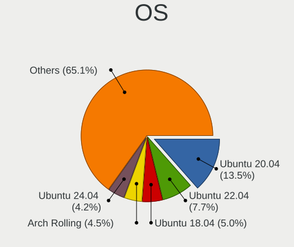

| Name                         | Notebooks | Percent |
|------------------------------|-----------|---------|
| Ubuntu 20.04                 | 750       | 13.48%  |
| Ubuntu 22.04                 | 428       | 7.69%   |
| Ubuntu 18.04                 | 280       | 5.03%   |
| Arch Rolling                 | 248       | 4.46%   |
| Ubuntu 24.04                 | 235       | 4.22%   |
| Pop!_OS 22.04                | 145       | 2.61%   |
| Fedora 40                    | 110       | 1.98%   |
| ArcoLinux Rolling            | 85        | 1.53%   |
| Arch                         | 80        | 1.44%   |
| Fedora 38                    | 79        | 1.42%   |
| Fedora 41                    | 78        | 1.4%    |
| Fedora 39                    | 78        | 1.4%    |
| Fedora 42                    | 76        | 1.37%   |
| Zorin 16                     | 72        | 1.29%   |
| Debian 12                    | 72        | 1.29%   |
| Zorin 17                     | 64        | 1.15%   |
| KDE neon 20.04               | 56        | 1.01%   |
| Pop!_OS 20.04                | 54        | 0.97%   |
| Fedora 36                    | 54        | 0.97%   |
| Fedora 37                    | 53        | 0.95%   |
| EndeavourOS Rolling          | 51        | 0.92%   |
| Pop!_OS 21.04                | 49        | 0.88%   |
| Ubuntu 20.10                 | 46        | 0.83%   |
| Fedora 34                    | 46        | 0.83%   |
| Manjaro                      | 42        | 0.75%   |
| Zorin 15                     | 39        | 0.7%    |
| Ubuntu 19.10                 | 39        | 0.7%    |
| Linux Mint 22.1              | 39        | 0.7%    |
| Ubuntu 21.04                 | 38        | 0.68%   |
| openSUSE Tumbleweed-XXXXXXXX | 38        | 0.68%   |
| Pop!_OS 20.10                | 36        | 0.65%   |
| KDE neon 22.04               | 36        | 0.65%   |
| Fedora 43                    | 36        | 0.65%   |
| Linux Mint 22                | 35        | 0.63%   |
| Debian 11                    | 34        | 0.61%   |
| Ubuntu 23.04                 | 33        | 0.59%   |
| OpenMandriva 4.3             | 33        | 0.59%   |
| OpenMandriva 4.2             | 33        | 0.59%   |
| Ubuntu 19.04                 | 32        | 0.58%   |
| Linux Mint 21.1              | 32        | 0.58%   |

OS Family
---------

OS without a version

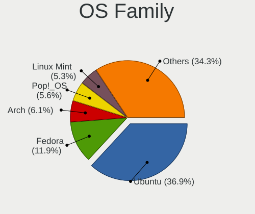

| Name          | Notebooks | Percent |
|---------------|-----------|---------|
| Ubuntu        | 1955      | 36.86%  |
| Fedora        | 632       | 11.92%  |
| Arch          | 321       | 6.05%   |
| Pop!_OS       | 296       | 5.58%   |
| Linux Mint    | 281       | 5.3%    |
| OpenMandriva  | 228       | 4.3%    |
| Zorin         | 183       | 3.45%   |
| Debian        | 155       | 2.92%   |
| Manjaro       | 122       | 2.3%    |
| Kali          | 112       | 2.11%   |
| KDE neon      | 110       | 2.07%   |
| Kubuntu       | 96        | 1.81%   |
| ArcoLinux     | 91        | 1.72%   |
| Elementary    | 67        | 1.26%   |
| EndeavourOS   | 54        | 1.02%   |
| openSUSE      | 46        | 0.87%   |
| Ubuntu Unity  | 44        | 0.83%   |
| Garuda Linux  | 41        | 0.77%   |
| Endless       | 37        | 0.7%    |
| Xubuntu       | 34        | 0.64%   |
| RHEL          | 26        | 0.49%   |
| Xero          | 23        | 0.43%   |
| Nobara        | 23        | 0.43%   |
| MX            | 22        | 0.41%   |
| CachyOS       | 19        | 0.36%   |
| ROSA          | 18        | 0.34%   |
| Ubuntu Budgie | 17        | 0.32%   |
| Parrot        | 17        | 0.32%   |
| Clear Linux   | 17        | 0.32%   |
| Ubuntu MATE   | 16        | 0.3%    |
| Lubuntu       | 15        | 0.28%   |
| Gentoo        | 15        | 0.28%   |
| Void Linux    | 13        | 0.25%   |
| NixOS         | 12        | 0.23%   |
| Artix         | 10        | 0.19%   |
| CentOS        | 9         | 0.17%   |
| Bazzite       | 9         | 0.17%   |
| SteamOS       | 8         | 0.15%   |
| Solus         | 8         | 0.15%   |
| LMDE          | 8         | 0.15%   |

Kernel
------

Version of the Linux kernel

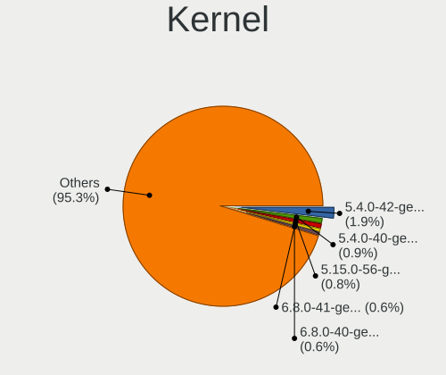

| Version                  | Notebooks | Percent |
|--------------------------|-----------|---------|
| 5.4.0-42-generic         | 112       | 1.87%   |
| 5.4.0-40-generic         | 54        | 0.9%    |
| 5.15.0-56-generic        | 47        | 0.79%   |
| 6.8.0-41-generic         | 35        | 0.58%   |
| 6.8.0-40-generic         | 34        | 0.57%   |
| 5.11.0-27-generic        | 34        | 0.57%   |
| 6.14.2-desktop-3omv2590  | 33        | 0.55%   |
| 5.10.14-desktop-1omv4002 | 33        | 0.55%   |
| 6.8.0-51-generic         | 32        | 0.53%   |
| 6.8.0-31-generic         | 31        | 0.52%   |
| 6.2.0-26-generic         | 30        | 0.5%    |
| 5.4.0-48-generic         | 30        | 0.5%    |
| 5.4.0-26-generic         | 30        | 0.5%    |
| 5.16.7-desktop-1omv4003  | 30        | 0.5%    |
| 6.8.0-52-generic         | 29        | 0.48%   |
| 5.4.0-47-generic         | 29        | 0.48%   |
| 5.4.0-58-generic         | 27        | 0.45%   |
| 5.11.0-7620-generic      | 27        | 0.45%   |
| 6.5.0-14-generic         | 26        | 0.43%   |
| 5.4.0-52-generic         | 26        | 0.43%   |
| 6.9.3-76060903-generic   | 25        | 0.42%   |
| 5.15.0-58-generic        | 25        | 0.42%   |
| 5.4.0-29-generic         | 24        | 0.4%    |
| 5.3.0-28-generic         | 24        | 0.4%    |
| 5.11.0-40-generic        | 23        | 0.38%   |
| 6.8.5-301.fc40.x86_64    | 22        | 0.37%   |
| 6.12.1-desktop-1omv2490  | 22        | 0.37%   |
| 5.4.0-45-generic         | 22        | 0.37%   |
| 5.15.0-46-generic        | 22        | 0.37%   |
| 5.11.0-43-generic        | 22        | 0.37%   |
| 6.5.0-35-generic         | 21        | 0.35%   |
| 5.8.0-53-generic         | 21        | 0.35%   |
| 5.8.0-44-generic         | 21        | 0.35%   |
| 5.8.0-43-generic         | 21        | 0.35%   |
| 5.15.0-52-generic        | 21        | 0.35%   |
| 5.11.0-38-generic        | 21        | 0.35%   |
| 5.11.0-25-generic        | 21        | 0.35%   |
| 6.8.0-45-generic         | 20        | 0.33%   |
| 5.8.0-55-generic         | 20        | 0.33%   |
| 5.8.0-48-generic         | 20        | 0.33%   |

Kernel Family
-------------

Linux kernel without a distro release

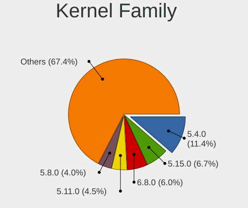

| Version | Notebooks | Percent |
|---------|-----------|---------|
| 5.4.0   | 653       | 11.36%  |
| 5.15.0  | 388       | 6.75%   |
| 6.8.0   | 345       | 6%      |
| 5.11.0  | 260       | 4.52%   |
| 5.8.0   | 229       | 3.98%   |
| 6.5.0   | 176       | 3.06%   |
| 4.15.0  | 153       | 2.66%   |
| 5.13.0  | 152       | 2.64%   |
| 5.19.0  | 145       | 2.52%   |
| 5.3.0   | 144       | 2.5%    |
| 6.2.0   | 130       | 2.26%   |
| 6.1.0   | 99        | 1.72%   |
| 6.14.0  | 95        | 1.65%   |
| 5.0.0   | 91        | 1.58%   |
| 6.11.0  | 89        | 1.55%   |
| 4.18.0  | 67        | 1.17%   |
| 5.10.0  | 63        | 1.1%    |
| 6.14.2  | 45        | 0.78%   |
| 6.2.6   | 36        | 0.63%   |
| 5.10.14 | 33        | 0.57%   |
| 6.9.3   | 32        | 0.56%   |
| 5.16.7  | 31        | 0.54%   |
| 5.14.0  | 30        | 0.52%   |
| 6.12.1  | 26        | 0.45%   |
| 6.12.10 | 25        | 0.43%   |
| 6.8.5   | 23        | 0.4%    |
| 6.4.11  | 22        | 0.38%   |
| 4.4.0   | 19        | 0.33%   |
| 6.17.7  | 18        | 0.31%   |
| 5.17.5  | 18        | 0.31%   |
| 6.5.6   | 17        | 0.3%    |
| 6.10.6  | 17        | 0.3%    |
| 6.0.12  | 17        | 0.3%    |
| 6.0.0   | 17        | 0.3%    |
| 6.6.2   | 16        | 0.28%   |
| 6.2.9   | 15        | 0.26%   |
| 4.19.0  | 15        | 0.26%   |
| 6.8.7   | 14        | 0.24%   |
| 6.8.11  | 14        | 0.24%   |
| 6.7.4   | 14        | 0.24%   |

Kernel Major Ver.
-----------------

Linux kernel major version

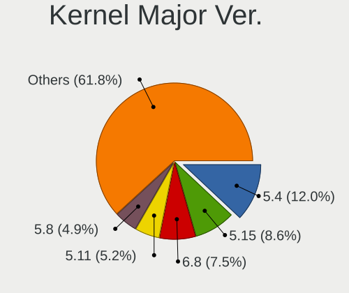

| Version | Notebooks | Percent |
|---------|-----------|---------|
| 5.4     | 680       | 12%     |
| 5.15    | 487       | 8.6%    |
| 6.8     | 426       | 7.52%   |
| 5.11    | 293       | 5.17%   |
| 5.8     | 276       | 4.87%   |
| 6.5     | 249       | 4.4%    |
| 6.2     | 224       | 3.95%   |
| 5.13    | 194       | 3.42%   |
| 5.19    | 192       | 3.39%   |
| 6.14    | 184       | 3.25%   |
| 6.1     | 176       | 3.11%   |
| 6.11    | 164       | 2.89%   |
| 5.3     | 164       | 2.89%   |
| 4.15    | 153       | 2.7%    |
| 6.12    | 151       | 2.67%   |
| 5.10    | 151       | 2.67%   |
| 6.6     | 121       | 2.14%   |
| 6.0     | 99        | 1.75%   |
| 6.9     | 95        | 1.68%   |
| 5.0     | 93        | 1.64%   |
| 6.10    | 88        | 1.55%   |
| 5.16    | 83        | 1.47%   |
| 6.4     | 81        | 1.43%   |
| 6.17    | 78        | 1.38%   |
| 4.18    | 70        | 1.24%   |
| 5.17    | 69        | 1.22%   |
| 6.7     | 67        | 1.18%   |
| 5.14    | 66        | 1.17%   |
| 5.18    | 51        | 0.9%    |
| 6.15    | 50        | 0.88%   |
| 6.3     | 49        | 0.86%   |
| 5.12    | 45        | 0.79%   |
| 6.13    | 44        | 0.78%   |
| 5.9     | 43        | 0.76%   |
| 5.7     | 40        | 0.71%   |
| 6.16    | 35        | 0.62%   |
| 5.6     | 27        | 0.48%   |
| 5.5     | 22        | 0.39%   |
| 4.19    | 21        | 0.37%   |
| 4.4     | 20        | 0.35%   |

Arch
----

OS architecture (x86_64, i586, etc.)

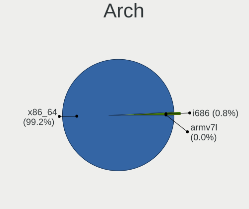

| Name   | Notebooks | Percent |
|--------|-----------|---------|
| x86_64 | 5009      | 99.17%  |
| i686   | 41        | 0.81%   |
| armv7l | 1         | 0.02%   |

DE
--

Desktop Environment

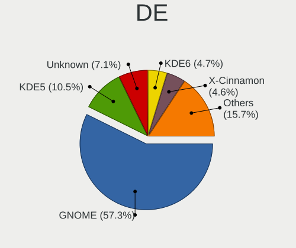

| Name                 | Notebooks | Percent |
|----------------------|-----------|---------|
| GNOME                | 3034      | 57.32%  |
| KDE5                 | 556       | 10.5%   |
| Unknown              | 378       | 7.14%   |
| KDE6                 | 249       | 4.7%    |
| X-Cinnamon           | 243       | 4.59%   |
| XFCE                 | 238       | 4.5%    |
| KDE                  | 89        | 1.68%   |
| Pantheon             | 65        | 1.23%   |
| MATE                 | 51        | 0.96%   |
| Hyprland             | 50        | 0.94%   |
| Unity                | 46        | 0.87%   |
| i3                   | 37        | 0.7%    |
| LXQt                 | 35        | 0.66%   |
| Cinnamon             | 32        | 0.6%    |
| Budgie               | 26        | 0.49%   |
| GNOME Flashback      | 22        | 0.42%   |
| KDE4                 | 20        | 0.38%   |
| LXDE                 | 16        | 0.3%    |
| awesome              | 11        | 0.21%   |
| sway                 | 10        | 0.19%   |
| Deepin               | 10        | 0.19%   |
| bspwm                | 10        | 0.19%   |
| qtile                | 9         | 0.17%   |
| GNOME Classic        | 9         | 0.17%   |
| COSMIC               | 9         | 0.17%   |
| dwm                  | 6         | 0.11%   |
| niri                 | 5         | 0.09%   |
| LeftWM               | 4         | 0.08%   |
| xmonad               | 3         | 0.06%   |
| openbox              | 3         | 0.06%   |
| lightdm-xsession     | 2         | 0.04%   |
| ICEWM                | 2         | 0.04%   |
| herbstluftwm         | 2         | 0.04%   |
| DesQ:Wayfire:wlroots | 2         | 0.04%   |
| Yaru:ubuntu:GNOME    | 1         | 0.02%   |
| Xsession             | 1         | 0.02%   |
| xinitrc              | 1         | 0.02%   |
| sway:wlroots         | 1         | 0.02%   |
| stumpwm              | 1         | 0.02%   |
| i3-with-shmlog       | 1         | 0.02%   |

Display Server
--------------

X11 or Wayland

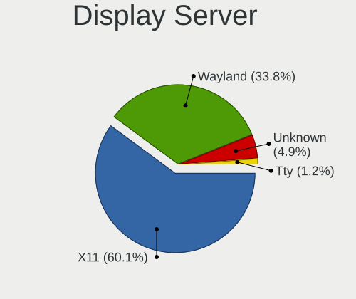

| Name    | Notebooks | Percent |
|---------|-----------|---------|
| X11     | 3161      | 60.13%  |
| Wayland | 1776      | 33.78%  |
| Unknown | 256       | 4.87%   |
| Tty     | 64        | 1.22%   |

Display Manager
---------------

SDDM, LightDM, etc.

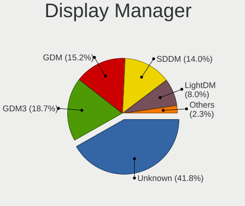

| Name                  | Notebooks | Percent |
|-----------------------|-----------|---------|
| Unknown               | 2208      | 41.81%  |
| GDM3                  | 989       | 18.73%  |
| GDM                   | 803       | 15.21%  |
| SDDM                  | 738       | 13.97%  |
| LightDM               | 422       | 7.99%   |
| TDM                   | 79        | 1.5%    |
| XDM                   | 9         | 0.17%   |
| LY-DM                 | 7         | 0.13%   |
| KDM                   | 7         | 0.13%   |
| GREETD                | 5         | 0.09%   |
| LXDM                  | 4         | 0.08%   |
| Ly                    | 3         | 0.06%   |
| COSMIC-GREETER        | 3         | 0.06%   |
| SLiM                  | 2         | 0.04%   |
| SLIMSKI               | 1         | 0.02%   |
| DISPLAY-MANAGER-START | 1         | 0.02%   |

OS Lang
-------

Language

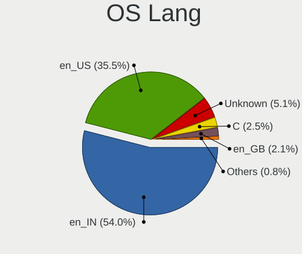

| Lang             | Notebooks | Percent |
|------------------|-----------|---------|
| en_IN            | 2844      | 53.99%  |
| en_US            | 1871      | 35.52%  |
| Unknown          | 268       | 5.09%   |
| C                | 131       | 2.49%   |
| en_GB            | 110       | 2.09%   |
| en_AG            | 10        | 0.19%   |
| en_CA            | 4         | 0.08%   |
| POSIX            | 3         | 0.06%   |
| mr_IN            | 3         | 0.06%   |
| C.UTF8           | 3         | 0.06%   |
| zh_TW            | 2         | 0.04%   |
| nl_NL            | 2         | 0.04%   |
| en_IE            | 2         | 0.04%   |
| en_AU            | 2         | 0.04%   |
| uk_UA            | 1         | 0.02%   |
| pl_PL            | 1         | 0.02%   |
| ks_IN            | 1         | 0.02%   |
| hi_IN            | 1         | 0.02%   |
| fr_FR            | 1         | 0.02%   |
| es_ES            | 1         | 0.02%   |
| en_US.UTF-*      | 1         | 0.02%   |
| en_US.ISO-8859-1 | 1         | 0.02%   |
| en_SG            | 1         | 0.02%   |
| en_HK            | 1         | 0.02%   |
| en_BW            | 1         | 0.02%   |
| Default          | 1         | 0.02%   |
| aa_DJ            | 1         | 0.02%   |

Boot Mode
---------

EFI or BIOS

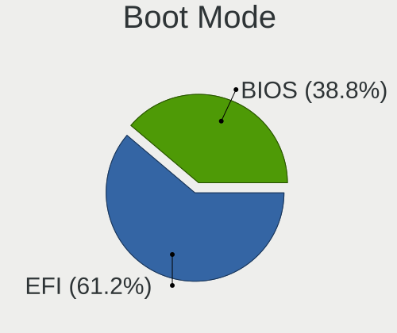

| Mode | Notebooks | Percent |
|------|-----------|---------|
| EFI  | 3164      | 61.19%  |
| BIOS | 2007      | 38.81%  |

Filesystem
----------

Type of filesystem

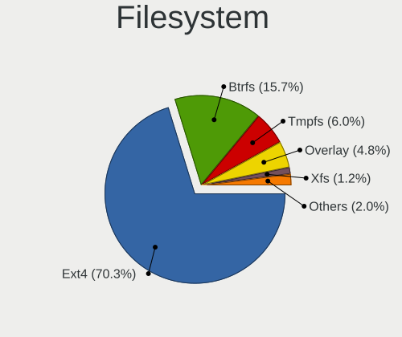

| Type    | Notebooks | Percent |
|---------|-----------|---------|
| Ext4    | 3681      | 70.26%  |
| Btrfs   | 825       | 15.75%  |
| Tmpfs   | 314       | 5.99%   |
| Overlay | 250       | 4.77%   |
| Xfs     | 62        | 1.18%   |
| Unknown | 59        | 1.13%   |
| Zfs     | 19        | 0.36%   |
| F2fs    | 14        | 0.27%   |
| Ext2    | 8         | 0.15%   |
| Ext3    | 6         | 0.11%   |
| Aufs    | 1         | 0.02%   |

Part. scheme
------------

Scheme of partitioning

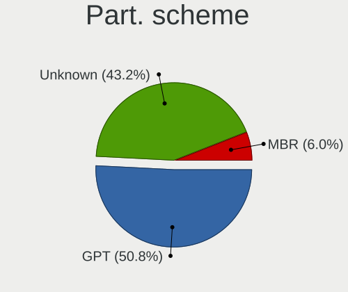

| Type    | Notebooks | Percent |
|---------|-----------|---------|
| GPT     | 2631      | 50.8%   |
| Unknown | 2239      | 43.23%  |
| MBR     | 309       | 5.97%   |

Dual Boot with Linux/BSD
------------------------

Hosting more than one Linux/BSD

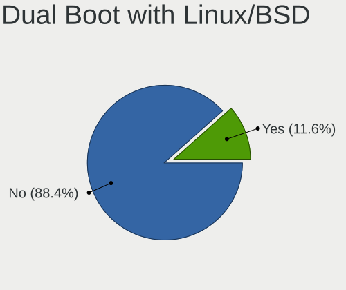

| Dual boot | Notebooks | Percent |
|-----------|-----------|---------|
| No        | 4541      | 88.42%  |
| Yes       | 595       | 11.58%  |

Dual Boot (Win)
---------------

Hosting Linux and Windows

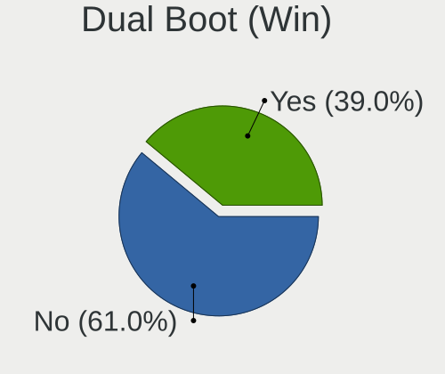

| Dual boot | Notebooks | Percent |
|-----------|-----------|---------|
| No        | 3135      | 61.04%  |
| Yes       | 2001      | 38.96%  |

Board
-----

Vendor
------

Motherboard manufacturer

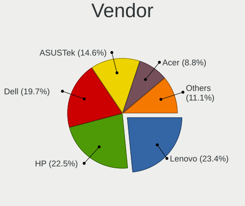

| Name                     | Notebooks | Percent |
|--------------------------|-----------|---------|
| Lenovo                   | 1183      | 23.44%  |
| Hewlett-Packard          | 1134      | 22.46%  |
| Dell                     | 992       | 19.65%  |
| ASUSTek Computer         | 735       | 14.56%  |
| Acer                     | 444       | 8.8%    |
| MSI                      | 96        | 1.9%    |
| Sony                     | 59        | 1.17%   |
| Timi                     | 58        | 1.15%   |
| Apple                    | 49        | 0.97%   |
| Infinix                  | 42        | 0.83%   |
| Toshiba                  | 41        | 0.81%   |
| Samsung Electronics      | 35        | 0.69%   |
| AVITA                    | 23        | 0.46%   |
| HONOR                    | 16        | 0.32%   |
| Fujitsu                  | 14        | 0.28%   |
| HUAWEI                   | 10        | 0.2%    |
| HCL Infosystems Limited  | 10        | 0.2%    |
| Google                   | 9         | 0.18%   |
| realme                   | 8         | 0.16%   |
| Alienware                | 7         | 0.14%   |
| Valve                    | 6         | 0.12%   |
| LG Electronics           | 6         | 0.12%   |
| Gateway                  | 6         | 0.12%   |
| Chuwi                    | 6         | 0.12%   |
| Unknown                  | 6         | 0.12%   |
| TECNO Mobile Limited     | 5         | 0.1%    |
| Intel                    | 5         | 0.1%    |
| eMachines                | 4         | 0.08%   |
| ITI LIMITED              | 3         | 0.06%   |
| Zebronics                | 2         | 0.04%   |
| Razer                    | 2         | 0.04%   |
| Notebook                 | 2         | 0.04%   |
| Motorola                 | 2         | 0.04%   |
| MICROMAX                 | 2         | 0.04%   |
| Flipkart India Pvt.      | 2         | 0.04%   |
| Dynabook                 | 2         | 0.04%   |
| Coconics Private Limited | 2         | 0.04%   |
| Xco One                  | 1         | 0.02%   |
| WIPRO                    | 1         | 0.02%   |
| System76                 | 1         | 0.02%   |

Model
-----

Motherboard model

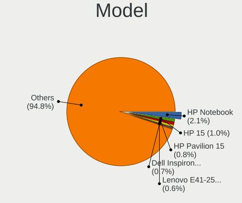

| Name                                 | Notebooks | Percent |
|--------------------------------------|-----------|---------|
| HP Notebook                          | 108       | 2.14%   |
| HP 15                                | 48        | 0.95%   |
| HP Pavilion 15                       | 41        | 0.81%   |
| Dell Inspiron 3542                   | 37        | 0.73%   |
| Lenovo E41-25 81FS                   | 29        | 0.57%   |
| HP Pavilion g6                       | 29        | 0.57%   |
| HP Laptop 15-bs0xx                   | 28        | 0.55%   |
| Unknown                              | 27        | 0.53%   |
| HP Pavilion Notebook                 | 26        | 0.52%   |
| Dell Inspiron 15-3567                | 24        | 0.48%   |
| Timi Mi NoteBook Ultra               | 23        | 0.46%   |
| Dell Inspiron 5570                   | 23        | 0.46%   |
| HP Pavilion Gaming Laptop 15-ec2xxx  | 22        | 0.44%   |
| Dell Vostro 15-3568                  | 21        | 0.42%   |
| Dell Inspiron 3521                   | 21        | 0.42%   |
| Acer Aspire A715-75G                 | 21        | 0.42%   |
| Lenovo IdeaPad 330-15IKB 81DE        | 19        | 0.38%   |
| Lenovo G50-80 80E5                   | 19        | 0.38%   |
| ASUS TUF Gaming FX505DT_FX505DT      | 19        | 0.38%   |
| Lenovo IdeaPad 320-15ISK 80XH        | 17        | 0.34%   |
| HP Pavilion Gaming Laptop 15-ec0xxx  | 17        | 0.34%   |
| HP Laptop 15-da0xxx                  | 17        | 0.34%   |
| Acer Aspire A715-51G                 | 17        | 0.34%   |
| HP Victus by Gaming Laptop 15-fb0xxx | 16        | 0.32%   |
| Dell Vostro 3480                     | 16        | 0.32%   |
| Dell Inspiron 5559                   | 16        | 0.32%   |
| Acer Aspire A515-57G                 | 16        | 0.32%   |
| HP Victus by Laptop 16-e0xxx         | 15        | 0.3%    |
| Lenovo IdeaPad Gaming 3 15IHU6 82K1  | 14        | 0.28%   |
| Lenovo IdeaPad 320-15IKB 80XL        | 14        | 0.28%   |
| HP Pavilion dv6                      | 14        | 0.28%   |
| Dell Vostro 3578                     | 14        | 0.28%   |
| Dell Inspiron N5010                  | 14        | 0.28%   |
| ASUS X510UNR                         | 14        | 0.28%   |
| Timi Mi NoteBook Pro                 | 13        | 0.26%   |
| HP Laptop 15-bw0xx                   | 13        | 0.26%   |
| Dell Inspiron 3543                   | 13        | 0.26%   |
| Dell Inspiron 1545                   | 13        | 0.26%   |
| Acer Nitro AN515-58                  | 13        | 0.26%   |
| Lenovo ThinkBook 14-IML 20RV         | 12        | 0.24%   |

Model Family
------------

Motherboard model prefix

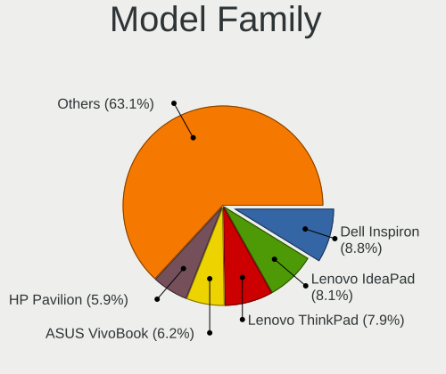

| Name              | Notebooks | Percent |
|-------------------|-----------|---------|
| Dell Inspiron     | 444       | 8.8%    |
| Lenovo IdeaPad    | 407       | 8.06%   |
| Lenovo ThinkPad   | 398       | 7.88%   |
| ASUS VivoBook     | 315       | 6.24%   |
| HP Pavilion       | 297       | 5.88%   |
| HP Laptop         | 263       | 5.21%   |
| Acer Aspire       | 250       | 4.95%   |
| Dell Latitude     | 235       | 4.66%   |
| Dell Vostro       | 176       | 3.49%   |
| ASUS ASUS         | 120       | 2.38%   |
| HP Notebook       | 109       | 2.16%   |
| ASUS ROG          | 91        | 1.8%    |
| HP EliteBook      | 85        | 1.68%   |
| HP ProBook        | 83        | 1.64%   |
| Acer Nitro        | 68        | 1.35%   |
| Lenovo Legion     | 58        | 1.15%   |
| Lenovo ThinkBook  | 54        | 1.07%   |
| ASUS TUF          | 52        | 1.03%   |
| HP 15             | 50        | 0.99%   |
| Acer Swift        | 49        | 0.97%   |
| HP Victus         | 47        | 0.93%   |
| Timi Mi           | 45        | 0.89%   |
| Dell XPS          | 44        | 0.87%   |
| Toshiba Satellite | 36        | 0.71%   |
| Dell Precision    | 35        | 0.69%   |
| HP OMEN           | 34        | 0.67%   |
| Acer Predator     | 31        | 0.61%   |
| Lenovo E41-25     | 29        | 0.57%   |
| Unknown           | 27        | 0.53%   |
| Infinix INBook    | 26        | 0.52%   |
| ASUS ZenBook      | 25        | 0.5%    |
| Lenovo G50-80     | 20        | 0.4%    |
| HP ZBook          | 20        | 0.4%    |
| HP ENVY           | 20        | 0.4%    |
| HP 245            | 20        | 0.4%    |
| Dell G15          | 18        | 0.36%   |
| MSI Modern        | 17        | 0.34%   |
| MSI GF63          | 17        | 0.34%   |
| Lenovo LOQ        | 17        | 0.34%   |
| Dell G3           | 17        | 0.34%   |

MFG Year
--------

Motherboard manufacture year

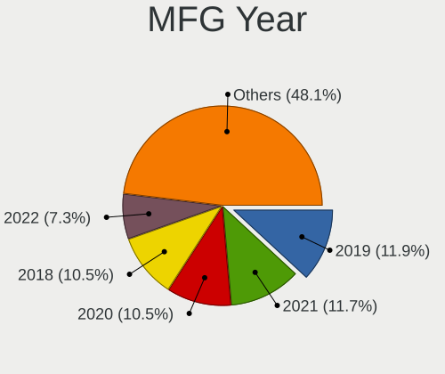

| Year    | Notebooks | Percent |
|---------|-----------|---------|
| 2019    | 600       | 11.89%  |
| 2021    | 592       | 11.73%  |
| 2020    | 530       | 10.5%   |
| 2018    | 529       | 10.48%  |
| 2022    | 370       | 7.33%   |
| 2017    | 370       | 7.33%   |
| 2023    | 269       | 5.33%   |
| 2013    | 266       | 5.27%   |
| 2016    | 258       | 5.11%   |
| 2014    | 222       | 4.4%    |
| 2011    | 221       | 4.38%   |
| 2012    | 217       | 4.3%    |
| 2015    | 189       | 3.74%   |
| 2010    | 128       | 2.54%   |
| 2024    | 94        | 1.86%   |
| 2008    | 78        | 1.55%   |
| 2009    | 55        | 1.09%   |
| 2025    | 28        | 0.55%   |
| 2006    | 15        | 0.3%    |
| 2007    | 13        | 0.26%   |
| 2005    | 2         | 0.04%   |
| 2003    | 1         | 0.02%   |
| Unknown | 1         | 0.02%   |

Form Factor
-----------

Physical design of the computer

| Name     | Notebooks | Percent |
|----------|-----------|---------|
| Notebook | 5048      | 100%    |

Secure Boot
-----------

Enabled or disabled

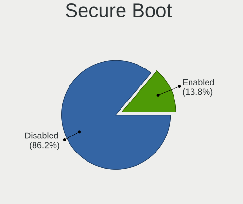

| State    | Notebooks | Percent |
|----------|-----------|---------|
| Disabled | 4403      | 86.16%  |
| Enabled  | 707       | 13.84%  |

Coreboot
--------

Have coreboot on board

| Used | Notebooks | Percent |
|------|-----------|---------|
| No   | 5030      | 99.64%  |
| Yes  | 18        | 0.36%   |

RAM Size
--------

Total RAM memory

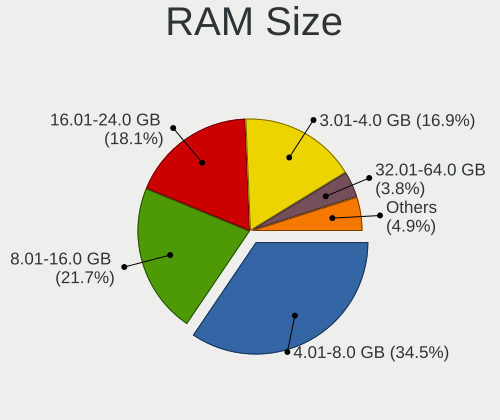

| Size in GB  | Notebooks | Percent |
|-------------|-----------|---------|
| 4.01-8.0    | 1772      | 34.47%  |
| 8.01-16.0   | 1117      | 21.73%  |
| 16.01-24.0  | 932       | 18.13%  |
| 3.01-4.0    | 870       | 16.93%  |
| 32.01-64.0  | 195       | 3.79%   |
| 1.01-2.0    | 104       | 2.02%   |
| 24.01-32.0  | 85        | 1.65%   |
| 2.01-3.0    | 32        | 0.62%   |
| 64.01-256.0 | 25        | 0.49%   |
| 0.51-1.0    | 7         | 0.14%   |
| 0.01-0.5    | 1         | 0.02%   |

RAM Used
--------

Used RAM memory

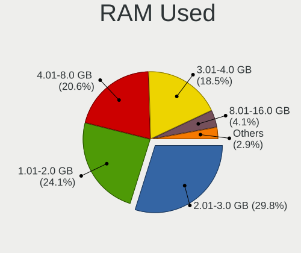

| Used GB    | Notebooks | Percent |
|------------|-----------|---------|
| 2.01-3.0   | 1668      | 29.82%  |
| 1.01-2.0   | 1347      | 24.08%  |
| 4.01-8.0   | 1153      | 20.62%  |
| 3.01-4.0   | 1035      | 18.51%  |
| 8.01-16.0  | 230       | 4.11%   |
| 0.51-1.0   | 134       | 2.4%    |
| 0.01-0.5   | 14        | 0.25%   |
| 16.01-24.0 | 10        | 0.18%   |
| 24.01-32.0 | 2         | 0.04%   |

Total Drives
------------

Number of drives on board

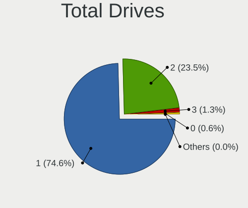

| Drives | Notebooks | Percent |
|--------|-----------|---------|
| 1      | 3808      | 74.58%  |
| 2      | 1201      | 23.52%  |
| 3      | 65        | 1.27%   |
| 0      | 29        | 0.57%   |
| 4      | 2         | 0.04%   |
| 5      | 1         | 0.02%   |

Has CD-ROM
----------

Has CD-ROM on board

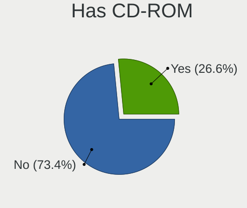

| Presented | Notebooks | Percent |
|-----------|-----------|---------|
| No        | 3729      | 73.45%  |
| Yes       | 1348      | 26.55%  |

Has Ethernet
------------

Has Ethernet on board

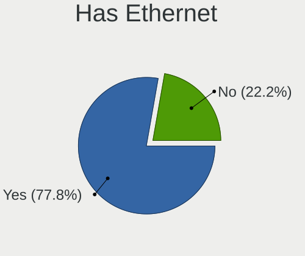

| Presented | Notebooks | Percent |
|-----------|-----------|---------|
| Yes       | 3939      | 77.77%  |
| No        | 1126      | 22.23%  |

Has WiFi
--------

Has WiFi module

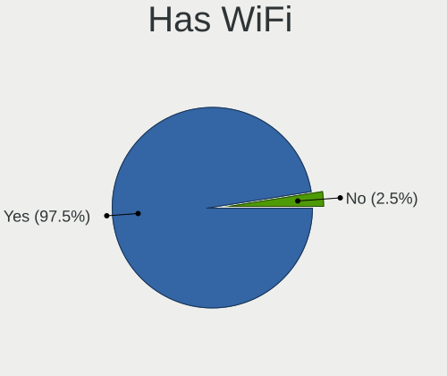

| Presented | Notebooks | Percent |
|-----------|-----------|---------|
| Yes       | 4925      | 97.51%  |
| No        | 126       | 2.49%   |

Has Bluetooth
-------------

Has Bluetooth module

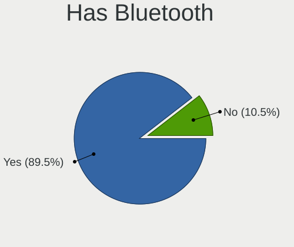

| Presented | Notebooks | Percent |
|-----------|-----------|---------|
| Yes       | 4558      | 89.51%  |
| No        | 534       | 10.49%  |

Location
--------

Country
-------

Geographic location (country)

| Country | Notebooks | Percent |
|---------|-----------|---------|
| India   | 5048      | 100%    |

City
----

Geographic location (city)

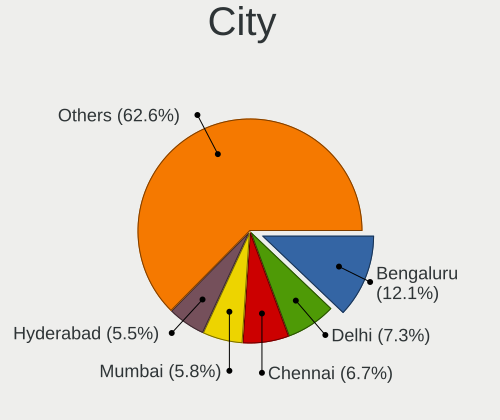

| City          | Notebooks | Percent |
|---------------|-----------|---------|
| Bengaluru     | 656       | 12.11%  |
| Delhi         | 393       | 7.25%   |
| Chennai       | 363       | 6.7%    |
| Mumbai        | 316       | 5.83%   |
| Hyderabad     | 298       | 5.5%    |
| Pune          | 277       | 5.11%   |
| Kolkata       | 193       | 3.56%   |
| New Delhi     | 174       | 3.21%   |
| Ahmedabad     | 133       | 2.45%   |
| Lucknow       | 116       | 2.14%   |
| Kochi         | 104       | 1.92%   |
| Patna         | 100       | 1.85%   |
| Jaipur        | 97        | 1.79%   |
| Coimbatore    | 75        | 1.38%   |
| Indore        | 67        | 1.24%   |
| Gurgaon       | 67        | 1.24%   |
| Bhopal        | 60        | 1.11%   |
| Ernakulam     | 58        | 1.07%   |
| Bhubaneswar   | 55        | 1.02%   |
| Trivandrum    | 52        | 0.96%   |
| Thrissur      | 48        | 0.89%   |
| Ludhiana      | 45        | 0.83%   |
| Navi Mumbai   | 44        | 0.81%   |
| Surat         | 43        | 0.79%   |
| Nagpur        | 41        | 0.76%   |
| Guwahati      | 41        | 0.76%   |
| Chandigarh    | 36        | 0.66%   |
| Noida         | 32        | 0.59%   |
| Malappuram    | 32        | 0.59%   |
| Kozhikode     | 29        | 0.54%   |
| Ghaziabad     | 29        | 0.54%   |
| Kanpur        | 28        | 0.52%   |
| Dehradun      | 27        | 0.5%    |
| Mohali        | 24        | 0.44%   |
| Vadodara      | 22        | 0.41%   |
| Visakhapatnam | 21        | 0.39%   |
| Mangalore     | 21        | 0.39%   |
| Thane         | 20        | 0.37%   |
| Varanasi      | 19        | 0.35%   |
| Mysore        | 18        | 0.33%   |

Drives
------

Drive Vendor
------------

Hard drive vendors

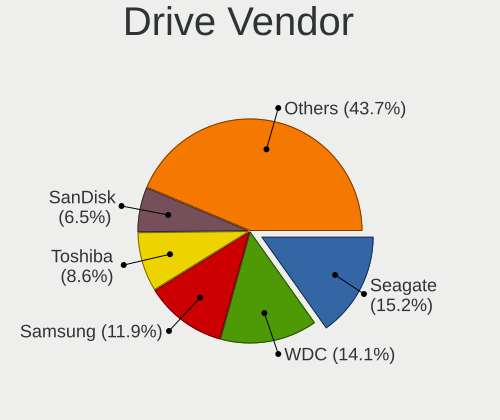

| Vendor                       | Notebooks | Drives | Percent |
|------------------------------|-----------|--------|---------|
| Seagate                      | 941       | 1173   | 15.19%  |
| WDC                          | 874       | 1071   | 14.11%  |
| Samsung Electronics          | 737       | 918    | 11.89%  |
| Toshiba                      | 535       | 614    | 8.63%   |
| SanDisk                      | 404       | 512    | 6.52%   |
| Micron Technology            | 353       | 425    | 5.7%    |
| SK hynix                     | 303       | 364    | 4.89%   |
| Intel                        | 267       | 352    | 4.31%   |
| Crucial                      | 230       | 286    | 3.71%   |
| HGST                         | 198       | 220    | 3.2%    |
| Kingston                     | 195       | 232    | 3.15%   |
| KIOXIA                       | 142       | 169    | 2.29%   |
| Unknown                      | 106       | 129    | 1.71%   |
| Hitachi                      | 91        | 109    | 1.47%   |
| Micron/Crucial Technology    | 54        | 59     | 0.87%   |
| China                        | 54        | 64     | 0.87%   |
| FORESEE                      | 39        | 47     | 0.63%   |
| Unknown                      | 36        | 45     | 0.58%   |
| Silicon Motion               | 35        | 41     | 0.56%   |
| Shenzhen Longsys Electronics | 35        | 45     | 0.56%   |
| A-DATA Technology            | 35        | 37     | 0.56%   |
| Kingston Technology Company  | 32        | 35     | 0.52%   |
| Apple                        | 30        | 40     | 0.48%   |
| EVM                          | 26        | 29     | 0.42%   |
| Phison                       | 21        | 28     | 0.34%   |
| UMIS                         | 20        | 25     | 0.32%   |
| Phison Electronics           | 20        | 22     | 0.32%   |
| CONSISTENT                   | 19        | 21     | 0.31%   |
| LITEON                       | 18        | 22     | 0.29%   |
| Hewlett-Packard              | 15        | 18     | 0.24%   |
| Realtek Semiconductor        | 13        | 17     | 0.21%   |
| Union Memory (Shenzhen)      | 11        | 18     | 0.18%   |
| SPCC                         | 11        | 12     | 0.18%   |
| MAXIO Technology (Hangzhou)  | 11        | 12     | 0.18%   |
| JMicron Technology           | 11        | 11     | 0.18%   |
| Gigabyte Technology          | 11        | 13     | 0.18%   |
| Acer                         | 10        | 11     | 0.16%   |
| Transcend                    | 9         | 13     | 0.15%   |
| Fujitsu                      | 9         | 9      | 0.15%   |
| Zebronics                    | 8         | 8      | 0.13%   |

Drive Model
-----------

Hard drive models

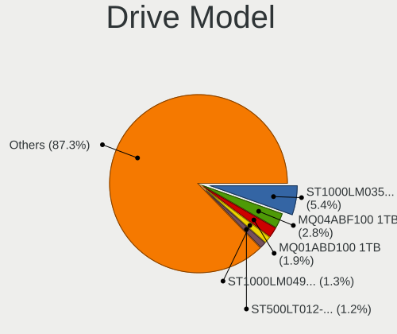

| Model                                              | Notebooks | Percent |
|----------------------------------------------------|-----------|---------|
| Seagate ST1000LM035-1RK172 1TB                     | 345       | 5.42%   |
| Toshiba MQ04ABF100 1TB                             | 180       | 2.83%   |
| Toshiba MQ01ABD100 1TB                             | 124       | 1.95%   |
| Seagate ST1000LM049-2GH172 1TB                     | 84        | 1.32%   |
| Seagate ST500LT012-1DG142 500GB                    | 77        | 1.21%   |
| Seagate ST1000LM024 HN-M101MBB 1TB                 | 76        | 1.19%   |
| Crucial CT240BX500SSD1 240GB                       | 70        | 1.1%    |
| Micron 2450_MTFDKBA512TFK 512GB                    | 69        | 1.08%   |
| SanDisk NVMe SSD Drive 512GB                       | 62        | 0.97%   |
| Toshiba MQ01ABF050 500GB                           | 57        | 0.89%   |
| WDC WD10SPZX-60Z10T0 1TB                           | 54        | 0.85%   |
| Intel NVMe SSD Drive 512GB                         | 48        | 0.75%   |
| HGST HTS541010A9E680 1TB                           | 48        | 0.75%   |
| Samsung NVMe SSD Controller SM981/PM981/PM983 1TB  | 47        | 0.74%   |
| WDC WD10SPZX-24Z10 1TB                             | 43        | 0.67%   |
| Seagate ST1000LM048-2E7172 1TB                     | 43        | 0.67%   |
| WDC WDS240G2G0A-00JH30 240GB SSD                   | 40        | 0.63%   |
| Kingston SA400S37240G 240GB SSD                    | 40        | 0.63%   |
| Seagate ST9500325AS 500GB                          | 39        | 0.61%   |
| Seagate ST2000LM007-1R8174 2TB                     | 39        | 0.61%   |
| Samsung NVMe SSD Controller PM9A1/PM9A3/980PRO 1TB | 39        | 0.61%   |
| Intel SSDPEKNW512G8 512GB                          | 39        | 0.61%   |
| SanDisk NVMe SSD Drive 256GB                       | 37        | 0.58%   |
| Intel SSDPEKNU512GZ 512GB                          | 37        | 0.58%   |
| HGST HTS721010A9E630 1TB                           | 37        | 0.58%   |
| Sandisk WD Blue SN550 NVMe SSD 1024GB              | 36        | 0.57%   |
| Unknown                                            | 36        | 0.57%   |
| WDC WD10JPVX-60JC3T1 1TB                           | 34        | 0.53%   |
| WDC WD10SPZX-21Z10T0 1TB                           | 33        | 0.52%   |
| Samsung NVMe SSD Drive 512GB                       | 33        | 0.52%   |
| HGST HTS545050A7E680 500GB                         | 33        | 0.52%   |
| Micron 2210_MTFDHBA512QFD 512GB                    | 31        | 0.49%   |
| SK hynix NVMe SSD Drive 512GB                      | 30        | 0.47%   |
| Samsung MZVL4512HBLU-00BTW 512GB                   | 30        | 0.47%   |
| Crucial CT480BX500SSD1 480GB                       | 30        | 0.47%   |
| Micron/Crucial P2 NVMe PCIe SSD 2TB                | 29        | 0.46%   |
| Micron 2400_MTFDKBA512QFM 512GB                    | 29        | 0.46%   |
| WDC WD10JPVX-60JC3T0 1TB                           | 28        | 0.44%   |
| Intel SSD 660P Series 512GB                        | 28        | 0.44%   |
| WDC WDS240G2G0B-00EPW0 240GB SSD                   | 27        | 0.42%   |

HDD Vendor
----------

Hard disk drive vendors

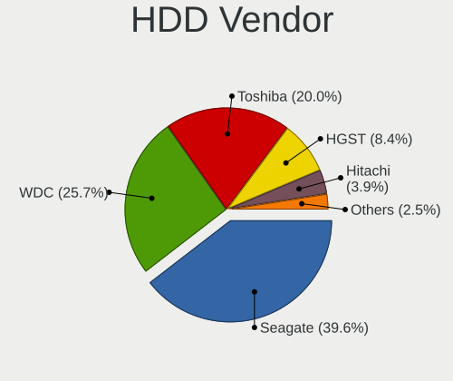

| Vendor              | Notebooks | Drives | Percent |
|---------------------|-----------|--------|---------|
| Seagate             | 928       | 1157   | 39.56%  |
| WDC                 | 602       | 717    | 25.66%  |
| Toshiba             | 469       | 531    | 19.99%  |
| HGST                | 198       | 220    | 8.44%   |
| Hitachi             | 91        | 109    | 3.88%   |
| Unknown             | 14        | 15     | 0.6%    |
| Samsung Electronics | 9         | 9      | 0.38%   |
| Fujitsu             | 9         | 9      | 0.38%   |
| External            | 6         | 8      | 0.26%   |
| Apple               | 5         | 5      | 0.21%   |
| TO Exter            | 4         | 4      | 0.17%   |
| Hewlett-Packard     | 4         | 5      | 0.17%   |
| MARSHAL             | 3         | 3      | 0.13%   |
| USB3.0              | 1         | 1      | 0.04%   |
| StoreJet            | 1         | 1      | 0.04%   |
| JMicron Technology  | 1         | 1      | 0.04%   |
| Unknown             | 1         | 1      | 0.04%   |

SSD Vendor
----------

Solid state drive vendors

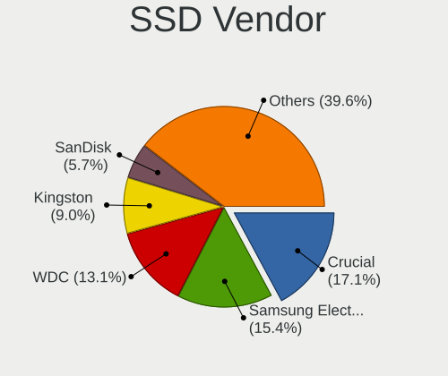

| Vendor              | Notebooks | Drives | Percent |
|---------------------|-----------|--------|---------|
| Crucial             | 201       | 253    | 17.14%  |
| Samsung Electronics | 181       | 222    | 15.43%  |
| WDC                 | 154       | 178    | 13.13%  |
| Kingston            | 106       | 138    | 9.04%   |
| SanDisk             | 67        | 86     | 5.71%   |
| China               | 53        | 63     | 4.52%   |
| SK hynix            | 43        | 57     | 3.67%   |
| Micron Technology   | 27        | 32     | 2.3%    |
| A-DATA Technology   | 26        | 27     | 2.22%   |
| EVM                 | 24        | 27     | 2.05%   |
| Unknown             | 23        | 29     | 1.96%   |
| Intel               | 21        | 23     | 1.79%   |
| FORESEE             | 21        | 28     | 1.79%   |
| Apple               | 20        | 24     | 1.71%   |
| CONSISTENT          | 18        | 20     | 1.53%   |
| LITEON              | 16        | 20     | 1.36%   |
| Toshiba             | 13        | 14     | 1.11%   |
| Hewlett-Packard     | 9         | 12     | 0.77%   |
| Gigabyte Technology | 9         | 10     | 0.77%   |
| Acer                | 9         | 10     | 0.77%   |
| Zebronics           | 8         | 8      | 0.68%   |
| Seagate             | 8         | 8      | 0.68%   |
| SPCC                | 7         | 8      | 0.6%    |
| Netac               | 7         | 8      | 0.6%    |
| Lexar               | 7         | 8      | 0.6%    |
| Aarvex              | 7         | 9      | 0.6%    |
| Transcend           | 6         | 10     | 0.51%   |
| PNY                 | 5         | 7      | 0.43%   |
| Unknown             | 4         | 4      | 0.34%   |
| Maxtor              | 4         | 6      | 0.34%   |
| HS-SSD-E100         | 4         | 4      | 0.34%   |
| POWER               | 3         | 3      | 0.26%   |
| geonix              | 3         | 3      | 0.26%   |
| ESSENCORE           | 3         | 4      | 0.26%   |
| Ant                 | 3         | 5      | 0.26%   |
| Team                | 2         | 2      | 0.17%   |
| StoreJet            | 2         | 2      | 0.17%   |
| SCUDA               | 2         | 3      | 0.17%   |
| Phison              | 2         | 2      | 0.17%   |
| OSCOO               | 2         | 4      | 0.17%   |

Drive Kind
----------

HDD or SSD

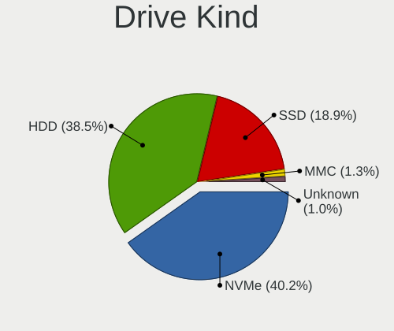

| Kind    | Notebooks | Drives | Percent |
|---------|-----------|--------|---------|
| NVMe    | 2414      | 3163   | 40.2%   |
| HDD     | 2314      | 2796   | 38.53%  |
| SSD     | 1135      | 1428   | 18.9%   |
| MMC     | 79        | 100    | 1.32%   |
| Unknown | 63        | 73     | 1.05%   |

Drive Connector
---------------

SATA, SAS, NVMe, etc.

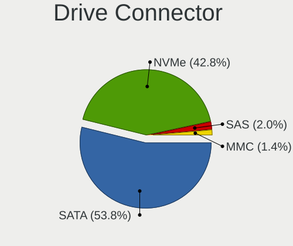

| Type | Notebooks | Drives | Percent |
|------|-----------|--------|---------|
| SATA | 3038      | 4176   | 53.85%  |
| NVMe | 2414      | 3159   | 42.79%  |
| SAS  | 111       | 125    | 1.97%   |
| MMC  | 79        | 100    | 1.4%    |

Drive Size
----------

Size of hard drive

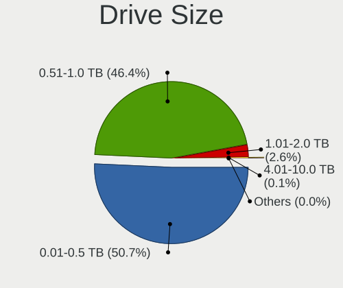

| Size in TB | Notebooks | Drives | Percent |
|------------|-----------|--------|---------|
| 0.01-0.5   | 1717      | 2170   | 50.72%  |
| 0.51-1.0   | 1570      | 1942   | 46.38%  |
| 1.01-2.0   | 89        | 102    | 2.63%   |
| 3.01-4.0   | 4         | 4      | 0.12%   |
| 4.01-10.0  | 4         | 5      | 0.12%   |
| 0          | 1         | 1      | 0.03%   |

Space Total
-----------

Amount of disk space available on the file system

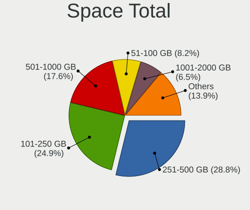

| Size in GB     | Notebooks | Percent |
|----------------|-----------|---------|
| 251-500        | 1544      | 28.8%   |
| 101-250        | 1337      | 24.94%  |
| 501-1000       | 944       | 17.61%  |
| 51-100         | 441       | 8.23%   |
| 1001-2000      | 350       | 6.53%   |
| 1-20           | 297       | 5.54%   |
| 21-50          | 223       | 4.16%   |
| Unknown        | 101       | 1.88%   |
| 2001-3000      | 67        | 1.25%   |
| More than 3000 | 57        | 1.06%   |

Space Used
----------

Amount of used disk space

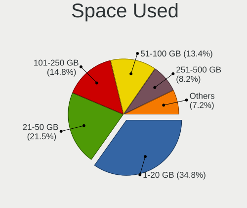

| Used GB        | Notebooks | Percent |
|----------------|-----------|---------|
| 1-20           | 1937      | 34.83%  |
| 21-50          | 1198      | 21.54%  |
| 101-250        | 825       | 14.83%  |
| 51-100         | 747       | 13.43%  |
| 251-500        | 455       | 8.18%   |
| 501-1000       | 222       | 3.99%   |
| Unknown        | 101       | 1.82%   |
| 1001-2000      | 61        | 1.1%    |
| More than 3000 | 6         | 0.11%   |
| 2001-3000      | 6         | 0.11%   |
| 0              | 4         | 0.07%   |

Malfunc. Drives
---------------

Drive models with a malfunction

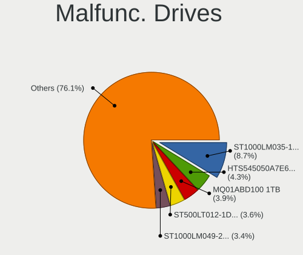

| Model                                | Notebooks | Drives | Percent |
|--------------------------------------|-----------|--------|---------|
| Seagate ST1000LM035-1RK172 1TB       | 36        | 44     | 8.7%    |
| HGST HTS545050A7E680 500GB           | 18        | 20     | 4.35%   |
| Toshiba MQ01ABD100 1TB               | 16        | 17     | 3.86%   |
| Seagate ST500LT012-1DG142 500GB      | 15        | 15     | 3.62%   |
| Seagate ST1000LM049-2GH172 1TB       | 14        | 18     | 3.38%   |
| HGST HTS541010A9E680 1TB             | 14        | 14     | 3.38%   |
| Seagate ST9500325AS 500GB            | 12        | 13     | 2.9%    |
| Seagate ST1000LM024 HN-M101MBB 1TB   | 11        | 11     | 2.66%   |
| Toshiba MQ04ABF100 1TB               | 9         | 10     | 2.17%   |
| HGST HTS545050A7E380 500GB           | 8         | 9      | 1.93%   |
| Toshiba MQ01ABF050 500GB             | 7         | 7      | 1.69%   |
| Seagate ST500LT012-9WS142 500GB      | 7         | 8      | 1.69%   |
| Seagate ST500LM021-1KJ152 500GB      | 7         | 7      | 1.69%   |
| SK hynix PC711 HFS512GDE9X073N 512GB | 6         | 7      | 1.45%   |
| Seagate ST2000LM007-1R8174 2TB       | 6         | 6      | 1.45%   |
| WDC WDS240G2G0A-00JH30 240GB SSD     | 5         | 7      | 1.21%   |
| WDC WD10SPZX-60Z10T0 1TB             | 5         | 5      | 1.21%   |
| Seagate ST9320325AS 320GB            | 5         | 5      | 1.21%   |
| HGST HTS725050A7E630 500GB           | 5         | 5      | 1.21%   |
| HGST HTS721010A9E630 1TB             | 5         | 5      | 1.21%   |
| WDC WD10JPVX-60JC3T1 1TB             | 4         | 4      | 0.97%   |
| WDC WD Green 2.5 240GB               | 4         | 4      | 0.97%   |
| Seagate ST320LT007-9ZV142 320GB      | 4         | 5      | 0.97%   |
| Hitachi HTS547575A9E384 752GB        | 4         | 4      | 0.97%   |
| WDC WD5000LPVX-75V0TT0 500GB         | 3         | 3      | 0.72%   |
| WDC WD3200BEKT-75PVMT0 320GB         | 3         | 3      | 0.72%   |
| WDC WD10SPZX-24Z10 1TB               | 3         | 3      | 0.72%   |
| WDC WD10SPZX-21Z10T0 1TB             | 3         | 3      | 0.72%   |
| WDC WD10JPVX-60JC3T0 1TB             | 3         | 4      | 0.72%   |
| WDC WD10JPCX-24UE4T0 1TB             | 3         | 3      | 0.72%   |
| Toshiba MQ01ABD050 500GB             | 3         | 3      | 0.72%   |
| Seagate ST1000LM048-2E7172 1TB       | 3         | 5      | 0.72%   |
| Hitachi HTS545032B9A300 320GB        | 3         | 6      | 0.72%   |
| Hitachi HTS543232A7A384 320GB        | 3         | 3      | 0.72%   |
| Unknown                              | 3         | 4      | 0.72%   |
| WDC WDS480G2G0A-00JH30 480GB SSD     | 2         | 2      | 0.48%   |
| WDC WD5000LPVT-22G33T0 500GB         | 2         | 2      | 0.48%   |
| WDC WD3200BEVT-22ZCT0 320GB          | 2         | 2      | 0.48%   |
| WDC WD Green 2.5 480GB               | 2         | 2      | 0.48%   |
| WDC WD Blue SA510 2.5 500GB          | 2         | 2      | 0.48%   |

Malfunc. Drive Vendor
---------------------

Vendors of faulty drives

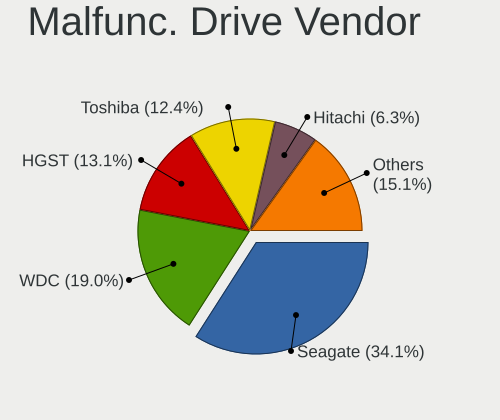

| Vendor                      | Notebooks | Drives | Percent |
|-----------------------------|-----------|--------|---------|
| Seagate                     | 140       | 161    | 34.06%  |
| WDC                         | 78        | 83     | 18.98%  |
| HGST                        | 54        | 57     | 13.14%  |
| Toshiba                     | 51        | 54     | 12.41%  |
| Hitachi                     | 26        | 31     | 6.33%   |
| SK hynix                    | 14        | 17     | 3.41%   |
| Samsung Electronics         | 10        | 12     | 2.43%   |
| SanDisk                     | 5         | 5      | 1.22%   |
| Micron Technology           | 5         | 6      | 1.22%   |
| Crucial                     | 5         | 7      | 1.22%   |
| Intel                       | 4         | 4      | 0.97%   |
| Unknown                     | 3         | 4      | 0.73%   |
| China                       | 2         | 2      | 0.49%   |
| Apple                       | 2         | 2      | 0.49%   |
| SSSTC                       | 1         | 1      | 0.24%   |
| Realtek Semiconductor       | 1         | 1      | 0.24%   |
| POWER                       | 1         | 1      | 0.24%   |
| Micron/Crucial Technology   | 1         | 1      | 0.24%   |
| MARSHAL                     | 1         | 1      | 0.24%   |
| LITEONIT                    | 1         | 1      | 0.24%   |
| Leven                       | 1         | 1      | 0.24%   |
| Lenovo                      | 1         | 2      | 0.24%   |
| Kingston Technology Company | 1         | 1      | 0.24%   |
| Kingston                    | 1         | 1      | 0.24%   |
| Gigabyte Technology         | 1         | 2      | 0.24%   |
| A-DATA Technology           | 1         | 1      | 0.24%   |

Malfunc. HDD Vendor
-------------------

Vendors of faulty HDD drives

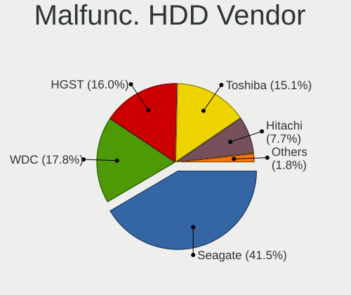

| Vendor              | Notebooks | Drives | Percent |
|---------------------|-----------|--------|---------|
| Seagate             | 140       | 161    | 41.54%  |
| WDC                 | 60        | 63     | 17.8%   |
| HGST                | 54        | 57     | 16.02%  |
| Toshiba             | 51        | 54     | 15.13%  |
| Hitachi             | 26        | 31     | 7.72%   |
| Samsung Electronics | 3         | 3      | 0.89%   |
| Apple               | 2         | 2      | 0.59%   |
| MARSHAL             | 1         | 1      | 0.3%    |

Malfunc. Drive Kind
-------------------

Kinds of faulty drives

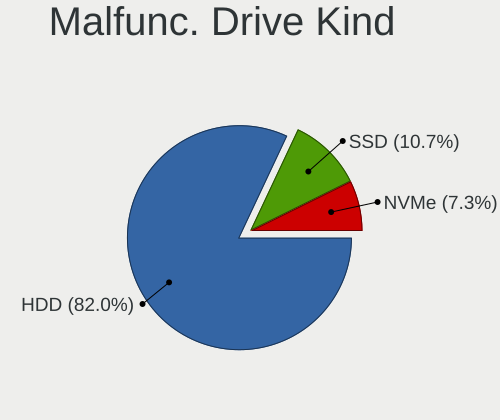

| Kind | Notebooks | Drives | Percent |
|------|-----------|--------|---------|
| HDD  | 337       | 372    | 82%     |
| SSD  | 44        | 50     | 10.71%  |
| NVMe | 30        | 37     | 7.3%    |

Failed Drives
-------------

Failed drive models

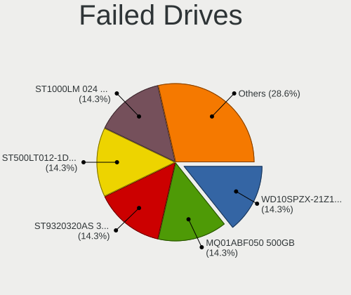

| Model                               | Notebooks | Drives | Percent |
|-------------------------------------|-----------|--------|---------|
| WDC WD10SPZX-21Z10T0 1TB            | 1         | 1      | 14.29%  |
| Toshiba MQ01ABF050 500GB            | 1         | 1      | 14.29%  |
| Seagate ST9320320AS 320GB           | 1         | 1      | 14.29%  |
| Seagate ST500LT012-1DG142 500GB     | 1         | 1      | 14.29%  |
| Seagate ST1000LM 024 HN-M101MBB 1TB | 1         | 1      | 14.29%  |
| Apple HDD HTS545050A7E362 500GB     | 1         | 1      | 14.29%  |
| Acer SSD FA100 256GB                | 1         | 1      | 14.29%  |

Failed Drive Vendor
-------------------

Failed drive vendors

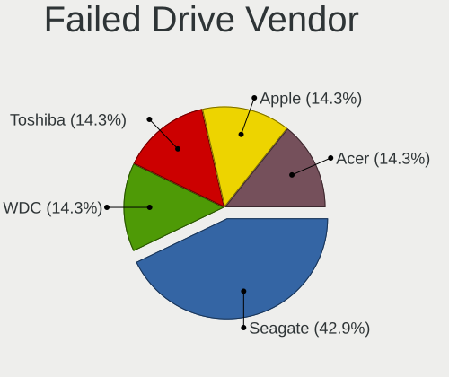

| Vendor  | Notebooks | Drives | Percent |
|---------|-----------|--------|---------|
| Seagate | 3         | 3      | 42.86%  |
| WDC     | 1         | 1      | 14.29%  |
| Toshiba | 1         | 1      | 14.29%  |
| Apple   | 1         | 1      | 14.29%  |
| Acer    | 1         | 1      | 14.29%  |

Drive Status
------------

Number of failed and malfunc. drives

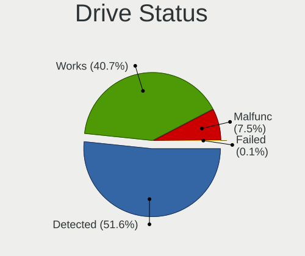

| Status   | Notebooks | Drives | Percent |
|----------|-----------|--------|---------|
| Detected | 2765      | 4023   | 51.64%  |
| Works    | 2179      | 3071   | 40.7%   |
| Malfunc  | 403       | 459    | 7.53%   |
| Failed   | 7         | 7      | 0.13%   |

Storage controller
------------------

Storage Vendor
--------------

Storage controller vendors

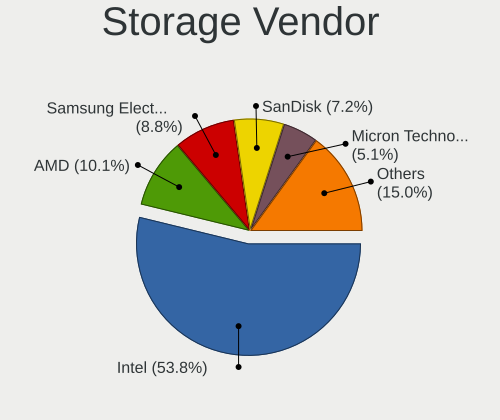

| Vendor                                  | Notebooks | Percent |
|-----------------------------------------|-----------|---------|
| Intel                                   | 3482      | 53.8%   |
| AMD                                     | 651       | 10.06%  |
| Samsung Electronics                     | 572       | 8.84%   |
| SanDisk                                 | 467       | 7.22%   |
| Micron Technology                       | 330       | 5.1%    |
| SK hynix                                | 259       | 4%      |
| KIOXIA                                  | 142       | 2.19%   |
| Kingston Technology Company             | 122       | 1.89%   |
| Micron/Crucial Technology               | 75        | 1.16%   |
| Toshiba America Info Systems            | 67        | 1.04%   |
| Shenzhen Longsys Electronics            | 52        | 0.8%    |
| Phison Electronics                      | 40        | 0.62%   |
| Silicon Motion                          | 39        | 0.6%    |
| Union Memory (Shenzhen)                 | 33        | 0.51%   |
| ADATA Technology                        | 19        | 0.29%   |
| Realtek Semiconductor                   | 18        | 0.28%   |
| Solid State Storage Technology          | 15        | 0.23%   |
| MAXIO Technology (Hangzhou)             | 14        | 0.22%   |
| Yangtze Memory Technologies             | 13        | 0.2%    |
| Biwin Storage Technology                | 10        | 0.15%   |
| Solidigm                                | 7         | 0.11%   |
| Nvidia                                  | 7         | 0.11%   |
| Lite-On Technology                      | 6         | 0.09%   |
| Lenovo                                  | 5         | 0.08%   |
| Apple                                   | 5         | 0.08%   |
| Shenzhen Unionmemory Information System | 4         | 0.06%   |
| INNOGRIT                                | 4         | 0.06%   |
| Marvell Technology Group                | 3         | 0.05%   |
| Hosin Global Electronics                | 3         | 0.05%   |
| Transcend                               | 2         | 0.03%   |
| Ramaxel Technology(Shenzhen) Limited    | 2         | 0.03%   |
| Silicon Integrated Systems [SiS]        | 1         | 0.02%   |
| O2 Micro                                | 1         | 0.02%   |
| Netac Technology                        | 1         | 0.02%   |
| ASMedia Technology                      | 1         | 0.02%   |

Storage Model
-------------

Storage controller models

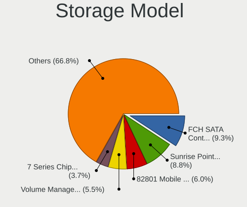

| Model                                                                          | Notebooks | Percent |
|--------------------------------------------------------------------------------|-----------|---------|
| AMD FCH SATA Controller [AHCI mode]                                            | 636       | 9.26%   |
| Intel Sunrise Point-LP SATA Controller [AHCI mode]                             | 601       | 8.75%   |
| Intel 82801 Mobile SATA Controller [RAID mode]                                 | 413       | 6.02%   |
| Intel Volume Management Device NVMe RAID Controller                            | 376       | 5.48%   |
| Intel 7 Series Chipset Family 6-port SATA Controller [AHCI mode]               | 253       | 3.68%   |
| Intel 8 Series SATA Controller 1 [AHCI mode]                                   | 242       | 3.52%   |
| Samsung NVMe SSD Controller 980 (DRAM-less)                                    | 225       | 3.28%   |
| Intel Tiger Lake-LP SATA Controller                                            | 178       | 2.59%   |
| Intel Wildcat Point-LP SATA Controller [AHCI Mode]                             | 167       | 2.43%   |
| Intel 6 Series/C200 Series Chipset Family 6 port Mobile SATA AHCI Controller   | 160       | 2.33%   |
| Samsung NVMe SSD Controller SM981/PM981/PM983                                  | 158       | 2.3%    |
| Intel Cannon Lake Mobile PCH SATA AHCI Controller                              | 139       | 2.02%   |
| Intel Comet Lake SATA AHCI Controller                                          | 127       | 1.85%   |
| Intel SSD 660P Series                                                          | 122       | 1.78%   |
| Intel Cannon Point-LP SATA Controller [AHCI Mode]                              | 112       | 1.63%   |
| Micron 2450 NVMe SSD [HendrixV] (DRAM-less)                                    | 104       | 1.51%   |
| SanDisk Ultra 3D / WD PC SN530, IX SN530, Blue SN550 NVMe SSD (DRAM-less)      | 99        | 1.44%   |
| KIOXIA NVMe SSD Controller BG4 (DRAM-less)                                     | 97        | 1.41%   |
| SK hynix Gold P31/BC711/PC711 NVMe Solid State Drive                           | 92        | 1.34%   |
| Intel SSD 670p Series [Keystone Harbor]                                        | 80        | 1.17%   |
| Intel Alder Lake-P SATA AHCI Controller                                        | 74        | 1.08%   |
| Micron 2210 NVMe SSD [Cobain]                                                  | 71        | 1.03%   |
| Intel Ice Lake-LP SATA Controller [AHCI mode]                                  | 71        | 1.03%   |
| Intel 5 Series/3400 Series Chipset 4 port SATA AHCI Controller                 | 71        | 1.03%   |
| Samsung NVMe SSD Controller PM9A1/PM9A3/980PRO                                 | 69        | 1%      |
| SanDisk WD SN560/SN740/SN770/SN5000 NVMe SSD                                   | 67        | 0.98%   |
| Micron 2400 NVMe SSD (DRAM-less)                                               | 63        | 0.92%   |
| SanDisk WD Blue SN500 / PC SN520 x2 M.2 2280 NVMe SSD                          | 62        | 0.9%    |
| Intel 400 Series Chipset Family SATA AHCI Controller                           | 62        | 0.9%    |
| Intel 82801IBM/IEM (ICH9M/ICH9M-E) 4 port SATA Controller [AHCI mode]          | 59        | 0.86%   |
| SanDisk Extreme Pro / WD Black SN750 / PC SN730 / Red SN700 NVMe SSD           | 58        | 0.84%   |
| Samsung NVMe SSD Controller PM9B1 (DRAM-less)                                  | 54        | 0.79%   |
| Intel RST Volume Management Device Controller                                  | 50        | 0.73%   |
| SK hynix BC501 NVMe Solid State Drive                                          | 49        | 0.71%   |
| Micron/Crucial P2 [Nick P2] / P3 / P3 Plus NVMe PCIe SSD (DRAM-less)           | 45        | 0.66%   |
| SK hynix BC511 NVMe SSD                                                        | 44        | 0.64%   |
| Intel HM170/QM170 Chipset SATA Controller [AHCI Mode]                          | 44        | 0.64%   |
| Intel 8 Series/C220 Series Chipset Family 6-port SATA Controller 1 [AHCI mode] | 44        | 0.64%   |
| Intel 5 Series/3400 Series Chipset 6 port SATA AHCI Controller                 | 42        | 0.61%   |
| Toshiba America Info Systems XG6 NVMe SSD Controller                           | 40        | 0.58%   |

Storage Kind
------------

Kind of storage controller (IDE, SATA, NVMe, SAS, ...)

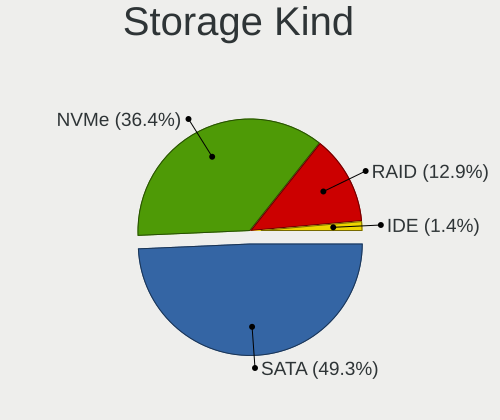

| Kind | Notebooks | Percent |
|------|-----------|---------|
| SATA | 3287      | 49.31%  |
| NVMe | 2425      | 36.38%  |
| RAID | 860       | 12.9%   |
| IDE  | 94        | 1.41%   |

Processor
---------

CPU Vendor
----------

Processor vendors

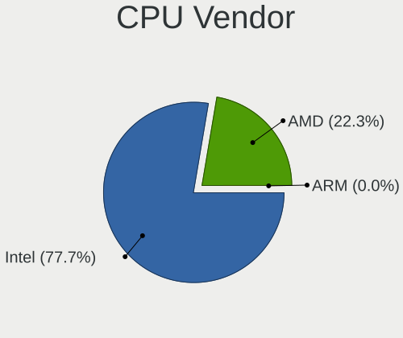

| Vendor | Notebooks | Percent |
|--------|-----------|---------|
| Intel  | 3920      | 77.65%  |
| AMD    | 1127      | 22.33%  |
| ARM    | 1         | 0.02%   |

CPU Model
---------

Processor models

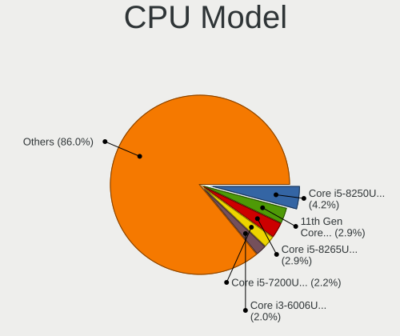

| Model                                         | Notebooks | Percent |
|-----------------------------------------------|-----------|---------|
| Intel Core i5-8250U CPU @ 1.60GHz             | 210       | 4.16%   |
| Intel 11th Gen Core i5-1135G7 @ 2.40GHz       | 146       | 2.89%   |
| Intel Core i5-8265U CPU @ 1.60GHz             | 144       | 2.85%   |
| Intel Core i5-7200U CPU @ 2.50GHz             | 109       | 2.16%   |
| Intel Core i3-6006U CPU @ 2.00GHz             | 100       | 1.98%   |
| Intel Core i5-10210U CPU @ 1.60GHz            | 99        | 1.96%   |
| AMD Ryzen 5 3500U with Radeon Vega Mobile Gfx | 74        | 1.47%   |
| AMD Ryzen 5 5600H with Radeon Graphics        | 73        | 1.45%   |
| Intel Core i5-9300H CPU @ 2.40GHz             | 69        | 1.37%   |
| Intel Core i3-5005U CPU @ 2.00GHz             | 67        | 1.33%   |
| Intel 11th Gen Core i3-1115G4 @ 3.00GHz       | 67        | 1.33%   |
| Intel Core i3-1005G1 CPU @ 1.20GHz            | 66        | 1.31%   |
| Intel Core i3-7020U CPU @ 2.30GHz             | 65        | 1.29%   |
| Intel Core i3-4005U CPU @ 1.70GHz             | 65        | 1.29%   |
| AMD Ryzen 5 5500U with Radeon Graphics        | 65        | 1.29%   |
| Intel Core i5-6200U CPU @ 2.30GHz             | 64        | 1.27%   |
| AMD Ryzen 5 3550H with Radeon Vega Mobile Gfx | 64        | 1.27%   |
| Intel Core i5-4210U CPU @ 1.70GHz             | 62        | 1.23%   |
| Intel Core i5-1035G1 CPU @ 1.00GHz            | 53        | 1.05%   |
| AMD Ryzen 7 5800H with Radeon Graphics        | 53        | 1.05%   |
| Intel Core i5-10300H CPU @ 2.50GHz            | 52        | 1.03%   |
| AMD Ryzen 5 4600H with Radeon Graphics        | 52        | 1.03%   |
| Intel Core i5-5200U CPU @ 2.20GHz             | 51        | 1.01%   |
| Intel 12th Gen Core i5-1240P                  | 51        | 1.01%   |
| Intel Core i7-9750H CPU @ 2.60GHz             | 50        | 0.99%   |
| Intel Core i5-3210M CPU @ 2.50GHz             | 46        | 0.91%   |
| Intel Core i7-8550U CPU @ 1.80GHz             | 45        | 0.89%   |
| Intel 12th Gen Core i5-12500H                 | 44        | 0.87%   |
| Intel 12th Gen Core i5-12450H                 | 43        | 0.85%   |
| Intel 11th Gen Core i7-1165G7 @ 2.80GHz       | 43        | 0.85%   |
| AMD Ryzen 7 4800H with Radeon Graphics        | 42        | 0.83%   |
| Intel Core i7-8750H CPU @ 2.20GHz             | 41        | 0.81%   |
| Intel 11th Gen Core i5-11300H @ 3.10GHz       | 40        | 0.79%   |
| Intel 12th Gen Core i5-1235U                  | 37        | 0.73%   |
| Intel Core i7-7700HQ CPU @ 2.80GHz            | 35        | 0.69%   |
| Intel Core i3-10110U CPU @ 2.10GHz            | 35        | 0.69%   |
| AMD Ryzen 5 2500U with Radeon Vega Mobile Gfx | 34        | 0.67%   |
| Intel Core i5-8300H CPU @ 2.30GHz             | 32        | 0.63%   |
| Intel Core i5-6300U CPU @ 2.40GHz             | 32        | 0.63%   |
| Intel Core i5-3320M CPU @ 2.60GHz             | 32        | 0.63%   |

CPU Model Family
----------------

Processor model prefix

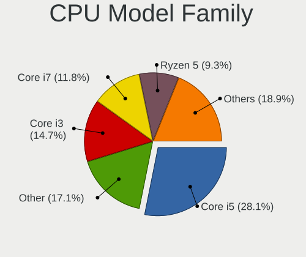

| Model                   | Notebooks | Percent |
|-------------------------|-----------|---------|
| Intel Core i5           | 1421      | 28.15%  |
| Other                   | 863       | 17.1%   |
| Intel Core i3           | 741       | 14.68%  |
| Intel Core i7           | 598       | 11.85%  |
| AMD Ryzen 5             | 471       | 9.33%   |
| AMD Ryzen 7             | 246       | 4.87%   |
| Intel Pentium           | 109       | 2.16%   |
| AMD Ryzen 3             | 94        | 1.86%   |
| Intel Core 2 Duo        | 76        | 1.51%   |
| Intel Celeron           | 73        | 1.45%   |
| AMD A6                  | 51        | 1.01%   |
| AMD Ryzen 9             | 37        | 0.73%   |
| Intel Core              | 34        | 0.67%   |
| AMD A8                  | 33        | 0.65%   |
| AMD A4                  | 24        | 0.48%   |
| AMD Ryzen 7 PRO         | 21        | 0.42%   |
| AMD A10                 | 20        | 0.4%    |
| Intel Atom              | 19        | 0.38%   |
| AMD E1                  | 16        | 0.32%   |
| Intel Pentium Dual-Core | 14        | 0.28%   |
| AMD Ryzen 5 PRO         | 10        | 0.2%    |
| AMD E2                  | 10        | 0.2%    |
| Intel Pentium Silver    | 9         | 0.18%   |
| Intel Pentium Dual      | 7         | 0.14%   |
| AMD Athlon              | 7         | 0.14%   |
| Intel Core i9           | 6         | 0.12%   |
| Intel Core 2            | 6         | 0.12%   |
| Intel Xeon              | 4         | 0.08%   |
| AMD E                   | 4         | 0.08%   |
| AMD C-60                | 4         | 0.08%   |
| AMD A12                 | 4         | 0.08%   |
| AMD PRO A10             | 3         | 0.06%   |
| Intel Pentium M         | 2         | 0.04%   |
| Intel Core m5           | 2         | 0.04%   |
| Intel Genuine           | 1         | 0.02%   |
| Intel Core m3           | 1         | 0.02%   |
| Intel Core M            | 1         | 0.02%   |
| Intel Core Duo          | 1         | 0.02%   |
| Intel Celeron M         | 1         | 0.02%   |
| Intel Celeron Dual-Core | 1         | 0.02%   |

CPU Cores
---------

Number of processor cores

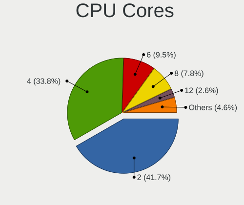

| Number | Notebooks | Percent |
|--------|-----------|---------|
| 2      | 2106      | 41.69%  |
| 4      | 1707      | 33.79%  |
| 6      | 479       | 9.48%   |
| 8      | 396       | 7.84%   |
| 12     | 133       | 2.63%   |
| 10     | 100       | 1.98%   |
| 14     | 67        | 1.33%   |
| 1      | 29        | 0.57%   |
| 16     | 21        | 0.42%   |
| 24     | 6         | 0.12%   |
| 20     | 4         | 0.08%   |
| 5      | 2         | 0.04%   |
| 3      | 2         | 0.04%   |

CPU Sockets
-----------

Number of sockets

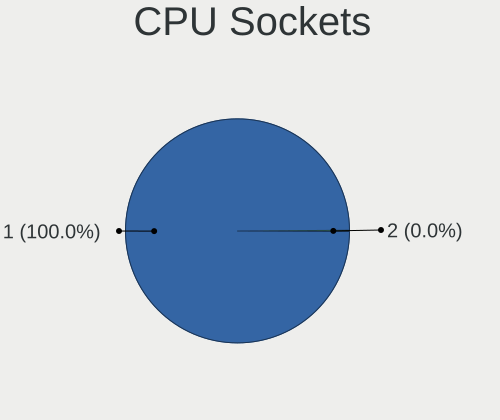

| Number | Notebooks | Percent |
|--------|-----------|---------|
| 1      | 5046      | 99.96%  |
| 2      | 2         | 0.04%   |

CPU Threads
-----------

Threads per core (Hyper-Threading)

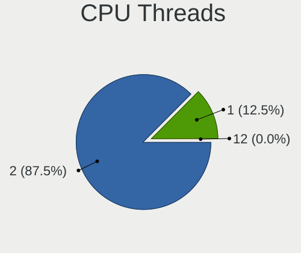

| Number | Notebooks | Percent |
|--------|-----------|---------|
| 2      | 4423      | 87.48%  |
| 1      | 630       | 12.46%  |
| 4      | 2         | 0.04%   |
| 12     | 1         | 0.02%   |

CPU Op-Modes
------------

CPU Operation Modes (32-bit, 64-bit)

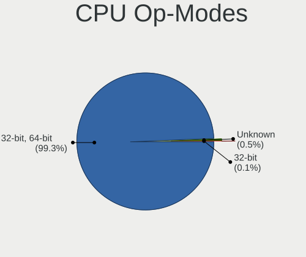

| Op mode        | Notebooks | Percent |
|----------------|-----------|---------|
| 32-bit, 64-bit | 5017      | 99.35%  |
| Unknown        | 27        | 0.53%   |
| 32-bit         | 6         | 0.12%   |

CPU Microcode
-------------

Microcode number

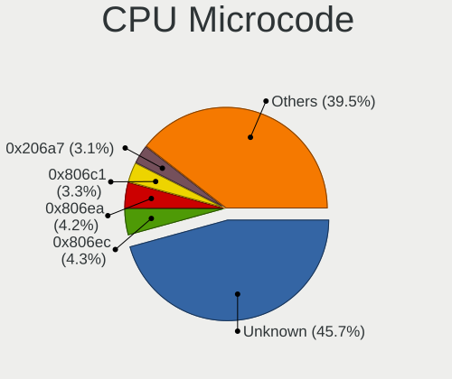

| Number     | Notebooks | Percent |
|------------|-----------|---------|
| Unknown    | 2386      | 45.73%  |
| 0x806ec    | 224       | 4.29%   |
| 0x806ea    | 218       | 4.18%   |
| 0x806c1    | 170       | 3.26%   |
| 0x206a7    | 160       | 3.07%   |
| 0x40651    | 157       | 3.01%   |
| 0x306a9    | 156       | 2.99%   |
| 0x406e3    | 151       | 2.89%   |
| 0x806e9    | 148       | 2.84%   |
| 0x906ea    | 119       | 2.28%   |
| 0x306d4    | 114       | 2.18%   |
| 0x08108109 | 87        | 1.67%   |
| 0x706e5    | 79        | 1.51%   |
| 0x0a50000c | 77        | 1.48%   |
| 0x20655    | 56        | 1.07%   |
| 0x806eb    | 54        | 1.03%   |
| 0x08108102 | 51        | 0.98%   |
| 0x06006705 | 48        | 0.92%   |
| 0xa0652    | 46        | 0.88%   |
| 0x1067a    | 40        | 0.77%   |
| 0x08608103 | 39        | 0.75%   |
| 0x906a3    | 36        | 0.69%   |
| 0x306c3    | 36        | 0.69%   |
| 0x0a50000d | 36        | 0.69%   |
| 0x08600106 | 33        | 0.63%   |
| 0x07030105 | 33        | 0.63%   |
| 0x906e9    | 32        | 0.61%   |
| 0x08600104 | 27        | 0.52%   |
| 0x20652    | 25        | 0.48%   |
| 0x6fd      | 19        | 0.36%   |
| 0x0810100b | 18        | 0.34%   |
| 0x08101007 | 18        | 0.34%   |
| 0x806d1    | 16        | 0.31%   |
| 0x30678    | 16        | 0.31%   |
| 0x906ed    | 15        | 0.29%   |
| 0x906a4    | 13        | 0.25%   |
| 0x506e3    | 13        | 0.25%   |
| 0x08600103 | 12        | 0.23%   |
| 0x06001119 | 12        | 0.23%   |
| 0x0a404102 | 11        | 0.21%   |

CPU Microarch
-------------

Microarchitecture

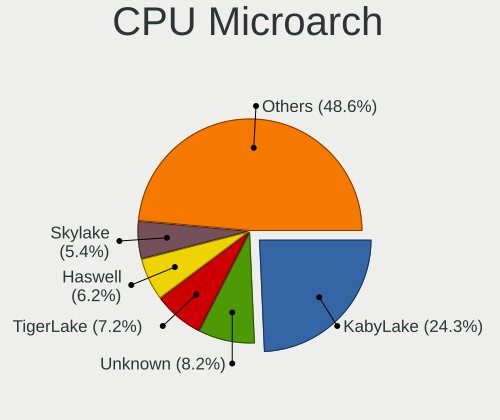

| Name               | Notebooks | Percent |
|--------------------|-----------|---------|
| KabyLake           | 1231      | 24.3%   |
| Unknown            | 417       | 8.23%   |
| TigerLake          | 367       | 7.25%   |
| Haswell            | 314       | 6.2%    |
| Skylake            | 276       | 5.45%   |
| Alderlake Hybrid   | 267       | 5.27%   |
| Zen 3              | 251       | 4.96%   |
| IvyBridge          | 244       | 4.82%   |
| SandyBridge        | 232       | 4.58%   |
| Zen+               | 212       | 4.19%   |
| Broadwell          | 191       | 3.77%   |
| IceLake            | 169       | 3.34%   |
| Zen 2              | 148       | 2.92%   |
| Westmere           | 126       | 2.49%   |
| Excavator          | 100       | 1.97%   |
| CometLake          | 100       | 1.97%   |
| Penryn             | 73        | 1.44%   |
| Puma               | 64        | 1.26%   |
| Silvermont         | 58        | 1.15%   |
| Zen                | 50        | 0.99%   |
| Core               | 34        | 0.67%   |
| Piledriver         | 20        | 0.39%   |
| Goldmont plus      | 17        | 0.34%   |
| Tremont            | 14        | 0.28%   |
| Meteorlake Hybrid  | 13        | 0.26%   |
| K10 Llano          | 12        | 0.24%   |
| Goldmont           | 11        | 0.22%   |
| Bonnell            | 11        | 0.22%   |
| Jaguar             | 10        | 0.2%    |
| Bobcat             | 9         | 0.18%   |
| Nehalem            | 7         | 0.14%   |
| P6                 | 5         | 0.1%    |
| Lunarlake Hybrid   | 5         | 0.1%    |
| Steamroller        | 2         | 0.04%   |
| K10                | 2         | 0.04%   |
| K8 Hammer          | 1         | 0.02%   |
| Gracemont          | 1         | 0.02%   |
| ArrowLake-H Hybrid | 1         | 0.02%   |

Graphics
--------

GPU Vendor
----------

Vendors of graphics cards

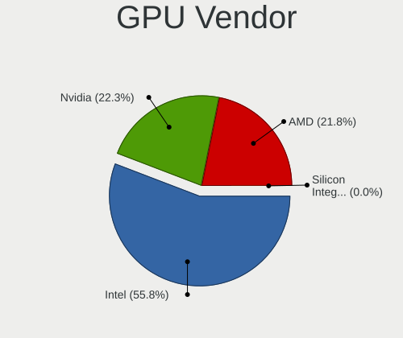

| Vendor                           | Notebooks | Percent |
|----------------------------------|-----------|---------|
| Intel                            | 3801      | 55.82%  |
| Nvidia                           | 1520      | 22.32%  |
| AMD                              | 1487      | 21.84%  |
| Silicon Integrated Systems [SiS] | 1         | 0.01%   |

GPU Model
---------

Graphics card models

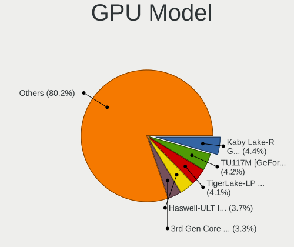

| Model                                                                                 | Notebooks | Percent |
|---------------------------------------------------------------------------------------|-----------|---------|
| Intel Kaby Lake-R GT2 [UHD Graphics 620]                                              | 308       | 4.42%   |
| Nvidia TU117M [GeForce GTX 1650 Mobile / Max-Q]                                       | 294       | 4.22%   |
| Intel TigerLake-LP GT2 [Iris Xe Graphics]                                             | 288       | 4.13%   |
| Intel Haswell-ULT Integrated Graphics Controller                                      | 256       | 3.67%   |
| Intel 3rd Gen Core processor Graphics Controller                                      | 233       | 3.34%   |
| Intel WhiskeyLake-U GT2 [UHD Graphics 620]                                            | 223       | 3.2%    |
| Intel Skylake-U GT2 [HD Graphics 520]                                                 | 215       | 3.09%   |
| Intel Kaby Lake-U GT2 [HD Graphics 620]                                               | 214       | 3.07%   |
| AMD Picasso/Raven 2 [Radeon Vega Series / Radeon Vega Mobile Series]                  | 214       | 3.07%   |
| Intel 2nd Generation Core Processor Family Integrated Graphics Controller             | 212       | 3.04%   |
| Intel CoffeeLake-H GT2 [UHD Graphics 630]                                             | 198       | 2.84%   |
| Intel CometLake-U GT2 [UHD Graphics]                                                  | 182       | 2.61%   |
| AMD Cezanne [Radeon Vega Series / Radeon Vega Mobile Series]                          | 177       | 2.54%   |
| Intel Broadwell-U GT2 [HD Graphics 5500]                                              | 168       | 2.41%   |
| AMD Renoir [Radeon Vega Series / Radeon Vega Mobile Series]                           | 146       | 2.1%    |
| AMD Sun XT [Radeon HD 8670A/8670M/8690M / R5 M330 / M430 / Radeon 520 Mobile]         | 143       | 2.05%   |
| Intel Iris Plus Graphics G1 (Ice Lake)                                                | 119       | 1.71%   |
| Intel Alder Lake-P GT2 [Iris Xe Graphics]                                             | 105       | 1.51%   |
| AMD Lucienne                                                                          | 104       | 1.49%   |
| Nvidia GA107M [GeForce RTX 3050 Mobile]                                               | 100       | 1.44%   |
| Intel Core Processor Integrated Graphics Controller                                   | 97        | 1.39%   |
| Intel CometLake-H GT2 [UHD Graphics]                                                  | 91        | 1.31%   |
| AMD Stoney [Radeon R2/R3/R4/R5 Graphics]                                              | 79        | 1.13%   |
| Intel Tiger Lake-LP GT2 [UHD Graphics G4]                                             | 78        | 1.12%   |
| AMD Topaz XT [Radeon R7 M260/M265 / M340/M360 / M440/M445 / 530/535 / 620/625 Mobile] | 75        | 1.08%   |
| Nvidia GF117M [GeForce 610M/710M/810M/820M / GT 620M/625M/630M/720M]                  | 71        | 1.02%   |
| AMD Barcelo                                                                           | 69        | 0.99%   |
| Intel Raptor Lake-P [Iris Xe Graphics]                                                | 63        | 0.9%    |
| Intel Mobile 4 Series Chipset Integrated Graphics Controller                          | 62        | 0.89%   |
| Nvidia GP108M [GeForce MX250]                                                         | 55        | 0.79%   |
| AMD Rembrandt [Radeon 680M]                                                           | 54        | 0.78%   |
| Nvidia GM108M [GeForce 940MX]                                                         | 52        | 0.75%   |
| Intel Alder Lake-P GT1 [UHD Graphics]                                                 | 52        | 0.75%   |
| Intel 4th Gen Core Processor Integrated Graphics Controller                           | 52        | 0.75%   |
| Nvidia GA106M [GeForce RTX 3060 Mobile / Max-Q]                                       | 51        | 0.73%   |
| Nvidia TU117M [GeForce GTX 1650 Ti Mobile]                                            | 50        | 0.72%   |
| AMD Raven Ridge [Radeon Vega Series / Radeon Vega Mobile Series]                      | 48        | 0.69%   |
| Nvidia GP107M [GeForce GTX 1050 Mobile]                                               | 47        | 0.67%   |
| Nvidia GP108M [GeForce MX150]                                                         | 46        | 0.66%   |
| Intel TigerLake-H GT1 [UHD Graphics]                                                  | 46        | 0.66%   |

GPU Combo
---------

Combinations of graphics cards

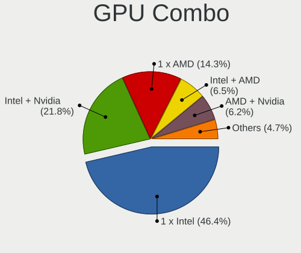

| Name           | Notebooks | Percent |
|----------------|-----------|---------|
| 1 x Intel      | 2350      | 46.37%  |
| Intel + Nvidia | 1105      | 21.8%   |
| 1 x AMD        | 726       | 14.33%  |
| Intel + AMD    | 331       | 6.53%   |
| AMD + Nvidia   | 316       | 6.24%   |
| 2 x AMD        | 118       | 2.33%   |
| 1 x Nvidia     | 97        | 1.91%   |
| 2 x Intel      | 19        | 0.37%   |
| Other          | 4         | 0.08%   |
| 2 x Nvidia     | 1         | 0.02%   |
| 1 x SiS        | 1         | 0.02%   |

GPU Driver
----------

Free vs proprietary

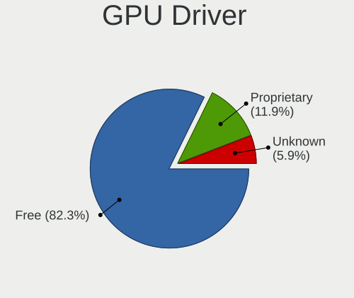

| Driver      | Notebooks | Percent |
|-------------|-----------|---------|
| Free        | 4218      | 82.29%  |
| Proprietary | 608       | 11.86%  |
| Unknown     | 300       | 5.85%   |

GPU Memory
----------

Total video memory

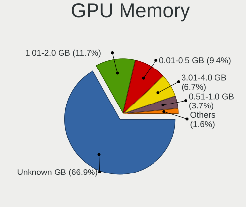

| Size in GB | Notebooks | Percent |
|------------|-----------|---------|
| Unknown    | 3469      | 66.89%  |
| 1.01-2.0   | 608       | 11.72%  |
| 0.01-0.5   | 488       | 9.41%   |
| 3.01-4.0   | 348       | 6.71%   |
| 0.51-1.0   | 191       | 3.68%   |
| 5.01-6.0   | 55        | 1.06%   |
| 7.01-8.0   | 18        | 0.35%   |
| 8.01-16.0  | 5         | 0.1%    |
| 2.01-3.0   | 4         | 0.08%   |

Monitor
-------

Monitor Vendor
--------------

Monitor vendors

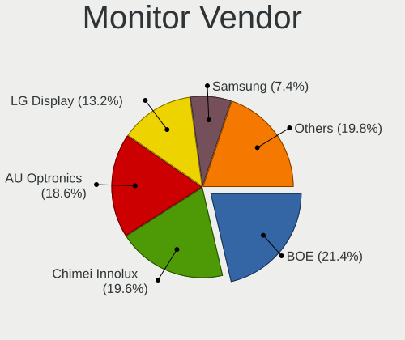

| Vendor                  | Notebooks | Percent |
|-------------------------|-----------|---------|
| BOE                     | 1167      | 21.39%  |
| Chimei Innolux          | 1068      | 19.58%  |
| AU Optronics            | 1016      | 18.63%  |
| LG Display              | 721       | 13.22%  |
| Samsung Electronics     | 401       | 7.35%   |
| PANDA                   | 173       | 3.17%   |
| Goldstar                | 110       | 2.02%   |
| Dell                    | 97        | 1.78%   |
| Sharp                   | 69        | 1.26%   |
| BenQ                    | 63        | 1.15%   |
| Lenovo                  | 62        | 1.14%   |
| Acer                    | 54        | 0.99%   |
| Chi Mei Optoelectronics | 52        | 0.95%   |
| Apple                   | 49        | 0.9%    |
| TMX                     | 40        | 0.73%   |
| InfoVision              | 37        | 0.68%   |
| HKC                     | 29        | 0.53%   |
| Hewlett-Packard         | 26        | 0.48%   |
| Sony                    | 22        | 0.4%    |
| AOC                     | 14        | 0.26%   |
| LG Philips              | 12        | 0.22%   |
| MSI                     | 11        | 0.2%    |
| KDB                     | 11        | 0.2%    |
| CSO                     | 11        | 0.2%    |
| Unknown                 | 10        | 0.18%   |
| CSOT                    | 10        | 0.18%   |
| KDC                     | 8         | 0.15%   |
| InnoLux Display         | 8         | 0.15%   |
| ViewSonic               | 6         | 0.11%   |
| Valve                   | 6         | 0.11%   |
| Toshiba                 | 6         | 0.11%   |
| HJC                     | 6         | 0.11%   |
| CSW                     | 6         | 0.11%   |
| Panasonic               | 5         | 0.09%   |
| CPT                     | 5         | 0.09%   |
| STA                     | 4         | 0.07%   |
| Unknown (XXX)           | 3         | 0.05%   |
| STD                     | 3         | 0.05%   |
| SGT                     | 3         | 0.05%   |
| Philips                 | 3         | 0.05%   |

Monitor Model
-------------

Monitor models

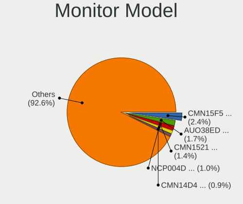

| Model                                                                 | Notebooks | Percent |
|-----------------------------------------------------------------------|-----------|---------|
| Chimei Innolux LCD Monitor CMN15F5 1920x1080 344x193mm 15.5-inch      | 129       | 2.36%   |
| AU Optronics LCD Monitor AUO38ED 1920x1080 344x193mm 15.5-inch        | 92        | 1.68%   |
| Chimei Innolux LCD Monitor CMN1521 1920x1080 344x193mm 15.5-inch      | 79        | 1.44%   |
| PANDA LCD Monitor NCP004D 1920x1080 344x194mm 15.5-inch               | 57        | 1.04%   |
| Chimei Innolux LCD Monitor CMN14D4 1920x1080 309x173mm 13.9-inch      | 49        | 0.9%    |
| Chimei Innolux LCD Monitor CMN15E7 1920x1080 344x193mm 15.5-inch      | 48        | 0.88%   |
| BOE LCD Monitor BOE06A4 1366x768 344x194mm 15.5-inch                  | 48        | 0.88%   |
| BOE LCD Monitor BOE0687 1920x1080 344x193mm 15.5-inch                 | 48        | 0.88%   |
| Chimei Innolux LCD Monitor CMN14C3 1366x768 309x173mm 13.9-inch       | 47        | 0.86%   |
| AU Optronics LCD Monitor AUO21ED 1920x1080 344x193mm 15.5-inch        | 47        | 0.86%   |
| Chimei Innolux LCD Monitor CMN15DB 1366x768 344x193mm 15.5-inch       | 43        | 0.79%   |
| Samsung Electronics LCD Monitor SEC5441 1280x800 331x207mm 15.4-inch  | 37        | 0.68%   |
| AU Optronics LCD Monitor AUO2E3C 1366x768 309x173mm 13.9-inch         | 36        | 0.66%   |
| LG Display LCD Monitor LGD02DC 1366x768 344x194mm 15.5-inch           | 33        | 0.6%    |
| Chimei Innolux LCD Monitor CMN14D6 1366x768 309x173mm 13.9-inch       | 33        | 0.6%    |
| AU Optronics LCD Monitor AUO45EC 1366x768 344x193mm 15.5-inch         | 32        | 0.59%   |
| Chimei Innolux LCD Monitor CMN14E5 1920x1080 309x173mm 13.9-inch      | 31        | 0.57%   |
| AU Optronics LCD Monitor AUO70EC 1366x768 344x193mm 15.5-inch         | 31        | 0.57%   |
| Chimei Innolux LCD Monitor CMN15D5 1920x1080 344x193mm 15.5-inch      | 28        | 0.51%   |
| AU Optronics LCD Monitor AUO403D 1920x1080 309x174mm 14.0-inch        | 28        | 0.51%   |
| TMX TL156MDMP11-0 TMX1560 3200x2000 336x210mm 15.6-inch               | 27        | 0.49%   |
| LG Display LCD Monitor LGD0456 1366x768 344x194mm 15.5-inch           | 27        | 0.49%   |
| BOE LCD Monitor BOE07F6 1920x1080 309x174mm 14.0-inch                 | 27        | 0.49%   |
| BOE LCD Monitor BOE0812 1920x1080 344x194mm 15.5-inch                 | 26        | 0.48%   |
| AU Optronics LCD Monitor AUO71EC 1366x768 344x193mm 15.5-inch         | 24        | 0.44%   |
| AU Optronics LCD Monitor AUO2992 1920x1080 344x193mm 15.5-inch        | 24        | 0.44%   |
| Samsung Electronics LCD Monitor SDC4161 1920x1080 344x194mm 15.5-inch | 23        | 0.42%   |
| PANDA LCD Monitor NCP0036 1920x1080 344x194mm 15.5-inch               | 23        | 0.42%   |
| LG Display LCD Monitor LGD039F 1366x768 345x194mm 15.6-inch           | 23        | 0.42%   |
| Chimei Innolux LCD Monitor CMN153B 1920x1080 344x193mm 15.5-inch      | 23        | 0.42%   |
| AU Optronics LCD Monitor AUOD1ED 1920x1080 344x193mm 15.5-inch        | 23        | 0.42%   |
| Samsung Electronics LCD Monitor SDC4171 2880x1800 302x189mm 14.0-inch | 22        | 0.4%    |
| Goldstar LG IPS FULLHD GSM5AB8 1920x1080 480x270mm 21.7-inch          | 22        | 0.4%    |
| PANDA LCD Monitor NCP002D 1920x1080 344x194mm 15.5-inch               | 21        | 0.38%   |
| BOE LCD Monitor BOE06A9 1920x1080 344x193mm 15.5-inch                 | 21        | 0.38%   |
| AU Optronics LCD Monitor AUO22EC 1366x768 344x193mm 15.5-inch         | 21        | 0.38%   |
| LG Display LCD Monitor LGD033A 1366x768 344x194mm 15.5-inch           | 20        | 0.37%   |
| Chimei Innolux LCD Monitor CMN15AB 1366x768 344x193mm 15.5-inch       | 19        | 0.35%   |
| Chimei Innolux LCD Monitor CMN1618 1920x1200 344x215mm 16.0-inch      | 18        | 0.33%   |
| BOE LCD Monitor BOE07C9 1920x1080 309x173mm 13.9-inch                 | 18        | 0.33%   |

Monitor Resolution
------------------

Monitor screen resolution

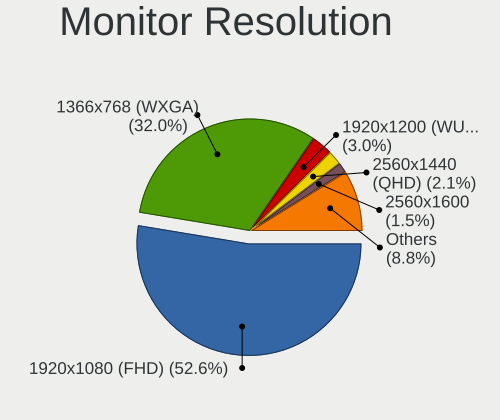

| Resolution         | Notebooks | Percent |
|--------------------|-----------|---------|
| 1920x1080 (FHD)    | 2742      | 52.61%  |
| 1366x768 (WXGA)    | 1667      | 31.98%  |
| 1920x1200 (WUXGA)  | 158       | 3.03%   |
| 2560x1440 (QHD)    | 109       | 2.09%   |
| 2560x1600          | 77        | 1.48%   |
| 3840x2160 (4K)     | 73        | 1.4%    |
| 1600x900 (HD+)     | 71        | 1.36%   |
| 2880x1800          | 60        | 1.15%   |
| 1280x800 (WXGA)    | 58        | 1.11%   |
| 1440x900 (WXGA+)   | 31        | 0.59%   |
| 3200x2000          | 30        | 0.58%   |
| 2560x1080          | 21        | 0.4%    |
| 1360x768           | 13        | 0.25%   |
| 2160x1440          | 11        | 0.21%   |
| Unknown            | 10        | 0.19%   |
| 2240x1400          | 9         | 0.17%   |
| 1024x600           | 8         | 0.15%   |
| 3840x2400          | 7         | 0.13%   |
| 800x1280           | 6         | 0.12%   |
| 2288x1287          | 6         | 0.12%   |
| 1280x1024 (SXGA)   | 6         | 0.12%   |
| 3456x2160          | 5         | 0.1%    |
| 2880x1620          | 5         | 0.1%    |
| 2256x1504          | 5         | 0.1%    |
| 1680x1050 (WSXGA+) | 4         | 0.08%   |
| 3840x1100          | 3         | 0.06%   |
| 3440x1440          | 3         | 0.06%   |
| 3072x1920          | 3         | 0.06%   |
| 1920x1280          | 2         | 0.04%   |
| 3840x1600          | 1         | 0.02%   |
| 3200x1800 (QHD+)   | 1         | 0.02%   |
| 2944x1840          | 1         | 0.02%   |
| 2732x768           | 1         | 0.02%   |
| 2048x1280          | 1         | 0.02%   |
| 1600x2560          | 1         | 0.02%   |
| 1600x1200          | 1         | 0.02%   |
| 1280x768           | 1         | 0.02%   |
| 1280x720 (HD)      | 1         | 0.02%   |

Monitor Diagonal
----------------

Diagonal size in inches

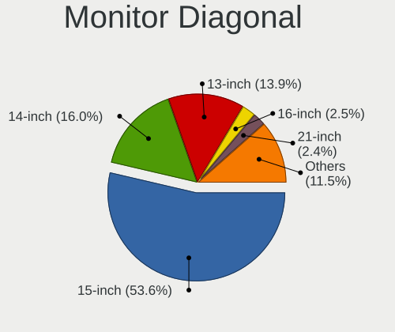

| Inches  | Notebooks | Percent |
|---------|-----------|---------|
| 15      | 2919      | 53.64%  |
| 14      | 872       | 16.02%  |
| 13      | 758       | 13.93%  |
| 16      | 137       | 2.52%   |
| 21      | 129       | 2.37%   |
| 24      | 116       | 2.13%   |
| 27      | 84        | 1.54%   |
| 23      | 67        | 1.23%   |
| 17      | 63        | 1.16%   |
| 12      | 57        | 1.05%   |
| 31      | 33        | 0.61%   |
| Unknown | 30        | 0.55%   |
| 18      | 26        | 0.48%   |
| 19      | 24        | 0.44%   |
| 11      | 24        | 0.44%   |
| 34      | 14        | 0.26%   |
| 20      | 11        | 0.2%    |
| 10      | 10        | 0.18%   |
| 72      | 9         | 0.17%   |
| 40      | 6         | 0.11%   |
| 7       | 6         | 0.11%   |
| 142     | 5         | 0.09%   |
| 63      | 5         | 0.09%   |
| 46      | 5         | 0.09%   |
| 26      | 5         | 0.09%   |
| 54      | 4         | 0.07%   |
| 86      | 3         | 0.06%   |
| 65      | 3         | 0.06%   |
| 32      | 3         | 0.06%   |
| 30      | 3         | 0.06%   |
| 25      | 3         | 0.06%   |
| 64      | 1         | 0.02%   |
| 58      | 1         | 0.02%   |
| 52      | 1         | 0.02%   |
| 42      | 1         | 0.02%   |
| 37      | 1         | 0.02%   |
| 35      | 1         | 0.02%   |
| 29      | 1         | 0.02%   |
| 22      | 1         | 0.02%   |

Monitor Width
-------------

Physical width

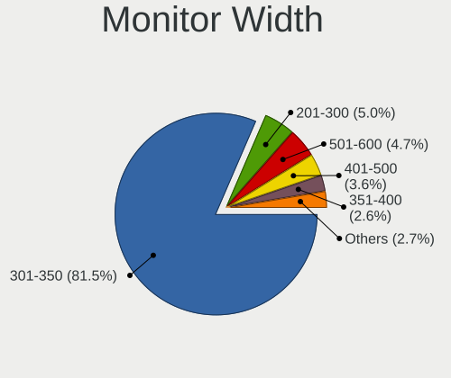

| Width in mm    | Notebooks | Percent |
|----------------|-----------|---------|
| 301-350        | 4419      | 81.47%  |
| 201-300        | 273       | 5.03%   |
| 501-600        | 253       | 4.66%   |
| 401-500        | 193       | 3.56%   |
| 351-400        | 141       | 2.6%    |
| 601-700        | 46        | 0.85%   |
| Unknown        | 30        | 0.55%   |
| 1001-1500      | 23        | 0.42%   |
| 701-800        | 17        | 0.31%   |
| 1501-2000      | 9         | 0.17%   |
| 801-900        | 8         | 0.15%   |
| 1-100          | 6         | 0.11%   |
| More than 2000 | 5         | 0.09%   |
| 901-1000       | 1         | 0.02%   |

Aspect Ratio
------------

Proportional relationship between the width and the height

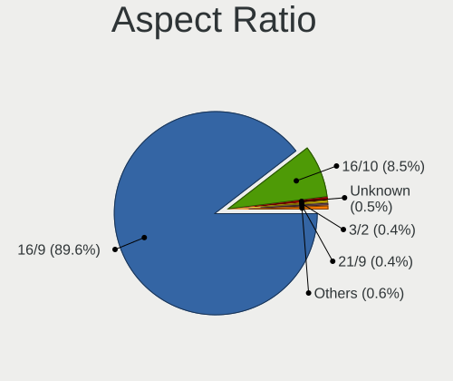

| Ratio   | Notebooks | Percent |
|---------|-----------|---------|
| 16/9    | 4494      | 89.56%  |
| 16/10   | 425       | 8.47%   |
| Unknown | 25        | 0.5%    |
| 3/2     | 21        | 0.42%   |
| 21/9    | 21        | 0.42%   |
| 4/3     | 8         | 0.16%   |
| 1.00    | 5         | 0.1%    |
| 5/4     | 4         | 0.08%   |
| 0.67    | 4         | 0.08%   |
| 3.40    | 3         | 0.06%   |
| 0.56    | 3         | 0.06%   |
| 6/5     | 2         | 0.04%   |
| 0.62    | 2         | 0.04%   |
| 2.00    | 1         | 0.02%   |

Monitor Area
------------

Area in inch²

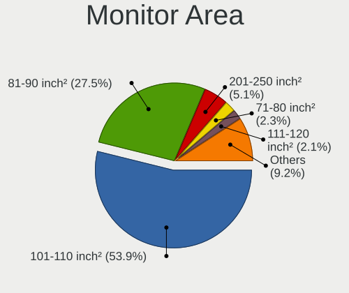

| Area in inch² | Notebooks | Percent |
|----------------|-----------|---------|
| 101-110        | 2928      | 53.86%  |
| 81-90          | 1497      | 27.54%  |
| 201-250        | 275       | 5.06%   |
| 71-80          | 126       | 2.32%   |
| 111-120        | 112       | 2.06%   |
| 301-350        | 89        | 1.64%   |
| 151-200        | 60        | 1.1%    |
| 121-130        | 58        | 1.07%   |
| 61-70          | 53        | 0.97%   |
| 351-500        | 50        | 0.92%   |
| More than 1000 | 32        | 0.59%   |
| Unknown        | 30        | 0.55%   |
| 51-60          | 27        | 0.5%    |
| 141-150        | 25        | 0.46%   |
| 91-100         | 22        | 0.4%    |
| 251-300        | 15        | 0.28%   |
| 501-1000       | 13        | 0.24%   |
| 41-50          | 10        | 0.18%   |
| 131-140        | 8         | 0.15%   |
| 1-40           | 6         | 0.11%   |

Pixel Density
-------------

Pixels per inch

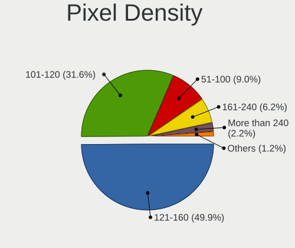

| Density       | Notebooks | Percent |
|---------------|-----------|---------|
| 121-160       | 2685      | 49.9%   |
| 101-120       | 1699      | 31.57%  |
| 51-100        | 483       | 8.98%   |
| 161-240       | 333       | 6.19%   |
| More than 240 | 116       | 2.16%   |
| 1-50          | 35        | 0.65%   |
| Unknown       | 30        | 0.56%   |

Multiple Monitors
-----------------

Total monitors connected

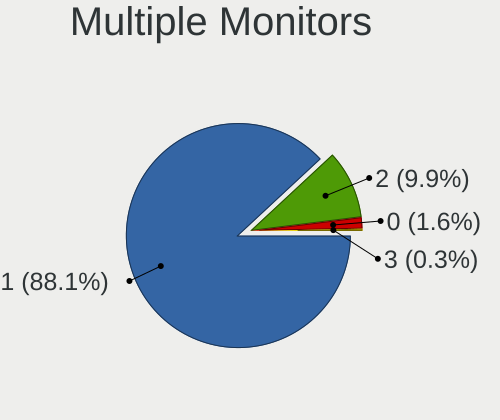

| Total | Notebooks | Percent |
|-------|-----------|---------|
| 1     | 4515      | 88.08%  |
| 2     | 510       | 9.95%   |
| 0     | 84        | 1.64%   |
| 3     | 17        | 0.33%   |

Network
-------

Net Controller Vendor
---------------------

Controller vendors

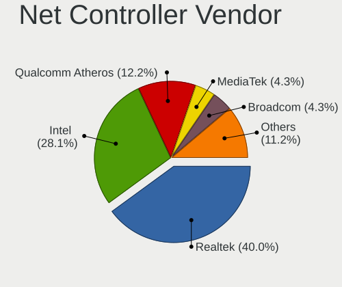

| Vendor                            | Notebooks | Percent |
|-----------------------------------|-----------|---------|
| Realtek Semiconductor             | 3283      | 39.96%  |
| Intel                             | 2307      | 28.08%  |
| Qualcomm Atheros                  | 1000      | 12.17%  |
| MediaTek                          | 356       | 4.33%   |
| Broadcom                          | 353       | 4.3%    |
| Xiaomi                            | 99        | 1.2%    |
| Shenzhen Goodix Technology        | 91        | 1.11%   |
| Samsung Electronics               | 83        | 1.01%   |
| Ralink                            | 83        | 1.01%   |
| OPPO Electronics                  | 72        | 0.88%   |
| Broadcom Limited                  | 70        | 0.85%   |
| TP-Link                           | 65        | 0.79%   |
| Qualcomm                          | 54        | 0.66%   |
| Ralink Technology                 | 46        | 0.56%   |
| Marvell Technology Group          | 34        | 0.41%   |
| Motorola PCS                      | 30        | 0.37%   |
| ASIX Electronics                  | 30        | 0.37%   |
| OnePlus Technology (Shenzhen)     | 16        | 0.19%   |
| Google                            | 16        | 0.19%   |
| Huawei Technologies               | 15        | 0.18%   |
| ICS Advent                        | 12        | 0.15%   |
| D-Link                            | 10        | 0.12%   |
| DisplayLink                       | 9         | 0.11%   |
| JMicron Technology                | 7         | 0.09%   |
| Nvidia                            | 5         | 0.06%   |
| Foxconn / Hon Hai                 | 5         | 0.06%   |
| vivo                              | 4         | 0.05%   |
| Lenovo                            | 4         | 0.05%   |
| HMD Global                        | 4         | 0.05%   |
| Dell                              | 4         | 0.05%   |
| ASUSTek Computer                  | 4         | 0.05%   |
| Apple                             | 4         | 0.05%   |
| Sierra Wireless                   | 3         | 0.04%   |
| Qualcomm Atheros Communications   | 3         | 0.04%   |
| Ericsson Business Mobile Networks | 3         | 0.04%   |
| Attansic Technology               | 3         | 0.04%   |
| ZTE WCDMA Technologies MSM        | 2         | 0.02%   |
| QinHeng Electronics               | 2         | 0.02%   |
| NetGear                           | 2         | 0.02%   |
| Edimax Technology                 | 2         | 0.02%   |

Net Controller Model
--------------------

Controller models

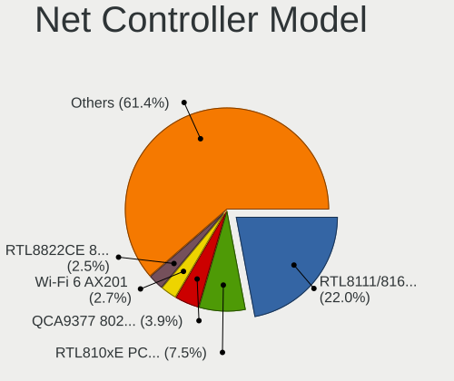

| Model                                                                  | Notebooks | Percent |
|------------------------------------------------------------------------|-----------|---------|
| Realtek RTL8111/8168/8211/8411 PCI Express Gigabit Ethernet Controller | 2109      | 22.04%  |
| Realtek RTL810xE PCI Express Fast Ethernet controller                  | 713       | 7.45%   |
| Qualcomm Atheros QCA9377 802.11ac Wireless Network Adapter             | 375       | 3.92%   |
| Intel Wi-Fi 6 AX201                                                    | 255       | 2.67%   |
| Realtek RTL8822CE 802.11ac PCIe Wireless Network Adapter               | 242       | 2.53%   |
| Intel Wireless 8265 / 8275                                             | 202       | 2.11%   |
| Intel Wi-Fi 6 AX200                                                    | 194       | 2.03%   |
| MediaTek MT7921 802.11ax PCIe Wireless Network Adapter [Filogic 330]   | 191       | 2%      |
| Intel Alder Lake-P PCH CNVi WiFi                                       | 182       | 1.9%    |
| Qualcomm Atheros QCA9565 / AR9565 Wireless Network Adapter             | 176       | 1.84%   |
| Realtek RTL8723BE PCIe Wireless Network Adapter                        | 149       | 1.56%   |
| Realtek RTL8821CE 802.11ac PCIe Wireless Network Adapter               | 146       | 1.53%   |
| Intel Comet Lake PCH-LP CNVi WiFi                                      | 143       | 1.49%   |
| Intel Cannon Lake PCH CNVi WiFi                                        | 141       | 1.47%   |
| Broadcom BCM43142 802.11b/g/n                                          | 139       | 1.45%   |
| Realtek RTL8723DE Wireless Network Adapter                             | 134       | 1.4%    |
| Qualcomm Atheros QCA6174 802.11ac Wireless Network Adapter             | 124       | 1.3%    |
| Intel Cannon Point-LP CNVi [Wireless-AC]                               | 116       | 1.21%   |
| Qualcomm Atheros AR9285 Wireless Network Adapter (PCI-Express)         | 101       | 1.06%   |
| Intel Wireless 7265                                                    | 94        | 0.98%   |
| Shenzhen Goodix Fingerprint Reader                                     | 91        | 0.95%   |
| Qualcomm Atheros AR9485 Wireless Network Adapter                       | 89        | 0.93%   |
| Realtek RTL8852BE PCIe 802.11ax Wireless Network Controller            | 88        | 0.92%   |
| Intel Wireless 3160                                                    | 86        | 0.9%    |
| Intel Wireless 3165                                                    | 84        | 0.88%   |
| Broadcom BCM4313 802.11bgn Wireless Network Adapter                    | 79        | 0.83%   |
| Intel 82579LM Gigabit Network Connection (Lewisville)                  | 76        | 0.79%   |
| Intel Ice Lake-LP PCH CNVi WiFi                                        | 74        | 0.77%   |
| Ralink RT3290 Wireless 802.11n 1T/1R PCIe                              | 72        | 0.75%   |
| Intel Ethernet Connection (4) I219-LM                                  | 71        | 0.74%   |
| Xiaomi Mi/Redmi series (RNDIS)                                         | 70        | 0.73%   |
| Intel Wireless 8260                                                    | 68        | 0.71%   |
| Realtek RTL8852AE 802.11ax PCIe Wireless Network Adapter               | 66        | 0.69%   |
| MediaTek MT7922 802.11ax PCI Express Wireless Network Adapter          | 66        | 0.69%   |
| Intel Comet Lake PCH CNVi WiFi                                         | 66        | 0.69%   |
| Intel Raptor Lake PCH CNVi WiFi                                        | 65        | 0.68%   |
| OPPO Ace 3V                                                            | 64        | 0.67%   |
| MediaTek MT7902 802.11ax PCIe Wireless Network Adapter [Filogic 310]   | 59        | 0.62%   |
| Samsung Galaxy series, misc. (tethering mode)                          | 58        | 0.61%   |
| Realtek Killer E2600 GbE Controller                                    | 52        | 0.54%   |

Wireless Vendor
---------------

Wireless vendors

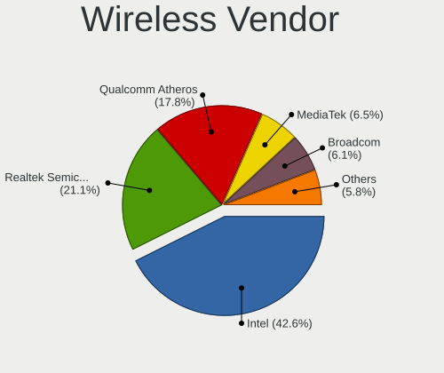

| Vendor                          | Notebooks | Percent |
|---------------------------------|-----------|---------|
| Intel                           | 2181      | 42.62%  |
| Realtek Semiconductor           | 1082      | 21.15%  |
| Qualcomm Atheros                | 913       | 17.84%  |
| MediaTek                        | 331       | 6.47%   |
| Broadcom                        | 313       | 6.12%   |
| Ralink                          | 83        | 1.62%   |
| TP-Link                         | 57        | 1.11%   |
| Broadcom Limited                | 57        | 1.11%   |
| Ralink Technology               | 46        | 0.9%    |
| Qualcomm                        | 22        | 0.43%   |
| D-Link                          | 10        | 0.2%    |
| Dell                            | 4         | 0.08%   |
| Sierra Wireless                 | 3         | 0.06%   |
| Qualcomm Atheros Communications | 3         | 0.06%   |
| NetGear                         | 2         | 0.04%   |
| Edimax Technology               | 2         | 0.04%   |
| Samsung Electronics             | 1         | 0.02%   |
| Realtek                         | 1         | 0.02%   |
| Qualcomm Technologies           | 1         | 0.02%   |
| Philips (or NXP)                | 1         | 0.02%   |
| Micro Star International        | 1         | 0.02%   |
| IMC Networks                    | 1         | 0.02%   |
| D-Link System                   | 1         | 0.02%   |
| ASUSTek Computer                | 1         | 0.02%   |

Wireless Model
--------------

Wireless models

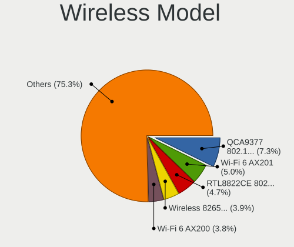

| Model                                                                | Notebooks | Percent |
|----------------------------------------------------------------------|-----------|---------|
| Qualcomm Atheros QCA9377 802.11ac Wireless Network Adapter           | 375       | 7.3%    |
| Intel Wi-Fi 6 AX201                                                  | 255       | 4.96%   |
| Realtek RTL8822CE 802.11ac PCIe Wireless Network Adapter             | 242       | 4.71%   |
| Intel Wireless 8265 / 8275                                           | 202       | 3.93%   |
| Intel Wi-Fi 6 AX200                                                  | 194       | 3.77%   |
| MediaTek MT7921 802.11ax PCIe Wireless Network Adapter [Filogic 330] | 191       | 3.72%   |
| Qualcomm Atheros QCA9565 / AR9565 Wireless Network Adapter           | 176       | 3.42%   |
| Realtek RTL8723BE PCIe Wireless Network Adapter                      | 149       | 2.9%    |
| Realtek RTL8821CE 802.11ac PCIe Wireless Network Adapter             | 146       | 2.84%   |
| Intel Comet Lake PCH-LP CNVi WiFi                                    | 143       | 2.78%   |
| Intel Cannon Lake PCH CNVi WiFi                                      | 141       | 2.74%   |
| Intel Alder Lake-P PCH CNVi WiFi                                     | 139       | 2.7%    |
| Broadcom BCM43142 802.11b/g/n                                        | 139       | 2.7%    |
| Realtek RTL8723DE Wireless Network Adapter                           | 134       | 2.61%   |
| Qualcomm Atheros QCA6174 802.11ac Wireless Network Adapter           | 124       | 2.41%   |
| Intel Cannon Point-LP CNVi [Wireless-AC]                             | 116       | 2.26%   |
| Qualcomm Atheros AR9285 Wireless Network Adapter (PCI-Express)       | 101       | 1.96%   |
| Intel Wireless 7265                                                  | 94        | 1.83%   |
| Qualcomm Atheros AR9485 Wireless Network Adapter                     | 89        | 1.73%   |
| Realtek RTL8852BE PCIe 802.11ax Wireless Network Controller          | 88        | 1.71%   |
| Intel Wireless 3160                                                  | 86        | 1.67%   |
| Intel Wireless 3165                                                  | 84        | 1.63%   |
| Broadcom BCM4313 802.11bgn Wireless Network Adapter                  | 79        | 1.54%   |
| Intel Ice Lake-LP PCH CNVi WiFi                                      | 74        | 1.44%   |
| Ralink RT3290 Wireless 802.11n 1T/1R PCIe                            | 72        | 1.4%    |
| Intel Wireless 8260                                                  | 68        | 1.32%   |
| Realtek RTL8852AE 802.11ax PCIe Wireless Network Adapter             | 66        | 1.28%   |
| Intel Comet Lake PCH CNVi WiFi                                       | 66        | 1.28%   |
| MediaTek MT7902 802.11ax PCIe Wireless Network Adapter [Filogic 310] | 59        | 1.15%   |
| Intel Raptor Lake PCH CNVi WiFi                                      | 58        | 1.13%   |
| MediaTek MT7922 802.11ax PCI Express Wireless Network Adapter        | 54        | 1.05%   |
| Intel Wireless 7260                                                  | 50        | 0.97%   |
| Realtek RTL8822BE 802.11a/b/g/n/ac WiFi adapter                      | 47        | 0.91%   |
| Realtek RTL8188EUS 802.11n Wireless Network Adapter                  | 46        | 0.89%   |
| Intel Centrino Advanced-N 6205 [Taylor Peak]                         | 43        | 0.84%   |
| Intel Dual Band Wireless-AC 3165 Plus Bluetooth                      | 38        | 0.74%   |
| Intel Dual Band Wireless-AC 3168NGW [Stone Peak]                     | 37        | 0.72%   |
| Ralink MT7601U Wireless Adapter                                      | 36        | 0.7%    |
| Intel Wi-Fi 5(802.11ac) Wireless-AC 9x6x [Thunder Peak]              | 30        | 0.58%   |
| Intel Tiger Lake PCH CNVi WiFi                                       | 30        | 0.58%   |

Ethernet Vendor
---------------

Ethernet vendors

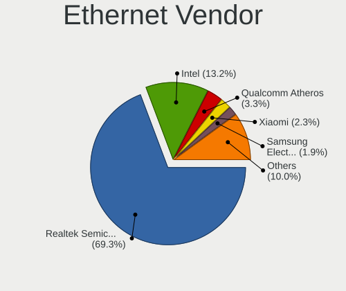

| Vendor                                 | Notebooks | Percent |
|----------------------------------------|-----------|---------|
| Realtek Semiconductor                  | 2963      | 69.26%  |
| Intel                                  | 565       | 13.21%  |
| Qualcomm Atheros                       | 141       | 3.3%    |
| Xiaomi                                 | 99        | 2.31%   |
| Samsung Electronics                    | 82        | 1.92%   |
| OPPO Electronics                       | 72        | 1.68%   |
| Broadcom                               | 69        | 1.61%   |
| Marvell Technology Group               | 34        | 0.79%   |
| MediaTek                               | 33        | 0.77%   |
| Qualcomm                               | 32        | 0.75%   |
| Motorola PCS                           | 30        | 0.7%    |
| ASIX Electronics                       | 30        | 0.7%    |
| Google                                 | 16        | 0.37%   |
| Huawei Technologies                    | 13        | 0.3%    |
| Broadcom Limited                       | 13        | 0.3%    |
| ICS Advent                             | 12        | 0.28%   |
| OnePlus Technology (Shenzhen)          | 11        | 0.26%   |
| DisplayLink                            | 9         | 0.21%   |
| TP-Link                                | 8         | 0.19%   |
| JMicron Technology                     | 7         | 0.16%   |
| Nvidia                                 | 5         | 0.12%   |
| vivo                                   | 4         | 0.09%   |
| Lenovo                                 | 4         | 0.09%   |
| HMD Global                             | 4         | 0.09%   |
| Foxconn / Hon Hai                      | 3         | 0.07%   |
| Attansic Technology                    | 3         | 0.07%   |
| ASUSTek Computer                       | 3         | 0.07%   |
| Apple                                  | 3         | 0.07%   |
| AMTelecom                              | 2         | 0.05%   |
| Altair Semiconductor                   | 2         | 0.05%   |
| ZTE WCDMA Technologies MSM             | 1         | 0.02%   |
| VIA Technologies                       | 1         | 0.02%   |
| Sony Ericsson Mobile Communications AB | 1         | 0.02%   |
| Silicon Integrated Systems [SiS]       | 1         | 0.02%   |
| LeEco                                  | 1         | 0.02%   |
| Hewlett-Packard                        | 1         | 0.02%   |

Ethernet Model
--------------

Ethernet models

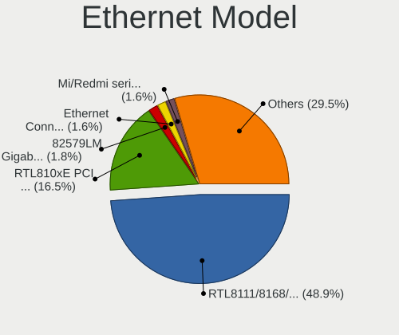

| Model                                                                  | Notebooks | Percent |
|------------------------------------------------------------------------|-----------|---------|
| Realtek RTL8111/8168/8211/8411 PCI Express Gigabit Ethernet Controller | 2109      | 48.9%   |
| Realtek RTL810xE PCI Express Fast Ethernet controller                  | 713       | 16.53%  |
| Intel 82579LM Gigabit Network Connection (Lewisville)                  | 76        | 1.76%   |
| Intel Ethernet Connection (4) I219-LM                                  | 71        | 1.65%   |
| Xiaomi Mi/Redmi series (RNDIS)                                         | 70        | 1.62%   |
| OPPO Ace 3V                                                            | 64        | 1.48%   |
| Samsung Galaxy series, misc. (tethering mode)                          | 58        | 1.34%   |
| Realtek Killer E2600 GbE Controller                                    | 52        | 1.21%   |
| Realtek RTL8153 Gigabit Ethernet Adapter                               | 50        | 1.16%   |
| Intel Ethernet Connection I219-LM                                      | 46        | 1.07%   |
| Intel Alder Lake-P PCH CNVi WiFi                                       | 43        | 1%      |
| Intel Ethernet Connection (4) I219-V                                   | 42        | 0.97%   |
| Intel Ethernet Connection I218-LM                                      | 34        | 0.79%   |
| Xiaomi Mi/Redmi series (RNDIS + ADB)                                   | 29        | 0.67%   |
| Qualcomm Nokia X30 5G                                                  | 27        | 0.63%   |
| Qualcomm Atheros QCA8172 Fast Ethernet                                 | 27        | 0.63%   |
| ASIX AX88179 Gigabit Ethernet                                          | 27        | 0.63%   |
| Samsung GT-I9070 (network tethering, USB debugging enabled)            | 26        | 0.6%    |
| Intel Ethernet Connection (3) I218-LM                                  | 25        | 0.58%   |
| Intel Ethernet Connection (6) I219-LM                                  | 24        | 0.56%   |
| Realtek RTL8125 2.5GbE Controller                                      | 22        | 0.51%   |
| Intel Ethernet Connection I217-LM                                      | 22        | 0.51%   |
| Intel 82577LM Gigabit Network Connection                               | 20        | 0.46%   |
| Broadcom NetLink BCM57785 Gigabit Ethernet PCIe                        | 20        | 0.46%   |
| Motorola PCS motorola one 5G ace                                       | 19        | 0.44%   |
| Qualcomm Atheros AR8162 Fast Ethernet                                  | 18        | 0.42%   |
| Intel Ethernet Connection (10) I219-V                                  | 17        | 0.39%   |
| Qualcomm Atheros QCA8171 Gigabit Ethernet                              | 16        | 0.37%   |
| MediaTek Infinix HOT 50i                                               | 16        | 0.37%   |
| Intel Ethernet Connection (6) I219-V                                   | 16        | 0.37%   |
| Realtek RTL8152 Fast Ethernet Adapter                                  | 15        | 0.35%   |
| Intel Ethernet Connection (16) I219-V                                  | 15        | 0.35%   |
| Marvell Group 88E8040 PCI-E Fast Ethernet Controller                   | 14        | 0.32%   |
| Qualcomm Atheros Killer E2500 Gigabit Ethernet Controller              | 13        | 0.3%    |
| Qualcomm Atheros Killer E2400 Gigabit Ethernet Controller              | 13        | 0.3%    |
| Qualcomm Atheros AR8151 v2.0 Gigabit Ethernet                          | 12        | 0.28%   |
| MediaTek MT7922 802.11ax PCI Express Wireless Network Adapter          | 12        | 0.28%   |
| Qualcomm Atheros AR8152 v2.0 Fast Ethernet                             | 11        | 0.26%   |
| OnePlus (Shenzhen) BE2029                                              | 11        | 0.26%   |
| Motorola PCS moto g100 pro                                             | 11        | 0.26%   |

Net Controller Kind
-------------------

Ethernet, WiFi or modem

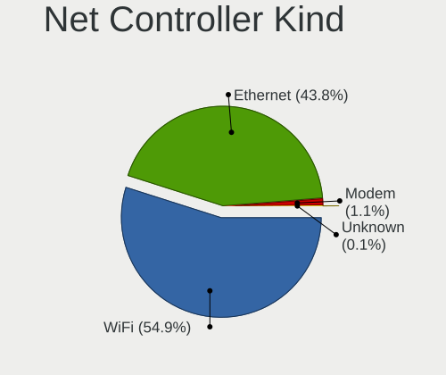

| Kind     | Notebooks | Percent |
|----------|-----------|---------|
| WiFi     | 4924      | 54.91%  |
| Ethernet | 3930      | 43.82%  |
| Modem    | 103       | 1.15%   |
| Unknown  | 11        | 0.12%   |

Used Controller
---------------

Currently used network controller

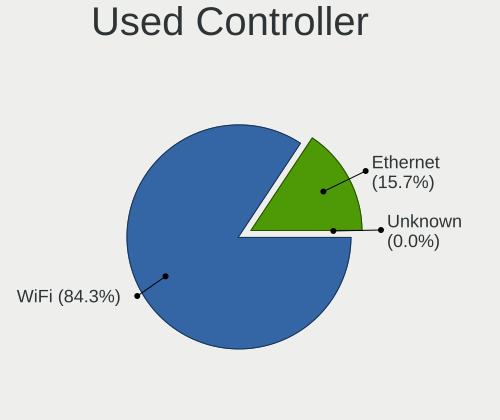

| Kind     | Notebooks | Percent |
|----------|-----------|---------|
| WiFi     | 4262      | 84.31%  |
| Ethernet | 792       | 15.67%  |
| Unknown  | 1         | 0.02%   |

NICs
----

Total network controllers on board

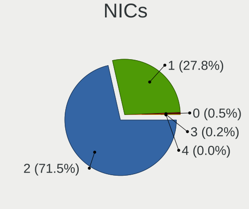

| Total | Notebooks | Percent |
|-------|-----------|---------|
| 2     | 3613      | 71.47%  |
| 1     | 1406      | 27.81%  |
| 0     | 23        | 0.45%   |
| 3     | 11        | 0.22%   |
| 4     | 2         | 0.04%   |

IPv6
----

IPv6 vs IPv4

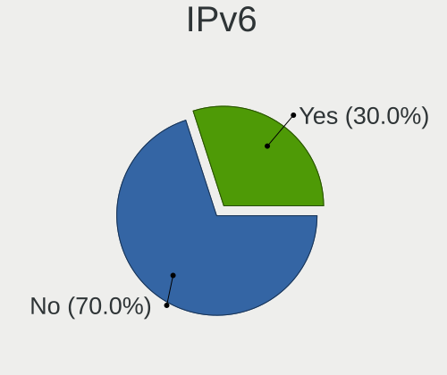

| Used | Notebooks | Percent |
|------|-----------|---------|
| No   | 3629      | 70.03%  |
| Yes  | 1553      | 29.97%  |

Bluetooth
---------

Bluetooth Vendor
----------------

Controller vendors

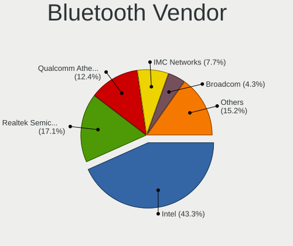

| Vendor                          | Notebooks | Percent |
|---------------------------------|-----------|---------|
| Intel                           | 1989      | 43.32%  |
| Realtek Semiconductor           | 783       | 17.06%  |
| Qualcomm Atheros Communications | 567       | 12.35%  |
| IMC Networks                    | 355       | 7.73%   |
| Broadcom                        | 198       | 4.31%   |
| Foxconn / Hon Hai               | 191       | 4.16%   |
| Lite-On Technology              | 183       | 3.99%   |
| Ralink                          | 72        | 1.57%   |
| Dell                            | 43        | 0.94%   |
| Apple                           | 43        | 0.94%   |
| Cambridge Silicon Radio         | 30        | 0.65%   |
| MediaTek                        | 28        | 0.61%   |
| Hewlett-Packard                 | 24        | 0.52%   |
| Toshiba                         | 13        | 0.28%   |
| TP-Link                         | 11        | 0.24%   |
| Foxconn International           | 11        | 0.24%   |
| USI                             | 10        | 0.22%   |
| Realtek                         | 10        | 0.22%   |
| Ralink Technology               | 8         | 0.17%   |
| Opticis                         | 6         | 0.13%   |
| ASUSTek Computer                | 6         | 0.13%   |
| Chicony Electronics             | 3         | 0.07%   |
| Alps Electric                   | 2         | 0.04%   |
| SINO WEALTH                     | 1         | 0.02%   |
| Micro Star International        | 1         | 0.02%   |
| Integrated System Solution      | 1         | 0.02%   |
| AICSemi                         | 1         | 0.02%   |
| Unknown                         | 1         | 0.02%   |

Bluetooth Model
---------------

Controller models

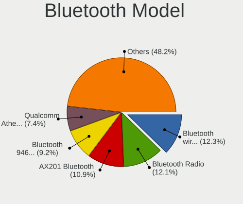

| Model                                               | Notebooks | Percent |
|-----------------------------------------------------|-----------|---------|
| Intel Bluetooth wireless interface                  | 565       | 12.31%  |
| Realtek Bluetooth Radio                             | 554       | 12.07%  |
| Intel AX201 Bluetooth                               | 499       | 10.87%  |
| Intel Bluetooth 9460/9560 Jefferson Peak (JfP)      | 421       | 9.17%   |
| Qualcomm Atheros  Bluetooth Device                  | 338       | 7.36%   |
| IMC Networks Wireless_Device                        | 196       | 4.27%   |
| Intel AX200 Bluetooth                               | 191       | 4.16%   |
| Intel Bluetooth Device                              | 187       | 4.07%   |
| Realtek  Bluetooth 4.2 Adapter                      | 167       | 3.64%   |
| IMC Networks Bluetooth Radio                        | 89        | 1.94%   |
| Ralink RT3290 Bluetooth                             | 72        | 1.57%   |
| Qualcomm Atheros AR9462 Bluetooth                   | 69        | 1.5%    |
| Lite-On Bluetooth Device                            | 62        | 1.35%   |
| IMC Networks Bluetooth Device                       | 62        | 1.35%   |
| Lite-On Qualcomm Atheros QCA9377 Bluetooth          | 57        | 1.24%   |
| Broadcom BCM43142 Bluetooth 4.0                     | 56        | 1.22%   |
| Qualcomm Atheros AR3011 Bluetooth                   | 52        | 1.13%   |
| Foxconn / Hon Hai Wireless_Device                   | 52        | 1.13%   |
| Qualcomm Atheros AR3012 Bluetooth 4.0               | 45        | 0.98%   |
| Qualcomm Atheros QCA61x4 Bluetooth 4.0              | 39        | 0.85%   |
| Intel Centrino Bluetooth Wireless Transceiver       | 38        | 0.83%   |
| Intel Wireless-AC 3168 Bluetooth                    | 35        | 0.76%   |
| Foxconn / Hon Hai Bluetooth Device                  | 33        | 0.72%   |
| Lite-On Wireless_Device                             | 32        | 0.7%    |
| Broadcom BCM43142A0 Bluetooth 4.0                   | 32        | 0.7%    |
| Foxconn / Hon Hai MediaTek Bluetooth Adapter        | 30        | 0.65%   |
| Cambridge Silicon Radio Bluetooth Dongle (HCI mode) | 30        | 0.65%   |
| Apple Bluetooth USB Host Controller                 | 26        | 0.57%   |
| MediaTek Wireless_Device                            | 24        | 0.52%   |
| Realtek RTL8821A Bluetooth                          | 22        | 0.48%   |
| Realtek RTL8723B Bluetooth                          | 22        | 0.48%   |
| Intel Wireless-AC 9260 Bluetooth Adapter            | 20        | 0.44%   |
| Broadcom BCM43142A0 Bluetooth Device                | 20        | 0.44%   |
| Broadcom BCM2070 Bluetooth 2.1 + EDR                | 20        | 0.44%   |
| Intel Centrino Advanced-N 6230 Bluetooth adapter    | 19        | 0.41%   |
| Foxconn / Hon Hai Bluetooth USB Host Controller     | 18        | 0.39%   |
| HP Broadcom 2070 Bluetooth Combo                    | 16        | 0.35%   |
| Foxconn / Hon Hai Broadcom Bluetooth 2.1 Device     | 16        | 0.35%   |
| Dell Wireless 365 Bluetooth                         | 16        | 0.35%   |
| Realtek RTL8822BE Bluetooth 4.2 Adapter             | 15        | 0.33%   |

Sound
-----

Sound Vendor
------------

Sound card vendors

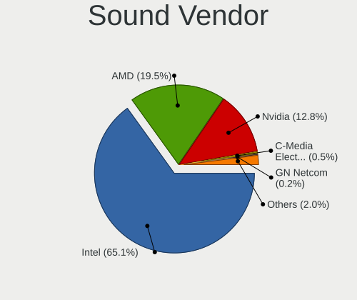

| Vendor                           | Notebooks | Percent |
|----------------------------------|-----------|---------|
| Intel                            | 3902      | 65.06%  |
| AMD                              | 1167      | 19.46%  |
| Nvidia                           | 765       | 12.75%  |
| C-Media Electronics              | 30        | 0.5%    |
| GN Netcom                        | 13        | 0.22%   |
| Realtek Semiconductor            | 12        | 0.2%    |
| Walmart                          | 8         | 0.13%   |
| Logitech                         | 8         | 0.13%   |
| JMTek                            | 8         | 0.13%   |
| ASUSTek Computer                 | 8         | 0.13%   |
| Plantronics                      | 6         | 0.1%    |
| DSEA A/S                         | 6         | 0.1%    |
| Generalplus Technology           | 5         | 0.08%   |
| Apple                            | 4         | 0.07%   |
| Texas Instruments                | 3         | 0.05%   |
| SteelSeries ApS                  | 3         | 0.05%   |
| Razer USA                        | 3         | 0.05%   |
| Lenovo                           | 3         | 0.05%   |
| Huawei Technologies              | 3         | 0.05%   |
| YSTEK Technology                 | 2         | 0.03%   |
| Tenx Technology                  | 2         | 0.03%   |
| Synaptics                        | 2         | 0.03%   |
| Samsung Electronics              | 2         | 0.03%   |
| OPPO Electronics                 | 2         | 0.03%   |
| KTMicro                          | 2         | 0.03%   |
| Unknown                          | 2         | 0.03%   |
| Yamaha                           | 1         | 0.02%   |
| XMOS                             | 1         | 0.02%   |
| Vault                            | 1         | 0.02%   |
| TTGK Technology                  | 1         | 0.02%   |
| Solid State System               | 1         | 0.02%   |
| Silicon Integrated Systems [SiS] | 1         | 0.02%   |
| Shenzhen Rapoo Technology        | 1         | 0.02%   |
| Samson Technologies              | 1         | 0.02%   |
| Panasonic (Matsushita)           | 1         | 0.02%   |
| Microsoft                        | 1         | 0.02%   |
| liyuany                          | 1         | 0.02%   |
| LE XIAN                          | 1         | 0.02%   |
| Kingston Technology              | 1         | 0.02%   |
| Jieli Technology                 | 1         | 0.02%   |

Sound Model
-----------

Sound card models

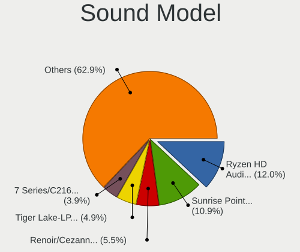

| Model                                                                                             | Notebooks | Percent |
|---------------------------------------------------------------------------------------------------|-----------|---------|
| AMD Ryzen HD Audio Controller                                                                     | 896       | 11.96%  |
| Intel Sunrise Point-LP HD Audio                                                                   | 816       | 10.89%  |
| AMD Renoir/Cezanne HDMI/DP Audio Controller                                                       | 409       | 5.46%   |
| Intel Tiger Lake-LP Smart Sound Technology Audio Controller                                       | 367       | 4.9%    |
| Intel 7 Series/C216 Chipset Family High Definition Audio Controller                               | 291       | 3.88%   |
| Intel Alder Lake PCH-P High Definition Audio Controller                                           | 256       | 3.42%   |
| Intel 8 Series HD Audio Controller                                                                | 256       | 3.42%   |
| Intel Haswell-ULT HD Audio Controller                                                             | 254       | 3.39%   |
| Nvidia TU107 GeForce GTX 1650 High Definition Audio Controller                                    | 249       | 3.32%   |
| Intel Cannon Point-LP High Definition Audio Controller                                            | 225       | 3%      |
| AMD Raven/Raven2/Fenghuang HDMI/DP Audio Controller                                               | 218       | 2.91%   |
| Intel Cannon Lake PCH cAVS                                                                        | 209       | 2.79%   |
| Intel Broadwell-U Audio Controller                                                                | 191       | 2.55%   |
| Intel Wildcat Point-LP High Definition Audio Controller                                           | 190       | 2.54%   |
| Intel Comet Lake PCH-LP cAVS                                                                      | 186       | 2.48%   |
| Intel 6 Series/C200 Series Chipset Family High Definition Audio Controller                        | 184       | 2.46%   |
| Intel Ice Lake-LP Smart Sound Technology Audio Controller                                         | 136       | 1.82%   |
| Intel 5 Series/3400 Series Chipset High Definition Audio                                          | 133       | 1.77%   |
| Nvidia GA107 High Definition Audio Controller                                                     | 125       | 1.67%   |
| AMD Radeon High Definition Audio Controller                                                       | 123       | 1.64%   |
| AMD FCH Azalia Controller                                                                         | 109       | 1.45%   |
| AMD Family 15h (Models 60h-6fh) Audio Controller                                                  | 100       | 1.33%   |
| Intel Comet Lake PCH cAVS                                                                         | 97        | 1.29%   |
| Intel Raptor Lake-P/U/H cAVS                                                                      | 96        | 1.28%   |
| AMD Kabini HDMI/DP Audio                                                                          | 93        | 1.24%   |
| AMD High Definition Audio Controller                                                              | 79        | 1.05%   |
| Intel 82801I (ICH9 Family) HD Audio Controller                                                    | 69        | 0.92%   |
| Intel 8 Series/C220 Series Chipset High Definition Audio Controller                               | 58        | 0.77%   |
| Nvidia AD107 High Definition Audio Controller                                                     | 55        | 0.73%   |
| Nvidia GP107GL High Definition Audio Controller                                                   | 50        | 0.67%   |
| Nvidia GA106 High Definition Audio Controller                                                     | 50        | 0.67%   |
| Intel Xeon E3-1200 v3/4th Gen Core Processor HD Audio Controller                                  | 50        | 0.67%   |
| Intel Tiger Lake-H HD Audio Controller                                                            | 49        | 0.65%   |
| Intel CM238 HD Audio Controller                                                                   | 49        | 0.65%   |
| Nvidia TU116 High Definition Audio Controller                                                     | 34        | 0.45%   |
| Nvidia GF108 High Definition Audio Controller                                                     | 31        | 0.41%   |
| Intel Raptor Lake High Definition Audio Controller                                                | 28        | 0.37%   |
| Intel Atom/Celeron/Pentium Processor x5-E8000/J3xxx/N3xxx Series High Definition Audio Controller | 28        | 0.37%   |
| Intel 82801H (ICH8 Family) HD Audio Controller                                                    | 26        | 0.35%   |
| Nvidia TU106 High Definition Audio Controller                                                     | 25        | 0.33%   |

Memory
------

Memory Vendor
-------------

Memory module vendors

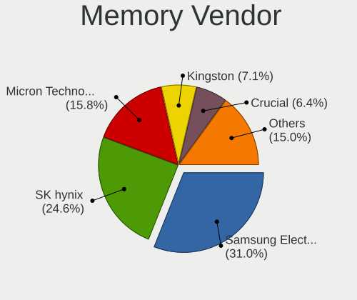

| Vendor                 | Notebooks | Percent |
|------------------------|-----------|---------|
| Samsung Electronics    | 1164      | 31.05%  |
| SK hynix               | 923       | 24.62%  |
| Micron Technology      | 594       | 15.84%  |
| Kingston               | 267       | 7.12%   |
| Crucial                | 239       | 6.38%   |
| Ramaxel Technology     | 126       | 3.36%   |
| A-DATA Technology      | 101       | 2.69%   |
| Unknown                | 89        | 2.37%   |
| Transcend              | 43        | 1.15%   |
| Unknown                | 39        | 1.04%   |
| Nanya Technology       | 30        | 0.8%    |
| Elpida                 | 29        | 0.77%   |
| CSX                    | 28        | 0.75%   |
| G.Skill                | 17        | 0.45%   |
| Corsair                | 12        | 0.32%   |
| Unknown (ABCD)         | 3         | 0.08%   |
| Unknown (0x0CAB)       | 3         | 0.08%   |
| Apacer                 | 3         | 0.08%   |
| ACPI Digital           | 3         | 0.08%   |
| Unknown (0x0CDC)       | 2         | 0.05%   |
| Strontium              | 2         | 0.05%   |
| Silicon Power          | 2         | 0.05%   |
| SHARETRONIC            | 2         | 0.05%   |
| Qimonda                | 2         | 0.05%   |
| OM Nanotech            | 2         | 0.05%   |
| Gold Key               | 2         | 0.05%   |
| Avant                  | 2         | 0.05%   |
| ASint Technology       | 2         | 0.05%   |
| ZION                   | 1         | 0.03%   |
| Unknown (8AD6)         | 1         | 0.03%   |
| Unknown (0x1007)       | 1         | 0.03%   |
| Unknown (0x0080)       | 1         | 0.03%   |
| Unknown (0B79)         | 1         | 0.03%   |
| Unknown (09D5)         | 1         | 0.03%   |
| Unknown (07F7)         | 1         | 0.03%   |
| Unknown (00000000802C) | 1         | 0.03%   |
| Team                   | 1         | 0.03%   |
| Sesame                 | 1         | 0.03%   |
| Qumo                   | 1         | 0.03%   |
| Lexar Co Limited       | 1         | 0.03%   |

Memory Model
------------

Memory module models

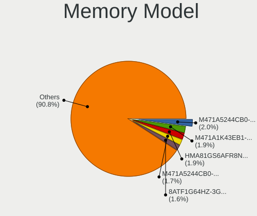

| Model                                                       | Notebooks | Percent |
|-------------------------------------------------------------|-----------|---------|
| Samsung RAM M471A5244CB0-CTD 4GB SODIMM DDR4 3266MT/s       | 80        | 2.03%   |
| Samsung RAM M471A1K43EB1-CWE 8GB SODIMM DDR4 3200MT/s       | 76        | 1.93%   |
| SK hynix RAM HMA81GS6AFR8N-UH 8GB SODIMM DDR4 2667MT/s      | 74        | 1.88%   |
| Samsung RAM M471A5244CB0-CRC 4GB SODIMM DDR4 2667MT/s       | 66        | 1.68%   |
| Micron RAM 8ATF1G64HZ-3G2R1 8GB SODIMM DDR4 3200MT/s        | 64        | 1.63%   |
| Samsung RAM M471A1G44AB0-CWE 8GiB SODIMM DDR4 3200MT/s      | 63        | 1.6%    |
| Samsung RAM M471A1G44BB0-CWE 8GB SODIMM DDR4 3200MT/s       | 58        | 1.47%   |
| Samsung RAM M471A5244CB0-CWE 4GB SODIMM DDR4 3200MT/s       | 56        | 1.42%   |
| SK hynix RAM HMA81GS6DJR8N-XN 8GB SODIMM DDR4 3200MT/s      | 55        | 1.4%    |
| SK hynix RAM HMT451S6BFR8A-PB 4GB SODIMM DDR3 1600MT/s      | 54        | 1.37%   |
| SK hynix RAM HMA851S6AFR6N-UH 4GB SODIMM DDR4 2667MT/s      | 50        | 1.27%   |
| Samsung RAM M471A1K43DB1-CWE 8GB SODIMM DDR4 3200MT/s       | 46        | 1.17%   |
| SK hynix RAM HMA81GS6JJR8N-VK 8GB SODIMM DDR4 2667MT/s      | 45        | 1.14%   |
| Micron RAM 4ATF1G64HZ-3G2F1 8GB SODIMM DDR4 3200MT/s        | 45        | 1.14%   |
| SK hynix RAM HMAA1GS6CJR6N-XN 8GB SODIMM DDR4 3200MT/s      | 41        | 1.04%   |
| Samsung RAM M471A1K43DB1-CTD 8GB SODIMM DDR4 2667MT/s       | 41        | 1.04%   |
| Micron RAM 8ATF1G64HZ-3G2J1 8GB SODIMM DDR4 3200MT/s        | 41        | 1.04%   |
| Unknown                                                     | 39        | 0.99%   |
| SK hynix RAM HMA851S6CJR6N-VK 4GB SODIMM DDR4 2667MT/s      | 37        | 0.94%   |
| Samsung RAM M471A1G44AB0-CWE 8GB Row Of Chips DDR4 3200MT/s | 37        | 0.94%   |
| SK hynix RAM HMA851S6JJR6N-VK 4GB SODIMM DDR4 2667MT/s      | 35        | 0.89%   |
| Micron RAM 4ATF51264HZ-3G2J1 4GB SODIMM DDR4 3200MT/s       | 35        | 0.89%   |
| Samsung RAM M471B5173EB0-YK0 4GB SODIMM DDR3 1600MT/s       | 33        | 0.84%   |
| Samsung RAM M471A1K43CB1-CTD 8GB SODIMM DDR4 3200MT/s       | 33        | 0.84%   |
| SK hynix RAM HMA81GS6CJR8N-VK 8GB SODIMM DDR4 2667MT/s      | 32        | 0.81%   |
| Samsung RAM M471B5173QH0-YK0 4GB SODIMM DDR3 1600MT/s       | 29        | 0.74%   |
| Micron RAM 4ATF1G64HZ-3G2E1 8GB SODIMM DDR4 3200MT/s        | 29        | 0.74%   |
| Samsung RAM M471A1K43CB1-CRC 8GB SODIMM DDR4 8400MT/s       | 28        | 0.71%   |
| Samsung RAM M471B5173DB0-YK0 4GB SODIMM DDR3 1600MT/s       | 27        | 0.69%   |
| Micron RAM 8KTF51264HZ-1G6E1 4GB SODIMM DDR3 1600MT/s       | 26        | 0.66%   |
| Micron RAM 4ATF51264HZ-2G6E1 4GB SODIMM DDR4 2667MT/s       | 25        | 0.64%   |
| SK hynix RAM HMA851S6DJR6N-XN 4GB SODIMM DDR4 3200MT/s      | 24        | 0.61%   |
| Samsung RAM M471A1K43BB1-CRC 8GB SODIMM DDR4 2667MT/s       | 21        | 0.53%   |
| SK hynix RAM HMT351S6EFR8A-PB 4GB SODIMM DDR3 1600MT/s      | 20        | 0.51%   |
| SK hynix RAM HMT451S6AFR8A-PB 4GB SODIMM DDR3 1600MT/s      | 19        | 0.48%   |
| Samsung RAM M471B1G73EB0-YK0 8192MB SODIMM DDR3 1600MT/s    | 19        | 0.48%   |
| Crucial RAM CB8GS2400.C8ET 8GB SODIMM DDR4 2667MT/s         | 19        | 0.48%   |
| Ramaxel RAM RMSA3270ME86H9F-2666 4GB SODIMM DDR4 2667MT/s   | 18        | 0.46%   |
| Micron RAM 4ATF1G64HZ-3G2E2 8GB SODIMM DDR4 3200MT/s        | 18        | 0.46%   |
| Kingston RAM LV32D4S2S8HD-8 8GB SODIMM DDR4 3200MT/s        | 18        | 0.46%   |

Memory Kind
-----------

Memory module kinds

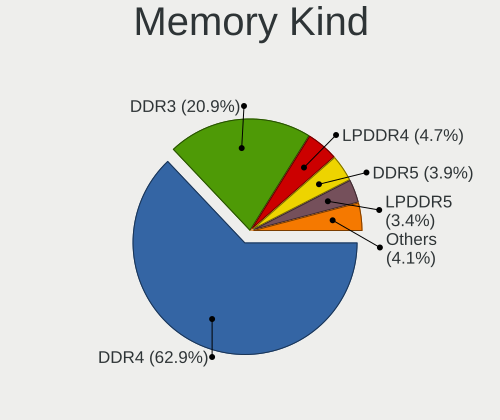

| Kind    | Notebooks | Percent |
|---------|-----------|---------|
| DDR4    | 1902      | 62.94%  |
| DDR3    | 633       | 20.95%  |
| LPDDR4  | 141       | 4.67%   |
| DDR5    | 119       | 3.94%   |
| LPDDR5  | 103       | 3.41%   |
| LPDDR3  | 42        | 1.39%   |
| DDR2    | 38        | 1.26%   |
| SDRAM   | 35        | 1.16%   |
| Unknown | 7         | 0.23%   |
| DDR     | 2         | 0.07%   |

Memory Form Factor
------------------

Physical design of the memory module

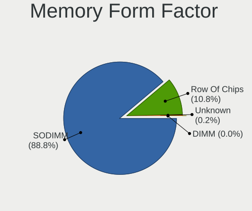

| Name         | Notebooks | Percent |
|--------------|-----------|---------|
| SODIMM       | 2673      | 88.83%  |
| Row Of Chips | 324       | 10.77%  |
| Unknown      | 7         | 0.23%   |
| Chip         | 4         | 0.13%   |
| DIMM         | 1         | 0.03%   |

Memory Size
-----------

Memory module size

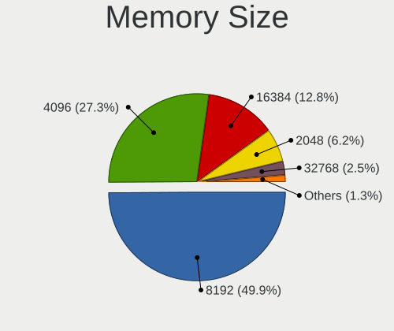

| Size  | Notebooks | Percent |
|-------|-----------|---------|
| 8192  | 1668      | 49.91%  |
| 4096  | 912       | 27.29%  |
| 16384 | 429       | 12.84%  |
| 2048  | 206       | 6.16%   |
| 32768 | 84        | 2.51%   |
| 1024  | 32        | 0.96%   |
| 12288 | 4         | 0.12%   |
| 6144  | 3         | 0.09%   |
| 512   | 3         | 0.09%   |
| 3072  | 1         | 0.03%   |

Memory Speed
------------

Memory module speed

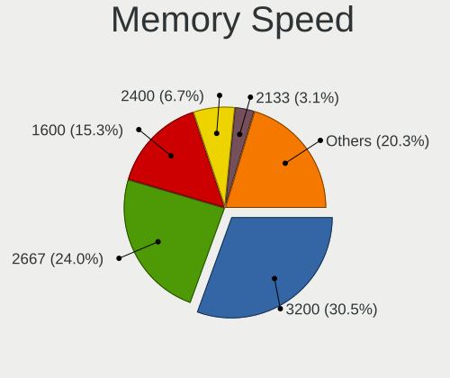

| Speed   | Notebooks | Percent |
|---------|-----------|---------|
| 3200    | 1002      | 30.55%  |
| 2667    | 787       | 23.99%  |
| 1600    | 503       | 15.34%  |
| 2400    | 220       | 6.71%   |
| 2133    | 102       | 3.11%   |
| 3266    | 80        | 2.44%   |
| 4800    | 69        | 2.1%    |
| 1333    | 63        | 1.92%   |
| 6400    | 61        | 1.86%   |
| 1334    | 57        | 1.74%   |
| 4267    | 55        | 1.68%   |
| 5600    | 51        | 1.55%   |
| 8400    | 31        | 0.95%   |
| 4199    | 26        | 0.79%   |
| 1067    | 21        | 0.64%   |
| 667     | 21        | 0.64%   |
| 7500    | 19        | 0.58%   |
| Unknown | 19        | 0.58%   |
| 1867    | 15        | 0.46%   |
| 975     | 14        | 0.43%   |
| 800     | 11        | 0.34%   |
| 5500    | 8         | 0.24%   |
| 4266    | 8         | 0.24%   |
| 8533    | 7         | 0.21%   |
| 2048    | 6         | 0.18%   |
| 3733    | 5         | 0.15%   |
| 7467    | 4         | 0.12%   |
| 8000    | 3         | 0.09%   |
| 533     | 3         | 0.09%   |
| 8600    | 2         | 0.06%   |
| 1639    | 2         | 0.06%   |
| 1066    | 2         | 0.06%   |
| 5200    | 1         | 0.03%   |
| 2800    | 1         | 0.03%   |
| 1866    | 1         | 0.03%   |

Printers & scanners
-------------------

Printer Vendor
--------------

Printer device vendors

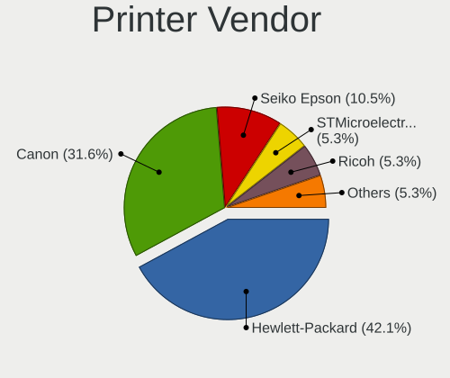

| Vendor             | Notebooks | Percent |
|--------------------|-----------|---------|
| Hewlett-Packard    | 8         | 42.11%  |
| Canon              | 6         | 31.58%  |
| Seiko Epson        | 2         | 10.53%  |
| STMicroelectronics | 1         | 5.26%   |
| Ricoh              | 1         | 5.26%   |
| Brother Industries | 1         | 5.26%   |

Printer Model
-------------

Printer device models

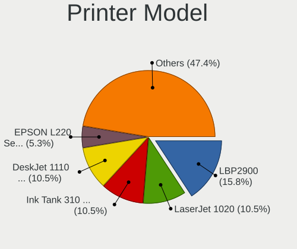

| Model                                   | Notebooks | Percent |
|-----------------------------------------|-----------|---------|
| Canon LBP2900                           | 3         | 15.79%  |
| HP LaserJet 1020                        | 2         | 10.53%  |
| HP Ink Tank 310 series                  | 2         | 10.53%  |
| HP DeskJet 1110 series                  | 2         | 10.53%  |
| STMicroelectronics USB Printing Support | 1         | 5.26%   |
| Seiko Epson EPSON L220 Series           | 1         | 5.26%   |
| Seiko Epson EPSON L132 Series           | 1         | 5.26%   |
| Ricoh SP 111SU                          | 1         | 5.26%   |
| HP DeskJet 2600 series                  | 1         | 5.26%   |
| HP DeskJet 2130 series                  | 1         | 5.26%   |
| Canon PIXMA MP190                       | 1         | 5.26%   |
| Canon MF4800 Series                     | 1         | 5.26%   |
| Canon G2000 series                      | 1         | 5.26%   |
| Brother HL-L2320D series                | 1         | 5.26%   |

Scanner Vendor
--------------

Scanner device vendors

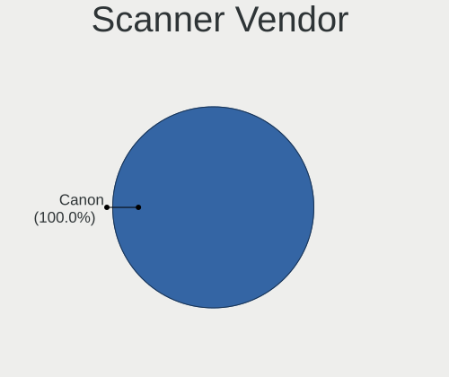

| Vendor | Notebooks | Percent |
|--------|-----------|---------|
| Canon  | 2         | 100%    |

Scanner Model
-------------

Scanner device models

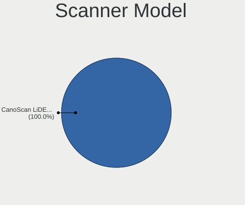

| Model                   | Notebooks | Percent |
|-------------------------|-----------|---------|
| Canon CanoScan LiDE 110 | 2         | 100%    |

Camera
------

Camera Vendor
-------------

Camera device vendors

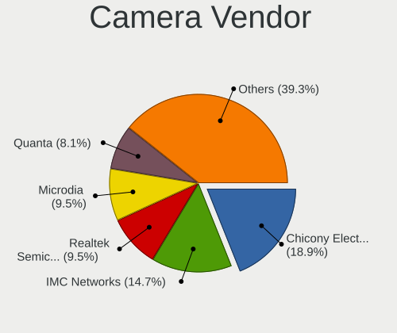

| Vendor                                 | Notebooks | Percent |
|----------------------------------------|-----------|---------|
| Chicony Electronics                    | 890       | 18.94%  |
| IMC Networks                           | 689       | 14.66%  |
| Realtek Semiconductor                  | 448       | 9.53%   |
| Microdia                               | 446       | 9.49%   |
| Quanta                                 | 379       | 8.07%   |
| Bison Electronics                      | 299       | 6.36%   |
| Sunplus Innovation Technology          | 269       | 5.72%   |
| Cheng Uei Precision Industry (Foxlink) | 218       | 4.64%   |
| Luxvisions Innotech Limited            | 193       | 4.11%   |
| Syntek                                 | 159       | 3.38%   |
| Suyin                                  | 153       | 3.26%   |
| Sonix Technology                       | 112       | 2.38%   |
| Lite-On Technology                     | 79        | 1.68%   |
| Apple                                  | 38        | 0.81%   |
| Alcor Micro                            | 38        | 0.81%   |
| ShineTech                              | 35        | 0.74%   |
| SunplusIT                              | 25        | 0.53%   |
| Silicon Motion                         | 25        | 0.53%   |
| Samsung Electronics                    | 25        | 0.53%   |
| Acer                                   | 22        | 0.47%   |
| Ricoh                                  | 18        | 0.38%   |
| Logitech                               | 17        | 0.36%   |
| Importek                               | 13        | 0.28%   |
| Primax Electronics                     | 11        | 0.23%   |
| Lenovo                                 | 10        | 0.21%   |
| OmniVision Technologies                | 9         | 0.19%   |
| Z-Star Microelectronics                | 6         | 0.13%   |
| ShineOptics                            | 6         | 0.13%   |
| Intel                                  | 6         | 0.13%   |
| Foxlink                                | 5         | 0.11%   |
| vivo                                   | 4         | 0.09%   |
| Pixart Imaging                         | 4         | 0.09%   |
| OPPO Electronics                       | 4         | 0.09%   |
| MSD                                    | 4         | 0.09%   |
| Shine-optics                           | 3         | 0.06%   |
| Foxconn / Hon Hai                      | 3         | 0.06%   |
| ALi                                    | 3         | 0.06%   |
| Unknown                                | 2         | 0.04%   |
| Nihon KOHDEN                           | 2         | 0.04%   |
| MacroSilicon                           | 2         | 0.04%   |

Camera Model
------------

Camera device models

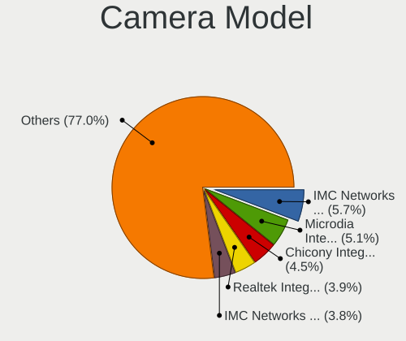

| Model                                                          | Notebooks | Percent |
|----------------------------------------------------------------|-----------|---------|
| IMC Networks USB2.0 HD UVC WebCam                              | 271       | 5.75%   |
| Microdia Integrated_Webcam_HD                                  | 239       | 5.07%   |
| Chicony Integrated Camera                                      | 213       | 4.52%   |
| Realtek Integrated_Webcam_HD                                   | 182       | 3.86%   |
| IMC Networks Integrated Camera                                 | 180       | 3.82%   |
| Sunplus Integrated_Webcam_HD                                   | 119       | 2.52%   |
| IMC Networks USB2.0 VGA UVC WebCam                             | 105       | 2.23%   |
| Syntek Integrated Camera                                       | 97        | 2.06%   |
| Chicony HP TrueVision HD Camera                                | 97        | 2.06%   |
| Bison Integrated Camera                                        | 83        | 1.76%   |
| Quanta HP TrueVision HD Camera                                 | 79        | 1.68%   |
| Chicony HP TrueVision HD                                       | 77        | 1.63%   |
| Sonix USB2.0 HD UVC WebCam                                     | 76        | 1.61%   |
| Quanta HD Webcam                                               | 75        | 1.59%   |
| Realtek Integrated Webcam                                      | 74        | 1.57%   |
| Luxvisions Innotech Limited HP TrueVision HD Camera            | 66        | 1.4%    |
| Quanta HD User Facing                                          | 59        | 1.25%   |
| Chicony EasyCamera                                             | 57        | 1.21%   |
| Suyin HP Truevision HD                                         | 55        | 1.17%   |
| Chicony HD WebCam                                              | 55        | 1.17%   |
| Luxvisions Innotech Limited HP Wide Vision HD Camera           | 54        | 1.15%   |
| Quanta HP Wide Vision HD Camera                                | 49        | 1.04%   |
| Cheng Uei Precision Industry (Foxlink) HP TrueVision HD Camera | 47        | 1%      |
| Luxvisions Innotech Limited Integrated Camera                  | 45        | 0.95%   |
| Chicony HD User Facing                                         | 44        | 0.93%   |
| Bison HD Webcam                                                | 44        | 0.93%   |
| Cheng Uei Precision Industry (Foxlink) HP TrueVision HD        | 42        | 0.89%   |
| Bison EasyCamera                                               | 40        | 0.85%   |
| Bison Lenovo EasyCamera                                        | 38        | 0.81%   |
| Lite-On Integrated Camera                                      | 37        | 0.78%   |
| Syntek EasyCamera                                              | 36        | 0.76%   |
| IMC Networks HP TrueVision HD Camera                           | 35        | 0.74%   |
| Chicony HP Wide Vision HD Camera                               | 35        | 0.74%   |
| Microdia Laptop_Integrated_Webcam_HD                           | 34        | 0.72%   |
| Microdia Integrated Webcam                                     | 34        | 0.72%   |
| Chicony HP HD Camera                                           | 34        | 0.72%   |
| Sunplus XiaoMi USB 2.0 Webcam                                  | 33        | 0.7%    |
| Microdia USB 2.0 Camera                                        | 32        | 0.68%   |
| Chicony Integrated Camera (1280x720@30)                        | 31        | 0.66%   |
| Suyin Integrated_Webcam_HD                                     | 30        | 0.64%   |

Security
--------

Fingerprint Vendor
------------------

Fingerprint sensor vendors

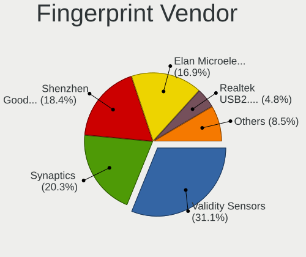

| Vendor                             | Notebooks | Percent |
|------------------------------------|-----------|---------|
| Validity Sensors                   | 242       | 31.15%  |
| Synaptics                          | 158       | 20.33%  |
| Shenzhen Goodix Technology         | 143       | 18.4%   |
| Elan Microelectronics              | 131       | 16.86%  |
| Realtek USB2.0 Finger Print Bridge | 37        | 4.76%   |
| LighTuning Technology              | 26        | 3.35%   |
| AuthenTec                          | 15        | 1.93%   |
| Upek                               | 14        | 1.8%    |
| Focal-systems.Corp                 | 6         | 0.77%   |
| HOLTEK                             | 3         | 0.39%   |
| STMicroelectronics                 | 2         | 0.26%   |

Fingerprint Model
-----------------

Fingerprint sensor models

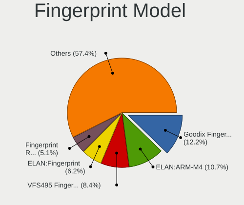

| Model                                                                      | Notebooks | Percent |
|----------------------------------------------------------------------------|-----------|---------|
| Shenzhen Goodix  FingerPrint Device                                        | 95        | 12.23%  |
| Elan ELAN:ARM-M4                                                           | 83        | 10.68%  |
| Validity Sensors VFS495 Fingerprint Reader                                 | 65        | 8.37%   |
| Elan ELAN:Fingerprint                                                      | 48        | 6.18%   |
| Shenzhen Goodix Fingerprint Reader                                         | 40        | 5.15%   |
| Realtek USB2.0 Finger Print Bridge FocalTech Fingerprint Device            | 37        | 4.76%   |
| Synaptics Metallica MIS Touch Fingerprint Reader                           | 36        | 4.63%   |
| Synaptics Prometheus MIS Touch Fingerprint Reader                          | 31        | 3.99%   |
| Validity Sensors VFS5011 Fingerprint Reader                                | 29        | 3.73%   |
| LighTuning EgisTec Touch Fingerprint Sensor                                | 26        | 3.35%   |
| Validity Sensors Synaptics VFS7552 Touch Fingerprint Sensor                | 24        | 3.09%   |
| Validity Sensors Synaptics WBDI                                            | 18        | 2.32%   |
| Synaptics Metallica MOH Touch Fingerprint Reader                           | 18        | 2.32%   |
| Validity Sensors VFS 5011 fingerprint sensor                               | 17        | 2.19%   |
| Validity Sensors VFS491                                                    | 16        | 2.06%   |
| Validity Sensors Synaptics VFS7552 Touch Fingerprint Sensor with PurePrint | 15        | 1.93%   |
| Synaptics WBDI                                                             | 15        | 1.93%   |
| Validity Sensors VFS Fingerprint sensor                                    | 14        | 1.8%    |
| Synaptics  WBDI                                                            | 14        | 1.8%    |
| Upek Biometric Touchchip/Touchstrip Fingerprint Sensor                     | 13        | 1.67%   |
| Synaptics FS7604 Touch Fingerprint Sensor with PurePrint                   | 13        | 1.67%   |
| Synaptics Fingerprint reader [HP G6]                                       | 10        | 1.29%   |
| Validity Sensors Fingerprint scanner                                       | 9         | 1.16%   |
| Validity Sensors VFS7500 Touch Fingerprint Sensor                          | 8         | 1.03%   |
| Shenzhen Goodix FingerPrint                                                | 8         | 1.03%   |
| Validity Sensors VFS471 Fingerprint Reader                                 | 7         | 0.9%    |
| Validity Sensors Swipe Fingerprint Sensor                                  | 7         | 0.9%    |
| Validity Sensors VFS451 Fingerprint Reader                                 | 6         | 0.77%   |
| Focal-systems.Corp FT9201Fingerprint.                                      | 6         | 0.77%   |
| Synaptics UWP WBDI Device                                                  | 5         | 0.64%   |
| Synaptics UWP WBDI                                                         | 5         | 0.64%   |
| AuthenTec Fingerprint Sensor                                               | 5         | 0.64%   |
| Validity Sensors VFS301 Fingerprint Reader                                 | 4         | 0.51%   |
| Synaptics WBDI Fingerprint Reader USB 086                                  | 4         | 0.51%   |
| AuthenTec AES1660 Fingerprint Sensor                                       | 4         | 0.51%   |
| HOLTEK FocalTech Fingerprint Device                                        | 3         | 0.39%   |
| AuthenTec AES1600                                                          | 3         | 0.39%   |
| Validity Sensors VFS101 Fingerprint Reader                                 | 2         | 0.26%   |
| Synaptics TouchPad                                                         | 2         | 0.26%   |
| Synaptics  FS7604 Touch Fingerprint Sensor with PurePrint                  | 2         | 0.26%   |

Chipcard Vendor
---------------

Chipcard module vendors

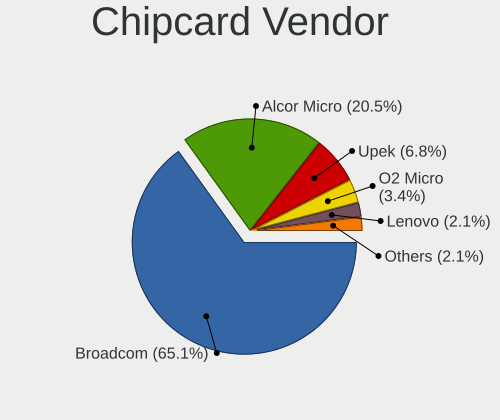

| Vendor                | Notebooks | Percent |
|-----------------------|-----------|---------|
| Broadcom              | 95        | 65.07%  |
| Alcor Micro           | 30        | 20.55%  |
| Upek                  | 10        | 6.85%   |
| O2 Micro              | 5         | 3.42%   |
| Lenovo                | 3         | 2.05%   |
| Yubico.com            | 2         | 1.37%   |
| Gemalto (was Gemplus) | 1         | 0.68%   |

Chipcard Model
--------------

Chipcard module models

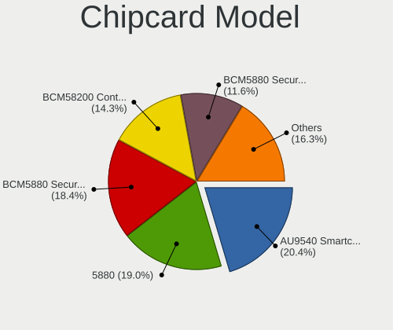

| Model                                                                        | Notebooks | Percent |
|------------------------------------------------------------------------------|-----------|---------|
| Alcor Micro AU9540 Smartcard Reader                                          | 30        | 20.41%  |
| Broadcom 5880                                                                | 28        | 19.05%  |
| Broadcom BCM5880 Secure Applications Processor                               | 27        | 18.37%  |
| Broadcom BCM58200 ControlVault 3 (FingerPrint sensor + Contacted SmartCard)  | 21        | 14.29%  |
| Broadcom BCM5880 Secure Applications Processor with fingerprint swipe sensor | 17        | 11.56%  |
| Upek TouchChip Fingerprint Coprocessor (WBF advanced mode)                   | 10        | 6.8%    |
| O2 Micro OZ776 CCID Smartcard Reader                                         | 4         | 2.72%   |
| Lenovo Integrated Smart Card Reader                                          | 3         | 2.04%   |
| Broadcom 58200                                                               | 3         | 2.04%   |
| Yubico.com Yubikey 4/5 U2F+CCID                                              | 2         | 1.36%   |
| O2 Micro Oz776 SmartCard Reader                                              | 1         | 0.68%   |
| Gemalto (was Gemplus) Compact Smart Card Reader Writer                       | 1         | 0.68%   |

Unsupported
-----------

Unsupported Devices
-------------------

Total unsupported devices on board

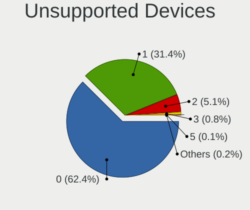

| Total | Notebooks | Percent |
|-------|-----------|---------|
| 0     | 3244      | 62.44%  |
| 1     | 1633      | 31.43%  |
| 2     | 263       | 5.06%   |
| 3     | 40        | 0.77%   |
| 5     | 7         | 0.13%   |
| 4     | 5         | 0.1%    |
| 9     | 2         | 0.04%   |
| 6     | 1         | 0.02%   |

Unsupported Device Types
------------------------

Types of unsupported devices

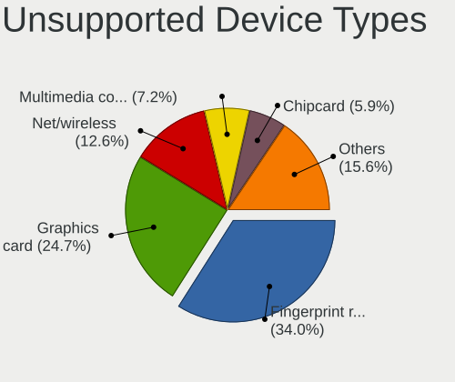

| Type                     | Notebooks | Percent |
|--------------------------|-----------|---------|
| Fingerprint reader       | 770       | 34.01%  |
| Graphics card            | 560       | 24.73%  |
| Net/wireless             | 285       | 12.59%  |
| Multimedia controller    | 162       | 7.16%   |
| Chipcard                 | 134       | 5.92%   |
| Bluetooth                | 111       | 4.9%    |
| Camera                   | 106       | 4.68%   |
| Communication controller | 55        | 2.43%   |
| Sound                    | 22        | 0.97%   |
| Net/ethernet             | 20        | 0.88%   |
| Storage                  | 19        | 0.84%   |
| Network                  | 6         | 0.27%   |
| Card reader              | 5         | 0.22%   |
| Modem                    | 4         | 0.18%   |
| Unassigned class         | 1         | 0.04%   |
| Storage/raid             | 1         | 0.04%   |
| Storage/nvme             | 1         | 0.04%   |
| Storage/ata              | 1         | 0.04%   |
| Firewire controller      | 1         | 0.04%   |

