Linux in India - Tested Hardware & Statistics (Notebooks)
---------------------------------------------------------

A project to collect tested hardware configurations for Linux in India.

Anyone can contribute to this report by the [hw-probe](https://github.com/linuxhw/hw-probe) tool:

    sudo -E hw-probe -all -upload

Please contribute! Especially if your hardware is rare.

Contents
--------

* [ Test Cases ](#test-cases)

* [ System ](#system)
  - [ OS                       ](#os)
  - [ OS Family                ](#os-family)
  - [ Kernel                   ](#kernel)
  - [ Kernel Family            ](#kernel-family)
  - [ Kernel Major Ver.        ](#kernel-major-ver)
  - [ Arch                     ](#arch)
  - [ DE                       ](#de)
  - [ Display Server           ](#display-server)
  - [ Display Manager          ](#display-manager)
  - [ OS Lang                  ](#os-lang)
  - [ Boot Mode                ](#boot-mode)
  - [ Filesystem               ](#filesystem)
  - [ Part. scheme             ](#part-scheme)
  - [ Dual Boot with Linux/BSD ](#dual-boot-with-linuxbsd)
  - [ Dual Boot (Win)          ](#dual-boot-win)

* [ Board ](#board)
  - [ Vendor                   ](#vendor)
  - [ Model                    ](#model)
  - [ Model Family             ](#model-family)
  - [ MFG Year                 ](#mfg-year)
  - [ Form Factor              ](#form-factor)
  - [ Secure Boot              ](#secure-boot)
  - [ Coreboot                 ](#coreboot)
  - [ RAM Size                 ](#ram-size)
  - [ RAM Used                 ](#ram-used)
  - [ Total Drives             ](#total-drives)
  - [ Has CD-ROM               ](#has-cd-rom)
  - [ Has Ethernet             ](#has-ethernet)
  - [ Has WiFi                 ](#has-wifi)
  - [ Has Bluetooth            ](#has-bluetooth)

* [ Location ](#location)
  - [ Country                  ](#country)
  - [ City                     ](#city)

* [ Drives ](#drives)
  - [ Drive Vendor             ](#drive-vendor)
  - [ Drive Model              ](#drive-model)
  - [ HDD Vendor               ](#hdd-vendor)
  - [ SSD Vendor               ](#ssd-vendor)
  - [ Drive Kind               ](#drive-kind)
  - [ Drive Connector          ](#drive-connector)
  - [ Drive Size               ](#drive-size)
  - [ Space Total              ](#space-total)
  - [ Space Used               ](#space-used)
  - [ Malfunc. Drives          ](#malfunc-drives)
  - [ Malfunc. Drive Vendor    ](#malfunc-drive-vendor)
  - [ Malfunc. HDD Vendor      ](#malfunc-hdd-vendor)
  - [ Malfunc. Drive Kind      ](#malfunc-drive-kind)
  - [ Failed Drives            ](#failed-drives)
  - [ Failed Drive Vendor      ](#failed-drive-vendor)
  - [ Drive Status             ](#drive-status)

* [ Storage controller ](#storage-controller)
  - [ Storage Vendor           ](#storage-vendor)
  - [ Storage Model            ](#storage-model)
  - [ Storage Kind             ](#storage-kind)

* [ Processor ](#processor)
  - [ CPU Vendor               ](#cpu-vendor)
  - [ CPU Model                ](#cpu-model)
  - [ CPU Model Family         ](#cpu-model-family)
  - [ CPU Cores                ](#cpu-cores)
  - [ CPU Sockets              ](#cpu-sockets)
  - [ CPU Threads              ](#cpu-threads)
  - [ CPU Op-Modes             ](#cpu-op-modes)
  - [ CPU Microcode            ](#cpu-microcode)
  - [ CPU Microarch            ](#cpu-microarch)

* [ Graphics ](#graphics)
  - [ GPU Vendor               ](#gpu-vendor)
  - [ GPU Model                ](#gpu-model)
  - [ GPU Combo                ](#gpu-combo)
  - [ GPU Driver               ](#gpu-driver)
  - [ GPU Memory               ](#gpu-memory)

* [ Monitor ](#monitor)
  - [ Monitor Vendor           ](#monitor-vendor)
  - [ Monitor Model            ](#monitor-model)
  - [ Monitor Resolution       ](#monitor-resolution)
  - [ Monitor Diagonal         ](#monitor-diagonal)
  - [ Monitor Width            ](#monitor-width)
  - [ Aspect Ratio             ](#aspect-ratio)
  - [ Monitor Area             ](#monitor-area)
  - [ Pixel Density            ](#pixel-density)
  - [ Multiple Monitors        ](#multiple-monitors)

* [ Network ](#network)
  - [ Net Controller Vendor    ](#net-controller-vendor)
  - [ Net Controller Model     ](#net-controller-model)
  - [ Wireless Vendor          ](#wireless-vendor)
  - [ Wireless Model           ](#wireless-model)
  - [ Ethernet Vendor          ](#ethernet-vendor)
  - [ Ethernet Model           ](#ethernet-model)
  - [ Net Controller Kind      ](#net-controller-kind)
  - [ Used Controller          ](#used-controller)
  - [ NICs                     ](#nics)
  - [ IPv6                     ](#ipv6)

* [ Bluetooth ](#bluetooth)
  - [ Bluetooth Vendor         ](#bluetooth-vendor)
  - [ Bluetooth Model          ](#bluetooth-model)

* [ Sound ](#sound)
  - [ Sound Vendor             ](#sound-vendor)
  - [ Sound Model              ](#sound-model)

* [ Memory ](#memory)
  - [ Memory Vendor            ](#memory-vendor)
  - [ Memory Model             ](#memory-model)
  - [ Memory Kind              ](#memory-kind)
  - [ Memory Form Factor       ](#memory-form-factor)
  - [ Memory Size              ](#memory-size)
  - [ Memory Speed             ](#memory-speed)

* [ Printers & scanners ](#printers--scanners)
  - [ Printer Vendor           ](#printer-vendor)
  - [ Printer Model            ](#printer-model)
  - [ Scanner Vendor           ](#scanner-vendor)
  - [ Scanner Model            ](#scanner-model)

* [ Camera ](#camera)
  - [ Camera Vendor            ](#camera-vendor)
  - [ Camera Model             ](#camera-model)

* [ Security ](#security)
  - [ Fingerprint Vendor       ](#fingerprint-vendor)
  - [ Fingerprint Model        ](#fingerprint-model)
  - [ Chipcard Vendor          ](#chipcard-vendor)
  - [ Chipcard Model           ](#chipcard-model)

* [ Unsupported ](#unsupported)
  - [ Unsupported Devices      ](#unsupported-devices)
  - [ Unsupported Device Types ](#unsupported-device-types)

Test Cases
----------

Total: 3461

| Vendor        | Model                       | Probe                                                      | Date         |
|---------------|-----------------------------|------------------------------------------------------------|--------------|
| Lenovo        | ThinkPad X13 Gen 1 20T2S... | [70fe076856](https://linux-hardware.org/?probe=70fe076856) | May 06, 2022 |
| Google        | Lick                        | [60e52e55e1](https://linux-hardware.org/?probe=60e52e55e1) | May 06, 2022 |
| Lenovo        | ThinkPad L13 20R3S10R00     | [b173909e06](https://linux-hardware.org/?probe=b173909e06) | May 06, 2022 |
| HP            | Notebook                    | [05f1b18534](https://linux-hardware.org/?probe=05f1b18534) | May 04, 2022 |
| HP            | EliteBook 8470p             | [db81dd7652](https://linux-hardware.org/?probe=db81dd7652) | May 04, 2022 |
| HP            | OMEN Laptop 15-en0xxx       | [8bfd6ecc71](https://linux-hardware.org/?probe=8bfd6ecc71) | May 04, 2022 |
| HP            | Pavilion Laptop 15-cs1xx... | [ca91daf662](https://linux-hardware.org/?probe=ca91daf662) | May 04, 2022 |
| HUAWEI        | BOHK-WAX9X                  | [329673fcbf](https://linux-hardware.org/?probe=329673fcbf) | May 03, 2022 |
| ASUSTek       | ROG Strix G713RC_G713RC     | [2ce25fb058](https://linux-hardware.org/?probe=2ce25fb058) | May 03, 2022 |
| HP            | Laptop 15-bs1xx             | [aa3fb50ed5](https://linux-hardware.org/?probe=aa3fb50ed5) | May 03, 2022 |
| Toshiba       | Satellite U940              | [3d6bd2511e](https://linux-hardware.org/?probe=3d6bd2511e) | May 03, 2022 |
| HP            | Presario CQ42               | [93ac0fd52a](https://linux-hardware.org/?probe=93ac0fd52a) | May 02, 2022 |
| MSI           | GP76 Leopard 11UG           | [dcea7cd8c0](https://linux-hardware.org/?probe=dcea7cd8c0) | May 02, 2022 |
| Lenovo        | IdeaPad 3 15IIL05 81WE      | [0eb277ff80](https://linux-hardware.org/?probe=0eb277ff80) | May 01, 2022 |
| HP            | Laptop 15-bw0xx             | [549ca9da46](https://linux-hardware.org/?probe=549ca9da46) | May 01, 2022 |
| HP            | Laptop 15-bw0xx             | [ec3ccc4967](https://linux-hardware.org/?probe=ec3ccc4967) | May 01, 2022 |
| Dell          | Latitude 3490               | [ff6e81ce15](https://linux-hardware.org/?probe=ff6e81ce15) | May 01, 2022 |
| Acer          | Aspire A715-75G             | [50d37d9cf7](https://linux-hardware.org/?probe=50d37d9cf7) | May 01, 2022 |
| Acer          | Swift SF314-55G             | [1935c949a2](https://linux-hardware.org/?probe=1935c949a2) | May 01, 2022 |
| Dell          | Inspiron 7559               | [37b324ecf9](https://linux-hardware.org/?probe=37b324ecf9) | May 01, 2022 |
| Dell          | G3 3500                     | [df72f36c52](https://linux-hardware.org/?probe=df72f36c52) | Apr 30, 2022 |
| Google        | Lick                        | [33d1e6209a](https://linux-hardware.org/?probe=33d1e6209a) | Apr 30, 2022 |
| Dell          | G3 3500                     | [c9ee387b32](https://linux-hardware.org/?probe=c9ee387b32) | Apr 30, 2022 |
| eMachines     | eME730                      | [ac985950eb](https://linux-hardware.org/?probe=ac985950eb) | Apr 30, 2022 |
| Dell          | Inspiron 3542               | [19f5e16bce](https://linux-hardware.org/?probe=19f5e16bce) | Apr 29, 2022 |
| Lenovo        | ThinkPad T450 20BUS1MN00    | [4e2b073a5c](https://linux-hardware.org/?probe=4e2b073a5c) | Apr 29, 2022 |
| Dell          | G5 5500                     | [c6064853ad](https://linux-hardware.org/?probe=c6064853ad) | Apr 29, 2022 |
| Dell          | Inspiron 3505               | [1f6bbce46b](https://linux-hardware.org/?probe=1f6bbce46b) | Apr 28, 2022 |
| Dell          | Inspiron 3542               | [6e00a18a0f](https://linux-hardware.org/?probe=6e00a18a0f) | Apr 28, 2022 |
| HP            | Stream Laptop 14-ds0xxx     | [59a8e467c6](https://linux-hardware.org/?probe=59a8e467c6) | Apr 28, 2022 |
| Lenovo        | V14 G2 ITL Ua 82KA          | [f191c49754](https://linux-hardware.org/?probe=f191c49754) | Apr 28, 2022 |
| HP            | Notebook                    | [daaa31b65a](https://linux-hardware.org/?probe=daaa31b65a) | Apr 27, 2022 |
| HP            | Notebook                    | [cbac71290e](https://linux-hardware.org/?probe=cbac71290e) | Apr 27, 2022 |
| Lenovo        | IdeaPad Gaming 3 15IMH05... | [a696a35961](https://linux-hardware.org/?probe=a696a35961) | Apr 27, 2022 |
| HP            | Notebook                    | [ec93418371](https://linux-hardware.org/?probe=ec93418371) | Apr 26, 2022 |
| Acer          | Aspire ES1-512              | [f0ed67e309](https://linux-hardware.org/?probe=f0ed67e309) | Apr 26, 2022 |
| Lenovo        | IdeaPad 5 14ALC05 82LM      | [ea3e0b8695](https://linux-hardware.org/?probe=ea3e0b8695) | Apr 26, 2022 |
| HP            | Laptop 15s-du3xxx           | [8197ac9c77](https://linux-hardware.org/?probe=8197ac9c77) | Apr 25, 2022 |
| HP            | 348 G4                      | [54db7eb2da](https://linux-hardware.org/?probe=54db7eb2da) | Apr 25, 2022 |
| ASUSTek       | X555LF                      | [0aa3a88c0c](https://linux-hardware.org/?probe=0aa3a88c0c) | Apr 25, 2022 |
| Lenovo        | IdeaPad 320-15ISK 80XH      | [b4577b2374](https://linux-hardware.org/?probe=b4577b2374) | Apr 25, 2022 |
| Dell          | Inspiron 3501               | [99bd45c11d](https://linux-hardware.org/?probe=99bd45c11d) | Apr 25, 2022 |
| Lenovo        | IdeaPad 5 Pro 14ITL6 82L... | [a260bf9ce6](https://linux-hardware.org/?probe=a260bf9ce6) | Apr 24, 2022 |
| Lenovo        | ThinkPad E14 Gen 2 20TA0... | [45b9330abf](https://linux-hardware.org/?probe=45b9330abf) | Apr 23, 2022 |
| Lenovo        | E41-25 81FS                 | [4880f7c2d5](https://linux-hardware.org/?probe=4880f7c2d5) | Apr 22, 2022 |
| Lenovo        | Z50-70 20354                | [6d50395aee](https://linux-hardware.org/?probe=6d50395aee) | Apr 22, 2022 |
| Toshiba       | Satellite C850-A786         | [e57aca482e](https://linux-hardware.org/?probe=e57aca482e) | Apr 22, 2022 |
| HP            | Laptop 15s-du2xxx           | [fe39cbe3d1](https://linux-hardware.org/?probe=fe39cbe3d1) | Apr 20, 2022 |
| Lenovo        | Legion Y530-15ICH 81FV      | [88764ed497](https://linux-hardware.org/?probe=88764ed497) | Apr 20, 2022 |
| Toshiba       | Satellite L50-C             | [9e2b287533](https://linux-hardware.org/?probe=9e2b287533) | Apr 20, 2022 |
| Dell          | Inspiron 5559               | [6ddb878f3e](https://linux-hardware.org/?probe=6ddb878f3e) | Apr 20, 2022 |
| HP            | Notebook                    | [bec9c06e6e](https://linux-hardware.org/?probe=bec9c06e6e) | Apr 20, 2022 |
| ASUSTek       | VivoBook_ASUSLaptop X415... | [f3d940677f](https://linux-hardware.org/?probe=f3d940677f) | Apr 19, 2022 |
| Dell          | Latitude E5520              | [1b428165cf](https://linux-hardware.org/?probe=1b428165cf) | Apr 18, 2022 |
| Lenovo        | IdeaPad S340-15IWL 81N8     | [b895187681](https://linux-hardware.org/?probe=b895187681) | Apr 17, 2022 |
| Dell          | Inspiron 15 7000 Gaming     | [ca0b0f6a8a](https://linux-hardware.org/?probe=ca0b0f6a8a) | Apr 16, 2022 |
| Lenovo        | IdeaPad Gaming 3 15ARH05... | [8350598ef6](https://linux-hardware.org/?probe=8350598ef6) | Apr 15, 2022 |
| Lenovo        | ThinkPad P14s Gen 2a 21A... | [cffdde259f](https://linux-hardware.org/?probe=cffdde259f) | Apr 15, 2022 |
| Timi          | Mi NoteBook 14              | [88abcd9e70](https://linux-hardware.org/?probe=88abcd9e70) | Apr 14, 2022 |
| HP            | Laptop 14s-dk0xxx           | [ef76ce862d](https://linux-hardware.org/?probe=ef76ce862d) | Apr 14, 2022 |
| Lenovo        | IdeaPad 320-14ISK 80XG      | [5f85d41ef2](https://linux-hardware.org/?probe=5f85d41ef2) | Apr 14, 2022 |
| Dynabook      | TECRA X40-F                 | [6d6f37f70e](https://linux-hardware.org/?probe=6d6f37f70e) | Apr 13, 2022 |
| HP            | EliteBook 840 G1            | [d06a50d75c](https://linux-hardware.org/?probe=d06a50d75c) | Apr 13, 2022 |
| Lenovo        | V14 G2 ITL Ua 82KA          | [b680349236](https://linux-hardware.org/?probe=b680349236) | Apr 12, 2022 |
| HP            | Pavilion Gaming Laptop 1... | [c7a9564044](https://linux-hardware.org/?probe=c7a9564044) | Apr 12, 2022 |
| Lenovo        | E41-25 81FS                 | [8d0dfa3de3](https://linux-hardware.org/?probe=8d0dfa3de3) | Apr 12, 2022 |
| HP            | Notebook                    | [de9a13770b](https://linux-hardware.org/?probe=de9a13770b) | Apr 11, 2022 |
| Toshiba       | Satellite C50D-A0386        | [31b131cc55](https://linux-hardware.org/?probe=31b131cc55) | Apr 11, 2022 |
| Acer          | Nitro AN515-45              | [4e0bcf3318](https://linux-hardware.org/?probe=4e0bcf3318) | Apr 11, 2022 |
| HP            | Laptop 15s-gr0xxx           | [36e02535fb](https://linux-hardware.org/?probe=36e02535fb) | Apr 11, 2022 |
| Lenovo        | G500 20236                  | [6feb6018af](https://linux-hardware.org/?probe=6feb6018af) | Apr 10, 2022 |
| HP            | 246                         | [4ef673dd00](https://linux-hardware.org/?probe=4ef673dd00) | Apr 10, 2022 |
| Acer          | One 14 Z2-485               | [57f307fa80](https://linux-hardware.org/?probe=57f307fa80) | Apr 09, 2022 |
| HP            | Pavilion Notebook           | [f76d101440](https://linux-hardware.org/?probe=f76d101440) | Apr 09, 2022 |
| Apple         | MacBookPro12,1              | [7ec2454548](https://linux-hardware.org/?probe=7ec2454548) | Apr 08, 2022 |
| HP            | Pavilion Laptop 15-cc1xx    | [a8c92b8a4c](https://linux-hardware.org/?probe=a8c92b8a4c) | Apr 08, 2022 |
| HP            | Pavilion Notebook           | [94a611644c](https://linux-hardware.org/?probe=94a611644c) | Apr 07, 2022 |
| Lenovo        | G560 20042                  | [945def6907](https://linux-hardware.org/?probe=945def6907) | Apr 07, 2022 |
| HP            | Laptop 14q-cy0xxx           | [625bad986e](https://linux-hardware.org/?probe=625bad986e) | Apr 07, 2022 |
| ASUSTek       | X542UQR                     | [57c9a10617](https://linux-hardware.org/?probe=57c9a10617) | Apr 07, 2022 |
| ASUSTek       | X542UQR                     | [15c5f13718](https://linux-hardware.org/?probe=15c5f13718) | Apr 07, 2022 |
| ASUSTek       | VivoBook_ASUSLaptop X515... | [c5c24ea4c2](https://linux-hardware.org/?probe=c5c24ea4c2) | Apr 06, 2022 |
| Samsung       | 300E4C/300E5C/300E7C        | [96b467ce52](https://linux-hardware.org/?probe=96b467ce52) | Apr 05, 2022 |
| Dell          | Vostro 3578                 | [8e2637c774](https://linux-hardware.org/?probe=8e2637c774) | Apr 05, 2022 |
| ASUSTek       | X550LC                      | [bc017137e8](https://linux-hardware.org/?probe=bc017137e8) | Apr 04, 2022 |
| Lenovo        | ThinkPad E14 Gen 2 20TAS... | [1d3cd04256](https://linux-hardware.org/?probe=1d3cd04256) | Apr 04, 2022 |
| HP            | OMEN Laptop 15-en1xxx       | [3e8d03d8d6](https://linux-hardware.org/?probe=3e8d03d8d6) | Apr 03, 2022 |
| Dell          | Inspiron 3505               | [982bcd3a5b](https://linux-hardware.org/?probe=982bcd3a5b) | Apr 03, 2022 |
| Dell          | Inspiron 5559               | [ba24b37041](https://linux-hardware.org/?probe=ba24b37041) | Apr 03, 2022 |
| Lenovo        | Erazer Y50-70               | [36d3d65801](https://linux-hardware.org/?probe=36d3d65801) | Apr 03, 2022 |
| HP            | Laptop 15s-dr1xxx           | [86ca12c772](https://linux-hardware.org/?probe=86ca12c772) | Apr 03, 2022 |
| Dell          | Inspiron 5559               | [57a0d73ab9](https://linux-hardware.org/?probe=57a0d73ab9) | Apr 02, 2022 |
| HP            | Notebook                    | [f46a05a044](https://linux-hardware.org/?probe=f46a05a044) | Apr 02, 2022 |
| MSI           | GF63 Thin 9SCXR             | [3bc3694efb](https://linux-hardware.org/?probe=3bc3694efb) | Apr 02, 2022 |
| HP            | Pavilion Laptop 14-ce2xx... | [d103b2cb25](https://linux-hardware.org/?probe=d103b2cb25) | Apr 02, 2022 |
| Dell          | Inspiron 5520               | [63f818dc19](https://linux-hardware.org/?probe=63f818dc19) | Apr 02, 2022 |
| Dell          | Inspiron 14 5410            | [3acec795a6](https://linux-hardware.org/?probe=3acec795a6) | Apr 01, 2022 |
| Dell          | G5 5500                     | [56b5d0d490](https://linux-hardware.org/?probe=56b5d0d490) | Apr 01, 2022 |
| ASUSTek       | ROG Zephyrus G14 GA401QC... | [87dfbaa9e8](https://linux-hardware.org/?probe=87dfbaa9e8) | Apr 01, 2022 |
| ASUSTek       | ROG Zephyrus G14 GA401QC... | [36563f3934](https://linux-hardware.org/?probe=36563f3934) | Apr 01, 2022 |
| Dell          | XPS 13 9305                 | [946628cb20](https://linux-hardware.org/?probe=946628cb20) | Mar 30, 2022 |
| Lenovo        | Legion 5 15ITH6 82JK        | [85f1411d0e](https://linux-hardware.org/?probe=85f1411d0e) | Mar 30, 2022 |
| Lenovo        | Legion 5 15ITH6 82JK        | [f8edce28d5](https://linux-hardware.org/?probe=f8edce28d5) | Mar 30, 2022 |
| Lenovo        | IdeaPad S145-15IWL 81MV     | [513f01a83f](https://linux-hardware.org/?probe=513f01a83f) | Mar 30, 2022 |
| Dell          | Latitude E6420              | [411b1a3a51](https://linux-hardware.org/?probe=411b1a3a51) | Mar 30, 2022 |
| HP            | Laptop 15-da1xxx            | [fcbd3df931](https://linux-hardware.org/?probe=fcbd3df931) | Mar 29, 2022 |
| ASUSTek       | VivoBook_ASUSLaptop X515... | [58c7c253ca](https://linux-hardware.org/?probe=58c7c253ca) | Mar 28, 2022 |
| Dell          | Studio 1450                 | [1b7df0163d](https://linux-hardware.org/?probe=1b7df0163d) | Mar 28, 2022 |
| HP            | Pavilion dv3                | [bd8d09108e](https://linux-hardware.org/?probe=bd8d09108e) | Mar 28, 2022 |
| ASUSTek       | X550LC                      | [be86aa43d0](https://linux-hardware.org/?probe=be86aa43d0) | Mar 27, 2022 |
| HP            | Pavilion g4                 | [893eaf3bca](https://linux-hardware.org/?probe=893eaf3bca) | Mar 27, 2022 |
| HP            | Pavilion Gaming Laptop 1... | [d5e927b59e](https://linux-hardware.org/?probe=d5e927b59e) | Mar 26, 2022 |
| ASUSTek       | VivoBook_ASUSLaptop X430... | [2465ab5a58](https://linux-hardware.org/?probe=2465ab5a58) | Mar 26, 2022 |
| ASUSTek       | VivoBook 15_ASUS Laptop ... | [e09438b057](https://linux-hardware.org/?probe=e09438b057) | Mar 26, 2022 |
| Dell          | Inspiron 3505               | [11abcc854d](https://linux-hardware.org/?probe=11abcc854d) | Mar 25, 2022 |
| Dell          | Inspiron 3542               | [870e407665](https://linux-hardware.org/?probe=870e407665) | Mar 25, 2022 |
| HP            | Victus by Laptop 16-e0xx... | [4ba4683a05](https://linux-hardware.org/?probe=4ba4683a05) | Mar 24, 2022 |
| HP            | EliteBook 840 G3            | [f06216a521](https://linux-hardware.org/?probe=f06216a521) | Mar 24, 2022 |
| Lenovo        | ThinkBook 15 G2 ITL 20VE    | [8533e3cf0d](https://linux-hardware.org/?probe=8533e3cf0d) | Mar 23, 2022 |
| Lenovo        | ThinkPad L490 20Q5S0M600    | [1f816ed931](https://linux-hardware.org/?probe=1f816ed931) | Mar 23, 2022 |
| Acer          | Swift SF314-52              | [2d8ab46eed](https://linux-hardware.org/?probe=2d8ab46eed) | Mar 21, 2022 |
| Acer          | Swift SF314-52              | [b1bdc8c7d4](https://linux-hardware.org/?probe=b1bdc8c7d4) | Mar 21, 2022 |
| Lenovo        | ThinkPad X230 23251Q0       | [0a705ba05c](https://linux-hardware.org/?probe=0a705ba05c) | Mar 21, 2022 |
| Dell          | Latitude 3400               | [031b95db58](https://linux-hardware.org/?probe=031b95db58) | Mar 20, 2022 |
| Apple         | MacBookPro12,1              | [0e4992c717](https://linux-hardware.org/?probe=0e4992c717) | Mar 20, 2022 |
| HP            | Pavilion 14                 | [537e877606](https://linux-hardware.org/?probe=537e877606) | Mar 20, 2022 |
| HP            | Laptop 15-da0xxx            | [66de21a937](https://linux-hardware.org/?probe=66de21a937) | Mar 19, 2022 |
| HP            | Pavilion dv3                | [3dbd970796](https://linux-hardware.org/?probe=3dbd970796) | Mar 19, 2022 |
| Lenovo        | G505s 20255                 | [2b30c1219e](https://linux-hardware.org/?probe=2b30c1219e) | Mar 18, 2022 |
| HP            | Laptop 15-bw0xx             | [221de9592b](https://linux-hardware.org/?probe=221de9592b) | Mar 16, 2022 |
| Dell          | Latitude E7450              | [107065a152](https://linux-hardware.org/?probe=107065a152) | Mar 15, 2022 |
| ASUSTek       | VivoBook S14 X430UA         | [9a04e16d4a](https://linux-hardware.org/?probe=9a04e16d4a) | Mar 15, 2022 |
| Lenovo        | Erazer Y50-70               | [ae9a6ee7cb](https://linux-hardware.org/?probe=ae9a6ee7cb) | Mar 14, 2022 |
| Dell          | G5 5500                     | [12a4380cad](https://linux-hardware.org/?probe=12a4380cad) | Mar 14, 2022 |
| HP            | Laptop 14s-dk0xxx           | [89d17b56d6](https://linux-hardware.org/?probe=89d17b56d6) | Mar 14, 2022 |
| HP            | Laptop 14s-dk0xxx           | [737a2d4c61](https://linux-hardware.org/?probe=737a2d4c61) | Mar 14, 2022 |
| Lenovo        | ThinkPad L14 Gen 2a 20X6... | [11bd4e97e6](https://linux-hardware.org/?probe=11bd4e97e6) | Mar 13, 2022 |
| Alienware     | 13 R3                       | [a8b07f9c17](https://linux-hardware.org/?probe=a8b07f9c17) | Mar 12, 2022 |
| Dell          | Latitude E5410              | [8015e22264](https://linux-hardware.org/?probe=8015e22264) | Mar 12, 2022 |
| ASUSTek       | ROG Strix G513IC_G513IC     | [cb2918a35e](https://linux-hardware.org/?probe=cb2918a35e) | Mar 12, 2022 |
| Dell          | Latitude 7480               | [cbff798f89](https://linux-hardware.org/?probe=cbff798f89) | Mar 11, 2022 |
| Dell          | Latitude 7480               | [02e748e3ac](https://linux-hardware.org/?probe=02e748e3ac) | Mar 11, 2022 |
| Dell          | Inspiron 5409               | [e99c4341ca](https://linux-hardware.org/?probe=e99c4341ca) | Mar 11, 2022 |
| Dell          | Inspiron 5409               | [777b585f05](https://linux-hardware.org/?probe=777b585f05) | Mar 11, 2022 |
| Dell          | Latitude 3410               | [49491fb71a](https://linux-hardware.org/?probe=49491fb71a) | Mar 11, 2022 |
| Dell          | Inspiron 3793               | [1fb19c1b23](https://linux-hardware.org/?probe=1fb19c1b23) | Mar 09, 2022 |
| Micromax      | Canvas Laptab LT777         | [7ff8a61256](https://linux-hardware.org/?probe=7ff8a61256) | Mar 08, 2022 |
| Acer          | Aspire 4752                 | [291341394c](https://linux-hardware.org/?probe=291341394c) | Mar 07, 2022 |
| Dell          | Latitude E6540              | [97de37d664](https://linux-hardware.org/?probe=97de37d664) | Mar 06, 2022 |
| Lenovo        | ThinkPad L14 Gen 1 20U1S... | [61ebab5e1f](https://linux-hardware.org/?probe=61ebab5e1f) | Mar 04, 2022 |
| Lenovo        | ThinkPad L14 Gen 1 20U1S... | [ae88c42f40](https://linux-hardware.org/?probe=ae88c42f40) | Mar 03, 2022 |
| HP            | Laptop 14s-dk0xxx           | [c5bf02a4d7](https://linux-hardware.org/?probe=c5bf02a4d7) | Mar 03, 2022 |
| Lenovo        | IdeaPad S145-15IIL 82C5     | [d4b6e7276e](https://linux-hardware.org/?probe=d4b6e7276e) | Mar 03, 2022 |
| ASUSTek       | ROG Strix G513IC_G513IC     | [ee905a56c9](https://linux-hardware.org/?probe=ee905a56c9) | Mar 02, 2022 |
| Lenovo        | E41-25 81FS                 | [f7cf64afde](https://linux-hardware.org/?probe=f7cf64afde) | Mar 02, 2022 |
| Lenovo        | IdeaPad Z510 20287          | [f61c04b0a8](https://linux-hardware.org/?probe=f61c04b0a8) | Mar 01, 2022 |
| ASUSTek       | ROG Strix G513IC_G513IC     | [45e459af5a](https://linux-hardware.org/?probe=45e459af5a) | Mar 01, 2022 |
| HP            | Notebook                    | [24f32b44ea](https://linux-hardware.org/?probe=24f32b44ea) | Feb 28, 2022 |
| Lenovo        | ThinkPad X230 2330A17       | [ed014e00c8](https://linux-hardware.org/?probe=ed014e00c8) | Feb 27, 2022 |
| HP            | Presario CQ42               | [de34294599](https://linux-hardware.org/?probe=de34294599) | Feb 27, 2022 |
| ASUSTek       | VivoBook_ASUSLaptop X510... | [d7b815d3d6](https://linux-hardware.org/?probe=d7b815d3d6) | Feb 27, 2022 |
| ASUSTek       | ROG Strix G513IC_G513IC     | [9bac80064d](https://linux-hardware.org/?probe=9bac80064d) | Feb 26, 2022 |
| Lenovo        | B40-70 20392                | [ab691617d6](https://linux-hardware.org/?probe=ab691617d6) | Feb 26, 2022 |
| ASUSTek       | ROG Strix G513IC_G513IC     | [36e7b3c4aa](https://linux-hardware.org/?probe=36e7b3c4aa) | Feb 26, 2022 |
| HP            | Pavilion 15                 | [463d26d75c](https://linux-hardware.org/?probe=463d26d75c) | Feb 26, 2022 |
| ASUSTek       | ASUS TUF Gaming A15 FA50... | [ea12d27cf9](https://linux-hardware.org/?probe=ea12d27cf9) | Feb 26, 2022 |
| Lenovo        | IdeaPad 5 14ALC05 82LM      | [ab78767b82](https://linux-hardware.org/?probe=ab78767b82) | Feb 26, 2022 |
| ASUSTek       | ASUS TUF Gaming A15 FA50... | [b3e65653c6](https://linux-hardware.org/?probe=b3e65653c6) | Feb 25, 2022 |
| Lenovo        | IdeaPad 330-15IGM 81D1      | [b3086480e5](https://linux-hardware.org/?probe=b3086480e5) | Feb 25, 2022 |
| HP            | 15                          | [7f0f38dc4d](https://linux-hardware.org/?probe=7f0f38dc4d) | Feb 24, 2022 |
| HP            | 15                          | [72f40f8b9a](https://linux-hardware.org/?probe=72f40f8b9a) | Feb 24, 2022 |
| HP            | 15                          | [9fad172623](https://linux-hardware.org/?probe=9fad172623) | Feb 24, 2022 |
| Dell          | Inspiron 5567               | [0e9130cffe](https://linux-hardware.org/?probe=0e9130cffe) | Feb 24, 2022 |
| Lenovo        | IdeaPad 3 15IML05 U 81WB    | [73c7d63295](https://linux-hardware.org/?probe=73c7d63295) | Feb 23, 2022 |
| HP            | 245 G6 Notebook PC          | [4cf4344d75](https://linux-hardware.org/?probe=4cf4344d75) | Feb 23, 2022 |
| Lenovo        | ThinkPad L14 Gen 2a 20X6... | [73c98934ee](https://linux-hardware.org/?probe=73c98934ee) | Feb 23, 2022 |
| Lenovo        | IdeaPad S540-15IWL D 81N... | [c736f239ba](https://linux-hardware.org/?probe=c736f239ba) | Feb 21, 2022 |
| HP            | Notebook                    | [d8dd214532](https://linux-hardware.org/?probe=d8dd214532) | Feb 21, 2022 |
| HP            | ZBook 15 G5                 | [1947127ef5](https://linux-hardware.org/?probe=1947127ef5) | Feb 21, 2022 |
| HP            | Pavilion Laptop 14-dv0xx... | [5810a7b666](https://linux-hardware.org/?probe=5810a7b666) | Feb 20, 2022 |
| Dell          | System XPS L502X            | [110f0aa3e3](https://linux-hardware.org/?probe=110f0aa3e3) | Feb 19, 2022 |
| Fujitsu       | LIFEBOOK AH532              | [8aaf1cdcde](https://linux-hardware.org/?probe=8aaf1cdcde) | Feb 19, 2022 |
| Dell          | Inspiron 15-3567            | [0fd79af602](https://linux-hardware.org/?probe=0fd79af602) | Feb 19, 2022 |
| ASUSTek       | X555LAB                     | [413a122ef8](https://linux-hardware.org/?probe=413a122ef8) | Feb 19, 2022 |
| ASUSTek       | X550LC                      | [b6e0cd1dc2](https://linux-hardware.org/?probe=b6e0cd1dc2) | Feb 18, 2022 |
| Lenovo        | ThinkPad X1 Carbon 7th 2... | [917db2bac9](https://linux-hardware.org/?probe=917db2bac9) | Feb 17, 2022 |
| Lenovo        | IdeaPad 5 14ALC05 82LM      | [6537d452d8](https://linux-hardware.org/?probe=6537d452d8) | Feb 16, 2022 |
| Acer          | Aspire V3-472PG             | [70c80ae356](https://linux-hardware.org/?probe=70c80ae356) | Feb 16, 2022 |
| Lenovo        | ThinkPad X230 2330A17       | [882f7d3c8b](https://linux-hardware.org/?probe=882f7d3c8b) | Feb 16, 2022 |
| Acer          | Aspire ES1-572              | [ca8f1af83d](https://linux-hardware.org/?probe=ca8f1af83d) | Feb 15, 2022 |
| Dell          | Inspiron 7577               | [bc0d38c096](https://linux-hardware.org/?probe=bc0d38c096) | Feb 15, 2022 |
| Acer          | Aspire ES1-572              | [9d72302b5a](https://linux-hardware.org/?probe=9d72302b5a) | Feb 15, 2022 |
| ASUSTek       | ROG Zephyrus G15 GA503QM... | [2dd964cf93](https://linux-hardware.org/?probe=2dd964cf93) | Feb 15, 2022 |
| HP            | Snappy                      | [eae991d921](https://linux-hardware.org/?probe=eae991d921) | Feb 14, 2022 |
| HP            | Laptop 15s-gr0xxx           | [db6e83a4b8](https://linux-hardware.org/?probe=db6e83a4b8) | Feb 14, 2022 |
| Lenovo        | IdeaPad 5 14ALC05 82LM      | [6284595dc0](https://linux-hardware.org/?probe=6284595dc0) | Feb 13, 2022 |
| Dell          | Latitude E6410              | [787eacd33c](https://linux-hardware.org/?probe=787eacd33c) | Feb 13, 2022 |
| Dell          | Latitude 3420               | [625f453d9a](https://linux-hardware.org/?probe=625f453d9a) | Feb 12, 2022 |
| Sony          | SVE15115EN                  | [facd08033e](https://linux-hardware.org/?probe=facd08033e) | Feb 12, 2022 |
| Lenovo        | ThinkPad T440p 20AN00DJA... | [9209921869](https://linux-hardware.org/?probe=9209921869) | Feb 12, 2022 |
| Acer          | Aspire A515-54G             | [f8e7f688a6](https://linux-hardware.org/?probe=f8e7f688a6) | Feb 11, 2022 |
| HP            | Laptop 15s-dr1xxx           | [8abd201999](https://linux-hardware.org/?probe=8abd201999) | Feb 11, 2022 |
| HP            | Laptop 15s-dr1xxx           | [a84b20f4fd](https://linux-hardware.org/?probe=a84b20f4fd) | Feb 11, 2022 |
| ASUSTek       | VivoBook_ASUSLaptop X509... | [6df20f0f72](https://linux-hardware.org/?probe=6df20f0f72) | Feb 11, 2022 |
| Lenovo        | ThinkBook 14-IIL 20SL       | [52eb1d5693](https://linux-hardware.org/?probe=52eb1d5693) | Feb 11, 2022 |
| Lenovo        | G50-80 80E5                 | [5182b3bbf6](https://linux-hardware.org/?probe=5182b3bbf6) | Feb 10, 2022 |
| HP            | Notebook                    | [d90ba0e218](https://linux-hardware.org/?probe=d90ba0e218) | Feb 10, 2022 |
| ASUSTek       | ASUS TUF Gaming F15 FX50... | [b2d14e7f15](https://linux-hardware.org/?probe=b2d14e7f15) | Feb 10, 2022 |
| ASUSTek       | ASUS TUF Gaming F15 FX50... | [2661cf0743](https://linux-hardware.org/?probe=2661cf0743) | Feb 10, 2022 |
| Lenovo        | IdeaPad S145-15API 81UT     | [869a837ab1](https://linux-hardware.org/?probe=869a837ab1) | Feb 10, 2022 |
| HP            | Pavilion Aero Laptop 13-... | [bbedc56833](https://linux-hardware.org/?probe=bbedc56833) | Feb 08, 2022 |
| Lenovo        | G500s 20245                 | [841d62ce23](https://linux-hardware.org/?probe=841d62ce23) | Feb 08, 2022 |
| Dell          | G5 5500                     | [de24d5a5f8](https://linux-hardware.org/?probe=de24d5a5f8) | Feb 07, 2022 |
| HP            | Laptop 15q-ds0xxx           | [250ec15d99](https://linux-hardware.org/?probe=250ec15d99) | Feb 07, 2022 |
| Lenovo        | IdeaPad S540-15IML D 81N... | [978a3994a9](https://linux-hardware.org/?probe=978a3994a9) | Feb 07, 2022 |
| ASUSTek       | VivoBook_ASUSLaptop X512... | [14c25ecf4d](https://linux-hardware.org/?probe=14c25ecf4d) | Feb 07, 2022 |
| ASUSTek       | X550LC                      | [c51c48fa73](https://linux-hardware.org/?probe=c51c48fa73) | Feb 07, 2022 |
| Apple         | MacBookPro6,2               | [b298d77ce8](https://linux-hardware.org/?probe=b298d77ce8) | Feb 06, 2022 |
| ASUSTek       | VivoBook_ASUSLaptop X513... | [6f11d75bcd](https://linux-hardware.org/?probe=6f11d75bcd) | Feb 06, 2022 |
| HP            | Pavilion 15                 | [58a4d59a59](https://linux-hardware.org/?probe=58a4d59a59) | Feb 05, 2022 |
| HP            | Pavilion 15                 | [35d4cb0015](https://linux-hardware.org/?probe=35d4cb0015) | Feb 05, 2022 |
| ASUSTek       | VivoBook_ASUSLaptop X512... | [9b802670e0](https://linux-hardware.org/?probe=9b802670e0) | Feb 05, 2022 |
| Lenovo        | ThinkPad E14 Gen 2 20TAS... | [d457ee5311](https://linux-hardware.org/?probe=d457ee5311) | Feb 05, 2022 |
| Lenovo        | Legion Y7000 2019 PG0 81... | [f79196e39c](https://linux-hardware.org/?probe=f79196e39c) | Feb 05, 2022 |
| Dell          | G5 5500                     | [edd04957d8](https://linux-hardware.org/?probe=edd04957d8) | Feb 05, 2022 |
| ASUSTek       | X510UNR                     | [df6616c490](https://linux-hardware.org/?probe=df6616c490) | Feb 04, 2022 |
| Lenovo        | G560 20042                  | [642e27a7bd](https://linux-hardware.org/?probe=642e27a7bd) | Feb 04, 2022 |
| HP            | Laptop 15g-br1xx            | [092ea39c7e](https://linux-hardware.org/?probe=092ea39c7e) | Feb 03, 2022 |
| Dell          | Inspiron 5509               | [40aa956ad5](https://linux-hardware.org/?probe=40aa956ad5) | Feb 03, 2022 |
| HP            | Pavilion Aero Laptop 13-... | [a2876a28be](https://linux-hardware.org/?probe=a2876a28be) | Feb 01, 2022 |
| Dell          | Latitude 3520               | [7f6955e406](https://linux-hardware.org/?probe=7f6955e406) | Feb 01, 2022 |
| HP            | Laptop 15s-gr0xxx           | [5943c38ac0](https://linux-hardware.org/?probe=5943c38ac0) | Feb 01, 2022 |
| Samsung       | RV409/RV509/RV709           | [535f5504f0](https://linux-hardware.org/?probe=535f5504f0) | Feb 01, 2022 |
| Dell          | Inspiron 3584               | [14630b0a02](https://linux-hardware.org/?probe=14630b0a02) | Feb 01, 2022 |
| Lenovo        | G580 20157                  | [fe6a35d3f8](https://linux-hardware.org/?probe=fe6a35d3f8) | Jan 31, 2022 |
| Lenovo        | IdeaPad 330-15ARR 81D2      | [b86eb71aa1](https://linux-hardware.org/?probe=b86eb71aa1) | Jan 31, 2022 |
| HP            | Pavilion Aero Laptop 13-... | [016bea7377](https://linux-hardware.org/?probe=016bea7377) | Jan 31, 2022 |
| Dell          | Inspiron 3521               | [712c420215](https://linux-hardware.org/?probe=712c420215) | Jan 31, 2022 |
| Dell          | Inspiron 3521               | [0c05019294](https://linux-hardware.org/?probe=0c05019294) | Jan 31, 2022 |
| Dell          | Vostro 3558                 | [05d97f5a85](https://linux-hardware.org/?probe=05d97f5a85) | Jan 30, 2022 |
| Lenovo        | V310-15ISK 80SY             | [58781ff3be](https://linux-hardware.org/?probe=58781ff3be) | Jan 30, 2022 |
| Lenovo        | Legion Y740-15IRHg 81UH     | [b0cc5e0cbc](https://linux-hardware.org/?probe=b0cc5e0cbc) | Jan 29, 2022 |
| Acer          | Swift SF314-59              | [697f73bc7c](https://linux-hardware.org/?probe=697f73bc7c) | Jan 29, 2022 |
| HP            | 15                          | [81961b52a9](https://linux-hardware.org/?probe=81961b52a9) | Jan 29, 2022 |
| Acer          | TravelMate P214-53G         | [b81086aa28](https://linux-hardware.org/?probe=b81086aa28) | Jan 28, 2022 |
| Dell          | Inspiron 3505               | [4a4b0e0660](https://linux-hardware.org/?probe=4a4b0e0660) | Jan 28, 2022 |
| Acer          | TravelMate P214-53          | [8b138118b8](https://linux-hardware.org/?probe=8b138118b8) | Jan 28, 2022 |
| Lenovo        | E41-25 81FS                 | [692c64fd48](https://linux-hardware.org/?probe=692c64fd48) | Jan 28, 2022 |
| Dell          | Studio 1450                 | [9c2bf5854d](https://linux-hardware.org/?probe=9c2bf5854d) | Jan 28, 2022 |
| Dell          | Inspiron 15-3567            | [eb4d280c2e](https://linux-hardware.org/?probe=eb4d280c2e) | Jan 28, 2022 |
| HP            | EliteBook 1050 G1           | [cf9b0bf009](https://linux-hardware.org/?probe=cf9b0bf009) | Jan 27, 2022 |
| ASUSTek       | VivoBook_ASUSLaptop X512... | [75082acc94](https://linux-hardware.org/?probe=75082acc94) | Jan 27, 2022 |
| ASUSTek       | ASUS TUF Gaming F15 FX50... | [eeadbaa61e](https://linux-hardware.org/?probe=eeadbaa61e) | Jan 26, 2022 |
| HP            | Pavilion Laptop 15-cc0xx    | [e12ec125c1](https://linux-hardware.org/?probe=e12ec125c1) | Jan 26, 2022 |
| Sony          | SVE15113ENW                 | [4ed2d681e5](https://linux-hardware.org/?probe=4ed2d681e5) | Jan 26, 2022 |
| HP            | Laptop 15-bs0xx             | [17282e26a5](https://linux-hardware.org/?probe=17282e26a5) | Jan 26, 2022 |
| Dell          | Vostro 3500                 | [c9b1b53061](https://linux-hardware.org/?probe=c9b1b53061) | Jan 25, 2022 |
| ASUSTek       | VivoBook_ASUSLaptop X532... | [bc4d814298](https://linux-hardware.org/?probe=bc4d814298) | Jan 24, 2022 |
| Apple         | MacBookPro12,1              | [36709c59ac](https://linux-hardware.org/?probe=36709c59ac) | Jan 24, 2022 |
| Acer          | Aspire A315-21              | [880cca4c8f](https://linux-hardware.org/?probe=880cca4c8f) | Jan 24, 2022 |
| Acer          | Nitro AN515-45              | [34568da477](https://linux-hardware.org/?probe=34568da477) | Jan 23, 2022 |
| ASUSTek       | ROG Strix G513IC_G513IC     | [d6ea0ad749](https://linux-hardware.org/?probe=d6ea0ad749) | Jan 23, 2022 |
| Acer          | Nitro AN515-45              | [1cb9ebbbd4](https://linux-hardware.org/?probe=1cb9ebbbd4) | Jan 23, 2022 |
| ASUSTek       | VivoBook_ASUSLaptop X421... | [086f2b17b3](https://linux-hardware.org/?probe=086f2b17b3) | Jan 23, 2022 |
| HP            | Laptop 14q-cs0xxx           | [ec9061dcb1](https://linux-hardware.org/?probe=ec9061dcb1) | Jan 22, 2022 |
| Acer          | Predator PH315-51           | [1df9cf7c06](https://linux-hardware.org/?probe=1df9cf7c06) | Jan 22, 2022 |
| Dell          | Inspiron 15-3567            | [af6171a374](https://linux-hardware.org/?probe=af6171a374) | Jan 22, 2022 |
| Lenovo        | IdeaPad 3 15ADA05 81W1      | [33079ee3bf](https://linux-hardware.org/?probe=33079ee3bf) | Jan 22, 2022 |
| Acer          | Predator PH315-51           | [291f22ae53](https://linux-hardware.org/?probe=291f22ae53) | Jan 21, 2022 |
| HP            | Laptop 15s-eq0xxx           | [0df160c245](https://linux-hardware.org/?probe=0df160c245) | Jan 21, 2022 |
| Fujitsu       | LIFEBOOK LH532              | [0459069843](https://linux-hardware.org/?probe=0459069843) | Jan 21, 2022 |
| Dell          | G15 5511                    | [b1a127367b](https://linux-hardware.org/?probe=b1a127367b) | Jan 20, 2022 |
| HP            | Pavilion Laptop 14-dv1xx... | [e092fc4b26](https://linux-hardware.org/?probe=e092fc4b26) | Jan 20, 2022 |
| HP            | ZBook Power 15.6 inch G8... | [245123d0a8](https://linux-hardware.org/?probe=245123d0a8) | Jan 20, 2022 |
| Fujitsu       | LIFEBOOK LH532              | [58be376485](https://linux-hardware.org/?probe=58be376485) | Jan 20, 2022 |
| HP            | ZBook Power 15.6 inch G8... | [0b07369103](https://linux-hardware.org/?probe=0b07369103) | Jan 19, 2022 |
| Lenovo        | ThinkBook 13s G2 ITL 20V... | [d99cb4b767](https://linux-hardware.org/?probe=d99cb4b767) | Jan 19, 2022 |
| Dell          | Precision 5540              | [2d971f9a85](https://linux-hardware.org/?probe=2d971f9a85) | Jan 19, 2022 |
| ASUSTek       | ROG Zephyrus M15 GU502LW... | [2407b5f5bb](https://linux-hardware.org/?probe=2407b5f5bb) | Jan 19, 2022 |
| ASUSTek       | TUF Gaming FX505DT_FX505... | [2e7e3ccc17](https://linux-hardware.org/?probe=2e7e3ccc17) | Jan 19, 2022 |
| Acer          | Nitro AN515-45              | [a30f5fabcd](https://linux-hardware.org/?probe=a30f5fabcd) | Jan 18, 2022 |
| HP            | Pavilion Gaming Laptop 1... | [0fddd05eae](https://linux-hardware.org/?probe=0fddd05eae) | Jan 18, 2022 |
| ASUSTek       | VivoBook_ASUSLaptop X411... | [6294ff032d](https://linux-hardware.org/?probe=6294ff032d) | Jan 18, 2022 |
| HP            | Pavilion Laptop 14-ec0xx... | [9901f0a14a](https://linux-hardware.org/?probe=9901f0a14a) | Jan 18, 2022 |
| HP            | Pavilion Laptop 14-ec0xx... | [3837c06ca1](https://linux-hardware.org/?probe=3837c06ca1) | Jan 18, 2022 |
| Lenovo        | IdeaPad S340-14API 81NB     | [8ffc80bc8d](https://linux-hardware.org/?probe=8ffc80bc8d) | Jan 17, 2022 |
| Lenovo        | IdeaPad S340-14API 81NB     | [5a6275014a](https://linux-hardware.org/?probe=5a6275014a) | Jan 17, 2022 |
| Lenovo        | IdeaPad 100-15IBY 80MJ      | [7cc691c557](https://linux-hardware.org/?probe=7cc691c557) | Jan 16, 2022 |
| HP            | Laptop 15s-fq2xxx           | [ff8151d1c1](https://linux-hardware.org/?probe=ff8151d1c1) | Jan 16, 2022 |
| HP            | Pavilion Aero Laptop 13-... | [b70c5a1312](https://linux-hardware.org/?probe=b70c5a1312) | Jan 16, 2022 |
| Dell          | Latitude E6510              | [c0d3a6c31a](https://linux-hardware.org/?probe=c0d3a6c31a) | Jan 16, 2022 |
| Lenovo        | IdeaPad 110-15ISK 80UD      | [a1fffe7c0f](https://linux-hardware.org/?probe=a1fffe7c0f) | Jan 16, 2022 |
| Dell          | Inspiron 1545               | [a6c2013bf1](https://linux-hardware.org/?probe=a6c2013bf1) | Jan 15, 2022 |
| ASUSTek       | VivoBook_ASUSLaptop X513... | [80f7288259](https://linux-hardware.org/?probe=80f7288259) | Jan 15, 2022 |
| Lenovo        | G580 20157                  | [67c671c04f](https://linux-hardware.org/?probe=67c671c04f) | Jan 15, 2022 |
| HP            | Laptop 15s-du2xxx           | [7ea05d0591](https://linux-hardware.org/?probe=7ea05d0591) | Jan 15, 2022 |
| ASUSTek       | ROG Zephyrus G15 GA503QM... | [71480de13b](https://linux-hardware.org/?probe=71480de13b) | Jan 14, 2022 |
| Acer          | Swift SF314-55G             | [fc48cf8ace](https://linux-hardware.org/?probe=fc48cf8ace) | Jan 14, 2022 |
| HP            | OMEN Laptop 15-en0xxx       | [23160ed698](https://linux-hardware.org/?probe=23160ed698) | Jan 14, 2022 |
| ASUSTek       | VivoBook_ASUSLaptop X513... | [eee9a2ae45](https://linux-hardware.org/?probe=eee9a2ae45) | Jan 14, 2022 |
| Timi          | Mi NoteBook Ultra           | [7a5a59c6e6](https://linux-hardware.org/?probe=7a5a59c6e6) | Jan 13, 2022 |
| Dell          | Latitude 5480               | [c1f1846378](https://linux-hardware.org/?probe=c1f1846378) | Jan 13, 2022 |
| Lenovo        | IdeaPad S340-14API 81NB     | [a68454eff9](https://linux-hardware.org/?probe=a68454eff9) | Jan 13, 2022 |
| Dell          | Latitude E5470              | [f1f2897964](https://linux-hardware.org/?probe=f1f2897964) | Jan 13, 2022 |
| ASUSTek       | VivoBook_ASUSLaptop X513... | [97274ab2da](https://linux-hardware.org/?probe=97274ab2da) | Jan 12, 2022 |
| Lenovo        | IdeaPad 310-15IKB 80TV      | [d8c919f740](https://linux-hardware.org/?probe=d8c919f740) | Jan 12, 2022 |
| Dell          | Vostro 3405                 | [0e2887ca4f](https://linux-hardware.org/?probe=0e2887ca4f) | Jan 12, 2022 |
| ASUSTek       | X542BA                      | [d5180ebfbc](https://linux-hardware.org/?probe=d5180ebfbc) | Jan 12, 2022 |
| Dell          | Vostro 3446                 | [405aa63dc4](https://linux-hardware.org/?probe=405aa63dc4) | Jan 11, 2022 |
| Lenovo        | IdeaPad S540-15IWL          | [34bf588c0b](https://linux-hardware.org/?probe=34bf588c0b) | Jan 11, 2022 |
| Lenovo        | ThinkPad E490 20N8S11G00    | [9db0c57d6e](https://linux-hardware.org/?probe=9db0c57d6e) | Jan 11, 2022 |
| Lenovo        | IdeaPad S540-15IWL          | [63c5a7136b](https://linux-hardware.org/?probe=63c5a7136b) | Jan 11, 2022 |
| ASUSTek       | X550LC                      | [b4de8de24e](https://linux-hardware.org/?probe=b4de8de24e) | Jan 11, 2022 |
| Lenovo        | ThinkPad X240 20AMA34HMN    | [a4dfbb6e38](https://linux-hardware.org/?probe=a4dfbb6e38) | Jan 10, 2022 |
| HP            | Notebook                    | [3b26596e87](https://linux-hardware.org/?probe=3b26596e87) | Jan 10, 2022 |
| Acer          | Nitro AN515-54              | [d46da820e0](https://linux-hardware.org/?probe=d46da820e0) | Jan 10, 2022 |
| ASUSTek       | VivoBook_ASUSLaptop X509... | [04cd3cf175](https://linux-hardware.org/?probe=04cd3cf175) | Jan 10, 2022 |
| HP            | Presario CQ56               | [17e7a9c9d1](https://linux-hardware.org/?probe=17e7a9c9d1) | Jan 09, 2022 |
| Lenovo        | Legion 5 Pro 16ACH6H 82J... | [214a818f06](https://linux-hardware.org/?probe=214a818f06) | Jan 09, 2022 |
| Acer          | Aspire A514-52G             | [5f6504d850](https://linux-hardware.org/?probe=5f6504d850) | Jan 09, 2022 |
| HP            | Notebook                    | [66028752f5](https://linux-hardware.org/?probe=66028752f5) | Jan 09, 2022 |
| Dell          | Inspiron 15 3511            | [51d602d55f](https://linux-hardware.org/?probe=51d602d55f) | Jan 09, 2022 |
| Timi          | RedmiBook 15                | [7e9c17db98](https://linux-hardware.org/?probe=7e9c17db98) | Jan 08, 2022 |
| Timi          | RedmiBook 15                | [f52e0a4cf1](https://linux-hardware.org/?probe=f52e0a4cf1) | Jan 08, 2022 |
| Lenovo        | Legion Y540-15IRH-PG0 81... | [3df8a1c560](https://linux-hardware.org/?probe=3df8a1c560) | Jan 08, 2022 |
| HP            | Laptop 15s-du2xxx           | [e6c704567e](https://linux-hardware.org/?probe=e6c704567e) | Jan 08, 2022 |
| Dell          | Inspiron 3501               | [804f5dab32](https://linux-hardware.org/?probe=804f5dab32) | Jan 08, 2022 |
| HP            | OMEN Laptop 15-en1xxx       | [9ad04f3022](https://linux-hardware.org/?probe=9ad04f3022) | Jan 07, 2022 |
| Dell          | XPS 15 7590                 | [26bd64900c](https://linux-hardware.org/?probe=26bd64900c) | Jan 07, 2022 |
| Dell          | Inspiron 5570               | [298e22210d](https://linux-hardware.org/?probe=298e22210d) | Jan 07, 2022 |
| ASUSTek       | VivoBook_ASUSLaptop X515... | [568c503df0](https://linux-hardware.org/?probe=568c503df0) | Jan 07, 2022 |
| ASUSTek       | VivoBook_ASUSLaptop X515... | [fb627691ce](https://linux-hardware.org/?probe=fb627691ce) | Jan 07, 2022 |
| HP            | Laptop 15s-dr0xxx           | [be60e498db](https://linux-hardware.org/?probe=be60e498db) | Jan 06, 2022 |
| HP            | Laptop 15s-du2xxx           | [8213cb22ff](https://linux-hardware.org/?probe=8213cb22ff) | Jan 05, 2022 |
| Lenovo        | IdeaPad S340-15IIL 81WL     | [be129c3a7a](https://linux-hardware.org/?probe=be129c3a7a) | Jan 05, 2022 |
| ASUSTek       | VivoBook_ASUSLaptop X421... | [e4526aa9d8](https://linux-hardware.org/?probe=e4526aa9d8) | Jan 05, 2022 |
| Acer          | Aspire XXXX                 | [d52d9dc2bd](https://linux-hardware.org/?probe=d52d9dc2bd) | Jan 04, 2022 |
| Lenovo        | Yoga 300-11IBR 80M1         | [b18501f890](https://linux-hardware.org/?probe=b18501f890) | Jan 04, 2022 |
| HUAWEI        | KPL-W0X                     | [9d633f7bdb](https://linux-hardware.org/?probe=9d633f7bdb) | Jan 04, 2022 |
| Lenovo        | IdeaPad 310-15ISK 80SM      | [023df04f60](https://linux-hardware.org/?probe=023df04f60) | Jan 04, 2022 |
| Acer          | Aspire XXXX                 | [b5d8962bbc](https://linux-hardware.org/?probe=b5d8962bbc) | Jan 04, 2022 |
| HUAWEI        | KPL-W0X                     | [1015862a37](https://linux-hardware.org/?probe=1015862a37) | Jan 04, 2022 |
| Dell          | Latitude E5440              | [15287271e2](https://linux-hardware.org/?probe=15287271e2) | Jan 02, 2022 |
| Dell          | XPS 15 7590                 | [3299ab62e8](https://linux-hardware.org/?probe=3299ab62e8) | Jan 02, 2022 |
| Acer          | Aspire A315-42              | [d44b06ec61](https://linux-hardware.org/?probe=d44b06ec61) | Jan 01, 2022 |
| HP            | Pavilion Gaming Laptop 1... | [3fc1d4b98d](https://linux-hardware.org/?probe=3fc1d4b98d) | Dec 31, 2021 |
| Dell          | Inspiron 3542               | [a611e12778](https://linux-hardware.org/?probe=a611e12778) | Dec 31, 2021 |
| Acer          | Aspire A515-51G             | [4d615644e4](https://linux-hardware.org/?probe=4d615644e4) | Dec 31, 2021 |
| Lenovo        | Legion 5 Pro 16ACH6H 82J... | [efa5e2c12a](https://linux-hardware.org/?probe=efa5e2c12a) | Dec 31, 2021 |
| Lenovo        | Legion 5 Pro 16ACH6H 82J... | [c02c5039fb](https://linux-hardware.org/?probe=c02c5039fb) | Dec 31, 2021 |
| Dell          | Latitude 3420               | [a248c25326](https://linux-hardware.org/?probe=a248c25326) | Dec 31, 2021 |
| HP            | Pavilion Gaming Laptop 1... | [b330382ad9](https://linux-hardware.org/?probe=b330382ad9) | Dec 31, 2021 |
| HP            | Presario CQ56               | [aacf56218d](https://linux-hardware.org/?probe=aacf56218d) | Dec 31, 2021 |
| Dell          | Inspiron 5437               | [d33def1f56](https://linux-hardware.org/?probe=d33def1f56) | Dec 30, 2021 |
| HP            | Pavilion Gaming Laptop 1... | [881eb5100e](https://linux-hardware.org/?probe=881eb5100e) | Dec 30, 2021 |
| Dell          | Vostro 3590                 | [9e77a2584c](https://linux-hardware.org/?probe=9e77a2584c) | Dec 30, 2021 |
| Lenovo        | B460e                       | [808fae9674](https://linux-hardware.org/?probe=808fae9674) | Dec 30, 2021 |
| Dell          | Latitude 5410               | [7d5de2cff2](https://linux-hardware.org/?probe=7d5de2cff2) | Dec 30, 2021 |
| Lenovo        | IdeaPad S540-15IWL          | [c3497fe5bd](https://linux-hardware.org/?probe=c3497fe5bd) | Dec 29, 2021 |
| ASUSTek       | ASUS TUF Gaming A15 FA50... | [e0bce9d433](https://linux-hardware.org/?probe=e0bce9d433) | Dec 29, 2021 |
| Acer          | Nitro AN515-44              | [01d210ed18](https://linux-hardware.org/?probe=01d210ed18) | Dec 29, 2021 |
| ASUSTek       | Zephyrus G GU502DU_GA502... | [4a1c70f95f](https://linux-hardware.org/?probe=4a1c70f95f) | Dec 28, 2021 |
| Dell          | Inspiron 5537               | [f29a5f0ecb](https://linux-hardware.org/?probe=f29a5f0ecb) | Dec 28, 2021 |
| Acer          | Swift SF315-51G             | [3a5fb0d8ac](https://linux-hardware.org/?probe=3a5fb0d8ac) | Dec 28, 2021 |
| Acer          | Swift SF315-51G             | [cf31c436c0](https://linux-hardware.org/?probe=cf31c436c0) | Dec 28, 2021 |
| Dell          | Vostro 3590                 | [31338a4a85](https://linux-hardware.org/?probe=31338a4a85) | Dec 27, 2021 |
| Toshiba       | TECRA R840                  | [753c7caef6](https://linux-hardware.org/?probe=753c7caef6) | Dec 27, 2021 |
| MSI           | GL63 9RCX                   | [ad2628ee28](https://linux-hardware.org/?probe=ad2628ee28) | Dec 27, 2021 |
| HP            | Pavilion Gaming Laptop 1... | [114ec171a7](https://linux-hardware.org/?probe=114ec171a7) | Dec 27, 2021 |
| HP            | Pavilion Gaming Laptop 1... | [12c90ed760](https://linux-hardware.org/?probe=12c90ed760) | Dec 27, 2021 |
| Acer          | Aspire 4736                 | [128ea022f0](https://linux-hardware.org/?probe=128ea022f0) | Dec 26, 2021 |
| ASUSTek       | ROG Strix G712LU_G712LU     | [4e4cc2bfb3](https://linux-hardware.org/?probe=4e4cc2bfb3) | Dec 26, 2021 |
| Dell          | Inspiron 5558               | [58e49e7f72](https://linux-hardware.org/?probe=58e49e7f72) | Dec 25, 2021 |
| Dell          | Inspiron N5050              | [df6e5df46d](https://linux-hardware.org/?probe=df6e5df46d) | Dec 24, 2021 |
| Dell          | Inspiron N5050              | [211b723554](https://linux-hardware.org/?probe=211b723554) | Dec 24, 2021 |
| HP            | Pavilion Aero Laptop 13-... | [3f3fd8aa2e](https://linux-hardware.org/?probe=3f3fd8aa2e) | Dec 24, 2021 |
| Lenovo        | IdeaPad 3 14ALC6 82KT       | [894fb9a205](https://linux-hardware.org/?probe=894fb9a205) | Dec 24, 2021 |
| Lenovo        | Legion 5 15ACH6 82JW        | [2144a3a32c](https://linux-hardware.org/?probe=2144a3a32c) | Dec 23, 2021 |
| Dell          | Inspiron 3542               | [277f97ef07](https://linux-hardware.org/?probe=277f97ef07) | Dec 23, 2021 |
| Lenovo        | ThinkPad E15 Gen 2 20TDS... | [d22c47d314](https://linux-hardware.org/?probe=d22c47d314) | Dec 23, 2021 |
| ASUSTek       | VivoBook_ASUSLaptop X509... | [1638195805](https://linux-hardware.org/?probe=1638195805) | Dec 22, 2021 |
| Dell          | Inspiron 5570               | [2d2ccb3dea](https://linux-hardware.org/?probe=2d2ccb3dea) | Dec 22, 2021 |
| Lenovo        | Legion Y7000 2019 1050 8... | [b16546ce2c](https://linux-hardware.org/?probe=b16546ce2c) | Dec 22, 2021 |
| HP            | Pavilion Laptop 14-dv0xx... | [7f946b3d42](https://linux-hardware.org/?probe=7f946b3d42) | Dec 21, 2021 |
| ASUSTek       | X510UNR                     | [0733a05806](https://linux-hardware.org/?probe=0733a05806) | Dec 21, 2021 |
| HP            | ProBook 640 G3              | [be09fb6d79](https://linux-hardware.org/?probe=be09fb6d79) | Dec 21, 2021 |
| Dell          | Inspiron 1545               | [f163884100](https://linux-hardware.org/?probe=f163884100) | Dec 20, 2021 |
| Lenovo        | Legion 5 15ACH6 82JW        | [b03f7a8ab8](https://linux-hardware.org/?probe=b03f7a8ab8) | Dec 20, 2021 |
| Dell          | Precision M4800             | [3dc8c7e96d](https://linux-hardware.org/?probe=3dc8c7e96d) | Dec 20, 2021 |
| Lenovo        | IdeaPad 5 14ARE05 81YM      | [ae4b7d946e](https://linux-hardware.org/?probe=ae4b7d946e) | Dec 18, 2021 |
| Lenovo        | G50-80 80E5                 | [2f8a6719a1](https://linux-hardware.org/?probe=2f8a6719a1) | Dec 18, 2021 |
| Lenovo        | ThinkBook 15 G2 ITL 20VE    | [45bee865bc](https://linux-hardware.org/?probe=45bee865bc) | Dec 17, 2021 |
| ASUSTek       | VivoBook 15_ASUS Laptop ... | [dda5e17a21](https://linux-hardware.org/?probe=dda5e17a21) | Dec 17, 2021 |
| Lenovo        | ThinkPad T490 20RYS07R00    | [0bdc5ce080](https://linux-hardware.org/?probe=0bdc5ce080) | Dec 16, 2021 |
| Acer          | Aspire A514-54              | [186dd90bed](https://linux-hardware.org/?probe=186dd90bed) | Dec 16, 2021 |
| Lenovo        | IdeaPad S340-14API 81NB     | [b671826144](https://linux-hardware.org/?probe=b671826144) | Dec 16, 2021 |
| Toshiba       | Satellite C600              | [dd417ecb87](https://linux-hardware.org/?probe=dd417ecb87) | Dec 15, 2021 |
| Lenovo        | G50-80 80E5                 | [349550727a](https://linux-hardware.org/?probe=349550727a) | Dec 14, 2021 |
| HP            | 15                          | [70e648805f](https://linux-hardware.org/?probe=70e648805f) | Dec 14, 2021 |
| Lenovo        | IdeaPad Gaming 3 15IMH05... | [397525b971](https://linux-hardware.org/?probe=397525b971) | Dec 14, 2021 |
| Acer          | Aspire E5-532G              | [8cbbaee4ad](https://linux-hardware.org/?probe=8cbbaee4ad) | Dec 14, 2021 |
| Lenovo        | IdeaPad 5 15ITL05 82FG      | [28d196a1a0](https://linux-hardware.org/?probe=28d196a1a0) | Dec 14, 2021 |
| Lenovo        | G50-80 80E5                 | [f7678361d9](https://linux-hardware.org/?probe=f7678361d9) | Dec 14, 2021 |
| HP            | Pavilion g6                 | [a39e3fe72e](https://linux-hardware.org/?probe=a39e3fe72e) | Dec 13, 2021 |
| Lenovo        | ThinkPad X280 20KES51D00    | [65730aa825](https://linux-hardware.org/?probe=65730aa825) | Dec 13, 2021 |
| HP            | Pavilion dv6                | [24e1124f28](https://linux-hardware.org/?probe=24e1124f28) | Dec 12, 2021 |
| Acer          | Nitro AN515-45              | [5975d86599](https://linux-hardware.org/?probe=5975d86599) | Dec 12, 2021 |
| Lenovo        | IdeaPad S340-14API 81NB     | [807bd77769](https://linux-hardware.org/?probe=807bd77769) | Dec 12, 2021 |
| Lenovo        | ThinkBook 15 G2 ITL 20VE    | [d09c52b686](https://linux-hardware.org/?probe=d09c52b686) | Dec 11, 2021 |
| Dell          | Latitude 3420               | [ebeaeaa5c8](https://linux-hardware.org/?probe=ebeaeaa5c8) | Dec 11, 2021 |
| Lenovo        | IdeaPad 3 14ITL6 82H7       | [584be17bec](https://linux-hardware.org/?probe=584be17bec) | Dec 11, 2021 |
| Dell          | Inspiron 5547               | [6b6f86a9f7](https://linux-hardware.org/?probe=6b6f86a9f7) | Dec 10, 2021 |
| HP            | Laptop 15-bs0xx             | [6dcc36a8bb](https://linux-hardware.org/?probe=6dcc36a8bb) | Dec 10, 2021 |
| HP            | Laptop 15-bs0xx             | [c2e4bc90c5](https://linux-hardware.org/?probe=c2e4bc90c5) | Dec 09, 2021 |
| HP            | Laptop 15s-gr0xxx           | [b87ba06410](https://linux-hardware.org/?probe=b87ba06410) | Dec 09, 2021 |
| HP            | Laptop 15g-dx0xxx           | [1bdf2932b8](https://linux-hardware.org/?probe=1bdf2932b8) | Dec 09, 2021 |
| Dell          | Latitude E5440              | [5b77ab747a](https://linux-hardware.org/?probe=5b77ab747a) | Dec 09, 2021 |
| Dell          | Latitude 3410               | [4b84ebe353](https://linux-hardware.org/?probe=4b84ebe353) | Dec 08, 2021 |
| Lenovo        | ThinkPad L13 20R3S10R00     | [fa749fa343](https://linux-hardware.org/?probe=fa749fa343) | Dec 08, 2021 |
| Dell          | Latitude 3410               | [c2a6a9ad6b](https://linux-hardware.org/?probe=c2a6a9ad6b) | Dec 08, 2021 |
| Lenovo        | ThinkPad L14 Gen 1 20U2S... | [a4ef5df716](https://linux-hardware.org/?probe=a4ef5df716) | Dec 08, 2021 |
| ASUSTek       | ASUS TUF Gaming A15 FA50... | [2552e40ec2](https://linux-hardware.org/?probe=2552e40ec2) | Dec 08, 2021 |
| HP            | Laptop 15-bs0xx             | [636c2de145](https://linux-hardware.org/?probe=636c2de145) | Dec 08, 2021 |
| HP            | Laptop 15g-dx0xxx           | [ec251b5172](https://linux-hardware.org/?probe=ec251b5172) | Dec 08, 2021 |
| Lenovo        | ThinkBook 14-IML 20RV       | [b2d2913170](https://linux-hardware.org/?probe=b2d2913170) | Dec 07, 2021 |
| HP            | Laptop 15g-dx0xxx           | [646587b02b](https://linux-hardware.org/?probe=646587b02b) | Dec 07, 2021 |
| Lenovo        | ThinkBook 14-IML 20RV       | [429851405d](https://linux-hardware.org/?probe=429851405d) | Dec 07, 2021 |
| HP            | Pavilion Gaming Laptop 1... | [7d51663cb1](https://linux-hardware.org/?probe=7d51663cb1) | Dec 07, 2021 |
| Acer          | Aspire A315-42              | [c5d73b2d3a](https://linux-hardware.org/?probe=c5d73b2d3a) | Dec 07, 2021 |
| AVITA         | NS14A6                      | [0e6d32c71b](https://linux-hardware.org/?probe=0e6d32c71b) | Dec 06, 2021 |
| ASUSTek       | ROG Zephyrus G14 GA401QM... | [e18de7567f](https://linux-hardware.org/?probe=e18de7567f) | Dec 06, 2021 |
| HP            | Laptop 15s-fq1xxx           | [aa6c695947](https://linux-hardware.org/?probe=aa6c695947) | Dec 06, 2021 |
| Acer          | Nitro AN515-45              | [8641f9b078](https://linux-hardware.org/?probe=8641f9b078) | Dec 05, 2021 |
| HP            | ProBook 440 G2              | [0d522a3c93](https://linux-hardware.org/?probe=0d522a3c93) | Dec 05, 2021 |
| ASUSTek       | ASUS TUF Dash F15 FX516P... | [9143857ca7](https://linux-hardware.org/?probe=9143857ca7) | Dec 05, 2021 |
| Lenovo        | ThinkPad E480 20KNS0E200    | [be3c6c3e84](https://linux-hardware.org/?probe=be3c6c3e84) | Dec 04, 2021 |
| Lenovo        | ThinkPad E480 20KNS0E200    | [6239b4eda5](https://linux-hardware.org/?probe=6239b4eda5) | Dec 04, 2021 |
| HP            | Notebook                    | [9f7082bedb](https://linux-hardware.org/?probe=9f7082bedb) | Dec 03, 2021 |
| Sony          | SVE15123CNB                 | [f17d814746](https://linux-hardware.org/?probe=f17d814746) | Dec 03, 2021 |
| Sony          | SVE15123CNB                 | [d34798375b](https://linux-hardware.org/?probe=d34798375b) | Dec 03, 2021 |
| HP            | Laptop 15-da1xxx            | [d35f5cfc98](https://linux-hardware.org/?probe=d35f5cfc98) | Dec 03, 2021 |
| Dell          | Latitude E6520              | [3377d2b25b](https://linux-hardware.org/?probe=3377d2b25b) | Dec 03, 2021 |
| Lenovo        | IdeaPad 520-15IKB 81BF      | [3ebefe7b95](https://linux-hardware.org/?probe=3ebefe7b95) | Dec 03, 2021 |
| Lenovo        | IdeaPad 310-15ISK 80SM      | [81b2b16aab](https://linux-hardware.org/?probe=81b2b16aab) | Dec 03, 2021 |
| Lenovo        | ThinkPad P1 Gen 2 20QUS4... | [fd15abec74](https://linux-hardware.org/?probe=fd15abec74) | Dec 02, 2021 |
| HP            | 15                          | [8d1ef12e0e](https://linux-hardware.org/?probe=8d1ef12e0e) | Dec 02, 2021 |
| HP            | Laptop 15-bs0xx             | [c082140569](https://linux-hardware.org/?probe=c082140569) | Dec 02, 2021 |
| LG Electro... | 14Z990-V.AR52A2             | [316684da39](https://linux-hardware.org/?probe=316684da39) | Dec 01, 2021 |
| ASUSTek       | X556UQK                     | [a07eddd257](https://linux-hardware.org/?probe=a07eddd257) | Nov 30, 2021 |
| HP            | OMEN Laptop 15-en0xxx       | [e9fd574b87](https://linux-hardware.org/?probe=e9fd574b87) | Nov 30, 2021 |
| Lenovo        | G560 20042                  | [ec6397d5a2](https://linux-hardware.org/?probe=ec6397d5a2) | Nov 30, 2021 |
| ASUSTek       | ASUS TUF Dash F15 FX516P... | [5052f33272](https://linux-hardware.org/?probe=5052f33272) | Nov 30, 2021 |
| Acer          | Aspire 5560                 | [db900fbb00](https://linux-hardware.org/?probe=db900fbb00) | Nov 29, 2021 |
| Dell          | Vostro 2420                 | [3135a53e32](https://linux-hardware.org/?probe=3135a53e32) | Nov 29, 2021 |
| Sony          | SVE14117GNB                 | [5af55d3525](https://linux-hardware.org/?probe=5af55d3525) | Nov 29, 2021 |
| Toshiba       | Satellite C660              | [e4f4713ac2](https://linux-hardware.org/?probe=e4f4713ac2) | Nov 29, 2021 |
| HP            | Laptop 15-bs0xx             | [39be7e36b9](https://linux-hardware.org/?probe=39be7e36b9) | Nov 29, 2021 |
| HP            | Pavilion 15                 | [0e07acbea7](https://linux-hardware.org/?probe=0e07acbea7) | Nov 28, 2021 |
| Lenovo        | IdeaPad S145-15IWL 81MV     | [0852350348](https://linux-hardware.org/?probe=0852350348) | Nov 28, 2021 |
| Dell          | Latitude E6520              | [805faf7481](https://linux-hardware.org/?probe=805faf7481) | Nov 28, 2021 |
| HP            | Victus by Laptop 16-e0xx... | [94a08519cc](https://linux-hardware.org/?probe=94a08519cc) | Nov 28, 2021 |
| Dell          | Vostro 2420                 | [4dd6f799b3](https://linux-hardware.org/?probe=4dd6f799b3) | Nov 28, 2021 |
| Dell          | Latitude 3490               | [d93276d2fa](https://linux-hardware.org/?probe=d93276d2fa) | Nov 28, 2021 |
| Timi          | Mi NoteBook Pro             | [9bc4093f84](https://linux-hardware.org/?probe=9bc4093f84) | Nov 28, 2021 |
| HP            | Pavilion dm4                | [e2c582f687](https://linux-hardware.org/?probe=e2c582f687) | Nov 28, 2021 |
| HP            | Victus by Laptop 16-e0xx... | [d33f38e279](https://linux-hardware.org/?probe=d33f38e279) | Nov 27, 2021 |
| Lenovo        | ThinkPad E480 20KNS0E200    | [968f938b4e](https://linux-hardware.org/?probe=968f938b4e) | Nov 27, 2021 |
| ASUSTek       | X556UQK                     | [38ca30691b](https://linux-hardware.org/?probe=38ca30691b) | Nov 26, 2021 |
| Dell          | Latitude 3450               | [216b89c0f8](https://linux-hardware.org/?probe=216b89c0f8) | Nov 26, 2021 |
| HP            | 240 G7                      | [943883dd42](https://linux-hardware.org/?probe=943883dd42) | Nov 26, 2021 |
| Lenovo        | IdeaPad Y570 0862           | [c795d5132c](https://linux-hardware.org/?probe=c795d5132c) | Nov 26, 2021 |
| HP            | Laptop 15-bs0xx             | [a81716d237](https://linux-hardware.org/?probe=a81716d237) | Nov 25, 2021 |
| HP            | Compaq 15                   | [8aede4cf2d](https://linux-hardware.org/?probe=8aede4cf2d) | Nov 25, 2021 |
| Toshiba       | Satellite C660              | [995eaf8345](https://linux-hardware.org/?probe=995eaf8345) | Nov 25, 2021 |
| HP            | Laptop 15-bs0xx             | [31dd043382](https://linux-hardware.org/?probe=31dd043382) | Nov 25, 2021 |
| Dell          | Latitude 7420               | [3a99101a33](https://linux-hardware.org/?probe=3a99101a33) | Nov 25, 2021 |
| ASUSTek       | Zephyrus G GU502DU_GA502... | [55a7f1df10](https://linux-hardware.org/?probe=55a7f1df10) | Nov 24, 2021 |
| HP            | Laptop 15s-gr0xxx           | [839f56bd09](https://linux-hardware.org/?probe=839f56bd09) | Nov 24, 2021 |
| HP            | Laptop 15s-eq2xxx           | [0110ddef8c](https://linux-hardware.org/?probe=0110ddef8c) | Nov 24, 2021 |
| Lenovo        | ThinkBook 15-IIL 20SM       | [2b67e46016](https://linux-hardware.org/?probe=2b67e46016) | Nov 24, 2021 |
| HP            | Laptop 14q-cs0xxx           | [c8edde8f8d](https://linux-hardware.org/?probe=c8edde8f8d) | Nov 23, 2021 |
| Lenovo        | IdeaPad 320-15ISK 80XH      | [81d28ee0b3](https://linux-hardware.org/?probe=81d28ee0b3) | Nov 23, 2021 |
| Dell          | Precision 3560              | [9c4ede18f3](https://linux-hardware.org/?probe=9c4ede18f3) | Nov 23, 2021 |
| Lenovo        | G400s Touch 20262           | [e4431f506c](https://linux-hardware.org/?probe=e4431f506c) | Nov 23, 2021 |
| Acer          | One S1002                   | [8ae39c3aaf](https://linux-hardware.org/?probe=8ae39c3aaf) | Nov 23, 2021 |
| HP            | ENVY Laptop 14-eb0xxx       | [5be975dd37](https://linux-hardware.org/?probe=5be975dd37) | Nov 23, 2021 |
| HP            | 15                          | [1753404669](https://linux-hardware.org/?probe=1753404669) | Nov 22, 2021 |
| HP            | ENVY Laptop 14-eb0xxx       | [365b3888e6](https://linux-hardware.org/?probe=365b3888e6) | Nov 22, 2021 |
| Coconics P... | CNBIC-AA01                  | [f0f3a4c995](https://linux-hardware.org/?probe=f0f3a4c995) | Nov 22, 2021 |
| Dell          | XPS 13 9300                 | [1c031d5824](https://linux-hardware.org/?probe=1c031d5824) | Nov 22, 2021 |
| ASUSTek       | ROG Zephyrus G15 GA503QM... | [e6eb602b05](https://linux-hardware.org/?probe=e6eb602b05) | Nov 22, 2021 |
| ASUSTek       | ASUS TUF Gaming F15 FX50... | [cd9d182e6e](https://linux-hardware.org/?probe=cd9d182e6e) | Nov 22, 2021 |
| HP            | 15                          | [bca58eb5e0](https://linux-hardware.org/?probe=bca58eb5e0) | Nov 22, 2021 |
| Dell          | Latitude 3420               | [c55e359625](https://linux-hardware.org/?probe=c55e359625) | Nov 22, 2021 |
| HP            | Pavilion Gaming Laptop 1... | [7a91d6d644](https://linux-hardware.org/?probe=7a91d6d644) | Nov 22, 2021 |
| Acer          | Aspire A315-42              | [aa83ee865b](https://linux-hardware.org/?probe=aa83ee865b) | Nov 21, 2021 |
| Acer          | TravelMate P214-53          | [1b3974717e](https://linux-hardware.org/?probe=1b3974717e) | Nov 20, 2021 |
| HP            | ProBook 4420s               | [2e24dd8185](https://linux-hardware.org/?probe=2e24dd8185) | Nov 20, 2021 |
| Lenovo        | IdeaPad S145-15IIL 81W8     | [18b6969d5d](https://linux-hardware.org/?probe=18b6969d5d) | Nov 20, 2021 |
| Lenovo        | IdeaPad S340-14API 81NB     | [1afc762c2d](https://linux-hardware.org/?probe=1afc762c2d) | Nov 19, 2021 |
| Lenovo        | ThinkPad T480 20L6S29E1T    | [df288ab5f0](https://linux-hardware.org/?probe=df288ab5f0) | Nov 18, 2021 |
| Lenovo        | ThinkPad X230 2330A17       | [1a1f1149c1](https://linux-hardware.org/?probe=1a1f1149c1) | Nov 18, 2021 |
| ASUSTek       | ZenBook UX425EA_UX425EA     | [38d8d7827f](https://linux-hardware.org/?probe=38d8d7827f) | Nov 18, 2021 |
| Lenovo        | IdeaPad 3 14ITL6 82H7       | [656d8093b0](https://linux-hardware.org/?probe=656d8093b0) | Nov 18, 2021 |
| ASUSTek       | X540LA                      | [3c531f009d](https://linux-hardware.org/?probe=3c531f009d) | Nov 18, 2021 |
| ASUSTek       | VivoBook_ASUSLaptop X515... | [e85f83dd93](https://linux-hardware.org/?probe=e85f83dd93) | Nov 17, 2021 |
| HP            | Laptop 15-da1xxx            | [fa80a56340](https://linux-hardware.org/?probe=fa80a56340) | Nov 17, 2021 |
| Dell          | Inspiron 5515               | [acd9469780](https://linux-hardware.org/?probe=acd9469780) | Nov 16, 2021 |
| ASUSTek       | X550LD                      | [6337158c74](https://linux-hardware.org/?probe=6337158c74) | Nov 16, 2021 |
| HP            | Laptop 15-bs0xx             | [63b0a88544](https://linux-hardware.org/?probe=63b0a88544) | Nov 16, 2021 |
| HP            | 15                          | [43b117b7a1](https://linux-hardware.org/?probe=43b117b7a1) | Nov 16, 2021 |
| Dell          | Precision M4800             | [39b69fa4c0](https://linux-hardware.org/?probe=39b69fa4c0) | Nov 15, 2021 |
| Dell          | Inspiron 14 5408            | [d484fd58e6](https://linux-hardware.org/?probe=d484fd58e6) | Nov 15, 2021 |
| HP            | 15                          | [d1c144c887](https://linux-hardware.org/?probe=d1c144c887) | Nov 15, 2021 |
| HP            | Pavilion Laptop 15-eg0xx... | [2f1a38b181](https://linux-hardware.org/?probe=2f1a38b181) | Nov 15, 2021 |
| Lenovo        | IdeaPad S540-15IWL          | [516e448510](https://linux-hardware.org/?probe=516e448510) | Nov 14, 2021 |
| Lenovo        | G50-80 80E5                 | [25ce89b0fe](https://linux-hardware.org/?probe=25ce89b0fe) | Nov 14, 2021 |
| HP            | Pavilion 15                 | [6092ab718a](https://linux-hardware.org/?probe=6092ab718a) | Nov 14, 2021 |
| HP            | Pavilion Laptop 15-eg0xx... | [198506f87c](https://linux-hardware.org/?probe=198506f87c) | Nov 13, 2021 |
| Dell          | Vostro 3445                 | [2681383fc7](https://linux-hardware.org/?probe=2681383fc7) | Nov 12, 2021 |
| Lenovo        | IdeaPad 130-14IKB 81H6      | [7f8d17d99d](https://linux-hardware.org/?probe=7f8d17d99d) | Nov 12, 2021 |
| Lenovo        | ThinkPad T460 .MFG_IN_GO    | [91bd573a72](https://linux-hardware.org/?probe=91bd573a72) | Nov 12, 2021 |
| HP            | EliteBook 840 G2            | [aac98db670](https://linux-hardware.org/?probe=aac98db670) | Nov 11, 2021 |
| Dell          | Latitude E7440              | [e907f0bbf1](https://linux-hardware.org/?probe=e907f0bbf1) | Nov 11, 2021 |
| Sony          | SVE15115EN                  | [03cbf5ac5a](https://linux-hardware.org/?probe=03cbf5ac5a) | Nov 11, 2021 |
| Toshiba       | Satellite C665              | [a136cdd51d](https://linux-hardware.org/?probe=a136cdd51d) | Nov 11, 2021 |
| Dell          | Inspiron 15 7510            | [ba69916825](https://linux-hardware.org/?probe=ba69916825) | Nov 10, 2021 |
| Dell          | Latitude E6520              | [b8fbfba2d8](https://linux-hardware.org/?probe=b8fbfba2d8) | Nov 10, 2021 |
| Dell          | Latitude E6520              | [e877868aa2](https://linux-hardware.org/?probe=e877868aa2) | Nov 10, 2021 |
| Acer          | Aspire ES1-512              | [67a347a5e8](https://linux-hardware.org/?probe=67a347a5e8) | Nov 09, 2021 |
| ASUSTek       | VivoBook_ASUSLaptop X412... | [73f34ef0db](https://linux-hardware.org/?probe=73f34ef0db) | Nov 08, 2021 |
| ASUSTek       | VivoBook_ASUSLaptop X515... | [8e59cd7beb](https://linux-hardware.org/?probe=8e59cd7beb) | Nov 08, 2021 |
| Lenovo        | ThinkPad E14 20RAS1M600     | [d1ca56887d](https://linux-hardware.org/?probe=d1ca56887d) | Nov 07, 2021 |
| Dell          | Inspiron 15 7510            | [abfb939be0](https://linux-hardware.org/?probe=abfb939be0) | Nov 07, 2021 |
| HP            | Laptop 15s-eq1xxx           | [e9f038aeae](https://linux-hardware.org/?probe=e9f038aeae) | Nov 07, 2021 |
| Dell          | Inspiron 15-3567            | [d10b2ec1ef](https://linux-hardware.org/?probe=d10b2ec1ef) | Nov 07, 2021 |
| Lenovo        | E4325 20306                 | [d4790abbb6](https://linux-hardware.org/?probe=d4790abbb6) | Nov 07, 2021 |
| HP            | EliteBook 745 G6            | [04917c90d8](https://linux-hardware.org/?probe=04917c90d8) | Nov 06, 2021 |
| Lenovo        | G400s Touch 20262           | [b6ec90b9a0](https://linux-hardware.org/?probe=b6ec90b9a0) | Nov 06, 2021 |
| HP            | Pavilion Gaming Laptop 1... | [f59c9252b5](https://linux-hardware.org/?probe=f59c9252b5) | Nov 06, 2021 |
| Dell          | Inspiron 1464               | [26f50eb4a8](https://linux-hardware.org/?probe=26f50eb4a8) | Nov 06, 2021 |
| Lenovo        | IdeaPad 520-15IKB 80YL      | [457ff82f17](https://linux-hardware.org/?probe=457ff82f17) | Nov 05, 2021 |
| ASUSTek       | ASUS EXPERTBOOK P2451FB_... | [976bcf4121](https://linux-hardware.org/?probe=976bcf4121) | Nov 04, 2021 |
| Lenovo        | IdeaPad Gaming 3 15ARH05... | [6f2a987a42](https://linux-hardware.org/?probe=6f2a987a42) | Nov 04, 2021 |
| ASUSTek       | VivoBook_ASUSLaptop X513... | [bd5646426b](https://linux-hardware.org/?probe=bd5646426b) | Nov 03, 2021 |
| Dell          | Latitude E5430 non-vPro     | [c2e407becb](https://linux-hardware.org/?probe=c2e407becb) | Nov 03, 2021 |
| HP            | Laptop 15-bs1xx             | [8cd178e855](https://linux-hardware.org/?probe=8cd178e855) | Nov 03, 2021 |
| HP            | Laptop 15-bs1xx             | [6923f57080](https://linux-hardware.org/?probe=6923f57080) | Nov 03, 2021 |
| HP            | ProBook 640 G3              | [963f7ece86](https://linux-hardware.org/?probe=963f7ece86) | Nov 03, 2021 |
| HP            | ProBook 640 G3              | [6562b8530e](https://linux-hardware.org/?probe=6562b8530e) | Nov 03, 2021 |
| HP            | Laptop 15-bs0xx             | [9b44901d5c](https://linux-hardware.org/?probe=9b44901d5c) | Nov 02, 2021 |
| HP            | Laptop 15-bs0xx             | [0b6816c174](https://linux-hardware.org/?probe=0b6816c174) | Nov 02, 2021 |
| ASUSTek       | TUF Gaming FX505GD_FX505... | [638e01b2f1](https://linux-hardware.org/?probe=638e01b2f1) | Nov 01, 2021 |
| Dell          | Inspiron 1464               | [4063779d5a](https://linux-hardware.org/?probe=4063779d5a) | Nov 01, 2021 |
| Lenovo        | IdeaPad 3 14ITL6 82H7       | [5fbff69f17](https://linux-hardware.org/?probe=5fbff69f17) | Nov 01, 2021 |
| HCL Infosy... | HCL ME LAPTOP               | [0db069b4f1](https://linux-hardware.org/?probe=0db069b4f1) | Nov 01, 2021 |
| Lenovo        | ThinkPad X230 23252Z8       | [5f6561d2b2](https://linux-hardware.org/?probe=5f6561d2b2) | Nov 01, 2021 |
| HP            | Notebook                    | [e2906726e3](https://linux-hardware.org/?probe=e2906726e3) | Nov 01, 2021 |
| HP            | Pavilion Laptop 15-cs2xx... | [5d24c37f6b](https://linux-hardware.org/?probe=5d24c37f6b) | Nov 01, 2021 |
| ASUSTek       | ASUS TUF Gaming A15 FA50... | [6641b46f0d](https://linux-hardware.org/?probe=6641b46f0d) | Nov 01, 2021 |
| ASUSTek       | ASUS TUF Gaming F15 FX50... | [c205261fa4](https://linux-hardware.org/?probe=c205261fa4) | Oct 30, 2021 |
| Lenovo        | IdeaPad Gaming 3 15IHU6 ... | [47907aec3e](https://linux-hardware.org/?probe=47907aec3e) | Oct 30, 2021 |
| ASUSTek       | VivoBook_ASUS Laptop X50... | [31b241368b](https://linux-hardware.org/?probe=31b241368b) | Oct 30, 2021 |
| Lenovo        | ThinkPad X1 Carbon 3rd 2... | [eb89bbebfe](https://linux-hardware.org/?probe=eb89bbebfe) | Oct 30, 2021 |
| HP            | Pavilion g6                 | [e75dc5dcfb](https://linux-hardware.org/?probe=e75dc5dcfb) | Oct 29, 2021 |
| HP            | Pavilion g6                 | [e795d20638](https://linux-hardware.org/?probe=e795d20638) | Oct 29, 2021 |
| realme        | RMNBXXXX                    | [70b65bbcf8](https://linux-hardware.org/?probe=70b65bbcf8) | Oct 28, 2021 |
| ASUSTek       | VivoBook 15_ASUS Laptop ... | [f3511cb0aa](https://linux-hardware.org/?probe=f3511cb0aa) | Oct 28, 2021 |
| Dell          | Inspiron 15-3567            | [7901cd9339](https://linux-hardware.org/?probe=7901cd9339) | Oct 28, 2021 |
| HP            | Pavilion 15                 | [d932ac65a5](https://linux-hardware.org/?probe=d932ac65a5) | Oct 28, 2021 |
| Lenovo        | ThinkBook 14-IML 20RV       | [ea4cd876ad](https://linux-hardware.org/?probe=ea4cd876ad) | Oct 27, 2021 |
| HP            | Pavilion 15                 | [1621201fb8](https://linux-hardware.org/?probe=1621201fb8) | Oct 27, 2021 |
| Lenovo        | IdeaPad Z570 HuronRiver ... | [6074680fba](https://linux-hardware.org/?probe=6074680fba) | Oct 27, 2021 |
| Dell          | Latitude E7270              | [94d1c284a1](https://linux-hardware.org/?probe=94d1c284a1) | Oct 26, 2021 |
| Lenovo        | IdeaPad Gaming 3 15IMH05... | [fa4ce0cf37](https://linux-hardware.org/?probe=fa4ce0cf37) | Oct 26, 2021 |
| Lenovo        | ThinkPad P1 Gen 3 20TJS2... | [aea3645cbe](https://linux-hardware.org/?probe=aea3645cbe) | Oct 26, 2021 |
| Lenovo        | ThinkPad L14 Gen 1 20U2S... | [9cda8e2aaa](https://linux-hardware.org/?probe=9cda8e2aaa) | Oct 26, 2021 |
| ASUSTek       | ROG Zephyrus G14 GA401II... | [2f23c1aaa4](https://linux-hardware.org/?probe=2f23c1aaa4) | Oct 25, 2021 |
| Dell          | Inspiron 5502               | [2cc8769ad0](https://linux-hardware.org/?probe=2cc8769ad0) | Oct 25, 2021 |
| HP            | Pavilion Gaming Laptop 1... | [0598490f94](https://linux-hardware.org/?probe=0598490f94) | Oct 24, 2021 |
| Lenovo        | IdeaPad 330-15ARR 81D2      | [0c3651af28](https://linux-hardware.org/?probe=0c3651af28) | Oct 24, 2021 |
| Toshiba       | Satellite C650              | [8c3c797348](https://linux-hardware.org/?probe=8c3c797348) | Oct 24, 2021 |
| Dell          | Inspiron 5570               | [702bdda3bf](https://linux-hardware.org/?probe=702bdda3bf) | Oct 24, 2021 |
| Lenovo        | IdeaPad S540-15IML D 81N... | [3b7bf6fdeb](https://linux-hardware.org/?probe=3b7bf6fdeb) | Oct 24, 2021 |
| Dell          | Inspiron N4050              | [b5606f7f92](https://linux-hardware.org/?probe=b5606f7f92) | Oct 24, 2021 |
| ASUSTek       | VivoBook_ASUSLaptop X509... | [2a54689fb3](https://linux-hardware.org/?probe=2a54689fb3) | Oct 24, 2021 |
| HP            | ProBook 440 G5              | [508961bc42](https://linux-hardware.org/?probe=508961bc42) | Oct 24, 2021 |
| HP            | ProBook 440 G5              | [db61c07848](https://linux-hardware.org/?probe=db61c07848) | Oct 23, 2021 |
| Dell          | Inspiron 5570               | [46971ff562](https://linux-hardware.org/?probe=46971ff562) | Oct 23, 2021 |
| Timi          | Mi NoteBook Pro             | [97b4291e10](https://linux-hardware.org/?probe=97b4291e10) | Oct 23, 2021 |
| Lenovo        | IdeaPad 3 14ARE05 U 81W3    | [9d4a2f6f5b](https://linux-hardware.org/?probe=9d4a2f6f5b) | Oct 23, 2021 |
| Dell          | Inspiron 15 5501            | [d252623e18](https://linux-hardware.org/?probe=d252623e18) | Oct 22, 2021 |
| Lenovo        | ThinkPad T14s Gen 1 20T1... | [59dfcd3b23](https://linux-hardware.org/?probe=59dfcd3b23) | Oct 22, 2021 |
| HP            | 430                         | [fe546db3ce](https://linux-hardware.org/?probe=fe546db3ce) | Oct 21, 2021 |
| realme        | RMNBXXXX                    | [daa57fd7da](https://linux-hardware.org/?probe=daa57fd7da) | Oct 21, 2021 |
| Dell          | Vostro 3578                 | [f2ca8e8d38](https://linux-hardware.org/?probe=f2ca8e8d38) | Oct 20, 2021 |
| Dell          | Inspiron 7570               | [b2c129fb23](https://linux-hardware.org/?probe=b2c129fb23) | Oct 19, 2021 |
| Lenovo        | ThinkPad E14 20RAS1M600     | [a14a745c3a](https://linux-hardware.org/?probe=a14a745c3a) | Oct 19, 2021 |
| ASUSTek       | VivoBook_ASUSLaptop X515... | [3c2435e571](https://linux-hardware.org/?probe=3c2435e571) | Oct 19, 2021 |
| Lenovo        | IdeaPad S145-15IIL 81W8     | [5369a455a4](https://linux-hardware.org/?probe=5369a455a4) | Oct 19, 2021 |
| HP            | Pavilion Gaming Laptop 1... | [35db97aa9b](https://linux-hardware.org/?probe=35db97aa9b) | Oct 19, 2021 |
| Lenovo        | IdeaPad S145-15IIL 81W8     | [be75240e07](https://linux-hardware.org/?probe=be75240e07) | Oct 19, 2021 |
| HP            | Pavilion Gaming Laptop 1... | [947c19d55c](https://linux-hardware.org/?probe=947c19d55c) | Oct 19, 2021 |
| Lenovo        | Legion 5 Pro 16ACH6H 82J... | [bfe1992b00](https://linux-hardware.org/?probe=bfe1992b00) | Oct 19, 2021 |
| ASUSTek       | K53SM                       | [3b4778d345](https://linux-hardware.org/?probe=3b4778d345) | Oct 18, 2021 |
| ASUSTek       | VivoBook 15_ASUS Laptop ... | [6210b749a1](https://linux-hardware.org/?probe=6210b749a1) | Oct 18, 2021 |
| ASUSTek       | VivoBook 15_ASUS Laptop ... | [dbf1e020b0](https://linux-hardware.org/?probe=dbf1e020b0) | Oct 18, 2021 |
| HP            | Pavilion dv6                | [5f60360c09](https://linux-hardware.org/?probe=5f60360c09) | Oct 18, 2021 |
| HP            | Laptop 15q-dy0xxx           | [aa4c6c2a25](https://linux-hardware.org/?probe=aa4c6c2a25) | Oct 18, 2021 |
| HP            | Pavilion dv6                | [0f4e1b6fe5](https://linux-hardware.org/?probe=0f4e1b6fe5) | Oct 17, 2021 |
| Samsung       | 300V3A/300V4A/300V5A/200... | [d8167a915b](https://linux-hardware.org/?probe=d8167a915b) | Oct 17, 2021 |
| Dell          | XPS 13 9305                 | [723edcabd5](https://linux-hardware.org/?probe=723edcabd5) | Oct 17, 2021 |
| ASUSTek       | K53SM                       | [8a6b8cd7b4](https://linux-hardware.org/?probe=8a6b8cd7b4) | Oct 16, 2021 |
| realme        | RMNBXXXX                    | [968a52c56a](https://linux-hardware.org/?probe=968a52c56a) | Oct 16, 2021 |
| ASUSTek       | ASUS TUF Gaming A15 FA50... | [8fbafb0d7e](https://linux-hardware.org/?probe=8fbafb0d7e) | Oct 16, 2021 |
| Acer          | Aspire ES1-531              | [a7058244ce](https://linux-hardware.org/?probe=a7058244ce) | Oct 16, 2021 |
| ASUSTek       | ROG Zephyrus G14 GA401QM... | [adeb7e2546](https://linux-hardware.org/?probe=adeb7e2546) | Oct 16, 2021 |
| ASUSTek       | ROG Zephyrus G14 GA401QM... | [be5792fc80](https://linux-hardware.org/?probe=be5792fc80) | Oct 16, 2021 |
| HP            | EliteBook 8470p             | [11c1f1666a](https://linux-hardware.org/?probe=11c1f1666a) | Oct 16, 2021 |
| Lenovo        | IdeaPad Gaming 3 15IMH05... | [7c710bf16a](https://linux-hardware.org/?probe=7c710bf16a) | Oct 16, 2021 |
| Lenovo        | ThinkBook 15-IML 20RW       | [c6478e67c7](https://linux-hardware.org/?probe=c6478e67c7) | Oct 15, 2021 |
| HP            | EliteBook 820 G3            | [8031f0cc74](https://linux-hardware.org/?probe=8031f0cc74) | Oct 15, 2021 |
| Dell          | Inspiron N5010              | [eca5c4cbf7](https://linux-hardware.org/?probe=eca5c4cbf7) | Oct 15, 2021 |
| Lenovo        | ThinkPad E470 20H10052IG    | [1342d4ce00](https://linux-hardware.org/?probe=1342d4ce00) | Oct 15, 2021 |
| HP            | Pavilion Aero Laptop 13-... | [22fe7977f0](https://linux-hardware.org/?probe=22fe7977f0) | Oct 15, 2021 |
| HP            | EliteBook 820 G3            | [7a325e408c](https://linux-hardware.org/?probe=7a325e408c) | Oct 14, 2021 |
| HP            | EliteBook 820 G3            | [3072c48d09](https://linux-hardware.org/?probe=3072c48d09) | Oct 14, 2021 |
| Dell          | Inspiron 5570               | [bd90c00536](https://linux-hardware.org/?probe=bd90c00536) | Oct 14, 2021 |
| HP            | 15                          | [5534f9e3fc](https://linux-hardware.org/?probe=5534f9e3fc) | Oct 14, 2021 |
| HP            | 15                          | [bfc196e22b](https://linux-hardware.org/?probe=bfc196e22b) | Oct 13, 2021 |
| HP            | Pavilion Gaming Laptop 1... | [7ceb1b4fe3](https://linux-hardware.org/?probe=7ceb1b4fe3) | Oct 12, 2021 |
| HP            | 15                          | [4a1053be74](https://linux-hardware.org/?probe=4a1053be74) | Oct 12, 2021 |
| HP            | Pavilion 15                 | [5878089a0c](https://linux-hardware.org/?probe=5878089a0c) | Oct 12, 2021 |
| Dell          | Inspiron 3541               | [957024f0b6](https://linux-hardware.org/?probe=957024f0b6) | Oct 11, 2021 |
| Dell          | Inspiron 3541               | [71df253ae7](https://linux-hardware.org/?probe=71df253ae7) | Oct 11, 2021 |
| Samsung       | 300V3A/300V4A/300V5A/200... | [d7a870e424](https://linux-hardware.org/?probe=d7a870e424) | Oct 11, 2021 |
| HP            | 346 G3                      | [f743b5e0cb](https://linux-hardware.org/?probe=f743b5e0cb) | Oct 11, 2021 |
| Acer          | Aspire E1-531               | [167da11bb6](https://linux-hardware.org/?probe=167da11bb6) | Oct 10, 2021 |
| HP            | 245 G7                      | [03367e80df](https://linux-hardware.org/?probe=03367e80df) | Oct 10, 2021 |
| HP            | 245 G7                      | [dd8c9db3db](https://linux-hardware.org/?probe=dd8c9db3db) | Oct 10, 2021 |
| ASUSTek       | VivoBook_ASUSLaptop X513... | [7feefea573](https://linux-hardware.org/?probe=7feefea573) | Oct 10, 2021 |
| ASUSTek       | VivoBook_ASUSLaptop X513... | [7d1d1eb603](https://linux-hardware.org/?probe=7d1d1eb603) | Oct 10, 2021 |
| HP            | 15                          | [2e0d4e88e6](https://linux-hardware.org/?probe=2e0d4e88e6) | Oct 10, 2021 |
| ASUSTek       | VivoBook_ASUSLaptop X421... | [5310a67717](https://linux-hardware.org/?probe=5310a67717) | Oct 10, 2021 |
| HP            | Laptop 15s-du2xxx           | [efd77c4894](https://linux-hardware.org/?probe=efd77c4894) | Oct 10, 2021 |
| Lenovo        | ThinkPad L13 20R3S10R00     | [ab4a557225](https://linux-hardware.org/?probe=ab4a557225) | Oct 09, 2021 |
| Acer          | Nitro AN515-45              | [778b409af2](https://linux-hardware.org/?probe=778b409af2) | Oct 09, 2021 |
| Lenovo        | ThinkPad T440p 20AN00DJA... | [0797c0312e](https://linux-hardware.org/?probe=0797c0312e) | Oct 09, 2021 |
| ASUSTek       | ROG Zephyrus G15 GA503QM... | [33f88867d6](https://linux-hardware.org/?probe=33f88867d6) | Oct 08, 2021 |
| Acer          | Aspire E5-432               | [ff1a22fdc4](https://linux-hardware.org/?probe=ff1a22fdc4) | Oct 08, 2021 |
| HP            | Pavilion Gaming Laptop 1... | [ae38205e7f](https://linux-hardware.org/?probe=ae38205e7f) | Oct 08, 2021 |
| Lenovo        | Legion 5 Pro 16ACH6H 82J... | [48c1ff5b7e](https://linux-hardware.org/?probe=48c1ff5b7e) | Oct 07, 2021 |
| Lenovo        | IdeaPad Gaming 3 15IHU6 ... | [9e72075ce8](https://linux-hardware.org/?probe=9e72075ce8) | Oct 07, 2021 |
| Acer          | Nitro AN515-45              | [8758f75501](https://linux-hardware.org/?probe=8758f75501) | Oct 07, 2021 |
| Lenovo        | IdeaPad Gaming 3 15IHU6 ... | [018213b3d3](https://linux-hardware.org/?probe=018213b3d3) | Oct 06, 2021 |
| Acer          | Aspire 5560                 | [6a49f40963](https://linux-hardware.org/?probe=6a49f40963) | Oct 06, 2021 |
| Acer          | Aspire 5560                 | [ac4da0432d](https://linux-hardware.org/?probe=ac4da0432d) | Oct 06, 2021 |
| HP            | Pavilion Laptop 14-dv0xx... | [16a15c4fc3](https://linux-hardware.org/?probe=16a15c4fc3) | Oct 05, 2021 |
| Acer          | Nitro AN515-45              | [c439170645](https://linux-hardware.org/?probe=c439170645) | Oct 05, 2021 |
| Timi          | Mi NoteBook Horizon Edit... | [f88ea3973e](https://linux-hardware.org/?probe=f88ea3973e) | Oct 04, 2021 |
| Acer          | Nitro AN515-54              | [cfe8864b1f](https://linux-hardware.org/?probe=cfe8864b1f) | Oct 04, 2021 |
| Acer          | TravelMate P214-53          | [950a903ff1](https://linux-hardware.org/?probe=950a903ff1) | Oct 03, 2021 |
| Dell          | XPS 15 7590                 | [c40c540510](https://linux-hardware.org/?probe=c40c540510) | Oct 03, 2021 |
| Dell          | XPS 15 7590                 | [5a9aedea87](https://linux-hardware.org/?probe=5a9aedea87) | Oct 03, 2021 |
| HP            | 15                          | [ef614cc235](https://linux-hardware.org/?probe=ef614cc235) | Oct 03, 2021 |
| Lenovo        | IdeaPad 5 15ALC05 82LN      | [96264b5cde](https://linux-hardware.org/?probe=96264b5cde) | Oct 02, 2021 |
| Lenovo        | IdeaPad S540-15IWL          | [34fe72eb86](https://linux-hardware.org/?probe=34fe72eb86) | Oct 02, 2021 |
| Lenovo        | IdeaPad 330S-15IKB D 81F... | [2432bc7806](https://linux-hardware.org/?probe=2432bc7806) | Oct 02, 2021 |
| Lenovo        | Legion 5 15IMH05 82AU       | [ebe4382dbe](https://linux-hardware.org/?probe=ebe4382dbe) | Oct 01, 2021 |
| Lenovo        | ThinkPad L490 20Q5S0PR00    | [bbf6b89f02](https://linux-hardware.org/?probe=bbf6b89f02) | Oct 01, 2021 |
| Acer          | Aspire 4820T                | [a91911ca90](https://linux-hardware.org/?probe=a91911ca90) | Oct 01, 2021 |
| Acer          | Aspire A515-51G             | [5f1948a3b7](https://linux-hardware.org/?probe=5f1948a3b7) | Sep 30, 2021 |
| Acer          | Aspire A515-51G             | [362a75caba](https://linux-hardware.org/?probe=362a75caba) | Sep 30, 2021 |
| Dell          | Latitude 5501               | [ff74518f4a](https://linux-hardware.org/?probe=ff74518f4a) | Sep 30, 2021 |
| Dell          | Latitude 5501               | [49c50ac1e2](https://linux-hardware.org/?probe=49c50ac1e2) | Sep 30, 2021 |
| Dell          | Latitude 3420               | [9f9079b43b](https://linux-hardware.org/?probe=9f9079b43b) | Sep 29, 2021 |
| MSI           | GF63 Thin 9RC               | [74ec2d7e70](https://linux-hardware.org/?probe=74ec2d7e70) | Sep 29, 2021 |
| ASUSTek       | VivoBook 14_ASUS Laptop ... | [3688fae067](https://linux-hardware.org/?probe=3688fae067) | Sep 29, 2021 |
| Dell          | System XPS L502X            | [437cc938df](https://linux-hardware.org/?probe=437cc938df) | Sep 28, 2021 |
| HP            | Laptop 14-ck0xxx            | [912702c329](https://linux-hardware.org/?probe=912702c329) | Sep 28, 2021 |
| ASUSTek       | VivoBook_ASUSLaptop X512... | [2de9f80d98](https://linux-hardware.org/?probe=2de9f80d98) | Sep 27, 2021 |
| Timi          | Mi NoteBook Ultra           | [67a48fdc00](https://linux-hardware.org/?probe=67a48fdc00) | Sep 27, 2021 |
| Dell          | System XPS L502X            | [763d21b747](https://linux-hardware.org/?probe=763d21b747) | Sep 26, 2021 |
| Dell          | System XPS L502X            | [1bb2d0be95](https://linux-hardware.org/?probe=1bb2d0be95) | Sep 26, 2021 |
| Lenovo        | Yoga 300-11IBR 80M1         | [fbcf277174](https://linux-hardware.org/?probe=fbcf277174) | Sep 26, 2021 |
| Acer          | Predator G3-572             | [98d185914a](https://linux-hardware.org/?probe=98d185914a) | Sep 25, 2021 |
| ASUSTek       | VivoBook_ASUSLaptop X512... | [9cdb52410c](https://linux-hardware.org/?probe=9cdb52410c) | Sep 25, 2021 |
| ASUSTek       | VivoBook_ASUSLaptop X512... | [2c53bf192a](https://linux-hardware.org/?probe=2c53bf192a) | Sep 25, 2021 |
| HP            | 250 G5 Notebook PC          | [cc28e09d3f](https://linux-hardware.org/?probe=cc28e09d3f) | Sep 25, 2021 |
| HP            | Laptop                      | [a12360b5dc](https://linux-hardware.org/?probe=a12360b5dc) | Sep 24, 2021 |
| Lenovo        | IdeaPad 330S-15IKB D 81F... | [2dd60fc133](https://linux-hardware.org/?probe=2dd60fc133) | Sep 24, 2021 |
| Acer          | Aspire 5920                 | [d7c90eb05b](https://linux-hardware.org/?probe=d7c90eb05b) | Sep 23, 2021 |
| Dell          | XPS 13 7390                 | [213a152920](https://linux-hardware.org/?probe=213a152920) | Sep 23, 2021 |
| ASUSTek       | P52F                        | [c2b1320139](https://linux-hardware.org/?probe=c2b1320139) | Sep 23, 2021 |
| ASUSTek       | P52F                        | [4bffba8efe](https://linux-hardware.org/?probe=4bffba8efe) | Sep 23, 2021 |
| HP            | Pavilion Laptop 15-eg0xx... | [b4144de42e](https://linux-hardware.org/?probe=b4144de42e) | Sep 22, 2021 |
| HP            | Pavilion Laptop 15-eg0xx... | [79dfb71453](https://linux-hardware.org/?probe=79dfb71453) | Sep 22, 2021 |
| Dell          | Latitude E7470              | [74701faf6a](https://linux-hardware.org/?probe=74701faf6a) | Sep 22, 2021 |
| Dell          | Inspiron 5558               | [85436af47e](https://linux-hardware.org/?probe=85436af47e) | Sep 22, 2021 |
| Samsung       | 535U4C                      | [e79b1309cb](https://linux-hardware.org/?probe=e79b1309cb) | Sep 21, 2021 |
| HP            | Pavilion Gaming Laptop 1... | [a43f2dc4bf](https://linux-hardware.org/?probe=a43f2dc4bf) | Sep 21, 2021 |
| HP            | Pavilion Gaming Laptop 1... | [069c0cafd0](https://linux-hardware.org/?probe=069c0cafd0) | Sep 21, 2021 |
| HP            | Pavilion g6                 | [4c2e2b745c](https://linux-hardware.org/?probe=4c2e2b745c) | Sep 20, 2021 |
| Lenovo        | IdeaPad S540-15IWL          | [39249e7f87](https://linux-hardware.org/?probe=39249e7f87) | Sep 20, 2021 |
| Lenovo        | IdeaPad 3 15IIL05 81WE      | [dbc99d3590](https://linux-hardware.org/?probe=dbc99d3590) | Sep 20, 2021 |
| ASUSTek       | ZenBook 13 UX331UAL         | [d995c3e46c](https://linux-hardware.org/?probe=d995c3e46c) | Sep 19, 2021 |
| HP            | Notebook                    | [542a7f54f0](https://linux-hardware.org/?probe=542a7f54f0) | Sep 18, 2021 |
| ASUSTek       | VivoBook_ASUS Laptop X50... | [7fbc9198ca](https://linux-hardware.org/?probe=7fbc9198ca) | Sep 18, 2021 |
| Lenovo        | ThinkPad T14 Gen 1 20UES... | [b528c44b32](https://linux-hardware.org/?probe=b528c44b32) | Sep 18, 2021 |
| HP            | 348 G3                      | [9e7cba60b4](https://linux-hardware.org/?probe=9e7cba60b4) | Sep 18, 2021 |
| ASUSTek       | VivoBook_ASUS Laptop X50... | [b4749d300a](https://linux-hardware.org/?probe=b4749d300a) | Sep 17, 2021 |
| ASUSTek       | VivoBook_ASUS Laptop X50... | [b9d873983c](https://linux-hardware.org/?probe=b9d873983c) | Sep 17, 2021 |
| Dell          | Inspiron 5559               | [e646bde765](https://linux-hardware.org/?probe=e646bde765) | Sep 17, 2021 |
| Dell          | Vostro 15-3568              | [42d68963c6](https://linux-hardware.org/?probe=42d68963c6) | Sep 17, 2021 |
| Dell          | Vostro 15-3568              | [50f90e7684](https://linux-hardware.org/?probe=50f90e7684) | Sep 17, 2021 |
| Lenovo        | IdeaPad S100 20109          | [e6141c6cd2](https://linux-hardware.org/?probe=e6141c6cd2) | Sep 17, 2021 |
| Lenovo        | IdeaPad S100 20109          | [1063edf542](https://linux-hardware.org/?probe=1063edf542) | Sep 17, 2021 |
| HP            | 245 G5 Notebook PC          | [ece740cf39](https://linux-hardware.org/?probe=ece740cf39) | Sep 16, 2021 |
| Dell          | Latitude E6520              | [1bd8b6a82f](https://linux-hardware.org/?probe=1bd8b6a82f) | Sep 15, 2021 |
| Dell          | Inspiron 5570               | [218d153444](https://linux-hardware.org/?probe=218d153444) | Sep 15, 2021 |
| Dell          | Inspiron 5558               | [1cbcb7bda4](https://linux-hardware.org/?probe=1cbcb7bda4) | Sep 15, 2021 |
| Lenovo        | IdeaPad 520-15IKB 80YL      | [de6c566c7f](https://linux-hardware.org/?probe=de6c566c7f) | Sep 15, 2021 |
| HP            | EliteBook 8740w             | [13796b8e87](https://linux-hardware.org/?probe=13796b8e87) | Sep 15, 2021 |
| Lenovo        | IdeaPad 320S-14IKB 80X4     | [8407fe83d7](https://linux-hardware.org/?probe=8407fe83d7) | Sep 14, 2021 |
| Dell          | Inspiron 3521               | [1e2e03c85c](https://linux-hardware.org/?probe=1e2e03c85c) | Sep 14, 2021 |
| Toshiba       | Satellite U940              | [8f227ccc77](https://linux-hardware.org/?probe=8f227ccc77) | Sep 14, 2021 |
| Sony          | VPCEB14EN                   | [50b276b8b6](https://linux-hardware.org/?probe=50b276b8b6) | Sep 13, 2021 |
| Sony          | VPCEB14EN                   | [fb37c6e0d3](https://linux-hardware.org/?probe=fb37c6e0d3) | Sep 13, 2021 |
| Lenovo        | ThinkPad P1 20MES29300      | [3a76cbdc51](https://linux-hardware.org/?probe=3a76cbdc51) | Sep 13, 2021 |
| Acer          | Aspire A715-75G             | [904c16266a](https://linux-hardware.org/?probe=904c16266a) | Sep 13, 2021 |
| HP            | Pavilion 15                 | [2efabbe11e](https://linux-hardware.org/?probe=2efabbe11e) | Sep 12, 2021 |
| ASUSTek       | X541UAK                     | [a0ac07d0ac](https://linux-hardware.org/?probe=a0ac07d0ac) | Sep 12, 2021 |
| Lenovo        | IdeaPad 5 15ITL05 82FG      | [14f654b5ed](https://linux-hardware.org/?probe=14f654b5ed) | Sep 12, 2021 |
| HP            | EliteBook 840 G1            | [1124d5133b](https://linux-hardware.org/?probe=1124d5133b) | Sep 12, 2021 |
| Lenovo        | IdeaPad 5 15ITL05 82FG      | [2b89b381a3](https://linux-hardware.org/?probe=2b89b381a3) | Sep 12, 2021 |
| ASUSTek       | ZenBook UX425JA_UX425JA     | [44e4c991ca](https://linux-hardware.org/?probe=44e4c991ca) | Sep 12, 2021 |
| Lenovo        | IdeaPad 3 14ITL6 82H7       | [ed7eccc83b](https://linux-hardware.org/?probe=ed7eccc83b) | Sep 12, 2021 |
| HP            | Victus by HP Laptop 16-e... | [6a980ac620](https://linux-hardware.org/?probe=6a980ac620) | Sep 12, 2021 |
| Lenovo        | IdeaPad 3 14ITL6 82H7       | [edc7645bfe](https://linux-hardware.org/?probe=edc7645bfe) | Sep 12, 2021 |
| Dell          | Inspiron 3521               | [20b80d480f](https://linux-hardware.org/?probe=20b80d480f) | Sep 12, 2021 |
| ASUSTek       | VivoBook_ASUSLaptop X509... | [05a468cb86](https://linux-hardware.org/?probe=05a468cb86) | Sep 12, 2021 |
| HP            | Pavilion g6                 | [e303d0a48a](https://linux-hardware.org/?probe=e303d0a48a) | Sep 12, 2021 |
| HP            | Pavilion g6                 | [b970db8313](https://linux-hardware.org/?probe=b970db8313) | Sep 12, 2021 |
| HP            | 15                          | [d88dbb5aa3](https://linux-hardware.org/?probe=d88dbb5aa3) | Sep 12, 2021 |
| Dell          | Inspiron 3501               | [ac41fbd595](https://linux-hardware.org/?probe=ac41fbd595) | Sep 12, 2021 |
| HP            | Pavilion 15                 | [b339989818](https://linux-hardware.org/?probe=b339989818) | Sep 11, 2021 |
| Dell          | Latitude 3520               | [e911bf8f26](https://linux-hardware.org/?probe=e911bf8f26) | Sep 11, 2021 |
| HP            | EliteBook 840 G1            | [c8da3fea5a](https://linux-hardware.org/?probe=c8da3fea5a) | Sep 11, 2021 |
| Lenovo        | ThinkPad Edge E440 20C5A... | [c4f27d054c](https://linux-hardware.org/?probe=c4f27d054c) | Sep 11, 2021 |
| Dell          | Latitude 3520               | [b28801bf6c](https://linux-hardware.org/?probe=b28801bf6c) | Sep 10, 2021 |
| HP            | 15                          | [e52cff6202](https://linux-hardware.org/?probe=e52cff6202) | Sep 10, 2021 |
| Dell          | Vostro 3546                 | [60998541a6](https://linux-hardware.org/?probe=60998541a6) | Sep 10, 2021 |
| HP            | Pavilion 15                 | [8231cbdcc6](https://linux-hardware.org/?probe=8231cbdcc6) | Sep 10, 2021 |
| HP            | Pavilion 15                 | [f719e2f8e0](https://linux-hardware.org/?probe=f719e2f8e0) | Sep 10, 2021 |
| Acer          | Aspire A715-42G             | [41e7d9f66e](https://linux-hardware.org/?probe=41e7d9f66e) | Sep 09, 2021 |
| Lenovo        | IdeaPad S145-15IWL 81MV     | [ca4395c421](https://linux-hardware.org/?probe=ca4395c421) | Sep 09, 2021 |
| Timi          | Mi NoteBook Ultra           | [1619cb6257](https://linux-hardware.org/?probe=1619cb6257) | Sep 08, 2021 |
| Acer          | one 14 Z476                 | [67f7a82edc](https://linux-hardware.org/?probe=67f7a82edc) | Sep 08, 2021 |
| Lenovo        | IdeaPad Gaming3 15ARH05D... | [f1bdc44923](https://linux-hardware.org/?probe=f1bdc44923) | Sep 08, 2021 |
| MSI           | Bravo 15 B5DD               | [74bbee7dfb](https://linux-hardware.org/?probe=74bbee7dfb) | Sep 07, 2021 |
| HP            | Pavilion Gaming Laptop 1... | [4c732a0023](https://linux-hardware.org/?probe=4c732a0023) | Sep 07, 2021 |
| Lenovo        | IdeaPad S145-15IWL 81MV     | [66acc2cf73](https://linux-hardware.org/?probe=66acc2cf73) | Sep 07, 2021 |
| HP            | Pavilion Gaming Laptop 1... | [6fc35e97d8](https://linux-hardware.org/?probe=6fc35e97d8) | Sep 07, 2021 |
| Lenovo        | V310-14IKB 80T2             | [9036570a3d](https://linux-hardware.org/?probe=9036570a3d) | Sep 07, 2021 |
| Dell          | Inspiron 5577               | [d7b97d1fff](https://linux-hardware.org/?probe=d7b97d1fff) | Sep 07, 2021 |
| ASUSTek       | VivoBook_ASUSLaptop X412... | [e4b2e7056f](https://linux-hardware.org/?probe=e4b2e7056f) | Sep 07, 2021 |
| HP            | Laptop 15s-du2xxx           | [70ee4d532d](https://linux-hardware.org/?probe=70ee4d532d) | Sep 07, 2021 |
| Lenovo        | ThinkPad L13 20R3S10R00     | [aa226bce39](https://linux-hardware.org/?probe=aa226bce39) | Sep 06, 2021 |
| Acer          | Nitro AN515-45              | [a5bc100a73](https://linux-hardware.org/?probe=a5bc100a73) | Sep 06, 2021 |
| Acer          | Nitro AN515-45              | [39e6188042](https://linux-hardware.org/?probe=39e6188042) | Sep 06, 2021 |
| HP            | Laptop 15s-du2xxx           | [89fd32f270](https://linux-hardware.org/?probe=89fd32f270) | Sep 06, 2021 |
| ASUSTek       | VivoBook_ASUSLaptop X403... | [28e7ef2fa0](https://linux-hardware.org/?probe=28e7ef2fa0) | Sep 06, 2021 |
| ASUSTek       | VivoBook_ASUSLaptop X403... | [bbab91fdd7](https://linux-hardware.org/?probe=bbab91fdd7) | Sep 06, 2021 |
| HP            | Laptop 15s-eq1xxx           | [5ca84f9e19](https://linux-hardware.org/?probe=5ca84f9e19) | Sep 06, 2021 |
| Lenovo        | IdeaPad Gaming3 15ARH05D... | [782ea245a4](https://linux-hardware.org/?probe=782ea245a4) | Sep 06, 2021 |
| Dell          | G3 3590                     | [d298ff81d9](https://linux-hardware.org/?probe=d298ff81d9) | Sep 06, 2021 |
| Lenovo        | ThinkPad T450s 20BWS04K0... | [3c7ed2f9b7](https://linux-hardware.org/?probe=3c7ed2f9b7) | Sep 06, 2021 |
| Apple         | MacBookAir7,2               | [92978eec15](https://linux-hardware.org/?probe=92978eec15) | Sep 05, 2021 |
| HP            | Laptop 15-bs1xx             | [91ecd39f66](https://linux-hardware.org/?probe=91ecd39f66) | Sep 05, 2021 |
| Lenovo        | ThinkPad E15 Gen 2 20TDS... | [c74e02cb70](https://linux-hardware.org/?probe=c74e02cb70) | Sep 04, 2021 |
| Acer          | Aspire A715-42G             | [90e51e312c](https://linux-hardware.org/?probe=90e51e312c) | Sep 04, 2021 |
| HP            | Laptop 15q-bu0xx            | [bc433a2411](https://linux-hardware.org/?probe=bc433a2411) | Sep 04, 2021 |
| HP            | 15                          | [1392606c17](https://linux-hardware.org/?probe=1392606c17) | Sep 04, 2021 |
| Lenovo        | G505s 20255                 | [263eeefef0](https://linux-hardware.org/?probe=263eeefef0) | Sep 04, 2021 |
| Lenovo        | G505s 20255                 | [8cd745db58](https://linux-hardware.org/?probe=8cd745db58) | Sep 04, 2021 |
| Dell          | Inspiron 5558               | [04ee8db8eb](https://linux-hardware.org/?probe=04ee8db8eb) | Sep 04, 2021 |
| HP            | 348 G7                      | [f329018b7c](https://linux-hardware.org/?probe=f329018b7c) | Sep 03, 2021 |
| Lenovo        | IdeaPad Z510 20287          | [4fbd368c1a](https://linux-hardware.org/?probe=4fbd368c1a) | Sep 03, 2021 |
| HP            | Pavilion 15                 | [bef47b45ee](https://linux-hardware.org/?probe=bef47b45ee) | Sep 03, 2021 |
| Timi          | Mi NoteBook Pro             | [961d544318](https://linux-hardware.org/?probe=961d544318) | Sep 03, 2021 |
| Timi          | Mi NoteBook Pro             | [e613526ac5](https://linux-hardware.org/?probe=e613526ac5) | Sep 03, 2021 |
| Apple         | MacBookPro16,1              | [4bb5bbcfd7](https://linux-hardware.org/?probe=4bb5bbcfd7) | Sep 02, 2021 |
| HP            | Laptop 14s-dr1xxx           | [2988460af5](https://linux-hardware.org/?probe=2988460af5) | Sep 02, 2021 |
| Lenovo        | V310-14IKB 80T2             | [682d409384](https://linux-hardware.org/?probe=682d409384) | Sep 02, 2021 |
| Dell          | Latitude 5410               | [b42321b1c2](https://linux-hardware.org/?probe=b42321b1c2) | Sep 01, 2021 |
| Acer          | Nitro AN515-45              | [5bad88330d](https://linux-hardware.org/?probe=5bad88330d) | Sep 01, 2021 |
| Dell          | Vostro 3578                 | [0d25c4f1d0](https://linux-hardware.org/?probe=0d25c4f1d0) | Sep 01, 2021 |
| HP            | 348 G7                      | [903938bb0e](https://linux-hardware.org/?probe=903938bb0e) | Sep 01, 2021 |
| ASUSTek       | ASUS TUF Gaming F15 FX50... | [7c07413efb](https://linux-hardware.org/?probe=7c07413efb) | Sep 01, 2021 |
| AVITA         | NS14A8                      | [475f6f129a](https://linux-hardware.org/?probe=475f6f129a) | Aug 31, 2021 |
| Lenovo        | IdeaPad Y700-15ISK 80NV     | [1f7855670f](https://linux-hardware.org/?probe=1f7855670f) | Aug 31, 2021 |
| HP            | Laptop 15-da1xxx            | [a8b63a81b3](https://linux-hardware.org/?probe=a8b63a81b3) | Aug 31, 2021 |
| Dell          | Inspiron 3542               | [e17f8070d9](https://linux-hardware.org/?probe=e17f8070d9) | Aug 30, 2021 |
| ASUSTek       | VivoBook_ASUSLaptop X421... | [a21f02142b](https://linux-hardware.org/?probe=a21f02142b) | Aug 30, 2021 |
| Dell          | Inspiron 5520               | [ff1579dda4](https://linux-hardware.org/?probe=ff1579dda4) | Aug 29, 2021 |
| HP            | Pavilion 15                 | [07fa7a60ab](https://linux-hardware.org/?probe=07fa7a60ab) | Aug 29, 2021 |
| Lenovo        | ThinkPad T14 Gen 1 20UES... | [38cfc910ab](https://linux-hardware.org/?probe=38cfc910ab) | Aug 29, 2021 |
| Lenovo        | QIWG5                       | [7287242b4c](https://linux-hardware.org/?probe=7287242b4c) | Aug 28, 2021 |
| Acer          | Aspire A515-56              | [2672ce2fe7](https://linux-hardware.org/?probe=2672ce2fe7) | Aug 28, 2021 |
| Lenovo        | QIWG5                       | [b9edb3e2ab](https://linux-hardware.org/?probe=b9edb3e2ab) | Aug 28, 2021 |
| HP            | Laptop 15-bs0xx             | [9851ca193c](https://linux-hardware.org/?probe=9851ca193c) | Aug 28, 2021 |
| Acer          | Nitro AN515-45              | [3d54bf05f1](https://linux-hardware.org/?probe=3d54bf05f1) | Aug 28, 2021 |
| Dell          | XPS M1330                   | [9dbd1f4ad9](https://linux-hardware.org/?probe=9dbd1f4ad9) | Aug 28, 2021 |
| Lenovo        | IdeaPad Gaming3 15ARH05D... | [757d521e89](https://linux-hardware.org/?probe=757d521e89) | Aug 28, 2021 |
| Dell          | XPS M1330                   | [f4e126fba9](https://linux-hardware.org/?probe=f4e126fba9) | Aug 28, 2021 |
| HP            | Pavilion Notebook           | [26c8b8bd13](https://linux-hardware.org/?probe=26c8b8bd13) | Aug 28, 2021 |
| Eluktronic... | MAG-15 2070                 | [28b869ed18](https://linux-hardware.org/?probe=28b869ed18) | Aug 28, 2021 |
| Dell          | Vostro 3446                 | [8cb49cc67e](https://linux-hardware.org/?probe=8cb49cc67e) | Aug 28, 2021 |
| Dell          | XPS 15 7590                 | [80e5272f76](https://linux-hardware.org/?probe=80e5272f76) | Aug 28, 2021 |
| Lenovo        | ThinkPad E14 Gen 3 20YDC... | [7ca800480b](https://linux-hardware.org/?probe=7ca800480b) | Aug 28, 2021 |
| Lenovo        | IdeaPad S145-15IWL 81MV     | [95a2b3a95d](https://linux-hardware.org/?probe=95a2b3a95d) | Aug 27, 2021 |
| Lenovo        | ThinkPad P51s 20HBCTO1WW    | [e2f22f9f40](https://linux-hardware.org/?probe=e2f22f9f40) | Aug 27, 2021 |
| AVITA         | NE14A2                      | [29fc75c469](https://linux-hardware.org/?probe=29fc75c469) | Aug 27, 2021 |
| Acer          | Nitro AN515-45              | [1e4bb62683](https://linux-hardware.org/?probe=1e4bb62683) | Aug 27, 2021 |
| Dell          | Vostro 3500                 | [1c69788cc8](https://linux-hardware.org/?probe=1c69788cc8) | Aug 27, 2021 |
| Dell          | Vostro 15-3568              | [92830eb0cd](https://linux-hardware.org/?probe=92830eb0cd) | Aug 27, 2021 |
| Acer          | Aspire A515-51G             | [df0d3e8ac4](https://linux-hardware.org/?probe=df0d3e8ac4) | Aug 26, 2021 |
| HP            | ProBook 440 G8 Notebook ... | [d866edfe76](https://linux-hardware.org/?probe=d866edfe76) | Aug 26, 2021 |
| Lenovo        | G580 20157                  | [ae522b269d](https://linux-hardware.org/?probe=ae522b269d) | Aug 26, 2021 |
| Lenovo        | ThinkPad P1 Gen 3 20TJS2... | [7bf4b860a8](https://linux-hardware.org/?probe=7bf4b860a8) | Aug 26, 2021 |
| Dell          | Inspiron 15-3567            | [36a61e4fb0](https://linux-hardware.org/?probe=36a61e4fb0) | Aug 26, 2021 |
| Lenovo        | ThinkPad P1 Gen 3 20TJS2... | [9f3d5555ce](https://linux-hardware.org/?probe=9f3d5555ce) | Aug 26, 2021 |
| Lenovo        | ThinkPad E14 Gen 2 20T6S... | [aa5161faee](https://linux-hardware.org/?probe=aa5161faee) | Aug 26, 2021 |
| Razer         | Blade Stealth 13 (Early ... | [d29fcfd047](https://linux-hardware.org/?probe=d29fcfd047) | Aug 26, 2021 |
| Acer          | Nitro AN515-45              | [ebee6d7bb9](https://linux-hardware.org/?probe=ebee6d7bb9) | Aug 25, 2021 |
| Acer          | Nitro AN515-45              | [cd3b96cd8f](https://linux-hardware.org/?probe=cd3b96cd8f) | Aug 25, 2021 |
| Dell          | Precision 5540              | [2ce5cc68e2](https://linux-hardware.org/?probe=2ce5cc68e2) | Aug 25, 2021 |
| Lenovo        | IdeaPad S540-15IWL D 81N... | [d4ec4c5e60](https://linux-hardware.org/?probe=d4ec4c5e60) | Aug 25, 2021 |
| Sony          | VPCEH16EN                   | [b74cb4b68e](https://linux-hardware.org/?probe=b74cb4b68e) | Aug 24, 2021 |
| Lenovo        | ThinkPad P52s 20LB0021US    | [740fef6474](https://linux-hardware.org/?probe=740fef6474) | Aug 23, 2021 |
| HP            | Presario CQ56               | [027cb6df75](https://linux-hardware.org/?probe=027cb6df75) | Aug 23, 2021 |
| HP            | Presario CQ56               | [c6937372a1](https://linux-hardware.org/?probe=c6937372a1) | Aug 23, 2021 |
| HP            | Notebook                    | [99c987fc26](https://linux-hardware.org/?probe=99c987fc26) | Aug 23, 2021 |
| Acer          | Aspire ES1-533              | [b34f696c70](https://linux-hardware.org/?probe=b34f696c70) | Aug 23, 2021 |
| HP            | Notebook                    | [5edda59c62](https://linux-hardware.org/?probe=5edda59c62) | Aug 23, 2021 |
| HP            | Laptop 15-da0xxx            | [2aafbc0a72](https://linux-hardware.org/?probe=2aafbc0a72) | Aug 23, 2021 |
| Lenovo        | E41-25 81FS                 | [6babb58c51](https://linux-hardware.org/?probe=6babb58c51) | Aug 23, 2021 |
| Lenovo        | IdeaPad 110-15ISK 80UD      | [1893452fad](https://linux-hardware.org/?probe=1893452fad) | Aug 22, 2021 |
| HP            | NOTEBOOKE 15-AY084TU        | [fe06a5029a](https://linux-hardware.org/?probe=fe06a5029a) | Aug 22, 2021 |
| Dell          | Inspiron 5577               | [f6fa87a9c7](https://linux-hardware.org/?probe=f6fa87a9c7) | Aug 22, 2021 |
| Dell          | XPS 15 9550                 | [1215c27927](https://linux-hardware.org/?probe=1215c27927) | Aug 21, 2021 |
| Dell          | Inspiron 13-7359            | [555a25c577](https://linux-hardware.org/?probe=555a25c577) | Aug 21, 2021 |
| HP            | ProBook 450 G2              | [99f47f1645](https://linux-hardware.org/?probe=99f47f1645) | Aug 21, 2021 |
| HP            | Notebook                    | [2586dc3a41](https://linux-hardware.org/?probe=2586dc3a41) | Aug 21, 2021 |
| Acer          | Aspire A515-43              | [32f81dc962](https://linux-hardware.org/?probe=32f81dc962) | Aug 21, 2021 |
| HP            | ProBook 440 G7              | [b7f995c3a4](https://linux-hardware.org/?probe=b7f995c3a4) | Aug 21, 2021 |
| Dell          | Inspiron 3521               | [75e6190a50](https://linux-hardware.org/?probe=75e6190a50) | Aug 20, 2021 |
| Acer          | Nitro AN515-45              | [6136df7463](https://linux-hardware.org/?probe=6136df7463) | Aug 20, 2021 |
| HP            | ProBook 450 G6              | [a7ce746e66](https://linux-hardware.org/?probe=a7ce746e66) | Aug 20, 2021 |
| Lenovo        | ThinkPad P43s 20RJS1C200    | [3dab4fd1db](https://linux-hardware.org/?probe=3dab4fd1db) | Aug 20, 2021 |
| Dell          | Inspiron N5050              | [ed6b51261d](https://linux-hardware.org/?probe=ed6b51261d) | Aug 20, 2021 |
| HP            | Laptop 15-bs0xx             | [fae546f5cb](https://linux-hardware.org/?probe=fae546f5cb) | Aug 20, 2021 |
| Acer          | Nitro AN515-54              | [70e32af3f7](https://linux-hardware.org/?probe=70e32af3f7) | Aug 19, 2021 |
| Acer          | Nitro AN515-54              | [5019993be7](https://linux-hardware.org/?probe=5019993be7) | Aug 19, 2021 |
| Sony          | VGN-CS22GH_B                | [07b5e13dbf](https://linux-hardware.org/?probe=07b5e13dbf) | Aug 19, 2021 |
| Sony          | VGN-CS22GH_B                | [4fb957a1bd](https://linux-hardware.org/?probe=4fb957a1bd) | Aug 19, 2021 |
| Dell          | Latitude 3510               | [4f6a32e6f0](https://linux-hardware.org/?probe=4f6a32e6f0) | Aug 18, 2021 |
| ASUSTek       | ZenBook UX433FA_UX433FA     | [1c2b2cbb27](https://linux-hardware.org/?probe=1c2b2cbb27) | Aug 18, 2021 |
| Acer          | Nitro AN515-45              | [d98d816e7f](https://linux-hardware.org/?probe=d98d816e7f) | Aug 18, 2021 |
| Intel         | SandyBridge Platform        | [91ef1010bc](https://linux-hardware.org/?probe=91ef1010bc) | Aug 17, 2021 |
| Dell          | Vostro 3590                 | [079bb1f26a](https://linux-hardware.org/?probe=079bb1f26a) | Aug 17, 2021 |
| HP            | ProBook 450 G2              | [a3e170c339](https://linux-hardware.org/?probe=a3e170c339) | Aug 17, 2021 |
| HP            | Notebook                    | [1f4e6dc981](https://linux-hardware.org/?probe=1f4e6dc981) | Aug 16, 2021 |
| Dell          | Vostro 3491                 | [0f23db87f7](https://linux-hardware.org/?probe=0f23db87f7) | Aug 16, 2021 |
| Acer          | Nitro AN515-45              | [49cd3453c7](https://linux-hardware.org/?probe=49cd3453c7) | Aug 16, 2021 |
| Dell          | Inspiron 3521               | [50690c0d28](https://linux-hardware.org/?probe=50690c0d28) | Aug 15, 2021 |
| Dell          | Inspiron 3521               | [e9cc6eb00c](https://linux-hardware.org/?probe=e9cc6eb00c) | Aug 15, 2021 |
| HP            | ProBook 440 G8 Notebook ... | [d604866e29](https://linux-hardware.org/?probe=d604866e29) | Aug 15, 2021 |
| Lenovo        | ThinkPad E14 Gen 2 20T6S... | [f4503e4a04](https://linux-hardware.org/?probe=f4503e4a04) | Aug 15, 2021 |
| ASUSTek       | ASUS TUF Gaming A15 FA50... | [fcfd1e5ba9](https://linux-hardware.org/?probe=fcfd1e5ba9) | Aug 15, 2021 |
| HP            | EliteBook 840 G2            | [63ab8c05a0](https://linux-hardware.org/?probe=63ab8c05a0) | Aug 14, 2021 |
| Dell          | Inspiron 5577               | [ae8d8171a7](https://linux-hardware.org/?probe=ae8d8171a7) | Aug 14, 2021 |
| Dell          | Inspiron 3537               | [6ea89661ff](https://linux-hardware.org/?probe=6ea89661ff) | Aug 14, 2021 |
| ASUSTek       | P52F                        | [fc349f9fbb](https://linux-hardware.org/?probe=fc349f9fbb) | Aug 14, 2021 |
| Dell          | Inspiron 5577               | [613d21d87b](https://linux-hardware.org/?probe=613d21d87b) | Aug 14, 2021 |
| Acer          | Predator PH315-51           | [ba639d6606](https://linux-hardware.org/?probe=ba639d6606) | Aug 13, 2021 |
| Lenovo        | IdeaPad Gaming 3 15ARH05... | [9097b32d41](https://linux-hardware.org/?probe=9097b32d41) | Aug 13, 2021 |
| ASUSTek       | VivoBook_ASUSLaptop X512... | [337e23a395](https://linux-hardware.org/?probe=337e23a395) | Aug 13, 2021 |
| Acer          | Aspire E1-522               | [4ec8d56e38](https://linux-hardware.org/?probe=4ec8d56e38) | Aug 13, 2021 |
| Acer          | Aspire E1-522               | [c8892394cf](https://linux-hardware.org/?probe=c8892394cf) | Aug 13, 2021 |
| Dell          | Latitude 3490               | [b5ee6e7dd0](https://linux-hardware.org/?probe=b5ee6e7dd0) | Aug 13, 2021 |
| Dell          | Latitude 3490               | [e37be32bbc](https://linux-hardware.org/?probe=e37be32bbc) | Aug 13, 2021 |
| Acer          | Nitro AN515-45              | [5320b136ea](https://linux-hardware.org/?probe=5320b136ea) | Aug 12, 2021 |
| Dell          | Vostro 3491                 | [125085e464](https://linux-hardware.org/?probe=125085e464) | Aug 12, 2021 |
| Dell          | Vostro 3578                 | [020db283f7](https://linux-hardware.org/?probe=020db283f7) | Aug 12, 2021 |
| Dell          | Vostro 3578                 | [347be9e234](https://linux-hardware.org/?probe=347be9e234) | Aug 12, 2021 |
| Lenovo        | ThinkPad P51 20HHCTO1WW     | [e42d32bf2a](https://linux-hardware.org/?probe=e42d32bf2a) | Aug 12, 2021 |
| Dell          | Inspiron 3521               | [c68ce33d52](https://linux-hardware.org/?probe=c68ce33d52) | Aug 11, 2021 |
| Dell          | Inspiron 14 5410 2-in-1     | [ccdf0ef4b2](https://linux-hardware.org/?probe=ccdf0ef4b2) | Aug 11, 2021 |
| Dell          | Inspiron 3521               | [9a422a10d3](https://linux-hardware.org/?probe=9a422a10d3) | Aug 11, 2021 |
| HP            | EliteBook 8560p             | [4d6406a01d](https://linux-hardware.org/?probe=4d6406a01d) | Aug 11, 2021 |
| Dell          | Inspiron 15-3567            | [f3dce1cf9c](https://linux-hardware.org/?probe=f3dce1cf9c) | Aug 11, 2021 |
| Dell          | XPS L502X                   | [7e109579e0](https://linux-hardware.org/?probe=7e109579e0) | Aug 11, 2021 |
| HP            | Pavilion 15                 | [4e8387b8e9](https://linux-hardware.org/?probe=4e8387b8e9) | Aug 11, 2021 |
| Dell          | Inspiron 3542               | [ce8ad2ae9c](https://linux-hardware.org/?probe=ce8ad2ae9c) | Aug 10, 2021 |
| HP            | Pavilion Gaming Laptop 1... | [4e6f050b43](https://linux-hardware.org/?probe=4e6f050b43) | Aug 10, 2021 |
| HP            | ProBook 450 G2              | [67956ca49e](https://linux-hardware.org/?probe=67956ca49e) | Aug 10, 2021 |
| Lenovo        | IdeaPad 3 15ADA05 81W1      | [ea69d45c4e](https://linux-hardware.org/?probe=ea69d45c4e) | Aug 10, 2021 |
| Dell          | Inspiron 14 5410 2-in-1     | [db1bc7ae43](https://linux-hardware.org/?probe=db1bc7ae43) | Aug 09, 2021 |
| Timi          | Mi NoteBook 14              | [6c8b6c5471](https://linux-hardware.org/?probe=6c8b6c5471) | Aug 09, 2021 |
| Lenovo        | IdeaPad 110-15ISK 80UD      | [457acf4b11](https://linux-hardware.org/?probe=457acf4b11) | Aug 09, 2021 |
| HP            | Laptop 15q-bu1xx            | [5aced87a3f](https://linux-hardware.org/?probe=5aced87a3f) | Aug 09, 2021 |
| Lenovo        | ThinkPad T440p 20AW0004U... | [d8fe0c6208](https://linux-hardware.org/?probe=d8fe0c6208) | Aug 09, 2021 |
| HP            | Laptop 15s-dr1xxx           | [7bfdfce284](https://linux-hardware.org/?probe=7bfdfce284) | Aug 09, 2021 |
| HP            | EliteBook 840 G4            | [756d4b46ad](https://linux-hardware.org/?probe=756d4b46ad) | Aug 08, 2021 |
| HP            | EliteBook 840 G1            | [a3f1ef00ff](https://linux-hardware.org/?probe=a3f1ef00ff) | Aug 07, 2021 |
| Lenovo        | ThinkPad E14 Gen 2 20T6S... | [5bdf209ba5](https://linux-hardware.org/?probe=5bdf209ba5) | Aug 07, 2021 |
| Dell          | Inspiron 5558               | [7b24aa2b0c](https://linux-hardware.org/?probe=7b24aa2b0c) | Aug 07, 2021 |
| HP            | EliteBook 840 G4            | [0dd35a18fe](https://linux-hardware.org/?probe=0dd35a18fe) | Aug 07, 2021 |
| ASUSTek       | VivoBook_ASUSLaptop X512... | [f6189bceee](https://linux-hardware.org/?probe=f6189bceee) | Aug 07, 2021 |
| HP            | ENVY Laptop 13-ba1xxx       | [da4fd46a9b](https://linux-hardware.org/?probe=da4fd46a9b) | Aug 06, 2021 |
| HP            | Laptop 15q-bu0xx            | [e772a79cbe](https://linux-hardware.org/?probe=e772a79cbe) | Aug 06, 2021 |
| Dell          | Inspiron 1545               | [d11f412a80](https://linux-hardware.org/?probe=d11f412a80) | Aug 05, 2021 |
| Dell          | Vostro 3480                 | [6d18272b62](https://linux-hardware.org/?probe=6d18272b62) | Aug 04, 2021 |
| Dell          | Inspiron 5370               | [40360bb1e3](https://linux-hardware.org/?probe=40360bb1e3) | Aug 04, 2021 |
| Lenovo        | Legion 7 15IMHg05 81YU      | [299ffd9bea](https://linux-hardware.org/?probe=299ffd9bea) | Aug 04, 2021 |
| Lenovo        | ThinkPad L13 20R3S10R00     | [53b9b1cce7](https://linux-hardware.org/?probe=53b9b1cce7) | Aug 04, 2021 |
| Lenovo        | IdeaPad 510-15IKB 80SV      | [c434457251](https://linux-hardware.org/?probe=c434457251) | Aug 03, 2021 |
| ONDA          | OBOOK 20 PLUS               | [90881c19e5](https://linux-hardware.org/?probe=90881c19e5) | Aug 03, 2021 |
| Lenovo        | ThinkPad E14 20RBCTO1WW     | [bed31de6b8](https://linux-hardware.org/?probe=bed31de6b8) | Aug 03, 2021 |
| Dell          | G3 3500                     | [3480d1f83d](https://linux-hardware.org/?probe=3480d1f83d) | Aug 03, 2021 |
| Dell          | G3 3500                     | [239b740235](https://linux-hardware.org/?probe=239b740235) | Aug 03, 2021 |
| Lenovo        | ThinkPad T440p 20AW0002I... | [7f53bdba21](https://linux-hardware.org/?probe=7f53bdba21) | Aug 03, 2021 |
| HP            | Unknown                     | [b3d1832830](https://linux-hardware.org/?probe=b3d1832830) | Aug 03, 2021 |
| MSI           | Modern 14 B4MW              | [840e7730e2](https://linux-hardware.org/?probe=840e7730e2) | Aug 02, 2021 |
| MSI           | Modern 14 B4MW              | [ac04deced5](https://linux-hardware.org/?probe=ac04deced5) | Aug 02, 2021 |
| ASUSTek       | ASUS TUF Gaming F15 FX50... | [0d83a1132d](https://linux-hardware.org/?probe=0d83a1132d) | Aug 02, 2021 |
| Lenovo        | IdeaPad S145-15IIL 81W8     | [078b1aaa28](https://linux-hardware.org/?probe=078b1aaa28) | Aug 02, 2021 |
| Lenovo        | G50-80 80E5                 | [bdc9722571](https://linux-hardware.org/?probe=bdc9722571) | Aug 01, 2021 |
| Lenovo        | G50-80 80E5                 | [d80f3541bb](https://linux-hardware.org/?probe=d80f3541bb) | Aug 01, 2021 |
| HP            | ProBook 430 G2              | [d0a3bc75ca](https://linux-hardware.org/?probe=d0a3bc75ca) | Aug 01, 2021 |
| Dell          | Latitude E6540              | [90dd07b88f](https://linux-hardware.org/?probe=90dd07b88f) | Aug 01, 2021 |
| Dell          | Latitude E5430 vPro         | [8c45da134f](https://linux-hardware.org/?probe=8c45da134f) | Aug 01, 2021 |
| Acer          | T                           | [1f7bbeae41](https://linux-hardware.org/?probe=1f7bbeae41) | Jul 31, 2021 |
| Dell          | Vostro 3560                 | [430f6cc2f7](https://linux-hardware.org/?probe=430f6cc2f7) | Jul 30, 2021 |
| Lenovo        | IdeaPad S340-15IILTouch ... | [ed461c00ca](https://linux-hardware.org/?probe=ed461c00ca) | Jul 30, 2021 |
| ASUSTek       | ASUS TUF Gaming A15 FA50... | [64b0d25c3a](https://linux-hardware.org/?probe=64b0d25c3a) | Jul 29, 2021 |
| ASUSTek       | ASUS TUF Gaming A15 FA50... | [5c8b0fb32b](https://linux-hardware.org/?probe=5c8b0fb32b) | Jul 29, 2021 |
| Dell          | Inspiron 3542               | [323bd4a7d0](https://linux-hardware.org/?probe=323bd4a7d0) | Jul 29, 2021 |
| Acer          | Swift SF314-55G             | [a85c066987](https://linux-hardware.org/?probe=a85c066987) | Jul 29, 2021 |
| Dell          | Latitude E5430 vPro         | [2bd47e953e](https://linux-hardware.org/?probe=2bd47e953e) | Jul 29, 2021 |
| Lenovo        | V14-IKB 81YA                | [b4daa065c8](https://linux-hardware.org/?probe=b4daa065c8) | Jul 29, 2021 |
| HP            | Pavilion Laptop 14-dv0xx... | [8121463c28](https://linux-hardware.org/?probe=8121463c28) | Jul 29, 2021 |
| Lenovo        | IdeaPad 3 15IIL05 81WE      | [77529337bc](https://linux-hardware.org/?probe=77529337bc) | Jul 29, 2021 |
| Lenovo        | IdeaPad 3 15IIL05 81WE      | [8279602440](https://linux-hardware.org/?probe=8279602440) | Jul 29, 2021 |
| Dell          | Inspiron 1525               | [20c7598430](https://linux-hardware.org/?probe=20c7598430) | Jul 29, 2021 |
| AMI           | T3 MRD                      | [a99db95526](https://linux-hardware.org/?probe=a99db95526) | Jul 29, 2021 |
| AMI           | T3 MRD                      | [7c187a1edc](https://linux-hardware.org/?probe=7c187a1edc) | Jul 29, 2021 |
| eMachines     | eME732Z                     | [791707e61b](https://linux-hardware.org/?probe=791707e61b) | Jul 28, 2021 |
| Lenovo        | ThinkPad E15 Gen 2 20TDS... | [cfea0d4009](https://linux-hardware.org/?probe=cfea0d4009) | Jul 28, 2021 |
| ASUSTek       | TUF Gaming FX505DT_FX505... | [ab4d5dfa6d](https://linux-hardware.org/?probe=ab4d5dfa6d) | Jul 28, 2021 |
| Lenovo        | IdeaPad Z510 20287          | [380758e335](https://linux-hardware.org/?probe=380758e335) | Jul 28, 2021 |
| Lenovo        | IdeaPad Z510 20287          | [a5a11a0de1](https://linux-hardware.org/?probe=a5a11a0de1) | Jul 28, 2021 |
| ASUSTek       | TUF Gaming FX505DT_FX505... | [e184c22f47](https://linux-hardware.org/?probe=e184c22f47) | Jul 27, 2021 |
| Dell          | Vostro 1015                 | [4e5cfeff31](https://linux-hardware.org/?probe=4e5cfeff31) | Jul 27, 2021 |
| Dell          | Latitude 3410               | [dc59e18036](https://linux-hardware.org/?probe=dc59e18036) | Jul 27, 2021 |
| Lenovo        | ThinkPad E14 20RAS13M00     | [b46ca83c19](https://linux-hardware.org/?probe=b46ca83c19) | Jul 27, 2021 |
| Dell          | Inspiron 5558               | [1bbe185e86](https://linux-hardware.org/?probe=1bbe185e86) | Jul 26, 2021 |
| AVITA         | NS14A8                      | [c52b88e6ea](https://linux-hardware.org/?probe=c52b88e6ea) | Jul 26, 2021 |
| Lenovo        | G50-80 80E5                 | [eaedf12907](https://linux-hardware.org/?probe=eaedf12907) | Jul 26, 2021 |
| Lenovo        | ThinkPad E15 Gen 2 20TDS... | [f3199bc88b](https://linux-hardware.org/?probe=f3199bc88b) | Jul 25, 2021 |
| Dell          | Inspiron 5558               | [1cbc95eb56](https://linux-hardware.org/?probe=1cbc95eb56) | Jul 25, 2021 |
| Dell          | Vostro 3446                 | [566fe43065](https://linux-hardware.org/?probe=566fe43065) | Jul 25, 2021 |
| Dell          | Vostro 3446                 | [9a984d5856](https://linux-hardware.org/?probe=9a984d5856) | Jul 25, 2021 |
| Dell          | Inspiron 3505               | [be67f17212](https://linux-hardware.org/?probe=be67f17212) | Jul 25, 2021 |
| ASUSTek       | ASUS TUF Gaming A15 FA50... | [4402dc1e62](https://linux-hardware.org/?probe=4402dc1e62) | Jul 25, 2021 |
| Lenovo        | IdeaPad 330-15ARR 81D2      | [5a4803b91b](https://linux-hardware.org/?probe=5a4803b91b) | Jul 25, 2021 |
| Lenovo        | IdeaPad 330-15IKB 81DE      | [fb8dc2feb1](https://linux-hardware.org/?probe=fb8dc2feb1) | Jul 25, 2021 |
| Lenovo        | IdeaPad 330-15IKB 81DE      | [49198ead06](https://linux-hardware.org/?probe=49198ead06) | Jul 25, 2021 |
| Lenovo        | ThinkPad X260 20F5S46R00    | [c72e326772](https://linux-hardware.org/?probe=c72e326772) | Jul 25, 2021 |
| ASUSTek       | ZenBook UX425EA_UX425EA     | [9b5622bf6b](https://linux-hardware.org/?probe=9b5622bf6b) | Jul 25, 2021 |
| Dell          | Inspiron 1420               | [1dae73900e](https://linux-hardware.org/?probe=1dae73900e) | Jul 24, 2021 |
| Acer          | Aspire ES1-571              | [8f73c6c81e](https://linux-hardware.org/?probe=8f73c6c81e) | Jul 23, 2021 |
| HP            | Laptop 15s-eq1xxx           | [5de2604652](https://linux-hardware.org/?probe=5de2604652) | Jul 23, 2021 |
| HP            | Notebook                    | [71959b30db](https://linux-hardware.org/?probe=71959b30db) | Jul 23, 2021 |
| Dell          | Vostro 3480                 | [2624eb4416](https://linux-hardware.org/?probe=2624eb4416) | Jul 22, 2021 |
| HP            | Laptop 15s-du2xxx           | [1278e5ca19](https://linux-hardware.org/?probe=1278e5ca19) | Jul 22, 2021 |
| Lenovo        | G510 20238                  | [b4305228dd](https://linux-hardware.org/?probe=b4305228dd) | Jul 22, 2021 |
| Dell          | Inspiron N5010              | [4a76f84bf5](https://linux-hardware.org/?probe=4a76f84bf5) | Jul 22, 2021 |
| HP            | Pavilion g6                 | [9a5dcf0b58](https://linux-hardware.org/?probe=9a5dcf0b58) | Jul 21, 2021 |
| Lenovo        | ThinkPad L13 20R3S10R00     | [87db5a35e0](https://linux-hardware.org/?probe=87db5a35e0) | Jul 21, 2021 |
| HP            | 340S G7                     | [2551be381b](https://linux-hardware.org/?probe=2551be381b) | Jul 20, 2021 |
| Dell          | Inspiron 5570               | [2803a67fa3](https://linux-hardware.org/?probe=2803a67fa3) | Jul 20, 2021 |
| Lenovo        | V14-IIL 82C4                | [06fc9c7b37](https://linux-hardware.org/?probe=06fc9c7b37) | Jul 20, 2021 |
| HP            | Laptop 15-bw0xx             | [c8821b395f](https://linux-hardware.org/?probe=c8821b395f) | Jul 19, 2021 |
| HP            | Pavilion Laptop 15-cs3xx... | [30a28565e9](https://linux-hardware.org/?probe=30a28565e9) | Jul 19, 2021 |
| Lenovo        | ThinkPad E14 20RBCTO1WW     | [0fa2e93ef1](https://linux-hardware.org/?probe=0fa2e93ef1) | Jul 19, 2021 |
| Dell          | Vostro 15-3568              | [99f556e12c](https://linux-hardware.org/?probe=99f556e12c) | Jul 19, 2021 |
| Lenovo        | IdeaPad S540-15IWL          | [8cee50ac90](https://linux-hardware.org/?probe=8cee50ac90) | Jul 19, 2021 |
| Dell          | Latitude E6510              | [0fcbbc62ad](https://linux-hardware.org/?probe=0fcbbc62ad) | Jul 19, 2021 |
| HP            | Pavilion g4                 | [656a370d74](https://linux-hardware.org/?probe=656a370d74) | Jul 19, 2021 |
| ASUSTek       | VivoBook 15_ASUS Laptop ... | [5dd5acf493](https://linux-hardware.org/?probe=5dd5acf493) | Jul 18, 2021 |
| Lenovo        | B50-70 20384                | [89af51488a](https://linux-hardware.org/?probe=89af51488a) | Jul 18, 2021 |
| Lenovo        | ThinkPad X220 Tablet 429... | [56d7776704](https://linux-hardware.org/?probe=56d7776704) | Jul 17, 2021 |
| Lenovo        | Legion Y530-15ICH 81FV      | [4039f38caf](https://linux-hardware.org/?probe=4039f38caf) | Jul 17, 2021 |
| Dell          | XPS M1330                   | [55de50364d](https://linux-hardware.org/?probe=55de50364d) | Jul 17, 2021 |
| Dell          | XPS M1330                   | [69cc932202](https://linux-hardware.org/?probe=69cc932202) | Jul 17, 2021 |
| HP            | Laptop 15-da0xxx            | [4cb2daf424](https://linux-hardware.org/?probe=4cb2daf424) | Jul 16, 2021 |
| Lenovo        | Legion Y530-15ICH 81FV      | [9432efa655](https://linux-hardware.org/?probe=9432efa655) | Jul 16, 2021 |
| Unknown       | Unknown                     | [9ca9eda8bc](https://linux-hardware.org/?probe=9ca9eda8bc) | Jul 16, 2021 |
| Unknown       | Unknown                     | [4b59053a89](https://linux-hardware.org/?probe=4b59053a89) | Jul 16, 2021 |
| Lenovo        | IdeaPad 3 14IIL05 81WD      | [6eb11aed64](https://linux-hardware.org/?probe=6eb11aed64) | Jul 15, 2021 |
| Dell          | Inspiron 15-3567            | [1b1591901f](https://linux-hardware.org/?probe=1b1591901f) | Jul 15, 2021 |
| HP            | Pavilion Gaming Laptop 1... | [e43b3def6c](https://linux-hardware.org/?probe=e43b3def6c) | Jul 15, 2021 |
| HP            | Pavilion Laptop 14-dv0xx... | [7031c79ec6](https://linux-hardware.org/?probe=7031c79ec6) | Jul 14, 2021 |
| ASUSTek       | Strix GL504GM_GL504GM       | [ab5c3475d8](https://linux-hardware.org/?probe=ab5c3475d8) | Jul 14, 2021 |
| Lenovo        | ThinkPad P1 20MES0LP14      | [81406b52a8](https://linux-hardware.org/?probe=81406b52a8) | Jul 14, 2021 |
| HP            | Pavilion Laptop 14-dv0xx... | [6aba3abdc9](https://linux-hardware.org/?probe=6aba3abdc9) | Jul 14, 2021 |
| Lenovo        | Legion 5 15ARH05 82B5       | [be2edf1657](https://linux-hardware.org/?probe=be2edf1657) | Jul 14, 2021 |
| AVITA         | NS14A8                      | [a8d131cd6a](https://linux-hardware.org/?probe=a8d131cd6a) | Jul 14, 2021 |
| Lenovo        | IdeaPad 130-15IKB 81H7      | [a70f51ef56](https://linux-hardware.org/?probe=a70f51ef56) | Jul 14, 2021 |
| Lenovo        | IdeaPad S340-14IIL 81VV     | [9c0958869b](https://linux-hardware.org/?probe=9c0958869b) | Jul 13, 2021 |
| HP            | 245 G7                      | [0205b31132](https://linux-hardware.org/?probe=0205b31132) | Jul 13, 2021 |
| Dell          | Vostro 3500                 | [d7240929fc](https://linux-hardware.org/?probe=d7240929fc) | Jul 13, 2021 |
| HP            | Pavilion Laptop 14-dv0xx... | [c632e51628](https://linux-hardware.org/?probe=c632e51628) | Jul 13, 2021 |
| HP            | Notebook                    | [021a011da8](https://linux-hardware.org/?probe=021a011da8) | Jul 13, 2021 |
| Lenovo        | ThinkPad E15 Gen 2 20TDS... | [c534106096](https://linux-hardware.org/?probe=c534106096) | Jul 12, 2021 |
| HP            | Pavilion Laptop 14-dv0xx... | [3427802385](https://linux-hardware.org/?probe=3427802385) | Jul 12, 2021 |
| Lenovo        | IdeaPad S540-15IWL          | [4056165c35](https://linux-hardware.org/?probe=4056165c35) | Jul 11, 2021 |
| HP            | Pavilion Laptop 14-dv0xx... | [d1c166c13e](https://linux-hardware.org/?probe=d1c166c13e) | Jul 11, 2021 |
| HP            | Laptop 15-da0xxx            | [cdc4222058](https://linux-hardware.org/?probe=cdc4222058) | Jul 11, 2021 |
| Lenovo        | IdeaPad 330-15IKB 81DE      | [fe1a9a377b](https://linux-hardware.org/?probe=fe1a9a377b) | Jul 11, 2021 |
| Lenovo        | IdeaPad 330S-15IKB D 81F... | [e284b1617f](https://linux-hardware.org/?probe=e284b1617f) | Jul 11, 2021 |
| HP            | Pavilion Laptop 14-dv0xx... | [c65f4896a2](https://linux-hardware.org/?probe=c65f4896a2) | Jul 11, 2021 |
| HP            | Laptop 14s-dr2xxx           | [1648ffb04e](https://linux-hardware.org/?probe=1648ffb04e) | Jul 11, 2021 |
| Acer          | Nitro AN515-54              | [61ea8363bc](https://linux-hardware.org/?probe=61ea8363bc) | Jul 10, 2021 |
| Dell          | Inspiron 1525               | [eeb389df50](https://linux-hardware.org/?probe=eeb389df50) | Jul 10, 2021 |
| Lenovo        | Legion 5 15ARH05 82B5       | [329bbc8c40](https://linux-hardware.org/?probe=329bbc8c40) | Jul 10, 2021 |
| Dell          | Vostro 15-3568              | [ac2e3d5529](https://linux-hardware.org/?probe=ac2e3d5529) | Jul 10, 2021 |
| HP            | 240 G8                      | [ccf0bf3b8d](https://linux-hardware.org/?probe=ccf0bf3b8d) | Jul 10, 2021 |
| Lenovo        | ThinkPad E14 Gen 2 20T6C... | [516709833b](https://linux-hardware.org/?probe=516709833b) | Jul 10, 2021 |
| HP            | Laptop 14-df0xxx            | [ce0ac9c2fe](https://linux-hardware.org/?probe=ce0ac9c2fe) | Jul 10, 2021 |
| Dell          | Latitude E5450              | [86aec45182](https://linux-hardware.org/?probe=86aec45182) | Jul 10, 2021 |
| Lenovo        | G50-80 80E5                 | [5fa7af68b0](https://linux-hardware.org/?probe=5fa7af68b0) | Jul 09, 2021 |
| Lenovo        | G50-80 80E5                 | [9eb83e5542](https://linux-hardware.org/?probe=9eb83e5542) | Jul 09, 2021 |
| HP            | ProBook 640 G5              | [fde720d5c3](https://linux-hardware.org/?probe=fde720d5c3) | Jul 09, 2021 |
| AVITA         | NS14A8                      | [b068bad0be](https://linux-hardware.org/?probe=b068bad0be) | Jul 09, 2021 |
| Sony          | VPCEH16EA                   | [189be303f7](https://linux-hardware.org/?probe=189be303f7) | Jul 09, 2021 |
| Lenovo        | IdeaPad S510p 20298         | [1d9cf03bf3](https://linux-hardware.org/?probe=1d9cf03bf3) | Jul 09, 2021 |
| HP            | 15                          | [73bd1763a0](https://linux-hardware.org/?probe=73bd1763a0) | Jul 08, 2021 |
| Acer          | Aspire A515-54G             | [bcc1877c20](https://linux-hardware.org/?probe=bcc1877c20) | Jul 08, 2021 |
| Sony          | VPCEH16EA                   | [c93e5aee87](https://linux-hardware.org/?probe=c93e5aee87) | Jul 08, 2021 |
| ASUSTek       | ASUS EXPERTBOOK P2451FB_... | [af389420e2](https://linux-hardware.org/?probe=af389420e2) | Jul 08, 2021 |
| Dell          | Vostro 14-3468              | [2e203beafd](https://linux-hardware.org/?probe=2e203beafd) | Jul 08, 2021 |
| HP            | OMEN Laptop 15-en0xxx       | [b2c74f71e2](https://linux-hardware.org/?probe=b2c74f71e2) | Jul 07, 2021 |
| ASUSTek       | VivoBook_ASUSLaptop X509... | [78a45bb533](https://linux-hardware.org/?probe=78a45bb533) | Jul 07, 2021 |
| ASUSTek       | ASUS EXPERTBOOK P2451FB_... | [4831f1aed2](https://linux-hardware.org/?probe=4831f1aed2) | Jul 07, 2021 |
| Lenovo        | B50-70 20384                | [203014691a](https://linux-hardware.org/?probe=203014691a) | Jul 07, 2021 |
| Lenovo        | ThinkPad E14 Gen 2 20T6S... | [ccee12d014](https://linux-hardware.org/?probe=ccee12d014) | Jul 06, 2021 |
| Lenovo        | IdeaPad Z500 20202          | [62f902e5b2](https://linux-hardware.org/?probe=62f902e5b2) | Jul 06, 2021 |
| Lenovo        | IdeaPad Z500 20202          | [98f068fb9d](https://linux-hardware.org/?probe=98f068fb9d) | Jul 06, 2021 |
| Lenovo        | ThinkPad E480 20KNS0E200    | [e031e80b6b](https://linux-hardware.org/?probe=e031e80b6b) | Jul 06, 2021 |
| Lenovo        | IdeaPad S340-15IWL 81N8     | [8fad40cd01](https://linux-hardware.org/?probe=8fad40cd01) | Jul 06, 2021 |
| ASUSTek       | GL552VX                     | [e67cb25813](https://linux-hardware.org/?probe=e67cb25813) | Jul 05, 2021 |
| HP            | Laptop 15s-eq1xxx           | [ae2dac42fe](https://linux-hardware.org/?probe=ae2dac42fe) | Jul 05, 2021 |
| HP            | Laptop 15s-eq1xxx           | [edd575658c](https://linux-hardware.org/?probe=edd575658c) | Jul 05, 2021 |
| Lenovo        | G50-80 80E5                 | [7f1fee802e](https://linux-hardware.org/?probe=7f1fee802e) | Jul 05, 2021 |
| Lenovo        | IdeaPad 5 15ALC05 82LN      | [abc27b0df5](https://linux-hardware.org/?probe=abc27b0df5) | Jul 05, 2021 |
| HP            | Notebook                    | [f336a5302b](https://linux-hardware.org/?probe=f336a5302b) | Jul 05, 2021 |
| AVITA         | NS13A2                      | [8ccfb136b0](https://linux-hardware.org/?probe=8ccfb136b0) | Jul 04, 2021 |
| Dell          | Vostro 3590                 | [96dfeeae01](https://linux-hardware.org/?probe=96dfeeae01) | Jul 04, 2021 |
| ASUSTek       | X510UNR                     | [3c8630ec48](https://linux-hardware.org/?probe=3c8630ec48) | Jul 04, 2021 |
| ASUSTek       | VivoBook 14_ASUS Laptop ... | [19f235e9dd](https://linux-hardware.org/?probe=19f235e9dd) | Jul 04, 2021 |
| Dell          | Inspiron 5570               | [b760b0d9cc](https://linux-hardware.org/?probe=b760b0d9cc) | Jul 03, 2021 |
| Lenovo        | ThinkPad T490s 20NYS7K91... | [a03b6b86cc](https://linux-hardware.org/?probe=a03b6b86cc) | Jul 03, 2021 |
| Lenovo        | ThinkPad T490s 20NYS7K91... | [500c95d16b](https://linux-hardware.org/?probe=500c95d16b) | Jul 03, 2021 |
| Lenovo        | Y50-70 20378                | [cd4215f3d2](https://linux-hardware.org/?probe=cd4215f3d2) | Jul 03, 2021 |
| ASUSTek       | ASUS TUF Gaming A15 FA50... | [3a6d347329](https://linux-hardware.org/?probe=3a6d347329) | Jul 02, 2021 |
| Lenovo        | IdeaPad L340-15IRH Gamin... | [88c9ccda6d](https://linux-hardware.org/?probe=88c9ccda6d) | Jul 02, 2021 |
| Dell          | Inspiron 5547               | [8065b0496a](https://linux-hardware.org/?probe=8065b0496a) | Jul 02, 2021 |
| Dell          | Inspiron 5547               | [f866d3b521](https://linux-hardware.org/?probe=f866d3b521) | Jul 02, 2021 |
| Dell          | Inspiron 5570               | [44b96068f2](https://linux-hardware.org/?probe=44b96068f2) | Jul 02, 2021 |
| Dell          | Inspiron 3442               | [a4e06ddea2](https://linux-hardware.org/?probe=a4e06ddea2) | Jul 02, 2021 |
| MSI           | PS42 Modern 8MO             | [641630ed35](https://linux-hardware.org/?probe=641630ed35) | Jul 01, 2021 |
| HP            | Pavilion g6                 | [5634d8522e](https://linux-hardware.org/?probe=5634d8522e) | Jul 01, 2021 |
| HP            | Laptop 15s-eq0xxx           | [3ad43d8863](https://linux-hardware.org/?probe=3ad43d8863) | Jul 01, 2021 |
| Dell          | Inspiron 5558               | [f595b10578](https://linux-hardware.org/?probe=f595b10578) | Jul 01, 2021 |
| Acer          | Swift SF314-55G             | [c371b46cbe](https://linux-hardware.org/?probe=c371b46cbe) | Jun 30, 2021 |
| HP            | Notebook                    | [389f9d10c3](https://linux-hardware.org/?probe=389f9d10c3) | Jun 30, 2021 |
| AVITA         | NS14A8                      | [21cd45dcdc](https://linux-hardware.org/?probe=21cd45dcdc) | Jun 30, 2021 |
| Dell          | Vostro 3445                 | [ad9808a85b](https://linux-hardware.org/?probe=ad9808a85b) | Jun 29, 2021 |
| Dell          | Inspiron N5110              | [d4e8e626d8](https://linux-hardware.org/?probe=d4e8e626d8) | Jun 29, 2021 |
| Dell          | Inspiron N5110              | [e6ed64ca6d](https://linux-hardware.org/?probe=e6ed64ca6d) | Jun 29, 2021 |
| Dell          | Vostro 15-3568              | [925ca9ef0d](https://linux-hardware.org/?probe=925ca9ef0d) | Jun 29, 2021 |
| HP            | Pavilion 14                 | [01491528b1](https://linux-hardware.org/?probe=01491528b1) | Jun 28, 2021 |
| HP            | Laptop 15q-bu1xx            | [af9f2a95ec](https://linux-hardware.org/?probe=af9f2a95ec) | Jun 28, 2021 |
| Acer          | Predator G3-572             | [982137c856](https://linux-hardware.org/?probe=982137c856) | Jun 28, 2021 |
| Dell          | Inspiron 5570               | [5335641d04](https://linux-hardware.org/?probe=5335641d04) | Jun 28, 2021 |
| Dell          | Latitude E5470              | [a4c33f1b5b](https://linux-hardware.org/?probe=a4c33f1b5b) | Jun 28, 2021 |
| Dell          | Inspiron 5570               | [0632a7bf28](https://linux-hardware.org/?probe=0632a7bf28) | Jun 28, 2021 |
| Lenovo        | ThinkPad P14s Gen 1 20Y2... | [6f712e13a8](https://linux-hardware.org/?probe=6f712e13a8) | Jun 27, 2021 |
| Dell          | G7 7588                     | [259694c4a1](https://linux-hardware.org/?probe=259694c4a1) | Jun 27, 2021 |
| AVITA         | NS14A8                      | [6521791247](https://linux-hardware.org/?probe=6521791247) | Jun 27, 2021 |
| Dell          | Latitude E6430              | [ed72da5de8](https://linux-hardware.org/?probe=ed72da5de8) | Jun 25, 2021 |
| Dell          | Latitude E6430              | [899e8720e1](https://linux-hardware.org/?probe=899e8720e1) | Jun 25, 2021 |
| ASUSTek       | TUF Gaming FX505DT_FX505... | [369a214905](https://linux-hardware.org/?probe=369a214905) | Jun 25, 2021 |
| Lenovo        | ThinkPad T480 20L6S7U200    | [e6844c8ad0](https://linux-hardware.org/?probe=e6844c8ad0) | Jun 25, 2021 |
| Acer          | Aspire A515-51G             | [22674334b7](https://linux-hardware.org/?probe=22674334b7) | Jun 24, 2021 |
| HP            | OMEN by Laptop 15-dc1xxx    | [0a87a16629](https://linux-hardware.org/?probe=0a87a16629) | Jun 24, 2021 |
| MSI           | Modern 14 A10M              | [a07552d987](https://linux-hardware.org/?probe=a07552d987) | Jun 24, 2021 |
| HP            | OMEN by Laptop 15-dc1xxx    | [f08002593f](https://linux-hardware.org/?probe=f08002593f) | Jun 24, 2021 |
| HP            | 245 G6                      | [7f8e4b050a](https://linux-hardware.org/?probe=7f8e4b050a) | Jun 24, 2021 |
| Sony          | VPCSB16FG                   | [ead356e548](https://linux-hardware.org/?probe=ead356e548) | Jun 24, 2021 |
| Lenovo        | ThinkPad L480 20LTS7030V    | [270ed6d0d7](https://linux-hardware.org/?probe=270ed6d0d7) | Jun 24, 2021 |
| HP            | Notebook                    | [ba5f208eae](https://linux-hardware.org/?probe=ba5f208eae) | Jun 23, 2021 |
| Dell          | Vostro 5581                 | [5e0ea603d3](https://linux-hardware.org/?probe=5e0ea603d3) | Jun 23, 2021 |
| HP            | EliteBook Folio 9480m       | [01d7b82335](https://linux-hardware.org/?probe=01d7b82335) | Jun 22, 2021 |
| Toshiba       | Satellite C665              | [f3944c5e68](https://linux-hardware.org/?probe=f3944c5e68) | Jun 21, 2021 |
| Dell          | Vostro 5581                 | [bd7fdd93ec](https://linux-hardware.org/?probe=bd7fdd93ec) | Jun 21, 2021 |
| Lenovo        | IdeaPad Z470                | [2719abf21a](https://linux-hardware.org/?probe=2719abf21a) | Jun 21, 2021 |
| AVITA         | NS14A8                      | [672516212c](https://linux-hardware.org/?probe=672516212c) | Jun 21, 2021 |
| Dell          | Vostro 15-3568              | [8610a2ee33](https://linux-hardware.org/?probe=8610a2ee33) | Jun 21, 2021 |
| Lenovo        | ThinkPad T490s 20NYS7K91... | [eccdf8e8c1](https://linux-hardware.org/?probe=eccdf8e8c1) | Jun 20, 2021 |
| Dell          | Vostro 3583                 | [9453655cd3](https://linux-hardware.org/?probe=9453655cd3) | Jun 20, 2021 |
| ASUSTek       | VivoBook_ASUSLaptop X513... | [b9607a8d06](https://linux-hardware.org/?probe=b9607a8d06) | Jun 20, 2021 |
| Dell          | Inspiron 15-3567            | [044a11b487](https://linux-hardware.org/?probe=044a11b487) | Jun 20, 2021 |
| HP            | 15                          | [a8f326c25e](https://linux-hardware.org/?probe=a8f326c25e) | Jun 20, 2021 |
| HP            | Laptop 15-bw0xx             | [caaff9219d](https://linux-hardware.org/?probe=caaff9219d) | Jun 20, 2021 |
| Lenovo        | G580 20157                  | [7d1f3e1253](https://linux-hardware.org/?probe=7d1f3e1253) | Jun 19, 2021 |
| Lenovo        | G580 20157                  | [14d687731f](https://linux-hardware.org/?probe=14d687731f) | Jun 19, 2021 |
| HP            | 15                          | [743600cb81](https://linux-hardware.org/?probe=743600cb81) | Jun 19, 2021 |
| HP            | 15                          | [722c9f93bc](https://linux-hardware.org/?probe=722c9f93bc) | Jun 19, 2021 |
| HP            | EliteBook 8470p             | [84ad09ac35](https://linux-hardware.org/?probe=84ad09ac35) | Jun 19, 2021 |
| Dell          | Inspiron MP061              | [16b5ee2323](https://linux-hardware.org/?probe=16b5ee2323) | Jun 19, 2021 |
| HP            | Laptop 15-bw0xx             | [4eb31969fc](https://linux-hardware.org/?probe=4eb31969fc) | Jun 19, 2021 |
| HP            | Laptop 15-bw0xx             | [66530c0620](https://linux-hardware.org/?probe=66530c0620) | Jun 19, 2021 |
| Acer          | Swift SF315-41              | [8df5e13fc0](https://linux-hardware.org/?probe=8df5e13fc0) | Jun 18, 2021 |
| ASUSTek       | VivoBook_ASUS Laptop X50... | [0fe1eac567](https://linux-hardware.org/?probe=0fe1eac567) | Jun 18, 2021 |
| Lenovo        | G50-45 80E3                 | [6355f174de](https://linux-hardware.org/?probe=6355f174de) | Jun 18, 2021 |
| Dell          | Vostro 3583                 | [168418f316](https://linux-hardware.org/?probe=168418f316) | Jun 18, 2021 |
| AVITA         | NS14A8                      | [988dabdd0e](https://linux-hardware.org/?probe=988dabdd0e) | Jun 17, 2021 |
| Acer          | Aspire A715-75G             | [32ef787520](https://linux-hardware.org/?probe=32ef787520) | Jun 17, 2021 |
| HP            | Laptop 15s-du1xxx           | [f26dcee159](https://linux-hardware.org/?probe=f26dcee159) | Jun 17, 2021 |
| HP            | Laptop 15q-bu0xx            | [86dd8373b6](https://linux-hardware.org/?probe=86dd8373b6) | Jun 16, 2021 |
| Dell          | Inspiron 5547               | [dca302a80b](https://linux-hardware.org/?probe=dca302a80b) | Jun 16, 2021 |
| Acer          | Aspire A715-75G             | [886132fd6a](https://linux-hardware.org/?probe=886132fd6a) | Jun 16, 2021 |
| HP            | Notebook                    | [d8ac22f956](https://linux-hardware.org/?probe=d8ac22f956) | Jun 15, 2021 |
| Dell          | Inspiron N4010              | [d385bb7617](https://linux-hardware.org/?probe=d385bb7617) | Jun 15, 2021 |
| Dell          | Inspiron N4010              | [be79fbc95c](https://linux-hardware.org/?probe=be79fbc95c) | Jun 15, 2021 |
| MSI           | Modern 14 B4MW              | [d9cfb22a1e](https://linux-hardware.org/?probe=d9cfb22a1e) | Jun 15, 2021 |
| Dell          | Inspiron 5379               | [0e30997ff6](https://linux-hardware.org/?probe=0e30997ff6) | Jun 15, 2021 |
| Lenovo        | IdeaPad S540-15IWL          | [ab0934d142](https://linux-hardware.org/?probe=ab0934d142) | Jun 15, 2021 |
| ASUSTek       | ASUS TUF Dash F15 FX516P... | [2f73140174](https://linux-hardware.org/?probe=2f73140174) | Jun 14, 2021 |
| HP            | Notebook                    | [bb26df509d](https://linux-hardware.org/?probe=bb26df509d) | Jun 13, 2021 |
| Dell          | Latitude E6510              | [7ba03d8b70](https://linux-hardware.org/?probe=7ba03d8b70) | Jun 12, 2021 |
| HP            | EliteBook Folio 9480m       | [9268173dfd](https://linux-hardware.org/?probe=9268173dfd) | Jun 12, 2021 |
| Sony          | VPCEB46FG                   | [52320d9d23](https://linux-hardware.org/?probe=52320d9d23) | Jun 12, 2021 |
| Lenovo        | Z50-70 20354                | [b37415e3c3](https://linux-hardware.org/?probe=b37415e3c3) | Jun 12, 2021 |
| Lenovo        | G50-45 80E3                 | [7597ac4c65](https://linux-hardware.org/?probe=7597ac4c65) | Jun 12, 2021 |
| Acer          | Aspire A514-53              | [3e707763d8](https://linux-hardware.org/?probe=3e707763d8) | Jun 12, 2021 |
| ASUSTek       | VivoBook_ASUSLaptop X509... | [3641fab1a0](https://linux-hardware.org/?probe=3641fab1a0) | Jun 12, 2021 |
| Dell          | Inspiron 5555               | [dd9bf62ea7](https://linux-hardware.org/?probe=dd9bf62ea7) | Jun 11, 2021 |
| ASUSTek       | VivoBook_ASUSLaptop X509... | [d4c54270ff](https://linux-hardware.org/?probe=d4c54270ff) | Jun 11, 2021 |
| ASUSTek       | VivoBook_ASUSLaptop X509... | [c346ece974](https://linux-hardware.org/?probe=c346ece974) | Jun 11, 2021 |
| ASUSTek       | VivoBook_ASUSLaptop X512... | [60f0994fdd](https://linux-hardware.org/?probe=60f0994fdd) | Jun 11, 2021 |
| Acer          | Aspire ES1-523              | [7643e3b408](https://linux-hardware.org/?probe=7643e3b408) | Jun 11, 2021 |
| Lenovo        | ThinkPad P14s Gen 1 20S5... | [1ad33111ad](https://linux-hardware.org/?probe=1ad33111ad) | Jun 11, 2021 |
| ASUSTek       | ASUS TUF Gaming A15 FA50... | [48d8dbcb8c](https://linux-hardware.org/?probe=48d8dbcb8c) | Jun 11, 2021 |
| Dell          | Latitude E5430 non-vPro     | [3515fe7908](https://linux-hardware.org/?probe=3515fe7908) | Jun 10, 2021 |
| Lenovo        | ThinkPad E14 Gen 2 20T6S... | [a120ac908c](https://linux-hardware.org/?probe=a120ac908c) | Jun 10, 2021 |
| HP            | Laptop 15q-bu0xx            | [758cd92d87](https://linux-hardware.org/?probe=758cd92d87) | Jun 10, 2021 |
| HP            | Pavilion Notebook           | [c51cb3ca6a](https://linux-hardware.org/?probe=c51cb3ca6a) | Jun 10, 2021 |
| Lenovo        | ThinkPad L480 20LTS5XM00    | [1351472288](https://linux-hardware.org/?probe=1351472288) | Jun 10, 2021 |
| Lenovo        | ThinkPad L13 20R3S10R00     | [f52b3f1242](https://linux-hardware.org/?probe=f52b3f1242) | Jun 10, 2021 |
| Dell          | Inspiron 7560               | [e0d6a428c2](https://linux-hardware.org/?probe=e0d6a428c2) | Jun 09, 2021 |
| HCL Infosy... | HCL ME Laptop               | [0aaf1b69bc](https://linux-hardware.org/?probe=0aaf1b69bc) | Jun 08, 2021 |
| Razer         | Blade Stealth 13 (Early ... | [f6fd68c42a](https://linux-hardware.org/?probe=f6fd68c42a) | Jun 08, 2021 |
| HP            | 15                          | [f2132922af](https://linux-hardware.org/?probe=f2132922af) | Jun 08, 2021 |
| Lenovo        | ThinkPad E15 20RDS18B00     | [7f9592967e](https://linux-hardware.org/?probe=7f9592967e) | Jun 08, 2021 |
| Dell          | Inspiron 3542               | [9a300fec29](https://linux-hardware.org/?probe=9a300fec29) | Jun 07, 2021 |
| Dell          | Inspiron 3542               | [ee3eb77530](https://linux-hardware.org/?probe=ee3eb77530) | Jun 07, 2021 |
| HP            | Laptop 15s-dy3xxx           | [57af01737d](https://linux-hardware.org/?probe=57af01737d) | Jun 07, 2021 |
| ASUSTek       | ASUS EXPERTBOOK P2451FA_... | [39aefefc95](https://linux-hardware.org/?probe=39aefefc95) | Jun 07, 2021 |
| HP            | Laptop 15-bs0xx             | [c4d67707af](https://linux-hardware.org/?probe=c4d67707af) | Jun 07, 2021 |
| HP            | Notebook                    | [aa603459f8](https://linux-hardware.org/?probe=aa603459f8) | Jun 06, 2021 |
| Dell          | Latitude 3410               | [41ede986f7](https://linux-hardware.org/?probe=41ede986f7) | Jun 06, 2021 |
| HP            | Pavilion 15                 | [010da56dde](https://linux-hardware.org/?probe=010da56dde) | Jun 06, 2021 |
| Lenovo        | Yoga Slim 7 14ITL05 82A3    | [4d1b4591dd](https://linux-hardware.org/?probe=4d1b4591dd) | Jun 05, 2021 |
| Dell          | Vostro 3578                 | [20665ac634](https://linux-hardware.org/?probe=20665ac634) | Jun 04, 2021 |
| Lenovo        | Yoga Slim 7 14ITL05 82A3    | [1150c29e9c](https://linux-hardware.org/?probe=1150c29e9c) | Jun 04, 2021 |
| Lenovo        | ThinkPad L13 20R3S10R00     | [a09e2eb4c6](https://linux-hardware.org/?probe=a09e2eb4c6) | Jun 04, 2021 |
| ASUSTek       | VivoBook_ASUSLaptop X415... | [da937332f8](https://linux-hardware.org/?probe=da937332f8) | Jun 04, 2021 |
| Acer          | Aspire 5742G                | [b0ab61deff](https://linux-hardware.org/?probe=b0ab61deff) | Jun 04, 2021 |
| HP            | Pavilion Laptop 15-cc1xx    | [c970f056b5](https://linux-hardware.org/?probe=c970f056b5) | Jun 04, 2021 |
| Dell          | Inspiron 5590               | [9661aabafc](https://linux-hardware.org/?probe=9661aabafc) | Jun 03, 2021 |
| HP            | ProBook 4430s               | [46588303b9](https://linux-hardware.org/?probe=46588303b9) | Jun 03, 2021 |
| HP            | ProBook 4430s               | [53188205ea](https://linux-hardware.org/?probe=53188205ea) | Jun 03, 2021 |
| ASUSTek       | ROG Zephyrus GX550LXS_GX... | [5d36f4d5d1](https://linux-hardware.org/?probe=5d36f4d5d1) | Jun 03, 2021 |
| Acer          | Aspire 4750                 | [b6fa661fdd](https://linux-hardware.org/?probe=b6fa661fdd) | Jun 03, 2021 |
| Acer          | Aspire 4750                 | [ce76b09872](https://linux-hardware.org/?probe=ce76b09872) | Jun 03, 2021 |
| HP            | Notebook                    | [9eab1835d1](https://linux-hardware.org/?probe=9eab1835d1) | Jun 01, 2021 |
| Dell          | Inspiron 5370               | [51235b00db](https://linux-hardware.org/?probe=51235b00db) | Jun 01, 2021 |
| Dell          | Vostro 3590                 | [72fac92add](https://linux-hardware.org/?probe=72fac92add) | Jun 01, 2021 |
| ASUSTek       | ROG Zephyrus G14 GA401II... | [add3cc76ee](https://linux-hardware.org/?probe=add3cc76ee) | Jun 01, 2021 |
| ASUSTek       | X550LD                      | [13ff923546](https://linux-hardware.org/?probe=13ff923546) | May 31, 2021 |
| HP            | Notebook                    | [7493540206](https://linux-hardware.org/?probe=7493540206) | May 31, 2021 |
| Lenovo        | IdeaPad S540-15IML D 81N... | [acc650a900](https://linux-hardware.org/?probe=acc650a900) | May 31, 2021 |
| HP            | Notebook                    | [eaabc0c626](https://linux-hardware.org/?probe=eaabc0c626) | May 31, 2021 |
| Acer          | TravelMate P253             | [b732f94275](https://linux-hardware.org/?probe=b732f94275) | May 31, 2021 |
| Acer          | TravelMate P253             | [7da43e03f3](https://linux-hardware.org/?probe=7da43e03f3) | May 31, 2021 |
| Dell          | XPS 15 7590                 | [9cde952049](https://linux-hardware.org/?probe=9cde952049) | May 31, 2021 |
| HP            | Pavilion x2 Detachable      | [49a6d8dec1](https://linux-hardware.org/?probe=49a6d8dec1) | May 30, 2021 |
| HCL Infosy... | HCL ME Laptop               | [5c17f36c61](https://linux-hardware.org/?probe=5c17f36c61) | May 30, 2021 |
| Apple         | MacBookAir7,2               | [c0ed6370c5](https://linux-hardware.org/?probe=c0ed6370c5) | May 30, 2021 |
| HP            | Laptop 15-bs0xx             | [04350c36d5](https://linux-hardware.org/?probe=04350c36d5) | May 30, 2021 |
| Lenovo        | IdeaPad 320-15IKB 80XL      | [27b310bdd9](https://linux-hardware.org/?probe=27b310bdd9) | May 29, 2021 |
| Lenovo        | G50-45 80E3                 | [8e075758bf](https://linux-hardware.org/?probe=8e075758bf) | May 29, 2021 |
| HP            | Pavilion g4                 | [6a3471480a](https://linux-hardware.org/?probe=6a3471480a) | May 29, 2021 |
| Acer          | Nitro AN515-56              | [d468019e77](https://linux-hardware.org/?probe=d468019e77) | May 29, 2021 |
| Lenovo        | Y520-15IKBN 80WK            | [c45342870c](https://linux-hardware.org/?probe=c45342870c) | May 28, 2021 |
| Lenovo        | ThinkPad E14 Gen 2 20T6S... | [441e3aa589](https://linux-hardware.org/?probe=441e3aa589) | May 28, 2021 |
| Lenovo        | ThinkPad E14 Gen 2 20T6S... | [1e53e3635e](https://linux-hardware.org/?probe=1e53e3635e) | May 28, 2021 |
| HP            | Laptop 15s-eq1xxx           | [f0eec3e2aa](https://linux-hardware.org/?probe=f0eec3e2aa) | May 28, 2021 |
| Lenovo        | IdeaPad 520-15IKB 81BF      | [e2d1740f3a](https://linux-hardware.org/?probe=e2d1740f3a) | May 28, 2021 |
| Dell          | Inspiron N5010              | [4d213f721e](https://linux-hardware.org/?probe=4d213f721e) | May 28, 2021 |
| Acer          | AO756                       | [342f07fa37](https://linux-hardware.org/?probe=342f07fa37) | May 27, 2021 |
| HP            | Pavilion 15                 | [379b83c4c6](https://linux-hardware.org/?probe=379b83c4c6) | May 27, 2021 |
| HP            | Pavilion dv6                | [e46444c885](https://linux-hardware.org/?probe=e46444c885) | May 27, 2021 |
| Dell          | Inspiron 5521               | [772947f344](https://linux-hardware.org/?probe=772947f344) | May 26, 2021 |
| Lenovo        | IdeaPad S340-15IIL 81WL     | [cafd8230a3](https://linux-hardware.org/?probe=cafd8230a3) | May 26, 2021 |
| ASUSTek       | VivoBook_ASUS Laptop X50... | [22f2fd6b39](https://linux-hardware.org/?probe=22f2fd6b39) | May 26, 2021 |
| HP            | 1000                        | [9b998d7c8a](https://linux-hardware.org/?probe=9b998d7c8a) | May 26, 2021 |
| ASUSTek       | TUF Gaming FX505DT_FX505... | [59e32967c4](https://linux-hardware.org/?probe=59e32967c4) | May 26, 2021 |
| Dell          | Latitude E5470              | [a725e7458e](https://linux-hardware.org/?probe=a725e7458e) | May 25, 2021 |
| Lenovo        | IdeaPad S540-15IML D 81N... | [168387e434](https://linux-hardware.org/?probe=168387e434) | May 25, 2021 |
| Dell          | Inspiron 5559               | [7aec563171](https://linux-hardware.org/?probe=7aec563171) | May 24, 2021 |
| HP            | Laptop 15s-fr1xxx           | [18b2fe81c2](https://linux-hardware.org/?probe=18b2fe81c2) | May 24, 2021 |
| ASUSTek       | ROG Zephyrus G14 GA401II... | [824c15f0c7](https://linux-hardware.org/?probe=824c15f0c7) | May 24, 2021 |
| Lenovo        | IdeaPad 320-15AST 80XV      | [8a15a421cf](https://linux-hardware.org/?probe=8a15a421cf) | May 23, 2021 |
| Lenovo        | IdeaPad 320-15AST 80XV      | [4a8cf8b939](https://linux-hardware.org/?probe=4a8cf8b939) | May 23, 2021 |
| ASUSTek       | X540YA                      | [369ebd51b8](https://linux-hardware.org/?probe=369ebd51b8) | May 23, 2021 |
| Lenovo        | ThinkPad Edge E430 3254A... | [9f605297cb](https://linux-hardware.org/?probe=9f605297cb) | May 23, 2021 |
| Lenovo        | ThinkPad E14 20RAS0SE00     | [35cbafe051](https://linux-hardware.org/?probe=35cbafe051) | May 22, 2021 |
| MSI           | GP62 6QE                    | [9e207c2902](https://linux-hardware.org/?probe=9e207c2902) | May 22, 2021 |
| Lenovo        | ThinkPad E14 20RBCTO1WW     | [7600096eaf](https://linux-hardware.org/?probe=7600096eaf) | May 22, 2021 |
| MSI           | GP62 6QE                    | [8298ca1140](https://linux-hardware.org/?probe=8298ca1140) | May 22, 2021 |
| Lenovo        | ThinkPad E480 20KNS0E200    | [893f642cbb](https://linux-hardware.org/?probe=893f642cbb) | May 22, 2021 |
| Lenovo        | IdeaPad Y510P 20217         | [c1b869c13a](https://linux-hardware.org/?probe=c1b869c13a) | May 22, 2021 |
| Dell          | Vostro 5568                 | [36d41713f7](https://linux-hardware.org/?probe=36d41713f7) | May 21, 2021 |
| Lenovo        | ThinkPad Edge E430 3254A... | [7a6f3bf823](https://linux-hardware.org/?probe=7a6f3bf823) | May 21, 2021 |
| ASUSTek       | ROG Zephyrus G15 GA502IV... | [5515030001](https://linux-hardware.org/?probe=5515030001) | May 21, 2021 |
| HP            | Laptop 15-da0xxx            | [197cbc5a5d](https://linux-hardware.org/?probe=197cbc5a5d) | May 21, 2021 |
| Lenovo        | ThinkPad P1 20MES0LP14      | [8fa5616036](https://linux-hardware.org/?probe=8fa5616036) | May 20, 2021 |
| Lenovo        | IdeaPad Y510P 20217         | [e18030e5f0](https://linux-hardware.org/?probe=e18030e5f0) | May 20, 2021 |
| Lenovo        | IdeaPad 330-15ARR 81D2      | [302b62a5c7](https://linux-hardware.org/?probe=302b62a5c7) | May 20, 2021 |
| Dell          | Inspiron N411Z              | [5a34d03130](https://linux-hardware.org/?probe=5a34d03130) | May 20, 2021 |
| HP            | 250 G7 Notebook PC          | [850cd6457d](https://linux-hardware.org/?probe=850cd6457d) | May 20, 2021 |
| ASUSTek       | VivoBook_ASUSLaptop X421... | [013af3c5de](https://linux-hardware.org/?probe=013af3c5de) | May 19, 2021 |
| HP            | 15                          | [9912e504f2](https://linux-hardware.org/?probe=9912e504f2) | May 19, 2021 |
| Lenovo        | IdeaPad 330-15IKB 81DE      | [5fb0c03c28](https://linux-hardware.org/?probe=5fb0c03c28) | May 19, 2021 |
| Dell          | Inspiron 1440               | [e19b6c0b16](https://linux-hardware.org/?probe=e19b6c0b16) | May 18, 2021 |
| Dell          | Vostro 5490                 | [9d8401675e](https://linux-hardware.org/?probe=9d8401675e) | May 18, 2021 |
| Dell          | Vostro 5490                 | [3f02204090](https://linux-hardware.org/?probe=3f02204090) | May 18, 2021 |
| ASUSTek       | VivoBook_ASUSLaptop X409... | [72e52c0472](https://linux-hardware.org/?probe=72e52c0472) | May 18, 2021 |
| Dell          | Inspiron 1440               | [a99d7b017b](https://linux-hardware.org/?probe=a99d7b017b) | May 17, 2021 |
| Acer          | Swift SF313-51              | [2b27dc30ac](https://linux-hardware.org/?probe=2b27dc30ac) | May 17, 2021 |
| HP            | Pavilion Laptop 14-dv0xx... | [ed92840007](https://linux-hardware.org/?probe=ed92840007) | May 17, 2021 |
| Lenovo        | ThinkPad T460s 20FAS5ML0... | [24b49e957c](https://linux-hardware.org/?probe=24b49e957c) | May 16, 2021 |
| ASUSTek       | Strix 15 GL503GE            | [2760b3a746](https://linux-hardware.org/?probe=2760b3a746) | May 16, 2021 |
| HP            | Pavilion Laptop 14-dv0xx... | [0c0dec114b](https://linux-hardware.org/?probe=0c0dec114b) | May 16, 2021 |
| Lenovo        | Unknown                     | [f13106d67b](https://linux-hardware.org/?probe=f13106d67b) | May 14, 2021 |
| HP            | EliteBook 840 G5            | [7454af9190](https://linux-hardware.org/?probe=7454af9190) | May 14, 2021 |
| Lenovo        | ThinkPad L14 Gen 1 20U1S... | [b3c9fa1026](https://linux-hardware.org/?probe=b3c9fa1026) | May 13, 2021 |
| HP            | EliteBook 735 G6            | [fa3e3ff217](https://linux-hardware.org/?probe=fa3e3ff217) | May 13, 2021 |
| Dell          | Inspiron 5555               | [e0a49e12f1](https://linux-hardware.org/?probe=e0a49e12f1) | May 12, 2021 |
| Dell          | Inspiron 5558               | [79f2d3f9d7](https://linux-hardware.org/?probe=79f2d3f9d7) | May 12, 2021 |
| Dell          | Inspiron 15-3567            | [a7a01005c4](https://linux-hardware.org/?probe=a7a01005c4) | May 12, 2021 |
| ASUSTek       | VivoBook_ASUSLaptop X509... | [da20ca4c64](https://linux-hardware.org/?probe=da20ca4c64) | May 11, 2021 |
| Dell          | Latitude 5410               | [adaa278398](https://linux-hardware.org/?probe=adaa278398) | May 11, 2021 |
| Dell          | Latitude E7450              | [5f0ce579ec](https://linux-hardware.org/?probe=5f0ce579ec) | May 11, 2021 |
| Lenovo        | IdeaPad S540-15IML D 81N... | [f8e48d44b1](https://linux-hardware.org/?probe=f8e48d44b1) | May 11, 2021 |
| Lenovo        | ThinkPad T420 4236RM8       | [11fdc99047](https://linux-hardware.org/?probe=11fdc99047) | May 11, 2021 |
| Acer          | Aspire A715-75G             | [dd8dec2a48](https://linux-hardware.org/?probe=dd8dec2a48) | May 10, 2021 |
| Acer          | Aspire A715-75G             | [96839adfaf](https://linux-hardware.org/?probe=96839adfaf) | May 10, 2021 |
| Dell          | Latitude E6440              | [fcd8e5d146](https://linux-hardware.org/?probe=fcd8e5d146) | May 10, 2021 |
| ASUSTek       | TUF Gaming FX505DT_FX505... | [0d98994072](https://linux-hardware.org/?probe=0d98994072) | May 10, 2021 |
| Coconics P... | CNBIC-AA01                  | [94adcf0179](https://linux-hardware.org/?probe=94adcf0179) | May 10, 2021 |
| AVITA         | NS14A8                      | [94d2095d5f](https://linux-hardware.org/?probe=94d2095d5f) | May 09, 2021 |
| AVITA         | NS14A8                      | [dc84c5ea7a](https://linux-hardware.org/?probe=dc84c5ea7a) | May 09, 2021 |
| Acer          | Aspire A315-33              | [b50018b47b](https://linux-hardware.org/?probe=b50018b47b) | May 09, 2021 |
| Dell          | Inspiron 5570               | [3b091ec023](https://linux-hardware.org/?probe=3b091ec023) | May 09, 2021 |
| Lenovo        | IdeaPad 320-15IKB 80XL      | [62395ad900](https://linux-hardware.org/?probe=62395ad900) | May 09, 2021 |
| Lenovo        | ThinkPad E14 Gen 2 20T6S... | [fbc432b3fb](https://linux-hardware.org/?probe=fbc432b3fb) | May 08, 2021 |
| Sony          | VPCEB46FG                   | [e79e0f2021](https://linux-hardware.org/?probe=e79e0f2021) | May 08, 2021 |
| HP            | Laptop 15s-du3xxx           | [25f309da06](https://linux-hardware.org/?probe=25f309da06) | May 08, 2021 |
| HP            | Notebook                    | [3f48466214](https://linux-hardware.org/?probe=3f48466214) | May 08, 2021 |
| Lenovo        | E41-25 81FS                 | [4ccf4659d4](https://linux-hardware.org/?probe=4ccf4659d4) | May 08, 2021 |
| Lenovo        | E41-25 81FS                 | [532af26481](https://linux-hardware.org/?probe=532af26481) | May 08, 2021 |
| Lenovo        | ThinkPad E14 Gen 2 20T6S... | [dc95288d50](https://linux-hardware.org/?probe=dc95288d50) | May 08, 2021 |
| ASUSTek       | VivoBook_ASUSLaptop X509... | [b5937cda81](https://linux-hardware.org/?probe=b5937cda81) | May 07, 2021 |
| Lenovo        | ThinkPad T14 Gen 1 20S0S... | [e096476cef](https://linux-hardware.org/?probe=e096476cef) | May 06, 2021 |
| Lenovo        | IdeaPad 320-15IKB 80XL      | [9e64212d9f](https://linux-hardware.org/?probe=9e64212d9f) | May 05, 2021 |
| Lenovo        | V15-IIL 82C5                | [2abd900016](https://linux-hardware.org/?probe=2abd900016) | May 04, 2021 |
| Apple         | MacBookPro9,2               | [b01fc7a8a4](https://linux-hardware.org/?probe=b01fc7a8a4) | May 04, 2021 |
| HP            | Notebook                    | [342db0e97a](https://linux-hardware.org/?probe=342db0e97a) | May 03, 2021 |
| Lenovo        | ThinkPad L14 Gen 1 20U1S... | [522b86dc40](https://linux-hardware.org/?probe=522b86dc40) | May 03, 2021 |
| Lenovo        | V15-IIL 82C5                | [5d3979531d](https://linux-hardware.org/?probe=5d3979531d) | May 03, 2021 |
| HP            | Notebook                    | [419a488779](https://linux-hardware.org/?probe=419a488779) | May 03, 2021 |
| Lenovo        | ThinkPad T580 20LAS3NJ0R    | [11c98724d5](https://linux-hardware.org/?probe=11c98724d5) | May 03, 2021 |
| Lenovo        | ThinkPad T580 20LAS3NJ0R    | [6b88e1bda9](https://linux-hardware.org/?probe=6b88e1bda9) | May 03, 2021 |
| Dell          | Latitude E5440              | [ea59351ece](https://linux-hardware.org/?probe=ea59351ece) | May 01, 2021 |
| HP            | Pavilion Gaming Laptop 1... | [ea69344051](https://linux-hardware.org/?probe=ea69344051) | Apr 29, 2021 |
| Dell          | Latitude 5410               | [4f3ab4993c](https://linux-hardware.org/?probe=4f3ab4993c) | Apr 29, 2021 |
| HP            | Notebook                    | [0374ca0b61](https://linux-hardware.org/?probe=0374ca0b61) | Apr 29, 2021 |
| ASUSTek       | VivoBook_ASUS Laptop X50... | [0777eb3a1f](https://linux-hardware.org/?probe=0777eb3a1f) | Apr 28, 2021 |
| HP            | Pavilion Notebook           | [23338b5afc](https://linux-hardware.org/?probe=23338b5afc) | Apr 28, 2021 |
| ASUSTek       | TUF Gaming FX705DY_FX705... | [8f2d03dd20](https://linux-hardware.org/?probe=8f2d03dd20) | Apr 28, 2021 |
| ASUSTek       | VivoBook 15_ASUS Laptop ... | [275b4d0c4d](https://linux-hardware.org/?probe=275b4d0c4d) | Apr 27, 2021 |
| Lenovo        | ThinkPad E14 Gen 2 20T6S... | [8117a3bdde](https://linux-hardware.org/?probe=8117a3bdde) | Apr 26, 2021 |
| Dell          | Latitude E5470              | [d172a2b0c9](https://linux-hardware.org/?probe=d172a2b0c9) | Apr 25, 2021 |
| AVITA         | NS14A8                      | [8ae9a8180a](https://linux-hardware.org/?probe=8ae9a8180a) | Apr 25, 2021 |
| HP            | EliteBook 8470p             | [6cbbbdbda4](https://linux-hardware.org/?probe=6cbbbdbda4) | Apr 24, 2021 |
| HP            | EliteBook 8440p             | [8fa156b86f](https://linux-hardware.org/?probe=8fa156b86f) | Apr 23, 2021 |
| ASUSTek       | ASUS TUF Gaming A15 FA50... | [69d01aead7](https://linux-hardware.org/?probe=69d01aead7) | Apr 23, 2021 |
| ASUSTek       | VivoBook 15_ASUS Laptop ... | [661dda1b85](https://linux-hardware.org/?probe=661dda1b85) | Apr 23, 2021 |
| Dell          | Inspiron 5570               | [7f54dbe547](https://linux-hardware.org/?probe=7f54dbe547) | Apr 22, 2021 |
| Dell          | Inspiron 5570               | [d4736fdcbc](https://linux-hardware.org/?probe=d4736fdcbc) | Apr 22, 2021 |
| Dell          | Latitude E7250              | [8f57fef409](https://linux-hardware.org/?probe=8f57fef409) | Apr 22, 2021 |
| HP            | Laptop 15-bw0xx             | [8911fc397f](https://linux-hardware.org/?probe=8911fc397f) | Apr 22, 2021 |
| HP            | 430                         | [bbf49e5d53](https://linux-hardware.org/?probe=bbf49e5d53) | Apr 21, 2021 |
| Lenovo        | Legion 5 15ARH05 82B5       | [39b121f107](https://linux-hardware.org/?probe=39b121f107) | Apr 21, 2021 |
| Lenovo        | Legion 5 15ARH05 82B5       | [8ccbc14bca](https://linux-hardware.org/?probe=8ccbc14bca) | Apr 21, 2021 |
| ASUSTek       | TUF Gaming FX505DD_FX505... | [fde4bfbb76](https://linux-hardware.org/?probe=fde4bfbb76) | Apr 20, 2021 |
| Lenovo        | ThinkPad T430s 2352CTO      | [f56ba8b880](https://linux-hardware.org/?probe=f56ba8b880) | Apr 20, 2021 |
| HP            | Pavilion 15                 | [cb55fa7fcd](https://linux-hardware.org/?probe=cb55fa7fcd) | Apr 19, 2021 |
| Dell          | Inspiron 3590               | [7abac766f3](https://linux-hardware.org/?probe=7abac766f3) | Apr 19, 2021 |
| Dell          | Latitude D620               | [116568909e](https://linux-hardware.org/?probe=116568909e) | Apr 19, 2021 |
| Dell          | XPS 17 9700                 | [5c1c513377](https://linux-hardware.org/?probe=5c1c513377) | Apr 18, 2021 |
| Acer          | Aspire A315-41              | [41e3d7fac9](https://linux-hardware.org/?probe=41e3d7fac9) | Apr 18, 2021 |
| Acer          | Aspire A315-41              | [73eeddfa8f](https://linux-hardware.org/?probe=73eeddfa8f) | Apr 18, 2021 |
| ASUSTek       | ASUS TUF Gaming A15 FA50... | [3c027406a8](https://linux-hardware.org/?probe=3c027406a8) | Apr 17, 2021 |
| HP            | Notebook                    | [477ac12b5f](https://linux-hardware.org/?probe=477ac12b5f) | Apr 17, 2021 |
| Dell          | Vostro 3405                 | [dbb56fa0e8](https://linux-hardware.org/?probe=dbb56fa0e8) | Apr 17, 2021 |
| HP            | Pavilion g6                 | [c774724c5f](https://linux-hardware.org/?probe=c774724c5f) | Apr 17, 2021 |
| HP            | Laptop 15s-fq2xxx           | [888e055121](https://linux-hardware.org/?probe=888e055121) | Apr 16, 2021 |
| Lenovo        | IdeaPad 520-15IKB 81BF      | [85cd011117](https://linux-hardware.org/?probe=85cd011117) | Apr 15, 2021 |
| HP            | ProBook 645 G1              | [501e0bc33f](https://linux-hardware.org/?probe=501e0bc33f) | Apr 15, 2021 |
| Dell          | Inspiron 5520               | [7617104233](https://linux-hardware.org/?probe=7617104233) | Apr 15, 2021 |
| Dell          | Inspiron 5520               | [b1e531ffb0](https://linux-hardware.org/?probe=b1e531ffb0) | Apr 15, 2021 |
| Lenovo        | G50-45 80E3                 | [7633456df0](https://linux-hardware.org/?probe=7633456df0) | Apr 15, 2021 |
| Dell          | Vostro 3578                 | [466033ee28](https://linux-hardware.org/?probe=466033ee28) | Apr 15, 2021 |
| Lenovo        | ThinkPad E14 20RAS1RH00     | [3b5787be3d](https://linux-hardware.org/?probe=3b5787be3d) | Apr 14, 2021 |
| Lenovo        | ThinkPad E14 Gen 2 20T6S... | [b9029b876c](https://linux-hardware.org/?probe=b9029b876c) | Apr 14, 2021 |
| ASUSTek       | Q550LF                      | [3219b23727](https://linux-hardware.org/?probe=3219b23727) | Apr 13, 2021 |
| HP            | Pavilion dx6500             | [091cc2c616](https://linux-hardware.org/?probe=091cc2c616) | Apr 13, 2021 |
| HP            | Pavilion dx6500             | [6ad0d5c87f](https://linux-hardware.org/?probe=6ad0d5c87f) | Apr 13, 2021 |
| Lenovo        | IdeaPad 520-15IKB 81BF      | [f693dac136](https://linux-hardware.org/?probe=f693dac136) | Apr 12, 2021 |
| ASUSTek       | ASUSPRO P1440FAC_P1440FA    | [3cc8c8b804](https://linux-hardware.org/?probe=3cc8c8b804) | Apr 12, 2021 |
| Lenovo        | ThinkPad T580 20LAS3NJ0R    | [5fcc2f08ec](https://linux-hardware.org/?probe=5fcc2f08ec) | Apr 12, 2021 |
| Lenovo        | IdeaPad 330-15IKB 81DC      | [2bf6861e5d](https://linux-hardware.org/?probe=2bf6861e5d) | Apr 11, 2021 |
| Dell          | Latitude 3490               | [31b6fb7db1](https://linux-hardware.org/?probe=31b6fb7db1) | Apr 11, 2021 |
| Dell          | G5 5505                     | [a334c90529](https://linux-hardware.org/?probe=a334c90529) | Apr 11, 2021 |
| Lenovo        | ThinkPad L480 20LTS1YG00    | [8b28cbbcc0](https://linux-hardware.org/?probe=8b28cbbcc0) | Apr 11, 2021 |
| Dell          | Latitude E7440              | [3dbfeb8f00](https://linux-hardware.org/?probe=3dbfeb8f00) | Apr 11, 2021 |
| Dell          | Latitude E6410              | [28ae13a93f](https://linux-hardware.org/?probe=28ae13a93f) | Apr 11, 2021 |
| Lenovo        | IdeaPad 330-15IKB 81DE      | [ea4c9a44c4](https://linux-hardware.org/?probe=ea4c9a44c4) | Apr 11, 2021 |
| Lenovo        | IdeaPad 330-15IKB 81DC      | [78fa0f2089](https://linux-hardware.org/?probe=78fa0f2089) | Apr 11, 2021 |
| Lenovo        | ThinkPad L480 20LTS1YG00    | [fdf0a710c4](https://linux-hardware.org/?probe=fdf0a710c4) | Apr 11, 2021 |
| Dell          | G5 5505                     | [d30b0357a0](https://linux-hardware.org/?probe=d30b0357a0) | Apr 11, 2021 |
| Toshiba       | Satellite L500              | [8423e3a982](https://linux-hardware.org/?probe=8423e3a982) | Apr 11, 2021 |
| Dell          | Latitude D620               | [f0eb74cd27](https://linux-hardware.org/?probe=f0eb74cd27) | Apr 11, 2021 |
| Dell          | Latitude D620               | [599e543d6b](https://linux-hardware.org/?probe=599e543d6b) | Apr 11, 2021 |
| HP            | Laptop 15q-bu0xx            | [1a7ef4a483](https://linux-hardware.org/?probe=1a7ef4a483) | Apr 10, 2021 |
| HP            | Laptop 15q-bu0xx            | [f7641f0df8](https://linux-hardware.org/?probe=f7641f0df8) | Apr 10, 2021 |
| Acer          | Aspire A515-54              | [a1f4d1a0e6](https://linux-hardware.org/?probe=a1f4d1a0e6) | Apr 09, 2021 |
| HP            | Pavilion Laptop 15-cc1xx    | [ce1143c27b](https://linux-hardware.org/?probe=ce1143c27b) | Apr 08, 2021 |
| Lenovo        | G500s 20245                 | [4951478521](https://linux-hardware.org/?probe=4951478521) | Apr 08, 2021 |
| Dell          | Latitude E6400              | [fae671f165](https://linux-hardware.org/?probe=fae671f165) | Apr 08, 2021 |
| Dell          | Inspiron 5584               | [bbb81ccca4](https://linux-hardware.org/?probe=bbb81ccca4) | Apr 08, 2021 |
| ASUSTek       | X542URR                     | [d49a5f2b6c](https://linux-hardware.org/?probe=d49a5f2b6c) | Apr 07, 2021 |
| Lenovo        | G50-80 80E5                 | [ef1dd58e8a](https://linux-hardware.org/?probe=ef1dd58e8a) | Apr 07, 2021 |
| Dell          | Inspiron 3541               | [b47d90cfd3](https://linux-hardware.org/?probe=b47d90cfd3) | Apr 07, 2021 |
| Dell          | Latitude E7440              | [f80e78075c](https://linux-hardware.org/?probe=f80e78075c) | Apr 06, 2021 |
| Dell          | Inspiron 5580               | [9f4333693a](https://linux-hardware.org/?probe=9f4333693a) | Apr 06, 2021 |
| Lenovo        | ThinkPad T580 20LAS3NJ0R    | [afa49ede85](https://linux-hardware.org/?probe=afa49ede85) | Apr 06, 2021 |
| Dell          | Latitude E7440              | [ff58c09a85](https://linux-hardware.org/?probe=ff58c09a85) | Apr 05, 2021 |
| Lenovo        | ThinkBook 14-IML 20RV       | [2d6d32697b](https://linux-hardware.org/?probe=2d6d32697b) | Apr 05, 2021 |
| Dell          | Latitude E7440              | [997c281b86](https://linux-hardware.org/?probe=997c281b86) | Apr 05, 2021 |
| ASUSTek       | VivoBook_ASUSLaptop X421... | [cfc34dded2](https://linux-hardware.org/?probe=cfc34dded2) | Apr 04, 2021 |
| Acer          | Nitro AN515-44              | [9f68dee6f5](https://linux-hardware.org/?probe=9f68dee6f5) | Apr 04, 2021 |
| HP            | Notebook                    | [e8e5c7f100](https://linux-hardware.org/?probe=e8e5c7f100) | Apr 04, 2021 |
| HP            | Pavilion 15                 | [53a0cecd9f](https://linux-hardware.org/?probe=53a0cecd9f) | Apr 03, 2021 |
| Samsung       | 300E4Z/300E5Z/300E7Z        | [90fef8fe89](https://linux-hardware.org/?probe=90fef8fe89) | Apr 02, 2021 |
| Lenovo        | IdeaPad Y700-15ISK 80NV     | [9e5b4c92f4](https://linux-hardware.org/?probe=9e5b4c92f4) | Apr 01, 2021 |
| Dell          | Inspiron 14-3467            | [ec4dffc1e2](https://linux-hardware.org/?probe=ec4dffc1e2) | Apr 01, 2021 |
| Fujitsu       | LIFEBOOK AH531/GFO          | [9571db7610](https://linux-hardware.org/?probe=9571db7610) | Apr 01, 2021 |
| Lenovo        | Y50-70 20378                | [63da66bc9d](https://linux-hardware.org/?probe=63da66bc9d) | Mar 31, 2021 |
| Dell          | XPS 15 7590                 | [88c68001c8](https://linux-hardware.org/?probe=88c68001c8) | Mar 31, 2021 |
| HP            | Laptop 15q-dy0xxx           | [cccd8a5ddf](https://linux-hardware.org/?probe=cccd8a5ddf) | Mar 30, 2021 |
| ASUSTek       | VivoBook_ASUSLaptop X512... | [07ad242a41](https://linux-hardware.org/?probe=07ad242a41) | Mar 30, 2021 |
| ASUSTek       | VivoBook_ASUSLaptop X512... | [2499b7c329](https://linux-hardware.org/?probe=2499b7c329) | Mar 30, 2021 |
| Dell          | G5 5505                     | [466cbb0b8e](https://linux-hardware.org/?probe=466cbb0b8e) | Mar 30, 2021 |
| Dell          | Inspiron 3542               | [0f2c962321](https://linux-hardware.org/?probe=0f2c962321) | Mar 29, 2021 |
| Dell          | Inspiron 5409               | [198dee2b2b](https://linux-hardware.org/?probe=198dee2b2b) | Mar 28, 2021 |
| Dell          | Inspiron 5402               | [d4d3621d36](https://linux-hardware.org/?probe=d4d3621d36) | Mar 28, 2021 |
| Lenovo        | IdeaPad Y700-15ISK 80NV     | [269185aba1](https://linux-hardware.org/?probe=269185aba1) | Mar 28, 2021 |
| Dell          | Inspiron 5402               | [9db78e1177](https://linux-hardware.org/?probe=9db78e1177) | Mar 28, 2021 |
| HP            | Pavilion 15                 | [b5c4f3e278](https://linux-hardware.org/?probe=b5c4f3e278) | Mar 27, 2021 |
| Lenovo        | ThinkPad E14 Gen 2 20T6S... | [e5ad26eb13](https://linux-hardware.org/?probe=e5ad26eb13) | Mar 26, 2021 |
| Lenovo        | ThinkPad E14 Gen 2 20T6S... | [cdf576e17f](https://linux-hardware.org/?probe=cdf576e17f) | Mar 26, 2021 |
| HP            | Pavilion Laptop 14-dv0xx... | [865565b3cf](https://linux-hardware.org/?probe=865565b3cf) | Mar 25, 2021 |
| Sony          | VPCEH35EN                   | [05cead3cc9](https://linux-hardware.org/?probe=05cead3cc9) | Mar 25, 2021 |
| ASUSTek       | ROG Zephyrus G14 GA401II... | [46c2a31f93](https://linux-hardware.org/?probe=46c2a31f93) | Mar 25, 2021 |
| HP            | Notebook                    | [2fb1dd8825](https://linux-hardware.org/?probe=2fb1dd8825) | Mar 25, 2021 |
| Dell          | Inspiron 5370               | [b2b3b644dc](https://linux-hardware.org/?probe=b2b3b644dc) | Mar 24, 2021 |
| HP            | Laptop 15-bw0xx             | [4bc371b85e](https://linux-hardware.org/?probe=4bc371b85e) | Mar 23, 2021 |
| Dell          | Inspiron 5593               | [0348f8af6b](https://linux-hardware.org/?probe=0348f8af6b) | Mar 23, 2021 |
| ASUSTek       | VivoBook_ASUS Laptop X51... | [8d90b0a084](https://linux-hardware.org/?probe=8d90b0a084) | Mar 23, 2021 |
| Lenovo        | ThinkPad E14 Gen 2 20T6S... | [af48ee99ba](https://linux-hardware.org/?probe=af48ee99ba) | Mar 22, 2021 |
| Lenovo        | ThinkPad E14 Gen 2 20T6S... | [abf65dee00](https://linux-hardware.org/?probe=abf65dee00) | Mar 22, 2021 |
| Dell          | Inspiron 15-3567            | [bf26c2ed9f](https://linux-hardware.org/?probe=bf26c2ed9f) | Mar 22, 2021 |
| Lenovo        | ThinkPad E14 20RAS1GM00     | [191a3d7ddc](https://linux-hardware.org/?probe=191a3d7ddc) | Mar 22, 2021 |
| HP            | Pavilion 15                 | [17082f21ac](https://linux-hardware.org/?probe=17082f21ac) | Mar 20, 2021 |
| Toshiba       | Satellite C50-A283          | [24ae6b1824](https://linux-hardware.org/?probe=24ae6b1824) | Mar 20, 2021 |
| Acer          | TravelMate 5744             | [e1cc2aee02](https://linux-hardware.org/?probe=e1cc2aee02) | Mar 19, 2021 |
| ASUSTek       | X550LC                      | [12d3166453](https://linux-hardware.org/?probe=12d3166453) | Mar 19, 2021 |
| Lenovo        | ThinkPad X230 2325LQ3       | [7b1a9ede80](https://linux-hardware.org/?probe=7b1a9ede80) | Mar 19, 2021 |
| Dell          | Inspiron 5555               | [4b3ec85962](https://linux-hardware.org/?probe=4b3ec85962) | Mar 16, 2021 |
| ASUSTek       | X55U                        | [69cef0eb79](https://linux-hardware.org/?probe=69cef0eb79) | Mar 15, 2021 |
| AVITA         | NS14A8                      | [a981459133](https://linux-hardware.org/?probe=a981459133) | Mar 14, 2021 |
| Lenovo        | IdeaPad Z470                | [ffbd8e919a](https://linux-hardware.org/?probe=ffbd8e919a) | Mar 14, 2021 |
| Lenovo        | IdeaPad Z470                | [e713c3e901](https://linux-hardware.org/?probe=e713c3e901) | Mar 14, 2021 |
| Lenovo        | IdeaPad Z510 20287          | [137ace937b](https://linux-hardware.org/?probe=137ace937b) | Mar 14, 2021 |
| ASUSTek       | X55U                        | [e20c3ec1d8](https://linux-hardware.org/?probe=e20c3ec1d8) | Mar 14, 2021 |
| Lenovo        | IdeaPad 320-15ISK 80XH      | [7ee629f7a2](https://linux-hardware.org/?probe=7ee629f7a2) | Mar 14, 2021 |
| Lenovo        | IdeaPad 520-15IKB 81BF      | [fb89928476](https://linux-hardware.org/?probe=fb89928476) | Mar 14, 2021 |
| HP            | ProBook 450 G3              | [9eee4e6838](https://linux-hardware.org/?probe=9eee4e6838) | Mar 13, 2021 |
| HP            | 240 G7                      | [9f4f9a0186](https://linux-hardware.org/?probe=9f4f9a0186) | Mar 13, 2021 |
| ASUSTek       | VivoBook_ASUS Laptop X50... | [02962e3835](https://linux-hardware.org/?probe=02962e3835) | Mar 13, 2021 |
| HP            | Notebook                    | [7e650c8477](https://linux-hardware.org/?probe=7e650c8477) | Mar 13, 2021 |
| HP            | EliteBook 840 G3            | [eff8399ee5](https://linux-hardware.org/?probe=eff8399ee5) | Mar 13, 2021 |
| Dell          | Inspiron 3521               | [ab17d60924](https://linux-hardware.org/?probe=ab17d60924) | Mar 12, 2021 |
| Dell          | Inspiron 3521               | [d804a4fde6](https://linux-hardware.org/?probe=d804a4fde6) | Mar 12, 2021 |
| ASUSTek       | ASUS TUF Gaming A15 FA50... | [906da38d61](https://linux-hardware.org/?probe=906da38d61) | Mar 12, 2021 |
| ASUSTek       | ASUS TUF Gaming A15 FA50... | [884a26eed6](https://linux-hardware.org/?probe=884a26eed6) | Mar 12, 2021 |
| Dell          | Inspiron 3541               | [40b603ca3d](https://linux-hardware.org/?probe=40b603ca3d) | Mar 12, 2021 |
| Lenovo        | ThinkPad E14 20RBS32N00     | [c9dd659e78](https://linux-hardware.org/?probe=c9dd659e78) | Mar 12, 2021 |
| Lenovo        | ThinkPad E14 20RBS32N00     | [e16a2ee3be](https://linux-hardware.org/?probe=e16a2ee3be) | Mar 12, 2021 |
| Lenovo        | IdeaPad S540-15IWL D 81N... | [ede1a75775](https://linux-hardware.org/?probe=ede1a75775) | Mar 12, 2021 |
| Lenovo        | IdeaPad S540-15IWL D 81N... | [51d358f446](https://linux-hardware.org/?probe=51d358f446) | Mar 12, 2021 |
| HP            | Pavilion 15                 | [afb0a4d0a7](https://linux-hardware.org/?probe=afb0a4d0a7) | Mar 11, 2021 |
| HP            | Laptop 15s-gr0xxx           | [e06c6b44d4](https://linux-hardware.org/?probe=e06c6b44d4) | Mar 11, 2021 |
| HP            | Laptop 15s-gr0xxx           | [7b9c56a2d1](https://linux-hardware.org/?probe=7b9c56a2d1) | Mar 11, 2021 |
| HP            | Laptop 15-bw0xx             | [3afc594820](https://linux-hardware.org/?probe=3afc594820) | Mar 11, 2021 |
| HP            | Laptop 15-bw0xx             | [2310001d74](https://linux-hardware.org/?probe=2310001d74) | Mar 11, 2021 |
| Lenovo        | IdeaPad S540-15IWL          | [a25fa47a43](https://linux-hardware.org/?probe=a25fa47a43) | Mar 11, 2021 |
| Lenovo        | IdeaPad S540-15IWL          | [3d1764734b](https://linux-hardware.org/?probe=3d1764734b) | Mar 11, 2021 |
| Acer          | Nitro AN515-51              | [1b5616e4e5](https://linux-hardware.org/?probe=1b5616e4e5) | Mar 11, 2021 |
| Dell          | Vostro 5581                 | [1d2c9b6f1c](https://linux-hardware.org/?probe=1d2c9b6f1c) | Mar 11, 2021 |
| ASUSTek       | VivoBook_ASUS Laptop X50... | [800fa8f91a](https://linux-hardware.org/?probe=800fa8f91a) | Mar 10, 2021 |
| Sony          | SVE14A37CNH                 | [c0766ac3d0](https://linux-hardware.org/?probe=c0766ac3d0) | Mar 10, 2021 |
| HP            | Pavilion 15                 | [839252db8d](https://linux-hardware.org/?probe=839252db8d) | Mar 10, 2021 |
| HASEE Comp... | HEC41                       | [01aae2731d](https://linux-hardware.org/?probe=01aae2731d) | Mar 10, 2021 |
| Lenovo        | ThinkPad E14 Gen 2 20T6S... | [f877a10bc1](https://linux-hardware.org/?probe=f877a10bc1) | Mar 10, 2021 |
| MSI           | GE72 2QF                    | [e2202b634e](https://linux-hardware.org/?probe=e2202b634e) | Mar 09, 2021 |
| EVOO          | EVC156-2                    | [7e160e28d9](https://linux-hardware.org/?probe=7e160e28d9) | Mar 09, 2021 |
| Lenovo        | ThinkPad E14 Gen 2 20T6S... | [fc8cfb0a09](https://linux-hardware.org/?probe=fc8cfb0a09) | Mar 09, 2021 |
| ASUSTek       | G60JX                       | [1543283ec3](https://linux-hardware.org/?probe=1543283ec3) | Mar 09, 2021 |
| Dell          | Vostro 3445                 | [f32fa45145](https://linux-hardware.org/?probe=f32fa45145) | Mar 07, 2021 |
| Dell          | Vostro 3445                 | [d72e6e2a09](https://linux-hardware.org/?probe=d72e6e2a09) | Mar 07, 2021 |
| Dell          | Inspiron N5050              | [e09786723b](https://linux-hardware.org/?probe=e09786723b) | Mar 07, 2021 |
| Lenovo        | G50-45 80E3                 | [811f54b73b](https://linux-hardware.org/?probe=811f54b73b) | Mar 07, 2021 |
| Dell          | G3 3579                     | [8b9fde5650](https://linux-hardware.org/?probe=8b9fde5650) | Mar 06, 2021 |
| HP            | Laptop 15s-eq0xxx           | [7036b49ef8](https://linux-hardware.org/?probe=7036b49ef8) | Mar 05, 2021 |
| Lenovo        | ThinkPad E14 Gen 2 20T6S... | [6c0ed116b0](https://linux-hardware.org/?probe=6c0ed116b0) | Mar 05, 2021 |
| Sony          | VPCCB45FN                   | [cfae359669](https://linux-hardware.org/?probe=cfae359669) | Mar 05, 2021 |
| Dell          | Vostro 3478                 | [c5dfc3ea83](https://linux-hardware.org/?probe=c5dfc3ea83) | Mar 05, 2021 |
| Lenovo        | ThinkPad E14 Gen 2 20T6S... | [713d3ef071](https://linux-hardware.org/?probe=713d3ef071) | Mar 05, 2021 |
| HP            | Notebook                    | [113644885d](https://linux-hardware.org/?probe=113644885d) | Mar 04, 2021 |
| HP            | Pavilion 15                 | [8ff71fd31f](https://linux-hardware.org/?probe=8ff71fd31f) | Mar 04, 2021 |
| Acer          | One 14 Z2-485               | [06dd742005](https://linux-hardware.org/?probe=06dd742005) | Mar 03, 2021 |
| Lenovo        | IdeaPad 520-15IKB 81BF      | [bc74bb4f90](https://linux-hardware.org/?probe=bc74bb4f90) | Mar 03, 2021 |
| Dell          | XPS 15 9500                 | [15af6ceda0](https://linux-hardware.org/?probe=15af6ceda0) | Mar 03, 2021 |
| Lenovo        | IdeaPad 520-15IKB 81BF      | [fb28446162](https://linux-hardware.org/?probe=fb28446162) | Mar 03, 2021 |
| HP            | Pavilion 15                 | [a773d526bc](https://linux-hardware.org/?probe=a773d526bc) | Mar 03, 2021 |
| Lenovo        | G570 20079                  | [972b45600e](https://linux-hardware.org/?probe=972b45600e) | Mar 02, 2021 |
| MSI           | MS-1453                     | [2be581dfbb](https://linux-hardware.org/?probe=2be581dfbb) | Mar 02, 2021 |
| MSI           | MS-1453                     | [bfaf417259](https://linux-hardware.org/?probe=bfaf417259) | Mar 02, 2021 |
| HP            | Pavilion g4                 | [9737a60ba9](https://linux-hardware.org/?probe=9737a60ba9) | Mar 02, 2021 |
| HP            | Pavilion 15                 | [b5aad84b26](https://linux-hardware.org/?probe=b5aad84b26) | Mar 01, 2021 |
| HP            | Pavilion 15                 | [0f555e85ca](https://linux-hardware.org/?probe=0f555e85ca) | Mar 01, 2021 |
| Lenovo        | ThinkPad E480 20KNS0E200    | [a0f3c875ed](https://linux-hardware.org/?probe=a0f3c875ed) | Feb 28, 2021 |
| HP            | Laptop 15q-bu1xx            | [008868f177](https://linux-hardware.org/?probe=008868f177) | Feb 28, 2021 |
| HP            | Notebook                    | [201023370e](https://linux-hardware.org/?probe=201023370e) | Feb 28, 2021 |
| HP            | Notebook                    | [a1f9deaebe](https://linux-hardware.org/?probe=a1f9deaebe) | Feb 28, 2021 |
| Lenovo        | IdeaPad 520-15IKB 81BF      | [4281b7e921](https://linux-hardware.org/?probe=4281b7e921) | Feb 28, 2021 |
| Dell          | Vostro 2520                 | [5e3b359ea7](https://linux-hardware.org/?probe=5e3b359ea7) | Feb 27, 2021 |
| Lenovo        | G50-45 80E3                 | [686e15d925](https://linux-hardware.org/?probe=686e15d925) | Feb 27, 2021 |
| Acer          | Nitro AN515-51              | [ae11180d33](https://linux-hardware.org/?probe=ae11180d33) | Feb 27, 2021 |
| Acer          | Nitro AN515-51              | [b80b20055f](https://linux-hardware.org/?probe=b80b20055f) | Feb 27, 2021 |
| Dell          | XPS L501X                   | [02e4b06fd2](https://linux-hardware.org/?probe=02e4b06fd2) | Feb 27, 2021 |
| HP            | 245 G5 Notebook PC          | [e0f7984527](https://linux-hardware.org/?probe=e0f7984527) | Feb 27, 2021 |
| HP            | 245 G5 Notebook PC          | [961104f82f](https://linux-hardware.org/?probe=961104f82f) | Feb 27, 2021 |
| Lenovo        | ThinkPad T470 20HEA0JGIG    | [ba0ef9b804](https://linux-hardware.org/?probe=ba0ef9b804) | Feb 27, 2021 |
| Lenovo        | ThinkPad T470 20HEA0JGIG    | [e4c7ddbcf3](https://linux-hardware.org/?probe=e4c7ddbcf3) | Feb 27, 2021 |
| Lenovo        | U310                        | [7949d8f509](https://linux-hardware.org/?probe=7949d8f509) | Feb 25, 2021 |
| Lenovo        | U310                        | [7cd5bb834b](https://linux-hardware.org/?probe=7cd5bb834b) | Feb 25, 2021 |
| Dell          | Latitude E7440              | [fc3ea12735](https://linux-hardware.org/?probe=fc3ea12735) | Feb 25, 2021 |
| Dell          | Latitude 5401               | [1eae80813c](https://linux-hardware.org/?probe=1eae80813c) | Feb 24, 2021 |
| Lenovo        | ThinkPad E14 20RBCTO1WW     | [e5ed131e67](https://linux-hardware.org/?probe=e5ed131e67) | Feb 23, 2021 |
| Lenovo        | IdeaPad 530S-14IKB 81EU     | [0edd97c492](https://linux-hardware.org/?probe=0edd97c492) | Feb 23, 2021 |
| Dell          | Inspiron 5502               | [f0c5ba0fc2](https://linux-hardware.org/?probe=f0c5ba0fc2) | Feb 23, 2021 |
| Sony          | VPCCB45FN                   | [d29d238549](https://linux-hardware.org/?probe=d29d238549) | Feb 23, 2021 |
| Dell          | Inspiron N5110              | [59dcfdb186](https://linux-hardware.org/?probe=59dcfdb186) | Feb 23, 2021 |
| Lenovo        | ThinkPad E14 Gen 2 20T6S... | [61d694e3c1](https://linux-hardware.org/?probe=61d694e3c1) | Feb 22, 2021 |
| Dell          | Vostro 3480                 | [8e93ed08f0](https://linux-hardware.org/?probe=8e93ed08f0) | Feb 22, 2021 |
| Dell          | G5 5505                     | [04613915fc](https://linux-hardware.org/?probe=04613915fc) | Feb 22, 2021 |
| HP            | 15                          | [5af5a32dd9](https://linux-hardware.org/?probe=5af5a32dd9) | Feb 21, 2021 |
| Acer          | Aspire E1-571G              | [426f825009](https://linux-hardware.org/?probe=426f825009) | Feb 20, 2021 |
| HP            | Pavilion Notebook 15-bc5... | [6937a336d9](https://linux-hardware.org/?probe=6937a336d9) | Feb 20, 2021 |
| Lenovo        | Legion Y540-15IRH-PG0 81... | [3194981fa8](https://linux-hardware.org/?probe=3194981fa8) | Feb 20, 2021 |
| Lenovo        | Legion Y540-15IRH-PG0 81... | [a2aa8afb84](https://linux-hardware.org/?probe=a2aa8afb84) | Feb 20, 2021 |
| Unknown       | Unknown                     | [2721960a14](https://linux-hardware.org/?probe=2721960a14) | Feb 19, 2021 |
| Unknown       | Unknown                     | [b5c80cfa67](https://linux-hardware.org/?probe=b5c80cfa67) | Feb 19, 2021 |
| Acer          | Swift SF314-55G             | [9f42837f6f](https://linux-hardware.org/?probe=9f42837f6f) | Feb 19, 2021 |
| Dell          | Inspiron 7559               | [8bc21f6070](https://linux-hardware.org/?probe=8bc21f6070) | Feb 18, 2021 |
| Lenovo        | ThinkPad E14 Gen 2 20T6S... | [829bdd1f19](https://linux-hardware.org/?probe=829bdd1f19) | Feb 18, 2021 |
| Dell          | Vostro 3500                 | [ab7a3a95bb](https://linux-hardware.org/?probe=ab7a3a95bb) | Feb 18, 2021 |
| Dell          | Vostro 3500                 | [35c104c6a9](https://linux-hardware.org/?probe=35c104c6a9) | Feb 18, 2021 |
| ASUSTek       | TUF Gaming FX505DD_FX505... | [de3199a457](https://linux-hardware.org/?probe=de3199a457) | Feb 17, 2021 |
| Lenovo        | IdeaPad 330-15ARR 81D2      | [139aa703d1](https://linux-hardware.org/?probe=139aa703d1) | Feb 17, 2021 |
| Lenovo        | ThinkBook 14-IML 20RV       | [03ad7f19d1](https://linux-hardware.org/?probe=03ad7f19d1) | Feb 16, 2021 |
| ASUSTek       | VivoBook_ASUSLaptop X512... | [f03901aded](https://linux-hardware.org/?probe=f03901aded) | Feb 16, 2021 |
| Lenovo        | Legion Y530-15ICH 81FV      | [f1c277189f](https://linux-hardware.org/?probe=f1c277189f) | Feb 16, 2021 |
| Dell          | Inspiron 5370               | [4684d49d1f](https://linux-hardware.org/?probe=4684d49d1f) | Feb 14, 2021 |
| AVITA         | NS14A2                      | [c60a58ecb0](https://linux-hardware.org/?probe=c60a58ecb0) | Feb 13, 2021 |
| AVITA         | NS14A2                      | [41386e0e1d](https://linux-hardware.org/?probe=41386e0e1d) | Feb 13, 2021 |
| ASUSTek       | X541UAK                     | [8357fb4f0c](https://linux-hardware.org/?probe=8357fb4f0c) | Feb 13, 2021 |
| Dell          | Inspiron N5110              | [d574fb5416](https://linux-hardware.org/?probe=d574fb5416) | Feb 13, 2021 |
| Acer          | Swift SF313-53              | [86efa70b13](https://linux-hardware.org/?probe=86efa70b13) | Feb 13, 2021 |
| Apple         | MacBookAir7,2               | [4d3d8da564](https://linux-hardware.org/?probe=4d3d8da564) | Feb 12, 2021 |
| Lenovo        | IdeaPad 520-15IKB 81BF      | [c78166bd2c](https://linux-hardware.org/?probe=c78166bd2c) | Feb 12, 2021 |
| Lenovo        | ThinkPad W540 20BHS0JD00    | [82dd6c05e5](https://linux-hardware.org/?probe=82dd6c05e5) | Feb 12, 2021 |
| Apple         | MacBookAir7,2               | [ac0e66bce2](https://linux-hardware.org/?probe=ac0e66bce2) | Feb 12, 2021 |
| Lenovo        | IdeaPad 330-15IKB 81DE      | [e721627144](https://linux-hardware.org/?probe=e721627144) | Feb 12, 2021 |
| ASUSTek       | ROG Strix G531GT_G531GT     | [0024c7cf9c](https://linux-hardware.org/?probe=0024c7cf9c) | Feb 12, 2021 |
| Sony          | VPCCB45FN                   | [3726bb4a60](https://linux-hardware.org/?probe=3726bb4a60) | Feb 11, 2021 |
| HP            | Notebook                    | [69f70d7a09](https://linux-hardware.org/?probe=69f70d7a09) | Feb 10, 2021 |
| Lenovo        | IdeaPad S340-14IIL 81VV     | [ccc2f6c11f](https://linux-hardware.org/?probe=ccc2f6c11f) | Feb 10, 2021 |
| ASUSTek       | VivoBook_ASUSLaptop X571... | [cc811e1faf](https://linux-hardware.org/?probe=cc811e1faf) | Feb 10, 2021 |
| HP            | 15                          | [2da5811c6c](https://linux-hardware.org/?probe=2da5811c6c) | Feb 10, 2021 |
| Dell          | Vostro 3478                 | [a3d09e7d2f](https://linux-hardware.org/?probe=a3d09e7d2f) | Feb 09, 2021 |
| Dell          | Vostro 3478                 | [1eaa53684d](https://linux-hardware.org/?probe=1eaa53684d) | Feb 09, 2021 |
| Acer          | Aspire A715-75G             | [01930ff74e](https://linux-hardware.org/?probe=01930ff74e) | Feb 09, 2021 |
| AVITA         | NS14A8                      | [9fe516acfa](https://linux-hardware.org/?probe=9fe516acfa) | Feb 09, 2021 |
| Lenovo        | IdeaPad 3 15ADA05 81W1      | [02536a3f62](https://linux-hardware.org/?probe=02536a3f62) | Feb 09, 2021 |
| Lenovo        | ThinkPad T14 Gen 1 20S1S... | [071f1be343](https://linux-hardware.org/?probe=071f1be343) | Feb 09, 2021 |
| ASUSTek       | VivoBook_ASUSLaptop X571... | [a62e3c73f8](https://linux-hardware.org/?probe=a62e3c73f8) | Feb 09, 2021 |
| Lenovo        | ThinkPad L14 Gen 1 20U1S... | [8c056e4751](https://linux-hardware.org/?probe=8c056e4751) | Feb 08, 2021 |
| HP            | ProBook 4430s               | [1ae4ab7b99](https://linux-hardware.org/?probe=1ae4ab7b99) | Feb 07, 2021 |
| HP            | Notebook                    | [bc881fe4ba](https://linux-hardware.org/?probe=bc881fe4ba) | Feb 06, 2021 |
| ASUSTek       | K53U                        | [c1a72b8513](https://linux-hardware.org/?probe=c1a72b8513) | Feb 06, 2021 |
| ASUSTek       | K53U                        | [eaaba55cd0](https://linux-hardware.org/?probe=eaaba55cd0) | Feb 06, 2021 |
| Lenovo        | IdeaPad 3 15ADA05 81W1      | [9af620032f](https://linux-hardware.org/?probe=9af620032f) | Feb 06, 2021 |
| Dell          | Inspiron 7560               | [fdf7ad81a5](https://linux-hardware.org/?probe=fdf7ad81a5) | Feb 06, 2021 |
| Lenovo        | IdeaPad 3 15ADA05 81W1      | [33c8ea77df](https://linux-hardware.org/?probe=33c8ea77df) | Feb 06, 2021 |
| Sony          | VPCCB45FN                   | [5d86ec2004](https://linux-hardware.org/?probe=5d86ec2004) | Feb 05, 2021 |
| HP            | 340S G7                     | [27ece71401](https://linux-hardware.org/?probe=27ece71401) | Feb 04, 2021 |
| MSI           | GF63 Thin 9SC               | [99b1cc18d1](https://linux-hardware.org/?probe=99b1cc18d1) | Feb 03, 2021 |
| Lenovo        | IdeaPad 320-15IKB 80XL      | [c94818db0e](https://linux-hardware.org/?probe=c94818db0e) | Feb 03, 2021 |
| Dell          | Latitude 3510               | [ce94b93e78](https://linux-hardware.org/?probe=ce94b93e78) | Feb 03, 2021 |
| MSI           | GF63 Thin 9SC               | [99b1e06583](https://linux-hardware.org/?probe=99b1e06583) | Feb 03, 2021 |
| Samsung       | 300V3A/300V4A/300V5A/200... | [0d70488bf3](https://linux-hardware.org/?probe=0d70488bf3) | Feb 03, 2021 |
| Dell          | Latitude E5450              | [f8c13fc25e](https://linux-hardware.org/?probe=f8c13fc25e) | Feb 02, 2021 |
| Dell          | Inspiron 3542               | [34d6e4d7fa](https://linux-hardware.org/?probe=34d6e4d7fa) | Feb 02, 2021 |
| Dell          | Inspiron 3542               | [1e29329880](https://linux-hardware.org/?probe=1e29329880) | Feb 02, 2021 |
| Acer          | Aspire ES1-572              | [2c470c8a64](https://linux-hardware.org/?probe=2c470c8a64) | Feb 01, 2021 |
| Dell          | Vostro 3446                 | [990471c0ab](https://linux-hardware.org/?probe=990471c0ab) | Feb 01, 2021 |
| HP            | ENVY Laptop 15-ep0xxx       | [b6e221105f](https://linux-hardware.org/?probe=b6e221105f) | Jan 31, 2021 |
| Sony          | VPCZ217GG                   | [1a88d54dfc](https://linux-hardware.org/?probe=1a88d54dfc) | Jan 30, 2021 |
| Dell          | Latitude 3490               | [7bc77a84ea](https://linux-hardware.org/?probe=7bc77a84ea) | Jan 30, 2021 |
| HP            | ProBook 450 G4              | [d1b597357c](https://linux-hardware.org/?probe=d1b597357c) | Jan 30, 2021 |
| ASUSTek       | VivoBook_ASUSLaptop X412... | [fc44e79593](https://linux-hardware.org/?probe=fc44e79593) | Jan 29, 2021 |
| HCL Infosy... | HCL ME LAPTOP               | [c5de7e66db](https://linux-hardware.org/?probe=c5de7e66db) | Jan 28, 2021 |
| Lenovo        | ThinkBook 14-IML 20RV       | [ac89be49c4](https://linux-hardware.org/?probe=ac89be49c4) | Jan 28, 2021 |
| Dell          | Latitude E5450              | [0616927bd0](https://linux-hardware.org/?probe=0616927bd0) | Jan 28, 2021 |
| Lenovo        | ThinkPad E14 Gen 2 20T6S... | [4893ceae1c](https://linux-hardware.org/?probe=4893ceae1c) | Jan 27, 2021 |
| Lenovo        | ThinkPad E14 Gen 2 20T6S... | [24f21a6c0d](https://linux-hardware.org/?probe=24f21a6c0d) | Jan 27, 2021 |
| Acer          | Aspire A515-51G             | [2ef4c3ea4e](https://linux-hardware.org/?probe=2ef4c3ea4e) | Jan 27, 2021 |
| Dell          | Latitude E5450              | [708f821fbb](https://linux-hardware.org/?probe=708f821fbb) | Jan 26, 2021 |
| Sony          | VPCCB45FN                   | [91fa744516](https://linux-hardware.org/?probe=91fa744516) | Jan 26, 2021 |
| HP            | 245 G7                      | [3576d95b51](https://linux-hardware.org/?probe=3576d95b51) | Jan 26, 2021 |
| HP            | ProBook 450 G4              | [d33b1450cd](https://linux-hardware.org/?probe=d33b1450cd) | Jan 26, 2021 |
| HP            | 15                          | [8b0aa1adfe](https://linux-hardware.org/?probe=8b0aa1adfe) | Jan 25, 2021 |
| Lenovo        | ThinkPad E14 20RAS0D800     | [e770a4a319](https://linux-hardware.org/?probe=e770a4a319) | Jan 25, 2021 |
| ASUSTek       | VivoBook_ASUS Laptop X50... | [e2c31a760a](https://linux-hardware.org/?probe=e2c31a760a) | Jan 25, 2021 |
| Dell          | Inspiron 5379               | [21e40acbd3](https://linux-hardware.org/?probe=21e40acbd3) | Jan 25, 2021 |
| Google        | Minnie                      | [37cc3280df](https://linux-hardware.org/?probe=37cc3280df) | Jan 24, 2021 |
| Google        | Minnie                      | [1abdf31d6d](https://linux-hardware.org/?probe=1abdf31d6d) | Jan 24, 2021 |
| Dell          | XPS L421X                   | [2702894032](https://linux-hardware.org/?probe=2702894032) | Jan 23, 2021 |
| ASUSTek       | TUF Gaming FX505DY_FX505... | [971309a434](https://linux-hardware.org/?probe=971309a434) | Jan 23, 2021 |
| Acer          | Aspire A715-75G             | [1da095d457](https://linux-hardware.org/?probe=1da095d457) | Jan 22, 2021 |
| Acer          | Aspire A715-75G             | [51f78acbe4](https://linux-hardware.org/?probe=51f78acbe4) | Jan 22, 2021 |
| Lenovo        | ThinkPad E14 Gen 2 20T6S... | [b745154213](https://linux-hardware.org/?probe=b745154213) | Jan 22, 2021 |
| HP            | Notebook                    | [2cf80e068b](https://linux-hardware.org/?probe=2cf80e068b) | Jan 21, 2021 |
| HP            | Notebook                    | [e7cdccaf96](https://linux-hardware.org/?probe=e7cdccaf96) | Jan 21, 2021 |
| ASUSTek       | VivoBook_ASUSLaptop X571... | [6eaee0a299](https://linux-hardware.org/?probe=6eaee0a299) | Jan 21, 2021 |
| ASUSTek       | VivoBook_ASUSLaptop X571... | [3a7376e391](https://linux-hardware.org/?probe=3a7376e391) | Jan 21, 2021 |
| Dell          | Inspiron 3542               | [b2c85118e7](https://linux-hardware.org/?probe=b2c85118e7) | Jan 21, 2021 |
| Dell          | Latitude E6410              | [df26202549](https://linux-hardware.org/?probe=df26202549) | Jan 21, 2021 |
| Dell          | Latitude E6410              | [a728b70ddf](https://linux-hardware.org/?probe=a728b70ddf) | Jan 21, 2021 |
| Dell          | Inspiron 3542               | [d169a2ec90](https://linux-hardware.org/?probe=d169a2ec90) | Jan 20, 2021 |
| Acer          | Aspire A515-51G             | [48791021f7](https://linux-hardware.org/?probe=48791021f7) | Jan 20, 2021 |
| Dell          | Inspiron 1525               | [7449f85c63](https://linux-hardware.org/?probe=7449f85c63) | Jan 19, 2021 |
| Lenovo        | ThinkPad E14 20RBCTO1WW     | [b956cce0cb](https://linux-hardware.org/?probe=b956cce0cb) | Jan 19, 2021 |
| Dell          | Precision 5530              | [a3ff57b5ec](https://linux-hardware.org/?probe=a3ff57b5ec) | Jan 19, 2021 |
| Lenovo        | G570 20079                  | [b108045dab](https://linux-hardware.org/?probe=b108045dab) | Jan 19, 2021 |
| Lenovo        | G570 20079                  | [656a83f916](https://linux-hardware.org/?probe=656a83f916) | Jan 19, 2021 |
| Acer          | Aspire A715-75G             | [3ae4352c8c](https://linux-hardware.org/?probe=3ae4352c8c) | Jan 19, 2021 |
| ASUSTek       | Strix 15 GL503GE            | [0333bda726](https://linux-hardware.org/?probe=0333bda726) | Jan 19, 2021 |
| Lenovo        | ThinkPad E14 Gen 2 20T6S... | [291b259728](https://linux-hardware.org/?probe=291b259728) | Jan 18, 2021 |
| ASUSTek       | VivoBook_ASUSLaptop X421... | [bcc97fd52d](https://linux-hardware.org/?probe=bcc97fd52d) | Jan 18, 2021 |
| Acer          | Aspire A515-51G             | [8c3fc4efa6](https://linux-hardware.org/?probe=8c3fc4efa6) | Jan 18, 2021 |
| Lenovo        | ThinkPad T14 Gen 1 20S1S... | [1a1bbc078f](https://linux-hardware.org/?probe=1a1bbc078f) | Jan 18, 2021 |
| Lenovo        | ThinkPad T580 20LAS22W00    | [e17a601e52](https://linux-hardware.org/?probe=e17a601e52) | Jan 18, 2021 |
| Sony          | VPCCB45FN                   | [a93d25d2b5](https://linux-hardware.org/?probe=a93d25d2b5) | Jan 17, 2021 |
| Lenovo        | G510 20238                  | [0e1c3c194c](https://linux-hardware.org/?probe=0e1c3c194c) | Jan 17, 2021 |
| Lenovo        | ThinkPad E14 Gen 2 20T6S... | [2b771ba349](https://linux-hardware.org/?probe=2b771ba349) | Jan 17, 2021 |
| Lenovo        | ThinkPad E14 Gen 2 20T6S... | [2e14599c30](https://linux-hardware.org/?probe=2e14599c30) | Jan 17, 2021 |
| HP            | Notebook                    | [d240c01f0a](https://linux-hardware.org/?probe=d240c01f0a) | Jan 16, 2021 |
| Acer          | Aspire A515-51G             | [b4e80257d8](https://linux-hardware.org/?probe=b4e80257d8) | Jan 15, 2021 |
| Lenovo        | Legion Y530-15ICH 81FV      | [caf02c9f37](https://linux-hardware.org/?probe=caf02c9f37) | Jan 15, 2021 |
| Dell          | Inspiron N5050              | [abb4fd0897](https://linux-hardware.org/?probe=abb4fd0897) | Jan 15, 2021 |
| Acer          | Aspire A515-51G             | [e6d3b7a5f8](https://linux-hardware.org/?probe=e6d3b7a5f8) | Jan 14, 2021 |
| HP            | EliteBook Folio 9470m       | [b6ee2e6c0c](https://linux-hardware.org/?probe=b6ee2e6c0c) | Jan 14, 2021 |
| MSI           | GL63 9SEK                   | [054df8bc6d](https://linux-hardware.org/?probe=054df8bc6d) | Jan 13, 2021 |
| Lenovo        | ThinkPad E14 20RAS0BY00     | [0178b6f04d](https://linux-hardware.org/?probe=0178b6f04d) | Jan 13, 2021 |
| Acer          | Aspire A515-51G             | [db80c2f3b3](https://linux-hardware.org/?probe=db80c2f3b3) | Jan 13, 2021 |
| Lenovo        | IdeaPad 320-15IKB 81BT      | [aa518857b7](https://linux-hardware.org/?probe=aa518857b7) | Jan 13, 2021 |
| Sony          | VPCCB45FN                   | [246a56e730](https://linux-hardware.org/?probe=246a56e730) | Jan 12, 2021 |
| Acer          | Aspire A515-51G             | [747b6745cf](https://linux-hardware.org/?probe=747b6745cf) | Jan 12, 2021 |
| Lenovo        | ThinkPad E14 Gen 2 20T6S... | [c09b685ff9](https://linux-hardware.org/?probe=c09b685ff9) | Jan 11, 2021 |
| Lenovo        | ThinkPad T430 2349GR4       | [6f03ba01fd](https://linux-hardware.org/?probe=6f03ba01fd) | Jan 11, 2021 |
| Lenovo        | IdeaPad S340-14IIL 81VV     | [e833b83bbf](https://linux-hardware.org/?probe=e833b83bbf) | Jan 10, 2021 |
| ASUSTek       | VivoBook 15_ASUS Laptop ... | [98bbde04e4](https://linux-hardware.org/?probe=98bbde04e4) | Jan 10, 2021 |
| AVITA         | NS13A2                      | [d6c1fa83b4](https://linux-hardware.org/?probe=d6c1fa83b4) | Jan 10, 2021 |
| AVITA         | NS13A2                      | [5192b76f9e](https://linux-hardware.org/?probe=5192b76f9e) | Jan 10, 2021 |
| AVITA         | NS13A2                      | [7cd3879e0d](https://linux-hardware.org/?probe=7cd3879e0d) | Jan 10, 2021 |
| Dell          | Inspiron 5520               | [c01d9d9dd0](https://linux-hardware.org/?probe=c01d9d9dd0) | Jan 10, 2021 |
| Lenovo        | IdeaPad S340-14IIL 81VV     | [cfc53fc935](https://linux-hardware.org/?probe=cfc53fc935) | Jan 09, 2021 |
| ASUSTek       | X541UV                      | [e0543e1fae](https://linux-hardware.org/?probe=e0543e1fae) | Jan 09, 2021 |
| Lenovo        | ThinkPad E14 Gen 2 20T6S... | [c9fe6f08de](https://linux-hardware.org/?probe=c9fe6f08de) | Jan 09, 2021 |
| Lenovo        | ThinkPad E14 Gen 2 20T6S... | [a8b9f50492](https://linux-hardware.org/?probe=a8b9f50492) | Jan 09, 2021 |
| ASUSTek       | ZenBook UX434FL_UX434FL     | [df05a19403](https://linux-hardware.org/?probe=df05a19403) | Jan 09, 2021 |
| Lenovo        | IdeaPad 330-15IKB 81DE      | [2afa3d349e](https://linux-hardware.org/?probe=2afa3d349e) | Jan 09, 2021 |
| Lenovo        | IdeaPad 330-15IKB 81DE      | [fa3455718e](https://linux-hardware.org/?probe=fa3455718e) | Jan 09, 2021 |
| ASUSTek       | VivoBook_ASUSLaptop X421... | [e9e2cb2f3d](https://linux-hardware.org/?probe=e9e2cb2f3d) | Jan 08, 2021 |
| ASUSTek       | VivoBook_ASUSLaptop X421... | [7250d3b87b](https://linux-hardware.org/?probe=7250d3b87b) | Jan 08, 2021 |
| Lenovo        | ThinkPad E14 Gen 2 20T6S... | [48862eef26](https://linux-hardware.org/?probe=48862eef26) | Jan 08, 2021 |
| Lenovo        | ThinkPad E14 Gen 2 20T6S... | [6af8c5910a](https://linux-hardware.org/?probe=6af8c5910a) | Jan 08, 2021 |
| ASUSTek       | X540LA                      | [bb806e7c6c](https://linux-hardware.org/?probe=bb806e7c6c) | Jan 08, 2021 |
| Lenovo        | V15-IIL 82C5                | [a25d93686f](https://linux-hardware.org/?probe=a25d93686f) | Jan 08, 2021 |
| Lenovo        | IdeaPad Gaming3 15ARH05D... | [5a2511d845](https://linux-hardware.org/?probe=5a2511d845) | Jan 08, 2021 |
| ASUSTek       | K53SC                       | [9f95c25d5d](https://linux-hardware.org/?probe=9f95c25d5d) | Jan 07, 2021 |
| Dell          | Inspiron N5010              | [313eb1d925](https://linux-hardware.org/?probe=313eb1d925) | Jan 07, 2021 |
| Dell          | Inspiron 3576               | [046b9e24ee](https://linux-hardware.org/?probe=046b9e24ee) | Jan 07, 2021 |
| Dell          | XPS 13 9360                 | [df444c69ca](https://linux-hardware.org/?probe=df444c69ca) | Jan 07, 2021 |
| Lenovo        | V15-IIL 82C5                | [aadc39a98b](https://linux-hardware.org/?probe=aadc39a98b) | Jan 07, 2021 |
| HP            | Notebook                    | [d6d8eead59](https://linux-hardware.org/?probe=d6d8eead59) | Jan 07, 2021 |
| Sony          | VPCEA36FG                   | [8eaf269201](https://linux-hardware.org/?probe=8eaf269201) | Jan 06, 2021 |
| Sony          | VPCEA36FG                   | [dede7f09cb](https://linux-hardware.org/?probe=dede7f09cb) | Jan 06, 2021 |
| Dell          | Inspiron 3420               | [ee741ae355](https://linux-hardware.org/?probe=ee741ae355) | Jan 06, 2021 |
| HCL Infosy... | HCL Notebook                | [437ad8b19d](https://linux-hardware.org/?probe=437ad8b19d) | Jan 06, 2021 |
| HP            | Laptop 15s-fr2xxx           | [ab13b90940](https://linux-hardware.org/?probe=ab13b90940) | Jan 06, 2021 |
| HP            | Notebook                    | [486d5fbc07](https://linux-hardware.org/?probe=486d5fbc07) | Jan 05, 2021 |
| Dell          | Inspiron 3420               | [67dcf3b060](https://linux-hardware.org/?probe=67dcf3b060) | Jan 05, 2021 |
| Lenovo        | ThinkPad T14s Gen 1 20T1... | [e24d02bc67](https://linux-hardware.org/?probe=e24d02bc67) | Jan 05, 2021 |
| ASUSTek       | ROG Strix G531GT_G531GT     | [7fceb6a11b](https://linux-hardware.org/?probe=7fceb6a11b) | Jan 04, 2021 |
| ASUSTek       | ROG Strix G531GT_G531GT     | [ce5125de5c](https://linux-hardware.org/?probe=ce5125de5c) | Jan 04, 2021 |
| Dell          | Latitude 5401               | [71a3a132f9](https://linux-hardware.org/?probe=71a3a132f9) | Jan 04, 2021 |
| HP            | ENVY 15                     | [1a553ad802](https://linux-hardware.org/?probe=1a553ad802) | Jan 04, 2021 |
| HP            | ENVY 15                     | [037d8faac5](https://linux-hardware.org/?probe=037d8faac5) | Jan 04, 2021 |
| Dell          | Latitude 5401               | [ef10490d86](https://linux-hardware.org/?probe=ef10490d86) | Jan 04, 2021 |
| HP            | OMEN Laptop 15-en0xxx       | [49395e2b5a](https://linux-hardware.org/?probe=49395e2b5a) | Jan 04, 2021 |
| HP            | 15                          | [309c5e96b9](https://linux-hardware.org/?probe=309c5e96b9) | Jan 04, 2021 |
| HP            | Laptop 15s-eq0xxx           | [82b84b408a](https://linux-hardware.org/?probe=82b84b408a) | Jan 04, 2021 |
| Acer          | Swift SF315-41              | [135820bc8a](https://linux-hardware.org/?probe=135820bc8a) | Jan 04, 2021 |
| HP            | ZBook 15u G5                | [ca53c07074](https://linux-hardware.org/?probe=ca53c07074) | Jan 03, 2021 |
| HP            | Pavilion 15                 | [ab60cef23b](https://linux-hardware.org/?probe=ab60cef23b) | Jan 03, 2021 |
| HP            | Pavilion 15                 | [aadb1e451d](https://linux-hardware.org/?probe=aadb1e451d) | Jan 03, 2021 |
| Acer          | Aspire A715-75G             | [03fa4d83a0](https://linux-hardware.org/?probe=03fa4d83a0) | Jan 02, 2021 |
| Acer          | Aspire A715-75G             | [15880b3912](https://linux-hardware.org/?probe=15880b3912) | Jan 02, 2021 |
| ASUSTek       | X556UF                      | [1d7ea14b31](https://linux-hardware.org/?probe=1d7ea14b31) | Jan 01, 2021 |
| Sony          | VPCCB45FN                   | [1f0715ef70](https://linux-hardware.org/?probe=1f0715ef70) | Dec 31, 2020 |
| Dell          | G5 5505                     | [cb7704238a](https://linux-hardware.org/?probe=cb7704238a) | Dec 30, 2020 |
| Acer          | Swift SF314-55G             | [6f94a2e40c](https://linux-hardware.org/?probe=6f94a2e40c) | Dec 30, 2020 |
| Dell          | Inspiron 3501               | [c28650e007](https://linux-hardware.org/?probe=c28650e007) | Dec 29, 2020 |
| Lenovo        | IdeaPad Gaming3 15ARH05D... | [3363a52fff](https://linux-hardware.org/?probe=3363a52fff) | Dec 29, 2020 |
| HP            | Pavilion Gaming Laptop 1... | [b3c8e240b2](https://linux-hardware.org/?probe=b3c8e240b2) | Dec 29, 2020 |
| ASUSTek       | X541UV                      | [e1ad008f03](https://linux-hardware.org/?probe=e1ad008f03) | Dec 28, 2020 |
| Lenovo        | IdeaPad 5 14ARE05 81YM      | [30212c2240](https://linux-hardware.org/?probe=30212c2240) | Dec 28, 2020 |
| Lenovo        | ThinkPad E14 20RAS13M00     | [eb8783bba9](https://linux-hardware.org/?probe=eb8783bba9) | Dec 28, 2020 |
| Lenovo        | IdeaPad 5 14ARE05 81YM      | [e5b5e5fdc2](https://linux-hardware.org/?probe=e5b5e5fdc2) | Dec 28, 2020 |
| Dell          | Inspiron 7591               | [c49e0543bd](https://linux-hardware.org/?probe=c49e0543bd) | Dec 28, 2020 |
| ASUSTek       | X541UV                      | [fe37af1bdc](https://linux-hardware.org/?probe=fe37af1bdc) | Dec 28, 2020 |
| ASUSTek       | X541UV                      | [87937031b8](https://linux-hardware.org/?probe=87937031b8) | Dec 28, 2020 |
| Acer          | Aspire A715-75G             | [2fb095785a](https://linux-hardware.org/?probe=2fb095785a) | Dec 27, 2020 |
| Lenovo        | E41-25 81FS                 | [634b349c4c](https://linux-hardware.org/?probe=634b349c4c) | Dec 27, 2020 |
| Sony          | VPCCB45FN                   | [9990dec613](https://linux-hardware.org/?probe=9990dec613) | Dec 27, 2020 |
| Dell          | Vostro 5568                 | [d56e5445aa](https://linux-hardware.org/?probe=d56e5445aa) | Dec 26, 2020 |
| Lenovo        | ThinkPad X1 Carbon 6th 2... | [8142898589](https://linux-hardware.org/?probe=8142898589) | Dec 26, 2020 |
| Dell          | Latitude 3340               | [2d075dfba1](https://linux-hardware.org/?probe=2d075dfba1) | Dec 25, 2020 |
| Lenovo        | IdeaPad 320-15IKB 81BT      | [1d66647923](https://linux-hardware.org/?probe=1d66647923) | Dec 25, 2020 |
| Acer          | Aspire E5-575               | [dbb2fb0ab2](https://linux-hardware.org/?probe=dbb2fb0ab2) | Dec 25, 2020 |
| Lenovo        | Legion Y540-15IRH-PG0 81... | [71e19bcc98](https://linux-hardware.org/?probe=71e19bcc98) | Dec 24, 2020 |
| ASUSTek       | K43SJ                       | [afb522a8bd](https://linux-hardware.org/?probe=afb522a8bd) | Dec 24, 2020 |
| ASUSTek       | K43SJ                       | [8cc0409fc9](https://linux-hardware.org/?probe=8cc0409fc9) | Dec 24, 2020 |
| Lenovo        | ThinkPad E480 20KNS0E200    | [e2bb0bd7ec](https://linux-hardware.org/?probe=e2bb0bd7ec) | Dec 24, 2020 |
| HP            | OMEN Laptop 15-en0xxx       | [f98663f878](https://linux-hardware.org/?probe=f98663f878) | Dec 24, 2020 |
| Dell          | Latitude 7480               | [9a51d2e113](https://linux-hardware.org/?probe=9a51d2e113) | Dec 23, 2020 |
| HP            | Pavilion Notebook           | [7460421730](https://linux-hardware.org/?probe=7460421730) | Dec 23, 2020 |
| Lenovo        | ThinkPad P1 20MES0LP14      | [af7bbfd81d](https://linux-hardware.org/?probe=af7bbfd81d) | Dec 23, 2020 |
| ASUSTek       | VivoBook_ASUSLaptop X421... | [02b0ef549c](https://linux-hardware.org/?probe=02b0ef549c) | Dec 23, 2020 |
| ASUSTek       | VivoBook_ASUSLaptop X421... | [9e8681fc2e](https://linux-hardware.org/?probe=9e8681fc2e) | Dec 23, 2020 |
| Lenovo        | IdeaPad Z510 20287          | [80094ec5d6](https://linux-hardware.org/?probe=80094ec5d6) | Dec 22, 2020 |
| Acer          | Nitro AN515-52              | [23ee774ad2](https://linux-hardware.org/?probe=23ee774ad2) | Dec 22, 2020 |
| ASUSTek       | VivoBook_ASUSLaptop X421... | [9fc1e83873](https://linux-hardware.org/?probe=9fc1e83873) | Dec 22, 2020 |
| Acer          | Swift SF314-52              | [1309454fd2](https://linux-hardware.org/?probe=1309454fd2) | Dec 22, 2020 |
| Sony          | VPCEA45FG                   | [55b56d4aef](https://linux-hardware.org/?probe=55b56d4aef) | Dec 22, 2020 |
| ASUSTek       | X510UNR                     | [7fc0a0ffd4](https://linux-hardware.org/?probe=7fc0a0ffd4) | Dec 21, 2020 |
| Acer          | Swift SF314-52              | [03604da5bf](https://linux-hardware.org/?probe=03604da5bf) | Dec 21, 2020 |
| Sony          | VPCCB45FN                   | [62f3f894a7](https://linux-hardware.org/?probe=62f3f894a7) | Dec 21, 2020 |
| Unknown       | Unknown                     | [fede086cb3](https://linux-hardware.org/?probe=fede086cb3) | Dec 21, 2020 |
| Sony          | VPCCB45FN                   | [6ceb37c713](https://linux-hardware.org/?probe=6ceb37c713) | Dec 21, 2020 |
| Lenovo        | ThinkPad E14 Gen 2 20T6C... | [c86f5a0e32](https://linux-hardware.org/?probe=c86f5a0e32) | Dec 20, 2020 |
| Acer          | Predator PH315-51           | [9924f885a3](https://linux-hardware.org/?probe=9924f885a3) | Dec 20, 2020 |
| Dell          | Vostro 3581                 | [df7c7a3a20](https://linux-hardware.org/?probe=df7c7a3a20) | Dec 20, 2020 |
| Dell          | Latitude E6330              | [8e2d55c05c](https://linux-hardware.org/?probe=8e2d55c05c) | Dec 20, 2020 |
| HP            | EliteBook 8470p             | [33960a08de](https://linux-hardware.org/?probe=33960a08de) | Dec 20, 2020 |
| Lenovo        | E41-25 81FS                 | [08e607180b](https://linux-hardware.org/?probe=08e607180b) | Dec 19, 2020 |
| ASUSTek       | VivoBook_ASUSLaptop X512... | [853034d003](https://linux-hardware.org/?probe=853034d003) | Dec 18, 2020 |
| Sony          | VPCCB45FN                   | [1c01f59ed5](https://linux-hardware.org/?probe=1c01f59ed5) | Dec 18, 2020 |
| Lenovo        | IdeaPad 3 14IIL05 81WD      | [50701be088](https://linux-hardware.org/?probe=50701be088) | Dec 18, 2020 |
| HP            | Laptop 15-da0xxx            | [22f9c259ea](https://linux-hardware.org/?probe=22f9c259ea) | Dec 17, 2020 |
| Dell          | Inspiron 5490               | [9526669d26](https://linux-hardware.org/?probe=9526669d26) | Dec 16, 2020 |
| ASUSTek       | VivoBook_ASUSLaptop X421... | [a21d55f123](https://linux-hardware.org/?probe=a21d55f123) | Dec 16, 2020 |
| Acer          | Aspire A715-75G             | [29eae2b7ea](https://linux-hardware.org/?probe=29eae2b7ea) | Dec 16, 2020 |
| ASUSTek       | VivoBook_ASUSLaptop X421... | [c2cfa91ccf](https://linux-hardware.org/?probe=c2cfa91ccf) | Dec 16, 2020 |
| Lenovo        | G50-80 80E5                 | [e5b2d56529](https://linux-hardware.org/?probe=e5b2d56529) | Dec 15, 2020 |
| Acer          | Gateway NE46Rs              | [b04f216a38](https://linux-hardware.org/?probe=b04f216a38) | Dec 15, 2020 |
| Dell          | Inspiron 5520               | [2cfdec308d](https://linux-hardware.org/?probe=2cfdec308d) | Dec 15, 2020 |
| Dell          | Inspiron 5520               | [87736377a2](https://linux-hardware.org/?probe=87736377a2) | Dec 15, 2020 |
| HP            | Compaq 420                  | [042448994a](https://linux-hardware.org/?probe=042448994a) | Dec 15, 2020 |
| Lenovo        | ThinkPad E480 20KNS0E200    | [b345e98f2d](https://linux-hardware.org/?probe=b345e98f2d) | Dec 15, 2020 |
| HP            | 340S G7                     | [e2bbc89654](https://linux-hardware.org/?probe=e2bbc89654) | Dec 14, 2020 |
| Sony          | VPCCB45FN                   | [1964b1c451](https://linux-hardware.org/?probe=1964b1c451) | Dec 14, 2020 |
| Lenovo        | ThinkBook 14-IML 20RV       | [9fbca999e9](https://linux-hardware.org/?probe=9fbca999e9) | Dec 14, 2020 |
| Lenovo        | ThinkPad T490s 20NYS7K91... | [f95e7c46f7](https://linux-hardware.org/?probe=f95e7c46f7) | Dec 14, 2020 |
| HP            | Laptop 15-da0xxx            | [a310162405](https://linux-hardware.org/?probe=a310162405) | Dec 13, 2020 |
| ASUSTek       | VivoBook 15_ASUS Laptop ... | [8687f4ff8b](https://linux-hardware.org/?probe=8687f4ff8b) | Dec 12, 2020 |
| Lenovo        | ThinkPad E480 20KNS0JU00    | [f3cb796c84](https://linux-hardware.org/?probe=f3cb796c84) | Dec 12, 2020 |
| Sony          | VPCCB45FN                   | [95f1d2430c](https://linux-hardware.org/?probe=95f1d2430c) | Dec 12, 2020 |
| Acer          | Aspire A515-51G             | [2fb1ea72f1](https://linux-hardware.org/?probe=2fb1ea72f1) | Dec 12, 2020 |
| Lenovo        | IdeaPad S145-15API 81UT     | [517a0a386f](https://linux-hardware.org/?probe=517a0a386f) | Dec 12, 2020 |
| HP            | Pavilion g4                 | [8945755d60](https://linux-hardware.org/?probe=8945755d60) | Dec 11, 2020 |
| Google        | Stout                       | [2e966e7fba](https://linux-hardware.org/?probe=2e966e7fba) | Dec 11, 2020 |
| Google        | Stout                       | [e93637345c](https://linux-hardware.org/?probe=e93637345c) | Dec 11, 2020 |
| HUAWEI        | BOHK-WAX9X                  | [9b4606d701](https://linux-hardware.org/?probe=9b4606d701) | Dec 11, 2020 |
| HUAWEI        | BOHK-WAX9X                  | [f3f08406ee](https://linux-hardware.org/?probe=f3f08406ee) | Dec 11, 2020 |
| Toshiba       | Satellite R630              | [816b966aa8](https://linux-hardware.org/?probe=816b966aa8) | Dec 11, 2020 |
| HUAWEI        | BOHK-WAX9X                  | [a3a025e2fa](https://linux-hardware.org/?probe=a3a025e2fa) | Dec 11, 2020 |
| ASUSTek       | VivoBook 15_ASUS Laptop ... | [be5938c983](https://linux-hardware.org/?probe=be5938c983) | Dec 11, 2020 |
| HP            | Notebook                    | [8369264e25](https://linux-hardware.org/?probe=8369264e25) | Dec 11, 2020 |
| HP            | Pavilion g4                 | [c6b567d904](https://linux-hardware.org/?probe=c6b567d904) | Dec 10, 2020 |
| ASUSTek       | VivoBook 15_ASUS Laptop ... | [b9692da1e6](https://linux-hardware.org/?probe=b9692da1e6) | Dec 10, 2020 |
| Lenovo        | ThinkPad E14 20RBS7AY00     | [eaf18af70a](https://linux-hardware.org/?probe=eaf18af70a) | Dec 10, 2020 |
| ASUSTek       | TUF Gaming FX505GT_FX505... | [e8ad4359a8](https://linux-hardware.org/?probe=e8ad4359a8) | Dec 10, 2020 |
| Dell          | Inspiron 5490               | [19a4179257](https://linux-hardware.org/?probe=19a4179257) | Dec 10, 2020 |
| HP            | ENVY Laptop 13-ba0xxx       | [b6d1af1efd](https://linux-hardware.org/?probe=b6d1af1efd) | Dec 10, 2020 |
| Acer          | AOD260                      | [635a9139e1](https://linux-hardware.org/?probe=635a9139e1) | Dec 09, 2020 |
| Sony          | VPCCB45FN                   | [ead40ba601](https://linux-hardware.org/?probe=ead40ba601) | Dec 09, 2020 |
| HP            | Laptop 15-bw0xx             | [577608cf6f](https://linux-hardware.org/?probe=577608cf6f) | Dec 08, 2020 |
| HP            | Laptop 15-bw0xx             | [f20b348140](https://linux-hardware.org/?probe=f20b348140) | Dec 08, 2020 |
| HP            | Pavilion 15                 | [c5b85861f3](https://linux-hardware.org/?probe=c5b85861f3) | Dec 08, 2020 |
| Dell          | Latitude E5470              | [206052e2ee](https://linux-hardware.org/?probe=206052e2ee) | Dec 08, 2020 |
| Lenovo        | V130-14IKB 81HQ             | [727ab3e997](https://linux-hardware.org/?probe=727ab3e997) | Dec 07, 2020 |
| Lenovo        | ThinkPad E14 20RAS0SE00     | [6f4a845bea](https://linux-hardware.org/?probe=6f4a845bea) | Dec 06, 2020 |
| Sony          | VPCCB45FN                   | [51c9b182f5](https://linux-hardware.org/?probe=51c9b182f5) | Dec 06, 2020 |
| Sony          | VPCCB45FN                   | [efafc7880c](https://linux-hardware.org/?probe=efafc7880c) | Dec 06, 2020 |
| Dell          | Inspiron 5593               | [5e942bf535](https://linux-hardware.org/?probe=5e942bf535) | Dec 06, 2020 |
| ASUSTek       | TUF Gaming FX505DY_FX505... | [fe692a31bf](https://linux-hardware.org/?probe=fe692a31bf) | Dec 06, 2020 |
| ASUSTek       | VivoBook_ASUSLaptop X512... | [648d0e60a8](https://linux-hardware.org/?probe=648d0e60a8) | Dec 06, 2020 |
| Acer          | Aspire A715-75G             | [cbd945ed57](https://linux-hardware.org/?probe=cbd945ed57) | Dec 06, 2020 |
| ASUSTek       | TUF Gaming FX505DY_FX505... | [8b662e194c](https://linux-hardware.org/?probe=8b662e194c) | Dec 06, 2020 |
| MSI           | GF63 8RC                    | [807db9dea0](https://linux-hardware.org/?probe=807db9dea0) | Dec 05, 2020 |
| MSI           | GF63 8RC                    | [89656eef14](https://linux-hardware.org/?probe=89656eef14) | Dec 05, 2020 |
| Lenovo        | ThinkPad L480 20LSS0GL00    | [980c51244e](https://linux-hardware.org/?probe=980c51244e) | Dec 05, 2020 |
| Sony          | SVE1511AENB                 | [359b7c241b](https://linux-hardware.org/?probe=359b7c241b) | Dec 05, 2020 |
| Dell          | G3 3500                     | [7964a692f9](https://linux-hardware.org/?probe=7964a692f9) | Dec 04, 2020 |
| Lenovo        | ThinkPad E480 20KNS0E200    | [0babcce4f8](https://linux-hardware.org/?probe=0babcce4f8) | Dec 04, 2020 |
| Lenovo        | ThinkPad E14 20RAS1GM00     | [81a89590a4](https://linux-hardware.org/?probe=81a89590a4) | Dec 03, 2020 |
| Lenovo        | ThinkPad E14 20RAS1GM00     | [f83d0305f5](https://linux-hardware.org/?probe=f83d0305f5) | Dec 03, 2020 |
| Lenovo        | ThinkPad X250 20CLS0H807    | [a70d23cd77](https://linux-hardware.org/?probe=a70d23cd77) | Dec 02, 2020 |
| Lenovo        | ThinkPad X250 20CLS0H807    | [b446c7d5a5](https://linux-hardware.org/?probe=b446c7d5a5) | Dec 02, 2020 |
| Lenovo        | ThinkPad X250 20CLS0H807    | [81c97fb756](https://linux-hardware.org/?probe=81c97fb756) | Dec 02, 2020 |
| Acer          | Aspire 4736Z                | [2821370c1b](https://linux-hardware.org/?probe=2821370c1b) | Dec 02, 2020 |
| Dell          | Inspiron 3542               | [634959fc72](https://linux-hardware.org/?probe=634959fc72) | Dec 02, 2020 |
| Lenovo        | ThinkpadT460 20BUS0QT0A     | [c0487ec734](https://linux-hardware.org/?probe=c0487ec734) | Dec 02, 2020 |
| Dell          | XPS 15 9500                 | [3dce367417](https://linux-hardware.org/?probe=3dce367417) | Dec 02, 2020 |
| Dell          | XPS 15 9500                 | [3aac8d5cc3](https://linux-hardware.org/?probe=3aac8d5cc3) | Dec 02, 2020 |
| ASUSTek       | TUF Gaming FA506II_FA506... | [d27007007f](https://linux-hardware.org/?probe=d27007007f) | Dec 01, 2020 |
| Sony          | VPCCB45FN                   | [93abb06daf](https://linux-hardware.org/?probe=93abb06daf) | Dec 01, 2020 |
| Lenovo        | ThinkPad L470 20J5S3DY00    | [029d4ad3d6](https://linux-hardware.org/?probe=029d4ad3d6) | Dec 01, 2020 |
| ASUSTek       | TUF Gaming FX505DT_FX505... | [c0b9af35b9](https://linux-hardware.org/?probe=c0b9af35b9) | Dec 01, 2020 |
| HP            | 15                          | [10efee6d59](https://linux-hardware.org/?probe=10efee6d59) | Nov 30, 2020 |
| Toshiba       | Unknown                     | [c73313f8ee](https://linux-hardware.org/?probe=c73313f8ee) | Nov 30, 2020 |
| HP            | 15                          | [e47226233f](https://linux-hardware.org/?probe=e47226233f) | Nov 30, 2020 |
| Lenovo        | ThinkPad E14 20RAS1GM00     | [d2e58e1467](https://linux-hardware.org/?probe=d2e58e1467) | Nov 30, 2020 |
| Dell          | Vostro 3578                 | [ce3a3ddf1f](https://linux-hardware.org/?probe=ce3a3ddf1f) | Nov 30, 2020 |
| Dell          | Latitude E6410              | [073ae61394](https://linux-hardware.org/?probe=073ae61394) | Nov 30, 2020 |
| Toshiba       | Unknown                     | [89ec57718b](https://linux-hardware.org/?probe=89ec57718b) | Nov 30, 2020 |
| Sony          | VPCCB45FN                   | [b15ae2dc54](https://linux-hardware.org/?probe=b15ae2dc54) | Nov 29, 2020 |
| HASEE Comp... | HEC41                       | [03bc0ff889](https://linux-hardware.org/?probe=03bc0ff889) | Nov 29, 2020 |
| Lenovo        | G50-45 80E3                 | [5f2121a53c](https://linux-hardware.org/?probe=5f2121a53c) | Nov 29, 2020 |
| Acer          | Aspire A315-22              | [6db45d962d](https://linux-hardware.org/?probe=6db45d962d) | Nov 28, 2020 |
| HP            | 15                          | [4c3dc11dcb](https://linux-hardware.org/?probe=4c3dc11dcb) | Nov 28, 2020 |
| HP            | 15                          | [f7bce9f90e](https://linux-hardware.org/?probe=f7bce9f90e) | Nov 28, 2020 |
| Dell          | Latitude E6410              | [c17a248879](https://linux-hardware.org/?probe=c17a248879) | Nov 28, 2020 |
| HP            | Laptop 15s-du1xxx           | [733da06df4](https://linux-hardware.org/?probe=733da06df4) | Nov 28, 2020 |
| Dell          | Inspiron 3542               | [edc094e993](https://linux-hardware.org/?probe=edc094e993) | Nov 28, 2020 |
| Toshiba       | Unknown                     | [1ea71422f0](https://linux-hardware.org/?probe=1ea71422f0) | Nov 28, 2020 |
| Lenovo        | IdeaPad Z580                | [44fe92f388](https://linux-hardware.org/?probe=44fe92f388) | Nov 28, 2020 |
| Sony          | VPCCB45FN                   | [2ccb7c0aff](https://linux-hardware.org/?probe=2ccb7c0aff) | Nov 28, 2020 |
| Lenovo        | ThinkPad E480 20KNS0E200    | [71ba8d8557](https://linux-hardware.org/?probe=71ba8d8557) | Nov 27, 2020 |
| Lenovo        | ThinkPad E14 20RAS1GM00     | [fad6172ae5](https://linux-hardware.org/?probe=fad6172ae5) | Nov 27, 2020 |
| Lenovo        | ThinkPad E14 20RAS1GM00     | [4aeaa3deb6](https://linux-hardware.org/?probe=4aeaa3deb6) | Nov 27, 2020 |
| Toshiba       | Satellite U940              | [b79abd0c0d](https://linux-hardware.org/?probe=b79abd0c0d) | Nov 27, 2020 |
| Dell          | Inspiron 5490               | [f4c00d0f5c](https://linux-hardware.org/?probe=f4c00d0f5c) | Nov 27, 2020 |
| Lenovo        | ThinkPad E490 20N8S11G00    | [5d5796fb35](https://linux-hardware.org/?probe=5d5796fb35) | Nov 27, 2020 |
| Lenovo        | ThinkPad E480 20KNS0E200    | [5cc5f53248](https://linux-hardware.org/?probe=5cc5f53248) | Nov 27, 2020 |
| Lenovo        | ThinkPad E480 20KNS0E200    | [38fc16d84d](https://linux-hardware.org/?probe=38fc16d84d) | Nov 27, 2020 |
| Dell          | Latitude 7480               | [f298af9d57](https://linux-hardware.org/?probe=f298af9d57) | Nov 24, 2020 |
| HP            | EliteBook 820 G4            | [43bc535b27](https://linux-hardware.org/?probe=43bc535b27) | Nov 24, 2020 |
| HP            | Laptop 15s-eq1xxx           | [eff87e9d55](https://linux-hardware.org/?probe=eff87e9d55) | Nov 24, 2020 |
| HP            | 340S G7                     | [04ff8fd068](https://linux-hardware.org/?probe=04ff8fd068) | Nov 24, 2020 |
| HP            | 340S G7                     | [7a64077ec7](https://linux-hardware.org/?probe=7a64077ec7) | Nov 23, 2020 |
| HP            | Pavilion Gaming Laptop 1... | [897393ece0](https://linux-hardware.org/?probe=897393ece0) | Nov 23, 2020 |
| HP            | Pavilion Gaming Laptop 1... | [c68ada17e0](https://linux-hardware.org/?probe=c68ada17e0) | Nov 23, 2020 |
| HP            | ProBook 430 G2              | [a2951584bd](https://linux-hardware.org/?probe=a2951584bd) | Nov 23, 2020 |
| Acer          | Aspire A315-55G             | [5e19227f50](https://linux-hardware.org/?probe=5e19227f50) | Nov 23, 2020 |
| Lenovo        | V145-15AST 81MT             | [02b853f194](https://linux-hardware.org/?probe=02b853f194) | Nov 23, 2020 |
| Lenovo        | V145-15AST 81MT             | [89f7d3ce84](https://linux-hardware.org/?probe=89f7d3ce84) | Nov 23, 2020 |
| HP            | Unknown                     | [4ba13d7406](https://linux-hardware.org/?probe=4ba13d7406) | Nov 22, 2020 |
| HP            | Pavilion Gaming Laptop 1... | [d3eeeaf1f7](https://linux-hardware.org/?probe=d3eeeaf1f7) | Nov 22, 2020 |
| Sony          | VPCCB45FN                   | [3cee6aeb6b](https://linux-hardware.org/?probe=3cee6aeb6b) | Nov 22, 2020 |
| Lenovo        | IdeaPad 330-15IKB 81DE      | [6e6b492e60](https://linux-hardware.org/?probe=6e6b492e60) | Nov 22, 2020 |
| Lenovo        | ThinkPad E490 20N8S11G00    | [cdfe510977](https://linux-hardware.org/?probe=cdfe510977) | Nov 22, 2020 |
| HP            | 15 TS                       | [07b1a04ff3](https://linux-hardware.org/?probe=07b1a04ff3) | Nov 22, 2020 |
| Dell          | Inspiron 5570               | [f61c0d3af3](https://linux-hardware.org/?probe=f61c0d3af3) | Nov 22, 2020 |
| Dell          | Inspiron 5520               | [0b0deaee62](https://linux-hardware.org/?probe=0b0deaee62) | Nov 21, 2020 |
| Dell          | Inspiron 5559               | [22aeb74356](https://linux-hardware.org/?probe=22aeb74356) | Nov 21, 2020 |
| HP            | Notebook                    | [91e2a44ed8](https://linux-hardware.org/?probe=91e2a44ed8) | Nov 21, 2020 |
| HP            | Pavilion Gaming Laptop 1... | [740873c31e](https://linux-hardware.org/?probe=740873c31e) | Nov 20, 2020 |
| Dell          | Inspiron 5577               | [d2aeabbcb0](https://linux-hardware.org/?probe=d2aeabbcb0) | Nov 20, 2020 |
| HP            | Pavilion Gaming Laptop 1... | [9dddee5889](https://linux-hardware.org/?probe=9dddee5889) | Nov 20, 2020 |
| Sony          | VPCCB45FN                   | [040712cb18](https://linux-hardware.org/?probe=040712cb18) | Nov 20, 2020 |
| Dell          | Latitude E6410              | [4879940968](https://linux-hardware.org/?probe=4879940968) | Nov 19, 2020 |
| Dell          | Inspiron 7570               | [0dd01e0814](https://linux-hardware.org/?probe=0dd01e0814) | Nov 19, 2020 |
| Dell          | Latitude 3440               | [22e8c29f28](https://linux-hardware.org/?probe=22e8c29f28) | Nov 19, 2020 |
| Lenovo        | IdeaPad 320-15ISK 80XH      | [c3aa7a6297](https://linux-hardware.org/?probe=c3aa7a6297) | Nov 18, 2020 |
| Lenovo        | ThinkPad L430 24665F7       | [411179a7b8](https://linux-hardware.org/?probe=411179a7b8) | Nov 18, 2020 |
| Dell          | Inspiron 5577               | [efb6f602ba](https://linux-hardware.org/?probe=efb6f602ba) | Nov 18, 2020 |
| Acer          | Nitro AN515-55              | [b4990a6c56](https://linux-hardware.org/?probe=b4990a6c56) | Nov 18, 2020 |
| Lenovo        | IdeaPad 320-15ISK 80XH      | [3e8df8bd9c](https://linux-hardware.org/?probe=3e8df8bd9c) | Nov 18, 2020 |
| Dell          | Inspiron 5590               | [af669b46cb](https://linux-hardware.org/?probe=af669b46cb) | Nov 18, 2020 |
| Lenovo        | V14-IIL 82C4                | [24f6bec1fe](https://linux-hardware.org/?probe=24f6bec1fe) | Nov 17, 2020 |
| Lenovo        | E41-25 81FS                 | [80dddc0eef](https://linux-hardware.org/?probe=80dddc0eef) | Nov 17, 2020 |
| Sony          | VPCCB45FN                   | [9a2de8d043](https://linux-hardware.org/?probe=9a2de8d043) | Nov 17, 2020 |
| Sony          | VPCCB45FN                   | [c5773ea291](https://linux-hardware.org/?probe=c5773ea291) | Nov 17, 2020 |
| Acer          | Nitro AN515-43              | [382a7ad625](https://linux-hardware.org/?probe=382a7ad625) | Nov 16, 2020 |
| Lenovo        | ThinkPad E14 20RAS0D800     | [917538201a](https://linux-hardware.org/?probe=917538201a) | Nov 16, 2020 |
| Dell          | Latitude E6410              | [415cdc7c74](https://linux-hardware.org/?probe=415cdc7c74) | Nov 15, 2020 |
| MSI           | GL65 Leopard 10SEK          | [3fba3faa99](https://linux-hardware.org/?probe=3fba3faa99) | Nov 15, 2020 |
| MSI           | GL65 Leopard 10SEK          | [25b58a150f](https://linux-hardware.org/?probe=25b58a150f) | Nov 15, 2020 |
| Lenovo        | IdeaPad 320-15IKB 80XL      | [fbf0cfa9d1](https://linux-hardware.org/?probe=fbf0cfa9d1) | Nov 15, 2020 |
| Lenovo        | IdeaPad S145-15IWL 81MV     | [a56ec2c629](https://linux-hardware.org/?probe=a56ec2c629) | Nov 15, 2020 |
| ASUSTek       | P453UA                      | [436354e3e3](https://linux-hardware.org/?probe=436354e3e3) | Nov 15, 2020 |
| Apple         | MacBookAir7,2               | [0789da98e3](https://linux-hardware.org/?probe=0789da98e3) | Nov 15, 2020 |
| Dell          | XPS 13 9300                 | [54040ced86](https://linux-hardware.org/?probe=54040ced86) | Nov 14, 2020 |
| Apple         | MacBookAir7,2               | [2f46606e61](https://linux-hardware.org/?probe=2f46606e61) | Nov 14, 2020 |
| HP            | Pavilion 15                 | [ecff50edb3](https://linux-hardware.org/?probe=ecff50edb3) | Nov 14, 2020 |
| HP            | Pavilion 15                 | [11322c473a](https://linux-hardware.org/?probe=11322c473a) | Nov 14, 2020 |
| HP            | Compaq 6730s                | [a586d3058b](https://linux-hardware.org/?probe=a586d3058b) | Nov 14, 2020 |
| HP            | Compaq 6730s                | [432326bf8c](https://linux-hardware.org/?probe=432326bf8c) | Nov 14, 2020 |
| Dell          | Inspiron 7591               | [e13eef8e9b](https://linux-hardware.org/?probe=e13eef8e9b) | Nov 13, 2020 |
| Dell          | Inspiron 3542               | [a61e523ec8](https://linux-hardware.org/?probe=a61e523ec8) | Nov 13, 2020 |
| Dell          | Inspiron 3542               | [3b32f13fb6](https://linux-hardware.org/?probe=3b32f13fb6) | Nov 13, 2020 |
| Dell          | Latitude E6410              | [11be79ed72](https://linux-hardware.org/?probe=11be79ed72) | Nov 13, 2020 |
| HP            | Laptop 15-di2xxx            | [b67146c5e1](https://linux-hardware.org/?probe=b67146c5e1) | Nov 12, 2020 |
| Lenovo        | ThinkPad T480s 20L8S7KH0... | [12db3bfed3](https://linux-hardware.org/?probe=12db3bfed3) | Nov 12, 2020 |
| Acer          | Aspire SW3-016              | [231f8617d7](https://linux-hardware.org/?probe=231f8617d7) | Nov 12, 2020 |
| Dell          | Latitude E7270              | [5776b695cd](https://linux-hardware.org/?probe=5776b695cd) | Nov 12, 2020 |
| ASUSTek       | X541UAK                     | [a2c6f3a6bd](https://linux-hardware.org/?probe=a2c6f3a6bd) | Nov 11, 2020 |
| Acer          | Aspire A715-75G             | [84a098d806](https://linux-hardware.org/?probe=84a098d806) | Nov 11, 2020 |
| Dell          | Inspiron 5520               | [9b43a0e649](https://linux-hardware.org/?probe=9b43a0e649) | Nov 11, 2020 |
| HP            | Notebook                    | [636add61ed](https://linux-hardware.org/?probe=636add61ed) | Nov 10, 2020 |
| HP            | Notebook                    | [6b0502f1dd](https://linux-hardware.org/?probe=6b0502f1dd) | Nov 10, 2020 |
| Acer          | Predator PT315-51           | [14e577c1b9](https://linux-hardware.org/?probe=14e577c1b9) | Nov 10, 2020 |
| ASUSTek       | VivoBook_ASUSLaptop X421... | [c4e3cf4d4b](https://linux-hardware.org/?probe=c4e3cf4d4b) | Nov 10, 2020 |
| Dell          | Latitude 2120               | [a012bd1eaa](https://linux-hardware.org/?probe=a012bd1eaa) | Nov 10, 2020 |
| Dell          | Latitude 2120               | [3b2aa2d7b0](https://linux-hardware.org/?probe=3b2aa2d7b0) | Nov 10, 2020 |
| HP            | ProBook 640 G2              | [239d1a4663](https://linux-hardware.org/?probe=239d1a4663) | Nov 09, 2020 |
| Lenovo        | E41-25 81FS                 | [981f77fdb0](https://linux-hardware.org/?probe=981f77fdb0) | Nov 09, 2020 |
| Lenovo        | IdeaPad 320-15IKB 80XL      | [5ff78d4f2a](https://linux-hardware.org/?probe=5ff78d4f2a) | Nov 08, 2020 |
| Dell          | Inspiron N5050              | [ed0f541200](https://linux-hardware.org/?probe=ed0f541200) | Nov 08, 2020 |
| HP            | Pavilion dv7                | [f25be97764](https://linux-hardware.org/?probe=f25be97764) | Nov 08, 2020 |
| HP            | Pavilion dv7                | [8f1b45fe8f](https://linux-hardware.org/?probe=8f1b45fe8f) | Nov 08, 2020 |
| Toshiba       | Satellite A505              | [d76aa15e2c](https://linux-hardware.org/?probe=d76aa15e2c) | Nov 07, 2020 |
| Dell          | Inspiron 5490               | [0337e6541e](https://linux-hardware.org/?probe=0337e6541e) | Nov 06, 2020 |
| Unknown       | Unknown                     | [60453117b6](https://linux-hardware.org/?probe=60453117b6) | Nov 06, 2020 |
| Unknown       | Unknown                     | [b39ccf3477](https://linux-hardware.org/?probe=b39ccf3477) | Nov 06, 2020 |
| Dell          | Latitude E6540              | [90caadb7ca](https://linux-hardware.org/?probe=90caadb7ca) | Nov 05, 2020 |
| Dell          | Vostro 3480                 | [cb5c81504b](https://linux-hardware.org/?probe=cb5c81504b) | Nov 05, 2020 |
| Lenovo        | IdeaPad 320-15IKB 80XL      | [6a86433f1b](https://linux-hardware.org/?probe=6a86433f1b) | Nov 05, 2020 |
| Lenovo        | ThinkPad E480 20KNS0E200    | [9bf24e9c51](https://linux-hardware.org/?probe=9bf24e9c51) | Nov 05, 2020 |
| Toshiba       | Satellite C640              | [8e923f88b6](https://linux-hardware.org/?probe=8e923f88b6) | Nov 05, 2020 |
| ASUSTek       | P453UA                      | [f5d5857f8d](https://linux-hardware.org/?probe=f5d5857f8d) | Nov 04, 2020 |
| HP            | Notebook                    | [4c6578a2ec](https://linux-hardware.org/?probe=4c6578a2ec) | Nov 04, 2020 |
| Toshiba       | Satellite A505              | [25ee3c71be](https://linux-hardware.org/?probe=25ee3c71be) | Nov 04, 2020 |
| HP            | Notebook                    | [553904684f](https://linux-hardware.org/?probe=553904684f) | Nov 04, 2020 |
| HP            | Notebook                    | [8d85007db4](https://linux-hardware.org/?probe=8d85007db4) | Nov 04, 2020 |
| Dell          | XPS 13 9300                 | [1ac8c8268c](https://linux-hardware.org/?probe=1ac8c8268c) | Nov 03, 2020 |
| Lenovo        | IdeaPad 320-15IKB 80XL      | [65b1afb8b7](https://linux-hardware.org/?probe=65b1afb8b7) | Nov 03, 2020 |
| Acer          | Nitro AN715-51              | [8cb76bb2f8](https://linux-hardware.org/?probe=8cb76bb2f8) | Nov 03, 2020 |
| Dell          | XPS 13 9300                 | [b3b5d44f28](https://linux-hardware.org/?probe=b3b5d44f28) | Nov 03, 2020 |
| Acer          | Nitro AN715-51              | [485080dff0](https://linux-hardware.org/?probe=485080dff0) | Nov 03, 2020 |
| HP            | Notebook                    | [b2b4c34465](https://linux-hardware.org/?probe=b2b4c34465) | Nov 03, 2020 |
| Acer          | Aspire E1-522               | [105d49fff8](https://linux-hardware.org/?probe=105d49fff8) | Nov 03, 2020 |
| Acer          | Aspire E1-522               | [565e92bb38](https://linux-hardware.org/?probe=565e92bb38) | Nov 03, 2020 |
| HP            | Pavilion 15                 | [5d86322e73](https://linux-hardware.org/?probe=5d86322e73) | Nov 03, 2020 |
| Lenovo        | ThinkBook 14-IML 20RV       | [515dec80a7](https://linux-hardware.org/?probe=515dec80a7) | Nov 02, 2020 |
| Dell          | Inspiron 5570               | [a7565e7265](https://linux-hardware.org/?probe=a7565e7265) | Nov 02, 2020 |
| Dell          | XPS 13 9380                 | [b1c2434360](https://linux-hardware.org/?probe=b1c2434360) | Nov 01, 2020 |
| Acer          | Predator PH315-51           | [f1cbfd0785](https://linux-hardware.org/?probe=f1cbfd0785) | Nov 01, 2020 |
| Dell          | G7 7588                     | [2ec9509b50](https://linux-hardware.org/?probe=2ec9509b50) | Nov 01, 2020 |
| Acer          | Nitro AN515-43              | [63a32ead42](https://linux-hardware.org/?probe=63a32ead42) | Oct 31, 2020 |
| ASUSTek       | TUF Gaming FX505DT_FX505... | [5d9438eb40](https://linux-hardware.org/?probe=5d9438eb40) | Oct 31, 2020 |
| Apple         | MacBookPro9,2               | [4aaf74d94f](https://linux-hardware.org/?probe=4aaf74d94f) | Oct 31, 2020 |
| Dell          | Inspiron 5490               | [c4f6ded184](https://linux-hardware.org/?probe=c4f6ded184) | Oct 30, 2020 |
| Lenovo        | ThinkPad L380 20M6S39R00    | [22dfeb867a](https://linux-hardware.org/?probe=22dfeb867a) | Oct 30, 2020 |
| Dell          | Inspiron 5490               | [84917fe45e](https://linux-hardware.org/?probe=84917fe45e) | Oct 30, 2020 |
| Acer          | Aspire SW3-016              | [be195992d0](https://linux-hardware.org/?probe=be195992d0) | Oct 30, 2020 |
| ASUSTek       | ROG Strix G731GU_G731GU     | [58c9866f53](https://linux-hardware.org/?probe=58c9866f53) | Oct 29, 2020 |
| Dell          | Vostro 3480                 | [e18329ea2d](https://linux-hardware.org/?probe=e18329ea2d) | Oct 29, 2020 |
| Lenovo        | IdeaPad 310-14IKB 80TU      | [2500032f4e](https://linux-hardware.org/?probe=2500032f4e) | Oct 29, 2020 |
| Dell          | Vostro 3578                 | [a282f61487](https://linux-hardware.org/?probe=a282f61487) | Oct 29, 2020 |
| ASUSTek       | VivoBook_ASUSLaptop X409... | [ab57c2a0cd](https://linux-hardware.org/?probe=ab57c2a0cd) | Oct 29, 2020 |
| Dell          | Inspiron 5577               | [72d8aa2645](https://linux-hardware.org/?probe=72d8aa2645) | Oct 28, 2020 |
| Dell          | Inspiron 5577               | [23438f0db3](https://linux-hardware.org/?probe=23438f0db3) | Oct 28, 2020 |
| ASUSTek       | TUF Gaming FX505DT_FX505... | [68b18b6442](https://linux-hardware.org/?probe=68b18b6442) | Oct 28, 2020 |
| Lenovo        | ThinkPad L480 20LSS0GL00    | [7401cec82c](https://linux-hardware.org/?probe=7401cec82c) | Oct 28, 2020 |
| HP            | 15                          | [9f3c14e3c1](https://linux-hardware.org/?probe=9f3c14e3c1) | Oct 28, 2020 |
| Toshiba       | Satellite C855              | [4dfc5ad85e](https://linux-hardware.org/?probe=4dfc5ad85e) | Oct 28, 2020 |
| ASUSTek       | VivoBook_ASUSLaptop X421... | [d992d44e88](https://linux-hardware.org/?probe=d992d44e88) | Oct 28, 2020 |
| ASUSTek       | VivoBook_ASUSLaptop X421... | [faa055219d](https://linux-hardware.org/?probe=faa055219d) | Oct 28, 2020 |
| Lenovo        | ThinkPad E420 11412SQ       | [9e0db67536](https://linux-hardware.org/?probe=9e0db67536) | Oct 27, 2020 |
| Lenovo        | ThinkPad E420 11412SQ       | [5afd81bb16](https://linux-hardware.org/?probe=5afd81bb16) | Oct 27, 2020 |
| Lenovo        | ThinkPad E520 1143ADU       | [0c14814bb0](https://linux-hardware.org/?probe=0c14814bb0) | Oct 27, 2020 |
| Lenovo        | ThinkPad L480 20LSS0GL00    | [70d33d80bb](https://linux-hardware.org/?probe=70d33d80bb) | Oct 27, 2020 |
| Lenovo        | IdeaPad 530S-14IKB 81EU     | [ca21786685](https://linux-hardware.org/?probe=ca21786685) | Oct 27, 2020 |
| HP            | Pavilion g4                 | [76a63d5474](https://linux-hardware.org/?probe=76a63d5474) | Oct 26, 2020 |
| Lenovo        | V330-14IKB 81B0             | [874bbfac25](https://linux-hardware.org/?probe=874bbfac25) | Oct 26, 2020 |
| ASUSTek       | TUF GAMING FX504GD_FX80G... | [6f98575351](https://linux-hardware.org/?probe=6f98575351) | Oct 26, 2020 |
| HP            | ProBook 440 G4              | [89cbf9e480](https://linux-hardware.org/?probe=89cbf9e480) | Oct 26, 2020 |
| Dell          | XPS 13 9380                 | [7f017254a1](https://linux-hardware.org/?probe=7f017254a1) | Oct 26, 2020 |
| ASUSTek       | VivoBook_ASUSLaptop X430... | [f3973d2e0e](https://linux-hardware.org/?probe=f3973d2e0e) | Oct 26, 2020 |
| Acer          | Predator PH315-52           | [db705a1d3c](https://linux-hardware.org/?probe=db705a1d3c) | Oct 25, 2020 |
| ASUSTek       | TUF Gaming FX505DT_FX505... | [3e49c517bb](https://linux-hardware.org/?probe=3e49c517bb) | Oct 25, 2020 |
| Sony          | SVE1513BYNB                 | [94bf96beb5](https://linux-hardware.org/?probe=94bf96beb5) | Oct 24, 2020 |
| Lenovo        | ThinkPad E490 20N8S01H00    | [6618c28f1b](https://linux-hardware.org/?probe=6618c28f1b) | Oct 24, 2020 |
| Lenovo        | ThinkPad X1 Carbon 6th 2... | [cdbcef8264](https://linux-hardware.org/?probe=cdbcef8264) | Oct 23, 2020 |
| Lenovo        | IdeaPad S540-14IWL 81ND     | [6c7ef2fa98](https://linux-hardware.org/?probe=6c7ef2fa98) | Oct 23, 2020 |
| HP            | Pavilion Notebook           | [8e9900028e](https://linux-hardware.org/?probe=8e9900028e) | Oct 23, 2020 |
| Dell          | Inspiron 7352               | [8aa1c4c21c](https://linux-hardware.org/?probe=8aa1c4c21c) | Oct 22, 2020 |
| HP            | Notebook                    | [f7267cbac6](https://linux-hardware.org/?probe=f7267cbac6) | Oct 20, 2020 |
| HP            | ENVY 15                     | [30909eaf3d](https://linux-hardware.org/?probe=30909eaf3d) | Oct 20, 2020 |
| Sony          | SVE15115ENB                 | [fb5da6e89d](https://linux-hardware.org/?probe=fb5da6e89d) | Oct 20, 2020 |
| Lenovo        | ThinkPad E14 20RAS0SE00     | [205df7a413](https://linux-hardware.org/?probe=205df7a413) | Oct 20, 2020 |
| HP            | Notebook                    | [8057d8104a](https://linux-hardware.org/?probe=8057d8104a) | Oct 19, 2020 |
| ASUSTek       | ZenBook 13 UX331FAL         | [cd9aefbc7f](https://linux-hardware.org/?probe=cd9aefbc7f) | Oct 19, 2020 |
| Dell          | Inspiron 3481               | [46f6296844](https://linux-hardware.org/?probe=46f6296844) | Oct 18, 2020 |
| HP            | Laptop 15s-eq1xxx           | [b5121a49ac](https://linux-hardware.org/?probe=b5121a49ac) | Oct 18, 2020 |
| Dell          | Inspiron N5110              | [fe557d9bf0](https://linux-hardware.org/?probe=fe557d9bf0) | Oct 18, 2020 |
| Lenovo        | ThinkPad X1 Carbon 6th 2... | [c4224f0de1](https://linux-hardware.org/?probe=c4224f0de1) | Oct 18, 2020 |
| ASUSTek       | Strix GL504GS               | [8ad3c543dd](https://linux-hardware.org/?probe=8ad3c543dd) | Oct 17, 2020 |
| Sony          | VPCEH35EN                   | [300aad45a6](https://linux-hardware.org/?probe=300aad45a6) | Oct 17, 2020 |
| ASUSTek       | VivoBook_ASUSLaptop X512... | [477a81854f](https://linux-hardware.org/?probe=477a81854f) | Oct 17, 2020 |
| ASUSTek       | VivoBook_ASUSLaptop X512... | [83855bfa54](https://linux-hardware.org/?probe=83855bfa54) | Oct 17, 2020 |
| Acer          | Nitro AN715-51              | [2b5fdf6c6d](https://linux-hardware.org/?probe=2b5fdf6c6d) | Oct 16, 2020 |
| Lenovo        | IdeaPad 320-15IKB 80XL      | [3d676e48d8](https://linux-hardware.org/?probe=3d676e48d8) | Oct 16, 2020 |
| Lenovo        | IdeaPad 320-15IKB 80XL      | [02192c5dda](https://linux-hardware.org/?probe=02192c5dda) | Oct 16, 2020 |
| HP            | Pavilion Gaming Laptop 1... | [310a8e04c3](https://linux-hardware.org/?probe=310a8e04c3) | Oct 16, 2020 |
| Lenovo        | ThinkPad W530 24491B7       | [266ac35e01](https://linux-hardware.org/?probe=266ac35e01) | Oct 16, 2020 |
| ASUSTek       | ROG Zephyrus G14 GA401IV... | [c407b66411](https://linux-hardware.org/?probe=c407b66411) | Oct 16, 2020 |
| Sony          | SVF15318SNB                 | [600b06bc21](https://linux-hardware.org/?probe=600b06bc21) | Oct 15, 2020 |
| Sony          | SVF15318SNB                 | [cd7bfa655a](https://linux-hardware.org/?probe=cd7bfa655a) | Oct 15, 2020 |
| HP            | Pavilion 15                 | [ded3ec96e6](https://linux-hardware.org/?probe=ded3ec96e6) | Oct 15, 2020 |
| HP            | Laptop 15q-bu1xx            | [bb0de25ace](https://linux-hardware.org/?probe=bb0de25ace) | Oct 15, 2020 |
| Acer          | Aspire A315-31              | [eff06045f9](https://linux-hardware.org/?probe=eff06045f9) | Oct 15, 2020 |
| Acer          | Aspire A315-31              | [0ebdbd6f54](https://linux-hardware.org/?probe=0ebdbd6f54) | Oct 15, 2020 |
| Acer          | Aspire A715-75G             | [8eaca6c79e](https://linux-hardware.org/?probe=8eaca6c79e) | Oct 15, 2020 |
| ASUSTek       | X541UAK                     | [d55e3c53ee](https://linux-hardware.org/?probe=d55e3c53ee) | Oct 14, 2020 |
| HP            | Pavilion Gaming Laptop 1... | [c51e5d8d0c](https://linux-hardware.org/?probe=c51e5d8d0c) | Oct 14, 2020 |
| HP            | Unknown                     | [2409a315a7](https://linux-hardware.org/?probe=2409a315a7) | Oct 14, 2020 |
| MSI           | GL63 8RD                    | [3c8df1620c](https://linux-hardware.org/?probe=3c8df1620c) | Oct 14, 2020 |
| Lenovo        | IdeaPad 110-15ACL 80TJ      | [6bf3279da2](https://linux-hardware.org/?probe=6bf3279da2) | Oct 14, 2020 |
| Lenovo        | ThinkPad E14 20RAS0SE00     | [0d097ea6ee](https://linux-hardware.org/?probe=0d097ea6ee) | Oct 13, 2020 |
| ASUSTek       | TUF Gaming FX505DT_FX505... | [494aef06fb](https://linux-hardware.org/?probe=494aef06fb) | Oct 13, 2020 |
| Lenovo        | ThinkPad X1 Carbon 6th 2... | [e35ef2196f](https://linux-hardware.org/?probe=e35ef2196f) | Oct 13, 2020 |
| ASUSTek       | VivoBook_ASUSLaptop X409... | [15a7a25585](https://linux-hardware.org/?probe=15a7a25585) | Oct 13, 2020 |
| Acer          | Swift SF314-52              | [a45adf668f](https://linux-hardware.org/?probe=a45adf668f) | Oct 12, 2020 |
| Lenovo        | ThinkPad E420 1141FSQ       | [29b093d4ba](https://linux-hardware.org/?probe=29b093d4ba) | Oct 12, 2020 |
| ASUSTek       | TUF Gaming FX505DT_FX505... | [e8f0459471](https://linux-hardware.org/?probe=e8f0459471) | Oct 11, 2020 |
| Dell          | Vostro 3480                 | [77a2ef2967](https://linux-hardware.org/?probe=77a2ef2967) | Oct 11, 2020 |
| Dell          | Vostro 1015                 | [ca936265ce](https://linux-hardware.org/?probe=ca936265ce) | Oct 10, 2020 |
| Lenovo        | V15-ADA 82C7                | [43301a0ab2](https://linux-hardware.org/?probe=43301a0ab2) | Oct 09, 2020 |
| Dell          | Precision 5540              | [cd9b198477](https://linux-hardware.org/?probe=cd9b198477) | Oct 09, 2020 |
| Dell          | Vostro 1015                 | [7ae2d0367f](https://linux-hardware.org/?probe=7ae2d0367f) | Oct 09, 2020 |
| HP            | Notebook                    | [0d023159fc](https://linux-hardware.org/?probe=0d023159fc) | Oct 08, 2020 |
| HP            | Notebook                    | [60b847baba](https://linux-hardware.org/?probe=60b847baba) | Oct 08, 2020 |
| HP            | Pavilion Laptop 15-cs2xx... | [523972a932](https://linux-hardware.org/?probe=523972a932) | Oct 08, 2020 |
| HP            | Pavilion Laptop 15-cs2xx... | [cdc0d416ab](https://linux-hardware.org/?probe=cdc0d416ab) | Oct 08, 2020 |
| Dell          | Latitude E7440              | [af51c480cd](https://linux-hardware.org/?probe=af51c480cd) | Oct 07, 2020 |
| Lenovo        | IdeaPad C340-14API 81N6     | [f2819bea60](https://linux-hardware.org/?probe=f2819bea60) | Oct 06, 2020 |
| HP            | Notebook                    | [bc47fa87fc](https://linux-hardware.org/?probe=bc47fa87fc) | Oct 06, 2020 |
| Lenovo        | ThinkPad E14 20RBCTO1WW     | [6b1746f16b](https://linux-hardware.org/?probe=6b1746f16b) | Oct 06, 2020 |
| Lenovo        | V14-IIL 82C4                | [4fac689a8b](https://linux-hardware.org/?probe=4fac689a8b) | Oct 06, 2020 |
| Dell          | Vostro 1015                 | [229eb116c1](https://linux-hardware.org/?probe=229eb116c1) | Oct 05, 2020 |
| Dell          | Vostro 3480                 | [bb180edbd0](https://linux-hardware.org/?probe=bb180edbd0) | Oct 05, 2020 |
| Lenovo        | IdeaPad 320-14ISK 80XG      | [9ab5836917](https://linux-hardware.org/?probe=9ab5836917) | Oct 04, 2020 |
| Dell          | Inspiron 1545               | [413bfe75ca](https://linux-hardware.org/?probe=413bfe75ca) | Oct 04, 2020 |
| HP            | Notebook                    | [8541b5b378](https://linux-hardware.org/?probe=8541b5b378) | Oct 03, 2020 |
| HP            | Notebook                    | [d3fbcd084f](https://linux-hardware.org/?probe=d3fbcd084f) | Oct 03, 2020 |
| HP            | ProBook 6450b               | [7f6ebd0e09](https://linux-hardware.org/?probe=7f6ebd0e09) | Oct 03, 2020 |
| Lenovo        | ThinkPad E14 20RAS00100     | [8daeeee12f](https://linux-hardware.org/?probe=8daeeee12f) | Oct 03, 2020 |
| Sony          | VPCEB14EN                   | [453001b187](https://linux-hardware.org/?probe=453001b187) | Oct 03, 2020 |
| MSI           | MS-1453                     | [346d11f196](https://linux-hardware.org/?probe=346d11f196) | Oct 03, 2020 |
| MSI           | MS-1453                     | [21a4e809e3](https://linux-hardware.org/?probe=21a4e809e3) | Oct 03, 2020 |
| Sony          | SVE1513BYNB                 | [39f544a880](https://linux-hardware.org/?probe=39f544a880) | Oct 02, 2020 |
| Sony          | SVE1513BYNB                 | [2f909c5cc7](https://linux-hardware.org/?probe=2f909c5cc7) | Oct 02, 2020 |
| AVITA         | NS14A8                      | [22816382c6](https://linux-hardware.org/?probe=22816382c6) | Oct 02, 2020 |
| AVITA         | NS14A8                      | [80a43e6b42](https://linux-hardware.org/?probe=80a43e6b42) | Oct 02, 2020 |
| Lenovo        | Y520-15IKBN 80WK            | [1a9de92015](https://linux-hardware.org/?probe=1a9de92015) | Oct 02, 2020 |
| Lenovo        | Y520-15IKBN 80WK            | [5d6f7cfcf4](https://linux-hardware.org/?probe=5d6f7cfcf4) | Oct 02, 2020 |
| Lenovo        | IdeaPad 530S-14IKB 81EU     | [5ec8b65ef9](https://linux-hardware.org/?probe=5ec8b65ef9) | Oct 01, 2020 |
| Lenovo        | IdeaPad 300-15ISK 80Q7      | [0819cc6875](https://linux-hardware.org/?probe=0819cc6875) | Oct 01, 2020 |
| MSI           | MS-1453                     | [14020777b4](https://linux-hardware.org/?probe=14020777b4) | Oct 01, 2020 |
| Lenovo        | V15-ADA 82C7                | [94232bb3bb](https://linux-hardware.org/?probe=94232bb3bb) | Oct 01, 2020 |
| Acer          | Aspire A315-55G             | [d24561be9e](https://linux-hardware.org/?probe=d24561be9e) | Oct 01, 2020 |
| Dell          | Inspiron N5050              | [249f61939d](https://linux-hardware.org/?probe=249f61939d) | Oct 01, 2020 |
| Lenovo        | IdeaPad 320-14ISK 80XG      | [424e927834](https://linux-hardware.org/?probe=424e927834) | Oct 01, 2020 |
| Dell          | Vostro 3480                 | [a66786b8c8](https://linux-hardware.org/?probe=a66786b8c8) | Oct 01, 2020 |
| Lenovo        | ThinkPad E520 1143ADU       | [124d606ddd](https://linux-hardware.org/?probe=124d606ddd) | Sep 30, 2020 |
| MSI           | Unknown                     | [afefe2ac35](https://linux-hardware.org/?probe=afefe2ac35) | Sep 30, 2020 |
| Lenovo        | IdeaPad S205 Brazos         | [ea76cd71d1](https://linux-hardware.org/?probe=ea76cd71d1) | Sep 30, 2020 |
| MSI           | GE63 Raider RGB 9SE         | [ff206c2be9](https://linux-hardware.org/?probe=ff206c2be9) | Sep 30, 2020 |
| Lenovo        | IdeaPad S205 Brazos         | [74a119b0d1](https://linux-hardware.org/?probe=74a119b0d1) | Sep 30, 2020 |
| HP            | Pavilion g6                 | [6be335c558](https://linux-hardware.org/?probe=6be335c558) | Sep 30, 2020 |
| Sony          | VPCEH35EN                   | [d25f275fa3](https://linux-hardware.org/?probe=d25f275fa3) | Sep 30, 2020 |
| Sony          | VPCEH35EN                   | [2a3f9b51bb](https://linux-hardware.org/?probe=2a3f9b51bb) | Sep 30, 2020 |
| Lenovo        | ThinkPad E480 20KNS0E200    | [f257b6acf2](https://linux-hardware.org/?probe=f257b6acf2) | Sep 30, 2020 |
| ASUSTek       | VivoBook_ASUSLaptop X412... | [c9b9d00fd9](https://linux-hardware.org/?probe=c9b9d00fd9) | Sep 30, 2020 |
| HP            | Notebook                    | [0ad6264bdf](https://linux-hardware.org/?probe=0ad6264bdf) | Sep 29, 2020 |
| Lenovo        | ThinkPad E495 20NECTO1WW    | [d05fedd2c6](https://linux-hardware.org/?probe=d05fedd2c6) | Sep 29, 2020 |
| ASUSTek       | VivoBook_ASUSLaptop X412... | [991ddb27de](https://linux-hardware.org/?probe=991ddb27de) | Sep 29, 2020 |
| ASUSTek       | X556UR                      | [5dc27247ca](https://linux-hardware.org/?probe=5dc27247ca) | Sep 29, 2020 |
| Dell          | Inspiron N4010              | [79bbdd0b58](https://linux-hardware.org/?probe=79bbdd0b58) | Sep 29, 2020 |
| ASUSTek       | ASUS Gaming FX570UD         | [e663ff24f6](https://linux-hardware.org/?probe=e663ff24f6) | Sep 28, 2020 |
| Lenovo        | Legion Y540-15IRH 81SX      | [2a0e9530f3](https://linux-hardware.org/?probe=2a0e9530f3) | Sep 28, 2020 |
| HP            | Laptop 15-bs0xx             | [e4ac85c99c](https://linux-hardware.org/?probe=e4ac85c99c) | Sep 28, 2020 |
| HP            | Pavilion 15                 | [a413848f1a](https://linux-hardware.org/?probe=a413848f1a) | Sep 28, 2020 |
| HP            | Pavilion 15                 | [e4f5655890](https://linux-hardware.org/?probe=e4f5655890) | Sep 28, 2020 |
| HP            | Laptop 15-bs0xx             | [9f78dfb8a2](https://linux-hardware.org/?probe=9f78dfb8a2) | Sep 28, 2020 |
| Lenovo        | G50-70 20351                | [c5ea28ed29](https://linux-hardware.org/?probe=c5ea28ed29) | Sep 28, 2020 |
| Lenovo        | V15-ADA 82C7                | [cc6bbc6dd3](https://linux-hardware.org/?probe=cc6bbc6dd3) | Sep 27, 2020 |
| Dell          | Inspiron 3542               | [400054a1f5](https://linux-hardware.org/?probe=400054a1f5) | Sep 27, 2020 |
| Lenovo        | V15-ADA 82C7                | [bb65e41d45](https://linux-hardware.org/?probe=bb65e41d45) | Sep 27, 2020 |
| Dell          | Inspiron N5050              | [e6d9192749](https://linux-hardware.org/?probe=e6d9192749) | Sep 27, 2020 |
| Sony          | VPCEB14EN                   | [005bc2e356](https://linux-hardware.org/?probe=005bc2e356) | Sep 27, 2020 |
| MSI           | GP62 6QE                    | [52d5c7a47d](https://linux-hardware.org/?probe=52d5c7a47d) | Sep 26, 2020 |
| Dell          | Vostro 1015                 | [e1bf7c3eb5](https://linux-hardware.org/?probe=e1bf7c3eb5) | Sep 26, 2020 |
| HP            | Notebook                    | [99001b203d](https://linux-hardware.org/?probe=99001b203d) | Sep 26, 2020 |
| Dell          | Vostro 1015                 | [f8815a41c3](https://linux-hardware.org/?probe=f8815a41c3) | Sep 26, 2020 |
| Dell          | Inspiron 1464               | [196c451481](https://linux-hardware.org/?probe=196c451481) | Sep 26, 2020 |
| MSI           | GP62 6QE                    | [f63e624302](https://linux-hardware.org/?probe=f63e624302) | Sep 26, 2020 |
| Lenovo        | IdeaPad 320-14ISK 80XG      | [c343ef5bb2](https://linux-hardware.org/?probe=c343ef5bb2) | Sep 25, 2020 |
| HP            | Laptop 15-bs0xx             | [0f0022c703](https://linux-hardware.org/?probe=0f0022c703) | Sep 25, 2020 |
| HP            | Pavilion Notebook           | [40f9abcc93](https://linux-hardware.org/?probe=40f9abcc93) | Sep 25, 2020 |
| Lenovo        | ThinkPad E520 1143ADU       | [df32036184](https://linux-hardware.org/?probe=df32036184) | Sep 25, 2020 |
| ASUSTek       | ZenBook 13 UX331FAL         | [4073662eb9](https://linux-hardware.org/?probe=4073662eb9) | Sep 25, 2020 |
| Sony          | SVE1513BYNB                 | [ebfc2e9651](https://linux-hardware.org/?probe=ebfc2e9651) | Sep 25, 2020 |
| HP            | Laptop 15q-bu1xx            | [8a2c7d0a65](https://linux-hardware.org/?probe=8a2c7d0a65) | Sep 25, 2020 |
| Dell          | Inspiron 5447               | [a316ca39ef](https://linux-hardware.org/?probe=a316ca39ef) | Sep 25, 2020 |
| Sony          | SVE1513BYNB                 | [78243e0d1a](https://linux-hardware.org/?probe=78243e0d1a) | Sep 24, 2020 |
| Dell          | Precision 5750              | [37c2be0784](https://linux-hardware.org/?probe=37c2be0784) | Sep 24, 2020 |
| HP            | Laptop 15q-bu0xx            | [870d41154a](https://linux-hardware.org/?probe=870d41154a) | Sep 24, 2020 |
| HP            | Laptop 15q-bu0xx            | [6cb90dabae](https://linux-hardware.org/?probe=6cb90dabae) | Sep 24, 2020 |
| HP            | Laptop 15q-bu1xx            | [b0f3a8c5f0](https://linux-hardware.org/?probe=b0f3a8c5f0) | Sep 24, 2020 |
| Lenovo        | IdeaPad 320-15IKB 80XL      | [b35a2376eb](https://linux-hardware.org/?probe=b35a2376eb) | Sep 24, 2020 |
| Lenovo        | IdeaPad L340-15IRH Gamin... | [6eb8a5fa03](https://linux-hardware.org/?probe=6eb8a5fa03) | Sep 24, 2020 |
| Lenovo        | IdeaPad 320-15IKB 80XL      | [9f7cfe4716](https://linux-hardware.org/?probe=9f7cfe4716) | Sep 24, 2020 |
| Lenovo        | ThinkPad E14 20RAS0SG00     | [f27d219cf9](https://linux-hardware.org/?probe=f27d219cf9) | Sep 24, 2020 |
| HUAWEI        | BOHK-WAX9X                  | [9e5762c2a0](https://linux-hardware.org/?probe=9e5762c2a0) | Sep 24, 2020 |
| HUAWEI        | BOHK-WAX9X                  | [aa4ca900b4](https://linux-hardware.org/?probe=aa4ca900b4) | Sep 24, 2020 |
| Lenovo        | IdeaPad 320-15IKB 80XL      | [6bdcfbce42](https://linux-hardware.org/?probe=6bdcfbce42) | Sep 24, 2020 |
| MSI           | Creator 15M A10SD           | [9d39878ae6](https://linux-hardware.org/?probe=9d39878ae6) | Sep 23, 2020 |
| Dell          | Latitude E7440              | [be36c33bed](https://linux-hardware.org/?probe=be36c33bed) | Sep 23, 2020 |
| Lenovo        | ThinkPad E14 20RBCTO1WW     | [be86184bd3](https://linux-hardware.org/?probe=be86184bd3) | Sep 23, 2020 |
| Dell          | Inspiron 3558               | [1a191a6c1c](https://linux-hardware.org/?probe=1a191a6c1c) | Sep 23, 2020 |
| Sony          | SVF15213SNB                 | [720289f5d2](https://linux-hardware.org/?probe=720289f5d2) | Sep 23, 2020 |
| ASUSTek       | X411UA                      | [64e44a0459](https://linux-hardware.org/?probe=64e44a0459) | Sep 22, 2020 |
| Dell          | Inspiron 13-7359            | [5f15030f71](https://linux-hardware.org/?probe=5f15030f71) | Sep 22, 2020 |
| Acer          | Extensa 4620                | [a163441b9e](https://linux-hardware.org/?probe=a163441b9e) | Sep 22, 2020 |
| Dell          | Inspiron 3542               | [f23ec6d7af](https://linux-hardware.org/?probe=f23ec6d7af) | Sep 22, 2020 |
| HP            | ProBook 430 G2              | [51ecdcc515](https://linux-hardware.org/?probe=51ecdcc515) | Sep 21, 2020 |
| ASUSTek       | X510UNR                     | [a5bfdb2990](https://linux-hardware.org/?probe=a5bfdb2990) | Sep 21, 2020 |
| HP            | Pavilion g6                 | [5dc8528948](https://linux-hardware.org/?probe=5dc8528948) | Sep 21, 2020 |
| Lenovo        | G570 20079                  | [66c60e019d](https://linux-hardware.org/?probe=66c60e019d) | Sep 20, 2020 |
| HP            | Notebook                    | [35a5d6dd0b](https://linux-hardware.org/?probe=35a5d6dd0b) | Sep 20, 2020 |
| HP            | Notebook                    | [034fd40954](https://linux-hardware.org/?probe=034fd40954) | Sep 20, 2020 |
| Dell          | G3 3500                     | [41c9f4de7b](https://linux-hardware.org/?probe=41c9f4de7b) | Sep 20, 2020 |
| Dell          | G3 3500                     | [9e73ea0f6f](https://linux-hardware.org/?probe=9e73ea0f6f) | Sep 20, 2020 |
| MSI           | MS-1453                     | [4ad04ead12](https://linux-hardware.org/?probe=4ad04ead12) | Sep 20, 2020 |
| Lenovo        | IdeaPad 320-15ISK 80XH      | [9d38beef1d](https://linux-hardware.org/?probe=9d38beef1d) | Sep 20, 2020 |
| HP            | Laptop                      | [c473d72b27](https://linux-hardware.org/?probe=c473d72b27) | Sep 19, 2020 |
| MSI           | MS-1453                     | [1a19bf5db8](https://linux-hardware.org/?probe=1a19bf5db8) | Sep 19, 2020 |
| HP            | Notebook                    | [8c7d0991d0](https://linux-hardware.org/?probe=8c7d0991d0) | Sep 19, 2020 |
| Lenovo        | IdeaPad 320-14ISK 80XG      | [7be29be678](https://linux-hardware.org/?probe=7be29be678) | Sep 19, 2020 |
| ASUSTek       | VivoBook 15_ASUS Laptop ... | [e7d200c8be](https://linux-hardware.org/?probe=e7d200c8be) | Sep 18, 2020 |
| Dell          | Vostro 3578                 | [ee6132d6d0](https://linux-hardware.org/?probe=ee6132d6d0) | Sep 18, 2020 |
| HP            | Compaq Presario C700        | [4e8ba77ee3](https://linux-hardware.org/?probe=4e8ba77ee3) | Sep 18, 2020 |
| HP            | Compaq Presario C700        | [b9b510693c](https://linux-hardware.org/?probe=b9b510693c) | Sep 18, 2020 |
| HP            | EliteBook 8540w             | [cf88f6d76b](https://linux-hardware.org/?probe=cf88f6d76b) | Sep 18, 2020 |
| Lenovo        | B590 20208                  | [7a100aa941](https://linux-hardware.org/?probe=7a100aa941) | Sep 17, 2020 |
| Toshiba       | Satellite L510              | [9dcc5aa12e](https://linux-hardware.org/?probe=9dcc5aa12e) | Sep 17, 2020 |
| Toshiba       | Satellite L510              | [3907064a8b](https://linux-hardware.org/?probe=3907064a8b) | Sep 17, 2020 |
| Lenovo        | ThinkBook 14-IML 20RV       | [2fe97ab051](https://linux-hardware.org/?probe=2fe97ab051) | Sep 17, 2020 |
| Lenovo        | IdeaPad 330-15AST 81D6      | [7a40cf5c4c](https://linux-hardware.org/?probe=7a40cf5c4c) | Sep 17, 2020 |
| Lenovo        | IdeaPad 330-15AST 81D6      | [a75cb5b614](https://linux-hardware.org/?probe=a75cb5b614) | Sep 17, 2020 |
| Lenovo        | ThinkPad E14 20RBCTO1WW     | [5ddba82243](https://linux-hardware.org/?probe=5ddba82243) | Sep 17, 2020 |
| Lenovo        | IdeaPad S540-15IWL D 81N... | [35a87c06b7](https://linux-hardware.org/?probe=35a87c06b7) | Sep 17, 2020 |
| Lenovo        | IdeaPad 320-15IKB 80XL      | [803e3f2947](https://linux-hardware.org/?probe=803e3f2947) | Sep 16, 2020 |
| Acer          | Nitro AN715-51              | [d375c469b7](https://linux-hardware.org/?probe=d375c469b7) | Sep 16, 2020 |
| HP            | Laptop 15q-dy0xxx           | [9091194273](https://linux-hardware.org/?probe=9091194273) | Sep 16, 2020 |
| Dell          | Latitude E7440              | [55f906ba66](https://linux-hardware.org/?probe=55f906ba66) | Sep 15, 2020 |
| Dell          | Vostro 3578                 | [b2d09b0c6b](https://linux-hardware.org/?probe=b2d09b0c6b) | Sep 15, 2020 |
| Lenovo        | ThinkBook 14-IML 20RV       | [18ca2202f5](https://linux-hardware.org/?probe=18ca2202f5) | Sep 15, 2020 |
| Lenovo        | ThinkPad E14 20RAS0SG00     | [38fbd3a11a](https://linux-hardware.org/?probe=38fbd3a11a) | Sep 15, 2020 |
| Dell          | Latitude 5400               | [623e6b93ad](https://linux-hardware.org/?probe=623e6b93ad) | Sep 15, 2020 |
| Sony          | VPCEA45FG                   | [a39d589cd9](https://linux-hardware.org/?probe=a39d589cd9) | Sep 14, 2020 |
| Sony          | VPCEG25EN                   | [10bd76f50c](https://linux-hardware.org/?probe=10bd76f50c) | Sep 14, 2020 |
| HP            | OMEN Laptop 15-en0xxx       | [26a5c24a57](https://linux-hardware.org/?probe=26a5c24a57) | Sep 14, 2020 |
| NEC Comput... | Versa Premium               | [2ee7fa4da9](https://linux-hardware.org/?probe=2ee7fa4da9) | Sep 14, 2020 |
| ASUSTek       | VivoBook_ASUSLaptop X512... | [88539519fd](https://linux-hardware.org/?probe=88539519fd) | Sep 14, 2020 |
| Dell          | Latitude 5490               | [c2bcb4ffd2](https://linux-hardware.org/?probe=c2bcb4ffd2) | Sep 13, 2020 |
| Dell          | Latitude 5490               | [4f3f119a9f](https://linux-hardware.org/?probe=4f3f119a9f) | Sep 13, 2020 |
| HP            | OMEN Laptop 15-en0xxx       | [1b7f03a824](https://linux-hardware.org/?probe=1b7f03a824) | Sep 13, 2020 |
| Lenovo        | IdeaPad Z570 HuronRiver ... | [8fd6b4646a](https://linux-hardware.org/?probe=8fd6b4646a) | Sep 12, 2020 |
| Lenovo        | IdeaPad Z570 HuronRiver ... | [4799958e8d](https://linux-hardware.org/?probe=4799958e8d) | Sep 12, 2020 |
| Lenovo        | ThinkPad E14 20RAS0KY00     | [065d91c080](https://linux-hardware.org/?probe=065d91c080) | Sep 12, 2020 |
| HP            | OMEN Laptop 15-en0xxx       | [b6001f0a3e](https://linux-hardware.org/?probe=b6001f0a3e) | Sep 12, 2020 |
| HP            | OMEN Laptop 15-en0xxx       | [db017a504b](https://linux-hardware.org/?probe=db017a504b) | Sep 12, 2020 |
| Lenovo        | E41-25 81FS                 | [1e512df642](https://linux-hardware.org/?probe=1e512df642) | Sep 12, 2020 |
| Dell          | Latitude 3400               | [65e7b9ddcb](https://linux-hardware.org/?probe=65e7b9ddcb) | Sep 11, 2020 |
| Dell          | Latitude 3400               | [f0fc90f498](https://linux-hardware.org/?probe=f0fc90f498) | Sep 11, 2020 |
| Lenovo        | ThinkPad E14 20RAS0SG00     | [d0d3920feb](https://linux-hardware.org/?probe=d0d3920feb) | Sep 11, 2020 |
| Lenovo        | G50-45 80E3                 | [c4762a99fb](https://linux-hardware.org/?probe=c4762a99fb) | Sep 11, 2020 |
| Dell          | Inspiron 5547               | [7ee51340cc](https://linux-hardware.org/?probe=7ee51340cc) | Sep 11, 2020 |
| HP            | Notebook                    | [875cf8854c](https://linux-hardware.org/?probe=875cf8854c) | Sep 11, 2020 |
| Acer          | Aspire A715-75G             | [5f5f26f02c](https://linux-hardware.org/?probe=5f5f26f02c) | Sep 11, 2020 |
| HP            | Notebook                    | [3d2484cfaf](https://linux-hardware.org/?probe=3d2484cfaf) | Sep 11, 2020 |
| Sony          | VPCEH25FM                   | [bb27b89b86](https://linux-hardware.org/?probe=bb27b89b86) | Sep 10, 2020 |
| Lenovo        | ThinkPad E14 20RBCTO1WW     | [483e6593bc](https://linux-hardware.org/?probe=483e6593bc) | Sep 10, 2020 |
| HP            | 245 G5 Notebook PC          | [2ef10aa9df](https://linux-hardware.org/?probe=2ef10aa9df) | Sep 10, 2020 |
| Lenovo        | G50-45 80E3                 | [f35e1038d7](https://linux-hardware.org/?probe=f35e1038d7) | Sep 10, 2020 |
| Lenovo        | ThinkBook 14-IML 20RV       | [48911148e9](https://linux-hardware.org/?probe=48911148e9) | Sep 10, 2020 |
| Dell          | Inspiron 3542               | [9629745d47](https://linux-hardware.org/?probe=9629745d47) | Sep 09, 2020 |
| Lenovo        | ThinkPad E14 20RBCTO1WW     | [1984b5555c](https://linux-hardware.org/?probe=1984b5555c) | Sep 09, 2020 |
| Sony          | SVE1513BYNB                 | [79b161651c](https://linux-hardware.org/?probe=79b161651c) | Sep 09, 2020 |
| HP            | Pavilion Notebook           | [c6a1658798](https://linux-hardware.org/?probe=c6a1658798) | Sep 09, 2020 |
| Sony          | SVE1513BYNB                 | [b437ece6e2](https://linux-hardware.org/?probe=b437ece6e2) | Sep 09, 2020 |
| Lenovo        | G50-80 80E5                 | [16e2be1e8c](https://linux-hardware.org/?probe=16e2be1e8c) | Sep 08, 2020 |
| Lenovo        | ThinkPad E14 20RBCTO1WW     | [b55ae167da](https://linux-hardware.org/?probe=b55ae167da) | Sep 08, 2020 |
| Dell          | Vostro 3580                 | [cab6d5ed8f](https://linux-hardware.org/?probe=cab6d5ed8f) | Sep 08, 2020 |
| Dell          | Vostro 3580                 | [64d07b48e6](https://linux-hardware.org/?probe=64d07b48e6) | Sep 08, 2020 |
| Lenovo        | S10-3c 20074                | [0d39849816](https://linux-hardware.org/?probe=0d39849816) | Sep 08, 2020 |
| Lenovo        | ThinkPad E14 20RAS13K00     | [53217ac096](https://linux-hardware.org/?probe=53217ac096) | Sep 08, 2020 |
| Lenovo        | ThinkPad E14 20RBCTO1WW     | [173f995b69](https://linux-hardware.org/?probe=173f995b69) | Sep 08, 2020 |
| LG Electro... | 14Z990-V.AR52A2             | [c2bd6779ff](https://linux-hardware.org/?probe=c2bd6779ff) | Sep 08, 2020 |
| Acer          | TravelMate P246-M           | [b64771068f](https://linux-hardware.org/?probe=b64771068f) | Sep 07, 2020 |
| MSI           | GL63 9SEK                   | [53db104be0](https://linux-hardware.org/?probe=53db104be0) | Sep 07, 2020 |
| ASUSTek       | VivoBook_ASUSLaptop X512... | [4ef8a4a56d](https://linux-hardware.org/?probe=4ef8a4a56d) | Sep 07, 2020 |
| HP            | 348 G3                      | [8d13d89756](https://linux-hardware.org/?probe=8d13d89756) | Sep 07, 2020 |
| Dell          | Inspiron 3551               | [458e07905d](https://linux-hardware.org/?probe=458e07905d) | Sep 06, 2020 |
| Lenovo        | ThinkPad E14 20RAS11K00     | [ad3c4deba3](https://linux-hardware.org/?probe=ad3c4deba3) | Sep 06, 2020 |
| HP            | Pavilion dm4                | [eb2fed0a66](https://linux-hardware.org/?probe=eb2fed0a66) | Sep 06, 2020 |
| HP            | Pavilion dm4                | [29831f5f26](https://linux-hardware.org/?probe=29831f5f26) | Sep 06, 2020 |
| Dell          | Inspiron 1525               | [fd7d594176](https://linux-hardware.org/?probe=fd7d594176) | Sep 05, 2020 |
| HP            | Pavilion dv6                | [e21ef53313](https://linux-hardware.org/?probe=e21ef53313) | Sep 05, 2020 |
| Lenovo        | G50-45 80E3                 | [7ab663d793](https://linux-hardware.org/?probe=7ab663d793) | Sep 05, 2020 |
| HP            | Pavilion Laptop 15-cc1xx    | [4680c1fc89](https://linux-hardware.org/?probe=4680c1fc89) | Sep 05, 2020 |
| Lenovo        | IdeaPad 330-15ICH 81FK      | [f8d94de22a](https://linux-hardware.org/?probe=f8d94de22a) | Sep 04, 2020 |
| ASUSTek       | X510UNR                     | [40005051c5](https://linux-hardware.org/?probe=40005051c5) | Sep 04, 2020 |
| Lenovo        | IdeaPad 300-15ISK 80Q7      | [97ee7e80cc](https://linux-hardware.org/?probe=97ee7e80cc) | Sep 04, 2020 |
| Acer          | Aspire A315-41              | [16d2bf2600](https://linux-hardware.org/?probe=16d2bf2600) | Sep 04, 2020 |
| ASUSTek       | VivoBook_ASUSLaptop X430... | [0f32df7b62](https://linux-hardware.org/?probe=0f32df7b62) | Sep 04, 2020 |
| ASUSTek       | VivoBook_ASUSLaptop X430... | [1bd33596c3](https://linux-hardware.org/?probe=1bd33596c3) | Sep 04, 2020 |
| Dell          | Inspiron N4010              | [59357480b7](https://linux-hardware.org/?probe=59357480b7) | Sep 04, 2020 |
| HP            | ENVY 15                     | [4245c12d9d](https://linux-hardware.org/?probe=4245c12d9d) | Sep 03, 2020 |
| ASUSTek       | VivoBook_ASUSLaptop X512... | [16a5a492e4](https://linux-hardware.org/?probe=16a5a492e4) | Sep 03, 2020 |
| HP            | EliteBook 840 G4            | [e9cc060b42](https://linux-hardware.org/?probe=e9cc060b42) | Sep 03, 2020 |
| MSI           | PE62 7RD                    | [d43a95cb12](https://linux-hardware.org/?probe=d43a95cb12) | Sep 03, 2020 |
| Lenovo        | ThinkPad E14 20RAS0KY00     | [63fed51e77](https://linux-hardware.org/?probe=63fed51e77) | Sep 03, 2020 |
| Lenovo        | IdeaPad S540-14IWL 81ND     | [eeff6ba514](https://linux-hardware.org/?probe=eeff6ba514) | Sep 03, 2020 |
| ASUSTek       | TUF Gaming FX705DY_FX705... | [4ba6b10a45](https://linux-hardware.org/?probe=4ba6b10a45) | Sep 03, 2020 |
| HP            | Presario CQ57               | [2dcab385bd](https://linux-hardware.org/?probe=2dcab385bd) | Sep 03, 2020 |
| Toshiba       | Satellite L850              | [992d4315be](https://linux-hardware.org/?probe=992d4315be) | Sep 03, 2020 |
| Acer          | Aspire A315-53G             | [307372254a](https://linux-hardware.org/?probe=307372254a) | Sep 03, 2020 |
| HP            | 450                         | [1c8c8642d0](https://linux-hardware.org/?probe=1c8c8642d0) | Sep 03, 2020 |
| HP            | OMEN by HP Laptop 15-ce0... | [8cd545336f](https://linux-hardware.org/?probe=8cd545336f) | Sep 03, 2020 |
| MSI           | GL63 8RD                    | [991b38ddf8](https://linux-hardware.org/?probe=991b38ddf8) | Sep 03, 2020 |
| HP            | Notebook                    | [26f93c6c00](https://linux-hardware.org/?probe=26f93c6c00) | Sep 03, 2020 |
| HP            | Pavilion dv6                | [480ba2b48c](https://linux-hardware.org/?probe=480ba2b48c) | Sep 03, 2020 |
| Dell          | Inspiron 5570               | [e674f6cca9](https://linux-hardware.org/?probe=e674f6cca9) | Sep 02, 2020 |
| Dell          | Inspiron 3542               | [9661146a6a](https://linux-hardware.org/?probe=9661146a6a) | Sep 02, 2020 |
| Dell          | Vostro 3478                 | [70e535d3f7](https://linux-hardware.org/?probe=70e535d3f7) | Sep 02, 2020 |
| Dell          | Latitude 5410               | [b609e0ae5e](https://linux-hardware.org/?probe=b609e0ae5e) | Sep 02, 2020 |
| Lenovo        | ThinkPad L590 20Q8S1J200    | [a9e40f07dc](https://linux-hardware.org/?probe=a9e40f07dc) | Sep 02, 2020 |
| Dell          | Vostro 3480                 | [4b92d9cfb4](https://linux-hardware.org/?probe=4b92d9cfb4) | Sep 02, 2020 |
| ASUSTek       | VivoBook_ASUSLaptop X412... | [37e046e241](https://linux-hardware.org/?probe=37e046e241) | Sep 02, 2020 |
| Acer          | Aspire A315-56              | [5504733440](https://linux-hardware.org/?probe=5504733440) | Sep 02, 2020 |
| Toshiba       | Satellite L850              | [77be6b9bbc](https://linux-hardware.org/?probe=77be6b9bbc) | Sep 01, 2020 |
| Acer          | Aspire ES1-523              | [e0afac617e](https://linux-hardware.org/?probe=e0afac617e) | Aug 31, 2020 |
| Dell          | Vostro 3478                 | [6d6b35a7fc](https://linux-hardware.org/?probe=6d6b35a7fc) | Aug 31, 2020 |
| Dell          | Inspiron 15-3567            | [f9903ce5d2](https://linux-hardware.org/?probe=f9903ce5d2) | Aug 31, 2020 |
| Samsung       | 300E4Z/300E5Z/300E7Z        | [f1adb6a029](https://linux-hardware.org/?probe=f1adb6a029) | Aug 30, 2020 |
| Lenovo        | ThinkPad E450 20DDA02WIG    | [57573ff6a0](https://linux-hardware.org/?probe=57573ff6a0) | Aug 29, 2020 |
| Dell          | Vostro 3478                 | [2d66c70d36](https://linux-hardware.org/?probe=2d66c70d36) | Aug 29, 2020 |
| HP            | OMEN Laptop 15-ek0xxx       | [964360b8dd](https://linux-hardware.org/?probe=964360b8dd) | Aug 29, 2020 |
| HUAWEI        | BOHK-WAX9X                  | [58c99091e7](https://linux-hardware.org/?probe=58c99091e7) | Aug 29, 2020 |
| HP            | EliteBook Folio 9480m       | [cc1a31d16e](https://linux-hardware.org/?probe=cc1a31d16e) | Aug 29, 2020 |
| Lenovo        | G50-45 80E3                 | [44e4d217af](https://linux-hardware.org/?probe=44e4d217af) | Aug 28, 2020 |
| Dell          | Vostro 3478                 | [fe03f4a852](https://linux-hardware.org/?probe=fe03f4a852) | Aug 28, 2020 |
| Samsung       | 300E4C/300E5C/300E7C        | [914349fcb3](https://linux-hardware.org/?probe=914349fcb3) | Aug 28, 2020 |
| Lenovo        | IdeaPad Z570 HuronRiver ... | [8b30d7e15a](https://linux-hardware.org/?probe=8b30d7e15a) | Aug 28, 2020 |
| ASUSTek       | X556UQK                     | [c304cc8bde](https://linux-hardware.org/?probe=c304cc8bde) | Aug 28, 2020 |
| Dell          | Inspiron N4010              | [f80559862a](https://linux-hardware.org/?probe=f80559862a) | Aug 27, 2020 |
| ASUSTek       | VivoBook_ASUSLaptop X509... | [0768966783](https://linux-hardware.org/?probe=0768966783) | Aug 27, 2020 |
| HP            | 348 G7                      | [7c7cffbaab](https://linux-hardware.org/?probe=7c7cffbaab) | Aug 27, 2020 |
| Acer          | Gateway NE46Rs              | [9c9fa36645](https://linux-hardware.org/?probe=9c9fa36645) | Aug 27, 2020 |
| Acer          | Gateway NE46Rs              | [f7fa716a31](https://linux-hardware.org/?probe=f7fa716a31) | Aug 26, 2020 |
| Samsung       | 300E4C/300E5C/300E7C        | [c660c93af3](https://linux-hardware.org/?probe=c660c93af3) | Aug 26, 2020 |
| Samsung       | 300E4C/300E5C/300E7C        | [1a4012a661](https://linux-hardware.org/?probe=1a4012a661) | Aug 26, 2020 |
| HP            | Pavilion Notebook           | [8493b29f94](https://linux-hardware.org/?probe=8493b29f94) | Aug 26, 2020 |
| Acer          | Aspire ES1-523              | [959b4dfee4](https://linux-hardware.org/?probe=959b4dfee4) | Aug 25, 2020 |
| Acer          | Aspire ES1-523              | [b0a8136f20](https://linux-hardware.org/?probe=b0a8136f20) | Aug 25, 2020 |
| Dell          | Latitude E6400              | [097649e115](https://linux-hardware.org/?probe=097649e115) | Aug 25, 2020 |
| ASUSTek       | TUF Gaming FX505DT_FX505... | [c07b75a2d9](https://linux-hardware.org/?probe=c07b75a2d9) | Aug 25, 2020 |
| ASUSTek       | VivoBook_ASUSLaptop X512... | [15aa5f8ba7](https://linux-hardware.org/?probe=15aa5f8ba7) | Aug 25, 2020 |
| ASUSTek       | TUF Gaming FX505DT_FX505... | [15c8a69405](https://linux-hardware.org/?probe=15c8a69405) | Aug 25, 2020 |
| Dell          | XPS 15 7590                 | [981da3778e](https://linux-hardware.org/?probe=981da3778e) | Aug 25, 2020 |
| System76      | Oryx Pro                    | [1146b16216](https://linux-hardware.org/?probe=1146b16216) | Aug 24, 2020 |
| System76      | Oryx Pro                    | [05198e6f41](https://linux-hardware.org/?probe=05198e6f41) | Aug 24, 2020 |
| Sony          | VPCEH25EN                   | [d304baad85](https://linux-hardware.org/?probe=d304baad85) | Aug 24, 2020 |
| Lenovo        | IdeaPad S540-14IWL 81ND     | [655bc0b336](https://linux-hardware.org/?probe=655bc0b336) | Aug 24, 2020 |
| Dell          | Inspiron 5370               | [50aaee2220](https://linux-hardware.org/?probe=50aaee2220) | Aug 24, 2020 |
| Lenovo        | ThinkPad L480 20LSS0NA00    | [0698d674b5](https://linux-hardware.org/?probe=0698d674b5) | Aug 24, 2020 |
| ASUSTek       | X510UNR                     | [d796cf36d7](https://linux-hardware.org/?probe=d796cf36d7) | Aug 23, 2020 |
| Lenovo        | G570 20079                  | [bb11d28a17](https://linux-hardware.org/?probe=bb11d28a17) | Aug 23, 2020 |
| Lenovo        | IdeaPad S540-14IWL 81ND     | [8e5ccc9b38](https://linux-hardware.org/?probe=8e5ccc9b38) | Aug 23, 2020 |
| Dell          | Vostro 3478                 | [eefce334d5](https://linux-hardware.org/?probe=eefce334d5) | Aug 23, 2020 |
| Dell          | Inspiron 15-3565            | [c347b79044](https://linux-hardware.org/?probe=c347b79044) | Aug 23, 2020 |
| Dell          | Inspiron 15-3565            | [e0edbb17f5](https://linux-hardware.org/?probe=e0edbb17f5) | Aug 23, 2020 |
| Lenovo        | ThinkBook 14-IML 20RV       | [f8b61fcf07](https://linux-hardware.org/?probe=f8b61fcf07) | Aug 22, 2020 |
| Lenovo        | E41-25 81FS                 | [7c1df3bb42](https://linux-hardware.org/?probe=7c1df3bb42) | Aug 22, 2020 |
| Lenovo        | 81D2                        | [00c8f983ca](https://linux-hardware.org/?probe=00c8f983ca) | Aug 22, 2020 |
| Dell          | Vostro 3478                 | [40418b242e](https://linux-hardware.org/?probe=40418b242e) | Aug 22, 2020 |
| Dell          | Vostro 3478                 | [e59474f0e1](https://linux-hardware.org/?probe=e59474f0e1) | Aug 22, 2020 |
| Acer          | Aspire A715-71G             | [68e607956b](https://linux-hardware.org/?probe=68e607956b) | Aug 21, 2020 |
| Lenovo        | G510 20238                  | [a507565fe4](https://linux-hardware.org/?probe=a507565fe4) | Aug 21, 2020 |
| Lenovo        | ThinkPad T420 4236DY5       | [214d39a637](https://linux-hardware.org/?probe=214d39a637) | Aug 21, 2020 |
| Acer          | Aspire A315-51              | [be4e202300](https://linux-hardware.org/?probe=be4e202300) | Aug 21, 2020 |
| Lenovo        | B560                        | [dff3ae9acb](https://linux-hardware.org/?probe=dff3ae9acb) | Aug 20, 2020 |
| Acer          | T                           | [298ab5b4b2](https://linux-hardware.org/?probe=298ab5b4b2) | Aug 20, 2020 |
| Dell          | Inspiron 5558               | [ca88e858a5](https://linux-hardware.org/?probe=ca88e858a5) | Aug 20, 2020 |
| Acer          | T                           | [ae004ac479](https://linux-hardware.org/?probe=ae004ac479) | Aug 20, 2020 |
| ASUSTek       | VivoBook_ASUSLaptop X430... | [028bf6d3f3](https://linux-hardware.org/?probe=028bf6d3f3) | Aug 20, 2020 |
| Lenovo        | IdeaPad S540-15IWL D 81N... | [2e262241ec](https://linux-hardware.org/?probe=2e262241ec) | Aug 20, 2020 |
| Notebook      | PB50_70RF,RD,RC             | [6191159f45](https://linux-hardware.org/?probe=6191159f45) | Aug 20, 2020 |
| Lenovo        | ThinkPad T420 4236DY5       | [0359993339](https://linux-hardware.org/?probe=0359993339) | Aug 20, 2020 |
| Dell          | Inspiron N5050              | [f76dd92761](https://linux-hardware.org/?probe=f76dd92761) | Aug 20, 2020 |
| HP            | 250 G4 Notebook PC          | [e3df94e56f](https://linux-hardware.org/?probe=e3df94e56f) | Aug 20, 2020 |
| Dell          | Inspiron 15-3567            | [68b77627c8](https://linux-hardware.org/?probe=68b77627c8) | Aug 20, 2020 |
| HP            | EliteBook 840 G3            | [a7153f78b7](https://linux-hardware.org/?probe=a7153f78b7) | Aug 19, 2020 |
| Lenovo        | ThinkPad E14 20RBCTO1WW     | [03ad67f26a](https://linux-hardware.org/?probe=03ad67f26a) | Aug 19, 2020 |
| Dell          | Inspiron 5570               | [db5b81b862](https://linux-hardware.org/?probe=db5b81b862) | Aug 19, 2020 |
| ASUSTek       | X540YA                      | [bdf7a80b9a](https://linux-hardware.org/?probe=bdf7a80b9a) | Aug 19, 2020 |
| Dell          | Inspiron 1545               | [7ca56bb771](https://linux-hardware.org/?probe=7ca56bb771) | Aug 18, 2020 |
| Dell          | Inspiron 1545               | [99a2dcf63e](https://linux-hardware.org/?probe=99a2dcf63e) | Aug 18, 2020 |
| Lenovo        | ThinkPad E14 20RBCTO1WW     | [b1d7d7e4a3](https://linux-hardware.org/?probe=b1d7d7e4a3) | Aug 18, 2020 |
| Lenovo        | ThinkPad E14 20RAS0SG00     | [4469fbf89c](https://linux-hardware.org/?probe=4469fbf89c) | Aug 17, 2020 |
| HP            | ENVY Laptop 13-ba0xxx       | [81ff7433db](https://linux-hardware.org/?probe=81ff7433db) | Aug 17, 2020 |
| Lenovo        | ThinkPad E14 20RAS0SG00     | [4c4e7d5f4c](https://linux-hardware.org/?probe=4c4e7d5f4c) | Aug 17, 2020 |
| HP            | Laptop 15-bs0xx             | [45004f5195](https://linux-hardware.org/?probe=45004f5195) | Aug 17, 2020 |
| HP            | 348 G4                      | [9d5ba3f993](https://linux-hardware.org/?probe=9d5ba3f993) | Aug 17, 2020 |
| HP            | 348 G4                      | [d2609cdffb](https://linux-hardware.org/?probe=d2609cdffb) | Aug 17, 2020 |
| Dell          | Inspiron 3542               | [eca47ddbde](https://linux-hardware.org/?probe=eca47ddbde) | Aug 17, 2020 |
| Lenovo        | ThinkPad E470 20H1004UIG    | [64275b952d](https://linux-hardware.org/?probe=64275b952d) | Aug 17, 2020 |
| ASUSTek       | VivoBook_ASUSLaptop X512... | [1552637d2c](https://linux-hardware.org/?probe=1552637d2c) | Aug 16, 2020 |
| ASUSTek       | X507UA                      | [07bb76a075](https://linux-hardware.org/?probe=07bb76a075) | Aug 16, 2020 |
| ASUSTek       | VivoBook_ASUSLaptop X512... | [415a876267](https://linux-hardware.org/?probe=415a876267) | Aug 16, 2020 |
| Dell          | Vostro 3578                 | [371f72b9b0](https://linux-hardware.org/?probe=371f72b9b0) | Aug 15, 2020 |
| Dell          | Vostro 3578                 | [9f4ef0a469](https://linux-hardware.org/?probe=9f4ef0a469) | Aug 15, 2020 |
| HP            | Notebook                    | [5938941100](https://linux-hardware.org/?probe=5938941100) | Aug 15, 2020 |
| Lenovo        | ThinkPad T460s 20FAS55Q1... | [c853752ae0](https://linux-hardware.org/?probe=c853752ae0) | Aug 15, 2020 |
| HP            | ProBook 440 G2              | [18e6bfd3b5](https://linux-hardware.org/?probe=18e6bfd3b5) | Aug 14, 2020 |
| Dell          | Inspiron 5490               | [16e4d8b98a](https://linux-hardware.org/?probe=16e4d8b98a) | Aug 14, 2020 |
| Dell          | Inspiron 5490               | [bc6920bad6](https://linux-hardware.org/?probe=bc6920bad6) | Aug 14, 2020 |
| Samsung       | 305U1A                      | [daa7cb5941](https://linux-hardware.org/?probe=daa7cb5941) | Aug 13, 2020 |
| Dell          | Vostro 3480                 | [b99b3b3820](https://linux-hardware.org/?probe=b99b3b3820) | Aug 13, 2020 |
| ASUSTek       | X510UNR                     | [47f9709243](https://linux-hardware.org/?probe=47f9709243) | Aug 13, 2020 |
| Dell          | Vostro 3480                 | [832a2f846c](https://linux-hardware.org/?probe=832a2f846c) | Aug 12, 2020 |
| ASUSTek       | TUF Gaming FX505GD_FX505... | [b187af839b](https://linux-hardware.org/?probe=b187af839b) | Aug 12, 2020 |
| Acer          | Aspire A315-31              | [108f842a53](https://linux-hardware.org/?probe=108f842a53) | Aug 11, 2020 |
| Acer          | Aspire A715-75G             | [d0292fde92](https://linux-hardware.org/?probe=d0292fde92) | Aug 11, 2020 |
| Acer          | Swift SF314-57G             | [1e5ed9b665](https://linux-hardware.org/?probe=1e5ed9b665) | Aug 10, 2020 |
| HP            | Laptop 15q-bu1xx            | [bc222c5b5c](https://linux-hardware.org/?probe=bc222c5b5c) | Aug 10, 2020 |
| Dell          | Vostro 3478                 | [623bee429d](https://linux-hardware.org/?probe=623bee429d) | Aug 10, 2020 |
| ASUSTek       | VivoBook_ASUSLaptop X409... | [a08072854e](https://linux-hardware.org/?probe=a08072854e) | Aug 10, 2020 |
| Sony          | VPCCB15FG                   | [4d93dfd9c0](https://linux-hardware.org/?probe=4d93dfd9c0) | Aug 09, 2020 |
| ASUSTek       | VivoBook 14_ASUS Laptop ... | [a48c2316a3](https://linux-hardware.org/?probe=a48c2316a3) | Aug 09, 2020 |
| Lenovo        | IdeaPad 330-15IKB 81DE      | [be25b3c26f](https://linux-hardware.org/?probe=be25b3c26f) | Aug 09, 2020 |
| HP            | EliteBook 840 G2            | [0af91480a5](https://linux-hardware.org/?probe=0af91480a5) | Aug 09, 2020 |
| HP            | Pavilion g6                 | [34c747c0a3](https://linux-hardware.org/?probe=34c747c0a3) | Aug 08, 2020 |
| Dell          | Inspiron 3542               | [e4a1d6db53](https://linux-hardware.org/?probe=e4a1d6db53) | Aug 08, 2020 |
| Lenovo        | ThinkPad T460s 20FAS55Q1... | [1c102d4caa](https://linux-hardware.org/?probe=1c102d4caa) | Aug 08, 2020 |
| HP            | EliteBook 840 G2            | [c3bbf57406](https://linux-hardware.org/?probe=c3bbf57406) | Aug 08, 2020 |
| HP            | Pavilion g6                 | [b504cdb1d4](https://linux-hardware.org/?probe=b504cdb1d4) | Aug 08, 2020 |
| Dell          | Vostro 3478                 | [6e80903d7f](https://linux-hardware.org/?probe=6e80903d7f) | Aug 08, 2020 |
| Lenovo        | IdeaPad 330-15IKB 81DC      | [cac3f1c8fe](https://linux-hardware.org/?probe=cac3f1c8fe) | Aug 08, 2020 |
| Lenovo        | IdeaPad 330-15IKB 81DC      | [2c6fbac62d](https://linux-hardware.org/?probe=2c6fbac62d) | Aug 08, 2020 |
| ASUSTek       | X510UNR                     | [5bff598754](https://linux-hardware.org/?probe=5bff598754) | Aug 08, 2020 |
| Lenovo        | IdeaPad Z510 20287          | [c990f5f925](https://linux-hardware.org/?probe=c990f5f925) | Aug 07, 2020 |
| Dell          | Vostro 15-3568              | [3b1e04b2da](https://linux-hardware.org/?probe=3b1e04b2da) | Aug 07, 2020 |
| ASUSTek       | VivoBook_ASUSLaptop X409... | [8c392ddfb8](https://linux-hardware.org/?probe=8c392ddfb8) | Aug 07, 2020 |
| Lenovo        | IdeaPad Z510 20287          | [ef5ed121ed](https://linux-hardware.org/?probe=ef5ed121ed) | Aug 07, 2020 |
| Lenovo        | ThinkPad L480 20LSS0GL00    | [46ce32a2fc](https://linux-hardware.org/?probe=46ce32a2fc) | Aug 07, 2020 |
| Lenovo        | IdeaPad 320-15ISK 80XH      | [6c326ed5b8](https://linux-hardware.org/?probe=6c326ed5b8) | Aug 07, 2020 |
| Dell          | Precision 5530              | [b12c6c1953](https://linux-hardware.org/?probe=b12c6c1953) | Aug 07, 2020 |
| Dell          | Precision 5530              | [3cf57a049c](https://linux-hardware.org/?probe=3cf57a049c) | Aug 07, 2020 |
| Samsung       | N150P                       | [17e2e411da](https://linux-hardware.org/?probe=17e2e411da) | Aug 07, 2020 |
| Lenovo        | ThinkPad E14 20RAS0SG00     | [f2e4be132a](https://linux-hardware.org/?probe=f2e4be132a) | Aug 06, 2020 |
| Dell          | Latitude 5400               | [a38ed67ed8](https://linux-hardware.org/?probe=a38ed67ed8) | Aug 06, 2020 |
| Dell          | XPS 15 9570                 | [b9cddcf500](https://linux-hardware.org/?probe=b9cddcf500) | Aug 06, 2020 |
| Dell          | Inspiron 5370               | [ccc75b432f](https://linux-hardware.org/?probe=ccc75b432f) | Aug 06, 2020 |
| HP            | Laptop 15q-bu0xx            | [f1bb719a82](https://linux-hardware.org/?probe=f1bb719a82) | Aug 05, 2020 |
| ASUSTek       | VivoBook 15_ASUS Laptop ... | [36db782a73](https://linux-hardware.org/?probe=36db782a73) | Aug 05, 2020 |
| Acer          | Aspire E5-573G              | [02da36cffb](https://linux-hardware.org/?probe=02da36cffb) | Aug 05, 2020 |
| HP            | Laptop 15q-bu0xx            | [3d4a4c2faa](https://linux-hardware.org/?probe=3d4a4c2faa) | Aug 05, 2020 |
| HP            | Presario CQ57               | [0e5ac44846](https://linux-hardware.org/?probe=0e5ac44846) | Aug 05, 2020 |
| ASUSTek       | TUF Gaming FA506II_FA506... | [e91c9def49](https://linux-hardware.org/?probe=e91c9def49) | Aug 04, 2020 |
| ASUSTek       | TUF Gaming FA506II_FA506... | [8878011fd9](https://linux-hardware.org/?probe=8878011fd9) | Aug 04, 2020 |
| Dell          | G3 3579                     | [8a437265b5](https://linux-hardware.org/?probe=8a437265b5) | Aug 04, 2020 |
| HP            | EliteBook 8470p             | [f887f1fc13](https://linux-hardware.org/?probe=f887f1fc13) | Aug 04, 2020 |
| HP            | 15                          | [7f6981dba4](https://linux-hardware.org/?probe=7f6981dba4) | Aug 04, 2020 |
| Lenovo        | ThinkPad E14 20RAS0BY00     | [7c58f085db](https://linux-hardware.org/?probe=7c58f085db) | Aug 03, 2020 |
| Lenovo        | ThinkPad E14 20RAS0BY00     | [2b44e20540](https://linux-hardware.org/?probe=2b44e20540) | Aug 03, 2020 |
| Dell          | Vostro 3480                 | [839552a8a6](https://linux-hardware.org/?probe=839552a8a6) | Aug 03, 2020 |
| Dell          | G3 3579                     | [5b95c323af](https://linux-hardware.org/?probe=5b95c323af) | Aug 03, 2020 |
| Lenovo        | IdeaPad FLEX-14API 81SS     | [1de7cddb6e](https://linux-hardware.org/?probe=1de7cddb6e) | Aug 03, 2020 |
| HP            | ZBook 15 G5                 | [c36cd22928](https://linux-hardware.org/?probe=c36cd22928) | Aug 03, 2020 |
| ASUSTek       | X510UNR                     | [41326c35b7](https://linux-hardware.org/?probe=41326c35b7) | Aug 02, 2020 |
| Dell          | Inspiron 5490               | [8a6ce8568d](https://linux-hardware.org/?probe=8a6ce8568d) | Aug 02, 2020 |
| Dell          | Inspiron 5490               | [e02d72de5a](https://linux-hardware.org/?probe=e02d72de5a) | Aug 02, 2020 |
| Lenovo        | IdeaPad 330-15IKB 81DE      | [f03bf738aa](https://linux-hardware.org/?probe=f03bf738aa) | Aug 02, 2020 |
| ASUSTek       | X556UQK                     | [a7acbe0403](https://linux-hardware.org/?probe=a7acbe0403) | Aug 01, 2020 |
| ASUSTek       | X556UQK                     | [4047a1e8a5](https://linux-hardware.org/?probe=4047a1e8a5) | Aug 01, 2020 |
| Lenovo        | ThinkPad E14 20RAS0BH00     | [2fda08b700](https://linux-hardware.org/?probe=2fda08b700) | Aug 01, 2020 |
| Dell          | Latitude E7470              | [9c140cb8a7](https://linux-hardware.org/?probe=9c140cb8a7) | Aug 01, 2020 |
| Lenovo        | IdeaPad 330-15IKB 81DE      | [4c30d37bab](https://linux-hardware.org/?probe=4c30d37bab) | Aug 01, 2020 |
| ASUSTek       | VivoBook 14_ASUS Laptop ... | [9a9722f36e](https://linux-hardware.org/?probe=9a9722f36e) | Aug 01, 2020 |
| Lenovo        | ThinkPad E495 20NECTO1WW    | [41885ba39d](https://linux-hardware.org/?probe=41885ba39d) | Aug 01, 2020 |
| Apple         | MacBook4,1                  | [485e8cfa81](https://linux-hardware.org/?probe=485e8cfa81) | Jul 31, 2020 |
| Dell          | Vostro 15-3568              | [7462f1cbd2](https://linux-hardware.org/?probe=7462f1cbd2) | Jul 31, 2020 |
| Dell          | Inspiron 5520               | [cd354d2c35](https://linux-hardware.org/?probe=cd354d2c35) | Jul 31, 2020 |
| ASUSTek       | VivoBook_ASUSLaptop X430... | [ccd4289d80](https://linux-hardware.org/?probe=ccd4289d80) | Jul 31, 2020 |
| Dell          | Inspiron 5570               | [a55d25275e](https://linux-hardware.org/?probe=a55d25275e) | Jul 30, 2020 |
| Dell          | Inspiron N5050              | [cb18c38bd3](https://linux-hardware.org/?probe=cb18c38bd3) | Jul 30, 2020 |
| Dell          | Inspiron 5570               | [0332ea39d4](https://linux-hardware.org/?probe=0332ea39d4) | Jul 30, 2020 |
| HP            | EliteBook 8470p             | [8cdf2f78aa](https://linux-hardware.org/?probe=8cdf2f78aa) | Jul 29, 2020 |
| ASUSTek       | X507UA                      | [2ea5f653c5](https://linux-hardware.org/?probe=2ea5f653c5) | Jul 29, 2020 |
| Acer          | Predator PH315-51           | [6719de1563](https://linux-hardware.org/?probe=6719de1563) | Jul 28, 2020 |
| Dell          | Vostro 3478                 | [a9f848eddf](https://linux-hardware.org/?probe=a9f848eddf) | Jul 28, 2020 |
| Samsung       | Q470C/500P4C                | [5f31ec0de6](https://linux-hardware.org/?probe=5f31ec0de6) | Jul 28, 2020 |
| HP            | EliteBook 745 G2            | [23ebab5a26](https://linux-hardware.org/?probe=23ebab5a26) | Jul 28, 2020 |
| Dell          | Vostro 3360                 | [39528d7c98](https://linux-hardware.org/?probe=39528d7c98) | Jul 27, 2020 |
| Dell          | Vostro 3360                 | [a6c725e3d9](https://linux-hardware.org/?probe=a6c725e3d9) | Jul 27, 2020 |
| Lenovo        | Flex 2-14D 20376            | [efd445830e](https://linux-hardware.org/?probe=efd445830e) | Jul 27, 2020 |
| HP            | 1000                        | [d0cdc87248](https://linux-hardware.org/?probe=d0cdc87248) | Jul 27, 2020 |
| Lenovo        | ThinkPad E14 20RAS0BH00     | [ae3a20b189](https://linux-hardware.org/?probe=ae3a20b189) | Jul 27, 2020 |
| Lenovo        | G560 20042                  | [fb76f0edee](https://linux-hardware.org/?probe=fb76f0edee) | Jul 27, 2020 |
| HP            | 1000                        | [36db752887](https://linux-hardware.org/?probe=36db752887) | Jul 26, 2020 |
| Sony          | SVE15138CNW                 | [96efcd4bd1](https://linux-hardware.org/?probe=96efcd4bd1) | Jul 26, 2020 |
| ASUSTek       | X510UNR                     | [dbb7afe435](https://linux-hardware.org/?probe=dbb7afe435) | Jul 25, 2020 |
| ASUSTek       | VivoBook 15_ASUS Laptop ... | [afb3cabd86](https://linux-hardware.org/?probe=afb3cabd86) | Jul 25, 2020 |
| HP            | Laptop 15-da1xxx            | [ad5a631667](https://linux-hardware.org/?probe=ad5a631667) | Jul 24, 2020 |
| HP            | Laptop 15-da1xxx            | [a3d1228662](https://linux-hardware.org/?probe=a3d1228662) | Jul 24, 2020 |
| Lenovo        | ThinkPad L490 20Q5S16B00    | [adc8a9dea4](https://linux-hardware.org/?probe=adc8a9dea4) | Jul 24, 2020 |
| HP            | Mini 210-1000               | [fc76e01468](https://linux-hardware.org/?probe=fc76e01468) | Jul 24, 2020 |
| Dell          | Inspiron 7577               | [63be1a4b5f](https://linux-hardware.org/?probe=63be1a4b5f) | Jul 24, 2020 |
| Dell          | Latitude 5300               | [bb3769be18](https://linux-hardware.org/?probe=bb3769be18) | Jul 24, 2020 |
| Sony          | SVE15138CNW                 | [36cb3fbfbe](https://linux-hardware.org/?probe=36cb3fbfbe) | Jul 24, 2020 |
| Lenovo        | IdeaPad S145-14AST 81ST     | [7677d64378](https://linux-hardware.org/?probe=7677d64378) | Jul 23, 2020 |
| ASUSTek       | VivoBook S14 X430UA         | [64e6eafb26](https://linux-hardware.org/?probe=64e6eafb26) | Jul 23, 2020 |
| HP            | EliteBook 745 G2            | [bf3b9db5ef](https://linux-hardware.org/?probe=bf3b9db5ef) | Jul 22, 2020 |
| Lenovo        | ThinkPad T430s 2355A17      | [7f15513957](https://linux-hardware.org/?probe=7f15513957) | Jul 22, 2020 |
| Dell          | Vostro 2520                 | [3865f7c366](https://linux-hardware.org/?probe=3865f7c366) | Jul 22, 2020 |
| Dell          | Vostro 3580                 | [6d7dc9de71](https://linux-hardware.org/?probe=6d7dc9de71) | Jul 22, 2020 |
| HP            | ENVY Laptop 13-ba0xxx       | [644338694a](https://linux-hardware.org/?probe=644338694a) | Jul 22, 2020 |
| Lenovo        | IdeaPad 100-14IBY 80MH      | [3d1f4e7cb8](https://linux-hardware.org/?probe=3d1f4e7cb8) | Jul 21, 2020 |
| Lenovo        | IdeaPad 710S-13IKB 80VQ     | [3d80251e00](https://linux-hardware.org/?probe=3d80251e00) | Jul 21, 2020 |
| Dell          | Vostro 3578                 | [480a17b2a9](https://linux-hardware.org/?probe=480a17b2a9) | Jul 21, 2020 |
| Dell          | Vostro 3580                 | [5ecd532059](https://linux-hardware.org/?probe=5ecd532059) | Jul 21, 2020 |
| Acer          | Predator PH315-52           | [8365266552](https://linux-hardware.org/?probe=8365266552) | Jul 21, 2020 |
| Dell          | Vostro 3578                 | [ed3224748c](https://linux-hardware.org/?probe=ed3224748c) | Jul 20, 2020 |
| Lenovo        | ThinkPad W510 4389RE1       | [f2f31524bd](https://linux-hardware.org/?probe=f2f31524bd) | Jul 20, 2020 |
| Dell          | Vostro 5468                 | [55de8c8f67](https://linux-hardware.org/?probe=55de8c8f67) | Jul 20, 2020 |
| Dell          | Vostro 15-3568              | [7ef51b8ffe](https://linux-hardware.org/?probe=7ef51b8ffe) | Jul 20, 2020 |
| Acer          | Aspire R3-471TG             | [77a722c0b1](https://linux-hardware.org/?probe=77a722c0b1) | Jul 20, 2020 |
| ASUSTek       | VivoBook_ASUSLaptop X512... | [51391ad8ac](https://linux-hardware.org/?probe=51391ad8ac) | Jul 20, 2020 |
| Acer          | Aspire A715-75G             | [2eca498a3a](https://linux-hardware.org/?probe=2eca498a3a) | Jul 20, 2020 |
| Acer          | Aspire A715-75G             | [f0c7bbec6a](https://linux-hardware.org/?probe=f0c7bbec6a) | Jul 20, 2020 |
| HP            | Pavilion Gaming Laptop 1... | [ed1eb022c4](https://linux-hardware.org/?probe=ed1eb022c4) | Jul 20, 2020 |
| HP            | ENVY Laptop 13-ba0xxx       | [be8f4ef476](https://linux-hardware.org/?probe=be8f4ef476) | Jul 19, 2020 |
| Fujitsu       | LIFEBOOK A514               | [92e401ec89](https://linux-hardware.org/?probe=92e401ec89) | Jul 19, 2020 |
| Dell          | Vostro 15-3568              | [7ba1b7b850](https://linux-hardware.org/?probe=7ba1b7b850) | Jul 19, 2020 |
| Gateway       | NE56R                       | [1eaa6d6894](https://linux-hardware.org/?probe=1eaa6d6894) | Jul 19, 2020 |
| Lenovo        | IdeaPad Y471A QIQY2         | [8dc088ad52](https://linux-hardware.org/?probe=8dc088ad52) | Jul 19, 2020 |
| Acer          | Aspire A715-75G             | [37a01ce83a](https://linux-hardware.org/?probe=37a01ce83a) | Jul 19, 2020 |
| MSI           | GP63 Leopard 8RE            | [60d6a8f43d](https://linux-hardware.org/?probe=60d6a8f43d) | Jul 19, 2020 |
| Acer          | Aspire A715-75G             | [8c6158c2f9](https://linux-hardware.org/?probe=8c6158c2f9) | Jul 19, 2020 |
| Lenovo        | G50-70 20351                | [b920c346ed](https://linux-hardware.org/?probe=b920c346ed) | Jul 19, 2020 |
| Lenovo        | G50-70 20351                | [0d034528d4](https://linux-hardware.org/?probe=0d034528d4) | Jul 19, 2020 |
| Acer          | Aspire ES1-572              | [736dba9335](https://linux-hardware.org/?probe=736dba9335) | Jul 18, 2020 |
| HP            | Laptop HP Laptop 14s-dr1... | [7d3a974808](https://linux-hardware.org/?probe=7d3a974808) | Jul 18, 2020 |
| Lenovo        | E41-25 81FS                 | [fc9de5383e](https://linux-hardware.org/?probe=fc9de5383e) | Jul 18, 2020 |
| Dell          | Inspiron N5110              | [1cf65f87e1](https://linux-hardware.org/?probe=1cf65f87e1) | Jul 18, 2020 |
| ASUSTek       | VivoBook 15_ASUS Laptop ... | [35005d1abe](https://linux-hardware.org/?probe=35005d1abe) | Jul 18, 2020 |
| ASUSTek       | VivoBook 15_ASUS Laptop ... | [d777d13b1b](https://linux-hardware.org/?probe=d777d13b1b) | Jul 18, 2020 |
| Acer          | Aspire V5-431               | [70b94274f9](https://linux-hardware.org/?probe=70b94274f9) | Jul 17, 2020 |
| Dell          | Vostro 3578                 | [2a44d53499](https://linux-hardware.org/?probe=2a44d53499) | Jul 17, 2020 |
| Acer          | Nitro AN515-31              | [0046acaf2f](https://linux-hardware.org/?probe=0046acaf2f) | Jul 17, 2020 |
| HP            | Pavilion 15                 | [1b5882adc2](https://linux-hardware.org/?probe=1b5882adc2) | Jul 17, 2020 |
| HP            | EliteBook 745 G3            | [3f57a6de55](https://linux-hardware.org/?probe=3f57a6de55) | Jul 17, 2020 |
| HP            | EliteBook 745 G3            | [309762a12b](https://linux-hardware.org/?probe=309762a12b) | Jul 16, 2020 |
| Dell          | Inspiron 1545               | [4b1eadad7d](https://linux-hardware.org/?probe=4b1eadad7d) | Jul 16, 2020 |
| Dell          | Inspiron 5559               | [bb251640e0](https://linux-hardware.org/?probe=bb251640e0) | Jul 16, 2020 |
| Dell          | Inspiron 5559               | [b9bc155bf3](https://linux-hardware.org/?probe=b9bc155bf3) | Jul 16, 2020 |
| Dell          | Latitude E5450              | [ebfb28bc85](https://linux-hardware.org/?probe=ebfb28bc85) | Jul 16, 2020 |
| Dell          | XPS 13 9370                 | [3d4b394448](https://linux-hardware.org/?probe=3d4b394448) | Jul 16, 2020 |
| Acer          | Aspire V5-573G              | [6909e1a1df](https://linux-hardware.org/?probe=6909e1a1df) | Jul 16, 2020 |
| ASUSTek       | VivoBook_ASUSLaptop X509... | [22aa8b554a](https://linux-hardware.org/?probe=22aa8b554a) | Jul 16, 2020 |
| Dell          | Inspiron 3521               | [1fef70cfd1](https://linux-hardware.org/?probe=1fef70cfd1) | Jul 15, 2020 |
| Dell          | Inspiron 3521               | [a726badd0c](https://linux-hardware.org/?probe=a726badd0c) | Jul 15, 2020 |
| Acer          | Aspire ES1-572              | [81190fe0aa](https://linux-hardware.org/?probe=81190fe0aa) | Jul 15, 2020 |
| HP            | Pavilion dv6000 (RD870AV... | [68208fde45](https://linux-hardware.org/?probe=68208fde45) | Jul 14, 2020 |
| Dell          | Vostro 3480                 | [f2a762cb08](https://linux-hardware.org/?probe=f2a762cb08) | Jul 14, 2020 |
| Lenovo        | 3000 G530 4151/200          | [63e7bb69bf](https://linux-hardware.org/?probe=63e7bb69bf) | Jul 14, 2020 |
| Acer          | Predator PT315-51           | [241c5cb44c](https://linux-hardware.org/?probe=241c5cb44c) | Jul 14, 2020 |
| Lenovo        | ThinkPad E14 20RAS0BH00     | [4a813e96cc](https://linux-hardware.org/?probe=4a813e96cc) | Jul 14, 2020 |
| Lenovo        | ThinkPad X280 20KES51D00    | [6e916ea287](https://linux-hardware.org/?probe=6e916ea287) | Jul 14, 2020 |
| Lenovo        | IdeaPad 710S-13IKB 80VQ     | [3bd0098e16](https://linux-hardware.org/?probe=3bd0098e16) | Jul 14, 2020 |
| Lenovo        | IdeaPad 520-15IKB 80YL      | [39f1ff5ddb](https://linux-hardware.org/?probe=39f1ff5ddb) | Jul 14, 2020 |
| Dell          | Vostro 3480                 | [5b0b3ebaac](https://linux-hardware.org/?probe=5b0b3ebaac) | Jul 14, 2020 |
| Dell          | Inspiron N5110              | [9afa3d2431](https://linux-hardware.org/?probe=9afa3d2431) | Jul 13, 2020 |
| Dell          | Inspiron 3542               | [0854683fb0](https://linux-hardware.org/?probe=0854683fb0) | Jul 13, 2020 |
| Lenovo        | IdeaPad 330-15IKB 81DE      | [face34003d](https://linux-hardware.org/?probe=face34003d) | Jul 13, 2020 |
| Lenovo        | ThinkPad W510 4389RE1       | [c981ff9636](https://linux-hardware.org/?probe=c981ff9636) | Jul 13, 2020 |
| HP            | EliteBook 840 G4            | [60d19a8f76](https://linux-hardware.org/?probe=60d19a8f76) | Jul 13, 2020 |
| HP            | Laptop 15-bs0xx             | [4237af443d](https://linux-hardware.org/?probe=4237af443d) | Jul 13, 2020 |
| Lenovo        | Flex 2-14D 20376            | [5d6e43e05a](https://linux-hardware.org/?probe=5d6e43e05a) | Jul 12, 2020 |
| ASUSTek       | X550LC                      | [fef29d1d87](https://linux-hardware.org/?probe=fef29d1d87) | Jul 12, 2020 |
| HP            | Laptop 15-bs0xx             | [e54e3804b1](https://linux-hardware.org/?probe=e54e3804b1) | Jul 12, 2020 |
| Dell          | Inspiron N5110              | [1979be2b27](https://linux-hardware.org/?probe=1979be2b27) | Jul 12, 2020 |
| HP            | G62                         | [2d399dfb14](https://linux-hardware.org/?probe=2d399dfb14) | Jul 11, 2020 |
| ASUSTek       | TUF Gaming FX505DY_FX505... | [25ef3bc0fe](https://linux-hardware.org/?probe=25ef3bc0fe) | Jul 11, 2020 |
| ASUSTek       | TUF Gaming FX505DY_FX505... | [2ea40b2155](https://linux-hardware.org/?probe=2ea40b2155) | Jul 11, 2020 |
| HP            | Notebook                    | [8ef99ea4c5](https://linux-hardware.org/?probe=8ef99ea4c5) | Jul 11, 2020 |
| HP            | Notebook                    | [fcd664c6cb](https://linux-hardware.org/?probe=fcd664c6cb) | Jul 11, 2020 |
| HP            | Pavilion Gaming Laptop 1... | [6f3f18425c](https://linux-hardware.org/?probe=6f3f18425c) | Jul 10, 2020 |
| Dell          | Vostro 3580                 | [9f12f55f7a](https://linux-hardware.org/?probe=9f12f55f7a) | Jul 10, 2020 |
| Dell          | Vostro 3580                 | [29312f69c2](https://linux-hardware.org/?probe=29312f69c2) | Jul 10, 2020 |
| MSI           | Unknown                     | [2de6e396e6](https://linux-hardware.org/?probe=2de6e396e6) | Jul 10, 2020 |
| Lenovo        | ThinkPad T490s 20NYS7K91... | [fd4dfa8a87](https://linux-hardware.org/?probe=fd4dfa8a87) | Jul 09, 2020 |
| HP            | Pavilion g6                 | [7a21a45d68](https://linux-hardware.org/?probe=7a21a45d68) | Jul 09, 2020 |
| Dell          | Vostro 15-3568              | [b9b9ff13a3](https://linux-hardware.org/?probe=b9b9ff13a3) | Jul 09, 2020 |
| HP            | Pavilion 15                 | [9f2f1f952b](https://linux-hardware.org/?probe=9f2f1f952b) | Jul 09, 2020 |
| Dell          | Inspiron 3521               | [5abfc2b52a](https://linux-hardware.org/?probe=5abfc2b52a) | Jul 09, 2020 |
| ASUSTek       | VivoBook 15_ASUS Laptop ... | [0edda35d25](https://linux-hardware.org/?probe=0edda35d25) | Jul 08, 2020 |
| ASUSTek       | X550LC                      | [993c8ba657](https://linux-hardware.org/?probe=993c8ba657) | Jul 07, 2020 |
| ASUSTek       | VivoBook_ASUSLaptop X512... | [fbffe684a9](https://linux-hardware.org/?probe=fbffe684a9) | Jul 07, 2020 |
| HP            | Pavilion g6                 | [eaf3c483a0](https://linux-hardware.org/?probe=eaf3c483a0) | Jul 07, 2020 |
| Dell          | Latitude E6540              | [a90d78c92b](https://linux-hardware.org/?probe=a90d78c92b) | Jul 07, 2020 |
| Dell          | Inspiron 3521               | [67f3e7444b](https://linux-hardware.org/?probe=67f3e7444b) | Jul 06, 2020 |
| ASUSTek       | ROG Strix G731GU_G731GU     | [ef35af0360](https://linux-hardware.org/?probe=ef35af0360) | Jul 05, 2020 |
| Lenovo        | ThinkPad T460s 20FAS55Q1... | [0bf9759ca2](https://linux-hardware.org/?probe=0bf9759ca2) | Jul 05, 2020 |
| Lenovo        | E4325 20306                 | [fad20cd5b9](https://linux-hardware.org/?probe=fad20cd5b9) | Jul 05, 2020 |
| Lenovo        | B490 20207                  | [268c672766](https://linux-hardware.org/?probe=268c672766) | Jul 05, 2020 |
| HP            | Notebook                    | [00ea6d48b8](https://linux-hardware.org/?probe=00ea6d48b8) | Jul 05, 2020 |
| ASUSTek       | ROG Strix G731GU_G731GU     | [a77123da13](https://linux-hardware.org/?probe=a77123da13) | Jul 05, 2020 |
| Dell          | Inspiron 5520               | [a806dddbe7](https://linux-hardware.org/?probe=a806dddbe7) | Jul 05, 2020 |
| Lenovo        | ThinkPad T420 4236B88       | [479e014452](https://linux-hardware.org/?probe=479e014452) | Jul 05, 2020 |
| Acer          | Aspire A715-75G             | [dda90e3a35](https://linux-hardware.org/?probe=dda90e3a35) | Jul 04, 2020 |
| Dell          | Vostro 15-3568              | [a5747e47ec](https://linux-hardware.org/?probe=a5747e47ec) | Jul 04, 2020 |
| Acer          | Aspire E5-553G              | [5e234a93f0](https://linux-hardware.org/?probe=5e234a93f0) | Jul 04, 2020 |
| Sony          | VPCEH28FN                   | [d72f50382b](https://linux-hardware.org/?probe=d72f50382b) | Jul 03, 2020 |
| Dell          | XPS L401X                   | [291b1c0a01](https://linux-hardware.org/?probe=291b1c0a01) | Jul 03, 2020 |
| Dell          | Inspiron 5559               | [1e8c1c4cec](https://linux-hardware.org/?probe=1e8c1c4cec) | Jul 03, 2020 |
| HP            | EliteBook 8470p             | [1b6d2b05e6](https://linux-hardware.org/?probe=1b6d2b05e6) | Jul 03, 2020 |
| ASUSTek       | TUF Gaming FX505DY_FX505... | [2f3bb52464](https://linux-hardware.org/?probe=2f3bb52464) | Jul 03, 2020 |
| Lenovo        | ThinkPad E480 20KNS0E200    | [b2eb271e0e](https://linux-hardware.org/?probe=b2eb271e0e) | Jul 03, 2020 |
| WIPRO         | WIVNB7B1623-0002            | [4669989193](https://linux-hardware.org/?probe=4669989193) | Jul 03, 2020 |
| Samsung       | RV409/RV509/RV709           | [cf875dd214](https://linux-hardware.org/?probe=cf875dd214) | Jul 02, 2020 |
| Samsung       | RV409/RV509/RV709           | [674b225b03](https://linux-hardware.org/?probe=674b225b03) | Jul 02, 2020 |
| Dell          | Inspiron 7591               | [6fe3cbfd6a](https://linux-hardware.org/?probe=6fe3cbfd6a) | Jul 02, 2020 |
| Dell          | Inspiron 3576               | [acc790780c](https://linux-hardware.org/?probe=acc790780c) | Jul 02, 2020 |
| Lenovo        | IdeaPad 520-15IKB 81BF      | [f3283ea8b6](https://linux-hardware.org/?probe=f3283ea8b6) | Jul 02, 2020 |
| Dell          | Vostro 3446                 | [3fac624026](https://linux-hardware.org/?probe=3fac624026) | Jul 01, 2020 |
| Dell          | Inspiron 7591               | [c42d915d5e](https://linux-hardware.org/?probe=c42d915d5e) | Jul 01, 2020 |
| Dell          | Inspiron 7591               | [4db6b5ec98](https://linux-hardware.org/?probe=4db6b5ec98) | Jul 01, 2020 |
| HP            | Unknown                     | [b863f649f7](https://linux-hardware.org/?probe=b863f649f7) | Jul 01, 2020 |
| HP            | Unknown                     | [410b492ced](https://linux-hardware.org/?probe=410b492ced) | Jul 01, 2020 |
| Lenovo        | ThinkPad T460s 20FAS55Q1... | [75c64e9f90](https://linux-hardware.org/?probe=75c64e9f90) | Jun 30, 2020 |
| Lenovo        | ThinkPad T460s 20FAS55Q1... | [32727a682b](https://linux-hardware.org/?probe=32727a682b) | Jun 30, 2020 |
| Sony          | VPCYB35AN                   | [d333a2a489](https://linux-hardware.org/?probe=d333a2a489) | Jun 30, 2020 |
| Lenovo        | IdeaPad S340-14API 81NB     | [4349eb8e68](https://linux-hardware.org/?probe=4349eb8e68) | Jun 30, 2020 |
| HP            | Pavilion Notebook           | [3d40838b40](https://linux-hardware.org/?probe=3d40838b40) | Jun 30, 2020 |
| Dell          | Inspiron 7591               | [f1ca5a2ffb](https://linux-hardware.org/?probe=f1ca5a2ffb) | Jun 29, 2020 |
| ASUSTek       | TUF Gaming FA506II_FA506... | [fc1d360821](https://linux-hardware.org/?probe=fc1d360821) | Jun 29, 2020 |
| Acer          | Aspire V3-574G              | [abeed7892f](https://linux-hardware.org/?probe=abeed7892f) | Jun 28, 2020 |
| HP            | Laptop 15-bw0xx             | [15909a47c0](https://linux-hardware.org/?probe=15909a47c0) | Jun 28, 2020 |
| Acer          | Aspire 4752                 | [0275565e2b](https://linux-hardware.org/?probe=0275565e2b) | Jun 28, 2020 |
| Dell          | Inspiron 5570               | [53623bc776](https://linux-hardware.org/?probe=53623bc776) | Jun 28, 2020 |
| Samsung       | 300E4C/300E5C/300E7C        | [0af1c15c89](https://linux-hardware.org/?probe=0af1c15c89) | Jun 28, 2020 |
| Lenovo        | G505s 20255                 | [6ef1ab3bf7](https://linux-hardware.org/?probe=6ef1ab3bf7) | Jun 28, 2020 |
| Acer          | Aspire A715-75G             | [60cdb84b0c](https://linux-hardware.org/?probe=60cdb84b0c) | Jun 28, 2020 |
| Lenovo        | IdeaPad 320-15IKB 80XL      | [57aeadd8ed](https://linux-hardware.org/?probe=57aeadd8ed) | Jun 27, 2020 |
| HP            | Laptop 15-bs0xx             | [68228e50ac](https://linux-hardware.org/?probe=68228e50ac) | Jun 26, 2020 |
| Lenovo        | G500 20236                  | [f141b28fff](https://linux-hardware.org/?probe=f141b28fff) | Jun 26, 2020 |
| Acer          | Aspire E5-553               | [8b54968f21](https://linux-hardware.org/?probe=8b54968f21) | Jun 26, 2020 |
| ASUSTek       | TUF Gaming FX505DT_FX505... | [563fa2ac74](https://linux-hardware.org/?probe=563fa2ac74) | Jun 26, 2020 |
| Acer          | Aspire E5-553               | [ddbecc9597](https://linux-hardware.org/?probe=ddbecc9597) | Jun 26, 2020 |
| Dell          | Latitude 3400               | [dab6c533d6](https://linux-hardware.org/?probe=dab6c533d6) | Jun 25, 2020 |
| Dell          | Precision 7710              | [f6d2736398](https://linux-hardware.org/?probe=f6d2736398) | Jun 25, 2020 |
| HP            | 450                         | [44abffa880](https://linux-hardware.org/?probe=44abffa880) | Jun 25, 2020 |
| HP            | EliteBook Folio 9470m       | [e2f0eab48c](https://linux-hardware.org/?probe=e2f0eab48c) | Jun 25, 2020 |
| Acer          | Aspire A515-54G             | [4c7742bae7](https://linux-hardware.org/?probe=4c7742bae7) | Jun 25, 2020 |
| Acer          | Aspire A515-54G             | [17a8bb0465](https://linux-hardware.org/?probe=17a8bb0465) | Jun 25, 2020 |
| Acer          | Nitro AN515-43              | [4248cb4ced](https://linux-hardware.org/?probe=4248cb4ced) | Jun 25, 2020 |
| Dell          | Inspiron 15-3567            | [e1e2eaf639](https://linux-hardware.org/?probe=e1e2eaf639) | Jun 24, 2020 |
| Sony          | SVE14A15FNH                 | [144586fbd4](https://linux-hardware.org/?probe=144586fbd4) | Jun 24, 2020 |
| Samsung       | 300E4C/300E5C/300E7C        | [a51cc93419](https://linux-hardware.org/?probe=a51cc93419) | Jun 24, 2020 |
| Acer          | Aspire E5-576               | [3d73548d53](https://linux-hardware.org/?probe=3d73548d53) | Jun 24, 2020 |
| Lenovo        | IdeaPad 520-15IKB 81BF      | [2a82822b1d](https://linux-hardware.org/?probe=2a82822b1d) | Jun 24, 2020 |
| Lenovo        | IdeaPad 520-15IKB 81BF      | [9f58b08659](https://linux-hardware.org/?probe=9f58b08659) | Jun 24, 2020 |
| Samsung       | 300E4C/300E5C/300E7C        | [c61fe737b8](https://linux-hardware.org/?probe=c61fe737b8) | Jun 23, 2020 |
| Dell          | Inspiron 5580               | [353479c671](https://linux-hardware.org/?probe=353479c671) | Jun 23, 2020 |
| Dell          | Inspiron 5580               | [b541e0623d](https://linux-hardware.org/?probe=b541e0623d) | Jun 23, 2020 |
| Lenovo        | G500 20236                  | [57838d96e9](https://linux-hardware.org/?probe=57838d96e9) | Jun 22, 2020 |
| Lenovo        | G500 20236                  | [6dc3f7da7f](https://linux-hardware.org/?probe=6dc3f7da7f) | Jun 22, 2020 |
| Lenovo        | ThinkPad E15 20RDS08P00     | [853099596b](https://linux-hardware.org/?probe=853099596b) | Jun 22, 2020 |
| Samsung       | 350V5C/351V5C/3540VC/344... | [c87c412942](https://linux-hardware.org/?probe=c87c412942) | Jun 22, 2020 |
| HP            | Pavilion Notebook           | [63c6dca20c](https://linux-hardware.org/?probe=63c6dca20c) | Jun 21, 2020 |
| Dell          | XPS L401X                   | [f8f65007e0](https://linux-hardware.org/?probe=f8f65007e0) | Jun 21, 2020 |
| Dell          | XPS L401X                   | [0e75f7901c](https://linux-hardware.org/?probe=0e75f7901c) | Jun 21, 2020 |
| Lenovo        | G50-70 20351                | [a252d7d49f](https://linux-hardware.org/?probe=a252d7d49f) | Jun 20, 2020 |
| Lenovo        | ThinkPad E15 20RDS08P00     | [6bc23a05ca](https://linux-hardware.org/?probe=6bc23a05ca) | Jun 20, 2020 |
| HP            | Presario CQ42               | [0c42983259](https://linux-hardware.org/?probe=0c42983259) | Jun 20, 2020 |
| HP            | Presario CQ42               | [2f4879822f](https://linux-hardware.org/?probe=2f4879822f) | Jun 20, 2020 |
| Lenovo        | E4325 20306                 | [4e4be8d232](https://linux-hardware.org/?probe=4e4be8d232) | Jun 20, 2020 |
| Lenovo        | G50-80 80E5                 | [b16cf79c79](https://linux-hardware.org/?probe=b16cf79c79) | Jun 19, 2020 |
| Dell          | XPS 15 7590                 | [7b45aac299](https://linux-hardware.org/?probe=7b45aac299) | Jun 18, 2020 |
| ASUSTek       | TUF Gaming FX505DY_FX505... | [46d029a716](https://linux-hardware.org/?probe=46d029a716) | Jun 18, 2020 |
| Gateway       | NE56R                       | [b7cdde33e9](https://linux-hardware.org/?probe=b7cdde33e9) | Jun 18, 2020 |
| Dell          | Inspiron 15-3567            | [6a1cabe53a](https://linux-hardware.org/?probe=6a1cabe53a) | Jun 17, 2020 |
| HP            | ProBook 4340s               | [801764b6c7](https://linux-hardware.org/?probe=801764b6c7) | Jun 17, 2020 |
| Lenovo        | B460e                       | [21ade103c0](https://linux-hardware.org/?probe=21ade103c0) | Jun 17, 2020 |
| HP            | Pavilion g4                 | [2166cd8b61](https://linux-hardware.org/?probe=2166cd8b61) | Jun 16, 2020 |
| Lenovo        | V130-15IKB 81HN             | [aa720bf1ab](https://linux-hardware.org/?probe=aa720bf1ab) | Jun 15, 2020 |
| Lenovo        | V130-15IKB 81HN             | [179350d4b3](https://linux-hardware.org/?probe=179350d4b3) | Jun 15, 2020 |
| HP            | EliteBook Folio 9470m       | [e1990c427a](https://linux-hardware.org/?probe=e1990c427a) | Jun 15, 2020 |
| Lenovo        | G510 20238                  | [e16b5c2687](https://linux-hardware.org/?probe=e16b5c2687) | Jun 15, 2020 |
| HP            | 245 G6                      | [db5c1c24a2](https://linux-hardware.org/?probe=db5c1c24a2) | Jun 15, 2020 |
| HP            | Pavilion dv7                | [84c62ec138](https://linux-hardware.org/?probe=84c62ec138) | Jun 13, 2020 |
| Sony          | SVF1521DSGW                 | [d54762ecb4](https://linux-hardware.org/?probe=d54762ecb4) | Jun 13, 2020 |
| Lenovo        | ThinkPad L380 Yoga 20M8S... | [d34ff0856e](https://linux-hardware.org/?probe=d34ff0856e) | Jun 12, 2020 |
| HP            | Pavilion dv6                | [5f74f374a8](https://linux-hardware.org/?probe=5f74f374a8) | Jun 12, 2020 |
| Acer          | Swift SF314-52              | [cf676bea46](https://linux-hardware.org/?probe=cf676bea46) | Jun 12, 2020 |
| Acer          | Swift SF314-52              | [d60f5d1cc4](https://linux-hardware.org/?probe=d60f5d1cc4) | Jun 12, 2020 |
| HP            | Laptop 15-bs0xx             | [2c9ffcf4b3](https://linux-hardware.org/?probe=2c9ffcf4b3) | Jun 11, 2020 |
| Dell          | Inspiron 5558               | [4b36bfd9f1](https://linux-hardware.org/?probe=4b36bfd9f1) | Jun 11, 2020 |
| Dell          | G7 7588                     | [1eca3058f1](https://linux-hardware.org/?probe=1eca3058f1) | Jun 10, 2020 |
| Dell          | Vostro 3578                 | [ac4b56556e](https://linux-hardware.org/?probe=ac4b56556e) | Jun 10, 2020 |
| ASUSTek       | VivoBook_ASUS Laptop X51... | [f09d909f02](https://linux-hardware.org/?probe=f09d909f02) | Jun 10, 2020 |
| ASUSTek       | VivoBook_ASUSLaptop X512... | [71385a8581](https://linux-hardware.org/?probe=71385a8581) | Jun 10, 2020 |
| Lenovo        | G510 20238                  | [cedad7d695](https://linux-hardware.org/?probe=cedad7d695) | Jun 09, 2020 |
| HP            | 245 G5 Notebook PC          | [fe06a89935](https://linux-hardware.org/?probe=fe06a89935) | Jun 08, 2020 |
| Lenovo        | ThinkPad X250 20CLA1WJIG    | [9e6040c5b4](https://linux-hardware.org/?probe=9e6040c5b4) | Jun 08, 2020 |
| Lenovo        | ThinkPad X250 20CLA1WJIG    | [d1254890fd](https://linux-hardware.org/?probe=d1254890fd) | Jun 08, 2020 |
| Acer          | Swift SF314-53G             | [a4a439868a](https://linux-hardware.org/?probe=a4a439868a) | Jun 08, 2020 |
| Dell          | Inspiron 5570               | [359dadb71e](https://linux-hardware.org/?probe=359dadb71e) | Jun 08, 2020 |
| Dell          | Inspiron 5570               | [21e87b53d9](https://linux-hardware.org/?probe=21e87b53d9) | Jun 08, 2020 |
| Dell          | Inspiron 3542               | [6b0ea9236f](https://linux-hardware.org/?probe=6b0ea9236f) | Jun 08, 2020 |
| Dell          | Inspiron 5520               | [72700f3a8b](https://linux-hardware.org/?probe=72700f3a8b) | Jun 05, 2020 |
| Dell          | Inspiron 1525               | [e42be73f33](https://linux-hardware.org/?probe=e42be73f33) | Jun 05, 2020 |
| Dell          | Latitude 3550               | [812ee433b2](https://linux-hardware.org/?probe=812ee433b2) | Jun 04, 2020 |
| Lenovo        | IdeaPad 310-15IKB 80TV      | [db011b5f4e](https://linux-hardware.org/?probe=db011b5f4e) | Jun 04, 2020 |
| HP            | Laptop 15-bs0xx             | [61499ab087](https://linux-hardware.org/?probe=61499ab087) | Jun 04, 2020 |
| Samsung       | RV413/RV513                 | [7c9043ca0a](https://linux-hardware.org/?probe=7c9043ca0a) | Jun 04, 2020 |
| Dell          | Vostro 3478                 | [38820efc1b](https://linux-hardware.org/?probe=38820efc1b) | Jun 03, 2020 |
| HP            | Pavilion dv6000 (RE149PA... | [cb4959392e](https://linux-hardware.org/?probe=cb4959392e) | Jun 03, 2020 |
| Lenovo        | ThinkPad E480 20KNS0E200    | [210aaaaccd](https://linux-hardware.org/?probe=210aaaaccd) | Jun 03, 2020 |
| Fujitsu       | LIFEBOOK A555               | [d5190b5e83](https://linux-hardware.org/?probe=d5190b5e83) | Jun 02, 2020 |
| Lenovo        | ThinkPad T490 20N2S1H000    | [ee8005f548](https://linux-hardware.org/?probe=ee8005f548) | Jun 02, 2020 |
| Lenovo        | Y50-70 20378                | [783e078fb1](https://linux-hardware.org/?probe=783e078fb1) | Jun 02, 2020 |
| MSI           | GL63 8RC                    | [9066246644](https://linux-hardware.org/?probe=9066246644) | Jun 01, 2020 |
| ASUSTek       | TUF Gaming FX505DY_FX505... | [abf56b6ebd](https://linux-hardware.org/?probe=abf56b6ebd) | Jun 01, 2020 |
| Lenovo        | B460e                       | [58d31ad957](https://linux-hardware.org/?probe=58d31ad957) | Jun 01, 2020 |
| ASUSTek       | TUF Gaming FX505DY_FX505... | [592793d453](https://linux-hardware.org/?probe=592793d453) | Jun 01, 2020 |
| HP            | Notebook                    | [fe40130649](https://linux-hardware.org/?probe=fe40130649) | May 31, 2020 |
| Lenovo        | E41-25 81FS                 | [9a39e2f052](https://linux-hardware.org/?probe=9a39e2f052) | May 31, 2020 |
| Lenovo        | ThinkPad T590 20N5S2NC0N    | [b74e2f66bd](https://linux-hardware.org/?probe=b74e2f66bd) | May 29, 2020 |
| ASUSTek       | VivoBook_ASUSLaptop X571... | [3552bfc82b](https://linux-hardware.org/?probe=3552bfc82b) | May 29, 2020 |
| HP            | ProBook 440 G3              | [5c581c3814](https://linux-hardware.org/?probe=5c581c3814) | May 29, 2020 |
| Lenovo        | Unknown                     | [e9ef26e72c](https://linux-hardware.org/?probe=e9ef26e72c) | May 28, 2020 |
| Dell          | Inspiron 1525               | [4a2edcf840](https://linux-hardware.org/?probe=4a2edcf840) | May 28, 2020 |
| HP            | ProBook 440 G3              | [2308b69ab8](https://linux-hardware.org/?probe=2308b69ab8) | May 28, 2020 |
| Lenovo        | ThinkPad T590 20N5S2NC0N    | [de063b9994](https://linux-hardware.org/?probe=de063b9994) | May 28, 2020 |
| HP            | ProBook 440 G2              | [66ae022972](https://linux-hardware.org/?probe=66ae022972) | May 27, 2020 |
| Lenovo        | IdeaPad 330-15IKB 81DE      | [8df30348cc](https://linux-hardware.org/?probe=8df30348cc) | May 26, 2020 |
| Dell          | Latitude E6330              | [342b266d71](https://linux-hardware.org/?probe=342b266d71) | May 26, 2020 |
| Dell          | Inspiron 5570               | [41b8712290](https://linux-hardware.org/?probe=41b8712290) | May 26, 2020 |
| Dell          | Inspiron 3537               | [ef5b882006](https://linux-hardware.org/?probe=ef5b882006) | May 26, 2020 |
| ASUSTek       | TUF Gaming FX505DT_FX505... | [dd2b530ebb](https://linux-hardware.org/?probe=dd2b530ebb) | May 26, 2020 |
| Samsung       | 300E5EV/300E4EV/270E5EV/... | [f93423f14d](https://linux-hardware.org/?probe=f93423f14d) | May 25, 2020 |
| Samsung       | 300E5EV/300E4EV/270E5EV/... | [2fa9a2aafe](https://linux-hardware.org/?probe=2fa9a2aafe) | May 25, 2020 |
| Lenovo        | ThinkPad L490 20Q5S0M600    | [4ff9d91fd8](https://linux-hardware.org/?probe=4ff9d91fd8) | May 25, 2020 |
| Dell          | Inspiron 3541               | [0ef4ba1df6](https://linux-hardware.org/?probe=0ef4ba1df6) | May 24, 2020 |
| Acer          | Swift SF314-52G             | [c2fc9afd5c](https://linux-hardware.org/?probe=c2fc9afd5c) | May 24, 2020 |
| Acer          | Swift SF314-52G             | [d91b361104](https://linux-hardware.org/?probe=d91b361104) | May 24, 2020 |
| Acer          | Swift SF314-52G             | [3b85eeeeaf](https://linux-hardware.org/?probe=3b85eeeeaf) | May 24, 2020 |
| HP            | Pavilion Notebook           | [cb9e8104bf](https://linux-hardware.org/?probe=cb9e8104bf) | May 23, 2020 |
| HP            | Pavilion Notebook           | [80a4fb2c10](https://linux-hardware.org/?probe=80a4fb2c10) | May 23, 2020 |
| Acer          | Aspire 5755G                | [58e9aedfca](https://linux-hardware.org/?probe=58e9aedfca) | May 23, 2020 |
| Lenovo        | G580 20157                  | [60711558a7](https://linux-hardware.org/?probe=60711558a7) | May 23, 2020 |
| Dell          | Inspiron 3521               | [b5dadc5f1e](https://linux-hardware.org/?probe=b5dadc5f1e) | May 22, 2020 |
| ASUSTek       | VivoBook 15_ASUS Laptop ... | [4073deb156](https://linux-hardware.org/?probe=4073deb156) | May 22, 2020 |
| ASUSTek       | VivoBook_ASUSLaptop X512... | [54631de13e](https://linux-hardware.org/?probe=54631de13e) | May 22, 2020 |
| Dell          | Inspiron 3537               | [dc30724125](https://linux-hardware.org/?probe=dc30724125) | May 22, 2020 |
| Dell          | Vostro 3480                 | [a031d828ee](https://linux-hardware.org/?probe=a031d828ee) | May 21, 2020 |
| HP            | ProBook 450 G7              | [feb7e7136f](https://linux-hardware.org/?probe=feb7e7136f) | May 21, 2020 |
| Dell          | Inspiron 5570               | [bce9eca554](https://linux-hardware.org/?probe=bce9eca554) | May 21, 2020 |
| Dell          | Inspiron 5570               | [eb18273916](https://linux-hardware.org/?probe=eb18273916) | May 21, 2020 |
| Dell          | Inspiron 5570               | [ed4a85f1b9](https://linux-hardware.org/?probe=ed4a85f1b9) | May 21, 2020 |
| Lenovo        | E41-25 81FS                 | [cc1b05fa02](https://linux-hardware.org/?probe=cc1b05fa02) | May 20, 2020 |
| Lenovo        | E41-25 81FS                 | [f8a531d12b](https://linux-hardware.org/?probe=f8a531d12b) | May 20, 2020 |
| HP            | EliteBook 840 G1            | [265acef4e4](https://linux-hardware.org/?probe=265acef4e4) | May 20, 2020 |
| Lenovo        | ThinkPad E480 20KNS0GG00    | [49caf4ae09](https://linux-hardware.org/?probe=49caf4ae09) | May 20, 2020 |
| Lenovo        | ThinkPad E480 20KNS0GG00    | [c4e5ef63fd](https://linux-hardware.org/?probe=c4e5ef63fd) | May 20, 2020 |
| Dell          | Inspiron 5570               | [3570e9cd0e](https://linux-hardware.org/?probe=3570e9cd0e) | May 19, 2020 |
| Dell          | Inspiron 5570               | [013011daa6](https://linux-hardware.org/?probe=013011daa6) | May 19, 2020 |
| ASUSTek       | ZenBook UX431FA             | [89f43768e1](https://linux-hardware.org/?probe=89f43768e1) | May 19, 2020 |
| ASUSTek       | ZenBook UX431FA             | [24e2c07ae5](https://linux-hardware.org/?probe=24e2c07ae5) | May 19, 2020 |
| Dell          | Inspiron 5570               | [3ce48bc831](https://linux-hardware.org/?probe=3ce48bc831) | May 19, 2020 |
| Lenovo        | IdeaPad 330-15IKB 81DE      | [eebb9ac361](https://linux-hardware.org/?probe=eebb9ac361) | May 19, 2020 |
| Lenovo        | E4325 20306                 | [b52a33ef74](https://linux-hardware.org/?probe=b52a33ef74) | May 18, 2020 |
| ASUSTek       | VivoBook_ASUSLaptop X412... | [4e8112ebda](https://linux-hardware.org/?probe=4e8112ebda) | May 18, 2020 |
| ASUSTek       | VivoBook_ASUSLaptop X412... | [6b0684738c](https://linux-hardware.org/?probe=6b0684738c) | May 18, 2020 |
| ASUSTek       | X556UQK                     | [3af44fa105](https://linux-hardware.org/?probe=3af44fa105) | May 18, 2020 |
| HP            | OMEN by HP Laptop           | [9fbc594ec1](https://linux-hardware.org/?probe=9fbc594ec1) | May 18, 2020 |
| ASUSTek       | VivoBook_ASUSLaptop X412... | [f501196624](https://linux-hardware.org/?probe=f501196624) | May 18, 2020 |
| Dell          | Inspiron 5480               | [2429c4d4f6](https://linux-hardware.org/?probe=2429c4d4f6) | May 18, 2020 |
| Dell          | Latitude E5470              | [19ddf6ab4b](https://linux-hardware.org/?probe=19ddf6ab4b) | May 18, 2020 |
| Dell          | Vostro 3478                 | [e383f2a028](https://linux-hardware.org/?probe=e383f2a028) | May 18, 2020 |
| Lenovo        | ThinkPad L480 20LSS0NA00    | [038b2dddd0](https://linux-hardware.org/?probe=038b2dddd0) | May 18, 2020 |
| Dell          | Latitude E6320              | [492e5f9e89](https://linux-hardware.org/?probe=492e5f9e89) | May 17, 2020 |
| HP            | Presario V5000 (EX096PA#... | [f3c46cc46c](https://linux-hardware.org/?probe=f3c46cc46c) | May 17, 2020 |
| Dell          | Vostro 2520                 | [ad99356f1b](https://linux-hardware.org/?probe=ad99356f1b) | May 17, 2020 |
| HP            | Pavilion g6                 | [8589dc2cce](https://linux-hardware.org/?probe=8589dc2cce) | May 17, 2020 |
| Sony          | VPCCB15FG                   | [67b8345ef8](https://linux-hardware.org/?probe=67b8345ef8) | May 17, 2020 |
| Lenovo        | V145-15AST 81MT             | [4f8af4cee6](https://linux-hardware.org/?probe=4f8af4cee6) | May 17, 2020 |
| ASUSTek       | X510UNR                     | [23cb30a022](https://linux-hardware.org/?probe=23cb30a022) | May 16, 2020 |
| ASUSTek       | X510UNR                     | [d28985973f](https://linux-hardware.org/?probe=d28985973f) | May 16, 2020 |
| HP            | 430                         | [4fc3e702e2](https://linux-hardware.org/?probe=4fc3e702e2) | May 16, 2020 |
| Dell          | Inspiron 3437               | [0a85e44191](https://linux-hardware.org/?probe=0a85e44191) | May 16, 2020 |
| Dell          | Vostro 3546                 | [2e8ddb55ee](https://linux-hardware.org/?probe=2e8ddb55ee) | May 16, 2020 |
| Dell          | Inspiron 3437               | [3f1f480fd1](https://linux-hardware.org/?probe=3f1f480fd1) | May 16, 2020 |
| Lenovo        | IdeaPad 330-15ICH 81FK      | [29e7314f18](https://linux-hardware.org/?probe=29e7314f18) | May 16, 2020 |
| ASUSTek       | X411UA                      | [4f3555ff45](https://linux-hardware.org/?probe=4f3555ff45) | May 16, 2020 |
| ASUSTek       | X411UA                      | [adb3180a54](https://linux-hardware.org/?probe=adb3180a54) | May 16, 2020 |
| Lenovo        | ThinkPad T470 20HDCTO1WW    | [68156e16fa](https://linux-hardware.org/?probe=68156e16fa) | May 16, 2020 |
| Lenovo        | ThinkPad T470 20HDCTO1WW    | [3d2696a9bb](https://linux-hardware.org/?probe=3d2696a9bb) | May 16, 2020 |
| ASUSTek       | VivoBook_ASUSLaptop X512... | [2d18ca0eff](https://linux-hardware.org/?probe=2d18ca0eff) | May 15, 2020 |
| HP            | ZBook 15u G4                | [44123a3caf](https://linux-hardware.org/?probe=44123a3caf) | May 15, 2020 |
| HP            | ProBook 440 G2              | [115e8d50fb](https://linux-hardware.org/?probe=115e8d50fb) | May 15, 2020 |
| Dell          | Vostro 3480                 | [6dc7e0e27e](https://linux-hardware.org/?probe=6dc7e0e27e) | May 15, 2020 |
| ASUSTek       | VivoBook_ASUSLaptop X409... | [e5619640b7](https://linux-hardware.org/?probe=e5619640b7) | May 14, 2020 |
| HP            | Pavilion 15                 | [428382fb7c](https://linux-hardware.org/?probe=428382fb7c) | May 14, 2020 |
| Dell          | Vostro 3480                 | [64f7ee4af1](https://linux-hardware.org/?probe=64f7ee4af1) | May 14, 2020 |
| Lenovo        | ThinkPad L490 20Q5S0M600    | [a3fa9e8a6c](https://linux-hardware.org/?probe=a3fa9e8a6c) | May 13, 2020 |
| ASUSTek       | VivoBook_ASUSLaptop X403... | [e07ff97919](https://linux-hardware.org/?probe=e07ff97919) | May 13, 2020 |
| Lenovo        | ThinkPad X230 23253VQ       | [4f84ebdafe](https://linux-hardware.org/?probe=4f84ebdafe) | May 12, 2020 |
| HP            | Laptop 15-da1xxx            | [eb2726ad4f](https://linux-hardware.org/?probe=eb2726ad4f) | May 12, 2020 |
| HP            | Laptop 15-da1xxx            | [f9cb4564ce](https://linux-hardware.org/?probe=f9cb4564ce) | May 12, 2020 |
| ASUSTek       | VivoBook_ASUSLaptop X512... | [acd55ef3cb](https://linux-hardware.org/?probe=acd55ef3cb) | May 12, 2020 |
| Dell          | Inspiron 1525               | [887cbbafe8](https://linux-hardware.org/?probe=887cbbafe8) | May 12, 2020 |
| HP            | 15                          | [a24bb37020](https://linux-hardware.org/?probe=a24bb37020) | May 12, 2020 |
| HP            | EliteBook Folio 1040 G1     | [9b489d2280](https://linux-hardware.org/?probe=9b489d2280) | May 12, 2020 |
| Dell          | Vostro 2520                 | [080c4f6f04](https://linux-hardware.org/?probe=080c4f6f04) | May 12, 2020 |
| Dell          | Inspiron 5570               | [5113e3b189](https://linux-hardware.org/?probe=5113e3b189) | May 12, 2020 |
| Dell          | Inspiron 5570               | [c33ca9c1f2](https://linux-hardware.org/?probe=c33ca9c1f2) | May 12, 2020 |
| Dell          | Latitude E7440              | [316f5a07f9](https://linux-hardware.org/?probe=316f5a07f9) | May 11, 2020 |
| Toshiba       | Satellite C50-A271          | [ad9e9ae726](https://linux-hardware.org/?probe=ad9e9ae726) | May 11, 2020 |
| Toshiba       | Satellite C50-A271          | [9b7996a20c](https://linux-hardware.org/?probe=9b7996a20c) | May 11, 2020 |
| Dell          | G3 3579                     | [f65bc711dc](https://linux-hardware.org/?probe=f65bc711dc) | May 11, 2020 |
| Lenovo        | IdeaPad 330-15IKB 81DE      | [38972ffc82](https://linux-hardware.org/?probe=38972ffc82) | May 11, 2020 |
| HP            | ENVY 15                     | [b599be6cfa](https://linux-hardware.org/?probe=b599be6cfa) | May 11, 2020 |
| Toshiba       | Satellite L735              | [1619820d09](https://linux-hardware.org/?probe=1619820d09) | May 11, 2020 |
| Dell          | Inspiron 1525               | [dafe890e09](https://linux-hardware.org/?probe=dafe890e09) | May 10, 2020 |
| HP            | Pavilion 15                 | [549319379a](https://linux-hardware.org/?probe=549319379a) | May 10, 2020 |
| Dell          | Inspiron 1525               | [5a2c16dbbf](https://linux-hardware.org/?probe=5a2c16dbbf) | May 10, 2020 |
| HP            | ENVY 15                     | [3bd21c60f8](https://linux-hardware.org/?probe=3bd21c60f8) | May 10, 2020 |
| Lenovo        | IdeaPad S540-15IWL D 81N... | [d74e85760a](https://linux-hardware.org/?probe=d74e85760a) | May 10, 2020 |
| HP            | Laptop 14q-cs0xxx           | [684ecafd4d](https://linux-hardware.org/?probe=684ecafd4d) | May 09, 2020 |
| HP            | Laptop 14q-cs0xxx           | [7212fd8a8a](https://linux-hardware.org/?probe=7212fd8a8a) | May 09, 2020 |
| HP            | Laptop 14q-cs0xxx           | [618b9c03b8](https://linux-hardware.org/?probe=618b9c03b8) | May 09, 2020 |
| Dell          | Vostro 3480                 | [aac3cdcd65](https://linux-hardware.org/?probe=aac3cdcd65) | May 09, 2020 |
| Sony          | SVF14212SNB                 | [827f60c3bc](https://linux-hardware.org/?probe=827f60c3bc) | May 09, 2020 |
| HP            | Pavilion 15                 | [2aa2be1dec](https://linux-hardware.org/?probe=2aa2be1dec) | May 08, 2020 |
| HP            | Pavilion 15                 | [00ce201171](https://linux-hardware.org/?probe=00ce201171) | May 08, 2020 |
| HP            | Pavilion g6                 | [9a92920bcf](https://linux-hardware.org/?probe=9a92920bcf) | May 08, 2020 |
| Dell          | Latitude E5430 non-vPro     | [fd8cbd378d](https://linux-hardware.org/?probe=fd8cbd378d) | May 08, 2020 |
| Lenovo        | IdeaPad Z570 HuronRiver ... | [a056fe4561](https://linux-hardware.org/?probe=a056fe4561) | May 08, 2020 |
| HP            | 15                          | [93662c5b1e](https://linux-hardware.org/?probe=93662c5b1e) | May 07, 2020 |
| Acer          | Aspire A315-31              | [06d5d363cc](https://linux-hardware.org/?probe=06d5d363cc) | May 07, 2020 |
| ASUSTek       | VivoBook_ASUSLaptop X409... | [12cdbbe19e](https://linux-hardware.org/?probe=12cdbbe19e) | May 07, 2020 |
| ASUSTek       | VivoBook_ASUSLaptop X409... | [316ba939d5](https://linux-hardware.org/?probe=316ba939d5) | May 07, 2020 |
| Dell          | Vostro 3480                 | [dda8c40299](https://linux-hardware.org/?probe=dda8c40299) | May 07, 2020 |
| Dell          | Vostro 3480                 | [0b340444ae](https://linux-hardware.org/?probe=0b340444ae) | May 07, 2020 |
| HP            | Laptop 14q-cs0xxx           | [d39c66f762](https://linux-hardware.org/?probe=d39c66f762) | May 06, 2020 |
| HP            | Laptop 14q-cs0xxx           | [7d4590861d](https://linux-hardware.org/?probe=7d4590861d) | May 06, 2020 |
| Dell          | Inspiron 3541               | [b9e4c43c13](https://linux-hardware.org/?probe=b9e4c43c13) | May 06, 2020 |
| Dell          | Inspiron 3541               | [fda4eb0499](https://linux-hardware.org/?probe=fda4eb0499) | May 06, 2020 |
| HP            | Laptop 14q-cs0xxx           | [03af8ceea4](https://linux-hardware.org/?probe=03af8ceea4) | May 06, 2020 |
| HP            | 15                          | [8acb8867e0](https://linux-hardware.org/?probe=8acb8867e0) | May 06, 2020 |
| Lenovo        | 3000 G500 VIWGP             | [6d9498e4c2](https://linux-hardware.org/?probe=6d9498e4c2) | May 06, 2020 |
| HP            | Pavilion Laptop 15-cc5xx    | [ed1a995d8f](https://linux-hardware.org/?probe=ed1a995d8f) | May 05, 2020 |
| Acer          | Aspire A315-31              | [20c2300185](https://linux-hardware.org/?probe=20c2300185) | May 05, 2020 |
| Dell          | Inspiron 7548               | [c0697e8f13](https://linux-hardware.org/?probe=c0697e8f13) | May 05, 2020 |
| Lenovo        | IdeaPad 330-15IKB 81DE      | [162156c978](https://linux-hardware.org/?probe=162156c978) | May 05, 2020 |
| HP            | Laptop 15-bw0xx             | [e1cd3ac933](https://linux-hardware.org/?probe=e1cd3ac933) | May 05, 2020 |
| HP            | Notebook                    | [3e7734436c](https://linux-hardware.org/?probe=3e7734436c) | May 05, 2020 |
| HP            | Notebook                    | [ec46a1fa32](https://linux-hardware.org/?probe=ec46a1fa32) | May 05, 2020 |
| HP            | Compaq 621                  | [1236725b50](https://linux-hardware.org/?probe=1236725b50) | May 05, 2020 |
| Dell          | Inspiron N4030              | [cbad3f5638](https://linux-hardware.org/?probe=cbad3f5638) | May 04, 2020 |
| Dell          | Inspiron 3537               | [926615098b](https://linux-hardware.org/?probe=926615098b) | May 04, 2020 |
| HP            | Notebook                    | [a5ec86ca5b](https://linux-hardware.org/?probe=a5ec86ca5b) | May 04, 2020 |
| Sony          | VPCEH28FN                   | [6d97fd7f3b](https://linux-hardware.org/?probe=6d97fd7f3b) | May 03, 2020 |
| Lenovo        | IdeaPad 330-15IKB 81DE      | [bdd9e9f2f1](https://linux-hardware.org/?probe=bdd9e9f2f1) | May 03, 2020 |
| Acer          | Swift SF314-52              | [f93b6cea49](https://linux-hardware.org/?probe=f93b6cea49) | May 03, 2020 |
| Dell          | Inspiron 3521               | [0dd732a269](https://linux-hardware.org/?probe=0dd732a269) | May 03, 2020 |
| Dell          | Inspiron 3521               | [ba3bd8cd45](https://linux-hardware.org/?probe=ba3bd8cd45) | May 03, 2020 |
| Acer          | Nitro AN515-52              | [c294c2b4eb](https://linux-hardware.org/?probe=c294c2b4eb) | May 03, 2020 |
| Acer          | Nitro AN515-52              | [9ff382f216](https://linux-hardware.org/?probe=9ff382f216) | May 03, 2020 |
| Acer          | Nitro AN515-52              | [c0bde3b173](https://linux-hardware.org/?probe=c0bde3b173) | May 03, 2020 |
| Acer          | Nitro AN515-52              | [d30b068a23](https://linux-hardware.org/?probe=d30b068a23) | May 03, 2020 |
| Acer          | Nitro AN515-52              | [d27b616bc0](https://linux-hardware.org/?probe=d27b616bc0) | May 03, 2020 |
| Sony          | VPCEH28FN                   | [3c8055465b](https://linux-hardware.org/?probe=3c8055465b) | May 03, 2020 |
| Apple         | MacBookAir7,2               | [c05d75b616](https://linux-hardware.org/?probe=c05d75b616) | May 02, 2020 |
| Apple         | MacBookAir7,2               | [f9a1369a8e](https://linux-hardware.org/?probe=f9a1369a8e) | May 02, 2020 |
| Dell          | Inspiron N4050              | [e64e5a4e36](https://linux-hardware.org/?probe=e64e5a4e36) | May 02, 2020 |
| Dell          | Inspiron 3537               | [edbc43878d](https://linux-hardware.org/?probe=edbc43878d) | May 02, 2020 |
| Lenovo        | ThinkPad T490 20N2S07D00    | [b1d38c2260](https://linux-hardware.org/?probe=b1d38c2260) | May 02, 2020 |
| Lenovo        | E41-25 81FS                 | [154605446a](https://linux-hardware.org/?probe=154605446a) | May 02, 2020 |
| Lenovo        | E41-25 81FS                 | [e9544d771b](https://linux-hardware.org/?probe=e9544d771b) | May 02, 2020 |
| ASUSTek       | TUF Gaming FX505DT_FX505... | [74e2f5dd42](https://linux-hardware.org/?probe=74e2f5dd42) | May 02, 2020 |
| Acer          | Aspire 5742                 | [dd1dca46f6](https://linux-hardware.org/?probe=dd1dca46f6) | May 01, 2020 |
| HP            | Laptop 14q-cs0xxx           | [aa389489ea](https://linux-hardware.org/?probe=aa389489ea) | May 01, 2020 |
| HP            | Pavilion Gaming Notebook    | [ec9db1fdba](https://linux-hardware.org/?probe=ec9db1fdba) | Apr 30, 2020 |
| HP            | Laptop 14q-cs0xxx           | [cd48ac4fbf](https://linux-hardware.org/?probe=cd48ac4fbf) | Apr 30, 2020 |
| Sony          | VPCCB35FN                   | [1bcc8b80cd](https://linux-hardware.org/?probe=1bcc8b80cd) | Apr 30, 2020 |
| HP            | ProBook 440 G2              | [d1a99f5956](https://linux-hardware.org/?probe=d1a99f5956) | Apr 30, 2020 |
| HP            | Laptop 14q-cs0xxx           | [ed2752fd3f](https://linux-hardware.org/?probe=ed2752fd3f) | Apr 30, 2020 |
| HP            | Laptop 14q-cs0xxx           | [a00496eb09](https://linux-hardware.org/?probe=a00496eb09) | Apr 30, 2020 |
| ASUSTek       | GL553VD                     | [010df3967b](https://linux-hardware.org/?probe=010df3967b) | Apr 30, 2020 |
| Sony          | VPCEH25EN                   | [655c814c3d](https://linux-hardware.org/?probe=655c814c3d) | Apr 30, 2020 |
| Dell          | Inspiron 3521               | [810cfc26fa](https://linux-hardware.org/?probe=810cfc26fa) | Apr 30, 2020 |
| ASUSTek       | VivoBook_ASUSLaptop X412... | [eb12698680](https://linux-hardware.org/?probe=eb12698680) | Apr 30, 2020 |
| Dell          | Vostro 3478                 | [0887dfee6c](https://linux-hardware.org/?probe=0887dfee6c) | Apr 30, 2020 |
| Dell          | Vostro 3546                 | [842b35a6cd](https://linux-hardware.org/?probe=842b35a6cd) | Apr 29, 2020 |
| HP            | Notebook                    | [6691a41a38](https://linux-hardware.org/?probe=6691a41a38) | Apr 29, 2020 |
| HP            | Laptop 15-bs0xx             | [41509ba646](https://linux-hardware.org/?probe=41509ba646) | Apr 29, 2020 |
| HP            | Notebook                    | [47ab102eeb](https://linux-hardware.org/?probe=47ab102eeb) | Apr 29, 2020 |
| Dell          | Precision 5540              | [3c0f6bcf28](https://linux-hardware.org/?probe=3c0f6bcf28) | Apr 29, 2020 |
| Dell          | Inspiron 5570               | [1e1ab08268](https://linux-hardware.org/?probe=1e1ab08268) | Apr 28, 2020 |
| HP            | Pavilion g6                 | [1d9d5187e1](https://linux-hardware.org/?probe=1d9d5187e1) | Apr 28, 2020 |
| Lenovo        | IdeaPad Y550 4186           | [7cab5f1c1e](https://linux-hardware.org/?probe=7cab5f1c1e) | Apr 27, 2020 |
| ASUSTek       | X550LC                      | [e32a2dedf8](https://linux-hardware.org/?probe=e32a2dedf8) | Apr 27, 2020 |
| Lenovo        | IdeaPad Y550 4186           | [19b1ef635c](https://linux-hardware.org/?probe=19b1ef635c) | Apr 27, 2020 |
| ASUSTek       | VivoBook_ASUSLaptop X512... | [199e7c15b8](https://linux-hardware.org/?probe=199e7c15b8) | Apr 26, 2020 |
| ASUSTek       | VivoBook_ASUSLaptop X512... | [eaf419d908](https://linux-hardware.org/?probe=eaf419d908) | Apr 26, 2020 |
| ASUSTek       | VivoBook_ASUSLaptop X512... | [b62648f9fe](https://linux-hardware.org/?probe=b62648f9fe) | Apr 26, 2020 |
| HCL Infosy... | HCL ME Laptop               | [ccb9304d9c](https://linux-hardware.org/?probe=ccb9304d9c) | Apr 26, 2020 |
| HP            | Pavilion 17                 | [bb135569ed](https://linux-hardware.org/?probe=bb135569ed) | Apr 26, 2020 |
| HP            | Pavilion Laptop 14-ce1xx... | [dbc993e8f4](https://linux-hardware.org/?probe=dbc993e8f4) | Apr 26, 2020 |
| HP            | 450                         | [edeb9f6780](https://linux-hardware.org/?probe=edeb9f6780) | Apr 25, 2020 |
| HP            | 15                          | [10c29c803a](https://linux-hardware.org/?probe=10c29c803a) | Apr 25, 2020 |
| Dell          | Inspiron 3558               | [966984764b](https://linux-hardware.org/?probe=966984764b) | Apr 25, 2020 |
| ASUSTek       | ROG Strix G531GT_G531GT     | [adfe5cab5d](https://linux-hardware.org/?probe=adfe5cab5d) | Apr 25, 2020 |
| Acer          | Aspire A315-31              | [fa266f976c](https://linux-hardware.org/?probe=fa266f976c) | Apr 25, 2020 |
| HP            | ProBook 440 G3              | [d4b19d60e9](https://linux-hardware.org/?probe=d4b19d60e9) | Apr 23, 2020 |
| Lenovo        | ThinkPad E490 20N8S01H00    | [bd772d8828](https://linux-hardware.org/?probe=bd772d8828) | Apr 23, 2020 |
| HP            | Laptop 15-da0xxx            | [bae1490e3c](https://linux-hardware.org/?probe=bae1490e3c) | Apr 23, 2020 |
| Lenovo        | IdeaPad S540-15IWL D 81N... | [41af87182d](https://linux-hardware.org/?probe=41af87182d) | Apr 23, 2020 |
| Dell          | Latitude 3490               | [f7cfd0735c](https://linux-hardware.org/?probe=f7cfd0735c) | Apr 22, 2020 |
| Dell          | Latitude E5570              | [8365b1d9d9](https://linux-hardware.org/?probe=8365b1d9d9) | Apr 22, 2020 |
| Dell          | Latitude E5570              | [72bb629e62](https://linux-hardware.org/?probe=72bb629e62) | Apr 22, 2020 |
| Lenovo        | IdeaPad S540-15IWL D 81N... | [8987f411ec](https://linux-hardware.org/?probe=8987f411ec) | Apr 22, 2020 |
| Lenovo        | IdeaPad 320-14ISK 80XG      | [b7778315fd](https://linux-hardware.org/?probe=b7778315fd) | Apr 21, 2020 |
| Lenovo        | IdeaPad 320-14ISK 80XG      | [e43ada9bb5](https://linux-hardware.org/?probe=e43ada9bb5) | Apr 21, 2020 |
| Lenovo        | ThinkPad T430 23501D3       | [ef23b7cd57](https://linux-hardware.org/?probe=ef23b7cd57) | Apr 19, 2020 |
| HP            | Pavilion 17                 | [0bf814a06b](https://linux-hardware.org/?probe=0bf814a06b) | Apr 19, 2020 |
| HP            | Pavilion Laptop 15-cc5xx    | [5fa6c4e7d9](https://linux-hardware.org/?probe=5fa6c4e7d9) | Apr 19, 2020 |
| Dell          | Vostro 1320                 | [82f898b8b3](https://linux-hardware.org/?probe=82f898b8b3) | Apr 19, 2020 |
| Lenovo        | ThinkPad T430 23501D3       | [0676ef554d](https://linux-hardware.org/?probe=0676ef554d) | Apr 18, 2020 |
| HCL Infosy... | HCL ME Laptop               | [6f346c88ec](https://linux-hardware.org/?probe=6f346c88ec) | Apr 17, 2020 |
| Lenovo        | G40-45 80E1                 | [c31674e2dc](https://linux-hardware.org/?probe=c31674e2dc) | Apr 16, 2020 |
| Lenovo        | G40-45 80E1                 | [58b221719b](https://linux-hardware.org/?probe=58b221719b) | Apr 16, 2020 |
| HP            | Pavilion Laptop 15-cc5xx    | [5f65cfcdbe](https://linux-hardware.org/?probe=5f65cfcdbe) | Apr 16, 2020 |
| Samsung       | 300E4C/300E5C/300E7C        | [c5a7a72162](https://linux-hardware.org/?probe=c5a7a72162) | Apr 15, 2020 |
| Lenovo        | IdeaPad 520-15IKB 80YL      | [e2a5957771](https://linux-hardware.org/?probe=e2a5957771) | Apr 15, 2020 |
| Dell          | Inspiron 1525               | [859b1030ac](https://linux-hardware.org/?probe=859b1030ac) | Apr 15, 2020 |
| HP            | Laptop 15q-bu0xx            | [514b8eb8db](https://linux-hardware.org/?probe=514b8eb8db) | Apr 14, 2020 |
| HP            | Compaq Presario CQ40        | [2e5f5dd30a](https://linux-hardware.org/?probe=2e5f5dd30a) | Apr 13, 2020 |
| HP            | Compaq Presario CQ40        | [d5d9475dc1](https://linux-hardware.org/?probe=d5d9475dc1) | Apr 13, 2020 |
| HP            | 250 G7 Notebook PC          | [3d9aec8c21](https://linux-hardware.org/?probe=3d9aec8c21) | Apr 13, 2020 |
| HP            | Laptop 15-bw0xx             | [426087f59b](https://linux-hardware.org/?probe=426087f59b) | Apr 13, 2020 |
| HP            | Laptop 15-bw0xx             | [94ba3ce410](https://linux-hardware.org/?probe=94ba3ce410) | Apr 13, 2020 |
| HP            | Pavilion Laptop 15-cc5xx    | [ce8fdcf0f0](https://linux-hardware.org/?probe=ce8fdcf0f0) | Apr 12, 2020 |
| Lenovo        | ThinkPad P50 20EN0013US     | [9d364bc06b](https://linux-hardware.org/?probe=9d364bc06b) | Apr 12, 2020 |
| HP            | Laptop 15-bw0xx             | [e0765e293a](https://linux-hardware.org/?probe=e0765e293a) | Apr 12, 2020 |
| HP            | Laptop 15-bw0xx             | [6a802050d7](https://linux-hardware.org/?probe=6a802050d7) | Apr 12, 2020 |
| HP            | Pavilion Laptop 15-cc5xx    | [fc06c159cb](https://linux-hardware.org/?probe=fc06c159cb) | Apr 12, 2020 |
| Lenovo        | 3000 G430                   | [2a91487e7d](https://linux-hardware.org/?probe=2a91487e7d) | Apr 11, 2020 |
| Lenovo        | G50-80 80E5                 | [d8fd771f82](https://linux-hardware.org/?probe=d8fd771f82) | Apr 11, 2020 |
| Lenovo        | G50-80 80E5                 | [3c68a674e0](https://linux-hardware.org/?probe=3c68a674e0) | Apr 11, 2020 |
| Lenovo        | G50-80 80E5                 | [3d03d62468](https://linux-hardware.org/?probe=3d03d62468) | Apr 11, 2020 |
| HP            | ProBook 440 G0              | [4e0cf1d20e](https://linux-hardware.org/?probe=4e0cf1d20e) | Apr 11, 2020 |
| Dell          | Vostro 1320                 | [83a1b2b546](https://linux-hardware.org/?probe=83a1b2b546) | Apr 10, 2020 |
| Dell          | Latitude E7440              | [6c16ae1184](https://linux-hardware.org/?probe=6c16ae1184) | Apr 10, 2020 |
| HP            | Laptop 15-da0xxx            | [20de1c07e8](https://linux-hardware.org/?probe=20de1c07e8) | Apr 09, 2020 |
| HP            | Laptop 14s-dk0xxx           | [bb8a4c9967](https://linux-hardware.org/?probe=bb8a4c9967) | Apr 09, 2020 |
| HP            | ProBook 440 G1              | [eab482fca5](https://linux-hardware.org/?probe=eab482fca5) | Apr 09, 2020 |
| HP            | ProBook 440 G1              | [e414ff80eb](https://linux-hardware.org/?probe=e414ff80eb) | Apr 09, 2020 |
| MSI           | GF63 Thin 9RC               | [15d71e5096](https://linux-hardware.org/?probe=15d71e5096) | Apr 09, 2020 |
| MSI           | GF63 Thin 9RC               | [c3196c340e](https://linux-hardware.org/?probe=c3196c340e) | Apr 09, 2020 |
| ASUSTek       | VivoBook_ASUSLaptop X412... | [f23aa35ea7](https://linux-hardware.org/?probe=f23aa35ea7) | Apr 09, 2020 |
| HP            | Laptop 14s-dk0xxx           | [02e4986b02](https://linux-hardware.org/?probe=02e4986b02) | Apr 09, 2020 |
| HP            | ProBook 440 G0              | [8335106227](https://linux-hardware.org/?probe=8335106227) | Apr 08, 2020 |
| HP            | ProBook 4540s               | [583e0af041](https://linux-hardware.org/?probe=583e0af041) | Apr 08, 2020 |
| HP            | Pavilion g6                 | [b6a7291f26](https://linux-hardware.org/?probe=b6a7291f26) | Apr 06, 2020 |
| Lenovo        | ThinkPad X230 2324EW3       | [894c13d376](https://linux-hardware.org/?probe=894c13d376) | Apr 06, 2020 |
| Lenovo        | ThinkPad T440s 20AQ009HU... | [695389401a](https://linux-hardware.org/?probe=695389401a) | Apr 06, 2020 |
| HP            | Laptop 14s-dk0xxx           | [4b58678d06](https://linux-hardware.org/?probe=4b58678d06) | Apr 06, 2020 |
| ASUSTek       | VivoBook_ASUSLaptop X412... | [dc65f30163](https://linux-hardware.org/?probe=dc65f30163) | Apr 05, 2020 |
| HP            | Pavilion dv6                | [cf65fe653a](https://linux-hardware.org/?probe=cf65fe653a) | Apr 05, 2020 |
| HP            | Pavilion dv6                | [56a5a0e8a3](https://linux-hardware.org/?probe=56a5a0e8a3) | Apr 05, 2020 |
| HP            | Pavilion g6                 | [7d48746de6](https://linux-hardware.org/?probe=7d48746de6) | Apr 04, 2020 |
| Toshiba       | Satellite L305              | [b85be98945](https://linux-hardware.org/?probe=b85be98945) | Apr 04, 2020 |
| Toshiba       | Satellite L305              | [92457a716d](https://linux-hardware.org/?probe=92457a716d) | Apr 04, 2020 |
| Lenovo        | V145-15AST 81MT             | [28f9430cee](https://linux-hardware.org/?probe=28f9430cee) | Apr 04, 2020 |
| Lenovo        | ThinkPad X1 Carbon 6th 2... | [9a6765c8fe](https://linux-hardware.org/?probe=9a6765c8fe) | Apr 04, 2020 |
| Lenovo        | V145-15AST 81MT             | [90cc96f747](https://linux-hardware.org/?probe=90cc96f747) | Apr 04, 2020 |
| Sony          | SVE14A16FNH                 | [af219ba987](https://linux-hardware.org/?probe=af219ba987) | Apr 01, 2020 |
| Acer          | Aspire E5-575G              | [1763e4b316](https://linux-hardware.org/?probe=1763e4b316) | Apr 01, 2020 |
| Dell          | Inspiron 1564               | [9e8332bafa](https://linux-hardware.org/?probe=9e8332bafa) | Apr 01, 2020 |
| HCL Infosy... | HCL ME LAPTOP               | [209e4bcca0](https://linux-hardware.org/?probe=209e4bcca0) | Mar 31, 2020 |
| HCL Infosy... | HCL ME LAPTOP               | [8d060f23fc](https://linux-hardware.org/?probe=8d060f23fc) | Mar 31, 2020 |
| HP            | 15                          | [29c9f0b88b](https://linux-hardware.org/?probe=29c9f0b88b) | Mar 31, 2020 |
| HP            | 15                          | [54e24a1f02](https://linux-hardware.org/?probe=54e24a1f02) | Mar 31, 2020 |
| HP            | 15                          | [4f8d90ae1f](https://linux-hardware.org/?probe=4f8d90ae1f) | Mar 31, 2020 |
| Sony          | SVE14A16FNH                 | [65c54c28ec](https://linux-hardware.org/?probe=65c54c28ec) | Mar 31, 2020 |
| Dell          | Inspiron 1564               | [d94635d365](https://linux-hardware.org/?probe=d94635d365) | Mar 30, 2020 |
| Acer          | Aspire A315-31              | [d5275ac01f](https://linux-hardware.org/?probe=d5275ac01f) | Mar 30, 2020 |
| ASUSTek       | K53SC                       | [a174b6b98d](https://linux-hardware.org/?probe=a174b6b98d) | Mar 30, 2020 |
| HP            | Pavilion Notebook           | [9a5a343aac](https://linux-hardware.org/?probe=9a5a343aac) | Mar 30, 2020 |
| Lenovo        | IdeaPad Y471A QIQY2         | [3fc8054e92](https://linux-hardware.org/?probe=3fc8054e92) | Mar 29, 2020 |
| Lenovo        | IdeaPad Y471A QIQY2         | [59799cade3](https://linux-hardware.org/?probe=59799cade3) | Mar 29, 2020 |
| Dell          | Inspiron 5520               | [bc62335d67](https://linux-hardware.org/?probe=bc62335d67) | Mar 29, 2020 |
| Lenovo        | G580 20157                  | [e9cd4f4877](https://linux-hardware.org/?probe=e9cd4f4877) | Mar 29, 2020 |
| HP            | Laptop 14-ck0xxx            | [3b539b7535](https://linux-hardware.org/?probe=3b539b7535) | Mar 29, 2020 |
| Lenovo        | Z50-70 20354                | [e03999fb70](https://linux-hardware.org/?probe=e03999fb70) | Mar 28, 2020 |
| ASUSTek       | TUF Gaming FX505DT_FX505... | [d028a90a2a](https://linux-hardware.org/?probe=d028a90a2a) | Mar 28, 2020 |
| Dell          | Inspiron 7591               | [4d22839948](https://linux-hardware.org/?probe=4d22839948) | Mar 28, 2020 |
| Lenovo        | ThinkPad T590 20N5S2NC0N    | [d955389819](https://linux-hardware.org/?probe=d955389819) | Mar 27, 2020 |
| Dell          | Inspiron 5570               | [922814f637](https://linux-hardware.org/?probe=922814f637) | Mar 27, 2020 |
| Dell          | Inspiron 5570               | [b8ac8ae9e4](https://linux-hardware.org/?probe=b8ac8ae9e4) | Mar 27, 2020 |
| Lenovo        | ThinkPad T580 20LAS3NJ0R    | [ef4345ed93](https://linux-hardware.org/?probe=ef4345ed93) | Mar 27, 2020 |
| HP            | Laptop 15g-br1xx            | [f69580fced](https://linux-hardware.org/?probe=f69580fced) | Mar 27, 2020 |
| Acer          | Aspire A315-31              | [1755330821](https://linux-hardware.org/?probe=1755330821) | Mar 26, 2020 |
| HP            | Laptop 15-db0xxx            | [fb6d3cf1e9](https://linux-hardware.org/?probe=fb6d3cf1e9) | Mar 25, 2020 |
| HP            | Laptop 15-db0xxx            | [a00fa7964b](https://linux-hardware.org/?probe=a00fa7964b) | Mar 25, 2020 |
| Lenovo        | ThinkPad L470 20J5S3PE00    | [1983537e70](https://linux-hardware.org/?probe=1983537e70) | Mar 24, 2020 |
| Lenovo        | Z50-70 20354                | [03322f98e6](https://linux-hardware.org/?probe=03322f98e6) | Mar 24, 2020 |
| HP            | Laptop 15-da0xxx            | [231a07321a](https://linux-hardware.org/?probe=231a07321a) | Mar 24, 2020 |
| Acer          | Aspire E1-572               | [8d532620a5](https://linux-hardware.org/?probe=8d532620a5) | Mar 23, 2020 |
| Lenovo        | ThinkPad L410 2931AM8       | [4c8d7f4389](https://linux-hardware.org/?probe=4c8d7f4389) | Mar 23, 2020 |
| Dell          | Inspiron 15-3567            | [bb0134e9a3](https://linux-hardware.org/?probe=bb0134e9a3) | Mar 22, 2020 |
| HP            | 2000                        | [ae5808ae25](https://linux-hardware.org/?probe=ae5808ae25) | Mar 21, 2020 |
| Dell          | Vostro 3480                 | [a13e438640](https://linux-hardware.org/?probe=a13e438640) | Mar 21, 2020 |
| Acer          | Aspire 6930                 | [f608edec7a](https://linux-hardware.org/?probe=f608edec7a) | Mar 20, 2020 |
| Acer          | Aspire E1-431               | [7a4eb7e049](https://linux-hardware.org/?probe=7a4eb7e049) | Mar 20, 2020 |
| HP            | Pavilion Notebook           | [b84818efa9](https://linux-hardware.org/?probe=b84818efa9) | Mar 19, 2020 |
| ASUSTek       | P453UA                      | [c88dfe8037](https://linux-hardware.org/?probe=c88dfe8037) | Mar 19, 2020 |
| HP            | Laptop 15-bw0xx             | [2ecaae78c0](https://linux-hardware.org/?probe=2ecaae78c0) | Mar 17, 2020 |
| Alienware     | 17 R4                       | [1746bc244f](https://linux-hardware.org/?probe=1746bc244f) | Mar 17, 2020 |
| HP            | EliteBook 840 G1            | [9d7292a357](https://linux-hardware.org/?probe=9d7292a357) | Mar 16, 2020 |
| Dell          | Inspiron 3543               | [3537bf9308](https://linux-hardware.org/?probe=3537bf9308) | Mar 15, 2020 |
| HP            | Laptop 15-da0xxx            | [4865a7daf9](https://linux-hardware.org/?probe=4865a7daf9) | Mar 14, 2020 |
| HP            | Notebook                    | [b07f6e8c68](https://linux-hardware.org/?probe=b07f6e8c68) | Mar 14, 2020 |
| Samsung       | 300E4C/300E5C/300E7C        | [86f5034b83](https://linux-hardware.org/?probe=86f5034b83) | Mar 13, 2020 |
| HP            | 430                         | [ebe63641e8](https://linux-hardware.org/?probe=ebe63641e8) | Mar 13, 2020 |
| HP            | ProBook 640 G1              | [723721c013](https://linux-hardware.org/?probe=723721c013) | Mar 13, 2020 |
| Acer          | Unknown                     | [948b402c79](https://linux-hardware.org/?probe=948b402c79) | Mar 13, 2020 |
| Acer          | Unknown                     | [de3da16d82](https://linux-hardware.org/?probe=de3da16d82) | Mar 12, 2020 |
| HP            | Presario CQ42               | [1dfe0348aa](https://linux-hardware.org/?probe=1dfe0348aa) | Mar 12, 2020 |
| ASUSTek       | TUF Gaming FX505DY_FX505... | [3908656e50](https://linux-hardware.org/?probe=3908656e50) | Mar 12, 2020 |
| Dell          | Vostro 3446                 | [c42d273e36](https://linux-hardware.org/?probe=c42d273e36) | Mar 12, 2020 |
| ASUSTek       | Strix 15 GL503GE            | [b6d4e3529a](https://linux-hardware.org/?probe=b6d4e3529a) | Mar 12, 2020 |
| ASUSTek       | TUF Gaming FX505DY_NEO_B... | [4f2f703e17](https://linux-hardware.org/?probe=4f2f703e17) | Mar 10, 2020 |
| HP            | Pavilion g4                 | [a4c7e541ea](https://linux-hardware.org/?probe=a4c7e541ea) | Mar 10, 2020 |
| Sony          | SVE15133CNB                 | [11d0766458](https://linux-hardware.org/?probe=11d0766458) | Mar 10, 2020 |
| Lenovo        | E41-80 80QA                 | [ef4684e4ef](https://linux-hardware.org/?probe=ef4684e4ef) | Mar 10, 2020 |
| Sony          | SVE15133CNB                 | [7fbbb94e05](https://linux-hardware.org/?probe=7fbbb94e05) | Mar 09, 2020 |
| ASUSTek       | Strix 15 GL503GE            | [4f7a9ae482](https://linux-hardware.org/?probe=4f7a9ae482) | Mar 07, 2020 |
| Acer          | Nitro AN715-51              | [ce4ccad620](https://linux-hardware.org/?probe=ce4ccad620) | Mar 05, 2020 |
| Dell          | Inspiron 15-3567            | [63d1dadd0e](https://linux-hardware.org/?probe=63d1dadd0e) | Mar 04, 2020 |
| HP            | Laptop 15q-ds0xxx           | [c501e750cd](https://linux-hardware.org/?probe=c501e750cd) | Mar 04, 2020 |
| Dell          | Inspiron 3521               | [b0e7a3178b](https://linux-hardware.org/?probe=b0e7a3178b) | Mar 04, 2020 |
| Dell          | Latitude E7470              | [1a5e832c6c](https://linux-hardware.org/?probe=1a5e832c6c) | Mar 03, 2020 |
| HCL Infosy... | HCL ME Laptop               | [e977e8241b](https://linux-hardware.org/?probe=e977e8241b) | Mar 03, 2020 |
| Lenovo        | V145-15AST 81MT             | [f2f1fe8bc1](https://linux-hardware.org/?probe=f2f1fe8bc1) | Mar 03, 2020 |
| HCL Infosy... | HCL ME Laptop               | [5f53d9591b](https://linux-hardware.org/?probe=5f53d9591b) | Mar 02, 2020 |
| HCL Infosy... | HCL ME Laptop               | [95c8bc65c8](https://linux-hardware.org/?probe=95c8bc65c8) | Mar 02, 2020 |
| Acer          | Aspire A315-31              | [01f37baee2](https://linux-hardware.org/?probe=01f37baee2) | Mar 02, 2020 |
| ASUSTek       | Strix GL504GS               | [e7b1102cc3](https://linux-hardware.org/?probe=e7b1102cc3) | Mar 01, 2020 |
| HP            | Laptop 15-da0xxx            | [bcfd9243c1](https://linux-hardware.org/?probe=bcfd9243c1) | Feb 29, 2020 |
| Dell          | Inspiron 5370               | [dba6ba3410](https://linux-hardware.org/?probe=dba6ba3410) | Feb 29, 2020 |
| Dell          | Inspiron 5370               | [32cbdf058a](https://linux-hardware.org/?probe=32cbdf058a) | Feb 29, 2020 |
| HP            | Laptop 15-bs1xx             | [185b3e9adc](https://linux-hardware.org/?probe=185b3e9adc) | Feb 25, 2020 |
| HP            | Laptop 15-bs0xx             | [3ac9a25f40](https://linux-hardware.org/?probe=3ac9a25f40) | Feb 25, 2020 |
| Acer          | One 14 Z2-485               | [d7c11b1573](https://linux-hardware.org/?probe=d7c11b1573) | Feb 24, 2020 |
| Acer          | One 14 Z2-485               | [22a7ce37ed](https://linux-hardware.org/?probe=22a7ce37ed) | Feb 24, 2020 |
| Lenovo        | ThinkPad 0C18221            | [a32fdc7fbe](https://linux-hardware.org/?probe=a32fdc7fbe) | Feb 23, 2020 |
| Lenovo        | ThinkPad 0C18221            | [1fa08ccbeb](https://linux-hardware.org/?probe=1fa08ccbeb) | Feb 23, 2020 |
| Acer          | Aspire E5-575               | [f92a4b5c41](https://linux-hardware.org/?probe=f92a4b5c41) | Feb 21, 2020 |
| Lenovo        | U41-70 80JV                 | [9ffdd31e44](https://linux-hardware.org/?probe=9ffdd31e44) | Feb 21, 2020 |
| Dell          | Inspiron 15-3567            | [9c688deb47](https://linux-hardware.org/?probe=9c688deb47) | Feb 20, 2020 |
| Dell          | Inspiron 15-3567            | [3e6f37f47a](https://linux-hardware.org/?probe=3e6f37f47a) | Feb 20, 2020 |
| Lenovo        | IdeaPad 500-15ISK 80NT      | [1cd22f7362](https://linux-hardware.org/?probe=1cd22f7362) | Feb 20, 2020 |
| Lenovo        | IdeaPad 500-15ISK 80NT      | [10433e6f24](https://linux-hardware.org/?probe=10433e6f24) | Feb 20, 2020 |
| Lenovo        | ThinkPad T480 20L5S08L00    | [3c23e0d823](https://linux-hardware.org/?probe=3c23e0d823) | Feb 20, 2020 |
| Dell          | Inspiron 3542               | [7dd0283f87](https://linux-hardware.org/?probe=7dd0283f87) | Feb 20, 2020 |
| Apple         | MacBook4,1                  | [4eb748a8df](https://linux-hardware.org/?probe=4eb748a8df) | Feb 20, 2020 |
| HP            | Pavilion dv4                | [6f6de0e938](https://linux-hardware.org/?probe=6f6de0e938) | Feb 18, 2020 |
| Dell          | Latitude E6330              | [c5b82beb1e](https://linux-hardware.org/?probe=c5b82beb1e) | Feb 18, 2020 |
| HP            | Pavilion Notebook           | [623dd83832](https://linux-hardware.org/?probe=623dd83832) | Feb 17, 2020 |
| Dell          | Latitude 5500               | [70c393716b](https://linux-hardware.org/?probe=70c393716b) | Feb 17, 2020 |
| HP            | Pavilion Notebook           | [18539e8a76](https://linux-hardware.org/?probe=18539e8a76) | Feb 16, 2020 |
| Acer          | Aspire A315-41              | [e020dc9727](https://linux-hardware.org/?probe=e020dc9727) | Feb 16, 2020 |
| ASUSTek       | 1005HA                      | [fe94758a61](https://linux-hardware.org/?probe=fe94758a61) | Feb 13, 2020 |
| Toshiba       | PORTEGE M700                | [4ef85144a6](https://linux-hardware.org/?probe=4ef85144a6) | Feb 13, 2020 |
| Dell          | Latitude 5500               | [2d7ea8e34a](https://linux-hardware.org/?probe=2d7ea8e34a) | Feb 12, 2020 |
| Lenovo        | IdeaPad S540-15IWL D 81N... | [18e9106b0c](https://linux-hardware.org/?probe=18e9106b0c) | Feb 11, 2020 |
| Acer          | Aspire E5-574               | [cdab1547cc](https://linux-hardware.org/?probe=cdab1547cc) | Feb 11, 2020 |
| Lenovo        | ThinkPad E490 20N8S05Q00    | [922eed9eeb](https://linux-hardware.org/?probe=922eed9eeb) | Feb 11, 2020 |
| Acer          | Aspire E5-574               | [9f93ab8c0c](https://linux-hardware.org/?probe=9f93ab8c0c) | Feb 11, 2020 |
| Acer          | Aspire E5-574               | [65eca66a6d](https://linux-hardware.org/?probe=65eca66a6d) | Feb 11, 2020 |
| HP            | Pavilion g4                 | [001e8f8174](https://linux-hardware.org/?probe=001e8f8174) | Feb 11, 2020 |
| Lenovo        | IdeaPad Z570 HuronRiver ... | [8d315f5922](https://linux-hardware.org/?probe=8d315f5922) | Feb 10, 2020 |
| Lenovo        | IdeaPad 310-15ISK 80SM      | [d9fdcbf4d8](https://linux-hardware.org/?probe=d9fdcbf4d8) | Feb 10, 2020 |

...

See full list of test cases in the file [Test_Cases.md](</Location/India/Notebook/Test_Cases.md>).

System
------

OS
--

Installed operating systems

| Name                 | Notebooks | Percent |
|----------------------|-----------|---------|
| Ubuntu 20.04         | 655       | 27.47%  |
| Ubuntu 18.04         | 276       | 11.58%  |
| Arch                 | 67        | 2.81%   |
| Pop!_OS 20.04        | 54        | 2.27%   |
| KDE neon 20.04       | 49        | 2.06%   |
| Pop!_OS 21.04        | 48        | 2.01%   |
| Ubuntu 20.10         | 46        | 1.93%   |
| Fedora 34            | 45        | 1.89%   |
| Ubuntu 19.10         | 40        | 1.68%   |
| Ubuntu 21.04         | 39        | 1.64%   |
| Zorin 15             | 38        | 1.59%   |
| Ubuntu 16.04         | 38        | 1.59%   |
| Pop!_OS 20.10        | 36        | 1.51%   |
| Arch Rolling         | 34        | 1.43%   |
| Ubuntu 19.04         | 33        | 1.38%   |
| OpenMandriva 4.2     | 31        | 1.3%    |
| Fedora 35            | 30        | 1.26%   |
| Zorin 16             | 29        | 1.22%   |
| Ubuntu 21.10         | 28        | 1.17%   |
| ArcoLinux Rolling    | 27        | 1.13%   |
| Manjaro              | 26        | 1.09%   |
| Linux Mint 20.2      | 25        | 1.05%   |
| Linux Mint 20.1      | 25        | 1.05%   |
| Fedora 33            | 25        | 1.05%   |
| Fedora 32            | 25        | 1.05%   |
| Linux Mint 20        | 23        | 0.96%   |
| Kubuntu 20.04        | 20        | 0.84%   |
| Pop!_OS 21.10        | 16        | 0.67%   |
| Linux Mint 20.3      | 16        | 0.67%   |
| Linux Mint 19.3      | 16        | 0.67%   |
| Ubuntu 22.04         | 15        | 0.63%   |
| Fedora 31            | 14        | 0.59%   |
| Elementary 6.1       | 14        | 0.59%   |
| RHEL 8               | 13        | 0.55%   |
| Elementary 6         | 13        | 0.55%   |
| Debian 10            | 13        | 0.55%   |
| Debian 11            | 12        | 0.5%    |
| Xubuntu 20.04        | 10        | 0.42%   |
| EndeavourOS Rolling  | 10        | 0.42%   |
| Ubuntu 18.10         | 9         | 0.38%   |
| OpenMandriva 4.3     | 9         | 0.38%   |
| Garuda Linux Soaring | 9         | 0.38%   |
| Kali 2020.3          | 8         | 0.34%   |
| Elementary 5.1.7     | 8         | 0.34%   |
| Debian Testing       | 8         | 0.34%   |
| Void Linux Rolling   | 7         | 0.29%   |
| Manjaro 20.1         | 7         | 0.29%   |
| KDE neon 18.04       | 7         | 0.29%   |
| Kali 2020.2          | 7         | 0.29%   |
| Xubuntu 18.04        | 6         | 0.25%   |
| Xero Rolling         | 6         | 0.25%   |
| Pop!_OS 22.04        | 6         | 0.25%   |
| OpenMandriva 4.50    | 6         | 0.25%   |
| Kali 2021.3          | 6         | 0.25%   |
| Kali 2020.4          | 6         | 0.25%   |
| ROSA R9              | 5         | 0.21%   |
| Kubuntu 20.10        | 5         | 0.21%   |
| Kubuntu 18.04        | 5         | 0.21%   |
| Fedora 30            | 5         | 0.21%   |
| CentOS 8             | 5         | 0.21%   |

OS Family
---------

OS without a version

| Name             | Notebooks | Percent |
|------------------|-----------|---------|
| Ubuntu           | 1154      | 50.09%  |
| Pop!_OS          | 155       | 6.73%   |
| Fedora           | 133       | 5.77%   |
| Linux Mint       | 106       | 4.6%    |
| Arch             | 97        | 4.21%   |
| Manjaro          | 71        | 3.08%   |
| Zorin            | 67        | 2.91%   |
| KDE neon         | 56        | 2.43%   |
| OpenMandriva     | 46        | 2%      |
| Debian           | 41        | 1.78%   |
| Kali             | 39        | 1.69%   |
| Kubuntu          | 38        | 1.65%   |
| Elementary       | 38        | 1.65%   |
| Endless          | 34        | 1.48%   |
| ArcoLinux        | 33        | 1.43%   |
| Xubuntu          | 21        | 0.91%   |
| openSUSE         | 16        | 0.69%   |
| ROSA             | 14        | 0.61%   |
| RHEL             | 14        | 0.61%   |
| Garuda Linux     | 11        | 0.48%   |
| EndeavourOS      | 11        | 0.48%   |
| Clear Linux      | 11        | 0.48%   |
| Ubuntu Budgie    | 10        | 0.43%   |
| Solus            | 8         | 0.35%   |
| Void Linux       | 7         | 0.3%    |
| Ubuntu MATE      | 7         | 0.3%    |
| Lubuntu          | 7         | 0.3%    |
| Xero             | 6         | 0.26%   |
| Parrot           | 5         | 0.22%   |
| Gentoo           | 5         | 0.22%   |
| CentOS           | 5         | 0.22%   |
| MX               | 4         | 0.17%   |
| LMDE             | 3         | 0.13%   |
| Artix            | 3         | 0.13%   |
| Slackware        | 2         | 0.09%   |
| Peppermint       | 2         | 0.09%   |
| LinuxFX          | 2         | 0.09%   |
| BunsenLabs       | 2         | 0.09%   |
| Boss             | 2         | 0.09%   |
| BlackPanther     | 2         | 0.09%   |
| Archcraft        | 2         | 0.09%   |
| SuperX Pro       | 1         | 0.04%   |
| SuperX           | 1         | 0.04%   |
| Storm OS         | 1         | 0.04%   |
| SLED             | 1         | 0.04%   |
| Poky             | 1         | 0.04%   |
| Parabola         | 1         | 0.04%   |
| org.kde.Platform | 1         | 0.04%   |
| Kaisen           | 1         | 0.04%   |
| Generic          | 1         | 0.04%   |
| Deepin           | 1         | 0.04%   |
| Chrome OS        | 1         | 0.04%   |
| BlackArch        | 1         | 0.04%   |
| ArchLabs         | 1         | 0.04%   |
| AlmaLinux        | 1         | 0.04%   |

Kernel
------

Version of the Linux kernel

| Version                  | Notebooks | Percent |
|--------------------------|-----------|---------|
| 5.4.0-42-generic         | 112       | 4.36%   |
| 5.4.0-40-generic         | 54        | 2.1%    |
| 5.11.0-27-generic        | 32        | 1.25%   |
| 5.10.14-desktop-1omv4002 | 31        | 1.21%   |
| 5.4.0-48-generic         | 30        | 1.17%   |
| 5.4.0-26-generic         | 30        | 1.17%   |
| 5.4.0-47-generic         | 29        | 1.13%   |
| 5.4.0-58-generic         | 28        | 1.09%   |
| 5.11.0-7620-generic      | 28        | 1.09%   |
| 5.4.0-52-generic         | 26        | 1.01%   |
| 5.4.0-29-generic         | 24        | 0.93%   |
| 5.3.0-28-generic         | 24        | 0.93%   |
| 5.11.0-25-generic        | 23        | 0.9%    |
| 5.8.0-53-generic         | 22        | 0.86%   |
| 5.4.0-45-generic         | 22        | 0.86%   |
| 5.11.0-43-generic        | 22        | 0.86%   |
| 5.11.0-40-generic        | 22        | 0.86%   |
| 5.8.0-55-generic         | 21        | 0.82%   |
| 5.8.0-44-generic         | 21        | 0.82%   |
| 5.8.0-43-generic         | 21        | 0.82%   |
| 5.3.0-40-generic         | 21        | 0.82%   |
| 5.11.0-38-generic        | 21        | 0.82%   |
| 5.8.0-48-generic         | 20        | 0.78%   |
| 5.4.0-37-generic         | 20        | 0.78%   |
| 5.4.0-74-generic         | 19        | 0.74%   |
| 5.11.0-37-generic        | 19        | 0.74%   |
| 5.4.0-39-generic         | 18        | 0.7%    |
| 4.15.0-45-generic        | 18        | 0.7%    |
| 5.8.0-7630-generic       | 17        | 0.66%   |
| 5.3.0-51-generic         | 17        | 0.66%   |
| 5.0.0-37-generic         | 17        | 0.66%   |
| 4.18.0-15-generic        | 16        | 0.62%   |
| 5.8.0-59-generic         | 15        | 0.58%   |
| 5.4.0-65-generic         | 15        | 0.58%   |
| 5.4.0-54-generic         | 15        | 0.58%   |
| 5.4.0-33-generic         | 15        | 0.58%   |
| 5.4.0-31-generic         | 15        | 0.58%   |
| 5.4.0-28-generic         | 15        | 0.58%   |
| 5.11.0-34-generic        | 15        | 0.58%   |
| 5.8.0-50-generic         | 14        | 0.55%   |
| 5.13.0-30-generic        | 14        | 0.55%   |
| 5.11.0-41-generic        | 14        | 0.55%   |
| 5.0.0-23-generic         | 14        | 0.55%   |
| 5.8.0-63-generic         | 13        | 0.51%   |
| 5.13.0-7614-generic      | 13        | 0.51%   |
| 5.13.0-39-generic        | 13        | 0.51%   |
| 5.4.0-7642-generic       | 12        | 0.47%   |
| 5.4.0-7634-generic       | 12        | 0.47%   |
| 5.4.0-72-generic         | 12        | 0.47%   |
| 5.4.0-53-generic         | 12        | 0.47%   |
| 4.15.0-29-generic        | 12        | 0.47%   |
| 5.8.0-7642-generic       | 11        | 0.43%   |
| 5.4.0-81-generic         | 11        | 0.43%   |
| 5.4.0-77-generic         | 11        | 0.43%   |
| 5.4.0-56-generic         | 11        | 0.43%   |
| 5.4.0-51-generic         | 11        | 0.43%   |
| 5.13.0-28-generic        | 11        | 0.43%   |
| 5.13.0-27-generic        | 11        | 0.43%   |
| 5.4.0-91-generic         | 10        | 0.39%   |
| 5.3.0-46-generic         | 10        | 0.39%   |

Kernel Family
-------------

Linux kernel without a distro release

| Version | Notebooks | Percent |
|---------|-----------|---------|
| 5.4.0   | 629       | 25.68%  |
| 5.11.0  | 256       | 10.45%  |
| 5.8.0   | 229       | 9.35%   |
| 4.15.0  | 150       | 6.12%   |
| 5.3.0   | 146       | 5.96%   |
| 5.13.0  | 118       | 4.82%   |
| 5.0.0   | 91        | 3.72%   |
| 4.18.0  | 63        | 2.57%   |
| 5.10.0  | 38        | 1.55%   |
| 5.10.14 | 31        | 1.27%   |
| 5.15.0  | 19        | 0.78%   |
| 4.4.0   | 19        | 0.78%   |
| 4.19.0  | 13        | 0.53%   |
| 5.9.0   | 11        | 0.45%   |
| 5.7.0   | 11        | 0.45%   |
| 5.16.7  | 10        | 0.41%   |
| 5.15.11 | 9         | 0.37%   |
| 5.14.0  | 9         | 0.37%   |
| 5.16.11 | 8         | 0.33%   |
| 5.15.5  | 8         | 0.33%   |
| 5.13.9  | 8         | 0.33%   |
| 5.13.12 | 8         | 0.33%   |
| 5.9.16  | 7         | 0.29%   |
| 5.6.0   | 7         | 0.29%   |
| 5.17.4  | 7         | 0.29%   |
| 5.15.8  | 7         | 0.29%   |
| 5.15.12 | 7         | 0.29%   |
| 5.8.6   | 6         | 0.24%   |
| 5.8.11  | 6         | 0.24%   |
| 5.6.6   | 6         | 0.24%   |
| 5.5.0   | 6         | 0.24%   |
| 5.16.19 | 6         | 0.24%   |
| 5.13.19 | 6         | 0.24%   |
| 5.12.7  | 6         | 0.24%   |
| 5.11.11 | 6         | 0.24%   |
| 5.9.1   | 5         | 0.2%    |
| 5.8.10  | 5         | 0.2%    |
| 5.17.1  | 5         | 0.2%    |
| 5.16.0  | 5         | 0.2%    |
| 5.15.4  | 5         | 0.2%    |
| 5.15.13 | 5         | 0.2%    |
| 5.12.9  | 5         | 0.2%    |
| 5.12.14 | 5         | 0.2%    |
| 5.12.13 | 5         | 0.2%    |
| 5.11.12 | 5         | 0.2%    |
| 5.10.7  | 5         | 0.2%    |
| 5.9.8   | 4         | 0.16%   |
| 5.9.13  | 4         | 0.16%   |
| 5.9.10  | 4         | 0.16%   |
| 5.8.4   | 4         | 0.16%   |
| 5.8.15  | 4         | 0.16%   |
| 5.8.13  | 4         | 0.16%   |
| 5.8.1   | 4         | 0.16%   |
| 5.7.7   | 4         | 0.16%   |
| 5.7.6   | 4         | 0.16%   |
| 5.3.18  | 4         | 0.16%   |
| 5.16.8  | 4         | 0.16%   |
| 5.15.15 | 4         | 0.16%   |
| 5.14.7  | 4         | 0.16%   |
| 5.14.16 | 4         | 0.16%   |

Kernel Major Ver.
-----------------

Linux kernel major version

| Version | Notebooks | Percent |
|---------|-----------|---------|
| 5.4     | 655       | 27.11%  |
| 5.11    | 287       | 11.88%  |
| 5.8     | 276       | 11.42%  |
| 5.3     | 166       | 6.87%   |
| 5.13    | 159       | 6.58%   |
| 4.15    | 150       | 6.21%   |
| 5.10    | 122       | 5.05%   |
| 5.0     | 92        | 3.81%   |
| 5.15    | 86        | 3.56%   |
| 4.18    | 65        | 2.69%   |
| 5.16    | 54        | 2.24%   |
| 5.12    | 45        | 1.86%   |
| 5.9     | 41        | 1.7%    |
| 5.7     | 40        | 1.66%   |
| 5.14    | 40        | 1.66%   |
| 5.6     | 27        | 1.12%   |
| 5.5     | 22        | 0.91%   |
| 4.4     | 20        | 0.83%   |
| 4.19    | 19        | 0.79%   |
| 5.17    | 18        | 0.75%   |
| 4.9     | 11        | 0.46%   |
| 5.2     | 6         | 0.25%   |
| 5.1     | 3         | 0.12%   |
| 3.16    | 3         | 0.12%   |
| 4.13    | 2         | 0.08%   |
| 4.20    | 1         | 0.04%   |
| 4.17    | 1         | 0.04%   |
| 4.16    | 1         | 0.04%   |
| 4.12    | 1         | 0.04%   |
| 4.10    | 1         | 0.04%   |
| 4.1     | 1         | 0.04%   |
| 3.10    | 1         | 0.04%   |

Arch
----

OS architecture (x86_64, i586, etc.)

| Name   | Notebooks | Percent |
|--------|-----------|---------|
| x86_64 | 2191      | 98.38%  |
| i686   | 35        | 1.57%   |
| armv7l | 1         | 0.04%   |

DE
--

Desktop Environment

| Name              | Notebooks | Percent |
|-------------------|-----------|---------|
| GNOME             | 1340      | 58.01%  |
| Unknown           | 299       | 12.94%  |
| KDE5              | 200       | 8.66%   |
| XFCE              | 99        | 4.29%   |
| X-Cinnamon        | 78        | 3.38%   |
| KDE               | 73        | 3.16%   |
| Unity             | 42        | 1.82%   |
| Pantheon          | 36        | 1.56%   |
| Cinnamon          | 30        | 1.3%    |
| MATE              | 23        | 1%      |
| GNOME Flashback   | 19        | 0.82%   |
| Budgie            | 16        | 0.69%   |
| LXDE              | 8         | 0.35%   |
| Deepin            | 8         | 0.35%   |
| LXQt              | 7         | 0.3%    |
| i3                | 7         | 0.3%    |
| KDE4              | 5         | 0.22%   |
| bspwm             | 4         | 0.17%   |
| sway              | 3         | 0.13%   |
| awesome           | 3         | 0.13%   |
| qtile             | 2         | 0.09%   |
| openbox           | 2         | 0.09%   |
| Yaru:ubuntu:GNOME | 1         | 0.04%   |
| xmonad            | 1         | 0.04%   |
| lightdm-xsession  | 1         | 0.04%   |
| LeftWM            | 1         | 0.04%   |
| i3-with-shmlog    | 1         | 0.04%   |
| i3-gaps           | 1         | 0.04%   |

Display Server
--------------

X11 or Wayland

| Name    | Notebooks | Percent |
|---------|-----------|---------|
| X11     | 1785      | 78.26%  |
| Wayland | 284       | 12.45%  |
| Unknown | 189       | 8.29%   |
| Tty     | 23        | 1.01%   |

Display Manager
---------------

SDDM, LightDM, etc.

| Name    | Notebooks | Percent |
|---------|-----------|---------|
| Unknown | 1332      | 58.06%  |
| GDM     | 469       | 20.44%  |
| SDDM    | 183       | 7.98%   |
| LightDM | 111       | 4.84%   |
| GDM3    | 103       | 4.49%   |
| TDM     | 82        | 3.57%   |
| KDM     | 5         | 0.22%   |
| XDM     | 3         | 0.13%   |
| LXDM    | 3         | 0.13%   |
| SLiM    | 2         | 0.09%   |
| Ly      | 1         | 0.04%   |

OS Lang
-------

Language

| Lang    | Notebooks | Percent |
|---------|-----------|---------|
| en_IN   | 1408      | 61.14%  |
| en_US   | 558       | 24.23%  |
| Unknown | 247       | 10.73%  |
| en_GB   | 42        | 1.82%   |
| C       | 35        | 1.52%   |
| POSIX   | 2         | 0.09%   |
| en_CA   | 2         | 0.09%   |
| zh_TW   | 1         | 0.04%   |
| mr_IN   | 1         | 0.04%   |
| ks_IN   | 1         | 0.04%   |
| es_ES   | 1         | 0.04%   |
| en_SG   | 1         | 0.04%   |
| en_IE   | 1         | 0.04%   |
| en_BW   | 1         | 0.04%   |
| en_AU   | 1         | 0.04%   |
| C.UTF8  | 1         | 0.04%   |

Boot Mode
---------

EFI or BIOS

| Mode | Notebooks | Percent |
|------|-----------|---------|
| EFI  | 1396      | 61.58%  |
| BIOS | 871       | 38.42%  |

Filesystem
----------

Type of filesystem

| Type    | Notebooks | Percent |
|---------|-----------|---------|
| Ext4    | 1943      | 85.86%  |
| Btrfs   | 148       | 6.54%   |
| Overlay | 73        | 3.23%   |
| Unknown | 53        | 2.34%   |
| Xfs     | 23        | 1.02%   |
| Zfs     | 7         | 0.31%   |
| Ext3    | 6         | 0.27%   |
| Ext2    | 6         | 0.27%   |
| Tmpfs   | 2         | 0.09%   |
| F2fs    | 1         | 0.04%   |
| Aufs    | 1         | 0.04%   |

Part. scheme
------------

Scheme of partitioning

| Type    | Notebooks | Percent |
|---------|-----------|---------|
| Unknown | 1383      | 61.17%  |
| GPT     | 726       | 32.11%  |
| MBR     | 152       | 6.72%   |

Dual Boot with Linux/BSD
------------------------

Hosting more than one Linux/BSD

| Dual boot | Notebooks | Percent |
|-----------|-----------|---------|
| No        | 2008      | 89.01%  |
| Yes       | 248       | 10.99%  |

Dual Boot (Win)
---------------

Hosting Linux and Windows

| Dual boot | Notebooks | Percent |
|-----------|-----------|---------|
| No        | 1332      | 59.02%  |
| Yes       | 925       | 40.98%  |

Board
-----

Vendor
------

Motherboard manufacturer

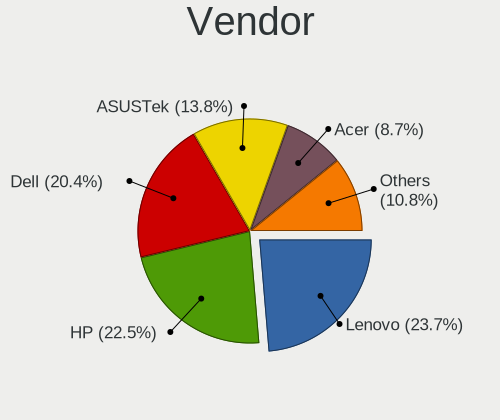

| Name                     | Notebooks | Percent |
|--------------------------|-----------|---------|
| Lenovo                   | 538       | 24.17%  |
| Hewlett-Packard          | 516       | 23.18%  |
| Dell                     | 513       | 23.05%  |
| ASUSTek Computer         | 270       | 12.13%  |
| Acer                     | 181       | 8.13%   |
| Sony                     | 39        | 1.75%   |
| Toshiba                  | 29        | 1.3%    |
| MSI                      | 27        | 1.21%   |
| Samsung Electronics      | 21        | 0.94%   |
| Apple                    | 15        | 0.67%   |
| AVITA                    | 13        | 0.58%   |
| Timi                     | 8         | 0.36%   |
| HCL Infosystems Limited  | 7         | 0.31%   |
| Fujitsu                  | 6         | 0.27%   |
| HUAWEI                   | 5         | 0.22%   |
| Unknown                  | 4         | 0.18%   |
| realme                   | 3         | 0.13%   |
| LG Electronics           | 3         | 0.13%   |
| Intel                    | 3         | 0.13%   |
| Google                   | 3         | 0.13%   |
| eMachines                | 3         | 0.13%   |
| Gateway                  | 2         | 0.09%   |
| Coconics Private Limited | 2         | 0.09%   |
| Alienware                | 2         | 0.09%   |
| WIPRO                    | 1         | 0.04%   |
| System76                 | 1         | 0.04%   |
| Razer                    | 1         | 0.04%   |
| ONDA                     | 1         | 0.04%   |
| Notebook                 | 1         | 0.04%   |
| NEC Computers            | 1         | 0.04%   |
| Micromax                 | 1         | 0.04%   |
| iBall                    | 1         | 0.04%   |
| HASEE Computer           | 1         | 0.04%   |
| EVOO                     | 1         | 0.04%   |
| Eluktronics              | 1         | 0.04%   |
| Dynabook                 | 1         | 0.04%   |
| AMI                      | 1         | 0.04%   |

Model
-----

Motherboard model

| Name                                   | Notebooks | Percent |
|----------------------------------------|-----------|---------|
| HP Notebook                            | 64        | 2.88%   |
| HP Pavilion 15                         | 22        | 0.99%   |
| Dell Inspiron 3542                     | 22        | 0.99%   |
| HP 15                                  | 21        | 0.94%   |
| Dell Inspiron 5570                     | 20        | 0.9%    |
| Dell Inspiron 15-3567                  | 20        | 0.9%    |
| HP Laptop 15-bs0xx                     | 19        | 0.85%   |
| HP Pavilion g6                         | 18        | 0.81%   |
| Lenovo IdeaPad 330-15IKB 81DE          | 16        | 0.72%   |
| Lenovo E41-25 81FS                     | 15        | 0.67%   |
| Dell Inspiron 3521                     | 15        | 0.67%   |
| HP Pavilion Notebook                   | 14        | 0.63%   |
| Acer Aspire A715-75G                   | 14        | 0.63%   |
| Unknown                                | 14        | 0.63%   |
| Dell Vostro 3480                       | 13        | 0.58%   |
| ASUS TUF Gaming FX505DT_FX505DT        | 13        | 0.58%   |
| Lenovo G50-80 80E5                     | 12        | 0.54%   |
| Dell Vostro 3578                       | 11        | 0.49%   |
| Lenovo G50-45 80E3                     | 10        | 0.45%   |
| HP Laptop 15-da0xxx                    | 10        | 0.45%   |
| HP Laptop 15-bw0xx                     | 10        | 0.45%   |
| Dell Vostro 3478                       | 10        | 0.45%   |
| Dell Vostro 15-3568                    | 10        | 0.45%   |
| ASUS X510UNR                           | 10        | 0.45%   |
| Lenovo IdeaPad 520-15IKB 81BF          | 9         | 0.4%    |
| Lenovo IdeaPad 320-15ISK 80XH          | 9         | 0.4%    |
| Dell Inspiron 5559                     | 9         | 0.4%    |
| ASUS VivoBook_ASUSLaptop X512FL_X512FL | 9         | 0.4%    |
| Lenovo IdeaPad S540-15IWL D 81NE       | 8         | 0.36%   |
| Lenovo IdeaPad 320-15IKB 80XL          | 8         | 0.36%   |
| HP Pavilion g4                         | 8         | 0.36%   |
| HP Pavilion dv6                        | 8         | 0.36%   |
| Dell Inspiron 5520                     | 8         | 0.36%   |
| Dell Inspiron 5370                     | 8         | 0.36%   |
| Dell Inspiron 3541                     | 8         | 0.36%   |
| AVITA NS14A8                           | 8         | 0.36%   |
| ASUS VivoBook 15_ASUS Laptop X507UAR   | 8         | 0.36%   |
| Acer Aspire A515-51G                   | 8         | 0.36%   |
| Samsung 300E4C/300E5C/300E7C           | 7         | 0.31%   |
| Lenovo ThinkBook 14-IML 20RV           | 7         | 0.31%   |
| Lenovo G580 20157                      | 7         | 0.31%   |
| HP Pavilion Gaming Laptop 15-ec2xxx    | 7         | 0.31%   |
| HP OMEN Laptop 15-en0xxx               | 7         | 0.31%   |
| HP EliteBook 8470p                     | 7         | 0.31%   |
| Dell XPS 15 7590                       | 7         | 0.31%   |
| Dell Inspiron N5050                    | 7         | 0.31%   |
| ASUS X556UQK                           | 7         | 0.31%   |
| ASUS TUF Gaming FX505DY_FX505DY        | 7         | 0.31%   |
| Lenovo IdeaPad S145-15IWL 81MV         | 6         | 0.27%   |
| Lenovo IdeaPad 330-15AST 81D6          | 6         | 0.27%   |
| HP Pavilion Laptop 14-dv0xxx           | 6         | 0.27%   |
| HP Laptop 15-da1xxx                    | 6         | 0.27%   |
| HP Laptop 15-bs1xx                     | 6         | 0.27%   |
| HP EliteBook 840 G1                    | 6         | 0.27%   |
| HCL Infosystems Limited HCL ME Laptop  | 6         | 0.27%   |
| Dell Vostro 3446                       | 6         | 0.27%   |
| Dell Vostro 2520                       | 6         | 0.27%   |
| Dell Latitude 3490                     | 6         | 0.27%   |
| Dell Inspiron N4010                    | 6         | 0.27%   |
| Dell Inspiron 7591                     | 6         | 0.27%   |

Model Family
------------

Motherboard model prefix

| Name                        | Notebooks | Percent |
|-----------------------------|-----------|---------|
| Dell Inspiron               | 255       | 11.46%  |
| Lenovo IdeaPad              | 194       | 8.72%   |
| Lenovo ThinkPad             | 183       | 8.22%   |
| HP Pavilion                 | 136       | 6.11%   |
| HP Laptop                   | 118       | 5.3%    |
| ASUS VivoBook               | 111       | 4.99%   |
| Acer Aspire                 | 104       | 4.67%   |
| Dell Latitude               | 101       | 4.54%   |
| Dell Vostro                 | 99        | 4.45%   |
| HP Notebook                 | 64        | 2.88%   |
| HP EliteBook                | 42        | 1.89%   |
| HP ProBook                  | 38        | 1.71%   |
| ASUS TUF                    | 31        | 1.39%   |
| Dell XPS                    | 27        | 1.21%   |
| Toshiba Satellite           | 25        | 1.12%   |
| Acer Nitro                  | 24        | 1.08%   |
| Lenovo Legion               | 23        | 1.03%   |
| HP 15                       | 22        | 0.99%   |
| ASUS ROG                    | 21        | 0.94%   |
| ASUS ASUS                   | 21        | 0.94%   |
| Acer Swift                  | 21        | 0.94%   |
| Lenovo E41-25               | 15        | 0.67%   |
| Lenovo ThinkBook            | 14        | 0.63%   |
| Unknown                     | 14        | 0.63%   |
| HP OMEN                     | 13        | 0.58%   |
| Lenovo G50-80               | 12        | 0.54%   |
| Acer Predator               | 11        | 0.49%   |
| Lenovo G50-45               | 10        | 0.45%   |
| HP Compaq                   | 10        | 0.45%   |
| Dell Precision              | 10        | 0.45%   |
| ASUS X510UNR                | 10        | 0.45%   |
| HP Presario                 | 9         | 0.4%    |
| HP 245                      | 9         | 0.4%    |
| Dell G3                     | 9         | 0.4%    |
| HP ENVY                     | 8         | 0.36%   |
| AVITA NS14A8                | 8         | 0.36%   |
| ASUS ZenBook                | 8         | 0.36%   |
| Timi Mi                     | 7         | 0.31%   |
| Samsung 300E4C              | 7         | 0.31%   |
| Lenovo G580                 | 7         | 0.31%   |
| HP ZBook                    | 7         | 0.31%   |
| HCL Infosystems Limited HCL | 7         | 0.31%   |
| ASUS X556UQK                | 7         | 0.31%   |
| Acer TravelMate             | 7         | 0.31%   |
| MSI GL63                    | 6         | 0.27%   |
| Fujitsu LIFEBOOK            | 6         | 0.27%   |
| ASUS Strix                  | 6         | 0.27%   |
| Acer One                    | 6         | 0.27%   |
| MSI GF63                    | 5         | 0.22%   |
| HP 348                      | 5         | 0.22%   |
| Lenovo Z50-70               | 4         | 0.18%   |
| Lenovo V145-15AST           | 4         | 0.18%   |
| Lenovo G570                 | 4         | 0.18%   |
| Lenovo G510                 | 4         | 0.18%   |
| Lenovo G50-70               | 4         | 0.18%   |
| Lenovo E4325                | 4         | 0.18%   |
| HUAWEI BOHK-WAX9X           | 4         | 0.18%   |
| HP 250                      | 4         | 0.18%   |
| HP 240                      | 4         | 0.18%   |
| Dell G5                     | 4         | 0.18%   |

MFG Year
--------

Motherboard manufacture year

| Year    | Notebooks | Percent |
|---------|-----------|---------|
| 2019    | 348       | 15.63%  |
| 2018    | 329       | 14.78%  |
| 2020    | 246       | 11.05%  |
| 2017    | 219       | 9.84%   |
| 2016    | 148       | 6.65%   |
| 2011    | 144       | 6.47%   |
| 2012    | 134       | 6.02%   |
| 2021    | 130       | 5.84%   |
| 2014    | 129       | 5.8%    |
| 2013    | 123       | 5.53%   |
| 2015    | 112       | 5.03%   |
| 2010    | 82        | 3.68%   |
| 2008    | 39        | 1.75%   |
| 2009    | 29        | 1.3%    |
| 2007    | 7         | 0.31%   |
| 2022    | 2         | 0.09%   |
| 2006    | 2         | 0.09%   |
| 2005    | 1         | 0.04%   |
| 2003    | 1         | 0.04%   |
| Unknown | 1         | 0.04%   |

Form Factor
-----------

Physical design of the computer

| Name     | Notebooks | Percent |
|----------|-----------|---------|
| Notebook | 2226      | 100%    |

Secure Boot
-----------

Enabled or disabled

| State    | Notebooks | Percent |
|----------|-----------|---------|
| Disabled | 1909      | 84.92%  |
| Enabled  | 339       | 15.08%  |

Coreboot
--------

Have coreboot on board

| Used | Notebooks | Percent |
|------|-----------|---------|
| No   | 2220      | 99.73%  |
| Yes  | 6         | 0.27%   |

RAM Size
--------

Total RAM memory

| Size in GB  | Notebooks | Percent |
|-------------|-----------|---------|
| 4.01-8.0    | 788       | 35.02%  |
| 3.01-4.0    | 559       | 24.84%  |
| 8.01-16.0   | 434       | 19.29%  |
| 16.01-24.0  | 302       | 13.42%  |
| 1.01-2.0    | 74        | 3.29%   |
| 32.01-64.0  | 51        | 2.27%   |
| 2.01-3.0    | 22        | 0.98%   |
| 24.01-32.0  | 11        | 0.49%   |
| 0.51-1.0    | 6         | 0.27%   |
| 64.01-256.0 | 2         | 0.09%   |
| 0.01-0.5    | 1         | 0.04%   |

RAM Used
--------

Used RAM memory

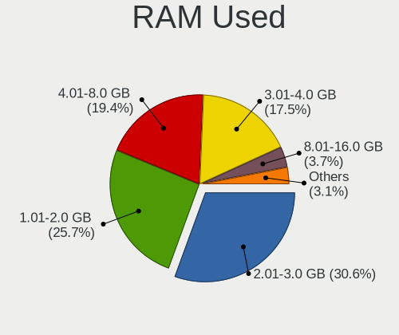

| Used GB    | Notebooks | Percent |
|------------|-----------|---------|
| 2.01-3.0   | 816       | 33.5%   |
| 1.01-2.0   | 786       | 32.27%  |
| 3.01-4.0   | 344       | 14.12%  |
| 4.01-8.0   | 339       | 13.92%  |
| 0.51-1.0   | 75        | 3.08%   |
| 8.01-16.0  | 62        | 2.55%   |
| 0.01-0.5   | 10        | 0.41%   |
| 16.01-24.0 | 3         | 0.12%   |
| 24.01-32.0 | 1         | 0.04%   |

Total Drives
------------

Number of drives on board

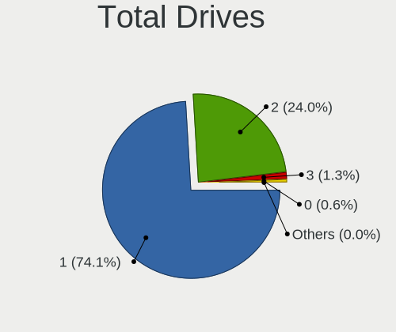

| Drives | Notebooks | Percent |
|--------|-----------|---------|
| 1      | 1702      | 75.61%  |
| 2      | 501       | 22.26%  |
| 3      | 28        | 1.24%   |
| 0      | 19        | 0.84%   |
| 5      | 1         | 0.04%   |

Has CD-ROM
----------

Has CD-ROM on board

| Presented | Notebooks | Percent |
|-----------|-----------|---------|
| No        | 1366      | 61.09%  |
| Yes       | 870       | 38.91%  |

Has Ethernet
------------

Has Ethernet on board

| Presented | Notebooks | Percent |
|-----------|-----------|---------|
| Yes       | 1837      | 82.34%  |
| No        | 394       | 17.66%  |

Has WiFi
--------

Has WiFi module

| Presented | Notebooks | Percent |
|-----------|-----------|---------|
| Yes       | 2201      | 98.79%  |
| No        | 27        | 1.21%   |

Has Bluetooth
-------------

Has Bluetooth module

| Presented | Notebooks | Percent |
|-----------|-----------|---------|
| Yes       | 1954      | 86.96%  |
| No        | 293       | 13.04%  |

Location
--------

Country
-------

Geographic location (country)

| Country | Notebooks | Percent |
|---------|-----------|---------|
| India   | 2226      | 100%    |

City
----

Geographic location (city)

| City          | Notebooks | Percent |
|---------------|-----------|---------|
| Bengaluru     | 279       | 11.76%  |
| Chennai       | 164       | 6.91%   |
| Pune          | 138       | 5.82%   |
| Mumbai        | 136       | 5.73%   |
| Delhi         | 129       | 5.44%   |
| New Delhi     | 114       | 4.8%    |
| Hyderabad     | 111       | 4.68%   |
| Kolkata       | 96        | 4.05%   |
| Ernakulam     | 65        | 2.74%   |
| Ahmedabad     | 58        | 2.44%   |
| Lucknow       | 57        | 2.4%    |
| Jaipur        | 38        | 1.6%    |
| Patna         | 36        | 1.52%   |
| Coimbatore    | 32        | 1.35%   |
| Bhopal        | 31        | 1.31%   |
| Noida         | 29        | 1.22%   |
| Gurgaon       | 26        | 1.1%    |
| Thrissur      | 23        | 0.97%   |
| Ludhiana      | 23        | 0.97%   |
| Indore        | 23        | 0.97%   |
| Trivandrum    | 21        | 0.88%   |
| Guwahati      | 20        | 0.84%   |
| Surat         | 16        | 0.67%   |
| Kochi         | 16        | 0.67%   |
| Visakhapatnam | 13        | 0.55%   |
| Thane         | 13        | 0.55%   |
| Mohali        | 13        | 0.55%   |
| Ghaziabad     | 13        | 0.55%   |
| Chandigarh    | 13        | 0.55%   |
| Raipur        | 12        | 0.51%   |
| Nagpur        | 12        | 0.51%   |
| Kozhikode     | 12        | 0.51%   |
| Salem         | 11        | 0.46%   |
| Mangalore     | 11        | 0.46%   |
| Machhagan     | 11        | 0.46%   |
| Kottayam      | 11        | 0.46%   |
| Vijayawada    | 10        | 0.42%   |
| Mysore        | 10        | 0.42%   |
| Kanpur        | 9         | 0.38%   |
| Dehradun      | 9         | 0.38%   |
| Shimla        | 8         | 0.34%   |
| Ranchi        | 8         | 0.34%   |
| Puducherry    | 8         | 0.34%   |
| Navi Mumbai   | 8         | 0.34%   |
| Malappuram    | 8         | 0.34%   |
| Kannur        | 8         | 0.34%   |
| Palakkad      | 7         | 0.29%   |
| Jalandhar     | 7         | 0.29%   |
| Guntur        | 7         | 0.29%   |
| Bhubaneswar   | 7         | 0.29%   |
| Vadodara      | 6         | 0.25%   |
| Srinagar      | 6         | 0.25%   |
| Karnal        | 6         | 0.25%   |
| Jamshedpur    | 6         | 0.25%   |
| Jammu         | 6         | 0.25%   |
| Tirupati      | 5         | 0.21%   |
| Tirunelveli   | 5         | 0.21%   |
| Siliguri      | 5         | 0.21%   |
| Rohtak        | 5         | 0.21%   |
| Prayagraj     | 5         | 0.21%   |

Drives
------

Drive Vendor
------------

Hard drive vendors

| Vendor                       | Notebooks | Drives | Percent |
|------------------------------|-----------|--------|---------|
| Seagate                      | 588       | 706    | 22%     |
| WDC                          | 498       | 586    | 18.63%  |
| Toshiba                      | 340       | 384    | 12.72%  |
| Samsung Electronics          | 253       | 311    | 9.47%   |
| SK Hynix                     | 117       | 132    | 4.38%   |
| HGST                         | 115       | 127    | 4.3%    |
| Sandisk                      | 112       | 150    | 4.19%   |
| Intel                        | 105       | 140    | 3.93%   |
| Kingston                     | 101       | 123    | 3.78%   |
| Crucial                      | 78        | 95     | 2.92%   |
| Hitachi                      | 65        | 77     | 2.43%   |
| Unknown                      | 54        | 69     | 2.02%   |
| Micron Technology            | 46        | 55     | 1.72%   |
| KIOXIA                       | 29        | 32     | 1.08%   |
| A-DATA Technology            | 21        | 22     | 0.79%   |
| LITEON                       | 10        | 11     | 0.37%   |
| Apple                        | 10        | 11     | 0.37%   |
| Micron/Crucial Technology    | 9         | 10     | 0.34%   |
| FORESEE                      | 9         | 10     | 0.34%   |
| China                        | 9         | 9      | 0.34%   |
| Silicon Motion               | 8         | 10     | 0.3%    |
| Phison                       | 8         | 8      | 0.3%    |
| Hewlett-Packard              | 8         | 12     | 0.3%    |
| Fujitsu                      | 7         | 7      | 0.26%   |
| UMIS                         | 6         | 7      | 0.22%   |
| Gigabyte Technology          | 4         | 5      | 0.15%   |
| TO Exter                     | 3         | 3      | 0.11%   |
| SPCC                         | 3         | 4      | 0.11%   |
| PNY                          | 3         | 5      | 0.11%   |
| MAXTOR                       | 3         | 5      | 0.11%   |
| External                     | 3         | 3      | 0.11%   |
| Unknown                      | 3         | 3      | 0.11%   |
| Yangtze Memory               | 2         | 2      | 0.07%   |
| Union Memory                 | 2         | 2      | 0.07%   |
| Team                         | 2         | 2      | 0.07%   |
| OSCOO                        | 2         | 3      | 0.07%   |
| MARSHAL                      | 2         | 2      | 0.07%   |
| Lite-On                      | 2         | 2      | 0.07%   |
| Lexar                        | 2         | 2      | 0.07%   |
| Lenovo                       | 2         | 3      | 0.07%   |
| JMicron                      | 2         | 2      | 0.07%   |
| YMTC                         | 1         | 1      | 0.04%   |
| Yangtze Memory Technologies  | 1         | 3      | 0.04%   |
| XPG                          | 1         | 1      | 0.04%   |
| W800S                        | 1         | 1      | 0.04%   |
| Union Memory (Shenzhen)      | 1         | 1      | 0.04%   |
| Transcend                    | 1         | 1      | 0.04%   |
| Toshiba America Info Systems | 1         | 1      | 0.04%   |
| StoreJet                     | 1         | 1      | 0.04%   |
| Secureye                     | 1         | 1      | 0.04%   |
| Realtek Semiconductor        | 1         | 1      | 0.04%   |
| OCZ                          | 1         | 1      | 0.04%   |
| NT6                          | 1         | 1      | 0.04%   |
| Mushkin                      | 1         | 1      | 0.04%   |
| LITEONIT                     | 1         | 2      | 0.04%   |
| LITEON C                     | 1         | 1      | 0.04%   |
| KLEVV                        | 1         | 1      | 0.04%   |
| KingSpec                     | 1         | 1      | 0.04%   |
| HUAWEI                       | 1         | 1      | 0.04%   |
| HS-SSD-C100                  | 1         | 2      | 0.04%   |

Drive Model
-----------

Hard drive models

| Model                                | Notebooks | Percent |
|--------------------------------------|-----------|---------|
| Seagate ST1000LM035-1RK172 1TB       | 220       | 8.03%   |
| Toshiba MQ04ABF100 1TB               | 108       | 3.94%   |
| Toshiba MQ01ABD100 1TB               | 89        | 3.25%   |
| Seagate ST1000LM049-2GH172 1TB       | 49        | 1.79%   |
| Seagate ST1000LM024 HN-M101MBB 1TB   | 46        | 1.68%   |
| Seagate ST500LT012-1DG142 500GB      | 44        | 1.61%   |
| Intel NVMe SSD Drive 512GB           | 44        | 1.61%   |
| Toshiba MQ01ABF050 500GB             | 34        | 1.24%   |
| Sandisk NVMe SSD Drive 256GB         | 32        | 1.17%   |
| Intel SSDPEKNW512G8 512GB            | 31        | 1.13%   |
| Crucial CT240BX500SSD1 240GB         | 30        | 1.09%   |
| SK Hynix NVMe SSD Drive 512GB        | 28        | 1.02%   |
| HGST HTS541010A9E680 1TB             | 28        | 1.02%   |
| Samsung NVMe SSD Drive 512GB         | 27        | 0.99%   |
| Seagate ST9500325AS 500GB            | 26        | 0.95%   |
| Sandisk NVMe SSD Drive 512GB         | 26        | 0.95%   |
| WDC WDS240G2G0A-00JH30 240GB SSD     | 25        | 0.91%   |
| Seagate ST2000LM007-1R8174 2TB       | 25        | 0.91%   |
| Kingston SA400S37240G 240GB SSD      | 25        | 0.91%   |
| WDC WD10SPZX-24Z10 1TB               | 24        | 0.88%   |
| WDC WD10SPZX-21Z10T0 1TB             | 24        | 0.88%   |
| WDC WD10SPZX-60Z10T0 1TB             | 23        | 0.84%   |
| WDC WD10JPVX-60JC3T1 1TB             | 23        | 0.84%   |
| Samsung NVMe SSD Drive 256GB         | 22        | 0.8%    |
| Seagate ST1000LM048-2E7172 1TB       | 20        | 0.73%   |
| HGST HTS721010A9E630 1TB             | 19        | 0.69%   |
| WDC WDS240G2G0B-00EPW0 240GB SSD     | 17        | 0.62%   |
| WDC WD10JPCX-24UE4T0 1TB             | 17        | 0.62%   |
| Seagate ST500LT012-9WS142 500GB      | 17        | 0.62%   |
| HGST HTS545050A7E680 500GB           | 17        | 0.62%   |
| WDC WD5000LPVX-75V0TT0 500GB         | 14        | 0.51%   |
| WDC WD10SPZX-24Z10T0 1TB             | 14        | 0.51%   |
| Samsung NVMe SSD Drive 1024GB        | 14        | 0.51%   |
| HGST HTS545050A7E380 500GB           | 14        | 0.51%   |
| WDC WD10SPZX-08Z10 1TB               | 13        | 0.47%   |
| WDC WD10JPVX-60JC3T0 1TB             | 13        | 0.47%   |
| WDC WD10JPVX-75JC3T0 1TB             | 12        | 0.44%   |
| Seagate ST500LM012 HN-M500MBB 500GB  | 12        | 0.44%   |
| Samsung SSD 860 EVO 500GB            | 12        | 0.44%   |
| Samsung SSD 860 EVO 250GB            | 12        | 0.44%   |
| Kingston NVMe SSD Drive 512GB        | 12        | 0.44%   |
| Seagate ST1000LX015-1U7172 1TB       | 11        | 0.4%    |
| Kingston SA400S37480G 480GB SSD      | 11        | 0.4%    |
| HGST HTS725050A7E630 500GB           | 11        | 0.4%    |
| Seagate ST500LM021-1KJ152 500GB      | 10        | 0.36%   |
| Micron NVMe SSD Drive 512GB          | 10        | 0.36%   |
| WDC PC SN520 SDAPNUW-512G-1014 512GB | 8         | 0.29%   |
| Seagate ST9320325AS 320GB            | 8         | 0.29%   |
| Seagate ST500VT000-1DK142 500GB      | 8         | 0.29%   |
| Samsung SSD 850 EVO 250GB            | 8         | 0.29%   |
| KIOXIA KBG40ZNS512G NVMe 512GB       | 8         | 0.29%   |
| Intel SSDPEKNW512G8H 512GB           | 8         | 0.29%   |
| Crucial CT480BX500SSD1 480GB         | 8         | 0.29%   |
| Crucial CT120BX500SSD1 120GB         | 8         | 0.29%   |
| WDC WDS120G2G0A-00JH30 120GB SSD     | 7         | 0.26%   |
| WDC WD10SPZX-22Z10T1 1TB             | 7         | 0.26%   |
| WDC WD10SPZX-00Z10T0 1TB             | 7         | 0.26%   |
| WDC WD10JPVX-22JC3T0 1TB             | 7         | 0.26%   |
| Unknown SD/MMC/MS PRO 128GB          | 7         | 0.26%   |
| Unknown MMC Card  16GB               | 7         | 0.26%   |

HDD Vendor
----------

Hard disk drive vendors

| Vendor              | Notebooks | Drives | Percent |
|---------------------|-----------|--------|---------|
| Seagate             | 583       | 699    | 40.29%  |
| WDC                 | 360       | 409    | 24.88%  |
| Toshiba             | 299       | 330    | 20.66%  |
| HGST                | 115       | 127    | 7.95%   |
| Hitachi             | 65        | 77     | 4.49%   |
| Unknown             | 7         | 7      | 0.48%   |
| Fujitsu             | 7         | 7      | 0.48%   |
| Samsung Electronics | 5         | 5      | 0.35%   |
| Apple               | 3         | 3      | 0.21%   |
| Hewlett-Packard     | 2         | 3      | 0.14%   |
| MARSHAL             | 1         | 1      | 0.07%   |

SSD Vendor
----------

Solid state drive vendors

| Vendor              | Notebooks | Drives | Percent |
|---------------------|-----------|--------|---------|
| Samsung Electronics | 101       | 118    | 19.5%   |
| WDC                 | 72        | 79     | 13.9%   |
| Crucial             | 72        | 89     | 13.9%   |
| Kingston            | 61        | 78     | 11.78%  |
| SanDisk             | 36        | 51     | 6.95%   |
| SK Hynix            | 31        | 33     | 5.98%   |
| Micron Technology   | 19        | 23     | 3.67%   |
| A-DATA Technology   | 19        | 20     | 3.67%   |
| LITEON              | 9         | 10     | 1.74%   |
| Intel               | 9         | 10     | 1.74%   |
| FORESEE             | 9         | 10     | 1.74%   |
| Toshiba             | 8         | 8      | 1.54%   |
| China               | 8         | 8      | 1.54%   |
| Apple               | 6         | 7      | 1.16%   |
| Seagate             | 5         | 5      | 0.97%   |
| Hewlett-Packard     | 5         | 8      | 0.97%   |
| Unknown             | 4         | 4      | 0.77%   |
| Gigabyte Technology | 4         | 5      | 0.77%   |
| TO Exter            | 3         | 3      | 0.58%   |
| PNY                 | 3         | 5      | 0.58%   |
| MAXTOR              | 3         | 5      | 0.58%   |
| External            | 3         | 3      | 0.58%   |
| Team                | 2         | 2      | 0.39%   |
| SPCC                | 2         | 3      | 0.39%   |
| Lexar               | 2         | 2      | 0.39%   |
| Unknown             | 2         | 2      | 0.39%   |
| W800S               | 1         | 1      | 0.19%   |
| Transcend           | 1         | 1      | 0.19%   |
| StoreJet            | 1         | 1      | 0.19%   |
| Secureye            | 1         | 1      | 0.19%   |
| Phison              | 1         | 1      | 0.19%   |
| OSCOO               | 1         | 2      | 0.19%   |
| OCZ                 | 1         | 1      | 0.19%   |
| LITEONIT            | 1         | 2      | 0.19%   |
| LITEON C            | 1         | 1      | 0.19%   |
| KLEVV               | 1         | 1      | 0.19%   |
| KingSpec            | 1         | 1      | 0.19%   |
| HS-SSD-C100         | 1         | 1      | 0.19%   |
| Hoodisk             | 1         | 1      | 0.19%   |
| CT480BX5            | 1         | 1      | 0.19%   |
| CS900               | 1         | 1      | 0.19%   |
| Bryt                | 1         | 1      | 0.19%   |
| BIWIN               | 1         | 1      | 0.19%   |
| BHT                 | 1         | 1      | 0.19%   |
| Acer                | 1         | 1      | 0.19%   |
| AARVEX              | 1         | 1      | 0.19%   |

Drive Kind
----------

HDD or SSD

| Kind    | Notebooks | Drives | Percent |
|---------|-----------|--------|---------|
| HDD     | 1429      | 1668   | 54.27%  |
| NVMe    | 654       | 840    | 24.84%  |
| SSD     | 501       | 613    | 19.03%  |
| MMC     | 39        | 52     | 1.48%   |
| Unknown | 10        | 10     | 0.38%   |

Drive Connector
---------------

SATA, SAS, NVMe, etc.

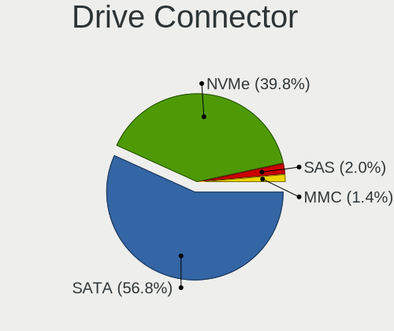

| Type | Notebooks | Drives | Percent |
|------|-----------|--------|---------|
| SATA | 1729      | 2239   | 70.09%  |
| NVMe | 654       | 840    | 26.51%  |
| SAS  | 45        | 52     | 1.82%   |
| MMC  | 39        | 52     | 1.58%   |

Drive Size
----------

Size of hard drive

| Size in TB | Notebooks | Drives | Percent |
|------------|-----------|--------|---------|
| 0.01-0.5   | 945       | 1144   | 49.35%  |
| 0.51-1.0   | 921       | 1083   | 48.09%  |
| 1.01-2.0   | 43        | 47     | 2.25%   |
| 4.01-10.0  | 5         | 6      | 0.26%   |
| 2.01-3.0   | 1         | 1      | 0.05%   |

Space Total
-----------

Amount of disk space available on the file system

| Size in GB     | Notebooks | Percent |
|----------------|-----------|---------|
| 251-500        | 648       | 27.91%  |
| 101-250        | 608       | 26.18%  |
| 501-1000       | 433       | 18.65%  |
| 51-100         | 223       | 9.6%    |
| 21-50          | 126       | 5.43%   |
| 1001-2000      | 115       | 4.95%   |
| 1-20           | 100       | 4.31%   |
| Unknown        | 36        | 1.55%   |
| 2001-3000      | 17        | 0.73%   |
| More than 3000 | 16        | 0.69%   |

Space Used
----------

Amount of used disk space

| Used GB        | Notebooks | Percent |
|----------------|-----------|---------|
| 1-20           | 938       | 39.02%  |
| 21-50          | 519       | 21.59%  |
| 101-250        | 325       | 13.52%  |
| 51-100         | 308       | 12.81%  |
| 251-500        | 165       | 6.86%   |
| 501-1000       | 93        | 3.87%   |
| Unknown        | 36        | 1.5%    |
| 1001-2000      | 16        | 0.67%   |
| More than 3000 | 2         | 0.08%   |
| 2001-3000      | 1         | 0.04%   |
| 0              | 1         | 0.04%   |

Malfunc. Drives
---------------

Drive models with a malfunction

| Model                                 | Notebooks | Drives | Percent |
|---------------------------------------|-----------|--------|---------|
| Seagate ST1000LM035-1RK172 1TB        | 17        | 18     | 9.6%    |
| HGST HTS541010A9E680 1TB              | 10        | 10     | 5.65%   |
| Seagate ST1000LM049-2GH172 1TB        | 9         | 10     | 5.08%   |
| Toshiba MQ01ABD100 1TB                | 7         | 7      | 3.95%   |
| Seagate ST1000LM024 HN-M101MBB 1TB    | 7         | 7      | 3.95%   |
| Seagate ST500LT012-1DG142 500GB       | 6         | 6      | 3.39%   |
| HGST HTS545050A7E680 500GB            | 6         | 8      | 3.39%   |
| Seagate ST9500325AS 500GB             | 5         | 5      | 2.82%   |
| Seagate ST500LM021-1KJ152 500GB       | 5         | 5      | 2.82%   |
| Toshiba MQ01ABF050 500GB              | 4         | 4      | 2.26%   |
| Seagate ST500LT012-9WS142 500GB       | 4         | 4      | 2.26%   |
| Seagate ST320LT007-9ZV142 320GB       | 4         | 4      | 2.26%   |
| Toshiba MQ04ABF100 1TB                | 3         | 4      | 1.69%   |
| Seagate ST2000LM007-1R8174 2TB        | 3         | 3      | 1.69%   |
| HGST HTS545050A7E380 500GB            | 3         | 3      | 1.69%   |
| WDC WD5000LPVX-75V0TT0 500GB          | 2         | 2      | 1.13%   |
| WDC WD5000LPVT-22G33T0 500GB          | 2         | 2      | 1.13%   |
| WDC WD10JPCX-24UE4T0 1TB              | 2         | 2      | 1.13%   |
| Toshiba MQ01ABD050 500GB              | 2         | 2      | 1.13%   |
| SK Hynix PC711 HFS512GDE9X073N 512GB  | 2         | 2      | 1.13%   |
| Seagate ST1000LM014-1EJ164 1TB        | 2         | 2      | 1.13%   |
| SanDisk SD9SN8W-128G-1006 128GB SSD   | 2         | 2      | 1.13%   |
| Hitachi HTS547575A9E384 752GB         | 2         | 2      | 1.13%   |
| Hitachi HTS545032B9A300 320GB         | 2         | 3      | 1.13%   |
| Hitachi HTS543232A7A384 320GB         | 2         | 2      | 1.13%   |
| Hitachi HTS542516K9SA00 160GB         | 2         | 2      | 1.13%   |
| HGST HTS725050A7E630 500GB            | 2         | 2      | 1.13%   |
| HGST HTS721010A9E630 1TB              | 2         | 2      | 1.13%   |
| Crucial CT500P1SSD8 500GB             | 2         | 2      | 1.13%   |
| WDC WDS480G2G0A-00JH30 480GB SSD      | 1         | 1      | 0.56%   |
| WDC WDS240G2G0A-00JH30 240GB SSD      | 1         | 1      | 0.56%   |
| WDC WD5000LPVX-22V0TT0 500GB          | 1         | 1      | 0.56%   |
| WDC WD5000LPCX-60VHAT0 500GB          | 1         | 1      | 0.56%   |
| WDC WD5000LPCX-22VHAT0 500GB          | 1         | 1      | 0.56%   |
| WDC WD5000BEVT-60ZAT1 500GB           | 1         | 1      | 0.56%   |
| WDC WD3200BPVT-55ZEST0 320GB          | 1         | 1      | 0.56%   |
| WDC WD3200BEVT-22ZCT0 320GB           | 1         | 1      | 0.56%   |
| WDC WD3200BEVT-08A23T1 320GB          | 1         | 2      | 0.56%   |
| WDC WD2500LPCX-24C6HT0 250GB          | 1         | 1      | 0.56%   |
| WDC WD2500BPVT-75JJ5T0 250GB          | 1         | 1      | 0.56%   |
| WDC WD2500BEKT-75A25T0 250GB          | 1         | 1      | 0.56%   |
| WDC WD1600BEVS-60VAT0 160GB           | 1         | 1      | 0.56%   |
| WDC WD10SPZX-75Z10T3 1TB              | 1         | 1      | 0.56%   |
| WDC WD10SPZX-75Z10T2 1TB              | 1         | 1      | 0.56%   |
| WDC WD10SPZX-75Z10T1 1TB              | 1         | 1      | 0.56%   |
| WDC WD10JPVX-60JC3T1 1TB              | 1         | 1      | 0.56%   |
| WDC WD10JPVX-60JC3T0 1TB              | 1         | 1      | 0.56%   |
| Toshiba MQ02ABD100H 1TB               | 1         | 1      | 0.56%   |
| Toshiba MQ01ABD032 320GB              | 1         | 2      | 0.56%   |
| Toshiba MK5059GSXP 500GB              | 1         | 1      | 0.56%   |
| Toshiba MK3276GSX 320GB               | 1         | 1      | 0.56%   |
| Toshiba MK3259GSXP 320GB              | 1         | 1      | 0.56%   |
| SK Hynix PC300 NVMe 256GB             | 1         | 2      | 0.56%   |
| SK Hynix HFS256G39TNH-73A0A 256GB SSD | 1         | 1      | 0.56%   |
| SK Hynix HFS256G39TND-N210A 256GB SSD | 1         | 1      | 0.56%   |
| Seagate ST9500420ASG 500GB            | 1         | 2      | 0.56%   |
| Seagate ST9320325AS 320GB             | 1         | 1      | 0.56%   |
| Seagate ST9250410AS 250GB             | 1         | 2      | 0.56%   |
| Seagate ST9160821AS 160GB             | 1         | 1      | 0.56%   |
| Seagate ST9160314AS 160GB             | 1         | 1      | 0.56%   |

Malfunc. Drive Vendor
---------------------

Vendors of faulty drives

| Vendor              | Notebooks | Drives | Percent |
|---------------------|-----------|--------|---------|
| Seagate             | 72        | 76     | 40.68%  |
| HGST                | 25        | 27     | 14.12%  |
| WDC                 | 24        | 25     | 13.56%  |
| Toshiba             | 21        | 23     | 11.86%  |
| Hitachi             | 17        | 18     | 9.6%    |
| SK Hynix            | 5         | 6      | 2.82%   |
| SanDisk             | 4         | 4      | 2.26%   |
| Samsung Electronics | 3         | 3      | 1.69%   |
| Crucial             | 2         | 2      | 1.13%   |
| Micron Technology   | 1         | 1      | 0.56%   |
| MARSHAL             | 1         | 1      | 0.56%   |
| Apple               | 1         | 1      | 0.56%   |
| A-DATA Technology   | 1         | 1      | 0.56%   |

Malfunc. HDD Vendor
-------------------

Vendors of faulty HDD drives

| Vendor              | Notebooks | Drives | Percent |
|---------------------|-----------|--------|---------|
| Seagate             | 72        | 76     | 45%     |
| HGST                | 25        | 27     | 15.63%  |
| WDC                 | 22        | 23     | 13.75%  |
| Toshiba             | 21        | 23     | 13.13%  |
| Hitachi             | 17        | 18     | 10.63%  |
| Samsung Electronics | 1         | 1      | 0.63%   |
| MARSHAL             | 1         | 1      | 0.63%   |
| Apple               | 1         | 1      | 0.63%   |

Malfunc. Drive Kind
-------------------

Kinds of faulty drives

| Kind | Notebooks | Drives | Percent |
|------|-----------|--------|---------|
| HDD  | 160       | 170    | 90.4%   |
| SSD  | 10        | 10     | 5.65%   |
| NVMe | 7         | 8      | 3.95%   |

Failed Drives
-------------

Failed drive models

| Model                               | Notebooks | Drives | Percent |
|-------------------------------------|-----------|--------|---------|
| WDC WD10SPZX-21Z10T0 1TB            | 1         | 1      | 25%     |
| Seagate ST500LT012-1DG142 500GB     | 1         | 1      | 25%     |
| Seagate ST1000LM 024 HN-M101MBB 1TB | 1         | 1      | 25%     |
| Apple HDD HTS545050A7E362 500GB     | 1         | 1      | 25%     |

Failed Drive Vendor
-------------------

Failed drive vendors

| Vendor  | Notebooks | Drives | Percent |
|---------|-----------|--------|---------|
| Seagate | 2         | 2      | 50%     |
| WDC     | 1         | 1      | 25%     |
| Apple   | 1         | 1      | 25%     |

Drive Status
------------

Number of failed and malfunc. drives

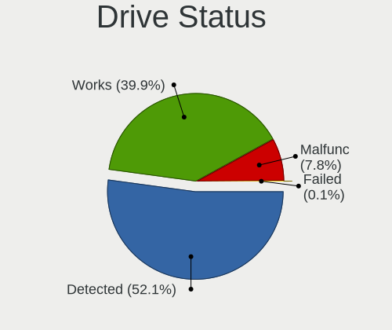

| Status   | Notebooks | Drives | Percent |
|----------|-----------|--------|---------|
| Detected | 1424      | 2002   | 61.04%  |
| Works    | 729       | 989    | 31.25%  |
| Malfunc  | 176       | 188    | 7.54%   |
| Failed   | 4         | 4      | 0.17%   |

Storage controller
------------------

Storage Vendor
--------------

Storage controller vendors

| Vendor                           | Notebooks | Percent |
|----------------------------------|-----------|---------|
| Intel                            | 1749      | 65.88%  |
| AMD                              | 311       | 11.71%  |
| Samsung Electronics              | 159       | 5.99%   |
| Sandisk                          | 149       | 5.61%   |
| SK Hynix                         | 85        | 3.2%    |
| Toshiba America Info Systems     | 41        | 1.54%   |
| Kingston Technology Company      | 41        | 1.54%   |
| KIOXIA                           | 33        | 1.24%   |
| Micron Technology                | 27        | 1.02%   |
| Micron/Crucial Technology        | 14        | 0.53%   |
| Silicon Motion                   | 11        | 0.41%   |
| Union Memory (Shenzhen)          | 10        | 0.38%   |
| Phison Electronics               | 7         | 0.26%   |
| Yangtze Memory Technologies      | 3         | 0.11%   |
| Lite-On Technology               | 3         | 0.11%   |
| Realtek Semiconductor            | 2         | 0.08%   |
| Lenovo                           | 2         | 0.08%   |
| ADATA Technology                 | 2         | 0.08%   |
| Solid State Storage Technology   | 1         | 0.04%   |
| Silicon Integrated Systems [SiS] | 1         | 0.04%   |
| Nvidia                           | 1         | 0.04%   |
| Marvell Technology Group         | 1         | 0.04%   |
| ASMedia Technology               | 1         | 0.04%   |
| Apple                            | 1         | 0.04%   |

Storage Model
-------------

Storage controller models

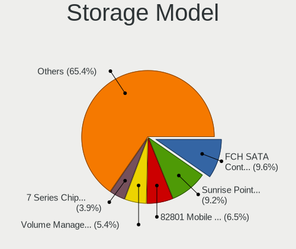

| Model                                                                                  | Notebooks | Percent |
|----------------------------------------------------------------------------------------|-----------|---------|
| Intel Sunrise Point-LP SATA Controller [AHCI mode]                                     | 353       | 12.69%  |
| AMD FCH SATA Controller [AHCI mode]                                                    | 303       | 10.9%   |
| Intel 82801 Mobile SATA Controller [RAID mode]                                         | 241       | 8.67%   |
| Intel 7 Series Chipset Family 6-port SATA Controller [AHCI mode]                       | 148       | 5.32%   |
| Intel 8 Series SATA Controller 1 [AHCI mode]                                           | 134       | 4.82%   |
| Intel 6 Series/C200 Series Chipset Family 6 port Mobile SATA AHCI Controller           | 104       | 3.74%   |
| Intel Wildcat Point-LP SATA Controller [AHCI Mode]                                     | 96        | 3.45%   |
| Intel Cannon Lake Mobile PCH SATA AHCI Controller                                      | 85        | 3.06%   |
| Samsung NVMe SSD Controller SM981/PM981/PM983                                          | 79        | 2.84%   |
| Intel Comet Lake SATA AHCI Controller                                                  | 75        | 2.7%    |
| Intel Cannon Point-LP SATA Controller [AHCI Mode]                                      | 73        | 2.62%   |
| Intel SSD 660P Series                                                                  | 72        | 2.59%   |
| Intel Volume Management Device NVMe RAID Controller                                    | 62        | 2.23%   |
| Samsung NVMe SSD Controller 980                                                        | 58        | 2.09%   |
| Intel 5 Series/3400 Series Chipset 4 port SATA AHCI Controller                         | 46        | 1.65%   |
| Intel Tiger Lake-LP SATA Controller [AHCI mode]                                        | 42        | 1.51%   |
| Sandisk WD Blue SN500 / PC SN520 NVMe SSD                                              | 41        | 1.47%   |
| Intel 82801IBM/IEM (ICH9M/ICH9M-E) 4 port SATA Controller [AHCI mode]                  | 40        | 1.44%   |
| Sandisk WD Blue SN550 NVMe SSD                                                         | 38        | 1.37%   |
| KIOXIA Non-Volatile memory controller                                                  | 33        | 1.19%   |
| Intel HM170/QM170 Chipset SATA Controller [AHCI Mode]                                  | 33        | 1.19%   |
| SK Hynix BC501 NVMe Solid State Drive                                                  | 31        | 1.11%   |
| Intel Ice Lake-LP SATA Controller [AHCI mode]                                          | 31        | 1.11%   |
| Sandisk WD Black SN750 / PC SN730 NVMe SSD                                             | 29        | 1.04%   |
| Micron Non-Volatile memory controller                                                  | 27        | 0.97%   |
| Toshiba America Info Systems XG6 NVMe SSD Controller                                   | 26        | 0.93%   |
| Intel 8 Series/C220 Series Chipset Family 6-port SATA Controller 1 [AHCI mode]         | 26        | 0.93%   |
| Intel 5 Series/3400 Series Chipset 6 port SATA AHCI Controller                         | 24        | 0.86%   |
| SK Hynix BC511                                                                         | 22        | 0.79%   |
| SK Hynix Gold P31 SSD                                                                  | 21        | 0.76%   |
| Sandisk Non-Volatile memory controller                                                 | 18        | 0.65%   |
| Kingston Company U-SNS8154P3 NVMe SSD                                                  | 18        | 0.65%   |
| Intel 82801HM/HEM (ICH8M/ICH8M-E) IDE Controller                                       | 15        | 0.54%   |
| Intel 82801HM/HEM (ICH8M/ICH8M-E) SATA Controller [AHCI mode]                          | 14        | 0.5%    |
| Intel 400 Series Chipset Family SATA AHCI Controller                                   | 14        | 0.5%    |
| Kingston Company Company Non-Volatile memory controller                                | 12        | 0.43%   |
| Intel SSD Pro 7600p/760p/E 6100p Series                                                | 12        | 0.43%   |
| Intel Atom/Celeron/Pentium Processor x5-E8000/J3xxx/N3xxx Series SATA Controller       | 12        | 0.43%   |
| Sandisk WD Black 2018/SN750 / PC SN720 NVMe SSD                                        | 11        | 0.4%    |
| Sandisk PC SN520 NVMe SSD                                                              | 11        | 0.4%    |
| Intel Atom Processor E3800 Series SATA AHCI Controller                                 | 11        | 0.4%    |
| Union Memory (Shenzhen) Non-Volatile memory controller                                 | 10        | 0.36%   |
| Silicon Motion SM2263EN/SM2263XT SSD Controller                                        | 10        | 0.36%   |
| Samsung NVMe SSD Controller SM961/PM961/SM963                                          | 10        | 0.36%   |
| SK Hynix Non-Volatile memory controller                                                | 8         | 0.29%   |
| Kingston Company A2000 NVMe SSD                                                        | 8         | 0.29%   |
| Toshiba America Info Systems BG3 NVMe SSD Controller                                   | 7         | 0.25%   |
| Micron/Crucial P1 NVMe PCIe SSD                                                        | 7         | 0.25%   |
| Intel NM10/ICH7 Family SATA Controller [AHCI mode]                                     | 7         | 0.25%   |
| Intel Celeron/Pentium Silver Processor SATA Controller                                 | 7         | 0.25%   |
| Intel Celeron N3350/Pentium N4200/Atom E3900 Series SATA AHCI Controller               | 7         | 0.25%   |
| Intel 7 Series Chipset Family 4-port SATA Controller [IDE mode]                        | 7         | 0.25%   |
| Intel 7 Series Chipset Family 2-port SATA Controller [IDE mode]                        | 7         | 0.25%   |
| Samsung Electronics SATA controller                                                    | 6         | 0.22%   |
| Intel Q170/Q150/B150/H170/H110/Z170/CM236 Chipset SATA Controller [AHCI Mode]          | 6         | 0.22%   |
| Intel Non-Volatile memory controller                                                   | 6         | 0.22%   |
| Intel 6 Series/C200 Series Chipset Family Mobile SATA Controller (IDE mode, ports 4-5) | 6         | 0.22%   |
| Intel 6 Series/C200 Series Chipset Family Mobile SATA Controller (IDE mode, ports 0-3) | 6         | 0.22%   |
| Samsung NVMe SSD Controller PM9A1/PM9A3/980PRO                                         | 5         | 0.18%   |
| Micron/Crucial NVMe Controller                                                         | 5         | 0.18%   |

Storage Kind
------------

Kind of storage controller (IDE, SATA, NVMe, SAS, ...)

| Kind | Notebooks | Percent |
|------|-----------|---------|
| SATA | 1715      | 62.71%  |
| NVMe | 660       | 24.13%  |
| RAID | 306       | 11.19%  |
| IDE  | 54        | 1.97%   |

Processor
---------

CPU Vendor
----------

Processor vendors

| Vendor | Notebooks | Percent |
|--------|-----------|---------|
| Intel  | 1853      | 83.24%  |
| AMD    | 372       | 16.71%  |
| ARM    | 1         | 0.04%   |

CPU Model
---------

Processor models

| Model                                         | Notebooks | Percent |
|-----------------------------------------------|-----------|---------|
| Intel Core i5-8250U CPU @ 1.60GHz             | 154       | 6.92%   |
| Intel Core i5-8265U CPU @ 1.60GHz             | 90        | 4.04%   |
| Intel Core i5-7200U CPU @ 2.50GHz             | 63        | 2.83%   |
| Intel Core i5-10210U CPU @ 1.60GHz            | 61        | 2.74%   |
| Intel Core i3-6006U CPU @ 2.00GHz             | 61        | 2.74%   |
| Intel 11th Gen Core i5-1135G7 @ 2.40GHz       | 50        | 2.25%   |
| Intel Core i5-4210U CPU @ 1.70GHz             | 41        | 1.84%   |
| Intel Core i3-7020U CPU @ 2.30GHz             | 39        | 1.75%   |
| Intel Core i3-5005U CPU @ 2.00GHz             | 38        | 1.71%   |
| AMD Ryzen 5 3500U with Radeon Vega Mobile Gfx | 38        | 1.71%   |
| Intel Core i5-9300H CPU @ 2.40GHz             | 37        | 1.66%   |
| Intel Core i7-8550U CPU @ 1.80GHz             | 36        | 1.62%   |
| Intel Core i5-6200U CPU @ 2.30GHz             | 36        | 1.62%   |
| Intel Core i7-9750H CPU @ 2.60GHz             | 32        | 1.44%   |
| Intel Core i5-5200U CPU @ 2.20GHz             | 30        | 1.35%   |
| AMD Ryzen 5 3550H with Radeon Vega Mobile Gfx | 30        | 1.35%   |
| Intel Core i3-4005U CPU @ 1.70GHz             | 29        | 1.3%    |
| Intel Core i5-1035G1 CPU @ 1.00GHz            | 28        | 1.26%   |
| Intel Core i7-8750H CPU @ 2.20GHz             | 27        | 1.21%   |
| Intel Core i5-3210M CPU @ 2.50GHz             | 26        | 1.17%   |
| Intel Core i3-1005G1 CPU @ 1.20GHz            | 25        | 1.12%   |
| Intel Core i7-7700HQ CPU @ 2.80GHz            | 24        | 1.08%   |
| Intel Core i3-10110U CPU @ 2.10GHz            | 23        | 1.03%   |
| AMD Ryzen 5 2500U with Radeon Vega Mobile Gfx | 23        | 1.03%   |
| Intel Core i5-3320M CPU @ 2.60GHz             | 22        | 0.99%   |
| AMD Ryzen 5 4600H with Radeon Graphics        | 21        | 0.94%   |
| Intel 11th Gen Core i7-1165G7 @ 2.80GHz       | 20        | 0.9%    |
| Intel Core i7-8565U CPU @ 1.80GHz             | 19        | 0.85%   |
| Intel Core i5-3230M CPU @ 2.60GHz             | 19        | 0.85%   |
| Intel Core i3-2350M CPU @ 2.30GHz             | 19        | 0.85%   |
| Intel Core i7-7500U CPU @ 2.70GHz             | 18        | 0.81%   |
| Intel Core i7-10510U CPU @ 1.80GHz            | 17        | 0.76%   |
| Intel Core i5-8300H CPU @ 2.30GHz             | 16        | 0.72%   |
| AMD PRO A4-4350B R4, 5 COMPUTE CORES 2C+3G    | 16        | 0.72%   |
| Intel Core i5-2450M CPU @ 2.50GHz             | 15        | 0.67%   |
| Intel Core i5-4200U CPU @ 1.60GHz             | 14        | 0.63%   |
| Intel Core i5-2410M CPU @ 2.30GHz             | 14        | 0.63%   |
| Intel Core i3-7100U CPU @ 2.40GHz             | 14        | 0.63%   |
| AMD Ryzen 7 4800H with Radeon Graphics        | 14        | 0.63%   |
| Intel Core i5-2430M CPU @ 2.40GHz             | 13        | 0.58%   |
| Intel Core i5-10300H CPU @ 2.50GHz            | 13        | 0.58%   |
| Intel Core i3-2330M CPU @ 2.20GHz             | 13        | 0.58%   |
| Intel Core i3-8145U CPU @ 2.10GHz             | 12        | 0.54%   |
| Intel 11th Gen Core i3-1115G4 @ 3.00GHz       | 12        | 0.54%   |
| Intel Core i7-10750H CPU @ 2.60GHz            | 11        | 0.49%   |
| AMD Ryzen 5 5600H with Radeon Graphics        | 11        | 0.49%   |
| AMD Ryzen 5 4500U with Radeon Graphics        | 11        | 0.49%   |
| AMD A8-6410 APU with AMD Radeon R5 Graphics   | 11        | 0.49%   |
| Intel Pentium CPU B950 @ 2.10GHz              | 10        | 0.45%   |
| Intel Core i7-6700HQ CPU @ 2.60GHz            | 10        | 0.45%   |
| Intel Core i7-6600U CPU @ 2.60GHz             | 10        | 0.45%   |
| Intel Core i5-6300U CPU @ 2.40GHz             | 10        | 0.45%   |
| Intel Core i5-4300U CPU @ 1.90GHz             | 10        | 0.45%   |
| Intel Core i5-2520M CPU @ 2.50GHz             | 10        | 0.45%   |
| Intel Core i3-4010U CPU @ 1.70GHz             | 10        | 0.45%   |
| Intel Core i3-3217U CPU @ 1.80GHz             | 10        | 0.45%   |
| Intel Core i5-5300U CPU @ 2.30GHz             | 9         | 0.4%    |
| Intel Core i3-8130U CPU @ 2.20GHz             | 9         | 0.4%    |
| Intel Core i3-5010U CPU @ 2.10GHz             | 9         | 0.4%    |
| Intel Core i3-4030U CPU @ 1.90GHz             | 9         | 0.4%    |

CPU Model Family
----------------

Processor model prefix

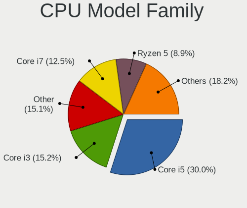

| Model                   | Notebooks | Percent |
|-------------------------|-----------|---------|
| Intel Core i5           | 818       | 36.75%  |
| Intel Core i3           | 407       | 18.28%  |
| Intel Core i7           | 337       | 15.14%  |
| AMD Ryzen 5             | 153       | 6.87%   |
| Other                   | 134       | 6.02%   |
| Intel Pentium           | 68        | 3.05%   |
| Intel Core 2 Duo        | 46        | 2.07%   |
| AMD Ryzen 7             | 43        | 1.93%   |
| AMD A6                  | 35        | 1.57%   |
| Intel Celeron           | 29        | 1.3%    |
| AMD A8                  | 22        | 0.99%   |
| AMD Ryzen 3             | 19        | 0.85%   |
| AMD A4                  | 18        | 0.81%   |
| AMD A10                 | 15        | 0.67%   |
| Intel Atom              | 14        | 0.63%   |
| Intel Pentium Dual-Core | 12        | 0.54%   |
| AMD E1                  | 9         | 0.4%    |
| AMD Ryzen 9             | 8         | 0.36%   |
| AMD Ryzen 7 PRO         | 5         | 0.22%   |
| Intel Pentium Dual      | 4         | 0.18%   |
| Intel Core 2            | 4         | 0.18%   |
| AMD E                   | 4         | 0.18%   |
| Intel Core i9           | 3         | 0.13%   |
| AMD Ryzen 5 PRO         | 3         | 0.13%   |
| AMD E2                  | 3         | 0.13%   |
| AMD A12                 | 3         | 0.13%   |
| Intel Pentium Silver    | 2         | 0.09%   |
| Intel Xeon              | 1         | 0.04%   |
| Intel Pentium M         | 1         | 0.04%   |
| Intel Genuine           | 1         | 0.04%   |
| Intel Core m3           | 1         | 0.04%   |
| Intel Celeron M         | 1         | 0.04%   |
| Intel Celeron Dual-Core | 1         | 0.04%   |
| AMD PRO A10             | 1         | 0.04%   |
| AMD C-60                | 1         | 0.04%   |

CPU Cores
---------

Number of processor cores

| Number | Notebooks | Percent |
|--------|-----------|---------|
| 2      | 1157      | 51.95%  |
| 4      | 845       | 37.94%  |
| 6      | 144       | 6.47%   |
| 8      | 59        | 2.65%   |
| 1      | 20        | 0.9%    |
| 3      | 2         | 0.09%   |

CPU Sockets
-----------

Number of sockets

| Number | Notebooks | Percent |
|--------|-----------|---------|
| 1      | 2226      | 100%    |

CPU Threads
-----------

Threads per core (Hyper-Threading)

| Number | Notebooks | Percent |
|--------|-----------|---------|
| 2      | 1912      | 85.89%  |
| 1      | 313       | 14.06%  |
| 4      | 1         | 0.04%   |

CPU Op-Modes
------------

CPU Operation Modes (32-bit, 64-bit)

| Op mode        | Notebooks | Percent |
|----------------|-----------|---------|
| 32-bit, 64-bit | 2197      | 98.61%  |
| Unknown        | 27        | 1.21%   |
| 32-bit         | 4         | 0.18%   |

CPU Microcode
-------------

Microcode number

| Number     | Notebooks | Percent |
|------------|-----------|---------|
| Unknown    | 365       | 16.04%  |
| 0x806ea    | 193       | 8.48%   |
| 0x806ec    | 167       | 7.34%   |
| 0x206a7    | 127       | 5.58%   |
| 0x806e9    | 119       | 5.23%   |
| 0x40651    | 119       | 5.23%   |
| 0x306a9    | 117       | 5.14%   |
| 0x406e3    | 109       | 4.79%   |
| 0x906ea    | 94        | 4.13%   |
| 0x306d4    | 90        | 3.95%   |
| 0x806c1    | 86        | 3.78%   |
| 0x706e5    | 56        | 2.46%   |
| 0x806eb    | 44        | 1.93%   |
| 0x20655    | 43        | 1.89%   |
| 0x08108102 | 40        | 1.76%   |
| 0x08108109 | 37        | 1.63%   |
| 0x1067a    | 33        | 1.45%   |
| 0x06006705 | 33        | 1.45%   |
| 0x07030105 | 26        | 1.14%   |
| 0x906e9    | 25        | 1.1%    |
| 0x306c3    | 25        | 1.1%    |
| 0xa0652    | 24        | 1.05%   |
| 0x0a50000c | 23        | 1.01%   |
| 0x08600104 | 19        | 0.83%   |
| 0x20652    | 18        | 0.79%   |
| 0x08600106 | 16        | 0.7%    |
| 0x08101007 | 15        | 0.66%   |
| 0x6fd      | 14        | 0.62%   |
| 0x0810100b | 14        | 0.62%   |
| 0x906ed    | 11        | 0.48%   |
| 0x08600103 | 11        | 0.48%   |
| 0x506e3    | 10        | 0.44%   |
| 0x30678    | 10        | 0.44%   |
| 0x06006704 | 10        | 0.44%   |
| 0x06001119 | 10        | 0.44%   |
| 0x506c9    | 8         | 0.35%   |
| 0x106ca    | 8         | 0.35%   |
| 0x03000027 | 8         | 0.35%   |
| 0x406c4    | 7         | 0.31%   |
| 0x08608103 | 7         | 0.31%   |
| 0x07030106 | 7         | 0.31%   |
| 0x0600611a | 7         | 0.31%   |
| 0x806d1    | 6         | 0.26%   |
| 0x706a1    | 6         | 0.26%   |
| 0x106e5    | 6         | 0.26%   |
| 0x10676    | 6         | 0.26%   |
| 0x05000119 | 5         | 0.22%   |
| 0x406c3    | 4         | 0.18%   |
| 0x08600102 | 4         | 0.18%   |
| 0x07030104 | 4         | 0.18%   |
| 0x0700010f | 4         | 0.18%   |
| 0x08608102 | 3         | 0.13%   |
| 0x06006110 | 3         | 0.13%   |
| 0xa0660    | 2         | 0.09%   |
| 0x706a8    | 2         | 0.09%   |
| 0x6f2      | 2         | 0.09%   |
| 0x6e8      | 2         | 0.09%   |
| 0x06006118 | 2         | 0.09%   |
| 0x6fb      | 1         | 0.04%   |
| 0x6f6      | 1         | 0.04%   |

CPU Microarch
-------------

Microarchitecture

| Name          | Notebooks | Percent |
|---------------|-----------|---------|
| KabyLake      | 744       | 33.42%  |
| Haswell       | 170       | 7.64%   |
| SandyBridge   | 149       | 6.69%   |
| Skylake       | 145       | 6.51%   |
| IvyBridge     | 139       | 6.24%   |
| Broadwell     | 107       | 4.81%   |
| TigerLake     | 96        | 4.31%   |
| Zen+          | 91        | 4.09%   |
| Westmere      | 73        | 3.28%   |
| Icelake       | 67        | 3.01%   |
| Zen 2         | 64        | 2.88%   |
| Excavator     | 62        | 2.79%   |
| Penryn        | 48        | 2.16%   |
| Puma          | 42        | 1.89%   |
| Zen 3         | 31        | 1.39%   |
| Zen           | 30        | 1.35%   |
| CometLake     | 30        | 1.35%   |
| Silvermont    | 29        | 1.3%    |
| Core          | 21        | 0.94%   |
| Unknown       | 17        | 0.76%   |
| Piledriver    | 15        | 0.67%   |
| K10 Llano     | 10        | 0.45%   |
| Bonnell       | 9         | 0.4%    |
| Goldmont plus | 8         | 0.36%   |
| Goldmont      | 8         | 0.36%   |
| Nehalem       | 6         | 0.27%   |
| Bobcat        | 6         | 0.27%   |
| Jaguar        | 4         | 0.18%   |
| P6            | 3         | 0.13%   |
| Steamroller   | 2         | 0.09%   |

Graphics
--------

GPU Vendor
----------

Vendors of graphics cards

| Vendor                           | Notebooks | Percent |
|----------------------------------|-----------|---------|
| Intel                            | 1790      | 58.71%  |
| Nvidia                           | 642       | 21.06%  |
| AMD                              | 616       | 20.2%   |
| Silicon Integrated Systems [SiS] | 1         | 0.03%   |

GPU Model
---------

Graphics card models

| Model                                                                                    | Notebooks | Percent |
|------------------------------------------------------------------------------------------|-----------|---------|
| Intel UHD Graphics 620                                                                   | 206       | 6.59%   |
| Intel Haswell-ULT Integrated Graphics Controller                                         | 139       | 4.45%   |
| Intel 3rd Gen Core processor Graphics Controller                                         | 134       | 4.29%   |
| Intel 2nd Generation Core Processor Family Integrated Graphics Controller                | 134       | 4.29%   |
| Intel WhiskeyLake-U GT2 [UHD Graphics 620]                                               | 133       | 4.26%   |
| Intel CoffeeLake-H GT2 [UHD Graphics 630]                                                | 121       | 3.87%   |
| Intel HD Graphics 620                                                                    | 120       | 3.84%   |
| Intel Skylake GT2 [HD Graphics 520]                                                      | 111       | 3.55%   |
| Intel CometLake-U GT2 [UHD Graphics]                                                     | 105       | 3.36%   |
| Intel HD Graphics 5500                                                                   | 99        | 3.17%   |
| AMD Picasso/Raven 2 [Radeon Vega Series / Radeon Vega Mobile Series]                     | 91        | 2.91%   |
| AMD Sun XT [Radeon HD 8670A/8670M/8690M / R5 M330 / M430 / Radeon 520 Mobile]            | 86        | 2.75%   |
| Intel TigerLake-LP GT2 [Iris Xe Graphics]                                                | 82        | 2.62%   |
| AMD Topaz XT [Radeon R7 M260/M265 / M340/M360 / M440/M445 / 530/535 / 620/625 Mobile]    | 63        | 2.02%   |
| AMD Renoir                                                                               | 62        | 1.98%   |
| Intel Core Processor Integrated Graphics Controller                                      | 55        | 1.76%   |
| Intel Iris Plus Graphics G1 (Ice Lake)                                                   | 53        | 1.7%    |
| Nvidia TU117M [GeForce GTX 1650 Mobile / Max-Q]                                          | 51        | 1.63%   |
| AMD Stoney [Radeon R2/R3/R4/R5 Graphics]                                                 | 49        | 1.57%   |
| Intel Mobile 4 Series Chipset Integrated Graphics Controller                             | 43        | 1.38%   |
| Nvidia GF117M [GeForce 610M/710M/810M/820M / GT 620M/625M/630M/720M]                     | 42        | 1.34%   |
| Nvidia GP108M [GeForce MX250]                                                            | 39        | 1.25%   |
| Nvidia GP108M [GeForce MX150]                                                            | 38        | 1.22%   |
| Nvidia TU117M                                                                            | 36        | 1.15%   |
| Nvidia GP107M [GeForce GTX 1050 Mobile]                                                  | 31        | 0.99%   |
| AMD Mullins [Radeon R4/R5 Graphics]                                                      | 31        | 0.99%   |
| Nvidia GM108M [GeForce 940MX]                                                            | 30        | 0.96%   |
| AMD Raven Ridge [Radeon Vega Series / Radeon Vega Mobile Series]                         | 30        | 0.96%   |
| AMD Cezanne                                                                              | 30        | 0.96%   |
| Intel 4th Gen Core Processor Integrated Graphics Controller                              | 29        | 0.93%   |
| Intel HD Graphics 630                                                                    | 28        | 0.9%    |
| Intel CometLake-H GT2 [UHD Graphics]                                                     | 27        | 0.86%   |
| Nvidia GP107M [GeForce GTX 1050 Ti Mobile]                                               | 26        | 0.83%   |
| Nvidia TU117M [GeForce GTX 1650 Ti Mobile]                                               | 24        | 0.77%   |
| Nvidia GM108M [GeForce MX130]                                                            | 24        | 0.77%   |
| AMD Jet PRO [Radeon R5 M230 / R7 M260DX / Radeon 520 Mobile]                             | 23        | 0.74%   |
| AMD Thames [Radeon HD 7500M/7600M Series]                                                | 20        | 0.64%   |
| AMD Seymour [Radeon HD 6400M/7400M Series]                                               | 20        | 0.64%   |
| Intel Kaby Lake-U GT2f HD 620 Graphics Controller                                        | 19        | 0.61%   |
| Intel Mobile GM965/GL960 Integrated Graphics Controller (secondary)                      | 16        | 0.51%   |
| Intel Mobile GM965/GL960 Integrated Graphics Controller (primary)                        | 16        | 0.51%   |
| Intel HD Graphics 520                                                                    | 16        | 0.51%   |
| Intel Atom/Celeron/Pentium Processor x5-E8000/J3xxx/N3xxx Integrated Graphics Controller | 16        | 0.51%   |
| AMD Baffin [Radeon RX 460/560D / Pro 450/455/460/555/555X/560/560X]                      | 15        | 0.48%   |
| Intel Tiger Lake UHD Graphics                                                            | 14        | 0.45%   |
| AMD Sun LE [Radeon HD 8550M / R5 M230]                                                   | 14        | 0.45%   |
| AMD Lucienne                                                                             | 14        | 0.45%   |
| Nvidia GP108M [GeForce MX330]                                                            | 13        | 0.42%   |
| Nvidia GA106M [GeForce RTX 3060 Mobile / Max-Q]                                          | 13        | 0.42%   |
| Intel HD Graphics 530                                                                    | 13        | 0.42%   |
| Intel Atom Processor Z36xxx/Z37xxx Series Graphics & Display                             | 13        | 0.42%   |
| AMD Wani [Radeon R5/R6/R7 Graphics]                                                      | 13        | 0.42%   |
| Nvidia GK208BM [GeForce 920M]                                                            | 12        | 0.38%   |
| Nvidia GP106M [GeForce GTX 1060 Mobile]                                                  | 11        | 0.35%   |
| Nvidia GM108M [GeForce MX110]                                                            | 11        | 0.35%   |
| Nvidia GK208M [GeForce GT 740M]                                                          | 11        | 0.35%   |
| Nvidia GA107M [GeForce RTX 3050 Mobile]                                                  | 11        | 0.35%   |
| Nvidia GP108M [GeForce MX230]                                                            | 10        | 0.32%   |
| Nvidia GP107M [GeForce GTX 1050 3 GB Max-Q]                                              | 10        | 0.32%   |
| Nvidia TU116M [GeForce GTX 1660 Ti Mobile]                                               | 9         | 0.29%   |

GPU Combo
---------

Combinations of graphics cards

| Name           | Notebooks | Percent |
|----------------|-----------|---------|
| 1 x Intel      | 1052      | 47.07%  |
| Intel + Nvidia | 518       | 23.18%  |
| 1 x AMD        | 258       | 11.54%  |
| Intel + AMD    | 224       | 10.02%  |
| AMD + Nvidia   | 80        | 3.58%   |
| 2 x AMD        | 56        | 2.51%   |
| 1 x Nvidia     | 43        | 1.92%   |
| Other          | 3         | 0.13%   |
| 1 x SiS        | 1         | 0.04%   |

GPU Driver
----------

Free vs proprietary

| Driver      | Notebooks | Percent |
|-------------|-----------|---------|
| Free        | 1864      | 82.55%  |
| Proprietary | 338       | 14.97%  |
| Unknown     | 56        | 2.48%   |

GPU Memory
----------

Total video memory

| Size in GB | Notebooks | Percent |
|------------|-----------|---------|
| Unknown    | 1344      | 58.72%  |
| 1.01-2.0   | 410       | 17.91%  |
| 3.01-4.0   | 199       | 8.69%   |
| 0.01-0.5   | 197       | 8.61%   |
| 0.51-1.0   | 108       | 4.72%   |
| 5.01-6.0   | 24        | 1.05%   |
| 7.01-8.0   | 5         | 0.22%   |
| 2.01-3.0   | 2         | 0.09%   |

Monitor
-------

Monitor Vendor
--------------

Monitor vendors

| Vendor                  | Notebooks | Percent |
|-------------------------|-----------|---------|
| AU Optronics            | 488       | 20.62%  |
| BOE                     | 483       | 20.41%  |
| Chimei Innolux          | 446       | 18.84%  |
| LG Display              | 370       | 15.63%  |
| Samsung Electronics     | 181       | 7.65%   |
| PANDA                   | 73        | 3.08%   |
| Dell                    | 42        | 1.77%   |
| BenQ                    | 39        | 1.65%   |
| Sharp                   | 33        | 1.39%   |
| Chi Mei Optoelectronics | 33        | 1.39%   |
| Goldstar                | 27        | 1.14%   |
| Lenovo                  | 20        | 0.84%   |
| Acer                    | 18        | 0.76%   |
| InfoVision              | 17        | 0.72%   |
| Apple                   | 14        | 0.59%   |
| Sony                    | 11        | 0.46%   |
| Hewlett-Packard         | 10        | 0.42%   |
| AOC                     | 8         | 0.34%   |
| InnoLux Display         | 6         | 0.25%   |
| LG Philips              | 5         | 0.21%   |
| TMX                     | 4         | 0.17%   |
| Unknown                 | 3         | 0.13%   |
| Toshiba                 | 3         | 0.13%   |
| LGD                     | 3         | 0.13%   |
| ViewSonic               | 2         | 0.08%   |
| STA                     | 2         | 0.08%   |
| KDC                     | 2         | 0.08%   |
| HKC                     | 2         | 0.08%   |
| HannStar                | 2         | 0.08%   |
| CPT                     | 2         | 0.08%   |
| Unknown (XXX)           | 1         | 0.04%   |
| TCL                     | 1         | 0.04%   |
| Seiko/Epson             | 1         | 0.04%   |
| S2-Tek                  | 1         | 0.04%   |
| Philips                 | 1         | 0.04%   |
| Panasonic               | 1         | 0.04%   |
| LPL                     | 1         | 0.04%   |
| Lenovo Group Limited    | 1         | 0.04%   |
| JRY                     | 1         | 0.04%   |
| IEX                     | 1         | 0.04%   |
| HIC                     | 1         | 0.04%   |
| Gigabyte Technology     | 1         | 0.04%   |
| EXP                     | 1         | 0.04%   |
| CSO                     | 1         | 0.04%   |
| cPATH                   | 1         | 0.04%   |
| AOpen                   | 1         | 0.04%   |
| Ancor Communications    | 1         | 0.04%   |
| AGO                     | 1         | 0.04%   |

Monitor Model
-------------

Monitor models

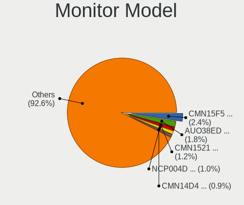

| Model                                                                | Notebooks | Percent |
|----------------------------------------------------------------------|-----------|---------|
| Chimei Innolux LCD Monitor CMN15F5 1920x1080 344x193mm 15.5-inch     | 64        | 2.7%    |
| AU Optronics LCD Monitor AUO38ED 1920x1080 344x193mm 15.5-inch       | 57        | 2.4%    |
| BOE LCD Monitor BOE06A4 1366x768 344x194mm 15.5-inch                 | 34        | 1.43%   |
| Chimei Innolux LCD Monitor CMN14D4 1920x1080 309x173mm 13.9-inch     | 32        | 1.35%   |
| BOE LCD Monitor BOE0687 1920x1080 344x193mm 15.5-inch                | 32        | 1.35%   |
| Chimei Innolux LCD Monitor CMN15DB 1366x768 344x193mm 15.5-inch      | 31        | 1.31%   |
| Chimei Innolux LCD Monitor CMN14C3 1366x768 309x173mm 13.9-inch      | 27        | 1.14%   |
| AU Optronics LCD Monitor AUO21ED 1920x1080 344x193mm 15.5-inch       | 24        | 1.01%   |
| AU Optronics LCD Monitor AUO70EC 1366x768 344x193mm 15.5-inch        | 23        | 0.97%   |
| AU Optronics LCD Monitor AUO61ED 1920x1080 344x194mm 15.5-inch       | 23        | 0.97%   |
| Samsung Electronics LCD Monitor SEC5441 1366x768 309x174mm 14.0-inch | 22        | 0.93%   |
| AU Optronics LCD Monitor AUO2E3C 1366x768 309x173mm 13.9-inch        | 22        | 0.93%   |
| Chimei Innolux LCD Monitor CMN15D5 1920x1080 344x193mm 15.5-inch     | 20        | 0.84%   |
| LG Display LCD Monitor LGD02DC 1366x768 344x194mm 15.5-inch          | 19        | 0.8%    |
| AU Optronics LCD Monitor AUO71EC 1366x768 344x193mm 15.5-inch        | 18        | 0.76%   |
| AU Optronics LCD Monitor AUO45EC 1366x768 344x193mm 15.5-inch        | 18        | 0.76%   |
| LG Display LCD Monitor LGD0456 1366x768 344x194mm 15.5-inch          | 17        | 0.72%   |
| PANDA LCD Monitor NCP004D 1920x1080 344x194mm 15.5-inch              | 15        | 0.63%   |
| PANDA LCD Monitor NCP0036 1920x1080 344x194mm 15.5-inch              | 15        | 0.63%   |
| Chimei Innolux LCD Monitor CMN14D6 1366x768 309x173mm 13.9-inch      | 15        | 0.63%   |
| BOE LCD Monitor BOE07F6 1920x1080 309x174mm 14.0-inch                | 15        | 0.63%   |
| BOE LCD Monitor BOE07BD 1920x1080 309x174mm 14.0-inch                | 15        | 0.63%   |
| BOE LCD Monitor BOE06A9 1920x1080 344x193mm 15.5-inch                | 15        | 0.63%   |
| LG Display LCD Monitor LGD039F 1366x768 345x194mm 15.6-inch          | 13        | 0.55%   |
| BOE LCD Monitor BOE0671 1366x768 344x194mm 15.5-inch                 | 13        | 0.55%   |
| AU Optronics LCD Monitor AUO403D 1920x1080 309x173mm 13.9-inch       | 13        | 0.55%   |
| PANDA LCD Monitor NCP002D 1920x1080 344x194mm 15.5-inch              | 12        | 0.51%   |
| LG Display LCD Monitor LGD065A 1920x1080 344x194mm 15.5-inch         | 12        | 0.51%   |
| LG Display LCD Monitor LGD033A 1366x768 344x194mm 15.5-inch          | 12        | 0.51%   |
| BOE LCD Monitor BOE07F1 1920x1080 344x193mm 15.5-inch                | 12        | 0.51%   |
| BOE LCD Monitor BOE06BA 1920x1080 344x193mm 15.5-inch                | 12        | 0.51%   |
| Chimei Innolux LCD Monitor CMN15C6 1366x768 344x193mm 15.5-inch      | 11        | 0.46%   |
| BOE LCD Monitor BOE0812 1920x1080 344x194mm 15.5-inch                | 11        | 0.46%   |
| BOE LCD Monitor BOE0697 1366x768 309x173mm 13.9-inch                 | 11        | 0.46%   |
| BOE LCD Monitor BOE0672 1366x768 344x194mm 15.5-inch                 | 11        | 0.46%   |
| LG Display LCD Monitor LGD05E5 1920x1080 344x194mm 15.5-inch         | 10        | 0.42%   |
| Chimei Innolux LCD Monitor CMN15BF 1366x768 344x194mm 15.5-inch      | 10        | 0.42%   |
| Chimei Innolux LCD Monitor CMN14C9 1920x1080 309x173mm 13.9-inch     | 10        | 0.42%   |
| AU Optronics LCD Monitor AUO22EC 1366x768 344x193mm 15.5-inch        | 10        | 0.42%   |
| Sharp LCD Monitor SHP14BA 1920x1080 344x194mm 15.5-inch              | 9         | 0.38%   |
| LG Display LCD Monitor LGD0468 1366x768 344x194mm 15.5-inch          | 9         | 0.38%   |
| Chimei Innolux LCD Monitor CMN15CA 1366x768 344x193mm 15.5-inch      | 9         | 0.38%   |
| Chimei Innolux LCD Monitor CMN14D5 1920x1080 309x173mm 13.9-inch     | 9         | 0.38%   |
| BOE LCD Monitor BOE07C9 1920x1080 309x173mm 13.9-inch                | 9         | 0.38%   |
| BOE LCD Monitor BOE0700 1920x1080 344x194mm 15.5-inch                | 9         | 0.38%   |
| BenQ GW2480 BNQ78E7 1920x1080 527x296mm 23.8-inch                    | 9         | 0.38%   |
| AU Optronics LCD Monitor AUO106C 1366x768 277x156mm 12.5-inch        | 9         | 0.38%   |
| Samsung Electronics LCD Monitor SDC4852 1366x768 344x194mm 15.5-inch | 8         | 0.34%   |
| LG Display LCD Monitor LGD053F 1920x1080 344x194mm 15.5-inch         | 8         | 0.34%   |
| Chimei Innolux LCD Monitor CMN15E7 1920x1080 344x193mm 15.5-inch     | 8         | 0.34%   |
| Chimei Innolux LCD Monitor CMN15B7 1366x768 344x193mm 15.5-inch      | 8         | 0.34%   |
| Chimei Innolux LCD Monitor CMN1521 1920x1080 344x193mm 15.5-inch     | 8         | 0.34%   |
| Chimei Innolux LCD Monitor CMN14E5 1920x1080 309x173mm 13.9-inch     | 8         | 0.34%   |
| BOE LCD Monitor BOE0690 1920x1080 344x193mm 15.5-inch                | 8         | 0.34%   |
| AU Optronics LCD Monitor AUOD1ED 1920x1080 344x193mm 15.5-inch       | 8         | 0.34%   |
| AU Optronics LCD Monitor AUO40EC 1366x768 344x193mm 15.5-inch        | 8         | 0.34%   |
| AU Optronics LCD Monitor AUO23ED 1920x1080 344x194mm 15.5-inch       | 8         | 0.34%   |
| Samsung Electronics LCD Monitor SEC4251 1366x768 344x194mm 15.5-inch | 7         | 0.3%    |
| Samsung Electronics LCD Monitor SDC4E51 1366x768 344x194mm 15.5-inch | 7         | 0.3%    |
| Samsung Electronics LCD Monitor SDC4951 1366x768 344x194mm 15.5-inch | 7         | 0.3%    |

Monitor Resolution
------------------

Monitor screen resolution

| Resolution         | Notebooks | Percent |
|--------------------|-----------|---------|
| 1920x1080 (FHD)    | 1110      | 48.56%  |
| 1366x768 (WXGA)    | 976       | 42.69%  |
| 1600x900 (HD+)     | 38        | 1.66%   |
| 1280x800 (WXGA)    | 32        | 1.4%    |
| 3840x2160 (4K)     | 29        | 1.27%   |
| 2560x1440 (QHD)    | 20        | 0.87%   |
| 1920x1200 (WUXGA)  | 17        | 0.74%   |
| 1440x900 (WXGA+)   | 14        | 0.61%   |
| 2560x1600          | 8         | 0.35%   |
| 1024x600           | 7         | 0.31%   |
| 1360x768           | 6         | 0.26%   |
| 2560x1080          | 5         | 0.22%   |
| 1280x1024 (SXGA)   | 5         | 0.22%   |
| 3200x2000          | 3         | 0.13%   |
| 2160x1440          | 3         | 0.13%   |
| 3456x2160          | 2         | 0.09%   |
| 1680x1050 (WSXGA+) | 2         | 0.09%   |
| 3840x2400          | 1         | 0.04%   |
| 3840x1100          | 1         | 0.04%   |
| 3072x1920          | 1         | 0.04%   |
| 2732x768           | 1         | 0.04%   |
| 2256x1504          | 1         | 0.04%   |
| 2240x1400          | 1         | 0.04%   |
| 1920x1280          | 1         | 0.04%   |
| 1280x720 (HD)      | 1         | 0.04%   |
| Unknown            | 1         | 0.04%   |

Monitor Diagonal
----------------

Diagonal size in inches

| Inches  | Notebooks | Percent |
|---------|-----------|---------|
| 15      | 1356      | 57.43%  |
| 13      | 375       | 15.88%  |
| 14      | 343       | 14.53%  |
| 21      | 50        | 2.12%   |
| 24      | 43        | 1.82%   |
| 12      | 32        | 1.36%   |
| 27      | 26        | 1.1%    |
| 17      | 22        | 0.93%   |
| 23      | 16        | 0.68%   |
| 18      | 16        | 0.68%   |
| Unknown | 12        | 0.51%   |
| 11      | 10        | 0.42%   |
| 19      | 9         | 0.38%   |
| 31      | 8         | 0.34%   |
| 16      | 7         | 0.3%    |
| 10      | 7         | 0.3%    |
| 40      | 5         | 0.21%   |
| 34      | 5         | 0.21%   |
| 20      | 5         | 0.21%   |
| 72      | 4         | 0.17%   |
| 54      | 2         | 0.08%   |
| 26      | 2         | 0.08%   |
| 65      | 1         | 0.04%   |
| 46      | 1         | 0.04%   |
| 42      | 1         | 0.04%   |
| 32      | 1         | 0.04%   |
| 25      | 1         | 0.04%   |
| 22      | 1         | 0.04%   |

Monitor Width
-------------

Physical width

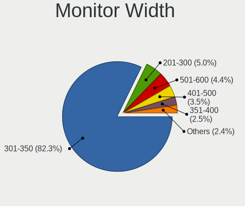

| Width in mm | Notebooks | Percent |
|-------------|-----------|---------|
| 301-350     | 1973      | 83.71%  |
| 201-300     | 127       | 5.39%   |
| 401-500     | 83        | 3.52%   |
| 501-600     | 79        | 3.35%   |
| 351-400     | 52        | 2.21%   |
| Unknown     | 12        | 0.51%   |
| 601-700     | 11        | 0.47%   |
| 701-800     | 6         | 0.25%   |
| 801-900     | 5         | 0.21%   |
| 1501-2000   | 4         | 0.17%   |
| 1001-1500   | 4         | 0.17%   |
| 901-1000    | 1         | 0.04%   |

Aspect Ratio
------------

Proportional relationship between the width and the height

| Ratio   | Notebooks | Percent |
|---------|-----------|---------|
| 16/9    | 2090      | 94.91%  |
| 16/10   | 78        | 3.54%   |
| Unknown | 11        | 0.5%    |
| 4/3     | 6         | 0.27%   |
| 3/2     | 6         | 0.27%   |
| 21/9    | 5         | 0.23%   |
| 5/4     | 3         | 0.14%   |
| 6/5     | 2         | 0.09%   |
| 3.40    | 1         | 0.05%   |

Monitor Area
------------

Area in inch

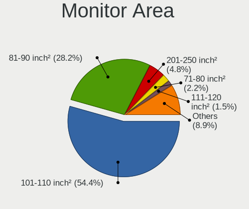

| Area in inch | Notebooks | Percent |
|----------------|-----------|---------|
| 101-110        | 1352      | 57.29%  |
| 81-90          | 654       | 27.71%  |
| 201-250        | 99        | 4.19%   |
| 71-80          | 62        | 2.63%   |
| 61-70          | 30        | 1.27%   |
| 301-350        | 28        | 1.19%   |
| 121-130        | 21        | 0.89%   |
| 151-200        | 19        | 0.81%   |
| 141-150        | 15        | 0.64%   |
| 351-500        | 14        | 0.59%   |
| Unknown        | 12        | 0.51%   |
| 51-60          | 11        | 0.47%   |
| 91-100         | 9         | 0.38%   |
| More than 1000 | 7         | 0.3%    |
| 41-50          | 7         | 0.3%    |
| 501-1000       | 7         | 0.3%    |
| 251-300        | 5         | 0.21%   |
| 111-120        | 5         | 0.21%   |
| 131-140        | 3         | 0.13%   |

Pixel Density
-------------

Pixels per inch

| Density       | Notebooks | Percent |
|---------------|-----------|---------|
| 121-160       | 1063      | 45.54%  |
| 101-120       | 948       | 40.62%  |
| 51-100        | 214       | 9.17%   |
| 161-240       | 70        | 3%      |
| More than 240 | 19        | 0.81%   |
| Unknown       | 12        | 0.51%   |
| 1-50          | 8         | 0.34%   |

Multiple Monitors
-----------------

Total monitors connected

| Total | Notebooks | Percent |
|-------|-----------|---------|
| 1     | 2018      | 89.41%  |
| 2     | 194       | 8.6%    |
| 0     | 41        | 1.82%   |
| 3     | 4         | 0.18%   |

Network
-------

Net Controller Vendor
---------------------

Controller vendors

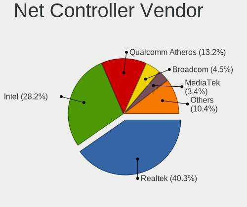

| Vendor                            | Notebooks | Percent |
|-----------------------------------|-----------|---------|
| Realtek Semiconductor             | 1493      | 40.55%  |
| Intel                             | 988       | 26.83%  |
| Qualcomm Atheros                  | 604       | 16.4%   |
| Broadcom                          | 200       | 5.43%   |
| Xiaomi                            | 59        | 1.6%    |
| Ralink                            | 40        | 1.09%   |
| Broadcom Limited                  | 37        | 1%      |
| TP-Link                           | 29        | 0.79%   |
| MEDIATEK                          | 29        | 0.79%   |
| Ralink Technology                 | 28        | 0.76%   |
| Samsung Electronics               | 26        | 0.71%   |
| Marvell Technology Group          | 22        | 0.6%    |
| Qualcomm                          | 17        | 0.46%   |
| OPPO Electronics                  | 17        | 0.46%   |
| Huawei Technologies               | 11        | 0.3%    |
| Motorola PCS                      | 9         | 0.24%   |
| OnePlus Technology (Shenzhen)     | 6         | 0.16%   |
| Google                            | 5         | 0.14%   |
| Foxconn / Hon Hai                 | 5         | 0.14%   |
| OnePlus                           | 4         | 0.11%   |
| JMicron Technology                | 4         | 0.11%   |
| ICS Advent                        | 4         | 0.11%   |
| HMD Global                        | 4         | 0.11%   |
| DisplayLink                       | 4         | 0.11%   |
| D-Link                            | 4         | 0.11%   |
| ASIX Electronics                  | 4         | 0.11%   |
| Lenovo                            | 3         | 0.08%   |
| ZTE WCDMA Technologies MSM        | 2         | 0.05%   |
| Sierra Wireless                   | 2         | 0.05%   |
| NTmore                            | 2         | 0.05%   |
| Ericsson Business Mobile Networks | 2         | 0.05%   |
| Edimax Technology                 | 2         | 0.05%   |
| Dell                              | 2         | 0.05%   |
| Attansic Technology               | 2         | 0.05%   |
| ASUSTek Computer                  | 2         | 0.05%   |
| Apple                             | 2         | 0.05%   |
| vivo                              | 1         | 0.03%   |
| VIA Technologies                  | 1         | 0.03%   |
| Silicon Integrated Systems [SiS]  | 1         | 0.03%   |
| Qualcomm Atheros Communications   | 1         | 0.03%   |
| NetGear                           | 1         | 0.03%   |
| Micro Star International          | 1         | 0.03%   |
| D-Link System                     | 1         | 0.03%   |
| Android                           | 1         | 0.03%   |

Net Controller Model
--------------------

Controller models

| Model                                                             | Notebooks | Percent |
|-------------------------------------------------------------------|-----------|---------|
| Realtek RTL8111/8168/8411 PCI Express Gigabit Ethernet Controller | 965       | 22.39%  |
| Realtek RTL810xE PCI Express Fast Ethernet controller             | 419       | 9.72%   |
| Qualcomm Atheros QCA9377 802.11ac Wireless Network Adapter        | 232       | 5.38%   |
| Qualcomm Atheros QCA9565 / AR9565 Wireless Network Adapter        | 105       | 2.44%   |
| Intel Wi-Fi 6 AX200                                               | 99        | 2.3%    |
| Intel Wireless 8265 / 8275                                        | 98        | 2.27%   |
| Realtek RTL8723BE PCIe Wireless Network Adapter                   | 85        | 1.97%   |
| Realtek RTL8723DE Wireless Network Adapter                        | 83        | 1.93%   |
| Intel Comet Lake PCH-LP CNVi WiFi                                 | 82        | 1.9%    |
| Broadcom BCM43142 802.11b/g/n                                     | 78        | 1.81%   |
| Intel Cannon Lake PCH CNVi WiFi                                   | 73        | 1.69%   |
| Intel Wi-Fi 6 AX201                                               | 72        | 1.67%   |
| Intel Cannon Point-LP CNVi [Wireless-AC]                          | 71        | 1.65%   |
| Realtek RTL8822CE 802.11ac PCIe Wireless Network Adapter          | 70        | 1.62%   |
| Qualcomm Atheros AR9285 Wireless Network Adapter (PCI-Express)    | 65        | 1.51%   |
| Realtek RTL8821CE 802.11ac PCIe Wireless Network Adapter          | 61        | 1.42%   |
| Qualcomm Atheros QCA6174 802.11ac Wireless Network Adapter        | 61        | 1.42%   |
| Qualcomm Atheros AR9485 Wireless Network Adapter                  | 59        | 1.37%   |
| Intel Wireless 7265                                               | 57        | 1.32%   |
| Intel Wireless 3165                                               | 52        | 1.21%   |
| Intel Wireless 3160                                               | 50        | 1.16%   |
| Broadcom BCM4313 802.11bgn Wireless Network Adapter               | 50        | 1.16%   |
| Intel 82579LM Gigabit Network Connection (Lewisville)             | 41        | 0.95%   |
| Xiaomi Mi/Redmi series (RNDIS)                                    | 40        | 0.93%   |
| Realtek RTL8822BE 802.11a/b/g/n/ac WiFi adapter                   | 35        | 0.81%   |
| Ralink RT3290 Wireless 802.11n 1T/1R PCIe                         | 33        | 0.77%   |
| Intel Ice Lake-LP PCH CNVi WiFi                                   | 31        | 0.72%   |
| Intel Ethernet Connection (4) I219-V                              | 31        | 0.72%   |
| Intel Wireless 7260                                               | 29        | 0.67%   |
| Intel Wireless 8260                                               | 25        | 0.58%   |
| Intel Centrino Advanced-N 6205 [Taylor Peak]                      | 24        | 0.56%   |
| Intel Dual Band Wireless-AC 3165 Plus Bluetooth                   | 23        | 0.53%   |
| Intel Comet Lake PCH CNVi WiFi                                    | 23        | 0.53%   |
| Samsung Galaxy series, misc. (tethering mode)                     | 20        | 0.46%   |
| Ralink MT7601U Wireless Adapter                                   | 20        | 0.46%   |
| Intel Dual Band Wireless-AC 3168NGW [Stone Peak]                  | 20        | 0.46%   |
| Xiaomi Mi/Redmi series (RNDIS + ADB)                              | 19        | 0.44%   |
| MEDIATEK MT7921 802.11ax PCI Express Wireless Network Adapter     | 19        | 0.44%   |
| Intel Wireless-AC 9260                                            | 19        | 0.44%   |
| Intel Ethernet Connection I218-LM                                 | 19        | 0.44%   |
| Realtek RTL8852AE 802.11ax PCIe Wireless Network Adapter          | 18        | 0.42%   |
| Qualcomm Atheros QCA8172 Fast Ethernet                            | 17        | 0.39%   |
| OPPO SDM665-IDP _SN:18689828                                      | 17        | 0.39%   |
| Intel Ethernet Connection I219-LM                                 | 17        | 0.39%   |
| Realtek RTL8188EE Wireless Network Adapter                        | 16        | 0.37%   |
| Realtek RTL8821AE 802.11ac PCIe Wireless Network Adapter          | 15        | 0.35%   |
| Realtek RTL8188EUS 802.11n Wireless Network Adapter               | 15        | 0.35%   |
| Realtek RTL8153 Gigabit Ethernet Adapter                          | 15        | 0.35%   |
| Qualcomm Redmi 9T                                                 | 15        | 0.35%   |
| Intel Ethernet Connection (3) I218-LM                             | 15        | 0.35%   |
| Intel Ethernet Connection (10) I219-V                             | 14        | 0.32%   |
| Intel Centrino Wireless-N 1000 [Condor Peak]                      | 14        | 0.32%   |
| Intel 82577LM Gigabit Network Connection                          | 14        | 0.32%   |
| Qualcomm Atheros AR8162 Fast Ethernet                             | 13        | 0.3%    |
| Intel Ethernet Connection (4) I219-LM                             | 13        | 0.3%    |
| Realtek RTL8188FTV 802.11b/g/n 1T1R 2.4G WLAN Adapter             | 12        | 0.28%   |
| Marvell Group 88E8040 PCI-E Fast Ethernet Controller              | 12        | 0.28%   |
| Intel Centrino Wireless-N 2230                                    | 12        | 0.28%   |
| Intel Centrino Advanced-N 6200                                    | 12        | 0.28%   |
| Broadcom NetLink BCM57785 Gigabit Ethernet PCIe                   | 12        | 0.28%   |

Wireless Vendor
---------------

Wireless vendors

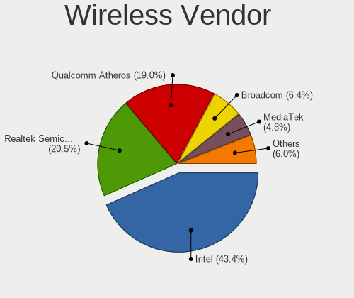

| Vendor                          | Notebooks | Percent |
|---------------------------------|-----------|---------|
| Intel                           | 958       | 42%     |
| Qualcomm Atheros                | 548       | 24.02%  |
| Realtek Semiconductor           | 438       | 19.2%   |
| Broadcom                        | 177       | 7.76%   |
| Ralink                          | 40        | 1.75%   |
| Broadcom Limited                | 29        | 1.27%   |
| Ralink Technology               | 28        | 1.23%   |
| TP-Link                         | 27        | 1.18%   |
| MEDIATEK                        | 22        | 0.96%   |
| D-Link                          | 4         | 0.18%   |
| Edimax Technology               | 2         | 0.09%   |
| Dell                            | 2         | 0.09%   |
| Sierra Wireless                 | 1         | 0.04%   |
| Qualcomm Atheros Communications | 1         | 0.04%   |
| Qualcomm                        | 1         | 0.04%   |
| NetGear                         | 1         | 0.04%   |
| Micro Star International        | 1         | 0.04%   |
| D-Link System                   | 1         | 0.04%   |

Wireless Model
--------------

Wireless models

| Model                                                          | Notebooks | Percent |
|----------------------------------------------------------------|-----------|---------|
| Qualcomm Atheros QCA9377 802.11ac Wireless Network Adapter     | 232       | 10.12%  |
| Qualcomm Atheros QCA9565 / AR9565 Wireless Network Adapter     | 105       | 4.58%   |
| Intel Wi-Fi 6 AX200                                            | 99        | 4.32%   |
| Intel Wireless 8265 / 8275                                     | 98        | 4.28%   |
| Realtek RTL8723BE PCIe Wireless Network Adapter                | 85        | 3.71%   |
| Realtek RTL8723DE Wireless Network Adapter                     | 83        | 3.62%   |
| Intel Comet Lake PCH-LP CNVi WiFi                              | 82        | 3.58%   |
| Broadcom BCM43142 802.11b/g/n                                  | 78        | 3.4%    |
| Intel Cannon Lake PCH CNVi WiFi                                | 73        | 3.18%   |
| Intel Wi-Fi 6 AX201                                            | 72        | 3.14%   |
| Intel Cannon Point-LP CNVi [Wireless-AC]                       | 71        | 3.1%    |
| Realtek RTL8822CE 802.11ac PCIe Wireless Network Adapter       | 70        | 3.05%   |
| Qualcomm Atheros AR9285 Wireless Network Adapter (PCI-Express) | 65        | 2.84%   |
| Realtek RTL8821CE 802.11ac PCIe Wireless Network Adapter       | 61        | 2.66%   |
| Qualcomm Atheros QCA6174 802.11ac Wireless Network Adapter     | 61        | 2.66%   |
| Qualcomm Atheros AR9485 Wireless Network Adapter               | 59        | 2.57%   |
| Intel Wireless 7265                                            | 57        | 2.49%   |
| Intel Wireless 3165                                            | 52        | 2.27%   |
| Intel Wireless 3160                                            | 50        | 2.18%   |
| Broadcom BCM4313 802.11bgn Wireless Network Adapter            | 50        | 2.18%   |
| Realtek RTL8822BE 802.11a/b/g/n/ac WiFi adapter                | 35        | 1.53%   |
| Ralink RT3290 Wireless 802.11n 1T/1R PCIe                      | 33        | 1.44%   |
| Intel Ice Lake-LP PCH CNVi WiFi                                | 31        | 1.35%   |
| Intel Wireless 7260                                            | 29        | 1.27%   |
| Intel Wireless 8260                                            | 25        | 1.09%   |
| Intel Centrino Advanced-N 6205 [Taylor Peak]                   | 24        | 1.05%   |
| Intel Dual Band Wireless-AC 3165 Plus Bluetooth                | 23        | 1%      |
| Intel Comet Lake PCH CNVi WiFi                                 | 23        | 1%      |
| Ralink MT7601U Wireless Adapter                                | 20        | 0.87%   |
| Intel Dual Band Wireless-AC 3168NGW [Stone Peak]               | 20        | 0.87%   |
| MEDIATEK MT7921 802.11ax PCI Express Wireless Network Adapter  | 19        | 0.83%   |
| Intel Wireless-AC 9260                                         | 19        | 0.83%   |
| Realtek RTL8852AE 802.11ax PCIe Wireless Network Adapter       | 18        | 0.79%   |
| Realtek RTL8188EE Wireless Network Adapter                     | 16        | 0.7%    |
| Realtek RTL8821AE 802.11ac PCIe Wireless Network Adapter       | 15        | 0.65%   |
| Realtek RTL8188EUS 802.11n Wireless Network Adapter            | 15        | 0.65%   |
| Intel Centrino Wireless-N 1000 [Condor Peak]                   | 14        | 0.61%   |
| Realtek RTL8188FTV 802.11b/g/n 1T1R 2.4G WLAN Adapter          | 12        | 0.52%   |
| Intel Centrino Wireless-N 2230                                 | 12        | 0.52%   |
| Intel Centrino Advanced-N 6200                                 | 12        | 0.52%   |
| Broadcom BCM4312 802.11b/g LP-PHY                              | 12        | 0.52%   |
| Qualcomm Atheros AR9462 Wireless Network Adapter               | 11        | 0.48%   |
| Intel Centrino Ultimate-N 6300                                 | 11        | 0.48%   |
| Realtek RTL8188CE 802.11b/g/n WiFi Adapter                     | 10        | 0.44%   |
| Broadcom Limited BCM4312 802.11b/g LP-PHY                      | 10        | 0.44%   |
| TP-Link AC600 wireless Realtek RTL8811AU [Archer T2U Nano]     | 9         | 0.39%   |
| Intel Centrino Advanced-N 6235                                 | 9         | 0.39%   |
| Broadcom BCM43228 802.11a/b/g/n                                | 9         | 0.39%   |
| Broadcom Limited BCM4313 802.11bgn Wireless Network Adapter    | 8         | 0.35%   |
| Realtek RTL8723AE PCIe Wireless Network Adapter                | 7         | 0.31%   |
| Intel PRO/Wireless 3945ABG [Golan] Network Connection          | 7         | 0.31%   |
| Broadcom BCM43224 802.11a/b/g/n                                | 7         | 0.31%   |
| Realtek RTL8191SEvA Wireless LAN Controller                    | 6         | 0.26%   |
| Qualcomm Atheros AR9287 Wireless Network Adapter (PCI-Express) | 6         | 0.26%   |
| Intel Centrino Wireless-N 1030 [Rainbow Peak]                  | 6         | 0.26%   |
| Intel Centrino Advanced-N 6230 [Rainbow Peak]                  | 6         | 0.26%   |
| TP-Link 802.11ac WLAN Adapter                                  | 5         | 0.22%   |
| Intel WiFi Link 5100                                           | 5         | 0.22%   |
| Broadcom BCM43225 802.11b/g/n                                  | 5         | 0.22%   |
| Ralink RT5370 Wireless Adapter                                 | 4         | 0.17%   |

Ethernet Vendor
---------------

Ethernet vendors

| Vendor                           | Notebooks | Percent |
|----------------------------------|-----------|---------|
| Realtek Semiconductor            | 1410      | 70.75%  |
| Intel                            | 231       | 11.59%  |
| Qualcomm Atheros                 | 91        | 4.57%   |
| Xiaomi                           | 59        | 2.96%   |
| Broadcom                         | 40        | 2.01%   |
| Samsung Electronics              | 26        | 1.3%    |
| Marvell Technology Group         | 22        | 1.1%    |
| OPPO Electronics                 | 17        | 0.85%   |
| Qualcomm                         | 16        | 0.8%    |
| Huawei Technologies              | 9         | 0.45%   |
| MediaTek                         | 8         | 0.4%    |
| Broadcom Limited                 | 8         | 0.4%    |
| OnePlus Technology (Shenzhen)    | 6         | 0.3%    |
| Motorola PCS                     | 5         | 0.25%   |
| Google                           | 5         | 0.25%   |
| JMicron Technology               | 4         | 0.2%    |
| ICS Advent                       | 4         | 0.2%    |
| HMD Global                       | 4         | 0.2%    |
| DisplayLink                      | 4         | 0.2%    |
| ASIX Electronics                 | 4         | 0.2%    |
| Lenovo                           | 3         | 0.15%   |
| Foxconn / Hon Hai                | 3         | 0.15%   |
| TP-Link                          | 2         | 0.1%    |
| NTmore                           | 2         | 0.1%    |
| Attansic Technology              | 2         | 0.1%    |
| ASUSTek Computer                 | 2         | 0.1%    |
| ZTE WCDMA Technologies MSM       | 1         | 0.05%   |
| VIA Technologies                 | 1         | 0.05%   |
| Silicon Integrated Systems [SiS] | 1         | 0.05%   |
| Sierra Wireless                  | 1         | 0.05%   |
| Apple                            | 1         | 0.05%   |
| Android                          | 1         | 0.05%   |

Ethernet Model
--------------

Ethernet models

| Model                                                                          | Notebooks | Percent |
|--------------------------------------------------------------------------------|-----------|---------|
| Realtek RTL8111/8168/8411 PCI Express Gigabit Ethernet Controller              | 965       | 48.27%  |
| Realtek RTL810xE PCI Express Fast Ethernet controller                          | 419       | 20.96%  |
| Intel 82579LM Gigabit Network Connection (Lewisville)                          | 41        | 2.05%   |
| Xiaomi Mi/Redmi series (RNDIS)                                                 | 40        | 2%      |
| Intel Ethernet Connection (4) I219-V                                           | 31        | 1.55%   |
| Samsung Galaxy series, misc. (tethering mode)                                  | 20        | 1%      |
| Xiaomi Mi/Redmi series (RNDIS + ADB)                                           | 19        | 0.95%   |
| Intel Ethernet Connection I218-LM                                              | 19        | 0.95%   |
| Qualcomm Atheros QCA8172 Fast Ethernet                                         | 17        | 0.85%   |
| OPPO SDM665-IDP _SN:18689828                                                   | 17        | 0.85%   |
| Intel Ethernet Connection I219-LM                                              | 17        | 0.85%   |
| Realtek RTL8153 Gigabit Ethernet Adapter                                       | 15        | 0.75%   |
| Qualcomm Redmi 9T                                                              | 15        | 0.75%   |
| Intel Ethernet Connection (3) I218-LM                                          | 15        | 0.75%   |
| Intel Ethernet Connection (10) I219-V                                          | 14        | 0.7%    |
| Intel 82577LM Gigabit Network Connection                                       | 14        | 0.7%    |
| Qualcomm Atheros AR8162 Fast Ethernet                                          | 13        | 0.65%   |
| Intel Ethernet Connection (4) I219-LM                                          | 13        | 0.65%   |
| Marvell Group 88E8040 PCI-E Fast Ethernet Controller                           | 12        | 0.6%    |
| Broadcom NetLink BCM57785 Gigabit Ethernet PCIe                                | 12        | 0.6%    |
| Intel Ethernet Connection I217-LM                                              | 11        | 0.55%   |
| Qualcomm Atheros AR8152 v2.0 Fast Ethernet                                     | 9         | 0.45%   |
| Intel Ethernet Connection (6) I219-V                                           | 9         | 0.45%   |
| Intel Ethernet Connection (6) I219-LM                                          | 9         | 0.45%   |
| Realtek Killer E2600 Gigabit Ethernet Controller                               | 8         | 0.4%    |
| Qualcomm Atheros QCA8171 Gigabit Ethernet                                      | 8         | 0.4%    |
| Qualcomm Atheros Killer E2400 Gigabit Ethernet Controller                      | 8         | 0.4%    |
| Intel Ethernet Connection (7) I219-LM                                          | 8         | 0.4%    |
| Qualcomm Atheros Killer E2500 Gigabit Ethernet Controller                      | 7         | 0.35%   |
| Qualcomm Atheros AR8152 v1.1 Fast Ethernet                                     | 7         | 0.35%   |
| Samsung GT-I9070 (network tethering, USB debugging enabled)                    | 6         | 0.3%    |
| Qualcomm Atheros AR8151 v2.0 Gigabit Ethernet                                  | 6         | 0.3%    |
| Qualcomm Atheros AR8131 Gigabit Ethernet                                       | 6         | 0.3%    |
| OnePlus (Shenzhen) AC2001                                                      | 6         | 0.3%    |
| MediaTek NOA N2                                                                | 6         | 0.3%    |
| Motorola PCS moto g(30)                                                        | 5         | 0.25%   |
| Marvell Group Yukon Optima 88E8059 [PCIe Gigabit Ethernet Controller with AVB] | 5         | 0.25%   |
| Huawei JNY-LX1                                                                 | 5         | 0.25%   |
| Google Nexus/Pixel Device (tether)                                             | 5         | 0.25%   |
| Broadcom NetXtreme BCM5761 Gigabit Ethernet PCIe                               | 5         | 0.25%   |
| JMicron JMC250 PCI Express Gigabit Ethernet Controller                         | 4         | 0.2%    |
| Intel Ethernet Connection (10) I219-LM                                         | 4         | 0.2%    |
| Intel 82567LM Gigabit Network Connection                                       | 4         | 0.2%    |
| Huawei E353/E3131                                                              | 4         | 0.2%    |
| HMD Global Android                                                             | 4         | 0.2%    |
| Broadcom NetLink BCM5906M Fast Ethernet PCI Express                            | 4         | 0.2%    |
| Qualcomm Atheros AR8161 Gigabit Ethernet                                       | 3         | 0.15%   |
| Intel Ethernet Connection I218-V                                               | 3         | 0.15%   |
| Intel Ethernet Connection (2) I219-LM                                          | 3         | 0.15%   |
| ICS Advent DM9601 Fast Ethernet Adapter                                        | 3         | 0.15%   |
| Foxconn / Hon Hai Nokia 7.1                                                    | 3         | 0.15%   |
| Broadcom NetXtreme BCM57765 Gigabit Ethernet PCIe                              | 3         | 0.15%   |
| Broadcom NetLink BCM5784M Gigabit Ethernet PCIe                                | 3         | 0.15%   |
| Broadcom NetLink BCM57780 Gigabit Ethernet PCIe                                | 3         | 0.15%   |
| Broadcom Limited NetLink BCM57780 Gigabit Ethernet PCIe                        | 3         | 0.15%   |
| ASIX AX88179 Gigabit Ethernet                                                  | 3         | 0.15%   |
| Realtek RTL8152 Fast Ethernet Adapter                                          | 2         | 0.1%    |
| Realtek RTL8125 2.5GbE Controller                                              | 2         | 0.1%    |
| Realtek RTL-8100/8101L/8139 PCI Fast Ethernet Adapter                          | 2         | 0.1%    |
| Qualcomm Atheros AR8151 v1.0 Gigabit Ethernet                                  | 2         | 0.1%    |

Net Controller Kind
-------------------

Ethernet, WiFi or modem

| Kind     | Notebooks | Percent |
|----------|-----------|---------|
| WiFi     | 2202      | 54.3%   |
| Ethernet | 1835      | 45.25%  |
| Unknown  | 13        | 0.32%   |
| Modem    | 5         | 0.12%   |

Used Controller
---------------

Currently used network controller

| Kind     | Notebooks | Percent |
|----------|-----------|---------|
| WiFi     | 1955      | 70.25%  |
| Ethernet | 827       | 29.72%  |
| Unknown  | 1         | 0.04%   |

NICs
----

Total network controllers on board

| Total | Notebooks | Percent |
|-------|-----------|---------|
| 2     | 1753      | 78.57%  |
| 1     | 463       | 20.75%  |
| 0     | 10        | 0.45%   |
| 3     | 5         | 0.22%   |

IPv6
----

IPv6 vs IPv4

| Used | Notebooks | Percent |
|------|-----------|---------|
| No   | 1952      | 86.6%   |
| Yes  | 302       | 13.4%   |

Bluetooth
---------

Bluetooth Vendor
----------------

Controller vendors

| Vendor                          | Notebooks | Percent |
|---------------------------------|-----------|---------|
| Intel                           | 810       | 41.16%  |
| Qualcomm Atheros Communications | 342       | 17.38%  |
| Realtek Semiconductor           | 306       | 15.55%  |
| Broadcom                        | 118       | 6%      |
| IMC Networks                    | 93        | 4.73%   |
| Lite-On Technology              | 91        | 4.62%   |
| Foxconn / Hon Hai               | 60        | 3.05%   |
| Ralink                          | 33        | 1.68%   |
| Dell                            | 27        | 1.37%   |
| Cambridge Silicon Radio         | 18        | 0.91%   |
| Hewlett-Packard                 | 14        | 0.71%   |
| Apple                           | 14        | 0.71%   |
| Foxconn International           | 8         | 0.41%   |
| Toshiba                         | 7         | 0.36%   |
| Ralink Technology               | 6         | 0.3%    |
| Realtek                         | 5         | 0.25%   |
| ASUSTek Computer                | 4         | 0.2%    |
| TP-Link                         | 3         | 0.15%   |
| MediaTek                        | 2         | 0.1%    |
| Chicony Electronics             | 2         | 0.1%    |
| USI                             | 1         | 0.05%   |
| SINO WEALTH                     | 1         | 0.05%   |
| Micro Star International        | 1         | 0.05%   |
| Integrated System Solution      | 1         | 0.05%   |
| Alps Electric                   | 1         | 0.05%   |

Bluetooth Model
---------------

Controller models

| Model                                                                               | Notebooks | Percent |
|-------------------------------------------------------------------------------------|-----------|---------|
| Intel Bluetooth wireless interface                                                  | 307       | 15.6%   |
| Intel Bluetooth 9460/9560 Jefferson Peak (JfP)                                      | 208       | 10.57%  |
| Qualcomm Atheros  Bluetooth Device                                                  | 201       | 10.21%  |
| Realtek Bluetooth Radio                                                             | 176       | 8.94%   |
| Intel AX201 Bluetooth                                                               | 134       | 6.81%   |
| Intel AX200 Bluetooth                                                               | 96        | 4.88%   |
| Realtek 802.11n WLAN Adapter                                                        | 75        | 3.81%   |
| Qualcomm Atheros AR9462 Bluetooth                                                   | 43        | 2.18%   |
| IMC Networks Bluetooth Radio                                                        | 40        | 2.03%   |
| Lite-On Qualcomm Atheros QCA9377 Bluetooth                                          | 37        | 1.88%   |
| IMC Networks Bluetooth Device                                                       | 37        | 1.88%   |
| Qualcomm Atheros AR3011 Bluetooth                                                   | 34        | 1.73%   |
| Ralink RT3290 Bluetooth                                                             | 33        | 1.68%   |
| Lite-On Bluetooth Device                                                            | 32        | 1.63%   |
| Qualcomm Atheros AR3012 Bluetooth 4.0                                               | 29        | 1.47%   |
| Broadcom BCM43142 Bluetooth 4.0                                                     | 27        | 1.37%   |
| Realtek  Bluetooth 4.2 Adapter                                                      | 26        | 1.32%   |
| Broadcom BCM43142A0 Bluetooth 4.0                                                   | 22        | 1.12%   |
| Intel Wireless-AC 3168 Bluetooth                                                    | 20        | 1.02%   |
| Intel Centrino Bluetooth Wireless Transceiver                                       | 20        | 1.02%   |
| Qualcomm Atheros QCA61x4 Bluetooth 4.0                                              | 19        | 0.97%   |
| Cambridge Silicon Radio Bluetooth Dongle (HCI mode)                                 | 18        | 0.91%   |
| Qualcomm Atheros Bluetooth USB Host Controller                                      | 16        | 0.81%   |
| Realtek RTL8821A Bluetooth                                                          | 14        | 0.71%   |
| Foxconn / Hon Hai Bluetooth Device                                                  | 14        | 0.71%   |
| Realtek RTL8723B Bluetooth                                                          | 13        | 0.66%   |
| Intel Bluetooth Device                                                              | 13        | 0.66%   |
| IMC Networks Wireless_Device                                                        | 13        | 0.66%   |
| Foxconn / Hon Hai Bluetooth USB Host Controller                                     | 12        | 0.61%   |
| Broadcom BCM2070 Bluetooth 2.1 + EDR                                                | 12        | 0.61%   |
| Intel Wireless-AC 9260 Bluetooth Adapter                                            | 11        | 0.56%   |
| Dell Wireless 365 Bluetooth                                                         | 10        | 0.51%   |
| Broadcom BCM43142A0 Bluetooth Device                                                | 10        | 0.51%   |
| HP Broadcom 2070 Bluetooth Combo                                                    | 9         | 0.46%   |
| Foxconn / Hon Hai Broadcom Bluetooth 2.1 Device                                     | 9         | 0.46%   |
| Foxconn International BCM43142A0 Bluetooth module                                   | 8         | 0.41%   |
| Broadcom BCM2045B (BDC-2.1)                                                         | 8         | 0.41%   |
| Lite-On Atheros AR3012 Bluetooth                                                    | 7         | 0.36%   |
| Foxconn / Hon Hai Foxconn T77H114 BCM2070 [Single-Chip Bluetooth 2.1 + EDR Adapter] | 7         | 0.36%   |
| Dell DW375 Bluetooth Module                                                         | 7         | 0.36%   |
| Broadcom HP Portable Valentine                                                      | 7         | 0.36%   |
| Broadcom BCM20702 Bluetooth 4.0 [ThinkPad]                                          | 7         | 0.36%   |
| Apple Bluetooth USB Host Controller                                                 | 7         | 0.36%   |
| Dell Wireless 355 Bluetooth                                                         | 6         | 0.3%    |
| Realtek Bluetooth Radio                                                             | 5         | 0.25%   |
| Lite-On Bluetooth Radio                                                             | 5         | 0.25%   |
| Foxconn / Hon Hai BCM43142A0                                                        | 5         | 0.25%   |
| Broadcom HP Portable SoftSailing                                                    | 5         | 0.25%   |
| Broadcom HP Portable Bumble Bee                                                     | 5         | 0.25%   |
| Broadcom BCM2070 Bluetooth Device                                                   | 5         | 0.25%   |
| Apple Bluetooth Host Controller                                                     | 5         | 0.25%   |
| Toshiba RT Bluetooth Radio                                                          | 4         | 0.2%    |
| Lite-On Broadcom BCM43142A0 Bluetooth Device                                        | 4         | 0.2%    |
| HP Bluetooth 2.0 Interface [Broadcom BCM2045]                                       | 4         | 0.2%    |
| Foxconn / Hon Hai Wireless_Device                                                   | 4         | 0.2%    |
| Foxconn / Hon Hai Broadcom BCM20702 Bluetooth                                       | 4         | 0.2%    |
| TP-Link TP-TR- UB500 Adapter                                                       | 3         | 0.15%   |
| Ralink Motorola BC4 Bluetooth 3.0+HS Adapter                                        | 3         | 0.15%   |
| Ralink CSR BS8510                                                                   | 3         | 0.15%   |
| Lite-On Wireless_Device                                                             | 3         | 0.15%   |

Sound
-----

Sound Vendor
------------

Sound card vendors

| Vendor                           | Notebooks | Percent |
|----------------------------------|-----------|---------|
| Intel                            | 1845      | 72.52%  |
| AMD                              | 399       | 15.68%  |
| Nvidia                           | 250       | 9.83%   |
| C-Media Electronics              | 8         | 0.31%   |
| GN Netcom                        | 7         | 0.28%   |
| Realtek Semiconductor            | 4         | 0.16%   |
| Sennheiser Communications        | 3         | 0.12%   |
| Logitech                         | 3         | 0.12%   |
| SteelSeries ApS                  | 2         | 0.08%   |
| Plantronics                      | 2         | 0.08%   |
| JMTek                            | 2         | 0.08%   |
| Generalplus Technology           | 2         | 0.08%   |
| Yamaha                           | 1         | 0.04%   |
| XMOS                             | 1         | 0.04%   |
| Vault                            | 1         | 0.04%   |
| Texas Instruments                | 1         | 0.04%   |
| Tenx Technology                  | 1         | 0.04%   |
| Silicon Integrated Systems [SiS] | 1         | 0.04%   |
| Shenzhen Rapoo Technology        | 1         | 0.04%   |
| Razer USA                        | 1         | 0.04%   |
| Panasonic (Matsushita)           | 1         | 0.04%   |
| Lenovo                           | 1         | 0.04%   |
| Kingston Technology              | 1         | 0.04%   |
| Focusrite-Novation               | 1         | 0.04%   |
| FiiO Electronics Technology      | 1         | 0.04%   |
| Creative Technology              | 1         | 0.04%   |
| Corsair                          | 1         | 0.04%   |
| Arturia                          | 1         | 0.04%   |
| Apple                            | 1         | 0.04%   |

Sound Model
-----------

Sound card models

| Model                                                                                             | Notebooks | Percent |
|---------------------------------------------------------------------------------------------------|-----------|---------|
| Intel Sunrise Point-LP HD Audio                                                                   | 480       | 15.31%  |
| AMD Family 17h/19h HD Audio Controller                                                            | 231       | 7.37%   |
| Intel 7 Series/C216 Chipset Family High Definition Audio Controller                               | 170       | 5.42%   |
| Intel 8 Series HD Audio Controller                                                                | 140       | 4.46%   |
| Intel Haswell-ULT HD Audio Controller                                                             | 139       | 4.43%   |
| Intel Cannon Point-LP High Definition Audio Controller                                            | 133       | 4.24%   |
| Intel Cannon Lake PCH cAVS                                                                        | 125       | 3.99%   |
| Intel 6 Series/C200 Series Chipset Family High Definition Audio Controller                        | 117       | 3.73%   |
| Intel Comet Lake PCH-LP cAVS                                                                      | 108       | 3.44%   |
| Intel Broadwell-U Audio Controller                                                                | 108       | 3.44%   |
| Intel Wildcat Point-LP High Definition Audio Controller                                           | 107       | 3.41%   |
| AMD Raven/Raven2/Fenghuang HDMI/DP Audio Controller                                               | 102       | 3.25%   |
| Intel Tiger Lake-LP Smart Sound Technology Audio Controller                                       | 96        | 3.06%   |
| Nvidia TU107 GeForce GTX 1650 High Definition Audio Controller                                    | 88        | 2.81%   |
| Intel 5 Series/3400 Series Chipset High Definition Audio                                          | 79        | 2.52%   |
| AMD FCH Azalia Controller                                                                         | 74        | 2.36%   |
| AMD Renoir Radeon High Definition Audio Controller                                                | 71        | 2.26%   |
| AMD Family 15h (Models 60h-6fh) Audio Controller                                                  | 62        | 1.98%   |
| Intel Ice Lake-LP Smart Sound Technology Audio Controller                                         | 61        | 1.95%   |
| AMD Kabini HDMI/DP Audio                                                                          | 57        | 1.82%   |
| AMD High Definition Audio Controller                                                              | 49        | 1.56%   |
| Intel 82801I (ICH9 Family) HD Audio Controller                                                    | 47        | 1.5%    |
| Nvidia GP107GL High Definition Audio Controller                                                   | 35        | 1.12%   |
| Intel 8 Series/C220 Series Chipset High Definition Audio Controller                               | 31        | 0.99%   |
| Intel CM238 HD Audio Controller                                                                   | 29        | 0.92%   |
| Intel Xeon E3-1200 v3/4th Gen Core Processor HD Audio Controller                                  | 28        | 0.89%   |
| Intel Comet Lake PCH cAVS                                                                         | 28        | 0.89%   |
| Nvidia Audio device                                                                               | 26        | 0.83%   |
| Intel 82801H (ICH8 Family) HD Audio Controller                                                    | 17        | 0.54%   |
| Nvidia GF108 High Definition Audio Controller                                                     | 16        | 0.51%   |
| Intel 100 Series/C230 Series Chipset Family HD Audio Controller                                   | 15        | 0.48%   |
| AMD Trinity HDMI Audio Controller                                                                 | 15        | 0.48%   |
| Nvidia TU116 High Definition Audio Controller                                                     | 14        | 0.45%   |
| Intel NM10/ICH7 Family High Definition Audio Controller                                           | 14        | 0.45%   |
| Nvidia TU106 High Definition Audio Controller                                                     | 13        | 0.41%   |
| Nvidia GK208 HDMI/DP Audio Controller                                                             | 13        | 0.41%   |
| Intel Atom/Celeron/Pentium Processor x5-E8000/J3xxx/N3xxx Series High Definition Audio Controller | 13        | 0.41%   |
| Nvidia High Definition Audio Controller                                                           | 11        | 0.35%   |
| Intel Atom Processor Z36xxx/Z37xxx Series High Definition Audio Controller                        | 11        | 0.35%   |
| Nvidia GP106 High Definition Audio Controller                                                     | 9         | 0.29%   |
| Nvidia GF119 HDMI Audio Controller                                                                | 9         | 0.29%   |
| Intel Celeron/Pentium Silver Processor High Definition Audio                                      | 8         | 0.26%   |
| Intel Celeron N3350/Pentium N4200/Atom E3900 Series Audio Cluster                                 | 8         | 0.26%   |
| AMD Cedar HDMI Audio [Radeon HD 5400/6300/7300 Series]                                            | 8         | 0.26%   |
| AMD BeaverCreek HDMI Audio [Radeon HD 6500D and 6400G-6600G series]                               | 8         | 0.26%   |
| Intel Tiger Lake-H HD Audio Controller                                                            | 7         | 0.22%   |
| AMD Wrestler HDMI Audio                                                                           | 6         | 0.19%   |
| AMD Turks HDMI Audio [Radeon HD 6500/6600 / 6700M Series]                                         | 6         | 0.19%   |
| AMD SBx00 Azalia (Intel HDA)                                                                      | 5         | 0.16%   |
| AMD RV710/730 HDMI Audio [Radeon HD 4000 series]                                                  | 5         | 0.16%   |
| AMD Redwood HDMI Audio [Radeon HD 5000 Series]                                                    | 5         | 0.16%   |
| AMD Navi 10 HDMI Audio                                                                            | 5         | 0.16%   |
| Realtek Semiconductor USB Audio                                                                   | 4         | 0.13%   |
| Nvidia GK107 HDMI Audio Controller                                                                | 4         | 0.13%   |
| Nvidia GM107 High Definition Audio Controller [GeForce 940MX]                                     | 3         | 0.1%    |
| Logitech Headset H340                                                                             | 3         | 0.1%    |
| C-Media Electronics Redragon Gaming Headset                                                       | 3         | 0.1%    |
| Sennheiser Communications Headset [PC 8]                                                          | 2         | 0.06%   |
| Nvidia TU104 HD Audio Controller                                                                  | 2         | 0.06%   |
| Nvidia GT216 HDMI Audio Controller                                                                | 2         | 0.06%   |

Memory
------

Memory Vendor
-------------

Memory module vendors

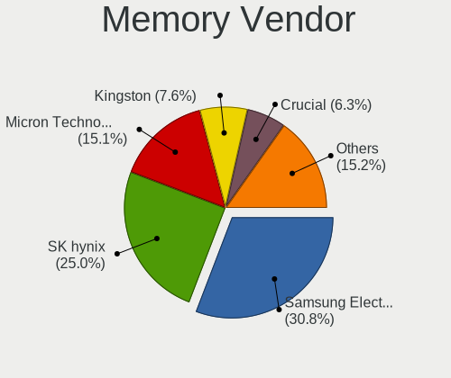

| Vendor              | Notebooks | Percent |
|---------------------|-----------|---------|
| Samsung Electronics | 426       | 29%     |
| SK Hynix            | 407       | 27.71%  |
| Micron Technology   | 186       | 12.66%  |
| Kingston            | 123       | 8.37%   |
| Crucial             | 76        | 5.17%   |
| Ramaxel Technology  | 70        | 4.77%   |
| A-DATA Technology   | 53        | 3.61%   |
| Unknown             | 38        | 2.59%   |
| Transcend           | 22        | 1.5%    |
| Elpida              | 15        | 1.02%   |
| CSX                 | 14        | 0.95%   |
| Nanya Technology    | 13        | 0.88%   |
| Corsair             | 8         | 0.54%   |
| G.Skill             | 2         | 0.14%   |
| Avant               | 2         | 0.14%   |
| ZION                | 1         | 0.07%   |
| Unknown (ABCD)      | 1         | 0.07%   |
| Unknown (0x1007)    | 1         | 0.07%   |
| Unknown (09D5)      | 1         | 0.07%   |
| Unknown (07F7)      | 1         | 0.07%   |
| Team                | 1         | 0.07%   |
| Silicon Power       | 1         | 0.07%   |
| SHARETRONIC         | 1         | 0.07%   |
| Qumo                | 1         | 0.07%   |
| Qimonda             | 1         | 0.07%   |
| Kllisre             | 1         | 0.07%   |
| Gold Key            | 1         | 0.07%   |
| ASint Technology    | 1         | 0.07%   |
| Apacer              | 1         | 0.07%   |

Memory Model
------------

Memory module models

| Model                                                        | Notebooks | Percent |
|--------------------------------------------------------------|-----------|---------|
| Samsung RAM M471A5244CB0-CRC 4096MB SODIMM DDR4 2667MT/s     | 52        | 3.39%   |
| Samsung RAM M471A5244CB0-CTD 4GB SODIMM DDR4 3266MT/s        | 51        | 3.33%   |
| SK Hynix RAM HMA81GS6AFR8N-UH 8GB SODIMM DDR4 2667MT/s       | 39        | 2.55%   |
| SK Hynix RAM HMA81GS6JJR8N-VK 8GB SODIMM DDR4 2667MT/s       | 32        | 2.09%   |
| SK Hynix RAM HMA851S6AFR6N-UH 4GB SODIMM DDR4 2667MT/s       | 30        | 1.96%   |
| SK Hynix RAM HMA851S6JJR6N-VK 4GB SODIMM DDR4 2667MT/s       | 26        | 1.7%    |
| SK Hynix RAM HMT451S6BFR8A-PB 4GB SODIMM DDR3 1600MT/s       | 21        | 1.37%   |
| SK Hynix RAM HMA851S6CJR6N-VK 4GB SODIMM DDR4 2667MT/s       | 21        | 1.37%   |
| Samsung RAM M471A1K43DB1-CWE 8GB SODIMM DDR4 3200MT/s        | 21        | 1.37%   |
| Samsung RAM M471A1K43DB1-CTD 8GB SODIMM DDR4 2667MT/s        | 20        | 1.31%   |
| Samsung RAM M471A1G44AB0-CWE 8GB SODIMM DDR4 3200MT/s        | 18        | 1.17%   |
| SK Hynix RAM HMA81GS6DJR8N-XN 8GB SODIMM DDR4 3200MT/s       | 17        | 1.11%   |
| SK Hynix RAM HMA81GS6CJR8N-VK 8GB SODIMM DDR4 2667MT/s       | 16        | 1.04%   |
| Samsung RAM M471B5173QH0-YK0 4GB SODIMM DDR3 1600MT/s        | 16        | 1.04%   |
| Samsung RAM M471A1K43CB1-CRC 8GB SODIMM DDR4 2667MT/s        | 16        | 1.04%   |
| Crucial RAM CB8GS2400.C8ET 8GB SODIMM DDR4 2667MT/s          | 16        | 1.04%   |
| Micron RAM 8ATF1G64HZ-3G2J1 8192MB SODIMM DDR4 3200MT/s      | 15        | 0.98%   |
| Micron RAM 4ATF51264HZ-2G6E1 4096MB SODIMM DDR4 2667MT/s     | 15        | 0.98%   |
| Samsung RAM M471B5173EB0-YK0 4GB SODIMM DDR3 1600MT/s        | 14        | 0.91%   |
| Samsung RAM M471A5244CB0-CWE 4GB SODIMM DDR4 3200MT/s        | 14        | 0.91%   |
| Micron RAM 8KTF51264HZ-1G6E1 4GB SODIMM DDR3 1600MT/s        | 13        | 0.85%   |
| Samsung RAM M471B1G73DB0-YK0 8GB SODIMM DDR3 1600MT/s        | 12        | 0.78%   |
| Samsung RAM M471A1K43CB1-CTD 8GB SODIMM DDR4 2667MT/s        | 12        | 0.78%   |
| Ramaxel RAM RMSA3260ME78HAF-2666 8GB SODIMM DDR4 2667MT/s    | 12        | 0.78%   |
| Micron RAM 4ATF51264HZ-3G2J1 4GB SODIMM DDR4 3200MT/s        | 12        | 0.78%   |
| Micron RAM 4ATF51264HZ-2G3E1 4GB SODIMM DDR4 2667MT/s        | 12        | 0.78%   |
| Micron RAM 4ATF1G64HZ-3G2E1 8GB SODIMM DDR4 3200MT/s         | 12        | 0.78%   |
| SK Hynix RAM HMA851S6AFR6N-UH 4GB SODIMM DDR4 2400MT/s       | 11        | 0.72%   |
| Samsung RAM M471B5173DB0-YK0 4096MB SODIMM DDR3 1600MT/s     | 11        | 0.72%   |
| Samsung RAM M471A1K43BB1-CRC 8GB SODIMM DDR4 2667MT/s        | 11        | 0.72%   |
| SK Hynix RAM HMT351S6EFR8A-PB 4GB SODIMM DDR3 1600MT/s       | 10        | 0.65%   |
| Micron RAM 4ATF1G64HZ-3G2E2 8GB SODIMM DDR4 3200MT/s         | 10        | 0.65%   |
| SK Hynix RAM HMT451S6BFR8A-PB 4096MB SODIMM DDR3 1600MT/s    | 9         | 0.59%   |
| SK Hynix RAM HMT41GS6BFR8A-PB 8GB SODIMM DDR3 1600MT/s       | 9         | 0.59%   |
| Ramaxel RAM RMSA3270ME86H9F-2666 4GB SODIMM DDR4 2667MT/s    | 9         | 0.59%   |
| Crucial RAM CB8GS2400.C8JT 8GB SODIMM DDR4 2400MT/s          | 9         | 0.59%   |
| Samsung RAM M471B5773CHS-CH9 2GB SODIMM DDR3 4199MT/s        | 8         | 0.52%   |
| Samsung RAM M471B1G73QH0-YK0 8GB SODIMM DDR3 1600MT/s        | 8         | 0.52%   |
| Ramaxel RAM RMSA3260MF68H9F-2666 4096MB SODIMM DDR4 2400MT/s | 8         | 0.52%   |
| Kingston RAM 99U5428-018.A00LF 8192MB SODIMM DDR3 1600MT/s   | 8         | 0.52%   |
| SK Hynix RAM HMA82GS6CJR8N-VK 16GB SODIMM DDR4 2667MT/s      | 7         | 0.46%   |
| Samsung RAM M471B1G73EB0-YK0 8192MB SODIMM DDR3 1600MT/s     | 7         | 0.46%   |
| Samsung RAM M471A1G44AB0-CWE 8GB Row Of Chips DDR4 3200MT/s  | 7         | 0.46%   |
| Micron RAM 8ATF1G64HZ-2G3E1 8GB SODIMM DDR4 2400MT/s         | 7         | 0.46%   |
| Kingston RAM ACR26D4S9S8ME-8 8GB SODIMM DDR4 2667MT/s        | 7         | 0.46%   |
| Crucial RAM CB16GS2666.C8ET 16384MB SODIMM DDR4 2667MT/s     | 7         | 0.46%   |
| SK Hynix RAM HMA851S6DJR6N-XN 4GB SODIMM DDR4 3200MT/s       | 6         | 0.39%   |
| Samsung RAM M471B5673FH0-CH9 2048MB SODIMM DDR3 1334MT/s     | 6         | 0.39%   |
| Samsung RAM M471B5273DH0-CK0 4GB SODIMM DDR3 1600MT/s        | 6         | 0.39%   |
| Samsung RAM M471A5244BB0-CRC 4GB SODIMM DDR4 2667MT/s        | 6         | 0.39%   |
| Samsung RAM M471A5244BB0-CPB 4GB SODIMM DDR4 2400MT/s        | 6         | 0.39%   |
| Samsung RAM M471A1K43EB1-CWE 8192MB SODIMM DDR4 3200MT/s     | 6         | 0.39%   |
| Micron RAM 8KTF51264HZ-1G6N1 4096MB SODIMM DDR3 1600MT/s     | 6         | 0.39%   |
| Micron RAM 8ATF1G64HZ-2G6E1 8192MB SODIMM DDR4 2667MT/s      | 6         | 0.39%   |
| Micron RAM 8ATF1G64HZ-2G3H1 8GB SODIMM DDR4 2400MT/s         | 6         | 0.39%   |
| Micron RAM 4ATF51264HZ-2G3B1 4GB SODIMM DDR4 2400MT/s        | 6         | 0.39%   |
| Kingston RAM KKRVFX-MIE 8GB SODIMM DDR4 3200MT/s             | 6         | 0.39%   |
| Crucial RAM CB8GS2666.C8JT 8GB SODIMM DDR4 2667MT/s          | 6         | 0.39%   |
| Crucial RAM CB8GS2400.C8D 8GB SODIMM DDR4 2400MT/s           | 6         | 0.39%   |
| Unknown RAM Module 4096MB SODIMM DDR3                        | 5         | 0.33%   |

Memory Kind
-----------

Memory module kinds

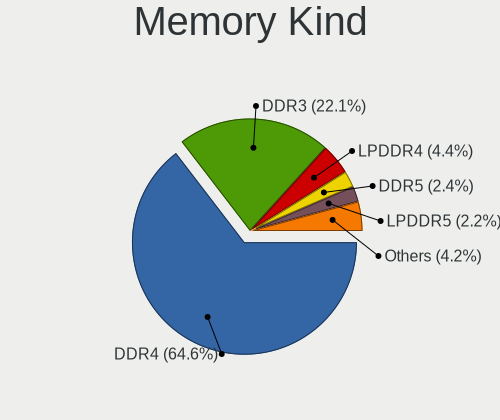

| Kind    | Notebooks | Percent |
|---------|-----------|---------|
| DDR4    | 750       | 63.51%  |
| DDR3    | 325       | 27.52%  |
| LPDDR4  | 46        | 3.9%    |
| SDRAM   | 22        | 1.86%   |
| LPDDR3  | 18        | 1.52%   |
| DDR2    | 17        | 1.44%   |
| Unknown | 2         | 0.17%   |
| DDR     | 1         | 0.08%   |

Memory Form Factor
------------------

Physical design of the memory module

| Name         | Notebooks | Percent |
|--------------|-----------|---------|
| SODIMM       | 1100      | 94.91%  |
| Row Of Chips | 56        | 4.83%   |
| Unknown      | 2         | 0.17%   |
| Chip         | 1         | 0.09%   |

Memory Size
-----------

Memory module size

| Size  | Notebooks | Percent |
|-------|-----------|---------|
| 8192  | 565       | 44.07%  |
| 4096  | 497       | 38.77%  |
| 2048  | 108       | 8.42%   |
| 16384 | 92        | 7.18%   |
| 1024  | 16        | 1.25%   |
| 32768 | 3         | 0.23%   |
| 512   | 1         | 0.08%   |

Memory Speed
------------

Memory module speed

| Speed   | Notebooks | Percent |
|---------|-----------|---------|
| 2667    | 444       | 34.15%  |
| 1600    | 256       | 19.69%  |
| 3200    | 193       | 14.85%  |
| 2400    | 145       | 11.15%  |
| 3266    | 51        | 3.92%   |
| 2133    | 49        | 3.77%   |
| 1334    | 46        | 3.54%   |
| 1333    | 27        | 2.08%   |
| 4199    | 17        | 1.31%   |
| 4267    | 12        | 0.92%   |
| 667     | 12        | 0.92%   |
| 1067    | 11        | 0.85%   |
| Unknown | 9         | 0.69%   |
| 1867    | 8         | 0.62%   |
| 800     | 7         | 0.54%   |
| 975     | 6         | 0.46%   |
| 2048    | 3         | 0.23%   |
| 3733    | 1         | 0.08%   |
| 2800    | 1         | 0.08%   |
| 1866    | 1         | 0.08%   |
| 1639    | 1         | 0.08%   |

Printers & scanners
-------------------

Printer Vendor
--------------

Printer device vendors

| Vendor             | Notebooks | Percent |
|--------------------|-----------|---------|
| Hewlett-Packard    | 7         | 43.75%  |
| Canon              | 4         | 25%     |
| Seiko Epson        | 2         | 12.5%   |
| STMicroelectronics | 1         | 6.25%   |
| Ricoh              | 1         | 6.25%   |
| Brother Industries | 1         | 6.25%   |

Printer Model
-------------

Printer device models

| Model                            | Notebooks | Percent |
|----------------------------------|-----------|---------|
| HP LaserJet 1020                 | 2         | 12.5%   |
| HP DeskJet 1110 series           | 2         | 12.5%   |
| STMicroelectronics USB Printer P | 1         | 6.25%   |
| Seiko Epson L222 Series          | 1         | 6.25%   |
| Seiko Epson L132 Series          | 1         | 6.25%   |
| Ricoh SP 111SU                   | 1         | 6.25%   |
| HP Ink Tank 310 series           | 1         | 6.25%   |
| HP DeskJet 2600 series           | 1         | 6.25%   |
| HP DeskJet 2130 series           | 1         | 6.25%   |
| Canon PIXMA MP190                | 1         | 6.25%   |
| Canon MF4800 Series              | 1         | 6.25%   |
| Canon LBP2900                    | 1         | 6.25%   |
| Canon G2000 series               | 1         | 6.25%   |
| Brother HL-L2320D series         | 1         | 6.25%   |

Scanner Vendor
--------------

Scanner device vendors

| Vendor | Notebooks | Percent |
|--------|-----------|---------|
| Canon  | 2         | 100%    |

Scanner Model
-------------

Scanner device models

| Model                   | Notebooks | Percent |
|-------------------------|-----------|---------|
| Canon CanoScan LiDE 110 | 2         | 100%    |

Camera
------

Camera Vendor
-------------

Camera device vendors

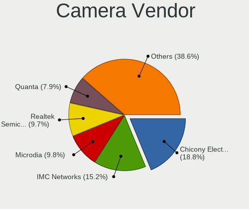

| Vendor                                 | Notebooks | Percent |
|----------------------------------------|-----------|---------|
| Chicony Electronics                    | 419       | 20.15%  |
| IMC Networks                           | 310       | 14.91%  |
| Realtek Semiconductor                  | 243       | 11.69%  |
| Microdia                               | 211       | 10.15%  |
| Acer                                   | 138       | 6.64%   |
| Quanta                                 | 127       | 6.11%   |
| Sunplus Innovation Technology          | 123       | 5.92%   |
| Cheng Uei Precision Industry (Foxlink) | 109       | 5.24%   |
| Suyin                                  | 90        | 4.33%   |
| Syntek                                 | 71        | 3.42%   |
| Lite-On Technology                     | 44        | 2.12%   |
| Luxvisions Innotech Limited            | 34        | 1.64%   |
| Silicon Motion                         | 19        | 0.91%   |
| Alcor Micro                            | 19        | 0.91%   |
| Ricoh                                  | 13        | 0.63%   |
| Apple                                  | 13        | 0.63%   |
| Samsung Electronics                    | 11        | 0.53%   |
| Logitech                               | 10        | 0.48%   |
| Importek                               | 10        | 0.48%   |
| OmniVision Technologies                | 8         | 0.38%   |
| Sonix Technology                       | 7         | 0.34%   |
| Primax Electronics                     | 7         | 0.34%   |
| Z-Star Microelectronics                | 6         | 0.29%   |
| 8SSC20F27114V1GZ07N14V2                | 5         | 0.24%   |
| Lenovo                                 | 4         | 0.19%   |
| Intel                                  | 4         | 0.19%   |
| SunplusIT                              | 3         | 0.14%   |
| MSD                                    | 3         | 0.14%   |
| Unknown                                | 2         | 0.1%    |
| Pixart Imaging                         | 2         | 0.1%    |
| Holitech                               | 2         | 0.1%    |
| Foxconn / Hon Hai                      | 2         | 0.1%    |
| Spreadtrum Communications              | 1         | 0.05%   |
| Google                                 | 1         | 0.05%   |
| Generalplus Technology                 | 1         | 0.05%   |
| GEMBIRD                                | 1         | 0.05%   |
| eMPIA Technology                       | 1         | 0.05%   |
| Cubeternet                             | 1         | 0.05%   |
| Arkmicro Technologies                  | 1         | 0.05%   |
| ARC International                      | 1         | 0.05%   |
| ALi                                    | 1         | 0.05%   |
| 8SSC20F27145V1SR19P0BEK                | 1         | 0.05%   |

Camera Model
------------

Camera device models

| Model                                                                      | Notebooks | Percent |
|----------------------------------------------------------------------------|-----------|---------|
| Microdia Integrated_Webcam_HD                                              | 113       | 5.42%   |
| IMC Networks USB2.0 HD UVC WebCam                                          | 99        | 4.75%   |
| Realtek Integrated_Webcam_HD                                               | 95        | 4.56%   |
| IMC Networks Integrated Camera                                             | 77        | 3.69%   |
| Chicony Integrated Camera                                                  | 75        | 3.6%    |
| Sunplus Integrated_Webcam_HD                                               | 73        | 3.5%    |
| IMC Networks USB2.0 VGA UVC WebCam                                         | 65        | 3.12%   |
| Realtek Integrated Webcam                                                  | 49        | 2.35%   |
| Chicony HP Truevision HD                                                   | 42        | 2.01%   |
| Acer Integrated Camera                                                     | 42        | 2.01%   |
| Chicony HP TrueVision HD Camera                                            | 39        | 1.87%   |
| Chicony EasyCamera                                                         | 38        | 1.82%   |
| Chicony HD WebCam                                                          | 36        | 1.73%   |
| Suyin HP TrueVision HD                                                     | 34        | 1.63%   |
| Quanta HP TrueVision HD Camera                                             | 33        | 1.58%   |
| Syntek Integrated Camera                                                   | 31        | 1.49%   |
| Cheng Uei Precision Industry (Foxlink) HP TrueVision HD                    | 30        | 1.44%   |
| Quanta HD User Facing                                                      | 28        | 1.34%   |
| Syntek EasyCamera                                                          | 26        | 1.25%   |
| Acer EasyCamera                                                            | 24        | 1.15%   |
| Cheng Uei Precision Industry (Foxlink) HP TrueVision HD Camera             | 23        | 1.1%    |
| Quanta HD Webcam                                                           | 22        | 1.06%   |
| Lite-On Integrated Camera                                                  | 22        | 1.06%   |
| Acer Lenovo EasyCamera                                                     | 22        | 1.06%   |
| Microdia Integrated Webcam                                                 | 20        | 0.96%   |
| Luxvisions Innotech Limited HP TrueVision HD Camera                        | 20        | 0.96%   |
| Chicony HD User Facing                                                     | 20        | 0.96%   |
| Realtek EasyCamera                                                         | 19        | 0.91%   |
| IMC Networks HP TrueVision HD Camera                                       | 18        | 0.86%   |
| Microdia Laptop_Integrated_Webcam_HD                                       | 17        | 0.82%   |
| Suyin Integrated_Webcam_HD                                                 | 16        | 0.77%   |
| Chicony Integrated Camera (1280x720@30)                                    | 16        | 0.77%   |
| IMC Networks VGA UVC WebCam                                                | 15        | 0.72%   |
| Acer SunplusIT Integrated Camera                                           | 15        | 0.72%   |
| Sunplus HP TrueVision HD Camera                                            | 13        | 0.62%   |
| Realtek Lenovo EasyCamera                                                  | 12        | 0.58%   |
| Realtek Integrated Webcam HD                                               | 12        | 0.58%   |
| Realtek HP Truevision HD                                                   | 12        | 0.58%   |
| Luxvisions Innotech Limited HP Wide Vision HD Camera                       | 12        | 0.58%   |
| Chicony Lenovo EasyCamera                                                  | 12        | 0.58%   |
| Chicony HP HD Webcam                                                       | 12        | 0.58%   |
| Chicony HP HD Camera                                                       | 12        | 0.58%   |
| Acer Lenovo Integrated Webcam                                              | 12        | 0.58%   |
| Syntek Lenovo EasyCamera                                                   | 11        | 0.53%   |
| Samsung Galaxy A5 (MTP)                                                    | 11        | 0.53%   |
| Quanta VGA WebCam                                                          | 11        | 0.53%   |
| Quanta HP Wide Vision HD Camera                                            | 11        | 0.53%   |
| IMC Networks Lenovo EasyCamera                                             | 11        | 0.53%   |
| Chicony HP Wide Vision HD Camera                                           | 11        | 0.53%   |
| Microdia Dell Laptop Integrated Webcam HD                                  | 10        | 0.48%   |
| Lite-On HP HD Camera                                                       | 10        | 0.48%   |
| IMC Networks EasyCamera                                                    | 9         | 0.43%   |
| Cheng Uei Precision Industry (Foxlink) Webcam                              | 9         | 0.43%   |
| Alcor Micro 720P USB Webcam                                                | 9         | 0.43%   |
| Suyin HP TrueVision HD Integrated Webcam                                   | 8         | 0.38%   |
| Realtek USB Camera                                                         | 8         | 0.38%   |
| Microdia 1.3 MPixel Integrated Webcam                                      | 8         | 0.38%   |
| Chicony USB2.0 VGA UVC WebCam                                              | 8         | 0.38%   |
| Cheng Uei Precision Industry (Foxlink) HP Wide Vision HD Integrated Webcam | 8         | 0.38%   |
| Acer HD Webcam                                                             | 8         | 0.38%   |

Security
--------

Fingerprint Vendor
------------------

Fingerprint sensor vendors

| Vendor                     | Notebooks | Percent |
|----------------------------|-----------|---------|
| Validity Sensors           | 136       | 35.42%  |
| Synaptics                  | 82        | 21.35%  |
| Shenzhen Goodix Technology | 70        | 18.23%  |
| Elan Microelectronics      | 53        | 13.8%   |
| LighTuning Technology      | 19        | 4.95%   |
| Upek                       | 10        | 2.6%    |
| AuthenTec                  | 9         | 2.34%   |
| Focal-systems.Corp         | 4         | 1.04%   |
| STMicroelectronics         | 1         | 0.26%   |

Fingerprint Model
-----------------

Fingerprint sensor models

| Model                                                                      | Notebooks | Percent |
|----------------------------------------------------------------------------|-----------|---------|
| Shenzhen Goodix  Fingerprint Device                                        | 38        | 9.9%    |
| Validity Sensors VFS495 Fingerprint Reader                                 | 37        | 9.64%   |
| Elan ELAN:ARM-M4                                                           | 28        | 7.29%   |
| Shenzhen Goodix Fingerprint Reader                                         | 26        | 6.77%   |
| Elan ELAN:Fingerprint                                                      | 25        | 6.51%   |
| Validity Sensors Synaptics VFS7552 Touch Fingerprint Sensor                | 21        | 5.47%   |
| Synaptics Metallica MIS Touch Fingerprint Reader                           | 20        | 5.21%   |
| Unknown                                                                    | 20        | 5.21%   |
| LighTuning EgisTec Touch Fingerprint Sensor                                | 19        | 4.95%   |
| Validity Sensors VFS5011 Fingerprint Reader                                | 18        | 4.69%   |
| Synaptics  WBDI                                                            | 13        | 3.39%   |
| Synaptics Prometheus MIS Touch Fingerprint Reader                          | 13        | 3.39%   |
| Synaptics Metallica MOH Touch Fingerprint Reader                           | 11        | 2.86%   |
| Validity Sensors VFS491                                                    | 9         | 2.34%   |
| Upek Biometric Touchchip/Touchstrip Fingerprint Sensor                     | 9         | 2.34%   |
| Validity Sensors VFS Fingerprint sensor                                    | 8         | 2.08%   |
| Validity Sensors VFS 5011 fingerprint sensor                               | 8         | 2.08%   |
| Validity Sensors Synaptics VFS7552 Touch Fingerprint Sensor with PurePrint | 6         | 1.56%   |
| Shenzhen Goodix FingerPrint                                                | 6         | 1.56%   |
| Validity Sensors VFS471 Fingerprint Reader                                 | 5         | 1.3%    |
| Validity Sensors VFS451 Fingerprint Reader                                 | 5         | 1.3%    |
| Validity Sensors Fingerprint scanner                                       | 5         | 1.3%    |
| Validity Sensors Synaptics WBDI                                            | 4         | 1.04%   |
| Validity Sensors Swipe Fingerprint Sensor                                  | 4         | 1.04%   |
| Synaptics  VFS7552 Touch Fingerprint Sensor with PurePrint                 | 4         | 1.04%   |
| Focal-systems.Corp FT9201Fingerprint.                                      | 4         | 1.04%   |
| AuthenTec Fingerprint Sensor                                               | 4         | 1.04%   |
| AuthenTec AES1660 Fingerprint Sensor                                       | 3         | 0.78%   |
| Validity Sensors VFS7500 Touch Fingerprint Sensor                          | 2         | 0.52%   |
| Validity Sensors VFS301 Fingerprint Reader                                 | 2         | 0.52%   |
| AuthenTec AES1600                                                          | 2         | 0.52%   |
| Validity Sensors VFS7552 Touch Fingerprint Sensor                          | 1         | 0.26%   |
| Validity Sensors VFS101 Fingerprint Reader                                 | 1         | 0.26%   |
| Upek TCS5B Fingerprint sensor                                              | 1         | 0.26%   |
| Synaptics  FS7604 Touch Fingerprint Sensor with PurePrint                  | 1         | 0.26%   |
| STMicroelectronics Fingerprint Reader                                      | 1         | 0.26%   |

Chipcard Vendor
---------------

Chipcard module vendors

| Vendor      | Notebooks | Percent |
|-------------|-----------|---------|
| Broadcom    | 39        | 66.1%   |
| Alcor Micro | 10        | 16.95%  |
| Upek        | 5         | 8.47%   |
| Lenovo      | 3         | 5.08%   |
| O2 Micro    | 2         | 3.39%   |

Chipcard Model
--------------

Chipcard module models

| Model                                                                        | Notebooks | Percent |
|------------------------------------------------------------------------------|-----------|---------|
| Broadcom BCM5880 Secure Applications Processor                               | 16        | 27.12%  |
| Alcor Micro AU9540 Smartcard Reader                                          | 10        | 16.95%  |
| Broadcom BCM5880 Secure Applications Processor with fingerprint swipe sensor | 9         | 15.25%  |
| Broadcom 5880                                                                | 9         | 15.25%  |
| Upek TouchChip Fingerprint Coprocessor (WBF advanced mode)                   | 5         | 8.47%   |
| Broadcom 58200                                                               | 5         | 8.47%   |
| Lenovo Integrated Smart Card Reader                                          | 3         | 5.08%   |
| O2 Micro Oz776 SmartCard Reader                                              | 1         | 1.69%   |
| O2 Micro OZ776 CCID Smartcard Reader                                         | 1         | 1.69%   |

Unsupported
-----------

Unsupported Devices
-------------------

Total unsupported devices on board

| Total | Notebooks | Percent |
|-------|-----------|---------|
| 0     | 1463      | 64%     |
| 1     | 696       | 30.45%  |
| 2     | 105       | 4.59%   |
| 3     | 15        | 0.66%   |
| 4     | 4         | 0.17%   |
| 5     | 2         | 0.09%   |
| 6     | 1         | 0.04%   |

Unsupported Device Types
------------------------

Types of unsupported devices

| Type                     | Notebooks | Percent |
|--------------------------|-----------|---------|
| Fingerprint reader       | 380       | 40%     |
| Graphics card            | 213       | 22.42%  |
| Net/wireless             | 142       | 14.95%  |
| Chipcard                 | 59        | 6.21%   |
| Multimedia controller    | 47        | 4.95%   |
| Bluetooth                | 47        | 4.95%   |
| Communication controller | 18        | 1.89%   |
| Camera                   | 17        | 1.79%   |
| Net/ethernet             | 8         | 0.84%   |
| Storage                  | 7         | 0.74%   |
| Sound                    | 7         | 0.74%   |
| Modem                    | 2         | 0.21%   |
| Card reader              | 2         | 0.21%   |
| Network                  | 1         | 0.11%   |

