Linux in India - Tested Hardware & Statistics (Notebooks)
---------------------------------------------------------

A project to collect tested hardware configurations for Linux in India.

Anyone can contribute to this report by the [hw-probe](https://github.com/linuxhw/hw-probe) tool:

    sudo -E hw-probe -all -upload

Please contribute! Especially if your hardware is rare.

Contents
--------

* [ Test Cases ](#test-cases)

* [ System ](#system)
  - [ OS                       ](#os)
  - [ OS Family                ](#os-family)
  - [ Kernel                   ](#kernel)
  - [ Kernel Family            ](#kernel-family)
  - [ Kernel Major Ver.        ](#kernel-major-ver)
  - [ Arch                     ](#arch)
  - [ DE                       ](#de)
  - [ Display Server           ](#display-server)
  - [ Display Manager          ](#display-manager)
  - [ OS Lang                  ](#os-lang)
  - [ Boot Mode                ](#boot-mode)
  - [ Filesystem               ](#filesystem)
  - [ Part. scheme             ](#part-scheme)
  - [ Dual Boot with Linux/BSD ](#dual-boot-with-linuxbsd)
  - [ Dual Boot (Win)          ](#dual-boot-win)

* [ Board ](#board)
  - [ Vendor                   ](#vendor)
  - [ Model                    ](#model)
  - [ Model Family             ](#model-family)
  - [ MFG Year                 ](#mfg-year)
  - [ Form Factor              ](#form-factor)
  - [ Secure Boot              ](#secure-boot)
  - [ Coreboot                 ](#coreboot)
  - [ RAM Size                 ](#ram-size)
  - [ RAM Used                 ](#ram-used)
  - [ Total Drives             ](#total-drives)
  - [ Has CD-ROM               ](#has-cd-rom)
  - [ Has Ethernet             ](#has-ethernet)
  - [ Has WiFi                 ](#has-wifi)
  - [ Has Bluetooth            ](#has-bluetooth)

* [ Location ](#location)
  - [ Country                  ](#country)
  - [ City                     ](#city)

* [ Drives ](#drives)
  - [ Drive Vendor             ](#drive-vendor)
  - [ Drive Model              ](#drive-model)
  - [ HDD Vendor               ](#hdd-vendor)
  - [ SSD Vendor               ](#ssd-vendor)
  - [ Drive Kind               ](#drive-kind)
  - [ Drive Connector          ](#drive-connector)
  - [ Drive Size               ](#drive-size)
  - [ Space Total              ](#space-total)
  - [ Space Used               ](#space-used)
  - [ Malfunc. Drives          ](#malfunc-drives)
  - [ Malfunc. Drive Vendor    ](#malfunc-drive-vendor)
  - [ Malfunc. HDD Vendor      ](#malfunc-hdd-vendor)
  - [ Malfunc. Drive Kind      ](#malfunc-drive-kind)
  - [ Failed Drives            ](#failed-drives)
  - [ Failed Drive Vendor      ](#failed-drive-vendor)
  - [ Drive Status             ](#drive-status)

* [ Storage controller ](#storage-controller)
  - [ Storage Vendor           ](#storage-vendor)
  - [ Storage Model            ](#storage-model)
  - [ Storage Kind             ](#storage-kind)

* [ Processor ](#processor)
  - [ CPU Vendor               ](#cpu-vendor)
  - [ CPU Model                ](#cpu-model)
  - [ CPU Model Family         ](#cpu-model-family)
  - [ CPU Cores                ](#cpu-cores)
  - [ CPU Sockets              ](#cpu-sockets)
  - [ CPU Threads              ](#cpu-threads)
  - [ CPU Op-Modes             ](#cpu-op-modes)
  - [ CPU Microcode            ](#cpu-microcode)
  - [ CPU Microarch            ](#cpu-microarch)

* [ Graphics ](#graphics)
  - [ GPU Vendor               ](#gpu-vendor)
  - [ GPU Model                ](#gpu-model)
  - [ GPU Combo                ](#gpu-combo)
  - [ GPU Driver               ](#gpu-driver)
  - [ GPU Memory               ](#gpu-memory)

* [ Monitor ](#monitor)
  - [ Monitor Vendor           ](#monitor-vendor)
  - [ Monitor Model            ](#monitor-model)
  - [ Monitor Resolution       ](#monitor-resolution)
  - [ Monitor Diagonal         ](#monitor-diagonal)
  - [ Monitor Width            ](#monitor-width)
  - [ Aspect Ratio             ](#aspect-ratio)
  - [ Monitor Area             ](#monitor-area)
  - [ Pixel Density            ](#pixel-density)
  - [ Multiple Monitors        ](#multiple-monitors)

* [ Network ](#network)
  - [ Net Controller Vendor    ](#net-controller-vendor)
  - [ Net Controller Model     ](#net-controller-model)
  - [ Wireless Vendor          ](#wireless-vendor)
  - [ Wireless Model           ](#wireless-model)
  - [ Ethernet Vendor          ](#ethernet-vendor)
  - [ Ethernet Model           ](#ethernet-model)
  - [ Net Controller Kind      ](#net-controller-kind)
  - [ Used Controller          ](#used-controller)
  - [ NICs                     ](#nics)
  - [ IPv6                     ](#ipv6)

* [ Bluetooth ](#bluetooth)
  - [ Bluetooth Vendor         ](#bluetooth-vendor)
  - [ Bluetooth Model          ](#bluetooth-model)

* [ Sound ](#sound)
  - [ Sound Vendor             ](#sound-vendor)
  - [ Sound Model              ](#sound-model)

* [ Memory ](#memory)
  - [ Memory Vendor            ](#memory-vendor)
  - [ Memory Model             ](#memory-model)
  - [ Memory Kind              ](#memory-kind)
  - [ Memory Form Factor       ](#memory-form-factor)
  - [ Memory Size              ](#memory-size)
  - [ Memory Speed             ](#memory-speed)

* [ Printers & scanners ](#printers--scanners)
  - [ Printer Vendor           ](#printer-vendor)
  - [ Printer Model            ](#printer-model)
  - [ Scanner Vendor           ](#scanner-vendor)
  - [ Scanner Model            ](#scanner-model)

* [ Camera ](#camera)
  - [ Camera Vendor            ](#camera-vendor)
  - [ Camera Model             ](#camera-model)

* [ Security ](#security)
  - [ Fingerprint Vendor       ](#fingerprint-vendor)
  - [ Fingerprint Model        ](#fingerprint-model)
  - [ Chipcard Vendor          ](#chipcard-vendor)
  - [ Chipcard Model           ](#chipcard-model)

* [ Unsupported ](#unsupported)
  - [ Unsupported Devices      ](#unsupported-devices)
  - [ Unsupported Device Types ](#unsupported-device-types)

Test Cases
----------

Total: 4496

| Vendor        | Model                       | Probe                                                      | Date         |
|---------------|-----------------------------|------------------------------------------------------------|--------------|
| Acer          | Aspire E5-575G              | [f127804b4a](https://linux-hardware.org/?probe=f127804b4a) | Jun 30, 2023 |
| ASUSTek       | ASUS TUF Gaming F15 FX50... | [10467d9f3e](https://linux-hardware.org/?probe=10467d9f3e) | Jun 30, 2023 |
| HP            | 15                          | [2d80407689](https://linux-hardware.org/?probe=2d80407689) | Jun 30, 2023 |
| HP            | 15                          | [398d659d8c](https://linux-hardware.org/?probe=398d659d8c) | Jun 30, 2023 |
| Acer          | Aspire E5-575               | [602d134940](https://linux-hardware.org/?probe=602d134940) | Jun 30, 2023 |
| Dell          | Inspiron N5010              | [eab5331f66](https://linux-hardware.org/?probe=eab5331f66) | Jun 30, 2023 |
| Lenovo        | ThinkPad E15 Gen 2 20TDC... | [62ff10cadc](https://linux-hardware.org/?probe=62ff10cadc) | Jun 29, 2023 |
| ASUSTek       | VivoBook_ASUSLaptop X512... | [0f0defbd9c](https://linux-hardware.org/?probe=0f0defbd9c) | Jun 29, 2023 |
| Lenovo        | ThinkBook 14p Gen 3 21EJ    | [0086cae258](https://linux-hardware.org/?probe=0086cae258) | Jun 29, 2023 |
| Lenovo        | IdeaPad S540-15IWL          | [de699b13ba](https://linux-hardware.org/?probe=de699b13ba) | Jun 28, 2023 |
| HP            | Pavilion Laptop 15-eh2xx... | [5d30ae9d05](https://linux-hardware.org/?probe=5d30ae9d05) | Jun 28, 2023 |
| ASUSTek       | VivoBook 15_ASUS Laptop ... | [6a29eda577](https://linux-hardware.org/?probe=6a29eda577) | Jun 28, 2023 |
| ASUSTek       | VivoBook 15_ASUS Laptop ... | [bf4abd6e9e](https://linux-hardware.org/?probe=bf4abd6e9e) | Jun 28, 2023 |
| Dell          | Inspiron 3543               | [4baea798b1](https://linux-hardware.org/?probe=4baea798b1) | Jun 27, 2023 |
| Acer          | Swift SFG14-71              | [f66ac636e6](https://linux-hardware.org/?probe=f66ac636e6) | Jun 27, 2023 |
| HP            | Pavilion Laptop 15-eh2xx... | [fc7f2b378b](https://linux-hardware.org/?probe=fc7f2b378b) | Jun 27, 2023 |
| Dell          | Inspiron 1545               | [d6b3d5cb90](https://linux-hardware.org/?probe=d6b3d5cb90) | Jun 27, 2023 |
| Acer          | Aspire A715-51G             | [08ba4bf92b](https://linux-hardware.org/?probe=08ba4bf92b) | Jun 26, 2023 |
| Acer          | Aspire A715-51G             | [3dc15705c8](https://linux-hardware.org/?probe=3dc15705c8) | Jun 26, 2023 |
| ASUSTek       | ASUS EXPERTBOOK B1402CBA    | [8a764f6629](https://linux-hardware.org/?probe=8a764f6629) | Jun 26, 2023 |
| HP            | Laptop 14s-dq2xxx           | [23499b1838](https://linux-hardware.org/?probe=23499b1838) | Jun 25, 2023 |
| Acer          | Aspire E5-575G              | [2f5357533f](https://linux-hardware.org/?probe=2f5357533f) | Jun 25, 2023 |
| Lenovo        | E41-55 82FJ                 | [f725e1bd1a](https://linux-hardware.org/?probe=f725e1bd1a) | Jun 25, 2023 |
| Dell          | Precision M6400             | [b68c09e274](https://linux-hardware.org/?probe=b68c09e274) | Jun 25, 2023 |
| HP            | Laptop 15s-eq2xxx           | [14cc9e067f](https://linux-hardware.org/?probe=14cc9e067f) | Jun 25, 2023 |
| Dell          | Precision 5540              | [7d6c1fe39d](https://linux-hardware.org/?probe=7d6c1fe39d) | Jun 25, 2023 |
| Dell          | Inspiron 1545               | [7f8217bce2](https://linux-hardware.org/?probe=7f8217bce2) | Jun 25, 2023 |
| ASUSTek       | TUF Gaming FX505DT_FX505... | [5679200535](https://linux-hardware.org/?probe=5679200535) | Jun 24, 2023 |
| Dell          | Vostro 2520                 | [9279842ec3](https://linux-hardware.org/?probe=9279842ec3) | Jun 24, 2023 |
| HP            | Pavilion Gaming Laptop 1... | [628fca0448](https://linux-hardware.org/?probe=628fca0448) | Jun 24, 2023 |
| Dell          | Inspiron 15 3515            | [77473ea84c](https://linux-hardware.org/?probe=77473ea84c) | Jun 24, 2023 |
| ASUSTek       | TUF Gaming FX505DY_FX505... | [de0580cf77](https://linux-hardware.org/?probe=de0580cf77) | Jun 24, 2023 |
| HP            | Pavilion g6                 | [b8d79ce295](https://linux-hardware.org/?probe=b8d79ce295) | Jun 24, 2023 |
| Dell          | G5 5505                     | [dbe52869d7](https://linux-hardware.org/?probe=dbe52869d7) | Jun 23, 2023 |
| Lenovo        | G500s 20245                 | [515f5a5392](https://linux-hardware.org/?probe=515f5a5392) | Jun 23, 2023 |
| Lenovo        | IdeaPad Y510P 20217         | [15fd4078ea](https://linux-hardware.org/?probe=15fd4078ea) | Jun 23, 2023 |
| Lenovo        | G500s 20245                 | [4d9c9f9bd0](https://linux-hardware.org/?probe=4d9c9f9bd0) | Jun 23, 2023 |
| Dell          | G5 5505                     | [f435440e91](https://linux-hardware.org/?probe=f435440e91) | Jun 23, 2023 |
| Acer          | Aspire E5-575G              | [5c76172491](https://linux-hardware.org/?probe=5c76172491) | Jun 22, 2023 |
| Lenovo        | V15 G2 ITL Ua 82KB          | [110c366456](https://linux-hardware.org/?probe=110c366456) | Jun 22, 2023 |
| HP            | 250 G6 Notebook PC          | [7cc301b3f7](https://linux-hardware.org/?probe=7cc301b3f7) | Jun 21, 2023 |
| Dell          | Inspiron 3558               | [baab7764b1](https://linux-hardware.org/?probe=baab7764b1) | Jun 21, 2023 |
| Acer          | Aspire R3-131T              | [ab7c961e2b](https://linux-hardware.org/?probe=ab7c961e2b) | Jun 21, 2023 |
| HP            | 250 G6 Notebook PC          | [1ba2e18bc1](https://linux-hardware.org/?probe=1ba2e18bc1) | Jun 21, 2023 |
| MSI           | Bravo 15 B5DD               | [c80413d259](https://linux-hardware.org/?probe=c80413d259) | Jun 21, 2023 |
| Dell          | Inspiron 3558               | [3375eaaeb3](https://linux-hardware.org/?probe=3375eaaeb3) | Jun 20, 2023 |
| Dell          | Precision 5560              | [ee53248c8c](https://linux-hardware.org/?probe=ee53248c8c) | Jun 20, 2023 |
| Lenovo        | ThinkPad T460s 20F9005BU... | [59a527c934](https://linux-hardware.org/?probe=59a527c934) | Jun 20, 2023 |
| Timi          | RedmiBook 15                | [f975205ebd](https://linux-hardware.org/?probe=f975205ebd) | Jun 20, 2023 |
| Lenovo        | IdeaPad 3 14ITL6 82H7       | [6dea148dd7](https://linux-hardware.org/?probe=6dea148dd7) | Jun 19, 2023 |
| Dell          | Inspiron 3501               | [63381e724a](https://linux-hardware.org/?probe=63381e724a) | Jun 19, 2023 |
| MSI           | Bravo 15 B5DD               | [5a89024be5](https://linux-hardware.org/?probe=5a89024be5) | Jun 19, 2023 |
| HP            | ProBook 440 G4              | [4b20fef62f](https://linux-hardware.org/?probe=4b20fef62f) | Jun 19, 2023 |
| Dell          | Vostro 1015                 | [e195f838c3](https://linux-hardware.org/?probe=e195f838c3) | Jun 18, 2023 |
| HONOR         | BRN-FXX                     | [d3671dca6a](https://linux-hardware.org/?probe=d3671dca6a) | Jun 18, 2023 |
| ASUSTek       | TUF Gaming FX505DT_FX505... | [4907b6927a](https://linux-hardware.org/?probe=4907b6927a) | Jun 16, 2023 |
| ASUSTek       | VivoBook_ASUSLaptop K340... | [edd82d072b](https://linux-hardware.org/?probe=edd82d072b) | Jun 16, 2023 |
| HP            | EliteBook 2540p             | [20ddd7a28b](https://linux-hardware.org/?probe=20ddd7a28b) | Jun 15, 2023 |
| Dell          | Vostro 3420                 | [c1b8b07db0](https://linux-hardware.org/?probe=c1b8b07db0) | Jun 15, 2023 |
| Dell          | Inspiron 15-3567            | [69048c54c9](https://linux-hardware.org/?probe=69048c54c9) | Jun 14, 2023 |
| HP            | ProBook 430 G4              | [fe39c9b2ce](https://linux-hardware.org/?probe=fe39c9b2ce) | Jun 14, 2023 |
| HP            | ProBook 430 G4              | [2b4d088695](https://linux-hardware.org/?probe=2b4d088695) | Jun 14, 2023 |
| Lenovo        | E41-25 81FS                 | [fffb0a25f1](https://linux-hardware.org/?probe=fffb0a25f1) | Jun 13, 2023 |
| Dell          | Vostro 3420                 | [1ede32fb28](https://linux-hardware.org/?probe=1ede32fb28) | Jun 13, 2023 |
| Dell          | XPS 17 9710                 | [9ab7a065c4](https://linux-hardware.org/?probe=9ab7a065c4) | Jun 13, 2023 |
| Lenovo        | IdeaPad 5 15IAL7 82SF       | [5e636c4693](https://linux-hardware.org/?probe=5e636c4693) | Jun 13, 2023 |
| Acer          | Aspire ES1-572              | [e6713db4c3](https://linux-hardware.org/?probe=e6713db4c3) | Jun 12, 2023 |
| Lenovo        | E41-25 81FS                 | [a192769f1b](https://linux-hardware.org/?probe=a192769f1b) | Jun 11, 2023 |
| HP            | Pavilion Laptop 14-ec1xx... | [66aa96212a](https://linux-hardware.org/?probe=66aa96212a) | Jun 11, 2023 |
| ASUSTek       | ASUS TUF Gaming A15 FA50... | [1d46e48d92](https://linux-hardware.org/?probe=1d46e48d92) | Jun 10, 2023 |
| HP            | Pavilion Laptop 14-ec1xx... | [1eeb12a5ca](https://linux-hardware.org/?probe=1eeb12a5ca) | Jun 10, 2023 |
| HP            | Pavilion Laptop 14-ec1xx... | [e46f2fe66e](https://linux-hardware.org/?probe=e46f2fe66e) | Jun 10, 2023 |
| HP            | G42                         | [83eca37118](https://linux-hardware.org/?probe=83eca37118) | Jun 10, 2023 |
| HP            | Laptop 15-db0xxx            | [5dd8c1fed8](https://linux-hardware.org/?probe=5dd8c1fed8) | Jun 09, 2023 |
| ASUSTek       | VivoBook_ASUSLaptop M160... | [e355aa21b5](https://linux-hardware.org/?probe=e355aa21b5) | Jun 08, 2023 |
| ASUSTek       | VivoBook_ASUSLaptop M160... | [c5a1a47343](https://linux-hardware.org/?probe=c5a1a47343) | Jun 08, 2023 |
| Valve         | Jupiter                     | [b23bc1dc48](https://linux-hardware.org/?probe=b23bc1dc48) | Jun 08, 2023 |
| ASUSTek       | ROG Strix G513RC_G513RC     | [fb6aca39d9](https://linux-hardware.org/?probe=fb6aca39d9) | Jun 08, 2023 |
| HP            | Pavilion Laptop 15-eg3xx... | [e103817b2d](https://linux-hardware.org/?probe=e103817b2d) | Jun 07, 2023 |
| Lenovo        | IdeaPad S340-15IIL 81WL     | [6062ee64a9](https://linux-hardware.org/?probe=6062ee64a9) | Jun 07, 2023 |
| Dell          | G15 5511                    | [ddee46cbfa](https://linux-hardware.org/?probe=ddee46cbfa) | Jun 07, 2023 |
| ASUSTek       | ZenBook UX325JA_UX325JA     | [721ff5908a](https://linux-hardware.org/?probe=721ff5908a) | Jun 06, 2023 |
| HP            | Pavilion Laptop 14-ec1xx... | [de4c183b01](https://linux-hardware.org/?probe=de4c183b01) | Jun 06, 2023 |
| Dell          | Latitude E6430              | [bfa5da5406](https://linux-hardware.org/?probe=bfa5da5406) | Jun 06, 2023 |
| ASUSTek       | VivoBook_ASUSLaptop M650... | [1e5a50fa47](https://linux-hardware.org/?probe=1e5a50fa47) | Jun 06, 2023 |
| Acer          | Aspire A314-36M             | [7cab0d1591](https://linux-hardware.org/?probe=7cab0d1591) | Jun 06, 2023 |
| ASUSTek       | ROG Strix G531GT_G531GT     | [503bc1f4cc](https://linux-hardware.org/?probe=503bc1f4cc) | Jun 06, 2023 |
| ASUSTek       | ROG Strix G531GT_G531GT     | [31a814cd0e](https://linux-hardware.org/?probe=31a814cd0e) | Jun 06, 2023 |
| HP            | Pavilion Laptop 15-eg3xx... | [2a612dc748](https://linux-hardware.org/?probe=2a612dc748) | Jun 06, 2023 |
| Lenovo        | IdeaPad 3 14ITL6 82H7       | [5159be9e2b](https://linux-hardware.org/?probe=5159be9e2b) | Jun 06, 2023 |
| ASUSTek       | ASUS TUF Gaming A15 FA50... | [841eeea3f9](https://linux-hardware.org/?probe=841eeea3f9) | Jun 05, 2023 |
| Sony          | VPCEH25EN                   | [2b47c1b9a5](https://linux-hardware.org/?probe=2b47c1b9a5) | Jun 05, 2023 |
| Lenovo        | ThinkPad E14 Gen 4 21E3S... | [6528b4bffe](https://linux-hardware.org/?probe=6528b4bffe) | Jun 05, 2023 |
| Dell          | Latitude 3460               | [1a92cd0779](https://linux-hardware.org/?probe=1a92cd0779) | Jun 05, 2023 |
| Lenovo        | ThinkPad E14 Gen 4 21E3S... | [dbc9b8df0b](https://linux-hardware.org/?probe=dbc9b8df0b) | Jun 05, 2023 |
| Lenovo        | IdeaPad 3 14ITL6 82H7       | [ceab55a00c](https://linux-hardware.org/?probe=ceab55a00c) | Jun 05, 2023 |
| Lenovo        | ThinkPad T450 20BUS0LW02    | [27f6e7df80](https://linux-hardware.org/?probe=27f6e7df80) | Jun 04, 2023 |
| AVITA         | NS14A8                      | [a576b4d5cc](https://linux-hardware.org/?probe=a576b4d5cc) | Jun 04, 2023 |
| ASUSTek       | VivoBook_ASUSLaptop X421... | [87b33e1181](https://linux-hardware.org/?probe=87b33e1181) | Jun 04, 2023 |
| Lenovo        | Yoga S740-14IIL 81RS        | [1e4ffa48ce](https://linux-hardware.org/?probe=1e4ffa48ce) | Jun 03, 2023 |
| Dell          | Latitude E6420              | [e86a159ec5](https://linux-hardware.org/?probe=e86a159ec5) | Jun 03, 2023 |
| Dell          | Latitude E6420              | [01cd20c83d](https://linux-hardware.org/?probe=01cd20c83d) | Jun 03, 2023 |
| Dell          | Inspiron 5490               | [a0cc355293](https://linux-hardware.org/?probe=a0cc355293) | Jun 03, 2023 |
| Acer          | Aspire ES1-523              | [a080a07f52](https://linux-hardware.org/?probe=a080a07f52) | Jun 02, 2023 |
| Lenovo        | ThinkBook 15 G3 ACL 21A4    | [b8c8f96b56](https://linux-hardware.org/?probe=b8c8f96b56) | Jun 02, 2023 |
| Lenovo        | ThinkPad E14 Gen 2 20TAS... | [13adb1e221](https://linux-hardware.org/?probe=13adb1e221) | Jun 02, 2023 |
| Acer          | Nitro AN515-42              | [0acaadb3d1](https://linux-hardware.org/?probe=0acaadb3d1) | Jun 01, 2023 |
| HP            | ProBook 440 G4              | [af2f742bc5](https://linux-hardware.org/?probe=af2f742bc5) | Jun 01, 2023 |
| Lenovo        | Yoga S740-14IIL 81RS        | [b7032438d2](https://linux-hardware.org/?probe=b7032438d2) | May 31, 2023 |
| Lenovo        | Yoga S740-14IIL 81RS        | [2c315764a9](https://linux-hardware.org/?probe=2c315764a9) | May 31, 2023 |
| Dell          | Inspiron 5559               | [6c814f5bb5](https://linux-hardware.org/?probe=6c814f5bb5) | May 31, 2023 |
| Toshiba       | Satellite L850              | [cee0a13d3f](https://linux-hardware.org/?probe=cee0a13d3f) | May 31, 2023 |
| Dell          | Inspiron 15-3567            | [dc6256036e](https://linux-hardware.org/?probe=dc6256036e) | May 30, 2023 |
| ASUSTek       | VivoBook_ASUSLaptop M650... | [7653baa0f8](https://linux-hardware.org/?probe=7653baa0f8) | May 30, 2023 |
| ASUSTek       | VivoBook_ASUSLaptop M650... | [89bb5ff663](https://linux-hardware.org/?probe=89bb5ff663) | May 29, 2023 |
| Lenovo        | ThinkPad E14 20RAS1RA00     | [087565aed3](https://linux-hardware.org/?probe=087565aed3) | May 29, 2023 |
| Acer          | Aspire A515-56              | [108833c92b](https://linux-hardware.org/?probe=108833c92b) | May 29, 2023 |
| Samsung       | 300E4Z/300E5Z/300E7Z        | [c5b13d6ea2](https://linux-hardware.org/?probe=c5b13d6ea2) | May 28, 2023 |
| Lenovo        | ThinkPad T440p 20AWS1420... | [7faaacfcaf](https://linux-hardware.org/?probe=7faaacfcaf) | May 28, 2023 |
| Dell          | Inspiron 3542               | [423fe90cad](https://linux-hardware.org/?probe=423fe90cad) | May 28, 2023 |
| HP            | EliteBook 840 G1            | [a1aa06298d](https://linux-hardware.org/?probe=a1aa06298d) | May 28, 2023 |
| Acer          | Aspire A515-56              | [4d8767d94b](https://linux-hardware.org/?probe=4d8767d94b) | May 28, 2023 |
| HP            | Laptop 14s-dk0xxx           | [902b837f1a](https://linux-hardware.org/?probe=902b837f1a) | May 27, 2023 |
| Dell          | Latitude 7480               | [2c74ec8198](https://linux-hardware.org/?probe=2c74ec8198) | May 27, 2023 |
| HP            | Laptop 14s-dk0xxx           | [5cf35078b0](https://linux-hardware.org/?probe=5cf35078b0) | May 26, 2023 |
| Timi          | Xiaomi NoteBook Pro         | [0316f8d274](https://linux-hardware.org/?probe=0316f8d274) | May 25, 2023 |
| ASUSTek       | ROG Zephyrus G15 GA503RW... | [270540781d](https://linux-hardware.org/?probe=270540781d) | May 25, 2023 |
| Acer          | Aspire A715-51G             | [53cbfa6255](https://linux-hardware.org/?probe=53cbfa6255) | May 25, 2023 |
| ASUSTek       | ASUS TUF Gaming A15 FA50... | [1fea1a6529](https://linux-hardware.org/?probe=1fea1a6529) | May 25, 2023 |
| Dell          | Vostro 3480                 | [490c47960a](https://linux-hardware.org/?probe=490c47960a) | May 25, 2023 |
| MSI           | GF63 Thin 9RC               | [aef2c48b64](https://linux-hardware.org/?probe=aef2c48b64) | May 24, 2023 |
| Dell          | Vostro 3480                 | [ae4f8dba2c](https://linux-hardware.org/?probe=ae4f8dba2c) | May 24, 2023 |
| Dell          | Vostro 2420                 | [ebff669275](https://linux-hardware.org/?probe=ebff669275) | May 24, 2023 |
| Lenovo        | IdeaPad S340-15IIL 81WL     | [e8bc14fc34](https://linux-hardware.org/?probe=e8bc14fc34) | May 23, 2023 |
| Lenovo        | IdeaPad S340-15IIL 81WL     | [c5615351bb](https://linux-hardware.org/?probe=c5615351bb) | May 23, 2023 |
| ASUSTek       | VivoBook_ASUSLaptop M340... | [691b17e221](https://linux-hardware.org/?probe=691b17e221) | May 23, 2023 |
| HP            | Pavilion Gaming Laptop 1... | [3d4cdd163c](https://linux-hardware.org/?probe=3d4cdd163c) | May 23, 2023 |
| HP            | Pavilion Gaming Laptop 1... | [c3251b8c63](https://linux-hardware.org/?probe=c3251b8c63) | May 23, 2023 |
| Lenovo        | IdeaPad 330S-15IKB 81F5     | [d704fd9efd](https://linux-hardware.org/?probe=d704fd9efd) | May 23, 2023 |
| Dell          | Inspiron 5575               | [7d93944943](https://linux-hardware.org/?probe=7d93944943) | May 23, 2023 |
| Lenovo        | ThinkPad E14 20RAS1RA00     | [33773ecf4d](https://linux-hardware.org/?probe=33773ecf4d) | May 22, 2023 |
| Lenovo        | ThinkPad T490s 20NYS7K91... | [7d81e00b27](https://linux-hardware.org/?probe=7d81e00b27) | May 22, 2023 |
| Lenovo        | ThinkPad T440p              | [b6c59c331b](https://linux-hardware.org/?probe=b6c59c331b) | May 21, 2023 |
| Apple         | MacBookPro9,2               | [88d77ec57e](https://linux-hardware.org/?probe=88d77ec57e) | May 21, 2023 |
| HP            | Pavilion Gaming Laptop 1... | [59464cac80](https://linux-hardware.org/?probe=59464cac80) | May 20, 2023 |
| ASUSTek       | ZenBook UX325EA_UX325EA     | [ff730fcbf6](https://linux-hardware.org/?probe=ff730fcbf6) | May 20, 2023 |
| Apple         | MacBookAir7,2               | [d11ecdffaf](https://linux-hardware.org/?probe=d11ecdffaf) | May 20, 2023 |
| HP            | Laptop 15s-dr3xxx           | [4c44db2d32](https://linux-hardware.org/?probe=4c44db2d32) | May 19, 2023 |
| Lenovo        | IdeaPad 5 15IAL7 82SF       | [b0ed659e7d](https://linux-hardware.org/?probe=b0ed659e7d) | May 19, 2023 |
| Dell          | Inspiron 14 5408            | [c1853f7df2](https://linux-hardware.org/?probe=c1853f7df2) | May 17, 2023 |
| HP            | Pavilion g6                 | [da7af17667](https://linux-hardware.org/?probe=da7af17667) | May 17, 2023 |
| HP            | Laptop 15s-du0xxx           | [ddc3152cbc](https://linux-hardware.org/?probe=ddc3152cbc) | May 17, 2023 |
| MSI           | GF63 Thin 9RC               | [b8f2e92853](https://linux-hardware.org/?probe=b8f2e92853) | May 16, 2023 |
| Dell          | XPS 13 9350                 | [3e34d3a71c](https://linux-hardware.org/?probe=3e34d3a71c) | May 15, 2023 |
| HP            | Laptop 14s-dk0xxx           | [000f3c2444](https://linux-hardware.org/?probe=000f3c2444) | May 15, 2023 |
| HONOR         | NMH-WCX9                    | [b938ce8d64](https://linux-hardware.org/?probe=b938ce8d64) | May 15, 2023 |
| HP            | ZBook Firefly 16 inch G9... | [fb4bda01b7](https://linux-hardware.org/?probe=fb4bda01b7) | May 15, 2023 |
| Lenovo        | IdeaPad Gaming 3 15IMH05... | [0060b3cb1c](https://linux-hardware.org/?probe=0060b3cb1c) | May 14, 2023 |
| Lenovo        | E41-25 81FS                 | [b9e5026a6a](https://linux-hardware.org/?probe=b9e5026a6a) | May 14, 2023 |
| Lenovo        | ThinkPad E14 Gen 2 20TAS... | [4a322b398b](https://linux-hardware.org/?probe=4a322b398b) | May 13, 2023 |
| Lenovo        | ThinkPad E14 Gen 2 20TAS... | [d251ccd249](https://linux-hardware.org/?probe=d251ccd249) | May 13, 2023 |
| Dell          | Inspiron 7520               | [d06731c12e](https://linux-hardware.org/?probe=d06731c12e) | May 13, 2023 |
| Dell          | G3 3590                     | [696d2d38df](https://linux-hardware.org/?probe=696d2d38df) | May 13, 2023 |
| AVITA         | NS14A6                      | [253f084ba1](https://linux-hardware.org/?probe=253f084ba1) | May 12, 2023 |
| HP            | Pavilion Gaming Laptop 1... | [c9597b5b24](https://linux-hardware.org/?probe=c9597b5b24) | May 11, 2023 |
| Dell          | Latitude E5470              | [59c95182ec](https://linux-hardware.org/?probe=59c95182ec) | May 11, 2023 |
| AVITA         | NS14A6                      | [d2cdbff22c](https://linux-hardware.org/?probe=d2cdbff22c) | May 11, 2023 |
| Lenovo        | IdeaPad 1 15ADA7 82R1       | [328d899b1c](https://linux-hardware.org/?probe=328d899b1c) | May 11, 2023 |
| Lenovo        | IdeaPad Gaming 3 15IHU6 ... | [601a09abf6](https://linux-hardware.org/?probe=601a09abf6) | May 10, 2023 |
| Lenovo        | ThinkPad T570 W10DG 20JW... | [0308c5d0c5](https://linux-hardware.org/?probe=0308c5d0c5) | May 10, 2023 |
| Lenovo        | IdeaPad 320-15ISK 80XH      | [d2d1037c9d](https://linux-hardware.org/?probe=d2d1037c9d) | May 09, 2023 |
| Dell          | Latitude 3490               | [f9ed2aa5ab](https://linux-hardware.org/?probe=f9ed2aa5ab) | May 09, 2023 |
| HP            | Pavilion Laptop 14-dv0xx... | [745096932c](https://linux-hardware.org/?probe=745096932c) | May 09, 2023 |
| ASUSTek       | VivoBook_ASUSLaptop E410... | [dfe5f362e2](https://linux-hardware.org/?probe=dfe5f362e2) | May 09, 2023 |
| HP            | Pavilion Aero Laptop 13-... | [cbc45e8ffa](https://linux-hardware.org/?probe=cbc45e8ffa) | May 09, 2023 |
| HP            | Laptop 15-da1xxx            | [e1313af3e6](https://linux-hardware.org/?probe=e1313af3e6) | May 08, 2023 |
| Acer          | Aspire A315-53              | [c74bb83ac9](https://linux-hardware.org/?probe=c74bb83ac9) | May 08, 2023 |
| Lenovo        | IdeaPad 320-15AST 80XV      | [f5acf4a186](https://linux-hardware.org/?probe=f5acf4a186) | May 08, 2023 |
| ASUSTek       | VivoBook 15_ASUS Laptop ... | [7e003cf7a9](https://linux-hardware.org/?probe=7e003cf7a9) | May 07, 2023 |
| ASUSTek       | ASUS TUF Gaming F15 FX50... | [b1b0fa7485](https://linux-hardware.org/?probe=b1b0fa7485) | May 07, 2023 |
| Dell          | Vostro 15-3568              | [08b1152328](https://linux-hardware.org/?probe=08b1152328) | May 07, 2023 |
| ASUSTek       | ASUS TUF Gaming F15 FX50... | [741b9f90e1](https://linux-hardware.org/?probe=741b9f90e1) | May 07, 2023 |
| HP            | Pavilion Aero Laptop 13-... | [1dbc92c072](https://linux-hardware.org/?probe=1dbc92c072) | May 07, 2023 |
| Lenovo        | ThinkBook 14 G2 ITL Ub 2... | [845c2112be](https://linux-hardware.org/?probe=845c2112be) | May 06, 2023 |
| Lenovo        | ThinkBook 14 G2 ITL Ub 2... | [3569e8fb31](https://linux-hardware.org/?probe=3569e8fb31) | May 06, 2023 |
| Dell          | Inspiron 3537               | [5b49eec8c6](https://linux-hardware.org/?probe=5b49eec8c6) | May 06, 2023 |
| HP            | EliteBook Folio 9470m       | [20461b100d](https://linux-hardware.org/?probe=20461b100d) | May 06, 2023 |
| Lenovo        | IdeaPad 320-15IKB 80XL      | [834d2304aa](https://linux-hardware.org/?probe=834d2304aa) | May 06, 2023 |
| HP            | Laptop 15-db1xxx            | [dd6f6a940f](https://linux-hardware.org/?probe=dd6f6a940f) | May 05, 2023 |
| HP            | Laptop 15-db1xxx            | [c7b66fbdc3](https://linux-hardware.org/?probe=c7b66fbdc3) | May 05, 2023 |
| Acer          | Aspire E5-576               | [a73b11b28f](https://linux-hardware.org/?probe=a73b11b28f) | May 05, 2023 |
| HP            | ProBook 440 G5              | [f6251eeeb1](https://linux-hardware.org/?probe=f6251eeeb1) | May 05, 2023 |
| Lenovo        | ThinkPad E14 20RAS0SE00     | [c5d4b5a3a7](https://linux-hardware.org/?probe=c5d4b5a3a7) | May 05, 2023 |
| Sony          | SVE15117FNW                 | [7ec421e4a1](https://linux-hardware.org/?probe=7ec421e4a1) | May 04, 2023 |
| Dell          | Inspiron 1545               | [e60b96481a](https://linux-hardware.org/?probe=e60b96481a) | May 04, 2023 |
| Gateway       | NE46R                       | [05291d9029](https://linux-hardware.org/?probe=05291d9029) | May 04, 2023 |
| Dell          | Latitude 5490               | [2ce70b7a2c](https://linux-hardware.org/?probe=2ce70b7a2c) | May 04, 2023 |
| HP            | ProBook 440 G4              | [ac499d5a17](https://linux-hardware.org/?probe=ac499d5a17) | May 04, 2023 |
| Dell          | Latitude 5480               | [a8b85d06d8](https://linux-hardware.org/?probe=a8b85d06d8) | May 03, 2023 |
| Lenovo        | IdeaPad 3 15ADA05 81W1      | [530aaeef9d](https://linux-hardware.org/?probe=530aaeef9d) | May 02, 2023 |
| Dell          | Inspiron 1564               | [e94ef67ab2](https://linux-hardware.org/?probe=e94ef67ab2) | May 01, 2023 |
| Dell          | Inspiron 14 5420            | [cc65b3de6f](https://linux-hardware.org/?probe=cc65b3de6f) | May 01, 2023 |
| Acer          | Aspire A715-51G             | [842333a8da](https://linux-hardware.org/?probe=842333a8da) | May 01, 2023 |
| Acer          | Aspire A715-51G             | [4f72daaab8](https://linux-hardware.org/?probe=4f72daaab8) | May 01, 2023 |
| Dell          | Latitude E5420              | [df8c9e7f40](https://linux-hardware.org/?probe=df8c9e7f40) | Apr 30, 2023 |
| Apple         | MacBook5,1                  | [7077a00b02](https://linux-hardware.org/?probe=7077a00b02) | Apr 30, 2023 |
| HP            | Pavilion Gaming Laptop 1... | [446a548122](https://linux-hardware.org/?probe=446a548122) | Apr 30, 2023 |
| Dell          | Inspiron N5110              | [85df1ec917](https://linux-hardware.org/?probe=85df1ec917) | Apr 29, 2023 |
| Acer          | Nitro AN515-58              | [2c335c5bfb](https://linux-hardware.org/?probe=2c335c5bfb) | Apr 29, 2023 |
| Lenovo        | IdeaPad 3 14ITL05 81X7      | [0ea5e1926e](https://linux-hardware.org/?probe=0ea5e1926e) | Apr 29, 2023 |
| Dell          | Latitude E5470              | [c6c943679f](https://linux-hardware.org/?probe=c6c943679f) | Apr 29, 2023 |
| ASUSTek       | VivoBook_ASUS Laptop E41... | [216a4b9b67](https://linux-hardware.org/?probe=216a4b9b67) | Apr 28, 2023 |
| ASUSTek       | VivoBook_ASUS Laptop E41... | [6736f3d911](https://linux-hardware.org/?probe=6736f3d911) | Apr 28, 2023 |
| Acer          | Swift SF314-512             | [2ba1bab0fe](https://linux-hardware.org/?probe=2ba1bab0fe) | Apr 28, 2023 |
| Lenovo        | V15 G2 ITL Ua 82KB          | [65f390b956](https://linux-hardware.org/?probe=65f390b956) | Apr 28, 2023 |
| Acer          | Nitro AN515-54              | [000022b2dd](https://linux-hardware.org/?probe=000022b2dd) | Apr 28, 2023 |
| MSI           | Modern 14 C7M               | [5946c9a0d2](https://linux-hardware.org/?probe=5946c9a0d2) | Apr 27, 2023 |
| Dell          | Inspiron 1545               | [a23cf53cec](https://linux-hardware.org/?probe=a23cf53cec) | Apr 27, 2023 |
| Lenovo        | ThinkPad E14 Gen 3 20Y7S... | [4bdb6b2a7f](https://linux-hardware.org/?probe=4bdb6b2a7f) | Apr 27, 2023 |
| Dell          | Vostro 1550                 | [d7951530f0](https://linux-hardware.org/?probe=d7951530f0) | Apr 26, 2023 |
| Valve         | Jupiter                     | [7ab7e066cf](https://linux-hardware.org/?probe=7ab7e066cf) | Apr 26, 2023 |
| Lenovo        | ThinkPad T430s 23539MU      | [83a1144be6](https://linux-hardware.org/?probe=83a1144be6) | Apr 26, 2023 |
| HP            | EliteBook Folio 9470m       | [e0d69966e9](https://linux-hardware.org/?probe=e0d69966e9) | Apr 26, 2023 |
| Lenovo        | IdeaPad 3 14ITL6 82H7       | [ab52633e07](https://linux-hardware.org/?probe=ab52633e07) | Apr 26, 2023 |
| Timi          | Mi NoteBook Ultra           | [b6b7cdfe22](https://linux-hardware.org/?probe=b6b7cdfe22) | Apr 25, 2023 |
| Lenovo        | ThinkPad E14 20RAS1DB00     | [8e09a153f5](https://linux-hardware.org/?probe=8e09a153f5) | Apr 25, 2023 |
| Lenovo        | V14-IIL 82C4                | [42a0a6d5e4](https://linux-hardware.org/?probe=42a0a6d5e4) | Apr 25, 2023 |
| Lenovo        | V14-IIL 82C4                | [7ab59d4ba9](https://linux-hardware.org/?probe=7ab59d4ba9) | Apr 25, 2023 |
| HP            | ENVY Laptop 16-h0xxx        | [45199e8296](https://linux-hardware.org/?probe=45199e8296) | Apr 25, 2023 |
| Lenovo        | IdeaPad Gaming 3 15IMH05... | [2787d97e6e](https://linux-hardware.org/?probe=2787d97e6e) | Apr 24, 2023 |
| Lenovo        | ThinkPad T15g Gen 2i 20Y... | [8bfea5add2](https://linux-hardware.org/?probe=8bfea5add2) | Apr 24, 2023 |
| HP            | G42                         | [58b0a0981e](https://linux-hardware.org/?probe=58b0a0981e) | Apr 23, 2023 |
| HP            | Laptop 15s-du3xxx           | [45af810de1](https://linux-hardware.org/?probe=45af810de1) | Apr 21, 2023 |
| ASUSTek       | TUF Gaming FX505DT_FX505... | [888b7bed45](https://linux-hardware.org/?probe=888b7bed45) | Apr 21, 2023 |
| Lenovo        | IdeaPad S540-15IWL          | [8578f44f47](https://linux-hardware.org/?probe=8578f44f47) | Apr 21, 2023 |
| ASUSTek       | VivoBook_ASUSLaptop X540... | [91999697ba](https://linux-hardware.org/?probe=91999697ba) | Apr 20, 2023 |
| Acer          | Aspire 5745                 | [19e6d70ce0](https://linux-hardware.org/?probe=19e6d70ce0) | Apr 20, 2023 |
| Lenovo        | ThinkPad T14 Gen 3 21AHS... | [59d7ef5ddd](https://linux-hardware.org/?probe=59d7ef5ddd) | Apr 20, 2023 |
| Acer          | Aspire A715-42G             | [46ade409df](https://linux-hardware.org/?probe=46ade409df) | Apr 20, 2023 |
| Acer          | Aspire A715-42G             | [954388c5e0](https://linux-hardware.org/?probe=954388c5e0) | Apr 19, 2023 |
| Lenovo        | ThinkPad X260 20F5S2WX0W    | [97447a0777](https://linux-hardware.org/?probe=97447a0777) | Apr 19, 2023 |
| HP            | Pavilion 15                 | [3a855386b4](https://linux-hardware.org/?probe=3a855386b4) | Apr 18, 2023 |
| MSI           | GP65 Leopard 10SEK          | [3b852bad57](https://linux-hardware.org/?probe=3b852bad57) | Apr 18, 2023 |
| Lenovo        | E41-25 81FS                 | [10bfabc1b8](https://linux-hardware.org/?probe=10bfabc1b8) | Apr 18, 2023 |
| HP            | 630                         | [daeae9f12e](https://linux-hardware.org/?probe=daeae9f12e) | Apr 18, 2023 |
| ASUSTek       | ZenBook UX425EA_UX425EA     | [9be6e0f395](https://linux-hardware.org/?probe=9be6e0f395) | Apr 18, 2023 |
| HP            | Laptop 15-da0xxx            | [d1d3cf9928](https://linux-hardware.org/?probe=d1d3cf9928) | Apr 17, 2023 |
| HP            | Laptop 15-da0xxx            | [786daebed0](https://linux-hardware.org/?probe=786daebed0) | Apr 17, 2023 |
| Lenovo        | Yoga 2 13 20344             | [895f57e6d5](https://linux-hardware.org/?probe=895f57e6d5) | Apr 17, 2023 |
| Dell          | Vostro 3580                 | [b7d9953b54](https://linux-hardware.org/?probe=b7d9953b54) | Apr 16, 2023 |
| Lenovo        | Y50-70 20378                | [f146ce9da7](https://linux-hardware.org/?probe=f146ce9da7) | Apr 16, 2023 |
| ASUSTek       | VivoBook_ASUSLaptop M340... | [0dfc78d12a](https://linux-hardware.org/?probe=0dfc78d12a) | Apr 15, 2023 |
| Apple         | MacBookPro16,1              | [bc7d49c64c](https://linux-hardware.org/?probe=bc7d49c64c) | Apr 15, 2023 |
| Acer          | AO756                       | [c17d5276ec](https://linux-hardware.org/?probe=c17d5276ec) | Apr 14, 2023 |
| Acer          | Aspire A515-57G             | [42e4889a44](https://linux-hardware.org/?probe=42e4889a44) | Apr 13, 2023 |
| Apple         | MacBookAir7,2               | [0d0ff5240b](https://linux-hardware.org/?probe=0d0ff5240b) | Apr 12, 2023 |
| ASUSTek       | K53U                        | [19ec753136](https://linux-hardware.org/?probe=19ec753136) | Apr 12, 2023 |
| Dell          | Precision 5520              | [32eb960b25](https://linux-hardware.org/?probe=32eb960b25) | Apr 12, 2023 |
| MSI           | GF63 Thin 9SCXR             | [3225aa17d2](https://linux-hardware.org/?probe=3225aa17d2) | Apr 11, 2023 |
| Lenovo        | IdeaPad 5 14ARE05 81YM      | [40c7ac46e2](https://linux-hardware.org/?probe=40c7ac46e2) | Apr 10, 2023 |
| Lenovo        | IdeaPad 3 15ITL6 82H8       | [b9d22dfaea](https://linux-hardware.org/?probe=b9d22dfaea) | Apr 10, 2023 |
| HP            | Pavilion Sleekbook 15 PC    | [0bbe9702ca](https://linux-hardware.org/?probe=0bbe9702ca) | Apr 09, 2023 |
| Lenovo        | IdeaPad 5 Pro 16ACH6 82L... | [c82c56c81e](https://linux-hardware.org/?probe=c82c56c81e) | Apr 09, 2023 |
| Dell          | Latitude 7275               | [d1a55f8f55](https://linux-hardware.org/?probe=d1a55f8f55) | Apr 09, 2023 |
| HONOR         | NMH-WCX9                    | [51c8f59aeb](https://linux-hardware.org/?probe=51c8f59aeb) | Apr 08, 2023 |
| Dell          | Latitude 3410               | [9fd7d9d439](https://linux-hardware.org/?probe=9fd7d9d439) | Apr 08, 2023 |
| HP            | Pavilion Gaming Laptop 1... | [133568abf2](https://linux-hardware.org/?probe=133568abf2) | Apr 07, 2023 |
| ASUSTek       | K54C                        | [4f37849c94](https://linux-hardware.org/?probe=4f37849c94) | Apr 07, 2023 |
| Apple         | MacBookPro9,2               | [f29d8154a2](https://linux-hardware.org/?probe=f29d8154a2) | Apr 06, 2023 |
| Lenovo        | IdeaPad S340-15IWL 81N8     | [fef3cbc941](https://linux-hardware.org/?probe=fef3cbc941) | Apr 05, 2023 |
| Valve         | Jupiter                     | [8425bb5da3](https://linux-hardware.org/?probe=8425bb5da3) | Apr 04, 2023 |
| Samsung       | 300E4Z/300E5Z/300E7Z        | [d56565f374](https://linux-hardware.org/?probe=d56565f374) | Apr 04, 2023 |
| Dell          | Latitude E6420              | [b35bf27d28](https://linux-hardware.org/?probe=b35bf27d28) | Apr 04, 2023 |
| HP            | 1000                        | [111c9bd980](https://linux-hardware.org/?probe=111c9bd980) | Apr 04, 2023 |
| Unknown       | Unknown                     | [7325272558](https://linux-hardware.org/?probe=7325272558) | Apr 04, 2023 |
| Lenovo        | Unknown                     | [4216d2969c](https://linux-hardware.org/?probe=4216d2969c) | Apr 04, 2023 |
| Gateway       | NE56R                       | [ffa6b1d3f3](https://linux-hardware.org/?probe=ffa6b1d3f3) | Apr 03, 2023 |
| Lenovo        | ThinkPad E14 20RAS1RA00     | [6ace928ea5](https://linux-hardware.org/?probe=6ace928ea5) | Apr 03, 2023 |
| Lenovo        | Flex 2-14 20404             | [cc341f3faf](https://linux-hardware.org/?probe=cc341f3faf) | Apr 02, 2023 |
| ASUSTek       | VivoBook_ASUSLaptop E210... | [3a225208fd](https://linux-hardware.org/?probe=3a225208fd) | Apr 02, 2023 |
| Lenovo        | ThinkPad E14 20RAS0D800     | [ea2f5b484f](https://linux-hardware.org/?probe=ea2f5b484f) | Apr 02, 2023 |
| Timi          | Xiaomi NoteBook Pro         | [d018871b72](https://linux-hardware.org/?probe=d018871b72) | Apr 02, 2023 |
| HP            | Laptop 15q-ds0xxx           | [42bd53a04e](https://linux-hardware.org/?probe=42bd53a04e) | Apr 02, 2023 |
| Lenovo        | ThinkPad T440 20B7S0JC0K    | [bfba694531](https://linux-hardware.org/?probe=bfba694531) | Apr 01, 2023 |
| Lenovo        | ThinkPad T440 20B7S0JC0K    | [4169f13182](https://linux-hardware.org/?probe=4169f13182) | Apr 01, 2023 |
| Lenovo        | V310-14ISK 80SX             | [cd6dee4651](https://linux-hardware.org/?probe=cd6dee4651) | Apr 01, 2023 |
| Dell          | Vostro 15-3568              | [d93b1d27e1](https://linux-hardware.org/?probe=d93b1d27e1) | Apr 01, 2023 |
| Lenovo        | Legion Y540-15IRH-PG0 81... | [af258dcd36](https://linux-hardware.org/?probe=af258dcd36) | Mar 31, 2023 |
| HP            | 250 G3                      | [519b0e31a8](https://linux-hardware.org/?probe=519b0e31a8) | Mar 30, 2023 |
| Dell          | Vostro 15-3568              | [3636f7f999](https://linux-hardware.org/?probe=3636f7f999) | Mar 30, 2023 |
| Lenovo        | Flex 2-14 20404             | [f24b481b5b](https://linux-hardware.org/?probe=f24b481b5b) | Mar 30, 2023 |
| HP            | Pavilion Laptop 15-cs1xx... | [c68415cbb6](https://linux-hardware.org/?probe=c68415cbb6) | Mar 30, 2023 |
| ASUSTek       | VivoBook_ASUSLaptop M140... | [d1295d9d1e](https://linux-hardware.org/?probe=d1295d9d1e) | Mar 30, 2023 |
| Acer          | Extensa 215-23              | [bf5730d468](https://linux-hardware.org/?probe=bf5730d468) | Mar 29, 2023 |
| Lenovo        | IdeaPad 130-14IKB 81H6      | [a2ba637448](https://linux-hardware.org/?probe=a2ba637448) | Mar 29, 2023 |
| Apple         | MacBookPro13,1              | [d6be820d7d](https://linux-hardware.org/?probe=d6be820d7d) | Mar 29, 2023 |
| Apple         | MacBookPro13,1              | [c800850b44](https://linux-hardware.org/?probe=c800850b44) | Mar 29, 2023 |
| Lenovo        | ThinkPad P50 20EN0013US     | [67789fc0d1](https://linux-hardware.org/?probe=67789fc0d1) | Mar 28, 2023 |
| MSI           | Alpha 15 B5EEK              | [c7f5eaf3f1](https://linux-hardware.org/?probe=c7f5eaf3f1) | Mar 28, 2023 |
| Dell          | Vostro 2420                 | [0a1739f44c](https://linux-hardware.org/?probe=0a1739f44c) | Mar 28, 2023 |
| Dell          | G15 5511                    | [7f15a1e2c7](https://linux-hardware.org/?probe=7f15a1e2c7) | Mar 28, 2023 |
| Lenovo        | G560 20042                  | [83407cead8](https://linux-hardware.org/?probe=83407cead8) | Mar 28, 2023 |
| Lenovo        | ThinkPad E14 Gen 4 21E3S... | [d484c5e138](https://linux-hardware.org/?probe=d484c5e138) | Mar 27, 2023 |
| Dell          | Inspiron 3537               | [5b1971e361](https://linux-hardware.org/?probe=5b1971e361) | Mar 27, 2023 |
| Dell          | Inspiron 1545               | [70c5569887](https://linux-hardware.org/?probe=70c5569887) | Mar 26, 2023 |
| ASUSTek       | ROG Strix G512LI_G512LI     | [3c7b4a17ed](https://linux-hardware.org/?probe=3c7b4a17ed) | Mar 26, 2023 |
| Dell          | Inspiron 3501               | [14cc8c6a5e](https://linux-hardware.org/?probe=14cc8c6a5e) | Mar 26, 2023 |
| Lenovo        | G500s 20245                 | [bad00d337f](https://linux-hardware.org/?probe=bad00d337f) | Mar 25, 2023 |
| Lenovo        | E41-25 81FS                 | [9d9e4e184f](https://linux-hardware.org/?probe=9d9e4e184f) | Mar 25, 2023 |
| Lenovo        | IdeaPad Gaming 3 15ACH6 ... | [c114580013](https://linux-hardware.org/?probe=c114580013) | Mar 24, 2023 |
| Lenovo        | ThinkPad T470 20HES4EG00    | [20f698f6d1](https://linux-hardware.org/?probe=20f698f6d1) | Mar 24, 2023 |
| HP            | Laptop 15s-du2xxx           | [882f1dbee1](https://linux-hardware.org/?probe=882f1dbee1) | Mar 24, 2023 |
| HP            | Pavilion Gaming Laptop 1... | [19efb75aa1](https://linux-hardware.org/?probe=19efb75aa1) | Mar 23, 2023 |
| HP            | Pavilion 15                 | [6c184935d3](https://linux-hardware.org/?probe=6c184935d3) | Mar 23, 2023 |
| HP            | Pavilion Gaming Laptop 1... | [85accc79b1](https://linux-hardware.org/?probe=85accc79b1) | Mar 23, 2023 |
| HP            | Victus by Laptop 16-e0xx... | [f8cd7d94b2](https://linux-hardware.org/?probe=f8cd7d94b2) | Mar 23, 2023 |
| HONOR         | NMH-WCX9                    | [21f61b5987](https://linux-hardware.org/?probe=21f61b5987) | Mar 23, 2023 |
| Dell          | Precision 7720              | [c3ef75d6eb](https://linux-hardware.org/?probe=c3ef75d6eb) | Mar 23, 2023 |
| Acer          | Predator PH315-53           | [25c6ad6f8b](https://linux-hardware.org/?probe=25c6ad6f8b) | Mar 23, 2023 |
| Lenovo        | IdeaPad 320-15AST 80XV      | [8c5fde8c1e](https://linux-hardware.org/?probe=8c5fde8c1e) | Mar 22, 2023 |
| Dell          | Vostro 2420                 | [e885d387ee](https://linux-hardware.org/?probe=e885d387ee) | Mar 22, 2023 |
| Lenovo        | ThinkPad X13 Gen 2a 20XH... | [ae63ffa582](https://linux-hardware.org/?probe=ae63ffa582) | Mar 21, 2023 |
| ASUSTek       | TUF Gaming FX504GE_FX80G... | [d068d67f2d](https://linux-hardware.org/?probe=d068d67f2d) | Mar 21, 2023 |
| Dell          | Latitude E6420              | [0ed503758b](https://linux-hardware.org/?probe=0ed503758b) | Mar 20, 2023 |
| Dell          | Vostro 2420                 | [a98665cff1](https://linux-hardware.org/?probe=a98665cff1) | Mar 20, 2023 |
| Lenovo        | IdeaPad 330S-15IKB 81F5     | [3f233b6f9d](https://linux-hardware.org/?probe=3f233b6f9d) | Mar 20, 2023 |
| Timi          | Xiaomi NoteBook Pro         | [a911c14f22](https://linux-hardware.org/?probe=a911c14f22) | Mar 19, 2023 |
| HP            | Pavilion Sleekbook 15 PC    | [28092bd4a4](https://linux-hardware.org/?probe=28092bd4a4) | Mar 19, 2023 |
| ASUSTek       | VivoBook_ASUSLaptop X509... | [ee8b155a83](https://linux-hardware.org/?probe=ee8b155a83) | Mar 18, 2023 |
| ASUSTek       | TUF Gaming FX504GE_FX80G... | [928a8fe84e](https://linux-hardware.org/?probe=928a8fe84e) | Mar 18, 2023 |
| ASUSTek       | TUF Gaming FX504GE_FX80G... | [00dc1c3b6e](https://linux-hardware.org/?probe=00dc1c3b6e) | Mar 18, 2023 |
| Dell          | Latitude 5420               | [a0555ea0f6](https://linux-hardware.org/?probe=a0555ea0f6) | Mar 17, 2023 |
| HP            | Victus by Gaming Laptop ... | [6bee303acb](https://linux-hardware.org/?probe=6bee303acb) | Mar 17, 2023 |
| Lenovo        | Yoga 2 13 20344             | [06dd580c2e](https://linux-hardware.org/?probe=06dd580c2e) | Mar 16, 2023 |
| HP            | Pavilion Sleekbook 15 PC    | [e5ec1e2903](https://linux-hardware.org/?probe=e5ec1e2903) | Mar 16, 2023 |
| HP            | Laptop 15s-du0xxx           | [2eff18f570](https://linux-hardware.org/?probe=2eff18f570) | Mar 16, 2023 |
| HP            | Laptop 15s-du0xxx           | [2c0d31ff9e](https://linux-hardware.org/?probe=2c0d31ff9e) | Mar 16, 2023 |
| HP            | Laptop 15-dw3xxx            | [87046cb547](https://linux-hardware.org/?probe=87046cb547) | Mar 16, 2023 |
| Dell          | Inspiron 5505               | [33c9adbcee](https://linux-hardware.org/?probe=33c9adbcee) | Mar 16, 2023 |
| Dell          | Latitude 3490               | [ec0778fc94](https://linux-hardware.org/?probe=ec0778fc94) | Mar 15, 2023 |
| HP            | Pavilion Sleekbook 15 PC    | [8272edb058](https://linux-hardware.org/?probe=8272edb058) | Mar 15, 2023 |
| HCL Infosy... | HCL ME LAPTOP               | [af254fca4d](https://linux-hardware.org/?probe=af254fca4d) | Mar 15, 2023 |
| HP            | 245 G8 Notebook PC          | [6c73c46184](https://linux-hardware.org/?probe=6c73c46184) | Mar 15, 2023 |
| Lenovo        | ThinkPad E480 20KNA01HIG    | [c8054d1090](https://linux-hardware.org/?probe=c8054d1090) | Mar 15, 2023 |
| Dell          | Vostro 2420                 | [a87952a308](https://linux-hardware.org/?probe=a87952a308) | Mar 14, 2023 |
| HP            | OMEN by Laptop 16-c0xxx     | [a13648959d](https://linux-hardware.org/?probe=a13648959d) | Mar 14, 2023 |
| Dell          | Latitude 3490               | [bd46ba543b](https://linux-hardware.org/?probe=bd46ba543b) | Mar 14, 2023 |
| RDP           | ThinBook 1010               | [fe650dfe16](https://linux-hardware.org/?probe=fe650dfe16) | Mar 14, 2023 |
| HP            | 245 G6 Notebook PC          | [8ff2a816b5](https://linux-hardware.org/?probe=8ff2a816b5) | Mar 13, 2023 |
| Valve         | Jupiter                     | [e9844f7162](https://linux-hardware.org/?probe=e9844f7162) | Mar 13, 2023 |
| Dell          | Inspiron 5505               | [fc24776ab1](https://linux-hardware.org/?probe=fc24776ab1) | Mar 13, 2023 |
| HP            | Laptop 15s-du0xxx           | [8c91461d71](https://linux-hardware.org/?probe=8c91461d71) | Mar 12, 2023 |
| Dell          | Latitude 3510               | [13ed29770d](https://linux-hardware.org/?probe=13ed29770d) | Mar 12, 2023 |
| ASUSTek       | TUF Gaming FX505DY_FX505... | [d1bf2f0a8b](https://linux-hardware.org/?probe=d1bf2f0a8b) | Mar 12, 2023 |
| HP            | Pavilion Gaming Laptop 1... | [3d98940e14](https://linux-hardware.org/?probe=3d98940e14) | Mar 12, 2023 |
| Infinix       | INBOOK X2 PLUS              | [62b4169c3e](https://linux-hardware.org/?probe=62b4169c3e) | Mar 11, 2023 |
| Dell          | G15 Special Edition 5521    | [f6b2a6bfe0](https://linux-hardware.org/?probe=f6b2a6bfe0) | Mar 11, 2023 |
| Dell          | G15 Special Edition 5521    | [9fab787ede](https://linux-hardware.org/?probe=9fab787ede) | Mar 11, 2023 |
| HP            | Laptop 15s-du0xxx           | [36133f02b8](https://linux-hardware.org/?probe=36133f02b8) | Mar 11, 2023 |
| Dell          | Inspiron 5505               | [a493a6ea35](https://linux-hardware.org/?probe=a493a6ea35) | Mar 11, 2023 |
| Lenovo        | IdeaPad 330S-15IKB 81F5     | [126b4a73a2](https://linux-hardware.org/?probe=126b4a73a2) | Mar 11, 2023 |
| Lenovo        | ThinkPad T460s 20FAS55Q1... | [302abad9dc](https://linux-hardware.org/?probe=302abad9dc) | Mar 11, 2023 |
| HONOR         | NMH-WCX9                    | [f9cf8b06f6](https://linux-hardware.org/?probe=f9cf8b06f6) | Mar 10, 2023 |
| Lenovo        | ThinkPad X1 Carbon Gen 1... | [d35772b8bc](https://linux-hardware.org/?probe=d35772b8bc) | Mar 09, 2023 |
| HP            | Notebook                    | [b5ee32f085](https://linux-hardware.org/?probe=b5ee32f085) | Mar 09, 2023 |
| HP            | Pavilion 15                 | [80a4b9038d](https://linux-hardware.org/?probe=80a4b9038d) | Mar 09, 2023 |
| Lenovo        | IdeaPad 330-15IKB 81DE      | [187761b57d](https://linux-hardware.org/?probe=187761b57d) | Mar 09, 2023 |
| Lenovo        | IdeaPad 330-15IKB 81DE      | [4e1196658a](https://linux-hardware.org/?probe=4e1196658a) | Mar 09, 2023 |
| Timi          | Xiaomi NoteBook Pro         | [07f4220473](https://linux-hardware.org/?probe=07f4220473) | Mar 09, 2023 |
| HP            | Laptop 15s-du3xxx           | [bdfaf09cd0](https://linux-hardware.org/?probe=bdfaf09cd0) | Mar 09, 2023 |
| Lenovo        | ThinkBook 14 G2 ITL Ub 2... | [3e32daea8a](https://linux-hardware.org/?probe=3e32daea8a) | Mar 09, 2023 |
| Lenovo        | IdeaPad S540-15IML D 81N... | [31e144de96](https://linux-hardware.org/?probe=31e144de96) | Mar 08, 2023 |
| Dell          | Inspiron 15 3520            | [face0290e3](https://linux-hardware.org/?probe=face0290e3) | Mar 08, 2023 |
| Lenovo        | IdeaPad 330S-15IKB 81F5     | [3087a03cb5](https://linux-hardware.org/?probe=3087a03cb5) | Mar 08, 2023 |
| Acer          | Aspire A515-45              | [3089c37fd4](https://linux-hardware.org/?probe=3089c37fd4) | Mar 08, 2023 |
| Intel         | Raptor Lake Client Platf... | [f52d925104](https://linux-hardware.org/?probe=f52d925104) | Mar 08, 2023 |
| Dell          | Latitude 5400               | [3d2504745e](https://linux-hardware.org/?probe=3d2504745e) | Mar 08, 2023 |
| Dell          | G15 5515                    | [fc1b55ddc1](https://linux-hardware.org/?probe=fc1b55ddc1) | Mar 07, 2023 |
| HP            | Laptop 15s-dr1xxx           | [be222c3e23](https://linux-hardware.org/?probe=be222c3e23) | Mar 07, 2023 |
| Dell          | Inspiron 15-3567            | [ff582d0370](https://linux-hardware.org/?probe=ff582d0370) | Mar 07, 2023 |
| Dell          | Inspiron N5010              | [16d683966c](https://linux-hardware.org/?probe=16d683966c) | Mar 07, 2023 |
| HP            | Stream Laptop 14-ds0xxx     | [d00485842a](https://linux-hardware.org/?probe=d00485842a) | Mar 06, 2023 |
| Lenovo        | G50-80 80E5                 | [75dab4cddf](https://linux-hardware.org/?probe=75dab4cddf) | Mar 06, 2023 |
| Dell          | Latitude 7480               | [c4e5e8923c](https://linux-hardware.org/?probe=c4e5e8923c) | Mar 05, 2023 |
| HP            | Pavilion 15                 | [3a06e7e211](https://linux-hardware.org/?probe=3a06e7e211) | Mar 05, 2023 |
| ASUSTek       | ASUS TUF Gaming F15 FX50... | [657175938b](https://linux-hardware.org/?probe=657175938b) | Mar 05, 2023 |
| Lenovo        | IdeaPad 5 15ITL05 82FG      | [2a93373173](https://linux-hardware.org/?probe=2a93373173) | Mar 04, 2023 |
| Lenovo        | IdeaPad 5 15ITL05 82FG      | [5871fdcf26](https://linux-hardware.org/?probe=5871fdcf26) | Mar 04, 2023 |
| HP            | Pavilion 15                 | [50a27abb52](https://linux-hardware.org/?probe=50a27abb52) | Mar 04, 2023 |
| Lenovo        | ThinkBook 15 G2 ITL 20VE    | [5a15c4c2b0](https://linux-hardware.org/?probe=5a15c4c2b0) | Mar 03, 2023 |
| Timi          | Xiaomi NoteBook Pro         | [20dc6b7a10](https://linux-hardware.org/?probe=20dc6b7a10) | Mar 03, 2023 |
| Dell          | Inspiron 15-3567            | [aefdf1040c](https://linux-hardware.org/?probe=aefdf1040c) | Mar 03, 2023 |
| Lenovo        | ThinkPad W530 2447C83       | [c5f046d2fb](https://linux-hardware.org/?probe=c5f046d2fb) | Mar 02, 2023 |
| ASUSTek       | VivoBook_ASUSLaptop X421... | [edf5f00bf8](https://linux-hardware.org/?probe=edf5f00bf8) | Mar 01, 2023 |
| Lenovo        | IdeaPad Gaming 3 15IHU6 ... | [23d5a9e0a8](https://linux-hardware.org/?probe=23d5a9e0a8) | Mar 01, 2023 |
| Lenovo        | ThinkBook 15 G4 ABA 21DL    | [94809b7bc2](https://linux-hardware.org/?probe=94809b7bc2) | Mar 01, 2023 |
| ASUSTek       | ROG Strix G713IH_G713IH     | [e9b7ee04ec](https://linux-hardware.org/?probe=e9b7ee04ec) | Mar 01, 2023 |
| Getac         | B360                        | [c4bd09adf1](https://linux-hardware.org/?probe=c4bd09adf1) | Mar 01, 2023 |
| ASUSTek       | VivoBook_ASUSLaptop K340... | [e1733fa8c9](https://linux-hardware.org/?probe=e1733fa8c9) | Mar 01, 2023 |
| Dell          | Inspiron N5110              | [5a6d88e081](https://linux-hardware.org/?probe=5a6d88e081) | Feb 28, 2023 |
| Lenovo        | ThinkPad T460s 20FAS55Q1... | [815b6ea9f2](https://linux-hardware.org/?probe=815b6ea9f2) | Feb 27, 2023 |
| Dell          | Inspiron 15 3511            | [4c96506f38](https://linux-hardware.org/?probe=4c96506f38) | Feb 27, 2023 |
| HCL Infosy... | HCL ME LAPTOP               | [82a40f1881](https://linux-hardware.org/?probe=82a40f1881) | Feb 27, 2023 |
| ASUSTek       | VivoBook_ASUS Laptop X50... | [fe8735a027](https://linux-hardware.org/?probe=fe8735a027) | Feb 26, 2023 |
| Dell          | Vostro 3578                 | [da6968c8ac](https://linux-hardware.org/?probe=da6968c8ac) | Feb 26, 2023 |
| Acer          | Nitro AN515-58              | [1c93095718](https://linux-hardware.org/?probe=1c93095718) | Feb 26, 2023 |
| Lenovo        | ThinkPad L430 24663D1       | [b410d220e6](https://linux-hardware.org/?probe=b410d220e6) | Feb 26, 2023 |
| HP            | Victus by 16 Laptop PC      | [05ef574a7c](https://linux-hardware.org/?probe=05ef574a7c) | Feb 25, 2023 |
| HP            | Laptop 15s-eq2xxx           | [64504d9860](https://linux-hardware.org/?probe=64504d9860) | Feb 24, 2023 |
| ASUSTek       | ASUS TUF Gaming A15 FA50... | [787270bc9e](https://linux-hardware.org/?probe=787270bc9e) | Feb 24, 2023 |
| Lenovo        | G50-80 80E5                 | [759b3114be](https://linux-hardware.org/?probe=759b3114be) | Feb 24, 2023 |
| Acer          | Aspire A315-23              | [e0fcd4e578](https://linux-hardware.org/?probe=e0fcd4e578) | Feb 24, 2023 |
| ASUSTek       | ASUS TUF Gaming A15 FA50... | [f7063f868f](https://linux-hardware.org/?probe=f7063f868f) | Feb 24, 2023 |
| HP            | 245 G8 Notebook PC          | [7686bcd76d](https://linux-hardware.org/?probe=7686bcd76d) | Feb 24, 2023 |
| Lenovo        | Legion 5 15IMH05 82AU       | [93dfbdd8cd](https://linux-hardware.org/?probe=93dfbdd8cd) | Feb 24, 2023 |
| Lenovo        | Legion 5 15IMH05C 82AU      | [a5a58a8dc4](https://linux-hardware.org/?probe=a5a58a8dc4) | Feb 23, 2023 |
| Lenovo        | Legion Y540-15IRH 81SX      | [ead0af8ae4](https://linux-hardware.org/?probe=ead0af8ae4) | Feb 23, 2023 |
| Dell          | Vostro 3446                 | [c6df0f1b65](https://linux-hardware.org/?probe=c6df0f1b65) | Feb 23, 2023 |
| Dell          | Studio 1450                 | [c26228f66f](https://linux-hardware.org/?probe=c26228f66f) | Feb 22, 2023 |
| Lenovo        | G50-80 80E5                 | [d196877f8d](https://linux-hardware.org/?probe=d196877f8d) | Feb 22, 2023 |
| Lenovo        | G50-80 80E5                 | [9485c15a78](https://linux-hardware.org/?probe=9485c15a78) | Feb 22, 2023 |
| Lenovo        | ThinkBook 15 G3 ACL 21A4    | [d09dc2494a](https://linux-hardware.org/?probe=d09dc2494a) | Feb 21, 2023 |
| Dell          | Vostro 3491                 | [d557c581cf](https://linux-hardware.org/?probe=d557c581cf) | Feb 20, 2023 |
| Lenovo        | ThinkBook 15 G3 ACL 21A4    | [6033e6cb63](https://linux-hardware.org/?probe=6033e6cb63) | Feb 20, 2023 |
| HP            | ProBook 440 G4              | [d495b4eb1e](https://linux-hardware.org/?probe=d495b4eb1e) | Feb 20, 2023 |
| HP            | Laptop 15s-dr0xxx           | [6733a448f9](https://linux-hardware.org/?probe=6733a448f9) | Feb 20, 2023 |
| HP            | Pavilion 15                 | [7c652212fb](https://linux-hardware.org/?probe=7c652212fb) | Feb 19, 2023 |
| HP            | Pavilion 15                 | [cecc8c4a23](https://linux-hardware.org/?probe=cecc8c4a23) | Feb 19, 2023 |
| Dell          | Precision 3510              | [b20156e847](https://linux-hardware.org/?probe=b20156e847) | Feb 19, 2023 |
| Lenovo        | ThinkPad X1 Carbon Gen 9... | [affa3bb9f1](https://linux-hardware.org/?probe=affa3bb9f1) | Feb 19, 2023 |
| ASUSTek       | VivoBook_ASUSLaptop X430... | [7e5327c1ed](https://linux-hardware.org/?probe=7e5327c1ed) | Feb 19, 2023 |
| HP            | ProBook 440 G4              | [f6372e6b96](https://linux-hardware.org/?probe=f6372e6b96) | Feb 19, 2023 |
| HP            | ProBook 445 G1              | [bcd5c952f1](https://linux-hardware.org/?probe=bcd5c952f1) | Feb 18, 2023 |
| HP            | Unknown                     | [3fea6a053b](https://linux-hardware.org/?probe=3fea6a053b) | Feb 18, 2023 |
| HP            | 15                          | [4db2520843](https://linux-hardware.org/?probe=4db2520843) | Feb 18, 2023 |
| Dell          | G7 7588                     | [caf1cd6176](https://linux-hardware.org/?probe=caf1cd6176) | Feb 18, 2023 |
| Dell          | Inspiron 3537               | [7890bf1c68](https://linux-hardware.org/?probe=7890bf1c68) | Feb 17, 2023 |
| Apple         | MacBookPro9,2               | [e67f600749](https://linux-hardware.org/?probe=e67f600749) | Feb 16, 2023 |
| Dell          | Inspiron 1545               | [32794e5a2e](https://linux-hardware.org/?probe=32794e5a2e) | Feb 16, 2023 |
| Dell          | Latitude 7490               | [796443d889](https://linux-hardware.org/?probe=796443d889) | Feb 16, 2023 |
| Dell          | Inspiron 1564               | [7b90c0a5cc](https://linux-hardware.org/?probe=7b90c0a5cc) | Feb 15, 2023 |
| ASUSTek       | ROG Strix G512LI_G512LI     | [0488cd4f01](https://linux-hardware.org/?probe=0488cd4f01) | Feb 15, 2023 |
| Timi          | Xiaomi NoteBook Pro         | [561e1a6160](https://linux-hardware.org/?probe=561e1a6160) | Feb 14, 2023 |
| HP            | Pavilion 15                 | [7f54c595f1](https://linux-hardware.org/?probe=7f54c595f1) | Feb 14, 2023 |
| HP            | Laptop 15s-du3xxx           | [4750f3ad3a](https://linux-hardware.org/?probe=4750f3ad3a) | Feb 13, 2023 |
| HP            | Pavilion Gaming Laptop 1... | [31593ae5b9](https://linux-hardware.org/?probe=31593ae5b9) | Feb 13, 2023 |
| ASUSTek       | ASUS TUF Gaming F15 FX50... | [a54bcd6d70](https://linux-hardware.org/?probe=a54bcd6d70) | Feb 13, 2023 |
| Lenovo        | IdeaPad Slim 7 Pro 14IHU... | [a6af7624cd](https://linux-hardware.org/?probe=a6af7624cd) | Feb 13, 2023 |
| HP            | ProBook 440 G5              | [566c6a5316](https://linux-hardware.org/?probe=566c6a5316) | Feb 12, 2023 |
| HP            | ProBook 440 G5              | [a833fa9a0c](https://linux-hardware.org/?probe=a833fa9a0c) | Feb 12, 2023 |
| HP            | Notebook                    | [a17adfd867](https://linux-hardware.org/?probe=a17adfd867) | Feb 12, 2023 |
| HP            | 430                         | [9350af0a6b](https://linux-hardware.org/?probe=9350af0a6b) | Feb 12, 2023 |
| Dell          | Vostro 3446                 | [e3784684f4](https://linux-hardware.org/?probe=e3784684f4) | Feb 11, 2023 |
| Lenovo        | IdeaPad S540-15IWL          | [321710ca2d](https://linux-hardware.org/?probe=321710ca2d) | Feb 11, 2023 |
| Lenovo        | ThinkPad T460s 20FAS2K13... | [5f2fb779b4](https://linux-hardware.org/?probe=5f2fb779b4) | Feb 11, 2023 |
| ASUSTek       | K52F                        | [6820e56394](https://linux-hardware.org/?probe=6820e56394) | Feb 11, 2023 |
| Acer          | Aspire A715-41G             | [92b7a6f08d](https://linux-hardware.org/?probe=92b7a6f08d) | Feb 11, 2023 |
| Dell          | Inspiron 1564               | [687573b718](https://linux-hardware.org/?probe=687573b718) | Feb 10, 2023 |
| Timi          | Mi NoteBook Pro             | [34e8df3dea](https://linux-hardware.org/?probe=34e8df3dea) | Feb 10, 2023 |
| Dell          | Inspiron 1564               | [043eef223c](https://linux-hardware.org/?probe=043eef223c) | Feb 10, 2023 |
| ASUSTek       | ROG Strix G513RW_G513RW     | [482b3ea2be](https://linux-hardware.org/?probe=482b3ea2be) | Feb 10, 2023 |
| HP            | Pavilion 15                 | [8e014440da](https://linux-hardware.org/?probe=8e014440da) | Feb 10, 2023 |
| HP            | Pavilion Laptop 15-eg2xx... | [c4ba4f3bc6](https://linux-hardware.org/?probe=c4ba4f3bc6) | Feb 10, 2023 |
| HP            | Pavilion Laptop 15-eg2xx... | [812df42bc4](https://linux-hardware.org/?probe=812df42bc4) | Feb 10, 2023 |
| Lenovo        | ThinkPad T460s 20FAS2K13... | [fc292cd441](https://linux-hardware.org/?probe=fc292cd441) | Feb 09, 2023 |
| Dell          | Inspiron 3576               | [69949c02d9](https://linux-hardware.org/?probe=69949c02d9) | Feb 09, 2023 |
| Dell          | Latitude 5410               | [08ab3250ae](https://linux-hardware.org/?probe=08ab3250ae) | Feb 08, 2023 |
| Lenovo        | IdeaPad Gaming 3 15IMH05... | [ce71e8ab61](https://linux-hardware.org/?probe=ce71e8ab61) | Feb 08, 2023 |
| MSI           | GF63 Thin 11UC              | [722d0ce3be](https://linux-hardware.org/?probe=722d0ce3be) | Feb 07, 2023 |
| Lenovo        | ThinkBook 13s G2 ITL 20V... | [fa97fe509b](https://linux-hardware.org/?probe=fa97fe509b) | Feb 07, 2023 |
| HONOR         | NMH-WCX9                    | [1f2418bafb](https://linux-hardware.org/?probe=1f2418bafb) | Feb 06, 2023 |
| Lenovo        | G505 20240                  | [31e2c2f5e1](https://linux-hardware.org/?probe=31e2c2f5e1) | Feb 06, 2023 |
| Dell          | Latitude 7480               | [850e6ed168](https://linux-hardware.org/?probe=850e6ed168) | Feb 06, 2023 |
| ASUSTek       | VivoBook_ASUS Laptop X50... | [1ce10af418](https://linux-hardware.org/?probe=1ce10af418) | Feb 06, 2023 |
| ASUSTek       | ASUS TUF Gaming F15 FX50... | [d95f28d447](https://linux-hardware.org/?probe=d95f28d447) | Feb 05, 2023 |
| ASUSTek       | TUF Gaming FX504GE_FX80G... | [400b29056d](https://linux-hardware.org/?probe=400b29056d) | Feb 05, 2023 |
| ASUSTek       | ASUS TUF Gaming A15 FA50... | [de72d92ada](https://linux-hardware.org/?probe=de72d92ada) | Feb 05, 2023 |
| Dell          | Latitude 7490               | [b8ecfb712c](https://linux-hardware.org/?probe=b8ecfb712c) | Feb 05, 2023 |
| Dell          | Latitude 7490               | [aa51c3690f](https://linux-hardware.org/?probe=aa51c3690f) | Feb 05, 2023 |
| HP            | Pavilion 15                 | [00ebdfe948](https://linux-hardware.org/?probe=00ebdfe948) | Feb 04, 2023 |
| Acer          | Nitro AN515-43              | [8fd252af27](https://linux-hardware.org/?probe=8fd252af27) | Feb 04, 2023 |
| Dell          | Inspiron 5593               | [e08416e7a9](https://linux-hardware.org/?probe=e08416e7a9) | Feb 04, 2023 |
| Lenovo        | IdeaPad Gaming 3 15IMH05... | [b3eac5c97d](https://linux-hardware.org/?probe=b3eac5c97d) | Feb 04, 2023 |
| HP            | Pavilion 15                 | [a5508059a1](https://linux-hardware.org/?probe=a5508059a1) | Feb 04, 2023 |
| Dell          | Inspiron 5537               | [5bfa4ad142](https://linux-hardware.org/?probe=5bfa4ad142) | Feb 02, 2023 |
| MSI           | GE63 Raider RGB 9SE         | [b7ec016843](https://linux-hardware.org/?probe=b7ec016843) | Feb 02, 2023 |
| Dell          | Inspiron 3584               | [4bfcbe7c13](https://linux-hardware.org/?probe=4bfcbe7c13) | Feb 02, 2023 |
| Acer          | Aspire ES1-572              | [09d76d7d2a](https://linux-hardware.org/?probe=09d76d7d2a) | Feb 02, 2023 |
| Lenovo        | ThinkPad P1 Gen 3 20TJS2... | [22abfb4a79](https://linux-hardware.org/?probe=22abfb4a79) | Feb 01, 2023 |
| Lenovo        | ThinkPad E14 20RAS1RA00     | [8360c9e13f](https://linux-hardware.org/?probe=8360c9e13f) | Feb 01, 2023 |
| Timi          | Mi NoteBook Ultra           | [d897ec0114](https://linux-hardware.org/?probe=d897ec0114) | Feb 01, 2023 |
| HUAWEI        | BOHK-WAX9X                  | [07b498f669](https://linux-hardware.org/?probe=07b498f669) | Feb 01, 2023 |
| HP            | Pavilion 15                 | [e3adac798e](https://linux-hardware.org/?probe=e3adac798e) | Jan 30, 2023 |
| HP            | 15                          | [409a15bdf3](https://linux-hardware.org/?probe=409a15bdf3) | Jan 30, 2023 |
| ASUSTek       | X507UA                      | [49cc52b5b2](https://linux-hardware.org/?probe=49cc52b5b2) | Jan 29, 2023 |
| Lenovo        | IdeaPad Y560                | [47438e081a](https://linux-hardware.org/?probe=47438e081a) | Jan 29, 2023 |
| Lenovo        | IdeaPad 5 15ITL05 82FG      | [4b8206c892](https://linux-hardware.org/?probe=4b8206c892) | Jan 29, 2023 |
| HP            | Pavilion 15                 | [c5ac9f6d89](https://linux-hardware.org/?probe=c5ac9f6d89) | Jan 29, 2023 |
| Lenovo        | IdeaPad Y560                | [621aca8707](https://linux-hardware.org/?probe=621aca8707) | Jan 29, 2023 |
| Lenovo        | IdeaPad Y560                | [55fe252b4e](https://linux-hardware.org/?probe=55fe252b4e) | Jan 29, 2023 |
| Lenovo        | ThinkPad X61 7674BE1        | [a22ac0a9f5](https://linux-hardware.org/?probe=a22ac0a9f5) | Jan 28, 2023 |
| Acer          | Aspire A515-57G             | [f5492fbdaa](https://linux-hardware.org/?probe=f5492fbdaa) | Jan 27, 2023 |
| Timi          | Mi NoteBook Pro             | [33905a4ee9](https://linux-hardware.org/?probe=33905a4ee9) | Jan 26, 2023 |
| Dell          | Latitude 7480               | [3cb61c5b71](https://linux-hardware.org/?probe=3cb61c5b71) | Jan 26, 2023 |
| Lenovo        | E41-25 81FS                 | [6de2ea7d90](https://linux-hardware.org/?probe=6de2ea7d90) | Jan 26, 2023 |
| HP            | Pavilion 15                 | [e3ac708616](https://linux-hardware.org/?probe=e3ac708616) | Jan 26, 2023 |
| Acer          | Aspire A515-52G             | [a95489f0b7](https://linux-hardware.org/?probe=a95489f0b7) | Jan 24, 2023 |
| MSI           | GF63 Thin 9SCXR             | [edbaabb13a](https://linux-hardware.org/?probe=edbaabb13a) | Jan 24, 2023 |
| Acer          | Aspire ES1-521              | [32a1eb6d60](https://linux-hardware.org/?probe=32a1eb6d60) | Jan 23, 2023 |
| Lenovo        | Legion 5 Pro 16ACH6H 82J... | [07005e3e32](https://linux-hardware.org/?probe=07005e3e32) | Jan 22, 2023 |
| Lenovo        | Legion 5 Pro 16ACH6H 82J... | [348a78bb64](https://linux-hardware.org/?probe=348a78bb64) | Jan 22, 2023 |
| Lenovo        | Legion 5 Pro 16ACH6H 82J... | [c6a463e92f](https://linux-hardware.org/?probe=c6a463e92f) | Jan 22, 2023 |
| ASUSTek       | VivoBook_ASUSLaptop X515... | [a09d1d224c](https://linux-hardware.org/?probe=a09d1d224c) | Jan 22, 2023 |
| Timi          | Mi Notebook Pro             | [1db1382f0b](https://linux-hardware.org/?probe=1db1382f0b) | Jan 21, 2023 |
| Dell          | Inspiron 5505               | [9a17165647](https://linux-hardware.org/?probe=9a17165647) | Jan 20, 2023 |
| Dell          | Inspiron 5505               | [e1003a85c9](https://linux-hardware.org/?probe=e1003a85c9) | Jan 20, 2023 |
| ASUSTek       | VivoBook_ASUSLaptop E410... | [0f079e1dc7](https://linux-hardware.org/?probe=0f079e1dc7) | Jan 19, 2023 |
| Acer          | Aspire A315-23              | [90049e4bb7](https://linux-hardware.org/?probe=90049e4bb7) | Jan 19, 2023 |
| Dell          | Latitude E6510              | [4b10c4532e](https://linux-hardware.org/?probe=4b10c4532e) | Jan 19, 2023 |
| Dell          | Latitude E6510              | [6b8112e4c1](https://linux-hardware.org/?probe=6b8112e4c1) | Jan 19, 2023 |
| Lenovo        | ThinkPad X200 7459VB9       | [a58c604cf7](https://linux-hardware.org/?probe=a58c604cf7) | Jan 18, 2023 |
| Dell          | Inspiron 3442               | [04fe55a1a1](https://linux-hardware.org/?probe=04fe55a1a1) | Jan 18, 2023 |
| HP            | Victus by Gaming Laptop ... | [533d99e2f1](https://linux-hardware.org/?probe=533d99e2f1) | Jan 18, 2023 |
| HP            | 15                          | [cebe1b150e](https://linux-hardware.org/?probe=cebe1b150e) | Jan 18, 2023 |
| Timi          | Xiaomi NoteBook Pro         | [681de2b0c1](https://linux-hardware.org/?probe=681de2b0c1) | Jan 17, 2023 |
| MSI           | GF63 Thin 9SCXR             | [592a29d649](https://linux-hardware.org/?probe=592a29d649) | Jan 17, 2023 |
| Timi          | Xiaomi NoteBook Pro         | [f1ee502754](https://linux-hardware.org/?probe=f1ee502754) | Jan 17, 2023 |
| ASUSTek       | ASUS TUF Gaming A15 FA50... | [0d91852ebf](https://linux-hardware.org/?probe=0d91852ebf) | Jan 17, 2023 |
| MSI           | Prestige 15 A11SCX          | [9c5bf0d05c](https://linux-hardware.org/?probe=9c5bf0d05c) | Jan 16, 2023 |
| Lenovo        | IdeaPad Gaming 3 15IHU6 ... | [1a51848ffb](https://linux-hardware.org/?probe=1a51848ffb) | Jan 16, 2023 |
| Lenovo        | V14-IIL 82C4                | [1b195c04d8](https://linux-hardware.org/?probe=1b195c04d8) | Jan 16, 2023 |
| Lenovo        | ThinkPad A485 20MVS0X600    | [2c2e9caacc](https://linux-hardware.org/?probe=2c2e9caacc) | Jan 16, 2023 |
| Lenovo        | ThinkPad T440p 20AN00DJA... | [250aa5a61b](https://linux-hardware.org/?probe=250aa5a61b) | Jan 15, 2023 |
| HP            | Pavilion g6                 | [fba7cebfff](https://linux-hardware.org/?probe=fba7cebfff) | Jan 14, 2023 |
| MSI           | Bravo 15 B5DD               | [ffb8653d34](https://linux-hardware.org/?probe=ffb8653d34) | Jan 14, 2023 |
| Lenovo        | ThinkPad W540 20BHS1840P    | [0046521475](https://linux-hardware.org/?probe=0046521475) | Jan 14, 2023 |
| Dell          | XPS 15 9570                 | [bff6278ed8](https://linux-hardware.org/?probe=bff6278ed8) | Jan 14, 2023 |
| HONOR         | NMH-WCX9                    | [10a9c33aed](https://linux-hardware.org/?probe=10a9c33aed) | Jan 13, 2023 |
| MSI           | GF63 Thin 9SCXR             | [3ba9f40d9b](https://linux-hardware.org/?probe=3ba9f40d9b) | Jan 13, 2023 |
| Lenovo        | ThinkPad L430 24663D1       | [1987221c12](https://linux-hardware.org/?probe=1987221c12) | Jan 12, 2023 |
| HP            | 245 G7 Notebook PC          | [3997d98a9a](https://linux-hardware.org/?probe=3997d98a9a) | Jan 11, 2023 |
| SmbiosType... | SmbiosType1_SystemProduc... | [6c67fc3995](https://linux-hardware.org/?probe=6c67fc3995) | Jan 11, 2023 |
| Acer          | TravelMate P245-M           | [1722e41c8d](https://linux-hardware.org/?probe=1722e41c8d) | Jan 11, 2023 |
| Lenovo        | IdeaPad 320-15ISK 80XH      | [a786384700](https://linux-hardware.org/?probe=a786384700) | Jan 10, 2023 |
| SmbiosType... | SmbiosType1_SystemProduc... | [8367c27d81](https://linux-hardware.org/?probe=8367c27d81) | Jan 10, 2023 |
| MSI           | GF63 Thin 9SCXR             | [805265229e](https://linux-hardware.org/?probe=805265229e) | Jan 10, 2023 |
| ASUSTek       | K53SM                       | [f1ac679157](https://linux-hardware.org/?probe=f1ac679157) | Jan 10, 2023 |
| ASUSTek       | ZenBook 13 UX331FAL_UX33... | [debe9fa9d2](https://linux-hardware.org/?probe=debe9fa9d2) | Jan 08, 2023 |
| Lenovo        | ThinkPad T430 2349E56       | [ff2639c47b](https://linux-hardware.org/?probe=ff2639c47b) | Jan 07, 2023 |
| ASUSTek       | VivoBook_ASUSLaptop X430... | [f191d63ace](https://linux-hardware.org/?probe=f191d63ace) | Jan 07, 2023 |
| MSI           | GF63 Thin 9SCXR             | [a6b7ce48a7](https://linux-hardware.org/?probe=a6b7ce48a7) | Jan 07, 2023 |
| MSI           | GF63 Thin 9SCXR             | [a3cc92ede0](https://linux-hardware.org/?probe=a3cc92ede0) | Jan 07, 2023 |
| MSI           | GF63 8RD                    | [d9fc4d53c9](https://linux-hardware.org/?probe=d9fc4d53c9) | Jan 07, 2023 |
| Dell          | Vostro 15-3568              | [2dd2c1c022](https://linux-hardware.org/?probe=2dd2c1c022) | Jan 06, 2023 |
| Dell          | Vostro 15-3568              | [f3d1187b29](https://linux-hardware.org/?probe=f3d1187b29) | Jan 06, 2023 |
| ASUSTek       | ASUS TUF Gaming A15 FA50... | [fd5120fea6](https://linux-hardware.org/?probe=fd5120fea6) | Jan 06, 2023 |
| HP            | Laptop 14s-dk0xxx           | [00212160f7](https://linux-hardware.org/?probe=00212160f7) | Jan 05, 2023 |
| Lenovo        | ThinkBook 13s G2 ITL 20V... | [482205e492](https://linux-hardware.org/?probe=482205e492) | Jan 05, 2023 |
| HP            | Notebook                    | [611e618b60](https://linux-hardware.org/?probe=611e618b60) | Jan 03, 2023 |
| Lenovo        | ThinkPad E490 20N8S0H300    | [fb3233e525](https://linux-hardware.org/?probe=fb3233e525) | Jan 02, 2023 |
| ITI LIMITE... | ITI Smaash ITIB15LI3        | [6e271cd1c3](https://linux-hardware.org/?probe=6e271cd1c3) | Jan 02, 2023 |
| Lenovo        | ThinkPad L430 24663D1       | [8eada9744e](https://linux-hardware.org/?probe=8eada9744e) | Jan 01, 2023 |
| HP            | Laptop HP Laptop 14s-dr1... | [2a27236865](https://linux-hardware.org/?probe=2a27236865) | Jan 01, 2023 |
| Lenovo        | ThinkPad T470s W10DG 20J... | [60b4a8e506](https://linux-hardware.org/?probe=60b4a8e506) | Jan 01, 2023 |
| Timi          | Xiaomi NoteBook Pro         | [5d0ff5ea2d](https://linux-hardware.org/?probe=5d0ff5ea2d) | Dec 31, 2022 |
| Dell          | Inspiron 3421               | [d2cd50a2a6](https://linux-hardware.org/?probe=d2cd50a2a6) | Dec 30, 2022 |
| Dell          | Inspiron 3421               | [ae7d821823](https://linux-hardware.org/?probe=ae7d821823) | Dec 30, 2022 |
| ITI LIMITE... | ITI Smaash ITIB15LI3        | [6a08f378e2](https://linux-hardware.org/?probe=6a08f378e2) | Dec 30, 2022 |
| ITI LIMITE... | ITI Smaash ITIB15LI3        | [282a44d1ff](https://linux-hardware.org/?probe=282a44d1ff) | Dec 30, 2022 |
| Lenovo        | IdeaPad 320-15IKB 81BT      | [3a7cfd8073](https://linux-hardware.org/?probe=3a7cfd8073) | Dec 30, 2022 |
| Lenovo        | ThinkPad E14 Gen 3 20Y7S... | [5bf3ff5c0e](https://linux-hardware.org/?probe=5bf3ff5c0e) | Dec 29, 2022 |
| Lenovo        | ThinkPad E14 Gen 3 20Y7S... | [4f63c4474c](https://linux-hardware.org/?probe=4f63c4474c) | Dec 29, 2022 |
| ASUSTek       | VivoBook_ASUSLaptop X512... | [ce45aaceaf](https://linux-hardware.org/?probe=ce45aaceaf) | Dec 29, 2022 |
| HP            | Pavilion 15                 | [264e3738ec](https://linux-hardware.org/?probe=264e3738ec) | Dec 29, 2022 |
| Dell          | Latitude 3420               | [eb6d4c6921](https://linux-hardware.org/?probe=eb6d4c6921) | Dec 29, 2022 |
| HP            | Pavilion 15                 | [15ec0001c5](https://linux-hardware.org/?probe=15ec0001c5) | Dec 29, 2022 |
| HP            | Pavilion 15                 | [e84551a6eb](https://linux-hardware.org/?probe=e84551a6eb) | Dec 29, 2022 |
| Lenovo        | IdeaPad 320-15IKB 81BT      | [d5be261567](https://linux-hardware.org/?probe=d5be261567) | Dec 29, 2022 |
| HP            | ENVY Laptop 13-ba1xxx       | [c25b644aca](https://linux-hardware.org/?probe=c25b644aca) | Dec 28, 2022 |
| Lenovo        | IdeaPad 320-15IKB 81BT      | [5054f77353](https://linux-hardware.org/?probe=5054f77353) | Dec 27, 2022 |
| Timi          | RedmiBook 15                | [cf38b14bc5](https://linux-hardware.org/?probe=cf38b14bc5) | Dec 27, 2022 |
| HP            | Pavilion Gaming Laptop 1... | [c8b85cb0cd](https://linux-hardware.org/?probe=c8b85cb0cd) | Dec 26, 2022 |
| Lenovo        | G510 20238                  | [812d6eb07e](https://linux-hardware.org/?probe=812d6eb07e) | Dec 26, 2022 |
| Dell          | Inspiron N5010              | [69ac8a9522](https://linux-hardware.org/?probe=69ac8a9522) | Dec 26, 2022 |
| Dell          | Latitude E6400              | [435ac90ddc](https://linux-hardware.org/?probe=435ac90ddc) | Dec 26, 2022 |
| Sony          | SVE15133CNB                 | [40ac0f9ffc](https://linux-hardware.org/?probe=40ac0f9ffc) | Dec 25, 2022 |
| Lenovo        | Y520-15IKBN 80WK            | [576fb3852f](https://linux-hardware.org/?probe=576fb3852f) | Dec 25, 2022 |
| Dell          | Vostro 3501                 | [2bd2de39fb](https://linux-hardware.org/?probe=2bd2de39fb) | Dec 24, 2022 |
| HP            | Pavilion Laptop 14-ec0xx... | [978bb114dc](https://linux-hardware.org/?probe=978bb114dc) | Dec 23, 2022 |
| HP            | EliteBook 840 G5            | [05ab61864f](https://linux-hardware.org/?probe=05ab61864f) | Dec 23, 2022 |
| HP            | Laptop 14s-dk0xxx           | [53aa474cf5](https://linux-hardware.org/?probe=53aa474cf5) | Dec 23, 2022 |
| HONOR         | BBR-WAX9                    | [19909aa86b](https://linux-hardware.org/?probe=19909aa86b) | Dec 23, 2022 |
| HP            | ProBook 440 G8 Notebook ... | [0256ea50a4](https://linux-hardware.org/?probe=0256ea50a4) | Dec 23, 2022 |
| Acer          | Aspire A515-57G             | [a208b5598e](https://linux-hardware.org/?probe=a208b5598e) | Dec 22, 2022 |
| Acer          | Aspire A515-57G             | [cccd3d01d7](https://linux-hardware.org/?probe=cccd3d01d7) | Dec 22, 2022 |
| HP            | Pavilion Gaming Laptop 1... | [b221e3103a](https://linux-hardware.org/?probe=b221e3103a) | Dec 22, 2022 |
| Acer          | Swift SF314-512             | [505ab3f60a](https://linux-hardware.org/?probe=505ab3f60a) | Dec 22, 2022 |
| Acer          | Gateway NE46Rs1             | [45a25a89d7](https://linux-hardware.org/?probe=45a25a89d7) | Dec 21, 2022 |
| MSI           | GL65 Leopard 10SDK          | [2c6e6ec3ec](https://linux-hardware.org/?probe=2c6e6ec3ec) | Dec 21, 2022 |
| Lenovo        | Legion 5 15ARH05 82B5       | [9438c80c85](https://linux-hardware.org/?probe=9438c80c85) | Dec 21, 2022 |
| ASUSTek       | ASUS TUF Gaming F15 FX50... | [7d5914dcb2](https://linux-hardware.org/?probe=7d5914dcb2) | Dec 21, 2022 |
| Timi          | Mi NoteBook Pro             | [b5bbb4f410](https://linux-hardware.org/?probe=b5bbb4f410) | Dec 21, 2022 |
| HP            | ZBook 15                    | [a3bf671d64](https://linux-hardware.org/?probe=a3bf671d64) | Dec 20, 2022 |
| Dell          | Vostro 5620                 | [005d388376](https://linux-hardware.org/?probe=005d388376) | Dec 20, 2022 |
| Acer          | Aspire A715-51G             | [93eff781da](https://linux-hardware.org/?probe=93eff781da) | Dec 20, 2022 |
| Acer          | Aspire A715-51G             | [0b7352a343](https://linux-hardware.org/?probe=0b7352a343) | Dec 20, 2022 |
| Dell          | Inspiron 7572               | [418178c3ca](https://linux-hardware.org/?probe=418178c3ca) | Dec 19, 2022 |
| Lenovo        | ThinkPad T14s Gen 1 20T1... | [c67b4d2b31](https://linux-hardware.org/?probe=c67b4d2b31) | Dec 19, 2022 |
| Sony          | SVE15133CNB                 | [a2bee3bb3f](https://linux-hardware.org/?probe=a2bee3bb3f) | Dec 19, 2022 |
| ASUSTek       | VivoBook_ASUSLaptop X403... | [3ec240466e](https://linux-hardware.org/?probe=3ec240466e) | Dec 19, 2022 |
| HP            | Pavilion Laptop 14-ec0xx... | [08e38b2be9](https://linux-hardware.org/?probe=08e38b2be9) | Dec 18, 2022 |
| HP            | Laptop 14s-dk0xxx           | [eaf1b6a773](https://linux-hardware.org/?probe=eaf1b6a773) | Dec 17, 2022 |
| HP            | 245 G3                      | [ceee8f33ca](https://linux-hardware.org/?probe=ceee8f33ca) | Dec 17, 2022 |
| ASUSTek       | Zenbook UM5302TA_UM5302T... | [b0f674ae6f](https://linux-hardware.org/?probe=b0f674ae6f) | Dec 17, 2022 |
| Sony          | SVE15133CNB                 | [acca7c4697](https://linux-hardware.org/?probe=acca7c4697) | Dec 17, 2022 |
| HP            | 250 G1                      | [07f20cc1ec](https://linux-hardware.org/?probe=07f20cc1ec) | Dec 17, 2022 |
| ASUSTek       | VivoBook_ASUSLaptop X571... | [f6e6cfc7b3](https://linux-hardware.org/?probe=f6e6cfc7b3) | Dec 17, 2022 |
| Dell          | Inspiron 3442               | [3b5142322b](https://linux-hardware.org/?probe=3b5142322b) | Dec 16, 2022 |
| HP            | Laptop 15q-bu0xx            | [d291ab8cf8](https://linux-hardware.org/?probe=d291ab8cf8) | Dec 16, 2022 |
| Lenovo        | Legion 5 15IMH05 82AU       | [f54a021496](https://linux-hardware.org/?probe=f54a021496) | Dec 16, 2022 |
| Lenovo        | ThinkPad P14s Gen 3 21J6... | [7aab463e8e](https://linux-hardware.org/?probe=7aab463e8e) | Dec 15, 2022 |
| ASUSTek       | TUF Gaming FX505DT_FX505... | [7ea1bad26b](https://linux-hardware.org/?probe=7ea1bad26b) | Dec 15, 2022 |
| Dell          | Latitude 3420               | [a6c668f4a2](https://linux-hardware.org/?probe=a6c668f4a2) | Dec 15, 2022 |
| Lenovo        | ThinkPad E14 Gen 3 20YES... | [484c320457](https://linux-hardware.org/?probe=484c320457) | Dec 14, 2022 |
| Dell          | Inspiron 3583               | [70992b154e](https://linux-hardware.org/?probe=70992b154e) | Dec 14, 2022 |
| Lenovo        | ThinkPad E14 Gen 4 21E4C... | [7ffd00681b](https://linux-hardware.org/?probe=7ffd00681b) | Dec 12, 2022 |
| HP            | Laptop 14s-fq1xxx           | [811092647b](https://linux-hardware.org/?probe=811092647b) | Dec 11, 2022 |
| HP            | Pavilion g6                 | [964081eed7](https://linux-hardware.org/?probe=964081eed7) | Dec 11, 2022 |
| Unknown       | Unknown                     | [bde36454f9](https://linux-hardware.org/?probe=bde36454f9) | Dec 11, 2022 |
| HP            | Laptop 15s-du3xxx           | [400a0b555d](https://linux-hardware.org/?probe=400a0b555d) | Dec 10, 2022 |
| Acer          | Nitro AN515-45              | [36af891d5d](https://linux-hardware.org/?probe=36af891d5d) | Dec 10, 2022 |
| Lenovo        | IdeaPadS540 81NE            | [3e5b528d0f](https://linux-hardware.org/?probe=3e5b528d0f) | Dec 09, 2022 |
| Unknown       | Unknown                     | [d737aa3978](https://linux-hardware.org/?probe=d737aa3978) | Dec 09, 2022 |
| HP            | 245 G8 Notebook PC          | [c291bac936](https://linux-hardware.org/?probe=c291bac936) | Dec 09, 2022 |
| Dynabook      | Satellite Pro C40-H Y030... | [a804b63bcd](https://linux-hardware.org/?probe=a804b63bcd) | Dec 09, 2022 |
| Lenovo        | IdeaPad 500-15ISK 80NT      | [30cc472125](https://linux-hardware.org/?probe=30cc472125) | Dec 08, 2022 |
| Dell          | Vostro 3500                 | [9d46a5fb80](https://linux-hardware.org/?probe=9d46a5fb80) | Dec 08, 2022 |
| Lenovo        | G550 2958                   | [e04f421926](https://linux-hardware.org/?probe=e04f421926) | Dec 08, 2022 |
| HP            | Laptop 14s-dq2xxx           | [383bc11a0d](https://linux-hardware.org/?probe=383bc11a0d) | Dec 07, 2022 |
| Dynabook      | Satellite Pro C40-H Y030... | [3167658218](https://linux-hardware.org/?probe=3167658218) | Dec 06, 2022 |
| Lenovo        | ThinkPad X230 2325SDE       | [4dc49eeb10](https://linux-hardware.org/?probe=4dc49eeb10) | Dec 06, 2022 |
| Dell          | Latitude E5430 vPro         | [9ccc3c8d05](https://linux-hardware.org/?probe=9ccc3c8d05) | Dec 06, 2022 |
| Dell          | Inspiron 3421               | [9af2847ac7](https://linux-hardware.org/?probe=9af2847ac7) | Dec 06, 2022 |
| Dell          | Inspiron 7577               | [cb376e265d](https://linux-hardware.org/?probe=cb376e265d) | Dec 05, 2022 |
| Dell          | Inspiron 3521               | [496bcc21ca](https://linux-hardware.org/?probe=496bcc21ca) | Dec 05, 2022 |
| Dell          | Inspiron 3521               | [3a74cfee45](https://linux-hardware.org/?probe=3a74cfee45) | Dec 05, 2022 |
| HP            | 430                         | [3c0de30201](https://linux-hardware.org/?probe=3c0de30201) | Dec 04, 2022 |
| Sony          | SVE15133CNB                 | [16f43f11a1](https://linux-hardware.org/?probe=16f43f11a1) | Dec 04, 2022 |
| HP            | 247 G8                      | [f7cc5f6544](https://linux-hardware.org/?probe=f7cc5f6544) | Dec 04, 2022 |
| ASUSTek       | TUF Gaming FX505DT_FX505... | [3d8af3595b](https://linux-hardware.org/?probe=3d8af3595b) | Dec 03, 2022 |
| Acer          | Aspire A715-51G             | [65aa3f7e69](https://linux-hardware.org/?probe=65aa3f7e69) | Dec 03, 2022 |
| ASUSTek       | VivoBook_ASUSLaptop E410... | [dc80fd6907](https://linux-hardware.org/?probe=dc80fd6907) | Dec 02, 2022 |
| HP            | Laptop 15-da0xxx            | [f6d1014498](https://linux-hardware.org/?probe=f6d1014498) | Dec 02, 2022 |
| Lenovo        | 510-15IKB 80SV              | [9378fc7d09](https://linux-hardware.org/?probe=9378fc7d09) | Dec 02, 2022 |
| ASUSTek       | VivoBook_ASUSLaptop E410... | [2397eee427](https://linux-hardware.org/?probe=2397eee427) | Dec 01, 2022 |
| ASUSTek       | ROG Strix G513IC_G513IC     | [c9ccbe1018](https://linux-hardware.org/?probe=c9ccbe1018) | Dec 01, 2022 |
| HP            | Notebook                    | [7c22b96a9a](https://linux-hardware.org/?probe=7c22b96a9a) | Dec 01, 2022 |
| Samsung       | 355V4C/356V4C/3445VC/354... | [65fa0de0a2](https://linux-hardware.org/?probe=65fa0de0a2) | Dec 01, 2022 |
| Dell          | Inspiron 15-3567            | [ee99c81e47](https://linux-hardware.org/?probe=ee99c81e47) | Nov 30, 2022 |
| Lenovo        | IdeaPad Gaming 3 15ARH05... | [89e340c4ec](https://linux-hardware.org/?probe=89e340c4ec) | Nov 30, 2022 |
| Acer          | Nitro AN515-43              | [b315e85bda](https://linux-hardware.org/?probe=b315e85bda) | Nov 30, 2022 |
| HP            | Notebook                    | [afac08b852](https://linux-hardware.org/?probe=afac08b852) | Nov 30, 2022 |
| HP            | Laptop 14s-dk0xxx           | [c1d2a02024](https://linux-hardware.org/?probe=c1d2a02024) | Nov 30, 2022 |
| Toshiba       | Satellite L40               | [fa36933936](https://linux-hardware.org/?probe=fa36933936) | Nov 29, 2022 |
| Dell          | Latitude 3500               | [de0731ac74](https://linux-hardware.org/?probe=de0731ac74) | Nov 29, 2022 |
| Lenovo        | ThinkPad E15 Gen 4 21E60... | [16705fe86c](https://linux-hardware.org/?probe=16705fe86c) | Nov 28, 2022 |
| Acer          | Predator PH315-54           | [15909202b8](https://linux-hardware.org/?probe=15909202b8) | Nov 27, 2022 |
| ASUSTek       | VivoBook_ASUSLaptop X412... | [2aba12235d](https://linux-hardware.org/?probe=2aba12235d) | Nov 27, 2022 |
| HP            | Pavilion Laptop 14-ec0xx... | [26083dd909](https://linux-hardware.org/?probe=26083dd909) | Nov 27, 2022 |
| AVITA         | NS14A6                      | [b9cc8fe757](https://linux-hardware.org/?probe=b9cc8fe757) | Nov 27, 2022 |
| Dell          | Vostro 3580                 | [350202deed](https://linux-hardware.org/?probe=350202deed) | Nov 27, 2022 |
| HP            | Pavilion Gaming Laptop 1... | [dc561bb107](https://linux-hardware.org/?probe=dc561bb107) | Nov 26, 2022 |
| HP            | Pavilion Gaming Laptop 1... | [336d829333](https://linux-hardware.org/?probe=336d829333) | Nov 26, 2022 |
| Sony          | VPCEA45FG                   | [847b1cb39a](https://linux-hardware.org/?probe=847b1cb39a) | Nov 26, 2022 |
| HP            | Laptop 15s-du3xxx           | [2902b75068](https://linux-hardware.org/?probe=2902b75068) | Nov 26, 2022 |
| HP            | Laptop 15s-du3xxx           | [973662f8d5](https://linux-hardware.org/?probe=973662f8d5) | Nov 26, 2022 |
| Dell          | Latitude 5490               | [7aedc1fbd7](https://linux-hardware.org/?probe=7aedc1fbd7) | Nov 26, 2022 |
| HUAWEI        | HVY-WXX9                    | [00d2cc22aa](https://linux-hardware.org/?probe=00d2cc22aa) | Nov 25, 2022 |
| Sony          | SVE15133CNB                 | [376fc86892](https://linux-hardware.org/?probe=376fc86892) | Nov 25, 2022 |
| Sony          | SVE15133CNB                 | [f46e1bc341](https://linux-hardware.org/?probe=f46e1bc341) | Nov 25, 2022 |
| HP            | 245 G3                      | [c155a2a926](https://linux-hardware.org/?probe=c155a2a926) | Nov 25, 2022 |
| HP            | Victus by Laptop 16-e0xx... | [32ab0a36a4](https://linux-hardware.org/?probe=32ab0a36a4) | Nov 25, 2022 |
| ASUSTek       | ASUS TUF Gaming A15 FA50... | [ce5f08445d](https://linux-hardware.org/?probe=ce5f08445d) | Nov 24, 2022 |
| Dell          | Inspiron 5370               | [469b2c3fd4](https://linux-hardware.org/?probe=469b2c3fd4) | Nov 24, 2022 |
| HP            | OMEN Laptop 15-en0xxx       | [d84bc82678](https://linux-hardware.org/?probe=d84bc82678) | Nov 23, 2022 |
| HP            | 15                          | [6ce90bccf9](https://linux-hardware.org/?probe=6ce90bccf9) | Nov 23, 2022 |
| HP            | EliteBook 840 G1            | [1071e10a2c](https://linux-hardware.org/?probe=1071e10a2c) | Nov 23, 2022 |
| Lenovo        | ThinkBook 15 G3 ACL 21A4    | [0483728614](https://linux-hardware.org/?probe=0483728614) | Nov 23, 2022 |
| Lenovo        | ThinkPad T480 20L50011US    | [2f32726e0d](https://linux-hardware.org/?probe=2f32726e0d) | Nov 23, 2022 |
| Lenovo        | ThinkBook 15 G3 ACL 21A4    | [2eec6b4f39](https://linux-hardware.org/?probe=2eec6b4f39) | Nov 22, 2022 |
| Acer          | Aspire A715-42G             | [88f4469c5d](https://linux-hardware.org/?probe=88f4469c5d) | Nov 21, 2022 |
| Lenovo        | IdeaPad S540-15IWL          | [bce41d01ae](https://linux-hardware.org/?probe=bce41d01ae) | Nov 21, 2022 |
| Acer          | Aspire A715-42G             | [687044a497](https://linux-hardware.org/?probe=687044a497) | Nov 21, 2022 |
| HP            | 245 G5 Notebook PC          | [deed1dcf4d](https://linux-hardware.org/?probe=deed1dcf4d) | Nov 21, 2022 |
| Lenovo        | IdeaPad 330-15IKB 81DE      | [2da86d4e21](https://linux-hardware.org/?probe=2da86d4e21) | Nov 21, 2022 |
| Dell          | Inspiron 3505               | [634f7d190d](https://linux-hardware.org/?probe=634f7d190d) | Nov 21, 2022 |
| HP            | Victus by Laptop 16-e0xx... | [88bbdb925b](https://linux-hardware.org/?probe=88bbdb925b) | Nov 20, 2022 |
| Sony          | VPCEH25EN                   | [d9136e5b75](https://linux-hardware.org/?probe=d9136e5b75) | Nov 20, 2022 |
| HP            | Pavilion Laptop 14-dv0xx... | [8b07bd39c9](https://linux-hardware.org/?probe=8b07bd39c9) | Nov 19, 2022 |
| HP            | Laptop 15s-du3xxx           | [a90cea62ff](https://linux-hardware.org/?probe=a90cea62ff) | Nov 19, 2022 |
| Sony          | SVE15133CNB                 | [3d78ceb657](https://linux-hardware.org/?probe=3d78ceb657) | Nov 19, 2022 |
| Sony          | VPCEA45FG                   | [cb719dbd60](https://linux-hardware.org/?probe=cb719dbd60) | Nov 19, 2022 |
| ASUSTek       | K53SM                       | [ea2f588ed8](https://linux-hardware.org/?probe=ea2f588ed8) | Nov 18, 2022 |
| Lenovo        | ThinkPad T480 20L6S3L400    | [ae98e93989](https://linux-hardware.org/?probe=ae98e93989) | Nov 18, 2022 |
| Acer          | Nitro AN515-42              | [785ae6891c](https://linux-hardware.org/?probe=785ae6891c) | Nov 17, 2022 |
| HP            | Pavilion Laptop 14-dv0xx... | [190c6d9cc7](https://linux-hardware.org/?probe=190c6d9cc7) | Nov 17, 2022 |
| HP            | Laptop 15s-eq0xxx           | [e48c737ed6](https://linux-hardware.org/?probe=e48c737ed6) | Nov 17, 2022 |
| ASUSTek       | VivoBook_ASUSLaptop N760... | [5c49c7037b](https://linux-hardware.org/?probe=5c49c7037b) | Nov 16, 2022 |
| Dell          | Inspiron 3543               | [15cc03ec87](https://linux-hardware.org/?probe=15cc03ec87) | Nov 16, 2022 |
| ASUSTek       | ASUS TUF Gaming A15 FA50... | [94983688d2](https://linux-hardware.org/?probe=94983688d2) | Nov 16, 2022 |
| Acer          | Aspire E5-573G              | [6b14e6a41b](https://linux-hardware.org/?probe=6b14e6a41b) | Nov 16, 2022 |
| Lenovo        | IdeaPad 3 15ITL6 82H8       | [119f9da4af](https://linux-hardware.org/?probe=119f9da4af) | Nov 16, 2022 |
| Dell          | Inspiron N5050              | [ddc155c281](https://linux-hardware.org/?probe=ddc155c281) | Nov 15, 2022 |
| ASUSTek       | X510UNR                     | [dea1636b05](https://linux-hardware.org/?probe=dea1636b05) | Nov 15, 2022 |
| ASUSTek       | X510UNR                     | [9ed613b632](https://linux-hardware.org/?probe=9ed613b632) | Nov 15, 2022 |
| Lenovo        | IdeaPad Gaming 3 15ACH6 ... | [35cb137655](https://linux-hardware.org/?probe=35cb137655) | Nov 15, 2022 |
| Dell          | Precision 7510              | [111903e578](https://linux-hardware.org/?probe=111903e578) | Nov 14, 2022 |
| Dell          | Latitude 3190               | [0e09796a40](https://linux-hardware.org/?probe=0e09796a40) | Nov 14, 2022 |
| MSI           | Modern 14 A10M              | [9708710429](https://linux-hardware.org/?probe=9708710429) | Nov 14, 2022 |
| Dell          | Latitude 7480               | [2e485b361c](https://linux-hardware.org/?probe=2e485b361c) | Nov 14, 2022 |
| Dell          | Vostro 3401                 | [e8acccbe3c](https://linux-hardware.org/?probe=e8acccbe3c) | Nov 13, 2022 |
| Dell          | Vostro 3401                 | [5279c2e222](https://linux-hardware.org/?probe=5279c2e222) | Nov 13, 2022 |
| Lenovo        | ThinkPad E14 Gen 4 21EB0... | [e19fef63c9](https://linux-hardware.org/?probe=e19fef63c9) | Nov 12, 2022 |
| ASUSTek       | X550LC                      | [2cfd92452e](https://linux-hardware.org/?probe=2cfd92452e) | Nov 12, 2022 |
| HP            | Notebook                    | [2419e7d149](https://linux-hardware.org/?probe=2419e7d149) | Nov 12, 2022 |
| HP            | Notebook                    | [97c6c3c412](https://linux-hardware.org/?probe=97c6c3c412) | Nov 12, 2022 |
| ASUSTek       | ASUS TUF Gaming A15 FA50... | [adf09c8455](https://linux-hardware.org/?probe=adf09c8455) | Nov 11, 2022 |
| Lenovo        | V310-14ISK 80SX             | [0e0de3ee86](https://linux-hardware.org/?probe=0e0de3ee86) | Nov 11, 2022 |
| Dell          | Latitude E6420              | [70ebe12e06](https://linux-hardware.org/?probe=70ebe12e06) | Nov 11, 2022 |
| HP            | EliteBook 840 G1            | [671714bc5a](https://linux-hardware.org/?probe=671714bc5a) | Nov 11, 2022 |
| Lenovo        | IdeaPad Z510 20287          | [d020fa04fe](https://linux-hardware.org/?probe=d020fa04fe) | Nov 11, 2022 |
| ASUSTek       | VivoBook 15_ASUS Laptop ... | [3bcdc36fff](https://linux-hardware.org/?probe=3bcdc36fff) | Nov 11, 2022 |
| Lenovo        | IdeaPad Gaming 3 15ARH05... | [217544b651](https://linux-hardware.org/?probe=217544b651) | Nov 11, 2022 |
| HP            | Pavilion Laptop 14-dv2xx... | [4ff5cb368c](https://linux-hardware.org/?probe=4ff5cb368c) | Nov 10, 2022 |
| HP            | 2000                        | [5045f21cc3](https://linux-hardware.org/?probe=5045f21cc3) | Nov 10, 2022 |
| Dell          | Latitude E6420              | [4be923e459](https://linux-hardware.org/?probe=4be923e459) | Nov 10, 2022 |
| Lenovo        | Legion 5 Pro 16ACH6H 82J... | [4366631db8](https://linux-hardware.org/?probe=4366631db8) | Nov 09, 2022 |
| Dell          | Vostro 3401                 | [0b1b8bf15d](https://linux-hardware.org/?probe=0b1b8bf15d) | Nov 09, 2022 |
| HP            | Pavilion Laptop 14-dv2xx... | [bbc7236402](https://linux-hardware.org/?probe=bbc7236402) | Nov 08, 2022 |
| Lenovo        | ThinkBook 13s G2 ITL 20V... | [cb9f2f3d87](https://linux-hardware.org/?probe=cb9f2f3d87) | Nov 08, 2022 |
| ASUSTek       | ROG Strix G513IC_G513IC     | [27fcb50d7a](https://linux-hardware.org/?probe=27fcb50d7a) | Nov 07, 2022 |
| Dell          | Latitude 3190               | [0459e9f47e](https://linux-hardware.org/?probe=0459e9f47e) | Nov 06, 2022 |
| Lenovo        | ThinkBook 15 G2 ITL 20VE    | [006e91ea03](https://linux-hardware.org/?probe=006e91ea03) | Nov 06, 2022 |
| HP            | EliteBook 840 G1            | [43c1e8b8a8](https://linux-hardware.org/?probe=43c1e8b8a8) | Nov 06, 2022 |
| Lenovo        | IdeaPad S540-15IWL D 81N... | [1f4a1244b3](https://linux-hardware.org/?probe=1f4a1244b3) | Nov 06, 2022 |
| Dell          | Inspiron 15-3567            | [390f51010e](https://linux-hardware.org/?probe=390f51010e) | Nov 06, 2022 |
| ASUSTek       | ROG Strix G513IC_G513IC     | [1fd362dd3c](https://linux-hardware.org/?probe=1fd362dd3c) | Nov 06, 2022 |
| HP            | 245 G5 Notebook PC          | [4d52b15940](https://linux-hardware.org/?probe=4d52b15940) | Nov 06, 2022 |
| HP            | Notebook                    | [49e26e62f7](https://linux-hardware.org/?probe=49e26e62f7) | Nov 05, 2022 |
| Dell          | G3 3500                     | [36918f305b](https://linux-hardware.org/?probe=36918f305b) | Nov 05, 2022 |
| ASUSTek       | ASUS TUF Gaming A15 FA50... | [8f3cf6499e](https://linux-hardware.org/?probe=8f3cf6499e) | Nov 05, 2022 |
| ASUSTek       | VivoBook_ASUSLaptop K350... | [2eb5db395b](https://linux-hardware.org/?probe=2eb5db395b) | Nov 05, 2022 |
| MSI           | Bravo 15 B5DD               | [2c605465bb](https://linux-hardware.org/?probe=2c605465bb) | Nov 04, 2022 |
| Dell          | Inspiron 3543               | [9e6efb3e67](https://linux-hardware.org/?probe=9e6efb3e67) | Nov 04, 2022 |
| Dell          | Inspiron N5050              | [ecea714e26](https://linux-hardware.org/?probe=ecea714e26) | Nov 04, 2022 |
| HP            | Pavilion Gaming Laptop 1... | [f790aefcad](https://linux-hardware.org/?probe=f790aefcad) | Nov 03, 2022 |
| Lenovo        | E41-25 81FS                 | [57df10cb95](https://linux-hardware.org/?probe=57df10cb95) | Nov 03, 2022 |
| Lenovo        | E41-25 81FS                 | [5d9743e91d](https://linux-hardware.org/?probe=5d9743e91d) | Nov 02, 2022 |
| Lenovo        | IdeaPad 3 15IAU7 82RK       | [95ddb63cb1](https://linux-hardware.org/?probe=95ddb63cb1) | Nov 02, 2022 |
| Lenovo        | Legion 5 15IAH7H 82RB       | [aa6c06f2bb](https://linux-hardware.org/?probe=aa6c06f2bb) | Nov 02, 2022 |
| Lenovo        | Legion 5 15IAH7H 82RB       | [584db1dcb2](https://linux-hardware.org/?probe=584db1dcb2) | Nov 02, 2022 |
| Dell          | Latitude 3420               | [9c2b9ab298](https://linux-hardware.org/?probe=9c2b9ab298) | Nov 01, 2022 |
| ASUSTek       | VivoBook 15_ASUS Laptop ... | [6323d7e1b3](https://linux-hardware.org/?probe=6323d7e1b3) | Nov 01, 2022 |
| ASUSTek       | VivoBook_ASUSLaptop X421... | [4cd7aa6350](https://linux-hardware.org/?probe=4cd7aa6350) | Nov 01, 2022 |
| Lenovo        | G50-80 80E5                 | [0470f02ccb](https://linux-hardware.org/?probe=0470f02ccb) | Nov 01, 2022 |
| Acer          | Unknown                     | [284f534a6a](https://linux-hardware.org/?probe=284f534a6a) | Oct 31, 2022 |
| Acer          | Unknown                     | [27b5267fa3](https://linux-hardware.org/?probe=27b5267fa3) | Oct 31, 2022 |
| Dell          | Inspiron 3542               | [dcccad24af](https://linux-hardware.org/?probe=dcccad24af) | Oct 31, 2022 |
| Lenovo        | Legion Y7000 2019 1050 8... | [3821dabcb9](https://linux-hardware.org/?probe=3821dabcb9) | Oct 31, 2022 |
| HP            | 2000                        | [ea6e4e2cca](https://linux-hardware.org/?probe=ea6e4e2cca) | Oct 31, 2022 |
| Dell          | Inspiron N5010              | [a5712d3982](https://linux-hardware.org/?probe=a5712d3982) | Oct 31, 2022 |
| Dell          | Inspiron N5010              | [9b53e5c27d](https://linux-hardware.org/?probe=9b53e5c27d) | Oct 31, 2022 |
| Sony          | VPCEA45FG                   | [26a8adcee2](https://linux-hardware.org/?probe=26a8adcee2) | Oct 31, 2022 |
| ASUSTek       | VivoBook_ASUSLaptop M340... | [dea1724953](https://linux-hardware.org/?probe=dea1724953) | Oct 31, 2022 |
| HP            | Laptop 15s-gr0xxx           | [02d23cb1b9](https://linux-hardware.org/?probe=02d23cb1b9) | Oct 30, 2022 |
| Sony          | VPCEA45FG                   | [3448172ca3](https://linux-hardware.org/?probe=3448172ca3) | Oct 29, 2022 |
| Acer          | Extensa 215-54              | [0fe46d7655](https://linux-hardware.org/?probe=0fe46d7655) | Oct 29, 2022 |
| Dell          | Vostro 3580                 | [74a79dbdb6](https://linux-hardware.org/?probe=74a79dbdb6) | Oct 29, 2022 |
| HP            | Laptop 15s-gr0xxx           | [f7155fd671](https://linux-hardware.org/?probe=f7155fd671) | Oct 28, 2022 |
| Lenovo        | IdeaPad 3 15ADA05 81W1      | [c6031ce122](https://linux-hardware.org/?probe=c6031ce122) | Oct 28, 2022 |
| Lenovo        | ThinkPad E14 Gen 3 20YDC... | [9b90ea1d4d](https://linux-hardware.org/?probe=9b90ea1d4d) | Oct 27, 2022 |
| Dell          | Latitude E7470              | [a9274c9070](https://linux-hardware.org/?probe=a9274c9070) | Oct 26, 2022 |
| ASUSTek       | ASUS TUF Gaming A15 FA50... | [09d3217ce4](https://linux-hardware.org/?probe=09d3217ce4) | Oct 25, 2022 |
| ASUSTek       | X550LC                      | [75c0c3e97b](https://linux-hardware.org/?probe=75c0c3e97b) | Oct 24, 2022 |
| HP            | Laptop 15s-gy0xxx           | [d1219c1387](https://linux-hardware.org/?probe=d1219c1387) | Oct 23, 2022 |
| Dell          | Vostro 3491                 | [8809be3a93](https://linux-hardware.org/?probe=8809be3a93) | Oct 23, 2022 |
| Lenovo        | IdeaPad Gaming 3 15ACH6 ... | [13c917aa38](https://linux-hardware.org/?probe=13c917aa38) | Oct 23, 2022 |
| ASUSTek       | VivoBook_ASUSLaptop X513... | [9a104497e3](https://linux-hardware.org/?probe=9a104497e3) | Oct 23, 2022 |
| ASUSTek       | VivoBook_ASUSLaptop X513... | [bea9c6b47b](https://linux-hardware.org/?probe=bea9c6b47b) | Oct 23, 2022 |
| Lenovo        | ThinkPad E14 20RAS1RA00     | [d37b700ffb](https://linux-hardware.org/?probe=d37b700ffb) | Oct 22, 2022 |
| Lenovo        | ThinkPad E14 20RAS0KY00     | [657b1ee865](https://linux-hardware.org/?probe=657b1ee865) | Oct 22, 2022 |
| ASUSTek       | VivoBook_ASUSLaptop X340... | [2f761b8c2f](https://linux-hardware.org/?probe=2f761b8c2f) | Oct 21, 2022 |
| HP            | Pavilion Gaming Laptop 1... | [f07691d6b1](https://linux-hardware.org/?probe=f07691d6b1) | Oct 20, 2022 |
| Acer          | Aspire E5-553G              | [8e75bbadf5](https://linux-hardware.org/?probe=8e75bbadf5) | Oct 20, 2022 |
| Lenovo        | ThinkPad T450s 20BWA0DW0... | [117e1e8e03](https://linux-hardware.org/?probe=117e1e8e03) | Oct 20, 2022 |
| Dell          | Vostro 3500                 | [5d1bb5d8aa](https://linux-hardware.org/?probe=5d1bb5d8aa) | Oct 19, 2022 |
| HP            | 255 G8 Notebook PC          | [2f69a96661](https://linux-hardware.org/?probe=2f69a96661) | Oct 18, 2022 |
| Lenovo        | ThinkPad E14 20RAS1RA00     | [96a36651bf](https://linux-hardware.org/?probe=96a36651bf) | Oct 18, 2022 |
| Lenovo        | G500 20236                  | [e38bd0cb56](https://linux-hardware.org/?probe=e38bd0cb56) | Oct 17, 2022 |
| HP            | 255 G8 Notebook PC          | [cb651a5071](https://linux-hardware.org/?probe=cb651a5071) | Oct 17, 2022 |
| Dell          | Latitude E6430s             | [ca202dddd6](https://linux-hardware.org/?probe=ca202dddd6) | Oct 17, 2022 |
| HP            | InsydeH2O EFI BIOS          | [0c9c2f85b4](https://linux-hardware.org/?probe=0c9c2f85b4) | Oct 17, 2022 |
| Dell          | Inspiron 3521               | [f7b9f3cab2](https://linux-hardware.org/?probe=f7b9f3cab2) | Oct 17, 2022 |
| ASUSTek       | VivoBook_ASUSLaptop K340... | [82ab4c516a](https://linux-hardware.org/?probe=82ab4c516a) | Oct 16, 2022 |
| Timi          | Mi NoteBook Pro             | [dbdd6179c7](https://linux-hardware.org/?probe=dbdd6179c7) | Oct 16, 2022 |
| Lenovo        | IdeaPad 320-15ISK 80XH      | [411a334a74](https://linux-hardware.org/?probe=411a334a74) | Oct 16, 2022 |
| Dell          | Inspiron 15-3567            | [2b00bd7a92](https://linux-hardware.org/?probe=2b00bd7a92) | Oct 15, 2022 |
| HP            | EliteBook 840 G1            | [06cda048c3](https://linux-hardware.org/?probe=06cda048c3) | Oct 14, 2022 |
| ASUSTek       | TUF Gaming FX505DY_FX505... | [2ba7e8c424](https://linux-hardware.org/?probe=2ba7e8c424) | Oct 14, 2022 |
| HP            | EliteBook 840 G3            | [5e4c8b36d2](https://linux-hardware.org/?probe=5e4c8b36d2) | Oct 14, 2022 |
| Lenovo        | Legion Y540-15IRH-PG0 81... | [7ca53492d5](https://linux-hardware.org/?probe=7ca53492d5) | Oct 14, 2022 |
| Dell          | Inspiron 3543               | [25556b5183](https://linux-hardware.org/?probe=25556b5183) | Oct 14, 2022 |
| Lenovo        | IdeaPad Gaming 3 15ARH05... | [f4d190e864](https://linux-hardware.org/?probe=f4d190e864) | Oct 13, 2022 |
| HP            | Laptop 15s-du3xxx           | [5985f3564a](https://linux-hardware.org/?probe=5985f3564a) | Oct 13, 2022 |
| MSI           | Pulse GL66 11UGK            | [d71c1d033a](https://linux-hardware.org/?probe=d71c1d033a) | Oct 13, 2022 |
| MSI           | Pulse GL66 11UGK            | [07783bd6a7](https://linux-hardware.org/?probe=07783bd6a7) | Oct 13, 2022 |
| Dell          | Vostro 3446                 | [da79693286](https://linux-hardware.org/?probe=da79693286) | Oct 13, 2022 |
| HP            | Laptop 14s-ef1xxx           | [4a38e7efc3](https://linux-hardware.org/?probe=4a38e7efc3) | Oct 13, 2022 |
| Dell          | G3 3500                     | [831b4e147e](https://linux-hardware.org/?probe=831b4e147e) | Oct 12, 2022 |
| AVITA         | NS14A6                      | [0ed9ac0a2b](https://linux-hardware.org/?probe=0ed9ac0a2b) | Oct 11, 2022 |
| Lenovo        | ThinkPad T460s 20FAS2K13... | [36abc6f39f](https://linux-hardware.org/?probe=36abc6f39f) | Oct 11, 2022 |
| ASUSTek       | VivoBook_ASUS Laptop X50... | [40adf0a5d8](https://linux-hardware.org/?probe=40adf0a5d8) | Oct 11, 2022 |
| AVITA         | NS14A6                      | [27412eff74](https://linux-hardware.org/?probe=27412eff74) | Oct 11, 2022 |
| HP            | ProBook 440 G8 Notebook ... | [125ad4881a](https://linux-hardware.org/?probe=125ad4881a) | Oct 11, 2022 |
| Dell          | Inspiron 5584               | [0800772df3](https://linux-hardware.org/?probe=0800772df3) | Oct 11, 2022 |
| Lenovo        | IdeaPad 5 14ARE05 81YM      | [3e7ef86329](https://linux-hardware.org/?probe=3e7ef86329) | Oct 09, 2022 |
| Sony          | VPCEB46FG                   | [71e2273974](https://linux-hardware.org/?probe=71e2273974) | Oct 08, 2022 |
| ASUSTek       | ASUS TUF Gaming F15 FX50... | [c0c2e0ca69](https://linux-hardware.org/?probe=c0c2e0ca69) | Oct 08, 2022 |
| HP            | Pavilion Laptop 14-ec1xx... | [615578d390](https://linux-hardware.org/?probe=615578d390) | Oct 08, 2022 |
| Lenovo        | IdeaPad S540-15IML D 81N... | [f7d3139c23](https://linux-hardware.org/?probe=f7d3139c23) | Oct 08, 2022 |
| HP            | Pavilion dv6                | [0c2329c8d6](https://linux-hardware.org/?probe=0c2329c8d6) | Oct 07, 2022 |
| HP            | Laptop 15-bs0xx             | [6009358723](https://linux-hardware.org/?probe=6009358723) | Oct 07, 2022 |
| HP            | Laptop 15-bs0xx             | [c37715196b](https://linux-hardware.org/?probe=c37715196b) | Oct 07, 2022 |
| Dell          | Vostro 3578                 | [4fa0e607b7](https://linux-hardware.org/?probe=4fa0e607b7) | Oct 07, 2022 |
| HP            | Laptop 14s-dr1xxx           | [00d04b6a56](https://linux-hardware.org/?probe=00d04b6a56) | Oct 07, 2022 |
| Lenovo        | ThinkPad E14 Gen 2 20T6S... | [a431b20f04](https://linux-hardware.org/?probe=a431b20f04) | Oct 07, 2022 |
| Acer          | Nitro AN515-58              | [6a9f611fd5](https://linux-hardware.org/?probe=6a9f611fd5) | Oct 07, 2022 |
| Lenovo        | ThinkBook 14-IIL 20SL       | [4bb56ef4e6](https://linux-hardware.org/?probe=4bb56ef4e6) | Oct 06, 2022 |
| Lenovo        | ThinkPad E14 Gen 3 20YDC... | [20ea012e04](https://linux-hardware.org/?probe=20ea012e04) | Oct 06, 2022 |
| HP            | 15                          | [9f0981ed52](https://linux-hardware.org/?probe=9f0981ed52) | Oct 06, 2022 |
| Dell          | Vostro 2520                 | [da789d3a06](https://linux-hardware.org/?probe=da789d3a06) | Oct 06, 2022 |
| LG Electro... | 14Z990-V.AR52A2             | [4fe1810c2c](https://linux-hardware.org/?probe=4fe1810c2c) | Oct 06, 2022 |
| Lenovo        | ThinkPad E14 Gen 2 20TAS... | [f6fc1950ac](https://linux-hardware.org/?probe=f6fc1950ac) | Oct 05, 2022 |
| Lenovo        | ThinkPad E480 20KNS0E200    | [cb204abf9b](https://linux-hardware.org/?probe=cb204abf9b) | Oct 04, 2022 |
| Lenovo        | ThinkPad T490 20RYS07R00    | [d6be1b9cf9](https://linux-hardware.org/?probe=d6be1b9cf9) | Oct 04, 2022 |
| Dell          | Latitude E7440              | [8dda778da4](https://linux-hardware.org/?probe=8dda778da4) | Oct 04, 2022 |
| Lenovo        | ThinkPad E14 Gen 2 20T6S... | [62b67bffae](https://linux-hardware.org/?probe=62b67bffae) | Oct 04, 2022 |
| HP            | ProBook 4540s               | [ef3e02b39c](https://linux-hardware.org/?probe=ef3e02b39c) | Oct 03, 2022 |
| HP            | EliteBook 840 G5            | [5d6a3f11e7](https://linux-hardware.org/?probe=5d6a3f11e7) | Oct 03, 2022 |
| Lenovo        | IdeaPad 5 Pro 16ACH6 82L... | [7d1f20cf17](https://linux-hardware.org/?probe=7d1f20cf17) | Oct 03, 2022 |
| Lenovo        | IdeaPad 5 Pro 16ACH6 82L... | [dfd00dd2d1](https://linux-hardware.org/?probe=dfd00dd2d1) | Oct 03, 2022 |
| Dell          | Inspiron 3543               | [9e5ab25f54](https://linux-hardware.org/?probe=9e5ab25f54) | Oct 02, 2022 |
| MICROMAX      | Canvas Lapbook L1161        | [9efe9e89d6](https://linux-hardware.org/?probe=9efe9e89d6) | Oct 01, 2022 |
| ASUSTek       | ASUS TUF Gaming F15 FX50... | [88c05ba074](https://linux-hardware.org/?probe=88c05ba074) | Oct 01, 2022 |
| ASUSTek       | K53SM                       | [f05f33fa9b](https://linux-hardware.org/?probe=f05f33fa9b) | Oct 01, 2022 |
| Dell          | Inspiron 5567               | [82e89b9263](https://linux-hardware.org/?probe=82e89b9263) | Oct 01, 2022 |
| Dell          | Inspiron 5567               | [e64a9cf0e2](https://linux-hardware.org/?probe=e64a9cf0e2) | Oct 01, 2022 |
| Lenovo        | ThinkPad E14 Gen 3 20YES... | [1a210b9eb5](https://linux-hardware.org/?probe=1a210b9eb5) | Oct 01, 2022 |
| Lenovo        | ThinkPad L450 20DSS00M01    | [e52e98a7e7](https://linux-hardware.org/?probe=e52e98a7e7) | Oct 01, 2022 |
| Dell          | G3 3500                     | [245ebaabe5](https://linux-hardware.org/?probe=245ebaabe5) | Oct 01, 2022 |
| Dell          | Inspiron 3442               | [af9b794734](https://linux-hardware.org/?probe=af9b794734) | Sep 30, 2022 |
| Lenovo        | G460 20041                  | [9018f40ad5](https://linux-hardware.org/?probe=9018f40ad5) | Sep 30, 2022 |
| Acer          | Predator PH315-51           | [68f7384e7a](https://linux-hardware.org/?probe=68f7384e7a) | Sep 30, 2022 |
| Google        | Relm                        | [e440e5c1cc](https://linux-hardware.org/?probe=e440e5c1cc) | Sep 30, 2022 |
| Lenovo        | G580 20157                  | [2b34d591ab](https://linux-hardware.org/?probe=2b34d591ab) | Sep 29, 2022 |
| Dell          | Inspiron 5559               | [c23649cdd4](https://linux-hardware.org/?probe=c23649cdd4) | Sep 28, 2022 |
| Lenovo        | G510 20238                  | [46cba6613f](https://linux-hardware.org/?probe=46cba6613f) | Sep 28, 2022 |
| Dell          | Latitude 3410               | [82fe1556b6](https://linux-hardware.org/?probe=82fe1556b6) | Sep 28, 2022 |
| Lenovo        | IdeaPad Gaming 3 15IHU6 ... | [84187f87ed](https://linux-hardware.org/?probe=84187f87ed) | Sep 28, 2022 |
| Lenovo        | Legion S7 15ACH6 82K8       | [3aa314d706](https://linux-hardware.org/?probe=3aa314d706) | Sep 27, 2022 |
| ASUSTek       | ROG Strix G513QY_G513QY     | [9f37c7c4fa](https://linux-hardware.org/?probe=9f37c7c4fa) | Sep 25, 2022 |
| Acer          | Aspire A515-57G             | [97c49cffe7](https://linux-hardware.org/?probe=97c49cffe7) | Sep 25, 2022 |
| Acer          | Aspire A515-57G             | [10813c8cb5](https://linux-hardware.org/?probe=10813c8cb5) | Sep 25, 2022 |
| ASUSTek       | ROG Strix G513QY_G513QY     | [0d790a94fa](https://linux-hardware.org/?probe=0d790a94fa) | Sep 25, 2022 |
| HP            | Pavilion Gaming Laptop 1... | [9c7306d91e](https://linux-hardware.org/?probe=9c7306d91e) | Sep 25, 2022 |
| HP            | Pavilion Laptop 15-cs1xx... | [5cd2d8db8c](https://linux-hardware.org/?probe=5cd2d8db8c) | Sep 24, 2022 |
| Lenovo        | ThinkPad E470 20H1004UIG    | [310337a455](https://linux-hardware.org/?probe=310337a455) | Sep 24, 2022 |
| Dell          | Precision 7510              | [11c98b608a](https://linux-hardware.org/?probe=11c98b608a) | Sep 24, 2022 |
| Dell          | Inspiron 3584               | [626c79c116](https://linux-hardware.org/?probe=626c79c116) | Sep 24, 2022 |
| Lenovo        | ThinkBook 14 G2 ITL Ub 2... | [2b3c66f0ee](https://linux-hardware.org/?probe=2b3c66f0ee) | Sep 24, 2022 |
| HP            | OMEN Laptop 15-en1xxx       | [214a55ad3e](https://linux-hardware.org/?probe=214a55ad3e) | Sep 24, 2022 |
| Lenovo        | ThinkPad X270 20HMS1QT0E    | [72caf18b5f](https://linux-hardware.org/?probe=72caf18b5f) | Sep 23, 2022 |
| ASUSTek       | ASUS TUF Gaming A15 FA50... | [8e7a7a914c](https://linux-hardware.org/?probe=8e7a7a914c) | Sep 23, 2022 |
| HP            | Pavilion Gaming Laptop 1... | [ba0d37d696](https://linux-hardware.org/?probe=ba0d37d696) | Sep 23, 2022 |
| HP            | EliteBook 840 G5            | [872eafe5f7](https://linux-hardware.org/?probe=872eafe5f7) | Sep 23, 2022 |
| HP            | EliteBook 840 G5            | [68338b3080](https://linux-hardware.org/?probe=68338b3080) | Sep 23, 2022 |
| Dell          | Vostro 3558                 | [61f6c99c88](https://linux-hardware.org/?probe=61f6c99c88) | Sep 22, 2022 |
| Dell          | Latitude 3490               | [de749eeeb8](https://linux-hardware.org/?probe=de749eeeb8) | Sep 21, 2022 |
| Acer          | Nitro AN715-51              | [36fb85e6cb](https://linux-hardware.org/?probe=36fb85e6cb) | Sep 21, 2022 |
| Acer          | Aspire E5-575G              | [cbbf373937](https://linux-hardware.org/?probe=cbbf373937) | Sep 21, 2022 |
| Lenovo        | IdeaPadFlex 10 20324        | [4e7f3b7bac](https://linux-hardware.org/?probe=4e7f3b7bac) | Sep 19, 2022 |
| ASUSTek       | ROG Zephyrus G14 GA402RJ... | [db46d34737](https://linux-hardware.org/?probe=db46d34737) | Sep 19, 2022 |
| Lenovo        | ThinkPad E14 Gen 4 21ECC... | [e09b077e89](https://linux-hardware.org/?probe=e09b077e89) | Sep 18, 2022 |
| ASUSTek       | VivoBook_ASUSLaptop X571... | [abca74f17e](https://linux-hardware.org/?probe=abca74f17e) | Sep 17, 2022 |
| ASUSTek       | VivoBook_ASUSLaptop X340... | [5ffc7d13ac](https://linux-hardware.org/?probe=5ffc7d13ac) | Sep 16, 2022 |
| Acer          | Nitro AN515-58              | [a29728a871](https://linux-hardware.org/?probe=a29728a871) | Sep 16, 2022 |
| ASUSTek       | ASUS TUF Gaming F15 FX50... | [eeb58ef0f2](https://linux-hardware.org/?probe=eeb58ef0f2) | Sep 15, 2022 |
| Apple         | MacBookPro5,4               | [2bc992ab7e](https://linux-hardware.org/?probe=2bc992ab7e) | Sep 15, 2022 |
| Apple         | MacBookPro5,4               | [8dfb715f1e](https://linux-hardware.org/?probe=8dfb715f1e) | Sep 15, 2022 |
| ASUSTek       | VivoBook_ASUSLaptop X415... | [c70951aae5](https://linux-hardware.org/?probe=c70951aae5) | Sep 15, 2022 |
| ASUSTek       | VivoBook_ASUSLaptop X415... | [4b19ce2aab](https://linux-hardware.org/?probe=4b19ce2aab) | Sep 15, 2022 |
| HP            | Laptop 14s-dr2xxx           | [39163aba8a](https://linux-hardware.org/?probe=39163aba8a) | Sep 15, 2022 |
| HP            | Pavilion Notebook           | [578cb93789](https://linux-hardware.org/?probe=578cb93789) | Sep 14, 2022 |
| Dell          | Vostro 14-3468              | [fbe4062b6e](https://linux-hardware.org/?probe=fbe4062b6e) | Sep 14, 2022 |
| HP            | 15                          | [79aa0d618f](https://linux-hardware.org/?probe=79aa0d618f) | Sep 14, 2022 |
| Lenovo        | IdeaPad S340-14API 81NB     | [423008d102](https://linux-hardware.org/?probe=423008d102) | Sep 13, 2022 |
| HP            | Pavilion Laptop 14-dv0xx... | [3e5c80e004](https://linux-hardware.org/?probe=3e5c80e004) | Sep 13, 2022 |
| HP            | Laptop 15-bw0xx             | [644ad9d55f](https://linux-hardware.org/?probe=644ad9d55f) | Sep 12, 2022 |
| Acer          | Aspire E5-575G              | [d5a0bdc1a9](https://linux-hardware.org/?probe=d5a0bdc1a9) | Sep 12, 2022 |
| Dell          | Precision 5560              | [3120c2b781](https://linux-hardware.org/?probe=3120c2b781) | Sep 12, 2022 |
| Acer          | Nitro AN515-58              | [49fe1c56a3](https://linux-hardware.org/?probe=49fe1c56a3) | Sep 11, 2022 |
| Samsung       | 750XED                      | [ea68f0910d](https://linux-hardware.org/?probe=ea68f0910d) | Sep 10, 2022 |
| Samsung       | 750XED                      | [475088329e](https://linux-hardware.org/?probe=475088329e) | Sep 10, 2022 |
| Lenovo        | ThinkPad X1 Carbon 7th 2... | [5a7c8dfacf](https://linux-hardware.org/?probe=5a7c8dfacf) | Sep 10, 2022 |
| Dell          | Precision 5560              | [f70da50728](https://linux-hardware.org/?probe=f70da50728) | Sep 09, 2022 |
| ASUSTek       | ASUS TUF Gaming A15 FA50... | [f752846656](https://linux-hardware.org/?probe=f752846656) | Sep 09, 2022 |
| Dell          | Vostro 3500                 | [3397f75941](https://linux-hardware.org/?probe=3397f75941) | Sep 09, 2022 |
| Acer          | Aspire A315-58              | [5af4c5d3e1](https://linux-hardware.org/?probe=5af4c5d3e1) | Sep 09, 2022 |
| Dell          | Inspiron 5537               | [871de5472c](https://linux-hardware.org/?probe=871de5472c) | Sep 08, 2022 |
| Dell          | Inspiron 5537               | [fad1689295](https://linux-hardware.org/?probe=fad1689295) | Sep 08, 2022 |
| ASUSTek       | K53U                        | [d13ff70895](https://linux-hardware.org/?probe=d13ff70895) | Sep 08, 2022 |
| Acer          | Aspire 5745                 | [39bc7728ac](https://linux-hardware.org/?probe=39bc7728ac) | Sep 06, 2022 |
| Lenovo        | G560 20042                  | [c661e65b46](https://linux-hardware.org/?probe=c661e65b46) | Sep 04, 2022 |
| Lenovo        | G560 20042                  | [ad86775475](https://linux-hardware.org/?probe=ad86775475) | Sep 04, 2022 |
| Dell          | Inspiron 3576               | [8f5998a9e4](https://linux-hardware.org/?probe=8f5998a9e4) | Sep 04, 2022 |
| Dell          | Vostro 3480                 | [65c846d249](https://linux-hardware.org/?probe=65c846d249) | Sep 03, 2022 |
| ASUSTek       | TUF Gaming FX505DT_FX505... | [2199481d0a](https://linux-hardware.org/?probe=2199481d0a) | Sep 03, 2022 |
| Dell          | Inspiron 5577               | [b06eacf424](https://linux-hardware.org/?probe=b06eacf424) | Sep 02, 2022 |
| Lenovo        | IdeaPad 130-15IKB 81H7      | [319d526423](https://linux-hardware.org/?probe=319d526423) | Sep 02, 2022 |
| Dell          | Inspiron 15-3567            | [5b1f25ca62](https://linux-hardware.org/?probe=5b1f25ca62) | Sep 01, 2022 |
| ASUSTek       | TUF Gaming FX505DT_FX505... | [c9841acd77](https://linux-hardware.org/?probe=c9841acd77) | Sep 01, 2022 |
| HP            | Notebook                    | [2ca7fbbfa9](https://linux-hardware.org/?probe=2ca7fbbfa9) | Aug 31, 2022 |
| Lenovo        | IdeaPad 3 15ITL6 82H8       | [30457b898c](https://linux-hardware.org/?probe=30457b898c) | Aug 30, 2022 |
| ASUSTek       | ZenBook UX334FAC_UX333FA... | [ae84021e13](https://linux-hardware.org/?probe=ae84021e13) | Aug 30, 2022 |
| ASUSTek       | ROG Zephyrus G15 GA502IV... | [777f18537c](https://linux-hardware.org/?probe=777f18537c) | Aug 30, 2022 |
| Dell          | Latitude 3440               | [3e3f5ac9ab](https://linux-hardware.org/?probe=3e3f5ac9ab) | Aug 29, 2022 |
| HP            | Notebook                    | [e00cfcb387](https://linux-hardware.org/?probe=e00cfcb387) | Aug 29, 2022 |
| Dell          | Inspiron N5010              | [1a76248bf8](https://linux-hardware.org/?probe=1a76248bf8) | Aug 28, 2022 |
| Lenovo        | IdeaPad 110-15ISK 80UD      | [608a16dc64](https://linux-hardware.org/?probe=608a16dc64) | Aug 27, 2022 |
| Lenovo        | ThinkPad E14 Gen 4 21E4C... | [cf1b2ff13c](https://linux-hardware.org/?probe=cf1b2ff13c) | Aug 27, 2022 |
| Lenovo        | ThinkPad X260 20F5A050IG    | [33b5154a7a](https://linux-hardware.org/?probe=33b5154a7a) | Aug 27, 2022 |
| Lenovo        | IdeaPad 5 14ARE05 81YM      | [783495e971](https://linux-hardware.org/?probe=783495e971) | Aug 25, 2022 |
| Lenovo        | ThinkPad L490 20Q5S0LF00    | [3c1287dfd2](https://linux-hardware.org/?probe=3c1287dfd2) | Aug 25, 2022 |
| Dell          | Inspiron N5010              | [f4862a3793](https://linux-hardware.org/?probe=f4862a3793) | Aug 25, 2022 |
| Lenovo        | IdeaPad 3 15ALC6 Ub 82KU    | [5237518074](https://linux-hardware.org/?probe=5237518074) | Aug 25, 2022 |
| HP            | 15                          | [832c6247b2](https://linux-hardware.org/?probe=832c6247b2) | Aug 25, 2022 |
| Lenovo        | IdeaPad 5 15ALC05 82LN      | [d988e1aeb9](https://linux-hardware.org/?probe=d988e1aeb9) | Aug 25, 2022 |
| Lenovo        | IdeaPad S540-15IML D 81N... | [a0c40a81ec](https://linux-hardware.org/?probe=a0c40a81ec) | Aug 24, 2022 |
| Dell          | Vostro 5481                 | [749e6c3622](https://linux-hardware.org/?probe=749e6c3622) | Aug 23, 2022 |
| ASUSTek       | X556UQK                     | [62dbb0625f](https://linux-hardware.org/?probe=62dbb0625f) | Aug 23, 2022 |
| ASUSTek       | X556UQK                     | [e5442dd2d4](https://linux-hardware.org/?probe=e5442dd2d4) | Aug 23, 2022 |
| Lenovo        | IdeaPad 3 14ITL6 82H7       | [b41e95cd1b](https://linux-hardware.org/?probe=b41e95cd1b) | Aug 22, 2022 |
| Acer          | TravelMate P215-52G         | [1d36fcbc9f](https://linux-hardware.org/?probe=1d36fcbc9f) | Aug 21, 2022 |
| HP            | Notebook                    | [bd5bad0b49](https://linux-hardware.org/?probe=bd5bad0b49) | Aug 21, 2022 |
| Dell          | G3 3500                     | [1e8edd3350](https://linux-hardware.org/?probe=1e8edd3350) | Aug 21, 2022 |
| eMachines     | D725                        | [34394fab35](https://linux-hardware.org/?probe=34394fab35) | Aug 21, 2022 |
| MSI           | Modern 14 B5M               | [9a8166de9b](https://linux-hardware.org/?probe=9a8166de9b) | Aug 20, 2022 |
| HP            | Pavilion Laptop 14-ec0xx... | [32e59cda1c](https://linux-hardware.org/?probe=32e59cda1c) | Aug 20, 2022 |
| Acer          | Aspire R3-131T              | [3f6370f978](https://linux-hardware.org/?probe=3f6370f978) | Aug 20, 2022 |
| ASUSTek       | ASUS TUF Gaming A15 FA50... | [ac28d2918e](https://linux-hardware.org/?probe=ac28d2918e) | Aug 20, 2022 |
| Lenovo        | IdeaPad S340-14API 81NB     | [93c259f492](https://linux-hardware.org/?probe=93c259f492) | Aug 20, 2022 |
| HP            | 15                          | [4d736aca15](https://linux-hardware.org/?probe=4d736aca15) | Aug 20, 2022 |
| ASUSTek       | VivoBook_ASUSLaptop X340... | [f095219c78](https://linux-hardware.org/?probe=f095219c78) | Aug 19, 2022 |
| ASUSTek       | ASUS TUF Gaming A15 FA50... | [b97f13141f](https://linux-hardware.org/?probe=b97f13141f) | Aug 19, 2022 |
| HP            | Laptop 14s-fq1xxx           | [61f9640136](https://linux-hardware.org/?probe=61f9640136) | Aug 19, 2022 |
| HP            | 15                          | [166efee25e](https://linux-hardware.org/?probe=166efee25e) | Aug 19, 2022 |
| HP            | Laptop 15-da0xxx            | [7a9624c968](https://linux-hardware.org/?probe=7a9624c968) | Aug 19, 2022 |
| Lenovo        | G50-45 80E3                 | [0ed8a39444](https://linux-hardware.org/?probe=0ed8a39444) | Aug 19, 2022 |
| Apple         | MacBook2,1                  | [46208653fa](https://linux-hardware.org/?probe=46208653fa) | Aug 18, 2022 |
| Dell          | Latitude 3420               | [49300ca856](https://linux-hardware.org/?probe=49300ca856) | Aug 18, 2022 |
| ASUSTek       | X542UQR                     | [4c8af9dc73](https://linux-hardware.org/?probe=4c8af9dc73) | Aug 18, 2022 |
| HP            | Laptop 15s-eq2xxx           | [dcb33e35ae](https://linux-hardware.org/?probe=dcb33e35ae) | Aug 18, 2022 |
| Dell          | Inspiron 5559               | [ae2d8ade73](https://linux-hardware.org/?probe=ae2d8ade73) | Aug 18, 2022 |
| Acer          | Aspire E1-431               | [d4132b425f](https://linux-hardware.org/?probe=d4132b425f) | Aug 17, 2022 |
| Acer          | Nitro AN515-56              | [c62f8ea53b](https://linux-hardware.org/?probe=c62f8ea53b) | Aug 17, 2022 |
| ASUSTek       | X542UQR                     | [8236615818](https://linux-hardware.org/?probe=8236615818) | Aug 17, 2022 |
| Dell          | Inspiron 3542               | [32ccd17130](https://linux-hardware.org/?probe=32ccd17130) | Aug 17, 2022 |
| Dell          | Latitude 3420               | [33a254b0e0](https://linux-hardware.org/?probe=33a254b0e0) | Aug 17, 2022 |
| Dell          | Inspiron N5110              | [e5dbfdb922](https://linux-hardware.org/?probe=e5dbfdb922) | Aug 16, 2022 |
| Dell          | Vostro 2420                 | [1d2b1aa4bf](https://linux-hardware.org/?probe=1d2b1aa4bf) | Aug 16, 2022 |
| Lenovo        | IdeaPad 3 15ITL6 82H8       | [1b12b01004](https://linux-hardware.org/?probe=1b12b01004) | Aug 16, 2022 |
| Toshiba       | TECRA R940                  | [f7a6618519](https://linux-hardware.org/?probe=f7a6618519) | Aug 14, 2022 |
| MSI           | Alpha 15 A3DD               | [fd548daf00](https://linux-hardware.org/?probe=fd548daf00) | Aug 14, 2022 |
| HP            | Presario CQ56               | [48dfc2da91](https://linux-hardware.org/?probe=48dfc2da91) | Aug 13, 2022 |
| Dell          | Latitude E6420              | [e295e29aa3](https://linux-hardware.org/?probe=e295e29aa3) | Aug 13, 2022 |
| HP            | Pavilion 15                 | [bafa6bfcb8](https://linux-hardware.org/?probe=bafa6bfcb8) | Aug 13, 2022 |
| Lenovo        | IdeaPad 3 15IML05 D1 81W... | [59b3324e73](https://linux-hardware.org/?probe=59b3324e73) | Aug 13, 2022 |
| Lenovo        | IdeaPad 3 15ADA05 81W1      | [f8a6209b06](https://linux-hardware.org/?probe=f8a6209b06) | Aug 12, 2022 |
| Lenovo        | ThinkBook 14-IML 20RV       | [8c6f00600e](https://linux-hardware.org/?probe=8c6f00600e) | Aug 12, 2022 |
| Lenovo        | Legion 5 Pro 16ACH6H 82J... | [1604d7a824](https://linux-hardware.org/?probe=1604d7a824) | Aug 11, 2022 |
| Dell          | Vostro 3401                 | [29f3354492](https://linux-hardware.org/?probe=29f3354492) | Aug 11, 2022 |
| ASUSTek       | TUF Gaming FX505DT_FX505... | [bc7a8afe56](https://linux-hardware.org/?probe=bc7a8afe56) | Aug 11, 2022 |
| Dell          | Inspiron 3584               | [3ba16dc3e1](https://linux-hardware.org/?probe=3ba16dc3e1) | Aug 11, 2022 |
| Dell          | Latitude E7450              | [3992650626](https://linux-hardware.org/?probe=3992650626) | Aug 10, 2022 |
| HP            | 245 G7 Notebook PC          | [567786673d](https://linux-hardware.org/?probe=567786673d) | Aug 10, 2022 |
| Dell          | Vostro 3480                 | [31b062c315](https://linux-hardware.org/?probe=31b062c315) | Aug 10, 2022 |
| Dell          | Inspiron 3542               | [48722889b6](https://linux-hardware.org/?probe=48722889b6) | Aug 10, 2022 |
| ASUSTek       | ASUS TUF Gaming A15 FA50... | [364f2e0a23](https://linux-hardware.org/?probe=364f2e0a23) | Aug 09, 2022 |
| HP            | Pavilion g6                 | [4b6fc67f06](https://linux-hardware.org/?probe=4b6fc67f06) | Aug 09, 2022 |
| Dell          | System XPS L502X            | [1453afc507](https://linux-hardware.org/?probe=1453afc507) | Aug 09, 2022 |
| Dell          | Inspiron N5010              | [dab9f235f5](https://linux-hardware.org/?probe=dab9f235f5) | Aug 09, 2022 |

...

See full list of test cases in the file [Test_Cases.md](</Location/India/Notebook/Test_Cases.md>).

System
------

OS
--

Installed operating systems

| Name                         | Notebooks | Percent |
|------------------------------|-----------|---------|
| Ubuntu 20.04                 | 709       | 21.23%  |
| Ubuntu 18.04                 | 277       | 8.3%    |
| Ubuntu 22.04                 | 217       | 6.5%    |
| Arch                         | 80        | 2.4%    |
| Arch Rolling                 | 67        | 2.01%   |
| Pop!_OS 22.04                | 66        | 1.98%   |
| Zorin 16                     | 61        | 1.83%   |
| KDE neon 20.04               | 56        | 1.68%   |
| Pop!_OS 20.04                | 54        | 1.62%   |
| Fedora 36                    | 53        | 1.59%   |
| Fedora 37                    | 51        | 1.53%   |
| ArcoLinux Rolling            | 50        | 1.5%    |
| Pop!_OS 21.04                | 49        | 1.47%   |
| Ubuntu 20.10                 | 46        | 1.38%   |
| Fedora 34                    | 45        | 1.35%   |
| Ubuntu 19.10                 | 39        | 1.17%   |
| Zorin 15                     | 38        | 1.14%   |
| Ubuntu 21.04                 | 38        | 1.14%   |
| Pop!_OS 20.10                | 36        | 1.08%   |
| Manjaro                      | 34        | 1.02%   |
| OpenMandriva 4.2             | 33        | 0.99%   |
| Ubuntu 19.04                 | 32        | 0.96%   |
| Fedora 35                    | 32        | 0.96%   |
| Ubuntu 21.10                 | 29        | 0.87%   |
| OpenMandriva 4.3             | 29        | 0.87%   |
| Fedora 38                    | 29        | 0.87%   |
| Debian 11                    | 29        | 0.87%   |
| Linux Mint 21.1              | 27        | 0.81%   |
| Linux Mint 20.2              | 26        | 0.78%   |
| Fedora 32                    | 26        | 0.78%   |
| Ubuntu Unity 16.04           | 25        | 0.75%   |
| Linux Mint 20.3              | 25        | 0.75%   |
| Linux Mint 20.1              | 25        | 0.75%   |
| Fedora 33                    | 25        | 0.75%   |
| openSUSE Tumbleweed-XXXXXXXX | 23        | 0.69%   |
| Linux Mint 20                | 23        | 0.69%   |
| Ubuntu 22.10                 | 21        | 0.63%   |
| Kubuntu 20.04                | 19        | 0.57%   |
| Elementary 6.1               | 18        | 0.54%   |
| EndeavourOS Rolling          | 17        | 0.51%   |

OS Family
---------

OS without a version

| Name          | Notebooks | Percent |
|---------------|-----------|---------|
| Ubuntu        | 1405      | 43.69%  |
| Fedora        | 258       | 8.02%   |
| Pop!_OS       | 214       | 6.65%   |
| Linux Mint    | 148       | 4.6%    |
| Arch          | 140       | 4.35%   |
| OpenMandriva  | 103       | 3.2%    |
| Zorin         | 99        | 3.08%   |
| Manjaro       | 98        | 3.05%   |
| KDE neon      | 77        | 2.39%   |
| Kali          | 69        | 2.15%   |
| Debian        | 62        | 1.93%   |
| Kubuntu       | 57        | 1.77%   |
| ArcoLinux     | 56        | 1.74%   |
| Elementary    | 45        | 1.4%    |
| Ubuntu Unity  | 44        | 1.37%   |
| Endless       | 36        | 1.12%   |
| Xubuntu       | 27        | 0.84%   |
| openSUSE      | 27        | 0.84%   |
| Garuda Linux  | 20        | 0.62%   |
| EndeavourOS   | 20        | 0.62%   |
| RHEL          | 18        | 0.56%   |
| ROSA          | 16        | 0.5%    |
| Ubuntu Budgie | 15        | 0.47%   |
| Clear Linux   | 14        | 0.44%   |
| Xero          | 11        | 0.34%   |
| Parrot        | 10        | 0.31%   |
| MX            | 10        | 0.31%   |
| Void Linux    | 9         | 0.28%   |
| Ubuntu MATE   | 9         | 0.28%   |
| Solus         | 8         | 0.25%   |
| Lubuntu       | 8         | 0.25%   |
| Nobara        | 7         | 0.22%   |
| Gentoo        | 7         | 0.22%   |
| CentOS        | 7         | 0.22%   |
| Artix         | 7         | 0.22%   |
| LMDE          | 4         | 0.12%   |
| Archcraft     | 4         | 0.12%   |
| UbuntuDDE     | 3         | 0.09%   |
| SteamOS       | 3         | 0.09%   |
| Slackware     | 3         | 0.09%   |

Kernel
------

Version of the Linux kernel

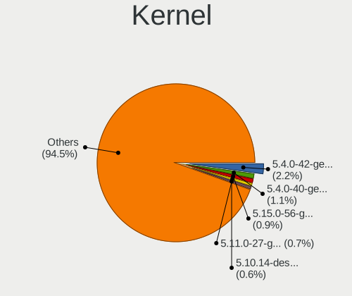

| Version                  | Notebooks | Percent |
|--------------------------|-----------|---------|
| 5.4.0-42-generic         | 112       | 3.13%   |
| 5.4.0-40-generic         | 54        | 1.51%   |
| 5.15.0-56-generic        | 44        | 1.23%   |
| 5.11.0-27-generic        | 33        | 0.92%   |
| 5.10.14-desktop-1omv4002 | 33        | 0.92%   |
| 5.4.0-48-generic         | 30        | 0.84%   |
| 5.4.0-26-generic         | 30        | 0.84%   |
| 5.4.0-47-generic         | 29        | 0.81%   |
| 5.11.0-7620-generic      | 28        | 0.78%   |
| 5.4.0-58-generic         | 27        | 0.75%   |
| 5.16.7-desktop-1omv4003  | 27        | 0.75%   |
| 5.4.0-52-generic         | 26        | 0.73%   |
| 5.4.0-29-generic         | 24        | 0.67%   |
| 5.3.0-28-generic         | 24        | 0.67%   |
| 5.15.0-58-generic        | 23        | 0.64%   |
| 5.11.0-40-generic        | 23        | 0.64%   |
| 5.4.0-45-generic         | 22        | 0.61%   |
| 5.11.0-43-generic        | 22        | 0.61%   |
| 5.11.0-25-generic        | 22        | 0.61%   |
| 5.8.0-53-generic         | 21        | 0.59%   |
| 5.8.0-44-generic         | 21        | 0.59%   |
| 5.8.0-43-generic         | 21        | 0.59%   |
| 5.15.0-52-generic        | 21        | 0.59%   |
| 5.15.0-46-generic        | 21        | 0.59%   |
| 5.11.0-38-generic        | 21        | 0.59%   |
| 5.8.0-55-generic         | 20        | 0.56%   |
| 5.8.0-48-generic         | 20        | 0.56%   |
| 5.4.0-37-generic         | 20        | 0.56%   |
| 5.3.0-40-generic         | 20        | 0.56%   |
| 5.4.0-74-generic         | 19        | 0.53%   |
| 5.11.0-37-generic        | 19        | 0.53%   |
| 5.4.0-39-generic         | 18        | 0.5%    |
| 5.19.0-41-generic        | 18        | 0.5%    |
| 5.13.0-30-generic        | 18        | 0.5%    |
| 4.15.0-45-generic        | 18        | 0.5%    |
| 5.8.0-7630-generic       | 17        | 0.47%   |
| 5.3.0-51-generic         | 17        | 0.47%   |
| 5.13.0-40-generic        | 17        | 0.47%   |
| 5.0.0-37-generic         | 17        | 0.47%   |
| 5.15.0-48-generic        | 16        | 0.45%   |

Kernel Family
-------------

Linux kernel without a distro release

| Version | Notebooks | Percent |
|---------|-----------|---------|
| 5.4.0   | 647       | 18.87%  |
| 5.15.0  | 281       | 8.19%   |
| 5.11.0  | 260       | 7.58%   |
| 5.8.0   | 229       | 6.68%   |
| 4.15.0  | 153       | 4.46%   |
| 5.13.0  | 151       | 4.4%    |
| 5.3.0   | 144       | 4.2%    |
| 5.19.0  | 120       | 3.5%    |
| 5.0.0   | 91        | 2.65%   |
| 4.18.0  | 64        | 1.87%   |
| 5.10.0  | 55        | 1.6%    |
| 5.10.14 | 33        | 0.96%   |
| 5.16.7  | 28        | 0.82%   |
| 6.2.6   | 26        | 0.76%   |
| 5.14.0  | 24        | 0.7%    |
| 4.4.0   | 19        | 0.55%   |
| 5.17.5  | 18        | 0.52%   |
| 6.0.12  | 17        | 0.5%    |
| 6.1.0   | 15        | 0.44%   |
| 6.0.0   | 15        | 0.44%   |
| 4.19.0  | 15        | 0.44%   |
| 6.2.0   | 13        | 0.38%   |
| 6.1.1   | 13        | 0.38%   |
| 6.0.8   | 13        | 0.38%   |
| 6.0.6   | 12        | 0.35%   |
| 5.9.0   | 11        | 0.32%   |
| 5.7.0   | 11        | 0.32%   |
| 6.3.5   | 10        | 0.29%   |
| 5.18.0  | 10        | 0.29%   |
| 5.15.11 | 10        | 0.29%   |
| 6.0.9   | 8         | 0.23%   |
| 5.17.4  | 8         | 0.23%   |
| 5.16.11 | 8         | 0.23%   |
| 5.15.5  | 8         | 0.23%   |
| 5.13.9  | 8         | 0.23%   |
| 5.13.12 | 8         | 0.23%   |
| 6.2.8   | 7         | 0.2%    |
| 6.2.11  | 7         | 0.2%    |
| 6.1.9   | 7         | 0.2%    |
| 5.6.0   | 7         | 0.2%    |

Kernel Major Ver.
-----------------

Linux kernel major version

| Version | Notebooks | Percent |
|---------|-----------|---------|
| 5.4     | 673       | 19.87%  |
| 5.15    | 377       | 11.13%  |
| 5.11    | 292       | 8.62%   |
| 5.8     | 276       | 8.15%   |
| 5.13    | 191       | 5.64%   |
| 5.19    | 165       | 4.87%   |
| 5.3     | 164       | 4.84%   |
| 4.15    | 153       | 4.52%   |
| 5.10    | 143       | 4.22%   |
| 6.0     | 96        | 2.83%   |
| 5.0     | 93        | 2.75%   |
| 6.2     | 84        | 2.48%   |
| 5.16    | 79        | 2.33%   |
| 6.1     | 75        | 2.21%   |
| 5.17    | 69        | 2.04%   |
| 4.18    | 66        | 1.95%   |
| 5.14    | 56        | 1.65%   |
| 5.18    | 50        | 1.48%   |
| 5.12    | 45        | 1.33%   |
| 5.9     | 43        | 1.27%   |
| 5.7     | 40        | 1.18%   |
| 6.3     | 32        | 0.94%   |
| 5.6     | 27        | 0.8%    |
| 5.5     | 22        | 0.65%   |
| 4.19    | 21        | 0.62%   |
| 4.4     | 20        | 0.59%   |
| 4.9     | 11        | 0.32%   |
| 5.2     | 6         | 0.18%   |
| 5.1     | 3         | 0.09%   |
| 3.16    | 3         | 0.09%   |
| 3.10    | 3         | 0.09%   |
| 4.13    | 2         | 0.06%   |
| 4.1     | 2         | 0.06%   |
| 4.20    | 1         | 0.03%   |
| 4.17    | 1         | 0.03%   |
| 4.16    | 1         | 0.03%   |
| 4.12    | 1         | 0.03%   |
| 4.10    | 1         | 0.03%   |

Arch
----

OS architecture (x86_64, i586, etc.)

| Name   | Notebooks | Percent |
|--------|-----------|---------|
| x86_64 | 3054      | 98.8%   |
| i686   | 36        | 1.16%   |
| armv7l | 1         | 0.03%   |

DE
--

Desktop Environment

| Name              | Notebooks | Percent |
|-------------------|-----------|---------|
| GNOME             | 1885      | 58.61%  |
| KDE5              | 371       | 11.54%  |
| Unknown           | 319       | 9.92%   |
| XFCE              | 151       | 4.7%    |
| X-Cinnamon        | 121       | 3.76%   |
| KDE               | 75        | 2.33%   |
| Unity             | 45        | 1.4%    |
| Pantheon          | 43        | 1.34%   |
| MATE              | 31        | 0.96%   |
| Cinnamon          | 30        | 0.93%   |
| GNOME Flashback   | 21        | 0.65%   |
| Budgie            | 21        | 0.65%   |
| i3                | 20        | 0.62%   |
| LXQt              | 12        | 0.37%   |
| LXDE              | 10        | 0.31%   |
| Deepin            | 9         | 0.28%   |
| awesome           | 9         | 0.28%   |
| KDE4              | 7         | 0.22%   |
| bspwm             | 7         | 0.22%   |
| Hyprland          | 6         | 0.19%   |
| qtile             | 4         | 0.12%   |
| Sway              | 3         | 0.09%   |
| LeftWM            | 3         | 0.09%   |
| xmonad            | 2         | 0.06%   |
| Openbox           | 2         | 0.06%   |
| lightdm-xsession  | 2         | 0.06%   |
| dwm               | 2         | 0.06%   |
| Yaru:ubuntu:GNOME | 1         | 0.03%   |
| i3-with-shmlog    | 1         | 0.03%   |
| i3-gaps           | 1         | 0.03%   |
| GNOME Classic     | 1         | 0.03%   |
| chadwm            | 1         | 0.03%   |

Display Server
--------------

X11 or Wayland

| Name    | Notebooks | Percent |
|---------|-----------|---------|
| X11     | 2339      | 73.48%  |
| Wayland | 611       | 19.2%   |
| Unknown | 203       | 6.38%   |
| Tty     | 30        | 0.94%   |

Display Manager
---------------

SDDM, LightDM, etc.

| Name    | Notebooks | Percent |
|---------|-----------|---------|
| Unknown | 1558      | 48.66%  |
| GDM     | 598       | 18.68%  |
| GDM3    | 391       | 12.21%  |
| SDDM    | 335       | 10.46%  |
| LightDM | 220       | 6.87%   |
| TDM     | 79        | 2.47%   |
| XDM     | 7         | 0.22%   |
| KDM     | 6         | 0.19%   |
| LXDM    | 4         | 0.12%   |
| SLiM    | 2         | 0.06%   |
| Ly      | 2         | 0.06%   |

OS Lang
-------

Language

| Lang    | Notebooks | Percent |
|---------|-----------|---------|
| en_IN   | 1932      | 60.43%  |
| en_US   | 878       | 27.46%  |
| Unknown | 254       | 7.94%   |
| en_GB   | 57        | 1.78%   |
| C       | 47        | 1.47%   |
| en_AG   | 8         | 0.25%   |
| en_CA   | 3         | 0.09%   |
| zh_TW   | 2         | 0.06%   |
| POSIX   | 2         | 0.06%   |
| mr_IN   | 2         | 0.06%   |
| en_IE   | 2         | 0.06%   |
| en_AU   | 2         | 0.06%   |
| pl_PL   | 1         | 0.03%   |
| ks_IN   | 1         | 0.03%   |
| es_ES   | 1         | 0.03%   |
| en_SG   | 1         | 0.03%   |
| en_BW   | 1         | 0.03%   |
| Default | 1         | 0.03%   |
| C.UTF8  | 1         | 0.03%   |
| aa_DJ   | 1         | 0.03%   |

Boot Mode
---------

EFI or BIOS

| Mode | Notebooks | Percent |
|------|-----------|---------|
| EFI  | 1959      | 62.29%  |
| BIOS | 1186      | 37.71%  |

Filesystem
----------

Type of filesystem

| Type    | Notebooks | Percent |
|---------|-----------|---------|
| Ext4    | 2562      | 80.85%  |
| Btrfs   | 315       | 9.94%   |
| Overlay | 126       | 3.98%   |
| Unknown | 59        | 1.86%   |
| Xfs     | 36        | 1.14%   |
| Tmpfs   | 32        | 1.01%   |
| Zfs     | 16        | 0.5%    |
| F2fs    | 9         | 0.28%   |
| Ext2    | 7         | 0.22%   |
| Ext3    | 6         | 0.19%   |
| Aufs    | 1         | 0.03%   |

Part. scheme
------------

Scheme of partitioning

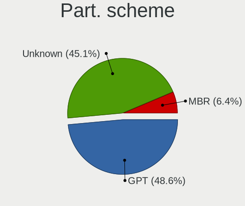

| Type    | Notebooks | Percent |
|---------|-----------|---------|
| Unknown | 1648      | 52.33%  |
| GPT     | 1271      | 40.36%  |
| MBR     | 230       | 7.3%    |

Dual Boot with Linux/BSD
------------------------

Hosting more than one Linux/BSD

| Dual boot | Notebooks | Percent |
|-----------|-----------|---------|
| No        | 2767      | 88.12%  |
| Yes       | 373       | 11.88%  |

Dual Boot (Win)
---------------

Hosting Linux and Windows

| Dual boot | Notebooks | Percent |
|-----------|-----------|---------|
| No        | 1872      | 59.69%  |
| Yes       | 1264      | 40.31%  |

Board
-----

Vendor
------

Motherboard manufacturer

| Name                           | Notebooks | Percent |
|--------------------------------|-----------|---------|
| Lenovo                         | 758       | 24.53%  |
| Dell                           | 700       | 22.65%  |
| Hewlett-Packard                | 688       | 22.27%  |
| ASUSTek Computer               | 380       | 12.3%   |
| Acer                           | 248       | 8.03%   |
| Sony                           | 49        | 1.59%   |
| MSI                            | 47        | 1.52%   |
| Toshiba                        | 34        | 1.1%    |
| Timi                           | 25        | 0.81%   |
| Samsung Electronics            | 25        | 0.81%   |
| Apple                          | 25        | 0.81%   |
| AVITA                          | 19        | 0.61%   |
| HCL Infosystems Limited        | 8         | 0.26%   |
| HUAWEI                         | 7         | 0.23%   |
| HONOR                          | 7         | 0.23%   |
| Fujitsu                        | 7         | 0.23%   |
| LG Electronics                 | 5         | 0.16%   |
| Intel                          | 5         | 0.16%   |
| Google                         | 5         | 0.16%   |
| Unknown                        | 5         | 0.16%   |
| Gateway                        | 4         | 0.13%   |
| eMachines                      | 4         | 0.13%   |
| Alienware                      | 4         | 0.13%   |
| Valve                          | 3         | 0.1%    |
| realme                         | 3         | 0.1%    |
| Razer                          | 2         | 0.06%   |
| MICROMAX                       | 2         | 0.06%   |
| ITI LIMITED                    | 2         | 0.06%   |
| Dynabook                       | 2         | 0.06%   |
| Coconics Private Limited       | 2         | 0.06%   |
| WIPRO                          | 1         | 0.03%   |
| System76                       | 1         | 0.03%   |
| SmbiosType1_SystemManufacturer | 1         | 0.03%   |
| RDP                            | 1         | 0.03%   |
| ONDA                           | 1         | 0.03%   |
| Notebook                       | 1         | 0.03%   |
| NEC Computers                  | 1         | 0.03%   |
| Infinix                        | 1         | 0.03%   |
| iBall                          | 1         | 0.03%   |
| HASEE Computer                 | 1         | 0.03%   |

Model
-----

Motherboard model

| Name                                 | Notebooks | Percent |
|--------------------------------------|-----------|---------|
| HP Notebook                          | 74        | 2.39%   |
| HP 15                                | 31        | 1%      |
| HP Pavilion 15                       | 30        | 0.97%   |
| HP Pavilion g6                       | 27        | 0.87%   |
| Dell Inspiron 3542                   | 26        | 0.84%   |
| Dell Inspiron 15-3567                | 22        | 0.71%   |
| Lenovo E41-25 81FS                   | 21        | 0.68%   |
| HP Laptop 15-bs0xx                   | 21        | 0.68%   |
| Dell Inspiron 5570                   | 20        | 0.65%   |
| Unknown                              | 19        | 0.61%   |
| Lenovo IdeaPad 330-15IKB 81DE        | 18        | 0.58%   |
| Dell Inspiron 3521                   | 18        | 0.58%   |
| ASUS TUF Gaming FX505DT_FX505DT      | 17        | 0.55%   |
| HP Pavilion Notebook                 | 16        | 0.52%   |
| Acer Aspire A715-75G                 | 16        | 0.52%   |
| Lenovo G50-80 80E5                   | 15        | 0.49%   |
| Dell Vostro 3480                     | 15        | 0.49%   |
| Dell Vostro 15-3568                  | 15        | 0.49%   |
| HP Laptop 15-da0xxx                  | 13        | 0.42%   |
| Dell Vostro 3578                     | 13        | 0.42%   |
| HP Pavilion Gaming Laptop 15-ec2xxx  | 12        | 0.39%   |
| Dell Inspiron 5559                   | 12        | 0.39%   |
| ASUS X510UNR                         | 12        | 0.39%   |
| Lenovo IdeaPad 320-15ISK 80XH        | 11        | 0.36%   |
| Lenovo G50-45 80E3                   | 11        | 0.36%   |
| HP Laptop 15-bw0xx                   | 11        | 0.36%   |
| Dell Inspiron N5010                  | 11        | 0.36%   |
| Dell Inspiron 1545                   | 11        | 0.36%   |
| ASUS VivoBook 15_ASUS Laptop X507UAR | 11        | 0.36%   |
| ASUS TUF Gaming FX505DY_FX505DY      | 11        | 0.36%   |
| HP Pavilion Laptop 14-dv0xxx         | 10        | 0.32%   |
| HP Pavilion dv6                      | 10        | 0.32%   |
| Dell Vostro 3478                     | 10        | 0.32%   |
| AVITA NS14A8                         | 10        | 0.32%   |
| ASUS X556UQK                         | 10        | 0.32%   |
| Lenovo ThinkBook 14-IML 20RV         | 9         | 0.29%   |
| Lenovo IdeaPad S540-15IWL D 81NE     | 9         | 0.29%   |
| Lenovo IdeaPad 520-15IKB 81BF        | 9         | 0.29%   |
| Lenovo IdeaPad 320-15IKB 80XL        | 9         | 0.29%   |
| HP Pavilion Gaming Laptop 15-ec0xxx  | 9         | 0.29%   |

Model Family
------------

Motherboard model prefix

| Name              | Notebooks | Percent |
|-------------------|-----------|---------|
| Dell Inspiron     | 334       | 10.81%  |
| Lenovo ThinkPad   | 264       | 8.54%   |
| Lenovo IdeaPad    | 264       | 8.54%   |
| HP Pavilion       | 195       | 6.31%   |
| HP Laptop         | 158       | 5.11%   |
| ASUS VivoBook     | 150       | 4.85%   |
| Dell Latitude     | 147       | 4.76%   |
| Acer Aspire       | 143       | 4.63%   |
| Dell Vostro       | 133       | 4.3%    |
| HP Notebook       | 75        | 2.43%   |
| HP EliteBook      | 53        | 1.72%   |
| HP ProBook        | 47        | 1.52%   |
| ASUS ASUS         | 44        | 1.42%   |
| ASUS TUF          | 42        | 1.36%   |
| Acer Nitro        | 35        | 1.13%   |
| ASUS ROG          | 33        | 1.07%   |
| Lenovo Legion     | 32        | 1.04%   |
| HP 15             | 32        | 1.04%   |
| Dell XPS          | 30        | 0.97%   |
| Toshiba Satellite | 29        | 0.94%   |
| Lenovo ThinkBook  | 28        | 0.91%   |
| Acer Swift        | 27        | 0.87%   |
| Lenovo E41-25     | 21        | 0.68%   |
| Dell Precision    | 21        | 0.68%   |
| Unknown           | 19        | 0.61%   |
| Timi Mi           | 16        | 0.52%   |
| Acer Predator     | 16        | 0.52%   |
| Lenovo G50-80     | 15        | 0.49%   |
| HP OMEN           | 15        | 0.49%   |
| HP 245            | 14        | 0.45%   |
| Dell G3           | 14        | 0.45%   |
| ASUS ZenBook      | 14        | 0.45%   |
| ASUS X510UNR      | 12        | 0.39%   |
| MSI GF63          | 11        | 0.36%   |
| Lenovo G50-45     | 11        | 0.36%   |
| HP ENVY           | 10        | 0.32%   |
| HP Compaq         | 10        | 0.32%   |
| AVITA NS14A8      | 10        | 0.32%   |
| ASUS X556UQK      | 10        | 0.32%   |
| HP ZBook          | 9         | 0.29%   |

MFG Year
--------

Motherboard manufacture year

| Year    | Notebooks | Percent |
|---------|-----------|---------|
| 2019    | 438       | 14.17%  |
| 2018    | 407       | 13.17%  |
| 2020    | 350       | 11.33%  |
| 2021    | 293       | 9.48%   |
| 2017    | 263       | 8.51%   |
| 2016    | 194       | 6.28%   |
| 2011    | 184       | 5.95%   |
| 2013    | 179       | 5.79%   |
| 2012    | 168       | 5.44%   |
| 2014    | 166       | 5.37%   |
| 2015    | 142       | 4.6%    |
| 2010    | 104       | 3.37%   |
| 2022    | 93        | 3.01%   |
| 2008    | 50        | 1.62%   |
| 2009    | 38        | 1.23%   |
| 2007    | 10        | 0.32%   |
| 2023    | 6         | 0.19%   |
| 2006    | 2         | 0.06%   |
| 2005    | 1         | 0.03%   |
| 2003    | 1         | 0.03%   |
| Unknown | 1         | 0.03%   |

Form Factor
-----------

Physical design of the computer

| Name     | Notebooks | Percent |
|----------|-----------|---------|
| Notebook | 3090      | 100%    |

Secure Boot
-----------

Enabled or disabled

| State    | Notebooks | Percent |
|----------|-----------|---------|
| Disabled | 2655      | 85.12%  |
| Enabled  | 464       | 14.88%  |

Coreboot
--------

Have coreboot on board

| Used | Notebooks | Percent |
|------|-----------|---------|
| No   | 3079      | 99.64%  |
| Yes  | 11        | 0.36%   |

RAM Size
--------

Total RAM memory

| Size in GB  | Notebooks | Percent |
|-------------|-----------|---------|
| 4.01-8.0    | 1122      | 35.84%  |
| 3.01-4.0    | 687       | 21.94%  |
| 8.01-16.0   | 623       | 19.9%   |
| 16.01-24.0  | 487       | 15.55%  |
| 1.01-2.0    | 86        | 2.75%   |
| 32.01-64.0  | 74        | 2.36%   |
| 2.01-3.0    | 25        | 0.8%    |
| 24.01-32.0  | 14        | 0.45%   |
| 64.01-256.0 | 6         | 0.19%   |
| 0.51-1.0    | 6         | 0.19%   |
| 0.01-0.5    | 1         | 0.03%   |

RAM Used
--------

Used RAM memory

| Used GB    | Notebooks | Percent |
|------------|-----------|---------|
| 2.01-3.0   | 1079      | 31.89%  |
| 1.01-2.0   | 1000      | 29.56%  |
| 4.01-8.0   | 540       | 15.96%  |
| 3.01-4.0   | 537       | 15.87%  |
| 8.01-16.0  | 111       | 3.28%   |
| 0.51-1.0   | 98        | 2.9%    |
| 0.01-0.5   | 12        | 0.35%   |
| 16.01-24.0 | 4         | 0.12%   |
| 24.01-32.0 | 2         | 0.06%   |

Total Drives
------------

Number of drives on board

| Drives | Notebooks | Percent |
|--------|-----------|---------|
| 1      | 2328      | 74.5%   |
| 2      | 735       | 23.52%  |
| 3      | 39        | 1.25%   |
| 0      | 22        | 0.7%    |
| 5      | 1         | 0.03%   |

Has CD-ROM
----------

Has CD-ROM on board

| Presented | Notebooks | Percent |
|-----------|-----------|---------|
| No        | 2038      | 65.51%  |
| Yes       | 1073      | 34.49%  |

Has Ethernet
------------

Has Ethernet on board

| Presented | Notebooks | Percent |
|-----------|-----------|---------|
| Yes       | 2505      | 80.91%  |
| No        | 591       | 19.09%  |

Has WiFi
--------

Has WiFi module

| Presented | Notebooks | Percent |
|-----------|-----------|---------|
| Yes       | 3059      | 98.93%  |
| No        | 33        | 1.07%   |

Has Bluetooth
-------------

Has Bluetooth module

| Presented | Notebooks | Percent |
|-----------|-----------|---------|
| Yes       | 2732      | 87.51%  |
| No        | 390       | 12.49%  |

Location
--------

Country
-------

Geographic location (country)

| Country | Notebooks | Percent |
|---------|-----------|---------|
| India   | 3090      | 100%    |

City
----

Geographic location (city)

| City          | Notebooks | Percent |
|---------------|-----------|---------|
| Bengaluru     | 391       | 11.79%  |
| Chennai       | 205       | 6.18%   |
| Mumbai        | 202       | 6.09%   |
| Delhi         | 178       | 5.37%   |
| Pune          | 173       | 5.22%   |
| Hyderabad     | 170       | 5.13%   |
| New Delhi     | 147       | 4.43%   |
| Kolkata       | 128       | 3.86%   |
| Ahmedabad     | 75        | 2.26%   |
| Lucknow       | 68        | 2.05%   |
| Ernakulam     | 58        | 1.75%   |
| Patna         | 55        | 1.66%   |
| Jaipur        | 54        | 1.63%   |
| Gurgaon       | 53        | 1.6%    |
| Coimbatore    | 45        | 1.36%   |
| Indore        | 41        | 1.24%   |
| Navi Mumbai   | 38        | 1.15%   |
| Kochi         | 36        | 1.09%   |
| Bhopal        | 36        | 1.09%   |
| Trivandrum    | 35        | 1.06%   |
| Thrissur      | 31        | 0.94%   |
| Surat         | 29        | 0.87%   |
| Ludhiana      | 29        | 0.87%   |
| Guwahati      | 28        | 0.84%   |
| Malappuram    | 27        | 0.81%   |
| Nagpur        | 25        | 0.75%   |
| Bhubaneswar   | 22        | 0.66%   |
| Noida         | 21        | 0.63%   |
| Ghaziabad     | 18        | 0.54%   |
| Visakhapatnam | 17        | 0.51%   |
| Thane         | 17        | 0.51%   |
| Mohali        | 16        | 0.48%   |
| Chandigarh    | 16        | 0.48%   |
| Mangalore     | 15        | 0.45%   |
| Kanpur        | 14        | 0.42%   |
| Tiruchi       | 13        | 0.39%   |
| Kozhikode     | 13        | 0.39%   |
| Dehradun      | 13        | 0.39%   |
| Vadodara      | 12        | 0.36%   |
| Mysore        | 12        | 0.36%   |

Drives
------

Drive Vendor
------------

Hard drive vendors

| Vendor                      | Notebooks | Drives | Percent |
|-----------------------------|-----------|--------|---------|
| Seagate                     | 734       | 890    | 19.48%  |
| WDC                         | 643       | 765    | 17.06%  |
| Toshiba                     | 421       | 477    | 11.17%  |
| Samsung Electronics         | 389       | 475    | 10.32%  |
| SanDisk                     | 172       | 215    | 4.56%   |
| SK hynix                    | 170       | 194    | 4.51%   |
| Intel                       | 154       | 200    | 4.09%   |
| HGST                        | 152       | 168    | 4.03%   |
| Crucial                     | 140       | 168    | 3.72%   |
| Kingston                    | 135       | 160    | 3.58%   |
| Micron Technology           | 115       | 130    | 3.05%   |
| Hitachi                     | 75        | 89     | 1.99%   |
| Unknown                     | 72        | 89     | 1.91%   |
| KIOXIA                      | 67        | 77     | 1.78%   |
| China                       | 27        | 32     | 0.72%   |
| A-DATA Technology           | 24        | 25     | 0.64%   |
| FORESEE                     | 18        | 20     | 0.48%   |
| Unknown                     | 16        | 19     | 0.42%   |
| Micron/Crucial Technology   | 15        | 16     | 0.4%    |
| Apple                       | 15        | 19     | 0.4%    |
| UMIS                        | 14        | 17     | 0.37%   |
| LITEON                      | 14        | 18     | 0.37%   |
| Silicon Motion              | 13        | 16     | 0.35%   |
| Phison                      | 10        | 11     | 0.27%   |
| Hewlett-Packard             | 9         | 13     | 0.24%   |
| Fujitsu                     | 9         | 9      | 0.24%   |
| Kingston Technology Company | 8         | 9      | 0.21%   |
| Acer                        | 8         | 8      | 0.21%   |
| Gigabyte Technology         | 6         | 7      | 0.16%   |
| YMTC                        | 5         | 5      | 0.13%   |
| Union Memory (Shenzhen)     | 5         | 5      | 0.13%   |
| TO Exter                    | 4         | 4      | 0.11%   |
| SPCC                        | 4         | 5      | 0.11%   |
| Realtek Semiconductor       | 4         | 7      | 0.11%   |
| PNY                         | 4         | 6      | 0.11%   |
| Netac                       | 4         | 4      | 0.11%   |
| Maxtor                      | 4         | 6      | 0.11%   |
| Lexar                       | 4         | 4      | 0.11%   |
| External                    | 4         | 6      | 0.11%   |
| EVM                         | 4         | 5      | 0.11%   |

Drive Model
-----------

Hard drive models

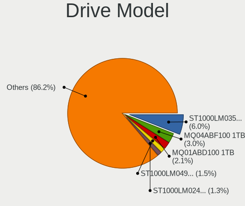

| Model                               | Notebooks | Percent |
|-------------------------------------|-----------|---------|
| Seagate ST1000LM035-1RK172 1TB      | 272       | 7.03%   |
| Toshiba MQ04ABF100 1TB              | 141       | 3.65%   |
| Toshiba MQ01ABD100 1TB              | 104       | 2.69%   |
| Seagate ST1000LM049-2GH172 1TB      | 65        | 1.68%   |
| Seagate ST500LT012-1DG142 500GB     | 57        | 1.47%   |
| Seagate ST1000LM024 HN-M101MBB 1TB  | 54        | 1.4%    |
| Intel NVMe SSD Drive 512GB          | 48        | 1.24%   |
| Crucial CT240BX500SSD1 240GB        | 48        | 1.24%   |
| Toshiba MQ01ABF050 500GB            | 41        | 1.06%   |
| HGST HTS541010A9E680 1TB            | 39        | 1.01%   |
| Intel SSDPEKNW512G8 512GB           | 37        | 0.96%   |
| SanDisk NVMe SSD Drive 256GB        | 36        | 0.93%   |
| WDC WD10SPZX-60Z10T0 1TB            | 35        | 0.9%    |
| SanDisk NVMe SSD Drive 512GB        | 35        | 0.9%    |
| Samsung NVMe SSD Drive 512GB        | 33        | 0.85%   |
| WDC WDS240G2G0A-00JH30 240GB SSD    | 32        | 0.83%   |
| Seagate ST9500325AS 500GB           | 32        | 0.83%   |
| Seagate ST2000LM007-1R8174 2TB      | 32        | 0.83%   |
| Seagate ST1000LM048-2E7172 1TB      | 32        | 0.83%   |
| WDC WD10SPZX-24Z10 1TB              | 31        | 0.8%    |
| SK hynix NVMe SSD Drive 512GB       | 29        | 0.75%   |
| Kingston SA400S37240G 240GB SSD     | 29        | 0.75%   |
| WDC WD10JPVX-60JC3T1 1TB            | 27        | 0.7%    |
| HGST HTS721010A9E630 1TB            | 27        | 0.7%    |
| WDC WD10SPZX-21Z10T0 1TB            | 25        | 0.65%   |
| Samsung NVMe SSD Drive 256GB        | 23        | 0.59%   |
| Seagate ST500LT012-9WS142 500GB     | 21        | 0.54%   |
| HGST HTS545050A7E680 500GB          | 21        | 0.54%   |
| KIOXIA KBG40ZNS512G NVMe 512GB      | 20        | 0.52%   |
| Crucial CT480BX500SSD1 480GB        | 20        | 0.52%   |
| WDC WDS240G2G0B-00EPW0 240GB SSD    | 19        | 0.49%   |
| WDC WD5000LPVX-75V0TT0 500GB        | 19        | 0.49%   |
| HGST HTS545050A7E380 500GB          | 19        | 0.49%   |
| WDC WD10SPZX-24Z10T0 1TB            | 17        | 0.44%   |
| WDC WD10JPCX-24UE4T0 1TB            | 17        | 0.44%   |
| Seagate ST500LM012 HN-M500MBB 500GB | 17        | 0.44%   |
| Micron 2450_MTFDKBA512TFK 512GB     | 17        | 0.44%   |
| WDC WD10SPZX-08Z10 1TB              | 16        | 0.41%   |
| WDC WD10JPVX-75JC3T0 1TB            | 16        | 0.41%   |
| WDC WD10JPVX-60JC3T0 1TB            | 16        | 0.41%   |

HDD Vendor
----------

Hard disk drive vendors

| Vendor              | Notebooks | Drives | Percent |
|---------------------|-----------|--------|---------|
| Seagate             | 727       | 881    | 40.21%  |
| WDC                 | 448       | 520    | 24.78%  |
| Toshiba             | 375       | 417    | 20.74%  |
| HGST                | 152       | 168    | 8.41%   |
| Hitachi             | 75        | 89     | 4.15%   |
| Fujitsu             | 9         | 9      | 0.5%    |
| Unknown             | 7         | 7      | 0.39%   |
| Samsung Electronics | 7         | 7      | 0.39%   |
| Apple               | 4         | 4      | 0.22%   |
| Hewlett-Packard     | 2         | 3      | 0.11%   |
| StoreJet            | 1         | 1      | 0.06%   |
| MARSHAL             | 1         | 1      | 0.06%   |

SSD Vendor
----------

Solid state drive vendors

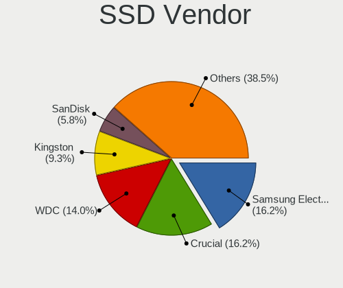

| Vendor              | Notebooks | Drives | Percent |
|---------------------|-----------|--------|---------|
| Samsung Electronics | 135       | 153    | 17.86%  |
| Crucial             | 127       | 155    | 16.8%   |
| WDC                 | 98        | 112    | 12.96%  |
| Kingston            | 80        | 100    | 10.58%  |
| SanDisk             | 47        | 64     | 6.22%   |
| SK hynix            | 34        | 36     | 4.5%    |
| China               | 26        | 31     | 3.44%   |
| Micron Technology   | 24        | 29     | 3.17%   |
| A-DATA Technology   | 19        | 20     | 2.51%   |
| FORESEE             | 17        | 19     | 2.25%   |
| Intel               | 15        | 16     | 1.98%   |
| LITEON              | 12        | 16     | 1.59%   |
| Toshiba             | 10        | 10     | 1.32%   |
| Unknown             | 9         | 9      | 1.19%   |
| Apple               | 8         | 9      | 1.06%   |
| Acer                | 7         | 7      | 0.93%   |
| Seagate             | 6         | 6      | 0.79%   |
| Hewlett-Packard     | 6         | 9      | 0.79%   |
| Gigabyte Technology | 6         | 7      | 0.79%   |
| Unknown             | 4         | 4      | 0.53%   |
| TO Exter            | 4         | 4      | 0.53%   |
| PNY                 | 4         | 6      | 0.53%   |
| Netac               | 4         | 4      | 0.53%   |
| Maxtor              | 4         | 6      | 0.53%   |
| Lexar               | 4         | 4      | 0.53%   |
| External            | 4         | 6      | 0.53%   |
| EVM                 | 4         | 5      | 0.53%   |
| Transcend           | 3         | 3      | 0.4%    |
| Team                | 2         | 2      | 0.26%   |
| SPCC                | 2         | 3      | 0.26%   |
| OSCOO               | 2         | 4      | 0.26%   |
| KLEVV               | 2         | 3      | 0.26%   |
| BIWIN               | 2         | 2      | 0.26%   |
| Aarvex              | 2         | 3      | 0.26%   |
| Zebronics           | 1         | 1      | 0.13%   |
| W800S               | 1         | 1      | 0.13%   |
| Unknown (690)       | 1         | 1      | 0.13%   |
| StoreJet            | 1         | 1      | 0.13%   |
| Secureye            | 1         | 1      | 0.13%   |
| Phison              | 1         | 1      | 0.13%   |

Drive Kind
----------

HDD or SSD

| Kind    | Notebooks | Drives | Percent |
|---------|-----------|--------|---------|
| HDD     | 1786      | 2107   | 48.32%  |
| NVMe    | 1094      | 1380   | 29.6%   |
| SSD     | 733       | 892    | 19.83%  |
| MMC     | 57        | 72     | 1.54%   |
| Unknown | 26        | 33     | 0.7%    |

Drive Connector
---------------

SATA, SAS, NVMe, etc.

| Type | Notebooks | Drives | Percent |
|------|-----------|--------|---------|
| SATA | 2243      | 2959   | 64.88%  |
| NVMe | 1094      | 1380   | 31.65%  |
| SAS  | 63        | 73     | 1.82%   |
| MMC  | 57        | 72     | 1.65%   |

Drive Size
----------

Size of hard drive

| Size in TB | Notebooks | Drives | Percent |
|------------|-----------|--------|---------|
| 0.01-0.5   | 1243      | 1529   | 50.06%  |
| 0.51-1.0   | 1185      | 1410   | 47.72%  |
| 1.01-2.0   | 49        | 53     | 1.97%   |
| 3.01-4.0   | 3         | 4      | 0.12%   |
| 4.01-10.0  | 3         | 3      | 0.12%   |

Space Total
-----------

Amount of disk space available on the file system

| Size in GB     | Notebooks | Percent |
|----------------|-----------|---------|
| 251-500        | 931       | 28.69%  |
| 101-250        | 853       | 26.29%  |
| 501-1000       | 567       | 17.47%  |
| 51-100         | 296       | 9.12%   |
| 1001-2000      | 178       | 5.49%   |
| 21-50          | 161       | 4.96%   |
| 1-20           | 158       | 4.87%   |
| Unknown        | 51        | 1.57%   |
| 2001-3000      | 27        | 0.83%   |
| More than 3000 | 23        | 0.71%   |

Space Used
----------

Amount of used disk space

| Used GB        | Notebooks | Percent |
|----------------|-----------|---------|
| 1-20           | 1228      | 36.47%  |
| 21-50          | 744       | 22.1%   |
| 101-250        | 479       | 14.23%  |
| 51-100         | 442       | 13.13%  |
| 251-500        | 261       | 7.75%   |
| 501-1000       | 128       | 3.8%    |
| Unknown        | 51        | 1.51%   |
| 1001-2000      | 28        | 0.83%   |
| 2001-3000      | 3         | 0.09%   |
| More than 3000 | 2         | 0.06%   |
| 0              | 1         | 0.03%   |

Malfunc. Drives
---------------

Drive models with a malfunction

| Model                                | Notebooks | Drives | Percent |
|--------------------------------------|-----------|--------|---------|
| Seagate ST1000LM035-1RK172 1TB       | 23        | 24     | 8.88%   |
| HGST HTS541010A9E680 1TB             | 14        | 14     | 5.41%   |
| Toshiba MQ01ABD100 1TB               | 10        | 10     | 3.86%   |
| HGST HTS545050A7E680 500GB           | 10        | 12     | 3.86%   |
| Seagate ST500LT012-1DG142 500GB      | 9         | 9      | 3.47%   |
| Seagate ST1000LM049-2GH172 1TB       | 9         | 11     | 3.47%   |
| Seagate ST9500325AS 500GB            | 8         | 8      | 3.09%   |
| Seagate ST1000LM024 HN-M101MBB 1TB   | 8         | 8      | 3.09%   |
| Toshiba MQ04ABF100 1TB               | 6         | 7      | 2.32%   |
| Seagate ST500LT012-9WS142 500GB      | 6         | 7      | 2.32%   |
| Seagate ST500LM021-1KJ152 500GB      | 6         | 6      | 2.32%   |
| Toshiba MQ01ABF050 500GB             | 5         | 5      | 1.93%   |
| Seagate ST320LT007-9ZV142 320GB      | 4         | 4      | 1.54%   |
| HGST HTS721010A9E630 1TB             | 4         | 4      | 1.54%   |
| HGST HTS545050A7E380 500GB           | 4         | 4      | 1.54%   |
| WDC WD10JPVX-60JC3T1 1TB             | 3         | 3      | 1.16%   |
| SK hynix PC711 HFS512GDE9X073N 512GB | 3         | 3      | 1.16%   |
| Seagate ST9320325AS 320GB            | 3         | 3      | 1.16%   |
| Seagate ST2000LM007-1R8174 2TB       | 3         | 3      | 1.16%   |
| Seagate ST1000LM048-2E7172 1TB       | 3         | 3      | 1.16%   |
| Hitachi HTS547575A9E384 752GB        | 3         | 3      | 1.16%   |
| HGST HTS725050A7E630 500GB           | 3         | 3      | 1.16%   |
| WDC WDS480G2G0A-00JH30 480GB SSD     | 2         | 2      | 0.77%   |
| WDC WD5000LPVX-75V0TT0 500GB         | 2         | 2      | 0.77%   |
| WDC WD5000LPVT-22G33T0 500GB         | 2         | 2      | 0.77%   |
| WDC WD10SPZX-24Z10 1TB               | 2         | 2      | 0.77%   |
| WDC WD10JPCX-24UE4T0 1TB             | 2         | 2      | 0.77%   |
| Toshiba MQ01ABD050 500GB             | 2         | 2      | 0.77%   |
| SK hynix BC711 HFM512GD3JX013N 512GB | 2         | 2      | 0.77%   |
| Seagate ST1000LM014-1EJ164 1TB       | 2         | 2      | 0.77%   |
| SanDisk SD9SN8W-128G-1006 128GB SSD  | 2         | 2      | 0.77%   |
| Hitachi HTS545032B9A300 320GB        | 2         | 4      | 0.77%   |
| Hitachi HTS543232A7A384 320GB        | 2         | 2      | 0.77%   |
| Hitachi HTS542516K9SA00 160GB        | 2         | 2      | 0.77%   |
| Crucial CT500P1SSD8 500GB            | 2         | 2      | 0.77%   |
| Unknown                              | 2         | 2      | 0.77%   |
| WDC WDS240G2G0A-00JH30 240GB SSD     | 1         | 1      | 0.39%   |
| WDC WDS120G2G0B-00EPW0 120GB SSD     | 1         | 1      | 0.39%   |
| WDC WD7500BPKT-75PK4T0 752GB         | 1         | 1      | 0.39%   |
| WDC WD5000LPVX-22V0TT0 500GB         | 1         | 1      | 0.39%   |

Malfunc. Drive Vendor
---------------------

Vendors of faulty drives

| Vendor              | Notebooks | Drives | Percent |
|---------------------|-----------|--------|---------|
| Seagate             | 94        | 101    | 36.43%  |
| HGST                | 39        | 41     | 15.12%  |
| WDC                 | 37        | 38     | 14.34%  |
| Toshiba             | 33        | 35     | 12.79%  |
| Hitachi             | 22        | 25     | 8.53%   |
| SK hynix            | 9         | 10     | 3.49%   |
| Samsung Electronics | 6         | 7      | 2.33%   |
| SanDisk             | 4         | 4      | 1.55%   |
| Intel               | 3         | 3      | 1.16%   |
| Crucial             | 2         | 2      | 0.78%   |
| Unknown             | 2         | 2      | 0.78%   |
| Micron Technology   | 1         | 1      | 0.39%   |
| MARSHAL             | 1         | 1      | 0.39%   |
| Leven               | 1         | 1      | 0.39%   |
| Lenovo              | 1         | 2      | 0.39%   |
| China               | 1         | 1      | 0.39%   |
| Apple               | 1         | 1      | 0.39%   |
| A-DATA Technology   | 1         | 1      | 0.39%   |

Malfunc. HDD Vendor
-------------------

Vendors of faulty HDD drives

| Vendor              | Notebooks | Drives | Percent |
|---------------------|-----------|--------|---------|
| Seagate             | 94        | 101    | 41.78%  |
| HGST                | 39        | 41     | 17.33%  |
| WDC                 | 33        | 34     | 14.67%  |
| Toshiba             | 33        | 35     | 14.67%  |
| Hitachi             | 22        | 25     | 9.78%   |
| Samsung Electronics | 2         | 2      | 0.89%   |
| MARSHAL             | 1         | 1      | 0.44%   |
| Apple               | 1         | 1      | 0.44%   |

Malfunc. Drive Kind
-------------------

Kinds of faulty drives

| Kind | Notebooks | Drives | Percent |
|------|-----------|--------|---------|
| HDD  | 225       | 240    | 87.21%  |
| SSD  | 19        | 20     | 7.36%   |
| NVMe | 14        | 16     | 5.43%   |

Failed Drives
-------------

Failed drive models

| Model                               | Notebooks | Drives | Percent |
|-------------------------------------|-----------|--------|---------|
| WDC WD10SPZX-21Z10T0 1TB            | 1         | 1      | 20%     |
| Seagate ST500LT012-1DG142 500GB     | 1         | 1      | 20%     |
| Seagate ST1000LM 024 HN-M101MBB 1TB | 1         | 1      | 20%     |
| Apple HDD HTS545050A7E362 500GB     | 1         | 1      | 20%     |
| Acer SSD FA100 256GB                | 1         | 1      | 20%     |

Failed Drive Vendor
-------------------

Failed drive vendors

| Vendor  | Notebooks | Drives | Percent |
|---------|-----------|--------|---------|
| Seagate | 2         | 2      | 40%     |
| WDC     | 1         | 1      | 20%     |
| Apple   | 1         | 1      | 20%     |
| Acer    | 1         | 1      | 20%     |

Drive Status
------------

Number of failed and malfunc. drives

| Status   | Notebooks | Drives | Percent |
|----------|-----------|--------|---------|
| Detected | 1816      | 2564   | 55.69%  |
| Works    | 1184      | 1639   | 36.31%  |
| Malfunc  | 256       | 276    | 7.85%   |
| Failed   | 5         | 5      | 0.15%   |

Storage controller
------------------

Storage Vendor
--------------

Storage controller vendors

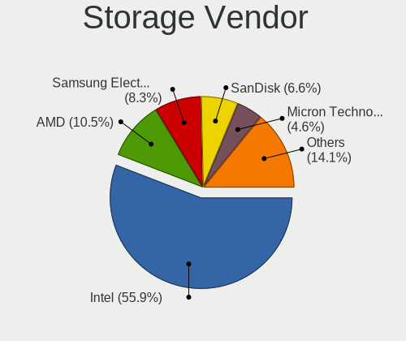

| Vendor                           | Notebooks | Percent |
|----------------------------------|-----------|---------|
| Intel                            | 2334      | 61.7%   |
| AMD                              | 429       | 11.34%  |
| Samsung Electronics              | 262       | 6.93%   |
| SanDisk                          | 226       | 5.97%   |
| SK hynix                         | 135       | 3.57%   |
| Micron Technology                | 91        | 2.41%   |
| KIOXIA                           | 70        | 1.85%   |
| Kingston Technology Company      | 64        | 1.69%   |
| Toshiba America Info Systems     | 46        | 1.22%   |
| Micron/Crucial Technology        | 27        | 0.71%   |
| Union Memory (Shenzhen)          | 23        | 0.61%   |
| Silicon Motion                   | 17        | 0.45%   |
| Phison Electronics               | 10        | 0.26%   |
| Yangtze Memory Technologies      | 7         | 0.19%   |
| Solid State Storage Technology   | 7         | 0.19%   |
| Realtek Semiconductor            | 7         | 0.19%   |
| ADATA Technology                 | 7         | 0.19%   |
| Nvidia                           | 5         | 0.13%   |
| Lite-On Technology               | 4         | 0.11%   |
| Lenovo                           | 3         | 0.08%   |
| Apple                            | 3         | 0.08%   |
| Shenzhen Longsys Electronics     | 2         | 0.05%   |
| Silicon Integrated Systems [SiS] | 1         | 0.03%   |
| Marvell Technology Group         | 1         | 0.03%   |
| INNOGRIT                         | 1         | 0.03%   |
| ASMedia Technology               | 1         | 0.03%   |

Storage Model
-------------

Storage controller models

| Model                                                                          | Notebooks | Percent |
|--------------------------------------------------------------------------------|-----------|---------|
| Intel Sunrise Point-LP SATA Controller [AHCI mode]                             | 447       | 11.18%  |
| AMD FCH SATA Controller [AHCI mode]                                            | 417       | 10.43%  |
| Intel 82801 Mobile SATA Controller [RAID mode]                                 | 304       | 7.61%   |
| Intel 7 Series Chipset Family 6-port SATA Controller [AHCI mode]               | 197       | 4.93%   |
| Intel 8 Series SATA Controller 1 [AHCI mode]                                   | 177       | 4.43%   |
| Intel Volume Management Device NVMe RAID Controller                            | 146       | 3.65%   |
| Intel 6 Series/C200 Series Chipset Family 6 port Mobile SATA AHCI Controller   | 125       | 3.13%   |
| Samsung NVMe SSD Controller 980                                                | 116       | 2.9%    |
| Intel Wildcat Point-LP SATA Controller [AHCI Mode]                             | 116       | 2.9%    |
| Intel Cannon Lake Mobile PCH SATA AHCI Controller                              | 105       | 2.63%   |
| Samsung NVMe SSD Controller SM981/PM981/PM983                                  | 100       | 2.5%    |
| Intel Comet Lake SATA AHCI Controller                                          | 97        | 2.43%   |
| Intel Tiger Lake-LP SATA Controller                                            | 94        | 2.35%   |
| Intel SSD 660P Series                                                          | 94        | 2.35%   |
| Intel Cannon Point-LP SATA Controller [AHCI Mode]                              | 85        | 2.13%   |
| SanDisk WD Blue SN550 NVMe SSD                                                 | 61        | 1.53%   |
| KIOXIA NVMe SSD Controller BG4                                                 | 61        | 1.53%   |
| Intel 5 Series/3400 Series Chipset 4 port SATA AHCI Controller                 | 59        | 1.48%   |
| SanDisk WD Blue SN500 / PC SN520 NVMe SSD                                      | 50        | 1.25%   |
| Micron NVMe Storage Controller                                                 | 48        | 1.2%    |
| Intel 82801IBM/IEM (ICH9M/ICH9M-E) 4 port SATA Controller [AHCI mode]          | 48        | 1.2%    |
| Intel Ice Lake-LP SATA Controller [AHCI mode]                                  | 47        | 1.18%   |
| SK hynix Gold P31/BC711/PC711 NVMe Solid State Drive                           | 46        | 1.15%   |
| SanDisk WD Black SN750 / PC SN730 NVMe SSD                                     | 40        | 1%      |
| SK hynix BC501 NVMe Solid State Drive                                          | 39        | 0.98%   |
| Intel HM170/QM170 Chipset SATA Controller [AHCI Mode]                          | 38        | 0.95%   |
| Intel 8 Series/C220 Series Chipset Family 6-port SATA Controller 1 [AHCI mode] | 36        | 0.9%    |
| Intel 5 Series/3400 Series Chipset 6 port SATA AHCI Controller                 | 33        | 0.83%   |
| Intel 400 Series Chipset Family SATA AHCI Controller                           | 33        | 0.83%   |
| SK hynix BC511 NVMe SSD                                                        | 31        | 0.78%   |
| Toshiba America Info Systems XG6 NVMe SSD Controller                           | 30        | 0.75%   |
| Micron 2450 NVMe SSD (DRAM-less)                                               | 24        | 0.6%    |
| Kingston Company U-SNS8154P3 NVMe SSD                                          | 23        | 0.58%   |
| Samsung NVMe SSD Controller PM9A1/PM9A3/980PRO                                 | 21        | 0.53%   |
| SanDisk PC SN530 NVMe SSD                                                      | 20        | 0.5%    |
| Intel Non-Volatile memory controller                                           | 20        | 0.5%    |
| Union Memory (Shenzhen) Non-Volatile memory controller                         | 19        | 0.48%   |
| Kingston Company Company Non-Volatile memory controller                        | 19        | 0.48%   |
| Intel 82801HM/HEM (ICH8M/ICH8M-E) IDE Controller                               | 17        | 0.43%   |
| Micron 2200S NVMe SSD                                                          | 16        | 0.4%    |

Storage Kind
------------

Kind of storage controller (IDE, SATA, NVMe, SAS, ...)

| Kind | Notebooks | Percent |
|------|-----------|---------|
| SATA | 2287      | 58.34%  |
| NVMe | 1103      | 28.14%  |
| RAID | 462       | 11.79%  |
| IDE  | 68        | 1.73%   |

Processor
---------

CPU Vendor
----------

Processor vendors

| Vendor | Notebooks | Percent |
|--------|-----------|---------|
| Intel  | 2513      | 81.33%  |
| AMD    | 576       | 18.64%  |
| ARM    | 1         | 0.03%   |

CPU Model
---------

Processor models

| Model                                         | Notebooks | Percent |
|-----------------------------------------------|-----------|---------|
| Intel Core i5-8250U CPU @ 1.60GHz             | 177       | 5.73%   |
| Intel Core i5-8265U CPU @ 1.60GHz             | 114       | 3.69%   |
| Intel 11th Gen Core i5-1135G7 @ 2.40GHz       | 91        | 2.94%   |
| Intel Core i5-10210U CPU @ 1.60GHz            | 80        | 2.59%   |
| Intel Core i5-7200U CPU @ 2.50GHz             | 78        | 2.52%   |
| Intel Core i3-6006U CPU @ 2.00GHz             | 75        | 2.43%   |
| AMD Ryzen 5 3500U with Radeon Vega Mobile Gfx | 55        | 1.78%   |
| Intel Core i5-4210U CPU @ 1.70GHz             | 51        | 1.65%   |
| Intel Core i3-7020U CPU @ 2.30GHz             | 50        | 1.62%   |
| Intel Core i5-9300H CPU @ 2.40GHz             | 49        | 1.59%   |
| AMD Ryzen 5 3550H with Radeon Vega Mobile Gfx | 48        | 1.55%   |
| Intel Core i5-6200U CPU @ 2.30GHz             | 46        | 1.49%   |
| Intel Core i3-5005U CPU @ 2.00GHz             | 44        | 1.42%   |
| Intel Core i3-4005U CPU @ 1.70GHz             | 44        | 1.42%   |
| Intel Core i7-9750H CPU @ 2.60GHz             | 37        | 1.2%    |
| Intel Core i7-8550U CPU @ 1.80GHz             | 37        | 1.2%    |
| Intel Core i3-1005G1 CPU @ 1.20GHz            | 37        | 1.2%    |
| Intel Core i5-5200U CPU @ 2.20GHz             | 36        | 1.17%   |
| Intel Core i5-1035G1 CPU @ 1.00GHz            | 35        | 1.13%   |
| Intel Core i5-3210M CPU @ 2.50GHz             | 33        | 1.07%   |
| Intel Core i7-8750H CPU @ 2.20GHz             | 32        | 1.04%   |
| Intel 11th Gen Core i3-1115G4 @ 3.00GHz       | 31        | 1%      |
| AMD Ryzen 5 4600H with Radeon Graphics        | 30        | 0.97%   |
| Intel Core i5-3320M CPU @ 2.60GHz             | 29        | 0.94%   |
| Intel Core i3-10110U CPU @ 2.10GHz            | 29        | 0.94%   |
| AMD Ryzen 5 5500U with Radeon Graphics        | 28        | 0.91%   |
| AMD Ryzen 5 2500U with Radeon Vega Mobile Gfx | 28        | 0.91%   |
| Intel Core i7-7700HQ CPU @ 2.80GHz            | 27        | 0.87%   |
| Intel 11th Gen Core i7-1165G7 @ 2.80GHz       | 27        | 0.87%   |
| AMD Ryzen 7 5800H with Radeon Graphics        | 26        | 0.84%   |
| Intel Core i7-7500U CPU @ 2.70GHz             | 23        | 0.74%   |
| Intel Core i7-10750H CPU @ 2.60GHz            | 23        | 0.74%   |
| Intel Core i5-4200U CPU @ 1.60GHz             | 23        | 0.74%   |
| Intel Core i5-3230M CPU @ 2.60GHz             | 23        | 0.74%   |
| Intel Core i5-10300H CPU @ 2.50GHz            | 23        | 0.74%   |
| AMD Ryzen 7 4800H with Radeon Graphics        | 23        | 0.74%   |
| AMD Ryzen 5 5600H with Radeon Graphics        | 23        | 0.74%   |
| Intel Core i7-10510U CPU @ 1.80GHz            | 22        | 0.71%   |
| Intel Core i5-2450M CPU @ 2.50GHz             | 22        | 0.71%   |
| AMD PRO A4-4350B R4, 5 COMPUTE CORES 2C+3G    | 22        | 0.71%   |

CPU Model Family
----------------

Processor model prefix

| Model                   | Notebooks | Percent |
|-------------------------|-----------|---------|
| Intel Core i5           | 1041      | 33.69%  |
| Intel Core i3           | 536       | 17.35%  |
| Intel Core i7           | 436       | 14.11%  |
| Other                   | 301       | 9.74%   |
| AMD Ryzen 5             | 246       | 7.96%   |
| AMD Ryzen 7             | 89        | 2.88%   |
| Intel Pentium           | 79        | 2.56%   |
| Intel Core 2 Duo        | 59        | 1.91%   |
| Intel Celeron           | 44        | 1.42%   |
| AMD Ryzen 3             | 40        | 1.29%   |
| AMD A6                  | 40        | 1.29%   |
| AMD A8                  | 26        | 0.84%   |
| AMD A4                  | 20        | 0.65%   |
| Intel Atom              | 16        | 0.52%   |
| AMD A10                 | 16        | 0.52%   |
| AMD Ryzen 9             | 14        | 0.45%   |
| Intel Pentium Dual-Core | 13        | 0.42%   |
| AMD E1                  | 13        | 0.42%   |
| AMD Ryzen 7 PRO         | 8         | 0.26%   |
| AMD E2                  | 7         | 0.23%   |
| Intel Pentium Silver    | 6         | 0.19%   |
| Intel Pentium Dual      | 5         | 0.16%   |
| Intel Core 2            | 5         | 0.16%   |
| AMD Ryzen 5 PRO         | 4         | 0.13%   |
| AMD E                   | 4         | 0.13%   |
| Intel Xeon              | 3         | 0.1%    |
| Intel Core i9           | 3         | 0.1%    |
| AMD C-60                | 3         | 0.1%    |
| AMD A12                 | 3         | 0.1%    |
| AMD PRO A10             | 2         | 0.06%   |
| Intel Pentium M         | 1         | 0.03%   |
| Intel Genuine           | 1         | 0.03%   |
| Intel Core m5           | 1         | 0.03%   |
| Intel Core m3           | 1         | 0.03%   |
| Intel Celeron M         | 1         | 0.03%   |
| Intel Celeron Dual-Core | 1         | 0.03%   |
| AMD Turion 64 X2 Mobile | 1         | 0.03%   |
| AMD Phenom II           | 1         | 0.03%   |

CPU Cores
---------

Number of processor cores

| Number | Notebooks | Percent |
|--------|-----------|---------|
| 2      | 1521      | 49.21%  |
| 4      | 1140      | 36.88%  |
| 6      | 225       | 7.28%   |
| 8      | 132       | 4.27%   |
| 1      | 25        | 0.81%   |
| 12     | 23        | 0.74%   |
| 10     | 13        | 0.42%   |
| 14     | 10        | 0.32%   |
| 3      | 2         | 0.06%   |

CPU Sockets
-----------

Number of sockets

| Number | Notebooks | Percent |
|--------|-----------|---------|
| 1      | 3090      | 100%    |

CPU Threads
-----------

Threads per core (Hyper-Threading)

| Number | Notebooks | Percent |
|--------|-----------|---------|
| 2      | 2679      | 86.7%   |
| 1      | 409       | 13.24%  |
| 12     | 1         | 0.03%   |
| 4      | 1         | 0.03%   |

CPU Op-Modes
------------

CPU Operation Modes (32-bit, 64-bit)

| Op mode        | Notebooks | Percent |
|----------------|-----------|---------|
| 32-bit, 64-bit | 3061      | 99%     |
| Unknown        | 27        | 0.87%   |
| 32-bit         | 4         | 0.13%   |

CPU Microcode
-------------

Microcode number

| Number     | Notebooks | Percent |
|------------|-----------|---------|
| Unknown    | 667       | 20.97%  |
| 0x806ea    | 210       | 6.6%    |
| 0x806ec    | 205       | 6.44%   |
| 0x806c1    | 153       | 4.81%   |
| 0x40651    | 151       | 4.75%   |
| 0x206a7    | 151       | 4.75%   |
| 0x306a9    | 149       | 4.68%   |
| 0x406e3    | 143       | 4.5%    |
| 0x806e9    | 138       | 4.34%   |
| 0x906ea    | 112       | 3.52%   |
| 0x306d4    | 107       | 3.36%   |
| 0x706e5    | 73        | 2.29%   |
| 0x08108109 | 68        | 2.14%   |
| 0x0a50000c | 53        | 1.67%   |
| 0x806eb    | 52        | 1.63%   |
| 0x20655    | 52        | 1.63%   |
| 0x08108102 | 50        | 1.57%   |
| 0xa0652    | 44        | 1.38%   |
| 0x06006705 | 40        | 1.26%   |
| 0x1067a    | 38        | 1.19%   |
| 0x306c3    | 33        | 1.04%   |
| 0x07030105 | 30        | 0.94%   |
| 0x906e9    | 29        | 0.91%   |
| 0x08608103 | 26        | 0.82%   |
| 0x08600106 | 26        | 0.82%   |
| 0x20652    | 25        | 0.79%   |
| 0x08600104 | 25        | 0.79%   |
| 0x906a3    | 24        | 0.75%   |
| 0x0810100b | 18        | 0.57%   |
| 0x6fd      | 16        | 0.5%    |
| 0x08101007 | 16        | 0.5%    |
| 0x906ed    | 14        | 0.44%   |
| 0x806d1    | 14        | 0.44%   |
| 0x30678    | 14        | 0.44%   |
| 0x506e3    | 13        | 0.41%   |
| 0x08600103 | 12        | 0.38%   |
| 0x06001119 | 12        | 0.38%   |
| 0x406c4    | 10        | 0.31%   |
| 0x0a50000d | 10        | 0.31%   |
| 0x06006704 | 10        | 0.31%   |

CPU Microarch
-------------

Microarchitecture

| Name             | Notebooks | Percent |
|------------------|-----------|---------|
| KabyLake         | 916       | 29.64%  |
| Haswell          | 226       | 7.31%   |
| Skylake          | 198       | 6.41%   |
| TigerLake        | 187       | 6.05%   |
| IvyBridge        | 187       | 6.05%   |
| SandyBridge      | 184       | 5.95%   |
| Zen+             | 142       | 4.6%    |
| Broadwell        | 131       | 4.24%   |
| IceLake          | 102       | 3.3%    |
| Westmere         | 97        | 3.14%   |
| Zen 2            | 89        | 2.88%   |
| Zen 3            | 79        | 2.56%   |
| Excavator        | 75        | 2.43%   |
| Unknown          | 72        | 2.33%   |
| Penryn           | 61        | 1.97%   |
| CometLake        | 57        | 1.84%   |
| Puma             | 51        | 1.65%   |
| Alderlake Hybrid | 44        | 1.42%   |
| Silvermont       | 40        | 1.29%   |
| Zen              | 38        | 1.23%   |
| Core             | 25        | 0.81%   |
| Piledriver       | 18        | 0.58%   |
| Goldmont plus    | 13        | 0.42%   |
| K10 Llano        | 11        | 0.36%   |
| Bonnell          | 10        | 0.32%   |
| Goldmont         | 9         | 0.29%   |
| Bobcat           | 8         | 0.26%   |
| Nehalem          | 6         | 0.19%   |
| Jaguar           | 5         | 0.16%   |
| P6               | 3         | 0.1%    |
| Tremont          | 2         | 0.06%   |
| Steamroller      | 2         | 0.06%   |
| K8 Hammer        | 1         | 0.03%   |
| K10              | 1         | 0.03%   |

Graphics
--------

GPU Vendor
----------

Vendors of graphics cards

| Vendor                           | Notebooks | Percent |
|----------------------------------|-----------|---------|
| Intel                            | 2427      | 57.62%  |
| Nvidia                           | 903       | 21.44%  |
| AMD                              | 881       | 20.92%  |
| Silicon Integrated Systems [SiS] | 1         | 0.02%   |

GPU Model
---------

Graphics card models

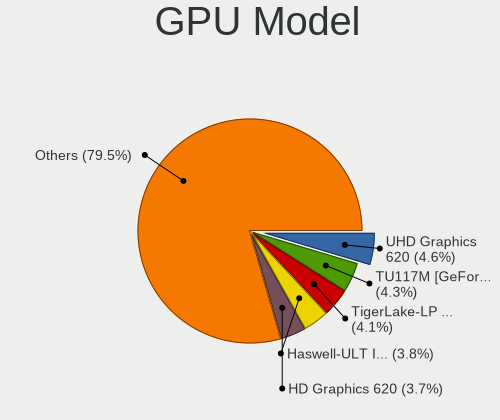

| Model                                                                                 | Notebooks | Percent |
|---------------------------------------------------------------------------------------|-----------|---------|
| Intel UHD Graphics 620                                                                | 238       | 5.52%   |
| Intel Haswell-ULT Integrated Graphics Controller                                      | 183       | 4.24%   |
| Intel HD Graphics 620                                                                 | 180       | 4.17%   |
| Intel 3rd Gen Core processor Graphics Controller                                      | 178       | 4.13%   |
| Intel 2nd Generation Core Processor Family Integrated Graphics Controller             | 168       | 3.9%    |
| Intel WhiskeyLake-U GT2 [UHD Graphics 620]                                            | 165       | 3.83%   |
| Intel Skylake GT2 [HD Graphics 520]                                                   | 152       | 3.52%   |
| Intel TigerLake-LP GT2 [Iris Xe Graphics]                                             | 151       | 3.5%    |
| Intel CoffeeLake-H GT2 [UHD Graphics 630]                                             | 144       | 3.34%   |
| AMD Picasso/Raven 2 [Radeon Vega Series / Radeon Vega Mobile Series]                  | 142       | 3.29%   |
| Intel CometLake-U GT2 [UHD Graphics]                                                  | 138       | 3.2%    |
| Intel HD Graphics 5500                                                                | 119       | 2.76%   |
| AMD Sun XT [Radeon HD 8670A/8670M/8690M / R5 M330 / M430 / Radeon 520 Mobile]         | 109       | 2.53%   |
| Nvidia TU117M [GeForce GTX 1650 Mobile / Max-Q]                                       | 93        | 2.16%   |
| AMD Renoir                                                                            | 87        | 2.02%   |
| Intel Iris Plus Graphics G1 (Ice Lake)                                                | 72        | 1.67%   |
| Intel Core Processor Integrated Graphics Controller                                   | 72        | 1.67%   |
| AMD Topaz XT [Radeon R7 M260/M265 / M340/M360 / M440/M445 / 530/535 / 620/625 Mobile] | 69        | 1.6%    |
| Nvidia TU117M                                                                         | 68        | 1.58%   |
| AMD Cezanne [Radeon Vega Series / Radeon Vega Mobile Series]                          | 68        | 1.58%   |
| AMD Stoney [Radeon R2/R3/R4/R5 Graphics]                                              | 60        | 1.39%   |
| Nvidia GF117M [GeForce 610M/710M/810M/820M / GT 620M/625M/630M/720M]                  | 57        | 1.32%   |
| Intel Mobile 4 Series Chipset Integrated Graphics Controller                          | 53        | 1.23%   |
| Intel CometLake-H GT2 [UHD Graphics]                                                  | 50        | 1.16%   |
| Nvidia GP108M [GeForce MX250]                                                         | 48        | 1.11%   |
| Nvidia GP108M [GeForce MX150]                                                         | 43        | 1%      |
| AMD Lucienne                                                                          | 42        | 0.97%   |
| Intel 4th Gen Core Processor Integrated Graphics Controller                           | 41        | 0.95%   |
| AMD Raven Ridge [Radeon Vega Series / Radeon Vega Mobile Series]                      | 38        | 0.88%   |
| Intel Tiger Lake-LP GT2 [UHD Graphics G4]                                             | 36        | 0.83%   |
| Nvidia GP107M [GeForce GTX 1050 Mobile]                                               | 35        | 0.81%   |
| Nvidia GM108M [GeForce 940MX]                                                         | 35        | 0.81%   |
| AMD Mullins [Radeon R4/R5 Graphics]                                                   | 35        | 0.81%   |
| Nvidia GM108M [GeForce MX130]                                                         | 33        | 0.77%   |
| Intel HD Graphics 630                                                                 | 32        | 0.74%   |
| Nvidia GP107M [GeForce GTX 1050 Ti Mobile]                                            | 31        | 0.72%   |
| Nvidia TU117M [GeForce GTX 1650 Ti Mobile]                                            | 30        | 0.7%    |
| Intel Alder Lake-P Integrated Graphics Controller                                     | 30        | 0.7%    |
| AMD Thames [Radeon HD 7500M/7600M Series]                                             | 29        | 0.67%   |
| AMD Jet PRO [Radeon R5 M230 / R7 M260DX / Radeon 520/610 Mobile]                      | 29        | 0.67%   |

GPU Combo
---------

Combinations of graphics cards

| Name           | Notebooks | Percent |
|----------------|-----------|---------|
| 1 x Intel      | 1444      | 46.55%  |
| Intel + Nvidia | 705       | 22.73%  |
| 1 x AMD        | 391       | 12.6%   |
| Intel + AMD    | 275       | 8.87%   |
| AMD + Nvidia   | 140       | 4.51%   |
| 2 x AMD        | 77        | 2.48%   |
| 1 x Nvidia     | 57        | 1.84%   |
| 2 x Intel      | 9         | 0.29%   |
| Other          | 3         | 0.1%    |
| 1 x SiS        | 1         | 0.03%   |

GPU Driver
----------

Free vs proprietary

| Driver      | Notebooks | Percent |
|-------------|-----------|---------|
| Free        | 2591      | 82.78%  |
| Proprietary | 470       | 15.02%  |
| Unknown     | 69        | 2.2%    |

GPU Memory
----------

Total video memory

| Size in GB | Notebooks | Percent |
|------------|-----------|---------|
| Unknown    | 1948      | 61.28%  |
| 1.01-2.0   | 501       | 15.76%  |
| 0.01-0.5   | 284       | 8.93%   |
| 3.01-4.0   | 249       | 7.83%   |
| 0.51-1.0   | 150       | 4.72%   |
| 5.01-6.0   | 37        | 1.16%   |
| 7.01-8.0   | 6         | 0.19%   |
| 2.01-3.0   | 3         | 0.09%   |
| 8.01-16.0  | 1         | 0.03%   |

Monitor
-------

Monitor Vendor
--------------

Monitor vendors

| Vendor                  | Notebooks | Percent |
|-------------------------|-----------|---------|
| BOE                     | 681       | 20.85%  |
| AU Optronics            | 635       | 19.44%  |
| Chimei Innolux          | 632       | 19.35%  |
| LG Display              | 507       | 15.52%  |
| Samsung Electronics     | 231       | 7.07%   |
| PANDA                   | 106       | 3.25%   |
| Dell                    | 59        | 1.81%   |
| Goldstar                | 47        | 1.44%   |
| Sharp                   | 46        | 1.41%   |
| BenQ                    | 42        | 1.29%   |
| Chi Mei Optoelectronics | 41        | 1.26%   |
| Lenovo                  | 31        | 0.95%   |
| Acer                    | 26        | 0.8%    |
| InfoVision              | 25        | 0.77%   |
| Apple                   | 24        | 0.73%   |
| Sony                    | 17        | 0.52%   |
| Hewlett-Packard         | 17        | 0.52%   |
| TMX                     | 11        | 0.34%   |
| AOC                     | 10        | 0.31%   |
| LG Philips              | 7         | 0.21%   |
| InnoLux Display         | 7         | 0.21%   |
| Toshiba                 | 5         | 0.15%   |
| HKC                     | 5         | 0.15%   |
| CSO                     | 5         | 0.15%   |
| ViewSonic               | 3         | 0.09%   |
| Valve                   | 3         | 0.09%   |
| Unknown                 | 3         | 0.09%   |
| LGD                     | 3         | 0.09%   |
| CPT                     | 3         | 0.09%   |
| STA                     | 2         | 0.06%   |
| Panasonic               | 2         | 0.06%   |
| MSI                     | 2         | 0.06%   |
| KDC                     | 2         | 0.06%   |
| HannStar                | 2         | 0.06%   |
| VST                     | 1         | 0.03%   |
| Unknown (XXX)           | 1         | 0.03%   |
| TCL                     | 1         | 0.03%   |
| SGT                     | 1         | 0.03%   |
| Seiko/Epson             | 1         | 0.03%   |
| S2-Tek                  | 1         | 0.03%   |

Monitor Model
-------------

Monitor models

| Model                                                                | Notebooks | Percent |
|----------------------------------------------------------------------|-----------|---------|
| Chimei Innolux LCD Monitor CMN15F5 1920x1080 344x193mm 15.5-inch     | 86        | 2.63%   |
| AU Optronics LCD Monitor AUO38ED 1920x1080 344x193mm 15.5-inch       | 70        | 2.14%   |
| BOE LCD Monitor BOE06A4 1366x768 344x194mm 15.5-inch                 | 39        | 1.19%   |
| Chimei Innolux LCD Monitor CMN14D4 1920x1080 309x173mm 13.9-inch     | 38        | 1.16%   |
| BOE LCD Monitor BOE0687 1920x1080 344x193mm 15.5-inch                | 37        | 1.13%   |
| Chimei Innolux LCD Monitor CMN14C3 1366x768 309x173mm 13.9-inch      | 36        | 1.1%    |
| Chimei Innolux LCD Monitor CMN15DB 1366x768 344x193mm 15.5-inch      | 33        | 1.01%   |
| AU Optronics LCD Monitor AUO21ED 1920x1080 344x194mm 15.5-inch       | 33        | 1.01%   |
| PANDA LCD Monitor NCP004D 1920x1080 344x194mm 15.5-inch              | 30        | 0.92%   |
| AU Optronics LCD Monitor AUO2E3C 1366x768 309x173mm 13.9-inch        | 29        | 0.89%   |
| Samsung Electronics LCD Monitor SEC5441 1366x768 293x165mm 13.2-inch | 27        | 0.83%   |
| AU Optronics LCD Monitor AUO70EC 1366x768 344x193mm 15.5-inch        | 27        | 0.83%   |
| Chimei Innolux LCD Monitor CMN15D5 1920x1080 344x193mm 15.5-inch     | 25        | 0.76%   |
| LG Display LCD Monitor LGD02DC 1366x768 344x194mm 15.5-inch          | 23        | 0.7%    |
| Chimei Innolux LCD Monitor CMN14E5 1920x1080 309x173mm 13.9-inch     | 22        | 0.67%   |
| Chimei Innolux LCD Monitor CMN14D6 1366x768 309x173mm 13.9-inch      | 22        | 0.67%   |
| AU Optronics LCD Monitor AUO45EC 1366x768 344x193mm 15.5-inch        | 22        | 0.67%   |
| LG Display LCD Monitor LGD0456 1366x768 344x194mm 15.5-inch          | 21        | 0.64%   |
| Chimei Innolux LCD Monitor CMN1521 1920x1080 344x193mm 15.5-inch     | 21        | 0.64%   |
| PANDA LCD Monitor NCP0036 1920x1080 344x194mm 15.5-inch              | 20        | 0.61%   |
| Chimei Innolux LCD Monitor CMN15E7 1920x1080 344x193mm 15.5-inch     | 20        | 0.61%   |
| AU Optronics LCD Monitor AUO71EC 1366x768 344x193mm 15.5-inch        | 20        | 0.61%   |
| AU Optronics LCD Monitor AUO403D 1920x1080 309x174mm 14.0-inch       | 19        | 0.58%   |
| BOE LCD Monitor BOE07F6 1920x1080 309x174mm 14.0-inch                | 18        | 0.55%   |
| PANDA LCD Monitor NCP002D 1920x1080 344x194mm 15.5-inch              | 16        | 0.49%   |
| LG Display LCD Monitor LGD039F 1366x768 345x194mm 15.6-inch          | 16        | 0.49%   |
| BOE LCD Monitor BOE07BD 1920x1080 309x174mm 14.0-inch                | 16        | 0.49%   |
| BOE LCD Monitor BOE06A9 1920x1080 344x193mm 15.5-inch                | 16        | 0.49%   |
| LG Display LCD Monitor LGD05E5 1920x1080 344x194mm 15.5-inch         | 15        | 0.46%   |
| LG Display LCD Monitor LGD065A 1920x1080 344x194mm 15.5-inch         | 14        | 0.43%   |
| LG Display LCD Monitor LGD033A 1366x768 344x194mm 15.5-inch          | 14        | 0.43%   |
| BOE LCD Monitor BOE0812 1920x1080 344x194mm 15.5-inch                | 14        | 0.43%   |
| BOE LCD Monitor BOE0672 1366x768 344x194mm 15.5-inch                 | 14        | 0.43%   |
| AU Optronics LCD Monitor AUOD1ED 1920x1080 344x193mm 15.5-inch       | 14        | 0.43%   |
| AU Optronics LCD Monitor AUO40EC 1366x768 344x193mm 15.5-inch        | 14        | 0.43%   |
| AU Optronics LCD Monitor AUO22EC 1366x768 344x193mm 15.5-inch        | 14        | 0.43%   |
| Goldstar LG IPS FULLHD GSM5AB8 1920x1080 480x270mm 21.7-inch         | 13        | 0.4%    |
| BOE LCD Monitor BOE07F1 1920x1080 344x193mm 15.5-inch                | 13        | 0.4%    |
| BOE LCD Monitor BOE0700 1920x1080 344x194mm 15.5-inch                | 13        | 0.4%    |
| BOE LCD Monitor BOE0671 1366x768 344x194mm 15.5-inch                 | 13        | 0.4%    |

Monitor Resolution
------------------

Monitor screen resolution

| Resolution         | Notebooks | Percent |
|--------------------|-----------|---------|
| 1920x1080 (FHD)    | 1571      | 50%     |
| 1366x768 (WXGA)    | 1250      | 39.78%  |
| 1600x900 (HD+)     | 52        | 1.65%   |
| 1280x800 (WXGA)    | 41        | 1.3%    |
| 2560x1440 (QHD)    | 39        | 1.24%   |
| 3840x2160 (4K)     | 37        | 1.18%   |
| 1920x1200 (WUXGA)  | 33        | 1.05%   |
| 2560x1600          | 25        | 0.8%    |
| 1440x900 (WXGA+)   | 20        | 0.64%   |
| 2880x1800          | 12        | 0.38%   |
| 2560x1080          | 7         | 0.22%   |
| 1360x768           | 7         | 0.22%   |
| 1024x600           | 7         | 0.22%   |
| 3200x2000          | 6         | 0.19%   |
| 1280x1024 (SXGA)   | 6         | 0.19%   |
| 3840x2400          | 4         | 0.13%   |
| 800x1280           | 3         | 0.1%    |
| 2160x1440          | 3         | 0.1%    |
| 1680x1050 (WSXGA+) | 3         | 0.1%    |
| 3456x2160          | 2         | 0.06%   |
| 3072x1920          | 2         | 0.06%   |
| 2256x1504          | 2         | 0.06%   |
| 2240x1400          | 2         | 0.06%   |
| 3840x1100          | 1         | 0.03%   |
| 3440x1440          | 1         | 0.03%   |
| 3200x1800 (QHD+)   | 1         | 0.03%   |
| 2732x768           | 1         | 0.03%   |
| 1920x1280          | 1         | 0.03%   |
| 1280x768           | 1         | 0.03%   |
| 1280x720 (HD)      | 1         | 0.03%   |
| Unknown            | 1         | 0.03%   |

Monitor Diagonal
----------------

Diagonal size in inches

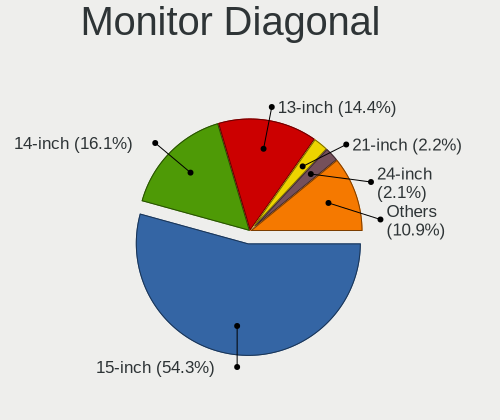

| Inches  | Notebooks | Percent |
|---------|-----------|---------|
| 15      | 1819      | 55.8%   |
| 13      | 512       | 15.71%  |
| 14      | 507       | 15.55%  |
| 21      | 70        | 2.15%   |
| 24      | 59        | 1.81%   |
| 12      | 42        | 1.29%   |
| 27      | 34        | 1.04%   |
| 17      | 32        | 0.98%   |
| 23      | 31        | 0.95%   |
| 16      | 23        | 0.71%   |
| 18      | 20        | 0.61%   |
| 19      | 17        | 0.52%   |
| 11      | 14        | 0.43%   |
| Unknown | 14        | 0.43%   |
| 31      | 11        | 0.34%   |
| 20      | 9         | 0.28%   |
| 34      | 8         | 0.25%   |
| 10      | 8         | 0.25%   |
| 72      | 5         | 0.15%   |
| 26      | 5         | 0.15%   |
| 46      | 4         | 0.12%   |
| 40      | 4         | 0.12%   |
| 7       | 3         | 0.09%   |
| 54      | 2         | 0.06%   |
| 32      | 2         | 0.06%   |
| 65      | 1         | 0.03%   |
| 58      | 1         | 0.03%   |
| 42      | 1         | 0.03%   |
| 25      | 1         | 0.03%   |
| 22      | 1         | 0.03%   |

Monitor Width
-------------

Physical width

| Width in mm | Notebooks | Percent |
|-------------|-----------|---------|
| 301-350     | 2712      | 83.34%  |
| 201-300     | 170       | 5.22%   |
| 401-500     | 120       | 3.69%   |
| 501-600     | 117       | 3.6%    |
| 351-400     | 74        | 2.27%   |
| 601-700     | 16        | 0.49%   |
| Unknown     | 14        | 0.43%   |
| 701-800     | 10        | 0.31%   |
| 1001-1500   | 8         | 0.25%   |
| 1501-2000   | 5         | 0.15%   |
| 801-900     | 4         | 0.12%   |
| 1-100       | 3         | 0.09%   |
| 901-1000    | 1         | 0.03%   |

Aspect Ratio
------------

Proportional relationship between the width and the height

| Ratio   | Notebooks | Percent |
|---------|-----------|---------|
| 16/9    | 2841      | 93.76%  |
| 16/10   | 144       | 4.75%   |
| Unknown | 13        | 0.43%   |
| 21/9    | 8         | 0.26%   |
| 4/3     | 7         | 0.23%   |
| 3/2     | 7         | 0.23%   |
| 5/4     | 3         | 0.1%    |
| 0.67    | 3         | 0.1%    |
| 6/5     | 2         | 0.07%   |
| 3.40    | 1         | 0.03%   |
| 2.00    | 1         | 0.03%   |

Monitor Area
------------

Area in inch

| Area in inch | Notebooks | Percent |
|----------------|-----------|---------|
| 101-110        | 1813      | 55.65%  |
| 81-90          | 937       | 28.76%  |
| 201-250        | 143       | 4.39%   |
| 71-80          | 80        | 2.46%   |
| 61-70          | 40        | 1.23%   |
| 151-200        | 37        | 1.14%   |
| 301-350        | 36        | 1.1%    |
| 121-130        | 29        | 0.89%   |
| 351-500        | 21        | 0.64%   |
| 141-150        | 20        | 0.61%   |
| 111-120        | 18        | 0.55%   |
| 51-60          | 15        | 0.46%   |
| Unknown        | 14        | 0.43%   |
| 91-100         | 13        | 0.4%    |
| More than 1000 | 9         | 0.28%   |
| 501-1000       | 9         | 0.28%   |
| 41-50          | 8         | 0.25%   |
| 251-300        | 8         | 0.25%   |
| 131-140        | 5         | 0.15%   |
| 1-40           | 3         | 0.09%   |

Pixel Density
-------------

Pixels per inch

| Density       | Notebooks | Percent |
|---------------|-----------|---------|
| 121-160       | 1513      | 46.89%  |
| 101-120       | 1230      | 38.12%  |
| 51-100        | 290       | 8.99%   |
| 161-240       | 127       | 3.94%   |
| More than 240 | 40        | 1.24%   |
| Unknown       | 14        | 0.43%   |
| 1-50          | 13        | 0.4%    |

Multiple Monitors
-----------------

Total monitors connected

| Total | Notebooks | Percent |
|-------|-----------|---------|
| 1     | 2793      | 89.2%   |
| 2     | 277       | 8.85%   |
| 0     | 56        | 1.79%   |
| 3     | 5         | 0.16%   |

Network
-------

Net Controller Vendor
---------------------

Controller vendors

| Vendor                            | Notebooks | Percent |
|-----------------------------------|-----------|---------|
| Realtek Semiconductor             | 2059      | 40.44%  |
| Intel                             | 1385      | 27.2%   |
| Qualcomm Atheros                  | 783       | 15.38%  |
| Broadcom                          | 254       | 4.99%   |
| MediaTek                          | 73        | 1.43%   |
| Xiaomi                            | 70        | 1.37%   |
| Ralink                            | 62        | 1.22%   |
| Broadcom Limited                  | 50        | 0.98%   |
| Samsung Electronics               | 45        | 0.88%   |
| TP-Link                           | 44        | 0.86%   |
| OPPO Electronics                  | 38        | 0.75%   |
| Qualcomm                          | 30        | 0.59%   |
| Ralink Technology                 | 29        | 0.57%   |
| Marvell Technology Group          | 28        | 0.55%   |
| ASIX Electronics                  | 16        | 0.31%   |
| OnePlus Technology (Shenzhen)     | 15        | 0.29%   |
| Motorola PCS                      | 14        | 0.27%   |
| Huawei Technologies               | 13        | 0.26%   |
| ICS Advent                        | 7         | 0.14%   |
| Google                            | 7         | 0.14%   |
| D-Link                            | 6         | 0.12%   |
| JMicron Technology                | 5         | 0.1%    |
| Foxconn / Hon Hai                 | 5         | 0.1%    |
| DisplayLink                       | 5         | 0.1%    |
| HMD Global                        | 4         | 0.08%   |
| Nvidia                            | 3         | 0.06%   |
| Lenovo                            | 3         | 0.06%   |
| Ericsson Business Mobile Networks | 3         | 0.06%   |
| Dell                              | 3         | 0.06%   |
| ZTE WCDMA Technologies MSM        | 2         | 0.04%   |
| vivo                              | 2         | 0.04%   |
| Sierra Wireless                   | 2         | 0.04%   |
| Qualcomm Atheros Communications   | 2         | 0.04%   |
| NTmore                            | 2         | 0.04%   |
| Edimax Technology                 | 2         | 0.04%   |
| Attansic Technology               | 2         | 0.04%   |
| ASUSTek Computer                  | 2         | 0.04%   |
| Apple                             | 2         | 0.04%   |
| Android                           | 2         | 0.04%   |
| VIA Technologies                  | 1         | 0.02%   |

Net Controller Model
--------------------

Controller models

| Model                                                             | Notebooks | Percent |
|-------------------------------------------------------------------|-----------|---------|
| Realtek RTL8111/8168/8411 PCI Express Gigabit Ethernet Controller | 1326      | 22.32%  |
| Realtek RTL810xE PCI Express Fast Ethernet controller             | 531       | 8.94%   |
| Qualcomm Atheros QCA9377 802.11ac Wireless Network Adapter        | 299       | 5.03%   |
| Qualcomm Atheros QCA9565 / AR9565 Wireless Network Adapter        | 137       | 2.31%   |
| Intel Wi-Fi 6 AX201                                               | 136       | 2.29%   |
| Realtek RTL8822CE 802.11ac PCIe Wireless Network Adapter          | 135       | 2.27%   |
| Intel Wi-Fi 6 AX200                                               | 129       | 2.17%   |
| Intel Wireless 8265 / 8275                                        | 128       | 2.15%   |
| Intel Comet Lake PCH-LP CNVi WiFi                                 | 109       | 1.84%   |
| Realtek RTL8723BE PCIe Wireless Network Adapter                   | 104       | 1.75%   |
| Broadcom BCM43142 802.11b/g/n                                     | 103       | 1.73%   |
| Realtek RTL8723DE Wireless Network Adapter                        | 102       | 1.72%   |
| Intel Cannon Lake PCH CNVi WiFi                                   | 93        | 1.57%   |
| Realtek RTL8821CE 802.11ac PCIe Wireless Network Adapter          | 86        | 1.45%   |
| Intel Cannon Point-LP CNVi [Wireless-AC]                          | 86        | 1.45%   |
| Qualcomm Atheros AR9285 Wireless Network Adapter (PCI-Express)    | 85        | 1.43%   |
| Qualcomm Atheros QCA6174 802.11ac Wireless Network Adapter        | 82        | 1.38%   |
| Qualcomm Atheros AR9485 Wireless Network Adapter                  | 76        | 1.28%   |
| Intel Wireless 7265                                               | 68        | 1.14%   |
| Broadcom BCM4313 802.11bgn Wireless Network Adapter               | 63        | 1.06%   |
| Intel Wireless 3165                                               | 62        | 1.04%   |
| Intel Wireless 3160                                               | 59        | 0.99%   |
| Intel 82579LM Gigabit Network Connection (Lewisville)             | 58        | 0.98%   |
| Ralink RT3290 Wireless 802.11n 1T/1R PCIe                         | 53        | 0.89%   |
| MediaTek MT7921 802.11ax PCI Express Wireless Network Adapter     | 51        | 0.86%   |
| Xiaomi Mi/Redmi series (RNDIS)                                    | 46        | 0.77%   |
| Intel Ice Lake-LP PCH CNVi WiFi                                   | 43        | 0.72%   |
| Realtek RTL8822BE 802.11a/b/g/n/ac WiFi adapter                   | 42        | 0.71%   |
| Intel Alder Lake-P PCH CNVi WiFi                                  | 41        | 0.69%   |
| Intel Wireless 8260                                               | 40        | 0.67%   |
| Intel Comet Lake PCH CNVi WiFi                                    | 40        | 0.67%   |
| Intel Wireless 7260                                               | 37        | 0.62%   |
| Realtek RTL8852AE 802.11ax PCIe Wireless Network Adapter          | 36        | 0.61%   |
| Samsung Galaxy series, misc. (tethering mode)                     | 34        | 0.57%   |
| OPPO CPH2411                                                      | 33        | 0.56%   |
| Intel Ethernet Connection (4) I219-V                              | 32        | 0.54%   |
| Intel Centrino Advanced-N 6205 [Taylor Peak]                      | 31        | 0.52%   |
| Intel Ethernet Connection (4) I219-LM                             | 30        | 0.51%   |
| Intel Ethernet Connection I219-LM                                 | 29        | 0.49%   |
| Intel Dual Band Wireless-AC 3165 Plus Bluetooth                   | 29        | 0.49%   |

Wireless Vendor
---------------

Wireless vendors

| Vendor                          | Notebooks | Percent |
|---------------------------------|-----------|---------|
| Intel                           | 1336      | 42.16%  |
| Qualcomm Atheros                | 712       | 22.47%  |
| Realtek Semiconductor           | 631       | 19.91%  |
| Broadcom                        | 228       | 7.19%   |
| MediaTek                        | 66        | 2.08%   |
| Ralink                          | 62        | 1.96%   |
| TP-Link                         | 39        | 1.23%   |
| Broadcom Limited                | 39        | 1.23%   |
| Ralink Technology               | 29        | 0.92%   |
| Qualcomm                        | 7         | 0.22%   |
| D-Link                          | 6         | 0.19%   |
| Dell                            | 3         | 0.09%   |
| Sierra Wireless                 | 2         | 0.06%   |
| Qualcomm Atheros Communications | 2         | 0.06%   |
| Edimax Technology               | 2         | 0.06%   |
| Philips (or NXP)                | 1         | 0.03%   |
| NetGear                         | 1         | 0.03%   |
| Micro Star International        | 1         | 0.03%   |
| IMC Networks                    | 1         | 0.03%   |
| D-Link System                   | 1         | 0.03%   |

Wireless Model
--------------

Wireless models

| Model                                                          | Notebooks | Percent |
|----------------------------------------------------------------|-----------|---------|
| Qualcomm Atheros QCA9377 802.11ac Wireless Network Adapter     | 299       | 9.4%    |
| Qualcomm Atheros QCA9565 / AR9565 Wireless Network Adapter     | 137       | 4.31%   |
| Intel Wi-Fi 6 AX201                                            | 136       | 4.27%   |
| Realtek RTL8822CE 802.11ac PCIe Wireless Network Adapter       | 135       | 4.24%   |
| Intel Wi-Fi 6 AX200                                            | 129       | 4.05%   |
| Intel Wireless 8265 / 8275                                     | 128       | 4.02%   |
| Intel Comet Lake PCH-LP CNVi WiFi                              | 109       | 3.43%   |
| Realtek RTL8723BE PCIe Wireless Network Adapter                | 104       | 3.27%   |
| Broadcom BCM43142 802.11b/g/n                                  | 103       | 3.24%   |
| Realtek RTL8723DE Wireless Network Adapter                     | 102       | 3.21%   |
| Intel Cannon Lake PCH CNVi WiFi                                | 93        | 2.92%   |
| Realtek RTL8821CE 802.11ac PCIe Wireless Network Adapter       | 86        | 2.7%    |
| Intel Cannon Point-LP CNVi [Wireless-AC]                       | 86        | 2.7%    |
| Qualcomm Atheros AR9285 Wireless Network Adapter (PCI-Express) | 85        | 2.67%   |
| Qualcomm Atheros QCA6174 802.11ac Wireless Network Adapter     | 82        | 2.58%   |
| Qualcomm Atheros AR9485 Wireless Network Adapter               | 76        | 2.39%   |
| Intel Wireless 7265                                            | 68        | 2.14%   |
| Broadcom BCM4313 802.11bgn Wireless Network Adapter            | 63        | 1.98%   |
| Intel Wireless 3165                                            | 62        | 1.95%   |
| Intel Wireless 3160                                            | 59        | 1.85%   |
| Ralink RT3290 Wireless 802.11n 1T/1R PCIe                      | 53        | 1.67%   |
| MediaTek MT7921 802.11ax PCI Express Wireless Network Adapter  | 51        | 1.6%    |
| Intel Ice Lake-LP PCH CNVi WiFi                                | 43        | 1.35%   |
| Realtek RTL8822BE 802.11a/b/g/n/ac WiFi adapter                | 42        | 1.32%   |
| Intel Alder Lake-P PCH CNVi WiFi                               | 41        | 1.29%   |
| Intel Wireless 8260                                            | 40        | 1.26%   |
| Intel Comet Lake PCH CNVi WiFi                                 | 40        | 1.26%   |
| Intel Wireless 7260                                            | 37        | 1.16%   |
| Realtek RTL8852AE 802.11ax PCIe Wireless Network Adapter       | 36        | 1.13%   |
| Intel Centrino Advanced-N 6205 [Taylor Peak]                   | 31        | 0.97%   |
| Intel Dual Band Wireless-AC 3165 Plus Bluetooth                | 29        | 0.91%   |
| Intel Dual Band Wireless-AC 3168NGW [Stone Peak]               | 28        | 0.88%   |
| Realtek RTL8188EUS 802.11n Wireless Network Adapter            | 24        | 0.75%   |
| Intel Wireless-AC 9260                                         | 23        | 0.72%   |
| Ralink MT7601U Wireless Adapter                                | 21        | 0.66%   |
| Intel Centrino Wireless-N 1000 [Condor Peak]                   | 21        | 0.66%   |
| Realtek RTL8821AE 802.11ac PCIe Wireless Network Adapter       | 18        | 0.57%   |
| Realtek RTL8188EE Wireless Network Adapter                     | 18        | 0.57%   |
| Realtek RTL8188FTV 802.11b/g/n 1T1R 2.4G WLAN Adapter          | 17        | 0.53%   |
| Qualcomm Atheros AR9462 Wireless Network Adapter               | 15        | 0.47%   |

Ethernet Vendor
---------------

Ethernet vendors

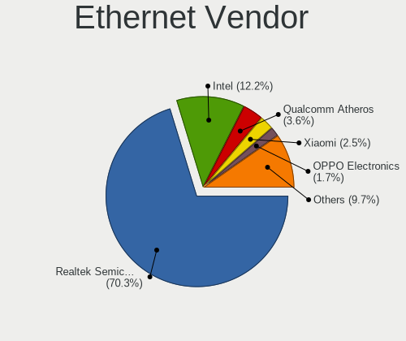

| Vendor                           | Notebooks | Percent |
|----------------------------------|-----------|---------|
| Realtek Semiconductor            | 1908      | 70.43%  |
| Intel                            | 328       | 12.11%  |
| Qualcomm Atheros                 | 114       | 4.21%   |
| Xiaomi                           | 70        | 2.58%   |
| Broadcom                         | 46        | 1.7%    |
| OPPO Electronics                 | 38        | 1.4%    |
| Samsung Electronics              | 34        | 1.26%   |
| Marvell Technology Group         | 28        | 1.03%   |
| Qualcomm                         | 23        | 0.85%   |
| ASIX Electronics                 | 16        | 0.59%   |
| Huawei Technologies              | 11        | 0.41%   |
| Broadcom Limited                 | 11        | 0.41%   |
| OnePlus Technology (Shenzhen)    | 10        | 0.37%   |
| Motorola PCS                     | 9         | 0.33%   |
| MediaTek                         | 8         | 0.3%    |
| ICS Advent                       | 7         | 0.26%   |
| Google                           | 7         | 0.26%   |
| TP-Link                          | 5         | 0.18%   |
| JMicron Technology               | 5         | 0.18%   |
| DisplayLink                      | 5         | 0.18%   |
| HMD Global                       | 4         | 0.15%   |
| Nvidia                           | 3         | 0.11%   |
| Lenovo                           | 3         | 0.11%   |
| Foxconn / Hon Hai                | 3         | 0.11%   |
| vivo                             | 2         | 0.07%   |
| NTmore                           | 2         | 0.07%   |
| Attansic Technology              | 2         | 0.07%   |
| ASUSTek Computer                 | 2         | 0.07%   |
| ZTE WCDMA Technologies MSM       | 1         | 0.04%   |
| VIA Technologies                 | 1         | 0.04%   |
| Silicon Integrated Systems [SiS] | 1         | 0.04%   |
| LeEco                            | 1         | 0.04%   |
| Apple                            | 1         | 0.04%   |

Ethernet Model
--------------

Ethernet models

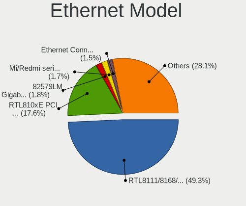

| Model                                                                          | Notebooks | Percent |
|--------------------------------------------------------------------------------|-----------|---------|
| Realtek RTL8111/8168/8411 PCI Express Gigabit Ethernet Controller              | 1326      | 48.77%  |
| Realtek RTL810xE PCI Express Fast Ethernet controller                          | 531       | 19.53%  |
| Intel 82579LM Gigabit Network Connection (Lewisville)                          | 58        | 2.13%   |
| Xiaomi Mi/Redmi series (RNDIS)                                                 | 46        | 1.69%   |
| Samsung Galaxy series, misc. (tethering mode)                                  | 34        | 1.25%   |
| OPPO CPH2411                                                                   | 33        | 1.21%   |
| Intel Ethernet Connection (4) I219-V                                           | 32        | 1.18%   |
| Intel Ethernet Connection (4) I219-LM                                          | 30        | 1.1%    |
| Intel Ethernet Connection I219-LM                                              | 29        | 1.07%   |
| Intel Ethernet Connection I218-LM                                              | 26        | 0.96%   |
| Xiaomi Mi/Redmi series (RNDIS + ADB)                                           | 24        | 0.88%   |
| Realtek RTL8153 Gigabit Ethernet Adapter                                       | 23        | 0.85%   |
| Qualcomm Atheros QCA8172 Fast Ethernet                                         | 23        | 0.85%   |
| Qualcomm Nokia G400 5G                                                         | 21        | 0.77%   |
| Intel Ethernet Connection (3) I218-LM                                          | 19        | 0.7%    |
| Realtek Killer E2600 Gigabit Ethernet Controller                               | 18        | 0.66%   |
| Intel Ethernet Connection I217-LM                                              | 16        | 0.59%   |
| Intel 82577LM Gigabit Network Connection                                       | 16        | 0.59%   |
| Qualcomm Atheros AR8162 Fast Ethernet                                          | 14        | 0.51%   |
| Intel Ethernet Connection (10) I219-V                                          | 14        | 0.51%   |
| Broadcom NetLink BCM57785 Gigabit Ethernet PCIe                                | 13        | 0.48%   |
| ASIX AX88179 Gigabit Ethernet                                                  | 13        | 0.48%   |
| Marvell Group 88E8040 PCI-E Fast Ethernet Controller                           | 12        | 0.44%   |
| Intel Ethernet Connection (6) I219-V                                           | 12        | 0.44%   |
| Intel Ethernet Connection (6) I219-LM                                          | 12        | 0.44%   |
| Qualcomm Atheros QCA8171 Gigabit Ethernet                                      | 11        | 0.4%    |
| Qualcomm Atheros AR8152 v2.0 Fast Ethernet                                     | 11        | 0.4%    |
| Qualcomm Atheros Killer E2500 Gigabit Ethernet Controller                      | 10        | 0.37%   |
| Qualcomm Atheros Killer E2400 Gigabit Ethernet Controller                      | 10        | 0.37%   |
| OnePlus (Shenzhen) OnePlus                                                     | 10        | 0.37%   |
| Marvell Group Yukon Optima 88E8059 [PCIe Gigabit Ethernet Controller with AVB] | 10        | 0.37%   |
| Motorola PCS moto g(30)                                                        | 9         | 0.33%   |
| Realtek RTL8125 2.5GbE Controller                                              | 8         | 0.29%   |
| Qualcomm Atheros AR8152 v1.1 Fast Ethernet                                     | 8         | 0.29%   |
| Qualcomm Atheros AR8151 v2.0 Gigabit Ethernet                                  | 8         | 0.29%   |
| Intel Ethernet Connection (7) I219-LM                                          | 8         | 0.29%   |
| Intel Ethernet Connection (16) I219-V                                          | 8         | 0.29%   |
| Qualcomm Atheros AR8131 Gigabit Ethernet                                       | 6         | 0.22%   |
| MediaTek Armor X10 Pro                                                         | 6         | 0.22%   |
| Intel Ethernet Connection (10) I219-LM                                         | 6         | 0.22%   |

Net Controller Kind
-------------------

Ethernet, WiFi or modem

| Kind     | Notebooks | Percent |
|----------|-----------|---------|
| WiFi     | 3058      | 54.64%  |
| Ethernet | 2500      | 44.67%  |
| Modem    | 22        | 0.39%   |
| Unknown  | 17        | 0.3%    |

Used Controller
---------------

Currently used network controller

| Kind     | Notebooks | Percent |
|----------|-----------|---------|
| WiFi     | 2646      | 85.24%  |
| Ethernet | 456       | 14.69%  |
| Modem    | 1         | 0.03%   |
| Unknown  | 1         | 0.03%   |

NICs
----

Total network controllers on board

| Total | Notebooks | Percent |
|-------|-----------|---------|
| 2     | 2369      | 76.57%  |
| 1     | 705       | 22.79%  |
| 0     | 13        | 0.42%   |
| 3     | 7         | 0.23%   |

IPv6
----

IPv6 vs IPv4

| Used | Notebooks | Percent |
|------|-----------|---------|
| No   | 2529      | 80.44%  |
| Yes  | 615       | 19.56%  |

Bluetooth
---------

Bluetooth Vendor
----------------

Controller vendors

| Vendor                          | Notebooks | Percent |
|---------------------------------|-----------|---------|
| Intel                           | 1144      | 41.58%  |
| Qualcomm Atheros Communications | 443       | 16.1%   |
| Realtek Semiconductor           | 439       | 15.96%  |
| Broadcom                        | 152       | 5.53%   |
| IMC Networks                    | 148       | 5.38%   |
| Lite-On Technology              | 124       | 4.51%   |
| Foxconn / Hon Hai               | 91        | 3.31%   |
| Ralink                          | 53        | 1.93%   |
| Dell                            | 35        | 1.27%   |
| Cambridge Silicon Radio         | 22        | 0.8%    |
| Apple                           | 22        | 0.8%    |
| Hewlett-Packard                 | 16        | 0.58%   |
| Foxconn International           | 10        | 0.36%   |
| Toshiba                         | 8         | 0.29%   |
| Realtek                         | 7         | 0.25%   |
| Ralink Technology               | 7         | 0.25%   |
| MediaTek                        | 7         | 0.25%   |
| TP-Link                         | 5         | 0.18%   |
| Opticis                         | 5         | 0.18%   |
| ASUSTek Computer                | 5         | 0.18%   |
| USI                             | 2         | 0.07%   |
| Chicony Electronics             | 2         | 0.07%   |
| SINO WEALTH                     | 1         | 0.04%   |
| Micro Star International        | 1         | 0.04%   |
| Integrated System Solution      | 1         | 0.04%   |
| Alps Electric                   | 1         | 0.04%   |

Bluetooth Model
---------------

Controller models

| Model                                                                               | Notebooks | Percent |
|-------------------------------------------------------------------------------------|-----------|---------|
| Intel Bluetooth wireless interface                                                  | 382       | 13.89%  |
| Intel Bluetooth 9460/9560 Jefferson Peak (JfP)                                      | 273       | 9.92%   |
| Realtek Bluetooth Radio                                                             | 269       | 9.78%   |
| Qualcomm Atheros  Bluetooth Device                                                  | 262       | 9.52%   |
| Intel AX201 Bluetooth                                                               | 246       | 8.94%   |
| Intel AX200 Bluetooth                                                               | 126       | 4.58%   |
| Realtek  Bluetooth 4.2 Adapter                                                      | 123       | 4.47%   |
| IMC Networks Bluetooth Radio                                                        | 57        | 2.07%   |
| Qualcomm Atheros AR9462 Bluetooth                                                   | 56        | 2.04%   |
| Ralink RT3290 Bluetooth                                                             | 53        | 1.93%   |
| IMC Networks Bluetooth Device                                                       | 52        | 1.89%   |
| Lite-On Qualcomm Atheros QCA9377 Bluetooth                                          | 47        | 1.71%   |
| Lite-On Bluetooth Device                                                            | 44        | 1.6%    |
| Qualcomm Atheros AR3011 Bluetooth                                                   | 42        | 1.53%   |
| Broadcom BCM43142 Bluetooth 4.0                                                     | 41        | 1.49%   |
| Qualcomm Atheros AR3012 Bluetooth 4.0                                               | 36        | 1.31%   |
| IMC Networks Wireless_Device                                                        | 36        | 1.31%   |
| Intel Centrino Bluetooth Wireless Transceiver                                       | 29        | 1.05%   |
| Qualcomm Atheros QCA61x4 Bluetooth 4.0                                              | 27        | 0.98%   |
| Intel Bluetooth Device                                                              | 27        | 0.98%   |
| Intel Wireless-AC 3168 Bluetooth                                                    | 26        | 0.95%   |
| Broadcom BCM43142A0 Bluetooth 4.0                                                   | 25        | 0.91%   |
| Cambridge Silicon Radio Bluetooth Dongle (HCI mode)                                 | 22        | 0.8%    |
| Foxconn / Hon Hai Bluetooth Device                                                  | 20        | 0.73%   |
| Realtek RTL8821A Bluetooth                                                          | 17        | 0.62%   |
| Intel Centrino Advanced-N 6230 Bluetooth adapter                                    | 17        | 0.62%   |
| Realtek RTL8723B Bluetooth                                                          | 15        | 0.55%   |
| Foxconn / Hon Hai Bluetooth USB Host Controller                                     | 15        | 0.55%   |
| Broadcom BCM2070 Bluetooth 2.1 + EDR                                                | 15        | 0.55%   |
| Broadcom BCM43142A0 Bluetooth Device                                                | 14        | 0.51%   |
| Realtek RTL8822BE Bluetooth 4.2 Adapter                                             | 13        | 0.47%   |
| Intel Wireless-AC 9260 Bluetooth Adapter                                            | 13        | 0.47%   |
| Dell Wireless 365 Bluetooth                                                         | 13        | 0.47%   |
| Foxconn / Hon Hai Broadcom Bluetooth 2.1 Device                                     | 12        | 0.44%   |
| Broadcom BCM20702 Bluetooth 4.0 [ThinkPad]                                          | 12        | 0.44%   |
| Qualcomm Atheros Bluetooth                                                          | 11        | 0.4%    |
| Foxconn / Hon Hai Foxconn T77H114 BCM2070 [Single-Chip Bluetooth 2.1 + EDR Adapter] | 11        | 0.4%    |
| Apple Bluetooth USB Host Controller                                                 | 11        | 0.4%    |
| HP Broadcom 2070 Bluetooth Combo                                                    | 10        | 0.36%   |
| Foxconn International BCM43142A0 Bluetooth module                                   | 10        | 0.36%   |

Sound
-----

Sound Vendor
------------

Sound card vendors

| Vendor                           | Notebooks | Percent |
|----------------------------------|-----------|---------|
| Intel                            | 2499      | 69.82%  |
| AMD                              | 611       | 17.07%  |
| Nvidia                           | 383       | 10.7%   |
| C-Media Electronics              | 15        | 0.42%   |
| GN Netcom                        | 10        | 0.28%   |
| Realtek Semiconductor            | 6         | 0.17%   |
| Plantronics                      | 4         | 0.11%   |
| JMTek                            | 4         | 0.11%   |
| Generalplus Technology           | 4         | 0.11%   |
| SteelSeries ApS                  | 3         | 0.08%   |
| Sennheiser Communications        | 3         | 0.08%   |
| Logitech                         | 3         | 0.08%   |
| Lenovo                           | 3         | 0.08%   |
| ASUSTek Computer                 | 3         | 0.08%   |
| Tenx Technology                  | 2         | 0.06%   |
| DCMT Technology                  | 2         | 0.06%   |
| Apple                            | 2         | 0.06%   |
| Yamaha                           | 1         | 0.03%   |
| XMOS                             | 1         | 0.03%   |
| Vault                            | 1         | 0.03%   |
| Texas Instruments                | 1         | 0.03%   |
| Synaptics                        | 1         | 0.03%   |
| Silicon Integrated Systems [SiS] | 1         | 0.03%   |
| Shenzhen Rapoo Technology        | 1         | 0.03%   |
| Samson Technologies              | 1         | 0.03%   |
| Razer USA                        | 1         | 0.03%   |
| Panasonic (Matsushita)           | 1         | 0.03%   |
| Microsoft                        | 1         | 0.03%   |
| Kingston Technology              | 1         | 0.03%   |
| Jieli Technology                 | 1         | 0.03%   |
| Hewlett-Packard                  | 1         | 0.03%   |
| Focusrite-Novation               | 1         | 0.03%   |
| FiiO Electronics Technology      | 1         | 0.03%   |
| DSEA A/S                         | 1         | 0.03%   |
| Creative Technology              | 1         | 0.03%   |
| Corsair                          | 1         | 0.03%   |
| CMX Systems                      | 1         | 0.03%   |
| Arturia                          | 1         | 0.03%   |
| Anlya.cn                         | 1         | 0.03%   |

Sound Model
-----------

Sound card models

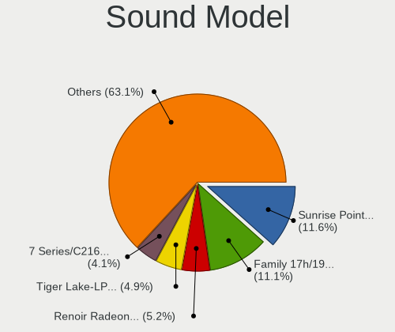

| Model                                                                                             | Notebooks | Percent |
|---------------------------------------------------------------------------------------------------|-----------|---------|
| Intel Sunrise Point-LP HD Audio                                                                   | 602       | 13.6%   |
| AMD Family 17h/19h HD Audio Controller                                                            | 398       | 8.99%   |
| Intel 7 Series/C216 Chipset Family High Definition Audio Controller                               | 226       | 5.11%   |
| Intel Tiger Lake-LP Smart Sound Technology Audio Controller                                       | 187       | 4.23%   |
| Intel 8 Series HD Audio Controller                                                                | 183       | 4.14%   |
| Intel Haswell-ULT HD Audio Controller                                                             | 181       | 4.09%   |
| Intel Cannon Point-LP High Definition Audio Controller                                            | 165       | 3.73%   |
| AMD Renoir Radeon High Definition Audio Controller                                                | 158       | 3.57%   |
| Intel Cannon Lake PCH cAVS                                                                        | 152       | 3.44%   |
| AMD Raven/Raven2/Fenghuang HDMI/DP Audio Controller                                               | 149       | 3.37%   |
| Intel 6 Series/C200 Series Chipset Family High Definition Audio Controller                        | 144       | 3.25%   |
| Intel Comet Lake PCH-LP cAVS                                                                      | 142       | 3.21%   |
| Nvidia TU107 GeForce GTX 1650 High Definition Audio Controller                                    | 141       | 3.19%   |
| Intel Broadwell-U Audio Controller                                                                | 131       | 2.96%   |
| Intel Wildcat Point-LP High Definition Audio Controller                                           | 130       | 2.94%   |
| Intel 5 Series/3400 Series Chipset High Definition Audio                                          | 103       | 2.33%   |
| AMD FCH Azalia Controller                                                                         | 88        | 1.99%   |
| Intel Ice Lake-LP Smart Sound Technology Audio Controller                                         | 86        | 1.94%   |
| AMD Family 15h (Models 60h-6fh) Audio Controller                                                  | 75        | 1.69%   |
| AMD Kabini HDMI/DP Audio                                                                          | 69        | 1.56%   |
| AMD High Definition Audio Controller                                                              | 60        | 1.36%   |
| Intel 82801I (ICH9 Family) HD Audio Controller                                                    | 58        | 1.31%   |
| Intel Comet Lake PCH cAVS                                                                         | 54        | 1.22%   |
| Intel Alder Lake PCH-P High Definition Audio Controller                                           | 53        | 1.2%    |
| Intel 8 Series/C220 Series Chipset High Definition Audio Controller                               | 43        | 0.97%   |
| Nvidia GP107GL High Definition Audio Controller                                                   | 39        | 0.88%   |
| Intel Xeon E3-1200 v3/4th Gen Core Processor HD Audio Controller                                  | 39        | 0.88%   |
| Intel CM238 HD Audio Controller                                                                   | 35        | 0.79%   |
| Nvidia Audio device                                                                               | 29        | 0.66%   |
| Nvidia GA106 High Definition Audio Controller                                                     | 25        | 0.56%   |
| Nvidia TU106 High Definition Audio Controller                                                     | 21        | 0.47%   |
| Nvidia GF108 High Definition Audio Controller                                                     | 21        | 0.47%   |
| Nvidia TU116 High Definition Audio Controller                                                     | 19        | 0.43%   |
| Intel 82801H (ICH8 Family) HD Audio Controller                                                    | 19        | 0.43%   |
| Intel 100 Series/C230 Series Chipset Family HD Audio Controller                                   | 19        | 0.43%   |
| Intel Tiger Lake-H HD Audio Controller                                                            | 18        | 0.41%   |
| Intel Atom/Celeron/Pentium Processor x5-E8000/J3xxx/N3xxx Series High Definition Audio Controller | 18        | 0.41%   |
| AMD Trinity HDMI Audio Controller                                                                 | 18        | 0.41%   |
| Nvidia GK208 HDMI/DP Audio Controller                                                             | 17        | 0.38%   |
| Intel NM10/ICH7 Family High Definition Audio Controller                                           | 16        | 0.36%   |

Memory
------

Memory Vendor
-------------

Memory module vendors

| Vendor              | Notebooks | Percent |
|---------------------|-----------|---------|
| Samsung Electronics | 641       | 29.22%  |
| SK hynix            | 593       | 27.03%  |
| Micron Technology   | 305       | 13.9%   |
| Kingston            | 173       | 7.89%   |
| Crucial             | 131       | 5.97%   |
| Ramaxel Technology  | 92        | 4.19%   |
| A-DATA Technology   | 74        | 3.37%   |
| Unknown             | 57        | 2.6%    |
| Transcend           | 31        | 1.41%   |
| CSX                 | 22        | 1%      |
| Elpida              | 20        | 0.91%   |
| Nanya Technology    | 18        | 0.82%   |
| Corsair             | 10        | 0.46%   |
| G.Skill             | 4         | 0.18%   |
| Unknown (ABCD)      | 2         | 0.09%   |
| Avant               | 2         | 0.09%   |
| ASint Technology    | 2         | 0.09%   |
| ZION                | 1         | 0.05%   |
| Unknown (0x1007)    | 1         | 0.05%   |
| Unknown (0x0CDC)    | 1         | 0.05%   |
| Unknown (09D5)      | 1         | 0.05%   |
| Unknown (07F7)      | 1         | 0.05%   |
| Team                | 1         | 0.05%   |
| Strontium           | 1         | 0.05%   |
| Silicon Power       | 1         | 0.05%   |
| SHARETRONIC         | 1         | 0.05%   |
| Qumo                | 1         | 0.05%   |
| Qimonda             | 1         | 0.05%   |
| OM Nanotech         | 1         | 0.05%   |
| Lexar Co Limited    | 1         | 0.05%   |
| Kllisre             | 1         | 0.05%   |
| Gold Key            | 1         | 0.05%   |
| Apacer              | 1         | 0.05%   |
| Unknown             | 1         | 0.05%   |

Memory Model
------------

Memory module models

| Model                                                       | Notebooks | Percent |
|-------------------------------------------------------------|-----------|---------|
| Samsung RAM M471A5244CB0-CTD 4GB SODIMM DDR4 3266MT/s       | 60        | 2.61%   |
| Samsung RAM M471A5244CB0-CRC 4GB SODIMM DDR4 2667MT/s       | 59        | 2.57%   |
| SK hynix RAM HMA81GS6AFR8N-UH 8GB SODIMM DDR4 2667MT/s      | 53        | 2.31%   |
| SK hynix RAM HMT451S6BFR8A-PB 4GB SODIMM DDR3 1600MT/s      | 39        | 1.7%    |
| SK hynix RAM HMA851S6AFR6N-UH 4GB SODIMM DDR4 2667MT/s      | 39        | 1.7%    |
| SK hynix RAM HMA81GS6JJR8N-VK 8GB SODIMM DDR4 2667MT/s      | 38        | 1.65%   |
| Samsung RAM M471A1G44AB0-CWE 8GB SODIMM DDR4 3200MT/s       | 34        | 1.48%   |
| SK hynix RAM HMA81GS6DJR8N-XN 8GB SODIMM DDR4 3200MT/s      | 33        | 1.44%   |
| SK hynix RAM HMA851S6JJR6N-VK 4GB SODIMM DDR4 2667MT/s      | 32        | 1.39%   |
| Samsung RAM M471A1K43DB1-CWE 8GB SODIMM DDR4 3200MT/s       | 31        | 1.35%   |
| Micron RAM 8ATF1G64HZ-3G2J1 8GB SODIMM DDR4 3200MT/s        | 30        | 1.31%   |
| Samsung RAM M471A1K43DB1-CTD 8GB SODIMM DDR4 2667MT/s       | 27        | 1.18%   |
| Samsung RAM M471A5244CB0-CWE 4GB SODIMM DDR4 3200MT/s       | 25        | 1.09%   |
| Samsung RAM M471B5173QH0-YK0 4GB SODIMM DDR3 1600MT/s       | 24        | 1.04%   |
| Samsung RAM M471A1K43CB1-CRC 8GB SODIMM DDR4 2667MT/s       | 23        | 1%      |
| Micron RAM 4ATF1G64HZ-3G2E1 8GB SODIMM DDR4 3200MT/s        | 22        | 0.96%   |
| SK hynix RAM HMAA1GS6CJR6N-XN 8GB SODIMM DDR4 3200MT/s      | 21        | 0.91%   |
| Samsung RAM M471A1K43EB1-CWE 8GB SODIMM DDR4 3200MT/s       | 21        | 0.91%   |
| SK hynix RAM HMA81GS6CJR8N-VK 8192MB SODIMM DDR4 2667MT/s   | 20        | 0.87%   |
| Samsung RAM M471B5173EB0-YK0 4096MB SODIMM DDR3 1600MT/s    | 20        | 0.87%   |
| Micron RAM 4ATF51264HZ-3G2J1 4GB SODIMM DDR4 3200MT/s       | 20        | 0.87%   |
| Micron RAM 8KTF51264HZ-1G6E1 4GB SODIMM DDR3 1600MT/s       | 19        | 0.83%   |
| Samsung RAM M471A1K43CB1-CTD 8GB SODIMM DDR4 2667MT/s       | 18        | 0.78%   |
| Samsung RAM M471A1G44AB0-CWE 8GB Row Of Chips DDR4 3200MT/s | 18        | 0.78%   |
| Micron RAM 4ATF51264HZ-2G6E1 4GB SODIMM DDR4 2667MT/s       | 18        | 0.78%   |
| SK hynix RAM HMT351S6EFR8A-PB 4GB SODIMM DDR3 1600MT/s      | 17        | 0.74%   |
| SK hynix RAM HMA851S6CJR6N-VK 8GB SODIMM DDR4 2667MT/s      | 17        | 0.74%   |
| Crucial RAM CB8GS2400.C8ET 8GB SODIMM DDR4 2667MT/s         | 17        | 0.74%   |
| SK hynix RAM HMT41GS6BFR8A-PB 8GB SODIMM DDR3 1600MT/s      | 16        | 0.7%    |
| Micron RAM 8ATF1G64HZ-3G2R1 8GB SODIMM DDR4 3200MT/s        | 16        | 0.7%    |
| Ramaxel RAM RMSA3270ME86H9F-2666 4GB SODIMM DDR4 2667MT/s   | 15        | 0.65%   |
| Samsung RAM M471A1G44BB0-CWE 8GB SODIMM DDR4 3200MT/s       | 14        | 0.61%   |
| Micron RAM 4ATF51264HZ-2G3E1 4GB SODIMM DDR4 2667MT/s       | 14        | 0.61%   |
| SK hynix RAM HMT451S6AFR8A-PB 4GB SODIMM DDR3 1600MT/s      | 13        | 0.57%   |
| Samsung RAM M471B5173DB0-YK0 4GB SODIMM DDR3 1600MT/s       | 13        | 0.57%   |
| Samsung RAM M471A1K43BB1-CRC 8GB SODIMM DDR4 2667MT/s       | 13        | 0.57%   |
| SK hynix RAM HMA851S6DJR6N-XN 4GB SODIMM DDR4 3200MT/s      | 12        | 0.52%   |
| SK hynix RAM HMA851S6AFR6N-UH 4GB SODIMM DDR4 2400MT/s      | 12        | 0.52%   |
| Samsung RAM M471B1G73DB0-YK0 8GB SODIMM DDR3 1600MT/s       | 12        | 0.52%   |
| Ramaxel RAM RMSA3260MF68H9F-2666 4GB SODIMM DDR4 2400MT/s   | 12        | 0.52%   |

Memory Kind
-----------

Memory module kinds

| Kind    | Notebooks | Percent |
|---------|-----------|---------|
| DDR4    | 1136      | 64.51%  |
| DDR3    | 455       | 25.84%  |
| LPDDR4  | 71        | 4.03%   |
| DDR2    | 26        | 1.48%   |
| LPDDR3  | 25        | 1.42%   |
| SDRAM   | 24        | 1.36%   |
| LPDDR5  | 10        | 0.57%   |
| DDR5    | 10        | 0.57%   |
| Unknown | 3         | 0.17%   |
| DDR     | 1         | 0.06%   |

Memory Form Factor
------------------

Physical design of the memory module

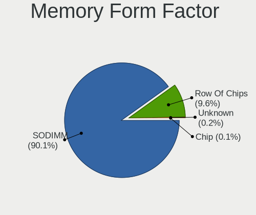

| Name         | Notebooks | Percent |
|--------------|-----------|---------|
| SODIMM       | 1621      | 92.63%  |
| Row Of Chips | 124       | 7.09%   |
| Chip         | 2         | 0.11%   |
| Unknown      | 2         | 0.11%   |
| DIMM         | 1         | 0.06%   |

Memory Size
-----------

Memory module size

| Size  | Notebooks | Percent |
|-------|-----------|---------|
| 8192  | 947       | 48.49%  |
| 4096  | 639       | 32.72%  |
| 16384 | 187       | 9.58%   |
| 2048  | 150       | 7.68%   |
| 1024  | 20        | 1.02%   |
| 32768 | 8         | 0.41%   |
| 512   | 2         | 0.1%    |

Memory Speed
------------

Memory module speed

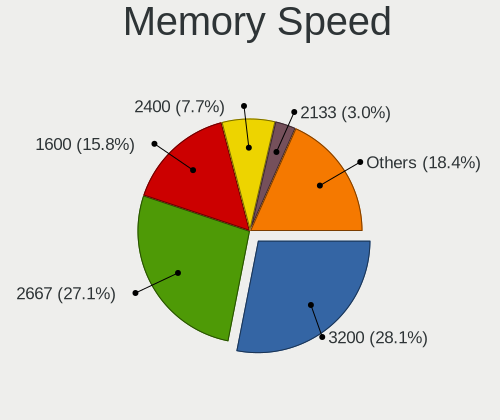

| Speed   | Notebooks | Percent |
|---------|-----------|---------|
| 2667    | 592       | 30.71%  |
| 3200    | 418       | 21.68%  |
| 1600    | 357       | 18.52%  |
| 2400    | 183       | 9.49%   |
| 2133    | 63        | 3.27%   |
| 3266    | 60        | 3.11%   |
| 1334    | 59        | 3.06%   |
| 1333    | 43        | 2.23%   |
| 4267    | 22        | 1.14%   |
| 4199    | 19        | 0.99%   |
| 1067    | 16        | 0.83%   |
| 667     | 15        | 0.78%   |
| Unknown | 14        | 0.73%   |
| 1867    | 12        | 0.62%   |
| 975     | 12        | 0.62%   |
| 6400    | 10        | 0.52%   |
| 4800    | 10        | 0.52%   |
| 800     | 7         | 0.36%   |
| 3733    | 4         | 0.21%   |
| 8400    | 3         | 0.16%   |
| 4266    | 3         | 0.16%   |
| 2048    | 3         | 0.16%   |
| 2800    | 1         | 0.05%   |
| 1639    | 1         | 0.05%   |
| 533     | 1         | 0.05%   |

Printers & scanners
-------------------

Printer Vendor
--------------

Printer device vendors

| Vendor             | Notebooks | Percent |
|--------------------|-----------|---------|
| Hewlett-Packard    | 7         | 41.18%  |
| Canon              | 5         | 29.41%  |
| Seiko Epson        | 2         | 11.76%  |
| STMicroelectronics | 1         | 5.88%   |
| Ricoh              | 1         | 5.88%   |
| Brother Industries | 1         | 5.88%   |

Printer Model
-------------

Printer device models

| Model                              | Notebooks | Percent |
|------------------------------------|-----------|---------|
| HP LaserJet 1020                   | 2         | 11.76%  |
| HP DeskJet 1110 series             | 2         | 11.76%  |
| Canon LBP2900                      | 2         | 11.76%  |
| STMicroelectronics USB Printer P   | 1         | 5.88%   |
| Seiko Epson L220 Series            | 1         | 5.88%   |
| Seiko Epson L132 Series            | 1         | 5.88%   |
| Ricoh SP 112SU                     | 1         | 5.88%   |
| HP Ink Tank 310 series             | 1         | 5.88%   |
| HP DeskJet 2620 All-in-One Printer | 1         | 5.88%   |
| HP DeskJet 2130 series             | 1         | 5.88%   |
| Canon PIXMA MP190                  | 1         | 5.88%   |
| Canon MF4800 Series                | 1         | 5.88%   |
| Canon G2000 series                 | 1         | 5.88%   |
| Brother HL-L2320D series           | 1         | 5.88%   |

Scanner Vendor
--------------

Scanner device vendors

| Vendor | Notebooks | Percent |
|--------|-----------|---------|
| Canon  | 2         | 100%    |

Scanner Model
-------------

Scanner device models

| Model                   | Notebooks | Percent |
|-------------------------|-----------|---------|
| Canon CanoScan LiDE 110 | 2         | 100%    |

Camera
------

Camera Vendor
-------------

Camera device vendors

| Vendor                                 | Notebooks | Percent |
|----------------------------------------|-----------|---------|
| Chicony Electronics                    | 566       | 19.49%  |
| IMC Networks                           | 442       | 15.22%  |
| Realtek Semiconductor                  | 306       | 10.54%  |
| Microdia                               | 297       | 10.23%  |
| Quanta                                 | 194       | 6.68%   |
| Sunplus Innovation Technology          | 183       | 6.3%    |
| Cheng Uei Precision Industry (Foxlink) | 141       | 4.86%   |
| Suyin                                  | 117       | 4.03%   |
| Bison Electronics                      | 116       | 3.99%   |
| Syntek                                 | 106       | 3.65%   |
| Acer                                   | 84        | 2.89%   |
| Luxvisions Innotech Limited            | 72        | 2.48%   |
| Lite-On Technology                     | 51        | 1.76%   |
| Alcor Micro                            | 28        | 0.96%   |
| Sonix Technology                       | 26        | 0.9%    |
| Silicon Motion                         | 21        | 0.72%   |
| Samsung Electronics                    | 21        | 0.72%   |
| Apple                                  | 21        | 0.72%   |
| Logitech                               | 15        | 0.52%   |
| Ricoh                                  | 14        | 0.48%   |
| Importek                               | 12        | 0.41%   |
| Primax Electronics                     | 10        | 0.34%   |
| OmniVision Technologies                | 8         | 0.28%   |
| Z-Star Microelectronics                | 6         | 0.21%   |
| SunplusIT                              | 6         | 0.21%   |
| Lenovo                                 | 6         | 0.21%   |
| Intel                                  | 5         | 0.17%   |
| Pixart Imaging                         | 4         | 0.14%   |
| vivo                                   | 3         | 0.1%    |
| MSD                                    | 3         | 0.1%    |
| Unknown                                | 2         | 0.07%   |
| OPPO Electronics                       | 2         | 0.07%   |
| Holitech                               | 2         | 0.07%   |
| Foxconn / Hon Hai                      | 2         | 0.07%   |
| Spreadtrum Communications              | 1         | 0.03%   |
| ShineOptics                            | 1         | 0.03%   |
| MacroSilicon                           | 1         | 0.03%   |
| Hewlett-Packard                        | 1         | 0.03%   |
| Google                                 | 1         | 0.03%   |
| Generalplus Technology                 | 1         | 0.03%   |

Camera Model
------------

Camera device models

| Model                                                          | Notebooks | Percent |
|----------------------------------------------------------------|-----------|---------|
| Microdia Integrated_Webcam_HD                                  | 160       | 5.51%   |
| IMC Networks USB2.0 HD UVC WebCam                              | 145       | 4.99%   |
| Realtek Integrated_Webcam_HD                                   | 123       | 4.23%   |
| IMC Networks Integrated Camera                                 | 120       | 4.13%   |
| Chicony Integrated Camera                                      | 116       | 3.99%   |
| Sunplus Integrated_Webcam_HD                                   | 93        | 3.2%    |
| IMC Networks USB2.0 VGA UVC WebCam                             | 83        | 2.86%   |
| Realtek Integrated Webcam                                      | 60        | 2.06%   |
| Chicony HP Truevision HD camera                                | 60        | 2.06%   |
| Chicony HP Truevision HD                                       | 55        | 1.89%   |
| Syntek Integrated Camera                                       | 54        | 1.86%   |
| Quanta HP TrueVision HD Camera                                 | 47        | 1.62%   |
| Chicony HD WebCam                                              | 46        | 1.58%   |
| Chicony EasyCamera                                             | 46        | 1.58%   |
| Suyin HP TrueVision HD                                         | 40        | 1.38%   |
| Quanta HD User Facing                                          | 40        | 1.38%   |
| Cheng Uei Precision Industry (Foxlink) HP Truevision HD        | 33        | 1.14%   |
| Acer Integrated Camera                                         | 33        | 1.14%   |
| Syntek EasyCamera                                              | 32        | 1.1%    |
| Luxvisions Innotech Limited HP TrueVision HD Camera            | 31        | 1.07%   |
| Cheng Uei Precision Industry (Foxlink) HP TrueVision HD Camera | 31        | 1.07%   |
| Bison Integrated Camera                                        | 30        | 1.03%   |
| Chicony HD User Facing                                         | 29        | 1%      |
| Lite-On Integrated Camera                                      | 26        | 0.89%   |
| IMC Networks HP TrueVision HD Camera                           | 26        | 0.89%   |
| Suyin Integrated_Webcam_HD                                     | 24        | 0.83%   |
| Sonix USB2.0 HD UVC WebCam                                     | 23        | 0.79%   |
| Quanta HP Wide Vision HD Camera                                | 23        | 0.79%   |
| Microdia Laptop_Integrated_Webcam_HD                           | 23        | 0.79%   |
| Microdia Integrated Webcam                                     | 23        | 0.79%   |
| Realtek EasyCamera                                             | 22        | 0.76%   |
| Samsung Galaxy A5 (MTP)                                        | 21        | 0.72%   |
| Quanta VGA WebCam                                              | 21        | 0.72%   |
| Quanta HD Webcam                                               | 20        | 0.69%   |
| Luxvisions Innotech Limited Integrated Camera                  | 20        | 0.69%   |
| Chicony Integrated Camera (1280x720@30)                        | 20        | 0.69%   |
| Chicony HP Wide Vision HD Camera                               | 19        | 0.65%   |
| Bison SunplusIT Integrated Camera                              | 19        | 0.65%   |
| Bison EasyCamera                                               | 19        | 0.65%   |
| Luxvisions Innotech Limited HP Wide Vision HD Camera           | 18        | 0.62%   |

Security
--------

Fingerprint Vendor
------------------

Fingerprint sensor vendors

| Vendor                             | Notebooks | Percent |
|------------------------------------|-----------|---------|
| Validity Sensors                   | 174       | 33.59%  |
| Shenzhen Goodix Technology         | 109       | 21.04%  |
| Synaptics                          | 98        | 18.92%  |
| Elan Microelectronics              | 80        | 15.44%  |
| LighTuning Technology              | 21        | 4.05%   |
| AuthenTec                          | 12        | 2.32%   |
| Upek                               | 10        | 1.93%   |
| Realtek USB2.0 Finger Print Bridge | 7         | 1.35%   |
| Focal-systems.Corp                 | 6         | 1.16%   |
| STMicroelectronics                 | 1         | 0.19%   |

Fingerprint Model
-----------------

Fingerprint sensor models

| Model                                                                      | Notebooks | Percent |
|----------------------------------------------------------------------------|-----------|---------|
| Shenzhen Goodix  FingerPrint Device                                        | 67        | 12.93%  |
| Elan ELAN:ARM-M4                                                           | 51        | 9.85%   |
| Validity Sensors VFS495 Fingerprint Reader                                 | 48        | 9.27%   |
| Shenzhen Goodix Fingerprint Reader                                         | 36        | 6.95%   |
| Elan ELAN:Fingerprint                                                      | 29        | 5.6%    |
| Synaptics Metallica MIS Touch Fingerprint Reader                           | 24        | 4.63%   |
| Validity Sensors VFS5011 Fingerprint Reader                                | 23        | 4.44%   |
| Validity Sensors Synaptics VFS7552 Touch Fingerprint Sensor                | 23        | 4.44%   |
| LighTuning EgisTec Touch Fingerprint Sensor                                | 21        | 4.05%   |
| Synaptics Prometheus MIS Touch Fingerprint Reader                          | 17        | 3.28%   |
| Synaptics WBDI                                                             | 14        | 2.7%    |
| Synaptics Metallica MOH Touch Fingerprint Reader                           | 14        | 2.7%    |
| Synaptics  WBDI                                                            | 13        | 2.51%   |
| Validity Sensors VFS491                                                    | 11        | 2.12%   |
| Validity Sensors VFS Fingerprint sensor                                    | 11        | 2.12%   |
| Validity Sensors VFS 5011 fingerprint sensor                               | 11        | 2.12%   |
| Upek Biometric Touchchip/Touchstrip Fingerprint Sensor                     | 9         | 1.74%   |
| Validity Sensors Synaptics WBDI                                            | 8         | 1.54%   |
| Validity Sensors Synaptics VFS7552 Touch Fingerprint Sensor with PurePrint | 8         | 1.54%   |
| Realtek USB2.0 Finger Print Bridge FocalTech Fingerprint Device            | 7         | 1.35%   |
| Validity Sensors VFS7500 Touch Fingerprint Sensor                          | 6         | 1.16%   |
| Validity Sensors VFS451 Fingerprint Reader                                 | 6         | 1.16%   |
| Validity Sensors Fingerprint scanner                                       | 6         | 1.16%   |
| Shenzhen Goodix FingerPrint                                                | 6         | 1.16%   |
| Focal-systems.Corp FT9201Fingerprint.                                      | 6         | 1.16%   |
| Validity Sensors VFS471 Fingerprint Reader                                 | 5         | 0.97%   |
| Synaptics UWP WBDI                                                         | 5         | 0.97%   |
| AuthenTec Fingerprint Sensor                                               | 5         | 0.97%   |
| Validity Sensors Swipe Fingerprint Sensor                                  | 4         | 0.77%   |
| Synaptics WBDI Fingerprint Reader USB 086                                  | 4         | 0.77%   |
| Synaptics  VFS7552 Touch Fingerprint Sensor with PurePrint                 | 4         | 0.77%   |
| AuthenTec AES1660 Fingerprint Sensor                                       | 3         | 0.58%   |
| Validity Sensors VFS301 Fingerprint Reader                                 | 2         | 0.39%   |
| Synaptics FS7604 Touch Fingerprint Sensor with PurePrint                   | 2         | 0.39%   |
| AuthenTec AES2810                                                          | 2         | 0.39%   |
| AuthenTec AES1600                                                          | 2         | 0.39%   |
| Validity Sensors VFS7552 Touch Fingerprint Sensor                          | 1         | 0.19%   |
| Validity Sensors VFS101 Fingerprint Reader                                 | 1         | 0.19%   |
| Upek TCS5B Fingerprint sensor                                              | 1         | 0.19%   |
| Synaptics  FS7604 Touch Fingerprint Sensor with PurePrint                  | 1         | 0.19%   |

Chipcard Vendor
---------------

Chipcard module vendors

| Vendor                | Notebooks | Percent |
|-----------------------|-----------|---------|
| Broadcom              | 60        | 63.83%  |
| Alcor Micro           | 19        | 20.21%  |
| Upek                  | 8         | 8.51%   |
| O2 Micro              | 3         | 3.19%   |
| Lenovo                | 3         | 3.19%   |
| Gemalto (was Gemplus) | 1         | 1.06%   |

Chipcard Model
--------------

Chipcard module models

| Model                                                                        | Notebooks | Percent |
|------------------------------------------------------------------------------|-----------|---------|
| Broadcom BCM5880 Secure Applications Processor                               | 22        | 23.16%  |
| Alcor Micro AU9540 Smartcard Reader                                          | 19        | 20%     |
| Broadcom 5880                                                                | 17        | 17.89%  |
| Broadcom BCM5880 Secure Applications Processor with fingerprint swipe sensor | 13        | 13.68%  |
| Broadcom 58200                                                               | 9         | 9.47%   |
| Upek TouchChip Fingerprint Coprocessor (WBF advanced mode)                   | 8         | 8.42%   |
| Lenovo Integrated Smart Card Reader                                          | 3         | 3.16%   |
| O2 Micro OZ776 CCID Smartcard Reader                                         | 2         | 2.11%   |
| O2 Micro Oz776 SmartCard Reader                                              | 1         | 1.05%   |
| Gemalto (was Gemplus) Compact Smart Card Reader Writer                       | 1         | 1.05%   |

Unsupported
-----------

Unsupported Devices
-------------------

Total unsupported devices on board

| Total | Notebooks | Percent |
|-------|-----------|---------|
| 0     | 1993      | 62.83%  |
| 1     | 990       | 31.21%  |
| 2     | 154       | 4.85%   |
| 3     | 23        | 0.73%   |
| 4     | 5         | 0.16%   |
| 5     | 4         | 0.13%   |
| 9     | 2         | 0.06%   |
| 6     | 1         | 0.03%   |

Unsupported Device Types
------------------------

Types of unsupported devices

| Type                     | Notebooks | Percent |
|--------------------------|-----------|---------|
| Fingerprint reader       | 513       | 37.31%  |
| Graphics card            | 319       | 23.2%   |
| Net/wireless             | 172       | 12.51%  |
| Chipcard                 | 90        | 6.55%   |
| Bluetooth                | 82        | 5.96%   |
| Multimedia controller    | 68        | 4.95%   |
| Camera                   | 47        | 3.42%   |
| Communication controller | 30        | 2.18%   |
| Net/ethernet             | 15        | 1.09%   |
| Sound                    | 13        | 0.95%   |
| Storage                  | 12        | 0.87%   |
| Card reader              | 5         | 0.36%   |
| Network                  | 4         | 0.29%   |
| Modem                    | 4         | 0.29%   |
| Storage/nvme             | 1         | 0.07%   |

