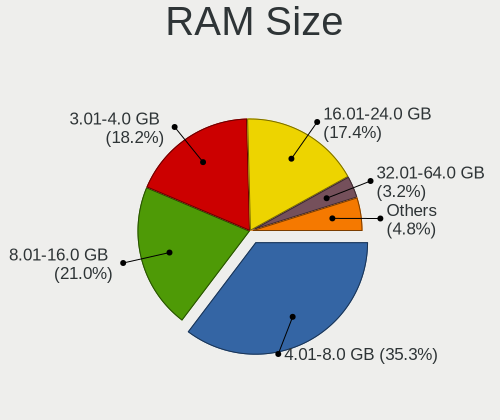
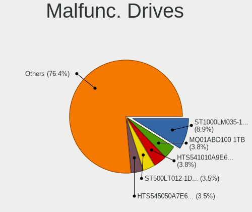
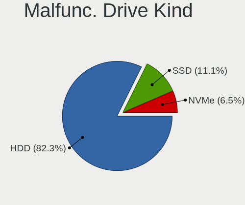
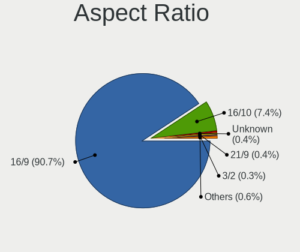
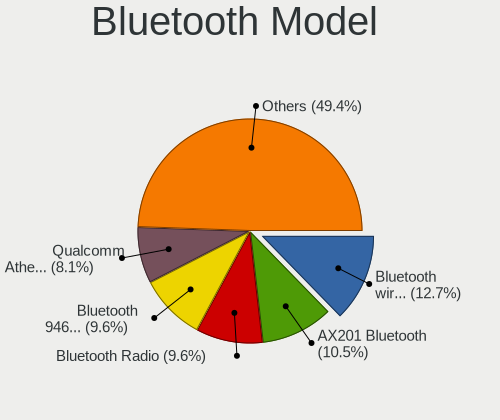
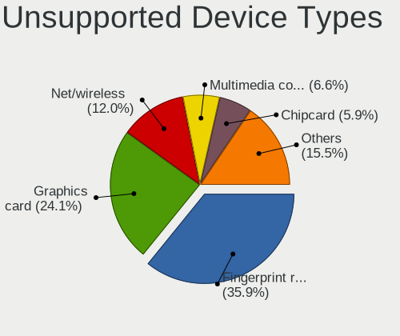

Linux in India - Tested Hardware & Statistics (Notebooks)
---------------------------------------------------------

A project to collect tested hardware configurations for Linux in India.

Anyone can contribute to this report by the [hw-probe](https://github.com/linuxhw/hw-probe) tool:

    sudo -E hw-probe -all -upload

Please contribute! Especially if your hardware is rare.

Contents
--------

* [ Test Cases ](#test-cases)

* [ System ](#system)
  - [ OS                       ](#os)
  - [ OS Family                ](#os-family)
  - [ Kernel                   ](#kernel)
  - [ Kernel Family            ](#kernel-family)
  - [ Kernel Major Ver.        ](#kernel-major-ver)
  - [ Arch                     ](#arch)
  - [ DE                       ](#de)
  - [ Display Server           ](#display-server)
  - [ Display Manager          ](#display-manager)
  - [ OS Lang                  ](#os-lang)
  - [ Boot Mode                ](#boot-mode)
  - [ Filesystem               ](#filesystem)
  - [ Part. scheme             ](#part-scheme)
  - [ Dual Boot with Linux/BSD ](#dual-boot-with-linuxbsd)
  - [ Dual Boot (Win)          ](#dual-boot-win)

* [ Board ](#board)
  - [ Vendor                   ](#vendor)
  - [ Model                    ](#model)
  - [ Model Family             ](#model-family)
  - [ MFG Year                 ](#mfg-year)
  - [ Form Factor              ](#form-factor)
  - [ Secure Boot              ](#secure-boot)
  - [ Coreboot                 ](#coreboot)
  - [ RAM Size                 ](#ram-size)
  - [ RAM Used                 ](#ram-used)
  - [ Total Drives             ](#total-drives)
  - [ Has CD-ROM               ](#has-cd-rom)
  - [ Has Ethernet             ](#has-ethernet)
  - [ Has WiFi                 ](#has-wifi)
  - [ Has Bluetooth            ](#has-bluetooth)

* [ Location ](#location)
  - [ Country                  ](#country)
  - [ City                     ](#city)

* [ Drives ](#drives)
  - [ Drive Vendor             ](#drive-vendor)
  - [ Drive Model              ](#drive-model)
  - [ HDD Vendor               ](#hdd-vendor)
  - [ SSD Vendor               ](#ssd-vendor)
  - [ Drive Kind               ](#drive-kind)
  - [ Drive Connector          ](#drive-connector)
  - [ Drive Size               ](#drive-size)
  - [ Space Total              ](#space-total)
  - [ Space Used               ](#space-used)
  - [ Malfunc. Drives          ](#malfunc-drives)
  - [ Malfunc. Drive Vendor    ](#malfunc-drive-vendor)
  - [ Malfunc. HDD Vendor      ](#malfunc-hdd-vendor)
  - [ Malfunc. Drive Kind      ](#malfunc-drive-kind)
  - [ Failed Drives            ](#failed-drives)
  - [ Failed Drive Vendor      ](#failed-drive-vendor)
  - [ Drive Status             ](#drive-status)

* [ Storage controller ](#storage-controller)
  - [ Storage Vendor           ](#storage-vendor)
  - [ Storage Model            ](#storage-model)
  - [ Storage Kind             ](#storage-kind)

* [ Processor ](#processor)
  - [ CPU Vendor               ](#cpu-vendor)
  - [ CPU Model                ](#cpu-model)
  - [ CPU Model Family         ](#cpu-model-family)
  - [ CPU Cores                ](#cpu-cores)
  - [ CPU Sockets              ](#cpu-sockets)
  - [ CPU Threads              ](#cpu-threads)
  - [ CPU Op-Modes             ](#cpu-op-modes)
  - [ CPU Microcode            ](#cpu-microcode)
  - [ CPU Microarch            ](#cpu-microarch)

* [ Graphics ](#graphics)
  - [ GPU Vendor               ](#gpu-vendor)
  - [ GPU Model                ](#gpu-model)
  - [ GPU Combo                ](#gpu-combo)
  - [ GPU Driver               ](#gpu-driver)
  - [ GPU Memory               ](#gpu-memory)

* [ Monitor ](#monitor)
  - [ Monitor Vendor           ](#monitor-vendor)
  - [ Monitor Model            ](#monitor-model)
  - [ Monitor Resolution       ](#monitor-resolution)
  - [ Monitor Diagonal         ](#monitor-diagonal)
  - [ Monitor Width            ](#monitor-width)
  - [ Aspect Ratio             ](#aspect-ratio)
  - [ Monitor Area             ](#monitor-area)
  - [ Pixel Density            ](#pixel-density)
  - [ Multiple Monitors        ](#multiple-monitors)

* [ Network ](#network)
  - [ Net Controller Vendor    ](#net-controller-vendor)
  - [ Net Controller Model     ](#net-controller-model)
  - [ Wireless Vendor          ](#wireless-vendor)
  - [ Wireless Model           ](#wireless-model)
  - [ Ethernet Vendor          ](#ethernet-vendor)
  - [ Ethernet Model           ](#ethernet-model)
  - [ Net Controller Kind      ](#net-controller-kind)
  - [ Used Controller          ](#used-controller)
  - [ NICs                     ](#nics)
  - [ IPv6                     ](#ipv6)

* [ Bluetooth ](#bluetooth)
  - [ Bluetooth Vendor         ](#bluetooth-vendor)
  - [ Bluetooth Model          ](#bluetooth-model)

* [ Sound ](#sound)
  - [ Sound Vendor             ](#sound-vendor)
  - [ Sound Model              ](#sound-model)

* [ Memory ](#memory)
  - [ Memory Vendor            ](#memory-vendor)
  - [ Memory Model             ](#memory-model)
  - [ Memory Kind              ](#memory-kind)
  - [ Memory Form Factor       ](#memory-form-factor)
  - [ Memory Size              ](#memory-size)
  - [ Memory Speed             ](#memory-speed)

* [ Printers & scanners ](#printers--scanners)
  - [ Printer Vendor           ](#printer-vendor)
  - [ Printer Model            ](#printer-model)
  - [ Scanner Vendor           ](#scanner-vendor)
  - [ Scanner Model            ](#scanner-model)

* [ Camera ](#camera)
  - [ Camera Vendor            ](#camera-vendor)
  - [ Camera Model             ](#camera-model)

* [ Security ](#security)
  - [ Fingerprint Vendor       ](#fingerprint-vendor)
  - [ Fingerprint Model        ](#fingerprint-model)
  - [ Chipcard Vendor          ](#chipcard-vendor)
  - [ Chipcard Model           ](#chipcard-model)

* [ Unsupported ](#unsupported)
  - [ Unsupported Devices      ](#unsupported-devices)
  - [ Unsupported Device Types ](#unsupported-device-types)

Test Cases
----------

Total: 4009

| Vendor        | Model                       | Probe                                                      | Date         |
|---------------|-----------------------------|------------------------------------------------------------|--------------|
| Lenovo        | ThinkPad P1 Gen 3 20TJS2... | [22abfb4a79](https://linux-hardware.org/?probe=22abfb4a79) | Feb 01, 2023 |
| Lenovo        | ThinkPad E14 20RAS1RA00     | [8360c9e13f](https://linux-hardware.org/?probe=8360c9e13f) | Feb 01, 2023 |
| Timi          | Mi NoteBook Ultra           | [d897ec0114](https://linux-hardware.org/?probe=d897ec0114) | Feb 01, 2023 |
| HUAWEI        | BOHK-WAX9X                  | [07b498f669](https://linux-hardware.org/?probe=07b498f669) | Feb 01, 2023 |
| HP            | Pavilion 15                 | [e3adac798e](https://linux-hardware.org/?probe=e3adac798e) | Jan 30, 2023 |
| HP            | 15                          | [409a15bdf3](https://linux-hardware.org/?probe=409a15bdf3) | Jan 30, 2023 |
| ASUSTek       | X507UA                      | [49cc52b5b2](https://linux-hardware.org/?probe=49cc52b5b2) | Jan 29, 2023 |
| Lenovo        | IdeaPad Y560                | [47438e081a](https://linux-hardware.org/?probe=47438e081a) | Jan 29, 2023 |
| Lenovo        | IdeaPad 5 15ITL05 82FG      | [4b8206c892](https://linux-hardware.org/?probe=4b8206c892) | Jan 29, 2023 |
| HP            | Pavilion 15                 | [c5ac9f6d89](https://linux-hardware.org/?probe=c5ac9f6d89) | Jan 29, 2023 |
| Lenovo        | IdeaPad Y560                | [621aca8707](https://linux-hardware.org/?probe=621aca8707) | Jan 29, 2023 |
| Lenovo        | IdeaPad Y560                | [55fe252b4e](https://linux-hardware.org/?probe=55fe252b4e) | Jan 29, 2023 |
| Lenovo        | ThinkPad X61 7674BE1        | [a22ac0a9f5](https://linux-hardware.org/?probe=a22ac0a9f5) | Jan 28, 2023 |
| Acer          | Aspire A515-57G             | [f5492fbdaa](https://linux-hardware.org/?probe=f5492fbdaa) | Jan 27, 2023 |
| Timi          | Mi NoteBook Pro             | [33905a4ee9](https://linux-hardware.org/?probe=33905a4ee9) | Jan 26, 2023 |
| Dell          | Latitude 7480               | [3cb61c5b71](https://linux-hardware.org/?probe=3cb61c5b71) | Jan 26, 2023 |
| Lenovo        | E41-25 81FS                 | [6de2ea7d90](https://linux-hardware.org/?probe=6de2ea7d90) | Jan 26, 2023 |
| HP            | Pavilion 15                 | [e3ac708616](https://linux-hardware.org/?probe=e3ac708616) | Jan 26, 2023 |
| Acer          | Aspire A515-52G             | [a95489f0b7](https://linux-hardware.org/?probe=a95489f0b7) | Jan 24, 2023 |
| MSI           | GF63 Thin 9SCXR             | [edbaabb13a](https://linux-hardware.org/?probe=edbaabb13a) | Jan 24, 2023 |
| Acer          | Aspire ES1-521              | [32a1eb6d60](https://linux-hardware.org/?probe=32a1eb6d60) | Jan 23, 2023 |
| Lenovo        | Legion 5 Pro 16ACH6H 82J... | [07005e3e32](https://linux-hardware.org/?probe=07005e3e32) | Jan 22, 2023 |
| Lenovo        | Legion 5 Pro 16ACH6H 82J... | [348a78bb64](https://linux-hardware.org/?probe=348a78bb64) | Jan 22, 2023 |
| Lenovo        | Legion 5 Pro 16ACH6H 82J... | [c6a463e92f](https://linux-hardware.org/?probe=c6a463e92f) | Jan 22, 2023 |
| ASUSTek       | VivoBook_ASUSLaptop X515... | [a09d1d224c](https://linux-hardware.org/?probe=a09d1d224c) | Jan 22, 2023 |
| Timi          | Mi Notebook Pro             | [1db1382f0b](https://linux-hardware.org/?probe=1db1382f0b) | Jan 21, 2023 |
| Dell          | Inspiron 5505               | [9a17165647](https://linux-hardware.org/?probe=9a17165647) | Jan 20, 2023 |
| Dell          | Inspiron 5505               | [e1003a85c9](https://linux-hardware.org/?probe=e1003a85c9) | Jan 20, 2023 |
| ASUSTek       | VivoBook_ASUSLaptop E410... | [0f079e1dc7](https://linux-hardware.org/?probe=0f079e1dc7) | Jan 19, 2023 |
| Acer          | Aspire A315-23              | [90049e4bb7](https://linux-hardware.org/?probe=90049e4bb7) | Jan 19, 2023 |
| Dell          | Latitude E6510              | [4b10c4532e](https://linux-hardware.org/?probe=4b10c4532e) | Jan 19, 2023 |
| Dell          | Latitude E6510              | [6b8112e4c1](https://linux-hardware.org/?probe=6b8112e4c1) | Jan 19, 2023 |
| Lenovo        | ThinkPad X200 7459VB9       | [a58c604cf7](https://linux-hardware.org/?probe=a58c604cf7) | Jan 18, 2023 |
| Dell          | Inspiron 3442               | [04fe55a1a1](https://linux-hardware.org/?probe=04fe55a1a1) | Jan 18, 2023 |
| HP            | Victus by Gaming Laptop ... | [533d99e2f1](https://linux-hardware.org/?probe=533d99e2f1) | Jan 18, 2023 |
| HP            | 15                          | [cebe1b150e](https://linux-hardware.org/?probe=cebe1b150e) | Jan 18, 2023 |
| Timi          | Xiaomi NoteBook Pro         | [681de2b0c1](https://linux-hardware.org/?probe=681de2b0c1) | Jan 17, 2023 |
| MSI           | GF63 Thin 9SCXR             | [592a29d649](https://linux-hardware.org/?probe=592a29d649) | Jan 17, 2023 |
| Timi          | Xiaomi NoteBook Pro         | [f1ee502754](https://linux-hardware.org/?probe=f1ee502754) | Jan 17, 2023 |
| ASUSTek       | ASUS TUF Gaming A15 FA50... | [0d91852ebf](https://linux-hardware.org/?probe=0d91852ebf) | Jan 17, 2023 |
| MSI           | Prestige 15 A11SCX          | [9c5bf0d05c](https://linux-hardware.org/?probe=9c5bf0d05c) | Jan 16, 2023 |
| Lenovo        | IdeaPad Gaming 3 15IHU6 ... | [1a51848ffb](https://linux-hardware.org/?probe=1a51848ffb) | Jan 16, 2023 |
| Lenovo        | V14-IIL 82C4                | [1b195c04d8](https://linux-hardware.org/?probe=1b195c04d8) | Jan 16, 2023 |
| Lenovo        | ThinkPad A485 20MVS0X600    | [2c2e9caacc](https://linux-hardware.org/?probe=2c2e9caacc) | Jan 16, 2023 |
| Lenovo        | ThinkPad T440p 20AN00DJA... | [250aa5a61b](https://linux-hardware.org/?probe=250aa5a61b) | Jan 15, 2023 |
| HP            | Pavilion g6                 | [fba7cebfff](https://linux-hardware.org/?probe=fba7cebfff) | Jan 14, 2023 |
| MSI           | Bravo 15 B5DD               | [ffb8653d34](https://linux-hardware.org/?probe=ffb8653d34) | Jan 14, 2023 |
| Lenovo        | ThinkPad W540 20BHS1840P    | [0046521475](https://linux-hardware.org/?probe=0046521475) | Jan 14, 2023 |
| Dell          | XPS 15 9570                 | [bff6278ed8](https://linux-hardware.org/?probe=bff6278ed8) | Jan 14, 2023 |
| HONOR         | NMH-WCX9                    | [10a9c33aed](https://linux-hardware.org/?probe=10a9c33aed) | Jan 13, 2023 |
| MSI           | GF63 Thin 9SCXR             | [3ba9f40d9b](https://linux-hardware.org/?probe=3ba9f40d9b) | Jan 13, 2023 |
| Lenovo        | ThinkPad L430 24663D1       | [1987221c12](https://linux-hardware.org/?probe=1987221c12) | Jan 12, 2023 |
| HP            | 245 G7 Notebook PC          | [3997d98a9a](https://linux-hardware.org/?probe=3997d98a9a) | Jan 11, 2023 |
| SmbiosType... | SmbiosType1_SystemProduc... | [6c67fc3995](https://linux-hardware.org/?probe=6c67fc3995) | Jan 11, 2023 |
| Acer          | TravelMate P245-M           | [1722e41c8d](https://linux-hardware.org/?probe=1722e41c8d) | Jan 11, 2023 |
| Lenovo        | IdeaPad 320-15ISK 80XH      | [a786384700](https://linux-hardware.org/?probe=a786384700) | Jan 10, 2023 |
| SmbiosType... | SmbiosType1_SystemProduc... | [8367c27d81](https://linux-hardware.org/?probe=8367c27d81) | Jan 10, 2023 |
| MSI           | GF63 Thin 9SCXR             | [805265229e](https://linux-hardware.org/?probe=805265229e) | Jan 10, 2023 |
| ASUSTek       | K53SM                       | [f1ac679157](https://linux-hardware.org/?probe=f1ac679157) | Jan 10, 2023 |
| ASUSTek       | ZenBook 13 UX331FAL_UX33... | [debe9fa9d2](https://linux-hardware.org/?probe=debe9fa9d2) | Jan 08, 2023 |
| Lenovo        | ThinkPad T430 2349E56       | [ff2639c47b](https://linux-hardware.org/?probe=ff2639c47b) | Jan 07, 2023 |
| ASUSTek       | VivoBook_ASUSLaptop X430... | [f191d63ace](https://linux-hardware.org/?probe=f191d63ace) | Jan 07, 2023 |
| MSI           | GF63 Thin 9SCXR             | [a6b7ce48a7](https://linux-hardware.org/?probe=a6b7ce48a7) | Jan 07, 2023 |
| MSI           | GF63 Thin 9SCXR             | [a3cc92ede0](https://linux-hardware.org/?probe=a3cc92ede0) | Jan 07, 2023 |
| MSI           | GF63 8RD                    | [d9fc4d53c9](https://linux-hardware.org/?probe=d9fc4d53c9) | Jan 07, 2023 |
| Dell          | Vostro 15-3568              | [2dd2c1c022](https://linux-hardware.org/?probe=2dd2c1c022) | Jan 06, 2023 |
| Dell          | Vostro 15-3568              | [f3d1187b29](https://linux-hardware.org/?probe=f3d1187b29) | Jan 06, 2023 |
| ASUSTek       | ASUS TUF Gaming A15 FA50... | [fd5120fea6](https://linux-hardware.org/?probe=fd5120fea6) | Jan 06, 2023 |
| HP            | Laptop 14s-dk0xxx           | [00212160f7](https://linux-hardware.org/?probe=00212160f7) | Jan 05, 2023 |
| Lenovo        | ThinkBook 13s G2 ITL 20V... | [482205e492](https://linux-hardware.org/?probe=482205e492) | Jan 05, 2023 |
| HP            | Notebook                    | [611e618b60](https://linux-hardware.org/?probe=611e618b60) | Jan 03, 2023 |
| Lenovo        | ThinkPad E490 20N8S0H300    | [fb3233e525](https://linux-hardware.org/?probe=fb3233e525) | Jan 02, 2023 |
| ITI LIMITE... | ITI Smaash ITIB15LI3        | [6e271cd1c3](https://linux-hardware.org/?probe=6e271cd1c3) | Jan 02, 2023 |
| Lenovo        | ThinkPad L430 24663D1       | [8eada9744e](https://linux-hardware.org/?probe=8eada9744e) | Jan 01, 2023 |
| HP            | Laptop HP Laptop 14s-dr1... | [2a27236865](https://linux-hardware.org/?probe=2a27236865) | Jan 01, 2023 |
| Lenovo        | ThinkPad T470s W10DG 20J... | [60b4a8e506](https://linux-hardware.org/?probe=60b4a8e506) | Jan 01, 2023 |
| Timi          | Xiaomi NoteBook Pro         | [5d0ff5ea2d](https://linux-hardware.org/?probe=5d0ff5ea2d) | Dec 31, 2022 |
| Dell          | Inspiron 3421               | [d2cd50a2a6](https://linux-hardware.org/?probe=d2cd50a2a6) | Dec 30, 2022 |
| Dell          | Inspiron 3421               | [ae7d821823](https://linux-hardware.org/?probe=ae7d821823) | Dec 30, 2022 |
| ITI LIMITE... | ITI Smaash ITIB15LI3        | [6a08f378e2](https://linux-hardware.org/?probe=6a08f378e2) | Dec 30, 2022 |
| ITI LIMITE... | ITI Smaash ITIB15LI3        | [282a44d1ff](https://linux-hardware.org/?probe=282a44d1ff) | Dec 30, 2022 |
| Lenovo        | IdeaPad 320-15IKB 81BT      | [3a7cfd8073](https://linux-hardware.org/?probe=3a7cfd8073) | Dec 30, 2022 |
| Lenovo        | ThinkPad E14 Gen 3 20Y7S... | [5bf3ff5c0e](https://linux-hardware.org/?probe=5bf3ff5c0e) | Dec 29, 2022 |
| Lenovo        | ThinkPad E14 Gen 3 20Y7S... | [4f63c4474c](https://linux-hardware.org/?probe=4f63c4474c) | Dec 29, 2022 |
| ASUSTek       | VivoBook_ASUSLaptop X512... | [ce45aaceaf](https://linux-hardware.org/?probe=ce45aaceaf) | Dec 29, 2022 |
| HP            | Pavilion 15                 | [264e3738ec](https://linux-hardware.org/?probe=264e3738ec) | Dec 29, 2022 |
| Dell          | Latitude 3420               | [eb6d4c6921](https://linux-hardware.org/?probe=eb6d4c6921) | Dec 29, 2022 |
| HP            | Pavilion 15                 | [15ec0001c5](https://linux-hardware.org/?probe=15ec0001c5) | Dec 29, 2022 |
| HP            | Pavilion 15                 | [e84551a6eb](https://linux-hardware.org/?probe=e84551a6eb) | Dec 29, 2022 |
| Lenovo        | IdeaPad 320-15IKB 81BT      | [d5be261567](https://linux-hardware.org/?probe=d5be261567) | Dec 29, 2022 |
| HP            | ENVY Laptop 13-ba1xxx       | [c25b644aca](https://linux-hardware.org/?probe=c25b644aca) | Dec 28, 2022 |
| Lenovo        | IdeaPad 320-15IKB 81BT      | [5054f77353](https://linux-hardware.org/?probe=5054f77353) | Dec 27, 2022 |
| Timi          | RedmiBook 15                | [cf38b14bc5](https://linux-hardware.org/?probe=cf38b14bc5) | Dec 27, 2022 |
| HP            | Pavilion Gaming Laptop 1... | [c8b85cb0cd](https://linux-hardware.org/?probe=c8b85cb0cd) | Dec 26, 2022 |
| Lenovo        | G510 20238                  | [812d6eb07e](https://linux-hardware.org/?probe=812d6eb07e) | Dec 26, 2022 |
| Dell          | Inspiron N5010              | [69ac8a9522](https://linux-hardware.org/?probe=69ac8a9522) | Dec 26, 2022 |
| Dell          | Latitude E6400              | [435ac90ddc](https://linux-hardware.org/?probe=435ac90ddc) | Dec 26, 2022 |
| Sony          | SVE15133CNB                 | [40ac0f9ffc](https://linux-hardware.org/?probe=40ac0f9ffc) | Dec 25, 2022 |
| Lenovo        | Y520-15IKBN 80WK            | [576fb3852f](https://linux-hardware.org/?probe=576fb3852f) | Dec 25, 2022 |
| Dell          | Vostro 3501                 | [2bd2de39fb](https://linux-hardware.org/?probe=2bd2de39fb) | Dec 24, 2022 |
| HP            | Pavilion Laptop 14-ec0xx... | [978bb114dc](https://linux-hardware.org/?probe=978bb114dc) | Dec 23, 2022 |
| HP            | EliteBook 840 G5            | [05ab61864f](https://linux-hardware.org/?probe=05ab61864f) | Dec 23, 2022 |
| Acer          | Predator PH315-53           | [39e6254135](https://linux-hardware.org/?probe=39e6254135) | Dec 23, 2022 |
| HP            | Laptop 14s-dk0xxx           | [53aa474cf5](https://linux-hardware.org/?probe=53aa474cf5) | Dec 23, 2022 |
| HONOR         | BBR-WAX9                    | [19909aa86b](https://linux-hardware.org/?probe=19909aa86b) | Dec 23, 2022 |
| HP            | ProBook 440 G8 Notebook ... | [0256ea50a4](https://linux-hardware.org/?probe=0256ea50a4) | Dec 23, 2022 |
| Acer          | Aspire A515-57G             | [a208b5598e](https://linux-hardware.org/?probe=a208b5598e) | Dec 22, 2022 |
| Acer          | Aspire A515-57G             | [cccd3d01d7](https://linux-hardware.org/?probe=cccd3d01d7) | Dec 22, 2022 |
| HP            | Pavilion Gaming Laptop 1... | [b221e3103a](https://linux-hardware.org/?probe=b221e3103a) | Dec 22, 2022 |
| Acer          | Swift SF314-512             | [505ab3f60a](https://linux-hardware.org/?probe=505ab3f60a) | Dec 22, 2022 |
| Acer          | Gateway NE46Rs1             | [45a25a89d7](https://linux-hardware.org/?probe=45a25a89d7) | Dec 21, 2022 |
| MSI           | GL65 Leopard 10SDK          | [2c6e6ec3ec](https://linux-hardware.org/?probe=2c6e6ec3ec) | Dec 21, 2022 |
| Lenovo        | Legion 5 15ARH05 82B5       | [9438c80c85](https://linux-hardware.org/?probe=9438c80c85) | Dec 21, 2022 |
| ASUSTek       | ASUS TUF Gaming F15 FX50... | [7d5914dcb2](https://linux-hardware.org/?probe=7d5914dcb2) | Dec 21, 2022 |
| Timi          | Mi NoteBook Pro             | [b5bbb4f410](https://linux-hardware.org/?probe=b5bbb4f410) | Dec 21, 2022 |
| HP            | ZBook 15                    | [a3bf671d64](https://linux-hardware.org/?probe=a3bf671d64) | Dec 20, 2022 |
| Dell          | Vostro 5620                 | [005d388376](https://linux-hardware.org/?probe=005d388376) | Dec 20, 2022 |
| Acer          | Aspire A715-51G             | [93eff781da](https://linux-hardware.org/?probe=93eff781da) | Dec 20, 2022 |
| Acer          | Aspire A715-51G             | [0b7352a343](https://linux-hardware.org/?probe=0b7352a343) | Dec 20, 2022 |
| Dell          | Inspiron 7572               | [418178c3ca](https://linux-hardware.org/?probe=418178c3ca) | Dec 19, 2022 |
| Lenovo        | ThinkPad T14s Gen 1 20T1... | [c67b4d2b31](https://linux-hardware.org/?probe=c67b4d2b31) | Dec 19, 2022 |
| Sony          | SVE15133CNB                 | [a2bee3bb3f](https://linux-hardware.org/?probe=a2bee3bb3f) | Dec 19, 2022 |
| ASUSTek       | VivoBook_ASUSLaptop X403... | [3ec240466e](https://linux-hardware.org/?probe=3ec240466e) | Dec 19, 2022 |
| HP            | Pavilion Laptop 14-ec0xx... | [08e38b2be9](https://linux-hardware.org/?probe=08e38b2be9) | Dec 18, 2022 |
| HP            | Laptop 14s-dk0xxx           | [eaf1b6a773](https://linux-hardware.org/?probe=eaf1b6a773) | Dec 17, 2022 |
| HP            | 245 G3                      | [ceee8f33ca](https://linux-hardware.org/?probe=ceee8f33ca) | Dec 17, 2022 |
| ASUSTek       | Zenbook UM5302TA_UM5302T... | [b0f674ae6f](https://linux-hardware.org/?probe=b0f674ae6f) | Dec 17, 2022 |
| Sony          | SVE15133CNB                 | [acca7c4697](https://linux-hardware.org/?probe=acca7c4697) | Dec 17, 2022 |
| HP            | 250 G1                      | [07f20cc1ec](https://linux-hardware.org/?probe=07f20cc1ec) | Dec 17, 2022 |
| ASUSTek       | VivoBook_ASUSLaptop X571... | [f6e6cfc7b3](https://linux-hardware.org/?probe=f6e6cfc7b3) | Dec 17, 2022 |
| Dell          | Inspiron 3442               | [3b5142322b](https://linux-hardware.org/?probe=3b5142322b) | Dec 16, 2022 |
| HP            | Laptop 15q-bu0xx            | [d291ab8cf8](https://linux-hardware.org/?probe=d291ab8cf8) | Dec 16, 2022 |
| Lenovo        | Legion 5 15IMH05 82AU       | [f54a021496](https://linux-hardware.org/?probe=f54a021496) | Dec 16, 2022 |
| Lenovo        | ThinkPad P14s Gen 3 21J6... | [7aab463e8e](https://linux-hardware.org/?probe=7aab463e8e) | Dec 15, 2022 |
| ASUSTek       | TUF Gaming FX505DT_FX505... | [7ea1bad26b](https://linux-hardware.org/?probe=7ea1bad26b) | Dec 15, 2022 |
| Dell          | Latitude 3420               | [a6c668f4a2](https://linux-hardware.org/?probe=a6c668f4a2) | Dec 15, 2022 |
| Lenovo        | ThinkPad E14 Gen 3 20YES... | [484c320457](https://linux-hardware.org/?probe=484c320457) | Dec 14, 2022 |
| Dell          | Inspiron 3583               | [70992b154e](https://linux-hardware.org/?probe=70992b154e) | Dec 14, 2022 |
| Lenovo        | ThinkPad E14 Gen 4 21E4C... | [7ffd00681b](https://linux-hardware.org/?probe=7ffd00681b) | Dec 12, 2022 |
| HP            | Laptop 14s-fq1xxx           | [811092647b](https://linux-hardware.org/?probe=811092647b) | Dec 11, 2022 |
| HP            | Pavilion g6                 | [964081eed7](https://linux-hardware.org/?probe=964081eed7) | Dec 11, 2022 |
| Unknown       | Unknown                     | [bde36454f9](https://linux-hardware.org/?probe=bde36454f9) | Dec 11, 2022 |
| HP            | Laptop 15s-du3xxx           | [400a0b555d](https://linux-hardware.org/?probe=400a0b555d) | Dec 10, 2022 |
| Acer          | Nitro AN515-45              | [36af891d5d](https://linux-hardware.org/?probe=36af891d5d) | Dec 10, 2022 |
| Lenovo        | IdeaPadS540 81NE            | [3e5b528d0f](https://linux-hardware.org/?probe=3e5b528d0f) | Dec 09, 2022 |
| Unknown       | Unknown                     | [d737aa3978](https://linux-hardware.org/?probe=d737aa3978) | Dec 09, 2022 |
| HP            | 245 G8 Notebook PC          | [c291bac936](https://linux-hardware.org/?probe=c291bac936) | Dec 09, 2022 |
| Dynabook      | Satellite Pro C40-H Y030... | [a804b63bcd](https://linux-hardware.org/?probe=a804b63bcd) | Dec 09, 2022 |
| Lenovo        | IdeaPad 500-15ISK 80NT      | [30cc472125](https://linux-hardware.org/?probe=30cc472125) | Dec 08, 2022 |
| Dell          | Vostro 3500                 | [9d46a5fb80](https://linux-hardware.org/?probe=9d46a5fb80) | Dec 08, 2022 |
| Lenovo        | G550 2958                   | [e04f421926](https://linux-hardware.org/?probe=e04f421926) | Dec 08, 2022 |
| HP            | Laptop 14s-dq2xxx           | [383bc11a0d](https://linux-hardware.org/?probe=383bc11a0d) | Dec 07, 2022 |
| Dynabook      | Satellite Pro C40-H Y030... | [3167658218](https://linux-hardware.org/?probe=3167658218) | Dec 06, 2022 |
| Lenovo        | ThinkPad X230 2325SDE       | [4dc49eeb10](https://linux-hardware.org/?probe=4dc49eeb10) | Dec 06, 2022 |
| Dell          | Latitude E5430 vPro         | [9ccc3c8d05](https://linux-hardware.org/?probe=9ccc3c8d05) | Dec 06, 2022 |
| Dell          | Inspiron 3421               | [9af2847ac7](https://linux-hardware.org/?probe=9af2847ac7) | Dec 06, 2022 |
| Dell          | Inspiron 7577               | [cb376e265d](https://linux-hardware.org/?probe=cb376e265d) | Dec 05, 2022 |
| Dell          | Inspiron 3521               | [496bcc21ca](https://linux-hardware.org/?probe=496bcc21ca) | Dec 05, 2022 |
| Dell          | Inspiron 3521               | [3a74cfee45](https://linux-hardware.org/?probe=3a74cfee45) | Dec 05, 2022 |
| HP            | 430                         | [3c0de30201](https://linux-hardware.org/?probe=3c0de30201) | Dec 04, 2022 |
| Sony          | SVE15133CNB                 | [16f43f11a1](https://linux-hardware.org/?probe=16f43f11a1) | Dec 04, 2022 |
| HP            | 247 G8                      | [f7cc5f6544](https://linux-hardware.org/?probe=f7cc5f6544) | Dec 04, 2022 |
| ASUSTek       | TUF Gaming FX505DT_FX505... | [3d8af3595b](https://linux-hardware.org/?probe=3d8af3595b) | Dec 03, 2022 |
| Acer          | Aspire A715-51G             | [65aa3f7e69](https://linux-hardware.org/?probe=65aa3f7e69) | Dec 03, 2022 |
| ASUSTek       | VivoBook_ASUSLaptop E410... | [dc80fd6907](https://linux-hardware.org/?probe=dc80fd6907) | Dec 02, 2022 |
| HP            | Laptop 15-da0xxx            | [f6d1014498](https://linux-hardware.org/?probe=f6d1014498) | Dec 02, 2022 |
| Lenovo        | 510-15IKB 80SV              | [9378fc7d09](https://linux-hardware.org/?probe=9378fc7d09) | Dec 02, 2022 |
| ASUSTek       | VivoBook_ASUSLaptop E410... | [2397eee427](https://linux-hardware.org/?probe=2397eee427) | Dec 01, 2022 |
| ASUSTek       | ROG Strix G513IC_G513IC     | [c9ccbe1018](https://linux-hardware.org/?probe=c9ccbe1018) | Dec 01, 2022 |
| HP            | Notebook                    | [7c22b96a9a](https://linux-hardware.org/?probe=7c22b96a9a) | Dec 01, 2022 |
| Samsung       | 355V4C/356V4C/3445VC/354... | [65fa0de0a2](https://linux-hardware.org/?probe=65fa0de0a2) | Dec 01, 2022 |
| Dell          | Inspiron 15-3567            | [ee99c81e47](https://linux-hardware.org/?probe=ee99c81e47) | Nov 30, 2022 |
| Lenovo        | IdeaPad Gaming 3 15ARH05... | [89e340c4ec](https://linux-hardware.org/?probe=89e340c4ec) | Nov 30, 2022 |
| Acer          | Nitro AN515-43              | [b315e85bda](https://linux-hardware.org/?probe=b315e85bda) | Nov 30, 2022 |
| HP            | Notebook                    | [afac08b852](https://linux-hardware.org/?probe=afac08b852) | Nov 30, 2022 |
| HP            | Laptop 14s-dk0xxx           | [c1d2a02024](https://linux-hardware.org/?probe=c1d2a02024) | Nov 30, 2022 |
| Toshiba       | Satellite L40               | [fa36933936](https://linux-hardware.org/?probe=fa36933936) | Nov 29, 2022 |
| Dell          | Latitude 3500               | [de0731ac74](https://linux-hardware.org/?probe=de0731ac74) | Nov 29, 2022 |
| Lenovo        | ThinkPad E15 Gen 4 21E60... | [16705fe86c](https://linux-hardware.org/?probe=16705fe86c) | Nov 28, 2022 |
| Acer          | Predator PH315-54           | [15909202b8](https://linux-hardware.org/?probe=15909202b8) | Nov 27, 2022 |
| ASUSTek       | VivoBook_ASUSLaptop X412... | [2aba12235d](https://linux-hardware.org/?probe=2aba12235d) | Nov 27, 2022 |
| HP            | Pavilion Laptop 14-ec0xx... | [26083dd909](https://linux-hardware.org/?probe=26083dd909) | Nov 27, 2022 |
| AVITA         | NS14A6                      | [b9cc8fe757](https://linux-hardware.org/?probe=b9cc8fe757) | Nov 27, 2022 |
| Dell          | Vostro 3580                 | [350202deed](https://linux-hardware.org/?probe=350202deed) | Nov 27, 2022 |
| HP            | Pavilion Gaming Laptop 1... | [dc561bb107](https://linux-hardware.org/?probe=dc561bb107) | Nov 26, 2022 |
| HP            | Pavilion Gaming Laptop 1... | [336d829333](https://linux-hardware.org/?probe=336d829333) | Nov 26, 2022 |
| Sony          | VPCEA45FG                   | [847b1cb39a](https://linux-hardware.org/?probe=847b1cb39a) | Nov 26, 2022 |
| HP            | Laptop 15s-du3xxx           | [2902b75068](https://linux-hardware.org/?probe=2902b75068) | Nov 26, 2022 |
| HP            | Laptop 15s-du3xxx           | [973662f8d5](https://linux-hardware.org/?probe=973662f8d5) | Nov 26, 2022 |
| Dell          | Latitude 5490               | [7aedc1fbd7](https://linux-hardware.org/?probe=7aedc1fbd7) | Nov 26, 2022 |
| HUAWEI        | HVY-WXX9                    | [00d2cc22aa](https://linux-hardware.org/?probe=00d2cc22aa) | Nov 25, 2022 |
| Sony          | SVE15133CNB                 | [376fc86892](https://linux-hardware.org/?probe=376fc86892) | Nov 25, 2022 |
| Sony          | SVE15133CNB                 | [f46e1bc341](https://linux-hardware.org/?probe=f46e1bc341) | Nov 25, 2022 |
| HP            | 245 G3                      | [c155a2a926](https://linux-hardware.org/?probe=c155a2a926) | Nov 25, 2022 |
| HP            | Victus by Laptop 16-e0xx... | [32ab0a36a4](https://linux-hardware.org/?probe=32ab0a36a4) | Nov 25, 2022 |
| ASUSTek       | ASUS TUF Gaming A15 FA50... | [ce5f08445d](https://linux-hardware.org/?probe=ce5f08445d) | Nov 24, 2022 |
| Dell          | Inspiron 5370               | [469b2c3fd4](https://linux-hardware.org/?probe=469b2c3fd4) | Nov 24, 2022 |
| HP            | OMEN Laptop 15-en0xxx       | [d84bc82678](https://linux-hardware.org/?probe=d84bc82678) | Nov 23, 2022 |
| HP            | 15                          | [6ce90bccf9](https://linux-hardware.org/?probe=6ce90bccf9) | Nov 23, 2022 |
| HP            | EliteBook 840 G1            | [1071e10a2c](https://linux-hardware.org/?probe=1071e10a2c) | Nov 23, 2022 |
| Lenovo        | ThinkBook 15 G3 ACL 21A4    | [0483728614](https://linux-hardware.org/?probe=0483728614) | Nov 23, 2022 |
| Lenovo        | ThinkPad T480 20L50011US    | [2f32726e0d](https://linux-hardware.org/?probe=2f32726e0d) | Nov 23, 2022 |
| Lenovo        | ThinkBook 15 G3 ACL 21A4    | [2eec6b4f39](https://linux-hardware.org/?probe=2eec6b4f39) | Nov 22, 2022 |
| Acer          | Aspire A715-42G             | [88f4469c5d](https://linux-hardware.org/?probe=88f4469c5d) | Nov 21, 2022 |
| Lenovo        | IdeaPad S540-15IWL          | [bce41d01ae](https://linux-hardware.org/?probe=bce41d01ae) | Nov 21, 2022 |
| Acer          | Aspire A715-42G             | [687044a497](https://linux-hardware.org/?probe=687044a497) | Nov 21, 2022 |
| HP            | 245 G5 Notebook PC          | [deed1dcf4d](https://linux-hardware.org/?probe=deed1dcf4d) | Nov 21, 2022 |
| Lenovo        | IdeaPad 330-15IKB 81DE      | [2da86d4e21](https://linux-hardware.org/?probe=2da86d4e21) | Nov 21, 2022 |
| Dell          | Inspiron 3505               | [634f7d190d](https://linux-hardware.org/?probe=634f7d190d) | Nov 21, 2022 |
| HP            | Victus by Laptop 16-e0xx... | [88bbdb925b](https://linux-hardware.org/?probe=88bbdb925b) | Nov 20, 2022 |
| Sony          | VPCEH25EN                   | [d9136e5b75](https://linux-hardware.org/?probe=d9136e5b75) | Nov 20, 2022 |
| HP            | Pavilion Laptop 14-dv0xx... | [8b07bd39c9](https://linux-hardware.org/?probe=8b07bd39c9) | Nov 19, 2022 |
| HP            | Laptop 15s-du3xxx           | [a90cea62ff](https://linux-hardware.org/?probe=a90cea62ff) | Nov 19, 2022 |
| Sony          | SVE15133CNB                 | [3d78ceb657](https://linux-hardware.org/?probe=3d78ceb657) | Nov 19, 2022 |
| Sony          | VPCEA45FG                   | [cb719dbd60](https://linux-hardware.org/?probe=cb719dbd60) | Nov 19, 2022 |
| ASUSTek       | K53SM                       | [ea2f588ed8](https://linux-hardware.org/?probe=ea2f588ed8) | Nov 18, 2022 |
| Lenovo        | ThinkPad T480 20L6S3L400    | [ae98e93989](https://linux-hardware.org/?probe=ae98e93989) | Nov 18, 2022 |
| Acer          | Nitro AN515-42              | [785ae6891c](https://linux-hardware.org/?probe=785ae6891c) | Nov 17, 2022 |
| HP            | Pavilion Laptop 14-dv0xx... | [190c6d9cc7](https://linux-hardware.org/?probe=190c6d9cc7) | Nov 17, 2022 |
| HP            | Laptop 15s-eq0xxx           | [e48c737ed6](https://linux-hardware.org/?probe=e48c737ed6) | Nov 17, 2022 |
| ASUSTek       | VivoBook_ASUSLaptop N760... | [5c49c7037b](https://linux-hardware.org/?probe=5c49c7037b) | Nov 16, 2022 |
| Dell          | Inspiron 3543               | [15cc03ec87](https://linux-hardware.org/?probe=15cc03ec87) | Nov 16, 2022 |
| ASUSTek       | ASUS TUF Gaming A15 FA50... | [94983688d2](https://linux-hardware.org/?probe=94983688d2) | Nov 16, 2022 |
| Acer          | Aspire E5-573G              | [6b14e6a41b](https://linux-hardware.org/?probe=6b14e6a41b) | Nov 16, 2022 |
| Lenovo        | IdeaPad 3 15ITL6 82H8       | [119f9da4af](https://linux-hardware.org/?probe=119f9da4af) | Nov 16, 2022 |
| Dell          | Inspiron N5050              | [ddc155c281](https://linux-hardware.org/?probe=ddc155c281) | Nov 15, 2022 |
| ASUSTek       | X510UNR                     | [dea1636b05](https://linux-hardware.org/?probe=dea1636b05) | Nov 15, 2022 |
| ASUSTek       | X510UNR                     | [9ed613b632](https://linux-hardware.org/?probe=9ed613b632) | Nov 15, 2022 |
| Lenovo        | IdeaPad Gaming 3 15ACH6 ... | [35cb137655](https://linux-hardware.org/?probe=35cb137655) | Nov 15, 2022 |
| Dell          | Precision 7510              | [111903e578](https://linux-hardware.org/?probe=111903e578) | Nov 14, 2022 |
| Dell          | Latitude 3190               | [0e09796a40](https://linux-hardware.org/?probe=0e09796a40) | Nov 14, 2022 |
| MSI           | Modern 14 A10M              | [9708710429](https://linux-hardware.org/?probe=9708710429) | Nov 14, 2022 |
| Dell          | Latitude 7480               | [2e485b361c](https://linux-hardware.org/?probe=2e485b361c) | Nov 14, 2022 |
| Dell          | Vostro 3401                 | [e8acccbe3c](https://linux-hardware.org/?probe=e8acccbe3c) | Nov 13, 2022 |
| Dell          | Vostro 3401                 | [5279c2e222](https://linux-hardware.org/?probe=5279c2e222) | Nov 13, 2022 |
| Lenovo        | ThinkPad E14 Gen 4 21EB0... | [e19fef63c9](https://linux-hardware.org/?probe=e19fef63c9) | Nov 12, 2022 |
| ASUSTek       | X550LC                      | [2cfd92452e](https://linux-hardware.org/?probe=2cfd92452e) | Nov 12, 2022 |
| HP            | Notebook                    | [2419e7d149](https://linux-hardware.org/?probe=2419e7d149) | Nov 12, 2022 |
| HP            | Notebook                    | [97c6c3c412](https://linux-hardware.org/?probe=97c6c3c412) | Nov 12, 2022 |
| ASUSTek       | ASUS TUF Gaming A15 FA50... | [adf09c8455](https://linux-hardware.org/?probe=adf09c8455) | Nov 11, 2022 |
| Lenovo        | V310-14ISK 80SX             | [0e0de3ee86](https://linux-hardware.org/?probe=0e0de3ee86) | Nov 11, 2022 |
| Dell          | Latitude E6420              | [70ebe12e06](https://linux-hardware.org/?probe=70ebe12e06) | Nov 11, 2022 |
| HP            | EliteBook 840 G1            | [671714bc5a](https://linux-hardware.org/?probe=671714bc5a) | Nov 11, 2022 |
| Lenovo        | IdeaPad Z510 20287          | [d020fa04fe](https://linux-hardware.org/?probe=d020fa04fe) | Nov 11, 2022 |
| ASUSTek       | VivoBook 15_ASUS Laptop ... | [3bcdc36fff](https://linux-hardware.org/?probe=3bcdc36fff) | Nov 11, 2022 |
| Lenovo        | IdeaPad Gaming 3 15ARH05... | [217544b651](https://linux-hardware.org/?probe=217544b651) | Nov 11, 2022 |
| HP            | Pavilion Laptop 14-dv2xx... | [4ff5cb368c](https://linux-hardware.org/?probe=4ff5cb368c) | Nov 10, 2022 |
| HP            | 2000                        | [5045f21cc3](https://linux-hardware.org/?probe=5045f21cc3) | Nov 10, 2022 |
| Dell          | Latitude E6420              | [4be923e459](https://linux-hardware.org/?probe=4be923e459) | Nov 10, 2022 |
| Lenovo        | Legion 5 Pro 16ACH6H 82J... | [4366631db8](https://linux-hardware.org/?probe=4366631db8) | Nov 09, 2022 |
| Dell          | Vostro 3401                 | [0b1b8bf15d](https://linux-hardware.org/?probe=0b1b8bf15d) | Nov 09, 2022 |
| HP            | Pavilion Laptop 14-dv2xx... | [bbc7236402](https://linux-hardware.org/?probe=bbc7236402) | Nov 08, 2022 |
| Lenovo        | ThinkBook 13s G2 ITL 20V... | [cb9f2f3d87](https://linux-hardware.org/?probe=cb9f2f3d87) | Nov 08, 2022 |
| ASUSTek       | ROG Strix G513IC_G513IC     | [27fcb50d7a](https://linux-hardware.org/?probe=27fcb50d7a) | Nov 07, 2022 |
| Dell          | Latitude 3190               | [0459e9f47e](https://linux-hardware.org/?probe=0459e9f47e) | Nov 06, 2022 |
| Lenovo        | ThinkBook 15 G2 ITL 20VE    | [006e91ea03](https://linux-hardware.org/?probe=006e91ea03) | Nov 06, 2022 |
| HP            | EliteBook 840 G1            | [43c1e8b8a8](https://linux-hardware.org/?probe=43c1e8b8a8) | Nov 06, 2022 |
| Lenovo        | IdeaPad S540-15IWL D 81N... | [1f4a1244b3](https://linux-hardware.org/?probe=1f4a1244b3) | Nov 06, 2022 |
| Dell          | Inspiron 15-3567            | [390f51010e](https://linux-hardware.org/?probe=390f51010e) | Nov 06, 2022 |
| ASUSTek       | ROG Strix G513IC_G513IC     | [1fd362dd3c](https://linux-hardware.org/?probe=1fd362dd3c) | Nov 06, 2022 |
| HP            | 245 G5 Notebook PC          | [4d52b15940](https://linux-hardware.org/?probe=4d52b15940) | Nov 06, 2022 |
| HP            | Notebook                    | [49e26e62f7](https://linux-hardware.org/?probe=49e26e62f7) | Nov 05, 2022 |
| Dell          | G3 3500                     | [36918f305b](https://linux-hardware.org/?probe=36918f305b) | Nov 05, 2022 |
| ASUSTek       | ASUS TUF Gaming A15 FA50... | [8f3cf6499e](https://linux-hardware.org/?probe=8f3cf6499e) | Nov 05, 2022 |
| ASUSTek       | VivoBook_ASUSLaptop K350... | [2eb5db395b](https://linux-hardware.org/?probe=2eb5db395b) | Nov 05, 2022 |
| MSI           | Bravo 15 B5DD               | [2c605465bb](https://linux-hardware.org/?probe=2c605465bb) | Nov 04, 2022 |
| Dell          | Inspiron 3543               | [9e6efb3e67](https://linux-hardware.org/?probe=9e6efb3e67) | Nov 04, 2022 |
| Dell          | Inspiron N5050              | [ecea714e26](https://linux-hardware.org/?probe=ecea714e26) | Nov 04, 2022 |
| HP            | Pavilion Gaming Laptop 1... | [f790aefcad](https://linux-hardware.org/?probe=f790aefcad) | Nov 03, 2022 |
| Lenovo        | E41-25 81FS                 | [57df10cb95](https://linux-hardware.org/?probe=57df10cb95) | Nov 03, 2022 |
| Lenovo        | E41-25 81FS                 | [5d9743e91d](https://linux-hardware.org/?probe=5d9743e91d) | Nov 02, 2022 |
| Lenovo        | IdeaPad 3 15IAU7 82RK       | [95ddb63cb1](https://linux-hardware.org/?probe=95ddb63cb1) | Nov 02, 2022 |
| Lenovo        | Legion 5 15IAH7H 82RB       | [aa6c06f2bb](https://linux-hardware.org/?probe=aa6c06f2bb) | Nov 02, 2022 |
| Lenovo        | Legion 5 15IAH7H 82RB       | [584db1dcb2](https://linux-hardware.org/?probe=584db1dcb2) | Nov 02, 2022 |
| Dell          | Latitude 3420               | [9c2b9ab298](https://linux-hardware.org/?probe=9c2b9ab298) | Nov 01, 2022 |
| ASUSTek       | VivoBook 15_ASUS Laptop ... | [6323d7e1b3](https://linux-hardware.org/?probe=6323d7e1b3) | Nov 01, 2022 |
| ASUSTek       | VivoBook_ASUSLaptop X421... | [4cd7aa6350](https://linux-hardware.org/?probe=4cd7aa6350) | Nov 01, 2022 |
| Lenovo        | G50-80 80E5                 | [0470f02ccb](https://linux-hardware.org/?probe=0470f02ccb) | Nov 01, 2022 |
| Acer          | Unknown                     | [284f534a6a](https://linux-hardware.org/?probe=284f534a6a) | Oct 31, 2022 |
| Acer          | Unknown                     | [27b5267fa3](https://linux-hardware.org/?probe=27b5267fa3) | Oct 31, 2022 |
| Dell          | Inspiron 3542               | [dcccad24af](https://linux-hardware.org/?probe=dcccad24af) | Oct 31, 2022 |
| Lenovo        | Legion Y7000 2019 1050 8... | [3821dabcb9](https://linux-hardware.org/?probe=3821dabcb9) | Oct 31, 2022 |
| HP            | 2000                        | [ea6e4e2cca](https://linux-hardware.org/?probe=ea6e4e2cca) | Oct 31, 2022 |
| Dell          | Inspiron N5010              | [a5712d3982](https://linux-hardware.org/?probe=a5712d3982) | Oct 31, 2022 |
| Dell          | Inspiron N5010              | [9b53e5c27d](https://linux-hardware.org/?probe=9b53e5c27d) | Oct 31, 2022 |
| Sony          | VPCEA45FG                   | [26a8adcee2](https://linux-hardware.org/?probe=26a8adcee2) | Oct 31, 2022 |
| ASUSTek       | VivoBook_ASUSLaptop M340... | [dea1724953](https://linux-hardware.org/?probe=dea1724953) | Oct 31, 2022 |
| HP            | Laptop 15s-gr0xxx           | [02d23cb1b9](https://linux-hardware.org/?probe=02d23cb1b9) | Oct 30, 2022 |
| Sony          | VPCEA45FG                   | [3448172ca3](https://linux-hardware.org/?probe=3448172ca3) | Oct 29, 2022 |
| Acer          | Extensa 215-54              | [0fe46d7655](https://linux-hardware.org/?probe=0fe46d7655) | Oct 29, 2022 |
| Dell          | Vostro 3580                 | [74a79dbdb6](https://linux-hardware.org/?probe=74a79dbdb6) | Oct 29, 2022 |
| HP            | Laptop 15s-gr0xxx           | [f7155fd671](https://linux-hardware.org/?probe=f7155fd671) | Oct 28, 2022 |
| Lenovo        | IdeaPad 3 15ADA05 81W1      | [c6031ce122](https://linux-hardware.org/?probe=c6031ce122) | Oct 28, 2022 |
| Lenovo        | ThinkPad E14 Gen 3 20YDC... | [9b90ea1d4d](https://linux-hardware.org/?probe=9b90ea1d4d) | Oct 27, 2022 |
| Dell          | Latitude E7470              | [a9274c9070](https://linux-hardware.org/?probe=a9274c9070) | Oct 26, 2022 |
| ASUSTek       | ASUS TUF Gaming A15 FA50... | [09d3217ce4](https://linux-hardware.org/?probe=09d3217ce4) | Oct 25, 2022 |
| ASUSTek       | X550LC                      | [75c0c3e97b](https://linux-hardware.org/?probe=75c0c3e97b) | Oct 24, 2022 |
| HP            | Laptop 15s-gy0xxx           | [d1219c1387](https://linux-hardware.org/?probe=d1219c1387) | Oct 23, 2022 |
| Dell          | Vostro 3491                 | [8809be3a93](https://linux-hardware.org/?probe=8809be3a93) | Oct 23, 2022 |
| Lenovo        | IdeaPad Gaming 3 15ACH6 ... | [13c917aa38](https://linux-hardware.org/?probe=13c917aa38) | Oct 23, 2022 |
| ASUSTek       | VivoBook_ASUSLaptop X513... | [9a104497e3](https://linux-hardware.org/?probe=9a104497e3) | Oct 23, 2022 |
| ASUSTek       | VivoBook_ASUSLaptop X513... | [bea9c6b47b](https://linux-hardware.org/?probe=bea9c6b47b) | Oct 23, 2022 |
| Lenovo        | ThinkPad E14 20RAS1RA00     | [d37b700ffb](https://linux-hardware.org/?probe=d37b700ffb) | Oct 22, 2022 |
| Lenovo        | ThinkPad E14 20RAS0KY00     | [657b1ee865](https://linux-hardware.org/?probe=657b1ee865) | Oct 22, 2022 |
| ASUSTek       | VivoBook_ASUSLaptop X340... | [2f761b8c2f](https://linux-hardware.org/?probe=2f761b8c2f) | Oct 21, 2022 |
| HP            | Pavilion Gaming Laptop 1... | [f07691d6b1](https://linux-hardware.org/?probe=f07691d6b1) | Oct 20, 2022 |
| Acer          | Aspire E5-553G              | [8e75bbadf5](https://linux-hardware.org/?probe=8e75bbadf5) | Oct 20, 2022 |
| Lenovo        | ThinkPad T450s 20BWA0DW0... | [117e1e8e03](https://linux-hardware.org/?probe=117e1e8e03) | Oct 20, 2022 |
| Dell          | Vostro 3500                 | [5d1bb5d8aa](https://linux-hardware.org/?probe=5d1bb5d8aa) | Oct 19, 2022 |
| HP            | 255 G8 Notebook PC          | [2f69a96661](https://linux-hardware.org/?probe=2f69a96661) | Oct 18, 2022 |
| Lenovo        | ThinkPad E14 20RAS1RA00     | [96a36651bf](https://linux-hardware.org/?probe=96a36651bf) | Oct 18, 2022 |
| Lenovo        | G500 20236                  | [e38bd0cb56](https://linux-hardware.org/?probe=e38bd0cb56) | Oct 17, 2022 |
| HP            | 255 G8 Notebook PC          | [cb651a5071](https://linux-hardware.org/?probe=cb651a5071) | Oct 17, 2022 |
| Dell          | Latitude E6430s             | [ca202dddd6](https://linux-hardware.org/?probe=ca202dddd6) | Oct 17, 2022 |
| HP            | InsydeH2O EFI BIOS          | [0c9c2f85b4](https://linux-hardware.org/?probe=0c9c2f85b4) | Oct 17, 2022 |
| Dell          | Inspiron 3521               | [f7b9f3cab2](https://linux-hardware.org/?probe=f7b9f3cab2) | Oct 17, 2022 |
| ASUSTek       | VivoBook_ASUSLaptop K340... | [82ab4c516a](https://linux-hardware.org/?probe=82ab4c516a) | Oct 16, 2022 |
| Timi          | Mi NoteBook Pro             | [dbdd6179c7](https://linux-hardware.org/?probe=dbdd6179c7) | Oct 16, 2022 |
| Lenovo        | IdeaPad 320-15ISK 80XH      | [411a334a74](https://linux-hardware.org/?probe=411a334a74) | Oct 16, 2022 |
| Dell          | Inspiron 15-3567            | [2b00bd7a92](https://linux-hardware.org/?probe=2b00bd7a92) | Oct 15, 2022 |
| HP            | EliteBook 840 G1            | [06cda048c3](https://linux-hardware.org/?probe=06cda048c3) | Oct 14, 2022 |
| ASUSTek       | TUF Gaming FX505DY_FX505... | [2ba7e8c424](https://linux-hardware.org/?probe=2ba7e8c424) | Oct 14, 2022 |
| HP            | EliteBook 840 G3            | [5e4c8b36d2](https://linux-hardware.org/?probe=5e4c8b36d2) | Oct 14, 2022 |
| Lenovo        | Legion Y540-15IRH-PG0 81... | [7ca53492d5](https://linux-hardware.org/?probe=7ca53492d5) | Oct 14, 2022 |
| Dell          | Inspiron 3543               | [25556b5183](https://linux-hardware.org/?probe=25556b5183) | Oct 14, 2022 |
| Lenovo        | IdeaPad Gaming 3 15ARH05... | [f4d190e864](https://linux-hardware.org/?probe=f4d190e864) | Oct 13, 2022 |
| HP            | Laptop 15s-du3xxx           | [5985f3564a](https://linux-hardware.org/?probe=5985f3564a) | Oct 13, 2022 |
| MSI           | Pulse GL66 11UGK            | [d71c1d033a](https://linux-hardware.org/?probe=d71c1d033a) | Oct 13, 2022 |
| MSI           | Pulse GL66 11UGK            | [07783bd6a7](https://linux-hardware.org/?probe=07783bd6a7) | Oct 13, 2022 |
| Dell          | Vostro 3446                 | [da79693286](https://linux-hardware.org/?probe=da79693286) | Oct 13, 2022 |
| HP            | Laptop 14s-ef1xxx           | [4a38e7efc3](https://linux-hardware.org/?probe=4a38e7efc3) | Oct 13, 2022 |
| Dell          | G3 3500                     | [831b4e147e](https://linux-hardware.org/?probe=831b4e147e) | Oct 12, 2022 |
| AVITA         | NS14A6                      | [0ed9ac0a2b](https://linux-hardware.org/?probe=0ed9ac0a2b) | Oct 11, 2022 |
| Lenovo        | ThinkPad T460s 20FAS2K13... | [36abc6f39f](https://linux-hardware.org/?probe=36abc6f39f) | Oct 11, 2022 |
| ASUSTek       | VivoBook_ASUS Laptop X50... | [40adf0a5d8](https://linux-hardware.org/?probe=40adf0a5d8) | Oct 11, 2022 |
| AVITA         | NS14A6                      | [27412eff74](https://linux-hardware.org/?probe=27412eff74) | Oct 11, 2022 |
| HP            | ProBook 440 G8 Notebook ... | [125ad4881a](https://linux-hardware.org/?probe=125ad4881a) | Oct 11, 2022 |
| Dell          | Inspiron 5584               | [0800772df3](https://linux-hardware.org/?probe=0800772df3) | Oct 11, 2022 |
| Lenovo        | IdeaPad 5 14ARE05 81YM      | [3e7ef86329](https://linux-hardware.org/?probe=3e7ef86329) | Oct 09, 2022 |
| Sony          | VPCEB46FG                   | [71e2273974](https://linux-hardware.org/?probe=71e2273974) | Oct 08, 2022 |
| ASUSTek       | ASUS TUF Gaming F15 FX50... | [c0c2e0ca69](https://linux-hardware.org/?probe=c0c2e0ca69) | Oct 08, 2022 |
| HP            | Pavilion Laptop 14-ec1xx... | [615578d390](https://linux-hardware.org/?probe=615578d390) | Oct 08, 2022 |
| Lenovo        | IdeaPad S540-15IML D 81N... | [f7d3139c23](https://linux-hardware.org/?probe=f7d3139c23) | Oct 08, 2022 |
| HP            | Pavilion dv6                | [0c2329c8d6](https://linux-hardware.org/?probe=0c2329c8d6) | Oct 07, 2022 |
| HP            | Laptop 15-bs0xx             | [6009358723](https://linux-hardware.org/?probe=6009358723) | Oct 07, 2022 |
| HP            | Laptop 15-bs0xx             | [c37715196b](https://linux-hardware.org/?probe=c37715196b) | Oct 07, 2022 |
| Dell          | Vostro 3578                 | [4fa0e607b7](https://linux-hardware.org/?probe=4fa0e607b7) | Oct 07, 2022 |
| HP            | Laptop 14s-dr1xxx           | [00d04b6a56](https://linux-hardware.org/?probe=00d04b6a56) | Oct 07, 2022 |
| Lenovo        | ThinkPad E14 Gen 2 20T6S... | [a431b20f04](https://linux-hardware.org/?probe=a431b20f04) | Oct 07, 2022 |
| Acer          | Nitro AN515-58              | [6a9f611fd5](https://linux-hardware.org/?probe=6a9f611fd5) | Oct 07, 2022 |
| Lenovo        | ThinkBook 14-IIL 20SL       | [4bb56ef4e6](https://linux-hardware.org/?probe=4bb56ef4e6) | Oct 06, 2022 |
| Lenovo        | ThinkPad E14 Gen 3 20YDC... | [20ea012e04](https://linux-hardware.org/?probe=20ea012e04) | Oct 06, 2022 |
| HP            | 15                          | [9f0981ed52](https://linux-hardware.org/?probe=9f0981ed52) | Oct 06, 2022 |
| Dell          | Vostro 2520                 | [da789d3a06](https://linux-hardware.org/?probe=da789d3a06) | Oct 06, 2022 |
| LG Electro... | 14Z990-V.AR52A2             | [4fe1810c2c](https://linux-hardware.org/?probe=4fe1810c2c) | Oct 06, 2022 |
| Lenovo        | ThinkPad E14 Gen 2 20TAS... | [f6fc1950ac](https://linux-hardware.org/?probe=f6fc1950ac) | Oct 05, 2022 |
| Lenovo        | ThinkPad E480 20KNS0E200    | [cb204abf9b](https://linux-hardware.org/?probe=cb204abf9b) | Oct 04, 2022 |
| Lenovo        | ThinkPad T490 20RYS07R00    | [d6be1b9cf9](https://linux-hardware.org/?probe=d6be1b9cf9) | Oct 04, 2022 |
| Dell          | Latitude E7440              | [8dda778da4](https://linux-hardware.org/?probe=8dda778da4) | Oct 04, 2022 |
| Lenovo        | ThinkPad E14 Gen 2 20T6S... | [62b67bffae](https://linux-hardware.org/?probe=62b67bffae) | Oct 04, 2022 |
| HP            | ProBook 4540s               | [ef3e02b39c](https://linux-hardware.org/?probe=ef3e02b39c) | Oct 03, 2022 |
| HP            | EliteBook 840 G5            | [5d6a3f11e7](https://linux-hardware.org/?probe=5d6a3f11e7) | Oct 03, 2022 |
| Lenovo        | IdeaPad 5 Pro 16ACH6 82L... | [7d1f20cf17](https://linux-hardware.org/?probe=7d1f20cf17) | Oct 03, 2022 |
| Lenovo        | IdeaPad 5 Pro 16ACH6 82L... | [dfd00dd2d1](https://linux-hardware.org/?probe=dfd00dd2d1) | Oct 03, 2022 |
| Dell          | Inspiron 3543               | [9e5ab25f54](https://linux-hardware.org/?probe=9e5ab25f54) | Oct 02, 2022 |
| MICROMAX      | Canvas Lapbook L1161        | [9efe9e89d6](https://linux-hardware.org/?probe=9efe9e89d6) | Oct 01, 2022 |
| ASUSTek       | ASUS TUF Gaming F15 FX50... | [88c05ba074](https://linux-hardware.org/?probe=88c05ba074) | Oct 01, 2022 |
| ASUSTek       | K53SM                       | [f05f33fa9b](https://linux-hardware.org/?probe=f05f33fa9b) | Oct 01, 2022 |
| Dell          | Inspiron 5567               | [82e89b9263](https://linux-hardware.org/?probe=82e89b9263) | Oct 01, 2022 |
| Dell          | Inspiron 5567               | [e64a9cf0e2](https://linux-hardware.org/?probe=e64a9cf0e2) | Oct 01, 2022 |
| Lenovo        | ThinkPad E14 Gen 3 20YES... | [1a210b9eb5](https://linux-hardware.org/?probe=1a210b9eb5) | Oct 01, 2022 |
| Lenovo        | ThinkPad L450 20DSS00M01    | [e52e98a7e7](https://linux-hardware.org/?probe=e52e98a7e7) | Oct 01, 2022 |
| Dell          | G3 3500                     | [245ebaabe5](https://linux-hardware.org/?probe=245ebaabe5) | Oct 01, 2022 |
| Dell          | Inspiron 3442               | [af9b794734](https://linux-hardware.org/?probe=af9b794734) | Sep 30, 2022 |
| Lenovo        | G460 20041                  | [9018f40ad5](https://linux-hardware.org/?probe=9018f40ad5) | Sep 30, 2022 |
| Acer          | Predator PH315-51           | [68f7384e7a](https://linux-hardware.org/?probe=68f7384e7a) | Sep 30, 2022 |
| Google        | Relm                        | [e440e5c1cc](https://linux-hardware.org/?probe=e440e5c1cc) | Sep 30, 2022 |
| Lenovo        | G580 20157                  | [2b34d591ab](https://linux-hardware.org/?probe=2b34d591ab) | Sep 29, 2022 |
| Dell          | Inspiron 5559               | [c23649cdd4](https://linux-hardware.org/?probe=c23649cdd4) | Sep 28, 2022 |
| Lenovo        | G510 20238                  | [46cba6613f](https://linux-hardware.org/?probe=46cba6613f) | Sep 28, 2022 |
| Dell          | Latitude 3410               | [82fe1556b6](https://linux-hardware.org/?probe=82fe1556b6) | Sep 28, 2022 |
| Lenovo        | IdeaPad Gaming 3 15IHU6 ... | [84187f87ed](https://linux-hardware.org/?probe=84187f87ed) | Sep 28, 2022 |
| Lenovo        | Legion S7 15ACH6 82K8       | [3aa314d706](https://linux-hardware.org/?probe=3aa314d706) | Sep 27, 2022 |
| ASUSTek       | ROG Strix G513QY_G513QY     | [9f37c7c4fa](https://linux-hardware.org/?probe=9f37c7c4fa) | Sep 25, 2022 |
| Acer          | Aspire A515-57G             | [97c49cffe7](https://linux-hardware.org/?probe=97c49cffe7) | Sep 25, 2022 |
| Acer          | Aspire A515-57G             | [10813c8cb5](https://linux-hardware.org/?probe=10813c8cb5) | Sep 25, 2022 |
| ASUSTek       | ROG Strix G513QY_G513QY     | [0d790a94fa](https://linux-hardware.org/?probe=0d790a94fa) | Sep 25, 2022 |
| HP            | Pavilion Gaming Laptop 1... | [9c7306d91e](https://linux-hardware.org/?probe=9c7306d91e) | Sep 25, 2022 |
| HP            | Pavilion Laptop 15-cs1xx... | [5cd2d8db8c](https://linux-hardware.org/?probe=5cd2d8db8c) | Sep 24, 2022 |
| Lenovo        | ThinkPad E470 20H1004UIG    | [310337a455](https://linux-hardware.org/?probe=310337a455) | Sep 24, 2022 |
| Dell          | Precision 7510              | [11c98b608a](https://linux-hardware.org/?probe=11c98b608a) | Sep 24, 2022 |
| Dell          | Inspiron 3584               | [626c79c116](https://linux-hardware.org/?probe=626c79c116) | Sep 24, 2022 |
| Lenovo        | ThinkBook 14 G2 ITL Ub 2... | [2b3c66f0ee](https://linux-hardware.org/?probe=2b3c66f0ee) | Sep 24, 2022 |
| HP            | OMEN Laptop 15-en1xxx       | [214a55ad3e](https://linux-hardware.org/?probe=214a55ad3e) | Sep 24, 2022 |
| Lenovo        | ThinkPad X270 20HMS1QT0E    | [72caf18b5f](https://linux-hardware.org/?probe=72caf18b5f) | Sep 23, 2022 |
| ASUSTek       | ASUS TUF Gaming A15 FA50... | [8e7a7a914c](https://linux-hardware.org/?probe=8e7a7a914c) | Sep 23, 2022 |
| HP            | Pavilion Gaming Laptop 1... | [ba0d37d696](https://linux-hardware.org/?probe=ba0d37d696) | Sep 23, 2022 |
| HP            | EliteBook 840 G5            | [872eafe5f7](https://linux-hardware.org/?probe=872eafe5f7) | Sep 23, 2022 |
| HP            | EliteBook 840 G5            | [68338b3080](https://linux-hardware.org/?probe=68338b3080) | Sep 23, 2022 |
| Dell          | Vostro 3558                 | [61f6c99c88](https://linux-hardware.org/?probe=61f6c99c88) | Sep 22, 2022 |
| Dell          | Latitude 3490               | [de749eeeb8](https://linux-hardware.org/?probe=de749eeeb8) | Sep 21, 2022 |
| Acer          | Nitro AN715-51              | [36fb85e6cb](https://linux-hardware.org/?probe=36fb85e6cb) | Sep 21, 2022 |
| Acer          | Aspire E5-575G              | [cbbf373937](https://linux-hardware.org/?probe=cbbf373937) | Sep 21, 2022 |
| Lenovo        | IdeaPadFlex 10 20324        | [4e7f3b7bac](https://linux-hardware.org/?probe=4e7f3b7bac) | Sep 19, 2022 |
| ASUSTek       | ROG Zephyrus G14 GA402RJ... | [db46d34737](https://linux-hardware.org/?probe=db46d34737) | Sep 19, 2022 |
| Lenovo        | ThinkPad E14 Gen 4 21ECC... | [e09b077e89](https://linux-hardware.org/?probe=e09b077e89) | Sep 18, 2022 |
| ASUSTek       | VivoBook_ASUSLaptop X571... | [abca74f17e](https://linux-hardware.org/?probe=abca74f17e) | Sep 17, 2022 |
| ASUSTek       | VivoBook_ASUSLaptop X340... | [5ffc7d13ac](https://linux-hardware.org/?probe=5ffc7d13ac) | Sep 16, 2022 |
| Acer          | Nitro AN515-58              | [a29728a871](https://linux-hardware.org/?probe=a29728a871) | Sep 16, 2022 |
| ASUSTek       | ASUS TUF Gaming F15 FX50... | [eeb58ef0f2](https://linux-hardware.org/?probe=eeb58ef0f2) | Sep 15, 2022 |
| Apple         | MacBookPro5,4               | [2bc992ab7e](https://linux-hardware.org/?probe=2bc992ab7e) | Sep 15, 2022 |
| Apple         | MacBookPro5,4               | [8dfb715f1e](https://linux-hardware.org/?probe=8dfb715f1e) | Sep 15, 2022 |
| ASUSTek       | VivoBook_ASUSLaptop X415... | [c70951aae5](https://linux-hardware.org/?probe=c70951aae5) | Sep 15, 2022 |
| ASUSTek       | VivoBook_ASUSLaptop X415... | [4b19ce2aab](https://linux-hardware.org/?probe=4b19ce2aab) | Sep 15, 2022 |
| HP            | Laptop 14s-dr2xxx           | [39163aba8a](https://linux-hardware.org/?probe=39163aba8a) | Sep 15, 2022 |
| HP            | Pavilion Notebook           | [578cb93789](https://linux-hardware.org/?probe=578cb93789) | Sep 14, 2022 |
| Dell          | Vostro 14-3468              | [fbe4062b6e](https://linux-hardware.org/?probe=fbe4062b6e) | Sep 14, 2022 |
| HP            | 15                          | [79aa0d618f](https://linux-hardware.org/?probe=79aa0d618f) | Sep 14, 2022 |
| Lenovo        | IdeaPad S340-14API 81NB     | [423008d102](https://linux-hardware.org/?probe=423008d102) | Sep 13, 2022 |
| HP            | Pavilion Laptop 14-dv0xx... | [3e5c80e004](https://linux-hardware.org/?probe=3e5c80e004) | Sep 13, 2022 |
| HP            | Laptop 15-bw0xx             | [644ad9d55f](https://linux-hardware.org/?probe=644ad9d55f) | Sep 12, 2022 |
| Acer          | Aspire E5-575G              | [d5a0bdc1a9](https://linux-hardware.org/?probe=d5a0bdc1a9) | Sep 12, 2022 |
| Dell          | Precision 5560              | [3120c2b781](https://linux-hardware.org/?probe=3120c2b781) | Sep 12, 2022 |
| Acer          | Nitro AN515-58              | [49fe1c56a3](https://linux-hardware.org/?probe=49fe1c56a3) | Sep 11, 2022 |
| Samsung       | 750XED                      | [ea68f0910d](https://linux-hardware.org/?probe=ea68f0910d) | Sep 10, 2022 |
| Samsung       | 750XED                      | [475088329e](https://linux-hardware.org/?probe=475088329e) | Sep 10, 2022 |
| Lenovo        | ThinkPad X1 Carbon 7th 2... | [5a7c8dfacf](https://linux-hardware.org/?probe=5a7c8dfacf) | Sep 10, 2022 |
| Dell          | Precision 5560              | [f70da50728](https://linux-hardware.org/?probe=f70da50728) | Sep 09, 2022 |
| ASUSTek       | ASUS TUF Gaming A15 FA50... | [f752846656](https://linux-hardware.org/?probe=f752846656) | Sep 09, 2022 |
| Dell          | Vostro 3500                 | [3397f75941](https://linux-hardware.org/?probe=3397f75941) | Sep 09, 2022 |
| Acer          | Aspire A315-58              | [5af4c5d3e1](https://linux-hardware.org/?probe=5af4c5d3e1) | Sep 09, 2022 |
| Dell          | Inspiron 5537               | [871de5472c](https://linux-hardware.org/?probe=871de5472c) | Sep 08, 2022 |
| Dell          | Inspiron 5537               | [fad1689295](https://linux-hardware.org/?probe=fad1689295) | Sep 08, 2022 |
| ASUSTek       | K53U                        | [d13ff70895](https://linux-hardware.org/?probe=d13ff70895) | Sep 08, 2022 |
| Acer          | Aspire 5745                 | [39bc7728ac](https://linux-hardware.org/?probe=39bc7728ac) | Sep 06, 2022 |
| Lenovo        | G560 20042                  | [c661e65b46](https://linux-hardware.org/?probe=c661e65b46) | Sep 04, 2022 |
| Lenovo        | G560 20042                  | [ad86775475](https://linux-hardware.org/?probe=ad86775475) | Sep 04, 2022 |
| Dell          | Inspiron 3576               | [8f5998a9e4](https://linux-hardware.org/?probe=8f5998a9e4) | Sep 04, 2022 |
| Dell          | Vostro 3480                 | [65c846d249](https://linux-hardware.org/?probe=65c846d249) | Sep 03, 2022 |
| ASUSTek       | TUF Gaming FX505DT_FX505... | [2199481d0a](https://linux-hardware.org/?probe=2199481d0a) | Sep 03, 2022 |
| Dell          | Inspiron 5577               | [b06eacf424](https://linux-hardware.org/?probe=b06eacf424) | Sep 02, 2022 |
| Lenovo        | IdeaPad 130-15IKB 81H7      | [319d526423](https://linux-hardware.org/?probe=319d526423) | Sep 02, 2022 |
| Dell          | Inspiron 15-3567            | [5b1f25ca62](https://linux-hardware.org/?probe=5b1f25ca62) | Sep 01, 2022 |
| ASUSTek       | TUF Gaming FX505DT_FX505... | [c9841acd77](https://linux-hardware.org/?probe=c9841acd77) | Sep 01, 2022 |
| HP            | Notebook                    | [2ca7fbbfa9](https://linux-hardware.org/?probe=2ca7fbbfa9) | Aug 31, 2022 |
| Lenovo        | IdeaPad 3 15ITL6 82H8       | [30457b898c](https://linux-hardware.org/?probe=30457b898c) | Aug 30, 2022 |
| ASUSTek       | ZenBook UX334FAC_UX333FA... | [ae84021e13](https://linux-hardware.org/?probe=ae84021e13) | Aug 30, 2022 |
| ASUSTek       | ROG Zephyrus G15 GA502IV... | [777f18537c](https://linux-hardware.org/?probe=777f18537c) | Aug 30, 2022 |
| Dell          | Latitude 3440               | [3e3f5ac9ab](https://linux-hardware.org/?probe=3e3f5ac9ab) | Aug 29, 2022 |
| HP            | Notebook                    | [e00cfcb387](https://linux-hardware.org/?probe=e00cfcb387) | Aug 29, 2022 |
| Dell          | Inspiron N5010              | [1a76248bf8](https://linux-hardware.org/?probe=1a76248bf8) | Aug 28, 2022 |
| Lenovo        | IdeaPad 110-15ISK 80UD      | [608a16dc64](https://linux-hardware.org/?probe=608a16dc64) | Aug 27, 2022 |
| Lenovo        | ThinkPad E14 Gen 4 21E4C... | [cf1b2ff13c](https://linux-hardware.org/?probe=cf1b2ff13c) | Aug 27, 2022 |
| Lenovo        | ThinkPad X260 20F5A050IG    | [33b5154a7a](https://linux-hardware.org/?probe=33b5154a7a) | Aug 27, 2022 |
| Lenovo        | IdeaPad 5 14ARE05 81YM      | [783495e971](https://linux-hardware.org/?probe=783495e971) | Aug 25, 2022 |
| Lenovo        | ThinkPad L490 20Q5S0LF00    | [3c1287dfd2](https://linux-hardware.org/?probe=3c1287dfd2) | Aug 25, 2022 |
| Dell          | Inspiron N5010              | [f4862a3793](https://linux-hardware.org/?probe=f4862a3793) | Aug 25, 2022 |
| Lenovo        | IdeaPad 3 15ALC6 Ub 82KU    | [5237518074](https://linux-hardware.org/?probe=5237518074) | Aug 25, 2022 |
| HP            | 15                          | [832c6247b2](https://linux-hardware.org/?probe=832c6247b2) | Aug 25, 2022 |
| Lenovo        | IdeaPad 5 15ALC05 82LN      | [d988e1aeb9](https://linux-hardware.org/?probe=d988e1aeb9) | Aug 25, 2022 |
| Lenovo        | IdeaPad S540-15IML D 81N... | [a0c40a81ec](https://linux-hardware.org/?probe=a0c40a81ec) | Aug 24, 2022 |
| Dell          | Vostro 5481                 | [749e6c3622](https://linux-hardware.org/?probe=749e6c3622) | Aug 23, 2022 |
| ASUSTek       | X556UQK                     | [62dbb0625f](https://linux-hardware.org/?probe=62dbb0625f) | Aug 23, 2022 |
| ASUSTek       | X556UQK                     | [e5442dd2d4](https://linux-hardware.org/?probe=e5442dd2d4) | Aug 23, 2022 |
| Lenovo        | IdeaPad 3 14ITL6 82H7       | [b41e95cd1b](https://linux-hardware.org/?probe=b41e95cd1b) | Aug 22, 2022 |
| Acer          | TravelMate P215-52G         | [1d36fcbc9f](https://linux-hardware.org/?probe=1d36fcbc9f) | Aug 21, 2022 |
| HP            | Notebook                    | [bd5bad0b49](https://linux-hardware.org/?probe=bd5bad0b49) | Aug 21, 2022 |
| Dell          | G3 3500                     | [1e8edd3350](https://linux-hardware.org/?probe=1e8edd3350) | Aug 21, 2022 |
| eMachines     | D725                        | [34394fab35](https://linux-hardware.org/?probe=34394fab35) | Aug 21, 2022 |
| MSI           | Modern 14 B5M               | [9a8166de9b](https://linux-hardware.org/?probe=9a8166de9b) | Aug 20, 2022 |
| HP            | Pavilion Laptop 14-ec0xx... | [32e59cda1c](https://linux-hardware.org/?probe=32e59cda1c) | Aug 20, 2022 |
| Acer          | Aspire R3-131T              | [3f6370f978](https://linux-hardware.org/?probe=3f6370f978) | Aug 20, 2022 |
| ASUSTek       | ASUS TUF Gaming A15 FA50... | [ac28d2918e](https://linux-hardware.org/?probe=ac28d2918e) | Aug 20, 2022 |
| Lenovo        | IdeaPad S340-14API 81NB     | [93c259f492](https://linux-hardware.org/?probe=93c259f492) | Aug 20, 2022 |
| HP            | 15                          | [4d736aca15](https://linux-hardware.org/?probe=4d736aca15) | Aug 20, 2022 |
| ASUSTek       | VivoBook_ASUSLaptop X340... | [f095219c78](https://linux-hardware.org/?probe=f095219c78) | Aug 19, 2022 |
| ASUSTek       | ASUS TUF Gaming A15 FA50... | [b97f13141f](https://linux-hardware.org/?probe=b97f13141f) | Aug 19, 2022 |
| HP            | Laptop 14s-fq1xxx           | [61f9640136](https://linux-hardware.org/?probe=61f9640136) | Aug 19, 2022 |
| HP            | 15                          | [166efee25e](https://linux-hardware.org/?probe=166efee25e) | Aug 19, 2022 |
| HP            | Laptop 15-da0xxx            | [7a9624c968](https://linux-hardware.org/?probe=7a9624c968) | Aug 19, 2022 |
| Lenovo        | G50-45 80E3                 | [0ed8a39444](https://linux-hardware.org/?probe=0ed8a39444) | Aug 19, 2022 |
| Apple         | MacBook2,1                  | [46208653fa](https://linux-hardware.org/?probe=46208653fa) | Aug 18, 2022 |
| Dell          | Latitude 3420               | [49300ca856](https://linux-hardware.org/?probe=49300ca856) | Aug 18, 2022 |
| ASUSTek       | X542UQR                     | [4c8af9dc73](https://linux-hardware.org/?probe=4c8af9dc73) | Aug 18, 2022 |
| HP            | Laptop 15s-eq2xxx           | [dcb33e35ae](https://linux-hardware.org/?probe=dcb33e35ae) | Aug 18, 2022 |
| Dell          | Inspiron 5559               | [ae2d8ade73](https://linux-hardware.org/?probe=ae2d8ade73) | Aug 18, 2022 |
| Acer          | Aspire E1-431               | [d4132b425f](https://linux-hardware.org/?probe=d4132b425f) | Aug 17, 2022 |
| Acer          | Nitro AN515-56              | [c62f8ea53b](https://linux-hardware.org/?probe=c62f8ea53b) | Aug 17, 2022 |
| ASUSTek       | X542UQR                     | [8236615818](https://linux-hardware.org/?probe=8236615818) | Aug 17, 2022 |
| Dell          | Inspiron 3542               | [32ccd17130](https://linux-hardware.org/?probe=32ccd17130) | Aug 17, 2022 |
| Dell          | Latitude 3420               | [33a254b0e0](https://linux-hardware.org/?probe=33a254b0e0) | Aug 17, 2022 |
| Dell          | Inspiron N5110              | [e5dbfdb922](https://linux-hardware.org/?probe=e5dbfdb922) | Aug 16, 2022 |
| Dell          | Vostro 2420                 | [1d2b1aa4bf](https://linux-hardware.org/?probe=1d2b1aa4bf) | Aug 16, 2022 |
| Lenovo        | IdeaPad 3 15ITL6 82H8       | [1b12b01004](https://linux-hardware.org/?probe=1b12b01004) | Aug 16, 2022 |
| Toshiba       | TECRA R940                  | [f7a6618519](https://linux-hardware.org/?probe=f7a6618519) | Aug 14, 2022 |
| MSI           | Alpha 15 A3DD               | [fd548daf00](https://linux-hardware.org/?probe=fd548daf00) | Aug 14, 2022 |
| HP            | Presario CQ56               | [48dfc2da91](https://linux-hardware.org/?probe=48dfc2da91) | Aug 13, 2022 |
| Dell          | Latitude E6420              | [e295e29aa3](https://linux-hardware.org/?probe=e295e29aa3) | Aug 13, 2022 |
| HP            | Pavilion 15                 | [bafa6bfcb8](https://linux-hardware.org/?probe=bafa6bfcb8) | Aug 13, 2022 |
| Lenovo        | IdeaPad 3 15IML05 D1 81W... | [59b3324e73](https://linux-hardware.org/?probe=59b3324e73) | Aug 13, 2022 |
| Lenovo        | IdeaPad 3 15ADA05 81W1      | [f8a6209b06](https://linux-hardware.org/?probe=f8a6209b06) | Aug 12, 2022 |
| Lenovo        | ThinkBook 14-IML 20RV       | [8c6f00600e](https://linux-hardware.org/?probe=8c6f00600e) | Aug 12, 2022 |
| Lenovo        | Legion 5 Pro 16ACH6H 82J... | [1604d7a824](https://linux-hardware.org/?probe=1604d7a824) | Aug 11, 2022 |
| Dell          | Vostro 3401                 | [29f3354492](https://linux-hardware.org/?probe=29f3354492) | Aug 11, 2022 |
| ASUSTek       | TUF Gaming FX505DT_FX505... | [bc7a8afe56](https://linux-hardware.org/?probe=bc7a8afe56) | Aug 11, 2022 |
| Dell          | Inspiron 3584               | [3ba16dc3e1](https://linux-hardware.org/?probe=3ba16dc3e1) | Aug 11, 2022 |
| Dell          | Latitude E7450              | [3992650626](https://linux-hardware.org/?probe=3992650626) | Aug 10, 2022 |
| HP            | 245 G7 Notebook PC          | [567786673d](https://linux-hardware.org/?probe=567786673d) | Aug 10, 2022 |
| Dell          | Vostro 3480                 | [31b062c315](https://linux-hardware.org/?probe=31b062c315) | Aug 10, 2022 |
| Dell          | Inspiron 3542               | [48722889b6](https://linux-hardware.org/?probe=48722889b6) | Aug 10, 2022 |
| ASUSTek       | ASUS TUF Gaming A15 FA50... | [364f2e0a23](https://linux-hardware.org/?probe=364f2e0a23) | Aug 09, 2022 |
| HP            | Pavilion g6                 | [4b6fc67f06](https://linux-hardware.org/?probe=4b6fc67f06) | Aug 09, 2022 |
| Dell          | System XPS L502X            | [1453afc507](https://linux-hardware.org/?probe=1453afc507) | Aug 09, 2022 |
| Dell          | Inspiron N5010              | [dab9f235f5](https://linux-hardware.org/?probe=dab9f235f5) | Aug 09, 2022 |
| ASUSTek       | UX430UAR                    | [e11856fcbc](https://linux-hardware.org/?probe=e11856fcbc) | Aug 09, 2022 |
| Timi          | Mi NoteBook Horizon Edit... | [52a0cb298b](https://linux-hardware.org/?probe=52a0cb298b) | Aug 09, 2022 |
| Lenovo        | ThinkBook 14-IML 20RV       | [b719fff96d](https://linux-hardware.org/?probe=b719fff96d) | Aug 08, 2022 |
| Dell          | Latitude 3510               | [5dd81ae3c1](https://linux-hardware.org/?probe=5dd81ae3c1) | Aug 08, 2022 |
| HP            | 15                          | [ef66e0296e](https://linux-hardware.org/?probe=ef66e0296e) | Aug 08, 2022 |
| Apple         | MacBook2,1                  | [d3f41ae4fb](https://linux-hardware.org/?probe=d3f41ae4fb) | Aug 08, 2022 |
| HP            | Pavilion g6                 | [aa437aea14](https://linux-hardware.org/?probe=aa437aea14) | Aug 07, 2022 |
| HP            | Laptop 15s-gr0xxx           | [457fa11671](https://linux-hardware.org/?probe=457fa11671) | Aug 07, 2022 |
| HP            | Pavilion g6                 | [7543f383ad](https://linux-hardware.org/?probe=7543f383ad) | Aug 07, 2022 |
| ASUSTek       | ROG Strix G533ZW_G533ZW     | [8f7ef1d997](https://linux-hardware.org/?probe=8f7ef1d997) | Aug 07, 2022 |
| ASUSTek       | ROG Strix G533ZW_G533ZW     | [ffab2b901d](https://linux-hardware.org/?probe=ffab2b901d) | Aug 07, 2022 |
| HP            | Pavilion g6                 | [955d372528](https://linux-hardware.org/?probe=955d372528) | Aug 06, 2022 |
| HP            | Laptop 15-bs0xx             | [7e9b1406b1](https://linux-hardware.org/?probe=7e9b1406b1) | Aug 06, 2022 |
| Sony          | VPCEB16FG                   | [6baf989163](https://linux-hardware.org/?probe=6baf989163) | Aug 06, 2022 |
| HP            | 430                         | [c30f00d442](https://linux-hardware.org/?probe=c30f00d442) | Aug 05, 2022 |
| ASUSTek       | VivoBook_ASUS Laptop X50... | [e2545a7011](https://linux-hardware.org/?probe=e2545a7011) | Aug 04, 2022 |
| Dell          | Latitude E7470              | [16fd81987c](https://linux-hardware.org/?probe=16fd81987c) | Aug 04, 2022 |
| ASUSTek       | VivoBook_ASUSLaptop X513... | [4c75e1d374](https://linux-hardware.org/?probe=4c75e1d374) | Aug 03, 2022 |
| HP            | Pavilion Laptop 15-eg0xx... | [91581d4ecd](https://linux-hardware.org/?probe=91581d4ecd) | Aug 02, 2022 |
| LG Electro... | 14Z990-V.AR52A2             | [6a1b44dfe0](https://linux-hardware.org/?probe=6a1b44dfe0) | Aug 02, 2022 |
| Dell          | G3 3500                     | [440b43e5e5](https://linux-hardware.org/?probe=440b43e5e5) | Aug 02, 2022 |
| Dell          | Latitude 3410               | [b2d717d59e](https://linux-hardware.org/?probe=b2d717d59e) | Aug 02, 2022 |
| HP            | Pavilion g6                 | [b48c146eff](https://linux-hardware.org/?probe=b48c146eff) | Aug 01, 2022 |
| Acer          | Aspire 5560                 | [d5b8ae56fd](https://linux-hardware.org/?probe=d5b8ae56fd) | Aug 01, 2022 |
| HP            | ProBook 440 G2              | [00dd80ba31](https://linux-hardware.org/?probe=00dd80ba31) | Aug 01, 2022 |
| Lenovo        | V14-IIL 82C4                | [8707ea39a2](https://linux-hardware.org/?probe=8707ea39a2) | Jul 31, 2022 |
| ASUSTek       | ROG Flow X13 GV301QH_GV3... | [09c15c1ed8](https://linux-hardware.org/?probe=09c15c1ed8) | Jul 31, 2022 |
| MSI           | Prestige 15 A10SC           | [9c161b860f](https://linux-hardware.org/?probe=9c161b860f) | Jul 31, 2022 |
| Apple         | MacBookPro7,1               | [b846739765](https://linux-hardware.org/?probe=b846739765) | Jul 30, 2022 |
| Acer          | Aspire A715-41G             | [3881e3998f](https://linux-hardware.org/?probe=3881e3998f) | Jul 30, 2022 |
| Dell          | Inspiron 3541               | [ab643dc6b0](https://linux-hardware.org/?probe=ab643dc6b0) | Jul 30, 2022 |
| Dell          | Vostro 3550                 | [d67c93b534](https://linux-hardware.org/?probe=d67c93b534) | Jul 29, 2022 |
| Dell          | Vostro 15-3568              | [a42627d17e](https://linux-hardware.org/?probe=a42627d17e) | Jul 29, 2022 |
| Lenovo        | ThinkPad X230 23253B3       | [fa19ec3adf](https://linux-hardware.org/?probe=fa19ec3adf) | Jul 29, 2022 |
| Intel         | IS80 V117                   | [cf45970313](https://linux-hardware.org/?probe=cf45970313) | Jul 29, 2022 |
| Acer          | Aspire A715-42G             | [8d87e3bb3b](https://linux-hardware.org/?probe=8d87e3bb3b) | Jul 28, 2022 |
| HP            | Pavilion 15                 | [512f5ada4a](https://linux-hardware.org/?probe=512f5ada4a) | Jul 28, 2022 |
| HP            | Pavilion 15                 | [b74fec46a0](https://linux-hardware.org/?probe=b74fec46a0) | Jul 28, 2022 |
| HP            | 348 G4                      | [034e49f6dc](https://linux-hardware.org/?probe=034e49f6dc) | Jul 28, 2022 |
| Dell          | Inspiron 5502               | [f84c29c4b6](https://linux-hardware.org/?probe=f84c29c4b6) | Jul 27, 2022 |
| Sony          | VPCEB26FG                   | [49c139799c](https://linux-hardware.org/?probe=49c139799c) | Jul 27, 2022 |
| HP            | 15                          | [9177a1f411](https://linux-hardware.org/?probe=9177a1f411) | Jul 26, 2022 |
| Lenovo        | ThinkPad E14 Gen 2 20TAS... | [f9203ffeed](https://linux-hardware.org/?probe=f9203ffeed) | Jul 26, 2022 |
| Dell          | Latitude 3410               | [20636bf80f](https://linux-hardware.org/?probe=20636bf80f) | Jul 26, 2022 |
| HP            | Pavilion Laptop 15-eh2xx... | [c9534903a2](https://linux-hardware.org/?probe=c9534903a2) | Jul 26, 2022 |
| Dell          | Latitude 3440               | [a47121441e](https://linux-hardware.org/?probe=a47121441e) | Jul 25, 2022 |
| Dell          | Vostro 15-3568              | [da71f235a2](https://linux-hardware.org/?probe=da71f235a2) | Jul 25, 2022 |
| Acer          | Predator PH315-52           | [a1346acc8a](https://linux-hardware.org/?probe=a1346acc8a) | Jul 25, 2022 |
| Dell          | Vostro 3491                 | [6ce65dccb7](https://linux-hardware.org/?probe=6ce65dccb7) | Jul 24, 2022 |
| Dell          | Inspiron 3537               | [df25f468ef](https://linux-hardware.org/?probe=df25f468ef) | Jul 24, 2022 |
| Dell          | Inspiron 3537               | [acc1cd1dcf](https://linux-hardware.org/?probe=acc1cd1dcf) | Jul 24, 2022 |
| Lenovo        | E41-25 81FS                 | [51b984566a](https://linux-hardware.org/?probe=51b984566a) | Jul 24, 2022 |
| Google        | Wolf                        | [f2397aadef](https://linux-hardware.org/?probe=f2397aadef) | Jul 23, 2022 |
| Google        | Wolf                        | [ffa74c4dc0](https://linux-hardware.org/?probe=ffa74c4dc0) | Jul 23, 2022 |
| HP            | Laptop 14q-bu1xx            | [7fa58abd22](https://linux-hardware.org/?probe=7fa58abd22) | Jul 23, 2022 |
| Lenovo        | IdeaPad 130-15IKB 81H7      | [492b4e1236](https://linux-hardware.org/?probe=492b4e1236) | Jul 23, 2022 |
| Acer          | Predator PH315-54           | [e06076002a](https://linux-hardware.org/?probe=e06076002a) | Jul 22, 2022 |
| Lenovo        | ThinkPad T490 20RYS01J00    | [415229917b](https://linux-hardware.org/?probe=415229917b) | Jul 22, 2022 |
| Sony          | SVF15318SNB                 | [176c871bf8](https://linux-hardware.org/?probe=176c871bf8) | Jul 22, 2022 |
| Lenovo        | ThinkPad E15 Gen 2 20TDS... | [b0a8b9eb01](https://linux-hardware.org/?probe=b0a8b9eb01) | Jul 21, 2022 |
| Dell          | Inspiron 5520               | [ef41a8c220](https://linux-hardware.org/?probe=ef41a8c220) | Jul 20, 2022 |
| Lenovo        | ThinkPad E14 Gen 3 20YES... | [48e2fa9544](https://linux-hardware.org/?probe=48e2fa9544) | Jul 19, 2022 |
| HP            | ProBook 4441s               | [b108eaada9](https://linux-hardware.org/?probe=b108eaada9) | Jul 17, 2022 |
| Alienware     | 15 R2                       | [8a6bd6054f](https://linux-hardware.org/?probe=8a6bd6054f) | Jul 16, 2022 |
| Lenovo        | IdeaPad 5 14ALC05 82LM      | [42de47cdc1](https://linux-hardware.org/?probe=42de47cdc1) | Jul 15, 2022 |
| Lenovo        | IdeaPad 3 15IIL05 Ua 81W... | [513e2ede59](https://linux-hardware.org/?probe=513e2ede59) | Jul 15, 2022 |
| Lenovo        | IdeaPad 3 15ITL6 82H8       | [a8d726c8b2](https://linux-hardware.org/?probe=a8d726c8b2) | Jul 14, 2022 |
| HP            | Notebook -15q-bu004tu       | [b15814c3b1](https://linux-hardware.org/?probe=b15814c3b1) | Jul 14, 2022 |
| ASUSTek       | X553MA                      | [b78b735f01](https://linux-hardware.org/?probe=b78b735f01) | Jul 14, 2022 |
| Lenovo        | V15-IIL 82C5                | [fc969f7c75](https://linux-hardware.org/?probe=fc969f7c75) | Jul 13, 2022 |
| Lenovo        | IdeaPad 3 15IIL05 Ua 81W... | [f0a069d567](https://linux-hardware.org/?probe=f0a069d567) | Jul 13, 2022 |
| HP            | Notebook -15q-bu004tu       | [f45fde1a93](https://linux-hardware.org/?probe=f45fde1a93) | Jul 13, 2022 |
| Lenovo        | V15-IIL 82C5                | [c9842baa35](https://linux-hardware.org/?probe=c9842baa35) | Jul 12, 2022 |
| Lenovo        | ThinkPad X230 2325SDE       | [a002ac843c](https://linux-hardware.org/?probe=a002ac843c) | Jul 12, 2022 |
| Lenovo        | ThinkPad X230 2325SDE       | [79ecbebabd](https://linux-hardware.org/?probe=79ecbebabd) | Jul 12, 2022 |
| ASUSTek       | X541UJ                      | [1725714269](https://linux-hardware.org/?probe=1725714269) | Jul 11, 2022 |
| ASUSTek       | X541UJ                      | [cc10e6800a](https://linux-hardware.org/?probe=cc10e6800a) | Jul 11, 2022 |
| HP            | Pavilion 15                 | [2bfb2ba391](https://linux-hardware.org/?probe=2bfb2ba391) | Jul 11, 2022 |
| Lenovo        | IdeaPad 3 15IIL05 81WE      | [41b46c06f1](https://linux-hardware.org/?probe=41b46c06f1) | Jul 11, 2022 |
| ASUSTek       | VivoBook_ASUSLaptop X409... | [1755faf164](https://linux-hardware.org/?probe=1755faf164) | Jul 11, 2022 |
| ASUSTek       | X507UB                      | [53a07e58b8](https://linux-hardware.org/?probe=53a07e58b8) | Jul 09, 2022 |
| Lenovo        | IdeaPad 305-15IBD 80NJ      | [95ff55839b](https://linux-hardware.org/?probe=95ff55839b) | Jul 09, 2022 |
| HP            | ProBook 440 G2              | [a2a01affe3](https://linux-hardware.org/?probe=a2a01affe3) | Jul 09, 2022 |
| ASUSTek       | VivoBook_ASUSLaptop X409... | [b3cdd2b6f6](https://linux-hardware.org/?probe=b3cdd2b6f6) | Jul 09, 2022 |
| HP            | 15                          | [a7bfa741b3](https://linux-hardware.org/?probe=a7bfa741b3) | Jul 08, 2022 |
| HP            | Laptop 15-da1xxx            | [ec18f88382](https://linux-hardware.org/?probe=ec18f88382) | Jul 07, 2022 |
| ASUSTek       | TUF Gaming FX505DV_FX505... | [c9eb8f9a5f](https://linux-hardware.org/?probe=c9eb8f9a5f) | Jul 07, 2022 |
| Toshiba       | Satellite L650              | [76de8069a0](https://linux-hardware.org/?probe=76de8069a0) | Jul 07, 2022 |
| HP            | Mini 110-3100               | [5222f63258](https://linux-hardware.org/?probe=5222f63258) | Jul 06, 2022 |
| Dell          | Precision 5530              | [cbe37ac52f](https://linux-hardware.org/?probe=cbe37ac52f) | Jul 05, 2022 |
| Dell          | Latitude 3540               | [a689d5019b](https://linux-hardware.org/?probe=a689d5019b) | Jul 05, 2022 |
| Lenovo        | IdeaPad Y510P 20217         | [697729549b](https://linux-hardware.org/?probe=697729549b) | Jul 04, 2022 |
| Lenovo        | IdeaPad S340-14API 81NB     | [dc6e8358f8](https://linux-hardware.org/?probe=dc6e8358f8) | Jul 04, 2022 |
| Lenovo        | IdeaPad S145-15IIL 81W8     | [31226ebc70](https://linux-hardware.org/?probe=31226ebc70) | Jul 04, 2022 |
| HP            | Notebook                    | [b9eb2e4cdd](https://linux-hardware.org/?probe=b9eb2e4cdd) | Jul 04, 2022 |
| HP            | Laptop 15s-du2xxx           | [c208a1e955](https://linux-hardware.org/?probe=c208a1e955) | Jul 04, 2022 |
| HP            | Laptop 15s-du2xxx           | [65debb520a](https://linux-hardware.org/?probe=65debb520a) | Jul 04, 2022 |
| Dell          | Inspiron 5520               | [2a4654f61b](https://linux-hardware.org/?probe=2a4654f61b) | Jul 03, 2022 |
| Dell          | Vostro 2420                 | [ce9585eac5](https://linux-hardware.org/?probe=ce9585eac5) | Jul 03, 2022 |
| ASUSTek       | ASUS TUF Gaming A15 FA50... | [fdb841889e](https://linux-hardware.org/?probe=fdb841889e) | Jul 02, 2022 |
| ASUSTek       | TUF Gaming FX705DD_FX705... | [048a900062](https://linux-hardware.org/?probe=048a900062) | Jul 02, 2022 |
| Lenovo        | IdeaPad S145-15IIL 81W8     | [dffcf6cd44](https://linux-hardware.org/?probe=dffcf6cd44) | Jul 02, 2022 |
| Lenovo        | IdeaPad S145-15IIL 81W8     | [54a9d6bcb3](https://linux-hardware.org/?probe=54a9d6bcb3) | Jul 02, 2022 |
| Lenovo        | Erazer Y50-70               | [c147e10488](https://linux-hardware.org/?probe=c147e10488) | Jul 02, 2022 |
| ASUSTek       | TUF Gaming FX505DT_FX505... | [9034bf7260](https://linux-hardware.org/?probe=9034bf7260) | Jul 01, 2022 |
| Timi          | Mi NoteBook Ultra           | [0364230bc7](https://linux-hardware.org/?probe=0364230bc7) | Jul 01, 2022 |
| Lenovo        | ThinkPad E14 Gen 2 20T6S... | [430c2e6760](https://linux-hardware.org/?probe=430c2e6760) | Jul 01, 2022 |
| Razer         | Blade 15 Base Model (Ear... | [7e809da3ad](https://linux-hardware.org/?probe=7e809da3ad) | Jul 01, 2022 |
| HP            | Pavilion Gaming Laptop 1... | [f54987d748](https://linux-hardware.org/?probe=f54987d748) | Jul 01, 2022 |
| HP            | Laptop 15s-du2xxx           | [13e85826c2](https://linux-hardware.org/?probe=13e85826c2) | Jun 30, 2022 |
| HP            | Laptop 15s-du2xxx           | [bb4df4398e](https://linux-hardware.org/?probe=bb4df4398e) | Jun 30, 2022 |
| Lenovo        | ThinkPad E15 Gen 2 20TDC... | [f29c4de6b4](https://linux-hardware.org/?probe=f29c4de6b4) | Jun 30, 2022 |
| Lenovo        | ThinkPad E15 Gen 2 20TDC... | [7ecd760977](https://linux-hardware.org/?probe=7ecd760977) | Jun 30, 2022 |
| Lenovo        | ThinkPad E15 Gen 2 20TDC... | [8428ba0120](https://linux-hardware.org/?probe=8428ba0120) | Jun 30, 2022 |
| HP            | 1000                        | [65ae23140e](https://linux-hardware.org/?probe=65ae23140e) | Jun 30, 2022 |
| Dell          | Inspiron 3543               | [1f9d3b4a6c](https://linux-hardware.org/?probe=1f9d3b4a6c) | Jun 29, 2022 |
| HP            | EliteBook 840 G4            | [0244eb4fde](https://linux-hardware.org/?probe=0244eb4fde) | Jun 29, 2022 |
| Lenovo        | IdeaPad 5 14ALC05 82LM      | [d240efa39f](https://linux-hardware.org/?probe=d240efa39f) | Jun 28, 2022 |
| Lenovo        | B41-80 80LG                 | [30f6e726bd](https://linux-hardware.org/?probe=30f6e726bd) | Jun 28, 2022 |
| HP            | Laptop 15s-du3xxx           | [404e9daae2](https://linux-hardware.org/?probe=404e9daae2) | Jun 27, 2022 |
| Lenovo        | IdeaPad Gaming 3 15ACH6 ... | [569faf34f1](https://linux-hardware.org/?probe=569faf34f1) | Jun 27, 2022 |
| ASUSTek       | VivoBook_ASUSLaptop X515... | [3a651b23fb](https://linux-hardware.org/?probe=3a651b23fb) | Jun 26, 2022 |
| HP            | Laptop 15g-br1xx            | [aef95d312f](https://linux-hardware.org/?probe=aef95d312f) | Jun 26, 2022 |
| MSI           | GF63 Thin 9SCXR             | [db6195eed2](https://linux-hardware.org/?probe=db6195eed2) | Jun 26, 2022 |
| ASUSTek       | X510UNR                     | [d5f3803a24](https://linux-hardware.org/?probe=d5f3803a24) | Jun 26, 2022 |
| HP            | Pavilion 15                 | [929cd4988f](https://linux-hardware.org/?probe=929cd4988f) | Jun 26, 2022 |
| HP            | Pavilion g6                 | [d2e82f01d9](https://linux-hardware.org/?probe=d2e82f01d9) | Jun 25, 2022 |
| Lenovo        | G570 20079                  | [5ec853b08c](https://linux-hardware.org/?probe=5ec853b08c) | Jun 25, 2022 |
| Lenovo        | V330-14ARR 81B1             | [9816b1d616](https://linux-hardware.org/?probe=9816b1d616) | Jun 23, 2022 |
| Lenovo        | G510 20238                  | [1b382e0eb0](https://linux-hardware.org/?probe=1b382e0eb0) | Jun 23, 2022 |
| Dell          | Inspiron 5459               | [d3a3e2cf32](https://linux-hardware.org/?probe=d3a3e2cf32) | Jun 22, 2022 |
| ASUSTek       | VivoBook_ASUSLaptop X340... | [d98df1e3c5](https://linux-hardware.org/?probe=d98df1e3c5) | Jun 22, 2022 |
| ASUSTek       | VivoBook_ASUSLaptop X340... | [8adbb8b56a](https://linux-hardware.org/?probe=8adbb8b56a) | Jun 22, 2022 |
| Lenovo        | ThinkPad T420 4177Q5U       | [cf27027c76](https://linux-hardware.org/?probe=cf27027c76) | Jun 22, 2022 |
| Lenovo        | ThinkBook 14 G2 ITL Ub 2... | [93f08af289](https://linux-hardware.org/?probe=93f08af289) | Jun 21, 2022 |
| Dell          | Vostro 2420                 | [84a4eb23c6](https://linux-hardware.org/?probe=84a4eb23c6) | Jun 21, 2022 |
| ASUSTek       | X556UQK                     | [6ce6e1d459](https://linux-hardware.org/?probe=6ce6e1d459) | Jun 20, 2022 |
| Dell          | Vostro 3490                 | [c203985c20](https://linux-hardware.org/?probe=c203985c20) | Jun 20, 2022 |
| Dell          | Vostro 3490                 | [e0968d0d2b](https://linux-hardware.org/?probe=e0968d0d2b) | Jun 20, 2022 |
| Lenovo        | G50-80 80E5                 | [d4aa7ef4a3](https://linux-hardware.org/?probe=d4aa7ef4a3) | Jun 20, 2022 |
| Dell          | Vostro 14-3468              | [1f0ee8f5fd](https://linux-hardware.org/?probe=1f0ee8f5fd) | Jun 20, 2022 |
| Lenovo        | IdeaPad 330-15AST 81D6      | [90f4bec7db](https://linux-hardware.org/?probe=90f4bec7db) | Jun 19, 2022 |
| HP            | EliteBook 1050 G1           | [731ecfced1](https://linux-hardware.org/?probe=731ecfced1) | Jun 18, 2022 |
| Lenovo        | ThinkPad E490 20N8S01H00    | [7f96502192](https://linux-hardware.org/?probe=7f96502192) | Jun 18, 2022 |
| HP            | Unknown                     | [4c4cdf6526](https://linux-hardware.org/?probe=4c4cdf6526) | Jun 17, 2022 |
| Dell          | Latitude 5310               | [d34d939bae](https://linux-hardware.org/?probe=d34d939bae) | Jun 17, 2022 |
| Sony          | SVE15128CNB                 | [029a230c77](https://linux-hardware.org/?probe=029a230c77) | Jun 17, 2022 |
| Dell          | Latitude 3450               | [f0bff3d433](https://linux-hardware.org/?probe=f0bff3d433) | Jun 16, 2022 |
| Dell          | Inspiron 3442               | [10304caa6b](https://linux-hardware.org/?probe=10304caa6b) | Jun 16, 2022 |
| Lenovo        | ThinkBook 15 G2 ITL 20VE    | [b136496151](https://linux-hardware.org/?probe=b136496151) | Jun 16, 2022 |
| ASUSTek       | ET2040I                     | [45273f0675](https://linux-hardware.org/?probe=45273f0675) | Jun 15, 2022 |
| Lenovo        | ThinkPad E14 Gen 3 20YDC... | [b10e894950](https://linux-hardware.org/?probe=b10e894950) | Jun 14, 2022 |
| Lenovo        | ThinkPad T470s W10DG 20J... | [0ac0a212e0](https://linux-hardware.org/?probe=0ac0a212e0) | Jun 13, 2022 |
| HP            | Pavilion Laptop 14-dv1xx... | [7aaeea9280](https://linux-hardware.org/?probe=7aaeea9280) | Jun 13, 2022 |
| HP            | Laptop 15q-bu0xx            | [859d1ddbb0](https://linux-hardware.org/?probe=859d1ddbb0) | Jun 13, 2022 |
| Acer          | Aspire A315-21              | [9840a70112](https://linux-hardware.org/?probe=9840a70112) | Jun 11, 2022 |
| AVITA         | NE14A2                      | [3ac292714a](https://linux-hardware.org/?probe=3ac292714a) | Jun 10, 2022 |
| Dell          | Inspiron 5520               | [d80ec10f91](https://linux-hardware.org/?probe=d80ec10f91) | Jun 09, 2022 |
| Dell          | Inspiron 5520               | [39e10fd449](https://linux-hardware.org/?probe=39e10fd449) | Jun 09, 2022 |
| Lenovo        | ThinkPad Edge E431 62771... | [ef8cc06070](https://linux-hardware.org/?probe=ef8cc06070) | Jun 09, 2022 |
| Lenovo        | ThinkPad E480 20KNS0E200    | [321a2df7db](https://linux-hardware.org/?probe=321a2df7db) | Jun 09, 2022 |
| Acer          | Aspire A315-21              | [224023dfd2](https://linux-hardware.org/?probe=224023dfd2) | Jun 08, 2022 |
| Toshiba       | Satellite C50-A             | [1f5918622d](https://linux-hardware.org/?probe=1f5918622d) | Jun 08, 2022 |
| Toshiba       | Satellite C50-A             | [20a629adc2](https://linux-hardware.org/?probe=20a629adc2) | Jun 08, 2022 |
| Acer          | Swift SF313-53              | [68dff2bc8e](https://linux-hardware.org/?probe=68dff2bc8e) | Jun 08, 2022 |
| Lenovo        | IdeaPad S540-15IWL          | [1a79b3a2ab](https://linux-hardware.org/?probe=1a79b3a2ab) | Jun 07, 2022 |
| HP            | Laptop 15-da1xxx            | [02f5bd70bb](https://linux-hardware.org/?probe=02f5bd70bb) | Jun 07, 2022 |
| Lenovo        | ThinkPad X1 Extreme 20MG... | [f4c82e1fb6](https://linux-hardware.org/?probe=f4c82e1fb6) | Jun 07, 2022 |
| Dell          | Inspiron 3584               | [27ac9bc8f9](https://linux-hardware.org/?probe=27ac9bc8f9) | Jun 07, 2022 |
| Dell          | Inspiron 3584               | [7fdce576b4](https://linux-hardware.org/?probe=7fdce576b4) | Jun 07, 2022 |
| Flipkart I... | NKi510TL85S                 | [6e1326c27f](https://linux-hardware.org/?probe=6e1326c27f) | Jun 07, 2022 |
| Dell          | XPS 13 9305                 | [affa614c99](https://linux-hardware.org/?probe=affa614c99) | Jun 07, 2022 |
| Dell          | Latitude E6420              | [b2a364340d](https://linux-hardware.org/?probe=b2a364340d) | Jun 07, 2022 |
| Dell          | Inspiron 3521               | [81fad50492](https://linux-hardware.org/?probe=81fad50492) | Jun 06, 2022 |
| Lenovo        | 81WE                        | [31217f3c4a](https://linux-hardware.org/?probe=31217f3c4a) | Jun 06, 2022 |
| ASUSTek       | X556UQK                     | [caa9a0cf2f](https://linux-hardware.org/?probe=caa9a0cf2f) | Jun 06, 2022 |
| Acer          | Aspire A715-75G             | [d8a8c3c8b4](https://linux-hardware.org/?probe=d8a8c3c8b4) | Jun 05, 2022 |
| Acer          | Aspire R3-131T              | [f1becc237d](https://linux-hardware.org/?probe=f1becc237d) | Jun 05, 2022 |
| Dell          | Latitude E6420              | [01eb3f0d4b](https://linux-hardware.org/?probe=01eb3f0d4b) | Jun 05, 2022 |
| Dell          | G3 3500                     | [6734206fa0](https://linux-hardware.org/?probe=6734206fa0) | Jun 05, 2022 |
| HP            | 15                          | [3e96827fe7](https://linux-hardware.org/?probe=3e96827fe7) | Jun 04, 2022 |
| Lenovo        | IdeaPad 530S-15IKB 81EV     | [41f0428c2b](https://linux-hardware.org/?probe=41f0428c2b) | Jun 04, 2022 |
| Dell          | Inspiron 3584               | [843797dc80](https://linux-hardware.org/?probe=843797dc80) | Jun 04, 2022 |
| HP            | 15                          | [b256b9e839](https://linux-hardware.org/?probe=b256b9e839) | Jun 04, 2022 |
| Lenovo        | Y520-15IKBN 80WK            | [66cc7342ec](https://linux-hardware.org/?probe=66cc7342ec) | Jun 04, 2022 |
| Lenovo        | ThinkPad T430 2349LTU       | [2c80cec3c3](https://linux-hardware.org/?probe=2c80cec3c3) | Jun 03, 2022 |
| ASUSTek       | ASUS TUF Gaming A15 FA50... | [9533388943](https://linux-hardware.org/?probe=9533388943) | Jun 03, 2022 |
| Lenovo        | IdeaPad V15-ADA             | [94971f4968](https://linux-hardware.org/?probe=94971f4968) | Jun 03, 2022 |
| Dell          | Latitude 7390               | [0c7c9778aa](https://linux-hardware.org/?probe=0c7c9778aa) | Jun 02, 2022 |
| Lenovo        | ThinkPad E14 Gen 3 20YFC... | [ac0d3882ca](https://linux-hardware.org/?probe=ac0d3882ca) | Jun 01, 2022 |
| Lenovo        | IdeaPad L340-15IRH Gamin... | [0f84f94a6a](https://linux-hardware.org/?probe=0f84f94a6a) | Jun 01, 2022 |
| Lenovo        | Erazer Y50-70               | [abb6af451d](https://linux-hardware.org/?probe=abb6af451d) | May 31, 2022 |
| Dell          | Inspiron 15 3511            | [3fbca187e7](https://linux-hardware.org/?probe=3fbca187e7) | May 31, 2022 |
| Dell          | Inspiron 5567               | [2f14b6956f](https://linux-hardware.org/?probe=2f14b6956f) | May 31, 2022 |
| Lenovo        | V14-IIL 82C4                | [871738fea2](https://linux-hardware.org/?probe=871738fea2) | May 31, 2022 |
| Lenovo        | ThinkPad E14 Gen 3 20YFC... | [784e1ca4cc](https://linux-hardware.org/?probe=784e1ca4cc) | May 30, 2022 |
| Lenovo        | IdeaPad Gaming 3 15ARH05... | [959728c7eb](https://linux-hardware.org/?probe=959728c7eb) | May 29, 2022 |
| HP            | Pavilion g6                 | [a82494e1f3](https://linux-hardware.org/?probe=a82494e1f3) | May 29, 2022 |
| Dell          | Vostro 3546                 | [3acd5d4cb0](https://linux-hardware.org/?probe=3acd5d4cb0) | May 28, 2022 |
| Lenovo        | Y70-70 Touch 80DU           | [4c4689f4b7](https://linux-hardware.org/?probe=4c4689f4b7) | May 28, 2022 |
| Lenovo        | IdeaPad 320-15IKB 80XL      | [9d9d577f12](https://linux-hardware.org/?probe=9d9d577f12) | May 28, 2022 |
| Dell          | Latitude 5480               | [6056df9c22](https://linux-hardware.org/?probe=6056df9c22) | May 27, 2022 |
| Dell          | Inspiron 3543               | [bf6cb72634](https://linux-hardware.org/?probe=bf6cb72634) | May 26, 2022 |
| Acer          | Aspire A515-46              | [e004aa3fd2](https://linux-hardware.org/?probe=e004aa3fd2) | May 25, 2022 |
| HP            | Notebook                    | [87460a83e8](https://linux-hardware.org/?probe=87460a83e8) | May 25, 2022 |
| HP            | Laptop 15s-du2xxx           | [aeb154944d](https://linux-hardware.org/?probe=aeb154944d) | May 24, 2022 |
| HP            | Laptop 15s-du2xxx           | [bcccd55aab](https://linux-hardware.org/?probe=bcccd55aab) | May 24, 2022 |
| ASUSTek       | VivoBook_ASUSLaptop X512... | [8d8d5ff5e1](https://linux-hardware.org/?probe=8d8d5ff5e1) | May 24, 2022 |
| Lenovo        | IdeaPad 3 15ADA05 81W1      | [bf692d5408](https://linux-hardware.org/?probe=bf692d5408) | May 23, 2022 |
| Dell          | Latitude 3450               | [f788f954ec](https://linux-hardware.org/?probe=f788f954ec) | May 23, 2022 |
| Dell          | Inspiron N4010              | [872649a8b4](https://linux-hardware.org/?probe=872649a8b4) | May 23, 2022 |
| Lenovo        | IdeaPad Gaming 3 15ARH05... | [f2e32c336d](https://linux-hardware.org/?probe=f2e32c336d) | May 23, 2022 |
| Lenovo        | S20-30 20421                | [58d0509bff](https://linux-hardware.org/?probe=58d0509bff) | May 23, 2022 |
| Lenovo        | ThinkBook 14-IIL 20SL       | [36a8a2a0ee](https://linux-hardware.org/?probe=36a8a2a0ee) | May 23, 2022 |
| Lenovo        | ThinkPad X270 20HMS1QT0E    | [f17079bdce](https://linux-hardware.org/?probe=f17079bdce) | May 22, 2022 |
| Acer          | Swift SF514-52T             | [d49880e4c2](https://linux-hardware.org/?probe=d49880e4c2) | May 22, 2022 |
| Acer          | Swift SF514-52T             | [40d5ca6bab](https://linux-hardware.org/?probe=40d5ca6bab) | May 22, 2022 |
| Acer          | Aspire A715-75G             | [10d158c79e](https://linux-hardware.org/?probe=10d158c79e) | May 22, 2022 |
| Acer          | Aspire A715-75G             | [4e1e3e6863](https://linux-hardware.org/?probe=4e1e3e6863) | May 22, 2022 |
| Dell          | Inspiron 5567               | [afca2e1045](https://linux-hardware.org/?probe=afca2e1045) | May 22, 2022 |
| HP            | Pavilion g6                 | [3b904a10e3](https://linux-hardware.org/?probe=3b904a10e3) | May 21, 2022 |
| HP            | Pavilion g6                 | [e165a36a31](https://linux-hardware.org/?probe=e165a36a31) | May 21, 2022 |
| HP            | Pavilion Notebook           | [f729776db3](https://linux-hardware.org/?probe=f729776db3) | May 21, 2022 |
| Acer          | Swift SF514-54T             | [29b06de977](https://linux-hardware.org/?probe=29b06de977) | May 21, 2022 |
| ASUSTek       | ROG Strix G513IC_G513IC     | [efd1b236a1](https://linux-hardware.org/?probe=efd1b236a1) | May 20, 2022 |
| Alienware     | x17 R2                      | [019dbb46a4](https://linux-hardware.org/?probe=019dbb46a4) | May 20, 2022 |
| Toshiba       | Satellite U940              | [249374be01](https://linux-hardware.org/?probe=249374be01) | May 19, 2022 |
| ASUSTek       | TUF Gaming FX505DY_FX505... | [dba5104e21](https://linux-hardware.org/?probe=dba5104e21) | May 18, 2022 |
| HP            | EliteBook 745 G3            | [fac15b2640](https://linux-hardware.org/?probe=fac15b2640) | May 18, 2022 |
| HP            | OMEN by Laptop              | [0a25740096](https://linux-hardware.org/?probe=0a25740096) | May 18, 2022 |
| Dell          | Inspiron 15 3511            | [0095bc3389](https://linux-hardware.org/?probe=0095bc3389) | May 16, 2022 |
| Acer          | Nitro AN515-45              | [2dac9974af](https://linux-hardware.org/?probe=2dac9974af) | May 16, 2022 |
| Dell          | Precision 3551              | [f134f92d00](https://linux-hardware.org/?probe=f134f92d00) | May 16, 2022 |
| HP            | Pavilion Laptop 13-an0xx... | [b4d7d75ad1](https://linux-hardware.org/?probe=b4d7d75ad1) | May 15, 2022 |
| Lenovo        | S20-30 20421                | [7436d81709](https://linux-hardware.org/?probe=7436d81709) | May 15, 2022 |
| ASUSTek       | VivoBook_ASUSLaptop X571... | [a442279a0b](https://linux-hardware.org/?probe=a442279a0b) | May 15, 2022 |
| ASUSTek       | ASUS TUF Gaming F15 FX50... | [88c0d2c252](https://linux-hardware.org/?probe=88c0d2c252) | May 15, 2022 |
| Sony          | VPCEA36FG                   | [0161a27629](https://linux-hardware.org/?probe=0161a27629) | May 13, 2022 |
| HP            | 15                          | [32a7709448](https://linux-hardware.org/?probe=32a7709448) | May 13, 2022 |
| Dell          | Vostro 3558                 | [2a1cf069bc](https://linux-hardware.org/?probe=2a1cf069bc) | May 13, 2022 |
| AVITA         | NS14A8                      | [bc86f7a17e](https://linux-hardware.org/?probe=bc86f7a17e) | May 13, 2022 |
| Dell          | Precision M2800             | [266af2c2b7](https://linux-hardware.org/?probe=266af2c2b7) | May 13, 2022 |
| Lenovo        | IdeaPad 5 15ALC05 82LN      | [3eaf81c13c](https://linux-hardware.org/?probe=3eaf81c13c) | May 12, 2022 |
| HP            | EliteBook 840 G3            | [4d2b2c6a3c](https://linux-hardware.org/?probe=4d2b2c6a3c) | May 12, 2022 |
| HP            | Pavilion Laptop 15-cc5xx    | [ed11a30da0](https://linux-hardware.org/?probe=ed11a30da0) | May 12, 2022 |
| Lenovo        | IdeaPad S540-15IWL          | [bbf4ef2a08](https://linux-hardware.org/?probe=bbf4ef2a08) | May 11, 2022 |
| Lenovo        | ThinkPad T440s 20AQ006HU... | [65fce47240](https://linux-hardware.org/?probe=65fce47240) | May 11, 2022 |
| Lenovo        | ThinkPad T590 20N5S2NC0N    | [61327f1e21](https://linux-hardware.org/?probe=61327f1e21) | May 11, 2022 |
| Dell          | G3 3579                     | [eff2c45d12](https://linux-hardware.org/?probe=eff2c45d12) | May 11, 2022 |
| Dell          | G15 5511                    | [17b75bcced](https://linux-hardware.org/?probe=17b75bcced) | May 10, 2022 |
| HP            | 15                          | [fdef27b310](https://linux-hardware.org/?probe=fdef27b310) | May 10, 2022 |
| Acer          | Nitro AN515-45              | [34272a60d1](https://linux-hardware.org/?probe=34272a60d1) | May 10, 2022 |
| HP            | 2000                        | [d0e74bfff6](https://linux-hardware.org/?probe=d0e74bfff6) | May 10, 2022 |
| HP            | Notebook                    | [afe98a811e](https://linux-hardware.org/?probe=afe98a811e) | May 10, 2022 |
| HP            | Pavilion dv6                | [165c15d078](https://linux-hardware.org/?probe=165c15d078) | May 09, 2022 |
| ASUSTek       | ASUS TUF Gaming F15 FX50... | [911b8e4c5b](https://linux-hardware.org/?probe=911b8e4c5b) | May 09, 2022 |
| ASUSTek       | ASUS TUF Gaming F15 FX50... | [8e43525285](https://linux-hardware.org/?probe=8e43525285) | May 09, 2022 |
| Lenovo        | IdeaPad 330-15IKB 81DE      | [3227adfd1a](https://linux-hardware.org/?probe=3227adfd1a) | May 07, 2022 |
| Lenovo        | ThinkPad T440 20B7S1QX01    | [68fbf0cacb](https://linux-hardware.org/?probe=68fbf0cacb) | May 07, 2022 |
| Lenovo        | ThinkPad X13 Gen 1 20T2S... | [70fe076856](https://linux-hardware.org/?probe=70fe076856) | May 06, 2022 |
| Google        | Lick                        | [60e52e55e1](https://linux-hardware.org/?probe=60e52e55e1) | May 06, 2022 |
| Lenovo        | ThinkPad L13 20R3S10R00     | [b173909e06](https://linux-hardware.org/?probe=b173909e06) | May 06, 2022 |
| HP            | Notebook                    | [05f1b18534](https://linux-hardware.org/?probe=05f1b18534) | May 04, 2022 |
| HP            | EliteBook 8470p             | [db81dd7652](https://linux-hardware.org/?probe=db81dd7652) | May 04, 2022 |
| HP            | OMEN Laptop 15-en0xxx       | [8bfd6ecc71](https://linux-hardware.org/?probe=8bfd6ecc71) | May 04, 2022 |
| HP            | Pavilion Laptop 15-cs1xx... | [ca91daf662](https://linux-hardware.org/?probe=ca91daf662) | May 04, 2022 |
| HUAWEI        | BOHK-WAX9X                  | [329673fcbf](https://linux-hardware.org/?probe=329673fcbf) | May 03, 2022 |
| ASUSTek       | ROG Strix G713RC_G713RC     | [2ce25fb058](https://linux-hardware.org/?probe=2ce25fb058) | May 03, 2022 |
| HP            | Laptop 15-bs1xx             | [aa3fb50ed5](https://linux-hardware.org/?probe=aa3fb50ed5) | May 03, 2022 |
| Toshiba       | Satellite U940              | [3d6bd2511e](https://linux-hardware.org/?probe=3d6bd2511e) | May 03, 2022 |
| HP            | Presario CQ42               | [93ac0fd52a](https://linux-hardware.org/?probe=93ac0fd52a) | May 02, 2022 |
| MSI           | GP76 Leopard 11UG           | [dcea7cd8c0](https://linux-hardware.org/?probe=dcea7cd8c0) | May 02, 2022 |
| Lenovo        | IdeaPad 3 15IIL05 81WE      | [0eb277ff80](https://linux-hardware.org/?probe=0eb277ff80) | May 01, 2022 |
| HP            | Laptop 15-bw0xx             | [549ca9da46](https://linux-hardware.org/?probe=549ca9da46) | May 01, 2022 |
| HP            | Laptop 15-bw0xx             | [ec3ccc4967](https://linux-hardware.org/?probe=ec3ccc4967) | May 01, 2022 |
| Dell          | Latitude 3490               | [ff6e81ce15](https://linux-hardware.org/?probe=ff6e81ce15) | May 01, 2022 |
| Acer          | Aspire A715-75G             | [50d37d9cf7](https://linux-hardware.org/?probe=50d37d9cf7) | May 01, 2022 |
| Acer          | Swift SF314-55G             | [1935c949a2](https://linux-hardware.org/?probe=1935c949a2) | May 01, 2022 |
| Dell          | Inspiron 7559               | [37b324ecf9](https://linux-hardware.org/?probe=37b324ecf9) | May 01, 2022 |
| Dell          | G3 3500                     | [df72f36c52](https://linux-hardware.org/?probe=df72f36c52) | Apr 30, 2022 |
| Google        | Lick                        | [33d1e6209a](https://linux-hardware.org/?probe=33d1e6209a) | Apr 30, 2022 |
| Dell          | G3 3500                     | [c9ee387b32](https://linux-hardware.org/?probe=c9ee387b32) | Apr 30, 2022 |
| eMachines     | eME730                      | [ac985950eb](https://linux-hardware.org/?probe=ac985950eb) | Apr 30, 2022 |
| Dell          | Inspiron 3542               | [19f5e16bce](https://linux-hardware.org/?probe=19f5e16bce) | Apr 29, 2022 |
| Lenovo        | ThinkPad T450 20BUS1MN00    | [4e2b073a5c](https://linux-hardware.org/?probe=4e2b073a5c) | Apr 29, 2022 |
| Dell          | G5 5500                     | [c6064853ad](https://linux-hardware.org/?probe=c6064853ad) | Apr 29, 2022 |
| Dell          | Inspiron 3505               | [1f6bbce46b](https://linux-hardware.org/?probe=1f6bbce46b) | Apr 28, 2022 |
| Dell          | Inspiron 3542               | [6e00a18a0f](https://linux-hardware.org/?probe=6e00a18a0f) | Apr 28, 2022 |
| HP            | Stream Laptop 14-ds0xxx     | [59a8e467c6](https://linux-hardware.org/?probe=59a8e467c6) | Apr 28, 2022 |
| Lenovo        | V14 G2 ITL Ua 82KA          | [f191c49754](https://linux-hardware.org/?probe=f191c49754) | Apr 28, 2022 |
| HP            | Notebook                    | [daaa31b65a](https://linux-hardware.org/?probe=daaa31b65a) | Apr 27, 2022 |
| HP            | Notebook                    | [cbac71290e](https://linux-hardware.org/?probe=cbac71290e) | Apr 27, 2022 |
| Lenovo        | IdeaPad Gaming 3 15IMH05... | [a696a35961](https://linux-hardware.org/?probe=a696a35961) | Apr 27, 2022 |
| HP            | Notebook                    | [ec93418371](https://linux-hardware.org/?probe=ec93418371) | Apr 26, 2022 |
| Acer          | Aspire ES1-512              | [f0ed67e309](https://linux-hardware.org/?probe=f0ed67e309) | Apr 26, 2022 |
| Lenovo        | IdeaPad 5 14ALC05 82LM      | [ea3e0b8695](https://linux-hardware.org/?probe=ea3e0b8695) | Apr 26, 2022 |
| HP            | Laptop 15s-du3xxx           | [8197ac9c77](https://linux-hardware.org/?probe=8197ac9c77) | Apr 25, 2022 |
| HP            | 348 G4                      | [54db7eb2da](https://linux-hardware.org/?probe=54db7eb2da) | Apr 25, 2022 |
| ASUSTek       | X555LF                      | [0aa3a88c0c](https://linux-hardware.org/?probe=0aa3a88c0c) | Apr 25, 2022 |
| Lenovo        | IdeaPad 320-15ISK 80XH      | [b4577b2374](https://linux-hardware.org/?probe=b4577b2374) | Apr 25, 2022 |
| Dell          | Inspiron 3501               | [99bd45c11d](https://linux-hardware.org/?probe=99bd45c11d) | Apr 25, 2022 |
| Lenovo        | IdeaPad 5 Pro 14ITL6 82L... | [a260bf9ce6](https://linux-hardware.org/?probe=a260bf9ce6) | Apr 24, 2022 |
| Lenovo        | ThinkPad E14 Gen 2 20TA0... | [45b9330abf](https://linux-hardware.org/?probe=45b9330abf) | Apr 23, 2022 |
| Lenovo        | E41-25 81FS                 | [4880f7c2d5](https://linux-hardware.org/?probe=4880f7c2d5) | Apr 22, 2022 |
| Lenovo        | Z50-70 20354                | [6d50395aee](https://linux-hardware.org/?probe=6d50395aee) | Apr 22, 2022 |
| Toshiba       | Satellite C850-A786         | [e57aca482e](https://linux-hardware.org/?probe=e57aca482e) | Apr 22, 2022 |
| HP            | Laptop 15s-du2xxx           | [fe39cbe3d1](https://linux-hardware.org/?probe=fe39cbe3d1) | Apr 20, 2022 |
| Lenovo        | Legion Y530-15ICH 81FV      | [88764ed497](https://linux-hardware.org/?probe=88764ed497) | Apr 20, 2022 |
| Toshiba       | Satellite L50-C             | [9e2b287533](https://linux-hardware.org/?probe=9e2b287533) | Apr 20, 2022 |
| Dell          | Inspiron 5559               | [6ddb878f3e](https://linux-hardware.org/?probe=6ddb878f3e) | Apr 20, 2022 |
| HP            | Notebook                    | [bec9c06e6e](https://linux-hardware.org/?probe=bec9c06e6e) | Apr 20, 2022 |
| ASUSTek       | VivoBook_ASUSLaptop X415... | [f3d940677f](https://linux-hardware.org/?probe=f3d940677f) | Apr 19, 2022 |
| Dell          | Latitude E5520              | [1b428165cf](https://linux-hardware.org/?probe=1b428165cf) | Apr 18, 2022 |
| Lenovo        | IdeaPad S340-15IWL 81N8     | [b895187681](https://linux-hardware.org/?probe=b895187681) | Apr 17, 2022 |
| Dell          | Inspiron 15 7000 Gaming     | [ca0b0f6a8a](https://linux-hardware.org/?probe=ca0b0f6a8a) | Apr 16, 2022 |
| Lenovo        | IdeaPad Gaming 3 15ARH05... | [8350598ef6](https://linux-hardware.org/?probe=8350598ef6) | Apr 15, 2022 |
| Lenovo        | ThinkPad P14s Gen 2a 21A... | [cffdde259f](https://linux-hardware.org/?probe=cffdde259f) | Apr 15, 2022 |
| Timi          | Mi NoteBook 14              | [88abcd9e70](https://linux-hardware.org/?probe=88abcd9e70) | Apr 14, 2022 |
| HP            | Laptop 14s-dk0xxx           | [ef76ce862d](https://linux-hardware.org/?probe=ef76ce862d) | Apr 14, 2022 |
| Lenovo        | IdeaPad 320-14ISK 80XG      | [5f85d41ef2](https://linux-hardware.org/?probe=5f85d41ef2) | Apr 14, 2022 |
| Dynabook      | TECRA X40-F                 | [6d6f37f70e](https://linux-hardware.org/?probe=6d6f37f70e) | Apr 13, 2022 |
| HP            | EliteBook 840 G1            | [d06a50d75c](https://linux-hardware.org/?probe=d06a50d75c) | Apr 13, 2022 |
| Lenovo        | V14 G2 ITL Ua 82KA          | [b680349236](https://linux-hardware.org/?probe=b680349236) | Apr 12, 2022 |
| HP            | Pavilion Gaming Laptop 1... | [c7a9564044](https://linux-hardware.org/?probe=c7a9564044) | Apr 12, 2022 |
| Lenovo        | E41-25 81FS                 | [8d0dfa3de3](https://linux-hardware.org/?probe=8d0dfa3de3) | Apr 12, 2022 |
| HP            | Notebook                    | [de9a13770b](https://linux-hardware.org/?probe=de9a13770b) | Apr 11, 2022 |
| Toshiba       | Satellite C50D-A0386        | [31b131cc55](https://linux-hardware.org/?probe=31b131cc55) | Apr 11, 2022 |
| Acer          | Nitro AN515-45              | [4e0bcf3318](https://linux-hardware.org/?probe=4e0bcf3318) | Apr 11, 2022 |
| HP            | Laptop 15s-gr0xxx           | [36e02535fb](https://linux-hardware.org/?probe=36e02535fb) | Apr 11, 2022 |
| Lenovo        | G500 20236                  | [6feb6018af](https://linux-hardware.org/?probe=6feb6018af) | Apr 10, 2022 |
| HP            | 246                         | [4ef673dd00](https://linux-hardware.org/?probe=4ef673dd00) | Apr 10, 2022 |
| Acer          | One 14 Z2-485               | [57f307fa80](https://linux-hardware.org/?probe=57f307fa80) | Apr 09, 2022 |
| HP            | Pavilion Notebook           | [f76d101440](https://linux-hardware.org/?probe=f76d101440) | Apr 09, 2022 |
| Apple         | MacBookPro12,1              | [7ec2454548](https://linux-hardware.org/?probe=7ec2454548) | Apr 08, 2022 |
| HP            | Pavilion Laptop 15-cc1xx    | [a8c92b8a4c](https://linux-hardware.org/?probe=a8c92b8a4c) | Apr 08, 2022 |
| HP            | Pavilion Notebook           | [94a611644c](https://linux-hardware.org/?probe=94a611644c) | Apr 07, 2022 |
| Lenovo        | G560 20042                  | [945def6907](https://linux-hardware.org/?probe=945def6907) | Apr 07, 2022 |
| HP            | Laptop 14q-cy0xxx           | [625bad986e](https://linux-hardware.org/?probe=625bad986e) | Apr 07, 2022 |
| ASUSTek       | X542UQR                     | [57c9a10617](https://linux-hardware.org/?probe=57c9a10617) | Apr 07, 2022 |
| ASUSTek       | X542UQR                     | [15c5f13718](https://linux-hardware.org/?probe=15c5f13718) | Apr 07, 2022 |
| ASUSTek       | VivoBook_ASUSLaptop X515... | [c5c24ea4c2](https://linux-hardware.org/?probe=c5c24ea4c2) | Apr 06, 2022 |
| Samsung       | 300E4C/300E5C/300E7C        | [96b467ce52](https://linux-hardware.org/?probe=96b467ce52) | Apr 05, 2022 |
| Dell          | Vostro 3578                 | [8e2637c774](https://linux-hardware.org/?probe=8e2637c774) | Apr 05, 2022 |
| ASUSTek       | X550LC                      | [bc017137e8](https://linux-hardware.org/?probe=bc017137e8) | Apr 04, 2022 |
| Lenovo        | ThinkPad E14 Gen 2 20TAS... | [1d3cd04256](https://linux-hardware.org/?probe=1d3cd04256) | Apr 04, 2022 |
| HP            | OMEN Laptop 15-en1xxx       | [3e8d03d8d6](https://linux-hardware.org/?probe=3e8d03d8d6) | Apr 03, 2022 |
| Dell          | Inspiron 3505               | [982bcd3a5b](https://linux-hardware.org/?probe=982bcd3a5b) | Apr 03, 2022 |
| Dell          | Inspiron 5559               | [ba24b37041](https://linux-hardware.org/?probe=ba24b37041) | Apr 03, 2022 |
| Lenovo        | Erazer Y50-70               | [36d3d65801](https://linux-hardware.org/?probe=36d3d65801) | Apr 03, 2022 |
| HP            | Laptop 15s-dr1xxx           | [86ca12c772](https://linux-hardware.org/?probe=86ca12c772) | Apr 03, 2022 |
| Dell          | Inspiron 5559               | [57a0d73ab9](https://linux-hardware.org/?probe=57a0d73ab9) | Apr 02, 2022 |
| HP            | Notebook                    | [f46a05a044](https://linux-hardware.org/?probe=f46a05a044) | Apr 02, 2022 |
| MSI           | GF63 Thin 9SCXR             | [3bc3694efb](https://linux-hardware.org/?probe=3bc3694efb) | Apr 02, 2022 |
| HP            | Pavilion Laptop 14-ce2xx... | [d103b2cb25](https://linux-hardware.org/?probe=d103b2cb25) | Apr 02, 2022 |
| Dell          | Inspiron 5520               | [63f818dc19](https://linux-hardware.org/?probe=63f818dc19) | Apr 02, 2022 |
| Dell          | Inspiron 14 5410            | [3acec795a6](https://linux-hardware.org/?probe=3acec795a6) | Apr 01, 2022 |
| Dell          | G5 5500                     | [56b5d0d490](https://linux-hardware.org/?probe=56b5d0d490) | Apr 01, 2022 |
| ASUSTek       | ROG Zephyrus G14 GA401QC... | [87dfbaa9e8](https://linux-hardware.org/?probe=87dfbaa9e8) | Apr 01, 2022 |
| ASUSTek       | ROG Zephyrus G14 GA401QC... | [36563f3934](https://linux-hardware.org/?probe=36563f3934) | Apr 01, 2022 |
| Dell          | XPS 13 9305                 | [946628cb20](https://linux-hardware.org/?probe=946628cb20) | Mar 30, 2022 |
| Lenovo        | Legion 5 15ITH6 82JK        | [85f1411d0e](https://linux-hardware.org/?probe=85f1411d0e) | Mar 30, 2022 |
| Lenovo        | Legion 5 15ITH6 82JK        | [f8edce28d5](https://linux-hardware.org/?probe=f8edce28d5) | Mar 30, 2022 |
| Lenovo        | IdeaPad S145-15IWL 81MV     | [513f01a83f](https://linux-hardware.org/?probe=513f01a83f) | Mar 30, 2022 |
| Dell          | Latitude E6420              | [411b1a3a51](https://linux-hardware.org/?probe=411b1a3a51) | Mar 30, 2022 |
| HP            | Laptop 15-da1xxx            | [fcbd3df931](https://linux-hardware.org/?probe=fcbd3df931) | Mar 29, 2022 |
| ASUSTek       | VivoBook_ASUSLaptop X515... | [58c7c253ca](https://linux-hardware.org/?probe=58c7c253ca) | Mar 28, 2022 |
| Dell          | Studio 1450                 | [1b7df0163d](https://linux-hardware.org/?probe=1b7df0163d) | Mar 28, 2022 |
| HP            | Pavilion dv3                | [bd8d09108e](https://linux-hardware.org/?probe=bd8d09108e) | Mar 28, 2022 |
| HP            | Pavilion g4                 | [893eaf3bca](https://linux-hardware.org/?probe=893eaf3bca) | Mar 27, 2022 |
| HP            | Pavilion Gaming Laptop 1... | [d5e927b59e](https://linux-hardware.org/?probe=d5e927b59e) | Mar 26, 2022 |
| ASUSTek       | VivoBook_ASUSLaptop X430... | [2465ab5a58](https://linux-hardware.org/?probe=2465ab5a58) | Mar 26, 2022 |
| ASUSTek       | VivoBook 15_ASUS Laptop ... | [e09438b057](https://linux-hardware.org/?probe=e09438b057) | Mar 26, 2022 |
| Dell          | Inspiron 3505               | [11abcc854d](https://linux-hardware.org/?probe=11abcc854d) | Mar 25, 2022 |
| Dell          | Inspiron 3542               | [870e407665](https://linux-hardware.org/?probe=870e407665) | Mar 25, 2022 |
| HP            | Victus by Laptop 16-e0xx... | [4ba4683a05](https://linux-hardware.org/?probe=4ba4683a05) | Mar 24, 2022 |
| HP            | EliteBook 840 G3            | [f06216a521](https://linux-hardware.org/?probe=f06216a521) | Mar 24, 2022 |
| Lenovo        | ThinkBook 15 G2 ITL 20VE    | [8533e3cf0d](https://linux-hardware.org/?probe=8533e3cf0d) | Mar 23, 2022 |
| Lenovo        | ThinkPad L490 20Q5S0M600    | [1f816ed931](https://linux-hardware.org/?probe=1f816ed931) | Mar 23, 2022 |
| Acer          | Swift SF314-52              | [2d8ab46eed](https://linux-hardware.org/?probe=2d8ab46eed) | Mar 21, 2022 |
| Acer          | Swift SF314-52              | [b1bdc8c7d4](https://linux-hardware.org/?probe=b1bdc8c7d4) | Mar 21, 2022 |
| Lenovo        | ThinkPad X230 23251Q0       | [0a705ba05c](https://linux-hardware.org/?probe=0a705ba05c) | Mar 21, 2022 |
| Dell          | Latitude 3400               | [031b95db58](https://linux-hardware.org/?probe=031b95db58) | Mar 20, 2022 |
| Apple         | MacBookPro12,1              | [0e4992c717](https://linux-hardware.org/?probe=0e4992c717) | Mar 20, 2022 |
| HP            | Pavilion 14                 | [537e877606](https://linux-hardware.org/?probe=537e877606) | Mar 20, 2022 |
| HP            | Laptop 15-da0xxx            | [66de21a937](https://linux-hardware.org/?probe=66de21a937) | Mar 19, 2022 |
| HP            | Pavilion dv3                | [3dbd970796](https://linux-hardware.org/?probe=3dbd970796) | Mar 19, 2022 |
| Lenovo        | G505s 20255                 | [2b30c1219e](https://linux-hardware.org/?probe=2b30c1219e) | Mar 18, 2022 |
| HP            | Laptop 15-bw0xx             | [221de9592b](https://linux-hardware.org/?probe=221de9592b) | Mar 16, 2022 |
| Dell          | Latitude E7450              | [107065a152](https://linux-hardware.org/?probe=107065a152) | Mar 15, 2022 |
| ASUSTek       | VivoBook S14 X430UA         | [9a04e16d4a](https://linux-hardware.org/?probe=9a04e16d4a) | Mar 15, 2022 |
| Lenovo        | Erazer Y50-70               | [ae9a6ee7cb](https://linux-hardware.org/?probe=ae9a6ee7cb) | Mar 14, 2022 |
| Dell          | G5 5500                     | [12a4380cad](https://linux-hardware.org/?probe=12a4380cad) | Mar 14, 2022 |
| HP            | Laptop 14s-dk0xxx           | [89d17b56d6](https://linux-hardware.org/?probe=89d17b56d6) | Mar 14, 2022 |
| HP            | Laptop 14s-dk0xxx           | [737a2d4c61](https://linux-hardware.org/?probe=737a2d4c61) | Mar 14, 2022 |
| Lenovo        | ThinkPad L14 Gen 2a 20X6... | [11bd4e97e6](https://linux-hardware.org/?probe=11bd4e97e6) | Mar 13, 2022 |
| Alienware     | 13 R3                       | [a8b07f9c17](https://linux-hardware.org/?probe=a8b07f9c17) | Mar 12, 2022 |
| Dell          | Latitude E5410              | [8015e22264](https://linux-hardware.org/?probe=8015e22264) | Mar 12, 2022 |
| ASUSTek       | ROG Strix G513IC_G513IC     | [cb2918a35e](https://linux-hardware.org/?probe=cb2918a35e) | Mar 12, 2022 |
| Dell          | Latitude 7480               | [cbff798f89](https://linux-hardware.org/?probe=cbff798f89) | Mar 11, 2022 |
| Dell          | Latitude 7480               | [02e748e3ac](https://linux-hardware.org/?probe=02e748e3ac) | Mar 11, 2022 |
| Dell          | Inspiron 5409               | [e99c4341ca](https://linux-hardware.org/?probe=e99c4341ca) | Mar 11, 2022 |
| Dell          | Inspiron 5409               | [777b585f05](https://linux-hardware.org/?probe=777b585f05) | Mar 11, 2022 |
| Dell          | Latitude 3410               | [49491fb71a](https://linux-hardware.org/?probe=49491fb71a) | Mar 11, 2022 |
| Dell          | Inspiron 3793               | [1fb19c1b23](https://linux-hardware.org/?probe=1fb19c1b23) | Mar 09, 2022 |
| Micromax      | Canvas Laptab LT777         | [7ff8a61256](https://linux-hardware.org/?probe=7ff8a61256) | Mar 08, 2022 |
| Acer          | Aspire 4752                 | [291341394c](https://linux-hardware.org/?probe=291341394c) | Mar 07, 2022 |
| Dell          | Latitude E6540              | [97de37d664](https://linux-hardware.org/?probe=97de37d664) | Mar 06, 2022 |
| Lenovo        | ThinkPad L14 Gen 1 20U1S... | [61ebab5e1f](https://linux-hardware.org/?probe=61ebab5e1f) | Mar 04, 2022 |
| Lenovo        | ThinkPad L14 Gen 1 20U1S... | [ae88c42f40](https://linux-hardware.org/?probe=ae88c42f40) | Mar 03, 2022 |
| HP            | Laptop 14s-dk0xxx           | [c5bf02a4d7](https://linux-hardware.org/?probe=c5bf02a4d7) | Mar 03, 2022 |
| Lenovo        | IdeaPad S145-15IIL 82C5     | [d4b6e7276e](https://linux-hardware.org/?probe=d4b6e7276e) | Mar 03, 2022 |
| ASUSTek       | ROG Strix G513IC_G513IC     | [ee905a56c9](https://linux-hardware.org/?probe=ee905a56c9) | Mar 02, 2022 |
| Lenovo        | E41-25 81FS                 | [f7cf64afde](https://linux-hardware.org/?probe=f7cf64afde) | Mar 02, 2022 |
| Lenovo        | IdeaPad Z510 20287          | [f61c04b0a8](https://linux-hardware.org/?probe=f61c04b0a8) | Mar 01, 2022 |
| HP            | Notebook                    | [24f32b44ea](https://linux-hardware.org/?probe=24f32b44ea) | Feb 28, 2022 |
| Lenovo        | ThinkPad X230 2330A17       | [ed014e00c8](https://linux-hardware.org/?probe=ed014e00c8) | Feb 27, 2022 |
| HP            | Presario CQ42               | [de34294599](https://linux-hardware.org/?probe=de34294599) | Feb 27, 2022 |
| ASUSTek       | VivoBook_ASUSLaptop X510... | [d7b815d3d6](https://linux-hardware.org/?probe=d7b815d3d6) | Feb 27, 2022 |
| Lenovo        | B40-70 20392                | [ab691617d6](https://linux-hardware.org/?probe=ab691617d6) | Feb 26, 2022 |
| ASUSTek       | ROG Strix G513IC_G513IC     | [36e7b3c4aa](https://linux-hardware.org/?probe=36e7b3c4aa) | Feb 26, 2022 |
| HP            | Pavilion 15                 | [463d26d75c](https://linux-hardware.org/?probe=463d26d75c) | Feb 26, 2022 |
| ASUSTek       | ASUS TUF Gaming A15 FA50... | [ea12d27cf9](https://linux-hardware.org/?probe=ea12d27cf9) | Feb 26, 2022 |
| Lenovo        | IdeaPad 5 14ALC05 82LM      | [ab78767b82](https://linux-hardware.org/?probe=ab78767b82) | Feb 26, 2022 |
| ASUSTek       | ASUS TUF Gaming A15 FA50... | [b3e65653c6](https://linux-hardware.org/?probe=b3e65653c6) | Feb 25, 2022 |
| Lenovo        | IdeaPad 330-15IGM 81D1      | [b3086480e5](https://linux-hardware.org/?probe=b3086480e5) | Feb 25, 2022 |
| HP            | 15                          | [7f0f38dc4d](https://linux-hardware.org/?probe=7f0f38dc4d) | Feb 24, 2022 |
| HP            | 15                          | [72f40f8b9a](https://linux-hardware.org/?probe=72f40f8b9a) | Feb 24, 2022 |
| HP            | 15                          | [9fad172623](https://linux-hardware.org/?probe=9fad172623) | Feb 24, 2022 |
| Dell          | Inspiron 5567               | [0e9130cffe](https://linux-hardware.org/?probe=0e9130cffe) | Feb 24, 2022 |
| Lenovo        | IdeaPad 3 15IML05 U 81WB    | [73c7d63295](https://linux-hardware.org/?probe=73c7d63295) | Feb 23, 2022 |
| HP            | 245 G6 Notebook PC          | [4cf4344d75](https://linux-hardware.org/?probe=4cf4344d75) | Feb 23, 2022 |
| Lenovo        | ThinkPad L14 Gen 2a 20X6... | [73c98934ee](https://linux-hardware.org/?probe=73c98934ee) | Feb 23, 2022 |
| Lenovo        | IdeaPad S540-15IWL D 81N... | [c736f239ba](https://linux-hardware.org/?probe=c736f239ba) | Feb 21, 2022 |
| HP            | Notebook                    | [d8dd214532](https://linux-hardware.org/?probe=d8dd214532) | Feb 21, 2022 |
| HP            | ZBook 15 G5                 | [1947127ef5](https://linux-hardware.org/?probe=1947127ef5) | Feb 21, 2022 |
| HP            | Pavilion Laptop 14-dv0xx... | [5810a7b666](https://linux-hardware.org/?probe=5810a7b666) | Feb 20, 2022 |
| Dell          | System XPS L502X            | [110f0aa3e3](https://linux-hardware.org/?probe=110f0aa3e3) | Feb 19, 2022 |
| Fujitsu       | LIFEBOOK AH532              | [8aaf1cdcde](https://linux-hardware.org/?probe=8aaf1cdcde) | Feb 19, 2022 |
| Dell          | Inspiron 15-3567            | [0fd79af602](https://linux-hardware.org/?probe=0fd79af602) | Feb 19, 2022 |
| ASUSTek       | X555LAB                     | [413a122ef8](https://linux-hardware.org/?probe=413a122ef8) | Feb 19, 2022 |
| ASUSTek       | X550LC                      | [b6e0cd1dc2](https://linux-hardware.org/?probe=b6e0cd1dc2) | Feb 18, 2022 |
| Lenovo        | ThinkPad X1 Carbon 7th 2... | [917db2bac9](https://linux-hardware.org/?probe=917db2bac9) | Feb 17, 2022 |
| Acer          | Aspire V3-472PG             | [70c80ae356](https://linux-hardware.org/?probe=70c80ae356) | Feb 16, 2022 |
| Lenovo        | ThinkPad X230 2330A17       | [882f7d3c8b](https://linux-hardware.org/?probe=882f7d3c8b) | Feb 16, 2022 |
| Acer          | Aspire ES1-572              | [ca8f1af83d](https://linux-hardware.org/?probe=ca8f1af83d) | Feb 15, 2022 |
| Dell          | Inspiron 7577               | [bc0d38c096](https://linux-hardware.org/?probe=bc0d38c096) | Feb 15, 2022 |
| Acer          | Aspire ES1-572              | [9d72302b5a](https://linux-hardware.org/?probe=9d72302b5a) | Feb 15, 2022 |
| ASUSTek       | ROG Zephyrus G15 GA503QM... | [2dd964cf93](https://linux-hardware.org/?probe=2dd964cf93) | Feb 15, 2022 |
| HP            | Snappy                      | [eae991d921](https://linux-hardware.org/?probe=eae991d921) | Feb 14, 2022 |
| HP            | Laptop 15s-gr0xxx           | [db6e83a4b8](https://linux-hardware.org/?probe=db6e83a4b8) | Feb 14, 2022 |
| Lenovo        | IdeaPad 5 14ALC05 82LM      | [6284595dc0](https://linux-hardware.org/?probe=6284595dc0) | Feb 13, 2022 |
| Dell          | Latitude E6410              | [787eacd33c](https://linux-hardware.org/?probe=787eacd33c) | Feb 13, 2022 |
| Dell          | Latitude 3420               | [625f453d9a](https://linux-hardware.org/?probe=625f453d9a) | Feb 12, 2022 |
| Sony          | SVE15115EN                  | [facd08033e](https://linux-hardware.org/?probe=facd08033e) | Feb 12, 2022 |
| Lenovo        | ThinkPad T440p 20AN00DJA... | [9209921869](https://linux-hardware.org/?probe=9209921869) | Feb 12, 2022 |
| Acer          | Aspire A515-54G             | [f8e7f688a6](https://linux-hardware.org/?probe=f8e7f688a6) | Feb 11, 2022 |
| HP            | Laptop 15s-dr1xxx           | [8abd201999](https://linux-hardware.org/?probe=8abd201999) | Feb 11, 2022 |
| HP            | Laptop 15s-dr1xxx           | [a84b20f4fd](https://linux-hardware.org/?probe=a84b20f4fd) | Feb 11, 2022 |
| ASUSTek       | VivoBook_ASUSLaptop X509... | [6df20f0f72](https://linux-hardware.org/?probe=6df20f0f72) | Feb 11, 2022 |
| Lenovo        | ThinkBook 14-IIL 20SL       | [52eb1d5693](https://linux-hardware.org/?probe=52eb1d5693) | Feb 11, 2022 |
| Lenovo        | G50-80 80E5                 | [5182b3bbf6](https://linux-hardware.org/?probe=5182b3bbf6) | Feb 10, 2022 |
| HP            | Notebook                    | [d90ba0e218](https://linux-hardware.org/?probe=d90ba0e218) | Feb 10, 2022 |
| ASUSTek       | ASUS TUF Gaming F15 FX50... | [b2d14e7f15](https://linux-hardware.org/?probe=b2d14e7f15) | Feb 10, 2022 |
| ASUSTek       | ASUS TUF Gaming F15 FX50... | [2661cf0743](https://linux-hardware.org/?probe=2661cf0743) | Feb 10, 2022 |
| Lenovo        | IdeaPad S145-15API 81UT     | [869a837ab1](https://linux-hardware.org/?probe=869a837ab1) | Feb 10, 2022 |
| HP            | Pavilion Aero Laptop 13-... | [bbedc56833](https://linux-hardware.org/?probe=bbedc56833) | Feb 08, 2022 |
| Lenovo        | G500s 20245                 | [841d62ce23](https://linux-hardware.org/?probe=841d62ce23) | Feb 08, 2022 |
| Dell          | G5 5500                     | [de24d5a5f8](https://linux-hardware.org/?probe=de24d5a5f8) | Feb 07, 2022 |
| HP            | Laptop 15q-ds0xxx           | [250ec15d99](https://linux-hardware.org/?probe=250ec15d99) | Feb 07, 2022 |
| Lenovo        | IdeaPad S540-15IML D 81N... | [978a3994a9](https://linux-hardware.org/?probe=978a3994a9) | Feb 07, 2022 |
| ASUSTek       | VivoBook_ASUSLaptop X512... | [14c25ecf4d](https://linux-hardware.org/?probe=14c25ecf4d) | Feb 07, 2022 |
| Apple         | MacBookPro6,2               | [b298d77ce8](https://linux-hardware.org/?probe=b298d77ce8) | Feb 06, 2022 |
| ASUSTek       | VivoBook_ASUSLaptop X513... | [6f11d75bcd](https://linux-hardware.org/?probe=6f11d75bcd) | Feb 06, 2022 |
| HP            | Pavilion 15                 | [58a4d59a59](https://linux-hardware.org/?probe=58a4d59a59) | Feb 05, 2022 |
| HP            | Pavilion 15                 | [35d4cb0015](https://linux-hardware.org/?probe=35d4cb0015) | Feb 05, 2022 |
| ASUSTek       | VivoBook_ASUSLaptop X512... | [9b802670e0](https://linux-hardware.org/?probe=9b802670e0) | Feb 05, 2022 |
| Lenovo        | ThinkPad E14 Gen 2 20TAS... | [d457ee5311](https://linux-hardware.org/?probe=d457ee5311) | Feb 05, 2022 |
| Lenovo        | Legion Y7000 2019 PG0 81... | [f79196e39c](https://linux-hardware.org/?probe=f79196e39c) | Feb 05, 2022 |
| Dell          | G5 5500                     | [edd04957d8](https://linux-hardware.org/?probe=edd04957d8) | Feb 05, 2022 |
| ASUSTek       | X510UNR                     | [df6616c490](https://linux-hardware.org/?probe=df6616c490) | Feb 04, 2022 |
| Lenovo        | G560 20042                  | [642e27a7bd](https://linux-hardware.org/?probe=642e27a7bd) | Feb 04, 2022 |
| HP            | Laptop 15g-br1xx            | [092ea39c7e](https://linux-hardware.org/?probe=092ea39c7e) | Feb 03, 2022 |
| Dell          | Inspiron 5509               | [40aa956ad5](https://linux-hardware.org/?probe=40aa956ad5) | Feb 03, 2022 |
| HP            | Pavilion Aero Laptop 13-... | [a2876a28be](https://linux-hardware.org/?probe=a2876a28be) | Feb 01, 2022 |
| Dell          | Latitude 3520               | [7f6955e406](https://linux-hardware.org/?probe=7f6955e406) | Feb 01, 2022 |
| HP            | Laptop 15s-gr0xxx           | [5943c38ac0](https://linux-hardware.org/?probe=5943c38ac0) | Feb 01, 2022 |
| Samsung       | RV409/RV509/RV709           | [535f5504f0](https://linux-hardware.org/?probe=535f5504f0) | Feb 01, 2022 |

...

See full list of test cases in the file [Test_Cases.md](</Location/India/Notebook/Test_Cases.md>).

System
------

OS
--

Installed operating systems

| Name                         | Notebooks | Percent |
|------------------------------|-----------|---------|
| Ubuntu 20.04                 | 692       | 23.27%  |
| Ubuntu 18.04                 | 277       | 9.31%   |
| Ubuntu 22.04                 | 141       | 4.74%   |
| Arch                         | 80        | 2.69%   |
| KDE neon 20.04               | 56        | 1.88%   |
| Arch Rolling                 | 55        | 1.85%   |
| Pop!_OS 20.04                | 54        | 1.82%   |
| Fedora 36                    | 53        | 1.78%   |
| Pop!_OS 22.04                | 51        | 1.71%   |
| Pop!_OS 21.04                | 49        | 1.65%   |
| Zorin 16                     | 47        | 1.58%   |
| Ubuntu 20.10                 | 46        | 1.55%   |
| Fedora 34                    | 45        | 1.51%   |
| Ubuntu 19.10                 | 39        | 1.31%   |
| Zorin 15                     | 38        | 1.28%   |
| Ubuntu 21.04                 | 38        | 1.28%   |
| Fedora 37                    | 38        | 1.28%   |
| ArcoLinux Rolling            | 37        | 1.24%   |
| Pop!_OS 20.10                | 36        | 1.21%   |
| Ubuntu 19.04                 | 32        | 1.08%   |
| OpenMandriva 4.2             | 32        | 1.08%   |
| Fedora 35                    | 32        | 1.08%   |
| Ubuntu 21.10                 | 29        | 0.98%   |
| Manjaro                      | 29        | 0.98%   |
| OpenMandriva 4.3             | 26        | 0.87%   |
| Linux Mint 20.2              | 26        | 0.87%   |
| Fedora 32                    | 26        | 0.87%   |
| Ubuntu Unity 16.04           | 25        | 0.84%   |
| Linux Mint 20.3              | 25        | 0.84%   |
| Linux Mint 20.1              | 25        | 0.84%   |
| Fedora 33                    | 25        | 0.84%   |
| Debian 11                    | 25        | 0.84%   |
| Linux Mint 20                | 23        | 0.77%   |
| Kubuntu 20.04                | 19        | 0.64%   |
| openSUSE Tumbleweed-XXXXXXXX | 18        | 0.61%   |
| Elementary 6.1               | 18        | 0.61%   |
| Pop!_OS 21.10                | 16        | 0.54%   |
| Linux Mint 19.3              | 16        | 0.54%   |
| Ubuntu 16.04                 | 15        | 0.5%    |
| Garuda Linux Soaring         | 14        | 0.47%   |

OS Family
---------

OS without a version

| Name          | Notebooks | Percent |
|---------------|-----------|---------|
| Ubuntu        | 1295      | 45.09%  |
| Fedora        | 218       | 7.59%   |
| Pop!_OS       | 199       | 6.93%   |
| Arch          | 129       | 4.49%   |
| Linux Mint    | 128       | 4.46%   |
| Manjaro       | 88        | 3.06%   |
| Zorin         | 85        | 2.96%   |
| OpenMandriva  | 77        | 2.68%   |
| KDE neon      | 71        | 2.47%   |
| Kali          | 57        | 1.98%   |
| Debian        | 56        | 1.95%   |
| Kubuntu       | 45        | 1.57%   |
| Elementary    | 43        | 1.5%    |
| ArcoLinux     | 43        | 1.5%    |
| Ubuntu Unity  | 41        | 1.43%   |
| Endless       | 35        | 1.22%   |
| Xubuntu       | 26        | 0.91%   |
| openSUSE      | 21        | 0.73%   |
| Garuda Linux  | 18        | 0.63%   |
| ROSA          | 16        | 0.56%   |
| RHEL          | 16        | 0.56%   |
| EndeavourOS   | 15        | 0.52%   |
| Ubuntu Budgie | 13        | 0.45%   |
| Clear Linux   | 13        | 0.45%   |
| Void Linux    | 9         | 0.31%   |
| Ubuntu MATE   | 9         | 0.31%   |
| Xero          | 8         | 0.28%   |
| Solus         | 8         | 0.28%   |
| Lubuntu       | 8         | 0.28%   |
| Gentoo        | 8         | 0.28%   |
| MX            | 7         | 0.24%   |
| CentOS        | 7         | 0.24%   |
| Parrot        | 6         | 0.21%   |
| Artix         | 6         | 0.21%   |
| Nobara        | 5         | 0.17%   |
| LMDE          | 4         | 0.14%   |
| UbuntuDDE     | 3         | 0.1%    |
| Feren OS      | 3         | 0.1%    |
| Slackware     | 2         | 0.07%   |
| Peppermint    | 2         | 0.07%   |

Kernel
------

Version of the Linux kernel

| Version                  | Notebooks | Percent |
|--------------------------|-----------|---------|
| 5.4.0-42-generic         | 111       | 3.49%   |
| 5.4.0-40-generic         | 54        | 1.7%    |
| 5.15.0-56-generic        | 40        | 1.26%   |
| 5.11.0-27-generic        | 33        | 1.04%   |
| 5.10.14-desktop-1omv4002 | 32        | 1.01%   |
| 5.4.0-48-generic         | 30        | 0.94%   |
| 5.4.0-26-generic         | 30        | 0.94%   |
| 5.4.0-47-generic         | 29        | 0.91%   |
| 5.11.0-7620-generic      | 28        | 0.88%   |
| 5.4.0-58-generic         | 27        | 0.85%   |
| 5.4.0-52-generic         | 26        | 0.82%   |
| 5.16.7-desktop-1omv4003  | 26        | 0.82%   |
| 5.4.0-29-generic         | 24        | 0.75%   |
| 5.3.0-28-generic         | 24        | 0.75%   |
| 5.11.0-40-generic        | 23        | 0.72%   |
| 5.4.0-45-generic         | 22        | 0.69%   |
| 5.11.0-43-generic        | 22        | 0.69%   |
| 5.11.0-25-generic        | 22        | 0.69%   |
| 5.8.0-53-generic         | 21        | 0.66%   |
| 5.8.0-44-generic         | 21        | 0.66%   |
| 5.8.0-43-generic         | 21        | 0.66%   |
| 5.15.0-46-generic        | 21        | 0.66%   |
| 5.11.0-38-generic        | 21        | 0.66%   |
| 5.8.0-55-generic         | 20        | 0.63%   |
| 5.8.0-48-generic         | 20        | 0.63%   |
| 5.4.0-37-generic         | 20        | 0.63%   |
| 5.3.0-40-generic         | 20        | 0.63%   |
| 5.4.0-74-generic         | 19        | 0.6%    |
| 5.15.0-52-generic        | 19        | 0.6%    |
| 5.11.0-37-generic        | 19        | 0.6%    |
| 5.4.0-39-generic         | 18        | 0.57%   |
| 5.13.0-30-generic        | 18        | 0.57%   |
| 4.15.0-45-generic        | 18        | 0.57%   |
| 5.8.0-7630-generic       | 17        | 0.53%   |
| 5.3.0-51-generic         | 17        | 0.53%   |
| 5.13.0-40-generic        | 17        | 0.53%   |
| 5.0.0-37-generic         | 17        | 0.53%   |
| 5.15.0-48-generic        | 16        | 0.5%    |
| 5.8.0-59-generic         | 15        | 0.47%   |
| 5.4.0-54-generic         | 15        | 0.47%   |

Kernel Family
-------------

Linux kernel without a distro release

| Version | Notebooks | Percent |
|---------|-----------|---------|
| 5.4.0   | 644       | 21.11%  |
| 5.11.0  | 259       | 8.49%   |
| 5.8.0   | 229       | 7.51%   |
| 5.15.0  | 215       | 7.05%   |
| 4.15.0  | 153       | 5.01%   |
| 5.13.0  | 147       | 4.82%   |
| 5.3.0   | 144       | 4.72%   |
| 5.0.0   | 91        | 2.98%   |
| 4.18.0  | 63        | 2.06%   |
| 5.10.0  | 51        | 1.67%   |
| 5.10.14 | 32        | 1.05%   |
| 5.19.0  | 28        | 0.92%   |
| 5.16.7  | 27        | 0.88%   |
| 5.14.0  | 21        | 0.69%   |
| 4.4.0   | 19        | 0.62%   |
| 5.17.5  | 18        | 0.59%   |
| 4.19.0  | 15        | 0.49%   |
| 6.0.8   | 13        | 0.43%   |
| 6.0.12  | 13        | 0.43%   |
| 6.0.6   | 12        | 0.39%   |
| 6.1.1   | 11        | 0.36%   |
| 5.9.0   | 11        | 0.36%   |
| 5.7.0   | 11        | 0.36%   |
| 5.18.0  | 10        | 0.33%   |
| 5.15.11 | 10        | 0.33%   |
| 6.0.9   | 8         | 0.26%   |
| 6.0.0   | 8         | 0.26%   |
| 5.17.4  | 8         | 0.26%   |
| 5.16.11 | 8         | 0.26%   |
| 5.15.5  | 8         | 0.26%   |
| 5.13.9  | 8         | 0.26%   |
| 5.13.12 | 8         | 0.26%   |
| 5.6.0   | 7         | 0.23%   |
| 5.19.12 | 7         | 0.23%   |
| 5.19.11 | 7         | 0.23%   |
| 5.18.6  | 7         | 0.23%   |
| 5.17.9  | 7         | 0.23%   |
| 5.15.8  | 7         | 0.23%   |
| 5.9.16  | 6         | 0.2%    |
| 5.8.6   | 6         | 0.2%    |

Kernel Major Ver.
-----------------

Linux kernel major version

| Version | Notebooks | Percent |
|---------|-----------|---------|
| 5.4     | 670       | 22.21%  |
| 5.15    | 307       | 10.18%  |
| 5.11    | 291       | 9.65%   |
| 5.8     | 276       | 9.15%   |
| 5.13    | 187       | 6.2%    |
| 5.3     | 164       | 5.44%   |
| 4.15    | 153       | 5.07%   |
| 5.10    | 137       | 4.54%   |
| 5.0     | 92        | 3.05%   |
| 6.0     | 83        | 2.75%   |
| 5.16    | 74        | 2.45%   |
| 5.19    | 73        | 2.42%   |
| 5.17    | 68        | 2.25%   |
| 4.18    | 65        | 2.15%   |
| 5.14    | 53        | 1.76%   |
| 5.18    | 50        | 1.66%   |
| 5.12    | 45        | 1.49%   |
| 5.9     | 43        | 1.43%   |
| 5.7     | 40        | 1.33%   |
| 5.6     | 27        | 0.89%   |
| 6.1     | 22        | 0.73%   |
| 5.5     | 22        | 0.73%   |
| 4.19    | 21        | 0.7%    |
| 4.4     | 20        | 0.66%   |
| 4.9     | 11        | 0.36%   |
| 5.2     | 6         | 0.2%    |
| 5.1     | 3         | 0.1%    |
| 3.16    | 3         | 0.1%    |
| 4.13    | 2         | 0.07%   |
| 4.1     | 2         | 0.07%   |
| 3.10    | 2         | 0.07%   |
| 4.20    | 1         | 0.03%   |
| 4.17    | 1         | 0.03%   |
| 4.16    | 1         | 0.03%   |
| 4.12    | 1         | 0.03%   |
| 4.10    | 1         | 0.03%   |

Arch
----

OS architecture (x86_64, i586, etc.)

| Name   | Notebooks | Percent |
|--------|-----------|---------|
| x86_64 | 2730      | 98.66%  |
| i686   | 36        | 1.3%    |
| armv7l | 1         | 0.04%   |

DE
--

Desktop Environment

| Name              | Notebooks | Percent |
|-------------------|-----------|---------|
| GNOME             | 1688      | 58.75%  |
| Unknown           | 317       | 11.03%  |
| KDE5              | 298       | 10.37%  |
| XFCE              | 129       | 4.49%   |
| X-Cinnamon        | 101       | 3.52%   |
| KDE               | 75        | 2.61%   |
| Unity             | 43        | 1.5%    |
| Pantheon          | 41        | 1.43%   |
| Cinnamon          | 30        | 1.04%   |
| MATE              | 27        | 0.94%   |
| GNOME Flashback   | 21        | 0.73%   |
| Budgie            | 20        | 0.7%    |
| i3                | 16        | 0.56%   |
| LXDE              | 10        | 0.35%   |
| Deepin            | 9         | 0.31%   |
| LXQt              | 8         | 0.28%   |
| awesome           | 8         | 0.28%   |
| KDE4              | 6         | 0.21%   |
| bspwm             | 6         | 0.21%   |
| qtile             | 4         | 0.14%   |
| Sway              | 3         | 0.1%    |
| LeftWM            | 3         | 0.1%    |
| Openbox           | 2         | 0.07%   |
| Yaru:ubuntu:GNOME | 1         | 0.03%   |
| xmonad            | 1         | 0.03%   |
| lightdm-xsession  | 1         | 0.03%   |
| i3-with-shmlog    | 1         | 0.03%   |
| i3-gaps           | 1         | 0.03%   |
| Hyprland          | 1         | 0.03%   |
| GNOME Classic     | 1         | 0.03%   |
| dwm               | 1         | 0.03%   |

Display Server
--------------

X11 or Wayland

| Name    | Notebooks | Percent |
|---------|-----------|---------|
| X11     | 2136      | 75.05%  |
| Wayland | 481       | 16.9%   |
| Unknown | 200       | 7.03%   |
| Tty     | 29        | 1.02%   |

Display Manager
---------------

SDDM, LightDM, etc.

| Name    | Notebooks | Percent |
|---------|-----------|---------|
| Unknown | 1477      | 51.61%  |
| GDM     | 556       | 19.43%  |
| GDM3    | 277       | 9.68%   |
| SDDM    | 272       | 9.5%    |
| LightDM | 183       | 6.39%   |
| TDM     | 79        | 2.76%   |
| KDM     | 6         | 0.21%   |
| XDM     | 4         | 0.14%   |
| LXDM    | 4         | 0.14%   |
| SLiM    | 2         | 0.07%   |
| Ly      | 2         | 0.07%   |

OS Lang
-------

Language

| Lang    | Notebooks | Percent |
|---------|-----------|---------|
| en_IN   | 1722      | 60.21%  |
| en_US   | 764       | 26.71%  |
| Unknown | 254       | 8.88%   |
| en_GB   | 50        | 1.75%   |
| C       | 43        | 1.5%    |
| en_AG   | 7         | 0.24%   |
| zh_TW   | 2         | 0.07%   |
| POSIX   | 2         | 0.07%   |
| mr_IN   | 2         | 0.07%   |
| en_IE   | 2         | 0.07%   |
| en_CA   | 2         | 0.07%   |
| en_AU   | 2         | 0.07%   |
| pl_PL   | 1         | 0.03%   |
| ks_IN   | 1         | 0.03%   |
| es_ES   | 1         | 0.03%   |
| en_SG   | 1         | 0.03%   |
| en_BW   | 1         | 0.03%   |
| Default | 1         | 0.03%   |
| C.UTF8  | 1         | 0.03%   |
| aa_DJ   | 1         | 0.03%   |

Boot Mode
---------

EFI or BIOS

| Mode | Notebooks | Percent |
|------|-----------|---------|
| EFI  | 1742      | 61.93%  |
| BIOS | 1071      | 38.07%  |

Filesystem
----------

Type of filesystem

| Type    | Notebooks | Percent |
|---------|-----------|---------|
| Ext4    | 2343      | 83.09%  |
| Btrfs   | 254       | 9.01%   |
| Overlay | 106       | 3.76%   |
| Unknown | 58        | 2.06%   |
| Xfs     | 30        | 1.06%   |
| Zfs     | 12        | 0.43%   |
| Ext2    | 7         | 0.25%   |
| Ext3    | 6         | 0.21%   |
| F2fs    | 2         | 0.07%   |
| Tmpfs   | 1         | 0.04%   |
| Aufs    | 1         | 0.04%   |

Part. scheme
------------

Scheme of partitioning

| Type    | Notebooks | Percent |
|---------|-----------|---------|
| Unknown | 1571      | 55.77%  |
| GPT     | 1045      | 37.1%   |
| MBR     | 201       | 7.14%   |

Dual Boot with Linux/BSD
------------------------

Hosting more than one Linux/BSD

| Dual boot | Notebooks | Percent |
|-----------|-----------|---------|
| No        | 2481      | 88.39%  |
| Yes       | 326       | 11.61%  |

Dual Boot (Win)
---------------

Hosting Linux and Windows

| Dual boot | Notebooks | Percent |
|-----------|-----------|---------|
| No        | 1676      | 59.75%  |
| Yes       | 1129      | 40.25%  |

Board
-----

Vendor
------

Motherboard manufacturer

| Name                           | Notebooks | Percent |
|--------------------------------|-----------|---------|
| Lenovo                         | 679       | 24.55%  |
| Hewlett-Packard                | 631       | 22.81%  |
| Dell                           | 625       | 22.6%   |
| ASUSTek Computer               | 336       | 12.15%  |
| Acer                           | 224       | 8.1%    |
| Sony                           | 48        | 1.74%   |
| MSI                            | 39        | 1.41%   |
| Toshiba                        | 33        | 1.19%   |
| Samsung Electronics            | 23        | 0.83%   |
| Timi                           | 18        | 0.65%   |
| AVITA                          | 17        | 0.61%   |
| Apple                          | 17        | 0.61%   |
| HUAWEI                         | 7         | 0.25%   |
| HCL Infosystems Limited        | 7         | 0.25%   |
| Fujitsu                        | 7         | 0.25%   |
| LG Electronics                 | 5         | 0.18%   |
| Google                         | 5         | 0.18%   |
| Intel                          | 4         | 0.14%   |
| eMachines                      | 4         | 0.14%   |
| Alienware                      | 4         | 0.14%   |
| Unknown                        | 4         | 0.14%   |
| realme                         | 3         | 0.11%   |
| Razer                          | 2         | 0.07%   |
| Micromax                       | 2         | 0.07%   |
| ITI LIMITED                    | 2         | 0.07%   |
| HONOR                          | 2         | 0.07%   |
| Gateway                        | 2         | 0.07%   |
| Dynabook                       | 2         | 0.07%   |
| Coconics Private Limited       | 2         | 0.07%   |
| WIPRO                          | 1         | 0.04%   |
| System76                       | 1         | 0.04%   |
| SmbiosType1_SystemManufacturer | 1         | 0.04%   |
| ONDA                           | 1         | 0.04%   |
| Notebook                       | 1         | 0.04%   |
| NEC Computers                  | 1         | 0.04%   |
| iBall                          | 1         | 0.04%   |
| HASEE Computer                 | 1         | 0.04%   |
| Flipkart India Pvt.            | 1         | 0.04%   |
| EVOO                           | 1         | 0.04%   |
| Eluktronics                    | 1         | 0.04%   |

Model
-----

Motherboard model

| Name                                 | Notebooks | Percent |
|--------------------------------------|-----------|---------|
| HP Notebook                          | 72        | 2.6%    |
| HP Pavilion 15                       | 29        | 1.05%   |
| HP 15                                | 29        | 1.05%   |
| HP Pavilion g6                       | 25        | 0.9%    |
| Dell Inspiron 3542                   | 25        | 0.9%    |
| Dell Inspiron 15-3567                | 22        | 0.8%    |
| HP Laptop 15-bs0xx                   | 21        | 0.76%   |
| Dell Inspiron 5570                   | 20        | 0.72%   |
| Lenovo E41-25 81FS                   | 18        | 0.65%   |
| Dell Inspiron 3521                   | 18        | 0.65%   |
| Lenovo IdeaPad 330-15IKB 81DE        | 17        | 0.61%   |
| HP Pavilion Notebook                 | 16        | 0.58%   |
| Acer Aspire A715-75G                 | 16        | 0.58%   |
| Unknown                              | 16        | 0.58%   |
| Dell Vostro 3480                     | 14        | 0.51%   |
| ASUS TUF Gaming FX505DT_FX505DT      | 14        | 0.51%   |
| Lenovo G50-80 80E5                   | 13        | 0.47%   |
| Dell Vostro 15-3568                  | 13        | 0.47%   |
| HP Laptop 15-da0xxx                  | 12        | 0.43%   |
| Dell Vostro 3578                     | 12        | 0.43%   |
| ASUS X510UNR                         | 12        | 0.43%   |
| Lenovo G50-45 80E3                   | 11        | 0.4%    |
| HP Pavilion Gaming Laptop 15-ec2xxx  | 11        | 0.4%    |
| HP Laptop 15-bw0xx                   | 11        | 0.4%    |
| Dell Inspiron 5559                   | 11        | 0.4%    |
| Lenovo IdeaPad 320-15ISK 80XH        | 10        | 0.36%   |
| HP Pavilion dv6                      | 10        | 0.36%   |
| Dell Vostro 3478                     | 10        | 0.36%   |
| ASUS X556UQK                         | 10        | 0.36%   |
| ASUS VivoBook 15_ASUS Laptop X507UAR | 10        | 0.36%   |
| Lenovo ThinkBook 14-IML 20RV         | 9         | 0.33%   |
| Lenovo IdeaPad S540-15IWL D 81NE     | 9         | 0.33%   |
| Lenovo IdeaPad 520-15IKB 81BF        | 9         | 0.33%   |
| HP Pavilion Laptop 14-dv0xxx         | 9         | 0.33%   |
| Dell Latitude 3420                   | 9         | 0.33%   |
| Dell Inspiron N5050                  | 9         | 0.33%   |
| Dell Inspiron N5010                  | 9         | 0.33%   |
| Dell Inspiron 5520                   | 9         | 0.33%   |
| Dell Inspiron 5370                   | 9         | 0.33%   |
| Dell Inspiron 3541                   | 9         | 0.33%   |

Model Family
------------

Motherboard model prefix

| Name              | Notebooks | Percent |
|-------------------|-----------|---------|
| Dell Inspiron     | 303       | 10.95%  |
| Lenovo IdeaPad    | 240       | 8.68%   |
| Lenovo ThinkPad   | 237       | 8.57%   |
| HP Pavilion       | 175       | 6.33%   |
| HP Laptop         | 143       | 5.17%   |
| ASUS VivoBook     | 134       | 4.84%   |
| Dell Latitude     | 129       | 4.66%   |
| Acer Aspire       | 127       | 4.59%   |
| Dell Vostro       | 122       | 4.41%   |
| HP Notebook       | 73        | 2.64%   |
| HP EliteBook      | 50        | 1.81%   |
| HP ProBook        | 43        | 1.55%   |
| ASUS TUF          | 36        | 1.3%    |
| ASUS ASUS         | 35        | 1.27%   |
| HP 15             | 30        | 1.08%   |
| Acer Nitro        | 30        | 1.08%   |
| Toshiba Satellite | 28        | 1.01%   |
| Lenovo Legion     | 28        | 1.01%   |
| Dell XPS          | 28        | 1.01%   |
| ASUS ROG          | 26        | 0.94%   |
| Acer Swift        | 25        | 0.9%    |
| Lenovo ThinkBook  | 22        | 0.8%    |
| Lenovo E41-25     | 18        | 0.65%   |
| Acer Predator     | 16        | 0.58%   |
| Unknown           | 16        | 0.58%   |
| Dell Precision    | 15        | 0.54%   |
| Timi Mi           | 14        | 0.51%   |
| HP OMEN           | 14        | 0.51%   |
| HP 245            | 14        | 0.51%   |
| Lenovo G50-80     | 13        | 0.47%   |
| Dell G3           | 13        | 0.47%   |
| ASUS X510UNR      | 12        | 0.43%   |
| Lenovo G50-45     | 11        | 0.4%    |
| ASUS ZenBook      | 11        | 0.4%    |
| HP Compaq         | 10        | 0.36%   |
| ASUS X556UQK      | 10        | 0.36%   |
| HP Presario       | 9         | 0.33%   |
| HP ENVY           | 9         | 0.33%   |
| AVITA NS14A8      | 9         | 0.33%   |
| Acer TravelMate   | 9         | 0.33%   |

MFG Year
--------

Motherboard manufacture year

| Year    | Notebooks | Percent |
|---------|-----------|---------|
| 2019    | 400       | 14.46%  |
| 2018    | 380       | 13.74%  |
| 2020    | 318       | 11.5%   |
| 2017    | 244       | 8.82%   |
| 2021    | 234       | 8.46%   |
| 2016    | 178       | 6.44%   |
| 2011    | 170       | 6.15%   |
| 2013    | 168       | 6.07%   |
| 2014    | 152       | 5.5%    |
| 2012    | 151       | 5.46%   |
| 2015    | 137       | 4.95%   |
| 2010    | 101       | 3.65%   |
| 2008    | 44        | 1.59%   |
| 2022    | 43        | 1.55%   |
| 2009    | 31        | 1.12%   |
| 2007    | 10        | 0.36%   |
| 2006    | 2         | 0.07%   |
| 2005    | 1         | 0.04%   |
| 2003    | 1         | 0.04%   |
| Unknown | 1         | 0.04%   |

Form Factor
-----------

Physical design of the computer

| Name     | Notebooks | Percent |
|----------|-----------|---------|
| Notebook | 2766      | 100%    |

Secure Boot
-----------

Enabled or disabled

| State    | Notebooks | Percent |
|----------|-----------|---------|
| Disabled | 2378      | 85.17%  |
| Enabled  | 414       | 14.83%  |

Coreboot
--------

Have coreboot on board

| Used | Notebooks | Percent |
|------|-----------|---------|
| No   | 2756      | 99.64%  |
| Yes  | 10        | 0.36%   |

RAM Size
--------

Total RAM memory

| Size in GB  | Notebooks | Percent |
|-------------|-----------|---------|
| 4.01-8.0    | 1002      | 35.76%  |
| 3.01-4.0    | 647       | 23.09%  |
| 8.01-16.0   | 542       | 19.34%  |
| 16.01-24.0  | 416       | 14.85%  |
| 1.01-2.0    | 84        | 3%      |
| 32.01-64.0  | 64        | 2.28%   |
| 2.01-3.0    | 24        | 0.86%   |
| 24.01-32.0  | 12        | 0.43%   |
| 0.51-1.0    | 6         | 0.21%   |
| 64.01-256.0 | 4         | 0.14%   |
| 0.01-0.5    | 1         | 0.04%   |

RAM Used
--------

Used RAM memory

| Used GB    | Notebooks | Percent |
|------------|-----------|---------|
| 2.01-3.0   | 979       | 32.42%  |
| 1.01-2.0   | 925       | 30.63%  |
| 3.01-4.0   | 468       | 15.5%   |
| 4.01-8.0   | 453       | 15%     |
| 0.51-1.0   | 90        | 2.98%   |
| 8.01-16.0  | 88        | 2.91%   |
| 0.01-0.5   | 12        | 0.4%    |
| 16.01-24.0 | 4         | 0.13%   |
| 24.01-32.0 | 1         | 0.03%   |

Total Drives
------------

Number of drives on board

| Drives | Notebooks | Percent |
|--------|-----------|---------|
| 1      | 2101      | 75.14%  |
| 2      | 637       | 22.78%  |
| 3      | 35        | 1.25%   |
| 0      | 22        | 0.79%   |
| 5      | 1         | 0.04%   |

Has CD-ROM
----------

Has CD-ROM on board

| Presented | Notebooks | Percent |
|-----------|-----------|---------|
| No        | 1774      | 63.74%  |
| Yes       | 1009      | 36.26%  |

Has Ethernet
------------

Has Ethernet on board

| Presented | Notebooks | Percent |
|-----------|-----------|---------|
| Yes       | 2260      | 81.56%  |
| No        | 511       | 18.44%  |

Has WiFi
--------

Has WiFi module

| Presented | Notebooks | Percent |
|-----------|-----------|---------|
| Yes       | 2737      | 98.88%  |
| No        | 31        | 1.12%   |

Has Bluetooth
-------------

Has Bluetooth module

| Presented | Notebooks | Percent |
|-----------|-----------|---------|
| Yes       | 2438      | 87.26%  |
| No        | 356       | 12.74%  |

Location
--------

Country
-------

Geographic location (country)

| Country | Notebooks | Percent |
|---------|-----------|---------|
| India   | 2766      | 100%    |

City
----

Geographic location (city)

| City          | Notebooks | Percent |
|---------------|-----------|---------|
| Bengaluru     | 341       | 11.52%  |
| Chennai       | 183       | 6.18%   |
| Mumbai        | 182       | 6.15%   |
| Pune          | 152       | 5.14%   |
| Hyderabad     | 143       | 4.83%   |
| New Delhi     | 137       | 4.63%   |
| Delhi         | 133       | 4.49%   |
| Kolkata       | 116       | 3.92%   |
| Ahmedabad     | 65        | 2.2%    |
| Lucknow       | 60        | 2.03%   |
| Ernakulam     | 58        | 1.96%   |
| Jaipur        | 51        | 1.72%   |
| Patna         | 50        | 1.69%   |
| Gurgaon       | 47        | 1.59%   |
| Coimbatore    | 42        | 1.42%   |
| Indore        | 38        | 1.28%   |
| Navi Mumbai   | 35        | 1.18%   |
| Bhopal        | 34        | 1.15%   |
| Trivandrum    | 30        | 1.01%   |
| Kochi         | 28        | 0.95%   |
| Ludhiana      | 27        | 0.91%   |
| Thrissur      | 26        | 0.88%   |
| Surat         | 26        | 0.88%   |
| Malappuram    | 26        | 0.88%   |
| Guwahati      | 25        | 0.84%   |
| Nagpur        | 22        | 0.74%   |
| Noida         | 20        | 0.68%   |
| Bhubaneswar   | 20        | 0.68%   |
| Visakhapatnam | 16        | 0.54%   |
| Mangalore     | 15        | 0.51%   |
| Ghaziabad     | 15        | 0.51%   |
| Thane         | 14        | 0.47%   |
| Mohali        | 14        | 0.47%   |
| Kanpur        | 14        | 0.47%   |
| Tiruchi       | 13        | 0.44%   |
| Chandigarh    | 12        | 0.41%   |
| Vijayawada    | 11        | 0.37%   |
| Vadodara      | 11        | 0.37%   |
| Puducherry    | 11        | 0.37%   |
| Mysore        | 11        | 0.37%   |

Drives
------

Drive Vendor
------------

Hard drive vendors

| Vendor                      | Notebooks | Drives | Percent |
|-----------------------------|-----------|--------|---------|
| Seagate                     | 681       | 825    | 20.35%  |
| WDC                         | 595       | 699    | 17.78%  |
| Toshiba                     | 389       | 437    | 11.63%  |
| Samsung Electronics         | 337       | 408    | 10.07%  |
| HGST                        | 147       | 161    | 4.39%   |
| SanDisk                     | 144       | 184    | 4.3%    |
| SK hynix                    | 141       | 159    | 4.21%   |
| Intel                       | 137       | 179    | 4.09%   |
| Kingston                    | 123       | 145    | 3.68%   |
| Crucial                     | 120       | 144    | 3.59%   |
| Micron Technology           | 84        | 97     | 2.51%   |
| Hitachi                     | 74        | 88     | 2.21%   |
| Unknown                     | 61        | 77     | 1.82%   |
| KIOXIA                      | 52        | 61     | 1.55%   |
| A-DATA Technology           | 23        | 24     | 0.69%   |
| China                       | 20        | 22     | 0.6%    |
| Micron/Crucial Technology   | 14        | 15     | 0.42%   |
| LITEON                      | 14        | 17     | 0.42%   |
| FORESEE                     | 14        | 15     | 0.42%   |
| UMIS                        | 12        | 14     | 0.36%   |
| Silicon Motion              | 12        | 14     | 0.36%   |
| Unknown                     | 12        | 13     | 0.36%   |
| Phison                      | 10        | 11     | 0.3%    |
| Apple                       | 10        | 11     | 0.3%    |
| Hewlett-Packard             | 9         | 13     | 0.27%   |
| Fujitsu                     | 8         | 8      | 0.24%   |
| Gigabyte Technology         | 6         | 7      | 0.18%   |
| Union Memory (Shenzhen)     | 4         | 4      | 0.12%   |
| TO Exter                    | 4         | 4      | 0.12%   |
| Netac                       | 4         | 4      | 0.12%   |
| Maxtor                      | 4         | 6      | 0.12%   |
| SPCC                        | 3         | 4      | 0.09%   |
| Realtek Semiconductor       | 3         | 4      | 0.09%   |
| PNY                         | 3         | 5      | 0.09%   |
| Lite-On                     | 3         | 3      | 0.09%   |
| Lexar                       | 3         | 3      | 0.09%   |
| Lenovo                      | 3         | 5      | 0.09%   |
| Kingston Technology Company | 3         | 3      | 0.09%   |
| External                    | 3         | 5      | 0.09%   |
| YMTC                        | 2         | 2      | 0.06%   |

Drive Model
-----------

Hard drive models

| Model                                  | Notebooks | Percent |
|----------------------------------------|-----------|---------|
| Seagate ST1000LM035-1RK172 1TB         | 250       | 7.28%   |
| Toshiba MQ04ABF100 1TB                 | 127       | 3.7%    |
| Toshiba MQ01ABD100 1TB                 | 101       | 2.94%   |
| Seagate ST1000LM049-2GH172 1TB         | 61        | 1.78%   |
| Seagate ST500LT012-1DG142 500GB        | 55        | 1.6%    |
| Seagate ST1000LM024 HN-M101MBB 1TB     | 52        | 1.51%   |
| Intel NVMe SSD Drive 512GB             | 48        | 1.4%    |
| Crucial CT240BX500SSD1 240GB           | 43        | 1.25%   |
| Toshiba MQ01ABF050 500GB               | 37        | 1.08%   |
| HGST HTS541010A9E680 1TB               | 37        | 1.08%   |
| SanDisk NVMe SSD Drive 256GB           | 36        | 1.05%   |
| Samsung NVMe SSD Drive 512GB           | 33        | 0.96%   |
| Intel SSDPEKNW512G8 512GB              | 33        | 0.96%   |
| Seagate ST9500325AS 500GB              | 30        | 0.87%   |
| Seagate ST2000LM007-1R8174 2TB         | 30        | 0.87%   |
| WDC WD10SPZX-24Z10 1TB                 | 29        | 0.84%   |
| SK hynix NVMe SSD Drive 512GB          | 29        | 0.84%   |
| Seagate ST1000LM048-2E7172 1TB         | 29        | 0.84%   |
| SanDisk NVMe SSD Drive 512GB           | 29        | 0.84%   |
| WDC WDS240G2G0A-00JH30 240GB SSD       | 28        | 0.82%   |
| WDC WD10SPZX-60Z10T0 1TB               | 28        | 0.82%   |
| Kingston SA400S37240G 240GB SSD        | 28        | 0.82%   |
| WDC WD10JPVX-60JC3T1 1TB               | 27        | 0.79%   |
| HGST HTS721010A9E630 1TB               | 27        | 0.79%   |
| WDC WD10SPZX-21Z10T0 1TB               | 25        | 0.73%   |
| Samsung SM963 2.5" NVMe PCIe SSD 256GB | 23        | 0.67%   |
| HGST HTS545050A7E680 500GB             | 20        | 0.58%   |
| WDC WD5000LPVX-75V0TT0 500GB           | 19        | 0.55%   |
| Seagate ST500LT012-9WS142 500GB        | 19        | 0.55%   |
| HGST HTS545050A7E380 500GB             | 19        | 0.55%   |
| WDC WDS240G2G0B-00EPW0 240GB SSD       | 18        | 0.52%   |
| WDC WD10JPCX-24UE4T0 1TB               | 17        | 0.5%    |
| WDC WD10JPVX-60JC3T0 1TB               | 16        | 0.47%   |
| WDC WD10SPZX-08Z10 1TB                 | 15        | 0.44%   |
| Samsung SSD 860 EVO 250GB              | 15        | 0.44%   |
| KIOXIA KBG40ZNS512G NVMe 512GB         | 15        | 0.44%   |
| Kingston NVMe SSD Drive 512GB          | 15        | 0.44%   |
| Crucial CT480BX500SSD1 480GB           | 15        | 0.44%   |
| WDC WD10SPZX-24Z10T0 1TB               | 14        | 0.41%   |
| Seagate ST500LM012 HN-M500MBB 500GB    | 14        | 0.41%   |

HDD Vendor
----------

Hard disk drive vendors

| Vendor              | Notebooks | Drives | Percent |
|---------------------|-----------|--------|---------|
| Seagate             | 674       | 816    | 39.98%  |
| WDC                 | 419       | 477    | 24.85%  |
| Toshiba             | 345       | 380    | 20.46%  |
| HGST                | 147       | 161    | 8.72%   |
| Hitachi             | 74        | 88     | 4.39%   |
| Fujitsu             | 8         | 8      | 0.47%   |
| Unknown             | 7         | 7      | 0.42%   |
| Samsung Electronics | 6         | 6      | 0.36%   |
| Apple               | 3         | 3      | 0.18%   |
| Hewlett-Packard     | 2         | 3      | 0.12%   |
| MARSHAL             | 1         | 1      | 0.06%   |

SSD Vendor
----------

Solid state drive vendors

| Vendor              | Notebooks | Drives | Percent |
|---------------------|-----------|--------|---------|
| Samsung Electronics | 123       | 140    | 18.69%  |
| Crucial             | 109       | 133    | 16.57%  |
| WDC                 | 86        | 98     | 13.07%  |
| Kingston            | 71        | 88     | 10.79%  |
| SanDisk             | 43        | 59     | 6.53%   |
| SK hynix            | 32        | 34     | 4.86%   |
| Micron Technology   | 22        | 26     | 3.34%   |
| China               | 19        | 21     | 2.89%   |
| A-DATA Technology   | 19        | 20     | 2.89%   |
| FORESEE             | 14        | 15     | 2.13%   |
| Intel               | 13        | 14     | 1.98%   |
| LITEON              | 12        | 15     | 1.82%   |
| Toshiba             | 9         | 9      | 1.37%   |
| Unknown             | 7         | 7      | 1.06%   |
| Seagate             | 6         | 6      | 0.91%   |
| Hewlett-Packard     | 6         | 9      | 0.91%   |
| Gigabyte Technology | 6         | 7      | 0.91%   |
| Apple               | 6         | 7      | 0.91%   |
| Unknown             | 4         | 4      | 0.61%   |
| TO Exter            | 4         | 4      | 0.61%   |
| Netac               | 4         | 4      | 0.61%   |
| Maxtor              | 4         | 6      | 0.61%   |
| PNY                 | 3         | 5      | 0.46%   |
| Lexar               | 3         | 3      | 0.46%   |
| Transcend           | 2         | 2      | 0.3%    |
| Team                | 2         | 2      | 0.3%    |
| SPCC                | 2         | 3      | 0.3%    |
| KLEVV               | 2         | 3      | 0.3%    |
| BIWIN               | 2         | 2      | 0.3%    |
| Aarvex              | 2         | 2      | 0.3%    |
| W800S               | 1         | 1      | 0.15%   |
| StoreJet            | 1         | 1      | 0.15%   |
| Secureye            | 1         | 1      | 0.15%   |
| Phison              | 1         | 1      | 0.15%   |
| OSCOO               | 1         | 3      | 0.15%   |
| OCZ                 | 1         | 1      | 0.15%   |
| NFORCE              | 1         | 1      | 0.15%   |
| LITEONIT            | 1         | 2      | 0.15%   |
| LITEON C            | 1         | 1      | 0.15%   |
| Leven               | 1         | 1      | 0.15%   |

Drive Kind
----------

HDD or SSD

| Kind    | Notebooks | Drives | Percent |
|---------|-----------|--------|---------|
| HDD     | 1665      | 1950   | 50.64%  |
| NVMe    | 919       | 1159   | 27.95%  |
| SSD     | 638       | 772    | 19.4%   |
| MMC     | 47        | 61     | 1.43%   |
| Unknown | 19        | 21     | 0.58%   |

Drive Connector
---------------

SATA, SAS, NVMe, etc.

| Type | Notebooks | Drives | Percent |
|------|-----------|--------|---------|
| SATA | 2066      | 2685   | 67.03%  |
| NVMe | 916       | 1154   | 29.72%  |
| SAS  | 53        | 63     | 1.72%   |
| MMC  | 47        | 61     | 1.52%   |

Drive Size
----------

Size of hard drive

| Size in TB | Notebooks | Drives | Percent |
|------------|-----------|--------|---------|
| 0.01-0.5   | 1139      | 1386   | 50.04%  |
| 0.51-1.0   | 1087      | 1282   | 47.76%  |
| 1.01-2.0   | 44        | 47     | 1.93%   |
| 4.01-10.0  | 6         | 7      | 0.26%   |

Space Total
-----------

Amount of disk space available on the file system

| Size in GB     | Notebooks | Percent |
|----------------|-----------|---------|
| 251-500        | 825       | 28.52%  |
| 101-250        | 756       | 26.13%  |
| 501-1000       | 516       | 17.84%  |
| 51-100         | 264       | 9.13%   |
| 1001-2000      | 156       | 5.39%   |
| 21-50          | 147       | 5.08%   |
| 1-20           | 138       | 4.77%   |
| Unknown        | 50        | 1.73%   |
| 2001-3000      | 22        | 0.76%   |
| More than 3000 | 19        | 0.66%   |

Space Used
----------

Amount of used disk space

| Used GB        | Notebooks | Percent |
|----------------|-----------|---------|
| 1-20           | 1116      | 37.2%   |
| 21-50          | 663       | 22.1%   |
| 101-250        | 414       | 13.8%   |
| 51-100         | 379       | 12.63%  |
| 251-500        | 232       | 7.73%   |
| 501-1000       | 116       | 3.87%   |
| Unknown        | 50        | 1.67%   |
| 1001-2000      | 24        | 0.8%    |
| 2001-3000      | 3         | 0.1%    |
| More than 3000 | 2         | 0.07%   |
| 0              | 1         | 0.03%   |

Malfunc. Drives
---------------

Drive models with a malfunction

| Model                                | Notebooks | Drives | Percent |
|--------------------------------------|-----------|--------|---------|
| Seagate ST1000LM035-1RK172 1TB       | 19        | 20     | 8.19%   |
| HGST HTS541010A9E680 1TB             | 13        | 13     | 5.6%    |
| Toshiba MQ01ABD100 1TB               | 10        | 10     | 4.31%   |
| Seagate ST1000LM049-2GH172 1TB       | 10        | 11     | 4.31%   |
| HGST HTS545050A7E680 500GB           | 9         | 11     | 3.88%   |
| Seagate ST500LT012-1DG142 500GB      | 8         | 8      | 3.45%   |
| Seagate ST1000LM024 HN-M101MBB 1TB   | 8         | 8      | 3.45%   |
| Seagate ST9500325AS 500GB            | 7         | 7      | 3.02%   |
| Seagate ST500LT012-9WS142 500GB      | 5         | 5      | 2.16%   |
| Seagate ST500LM021-1KJ152 500GB      | 5         | 5      | 2.16%   |
| Toshiba MQ04ABF100 1TB               | 4         | 5      | 1.72%   |
| Toshiba MQ01ABF050 500GB             | 4         | 4      | 1.72%   |
| Seagate ST320LT007-9ZV142 320GB      | 4         | 4      | 1.72%   |
| HGST HTS721010A9E630 1TB             | 4         | 4      | 1.72%   |
| HGST HTS545050A7E380 500GB           | 4         | 4      | 1.72%   |
| WDC WD10JPVX-60JC3T1 1TB             | 3         | 3      | 1.29%   |
| SK hynix PC711 HFS512GDE9X073N 512GB | 3         | 3      | 1.29%   |
| Seagate ST2000LM007-1R8174 2TB       | 3         | 3      | 1.29%   |
| Seagate ST1000LM048-2E7172 1TB       | 3         | 3      | 1.29%   |
| Hitachi HTS547575A9E384 752GB        | 3         | 3      | 1.29%   |
| HGST HTS725050A7E630 500GB           | 3         | 3      | 1.29%   |
| WDC WDS480G2G0A-00JH30 480GB SSD     | 2         | 2      | 0.86%   |
| WDC WD5000LPVX-75V0TT0 500GB         | 2         | 2      | 0.86%   |
| WDC WD5000LPVT-22G33T0 500GB         | 2         | 2      | 0.86%   |
| WDC WD10JPCX-24UE4T0 1TB             | 2         | 2      | 0.86%   |
| Toshiba MQ01ABD050 500GB             | 2         | 2      | 0.86%   |
| Seagate ST9320325AS 320GB            | 2         | 2      | 0.86%   |
| Seagate ST1000LM014-1EJ164 1TB       | 2         | 2      | 0.86%   |
| SanDisk SD9SN8W-128G-1006 128GB SSD  | 2         | 2      | 0.86%   |
| Hitachi HTS545032B9A300 320GB        | 2         | 4      | 0.86%   |
| Hitachi HTS543232A7A384 320GB        | 2         | 2      | 0.86%   |
| Hitachi HTS542516K9SA00 160GB        | 2         | 2      | 0.86%   |
| Crucial CT500P1SSD8 500GB            | 2         | 2      | 0.86%   |
| WDC WDS240G2G0A-00JH30 240GB SSD     | 1         | 1      | 0.43%   |
| WDC WDS120G2G0B-00EPW0 120GB SSD     | 1         | 1      | 0.43%   |
| WDC WD5000LPVX-22V0TT0 500GB         | 1         | 1      | 0.43%   |
| WDC WD5000LPCX-60VHAT0 500GB         | 1         | 1      | 0.43%   |
| WDC WD5000LPCX-24C6HT0 500GB         | 1         | 1      | 0.43%   |
| WDC WD5000LPCX-22VHAT0 500GB         | 1         | 1      | 0.43%   |
| WDC WD5000BEVT-60ZAT1 500GB          | 1         | 1      | 0.43%   |

Malfunc. Drive Vendor
---------------------

Vendors of faulty drives

| Vendor              | Notebooks | Drives | Percent |
|---------------------|-----------|--------|---------|
| Seagate             | 84        | 89     | 36.36%  |
| HGST                | 36        | 38     | 15.58%  |
| WDC                 | 33        | 34     | 14.29%  |
| Toshiba             | 28        | 30     | 12.12%  |
| Hitachi             | 22        | 25     | 9.52%   |
| SK hynix            | 8         | 9      | 3.46%   |
| Samsung Electronics | 5         | 6      | 2.16%   |
| SanDisk             | 4         | 4      | 1.73%   |
| Crucial             | 2         | 2      | 0.87%   |
| Micron Technology   | 1         | 1      | 0.43%   |
| MARSHAL             | 1         | 1      | 0.43%   |
| Leven               | 1         | 1      | 0.43%   |
| Lenovo              | 1         | 2      | 0.43%   |
| Intel               | 1         | 1      | 0.43%   |
| China               | 1         | 1      | 0.43%   |
| Apple               | 1         | 1      | 0.43%   |
| A-DATA Technology   | 1         | 1      | 0.43%   |
| Unknown             | 1         | 1      | 0.43%   |

Malfunc. HDD Vendor
-------------------

Vendors of faulty HDD drives

| Vendor              | Notebooks | Drives | Percent |
|---------------------|-----------|--------|---------|
| Seagate             | 84        | 89     | 41.58%  |
| HGST                | 36        | 38     | 17.82%  |
| WDC                 | 29        | 30     | 14.36%  |
| Toshiba             | 28        | 30     | 13.86%  |
| Hitachi             | 22        | 25     | 10.89%  |
| Samsung Electronics | 1         | 1      | 0.5%    |
| MARSHAL             | 1         | 1      | 0.5%    |
| Apple               | 1         | 1      | 0.5%    |

Malfunc. Drive Kind
-------------------

Kinds of faulty drives

| Kind | Notebooks | Drives | Percent |
|------|-----------|--------|---------|
| HDD  | 202       | 215    | 87.45%  |
| SSD  | 16        | 17     | 6.93%   |
| NVMe | 13        | 15     | 5.63%   |

Failed Drives
-------------

Failed drive models

| Model                               | Notebooks | Drives | Percent |
|-------------------------------------|-----------|--------|---------|
| WDC WD10SPZX-21Z10T0 1TB            | 1         | 1      | 25%     |
| Seagate ST500LT012-1DG142 500GB     | 1         | 1      | 25%     |
| Seagate ST1000LM 024 HN-M101MBB 1TB | 1         | 1      | 25%     |
| Apple HDD HTS545050A7E362 500GB     | 1         | 1      | 25%     |

Failed Drive Vendor
-------------------

Failed drive vendors

| Vendor  | Notebooks | Drives | Percent |
|---------|-----------|--------|---------|
| Seagate | 2         | 2      | 50%     |
| WDC     | 1         | 1      | 25%     |
| Apple   | 1         | 1      | 25%     |

Drive Status
------------

Number of failed and malfunc. drives

| Status   | Notebooks | Drives | Percent |
|----------|-----------|--------|---------|
| Detected | 1674      | 2350   | 57.64%  |
| Works    | 997       | 1362   | 34.33%  |
| Malfunc  | 229       | 247    | 7.89%   |
| Failed   | 4         | 4      | 0.14%   |

Storage controller
------------------

Storage Vendor
--------------

Storage controller vendors

| Vendor                           | Notebooks | Percent |
|----------------------------------|-----------|---------|
| Intel                            | 2118      | 63.19%  |
| AMD                              | 390       | 11.63%  |
| Samsung Electronics              | 221       | 6.59%   |
| SanDisk                          | 195       | 5.82%   |
| SK hynix                         | 108       | 3.22%   |
| Micron Technology                | 62        | 1.85%   |
| Kingston Technology Company      | 56        | 1.67%   |
| KIOXIA                           | 55        | 1.64%   |
| Toshiba America Info Systems     | 45        | 1.34%   |
| Micron/Crucial Technology        | 24        | 0.72%   |
| Union Memory (Shenzhen)          | 19        | 0.57%   |
| Silicon Motion                   | 15        | 0.45%   |
| Phison Electronics               | 10        | 0.3%    |
| Realtek Semiconductor            | 6         | 0.18%   |
| Solid State Storage Technology   | 5         | 0.15%   |
| Yangtze Memory Technologies      | 4         | 0.12%   |
| Lite-On Technology               | 4         | 0.12%   |
| ADATA Technology                 | 4         | 0.12%   |
| Nvidia                           | 3         | 0.09%   |
| Lenovo                           | 3         | 0.09%   |
| Silicon Integrated Systems [SiS] | 1         | 0.03%   |
| Shenzhen Longsys Electronics     | 1         | 0.03%   |
| Marvell Technology Group         | 1         | 0.03%   |
| ASMedia Technology               | 1         | 0.03%   |
| Apple                            | 1         | 0.03%   |

Storage Model
-------------

Storage controller models

| Model                                                                            | Notebooks | Percent |
|----------------------------------------------------------------------------------|-----------|---------|
| Intel Sunrise Point-LP SATA Controller [AHCI mode]                               | 411       | 11.65%  |
| AMD FCH SATA Controller [AHCI mode]                                              | 381       | 10.8%   |
| Intel 82801 Mobile SATA Controller [RAID mode]                                   | 279       | 7.91%   |
| Intel 7 Series Chipset Family 6-port SATA Controller [AHCI mode]                 | 183       | 5.19%   |
| Intel 8 Series SATA Controller 1 [AHCI mode]                                     | 165       | 4.68%   |
| Intel 6 Series/C200 Series Chipset Family 6 port Mobile SATA AHCI Controller     | 116       | 3.29%   |
| Intel Volume Management Device NVMe RAID Controller                              | 111       | 3.15%   |
| Intel Wildcat Point-LP SATA Controller [AHCI Mode]                               | 110       | 3.12%   |
| Intel Cannon Lake Mobile PCH SATA AHCI Controller                                | 95        | 2.69%   |
| Samsung NVMe SSD Controller 980                                                  | 94        | 2.66%   |
| Samsung NVMe SSD Controller SM981/PM981/PM983                                    | 93        | 2.64%   |
| Intel Comet Lake SATA AHCI Controller                                            | 89        | 2.52%   |
| Intel SSD 660P Series                                                            | 86        | 2.44%   |
| Intel Cannon Point-LP SATA Controller [AHCI Mode]                                | 82        | 2.32%   |
| Intel Tiger Lake-LP SATA Controller                                              | 73        | 2.07%   |
| Micron Non-Volatile memory controller                                            | 62        | 1.76%   |
| Intel 5 Series/3400 Series Chipset 4 port SATA AHCI Controller                   | 55        | 1.56%   |
| SanDisk WD Blue SN550 NVMe SSD                                                   | 53        | 1.5%    |
| KIOXIA NVMe SSD Controller BG4                                                   | 53        | 1.5%    |
| SanDisk WD Blue SN500 / PC SN520 NVMe SSD                                        | 48        | 1.36%   |
| Intel Ice Lake-LP SATA Controller [AHCI mode]                                    | 44        | 1.25%   |
| Intel 82801IBM/IEM (ICH9M/ICH9M-E) 4 port SATA Controller [AHCI mode]            | 42        | 1.19%   |
| Intel HM170/QM170 Chipset SATA Controller [AHCI Mode]                            | 38        | 1.08%   |
| SK hynix BC501 NVMe Solid State Drive                                            | 35        | 0.99%   |
| SanDisk WD Black SN750 / PC SN730 NVMe SSD                                       | 35        | 0.99%   |
| SK hynix Gold P31/PC711 NVMe Solid State Drive                                   | 32        | 0.91%   |
| Intel 8 Series/C220 Series Chipset Family 6-port SATA Controller 1 [AHCI mode]   | 32        | 0.91%   |
| SanDisk Non-Volatile memory controller                                           | 30        | 0.85%   |
| Intel 5 Series/3400 Series Chipset 6 port SATA AHCI Controller                   | 30        | 0.85%   |
| Toshiba America Info Systems XG6 NVMe SSD Controller                             | 29        | 0.82%   |
| SK hynix BC511                                                                   | 26        | 0.74%   |
| Intel 400 Series Chipset Family SATA AHCI Controller                             | 25        | 0.71%   |
| Kingston Company U-SNS8154P3 NVMe SSD                                            | 23        | 0.65%   |
| Intel Non-Volatile memory controller                                             | 18        | 0.51%   |
| Union Memory (Shenzhen) Non-Volatile memory controller                           | 17        | 0.48%   |
| Kingston Company Company Non-Volatile memory controller                          | 17        | 0.48%   |
| Intel 82801HM/HEM (ICH8M/ICH8M-E) IDE Controller                                 | 17        | 0.48%   |
| Intel Atom/Celeron/Pentium Processor x5-E8000/J3xxx/N3xxx Series SATA Controller | 16        | 0.45%   |
| Intel 82801HM/HEM (ICH8M/ICH8M-E) SATA Controller [AHCI mode]                    | 16        | 0.45%   |
| Intel Atom Processor E3800 Series SATA AHCI Controller                           | 15        | 0.43%   |

Storage Kind
------------

Kind of storage controller (IDE, SATA, NVMe, SAS, ...)

| Kind | Notebooks | Percent |
|------|-----------|---------|
| SATA | 2084      | 60.09%  |
| NVMe | 925       | 26.67%  |
| RAID | 395       | 11.39%  |
| IDE  | 64        | 1.85%   |

Processor
---------

CPU Vendor
----------

Processor vendors

| Vendor | Notebooks | Percent |
|--------|-----------|---------|
| Intel  | 2268      | 82%     |
| AMD    | 497       | 17.97%  |
| ARM    | 1         | 0.04%   |

CPU Model
---------

Processor models

| Model                                         | Notebooks | Percent |
|-----------------------------------------------|-----------|---------|
| Intel Core i5-8250U CPU @ 1.60GHz             | 169       | 6.11%   |
| Intel Core i5-8265U CPU @ 1.60GHz             | 108       | 3.9%    |
| Intel 11th Gen Core i5-1135G7 @ 2.40GHz       | 76        | 2.75%   |
| Intel Core i5-10210U CPU @ 1.60GHz            | 73        | 2.64%   |
| Intel Core i5-7200U CPU @ 2.50GHz             | 72        | 2.6%    |
| Intel Core i3-6006U CPU @ 2.00GHz             | 70        | 2.53%   |
| AMD Ryzen 5 3500U with Radeon Vega Mobile Gfx | 52        | 1.88%   |
| Intel Core i5-4210U CPU @ 1.70GHz             | 47        | 1.7%    |
| Intel Core i3-7020U CPU @ 2.30GHz             | 47        | 1.7%    |
| Intel Core i5-6200U CPU @ 2.30GHz             | 44        | 1.59%   |
| Intel Core i3-5005U CPU @ 2.00GHz             | 43        | 1.55%   |
| Intel Core i5-9300H CPU @ 2.40GHz             | 42        | 1.52%   |
| Intel Core i3-4005U CPU @ 1.70GHz             | 41        | 1.48%   |
| Intel Core i7-8550U CPU @ 1.80GHz             | 37        | 1.34%   |
| AMD Ryzen 5 3550H with Radeon Vega Mobile Gfx | 37        | 1.34%   |
| Intel Core i7-9750H CPU @ 2.60GHz             | 35        | 1.27%   |
| Intel Core i3-1005G1 CPU @ 1.20GHz            | 35        | 1.27%   |
| Intel Core i5-5200U CPU @ 2.20GHz             | 34        | 1.23%   |
| Intel Core i7-8750H CPU @ 2.20GHz             | 31        | 1.12%   |
| Intel Core i5-1035G1 CPU @ 1.00GHz            | 31        | 1.12%   |
| Intel Core i5-3210M CPU @ 2.50GHz             | 30        | 1.08%   |
| Intel Core i5-3320M CPU @ 2.60GHz             | 28        | 1.01%   |
| Intel Core i7-7700HQ CPU @ 2.80GHz            | 27        | 0.98%   |
| AMD Ryzen 5 4600H with Radeon Graphics        | 27        | 0.98%   |
| Intel Core i3-10110U CPU @ 2.10GHz            | 26        | 0.94%   |
| Intel 11th Gen Core i7-1165G7 @ 2.80GHz       | 26        | 0.94%   |
| Intel 11th Gen Core i3-1115G4 @ 3.00GHz       | 25        | 0.9%    |
| AMD Ryzen 5 2500U with Radeon Vega Mobile Gfx | 25        | 0.9%    |
| Intel Core i5-3230M CPU @ 2.60GHz             | 22        | 0.8%    |
| Intel Core i7-8565U CPU @ 1.80GHz             | 21        | 0.76%   |
| Intel Core i7-7500U CPU @ 2.70GHz             | 21        | 0.76%   |
| Intel Core i7-10510U CPU @ 1.80GHz            | 21        | 0.76%   |
| AMD Ryzen 7 4800H with Radeon Graphics        | 21        | 0.76%   |
| AMD Ryzen 5 5500U with Radeon Graphics        | 21        | 0.76%   |
| Intel Core i5-4200U CPU @ 1.60GHz             | 20        | 0.72%   |
| Intel Core i5-2450M CPU @ 2.50GHz             | 20        | 0.72%   |
| Intel Core i5-10300H CPU @ 2.50GHz            | 20        | 0.72%   |
| Intel Core i5-8300H CPU @ 2.30GHz             | 19        | 0.69%   |
| Intel Core i3-2350M CPU @ 2.30GHz             | 19        | 0.69%   |
| AMD Ryzen 7 5800H with Radeon Graphics        | 19        | 0.69%   |

CPU Model Family
----------------

Processor model prefix

| Model                   | Notebooks | Percent |
|-------------------------|-----------|---------|
| Intel Core i5           | 959       | 34.67%  |
| Intel Core i3           | 497       | 17.97%  |
| Intel Core i7           | 402       | 14.53%  |
| Other                   | 224       | 8.1%    |
| AMD Ryzen 5             | 207       | 7.48%   |
| Intel Pentium           | 76        | 2.75%   |
| AMD Ryzen 7             | 73        | 2.64%   |
| Intel Core 2 Duo        | 51        | 1.84%   |
| Intel Celeron           | 41        | 1.48%   |
| AMD A6                  | 38        | 1.37%   |
| AMD Ryzen 3             | 33        | 1.19%   |
| AMD A8                  | 25        | 0.9%    |
| AMD A4                  | 20        | 0.72%   |
| Intel Atom              | 16        | 0.58%   |
| AMD A10                 | 16        | 0.58%   |
| Intel Pentium Dual-Core | 13        | 0.47%   |
| AMD Ryzen 9             | 12        | 0.43%   |
| AMD E1                  | 12        | 0.43%   |
| AMD Ryzen 7 PRO         | 7         | 0.25%   |
| AMD E2                  | 6         | 0.22%   |
| Intel Pentium Dual      | 5         | 0.18%   |
| Intel Core 2            | 5         | 0.18%   |
| Intel Pentium Silver    | 4         | 0.14%   |
| AMD Ryzen 5 PRO         | 4         | 0.14%   |
| AMD E                   | 4         | 0.14%   |
| Intel Core i9           | 3         | 0.11%   |
| AMD A12                 | 3         | 0.11%   |
| AMD PRO A10             | 2         | 0.07%   |
| AMD C-60                | 2         | 0.07%   |
| Intel Xeon              | 1         | 0.04%   |
| Intel Pentium M         | 1         | 0.04%   |
| Intel Genuine           | 1         | 0.04%   |
| Intel Core m3           | 1         | 0.04%   |
| Intel Celeron M         | 1         | 0.04%   |
| Intel Celeron Dual-Core | 1         | 0.04%   |

CPU Cores
---------

Number of processor cores

| Number | Notebooks | Percent |
|--------|-----------|---------|
| 2      | 1396      | 50.45%  |
| 4      | 1033      | 37.33%  |
| 6      | 193       | 6.98%   |
| 8      | 101       | 3.65%   |
| 1      | 22        | 0.8%    |
| 12     | 10        | 0.36%   |
| 14     | 5         | 0.18%   |
| 10     | 5         | 0.18%   |
| 3      | 2         | 0.07%   |

CPU Sockets
-----------

Number of sockets

| Number | Notebooks | Percent |
|--------|-----------|---------|
| 1      | 2766      | 100%    |

CPU Threads
-----------

Threads per core (Hyper-Threading)

| Number | Notebooks | Percent |
|--------|-----------|---------|
| 2      | 2393      | 86.51%  |
| 1      | 373       | 13.49%  |

CPU Op-Modes
------------

CPU Operation Modes (32-bit, 64-bit)

| Op mode        | Notebooks | Percent |
|----------------|-----------|---------|
| 32-bit, 64-bit | 2737      | 98.88%  |
| Unknown        | 27        | 0.98%   |
| 32-bit         | 4         | 0.14%   |

CPU Microcode
-------------

Microcode number

| Number     | Notebooks | Percent |
|------------|-----------|---------|
| Unknown    | 515       | 18.17%  |
| 0x806ea    | 207       | 7.3%    |
| 0x806ec    | 194       | 6.84%   |
| 0x306a9    | 144       | 5.08%   |
| 0x40651    | 143       | 5.04%   |
| 0x206a7    | 142       | 5.01%   |
| 0x806e9    | 136       | 4.8%    |
| 0x806c1    | 131       | 4.62%   |
| 0x406e3    | 131       | 4.62%   |
| 0x906ea    | 104       | 3.67%   |
| 0x306d4    | 102       | 3.6%    |
| 0x706e5    | 67        | 2.36%   |
| 0x08108109 | 56        | 1.98%   |
| 0x20655    | 51        | 1.8%    |
| 0x806eb    | 49        | 1.73%   |
| 0x08108102 | 45        | 1.59%   |
| 0x0a50000c | 43        | 1.52%   |
| 0x1067a    | 38        | 1.34%   |
| 0xa0652    | 36        | 1.27%   |
| 0x06006705 | 36        | 1.27%   |
| 0x306c3    | 32        | 1.13%   |
| 0x07030105 | 30        | 1.06%   |
| 0x906e9    | 28        | 0.99%   |
| 0x08600104 | 24        | 0.85%   |
| 0x20652    | 23        | 0.81%   |
| 0x08600106 | 21        | 0.74%   |
| 0x08608103 | 20        | 0.71%   |
| 0x6fd      | 16        | 0.56%   |
| 0x0810100b | 16        | 0.56%   |
| 0x906a3    | 15        | 0.53%   |
| 0x08101007 | 15        | 0.53%   |
| 0x30678    | 14        | 0.49%   |
| 0x906ed    | 12        | 0.42%   |
| 0x506e3    | 12        | 0.42%   |
| 0x08600103 | 12        | 0.42%   |
| 0x806d1    | 11        | 0.39%   |
| 0x06001119 | 11        | 0.39%   |
| 0x406c4    | 10        | 0.35%   |
| 0x06006704 | 10        | 0.35%   |
| 0x106ca    | 9         | 0.32%   |

CPU Microarch
-------------

Microarchitecture

| Name             | Notebooks | Percent |
|------------------|-----------|---------|
| KabyLake         | 856       | 30.95%  |
| Haswell          | 210       | 7.59%   |
| Skylake          | 177       | 6.4%    |
| SandyBridge      | 171       | 6.18%   |
| IvyBridge        | 171       | 6.18%   |
| TigerLake        | 155       | 5.6%    |
| Zen+             | 124       | 4.48%   |
| Broadwell        | 123       | 4.45%   |
| Westmere         | 89        | 3.22%   |
| IceLake          | 89        | 3.22%   |
| Zen 2            | 83        | 3%      |
| Excavator        | 70        | 2.53%   |
| Zen 3            | 57        | 2.06%   |
| Penryn           | 53        | 1.92%   |
| Puma             | 50        | 1.81%   |
| CometLake        | 47        | 1.7%    |
| Unknown          | 44        | 1.59%   |
| Silvermont       | 39        | 1.41%   |
| Zen              | 34        | 1.23%   |
| Core             | 25        | 0.9%    |
| Alderlake Hybrid | 19        | 0.69%   |
| Piledriver       | 17        | 0.61%   |
| K10 Llano        | 11        | 0.4%    |
| Goldmont plus    | 10        | 0.36%   |
| Bonnell          | 10        | 0.36%   |
| Goldmont         | 8         | 0.29%   |
| Bobcat           | 7         | 0.25%   |
| Nehalem          | 6         | 0.22%   |
| Jaguar           | 4         | 0.14%   |
| P6               | 3         | 0.11%   |
| Tremont          | 2         | 0.07%   |
| Steamroller      | 2         | 0.07%   |

Graphics
--------

GPU Vendor
----------

Vendors of graphics cards

| Vendor                           | Notebooks | Percent |
|----------------------------------|-----------|---------|
| Intel                            | 2189      | 58.05%  |
| Nvidia                           | 795       | 21.08%  |
| AMD                              | 786       | 20.84%  |
| Silicon Integrated Systems [SiS] | 1         | 0.03%   |

GPU Model
---------

Graphics card models

| Model                                                                                 | Notebooks | Percent |
|---------------------------------------------------------------------------------------|-----------|---------|
| Intel UHD Graphics 620                                                                | 228       | 5.9%    |
| Intel Haswell-ULT Integrated Graphics Controller                                      | 171       | 4.43%   |
| Intel HD Graphics 620                                                                 | 165       | 4.27%   |
| Intel 3rd Gen Core processor Graphics Controller                                      | 164       | 4.25%   |
| Intel WhiskeyLake-U GT2 [UHD Graphics 620]                                            | 155       | 4.01%   |
| Intel 2nd Generation Core Processor Family Integrated Graphics Controller             | 155       | 4.01%   |
| Intel Skylake GT2 [HD Graphics 520]                                                   | 138       | 3.57%   |
| Intel CoffeeLake-H GT2 [UHD Graphics 630]                                             | 135       | 3.5%    |
| Intel CometLake-U GT2 [UHD Graphics]                                                  | 127       | 3.29%   |
| Intel TigerLake-LP GT2 [Iris Xe Graphics]                                             | 126       | 3.26%   |
| AMD Picasso/Raven 2 [Radeon Vega Series / Radeon Vega Mobile Series]                  | 124       | 3.21%   |
| Intel HD Graphics 5500                                                                | 113       | 2.93%   |
| AMD Sun XT [Radeon HD 8670A/8670M/8690M / R5 M330 / M430 / Radeon 520 Mobile]         | 102       | 2.64%   |
| AMD Renoir                                                                            | 81        | 2.1%    |
| Nvidia TU117M [GeForce GTX 1650 Mobile / Max-Q]                                       | 71        | 1.84%   |
| AMD Topaz XT [Radeon R7 M260/M265 / M340/M360 / M440/M445 / 530/535 / 620/625 Mobile] | 68        | 1.76%   |
| Intel Iris Plus Graphics G1 (Ice Lake)                                                | 66        | 1.71%   |
| Intel Core Processor Integrated Graphics Controller                                   | 64        | 1.66%   |
| Nvidia TU117M                                                                         | 60        | 1.55%   |
| AMD Stoney [Radeon R2/R3/R4/R5 Graphics]                                              | 55        | 1.42%   |
| AMD Cezanne [Radeon Vega Series / Radeon Vega Mobile Series]                          | 52        | 1.35%   |
| Nvidia GF117M [GeForce 610M/710M/810M/820M / GT 620M/625M/630M/720M]                  | 50        | 1.29%   |
| Intel Mobile 4 Series Chipset Integrated Graphics Controller                          | 47        | 1.22%   |
| Nvidia GP108M [GeForce MX250]                                                         | 44        | 1.14%   |
| Intel CometLake-H GT2 [UHD Graphics]                                                  | 42        | 1.09%   |
| Nvidia GP108M [GeForce MX150]                                                         | 41        | 1.06%   |
| Intel 4th Gen Core Processor Integrated Graphics Controller                           | 37        | 0.96%   |
| Nvidia GM108M [GeForce 940MX]                                                         | 34        | 0.88%   |
| AMD Raven Ridge [Radeon Vega Series / Radeon Vega Mobile Series]                      | 34        | 0.88%   |
| AMD Mullins [Radeon R4/R5 Graphics]                                                   | 34        | 0.88%   |
| Nvidia GP107M [GeForce GTX 1050 Mobile]                                               | 33        | 0.85%   |
| AMD Lucienne                                                                          | 33        | 0.85%   |
| Intel HD Graphics 630                                                                 | 32        | 0.83%   |
| Nvidia GP107M [GeForce GTX 1050 Ti Mobile]                                            | 30        | 0.78%   |
| Intel Tiger Lake-LP GT2 [UHD Graphics G4]                                             | 29        | 0.75%   |
| Nvidia GM108M [GeForce MX130]                                                         | 28        | 0.73%   |
| AMD Thames [Radeon HD 7500M/7600M Series]                                             | 28        | 0.73%   |
| AMD Jet PRO [Radeon R5 M230 / R7 M260DX / Radeon 520 Mobile]                          | 27        | 0.7%    |
| Nvidia TU117M [GeForce GTX 1650 Ti Mobile]                                            | 25        | 0.65%   |
| Nvidia GA106M [GeForce RTX 3060 Mobile / Max-Q]                                       | 23        | 0.6%    |

GPU Combo
---------

Combinations of graphics cards

| Name           | Notebooks | Percent |
|----------------|-----------|---------|
| 1 x Intel      | 1304      | 46.97%  |
| Intel + Nvidia | 627       | 22.59%  |
| 1 x AMD        | 344       | 12.39%  |
| Intel + AMD    | 261       | 9.4%    |
| AMD + Nvidia   | 115       | 4.14%   |
| 2 x AMD        | 68        | 2.45%   |
| 1 x Nvidia     | 51        | 1.84%   |
| Other          | 3         | 0.11%   |
| 2 x Intel      | 2         | 0.07%   |
| 1 x SiS        | 1         | 0.04%   |

GPU Driver
----------

Free vs proprietary

| Driver      | Notebooks | Percent |
|-------------|-----------|---------|
| Free        | 2321      | 82.83%  |
| Proprietary | 419       | 14.95%  |
| Unknown     | 62        | 2.21%   |

GPU Memory
----------

Total video memory

| Size in GB | Notebooks | Percent |
|------------|-----------|---------|
| Unknown    | 1728      | 60.67%  |
| 1.01-2.0   | 471       | 16.54%  |
| 0.01-0.5   | 246       | 8.64%   |
| 3.01-4.0   | 223       | 7.83%   |
| 0.51-1.0   | 139       | 4.88%   |
| 5.01-6.0   | 31        | 1.09%   |
| 7.01-8.0   | 6         | 0.21%   |
| 2.01-3.0   | 3         | 0.11%   |
| 8.01-16.0  | 1         | 0.04%   |

Monitor
-------

Monitor Vendor
--------------

Monitor vendors

| Vendor                  | Notebooks | Percent |
|-------------------------|-----------|---------|
| BOE                     | 612       | 20.77%  |
| AU Optronics            | 600       | 20.37%  |
| Chimei Innolux          | 556       | 18.87%  |
| LG Display              | 463       | 15.72%  |
| Samsung Electronics     | 210       | 7.13%   |
| PANDA                   | 92        | 3.12%   |
| Dell                    | 48        | 1.63%   |
| Goldstar                | 43        | 1.46%   |
| BenQ                    | 41        | 1.39%   |
| Sharp                   | 40        | 1.36%   |
| Chi Mei Optoelectronics | 39        | 1.32%   |
| Lenovo                  | 28        | 0.95%   |
| Acer                    | 24        | 0.81%   |
| InfoVision              | 23        | 0.78%   |
| Sony                    | 16        | 0.54%   |
| Apple                   | 16        | 0.54%   |
| Hewlett-Packard         | 13        | 0.44%   |
| TMX                     | 9         | 0.31%   |
| AOC                     | 9         | 0.31%   |
| LG Philips              | 6         | 0.2%    |
| InnoLux Display         | 6         | 0.2%    |
| Toshiba                 | 5         | 0.17%   |
| HKC                     | 4         | 0.14%   |
| Unknown                 | 3         | 0.1%    |
| LGD                     | 3         | 0.1%    |
| CSO                     | 3         | 0.1%    |
| CPT                     | 3         | 0.1%    |
| ViewSonic               | 2         | 0.07%   |
| STA                     | 2         | 0.07%   |
| Panasonic               | 2         | 0.07%   |
| KDC                     | 2         | 0.07%   |
| HannStar                | 2         | 0.07%   |
| Unknown (XXX)           | 1         | 0.03%   |
| TCL                     | 1         | 0.03%   |
| SGT                     | 1         | 0.03%   |
| Seiko/Epson             | 1         | 0.03%   |
| S2-Tek                  | 1         | 0.03%   |
| Philips                 | 1         | 0.03%   |
| OUT                     | 1         | 0.03%   |
| LPL                     | 1         | 0.03%   |

Monitor Model
-------------

Monitor models

| Model                                                                | Notebooks | Percent |
|----------------------------------------------------------------------|-----------|---------|
| Chimei Innolux LCD Monitor CMN15F5 1920x1080 344x193mm 15.5-inch     | 78        | 2.64%   |
| AU Optronics LCD Monitor AUO38ED 1920x1080 344x193mm 15.5-inch       | 66        | 2.24%   |
| BOE LCD Monitor BOE06A4 1366x768 344x194mm 15.5-inch                 | 38        | 1.29%   |
| BOE LCD Monitor BOE0687 1920x1080 344x193mm 15.5-inch                | 35        | 1.19%   |
| Chimei Innolux LCD Monitor CMN14D4 1920x1080 309x173mm 13.9-inch     | 34        | 1.15%   |
| Chimei Innolux LCD Monitor CMN15DB 1366x768 344x193mm 15.5-inch      | 32        | 1.08%   |
| Chimei Innolux LCD Monitor CMN14C3 1366x768 309x173mm 13.9-inch      | 32        | 1.08%   |
| AU Optronics LCD Monitor AUO21ED 1920x1080 344x194mm 15.5-inch       | 31        | 1.05%   |
| AU Optronics LCD Monitor AUO70EC 1366x768 344x193mm 15.5-inch        | 27        | 0.91%   |
| AU Optronics LCD Monitor AUO61ED 1920x1080 344x194mm 15.5-inch       | 27        | 0.91%   |
| Samsung Electronics LCD Monitor SEC5441 1366x768 344x194mm 15.5-inch | 26        | 0.88%   |
| AU Optronics LCD Monitor AUO2E3C 1366x768 309x173mm 13.9-inch        | 26        | 0.88%   |
| PANDA LCD Monitor NCP004D 1920x1080 344x194mm 15.5-inch              | 24        | 0.81%   |
| Chimei Innolux LCD Monitor CMN15D5 1920x1080 344x193mm 15.5-inch     | 24        | 0.81%   |
| AU Optronics LCD Monitor AUO45EC 1366x768 344x193mm 15.5-inch        | 21        | 0.71%   |
| LG Display LCD Monitor LGD0456 1366x768 344x194mm 15.5-inch          | 20        | 0.68%   |
| LG Display LCD Monitor LGD02DC 1366x768 344x194mm 15.5-inch          | 20        | 0.68%   |
| Chimei Innolux LCD Monitor CMN14D6 1366x768 309x173mm 13.9-inch      | 19        | 0.64%   |
| AU Optronics LCD Monitor AUO71EC 1366x768 344x193mm 15.5-inch        | 19        | 0.64%   |
| AU Optronics LCD Monitor AUO403D 1920x1080 309x173mm 13.9-inch       | 19        | 0.64%   |
| BOE LCD Monitor BOE07F6 1920x1080 309x174mm 14.0-inch                | 18        | 0.61%   |
| Chimei Innolux LCD Monitor CMN15E7 1920x1080 344x193mm 15.5-inch     | 17        | 0.58%   |
| PANDA LCD Monitor NCP0036 1920x1080 344x194mm 15.5-inch              | 16        | 0.54%   |
| LG Display LCD Monitor LGD039F 1366x768 345x194mm 15.6-inch          | 16        | 0.54%   |
| Chimei Innolux LCD Monitor CMN1521 1920x1080 344x193mm 15.5-inch     | 16        | 0.54%   |
| BOE LCD Monitor BOE06A9 1920x1080 344x193mm 15.5-inch                | 16        | 0.54%   |
| Chimei Innolux LCD Monitor CMN14E5 1920x1080 309x173mm 13.9-inch     | 15        | 0.51%   |
| BOE LCD Monitor BOE07BD 1920x1080 309x174mm 14.0-inch                | 15        | 0.51%   |
| PANDA LCD Monitor NCP002D 1920x1080 344x194mm 15.5-inch              | 14        | 0.47%   |
| LG Display LCD Monitor LGD065A 1920x1080 344x194mm 15.5-inch         | 14        | 0.47%   |
| AU Optronics LCD Monitor AUO40EC 1366x768 344x193mm 15.5-inch        | 14        | 0.47%   |
| LG Display LCD Monitor LGD05E5 1920x1080 344x194mm 15.5-inch         | 13        | 0.44%   |
| LG Display LCD Monitor LGD033A 1366x768 344x194mm 15.5-inch          | 13        | 0.44%   |
| Goldstar IPS FULLHD GSM5AB8 1920x1080 480x270mm 21.7-inch            | 13        | 0.44%   |
| BOE LCD Monitor BOE0812 1920x1080 344x194mm 15.5-inch                | 13        | 0.44%   |
| BOE LCD Monitor BOE0671 1366x768 344x194mm 15.5-inch                 | 13        | 0.44%   |
| Chimei Innolux LCD Monitor CMN15C6 1366x768 344x193mm 15.5-inch      | 12        | 0.41%   |
| BOE LCD Monitor BOE07F1 1920x1080 344x193mm 15.5-inch                | 12        | 0.41%   |
| BOE LCD Monitor BOE0700 1920x1080 344x194mm 15.5-inch                | 12        | 0.41%   |
| BOE LCD Monitor BOE06BA 1920x1080 344x193mm 15.5-inch                | 12        | 0.41%   |

Monitor Resolution
------------------

Monitor screen resolution

| Resolution         | Notebooks | Percent |
|--------------------|-----------|---------|
| 1920x1080 (FHD)    | 1417      | 49.91%  |
| 1366x768 (WXGA)    | 1162      | 40.93%  |
| 1600x900 (HD+)     | 47        | 1.66%   |
| 1280x800 (WXGA)    | 36        | 1.27%   |
| 3840x2160 (4K)     | 34        | 1.2%    |
| 2560x1440 (QHD)    | 30        | 1.06%   |
| 1920x1200 (WUXGA)  | 23        | 0.81%   |
| 2560x1600          | 18        | 0.63%   |
| 1440x900 (WXGA+)   | 16        | 0.56%   |
| 2560x1080          | 7         | 0.25%   |
| 1024x600           | 7         | 0.25%   |
| 1360x768           | 6         | 0.21%   |
| 1280x1024 (SXGA)   | 6         | 0.21%   |
| 3200x2000          | 5         | 0.18%   |
| 2880x1800          | 4         | 0.14%   |
| 2160x1440          | 3         | 0.11%   |
| 1680x1050 (WSXGA+) | 3         | 0.11%   |
| 3840x2400          | 2         | 0.07%   |
| 3456x2160          | 2         | 0.07%   |
| 2256x1504          | 2         | 0.07%   |
| 3840x1100          | 1         | 0.04%   |
| 3440x1440          | 1         | 0.04%   |
| 3072x1920          | 1         | 0.04%   |
| 2732x768           | 1         | 0.04%   |
| 2240x1400          | 1         | 0.04%   |
| 1920x1280          | 1         | 0.04%   |
| 1280x768           | 1         | 0.04%   |
| 1280x720 (HD)      | 1         | 0.04%   |
| Unknown            | 1         | 0.04%   |

Monitor Diagonal
----------------

Diagonal size in inches

| Inches  | Notebooks | Percent |
|---------|-----------|---------|
| 15      | 1670      | 56.78%  |
| 13      | 460       | 15.64%  |
| 14      | 447       | 15.2%   |
| 21      | 63        | 2.14%   |
| 24      | 53        | 1.8%    |
| 12      | 39        | 1.33%   |
| 27      | 33        | 1.12%   |
| 17      | 27        | 0.92%   |
| 23      | 25        | 0.85%   |
| 18      | 18        | 0.61%   |
| 16      | 14        | 0.48%   |
| 11      | 13        | 0.44%   |
| Unknown | 13        | 0.44%   |
| 19      | 10        | 0.34%   |
| 31      | 9         | 0.31%   |
| 34      | 8         | 0.27%   |
| 20      | 8         | 0.27%   |
| 10      | 8         | 0.27%   |
| 72      | 4         | 0.14%   |
| 40      | 4         | 0.14%   |
| 26      | 4         | 0.14%   |
| 46      | 3         | 0.1%    |
| 54      | 2         | 0.07%   |
| 65      | 1         | 0.03%   |
| 58      | 1         | 0.03%   |
| 42      | 1         | 0.03%   |
| 32      | 1         | 0.03%   |
| 25      | 1         | 0.03%   |
| 22      | 1         | 0.03%   |

Monitor Width
-------------

Physical width

| Width in mm | Notebooks | Percent |
|-------------|-----------|---------|
| 301-350     | 2460      | 83.79%  |
| 201-300     | 152       | 5.18%   |
| 501-600     | 106       | 3.61%   |
| 401-500     | 102       | 3.47%   |
| 351-400     | 65        | 2.21%   |
| 601-700     | 13        | 0.44%   |
| Unknown     | 13        | 0.44%   |
| 701-800     | 9         | 0.31%   |
| 1001-1500   | 7         | 0.24%   |
| 801-900     | 4         | 0.14%   |
| 1501-2000   | 4         | 0.14%   |
| 901-1000    | 1         | 0.03%   |

Aspect Ratio
------------

Proportional relationship between the width and the height

| Ratio   | Notebooks | Percent |
|---------|-----------|---------|
| 16/9    | 2592      | 94.67%  |
| 16/10   | 105       | 3.83%   |
| Unknown | 12        | 0.44%   |
| 21/9    | 8         | 0.29%   |
| 4/3     | 7         | 0.26%   |
| 3/2     | 7         | 0.26%   |
| 5/4     | 3         | 0.11%   |
| 6/5     | 2         | 0.07%   |
| 3.40    | 1         | 0.04%   |
| 2.00    | 1         | 0.04%   |

Monitor Area
------------

Area in inch

| Area in inch | Notebooks | Percent |
|----------------|-----------|---------|
| 101-110        | 1664      | 56.6%   |
| 81-90          | 834       | 28.37%  |
| 201-250        | 127       | 4.32%   |
| 71-80          | 71        | 2.41%   |
| 61-70          | 37        | 1.26%   |
| 301-350        | 35        | 1.19%   |
| 151-200        | 26        | 0.88%   |
| 121-130        | 26        | 0.88%   |
| 351-500        | 18        | 0.61%   |
| 141-150        | 17        | 0.58%   |
| 51-60          | 14        | 0.48%   |
| 91-100         | 13        | 0.44%   |
| Unknown        | 13        | 0.44%   |
| 111-120        | 9         | 0.31%   |
| More than 1000 | 8         | 0.27%   |
| 41-50          | 8         | 0.27%   |
| 251-300        | 8         | 0.27%   |
| 501-1000       | 8         | 0.27%   |
| 131-140        | 4         | 0.14%   |

Pixel Density
-------------

Pixels per inch

| Density       | Notebooks | Percent |
|---------------|-----------|---------|
| 121-160       | 1363      | 46.85%  |
| 101-120       | 1131      | 38.88%  |
| 51-100        | 264       | 9.08%   |
| 161-240       | 99        | 3.4%    |
| More than 240 | 28        | 0.96%   |
| Unknown       | 13        | 0.45%   |
| 1-50          | 11        | 0.38%   |

Multiple Monitors
-----------------

Total monitors connected

| Total | Notebooks | Percent |
|-------|-----------|---------|
| 1     | 2506      | 89.47%  |
| 2     | 241       | 8.6%    |
| 0     | 49        | 1.75%   |
| 3     | 5         | 0.18%   |

Network
-------

Net Controller Vendor
---------------------

Controller vendors

| Vendor                            | Notebooks | Percent |
|-----------------------------------|-----------|---------|
| Realtek Semiconductor             | 1859      | 40.82%  |
| Intel                             | 1231      | 27.03%  |
| Qualcomm Atheros                  | 723       | 15.88%  |
| Broadcom                          | 236       | 5.18%   |
| Xiaomi                            | 63        | 1.38%   |
| Ralink                            | 55        | 1.21%   |
| MediaTek                          | 49        | 1.08%   |
| Broadcom Limited                  | 43        | 0.94%   |
| TP-Link                           | 42        | 0.92%   |
| Samsung Electronics               | 32        | 0.7%    |
| Ralink Technology                 | 29        | 0.64%   |
| Marvell Technology Group          | 28        | 0.61%   |
| OPPO Electronics                  | 27        | 0.59%   |
| Qualcomm                          | 22        | 0.48%   |
| OnePlus Technology (Shenzhen)     | 13        | 0.29%   |
| Huawei Technologies               | 13        | 0.29%   |
| Motorola PCS                      | 11        | 0.24%   |
| ASIX Electronics                  | 9         | 0.2%    |
| Google                            | 6         | 0.13%   |
| ICS Advent                        | 5         | 0.11%   |
| Foxconn / Hon Hai                 | 5         | 0.11%   |
| D-Link                            | 5         | 0.11%   |
| JMicron Technology                | 4         | 0.09%   |
| HMD Global                        | 4         | 0.09%   |
| DisplayLink                       | 4         | 0.09%   |
| Lenovo                            | 3         | 0.07%   |
| Ericsson Business Mobile Networks | 3         | 0.07%   |
| ZTE WCDMA Technologies MSM        | 2         | 0.04%   |
| vivo                              | 2         | 0.04%   |
| Sierra Wireless                   | 2         | 0.04%   |
| NTmore                            | 2         | 0.04%   |
| Edimax Technology                 | 2         | 0.04%   |
| Dell                              | 2         | 0.04%   |
| Attansic Technology               | 2         | 0.04%   |
| ASUSTek Computer                  | 2         | 0.04%   |
| Apple                             | 2         | 0.04%   |
| VIA Technologies                  | 1         | 0.02%   |
| U-Blox                            | 1         | 0.02%   |
| STMicroelectronics                | 1         | 0.02%   |
| Silicon Integrated Systems [SiS]  | 1         | 0.02%   |

Net Controller Model
--------------------

Controller models

| Model                                                             | Notebooks | Percent |
|-------------------------------------------------------------------|-----------|---------|
| Realtek RTL8111/8168/8411 PCI Express Gigabit Ethernet Controller | 1192      | 22.4%   |
| Realtek RTL810xE PCI Express Fast Ethernet controller             | 502       | 9.43%   |
| Qualcomm Atheros QCA9377 802.11ac Wireless Network Adapter        | 273       | 5.13%   |
| Qualcomm Atheros QCA9565 / AR9565 Wireless Network Adapter        | 127       | 2.39%   |
| Intel Wi-Fi 6 AX200                                               | 118       | 2.22%   |
| Intel Wireless 8265 / 8275                                        | 116       | 2.18%   |
| Realtek RTL8822CE 802.11ac PCIe Wireless Network Adapter          | 113       | 2.12%   |
| Intel Wi-Fi 6 AX201                                               | 113       | 2.12%   |
| Intel Comet Lake PCH-LP CNVi WiFi                                 | 102       | 1.92%   |
| Realtek RTL8723BE PCIe Wireless Network Adapter                   | 100       | 1.88%   |
| Broadcom BCM43142 802.11b/g/n                                     | 99        | 1.86%   |
| Realtek RTL8723DE Wireless Network Adapter                        | 95        | 1.79%   |
| Intel Cannon Lake PCH CNVi WiFi                                   | 84        | 1.58%   |
| Intel Cannon Point-LP CNVi [Wireless-AC]                          | 81        | 1.52%   |
| Qualcomm Atheros AR9285 Wireless Network Adapter (PCI-Express)    | 79        | 1.48%   |
| Qualcomm Atheros QCA6174 802.11ac Wireless Network Adapter        | 76        | 1.43%   |
| Realtek RTL8821CE 802.11ac PCIe Wireless Network Adapter          | 74        | 1.39%   |
| Qualcomm Atheros AR9485 Wireless Network Adapter                  | 70        | 1.32%   |
| Intel Wireless 7265                                               | 66        | 1.24%   |
| Intel Wireless 3165                                               | 62        | 1.17%   |
| Broadcom BCM4313 802.11bgn Wireless Network Adapter               | 59        | 1.11%   |
| Intel Wireless 3160                                               | 55        | 1.03%   |
| Intel 82579LM Gigabit Network Connection (Lewisville)             | 51        | 0.96%   |
| Ralink RT3290 Wireless 802.11n 1T/1R PCIe                         | 46        | 0.86%   |
| Realtek RTL8822BE 802.11a/b/g/n/ac WiFi adapter                   | 42        | 0.79%   |
| Xiaomi Mi/Redmi series (RNDIS)                                    | 41        | 0.77%   |
| Intel Ice Lake-LP PCH CNVi WiFi                                   | 39        | 0.73%   |
| MediaTek MT7921 802.11ax PCI Express Wireless Network Adapter     | 38        | 0.71%   |
| Intel Comet Lake PCH CNVi WiFi                                    | 34        | 0.64%   |
| Intel Wireless 7260                                               | 33        | 0.62%   |
| Intel Wireless 8260                                               | 32        | 0.6%    |
| Intel Ethernet Connection (4) I219-V                              | 32        | 0.6%    |
| Realtek RTL8852AE 802.11ax PCIe Wireless Network Adapter          | 30        | 0.56%   |
| Intel Centrino Advanced-N 6205 [Taylor Peak]                      | 29        | 0.55%   |
| OPPO SDM710-MTP _SN:2396E2D4                                      | 27        | 0.51%   |
| Intel Dual Band Wireless-AC 3165 Plus Bluetooth                   | 27        | 0.51%   |
| Samsung Galaxy series, misc. (tethering mode)                     | 25        | 0.47%   |
| Intel Ethernet Connection I218-LM                                 | 24        | 0.45%   |
| Intel Dual Band Wireless-AC 3168NGW [Stone Peak]                  | 24        | 0.45%   |
| Realtek RTL8188EUS 802.11n Wireless Network Adapter               | 23        | 0.43%   |

Wireless Vendor
---------------

Wireless vendors

| Vendor                            | Notebooks | Percent |
|-----------------------------------|-----------|---------|
| Intel                             | 1186      | 41.8%   |
| Qualcomm Atheros                  | 657       | 23.16%  |
| Realtek Semiconductor             | 564       | 19.88%  |
| Broadcom                          | 212       | 7.47%   |
| Ralink                            | 55        | 1.94%   |
| MediaTek                          | 43        | 1.52%   |
| TP-Link                           | 37        | 1.3%    |
| Broadcom Limited                  | 34        | 1.2%    |
| Ralink Technology                 | 29        | 1.02%   |
| D-Link                            | 5         | 0.18%   |
| Qualcomm                          | 3         | 0.11%   |
| Sierra Wireless                   | 2         | 0.07%   |
| Edimax Technology                 | 2         | 0.07%   |
| Dell                              | 2         | 0.07%   |
| Qualcomm Atheros Communications   | 1         | 0.04%   |
| NetGear                           | 1         | 0.04%   |
| Micro Star International          | 1         | 0.04%   |
| IMC Networks                      | 1         | 0.04%   |
| Ericsson Business Mobile Networks | 1         | 0.04%   |
| D-Link System                     | 1         | 0.04%   |

Wireless Model
--------------

Wireless models

| Model                                                          | Notebooks | Percent |
|----------------------------------------------------------------|-----------|---------|
| Qualcomm Atheros QCA9377 802.11ac Wireless Network Adapter     | 273       | 9.58%   |
| Qualcomm Atheros QCA9565 / AR9565 Wireless Network Adapter     | 127       | 4.46%   |
| Intel Wi-Fi 6 AX200                                            | 118       | 4.14%   |
| Intel Wireless 8265 / 8275                                     | 116       | 4.07%   |
| Realtek RTL8822CE 802.11ac PCIe Wireless Network Adapter       | 113       | 3.96%   |
| Intel Wi-Fi 6 AX201                                            | 113       | 3.96%   |
| Intel Comet Lake PCH-LP CNVi WiFi                              | 102       | 3.58%   |
| Realtek RTL8723BE PCIe Wireless Network Adapter                | 100       | 3.51%   |
| Broadcom BCM43142 802.11b/g/n                                  | 99        | 3.47%   |
| Realtek RTL8723DE Wireless Network Adapter                     | 95        | 3.33%   |
| Intel Cannon Lake PCH CNVi WiFi                                | 84        | 2.95%   |
| Intel Cannon Point-LP CNVi [Wireless-AC]                       | 81        | 2.84%   |
| Qualcomm Atheros AR9285 Wireless Network Adapter (PCI-Express) | 79        | 2.77%   |
| Qualcomm Atheros QCA6174 802.11ac Wireless Network Adapter     | 76        | 2.67%   |
| Realtek RTL8821CE 802.11ac PCIe Wireless Network Adapter       | 74        | 2.6%    |
| Qualcomm Atheros AR9485 Wireless Network Adapter               | 70        | 2.46%   |
| Intel Wireless 7265                                            | 66        | 2.32%   |
| Intel Wireless 3165                                            | 62        | 2.18%   |
| Broadcom BCM4313 802.11bgn Wireless Network Adapter            | 59        | 2.07%   |
| Intel Wireless 3160                                            | 55        | 1.93%   |
| Ralink RT3290 Wireless 802.11n 1T/1R PCIe                      | 46        | 1.61%   |
| Realtek RTL8822BE 802.11a/b/g/n/ac WiFi adapter                | 42        | 1.47%   |
| Intel Ice Lake-LP PCH CNVi WiFi                                | 39        | 1.37%   |
| MediaTek MT7921 802.11ax PCI Express Wireless Network Adapter  | 38        | 1.33%   |
| Intel Comet Lake PCH CNVi WiFi                                 | 34        | 1.19%   |
| Intel Wireless 7260                                            | 33        | 1.16%   |
| Intel Wireless 8260                                            | 32        | 1.12%   |
| Realtek RTL8852AE 802.11ax PCIe Wireless Network Adapter       | 30        | 1.05%   |
| Intel Centrino Advanced-N 6205 [Taylor Peak]                   | 29        | 1.02%   |
| Intel Dual Band Wireless-AC 3165 Plus Bluetooth                | 27        | 0.95%   |
| Intel Dual Band Wireless-AC 3168NGW [Stone Peak]               | 24        | 0.84%   |
| Realtek RTL8188EUS 802.11n Wireless Network Adapter            | 23        | 0.81%   |
| Intel Wireless-AC 9260                                         | 22        | 0.77%   |
| Ralink MT7601U Wireless Adapter                                | 21        | 0.74%   |
| Intel Centrino Wireless-N 1000 [Condor Peak]                   | 19        | 0.67%   |
| Realtek RTL8188EE Wireless Network Adapter                     | 18        | 0.63%   |
| Intel Alder Lake-P PCH CNVi WiFi                               | 18        | 0.63%   |
| Realtek RTL8821AE 802.11ac PCIe Wireless Network Adapter       | 16        | 0.56%   |
| Realtek RTL8188FTV 802.11b/g/n 1T1R 2.4G WLAN Adapter          | 15        | 0.53%   |
| TP-Link AC600 wireless Realtek RTL8811AU [Archer T2U Nano]     | 14        | 0.49%   |

Ethernet Vendor
---------------

Ethernet vendors

| Vendor                           | Notebooks | Percent |
|----------------------------------|-----------|---------|
| Realtek Semiconductor            | 1735      | 71.11%  |
| Intel                            | 290       | 11.89%  |
| Qualcomm Atheros                 | 106       | 4.34%   |
| Xiaomi                           | 63        | 2.58%   |
| Broadcom                         | 41        | 1.68%   |
| Samsung Electronics              | 32        | 1.31%   |
| Marvell Technology Group         | 28        | 1.15%   |
| OPPO Electronics                 | 27        | 1.11%   |
| Qualcomm                         | 19        | 0.78%   |
| Huawei Technologies              | 11        | 0.45%   |
| OnePlus Technology (Shenzhen)    | 9         | 0.37%   |
| Broadcom Limited                 | 9         | 0.37%   |
| ASIX Electronics                 | 9         | 0.37%   |
| Motorola PCS                     | 7         | 0.29%   |
| MediaTek                         | 7         | 0.29%   |
| Google                           | 6         | 0.25%   |
| TP-Link                          | 5         | 0.2%    |
| ICS Advent                       | 5         | 0.2%    |
| JMicron Technology               | 4         | 0.16%   |
| HMD Global                       | 4         | 0.16%   |
| DisplayLink                      | 4         | 0.16%   |
| Lenovo                           | 3         | 0.12%   |
| Foxconn / Hon Hai                | 3         | 0.12%   |
| NTmore                           | 2         | 0.08%   |
| Attansic Technology              | 2         | 0.08%   |
| ASUSTek Computer                 | 2         | 0.08%   |
| ZTE WCDMA Technologies MSM       | 1         | 0.04%   |
| vivo                             | 1         | 0.04%   |
| VIA Technologies                 | 1         | 0.04%   |
| Silicon Integrated Systems [SiS] | 1         | 0.04%   |
| Nvidia                           | 1         | 0.04%   |
| Apple                            | 1         | 0.04%   |
| Android                          | 1         | 0.04%   |

Ethernet Model
--------------

Ethernet models

| Model                                                                          | Notebooks | Percent |
|--------------------------------------------------------------------------------|-----------|---------|
| Realtek RTL8111/8168/8411 PCI Express Gigabit Ethernet Controller              | 1192      | 48.65%  |
| Realtek RTL810xE PCI Express Fast Ethernet controller                          | 502       | 20.49%  |
| Intel 82579LM Gigabit Network Connection (Lewisville)                          | 51        | 2.08%   |
| Xiaomi Mi/Redmi series (RNDIS)                                                 | 41        | 1.67%   |
| Intel Ethernet Connection (4) I219-V                                           | 32        | 1.31%   |
| OPPO SDM710-MTP _SN:2396E2D4                                                   | 27        | 1.1%    |
| Samsung Galaxy series, misc. (tethering mode)                                  | 25        | 1.02%   |
| Intel Ethernet Connection I218-LM                                              | 24        | 0.98%   |
| Intel Ethernet Connection I219-LM                                              | 23        | 0.94%   |
| Intel Ethernet Connection (4) I219-LM                                          | 23        | 0.94%   |
| Xiaomi Mi/Redmi series (RNDIS + ADB)                                           | 22        | 0.9%    |
| Qualcomm Atheros QCA8172 Fast Ethernet                                         | 21        | 0.86%   |
| Realtek RTL8153 Gigabit Ethernet Adapter                                       | 20        | 0.82%   |
| Intel Ethernet Connection (3) I218-LM                                          | 18        | 0.73%   |
| Qualcomm FP3                                                                   | 17        | 0.69%   |
| Realtek Killer E2600 Gigabit Ethernet Controller                               | 15        | 0.61%   |
| Intel 82577LM Gigabit Network Connection                                       | 15        | 0.61%   |
| Qualcomm Atheros AR8162 Fast Ethernet                                          | 14        | 0.57%   |
| Intel Ethernet Connection I217-LM                                              | 14        | 0.57%   |
| Intel Ethernet Connection (10) I219-V                                          | 14        | 0.57%   |
| Marvell Group 88E8040 PCI-E Fast Ethernet Controller                           | 12        | 0.49%   |
| Intel Ethernet Connection (6) I219-V                                           | 12        | 0.49%   |
| Broadcom NetLink BCM57785 Gigabit Ethernet PCIe                                | 12        | 0.49%   |
| Qualcomm Atheros AR8152 v2.0 Fast Ethernet                                     | 11        | 0.45%   |
| Qualcomm Atheros QCA8171 Gigabit Ethernet                                      | 10        | 0.41%   |
| Marvell Group Yukon Optima 88E8059 [PCIe Gigabit Ethernet Controller with AVB] | 10        | 0.41%   |
| Intel Ethernet Connection (6) I219-LM                                          | 10        | 0.41%   |
| Qualcomm Atheros Killer E2500 Gigabit Ethernet Controller                      | 9         | 0.37%   |
| Qualcomm Atheros Killer E2400 Gigabit Ethernet Controller                      | 9         | 0.37%   |
| OnePlus (Shenzhen) OnePlus                                                     | 9         | 0.37%   |
| Samsung GT-I9070 (network tethering, USB debugging enabled)                    | 8         | 0.33%   |
| Qualcomm Atheros AR8152 v1.1 Fast Ethernet                                     | 8         | 0.33%   |
| Intel Ethernet Connection (7) I219-LM                                          | 8         | 0.33%   |
| Motorola PCS motorola one 5G ace                                               | 7         | 0.29%   |
| Qualcomm Atheros AR8151 v2.0 Gigabit Ethernet                                  | 6         | 0.24%   |
| Qualcomm Atheros AR8131 Gigabit Ethernet                                       | 6         | 0.24%   |
| MediaTek File-CD Gadget                                                        | 6         | 0.24%   |
| Intel Ethernet Connection (10) I219-LM                                         | 6         | 0.24%   |
| Intel 82567LM Gigabit Network Connection                                       | 6         | 0.24%   |
| Huawei ELS-NX9                                                                 | 6         | 0.24%   |

Net Controller Kind
-------------------

Ethernet, WiFi or modem

| Kind     | Notebooks | Percent |
|----------|-----------|---------|
| WiFi     | 2736      | 54.58%  |
| Ethernet | 2256      | 45%     |
| Unknown  | 14        | 0.28%   |
| Modem    | 7         | 0.14%   |

Used Controller
---------------

Currently used network controller

| Kind     | Notebooks | Percent |
|----------|-----------|---------|
| WiFi     | 2369      | 85.19%  |
| Ethernet | 411       | 14.78%  |
| Unknown  | 1         | 0.04%   |

NICs
----

Total network controllers on board

| Total | Notebooks | Percent |
|-------|-----------|---------|
| 2     | 2144      | 77.4%   |
| 1     | 608       | 21.95%  |
| 0     | 11        | 0.4%    |
| 3     | 7         | 0.25%   |

IPv6
----

IPv6 vs IPv4

| Used | Notebooks | Percent |
|------|-----------|---------|
| No   | 2312      | 82.42%  |
| Yes  | 493       | 17.58%  |

Bluetooth
---------

Bluetooth Vendor
----------------

Controller vendors

| Vendor                          | Notebooks | Percent |
|---------------------------------|-----------|---------|
| Intel                           | 1013      | 41.26%  |
| Qualcomm Atheros Communications | 410       | 16.7%   |
| Realtek Semiconductor           | 399       | 16.25%  |
| Broadcom                        | 144       | 5.87%   |
| IMC Networks                    | 119       | 4.85%   |
| Lite-On Technology              | 112       | 4.56%   |
| Foxconn / Hon Hai               | 80        | 3.26%   |
| Ralink                          | 46        | 1.87%   |
| Dell                            | 31        | 1.26%   |
| Cambridge Silicon Radio         | 20        | 0.81%   |
| Apple                           | 16        | 0.65%   |
| Hewlett-Packard                 | 14        | 0.57%   |
| Foxconn International           | 10        | 0.41%   |
| Toshiba                         | 7         | 0.29%   |
| Realtek                         | 7         | 0.29%   |
| Ralink Technology               | 7         | 0.29%   |
| TP-Link                         | 4         | 0.16%   |
| ASUSTek Computer                | 4         | 0.16%   |
| USI                             | 2         | 0.08%   |
| Opticis                         | 2         | 0.08%   |
| MediaTek                        | 2         | 0.08%   |
| Chicony Electronics             | 2         | 0.08%   |
| SINO WEALTH                     | 1         | 0.04%   |
| Micro Star International        | 1         | 0.04%   |
| Integrated System Solution      | 1         | 0.04%   |
| Alps Electric                   | 1         | 0.04%   |

Bluetooth Model
---------------

Controller models

| Model                                                                               | Notebooks | Percent |
|-------------------------------------------------------------------------------------|-----------|---------|
| Intel Bluetooth wireless interface                                                  | 357       | 14.54%  |
| Intel Bluetooth 9460/9560 Jefferson Peak (JfP)                                      | 248       | 10.1%   |
| Qualcomm Atheros  Bluetooth Device                                                  | 239       | 9.74%   |
| Realtek Bluetooth Radio                                                             | 238       | 9.69%   |
| Intel Bluetooth Device                                                              | 214       | 8.72%   |
| Realtek  Bluetooth 4.2 Adapter                                                      | 117       | 4.77%   |
| Intel AX200 Bluetooth                                                               | 115       | 4.68%   |
| Lite-On Bluetooth Device                                                            | 83        | 3.38%   |
| Qualcomm Atheros AR9462 Bluetooth                                                   | 53        | 2.16%   |
| IMC Networks Bluetooth Radio                                                        | 47        | 1.91%   |
| Ralink RT3290 Bluetooth                                                             | 46        | 1.87%   |
| IMC Networks Bluetooth Device                                                       | 45        | 1.83%   |
| Qualcomm Atheros AR3011 Bluetooth                                                   | 39        | 1.59%   |
| Broadcom BCM43142 Bluetooth 4.0                                                     | 37        | 1.51%   |
| Qualcomm Atheros AR3012 Bluetooth 4.0                                               | 33        | 1.34%   |
| Qualcomm Atheros QCA61x4 Bluetooth 4.0                                              | 27        | 1.1%    |
| Intel Centrino Bluetooth Wireless Transceiver                                       | 26        | 1.06%   |
| Broadcom BCM43142A0 Bluetooth 4.0                                                   | 25        | 1.02%   |
| IMC Networks Wireless_Device                                                        | 24        | 0.98%   |
| Intel Wireless-AC 3168 Bluetooth                                                    | 23        | 0.94%   |
| Cambridge Silicon Radio Bluetooth Dongle (HCI mode)                                 | 20        | 0.81%   |
| Foxconn / Hon Hai Bluetooth Device                                                  | 16        | 0.65%   |
| Realtek RTL8821A Bluetooth                                                          | 15        | 0.61%   |
| Intel Centrino Advanced-N 6230 Bluetooth adapter                                    | 15        | 0.61%   |
| Broadcom BCM2070 Bluetooth 2.1 + EDR                                                | 15        | 0.61%   |
| Realtek RTL8723B Bluetooth                                                          | 14        | 0.57%   |
| Foxconn / Hon Hai Bluetooth USB Host Controller                                     | 14        | 0.57%   |
| Broadcom BCM43142A0 Bluetooth Device                                                | 14        | 0.57%   |
| Realtek RTL8822BE Bluetooth 4.2 Adapter                                             | 13        | 0.53%   |
| Intel Wireless-AC 9260 Bluetooth Adapter                                            | 12        | 0.49%   |
| Dell Wireless 365 Bluetooth                                                         | 12        | 0.49%   |
| Qualcomm Atheros Bluetooth                                                          | 11        | 0.45%   |
| Foxconn / Hon Hai Foxconn T77H114 BCM2070 [Single-Chip Bluetooth 2.1 + EDR Adapter] | 11        | 0.45%   |
| Foxconn / Hon Hai Broadcom Bluetooth 2.1 Device                                     | 11        | 0.45%   |
| Broadcom BCM20702 Bluetooth 4.0 [ThinkPad]                                          | 11        | 0.45%   |
| Foxconn International BCM43142A0 Bluetooth module                                   | 10        | 0.41%   |
| Foxconn / Hon Hai Wireless_Device                                                   | 10        | 0.41%   |
| HP Broadcom 2070 Bluetooth Combo                                                    | 9         | 0.37%   |
| Qualcomm Atheros Bluetooth USB Host Controller                                      | 8         | 0.33%   |
| Lite-On Bluetooth Radio                                                             | 8         | 0.33%   |

Sound
-----

Sound Vendor
------------

Sound card vendors

| Vendor                           | Notebooks | Percent |
|----------------------------------|-----------|---------|
| Intel                            | 2256      | 70.85%  |
| AMD                              | 531       | 16.68%  |
| Nvidia                           | 328       | 10.3%   |
| C-Media Electronics              | 12        | 0.38%   |
| GN Netcom                        | 8         | 0.25%   |
| Sennheiser Communications        | 4         | 0.13%   |
| Realtek Semiconductor            | 4         | 0.13%   |
| Plantronics                      | 3         | 0.09%   |
| Logitech                         | 3         | 0.09%   |
| JMTek                            | 3         | 0.09%   |
| Generalplus Technology           | 3         | 0.09%   |
| Tenx Technology                  | 2         | 0.06%   |
| SteelSeries ApS                  | 2         | 0.06%   |
| Lenovo                           | 2         | 0.06%   |
| KTMicro                          | 2         | 0.06%   |
| Yamaha                           | 1         | 0.03%   |
| XMOS                             | 1         | 0.03%   |
| Vault                            | 1         | 0.03%   |
| Texas Instruments                | 1         | 0.03%   |
| Synaptics                        | 1         | 0.03%   |
| Silicon Integrated Systems [SiS] | 1         | 0.03%   |
| Shenzhen Rapoo Technology        | 1         | 0.03%   |
| Samson Technologies              | 1         | 0.03%   |
| Razer USA                        | 1         | 0.03%   |
| Panasonic (Matsushita)           | 1         | 0.03%   |
| Microsoft                        | 1         | 0.03%   |
| Kingston Technology              | 1         | 0.03%   |
| Jieli Technology                 | 1         | 0.03%   |
| Focusrite-Novation               | 1         | 0.03%   |
| FiiO Electronics Technology      | 1         | 0.03%   |
| Creative Technology              | 1         | 0.03%   |
| Corsair                          | 1         | 0.03%   |
| CMX Systems                      | 1         | 0.03%   |
| ASUSTek Computer                 | 1         | 0.03%   |
| Arturia                          | 1         | 0.03%   |
| Apple                            | 1         | 0.03%   |

Sound Model
-----------

Sound card models

| Model                                                                                             | Notebooks | Percent |
|---------------------------------------------------------------------------------------------------|-----------|---------|
| Intel Sunrise Point-LP HD Audio                                                                   | 557       | 14.14%  |
| AMD Family 17h/19h HD Audio Controller                                                            | 334       | 8.48%   |
| Intel 7 Series/C216 Chipset Family High Definition Audio Controller                               | 209       | 5.31%   |
| Intel 8 Series HD Audio Controller                                                                | 171       | 4.34%   |
| Intel Haswell-ULT HD Audio Controller                                                             | 169       | 4.29%   |
| Intel Tiger Lake-LP Smart Sound Technology Audio Controller                                       | 155       | 3.94%   |
| Intel Cannon Point-LP High Definition Audio Controller                                            | 155       | 3.94%   |
| Intel Cannon Lake PCH cAVS                                                                        | 141       | 3.58%   |
| AMD Raven/Raven2/Fenghuang HDMI/DP Audio Controller                                               | 134       | 3.4%    |
| Intel 6 Series/C200 Series Chipset Family High Definition Audio Controller                        | 132       | 3.35%   |
| Intel Comet Lake PCH-LP cAVS                                                                      | 131       | 3.33%   |
| Intel Broadwell-U Audio Controller                                                                | 123       | 3.12%   |
| AMD Renoir Radeon High Definition Audio Controller                                                | 123       | 3.12%   |
| Intel Wildcat Point-LP High Definition Audio Controller                                           | 122       | 3.1%    |
| Nvidia TU107 GeForce GTX 1650 High Definition Audio Controller                                    | 116       | 2.95%   |
| Intel 5 Series/3400 Series Chipset High Definition Audio                                          | 95        | 2.41%   |
| AMD FCH Azalia Controller                                                                         | 85        | 2.16%   |
| Intel Ice Lake-LP Smart Sound Technology Audio Controller                                         | 78        | 1.98%   |
| AMD Family 15h (Models 60h-6fh) Audio Controller                                                  | 70        | 1.78%   |
| AMD Kabini HDMI/DP Audio                                                                          | 67        | 1.7%    |
| AMD High Definition Audio Controller                                                              | 55        | 1.4%    |
| Intel 82801I (ICH9 Family) HD Audio Controller                                                    | 51        | 1.3%    |
| Intel Comet Lake PCH cAVS                                                                         | 44        | 1.12%   |
| Intel 8 Series/C220 Series Chipset High Definition Audio Controller                               | 39        | 0.99%   |
| Nvidia GP107GL High Definition Audio Controller                                                   | 38        | 0.96%   |
| Intel Xeon E3-1200 v3/4th Gen Core Processor HD Audio Controller                                  | 35        | 0.89%   |
| Intel CM238 HD Audio Controller                                                                   | 33        | 0.84%   |
| Intel Alder Lake PCH-P High Definition Audio Controller                                           | 23        | 0.58%   |
| Nvidia GA106 High Definition Audio Controller                                                     | 22        | 0.56%   |
| Nvidia Audio device                                                                               | 20        | 0.51%   |
| Nvidia GF108 High Definition Audio Controller                                                     | 19        | 0.48%   |
| Intel 82801H (ICH8 Family) HD Audio Controller                                                    | 19        | 0.48%   |
| Nvidia TU116 High Definition Audio Controller                                                     | 18        | 0.46%   |
| Nvidia TU106 High Definition Audio Controller                                                     | 18        | 0.46%   |
| Intel Atom/Celeron/Pentium Processor x5-E8000/J3xxx/N3xxx Series High Definition Audio Controller | 18        | 0.46%   |
| Intel 100 Series/C230 Series Chipset Family HD Audio Controller                                   | 18        | 0.46%   |
| AMD Trinity HDMI Audio Controller                                                                 | 17        | 0.43%   |
| Nvidia GK208 HDMI/DP Audio Controller                                                             | 16        | 0.41%   |
| Intel NM10/ICH7 Family High Definition Audio Controller                                           | 16        | 0.41%   |
| Intel Atom Processor Z36xxx/Z37xxx Series High Definition Audio Controller                        | 15        | 0.38%   |

Memory
------

Memory Vendor
-------------

Memory module vendors

| Vendor              | Notebooks | Percent |
|---------------------|-----------|---------|
| Samsung Electronics | 558       | 29.2%   |
| SK hynix            | 522       | 27.32%  |
| Micron Technology   | 252       | 13.19%  |
| Kingston            | 154       | 8.06%   |
| Crucial             | 108       | 5.65%   |
| Ramaxel Technology  | 83        | 4.34%   |
| A-DATA Technology   | 66        | 3.45%   |
| Unknown             | 55        | 2.88%   |
| Transcend           | 27        | 1.41%   |
| CSX                 | 21        | 1.1%    |
| Elpida              | 16        | 0.84%   |
| Nanya Technology    | 15        | 0.78%   |
| Corsair             | 10        | 0.52%   |
| G.Skill             | 3         | 0.16%   |
| Unknown (ABCD)      | 2         | 0.1%    |
| Avant               | 2         | 0.1%    |
| ASint Technology    | 2         | 0.1%    |
| ZION                | 1         | 0.05%   |
| Unknown (0x1007)    | 1         | 0.05%   |
| Unknown (09D5)      | 1         | 0.05%   |
| Unknown (07F7)      | 1         | 0.05%   |
| Team                | 1         | 0.05%   |
| Strontium           | 1         | 0.05%   |
| Silicon Power       | 1         | 0.05%   |
| SHARETRONIC         | 1         | 0.05%   |
| Qumo                | 1         | 0.05%   |
| Qimonda             | 1         | 0.05%   |
| OM Nanotech         | 1         | 0.05%   |
| Lexar Co Limited    | 1         | 0.05%   |
| Kllisre             | 1         | 0.05%   |
| Gold Key            | 1         | 0.05%   |
| Apacer              | 1         | 0.05%   |

Memory Model
------------

Memory module models

| Model                                                        | Notebooks | Percent |
|--------------------------------------------------------------|-----------|---------|
| Samsung RAM M471A5244CB0-CTD 4GB SODIMM DDR4 3266MT/s        | 58        | 2.9%    |
| Samsung RAM M471A5244CB0-CRC 4GB SODIMM DDR4 2667MT/s        | 56        | 2.8%    |
| SK hynix RAM HMA81GS6AFR8N-UH 8192MB SODIMM DDR4 2667MT/s    | 49        | 2.45%   |
| SK hynix RAM HMA851S6AFR6N-UH 4GB SODIMM DDR4 2667MT/s       | 37        | 1.85%   |
| SK hynix RAM HMA81GS6JJR8N-VK 8GB SODIMM DDR4 2667MT/s       | 36        | 1.8%    |
| SK hynix RAM HMA851S6JJR6N-VK 4GB SODIMM DDR4 2667MT/s       | 30        | 1.5%    |
| SK hynix RAM HMA81GS6DJR8N-XN 8GB SODIMM DDR4 3200MT/s       | 28        | 1.4%    |
| Samsung RAM M471A1K43DB1-CWE 8GB SODIMM DDR4 3200MT/s        | 27        | 1.35%   |
| Samsung RAM M471A1G44AB0-CWE 8GB SODIMM DDR4 3200MT/s        | 27        | 1.35%   |
| SK hynix RAM HMA81GS6CJR8N-VK 8GB SODIMM DDR4 2667MT/s       | 26        | 1.3%    |
| Samsung RAM M471A5244CB0-CWE 4GB SODIMM DDR4 3200MT/s        | 24        | 1.2%    |
| Micron RAM 8ATF1G64HZ-3G2J1 8GB SODIMM DDR4 3200MT/s         | 24        | 1.2%    |
| Samsung RAM M471B5173QH0-YK0 4GB SODIMM DDR3 1600MT/s        | 23        | 1.15%   |
| Samsung RAM M471A1K43DB1-CTD 8GB SODIMM DDR4 2667MT/s        | 23        | 1.15%   |
| Samsung RAM M471A1K43CB1-CRC 8GB SODIMM DDR4 2667MT/s        | 22        | 1.1%    |
| Micron RAM 4ATF1G64HZ-3G2E1 8GB SODIMM DDR4 3200MT/s         | 20        | 1%      |
| SK hynix RAM HMT451S6BFR8A-PB 4096MB SODIMM DDR3 1600MT/s    | 19        | 0.95%   |
| Samsung RAM M471B5173EB0-YK0 4GB SODIMM DDR3 1600MT/s        | 18        | 0.9%    |
| Micron RAM 8KTF51264HZ-1G6E1 4GB SODIMM DDR3 1600MT/s        | 18        | 0.9%    |
| Micron RAM 4ATF51264HZ-3G2J1 4GB SODIMM DDR4 3200MT/s        | 18        | 0.9%    |
| SK hynix RAM HMT451S6BFR8A-PB 4GB SODIMM DDR3 1600MT/s       | 16        | 0.8%    |
| SK hynix RAM HMA851S6CJR6N-VK 8GB SODIMM DDR4 2667MT/s       | 16        | 0.8%    |
| Micron RAM 4ATF51264HZ-2G6E1 4GB SODIMM DDR4 2667MT/s        | 16        | 0.8%    |
| Crucial RAM CB8GS2400.C8ET 8GB SODIMM DDR4 2667MT/s          | 16        | 0.8%    |
| SK hynix RAM HMT41GS6BFR8A-PB 8GB SODIMM DDR3 1600MT/s       | 15        | 0.75%   |
| SK hynix RAM HMT351S6EFR8A-PB 4GB SODIMM DDR3 1600MT/s       | 15        | 0.75%   |
| Samsung RAM M471A1K43CB1-CTD 8GB SODIMM DDR4 2667MT/s        | 15        | 0.75%   |
| Samsung RAM M471A1G44AB0-CWE 8GB Row Of Chips DDR4 3200MT/s  | 14        | 0.7%    |
| Samsung RAM M471B5173DB0-YK0 4GB SODIMM DDR3 1600MT/s        | 13        | 0.65%   |
| Micron RAM 4ATF51264HZ-2G3E1 4GB SODIMM DDR4 2667MT/s        | 13        | 0.65%   |
| SK hynix RAM HMA851S6AFR6N-UH 4096MB SODIMM DDR4 2400MT/s    | 12        | 0.6%    |
| Samsung RAM M471B1G73DB0-YK0 8GB SODIMM DDR3 1600MT/s        | 12        | 0.6%    |
| Ramaxel RAM RMSA3270ME86H9F-2666 4GB SODIMM DDR4 2667MT/s    | 12        | 0.6%    |
| Ramaxel RAM RMSA3260ME78HAF-2666 8192MB SODIMM DDR4 2667MT/s | 12        | 0.6%    |
| Micron RAM 4ATF1G64HZ-3G2E2 8GB SODIMM DDR4 3200MT/s         | 12        | 0.6%    |
| Samsung RAM M471A1K43BB1-CRC 8GB SODIMM DDR4 2667MT/s        | 11        | 0.55%   |
| SK hynix RAM HMAA1GS6CJR6N-XN 8GB SODIMM DDR4 3200MT/s       | 10        | 0.5%    |
| SK hynix RAM HMA851S6DJR6N-XN 4GB SODIMM DDR4 3200MT/s       | 10        | 0.5%    |
| Samsung RAM M471B5673FH0-CH9 2GB SODIMM DDR3 1334MT/s        | 10        | 0.5%    |
| Samsung RAM M471A1K43EB1-CWE 8GB SODIMM DDR4 3200MT/s        | 10        | 0.5%    |

Memory Kind
-----------

Memory module kinds

| Kind    | Notebooks | Percent |
|---------|-----------|---------|
| DDR4    | 990       | 64.33%  |
| DDR3    | 414       | 26.9%   |
| LPDDR4  | 61        | 3.96%   |
| SDRAM   | 23        | 1.49%   |
| LPDDR3  | 22        | 1.43%   |
| DDR2    | 21        | 1.36%   |
| DDR5    | 3         | 0.19%   |
| LPDDR5  | 2         | 0.13%   |
| Unknown | 2         | 0.13%   |
| DDR     | 1         | 0.06%   |

Memory Form Factor
------------------

Physical design of the memory module

| Name         | Notebooks | Percent |
|--------------|-----------|---------|
| SODIMM       | 1426      | 93.69%  |
| Row Of Chips | 92        | 6.04%   |
| Unknown      | 2         | 0.13%   |
| DIMM         | 1         | 0.07%   |
| Chip         | 1         | 0.07%   |

Memory Size
-----------

Memory module size

| Size  | Notebooks | Percent |
|-------|-----------|---------|
| 8192  | 804       | 47.46%  |
| 4096  | 589       | 34.77%  |
| 16384 | 141       | 8.32%   |
| 2048  | 133       | 7.85%   |
| 1024  | 18        | 1.06%   |
| 32768 | 7         | 0.41%   |
| 512   | 2         | 0.12%   |

Memory Speed
------------

Memory module speed

| Speed   | Notebooks | Percent |
|---------|-----------|---------|
| 2667    | 536       | 31.73%  |
| 3200    | 325       | 19.24%  |
| 1600    | 325       | 19.24%  |
| 2400    | 173       | 10.24%  |
| 2133    | 62        | 3.67%   |
| 3266    | 58        | 3.43%   |
| 1334    | 52        | 3.08%   |
| 1333    | 38        | 2.25%   |
| 4267    | 18        | 1.07%   |
| 4199    | 18        | 1.07%   |
| 667     | 15        | 0.89%   |
| 1067    | 14        | 0.83%   |
| Unknown | 14        | 0.83%   |
| 1867    | 10        | 0.59%   |
| 975     | 7         | 0.41%   |
| 800     | 7         | 0.41%   |
| 8400    | 3         | 0.18%   |
| 4800    | 3         | 0.18%   |
| 2048    | 3         | 0.18%   |
| 6400    | 2         | 0.12%   |
| 4266    | 1         | 0.06%   |
| 3733    | 1         | 0.06%   |
| 2933    | 1         | 0.06%   |
| 2800    | 1         | 0.06%   |
| 1639    | 1         | 0.06%   |
| 533     | 1         | 0.06%   |

Printers & scanners
-------------------

Printer Vendor
--------------

Printer device vendors

| Vendor             | Notebooks | Percent |
|--------------------|-----------|---------|
| Hewlett-Packard    | 7         | 41.18%  |
| Canon              | 5         | 29.41%  |
| Seiko Epson        | 2         | 11.76%  |
| STMicroelectronics | 1         | 5.88%   |
| Ricoh              | 1         | 5.88%   |
| Brother Industries | 1         | 5.88%   |

Printer Model
-------------

Printer device models

| Model                            | Notebooks | Percent |
|----------------------------------|-----------|---------|
| HP LaserJet 1020                 | 2         | 11.76%  |
| HP DeskJet 1110 series           | 2         | 11.76%  |
| Canon LBP2900                    | 2         | 11.76%  |
| STMicroelectronics USB Printer P | 1         | 5.88%   |
| Seiko Epson L220 Series          | 1         | 5.88%   |
| Seiko Epson L132 Series          | 1         | 5.88%   |
| Ricoh SP 112SU                   | 1         | 5.88%   |
| HP Ink Tank 310 series           | 1         | 5.88%   |
| HP DeskJet 2600 series           | 1         | 5.88%   |
| HP DeskJet 2130 series           | 1         | 5.88%   |
| Canon PIXMA MP190                | 1         | 5.88%   |
| Canon MF4800 Series              | 1         | 5.88%   |
| Canon G2000 series               | 1         | 5.88%   |
| Brother HL-L2320D series         | 1         | 5.88%   |

Scanner Vendor
--------------

Scanner device vendors

| Vendor | Notebooks | Percent |
|--------|-----------|---------|
| Canon  | 2         | 100%    |

Scanner Model
-------------

Scanner device models

| Model                   | Notebooks | Percent |
|-------------------------|-----------|---------|
| Canon CanoScan LiDE 110 | 2         | 100%    |

Camera
------

Camera Vendor
-------------

Camera device vendors

| Vendor                                 | Notebooks | Percent |
|----------------------------------------|-----------|---------|
| Chicony Electronics                    | 526       | 20.2%   |
| IMC Networks                           | 388       | 14.9%   |
| Realtek Semiconductor                  | 282       | 10.83%  |
| Microdia                               | 266       | 10.22%  |
| Acer                                   | 166       | 6.37%   |
| Quanta                                 | 163       | 6.26%   |
| Sunplus Innovation Technology          | 159       | 6.11%   |
| Cheng Uei Precision Industry (Foxlink) | 129       | 4.95%   |
| Suyin                                  | 113       | 4.34%   |
| Syntek                                 | 95        | 3.65%   |
| Luxvisions Innotech Limited            | 62        | 2.38%   |
| Lite-On Technology                     | 50        | 1.92%   |
| Alcor Micro                            | 24        | 0.92%   |
| Sonix Technology                       | 19        | 0.73%   |
| Silicon Motion                         | 19        | 0.73%   |
| Samsung Electronics                    | 19        | 0.73%   |
| Apple                                  | 17        | 0.65%   |
| Ricoh                                  | 14        | 0.54%   |
| Logitech                               | 14        | 0.54%   |
| Importek                               | 11        | 0.42%   |
| Primax Electronics                     | 9         | 0.35%   |
| OmniVision Technologies                | 8         | 0.31%   |
| Z-Star Microelectronics                | 6         | 0.23%   |
| SunplusIT                              | 6         | 0.23%   |
| Lenovo                                 | 6         | 0.23%   |
| Intel                                  | 5         | 0.19%   |
| vivo                                   | 3         | 0.12%   |
| Pixart Imaging                         | 3         | 0.12%   |
| MSD                                    | 3         | 0.12%   |
| Unknown                                | 2         | 0.08%   |
| OPPO Electronics                       | 2         | 0.08%   |
| Holitech                               | 2         | 0.08%   |
| Foxconn / Hon Hai                      | 2         | 0.08%   |
| Spreadtrum Communications              | 1         | 0.04%   |
| MacroSilicon                           | 1         | 0.04%   |
| Hewlett-Packard                        | 1         | 0.04%   |
| Google                                 | 1         | 0.04%   |
| Generalplus Technology                 | 1         | 0.04%   |
| GEMBIRD                                | 1         | 0.04%   |
| eMPIA Technology                       | 1         | 0.04%   |

Camera Model
------------

Camera device models

| Model                                                          | Notebooks | Percent |
|----------------------------------------------------------------|-----------|---------|
| Microdia Integrated_Webcam_HD                                  | 145       | 5.55%   |
| IMC Networks USB2.0 HD UVC WebCam                              | 124       | 4.75%   |
| Realtek Integrated_Webcam_HD                                   | 110       | 4.21%   |
| Chicony Integrated Camera                                      | 107       | 4.1%    |
| IMC Networks Integrated Camera                                 | 103       | 3.94%   |
| Sunplus Integrated_Webcam_HD                                   | 86        | 3.29%   |
| IMC Networks USB2.0 VGA UVC WebCam                             | 77        | 2.95%   |
| Realtek Integrated Webcam                                      | 57        | 2.18%   |
| Chicony HP Truevision HD camera                                | 56        | 2.14%   |
| Chicony HP TrueVision HD                                       | 51        | 1.95%   |
| Syntek Integrated Camera                                       | 47        | 1.8%    |
| Acer Integrated Camera                                         | 46        | 1.76%   |
| Chicony HD WebCam                                              | 45        | 1.72%   |
| Chicony EasyCamera                                             | 41        | 1.57%   |
| Suyin HP Truevision HD                                         | 39        | 1.49%   |
| Quanta HP TrueVision HD Camera                                 | 38        | 1.46%   |
| Quanta HD User Facing                                          | 36        | 1.38%   |
| Cheng Uei Precision Industry (Foxlink) HP Truevision HD        | 33        | 1.26%   |
| Acer Lenovo EasyCamera                                         | 32        | 1.23%   |
| Syntek EasyCamera                                              | 30        | 1.15%   |
| Luxvisions Innotech Limited HP TrueVision HD Camera            | 29        | 1.11%   |
| Cheng Uei Precision Industry (Foxlink) HP TrueVision HD Camera | 29        | 1.11%   |
| Chicony HD User Facing                                         | 28        | 1.07%   |
| Acer EasyCamera                                                | 28        | 1.07%   |
| Quanta HD Webcam                                               | 26        | 1%      |
| Lite-On Integrated Camera                                      | 26        | 1%      |
| Microdia Integrated Webcam                                     | 22        | 0.84%   |
| Microdia Laptop_Integrated_Webcam_HD                           | 21        | 0.8%    |
| Suyin Integrated_Webcam_HD                                     | 20        | 0.77%   |
| Realtek EasyCamera                                             | 20        | 0.77%   |
| IMC Networks HP TrueVision HD Camera                           | 20        | 0.77%   |
| Chicony Integrated Camera (1280x720@30)                        | 20        | 0.77%   |
| Samsung Galaxy A5 (MTP)                                        | 19        | 0.73%   |
| Sonix USB2.0 HD UVC WebCam                                     | 18        | 0.69%   |
| Quanta HP Wide Vision HD Camera                                | 18        | 0.69%   |
| Luxvisions Innotech Limited HP Wide Vision HD Camera           | 17        | 0.65%   |
| IMC Networks VGA UVC WebCam                                    | 17        | 0.65%   |
| Acer SunplusIT Integrated Camera                               | 16        | 0.61%   |
| Sunplus HP TrueVision HD Camera                                | 15        | 0.57%   |
| Realtek Integrated Webcam HD                                   | 15        | 0.57%   |

Security
--------

Fingerprint Vendor
------------------

Fingerprint sensor vendors

| Vendor                             | Notebooks | Percent |
|------------------------------------|-----------|---------|
| Validity Sensors                   | 162       | 34.32%  |
| Synaptics                          | 94        | 19.92%  |
| Shenzhen Goodix Technology         | 94        | 19.92%  |
| Elan Microelectronics              | 69        | 14.62%  |
| LighTuning Technology              | 21        | 4.45%   |
| AuthenTec                          | 12        | 2.54%   |
| Upek                               | 10        | 2.12%   |
| Focal-systems.Corp                 | 5         | 1.06%   |
| Realtek USB2.0 Finger Print Bridge | 4         | 0.85%   |
| STMicroelectronics                 | 1         | 0.21%   |

Fingerprint Model
-----------------

Fingerprint sensor models

| Model                                                                      | Notebooks | Percent |
|----------------------------------------------------------------------------|-----------|---------|
| Shenzhen Goodix  FingerPrint Device                                        | 53        | 11.23%  |
| Validity Sensors VFS495 Fingerprint Reader                                 | 46        | 9.75%   |
| Elan ELAN:ARM-M4                                                           | 41        | 8.69%   |
| Shenzhen Goodix Fingerprint Reader                                         | 35        | 7.42%   |
| Elan ELAN:Fingerprint                                                      | 28        | 5.93%   |
| Synaptics Metallica MIS Touch Fingerprint Reader                           | 24        | 5.08%   |
| Unknown                                                                    | 23        | 4.87%   |
| Validity Sensors VFS5011 Fingerprint Reader                                | 22        | 4.66%   |
| Validity Sensors Synaptics VFS7552 Touch Fingerprint Sensor                | 22        | 4.66%   |
| LighTuning EgisTec Touch Fingerprint Sensor                                | 21        | 4.45%   |
| Synaptics Prometheus MIS Touch Fingerprint Reader                          | 16        | 3.39%   |
| Synaptics  WBDI                                                            | 13        | 2.75%   |
| Synaptics Metallica MOH Touch Fingerprint Reader                           | 13        | 2.75%   |
| Validity Sensors VFS Fingerprint sensor                                    | 11        | 2.33%   |
| Validity Sensors VFS491                                                    | 10        | 2.12%   |
| Validity Sensors VFS 5011 fingerprint sensor                               | 10        | 2.12%   |
| Upek Biometric Touchchip/Touchstrip Fingerprint Sensor                     | 9         | 1.91%   |
| Validity Sensors Synaptics VFS7552 Touch Fingerprint Sensor with PurePrint | 8         | 1.69%   |
| Validity Sensors Synaptics WBDI                                            | 6         | 1.27%   |
| Validity Sensors Fingerprint scanner                                       | 6         | 1.27%   |
| Shenzhen Goodix FingerPrint                                                | 6         | 1.27%   |
| Validity Sensors VFS471 Fingerprint Reader                                 | 5         | 1.06%   |
| Validity Sensors VFS451 Fingerprint Reader                                 | 5         | 1.06%   |
| Focal-systems.Corp FT9201Fingerprint.                                      | 5         | 1.06%   |
| AuthenTec Fingerprint Sensor                                               | 5         | 1.06%   |
| Validity Sensors Swipe Fingerprint Sensor                                  | 4         | 0.85%   |
| Synaptics  VFS7552 Touch Fingerprint Sensor with PurePrint                 | 4         | 0.85%   |
| Realtek USB2.0 Finger Print Bridge FocalTech Fingerprint Device            | 4         | 0.85%   |
| Validity Sensors VFS7500 Touch Fingerprint Sensor                          | 3         | 0.64%   |
| AuthenTec AES1660 Fingerprint Sensor                                       | 3         | 0.64%   |
| Validity Sensors VFS301 Fingerprint Reader                                 | 2         | 0.42%   |
| AuthenTec AES2810                                                          | 2         | 0.42%   |
| AuthenTec AES1600                                                          | 2         | 0.42%   |
| Validity Sensors VFS7552 Touch Fingerprint Sensor                          | 1         | 0.21%   |
| Validity Sensors VFS101 Fingerprint Reader                                 | 1         | 0.21%   |
| Upek TCS5B Fingerprint sensor                                              | 1         | 0.21%   |
| Synaptics  FS7604 Touch Fingerprint Sensor with PurePrint                  | 1         | 0.21%   |
| STMicroelectronics Fingerprint Reader                                      | 1         | 0.21%   |

Chipcard Vendor
---------------

Chipcard module vendors

| Vendor                | Notebooks | Percent |
|-----------------------|-----------|---------|
| Broadcom              | 49        | 62.03%  |
| Alcor Micro           | 16        | 20.25%  |
| Upek                  | 7         | 8.86%   |
| O2 Micro              | 3         | 3.8%    |
| Lenovo                | 3         | 3.8%    |
| Gemalto (was Gemplus) | 1         | 1.27%   |

Chipcard Model
--------------

Chipcard module models

| Model                                                                        | Notebooks | Percent |
|------------------------------------------------------------------------------|-----------|---------|
| Broadcom BCM5880 Secure Applications Processor                               | 19        | 23.75%  |
| Alcor Micro AU9540 Smartcard Reader                                          | 16        | 20%     |
| Broadcom 5880                                                                | 13        | 16.25%  |
| Broadcom BCM5880 Secure Applications Processor with fingerprint swipe sensor | 11        | 13.75%  |
| Upek TouchChip Fingerprint Coprocessor (WBF advanced mode)                   | 7         | 8.75%   |
| Broadcom 58200                                                               | 7         | 8.75%   |
| Lenovo Integrated Smart Card Reader                                          | 3         | 3.75%   |
| O2 Micro OZ776 CCID Smartcard Reader                                         | 2         | 2.5%    |
| O2 Micro Oz776 SmartCard Reader                                              | 1         | 1.25%   |
| Gemalto (was Gemplus) Compact Smart Card Reader Writer                       | 1         | 1.25%   |

Unsupported
-----------

Unsupported Devices
-------------------

Total unsupported devices on board

| Total | Notebooks | Percent |
|-------|-----------|---------|
| 0     | 1796      | 63.33%  |
| 1     | 871       | 30.71%  |
| 2     | 137       | 4.83%   |
| 3     | 22        | 0.78%   |
| 4     | 5         | 0.18%   |
| 5     | 3         | 0.11%   |
| 9     | 1         | 0.04%   |
| 6     | 1         | 0.04%   |

Unsupported Device Types
------------------------

Types of unsupported devices

| Type                     | Notebooks | Percent |
|--------------------------|-----------|---------|
| Fingerprint reader       | 467       | 38.6%   |
| Graphics card            | 280       | 23.14%  |
| Net/wireless             | 156       | 12.89%  |
| Chipcard                 | 76        | 6.28%   |
| Bluetooth                | 73        | 6.03%   |
| Multimedia controller    | 61        | 5.04%   |
| Camera                   | 31        | 2.56%   |
| Communication controller | 26        | 2.15%   |
| Net/ethernet             | 12        | 0.99%   |
| Sound                    | 11        | 0.91%   |
| Storage                  | 8         | 0.66%   |
| Modem                    | 3         | 0.25%   |
| Card reader              | 3         | 0.25%   |
| Network                  | 2         | 0.17%   |
| Storage/nvme             | 1         | 0.08%   |

