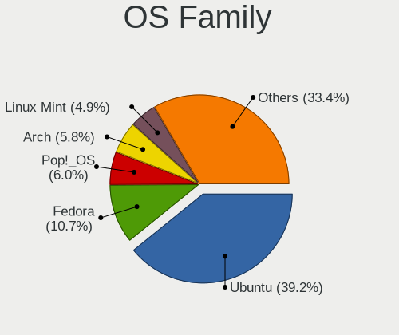
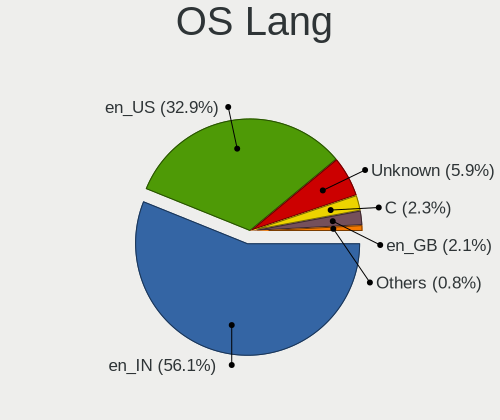
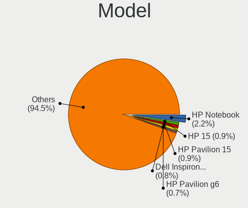
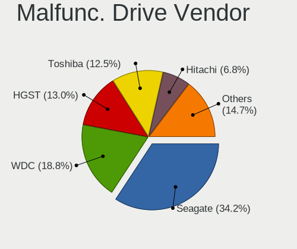
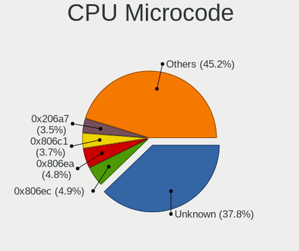
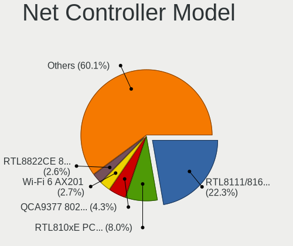
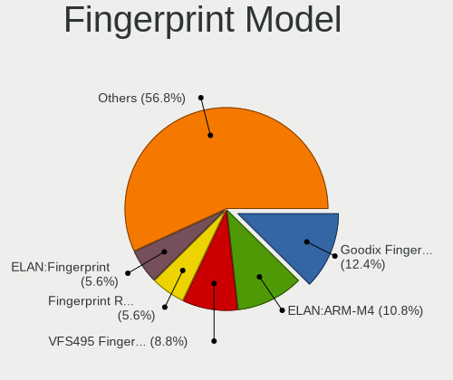
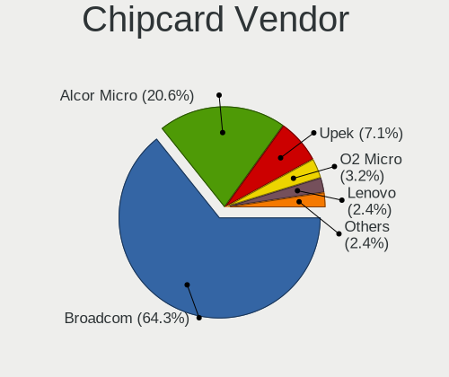

Linux in India - Tested Hardware & Statistics (Notebooks)
---------------------------------------------------------

A project to collect tested hardware configurations for Linux in India.

Anyone can contribute to this report by the [hw-probe](https://github.com/linuxhw/hw-probe) tool:

    sudo -E hw-probe -all -upload

Please contribute! Especially if your hardware is rare.

Contents
--------

* [ Test Cases ](#test-cases)

* [ System ](#system)
  - [ OS                       ](#os)
  - [ OS Family                ](#os-family)
  - [ Kernel                   ](#kernel)
  - [ Kernel Family            ](#kernel-family)
  - [ Kernel Major Ver.        ](#kernel-major-ver)
  - [ Arch                     ](#arch)
  - [ DE                       ](#de)
  - [ Display Server           ](#display-server)
  - [ Display Manager          ](#display-manager)
  - [ OS Lang                  ](#os-lang)
  - [ Boot Mode                ](#boot-mode)
  - [ Filesystem               ](#filesystem)
  - [ Part. scheme             ](#part-scheme)
  - [ Dual Boot with Linux/BSD ](#dual-boot-with-linuxbsd)
  - [ Dual Boot (Win)          ](#dual-boot-win)

* [ Board ](#board)
  - [ Vendor                   ](#vendor)
  - [ Model                    ](#model)
  - [ Model Family             ](#model-family)
  - [ MFG Year                 ](#mfg-year)
  - [ Form Factor              ](#form-factor)
  - [ Secure Boot              ](#secure-boot)
  - [ Coreboot                 ](#coreboot)
  - [ RAM Size                 ](#ram-size)
  - [ RAM Used                 ](#ram-used)
  - [ Total Drives             ](#total-drives)
  - [ Has CD-ROM               ](#has-cd-rom)
  - [ Has Ethernet             ](#has-ethernet)
  - [ Has WiFi                 ](#has-wifi)
  - [ Has Bluetooth            ](#has-bluetooth)

* [ Location ](#location)
  - [ Country                  ](#country)
  - [ City                     ](#city)

* [ Drives ](#drives)
  - [ Drive Vendor             ](#drive-vendor)
  - [ Drive Model              ](#drive-model)
  - [ HDD Vendor               ](#hdd-vendor)
  - [ SSD Vendor               ](#ssd-vendor)
  - [ Drive Kind               ](#drive-kind)
  - [ Drive Connector          ](#drive-connector)
  - [ Drive Size               ](#drive-size)
  - [ Space Total              ](#space-total)
  - [ Space Used               ](#space-used)
  - [ Malfunc. Drives          ](#malfunc-drives)
  - [ Malfunc. Drive Vendor    ](#malfunc-drive-vendor)
  - [ Malfunc. HDD Vendor      ](#malfunc-hdd-vendor)
  - [ Malfunc. Drive Kind      ](#malfunc-drive-kind)
  - [ Failed Drives            ](#failed-drives)
  - [ Failed Drive Vendor      ](#failed-drive-vendor)
  - [ Drive Status             ](#drive-status)

* [ Storage controller ](#storage-controller)
  - [ Storage Vendor           ](#storage-vendor)
  - [ Storage Model            ](#storage-model)
  - [ Storage Kind             ](#storage-kind)

* [ Processor ](#processor)
  - [ CPU Vendor               ](#cpu-vendor)
  - [ CPU Model                ](#cpu-model)
  - [ CPU Model Family         ](#cpu-model-family)
  - [ CPU Cores                ](#cpu-cores)
  - [ CPU Sockets              ](#cpu-sockets)
  - [ CPU Threads              ](#cpu-threads)
  - [ CPU Op-Modes             ](#cpu-op-modes)
  - [ CPU Microcode            ](#cpu-microcode)
  - [ CPU Microarch            ](#cpu-microarch)

* [ Graphics ](#graphics)
  - [ GPU Vendor               ](#gpu-vendor)
  - [ GPU Model                ](#gpu-model)
  - [ GPU Combo                ](#gpu-combo)
  - [ GPU Driver               ](#gpu-driver)
  - [ GPU Memory               ](#gpu-memory)

* [ Monitor ](#monitor)
  - [ Monitor Vendor           ](#monitor-vendor)
  - [ Monitor Model            ](#monitor-model)
  - [ Monitor Resolution       ](#monitor-resolution)
  - [ Monitor Diagonal         ](#monitor-diagonal)
  - [ Monitor Width            ](#monitor-width)
  - [ Aspect Ratio             ](#aspect-ratio)
  - [ Monitor Area             ](#monitor-area)
  - [ Pixel Density            ](#pixel-density)
  - [ Multiple Monitors        ](#multiple-monitors)

* [ Network ](#network)
  - [ Net Controller Vendor    ](#net-controller-vendor)
  - [ Net Controller Model     ](#net-controller-model)
  - [ Wireless Vendor          ](#wireless-vendor)
  - [ Wireless Model           ](#wireless-model)
  - [ Ethernet Vendor          ](#ethernet-vendor)
  - [ Ethernet Model           ](#ethernet-model)
  - [ Net Controller Kind      ](#net-controller-kind)
  - [ Used Controller          ](#used-controller)
  - [ NICs                     ](#nics)
  - [ IPv6                     ](#ipv6)

* [ Bluetooth ](#bluetooth)
  - [ Bluetooth Vendor         ](#bluetooth-vendor)
  - [ Bluetooth Model          ](#bluetooth-model)

* [ Sound ](#sound)
  - [ Sound Vendor             ](#sound-vendor)
  - [ Sound Model              ](#sound-model)

* [ Memory ](#memory)
  - [ Memory Vendor            ](#memory-vendor)
  - [ Memory Model             ](#memory-model)
  - [ Memory Kind              ](#memory-kind)
  - [ Memory Form Factor       ](#memory-form-factor)
  - [ Memory Size              ](#memory-size)
  - [ Memory Speed             ](#memory-speed)

* [ Printers & scanners ](#printers--scanners)
  - [ Printer Vendor           ](#printer-vendor)
  - [ Printer Model            ](#printer-model)
  - [ Scanner Vendor           ](#scanner-vendor)
  - [ Scanner Model            ](#scanner-model)

* [ Camera ](#camera)
  - [ Camera Vendor            ](#camera-vendor)
  - [ Camera Model             ](#camera-model)

* [ Security ](#security)
  - [ Fingerprint Vendor       ](#fingerprint-vendor)
  - [ Fingerprint Model        ](#fingerprint-model)
  - [ Chipcard Vendor          ](#chipcard-vendor)
  - [ Chipcard Model           ](#chipcard-model)

* [ Unsupported ](#unsupported)
  - [ Unsupported Devices      ](#unsupported-devices)
  - [ Unsupported Device Types ](#unsupported-device-types)

Test Cases
----------

Total: 5512

| Vendor        | Model                       | Probe                                                      | Date         |
|---------------|-----------------------------|------------------------------------------------------------|--------------|
| HP            | Laptop 15-bw0xx             | [be612ae4a6](https://linux-hardware.org/?probe=be612ae4a6) | May 09, 2024 |
| Dell          | Vostro 15-3568              | [afd5a26a47](https://linux-hardware.org/?probe=afd5a26a47) | May 09, 2024 |
| Sony          | SVP1321C5E                  | [373fd0a046](https://linux-hardware.org/?probe=373fd0a046) | May 08, 2024 |
| Lenovo        | ThinkPad E14 Gen 3 20YFC... | [6a43088440](https://linux-hardware.org/?probe=6a43088440) | May 08, 2024 |
| Infinix       | INBOOK Y1 PLUS NEO          | [253042bbd9](https://linux-hardware.org/?probe=253042bbd9) | May 08, 2024 |
| Lenovo        | V15 G4 AMN 82YU             | [3742af3546](https://linux-hardware.org/?probe=3742af3546) | May 08, 2024 |
| Acer          | Swift SF314-71              | [23d1f2e74a](https://linux-hardware.org/?probe=23d1f2e74a) | May 08, 2024 |
| Lenovo        | ThinkPad P14s Gen 4 21K5... | [e00e076344](https://linux-hardware.org/?probe=e00e076344) | May 08, 2024 |
| Lenovo        | ThinkPad E14 Gen 2 20T6S... | [eb9d3c539c](https://linux-hardware.org/?probe=eb9d3c539c) | May 08, 2024 |
| Lenovo        | V15 G4 AMN 82YU             | [29552fbf93](https://linux-hardware.org/?probe=29552fbf93) | May 08, 2024 |
| HP            | Laptop 15s-fq2xxx           | [ade9d916fe](https://linux-hardware.org/?probe=ade9d916fe) | May 08, 2024 |
| ASUSTek       | VivoBook_ASUSLaptop X712... | [d7c1c96567](https://linux-hardware.org/?probe=d7c1c96567) | May 07, 2024 |
| HP            | Laptop 15-bw0xx             | [f605dfd9c2](https://linux-hardware.org/?probe=f605dfd9c2) | May 07, 2024 |
| Timi          | Mi NoteBook Pro             | [71071a816e](https://linux-hardware.org/?probe=71071a816e) | May 05, 2024 |
| Acer          | Aspire A315-23              | [35b8f59849](https://linux-hardware.org/?probe=35b8f59849) | May 05, 2024 |
| HP            | 246                         | [83140d67e2](https://linux-hardware.org/?probe=83140d67e2) | May 03, 2024 |
| ASUSTek       | ASUS Zenbook 14 UX3405MA... | [2b3beb5230](https://linux-hardware.org/?probe=2b3beb5230) | May 03, 2024 |
| ASUSTek       | VivoBook_ASUSLaptop X512... | [58390b50b4](https://linux-hardware.org/?probe=58390b50b4) | May 03, 2024 |
| MSI           | GF63 Thin 10SCSR            | [ab0eadc507](https://linux-hardware.org/?probe=ab0eadc507) | May 02, 2024 |
| Lenovo        | ThinkPad P14s Gen 4 21K5... | [a2d65a8e2d](https://linux-hardware.org/?probe=a2d65a8e2d) | May 02, 2024 |
| ASUSTek       | VivoBook_ASUSLaptop X712... | [750eaa16c3](https://linux-hardware.org/?probe=750eaa16c3) | May 02, 2024 |
| Acer          | Nitro AN515-58              | [0ec502e8c7](https://linux-hardware.org/?probe=0ec502e8c7) | May 01, 2024 |
| Acer          | Predator PH315-51           | [6cadb88b1d](https://linux-hardware.org/?probe=6cadb88b1d) | May 01, 2024 |
| Dell          | G5 5505                     | [190d435401](https://linux-hardware.org/?probe=190d435401) | May 01, 2024 |
| HP            | Laptop 15q-bu0xx            | [7f08bc6862](https://linux-hardware.org/?probe=7f08bc6862) | May 01, 2024 |
| Acer          | TravelMate 4060             | [5bbfc69ef7](https://linux-hardware.org/?probe=5bbfc69ef7) | May 01, 2024 |
| HP            | ProBook 450 15.6 inch G9... | [8a4bab899a](https://linux-hardware.org/?probe=8a4bab899a) | May 01, 2024 |
| Lenovo        | Legion 5 Pro 16ITH6H 82J... | [76b1395f07](https://linux-hardware.org/?probe=76b1395f07) | May 01, 2024 |
| HP            | Pavilion 15                 | [12fcb13cea](https://linux-hardware.org/?probe=12fcb13cea) | Apr 30, 2024 |
| HP            | Laptop 15q-bu0xx            | [24bf1e456c](https://linux-hardware.org/?probe=24bf1e456c) | Apr 30, 2024 |
| Lenovo        | Rev B 82LN                  | [5cf26fa98f](https://linux-hardware.org/?probe=5cf26fa98f) | Apr 30, 2024 |
| Lenovo        | Rev B 82LN                  | [130e9ebe45](https://linux-hardware.org/?probe=130e9ebe45) | Apr 30, 2024 |
| HP            | Pavilion Gaming Laptop 1... | [17441de577](https://linux-hardware.org/?probe=17441de577) | Apr 30, 2024 |
| Acer          | Aspire A715-76G             | [067678032d](https://linux-hardware.org/?probe=067678032d) | Apr 29, 2024 |
| Lenovo        | ThinkPad E14 Gen 5 21JKS... | [a9b2e41472](https://linux-hardware.org/?probe=a9b2e41472) | Apr 29, 2024 |
| ASUSTek       | VivoBook_ASUSLaptop X415... | [20ce0be473](https://linux-hardware.org/?probe=20ce0be473) | Apr 29, 2024 |
| Lenovo        | ThinkPad T420 4236L35       | [df6f046778](https://linux-hardware.org/?probe=df6f046778) | Apr 28, 2024 |
| Lenovo        | ThinkPad E14 Gen 4 21E3S... | [9553bbdbc4](https://linux-hardware.org/?probe=9553bbdbc4) | Apr 28, 2024 |
| HP            | Laptop 15-da0xxx            | [81bca40901](https://linux-hardware.org/?probe=81bca40901) | Apr 27, 2024 |
| MSI           | Modern 15 B7M               | [a7e83932d5](https://linux-hardware.org/?probe=a7e83932d5) | Apr 27, 2024 |
| ASUSTek       | ASUS TUF Gaming F15 FX50... | [86089f64dc](https://linux-hardware.org/?probe=86089f64dc) | Apr 26, 2024 |
| ASUSTek       | VivoBook_ASUSLaptop M650... | [6d6b67129d](https://linux-hardware.org/?probe=6d6b67129d) | Apr 26, 2024 |
| ASUSTek       | X542UQ                      | [146282870d](https://linux-hardware.org/?probe=146282870d) | Apr 26, 2024 |
| ASUSTek       | VivoBook_ASUSLaptop E410... | [cdc03d24ba](https://linux-hardware.org/?probe=cdc03d24ba) | Apr 26, 2024 |
| HP            | Pavilion Laptop 14-bf1xx    | [3daa76cdd8](https://linux-hardware.org/?probe=3daa76cdd8) | Apr 26, 2024 |
| Dell          | Latitude 5420               | [f367471e11](https://linux-hardware.org/?probe=f367471e11) | Apr 25, 2024 |
| Acer          | Predator PH315-51           | [f671d64f35](https://linux-hardware.org/?probe=f671d64f35) | Apr 25, 2024 |
| HP            | 2000                        | [1314698cd1](https://linux-hardware.org/?probe=1314698cd1) | Apr 25, 2024 |
| ASUSTek       | ASUS TUF Gaming F15 FX50... | [d6249f9918](https://linux-hardware.org/?probe=d6249f9918) | Apr 25, 2024 |
| Dell          | Inspiron 3501               | [7260ec24ee](https://linux-hardware.org/?probe=7260ec24ee) | Apr 25, 2024 |
| ASUSTek       | VivoBook_ASUSLaptop E410... | [3de02dadd5](https://linux-hardware.org/?probe=3de02dadd5) | Apr 25, 2024 |
| Valve         | Jupiter                     | [61762f3b53](https://linux-hardware.org/?probe=61762f3b53) | Apr 24, 2024 |
| HP            | Pavilion Gaming Laptop 1... | [fefcca9318](https://linux-hardware.org/?probe=fefcca9318) | Apr 24, 2024 |
| HP            | 15                          | [4ecce71b7d](https://linux-hardware.org/?probe=4ecce71b7d) | Apr 24, 2024 |
| HP            | EliteBook Folio 9470m       | [9ec106714c](https://linux-hardware.org/?probe=9ec106714c) | Apr 24, 2024 |
| ASUSTek       | ROG Strix G814JI_G814JI     | [e7bd7e1534](https://linux-hardware.org/?probe=e7bd7e1534) | Apr 24, 2024 |
| Dell          | Inspiron 5558               | [246047bf8e](https://linux-hardware.org/?probe=246047bf8e) | Apr 23, 2024 |
| MSI           | Thin GF63 12HW              | [8de9a06c68](https://linux-hardware.org/?probe=8de9a06c68) | Apr 23, 2024 |
| ASUSTek       | VivoBook_ASUSLaptop K350... | [6b7887b99a](https://linux-hardware.org/?probe=6b7887b99a) | Apr 22, 2024 |
| ASUSTek       | VivoBook_ASUSLaptop K350... | [bc1baac9c9](https://linux-hardware.org/?probe=bc1baac9c9) | Apr 22, 2024 |
| Acer          | Aspire A514-54              | [3685be6a35](https://linux-hardware.org/?probe=3685be6a35) | Apr 22, 2024 |
| MSI           | Prestige 16 AI Studio B1... | [d1aa5b8b39](https://linux-hardware.org/?probe=d1aa5b8b39) | Apr 21, 2024 |
| MSI           | Thin GF63 12HW              | [388ebd516f](https://linux-hardware.org/?probe=388ebd516f) | Apr 21, 2024 |
| Acer          | Aspire A514-54              | [b06b4f2ac7](https://linux-hardware.org/?probe=b06b4f2ac7) | Apr 21, 2024 |
| HP            | 2000                        | [97a00523bc](https://linux-hardware.org/?probe=97a00523bc) | Apr 20, 2024 |
| HP            | OMEN Laptop 15-ek0xxx       | [8f61743310](https://linux-hardware.org/?probe=8f61743310) | Apr 20, 2024 |
| Dell          | Inspiron 3501               | [0f62918ed2](https://linux-hardware.org/?probe=0f62918ed2) | Apr 20, 2024 |
| Dell          | Inspiron 5559               | [fa44624ceb](https://linux-hardware.org/?probe=fa44624ceb) | Apr 20, 2024 |
| Notebook      | P7xxDM2(-G)                 | [8b6528977b](https://linux-hardware.org/?probe=8b6528977b) | Apr 19, 2024 |
| Lenovo        | ThinkBook 15 G5 ABP 21JF    | [8de733215c](https://linux-hardware.org/?probe=8de733215c) | Apr 18, 2024 |
| ASUSTek       | ASUS TUF Gaming A15 FA50... | [bcbc28897f](https://linux-hardware.org/?probe=bcbc28897f) | Apr 17, 2024 |
| Dell          | Inspiron 7560               | [6583453d1f](https://linux-hardware.org/?probe=6583453d1f) | Apr 17, 2024 |
| Sony          | VPCEH25EN                   | [3bf6f9edaa](https://linux-hardware.org/?probe=3bf6f9edaa) | Apr 17, 2024 |
| Lenovo        | B490 20205                  | [54d7c4ca26](https://linux-hardware.org/?probe=54d7c4ca26) | Apr 16, 2024 |
| ASUSTek       | ASUS TUF Gaming A15 FA50... | [7809a3250e](https://linux-hardware.org/?probe=7809a3250e) | Apr 16, 2024 |
| Framework     | Laptop 13 (AMD Ryzen 704... | [e3d7887dbb](https://linux-hardware.org/?probe=e3d7887dbb) | Apr 16, 2024 |
| HP            | EliteBook 735 G5            | [c978475180](https://linux-hardware.org/?probe=c978475180) | Apr 16, 2024 |
| HP            | Laptop 14s-dk0xxx           | [d3f9e91579](https://linux-hardware.org/?probe=d3f9e91579) | Apr 16, 2024 |
| ASUSTek       | VivoBook_ASUSLaptop X571... | [5378d5a780](https://linux-hardware.org/?probe=5378d5a780) | Apr 15, 2024 |
| HP            | Laptop 15-bs1xx             | [f51e425901](https://linux-hardware.org/?probe=f51e425901) | Apr 15, 2024 |
| HP            | Pavilion Gaming Laptop 1... | [16d5936653](https://linux-hardware.org/?probe=16d5936653) | Apr 14, 2024 |
| Infinix       | ZERO BOOK 13                | [7c89c087db](https://linux-hardware.org/?probe=7c89c087db) | Apr 14, 2024 |
| ASUSTek       | VivoBook_ASUSLaptop X571... | [c88e8fcf4f](https://linux-hardware.org/?probe=c88e8fcf4f) | Apr 14, 2024 |
| MSI           | Modern 14 B10MW             | [7a56c3ee49](https://linux-hardware.org/?probe=7a56c3ee49) | Apr 13, 2024 |
| Lenovo        | E41-25 81FS                 | [ee47604b55](https://linux-hardware.org/?probe=ee47604b55) | Apr 13, 2024 |
| Timi          | RedmiBook 15                | [4bfafed148](https://linux-hardware.org/?probe=4bfafed148) | Apr 13, 2024 |
| Dell          | Latitude 5400               | [d29cbc1d0a](https://linux-hardware.org/?probe=d29cbc1d0a) | Apr 13, 2024 |
| Apple         | MacBookAir6,2               | [71158a0432](https://linux-hardware.org/?probe=71158a0432) | Apr 12, 2024 |
| Lenovo        | ThinkPad T470 20HDS0C700    | [a06e4429b0](https://linux-hardware.org/?probe=a06e4429b0) | Apr 12, 2024 |
| Dell          | Inspiron 3501               | [d688f191c9](https://linux-hardware.org/?probe=d688f191c9) | Apr 12, 2024 |
| Lenovo        | ThinkBook 15 G2 ITL 20VE    | [78ca9d448c](https://linux-hardware.org/?probe=78ca9d448c) | Apr 11, 2024 |
| HP            | Pavilion Laptop 14-bf1xx    | [4c3351faf0](https://linux-hardware.org/?probe=4c3351faf0) | Apr 11, 2024 |
| Dell          | G15 5520                    | [d288eb1bcb](https://linux-hardware.org/?probe=d288eb1bcb) | Apr 11, 2024 |
| HP            | ZBook 15 G5                 | [4580358a7f](https://linux-hardware.org/?probe=4580358a7f) | Apr 10, 2024 |
| Lenovo        | ThinkPad P50 20EN0013US     | [afbcbc9b57](https://linux-hardware.org/?probe=afbcbc9b57) | Apr 10, 2024 |
| Lenovo        | ThinkBook 15 G3 ACL 21A4    | [6cc6ee597b](https://linux-hardware.org/?probe=6cc6ee597b) | Apr 10, 2024 |
| ASUSTek       | ROG Zephyrus G14 GA401QH... | [f6afd2e88a](https://linux-hardware.org/?probe=f6afd2e88a) | Apr 10, 2024 |
| ASUSTek       | ROG Zephyrus G14 GA401QH... | [e3daecc245](https://linux-hardware.org/?probe=e3daecc245) | Apr 10, 2024 |
| HP            | Victus by Gaming Laptop ... | [e78757c42d](https://linux-hardware.org/?probe=e78757c42d) | Apr 09, 2024 |
| HP            | Victus by Gaming Laptop ... | [4cc13eaf30](https://linux-hardware.org/?probe=4cc13eaf30) | Apr 09, 2024 |
| Infinix       | ZERO BOOK 13                | [f27647e9bb](https://linux-hardware.org/?probe=f27647e9bb) | Apr 08, 2024 |
| Timi          | Mi NoteBook Pro             | [ab28993dd3](https://linux-hardware.org/?probe=ab28993dd3) | Apr 08, 2024 |
| HP            | 15                          | [8e4dc27da3](https://linux-hardware.org/?probe=8e4dc27da3) | Apr 08, 2024 |
| ASUSTek       | VivoBook_ASUSLaptop M340... | [3c71179d12](https://linux-hardware.org/?probe=3c71179d12) | Apr 08, 2024 |
| Acer          | Aspire A715-51G             | [a3f3c1986d](https://linux-hardware.org/?probe=a3f3c1986d) | Apr 07, 2024 |
| HP            | Pavilion 15                 | [cdf0bb7376](https://linux-hardware.org/?probe=cdf0bb7376) | Apr 07, 2024 |
| Acer          | Aspire A715-51G             | [0d3fb54918](https://linux-hardware.org/?probe=0d3fb54918) | Apr 07, 2024 |
| HP            | Pavilion 15                 | [e684c0b00b](https://linux-hardware.org/?probe=e684c0b00b) | Apr 07, 2024 |
| Timi          | Mi NoteBook Pro             | [96fefe11d7](https://linux-hardware.org/?probe=96fefe11d7) | Apr 06, 2024 |
| HP            | Pavilion Gaming Laptop 1... | [595c1e3d71](https://linux-hardware.org/?probe=595c1e3d71) | Apr 06, 2024 |
| HP            | Pavilion 15                 | [39b89d2411](https://linux-hardware.org/?probe=39b89d2411) | Apr 06, 2024 |
| ASUSTek       | VivoBook_ASUSLaptop K340... | [766c199389](https://linux-hardware.org/?probe=766c199389) | Apr 06, 2024 |
| HP            | Laptop 15q-ds0xxx           | [83bb8b0134](https://linux-hardware.org/?probe=83bb8b0134) | Apr 05, 2024 |
| HP            | Laptop 15q-ds0xxx           | [64e20f99d6](https://linux-hardware.org/?probe=64e20f99d6) | Apr 05, 2024 |
| Dell          | Vostro 3559                 | [7f70f63943](https://linux-hardware.org/?probe=7f70f63943) | Apr 04, 2024 |
| HP            | Pavilion Gaming Laptop 1... | [ae3fdecd5d](https://linux-hardware.org/?probe=ae3fdecd5d) | Apr 02, 2024 |
| Lenovo        | ThinkPad P14s Gen 4 21K5... | [d1da279a66](https://linux-hardware.org/?probe=d1da279a66) | Apr 02, 2024 |
| Timi          | Mi NoteBook Pro             | [79e676b7a6](https://linux-hardware.org/?probe=79e676b7a6) | Apr 01, 2024 |
| Lenovo        | ThinkPad P14s Gen 4 21K5... | [eb3dd0cff3](https://linux-hardware.org/?probe=eb3dd0cff3) | Apr 01, 2024 |
| Dell          | XPS 13 9360                 | [f6ec63e167](https://linux-hardware.org/?probe=f6ec63e167) | Apr 01, 2024 |
| Lenovo        | ThinkPad E14 Gen 4 21ECC... | [c19f043267](https://linux-hardware.org/?probe=c19f043267) | Mar 31, 2024 |
| ASUSTek       | ASUS TUF Gaming A15 FA50... | [8a68f21257](https://linux-hardware.org/?probe=8a68f21257) | Mar 30, 2024 |
| Dell          | Inspiron 3493               | [ed7f522ffa](https://linux-hardware.org/?probe=ed7f522ffa) | Mar 30, 2024 |
| HP            | Pavilion Laptop 14-dv0xx... | [f685bdd027](https://linux-hardware.org/?probe=f685bdd027) | Mar 30, 2024 |
| Lenovo        | IdeaPad S145-15IKB 81VD     | [01ec795558](https://linux-hardware.org/?probe=01ec795558) | Mar 29, 2024 |
| HP            | Pavilion Gaming Laptop 1... | [e34eb800b2](https://linux-hardware.org/?probe=e34eb800b2) | Mar 29, 2024 |
| ASUSTek       | TUF Gaming FX505DY_FX505... | [55f0862220](https://linux-hardware.org/?probe=55f0862220) | Mar 29, 2024 |
| Lenovo        | B50-70 20384                | [ce2d328e01](https://linux-hardware.org/?probe=ce2d328e01) | Mar 29, 2024 |
| Lenovo        | ThinkBook 14-IIL 20SL       | [b1ff4c1ab1](https://linux-hardware.org/?probe=b1ff4c1ab1) | Mar 28, 2024 |
| Infinix       | ZERO BOOK 13                | [d64684c03a](https://linux-hardware.org/?probe=d64684c03a) | Mar 28, 2024 |
| ASUSTek       | VivoBook_ASUSLaptop X415... | [90614a5f0b](https://linux-hardware.org/?probe=90614a5f0b) | Mar 28, 2024 |
| Infinix       | ZERO BOOK 13                | [cd91c5bb1e](https://linux-hardware.org/?probe=cd91c5bb1e) | Mar 28, 2024 |
| HP            | Pavilion Laptop 14-dv0xx... | [200883f6dc](https://linux-hardware.org/?probe=200883f6dc) | Mar 28, 2024 |
| ASUSTek       | ASUS TUF Gaming A15 FA50... | [e11313b626](https://linux-hardware.org/?probe=e11313b626) | Mar 27, 2024 |
| Acer          | Aspire A515-57G             | [95c573af0a](https://linux-hardware.org/?probe=95c573af0a) | Mar 27, 2024 |
| HP            | Laptop 15s-dr0xxx           | [a41db03c5b](https://linux-hardware.org/?probe=a41db03c5b) | Mar 26, 2024 |
| Apple         | MacBook5,1                  | [0b7838f79e](https://linux-hardware.org/?probe=0b7838f79e) | Mar 26, 2024 |
| Dell          | Vostro 3578                 | [0d29a06255](https://linux-hardware.org/?probe=0d29a06255) | Mar 26, 2024 |
| HP            | Pavilion 15                 | [9b219cffd5](https://linux-hardware.org/?probe=9b219cffd5) | Mar 26, 2024 |
| Dell          | Vostro 1550                 | [e022440d75](https://linux-hardware.org/?probe=e022440d75) | Mar 26, 2024 |
| Apple         | MacBookPro16,1              | [82901b0cb6](https://linux-hardware.org/?probe=82901b0cb6) | Mar 26, 2024 |
| MSI           | GF63 Thin 9RCX              | [0f5870ca39](https://linux-hardware.org/?probe=0f5870ca39) | Mar 25, 2024 |
| ASUSTek       | ROG Strix G531GU_G531GU     | [0bbd95d6e5](https://linux-hardware.org/?probe=0bbd95d6e5) | Mar 25, 2024 |
| ASUSTek       | ASUS TUF Gaming F15 FX50... | [2cbb874285](https://linux-hardware.org/?probe=2cbb874285) | Mar 25, 2024 |
| Acer          | Nitro AN515-57              | [c455ccf61a](https://linux-hardware.org/?probe=c455ccf61a) | Mar 25, 2024 |
| ASUSTek       | ASUS Zenbook 14 UX3405MA... | [ac4ffad941](https://linux-hardware.org/?probe=ac4ffad941) | Mar 24, 2024 |
| Lenovo        | G510 20238                  | [b63a7b1490](https://linux-hardware.org/?probe=b63a7b1490) | Mar 24, 2024 |
| MSI           | Cyborg 15 A12VE             | [012a9393ab](https://linux-hardware.org/?probe=012a9393ab) | Mar 22, 2024 |
| ASUSTek       | VivoBook_ASUSLaptop K340... | [370d890b88](https://linux-hardware.org/?probe=370d890b88) | Mar 22, 2024 |
| Dell          | Inspiron N4010              | [b0bf69df9a](https://linux-hardware.org/?probe=b0bf69df9a) | Mar 21, 2024 |
| Timi          | Mi NoteBook Ultra           | [c92aa3d747](https://linux-hardware.org/?probe=c92aa3d747) | Mar 21, 2024 |
| Dell          | Inspiron N4010              | [df814c37dd](https://linux-hardware.org/?probe=df814c37dd) | Mar 20, 2024 |
| MSI           | Cyborg 15 A12VE             | [e0dce5359f](https://linux-hardware.org/?probe=e0dce5359f) | Mar 20, 2024 |
| Lenovo        | IdeaPadFlex 10 20324        | [b0b209dac3](https://linux-hardware.org/?probe=b0b209dac3) | Mar 20, 2024 |
| Lenovo        | IdeaPad 5 Pro 14ITL6 82L... | [08ef8bc02d](https://linux-hardware.org/?probe=08ef8bc02d) | Mar 20, 2024 |
| Lenovo        | ThinkPad P14s Gen 4 21K5... | [5bc5531a68](https://linux-hardware.org/?probe=5bc5531a68) | Mar 19, 2024 |
| Samsung       | 550XED                      | [9bb9a4c3f7](https://linux-hardware.org/?probe=9bb9a4c3f7) | Mar 19, 2024 |
| HP            | Notebook                    | [90535a0e4b](https://linux-hardware.org/?probe=90535a0e4b) | Mar 19, 2024 |
| HP            | Notebook                    | [97043bd58f](https://linux-hardware.org/?probe=97043bd58f) | Mar 19, 2024 |
| Apple         | MacBookAir8,1               | [d0c0446bb2](https://linux-hardware.org/?probe=d0c0446bb2) | Mar 19, 2024 |
| Acer          | Predator PH315-53           | [512ed7177b](https://linux-hardware.org/?probe=512ed7177b) | Mar 19, 2024 |
| Dell          | Latitude E6420              | [2243012f33](https://linux-hardware.org/?probe=2243012f33) | Mar 18, 2024 |
| Lenovo        | IdeaPad Slim 5 16IRL8 82... | [5444f5d926](https://linux-hardware.org/?probe=5444f5d926) | Mar 17, 2024 |
| Lenovo        | IdeaPad Slim 5 16IRL8 82... | [7abc3cc997](https://linux-hardware.org/?probe=7abc3cc997) | Mar 17, 2024 |
| ASUSTek       | VivoBook_ASUSLaptop K340... | [dabfa8c2b3](https://linux-hardware.org/?probe=dabfa8c2b3) | Mar 16, 2024 |
| Lenovo        | B50-70 20384                | [6d0478d986](https://linux-hardware.org/?probe=6d0478d986) | Mar 16, 2024 |
| ASUSTek       | ASUS TUF Gaming F15 FX50... | [511c52e15b](https://linux-hardware.org/?probe=511c52e15b) | Mar 16, 2024 |
| ASUSTek       | VivoBook_ASUSLaptop X421... | [076b0dcbc4](https://linux-hardware.org/?probe=076b0dcbc4) | Mar 16, 2024 |
| Lenovo        | IdeaPad Gaming 3 15ACH6 ... | [6b70347aa7](https://linux-hardware.org/?probe=6b70347aa7) | Mar 16, 2024 |
| ASUSTek       | TUF Gaming FX504GE_FX80G... | [33e7a03f71](https://linux-hardware.org/?probe=33e7a03f71) | Mar 15, 2024 |
| Lenovo        | IdeaPad Gaming 3 15ARH05... | [711cc3c20d](https://linux-hardware.org/?probe=711cc3c20d) | Mar 15, 2024 |
| Lenovo        | G50-80 80L0                 | [995f47afbb](https://linux-hardware.org/?probe=995f47afbb) | Mar 14, 2024 |
| HP            | Laptop 15-da1xxx            | [decbe9d726](https://linux-hardware.org/?probe=decbe9d726) | Mar 14, 2024 |
| Dell          | Inspiron 3542               | [9fb06fb797](https://linux-hardware.org/?probe=9fb06fb797) | Mar 13, 2024 |
| Lenovo        | G50-80 80L0                 | [79173a6c7a](https://linux-hardware.org/?probe=79173a6c7a) | Mar 13, 2024 |
| Lenovo        | Legion 5 15ARH05 82B5       | [71d3373343](https://linux-hardware.org/?probe=71d3373343) | Mar 13, 2024 |
| Lenovo        | Legion 5 15ARH05 82B5       | [24bd77109e](https://linux-hardware.org/?probe=24bd77109e) | Mar 13, 2024 |
| Dell          | Inspiron 3543               | [a160c09d29](https://linux-hardware.org/?probe=a160c09d29) | Mar 13, 2024 |
| ASUSTek       | ASUS TUF Gaming A16 FA61... | [f80fc50a95](https://linux-hardware.org/?probe=f80fc50a95) | Mar 13, 2024 |
| ASUSTek       | VivoBook_ASUSLaptop K350... | [3c4326af6a](https://linux-hardware.org/?probe=3c4326af6a) | Mar 13, 2024 |
| Dell          | G7 7588                     | [956adb435e](https://linux-hardware.org/?probe=956adb435e) | Mar 12, 2024 |
| Acer          | Swift SF314-512             | [2a9597aa86](https://linux-hardware.org/?probe=2a9597aa86) | Mar 12, 2024 |
| Lenovo        | IdeaPad Gaming 3 15IMH05... | [00289086da](https://linux-hardware.org/?probe=00289086da) | Mar 12, 2024 |
| Dell          | Latitude 3490               | [ac7317cebc](https://linux-hardware.org/?probe=ac7317cebc) | Mar 11, 2024 |
| Dell          | Latitude E5450              | [a40134fc60](https://linux-hardware.org/?probe=a40134fc60) | Mar 11, 2024 |
| ASUSTek       | ASUS TUF Gaming F15 FX50... | [4bb97e8868](https://linux-hardware.org/?probe=4bb97e8868) | Mar 10, 2024 |
| HP            | Notebook                    | [6c525c86c4](https://linux-hardware.org/?probe=6c525c86c4) | Mar 10, 2024 |
| Lenovo        | V15 G4 ABP 82YY             | [a1d9dbb33e](https://linux-hardware.org/?probe=a1d9dbb33e) | Mar 10, 2024 |
| Acer          | Aspire Lite AL15-41         | [720c77ea8e](https://linux-hardware.org/?probe=720c77ea8e) | Mar 10, 2024 |
| Acer          | Aspire A315-59              | [8eb8fbd9be](https://linux-hardware.org/?probe=8eb8fbd9be) | Mar 09, 2024 |
| ASUSTek       | VivoBook_ASUSLaptop K350... | [b00732d7cc](https://linux-hardware.org/?probe=b00732d7cc) | Mar 09, 2024 |
| ASUSTek       | VivoBook_ASUSLaptop X415... | [a69985caa8](https://linux-hardware.org/?probe=a69985caa8) | Mar 09, 2024 |
| HP            | Notebook                    | [8e0446bf88](https://linux-hardware.org/?probe=8e0446bf88) | Mar 08, 2024 |
| HP            | OMEN by Laptop 15-dc1xxx    | [605efa5d0e](https://linux-hardware.org/?probe=605efa5d0e) | Mar 08, 2024 |
| HP            | OMEN by Laptop 15-dc1xxx    | [e0459cc79f](https://linux-hardware.org/?probe=e0459cc79f) | Mar 08, 2024 |
| Dell          | Inspiron 3593               | [e5931414ce](https://linux-hardware.org/?probe=e5931414ce) | Mar 08, 2024 |
| Samsung       | 355V4C/356V4C/3445VC/354... | [eb169c5969](https://linux-hardware.org/?probe=eb169c5969) | Mar 07, 2024 |
| Lenovo        | ThinkPad T450s 20BX004QG... | [af2b0287ec](https://linux-hardware.org/?probe=af2b0287ec) | Mar 07, 2024 |
| ASUSTek       | VivoBook_ASUSLaptop M340... | [24f8aa7cd0](https://linux-hardware.org/?probe=24f8aa7cd0) | Mar 07, 2024 |
| Acer          | One 14 Z8-415               | [369734aa1f](https://linux-hardware.org/?probe=369734aa1f) | Mar 07, 2024 |
| Acer          | One 14 Z8-415               | [6fce03c633](https://linux-hardware.org/?probe=6fce03c633) | Mar 07, 2024 |
| Lenovo        | ThinkPad P14s Gen 2a 21A... | [c84d9da515](https://linux-hardware.org/?probe=c84d9da515) | Mar 06, 2024 |
| HP            | Laptop 15s-fr2xxx           | [41a41095e6](https://linux-hardware.org/?probe=41a41095e6) | Mar 06, 2024 |
| TECNO Mobi... | MEGABOOK T1 TGL             | [ce3e0ba9dc](https://linux-hardware.org/?probe=ce3e0ba9dc) | Mar 05, 2024 |
| Dell          | Vostro 3546                 | [836cd32457](https://linux-hardware.org/?probe=836cd32457) | Mar 05, 2024 |
| ASUSTek       | VivoBook_ASUSLaptop M650... | [b91c6debc9](https://linux-hardware.org/?probe=b91c6debc9) | Mar 05, 2024 |
| HP            | 540                         | [3423afe2ac](https://linux-hardware.org/?probe=3423afe2ac) | Mar 05, 2024 |
| Dell          | Inspiron 3521               | [9552e898d6](https://linux-hardware.org/?probe=9552e898d6) | Mar 04, 2024 |
| HP            | 14                          | [6e6138e521](https://linux-hardware.org/?probe=6e6138e521) | Mar 04, 2024 |
| ASUSTek       | VivoBook_ASUSLaptop M650... | [471c4b53b8](https://linux-hardware.org/?probe=471c4b53b8) | Mar 03, 2024 |
| Lenovo        | G50-70 20351                | [5e44c1add4](https://linux-hardware.org/?probe=5e44c1add4) | Mar 03, 2024 |
| TECNO Mobi... | MEGABOOK T1 TGL             | [b55c18be6e](https://linux-hardware.org/?probe=b55c18be6e) | Mar 03, 2024 |
| Infinix       | INBook X1                   | [be2654d4f7](https://linux-hardware.org/?probe=be2654d4f7) | Mar 02, 2024 |
| Lenovo        | IdeaPad S145-15IKB 81VD     | [7ccc640c2f](https://linux-hardware.org/?probe=7ccc640c2f) | Mar 02, 2024 |
| Apple         | MacBookAir7,2               | [c21c5f0bd2](https://linux-hardware.org/?probe=c21c5f0bd2) | Mar 02, 2024 |
| HP            | Pavilion 15                 | [15858caed0](https://linux-hardware.org/?probe=15858caed0) | Mar 01, 2024 |
| Lenovo        | IdeaPad 110-15ISK 80UD      | [beb30d1c82](https://linux-hardware.org/?probe=beb30d1c82) | Mar 01, 2024 |
| Lenovo        | ThinkPad X1 Carbon 7th 2... | [120d90cd85](https://linux-hardware.org/?probe=120d90cd85) | Mar 01, 2024 |
| HP            | Pavilion dv6                | [14e50b9c6c](https://linux-hardware.org/?probe=14e50b9c6c) | Mar 01, 2024 |
| HP            | Pavilion g6                 | [f6ef470081](https://linux-hardware.org/?probe=f6ef470081) | Mar 01, 2024 |
| Toshiba       | Satellite L300              | [91ab21b4dc](https://linux-hardware.org/?probe=91ab21b4dc) | Feb 29, 2024 |
| ASUSTek       | VivoBook_ASUSLaptop X150... | [19d7dd5a8d](https://linux-hardware.org/?probe=19d7dd5a8d) | Feb 29, 2024 |
| ASUSTek       | VivoBook_ASUSLaptop M160... | [6d95912acb](https://linux-hardware.org/?probe=6d95912acb) | Feb 29, 2024 |
| Lenovo        | ThinkBook 15 G5 ABP 21JF    | [499c02fa90](https://linux-hardware.org/?probe=499c02fa90) | Feb 29, 2024 |
| HP            | ProBook 440 G8 Notebook ... | [f82ddd1079](https://linux-hardware.org/?probe=f82ddd1079) | Feb 28, 2024 |
| Timi          | Mi NoteBook Ultra           | [a17f299cea](https://linux-hardware.org/?probe=a17f299cea) | Feb 28, 2024 |
| HP            | Pavilion Gaming Laptop 1... | [bdc3e5e5ff](https://linux-hardware.org/?probe=bdc3e5e5ff) | Feb 27, 2024 |
| HP            | Pavilion Gaming Laptop 1... | [2e741a8a35](https://linux-hardware.org/?probe=2e741a8a35) | Feb 27, 2024 |
| Timi          | Mi NoteBook Ultra           | [be15da34bb](https://linux-hardware.org/?probe=be15da34bb) | Feb 27, 2024 |
| Lenovo        | IdeaPad 3 14ITL6 82H7       | [d44ed1a56f](https://linux-hardware.org/?probe=d44ed1a56f) | Feb 26, 2024 |
| ASUSTek       | ASUS Zenbook 14 UX3405MA... | [339c1aaeb1](https://linux-hardware.org/?probe=339c1aaeb1) | Feb 26, 2024 |
| Dell          | Vostro 5468                 | [02f46d2755](https://linux-hardware.org/?probe=02f46d2755) | Feb 26, 2024 |
| HP            | Notebook                    | [d2d7f65d5a](https://linux-hardware.org/?probe=d2d7f65d5a) | Feb 26, 2024 |
| ASUSTek       | VivoBook_ASUSLaptop X412... | [a775aa024f](https://linux-hardware.org/?probe=a775aa024f) | Feb 25, 2024 |
| Lenovo        | ThinkPad P14s Gen 4 21K5... | [d8df7d2937](https://linux-hardware.org/?probe=d8df7d2937) | Feb 25, 2024 |
| Acer          | Nitro AN515-47              | [09278ddd93](https://linux-hardware.org/?probe=09278ddd93) | Feb 25, 2024 |
| Lenovo        | E40-80 80HR                 | [57929a984b](https://linux-hardware.org/?probe=57929a984b) | Feb 25, 2024 |
| Lenovo        | E40-80 80HR                 | [d9ce4a24bb](https://linux-hardware.org/?probe=d9ce4a24bb) | Feb 25, 2024 |
| HP            | Laptop 14s-fq1xxx           | [6bb2788890](https://linux-hardware.org/?probe=6bb2788890) | Feb 24, 2024 |
| ASUSTek       | ASUS TUF Gaming F15 FX50... | [296f52bf01](https://linux-hardware.org/?probe=296f52bf01) | Feb 24, 2024 |
| Lenovo        | ThinkBook 15 G3 ACL 21A4    | [1ea0bb17d4](https://linux-hardware.org/?probe=1ea0bb17d4) | Feb 24, 2024 |
| HP            | Laptop 14s-fq1xxx           | [db0b93e1b9](https://linux-hardware.org/?probe=db0b93e1b9) | Feb 24, 2024 |
| Acer          | Aspire A315-55G             | [f5b7121a08](https://linux-hardware.org/?probe=f5b7121a08) | Feb 24, 2024 |
| Lenovo        | Legion Pro 5 16ARX8 82WM    | [b6158c1b82](https://linux-hardware.org/?probe=b6158c1b82) | Feb 23, 2024 |
| HP            | Pavilion Notebook           | [2cb306402a](https://linux-hardware.org/?probe=2cb306402a) | Feb 23, 2024 |
| Lenovo        | E41-25 81FS                 | [9313724dd7](https://linux-hardware.org/?probe=9313724dd7) | Feb 23, 2024 |
| ASUSTek       | VivoBook_ASUSLaptop M650... | [1736ebc6c2](https://linux-hardware.org/?probe=1736ebc6c2) | Feb 22, 2024 |
| Dell          | Precision 5480              | [d8d89ffb0b](https://linux-hardware.org/?probe=d8d89ffb0b) | Feb 22, 2024 |
| Sony          | SVF15218SNB                 | [1afb130e3a](https://linux-hardware.org/?probe=1afb130e3a) | Feb 22, 2024 |
| Timi          | Xiaomi NoteBook Pro         | [8534bd02bf](https://linux-hardware.org/?probe=8534bd02bf) | Feb 21, 2024 |
| HP            | Pavilion Laptop 15-eg3xx... | [5c1801b253](https://linux-hardware.org/?probe=5c1801b253) | Feb 21, 2024 |
| Infinix       | INBOOK X2 PLUS              | [823ba3ef42](https://linux-hardware.org/?probe=823ba3ef42) | Feb 21, 2024 |
| HUAWEI        | BOHK-WAX9X                  | [306da5eda3](https://linux-hardware.org/?probe=306da5eda3) | Feb 19, 2024 |
| Lenovo        | E41-15 80U6                 | [1618d166c7](https://linux-hardware.org/?probe=1618d166c7) | Feb 18, 2024 |
| Lenovo        | IdeaPad S540-15IWL D 81N... | [f253025d97](https://linux-hardware.org/?probe=f253025d97) | Feb 17, 2024 |
| Lenovo        | IdeaPad S540-15IWL D 81N... | [2b1227aff7](https://linux-hardware.org/?probe=2b1227aff7) | Feb 17, 2024 |
| Dell          | Inspiron 3543               | [4d2ac712c9](https://linux-hardware.org/?probe=4d2ac712c9) | Feb 17, 2024 |
| HP            | Pavilion Laptop 15-eg3xx... | [876dc3deb9](https://linux-hardware.org/?probe=876dc3deb9) | Feb 16, 2024 |
| Dell          | Inspiron 7501               | [e2526b1a25](https://linux-hardware.org/?probe=e2526b1a25) | Feb 15, 2024 |
| Dell          | Inspiron 3543               | [fecf34c51f](https://linux-hardware.org/?probe=fecf34c51f) | Feb 15, 2024 |
| Dell          | Latitude E6410              | [e2aa6e19b1](https://linux-hardware.org/?probe=e2aa6e19b1) | Feb 15, 2024 |
| MSI           | Alpha 15 A3DD               | [4a98f29767](https://linux-hardware.org/?probe=4a98f29767) | Feb 14, 2024 |
| Apple         | MacBookPro16,1              | [357bcd5d24](https://linux-hardware.org/?probe=357bcd5d24) | Feb 14, 2024 |
| HP            | 15                          | [7a2b0b9a6f](https://linux-hardware.org/?probe=7a2b0b9a6f) | Feb 14, 2024 |
| Acer          | Aspire A515-54G             | [dbcfefeabb](https://linux-hardware.org/?probe=dbcfefeabb) | Feb 12, 2024 |
| HP            | 15                          | [ef0b519e9b](https://linux-hardware.org/?probe=ef0b519e9b) | Feb 12, 2024 |
| Lenovo        | IdeaPad 110-15ISK 80UD      | [71ad520752](https://linux-hardware.org/?probe=71ad520752) | Feb 12, 2024 |
| HP            | Laptop 14s-fq1xxx           | [ebb27401be](https://linux-hardware.org/?probe=ebb27401be) | Feb 11, 2024 |
| ASUSTek       | VivoBook_ASUSLaptop X512... | [a7f40a3ffe](https://linux-hardware.org/?probe=a7f40a3ffe) | Feb 11, 2024 |
| Lenovo        | IdeaPad S340-15IIL 81WL     | [15de76bfd6](https://linux-hardware.org/?probe=15de76bfd6) | Feb 11, 2024 |
| Acer          | Aspire 4715                 | [01ea57145a](https://linux-hardware.org/?probe=01ea57145a) | Feb 11, 2024 |
| Lenovo        | IdeaPad Gaming 3 15IHU6 ... | [721486a397](https://linux-hardware.org/?probe=721486a397) | Feb 11, 2024 |
| Acer          | Aspire 4715                 | [b5fd1680fb](https://linux-hardware.org/?probe=b5fd1680fb) | Feb 10, 2024 |
| Dell          | Latitude 3340               | [a80b967791](https://linux-hardware.org/?probe=a80b967791) | Feb 10, 2024 |
| Acer          | Aspire A514-53              | [70b16c69f0](https://linux-hardware.org/?probe=70b16c69f0) | Feb 10, 2024 |
| Lenovo        | ThinkPad T14 Gen 3 21CGC... | [8567f0b4d1](https://linux-hardware.org/?probe=8567f0b4d1) | Feb 10, 2024 |
| Lenovo        | ThinkPad P14s Gen 4 21K5... | [f459bb5ede](https://linux-hardware.org/?probe=f459bb5ede) | Feb 10, 2024 |
| Acer          | Nitro AN515-43              | [fe3bc3a432](https://linux-hardware.org/?probe=fe3bc3a432) | Feb 09, 2024 |
| ASUSTek       | ROG Zephyrus M16 GU603HE    | [4654ffb767](https://linux-hardware.org/?probe=4654ffb767) | Feb 09, 2024 |
| HP            | Pavilion Laptop 15-eg2xx... | [da1cf2600b](https://linux-hardware.org/?probe=da1cf2600b) | Feb 09, 2024 |
| HP            | ZBook Fury 16 G9 Mobile ... | [42aec60216](https://linux-hardware.org/?probe=42aec60216) | Feb 08, 2024 |
| MSI           | GS65 Stealth 9SF            | [1d143c7743](https://linux-hardware.org/?probe=1d143c7743) | Feb 07, 2024 |
| MSI           | GS65 Stealth 9SF            | [6bf22cd2ef](https://linux-hardware.org/?probe=6bf22cd2ef) | Feb 07, 2024 |
| HONOR         | BRN-FXXC                    | [bbf1299c7e](https://linux-hardware.org/?probe=bbf1299c7e) | Feb 07, 2024 |
| ASUSTek       | ASUS TUF Gaming A15 FA50... | [afca693b40](https://linux-hardware.org/?probe=afca693b40) | Feb 07, 2024 |
| HP            | EliteBook 8470p             | [71eb241b47](https://linux-hardware.org/?probe=71eb241b47) | Feb 06, 2024 |
| Lenovo        | ThinkPad T480 20L50011US    | [a820fbd52d](https://linux-hardware.org/?probe=a820fbd52d) | Feb 06, 2024 |
| ASUSTek       | ROG Zephyrus G15 GA503RW... | [f899452748](https://linux-hardware.org/?probe=f899452748) | Feb 05, 2024 |
| Timi          | Xiaomi NoteBook Pro         | [861a8f057e](https://linux-hardware.org/?probe=861a8f057e) | Feb 05, 2024 |
| ASUSTek       | ASUS TUF Gaming F15 FX50... | [9bef173f6d](https://linux-hardware.org/?probe=9bef173f6d) | Feb 04, 2024 |
| Lenovo        | IdeaPad Y560                | [24bf3674dc](https://linux-hardware.org/?probe=24bf3674dc) | Feb 04, 2024 |
| Lenovo        | IdeaPad Y560                | [7d98e0f393](https://linux-hardware.org/?probe=7d98e0f393) | Feb 04, 2024 |
| Dell          | Inspiron 16 Plus 7630       | [03bce78a46](https://linux-hardware.org/?probe=03bce78a46) | Feb 04, 2024 |
| Lenovo        | ThinkPad X230 2325SDE       | [b8141f77e9](https://linux-hardware.org/?probe=b8141f77e9) | Feb 03, 2024 |
| HP            | Pavilion Gaming Laptop 1... | [2e7b602c12](https://linux-hardware.org/?probe=2e7b602c12) | Feb 03, 2024 |
| Dell          | Inspiron 15 3511            | [fbddf7610e](https://linux-hardware.org/?probe=fbddf7610e) | Feb 03, 2024 |
| ASUSTek       | VivoBook_ASUSLaptop M160... | [e78d8e93b2](https://linux-hardware.org/?probe=e78d8e93b2) | Feb 03, 2024 |
| MSI           | Thin GF63 12HW              | [b5b16477c3](https://linux-hardware.org/?probe=b5b16477c3) | Feb 02, 2024 |
| Dell          | Latitude 5420               | [9ca4bb32d7](https://linux-hardware.org/?probe=9ca4bb32d7) | Feb 01, 2024 |
| Dell          | Inspiron N5010              | [151239b938](https://linux-hardware.org/?probe=151239b938) | Feb 01, 2024 |
| Dell          | Inspiron 7501               | [5c071c25ab](https://linux-hardware.org/?probe=5c071c25ab) | Feb 01, 2024 |
| Lenovo        | ThinkPad T480 20L50011US    | [bb6dd71048](https://linux-hardware.org/?probe=bb6dd71048) | Feb 01, 2024 |
| Dell          | Inspiron 16 Plus 7630       | [af2db531a1](https://linux-hardware.org/?probe=af2db531a1) | Jan 31, 2024 |
| Lenovo        | IdeaPad Y560                | [e9a51b1fa8](https://linux-hardware.org/?probe=e9a51b1fa8) | Jan 31, 2024 |
| Infinix       | INBOOK X1 NEO               | [aca7de6cf8](https://linux-hardware.org/?probe=aca7de6cf8) | Jan 31, 2024 |
| Lenovo        | V14-ADA 82C6                | [916a39975c](https://linux-hardware.org/?probe=916a39975c) | Jan 31, 2024 |
| MSI           | Bravo 15 B5DD               | [a989f7aa10](https://linux-hardware.org/?probe=a989f7aa10) | Jan 30, 2024 |
| Lenovo        | IdeaPad Y560                | [a32d1d3fa7](https://linux-hardware.org/?probe=a32d1d3fa7) | Jan 30, 2024 |
| MSI           | Thin GF63 12HW              | [5c79e92eb3](https://linux-hardware.org/?probe=5c79e92eb3) | Jan 30, 2024 |
| MSI           | GL63 9SD                    | [174a4f49ac](https://linux-hardware.org/?probe=174a4f49ac) | Jan 29, 2024 |
| Timi          | Xiaomi NoteBook Pro         | [2e4fa19ae6](https://linux-hardware.org/?probe=2e4fa19ae6) | Jan 29, 2024 |
| Dell          | Latitude E6410              | [1d71a03516](https://linux-hardware.org/?probe=1d71a03516) | Jan 29, 2024 |
| Dell          | Vostro 3558                 | [f2c958ad91](https://linux-hardware.org/?probe=f2c958ad91) | Jan 29, 2024 |
| HP            | EliteBook 840 g5            | [b9ca87e1e4](https://linux-hardware.org/?probe=b9ca87e1e4) | Jan 28, 2024 |
| Lenovo        | ThinkPad T480 20L6S4T80H    | [cb5f6705aa](https://linux-hardware.org/?probe=cb5f6705aa) | Jan 28, 2024 |
| Dell          | Inspiron 3537               | [e91c3bfd73](https://linux-hardware.org/?probe=e91c3bfd73) | Jan 28, 2024 |
| Dell          | Inspiron 3537               | [0ee7687e3f](https://linux-hardware.org/?probe=0ee7687e3f) | Jan 28, 2024 |
| Acer          | Aspire A715-51G             | [e6b8ceb566](https://linux-hardware.org/?probe=e6b8ceb566) | Jan 27, 2024 |
| Lenovo        | ThinkPad E14 20RAS1S600     | [8544584b30](https://linux-hardware.org/?probe=8544584b30) | Jan 27, 2024 |
| Dell          | Inspiron 3542               | [2a81d5f313](https://linux-hardware.org/?probe=2a81d5f313) | Jan 27, 2024 |
| Acer          | Aspire A715-51G             | [fad23c2b03](https://linux-hardware.org/?probe=fad23c2b03) | Jan 27, 2024 |
| ASUSTek       | ZenBook UX435EG_UX435EG     | [a354ee36fe](https://linux-hardware.org/?probe=a354ee36fe) | Jan 26, 2024 |
| ASUSTek       | VivoBook_ASUSLaptop X421... | [3932a6e2cf](https://linux-hardware.org/?probe=3932a6e2cf) | Jan 26, 2024 |
| Fujitsu       | LIFEBOOK A555               | [4d1f942627](https://linux-hardware.org/?probe=4d1f942627) | Jan 25, 2024 |
| HP            | EliteBook 8470p             | [b892b5b8a4](https://linux-hardware.org/?probe=b892b5b8a4) | Jan 25, 2024 |
| Dell          | Inspiron 3501               | [2b4a8624c9](https://linux-hardware.org/?probe=2b4a8624c9) | Jan 24, 2024 |
| Acer          | Nitro AN515-45              | [decd7eb6dc](https://linux-hardware.org/?probe=decd7eb6dc) | Jan 24, 2024 |
| Acer          | Aspire A315-55G             | [c04d6bddfb](https://linux-hardware.org/?probe=c04d6bddfb) | Jan 24, 2024 |
| LG Electro... | 14Z990-V.AR52A2             | [346844d302](https://linux-hardware.org/?probe=346844d302) | Jan 24, 2024 |
| ASUSTek       | VivoBook_ASUSLaptop K340... | [59eb577232](https://linux-hardware.org/?probe=59eb577232) | Jan 23, 2024 |
| HP            | Laptop 15s-fq5xxx           | [c2d6eded11](https://linux-hardware.org/?probe=c2d6eded11) | Jan 23, 2024 |
| ASUSTek       | ROG Zephyrus G15 GA503QM... | [5d754d0510](https://linux-hardware.org/?probe=5d754d0510) | Jan 23, 2024 |
| Apple         | MacBookPro8,1               | [ba1a3bef35](https://linux-hardware.org/?probe=ba1a3bef35) | Jan 21, 2024 |
| HP            | Pavilion g6                 | [58e29cfd8a](https://linux-hardware.org/?probe=58e29cfd8a) | Jan 21, 2024 |
| HP            | Laptop 15s-gr0xxx           | [320f2c215a](https://linux-hardware.org/?probe=320f2c215a) | Jan 21, 2024 |
| Lenovo        | IdeaPad Slim 5 16IRL8 82... | [ddb59f8c7e](https://linux-hardware.org/?probe=ddb59f8c7e) | Jan 21, 2024 |
| ASUSTek       | ASUS TUF Gaming F15 FX50... | [833af537d7](https://linux-hardware.org/?probe=833af537d7) | Jan 21, 2024 |
| Dell          | Inspiron 14 5410            | [018d9742c7](https://linux-hardware.org/?probe=018d9742c7) | Jan 21, 2024 |
| HP            | Notebook                    | [71136f647b](https://linux-hardware.org/?probe=71136f647b) | Jan 20, 2024 |
| Dell          | Inspiron 15 3511            | [d79a7275ed](https://linux-hardware.org/?probe=d79a7275ed) | Jan 20, 2024 |
| ASUSTek       | VivoBook_ASUSLaptop X513... | [5797795e83](https://linux-hardware.org/?probe=5797795e83) | Jan 20, 2024 |
| Infinix       | ZERO BOOK 13                | [5f3718642b](https://linux-hardware.org/?probe=5f3718642b) | Jan 20, 2024 |
| ASUSTek       | VivoBook_ASUSLaptop K340... | [9fd92c9632](https://linux-hardware.org/?probe=9fd92c9632) | Jan 20, 2024 |
| HONOR         | BMH-WCX9                    | [45113bdfbb](https://linux-hardware.org/?probe=45113bdfbb) | Jan 19, 2024 |
| Dell          | Inspiron 3501               | [dcd7920f8c](https://linux-hardware.org/?probe=dcd7920f8c) | Jan 19, 2024 |
| HP            | OMEN by Gaming Laptop 16... | [bf4f40eec4](https://linux-hardware.org/?probe=bf4f40eec4) | Jan 18, 2024 |
| ASUSTek       | VivoBook_ASUSLaptop K360... | [fb993819da](https://linux-hardware.org/?probe=fb993819da) | Jan 18, 2024 |
| HP            | OMEN by Gaming Laptop 16... | [459fc53c83](https://linux-hardware.org/?probe=459fc53c83) | Jan 18, 2024 |
| Lenovo        | IdeaPad 5 15ITL05 Ua 82F... | [741f29036a](https://linux-hardware.org/?probe=741f29036a) | Jan 17, 2024 |
| Lenovo        | ThinkPad X230 2330A17       | [589c4362a6](https://linux-hardware.org/?probe=589c4362a6) | Jan 16, 2024 |
| Lenovo        | IdeaPad S145-15AST 81N3     | [78896edb96](https://linux-hardware.org/?probe=78896edb96) | Jan 16, 2024 |
| Infinix       | INBook X1 Pro               | [8fd49f9543](https://linux-hardware.org/?probe=8fd49f9543) | Jan 16, 2024 |
| Infinix       | INBOOK X1 NEO               | [ff730c7320](https://linux-hardware.org/?probe=ff730c7320) | Jan 16, 2024 |
| HP            | 15                          | [c84c138cef](https://linux-hardware.org/?probe=c84c138cef) | Jan 16, 2024 |
| Dell          | Latitude E5520              | [9700d44fe1](https://linux-hardware.org/?probe=9700d44fe1) | Jan 16, 2024 |
| ASUSTek       | VivoBook_ASUSLaptop K660... | [d124634554](https://linux-hardware.org/?probe=d124634554) | Jan 15, 2024 |
| Dell          | Inspiron 3501               | [fecc6a63eb](https://linux-hardware.org/?probe=fecc6a63eb) | Jan 15, 2024 |
| ASUSTek       | VivoBook 15_ASUS Laptop ... | [51693df272](https://linux-hardware.org/?probe=51693df272) | Jan 15, 2024 |
| HP            | 15                          | [c247a8a3fb](https://linux-hardware.org/?probe=c247a8a3fb) | Jan 14, 2024 |
| Timi          | Mi NoteBook Ultra           | [a14c93df78](https://linux-hardware.org/?probe=a14c93df78) | Jan 14, 2024 |
| Dell          | Latitude E6420              | [78cffcaf30](https://linux-hardware.org/?probe=78cffcaf30) | Jan 14, 2024 |
| Lenovo        | ThinkPad L380 20M6S1MG0X    | [74d87d7f6f](https://linux-hardware.org/?probe=74d87d7f6f) | Jan 14, 2024 |
| Lenovo        | ThinkPad L380 20M6S1MG0X    | [9551a51d17](https://linux-hardware.org/?probe=9551a51d17) | Jan 13, 2024 |
| MSI           | GL63 8RC                    | [2e52a98d20](https://linux-hardware.org/?probe=2e52a98d20) | Jan 13, 2024 |
| Dell          | Vostro 3500                 | [a6d51704d8](https://linux-hardware.org/?probe=a6d51704d8) | Jan 13, 2024 |
| Samsung       | RV408/RV508                 | [05836028b1](https://linux-hardware.org/?probe=05836028b1) | Jan 13, 2024 |
| ASUSTek       | ROG Strix G513QM_G513QM     | [a74400cdb0](https://linux-hardware.org/?probe=a74400cdb0) | Jan 12, 2024 |
| Lenovo        | ThinkPad E14 Gen 4 21E3S... | [c9788a2dac](https://linux-hardware.org/?probe=c9788a2dac) | Jan 12, 2024 |
| HP            | Laptop 15-bs0xx             | [ddfda4248f](https://linux-hardware.org/?probe=ddfda4248f) | Jan 12, 2024 |
| HP            | 348 G5                      | [a7c6a60aaf](https://linux-hardware.org/?probe=a7c6a60aaf) | Jan 12, 2024 |
| ASUSTek       | ASUS TUF Gaming F15 FX50... | [8e72c34b9e](https://linux-hardware.org/?probe=8e72c34b9e) | Jan 11, 2024 |
| HP            | Notebook                    | [53e2f16b51](https://linux-hardware.org/?probe=53e2f16b51) | Jan 11, 2024 |
| HP            | Pavilion Laptop 14-dv0xx... | [cbce15965a](https://linux-hardware.org/?probe=cbce15965a) | Jan 11, 2024 |
| Dell          | Latitude 5511               | [a445a8c583](https://linux-hardware.org/?probe=a445a8c583) | Jan 11, 2024 |
| HP            | Victus by Gaming Laptop ... | [6394ca334a](https://linux-hardware.org/?probe=6394ca334a) | Jan 10, 2024 |
| HP            | Pavilion Gaming Laptop 1... | [54f475b387](https://linux-hardware.org/?probe=54f475b387) | Jan 10, 2024 |
| Infinix       | ZERO BOOK 13                | [7101d9332b](https://linux-hardware.org/?probe=7101d9332b) | Jan 10, 2024 |
| Infinix       | ZERO BOOK 13                | [a3c73eb2fd](https://linux-hardware.org/?probe=a3c73eb2fd) | Jan 09, 2024 |
| Lenovo        | IdeaPad 320-15IKB 80XL      | [1abf742848](https://linux-hardware.org/?probe=1abf742848) | Jan 09, 2024 |
| Dell          | Inspiron 3542               | [ce95868b75](https://linux-hardware.org/?probe=ce95868b75) | Jan 09, 2024 |
| Infinix       | INBOOK X3 Slim              | [a62bc72974](https://linux-hardware.org/?probe=a62bc72974) | Jan 09, 2024 |
| HP            | Laptop 14s-dy5xxx           | [f64c72ed00](https://linux-hardware.org/?probe=f64c72ed00) | Jan 09, 2024 |
| HP            | ENVY TS 14 Sleekbook        | [48871db703](https://linux-hardware.org/?probe=48871db703) | Jan 08, 2024 |
| ASUSTek       | ASUS TUF Gaming A15 FA50... | [81d7f1e405](https://linux-hardware.org/?probe=81d7f1e405) | Jan 08, 2024 |
| ASUSTek       | ASUS TUF Gaming A15 FA50... | [1673e31468](https://linux-hardware.org/?probe=1673e31468) | Jan 08, 2024 |
| Dell          | Latitude E6410              | [1260fc62f4](https://linux-hardware.org/?probe=1260fc62f4) | Jan 08, 2024 |
| Lenovo        | IdeaPad 5 15ALC05 82LN      | [fff38da117](https://linux-hardware.org/?probe=fff38da117) | Jan 08, 2024 |
| Dell          | Latitude 5421               | [11ff1eb9a9](https://linux-hardware.org/?probe=11ff1eb9a9) | Jan 08, 2024 |
| Dell          | Vostro 5402                 | [4c1d546ae0](https://linux-hardware.org/?probe=4c1d546ae0) | Jan 08, 2024 |
| HP            | EliteBook 840 G3            | [a8bd0e8c75](https://linux-hardware.org/?probe=a8bd0e8c75) | Jan 08, 2024 |
| Lenovo        | IdeaPad 5 15ALC05 82LN      | [132e89ac42](https://linux-hardware.org/?probe=132e89ac42) | Jan 08, 2024 |
| HP            | EliteBook Revolve 810 G1    | [c428c1eb3e](https://linux-hardware.org/?probe=c428c1eb3e) | Jan 08, 2024 |
| Lenovo        | IdeaPad 330S-15IKB D 81F... | [2068373a62](https://linux-hardware.org/?probe=2068373a62) | Jan 08, 2024 |
| Infinix       | INBOOK X3 Slim              | [8abae45d8f](https://linux-hardware.org/?probe=8abae45d8f) | Jan 07, 2024 |
| HP            | EliteBook 840 G3            | [d640505d97](https://linux-hardware.org/?probe=d640505d97) | Jan 07, 2024 |
| MSI           | Thin GF63 12HW              | [3b5cc98847](https://linux-hardware.org/?probe=3b5cc98847) | Jan 06, 2024 |
| ASUSTek       | ASUS Zenbook 14 UX3405MA... | [d922e42e7e](https://linux-hardware.org/?probe=d922e42e7e) | Jan 06, 2024 |
| Lenovo        | ThinkPad X390 20Q1S7RB00    | [cfcb27d0b7](https://linux-hardware.org/?probe=cfcb27d0b7) | Jan 06, 2024 |
| ASUSTek       | VivoBook_ASUSLaptop K350... | [7c5e33071f](https://linux-hardware.org/?probe=7c5e33071f) | Jan 04, 2024 |
| ASUSTek       | VivoBook_ASUSLaptop X160... | [9ccd4b5019](https://linux-hardware.org/?probe=9ccd4b5019) | Jan 04, 2024 |
| Lenovo        | Legion 7 16ACHg6 82N6       | [cafe81526a](https://linux-hardware.org/?probe=cafe81526a) | Jan 04, 2024 |
| HP            | EliteBook 840 G3            | [840b965b43](https://linux-hardware.org/?probe=840b965b43) | Jan 04, 2024 |
| HP            | EliteBook 840 G1            | [1f5691daf4](https://linux-hardware.org/?probe=1f5691daf4) | Jan 02, 2024 |
| Acer          | Nitro AN515-47              | [b53ce5dfb5](https://linux-hardware.org/?probe=b53ce5dfb5) | Jan 02, 2024 |
| HP            | Laptop 14s-dy5xxx           | [4c531fb260](https://linux-hardware.org/?probe=4c531fb260) | Jan 02, 2024 |
| ASUSTek       | K53SV                       | [0cc0c3f5e0](https://linux-hardware.org/?probe=0cc0c3f5e0) | Jan 02, 2024 |
| Google        | Blooguard                   | [dc6c0354a9](https://linux-hardware.org/?probe=dc6c0354a9) | Jan 02, 2024 |
| Acer          | One 14 Z8-415               | [b022baea77](https://linux-hardware.org/?probe=b022baea77) | Jan 01, 2024 |
| Acer          | One 14 Z8-415               | [0e2bbf3d20](https://linux-hardware.org/?probe=0e2bbf3d20) | Jan 01, 2024 |
| Dell          | Vostro 3405                 | [78db308528](https://linux-hardware.org/?probe=78db308528) | Jan 01, 2024 |
| Dell          | XPS 15 9530                 | [22ba5950e3](https://linux-hardware.org/?probe=22ba5950e3) | Jan 01, 2024 |
| Dell          | XPS 15 9530                 | [dddd9b59bf](https://linux-hardware.org/?probe=dddd9b59bf) | Jan 01, 2024 |
| HP            | Laptop 14s-ef1xxx           | [961d2db618](https://linux-hardware.org/?probe=961d2db618) | Dec 30, 2023 |
| Lenovo        | ThinkPad T480 20L6S29E1T    | [f96a0610cb](https://linux-hardware.org/?probe=f96a0610cb) | Dec 30, 2023 |
| Infinix       | INBOOK X1 NEO               | [71e74b3e03](https://linux-hardware.org/?probe=71e74b3e03) | Dec 30, 2023 |
| Dell          | Latitude E5420              | [0bc1fb2eaf](https://linux-hardware.org/?probe=0bc1fb2eaf) | Dec 30, 2023 |
| HP            | ProBook 440 G7              | [10d9fd3230](https://linux-hardware.org/?probe=10d9fd3230) | Dec 30, 2023 |
| ASUSTek       | ASUS TUF Gaming F15 FX50... | [2490d5b834](https://linux-hardware.org/?probe=2490d5b834) | Dec 30, 2023 |
| Dell          | Vostro 3405                 | [e527034e74](https://linux-hardware.org/?probe=e527034e74) | Dec 29, 2023 |
| Dell          | Vostro 3405                 | [aee31d728f](https://linux-hardware.org/?probe=aee31d728f) | Dec 29, 2023 |
| Acer          | Aspire A715-76G             | [e25984fb5e](https://linux-hardware.org/?probe=e25984fb5e) | Dec 29, 2023 |
| ASUSTek       | ASUS TUF Gaming F15 FX50... | [42c812d36d](https://linux-hardware.org/?probe=42c812d36d) | Dec 29, 2023 |
| Dell          | Precision M6400             | [7ea3fcf3ed](https://linux-hardware.org/?probe=7ea3fcf3ed) | Dec 29, 2023 |
| Lenovo        | V145-15AST 81MT             | [493e09fce5](https://linux-hardware.org/?probe=493e09fce5) | Dec 28, 2023 |
| HP            | EliteBook 840 G4            | [412a23e374](https://linux-hardware.org/?probe=412a23e374) | Dec 28, 2023 |
| HP            | EliteBook 840 G3            | [ce26af0483](https://linux-hardware.org/?probe=ce26af0483) | Dec 28, 2023 |
| HP            | Pavilion Laptop 15-eg2xx... | [6abb72e809](https://linux-hardware.org/?probe=6abb72e809) | Dec 28, 2023 |
| Lenovo        | ThinkPad T480 20L6S29E1T    | [1948c445d8](https://linux-hardware.org/?probe=1948c445d8) | Dec 27, 2023 |
| HP            | EliteBook Revolve 810 G1    | [30d2bb71e5](https://linux-hardware.org/?probe=30d2bb71e5) | Dec 27, 2023 |
| Dell          | Vostro 3446                 | [ed9d04a3d2](https://linux-hardware.org/?probe=ed9d04a3d2) | Dec 27, 2023 |
| HP            | Laptop 14s-dk0xxx           | [cce90b21c6](https://linux-hardware.org/?probe=cce90b21c6) | Dec 27, 2023 |
| HP            | Laptop 14s-dy5xxx           | [de602b4dc6](https://linux-hardware.org/?probe=de602b4dc6) | Dec 27, 2023 |
| HP            | Pavilion Gaming Laptop 1... | [8fae3225fd](https://linux-hardware.org/?probe=8fae3225fd) | Dec 26, 2023 |
| HP            | OMEN by Gaming Laptop 16... | [c436ff8cab](https://linux-hardware.org/?probe=c436ff8cab) | Dec 26, 2023 |
| Lenovo        | ThinkPad L470 20J5S0JM00    | [c8f1140dc5](https://linux-hardware.org/?probe=c8f1140dc5) | Dec 26, 2023 |
| Timi          | Mi NoteBook Pro             | [5972225791](https://linux-hardware.org/?probe=5972225791) | Dec 25, 2023 |
| Dell          | Latitude 3520               | [2bac03be10](https://linux-hardware.org/?probe=2bac03be10) | Dec 24, 2023 |
| HP            | Victus by 15.6 inch Gami... | [b74170ede4](https://linux-hardware.org/?probe=b74170ede4) | Dec 23, 2023 |
| HP            | OMEN by Gaming Laptop 16... | [d36af9d69e](https://linux-hardware.org/?probe=d36af9d69e) | Dec 22, 2023 |
| HP            | Laptop 15-bs0xx             | [e42f9ff8f6](https://linux-hardware.org/?probe=e42f9ff8f6) | Dec 22, 2023 |
| Acer          | Nitro AN515-58              | [c7a31a4dab](https://linux-hardware.org/?probe=c7a31a4dab) | Dec 22, 2023 |
| HP            | Pavilion Laptop 15-cs3xx... | [18788fe1ea](https://linux-hardware.org/?probe=18788fe1ea) | Dec 22, 2023 |
| Dell          | Inspiron 15 3515            | [cdff1cf322](https://linux-hardware.org/?probe=cdff1cf322) | Dec 22, 2023 |
| Acer          | One 14 Z2-493               | [11215309a3](https://linux-hardware.org/?probe=11215309a3) | Dec 22, 2023 |
| HP            | Notebook                    | [9010ced489](https://linux-hardware.org/?probe=9010ced489) | Dec 21, 2023 |
| Dell          | Latitude 3410               | [3de48ebce1](https://linux-hardware.org/?probe=3de48ebce1) | Dec 20, 2023 |
| Lenovo        | V15 G2 ALC Ua 82KD          | [870842c348](https://linux-hardware.org/?probe=870842c348) | Dec 20, 2023 |
| ASUSTek       | ASUS TUF Gaming A15 FA50... | [c2eacfced7](https://linux-hardware.org/?probe=c2eacfced7) | Dec 20, 2023 |
| Dell          | Inspiron 15 3520            | [dac9572e21](https://linux-hardware.org/?probe=dac9572e21) | Dec 20, 2023 |
| Lenovo        | V15 G2 ALC Ua 82KD          | [71bc732b86](https://linux-hardware.org/?probe=71bc732b86) | Dec 20, 2023 |
| Lenovo        | V15 G2 ALC Ua 82KD          | [5d14b45611](https://linux-hardware.org/?probe=5d14b45611) | Dec 20, 2023 |
| Lenovo        | V15 G2 ALC Ua 82KD          | [71d03541a9](https://linux-hardware.org/?probe=71d03541a9) | Dec 20, 2023 |
| MSI           | Thin GF63 12HW              | [28287138f4](https://linux-hardware.org/?probe=28287138f4) | Dec 19, 2023 |
| Acer          | Swift SF314-71              | [5a5f20e49a](https://linux-hardware.org/?probe=5a5f20e49a) | Dec 18, 2023 |
| Lenovo        | IdeaPad Gaming 3 15IHU6 ... | [7d1b99f3a7](https://linux-hardware.org/?probe=7d1b99f3a7) | Dec 18, 2023 |
| ASUSTek       | VivoBook_ASUSLaptop X509... | [19fe61d807](https://linux-hardware.org/?probe=19fe61d807) | Dec 18, 2023 |
| Dell          | Vostro 3580                 | [90856c67e3](https://linux-hardware.org/?probe=90856c67e3) | Dec 17, 2023 |
| HP            | Victus by Laptop 16-e0xx... | [16902836db](https://linux-hardware.org/?probe=16902836db) | Dec 17, 2023 |
| HP            | 2000                        | [3570eb7cd0](https://linux-hardware.org/?probe=3570eb7cd0) | Dec 17, 2023 |
| HP            | 15                          | [b1de66d4ed](https://linux-hardware.org/?probe=b1de66d4ed) | Dec 16, 2023 |
| Lenovo        | IdeaPad Gaming 3 15ACH6 ... | [9986fed725](https://linux-hardware.org/?probe=9986fed725) | Dec 15, 2023 |
| Lenovo        | IdeaPad Gaming 3 15ACH6 ... | [4a964fa296](https://linux-hardware.org/?probe=4a964fa296) | Dec 15, 2023 |
| ASUSTek       | ASUS TUF Gaming A17 FA70... | [6689e06c77](https://linux-hardware.org/?probe=6689e06c77) | Dec 15, 2023 |
| realme        | RMNBXXXX                    | [c5e74761c7](https://linux-hardware.org/?probe=c5e74761c7) | Dec 15, 2023 |
| HP            | Laptop 15s-fq2xxx           | [0728e617a0](https://linux-hardware.org/?probe=0728e617a0) | Dec 14, 2023 |
| Lenovo        | ThinkPad T480 20L6S0U302    | [163493b62b](https://linux-hardware.org/?probe=163493b62b) | Dec 14, 2023 |
| HP            | ProBook 450 G1              | [f6f31f5ed6](https://linux-hardware.org/?probe=f6f31f5ed6) | Dec 13, 2023 |
| HP            | Pavilion g6                 | [f79863b604](https://linux-hardware.org/?probe=f79863b604) | Dec 13, 2023 |
| Lenovo        | G50-45 80E3                 | [4b88dcf6b3](https://linux-hardware.org/?probe=4b88dcf6b3) | Dec 13, 2023 |
| Lenovo        | G50-45 80E3                 | [1a63f79d28](https://linux-hardware.org/?probe=1a63f79d28) | Dec 13, 2023 |
| HP            | Pavilion dv6-1152tx (VB6... | [f8a2cfad5f](https://linux-hardware.org/?probe=f8a2cfad5f) | Dec 13, 2023 |
| HP            | Pavilion Laptop 15-eg2xx... | [9c38707d13](https://linux-hardware.org/?probe=9c38707d13) | Dec 13, 2023 |
| HP            | Pavilion Laptop 15-eg2xx... | [f837c928be](https://linux-hardware.org/?probe=f837c928be) | Dec 13, 2023 |
| Lenovo        | ThinkPad P1 Gen 3 20TJS1... | [293fe3fb8e](https://linux-hardware.org/?probe=293fe3fb8e) | Dec 12, 2023 |
| Lenovo        | ThinkPad T14s Gen 2a 20X... | [c9dd6aebbd](https://linux-hardware.org/?probe=c9dd6aebbd) | Dec 12, 2023 |
| Lenovo        | ThinkPad X1 Carbon 6th 2... | [e5415e7df5](https://linux-hardware.org/?probe=e5415e7df5) | Dec 12, 2023 |
| Sony          | VPCEH25EN                   | [284401858f](https://linux-hardware.org/?probe=284401858f) | Dec 12, 2023 |
| ASUSTek       | ASUS TUF Gaming F15 FX50... | [bc96bd94d2](https://linux-hardware.org/?probe=bc96bd94d2) | Dec 11, 2023 |
| Dell          | Inspiron 3521               | [e96af5da4d](https://linux-hardware.org/?probe=e96af5da4d) | Dec 11, 2023 |
| HP            | Laptop 14s-dy5xxx           | [bfe021294b](https://linux-hardware.org/?probe=bfe021294b) | Dec 11, 2023 |
| Acer          | Nitro AN515-47              | [bfd1a093c9](https://linux-hardware.org/?probe=bfd1a093c9) | Dec 11, 2023 |
| HP            | Pavilion Gaming Laptop 1... | [9ae1729415](https://linux-hardware.org/?probe=9ae1729415) | Dec 10, 2023 |
| HP            | Laptop 15-da0xxx            | [a086fa3ad5](https://linux-hardware.org/?probe=a086fa3ad5) | Dec 10, 2023 |
| ASUSTek       | VivoBook_ASUSLaptop X515... | [f0bcb0009e](https://linux-hardware.org/?probe=f0bcb0009e) | Dec 09, 2023 |
| Acer          | Aspire E1-531               | [7082f03269](https://linux-hardware.org/?probe=7082f03269) | Dec 08, 2023 |
| ASUSTek       | ROG Strix G533ZW_G533ZW     | [a696c1d832](https://linux-hardware.org/?probe=a696c1d832) | Dec 08, 2023 |
| Infinix       | INBOOK X3 Slim              | [124c166e5f](https://linux-hardware.org/?probe=124c166e5f) | Dec 08, 2023 |
| HP            | Pavilion Laptop 14-dv2xx... | [71cc90f71e](https://linux-hardware.org/?probe=71cc90f71e) | Dec 07, 2023 |
| ASUSTek       | VivoBook_ASUSLaptop X150... | [ed77f35114](https://linux-hardware.org/?probe=ed77f35114) | Dec 06, 2023 |
| Dell          | Vostro 3580                 | [896cdac0e2](https://linux-hardware.org/?probe=896cdac0e2) | Dec 06, 2023 |
| Lenovo        | ThinkPad P14s Gen 4 21K5... | [0c0833952d](https://linux-hardware.org/?probe=0c0833952d) | Dec 06, 2023 |
| HP            | ZBook Firefly 16 inch G9... | [aa183c25d7](https://linux-hardware.org/?probe=aa183c25d7) | Dec 06, 2023 |
| Dell          | Inspiron 3593               | [3a07569e5f](https://linux-hardware.org/?probe=3a07569e5f) | Dec 05, 2023 |
| Dell          | Inspiron 3583               | [84dc9cc524](https://linux-hardware.org/?probe=84dc9cc524) | Dec 05, 2023 |
| HP            | ZBook Firefly 14 inch G8... | [8fbe891429](https://linux-hardware.org/?probe=8fbe891429) | Dec 05, 2023 |
| ASUSTek       | VivoBook_ASUSLaptop X430... | [3306bdcb6c](https://linux-hardware.org/?probe=3306bdcb6c) | Dec 05, 2023 |
| ASUSTek       | VivoBook 15_ASUS Laptop ... | [9535cecf0f](https://linux-hardware.org/?probe=9535cecf0f) | Dec 05, 2023 |
| HP            | Pavilion 15                 | [15b5925773](https://linux-hardware.org/?probe=15b5925773) | Dec 04, 2023 |
| Dell          | Inspiron 3558               | [29d253c1cd](https://linux-hardware.org/?probe=29d253c1cd) | Dec 04, 2023 |
| Lenovo        | E41-25 81FS                 | [d088539ba0](https://linux-hardware.org/?probe=d088539ba0) | Dec 04, 2023 |
| Acer          | Unknown                     | [6555dd06ac](https://linux-hardware.org/?probe=6555dd06ac) | Dec 03, 2023 |
| Lenovo        | IdeaPad 320-15ISK 80XH      | [a12d533400](https://linux-hardware.org/?probe=a12d533400) | Dec 03, 2023 |
| MSI           | Thin GF63 12HW              | [0612c99f8a](https://linux-hardware.org/?probe=0612c99f8a) | Dec 03, 2023 |
| MSI           | Modern 14 B4MW              | [69c3f996db](https://linux-hardware.org/?probe=69c3f996db) | Dec 02, 2023 |
| ASUSTek       | ASUS TUF Gaming A15 FA50... | [6c9bc77547](https://linux-hardware.org/?probe=6c9bc77547) | Dec 02, 2023 |
| Lenovo        | ThinkPad X13 Gen 2a 20XH... | [26d7ac2396](https://linux-hardware.org/?probe=26d7ac2396) | Dec 02, 2023 |
| Lenovo        | IdeaPad 130-15IKB 81H7      | [e33632af4f](https://linux-hardware.org/?probe=e33632af4f) | Dec 02, 2023 |
| Lenovo        | IdeaPad 130-15IKB 81H7      | [f86dd8a709](https://linux-hardware.org/?probe=f86dd8a709) | Dec 02, 2023 |
| Dell          | Inspiron 3558               | [6b97c68c9f](https://linux-hardware.org/?probe=6b97c68c9f) | Dec 01, 2023 |
| Dell          | Latitude 5480               | [dca8ec821b](https://linux-hardware.org/?probe=dca8ec821b) | Dec 01, 2023 |
| Lenovo        | K14 G2 IRU 21G1             | [b52ce46b0d](https://linux-hardware.org/?probe=b52ce46b0d) | Dec 01, 2023 |
| Lenovo        | K14 G2 IRU 21G1             | [22af506155](https://linux-hardware.org/?probe=22af506155) | Dec 01, 2023 |
| Dell          | Inspiron 3521               | [3e97ecc95d](https://linux-hardware.org/?probe=3e97ecc95d) | Nov 30, 2023 |
| Dell          | Inspiron 1525               | [7c8b100c86](https://linux-hardware.org/?probe=7c8b100c86) | Nov 30, 2023 |
| HP            | ProBook 440 G7              | [bb8295e3fa](https://linux-hardware.org/?probe=bb8295e3fa) | Nov 30, 2023 |
| HP            | ProBook 440 G7              | [0d3ea0a6dc](https://linux-hardware.org/?probe=0d3ea0a6dc) | Nov 30, 2023 |
| ASUSTek       | ASUS TUF Gaming F15 FX50... | [62b38954c4](https://linux-hardware.org/?probe=62b38954c4) | Nov 30, 2023 |
| HP            | EliteBook 840 G1            | [da1096c1ed](https://linux-hardware.org/?probe=da1096c1ed) | Nov 29, 2023 |
| HP            | Victus by Gaming Laptop ... | [2f5a407d09](https://linux-hardware.org/?probe=2f5a407d09) | Nov 29, 2023 |
| Lenovo        | IdeaPad 3 15ALC6 Ub 82KU    | [f99e3c8556](https://linux-hardware.org/?probe=f99e3c8556) | Nov 28, 2023 |
| HP            | ProBook 440 G2              | [608d264af2](https://linux-hardware.org/?probe=608d264af2) | Nov 27, 2023 |
| HP            | ProBook 440 G2              | [2ecc0c852a](https://linux-hardware.org/?probe=2ecc0c852a) | Nov 27, 2023 |
| HP            | Laptop 15s-fq5xxx           | [7d4c7e1af2](https://linux-hardware.org/?probe=7d4c7e1af2) | Nov 27, 2023 |
| HP            | Laptop 15-hr0xxx            | [a2bef1066d](https://linux-hardware.org/?probe=a2bef1066d) | Nov 27, 2023 |
| Lenovo        | G510 20238                  | [3f9a7e29e7](https://linux-hardware.org/?probe=3f9a7e29e7) | Nov 26, 2023 |
| Acer          | Aspire Lite AL15-41         | [1ab369fc06](https://linux-hardware.org/?probe=1ab369fc06) | Nov 26, 2023 |
| MSI           | Thin GF63 12HW              | [82a4c6642b](https://linux-hardware.org/?probe=82a4c6642b) | Nov 25, 2023 |
| Dell          | Precision M4500             | [c1833bf6b5](https://linux-hardware.org/?probe=c1833bf6b5) | Nov 25, 2023 |
| HP            | Pavilion 15                 | [1aa46b36ee](https://linux-hardware.org/?probe=1aa46b36ee) | Nov 25, 2023 |
| FUTOPIA GL... | ULTIMUS PRO                 | [96b6b163d8](https://linux-hardware.org/?probe=96b6b163d8) | Nov 24, 2023 |
| Timi          | Mi NoteBook Pro             | [90499ad4f0](https://linux-hardware.org/?probe=90499ad4f0) | Nov 24, 2023 |
| Timi          | RedmiBook 15                | [5bcef78473](https://linux-hardware.org/?probe=5bcef78473) | Nov 24, 2023 |
| Timi          | RedmiBook 15                | [3edc0a53ce](https://linux-hardware.org/?probe=3edc0a53ce) | Nov 24, 2023 |
| ASUSTek       | VivoBook 15_ASUS Laptop ... | [df38b119a1](https://linux-hardware.org/?probe=df38b119a1) | Nov 23, 2023 |
| Lenovo        | IdeaPad Gaming 3 15ACH6 ... | [1e5ad7dda0](https://linux-hardware.org/?probe=1e5ad7dda0) | Nov 23, 2023 |
| Acer          | Aspire Lite AL15-52         | [a86c46d6fa](https://linux-hardware.org/?probe=a86c46d6fa) | Nov 23, 2023 |
| Acer          | Predator PHN16-71           | [f202c6760e](https://linux-hardware.org/?probe=f202c6760e) | Nov 22, 2023 |
| Lenovo        | ThinkPad E14 Gen 3 20YDC... | [2474e3d0e7](https://linux-hardware.org/?probe=2474e3d0e7) | Nov 21, 2023 |
| HP            | Pavilion 15                 | [b12a3ea8d6](https://linux-hardware.org/?probe=b12a3ea8d6) | Nov 21, 2023 |
| HP            | Pavilion 15                 | [a38bb99384](https://linux-hardware.org/?probe=a38bb99384) | Nov 21, 2023 |
| Acer          | Nitro AN515-43              | [7dcf0b28c0](https://linux-hardware.org/?probe=7dcf0b28c0) | Nov 21, 2023 |
| Acer          | Nitro AN515-55              | [b312b34d74](https://linux-hardware.org/?probe=b312b34d74) | Nov 20, 2023 |
| Acer          | Predator PHN16-71           | [3b72eaca1a](https://linux-hardware.org/?probe=3b72eaca1a) | Nov 20, 2023 |
| Acer          | Predator PHN16-71           | [8248b93899](https://linux-hardware.org/?probe=8248b93899) | Nov 20, 2023 |
| HP            | Pavilion 15                 | [7239efa8fe](https://linux-hardware.org/?probe=7239efa8fe) | Nov 20, 2023 |
| HP            | Laptop 15s-fr2xxx           | [fff3e03a74](https://linux-hardware.org/?probe=fff3e03a74) | Nov 20, 2023 |
| Dell          | Vostro 1310                 | [bd82e2c035](https://linux-hardware.org/?probe=bd82e2c035) | Nov 19, 2023 |
| ASUSTek       | VivoBook_ASUSLaptop K340... | [f118e9b0a7](https://linux-hardware.org/?probe=f118e9b0a7) | Nov 19, 2023 |
| Acer          | Predator PHN16-71           | [8901c21f98](https://linux-hardware.org/?probe=8901c21f98) | Nov 19, 2023 |
| HP            | ProBook 440 G2              | [6a9af286f8](https://linux-hardware.org/?probe=6a9af286f8) | Nov 19, 2023 |
| HP            | Pavilion Laptop 14-dv1xx... | [aec2f789cf](https://linux-hardware.org/?probe=aec2f789cf) | Nov 18, 2023 |
| HP            | Pavilion Laptop 14-dv1xx... | [3ad49c55c8](https://linux-hardware.org/?probe=3ad49c55c8) | Nov 18, 2023 |
| Acer          | Predator PHN16-71           | [92546d4efc](https://linux-hardware.org/?probe=92546d4efc) | Nov 18, 2023 |
| ASUSTek       | VivoBook_ASUSLaptop K350... | [70ca4894ab](https://linux-hardware.org/?probe=70ca4894ab) | Nov 18, 2023 |
| HP            | ProBook 430 G3              | [a02f6c770c](https://linux-hardware.org/?probe=a02f6c770c) | Nov 18, 2023 |
| ASUSTek       | ROG Strix G814JI_G814JI     | [54bad5da51](https://linux-hardware.org/?probe=54bad5da51) | Nov 17, 2023 |
| ASUSTek       | ROG Strix G513QY_G513QY     | [0f5f7fb08d](https://linux-hardware.org/?probe=0f5f7fb08d) | Nov 16, 2023 |
| HP            | Laptop 15s-du3xxx           | [72a6eac951](https://linux-hardware.org/?probe=72a6eac951) | Nov 15, 2023 |
| HP            | Notebook                    | [73567de74e](https://linux-hardware.org/?probe=73567de74e) | Nov 15, 2023 |
| ASUSTek       | VivoBook_ASUSLaptop K340... | [386519f50c](https://linux-hardware.org/?probe=386519f50c) | Nov 15, 2023 |
| HP            | Laptop 15s-fr2xxx           | [be79137b4b](https://linux-hardware.org/?probe=be79137b4b) | Nov 15, 2023 |
| HP            | OMEN Laptop 15-en0xxx       | [7df41d6e32](https://linux-hardware.org/?probe=7df41d6e32) | Nov 15, 2023 |
| MSI           | Thin GF63 12HW              | [bdac7a70aa](https://linux-hardware.org/?probe=bdac7a70aa) | Nov 14, 2023 |
| MSI           | Thin GF63 12HW              | [087220685a](https://linux-hardware.org/?probe=087220685a) | Nov 14, 2023 |
| HP            | Pavilion Aero Laptop 13-... | [b8e2bf284d](https://linux-hardware.org/?probe=b8e2bf284d) | Nov 13, 2023 |
| Lenovo        | IdeaPad 5 15ITL05 82FG      | [f3d934ed44](https://linux-hardware.org/?probe=f3d934ed44) | Nov 13, 2023 |
| ASUSTek       | VivoBook_ASUSLaptop X150... | [ba805ada14](https://linux-hardware.org/?probe=ba805ada14) | Nov 13, 2023 |
| ASUSTek       | VivoBook_ASUSLaptop X150... | [381c8b164d](https://linux-hardware.org/?probe=381c8b164d) | Nov 13, 2023 |
| HP            | Laptop 15s-fr2xxx           | [f5d3c3e682](https://linux-hardware.org/?probe=f5d3c3e682) | Nov 12, 2023 |
| ASUSTek       | X556UR                      | [c4b344c176](https://linux-hardware.org/?probe=c4b344c176) | Nov 12, 2023 |
| Alienware     | 15 R3                       | [c920563c0b](https://linux-hardware.org/?probe=c920563c0b) | Nov 12, 2023 |
| HP            | Pavilion Laptop 15-eh2xx... | [197a03d08f](https://linux-hardware.org/?probe=197a03d08f) | Nov 12, 2023 |
| Timi          | Mi NoteBook Pro             | [f08c831e30](https://linux-hardware.org/?probe=f08c831e30) | Nov 11, 2023 |
| HP            | Pavilion Laptop 15-eh1xx... | [565411e232](https://linux-hardware.org/?probe=565411e232) | Nov 11, 2023 |
| Dell          | Inspiron 5559               | [86d8fabf27](https://linux-hardware.org/?probe=86d8fabf27) | Nov 11, 2023 |
| Lenovo        | ThinkPad X250 20CLAOMLIN    | [88967f98bd](https://linux-hardware.org/?probe=88967f98bd) | Nov 09, 2023 |
| HP            | Notebook                    | [28b2b3c585](https://linux-hardware.org/?probe=28b2b3c585) | Nov 08, 2023 |
| HP            | Notebook                    | [8881671430](https://linux-hardware.org/?probe=8881671430) | Nov 08, 2023 |
| Lenovo        | ThinkPad E14 Gen 5 21JLC... | [d44b69e61b](https://linux-hardware.org/?probe=d44b69e61b) | Nov 08, 2023 |
| ASUSTek       | ROG Zephyrus G15 GA503RW... | [63e0b9fc88](https://linux-hardware.org/?probe=63e0b9fc88) | Nov 08, 2023 |
| Lenovo        | IdeaPad S540-15IWL          | [79e23fd44a](https://linux-hardware.org/?probe=79e23fd44a) | Nov 07, 2023 |
| Timi          | Mi NoteBook Pro             | [a8a46eb495](https://linux-hardware.org/?probe=a8a46eb495) | Nov 06, 2023 |
| Lenovo        | IdeaPad Gaming 3 15IAH7 ... | [1db5fee13c](https://linux-hardware.org/?probe=1db5fee13c) | Nov 05, 2023 |
| HP            | Pavilion 11 x360 PC         | [399dda92eb](https://linux-hardware.org/?probe=399dda92eb) | Nov 04, 2023 |
| HP            | Pavilion Laptop 15-eh2xx... | [49c91b6782](https://linux-hardware.org/?probe=49c91b6782) | Nov 04, 2023 |
| HP            | Pavilion Laptop 15-eh2xx... | [c39cd7480d](https://linux-hardware.org/?probe=c39cd7480d) | Nov 04, 2023 |
| HP            | 15                          | [5d5fb36764](https://linux-hardware.org/?probe=5d5fb36764) | Nov 04, 2023 |
| HP            | Compaq Presario CQ40        | [ede0c05f18](https://linux-hardware.org/?probe=ede0c05f18) | Nov 04, 2023 |
| Toshiba       | Satellite C55-C             | [07e66cf3c5](https://linux-hardware.org/?probe=07e66cf3c5) | Nov 04, 2023 |
| AVITA         | NS14A2                      | [738e0008ce](https://linux-hardware.org/?probe=738e0008ce) | Nov 04, 2023 |
| Lenovo        | G500s 20245                 | [c4aa915297](https://linux-hardware.org/?probe=c4aa915297) | Nov 03, 2023 |
| ASUSTek       | VivoBook_ASUSLaptop K350... | [bb1da2575d](https://linux-hardware.org/?probe=bb1da2575d) | Nov 02, 2023 |
| Lenovo        | ThinkPad E14 20RAS13J00     | [ebfdc934b7](https://linux-hardware.org/?probe=ebfdc934b7) | Nov 02, 2023 |
| Acer          | Swift SF314-55G             | [fee0e3c809](https://linux-hardware.org/?probe=fee0e3c809) | Nov 02, 2023 |
| Lenovo        | Legion 5 Pro 16ITH6H 82J... | [137dba2261](https://linux-hardware.org/?probe=137dba2261) | Nov 02, 2023 |
| HONOR         | BRN-FXX                     | [e4b4501211](https://linux-hardware.org/?probe=e4b4501211) | Nov 02, 2023 |
| HP            | Pavilion Gaming Laptop 1... | [54516fba78](https://linux-hardware.org/?probe=54516fba78) | Nov 01, 2023 |
| HP            | Compaq Presario CQ40        | [59e202bef7](https://linux-hardware.org/?probe=59e202bef7) | Nov 01, 2023 |
| HP            | Laptop 15s-eq2xxx           | [3c04d0213b](https://linux-hardware.org/?probe=3c04d0213b) | Nov 01, 2023 |
| HP            | Laptop 15q-bu0xx            | [9031850aa0](https://linux-hardware.org/?probe=9031850aa0) | Nov 01, 2023 |
| ASUSTek       | ROG Strix G513RC_G513RC     | [70e4b3b007](https://linux-hardware.org/?probe=70e4b3b007) | Oct 31, 2023 |
| ASUSTek       | ROG Strix G513RC_G513RC     | [352bf34e3b](https://linux-hardware.org/?probe=352bf34e3b) | Oct 31, 2023 |
| ASUSTek       | VivoBook_ASUSLaptop X430... | [2e35f866e3](https://linux-hardware.org/?probe=2e35f866e3) | Oct 31, 2023 |
| Lenovo        | ThinkPad E14 20RAS13J00     | [91a0aacae9](https://linux-hardware.org/?probe=91a0aacae9) | Oct 31, 2023 |
| Lenovo        | ThinkPad E14 Gen 4 21E3S... | [ebec8d6fd1](https://linux-hardware.org/?probe=ebec8d6fd1) | Oct 31, 2023 |
| Acer          | One 14 Z8-415               | [e3b7fce5f3](https://linux-hardware.org/?probe=e3b7fce5f3) | Oct 31, 2023 |
| Chuwi         | CoreBook                    | [71b0d03991](https://linux-hardware.org/?probe=71b0d03991) | Oct 30, 2023 |
| Acer          | Aspire A715-51G             | [7ffe987b92](https://linux-hardware.org/?probe=7ffe987b92) | Oct 30, 2023 |
| Acer          | Aspire A715-51G             | [be3a00001c](https://linux-hardware.org/?probe=be3a00001c) | Oct 29, 2023 |
| HP            | 15                          | [cda635d432](https://linux-hardware.org/?probe=cda635d432) | Oct 28, 2023 |
| HP            | Pavilion g6                 | [ecc6e8d906](https://linux-hardware.org/?probe=ecc6e8d906) | Oct 28, 2023 |
| Acer          | Aspire 4752                 | [ce321700bc](https://linux-hardware.org/?probe=ce321700bc) | Oct 28, 2023 |
| HP            | Pavilion Gaming Laptop 1... | [c25324c2a2](https://linux-hardware.org/?probe=c25324c2a2) | Oct 28, 2023 |
| Lenovo        | IdeaPad Gaming 3 15IHU6 ... | [49982fda5c](https://linux-hardware.org/?probe=49982fda5c) | Oct 28, 2023 |
| HCL Infosy... | HCL ME Laptop               | [a23dc90a3b](https://linux-hardware.org/?probe=a23dc90a3b) | Oct 27, 2023 |
| Timi          | Mi NoteBook Ultra           | [66cfbcd057](https://linux-hardware.org/?probe=66cfbcd057) | Oct 26, 2023 |
| HP            | ProBook 440 G6              | [f3407cd11d](https://linux-hardware.org/?probe=f3407cd11d) | Oct 26, 2023 |
| Lenovo        | ThinkPad E14 Gen 5 21JRS... | [0ed2bd399f](https://linux-hardware.org/?probe=0ed2bd399f) | Oct 25, 2023 |
| Infinix       | INBOOK X2 SLIM              | [03333fbe23](https://linux-hardware.org/?probe=03333fbe23) | Oct 25, 2023 |
| Dell          | Latitude E5430 non-vPro     | [358936d398](https://linux-hardware.org/?probe=358936d398) | Oct 25, 2023 |
| HP            | Victus by Gaming Laptop ... | [71a22f4706](https://linux-hardware.org/?probe=71a22f4706) | Oct 25, 2023 |
| Dell          | XPS 9315                    | [9246bb9a28](https://linux-hardware.org/?probe=9246bb9a28) | Oct 24, 2023 |
| HP            | Victus by Laptop 16-e0xx... | [ecde45a506](https://linux-hardware.org/?probe=ecde45a506) | Oct 24, 2023 |
| Lenovo        | Yoga Slim 6 14IAP8 82WU     | [0f08eb340b](https://linux-hardware.org/?probe=0f08eb340b) | Oct 24, 2023 |
| Acer          | Aspire A315-510P            | [332b714861](https://linux-hardware.org/?probe=332b714861) | Oct 24, 2023 |
| Timi          | Mi NoteBook Pro             | [470eb40837](https://linux-hardware.org/?probe=470eb40837) | Oct 23, 2023 |
| HP            | Laptop 14s-dy5xxx           | [e873e5d24c](https://linux-hardware.org/?probe=e873e5d24c) | Oct 23, 2023 |
| Lenovo        | V15 G2 ITL Ua 82KB          | [399c501d43](https://linux-hardware.org/?probe=399c501d43) | Oct 23, 2023 |
| ASUSTek       | GL553VE                     | [9cb6cb4f5b](https://linux-hardware.org/?probe=9cb6cb4f5b) | Oct 22, 2023 |
| Acer          | Swift SF314-512             | [f6831bde3b](https://linux-hardware.org/?probe=f6831bde3b) | Oct 22, 2023 |
| Lenovo        | IdeaPad 5 15ITL05 Ua 82F... | [735bb309a1](https://linux-hardware.org/?probe=735bb309a1) | Oct 22, 2023 |
| ASUSTek       | VivoBook_ASUSLaptop M650... | [f204c7469c](https://linux-hardware.org/?probe=f204c7469c) | Oct 21, 2023 |
| ASUSTek       | VivoBook_ASUSLaptop K340... | [5f376e3415](https://linux-hardware.org/?probe=5f376e3415) | Oct 21, 2023 |
| ASUSTek       | ASUS TUF Gaming F15 FX50... | [97d1264314](https://linux-hardware.org/?probe=97d1264314) | Oct 21, 2023 |
| HP            | Victus by Gaming Laptop ... | [76632b6a09](https://linux-hardware.org/?probe=76632b6a09) | Oct 21, 2023 |
| ASUSTek       | X555LF                      | [b762dc0df0](https://linux-hardware.org/?probe=b762dc0df0) | Oct 20, 2023 |
| HP            | Victus by Gaming Laptop ... | [cc2f4a6fce](https://linux-hardware.org/?probe=cc2f4a6fce) | Oct 20, 2023 |
| HUAWEI        | BOHK-WAX9X                  | [9ce038aa93](https://linux-hardware.org/?probe=9ce038aa93) | Oct 20, 2023 |
| ASUSTek       | X555LF                      | [ee44c25ed9](https://linux-hardware.org/?probe=ee44c25ed9) | Oct 20, 2023 |
| Lenovo        | IdeaPad S340-14API 81NB     | [4e0af93a94](https://linux-hardware.org/?probe=4e0af93a94) | Oct 20, 2023 |
| Lenovo        | IdeaPad S340-14API 81NB     | [137f87e169](https://linux-hardware.org/?probe=137f87e169) | Oct 20, 2023 |
| HP            | Victus by Laptop 16-e0xx... | [a7dbe29bbe](https://linux-hardware.org/?probe=a7dbe29bbe) | Oct 19, 2023 |
| ASUSTek       | VivoBook_ASUSLaptop K350... | [e7787b05fe](https://linux-hardware.org/?probe=e7787b05fe) | Oct 18, 2023 |
| Lenovo        | IdeaPad 1 15AMN7 82VG       | [cde2726f48](https://linux-hardware.org/?probe=cde2726f48) | Oct 18, 2023 |
| Lenovo        | IdeaPad 1 15AMN7 82VG       | [2985805059](https://linux-hardware.org/?probe=2985805059) | Oct 18, 2023 |
| Lenovo        | IdeaPad 3 15IIL05 81WE      | [57dbbcb9f3](https://linux-hardware.org/?probe=57dbbcb9f3) | Oct 18, 2023 |
| Acer          | Aspire A715-51G             | [8fb05c37a8](https://linux-hardware.org/?probe=8fb05c37a8) | Oct 18, 2023 |
| Dell          | Inspiron N5110              | [8543bed1b3](https://linux-hardware.org/?probe=8543bed1b3) | Oct 17, 2023 |
| Lenovo        | B50-70 20384                | [91d1297632](https://linux-hardware.org/?probe=91d1297632) | Oct 17, 2023 |
| Acer          | Aspire A515-57G             | [7116f7edd9](https://linux-hardware.org/?probe=7116f7edd9) | Oct 17, 2023 |
| HP            | OMEN by Laptop              | [c3bd837d33](https://linux-hardware.org/?probe=c3bd837d33) | Oct 17, 2023 |
| ASUSTek       | VivoBook_ASUSLaptop K550... | [72e348d9bb](https://linux-hardware.org/?probe=72e348d9bb) | Oct 17, 2023 |
| Dell          | Inspiron 1545               | [03670e3e53](https://linux-hardware.org/?probe=03670e3e53) | Oct 16, 2023 |
| HP            | Pavilion Laptop 14-dv1xx... | [73e2838408](https://linux-hardware.org/?probe=73e2838408) | Oct 16, 2023 |
| Lenovo        | G50-30 80G0                 | [3d308e7bb0](https://linux-hardware.org/?probe=3d308e7bb0) | Oct 16, 2023 |
| Dell          | Latitude 5591               | [ef0287bbad](https://linux-hardware.org/?probe=ef0287bbad) | Oct 15, 2023 |
| Lenovo        | ThinkPad T480 20L50011US    | [7a732e8a25](https://linux-hardware.org/?probe=7a732e8a25) | Oct 15, 2023 |
| ASUSTek       | VivoBook_ASUSLaptop X571... | [73f73df16b](https://linux-hardware.org/?probe=73f73df16b) | Oct 14, 2023 |
| Acer          | Aspire A715-42G             | [b63b919a75](https://linux-hardware.org/?probe=b63b919a75) | Oct 14, 2023 |
| Acer          | Aspire A715-51G             | [4ddde9e92e](https://linux-hardware.org/?probe=4ddde9e92e) | Oct 13, 2023 |
| ASUSTek       | UX430UAR                    | [e66e176aac](https://linux-hardware.org/?probe=e66e176aac) | Oct 13, 2023 |
| Dell          | Inspiron N5110              | [92726caa44](https://linux-hardware.org/?probe=92726caa44) | Oct 12, 2023 |
| Infinix       | ZERO BOOK 13                | [c20c04a240](https://linux-hardware.org/?probe=c20c04a240) | Oct 12, 2023 |
| Acer          | Swift SF315-41              | [804f28fe5b](https://linux-hardware.org/?probe=804f28fe5b) | Oct 12, 2023 |
| HP            | ZBook Firefly 14 inch G9... | [605fcbffe8](https://linux-hardware.org/?probe=605fcbffe8) | Oct 11, 2023 |
| Lenovo        | IdeaPad 5 14ARE05 81YM      | [7aeb935c28](https://linux-hardware.org/?probe=7aeb935c28) | Oct 11, 2023 |
| ASUSTek       | ASUS TUF Gaming A15 FA50... | [a0e076c7f3](https://linux-hardware.org/?probe=a0e076c7f3) | Oct 11, 2023 |
| HP            | Pavilion Sleekbook 15 PC    | [7d7f268cec](https://linux-hardware.org/?probe=7d7f268cec) | Oct 11, 2023 |
| Acer          | Nitro AN515-58              | [767f2c26e0](https://linux-hardware.org/?probe=767f2c26e0) | Oct 10, 2023 |
| Lenovo        | IdeaPad 5 14ARE05 81YM      | [50682769d9](https://linux-hardware.org/?probe=50682769d9) | Oct 10, 2023 |
| Apple         | MacBookPro11,3              | [2bc390851d](https://linux-hardware.org/?probe=2bc390851d) | Oct 10, 2023 |
| HP            | Pavilion Gaming Laptop 1... | [640744cc70](https://linux-hardware.org/?probe=640744cc70) | Oct 10, 2023 |
| Lenovo        | ThinkPad T480 20L50011US    | [5d606c8b1c](https://linux-hardware.org/?probe=5d606c8b1c) | Oct 10, 2023 |
| Acer          | Predator PH315-51           | [265a8e5346](https://linux-hardware.org/?probe=265a8e5346) | Oct 09, 2023 |
| Dell          | Vostro 1450                 | [55334a897d](https://linux-hardware.org/?probe=55334a897d) | Oct 08, 2023 |
| Dell          | Inspiron 14 5410            | [5f69a24978](https://linux-hardware.org/?probe=5f69a24978) | Oct 08, 2023 |
| HP            | Laptop 15s-fr2xxx           | [2dc2d438ea](https://linux-hardware.org/?probe=2dc2d438ea) | Oct 07, 2023 |
| ASUSTek       | ROG Strix G513RC_G513RC     | [8619f7e43e](https://linux-hardware.org/?probe=8619f7e43e) | Oct 06, 2023 |
| ASUSTek       | ROG Strix G513RC_G513RC     | [0a18c0ff5d](https://linux-hardware.org/?probe=0a18c0ff5d) | Oct 06, 2023 |
| Dell          | XPS 15 9530                 | [425aa2b0f7](https://linux-hardware.org/?probe=425aa2b0f7) | Oct 05, 2023 |
| Dell          | Inspiron 7577               | [ddadccf492](https://linux-hardware.org/?probe=ddadccf492) | Oct 05, 2023 |
| HP            | ENVY Laptop 16-h0xxx        | [1729f3bfbe](https://linux-hardware.org/?probe=1729f3bfbe) | Oct 05, 2023 |
| ASUSTek       | VivoBook_ASUSLaptop M650... | [ee95e8f5fd](https://linux-hardware.org/?probe=ee95e8f5fd) | Oct 05, 2023 |
| Lenovo        | G40-45 80E1                 | [0cf58ae6b1](https://linux-hardware.org/?probe=0cf58ae6b1) | Oct 05, 2023 |
| Sony          | VPCEB16FG                   | [9e655187a5](https://linux-hardware.org/?probe=9e655187a5) | Oct 05, 2023 |
| ASUSTek       | VivoBook_ASUS Laptop X51... | [bdf9fff544](https://linux-hardware.org/?probe=bdf9fff544) | Oct 05, 2023 |
| Lenovo        | ThinkPad E14 20RAS06E00     | [549cad8b4f](https://linux-hardware.org/?probe=549cad8b4f) | Oct 05, 2023 |
| Dell          | Vostro 15-3568              | [3639fedec4](https://linux-hardware.org/?probe=3639fedec4) | Oct 04, 2023 |
| HP            | Pavilion Laptop 14-dv0xx... | [eebbbc30b8](https://linux-hardware.org/?probe=eebbbc30b8) | Oct 03, 2023 |
| HP            | Pavilion Laptop 14-dv0xx... | [f332024d38](https://linux-hardware.org/?probe=f332024d38) | Oct 03, 2023 |
| Dell          | Latitude 7400               | [bd6eee3b51](https://linux-hardware.org/?probe=bd6eee3b51) | Oct 03, 2023 |
| Acer          | Aspire A314-36M             | [5276b99f12](https://linux-hardware.org/?probe=5276b99f12) | Oct 03, 2023 |
| Lenovo        | Legion 5 Pro 16ACH6H 82J... | [160d49a81f](https://linux-hardware.org/?probe=160d49a81f) | Oct 01, 2023 |
| Lenovo        | Legion 5 Pro 16ACH6H 82J... | [445e604c2e](https://linux-hardware.org/?probe=445e604c2e) | Oct 01, 2023 |
| HP            | Laptop 15s-eq2xxx           | [4e0bb2d740](https://linux-hardware.org/?probe=4e0bb2d740) | Oct 01, 2023 |
| HP            | Laptop 15s-eq2xxx           | [840bfbb2cb](https://linux-hardware.org/?probe=840bfbb2cb) | Oct 01, 2023 |
| HP            | Pavilion Gaming Laptop 1... | [81027151d1](https://linux-hardware.org/?probe=81027151d1) | Oct 01, 2023 |
| HP            | Pavilion Gaming Laptop 1... | [f9a210173c](https://linux-hardware.org/?probe=f9a210173c) | Oct 01, 2023 |
| HP            | Laptop 14s-fq1xxx           | [3709e611a3](https://linux-hardware.org/?probe=3709e611a3) | Oct 01, 2023 |
| MSI           | Bravo 15 B5DD               | [1df2dc7261](https://linux-hardware.org/?probe=1df2dc7261) | Oct 01, 2023 |
| ASUSTek       | VivoBook_ASUSLaptop K340... | [59dcd18330](https://linux-hardware.org/?probe=59dcd18330) | Sep 30, 2023 |
| ASUSTek       | VivoBook_ASUSLaptop K340... | [a6d0762090](https://linux-hardware.org/?probe=a6d0762090) | Sep 30, 2023 |
| Timi          | Mi NoteBook Ultra           | [1c4b1aa68d](https://linux-hardware.org/?probe=1c4b1aa68d) | Sep 30, 2023 |
| Timi          | Mi NoteBook Ultra           | [988f015a89](https://linux-hardware.org/?probe=988f015a89) | Sep 30, 2023 |
| Acer          | Aspire SW3-016              | [62c3855aa7](https://linux-hardware.org/?probe=62c3855aa7) | Sep 30, 2023 |
| Lenovo        | ThinkPad E14 Gen 4 21E3S... | [356b5f053d](https://linux-hardware.org/?probe=356b5f053d) | Sep 28, 2023 |
| Apple         | MacBookAir7,2               | [0c9b2c687a](https://linux-hardware.org/?probe=0c9b2c687a) | Sep 28, 2023 |
| HP            | Notebook                    | [7d55fd8520](https://linux-hardware.org/?probe=7d55fd8520) | Sep 28, 2023 |
| HP            | Notebook                    | [49192b29a6](https://linux-hardware.org/?probe=49192b29a6) | Sep 28, 2023 |
| Dell          | Inspiron 15-3567            | [d53c8ae481](https://linux-hardware.org/?probe=d53c8ae481) | Sep 28, 2023 |
| Lenovo        | ThinkBook 14-IIL 20SL       | [001d5aa716](https://linux-hardware.org/?probe=001d5aa716) | Sep 27, 2023 |
| ASUSTek       | ASUS TUF Gaming F15 FX50... | [c5c6c5233a](https://linux-hardware.org/?probe=c5c6c5233a) | Sep 27, 2023 |
| Dell          | Latitude 3410               | [7b326dd690](https://linux-hardware.org/?probe=7b326dd690) | Sep 27, 2023 |
| Lenovo        | Z51-70 80K6                 | [167d2e893e](https://linux-hardware.org/?probe=167d2e893e) | Sep 27, 2023 |
| Acer          | Swift SF314-512             | [afdb68ccfe](https://linux-hardware.org/?probe=afdb68ccfe) | Sep 26, 2023 |
| Acer          | Swift SF314-512             | [d6982725f2](https://linux-hardware.org/?probe=d6982725f2) | Sep 26, 2023 |
| Infinix       | INBOOK Y1 PLUS NEO          | [30998449af](https://linux-hardware.org/?probe=30998449af) | Sep 26, 2023 |
| HP            | ProBook 430 G3              | [cc34f92566](https://linux-hardware.org/?probe=cc34f92566) | Sep 26, 2023 |
| Lenovo        | IdeaPad S340-15IIL 81WL     | [17bb721483](https://linux-hardware.org/?probe=17bb721483) | Sep 26, 2023 |
| ASUSTek       | VivoBook_ASUSLaptop K350... | [14766bbd15](https://linux-hardware.org/?probe=14766bbd15) | Sep 26, 2023 |
| Lenovo        | Z50-70 20354                | [ccdfae441b](https://linux-hardware.org/?probe=ccdfae441b) | Sep 26, 2023 |
| Acer          | Nitro AN515-45              | [94ce4b6306](https://linux-hardware.org/?probe=94ce4b6306) | Sep 25, 2023 |
| Lenovo        | B480 20140                  | [960fe0be2b](https://linux-hardware.org/?probe=960fe0be2b) | Sep 25, 2023 |
| Infinix       | INBOOK X1 SLIM              | [bd6f358c7f](https://linux-hardware.org/?probe=bd6f358c7f) | Sep 25, 2023 |
| ASUSTek       | ASUS TUF Gaming F15 FX50... | [b69f53c8fe](https://linux-hardware.org/?probe=b69f53c8fe) | Sep 25, 2023 |
| HP            | Pavilion Laptop 15-eh2xx... | [b42e3e4395](https://linux-hardware.org/?probe=b42e3e4395) | Sep 24, 2023 |
| Dell          | XPS 15 9570                 | [fe5f9ad018](https://linux-hardware.org/?probe=fe5f9ad018) | Sep 23, 2023 |
| Acer          | Aspire A515-56              | [4e91084325](https://linux-hardware.org/?probe=4e91084325) | Sep 23, 2023 |
| Acer          | Nitro AN515-55              | [793c32918d](https://linux-hardware.org/?probe=793c32918d) | Sep 23, 2023 |
| Acer          | Aspire A515-51              | [f6369d0be5](https://linux-hardware.org/?probe=f6369d0be5) | Sep 23, 2023 |
| Samsung       | 935XDB                      | [a0672b9726](https://linux-hardware.org/?probe=a0672b9726) | Sep 23, 2023 |
| Acer          | Aspire A715-51G             | [674c086aa5](https://linux-hardware.org/?probe=674c086aa5) | Sep 22, 2023 |
| HP            | ProBook 430 G3              | [67ac6fc0d9](https://linux-hardware.org/?probe=67ac6fc0d9) | Sep 22, 2023 |
| HP            | ProBook 430 G3              | [519a567ecb](https://linux-hardware.org/?probe=519a567ecb) | Sep 22, 2023 |
| Acer          | Nitro AN515-58              | [fc49b16c1c](https://linux-hardware.org/?probe=fc49b16c1c) | Sep 22, 2023 |
| ASUSTek       | VivoBook_ASUSLaptop X515... | [c00e994c2c](https://linux-hardware.org/?probe=c00e994c2c) | Sep 21, 2023 |
| Lenovo        | IdeaPad S340-15IIL 81VW     | [874c33c481](https://linux-hardware.org/?probe=874c33c481) | Sep 21, 2023 |
| Timi          | RedmiBook 15                | [af7ac2b917](https://linux-hardware.org/?probe=af7ac2b917) | Sep 21, 2023 |
| HP            | Pavilion Notebook           | [a085f48523](https://linux-hardware.org/?probe=a085f48523) | Sep 20, 2023 |
| Dell          | Vostro 3583                 | [f01ce05b1f](https://linux-hardware.org/?probe=f01ce05b1f) | Sep 20, 2023 |
| Lenovo        | G580 20157                  | [9b576274e4](https://linux-hardware.org/?probe=9b576274e4) | Sep 20, 2023 |
| ASUSTek       | Vivobook Go E1504FA_E150... | [1850488dd1](https://linux-hardware.org/?probe=1850488dd1) | Sep 20, 2023 |
| ASUSTek       | Vivobook Go E1504FA_E150... | [c122be4331](https://linux-hardware.org/?probe=c122be4331) | Sep 20, 2023 |
| Lenovo        | IdeaPad 320-15ISK 80XH      | [a97463154d](https://linux-hardware.org/?probe=a97463154d) | Sep 20, 2023 |
| Lenovo        | IdeaPad 330-15IKB 81DE      | [00c6b8cced](https://linux-hardware.org/?probe=00c6b8cced) | Sep 20, 2023 |
| Lenovo        | IdeaPad 320-15ISK 80XH      | [8adb5c3a12](https://linux-hardware.org/?probe=8adb5c3a12) | Sep 19, 2023 |
| ASUSTek       | ASUS TUF Gaming F17 FX70... | [052438c7dd](https://linux-hardware.org/?probe=052438c7dd) | Sep 19, 2023 |
| ASUSTek       | ASUS TUF Gaming F17 FX70... | [a87ec029ab](https://linux-hardware.org/?probe=a87ec029ab) | Sep 19, 2023 |
| Lenovo        | E41-25 81FS                 | [6233a0f825](https://linux-hardware.org/?probe=6233a0f825) | Sep 19, 2023 |
| HP            | Pavilion Laptop 15-eg3xx... | [aeffbe0fe5](https://linux-hardware.org/?probe=aeffbe0fe5) | Sep 19, 2023 |
| HP            | Notebook                    | [3c10ef5d72](https://linux-hardware.org/?probe=3c10ef5d72) | Sep 19, 2023 |
| MSI           | Thin GF63 12HW              | [39a50dc7e8](https://linux-hardware.org/?probe=39a50dc7e8) | Sep 18, 2023 |
| ASUSTek       | ASUS TUF Gaming F15 FX50... | [cad09f007e](https://linux-hardware.org/?probe=cad09f007e) | Sep 18, 2023 |
| HP            | Pavilion Gaming Laptop 1... | [5b5eb2a0a5](https://linux-hardware.org/?probe=5b5eb2a0a5) | Sep 18, 2023 |
| Lenovo        | IdeaPad S540-15IWL D 81N... | [0460fafb99](https://linux-hardware.org/?probe=0460fafb99) | Sep 17, 2023 |
| Dell          | XPS L501X                   | [13d0075027](https://linux-hardware.org/?probe=13d0075027) | Sep 16, 2023 |
| HP            | 245 G8 Notebook PC          | [06e2986bbc](https://linux-hardware.org/?probe=06e2986bbc) | Sep 16, 2023 |
| HP            | Pavilion Laptop 15-eg3xx... | [506d025e1e](https://linux-hardware.org/?probe=506d025e1e) | Sep 15, 2023 |
| Timi          | Mi NoteBook Ultra           | [1c5a009557](https://linux-hardware.org/?probe=1c5a009557) | Sep 15, 2023 |
| HP            | ENVY 15                     | [c5c9db023b](https://linux-hardware.org/?probe=c5c9db023b) | Sep 15, 2023 |
| HP            | ENVY 15                     | [9741cff4ca](https://linux-hardware.org/?probe=9741cff4ca) | Sep 15, 2023 |
| Dell          | Inspiron 15 5510            | [71a6a04c4c](https://linux-hardware.org/?probe=71a6a04c4c) | Sep 15, 2023 |
| Acer          | Predator PH315-54           | [bb4b6fe52f](https://linux-hardware.org/?probe=bb4b6fe52f) | Sep 15, 2023 |
| Apple         | MacBookPro9,2               | [37e1d06001](https://linux-hardware.org/?probe=37e1d06001) | Sep 14, 2023 |
| ASUSTek       | ROG Strix G531GT_G531GT     | [b30ec0e0a8](https://linux-hardware.org/?probe=b30ec0e0a8) | Sep 14, 2023 |
| Acer          | Predator PH315-54           | [e1a54edbdc](https://linux-hardware.org/?probe=e1a54edbdc) | Sep 14, 2023 |
| MSI           | Thin GF63 12HW              | [79e6e5fc48](https://linux-hardware.org/?probe=79e6e5fc48) | Sep 14, 2023 |
| Lenovo        | IdeaPad 330-15IKB 81DE      | [1703cfdd5e](https://linux-hardware.org/?probe=1703cfdd5e) | Sep 13, 2023 |
| Apple         | MacBookPro9,2               | [e8b1e251a3](https://linux-hardware.org/?probe=e8b1e251a3) | Sep 13, 2023 |
| Lenovo        | ThinkBook 15 G2 ITL 20VE    | [deb3ba5bf7](https://linux-hardware.org/?probe=deb3ba5bf7) | Sep 13, 2023 |
| HP            | Victus by Laptop 16-e0xx... | [c2b009d544](https://linux-hardware.org/?probe=c2b009d544) | Sep 12, 2023 |
| Lenovo        | IDEA 315-15 81WE            | [f148c9218a](https://linux-hardware.org/?probe=f148c9218a) | Sep 12, 2023 |
| Dell          | Inspiron 5570               | [005f0b4e53](https://linux-hardware.org/?probe=005f0b4e53) | Sep 11, 2023 |
| Dell          | Inspiron 7577               | [aabd401f54](https://linux-hardware.org/?probe=aabd401f54) | Sep 11, 2023 |
| Dell          | Inspiron 5570               | [bffb256730](https://linux-hardware.org/?probe=bffb256730) | Sep 11, 2023 |
| Acer          | Predator PH315-54           | [2088909e8a](https://linux-hardware.org/?probe=2088909e8a) | Sep 10, 2023 |
| ASUSTek       | ROG Zephyrus G14 GA402RJ... | [16b6bd1d3d](https://linux-hardware.org/?probe=16b6bd1d3d) | Sep 09, 2023 |
| Acer          | Aspire A715-51G             | [25649c8a92](https://linux-hardware.org/?probe=25649c8a92) | Sep 09, 2023 |
| Dell          | Latitude E6430              | [0ace4858e1](https://linux-hardware.org/?probe=0ace4858e1) | Sep 09, 2023 |
| HP            | 255 G8 Notebook PC          | [bdd270eddd](https://linux-hardware.org/?probe=bdd270eddd) | Sep 09, 2023 |
| HP            | Laptop 15s-fr1xxx           | [a6e3c47b2d](https://linux-hardware.org/?probe=a6e3c47b2d) | Sep 08, 2023 |
| Gateway       | NE56R                       | [ec2415b16d](https://linux-hardware.org/?probe=ec2415b16d) | Sep 08, 2023 |
| Gateway       | NE56R                       | [4871fca687](https://linux-hardware.org/?probe=4871fca687) | Sep 08, 2023 |
| Acer          | Aspire E5-575G              | [8ebe24476b](https://linux-hardware.org/?probe=8ebe24476b) | Sep 07, 2023 |
| Lenovo        | ThinkBook 15 G4 IAP 21DJ    | [a2fab791b4](https://linux-hardware.org/?probe=a2fab791b4) | Sep 07, 2023 |
| HP            | Pavilion Laptop 15-eg3xx... | [003d136012](https://linux-hardware.org/?probe=003d136012) | Sep 07, 2023 |
| Lenovo        | IdeaPad S145-14AST 81ST     | [24eca3030c](https://linux-hardware.org/?probe=24eca3030c) | Sep 07, 2023 |
| Dell          | Latitude 3520               | [0fa236983e](https://linux-hardware.org/?probe=0fa236983e) | Sep 06, 2023 |
| MSI           | Modern 15 A5M               | [eb92b04384](https://linux-hardware.org/?probe=eb92b04384) | Sep 06, 2023 |
| Gateway       | NE56R                       | [ade8432ca6](https://linux-hardware.org/?probe=ade8432ca6) | Sep 06, 2023 |
| ASUSTek       | ASUS TUF Gaming A15 FA50... | [4ed976d4ba](https://linux-hardware.org/?probe=4ed976d4ba) | Sep 06, 2023 |
| Lenovo        | V15 G4 AMN 82YU             | [bb7f6aed1a](https://linux-hardware.org/?probe=bb7f6aed1a) | Sep 05, 2023 |
| Gateway       | NE56R                       | [be83386f4d](https://linux-hardware.org/?probe=be83386f4d) | Sep 05, 2023 |
| HONOR         | BRN-FXX                     | [381e87228c](https://linux-hardware.org/?probe=381e87228c) | Sep 04, 2023 |
| Gateway       | NE56R                       | [99b1c83e93](https://linux-hardware.org/?probe=99b1c83e93) | Sep 04, 2023 |
| ASUSTek       | ROG Strix G531GT_G531GT     | [f7a6b9d479](https://linux-hardware.org/?probe=f7a6b9d479) | Sep 04, 2023 |
| HP            | 247 G8 Notebook PC          | [74a7d9e304](https://linux-hardware.org/?probe=74a7d9e304) | Sep 04, 2023 |
| Toshiba       | Satellite C850              | [188a672b4d](https://linux-hardware.org/?probe=188a672b4d) | Sep 03, 2023 |
| Lenovo        | ThinkPad E15 Gen 2 20TDC... | [7b776b30bd](https://linux-hardware.org/?probe=7b776b30bd) | Sep 03, 2023 |
| HP            | Pavilion Gaming Laptop      | [733f5cb987](https://linux-hardware.org/?probe=733f5cb987) | Sep 03, 2023 |
| ASUSTek       | VivoBook_ASUSLaptop X412... | [2ddf0c5c61](https://linux-hardware.org/?probe=2ddf0c5c61) | Sep 03, 2023 |
| Acer          | Aspire A715-75G             | [69b91f1c46](https://linux-hardware.org/?probe=69b91f1c46) | Sep 03, 2023 |
| HP            | Pavilion dv4                | [8d183fb271](https://linux-hardware.org/?probe=8d183fb271) | Sep 03, 2023 |
| Dell          | Vostro 14-3468              | [2f75949c09](https://linux-hardware.org/?probe=2f75949c09) | Sep 03, 2023 |
| Lenovo        | ThinkPad T490 20N3S77601    | [b659e310c9](https://linux-hardware.org/?probe=b659e310c9) | Sep 02, 2023 |
| ASUSTek       | VivoBook_ASUSLaptop N760... | [f2f5e496f1](https://linux-hardware.org/?probe=f2f5e496f1) | Sep 02, 2023 |
| HP            | Pavilion g6                 | [0f0960322d](https://linux-hardware.org/?probe=0f0960322d) | Sep 01, 2023 |
| Timi          | Mi NoteBook Pro             | [7d3823ff94](https://linux-hardware.org/?probe=7d3823ff94) | Sep 01, 2023 |
| HP            | EliteBook 840 G3            | [929ae155ea](https://linux-hardware.org/?probe=929ae155ea) | Sep 01, 2023 |
| Dell          | Latitude 5400               | [dee2becb07](https://linux-hardware.org/?probe=dee2becb07) | Sep 01, 2023 |
| HP            | EliteBook 840 G3            | [3411b788bc](https://linux-hardware.org/?probe=3411b788bc) | Aug 31, 2023 |
| HP            | Pavilion Laptop 15-eg3xx... | [c3d8f5daca](https://linux-hardware.org/?probe=c3d8f5daca) | Aug 31, 2023 |
| HP            | Pavilion Laptop 15-eg3xx... | [f94ed7f5d1](https://linux-hardware.org/?probe=f94ed7f5d1) | Aug 31, 2023 |
| HP            | 15                          | [39567282e3](https://linux-hardware.org/?probe=39567282e3) | Aug 31, 2023 |
| MSI           | Thin GF63 12VE              | [0615d252af](https://linux-hardware.org/?probe=0615d252af) | Aug 31, 2023 |
| Lenovo        | G50-80 80E5                 | [8adf70b56e](https://linux-hardware.org/?probe=8adf70b56e) | Aug 31, 2023 |
| Dell          | Inspiron 3576               | [f69425a68d](https://linux-hardware.org/?probe=f69425a68d) | Aug 30, 2023 |
| HP            | Pavilion Laptop 15-eh2xx... | [4bedf20d35](https://linux-hardware.org/?probe=4bedf20d35) | Aug 30, 2023 |
| ASUSTek       | ROG Flow X13 GV301QH_GV3... | [78e163bc13](https://linux-hardware.org/?probe=78e163bc13) | Aug 30, 2023 |
| Acer          | One Z1402                   | [2e917719ec](https://linux-hardware.org/?probe=2e917719ec) | Aug 29, 2023 |
| HONOR         | NMH-WCX9                    | [6e4b12a41e](https://linux-hardware.org/?probe=6e4b12a41e) | Aug 29, 2023 |
| Infinix       | INBOOK X2 SLIM              | [93fd8245ab](https://linux-hardware.org/?probe=93fd8245ab) | Aug 29, 2023 |
| Infinix       | INBOOK X2 SLIM              | [fafc374d46](https://linux-hardware.org/?probe=fafc374d46) | Aug 29, 2023 |
| Dell          | Inspiron 3501               | [9d092039d3](https://linux-hardware.org/?probe=9d092039d3) | Aug 29, 2023 |
| HP            | Laptop 14s-dy2xxx           | [8a7f22304b](https://linux-hardware.org/?probe=8a7f22304b) | Aug 29, 2023 |
| Dell          | Inspiron 3501               | [65f52f1180](https://linux-hardware.org/?probe=65f52f1180) | Aug 29, 2023 |
| HP            | Laptop 14s-dy2xxx           | [598458b278](https://linux-hardware.org/?probe=598458b278) | Aug 28, 2023 |
| Lenovo        | ThinkPad E15 Gen 3 20YHC... | [de65d63e10](https://linux-hardware.org/?probe=de65d63e10) | Aug 28, 2023 |
| Lenovo        | ThinkPad E15 Gen 3 20YHC... | [dc9a79314c](https://linux-hardware.org/?probe=dc9a79314c) | Aug 28, 2023 |
| Lenovo        | ThinkPad E14 20RBCTO1WW     | [15b81ebfc0](https://linux-hardware.org/?probe=15b81ebfc0) | Aug 28, 2023 |
| HP            | Victus by Laptop 16-e0xx... | [a762e96941](https://linux-hardware.org/?probe=a762e96941) | Aug 28, 2023 |
| Dell          | Inspiron 5542               | [70fbf53140](https://linux-hardware.org/?probe=70fbf53140) | Aug 27, 2023 |
| Lenovo        | V15 G2 ALC Ua 82KD          | [79c52635ec](https://linux-hardware.org/?probe=79c52635ec) | Aug 27, 2023 |
| Lenovo        | ThinkPad E14 Gen 3 20YDC... | [fe02fb8d64](https://linux-hardware.org/?probe=fe02fb8d64) | Aug 27, 2023 |
| Lenovo        | ThinkPad W540 20BG0016US    | [3b5476180b](https://linux-hardware.org/?probe=3b5476180b) | Aug 26, 2023 |
| Acer          | Aspire E1-531               | [1a1924897a](https://linux-hardware.org/?probe=1a1924897a) | Aug 26, 2023 |
| Lenovo        | G50-70 20351                | [25c5011587](https://linux-hardware.org/?probe=25c5011587) | Aug 25, 2023 |
| Dell          | Inspiron 5547               | [1fde0105bf](https://linux-hardware.org/?probe=1fde0105bf) | Aug 25, 2023 |
| HP            | Pavilion Gaming Laptop 1... | [3f37fa5636](https://linux-hardware.org/?probe=3f37fa5636) | Aug 25, 2023 |
| Dell          | Inspiron N5050              | [4d282e98b2](https://linux-hardware.org/?probe=4d282e98b2) | Aug 24, 2023 |
| Lenovo        | IdeaPad 320-15ISK 80XH      | [5bddf6d37d](https://linux-hardware.org/?probe=5bddf6d37d) | Aug 23, 2023 |
| Lenovo        | Legion 5 Pro 16ACH6H 82J... | [38573350a3](https://linux-hardware.org/?probe=38573350a3) | Aug 23, 2023 |
| Dell          | Vostro 3558                 | [61cb58f13b](https://linux-hardware.org/?probe=61cb58f13b) | Aug 23, 2023 |
| Dell          | Inspiron 1525               | [6c4e1108c1](https://linux-hardware.org/?probe=6c4e1108c1) | Aug 23, 2023 |
| HP            | EliteBook 840 G2            | [c8cc960675](https://linux-hardware.org/?probe=c8cc960675) | Aug 21, 2023 |
| ASUSTek       | TUF Gaming FX505DT_FX505... | [0b0926bb45](https://linux-hardware.org/?probe=0b0926bb45) | Aug 21, 2023 |
| Dell          | Inspiron 5547               | [b5b7a6d8f8](https://linux-hardware.org/?probe=b5b7a6d8f8) | Aug 21, 2023 |
| MSI           | Modern 15 A5M               | [f9742049fc](https://linux-hardware.org/?probe=f9742049fc) | Aug 20, 2023 |
| ASUSTek       | ROG Strix G712LU            | [7fd51c6d4d](https://linux-hardware.org/?probe=7fd51c6d4d) | Aug 20, 2023 |
| Lenovo        | G50-80 80E5                 | [6d8baa3226](https://linux-hardware.org/?probe=6d8baa3226) | Aug 20, 2023 |
| Lenovo        | ThinkPad E470 20H2S0XB00    | [517d8c57d2](https://linux-hardware.org/?probe=517d8c57d2) | Aug 19, 2023 |
| Dell          | Vostro 3401                 | [792ea03809](https://linux-hardware.org/?probe=792ea03809) | Aug 19, 2023 |
| ASUSTek       | VivoBook_ASUSLaptop K650... | [80b304814d](https://linux-hardware.org/?probe=80b304814d) | Aug 19, 2023 |
| Lenovo        | IdeaPad Gaming 3 15ACH6 ... | [dee14abe77](https://linux-hardware.org/?probe=dee14abe77) | Aug 18, 2023 |
| Lenovo        | ThinkPad X230 23253B3       | [8da8bfe394](https://linux-hardware.org/?probe=8da8bfe394) | Aug 18, 2023 |
| Lenovo        | IdeaPad L340-15IRH Gamin... | [c95ab5ea6e](https://linux-hardware.org/?probe=c95ab5ea6e) | Aug 18, 2023 |
| Dell          | Vostro 3501                 | [5369c283ad](https://linux-hardware.org/?probe=5369c283ad) | Aug 18, 2023 |
| Infinix       | INBOOK X1 NEO               | [bb08f7158b](https://linux-hardware.org/?probe=bb08f7158b) | Aug 18, 2023 |
| Lenovo        | ThinkPad E14 Gen 2 20TAS... | [78d5f440ff](https://linux-hardware.org/?probe=78d5f440ff) | Aug 17, 2023 |
| Dell          | Latitude E6520              | [15420bd102](https://linux-hardware.org/?probe=15420bd102) | Aug 17, 2023 |
| ASUSTek       | VivoBook_ASUSLaptop K350... | [145e7ceb96](https://linux-hardware.org/?probe=145e7ceb96) | Aug 16, 2023 |
| Acer          | Swift SF314-510G            | [11a4bc0bac](https://linux-hardware.org/?probe=11a4bc0bac) | Aug 16, 2023 |
| Dell          | Latitude 3520               | [33d3220fa3](https://linux-hardware.org/?probe=33d3220fa3) | Aug 16, 2023 |
| HP            | Pavilion Laptop 15-eg0xx... | [8298417da7](https://linux-hardware.org/?probe=8298417da7) | Aug 16, 2023 |
| Lenovo        | ThinkPad E14 Gen 4 21E3S... | [ff958dc821](https://linux-hardware.org/?probe=ff958dc821) | Aug 16, 2023 |
| Lenovo        | IdeaPad Y510P 20217         | [859e36f237](https://linux-hardware.org/?probe=859e36f237) | Aug 16, 2023 |
| Dell          | Latitude 5300               | [506c05d30c](https://linux-hardware.org/?probe=506c05d30c) | Aug 15, 2023 |
| Lenovo        | G50-70 20351                | [ea9845e55b](https://linux-hardware.org/?probe=ea9845e55b) | Aug 15, 2023 |
| MSI           | Katana GF76 11UD            | [31beedbfba](https://linux-hardware.org/?probe=31beedbfba) | Aug 15, 2023 |
| Lenovo        | Legion Y740-15IRH 81UF      | [2b0ec42ffb](https://linux-hardware.org/?probe=2b0ec42ffb) | Aug 15, 2023 |
| Acer          | Aspire A515-57G             | [5a2c741f84](https://linux-hardware.org/?probe=5a2c741f84) | Aug 14, 2023 |
| HP            | Pavilion Laptop 15-eg3xx... | [cfc638b4b2](https://linux-hardware.org/?probe=cfc638b4b2) | Aug 14, 2023 |
| Lenovo        | IdeaPad Gaming 3 15IHU6 ... | [1c643cc90f](https://linux-hardware.org/?probe=1c643cc90f) | Aug 13, 2023 |
| ASUSTek       | VivoBook_ASUSLaptop X412... | [5286543cae](https://linux-hardware.org/?probe=5286543cae) | Aug 13, 2023 |
| HP            | Pavilion Gaming Laptop 1... | [464dc037bd](https://linux-hardware.org/?probe=464dc037bd) | Aug 13, 2023 |
| MSI           | GF63 Thin 10SC              | [f98e22f722](https://linux-hardware.org/?probe=f98e22f722) | Aug 13, 2023 |
| HP            | Pavilion Gaming Laptop 1... | [e0e0c962d5](https://linux-hardware.org/?probe=e0e0c962d5) | Aug 12, 2023 |
| Lenovo        | ThinkPad E490 20N8CTO1WW    | [c336f9aa8c](https://linux-hardware.org/?probe=c336f9aa8c) | Aug 11, 2023 |
| HP            | Pavilion Notebook           | [980f6773f8](https://linux-hardware.org/?probe=980f6773f8) | Aug 10, 2023 |
| HP            | Pavilion Laptop 14-dv2xx... | [479f066821](https://linux-hardware.org/?probe=479f066821) | Aug 10, 2023 |
| Apple         | MacBookPro9,2               | [e703bb179f](https://linux-hardware.org/?probe=e703bb179f) | Aug 10, 2023 |
| Valve         | Jupiter                     | [eee501d93c](https://linux-hardware.org/?probe=eee501d93c) | Aug 09, 2023 |
| Lenovo        | IdeaPad 5 15ALC05 82LN      | [eec04bec1d](https://linux-hardware.org/?probe=eec04bec1d) | Aug 08, 2023 |
| ASUSTek       | ASUS TUF Gaming F15 FX50... | [c9c978701a](https://linux-hardware.org/?probe=c9c978701a) | Aug 08, 2023 |
| HP            | ProBook 445 G8 Notebook ... | [f69459e15a](https://linux-hardware.org/?probe=f69459e15a) | Aug 08, 2023 |
| ASUSTek       | VivoBook_ASUS Laptop X50... | [58446ba97c](https://linux-hardware.org/?probe=58446ba97c) | Aug 08, 2023 |
| MSI           | GL63 8RC                    | [d91d6193e6](https://linux-hardware.org/?probe=d91d6193e6) | Aug 07, 2023 |
| Lenovo        | ThinkPad E14 Gen 5 21JRS... | [ebcf58253e](https://linux-hardware.org/?probe=ebcf58253e) | Aug 07, 2023 |
| HP            | ProBook 640 G2              | [8dae611904](https://linux-hardware.org/?probe=8dae611904) | Aug 06, 2023 |
| Dell          | Inspiron 15-3552            | [91376cc583](https://linux-hardware.org/?probe=91376cc583) | Aug 06, 2023 |
| HP            | EliteBook 840 G4            | [44d851d327](https://linux-hardware.org/?probe=44d851d327) | Aug 06, 2023 |
| Dell          | Inspiron 7572               | [2509709a1e](https://linux-hardware.org/?probe=2509709a1e) | Aug 06, 2023 |
| Dell          | Precision 3571              | [fdbbd33ee6](https://linux-hardware.org/?probe=fdbbd33ee6) | Aug 06, 2023 |
| Dell          | Precision 3571              | [76de48bd02](https://linux-hardware.org/?probe=76de48bd02) | Aug 06, 2023 |
| Dell          | Inspiron 3542               | [6af70944d8](https://linux-hardware.org/?probe=6af70944d8) | Aug 05, 2023 |
| Dell          | Inspiron 3542               | [1790fa9d72](https://linux-hardware.org/?probe=1790fa9d72) | Aug 05, 2023 |
| HP            | 15                          | [77ae1d8e7e](https://linux-hardware.org/?probe=77ae1d8e7e) | Aug 05, 2023 |
| HP            | Pavilion Laptop 15-cc1xx    | [771a45e46f](https://linux-hardware.org/?probe=771a45e46f) | Aug 05, 2023 |
| Fujitsu       | LIFEBOOK LH532              | [ba3a2e1773](https://linux-hardware.org/?probe=ba3a2e1773) | Aug 04, 2023 |
| Lenovo        | V15 G3 ABA 82TV             | [0147060507](https://linux-hardware.org/?probe=0147060507) | Aug 04, 2023 |
| HP            | Compaq Presario CQ40        | [c5ea71f927](https://linux-hardware.org/?probe=c5ea71f927) | Aug 04, 2023 |
| HP            | ENVY Laptop 16-h0xxx        | [082f92da07](https://linux-hardware.org/?probe=082f92da07) | Aug 04, 2023 |
| HP            | ENVY Laptop 16-h0xxx        | [1078db460a](https://linux-hardware.org/?probe=1078db460a) | Aug 04, 2023 |
| Dell          | Vostro 3405                 | [db4954c21d](https://linux-hardware.org/?probe=db4954c21d) | Aug 03, 2023 |
| Lenovo        | ThinkPad E14 Gen 4 21E3S... | [0cf8e99478](https://linux-hardware.org/?probe=0cf8e99478) | Aug 03, 2023 |
| Acer          | Nitro AN515-44              | [38f33f3878](https://linux-hardware.org/?probe=38f33f3878) | Aug 03, 2023 |
| Alienware     | 14                          | [90512d5e80](https://linux-hardware.org/?probe=90512d5e80) | Aug 02, 2023 |
| HP            | Notebook                    | [258f6a82ad](https://linux-hardware.org/?probe=258f6a82ad) | Aug 02, 2023 |
| Dell          | Inspiron 1545               | [97d2508df2](https://linux-hardware.org/?probe=97d2508df2) | Aug 02, 2023 |
| Dell          | Inspiron 15-3552            | [2019699cac](https://linux-hardware.org/?probe=2019699cac) | Aug 02, 2023 |
| Acer          | Nitro AN515-45              | [5523e61097](https://linux-hardware.org/?probe=5523e61097) | Aug 02, 2023 |
| ASUSTek       | VivoBook_ASUSLaptop K350... | [32d205bbdf](https://linux-hardware.org/?probe=32d205bbdf) | Aug 02, 2023 |
| HP            | ProBook 440 G5              | [c0de5c7032](https://linux-hardware.org/?probe=c0de5c7032) | Aug 02, 2023 |
| HP            | ENVY Laptop 13-aq0xxx       | [6fe0b53a1b](https://linux-hardware.org/?probe=6fe0b53a1b) | Aug 02, 2023 |
| Dell          | Latitude E7470              | [d377538364](https://linux-hardware.org/?probe=d377538364) | Aug 01, 2023 |
| ASUSTek       | VivoBook_ASUSLaptop M650... | [5650f66cd4](https://linux-hardware.org/?probe=5650f66cd4) | Jul 31, 2023 |
| HP            | Pavilion Laptop 14-ec1xx... | [ff6816b285](https://linux-hardware.org/?probe=ff6816b285) | Jul 31, 2023 |
| Lenovo        | V15 G3 IAP 82TT             | [f641b9c622](https://linux-hardware.org/?probe=f641b9c622) | Jul 30, 2023 |
| Dell          | Latitude E5270              | [ae07c57989](https://linux-hardware.org/?probe=ae07c57989) | Jul 30, 2023 |
| MSI           | Bravo 15 B5DD               | [d9d3f5bce4](https://linux-hardware.org/?probe=d9d3f5bce4) | Jul 30, 2023 |
| Lenovo        | G500s 20245                 | [eff9350e7f](https://linux-hardware.org/?probe=eff9350e7f) | Jul 29, 2023 |
| Dell          | Inspiron 5593               | [6a6420b23e](https://linux-hardware.org/?probe=6a6420b23e) | Jul 29, 2023 |
| Dell          | Precision 3550              | [0ecac77f90](https://linux-hardware.org/?probe=0ecac77f90) | Jul 28, 2023 |
| Dell          | Precision 3550              | [95ae018833](https://linux-hardware.org/?probe=95ae018833) | Jul 28, 2023 |
| HP            | Pavilion Laptop 15-eg3xx... | [2f6969a3c9](https://linux-hardware.org/?probe=2f6969a3c9) | Jul 27, 2023 |
| MSI           | Alpha 15 B5EEK              | [d6a4c29101](https://linux-hardware.org/?probe=d6a4c29101) | Jul 27, 2023 |
| Lenovo        | ThinkPad T16 Gen 1 21CJC... | [d7fa33e7b1](https://linux-hardware.org/?probe=d7fa33e7b1) | Jul 27, 2023 |
| Lenovo        | ThinkPad E14 20RBCTO1WW     | [1bac11c715](https://linux-hardware.org/?probe=1bac11c715) | Jul 26, 2023 |
| Lenovo        | ThinkPad E14 20RBCTO1WW     | [1409af2a38](https://linux-hardware.org/?probe=1409af2a38) | Jul 26, 2023 |
| Lenovo        | ThinkPad E560 20EVCTO1WW    | [866a4197cd](https://linux-hardware.org/?probe=866a4197cd) | Jul 26, 2023 |
| Acer          | Aspire A715-42G             | [a6abe36eef](https://linux-hardware.org/?probe=a6abe36eef) | Jul 26, 2023 |
| Acer          | Aspire A515-57G             | [8a297cb644](https://linux-hardware.org/?probe=8a297cb644) | Jul 26, 2023 |
| Dell          | Vostro 3405                 | [82a990b785](https://linux-hardware.org/?probe=82a990b785) | Jul 26, 2023 |
| Dell          | Vostro 3405                 | [dc97ca175a](https://linux-hardware.org/?probe=dc97ca175a) | Jul 25, 2023 |
| HP            | ENVY Notebook               | [9ab8362949](https://linux-hardware.org/?probe=9ab8362949) | Jul 25, 2023 |
| Timi          | Mi NoteBook Ultra           | [e1fea727ff](https://linux-hardware.org/?probe=e1fea727ff) | Jul 24, 2023 |
| Timi          | Mi NoteBook Ultra           | [61646d77f1](https://linux-hardware.org/?probe=61646d77f1) | Jul 24, 2023 |
| ASUSTek       | ROG Strix G713PV_G713PV     | [61c84247e6](https://linux-hardware.org/?probe=61c84247e6) | Jul 24, 2023 |
| ASUSTek       | VivoBook_ASUSLaptop X415... | [8377b87a66](https://linux-hardware.org/?probe=8377b87a66) | Jul 24, 2023 |
| ASUSTek       | X541UV                      | [eb0aac9c32](https://linux-hardware.org/?probe=eb0aac9c32) | Jul 24, 2023 |
| Acer          | Aspire A315-59              | [8ecb2eb1fc](https://linux-hardware.org/?probe=8ecb2eb1fc) | Jul 24, 2023 |
| Lenovo        | E41-25 81FS                 | [d9f18f8f28](https://linux-hardware.org/?probe=d9f18f8f28) | Jul 24, 2023 |
| HP            | Pavilion Laptop 14-ec1xx... | [e822964466](https://linux-hardware.org/?probe=e822964466) | Jul 24, 2023 |
| HP            | Pavilion Laptop 15-eg3xx... | [313f3aa210](https://linux-hardware.org/?probe=313f3aa210) | Jul 23, 2023 |
| Dell          | Latitude 3490               | [8988026686](https://linux-hardware.org/?probe=8988026686) | Jul 23, 2023 |
| Dell          | Latitude 3490               | [b7f8f886f8](https://linux-hardware.org/?probe=b7f8f886f8) | Jul 23, 2023 |
| Lenovo        | IdeaPad 330S-15IKB 81F5     | [6c0c0671df](https://linux-hardware.org/?probe=6c0c0671df) | Jul 23, 2023 |
| ASUSTek       | VivoBook_ASUSLaptop X421... | [cc08425e5b](https://linux-hardware.org/?probe=cc08425e5b) | Jul 22, 2023 |
| Dell          | Inspiron 3558               | [2cad6d3cb7](https://linux-hardware.org/?probe=2cad6d3cb7) | Jul 22, 2023 |
| Timi          | Mi NoteBook Horizon Edit... | [72a5dfb7cd](https://linux-hardware.org/?probe=72a5dfb7cd) | Jul 21, 2023 |
| Lenovo        | Z50-70 20354                | [33150ea27b](https://linux-hardware.org/?probe=33150ea27b) | Jul 21, 2023 |
| Timi          | Mi NoteBook Ultra           | [6bb2b5bfb6](https://linux-hardware.org/?probe=6bb2b5bfb6) | Jul 20, 2023 |
| HP            | EliteBook 840 G5            | [df9e2bd667](https://linux-hardware.org/?probe=df9e2bd667) | Jul 20, 2023 |
| ASUSTek       | ROG Strix G713PI_G713PI     | [061efe2135](https://linux-hardware.org/?probe=061efe2135) | Jul 20, 2023 |
| Acer          | Nitro AN515-58              | [18a6e9f055](https://linux-hardware.org/?probe=18a6e9f055) | Jul 20, 2023 |
| HP            | Pavilion Notebook           | [d366e7101c](https://linux-hardware.org/?probe=d366e7101c) | Jul 20, 2023 |
| AVITA         | NS14A6                      | [594afbeb74](https://linux-hardware.org/?probe=594afbeb74) | Jul 19, 2023 |
| ASUSTek       | ASUS TUF Gaming A17 FA70... | [77468bcff7](https://linux-hardware.org/?probe=77468bcff7) | Jul 19, 2023 |
| ASUSTek       | ASUS TUF Gaming A17 FA70... | [eb7b37c1d2](https://linux-hardware.org/?probe=eb7b37c1d2) | Jul 19, 2023 |
| HP            | Notebook                    | [2ccf016245](https://linux-hardware.org/?probe=2ccf016245) | Jul 19, 2023 |
| HP            | Pavilion Laptop 15-eg3xx... | [38c5f4d547](https://linux-hardware.org/?probe=38c5f4d547) | Jul 19, 2023 |
| Dell          | Precision 3581              | [68d58784d5](https://linux-hardware.org/?probe=68d58784d5) | Jul 18, 2023 |
| Dell          | Latitude 5480               | [30aaaf3ba8](https://linux-hardware.org/?probe=30aaaf3ba8) | Jul 18, 2023 |
| Dell          | Latitude 3590               | [6386a869e5](https://linux-hardware.org/?probe=6386a869e5) | Jul 18, 2023 |
| Acer          | Predator PH315-53           | [3d0b2577a1](https://linux-hardware.org/?probe=3d0b2577a1) | Jul 18, 2023 |
| Dell          | Latitude 7480               | [83caa544f7](https://linux-hardware.org/?probe=83caa544f7) | Jul 18, 2023 |
| Dell          | Latitude 7480               | [526e020c94](https://linux-hardware.org/?probe=526e020c94) | Jul 18, 2023 |
| ASUSTek       | VivoBook_ASUSLaptop X515... | [d43ad7594c](https://linux-hardware.org/?probe=d43ad7594c) | Jul 16, 2023 |
| HP            | 15                          | [73b0c0312f](https://linux-hardware.org/?probe=73b0c0312f) | Jul 15, 2023 |
| Timi          | Mi NoteBook Ultra           | [94f963ff8c](https://linux-hardware.org/?probe=94f963ff8c) | Jul 15, 2023 |
| Lenovo        | G50-70 20351                | [b8481d7a4c](https://linux-hardware.org/?probe=b8481d7a4c) | Jul 14, 2023 |
| Dell          | Latitude 5480               | [c74dc748f5](https://linux-hardware.org/?probe=c74dc748f5) | Jul 14, 2023 |
| Lenovo        | IdeaPad Gaming 3 15IHU6 ... | [1e2b959156](https://linux-hardware.org/?probe=1e2b959156) | Jul 14, 2023 |
| ASUSTek       | VivoBook_ASUSLaptop M340... | [e042e7c94e](https://linux-hardware.org/?probe=e042e7c94e) | Jul 14, 2023 |
| ASUSTek       | ASUS TUF Gaming F15 FX50... | [76513f6a7d](https://linux-hardware.org/?probe=76513f6a7d) | Jul 14, 2023 |
| ASUSTek       | VivoBook_ASUSLaptop M340... | [934947072a](https://linux-hardware.org/?probe=934947072a) | Jul 13, 2023 |
| HP            | Pavilion Laptop 14-dv0xx... | [d5079cefe1](https://linux-hardware.org/?probe=d5079cefe1) | Jul 13, 2023 |
| MSI           | Katana GF66 11UC            | [d22ab22240](https://linux-hardware.org/?probe=d22ab22240) | Jul 13, 2023 |
| Acer          | Nitro AN515-58              | [b31130eea6](https://linux-hardware.org/?probe=b31130eea6) | Jul 13, 2023 |
| Timi          | Mi NoteBook Ultra           | [04c4e233af](https://linux-hardware.org/?probe=04c4e233af) | Jul 12, 2023 |
| Timi          | Xiaomi NoteBook Pro         | [618c0c975b](https://linux-hardware.org/?probe=618c0c975b) | Jul 12, 2023 |
| Dell          | Inspiron 5590               | [f3c9995017](https://linux-hardware.org/?probe=f3c9995017) | Jul 12, 2023 |
| ASUSTek       | VivoBook_ASUSLaptop M340... | [aea754f076](https://linux-hardware.org/?probe=aea754f076) | Jul 11, 2023 |
| Lenovo        | ThinkPad E14 20RAS1RA00     | [05f889dc1a](https://linux-hardware.org/?probe=05f889dc1a) | Jul 11, 2023 |
| HP            | Pavilion Laptop 14-dv1xx... | [37bc760339](https://linux-hardware.org/?probe=37bc760339) | Jul 11, 2023 |
| Acer          | Nitro AN515-58              | [76d89b3b3b](https://linux-hardware.org/?probe=76d89b3b3b) | Jul 11, 2023 |
| Dell          | Inspiron 1545               | [50ed801045](https://linux-hardware.org/?probe=50ed801045) | Jul 11, 2023 |
| HP            | Pavilion - 14-CE2068ST      | [bdf8b67813](https://linux-hardware.org/?probe=bdf8b67813) | Jul 10, 2023 |
| Lenovo        | Legion Y540-15IRH-PG0 81... | [806e14ad19](https://linux-hardware.org/?probe=806e14ad19) | Jul 10, 2023 |
| ASUSTek       | VivoBook_ASUSLaptop M340... | [3a1baa8f6c](https://linux-hardware.org/?probe=3a1baa8f6c) | Jul 09, 2023 |
| HP            | Notebook                    | [a1c37a6a4b](https://linux-hardware.org/?probe=a1c37a6a4b) | Jul 09, 2023 |
| HP            | Pavilion Laptop 14-dv0xx... | [ce4fed4466](https://linux-hardware.org/?probe=ce4fed4466) | Jul 08, 2023 |
| Dell          | Latitude E5440              | [9b4a70fe2b](https://linux-hardware.org/?probe=9b4a70fe2b) | Jul 08, 2023 |
| HP            | Pavilion Laptop 15-eg3xx... | [629f165835](https://linux-hardware.org/?probe=629f165835) | Jul 07, 2023 |
| Dell          | Inspiron 3543               | [b7459d1653](https://linux-hardware.org/?probe=b7459d1653) | Jul 07, 2023 |
| HP            | ProBook 4525s               | [e70917548c](https://linux-hardware.org/?probe=e70917548c) | Jul 07, 2023 |
| HP            | Laptop                      | [30a1d8ec1c](https://linux-hardware.org/?probe=30a1d8ec1c) | Jul 06, 2023 |
| Lenovo        | IdeaPad Gaming 3 15ARH05... | [e555b073b5](https://linux-hardware.org/?probe=e555b073b5) | Jul 05, 2023 |
| Lenovo        | IdeaPad Gaming 3 15ARH05... | [b11fe33b8c](https://linux-hardware.org/?probe=b11fe33b8c) | Jul 05, 2023 |
| Lenovo        | G500s 20245                 | [f5f96d51ed](https://linux-hardware.org/?probe=f5f96d51ed) | Jul 05, 2023 |
| HP            | Laptop 14s-ef1xxx           | [14e321559e](https://linux-hardware.org/?probe=14e321559e) | Jul 04, 2023 |

...

See full list of test cases in the file [Test_Cases.md](</Location/India/Notebook/Test_Cases.md>).

System
------

OS
--

Installed operating systems

| Name                         | Notebooks | Percent |
|------------------------------|-----------|---------|
| Ubuntu 20.04                 | 738       | 17.99%  |
| Ubuntu 22.04                 | 347       | 8.46%   |
| Ubuntu 18.04                 | 277       | 6.75%   |
| Arch Rolling                 | 127       | 3.1%    |
| Pop!_OS 22.04                | 97        | 2.36%   |
| Arch                         | 80        | 1.95%   |
| Fedora 38                    | 76        | 1.85%   |
| Zorin 16                     | 72        | 1.75%   |
| Fedora 39                    | 72        | 1.75%   |
| ArcoLinux Rolling            | 65        | 1.58%   |
| KDE neon 20.04               | 56        | 1.36%   |
| Pop!_OS 20.04                | 54        | 1.32%   |
| Fedora 36                    | 54        | 1.32%   |
| Fedora 37                    | 53        | 1.29%   |
| Pop!_OS 21.04                | 49        | 1.19%   |
| Ubuntu 20.10                 | 46        | 1.12%   |
| Fedora 34                    | 45        | 1.1%    |
| Zorin 15                     | 39        | 0.95%   |
| Ubuntu 19.10                 | 39        | 0.95%   |
| Ubuntu 21.04                 | 38        | 0.93%   |
| Pop!_OS 20.10                | 36        | 0.88%   |
| Manjaro                      | 36        | 0.88%   |
| OpenMandriva 4.2             | 33        | 0.8%    |
| Ubuntu 23.04                 | 32        | 0.78%   |
| Ubuntu 19.04                 | 32        | 0.78%   |
| KDE neon 22.04               | 32        | 0.78%   |
| Fedora 35                    | 32        | 0.78%   |
| EndeavourOS Rolling          | 32        | 0.78%   |
| Debian 12                    | 32        | 0.78%   |
| Debian 11                    | 32        | 0.78%   |
| Linux Mint 21.1              | 31        | 0.76%   |
| OpenMandriva 4.3             | 30        | 0.73%   |
| Ubuntu 21.10                 | 29        | 0.71%   |
| Ubuntu 23.10                 | 27        | 0.66%   |
| openSUSE Tumbleweed-XXXXXXXX | 26        | 0.63%   |
| Linux Mint 20.3              | 26        | 0.63%   |
| Linux Mint 20.2              | 26        | 0.63%   |
| Fedora 32                    | 26        | 0.63%   |
| Ubuntu Unity 16.04           | 25        | 0.61%   |
| Linux Mint 21.2              | 25        | 0.61%   |

OS Family
---------

OS without a version

| Name          | Notebooks | Percent |
|---------------|-----------|---------|
| Ubuntu        | 1618      | 41.13%  |
| Fedora        | 377       | 9.58%   |
| Pop!_OS       | 244       | 6.2%    |
| Arch          | 200       | 5.08%   |
| Linux Mint    | 181       | 4.6%    |
| OpenMandriva  | 133       | 3.38%   |
| Zorin         | 123       | 3.13%   |
| Manjaro       | 108       | 2.75%   |
| Debian        | 97        | 2.47%   |
| KDE neon      | 94        | 2.39%   |
| Kali          | 85        | 2.16%   |
| Kubuntu       | 73        | 1.86%   |
| ArcoLinux     | 71        | 1.8%    |
| Elementary    | 48        | 1.22%   |
| Ubuntu Unity  | 44        | 1.12%   |
| Endless       | 37        | 0.94%   |
| EndeavourOS   | 35        | 0.89%   |
| openSUSE      | 33        | 0.84%   |
| Xubuntu       | 29        | 0.74%   |
| Garuda Linux  | 26        | 0.66%   |
| Xero          | 23        | 0.58%   |
| RHEL          | 21        | 0.53%   |
| ROSA          | 17        | 0.43%   |
| Ubuntu Budgie | 16        | 0.41%   |
| Clear Linux   | 16        | 0.41%   |
| Nobara        | 15        | 0.38%   |
| MX            | 14        | 0.36%   |
| Ubuntu MATE   | 13        | 0.33%   |
| Parrot        | 13        | 0.33%   |
| Lubuntu       | 10        | 0.25%   |
| Void Linux    | 9         | 0.23%   |
| Artix         | 9         | 0.23%   |
| Solus         | 8         | 0.2%    |
| Gentoo        | 8         | 0.2%    |
| CentOS        | 8         | 0.2%    |
| Archcraft     | 7         | 0.18%   |
| LMDE          | 6         | 0.15%   |
| SteamOS       | 4         | 0.1%    |
| Slackware     | 4         | 0.1%    |
| blendOS       | 4         | 0.1%    |

Kernel
------

Version of the Linux kernel

| Version                  | Notebooks | Percent |
|--------------------------|-----------|---------|
| 5.4.0-42-generic         | 112       | 2.54%   |
| 5.4.0-40-generic         | 54        | 1.22%   |
| 5.15.0-56-generic        | 46        | 1.04%   |
| 5.11.0-27-generic        | 34        | 0.77%   |
| 5.10.14-desktop-1omv4002 | 33        | 0.75%   |
| 5.4.0-48-generic         | 30        | 0.68%   |
| 5.4.0-26-generic         | 30        | 0.68%   |
| 6.2.0-26-generic         | 29        | 0.66%   |
| 5.4.0-47-generic         | 29        | 0.66%   |
| 5.4.0-58-generic         | 27        | 0.61%   |
| 5.16.7-desktop-1omv4003  | 27        | 0.61%   |
| 5.11.0-7620-generic      | 27        | 0.61%   |
| 5.4.0-52-generic         | 26        | 0.59%   |
| 5.4.0-29-generic         | 24        | 0.54%   |
| 5.3.0-28-generic         | 24        | 0.54%   |
| 5.15.0-58-generic        | 24        | 0.54%   |
| 6.5.0-14-generic         | 23        | 0.52%   |
| 5.11.0-40-generic        | 23        | 0.52%   |
| 5.4.0-45-generic         | 22        | 0.5%    |
| 5.15.0-46-generic        | 22        | 0.5%    |
| 5.11.0-43-generic        | 22        | 0.5%    |
| 5.8.0-53-generic         | 21        | 0.48%   |
| 5.8.0-44-generic         | 21        | 0.48%   |
| 5.8.0-43-generic         | 21        | 0.48%   |
| 5.15.0-52-generic        | 21        | 0.48%   |
| 5.11.0-38-generic        | 21        | 0.48%   |
| 5.11.0-25-generic        | 21        | 0.48%   |
| 5.8.0-55-generic         | 20        | 0.45%   |
| 5.8.0-48-generic         | 20        | 0.45%   |
| 5.4.0-37-generic         | 20        | 0.45%   |
| 5.3.0-40-generic         | 20        | 0.45%   |
| 5.19.0-41-generic        | 19        | 0.43%   |
| 5.13.0-30-generic        | 19        | 0.43%   |
| 5.11.0-37-generic        | 19        | 0.43%   |
| 6.2.6-desktop-1omv2390   | 18        | 0.41%   |
| 5.4.0-74-generic         | 18        | 0.41%   |
| 5.4.0-39-generic         | 18        | 0.41%   |
| 4.15.0-45-generic        | 18        | 0.41%   |
| 5.8.0-7630-generic       | 17        | 0.39%   |
| 5.3.0-51-generic         | 17        | 0.39%   |

Kernel Family
-------------

Linux kernel without a distro release

| Version | Notebooks | Percent |
|---------|-----------|---------|
| 5.4.0   | 650       | 15.33%  |
| 5.15.0  | 356       | 8.4%    |
| 5.11.0  | 260       | 6.13%   |
| 5.8.0   | 229       | 5.4%    |
| 4.15.0  | 153       | 3.61%   |
| 5.13.0  | 152       | 3.59%   |
| 5.3.0   | 144       | 3.4%    |
| 5.19.0  | 144       | 3.4%    |
| 6.2.0   | 124       | 2.93%   |
| 6.5.0   | 113       | 2.67%   |
| 5.0.0   | 91        | 2.15%   |
| 4.18.0  | 66        | 1.56%   |
| 5.10.0  | 60        | 1.42%   |
| 6.1.0   | 53        | 1.25%   |
| 6.2.6   | 36        | 0.85%   |
| 5.10.14 | 33        | 0.78%   |
| 5.16.7  | 28        | 0.66%   |
| 5.14.0  | 27        | 0.64%   |
| 4.4.0   | 19        | 0.45%   |
| 6.4.11  | 18        | 0.42%   |
| 5.17.5  | 18        | 0.42%   |
| 6.8.0   | 17        | 0.4%    |
| 6.0.12  | 17        | 0.4%    |
| 6.0.0   | 17        | 0.4%    |
| 6.5.6   | 16        | 0.38%   |
| 4.19.0  | 15        | 0.35%   |
| 6.8.7   | 14        | 0.33%   |
| 6.6.6   | 14        | 0.33%   |
| 6.2.9   | 14        | 0.33%   |
| 6.7.4   | 13        | 0.31%   |
| 6.1.1   | 13        | 0.31%   |
| 6.0.8   | 13        | 0.31%   |
| 6.5.5   | 12        | 0.28%   |
| 6.0.6   | 12        | 0.28%   |
| 6.7.9   | 11        | 0.26%   |
| 6.5.9   | 11        | 0.26%   |
| 5.9.0   | 11        | 0.26%   |
| 5.7.0   | 11        | 0.26%   |
| 6.6.8   | 10        | 0.24%   |
| 6.3.5   | 10        | 0.24%   |

Kernel Major Ver.
-----------------

Linux kernel major version

| Version | Notebooks | Percent |
|---------|-----------|---------|
| 5.4     | 676       | 16.18%  |
| 5.15    | 455       | 10.89%  |
| 5.11    | 292       | 6.99%   |
| 5.8     | 276       | 6.61%   |
| 6.2     | 216       | 5.17%   |
| 5.13    | 194       | 4.64%   |
| 5.19    | 191       | 4.57%   |
| 6.5     | 185       | 4.43%   |
| 5.3     | 164       | 3.93%   |
| 4.15    | 153       | 3.66%   |
| 5.10    | 148       | 3.54%   |
| 6.1     | 129       | 3.09%   |
| 6.0     | 99        | 2.37%   |
| 5.0     | 93        | 2.23%   |
| 6.6     | 84        | 2.01%   |
| 5.16    | 80        | 1.91%   |
| 6.4     | 74        | 1.77%   |
| 5.17    | 69        | 1.65%   |
| 4.18    | 69        | 1.65%   |
| 5.14    | 63        | 1.51%   |
| 6.7     | 62        | 1.48%   |
| 6.8     | 52        | 1.24%   |
| 5.18    | 51        | 1.22%   |
| 6.3     | 49        | 1.17%   |
| 5.12    | 45        | 1.08%   |
| 5.9     | 43        | 1.03%   |
| 5.7     | 40        | 0.96%   |
| 5.6     | 27        | 0.65%   |
| 5.5     | 22        | 0.53%   |
| 4.19    | 21        | 0.5%    |
| 4.4     | 20        | 0.48%   |
| 4.9     | 11        | 0.26%   |
| 5.2     | 6         | 0.14%   |
| 5.1     | 3         | 0.07%   |
| 3.16    | 3         | 0.07%   |
| 3.10    | 3         | 0.07%   |
| 4.13    | 2         | 0.05%   |
| 4.1     | 2         | 0.05%   |
| 4.20    | 1         | 0.02%   |
| 4.17    | 1         | 0.02%   |

Arch
----

OS architecture (x86_64, i586, etc.)

| Name   | Notebooks | Percent |
|--------|-----------|---------|
| x86_64 | 3718      | 98.99%  |
| i686   | 37        | 0.99%   |
| armv7l | 1         | 0.03%   |

DE
--

Desktop Environment

| Name                 | Notebooks | Percent |
|----------------------|-----------|---------|
| GNOME                | 2304      | 58.73%  |
| KDE5                 | 509       | 12.97%  |
| Unknown              | 337       | 8.59%   |
| XFCE                 | 180       | 4.59%   |
| X-Cinnamon           | 157       | 4%      |
| KDE                  | 76        | 1.94%   |
| Unity                | 46        | 1.17%   |
| Pantheon             | 46        | 1.17%   |
| MATE                 | 40        | 1.02%   |
| Cinnamon             | 30        | 0.76%   |
| i3                   | 28        | 0.71%   |
| Budgie               | 23        | 0.59%   |
| GNOME Flashback      | 21        | 0.54%   |
| LXQt                 | 16        | 0.41%   |
| KDE6                 | 14        | 0.36%   |
| LXDE                 | 13        | 0.33%   |
| Deepin               | 10        | 0.25%   |
| awesome              | 10        | 0.25%   |
| qtile                | 9         | 0.23%   |
| KDE4                 | 9         | 0.23%   |
| bspwm                | 9         | 0.23%   |
| Hyprland             | 8         | 0.2%    |
| sway                 | 4         | 0.1%    |
| LeftWM               | 4         | 0.1%    |
| openbox              | 3         | 0.08%   |
| dwm                  | 3         | 0.08%   |
| xmonad               | 2         | 0.05%   |
| lightdm-xsession     | 2         | 0.05%   |
| GNOME Classic        | 2         | 0.05%   |
| Yaru:ubuntu:GNOME    | 1         | 0.03%   |
| xinitrc              | 1         | 0.03%   |
| i3-with-shmlog       | 1         | 0.03%   |
| i3-gaps              | 1         | 0.03%   |
| herbstluftwm         | 1         | 0.03%   |
| Endless:GNOME        | 1         | 0.03%   |
| DesQ:Wayfire:wlroots | 1         | 0.03%   |
| chadwm               | 1         | 0.03%   |

Display Server
--------------

X11 or Wayland

| Name    | Notebooks | Percent |
|---------|-----------|---------|
| X11     | 2668      | 68.48%  |
| Wayland | 958       | 24.59%  |
| Unknown | 223       | 5.72%   |
| Tty     | 47        | 1.21%   |

Display Manager
---------------

SDDM, LightDM, etc.

| Name    | Notebooks | Percent |
|---------|-----------|---------|
| Unknown | 1771      | 45.25%  |
| GDM     | 683       | 17.45%  |
| GDM3    | 601       | 15.36%  |
| SDDM    | 462       | 11.8%   |
| LightDM | 291       | 7.43%   |
| TDM     | 79        | 2.02%   |
| XDM     | 9         | 0.23%   |
| KDM     | 6         | 0.15%   |
| LXDM    | 4         | 0.1%    |
| LY-DM   | 3         | 0.08%   |
| SLiM    | 2         | 0.05%   |
| Ly      | 2         | 0.05%   |
| GREETD  | 1         | 0.03%   |

OS Lang
-------

Language

| Lang             | Notebooks | Percent |
|------------------|-----------|---------|
| en_IN            | 2317      | 59.26%  |
| en_US            | 1147      | 29.34%  |
| Unknown          | 262       | 6.7%    |
| en_GB            | 78        | 1.99%   |
| C                | 72        | 1.84%   |
| en_AG            | 9         | 0.23%   |
| POSIX            | 3         | 0.08%   |
| en_CA            | 3         | 0.08%   |
| zh_TW            | 2         | 0.05%   |
| mr_IN            | 2         | 0.05%   |
| en_IE            | 2         | 0.05%   |
| en_AU            | 2         | 0.05%   |
| C.UTF8           | 2         | 0.05%   |
| pl_PL            | 1         | 0.03%   |
| ks_IN            | 1         | 0.03%   |
| es_ES            | 1         | 0.03%   |
| en_US.ISO-8859-1 | 1         | 0.03%   |
| en_SG            | 1         | 0.03%   |
| en_HK            | 1         | 0.03%   |
| en_BW            | 1         | 0.03%   |
| Default          | 1         | 0.03%   |
| aa_DJ            | 1         | 0.03%   |

Boot Mode
---------

EFI or BIOS

| Mode | Notebooks | Percent |
|------|-----------|---------|
| EFI  | 2414      | 62.85%  |
| BIOS | 1427      | 37.15%  |

Filesystem
----------

Type of filesystem

| Type    | Notebooks | Percent |
|---------|-----------|---------|
| Ext4    | 2974      | 76.55%  |
| Btrfs   | 474       | 12.2%   |
| Overlay | 158       | 4.07%   |
| Tmpfs   | 129       | 3.32%   |
| Unknown | 59        | 1.52%   |
| Xfs     | 48        | 1.24%   |
| Zfs     | 18        | 0.46%   |
| F2fs    | 11        | 0.28%   |
| Ext2    | 7         | 0.18%   |
| Ext3    | 6         | 0.15%   |
| Aufs    | 1         | 0.03%   |

Part. scheme
------------

Scheme of partitioning

| Type    | Notebooks | Percent |
|---------|-----------|---------|
| Unknown | 1842      | 47.89%  |
| GPT     | 1739      | 45.22%  |
| MBR     | 265       | 6.89%   |

Dual Boot with Linux/BSD
------------------------

Hosting more than one Linux/BSD

| Dual boot | Notebooks | Percent |
|-----------|-----------|---------|
| No        | 3369      | 88.12%  |
| Yes       | 454       | 11.88%  |

Dual Boot (Win)
---------------

Hosting Linux and Windows

| Dual boot | Notebooks | Percent |
|-----------|-----------|---------|
| No        | 2297      | 60.23%  |
| Yes       | 1517      | 39.77%  |

Board
-----

Vendor
------

Motherboard manufacturer

| Name                           | Notebooks | Percent |
|--------------------------------|-----------|---------|
| Lenovo                         | 888       | 23.65%  |
| Hewlett-Packard                | 839       | 22.34%  |
| Dell                           | 805       | 21.44%  |
| ASUSTek Computer               | 493       | 13.13%  |
| Acer                           | 316       | 8.42%   |
| MSI                            | 70        | 1.86%   |
| Sony                           | 53        | 1.41%   |
| Timi                           | 39        | 1.04%   |
| Toshiba                        | 37        | 0.99%   |
| Apple                          | 34        | 0.91%   |
| Samsung Electronics            | 28        | 0.75%   |
| AVITA                          | 21        | 0.56%   |
| Infinix                        | 19        | 0.51%   |
| HONOR                          | 11        | 0.29%   |
| HUAWEI                         | 9         | 0.24%   |
| HCL Infosystems Limited        | 9         | 0.24%   |
| Fujitsu                        | 9         | 0.24%   |
| LG Electronics                 | 6         | 0.16%   |
| Google                         | 6         | 0.16%   |
| Alienware                      | 6         | 0.16%   |
| Intel                          | 5         | 0.13%   |
| Gateway                        | 5         | 0.13%   |
| Unknown                        | 5         | 0.13%   |
| Valve                          | 4         | 0.11%   |
| realme                         | 4         | 0.11%   |
| eMachines                      | 4         | 0.11%   |
| TECNO Mobile Limited           | 2         | 0.05%   |
| Razer                          | 2         | 0.05%   |
| Notebook                       | 2         | 0.05%   |
| Micromax                       | 2         | 0.05%   |
| ITI LIMITED                    | 2         | 0.05%   |
| Dynabook                       | 2         | 0.05%   |
| Coconics Private Limited       | 2         | 0.05%   |
| WIPRO                          | 1         | 0.03%   |
| System76                       | 1         | 0.03%   |
| SmbiosType1_SystemManufacturer | 1         | 0.03%   |
| RDP                            | 1         | 0.03%   |
| ONDA                           | 1         | 0.03%   |
| NEC Computers                  | 1         | 0.03%   |
| iBall                          | 1         | 0.03%   |

Model
-----

Motherboard model

| Name                                 | Notebooks | Percent |
|--------------------------------------|-----------|---------|
| HP Notebook                          | 86        | 2.29%   |
| HP 15                                | 37        | 0.99%   |
| HP Pavilion 15                       | 34        | 0.91%   |
| Dell Inspiron 3542                   | 30        | 0.8%    |
| HP Pavilion g6                       | 29        | 0.77%   |
| Lenovo E41-25 81FS                   | 25        | 0.67%   |
| HP Laptop 15-bs0xx                   | 22        | 0.59%   |
| Dell Inspiron 15-3567                | 22        | 0.59%   |
| Dell Inspiron 5570                   | 20        | 0.53%   |
| Dell Inspiron 3521                   | 20        | 0.53%   |
| Unknown                              | 20        | 0.53%   |
| Lenovo IdeaPad 330-15IKB 81DE        | 19        | 0.51%   |
| HP Pavilion Notebook                 | 19        | 0.51%   |
| ASUS TUF Gaming FX505DT_FX505DT      | 18        | 0.48%   |
| HP Pavilion Gaming Laptop 15-ec2xxx  | 17        | 0.45%   |
| Acer Aspire A715-75G                 | 17        | 0.45%   |
| Lenovo G50-80 80E5                   | 16        | 0.43%   |
| Dell Vostro 15-3568                  | 16        | 0.43%   |
| Timi Mi NoteBook Ultra               | 15        | 0.4%    |
| HP Laptop 15-da0xxx                  | 15        | 0.4%    |
| Dell Vostro 3480                     | 15        | 0.4%    |
| Lenovo IdeaPad 320-15ISK 80XH        | 14        | 0.37%   |
| Dell Vostro 3578                     | 14        | 0.37%   |
| Dell Inspiron 5559                   | 14        | 0.37%   |
| HP Pavilion Gaming Laptop 15-ec0xxx  | 13        | 0.35%   |
| Dell Inspiron 1545                   | 13        | 0.35%   |
| Lenovo G50-45 80E3                   | 12        | 0.32%   |
| HP Pavilion Laptop 14-dv0xxx         | 12        | 0.32%   |
| Dell Inspiron N5010                  | 12        | 0.32%   |
| ASUS X510UNR                         | 12        | 0.32%   |
| ASUS VivoBook 15_ASUS Laptop X507UAR | 12        | 0.32%   |
| ASUS TUF Gaming FX505DY_FX505DY      | 12        | 0.32%   |
| HP Pavilion dv6                      | 11        | 0.29%   |
| HP Laptop 15-bw0xx                   | 11        | 0.29%   |
| Lenovo IdeaPad S540-15IWL D 81NE     | 10        | 0.27%   |
| Lenovo IdeaPad 320-15IKB 80XL        | 10        | 0.27%   |
| HP EliteBook 840 G1                  | 10        | 0.27%   |
| Dell Vostro 3478                     | 10        | 0.27%   |
| Dell Latitude 3410                   | 10        | 0.27%   |
| AVITA NS14A8                         | 10        | 0.27%   |

Model Family
------------

Motherboard model prefix

| Name              | Notebooks | Percent |
|-------------------|-----------|---------|
| Dell Inspiron     | 378       | 10.07%  |
| Lenovo ThinkPad   | 308       | 8.2%    |
| Lenovo IdeaPad    | 301       | 8.02%   |
| HP Pavilion       | 244       | 6.5%    |
| ASUS VivoBook     | 211       | 5.62%   |
| HP Laptop         | 186       | 4.95%   |
| Dell Latitude     | 175       | 4.66%   |
| Acer Aspire       | 174       | 4.63%   |
| Dell Vostro       | 152       | 4.05%   |
| HP Notebook       | 87        | 2.32%   |
| ASUS ASUS         | 69        | 1.84%   |
| HP EliteBook      | 65        | 1.73%   |
| HP ProBook        | 57        | 1.52%   |
| Acer Nitro        | 50        | 1.33%   |
| ASUS ROG          | 49        | 1.3%    |
| ASUS TUF          | 45        | 1.2%    |
| Lenovo Legion     | 40        | 1.07%   |
| HP 15             | 38        | 1.01%   |
| Dell XPS          | 36        | 0.96%   |
| Lenovo ThinkBook  | 35        | 0.93%   |
| Acer Swift        | 35        | 0.93%   |
| Toshiba Satellite | 32        | 0.85%   |
| Timi Mi           | 29        | 0.77%   |
| Dell Precision    | 26        | 0.69%   |
| Lenovo E41-25     | 25        | 0.67%   |
| Acer Predator     | 23        | 0.61%   |
| HP OMEN           | 21        | 0.56%   |
| Unknown           | 20        | 0.53%   |
| HP Victus         | 18        | 0.48%   |
| Lenovo G50-80     | 17        | 0.45%   |
| Infinix INBook    | 15        | 0.4%    |
| HP ENVY           | 15        | 0.4%    |
| HP 245            | 15        | 0.4%    |
| ASUS ZenBook      | 15        | 0.4%    |
| MSI GF63          | 14        | 0.37%   |
| HP ZBook          | 14        | 0.37%   |
| Dell G3           | 14        | 0.37%   |
| Lenovo G50-45     | 12        | 0.32%   |
| HP Compaq         | 12        | 0.32%   |
| ASUS X510UNR      | 12        | 0.32%   |

MFG Year
--------

Motherboard manufacture year

| Year    | Notebooks | Percent |
|---------|-----------|---------|
| 2019    | 497       | 13.24%  |
| 2018    | 443       | 11.8%   |
| 2021    | 421       | 11.21%  |
| 2020    | 420       | 11.19%  |
| 2017    | 293       | 7.8%    |
| 2016    | 212       | 5.65%   |
| 2013    | 210       | 5.59%   |
| 2022    | 199       | 5.3%    |
| 2014    | 198       | 5.27%   |
| 2011    | 194       | 5.17%   |
| 2012    | 181       | 4.82%   |
| 2015    | 154       | 4.1%    |
| 2010    | 117       | 3.12%   |
| 2023    | 81        | 2.16%   |
| 2008    | 71        | 1.89%   |
| 2009    | 39        | 1.04%   |
| 2007    | 18        | 0.48%   |
| 2006    | 2         | 0.05%   |
| 2005    | 2         | 0.05%   |
| 2024    | 1         | 0.03%   |
| 2003    | 1         | 0.03%   |
| Unknown | 1         | 0.03%   |

Form Factor
-----------

Physical design of the computer

| Name     | Notebooks | Percent |
|----------|-----------|---------|
| Notebook | 3755      | 100%    |

Secure Boot
-----------

Enabled or disabled

| State    | Notebooks | Percent |
|----------|-----------|---------|
| Disabled | 3241      | 85.27%  |
| Enabled  | 560       | 14.73%  |

Coreboot
--------

Have coreboot on board

| Used | Notebooks | Percent |
|------|-----------|---------|
| No   | 3743      | 99.68%  |
| Yes  | 12        | 0.32%   |

RAM Size
--------

Total RAM memory

| Size in GB  | Notebooks | Percent |
|-------------|-----------|---------|
| 4.01-8.0    | 1361      | 35.66%  |
| 8.01-16.0   | 783       | 20.51%  |
| 3.01-4.0    | 752       | 19.7%   |
| 16.01-24.0  | 633       | 16.58%  |
| 32.01-64.0  | 114       | 2.99%   |
| 1.01-2.0    | 95        | 2.49%   |
| 24.01-32.0  | 33        | 0.86%   |
| 2.01-3.0    | 27        | 0.71%   |
| 64.01-256.0 | 11        | 0.29%   |
| 0.51-1.0    | 7         | 0.18%   |
| 0.01-0.5    | 1         | 0.03%   |

RAM Used
--------

Used RAM memory

| Used GB    | Notebooks | Percent |
|------------|-----------|---------|
| 2.01-3.0   | 1291      | 31.15%  |
| 1.01-2.0   | 1129      | 27.24%  |
| 4.01-8.0   | 745       | 17.97%  |
| 3.01-4.0   | 704       | 16.98%  |
| 8.01-16.0  | 141       | 3.4%    |
| 0.51-1.0   | 115       | 2.77%   |
| 0.01-0.5   | 12        | 0.29%   |
| 16.01-24.0 | 6         | 0.14%   |
| 24.01-32.0 | 2         | 0.05%   |

Total Drives
------------

Number of drives on board

| Drives | Notebooks | Percent |
|--------|-----------|---------|
| 1      | 2816      | 74.07%  |
| 2      | 911       | 23.96%  |
| 3      | 49        | 1.29%   |
| 0      | 24        | 0.63%   |
| 5      | 1         | 0.03%   |
| 4      | 1         | 0.03%   |

Has CD-ROM
----------

Has CD-ROM on board

| Presented | Notebooks | Percent |
|-----------|-----------|---------|
| No        | 2608      | 69.01%  |
| Yes       | 1171      | 30.99%  |

Has Ethernet
------------

Has Ethernet on board

| Presented | Notebooks | Percent |
|-----------|-----------|---------|
| Yes       | 2994      | 79.56%  |
| No        | 769       | 20.44%  |

Has WiFi
--------

Has WiFi module

| Presented | Notebooks | Percent |
|-----------|-----------|---------|
| Yes       | 3720      | 99.02%  |
| No        | 37        | 0.98%   |

Has Bluetooth
-------------

Has Bluetooth module

| Presented | Notebooks | Percent |
|-----------|-----------|---------|
| Yes       | 3349      | 88.29%  |
| No        | 444       | 11.71%  |

Location
--------

Country
-------

Geographic location (country)

| Country | Notebooks | Percent |
|---------|-----------|---------|
| India   | 3755      | 100%    |

City
----

Geographic location (city)

| City          | Notebooks | Percent |
|---------------|-----------|---------|
| Bengaluru     | 486       | 12.07%  |
| Chennai       | 266       | 6.6%    |
| Delhi         | 259       | 6.43%   |
| Mumbai        | 236       | 5.86%   |
| Hyderabad     | 214       | 5.31%   |
| Pune          | 207       | 5.14%   |
| New Delhi     | 149       | 3.7%    |
| Kolkata       | 148       | 3.67%   |
| Ahmedabad     | 89        | 2.21%   |
| Lucknow       | 83        | 2.06%   |
| Jaipur        | 71        | 1.76%   |
| Patna         | 70        | 1.74%   |
| Kochi         | 63        | 1.56%   |
| Gurgaon       | 60        | 1.49%   |
| Ernakulam     | 58        | 1.44%   |
| Coimbatore    | 55        | 1.37%   |
| Indore        | 48        | 1.19%   |
| Bhopal        | 46        | 1.14%   |
| Trivandrum    | 42        | 1.04%   |
| Navi Mumbai   | 41        | 1.02%   |
| Thrissur      | 36        | 0.89%   |
| Nagpur        | 34        | 0.84%   |
| Surat         | 33        | 0.82%   |
| Ludhiana      | 33        | 0.82%   |
| Guwahati      | 31        | 0.77%   |
| Bhubaneswar   | 30        | 0.74%   |
| Malappuram    | 29        | 0.72%   |
| Noida         | 27        | 0.67%   |
| Chandigarh    | 25        | 0.62%   |
| Ghaziabad     | 22        | 0.55%   |
| Mangalore     | 21        | 0.52%   |
| Visakhapatnam | 20        | 0.5%    |
| Mohali        | 18        | 0.45%   |
| Kanpur        | 18        | 0.45%   |
| Thane         | 17        | 0.42%   |
| Kozhikode     | 17        | 0.42%   |
| Dehradun      | 17        | 0.42%   |
| Kottayam      | 16        | 0.4%    |
| Vadodara      | 15        | 0.37%   |
| Kannur        | 15        | 0.37%   |

Drives
------

Drive Vendor
------------

Hard drive vendors

| Vendor                       | Notebooks | Drives | Percent |
|------------------------------|-----------|--------|---------|
| Seagate                      | 823       | 1007   | 17.78%  |
| WDC                          | 744       | 905    | 16.08%  |
| Samsung Electronics          | 517       | 634    | 11.17%  |
| Toshiba                      | 462       | 526    | 9.98%   |
| SanDisk                      | 231       | 288    | 4.99%   |
| SK hynix                     | 214       | 246    | 4.62%   |
| Micron Technology            | 197       | 228    | 4.26%   |
| Intel                        | 191       | 254    | 4.13%   |
| HGST                         | 165       | 182    | 3.57%   |
| Crucial                      | 164       | 204    | 3.54%   |
| Kingston                     | 157       | 185    | 3.39%   |
| KIOXIA                       | 93        | 108    | 2.01%   |
| Unknown                      | 85        | 105    | 1.84%   |
| Hitachi                      | 83        | 99     | 1.79%   |
| China                        | 38        | 44     | 0.82%   |
| Micron/Crucial Technology    | 31        | 33     | 0.67%   |
| FORESEE                      | 29        | 34     | 0.63%   |
| A-DATA Technology            | 27        | 28     | 0.58%   |
| Apple                        | 21        | 27     | 0.45%   |
| Unknown                      | 21        | 28     | 0.45%   |
| UMIS                         | 19        | 23     | 0.41%   |
| Silicon Motion               | 18        | 22     | 0.39%   |
| Phison                       | 15        | 18     | 0.32%   |
| LITEON                       | 15        | 19     | 0.32%   |
| Kingston Technology Company  | 14        | 17     | 0.3%    |
| Shenzhen Longsys Electronics | 12        | 15     | 0.26%   |
| Hewlett-Packard              | 12        | 16     | 0.26%   |
| Acer                         | 10        | 11     | 0.22%   |
| Union Memory (Shenzhen)      | 9         | 13     | 0.19%   |
| Fujitsu                      | 9         | 9      | 0.19%   |
| EVM                          | 9         | 11     | 0.19%   |
| Gigabyte Technology          | 8         | 9      | 0.17%   |
| CONSISTENT                   | 8         | 9      | 0.17%   |
| YMTC                         | 6         | 8      | 0.13%   |
| Transcend                    | 6         | 7      | 0.13%   |
| SPCC                         | 6         | 7      | 0.13%   |
| Realtek Semiconductor        | 6         | 10     | 0.13%   |
| Lexar                        | 6         | 6      | 0.13%   |
| BIWIN                        | 6         | 6      | 0.13%   |
| Yangtze Memory Technologies  | 5         | 11     | 0.11%   |

Drive Model
-----------

Hard drive models

| Model                                             | Notebooks | Percent |
|---------------------------------------------------|-----------|---------|
| Seagate ST1000LM035-1RK172 1TB                    | 306       | 6.44%   |
| Toshiba MQ04ABF100 1TB                            | 152       | 3.2%    |
| Toshiba MQ01ABD100 1TB                            | 112       | 2.36%   |
| Seagate ST1000LM049-2GH172 1TB                    | 72        | 1.52%   |
| Seagate ST1000LM024 HN-M101MBB 1TB                | 65        | 1.37%   |
| Seagate ST500LT012-1DG142 500GB                   | 63        | 1.33%   |
| Crucial CT240BX500SSD1 240GB                      | 56        | 1.18%   |
| Intel NVMe SSD Drive 512GB                        | 48        | 1.01%   |
| Toshiba MQ01ABF050 500GB                          | 47        | 0.99%   |
| Micron 2450_MTFDKBA512TFK 512GB                   | 46        | 0.97%   |
| WDC WD10SPZX-60Z10T0 1TB                          | 42        | 0.88%   |
| HGST HTS541010A9E680 1TB                          | 42        | 0.88%   |
| SanDisk NVMe SSD Drive 512GB                      | 41        | 0.86%   |
| Intel SSDPEKNW512G8 512GB                         | 39        | 0.82%   |
| Seagate ST1000LM048-2E7172 1TB                    | 38        | 0.8%    |
| WDC WD10SPZX-24Z10 1TB                            | 37        | 0.78%   |
| SanDisk NVMe SSD Drive 256GB                      | 36        | 0.76%   |
| Kingston SA400S37240G 240GB SSD                   | 36        | 0.76%   |
| Seagate ST2000LM007-1R8174 2TB                    | 35        | 0.74%   |
| WDC WDS240G2G0A-00JH30 240GB SSD                  | 34        | 0.72%   |
| Seagate ST9500325AS 500GB                         | 34        | 0.72%   |
| Samsung NVMe SSD Drive 512GB                      | 33        | 0.69%   |
| HGST HTS721010A9E630 1TB                          | 31        | 0.65%   |
| WDC WD10SPZX-21Z10T0 1TB                          | 29        | 0.61%   |
| SK hynix NVMe SSD Drive 512GB                     | 29        | 0.61%   |
| WDC WD10JPVX-60JC3T1 1TB                          | 27        | 0.57%   |
| WDC WDS240G2G0B-00EPW0 240GB SSD                  | 25        | 0.53%   |
| HGST HTS545050A7E680 500GB                        | 25        | 0.53%   |
| Sandisk WD Blue SN550 NVMe SSD 2TB                | 24        | 0.51%   |
| Crucial CT480BX500SSD1 480GB                      | 24        | 0.51%   |
| WDC WD10JPVX-60JC3T0 1TB                          | 23        | 0.48%   |
| Samsung PM963 2.5" NVMe PCIe SSD 256GB            | 23        | 0.48%   |
| KIOXIA KBG40ZNS512G NVMe 512GB                    | 23        | 0.48%   |
| Samsung NVMe SSD Controller SM981/PM981/PM983 1TB | 22        | 0.46%   |
| WDC WD10JPCX-24UE4T0 1TB                          | 21        | 0.44%   |
| Seagate ST500LT012-9WS142 500GB                   | 21        | 0.44%   |
| Micron 2210_MTFDHBA512QFD 512GB                   | 21        | 0.44%   |
| Unknown                                           | 21        | 0.44%   |
| WDC WD5000LPVX-75V0TT0 500GB                      | 20        | 0.42%   |
| HGST HTS545050A7E380 500GB                        | 20        | 0.42%   |

HDD Vendor
----------

Hard disk drive vendors

| Vendor              | Notebooks | Drives | Percent |
|---------------------|-----------|--------|---------|
| Seagate             | 811       | 992    | 39.99%  |
| WDC                 | 515       | 615    | 25.39%  |
| Toshiba             | 411       | 461    | 20.27%  |
| HGST                | 165       | 182    | 8.14%   |
| Hitachi             | 83        | 99     | 4.09%   |
| Unknown             | 10        | 10     | 0.49%   |
| Fujitsu             | 9         | 9      | 0.44%   |
| Samsung Electronics | 7         | 7      | 0.35%   |
| Apple               | 5         | 5      | 0.25%   |
| TO Exter            | 4         | 4      | 0.2%    |
| Hewlett-Packard     | 4         | 5      | 0.2%    |
| MARSHAL             | 3         | 3      | 0.15%   |
| StoreJet            | 1         | 1      | 0.05%   |

SSD Vendor
----------

Solid state drive vendors

| Vendor              | Notebooks | Drives | Percent |
|---------------------|-----------|--------|---------|
| Samsung Electronics | 160       | 184    | 17.62%  |
| Crucial             | 147       | 185    | 16.19%  |
| WDC                 | 125       | 140    | 13.77%  |
| Kingston            | 89        | 112    | 9.8%    |
| SanDisk             | 54        | 72     | 5.95%   |
| SK hynix            | 40        | 42     | 4.41%   |
| China               | 37        | 43     | 4.07%   |
| Micron Technology   | 24        | 29     | 2.64%   |
| A-DATA Technology   | 20        | 21     | 2.2%    |
| FORESEE             | 18        | 23     | 1.98%   |
| Intel               | 17        | 19     | 1.87%   |
| LITEON              | 13        | 17     | 1.43%   |
| Apple               | 12        | 13     | 1.32%   |
| Unknown             | 12        | 13     | 1.32%   |
| Toshiba             | 10        | 10     | 1.1%    |
| Acer                | 9         | 10     | 0.99%   |
| Seagate             | 7         | 7      | 0.77%   |
| Hewlett-Packard     | 7         | 10     | 0.77%   |
| Gigabyte Technology | 7         | 8      | 0.77%   |
| EVM                 | 7         | 9      | 0.77%   |
| CONSISTENT          | 7         | 8      | 0.77%   |
| Lexar               | 5         | 5      | 0.55%   |
| Zebronics           | 4         | 4      | 0.44%   |
| Unknown             | 4         | 4      | 0.44%   |
| SPCC                | 4         | 5      | 0.44%   |
| PNY                 | 4         | 6      | 0.44%   |
| Netac               | 4         | 4      | 0.44%   |
| Maxtor              | 4         | 6      | 0.44%   |
| External            | 4         | 6      | 0.44%   |
| Aarvex              | 4         | 6      | 0.44%   |
| Transcend           | 3         | 4      | 0.33%   |
| POWER               | 3         | 3      | 0.33%   |
| geonix              | 3         | 3      | 0.33%   |
| Team                | 2         | 2      | 0.22%   |
| OSCOO               | 2         | 4      | 0.22%   |
| LITEONIT            | 2         | 3      | 0.22%   |
| KLEVV               | 2         | 3      | 0.22%   |
| HS-SSD-C100         | 2         | 2      | 0.22%   |
| BIWIN               | 2         | 2      | 0.22%   |
| BHT                 | 2         | 3      | 0.22%   |

Drive Kind
----------

HDD or SSD

| Kind    | Notebooks | Drives | Percent |
|---------|-----------|--------|---------|
| HDD     | 2001      | 2393   | 44.3%   |
| NVMe    | 1532      | 1966   | 33.92%  |
| SSD     | 879       | 1077   | 19.46%  |
| MMC     | 65        | 83     | 1.44%   |
| Unknown | 40        | 53     | 0.89%   |

Drive Connector
---------------

SATA, SAS, NVMe, etc.

| Type | Notebooks | Drives | Percent |
|------|-----------|--------|---------|
| SATA | 2544      | 3432   | 60.26%  |
| NVMe | 1532      | 1966   | 36.29%  |
| SAS  | 81        | 91     | 1.92%   |
| MMC  | 65        | 83     | 1.54%   |

Drive Size
----------

Size of hard drive

| Size in TB | Notebooks | Drives | Percent |
|------------|-----------|--------|---------|
| 0.01-0.5   | 1423      | 1786   | 50.23%  |
| 0.51-1.0   | 1332      | 1598   | 47.02%  |
| 1.01-2.0   | 74        | 82     | 2.61%   |
| 4.01-10.0  | 2         | 2      | 0.07%   |
| 3.01-4.0   | 1         | 1      | 0.04%   |
| 10.01-20.0 | 1         | 1      | 0.04%   |

Space Total
-----------

Amount of disk space available on the file system

| Size in GB     | Notebooks | Percent |
|----------------|-----------|---------|
| 251-500        | 1163      | 29.21%  |
| 101-250        | 1027      | 25.79%  |
| 501-1000       | 690       | 17.33%  |
| 51-100         | 349       | 8.76%   |
| 1001-2000      | 235       | 5.9%    |
| 1-20           | 196       | 4.92%   |
| 21-50          | 186       | 4.67%   |
| Unknown        | 63        | 1.58%   |
| 2001-3000      | 44        | 1.1%    |
| More than 3000 | 29        | 0.73%   |

Space Used
----------

Amount of used disk space

| Used GB        | Notebooks | Percent |
|----------------|-----------|---------|
| 1-20           | 1469      | 35.61%  |
| 21-50          | 905       | 21.94%  |
| 101-250        | 605       | 14.67%  |
| 51-100         | 550       | 13.33%  |
| 251-500        | 326       | 7.9%    |
| 501-1000       | 160       | 3.88%   |
| Unknown        | 63        | 1.53%   |
| 1001-2000      | 41        | 0.99%   |
| 2001-3000      | 3         | 0.07%   |
| More than 3000 | 2         | 0.05%   |
| 0              | 1         | 0.02%   |

Malfunc. Drives
---------------

Drive models with a malfunction

| Model                                | Notebooks | Drives | Percent |
|--------------------------------------|-----------|--------|---------|
| Seagate ST1000LM035-1RK172 1TB       | 30        | 33     | 9.4%    |
| HGST HTS541010A9E680 1TB             | 14        | 14     | 4.39%   |
| Toshiba MQ01ABD100 1TB               | 13        | 13     | 4.08%   |
| HGST HTS545050A7E680 500GB           | 12        | 14     | 3.76%   |
| Seagate ST500LT012-1DG142 500GB      | 11        | 11     | 3.45%   |
| Seagate ST1000LM049-2GH172 1TB       | 10        | 12     | 3.13%   |
| Seagate ST9500325AS 500GB            | 9         | 9      | 2.82%   |
| Seagate ST1000LM024 HN-M101MBB 1TB   | 8         | 8      | 2.51%   |
| Toshiba MQ04ABF100 1TB               | 6         | 7      | 1.88%   |
| Toshiba MQ01ABF050 500GB             | 6         | 6      | 1.88%   |
| Seagate ST500LT012-9WS142 500GB      | 6         | 7      | 1.88%   |
| Seagate ST500LM021-1KJ152 500GB      | 6         | 6      | 1.88%   |
| Seagate ST2000LM007-1R8174 2TB       | 5         | 5      | 1.57%   |
| HGST HTS545050A7E380 500GB           | 5         | 5      | 1.57%   |
| SK hynix PC711 HFS512GDE9X073N 512GB | 4         | 5      | 1.25%   |
| Seagate ST320LT007-9ZV142 320GB      | 4         | 5      | 1.25%   |
| HGST HTS725050A7E630 500GB           | 4         | 4      | 1.25%   |
| HGST HTS721010A9E630 1TB             | 4         | 4      | 1.25%   |
| WDC WDS240G2G0A-00JH30 240GB SSD     | 3         | 3      | 0.94%   |
| WDC WD10SPZX-24Z10 1TB               | 3         | 3      | 0.94%   |
| WDC WD10JPVX-60JC3T1 1TB             | 3         | 3      | 0.94%   |
| Seagate ST9320325AS 320GB            | 3         | 3      | 0.94%   |
| Seagate ST1000LM048-2E7172 1TB       | 3         | 5      | 0.94%   |
| Hitachi HTS547575A9E384 752GB        | 3         | 3      | 0.94%   |
| Hitachi HTS545032B9A300 320GB        | 3         | 5      | 0.94%   |
| Hitachi HTS543232A7A384 320GB        | 3         | 3      | 0.94%   |
| Unknown                              | 3         | 4      | 0.94%   |
| WDC WDS480G2G0A-00JH30 480GB SSD     | 2         | 2      | 0.63%   |
| WDC WD5000LPVX-75V0TT0 500GB         | 2         | 2      | 0.63%   |
| WDC WD5000LPVT-22G33T0 500GB         | 2         | 2      | 0.63%   |
| WDC WD3200BEKT-75PVMT0 320GB         | 2         | 2      | 0.63%   |
| WDC WD10SPZX-60Z10T0 1TB             | 2         | 2      | 0.63%   |
| WDC WD10JPVX-60JC3T0 1TB             | 2         | 3      | 0.63%   |
| WDC WD10JPCX-24UE4T0 1TB             | 2         | 2      | 0.63%   |
| WDC WD Green 2.5 240GB               | 2         | 2      | 0.63%   |
| WDC WD Blue SA510 2.5 500GB SSD      | 2         | 2      | 0.63%   |
| Toshiba MQ01ABD050 500GB             | 2         | 2      | 0.63%   |
| SK hynix BC711 HFM512GD3JX013N 512GB | 2         | 2      | 0.63%   |
| Seagate ST1000LM014-1EJ164 1TB       | 2         | 2      | 0.63%   |
| SanDisk SD9SN8W-128G-1006 128GB SSD  | 2         | 2      | 0.63%   |

Malfunc. Drive Vendor
---------------------

Vendors of faulty drives

| Vendor                    | Notebooks | Drives | Percent |
|---------------------------|-----------|--------|---------|
| Seagate                   | 109       | 121    | 34.28%  |
| WDC                       | 54        | 57     | 16.98%  |
| HGST                      | 43        | 45     | 13.52%  |
| Toshiba                   | 41        | 43     | 12.89%  |
| Hitachi                   | 24        | 28     | 7.55%   |
| SK hynix                  | 11        | 13     | 3.46%   |
| Samsung Electronics       | 7         | 9      | 2.2%    |
| SanDisk                   | 5         | 5      | 1.57%   |
| Intel                     | 3         | 3      | 0.94%   |
| Crucial                   | 3         | 3      | 0.94%   |
| Unknown                   | 3         | 4      | 0.94%   |
| Micron Technology         | 2         | 2      | 0.63%   |
| China                     | 2         | 2      | 0.63%   |
| Apple                     | 2         | 2      | 0.63%   |
| Secure                    | 1         | 1      | 0.31%   |
| POWER                     | 1         | 1      | 0.31%   |
| Micron/Crucial Technology | 1         | 1      | 0.31%   |
| MARSHAL                   | 1         | 1      | 0.31%   |
| LITEONIT                  | 1         | 1      | 0.31%   |
| Leven                     | 1         | 1      | 0.31%   |
| Lenovo                    | 1         | 2      | 0.31%   |
| Gigabyte Technology       | 1         | 1      | 0.31%   |
| A-DATA Technology         | 1         | 1      | 0.31%   |

Malfunc. HDD Vendor
-------------------

Vendors of faulty HDD drives

| Vendor              | Notebooks | Drives | Percent |
|---------------------|-----------|--------|---------|
| Seagate             | 109       | 121    | 41.29%  |
| HGST                | 43        | 45     | 16.29%  |
| WDC                 | 42        | 45     | 15.91%  |
| Toshiba             | 41        | 43     | 15.53%  |
| Hitachi             | 24        | 28     | 9.09%   |
| Samsung Electronics | 2         | 2      | 0.76%   |
| Apple               | 2         | 2      | 0.76%   |
| MARSHAL             | 1         | 1      | 0.38%   |

Malfunc. Drive Kind
-------------------

Kinds of faulty drives

| Kind | Notebooks | Drives | Percent |
|------|-----------|--------|---------|
| HDD  | 264       | 287    | 83.02%  |
| SSD  | 36        | 38     | 11.32%  |
| NVMe | 18        | 22     | 5.66%   |

Failed Drives
-------------

Failed drive models

| Model                               | Notebooks | Drives | Percent |
|-------------------------------------|-----------|--------|---------|
| WDC WD10SPZX-21Z10T0 1TB            | 1         | 1      | 16.67%  |
| Seagate ST9320320AS 320GB           | 1         | 1      | 16.67%  |
| Seagate ST500LT012-1DG142 500GB     | 1         | 1      | 16.67%  |
| Seagate ST1000LM 024 HN-M101MBB 1TB | 1         | 1      | 16.67%  |
| Apple HDD HTS545050A7E362 500GB     | 1         | 1      | 16.67%  |
| Acer SSD FA100 256GB                | 1         | 1      | 16.67%  |

Failed Drive Vendor
-------------------

Failed drive vendors

| Vendor  | Notebooks | Drives | Percent |
|---------|-----------|--------|---------|
| Seagate | 3         | 3      | 50%     |
| WDC     | 1         | 1      | 16.67%  |
| Apple   | 1         | 1      | 16.67%  |
| Acer    | 1         | 1      | 16.67%  |

Drive Status
------------

Number of failed and malfunc. drives

| Status   | Notebooks | Drives | Percent |
|----------|-----------|--------|---------|
| Detected | 2130      | 3064   | 53.49%  |
| Works    | 1535      | 2155   | 38.55%  |
| Malfunc  | 311       | 347    | 7.81%   |
| Failed   | 6         | 6      | 0.15%   |

Storage controller
------------------

Storage Vendor
--------------

Storage controller vendors

| Vendor                                  | Notebooks | Percent |
|-----------------------------------------|-----------|---------|
| Intel                                   | 2756      | 58.24%  |
| AMD                                     | 516       | 10.9%   |
| Samsung Electronics                     | 368       | 7.78%   |
| SanDisk                                 | 292       | 6.17%   |
| SK hynix                                | 174       | 3.68%   |
| Micron Technology                       | 173       | 3.66%   |
| KIOXIA                                  | 96        | 2.03%   |
| Kingston Technology Company             | 83        | 1.75%   |
| Toshiba America Info Systems            | 51        | 1.08%   |
| Micron/Crucial Technology               | 47        | 0.99%   |
| Union Memory (Shenzhen)                 | 28        | 0.59%   |
| Silicon Motion                          | 23        | 0.49%   |
| Shenzhen Longsys Electronics            | 23        | 0.49%   |
| Phison Electronics                      | 18        | 0.38%   |
| ADATA Technology                        | 12        | 0.25%   |
| Yangtze Memory Technologies             | 11        | 0.23%   |
| Solid State Storage Technology          | 10        | 0.21%   |
| Realtek Semiconductor                   | 10        | 0.21%   |
| Nvidia                                  | 5         | 0.11%   |
| Lite-On Technology                      | 5         | 0.11%   |
| Lenovo                                  | 5         | 0.11%   |
| INNOGRIT                                | 4         | 0.08%   |
| Apple                                   | 4         | 0.08%   |
| Shenzhen Unionmemory Information System | 3         | 0.06%   |
| MAXIO Technology (Hangzhou)             | 3         | 0.06%   |
| Transcend                               | 2         | 0.04%   |
| Marvell Technology Group                | 2         | 0.04%   |
| Biwin Storage Technology                | 2         | 0.04%   |
| Solidigm                                | 1         | 0.02%   |
| Silicon Integrated Systems [SiS]        | 1         | 0.02%   |
| O2 Micro                                | 1         | 0.02%   |
| Netac Technology                        | 1         | 0.02%   |
| Hosin Global Electronics                | 1         | 0.02%   |
| ASMedia Technology                      | 1         | 0.02%   |

Storage Model
-------------

Storage controller models

| Model                                                                          | Notebooks | Percent |
|--------------------------------------------------------------------------------|-----------|---------|
| AMD FCH SATA Controller [AHCI mode]                                            | 503       | 10.04%  |
| Intel Sunrise Point-LP SATA Controller [AHCI mode]                             | 500       | 9.98%   |
| Intel 82801 Mobile SATA Controller [RAID mode]                                 | 355       | 7.08%   |
| Intel Volume Management Device NVMe RAID Controller                            | 235       | 4.69%   |
| Intel 7 Series Chipset Family 6-port SATA Controller [AHCI mode]               | 214       | 4.27%   |
| Intel 8 Series SATA Controller 1 [AHCI mode]                                   | 202       | 4.03%   |
| Samsung NVMe SSD Controller 980 (DRAM-less)                                    | 166       | 3.31%   |
| Intel Wildcat Point-LP SATA Controller [AHCI Mode]                             | 137       | 2.73%   |
| Intel 6 Series/C200 Series Chipset Family 6 port Mobile SATA AHCI Controller   | 137       | 2.73%   |
| Intel Tiger Lake-LP SATA Controller                                            | 124       | 2.47%   |
| Samsung NVMe SSD Controller SM981/PM981/PM983                                  | 121       | 2.41%   |
| Intel Cannon Lake Mobile PCH SATA AHCI Controller                              | 119       | 2.37%   |
| Intel Comet Lake SATA AHCI Controller                                          | 108       | 2.15%   |
| Intel SSD 660P Series                                                          | 106       | 2.11%   |
| Intel Cannon Point-LP SATA Controller [AHCI Mode]                              | 96        | 1.92%   |
| SanDisk Ultra 3D / WD Blue SN550 NVMe SSD                                      | 79        | 1.58%   |
| KIOXIA NVMe SSD Controller BG4 (DRAM-less)                                     | 78        | 1.56%   |
| SK hynix Gold P31/BC711/PC711 NVMe Solid State Drive                           | 64        | 1.28%   |
| Micron 2450 NVMe SSD [HendrixV] (DRAM-less)                                    | 62        | 1.24%   |
| Intel 5 Series/3400 Series Chipset 4 port SATA AHCI Controller                 | 60        | 1.2%    |
| SanDisk WD Blue SN500 / PC SN520 x2 M.2 2280 NVMe SSD                          | 57        | 1.14%   |
| Intel Ice Lake-LP SATA Controller [AHCI mode]                                  | 57        | 1.14%   |
| Intel 82801IBM/IEM (ICH9M/ICH9M-E) 4 port SATA Controller [AHCI mode]          | 54        | 1.08%   |
| Micron 2210 NVMe SSD [Cobain]                                                  | 49        | 0.98%   |
| Intel 400 Series Chipset Family SATA AHCI Controller                           | 49        | 0.98%   |
| SanDisk Extreme Pro / WD Black SN750 / PC SN730 / Red SN700 NVMe SSD           | 46        | 0.92%   |
| SK hynix BC501 NVMe Solid State Drive                                          | 43        | 0.86%   |
| Samsung NVMe SSD Controller PM9A1/PM9A3/980PRO                                 | 40        | 0.8%    |
| Intel HM170/QM170 Chipset SATA Controller [AHCI Mode]                          | 39        | 0.78%   |
| Intel 8 Series/C220 Series Chipset Family 6-port SATA Controller 1 [AHCI mode] | 39        | 0.78%   |
| SK hynix BC511 NVMe SSD                                                        | 37        | 0.74%   |
| Intel SSD 670p Series [Keystone Harbor]                                        | 36        | 0.72%   |
| Intel 5 Series/3400 Series Chipset 6 port SATA AHCI Controller                 | 36        | 0.72%   |
| Intel Alder Lake-P SATA AHCI Controller                                        | 34        | 0.68%   |
| Toshiba America Info Systems XG6 NVMe SSD Controller                           | 31        | 0.62%   |
| Micron/Crucial P2 [Nick P2] / P3 / P3 Plus NVMe PCIe SSD (DRAM-less)           | 28        | 0.56%   |
| Kingston Company OM8PCP Design-In PCIe 3 NVMe SSD (DRAM-less)                  | 25        | 0.5%    |
| Kingston Company A1000/U-SNS8154P3 x2 NVMe SSD                                 | 24        | 0.48%   |
| Silicon Motion SM2263EN/SM2263XT (DRAM-less) NVMe SSD Controllers              | 21        | 0.42%   |
| SanDisk PC SN530 NVMe SSD (DRAM-less)                                          | 21        | 0.42%   |

Storage Kind
------------

Kind of storage controller (IDE, SATA, NVMe, SAS, ...)

| Kind | Notebooks | Percent |
|------|-----------|---------|
| SATA | 2661      | 54.35%  |
| NVMe | 1542      | 31.5%   |
| RAID | 615       | 12.56%  |
| IDE  | 78        | 1.59%   |

Processor
---------

CPU Vendor
----------

Processor vendors

| Vendor | Notebooks | Percent |
|--------|-----------|---------|
| Intel  | 3002      | 79.95%  |
| AMD    | 752       | 20.03%  |
| ARM    | 1         | 0.03%   |

CPU Model
---------

Processor models

| Model                                         | Notebooks | Percent |
|-----------------------------------------------|-----------|---------|
| Intel Core i5-8250U CPU @ 1.60GHz             | 189       | 5.03%   |
| Intel Core i5-8265U CPU @ 1.60GHz             | 124       | 3.3%    |
| Intel 11th Gen Core i5-1135G7 @ 2.40GHz       | 111       | 2.96%   |
| Intel Core i5-7200U CPU @ 2.50GHz             | 87        | 2.32%   |
| Intel Core i5-10210U CPU @ 1.60GHz            | 85        | 2.26%   |
| Intel Core i3-6006U CPU @ 2.00GHz             | 83        | 2.21%   |
| AMD Ryzen 5 3500U with Radeon Vega Mobile Gfx | 61        | 1.62%   |
| Intel Core i5-6200U CPU @ 2.30GHz             | 56        | 1.49%   |
| Intel Core i5-4210U CPU @ 1.70GHz             | 56        | 1.49%   |
| AMD Ryzen 5 3550H with Radeon Vega Mobile Gfx | 56        | 1.49%   |
| Intel Core i5-9300H CPU @ 2.40GHz             | 55        | 1.46%   |
| Intel Core i3-7020U CPU @ 2.30GHz             | 55        | 1.46%   |
| Intel Core i3-5005U CPU @ 2.00GHz             | 55        | 1.46%   |
| Intel Core i3-4005U CPU @ 1.70GHz             | 51        | 1.36%   |
| Intel Core i3-1005G1 CPU @ 1.20GHz            | 48        | 1.28%   |
| Intel 11th Gen Core i3-1115G4 @ 3.00GHz       | 48        | 1.28%   |
| Intel Core i7-9750H CPU @ 2.60GHz             | 43        | 1.14%   |
| Intel Core i5-1035G1 CPU @ 1.00GHz            | 43        | 1.14%   |
| AMD Ryzen 5 5500U with Radeon Graphics        | 43        | 1.14%   |
| AMD Ryzen 5 5600H with Radeon Graphics        | 41        | 1.09%   |
| AMD Ryzen 5 4600H with Radeon Graphics        | 41        | 1.09%   |
| Intel Core i5-5200U CPU @ 2.20GHz             | 40        | 1.06%   |
| Intel Core i5-3210M CPU @ 2.50GHz             | 39        | 1.04%   |
| Intel Core i7-8550U CPU @ 1.80GHz             | 38        | 1.01%   |
| Intel Core i5-10300H CPU @ 2.50GHz            | 38        | 1.01%   |
| AMD Ryzen 7 5800H with Radeon Graphics        | 38        | 1.01%   |
| Intel Core i7-8750H CPU @ 2.20GHz             | 36        | 0.96%   |
| Intel Core i3-10110U CPU @ 2.10GHz            | 31        | 0.83%   |
| Intel 11th Gen Core i7-1165G7 @ 2.80GHz       | 31        | 0.83%   |
| Intel 12th Gen Core i5-1240P                  | 30        | 0.8%    |
| AMD Ryzen 5 2500U with Radeon Vega Mobile Gfx | 30        | 0.8%    |
| Intel Core i7-7700HQ CPU @ 2.80GHz            | 29        | 0.77%   |
| Intel Core i5-3320M CPU @ 2.60GHz             | 29        | 0.77%   |
| Intel Core i7-8565U CPU @ 1.80GHz             | 28        | 0.75%   |
| Intel Core i7-10510U CPU @ 1.80GHz            | 28        | 0.75%   |
| AMD Ryzen 7 4800H with Radeon Graphics        | 28        | 0.75%   |
| Intel Core i5-8300H CPU @ 2.30GHz             | 27        | 0.72%   |
| Intel 11th Gen Core i5-11300H @ 3.10GHz       | 27        | 0.72%   |
| AMD PRO A4-4350B R4, 5 COMPUTE CORES 2C+3G    | 26        | 0.69%   |
| Intel Core i7-7500U CPU @ 2.70GHz             | 25        | 0.67%   |

CPU Model Family
----------------

Processor model prefix

| Model                   | Notebooks | Percent |
|-------------------------|-----------|---------|
| Intel Core i5           | 1182      | 31.48%  |
| Intel Core i3           | 601       | 16.01%  |
| Intel Core i7           | 497       | 13.24%  |
| Other                   | 486       | 12.94%  |
| AMD Ryzen 5             | 320       | 8.52%   |
| AMD Ryzen 7             | 141       | 3.75%   |
| Intel Pentium           | 92        | 2.45%   |
| Intel Core 2 Duo        | 67        | 1.78%   |
| Intel Celeron           | 55        | 1.46%   |
| AMD Ryzen 3             | 54        | 1.44%   |
| AMD A6                  | 46        | 1.23%   |
| AMD A8                  | 28        | 0.75%   |
| AMD Ryzen 9             | 21        | 0.56%   |
| AMD A4                  | 21        | 0.56%   |
| Intel Atom              | 17        | 0.45%   |
| AMD A10                 | 17        | 0.45%   |
| Intel Pentium Dual-Core | 14        | 0.37%   |
| AMD Ryzen 7 PRO         | 14        | 0.37%   |
| AMD E1                  | 13        | 0.35%   |
| AMD E2                  | 8         | 0.21%   |
| Intel Pentium Silver    | 7         | 0.19%   |
| Intel Pentium Dual      | 7         | 0.19%   |
| AMD Ryzen 5 PRO         | 6         | 0.16%   |
| Intel Core 2            | 5         | 0.13%   |
| Intel Core              | 4         | 0.11%   |
| AMD E                   | 4         | 0.11%   |
| Intel Xeon              | 3         | 0.08%   |
| Intel Core i9           | 3         | 0.08%   |
| AMD C-60                | 3         | 0.08%   |
| AMD Athlon              | 3         | 0.08%   |
| AMD A12                 | 3         | 0.08%   |
| Intel Pentium M         | 2         | 0.05%   |
| AMD PRO A10             | 2         | 0.05%   |
| Intel Genuine           | 1         | 0.03%   |
| Intel Core m5           | 1         | 0.03%   |
| Intel Core m3           | 1         | 0.03%   |
| Intel Core M            | 1         | 0.03%   |
| Intel Celeron M         | 1         | 0.03%   |
| Intel Celeron Dual-Core | 1         | 0.03%   |
| AMD Turion 64 X2 Mobile | 1         | 0.03%   |

CPU Cores
---------

Number of processor cores

| Number | Notebooks | Percent |
|--------|-----------|---------|
| 2      | 1730      | 46.06%  |
| 4      | 1345      | 35.81%  |
| 6      | 304       | 8.09%   |
| 8      | 215       | 5.72%   |
| 12     | 64        | 1.7%    |
| 10     | 34        | 0.91%   |
| 14     | 28        | 0.75%   |
| 1      | 27        | 0.72%   |
| 16     | 6         | 0.16%   |
| 3      | 2         | 0.05%   |
| 24     | 1         | 0.03%   |

CPU Sockets
-----------

Number of sockets

| Number | Notebooks | Percent |
|--------|-----------|---------|
| 1      | 3755      | 100%    |

CPU Threads
-----------

Threads per core (Hyper-Threading)

| Number | Notebooks | Percent |
|--------|-----------|---------|
| 2      | 3267      | 86.91%  |
| 1      | 489       | 13.01%  |
| 4      | 2         | 0.05%   |
| 12     | 1         | 0.03%   |

CPU Op-Modes
------------

CPU Operation Modes (32-bit, 64-bit)

| Op mode        | Notebooks | Percent |
|----------------|-----------|---------|
| 32-bit, 64-bit | 3725      | 99.15%  |
| Unknown        | 27        | 0.72%   |
| 32-bit         | 5         | 0.13%   |

CPU Microcode
-------------

Microcode number

| Number     | Notebooks | Percent |
|------------|-----------|---------|
| Unknown    | 1153      | 29.65%  |
| 0x806ec    | 218       | 5.61%   |
| 0x806ea    | 216       | 5.55%   |
| 0x806c1    | 164       | 4.22%   |
| 0x40651    | 156       | 4.01%   |
| 0x206a7    | 155       | 3.99%   |
| 0x306a9    | 153       | 3.93%   |
| 0x406e3    | 150       | 3.86%   |
| 0x806e9    | 145       | 3.73%   |
| 0x906ea    | 115       | 2.96%   |
| 0x306d4    | 112       | 2.88%   |
| 0x08108109 | 83        | 2.13%   |
| 0x706e5    | 77        | 1.98%   |
| 0x0a50000c | 73        | 1.88%   |
| 0x20655    | 54        | 1.39%   |
| 0x806eb    | 53        | 1.36%   |
| 0x08108102 | 50        | 1.29%   |
| 0x06006705 | 47        | 1.21%   |
| 0xa0652    | 46        | 1.18%   |
| 0x1067a    | 39        | 1%      |
| 0x08608103 | 39        | 1%      |
| 0x306c3    | 34        | 0.87%   |
| 0x906a3    | 33        | 0.85%   |
| 0x906e9    | 32        | 0.82%   |
| 0x08600106 | 32        | 0.82%   |
| 0x07030105 | 32        | 0.82%   |
| 0x0a50000d | 30        | 0.77%   |
| 0x08600104 | 26        | 0.67%   |
| 0x20652    | 25        | 0.64%   |
| 0x6fd      | 18        | 0.46%   |
| 0x0810100b | 18        | 0.46%   |
| 0x08101007 | 18        | 0.46%   |
| 0x806d1    | 16        | 0.41%   |
| 0x30678    | 16        | 0.41%   |
| 0x906ed    | 15        | 0.39%   |
| 0x506e3    | 13        | 0.33%   |
| 0x08600103 | 12        | 0.31%   |
| 0x06001119 | 12        | 0.31%   |
| 0x0a404102 | 11        | 0.28%   |
| 0x806c2    | 10        | 0.26%   |

CPU Microarch
-------------

Microarchitecture

| Name              | Notebooks | Percent |
|-------------------|-----------|---------|
| KabyLake          | 1022      | 27.14%  |
| Haswell           | 259       | 6.88%   |
| TigerLake         | 258       | 6.85%   |
| Skylake           | 227       | 6.03%   |
| SandyBridge       | 203       | 5.39%   |
| IvyBridge         | 202       | 5.36%   |
| Zen+              | 170       | 4.51%   |
| Broadwell         | 155       | 4.12%   |
| Unknown           | 153       | 4.06%   |
| Zen 3             | 137       | 3.64%   |
| IceLake           | 133       | 3.53%   |
| Alderlake Hybrid  | 127       | 3.37%   |
| Zen 2             | 108       | 2.87%   |
| Westmere          | 104       | 2.76%   |
| Excavator         | 85        | 2.26%   |
| CometLake         | 78        | 2.07%   |
| Penryn            | 66        | 1.75%   |
| Puma              | 55        | 1.46%   |
| Silvermont        | 48        | 1.27%   |
| Zen               | 42        | 1.12%   |
| Core              | 31        | 0.82%   |
| Piledriver        | 18        | 0.48%   |
| Goldmont plus     | 15        | 0.4%    |
| K10 Llano         | 11        | 0.29%   |
| Bonnell           | 10        | 0.27%   |
| Goldmont          | 9         | 0.24%   |
| Bobcat            | 8         | 0.21%   |
| Tremont           | 7         | 0.19%   |
| Jaguar            | 7         | 0.19%   |
| Nehalem           | 6         | 0.16%   |
| P6                | 4         | 0.11%   |
| Steamroller       | 2         | 0.05%   |
| Meteorlake Hybrid | 2         | 0.05%   |
| K10               | 2         | 0.05%   |
| K8 Hammer         | 1         | 0.03%   |
| Gracemont         | 1         | 0.03%   |

Graphics
--------

GPU Vendor
----------

Vendors of graphics cards

| Vendor                           | Notebooks | Percent |
|----------------------------------|-----------|---------|
| Intel                            | 2907      | 56.9%   |
| Nvidia                           | 1118      | 21.88%  |
| AMD                              | 1083      | 21.2%   |
| Silicon Integrated Systems [SiS] | 1         | 0.02%   |

GPU Model
---------

Graphics card models

| Model                                                                                 | Notebooks | Percent |
|---------------------------------------------------------------------------------------|-----------|---------|
| Intel UHD Graphics 620                                                                | 259       | 4.95%   |
| Nvidia TU117M [GeForce GTX 1650 Mobile / Max-Q]                                       | 214       | 4.09%   |
| Intel Haswell-ULT Integrated Graphics Controller                                      | 211       | 4.03%   |
| Intel TigerLake-LP GT2 [Iris Xe Graphics]                                             | 203       | 3.88%   |
| Intel HD Graphics 620                                                                 | 199       | 3.8%    |
| Intel 3rd Gen Core processor Graphics Controller                                      | 192       | 3.67%   |
| Intel WhiskeyLake-U GT2 [UHD Graphics 620]                                            | 188       | 3.59%   |
| Intel 2nd Generation Core Processor Family Integrated Graphics Controller             | 186       | 3.55%   |
| Intel Skylake GT2 [HD Graphics 520]                                                   | 176       | 3.36%   |
| AMD Picasso/Raven 2 [Radeon Vega Series / Radeon Vega Mobile Series]                  | 171       | 3.27%   |
| Intel CoffeeLake-H GT2 [UHD Graphics 630]                                             | 166       | 3.17%   |
| Intel CometLake-U GT2 [UHD Graphics]                                                  | 152       | 2.9%    |
| Intel HD Graphics 5500                                                                | 139       | 2.66%   |
| AMD Sun XT [Radeon HD 8670A/8670M/8690M / R5 M330 / M430 / Radeon 520 Mobile]         | 122       | 2.33%   |
| AMD Cezanne [Radeon Vega Series / Radeon Vega Mobile Series]                          | 112       | 2.14%   |
| AMD Renoir [Radeon RX Vega 6 (Ryzen 4000/5000 Mobile Series)]                         | 106       | 2.02%   |
| Intel Iris Plus Graphics G1 (Ice Lake)                                                | 91        | 1.74%   |
| Intel Core Processor Integrated Graphics Controller                                   | 78        | 1.49%   |
| Intel CometLake-H GT2 [UHD Graphics]                                                  | 71        | 1.36%   |
| AMD Topaz XT [Radeon R7 M260/M265 / M340/M360 / M440/M445 / 530/535 / 620/625 Mobile] | 70        | 1.34%   |
| AMD Stoney [Radeon R2/R3/R4/R5 Graphics]                                              | 69        | 1.32%   |
| AMD Lucienne                                                                          | 68        | 1.3%    |
| Nvidia GF117M [GeForce 610M/710M/810M/820M / GT 620M/625M/630M/720M]                  | 63        | 1.2%    |
| Intel Alder Lake-P GT2 [Iris Xe Graphics]                                             | 59        | 1.13%   |
| Nvidia GA107M [GeForce RTX 3050 Mobile]                                               | 58        | 1.11%   |
| Intel Mobile 4 Series Chipset Integrated Graphics Controller                          | 58        | 1.11%   |
| Intel Tiger Lake-LP GT2 [UHD Graphics G4]                                             | 54        | 1.03%   |
| Nvidia GP108M [GeForce MX250]                                                         | 52        | 0.99%   |
| Nvidia GP108M [GeForce MX150]                                                         | 44        | 0.84%   |
| Intel 4th Gen Core Processor Integrated Graphics Controller                           | 44        | 0.84%   |
| AMD Raven Ridge [Radeon Vega Series / Radeon Vega Mobile Series]                      | 41        | 0.78%   |
| Nvidia GM108M [GeForce 940MX]                                                         | 40        | 0.76%   |
| Nvidia GP107M [GeForce GTX 1050 Mobile]                                               | 38        | 0.73%   |
| AMD Mullins [Radeon R4/R5 Graphics]                                                   | 38        | 0.73%   |
| Nvidia TU117M [GeForce GTX 1650 Ti Mobile]                                            | 37        | 0.71%   |
| Nvidia GP107M [GeForce GTX 1050 Ti Mobile]                                            | 36        | 0.69%   |
| Nvidia GM108M [GeForce MX130]                                                         | 36        | 0.69%   |
| Intel HD Graphics 630                                                                 | 35        | 0.67%   |
| Nvidia GA106M [GeForce RTX 3060 Mobile / Max-Q]                                       | 33        | 0.63%   |
| AMD Jet PRO [Radeon R5 M230 / R7 M260DX / Radeon 520/610 Mobile]                      | 32        | 0.61%   |

GPU Combo
---------

Combinations of graphics cards

| Name           | Notebooks | Percent |
|----------------|-----------|---------|
| 1 x Intel      | 1750      | 46.39%  |
| Intel + Nvidia | 847       | 22.45%  |
| 1 x AMD        | 493       | 13.07%  |
| Intel + AMD    | 299       | 7.93%   |
| AMD + Nvidia   | 201       | 5.33%   |
| 2 x AMD        | 93        | 2.47%   |
| 1 x Nvidia     | 70        | 1.86%   |
| 2 x Intel      | 15        | 0.4%    |
| Other          | 3         | 0.08%   |
| 1 x SiS        | 1         | 0.03%   |

GPU Driver
----------

Free vs proprietary

| Driver      | Notebooks | Percent |
|-------------|-----------|---------|
| Free        | 3118      | 81.86%  |
| Proprietary | 605       | 15.88%  |
| Unknown     | 86        | 2.26%   |

GPU Memory
----------

Total video memory

| Size in GB | Notebooks | Percent |
|------------|-----------|---------|
| Unknown    | 2442      | 63.18%  |
| 1.01-2.0   | 551       | 14.26%  |
| 0.01-0.5   | 350       | 9.06%   |
| 3.01-4.0   | 297       | 7.68%   |
| 0.51-1.0   | 169       | 4.37%   |
| 5.01-6.0   | 41        | 1.06%   |
| 7.01-8.0   | 9         | 0.23%   |
| 2.01-3.0   | 3         | 0.08%   |
| 8.01-16.0  | 3         | 0.08%   |

Monitor
-------

Monitor Vendor
--------------

Monitor vendors

| Vendor                  | Notebooks | Percent |
|-------------------------|-----------|---------|
| BOE                     | 846       | 21.06%  |
| Chimei Innolux          | 784       | 19.51%  |
| AU Optronics            | 760       | 18.91%  |
| LG Display              | 582       | 14.48%  |
| Samsung Electronics     | 290       | 7.22%   |
| PANDA                   | 131       | 3.26%   |
| Dell                    | 78        | 1.94%   |
| Goldstar                | 68        | 1.69%   |
| Sharp                   | 52        | 1.29%   |
| BenQ                    | 50        | 1.24%   |
| Chi Mei Optoelectronics | 45        | 1.12%   |
| Acer                    | 35        | 0.87%   |
| Apple                   | 33        | 0.82%   |
| Lenovo                  | 32        | 0.8%    |
| InfoVision              | 32        | 0.8%    |
| TMX                     | 23        | 0.57%   |
| Hewlett-Packard         | 22        | 0.55%   |
| Sony                    | 20        | 0.5%    |
| LG Philips              | 10        | 0.25%   |
| AOC                     | 10        | 0.25%   |
| CSO                     | 9         | 0.22%   |
| HKC                     | 8         | 0.2%    |
| Unknown                 | 7         | 0.17%   |
| InnoLux Display         | 7         | 0.17%   |
| Toshiba                 | 6         | 0.15%   |
| KDC                     | 6         | 0.15%   |
| HJC                     | 5         | 0.12%   |
| ViewSonic               | 4         | 0.1%    |
| Valve                   | 4         | 0.1%    |
| Panasonic               | 4         | 0.1%    |
| KDB                     | 4         | 0.1%    |
| Philips                 | 3         | 0.07%   |
| MSI                     | 3         | 0.07%   |
| LGD                     | 3         | 0.07%   |
| CPT                     | 3         | 0.07%   |
| STD                     | 2         | 0.05%   |
| STA                     | 2         | 0.05%   |
| SGT                     | 2         | 0.05%   |
| HannStar                | 2         | 0.05%   |
| Gigabyte Technology     | 2         | 0.05%   |

Monitor Model
-------------

Monitor models

| Model                                                                 | Notebooks | Percent |
|-----------------------------------------------------------------------|-----------|---------|
| Chimei Innolux LCD Monitor CMN15F5 1920x1080 344x193mm 15.5-inch      | 98        | 2.43%   |
| AU Optronics LCD Monitor AUO38ED 1920x1080 344x193mm 15.5-inch        | 80        | 1.99%   |
| PANDA LCD Monitor NCP004D 1920x1080 344x194mm 15.5-inch               | 43        | 1.07%   |
| Chimei Innolux LCD Monitor CMN14D4 1920x1080 309x173mm 13.9-inch      | 43        | 1.07%   |
| BOE LCD Monitor BOE06A4 1366x768 344x194mm 15.5-inch                  | 43        | 1.07%   |
| Chimei Innolux LCD Monitor CMN1521 1920x1080 344x193mm 15.5-inch      | 41        | 1.02%   |
| Chimei Innolux LCD Monitor CMN14C3 1366x768 309x173mm 13.9-inch       | 40        | 0.99%   |
| Chimei Innolux LCD Monitor CMN15DB 1366x768 344x193mm 15.5-inch       | 38        | 0.94%   |
| BOE LCD Monitor BOE0687 1920x1080 344x193mm 15.5-inch                 | 38        | 0.94%   |
| AU Optronics LCD Monitor AUO21ED 1920x1080 344x193mm 15.5-inch        | 38        | 0.94%   |
| Samsung Electronics LCD Monitor SEC5441 1366x768 344x194mm 15.5-inch  | 32        | 0.79%   |
| Chimei Innolux LCD Monitor CMN15E7 1920x1080 344x193mm 15.5-inch      | 31        | 0.77%   |
| AU Optronics LCD Monitor AUO2E3C 1366x768 309x173mm 13.9-inch         | 29        | 0.72%   |
| AU Optronics LCD Monitor AUO70EC 1366x768 344x193mm 15.5-inch         | 28        | 0.7%    |
| Chimei Innolux LCD Monitor CMN14D6 1366x768 309x173mm 13.9-inch       | 27        | 0.67%   |
| LG Display LCD Monitor LGD02DC 1366x768 344x194mm 15.5-inch           | 26        | 0.65%   |
| LG Display LCD Monitor LGD0456 1366x768 344x194mm 15.5-inch           | 25        | 0.62%   |
| Chimei Innolux LCD Monitor CMN15D5 1920x1080 344x193mm 15.5-inch      | 25        | 0.62%   |
| AU Optronics LCD Monitor AUO45EC 1366x768 344x193mm 15.5-inch         | 25        | 0.62%   |
| Chimei Innolux LCD Monitor CMN14E5 1920x1080 309x173mm 13.9-inch      | 24        | 0.6%    |
| BOE LCD Monitor BOE07F6 1920x1080 309x174mm 14.0-inch                 | 24        | 0.6%    |
| PANDA LCD Monitor NCP0036 1920x1080 344x194mm 15.5-inch               | 21        | 0.52%   |
| LG Display LCD Monitor LGD039F 1366x768 345x194mm 15.6-inch           | 20        | 0.5%    |
| AU Optronics LCD Monitor AUO71EC 1366x768 344x193mm 15.5-inch         | 20        | 0.5%    |
| AU Optronics LCD Monitor AUO403D 1920x1080 309x174mm 14.0-inch        | 20        | 0.5%    |
| PANDA LCD Monitor NCP002D 1920x1080 344x194mm 15.5-inch               | 18        | 0.45%   |
| AU Optronics LCD Monitor AUOD1ED 1920x1080 344x193mm 15.5-inch        | 18        | 0.45%   |
| TMX TL156VDXP01 TMX1560 1920x1080 344x194mm 15.5-inch                 | 17        | 0.42%   |
| BOE LCD Monitor BOE0812 1920x1080 344x194mm 15.5-inch                 | 17        | 0.42%   |
| BOE LCD Monitor BOE06A9 1920x1080 344x193mm 15.5-inch                 | 17        | 0.42%   |
| BOE LCD Monitor BOE0672 1366x768 344x194mm 15.5-inch                  | 17        | 0.42%   |
| Samsung Electronics LCD Monitor SDC4171 2880x1800 302x189mm 14.0-inch | 16        | 0.4%    |
| LG Display LCD Monitor LGD05E5 1920x1080 344x194mm 15.5-inch          | 16        | 0.4%    |
| BOE LCD Monitor BOE07BD 1920x1080 309x174mm 14.0-inch                 | 16        | 0.4%    |
| BOE LCD Monitor BOE07C9 1920x1080 309x173mm 13.9-inch                 | 15        | 0.37%   |
| BOE LCD Monitor BOE0671 1366x768 344x194mm 15.5-inch                  | 15        | 0.37%   |
| AU Optronics LCD Monitor AUO40EC 1366x768 344x193mm 15.5-inch         | 15        | 0.37%   |
| AU Optronics LCD Monitor AUO2992 1920x1080 344x193mm 15.5-inch        | 15        | 0.37%   |
| AU Optronics LCD Monitor AUO22EC 1366x768 344x193mm 15.5-inch         | 15        | 0.37%   |
| Samsung Electronics LCD Monitor SDC4852 1366x768 344x194mm 15.5-inch  | 14        | 0.35%   |

Monitor Resolution
------------------

Monitor screen resolution

| Resolution         | Notebooks | Percent |
|--------------------|-----------|---------|
| 1920x1080 (FHD)    | 1992      | 51.71%  |
| 1366x768 (WXGA)    | 1395      | 36.21%  |
| 1920x1200 (WUXGA)  | 61        | 1.58%   |
| 2560x1440 (QHD)    | 60        | 1.56%   |
| 1600x900 (HD+)     | 60        | 1.56%   |
| 1280x800 (WXGA)    | 51        | 1.32%   |
| 3840x2160 (4K)     | 49        | 1.27%   |
| 2560x1600          | 41        | 1.06%   |
| 2880x1800          | 26        | 0.67%   |
| 1440x900 (WXGA+)   | 24        | 0.62%   |
| 3200x2000          | 17        | 0.44%   |
| 2560x1080          | 11        | 0.29%   |
| 1360x768           | 9         | 0.23%   |
| 1024x600           | 7         | 0.18%   |
| 1280x1024 (SXGA)   | 6         | 0.16%   |
| 800x1280           | 4         | 0.1%    |
| 3840x2400          | 4         | 0.1%    |
| 3456x2160          | 4         | 0.1%    |
| 2240x1400          | 4         | 0.1%    |
| 2160x1440          | 4         | 0.1%    |
| 2288x1287          | 3         | 0.08%   |
| 2256x1504          | 3         | 0.08%   |
| 1680x1050 (WSXGA+) | 3         | 0.08%   |
| 3440x1440          | 2         | 0.05%   |
| 3072x1920          | 2         | 0.05%   |
| 3840x1600          | 1         | 0.03%   |
| 3840x1100          | 1         | 0.03%   |
| 3200x1800 (QHD+)   | 1         | 0.03%   |
| 2880x1620          | 1         | 0.03%   |
| 2732x768           | 1         | 0.03%   |
| 1920x1280          | 1         | 0.03%   |
| 1600x1200          | 1         | 0.03%   |
| 1280x768           | 1         | 0.03%   |
| 1280x720 (HD)      | 1         | 0.03%   |
| Unknown            | 1         | 0.03%   |

Monitor Diagonal
----------------

Diagonal size in inches

| Inches  | Notebooks | Percent |
|---------|-----------|---------|
| 15      | 2211      | 55.08%  |
| 14      | 637       | 15.87%  |
| 13      | 596       | 14.85%  |
| 21      | 85        | 2.12%   |
| 24      | 78        | 1.94%   |
| 16      | 50        | 1.25%   |
| 23      | 48        | 1.2%    |
| 27      | 47        | 1.17%   |
| 12      | 47        | 1.17%   |
| 17      | 44        | 1.1%    |
| 19      | 23        | 0.57%   |
| 18      | 22        | 0.55%   |
| 31      | 19        | 0.47%   |
| Unknown | 18        | 0.45%   |
| 11      | 16        | 0.4%    |
| 34      | 12        | 0.3%    |
| 20      | 10        | 0.25%   |
| 10      | 9         | 0.22%   |
| 72      | 8         | 0.2%    |
| 26      | 5         | 0.12%   |
| 46      | 4         | 0.1%    |
| 40      | 4         | 0.1%    |
| 7       | 4         | 0.1%    |
| 86      | 3         | 0.07%   |
| 142     | 2         | 0.05%   |
| 65      | 2         | 0.05%   |
| 54      | 2         | 0.05%   |
| 32      | 2         | 0.05%   |
| 58      | 1         | 0.02%   |
| 42      | 1         | 0.02%   |
| 37      | 1         | 0.02%   |
| 35      | 1         | 0.02%   |
| 25      | 1         | 0.02%   |
| 22      | 1         | 0.02%   |

Monitor Width
-------------

Physical width

| Width in mm    | Notebooks | Percent |
|----------------|-----------|---------|
| 301-350        | 3310      | 82.69%  |
| 201-300        | 201       | 5.02%   |
| 501-600        | 161       | 4.02%   |
| 401-500        | 143       | 3.57%   |
| 351-400        | 97        | 2.42%   |
| 601-700        | 26        | 0.65%   |
| Unknown        | 18        | 0.45%   |
| 701-800        | 14        | 0.35%   |
| 1001-1500      | 12        | 0.3%    |
| 1501-2000      | 8         | 0.2%    |
| 801-900        | 6         | 0.15%   |
| 1-100          | 4         | 0.1%    |
| More than 2000 | 2         | 0.05%   |
| 901-1000       | 1         | 0.02%   |

Aspect Ratio
------------

Proportional relationship between the width and the height

| Ratio   | Notebooks | Percent |
|---------|-----------|---------|
| 16/9    | 3419      | 92.13%  |
| 16/10   | 229       | 6.17%   |
| Unknown | 15        | 0.4%    |
| 21/9    | 14        | 0.38%   |
| 3/2     | 9         | 0.24%   |
| 4/3     | 8         | 0.22%   |
| 5/4     | 4         | 0.11%   |
| 0.67    | 4         | 0.11%   |
| 0.56    | 3         | 0.08%   |
| 6/5     | 2         | 0.05%   |
| 1.00    | 2         | 0.05%   |
| 3.40    | 1         | 0.03%   |
| 2.00    | 1         | 0.03%   |

Monitor Area
------------

Area in inch

| Area in inch | Notebooks | Percent |
|----------------|-----------|---------|
| 101-110        | 2209      | 55.1%   |
| 81-90          | 1137      | 28.36%  |
| 201-250        | 186       | 4.64%   |
| 71-80          | 94        | 2.34%   |
| 151-200        | 50        | 1.25%   |
| 301-350        | 48        | 1.2%    |
| 61-70          | 44        | 1.1%    |
| 121-130        | 41        | 1.02%   |
| 111-120        | 39        | 0.97%   |
| 351-500        | 34        | 0.85%   |
| 141-150        | 22        | 0.55%   |
| More than 1000 | 18        | 0.45%   |
| Unknown        | 18        | 0.45%   |
| 51-60          | 17        | 0.42%   |
| 91-100         | 14        | 0.35%   |
| 501-1000       | 10        | 0.25%   |
| 41-50          | 9         | 0.22%   |
| 251-300        | 9         | 0.22%   |
| 131-140        | 6         | 0.15%   |
| 1-40           | 4         | 0.1%    |

Pixel Density
-------------

Pixels per inch

| Density       | Notebooks | Percent |
|---------------|-----------|---------|
| 121-160       | 1926      | 48.56%  |
| 101-120       | 1382      | 34.85%  |
| 51-100        | 363       | 9.15%   |
| 161-240       | 186       | 4.69%   |
| More than 240 | 68        | 1.71%   |
| 1-50          | 23        | 0.58%   |
| Unknown       | 18        | 0.45%   |

Multiple Monitors
-----------------

Total monitors connected

| Total | Notebooks | Percent |
|-------|-----------|---------|
| 1     | 3371      | 88.41%  |
| 2     | 367       | 9.62%   |
| 0     | 67        | 1.76%   |
| 3     | 8         | 0.21%   |

Network
-------

Net Controller Vendor
---------------------

Controller vendors

| Vendor                            | Notebooks | Percent |
|-----------------------------------|-----------|---------|
| Realtek Semiconductor             | 2481      | 40.34%  |
| Intel                             | 1717      | 27.92%  |
| Qualcomm Atheros                  | 861       | 14%     |
| Broadcom                          | 292       | 4.75%   |
| MediaTek                          | 152       | 2.47%   |
| Xiaomi                            | 80        | 1.3%    |
| Ralink                            | 68        | 1.11%   |
| Broadcom Limited                  | 58        | 0.94%   |
| TP-Link                           | 54        | 0.88%   |
| Samsung Electronics               | 53        | 0.86%   |
| OPPO Electronics                  | 48        | 0.78%   |
| Qualcomm                          | 42        | 0.68%   |
| Ralink Technology                 | 37        | 0.6%    |
| Marvell Technology Group          | 32        | 0.52%   |
| ASIX Electronics                  | 22        | 0.36%   |
| Motorola PCS                      | 17        | 0.28%   |
| OnePlus Technology (Shenzhen)     | 16        | 0.26%   |
| Huawei Technologies               | 13        | 0.21%   |
| Google                            | 13        | 0.21%   |
| ICS Advent                        | 9         | 0.15%   |
| D-Link                            | 9         | 0.15%   |
| DisplayLink                       | 8         | 0.13%   |
| JMicron Technology                | 6         | 0.1%    |
| Foxconn / Hon Hai                 | 5         | 0.08%   |
| vivo                              | 4         | 0.07%   |
| Lenovo                            | 4         | 0.07%   |
| HMD Global                        | 4         | 0.07%   |
| Dell                              | 4         | 0.07%   |
| Apple                             | 4         | 0.07%   |
| Sierra Wireless                   | 3         | 0.05%   |
| Qualcomm Atheros Communications   | 3         | 0.05%   |
| Nvidia                            | 3         | 0.05%   |
| Ericsson Business Mobile Networks | 3         | 0.05%   |
| ASUSTek Computer                  | 3         | 0.05%   |
| ZTE WCDMA Technologies MSM        | 2         | 0.03%   |
| QinHeng Electronics               | 2         | 0.03%   |
| NTmore                            | 2         | 0.03%   |
| Edimax Technology                 | 2         | 0.03%   |
| Attansic Technology               | 2         | 0.03%   |
| VIA Technologies                  | 1         | 0.02%   |

Net Controller Model
--------------------

Controller models

| Model                                                                  | Notebooks | Percent |
|------------------------------------------------------------------------|-----------|---------|
| Realtek RTL8111/8168/8211/8411 PCI Express Gigabit Ethernet Controller | 1600      | 22.32%  |
| Realtek RTL810xE PCI Express Fast Ethernet controller                  | 598       | 8.34%   |
| Qualcomm Atheros QCA9377 802.11ac Wireless Network Adapter             | 326       | 4.55%   |
| Intel Wi-Fi 6 AX201                                                    | 183       | 2.55%   |
| Realtek RTL8822CE 802.11ac PCIe Wireless Network Adapter               | 180       | 2.51%   |
| Intel Wireless 8265 / 8275                                             | 153       | 2.13%   |
| Qualcomm Atheros QCA9565 / AR9565 Wireless Network Adapter             | 152       | 2.12%   |
| Intel Wi-Fi 6 AX200                                                    | 152       | 2.12%   |
| Intel Comet Lake PCH-LP CNVi WiFi                                      | 122       | 1.7%    |
| Realtek RTL8723BE PCIe Wireless Network Adapter                        | 119       | 1.66%   |
| Broadcom BCM43142 802.11b/g/n                                          | 117       | 1.63%   |
| Intel Cannon Lake PCH CNVi WiFi                                        | 115       | 1.6%    |
| Realtek RTL8723DE Wireless Network Adapter                             | 111       | 1.55%   |
| Realtek RTL8821CE 802.11ac PCIe Wireless Network Adapter               | 106       | 1.48%   |
| MediaTek MT7921 802.11ax PCI Express Wireless Network Adapter          | 100       | 1.39%   |
| Qualcomm Atheros QCA6174 802.11ac Wireless Network Adapter             | 98        | 1.37%   |
| Intel Cannon Point-LP CNVi [Wireless-AC]                               | 98        | 1.37%   |
| Intel Alder Lake-P PCH CNVi WiFi                                       | 98        | 1.37%   |
| Qualcomm Atheros AR9285 Wireless Network Adapter (PCI-Express)         | 89        | 1.24%   |
| Qualcomm Atheros AR9485 Wireless Network Adapter                       | 79        | 1.1%    |
| Intel Wireless 7265                                                    | 78        | 1.09%   |
| Intel Wireless 3160                                                    | 75        | 1.05%   |
| Broadcom BCM4313 802.11bgn Wireless Network Adapter                    | 70        | 0.98%   |
| Intel Wireless 3165                                                    | 69        | 0.96%   |
| Intel 82579LM Gigabit Network Connection (Lewisville)                  | 63        | 0.88%   |
| Ralink RT3290 Wireless 802.11n 1T/1R PCIe                              | 59        | 0.82%   |
| Intel Ice Lake-LP PCH CNVi WiFi                                        | 56        | 0.78%   |
| Xiaomi Mi/Redmi series (RNDIS)                                         | 55        | 0.77%   |
| Intel Comet Lake PCH CNVi WiFi                                         | 53        | 0.74%   |
| Realtek RTL8852AE 802.11ax PCIe Wireless Network Adapter               | 48        | 0.67%   |
| Intel Wireless 8260                                                    | 48        | 0.67%   |
| Realtek RTL8822BE 802.11a/b/g/n/ac WiFi adapter                        | 45        | 0.63%   |
| Intel Wireless 7260                                                    | 43        | 0.6%    |
| OPPO SM8350-MTP _SN:9338D66C                                           | 42        | 0.59%   |
| Intel Ethernet Connection (4) I219-LM                                  | 39        | 0.54%   |
| Samsung Galaxy series, misc. (tethering mode)                          | 38        | 0.53%   |
| Realtek Killer E2600 GbE Controller                                    | 36        | 0.5%    |
| Intel Ethernet Connection I219-LM                                      | 35        | 0.49%   |
| Intel Ethernet Connection (4) I219-V                                   | 35        | 0.49%   |
| Intel Centrino Advanced-N 6205 [Taylor Peak]                           | 35        | 0.49%   |

Wireless Vendor
---------------

Wireless vendors

| Vendor                          | Notebooks | Percent |
|---------------------------------|-----------|---------|
| Intel                           | 1664      | 43.01%  |
| Realtek Semiconductor           | 780       | 20.16%  |
| Qualcomm Atheros                | 780       | 20.16%  |
| Broadcom                        | 263       | 6.8%    |
| MediaTek                        | 143       | 3.7%    |
| Ralink                          | 68        | 1.76%   |
| TP-Link                         | 48        | 1.24%   |
| Broadcom Limited                | 46        | 1.19%   |
| Ralink Technology               | 37        | 0.96%   |
| Qualcomm                        | 14        | 0.36%   |
| D-Link                          | 9         | 0.23%   |
| Dell                            | 4         | 0.1%    |
| Sierra Wireless                 | 3         | 0.08%   |
| Qualcomm Atheros Communications | 3         | 0.08%   |
| Edimax Technology               | 2         | 0.05%   |
| Philips (or NXP)                | 1         | 0.03%   |
| NetGear                         | 1         | 0.03%   |
| Micro Star International        | 1         | 0.03%   |
| IMC Networks                    | 1         | 0.03%   |
| D-Link System                   | 1         | 0.03%   |

Wireless Model
--------------

Wireless models

| Model                                                          | Notebooks | Percent |
|----------------------------------------------------------------|-----------|---------|
| Qualcomm Atheros QCA9377 802.11ac Wireless Network Adapter     | 326       | 8.39%   |
| Intel Wi-Fi 6 AX201                                            | 183       | 4.71%   |
| Realtek RTL8822CE 802.11ac PCIe Wireless Network Adapter       | 180       | 4.63%   |
| Intel Wireless 8265 / 8275                                     | 153       | 3.94%   |
| Qualcomm Atheros QCA9565 / AR9565 Wireless Network Adapter     | 152       | 3.91%   |
| Intel Wi-Fi 6 AX200                                            | 152       | 3.91%   |
| Intel Comet Lake PCH-LP CNVi WiFi                              | 122       | 3.14%   |
| Realtek RTL8723BE PCIe Wireless Network Adapter                | 119       | 3.06%   |
| Broadcom BCM43142 802.11b/g/n                                  | 117       | 3.01%   |
| Intel Cannon Lake PCH CNVi WiFi                                | 115       | 2.96%   |
| Realtek RTL8723DE Wireless Network Adapter                     | 111       | 2.86%   |
| Realtek RTL8821CE 802.11ac PCIe Wireless Network Adapter       | 106       | 2.73%   |
| MediaTek MT7921 802.11ax PCI Express Wireless Network Adapter  | 100       | 2.57%   |
| Qualcomm Atheros QCA6174 802.11ac Wireless Network Adapter     | 98        | 2.52%   |
| Intel Cannon Point-LP CNVi [Wireless-AC]                       | 98        | 2.52%   |
| Intel Alder Lake-P PCH CNVi WiFi                               | 98        | 2.52%   |
| Qualcomm Atheros AR9285 Wireless Network Adapter (PCI-Express) | 89        | 2.29%   |
| Qualcomm Atheros AR9485 Wireless Network Adapter               | 79        | 2.03%   |
| Intel Wireless 7265                                            | 78        | 2.01%   |
| Intel Wireless 3160                                            | 75        | 1.93%   |
| Broadcom BCM4313 802.11bgn Wireless Network Adapter            | 70        | 1.8%    |
| Intel Wireless 3165                                            | 69        | 1.78%   |
| Ralink RT3290 Wireless 802.11n 1T/1R PCIe                      | 59        | 1.52%   |
| Intel Ice Lake-LP PCH CNVi WiFi                                | 56        | 1.44%   |
| Intel Comet Lake PCH CNVi WiFi                                 | 53        | 1.36%   |
| Realtek RTL8852AE 802.11ax PCIe Wireless Network Adapter       | 48        | 1.24%   |
| Intel Wireless 8260                                            | 48        | 1.24%   |
| Realtek RTL8822BE 802.11a/b/g/n/ac WiFi adapter                | 45        | 1.16%   |
| Intel Wireless 7260                                            | 43        | 1.11%   |
| Intel Centrino Advanced-N 6205 [Taylor Peak]                   | 35        | 0.9%    |
| Realtek RTL8188EUS 802.11n Wireless Network Adapter            | 30        | 0.77%   |
| Intel Dual Band Wireless-AC 3165 Plus Bluetooth                | 30        | 0.77%   |
| Intel Dual Band Wireless-AC 3168NGW [Stone Peak]               | 29        | 0.75%   |
| Ralink MT7601U Wireless Adapter                                | 27        | 0.69%   |
| Realtek RTL8852BE PCIe 802.11ax Wireless Network Controller    | 25        | 0.64%   |
| Intel Wi-Fi 5(802.11ac) Wireless-AC 9x6x [Thunder Peak]        | 24        | 0.62%   |
| Realtek RTL8188FTV 802.11b/g/n 1T1R 2.4G WLAN Adapter          | 22        | 0.57%   |
| Intel Tiger Lake PCH CNVi WiFi                                 | 22        | 0.57%   |
| Intel Centrino Wireless-N 1000 [Condor Peak]                   | 22        | 0.57%   |
| Realtek RTL8821AE 802.11ac PCIe Wireless Network Adapter       | 21        | 0.54%   |

Ethernet Vendor
---------------

Ethernet vendors

| Vendor                           | Notebooks | Percent |
|----------------------------------|-----------|---------|
| Realtek Semiconductor            | 2283      | 70.4%   |
| Intel                            | 388       | 11.96%  |
| Qualcomm Atheros                 | 126       | 3.89%   |
| Xiaomi                           | 80        | 2.47%   |
| Broadcom                         | 54        | 1.67%   |
| Samsung Electronics              | 53        | 1.63%   |
| OPPO Electronics                 | 48        | 1.48%   |
| Marvell Technology Group         | 32        | 0.99%   |
| Qualcomm                         | 28        | 0.86%   |
| ASIX Electronics                 | 22        | 0.68%   |
| Google                           | 13        | 0.4%    |
| Broadcom Limited                 | 12        | 0.37%   |
| OnePlus Technology (Shenzhen)    | 11        | 0.34%   |
| MediaTek                         | 11        | 0.34%   |
| Huawei Technologies              | 11        | 0.34%   |
| Motorola PCS                     | 10        | 0.31%   |
| ICS Advent                       | 9         | 0.28%   |
| DisplayLink                      | 8         | 0.25%   |
| TP-Link                          | 6         | 0.19%   |
| JMicron Technology               | 6         | 0.19%   |
| vivo                             | 4         | 0.12%   |
| Lenovo                           | 4         | 0.12%   |
| HMD Global                       | 4         | 0.12%   |
| Nvidia                           | 3         | 0.09%   |
| Foxconn / Hon Hai                | 3         | 0.09%   |
| ASUSTek Computer                 | 3         | 0.09%   |
| Apple                            | 3         | 0.09%   |
| NTmore                           | 2         | 0.06%   |
| Attansic Technology              | 2         | 0.06%   |
| ZTE WCDMA Technologies MSM       | 1         | 0.03%   |
| VIA Technologies                 | 1         | 0.03%   |
| Silicon Integrated Systems [SiS] | 1         | 0.03%   |
| LeEco                            | 1         | 0.03%   |

Ethernet Model
--------------

Ethernet models

| Model                                                                          | Notebooks | Percent |
|--------------------------------------------------------------------------------|-----------|---------|
| Realtek RTL8111/8168/8211/8411 PCI Express Gigabit Ethernet Controller         | 1600      | 49.16%  |
| Realtek RTL810xE PCI Express Fast Ethernet controller                          | 598       | 18.37%  |
| Intel 82579LM Gigabit Network Connection (Lewisville)                          | 63        | 1.94%   |
| Xiaomi Mi/Redmi series (RNDIS)                                                 | 55        | 1.69%   |
| OPPO SM8350-MTP _SN:9338D66C                                                   | 42        | 1.29%   |
| Intel Ethernet Connection (4) I219-LM                                          | 39        | 1.2%    |
| Samsung Galaxy series, misc. (tethering mode)                                  | 38        | 1.17%   |
| Realtek Killer E2600 GbE Controller                                            | 36        | 1.11%   |
| Intel Ethernet Connection I219-LM                                              | 35        | 1.08%   |
| Intel Ethernet Connection (4) I219-V                                           | 35        | 1.08%   |
| Realtek RTL8153 Gigabit Ethernet Adapter                                       | 30        | 0.92%   |
| Intel Ethernet Connection I218-LM                                              | 29        | 0.89%   |
| Xiaomi Mi/Redmi series (RNDIS + ADB)                                           | 25        | 0.77%   |
| Qualcomm Nokia G42 5G                                                          | 24        | 0.74%   |
| Qualcomm Atheros QCA8172 Fast Ethernet                                         | 23        | 0.71%   |
| Intel Ethernet Connection (3) I218-LM                                          | 23        | 0.71%   |
| ASIX AX88179 Gigabit Ethernet                                                  | 19        | 0.58%   |
| Intel 82577LM Gigabit Network Connection                                       | 18        | 0.55%   |
| Samsung GT-I9070 (network tethering, USB debugging enabled)                    | 17        | 0.52%   |
| Intel Ethernet Connection I217-LM                                              | 17        | 0.52%   |
| Qualcomm Atheros AR8162 Fast Ethernet                                          | 16        | 0.49%   |
| Intel Ethernet Connection (6) I219-LM                                          | 16        | 0.49%   |
| Intel Ethernet Connection (10) I219-V                                          | 15        | 0.46%   |
| Broadcom NetLink BCM57785 Gigabit Ethernet PCIe                                | 15        | 0.46%   |
| Qualcomm Atheros QCA8171 Gigabit Ethernet                                      | 14        | 0.43%   |
| Marvell Group 88E8040 PCI-E Fast Ethernet Controller                           | 14        | 0.43%   |
| Intel Ethernet Connection (6) I219-V                                           | 14        | 0.43%   |
| Qualcomm Atheros Killer E2400 Gigabit Ethernet Controller                      | 13        | 0.4%    |
| Qualcomm Atheros Killer E2500 Gigabit Ethernet Controller                      | 12        | 0.37%   |
| Realtek RTL8125 2.5GbE Controller                                              | 11        | 0.34%   |
| Qualcomm Atheros AR8152 v2.0 Fast Ethernet                                     | 11        | 0.34%   |
| OnePlus (Shenzhen) OnePlus                                                     | 11        | 0.34%   |
| Marvell Group Yukon Optima 88E8059 [PCIe Gigabit Ethernet Controller with AVB] | 11        | 0.34%   |
| Motorola PCS moto g(7) power                                                   | 10        | 0.31%   |
| Intel Ethernet Connection (7) I219-LM                                          | 10        | 0.31%   |
| Intel Ethernet Connection (16) I219-V                                          | 10        | 0.31%   |
| Qualcomm Atheros AR8152 v1.1 Fast Ethernet                                     | 9         | 0.28%   |
| Broadcom NetXtreme BCM57765 Gigabit Ethernet PCIe                              | 9         | 0.28%   |
| Qualcomm Atheros AR8151 v2.0 Gigabit Ethernet                                  | 8         | 0.25%   |
| MediaTek RMX3085                                                               | 8         | 0.25%   |

Net Controller Kind
-------------------

Ethernet, WiFi or modem

| Kind     | Notebooks | Percent |
|----------|-----------|---------|
| WiFi     | 3720      | 55.21%  |
| Ethernet | 2990      | 44.38%  |
| Unknown  | 17        | 0.25%   |
| Modem    | 11        | 0.16%   |

Used Controller
---------------

Currently used network controller

| Kind     | Notebooks | Percent |
|----------|-----------|---------|
| WiFi     | 3214      | 85.03%  |
| Ethernet | 565       | 14.95%  |
| Unknown  | 1         | 0.03%   |

NICs
----

Total network controllers on board

| Total | Notebooks | Percent |
|-------|-----------|---------|
| 2     | 2808      | 74.68%  |
| 1     | 925       | 24.6%   |
| 0     | 18        | 0.48%   |
| 3     | 9         | 0.24%   |

IPv6
----

IPv6 vs IPv4

| Used | Notebooks | Percent |
|------|-----------|---------|
| No   | 2925      | 76.25%  |
| Yes  | 911       | 23.75%  |

Bluetooth
---------

Bluetooth Vendor
----------------

Controller vendors

| Vendor                          | Notebooks | Percent |
|---------------------------------|-----------|---------|
| Intel                           | 1451      | 43.01%  |
| Realtek Semiconductor           | 544       | 16.12%  |
| Qualcomm Atheros Communications | 486       | 14.4%   |
| IMC Networks                    | 207       | 6.14%   |
| Broadcom                        | 172       | 5.1%    |
| Lite-On Technology              | 147       | 4.36%   |
| Foxconn / Hon Hai               | 118       | 3.5%    |
| Ralink                          | 59        | 1.75%   |
| Dell                            | 38        | 1.13%   |
| Apple                           | 30        | 0.89%   |
| Cambridge Silicon Radio         | 25        | 0.74%   |
| Hewlett-Packard                 | 19        | 0.56%   |
| MediaTek                        | 12        | 0.36%   |
| Toshiba                         | 10        | 0.3%    |
| Foxconn International           | 10        | 0.3%    |
| Realtek                         | 9         | 0.27%   |
| Ralink Technology               | 7         | 0.21%   |
| USI                             | 6         | 0.18%   |
| TP-Link                         | 6         | 0.18%   |
| ASUSTek Computer                | 6         | 0.18%   |
| Opticis                         | 5         | 0.15%   |
| Chicony Electronics             | 2         | 0.06%   |
| SINO WEALTH                     | 1         | 0.03%   |
| Micro Star International        | 1         | 0.03%   |
| Integrated System Solution      | 1         | 0.03%   |
| Alps Electric                   | 1         | 0.03%   |
| Unknown                         | 1         | 0.03%   |

Bluetooth Model
---------------

Controller models

| Model                                                                               | Notebooks | Percent |
|-------------------------------------------------------------------------------------|-----------|---------|
| Intel AX201 Bluetooth                                                               | 338       | 10.01%  |
| Intel Bluetooth 9460/9560 Jefferson Peak (JfP)                                      | 336       | 9.96%   |
| Realtek Bluetooth Radio                                                             | 310       | 9.19%   |
| Qualcomm Atheros  Bluetooth Device                                                  | 289       | 8.56%   |
| Intel Bluetooth wireless interface                                                  | 274       | 8.12%   |
| Intel Bluetooth Device                                                              | 177       | 5.24%   |
| Intel AX200 Bluetooth                                                               | 149       | 4.41%   |
| Realtek  Bluetooth 4.2 Adapter                                                      | 124       | 3.67%   |
| Intel AX211 Bluetooth                                                               | 80        | 2.37%   |
| IMC Networks Wireless_Device                                                        | 78        | 2.31%   |
| IMC Networks Bluetooth Radio                                                        | 71        | 2.1%    |
| Ralink RT3290 Bluetooth                                                             | 59        | 1.75%   |
| Qualcomm Atheros AR9462 Bluetooth                                                   | 59        | 1.75%   |
| Realtek 802.11ac WLAN Adapter                                                       | 56        | 1.66%   |
| IMC Networks Bluetooth Device                                                       | 55        | 1.63%   |
| Lite-On Bluetooth Device                                                            | 54        | 1.6%    |
| Lite-On Qualcomm Atheros QCA9377 Bluetooth                                          | 50        | 1.48%   |
| Broadcom BCM43142 Bluetooth 4.0                                                     | 46        | 1.36%   |
| Qualcomm Atheros AR3011 Bluetooth                                                   | 44        | 1.3%    |
| Qualcomm Atheros AR3012 Bluetooth 4.0                                               | 40        | 1.19%   |
| Qualcomm Atheros QCA61x4 Bluetooth 4.0                                              | 32        | 0.95%   |
| Intel Centrino Bluetooth Wireless Transceiver                                       | 31        | 0.92%   |
| Intel Wireless-AC 3168 Bluetooth                                                    | 27        | 0.8%    |
| Broadcom BCM43142A0 Bluetooth 4.0                                                   | 27        | 0.8%    |
| Cambridge Silicon Radio Bluetooth Dongle (HCI mode)                                 | 25        | 0.74%   |
| Foxconn / Hon Hai Bluetooth Device                                                  | 23        | 0.68%   |
| Realtek RTL8821A Bluetooth                                                          | 20        | 0.59%   |
| Broadcom BCM43142A0 Bluetooth Device                                                | 19        | 0.56%   |
| Lite-On Wireless_Device                                                             | 18        | 0.53%   |
| Broadcom BCM2070 Bluetooth 2.1 + EDR                                                | 18        | 0.53%   |
| Realtek RTL8723B Bluetooth                                                          | 17        | 0.5%    |
| Intel Centrino Advanced-N 6230 Bluetooth adapter                                    | 17        | 0.5%    |
| Foxconn / Hon Hai Wireless_Device                                                   | 17        | 0.5%    |
| Apple Bluetooth USB Host Controller                                                 | 17        | 0.5%    |
| Foxconn / Hon Hai Bluetooth USB Host Controller                                     | 16        | 0.47%   |
| Realtek RTL8822BE Bluetooth 4.2 Adapter                                             | 15        | 0.44%   |
| Foxconn / Hon Hai MediaTek Bluetooth Adapter                                        | 15        | 0.44%   |
| Intel Wireless-AC 9260 Bluetooth Adapter                                            | 14        | 0.41%   |
| Dell Wireless 365 Bluetooth                                                         | 13        | 0.39%   |
| Foxconn / Hon Hai Foxconn T77H114 BCM2070 [Single-Chip Bluetooth 2.1 + EDR Adapter] | 12        | 0.36%   |

Sound
-----

Sound Vendor
------------

Sound card vendors

| Vendor                           | Notebooks | Percent |
|----------------------------------|-----------|---------|
| Intel                            | 2988      | 68.02%  |
| AMD                              | 790       | 17.98%  |
| Nvidia                           | 503       | 11.45%  |
| C-Media Electronics              | 21        | 0.48%   |
| GN Netcom                        | 12        | 0.27%   |
| Realtek Semiconductor            | 9         | 0.2%    |
| JMTek                            | 6         | 0.14%   |
| DSEA A/S                         | 5         | 0.11%   |
| ASUSTek Computer                 | 5         | 0.11%   |
| Plantronics                      | 4         | 0.09%   |
| Generalplus Technology           | 4         | 0.09%   |
| SteelSeries ApS                  | 3         | 0.07%   |
| Logitech                         | 3         | 0.07%   |
| Lenovo                           | 3         | 0.07%   |
| Apple                            | 3         | 0.07%   |
| YSTEK Technology                 | 2         | 0.05%   |
| Texas Instruments                | 2         | 0.05%   |
| Tenx Technology                  | 2         | 0.05%   |
| DCMT Technology                  | 2         | 0.05%   |
| Yamaha                           | 1         | 0.02%   |
| XMOS                             | 1         | 0.02%   |
| Vault                            | 1         | 0.02%   |
| TX                               | 1         | 0.02%   |
| Synaptics                        | 1         | 0.02%   |
| Silicon Integrated Systems [SiS] | 1         | 0.02%   |
| Shenzhen Rapoo Technology        | 1         | 0.02%   |
| Samsung Electronics              | 1         | 0.02%   |
| Samson Technologies              | 1         | 0.02%   |
| Razer USA                        | 1         | 0.02%   |
| Panasonic (Matsushita)           | 1         | 0.02%   |
| OPPO Electronics                 | 1         | 0.02%   |
| Microsoft                        | 1         | 0.02%   |
| KTMicro                          | 1         | 0.02%   |
| Kingston Technology              | 1         | 0.02%   |
| Hewlett-Packard                  | 1         | 0.02%   |
| Focusrite-Novation               | 1         | 0.02%   |
| FiiO Electronics Technology      | 1         | 0.02%   |
| Creative Technology              | 1         | 0.02%   |
| Corsair                          | 1         | 0.02%   |
| CMX Systems                      | 1         | 0.02%   |

Sound Model
-----------

Sound card models

| Model                                                                                             | Notebooks | Percent |
|---------------------------------------------------------------------------------------------------|-----------|---------|
| Intel Sunrise Point-LP HD Audio                                                                   | 672       | 12.32%  |
| AMD Family 17h/19h HD Audio Controller                                                            | 555       | 10.18%  |
| Intel Tiger Lake-LP Smart Sound Technology Audio Controller                                       | 258       | 4.73%   |
| Intel 7 Series/C216 Chipset Family High Definition Audio Controller                               | 247       | 4.53%   |
| AMD Renoir Radeon High Definition Audio Controller                                                | 244       | 4.47%   |
| Intel 8 Series HD Audio Controller                                                                | 211       | 3.87%   |
| Intel Haswell-ULT HD Audio Controller                                                             | 209       | 3.83%   |
| Intel Cannon Point-LP High Definition Audio Controller                                            | 189       | 3.47%   |
| Nvidia TU107 GeForce GTX 1650 High Definition Audio Controller                                    | 182       | 3.34%   |
| Intel Cannon Lake PCH cAVS                                                                        | 176       | 3.23%   |
| AMD Raven/Raven2/Fenghuang HDMI/DP Audio Controller                                               | 175       | 3.21%   |
| Intel 6 Series/C200 Series Chipset Family High Definition Audio Controller                        | 158       | 2.9%    |
| Intel Comet Lake PCH-LP cAVS                                                                      | 156       | 2.86%   |
| Intel Broadwell-U Audio Controller                                                                | 155       | 2.84%   |
| Intel Wildcat Point-LP High Definition Audio Controller                                           | 154       | 2.82%   |
| Intel Alder Lake PCH-P High Definition Audio Controller                                           | 125       | 2.29%   |
| Intel 5 Series/3400 Series Chipset High Definition Audio                                          | 110       | 2.02%   |
| Intel Ice Lake-LP Smart Sound Technology Audio Controller                                         | 108       | 1.98%   |
| AMD FCH Azalia Controller                                                                         | 94        | 1.72%   |
| AMD Family 15h (Models 60h-6fh) Audio Controller                                                  | 85        | 1.56%   |
| AMD Kabini HDMI/DP Audio                                                                          | 76        | 1.39%   |
| Intel Comet Lake PCH cAVS                                                                         | 75        | 1.38%   |
| Nvidia Audio device                                                                               | 71        | 1.3%    |
| AMD High Definition Audio Controller                                                              | 69        | 1.27%   |
| Intel 82801I (ICH9 Family) HD Audio Controller                                                    | 64        | 1.17%   |
| Intel 8 Series/C220 Series Chipset High Definition Audio Controller                               | 48        | 0.88%   |
| Nvidia GP107GL High Definition Audio Controller                                                   | 43        | 0.79%   |
| Intel Xeon E3-1200 v3/4th Gen Core Processor HD Audio Controller                                  | 42        | 0.77%   |
| Intel CM238 HD Audio Controller                                                                   | 38        | 0.7%    |
| Nvidia GA106 High Definition Audio Controller                                                     | 32        | 0.59%   |
| Intel Tiger Lake-H HD Audio Controller                                                            | 31        | 0.57%   |
| AMD Rembrandt Radeon High Definition Audio Controller                                             | 28        | 0.51%   |
| Nvidia TU116 High Definition Audio Controller                                                     | 25        | 0.46%   |
| Nvidia GF108 High Definition Audio Controller                                                     | 25        | 0.46%   |
| Nvidia TU106 High Definition Audio Controller                                                     | 24        | 0.44%   |
| Intel 82801H (ICH8 Family) HD Audio Controller                                                    | 24        | 0.44%   |
| Intel Raptor Lake-P/U/H cAVS                                                                      | 22        | 0.4%    |
| Intel Atom/Celeron/Pentium Processor x5-E8000/J3xxx/N3xxx Series High Definition Audio Controller | 21        | 0.39%   |
| Intel Atom Processor Z36xxx/Z37xxx Series High Definition Audio Controller                        | 20        | 0.37%   |
| Intel 100 Series/C230 Series Chipset Family HD Audio Controller                                   | 20        | 0.37%   |

Memory
------

Memory Vendor
-------------

Memory module vendors

| Vendor              | Notebooks | Percent |
|---------------------|-----------|---------|
| Samsung Electronics | 831       | 30.34%  |
| SK hynix            | 710       | 25.92%  |
| Micron Technology   | 401       | 14.64%  |
| Kingston            | 211       | 7.7%    |
| Crucial             | 168       | 6.13%   |
| Ramaxel Technology  | 102       | 3.72%   |
| A-DATA Technology   | 89        | 3.25%   |
| Unknown             | 65        | 2.37%   |
| Transcend           | 36        | 1.31%   |
| CSX                 | 25        | 0.91%   |
| Elpida              | 22        | 0.8%    |
| Nanya Technology    | 19        | 0.69%   |
| Corsair             | 11        | 0.4%    |
| Unknown             | 10        | 0.37%   |
| G.Skill             | 8         | 0.29%   |
| Unknown (ABCD)      | 3         | 0.11%   |
| Unknown (0x0CDC)    | 2         | 0.07%   |
| Silicon Power       | 2         | 0.07%   |
| Qimonda             | 2         | 0.07%   |
| Gold Key            | 2         | 0.07%   |
| Avant               | 2         | 0.07%   |
| ASint Technology    | 2         | 0.07%   |
| ZION                | 1         | 0.04%   |
| Unknown (0x1007)    | 1         | 0.04%   |
| Unknown (0x0CAB)    | 1         | 0.04%   |
| Unknown (0x0080)    | 1         | 0.04%   |
| Unknown (09D5)      | 1         | 0.04%   |
| Unknown (07F7)      | 1         | 0.04%   |
| Team                | 1         | 0.04%   |
| Strontium           | 1         | 0.04%   |
| SHARETRONIC         | 1         | 0.04%   |
| Qumo                | 1         | 0.04%   |
| OM Nanotech         | 1         | 0.04%   |
| Lexar Co Limited    | 1         | 0.04%   |
| Kllisre             | 1         | 0.04%   |
| ff                  | 1         | 0.04%   |
| Apacer              | 1         | 0.04%   |
| 4ea5                | 1         | 0.04%   |

Memory Model
------------

Memory module models

| Model                                                       | Notebooks | Percent |
|-------------------------------------------------------------|-----------|---------|
| Samsung RAM M471A5244CB0-CTD 4GB SODIMM DDR4 3266MT/s       | 69        | 2.4%    |
| Samsung RAM M471A5244CB0-CRC 4GB SODIMM DDR4 2667MT/s       | 61        | 2.12%   |
| SK hynix RAM HMA81GS6AFR8N-UH 8GB SODIMM DDR4 2667MT/s      | 59        | 2.05%   |
| Samsung RAM M471A1G44AB0-CWE 8192MB SODIMM DDR4 3200MT/s    | 50        | 1.74%   |
| SK hynix RAM HMA851S6AFR6N-UH 4GB SODIMM DDR4 2667MT/s      | 44        | 1.53%   |
| SK hynix RAM HMT451S6BFR8A-PB 4GB SODIMM DDR3 1600MT/s      | 42        | 1.46%   |
| Samsung RAM M471A1K43EB1-CWE 8GB SODIMM DDR4 3200MT/s       | 42        | 1.46%   |
| SK hynix RAM HMA81GS6JJR8N-VK 8GB SODIMM DDR4 2667MT/s      | 40        | 1.39%   |
| Samsung RAM M471A5244CB0-CWE 4GB SODIMM DDR4 3200MT/s       | 38        | 1.32%   |
| Samsung RAM M471A1K43DB1-CWE 8GB SODIMM DDR4 3200MT/s       | 38        | 1.32%   |
| Micron RAM 8ATF1G64HZ-3G2R1 8GB SODIMM DDR4 3200MT/s        | 34        | 1.18%   |
| Micron RAM 8ATF1G64HZ-3G2J1 8GB SODIMM DDR4 3200MT/s        | 34        | 1.18%   |
| SK hynix RAM HMA851S6JJR6N-VK 4GB SODIMM DDR4 2667MT/s      | 32        | 1.11%   |
| Samsung RAM M471A1K43DB1-CTD 8GB SODIMM DDR4 2667MT/s       | 32        | 1.11%   |
| Samsung RAM M471A1G44BB0-CWE 8GB SODIMM DDR4 3200MT/s       | 32        | 1.11%   |
| SK hynix RAM HMAA1GS6CJR6N-XN 8GB SODIMM DDR4 3200MT/s      | 31        | 1.08%   |
| SK hynix RAM HMA81GS6CJR8N-VK 8GB SODIMM DDR4 2667MT/s      | 30        | 1.04%   |
| Samsung RAM M471A1K43CB1-CTD 8GB SODIMM DDR4 2667MT/s       | 27        | 0.94%   |
| Samsung RAM M471B5173QH0-YK0 4GB SODIMM DDR3 1600MT/s       | 26        | 0.9%    |
| Samsung RAM M471B5173EB0-YK0 4GB SODIMM DDR3 1600MT/s       | 26        | 0.9%    |
| Samsung RAM M471A1G44AB0-CWE 8GB Row Of Chips DDR4 3200MT/s | 26        | 0.9%    |
| Samsung RAM M471A1K43CB1-CRC 8GB SODIMM DDR4 2667MT/s       | 24        | 0.84%   |
| Micron RAM 4ATF51264HZ-3G2J1 4GB SODIMM DDR4 3200MT/s       | 24        | 0.84%   |
| Micron RAM 4ATF1G64HZ-3G2E1 8GB SODIMM DDR4 3200MT/s        | 24        | 0.84%   |
| SK hynix RAM HMA81GS6DJR8N-XN 8192MB SODIMM DDR4 3200MT/s   | 23        | 0.8%    |
| Micron RAM 8KTF51264HZ-1G6E1 4GB SODIMM DDR3 1600MT/s       | 22        | 0.77%   |
| SK hynix RAM HMA851S6CJR6N-VK 8GB SODIMM DDR4 2667MT/s      | 21        | 0.73%   |
| Micron RAM 4ATF51264HZ-2G6E1 4GB SODIMM DDR4 2667MT/s       | 21        | 0.73%   |
| SK hynix RAM HMA81GS6DJR8N-XN 8GB SODIMM DDR4 3200MT/s      | 19        | 0.66%   |
| SK hynix RAM HMA851S6DJR6N-XN 4GB SODIMM DDR4 3200MT/s      | 18        | 0.63%   |
| SK hynix RAM HMT41GS6BFR8A-PB 8GB SODIMM DDR3 1600MT/s      | 17        | 0.59%   |
| Samsung RAM M471B5173DB0-YK0 4GB SODIMM DDR3 1600MT/s       | 17        | 0.59%   |
| Crucial RAM CB8GS2400.C8ET 8GB SODIMM DDR4 2667MT/s         | 17        | 0.59%   |
| Ramaxel RAM RMSA3270ME86H9F-2666 4GB SODIMM DDR4 2667MT/s   | 16        | 0.56%   |
| Micron RAM 4ATF1G64HZ-3G2F1 8GB SODIMM DDR4 3200MT/s        | 16        | 0.56%   |
| Micron RAM 4ATF1G64HZ-3G2E2 8GB SODIMM DDR4 3200MT/s        | 16        | 0.56%   |
| Micron RAM 4ATF51264HZ-2G3E1 4GB SODIMM DDR4 2667MT/s       | 15        | 0.52%   |
| SK hynix RAM HMT351S6EFR8A-PB 4GB SODIMM DDR3 1600MT/s      | 13        | 0.45%   |
| Samsung RAM M471B1G73DB0-YK0 8GB SODIMM DDR3 1600MT/s       | 13        | 0.45%   |
| Samsung RAM M471A1K43BB1-CRC 8192MB SODIMM DDR4 2667MT/s    | 13        | 0.45%   |

Memory Kind
-----------

Memory module kinds

| Kind    | Notebooks | Percent |
|---------|-----------|---------|
| DDR4    | 1426      | 64.82%  |
| DDR3    | 512       | 23.27%  |
| LPDDR4  | 99        | 4.5%    |
| DDR5    | 33        | 1.5%    |
| DDR2    | 33        | 1.5%    |
| LPDDR5  | 32        | 1.45%   |
| SDRAM   | 29        | 1.32%   |
| LPDDR3  | 29        | 1.32%   |
| Unknown | 6         | 0.27%   |
| DDR     | 1         | 0.05%   |

Memory Form Factor
------------------

Physical design of the memory module

| Name         | Notebooks | Percent |
|--------------|-----------|---------|
| SODIMM       | 1994      | 91.01%  |
| Row Of Chips | 190       | 8.67%   |
| Unknown      | 3         | 0.14%   |
| DIMM         | 2         | 0.09%   |
| Chip         | 2         | 0.09%   |

Memory Size
-----------

Memory module size

| Size  | Notebooks | Percent |
|-------|-----------|---------|
| 8192  | 1209      | 49.55%  |
| 4096  | 733       | 30.04%  |
| 16384 | 266       | 10.9%   |
| 2048  | 172       | 7.05%   |
| 32768 | 31        | 1.27%   |
| 1024  | 27        | 1.11%   |
| 512   | 2         | 0.08%   |

Memory Speed
------------

Memory module speed

| Speed   | Notebooks | Percent |
|---------|-----------|---------|
| 2667    | 677       | 28.26%  |
| 3200    | 638       | 26.63%  |
| 1600    | 404       | 16.86%  |
| 2400    | 190       | 7.93%   |
| 2133    | 75        | 3.13%   |
| 3266    | 69        | 2.88%   |
| 1334    | 64        | 2.67%   |
| 1333    | 52        | 2.17%   |
| 4267    | 33        | 1.38%   |
| 4800    | 29        | 1.21%   |
| 6400    | 27        | 1.13%   |
| 4199    | 20        | 0.83%   |
| 667     | 16        | 0.67%   |
| Unknown | 16        | 0.67%   |
| 1067    | 15        | 0.63%   |
| 975     | 14        | 0.58%   |
| 1867    | 13        | 0.54%   |
| 800     | 9         | 0.38%   |
| 2048    | 6         | 0.25%   |
| 5600    | 5         | 0.21%   |
| 4266    | 4         | 0.17%   |
| 3733    | 4         | 0.17%   |
| 8400    | 3         | 0.13%   |
| 533     | 3         | 0.13%   |
| 7500    | 2         | 0.08%   |
| 1639    | 2         | 0.08%   |
| 8600    | 1         | 0.04%   |
| 8533    | 1         | 0.04%   |
| 7467    | 1         | 0.04%   |
| 5500    | 1         | 0.04%   |
| 5200    | 1         | 0.04%   |
| 2800    | 1         | 0.04%   |

Printers & scanners
-------------------

Printer Vendor
--------------

Printer device vendors

| Vendor             | Notebooks | Percent |
|--------------------|-----------|---------|
| Hewlett-Packard    | 8         | 44.44%  |
| Canon              | 5         | 27.78%  |
| Seiko Epson        | 2         | 11.11%  |
| STMicroelectronics | 1         | 5.56%   |
| Ricoh              | 1         | 5.56%   |
| Brother Industries | 1         | 5.56%   |

Printer Model
-------------

Printer device models

| Model                                   | Notebooks | Percent |
|-----------------------------------------|-----------|---------|
| HP LaserJet 1020                        | 2         | 11.11%  |
| HP Ink Tank 310 series                  | 2         | 11.11%  |
| HP DeskJet 1110 series                  | 2         | 11.11%  |
| Canon LBP2900                           | 2         | 11.11%  |
| STMicroelectronics USB Printing Support | 1         | 5.56%   |
| Seiko Epson L360 Series                 | 1         | 5.56%   |
| Seiko Epson L132 Series                 | 1         | 5.56%   |
| Ricoh SP 112SU                          | 1         | 5.56%   |
| HP DeskJet 2600 series                  | 1         | 5.56%   |
| HP DeskJet 2130 series                  | 1         | 5.56%   |
| Canon PIXMA MP190                       | 1         | 5.56%   |
| Canon MF4800 Series                     | 1         | 5.56%   |
| Canon G2000 series                      | 1         | 5.56%   |
| Brother HL-L2320D series                | 1         | 5.56%   |

Scanner Vendor
--------------

Scanner device vendors

| Vendor | Notebooks | Percent |
|--------|-----------|---------|
| Canon  | 2         | 100%    |

Scanner Model
-------------

Scanner device models

| Model                   | Notebooks | Percent |
|-------------------------|-----------|---------|
| Canon CanoScan LiDE 110 | 2         | 100%    |

Camera
------

Camera Vendor
-------------

Camera device vendors

| Vendor                                 | Notebooks | Percent |
|----------------------------------------|-----------|---------|
| Chicony Electronics                    | 649       | 18.48%  |
| IMC Networks                           | 545       | 15.52%  |
| Realtek Semiconductor                  | 359       | 10.22%  |
| Microdia                               | 351       | 9.99%   |
| Quanta                                 | 263       | 7.49%   |
| Sunplus Innovation Technology          | 211       | 6.01%   |
| Bison Electronics                      | 186       | 5.3%    |
| Cheng Uei Precision Industry (Foxlink) | 168       | 4.78%   |
| Suyin                                  | 135       | 3.84%   |
| Syntek                                 | 124       | 3.53%   |
| Luxvisions Innotech Limited            | 108       | 3.08%   |
| Acer                                   | 65        | 1.85%   |
| Lite-On Technology                     | 62        | 1.77%   |
| Sonix Technology                       | 53        | 1.51%   |
| Alcor Micro                            | 30        | 0.85%   |
| Apple                                  | 26        | 0.74%   |
| Silicon Motion                         | 22        | 0.63%   |
| Samsung Electronics                    | 21        | 0.6%    |
| Ricoh                                  | 15        | 0.43%   |
| Logitech                               | 15        | 0.43%   |
| Importek                               | 13        | 0.37%   |
| Primax Electronics                     | 10        | 0.28%   |
| SunplusIT                              | 9         | 0.26%   |
| OmniVision Technologies                | 9         | 0.26%   |
| Z-Star Microelectronics                | 6         | 0.17%   |
| ShineTech                              | 6         | 0.17%   |
| Lenovo                                 | 6         | 0.17%   |
| Intel                                  | 5         | 0.14%   |
| vivo                                   | 4         | 0.11%   |
| Pixart Imaging                         | 4         | 0.11%   |
| MSD                                    | 4         | 0.11%   |
| ShineOptics                            | 3         | 0.09%   |
| OPPO Electronics                       | 3         | 0.09%   |
| Unknown                                | 2         | 0.06%   |
| Holitech                               | 2         | 0.06%   |
| Hewlett-Packard                        | 2         | 0.06%   |
| Foxconn / Hon Hai                      | 2         | 0.06%   |
| Spreadtrum Communications              | 1         | 0.03%   |
| Shenzhen Kingcome Optoelectronic       | 1         | 0.03%   |
| Nihon KOHDEN                           | 1         | 0.03%   |

Camera Model
------------

Camera device models

| Model                                                          | Notebooks | Percent |
|----------------------------------------------------------------|-----------|---------|
| IMC Networks USB2.0 HD UVC WebCam                              | 197       | 5.6%    |
| Microdia Integrated_Webcam_HD                                  | 187       | 5.32%   |
| Realtek Integrated_Webcam_HD                                   | 150       | 4.26%   |
| IMC Networks Integrated Camera                                 | 145       | 4.12%   |
| Chicony integrated camera                                      | 141       | 4.01%   |
| Sunplus Integrated_Webcam_HD                                   | 101       | 2.87%   |
| IMC Networks USB2.0 VGA UVC WebCam                             | 93        | 2.64%   |
| Chicony HP TrueVision HD Camera                                | 71        | 2.02%   |
| Syntek Integrated Camera                                       | 67        | 1.9%    |
| Realtek Integrated Webcam                                      | 63        | 1.79%   |
| Chicony HP Truevision HD                                       | 63        | 1.79%   |
| Quanta HP TrueVision HD Camera                                 | 60        | 1.71%   |
| Bison Integrated Camera                                        | 56        | 1.59%   |
| Quanta HD User Facing                                          | 50        | 1.42%   |
| Suyin HP Truevision HD                                         | 48        | 1.36%   |
| Chicony HD WebCam                                              | 48        | 1.36%   |
| Chicony EasyCamera                                             | 48        | 1.36%   |
| Luxvisions Innotech Limited HP TrueVision HD Camera            | 45        | 1.28%   |
| Sonix USB2.0 HD UVC WebCam                                     | 39        | 1.11%   |
| Chicony HD User Facing                                         | 36        | 1.02%   |
| Cheng Uei Precision Industry (Foxlink) HP TrueVision HD        | 36        | 1.02%   |
| Cheng Uei Precision Industry (Foxlink) HP TrueVision HD Camera | 35        | 0.99%   |
| Syntek EasyCamera                                              | 34        | 0.97%   |
| Luxvisions Innotech Limited HP Wide Vision HD Camera           | 33        | 0.94%   |
| Quanta HP Wide Vision HD Camera                                | 32        | 0.91%   |
| Quanta ACER HD User Facing                                     | 32        | 0.91%   |
| Bison HD Webcam                                                | 31        | 0.88%   |
| Bison EasyCamera                                               | 31        | 0.88%   |
| Lite-On Integrated Camera                                      | 30        | 0.85%   |
| IMC Networks HP TrueVision HD Camera                           | 30        | 0.85%   |
| Acer Integrated Camera                                         | 28        | 0.8%    |
| Microdia Laptop_Integrated_Webcam_HD                           | 27        | 0.77%   |
| Suyin Integrated_Webcam_HD                                     | 26        | 0.74%   |
| Luxvisions Innotech Limited Integrated Camera                  | 25        | 0.71%   |
| Microdia Integrated Webcam                                     | 24        | 0.68%   |
| Chicony HP Wide Vision HD Camera                               | 24        | 0.68%   |
| Bison SunplusIT Integrated Camera                              | 24        | 0.68%   |
| Sunplus XiaoMi USB 2.0 Webcam                                  | 23        | 0.65%   |
| Realtek EasyCamera                                             | 23        | 0.65%   |
| Quanta VGA WebCam                                              | 22        | 0.63%   |

Security
--------

Fingerprint Vendor
------------------

Fingerprint sensor vendors

| Vendor                             | Notebooks | Percent |
|------------------------------------|-----------|---------|
| Validity Sensors                   | 201       | 32.16%  |
| Shenzhen Goodix Technology         | 125       | 20%     |
| Synaptics                          | 115       | 18.4%   |
| Elan Microelectronics              | 103       | 16.48%  |
| Realtek USB2.0 Finger Print Bridge | 27        | 4.32%   |
| LighTuning Technology              | 23        | 3.68%   |
| Upek                               | 12        | 1.92%   |
| AuthenTec                          | 12        | 1.92%   |
| Focal-systems.Corp                 | 6         | 0.96%   |
| STMicroelectronics                 | 1         | 0.16%   |

Fingerprint Model
-----------------

Fingerprint sensor models

| Model                                                                      | Notebooks | Percent |
|----------------------------------------------------------------------------|-----------|---------|
| Shenzhen Goodix  FingerPrint Device                                        | 82        | 13.12%  |
| Elan ELAN:ARM-M4                                                           | 66        | 10.56%  |
| Validity Sensors VFS495 Fingerprint Reader                                 | 55        | 8.8%    |
| Shenzhen Goodix Fingerprint Reader                                         | 37        | 5.92%   |
| Elan ELAN:Fingerprint                                                      | 37        | 5.92%   |
| Synaptics Metallica MIS Touch Fingerprint Reader                           | 28        | 4.48%   |
| Validity Sensors VFS5011 Fingerprint Reader                                | 27        | 4.32%   |
| Realtek USB2.0 Finger Print Bridge FocalTech Fingerprint Device            | 27        | 4.32%   |
| Validity Sensors Synaptics VFS7552 Touch Fingerprint Sensor                | 23        | 3.68%   |
| LighTuning EgisTec Touch Fingerprint Sensor                                | 23        | 3.68%   |
| Synaptics Prometheus MIS Touch Fingerprint Reader                          | 22        | 3.52%   |
| Synaptics Metallica MOH Touch Fingerprint Reader                           | 16        | 2.56%   |
| Validity Sensors VFS 5011 fingerprint sensor                               | 14        | 2.24%   |
| Synaptics WBDI                                                             | 14        | 2.24%   |
| Validity Sensors Synaptics VFS7552 Touch Fingerprint Sensor with PurePrint | 13        | 2.08%   |
| Synaptics  WBDI                                                            | 13        | 2.08%   |
| Validity Sensors VFS491                                                    | 12        | 1.92%   |
| Validity Sensors VFS Fingerprint sensor                                    | 12        | 1.92%   |
| Upek Biometric Touchchip/Touchstrip Fingerprint Sensor                     | 11        | 1.76%   |
| Validity Sensors Synaptics WBDI                                            | 9         | 1.44%   |
| Validity Sensors Fingerprint scanner                                       | 7         | 1.12%   |
| Validity Sensors VFS7500 Touch Fingerprint Sensor                          | 6         | 0.96%   |
| Validity Sensors VFS471 Fingerprint Reader                                 | 6         | 0.96%   |
| Validity Sensors VFS451 Fingerprint Reader                                 | 6         | 0.96%   |
| Validity Sensors Swipe Fingerprint Sensor                                  | 6         | 0.96%   |
| Synaptics FS7604 Touch Fingerprint Sensor with PurePrint                   | 6         | 0.96%   |
| Shenzhen Goodix FingerPrint                                                | 6         | 0.96%   |
| Focal-systems.Corp FT9201Fingerprint.                                      | 6         | 0.96%   |
| AuthenTec Fingerprint Sensor                                               | 5         | 0.8%    |
| Synaptics WBDI Fingerprint Reader USB 086                                  | 4         | 0.64%   |
| Synaptics UWP WBDI                                                         | 4         | 0.64%   |
| Synaptics Fingerprint reader [HP G6]                                       | 4         | 0.64%   |
| AuthenTec AES1660 Fingerprint Sensor                                       | 3         | 0.48%   |
| Validity Sensors VFS301 Fingerprint Reader                                 | 2         | 0.32%   |
| Validity Sensors VFS101 Fingerprint Reader                                 | 2         | 0.32%   |
| Synaptics TouchPad                                                         | 2         | 0.32%   |
| AuthenTec AES2810                                                          | 2         | 0.32%   |
| AuthenTec AES1600                                                          | 2         | 0.32%   |
| Validity Sensors VFS7552 Touch Fingerprint Sensor                          | 1         | 0.16%   |
| Upek TCS5B Fingerprint sensor                                              | 1         | 0.16%   |

Chipcard Vendor
---------------

Chipcard module vendors

| Vendor                | Notebooks | Percent |
|-----------------------|-----------|---------|
| Broadcom              | 73        | 65.18%  |
| Alcor Micro           | 22        | 19.64%  |
| Upek                  | 8         | 7.14%   |
| O2 Micro              | 4         | 3.57%   |
| Lenovo                | 3         | 2.68%   |
| Yubico.com            | 1         | 0.89%   |
| Gemalto (was Gemplus) | 1         | 0.89%   |

Chipcard Model
--------------

Chipcard module models

| Model                                                                        | Notebooks | Percent |
|------------------------------------------------------------------------------|-----------|---------|
| Broadcom BCM5880 Secure Applications Processor                               | 25        | 22.12%  |
| Alcor Micro AU9540 Smartcard Reader                                          | 22        | 19.47%  |
| Broadcom 5880                                                                | 20        | 17.7%   |
| Broadcom 58200                                                               | 15        | 13.27%  |
| Broadcom BCM5880 Secure Applications Processor with fingerprint swipe sensor | 14        | 12.39%  |
| Upek TouchChip Fingerprint Coprocessor (WBF advanced mode)                   | 8         | 7.08%   |
| O2 Micro OZ776 CCID Smartcard Reader                                         | 3         | 2.65%   |
| Lenovo Integrated Smart Card Reader                                          | 3         | 2.65%   |
| Yubico.com Yubikey 4/5 U2F+CCID                                              | 1         | 0.88%   |
| O2 Micro Oz776 SmartCard Reader                                              | 1         | 0.88%   |
| Gemalto (was Gemplus) Compact Smart Card Reader Writer                       | 1         | 0.88%   |

Unsupported
-----------

Unsupported Devices
-------------------

Total unsupported devices on board

| Total | Notebooks | Percent |
|-------|-----------|---------|
| 0     | 2410      | 62.47%  |
| 1     | 1214      | 31.47%  |
| 2     | 194       | 5.03%   |
| 3     | 27        | 0.7%    |
| 5     | 5         | 0.13%   |
| 4     | 5         | 0.13%   |
| 9     | 2         | 0.05%   |
| 6     | 1         | 0.03%   |

Unsupported Device Types
------------------------

Types of unsupported devices

| Type                     | Notebooks | Percent |
|--------------------------|-----------|---------|
| Fingerprint reader       | 620       | 36.71%  |
| Graphics card            | 390       | 23.09%  |
| Net/wireless             | 205       | 12.14%  |
| Chipcard                 | 105       | 6.22%   |
| Multimedia controller    | 103       | 6.1%    |
| Bluetooth                | 92        | 5.45%   |
| Camera                   | 74        | 4.38%   |
| Communication controller | 34        | 2.01%   |
| Net/ethernet             | 19        | 1.12%   |
| Storage                  | 16        | 0.95%   |
| Sound                    | 16        | 0.95%   |
| Card reader              | 5         | 0.3%    |
| Network                  | 4         | 0.24%   |
| Modem                    | 4         | 0.24%   |
| Storage/nvme             | 1         | 0.06%   |
| Storage/ata              | 1         | 0.06%   |

