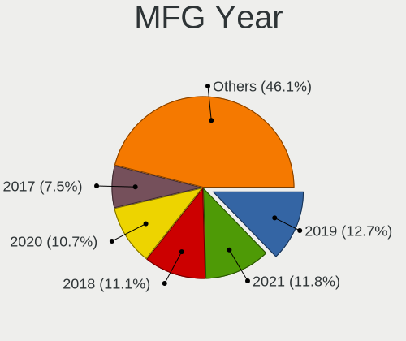
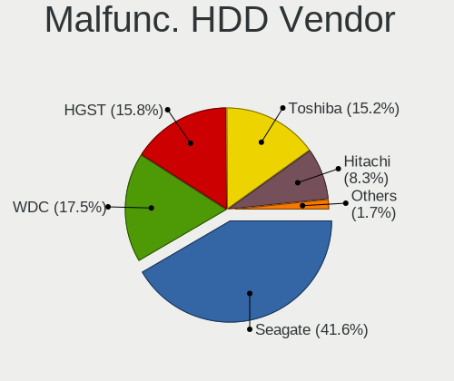
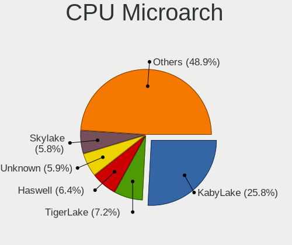
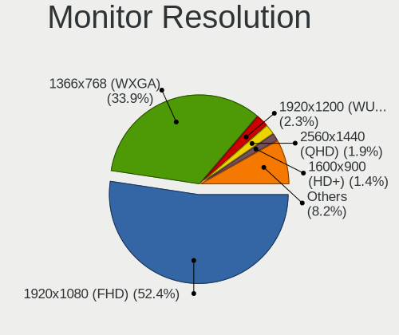
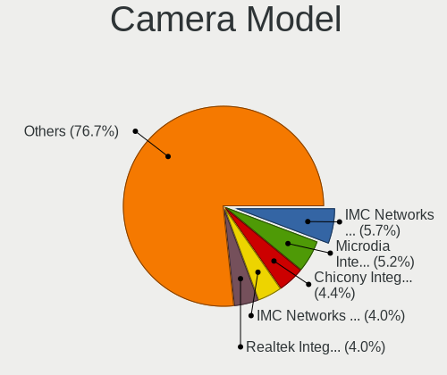

Linux in India - Tested Hardware & Statistics (Notebooks)
---------------------------------------------------------

A project to collect tested hardware configurations for Linux in India.

Anyone can contribute to this report by the [hw-probe](https://github.com/linuxhw/hw-probe) tool:

    sudo -E hw-probe -all -upload

Please contribute! Especially if your hardware is rare.

Contents
--------

* [ Test Cases ](#test-cases)

* [ System ](#system)
  - [ OS                       ](#os)
  - [ OS Family                ](#os-family)
  - [ Kernel                   ](#kernel)
  - [ Kernel Family            ](#kernel-family)
  - [ Kernel Major Ver.        ](#kernel-major-ver)
  - [ Arch                     ](#arch)
  - [ DE                       ](#de)
  - [ Display Server           ](#display-server)
  - [ Display Manager          ](#display-manager)
  - [ OS Lang                  ](#os-lang)
  - [ Boot Mode                ](#boot-mode)
  - [ Filesystem               ](#filesystem)
  - [ Part. scheme             ](#part-scheme)
  - [ Dual Boot with Linux/BSD ](#dual-boot-with-linuxbsd)
  - [ Dual Boot (Win)          ](#dual-boot-win)

* [ Board ](#board)
  - [ Vendor                   ](#vendor)
  - [ Model                    ](#model)
  - [ Model Family             ](#model-family)
  - [ MFG Year                 ](#mfg-year)
  - [ Form Factor              ](#form-factor)
  - [ Secure Boot              ](#secure-boot)
  - [ Coreboot                 ](#coreboot)
  - [ RAM Size                 ](#ram-size)
  - [ RAM Used                 ](#ram-used)
  - [ Total Drives             ](#total-drives)
  - [ Has CD-ROM               ](#has-cd-rom)
  - [ Has Ethernet             ](#has-ethernet)
  - [ Has WiFi                 ](#has-wifi)
  - [ Has Bluetooth            ](#has-bluetooth)

* [ Location ](#location)
  - [ Country                  ](#country)
  - [ City                     ](#city)

* [ Drives ](#drives)
  - [ Drive Vendor             ](#drive-vendor)
  - [ Drive Model              ](#drive-model)
  - [ HDD Vendor               ](#hdd-vendor)
  - [ SSD Vendor               ](#ssd-vendor)
  - [ Drive Kind               ](#drive-kind)
  - [ Drive Connector          ](#drive-connector)
  - [ Drive Size               ](#drive-size)
  - [ Space Total              ](#space-total)
  - [ Space Used               ](#space-used)
  - [ Malfunc. Drives          ](#malfunc-drives)
  - [ Malfunc. Drive Vendor    ](#malfunc-drive-vendor)
  - [ Malfunc. HDD Vendor      ](#malfunc-hdd-vendor)
  - [ Malfunc. Drive Kind      ](#malfunc-drive-kind)
  - [ Failed Drives            ](#failed-drives)
  - [ Failed Drive Vendor      ](#failed-drive-vendor)
  - [ Drive Status             ](#drive-status)

* [ Storage controller ](#storage-controller)
  - [ Storage Vendor           ](#storage-vendor)
  - [ Storage Model            ](#storage-model)
  - [ Storage Kind             ](#storage-kind)

* [ Processor ](#processor)
  - [ CPU Vendor               ](#cpu-vendor)
  - [ CPU Model                ](#cpu-model)
  - [ CPU Model Family         ](#cpu-model-family)
  - [ CPU Cores                ](#cpu-cores)
  - [ CPU Sockets              ](#cpu-sockets)
  - [ CPU Threads              ](#cpu-threads)
  - [ CPU Op-Modes             ](#cpu-op-modes)
  - [ CPU Microcode            ](#cpu-microcode)
  - [ CPU Microarch            ](#cpu-microarch)

* [ Graphics ](#graphics)
  - [ GPU Vendor               ](#gpu-vendor)
  - [ GPU Model                ](#gpu-model)
  - [ GPU Combo                ](#gpu-combo)
  - [ GPU Driver               ](#gpu-driver)
  - [ GPU Memory               ](#gpu-memory)

* [ Monitor ](#monitor)
  - [ Monitor Vendor           ](#monitor-vendor)
  - [ Monitor Model            ](#monitor-model)
  - [ Monitor Resolution       ](#monitor-resolution)
  - [ Monitor Diagonal         ](#monitor-diagonal)
  - [ Monitor Width            ](#monitor-width)
  - [ Aspect Ratio             ](#aspect-ratio)
  - [ Monitor Area             ](#monitor-area)
  - [ Pixel Density            ](#pixel-density)
  - [ Multiple Monitors        ](#multiple-monitors)

* [ Network ](#network)
  - [ Net Controller Vendor    ](#net-controller-vendor)
  - [ Net Controller Model     ](#net-controller-model)
  - [ Wireless Vendor          ](#wireless-vendor)
  - [ Wireless Model           ](#wireless-model)
  - [ Ethernet Vendor          ](#ethernet-vendor)
  - [ Ethernet Model           ](#ethernet-model)
  - [ Net Controller Kind      ](#net-controller-kind)
  - [ Used Controller          ](#used-controller)
  - [ NICs                     ](#nics)
  - [ IPv6                     ](#ipv6)

* [ Bluetooth ](#bluetooth)
  - [ Bluetooth Vendor         ](#bluetooth-vendor)
  - [ Bluetooth Model          ](#bluetooth-model)

* [ Sound ](#sound)
  - [ Sound Vendor             ](#sound-vendor)
  - [ Sound Model              ](#sound-model)

* [ Memory ](#memory)
  - [ Memory Vendor            ](#memory-vendor)
  - [ Memory Model             ](#memory-model)
  - [ Memory Kind              ](#memory-kind)
  - [ Memory Form Factor       ](#memory-form-factor)
  - [ Memory Size              ](#memory-size)
  - [ Memory Speed             ](#memory-speed)

* [ Printers & scanners ](#printers--scanners)
  - [ Printer Vendor           ](#printer-vendor)
  - [ Printer Model            ](#printer-model)
  - [ Scanner Vendor           ](#scanner-vendor)
  - [ Scanner Model            ](#scanner-model)

* [ Camera ](#camera)
  - [ Camera Vendor            ](#camera-vendor)
  - [ Camera Model             ](#camera-model)

* [ Security ](#security)
  - [ Fingerprint Vendor       ](#fingerprint-vendor)
  - [ Fingerprint Model        ](#fingerprint-model)
  - [ Chipcard Vendor          ](#chipcard-vendor)
  - [ Chipcard Model           ](#chipcard-model)

* [ Unsupported ](#unsupported)
  - [ Unsupported Devices      ](#unsupported-devices)
  - [ Unsupported Device Types ](#unsupported-device-types)

Test Cases
----------

Total: 6380

| Vendor        | Model                       | Probe                                                      | Date         |
|---------------|-----------------------------|------------------------------------------------------------|--------------|
| Acer          | Aspire E5-575               | [8a7b632b3f](https://linux-hardware.org/?probe=8a7b632b3f) | Jan 06, 2025 |
| HP            | Laptop 15-bw0xx             | [63a7238333](https://linux-hardware.org/?probe=63a7238333) | Jan 06, 2025 |
| MSI           | Prestige 16 AI Studio B1... | [22d073249b](https://linux-hardware.org/?probe=22d073249b) | Jan 06, 2025 |
| MSI           | Prestige 16 AI Studio B1... | [d8d6ab4b82](https://linux-hardware.org/?probe=d8d6ab4b82) | Jan 06, 2025 |
| Acer          | Aspire A715-75G             | [c27afe3737](https://linux-hardware.org/?probe=c27afe3737) | Jan 06, 2025 |
| Dell          | Latitude 7400               | [9c347a93bf](https://linux-hardware.org/?probe=9c347a93bf) | Jan 05, 2025 |
| Dell          | Latitude 7400               | [70481b51db](https://linux-hardware.org/?probe=70481b51db) | Jan 05, 2025 |
| Lenovo        | IdeaPad Slim 5 16IRL8 82... | [c7c71ab41b](https://linux-hardware.org/?probe=c7c71ab41b) | Jan 04, 2025 |
| HP            | Laptop 15-bw0xx             | [43b69637a0](https://linux-hardware.org/?probe=43b69637a0) | Jan 04, 2025 |
| Lenovo        | IdeaPad 3 15ADA05 81W1      | [e8a17155a5](https://linux-hardware.org/?probe=e8a17155a5) | Jan 03, 2025 |
| Infinix       | ZERO BOOK 13                | [13a15ed2a6](https://linux-hardware.org/?probe=13a15ed2a6) | Jan 03, 2025 |
| Infinix       | ZERO BOOK 13                | [ed7c4d2c05](https://linux-hardware.org/?probe=ed7c4d2c05) | Jan 03, 2025 |
| ASUSTek       | Vivobook Go E1504FA         | [8e5f1ab7d6](https://linux-hardware.org/?probe=8e5f1ab7d6) | Jan 02, 2025 |
| HP            | Notebook                    | [06877f4048](https://linux-hardware.org/?probe=06877f4048) | Jan 02, 2025 |
| ASUSTek       | ASUS TUF Gaming F15 FX50... | [79854a5556](https://linux-hardware.org/?probe=79854a5556) | Jan 02, 2025 |
| Dell          | Vostro 3558                 | [4f78b23a1f](https://linux-hardware.org/?probe=4f78b23a1f) | Jan 01, 2025 |
| Dell          | Latitude E7470              | [b4c31f2860](https://linux-hardware.org/?probe=b4c31f2860) | Jan 01, 2025 |
| ASUSTek       | ASUS TUF Gaming F15 FX50... | [173b640d4f](https://linux-hardware.org/?probe=173b640d4f) | Jan 01, 2025 |
| Dell          | G15 5520                    | [19d5a43273](https://linux-hardware.org/?probe=19d5a43273) | Jan 01, 2025 |
| Dell          | Precision 5520              | [88832dcaf1](https://linux-hardware.org/?probe=88832dcaf1) | Dec 31, 2024 |
| HP            | EliteBook 830 G5            | [8382fe388f](https://linux-hardware.org/?probe=8382fe388f) | Dec 31, 2024 |
| HP            | EliteBook 830 G5            | [a61a178741](https://linux-hardware.org/?probe=a61a178741) | Dec 31, 2024 |
| HP            | Victus by Gaming Laptop ... | [779320377b](https://linux-hardware.org/?probe=779320377b) | Dec 31, 2024 |
| Dell          | Inspiron 1564               | [2c9fde1f45](https://linux-hardware.org/?probe=2c9fde1f45) | Dec 31, 2024 |
| Acer          | Aspire A715-51G             | [cfd28ac9de](https://linux-hardware.org/?probe=cfd28ac9de) | Dec 31, 2024 |
| HP            | Pavilion Laptop 15-eg2xx... | [51986f627d](https://linux-hardware.org/?probe=51986f627d) | Dec 31, 2024 |
| HP            | Laptop 15-bw0xx             | [d9da8c385d](https://linux-hardware.org/?probe=d9da8c385d) | Dec 30, 2024 |
| Lenovo        | LOQ 15IRX9 83DV             | [5e54f584cf](https://linux-hardware.org/?probe=5e54f584cf) | Dec 29, 2024 |
| ASUSTek       | VivoBook_ASUSLaptop M650... | [21c6eba6fd](https://linux-hardware.org/?probe=21c6eba6fd) | Dec 29, 2024 |
| ASUSTek       | VivoBook_ASUSLaptop M650... | [73ea07394a](https://linux-hardware.org/?probe=73ea07394a) | Dec 29, 2024 |
| Lenovo        | ThinkBook 15 G5 ABP 21JF    | [ec36d41ebe](https://linux-hardware.org/?probe=ec36d41ebe) | Dec 29, 2024 |
| ASUSTek       | Vivobook Go E1404FA_E140... | [5b91ae868c](https://linux-hardware.org/?probe=5b91ae868c) | Dec 29, 2024 |
| Acer          | Aspire E5-576               | [4ae46bc01a](https://linux-hardware.org/?probe=4ae46bc01a) | Dec 29, 2024 |
| Acer          | Aspire A715-76G             | [2eac48d513](https://linux-hardware.org/?probe=2eac48d513) | Dec 28, 2024 |
| Apple         | MacBookPro13,2              | [126e6ce8f9](https://linux-hardware.org/?probe=126e6ce8f9) | Dec 26, 2024 |
| ASUSTek       | VivoBook_ASUSLaptop K550... | [09c6b6944f](https://linux-hardware.org/?probe=09c6b6944f) | Dec 25, 2024 |
| Lenovo        | IdeaPad 3 14ITL6 82H7       | [e642f51eb3](https://linux-hardware.org/?probe=e642f51eb3) | Dec 25, 2024 |
| Dell          | Vostro 3491                 | [f0cc8a9f56](https://linux-hardware.org/?probe=f0cc8a9f56) | Dec 25, 2024 |
| Acer          | Aspire ES1-531              | [c09e9c415c](https://linux-hardware.org/?probe=c09e9c415c) | Dec 25, 2024 |
| ASUSTek       | VivoBook_ASUSLaptop X140... | [466079d6a0](https://linux-hardware.org/?probe=466079d6a0) | Dec 25, 2024 |
| Lenovo        | ThinkPad E14 Gen 5 21JRS... | [debe380fb9](https://linux-hardware.org/?probe=debe380fb9) | Dec 24, 2024 |
| HP            | Laptop 14-em0xxx            | [86de6fe058](https://linux-hardware.org/?probe=86de6fe058) | Dec 24, 2024 |
| Lenovo        | V14 G4 ABP 82YX             | [66c7a6f6dc](https://linux-hardware.org/?probe=66c7a6f6dc) | Dec 24, 2024 |
| Acer          | Aspire 5742                 | [1464964b4c](https://linux-hardware.org/?probe=1464964b4c) | Dec 24, 2024 |
| ASUSTek       | ROG Zephyrus G14 GA401IU... | [6a859ac63c](https://linux-hardware.org/?probe=6a859ac63c) | Dec 24, 2024 |
| Lenovo        | ThinkBook 14-IIL 20SL       | [ba5d8c06f6](https://linux-hardware.org/?probe=ba5d8c06f6) | Dec 23, 2024 |
| ASUSTek       | ASUS EXPERTBOOK B1403CVA    | [b51fc6a4fb](https://linux-hardware.org/?probe=b51fc6a4fb) | Dec 23, 2024 |
| ASUSTek       | VivoBook_ASUSLaptop K360... | [7972c46b80](https://linux-hardware.org/?probe=7972c46b80) | Dec 23, 2024 |
| ASUSTek       | VivoBook_ASUSLaptop K360... | [755b6a8ac6](https://linux-hardware.org/?probe=755b6a8ac6) | Dec 23, 2024 |
| Lenovo        | IdeaPad 5 15ALC05 82LN      | [bf0860ac14](https://linux-hardware.org/?probe=bf0860ac14) | Dec 22, 2024 |
| Lenovo        | IdeaPad 5 15ALC05 82LN      | [c2dcf0826e](https://linux-hardware.org/?probe=c2dcf0826e) | Dec 22, 2024 |
| Lenovo        | IdeaPad 3 14ALC6 82KT       | [83a0db5938](https://linux-hardware.org/?probe=83a0db5938) | Dec 22, 2024 |
| ASUSTek       | ASUS TUF Gaming A15 FA50... | [4f994766ca](https://linux-hardware.org/?probe=4f994766ca) | Dec 22, 2024 |
| Lenovo        | ThinkPad E14 Gen 6 21M4C... | [6fa3114483](https://linux-hardware.org/?probe=6fa3114483) | Dec 22, 2024 |
| Dell          | Inspiron 3542               | [81c6c26fa4](https://linux-hardware.org/?probe=81c6c26fa4) | Dec 21, 2024 |
| ASUSTek       | VivoBook_ASUSLaptop X509... | [5eab44b863](https://linux-hardware.org/?probe=5eab44b863) | Dec 21, 2024 |
| Lenovo        | V15-IIL 82C5                | [3200caab14](https://linux-hardware.org/?probe=3200caab14) | Dec 20, 2024 |
| MSI           | Modern 14 C7M               | [b6144f4789](https://linux-hardware.org/?probe=b6144f4789) | Dec 20, 2024 |
| Lenovo        | IdeaPad Z580                | [85ca1549f4](https://linux-hardware.org/?probe=85ca1549f4) | Dec 20, 2024 |
| ASUSTek       | ASUS TUF Gaming A15 FA50... | [6816110a56](https://linux-hardware.org/?probe=6816110a56) | Dec 20, 2024 |
| ASUSTek       | TUF Gaming FX505GE_FX505... | [26283d6910](https://linux-hardware.org/?probe=26283d6910) | Dec 20, 2024 |
| HP            | Laptop 14q-cs0xxx           | [f9fc2fe784](https://linux-hardware.org/?probe=f9fc2fe784) | Dec 20, 2024 |
| Lenovo        | ThinkBook 15 G2 ITL 20VE    | [5577ce8b2a](https://linux-hardware.org/?probe=5577ce8b2a) | Dec 18, 2024 |
| HP            | Pavilion Gaming Laptop 1... | [1d44dea703](https://linux-hardware.org/?probe=1d44dea703) | Dec 18, 2024 |
| Lenovo        | Z50-70 20354                | [8f484e94de](https://linux-hardware.org/?probe=8f484e94de) | Dec 18, 2024 |
| Acer          | Aspire A315-59              | [3b299a7625](https://linux-hardware.org/?probe=3b299a7625) | Dec 17, 2024 |
| Lenovo        | ThinkPad X250 20CLA2GEIG    | [e29cc227ae](https://linux-hardware.org/?probe=e29cc227ae) | Dec 17, 2024 |
| HP            | Laptop 15q-bu0xx            | [4d69567892](https://linux-hardware.org/?probe=4d69567892) | Dec 17, 2024 |
| Timi          | Mi NoteBook Pro             | [635ad0c15c](https://linux-hardware.org/?probe=635ad0c15c) | Dec 17, 2024 |
| Lenovo        | LOQ 15IAX9 83GS             | [4cc0adf6ee](https://linux-hardware.org/?probe=4cc0adf6ee) | Dec 17, 2024 |
| Lenovo        | LOQ 15IAX9 83GS             | [9121321176](https://linux-hardware.org/?probe=9121321176) | Dec 17, 2024 |
| ASUSTek       | ASUS EXPERTBOOK B1403CVA    | [dc66ca3bfc](https://linux-hardware.org/?probe=dc66ca3bfc) | Dec 16, 2024 |
| HP            | EliteBook 845 G8 Noteboo... | [6e8d4af36b](https://linux-hardware.org/?probe=6e8d4af36b) | Dec 16, 2024 |
| ASUSTek       | ASUS TUF Gaming A15 FA50... | [65556a9424](https://linux-hardware.org/?probe=65556a9424) | Dec 15, 2024 |
| ASUSTek       | Zenbook UM5401QAB_UM5401... | [80eb154594](https://linux-hardware.org/?probe=80eb154594) | Dec 15, 2024 |
| Acer          | Aspire A715-76G             | [4908ac95bd](https://linux-hardware.org/?probe=4908ac95bd) | Dec 14, 2024 |
| ASUSTek       | VivoBook_ASUSLaptop K340... | [ed3d05274d](https://linux-hardware.org/?probe=ed3d05274d) | Dec 14, 2024 |
| Lenovo        | ThinkPad L490 20Q6S1VS00    | [065746dd51](https://linux-hardware.org/?probe=065746dd51) | Dec 14, 2024 |
| Acer          | Aspire A315-56              | [8d47454624](https://linux-hardware.org/?probe=8d47454624) | Dec 14, 2024 |
| Lenovo        | B490 20205                  | [68e4babaf4](https://linux-hardware.org/?probe=68e4babaf4) | Dec 14, 2024 |
| Lenovo        | ThinkPad L490 20Q6S1VS00    | [1884970842](https://linux-hardware.org/?probe=1884970842) | Dec 14, 2024 |
| Acer          | Aspire A715-75G             | [4add35f086](https://linux-hardware.org/?probe=4add35f086) | Dec 13, 2024 |
| HP            | EliteBook 840 G1            | [bd27b16177](https://linux-hardware.org/?probe=bd27b16177) | Dec 13, 2024 |
| ASUSTek       | VivoBook_ASUSLaptop K550... | [6dbbb0dd7b](https://linux-hardware.org/?probe=6dbbb0dd7b) | Dec 11, 2024 |
| Dell          | Vostro 15-3568              | [15e5f0c8f1](https://linux-hardware.org/?probe=15e5f0c8f1) | Dec 11, 2024 |
| Infinix       | ZERO BOOK 13                | [fa51c92790](https://linux-hardware.org/?probe=fa51c92790) | Dec 11, 2024 |
| Acer          | Predator PHN16-71           | [e18ec1de74](https://linux-hardware.org/?probe=e18ec1de74) | Dec 10, 2024 |
| Lenovo        | ThinkPad E14 Gen 6 21M4C... | [791f38ca0c](https://linux-hardware.org/?probe=791f38ca0c) | Dec 10, 2024 |
| Acer          | Aspire E5-573               | [0f87e3502b](https://linux-hardware.org/?probe=0f87e3502b) | Dec 10, 2024 |
| Acer          | Aspire E5-573               | [1d8c086425](https://linux-hardware.org/?probe=1d8c086425) | Dec 10, 2024 |
| Lenovo        | E41-25 81FS                 | [95f7d93b0e](https://linux-hardware.org/?probe=95f7d93b0e) | Dec 10, 2024 |
| ASUSTek       | VivoBook_ASUSLaptop X421... | [7ec6f9d3b2](https://linux-hardware.org/?probe=7ec6f9d3b2) | Dec 07, 2024 |
| Lenovo        | ThinkPad P52 20MAS1WD0S     | [49359bfaf2](https://linux-hardware.org/?probe=49359bfaf2) | Dec 07, 2024 |
| Lenovo        | ThinkPad T470 20HES18R03    | [a60cfb9794](https://linux-hardware.org/?probe=a60cfb9794) | Dec 06, 2024 |
| Lenovo        | ThinkPad T470 20HES18R03    | [5f11c9c3a7](https://linux-hardware.org/?probe=5f11c9c3a7) | Dec 06, 2024 |
| HP            | Laptop 15s-du3xxx           | [b1288c3570](https://linux-hardware.org/?probe=b1288c3570) | Dec 04, 2024 |
| Timi          | Mi NoteBook Ultra           | [12e0599060](https://linux-hardware.org/?probe=12e0599060) | Dec 04, 2024 |
| Lenovo        | ThinkPad W520 4284FK4       | [0ac4ac5006](https://linux-hardware.org/?probe=0ac4ac5006) | Dec 03, 2024 |
| Dell          | Inspiron 14-3467            | [edff58c886](https://linux-hardware.org/?probe=edff58c886) | Dec 03, 2024 |
| Lenovo        | ThinkPad E14 Gen 6 21M4C... | [f73390cd6f](https://linux-hardware.org/?probe=f73390cd6f) | Dec 03, 2024 |
| Lenovo        | ThinkPad T480 20L6S42005    | [d500ee2a02](https://linux-hardware.org/?probe=d500ee2a02) | Dec 02, 2024 |
| Dell          | Inspiron 15 3520            | [b7df1128f3](https://linux-hardware.org/?probe=b7df1128f3) | Dec 02, 2024 |
| HP            | Pavilion 15                 | [08872063ba](https://linux-hardware.org/?probe=08872063ba) | Dec 02, 2024 |
| Lenovo        | IdeaPad 3 15ITL6 82H8       | [1723ab7830](https://linux-hardware.org/?probe=1723ab7830) | Dec 02, 2024 |
| Lenovo        | LOQ 15IAX9 83GS             | [c056898b94](https://linux-hardware.org/?probe=c056898b94) | Dec 01, 2024 |
| Dell          | Inspiron 3542               | [0d619706e0](https://linux-hardware.org/?probe=0d619706e0) | Dec 01, 2024 |
| Dell          | Latitude 5420               | [397c049a0c](https://linux-hardware.org/?probe=397c049a0c) | Dec 01, 2024 |
| Lenovo        | Z50-70 20354                | [18d0728c77](https://linux-hardware.org/?probe=18d0728c77) | Dec 01, 2024 |
| Dell          | Inspiron 5559               | [bcea3803cc](https://linux-hardware.org/?probe=bcea3803cc) | Dec 01, 2024 |
| HP            | 240 G6 Notebook PC          | [1cffd55e50](https://linux-hardware.org/?probe=1cffd55e50) | Dec 01, 2024 |
| Timi          | Mi NoteBook Pro             | [f7b3a69ddf](https://linux-hardware.org/?probe=f7b3a69ddf) | Nov 29, 2024 |
| HP            | Pavilion Laptop 15-eg2xx... | [38d2a6bb11](https://linux-hardware.org/?probe=38d2a6bb11) | Nov 29, 2024 |
| Dell          | Inspiron 3543               | [a87d08ca42](https://linux-hardware.org/?probe=a87d08ca42) | Nov 28, 2024 |
| HP            | Pavilion Laptop 15-cc5xx    | [8d3d4f6e65](https://linux-hardware.org/?probe=8d3d4f6e65) | Nov 28, 2024 |
| Lenovo        | ThinkPad T480 20L6S42005    | [8347e35fc9](https://linux-hardware.org/?probe=8347e35fc9) | Nov 28, 2024 |
| HP            | 15                          | [9abcf874e9](https://linux-hardware.org/?probe=9abcf874e9) | Nov 28, 2024 |
| HP            | Laptop 15-bs0xx             | [f7d2817b20](https://linux-hardware.org/?probe=f7d2817b20) | Nov 27, 2024 |
| HP            | Laptop 15g-br1xx            | [046384f425](https://linux-hardware.org/?probe=046384f425) | Nov 27, 2024 |
| HP            | Laptop 15-bw0xx             | [91bb956a52](https://linux-hardware.org/?probe=91bb956a52) | Nov 27, 2024 |
| Dell          | Inspiron 5590               | [6849528aa9](https://linux-hardware.org/?probe=6849528aa9) | Nov 27, 2024 |
| ASUSTek       | ASUS TUF Gaming F15 FX50... | [097217bba2](https://linux-hardware.org/?probe=097217bba2) | Nov 26, 2024 |
| Dell          | Latitude 5411               | [ebb8abde35](https://linux-hardware.org/?probe=ebb8abde35) | Nov 26, 2024 |
| Lenovo        | IdeaPad 3 15ITL05 81X8      | [43e8620ad6](https://linux-hardware.org/?probe=43e8620ad6) | Nov 26, 2024 |
| ASUSTek       | VivoBook_ASUSLaptop K350... | [8464af3717](https://linux-hardware.org/?probe=8464af3717) | Nov 26, 2024 |
| ASUSTek       | VivoBook_ASUSLaptop M340... | [30d5372617](https://linux-hardware.org/?probe=30d5372617) | Nov 26, 2024 |
| HP            | Gumboz                      | [528fc2780e](https://linux-hardware.org/?probe=528fc2780e) | Nov 26, 2024 |
| Dell          | Inspiron 3543               | [bcc801145a](https://linux-hardware.org/?probe=bcc801145a) | Nov 25, 2024 |
| Lenovo        | IdeaPad 3 15ITL05 81X8      | [6cf4118337](https://linux-hardware.org/?probe=6cf4118337) | Nov 25, 2024 |
| Dell          | Latitude 3189               | [881f99bc57](https://linux-hardware.org/?probe=881f99bc57) | Nov 25, 2024 |
| Lenovo        | Legion Pro 5 16IRX9 83DF    | [a5494e7f6e](https://linux-hardware.org/?probe=a5494e7f6e) | Nov 25, 2024 |
| HP            | Gumboz                      | [b10cae6218](https://linux-hardware.org/?probe=b10cae6218) | Nov 25, 2024 |
| ASUSTek       | ROG Strix G634JZ_G634JZ     | [75d0d803d0](https://linux-hardware.org/?probe=75d0d803d0) | Nov 24, 2024 |
| Dell          | Latitude 3470               | [4f50b50441](https://linux-hardware.org/?probe=4f50b50441) | Nov 24, 2024 |
| Lenovo        | ThinkPad E14 Gen 5 21JRS... | [5f86dccde5](https://linux-hardware.org/?probe=5f86dccde5) | Nov 24, 2024 |
| HP            | Laptop 14s-dq3xxx           | [4bb9d7ef12](https://linux-hardware.org/?probe=4bb9d7ef12) | Nov 24, 2024 |
| Lenovo        | IdeaPad 5 Pro 14ACN6 82L... | [1a3c4e52b0](https://linux-hardware.org/?probe=1a3c4e52b0) | Nov 24, 2024 |
| Lenovo        | V15 G4 ABP 83CR             | [7babc4592f](https://linux-hardware.org/?probe=7babc4592f) | Nov 24, 2024 |
| Chuwi         | CoreBook X                  | [5e2d0c17d4](https://linux-hardware.org/?probe=5e2d0c17d4) | Nov 23, 2024 |
| Dell          | G3 3590                     | [06181baaa8](https://linux-hardware.org/?probe=06181baaa8) | Nov 23, 2024 |
| ASUSTek       | ASUS Vivobook S 16 S5606... | [2b9ffeae7c](https://linux-hardware.org/?probe=2b9ffeae7c) | Nov 23, 2024 |
| Dell          | Inspiron N5050              | [0770122667](https://linux-hardware.org/?probe=0770122667) | Nov 22, 2024 |
| HP            | Laptop 15s-fr2xxx           | [012b4023c2](https://linux-hardware.org/?probe=012b4023c2) | Nov 22, 2024 |
| MSI           | GF63 Thin 11UC              | [e904ce34f1](https://linux-hardware.org/?probe=e904ce34f1) | Nov 21, 2024 |
| MSI           | GF63 Thin 11UC              | [cbaee77b72](https://linux-hardware.org/?probe=cbaee77b72) | Nov 21, 2024 |
| HP            | ProBook 440 G8 Notebook ... | [ead3eaf12f](https://linux-hardware.org/?probe=ead3eaf12f) | Nov 20, 2024 |
| ASUSTek       | ASUS TUF Gaming A14 FA40... | [6078f351c2](https://linux-hardware.org/?probe=6078f351c2) | Nov 20, 2024 |
| HP            | Laptop 15-bw0xx             | [fa4cf0c660](https://linux-hardware.org/?probe=fa4cf0c660) | Nov 20, 2024 |
| Lenovo        | ThinkPad E14 20RAS13J00     | [7a8cc3c5a4](https://linux-hardware.org/?probe=7a8cc3c5a4) | Nov 19, 2024 |
| Infinix       | Y4 Max                      | [6d4386c347](https://linux-hardware.org/?probe=6d4386c347) | Nov 19, 2024 |
| HP            | ProBook 440 G8 Notebook ... | [2e716d168e](https://linux-hardware.org/?probe=2e716d168e) | Nov 19, 2024 |
| HP            | 15                          | [ae229ea058](https://linux-hardware.org/?probe=ae229ea058) | Nov 19, 2024 |
| ASUSTek       | VivoBook 14_ASUS Laptop ... | [ded486b775](https://linux-hardware.org/?probe=ded486b775) | Nov 18, 2024 |
| Timi          | Mi Notebook Pro             | [deaf367a3e](https://linux-hardware.org/?probe=deaf367a3e) | Nov 17, 2024 |
| Lenovo        | ThinkPad E14 Gen 6 21M4C... | [371079416f](https://linux-hardware.org/?probe=371079416f) | Nov 17, 2024 |
| Lenovo        | IdeaPad S145-15API 81UT     | [0aeac8749e](https://linux-hardware.org/?probe=0aeac8749e) | Nov 17, 2024 |
| ASUSTek       | VivoBook_ASUSLaptop M650... | [fe024604b1](https://linux-hardware.org/?probe=fe024604b1) | Nov 17, 2024 |
| Dell          | Latitude 7440               | [5935702b41](https://linux-hardware.org/?probe=5935702b41) | Nov 16, 2024 |
| Lenovo        | ThinkBook 16 G6 ABP 21KK    | [6600c1ef88](https://linux-hardware.org/?probe=6600c1ef88) | Nov 16, 2024 |
| Lenovo        | LOQ 15IAX9 83GS             | [36339f74c4](https://linux-hardware.org/?probe=36339f74c4) | Nov 15, 2024 |
| Lenovo        | IdeaPad Gaming3 15ARH05D... | [ee4d99aac5](https://linux-hardware.org/?probe=ee4d99aac5) | Nov 15, 2024 |
| HP            | EliteBook 840 G6            | [013364c2a0](https://linux-hardware.org/?probe=013364c2a0) | Nov 15, 2024 |
| ASUSTek       | ASUS TUF Gaming A14 FA40... | [cd0cd38834](https://linux-hardware.org/?probe=cd0cd38834) | Nov 15, 2024 |
| HP            | ProBook 650 G4              | [aa662f23e7](https://linux-hardware.org/?probe=aa662f23e7) | Nov 15, 2024 |
| Lenovo        | ThinkPad 20NKMLPOPU         | [c983cfe628](https://linux-hardware.org/?probe=c983cfe628) | Nov 15, 2024 |
| Acer          | Swift SFG14-73              | [d8d4beb318](https://linux-hardware.org/?probe=d8d4beb318) | Nov 15, 2024 |
| Chuwi         | CoreBook X                  | [972031ce24](https://linux-hardware.org/?probe=972031ce24) | Nov 14, 2024 |
| Dell          | Latitude 5430               | [a62e978a5b](https://linux-hardware.org/?probe=a62e978a5b) | Nov 14, 2024 |
| HP            | ZBook Firefly 14 inch G9... | [08244ca4ee](https://linux-hardware.org/?probe=08244ca4ee) | Nov 14, 2024 |
| HP            | ZBook 14u G6                | [147b73bcae](https://linux-hardware.org/?probe=147b73bcae) | Nov 14, 2024 |
| HP            | ZBook 14u G6                | [c783c0f8e7](https://linux-hardware.org/?probe=c783c0f8e7) | Nov 14, 2024 |
| ASUSTek       | VivoBook_ASUSLaptop M160... | [d9dc178744](https://linux-hardware.org/?probe=d9dc178744) | Nov 13, 2024 |
| HP            | ProBook 650 G4              | [5211ddeeac](https://linux-hardware.org/?probe=5211ddeeac) | Nov 12, 2024 |
| Dell          | Inspiron 5447               | [bf1b6ee49f](https://linux-hardware.org/?probe=bf1b6ee49f) | Nov 12, 2024 |
| Lenovo        | IdeaPad Gaming 3 15IHU6 ... | [feb8fd8dbc](https://linux-hardware.org/?probe=feb8fd8dbc) | Nov 12, 2024 |
| HP            | Laptop 15-bs0xx             | [5313e4e080](https://linux-hardware.org/?probe=5313e4e080) | Nov 12, 2024 |
| Lenovo        | IdeaPad 3 15IAU7 82RK       | [a84e5baa04](https://linux-hardware.org/?probe=a84e5baa04) | Nov 11, 2024 |
| Dell          | Precision 3561              | [43f06770e1](https://linux-hardware.org/?probe=43f06770e1) | Nov 11, 2024 |
| Lenovo        | ThinkPad E14 Gen 4 21E3S... | [f414da24f7](https://linux-hardware.org/?probe=f414da24f7) | Nov 11, 2024 |
| Infinix       | INBOOK Y1 PLUS              | [53ea4dc826](https://linux-hardware.org/?probe=53ea4dc826) | Nov 11, 2024 |
| HP            | Pavilion Aero Laptop 13-... | [ca7bd9eeca](https://linux-hardware.org/?probe=ca7bd9eeca) | Nov 10, 2024 |
| Samsung       | 750XED                      | [83c70c1c73](https://linux-hardware.org/?probe=83c70c1c73) | Nov 10, 2024 |
| Dell          | Precision 5550              | [1f2d07fe7f](https://linux-hardware.org/?probe=1f2d07fe7f) | Nov 10, 2024 |
| ASUSTek       | VivoBook_ASUSLaptop X150... | [653af95fb0](https://linux-hardware.org/?probe=653af95fb0) | Nov 10, 2024 |
| Lenovo        | ThinkPad T470s 20HGS1RQ1... | [701fc032db](https://linux-hardware.org/?probe=701fc032db) | Nov 10, 2024 |
| Lenovo        | G50-80 80E5                 | [3532af1d5e](https://linux-hardware.org/?probe=3532af1d5e) | Nov 10, 2024 |
| Lenovo        | G50-80 80E5                 | [03181287b8](https://linux-hardware.org/?probe=03181287b8) | Nov 10, 2024 |
| HCL Infosy... | HCL ME Laptop               | [c7f687a378](https://linux-hardware.org/?probe=c7f687a378) | Nov 10, 2024 |
| HCL Infosy... | HCL ME Laptop               | [2a89582677](https://linux-hardware.org/?probe=2a89582677) | Nov 10, 2024 |
| HP            | Laptop 14s-fq1xxx           | [93dcb6c0cb](https://linux-hardware.org/?probe=93dcb6c0cb) | Nov 09, 2024 |
| HP            | Victus by Gaming Laptop ... | [4b1a134723](https://linux-hardware.org/?probe=4b1a134723) | Nov 09, 2024 |
| ASUSTek       | ASUS TUF Dash F15 FX517Z... | [1032f0a1e6](https://linux-hardware.org/?probe=1032f0a1e6) | Nov 08, 2024 |
| ASUSTek       | VivoBook_ASUSLaptop K350... | [5568d3cc9d](https://linux-hardware.org/?probe=5568d3cc9d) | Nov 07, 2024 |
| ASUSTek       | ASUS Vivobook S 16 S5606... | [c967424ce9](https://linux-hardware.org/?probe=c967424ce9) | Nov 07, 2024 |
| HP            | Pavilion dv6                | [16d9fab8f0](https://linux-hardware.org/?probe=16d9fab8f0) | Nov 06, 2024 |
| HP            | Victus by Gaming Laptop ... | [2610105fd5](https://linux-hardware.org/?probe=2610105fd5) | Nov 06, 2024 |
| Flipkart I... | NKi511TL165S                | [0f7b63ec96](https://linux-hardware.org/?probe=0f7b63ec96) | Nov 05, 2024 |
| HP            | Victus by Gaming Laptop ... | [86767496b1](https://linux-hardware.org/?probe=86767496b1) | Nov 05, 2024 |
| Chuwi         | FreeBook                    | [a381dac424](https://linux-hardware.org/?probe=a381dac424) | Nov 05, 2024 |
| Chuwi         | FreeBook                    | [3eaecb4536](https://linux-hardware.org/?probe=3eaecb4536) | Nov 05, 2024 |
| HP            | Pavilion Aero Laptop 13-... | [2df5abc471](https://linux-hardware.org/?probe=2df5abc471) | Nov 05, 2024 |
| Lenovo        | LOQ 15APH8 82XT             | [2e21380eb1](https://linux-hardware.org/?probe=2e21380eb1) | Nov 04, 2024 |
| HP            | Notebook                    | [2430b14aee](https://linux-hardware.org/?probe=2430b14aee) | Nov 03, 2024 |
| HP            | EliteBook 845 G7 Noteboo... | [24c052007e](https://linux-hardware.org/?probe=24c052007e) | Nov 03, 2024 |
| HP            | Victus by Laptop 16-e0xx... | [bb50b544e2](https://linux-hardware.org/?probe=bb50b544e2) | Nov 03, 2024 |
| Timi          | Mi NoteBook Pro             | [a7887e72f4](https://linux-hardware.org/?probe=a7887e72f4) | Nov 03, 2024 |
| Sony          | SVE14A16FNH                 | [404b6aeed8](https://linux-hardware.org/?probe=404b6aeed8) | Nov 03, 2024 |
| Lenovo        | IdeaPad S145-15API 81UT     | [5317b1e30b](https://linux-hardware.org/?probe=5317b1e30b) | Nov 03, 2024 |
| ASUSTek       | ASUS EXPERTBOOK P2451FB_... | [28ffaaba80](https://linux-hardware.org/?probe=28ffaaba80) | Nov 02, 2024 |
| HP            | Pavilion Laptop 15-cs3xx... | [4b20824a61](https://linux-hardware.org/?probe=4b20824a61) | Nov 02, 2024 |
| HP            | 250 G7 Notebook PC          | [b369f42808](https://linux-hardware.org/?probe=b369f42808) | Nov 02, 2024 |
| Lenovo        | G50-70 20351                | [b24412605d](https://linux-hardware.org/?probe=b24412605d) | Nov 02, 2024 |
| Lenovo        | IdeaPad 110-15ACL 80TJ      | [61b0699eda](https://linux-hardware.org/?probe=61b0699eda) | Nov 02, 2024 |
| Timi          | Mi NoteBook 14              | [bd31a530d2](https://linux-hardware.org/?probe=bd31a530d2) | Nov 02, 2024 |
| Timi          | Mi NoteBook 14              | [cea3d5c9e2](https://linux-hardware.org/?probe=cea3d5c9e2) | Nov 02, 2024 |
| Lenovo        | ThinkPad T460 20FMS3CV0V    | [9a1a8e0d40](https://linux-hardware.org/?probe=9a1a8e0d40) | Nov 01, 2024 |
| Lenovo        | IdeaPad 3 15IAU7 82RK       | [60fae9118e](https://linux-hardware.org/?probe=60fae9118e) | Nov 01, 2024 |
| Dell          | Latitude 7490               | [2852dd1c31](https://linux-hardware.org/?probe=2852dd1c31) | Nov 01, 2024 |
| Lenovo        | IdeaPad Slim 5 14ABR8 82... | [5415bd125a](https://linux-hardware.org/?probe=5415bd125a) | Nov 01, 2024 |
| Acer          | One 14 Z8-415               | [30bd329571](https://linux-hardware.org/?probe=30bd329571) | Nov 01, 2024 |
| Lenovo        | IdeaPad Slim 5 14ABR8 82... | [5ab5f3a01c](https://linux-hardware.org/?probe=5ab5f3a01c) | Nov 01, 2024 |
| ASUSTek       | VivoBook_ASUSLaptop X513... | [6e52b4f65d](https://linux-hardware.org/?probe=6e52b4f65d) | Oct 31, 2024 |
| Infinix       | ZERO BOOK 13                | [b821e45601](https://linux-hardware.org/?probe=b821e45601) | Oct 31, 2024 |
| Lenovo        | ThinkPad T570 W10DG 20JX... | [02bd9e8eda](https://linux-hardware.org/?probe=02bd9e8eda) | Oct 31, 2024 |
| ASUSTek       | ASUS TUF Gaming F15 FX50... | [c49f5edf81](https://linux-hardware.org/?probe=c49f5edf81) | Oct 31, 2024 |
| Dell          | Inspiron 3543               | [ca851926b9](https://linux-hardware.org/?probe=ca851926b9) | Oct 31, 2024 |
| ASUSTek       | VivoBook_ASUSLaptop M650... | [d901f51891](https://linux-hardware.org/?probe=d901f51891) | Oct 30, 2024 |
| Dell          | Inspiron 3543               | [3872f48485](https://linux-hardware.org/?probe=3872f48485) | Oct 30, 2024 |
| Acer          | Aspire 5830TG               | [f93513560e](https://linux-hardware.org/?probe=f93513560e) | Oct 29, 2024 |
| Acer          | Aspire Lite AL15-52         | [fe9498f7a0](https://linux-hardware.org/?probe=fe9498f7a0) | Oct 29, 2024 |
| Dell          | Vostro 2520                 | [960761e532](https://linux-hardware.org/?probe=960761e532) | Oct 28, 2024 |
| Lenovo        | ThinkBook 16 G6 ABP 21KK    | [43f03f4788](https://linux-hardware.org/?probe=43f03f4788) | Oct 28, 2024 |
| Lenovo        | IdeaPad 5 Pro 16ACH6 82L... | [f5d019253b](https://linux-hardware.org/?probe=f5d019253b) | Oct 28, 2024 |
| ASUSTek       | VivoBook_ASUSLaptop K340... | [b0ef59bd7f](https://linux-hardware.org/?probe=b0ef59bd7f) | Oct 28, 2024 |
| Lenovo        | ThinkPad T480 20L6S43307    | [4438378408](https://linux-hardware.org/?probe=4438378408) | Oct 28, 2024 |
| Lenovo        | ThinkPad E14 Gen 4 21E3S... | [b48d086216](https://linux-hardware.org/?probe=b48d086216) | Oct 28, 2024 |
| HP            | Casablanca H710             | [f80673dbdc](https://linux-hardware.org/?probe=f80673dbdc) | Oct 28, 2024 |
| HP            | Pavilion Laptop 15-cs3xx... | [c2761a98de](https://linux-hardware.org/?probe=c2761a98de) | Oct 27, 2024 |
| Infinix       | ZERO BOOK 13                | [a2e892c47b](https://linux-hardware.org/?probe=a2e892c47b) | Oct 27, 2024 |
| Acer          | Aspire A315-55G             | [fe0e0f75ec](https://linux-hardware.org/?probe=fe0e0f75ec) | Oct 27, 2024 |
| Lenovo        | IdeaPad 5 Pro 16ACH6 82L... | [cb5e0b58a1](https://linux-hardware.org/?probe=cb5e0b58a1) | Oct 27, 2024 |
| MSI           | GF75 Thin 9SC               | [4f081485ec](https://linux-hardware.org/?probe=4f081485ec) | Oct 26, 2024 |
| ASUSTek       | VivoBook_ASUSLaptop X415... | [7cbafd2cd7](https://linux-hardware.org/?probe=7cbafd2cd7) | Oct 26, 2024 |
| realme        | RMNBXXXX                    | [2ff9eb751d](https://linux-hardware.org/?probe=2ff9eb751d) | Oct 26, 2024 |
| realme        | RMNBXXXX                    | [e0543a3b3c](https://linux-hardware.org/?probe=e0543a3b3c) | Oct 26, 2024 |
| Dell          | Vostro 3401                 | [742985a42d](https://linux-hardware.org/?probe=742985a42d) | Oct 26, 2024 |
| Acer          | Aspire A315-55G             | [0401925fcf](https://linux-hardware.org/?probe=0401925fcf) | Oct 25, 2024 |
| ASUSTek       | VivoBook_ASUSLaptop K650... | [49d53c27f9](https://linux-hardware.org/?probe=49d53c27f9) | Oct 25, 2024 |
| Lenovo        | G560 20042                  | [50698eb6a2](https://linux-hardware.org/?probe=50698eb6a2) | Oct 25, 2024 |
| ASUSTek       | TUF Gaming FX505GD_FX505... | [60f87c4f6d](https://linux-hardware.org/?probe=60f87c4f6d) | Oct 24, 2024 |
| HP            | Laptop 15q-bu0xx            | [7b23ec7cd0](https://linux-hardware.org/?probe=7b23ec7cd0) | Oct 23, 2024 |
| ASUSTek       | ASUS TUF Gaming F15 FX50... | [cb81bdd86a](https://linux-hardware.org/?probe=cb81bdd86a) | Oct 23, 2024 |
| Acer          | Swift SFG14-71              | [3cfedf7732](https://linux-hardware.org/?probe=3cfedf7732) | Oct 21, 2024 |
| HP            | ProBook 4430s               | [8fa5d75dbe](https://linux-hardware.org/?probe=8fa5d75dbe) | Oct 21, 2024 |
| ASUSTek       | VivoBook_ASUSLaptop X513... | [9db5365bb8](https://linux-hardware.org/?probe=9db5365bb8) | Oct 20, 2024 |
| Lenovo        | ThinkBook 14-IML 20RV       | [2100666d4a](https://linux-hardware.org/?probe=2100666d4a) | Oct 19, 2024 |
| HP            | Pavilion dv7                | [77e53f9398](https://linux-hardware.org/?probe=77e53f9398) | Oct 19, 2024 |
| HP            | 15                          | [b9758a830e](https://linux-hardware.org/?probe=b9758a830e) | Oct 19, 2024 |
| HP            | 15                          | [2219fa443f](https://linux-hardware.org/?probe=2219fa443f) | Oct 19, 2024 |
| Dell          | Latitude 5411               | [e0e43f1847](https://linux-hardware.org/?probe=e0e43f1847) | Oct 19, 2024 |
| Dell          | Inspiron 15-3567            | [dc60299015](https://linux-hardware.org/?probe=dc60299015) | Oct 19, 2024 |
| Lenovo        | IdeaPad Slim 3 15AMN8 82... | [20656c5659](https://linux-hardware.org/?probe=20656c5659) | Oct 18, 2024 |
| HP            | Laptop 14s-fq1xxx           | [3159bdee79](https://linux-hardware.org/?probe=3159bdee79) | Oct 18, 2024 |
| Lenovo        | IdeaPad 1 15ALC7 82R4       | [49497d4a81](https://linux-hardware.org/?probe=49497d4a81) | Oct 18, 2024 |
| Lenovo        | IdeaPad Slim 3 15AMN8 82... | [a5369540c2](https://linux-hardware.org/?probe=a5369540c2) | Oct 18, 2024 |
| HP            | Laptop 15-bw0xx             | [234f632ba7](https://linux-hardware.org/?probe=234f632ba7) | Oct 18, 2024 |
| Lenovo        | IdeaPad 3 14ITL6 82H7       | [44efb7d0d0](https://linux-hardware.org/?probe=44efb7d0d0) | Oct 17, 2024 |
| ASUSTek       | VivoBook_ASUSLaptop X512... | [537a4d29f8](https://linux-hardware.org/?probe=537a4d29f8) | Oct 17, 2024 |
| HP            | Pavilion Laptop 15-eh3xx... | [be1e94fceb](https://linux-hardware.org/?probe=be1e94fceb) | Oct 17, 2024 |
| Lenovo        | ThinkPad T470s 20HGS17B0... | [a22be910d2](https://linux-hardware.org/?probe=a22be910d2) | Oct 17, 2024 |
| Apple         | MacBookPro14,1              | [13b45a29d3](https://linux-hardware.org/?probe=13b45a29d3) | Oct 16, 2024 |
| Dell          | Latitude 3440               | [d6d3377f4d](https://linux-hardware.org/?probe=d6d3377f4d) | Oct 16, 2024 |
| ASUSTek       | ASUS TUF Gaming A15 FA50... | [91835aeee5](https://linux-hardware.org/?probe=91835aeee5) | Oct 16, 2024 |
| Acer          | Nitro ANV15-41              | [18f0945dc6](https://linux-hardware.org/?probe=18f0945dc6) | Oct 16, 2024 |
| ASUSTek       | ROG Zephyrus G16 GA605WI... | [65b7bf7dc9](https://linux-hardware.org/?probe=65b7bf7dc9) | Oct 15, 2024 |
| Dell          | Latitude 3400               | [52efd2e71e](https://linux-hardware.org/?probe=52efd2e71e) | Oct 15, 2024 |
| ASUSTek       | ROG Strix G513IC_G513IC     | [56fa2a9b2a](https://linux-hardware.org/?probe=56fa2a9b2a) | Oct 15, 2024 |
| ASUSTek       | VivoBook_ASUSLaptop K340... | [c9fbbcf188](https://linux-hardware.org/?probe=c9fbbcf188) | Oct 15, 2024 |
| Dell          | Latitude E6520              | [1fccf13e1b](https://linux-hardware.org/?probe=1fccf13e1b) | Oct 14, 2024 |
| Lenovo        | ThinkPad E14 20RAS0D800     | [11927afbf6](https://linux-hardware.org/?probe=11927afbf6) | Oct 14, 2024 |
| ASUSTek       | X510UNR                     | [200df6e03a](https://linux-hardware.org/?probe=200df6e03a) | Oct 13, 2024 |
| ASUSTek       | ROG Zephyrus G16 GA605WI... | [157d66f0e8](https://linux-hardware.org/?probe=157d66f0e8) | Oct 12, 2024 |
| Apple         | MacBookAir7,2               | [25f5532900](https://linux-hardware.org/?probe=25f5532900) | Oct 11, 2024 |
| Lenovo        | LOQ 15IAX9 83GS             | [cef125c743](https://linux-hardware.org/?probe=cef125c743) | Oct 11, 2024 |
| HP            | Laptop 15s-eq2xxx           | [fe4bfb3208](https://linux-hardware.org/?probe=fe4bfb3208) | Oct 10, 2024 |
| Acer          | Predator PHN16-71           | [36e4ba09ca](https://linux-hardware.org/?probe=36e4ba09ca) | Oct 10, 2024 |
| Acer          | Aspire A515-57G             | [aa7826ee61](https://linux-hardware.org/?probe=aa7826ee61) | Oct 10, 2024 |
| Acer          | Aspire A324-51              | [62f90fa076](https://linux-hardware.org/?probe=62f90fa076) | Oct 10, 2024 |
| Xco One       | TitanEdge - 4090            | [affb0e719f](https://linux-hardware.org/?probe=affb0e719f) | Oct 09, 2024 |
| HP            | Laptop 15-bw0xx             | [b4de287afb](https://linux-hardware.org/?probe=b4de287afb) | Oct 09, 2024 |
| HP            | Victus by Gaming Laptop ... | [4618b6e25f](https://linux-hardware.org/?probe=4618b6e25f) | Oct 08, 2024 |
| Dell          | Latitude 3420               | [6a658fd34d](https://linux-hardware.org/?probe=6a658fd34d) | Oct 07, 2024 |
| Lenovo        | ThinkPad L14 Gen 1 20U1S... | [81e045d718](https://linux-hardware.org/?probe=81e045d718) | Oct 07, 2024 |
| Lenovo        | ThinkPad L14 Gen 1 20U1S... | [6d3e3dc090](https://linux-hardware.org/?probe=6d3e3dc090) | Oct 07, 2024 |
| Dell          | Vostro 3400                 | [ae6fa2eca7](https://linux-hardware.org/?probe=ae6fa2eca7) | Oct 06, 2024 |
| ASUSTek       | ROG Flow X13 GV301QH_GV3... | [ad76a5fb72](https://linux-hardware.org/?probe=ad76a5fb72) | Oct 06, 2024 |
| Timi          | Mi NoteBook Ultra           | [de4f512319](https://linux-hardware.org/?probe=de4f512319) | Oct 05, 2024 |
| ASUSTek       | ROG Strix G531GT_G531GT     | [171a018ea1](https://linux-hardware.org/?probe=171a018ea1) | Oct 04, 2024 |
| ASUSTek       | ROG Strix G713QR_G713QR     | [5579539a91](https://linux-hardware.org/?probe=5579539a91) | Oct 04, 2024 |
| ASUSTek       | VivoBook_ASUSLaptop X513... | [2661558b69](https://linux-hardware.org/?probe=2661558b69) | Oct 04, 2024 |
| Infinix       | ZERO BOOK 13                | [322d289721](https://linux-hardware.org/?probe=322d289721) | Oct 03, 2024 |
| HP            | Laptop 14s-cr1xxx           | [c33dc0f102](https://linux-hardware.org/?probe=c33dc0f102) | Oct 03, 2024 |
| HP            | ProBook 440 G6              | [abad2fb323](https://linux-hardware.org/?probe=abad2fb323) | Oct 03, 2024 |
| HP            | ProBook 440 G6              | [b3994d4637](https://linux-hardware.org/?probe=b3994d4637) | Oct 03, 2024 |
| Dell          | Inspiron 1464               | [3dfbfb7472](https://linux-hardware.org/?probe=3dfbfb7472) | Oct 03, 2024 |
| ASUSTek       | VivoBook_ASUSLaptop X160... | [4084c5c4b5](https://linux-hardware.org/?probe=4084c5c4b5) | Oct 03, 2024 |
| Dell          | Inspiron 3542               | [00df4d9abd](https://linux-hardware.org/?probe=00df4d9abd) | Oct 03, 2024 |
| MSI           | Cyborg 15 A12VE             | [7db44a2126](https://linux-hardware.org/?probe=7db44a2126) | Oct 03, 2024 |
| HP            | Laptop 15-bw0xx             | [7d2fb16eb2](https://linux-hardware.org/?probe=7d2fb16eb2) | Oct 03, 2024 |
| Apple         | MacBookPro14,2              | [72082f6569](https://linux-hardware.org/?probe=72082f6569) | Oct 02, 2024 |
| Lenovo        | IdeaPad S540-15IWL D 81N... | [50fb26a910](https://linux-hardware.org/?probe=50fb26a910) | Oct 02, 2024 |
| Dell          | Latitude 7300               | [307f867fd2](https://linux-hardware.org/?probe=307f867fd2) | Oct 02, 2024 |
| Dell          | Latitude 7300               | [f7d7fa3792](https://linux-hardware.org/?probe=f7d7fa3792) | Oct 02, 2024 |
| HP            | Laptop 15s-eq2xxx           | [caae52edaa](https://linux-hardware.org/?probe=caae52edaa) | Oct 02, 2024 |
| Acer          | NC-VN7-571G-71KY            | [961929c4a3](https://linux-hardware.org/?probe=961929c4a3) | Oct 02, 2024 |
| ASUSTek       | X510UNR                     | [8716e495f7](https://linux-hardware.org/?probe=8716e495f7) | Oct 02, 2024 |
| Acer          | Aspire A515-57G             | [dcd31e08ae](https://linux-hardware.org/?probe=dcd31e08ae) | Oct 02, 2024 |
| HP            | Laptop 15s-du1xxx           | [3baf2e3784](https://linux-hardware.org/?probe=3baf2e3784) | Oct 02, 2024 |
| HP            | Laptop 15s-eq2xxx           | [41c47dbc9f](https://linux-hardware.org/?probe=41c47dbc9f) | Oct 02, 2024 |
| ASUSTek       | VivoBook_ASUSLaptop X160... | [aa3699db01](https://linux-hardware.org/?probe=aa3699db01) | Oct 01, 2024 |
| HP            | EliteBook 840 G4            | [fafdd4fa44](https://linux-hardware.org/?probe=fafdd4fa44) | Oct 01, 2024 |
| Dell          | Precision 5480              | [14d865504e](https://linux-hardware.org/?probe=14d865504e) | Oct 01, 2024 |
| ASUSTek       | VivoBook 14_ASUS Laptop ... | [fb66863176](https://linux-hardware.org/?probe=fb66863176) | Oct 01, 2024 |
| HP            | Pavilion Gaming Laptop 1... | [3d0642e693](https://linux-hardware.org/?probe=3d0642e693) | Sep 30, 2024 |
| HP            | Pavilion Gaming Laptop 1... | [bd54b4b008](https://linux-hardware.org/?probe=bd54b4b008) | Sep 30, 2024 |
| Gateway       | NE56R                       | [6a762ab06d](https://linux-hardware.org/?probe=6a762ab06d) | Sep 30, 2024 |
| Acer          | Aspire A315-55G             | [843b16df11](https://linux-hardware.org/?probe=843b16df11) | Sep 30, 2024 |
| Lenovo        | G510 20238                  | [df4e3d53be](https://linux-hardware.org/?probe=df4e3d53be) | Sep 29, 2024 |
| Dell          | G15 5520                    | [de13e89911](https://linux-hardware.org/?probe=de13e89911) | Sep 29, 2024 |
| HP            | Laptop 15s-eq2xxx           | [dbc07b818f](https://linux-hardware.org/?probe=dbc07b818f) | Sep 29, 2024 |
| Timi          | Mi NoteBook 14              | [7e9cbce7a8](https://linux-hardware.org/?probe=7e9cbce7a8) | Sep 29, 2024 |
| Dell          | G15 5520                    | [93de68d50d](https://linux-hardware.org/?probe=93de68d50d) | Sep 28, 2024 |
| HP            | Victus by Gaming Laptop ... | [b27c7324e8](https://linux-hardware.org/?probe=b27c7324e8) | Sep 28, 2024 |
| Acer          | TMP453-M                    | [4602737698](https://linux-hardware.org/?probe=4602737698) | Sep 28, 2024 |
| ASUSTek       | ASUS TUF Gaming F17 FX70... | [d06aa85297](https://linux-hardware.org/?probe=d06aa85297) | Sep 28, 2024 |
| Dell          | Latitude 7480               | [36028e7ce7](https://linux-hardware.org/?probe=36028e7ce7) | Sep 28, 2024 |
| Dell          | XPS 15 9530                 | [5f718e6c39](https://linux-hardware.org/?probe=5f718e6c39) | Sep 28, 2024 |
| Lenovo        | IdeaPad 3 15IAU7 82RK       | [ec34d76149](https://linux-hardware.org/?probe=ec34d76149) | Sep 27, 2024 |
| Lenovo        | IdeaPad Gaming 3 15IHU6 ... | [35ddc3009c](https://linux-hardware.org/?probe=35ddc3009c) | Sep 27, 2024 |
| Lenovo        | IdeaPad 3 15IAU7 82RK       | [48982f9836](https://linux-hardware.org/?probe=48982f9836) | Sep 26, 2024 |
| ASUSTek       | ROG Strix G731GT_G731GT     | [fd7f6af786](https://linux-hardware.org/?probe=fd7f6af786) | Sep 26, 2024 |
| HP            | Laptop 15-bw0xx             | [7bfac56bec](https://linux-hardware.org/?probe=7bfac56bec) | Sep 25, 2024 |
| realme        | RMNBXXXX                    | [a56e71a36d](https://linux-hardware.org/?probe=a56e71a36d) | Sep 25, 2024 |
| Lenovo        | IdeaPad 3 15ITL6 82H8       | [600cfabd14](https://linux-hardware.org/?probe=600cfabd14) | Sep 25, 2024 |
| Infinix       | ZERO BOOK 13                | [bcb586c7a7](https://linux-hardware.org/?probe=bcb586c7a7) | Sep 24, 2024 |
| HP            | ProBook 4445s               | [64c920edf6](https://linux-hardware.org/?probe=64c920edf6) | Sep 24, 2024 |
| ASUSTek       | ROG Strix G731GT_G731GT     | [6eb428f2a4](https://linux-hardware.org/?probe=6eb428f2a4) | Sep 24, 2024 |
| Dell          | Latitude 7450               | [633f72ed99](https://linux-hardware.org/?probe=633f72ed99) | Sep 24, 2024 |
| Acer          | Nitro AN515-42              | [1587daa6db](https://linux-hardware.org/?probe=1587daa6db) | Sep 23, 2024 |
| Dell          | Inspiron 1464               | [d270e309df](https://linux-hardware.org/?probe=d270e309df) | Sep 23, 2024 |
| HP            | EliteBook 840 G5            | [f7e7228893](https://linux-hardware.org/?probe=f7e7228893) | Sep 23, 2024 |
| Lenovo        | E41-25 81FS                 | [d07d1919dc](https://linux-hardware.org/?probe=d07d1919dc) | Sep 23, 2024 |
| HP            | Pavilion 15                 | [617c9c6fd3](https://linux-hardware.org/?probe=617c9c6fd3) | Sep 22, 2024 |
| Dell          | Latitude 3420               | [59c3c821bb](https://linux-hardware.org/?probe=59c3c821bb) | Sep 22, 2024 |
| ASUSTek       | X301A                       | [db18ef4472](https://linux-hardware.org/?probe=db18ef4472) | Sep 22, 2024 |
| HP            | Pavilion 15                 | [47d81a32ab](https://linux-hardware.org/?probe=47d81a32ab) | Sep 22, 2024 |
| ASUSTek       | ASUS EXPERTBOOK P2451FB_... | [bcd50e8573](https://linux-hardware.org/?probe=bcd50e8573) | Sep 21, 2024 |
| Lenovo        | IdeaPad Gaming 3 15ARH05... | [fdc7cf356a](https://linux-hardware.org/?probe=fdc7cf356a) | Sep 21, 2024 |
| Lenovo        | ThinkBook 16 G6 ABP 21KK    | [16e05d44a4](https://linux-hardware.org/?probe=16e05d44a4) | Sep 21, 2024 |
| HP            | Pavilion Aero Laptop 13-... | [013963e401](https://linux-hardware.org/?probe=013963e401) | Sep 20, 2024 |
| HP            | Victus by Gaming Laptop ... | [033d4545e2](https://linux-hardware.org/?probe=033d4545e2) | Sep 20, 2024 |
| ASUSTek       | VivoBook_ASUSLaptop M650... | [387c75427e](https://linux-hardware.org/?probe=387c75427e) | Sep 20, 2024 |
| ASUSTek       | VivoBook_ASUSLaptop M650... | [7397996420](https://linux-hardware.org/?probe=7397996420) | Sep 20, 2024 |
| realme        | RMNBXXXX                    | [40ebd6d2d1](https://linux-hardware.org/?probe=40ebd6d2d1) | Sep 19, 2024 |
| ASUSTek       | ROG Zephyrus G14 GA401IH... | [1defe7685f](https://linux-hardware.org/?probe=1defe7685f) | Sep 18, 2024 |
| HP            | Victus by Gaming Laptop ... | [7c1d897a8d](https://linux-hardware.org/?probe=7c1d897a8d) | Sep 18, 2024 |
| HP            | ProBook 640 G2              | [cee6ea7b0e](https://linux-hardware.org/?probe=cee6ea7b0e) | Sep 18, 2024 |
| Lenovo        | IdeaPad 330-15ARR 81D2      | [89afe04276](https://linux-hardware.org/?probe=89afe04276) | Sep 18, 2024 |
| Lenovo        | IdeaPad Gaming 3 15IAH7 ... | [6d272a054d](https://linux-hardware.org/?probe=6d272a054d) | Sep 18, 2024 |
| HP            | EliteBook 850 G6            | [b17e3e3f74](https://linux-hardware.org/?probe=b17e3e3f74) | Sep 17, 2024 |
| Acer          | Nitro AN515-58              | [c4d1b20e65](https://linux-hardware.org/?probe=c4d1b20e65) | Sep 17, 2024 |
| Acer          | Swift SFG14-71              | [37c684a68a](https://linux-hardware.org/?probe=37c684a68a) | Sep 17, 2024 |
| Lenovo        | IdeaPad S145-15IWL 81MV     | [b58a1c0dc1](https://linux-hardware.org/?probe=b58a1c0dc1) | Sep 17, 2024 |
| Acer          | Nitro AN515-58              | [44c005d71d](https://linux-hardware.org/?probe=44c005d71d) | Sep 16, 2024 |
| ASUSTek       | ASUS TUF Gaming F15 FX50... | [20d890925f](https://linux-hardware.org/?probe=20d890925f) | Sep 16, 2024 |
| Lenovo        | IdeaPad Slim 5 14ABR8 82... | [1d112da2c7](https://linux-hardware.org/?probe=1d112da2c7) | Sep 16, 2024 |
| ASUSTek       | ASUS TUF Gaming F15 FX50... | [e8560c4b23](https://linux-hardware.org/?probe=e8560c4b23) | Sep 16, 2024 |
| ASUSTek       | Zenbook UM3402YAR_UM3402... | [8bc9d0de32](https://linux-hardware.org/?probe=8bc9d0de32) | Sep 16, 2024 |
| HP            | Victus by Gaming Laptop ... | [dbb975a4e4](https://linux-hardware.org/?probe=dbb975a4e4) | Sep 15, 2024 |
| ASUSTek       | Vivobook Go E1404FA_E140... | [61cbf2c77f](https://linux-hardware.org/?probe=61cbf2c77f) | Sep 15, 2024 |
| Timi          | Mi NoteBook Pro             | [5cc0f3b8dc](https://linux-hardware.org/?probe=5cc0f3b8dc) | Sep 15, 2024 |
| Lenovo        | IdeaPad Gaming 3 15IHU6 ... | [fa47254387](https://linux-hardware.org/?probe=fa47254387) | Sep 15, 2024 |
| HP            | EliteBook 840 G8 Noteboo... | [69358ccff4](https://linux-hardware.org/?probe=69358ccff4) | Sep 14, 2024 |
| Timi          | Mi NoteBook Pro             | [dd2c9cdb6a](https://linux-hardware.org/?probe=dd2c9cdb6a) | Sep 14, 2024 |
| Dell          | G15 5530                    | [6595f399ec](https://linux-hardware.org/?probe=6595f399ec) | Sep 13, 2024 |
| ASUSTek       | VivoBook_ASUSLaptop X150... | [9c2fa1866b](https://linux-hardware.org/?probe=9c2fa1866b) | Sep 12, 2024 |
| ASUSTek       | ASUS TUF Gaming A15 FA50... | [c303f60d53](https://linux-hardware.org/?probe=c303f60d53) | Sep 12, 2024 |
| HP            | OMEN by 16 Laptop PC        | [f23fbda1cb](https://linux-hardware.org/?probe=f23fbda1cb) | Sep 12, 2024 |
| Lenovo        | ThinkBook 15 G5 ABP 21JF    | [9eb6ba53d9](https://linux-hardware.org/?probe=9eb6ba53d9) | Sep 12, 2024 |
| Timi          | RedmiBook 15                | [0b5157905f](https://linux-hardware.org/?probe=0b5157905f) | Sep 12, 2024 |
| Timi          | RedmiBook 15                | [8c6e9cf4a7](https://linux-hardware.org/?probe=8c6e9cf4a7) | Sep 12, 2024 |
| HP            | Notebook                    | [8716f923e7](https://linux-hardware.org/?probe=8716f923e7) | Sep 11, 2024 |
| HP            | Notebook                    | [2b867c924b](https://linux-hardware.org/?probe=2b867c924b) | Sep 11, 2024 |
| Dell          | Vostro 2520                 | [39215cb0ac](https://linux-hardware.org/?probe=39215cb0ac) | Sep 11, 2024 |
| HP            | Laptop 15q-bu0xx            | [9e5ea8d7b5](https://linux-hardware.org/?probe=9e5ea8d7b5) | Sep 11, 2024 |
| HP            | 2000                        | [9748b491a9](https://linux-hardware.org/?probe=9748b491a9) | Sep 11, 2024 |
| HP            | OMEN by Gaming Laptop 16... | [c904fcc486](https://linux-hardware.org/?probe=c904fcc486) | Sep 11, 2024 |
| Acer          | Aspire A715-76G             | [7aaa2d14c2](https://linux-hardware.org/?probe=7aaa2d14c2) | Sep 11, 2024 |
| Lenovo        | IdeaPad 1 15ADA7 82R1       | [fb1ef66210](https://linux-hardware.org/?probe=fb1ef66210) | Sep 10, 2024 |
| ASUSTek       | VivoBook_ASUSLaptop K360... | [a89fe7cf2e](https://linux-hardware.org/?probe=a89fe7cf2e) | Sep 10, 2024 |
| Lenovo        | IdeaPad 130-15IKB 81H7      | [afe420697f](https://linux-hardware.org/?probe=afe420697f) | Sep 10, 2024 |
| HP            | Pro Tablet 610 G1           | [01d3a1b770](https://linux-hardware.org/?probe=01d3a1b770) | Sep 10, 2024 |
| ASUSTek       | VivoBook_ASUSLaptop K340... | [602105f7eb](https://linux-hardware.org/?probe=602105f7eb) | Sep 09, 2024 |
| Toshiba       | Satellite L650              | [8957799b27](https://linux-hardware.org/?probe=8957799b27) | Sep 09, 2024 |
| HP            | Victus by Laptop 16-e0xx... | [97358eeb4e](https://linux-hardware.org/?probe=97358eeb4e) | Sep 09, 2024 |
| Lenovo        | IdeaPad 5 Pro 14ITL6 82L... | [3763d4baa3](https://linux-hardware.org/?probe=3763d4baa3) | Sep 09, 2024 |
| ASUSTek       | Zenbook UX3402VA_UX3402V... | [79ec830607](https://linux-hardware.org/?probe=79ec830607) | Sep 09, 2024 |
| Apple         | MacBookPro5,5               | [21e725ce12](https://linux-hardware.org/?probe=21e725ce12) | Sep 09, 2024 |
| ASUSTek       | ASUS TUF Gaming F15 FX50... | [4030cf137e](https://linux-hardware.org/?probe=4030cf137e) | Sep 09, 2024 |
| HP            | Laptop 14s-fq1xxx           | [afd4f003e2](https://linux-hardware.org/?probe=afd4f003e2) | Sep 09, 2024 |
| Timi          | Mi NoteBook Ultra           | [65b3524b81](https://linux-hardware.org/?probe=65b3524b81) | Sep 08, 2024 |
| Dell          | Inspiron 7570               | [8487de4413](https://linux-hardware.org/?probe=8487de4413) | Sep 08, 2024 |
| HP            | Laptop 15s-du1xxx           | [278c041b98](https://linux-hardware.org/?probe=278c041b98) | Sep 08, 2024 |
| HP            | Pavilion Gaming Laptop 1... | [d46b86a77f](https://linux-hardware.org/?probe=d46b86a77f) | Sep 08, 2024 |
| HP            | Victus by Laptop PC         | [9e793a27cc](https://linux-hardware.org/?probe=9e793a27cc) | Sep 08, 2024 |
| Lenovo        | G50-70 20351                | [e102e0153d](https://linux-hardware.org/?probe=e102e0153d) | Sep 07, 2024 |
| HP            | Pavilion dv6                | [3912214dfe](https://linux-hardware.org/?probe=3912214dfe) | Sep 07, 2024 |
| HP            | Pavilion dv6                | [c76473b98c](https://linux-hardware.org/?probe=c76473b98c) | Sep 07, 2024 |
| Lenovo        | IdeaPad S145-15IWL 81MV     | [17b4aaf4b5](https://linux-hardware.org/?probe=17b4aaf4b5) | Sep 07, 2024 |
| Lenovo        | IdeaPad 130-15IKB 81H7      | [9c44e7602a](https://linux-hardware.org/?probe=9c44e7602a) | Sep 07, 2024 |
| Lenovo        | IdeaPad 130-15IKB 81H7      | [5bcc850dbd](https://linux-hardware.org/?probe=5bcc850dbd) | Sep 07, 2024 |
| Dell          | Latitude 5480               | [5a335696d8](https://linux-hardware.org/?probe=5a335696d8) | Sep 07, 2024 |
| ASUSTek       | ROG Strix G513IC_G513IC     | [b0493e9066](https://linux-hardware.org/?probe=b0493e9066) | Sep 06, 2024 |
| HP            | Laptop 15-bw0xx             | [872773ec0b](https://linux-hardware.org/?probe=872773ec0b) | Sep 05, 2024 |
| ASUSTek       | VivoBook_ASUSLaptop X513... | [a7799b7d29](https://linux-hardware.org/?probe=a7799b7d29) | Sep 04, 2024 |
| HP            | 14                          | [934fc68127](https://linux-hardware.org/?probe=934fc68127) | Sep 04, 2024 |
| HP            | ProBook 440 G10             | [a04d32ffaf](https://linux-hardware.org/?probe=a04d32ffaf) | Sep 04, 2024 |
| Nexstgo       | VAIO SE14                   | [290eb450ea](https://linux-hardware.org/?probe=290eb450ea) | Sep 04, 2024 |
| Dell          | Inspiron N5110              | [118508fdea](https://linux-hardware.org/?probe=118508fdea) | Sep 03, 2024 |
| Gateway       | NE56R                       | [a8681c6feb](https://linux-hardware.org/?probe=a8681c6feb) | Sep 03, 2024 |
| Infinix       | INBOOK Y1 PLUS              | [f3e328e66e](https://linux-hardware.org/?probe=f3e328e66e) | Sep 03, 2024 |
| Infinix       | INBOOK Y1 PLUS              | [6a6f2a1af9](https://linux-hardware.org/?probe=6a6f2a1af9) | Sep 03, 2024 |
| HP            | Compaq 510                  | [9d6336524c](https://linux-hardware.org/?probe=9d6336524c) | Sep 02, 2024 |
| Lenovo        | IdeaPad Slim 5 16IMH9 83... | [ad77d695dc](https://linux-hardware.org/?probe=ad77d695dc) | Sep 02, 2024 |
| Acer          | Aspire R3-131T              | [9d2dddaa01](https://linux-hardware.org/?probe=9d2dddaa01) | Sep 02, 2024 |
| Acer          | Aspire A315-24P             | [3f3c62d2ba](https://linux-hardware.org/?probe=3f3c62d2ba) | Sep 02, 2024 |
| HP            | Pavilion Gaming Laptop 1... | [db303fb0b8](https://linux-hardware.org/?probe=db303fb0b8) | Sep 01, 2024 |
| Dell          | Inspiron 3583               | [844d4bbc33](https://linux-hardware.org/?probe=844d4bbc33) | Sep 01, 2024 |
| HP            | Laptop 15s-eq2xxx           | [58092e72c2](https://linux-hardware.org/?probe=58092e72c2) | Aug 31, 2024 |
| MSI           | GF65 Thin 9SD               | [d5f8e16118](https://linux-hardware.org/?probe=d5f8e16118) | Aug 31, 2024 |
| Lenovo        | ThinkPad E14 Gen 5 21JRS... | [9a62c7a99d](https://linux-hardware.org/?probe=9a62c7a99d) | Aug 31, 2024 |
| HP            | Laptop 15s-fq3xxx           | [836d39ff5a](https://linux-hardware.org/?probe=836d39ff5a) | Aug 31, 2024 |
| HP            | 14                          | [403a63941b](https://linux-hardware.org/?probe=403a63941b) | Aug 31, 2024 |
| HP            | 14                          | [37ecce3de3](https://linux-hardware.org/?probe=37ecce3de3) | Aug 31, 2024 |
| ASUSTek       | ASUS TUF Gaming F15 FX50... | [367519af2d](https://linux-hardware.org/?probe=367519af2d) | Aug 31, 2024 |
| Dell          | Inspiron 3583               | [6e31c3a495](https://linux-hardware.org/?probe=6e31c3a495) | Aug 30, 2024 |
| Timi          | Mi Notebook Pro             | [b51c55748c](https://linux-hardware.org/?probe=b51c55748c) | Aug 30, 2024 |
| HP            | ProBook 6450b               | [f5302408a2](https://linux-hardware.org/?probe=f5302408a2) | Aug 30, 2024 |
| HP            | Pavilion Notebook           | [8caf513b9c](https://linux-hardware.org/?probe=8caf513b9c) | Aug 29, 2024 |
| ASUSTek       | VivoBook_ASUSLaptop K360... | [16656b68d9](https://linux-hardware.org/?probe=16656b68d9) | Aug 29, 2024 |
| ASUSTek       | VivoBook_ASUSLaptop X160... | [d290bcd98c](https://linux-hardware.org/?probe=d290bcd98c) | Aug 29, 2024 |
| HP            | Pavilion Laptop 14-ce3xx... | [064e1eae52](https://linux-hardware.org/?probe=064e1eae52) | Aug 29, 2024 |
| HP            | Pavilion Laptop 14-ce3xx... | [3cfbee40d3](https://linux-hardware.org/?probe=3cfbee40d3) | Aug 29, 2024 |
| Acer          | Aspire A715-51G             | [f631cf58e3](https://linux-hardware.org/?probe=f631cf58e3) | Aug 29, 2024 |
| Acer          | Aspire A514-53              | [e6bd15fdb9](https://linux-hardware.org/?probe=e6bd15fdb9) | Aug 29, 2024 |
| Dell          | Inspiron 15 5518            | [ca63eb0a22](https://linux-hardware.org/?probe=ca63eb0a22) | Aug 29, 2024 |
| HP            | EliteBook 640 14 inch G9... | [1bfbf243ff](https://linux-hardware.org/?probe=1bfbf243ff) | Aug 29, 2024 |
| Dell          | Inspiron 5575               | [740d89cf5e](https://linux-hardware.org/?probe=740d89cf5e) | Aug 29, 2024 |
| Lenovo        | IdeaPad 1 15ALC7 82R4       | [61821b0da6](https://linux-hardware.org/?probe=61821b0da6) | Aug 28, 2024 |
| ASUSTek       | VivoBook_ASUSLaptop X160... | [76e22bbf10](https://linux-hardware.org/?probe=76e22bbf10) | Aug 28, 2024 |
| HP            | Pavilion Notebook           | [bc3d3571cf](https://linux-hardware.org/?probe=bc3d3571cf) | Aug 28, 2024 |
| ASUSTek       | VivoBook_ASUSLaptop M160... | [c702923fbb](https://linux-hardware.org/?probe=c702923fbb) | Aug 27, 2024 |
| Lenovo        | Legion Pro 5 16IRX9 83DF    | [4d7cca554c](https://linux-hardware.org/?probe=4d7cca554c) | Aug 27, 2024 |
| ASUSTek       | VivoBook_ASUSLaptop K550... | [ac5e85a515](https://linux-hardware.org/?probe=ac5e85a515) | Aug 27, 2024 |
| Acer          | Predator PHN16-71           | [337b7305bc](https://linux-hardware.org/?probe=337b7305bc) | Aug 27, 2024 |
| Lenovo        | ThinkPad T490 20N3S74301    | [b9218766de](https://linux-hardware.org/?probe=b9218766de) | Aug 27, 2024 |
| Lenovo        | ThinkPad E490 20N8S0WH00    | [2bd95848ec](https://linux-hardware.org/?probe=2bd95848ec) | Aug 27, 2024 |
| Lenovo        | ThinkPad P52 20MAS3V600     | [bbc65cf9ff](https://linux-hardware.org/?probe=bbc65cf9ff) | Aug 27, 2024 |
| HP            | EliteBook 840 G3            | [caf63dfcd4](https://linux-hardware.org/?probe=caf63dfcd4) | Aug 27, 2024 |
| ASUSTek       | TUF Gaming FX505DT_FX505... | [279a906ea1](https://linux-hardware.org/?probe=279a906ea1) | Aug 27, 2024 |
| ASUSTek       | TUF Gaming FX505DT_FX505... | [98661fedcc](https://linux-hardware.org/?probe=98661fedcc) | Aug 26, 2024 |
| MSI           | Modern 14 C7M               | [1a17c4b375](https://linux-hardware.org/?probe=1a17c4b375) | Aug 26, 2024 |
| Lenovo        | ThinkPad X1 Carbon 7th 2... | [8538d936b2](https://linux-hardware.org/?probe=8538d936b2) | Aug 26, 2024 |
| Lenovo        | ThinkPad X1 Carbon 7th 2... | [1c7a3b751e](https://linux-hardware.org/?probe=1c7a3b751e) | Aug 26, 2024 |
| Dell          | Latitude 7410               | [a7eb8d9d58](https://linux-hardware.org/?probe=a7eb8d9d58) | Aug 26, 2024 |
| GPU Compan... | GWTN141-10                  | [56d15172b4](https://linux-hardware.org/?probe=56d15172b4) | Aug 26, 2024 |
| HP            | EliteBook 840 G1            | [da0a33fa31](https://linux-hardware.org/?probe=da0a33fa31) | Aug 25, 2024 |
| Acer          | Aspire A325-51              | [f201d44896](https://linux-hardware.org/?probe=f201d44896) | Aug 25, 2024 |
| Acer          | Aspire A325-51              | [8adf5d0a48](https://linux-hardware.org/?probe=8adf5d0a48) | Aug 25, 2024 |
| MSI           | GV62 8RE                    | [ef4da35648](https://linux-hardware.org/?probe=ef4da35648) | Aug 25, 2024 |
| ASUSTek       | VivoBook_ASUSLaptop K360... | [c6be7f3bf3](https://linux-hardware.org/?probe=c6be7f3bf3) | Aug 25, 2024 |
| Lenovo        | ThinkPad T480 20L6S29E1T    | [30420d87d3](https://linux-hardware.org/?probe=30420d87d3) | Aug 25, 2024 |
| Lenovo        | IdeaPad Gaming 3 15ARH05... | [0fe297be4c](https://linux-hardware.org/?probe=0fe297be4c) | Aug 24, 2024 |
| Dell          | Inspiron 3543               | [7b1f9f4905](https://linux-hardware.org/?probe=7b1f9f4905) | Aug 24, 2024 |
| HP            | Notebook                    | [2774b74cac](https://linux-hardware.org/?probe=2774b74cac) | Aug 24, 2024 |
| ASUSTek       | Vivobook Go E1504FA_E150... | [c35c3ff2ea](https://linux-hardware.org/?probe=c35c3ff2ea) | Aug 24, 2024 |
| HP            | OMEN by Laptop PC hp        | [b4e637708b](https://linux-hardware.org/?probe=b4e637708b) | Aug 24, 2024 |
| HP            | Notebook                    | [6ed4167b2b](https://linux-hardware.org/?probe=6ed4167b2b) | Aug 24, 2024 |
| Lenovo        | IdeaPad Gaming 3 15ARH7 ... | [4d95dacca6](https://linux-hardware.org/?probe=4d95dacca6) | Aug 24, 2024 |
| Apple         | MacBookAir7,2               | [d092a5e005](https://linux-hardware.org/?probe=d092a5e005) | Aug 24, 2024 |
| HP            | Notebook                    | [8330d22ee5](https://linux-hardware.org/?probe=8330d22ee5) | Aug 23, 2024 |
| MSI           | GF63 8RC                    | [ea6d76ec59](https://linux-hardware.org/?probe=ea6d76ec59) | Aug 23, 2024 |
| Dell          | Inspiron 3576               | [828309f88d](https://linux-hardware.org/?probe=828309f88d) | Aug 23, 2024 |
| Acer          | Aspire A715-76G             | [6bb6091576](https://linux-hardware.org/?probe=6bb6091576) | Aug 23, 2024 |
| Dell          | Inspiron N5050              | [1b5da9d1f9](https://linux-hardware.org/?probe=1b5da9d1f9) | Aug 23, 2024 |
| ASUSTek       | ROG Zephyrus G16 GU605MI... | [cea20417a6](https://linux-hardware.org/?probe=cea20417a6) | Aug 22, 2024 |
| Infinix       | INBOOK X1 SLIM              | [999c2e224d](https://linux-hardware.org/?probe=999c2e224d) | Aug 22, 2024 |
| Infinix       | INBOOK X1 SLIM              | [446644ec62](https://linux-hardware.org/?probe=446644ec62) | Aug 22, 2024 |
| ASUSTek       | ROG Strix G531GT_G531GT     | [002fb2285a](https://linux-hardware.org/?probe=002fb2285a) | Aug 22, 2024 |
| MSI           | Bravo 15 B5DD               | [7e7ea801a9](https://linux-hardware.org/?probe=7e7ea801a9) | Aug 22, 2024 |
| Acer          | Aspire A715-51G             | [955693106d](https://linux-hardware.org/?probe=955693106d) | Aug 21, 2024 |
| Lenovo        | ThinkPad X230 2325BD0       | [194b0dcd9a](https://linux-hardware.org/?probe=194b0dcd9a) | Aug 20, 2024 |
| Lenovo        | IdeaPad 1 15ADA7 82R1       | [df1f476ad7](https://linux-hardware.org/?probe=df1f476ad7) | Aug 20, 2024 |
| HP            | ProBook 4540s               | [13f0555881](https://linux-hardware.org/?probe=13f0555881) | Aug 20, 2024 |
| Lenovo        | 3000 G530 4151/200          | [1d9b0a4f71](https://linux-hardware.org/?probe=1d9b0a4f71) | Aug 19, 2024 |
| Lenovo        | 3000 G530 4151/200          | [c12d510377](https://linux-hardware.org/?probe=c12d510377) | Aug 19, 2024 |
| Lenovo        | IdeaPad 310-15ISK 80SM      | [43c423e685](https://linux-hardware.org/?probe=43c423e685) | Aug 18, 2024 |
| Lenovo        | LOQ 15IRX9 83DV             | [351efc3c9e](https://linux-hardware.org/?probe=351efc3c9e) | Aug 18, 2024 |
| Lenovo        | LOQ 15IRX9 83DV             | [e587a55332](https://linux-hardware.org/?probe=e587a55332) | Aug 18, 2024 |
| MSI           | Modern 15 A5M               | [f4ded1c426](https://linux-hardware.org/?probe=f4ded1c426) | Aug 18, 2024 |
| Lenovo        | ThinkPad X230 2325BD0       | [030ffaec8e](https://linux-hardware.org/?probe=030ffaec8e) | Aug 18, 2024 |
| ASUSTek       | ASUS TUF Gaming F15 FX50... | [582e7cf94c](https://linux-hardware.org/?probe=582e7cf94c) | Aug 18, 2024 |
| HP            | OMEN by Gaming Laptop 16... | [7e888f8c9e](https://linux-hardware.org/?probe=7e888f8c9e) | Aug 17, 2024 |
| Lenovo        | ThinkPad E14 Gen 6 21M8C... | [f5d07ea64f](https://linux-hardware.org/?probe=f5d07ea64f) | Aug 17, 2024 |
| Timi          | Mi NoteBook Horizon Edit... | [c2a062a947](https://linux-hardware.org/?probe=c2a062a947) | Aug 17, 2024 |
| Lenovo        | IdeaPad 310-15ISK 80SM      | [c764da870f](https://linux-hardware.org/?probe=c764da870f) | Aug 16, 2024 |
| ASUSTek       | X555LJ                      | [3e3d437b60](https://linux-hardware.org/?probe=3e3d437b60) | Aug 15, 2024 |
| Lenovo        | IdeaPad Slim 5 16AHP9 83... | [8b6c97cbc4](https://linux-hardware.org/?probe=8b6c97cbc4) | Aug 15, 2024 |
| ASUSTek       | VivoBook_ASUSLaptop M150... | [85ca0418bb](https://linux-hardware.org/?probe=85ca0418bb) | Aug 15, 2024 |
| Dell          | Vostro 14-3468              | [dd8f759e76](https://linux-hardware.org/?probe=dd8f759e76) | Aug 14, 2024 |
| Dell          | Vostro 14-3468              | [225da9f323](https://linux-hardware.org/?probe=225da9f323) | Aug 14, 2024 |
| Acer          | Nitro AN515-45              | [54a3435959](https://linux-hardware.org/?probe=54a3435959) | Aug 14, 2024 |
| Lenovo        | IdeaPad 320-15ISK 80XH      | [4c1c6b8a9b](https://linux-hardware.org/?probe=4c1c6b8a9b) | Aug 14, 2024 |
| Acer          | Aspire A715-75G             | [28a66b1ddc](https://linux-hardware.org/?probe=28a66b1ddc) | Aug 13, 2024 |
| HP            | Laptop 15s-eq2xxx           | [649a1fe61e](https://linux-hardware.org/?probe=649a1fe61e) | Aug 12, 2024 |
| Lenovo        | ThinkBook 16 G6 ABP 21KK    | [0889080083](https://linux-hardware.org/?probe=0889080083) | Aug 12, 2024 |
| ASUSTek       | K53SM                       | [b3f8198314](https://linux-hardware.org/?probe=b3f8198314) | Aug 12, 2024 |
| Lenovo        | ThinkPad E490 20N8S0WH00    | [4df92c7741](https://linux-hardware.org/?probe=4df92c7741) | Aug 12, 2024 |
| Dell          | Latitude 5490               | [843f15f8a7](https://linux-hardware.org/?probe=843f15f8a7) | Aug 12, 2024 |
| HP            | Notebook                    | [0d521e10c8](https://linux-hardware.org/?probe=0d521e10c8) | Aug 11, 2024 |
| Lenovo        | V14 G2 ITL Ua 82KA          | [ce750370b2](https://linux-hardware.org/?probe=ce750370b2) | Aug 11, 2024 |
| Lenovo        | IdeaPad 5 14ARE05 81YM      | [7297f40ea4](https://linux-hardware.org/?probe=7297f40ea4) | Aug 11, 2024 |
| Lenovo        | Legion 5 15ACH6 82JW        | [c81f8dd4de](https://linux-hardware.org/?probe=c81f8dd4de) | Aug 11, 2024 |
| Lenovo        | IdeaPad 510-15IKB 80SV      | [bbee45ae05](https://linux-hardware.org/?probe=bbee45ae05) | Aug 11, 2024 |
| Lenovo        | Legion 5 15ACH6 82JW        | [1e58fea72e](https://linux-hardware.org/?probe=1e58fea72e) | Aug 11, 2024 |
| HP            | Laptop 15-bw0xx             | [e8bc8d2a63](https://linux-hardware.org/?probe=e8bc8d2a63) | Aug 11, 2024 |
| HP            | Laptop 15s-fr2xxx           | [b8d714ed83](https://linux-hardware.org/?probe=b8d714ed83) | Aug 10, 2024 |
| Acer          | Aspire E5-571               | [8b7d727bd8](https://linux-hardware.org/?probe=8b7d727bd8) | Aug 10, 2024 |
| HP            | Laptop 15s-fq2xxx           | [ac1ac21dd3](https://linux-hardware.org/?probe=ac1ac21dd3) | Aug 10, 2024 |
| Lenovo        | IdeaPad 5 15ITL05 Ua 82F... | [efb10df5c5](https://linux-hardware.org/?probe=efb10df5c5) | Aug 10, 2024 |
| Dell          | G5 5505                     | [c0bc033ada](https://linux-hardware.org/?probe=c0bc033ada) | Aug 09, 2024 |
| Lenovo        | B50-70 20384                | [028adb4ab6](https://linux-hardware.org/?probe=028adb4ab6) | Aug 08, 2024 |
| HP            | Laptop 15-fd0xxx            | [d088c58e33](https://linux-hardware.org/?probe=d088c58e33) | Aug 08, 2024 |
| HP            | Pavilion Laptop 14-ec1xx... | [62bed81ffc](https://linux-hardware.org/?probe=62bed81ffc) | Aug 08, 2024 |
| HP            | Elite x2 1012 G1            | [529a3779d5](https://linux-hardware.org/?probe=529a3779d5) | Aug 08, 2024 |
| ASUSTek       | ROG Zephyrus G14 GA401QM... | [3da5ee71b9](https://linux-hardware.org/?probe=3da5ee71b9) | Aug 07, 2024 |
| Lenovo        | G560 20042                  | [0d7aec50bd](https://linux-hardware.org/?probe=0d7aec50bd) | Aug 07, 2024 |
| HP            | Pavilion Gaming Laptop 1... | [401cfb2317](https://linux-hardware.org/?probe=401cfb2317) | Aug 07, 2024 |
| HP            | Pavilion Gaming Laptop 1... | [ea0fee7c1b](https://linux-hardware.org/?probe=ea0fee7c1b) | Aug 07, 2024 |
| ASUSTek       | X411UA                      | [26aa2c669a](https://linux-hardware.org/?probe=26aa2c669a) | Aug 06, 2024 |
| Dell          | Latitude 7490               | [5902632aa7](https://linux-hardware.org/?probe=5902632aa7) | Aug 06, 2024 |
| Acer          | Nitro AN517-51              | [cadb92592e](https://linux-hardware.org/?probe=cadb92592e) | Aug 06, 2024 |
| Dell          | Latitude 7490               | [11737a0a64](https://linux-hardware.org/?probe=11737a0a64) | Aug 06, 2024 |
| Dell          | Inspiron 5570               | [82cb591c5b](https://linux-hardware.org/?probe=82cb591c5b) | Aug 06, 2024 |
| Timi          | RedmiBook 15 Pro            | [94e360dadb](https://linux-hardware.org/?probe=94e360dadb) | Aug 05, 2024 |
| HP            | Pavilion 15                 | [57e8c42dac](https://linux-hardware.org/?probe=57e8c42dac) | Aug 04, 2024 |
| HP            | Pavilion 15                 | [9a6044e07e](https://linux-hardware.org/?probe=9a6044e07e) | Aug 04, 2024 |
| HP            | Laptop 15-bs0xx             | [650940cedd](https://linux-hardware.org/?probe=650940cedd) | Aug 04, 2024 |
| HP            | Laptop 15-bs0xx             | [20dfe07c6d](https://linux-hardware.org/?probe=20dfe07c6d) | Aug 04, 2024 |
| Acer          | Nitro AN515-47              | [f34d977fe6](https://linux-hardware.org/?probe=f34d977fe6) | Aug 04, 2024 |
| HP            | ProBook 6470b               | [d4803c88c4](https://linux-hardware.org/?probe=d4803c88c4) | Aug 03, 2024 |
| Acer          | Aspire A315-59              | [b569c598c9](https://linux-hardware.org/?probe=b569c598c9) | Aug 02, 2024 |
| Lenovo        | G40-80 80E4                 | [cae3e82b42](https://linux-hardware.org/?probe=cae3e82b42) | Aug 02, 2024 |
| Dell          | G15 5530                    | [95c89ca596](https://linux-hardware.org/?probe=95c89ca596) | Aug 02, 2024 |
| Dell          | G15 5530                    | [f0df1387f3](https://linux-hardware.org/?probe=f0df1387f3) | Aug 02, 2024 |
| HP            | ENVY Laptop 13-ba1xxx       | [456bb30cc7](https://linux-hardware.org/?probe=456bb30cc7) | Aug 01, 2024 |
| HP            | Victus by Gaming Laptop ... | [22c0d405de](https://linux-hardware.org/?probe=22c0d405de) | Aug 01, 2024 |
| Lenovo        | Legion 5 Pro 16ACH6H 82J... | [1b30e5cbb9](https://linux-hardware.org/?probe=1b30e5cbb9) | Aug 01, 2024 |
| Dell          | Latitude 5290               | [2252d3473f](https://linux-hardware.org/?probe=2252d3473f) | Jul 31, 2024 |
| Lenovo        | IdeaPad S145-15API 81UT     | [21d1a8fdfa](https://linux-hardware.org/?probe=21d1a8fdfa) | Jul 31, 2024 |
| HP            | Laptop 15s-eq2xxx           | [977adb971d](https://linux-hardware.org/?probe=977adb971d) | Jul 31, 2024 |
| HP            | Laptop 15s-eq2xxx           | [311a527637](https://linux-hardware.org/?probe=311a527637) | Jul 31, 2024 |
| HP            | 15                          | [8d588a04b9](https://linux-hardware.org/?probe=8d588a04b9) | Jul 31, 2024 |
| HP            | 15                          | [8e33813ccc](https://linux-hardware.org/?probe=8e33813ccc) | Jul 30, 2024 |
| Lenovo        | IdeaPad Gaming 3 15ACH6 ... | [781641a5c9](https://linux-hardware.org/?probe=781641a5c9) | Jul 30, 2024 |
| ASUSTek       | VivoBook_ASUSLaptop M740... | [71278f0ac9](https://linux-hardware.org/?probe=71278f0ac9) | Jul 29, 2024 |
| HP            | Pavilion Aero Laptop 13-... | [ce143e95bf](https://linux-hardware.org/?probe=ce143e95bf) | Jul 29, 2024 |
| Dell          | Inspiron 3505               | [cc70120a28](https://linux-hardware.org/?probe=cc70120a28) | Jul 29, 2024 |
| ASUSTek       | ASUS TUF Gaming F17 FX70... | [b25848736e](https://linux-hardware.org/?probe=b25848736e) | Jul 28, 2024 |
| ASUSTek       | ROG Strix G513RS_G513RS     | [bfa037a75c](https://linux-hardware.org/?probe=bfa037a75c) | Jul 28, 2024 |
| Infinix       | INBOOK X2 PLUS              | [ca4293fe92](https://linux-hardware.org/?probe=ca4293fe92) | Jul 28, 2024 |
| Google        | Dratini                     | [8bb5dafec1](https://linux-hardware.org/?probe=8bb5dafec1) | Jul 28, 2024 |
| Lenovo        | G560 20042                  | [d2dc729fc7](https://linux-hardware.org/?probe=d2dc729fc7) | Jul 27, 2024 |
| Timi          | RedmiBook 15 Pro            | [b092b38301](https://linux-hardware.org/?probe=b092b38301) | Jul 27, 2024 |
| Lenovo        | LOQ 15IAX9 83GS             | [bc4f13dbe8](https://linux-hardware.org/?probe=bc4f13dbe8) | Jul 27, 2024 |
| HP            | Laptop 14s-fq1xxx           | [1f30c64abe](https://linux-hardware.org/?probe=1f30c64abe) | Jul 27, 2024 |
| Dell          | G15 5530                    | [7ccef962d4](https://linux-hardware.org/?probe=7ccef962d4) | Jul 26, 2024 |
| Lenovo        | IdeaPad 3 15ALC6 Ub 82KU    | [f17452eb98](https://linux-hardware.org/?probe=f17452eb98) | Jul 26, 2024 |
| HP            | Laptop 15-fd0xxx            | [3fac36768f](https://linux-hardware.org/?probe=3fac36768f) | Jul 26, 2024 |
| HP            | Laptop 15-bw0xx             | [52b9aa54d4](https://linux-hardware.org/?probe=52b9aa54d4) | Jul 26, 2024 |
| Timi          | Mi NoteBook Pro             | [363f9c519e](https://linux-hardware.org/?probe=363f9c519e) | Jul 26, 2024 |
| Lenovo        | ThinkPad Edge E420s 4401... | [d82b3e19a7](https://linux-hardware.org/?probe=d82b3e19a7) | Jul 24, 2024 |
| Lenovo        | 3000 N100 0768FPG           | [1f529ec188](https://linux-hardware.org/?probe=1f529ec188) | Jul 24, 2024 |
| Dell          | G15 5535                    | [cf73f42320](https://linux-hardware.org/?probe=cf73f42320) | Jul 24, 2024 |
| Lenovo        | E41-25 81FS                 | [555c630dd8](https://linux-hardware.org/?probe=555c630dd8) | Jul 23, 2024 |
| ASUSTek       | GL553VE                     | [d89d19eac2](https://linux-hardware.org/?probe=d89d19eac2) | Jul 23, 2024 |
| Dell          | Latitude 5410               | [69eeeacfcb](https://linux-hardware.org/?probe=69eeeacfcb) | Jul 23, 2024 |
| HP            | Laptop 14-dq2xxx            | [a10b0859cc](https://linux-hardware.org/?probe=a10b0859cc) | Jul 23, 2024 |
| Lenovo        | ThinkPad T14 Gen 2i 20W1... | [b0865c6595](https://linux-hardware.org/?probe=b0865c6595) | Jul 23, 2024 |
| ASUSTek       | ROG Strix G513RS_G513RS     | [c96af5e8bb](https://linux-hardware.org/?probe=c96af5e8bb) | Jul 22, 2024 |
| Lenovo        | IdeaPad 3 15IAU7 82RK       | [82c228e3c1](https://linux-hardware.org/?probe=82c228e3c1) | Jul 22, 2024 |
| Acer          | Aspire A715-51G             | [a449598316](https://linux-hardware.org/?probe=a449598316) | Jul 22, 2024 |
| ASUSTek       | VivoBook_ASUSLaptop M650... | [9b16a4eef5](https://linux-hardware.org/?probe=9b16a4eef5) | Jul 22, 2024 |
| Lenovo        | G580 20157                  | [381fe11c9f](https://linux-hardware.org/?probe=381fe11c9f) | Jul 22, 2024 |
| Dell          | Precision M3800             | [ab9f1041b4](https://linux-hardware.org/?probe=ab9f1041b4) | Jul 21, 2024 |
| HP            | Pavilion Gaming Laptop 1... | [80df55e151](https://linux-hardware.org/?probe=80df55e151) | Jul 21, 2024 |
| HP            | Pavilion Gaming Laptop 1... | [e8b1f0a6fc](https://linux-hardware.org/?probe=e8b1f0a6fc) | Jul 21, 2024 |
| Dell          | Vostro 5620                 | [5ab903f619](https://linux-hardware.org/?probe=5ab903f619) | Jul 20, 2024 |
| Acer          | Predator PH315-51           | [f36e31d89f](https://linux-hardware.org/?probe=f36e31d89f) | Jul 20, 2024 |
| HP            | Pavilion TS 11              | [bf6fca4675](https://linux-hardware.org/?probe=bf6fca4675) | Jul 19, 2024 |
| Dell          | Latitude E5420              | [b7ff049926](https://linux-hardware.org/?probe=b7ff049926) | Jul 19, 2024 |
| Lenovo        | IdeaPad Slim 5 16AHP9 83... | [97b127dc88](https://linux-hardware.org/?probe=97b127dc88) | Jul 18, 2024 |
| Lenovo        | ThinkPad T410 2537FP3       | [d0c191da8b](https://linux-hardware.org/?probe=d0c191da8b) | Jul 18, 2024 |
| Acer          | Swift SF314-512             | [94708254db](https://linux-hardware.org/?probe=94708254db) | Jul 18, 2024 |
| Acer          | Aspire A715-51G             | [7a7bfda457](https://linux-hardware.org/?probe=7a7bfda457) | Jul 18, 2024 |
| HP            | Pavilion 15                 | [9a417a6d47](https://linux-hardware.org/?probe=9a417a6d47) | Jul 18, 2024 |
| Lenovo        | IdeaPad 5 15ALC05 82LN      | [f7b2ff4d05](https://linux-hardware.org/?probe=f7b2ff4d05) | Jul 17, 2024 |
| Lenovo        | ThinkPad X1 Carbon 7th 2... | [15ddacce79](https://linux-hardware.org/?probe=15ddacce79) | Jul 17, 2024 |
| Acer          | Predator PH315-51           | [c0fb0f5d78](https://linux-hardware.org/?probe=c0fb0f5d78) | Jul 17, 2024 |
| ASUSTek       | ASUS TUF Gaming F15 FX50... | [97a6642e86](https://linux-hardware.org/?probe=97a6642e86) | Jul 16, 2024 |
| HP            | Notebook                    | [308c168e0c](https://linux-hardware.org/?probe=308c168e0c) | Jul 16, 2024 |
| Acer          | Aspire A515-57G             | [7a1506fd38](https://linux-hardware.org/?probe=7a1506fd38) | Jul 15, 2024 |
| Acer          | Aspire A315-23              | [f687f1ad13](https://linux-hardware.org/?probe=f687f1ad13) | Jul 15, 2024 |
| Lenovo        | ThinkBook 14-IML 20RV       | [82095acd1a](https://linux-hardware.org/?probe=82095acd1a) | Jul 15, 2024 |
| Lenovo        | Legion Slim 7 16IRH8 82Y... | [9b3d862a01](https://linux-hardware.org/?probe=9b3d862a01) | Jul 14, 2024 |
| Lenovo        | IdeaPad S340-14IWL 81N7     | [af2f1ac950](https://linux-hardware.org/?probe=af2f1ac950) | Jul 14, 2024 |
| Dell          | Latitude 3410               | [0e08c272b1](https://linux-hardware.org/?probe=0e08c272b1) | Jul 14, 2024 |
| Lenovo        | ThinkPad E14 Gen 6 21M4C... | [23858cf60e](https://linux-hardware.org/?probe=23858cf60e) | Jul 14, 2024 |
| Gateway       | NV57H                       | [8524f6ae6c](https://linux-hardware.org/?probe=8524f6ae6c) | Jul 13, 2024 |
| Acer          | Swift SF314-510G            | [44267cfb15](https://linux-hardware.org/?probe=44267cfb15) | Jul 13, 2024 |
| HP            | 15                          | [68695995c2](https://linux-hardware.org/?probe=68695995c2) | Jul 13, 2024 |
| Lenovo        | ThinkPad E14 Gen 6 21M4C... | [7383ff4ada](https://linux-hardware.org/?probe=7383ff4ada) | Jul 13, 2024 |
| MSI           | Modern 15 A5M               | [4b48ce7222](https://linux-hardware.org/?probe=4b48ce7222) | Jul 13, 2024 |
| Dell          | Inspiron 14 5425            | [99b68ec00e](https://linux-hardware.org/?probe=99b68ec00e) | Jul 13, 2024 |
| Lenovo        | Yoga Slim 7 Pro 14IHU5 8... | [f18dbea655](https://linux-hardware.org/?probe=f18dbea655) | Jul 13, 2024 |
| HP            | OMEN by Laptop 16-c0xxx     | [4e2108bdaf](https://linux-hardware.org/?probe=4e2108bdaf) | Jul 13, 2024 |
| Lenovo        | Z50-70 20354                | [e54bb6906a](https://linux-hardware.org/?probe=e54bb6906a) | Jul 13, 2024 |
| Lenovo        | ThinkPad E495 20NES02N00    | [693fc60eb1](https://linux-hardware.org/?probe=693fc60eb1) | Jul 13, 2024 |
| HP            | Laptop 15q-bu0xx            | [77ee2f5972](https://linux-hardware.org/?probe=77ee2f5972) | Jul 12, 2024 |
| ASUSTek       | ASUS TUF Gaming F15 FX50... | [15f5c057e8](https://linux-hardware.org/?probe=15f5c057e8) | Jul 12, 2024 |
| Dell          | G15 5530                    | [19fab7014a](https://linux-hardware.org/?probe=19fab7014a) | Jul 12, 2024 |
| ASUSTek       | ROG Zephyrus G14 GA401IU... | [fce5b7123b](https://linux-hardware.org/?probe=fce5b7123b) | Jul 11, 2024 |
| Acer          | Aspire A515-57G             | [579c814377](https://linux-hardware.org/?probe=579c814377) | Jul 11, 2024 |
| Lenovo        | ThinkPad T14s Gen 3 21CR... | [ca845576e9](https://linux-hardware.org/?probe=ca845576e9) | Jul 11, 2024 |
| HP            | Pavilion Notebook           | [4df876b56e](https://linux-hardware.org/?probe=4df876b56e) | Jul 11, 2024 |
| Lenovo        | IdeaPad S540-15IWL          | [212f79e390](https://linux-hardware.org/?probe=212f79e390) | Jul 10, 2024 |
| Lenovo        | IdeaPad S540-15IWL          | [c84a6b9035](https://linux-hardware.org/?probe=c84a6b9035) | Jul 10, 2024 |
| HP            | Pavilion dv6                | [d9b18a2c0f](https://linux-hardware.org/?probe=d9b18a2c0f) | Jul 10, 2024 |
| Infinix       | INBOOK Y2 PLUS              | [50a734bfe1](https://linux-hardware.org/?probe=50a734bfe1) | Jul 10, 2024 |
| ASUSTek       | VivoBook_ASUSLaptop K650... | [06c5c12532](https://linux-hardware.org/?probe=06c5c12532) | Jul 10, 2024 |
| Sony          | VGN-SZ38GP_C                | [78f33888aa](https://linux-hardware.org/?probe=78f33888aa) | Jul 09, 2024 |
| HP            | Pavilion dv6                | [2e7e0d85b4](https://linux-hardware.org/?probe=2e7e0d85b4) | Jul 09, 2024 |
| ASUSTek       | VivoBook_ASUSLaptop X513... | [c6d3a065fc](https://linux-hardware.org/?probe=c6d3a065fc) | Jul 09, 2024 |
| HP            | Pavilion dv6                | [fe0691adba](https://linux-hardware.org/?probe=fe0691adba) | Jul 09, 2024 |
| HP            | Pavilion Gaming Laptop 8... | [17deef7f0a](https://linux-hardware.org/?probe=17deef7f0a) | Jul 09, 2024 |
| Dell          | Inspiron 3584               | [4f150dd655](https://linux-hardware.org/?probe=4f150dd655) | Jul 09, 2024 |
| Lenovo        | ThinkPad E16 Gen 2 21MBC... | [377b4b89f3](https://linux-hardware.org/?probe=377b4b89f3) | Jul 08, 2024 |
| ASUSTek       | X401A1                      | [f671942cf6](https://linux-hardware.org/?probe=f671942cf6) | Jul 08, 2024 |
| Fujitsu       | LIFEBOOK LH532              | [35121c087c](https://linux-hardware.org/?probe=35121c087c) | Jul 08, 2024 |
| HP            | Laptop 15s-fq2xxx           | [4e0d33434c](https://linux-hardware.org/?probe=4e0d33434c) | Jul 08, 2024 |
| Acer          | Predator PHN16-71           | [ca2d81b4cd](https://linux-hardware.org/?probe=ca2d81b4cd) | Jul 08, 2024 |
| Acer          | Aspire V3-574G              | [1d95c49b6b](https://linux-hardware.org/?probe=1d95c49b6b) | Jul 08, 2024 |
| HP            | Pavilion Gaming Laptop 1... | [b5c9dec75c](https://linux-hardware.org/?probe=b5c9dec75c) | Jul 08, 2024 |
| ASUSTek       | ROG Zephyrus G14 GA401QC... | [9ee6b2f00b](https://linux-hardware.org/?probe=9ee6b2f00b) | Jul 08, 2024 |
| Apple         | MacBookAir7,2               | [cdfb1b77ce](https://linux-hardware.org/?probe=cdfb1b77ce) | Jul 07, 2024 |
| Apple         | MacBookAir7,2               | [4136670860](https://linux-hardware.org/?probe=4136670860) | Jul 07, 2024 |
| HP            | EliteBook 645 G10           | [00474e045c](https://linux-hardware.org/?probe=00474e045c) | Jul 07, 2024 |
| HP            | EliteBook 645 G10           | [01a7c5bf5d](https://linux-hardware.org/?probe=01a7c5bf5d) | Jul 07, 2024 |
| Apple         | MacBookAir7,2               | [bc7ad433a3](https://linux-hardware.org/?probe=bc7ad433a3) | Jul 07, 2024 |
| HP            | EliteBook 840 G3            | [5f2562a66e](https://linux-hardware.org/?probe=5f2562a66e) | Jul 07, 2024 |
| HP            | Pavilion Laptop 15-eg2xx... | [fc3ce1564b](https://linux-hardware.org/?probe=fc3ce1564b) | Jul 06, 2024 |
| ASUSTek       | VivoBook_ASUSLaptop E410... | [7215624379](https://linux-hardware.org/?probe=7215624379) | Jul 06, 2024 |
| HP            | Pavilion 15                 | [36896ccf49](https://linux-hardware.org/?probe=36896ccf49) | Jul 05, 2024 |
| HP            | Pavilion Gaming Laptop 1... | [433636d39f](https://linux-hardware.org/?probe=433636d39f) | Jul 05, 2024 |
| ASUSTek       | VivoBook_ASUSLaptop K350... | [52a189f138](https://linux-hardware.org/?probe=52a189f138) | Jul 05, 2024 |
| Dell          | Latitude 3540               | [0e611f47c5](https://linux-hardware.org/?probe=0e611f47c5) | Jul 05, 2024 |
| Dell          | G15 5530                    | [9fe2ccc4da](https://linux-hardware.org/?probe=9fe2ccc4da) | Jul 04, 2024 |
| ASUSTek       | ASUS TUF Gaming F15 FX50... | [b5a909722b](https://linux-hardware.org/?probe=b5a909722b) | Jul 04, 2024 |
| Dell          | Inspiron 5555               | [1d789f2ec8](https://linux-hardware.org/?probe=1d789f2ec8) | Jul 04, 2024 |
| Dell          | Vostro 1400                 | [f6c68ed76d](https://linux-hardware.org/?probe=f6c68ed76d) | Jul 03, 2024 |
| ASUSTek       | Vivobook Go E1504FA_E150... | [c8633ca7b1](https://linux-hardware.org/?probe=c8633ca7b1) | Jul 02, 2024 |
| Dell          | Inspiron 7577               | [5928e12b3d](https://linux-hardware.org/?probe=5928e12b3d) | Jul 02, 2024 |
| Dell          | G15 5535                    | [c6e745bd08](https://linux-hardware.org/?probe=c6e745bd08) | Jul 01, 2024 |
| Dell          | G15 5520                    | [6595829ce4](https://linux-hardware.org/?probe=6595829ce4) | Jul 01, 2024 |
| Lenovo        | IdeaPad 3 15ALC6 Ub 82KU    | [72aba43d2b](https://linux-hardware.org/?probe=72aba43d2b) | Jun 30, 2024 |
| MSI           | Modern 14 B4MW              | [37c7f6ea72](https://linux-hardware.org/?probe=37c7f6ea72) | Jun 30, 2024 |
| ASUSTek       | ASUS TUF Gaming F15 FX50... | [87ea068b0e](https://linux-hardware.org/?probe=87ea068b0e) | Jun 29, 2024 |
| HP            | Laptop 15q-ds0xxx           | [43cdbecdb5](https://linux-hardware.org/?probe=43cdbecdb5) | Jun 29, 2024 |
| Acer          | Aspire Lite AL15-41         | [7e4a1d5796](https://linux-hardware.org/?probe=7e4a1d5796) | Jun 29, 2024 |
| Lenovo        | IdeaPad S210 Touch 20257    | [b5b71f63b3](https://linux-hardware.org/?probe=b5b71f63b3) | Jun 27, 2024 |
| HP            | 15                          | [087a0cbdea](https://linux-hardware.org/?probe=087a0cbdea) | Jun 27, 2024 |
| Lenovo        | IdeaPad Slim 5 16AHP9 83... | [429efadc97](https://linux-hardware.org/?probe=429efadc97) | Jun 26, 2024 |
| HP            | 15                          | [b768a13ccb](https://linux-hardware.org/?probe=b768a13ccb) | Jun 26, 2024 |
| HP            | Laptop 15-da1xxx            | [adc60a11ee](https://linux-hardware.org/?probe=adc60a11ee) | Jun 25, 2024 |
| ASUSTek       | ASUS TUF Gaming F15 FX50... | [0964e757e8](https://linux-hardware.org/?probe=0964e757e8) | Jun 25, 2024 |
| Lenovo        | V330-14IKB 81B0             | [f5f645daa7](https://linux-hardware.org/?probe=f5f645daa7) | Jun 25, 2024 |
| Timi          | Mi NoteBook Ultra           | [e381cee291](https://linux-hardware.org/?probe=e381cee291) | Jun 25, 2024 |
| Infinix       | INBOOK Y2 PLUS              | [b572c6fad3](https://linux-hardware.org/?probe=b572c6fad3) | Jun 25, 2024 |
| Infinix       | INBOOK Y2 PLUS              | [dc6cfbbd30](https://linux-hardware.org/?probe=dc6cfbbd30) | Jun 25, 2024 |
| ASUSTek       | VivoBook_ASUSLaptop X571... | [5e9b93f0ff](https://linux-hardware.org/?probe=5e9b93f0ff) | Jun 25, 2024 |
| ASUSTek       | TUF Gaming FX705DT_FX705... | [b66e3e2a8c](https://linux-hardware.org/?probe=b66e3e2a8c) | Jun 24, 2024 |
| ASUSTek       | VivoBook_ASUSLaptop M650... | [311865fe8f](https://linux-hardware.org/?probe=311865fe8f) | Jun 24, 2024 |
| Lenovo        | ThinkBook 15 G5 ABP 21JF    | [bdd29cc49f](https://linux-hardware.org/?probe=bdd29cc49f) | Jun 24, 2024 |
| Acer          | Nitro AN515-53              | [cf75739c9a](https://linux-hardware.org/?probe=cf75739c9a) | Jun 24, 2024 |
| Dell          | G15 5520                    | [d56628373d](https://linux-hardware.org/?probe=d56628373d) | Jun 24, 2024 |
| ASUSTek       | ROG Strix G513RS_G513RS     | [0442724a7a](https://linux-hardware.org/?probe=0442724a7a) | Jun 22, 2024 |
| HP            | Notebook                    | [05f77943e9](https://linux-hardware.org/?probe=05f77943e9) | Jun 22, 2024 |
| HP            | Pavilion Gaming Laptop 1... | [6e291c60fd](https://linux-hardware.org/?probe=6e291c60fd) | Jun 22, 2024 |
| HP            | Laptop 15s-fq2xxx           | [ab345bac13](https://linux-hardware.org/?probe=ab345bac13) | Jun 22, 2024 |
| HP            | Pavilion dv6                | [cdae092b5f](https://linux-hardware.org/?probe=cdae092b5f) | Jun 22, 2024 |
| Lenovo        | IdeaPad 3 15IML05 D 81WB    | [8d01eb8f59](https://linux-hardware.org/?probe=8d01eb8f59) | Jun 21, 2024 |
| ASUSTek       | Zenbook UM5302TA_UM5302T... | [17f4e262fd](https://linux-hardware.org/?probe=17f4e262fd) | Jun 21, 2024 |
| Lenovo        | IdeaPad 3 15IML05 D 81WB    | [8cf2ea9e51](https://linux-hardware.org/?probe=8cf2ea9e51) | Jun 21, 2024 |
| Timi          | Mi NoteBook Ultra           | [fff463d905](https://linux-hardware.org/?probe=fff463d905) | Jun 19, 2024 |
| Lenovo        | IdeaPad 5 14ARE05 81YM      | [dfdddb640d](https://linux-hardware.org/?probe=dfdddb640d) | Jun 19, 2024 |
| HP            | Pavilion Laptop 15-eh3xx... | [f25f3da2d2](https://linux-hardware.org/?probe=f25f3da2d2) | Jun 19, 2024 |
| Lenovo        | IdeaPad 5 15IAL7 82SF       | [5e359fca84](https://linux-hardware.org/?probe=5e359fca84) | Jun 19, 2024 |
| Acer          | Nitro AN515-44              | [1705a51bab](https://linux-hardware.org/?probe=1705a51bab) | Jun 19, 2024 |
| Dell          | Inspiron 14-3452            | [448c9edca9](https://linux-hardware.org/?probe=448c9edca9) | Jun 19, 2024 |
| ASUSTek       | ROG Strix G634JZ_G634JZ     | [d44d8c07d2](https://linux-hardware.org/?probe=d44d8c07d2) | Jun 17, 2024 |
| ASUSTek       | ROG Strix G634JZ_G634JZ     | [f9ba7cedb0](https://linux-hardware.org/?probe=f9ba7cedb0) | Jun 17, 2024 |
| ASUSTek       | ROG Zephyrus G14 GA401QM... | [23eb684057](https://linux-hardware.org/?probe=23eb684057) | Jun 17, 2024 |
| Lenovo        | IdeaPad 1 15AMN7 82VG       | [36e193013f](https://linux-hardware.org/?probe=36e193013f) | Jun 17, 2024 |
| Lenovo        | IdeaPad 320-15IKB 80XL      | [b35ccdfc0a](https://linux-hardware.org/?probe=b35ccdfc0a) | Jun 17, 2024 |
| Acer          | Swift SF314-512             | [6b8cd293c1](https://linux-hardware.org/?probe=6b8cd293c1) | Jun 16, 2024 |
| ASUSTek       | TUF Gaming FX705DT_FX705... | [71e19e0d5a](https://linux-hardware.org/?probe=71e19e0d5a) | Jun 16, 2024 |
| Lenovo        | ThinkPad T480 20L50011US    | [fbe9435761](https://linux-hardware.org/?probe=fbe9435761) | Jun 16, 2024 |
| ASUSTek       | GL553VD                     | [58e6aec2c3](https://linux-hardware.org/?probe=58e6aec2c3) | Jun 16, 2024 |
| HP            | Pavilion Gaming Laptop 1... | [e2f4b2305a](https://linux-hardware.org/?probe=e2f4b2305a) | Jun 15, 2024 |
| Acer          | Aspire E5-573               | [5109988d9b](https://linux-hardware.org/?probe=5109988d9b) | Jun 15, 2024 |
| HP            | ENVY Laptop 14-eb0xxx       | [c206ef14ed](https://linux-hardware.org/?probe=c206ef14ed) | Jun 15, 2024 |
| HP            | Pavilion Laptop 15-eh3xx... | [dd9e5dbe38](https://linux-hardware.org/?probe=dd9e5dbe38) | Jun 15, 2024 |
| Acer          | Aspire A715-51G             | [f7350286aa](https://linux-hardware.org/?probe=f7350286aa) | Jun 15, 2024 |
| HP            | EliteBook 840 G3            | [544b5d59e1](https://linux-hardware.org/?probe=544b5d59e1) | Jun 15, 2024 |
| HP            | Notebook                    | [6d6dbf0b69](https://linux-hardware.org/?probe=6d6dbf0b69) | Jun 12, 2024 |
| Zebronics     | ZEB-NBC 4S                  | [d7adbe838f](https://linux-hardware.org/?probe=d7adbe838f) | Jun 12, 2024 |
| Dell          | Inspiron 5570               | [7420a2e7db](https://linux-hardware.org/?probe=7420a2e7db) | Jun 12, 2024 |
| Dell          | Latitude E6330              | [845fb34bde](https://linux-hardware.org/?probe=845fb34bde) | Jun 11, 2024 |
| Dell          | Latitude E6330              | [1915c05b62](https://linux-hardware.org/?probe=1915c05b62) | Jun 11, 2024 |
| HP            | Laptop 15q-bu0xx            | [16a2d3fe17](https://linux-hardware.org/?probe=16a2d3fe17) | Jun 11, 2024 |
| ASUSTek       | ROG Zephyrus G15 GA503RM... | [c49b8c7361](https://linux-hardware.org/?probe=c49b8c7361) | Jun 11, 2024 |
| HP            | Pavilion Gaming Laptop      | [4ac50b19a6](https://linux-hardware.org/?probe=4ac50b19a6) | Jun 11, 2024 |
| HP            | Laptop 15q-ds0xxx           | [4636977750](https://linux-hardware.org/?probe=4636977750) | Jun 11, 2024 |
| ASUSTek       | Vivobook Go E1404FA_E140... | [5f544361f0](https://linux-hardware.org/?probe=5f544361f0) | Jun 11, 2024 |
| Lenovo        | ThinkBook 15 G2 ITL 20VE    | [912a2278f4](https://linux-hardware.org/?probe=912a2278f4) | Jun 11, 2024 |
| Acer          | Aspire A515-43              | [4facb4ae50](https://linux-hardware.org/?probe=4facb4ae50) | Jun 10, 2024 |
| ASUSTek       | ROG Strix G531GT_G531GT     | [e0ef36f3a8](https://linux-hardware.org/?probe=e0ef36f3a8) | Jun 10, 2024 |
| ASUSTek       | ASUS TUF Gaming A15 FA50... | [bbba629192](https://linux-hardware.org/?probe=bbba629192) | Jun 09, 2024 |
| HP            | Laptop 15-bs1xx             | [37c90fc56c](https://linux-hardware.org/?probe=37c90fc56c) | Jun 09, 2024 |
| MSI           | Bravo 15 B5DD               | [6ee102a740](https://linux-hardware.org/?probe=6ee102a740) | Jun 09, 2024 |
| Sony          | SVF15212SNW                 | [aabfef4f8c](https://linux-hardware.org/?probe=aabfef4f8c) | Jun 08, 2024 |
| HP            | Notebook                    | [5301a75f4a](https://linux-hardware.org/?probe=5301a75f4a) | Jun 08, 2024 |
| HP            | ProBook 440 G3              | [4f000801df](https://linux-hardware.org/?probe=4f000801df) | Jun 08, 2024 |
| ASUSTek       | K54C                        | [f0f0bf9b7c](https://linux-hardware.org/?probe=f0f0bf9b7c) | Jun 08, 2024 |
| ASUSTek       | VivoBook_ASUSLaptop K340... | [1be0efeb19](https://linux-hardware.org/?probe=1be0efeb19) | Jun 07, 2024 |
| HP            | EliteBook 840 G3            | [92cb83187e](https://linux-hardware.org/?probe=92cb83187e) | Jun 07, 2024 |
| HP            | Notebook                    | [610f096807](https://linux-hardware.org/?probe=610f096807) | Jun 07, 2024 |
| HP            | EliteBook 840 G3            | [d1d6841038](https://linux-hardware.org/?probe=d1d6841038) | Jun 07, 2024 |
| HP            | Notebook                    | [ef8b95d10a](https://linux-hardware.org/?probe=ef8b95d10a) | Jun 07, 2024 |
| Lenovo        | Legion 5 15ACH6H 82JU       | [ec6c7cb22a](https://linux-hardware.org/?probe=ec6c7cb22a) | Jun 07, 2024 |
| ASUSTek       | VivoBook_ASUSLaptop K350... | [bdc127504a](https://linux-hardware.org/?probe=bdc127504a) | Jun 07, 2024 |
| ASUSTek       | ASUS TUF Gaming A15 FA50... | [a787bc6449](https://linux-hardware.org/?probe=a787bc6449) | Jun 07, 2024 |
| ASUSTek       | ASUS TUF Gaming A15 FA50... | [7627078958](https://linux-hardware.org/?probe=7627078958) | Jun 07, 2024 |
| Acer          | Aspire A315-59              | [59b18ec114](https://linux-hardware.org/?probe=59b18ec114) | Jun 06, 2024 |
| HP            | ProBook 440 G3              | [d9ccc6b4ae](https://linux-hardware.org/?probe=d9ccc6b4ae) | Jun 05, 2024 |
| HP            | Laptop 15s-gr0xxx           | [8a7bfa8bbb](https://linux-hardware.org/?probe=8a7bfa8bbb) | Jun 04, 2024 |
| HP            | 14 Laptop PC                | [5b165f8d7c](https://linux-hardware.org/?probe=5b165f8d7c) | Jun 04, 2024 |
| HP            | ProBook 450 15.6 inch G9... | [33f81a7e16](https://linux-hardware.org/?probe=33f81a7e16) | Jun 04, 2024 |
| Dell          | Latitude E5570              | [690af2d3ab](https://linux-hardware.org/?probe=690af2d3ab) | Jun 04, 2024 |
| Sony          | VPCEH36EN                   | [535648548d](https://linux-hardware.org/?probe=535648548d) | Jun 03, 2024 |
| Lenovo        | ThinkPad T470 20HES18R03    | [a4106fcd77](https://linux-hardware.org/?probe=a4106fcd77) | Jun 03, 2024 |
| Dell          | Inspiron 16 Plus 7630       | [1f106e7ae8](https://linux-hardware.org/?probe=1f106e7ae8) | Jun 03, 2024 |
| Lenovo        | ThinkPad P50 20EQS0R005     | [64d40b8885](https://linux-hardware.org/?probe=64d40b8885) | Jun 03, 2024 |
| Zebronics     | ZEB-NBC 4S                  | [1e35e1eaa5](https://linux-hardware.org/?probe=1e35e1eaa5) | Jun 02, 2024 |
| Sony          | SVF15212SNW                 | [2a3b5b2492](https://linux-hardware.org/?probe=2a3b5b2492) | Jun 02, 2024 |
| Samsung       | 750XED                      | [ca09e5d918](https://linux-hardware.org/?probe=ca09e5d918) | Jun 02, 2024 |
| Acer          | Aspire A715-51G             | [e1c32d6f27](https://linux-hardware.org/?probe=e1c32d6f27) | Jun 02, 2024 |
| HP            | Victus by Gaming Laptop ... | [f111938be6](https://linux-hardware.org/?probe=f111938be6) | Jun 02, 2024 |
| HP            | ProBook 445 G8 Notebook ... | [a627db0998](https://linux-hardware.org/?probe=a627db0998) | Jun 02, 2024 |
| HP            | 247 G8                      | [944d1d01e0](https://linux-hardware.org/?probe=944d1d01e0) | Jun 02, 2024 |
| HP            | Laptop 14s-dq2xxx           | [a84b4a20bc](https://linux-hardware.org/?probe=a84b4a20bc) | Jun 01, 2024 |
| Acer          | Predator PH315-52           | [383b3213d1](https://linux-hardware.org/?probe=383b3213d1) | Jun 01, 2024 |
| ASUSTek       | ROG Strix G713QC_G713QC     | [9e18cd2da0](https://linux-hardware.org/?probe=9e18cd2da0) | Jun 01, 2024 |
| HP            | Laptop 15q-dy0xxx           | [537bca1327](https://linux-hardware.org/?probe=537bca1327) | Jun 01, 2024 |
| Acer          | Aspire A315-59              | [cf57fd528d](https://linux-hardware.org/?probe=cf57fd528d) | May 31, 2024 |
| Lenovo        | ThinkPad T480 20L50011US    | [c766c7142a](https://linux-hardware.org/?probe=c766c7142a) | May 31, 2024 |
| Dell          | Vostro 3578                 | [9ea75d4203](https://linux-hardware.org/?probe=9ea75d4203) | May 31, 2024 |
| HP            | ProBook 4540s               | [c169adb538](https://linux-hardware.org/?probe=c169adb538) | May 31, 2024 |
| Lenovo        | ThinkPad L490 20Q5S11E00    | [22b7626ac8](https://linux-hardware.org/?probe=22b7626ac8) | May 30, 2024 |
| Lenovo        | ThinkPad T490 20N3S74301    | [187b006007](https://linux-hardware.org/?probe=187b006007) | May 30, 2024 |
| Lenovo        | ThinkPad L490 20Q5S11E00    | [3b8a01f6f0](https://linux-hardware.org/?probe=3b8a01f6f0) | May 30, 2024 |
| Apple         | MacBookAir7,1               | [52c4e04e79](https://linux-hardware.org/?probe=52c4e04e79) | May 29, 2024 |
| Apple         | MacBookAir7,1               | [a8dba43b1f](https://linux-hardware.org/?probe=a8dba43b1f) | May 29, 2024 |
| HP            | Pavilion Laptop 14-bf1xx    | [d1befd5f52](https://linux-hardware.org/?probe=d1befd5f52) | May 29, 2024 |
| Lenovo        | ThinkPad T470 20HES18R03    | [4d1350dfa0](https://linux-hardware.org/?probe=4d1350dfa0) | May 29, 2024 |
| HP            | Laptop 15s-dr3xxx           | [42d1d92482](https://linux-hardware.org/?probe=42d1d92482) | May 28, 2024 |
| Lenovo        | IdeaPad 3 15ALC6 Ub 82KU    | [34ccd92021](https://linux-hardware.org/?probe=34ccd92021) | May 28, 2024 |
| HP            | Laptop 14s-dy5xxx           | [3cc67f7655](https://linux-hardware.org/?probe=3cc67f7655) | May 28, 2024 |
| Acer          | Aspire A515-57G             | [2fce4e412b](https://linux-hardware.org/?probe=2fce4e412b) | May 28, 2024 |
| HP            | Laptop 15s-fq2xxx           | [eb183a1fb3](https://linux-hardware.org/?probe=eb183a1fb3) | May 27, 2024 |
| Acer          | Aspire A715-51G             | [43419cff12](https://linux-hardware.org/?probe=43419cff12) | May 27, 2024 |
| ASUSTek       | ROG Strix G533ZX_G533ZXZ    | [0ab9f3ad41](https://linux-hardware.org/?probe=0ab9f3ad41) | May 27, 2024 |
| ASUSTek       | ASUS TUF Gaming A15 FA50... | [759686893f](https://linux-hardware.org/?probe=759686893f) | May 27, 2024 |
| Acer          | Aspire A715-51G             | [3fca192cfc](https://linux-hardware.org/?probe=3fca192cfc) | May 27, 2024 |
| Lenovo        | IdeaPad Slim 5 16IRL8 82... | [b0776ade41](https://linux-hardware.org/?probe=b0776ade41) | May 26, 2024 |
| Acer          | Aspire A715-51G             | [078cadaa57](https://linux-hardware.org/?probe=078cadaa57) | May 26, 2024 |
| Acer          | Aspire A715-51G             | [6abb243351](https://linux-hardware.org/?probe=6abb243351) | May 25, 2024 |
| Chuwi         | FreeBook                    | [321e38b8f5](https://linux-hardware.org/?probe=321e38b8f5) | May 24, 2024 |
| Dell          | Latitude 7480               | [4d6741f927](https://linux-hardware.org/?probe=4d6741f927) | May 24, 2024 |
| Dell          | Latitude 7480               | [3c5e9aef4f](https://linux-hardware.org/?probe=3c5e9aef4f) | May 24, 2024 |
| HP            | 15 Notebook PC              | [640586659d](https://linux-hardware.org/?probe=640586659d) | May 24, 2024 |
| HP            | 15 Notebook PC              | [174405df46](https://linux-hardware.org/?probe=174405df46) | May 24, 2024 |
| HP            | 830 G5                      | [1524cbd604](https://linux-hardware.org/?probe=1524cbd604) | May 24, 2024 |
| HP            | Laptop 14s-dk0xxx           | [df8e822dd9](https://linux-hardware.org/?probe=df8e822dd9) | May 24, 2024 |
| ASUSTek       | VivoBook_ASUSLaptop M650... | [e793a85b56](https://linux-hardware.org/?probe=e793a85b56) | May 24, 2024 |
| HP            | Pavilion Notebook           | [133e970ae7](https://linux-hardware.org/?probe=133e970ae7) | May 23, 2024 |
| Dell          | Inspiron 3543               | [bf9bc5df80](https://linux-hardware.org/?probe=bf9bc5df80) | May 23, 2024 |
| HCL Infosy... | HCL ME LAPTOP               | [a02b138e3d](https://linux-hardware.org/?probe=a02b138e3d) | May 23, 2024 |
| Dell          | Inspiron 15-3567            | [d3f04d564b](https://linux-hardware.org/?probe=d3f04d564b) | May 23, 2024 |
| ASUSTek       | FX503VD                     | [f9500dedf6](https://linux-hardware.org/?probe=f9500dedf6) | May 22, 2024 |
| Lenovo        | IdeaPad 3 15ALC6 Ub 82KU    | [4dd6fd42b1](https://linux-hardware.org/?probe=4dd6fd42b1) | May 22, 2024 |
| Acer          | Aspire A315-24P             | [5da09faec4](https://linux-hardware.org/?probe=5da09faec4) | May 22, 2024 |
| HP            | Unknown                     | [b13b79074d](https://linux-hardware.org/?probe=b13b79074d) | May 21, 2024 |
| HP            | Pavilion Aero Laptop 13-... | [9c64d0659e](https://linux-hardware.org/?probe=9c64d0659e) | May 21, 2024 |
| Acer          | Aspire A715-41G             | [6f12aa7dbf](https://linux-hardware.org/?probe=6f12aa7dbf) | May 21, 2024 |
| Lenovo        | Legion 5 15ACH6H 82JU       | [4b092e96ca](https://linux-hardware.org/?probe=4b092e96ca) | May 21, 2024 |
| Lenovo        | IdeaPad 320-15IKB 80XL      | [4dcb479f43](https://linux-hardware.org/?probe=4dcb479f43) | May 21, 2024 |
| Acer          | Aspire A715-41G             | [b548737cf1](https://linux-hardware.org/?probe=b548737cf1) | May 20, 2024 |
| Acer          | Aspire A715-76G             | [5fd242fbc8](https://linux-hardware.org/?probe=5fd242fbc8) | May 20, 2024 |
| ASUSTek       | VivoBook_ASUSLaptop E410... | [98e9f27a82](https://linux-hardware.org/?probe=98e9f27a82) | May 19, 2024 |
| HP            | Pavilion Aero Laptop 13-... | [283d9881ea](https://linux-hardware.org/?probe=283d9881ea) | May 19, 2024 |
| Acer          | Aspire Lite AL15-41         | [22f61c1482](https://linux-hardware.org/?probe=22f61c1482) | May 19, 2024 |
| Lenovo        | U41-70 80JV                 | [5570ce9cbf](https://linux-hardware.org/?probe=5570ce9cbf) | May 18, 2024 |
| Dell          | Inspiron 7591               | [7ca11d625c](https://linux-hardware.org/?probe=7ca11d625c) | May 18, 2024 |
| HP            | Pavilion Gaming Laptop      | [28fc9d064e](https://linux-hardware.org/?probe=28fc9d064e) | May 18, 2024 |
| HP            | Pavilion Notebook           | [1565bb1237](https://linux-hardware.org/?probe=1565bb1237) | May 18, 2024 |
| HP            | Laptop 15-bw0xx             | [5cb3109edc](https://linux-hardware.org/?probe=5cb3109edc) | May 18, 2024 |
| HP            | Pavilion 15                 | [09be64b410](https://linux-hardware.org/?probe=09be64b410) | May 17, 2024 |
| Lenovo        | ThinkPad W510 4391B69       | [7079fd5f49](https://linux-hardware.org/?probe=7079fd5f49) | May 17, 2024 |
| Lenovo        | ThinkPad W510 4391B69       | [e59ee20632](https://linux-hardware.org/?probe=e59ee20632) | May 17, 2024 |
| Sony          | VGN-SZ38GP_C                | [47679a5834](https://linux-hardware.org/?probe=47679a5834) | May 17, 2024 |
| HP            | Laptop 15s-du1xxx           | [a23abea3a3](https://linux-hardware.org/?probe=a23abea3a3) | May 17, 2024 |
| Sony          | VGN-SZ38GP_C                | [89642cbc39](https://linux-hardware.org/?probe=89642cbc39) | May 17, 2024 |
| Dell          | Inspiron 16 Plus 7630       | [850151657c](https://linux-hardware.org/?probe=850151657c) | May 17, 2024 |
| HP            | Notebook                    | [44dd309310](https://linux-hardware.org/?probe=44dd309310) | May 16, 2024 |
| HP            | Notebook                    | [0892a955a5](https://linux-hardware.org/?probe=0892a955a5) | May 16, 2024 |
| Acer          | Nitro AN515-57              | [15ca0ea845](https://linux-hardware.org/?probe=15ca0ea845) | May 16, 2024 |
| Acer          | Nitro AN515-54              | [6b445b0aca](https://linux-hardware.org/?probe=6b445b0aca) | May 15, 2024 |
| Notebook      | P7xxDM2(-G)                 | [42403caab0](https://linux-hardware.org/?probe=42403caab0) | May 15, 2024 |
| HP            | Pavilion Gaming Laptop 8... | [9363373716](https://linux-hardware.org/?probe=9363373716) | May 15, 2024 |
| HP            | Pavilion 15                 | [e1ff9a7c16](https://linux-hardware.org/?probe=e1ff9a7c16) | May 15, 2024 |
| Dell          | G15 5520                    | [1bfee87dd8](https://linux-hardware.org/?probe=1bfee87dd8) | May 15, 2024 |
| ASUSTek       | VivoBook_ASUSLaptop M160... | [e3b763c6bb](https://linux-hardware.org/?probe=e3b763c6bb) | May 14, 2024 |
| HP            | Victus by Laptop 16-e0xx... | [500325942f](https://linux-hardware.org/?probe=500325942f) | May 14, 2024 |
| HP            | Pavilion Notebook           | [39b4ac97fa](https://linux-hardware.org/?probe=39b4ac97fa) | May 14, 2024 |
| Dell          | Inspiron 3501               | [8afab2a315](https://linux-hardware.org/?probe=8afab2a315) | May 13, 2024 |
| HP            | Laptop 15q-bu0xx            | [d2276a5b03](https://linux-hardware.org/?probe=d2276a5b03) | May 13, 2024 |
| Lenovo        | Legion 5 15IMH05 82AU       | [d6772feb93](https://linux-hardware.org/?probe=d6772feb93) | May 13, 2024 |
| ASUSTek       | VivoBook_ASUSLaptop K350... | [9f390c054a](https://linux-hardware.org/?probe=9f390c054a) | May 12, 2024 |
| ASUSTek       | ZenBook Pro Duo UX582LR_... | [84350e6996](https://linux-hardware.org/?probe=84350e6996) | May 12, 2024 |
| MSI           | Prestige 16 AI Studio B1... | [1a8a96cb7e](https://linux-hardware.org/?probe=1a8a96cb7e) | May 11, 2024 |
| HP            | 2000                        | [43f5d7f86e](https://linux-hardware.org/?probe=43f5d7f86e) | May 11, 2024 |
| Acer          | Predator PH315-51           | [a065a819ff](https://linux-hardware.org/?probe=a065a819ff) | May 11, 2024 |
| ASUSTek       | ROG Zephyrus Duo 16 GX65... | [146094776e](https://linux-hardware.org/?probe=146094776e) | May 11, 2024 |
| ASUSTek       | VivoBook_ASUSLaptop M650... | [4adc36b87a](https://linux-hardware.org/?probe=4adc36b87a) | May 11, 2024 |
| ASUSTek       | ROG Zephyrus Duo 16 GX65... | [b47a57308b](https://linux-hardware.org/?probe=b47a57308b) | May 11, 2024 |
| HP            | Laptop 15-bw0xx             | [2701f6484a](https://linux-hardware.org/?probe=2701f6484a) | May 10, 2024 |
| Dell          | Inspiron 5593               | [1a061262d2](https://linux-hardware.org/?probe=1a061262d2) | May 09, 2024 |
| Lenovo        | ThinkPad T14s Gen 1 20T1... | [8eafbd5d04](https://linux-hardware.org/?probe=8eafbd5d04) | May 09, 2024 |
| HP            | Laptop 15-bw0xx             | [be612ae4a6](https://linux-hardware.org/?probe=be612ae4a6) | May 09, 2024 |
| Dell          | Vostro 15-3568              | [afd5a26a47](https://linux-hardware.org/?probe=afd5a26a47) | May 09, 2024 |
| Sony          | SVP1321C5E                  | [373fd0a046](https://linux-hardware.org/?probe=373fd0a046) | May 08, 2024 |
| Lenovo        | ThinkPad E14 Gen 3 20YFC... | [6a43088440](https://linux-hardware.org/?probe=6a43088440) | May 08, 2024 |
| Infinix       | INBOOK Y1 PLUS NEO          | [253042bbd9](https://linux-hardware.org/?probe=253042bbd9) | May 08, 2024 |
| Lenovo        | V15 G4 AMN 82YU             | [3742af3546](https://linux-hardware.org/?probe=3742af3546) | May 08, 2024 |
| Acer          | Swift SF314-71              | [23d1f2e74a](https://linux-hardware.org/?probe=23d1f2e74a) | May 08, 2024 |
| Lenovo        | ThinkPad P14s Gen 4 21K5... | [e00e076344](https://linux-hardware.org/?probe=e00e076344) | May 08, 2024 |
| Lenovo        | ThinkPad E14 Gen 2 20T6S... | [eb9d3c539c](https://linux-hardware.org/?probe=eb9d3c539c) | May 08, 2024 |
| Lenovo        | V15 G4 AMN 82YU             | [29552fbf93](https://linux-hardware.org/?probe=29552fbf93) | May 08, 2024 |
| HP            | Laptop 15s-fq2xxx           | [ade9d916fe](https://linux-hardware.org/?probe=ade9d916fe) | May 08, 2024 |
| ASUSTek       | VivoBook_ASUSLaptop X712... | [d7c1c96567](https://linux-hardware.org/?probe=d7c1c96567) | May 07, 2024 |
| HP            | Laptop 15-bw0xx             | [f605dfd9c2](https://linux-hardware.org/?probe=f605dfd9c2) | May 07, 2024 |
| Timi          | Mi NoteBook Pro             | [71071a816e](https://linux-hardware.org/?probe=71071a816e) | May 05, 2024 |
| Acer          | Aspire A315-23              | [35b8f59849](https://linux-hardware.org/?probe=35b8f59849) | May 05, 2024 |
| HP            | 246                         | [83140d67e2](https://linux-hardware.org/?probe=83140d67e2) | May 03, 2024 |
| ASUSTek       | ASUS Zenbook 14 UX3405MA... | [2b3beb5230](https://linux-hardware.org/?probe=2b3beb5230) | May 03, 2024 |
| ASUSTek       | VivoBook_ASUSLaptop X512... | [58390b50b4](https://linux-hardware.org/?probe=58390b50b4) | May 03, 2024 |
| MSI           | GF63 Thin 10SCSR            | [ab0eadc507](https://linux-hardware.org/?probe=ab0eadc507) | May 02, 2024 |
| Lenovo        | ThinkPad P14s Gen 4 21K5... | [a2d65a8e2d](https://linux-hardware.org/?probe=a2d65a8e2d) | May 02, 2024 |
| ASUSTek       | VivoBook_ASUSLaptop X712... | [750eaa16c3](https://linux-hardware.org/?probe=750eaa16c3) | May 02, 2024 |
| Acer          | Nitro AN515-58              | [0ec502e8c7](https://linux-hardware.org/?probe=0ec502e8c7) | May 01, 2024 |
| Acer          | Predator PH315-51           | [6cadb88b1d](https://linux-hardware.org/?probe=6cadb88b1d) | May 01, 2024 |
| Dell          | G5 5505                     | [190d435401](https://linux-hardware.org/?probe=190d435401) | May 01, 2024 |
| HP            | Laptop 15q-bu0xx            | [7f08bc6862](https://linux-hardware.org/?probe=7f08bc6862) | May 01, 2024 |
| Acer          | TravelMate 4060             | [5bbfc69ef7](https://linux-hardware.org/?probe=5bbfc69ef7) | May 01, 2024 |
| HP            | ProBook 450 15.6 inch G9... | [8a4bab899a](https://linux-hardware.org/?probe=8a4bab899a) | May 01, 2024 |
| Lenovo        | Legion 5 Pro 16ITH6H 82J... | [76b1395f07](https://linux-hardware.org/?probe=76b1395f07) | May 01, 2024 |
| HP            | Pavilion 15                 | [12fcb13cea](https://linux-hardware.org/?probe=12fcb13cea) | Apr 30, 2024 |
| HP            | Laptop 15q-bu0xx            | [24bf1e456c](https://linux-hardware.org/?probe=24bf1e456c) | Apr 30, 2024 |
| Lenovo        | Rev B 82LN                  | [5cf26fa98f](https://linux-hardware.org/?probe=5cf26fa98f) | Apr 30, 2024 |
| Lenovo        | Rev B 82LN                  | [130e9ebe45](https://linux-hardware.org/?probe=130e9ebe45) | Apr 30, 2024 |
| HP            | Pavilion Gaming Laptop 1... | [17441de577](https://linux-hardware.org/?probe=17441de577) | Apr 30, 2024 |
| Acer          | Aspire A715-76G             | [067678032d](https://linux-hardware.org/?probe=067678032d) | Apr 29, 2024 |
| Lenovo        | ThinkPad E14 Gen 5 21JKS... | [a9b2e41472](https://linux-hardware.org/?probe=a9b2e41472) | Apr 29, 2024 |
| ASUSTek       | VivoBook_ASUSLaptop X415... | [20ce0be473](https://linux-hardware.org/?probe=20ce0be473) | Apr 29, 2024 |
| Lenovo        | ThinkPad T420 4236L35       | [df6f046778](https://linux-hardware.org/?probe=df6f046778) | Apr 28, 2024 |
| Lenovo        | ThinkPad E14 Gen 4 21E3S... | [9553bbdbc4](https://linux-hardware.org/?probe=9553bbdbc4) | Apr 28, 2024 |
| HP            | Laptop 15-da0xxx            | [81bca40901](https://linux-hardware.org/?probe=81bca40901) | Apr 27, 2024 |
| MSI           | Modern 15 B7M               | [a7e83932d5](https://linux-hardware.org/?probe=a7e83932d5) | Apr 27, 2024 |
| ASUSTek       | ASUS TUF Gaming F15 FX50... | [86089f64dc](https://linux-hardware.org/?probe=86089f64dc) | Apr 26, 2024 |
| ASUSTek       | VivoBook_ASUSLaptop M650... | [6d6b67129d](https://linux-hardware.org/?probe=6d6b67129d) | Apr 26, 2024 |
| ASUSTek       | X542UQ                      | [146282870d](https://linux-hardware.org/?probe=146282870d) | Apr 26, 2024 |
| ASUSTek       | VivoBook_ASUSLaptop E410... | [cdc03d24ba](https://linux-hardware.org/?probe=cdc03d24ba) | Apr 26, 2024 |
| HP            | Pavilion Laptop 14-bf1xx    | [3daa76cdd8](https://linux-hardware.org/?probe=3daa76cdd8) | Apr 26, 2024 |
| Dell          | Latitude 5420               | [f367471e11](https://linux-hardware.org/?probe=f367471e11) | Apr 25, 2024 |
| Acer          | Predator PH315-51           | [f671d64f35](https://linux-hardware.org/?probe=f671d64f35) | Apr 25, 2024 |
| HP            | 2000                        | [1314698cd1](https://linux-hardware.org/?probe=1314698cd1) | Apr 25, 2024 |
| ASUSTek       | ASUS TUF Gaming F15 FX50... | [d6249f9918](https://linux-hardware.org/?probe=d6249f9918) | Apr 25, 2024 |
| Dell          | Inspiron 3501               | [7260ec24ee](https://linux-hardware.org/?probe=7260ec24ee) | Apr 25, 2024 |
| ASUSTek       | VivoBook_ASUSLaptop E410... | [3de02dadd5](https://linux-hardware.org/?probe=3de02dadd5) | Apr 25, 2024 |
| Valve         | Jupiter                     | [61762f3b53](https://linux-hardware.org/?probe=61762f3b53) | Apr 24, 2024 |
| HP            | Pavilion Gaming Laptop 1... | [fefcca9318](https://linux-hardware.org/?probe=fefcca9318) | Apr 24, 2024 |
| HP            | 15                          | [4ecce71b7d](https://linux-hardware.org/?probe=4ecce71b7d) | Apr 24, 2024 |
| HP            | EliteBook Folio 9470m       | [9ec106714c](https://linux-hardware.org/?probe=9ec106714c) | Apr 24, 2024 |
| ASUSTek       | ROG Strix G814JI_G814JI     | [e7bd7e1534](https://linux-hardware.org/?probe=e7bd7e1534) | Apr 24, 2024 |
| Dell          | Inspiron 5558               | [246047bf8e](https://linux-hardware.org/?probe=246047bf8e) | Apr 23, 2024 |
| MSI           | Thin GF63 12HW              | [8de9a06c68](https://linux-hardware.org/?probe=8de9a06c68) | Apr 23, 2024 |
| ASUSTek       | VivoBook_ASUSLaptop K350... | [6b7887b99a](https://linux-hardware.org/?probe=6b7887b99a) | Apr 22, 2024 |
| ASUSTek       | VivoBook_ASUSLaptop K350... | [bc1baac9c9](https://linux-hardware.org/?probe=bc1baac9c9) | Apr 22, 2024 |
| Acer          | Aspire A514-54              | [3685be6a35](https://linux-hardware.org/?probe=3685be6a35) | Apr 22, 2024 |
| MSI           | Prestige 16 AI Studio B1... | [d1aa5b8b39](https://linux-hardware.org/?probe=d1aa5b8b39) | Apr 21, 2024 |
| MSI           | Thin GF63 12HW              | [388ebd516f](https://linux-hardware.org/?probe=388ebd516f) | Apr 21, 2024 |
| Acer          | Aspire A514-54              | [b06b4f2ac7](https://linux-hardware.org/?probe=b06b4f2ac7) | Apr 21, 2024 |
| HP            | 2000                        | [97a00523bc](https://linux-hardware.org/?probe=97a00523bc) | Apr 20, 2024 |
| HP            | OMEN Laptop 15-ek0xxx       | [8f61743310](https://linux-hardware.org/?probe=8f61743310) | Apr 20, 2024 |
| Dell          | Inspiron 3501               | [0f62918ed2](https://linux-hardware.org/?probe=0f62918ed2) | Apr 20, 2024 |
| Dell          | Inspiron 5559               | [fa44624ceb](https://linux-hardware.org/?probe=fa44624ceb) | Apr 20, 2024 |
| Notebook      | P7xxDM2(-G)                 | [8b6528977b](https://linux-hardware.org/?probe=8b6528977b) | Apr 19, 2024 |
| Lenovo        | ThinkBook 15 G5 ABP 21JF    | [8de733215c](https://linux-hardware.org/?probe=8de733215c) | Apr 18, 2024 |
| ASUSTek       | ASUS TUF Gaming A15 FA50... | [bcbc28897f](https://linux-hardware.org/?probe=bcbc28897f) | Apr 17, 2024 |
| Dell          | Inspiron 7560               | [6583453d1f](https://linux-hardware.org/?probe=6583453d1f) | Apr 17, 2024 |
| Sony          | VPCEH25EN                   | [3bf6f9edaa](https://linux-hardware.org/?probe=3bf6f9edaa) | Apr 17, 2024 |
| Lenovo        | B490 20205                  | [54d7c4ca26](https://linux-hardware.org/?probe=54d7c4ca26) | Apr 16, 2024 |
| ASUSTek       | ASUS TUF Gaming A15 FA50... | [7809a3250e](https://linux-hardware.org/?probe=7809a3250e) | Apr 16, 2024 |
| Framework     | Laptop 13 (AMD Ryzen 704... | [e3d7887dbb](https://linux-hardware.org/?probe=e3d7887dbb) | Apr 16, 2024 |
| HP            | EliteBook 735 G5            | [c978475180](https://linux-hardware.org/?probe=c978475180) | Apr 16, 2024 |
| HP            | Laptop 14s-dk0xxx           | [d3f9e91579](https://linux-hardware.org/?probe=d3f9e91579) | Apr 16, 2024 |
| ASUSTek       | VivoBook_ASUSLaptop X571... | [5378d5a780](https://linux-hardware.org/?probe=5378d5a780) | Apr 15, 2024 |
| HP            | Laptop 15-bs1xx             | [f51e425901](https://linux-hardware.org/?probe=f51e425901) | Apr 15, 2024 |
| HP            | Pavilion Gaming Laptop 1... | [16d5936653](https://linux-hardware.org/?probe=16d5936653) | Apr 14, 2024 |
| Infinix       | ZERO BOOK 13                | [7c89c087db](https://linux-hardware.org/?probe=7c89c087db) | Apr 14, 2024 |
| ASUSTek       | VivoBook_ASUSLaptop X571... | [c88e8fcf4f](https://linux-hardware.org/?probe=c88e8fcf4f) | Apr 14, 2024 |
| MSI           | Modern 14 B10MW             | [7a56c3ee49](https://linux-hardware.org/?probe=7a56c3ee49) | Apr 13, 2024 |
| Lenovo        | E41-25 81FS                 | [ee47604b55](https://linux-hardware.org/?probe=ee47604b55) | Apr 13, 2024 |
| Timi          | RedmiBook 15                | [4bfafed148](https://linux-hardware.org/?probe=4bfafed148) | Apr 13, 2024 |
| Dell          | Latitude 5400               | [d29cbc1d0a](https://linux-hardware.org/?probe=d29cbc1d0a) | Apr 13, 2024 |
| Apple         | MacBookAir6,2               | [71158a0432](https://linux-hardware.org/?probe=71158a0432) | Apr 12, 2024 |
| Lenovo        | ThinkPad T470 20HDS0C700    | [a06e4429b0](https://linux-hardware.org/?probe=a06e4429b0) | Apr 12, 2024 |
| Dell          | Inspiron 3501               | [d688f191c9](https://linux-hardware.org/?probe=d688f191c9) | Apr 12, 2024 |
| Lenovo        | ThinkBook 15 G2 ITL 20VE    | [78ca9d448c](https://linux-hardware.org/?probe=78ca9d448c) | Apr 11, 2024 |
| HP            | Pavilion Laptop 14-bf1xx    | [4c3351faf0](https://linux-hardware.org/?probe=4c3351faf0) | Apr 11, 2024 |
| Dell          | G15 5520                    | [d288eb1bcb](https://linux-hardware.org/?probe=d288eb1bcb) | Apr 11, 2024 |
| HP            | ZBook 15 G5                 | [4580358a7f](https://linux-hardware.org/?probe=4580358a7f) | Apr 10, 2024 |
| Lenovo        | ThinkPad P50 20EN0013US     | [afbcbc9b57](https://linux-hardware.org/?probe=afbcbc9b57) | Apr 10, 2024 |
| Lenovo        | ThinkBook 15 G3 ACL 21A4    | [6cc6ee597b](https://linux-hardware.org/?probe=6cc6ee597b) | Apr 10, 2024 |
| ASUSTek       | ROG Zephyrus G14 GA401QH... | [f6afd2e88a](https://linux-hardware.org/?probe=f6afd2e88a) | Apr 10, 2024 |
| ASUSTek       | ROG Zephyrus G14 GA401QH... | [e3daecc245](https://linux-hardware.org/?probe=e3daecc245) | Apr 10, 2024 |
| HP            | Victus by Gaming Laptop ... | [e78757c42d](https://linux-hardware.org/?probe=e78757c42d) | Apr 09, 2024 |
| HP            | Victus by Gaming Laptop ... | [4cc13eaf30](https://linux-hardware.org/?probe=4cc13eaf30) | Apr 09, 2024 |
| Infinix       | ZERO BOOK 13                | [f27647e9bb](https://linux-hardware.org/?probe=f27647e9bb) | Apr 08, 2024 |
| Timi          | Mi NoteBook Pro             | [ab28993dd3](https://linux-hardware.org/?probe=ab28993dd3) | Apr 08, 2024 |
| HP            | 15                          | [8e4dc27da3](https://linux-hardware.org/?probe=8e4dc27da3) | Apr 08, 2024 |
| ASUSTek       | VivoBook_ASUSLaptop M340... | [3c71179d12](https://linux-hardware.org/?probe=3c71179d12) | Apr 08, 2024 |
| Acer          | Aspire A715-51G             | [a3f3c1986d](https://linux-hardware.org/?probe=a3f3c1986d) | Apr 07, 2024 |
| HP            | Pavilion 15                 | [cdf0bb7376](https://linux-hardware.org/?probe=cdf0bb7376) | Apr 07, 2024 |
| Acer          | Aspire A715-51G             | [0d3fb54918](https://linux-hardware.org/?probe=0d3fb54918) | Apr 07, 2024 |
| HP            | Pavilion 15                 | [e684c0b00b](https://linux-hardware.org/?probe=e684c0b00b) | Apr 07, 2024 |
| Timi          | Mi NoteBook Pro             | [96fefe11d7](https://linux-hardware.org/?probe=96fefe11d7) | Apr 06, 2024 |
| HP            | Pavilion Gaming Laptop 1... | [595c1e3d71](https://linux-hardware.org/?probe=595c1e3d71) | Apr 06, 2024 |
| HP            | Pavilion 15                 | [39b89d2411](https://linux-hardware.org/?probe=39b89d2411) | Apr 06, 2024 |
| ASUSTek       | VivoBook_ASUSLaptop K340... | [766c199389](https://linux-hardware.org/?probe=766c199389) | Apr 06, 2024 |
| HP            | Laptop 15q-ds0xxx           | [83bb8b0134](https://linux-hardware.org/?probe=83bb8b0134) | Apr 05, 2024 |
| HP            | Laptop 15q-ds0xxx           | [64e20f99d6](https://linux-hardware.org/?probe=64e20f99d6) | Apr 05, 2024 |
| Dell          | Vostro 3559                 | [7f70f63943](https://linux-hardware.org/?probe=7f70f63943) | Apr 04, 2024 |
| HP            | Pavilion Gaming Laptop 1... | [ae3fdecd5d](https://linux-hardware.org/?probe=ae3fdecd5d) | Apr 02, 2024 |
| Lenovo        | ThinkPad P14s Gen 4 21K5... | [d1da279a66](https://linux-hardware.org/?probe=d1da279a66) | Apr 02, 2024 |
| Timi          | Mi NoteBook Pro             | [79e676b7a6](https://linux-hardware.org/?probe=79e676b7a6) | Apr 01, 2024 |
| Lenovo        | ThinkPad P14s Gen 4 21K5... | [eb3dd0cff3](https://linux-hardware.org/?probe=eb3dd0cff3) | Apr 01, 2024 |
| Dell          | XPS 13 9360                 | [f6ec63e167](https://linux-hardware.org/?probe=f6ec63e167) | Apr 01, 2024 |
| Lenovo        | ThinkPad E14 Gen 4 21ECC... | [c19f043267](https://linux-hardware.org/?probe=c19f043267) | Mar 31, 2024 |
| ASUSTek       | ASUS TUF Gaming A15 FA50... | [8a68f21257](https://linux-hardware.org/?probe=8a68f21257) | Mar 30, 2024 |
| Dell          | Inspiron 3493               | [ed7f522ffa](https://linux-hardware.org/?probe=ed7f522ffa) | Mar 30, 2024 |
| HP            | Pavilion Laptop 14-dv0xx... | [f685bdd027](https://linux-hardware.org/?probe=f685bdd027) | Mar 30, 2024 |
| Lenovo        | IdeaPad S145-15IKB 81VD     | [01ec795558](https://linux-hardware.org/?probe=01ec795558) | Mar 29, 2024 |
| HP            | Pavilion Gaming Laptop 1... | [e34eb800b2](https://linux-hardware.org/?probe=e34eb800b2) | Mar 29, 2024 |
| ASUSTek       | TUF Gaming FX505DY_FX505... | [55f0862220](https://linux-hardware.org/?probe=55f0862220) | Mar 29, 2024 |
| Lenovo        | B50-70 20384                | [ce2d328e01](https://linux-hardware.org/?probe=ce2d328e01) | Mar 29, 2024 |
| Lenovo        | ThinkBook 14-IIL 20SL       | [b1ff4c1ab1](https://linux-hardware.org/?probe=b1ff4c1ab1) | Mar 28, 2024 |
| Infinix       | ZERO BOOK 13                | [d64684c03a](https://linux-hardware.org/?probe=d64684c03a) | Mar 28, 2024 |
| ASUSTek       | VivoBook_ASUSLaptop X415... | [90614a5f0b](https://linux-hardware.org/?probe=90614a5f0b) | Mar 28, 2024 |
| Infinix       | ZERO BOOK 13                | [cd91c5bb1e](https://linux-hardware.org/?probe=cd91c5bb1e) | Mar 28, 2024 |
| HP            | Pavilion Laptop 14-dv0xx... | [200883f6dc](https://linux-hardware.org/?probe=200883f6dc) | Mar 28, 2024 |

...

See full list of test cases in the file [Test_Cases.md](</Location/India/Notebook/Test_Cases.md>).

System
------

OS
--

Installed operating systems

| Name                         | Notebooks | Percent |
|------------------------------|-----------|---------|
| Ubuntu 20.04                 | 744       | 15.59%  |
| Ubuntu 22.04                 | 402       | 8.42%   |
| Ubuntu 18.04                 | 278       | 5.82%   |
| Arch Rolling                 | 190       | 3.98%   |
| Pop!_OS 22.04                | 126       | 2.64%   |
| Ubuntu 24.04                 | 116       | 2.43%   |
| Fedora 40                    | 108       | 2.26%   |
| ArcoLinux Rolling            | 82        | 1.72%   |
| Arch                         | 80        | 1.68%   |
| Fedora 38                    | 78        | 1.63%   |
| Fedora 39                    | 76        | 1.59%   |
| Zorin 16                     | 72        | 1.51%   |
| KDE neon 20.04               | 56        | 1.17%   |
| Pop!_OS 20.04                | 54        | 1.13%   |
| Fedora 36                    | 54        | 1.13%   |
| Debian 12                    | 54        | 1.13%   |
| Fedora 37                    | 53        | 1.11%   |
| Pop!_OS 21.04                | 49        | 1.03%   |
| Ubuntu 20.10                 | 46        | 0.96%   |
| Fedora 34                    | 45        | 0.94%   |
| EndeavourOS Rolling          | 43        | 0.9%    |
| Manjaro                      | 40        | 0.84%   |
| Zorin 15                     | 39        | 0.82%   |
| Ubuntu 19.10                 | 39        | 0.82%   |
| Ubuntu 21.04                 | 38        | 0.8%    |
| Pop!_OS 20.10                | 36        | 0.75%   |
| openSUSE Tumbleweed-XXXXXXXX | 35        | 0.73%   |
| KDE neon 22.04               | 35        | 0.73%   |
| Debian 11                    | 34        | 0.71%   |
| Zorin 17                     | 33        | 0.69%   |
| Ubuntu 23.04                 | 33        | 0.69%   |
| OpenMandriva 4.3             | 33        | 0.69%   |
| OpenMandriva 4.2             | 33        | 0.69%   |
| Fedora 41                    | 33        | 0.69%   |
| Ubuntu 19.04                 | 32        | 0.67%   |
| Linux Mint 21.1              | 32        | 0.67%   |
| Fedora 35                    | 32        | 0.67%   |
| Ubuntu 21.10                 | 29        | 0.61%   |
| Ubuntu 23.10                 | 27        | 0.57%   |
| OpenMandriva 23.08           | 26        | 0.54%   |

OS Family
---------

OS without a version

| Name          | Notebooks | Percent |
|---------------|-----------|---------|
| Ubuntu        | 1785      | 39.16%  |
| Fedora        | 489       | 10.73%  |
| Pop!_OS       | 274       | 6.01%   |
| Arch          | 263       | 5.77%   |
| Linux Mint    | 223       | 4.89%   |
| OpenMandriva  | 161       | 3.53%   |
| Zorin         | 141       | 3.09%   |
| Debian        | 123       | 2.7%    |
| Manjaro       | 116       | 2.54%   |
| KDE neon      | 100       | 2.19%   |
| Kali          | 100       | 2.19%   |
| ArcoLinux     | 88        | 1.93%   |
| Kubuntu       | 87        | 1.91%   |
| Elementary    | 55        | 1.21%   |
| EndeavourOS   | 46        | 1.01%   |
| Ubuntu Unity  | 44        | 0.97%   |
| openSUSE      | 42        | 0.92%   |
| Endless       | 37        | 0.81%   |
| Xubuntu       | 32        | 0.7%    |
| Garuda Linux  | 28        | 0.61%   |
| Xero          | 23        | 0.5%    |
| RHEL          | 22        | 0.48%   |
| Nobara        | 19        | 0.42%   |
| ROSA          | 18        | 0.39%   |
| Ubuntu Budgie | 16        | 0.35%   |
| MX            | 16        | 0.35%   |
| Clear Linux   | 16        | 0.35%   |
| Ubuntu MATE   | 14        | 0.31%   |
| Parrot        | 14        | 0.31%   |
| Lubuntu       | 12        | 0.26%   |
| Void Linux    | 11        | 0.24%   |
| Gentoo        | 11        | 0.24%   |
| Artix         | 10        | 0.22%   |
| Solus         | 8         | 0.18%   |
| NixOS         | 8         | 0.18%   |
| CentOS        | 8         | 0.18%   |
| LMDE          | 7         | 0.15%   |
| Archcraft     | 7         | 0.15%   |
| CachyOS       | 5         | 0.11%   |
| SteamOS       | 4         | 0.09%   |

Kernel
------

Version of the Linux kernel

| Version                  | Notebooks | Percent |
|--------------------------|-----------|---------|
| 5.4.0-42-generic         | 112       | 2.18%   |
| 5.4.0-40-generic         | 54        | 1.05%   |
| 5.15.0-56-generic        | 47        | 0.92%   |
| 5.11.0-27-generic        | 34        | 0.66%   |
| 5.10.14-desktop-1omv4002 | 33        | 0.64%   |
| 6.8.0-40-generic         | 32        | 0.62%   |
| 6.8.0-31-generic         | 30        | 0.58%   |
| 6.2.0-26-generic         | 30        | 0.58%   |
| 5.4.0-48-generic         | 30        | 0.58%   |
| 5.4.0-26-generic         | 30        | 0.58%   |
| 5.16.7-desktop-1omv4003  | 30        | 0.58%   |
| 5.4.0-47-generic         | 29        | 0.56%   |
| 5.4.0-58-generic         | 27        | 0.53%   |
| 5.11.0-7620-generic      | 27        | 0.53%   |
| 6.8.0-41-generic         | 26        | 0.51%   |
| 5.4.0-52-generic         | 26        | 0.51%   |
| 6.5.0-14-generic         | 25        | 0.49%   |
| 5.4.0-29-generic         | 24        | 0.47%   |
| 5.3.0-28-generic         | 24        | 0.47%   |
| 5.15.0-58-generic        | 24        | 0.47%   |
| 6.9.3-76060903-generic   | 23        | 0.45%   |
| 5.11.0-40-generic        | 23        | 0.45%   |
| 6.8.5-301.fc40.x86_64    | 22        | 0.43%   |
| 5.4.0-45-generic         | 22        | 0.43%   |
| 5.15.0-46-generic        | 22        | 0.43%   |
| 5.11.0-43-generic        | 22        | 0.43%   |
| 5.8.0-53-generic         | 21        | 0.41%   |
| 5.8.0-44-generic         | 21        | 0.41%   |
| 5.8.0-43-generic         | 21        | 0.41%   |
| 5.15.0-52-generic        | 21        | 0.41%   |
| 5.11.0-38-generic        | 21        | 0.41%   |
| 5.11.0-25-generic        | 21        | 0.41%   |
| 6.5.0-35-generic         | 20        | 0.39%   |
| 5.8.0-55-generic         | 20        | 0.39%   |
| 5.8.0-48-generic         | 20        | 0.39%   |
| 5.4.0-37-generic         | 20        | 0.39%   |
| 5.3.0-40-generic         | 20        | 0.39%   |
| 6.8.0-45-generic         | 19        | 0.37%   |
| 6.4.11-desktop-1omv2390  | 19        | 0.37%   |
| 5.19.0-41-generic        | 19        | 0.37%   |

Kernel Family
-------------

Linux kernel without a distro release

| Version | Notebooks | Percent |
|---------|-----------|---------|
| 5.4.0   | 651       | 13.19%  |
| 5.15.0  | 377       | 7.64%   |
| 5.11.0  | 260       | 5.27%   |
| 5.8.0   | 229       | 4.64%   |
| 6.8.0   | 196       | 3.97%   |
| 6.5.0   | 172       | 3.49%   |
| 4.15.0  | 153       | 3.1%    |
| 5.13.0  | 152       | 3.08%   |
| 5.19.0  | 145       | 2.94%   |
| 5.3.0   | 144       | 2.92%   |
| 6.2.0   | 130       | 2.63%   |
| 5.0.0   | 91        | 1.84%   |
| 6.1.0   | 79        | 1.6%    |
| 4.18.0  | 66        | 1.34%   |
| 5.10.0  | 62        | 1.26%   |
| 6.2.6   | 36        | 0.73%   |
| 5.10.14 | 33        | 0.67%   |
| 5.16.7  | 31        | 0.63%   |
| 6.9.3   | 30        | 0.61%   |
| 5.14.0  | 28        | 0.57%   |
| 6.8.5   | 23        | 0.47%   |
| 6.4.11  | 22        | 0.45%   |
| 6.11.0  | 21        | 0.43%   |
| 4.4.0   | 19        | 0.39%   |
| 5.17.5  | 18        | 0.36%   |
| 6.10.6  | 17        | 0.34%   |
| 6.0.12  | 17        | 0.34%   |
| 6.0.0   | 17        | 0.34%   |
| 6.5.6   | 16        | 0.32%   |
| 6.2.9   | 15        | 0.3%    |
| 4.19.0  | 15        | 0.3%    |
| 6.8.7   | 14        | 0.28%   |
| 6.7.4   | 14        | 0.28%   |
| 6.6.6   | 14        | 0.28%   |
| 6.12.1  | 14        | 0.28%   |
| 6.11.5  | 14        | 0.28%   |
| 6.10.10 | 14        | 0.28%   |
| 6.8.11  | 13        | 0.26%   |
| 6.1.1   | 13        | 0.26%   |
| 6.0.8   | 13        | 0.26%   |

Kernel Major Ver.
-----------------

Linux kernel major version

| Version | Notebooks | Percent |
|---------|-----------|---------|
| 5.4     | 678       | 13.95%  |
| 5.15    | 476       | 9.8%    |
| 5.11    | 292       | 6.01%   |
| 5.8     | 276       | 5.68%   |
| 6.8     | 274       | 5.64%   |
| 6.5     | 244       | 5.02%   |
| 6.2     | 224       | 4.61%   |
| 5.13    | 194       | 3.99%   |
| 5.19    | 192       | 3.95%   |
| 5.3     | 164       | 3.38%   |
| 6.1     | 156       | 3.21%   |
| 4.15    | 153       | 3.15%   |
| 5.10    | 150       | 3.09%   |
| 6.6     | 109       | 2.24%   |
| 6.0     | 99        | 2.04%   |
| 5.0     | 93        | 1.91%   |
| 6.9     | 92        | 1.89%   |
| 6.10    | 85        | 1.75%   |
| 5.16    | 83        | 1.71%   |
| 6.11    | 82        | 1.69%   |
| 6.4     | 80        | 1.65%   |
| 5.17    | 69        | 1.42%   |
| 4.18    | 69        | 1.42%   |
| 6.7     | 66        | 1.36%   |
| 5.14    | 64        | 1.32%   |
| 5.18    | 51        | 1.05%   |
| 6.3     | 49        | 1.01%   |
| 5.12    | 45        | 0.93%   |
| 5.9     | 43        | 0.88%   |
| 6.12    | 41        | 0.84%   |
| 5.7     | 40        | 0.82%   |
| 5.6     | 27        | 0.56%   |
| 5.5     | 22        | 0.45%   |
| 4.19    | 21        | 0.43%   |
| 4.4     | 20        | 0.41%   |
| 4.9     | 11        | 0.23%   |
| 5.2     | 6         | 0.12%   |
| 5.1     | 3         | 0.06%   |
| 3.16    | 3         | 0.06%   |
| 3.10    | 3         | 0.06%   |

Arch
----

OS architecture (x86_64, i586, etc.)

| Name   | Notebooks | Percent |
|--------|-----------|---------|
| x86_64 | 4307      | 99.03%  |
| i686   | 41        | 0.94%   |
| armv7l | 1         | 0.02%   |

DE
--

Desktop Environment

| Name                 | Notebooks | Percent |
|----------------------|-----------|---------|
| GNOME                | 2652      | 58.34%  |
| KDE5                 | 536       | 11.79%  |
| Unknown              | 374       | 8.23%   |
| XFCE                 | 211       | 4.64%   |
| X-Cinnamon           | 196       | 4.31%   |
| KDE                  | 86        | 1.89%   |
| KDE6                 | 80        | 1.76%   |
| Pantheon             | 53        | 1.17%   |
| Unity                | 46        | 1.01%   |
| MATE                 | 43        | 0.95%   |
| i3                   | 33        | 0.73%   |
| Cinnamon             | 32        | 0.7%    |
| Hyprland             | 25        | 0.55%   |
| Budgie               | 24        | 0.53%   |
| LXQt                 | 22        | 0.48%   |
| GNOME Flashback      | 21        | 0.46%   |
| LXDE                 | 15        | 0.33%   |
| KDE4                 | 11        | 0.24%   |
| Deepin               | 10        | 0.22%   |
| awesome              | 10        | 0.22%   |
| sway                 | 9         | 0.2%    |
| qtile                | 9         | 0.2%    |
| bspwm                | 9         | 0.2%    |
| GNOME Classic        | 6         | 0.13%   |
| LeftWM               | 4         | 0.09%   |
| dwm                  | 4         | 0.09%   |
| COSMIC               | 4         | 0.09%   |
| xmonad               | 3         | 0.07%   |
| openbox              | 3         | 0.07%   |
| lightdm-xsession     | 2         | 0.04%   |
| herbstluftwm         | 2         | 0.04%   |
| DesQ:Wayfire:wlroots | 2         | 0.04%   |
| Yaru:ubuntu:GNOME    | 1         | 0.02%   |
| Xsession             | 1         | 0.02%   |
| xinitrc              | 1         | 0.02%   |
| niri                 | 1         | 0.02%   |
| icewm                | 1         | 0.02%   |
| i3-with-shmlog       | 1         | 0.02%   |
| i3-gaps              | 1         | 0.02%   |
| Endless:GNOME        | 1         | 0.02%   |

Display Server
--------------

X11 or Wayland

| Name    | Notebooks | Percent |
|---------|-----------|---------|
| X11     | 2918      | 64.59%  |
| Wayland | 1306      | 28.91%  |
| Unknown | 238       | 5.27%   |
| Tty     | 56        | 1.24%   |

Display Manager
---------------

SDDM, LightDM, etc.

| Name                  | Notebooks | Percent |
|-----------------------|-----------|---------|
| Unknown               | 1960      | 43.18%  |
| GDM3                  | 797       | 17.56%  |
| GDM                   | 725       | 15.97%  |
| SDDM                  | 588       | 12.95%  |
| LightDM               | 355       | 7.82%   |
| TDM                   | 79        | 1.74%   |
| XDM                   | 9         | 0.2%    |
| KDM                   | 7         | 0.15%   |
| LY-DM                 | 6         | 0.13%   |
| LXDM                  | 4         | 0.09%   |
| SLiM                  | 2         | 0.04%   |
| Ly                    | 2         | 0.04%   |
| GREETD                | 2         | 0.04%   |
| SLIMSKI               | 1         | 0.02%   |
| DISPLAY-MANAGER-START | 1         | 0.02%   |
| COSMIC-GREETER        | 1         | 0.02%   |

OS Lang
-------

Language

| Lang             | Notebooks | Percent |
|------------------|-----------|---------|
| en_IN            | 2541      | 56.11%  |
| en_US            | 1489      | 32.88%  |
| Unknown          | 265       | 5.85%   |
| C                | 102       | 2.25%   |
| en_GB            | 94        | 2.08%   |
| en_AG            | 9         | 0.2%    |
| en_CA            | 4         | 0.09%   |
| POSIX            | 3         | 0.07%   |
| mr_IN            | 3         | 0.07%   |
| zh_TW            | 2         | 0.04%   |
| en_IE            | 2         | 0.04%   |
| en_AU            | 2         | 0.04%   |
| C.UTF8           | 2         | 0.04%   |
| uk_UA            | 1         | 0.02%   |
| pl_PL            | 1         | 0.02%   |
| ks_IN            | 1         | 0.02%   |
| es_ES            | 1         | 0.02%   |
| en_US.UTF-*      | 1         | 0.02%   |
| en_US.ISO-8859-1 | 1         | 0.02%   |
| en_SG            | 1         | 0.02%   |
| en_HK            | 1         | 0.02%   |
| en_BW            | 1         | 0.02%   |
| Default          | 1         | 0.02%   |
| aa_DJ            | 1         | 0.02%   |

Boot Mode
---------

EFI or BIOS

| Mode | Notebooks | Percent |
|------|-----------|---------|
| EFI  | 2759      | 62%     |
| BIOS | 1691      | 38%     |

Filesystem
----------

Type of filesystem

| Type    | Notebooks | Percent |
|---------|-----------|---------|
| Ext4    | 3304      | 73.39%  |
| Btrfs   | 623       | 13.84%  |
| Tmpfs   | 218       | 4.84%   |
| Overlay | 197       | 4.38%   |
| Unknown | 59        | 1.31%   |
| Xfs     | 55        | 1.22%   |
| Zfs     | 19        | 0.42%   |
| F2fs    | 12        | 0.27%   |
| Ext2    | 8         | 0.18%   |
| Ext3    | 6         | 0.13%   |
| Aufs    | 1         | 0.02%   |

Part. scheme
------------

Scheme of partitioning

| Type    | Notebooks | Percent |
|---------|-----------|---------|
| GPT     | 2162      | 48.55%  |
| Unknown | 2008      | 45.09%  |
| MBR     | 283       | 6.36%   |

Dual Boot with Linux/BSD
------------------------

Hosting more than one Linux/BSD

| Dual boot | Notebooks | Percent |
|-----------|-----------|---------|
| No        | 3902      | 88.18%  |
| Yes       | 523       | 11.82%  |

Dual Boot (Win)
---------------

Hosting Linux and Windows

| Dual boot | Notebooks | Percent |
|-----------|-----------|---------|
| No        | 2656      | 60.12%  |
| Yes       | 1762      | 39.88%  |

Board
-----

Vendor
------

Motherboard manufacturer

| Name                           | Notebooks | Percent |
|--------------------------------|-----------|---------|
| Lenovo                         | 1029      | 23.67%  |
| Hewlett-Packard                | 980       | 22.54%  |
| Dell                           | 888       | 20.43%  |
| ASUSTek Computer               | 601       | 13.83%  |
| Acer                           | 378       | 8.7%    |
| MSI                            | 82        | 1.89%   |
| Sony                           | 57        | 1.31%   |
| Timi                           | 50        | 1.15%   |
| Apple                          | 40        | 0.92%   |
| Toshiba                        | 38        | 0.87%   |
| Samsung Electronics            | 30        | 0.69%   |
| Infinix                        | 27        | 0.62%   |
| AVITA                          | 21        | 0.48%   |
| HONOR                          | 11        | 0.25%   |
| HCL Infosystems Limited        | 10        | 0.23%   |
| HUAWEI                         | 9         | 0.21%   |
| Fujitsu                        | 9         | 0.21%   |
| Google                         | 7         | 0.16%   |
| realme                         | 6         | 0.14%   |
| LG Electronics                 | 6         | 0.14%   |
| Gateway                        | 6         | 0.14%   |
| Alienware                      | 6         | 0.14%   |
| Intel                          | 5         | 0.12%   |
| Unknown                        | 5         | 0.12%   |
| Valve                          | 4         | 0.09%   |
| eMachines                      | 4         | 0.09%   |
| Chuwi                          | 4         | 0.09%   |
| TECNO Mobile Limited           | 2         | 0.05%   |
| Razer                          | 2         | 0.05%   |
| Notebook                       | 2         | 0.05%   |
| Micromax                       | 2         | 0.05%   |
| ITI LIMITED                    | 2         | 0.05%   |
| Flipkart India Pvt.            | 2         | 0.05%   |
| Dynabook                       | 2         | 0.05%   |
| Coconics Private Limited       | 2         | 0.05%   |
| Zebronics                      | 1         | 0.02%   |
| Xco One                        | 1         | 0.02%   |
| WIPRO                          | 1         | 0.02%   |
| System76                       | 1         | 0.02%   |
| SmbiosType1_SystemManufacturer | 1         | 0.02%   |

Model
-----

Motherboard model

| Name                                 | Notebooks | Percent |
|--------------------------------------|-----------|---------|
| HP Notebook                          | 97        | 2.23%   |
| HP 15                                | 41        | 0.94%   |
| HP Pavilion 15                       | 38        | 0.87%   |
| Dell Inspiron 3542                   | 33        | 0.76%   |
| HP Pavilion g6                       | 29        | 0.67%   |
| Lenovo E41-25 81FS                   | 28        | 0.64%   |
| HP Laptop 15-bs0xx                   | 25        | 0.58%   |
| Dell Inspiron 15-3567                | 24        | 0.55%   |
| HP Pavilion Notebook                 | 22        | 0.51%   |
| Dell Inspiron 5570                   | 22        | 0.51%   |
| Unknown                              | 21        | 0.48%   |
| Timi Mi NoteBook Ultra               | 20        | 0.46%   |
| HP Pavilion Gaming Laptop 15-ec2xxx  | 20        | 0.46%   |
| Dell Inspiron 3521                   | 20        | 0.46%   |
| Acer Aspire A715-75G                 | 20        | 0.46%   |
| Lenovo IdeaPad 330-15IKB 81DE        | 19        | 0.44%   |
| ASUS TUF Gaming FX505DT_FX505DT      | 19        | 0.44%   |
| Lenovo G50-80 80E5                   | 17        | 0.39%   |
| Dell Vostro 15-3568                  | 17        | 0.39%   |
| HP Pavilion Gaming Laptop 15-ec0xxx  | 16        | 0.37%   |
| Acer Aspire A715-51G                 | 16        | 0.37%   |
| Lenovo IdeaPad 320-15ISK 80XH        | 15        | 0.35%   |
| HP Laptop 15-da0xxx                  | 15        | 0.35%   |
| Dell Vostro 3480                     | 15        | 0.35%   |
| Dell Inspiron 5559                   | 15        | 0.35%   |
| Dell Vostro 3578                     | 14        | 0.32%   |
| HP Pavilion dv6                      | 13        | 0.3%    |
| Dell Inspiron 3543                   | 13        | 0.3%    |
| Dell Inspiron 1545                   | 13        | 0.3%    |
| ASUS X510UNR                         | 13        | 0.3%    |
| Lenovo IdeaPad Gaming 3 15IHU6 82K1  | 12        | 0.28%   |
| Lenovo G50-45 80E3                   | 12        | 0.28%   |
| HP Victus by Laptop 16-e0xxx         | 12        | 0.28%   |
| HP Pavilion Laptop 14-dv0xxx         | 12        | 0.28%   |
| Dell Inspiron N5010                  | 12        | 0.28%   |
| ASUS VivoBook 15_ASUS Laptop X507UAR | 12        | 0.28%   |
| ASUS TUF Gaming FX505DY_FX505DY      | 12        | 0.28%   |
| Acer Aspire A515-57G                 | 12        | 0.28%   |
| Timi Mi Notebook Pro                 | 11        | 0.25%   |
| Lenovo ThinkBook 14-IML 20RV         | 11        | 0.25%   |

Model Family
------------

Motherboard model prefix

| Name              | Notebooks | Percent |
|-------------------|-----------|---------|
| Dell Inspiron     | 411       | 9.45%   |
| Lenovo IdeaPad    | 357       | 8.21%   |
| Lenovo ThinkPad   | 347       | 7.98%   |
| HP Pavilion       | 272       | 6.26%   |
| ASUS VivoBook     | 257       | 5.91%   |
| HP Laptop         | 222       | 5.11%   |
| Acer Aspire       | 216       | 4.97%   |
| Dell Latitude     | 202       | 4.65%   |
| Dell Vostro       | 160       | 3.68%   |
| HP Notebook       | 98        | 2.25%   |
| ASUS ASUS         | 89        | 2.05%   |
| HP EliteBook      | 77        | 1.77%   |
| ASUS ROG          | 72        | 1.66%   |
| HP ProBook        | 71        | 1.63%   |
| Acer Nitro        | 57        | 1.31%   |
| ASUS TUF          | 50        | 1.15%   |
| Lenovo Legion     | 47        | 1.08%   |
| Lenovo ThinkBook  | 46        | 1.06%   |
| HP 15             | 43        | 0.99%   |
| Acer Swift        | 41        | 0.94%   |
| Timi Mi           | 39        | 0.9%    |
| Dell XPS          | 37        | 0.85%   |
| Toshiba Satellite | 33        | 0.76%   |
| HP Victus         | 31        | 0.71%   |
| Dell Precision    | 31        | 0.71%   |
| Lenovo E41-25     | 28        | 0.64%   |
| Acer Predator     | 27        | 0.62%   |
| HP OMEN           | 26        | 0.6%    |
| Infinix INBook    | 21        | 0.48%   |
| Unknown           | 21        | 0.48%   |
| ASUS ZenBook      | 20        | 0.46%   |
| Lenovo G50-80     | 18        | 0.41%   |
| HP ENVY           | 17        | 0.39%   |
| MSI Modern        | 16        | 0.37%   |
| MSI GF63          | 16        | 0.37%   |
| HP ZBook          | 16        | 0.37%   |
| HP 245            | 15        | 0.35%   |
| Dell G3           | 15        | 0.35%   |
| Dell G15          | 14        | 0.32%   |
| HP Compaq         | 13        | 0.3%    |

MFG Year
--------

Motherboard manufacture year

| Year    | Notebooks | Percent |
|---------|-----------|---------|
| 2019    | 554       | 12.74%  |
| 2021    | 513       | 11.8%   |
| 2018    | 483       | 11.11%  |
| 2020    | 466       | 10.72%  |
| 2017    | 328       | 7.55%   |
| 2022    | 280       | 6.44%   |
| 2013    | 230       | 5.29%   |
| 2016    | 227       | 5.22%   |
| 2014    | 209       | 4.81%   |
| 2011    | 208       | 4.78%   |
| 2012    | 191       | 4.39%   |
| 2015    | 176       | 4.05%   |
| 2023    | 165       | 3.8%    |
| 2010    | 120       | 2.76%   |
| 2008    | 75        | 1.73%   |
| 2009    | 50        | 1.15%   |
| 2024    | 42        | 0.97%   |
| 2007    | 23        | 0.53%   |
| 2006    | 3         | 0.07%   |
| 2005    | 2         | 0.05%   |
| 2003    | 1         | 0.02%   |
| Unknown | 1         | 0.02%   |

Form Factor
-----------

Physical design of the computer

| Name     | Notebooks | Percent |
|----------|-----------|---------|
| Notebook | 4347      | 100%    |

Secure Boot
-----------

Enabled or disabled

| State    | Notebooks | Percent |
|----------|-----------|---------|
| Disabled | 3771      | 85.7%   |
| Enabled  | 629       | 14.3%   |

Coreboot
--------

Have coreboot on board

| Used | Notebooks | Percent |
|------|-----------|---------|
| No   | 4333      | 99.68%  |
| Yes  | 14        | 0.32%   |

RAM Size
--------

Total RAM memory

| Size in GB  | Notebooks | Percent |
|-------------|-----------|---------|
| 4.01-8.0    | 1562      | 35.32%  |
| 8.01-16.0   | 931       | 21.05%  |
| 3.01-4.0    | 806       | 18.22%  |
| 16.01-24.0  | 769       | 17.39%  |
| 32.01-64.0  | 141       | 3.19%   |
| 1.01-2.0    | 100       | 2.26%   |
| 24.01-32.0  | 57        | 1.29%   |
| 2.01-3.0    | 30        | 0.68%   |
| 64.01-256.0 | 19        | 0.43%   |
| 0.51-1.0    | 7         | 0.16%   |
| 0.01-0.5    | 1         | 0.02%   |

RAM Used
--------

Used RAM memory

| Used GB    | Notebooks | Percent |
|------------|-----------|---------|
| 2.01-3.0   | 1470      | 30.57%  |
| 1.01-2.0   | 1234      | 25.66%  |
| 4.01-8.0   | 935       | 19.44%  |
| 3.01-4.0   | 842       | 17.51%  |
| 8.01-16.0  | 180       | 3.74%   |
| 0.51-1.0   | 125       | 2.6%    |
| 0.01-0.5   | 12        | 0.25%   |
| 16.01-24.0 | 9         | 0.19%   |
| 24.01-32.0 | 2         | 0.04%   |

Total Drives
------------

Number of drives on board

| Drives | Notebooks | Percent |
|--------|-----------|---------|
| 1      | 3261      | 74.06%  |
| 2      | 1058      | 24.03%  |
| 3      | 56        | 1.27%   |
| 0      | 26        | 0.59%   |
| 5      | 1         | 0.02%   |
| 4      | 1         | 0.02%   |

Has CD-ROM
----------

Has CD-ROM on board

| Presented | Notebooks | Percent |
|-----------|-----------|---------|
| No        | 3128      | 71.53%  |
| Yes       | 1245      | 28.47%  |

Has Ethernet
------------

Has Ethernet on board

| Presented | Notebooks | Percent |
|-----------|-----------|---------|
| Yes       | 3423      | 78.56%  |
| No        | 934       | 21.44%  |

Has WiFi
--------

Has WiFi module

| Presented | Notebooks | Percent |
|-----------|-----------|---------|
| Yes       | 4280      | 98.37%  |
| No        | 71        | 1.63%   |

Has Bluetooth
-------------

Has Bluetooth module

| Presented | Notebooks | Percent |
|-----------|-----------|---------|
| Yes       | 3903      | 88.97%  |
| No        | 484       | 11.03%  |

Location
--------

Country
-------

Geographic location (country)

| Country | Notebooks | Percent |
|---------|-----------|---------|
| India   | 4347      | 100%    |

City
----

Geographic location (city)

| City          | Notebooks | Percent |
|---------------|-----------|---------|
| Bengaluru     | 565       | 12.11%  |
| Delhi         | 319       | 6.84%   |
| Chennai       | 319       | 6.84%   |
| Mumbai        | 275       | 5.89%   |
| Hyderabad     | 262       | 5.62%   |
| Pune          | 241       | 5.17%   |
| Kolkata       | 167       | 3.58%   |
| New Delhi     | 160       | 3.43%   |
| Ahmedabad     | 106       | 2.27%   |
| Lucknow       | 103       | 2.21%   |
| Patna         | 87        | 1.86%   |
| Jaipur        | 84        | 1.8%    |
| Kochi         | 76        | 1.63%   |
| Gurgaon       | 65        | 1.39%   |
| Coimbatore    | 63        | 1.35%   |
| Indore        | 58        | 1.24%   |
| Ernakulam     | 58        | 1.24%   |
| Bhopal        | 54        | 1.16%   |
| Trivandrum    | 45        | 0.96%   |
| Navi Mumbai   | 44        | 0.94%   |
| Bhubaneswar   | 43        | 0.92%   |
| Thrissur      | 40        | 0.86%   |
| Surat         | 39        | 0.84%   |
| Nagpur        | 38        | 0.81%   |
| Ludhiana      | 36        | 0.77%   |
| Guwahati      | 35        | 0.75%   |
| Noida         | 30        | 0.64%   |
| Malappuram    | 30        | 0.64%   |
| Chandigarh    | 30        | 0.64%   |
| Ghaziabad     | 26        | 0.56%   |
| Kanpur        | 23        | 0.49%   |
| Dehradun      | 23        | 0.49%   |
| Visakhapatnam | 21        | 0.45%   |
| Mohali        | 21        | 0.45%   |
| Mangalore     | 21        | 0.45%   |
| Kozhikode     | 20        | 0.43%   |
| Thane         | 18        | 0.39%   |
| Vadodara      | 17        | 0.36%   |
| Kottayam      | 17        | 0.36%   |
| Mysore        | 16        | 0.34%   |

Drives
------

Drive Vendor
------------

Hard drive vendors

| Vendor                       | Notebooks | Drives | Percent |
|------------------------------|-----------|--------|---------|
| Seagate                      | 884       | 1090   | 16.5%   |
| WDC                          | 812       | 990    | 15.15%  |
| Samsung Electronics          | 618       | 758    | 11.53%  |
| Toshiba                      | 497       | 569    | 9.28%   |
| Sandisk                      | 305       | 380    | 5.69%   |
| Micron Technology            | 281       | 337    | 5.24%   |
| SK hynix                     | 254       | 301    | 4.74%   |
| Intel                        | 228       | 297    | 4.26%   |
| Crucial                      | 191       | 241    | 3.56%   |
| Kingston                     | 178       | 208    | 3.32%   |
| HGST                         | 178       | 199    | 3.32%   |
| KIOXIA                       | 112       | 135    | 2.09%   |
| Unknown                      | 93        | 115    | 1.74%   |
| Hitachi                      | 88        | 106    | 1.64%   |
| China                        | 47        | 56     | 0.88%   |
| Micron/Crucial Technology    | 43        | 46     | 0.8%    |
| FORESEE                      | 32        | 39     | 0.6%    |
| A-DATA Technology            | 32        | 33     | 0.6%    |
| Silicon Motion               | 27        | 31     | 0.5%    |
| Apple                        | 25        | 33     | 0.47%   |
| Unknown                      | 25        | 34     | 0.47%   |
| Kingston Technology Company  | 23        | 26     | 0.43%   |
| Shenzhen Longsys Electronics | 21        | 28     | 0.39%   |
| UMIS                         | 19        | 24     | 0.35%   |
| Phison                       | 17        | 22     | 0.32%   |
| EVM                          | 17        | 19     | 0.32%   |
| LITEON                       | 15        | 19     | 0.28%   |
| Hewlett-Packard              | 14        | 17     | 0.26%   |
| Phison Electronics           | 11        | 13     | 0.21%   |
| Gigabyte Technology          | 10        | 12     | 0.19%   |
| CONSISTENT                   | 10        | 11     | 0.19%   |
| Acer                         | 10        | 11     | 0.19%   |
| Union Memory (Shenzhen)      | 9         | 15     | 0.17%   |
| Fujitsu                      | 9         | 9      | 0.17%   |
| SPCC                         | 8         | 9      | 0.15%   |
| Realtek Semiconductor        | 8         | 12     | 0.15%   |
| Lexar                        | 8         | 9      | 0.15%   |
| JMicron Technology           | 8         | 8      | 0.15%   |
| YMTC                         | 7         | 9      | 0.13%   |
| Transcend                    | 7         | 10     | 0.13%   |

Drive Model
-----------

Hard drive models

| Model                                                | Notebooks | Percent |
|------------------------------------------------------|-----------|---------|
| Seagate ST1000LM035-1RK172 1TB                       | 328       | 5.97%   |
| Toshiba MQ04ABF100 1TB                               | 163       | 2.96%   |
| Toshiba MQ01ABD100 1TB                               | 118       | 2.15%   |
| Seagate ST1000LM049-2GH172 1TB                       | 80        | 1.46%   |
| Seagate ST1000LM024 HN-M101MBB 1TB                   | 72        | 1.31%   |
| Seagate ST500LT012-1DG142 500GB                      | 69        | 1.26%   |
| Micron 2450_MTFDKBA512TFK 512GB                      | 62        | 1.13%   |
| Crucial CT240BX500SSD1 240GB                         | 59        | 1.07%   |
| Toshiba MQ01ABF050 500GB                             | 53        | 0.96%   |
| SanDisk NVMe SSD Drive 512GB                         | 50        | 0.91%   |
| WDC WD10SPZX-60Z10T0 1TB                             | 48        | 0.87%   |
| Intel NVMe SSD Drive 512GB                           | 48        | 0.87%   |
| HGST HTS541010A9E680 1TB                             | 45        | 0.82%   |
| WDC WD10SPZX-24Z10 1TB                               | 40        | 0.73%   |
| Seagate ST1000LM048-2E7172 1TB                       | 39        | 0.71%   |
| Intel SSDPEKNW512G8 512GB                            | 39        | 0.71%   |
| WDC WDS240G2G0A-00JH30 240GB SSD                     | 37        | 0.67%   |
| Seagate ST2000LM007-1R8174 2TB                       | 37        | 0.67%   |
| SanDisk NVMe SSD Drive 256GB                         | 37        | 0.67%   |
| Kingston SA400S37240G 240GB SSD                      | 37        | 0.67%   |
| Seagate ST9500325AS 500GB                            | 36        | 0.65%   |
| HGST HTS721010A9E630 1TB                             | 34        | 0.62%   |
| Samsung NVMe SSD Drive 512GB                         | 33        | 0.6%    |
| Samsung NVMe SSD Controller SM981/PM981/PM983 512GB  | 32        | 0.58%   |
| WDC WD10SPZX-21Z10T0 1TB                             | 30        | 0.55%   |
| WDC WD10JPVX-60JC3T1 1TB                             | 30        | 0.55%   |
| SK hynix NVMe SSD Drive 512GB                        | 29        | 0.53%   |
| Sandisk WD Blue SN550 NVMe SSD 256GB                 | 29        | 0.53%   |
| Samsung NVMe SSD Controller PM9A1/PM9A3/980PRO 512GB | 29        | 0.53%   |
| WDC WDS240G2G0B-00EPW0 240GB SSD                     | 27        | 0.49%   |
| HGST HTS545050A7E680 500GB                           | 26        | 0.47%   |
| Micron 2210_MTFDHBA512QFD 512GB                      | 25        | 0.45%   |
| Crucial CT480BX500SSD1 480GB                         | 25        | 0.45%   |
| Unknown                                              | 25        | 0.45%   |
| WDC WD10JPVX-60JC3T0 1TB                             | 24        | 0.44%   |
| Micron/Crucial P2 NVMe PCIe SSD 500GB                | 24        | 0.44%   |
| KIOXIA KBG40ZNS512G NVMe 512GB                       | 24        | 0.44%   |
| WDC WD10JPCX-24UE4T0 1TB                             | 23        | 0.42%   |
| Samsung NVMe SSD Drive 256GB                         | 23        | 0.42%   |
| Intel SSDPEKNU512GZ 512GB                            | 23        | 0.42%   |

HDD Vendor
----------

Hard disk drive vendors

| Vendor              | Notebooks | Drives | Percent |
|---------------------|-----------|--------|---------|
| Seagate             | 872       | 1075   | 39.89%  |
| WDC                 | 560       | 667    | 25.62%  |
| Toshiba             | 438       | 495    | 20.04%  |
| HGST                | 178       | 199    | 8.14%   |
| Hitachi             | 88        | 106    | 4.03%   |
| Unknown             | 11        | 11     | 0.5%    |
| Fujitsu             | 9         | 9      | 0.41%   |
| Samsung Electronics | 7         | 7      | 0.32%   |
| External            | 6         | 8      | 0.27%   |
| Apple               | 5         | 5      | 0.23%   |
| TO Exter            | 4         | 4      | 0.18%   |
| Hewlett-Packard     | 4         | 5      | 0.18%   |
| MARSHAL             | 3         | 3      | 0.14%   |
| StoreJet            | 1         | 1      | 0.05%   |

SSD Vendor
----------

Solid state drive vendors

| Vendor              | Notebooks | Drives | Percent |
|---------------------|-----------|--------|---------|
| Samsung Electronics | 166       | 197    | 16.24%  |
| Crucial             | 166       | 212    | 16.24%  |
| WDC                 | 143       | 164    | 13.99%  |
| Kingston            | 95        | 120    | 9.3%    |
| SanDisk             | 59        | 78     | 5.77%   |
| China               | 46        | 55     | 4.5%    |
| SK hynix            | 42        | 52     | 4.11%   |
| Micron Technology   | 25        | 30     | 2.45%   |
| A-DATA Technology   | 24        | 25     | 2.35%   |
| Intel               | 20        | 22     | 1.96%   |
| FORESEE             | 19        | 25     | 1.86%   |
| Unknown             | 16        | 17     | 1.57%   |
| EVM                 | 15        | 17     | 1.47%   |
| Apple               | 15        | 17     | 1.47%   |
| LITEON              | 13        | 17     | 1.27%   |
| Toshiba             | 10        | 10     | 0.98%   |
| CONSISTENT          | 10        | 11     | 0.98%   |
| Gigabyte Technology | 9         | 10     | 0.88%   |
| Acer                | 9         | 10     | 0.88%   |
| Hewlett-Packard     | 8         | 11     | 0.78%   |
| Seagate             | 7         | 7      | 0.68%   |
| Lexar               | 7         | 8      | 0.68%   |
| Zebronics           | 6         | 6      | 0.59%   |
| Netac               | 6         | 6      | 0.59%   |
| Aarvex              | 6         | 8      | 0.59%   |
| SPCC                | 5         | 6      | 0.49%   |
| Unknown             | 4         | 4      | 0.39%   |
| Transcend           | 4         | 7      | 0.39%   |
| PNY                 | 4         | 6      | 0.39%   |
| Maxtor              | 4         | 6      | 0.39%   |
| POWER               | 3         | 3      | 0.29%   |
| geonix              | 3         | 3      | 0.29%   |
| Ant                 | 3         | 4      | 0.29%   |
| Team                | 2         | 2      | 0.2%    |
| SCUDA               | 2         | 3      | 0.2%    |
| OSCOO               | 2         | 4      | 0.2%    |
| LITEONIT            | 2         | 3      | 0.2%    |
| KLEVV               | 2         | 3      | 0.2%    |
| HS-SSD-E100         | 2         | 2      | 0.2%    |
| HS-SSD-C100         | 2         | 2      | 0.2%    |

Drive Kind
----------

HDD or SSD

| Kind    | Notebooks | Drives | Percent |
|---------|-----------|--------|---------|
| HDD     | 2157      | 2595   | 41.43%  |
| NVMe    | 1944      | 2524   | 37.34%  |
| SSD     | 988       | 1231   | 18.98%  |
| MMC     | 70        | 90     | 1.34%   |
| Unknown | 47        | 61     | 0.9%    |

Drive Connector
---------------

SATA, SAS, NVMe, etc.

| Type | Notebooks | Drives | Percent |
|------|-----------|--------|---------|
| SATA | 2770      | 3786   | 56.77%  |
| NVMe | 1943      | 2516   | 39.82%  |
| SAS  | 96        | 109    | 1.97%   |
| MMC  | 70        | 90     | 1.43%   |

Drive Size
----------

Size of hard drive

| Size in TB | Notebooks | Drives | Percent |
|------------|-----------|--------|---------|
| 0.01-0.5   | 1549      | 1950   | 50.08%  |
| 0.51-1.0   | 1460      | 1784   | 47.2%   |
| 1.01-2.0   | 77        | 84     | 2.49%   |
| 4.01-10.0  | 5         | 6      | 0.16%   |
| 3.01-4.0   | 1         | 1      | 0.03%   |
| 10.01-20.0 | 1         | 1      | 0.03%   |

Space Total
-----------

Amount of disk space available on the file system

| Size in GB     | Notebooks | Percent |
|----------------|-----------|---------|
| 251-500        | 1319      | 28.61%  |
| 101-250        | 1183      | 25.66%  |
| 501-1000       | 811       | 17.59%  |
| 51-100         | 397       | 8.61%   |
| 1001-2000      | 287       | 6.23%   |
| 1-20           | 243       | 5.27%   |
| 21-50          | 204       | 4.43%   |
| Unknown        | 72        | 1.56%   |
| 2001-3000      | 51        | 1.11%   |
| More than 3000 | 43        | 0.93%   |

Space Used
----------

Amount of used disk space

| Used GB        | Notebooks | Percent |
|----------------|-----------|---------|
| 1-20           | 1694      | 35.45%  |
| 21-50          | 1038      | 21.72%  |
| 101-250        | 700       | 14.65%  |
| 51-100         | 649       | 13.58%  |
| 251-500        | 379       | 7.93%   |
| 501-1000       | 189       | 3.95%   |
| Unknown        | 72        | 1.51%   |
| 1001-2000      | 48        | 1%      |
| More than 3000 | 4         | 0.08%   |
| 2001-3000      | 4         | 0.08%   |
| 0              | 2         | 0.04%   |

Malfunc. Drives
---------------

Drive models with a malfunction

| Model                                | Notebooks | Drives | Percent |
|--------------------------------------|-----------|--------|---------|
| Seagate ST1000LM035-1RK172 1TB       | 33        | 38     | 8.94%   |
| Toshiba MQ01ABD100 1TB               | 14        | 15     | 3.79%   |
| HGST HTS541010A9E680 1TB             | 14        | 14     | 3.79%   |
| Seagate ST500LT012-1DG142 500GB      | 13        | 13     | 3.52%   |
| HGST HTS545050A7E680 500GB           | 13        | 15     | 3.52%   |
| Seagate ST1000LM049-2GH172 1TB       | 12        | 16     | 3.25%   |
| Seagate ST9500325AS 500GB            | 10        | 11     | 2.71%   |
| Seagate ST1000LM024 HN-M101MBB 1TB   | 10        | 10     | 2.71%   |
| Toshiba MQ04ABF100 1TB               | 9         | 10     | 2.44%   |
| Seagate ST500LT012-9WS142 500GB      | 7         | 8      | 1.9%    |
| Seagate ST500LM021-1KJ152 500GB      | 7         | 7      | 1.9%    |
| HGST HTS545050A7E380 500GB           | 7         | 8      | 1.9%    |
| Toshiba MQ01ABF050 500GB             | 6         | 6      | 1.63%   |
| WDC WDS240G2G0A-00JH30 240GB SSD     | 5         | 7      | 1.36%   |
| SK hynix PC711 HFS512GDE9X073N 512GB | 5         | 6      | 1.36%   |
| Seagate ST2000LM007-1R8174 2TB       | 5         | 5      | 1.36%   |
| HGST HTS725050A7E630 500GB           | 5         | 5      | 1.36%   |
| HGST HTS721010A9E630 1TB             | 5         | 5      | 1.36%   |
| WDC WD10SPZX-60Z10T0 1TB             | 4         | 4      | 1.08%   |
| WDC WD10JPVX-60JC3T1 1TB             | 4         | 4      | 1.08%   |
| WDC WD Green 2.5 240GB SSD           | 4         | 4      | 1.08%   |
| Seagate ST320LT007-9ZV142 320GB      | 4         | 5      | 1.08%   |
| WDC WD5000LPVX-75V0TT0 500GB         | 3         | 3      | 0.81%   |
| WDC WD3200BEKT-75PVMT0 320GB         | 3         | 3      | 0.81%   |
| WDC WD10SPZX-24Z10 1TB               | 3         | 3      | 0.81%   |
| Seagate ST9320325AS 320GB            | 3         | 3      | 0.81%   |
| Seagate ST1000LM048-2E7172 1TB       | 3         | 5      | 0.81%   |
| Hitachi HTS547575A9E384 752GB        | 3         | 3      | 0.81%   |
| Hitachi HTS545032B9A300 320GB        | 3         | 6      | 0.81%   |
| Hitachi HTS543232A7A384 320GB        | 3         | 3      | 0.81%   |
| Unknown                              | 3         | 4      | 0.81%   |
| WDC WDS480G2G0A-00JH30 480GB SSD     | 2         | 2      | 0.54%   |
| WDC WD5000LPVT-22G33T0 500GB         | 2         | 2      | 0.54%   |
| WDC WD3200BEVT-22ZCT0 320GB          | 2         | 2      | 0.54%   |
| WDC WD10JPVX-60JC3T0 1TB             | 2         | 3      | 0.54%   |
| WDC WD10JPCX-24UE4T0 1TB             | 2         | 2      | 0.54%   |
| WDC WD Blue SA510 2.5 500GB          | 2         | 2      | 0.54%   |
| Toshiba MQ01ABD050 500GB             | 2         | 2      | 0.54%   |
| SK hynix BC711 HFM512GD3JX013N 512GB | 2         | 2      | 0.54%   |
| Seagate ST2000LM003 HN-M201RAD 2TB   | 2         | 2      | 0.54%   |

Malfunc. Drive Vendor
---------------------

Vendors of faulty drives

| Vendor                    | Notebooks | Drives | Percent |
|---------------------------|-----------|--------|---------|
| Seagate                   | 126       | 143    | 34.24%  |
| WDC                       | 69        | 74     | 18.75%  |
| HGST                      | 48        | 51     | 13.04%  |
| Toshiba                   | 46        | 49     | 12.5%   |
| Hitachi                   | 25        | 30     | 6.79%   |
| SK hynix                  | 12        | 15     | 3.26%   |
| Samsung Electronics       | 8         | 10     | 2.17%   |
| SanDisk                   | 5         | 5      | 1.36%   |
| Crucial                   | 5         | 7      | 1.36%   |
| Micron Technology         | 4         | 4      | 1.09%   |
| Intel                     | 4         | 4      | 1.09%   |
| Unknown                   | 3         | 4      | 0.82%   |
| China                     | 2         | 2      | 0.54%   |
| Apple                     | 2         | 2      | 0.54%   |
| Secure                    | 1         | 1      | 0.27%   |
| POWER                     | 1         | 1      | 0.27%   |
| Micron/Crucial Technology | 1         | 1      | 0.27%   |
| MARSHAL                   | 1         | 1      | 0.27%   |
| LITEONIT                  | 1         | 1      | 0.27%   |
| Leven                     | 1         | 1      | 0.27%   |
| Lenovo                    | 1         | 2      | 0.27%   |
| Gigabyte Technology       | 1         | 2      | 0.27%   |
| A-DATA Technology         | 1         | 1      | 0.27%   |

Malfunc. HDD Vendor
-------------------

Vendors of faulty HDD drives

| Vendor              | Notebooks | Drives | Percent |
|---------------------|-----------|--------|---------|
| Seagate             | 126       | 143    | 41.58%  |
| WDC                 | 53        | 56     | 17.49%  |
| HGST                | 48        | 51     | 15.84%  |
| Toshiba             | 46        | 49     | 15.18%  |
| Hitachi             | 25        | 30     | 8.25%   |
| Samsung Electronics | 2         | 2      | 0.66%   |
| Apple               | 2         | 2      | 0.66%   |
| MARSHAL             | 1         | 1      | 0.33%   |

Malfunc. Drive Kind
-------------------

Kinds of faulty drives

| Kind | Notebooks | Drives | Percent |
|------|-----------|--------|---------|
| HDD  | 303       | 334    | 82.34%  |
| SSD  | 41        | 47     | 11.14%  |
| NVMe | 24        | 30     | 6.52%   |

Failed Drives
-------------

Failed drive models

| Model                               | Notebooks | Drives | Percent |
|-------------------------------------|-----------|--------|---------|
| WDC WD10SPZX-21Z10T0 1TB            | 1         | 1      | 16.67%  |
| Seagate ST9320320AS 320GB           | 1         | 1      | 16.67%  |
| Seagate ST500LT012-1DG142 500GB     | 1         | 1      | 16.67%  |
| Seagate ST1000LM 024 HN-M101MBB 1TB | 1         | 1      | 16.67%  |
| Apple HDD HTS545050A7E362 500GB     | 1         | 1      | 16.67%  |
| Acer SSD FA100 256GB                | 1         | 1      | 16.67%  |

Failed Drive Vendor
-------------------

Failed drive vendors

| Vendor  | Notebooks | Drives | Percent |
|---------|-----------|--------|---------|
| Seagate | 3         | 3      | 50%     |
| WDC     | 1         | 1      | 16.67%  |
| Apple   | 1         | 1      | 16.67%  |
| Acer    | 1         | 1      | 16.67%  |

Drive Status
------------

Number of failed and malfunc. drives

| Status   | Notebooks | Drives | Percent |
|----------|-----------|--------|---------|
| Detected | 2406      | 3485   | 52.13%  |
| Works    | 1842      | 2599   | 39.91%  |
| Malfunc  | 361       | 411    | 7.82%   |
| Failed   | 6         | 6      | 0.13%   |

Storage controller
------------------

Storage Vendor
--------------

Storage controller vendors

| Vendor                                  | Notebooks | Percent |
|-----------------------------------------|-----------|---------|
| Intel                                   | 3100      | 55.86%  |
| AMD                                     | 582       | 10.49%  |
| Samsung Electronics                     | 461       | 8.31%   |
| SanDisk                                 | 367       | 6.61%   |
| Micron Technology                       | 258       | 4.65%   |
| SK hynix                                | 211       | 3.8%    |
| KIOXIA                                  | 113       | 2.04%   |
| Kingston Technology Company             | 107       | 1.93%   |
| Micron/Crucial Technology               | 63        | 1.14%   |
| Toshiba America Info Systems            | 61        | 1.1%    |
| Shenzhen Longsys Electronics            | 34        | 0.61%   |
| Silicon Motion                          | 31        | 0.56%   |
| Union Memory (Shenzhen)                 | 30        | 0.54%   |
| Phison Electronics                      | 27        | 0.49%   |
| ADATA Technology                        | 15        | 0.27%   |
| Yangtze Memory Technologies             | 12        | 0.22%   |
| Realtek Semiconductor                   | 12        | 0.22%   |
| Solid State Storage Technology          | 10        | 0.18%   |
| MAXIO Technology (Hangzhou)             | 10        | 0.18%   |
| Nvidia                                  | 6         | 0.11%   |
| Lite-On Technology                      | 6         | 0.11%   |
| Lenovo                                  | 5         | 0.09%   |
| Apple                                   | 5         | 0.09%   |
| INNOGRIT                                | 4         | 0.07%   |
| Biwin Storage Technology                | 4         | 0.07%   |
| Solidigm                                | 3         | 0.05%   |
| Shenzhen Unionmemory Information System | 3         | 0.05%   |
| Transcend                               | 2         | 0.04%   |
| Marvell Technology Group                | 2         | 0.04%   |
| Silicon Integrated Systems [SiS]        | 1         | 0.02%   |
| Ramaxel Technology(Shenzhen) Limited    | 1         | 0.02%   |
| O2 Micro                                | 1         | 0.02%   |
| Netac Technology                        | 1         | 0.02%   |
| Hosin Global Electronics                | 1         | 0.02%   |
| ASMedia Technology                      | 1         | 0.02%   |

Storage Model
-------------

Storage controller models

| Model                                                                          | Notebooks | Percent |
|--------------------------------------------------------------------------------|-----------|---------|
| AMD FCH SATA Controller [AHCI mode]                                            | 568       | 9.64%   |
| Intel Sunrise Point-LP SATA Controller [AHCI mode]                             | 545       | 9.25%   |
| Intel 82801 Mobile SATA Controller [RAID mode]                                 | 381       | 6.47%   |
| Intel Volume Management Device NVMe RAID Controller                            | 318       | 5.4%    |
| Intel 7 Series Chipset Family 6-port SATA Controller [AHCI mode]               | 228       | 3.87%   |
| Intel 8 Series SATA Controller 1 [AHCI mode]                                   | 220       | 3.73%   |
| Samsung NVMe SSD Controller 980 (DRAM-less)                                    | 196       | 3.33%   |
| Intel Wildcat Point-LP SATA Controller [AHCI Mode]                             | 154       | 2.61%   |
| Intel Tiger Lake-LP SATA Controller                                            | 151       | 2.56%   |
| Intel 6 Series/C200 Series Chipset Family 6 port Mobile SATA AHCI Controller   | 150       | 2.55%   |
| Samsung NVMe SSD Controller SM981/PM981/PM983                                  | 141       | 2.39%   |
| Intel Cannon Lake Mobile PCH SATA AHCI Controller                              | 131       | 2.22%   |
| Intel Comet Lake SATA AHCI Controller                                          | 117       | 1.99%   |
| Intel SSD 660P Series                                                          | 113       | 1.92%   |
| Intel Cannon Point-LP SATA Controller [AHCI Mode]                              | 103       | 1.75%   |
| SanDisk Ultra 3D / WD PC SN530, IX SN530, Blue SN550 NVMe SSD (DRAM-less)      | 88        | 1.49%   |
| KIOXIA NVMe SSD Controller BG4 (DRAM-less)                                     | 88        | 1.49%   |
| Micron 2450 NVMe SSD [HendrixV] (DRAM-less)                                    | 86        | 1.46%   |
| SK hynix Gold P31/BC711/PC711 NVMe Solid State Drive                           | 79        | 1.34%   |
| Intel 5 Series/3400 Series Chipset 4 port SATA AHCI Controller                 | 66        | 1.12%   |
| Micron 2210 NVMe SSD [Cobain]                                                  | 62        | 1.05%   |
| SanDisk WD Blue SN500 / PC SN520 x2 M.2 2280 NVMe SSD                          | 61        | 1.04%   |
| Intel Ice Lake-LP SATA Controller [AHCI mode]                                  | 61        | 1.04%   |
| Intel SSD 670p Series [Keystone Harbor]                                        | 57        | 0.97%   |
| Intel 82801IBM/IEM (ICH9M/ICH9M-E) 4 port SATA Controller [AHCI mode]          | 56        | 0.95%   |
| Intel 400 Series Chipset Family SATA AHCI Controller                           | 55        | 0.93%   |
| Samsung NVMe SSD Controller PM9A1/PM9A3/980PRO                                 | 54        | 0.92%   |
| SanDisk Extreme Pro / WD Black SN750 / PC SN730 / Red SN700 NVMe SSD           | 52        | 0.88%   |
| Intel Alder Lake-P SATA AHCI Controller                                        | 49        | 0.83%   |
| SK hynix BC501 NVMe Solid State Drive                                          | 46        | 0.78%   |
| Micron 2400 NVMe SSD (DRAM-less)                                               | 42        | 0.71%   |
| SK hynix BC511 NVMe SSD                                                        | 41        | 0.7%    |
| Intel HM170/QM170 Chipset SATA Controller [AHCI Mode]                          | 41        | 0.7%    |
| Intel 8 Series/C220 Series Chipset Family 6-port SATA Controller 1 [AHCI mode] | 41        | 0.7%    |
| Micron/Crucial P2 [Nick P2] / P3 / P3 Plus NVMe PCIe SSD (DRAM-less)           | 38        | 0.64%   |
| Intel 5 Series/3400 Series Chipset 6 port SATA AHCI Controller                 | 38        | 0.64%   |
| Intel Volume Management Device NVMe RAID Controller Intel Corporation          | 37        | 0.63%   |
| Toshiba America Info Systems XG6 NVMe SSD Controller                           | 36        | 0.61%   |
| SanDisk WD Black SN770 / PC SN740 256GB / PC SN560 (DRAM-less) NVMe SSD        | 32        | 0.54%   |
| Kingston Company OM8PCP Design-In PCIe 3 NVMe SSD (DRAM-less)                  | 31        | 0.53%   |

Storage Kind
------------

Kind of storage controller (IDE, SATA, NVMe, SAS, ...)

| Kind | Notebooks | Percent |
|------|-----------|---------|
| SATA | 2947      | 51.4%   |
| NVMe | 1953      | 34.06%  |
| RAID | 747       | 13.03%  |
| IDE  | 87        | 1.52%   |

Processor
---------

CPU Vendor
----------

Processor vendors

| Vendor | Notebooks | Percent |
|--------|-----------|---------|
| Intel  | 3423      | 78.74%  |
| AMD    | 923       | 21.23%  |
| ARM    | 1         | 0.02%   |

CPU Model
---------

Processor models

| Model                                         | Notebooks | Percent |
|-----------------------------------------------|-----------|---------|
| Intel Core i5-8250U CPU @ 1.60GHz             | 198       | 4.55%   |
| Intel Core i5-8265U CPU @ 1.60GHz             | 137       | 3.15%   |
| Intel 11th Gen Core i5-1135G7 @ 2.40GHz       | 131       | 3.01%   |
| Intel Core i5-7200U CPU @ 2.50GHz             | 95        | 2.18%   |
| Intel Core i5-10210U CPU @ 1.60GHz            | 95        | 2.18%   |
| Intel Core i3-6006U CPU @ 2.00GHz             | 90        | 2.07%   |
| AMD Ryzen 5 3500U with Radeon Vega Mobile Gfx | 69        | 1.59%   |
| Intel Core i3-5005U CPU @ 2.00GHz             | 63        | 1.45%   |
| Intel Core i5-9300H CPU @ 2.40GHz             | 62        | 1.43%   |
| AMD Ryzen 5 3550H with Radeon Vega Mobile Gfx | 62        | 1.43%   |
| Intel Core i5-6200U CPU @ 2.30GHz             | 60        | 1.38%   |
| Intel Core i3-7020U CPU @ 2.30GHz             | 60        | 1.38%   |
| Intel Core i5-4210U CPU @ 1.70GHz             | 59        | 1.36%   |
| AMD Ryzen 5 5600H with Radeon Graphics        | 59        | 1.36%   |
| Intel Core i3-4005U CPU @ 1.70GHz             | 57        | 1.31%   |
| Intel Core i3-1005G1 CPU @ 1.20GHz            | 55        | 1.26%   |
| Intel 11th Gen Core i3-1115G4 @ 3.00GHz       | 55        | 1.26%   |
| AMD Ryzen 5 5500U with Radeon Graphics        | 54        | 1.24%   |
| Intel Core i5-1035G1 CPU @ 1.00GHz            | 48        | 1.1%    |
| Intel Core i7-9750H CPU @ 2.60GHz             | 47        | 1.08%   |
| Intel Core i5-5200U CPU @ 2.20GHz             | 46        | 1.06%   |
| Intel Core i5-10300H CPU @ 2.50GHz            | 46        | 1.06%   |
| AMD Ryzen 7 5800H with Radeon Graphics        | 45        | 1.03%   |
| Intel 12th Gen Core i5-1240P                  | 43        | 0.99%   |
| AMD Ryzen 5 4600H with Radeon Graphics        | 43        | 0.99%   |
| Intel Core i5-3210M CPU @ 2.50GHz             | 41        | 0.94%   |
| Intel Core i7-8550U CPU @ 1.80GHz             | 40        | 0.92%   |
| Intel Core i7-8750H CPU @ 2.20GHz             | 39        | 0.9%    |
| Intel 12th Gen Core i5-12500H                 | 36        | 0.83%   |
| Intel 11th Gen Core i7-1165G7 @ 2.80GHz       | 35        | 0.8%    |
| Intel 11th Gen Core i5-11300H @ 3.10GHz       | 34        | 0.78%   |
| AMD Ryzen 7 4800H with Radeon Graphics        | 33        | 0.76%   |
| AMD Ryzen 5 2500U with Radeon Vega Mobile Gfx | 32        | 0.74%   |
| Intel Core i7-7700HQ CPU @ 2.80GHz            | 31        | 0.71%   |
| Intel Core i5-3320M CPU @ 2.60GHz             | 31        | 0.71%   |
| Intel Core i3-10110U CPU @ 2.10GHz            | 31        | 0.71%   |
| Intel Core i7-8565U CPU @ 1.80GHz             | 30        | 0.69%   |
| Intel Core i5-8300H CPU @ 2.30GHz             | 30        | 0.69%   |
| Intel Core i7-10510U CPU @ 1.80GHz            | 29        | 0.67%   |
| Intel Core i5-6300U CPU @ 2.40GHz             | 29        | 0.67%   |

CPU Model Family
----------------

Processor model prefix

| Model                   | Notebooks | Percent |
|-------------------------|-----------|---------|
| Intel Core i5           | 1303      | 29.97%  |
| Intel Core i3           | 661       | 15.21%  |
| Other                   | 658       | 15.14%  |
| Intel Core i7           | 543       | 12.49%  |
| AMD Ryzen 5             | 389       | 8.95%   |
| AMD Ryzen 7             | 191       | 4.39%   |
| Intel Pentium           | 98        | 2.25%   |
| AMD Ryzen 3             | 75        | 1.73%   |
| Intel Core 2 Duo        | 72        | 1.66%   |
| Intel Celeron           | 60        | 1.38%   |
| AMD A6                  | 48        | 1.1%    |
| AMD A8                  | 32        | 0.74%   |
| AMD Ryzen 9             | 29        | 0.67%   |
| AMD A4                  | 22        | 0.51%   |
| AMD A10                 | 20        | 0.46%   |
| Intel Atom              | 18        | 0.41%   |
| AMD Ryzen 7 PRO         | 16        | 0.37%   |
| AMD E1                  | 15        | 0.35%   |
| Intel Pentium Dual-Core | 14        | 0.32%   |
| Intel Core              | 11        | 0.25%   |
| Intel Pentium Silver    | 8         | 0.18%   |
| AMD Ryzen 5 PRO         | 8         | 0.18%   |
| AMD E2                  | 8         | 0.18%   |
| Intel Pentium Dual      | 7         | 0.16%   |
| Intel Core 2            | 6         | 0.14%   |
| Intel Core i9           | 4         | 0.09%   |
| AMD E                   | 4         | 0.09%   |
| Intel Xeon              | 3         | 0.07%   |
| AMD C-60                | 3         | 0.07%   |
| AMD Athlon              | 3         | 0.07%   |
| AMD A12                 | 3         | 0.07%   |
| Intel Pentium M         | 2         | 0.05%   |
| Intel Core m5           | 2         | 0.05%   |
| AMD PRO A10             | 2         | 0.05%   |
| Intel Genuine           | 1         | 0.02%   |
| Intel Core m3           | 1         | 0.02%   |
| Intel Core M            | 1         | 0.02%   |
| Intel Core Duo          | 1         | 0.02%   |
| Intel Celeron M         | 1         | 0.02%   |
| Intel Celeron Dual-Core | 1         | 0.02%   |

CPU Cores
---------

Number of processor cores

| Number | Notebooks | Percent |
|--------|-----------|---------|
| 2      | 1896      | 43.59%  |
| 4      | 1530      | 35.17%  |
| 6      | 378       | 8.69%   |
| 8      | 291       | 6.69%   |
| 12     | 106       | 2.44%   |
| 10     | 57        | 1.31%   |
| 14     | 45        | 1.03%   |
| 1      | 28        | 0.64%   |
| 16     | 13        | 0.3%    |
| 24     | 3         | 0.07%   |
| 3      | 2         | 0.05%   |
| 20     | 1         | 0.02%   |

CPU Sockets
-----------

Number of sockets

| Number | Notebooks | Percent |
|--------|-----------|---------|
| 1      | 4346      | 99.98%  |
| 2      | 1         | 0.02%   |

CPU Threads
-----------

Threads per core (Hyper-Threading)

| Number | Notebooks | Percent |
|--------|-----------|---------|
| 2      | 3802      | 87.34%  |
| 1      | 548       | 12.59%  |
| 4      | 2         | 0.05%   |
| 12     | 1         | 0.02%   |

CPU Op-Modes
------------

CPU Operation Modes (32-bit, 64-bit)

| Op mode        | Notebooks | Percent |
|----------------|-----------|---------|
| 32-bit, 64-bit | 4316      | 99.24%  |
| Unknown        | 27        | 0.62%   |
| 32-bit         | 6         | 0.14%   |

CPU Microcode
-------------

Microcode number

| Number     | Notebooks | Percent |
|------------|-----------|---------|
| Unknown    | 1701      | 37.78%  |
| 0x806ec    | 222       | 4.93%   |
| 0x806ea    | 217       | 4.82%   |
| 0x806c1    | 166       | 3.69%   |
| 0x206a7    | 159       | 3.53%   |
| 0x40651    | 157       | 3.49%   |
| 0x306a9    | 155       | 3.44%   |
| 0x406e3    | 151       | 3.35%   |
| 0x806e9    | 147       | 3.27%   |
| 0x906ea    | 117       | 2.6%    |
| 0x306d4    | 114       | 2.53%   |
| 0x08108109 | 86        | 1.91%   |
| 0x706e5    | 78        | 1.73%   |
| 0x0a50000c | 77        | 1.71%   |
| 0x20655    | 56        | 1.24%   |
| 0x806eb    | 54        | 1.2%    |
| 0x08108102 | 51        | 1.13%   |
| 0x06006705 | 47        | 1.04%   |
| 0xa0652    | 46        | 1.02%   |
| 0x1067a    | 40        | 0.89%   |
| 0x08608103 | 39        | 0.87%   |
| 0x0a50000d | 36        | 0.8%    |
| 0x906a3    | 34        | 0.76%   |
| 0x306c3    | 34        | 0.76%   |
| 0x08600106 | 33        | 0.73%   |
| 0x07030105 | 33        | 0.73%   |
| 0x906e9    | 32        | 0.71%   |
| 0x08600104 | 27        | 0.6%    |
| 0x20652    | 25        | 0.56%   |
| 0x6fd      | 19        | 0.42%   |
| 0x0810100b | 18        | 0.4%    |
| 0x08101007 | 18        | 0.4%    |
| 0x806d1    | 16        | 0.36%   |
| 0x30678    | 16        | 0.36%   |
| 0x906ed    | 15        | 0.33%   |
| 0x506e3    | 13        | 0.29%   |
| 0x906a4    | 12        | 0.27%   |
| 0x08600103 | 12        | 0.27%   |
| 0x06001119 | 12        | 0.27%   |
| 0x0a404102 | 11        | 0.24%   |

CPU Microarch
-------------

Microarchitecture

| Name              | Notebooks | Percent |
|-------------------|-----------|---------|
| KabyLake          | 1126      | 25.82%  |
| TigerLake         | 313       | 7.18%   |
| Haswell           | 279       | 6.4%    |
| Unknown           | 258       | 5.92%   |
| Skylake           | 252       | 5.78%   |
| SandyBridge       | 220       | 5.04%   |
| IvyBridge         | 215       | 4.93%   |
| Zen 3             | 200       | 4.59%   |
| Alderlake Hybrid  | 193       | 4.43%   |
| Zen+              | 190       | 4.36%   |
| Broadwell         | 175       | 4.01%   |
| Icelake           | 149       | 3.42%   |
| Zen 2             | 122       | 2.8%    |
| Westmere          | 115       | 2.64%   |
| Excavator         | 91        | 2.09%   |
| CometLake         | 89        | 2.04%   |
| Penryn            | 69        | 1.58%   |
| Puma              | 60        | 1.38%   |
| Silvermont        | 51        | 1.17%   |
| Zen               | 47        | 1.08%   |
| Core              | 34        | 0.78%   |
| Piledriver        | 19        | 0.44%   |
| Goldmont plus     | 15        | 0.34%   |
| K10 Llano         | 11        | 0.25%   |
| Jaguar            | 10        | 0.23%   |
| Goldmont          | 10        | 0.23%   |
| Bonnell           | 10        | 0.23%   |
| Tremont           | 9         | 0.21%   |
| Bobcat            | 8         | 0.18%   |
| Nehalem           | 6         | 0.14%   |
| P6                | 5         | 0.11%   |
| Meteorlake Hybrid | 4         | 0.09%   |
| Steamroller       | 2         | 0.05%   |
| K10               | 2         | 0.05%   |
| K8 Hammer         | 1         | 0.02%   |
| Gracemont         | 1         | 0.02%   |

Graphics
--------

GPU Vendor
----------

Vendors of graphics cards

| Vendor                           | Notebooks | Percent |
|----------------------------------|-----------|---------|
| Intel                            | 3317      | 56.27%  |
| Nvidia                           | 1307      | 22.17%  |
| AMD                              | 1270      | 21.54%  |
| Silicon Integrated Systems [SiS] | 1         | 0.02%   |

GPU Model
---------

Graphics card models

| Model                                                                                 | Notebooks | Percent |
|---------------------------------------------------------------------------------------|-----------|---------|
| Intel UHD Graphics 620                                                                | 280       | 4.64%   |
| Nvidia TU117M [GeForce GTX 1650 Mobile / Max-Q]                                       | 262       | 4.34%   |
| Intel TigerLake-LP GT2 [Iris Xe Graphics]                                             | 246       | 4.07%   |
| Intel Haswell-ULT Integrated Graphics Controller                                      | 229       | 3.79%   |
| Intel HD Graphics 620                                                                 | 222       | 3.68%   |
| Intel WhiskeyLake-U GT2 [UHD Graphics 620]                                            | 210       | 3.48%   |
| Intel 3rd Gen Core processor Graphics Controller                                      | 205       | 3.4%    |
| Intel 2nd Generation Core Processor Family Integrated Graphics Controller             | 201       | 3.33%   |
| Intel Skylake GT2 [HD Graphics 520]                                                   | 195       | 3.23%   |
| AMD Picasso/Raven 2 [Radeon Vega Series / Radeon Vega Mobile Series]                  | 192       | 3.18%   |
| Intel CoffeeLake-H GT2 [UHD Graphics 630]                                             | 183       | 3.03%   |
| Intel CometLake-U GT2 [UHD Graphics]                                                  | 168       | 2.78%   |
| Intel HD Graphics 5500                                                                | 156       | 2.58%   |
| AMD Cezanne [Radeon Vega Series / Radeon Vega Mobile Series]                          | 148       | 2.45%   |
| AMD Sun XT [Radeon HD 8670A/8670M/8690M / R5 M330 / M430 / Radeon 520 Mobile]         | 135       | 2.24%   |
| AMD Renoir [Radeon Vega Series / Radeon Vega Mobile Series]                           | 120       | 1.99%   |
| Intel Iris Plus Graphics G1 (Ice Lake)                                                | 103       | 1.71%   |
| Intel Core Processor Integrated Graphics Controller                                   | 88        | 1.46%   |
| AMD Lucienne                                                                          | 87        | 1.44%   |
| Intel Alder Lake-P GT2 [Iris Xe Graphics]                                             | 85        | 1.41%   |
| Intel CometLake-H GT2 [UHD Graphics]                                                  | 81        | 1.34%   |
| Nvidia GA107M [GeForce RTX 3050 Mobile]                                               | 77        | 1.28%   |
| AMD Topaz XT [Radeon R7 M260/M265 / M340/M360 / M440/M445 / 530/535 / 620/625 Mobile] | 73        | 1.21%   |
| AMD Stoney [Radeon R2/R3/R4/R5 Graphics]                                              | 72        | 1.19%   |
| Intel Tiger Lake-LP GT2 [UHD Graphics G4]                                             | 66        | 1.09%   |
| Nvidia GF117M [GeForce 610M/710M/810M/820M / GT 620M/625M/630M/720M]                  | 65        | 1.08%   |
| Intel Mobile 4 Series Chipset Integrated Graphics Controller                          | 60        | 0.99%   |
| Nvidia GP108M [GeForce MX250]                                                         | 54        | 0.89%   |
| AMD Barcelo                                                                           | 48        | 0.79%   |
| Intel 4th Gen Core Processor Integrated Graphics Controller                           | 46        | 0.76%   |
| Nvidia GP108M [GeForce MX150]                                                         | 45        | 0.75%   |
| AMD Raven Ridge [Radeon Vega Series / Radeon Vega Mobile Series]                      | 45        | 0.75%   |
| AMD Mullins [Radeon R4/R5 Graphics]                                                   | 43        | 0.71%   |
| Nvidia TU117M [GeForce GTX 1650 Ti Mobile]                                            | 42        | 0.7%    |
| Nvidia GP107M [GeForce GTX 1050 Mobile]                                               | 42        | 0.7%    |
| Nvidia GM108M [GeForce 940MX]                                                         | 42        | 0.7%    |
| Nvidia GA106M [GeForce RTX 3060 Mobile / Max-Q]                                       | 42        | 0.7%    |
| Intel Raptor Lake-P [Iris Xe Graphics]                                                | 41        | 0.68%   |
| Nvidia GP107M [GeForce GTX 1050 Ti Mobile]                                            | 38        | 0.63%   |
| Intel HD Graphics 630                                                                 | 38        | 0.63%   |

GPU Combo
---------

Combinations of graphics cards

| Name           | Notebooks | Percent |
|----------------|-----------|---------|
| 1 x Intel      | 2018      | 46.23%  |
| Intel + Nvidia | 968       | 22.18%  |
| 1 x AMD        | 597       | 13.68%  |
| Intel + AMD    | 317       | 7.26%   |
| AMD + Nvidia   | 254       | 5.82%   |
| 2 x AMD        | 105       | 2.41%   |
| 1 x Nvidia     | 84        | 1.92%   |
| 2 x Intel      | 18        | 0.41%   |
| Other          | 3         | 0.07%   |
| 1 x SiS        | 1         | 0.02%   |

GPU Driver
----------

Free vs proprietary

| Driver      | Notebooks | Percent |
|-------------|-----------|---------|
| Free        | 3512      | 79.55%  |
| Proprietary | 722       | 16.35%  |
| Unknown     | 181       | 4.1%    |

GPU Memory
----------

Total video memory

| Size in GB | Notebooks | Percent |
|------------|-----------|---------|
| Unknown    | 2903      | 64.94%  |
| 1.01-2.0   | 587       | 13.13%  |
| 0.01-0.5   | 404       | 9.04%   |
| 3.01-4.0   | 328       | 7.34%   |
| 0.51-1.0   | 179       | 4%      |
| 5.01-6.0   | 48        | 1.07%   |
| 7.01-8.0   | 13        | 0.29%   |
| 8.01-16.0  | 5         | 0.11%   |
| 2.01-3.0   | 3         | 0.07%   |

Monitor
-------

Monitor Vendor
--------------

Monitor vendors

| Vendor                  | Notebooks | Percent |
|-------------------------|-----------|---------|
| BOE                     | 1002      | 21.44%  |
| Chimei Innolux          | 909       | 19.45%  |
| AU Optronics            | 889       | 19.02%  |
| LG Display              | 643       | 13.76%  |
| Samsung Electronics     | 343       | 7.34%   |
| PANDA                   | 151       | 3.23%   |
| Dell                    | 90        | 1.93%   |
| Goldstar                | 84        | 1.8%    |
| Sharp                   | 60        | 1.28%   |
| BenQ                    | 57        | 1.22%   |
| Chi Mei Optoelectronics | 49        | 1.05%   |
| Apple                   | 40        | 0.86%   |
| Acer                    | 40        | 0.86%   |
| Lenovo                  | 38        | 0.81%   |
| InfoVision              | 36        | 0.77%   |
| TMX                     | 32        | 0.68%   |
| Hewlett-Packard         | 23        | 0.49%   |
| Sony                    | 20        | 0.43%   |
| HKC                     | 19        | 0.41%   |
| AOC                     | 14        | 0.3%    |
| LG Philips              | 12        | 0.26%   |
| CSO                     | 11        | 0.24%   |
| Unknown                 | 8         | 0.17%   |
| InnoLux Display         | 7         | 0.15%   |
| Toshiba                 | 6         | 0.13%   |
| MSI                     | 6         | 0.13%   |
| KDC                     | 6         | 0.13%   |
| HJC                     | 6         | 0.13%   |
| KDB                     | 5         | 0.11%   |
| ViewSonic               | 4         | 0.09%   |
| Valve                   | 4         | 0.09%   |
| Panasonic               | 4         | 0.09%   |
| CPT                     | 4         | 0.09%   |
| Philips                 | 3         | 0.06%   |
| LGD                     | 3         | 0.06%   |
| Unknown (XXX)           | 2         | 0.04%   |
| STD                     | 2         | 0.04%   |
| STA                     | 2         | 0.04%   |
| SGT                     | 2         | 0.04%   |
| RTK                     | 2         | 0.04%   |

Monitor Model
-------------

Monitor models

| Model                                                                 | Notebooks | Percent |
|-----------------------------------------------------------------------|-----------|---------|
| Chimei Innolux LCD Monitor CMN15F5 1920x1080 344x193mm 15.5-inch      | 114       | 2.43%   |
| AU Optronics LCD Monitor AUO38ED 1920x1080 344x193mm 15.5-inch        | 85        | 1.81%   |
| Chimei Innolux LCD Monitor CMN1521 1920x1080 344x193mm 15.5-inch      | 55        | 1.17%   |
| PANDA LCD Monitor NCP004D 1920x1080 344x194mm 15.5-inch               | 49        | 1.05%   |
| Chimei Innolux LCD Monitor CMN14D4 1920x1080 309x173mm 13.9-inch      | 44        | 0.94%   |
| BOE LCD Monitor BOE06A4 1366x768 344x194mm 15.5-inch                  | 44        | 0.94%   |
| AU Optronics LCD Monitor AUO21ED 1920x1080 344x193mm 15.5-inch        | 44        | 0.94%   |
| BOE LCD Monitor BOE0687 1920x1080 344x193mm 15.5-inch                 | 43        | 0.92%   |
| Chimei Innolux LCD Monitor CMN15DB 1366x768 344x193mm 15.5-inch       | 41        | 0.87%   |
| Chimei Innolux LCD Monitor CMN14C3 1366x768 309x173mm 13.9-inch       | 41        | 0.87%   |
| Chimei Innolux LCD Monitor CMN15E7 1920x1080 344x193mm 15.5-inch      | 38        | 0.81%   |
| Samsung Electronics LCD Monitor SEC5441 1280x800 286x179mm 13.3-inch  | 33        | 0.7%    |
| AU Optronics LCD Monitor AUO2E3C 1366x768 309x173mm 13.9-inch         | 32        | 0.68%   |
| LG Display LCD Monitor LGD02DC 1366x768 344x194mm 15.5-inch           | 30        | 0.64%   |
| AU Optronics LCD Monitor AUO70EC 1366x768 344x193mm 15.5-inch         | 30        | 0.64%   |
| Chimei Innolux LCD Monitor CMN14D6 1366x768 309x173mm 13.9-inch       | 29        | 0.62%   |
| AU Optronics LCD Monitor AUO45EC 1366x768 344x193mm 15.5-inch         | 29        | 0.62%   |
| Chimei Innolux LCD Monitor CMN14E5 1920x1080 309x173mm 13.9-inch      | 27        | 0.58%   |
| LG Display LCD Monitor LGD0456 1366x768 344x194mm 15.5-inch           | 26        | 0.55%   |
| Chimei Innolux LCD Monitor CMN15D5 1920x1080 344x193mm 15.5-inch      | 26        | 0.55%   |
| BOE LCD Monitor BOE07F6 1920x1080 309x174mm 14.0-inch                 | 25        | 0.53%   |
| TMX TL156VDXP01 TMX1560 1920x1080 344x194mm 15.5-inch                 | 23        | 0.49%   |
| AU Optronics LCD Monitor AUO71EC 1366x768 344x193mm 15.5-inch         | 23        | 0.49%   |
| AU Optronics LCD Monitor AUO403D 1920x1080 309x174mm 14.0-inch        | 23        | 0.49%   |
| PANDA LCD Monitor NCP0036 1920x1080 344x194mm 15.5-inch               | 22        | 0.47%   |
| BOE LCD Monitor BOE0812 1920x1080 344x194mm 15.5-inch                 | 22        | 0.47%   |
| Samsung Electronics LCD Monitor SDC4171 2880x1800 302x189mm 14.0-inch | 21        | 0.45%   |
| LG Display LCD Monitor LGD039F 1366x768 345x194mm 15.6-inch           | 21        | 0.45%   |
| AU Optronics LCD Monitor AUO2992 1920x1080 344x193mm 15.5-inch        | 21        | 0.45%   |
| PANDA LCD Monitor NCP002D 1920x1080 344x194mm 15.5-inch               | 20        | 0.43%   |
| BOE LCD Monitor BOE06A9 1920x1080 344x193mm 15.5-inch                 | 20        | 0.43%   |
| AU Optronics LCD Monitor AUOD1ED 1920x1080 344x193mm 15.5-inch        | 20        | 0.43%   |
| AU Optronics LCD Monitor AUO22EC 1366x768 344x193mm 15.5-inch         | 20        | 0.43%   |
| Goldstar IPS FULLHD GSM5AB8 1920x1080 480x270mm 21.7-inch             | 18        | 0.38%   |
| BOE LCD Monitor BOE0672 1366x768 344x194mm 15.5-inch                  | 18        | 0.38%   |
| Samsung Electronics LCD Monitor SDC4161 1920x1080 344x194mm 15.5-inch | 17        | 0.36%   |
| Chimei Innolux LCD Monitor CMN15AB 1366x768 344x193mm 15.5-inch       | 17        | 0.36%   |
| BOE LCD Monitor BOE07C9 1920x1080 309x173mm 13.9-inch                 | 17        | 0.36%   |
| BOE LCD Monitor BOE0671 1366x768 344x194mm 15.5-inch                  | 17        | 0.36%   |
| LG Display LCD Monitor LGD065A 1920x1080 344x194mm 15.5-inch          | 16        | 0.34%   |

Monitor Resolution
------------------

Monitor screen resolution

| Resolution         | Notebooks | Percent |
|--------------------|-----------|---------|
| 1920x1080 (FHD)    | 2342      | 52.38%  |
| 1366x768 (WXGA)    | 1514      | 33.86%  |
| 1920x1200 (WUXGA)  | 103       | 2.3%    |
| 2560x1440 (QHD)    | 84        | 1.88%   |
| 1600x900 (HD+)     | 63        | 1.41%   |
| 3840x2160 (4K)     | 56        | 1.25%   |
| 2560x1600          | 55        | 1.23%   |
| 1280x800 (WXGA)    | 55        | 1.23%   |
| 2880x1800          | 43        | 0.96%   |
| 1440x900 (WXGA+)   | 26        | 0.58%   |
| 3200x2000          | 25        | 0.56%   |
| 2560x1080          | 14        | 0.31%   |
| 2240x1400          | 9         | 0.2%    |
| 1360x768           | 9         | 0.2%    |
| 2160x1440          | 7         | 0.16%   |
| 1024x600           | 7         | 0.16%   |
| 3840x2400          | 6         | 0.13%   |
| 1280x1024 (SXGA)   | 6         | 0.13%   |
| 3456x2160          | 5         | 0.11%   |
| 2880x1620          | 5         | 0.11%   |
| 2256x1504          | 5         | 0.11%   |
| 800x1280           | 4         | 0.09%   |
| 2288x1287          | 4         | 0.09%   |
| 1680x1050 (WSXGA+) | 4         | 0.09%   |
| 3840x1100          | 3         | 0.07%   |
| 3440x1440          | 3         | 0.07%   |
| Unknown            | 3         | 0.07%   |
| 3072x1920          | 2         | 0.04%   |
| 1920x1280          | 2         | 0.04%   |
| 3840x1600          | 1         | 0.02%   |
| 3200x1800 (QHD+)   | 1         | 0.02%   |
| 2732x768           | 1         | 0.02%   |
| 2048x1280          | 1         | 0.02%   |
| 1600x1200          | 1         | 0.02%   |
| 1280x768           | 1         | 0.02%   |
| 1280x720 (HD)      | 1         | 0.02%   |

Monitor Diagonal
----------------

Diagonal size in inches

| Inches  | Notebooks | Percent |
|---------|-----------|---------|
| 15      | 2534      | 54.28%  |
| 14      | 753       | 16.13%  |
| 13      | 671       | 14.37%  |
| 21      | 102       | 2.19%   |
| 24      | 98        | 2.1%    |
| 16      | 90        | 1.93%   |
| 27      | 62        | 1.33%   |
| 23      | 55        | 1.18%   |
| 17      | 53        | 1.14%   |
| 12      | 52        | 1.11%   |
| 31      | 28        | 0.6%    |
| 19      | 23        | 0.49%   |
| 18      | 22        | 0.47%   |
| Unknown | 22        | 0.47%   |
| 11      | 20        | 0.43%   |
| 34      | 14        | 0.3%    |
| 20      | 11        | 0.24%   |
| 10      | 9         | 0.19%   |
| 72      | 8         | 0.17%   |
| 46      | 5         | 0.11%   |
| 26      | 5         | 0.11%   |
| 54      | 4         | 0.09%   |
| 40      | 4         | 0.09%   |
| 7       | 4         | 0.09%   |
| 142     | 3         | 0.06%   |
| 86      | 3         | 0.06%   |
| 65      | 2         | 0.04%   |
| 32      | 2         | 0.04%   |
| 58      | 1         | 0.02%   |
| 52      | 1         | 0.02%   |
| 42      | 1         | 0.02%   |
| 37      | 1         | 0.02%   |
| 35      | 1         | 0.02%   |
| 30      | 1         | 0.02%   |
| 29      | 1         | 0.02%   |
| 25      | 1         | 0.02%   |
| 22      | 1         | 0.02%   |

Monitor Width
-------------

Physical width

| Width in mm    | Notebooks | Percent |
|----------------|-----------|---------|
| 301-350        | 3830      | 82.26%  |
| 201-300        | 233       | 5%      |
| 501-600        | 203       | 4.36%   |
| 401-500        | 162       | 3.48%   |
| 351-400        | 115       | 2.47%   |
| 601-700        | 37        | 0.79%   |
| Unknown        | 22        | 0.47%   |
| 701-800        | 16        | 0.34%   |
| 1001-1500      | 16        | 0.34%   |
| 1501-2000      | 8         | 0.17%   |
| 801-900        | 6         | 0.13%   |
| 1-100          | 4         | 0.09%   |
| More than 2000 | 3         | 0.06%   |
| 901-1000       | 1         | 0.02%   |

Aspect Ratio
------------

Proportional relationship between the width and the height

| Ratio   | Notebooks | Percent |
|---------|-----------|---------|
| 16/9    | 3912      | 90.74%  |
| 16/10   | 319       | 7.4%    |
| Unknown | 19        | 0.44%   |
| 21/9    | 18        | 0.42%   |
| 3/2     | 15        | 0.35%   |
| 4/3     | 8         | 0.19%   |
| 5/4     | 4         | 0.09%   |
| 0.67    | 4         | 0.09%   |
| 3.40    | 3         | 0.07%   |
| 1.00    | 3         | 0.07%   |
| 0.56    | 3         | 0.07%   |
| 6/5     | 2         | 0.05%   |
| 2.00    | 1         | 0.02%   |

Monitor Area
------------

Area in inch

| Area in inch | Notebooks | Percent |
|----------------|-----------|---------|
| 101-110        | 2536      | 54.36%  |
| 81-90          | 1315      | 28.19%  |
| 201-250        | 222       | 4.76%   |
| 71-80          | 104       | 2.23%   |
| 111-120        | 72        | 1.54%   |
| 301-350        | 65        | 1.39%   |
| 151-200        | 55        | 1.18%   |
| 61-70          | 49        | 1.05%   |
| 121-130        | 49        | 1.05%   |
| 351-500        | 45        | 0.96%   |
| 51-60          | 23        | 0.49%   |
| More than 1000 | 22        | 0.47%   |
| 141-150        | 22        | 0.47%   |
| Unknown        | 22        | 0.47%   |
| 91-100         | 19        | 0.41%   |
| 251-300        | 14        | 0.3%    |
| 501-1000       | 11        | 0.24%   |
| 41-50          | 9         | 0.19%   |
| 131-140        | 7         | 0.15%   |
| 1-40           | 4         | 0.09%   |

Pixel Density
-------------

Pixels per inch

| Density       | Notebooks | Percent |
|---------------|-----------|---------|
| 121-160       | 2281      | 49.42%  |
| 101-120       | 1520      | 32.93%  |
| 51-100        | 422       | 9.14%   |
| 161-240       | 251       | 5.44%   |
| More than 240 | 93        | 2.01%   |
| 1-50          | 27        | 0.58%   |
| Unknown       | 22        | 0.48%   |

Multiple Monitors
-----------------

Total monitors connected

| Total | Notebooks | Percent |
|-------|-----------|---------|
| 1     | 3895      | 88.22%  |
| 2     | 435       | 9.85%   |
| 0     | 74        | 1.68%   |
| 3     | 11        | 0.25%   |

Network
-------

Net Controller Vendor
---------------------

Controller vendors

| Vendor                            | Notebooks | Percent |
|-----------------------------------|-----------|---------|
| Realtek Semiconductor             | 2846      | 40.33%  |
| Intel                             | 1990      | 28.2%   |
| Qualcomm Atheros                  | 930       | 13.18%  |
| Broadcom                          | 317       | 4.49%   |
| MediaTek                          | 240       | 3.4%    |
| Xiaomi                            | 94        | 1.33%   |
| Ralink                            | 75        | 1.06%   |
| Samsung Electronics               | 66        | 0.94%   |
| Broadcom Limited                  | 66        | 0.94%   |
| OPPO Electronics                  | 62        | 0.88%   |
| TP-Link                           | 55        | 0.78%   |
| Qualcomm                          | 46        | 0.65%   |
| Ralink Technology                 | 44        | 0.62%   |
| Marvell Technology Group          | 34        | 0.48%   |
| ASIX Electronics                  | 24        | 0.34%   |
| Motorola PCS                      | 21        | 0.3%    |
| OnePlus Technology (Shenzhen)     | 16        | 0.23%   |
| Huawei Technologies               | 14        | 0.2%    |
| Google                            | 13        | 0.18%   |
| ICS Advent                        | 11        | 0.16%   |
| D-Link                            | 10        | 0.14%   |
| DisplayLink                       | 8         | 0.11%   |
| JMicron Technology                | 7         | 0.1%    |
| Foxconn / Hon Hai                 | 5         | 0.07%   |
| vivo                              | 4         | 0.06%   |
| Nvidia                            | 4         | 0.06%   |
| Lenovo                            | 4         | 0.06%   |
| HMD Global                        | 4         | 0.06%   |
| Dell                              | 4         | 0.06%   |
| ASUSTek Computer                  | 4         | 0.06%   |
| Apple                             | 4         | 0.06%   |
| Sierra Wireless                   | 3         | 0.04%   |
| Qualcomm Atheros Communications   | 3         | 0.04%   |
| Ericsson Business Mobile Networks | 3         | 0.04%   |
| ZTE WCDMA Technologies MSM        | 2         | 0.03%   |
| QinHeng Electronics               | 2         | 0.03%   |
| NetGear                           | 2         | 0.03%   |
| Edimax Technology                 | 2         | 0.03%   |
| Attansic Technology               | 2         | 0.03%   |
| Altair Semiconductor              | 2         | 0.03%   |

Net Controller Model
--------------------

Controller models

| Model                                                                  | Notebooks | Percent |
|------------------------------------------------------------------------|-----------|---------|
| Realtek RTL8111/8168/8211/8411 PCI Express Gigabit Ethernet Controller | 1834      | 22.27%  |
| Realtek RTL810xE PCI Express Fast Ethernet controller                  | 655       | 7.95%   |
| Qualcomm Atheros QCA9377 802.11ac Wireless Network Adapter             | 356       | 4.32%   |
| Intel Wi-Fi 6 AX201                                                    | 223       | 2.71%   |
| Realtek RTL8822CE 802.11ac PCIe Wireless Network Adapter               | 215       | 2.61%   |
| Intel Wireless 8265 / 8275                                             | 177       | 2.15%   |
| Intel Wi-Fi 6 AX200                                                    | 172       | 2.09%   |
| Qualcomm Atheros QCA9565 / AR9565 Wireless Network Adapter             | 163       | 1.98%   |
| MediaTek MT7921 802.11ax PCI Express Wireless Network Adapter          | 144       | 1.75%   |
| Intel Alder Lake-P PCH CNVi WiFi                                       | 141       | 1.71%   |
| Realtek RTL8723BE PCIe Wireless Network Adapter                        | 134       | 1.63%   |
| Intel Comet Lake PCH-LP CNVi WiFi                                      | 131       | 1.59%   |
| Intel Cannon Lake PCH CNVi WiFi                                        | 129       | 1.57%   |
| Broadcom BCM43142 802.11b/g/n                                          | 128       | 1.55%   |
| Realtek RTL8821CE 802.11ac PCIe Wireless Network Adapter               | 122       | 1.48%   |
| Realtek RTL8723DE Wireless Network Adapter                             | 122       | 1.48%   |
| Qualcomm Atheros QCA6174 802.11ac Wireless Network Adapter             | 108       | 1.31%   |
| Intel Cannon Point-LP CNVi [Wireless-AC]                               | 106       | 1.29%   |
| Qualcomm Atheros AR9285 Wireless Network Adapter (PCI-Express)         | 94        | 1.14%   |
| Qualcomm Atheros AR9485 Wireless Network Adapter                       | 83        | 1.01%   |
| Intel Wireless 7265                                                    | 83        | 1.01%   |
| Intel Wireless 3160                                                    | 83        | 1.01%   |
| Broadcom BCM4313 802.11bgn Wireless Network Adapter                    | 73        | 0.89%   |
| Intel Wireless 3165                                                    | 72        | 0.87%   |
| Intel 82579LM Gigabit Network Connection (Lewisville)                  | 66        | 0.8%    |
| Xiaomi Mi/Redmi series (RNDIS)                                         | 65        | 0.79%   |
| Ralink RT3290 Wireless 802.11n 1T/1R PCIe                              | 64        | 0.78%   |
| Intel Ice Lake-LP PCH CNVi WiFi                                        | 64        | 0.78%   |
| Intel Comet Lake PCH CNVi WiFi                                         | 60        | 0.73%   |
| Realtek RTL8852AE 802.11ax PCIe Wireless Network Adapter               | 59        | 0.72%   |
| Intel Wireless 8260                                                    | 59        | 0.72%   |
| Intel Ethernet Connection (4) I219-LM                                  | 57        | 0.69%   |
| OPPO OnePlus Nord 4                                                    | 56        | 0.68%   |
| Realtek RTL8852BE PCIe 802.11ax Wireless Network Controller            | 50        | 0.61%   |
| Samsung Galaxy series, misc. (tethering mode)                          | 46        | 0.56%   |
| Realtek RTL8822BE 802.11a/b/g/n/ac WiFi adapter                        | 45        | 0.55%   |
| Intel Wireless 7260                                                    | 44        | 0.53%   |
| Realtek Killer E2600 GbE Controller                                    | 43        | 0.52%   |
| Intel Ethernet Connection I219-LM                                      | 42        | 0.51%   |
| Realtek RTL8153 Gigabit Ethernet Adapter                               | 41        | 0.5%    |

Wireless Vendor
---------------

Wireless vendors

| Vendor                          | Notebooks | Percent |
|---------------------------------|-----------|---------|
| Intel                           | 1930      | 43.39%  |
| Realtek Semiconductor           | 910       | 20.46%  |
| Qualcomm Atheros                | 844       | 18.97%  |
| Broadcom                        | 285       | 6.41%   |
| MediaTek                        | 213       | 4.79%   |
| Ralink                          | 75        | 1.69%   |
| Broadcom Limited                | 53        | 1.19%   |
| TP-Link                         | 49        | 1.1%    |
| Ralink Technology               | 44        | 0.99%   |
| Qualcomm                        | 16        | 0.36%   |
| D-Link                          | 10        | 0.22%   |
| Dell                            | 4         | 0.09%   |
| Sierra Wireless                 | 3         | 0.07%   |
| Qualcomm Atheros Communications | 3         | 0.07%   |
| NetGear                         | 2         | 0.04%   |
| Edimax Technology               | 2         | 0.04%   |
| Philips (or NXP)                | 1         | 0.02%   |
| Micro Star International        | 1         | 0.02%   |
| IMC Networks                    | 1         | 0.02%   |
| D-Link System                   | 1         | 0.02%   |
| ASUSTek Computer                | 1         | 0.02%   |

Wireless Model
--------------

Wireless models

| Model                                                          | Notebooks | Percent |
|----------------------------------------------------------------|-----------|---------|
| Qualcomm Atheros QCA9377 802.11ac Wireless Network Adapter     | 356       | 7.97%   |
| Intel Wi-Fi 6 AX201                                            | 223       | 4.99%   |
| Realtek RTL8822CE 802.11ac PCIe Wireless Network Adapter       | 215       | 4.81%   |
| Intel Wireless 8265 / 8275                                     | 177       | 3.96%   |
| Intel Wi-Fi 6 AX200                                            | 172       | 3.85%   |
| Qualcomm Atheros QCA9565 / AR9565 Wireless Network Adapter     | 163       | 3.65%   |
| MediaTek MT7921 802.11ax PCI Express Wireless Network Adapter  | 144       | 3.22%   |
| Intel Alder Lake-P PCH CNVi WiFi                               | 141       | 3.16%   |
| Realtek RTL8723BE PCIe Wireless Network Adapter                | 134       | 3%      |
| Intel Comet Lake PCH-LP CNVi WiFi                              | 131       | 2.93%   |
| Intel Cannon Lake PCH CNVi WiFi                                | 129       | 2.89%   |
| Broadcom BCM43142 802.11b/g/n                                  | 128       | 2.86%   |
| Realtek RTL8821CE 802.11ac PCIe Wireless Network Adapter       | 122       | 2.73%   |
| Realtek RTL8723DE Wireless Network Adapter                     | 122       | 2.73%   |
| Qualcomm Atheros QCA6174 802.11ac Wireless Network Adapter     | 108       | 2.42%   |
| Intel Cannon Point-LP CNVi [Wireless-AC]                       | 106       | 2.37%   |
| Qualcomm Atheros AR9285 Wireless Network Adapter (PCI-Express) | 94        | 2.1%    |
| Qualcomm Atheros AR9485 Wireless Network Adapter               | 83        | 1.86%   |
| Intel Wireless 7265                                            | 83        | 1.86%   |
| Intel Wireless 3160                                            | 83        | 1.86%   |
| Broadcom BCM4313 802.11bgn Wireless Network Adapter            | 73        | 1.63%   |
| Intel Wireless 3165                                            | 72        | 1.61%   |
| Ralink RT3290 Wireless 802.11n 1T/1R PCIe                      | 64        | 1.43%   |
| Intel Ice Lake-LP PCH CNVi WiFi                                | 64        | 1.43%   |
| Intel Comet Lake PCH CNVi WiFi                                 | 60        | 1.34%   |
| Realtek RTL8852AE 802.11ax PCIe Wireless Network Adapter       | 59        | 1.32%   |
| Intel Wireless 8260                                            | 59        | 1.32%   |
| Realtek RTL8852BE PCIe 802.11ax Wireless Network Controller    | 48        | 1.07%   |
| Realtek RTL8822BE 802.11a/b/g/n/ac WiFi adapter                | 45        | 1.01%   |
| Intel Wireless 7260                                            | 44        | 0.98%   |
| Realtek RTL8188EUS 802.11n Wireless Network Adapter            | 37        | 0.83%   |
| Intel Centrino Advanced-N 6205 [Taylor Peak]                   | 37        | 0.83%   |
| Intel Raptor Lake PCH CNVi WiFi                                | 35        | 0.78%   |
| Ralink MT7601U Wireless Adapter                                | 34        | 0.76%   |
| Intel Dual Band Wireless-AC 3168NGW [Stone Peak]               | 34        | 0.76%   |
| Intel Dual Band Wireless-AC 3165 Plus Bluetooth                | 32        | 0.72%   |
| MediaTek Wi-Fi 6E MT7902 Wireless Network Adapter              | 28        | 0.63%   |
| Intel Wi-Fi 5(802.11ac) Wireless-AC 9x6x [Thunder Peak]        | 28        | 0.63%   |
| Intel Tiger Lake PCH CNVi WiFi                                 | 26        | 0.58%   |
| Realtek RTL8188FTV 802.11b/g/n 1T1R 2.4G WLAN Adapter          | 25        | 0.56%   |

Ethernet Vendor
---------------

Ethernet vendors

| Vendor                                 | Notebooks | Percent |
|----------------------------------------|-----------|---------|
| Realtek Semiconductor                  | 2603      | 70.28%  |
| Intel                                  | 451       | 12.18%  |
| Qualcomm Atheros                       | 135       | 3.64%   |
| Xiaomi                                 | 94        | 2.54%   |
| OPPO Electronics                       | 62        | 1.67%   |
| Broadcom                               | 58        | 1.57%   |
| Samsung Electronics                    | 46        | 1.24%   |
| Marvell Technology Group               | 34        | 0.92%   |
| Qualcomm                               | 30        | 0.81%   |
| MediaTek                               | 30        | 0.81%   |
| ASIX Electronics                       | 24        | 0.65%   |
| Motorola PCS                           | 21        | 0.57%   |
| Google                                 | 13        | 0.35%   |
| Broadcom Limited                       | 13        | 0.35%   |
| Huawei Technologies                    | 12        | 0.32%   |
| OnePlus Technology (Shenzhen)          | 11        | 0.3%    |
| ICS Advent                             | 11        | 0.3%    |
| DisplayLink                            | 8         | 0.22%   |
| JMicron Technology                     | 7         | 0.19%   |
| TP-Link                                | 6         | 0.16%   |
| vivo                                   | 4         | 0.11%   |
| Nvidia                                 | 4         | 0.11%   |
| Lenovo                                 | 4         | 0.11%   |
| HMD Global                             | 4         | 0.11%   |
| Foxconn / Hon Hai                      | 3         | 0.08%   |
| ASUSTek Computer                       | 3         | 0.08%   |
| Apple                                  | 3         | 0.08%   |
| Attansic Technology                    | 2         | 0.05%   |
| Altair Semiconductor                   | 2         | 0.05%   |
| ZTE WCDMA Technologies MSM             | 1         | 0.03%   |
| VIA Technologies                       | 1         | 0.03%   |
| Sony Ericsson Mobile Communications AB | 1         | 0.03%   |
| Silicon Integrated Systems [SiS]       | 1         | 0.03%   |
| LeEco                                  | 1         | 0.03%   |
| Hewlett-Packard                        | 1         | 0.03%   |

Ethernet Model
--------------

Ethernet models

| Model                                                                          | Notebooks | Percent |
|--------------------------------------------------------------------------------|-----------|---------|
| Realtek RTL8111/8168/8211/8411 PCI Express Gigabit Ethernet Controller         | 1834      | 49.26%  |
| Realtek RTL810xE PCI Express Fast Ethernet controller                          | 655       | 17.59%  |
| Intel 82579LM Gigabit Network Connection (Lewisville)                          | 66        | 1.77%   |
| Xiaomi Mi/Redmi series (RNDIS)                                                 | 65        | 1.75%   |
| Intel Ethernet Connection (4) I219-LM                                          | 57        | 1.53%   |
| OPPO OnePlus Nord 4                                                            | 56        | 1.5%    |
| Samsung Galaxy series, misc. (tethering mode)                                  | 46        | 1.24%   |
| Realtek Killer E2600 GbE Controller                                            | 43        | 1.15%   |
| Intel Ethernet Connection I219-LM                                              | 42        | 1.13%   |
| Realtek RTL8153 Gigabit Ethernet Adapter                                       | 41        | 1.1%    |
| Intel Ethernet Connection (4) I219-V                                           | 39        | 1.05%   |
| Xiaomi Mi/Redmi series (RNDIS + ADB)                                           | 29        | 0.78%   |
| Intel Ethernet Connection I218-LM                                              | 29        | 0.78%   |
| Qualcomm Airtel 4G                                                             | 25        | 0.67%   |
| Qualcomm Atheros QCA8172 Fast Ethernet                                         | 24        | 0.64%   |
| Intel Ethernet Connection (3) I218-LM                                          | 24        | 0.64%   |
| Intel Ethernet Connection (6) I219-LM                                          | 21        | 0.56%   |
| ASIX AX88179 Gigabit Ethernet                                                  | 21        | 0.56%   |
| Intel 82577LM Gigabit Network Connection                                       | 20        | 0.54%   |
| Realtek RTL8125 2.5GbE Controller                                              | 17        | 0.46%   |
| Qualcomm Atheros AR8162 Fast Ethernet                                          | 17        | 0.46%   |
| Intel Ethernet Connection I217-LM                                              | 17        | 0.46%   |
| Qualcomm Atheros QCA8171 Gigabit Ethernet                                      | 16        | 0.43%   |
| Intel Ethernet Connection (6) I219-V                                           | 16        | 0.43%   |
| Intel Ethernet Connection (10) I219-V                                          | 16        | 0.43%   |
| Broadcom NetLink BCM57785 Gigabit Ethernet PCIe                                | 16        | 0.43%   |
| MediaTek MT7922 802.11ax PCI Express Wireless Network Adapter                  | 15        | 0.4%    |
| Marvell Group 88E8040 PCI-E Fast Ethernet Controller                           | 14        | 0.38%   |
| Qualcomm Atheros Killer E2500 Gigabit Ethernet Controller                      | 13        | 0.35%   |
| Qualcomm Atheros Killer E2400 Gigabit Ethernet Controller                      | 13        | 0.35%   |
| Motorola PCS moto g84 5G                                                       | 13        | 0.35%   |
| Qualcomm Atheros AR8152 v2.0 Fast Ethernet                                     | 11        | 0.3%    |
| Qualcomm Atheros AR8151 v2.0 Gigabit Ethernet                                  | 11        | 0.3%    |
| OnePlus (Shenzhen) OnePlus                                                     | 11        | 0.3%    |
| MediaTek Infinix SMART 5                                                       | 11        | 0.3%    |
| Marvell Group Yukon Optima 88E8059 [PCIe Gigabit Ethernet Controller with AVB] | 11        | 0.3%    |
| Intel Ethernet Connection (7) I219-LM                                          | 11        | 0.3%    |
| Intel Ethernet Connection (16) I219-V                                          | 11        | 0.3%    |
| Qualcomm Atheros AR8152 v1.1 Fast Ethernet                                     | 10        | 0.27%   |
| Realtek RTL8152 Fast Ethernet Adapter                                          | 9         | 0.24%   |

Net Controller Kind
-------------------

Ethernet, WiFi or modem

| Kind     | Notebooks | Percent |
|----------|-----------|---------|
| WiFi     | 4280      | 55.29%  |
| Ethernet | 3418      | 44.15%  |
| Modem    | 33        | 0.43%   |
| Unknown  | 10        | 0.13%   |

Used Controller
---------------

Currently used network controller

| Kind     | Notebooks | Percent |
|----------|-----------|---------|
| WiFi     | 3711      | 84.78%  |
| Ethernet | 664       | 15.17%  |
| Modem    | 1         | 0.02%   |
| Unknown  | 1         | 0.02%   |

NICs
----

Total network controllers on board

| Total | Notebooks | Percent |
|-------|-----------|---------|
| 2     | 3186      | 73.19%  |
| 1     | 1137      | 26.12%  |
| 0     | 21        | 0.48%   |
| 3     | 9         | 0.21%   |

IPv6
----

IPv6 vs IPv4

| Used | Notebooks | Percent |
|------|-----------|---------|
| No   | 3244      | 72.88%  |
| Yes  | 1207      | 27.12%  |

Bluetooth
---------

Bluetooth Vendor
----------------

Controller vendors

| Vendor                          | Notebooks | Percent |
|---------------------------------|-----------|---------|
| Intel                           | 1702      | 43.27%  |
| Realtek Semiconductor           | 658       | 16.73%  |
| Qualcomm Atheros Communications | 534       | 13.58%  |
| IMC Networks                    | 266       | 6.76%   |
| Broadcom                        | 187       | 4.75%   |
| Lite-On Technology              | 164       | 4.17%   |
| Foxconn / Hon Hai               | 143       | 3.64%   |
| Ralink                          | 64        | 1.63%   |
| Dell                            | 39        | 0.99%   |
| Apple                           | 34        | 0.86%   |
| Cambridge Silicon Radio         | 29        | 0.74%   |
| Hewlett-Packard                 | 22        | 0.56%   |
| MediaTek                        | 18        | 0.46%   |
| Foxconn International           | 11        | 0.28%   |
| Toshiba                         | 10        | 0.25%   |
| TP-Link                         | 9         | 0.23%   |
| Realtek                         | 9         | 0.23%   |
| Ralink Technology               | 8         | 0.2%    |
| USI                             | 7         | 0.18%   |
| ASUSTek Computer                | 6         | 0.15%   |
| Opticis                         | 5         | 0.13%   |
| Chicony Electronics             | 2         | 0.05%   |
| Alps Electric                   | 2         | 0.05%   |
| SINO WEALTH                     | 1         | 0.03%   |
| Micro Star International        | 1         | 0.03%   |
| Integrated System Solution      | 1         | 0.03%   |
| Unknown                         | 1         | 0.03%   |

Bluetooth Model
---------------

Controller models

| Model                                               | Notebooks | Percent |
|-----------------------------------------------------|-----------|---------|
| Intel Bluetooth wireless interface                  | 500       | 12.71%  |
| Intel AX201 Bluetooth                               | 412       | 10.47%  |
| Realtek Bluetooth Radio                             | 379       | 9.63%   |
| Intel Bluetooth 9460/9560 Jefferson Peak (JfP)      | 379       | 9.63%   |
| Qualcomm Atheros  Bluetooth Device                  | 319       | 8.11%   |
| Intel AX200 Bluetooth                               | 169       | 4.3%    |
| Realtek  Bluetooth 4.2 Adapter                      | 149       | 3.79%   |
| Intel AX211 Bluetooth                               | 130       | 3.3%    |
| IMC Networks Wireless_Device                        | 128       | 3.25%   |
| IMC Networks Bluetooth Radio                        | 75        | 1.91%   |
| Realtek 802.11ac WLAN Adapter                       | 72        | 1.83%   |
| Ralink RT3290 Bluetooth                             | 64        | 1.63%   |
| Qualcomm Atheros AR9462 Bluetooth                   | 64        | 1.63%   |
| IMC Networks Bluetooth Device                       | 58        | 1.47%   |
| Lite-On Bluetooth Device                            | 55        | 1.4%    |
| Lite-On Qualcomm Atheros QCA9377 Bluetooth          | 54        | 1.37%   |
| Broadcom BCM43142 Bluetooth 4.0                     | 50        | 1.27%   |
| Qualcomm Atheros AR3011 Bluetooth                   | 49        | 1.25%   |
| Qualcomm Atheros AR3012 Bluetooth 4.0               | 42        | 1.07%   |
| Qualcomm Atheros QCA61x4 Bluetooth 4.0              | 36        | 0.92%   |
| Intel Wireless-AC 3168 Bluetooth                    | 32        | 0.81%   |
| Intel Centrino Bluetooth Wireless Transceiver       | 32        | 0.81%   |
| Broadcom BCM43142A0 Bluetooth 4.0                   | 30        | 0.76%   |
| Foxconn / Hon Hai Wireless_Device                   | 29        | 0.74%   |
| Cambridge Silicon Radio Bluetooth Dongle (HCI mode) | 29        | 0.74%   |
| Lite-On Wireless_Device                             | 26        | 0.66%   |
| Foxconn / Hon Hai Bluetooth Device                  | 26        | 0.66%   |
| Realtek RTL8821A Bluetooth                          | 22        | 0.56%   |
| Foxconn / Hon Hai MediaTek Bluetooth Adapter        | 22        | 0.56%   |
| Broadcom BCM43142A0 Bluetooth Device                | 20        | 0.51%   |
| Apple Bluetooth USB Host Controller                 | 20        | 0.51%   |
| Realtek RTL8723B Bluetooth                          | 19        | 0.48%   |
| Broadcom BCM2070 Bluetooth 2.1 + EDR                | 19        | 0.48%   |
| Intel Wireless-AC 9260 Bluetooth Adapter            | 18        | 0.46%   |
| Intel Centrino Advanced-N 6230 Bluetooth adapter    | 17        | 0.43%   |
| Foxconn / Hon Hai Bluetooth USB Host Controller     | 16        | 0.41%   |
| Realtek RTL8822BE Bluetooth 4.2 Adapter             | 15        | 0.38%   |
| MediaTek Wireless_Device                            | 14        | 0.36%   |
| HP Broadcom 2070 Bluetooth Combo                    | 14        | 0.36%   |
| Dell Wireless 365 Bluetooth                         | 14        | 0.36%   |

Sound
-----

Sound Vendor
------------

Sound card vendors

| Vendor                           | Notebooks | Percent |
|----------------------------------|-----------|---------|
| Intel                            | 3407      | 66.47%  |
| AMD                              | 961       | 18.75%  |
| Nvidia                           | 626       | 12.21%  |
| C-Media Electronics              | 25        | 0.49%   |
| GN Netcom                        | 12        | 0.23%   |
| Realtek Semiconductor            | 11        | 0.21%   |
| JMTek                            | 7         | 0.14%   |
| ASUSTek Computer                 | 7         | 0.14%   |
| Plantronics                      | 5         | 0.1%    |
| Logitech                         | 5         | 0.1%    |
| DSEA A/S                         | 5         | 0.1%    |
| Walmart                          | 4         | 0.08%   |
| Generalplus Technology           | 4         | 0.08%   |
| SteelSeries ApS                  | 3         | 0.06%   |
| Lenovo                           | 3         | 0.06%   |
| KTMicro                          | 3         | 0.06%   |
| Apple                            | 3         | 0.06%   |
| YSTEK Technology                 | 2         | 0.04%   |
| Texas Instruments                | 2         | 0.04%   |
| Tenx Technology                  | 2         | 0.04%   |
| Samsung Electronics              | 2         | 0.04%   |
| Unknown                          | 2         | 0.04%   |
| Yamaha                           | 1         | 0.02%   |
| XMOS                             | 1         | 0.02%   |
| Vault                            | 1         | 0.02%   |
| Synaptics                        | 1         | 0.02%   |
| Silicon Integrated Systems [SiS] | 1         | 0.02%   |
| Shenzhen Rapoo Technology        | 1         | 0.02%   |
| Samson Technologies              | 1         | 0.02%   |
| Razer USA                        | 1         | 0.02%   |
| Panasonic (Matsushita)           | 1         | 0.02%   |
| OPPO Electronics                 | 1         | 0.02%   |
| Microsoft                        | 1         | 0.02%   |
| Kingston Technology              | 1         | 0.02%   |
| Jieli Technology                 | 1         | 0.02%   |
| Huawei Technologies              | 1         | 0.02%   |
| Hewlett-Packard                  | 1         | 0.02%   |
| Harman International             | 1         | 0.02%   |
| Focusrite-Novation               | 1         | 0.02%   |
| FiiO Electronics Technology      | 1         | 0.02%   |

Sound Model
-----------

Sound card models

| Model                                                                                             | Notebooks | Percent |
|---------------------------------------------------------------------------------------------------|-----------|---------|
| Intel Sunrise Point-LP HD Audio                                                                   | 740       | 11.6%   |
| AMD Family 17h/19h/1ah HD Audio Controller                                                        | 710       | 11.13%  |
| AMD Renoir Radeon High Definition Audio Controller                                                | 329       | 5.16%   |
| Intel Tiger Lake-LP Smart Sound Technology Audio Controller                                       | 313       | 4.9%    |
| Intel 7 Series/C216 Chipset Family High Definition Audio Controller                               | 262       | 4.11%   |
| Intel 8 Series HD Audio Controller                                                                | 229       | 3.59%   |
| Intel Haswell-ULT HD Audio Controller                                                             | 227       | 3.56%   |
| Nvidia TU107 GeForce GTX 1650 High Definition Audio Controller                                    | 219       | 3.43%   |
| Intel Cannon Point-LP High Definition Audio Controller                                            | 211       | 3.31%   |
| Intel Cannon Lake PCH cAVS                                                                        | 194       | 3.04%   |
| AMD Raven/Raven2/Fenghuang HDMI/DP Audio Controller                                               | 194       | 3.04%   |
| Intel Alder Lake PCH-P High Definition Audio Controller                                           | 187       | 2.93%   |
| Intel Broadwell-U Audio Controller                                                                | 175       | 2.74%   |
| Intel Wildcat Point-LP High Definition Audio Controller                                           | 174       | 2.73%   |
| Intel 6 Series/C200 Series Chipset Family High Definition Audio Controller                        | 173       | 2.71%   |
| Intel Comet Lake PCH-LP cAVS                                                                      | 172       | 2.7%    |
| Intel 5 Series/3400 Series Chipset High Definition Audio                                          | 121       | 1.9%    |
| Intel Ice Lake-LP Smart Sound Technology Audio Controller                                         | 120       | 1.88%   |
| AMD FCH Azalia Controller                                                                         | 103       | 1.61%   |
| AMD Family 15h (Models 60h-6fh) Audio Controller                                                  | 91        | 1.43%   |
| Nvidia GA107 High Definition Audio Controller                                                     | 89        | 1.39%   |
| AMD Kabini HDMI/DP Audio                                                                          | 87        | 1.36%   |
| Intel Comet Lake PCH cAVS                                                                         | 86        | 1.35%   |
| AMD High Definition Audio Controller                                                              | 72        | 1.13%   |
| Intel 82801I (ICH9 Family) HD Audio Controller                                                    | 66        | 1.03%   |
| AMD Rembrandt Radeon High Definition Audio Controller                                             | 61        | 0.96%   |
| Intel Raptor Lake-P/U/H cAVS                                                                      | 50        | 0.78%   |
| Intel 8 Series/C220 Series Chipset High Definition Audio Controller                               | 50        | 0.78%   |
| Nvidia GP107GL High Definition Audio Controller                                                   | 47        | 0.74%   |
| Intel Xeon E3-1200 v3/4th Gen Core Processor HD Audio Controller                                  | 44        | 0.69%   |
| Intel CM238 HD Audio Controller                                                                   | 42        | 0.66%   |
| Nvidia GA106 High Definition Audio Controller                                                     | 41        | 0.64%   |
| Intel Tiger Lake-H HD Audio Controller                                                            | 38        | 0.6%    |
| Nvidia TU116 High Definition Audio Controller                                                     | 29        | 0.45%   |
| Nvidia GF108 High Definition Audio Controller                                                     | 28        | 0.44%   |
| Intel 82801H (ICH8 Family) HD Audio Controller                                                    | 26        | 0.41%   |
| Nvidia AD107 High Definition Audio Controller                                                     | 25        | 0.39%   |
| Nvidia TU106 High Definition Audio Controller                                                     | 24        | 0.38%   |
| Intel Atom/Celeron/Pentium Processor x5-E8000/J3xxx/N3xxx Series High Definition Audio Controller | 23        | 0.36%   |
| Nvidia GK208 HDMI/DP Audio Controller                                                             | 22        | 0.34%   |

Memory
------

Memory Vendor
-------------

Memory module vendors

| Vendor              | Notebooks | Percent |
|---------------------|-----------|---------|
| Samsung Electronics | 994       | 30.81%  |
| SK hynix            | 806       | 24.98%  |
| Micron Technology   | 487       | 15.1%   |
| Kingston            | 246       | 7.63%   |
| Crucial             | 202       | 6.26%   |
| Ramaxel Technology  | 115       | 3.56%   |
| A-DATA Technology   | 96        | 2.98%   |
| Unknown             | 76        | 2.36%   |
| Transcend           | 41        | 1.27%   |
| CSX                 | 27        | 0.84%   |
| Elpida              | 26        | 0.81%   |
| Nanya Technology    | 23        | 0.71%   |
| Unknown             | 22        | 0.68%   |
| G.Skill             | 13        | 0.4%    |
| Corsair             | 12        | 0.37%   |
| Unknown (ABCD)      | 3         | 0.09%   |
| Unknown (0x0CAB)    | 3         | 0.09%   |
| Unknown (0x0CDC)    | 2         | 0.06%   |
| Strontium           | 2         | 0.06%   |
| Silicon Power       | 2         | 0.06%   |
| SHARETRONIC         | 2         | 0.06%   |
| Qimonda             | 2         | 0.06%   |
| OM Nanotech         | 2         | 0.06%   |
| Gold Key            | 2         | 0.06%   |
| Avant               | 2         | 0.06%   |
| ASint Technology    | 2         | 0.06%   |
| Apacer              | 2         | 0.06%   |
| ZION                | 1         | 0.03%   |
| Unknown (8AD6)      | 1         | 0.03%   |
| Unknown (0x1007)    | 1         | 0.03%   |
| Unknown (0x0080)    | 1         | 0.03%   |
| Unknown (09D5)      | 1         | 0.03%   |
| Unknown (07F7)      | 1         | 0.03%   |
| Team                | 1         | 0.03%   |
| Qumo                | 1         | 0.03%   |
| Lexar Co Limited    | 1         | 0.03%   |
| Kllisre             | 1         | 0.03%   |
| ff                  | 1         | 0.03%   |
| ACPI Digital        | 1         | 0.03%   |
| Abacus              | 1         | 0.03%   |

Memory Model
------------

Memory module models

| Model                                                       | Notebooks | Percent |
|-------------------------------------------------------------|-----------|---------|
| Samsung RAM M471A5244CB0-CTD 4GB SODIMM DDR4 3266MT/s       | 78        | 2.3%    |
| SK hynix RAM HMA81GS6AFR8N-UH 8GB SODIMM DDR4 2667MT/s      | 69        | 2.04%   |
| Samsung RAM M471A5244CB0-CRC 4GB SODIMM DDR4 2667MT/s       | 64        | 1.89%   |
| Samsung RAM M471A1K43EB1-CWE 8GB SODIMM DDR4 3200MT/s       | 61        | 1.8%    |
| Samsung RAM M471A1G44AB0-CWE 8GB SODIMM DDR4 3200MT/s       | 55        | 1.62%   |
| SK hynix RAM HMA81GS6DJR8N-XN 8GB SODIMM DDR4 3200MT/s      | 48        | 1.42%   |
| Micron RAM 8ATF1G64HZ-3G2R1 8GB SODIMM DDR4 3200MT/s        | 48        | 1.42%   |
| Samsung RAM M471A5244CB0-CWE 4096MB SODIMM DDR4 3200MT/s    | 46        | 1.36%   |
| SK hynix RAM HMA851S6AFR6N-UH 4GB SODIMM DDR4 2667MT/s      | 45        | 1.33%   |
| Samsung RAM M471A1G44BB0-CWE 8GB SODIMM DDR4 3200MT/s       | 44        | 1.3%    |
| Samsung RAM M471A1K43DB1-CWE 8GB SODIMM DDR4 3200MT/s       | 43        | 1.27%   |
| SK hynix RAM HMA81GS6JJR8N-VK 8GB SODIMM DDR4 2667MT/s      | 42        | 1.24%   |
| Samsung RAM M471A1K43DB1-CTD 8GB SODIMM DDR4 2667MT/s       | 38        | 1.12%   |
| SK hynix RAM HMAA1GS6CJR6N-XN 8GB SODIMM DDR4 3200MT/s      | 37        | 1.09%   |
| Micron RAM 8ATF1G64HZ-3G2J1 8GB SODIMM DDR4 3200MT/s        | 37        | 1.09%   |
| SK hynix RAM HMA851S6CJR6N-VK 4GB SODIMM DDR4 2667MT/s      | 35        | 1.03%   |
| SK hynix RAM HMA851S6JJR6N-VK 4GB SODIMM DDR4 2667MT/s      | 34        | 1%      |
| Samsung RAM M471A1G44AB0-CWE 8GB Row Of Chips DDR4 3200MT/s | 33        | 0.97%   |
| SK hynix RAM HMA81GS6CJR8N-VK 8GB SODIMM DDR4 2667MT/s      | 32        | 0.94%   |
| Samsung RAM M471A1K43CB1-CTD 8GB SODIMM DDR4 2667MT/s       | 31        | 0.91%   |
| Samsung RAM M471B5173EB0-YK0 4GB SODIMM DDR3 1600MT/s       | 30        | 0.89%   |
| Micron RAM 4ATF1G64HZ-3G2F1 8GB SODIMM DDR4 3200MT/s        | 30        | 0.89%   |
| Samsung RAM M471A1K43CB1-CRC 8GB SODIMM DDR4 2667MT/s       | 28        | 0.83%   |
| Micron RAM 4ATF51264HZ-3G2J1 4GB SODIMM DDR4 3200MT/s       | 28        | 0.83%   |
| Micron RAM 4ATF1G64HZ-3G2E1 8GB SODIMM DDR4 3200MT/s        | 28        | 0.83%   |
| Samsung RAM M471B5173QH0-YK0 4GB SODIMM DDR3 1600MT/s       | 27        | 0.8%    |
| SK hynix RAM HMT451S6BFR8A-PB 4096MB SODIMM DDR3 1600MT/s   | 26        | 0.77%   |
| Samsung RAM M471B5173DB0-YK0 4GB SODIMM DDR3 1600MT/s       | 25        | 0.74%   |
| Micron RAM 8KTF51264HZ-1G6E1 4GB SODIMM DDR3 1600MT/s       | 24        | 0.71%   |
| Micron RAM 4ATF51264HZ-2G6E1 4GB SODIMM DDR4 2667MT/s       | 23        | 0.68%   |
| Unknown                                                     | 22        | 0.65%   |
| SK hynix RAM HMA851S6DJR6N-XN 4GB SODIMM DDR4 3200MT/s      | 20        | 0.59%   |
| SK hynix RAM HMT451S6BFR8A-PB 4GB SODIMM DDR3 1600MT/s      | 19        | 0.56%   |
| SK hynix RAM HMT41GS6BFR8A-PB 8GB SODIMM DDR3 1600MT/s      | 19        | 0.56%   |
| SK hynix RAM HMT351S6EFR8A-PB 4GB SODIMM DDR3 1600MT/s      | 19        | 0.56%   |
| Crucial RAM CB8GS2400.C8ET 8GB SODIMM DDR4 2667MT/s         | 19        | 0.56%   |
| Samsung RAM M471A1K43BB1-CRC 8GB SODIMM DDR4 2667MT/s       | 18        | 0.53%   |
| Ramaxel RAM RMSA3270ME86H9F-2666 4GB SODIMM DDR4 2667MT/s   | 18        | 0.53%   |
| SK hynix RAM HMT451S6AFR8A-PB 4GB SODIMM DDR3 1600MT/s      | 17        | 0.5%    |
| Micron RAM 4ATF1G64HZ-3G2E2 8GB SODIMM DDR4 3200MT/s        | 17        | 0.5%    |

Memory Kind
-----------

Memory module kinds

| Kind    | Notebooks | Percent |
|---------|-----------|---------|
| DDR4    | 1674      | 64.58%  |
| DDR3    | 574       | 22.15%  |
| LPDDR4  | 115       | 4.44%   |
| DDR5    | 61        | 2.35%   |
| LPDDR5  | 58        | 2.24%   |
| DDR2    | 37        | 1.43%   |
| LPDDR3  | 33        | 1.27%   |
| SDRAM   | 31        | 1.2%    |
| Unknown | 7         | 0.27%   |
| DDR     | 2         | 0.08%   |

Memory Form Factor
------------------

Physical design of the memory module

| Name         | Notebooks | Percent |
|--------------|-----------|---------|
| SODIMM       | 2323      | 90.11%  |
| Row Of Chips | 247       | 9.58%   |
| Unknown      | 4         | 0.16%   |
| DIMM         | 2         | 0.08%   |
| Chip         | 2         | 0.08%   |

Memory Size
-----------

Memory module size

| Size  | Notebooks | Percent |
|-------|-----------|---------|
| 8192  | 1423      | 49.55%  |
| 4096  | 816       | 28.41%  |
| 16384 | 372       | 12.95%  |
| 2048  | 187       | 6.51%   |
| 32768 | 37        | 1.29%   |
| 1024  | 31        | 1.08%   |
| 512   | 3         | 0.1%    |
| 12288 | 2         | 0.07%   |
| 3072  | 1         | 0.03%   |

Memory Speed
------------

Memory module speed

| Speed   | Notebooks | Percent |
|---------|-----------|---------|
| 3200    | 791       | 28.08%  |
| 2667    | 762       | 27.05%  |
| 1600    | 445       | 15.8%   |
| 2400    | 217       | 7.7%    |
| 2133    | 85        | 3.02%   |
| 3266    | 78        | 2.77%   |
| 1334    | 71        | 2.52%   |
| 1333    | 59        | 2.09%   |
| 4800    | 48        | 1.7%    |
| 6400    | 43        | 1.53%   |
| 4267    | 40        | 1.42%   |
| 4199    | 22        | 0.78%   |
| 1067    | 21        | 0.75%   |
| 667     | 19        | 0.67%   |
| Unknown | 19        | 0.67%   |
| 5600    | 14        | 0.5%    |
| 975     | 14        | 0.5%    |
| 1867    | 13        | 0.46%   |
| 800     | 10        | 0.35%   |
| 7500    | 9         | 0.32%   |
| 4266    | 7         | 0.25%   |
| 2048    | 6         | 0.21%   |
| 3733    | 4         | 0.14%   |
| 8400    | 3         | 0.11%   |
| 5500    | 3         | 0.11%   |
| 533     | 3         | 0.11%   |
| 7467    | 2         | 0.07%   |
| 1639    | 2         | 0.07%   |
| 1066    | 2         | 0.07%   |
| 8600    | 1         | 0.04%   |
| 8533    | 1         | 0.04%   |
| 5200    | 1         | 0.04%   |
| 2800    | 1         | 0.04%   |
| 1866    | 1         | 0.04%   |

Printers & scanners
-------------------

Printer Vendor
--------------

Printer device vendors

| Vendor             | Notebooks | Percent |
|--------------------|-----------|---------|
| Hewlett-Packard    | 8         | 42.11%  |
| Canon              | 6         | 31.58%  |
| Seiko Epson        | 2         | 10.53%  |
| STMicroelectronics | 1         | 5.26%   |
| Ricoh              | 1         | 5.26%   |
| Brother Industries | 1         | 5.26%   |

Printer Model
-------------

Printer device models

| Model                               | Notebooks | Percent |
|-------------------------------------|-----------|---------|
| Canon LBP2900                       | 3         | 15.79%  |
| HP LaserJet 1020                    | 2         | 10.53%  |
| HP Ink Tank 310 series              | 2         | 10.53%  |
| HP DeskJet 1110 series              | 2         | 10.53%  |
| STMicroelectronics USB Printer Port | 1         | 5.26%   |
| Seiko Epson L360 Series             | 1         | 5.26%   |
| Seiko Epson EPSON L132 Series       | 1         | 5.26%   |
| Ricoh SP 111SU                      | 1         | 5.26%   |
| HP DeskJet 2620 All-in-One Printer  | 1         | 5.26%   |
| HP DeskJet 2130 series              | 1         | 5.26%   |
| Canon PIXMA MP190                   | 1         | 5.26%   |
| Canon MF4800 Series                 | 1         | 5.26%   |
| Canon G2000 series                  | 1         | 5.26%   |
| Brother HL-L2320D series            | 1         | 5.26%   |

Scanner Vendor
--------------

Scanner device vendors

| Vendor | Notebooks | Percent |
|--------|-----------|---------|
| Canon  | 2         | 100%    |

Scanner Model
-------------

Scanner device models

| Model                   | Notebooks | Percent |
|-------------------------|-----------|---------|
| Canon CanoScan LiDE 110 | 2         | 100%    |

Camera
------

Camera Vendor
-------------

Camera device vendors

| Vendor                                 | Notebooks | Percent |
|----------------------------------------|-----------|---------|
| Chicony Electronics                    | 761       | 18.78%  |
| IMC Networks                           | 617       | 15.22%  |
| Microdia                               | 397       | 9.8%    |
| Realtek Semiconductor                  | 394       | 9.72%   |
| Quanta                                 | 321       | 7.92%   |
| Sunplus Innovation Technology          | 242       | 5.97%   |
| Bison Electronics                      | 229       | 5.65%   |
| Cheng Uei Precision Industry (Foxlink) | 187       | 4.61%   |
| Suyin                                  | 144       | 3.55%   |
| Syntek                                 | 143       | 3.53%   |
| Luxvisions Innotech Limited            | 141       | 3.48%   |
| Sonix Technology                       | 79        | 1.95%   |
| Lite-On Technology                     | 72        | 1.78%   |
| Acer                                   | 55        | 1.36%   |
| Alcor Micro                            | 34        | 0.84%   |
| Apple                                  | 30        | 0.74%   |
| Silicon Motion                         | 22        | 0.54%   |
| Samsung Electronics                    | 22        | 0.54%   |
| ShineTech                              | 17        | 0.42%   |
| Ricoh                                  | 16        | 0.39%   |
| Logitech                               | 15        | 0.37%   |
| SunplusIT                              | 14        | 0.35%   |
| Importek                               | 13        | 0.32%   |
| Primax Electronics                     | 10        | 0.25%   |
| OmniVision Technologies                | 9         | 0.22%   |
| Lenovo                                 | 9         | 0.22%   |
| Z-Star Microelectronics                | 6         | 0.15%   |
| Intel                                  | 5         | 0.12%   |
| vivo                                   | 4         | 0.1%    |
| Pixart Imaging                         | 4         | 0.1%    |
| MSD                                    | 4         | 0.1%    |
| ShineOptics                            | 3         | 0.07%   |
| OPPO Electronics                       | 3         | 0.07%   |
| Foxconn / Hon Hai                      | 3         | 0.07%   |
| Unknown                                | 2         | 0.05%   |
| Holitech                               | 2         | 0.05%   |
| Hewlett-Packard                        | 2         | 0.05%   |
| Generalplus Technology                 | 2         | 0.05%   |
| ALi                                    | 2         | 0.05%   |
| Spreadtrum Communications              | 1         | 0.02%   |

Camera Model
------------

Camera device models

| Model                                                          | Notebooks | Percent |
|----------------------------------------------------------------|-----------|---------|
| IMC Networks USB2.0 HD UVC WebCam                              | 233       | 5.74%   |
| Microdia Integrated_Webcam_HD                                  | 213       | 5.24%   |
| Chicony Integrated Camera                                      | 177       | 4.36%   |
| IMC Networks Integrated Camera                                 | 163       | 4.01%   |
| Realtek Integrated_Webcam_HD                                   | 161       | 3.96%   |
| Sunplus Integrated_Webcam_HD                                   | 112       | 2.76%   |
| IMC Networks USB2.0 VGA UVC WebCam                             | 96        | 2.36%   |
| Chicony HP TrueVision HD Camera                                | 83        | 2.04%   |
| Syntek Integrated Camera                                       | 82        | 2.02%   |
| Quanta HP TrueVision HD Camera                                 | 70        | 1.72%   |
| Chicony HP TrueVision HD                                       | 70        | 1.72%   |
| Realtek Integrated Webcam                                      | 67        | 1.65%   |
| Bison Integrated Camera                                        | 67        | 1.65%   |
| Luxvisions Innotech Limited HP TrueVision HD Camera            | 56        | 1.38%   |
| Sonix USB2.0 HD UVC WebCam                                     | 54        | 1.33%   |
| Quanta HD User Facing                                          | 54        | 1.33%   |
| Suyin HP TrueVision HD                                         | 53        | 1.3%    |
| Chicony EasyCamera                                             | 53        | 1.3%    |
| Quanta ACER HD User Facing                                     | 50        | 1.23%   |
| Luxvisions Innotech Limited HP Wide Vision HD Camera           | 43        | 1.06%   |
| Quanta HP Wide Vision HD Camera                                | 42        | 1.03%   |
| Chicony HD User Facing                                         | 41        | 1.01%   |
| Cheng Uei Precision Industry (Foxlink) HP TrueVision HD Camera | 41        | 1.01%   |
| Chicony HD WebCam                                              | 39        | 0.96%   |
| Cheng Uei Precision Industry (Foxlink) HP Truevision HD        | 38        | 0.94%   |
| Bison HD Webcam                                                | 37        | 0.91%   |
| Syntek EasyCamera                                              | 36        | 0.89%   |
| Bison EasyCamera                                               | 36        | 0.89%   |
| Lite-On Integrated Camera                                      | 35        | 0.86%   |
| IMC Networks HP TrueVision HD Camera                           | 35        | 0.86%   |
| Quanta HD Webcam                                               | 33        | 0.81%   |
| Luxvisions Innotech Limited Integrated Camera                  | 31        | 0.76%   |
| Chicony HP HD Camera                                           | 31        | 0.76%   |
| Suyin Integrated_Webcam_HD                                     | 29        | 0.71%   |
| Sunplus XiaoMi USB 2.0 Webcam                                  | 29        | 0.71%   |
| Microdia USB 2.0 Camera                                        | 27        | 0.66%   |
| Microdia Laptop_Integrated_Webcam_HD                           | 27        | 0.66%   |
| Bison SunplusIT Integrated Camera                              | 26        | 0.64%   |
| Microdia Integrated Webcam                                     | 25        | 0.62%   |
| Chicony Integrated Camera (1280x720@30)                        | 25        | 0.62%   |

Security
--------

Fingerprint Vendor
------------------

Fingerprint sensor vendors

| Vendor                             | Notebooks | Percent |
|------------------------------------|-----------|---------|
| Validity Sensors                   | 223       | 31.77%  |
| Synaptics                          | 137       | 19.52%  |
| Shenzhen Goodix Technology         | 133       | 18.95%  |
| Elan Microelectronics              | 116       | 16.52%  |
| Realtek USB2.0 Finger Print Bridge | 34        | 4.84%   |
| LighTuning Technology              | 23        | 3.28%   |
| Upek                               | 13        | 1.85%   |
| AuthenTec                          | 13        | 1.85%   |
| Focal-systems.Corp                 | 6         | 0.85%   |
| STMicroelectronics                 | 2         | 0.28%   |
| HOLTEK                             | 2         | 0.28%   |

Fingerprint Model
-----------------

Fingerprint sensor models

| Model                                                                      | Notebooks | Percent |
|----------------------------------------------------------------------------|-----------|---------|
| Shenzhen Goodix  FingerPrint Device                                        | 87        | 12.39%  |
| Elan ELAN:ARM-M4                                                           | 76        | 10.83%  |
| Validity Sensors VFS495 Fingerprint Reader                                 | 62        | 8.83%   |
| Shenzhen Goodix Fingerprint Reader                                         | 39        | 5.56%   |
| Elan ELAN:Fingerprint                                                      | 39        | 5.56%   |
| Realtek USB2.0 Finger Print Bridge FocalTech Fingerprint Device            | 34        | 4.84%   |
| Synaptics Metallica MIS Touch Fingerprint Reader                           | 32        | 4.56%   |
| Validity Sensors VFS5011 Fingerprint Reader                                | 27        | 3.85%   |
| Synaptics Prometheus MIS Touch Fingerprint Reader                          | 26        | 3.7%    |
| Validity Sensors Synaptics VFS7552 Touch Fingerprint Sensor                | 23        | 3.28%   |
| LighTuning EgisTec Touch Fingerprint Sensor                                | 23        | 3.28%   |
| Synaptics Metallica MOH Touch Fingerprint Reader                           | 17        | 2.42%   |
| Validity Sensors Synaptics WBDI                                            | 15        | 2.14%   |
| Validity Sensors Synaptics VFS7552 Touch Fingerprint Sensor with PurePrint | 15        | 2.14%   |
| Synaptics WBDI                                                             | 15        | 2.14%   |
| Validity Sensors VFS491                                                    | 14        | 1.99%   |
| Validity Sensors VFS 5011 fingerprint sensor                               | 14        | 1.99%   |
| Synaptics  WBDI                                                            | 14        | 1.99%   |
| Validity Sensors VFS Fingerprint sensor                                    | 13        | 1.85%   |
| Upek Biometric Touchchip/Touchstrip Fingerprint Sensor                     | 12        | 1.71%   |
| Validity Sensors Fingerprint scanner                                       | 9         | 1.28%   |
| Synaptics FS7604 Touch Fingerprint Sensor with PurePrint                   | 9         | 1.28%   |
| Validity Sensors VFS7500 Touch Fingerprint Sensor                          | 7         | 1%      |
| Validity Sensors VFS471 Fingerprint Reader                                 | 7         | 1%      |
| Synaptics Fingerprint reader [HP G6]                                       | 7         | 1%      |
| Shenzhen Goodix FingerPrint                                                | 7         | 1%      |
| Validity Sensors VFS451 Fingerprint Reader                                 | 6         | 0.85%   |
| Validity Sensors Swipe Fingerprint Sensor                                  | 6         | 0.85%   |
| Focal-systems.Corp FT9201Fingerprint.                                  | 6         | 0.85%   |
| Synaptics UWP WBDI                                                         | 5         | 0.71%   |
| AuthenTec Fingerprint Sensor                                               | 5         | 0.71%   |
| Synaptics WBDI Fingerprint Reader USB 086                                  | 4         | 0.57%   |
| AuthenTec AES1660 Fingerprint Sensor                                       | 3         | 0.43%   |
| Validity Sensors VFS301 Fingerprint Reader                                 | 2         | 0.28%   |
| Validity Sensors VFS101 Fingerprint Reader                                 | 2         | 0.28%   |
| Synaptics TouchPad                                                         | 2         | 0.28%   |
| Synaptics  FS7604 Touch Fingerprint Sensor with PurePrint                  | 2         | 0.28%   |
| Synaptics Prometheus Fingerprint Reader                                    | 2         | 0.28%   |
| STMicroelectronics Fingerprint Reader                                      | 2         | 0.28%   |
| HOLTEK FocalTech Fingerprint Device                                        | 2         | 0.28%   |

Chipcard Vendor
---------------

Chipcard module vendors

| Vendor                | Notebooks | Percent |
|-----------------------|-----------|---------|
| Broadcom              | 81        | 64.29%  |
| Alcor Micro           | 26        | 20.63%  |
| Upek                  | 9         | 7.14%   |
| O2 Micro              | 4         | 3.17%   |
| Lenovo                | 3         | 2.38%   |
| Yubico.com            | 2         | 1.59%   |
| Gemalto (was Gemplus) | 1         | 0.79%   |

Chipcard Model
--------------

Chipcard module models

| Model                                                                        | Notebooks | Percent |
|------------------------------------------------------------------------------|-----------|---------|
| Alcor Micro AU9540 Smartcard Reader                                          | 26        | 20.47%  |
| Broadcom BCM5880 Secure Applications Processor                               | 25        | 19.69%  |
| Broadcom 5880                                                                | 24        | 18.9%   |
| Broadcom 58200                                                               | 18        | 14.17%  |
| Broadcom BCM5880 Secure Applications Processor with fingerprint swipe sensor | 15        | 11.81%  |
| Upek TouchChip Fingerprint Coprocessor (WBF advanced mode)                   | 9         | 7.09%   |
| O2 Micro OZ776 CCID Smartcard Reader                                         | 3         | 2.36%   |
| Lenovo Integrated Smart Card Reader                                          | 3         | 2.36%   |
| Yubico.com Yubikey 4/5 U2F+CCID                                              | 2         | 1.57%   |
| O2 Micro Oz776 SmartCard Reader                                              | 1         | 0.79%   |
| Gemalto (was Gemplus) Compact Smart Card Reader Writer                       | 1         | 0.79%   |

Unsupported
-----------

Unsupported Devices
-------------------

Total unsupported devices on board

| Total | Notebooks | Percent |
|-------|-----------|---------|
| 0     | 2798      | 62.61%  |
| 1     | 1407      | 31.48%  |
| 2     | 217       | 4.86%   |
| 3     | 33        | 0.74%   |
| 5     | 6         | 0.13%   |
| 4     | 5         | 0.11%   |
| 9     | 2         | 0.04%   |
| 6     | 1         | 0.02%   |

Unsupported Device Types
------------------------

Types of unsupported devices

| Type                     | Notebooks | Percent |
|--------------------------|-----------|---------|
| Fingerprint reader       | 697       | 35.85%  |
| Graphics card            | 468       | 24.07%  |
| Net/wireless             | 233       | 11.99%  |
| Multimedia controller    | 129       | 6.64%   |
| Chipcard                 | 115       | 5.92%   |
| Bluetooth                | 99        | 5.09%   |
| Camera                   | 96        | 4.94%   |
| Communication controller | 36        | 1.85%   |
| Net/ethernet             | 19        | 0.98%   |
| Storage                  | 18        | 0.93%   |
| Sound                    | 17        | 0.87%   |
| Card reader              | 5         | 0.26%   |
| Network                  | 4         | 0.21%   |
| Modem                    | 4         | 0.21%   |
| Unassigned class         | 1         | 0.05%   |
| Storage/nvme             | 1         | 0.05%   |
| Storage/ata              | 1         | 0.05%   |
| Firewire controller      | 1         | 0.05%   |

