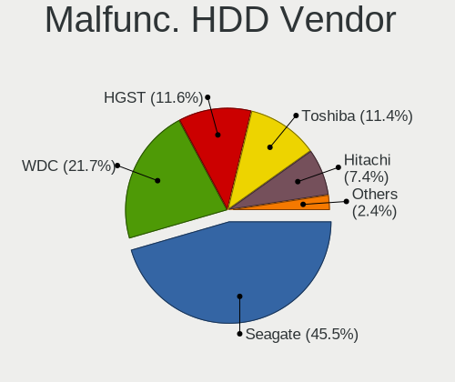
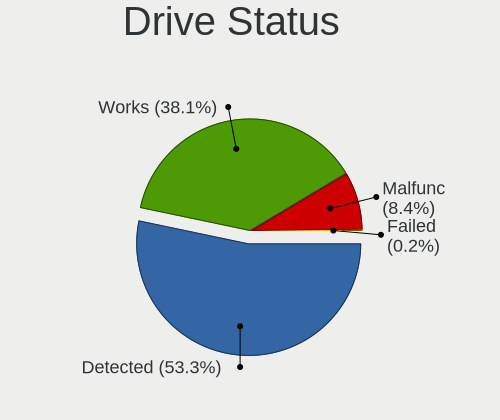
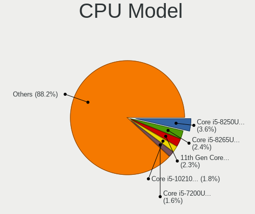
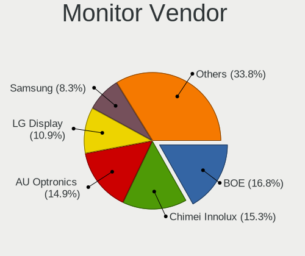
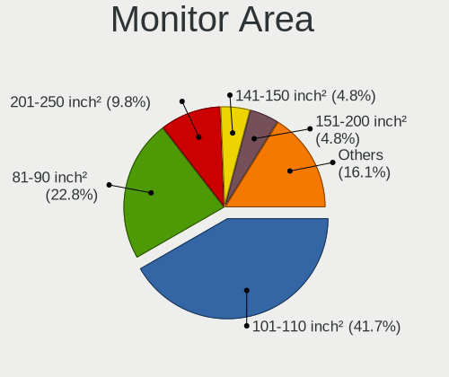
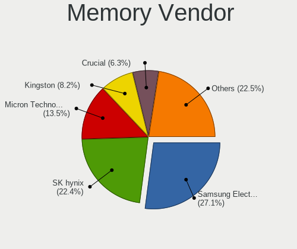
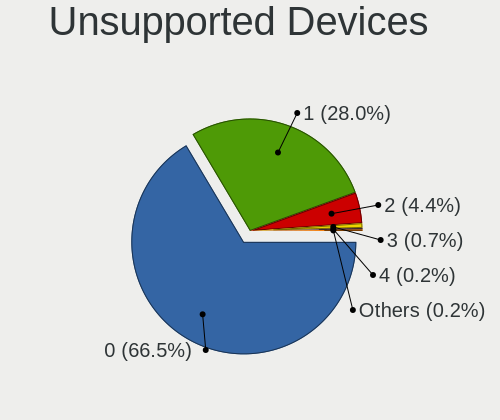

Linux in India - Tested Hardware & Statistics
---------------------------------------------

A project to collect tested hardware configurations for Linux in India.

Anyone can contribute to this report by the [hw-probe](https://github.com/linuxhw/hw-probe) tool:

    sudo -E hw-probe -all -upload

Please contribute! Especially if your hardware is rare.

This is a report for all computer types. See also reports for [desktops](/Location/India/Desktop/README.md) and [notebooks](/Location/India/Notebook/README.md).

Contents
--------

* [ Test Cases ](#test-cases)

* [ System ](#system)
  - [ OS                       ](#os)
  - [ OS Family                ](#os-family)
  - [ Kernel                   ](#kernel)
  - [ Kernel Family            ](#kernel-family)
  - [ Kernel Major Ver.        ](#kernel-major-ver)
  - [ Arch                     ](#arch)
  - [ DE                       ](#de)
  - [ Display Server           ](#display-server)
  - [ Display Manager          ](#display-manager)
  - [ OS Lang                  ](#os-lang)
  - [ Boot Mode                ](#boot-mode)
  - [ Filesystem               ](#filesystem)
  - [ Part. scheme             ](#part-scheme)
  - [ Dual Boot with Linux/BSD ](#dual-boot-with-linuxbsd)
  - [ Dual Boot (Win)          ](#dual-boot-win)

* [ Board ](#board)
  - [ Vendor                   ](#vendor)
  - [ Model                    ](#model)
  - [ Model Family             ](#model-family)
  - [ MFG Year                 ](#mfg-year)
  - [ Form Factor              ](#form-factor)
  - [ Secure Boot              ](#secure-boot)
  - [ Coreboot                 ](#coreboot)
  - [ RAM Size                 ](#ram-size)
  - [ RAM Used                 ](#ram-used)
  - [ Total Drives             ](#total-drives)
  - [ Has CD-ROM               ](#has-cd-rom)
  - [ Has Ethernet             ](#has-ethernet)
  - [ Has WiFi                 ](#has-wifi)
  - [ Has Bluetooth            ](#has-bluetooth)

* [ Location ](#location)
  - [ Country                  ](#country)
  - [ City                     ](#city)

* [ Drives ](#drives)
  - [ Drive Vendor             ](#drive-vendor)
  - [ Drive Model              ](#drive-model)
  - [ HDD Vendor               ](#hdd-vendor)
  - [ SSD Vendor               ](#ssd-vendor)
  - [ Drive Kind               ](#drive-kind)
  - [ Drive Connector          ](#drive-connector)
  - [ Drive Size               ](#drive-size)
  - [ Space Total              ](#space-total)
  - [ Space Used               ](#space-used)
  - [ Malfunc. Drives          ](#malfunc-drives)
  - [ Malfunc. Drive Vendor    ](#malfunc-drive-vendor)
  - [ Malfunc. HDD Vendor      ](#malfunc-hdd-vendor)
  - [ Malfunc. Drive Kind      ](#malfunc-drive-kind)
  - [ Failed Drives            ](#failed-drives)
  - [ Failed Drive Vendor      ](#failed-drive-vendor)
  - [ Drive Status             ](#drive-status)

* [ Storage controller ](#storage-controller)
  - [ Storage Vendor           ](#storage-vendor)
  - [ Storage Model            ](#storage-model)
  - [ Storage Kind             ](#storage-kind)

* [ Processor ](#processor)
  - [ CPU Vendor               ](#cpu-vendor)
  - [ CPU Model                ](#cpu-model)
  - [ CPU Model Family         ](#cpu-model-family)
  - [ CPU Cores                ](#cpu-cores)
  - [ CPU Sockets              ](#cpu-sockets)
  - [ CPU Threads              ](#cpu-threads)
  - [ CPU Op-Modes             ](#cpu-op-modes)
  - [ CPU Microcode            ](#cpu-microcode)
  - [ CPU Microarch            ](#cpu-microarch)

* [ Graphics ](#graphics)
  - [ GPU Vendor               ](#gpu-vendor)
  - [ GPU Model                ](#gpu-model)
  - [ GPU Combo                ](#gpu-combo)
  - [ GPU Driver               ](#gpu-driver)
  - [ GPU Memory               ](#gpu-memory)

* [ Monitor ](#monitor)
  - [ Monitor Vendor           ](#monitor-vendor)
  - [ Monitor Model            ](#monitor-model)
  - [ Monitor Resolution       ](#monitor-resolution)
  - [ Monitor Diagonal         ](#monitor-diagonal)
  - [ Monitor Width            ](#monitor-width)
  - [ Aspect Ratio             ](#aspect-ratio)
  - [ Monitor Area             ](#monitor-area)
  - [ Pixel Density            ](#pixel-density)
  - [ Multiple Monitors        ](#multiple-monitors)

* [ Network ](#network)
  - [ Net Controller Vendor    ](#net-controller-vendor)
  - [ Net Controller Model     ](#net-controller-model)
  - [ Wireless Vendor          ](#wireless-vendor)
  - [ Wireless Model           ](#wireless-model)
  - [ Ethernet Vendor          ](#ethernet-vendor)
  - [ Ethernet Model           ](#ethernet-model)
  - [ Net Controller Kind      ](#net-controller-kind)
  - [ Used Controller          ](#used-controller)
  - [ NICs                     ](#nics)
  - [ IPv6                     ](#ipv6)

* [ Bluetooth ](#bluetooth)
  - [ Bluetooth Vendor         ](#bluetooth-vendor)
  - [ Bluetooth Model          ](#bluetooth-model)

* [ Sound ](#sound)
  - [ Sound Vendor             ](#sound-vendor)
  - [ Sound Model              ](#sound-model)

* [ Memory ](#memory)
  - [ Memory Vendor            ](#memory-vendor)
  - [ Memory Model             ](#memory-model)
  - [ Memory Kind              ](#memory-kind)
  - [ Memory Form Factor       ](#memory-form-factor)
  - [ Memory Size              ](#memory-size)
  - [ Memory Speed             ](#memory-speed)

* [ Printers & scanners ](#printers--scanners)
  - [ Printer Vendor           ](#printer-vendor)
  - [ Printer Model            ](#printer-model)
  - [ Scanner Vendor           ](#scanner-vendor)
  - [ Scanner Model            ](#scanner-model)

* [ Camera ](#camera)
  - [ Camera Vendor            ](#camera-vendor)
  - [ Camera Model             ](#camera-model)

* [ Security ](#security)
  - [ Fingerprint Vendor       ](#fingerprint-vendor)
  - [ Fingerprint Model        ](#fingerprint-model)
  - [ Chipcard Vendor          ](#chipcard-vendor)
  - [ Chipcard Model           ](#chipcard-model)

* [ Unsupported ](#unsupported)
  - [ Unsupported Devices      ](#unsupported-devices)
  - [ Unsupported Device Types ](#unsupported-device-types)

Test Cases
----------

Total: 5605

| Vendor        | Model                       | Form-Factor | Probe                                                      | Date         |
|---------------|-----------------------------|-------------|------------------------------------------------------------|--------------|
| Gigabyte      | H61MS                       | Desktop     | [166a6bbb4b](https://linux-hardware.org/?probe=166a6bbb4b) | Feb 28, 2023 |
| Lenovo        | 3102 NOK                    | Desktop     | [17a2e663e1](https://linux-hardware.org/?probe=17a2e663e1) | Feb 28, 2023 |
| Lenovo        | 3102 NOK                    | Desktop     | [6dabaffa28](https://linux-hardware.org/?probe=6dabaffa28) | Feb 28, 2023 |
| Intel         | D945GCPE AAD97209-201       | Desktop     | [672684e416](https://linux-hardware.org/?probe=672684e416) | Feb 28, 2023 |
| Intel         | D945GCPE AAD97209-201       | Desktop     | [edf2240a74](https://linux-hardware.org/?probe=edf2240a74) | Feb 28, 2023 |
| Dell          | Inspiron N5110              | Notebook    | [5a6d88e081](https://linux-hardware.org/?probe=5a6d88e081) | Feb 28, 2023 |
| Lenovo        | ThinkPad T460s 20FAS55Q1... | Notebook    | [815b6ea9f2](https://linux-hardware.org/?probe=815b6ea9f2) | Feb 27, 2023 |
| Gigabyte      | Z690M AORUS ELITE AX DDR... | Desktop     | [686c8d56c4](https://linux-hardware.org/?probe=686c8d56c4) | Feb 27, 2023 |
| Dell          | Inspiron 15 3511            | Notebook    | [4c96506f38](https://linux-hardware.org/?probe=4c96506f38) | Feb 27, 2023 |
| HCL Infosy... | HCL ME LAPTOP               | Notebook    | [82a40f1881](https://linux-hardware.org/?probe=82a40f1881) | Feb 27, 2023 |
| ASUSTek       | VivoBook_ASUS Laptop X50... | Notebook    | [fe8735a027](https://linux-hardware.org/?probe=fe8735a027) | Feb 26, 2023 |
| Dell          | Vostro 3578                 | Notebook    | [da6968c8ac](https://linux-hardware.org/?probe=da6968c8ac) | Feb 26, 2023 |
| Gigabyte      | H510M S2                    | Desktop     | [24ea8468ca](https://linux-hardware.org/?probe=24ea8468ca) | Feb 26, 2023 |
| Acer          | Nitro AN515-58              | Notebook    | [1c93095718](https://linux-hardware.org/?probe=1c93095718) | Feb 26, 2023 |
| Lenovo        | ThinkPad L430 24663D1       | Notebook    | [b410d220e6](https://linux-hardware.org/?probe=b410d220e6) | Feb 26, 2023 |
| Raspberry ... | Raspberry Pi 4 Model B R... | Soc         | [b05fb1c01b](https://linux-hardware.org/?probe=b05fb1c01b) | Feb 26, 2023 |
| HP            | Victus by 16 Laptop PC      | Notebook    | [05ef574a7c](https://linux-hardware.org/?probe=05ef574a7c) | Feb 25, 2023 |
| Gigabyte      | H310M S2 x.x                | Desktop     | [27fa5a62b6](https://linux-hardware.org/?probe=27fa5a62b6) | Feb 24, 2023 |
| Gigabyte      | H310M S2 x.x                | Desktop     | [99b5c2f7f9](https://linux-hardware.org/?probe=99b5c2f7f9) | Feb 24, 2023 |
| Gigabyte      | H310M S2 x.x                | Desktop     | [0bb7bc3713](https://linux-hardware.org/?probe=0bb7bc3713) | Feb 24, 2023 |
| HP            | Laptop 15s-eq2xxx           | Notebook    | [64504d9860](https://linux-hardware.org/?probe=64504d9860) | Feb 24, 2023 |
| ASUSTek       | ASUS TUF Gaming A15 FA50... | Notebook    | [787270bc9e](https://linux-hardware.org/?probe=787270bc9e) | Feb 24, 2023 |
| Lenovo        | G50-80 80E5                 | Notebook    | [759b3114be](https://linux-hardware.org/?probe=759b3114be) | Feb 24, 2023 |
| Gigabyte      | H310M S2 x.x                | Desktop     | [f4e2bfd7a0](https://linux-hardware.org/?probe=f4e2bfd7a0) | Feb 24, 2023 |
| Acer          | Aspire A315-23              | Notebook    | [e0fcd4e578](https://linux-hardware.org/?probe=e0fcd4e578) | Feb 24, 2023 |
| ASUSTek       | ASUS TUF Gaming A15 FA50... | Notebook    | [f7063f868f](https://linux-hardware.org/?probe=f7063f868f) | Feb 24, 2023 |
| HP            | 245 G8 Notebook PC          | Notebook    | [7686bcd76d](https://linux-hardware.org/?probe=7686bcd76d) | Feb 24, 2023 |
| Lenovo        | Legion 5 15IMH05 82AU       | Notebook    | [93dfbdd8cd](https://linux-hardware.org/?probe=93dfbdd8cd) | Feb 24, 2023 |
| Lenovo        | Legion 5 15IMH05C 82AU      | Notebook    | [a5a58a8dc4](https://linux-hardware.org/?probe=a5a58a8dc4) | Feb 23, 2023 |
| Lenovo        | Legion Y540-15IRH 81SX      | Notebook    | [ead0af8ae4](https://linux-hardware.org/?probe=ead0af8ae4) | Feb 23, 2023 |
| Gigabyte      | B660M AORUS PRO AX DDR4     | Desktop     | [523ab73c43](https://linux-hardware.org/?probe=523ab73c43) | Feb 23, 2023 |
| Dell          | Vostro 3446                 | Notebook    | [c6df0f1b65](https://linux-hardware.org/?probe=c6df0f1b65) | Feb 23, 2023 |
| Dell          | Studio 1450                 | Notebook    | [c26228f66f](https://linux-hardware.org/?probe=c26228f66f) | Feb 22, 2023 |
| Dell          | 0200DY A02                  | Desktop     | [a39eba7e6a](https://linux-hardware.org/?probe=a39eba7e6a) | Feb 22, 2023 |
| Lenovo        | G50-80 80E5                 | Notebook    | [d196877f8d](https://linux-hardware.org/?probe=d196877f8d) | Feb 22, 2023 |
| Lenovo        | G50-80 80E5                 | Notebook    | [9485c15a78](https://linux-hardware.org/?probe=9485c15a78) | Feb 22, 2023 |
| Gigabyte      | H410M S2 V3                 | Desktop     | [b517bb25cc](https://linux-hardware.org/?probe=b517bb25cc) | Feb 21, 2023 |
| Lenovo        | ThinkBook 15 G3 ACL 21A4    | Notebook    | [d09dc2494a](https://linux-hardware.org/?probe=d09dc2494a) | Feb 21, 2023 |
| Gigabyte      | H310M H                     | Desktop     | [73f07e0ebf](https://linux-hardware.org/?probe=73f07e0ebf) | Feb 21, 2023 |
| HP            | Stream 8 Tablet             | Tablet      | [211438a893](https://linux-hardware.org/?probe=211438a893) | Feb 20, 2023 |
| Dell          | Vostro 3491                 | Notebook    | [d557c581cf](https://linux-hardware.org/?probe=d557c581cf) | Feb 20, 2023 |
| HP            | ENVY x360 Convertible 13... | Convertible | [0c7a3d458a](https://linux-hardware.org/?probe=0c7a3d458a) | Feb 20, 2023 |
| Lenovo        | ThinkBook 15 G3 ACL 21A4    | Notebook    | [6033e6cb63](https://linux-hardware.org/?probe=6033e6cb63) | Feb 20, 2023 |
| ASRock        | B550M Steel Legend          | Desktop     | [c3f49d4cee](https://linux-hardware.org/?probe=c3f49d4cee) | Feb 20, 2023 |
| HP            | ProBook 440 G4              | Notebook    | [d495b4eb1e](https://linux-hardware.org/?probe=d495b4eb1e) | Feb 20, 2023 |
| HP            | Laptop 15s-dr0xxx           | Notebook    | [6733a448f9](https://linux-hardware.org/?probe=6733a448f9) | Feb 20, 2023 |
| HP            | Pavilion 15                 | Notebook    | [7c652212fb](https://linux-hardware.org/?probe=7c652212fb) | Feb 19, 2023 |
| HP            | Pavilion 15                 | Notebook    | [cecc8c4a23](https://linux-hardware.org/?probe=cecc8c4a23) | Feb 19, 2023 |
| Acer          | G43T-AM3                    | Desktop     | [5ec1aa8af7](https://linux-hardware.org/?probe=5ec1aa8af7) | Feb 19, 2023 |
| Dell          | Precision 3510              | Notebook    | [b20156e847](https://linux-hardware.org/?probe=b20156e847) | Feb 19, 2023 |
| Lenovo        | ThinkPad X1 Carbon Gen 9... | Notebook    | [affa3bb9f1](https://linux-hardware.org/?probe=affa3bb9f1) | Feb 19, 2023 |
| ASUSTek       | VivoBook_ASUSLaptop X430... | Notebook    | [7e5327c1ed](https://linux-hardware.org/?probe=7e5327c1ed) | Feb 19, 2023 |
| HP            | ProBook 440 G4              | Notebook    | [f6372e6b96](https://linux-hardware.org/?probe=f6372e6b96) | Feb 19, 2023 |
| HP            | ProBook 445 G1              | Notebook    | [bcd5c952f1](https://linux-hardware.org/?probe=bcd5c952f1) | Feb 18, 2023 |
| HP            | Unknown                     | Notebook    | [3fea6a053b](https://linux-hardware.org/?probe=3fea6a053b) | Feb 18, 2023 |
| Dell          | Inspiron 14 7420 2-in-1     | Convertible | [7daf230ef2](https://linux-hardware.org/?probe=7daf230ef2) | Feb 18, 2023 |
| HP            | 15                          | Notebook    | [4db2520843](https://linux-hardware.org/?probe=4db2520843) | Feb 18, 2023 |
| Dell          | G7 7588                     | Notebook    | [caf1cd6176](https://linux-hardware.org/?probe=caf1cd6176) | Feb 18, 2023 |
| Gigabyte      | B450M DS3H WIFI-CF          | Desktop     | [be751c4a5b](https://linux-hardware.org/?probe=be751c4a5b) | Feb 18, 2023 |
| Dell          | Inspiron 3537               | Notebook    | [7890bf1c68](https://linux-hardware.org/?probe=7890bf1c68) | Feb 17, 2023 |
| Apple         | MacBookPro9,2               | Notebook    | [e67f600749](https://linux-hardware.org/?probe=e67f600749) | Feb 16, 2023 |
| Dell          | Inspiron 1545               | Notebook    | [32794e5a2e](https://linux-hardware.org/?probe=32794e5a2e) | Feb 16, 2023 |
| Dell          | Latitude 7490               | Notebook    | [796443d889](https://linux-hardware.org/?probe=796443d889) | Feb 16, 2023 |
| Dell          | Inspiron 1564               | Notebook    | [7b90c0a5cc](https://linux-hardware.org/?probe=7b90c0a5cc) | Feb 15, 2023 |
| ASUSTek       | ROG Strix G512LI_G512LI     | Notebook    | [0488cd4f01](https://linux-hardware.org/?probe=0488cd4f01) | Feb 15, 2023 |
| Timi          | Xiaomi NoteBook Pro         | Notebook    | [561e1a6160](https://linux-hardware.org/?probe=561e1a6160) | Feb 14, 2023 |
| Gigabyte      | H310M S2 x.x                | Desktop     | [0206821577](https://linux-hardware.org/?probe=0206821577) | Feb 14, 2023 |
| Gigabyte      | H310M S2 x.x                | Desktop     | [fcbd0e4770](https://linux-hardware.org/?probe=fcbd0e4770) | Feb 14, 2023 |
| Acer          | H410H6-M17 P21-A1           | Desktop     | [beaef7f0ab](https://linux-hardware.org/?probe=beaef7f0ab) | Feb 14, 2023 |
| HP            | Pavilion 15                 | Notebook    | [7f54c595f1](https://linux-hardware.org/?probe=7f54c595f1) | Feb 14, 2023 |
| HP            | Laptop 15s-du3xxx           | Notebook    | [4750f3ad3a](https://linux-hardware.org/?probe=4750f3ad3a) | Feb 13, 2023 |
| HP            | Pavilion Gaming Laptop 1... | Notebook    | [31593ae5b9](https://linux-hardware.org/?probe=31593ae5b9) | Feb 13, 2023 |
| ASUSTek       | ASUS TUF Gaming F15 FX50... | Notebook    | [a54bcd6d70](https://linux-hardware.org/?probe=a54bcd6d70) | Feb 13, 2023 |
| Lenovo        | IdeaPad Slim 7 Pro 14IHU... | Notebook    | [a6af7624cd](https://linux-hardware.org/?probe=a6af7624cd) | Feb 13, 2023 |
| MSI           | X470 GAMING PLUS            | Desktop     | [debdb17904](https://linux-hardware.org/?probe=debdb17904) | Feb 12, 2023 |
| HP            | ProBook 440 G5              | Notebook    | [566c6a5316](https://linux-hardware.org/?probe=566c6a5316) | Feb 12, 2023 |
| HP            | ProBook 440 G5              | Notebook    | [a833fa9a0c](https://linux-hardware.org/?probe=a833fa9a0c) | Feb 12, 2023 |
| HP            | Notebook                    | Notebook    | [a17adfd867](https://linux-hardware.org/?probe=a17adfd867) | Feb 12, 2023 |
| HP            | 430                         | Notebook    | [9350af0a6b](https://linux-hardware.org/?probe=9350af0a6b) | Feb 12, 2023 |
| Dell          | Vostro 3446                 | Notebook    | [e3784684f4](https://linux-hardware.org/?probe=e3784684f4) | Feb 11, 2023 |
| Lenovo        | IdeaPad S540-15IWL          | Notebook    | [321710ca2d](https://linux-hardware.org/?probe=321710ca2d) | Feb 11, 2023 |
| Lenovo        | ThinkPad T460s 20FAS2K13... | Notebook    | [5f2fb779b4](https://linux-hardware.org/?probe=5f2fb779b4) | Feb 11, 2023 |
| Intel         | DB85FL AAG89861-203         | Desktop     | [4403212f84](https://linux-hardware.org/?probe=4403212f84) | Feb 11, 2023 |
| ASUSTek       | K52F                        | Notebook    | [6820e56394](https://linux-hardware.org/?probe=6820e56394) | Feb 11, 2023 |
| Acer          | Aspire A715-41G             | Notebook    | [92b7a6f08d](https://linux-hardware.org/?probe=92b7a6f08d) | Feb 11, 2023 |
| Dell          | Inspiron 1564               | Notebook    | [687573b718](https://linux-hardware.org/?probe=687573b718) | Feb 10, 2023 |
| Timi          | Mi NoteBook Pro             | Notebook    | [34e8df3dea](https://linux-hardware.org/?probe=34e8df3dea) | Feb 10, 2023 |
| Dell          | Inspiron 1564               | Notebook    | [043eef223c](https://linux-hardware.org/?probe=043eef223c) | Feb 10, 2023 |
| ASUSTek       | ROG Strix G513RW_G513RW     | Notebook    | [482b3ea2be](https://linux-hardware.org/?probe=482b3ea2be) | Feb 10, 2023 |
| HP            | Pavilion 15                 | Notebook    | [8e014440da](https://linux-hardware.org/?probe=8e014440da) | Feb 10, 2023 |
| HP            | Pavilion Laptop 15-eg2xx... | Notebook    | [c4ba4f3bc6](https://linux-hardware.org/?probe=c4ba4f3bc6) | Feb 10, 2023 |
| HP            | Pavilion Laptop 15-eg2xx... | Notebook    | [812df42bc4](https://linux-hardware.org/?probe=812df42bc4) | Feb 10, 2023 |
| Lenovo        | ThinkPad T460s 20FAS2K13... | Notebook    | [fc292cd441](https://linux-hardware.org/?probe=fc292cd441) | Feb 09, 2023 |
| Dell          | Inspiron 3576               | Notebook    | [69949c02d9](https://linux-hardware.org/?probe=69949c02d9) | Feb 09, 2023 |
| Dell          | Latitude 5410               | Notebook    | [08ab3250ae](https://linux-hardware.org/?probe=08ab3250ae) | Feb 08, 2023 |
| Lenovo        | IdeaPad Gaming 3 15IMH05... | Notebook    | [ce71e8ab61](https://linux-hardware.org/?probe=ce71e8ab61) | Feb 08, 2023 |
| MSI           | GF63 Thin 11UC              | Notebook    | [722d0ce3be](https://linux-hardware.org/?probe=722d0ce3be) | Feb 07, 2023 |
| Lenovo        | ThinkBook 13s G2 ITL 20V... | Notebook    | [fa97fe509b](https://linux-hardware.org/?probe=fa97fe509b) | Feb 07, 2023 |
| Gigabyte      | H310M S2                    | Desktop     | [b84a916a22](https://linux-hardware.org/?probe=b84a916a22) | Feb 07, 2023 |
| HP            | ENVY Notebook PC            | Convertible | [a8165997b7](https://linux-hardware.org/?probe=a8165997b7) | Feb 06, 2023 |
| HP            | Stream x360 Convertible ... | Convertible | [3e487446eb](https://linux-hardware.org/?probe=3e487446eb) | Feb 06, 2023 |
| HONOR         | NMH-WCX9                    | Notebook    | [1f2418bafb](https://linux-hardware.org/?probe=1f2418bafb) | Feb 06, 2023 |
| Lenovo        | G505 20240                  | Notebook    | [31e2c2f5e1](https://linux-hardware.org/?probe=31e2c2f5e1) | Feb 06, 2023 |
| Dell          | Latitude 7480               | Notebook    | [850e6ed168](https://linux-hardware.org/?probe=850e6ed168) | Feb 06, 2023 |
| ASUSTek       | VivoBook_ASUS Laptop X50... | Notebook    | [1ce10af418](https://linux-hardware.org/?probe=1ce10af418) | Feb 06, 2023 |
| ASUSTek       | ASUS TUF Gaming F15 FX50... | Notebook    | [d95f28d447](https://linux-hardware.org/?probe=d95f28d447) | Feb 05, 2023 |
| ASUSTek       | TUF Gaming FX504GE_FX80G... | Notebook    | [400b29056d](https://linux-hardware.org/?probe=400b29056d) | Feb 05, 2023 |
| ASUSTek       | ASUS TUF Gaming A15 FA50... | Notebook    | [de72d92ada](https://linux-hardware.org/?probe=de72d92ada) | Feb 05, 2023 |
| Dell          | Latitude 7490               | Notebook    | [b8ecfb712c](https://linux-hardware.org/?probe=b8ecfb712c) | Feb 05, 2023 |
| Dell          | Latitude 7490               | Notebook    | [aa51c3690f](https://linux-hardware.org/?probe=aa51c3690f) | Feb 05, 2023 |
| HP            | Pavilion 15                 | Notebook    | [00ebdfe948](https://linux-hardware.org/?probe=00ebdfe948) | Feb 04, 2023 |
| HP            | ENVY x360 2-in-1 Laptop ... | Convertible | [c12f38950f](https://linux-hardware.org/?probe=c12f38950f) | Feb 04, 2023 |
| Acer          | Nitro AN515-43              | Notebook    | [8fd252af27](https://linux-hardware.org/?probe=8fd252af27) | Feb 04, 2023 |
| Dell          | Inspiron 5593               | Notebook    | [e08416e7a9](https://linux-hardware.org/?probe=e08416e7a9) | Feb 04, 2023 |
| Lenovo        | IdeaPad Gaming 3 15IMH05... | Notebook    | [b3eac5c97d](https://linux-hardware.org/?probe=b3eac5c97d) | Feb 04, 2023 |
| HP            | Pavilion 15                 | Notebook    | [a5508059a1](https://linux-hardware.org/?probe=a5508059a1) | Feb 04, 2023 |
| Unknown       | G41 Series                  | Desktop     | [69d4cb64a2](https://linux-hardware.org/?probe=69d4cb64a2) | Feb 03, 2023 |
| Dell          | Inspiron 5537               | Notebook    | [5bfa4ad142](https://linux-hardware.org/?probe=5bfa4ad142) | Feb 02, 2023 |
| MSI           | GE63 Raider RGB 9SE         | Notebook    | [b7ec016843](https://linux-hardware.org/?probe=b7ec016843) | Feb 02, 2023 |
| Gigabyte      | H510M H                     | Desktop     | [861b7c5aa7](https://linux-hardware.org/?probe=861b7c5aa7) | Feb 02, 2023 |
| Dell          | Inspiron 3584               | Notebook    | [4bfcbe7c13](https://linux-hardware.org/?probe=4bfcbe7c13) | Feb 02, 2023 |
| Acer          | Aspire ES1-572              | Notebook    | [09d76d7d2a](https://linux-hardware.org/?probe=09d76d7d2a) | Feb 02, 2023 |
| ASUSTek       | Z170-DELUXE                 | Desktop     | [2cb0ec3b98](https://linux-hardware.org/?probe=2cb0ec3b98) | Feb 01, 2023 |
| Lenovo        | ThinkPad P1 Gen 3 20TJS2... | Notebook    | [22abfb4a79](https://linux-hardware.org/?probe=22abfb4a79) | Feb 01, 2023 |
| Lenovo        | ThinkPad E14 20RAS1RA00     | Notebook    | [8360c9e13f](https://linux-hardware.org/?probe=8360c9e13f) | Feb 01, 2023 |
| Timi          | Mi NoteBook Ultra           | Notebook    | [d897ec0114](https://linux-hardware.org/?probe=d897ec0114) | Feb 01, 2023 |
| HUAWEI        | BOHK-WAX9X                  | Notebook    | [07b498f669](https://linux-hardware.org/?probe=07b498f669) | Feb 01, 2023 |
| HP            | Pavilion 15                 | Notebook    | [e3adac798e](https://linux-hardware.org/?probe=e3adac798e) | Jan 30, 2023 |
| HP            | 15                          | Notebook    | [409a15bdf3](https://linux-hardware.org/?probe=409a15bdf3) | Jan 30, 2023 |
| ASUSTek       | X507UA                      | Notebook    | [49cc52b5b2](https://linux-hardware.org/?probe=49cc52b5b2) | Jan 29, 2023 |
| Lenovo        | IdeaPad Y560                | Notebook    | [47438e081a](https://linux-hardware.org/?probe=47438e081a) | Jan 29, 2023 |
| Lenovo        | IdeaPad 5 15ITL05 82FG      | Notebook    | [4b8206c892](https://linux-hardware.org/?probe=4b8206c892) | Jan 29, 2023 |
| HP            | Pavilion 15                 | Notebook    | [c5ac9f6d89](https://linux-hardware.org/?probe=c5ac9f6d89) | Jan 29, 2023 |
| Lenovo        | IdeaPad Y560                | Notebook    | [621aca8707](https://linux-hardware.org/?probe=621aca8707) | Jan 29, 2023 |
| Lenovo        | IdeaPad Y560                | Notebook    | [55fe252b4e](https://linux-hardware.org/?probe=55fe252b4e) | Jan 29, 2023 |
| Lenovo        | ThinkPad X61 7674BE1        | Notebook    | [a22ac0a9f5](https://linux-hardware.org/?probe=a22ac0a9f5) | Jan 28, 2023 |
| Acer          | Aspire A515-57G             | Notebook    | [f5492fbdaa](https://linux-hardware.org/?probe=f5492fbdaa) | Jan 27, 2023 |
| Timi          | Mi NoteBook Pro             | Notebook    | [33905a4ee9](https://linux-hardware.org/?probe=33905a4ee9) | Jan 26, 2023 |
| Dell          | Latitude 7480               | Notebook    | [3cb61c5b71](https://linux-hardware.org/?probe=3cb61c5b71) | Jan 26, 2023 |
| Lenovo        | E41-25 81FS                 | Notebook    | [6de2ea7d90](https://linux-hardware.org/?probe=6de2ea7d90) | Jan 26, 2023 |
| HP            | Pavilion 15                 | Notebook    | [e3ac708616](https://linux-hardware.org/?probe=e3ac708616) | Jan 26, 2023 |
| Acer          | Aspire A515-52G             | Notebook    | [a95489f0b7](https://linux-hardware.org/?probe=a95489f0b7) | Jan 24, 2023 |
| MSI           | GF63 Thin 9SCXR             | Notebook    | [edbaabb13a](https://linux-hardware.org/?probe=edbaabb13a) | Jan 24, 2023 |
| Acer          | Aspire ES1-521              | Notebook    | [32a1eb6d60](https://linux-hardware.org/?probe=32a1eb6d60) | Jan 23, 2023 |
| Lenovo        | Legion 5 Pro 16ACH6H 82J... | Notebook    | [07005e3e32](https://linux-hardware.org/?probe=07005e3e32) | Jan 22, 2023 |
| Lenovo        | Legion 5 Pro 16ACH6H 82J... | Notebook    | [348a78bb64](https://linux-hardware.org/?probe=348a78bb64) | Jan 22, 2023 |
| ASRock        | J3455B-ITX                  | Desktop     | [b4419e8fce](https://linux-hardware.org/?probe=b4419e8fce) | Jan 22, 2023 |
| Lenovo        | Legion 5 Pro 16ACH6H 82J... | Notebook    | [c6a463e92f](https://linux-hardware.org/?probe=c6a463e92f) | Jan 22, 2023 |
| ASUSTek       | VivoBook_ASUSLaptop X515... | Notebook    | [a09d1d224c](https://linux-hardware.org/?probe=a09d1d224c) | Jan 22, 2023 |
| HP            | 2B00 A01                    | Desktop     | [467ef856dd](https://linux-hardware.org/?probe=467ef856dd) | Jan 21, 2023 |
| MSI           | X470 GAMING PLUS            | Desktop     | [441e45daa2](https://linux-hardware.org/?probe=441e45daa2) | Jan 21, 2023 |
| Timi          | Mi Notebook Pro             | Notebook    | [1db1382f0b](https://linux-hardware.org/?probe=1db1382f0b) | Jan 21, 2023 |
| ASRock        | B550 Extreme4               | Desktop     | [329f1d0701](https://linux-hardware.org/?probe=329f1d0701) | Jan 21, 2023 |
| ASUSTek       | PRIME Z790M-PLUS D4         | Desktop     | [36e6df452d](https://linux-hardware.org/?probe=36e6df452d) | Jan 21, 2023 |
| MSI           | MAG B650 TOMAHAWK WIFI      | Desktop     | [ce99cb312d](https://linux-hardware.org/?probe=ce99cb312d) | Jan 20, 2023 |
| Dell          | Inspiron 5505               | Notebook    | [9a17165647](https://linux-hardware.org/?probe=9a17165647) | Jan 20, 2023 |
| Dell          | Inspiron 5505               | Notebook    | [e1003a85c9](https://linux-hardware.org/?probe=e1003a85c9) | Jan 20, 2023 |
| ASUSTek       | ROG STRIX B550-I GAMING     | Desktop     | [6b1a8f8d9d](https://linux-hardware.org/?probe=6b1a8f8d9d) | Jan 20, 2023 |
| HP            | 85A2                        | All in one  | [13fcd2dd69](https://linux-hardware.org/?probe=13fcd2dd69) | Jan 20, 2023 |
| ASUSTek       | VivoBook_ASUSLaptop E410... | Notebook    | [0f079e1dc7](https://linux-hardware.org/?probe=0f079e1dc7) | Jan 19, 2023 |
| Acer          | Aspire A315-23              | Notebook    | [90049e4bb7](https://linux-hardware.org/?probe=90049e4bb7) | Jan 19, 2023 |
| Dell          | Latitude E6510              | Notebook    | [4b10c4532e](https://linux-hardware.org/?probe=4b10c4532e) | Jan 19, 2023 |
| Dell          | Latitude E6510              | Notebook    | [6b8112e4c1](https://linux-hardware.org/?probe=6b8112e4c1) | Jan 19, 2023 |
| Lenovo        | ThinkPad X200 7459VB9       | Notebook    | [a58c604cf7](https://linux-hardware.org/?probe=a58c604cf7) | Jan 18, 2023 |
| Dell          | Inspiron 3442               | Notebook    | [04fe55a1a1](https://linux-hardware.org/?probe=04fe55a1a1) | Jan 18, 2023 |
| HP            | Victus by Gaming Laptop ... | Notebook    | [533d99e2f1](https://linux-hardware.org/?probe=533d99e2f1) | Jan 18, 2023 |
| HP            | 15                          | Notebook    | [cebe1b150e](https://linux-hardware.org/?probe=cebe1b150e) | Jan 18, 2023 |
| Lenovo        | IdeaPadFlex 5 14ARE05 81... | Convertible | [f050195c33](https://linux-hardware.org/?probe=f050195c33) | Jan 17, 2023 |
| Timi          | Xiaomi NoteBook Pro         | Notebook    | [681de2b0c1](https://linux-hardware.org/?probe=681de2b0c1) | Jan 17, 2023 |
| MSI           | GF63 Thin 9SCXR             | Notebook    | [592a29d649](https://linux-hardware.org/?probe=592a29d649) | Jan 17, 2023 |
| Timi          | Xiaomi NoteBook Pro         | Notebook    | [f1ee502754](https://linux-hardware.org/?probe=f1ee502754) | Jan 17, 2023 |
| ASUSTek       | ASUS TUF Gaming A15 FA50... | Notebook    | [0d91852ebf](https://linux-hardware.org/?probe=0d91852ebf) | Jan 17, 2023 |
| MSI           | Prestige 15 A11SCX          | Notebook    | [9c5bf0d05c](https://linux-hardware.org/?probe=9c5bf0d05c) | Jan 16, 2023 |
| Lenovo        | IdeaPad Gaming 3 15IHU6 ... | Notebook    | [1a51848ffb](https://linux-hardware.org/?probe=1a51848ffb) | Jan 16, 2023 |
| Lenovo        | V14-IIL 82C4                | Notebook    | [1b195c04d8](https://linux-hardware.org/?probe=1b195c04d8) | Jan 16, 2023 |
| Lenovo        | ThinkPad A485 20MVS0X600    | Notebook    | [2c2e9caacc](https://linux-hardware.org/?probe=2c2e9caacc) | Jan 16, 2023 |
| HP            | ENVY x360 Convertible 13... | Convertible | [9cdfb3119e](https://linux-hardware.org/?probe=9cdfb3119e) | Jan 15, 2023 |
| Gigabyte      | H310M H                     | Desktop     | [30917eef19](https://linux-hardware.org/?probe=30917eef19) | Jan 15, 2023 |
| Lenovo        | ThinkPad T440p 20AN00DJA... | Notebook    | [250aa5a61b](https://linux-hardware.org/?probe=250aa5a61b) | Jan 15, 2023 |
| HP            | Pavilion g6                 | Notebook    | [fba7cebfff](https://linux-hardware.org/?probe=fba7cebfff) | Jan 14, 2023 |
| MSI           | Bravo 15 B5DD               | Notebook    | [ffb8653d34](https://linux-hardware.org/?probe=ffb8653d34) | Jan 14, 2023 |
| Gigabyte      | H310M H                     | Desktop     | [0ac9fa6100](https://linux-hardware.org/?probe=0ac9fa6100) | Jan 14, 2023 |
| Lenovo        | ThinkPad W540 20BHS1840P    | Notebook    | [0046521475](https://linux-hardware.org/?probe=0046521475) | Jan 14, 2023 |
| Dell          | XPS 15 9570                 | Notebook    | [bff6278ed8](https://linux-hardware.org/?probe=bff6278ed8) | Jan 14, 2023 |
| HONOR         | NMH-WCX9                    | Notebook    | [10a9c33aed](https://linux-hardware.org/?probe=10a9c33aed) | Jan 13, 2023 |
| Gigabyte      | 970A-DS3                    | Desktop     | [c6819f38a0](https://linux-hardware.org/?probe=c6819f38a0) | Jan 13, 2023 |
| MSI           | GF63 Thin 9SCXR             | Notebook    | [3ba9f40d9b](https://linux-hardware.org/?probe=3ba9f40d9b) | Jan 13, 2023 |
| Gigabyte      | H81M-S                      | Desktop     | [77fc83eb85](https://linux-hardware.org/?probe=77fc83eb85) | Jan 12, 2023 |
| Lenovo        | ThinkPad L430 24663D1       | Notebook    | [1987221c12](https://linux-hardware.org/?probe=1987221c12) | Jan 12, 2023 |
| HP            | 245 G7 Notebook PC          | Notebook    | [3997d98a9a](https://linux-hardware.org/?probe=3997d98a9a) | Jan 11, 2023 |
| SmbiosType... | SmbiosType1_SystemProduc... | Notebook    | [6c67fc3995](https://linux-hardware.org/?probe=6c67fc3995) | Jan 11, 2023 |
| Acer          | TravelMate P245-M           | Notebook    | [1722e41c8d](https://linux-hardware.org/?probe=1722e41c8d) | Jan 11, 2023 |
| Gigabyte      | H61MS                       | Desktop     | [4e7660a1e0](https://linux-hardware.org/?probe=4e7660a1e0) | Jan 10, 2023 |
| Lenovo        | IdeaPad 320-15ISK 80XH      | Notebook    | [a786384700](https://linux-hardware.org/?probe=a786384700) | Jan 10, 2023 |
| SmbiosType... | SmbiosType1_SystemProduc... | Notebook    | [8367c27d81](https://linux-hardware.org/?probe=8367c27d81) | Jan 10, 2023 |
| ITI LIMITE... | ITI SMAASH ITIB11LCE        | Convertible | [a01c6e0730](https://linux-hardware.org/?probe=a01c6e0730) | Jan 10, 2023 |
| MSI           | GF63 Thin 9SCXR             | Notebook    | [805265229e](https://linux-hardware.org/?probe=805265229e) | Jan 10, 2023 |
| ASUSTek       | K53SM                       | Notebook    | [f1ac679157](https://linux-hardware.org/?probe=f1ac679157) | Jan 10, 2023 |
| Gigabyte      | X570S UD                    | Desktop     | [7ac5117a93](https://linux-hardware.org/?probe=7ac5117a93) | Jan 09, 2023 |
| Acer          | H110D4-M1                   | Desktop     | [c652bb7179](https://linux-hardware.org/?probe=c652bb7179) | Jan 09, 2023 |
| ASUSTek       | ZenBook 13 UX331FAL_UX33... | Notebook    | [debe9fa9d2](https://linux-hardware.org/?probe=debe9fa9d2) | Jan 08, 2023 |
| Gigabyte      | GA-78LMT-USB3               | Desktop     | [d759bb7551](https://linux-hardware.org/?probe=d759bb7551) | Jan 08, 2023 |
| Lenovo        | ThinkPad T430 2349E56       | Notebook    | [ff2639c47b](https://linux-hardware.org/?probe=ff2639c47b) | Jan 07, 2023 |
| ASUSTek       | PRIME H410M-E               | Desktop     | [e8f5b2590f](https://linux-hardware.org/?probe=e8f5b2590f) | Jan 07, 2023 |
| ASUSTek       | VivoBook_ASUSLaptop X430... | Notebook    | [f191d63ace](https://linux-hardware.org/?probe=f191d63ace) | Jan 07, 2023 |
| MSI           | GF63 Thin 9SCXR             | Notebook    | [a6b7ce48a7](https://linux-hardware.org/?probe=a6b7ce48a7) | Jan 07, 2023 |
| MSI           | GF63 Thin 9SCXR             | Notebook    | [a3cc92ede0](https://linux-hardware.org/?probe=a3cc92ede0) | Jan 07, 2023 |
| MSI           | GF63 8RD                    | Notebook    | [d9fc4d53c9](https://linux-hardware.org/?probe=d9fc4d53c9) | Jan 07, 2023 |
| Intel         | DH61WW AAG23116-302         | Desktop     | [702bf83225](https://linux-hardware.org/?probe=702bf83225) | Jan 06, 2023 |
| Dell          | Vostro 15-3568              | Notebook    | [2dd2c1c022](https://linux-hardware.org/?probe=2dd2c1c022) | Jan 06, 2023 |
| Dell          | Vostro 15-3568              | Notebook    | [f3d1187b29](https://linux-hardware.org/?probe=f3d1187b29) | Jan 06, 2023 |
| ASUSTek       | ASUS TUF Gaming A15 FA50... | Notebook    | [fd5120fea6](https://linux-hardware.org/?probe=fd5120fea6) | Jan 06, 2023 |
| MSI           | H510M PRO-E                 | Desktop     | [762142dfbb](https://linux-hardware.org/?probe=762142dfbb) | Jan 06, 2023 |
| HP            | Laptop 14s-dk0xxx           | Notebook    | [00212160f7](https://linux-hardware.org/?probe=00212160f7) | Jan 05, 2023 |
| Lenovo        | ThinkBook 13s G2 ITL 20V... | Notebook    | [482205e492](https://linux-hardware.org/?probe=482205e492) | Jan 05, 2023 |
| HP            | Notebook                    | Notebook    | [611e618b60](https://linux-hardware.org/?probe=611e618b60) | Jan 03, 2023 |
| Lenovo        | SKYBAY NOK                  | Desktop     | [29970ac3f3](https://linux-hardware.org/?probe=29970ac3f3) | Jan 03, 2023 |
| ASUSTek       | Z170-DELUXE                 | Desktop     | [4a37b87ecf](https://linux-hardware.org/?probe=4a37b87ecf) | Jan 02, 2023 |
| Gigabyte      | H310M H                     | Desktop     | [8706565860](https://linux-hardware.org/?probe=8706565860) | Jan 02, 2023 |
| Lenovo        | ThinkPad E490 20N8S0H300    | Notebook    | [fb3233e525](https://linux-hardware.org/?probe=fb3233e525) | Jan 02, 2023 |
| ITI LIMITE... | ITI Smaash ITIB15LI3        | Notebook    | [6e271cd1c3](https://linux-hardware.org/?probe=6e271cd1c3) | Jan 02, 2023 |
| Lenovo        | ThinkPad L430 24663D1       | Notebook    | [8eada9744e](https://linux-hardware.org/?probe=8eada9744e) | Jan 01, 2023 |
| HP            | Laptop HP Laptop 14s-dr1... | Notebook    | [2a27236865](https://linux-hardware.org/?probe=2a27236865) | Jan 01, 2023 |
| AMI           | Aptio CRB                   | Mini pc     | [d25dd69250](https://linux-hardware.org/?probe=d25dd69250) | Jan 01, 2023 |
| Lenovo        | ThinkPad T470s W10DG 20J... | Notebook    | [60b4a8e506](https://linux-hardware.org/?probe=60b4a8e506) | Jan 01, 2023 |
| ASUSTek       | TUF Gaming B650-PLUS WIF... | Desktop     | [b1dc879a16](https://linux-hardware.org/?probe=b1dc879a16) | Jan 01, 2023 |
| Timi          | Xiaomi NoteBook Pro         | Notebook    | [5d0ff5ea2d](https://linux-hardware.org/?probe=5d0ff5ea2d) | Dec 31, 2022 |
| Dell          | Inspiron 3421               | Notebook    | [d2cd50a2a6](https://linux-hardware.org/?probe=d2cd50a2a6) | Dec 30, 2022 |
| Dell          | Inspiron 3421               | Notebook    | [ae7d821823](https://linux-hardware.org/?probe=ae7d821823) | Dec 30, 2022 |
| HP            | Pavilion x360 Convertibl... | Convertible | [7be9115c85](https://linux-hardware.org/?probe=7be9115c85) | Dec 30, 2022 |
| Intel         | H61                         | Desktop     | [b294748570](https://linux-hardware.org/?probe=b294748570) | Dec 30, 2022 |
| ITI LIMITE... | ITI Smaash ITIB15LI3        | Notebook    | [6a08f378e2](https://linux-hardware.org/?probe=6a08f378e2) | Dec 30, 2022 |
| ITI LIMITE... | ITI Smaash ITIB15LI3        | Notebook    | [282a44d1ff](https://linux-hardware.org/?probe=282a44d1ff) | Dec 30, 2022 |
| Lenovo        | IdeaPad 320-15IKB 81BT      | Notebook    | [3a7cfd8073](https://linux-hardware.org/?probe=3a7cfd8073) | Dec 30, 2022 |
| Gigabyte      | H310M S2 x.x                | Desktop     | [9aba0ac647](https://linux-hardware.org/?probe=9aba0ac647) | Dec 30, 2022 |
| Lenovo        | IdeaPadFlex 5 14IIL05 81... | Convertible | [30e1303337](https://linux-hardware.org/?probe=30e1303337) | Dec 30, 2022 |
| Lenovo        | ThinkPad E14 Gen 3 20Y7S... | Notebook    | [5bf3ff5c0e](https://linux-hardware.org/?probe=5bf3ff5c0e) | Dec 29, 2022 |
| Lenovo        | ThinkPad E14 Gen 3 20Y7S... | Notebook    | [4f63c4474c](https://linux-hardware.org/?probe=4f63c4474c) | Dec 29, 2022 |
| ASUSTek       | VivoBook_ASUSLaptop X512... | Notebook    | [ce45aaceaf](https://linux-hardware.org/?probe=ce45aaceaf) | Dec 29, 2022 |
| HP            | Pavilion 15                 | Notebook    | [264e3738ec](https://linux-hardware.org/?probe=264e3738ec) | Dec 29, 2022 |
| Intel         | H61                         | Desktop     | [39f3cddffb](https://linux-hardware.org/?probe=39f3cddffb) | Dec 29, 2022 |
| Dell          | Latitude 3420               | Notebook    | [eb6d4c6921](https://linux-hardware.org/?probe=eb6d4c6921) | Dec 29, 2022 |
| HP            | Pavilion 15                 | Notebook    | [15ec0001c5](https://linux-hardware.org/?probe=15ec0001c5) | Dec 29, 2022 |
| HP            | Pavilion 15                 | Notebook    | [e84551a6eb](https://linux-hardware.org/?probe=e84551a6eb) | Dec 29, 2022 |
| Lenovo        | IdeaPad 320-15IKB 81BT      | Notebook    | [d5be261567](https://linux-hardware.org/?probe=d5be261567) | Dec 29, 2022 |
| HP            | ENVY x360 2-in-1 Laptop ... | Convertible | [0382c36a9d](https://linux-hardware.org/?probe=0382c36a9d) | Dec 28, 2022 |
| HP            | ENVY x360 2-in-1 Laptop ... | Convertible | [a42da327a2](https://linux-hardware.org/?probe=a42da327a2) | Dec 28, 2022 |
| HP            | ENVY Laptop 13-ba1xxx       | Notebook    | [c25b644aca](https://linux-hardware.org/?probe=c25b644aca) | Dec 28, 2022 |
| Lenovo        | IdeaPad 320-15IKB 81BT      | Notebook    | [5054f77353](https://linux-hardware.org/?probe=5054f77353) | Dec 27, 2022 |
| Timi          | RedmiBook 15                | Notebook    | [cf38b14bc5](https://linux-hardware.org/?probe=cf38b14bc5) | Dec 27, 2022 |
| HP            | Pavilion Gaming Laptop 1... | Notebook    | [c8b85cb0cd](https://linux-hardware.org/?probe=c8b85cb0cd) | Dec 26, 2022 |
| Lenovo        | G510 20238                  | Notebook    | [812d6eb07e](https://linux-hardware.org/?probe=812d6eb07e) | Dec 26, 2022 |
| Dell          | Inspiron N5010              | Notebook    | [69ac8a9522](https://linux-hardware.org/?probe=69ac8a9522) | Dec 26, 2022 |
| Dell          | Latitude E6400              | Notebook    | [435ac90ddc](https://linux-hardware.org/?probe=435ac90ddc) | Dec 26, 2022 |
| Sony          | SVE15133CNB                 | Notebook    | [40ac0f9ffc](https://linux-hardware.org/?probe=40ac0f9ffc) | Dec 25, 2022 |
| Lenovo        | Y520-15IKBN 80WK            | Notebook    | [576fb3852f](https://linux-hardware.org/?probe=576fb3852f) | Dec 25, 2022 |
| Unknown       | Unknown                     | Desktop     | [9d66e8f05d](https://linux-hardware.org/?probe=9d66e8f05d) | Dec 25, 2022 |
| Dell          | Vostro 3501                 | Notebook    | [2bd2de39fb](https://linux-hardware.org/?probe=2bd2de39fb) | Dec 24, 2022 |
| HP            | Pavilion Laptop 14-ec0xx... | Notebook    | [978bb114dc](https://linux-hardware.org/?probe=978bb114dc) | Dec 23, 2022 |
| HP            | EliteBook 840 G5            | Notebook    | [05ab61864f](https://linux-hardware.org/?probe=05ab61864f) | Dec 23, 2022 |
| Acer          | Predator PH315-53           | Notebook    | [39e6254135](https://linux-hardware.org/?probe=39e6254135) | Dec 23, 2022 |
| HP            | Laptop 14s-dk0xxx           | Notebook    | [53aa474cf5](https://linux-hardware.org/?probe=53aa474cf5) | Dec 23, 2022 |
| HONOR         | BBR-WAX9                    | Notebook    | [19909aa86b](https://linux-hardware.org/?probe=19909aa86b) | Dec 23, 2022 |
| HP            | ProBook 440 G8 Notebook ... | Notebook    | [0256ea50a4](https://linux-hardware.org/?probe=0256ea50a4) | Dec 23, 2022 |
| Acer          | Aspire A515-57G             | Notebook    | [a208b5598e](https://linux-hardware.org/?probe=a208b5598e) | Dec 22, 2022 |
| Acer          | Aspire A515-57G             | Notebook    | [cccd3d01d7](https://linux-hardware.org/?probe=cccd3d01d7) | Dec 22, 2022 |
| HP            | Pavilion Gaming Laptop 1... | Notebook    | [b221e3103a](https://linux-hardware.org/?probe=b221e3103a) | Dec 22, 2022 |
| Acer          | Swift SF314-512             | Notebook    | [505ab3f60a](https://linux-hardware.org/?probe=505ab3f60a) | Dec 22, 2022 |
| Acer          | Gateway NE46Rs1             | Notebook    | [45a25a89d7](https://linux-hardware.org/?probe=45a25a89d7) | Dec 21, 2022 |
| MSI           | GL65 Leopard 10SDK          | Notebook    | [2c6e6ec3ec](https://linux-hardware.org/?probe=2c6e6ec3ec) | Dec 21, 2022 |
| Lenovo        | Legion 5 15ARH05 82B5       | Notebook    | [9438c80c85](https://linux-hardware.org/?probe=9438c80c85) | Dec 21, 2022 |
| ASUSTek       | ASUS TUF Gaming F15 FX50... | Notebook    | [7d5914dcb2](https://linux-hardware.org/?probe=7d5914dcb2) | Dec 21, 2022 |
| Timi          | Mi NoteBook Pro             | Notebook    | [b5bbb4f410](https://linux-hardware.org/?probe=b5bbb4f410) | Dec 21, 2022 |
| HP            | ZBook 15                    | Notebook    | [a3bf671d64](https://linux-hardware.org/?probe=a3bf671d64) | Dec 20, 2022 |
| Dell          | Vostro 5620                 | Notebook    | [005d388376](https://linux-hardware.org/?probe=005d388376) | Dec 20, 2022 |
| Acer          | Aspire A715-51G             | Notebook    | [93eff781da](https://linux-hardware.org/?probe=93eff781da) | Dec 20, 2022 |
| Acer          | Aspire A715-51G             | Notebook    | [0b7352a343](https://linux-hardware.org/?probe=0b7352a343) | Dec 20, 2022 |
| Dell          | Inspiron 7572               | Notebook    | [418178c3ca](https://linux-hardware.org/?probe=418178c3ca) | Dec 19, 2022 |
| Lenovo        | ThinkPad T14s Gen 1 20T1... | Notebook    | [c67b4d2b31](https://linux-hardware.org/?probe=c67b4d2b31) | Dec 19, 2022 |
| Sony          | SVE15133CNB                 | Notebook    | [a2bee3bb3f](https://linux-hardware.org/?probe=a2bee3bb3f) | Dec 19, 2022 |
| ASUSTek       | VivoBook_ASUSLaptop X403... | Notebook    | [3ec240466e](https://linux-hardware.org/?probe=3ec240466e) | Dec 19, 2022 |
| HP            | Pavilion Laptop 14-ec0xx... | Notebook    | [08e38b2be9](https://linux-hardware.org/?probe=08e38b2be9) | Dec 18, 2022 |
| HP            | Laptop 14s-dk0xxx           | Notebook    | [eaf1b6a773](https://linux-hardware.org/?probe=eaf1b6a773) | Dec 17, 2022 |
| HP            | 245 G3                      | Notebook    | [ceee8f33ca](https://linux-hardware.org/?probe=ceee8f33ca) | Dec 17, 2022 |
| ASUSTek       | Zenbook UM5302TA_UM5302T... | Notebook    | [b0f674ae6f](https://linux-hardware.org/?probe=b0f674ae6f) | Dec 17, 2022 |
| Sony          | SVE15133CNB                 | Notebook    | [acca7c4697](https://linux-hardware.org/?probe=acca7c4697) | Dec 17, 2022 |
| HP            | 250 G1                      | Notebook    | [07f20cc1ec](https://linux-hardware.org/?probe=07f20cc1ec) | Dec 17, 2022 |
| ASUSTek       | VivoBook_ASUSLaptop X571... | Notebook    | [f6e6cfc7b3](https://linux-hardware.org/?probe=f6e6cfc7b3) | Dec 17, 2022 |
| Dell          | Inspiron 3442               | Notebook    | [3b5142322b](https://linux-hardware.org/?probe=3b5142322b) | Dec 16, 2022 |
| Intel         | DH55PJ AAE93812-303         | Desktop     | [bf511c3913](https://linux-hardware.org/?probe=bf511c3913) | Dec 16, 2022 |
| HP            | Laptop 15q-bu0xx            | Notebook    | [d291ab8cf8](https://linux-hardware.org/?probe=d291ab8cf8) | Dec 16, 2022 |
| Lenovo        | Legion 5 15IMH05 82AU       | Notebook    | [f54a021496](https://linux-hardware.org/?probe=f54a021496) | Dec 16, 2022 |
| ASUSTek       | Z170-DELUXE                 | Desktop     | [3a524796f6](https://linux-hardware.org/?probe=3a524796f6) | Dec 16, 2022 |
| Lenovo        | ThinkPad P14s Gen 3 21J6... | Notebook    | [7aab463e8e](https://linux-hardware.org/?probe=7aab463e8e) | Dec 15, 2022 |
| ASUSTek       | TUF Gaming FX505DT_FX505... | Notebook    | [7ea1bad26b](https://linux-hardware.org/?probe=7ea1bad26b) | Dec 15, 2022 |
| Dell          | Latitude 3420               | Notebook    | [a6c668f4a2](https://linux-hardware.org/?probe=a6c668f4a2) | Dec 15, 2022 |
| Acer          | Veriton Series              | Desktop     | [1bd09d0c08](https://linux-hardware.org/?probe=1bd09d0c08) | Dec 15, 2022 |
| Lenovo        | ThinkPad E14 Gen 3 20YES... | Notebook    | [484c320457](https://linux-hardware.org/?probe=484c320457) | Dec 14, 2022 |
| Dell          | Inspiron 3583               | Notebook    | [70992b154e](https://linux-hardware.org/?probe=70992b154e) | Dec 14, 2022 |
| ASUSTek       | Zenbook UX3402ZA_UX3402Z... | Convertible | [9a958b68ec](https://linux-hardware.org/?probe=9a958b68ec) | Dec 14, 2022 |
| Intel         | NUC7JYB J67967-405          | Mini pc     | [9fac25564e](https://linux-hardware.org/?probe=9fac25564e) | Dec 12, 2022 |
| Lenovo        | 3140 NO DPK                 | Desktop     | [4a114b9cc1](https://linux-hardware.org/?probe=4a114b9cc1) | Dec 12, 2022 |
| Lenovo        | 3140 NO DPK                 | Desktop     | [d4abe79f4f](https://linux-hardware.org/?probe=d4abe79f4f) | Dec 12, 2022 |
| Dell          | 0MGK50 A01                  | Desktop     | [439311be3e](https://linux-hardware.org/?probe=439311be3e) | Dec 12, 2022 |
| Lenovo        | ThinkPad E14 Gen 4 21E4C... | Notebook    | [7ffd00681b](https://linux-hardware.org/?probe=7ffd00681b) | Dec 12, 2022 |
| HP            | Laptop 14s-fq1xxx           | Notebook    | [811092647b](https://linux-hardware.org/?probe=811092647b) | Dec 11, 2022 |
| HP            | Pavilion g6                 | Notebook    | [964081eed7](https://linux-hardware.org/?probe=964081eed7) | Dec 11, 2022 |
| Unknown       | Unknown                     | Notebook    | [bde36454f9](https://linux-hardware.org/?probe=bde36454f9) | Dec 11, 2022 |
| HP            | Laptop 15s-du3xxx           | Notebook    | [400a0b555d](https://linux-hardware.org/?probe=400a0b555d) | Dec 10, 2022 |
| Acer          | Nitro AN515-45              | Notebook    | [36af891d5d](https://linux-hardware.org/?probe=36af891d5d) | Dec 10, 2022 |
| Lenovo        | IdeaPadS540 81NE            | Notebook    | [3e5b528d0f](https://linux-hardware.org/?probe=3e5b528d0f) | Dec 09, 2022 |
| Unknown       | Unknown                     | Notebook    | [d737aa3978](https://linux-hardware.org/?probe=d737aa3978) | Dec 09, 2022 |
| HP            | 245 G8 Notebook PC          | Notebook    | [c291bac936](https://linux-hardware.org/?probe=c291bac936) | Dec 09, 2022 |
| Dynabook      | Satellite Pro C40-H Y030... | Notebook    | [a804b63bcd](https://linux-hardware.org/?probe=a804b63bcd) | Dec 09, 2022 |
| Lenovo        | IdeaPad 500-15ISK 80NT      | Notebook    | [30cc472125](https://linux-hardware.org/?probe=30cc472125) | Dec 08, 2022 |
| Dell          | Vostro 3500                 | Notebook    | [9d46a5fb80](https://linux-hardware.org/?probe=9d46a5fb80) | Dec 08, 2022 |
| Lenovo        | G550 2958                   | Notebook    | [e04f421926](https://linux-hardware.org/?probe=e04f421926) | Dec 08, 2022 |
| HP            | Laptop 14s-dq2xxx           | Notebook    | [383bc11a0d](https://linux-hardware.org/?probe=383bc11a0d) | Dec 07, 2022 |
| Gigabyte      | AB350-Gaming 3-CF           | Desktop     | [8442e3381c](https://linux-hardware.org/?probe=8442e3381c) | Dec 06, 2022 |
| Dynabook      | Satellite Pro C40-H Y030... | Notebook    | [3167658218](https://linux-hardware.org/?probe=3167658218) | Dec 06, 2022 |
| Dell          | Inspiron 5482               | Convertible | [1acc329a88](https://linux-hardware.org/?probe=1acc329a88) | Dec 06, 2022 |
| Lenovo        | ThinkPad X230 2325SDE       | Notebook    | [4dc49eeb10](https://linux-hardware.org/?probe=4dc49eeb10) | Dec 06, 2022 |
| ASUSTek       | VivoBook_ASUSLaptop TP47... | Convertible | [269fc93641](https://linux-hardware.org/?probe=269fc93641) | Dec 06, 2022 |
| Dell          | 02YRK5 A02                  | Desktop     | [53689d832d](https://linux-hardware.org/?probe=53689d832d) | Dec 06, 2022 |
| Dell          | Latitude E5430 vPro         | Notebook    | [9ccc3c8d05](https://linux-hardware.org/?probe=9ccc3c8d05) | Dec 06, 2022 |
| Dell          | Inspiron 3421               | Notebook    | [9af2847ac7](https://linux-hardware.org/?probe=9af2847ac7) | Dec 06, 2022 |
| Dell          | Inspiron 7577               | Notebook    | [cb376e265d](https://linux-hardware.org/?probe=cb376e265d) | Dec 05, 2022 |
| Dell          | Inspiron 3521               | Notebook    | [496bcc21ca](https://linux-hardware.org/?probe=496bcc21ca) | Dec 05, 2022 |
| Dell          | Inspiron 3521               | Notebook    | [3a74cfee45](https://linux-hardware.org/?probe=3a74cfee45) | Dec 05, 2022 |
| HP            | 430                         | Notebook    | [3c0de30201](https://linux-hardware.org/?probe=3c0de30201) | Dec 04, 2022 |
| Sony          | SVE15133CNB                 | Notebook    | [16f43f11a1](https://linux-hardware.org/?probe=16f43f11a1) | Dec 04, 2022 |
| ASUSTek       | V222UA                      | All in one  | [0ed5f3eccd](https://linux-hardware.org/?probe=0ed5f3eccd) | Dec 04, 2022 |
| HP            | 247 G8                      | Notebook    | [f7cc5f6544](https://linux-hardware.org/?probe=f7cc5f6544) | Dec 04, 2022 |
| ASUSTek       | TUF Gaming FX505DT_FX505... | Notebook    | [3d8af3595b](https://linux-hardware.org/?probe=3d8af3595b) | Dec 03, 2022 |
| AMI           | Aptio CRB                   | Mini pc     | [416fba6c0c](https://linux-hardware.org/?probe=416fba6c0c) | Dec 03, 2022 |
| Acer          | Aspire A715-51G             | Notebook    | [65aa3f7e69](https://linux-hardware.org/?probe=65aa3f7e69) | Dec 03, 2022 |
| ASUSTek       | VivoBook_ASUSLaptop E410... | Notebook    | [dc80fd6907](https://linux-hardware.org/?probe=dc80fd6907) | Dec 02, 2022 |
| Dell          | 02YRK5 A02                  | Desktop     | [b28f5fee52](https://linux-hardware.org/?probe=b28f5fee52) | Dec 02, 2022 |
| HP            | Laptop 15-da0xxx            | Notebook    | [f6d1014498](https://linux-hardware.org/?probe=f6d1014498) | Dec 02, 2022 |
| Gigabyte      | H81M-S                      | Desktop     | [bdb8b7f059](https://linux-hardware.org/?probe=bdb8b7f059) | Dec 02, 2022 |
| Lenovo        | 510-15IKB 80SV              | Notebook    | [9378fc7d09](https://linux-hardware.org/?probe=9378fc7d09) | Dec 02, 2022 |
| Gigabyte      | B75M-D3H                    | Desktop     | [39557e6703](https://linux-hardware.org/?probe=39557e6703) | Dec 02, 2022 |
| ASUSTek       | VivoBook_ASUSLaptop E410... | Notebook    | [2397eee427](https://linux-hardware.org/?probe=2397eee427) | Dec 01, 2022 |
| ASUSTek       | ROG Strix G513IC_G513IC     | Notebook    | [c9ccbe1018](https://linux-hardware.org/?probe=c9ccbe1018) | Dec 01, 2022 |
| HP            | Notebook                    | Notebook    | [7c22b96a9a](https://linux-hardware.org/?probe=7c22b96a9a) | Dec 01, 2022 |
| Samsung       | 355V4C/356V4C/3445VC/354... | Notebook    | [65fa0de0a2](https://linux-hardware.org/?probe=65fa0de0a2) | Dec 01, 2022 |
| Dell          | Inspiron 15-3567            | Notebook    | [ee99c81e47](https://linux-hardware.org/?probe=ee99c81e47) | Nov 30, 2022 |
| OEM           | H110 Ver:2.21               | Desktop     | [ad7fffd9e3](https://linux-hardware.org/?probe=ad7fffd9e3) | Nov 30, 2022 |
| Lenovo        | IdeaPad Gaming 3 15ARH05... | Notebook    | [89e340c4ec](https://linux-hardware.org/?probe=89e340c4ec) | Nov 30, 2022 |
| Acer          | Nitro AN515-43              | Notebook    | [b315e85bda](https://linux-hardware.org/?probe=b315e85bda) | Nov 30, 2022 |
| HP            | Notebook                    | Notebook    | [afac08b852](https://linux-hardware.org/?probe=afac08b852) | Nov 30, 2022 |
| HP            | Laptop 14s-dk0xxx           | Notebook    | [c1d2a02024](https://linux-hardware.org/?probe=c1d2a02024) | Nov 30, 2022 |
| Toshiba       | Satellite L40               | Notebook    | [fa36933936](https://linux-hardware.org/?probe=fa36933936) | Nov 29, 2022 |
| OEM           | H110 Ver:2.21               | Desktop     | [2e7e420f42](https://linux-hardware.org/?probe=2e7e420f42) | Nov 29, 2022 |
| Dell          | Latitude 3500               | Notebook    | [de0731ac74](https://linux-hardware.org/?probe=de0731ac74) | Nov 29, 2022 |
| Gigabyte      | H81M-S                      | Desktop     | [fab21fa561](https://linux-hardware.org/?probe=fab21fa561) | Nov 28, 2022 |
| Lenovo        | ThinkPad E15 Gen 4 21E60... | Notebook    | [16705fe86c](https://linux-hardware.org/?probe=16705fe86c) | Nov 28, 2022 |
| Acer          | Predator PH315-54           | Notebook    | [15909202b8](https://linux-hardware.org/?probe=15909202b8) | Nov 27, 2022 |
| ASUSTek       | VivoBook_ASUSLaptop X412... | Notebook    | [2aba12235d](https://linux-hardware.org/?probe=2aba12235d) | Nov 27, 2022 |
| HP            | Pavilion Laptop 14-ec0xx... | Notebook    | [26083dd909](https://linux-hardware.org/?probe=26083dd909) | Nov 27, 2022 |
| AVITA         | NS14A6                      | Notebook    | [b9cc8fe757](https://linux-hardware.org/?probe=b9cc8fe757) | Nov 27, 2022 |
| Dell          | Vostro 3580                 | Notebook    | [350202deed](https://linux-hardware.org/?probe=350202deed) | Nov 27, 2022 |
| HP            | Pavilion Gaming Laptop 1... | Notebook    | [dc561bb107](https://linux-hardware.org/?probe=dc561bb107) | Nov 26, 2022 |
| HP            | Pavilion Gaming Laptop 1... | Notebook    | [336d829333](https://linux-hardware.org/?probe=336d829333) | Nov 26, 2022 |
| Sony          | VPCEA45FG                   | Notebook    | [847b1cb39a](https://linux-hardware.org/?probe=847b1cb39a) | Nov 26, 2022 |
| HP            | Laptop 15s-du3xxx           | Notebook    | [2902b75068](https://linux-hardware.org/?probe=2902b75068) | Nov 26, 2022 |
| HP            | Laptop 15s-du3xxx           | Notebook    | [973662f8d5](https://linux-hardware.org/?probe=973662f8d5) | Nov 26, 2022 |
| Dell          | Latitude 5490               | Notebook    | [7aedc1fbd7](https://linux-hardware.org/?probe=7aedc1fbd7) | Nov 26, 2022 |
| ASUSTek       | Zenbook UP5401ZA_UP5401Z... | Convertible | [bb84c0cdc2](https://linux-hardware.org/?probe=bb84c0cdc2) | Nov 26, 2022 |
| HUAWEI        | HVY-WXX9                    | Notebook    | [00d2cc22aa](https://linux-hardware.org/?probe=00d2cc22aa) | Nov 25, 2022 |
| Sony          | SVE15133CNB                 | Notebook    | [376fc86892](https://linux-hardware.org/?probe=376fc86892) | Nov 25, 2022 |
| Sony          | SVE15133CNB                 | Notebook    | [f46e1bc341](https://linux-hardware.org/?probe=f46e1bc341) | Nov 25, 2022 |
| HP            | 245 G3                      | Notebook    | [c155a2a926](https://linux-hardware.org/?probe=c155a2a926) | Nov 25, 2022 |
| HP            | Victus by Laptop 16-e0xx... | Notebook    | [32ab0a36a4](https://linux-hardware.org/?probe=32ab0a36a4) | Nov 25, 2022 |
| ASUSTek       | ASUS TUF Gaming A15 FA50... | Notebook    | [ce5f08445d](https://linux-hardware.org/?probe=ce5f08445d) | Nov 24, 2022 |
| Dell          | Inspiron 5370               | Notebook    | [469b2c3fd4](https://linux-hardware.org/?probe=469b2c3fd4) | Nov 24, 2022 |
| HP            | OMEN Laptop 15-en0xxx       | Notebook    | [d84bc82678](https://linux-hardware.org/?probe=d84bc82678) | Nov 23, 2022 |
| HP            | 15                          | Notebook    | [6ce90bccf9](https://linux-hardware.org/?probe=6ce90bccf9) | Nov 23, 2022 |
| HP            | EliteBook 840 G1            | Notebook    | [1071e10a2c](https://linux-hardware.org/?probe=1071e10a2c) | Nov 23, 2022 |
| Lenovo        | ThinkBook 15 G3 ACL 21A4    | Notebook    | [0483728614](https://linux-hardware.org/?probe=0483728614) | Nov 23, 2022 |
| Lenovo        | ThinkPad T480 20L50011US    | Notebook    | [2f32726e0d](https://linux-hardware.org/?probe=2f32726e0d) | Nov 23, 2022 |
| ASUSTek       | H81M-V3                     | Desktop     | [f6be8306c7](https://linux-hardware.org/?probe=f6be8306c7) | Nov 22, 2022 |
| Lenovo        | ThinkBook 15 G3 ACL 21A4    | Notebook    | [2eec6b4f39](https://linux-hardware.org/?probe=2eec6b4f39) | Nov 22, 2022 |
| Acer          | Aspire A715-42G             | Notebook    | [88f4469c5d](https://linux-hardware.org/?probe=88f4469c5d) | Nov 21, 2022 |
| Lenovo        | IdeaPad S540-15IWL          | Notebook    | [bce41d01ae](https://linux-hardware.org/?probe=bce41d01ae) | Nov 21, 2022 |
| Acer          | Aspire A715-42G             | Notebook    | [687044a497](https://linux-hardware.org/?probe=687044a497) | Nov 21, 2022 |
| HP            | 245 G5 Notebook PC          | Notebook    | [deed1dcf4d](https://linux-hardware.org/?probe=deed1dcf4d) | Nov 21, 2022 |
| Lenovo        | IdeaPad 330-15IKB 81DE      | Notebook    | [2da86d4e21](https://linux-hardware.org/?probe=2da86d4e21) | Nov 21, 2022 |
| Dell          | Inspiron 3505               | Notebook    | [634f7d190d](https://linux-hardware.org/?probe=634f7d190d) | Nov 21, 2022 |
| HP            | 1998                        | Desktop     | [7290e58261](https://linux-hardware.org/?probe=7290e58261) | Nov 21, 2022 |
| Gigabyte      | H110M-S2-CF                 | Desktop     | [a5af222fa3](https://linux-hardware.org/?probe=a5af222fa3) | Nov 21, 2022 |
| HP            | Victus by Laptop 16-e0xx... | Notebook    | [88bbdb925b](https://linux-hardware.org/?probe=88bbdb925b) | Nov 20, 2022 |
| Sony          | VPCEH25EN                   | Notebook    | [d9136e5b75](https://linux-hardware.org/?probe=d9136e5b75) | Nov 20, 2022 |
| HP            | Pavilion Laptop 14-dv0xx... | Notebook    | [8b07bd39c9](https://linux-hardware.org/?probe=8b07bd39c9) | Nov 19, 2022 |
| HP            | Laptop 15s-du3xxx           | Notebook    | [a90cea62ff](https://linux-hardware.org/?probe=a90cea62ff) | Nov 19, 2022 |
| Sony          | SVE15133CNB                 | Notebook    | [3d78ceb657](https://linux-hardware.org/?probe=3d78ceb657) | Nov 19, 2022 |
| Sony          | VPCEA45FG                   | Notebook    | [cb719dbd60](https://linux-hardware.org/?probe=cb719dbd60) | Nov 19, 2022 |
| ASUSTek       | K53SM                       | Notebook    | [ea2f588ed8](https://linux-hardware.org/?probe=ea2f588ed8) | Nov 18, 2022 |
| Lenovo        | ThinkPad T480 20L6S3L400    | Notebook    | [ae98e93989](https://linux-hardware.org/?probe=ae98e93989) | Nov 18, 2022 |
| Acer          | Nitro AN515-42              | Notebook    | [785ae6891c](https://linux-hardware.org/?probe=785ae6891c) | Nov 17, 2022 |
| HP            | Pavilion Laptop 14-dv0xx... | Notebook    | [190c6d9cc7](https://linux-hardware.org/?probe=190c6d9cc7) | Nov 17, 2022 |
| HP            | Laptop 15s-eq0xxx           | Notebook    | [e48c737ed6](https://linux-hardware.org/?probe=e48c737ed6) | Nov 17, 2022 |
| ASUSTek       | VivoBook_ASUSLaptop N760... | Notebook    | [5c49c7037b](https://linux-hardware.org/?probe=5c49c7037b) | Nov 16, 2022 |
| Dell          | Inspiron 3543               | Notebook    | [15cc03ec87](https://linux-hardware.org/?probe=15cc03ec87) | Nov 16, 2022 |
| ASUSTek       | ASUS TUF Gaming A15 FA50... | Notebook    | [94983688d2](https://linux-hardware.org/?probe=94983688d2) | Nov 16, 2022 |
| Acer          | Aspire E5-573G              | Notebook    | [6b14e6a41b](https://linux-hardware.org/?probe=6b14e6a41b) | Nov 16, 2022 |
| Lenovo        | IdeaPad 3 15ITL6 82H8       | Notebook    | [119f9da4af](https://linux-hardware.org/?probe=119f9da4af) | Nov 16, 2022 |
| Dell          | Inspiron N5050              | Notebook    | [ddc155c281](https://linux-hardware.org/?probe=ddc155c281) | Nov 15, 2022 |
| ASUSTek       | X510UNR                     | Notebook    | [dea1636b05](https://linux-hardware.org/?probe=dea1636b05) | Nov 15, 2022 |
| ASUSTek       | X510UNR                     | Notebook    | [9ed613b632](https://linux-hardware.org/?probe=9ed613b632) | Nov 15, 2022 |
| Lenovo        | IdeaPad Gaming 3 15ACH6 ... | Notebook    | [35cb137655](https://linux-hardware.org/?probe=35cb137655) | Nov 15, 2022 |
| Dell          | Precision 7510              | Notebook    | [111903e578](https://linux-hardware.org/?probe=111903e578) | Nov 14, 2022 |
| Dell          | Latitude 3190               | Notebook    | [0e09796a40](https://linux-hardware.org/?probe=0e09796a40) | Nov 14, 2022 |
| MSI           | Modern 14 A10M              | Notebook    | [9708710429](https://linux-hardware.org/?probe=9708710429) | Nov 14, 2022 |
| Dell          | Latitude 7480               | Notebook    | [2e485b361c](https://linux-hardware.org/?probe=2e485b361c) | Nov 14, 2022 |
| Dell          | Vostro 3401                 | Notebook    | [e8acccbe3c](https://linux-hardware.org/?probe=e8acccbe3c) | Nov 13, 2022 |
| Dell          | Vostro 3401                 | Notebook    | [5279c2e222](https://linux-hardware.org/?probe=5279c2e222) | Nov 13, 2022 |
| Lenovo        | ThinkPad E14 Gen 4 21EB0... | Notebook    | [e19fef63c9](https://linux-hardware.org/?probe=e19fef63c9) | Nov 12, 2022 |
| Intel         | H61                         | Desktop     | [8b718d964b](https://linux-hardware.org/?probe=8b718d964b) | Nov 12, 2022 |
| Dell          | Inspiron 7373               | Convertible | [fddce72af0](https://linux-hardware.org/?probe=fddce72af0) | Nov 12, 2022 |
| ASUSTek       | X550LC                      | Notebook    | [2cfd92452e](https://linux-hardware.org/?probe=2cfd92452e) | Nov 12, 2022 |
| MSI           | B450M PRO-VDH MAX           | Desktop     | [c73b422075](https://linux-hardware.org/?probe=c73b422075) | Nov 12, 2022 |
| HP            | Notebook                    | Notebook    | [2419e7d149](https://linux-hardware.org/?probe=2419e7d149) | Nov 12, 2022 |
| HP            | Notebook                    | Notebook    | [97c6c3c412](https://linux-hardware.org/?probe=97c6c3c412) | Nov 12, 2022 |
| ASUSTek       | ASUS TUF Gaming A15 FA50... | Notebook    | [adf09c8455](https://linux-hardware.org/?probe=adf09c8455) | Nov 11, 2022 |
| Lenovo        | V310-14ISK 80SX             | Notebook    | [0e0de3ee86](https://linux-hardware.org/?probe=0e0de3ee86) | Nov 11, 2022 |
| Dell          | Latitude E6420              | Notebook    | [70ebe12e06](https://linux-hardware.org/?probe=70ebe12e06) | Nov 11, 2022 |
| HP            | EliteBook 840 G1            | Notebook    | [671714bc5a](https://linux-hardware.org/?probe=671714bc5a) | Nov 11, 2022 |
| Lenovo        | IdeaPad Z510 20287          | Notebook    | [d020fa04fe](https://linux-hardware.org/?probe=d020fa04fe) | Nov 11, 2022 |
| ASUSTek       | VivoBook 15_ASUS Laptop ... | Notebook    | [3bcdc36fff](https://linux-hardware.org/?probe=3bcdc36fff) | Nov 11, 2022 |
| Lenovo        | 314F NO DPK                 | Desktop     | [a069831b82](https://linux-hardware.org/?probe=a069831b82) | Nov 11, 2022 |
| Lenovo        | IdeaPad Gaming 3 15ARH05... | Notebook    | [217544b651](https://linux-hardware.org/?probe=217544b651) | Nov 11, 2022 |
| HP            | Pavilion Laptop 14-dv2xx... | Notebook    | [4ff5cb368c](https://linux-hardware.org/?probe=4ff5cb368c) | Nov 10, 2022 |
| HP            | 2000                        | Notebook    | [5045f21cc3](https://linux-hardware.org/?probe=5045f21cc3) | Nov 10, 2022 |
| Dell          | Latitude E6420              | Notebook    | [4be923e459](https://linux-hardware.org/?probe=4be923e459) | Nov 10, 2022 |
| HP            | 8717                        | Desktop     | [57479419c9](https://linux-hardware.org/?probe=57479419c9) | Nov 10, 2022 |
| Samsung       | 950QED                      | Convertible | [c68fd01b4c](https://linux-hardware.org/?probe=c68fd01b4c) | Nov 10, 2022 |
| Lenovo        | Legion 5 Pro 16ACH6H 82J... | Notebook    | [4366631db8](https://linux-hardware.org/?probe=4366631db8) | Nov 09, 2022 |
| Dell          | Vostro 3401                 | Notebook    | [0b1b8bf15d](https://linux-hardware.org/?probe=0b1b8bf15d) | Nov 09, 2022 |
| Gigabyte      | B460M DS3H V2               | Desktop     | [bc5466e5ac](https://linux-hardware.org/?probe=bc5466e5ac) | Nov 08, 2022 |
| HP            | Pavilion Laptop 14-dv2xx... | Notebook    | [bbc7236402](https://linux-hardware.org/?probe=bbc7236402) | Nov 08, 2022 |
| Lenovo        | ThinkBook 13s G2 ITL 20V... | Notebook    | [cb9f2f3d87](https://linux-hardware.org/?probe=cb9f2f3d87) | Nov 08, 2022 |
| ASUSTek       | ROG Strix G513IC_G513IC     | Notebook    | [27fcb50d7a](https://linux-hardware.org/?probe=27fcb50d7a) | Nov 07, 2022 |
| Dell          | 0200DY A02                  | Desktop     | [43db111de5](https://linux-hardware.org/?probe=43db111de5) | Nov 07, 2022 |
| Dell          | Latitude 3190               | Notebook    | [0459e9f47e](https://linux-hardware.org/?probe=0459e9f47e) | Nov 06, 2022 |
| Acer          | H81H3-M4                    | Desktop     | [40c67913d8](https://linux-hardware.org/?probe=40c67913d8) | Nov 06, 2022 |
| Lenovo        | ThinkBook 15 G2 ITL 20VE    | Notebook    | [006e91ea03](https://linux-hardware.org/?probe=006e91ea03) | Nov 06, 2022 |
| HP            | EliteBook 840 G1            | Notebook    | [43c1e8b8a8](https://linux-hardware.org/?probe=43c1e8b8a8) | Nov 06, 2022 |
| Lenovo        | IdeaPad S540-15IWL D 81N... | Notebook    | [1f4a1244b3](https://linux-hardware.org/?probe=1f4a1244b3) | Nov 06, 2022 |
| Dell          | Inspiron 15-3567            | Notebook    | [390f51010e](https://linux-hardware.org/?probe=390f51010e) | Nov 06, 2022 |
| ASUSTek       | ROG Strix G513IC_G513IC     | Notebook    | [1fd362dd3c](https://linux-hardware.org/?probe=1fd362dd3c) | Nov 06, 2022 |
| HP            | 245 G5 Notebook PC          | Notebook    | [4d52b15940](https://linux-hardware.org/?probe=4d52b15940) | Nov 06, 2022 |
| HP            | Notebook                    | Notebook    | [49e26e62f7](https://linux-hardware.org/?probe=49e26e62f7) | Nov 05, 2022 |
| Lenovo        | MAHOBAY 0B98401 PRO         | Desktop     | [625b40327b](https://linux-hardware.org/?probe=625b40327b) | Nov 05, 2022 |
| Dell          | G3 3500                     | Notebook    | [36918f305b](https://linux-hardware.org/?probe=36918f305b) | Nov 05, 2022 |
| ASUSTek       | ASUS TUF Gaming A15 FA50... | Notebook    | [8f3cf6499e](https://linux-hardware.org/?probe=8f3cf6499e) | Nov 05, 2022 |
| ASUSTek       | VivoBook_ASUSLaptop K350... | Notebook    | [2eb5db395b](https://linux-hardware.org/?probe=2eb5db395b) | Nov 05, 2022 |
| MSI           | Bravo 15 B5DD               | Notebook    | [2c605465bb](https://linux-hardware.org/?probe=2c605465bb) | Nov 04, 2022 |
| Dell          | Inspiron 3543               | Notebook    | [9e6efb3e67](https://linux-hardware.org/?probe=9e6efb3e67) | Nov 04, 2022 |
| Dell          | Inspiron N5050              | Notebook    | [ecea714e26](https://linux-hardware.org/?probe=ecea714e26) | Nov 04, 2022 |
| HP            | 89B5 A                      | Desktop     | [1b04604c98](https://linux-hardware.org/?probe=1b04604c98) | Nov 03, 2022 |
| HP            | Pavilion Gaming Laptop 1... | Notebook    | [f790aefcad](https://linux-hardware.org/?probe=f790aefcad) | Nov 03, 2022 |
| MSI           | A320M PRO-VD/S              | Desktop     | [920c4567d3](https://linux-hardware.org/?probe=920c4567d3) | Nov 03, 2022 |
| HP            | 8717                        | Desktop     | [00cbc9cd2a](https://linux-hardware.org/?probe=00cbc9cd2a) | Nov 03, 2022 |
| ASUSTek       | ROG STRIX B550-F GAMING     | Desktop     | [40a3de202d](https://linux-hardware.org/?probe=40a3de202d) | Nov 03, 2022 |
| Lenovo        | E41-25 81FS                 | Notebook    | [57df10cb95](https://linux-hardware.org/?probe=57df10cb95) | Nov 03, 2022 |
| Lenovo        | E41-25 81FS                 | Notebook    | [5d9743e91d](https://linux-hardware.org/?probe=5d9743e91d) | Nov 02, 2022 |
| ASUSTek       | ASUS BR1100FKA BR1100FKA... | Convertible | [83a1fc191a](https://linux-hardware.org/?probe=83a1fc191a) | Nov 02, 2022 |
| Lenovo        | IdeaPad 3 15IAU7 82RK       | Notebook    | [95ddb63cb1](https://linux-hardware.org/?probe=95ddb63cb1) | Nov 02, 2022 |
| Lenovo        | Legion 5 15IAH7H 82RB       | Notebook    | [aa6c06f2bb](https://linux-hardware.org/?probe=aa6c06f2bb) | Nov 02, 2022 |
| Lenovo        | Legion 5 15IAH7H 82RB       | Notebook    | [584db1dcb2](https://linux-hardware.org/?probe=584db1dcb2) | Nov 02, 2022 |
| Gigabyte      | H310M H                     | Desktop     | [115025ee59](https://linux-hardware.org/?probe=115025ee59) | Nov 01, 2022 |
| Gigabyte      | H310M H                     | Desktop     | [74af46599e](https://linux-hardware.org/?probe=74af46599e) | Nov 01, 2022 |
| Acer          | H410H6-M17 P21-A1           | Desktop     | [9333be5120](https://linux-hardware.org/?probe=9333be5120) | Nov 01, 2022 |
| Dell          | Latitude 3420               | Notebook    | [9c2b9ab298](https://linux-hardware.org/?probe=9c2b9ab298) | Nov 01, 2022 |
| ASUSTek       | VivoBook 15_ASUS Laptop ... | Notebook    | [6323d7e1b3](https://linux-hardware.org/?probe=6323d7e1b3) | Nov 01, 2022 |
| ASUSTek       | VivoBook_ASUSLaptop X421... | Notebook    | [4cd7aa6350](https://linux-hardware.org/?probe=4cd7aa6350) | Nov 01, 2022 |
| MSI           | MAG B550 TOMAHAWK           | Desktop     | [24203a87c9](https://linux-hardware.org/?probe=24203a87c9) | Nov 01, 2022 |
| Lenovo        | G50-80 80E5                 | Notebook    | [0470f02ccb](https://linux-hardware.org/?probe=0470f02ccb) | Nov 01, 2022 |
| Acer          | Unknown                     | Notebook    | [284f534a6a](https://linux-hardware.org/?probe=284f534a6a) | Oct 31, 2022 |
| Acer          | Unknown                     | Notebook    | [27b5267fa3](https://linux-hardware.org/?probe=27b5267fa3) | Oct 31, 2022 |
| Dell          | Inspiron 3542               | Notebook    | [dcccad24af](https://linux-hardware.org/?probe=dcccad24af) | Oct 31, 2022 |
| Lenovo        | Legion Y7000 2019 1050 8... | Notebook    | [3821dabcb9](https://linux-hardware.org/?probe=3821dabcb9) | Oct 31, 2022 |
| HP            | 2000                        | Notebook    | [ea6e4e2cca](https://linux-hardware.org/?probe=ea6e4e2cca) | Oct 31, 2022 |
| Dell          | Inspiron N5010              | Notebook    | [a5712d3982](https://linux-hardware.org/?probe=a5712d3982) | Oct 31, 2022 |
| Dell          | Inspiron N5010              | Notebook    | [9b53e5c27d](https://linux-hardware.org/?probe=9b53e5c27d) | Oct 31, 2022 |
| Sony          | VPCEA45FG                   | Notebook    | [26a8adcee2](https://linux-hardware.org/?probe=26a8adcee2) | Oct 31, 2022 |
| ASUSTek       | VivoBook_ASUSLaptop M340... | Notebook    | [dea1724953](https://linux-hardware.org/?probe=dea1724953) | Oct 31, 2022 |
| HP            | Laptop 15s-gr0xxx           | Notebook    | [02d23cb1b9](https://linux-hardware.org/?probe=02d23cb1b9) | Oct 30, 2022 |
| Sony          | VPCEA45FG                   | Notebook    | [3448172ca3](https://linux-hardware.org/?probe=3448172ca3) | Oct 29, 2022 |
| Unknown       | Unknown                     | Desktop     | [1b29e58b30](https://linux-hardware.org/?probe=1b29e58b30) | Oct 29, 2022 |
| Acer          | Extensa 215-54              | Notebook    | [0fe46d7655](https://linux-hardware.org/?probe=0fe46d7655) | Oct 29, 2022 |
| Dell          | Vostro 3580                 | Notebook    | [74a79dbdb6](https://linux-hardware.org/?probe=74a79dbdb6) | Oct 29, 2022 |
| ASUSTek       | PRIME B365M-C               | Desktop     | [ccf9650f9a](https://linux-hardware.org/?probe=ccf9650f9a) | Oct 29, 2022 |
| HP            | Laptop 15s-gr0xxx           | Notebook    | [f7155fd671](https://linux-hardware.org/?probe=f7155fd671) | Oct 28, 2022 |
| Lenovo        | IdeaPad 3 15ADA05 81W1      | Notebook    | [c6031ce122](https://linux-hardware.org/?probe=c6031ce122) | Oct 28, 2022 |
| MSI           | B450M GAMING PLUS           | Desktop     | [b31400d1d1](https://linux-hardware.org/?probe=b31400d1d1) | Oct 27, 2022 |
| Gigabyte      | H97N-WIFI                   | Desktop     | [aa2345213b](https://linux-hardware.org/?probe=aa2345213b) | Oct 27, 2022 |
| Lenovo        | ThinkPad E14 Gen 3 20YDC... | Notebook    | [9b90ea1d4d](https://linux-hardware.org/?probe=9b90ea1d4d) | Oct 27, 2022 |
| Lenovo        | IdeaPadFlex 5 14ALC05 82... | Convertible | [91097add4c](https://linux-hardware.org/?probe=91097add4c) | Oct 26, 2022 |
| Dell          | Latitude E7470              | Notebook    | [a9274c9070](https://linux-hardware.org/?probe=a9274c9070) | Oct 26, 2022 |
| Intel         | D945GCNL AAD97184-102       | Desktop     | [a057daae25](https://linux-hardware.org/?probe=a057daae25) | Oct 26, 2022 |
| Lenovo        | MAHOBAY NOK                 | Desktop     | [91437ee9a7](https://linux-hardware.org/?probe=91437ee9a7) | Oct 25, 2022 |
| ASUSTek       | ASUS TUF Gaming A15 FA50... | Notebook    | [09d3217ce4](https://linux-hardware.org/?probe=09d3217ce4) | Oct 25, 2022 |
| ASUSTek       | X550LC                      | Notebook    | [75c0c3e97b](https://linux-hardware.org/?probe=75c0c3e97b) | Oct 24, 2022 |
| HP            | Laptop 15s-gy0xxx           | Notebook    | [d1219c1387](https://linux-hardware.org/?probe=d1219c1387) | Oct 23, 2022 |
| Dell          | Vostro 3491                 | Notebook    | [8809be3a93](https://linux-hardware.org/?probe=8809be3a93) | Oct 23, 2022 |
| Gigabyte      | G31M-S2L                    | Desktop     | [0c7ba9c00c](https://linux-hardware.org/?probe=0c7ba9c00c) | Oct 23, 2022 |
| Lenovo        | IdeaPad Gaming 3 15ACH6 ... | Notebook    | [13c917aa38](https://linux-hardware.org/?probe=13c917aa38) | Oct 23, 2022 |
| ASUSTek       | VivoBook_ASUSLaptop X513... | Notebook    | [9a104497e3](https://linux-hardware.org/?probe=9a104497e3) | Oct 23, 2022 |
| ASUSTek       | VivoBook_ASUSLaptop X513... | Notebook    | [bea9c6b47b](https://linux-hardware.org/?probe=bea9c6b47b) | Oct 23, 2022 |
| Gigabyte      | G31M-S2L                    | Desktop     | [8a9c9435e3](https://linux-hardware.org/?probe=8a9c9435e3) | Oct 22, 2022 |
| Lenovo        | ThinkPad E14 20RAS1RA00     | Notebook    | [d37b700ffb](https://linux-hardware.org/?probe=d37b700ffb) | Oct 22, 2022 |
| Lenovo        | ThinkPad E14 20RAS0KY00     | Notebook    | [657b1ee865](https://linux-hardware.org/?probe=657b1ee865) | Oct 22, 2022 |
| ASUSTek       | VivoBook_ASUSLaptop X340... | Notebook    | [2f761b8c2f](https://linux-hardware.org/?probe=2f761b8c2f) | Oct 21, 2022 |
| MSI           | MPG Z390 GAMING PLUS        | Desktop     | [d2fa2b9b63](https://linux-hardware.org/?probe=d2fa2b9b63) | Oct 20, 2022 |
| HP            | Pavilion Gaming Laptop 1... | Notebook    | [f07691d6b1](https://linux-hardware.org/?probe=f07691d6b1) | Oct 20, 2022 |
| Acer          | Aspire E5-553G              | Notebook    | [8e75bbadf5](https://linux-hardware.org/?probe=8e75bbadf5) | Oct 20, 2022 |
| HPE           | ML10Gen9                    | Server      | [bbd0be963a](https://linux-hardware.org/?probe=bbd0be963a) | Oct 20, 2022 |
| HP            | 2B1E                        | Desktop     | [1a79dbe66a](https://linux-hardware.org/?probe=1a79dbe66a) | Oct 20, 2022 |
| Dell          | 0K83V0 A00                  | Desktop     | [dde4cfd592](https://linux-hardware.org/?probe=dde4cfd592) | Oct 20, 2022 |
| Lenovo        | ThinkPad T450s 20BWA0DW0... | Notebook    | [117e1e8e03](https://linux-hardware.org/?probe=117e1e8e03) | Oct 20, 2022 |
| Intel         | DH61BF AAG81311-101         | Desktop     | [770d8bf876](https://linux-hardware.org/?probe=770d8bf876) | Oct 19, 2022 |
| Dell          | Vostro 3500                 | Notebook    | [5d1bb5d8aa](https://linux-hardware.org/?probe=5d1bb5d8aa) | Oct 19, 2022 |
| HP            | 255 G8 Notebook PC          | Notebook    | [2f69a96661](https://linux-hardware.org/?probe=2f69a96661) | Oct 18, 2022 |
| Lenovo        | ThinkPad E14 20RAS1RA00     | Notebook    | [96a36651bf](https://linux-hardware.org/?probe=96a36651bf) | Oct 18, 2022 |
| Gigabyte      | B450M DS3H-CF               | Desktop     | [36c0e4dd87](https://linux-hardware.org/?probe=36c0e4dd87) | Oct 18, 2022 |
| Lenovo        | G500 20236                  | Notebook    | [e38bd0cb56](https://linux-hardware.org/?probe=e38bd0cb56) | Oct 17, 2022 |
| HP            | 255 G8 Notebook PC          | Notebook    | [cb651a5071](https://linux-hardware.org/?probe=cb651a5071) | Oct 17, 2022 |
| Dell          | Latitude E6430s             | Notebook    | [ca202dddd6](https://linux-hardware.org/?probe=ca202dddd6) | Oct 17, 2022 |
| HP            | InsydeH2O EFI BIOS          | Notebook    | [0c9c2f85b4](https://linux-hardware.org/?probe=0c9c2f85b4) | Oct 17, 2022 |
| Gigabyte      | B250M-D3H-CF                | Desktop     | [5d3a1ab999](https://linux-hardware.org/?probe=5d3a1ab999) | Oct 17, 2022 |
| Dell          | Inspiron 3521               | Notebook    | [f7b9f3cab2](https://linux-hardware.org/?probe=f7b9f3cab2) | Oct 17, 2022 |
| MSI           | A68HM-E33 V2                | Desktop     | [ff59edf4e0](https://linux-hardware.org/?probe=ff59edf4e0) | Oct 16, 2022 |
| HP            | Pavilion x360 Convertibl... | Convertible | [a45675d222](https://linux-hardware.org/?probe=a45675d222) | Oct 16, 2022 |
| ASUSTek       | VivoBook_ASUSLaptop K340... | Notebook    | [82ab4c516a](https://linux-hardware.org/?probe=82ab4c516a) | Oct 16, 2022 |
| ASRock        | H61M-DGS                    | Desktop     | [732979f5a2](https://linux-hardware.org/?probe=732979f5a2) | Oct 16, 2022 |
| ASRock        | H61M-DGS                    | Desktop     | [bc42f70bc3](https://linux-hardware.org/?probe=bc42f70bc3) | Oct 16, 2022 |
| Timi          | Mi NoteBook Pro             | Notebook    | [dbdd6179c7](https://linux-hardware.org/?probe=dbdd6179c7) | Oct 16, 2022 |
| Lenovo        | IdeaPad 320-15ISK 80XH      | Notebook    | [411a334a74](https://linux-hardware.org/?probe=411a334a74) | Oct 16, 2022 |
| Acer          | H110D4-M1                   | Desktop     | [d4972bc5f9](https://linux-hardware.org/?probe=d4972bc5f9) | Oct 15, 2022 |
| Dell          | Inspiron 15-3567            | Notebook    | [2b00bd7a92](https://linux-hardware.org/?probe=2b00bd7a92) | Oct 15, 2022 |
| HP            | EliteBook 840 G1            | Notebook    | [06cda048c3](https://linux-hardware.org/?probe=06cda048c3) | Oct 14, 2022 |
| ASUSTek       | TUF Gaming FX505DY_FX505... | Notebook    | [2ba7e8c424](https://linux-hardware.org/?probe=2ba7e8c424) | Oct 14, 2022 |
| HP            | EliteBook 840 G3            | Notebook    | [5e4c8b36d2](https://linux-hardware.org/?probe=5e4c8b36d2) | Oct 14, 2022 |
| Lenovo        | Legion Y540-15IRH-PG0 81... | Notebook    | [7ca53492d5](https://linux-hardware.org/?probe=7ca53492d5) | Oct 14, 2022 |
| Lenovo        | 3740 NOK                    | Desktop     | [fbda7a369f](https://linux-hardware.org/?probe=fbda7a369f) | Oct 14, 2022 |
| Dell          | 0VG93V A00                  | Desktop     | [e0c7462fba](https://linux-hardware.org/?probe=e0c7462fba) | Oct 14, 2022 |
| Dell          | Inspiron 3543               | Notebook    | [25556b5183](https://linux-hardware.org/?probe=25556b5183) | Oct 14, 2022 |
| Lenovo        | IdeaPad Gaming 3 15ARH05... | Notebook    | [f4d190e864](https://linux-hardware.org/?probe=f4d190e864) | Oct 13, 2022 |
| HP            | Laptop 15s-du3xxx           | Notebook    | [5985f3564a](https://linux-hardware.org/?probe=5985f3564a) | Oct 13, 2022 |
| MSI           | Pulse GL66 11UGK            | Notebook    | [d71c1d033a](https://linux-hardware.org/?probe=d71c1d033a) | Oct 13, 2022 |
| MSI           | Pulse GL66 11UGK            | Notebook    | [07783bd6a7](https://linux-hardware.org/?probe=07783bd6a7) | Oct 13, 2022 |
| Dell          | Vostro 3446                 | Notebook    | [da79693286](https://linux-hardware.org/?probe=da79693286) | Oct 13, 2022 |
| HP            | Laptop 14s-ef1xxx           | Notebook    | [4a38e7efc3](https://linux-hardware.org/?probe=4a38e7efc3) | Oct 13, 2022 |
| Dell          | G3 3500                     | Notebook    | [831b4e147e](https://linux-hardware.org/?probe=831b4e147e) | Oct 12, 2022 |
| AVITA         | NS14A6                      | Notebook    | [0ed9ac0a2b](https://linux-hardware.org/?probe=0ed9ac0a2b) | Oct 11, 2022 |
| Lenovo        | ThinkPad T460s 20FAS2K13... | Notebook    | [36abc6f39f](https://linux-hardware.org/?probe=36abc6f39f) | Oct 11, 2022 |
| ASUSTek       | VivoBook_ASUS Laptop X50... | Notebook    | [40adf0a5d8](https://linux-hardware.org/?probe=40adf0a5d8) | Oct 11, 2022 |
| AVITA         | NS14A6                      | Notebook    | [27412eff74](https://linux-hardware.org/?probe=27412eff74) | Oct 11, 2022 |
| HP            | ProBook 440 G8 Notebook ... | Notebook    | [125ad4881a](https://linux-hardware.org/?probe=125ad4881a) | Oct 11, 2022 |
| Dell          | Inspiron 5584               | Notebook    | [0800772df3](https://linux-hardware.org/?probe=0800772df3) | Oct 11, 2022 |
| Lenovo        | IdeaPad 5 14ARE05 81YM      | Notebook    | [3e7ef86329](https://linux-hardware.org/?probe=3e7ef86329) | Oct 09, 2022 |
| Sony          | VPCEB46FG                   | Notebook    | [71e2273974](https://linux-hardware.org/?probe=71e2273974) | Oct 08, 2022 |
| ASUSTek       | ASUS TUF Gaming F15 FX50... | Notebook    | [c0c2e0ca69](https://linux-hardware.org/?probe=c0c2e0ca69) | Oct 08, 2022 |
| HP            | Pavilion Laptop 14-ec1xx... | Notebook    | [615578d390](https://linux-hardware.org/?probe=615578d390) | Oct 08, 2022 |
| Lenovo        | IdeaPad S540-15IML D 81N... | Notebook    | [f7d3139c23](https://linux-hardware.org/?probe=f7d3139c23) | Oct 08, 2022 |
| HP            | Pavilion dv6                | Notebook    | [0c2329c8d6](https://linux-hardware.org/?probe=0c2329c8d6) | Oct 07, 2022 |
| HP            | Laptop 15-bs0xx             | Notebook    | [6009358723](https://linux-hardware.org/?probe=6009358723) | Oct 07, 2022 |
| HP            | Laptop 15-bs0xx             | Notebook    | [c37715196b](https://linux-hardware.org/?probe=c37715196b) | Oct 07, 2022 |
| Dell          | Vostro 3578                 | Notebook    | [4fa0e607b7](https://linux-hardware.org/?probe=4fa0e607b7) | Oct 07, 2022 |
| HP            | Laptop 14s-dr1xxx           | Notebook    | [00d04b6a56](https://linux-hardware.org/?probe=00d04b6a56) | Oct 07, 2022 |
| Lenovo        | ThinkPad E14 Gen 2 20T6S... | Notebook    | [a431b20f04](https://linux-hardware.org/?probe=a431b20f04) | Oct 07, 2022 |
| Acer          | Nitro AN515-58              | Notebook    | [6a9f611fd5](https://linux-hardware.org/?probe=6a9f611fd5) | Oct 07, 2022 |
| ASUSTek       | PRIME X570-PRO              | Desktop     | [83a49e76b9](https://linux-hardware.org/?probe=83a49e76b9) | Oct 06, 2022 |
| Lenovo        | ThinkBook 14-IIL 20SL       | Notebook    | [4bb56ef4e6](https://linux-hardware.org/?probe=4bb56ef4e6) | Oct 06, 2022 |
| Lenovo        | ThinkPad E14 Gen 3 20YDC... | Notebook    | [20ea012e04](https://linux-hardware.org/?probe=20ea012e04) | Oct 06, 2022 |
| HP            | 15                          | Notebook    | [9f0981ed52](https://linux-hardware.org/?probe=9f0981ed52) | Oct 06, 2022 |
| Dell          | Vostro 2520                 | Notebook    | [da789d3a06](https://linux-hardware.org/?probe=da789d3a06) | Oct 06, 2022 |
| LG Electro... | 14Z990-V.AR52A2             | Notebook    | [4fe1810c2c](https://linux-hardware.org/?probe=4fe1810c2c) | Oct 06, 2022 |
| Lenovo        | ThinkPad E14 Gen 2 20TAS... | Notebook    | [f6fc1950ac](https://linux-hardware.org/?probe=f6fc1950ac) | Oct 05, 2022 |
| Lenovo        | ThinkPad E480 20KNS0E200    | Notebook    | [cb204abf9b](https://linux-hardware.org/?probe=cb204abf9b) | Oct 04, 2022 |
| Lenovo        | ThinkPad T490 20RYS07R00    | Notebook    | [d6be1b9cf9](https://linux-hardware.org/?probe=d6be1b9cf9) | Oct 04, 2022 |
| Dell          | Latitude E7440              | Notebook    | [8dda778da4](https://linux-hardware.org/?probe=8dda778da4) | Oct 04, 2022 |
| Lenovo        | ThinkPad E14 Gen 2 20T6S... | Notebook    | [62b67bffae](https://linux-hardware.org/?probe=62b67bffae) | Oct 04, 2022 |
| HP            | ProBook 4540s               | Notebook    | [ef3e02b39c](https://linux-hardware.org/?probe=ef3e02b39c) | Oct 03, 2022 |
| HP            | EliteBook 840 G5            | Notebook    | [5d6a3f11e7](https://linux-hardware.org/?probe=5d6a3f11e7) | Oct 03, 2022 |
| Lenovo        | IdeaPad 5 Pro 16ACH6 82L... | Notebook    | [7d1f20cf17](https://linux-hardware.org/?probe=7d1f20cf17) | Oct 03, 2022 |
| Lenovo        | IdeaPad 5 Pro 16ACH6 82L... | Notebook    | [dfd00dd2d1](https://linux-hardware.org/?probe=dfd00dd2d1) | Oct 03, 2022 |
| Gigabyte      | H310M S2 x.x                | Desktop     | [5a77d6df0b](https://linux-hardware.org/?probe=5a77d6df0b) | Oct 02, 2022 |
| Dell          | Inspiron 3543               | Notebook    | [9e5ab25f54](https://linux-hardware.org/?probe=9e5ab25f54) | Oct 02, 2022 |
| MICROMAX      | Canvas Lapbook L1161        | Notebook    | [9efe9e89d6](https://linux-hardware.org/?probe=9efe9e89d6) | Oct 01, 2022 |
| ASUSTek       | ASUS TUF Gaming F15 FX50... | Notebook    | [88c05ba074](https://linux-hardware.org/?probe=88c05ba074) | Oct 01, 2022 |
| MSI           | B350M PRO-VDH               | Desktop     | [1a0d8b695d](https://linux-hardware.org/?probe=1a0d8b695d) | Oct 01, 2022 |
| Lenovo        | 3098 NOK                    | Desktop     | [a46521af41](https://linux-hardware.org/?probe=a46521af41) | Oct 01, 2022 |
| ASUSTek       | K53SM                       | Notebook    | [f05f33fa9b](https://linux-hardware.org/?probe=f05f33fa9b) | Oct 01, 2022 |
| Dell          | Inspiron 5567               | Notebook    | [82e89b9263](https://linux-hardware.org/?probe=82e89b9263) | Oct 01, 2022 |
| Dell          | Inspiron 5567               | Notebook    | [e64a9cf0e2](https://linux-hardware.org/?probe=e64a9cf0e2) | Oct 01, 2022 |
| Lenovo        | ThinkPad E14 Gen 3 20YES... | Notebook    | [1a210b9eb5](https://linux-hardware.org/?probe=1a210b9eb5) | Oct 01, 2022 |
| Lenovo        | ThinkPad L450 20DSS00M01    | Notebook    | [e52e98a7e7](https://linux-hardware.org/?probe=e52e98a7e7) | Oct 01, 2022 |
| Dell          | G3 3500                     | Notebook    | [245ebaabe5](https://linux-hardware.org/?probe=245ebaabe5) | Oct 01, 2022 |
| HP            | Pavilion x360 Convertibl... | Convertible | [c4688badf5](https://linux-hardware.org/?probe=c4688badf5) | Oct 01, 2022 |
| Lenovo        | IdeaPadFlex 5 14IIL05 81... | Convertible | [ee185c669a](https://linux-hardware.org/?probe=ee185c669a) | Oct 01, 2022 |
| Dell          | Inspiron 3442               | Notebook    | [af9b794734](https://linux-hardware.org/?probe=af9b794734) | Sep 30, 2022 |
| Lenovo        | G460 20041                  | Notebook    | [9018f40ad5](https://linux-hardware.org/?probe=9018f40ad5) | Sep 30, 2022 |
| Acer          | Predator PH315-51           | Notebook    | [68f7384e7a](https://linux-hardware.org/?probe=68f7384e7a) | Sep 30, 2022 |
| Google        | Relm                        | Notebook    | [e440e5c1cc](https://linux-hardware.org/?probe=e440e5c1cc) | Sep 30, 2022 |
| ASUSTek       | TUF Gaming B560M-PLUS WI... | Desktop     | [a686f595ee](https://linux-hardware.org/?probe=a686f595ee) | Sep 29, 2022 |
| Lenovo        | G580 20157                  | Notebook    | [2b34d591ab](https://linux-hardware.org/?probe=2b34d591ab) | Sep 29, 2022 |
| Dell          | Inspiron 5559               | Notebook    | [c23649cdd4](https://linux-hardware.org/?probe=c23649cdd4) | Sep 28, 2022 |
| Lenovo        | G510 20238                  | Notebook    | [46cba6613f](https://linux-hardware.org/?probe=46cba6613f) | Sep 28, 2022 |
| Dell          | Latitude 3410               | Notebook    | [82fe1556b6](https://linux-hardware.org/?probe=82fe1556b6) | Sep 28, 2022 |
| Lenovo        | IdeaPad Gaming 3 15IHU6 ... | Notebook    | [84187f87ed](https://linux-hardware.org/?probe=84187f87ed) | Sep 28, 2022 |
| MSI           | B450M GAMING PLUS           | Desktop     | [265d059992](https://linux-hardware.org/?probe=265d059992) | Sep 27, 2022 |
| Lenovo        | Legion S7 15ACH6 82K8       | Notebook    | [3aa314d706](https://linux-hardware.org/?probe=3aa314d706) | Sep 27, 2022 |
| ASUSTek       | ROG Strix G513QY_G513QY     | Notebook    | [9f37c7c4fa](https://linux-hardware.org/?probe=9f37c7c4fa) | Sep 25, 2022 |
| Acer          | Aspire A515-57G             | Notebook    | [97c49cffe7](https://linux-hardware.org/?probe=97c49cffe7) | Sep 25, 2022 |
| Acer          | Aspire A515-57G             | Notebook    | [10813c8cb5](https://linux-hardware.org/?probe=10813c8cb5) | Sep 25, 2022 |
| ASUSTek       | ROG Strix G513QY_G513QY     | Notebook    | [0d790a94fa](https://linux-hardware.org/?probe=0d790a94fa) | Sep 25, 2022 |
| HP            | Pavilion Gaming Laptop 1... | Notebook    | [9c7306d91e](https://linux-hardware.org/?probe=9c7306d91e) | Sep 25, 2022 |
| ASUSTek       | ROG STRIX B550-I GAMING     | Desktop     | [0546e47f90](https://linux-hardware.org/?probe=0546e47f90) | Sep 25, 2022 |
| HP            | Pavilion Laptop 15-cs1xx... | Notebook    | [5cd2d8db8c](https://linux-hardware.org/?probe=5cd2d8db8c) | Sep 24, 2022 |
| Lenovo        | ThinkPad E470 20H1004UIG    | Notebook    | [310337a455](https://linux-hardware.org/?probe=310337a455) | Sep 24, 2022 |
| Dell          | Precision 7510              | Notebook    | [11c98b608a](https://linux-hardware.org/?probe=11c98b608a) | Sep 24, 2022 |
| Lenovo        | ThinkPad X1 Yoga 1st 20F... | Convertible | [b77f4e7973](https://linux-hardware.org/?probe=b77f4e7973) | Sep 24, 2022 |
| Lenovo        | Yoga 7 16IAP7 82QG          | Convertible | [45f42656c3](https://linux-hardware.org/?probe=45f42656c3) | Sep 24, 2022 |
| Dell          | Inspiron 3584               | Notebook    | [626c79c116](https://linux-hardware.org/?probe=626c79c116) | Sep 24, 2022 |
| Lenovo        | ThinkBook 14 G2 ITL Ub 2... | Notebook    | [2b3c66f0ee](https://linux-hardware.org/?probe=2b3c66f0ee) | Sep 24, 2022 |
| HP            | OMEN Laptop 15-en1xxx       | Notebook    | [214a55ad3e](https://linux-hardware.org/?probe=214a55ad3e) | Sep 24, 2022 |
| Lenovo        | ThinkPad X270 20HMS1QT0E    | Notebook    | [72caf18b5f](https://linux-hardware.org/?probe=72caf18b5f) | Sep 23, 2022 |
| HP            | ENVY x360 Convertible 13... | Convertible | [2bb811e308](https://linux-hardware.org/?probe=2bb811e308) | Sep 23, 2022 |
| ASUSTek       | PRIME X570-P                | Desktop     | [5f1b4b1679](https://linux-hardware.org/?probe=5f1b4b1679) | Sep 23, 2022 |
| Gigabyte      | A320M-S2H V2-CF             | Desktop     | [71766e04c0](https://linux-hardware.org/?probe=71766e04c0) | Sep 23, 2022 |
| ASUSTek       | ASUS TUF Gaming A15 FA50... | Notebook    | [8e7a7a914c](https://linux-hardware.org/?probe=8e7a7a914c) | Sep 23, 2022 |
| HP            | Pavilion Gaming Laptop 1... | Notebook    | [ba0d37d696](https://linux-hardware.org/?probe=ba0d37d696) | Sep 23, 2022 |
| HP            | EliteBook 840 G5            | Notebook    | [872eafe5f7](https://linux-hardware.org/?probe=872eafe5f7) | Sep 23, 2022 |
| HP            | EliteBook 840 G5            | Notebook    | [68338b3080](https://linux-hardware.org/?probe=68338b3080) | Sep 23, 2022 |
| Dell          | Vostro 3558                 | Notebook    | [61f6c99c88](https://linux-hardware.org/?probe=61f6c99c88) | Sep 22, 2022 |
| HP            | 1998                        | Desktop     | [f8399e0d3a](https://linux-hardware.org/?probe=f8399e0d3a) | Sep 22, 2022 |
| MSI           | MAG B550 TOMAHAWK           | Desktop     | [3fd067abd9](https://linux-hardware.org/?probe=3fd067abd9) | Sep 21, 2022 |
| Dell          | Latitude 3490               | Notebook    | [de749eeeb8](https://linux-hardware.org/?probe=de749eeeb8) | Sep 21, 2022 |
| ASUSTek       | ROG STRIX B550-F GAMING ... | Desktop     | [c0cc0dc101](https://linux-hardware.org/?probe=c0cc0dc101) | Sep 21, 2022 |
| Acer          | Nitro AN715-51              | Notebook    | [36fb85e6cb](https://linux-hardware.org/?probe=36fb85e6cb) | Sep 21, 2022 |
| Acer          | Aspire E5-575G              | Notebook    | [cbbf373937](https://linux-hardware.org/?probe=cbbf373937) | Sep 21, 2022 |
| Gigabyte      | H310M H                     | Desktop     | [1ec0fcefa2](https://linux-hardware.org/?probe=1ec0fcefa2) | Sep 21, 2022 |
| Gigabyte      | GA-78LMT-S2                 | Desktop     | [5175ba7e7c](https://linux-hardware.org/?probe=5175ba7e7c) | Sep 20, 2022 |
| MSI           | H410M-A PRO                 | Desktop     | [76c03610be](https://linux-hardware.org/?probe=76c03610be) | Sep 20, 2022 |
| Lenovo        | IdeaPadFlex 10 20324        | Notebook    | [4e7f3b7bac](https://linux-hardware.org/?probe=4e7f3b7bac) | Sep 19, 2022 |
| Intel         | DH61BF AAG81311-101         | Desktop     | [43c2f57807](https://linux-hardware.org/?probe=43c2f57807) | Sep 19, 2022 |
| ASUSTek       | ROG Zephyrus G14 GA402RJ... | Notebook    | [db46d34737](https://linux-hardware.org/?probe=db46d34737) | Sep 19, 2022 |
| ASUSTek       | ROG Flow X16 GV601RE_GV6... | Convertible | [ad99d47a5e](https://linux-hardware.org/?probe=ad99d47a5e) | Sep 19, 2022 |
| Acer          | A75F2-M2 P21-A1             | Desktop     | [2d00ba463b](https://linux-hardware.org/?probe=2d00ba463b) | Sep 18, 2022 |
| Lenovo        | ThinkCentre M58e 7298A76    | Desktop     | [4775ccd67f](https://linux-hardware.org/?probe=4775ccd67f) | Sep 18, 2022 |
| Lenovo        | ThinkPad E14 Gen 4 21ECC... | Notebook    | [e09b077e89](https://linux-hardware.org/?probe=e09b077e89) | Sep 18, 2022 |
| ASUSTek       | ROG STRIX B550-I GAMING     | Desktop     | [3b06edf9e6](https://linux-hardware.org/?probe=3b06edf9e6) | Sep 18, 2022 |
| MiTAC         | Cedar Trail                 | Desktop     | [75dc595c8f](https://linux-hardware.org/?probe=75dc595c8f) | Sep 17, 2022 |
| MiTAC         | Cedar Trail                 | Desktop     | [c5bd90dad6](https://linux-hardware.org/?probe=c5bd90dad6) | Sep 17, 2022 |
| ASUSTek       | VivoBook_ASUSLaptop X571... | Notebook    | [abca74f17e](https://linux-hardware.org/?probe=abca74f17e) | Sep 17, 2022 |
| ASUSTek       | VivoBook_ASUSLaptop X340... | Notebook    | [5ffc7d13ac](https://linux-hardware.org/?probe=5ffc7d13ac) | Sep 16, 2022 |
| Acer          | Nitro AN515-58              | Notebook    | [a29728a871](https://linux-hardware.org/?probe=a29728a871) | Sep 16, 2022 |
| ASUSTek       | ASUS TUF Gaming F15 FX50... | Notebook    | [eeb58ef0f2](https://linux-hardware.org/?probe=eeb58ef0f2) | Sep 15, 2022 |
| Apple         | MacBookPro5,4               | Notebook    | [2bc992ab7e](https://linux-hardware.org/?probe=2bc992ab7e) | Sep 15, 2022 |
| Apple         | MacBookPro5,4               | Notebook    | [8dfb715f1e](https://linux-hardware.org/?probe=8dfb715f1e) | Sep 15, 2022 |
| ASUSTek       | VivoBook_ASUSLaptop X415... | Notebook    | [c70951aae5](https://linux-hardware.org/?probe=c70951aae5) | Sep 15, 2022 |
| ASUSTek       | VivoBook_ASUSLaptop X415... | Notebook    | [4b19ce2aab](https://linux-hardware.org/?probe=4b19ce2aab) | Sep 15, 2022 |
| HP            | Laptop 14s-dr2xxx           | Notebook    | [39163aba8a](https://linux-hardware.org/?probe=39163aba8a) | Sep 15, 2022 |
| HP            | Pavilion Notebook           | Notebook    | [578cb93789](https://linux-hardware.org/?probe=578cb93789) | Sep 14, 2022 |
| Dell          | Vostro 14-3468              | Notebook    | [fbe4062b6e](https://linux-hardware.org/?probe=fbe4062b6e) | Sep 14, 2022 |
| HP            | 339A                        | Desktop     | [78e4f67b19](https://linux-hardware.org/?probe=78e4f67b19) | Sep 14, 2022 |
| HP            | 15                          | Notebook    | [79aa0d618f](https://linux-hardware.org/?probe=79aa0d618f) | Sep 14, 2022 |
| Dell          | Latitude 7400 2-in-1        | Convertible | [23c756841a](https://linux-hardware.org/?probe=23c756841a) | Sep 14, 2022 |
| MSI           | MPG Z390 GAMING PLUS        | Desktop     | [9a3cc70094](https://linux-hardware.org/?probe=9a3cc70094) | Sep 13, 2022 |
| Lenovo        | IdeaPad S340-14API 81NB     | Notebook    | [423008d102](https://linux-hardware.org/?probe=423008d102) | Sep 13, 2022 |
| HP            | Pavilion Laptop 14-dv0xx... | Notebook    | [3e5c80e004](https://linux-hardware.org/?probe=3e5c80e004) | Sep 13, 2022 |
| HP            | ENVY x360 Convertible 15... | Convertible | [1b8d9a04ae](https://linux-hardware.org/?probe=1b8d9a04ae) | Sep 13, 2022 |
| HP            | Laptop 15-bw0xx             | Notebook    | [644ad9d55f](https://linux-hardware.org/?probe=644ad9d55f) | Sep 12, 2022 |
| Acer          | Aspire E5-575G              | Notebook    | [d5a0bdc1a9](https://linux-hardware.org/?probe=d5a0bdc1a9) | Sep 12, 2022 |
| Gigabyte      | H61MS                       | Desktop     | [9b10176111](https://linux-hardware.org/?probe=9b10176111) | Sep 12, 2022 |
| Dell          | Precision 5560              | Notebook    | [3120c2b781](https://linux-hardware.org/?probe=3120c2b781) | Sep 12, 2022 |
| Lenovo        | IdeaPadFlex 5 14ITL05 82... | Convertible | [3f9a1f3db0](https://linux-hardware.org/?probe=3f9a1f3db0) | Sep 11, 2022 |
| Acer          | Nitro AN515-58              | Notebook    | [49fe1c56a3](https://linux-hardware.org/?probe=49fe1c56a3) | Sep 11, 2022 |
| Samsung       | 750XED                      | Notebook    | [ea68f0910d](https://linux-hardware.org/?probe=ea68f0910d) | Sep 10, 2022 |
| Samsung       | 750XED                      | Notebook    | [475088329e](https://linux-hardware.org/?probe=475088329e) | Sep 10, 2022 |
| Lenovo        | ThinkPad X1 Carbon 7th 2... | Notebook    | [5a7c8dfacf](https://linux-hardware.org/?probe=5a7c8dfacf) | Sep 10, 2022 |
| Dell          | Precision 5560              | Notebook    | [f70da50728](https://linux-hardware.org/?probe=f70da50728) | Sep 09, 2022 |
| ASUSTek       | ASUS TUF Gaming A15 FA50... | Notebook    | [f752846656](https://linux-hardware.org/?probe=f752846656) | Sep 09, 2022 |
| Dell          | Vostro 3500                 | Notebook    | [3397f75941](https://linux-hardware.org/?probe=3397f75941) | Sep 09, 2022 |
| Acer          | Aspire A315-58              | Notebook    | [5af4c5d3e1](https://linux-hardware.org/?probe=5af4c5d3e1) | Sep 09, 2022 |
| Dell          | Inspiron 5537               | Notebook    | [871de5472c](https://linux-hardware.org/?probe=871de5472c) | Sep 08, 2022 |
| Dell          | Inspiron 5537               | Notebook    | [fad1689295](https://linux-hardware.org/?probe=fad1689295) | Sep 08, 2022 |
| ASUSTek       | K53U                        | Notebook    | [d13ff70895](https://linux-hardware.org/?probe=d13ff70895) | Sep 08, 2022 |
| Gigabyte      | G41MT-S2                    | Desktop     | [1441e1783d](https://linux-hardware.org/?probe=1441e1783d) | Sep 06, 2022 |
| MSI           | 760GM-P21                   | Desktop     | [c3eb52f6ab](https://linux-hardware.org/?probe=c3eb52f6ab) | Sep 06, 2022 |
| Acer          | Aspire 5745                 | Notebook    | [39bc7728ac](https://linux-hardware.org/?probe=39bc7728ac) | Sep 06, 2022 |
| Raspberry ... | Raspberry Pi                | Soc         | [1fd4585410](https://linux-hardware.org/?probe=1fd4585410) | Sep 06, 2022 |
| Lenovo        | G560 20042                  | Notebook    | [c661e65b46](https://linux-hardware.org/?probe=c661e65b46) | Sep 04, 2022 |
| Lenovo        | G560 20042                  | Notebook    | [ad86775475](https://linux-hardware.org/?probe=ad86775475) | Sep 04, 2022 |
| Dell          | Inspiron 3576               | Notebook    | [8f5998a9e4](https://linux-hardware.org/?probe=8f5998a9e4) | Sep 04, 2022 |
| HP            | Pavilion x360 Convertibl... | Convertible | [1c24950db2](https://linux-hardware.org/?probe=1c24950db2) | Sep 04, 2022 |
| Dell          | Vostro 3480                 | Notebook    | [65c846d249](https://linux-hardware.org/?probe=65c846d249) | Sep 03, 2022 |
| ASUSTek       | TUF Gaming FX505DT_FX505... | Notebook    | [2199481d0a](https://linux-hardware.org/?probe=2199481d0a) | Sep 03, 2022 |
| Dell          | Inspiron 5577               | Notebook    | [b06eacf424](https://linux-hardware.org/?probe=b06eacf424) | Sep 02, 2022 |
| Lenovo        | IdeaPad 130-15IKB 81H7      | Notebook    | [319d526423](https://linux-hardware.org/?probe=319d526423) | Sep 02, 2022 |
| Dell          | Inspiron 15-3567            | Notebook    | [5b1f25ca62](https://linux-hardware.org/?probe=5b1f25ca62) | Sep 01, 2022 |
| Gigabyte      | H81M-WW                     | Desktop     | [2a56f256a3](https://linux-hardware.org/?probe=2a56f256a3) | Sep 01, 2022 |
| ASUSTek       | TUF Gaming FX505DT_FX505... | Notebook    | [c9841acd77](https://linux-hardware.org/?probe=c9841acd77) | Sep 01, 2022 |
| HP            | EliteBook x360 1030 G2      | Convertible | [e1b27f8003](https://linux-hardware.org/?probe=e1b27f8003) | Aug 31, 2022 |
| Gigabyte      | H110M-S2-CF                 | Desktop     | [6f3bb6200f](https://linux-hardware.org/?probe=6f3bb6200f) | Aug 31, 2022 |
| HP            | Notebook                    | Notebook    | [2ca7fbbfa9](https://linux-hardware.org/?probe=2ca7fbbfa9) | Aug 31, 2022 |
| Lenovo        | IdeaPad 3 15ITL6 82H8       | Notebook    | [30457b898c](https://linux-hardware.org/?probe=30457b898c) | Aug 30, 2022 |
| ASUSTek       | ZenBook UX334FAC_UX333FA... | Notebook    | [ae84021e13](https://linux-hardware.org/?probe=ae84021e13) | Aug 30, 2022 |
| ASUSTek       | ROG Zephyrus G15 GA502IV... | Notebook    | [777f18537c](https://linux-hardware.org/?probe=777f18537c) | Aug 30, 2022 |
| Dell          | Latitude 3440               | Notebook    | [3e3f5ac9ab](https://linux-hardware.org/?probe=3e3f5ac9ab) | Aug 29, 2022 |
| HP            | Notebook                    | Notebook    | [e00cfcb387](https://linux-hardware.org/?probe=e00cfcb387) | Aug 29, 2022 |
| WIPRO         | G31T-M                      | Desktop     | [51cea718eb](https://linux-hardware.org/?probe=51cea718eb) | Aug 28, 2022 |
| Dell          | Inspiron N5010              | Notebook    | [1a76248bf8](https://linux-hardware.org/?probe=1a76248bf8) | Aug 28, 2022 |
| Dell          | OptiPlex 3020M              | Desktop     | [84f424cfb7](https://linux-hardware.org/?probe=84f424cfb7) | Aug 28, 2022 |
| Lenovo        | IdeaPad 110-15ISK 80UD      | Notebook    | [608a16dc64](https://linux-hardware.org/?probe=608a16dc64) | Aug 27, 2022 |
| Lenovo        | IdeaPadFlex 5 14ITL05 82... | Convertible | [1c87349faa](https://linux-hardware.org/?probe=1c87349faa) | Aug 27, 2022 |
| Gigabyte      | H61MS                       | Desktop     | [8ccf243309](https://linux-hardware.org/?probe=8ccf243309) | Aug 27, 2022 |
| Gigabyte      | H61MS                       | Desktop     | [24164369fd](https://linux-hardware.org/?probe=24164369fd) | Aug 27, 2022 |
| Lenovo        | ThinkPad E14 Gen 4 21E4C... | Notebook    | [cf1b2ff13c](https://linux-hardware.org/?probe=cf1b2ff13c) | Aug 27, 2022 |
| Lenovo        | ThinkPad X260 20F5A050IG    | Notebook    | [33b5154a7a](https://linux-hardware.org/?probe=33b5154a7a) | Aug 27, 2022 |
| Lenovo        | IdeaPad 5 14ARE05 81YM      | Notebook    | [783495e971](https://linux-hardware.org/?probe=783495e971) | Aug 25, 2022 |
| Lenovo        | ThinkPad L490 20Q5S0LF00    | Notebook    | [3c1287dfd2](https://linux-hardware.org/?probe=3c1287dfd2) | Aug 25, 2022 |
| Dell          | Inspiron N5010              | Notebook    | [f4862a3793](https://linux-hardware.org/?probe=f4862a3793) | Aug 25, 2022 |
| Lenovo        | IdeaPad 3 15ALC6 Ub 82KU    | Notebook    | [5237518074](https://linux-hardware.org/?probe=5237518074) | Aug 25, 2022 |
| HP            | 15                          | Notebook    | [832c6247b2](https://linux-hardware.org/?probe=832c6247b2) | Aug 25, 2022 |
| Lenovo        | IdeaPad 5 15ALC05 82LN      | Notebook    | [d988e1aeb9](https://linux-hardware.org/?probe=d988e1aeb9) | Aug 25, 2022 |
| Lenovo        | IdeaPad S540-15IML D 81N... | Notebook    | [a0c40a81ec](https://linux-hardware.org/?probe=a0c40a81ec) | Aug 24, 2022 |
| Gigabyte      | H81M-S                      | Desktop     | [0b1e1d125d](https://linux-hardware.org/?probe=0b1e1d125d) | Aug 23, 2022 |
| HP            | Pavilion x360 Convertibl... | Convertible | [cc66ac722b](https://linux-hardware.org/?probe=cc66ac722b) | Aug 23, 2022 |
| MSI           | H310M PRO-VH PLUS           | Desktop     | [b177563e19](https://linux-hardware.org/?probe=b177563e19) | Aug 23, 2022 |
| Dell          | Vostro 5481                 | Notebook    | [749e6c3622](https://linux-hardware.org/?probe=749e6c3622) | Aug 23, 2022 |
| ASUSTek       | X556UQK                     | Notebook    | [62dbb0625f](https://linux-hardware.org/?probe=62dbb0625f) | Aug 23, 2022 |
| ASUSTek       | X556UQK                     | Notebook    | [e5442dd2d4](https://linux-hardware.org/?probe=e5442dd2d4) | Aug 23, 2022 |
| ASRock        | G41M-VS3                    | Desktop     | [97772a7cb6](https://linux-hardware.org/?probe=97772a7cb6) | Aug 23, 2022 |
| Gigabyte      | H410M S2 V2                 | Desktop     | [cb43b7a4cf](https://linux-hardware.org/?probe=cb43b7a4cf) | Aug 22, 2022 |
| Intel         | H61                         | Desktop     | [f2a42b45ca](https://linux-hardware.org/?probe=f2a42b45ca) | Aug 22, 2022 |
| Lenovo        | IdeaPad 3 14ITL6 82H7       | Notebook    | [b41e95cd1b](https://linux-hardware.org/?probe=b41e95cd1b) | Aug 22, 2022 |
| Acer          | TravelMate P215-52G         | Notebook    | [1d36fcbc9f](https://linux-hardware.org/?probe=1d36fcbc9f) | Aug 21, 2022 |
| HP            | Notebook                    | Notebook    | [bd5bad0b49](https://linux-hardware.org/?probe=bd5bad0b49) | Aug 21, 2022 |
| Dell          | G3 3500                     | Notebook    | [1e8edd3350](https://linux-hardware.org/?probe=1e8edd3350) | Aug 21, 2022 |
| eMachines     | D725                        | Notebook    | [34394fab35](https://linux-hardware.org/?probe=34394fab35) | Aug 21, 2022 |
| MSI           | Modern 14 B5M               | Notebook    | [9a8166de9b](https://linux-hardware.org/?probe=9a8166de9b) | Aug 20, 2022 |
| HP            | Pavilion Laptop 14-ec0xx... | Notebook    | [32e59cda1c](https://linux-hardware.org/?probe=32e59cda1c) | Aug 20, 2022 |
| Acer          | Aspire R3-131T              | Notebook    | [3f6370f978](https://linux-hardware.org/?probe=3f6370f978) | Aug 20, 2022 |
| ASUSTek       | ASUS TUF Gaming A15 FA50... | Notebook    | [ac28d2918e](https://linux-hardware.org/?probe=ac28d2918e) | Aug 20, 2022 |
| OEM           | Intel H81                   | Desktop     | [5e354c60d1](https://linux-hardware.org/?probe=5e354c60d1) | Aug 20, 2022 |
| HP            | 81C5 MVB                    | Desktop     | [86a0520dc6](https://linux-hardware.org/?probe=86a0520dc6) | Aug 20, 2022 |
| Lenovo        | IdeaPad S340-14API 81NB     | Notebook    | [93c259f492](https://linux-hardware.org/?probe=93c259f492) | Aug 20, 2022 |
| HP            | 15                          | Notebook    | [4d736aca15](https://linux-hardware.org/?probe=4d736aca15) | Aug 20, 2022 |
| ASUSTek       | PRIME B365M-C               | Desktop     | [8ae386a7a0](https://linux-hardware.org/?probe=8ae386a7a0) | Aug 20, 2022 |
| ASUSTek       | H110M-CS                    | Desktop     | [df6dff3fa3](https://linux-hardware.org/?probe=df6dff3fa3) | Aug 19, 2022 |
| ASUSTek       | VivoBook_ASUSLaptop X340... | Notebook    | [f095219c78](https://linux-hardware.org/?probe=f095219c78) | Aug 19, 2022 |
| ASUSTek       | ASUS TUF Gaming A15 FA50... | Notebook    | [b97f13141f](https://linux-hardware.org/?probe=b97f13141f) | Aug 19, 2022 |
| HP            | Laptop 14s-fq1xxx           | Notebook    | [61f9640136](https://linux-hardware.org/?probe=61f9640136) | Aug 19, 2022 |
| HP            | 15                          | Notebook    | [166efee25e](https://linux-hardware.org/?probe=166efee25e) | Aug 19, 2022 |
| HP            | Laptop 15-da0xxx            | Notebook    | [7a9624c968](https://linux-hardware.org/?probe=7a9624c968) | Aug 19, 2022 |
| Lenovo        | G50-45 80E3                 | Notebook    | [0ed8a39444](https://linux-hardware.org/?probe=0ed8a39444) | Aug 19, 2022 |
| Apple         | MacBook2,1                  | Notebook    | [46208653fa](https://linux-hardware.org/?probe=46208653fa) | Aug 18, 2022 |
| Dell          | Latitude 3420               | Notebook    | [49300ca856](https://linux-hardware.org/?probe=49300ca856) | Aug 18, 2022 |
| ASUSTek       | X542UQR                     | Notebook    | [4c8af9dc73](https://linux-hardware.org/?probe=4c8af9dc73) | Aug 18, 2022 |
| HP            | Laptop 15s-eq2xxx           | Notebook    | [dcb33e35ae](https://linux-hardware.org/?probe=dcb33e35ae) | Aug 18, 2022 |
| Dell          | Inspiron 5559               | Notebook    | [ae2d8ade73](https://linux-hardware.org/?probe=ae2d8ade73) | Aug 18, 2022 |
| Acer          | Aspire E1-431               | Notebook    | [d4132b425f](https://linux-hardware.org/?probe=d4132b425f) | Aug 17, 2022 |
| Gigabyte      | H410M S2 V2                 | Desktop     | [944a99ea66](https://linux-hardware.org/?probe=944a99ea66) | Aug 17, 2022 |
| MSI           | H110M PRO-VH PLUS           | Desktop     | [e6e4efd93a](https://linux-hardware.org/?probe=e6e4efd93a) | Aug 17, 2022 |
| Acer          | Nitro AN515-56              | Notebook    | [c62f8ea53b](https://linux-hardware.org/?probe=c62f8ea53b) | Aug 17, 2022 |
| ASUSTek       | X542UQR                     | Notebook    | [8236615818](https://linux-hardware.org/?probe=8236615818) | Aug 17, 2022 |
| Dell          | Inspiron 3542               | Notebook    | [32ccd17130](https://linux-hardware.org/?probe=32ccd17130) | Aug 17, 2022 |
| Dell          | Latitude 3420               | Notebook    | [33a254b0e0](https://linux-hardware.org/?probe=33a254b0e0) | Aug 17, 2022 |
| Dell          | Inspiron N5110              | Notebook    | [e5dbfdb922](https://linux-hardware.org/?probe=e5dbfdb922) | Aug 16, 2022 |
| Dell          | Vostro 2420                 | Notebook    | [1d2b1aa4bf](https://linux-hardware.org/?probe=1d2b1aa4bf) | Aug 16, 2022 |
| Lenovo        | IdeaPad 3 15ITL6 82H8       | Notebook    | [1b12b01004](https://linux-hardware.org/?probe=1b12b01004) | Aug 16, 2022 |
| Dell          | Inspiron 5491 2n1           | Convertible | [6c0375d442](https://linux-hardware.org/?probe=6c0375d442) | Aug 16, 2022 |
| Toshiba       | TECRA R940                  | Notebook    | [f7a6618519](https://linux-hardware.org/?probe=f7a6618519) | Aug 14, 2022 |
| Gigabyte      | H110M-S2-CF                 | Desktop     | [265b666497](https://linux-hardware.org/?probe=265b666497) | Aug 14, 2022 |
| MSI           | Alpha 15 A3DD               | Notebook    | [fd548daf00](https://linux-hardware.org/?probe=fd548daf00) | Aug 14, 2022 |
| HP            | Presario CQ56               | Notebook    | [48dfc2da91](https://linux-hardware.org/?probe=48dfc2da91) | Aug 13, 2022 |
| Dell          | Latitude E6420              | Notebook    | [e295e29aa3](https://linux-hardware.org/?probe=e295e29aa3) | Aug 13, 2022 |
| HP            | Pavilion 15                 | Notebook    | [bafa6bfcb8](https://linux-hardware.org/?probe=bafa6bfcb8) | Aug 13, 2022 |
| Lenovo        | IdeaPad 3 15IML05 D1 81W... | Notebook    | [59b3324e73](https://linux-hardware.org/?probe=59b3324e73) | Aug 13, 2022 |
| Lenovo        | IdeaPad 3 15ADA05 81W1      | Notebook    | [f8a6209b06](https://linux-hardware.org/?probe=f8a6209b06) | Aug 12, 2022 |
| Lenovo        | ThinkBook 14-IML 20RV       | Notebook    | [8c6f00600e](https://linux-hardware.org/?probe=8c6f00600e) | Aug 12, 2022 |
| Lenovo        | Legion 5 Pro 16ACH6H 82J... | Notebook    | [1604d7a824](https://linux-hardware.org/?probe=1604d7a824) | Aug 11, 2022 |
| Dell          | Vostro 3401                 | Notebook    | [29f3354492](https://linux-hardware.org/?probe=29f3354492) | Aug 11, 2022 |
| ASUSTek       | TUF Gaming FX505DT_FX505... | Notebook    | [bc7a8afe56](https://linux-hardware.org/?probe=bc7a8afe56) | Aug 11, 2022 |
| Dell          | Inspiron 3584               | Notebook    | [3ba16dc3e1](https://linux-hardware.org/?probe=3ba16dc3e1) | Aug 11, 2022 |
| Dell          | Latitude E7450              | Notebook    | [3992650626](https://linux-hardware.org/?probe=3992650626) | Aug 10, 2022 |
| HP            | 2B2F MVB,A                  | All in one  | [13aef3e1ef](https://linux-hardware.org/?probe=13aef3e1ef) | Aug 10, 2022 |
| HP            | 245 G7 Notebook PC          | Notebook    | [567786673d](https://linux-hardware.org/?probe=567786673d) | Aug 10, 2022 |
| Dell          | Vostro 3480                 | Notebook    | [31b062c315](https://linux-hardware.org/?probe=31b062c315) | Aug 10, 2022 |
| Dell          | Inspiron 3542               | Notebook    | [48722889b6](https://linux-hardware.org/?probe=48722889b6) | Aug 10, 2022 |
| ASRock        | B450M Steel Legend          | Desktop     | [a24161deaa](https://linux-hardware.org/?probe=a24161deaa) | Aug 10, 2022 |
| ASUSTek       | ASUS TUF Gaming A15 FA50... | Notebook    | [364f2e0a23](https://linux-hardware.org/?probe=364f2e0a23) | Aug 09, 2022 |
| HP            | Pavilion g6                 | Notebook    | [4b6fc67f06](https://linux-hardware.org/?probe=4b6fc67f06) | Aug 09, 2022 |
| Dell          | System XPS L502X            | Notebook    | [1453afc507](https://linux-hardware.org/?probe=1453afc507) | Aug 09, 2022 |
| Unknown       | Unknown                     | Desktop     | [e4c7906333](https://linux-hardware.org/?probe=e4c7906333) | Aug 09, 2022 |
| Dell          | Inspiron N5010              | Notebook    | [dab9f235f5](https://linux-hardware.org/?probe=dab9f235f5) | Aug 09, 2022 |
| ASUSTek       | UX430UAR                    | Notebook    | [e11856fcbc](https://linux-hardware.org/?probe=e11856fcbc) | Aug 09, 2022 |
| Timi          | Mi NoteBook Horizon Edit... | Notebook    | [52a0cb298b](https://linux-hardware.org/?probe=52a0cb298b) | Aug 09, 2022 |
| ASUSTek       | H110M-CS                    | Desktop     | [98c601bb55](https://linux-hardware.org/?probe=98c601bb55) | Aug 08, 2022 |
| Lenovo        | ThinkBook 14-IML 20RV       | Notebook    | [b719fff96d](https://linux-hardware.org/?probe=b719fff96d) | Aug 08, 2022 |
| Unknown       | Unknown                     | Desktop     | [49c2378f28](https://linux-hardware.org/?probe=49c2378f28) | Aug 08, 2022 |
| Dell          | Latitude 3510               | Notebook    | [5dd81ae3c1](https://linux-hardware.org/?probe=5dd81ae3c1) | Aug 08, 2022 |
| HP            | 15                          | Notebook    | [ef66e0296e](https://linux-hardware.org/?probe=ef66e0296e) | Aug 08, 2022 |
| Apple         | MacBook2,1                  | Notebook    | [d3f41ae4fb](https://linux-hardware.org/?probe=d3f41ae4fb) | Aug 08, 2022 |
| HP            | 2B2F MVB,A                  | All in one  | [f58caefd4f](https://linux-hardware.org/?probe=f58caefd4f) | Aug 08, 2022 |
| ASUSTek       | H110M-CS                    | Desktop     | [01e4feaac6](https://linux-hardware.org/?probe=01e4feaac6) | Aug 07, 2022 |
| HP            | Pavilion g6                 | Notebook    | [aa437aea14](https://linux-hardware.org/?probe=aa437aea14) | Aug 07, 2022 |
| HP            | Laptop 15s-gr0xxx           | Notebook    | [457fa11671](https://linux-hardware.org/?probe=457fa11671) | Aug 07, 2022 |
| HP            | Pavilion g6                 | Notebook    | [7543f383ad](https://linux-hardware.org/?probe=7543f383ad) | Aug 07, 2022 |
| ASUSTek       | ROG Strix G533ZW_G533ZW     | Notebook    | [8f7ef1d997](https://linux-hardware.org/?probe=8f7ef1d997) | Aug 07, 2022 |
| ASUSTek       | ROG Strix G533ZW_G533ZW     | Notebook    | [ffab2b901d](https://linux-hardware.org/?probe=ffab2b901d) | Aug 07, 2022 |
| HP            | Pavilion g6                 | Notebook    | [955d372528](https://linux-hardware.org/?probe=955d372528) | Aug 06, 2022 |
| HP            | Laptop 15-bs0xx             | Notebook    | [7e9b1406b1](https://linux-hardware.org/?probe=7e9b1406b1) | Aug 06, 2022 |
| Sony          | VPCEB16FG                   | Notebook    | [6baf989163](https://linux-hardware.org/?probe=6baf989163) | Aug 06, 2022 |
| HP            | 430                         | Notebook    | [c30f00d442](https://linux-hardware.org/?probe=c30f00d442) | Aug 05, 2022 |
| ASUSTek       | D340MC-C                    | Desktop     | [69ddbb7acd](https://linux-hardware.org/?probe=69ddbb7acd) | Aug 05, 2022 |
| ASUSTek       | D340MC-C                    | Desktop     | [a87fc1ec66](https://linux-hardware.org/?probe=a87fc1ec66) | Aug 05, 2022 |
| ASUSTek       | VivoBook_ASUS Laptop X50... | Notebook    | [e2545a7011](https://linux-hardware.org/?probe=e2545a7011) | Aug 04, 2022 |
| Dell          | Latitude E7470              | Notebook    | [16fd81987c](https://linux-hardware.org/?probe=16fd81987c) | Aug 04, 2022 |
| Gigabyte      | B360M GAMING HD             | Desktop     | [95e1eb0fcb](https://linux-hardware.org/?probe=95e1eb0fcb) | Aug 03, 2022 |
| LORD ELECT... | GM965 Series                | Desktop     | [b60dce21e7](https://linux-hardware.org/?probe=b60dce21e7) | Aug 03, 2022 |
| Acidanther... | Mac-CFF7D910A743CAAF iMa... | All in one  | [00c5ed086b](https://linux-hardware.org/?probe=00c5ed086b) | Aug 03, 2022 |
| ASUSTek       | VivoBook_ASUSLaptop X513... | Notebook    | [4c75e1d374](https://linux-hardware.org/?probe=4c75e1d374) | Aug 03, 2022 |
| HP            | Pavilion Laptop 15-eg0xx... | Notebook    | [91581d4ecd](https://linux-hardware.org/?probe=91581d4ecd) | Aug 02, 2022 |
| ASUSTek       | P7H55-M LX                  | Desktop     | [ad8af5c718](https://linux-hardware.org/?probe=ad8af5c718) | Aug 02, 2022 |
| ASUSTek       | P7H55-M LX                  | Desktop     | [b4e172e88b](https://linux-hardware.org/?probe=b4e172e88b) | Aug 02, 2022 |
| LG Electro... | 14Z990-V.AR52A2             | Notebook    | [6a1b44dfe0](https://linux-hardware.org/?probe=6a1b44dfe0) | Aug 02, 2022 |
| Dell          | G3 3500                     | Notebook    | [440b43e5e5](https://linux-hardware.org/?probe=440b43e5e5) | Aug 02, 2022 |
| Dell          | Latitude 3410               | Notebook    | [b2d717d59e](https://linux-hardware.org/?probe=b2d717d59e) | Aug 02, 2022 |
| HP            | Pavilion g6                 | Notebook    | [b48c146eff](https://linux-hardware.org/?probe=b48c146eff) | Aug 01, 2022 |
| Acer          | Aspire 5560                 | Notebook    | [d5b8ae56fd](https://linux-hardware.org/?probe=d5b8ae56fd) | Aug 01, 2022 |
| HP            | ProBook 440 G2              | Notebook    | [00dd80ba31](https://linux-hardware.org/?probe=00dd80ba31) | Aug 01, 2022 |
| Intel         | DH55TC AAE70932-303         | Desktop     | [f275229d83](https://linux-hardware.org/?probe=f275229d83) | Jul 31, 2022 |
| Lenovo        | V14-IIL 82C4                | Notebook    | [8707ea39a2](https://linux-hardware.org/?probe=8707ea39a2) | Jul 31, 2022 |
| ASUSTek       | ROG Flow X13 GV301QH_GV3... | Notebook    | [09c15c1ed8](https://linux-hardware.org/?probe=09c15c1ed8) | Jul 31, 2022 |
| MSI           | Prestige 15 A10SC           | Notebook    | [9c161b860f](https://linux-hardware.org/?probe=9c161b860f) | Jul 31, 2022 |
| Apple         | MacBookPro7,1               | Notebook    | [b846739765](https://linux-hardware.org/?probe=b846739765) | Jul 30, 2022 |
| Acer          | Aspire A715-41G             | Notebook    | [3881e3998f](https://linux-hardware.org/?probe=3881e3998f) | Jul 30, 2022 |
| Dell          | Inspiron 3541               | Notebook    | [ab643dc6b0](https://linux-hardware.org/?probe=ab643dc6b0) | Jul 30, 2022 |
| Dell          | Vostro 3550                 | Notebook    | [d67c93b534](https://linux-hardware.org/?probe=d67c93b534) | Jul 29, 2022 |
| Dell          | Vostro 15-3568              | Notebook    | [a42627d17e](https://linux-hardware.org/?probe=a42627d17e) | Jul 29, 2022 |
| Dell          | 05XTT1 A01                  | Mini pc     | [c4ce2965af](https://linux-hardware.org/?probe=c4ce2965af) | Jul 29, 2022 |
| Lenovo        | ThinkPad X230 23253B3       | Notebook    | [fa19ec3adf](https://linux-hardware.org/?probe=fa19ec3adf) | Jul 29, 2022 |
| Intel         | IS80 V117                   | Notebook    | [cf45970313](https://linux-hardware.org/?probe=cf45970313) | Jul 29, 2022 |
| Acer          | Aspire A715-42G             | Notebook    | [8d87e3bb3b](https://linux-hardware.org/?probe=8d87e3bb3b) | Jul 28, 2022 |
| HP            | Pavilion 15                 | Notebook    | [512f5ada4a](https://linux-hardware.org/?probe=512f5ada4a) | Jul 28, 2022 |
| Lenovo        | Yoga 510-14AST 80S9         | Convertible | [afaf75a141](https://linux-hardware.org/?probe=afaf75a141) | Jul 28, 2022 |
| HP            | Pavilion 15                 | Notebook    | [b74fec46a0](https://linux-hardware.org/?probe=b74fec46a0) | Jul 28, 2022 |
| HP            | 348 G4                      | Notebook    | [034e49f6dc](https://linux-hardware.org/?probe=034e49f6dc) | Jul 28, 2022 |
| Dell          | Inspiron 5502               | Notebook    | [f84c29c4b6](https://linux-hardware.org/?probe=f84c29c4b6) | Jul 27, 2022 |
| Sony          | VPCEB26FG                   | Notebook    | [49c139799c](https://linux-hardware.org/?probe=49c139799c) | Jul 27, 2022 |
| HP            | 86E9 A                      | Desktop     | [6634eaee32](https://linux-hardware.org/?probe=6634eaee32) | Jul 27, 2022 |
| Unknown       | Unknown                     | Desktop     | [89398a36b1](https://linux-hardware.org/?probe=89398a36b1) | Jul 27, 2022 |
| HP            | 15                          | Notebook    | [9177a1f411](https://linux-hardware.org/?probe=9177a1f411) | Jul 26, 2022 |
| Lenovo        | ThinkPad E14 Gen 2 20TAS... | Notebook    | [f9203ffeed](https://linux-hardware.org/?probe=f9203ffeed) | Jul 26, 2022 |
| Dell          | Latitude 3410               | Notebook    | [20636bf80f](https://linux-hardware.org/?probe=20636bf80f) | Jul 26, 2022 |
| HP            | Pavilion Laptop 15-eh2xx... | Notebook    | [c9534903a2](https://linux-hardware.org/?probe=c9534903a2) | Jul 26, 2022 |
| Dell          | Latitude 3440               | Notebook    | [a47121441e](https://linux-hardware.org/?probe=a47121441e) | Jul 25, 2022 |
| Dell          | Vostro 15-3568              | Notebook    | [da71f235a2](https://linux-hardware.org/?probe=da71f235a2) | Jul 25, 2022 |
| Acer          | Predator PH315-52           | Notebook    | [a1346acc8a](https://linux-hardware.org/?probe=a1346acc8a) | Jul 25, 2022 |
| Dell          | Vostro 3491                 | Notebook    | [6ce65dccb7](https://linux-hardware.org/?probe=6ce65dccb7) | Jul 24, 2022 |
| Dell          | Inspiron 3537               | Notebook    | [df25f468ef](https://linux-hardware.org/?probe=df25f468ef) | Jul 24, 2022 |
| Dell          | Inspiron 3537               | Notebook    | [acc1cd1dcf](https://linux-hardware.org/?probe=acc1cd1dcf) | Jul 24, 2022 |
| Lenovo        | E41-25 81FS                 | Notebook    | [51b984566a](https://linux-hardware.org/?probe=51b984566a) | Jul 24, 2022 |
| Google        | Wolf                        | Notebook    | [f2397aadef](https://linux-hardware.org/?probe=f2397aadef) | Jul 23, 2022 |
| Google        | Wolf                        | Notebook    | [ffa74c4dc0](https://linux-hardware.org/?probe=ffa74c4dc0) | Jul 23, 2022 |
| HP            | Laptop 14q-bu1xx            | Notebook    | [7fa58abd22](https://linux-hardware.org/?probe=7fa58abd22) | Jul 23, 2022 |
| Lenovo        | IdeaPad 130-15IKB 81H7      | Notebook    | [492b4e1236](https://linux-hardware.org/?probe=492b4e1236) | Jul 23, 2022 |
| MSI           | B450M PRO-VDH MAX           | Desktop     | [9002ca2e54](https://linux-hardware.org/?probe=9002ca2e54) | Jul 23, 2022 |
| Acer          | Predator PH315-54           | Notebook    | [e06076002a](https://linux-hardware.org/?probe=e06076002a) | Jul 22, 2022 |
| Lenovo        | ThinkPad T490 20RYS01J00    | Notebook    | [415229917b](https://linux-hardware.org/?probe=415229917b) | Jul 22, 2022 |
| Sony          | SVF15318SNB                 | Notebook    | [176c871bf8](https://linux-hardware.org/?probe=176c871bf8) | Jul 22, 2022 |
| Lenovo        | ThinkPad E15 Gen 2 20TDS... | Notebook    | [b0a8b9eb01](https://linux-hardware.org/?probe=b0a8b9eb01) | Jul 21, 2022 |
| HP            | 3397                        | Desktop     | [017afa048c](https://linux-hardware.org/?probe=017afa048c) | Jul 20, 2022 |
| Dell          | Inspiron 5520               | Notebook    | [ef41a8c220](https://linux-hardware.org/?probe=ef41a8c220) | Jul 20, 2022 |
| Lenovo        | ThinkPad E14 Gen 3 20YES... | Notebook    | [48e2fa9544](https://linux-hardware.org/?probe=48e2fa9544) | Jul 19, 2022 |
| ASUSTek       | PRIME H410M-E               | Desktop     | [db7cb6f32b](https://linux-hardware.org/?probe=db7cb6f32b) | Jul 18, 2022 |
| Lenovo        | MAHOBAY                     | Desktop     | [c1c146a0f9](https://linux-hardware.org/?probe=c1c146a0f9) | Jul 18, 2022 |
| Lenovo        | IdeaPadFlex 5 14IIL05 81... | Convertible | [672bba3723](https://linux-hardware.org/?probe=672bba3723) | Jul 17, 2022 |
| HP            | ProBook 4441s               | Notebook    | [b108eaada9](https://linux-hardware.org/?probe=b108eaada9) | Jul 17, 2022 |
| Dell          | 0Y2YM6 A00                  | Desktop     | [8b5480a55e](https://linux-hardware.org/?probe=8b5480a55e) | Jul 16, 2022 |
| Lenovo        | IdeaPadFlex 5 14IIL05 81... | Convertible | [79168ebd0b](https://linux-hardware.org/?probe=79168ebd0b) | Jul 16, 2022 |
| Alienware     | 15 R2                       | Notebook    | [8a6bd6054f](https://linux-hardware.org/?probe=8a6bd6054f) | Jul 16, 2022 |
| Lenovo        | IdeaPad 5 14ALC05 82LM      | Notebook    | [42de47cdc1](https://linux-hardware.org/?probe=42de47cdc1) | Jul 15, 2022 |
| Lenovo        | IdeaPad 3 15IIL05 Ua 81W... | Notebook    | [513e2ede59](https://linux-hardware.org/?probe=513e2ede59) | Jul 15, 2022 |
| Gigabyte      | H310M S2 x.x                | Desktop     | [a55538b651](https://linux-hardware.org/?probe=a55538b651) | Jul 14, 2022 |
| Teclast       | TbooK 10 S                  | Tablet      | [127f1fa76a](https://linux-hardware.org/?probe=127f1fa76a) | Jul 14, 2022 |
| Lenovo        | IdeaPad 3 15ITL6 82H8       | Notebook    | [a8d726c8b2](https://linux-hardware.org/?probe=a8d726c8b2) | Jul 14, 2022 |
| HP            | Notebook -15q-bu004tu       | Notebook    | [b15814c3b1](https://linux-hardware.org/?probe=b15814c3b1) | Jul 14, 2022 |
| ASUSTek       | X553MA                      | Notebook    | [b78b735f01](https://linux-hardware.org/?probe=b78b735f01) | Jul 14, 2022 |
| Lenovo        | V15-IIL 82C5                | Notebook    | [fc969f7c75](https://linux-hardware.org/?probe=fc969f7c75) | Jul 13, 2022 |
| Lenovo        | IdeaPad 3 15IIL05 Ua 81W... | Notebook    | [f0a069d567](https://linux-hardware.org/?probe=f0a069d567) | Jul 13, 2022 |
| HP            | Notebook -15q-bu004tu       | Notebook    | [f45fde1a93](https://linux-hardware.org/?probe=f45fde1a93) | Jul 13, 2022 |
| Lenovo        | V15-IIL 82C5                | Notebook    | [c9842baa35](https://linux-hardware.org/?probe=c9842baa35) | Jul 12, 2022 |
| Lenovo        | ThinkPad X230 2325SDE       | Notebook    | [a002ac843c](https://linux-hardware.org/?probe=a002ac843c) | Jul 12, 2022 |
| Lenovo        | ThinkPad X230 2325SDE       | Notebook    | [79ecbebabd](https://linux-hardware.org/?probe=79ecbebabd) | Jul 12, 2022 |
| MSI           | H310M PRO-VDH PLUS          | Desktop     | [aba10c973c](https://linux-hardware.org/?probe=aba10c973c) | Jul 11, 2022 |
| ASUSTek       | X541UJ                      | Notebook    | [1725714269](https://linux-hardware.org/?probe=1725714269) | Jul 11, 2022 |
| ASUSTek       | X541UJ                      | Notebook    | [cc10e6800a](https://linux-hardware.org/?probe=cc10e6800a) | Jul 11, 2022 |
| HP            | Pavilion 15                 | Notebook    | [2bfb2ba391](https://linux-hardware.org/?probe=2bfb2ba391) | Jul 11, 2022 |
| Lenovo        | IdeaPad 3 15IIL05 81WE      | Notebook    | [41b46c06f1](https://linux-hardware.org/?probe=41b46c06f1) | Jul 11, 2022 |
| ASUSTek       | VivoBook_ASUSLaptop X409... | Notebook    | [1755faf164](https://linux-hardware.org/?probe=1755faf164) | Jul 11, 2022 |
| Gigabyte      | F2A55M-DS2                  | Desktop     | [46e84f6c32](https://linux-hardware.org/?probe=46e84f6c32) | Jul 10, 2022 |
| Intel         | DH61WW AAG23116-301         | Desktop     | [3b4120b3af](https://linux-hardware.org/?probe=3b4120b3af) | Jul 09, 2022 |
| ASUSTek       | X507UB                      | Notebook    | [53a07e58b8](https://linux-hardware.org/?probe=53a07e58b8) | Jul 09, 2022 |
| Lenovo        | IdeaPad 305-15IBD 80NJ      | Notebook    | [95ff55839b](https://linux-hardware.org/?probe=95ff55839b) | Jul 09, 2022 |
| HP            | ProBook 440 G2              | Notebook    | [a2a01affe3](https://linux-hardware.org/?probe=a2a01affe3) | Jul 09, 2022 |
| ASUSTek       | VivoBook_ASUSLaptop X409... | Notebook    | [b3cdd2b6f6](https://linux-hardware.org/?probe=b3cdd2b6f6) | Jul 09, 2022 |
| Intel         | H81                         | Desktop     | [e1a730a6e6](https://linux-hardware.org/?probe=e1a730a6e6) | Jul 08, 2022 |
| HP            | 15                          | Notebook    | [a7bfa741b3](https://linux-hardware.org/?probe=a7bfa741b3) | Jul 08, 2022 |
| HP            | Laptop 15-da1xxx            | Notebook    | [ec18f88382](https://linux-hardware.org/?probe=ec18f88382) | Jul 07, 2022 |
| ASUSTek       | TUF Gaming FX505DV_FX505... | Notebook    | [c9eb8f9a5f](https://linux-hardware.org/?probe=c9eb8f9a5f) | Jul 07, 2022 |
| Dell          | 0HD5W2 A01                  | Desktop     | [f9d01cacbb](https://linux-hardware.org/?probe=f9d01cacbb) | Jul 07, 2022 |
| HP            | 3397                        | Desktop     | [5f251b624d](https://linux-hardware.org/?probe=5f251b624d) | Jul 07, 2022 |
| Unknown       | Unknown                     | Desktop     | [16c6df7b29](https://linux-hardware.org/?probe=16c6df7b29) | Jul 07, 2022 |
| Unknown       | Unknown                     | Desktop     | [6b25430dc1](https://linux-hardware.org/?probe=6b25430dc1) | Jul 07, 2022 |
| Toshiba       | Satellite L650              | Notebook    | [76de8069a0](https://linux-hardware.org/?probe=76de8069a0) | Jul 07, 2022 |
| HP            | Mini 110-3100               | Notebook    | [5222f63258](https://linux-hardware.org/?probe=5222f63258) | Jul 06, 2022 |
| Gigabyte      | B660M AORUS PRO AX DDR4     | Desktop     | [342362a5f8](https://linux-hardware.org/?probe=342362a5f8) | Jul 06, 2022 |
| Gigabyte      | B660M AORUS PRO AX DDR4     | Desktop     | [21f58df6b0](https://linux-hardware.org/?probe=21f58df6b0) | Jul 06, 2022 |
| Dell          | Precision 5530              | Notebook    | [cbe37ac52f](https://linux-hardware.org/?probe=cbe37ac52f) | Jul 05, 2022 |
| Dell          | Latitude 3540               | Notebook    | [a689d5019b](https://linux-hardware.org/?probe=a689d5019b) | Jul 05, 2022 |
| OEM           | G41 775 ICH7 8712           | Desktop     | [4f82c838cb](https://linux-hardware.org/?probe=4f82c838cb) | Jul 04, 2022 |
| Lenovo        | IdeaPad Y510P 20217         | Notebook    | [697729549b](https://linux-hardware.org/?probe=697729549b) | Jul 04, 2022 |
| Lenovo        | IdeaPad S340-14API 81NB     | Notebook    | [dc6e8358f8](https://linux-hardware.org/?probe=dc6e8358f8) | Jul 04, 2022 |
| Lenovo        | IdeaPad S145-15IIL 81W8     | Notebook    | [31226ebc70](https://linux-hardware.org/?probe=31226ebc70) | Jul 04, 2022 |
| HP            | Notebook                    | Notebook    | [b9eb2e4cdd](https://linux-hardware.org/?probe=b9eb2e4cdd) | Jul 04, 2022 |
| HP            | Laptop 15s-du2xxx           | Notebook    | [c208a1e955](https://linux-hardware.org/?probe=c208a1e955) | Jul 04, 2022 |
| HP            | Laptop 15s-du2xxx           | Notebook    | [65debb520a](https://linux-hardware.org/?probe=65debb520a) | Jul 04, 2022 |
| Dell          | Inspiron 5520               | Notebook    | [2a4654f61b](https://linux-hardware.org/?probe=2a4654f61b) | Jul 03, 2022 |
| HP            | EliteBook x360 1030 G2      | Convertible | [ff830000cf](https://linux-hardware.org/?probe=ff830000cf) | Jul 03, 2022 |
| HP            | EliteBook x360 1030 G2      | Convertible | [5f2c58d24a](https://linux-hardware.org/?probe=5f2c58d24a) | Jul 03, 2022 |
| HP            | EliteBook x360 1030 G2      | Convertible | [8a10d711f8](https://linux-hardware.org/?probe=8a10d711f8) | Jul 03, 2022 |
| Dell          | Vostro 2420                 | Notebook    | [ce9585eac5](https://linux-hardware.org/?probe=ce9585eac5) | Jul 03, 2022 |
| MSI           | B365M PRO-VDH               | Desktop     | [8ce7059868](https://linux-hardware.org/?probe=8ce7059868) | Jul 03, 2022 |
| Gigabyte      | H81M-S                      | Desktop     | [4a6acd9191](https://linux-hardware.org/?probe=4a6acd9191) | Jul 02, 2022 |
| ASUSTek       | ASUS TUF Gaming A15 FA50... | Notebook    | [fdb841889e](https://linux-hardware.org/?probe=fdb841889e) | Jul 02, 2022 |
| ASUSTek       | TUF Gaming FX705DD_FX705... | Notebook    | [048a900062](https://linux-hardware.org/?probe=048a900062) | Jul 02, 2022 |
| Lenovo        | IdeaPad S145-15IIL 81W8     | Notebook    | [dffcf6cd44](https://linux-hardware.org/?probe=dffcf6cd44) | Jul 02, 2022 |
| Lenovo        | IdeaPad S145-15IIL 81W8     | Notebook    | [54a9d6bcb3](https://linux-hardware.org/?probe=54a9d6bcb3) | Jul 02, 2022 |
| Lenovo        | Erazer Y50-70               | Notebook    | [c147e10488](https://linux-hardware.org/?probe=c147e10488) | Jul 02, 2022 |
| ASUSTek       | TUF Gaming FX505DT_FX505... | Notebook    | [9034bf7260](https://linux-hardware.org/?probe=9034bf7260) | Jul 01, 2022 |
| Timi          | Mi NoteBook Ultra           | Notebook    | [0364230bc7](https://linux-hardware.org/?probe=0364230bc7) | Jul 01, 2022 |
| Lenovo        | ThinkPad E14 Gen 2 20T6S... | Notebook    | [430c2e6760](https://linux-hardware.org/?probe=430c2e6760) | Jul 01, 2022 |
| Razer         | Blade 15 Base Model (Ear... | Notebook    | [7e809da3ad](https://linux-hardware.org/?probe=7e809da3ad) | Jul 01, 2022 |
| HP            | Pavilion Gaming Laptop 1... | Notebook    | [f54987d748](https://linux-hardware.org/?probe=f54987d748) | Jul 01, 2022 |
| HP            | Laptop 15s-du2xxx           | Notebook    | [13e85826c2](https://linux-hardware.org/?probe=13e85826c2) | Jun 30, 2022 |
| HP            | Laptop 15s-du2xxx           | Notebook    | [bb4df4398e](https://linux-hardware.org/?probe=bb4df4398e) | Jun 30, 2022 |
| Lenovo        | ThinkPad E15 Gen 2 20TDC... | Notebook    | [f29c4de6b4](https://linux-hardware.org/?probe=f29c4de6b4) | Jun 30, 2022 |
| Lenovo        | ThinkPad E15 Gen 2 20TDC... | Notebook    | [7ecd760977](https://linux-hardware.org/?probe=7ecd760977) | Jun 30, 2022 |
| Lenovo        | ThinkPad E15 Gen 2 20TDC... | Notebook    | [8428ba0120](https://linux-hardware.org/?probe=8428ba0120) | Jun 30, 2022 |
| Gigabyte      | GB-BSi5-1135G7              | Desktop     | [4701b81ce2](https://linux-hardware.org/?probe=4701b81ce2) | Jun 30, 2022 |
| HP            | 1000                        | Notebook    | [65ae23140e](https://linux-hardware.org/?probe=65ae23140e) | Jun 30, 2022 |
| Dell          | Inspiron 3543               | Notebook    | [1f9d3b4a6c](https://linux-hardware.org/?probe=1f9d3b4a6c) | Jun 29, 2022 |
| HP            | EliteBook 840 G4            | Notebook    | [0244eb4fde](https://linux-hardware.org/?probe=0244eb4fde) | Jun 29, 2022 |
| MSI           | A320M PRO-VD/S V2           | Desktop     | [fc5a5d812c](https://linux-hardware.org/?probe=fc5a5d812c) | Jun 29, 2022 |
| Acer          | H81-M1                      | Desktop     | [9ddfb2ec8d](https://linux-hardware.org/?probe=9ddfb2ec8d) | Jun 28, 2022 |
| Lenovo        | IdeaPad 5 14ALC05 82LM      | Notebook    | [d240efa39f](https://linux-hardware.org/?probe=d240efa39f) | Jun 28, 2022 |
| ASUSTek       | ProArt Z690-CREATOR WIFI    | Desktop     | [dc3e219327](https://linux-hardware.org/?probe=dc3e219327) | Jun 28, 2022 |
| Lenovo        | B41-80 80LG                 | Notebook    | [30f6e726bd](https://linux-hardware.org/?probe=30f6e726bd) | Jun 28, 2022 |
| HP            | Laptop 15s-du3xxx           | Notebook    | [404e9daae2](https://linux-hardware.org/?probe=404e9daae2) | Jun 27, 2022 |
| Unknown       | Unknown                     | Desktop     | [bd912e1acc](https://linux-hardware.org/?probe=bd912e1acc) | Jun 27, 2022 |
| Lenovo        | IdeaPad Gaming 3 15ACH6 ... | Notebook    | [569faf34f1](https://linux-hardware.org/?probe=569faf34f1) | Jun 27, 2022 |
| Intel         | DH61WW AAG23116-302         | Desktop     | [7e1e1cf659](https://linux-hardware.org/?probe=7e1e1cf659) | Jun 27, 2022 |
| ASUSTek       | VivoBook_ASUSLaptop X515... | Notebook    | [3a651b23fb](https://linux-hardware.org/?probe=3a651b23fb) | Jun 26, 2022 |
| HP            | Laptop 15g-br1xx            | Notebook    | [aef95d312f](https://linux-hardware.org/?probe=aef95d312f) | Jun 26, 2022 |
| MSI           | GF63 Thin 9SCXR             | Notebook    | [db6195eed2](https://linux-hardware.org/?probe=db6195eed2) | Jun 26, 2022 |
| ASUSTek       | X510UNR                     | Notebook    | [d5f3803a24](https://linux-hardware.org/?probe=d5f3803a24) | Jun 26, 2022 |
| HP            | Pavilion 15                 | Notebook    | [929cd4988f](https://linux-hardware.org/?probe=929cd4988f) | Jun 26, 2022 |
| HP            | Pavilion g6                 | Notebook    | [d2e82f01d9](https://linux-hardware.org/?probe=d2e82f01d9) | Jun 25, 2022 |
| Lenovo        | G570 20079                  | Notebook    | [5ec853b08c](https://linux-hardware.org/?probe=5ec853b08c) | Jun 25, 2022 |
| HP            | ENVY x360 Convertible 13... | Convertible | [a2f3ee6e42](https://linux-hardware.org/?probe=a2f3ee6e42) | Jun 24, 2022 |
| HP            | 8431                        | All in one  | [e8cbe50e2f](https://linux-hardware.org/?probe=e8cbe50e2f) | Jun 24, 2022 |
| HP            | 8431                        | All in one  | [1a65660840](https://linux-hardware.org/?probe=1a65660840) | Jun 24, 2022 |
| Lenovo        | V330-14ARR 81B1             | Notebook    | [9816b1d616](https://linux-hardware.org/?probe=9816b1d616) | Jun 23, 2022 |
| Lenovo        | G510 20238                  | Notebook    | [1b382e0eb0](https://linux-hardware.org/?probe=1b382e0eb0) | Jun 23, 2022 |
| Dell          | Inspiron 5459               | Notebook    | [d3a3e2cf32](https://linux-hardware.org/?probe=d3a3e2cf32) | Jun 22, 2022 |
| ASUSTek       | VivoBook_ASUSLaptop X340... | Notebook    | [d98df1e3c5](https://linux-hardware.org/?probe=d98df1e3c5) | Jun 22, 2022 |
| ASUSTek       | VivoBook_ASUSLaptop X340... | Notebook    | [8adbb8b56a](https://linux-hardware.org/?probe=8adbb8b56a) | Jun 22, 2022 |
| Lenovo        | ThinkPad T420 4177Q5U       | Notebook    | [cf27027c76](https://linux-hardware.org/?probe=cf27027c76) | Jun 22, 2022 |
| Acer          | H110H4-M14 P21-A2E          | Desktop     | [f3c553d3f0](https://linux-hardware.org/?probe=f3c553d3f0) | Jun 22, 2022 |
| Gigabyte      | H61M-S2P                    | Desktop     | [ac99674975](https://linux-hardware.org/?probe=ac99674975) | Jun 22, 2022 |
| Acer          | H110H4-M14 P21-A2E          | Desktop     | [17e46ecec3](https://linux-hardware.org/?probe=17e46ecec3) | Jun 22, 2022 |
| ASUSTek       | ProArt Z690-CREATOR WIFI    | Desktop     | [f25ac785b7](https://linux-hardware.org/?probe=f25ac785b7) | Jun 22, 2022 |
| Lenovo        | ThinkBook 14 G2 ITL Ub 2... | Notebook    | [93f08af289](https://linux-hardware.org/?probe=93f08af289) | Jun 21, 2022 |
| Gigabyte      | H410M S2 V3                 | Desktop     | [79ac3d3f38](https://linux-hardware.org/?probe=79ac3d3f38) | Jun 21, 2022 |
| Dell          | Vostro 2420                 | Notebook    | [84a4eb23c6](https://linux-hardware.org/?probe=84a4eb23c6) | Jun 21, 2022 |
| ASUSTek       | X556UQK                     | Notebook    | [6ce6e1d459](https://linux-hardware.org/?probe=6ce6e1d459) | Jun 20, 2022 |
| Dell          | Vostro 3490                 | Notebook    | [c203985c20](https://linux-hardware.org/?probe=c203985c20) | Jun 20, 2022 |
| Dell          | Vostro 3490                 | Notebook    | [e0968d0d2b](https://linux-hardware.org/?probe=e0968d0d2b) | Jun 20, 2022 |
| Lenovo        | G50-80 80E5                 | Notebook    | [d4aa7ef4a3](https://linux-hardware.org/?probe=d4aa7ef4a3) | Jun 20, 2022 |
| Dell          | Vostro 14-3468              | Notebook    | [1f0ee8f5fd](https://linux-hardware.org/?probe=1f0ee8f5fd) | Jun 20, 2022 |
| Lenovo        | IdeaPad 330-15AST 81D6      | Notebook    | [90f4bec7db](https://linux-hardware.org/?probe=90f4bec7db) | Jun 19, 2022 |
| HP            | EliteBook 1050 G1           | Notebook    | [731ecfced1](https://linux-hardware.org/?probe=731ecfced1) | Jun 18, 2022 |
| Lenovo        | ThinkPad E490 20N8S01H00    | Notebook    | [7f96502192](https://linux-hardware.org/?probe=7f96502192) | Jun 18, 2022 |
| OEM           | G41 775 ICH7 8712           | Desktop     | [31cdb7f2fc](https://linux-hardware.org/?probe=31cdb7f2fc) | Jun 17, 2022 |
| HP            | Unknown                     | Notebook    | [4c4cdf6526](https://linux-hardware.org/?probe=4c4cdf6526) | Jun 17, 2022 |

...

See full list of test cases in the file [Test_Cases.md](</Location/India/All/Test_Cases.md>).

System
------

OS
--

Installed operating systems

| Name                         | Computers | Percent |
|------------------------------|-----------|---------|
| Ubuntu 20.04                 | 904       | 21.72%  |
| Ubuntu 18.04                 | 412       | 9.9%    |
| Ubuntu 22.04                 | 204       | 4.9%    |
| Arch                         | 104       | 2.5%    |
| KDE neon 20.04               | 84        | 2.02%   |
| Arch Rolling                 | 83        | 1.99%   |
| OpenMandriva 4.3             | 74        | 1.78%   |
| Zorin 16                     | 73        | 1.75%   |
| Fedora 36                    | 69        | 1.66%   |
| Pop!_OS 20.04                | 67        | 1.61%   |
| Pop!_OS 22.04                | 63        | 1.51%   |
| Pop!_OS 21.04                | 60        | 1.44%   |
| Ubuntu 20.10                 | 58        | 1.39%   |
| Fedora 34                    | 58        | 1.39%   |
| Zorin 15                     | 56        | 1.35%   |
| OpenMandriva 4.2             | 56        | 1.35%   |
| Ubuntu 21.04                 | 53        | 1.27%   |
| ArcoLinux Rolling            | 53        | 1.27%   |
| Ubuntu 19.10                 | 51        | 1.23%   |
| Fedora 37                    | 48        | 1.15%   |
| Manjaro                      | 46        | 1.11%   |
| Ubuntu 21.10                 | 45        | 1.08%   |
| Ubuntu 19.04                 | 45        | 1.08%   |
| Pop!_OS 20.10                | 44        | 1.06%   |
| Fedora 35                    | 40        | 0.96%   |
| Fedora 32                    | 39        | 0.94%   |
| Debian 11                    | 35        | 0.84%   |
| Ubuntu Unity 16.04           | 34        | 0.82%   |
| Linux Mint 20                | 34        | 0.82%   |
| Fedora 33                    | 34        | 0.82%   |
| Ubuntu 16.04                 | 32        | 0.77%   |
| Linux Mint 20.2              | 32        | 0.77%   |
| Linux Mint 20.3              | 31        | 0.74%   |
| Linux Mint 20.1              | 30        | 0.72%   |
| Debian 10                    | 28        | 0.67%   |
| Kubuntu 20.04                | 24        | 0.58%   |
| openSUSE Tumbleweed-XXXXXXXX | 22        | 0.53%   |
| Linux Mint 19.3              | 22        | 0.53%   |
| Elementary 6.1               | 21        | 0.5%    |
| Pop!_OS 21.10                | 20        | 0.48%   |

OS Family
---------

OS without a version

| Name          | Computers | Percent |
|---------------|-----------|---------|
| Ubuntu        | 1790      | 44.55%  |
| Fedora        | 292       | 7.27%   |
| Pop!_OS       | 247       | 6.15%   |
| Arch          | 180       | 4.48%   |
| Linux Mint    | 174       | 4.33%   |
| OpenMandriva  | 160       | 3.98%   |
| Zorin         | 129       | 3.21%   |
| Manjaro       | 117       | 2.91%   |
| KDE neon      | 107       | 2.66%   |
| Debian        | 84        | 2.09%   |
| Kali          | 67        | 1.67%   |
| Kubuntu       | 61        | 1.52%   |
| ArcoLinux     | 59        | 1.47%   |
| Ubuntu Unity  | 57        | 1.42%   |
| Endless       | 51        | 1.27%   |
| Elementary    | 51        | 1.27%   |
| Xubuntu       | 33        | 0.82%   |
| openSUSE      | 27        | 0.67%   |
| CentOS        | 27        | 0.67%   |
| RHEL          | 23        | 0.57%   |
| Garuda Linux  | 23        | 0.57%   |
| EndeavourOS   | 23        | 0.57%   |
| ROSA          | 22        | 0.55%   |
| Clear Linux   | 22        | 0.55%   |
| Ubuntu Budgie | 14        | 0.35%   |
| MX            | 14        | 0.35%   |
| Ubuntu MATE   | 13        | 0.32%   |
| Lubuntu       | 12        | 0.3%    |
| Xero          | 10        | 0.25%   |
| Void Linux    | 10        | 0.25%   |
| Parrot        | 10        | 0.25%   |
| Gentoo        | 10        | 0.25%   |
| Solus         | 9         | 0.22%   |
| Peppermint    | 7         | 0.17%   |
| Nobara        | 6         | 0.15%   |
| BlackPanther  | 6         | 0.15%   |
| Artix         | 6         | 0.15%   |
| LMDE          | 5         | 0.12%   |
| Slackware     | 4         | 0.1%    |
| LinuxFX       | 4         | 0.1%    |

Kernel
------

Version of the Linux kernel

| Version                  | Computers | Percent |
|--------------------------|-----------|---------|
| 5.4.0-42-generic         | 152       | 3.4%    |
| 5.16.7-desktop-1omv4003  | 72        | 1.61%   |
| 5.4.0-40-generic         | 61        | 1.37%   |
| 5.10.14-desktop-1omv4002 | 56        | 1.25%   |
| 5.15.0-56-generic        | 50        | 1.12%   |
| 5.4.0-48-generic         | 47        | 1.05%   |
| 5.4.0-58-generic         | 43        | 0.96%   |
| 5.4.0-52-generic         | 40        | 0.9%    |
| 5.4.0-26-generic         | 40        | 0.9%    |
| 5.4.0-47-generic         | 39        | 0.87%   |
| 5.11.0-27-generic        | 39        | 0.87%   |
| 5.11.0-25-generic        | 35        | 0.78%   |
| 5.11.0-7620-generic      | 34        | 0.76%   |
| 5.4.0-29-generic         | 33        | 0.74%   |
| 5.15.0-46-generic        | 31        | 0.69%   |
| 5.15.0-52-generic        | 30        | 0.67%   |
| 5.8.0-48-generic         | 29        | 0.65%   |
| 5.3.0-28-generic         | 29        | 0.65%   |
| 5.11.0-40-generic        | 29        | 0.65%   |
| 5.8.0-53-generic         | 28        | 0.63%   |
| 5.8.0-55-generic         | 27        | 0.6%    |
| 5.8.0-43-generic         | 27        | 0.6%    |
| 5.4.0-37-generic         | 27        | 0.6%    |
| 5.11.0-43-generic        | 26        | 0.58%   |
| 5.11.0-38-generic        | 26        | 0.58%   |
| 5.11.0-37-generic        | 26        | 0.58%   |
| 5.15.0-58-generic        | 25        | 0.56%   |
| 5.0.0-37-generic         | 25        | 0.56%   |
| 5.8.0-59-generic         | 24        | 0.54%   |
| 5.8.0-44-generic         | 24        | 0.54%   |
| 5.4.0-74-generic         | 24        | 0.54%   |
| 5.3.0-40-generic         | 24        | 0.54%   |
| 5.13.0-30-generic        | 24        | 0.54%   |
| 4.15.0-45-generic        | 24        | 0.54%   |
| 5.4.0-45-generic         | 23        | 0.52%   |
| 5.3.0-51-generic         | 23        | 0.52%   |
| 5.15.0-48-generic        | 22        | 0.49%   |
| 5.0.0-23-generic         | 22        | 0.49%   |
| 5.8.0-7630-generic       | 21        | 0.47%   |
| 5.8.0-50-generic         | 21        | 0.47%   |

Kernel Family
-------------

Linux kernel without a distro release

| Version | Computers | Percent |
|---------|-----------|---------|
| 5.4.0   | 863       | 20.22%  |
| 5.11.0  | 333       | 7.8%    |
| 5.15.0  | 314       | 7.36%   |
| 5.8.0   | 310       | 7.27%   |
| 4.15.0  | 237       | 5.55%   |
| 5.13.0  | 203       | 4.76%   |
| 5.3.0   | 192       | 4.5%    |
| 5.0.0   | 130       | 3.05%   |
| 4.18.0  | 103       | 2.41%   |
| 5.16.7  | 74        | 1.73%   |
| 5.10.0  | 69        | 1.62%   |
| 5.10.14 | 56        | 1.31%   |
| 5.19.0  | 48        | 1.12%   |
| 4.19.0  | 30        | 0.7%    |
| 5.14.0  | 29        | 0.68%   |
| 4.4.0   | 25        | 0.59%   |
| 5.17.5  | 22        | 0.52%   |
| 6.1.1   | 18        | 0.42%   |
| 6.0.12  | 16        | 0.37%   |
| 5.7.0   | 14        | 0.33%   |
| 6.0.8   | 13        | 0.3%    |
| 6.0.6   | 13        | 0.3%    |
| 5.18.0  | 13        | 0.3%    |
| 5.15.11 | 13        | 0.3%    |
| 6.0.9   | 12        | 0.28%   |
| 5.9.0   | 12        | 0.28%   |
| 5.17.9  | 11        | 0.26%   |
| 3.10.0  | 11        | 0.26%   |
| 6.0.0   | 10        | 0.23%   |
| 5.16.11 | 10        | 0.23%   |
| 5.13.12 | 10        | 0.23%   |
| 5.6.6   | 9         | 0.21%   |
| 5.16.0  | 9         | 0.21%   |
| 5.15.8  | 9         | 0.21%   |
| 5.15.5  | 9         | 0.21%   |
| 5.13.9  | 9         | 0.21%   |
| 6.1.9   | 8         | 0.19%   |
| 5.9.16  | 8         | 0.19%   |
| 5.6.0   | 8         | 0.19%   |
| 5.5.0   | 8         | 0.19%   |

Kernel Major Ver.
-----------------

Linux kernel major version

| Version | Computers | Percent |
|---------|-----------|---------|
| 5.4     | 903       | 21.37%  |
| 5.15    | 443       | 10.48%  |
| 5.11    | 371       | 8.78%   |
| 5.8     | 370       | 8.76%   |
| 5.13    | 257       | 6.08%   |
| 4.15    | 240       | 5.68%   |
| 5.3     | 218       | 5.16%   |
| 5.10    | 196       | 4.64%   |
| 5.16    | 135       | 3.19%   |
| 5.0     | 134       | 3.17%   |
| 4.18    | 109       | 2.58%   |
| 5.19    | 103       | 2.44%   |
| 6.0     | 98        | 2.32%   |
| 5.17    | 82        | 1.94%   |
| 5.14    | 81        | 1.92%   |
| 5.18    | 70        | 1.66%   |
| 6.1     | 61        | 1.44%   |
| 5.12    | 56        | 1.33%   |
| 5.9     | 51        | 1.21%   |
| 5.7     | 49        | 1.16%   |
| 4.19    | 42        | 0.99%   |
| 5.6     | 41        | 0.97%   |
| 4.4     | 28        | 0.66%   |
| 5.5     | 26        | 0.62%   |
| 4.9     | 16        | 0.38%   |
| 3.10    | 11        | 0.26%   |
| 5.2     | 8         | 0.19%   |
| 4.13    | 5         | 0.12%   |
| 5.1     | 4         | 0.09%   |
| 4.20    | 3         | 0.07%   |
| 3.16    | 3         | 0.07%   |
| 6.2     | 2         | 0.05%   |
| 4.14    | 2         | 0.05%   |
| 4.1     | 2         | 0.05%   |
| 5       | 1         | 0.02%   |
| 4.17    | 1         | 0.02%   |
| 4.16    | 1         | 0.02%   |
| 4.12    | 1         | 0.02%   |
| 4.10    | 1         | 0.02%   |
| 3.13    | 1         | 0.02%   |

Arch
----

OS architecture (x86_64, i586, etc.)

| Name    | Computers | Percent |
|---------|-----------|---------|
| x86_64  | 3796      | 97.76%  |
| i686    | 68        | 1.75%   |
| aarch64 | 13        | 0.33%   |
| armv7l  | 6         | 0.15%   |

DE
--

Desktop Environment

| Name              | Computers | Percent |
|-------------------|-----------|---------|
| GNOME             | 2288      | 56.79%  |
| KDE5              | 474       | 11.76%  |
| Unknown           | 469       | 11.64%  |
| XFCE              | 182       | 4.52%   |
| X-Cinnamon        | 141       | 3.5%    |
| KDE               | 106       | 2.63%   |
| Unity             | 59        | 1.46%   |
| Pantheon          | 49        | 1.22%   |
| MATE              | 45        | 1.12%   |
| Cinnamon          | 34        | 0.84%   |
| GNOME Flashback   | 25        | 0.62%   |
| i3                | 22        | 0.55%   |
| Budgie            | 22        | 0.55%   |
| LXDE              | 17        | 0.42%   |
| Deepin            | 14        | 0.35%   |
| LXQt              | 11        | 0.27%   |
| KDE4              | 10        | 0.25%   |
| awesome           | 10        | 0.25%   |
| GNOME Classic     | 9         | 0.22%   |
| bspwm             | 8         | 0.2%    |
| Sway              | 6         | 0.15%   |
| qtile             | 5         | 0.12%   |
| Openbox           | 5         | 0.12%   |
| LeftWM            | 4         | 0.1%    |
| xmonad            | 3         | 0.07%   |
| dwm               | 3         | 0.07%   |
| lightdm-xsession  | 2         | 0.05%   |
| Hyprland          | 2         | 0.05%   |
| Yaru:ubuntu:GNOME | 1         | 0.02%   |
| i3-with-shmlog    | 1         | 0.02%   |
| i3-gaps           | 1         | 0.02%   |
| Enlightenment     | 1         | 0.02%   |

Display Server
--------------

X11 or Wayland

| Name    | Computers | Percent |
|---------|-----------|---------|
| X11     | 3006      | 75.41%  |
| Wayland | 647       | 16.23%  |
| Unknown | 285       | 7.15%   |
| Tty     | 48        | 1.2%    |

Display Manager
---------------

SDDM, LightDM, etc.

| Name    | Computers | Percent |
|---------|-----------|---------|
| Unknown | 2089      | 52.12%  |
| GDM     | 699       | 17.44%  |
| SDDM    | 433       | 10.8%   |
| GDM3    | 400       | 9.98%   |
| LightDM | 260       | 6.49%   |
| TDM     | 105       | 2.62%   |
| KDM     | 9         | 0.22%   |
| XDM     | 4         | 0.1%    |
| LXDM    | 4         | 0.1%    |
| Ly      | 3         | 0.07%   |
| SLiM    | 2         | 0.05%   |

OS Lang
-------

Language

| Lang    | Computers | Percent |
|---------|-----------|---------|
| en_IN   | 2407      | 60.08%  |
| en_US   | 1048      | 26.16%  |
| Unknown | 377       | 9.41%   |
| en_GB   | 72        | 1.8%    |
| C       | 68        | 1.7%    |
| en_AG   | 7         | 0.17%   |
| en_CA   | 4         | 0.1%    |
| zh_TW   | 2         | 0.05%   |
| POSIX   | 2         | 0.05%   |
| mr_IN   | 2         | 0.05%   |
| mni_IN  | 2         | 0.05%   |
| en_IE   | 2         | 0.05%   |
| en_AU   | 2         | 0.05%   |
| ta_LK   | 1         | 0.02%   |
| sa_IN   | 1         | 0.02%   |
| pl_PL   | 1         | 0.02%   |
| ks_IN   | 1         | 0.02%   |
| es_ES   | 1         | 0.02%   |
| en_SG   | 1         | 0.02%   |
| en_BW   | 1         | 0.02%   |
| de_DE   | 1         | 0.02%   |
| Default | 1         | 0.02%   |
| C.UTF8  | 1         | 0.02%   |
| aa_DJ   | 1         | 0.02%   |

Boot Mode
---------

EFI or BIOS

| Mode | Computers | Percent |
|------|-----------|---------|
| EFI  | 2277      | 57.66%  |
| BIOS | 1672      | 42.34%  |

Filesystem
----------

Type of filesystem

| Type    | Computers | Percent |
|---------|-----------|---------|
| Ext4    | 3242      | 82.03%  |
| Btrfs   | 339       | 8.58%   |
| Overlay | 181       | 4.58%   |
| Unknown | 79        | 2%      |
| Xfs     | 66        | 1.67%   |
| Zfs     | 17        | 0.43%   |
| Ext2    | 13        | 0.33%   |
| Ext3    | 8         | 0.2%    |
| F2fs    | 4         | 0.1%    |
| Tmpfs   | 1         | 0.03%   |
| Jfs     | 1         | 0.03%   |
| Aufs    | 1         | 0.03%   |

Part. scheme
------------

Scheme of partitioning

| Type    | Computers | Percent |
|---------|-----------|---------|
| Unknown | 2227      | 56.35%  |
| GPT     | 1426      | 36.08%  |
| MBR     | 299       | 7.57%   |

Dual Boot with Linux/BSD
------------------------

Hosting more than one Linux/BSD

| Dual boot | Computers | Percent |
|-----------|-----------|---------|
| No        | 3422      | 86.76%  |
| Yes       | 522       | 13.24%  |

Dual Boot (Win)
---------------

Hosting Linux and Windows

| Dual boot | Computers | Percent |
|-----------|-----------|---------|
| No        | 2376      | 60.29%  |
| Yes       | 1565      | 39.71%  |

Board
-----

Vendor
------

Motherboard manufacturer

| Name                    | Computers | Percent |
|-------------------------|-----------|---------|
| Lenovo                  | 763       | 19.66%  |
| Hewlett-Packard         | 755       | 19.45%  |
| Dell                    | 729       | 18.78%  |
| ASUSTek Computer        | 485       | 12.5%   |
| Acer                    | 251       | 6.47%   |
| Gigabyte Technology     | 239       | 6.16%   |
| Intel                   | 121       | 3.12%   |
| MSI                     | 120       | 3.09%   |
| Unknown                 | 59        | 1.52%   |
| Sony                    | 48        | 1.24%   |
| Toshiba                 | 33        | 0.85%   |
| ASRock                  | 29        | 0.75%   |
| Samsung Electronics     | 24        | 0.62%   |
| Apple                   | 24        | 0.62%   |
| Timi                    | 20        | 0.52%   |
| AVITA                   | 19        | 0.49%   |
| OEM                     | 13        | 0.33%   |
| ECS                     | 11        | 0.28%   |
| Biostar                 | 11        | 0.28%   |
| Raspberry Pi Foundation | 10        | 0.26%   |
| AMI                     | 9         | 0.23%   |
| HCL Infosystems Limited | 8         | 0.21%   |
| HUAWEI                  | 7         | 0.18%   |
| Fujitsu                 | 7         | 0.18%   |
| Google                  | 6         | 0.15%   |
| Foxconn                 | 6         | 0.15%   |
| LG Electronics          | 5         | 0.13%   |
| Radxa                   | 4         | 0.1%    |
| ITI LIMITED             | 4         | 0.1%    |
| eMachines               | 4         | 0.1%    |
| Alienware               | 4         | 0.1%    |
| WIPRO                   | 3         | 0.08%   |
| realme                  | 3         | 0.08%   |
| Pegatron                | 3         | 0.08%   |
| LORD ELECTRONICS        | 3         | 0.08%   |
| HONOR                   | 3         | 0.08%   |
| Supermicro              | 2         | 0.05%   |
| Razer                   | 2         | 0.05%   |
| Micromax                | 2         | 0.05%   |
| Insyde                  | 2         | 0.05%   |

Model
-----

Motherboard model

| Name                                   | Computers | Percent |
|----------------------------------------|-----------|---------|
| Unknown                                | 83        | 2.14%   |
| HP Notebook                            | 73        | 1.88%   |
| HP 15                                  | 30        | 0.77%   |
| HP Pavilion 15                         | 29        | 0.75%   |
| HP Pavilion g6                         | 25        | 0.64%   |
| Dell Inspiron 3542                     | 25        | 0.64%   |
| Gigabyte H410M H V3                    | 23        | 0.59%   |
| Dell Inspiron 15-3567                  | 22        | 0.57%   |
| HP Laptop 15-bs0xx                     | 21        | 0.54%   |
| Dell Inspiron 5570                     | 20        | 0.52%   |
| Lenovo E41-25 81FS                     | 18        | 0.46%   |
| Dell Inspiron 3521                     | 18        | 0.46%   |
| Lenovo IdeaPad 330-15IKB 81DE          | 17        | 0.44%   |
| HP Pavilion Notebook                   | 16        | 0.41%   |
| Acer Aspire A715-75G                   | 16        | 0.41%   |
| Intel H61                              | 15        | 0.39%   |
| Lenovo G50-80 80E5                     | 14        | 0.36%   |
| Gigabyte H61MS                         | 14        | 0.36%   |
| Dell Vostro 3480                       | 14        | 0.36%   |
| ASUS TUF Gaming FX505DT_FX505DT        | 14        | 0.36%   |
| Gigabyte H81M-S                        | 13        | 0.33%   |
| Dell Vostro 3578                       | 13        | 0.33%   |
| Dell Vostro 15-3568                    | 13        | 0.33%   |
| HP Laptop 15-da0xxx                    | 12        | 0.31%   |
| ASUS X510UNR                           | 12        | 0.31%   |
| Lenovo G50-45 80E3                     | 11        | 0.28%   |
| HP Pavilion Gaming Laptop 15-ec2xxx    | 11        | 0.28%   |
| HP Laptop 15-bw0xx                     | 11        | 0.28%   |
| Dell Inspiron 5559                     | 11        | 0.28%   |
| Lenovo IdeaPad 320-15ISK 80XH          | 10        | 0.26%   |
| Intel HCL Desktop                      | 10        | 0.26%   |
| HP Pavilion x360 Convertible 14-dh1xxx | 10        | 0.26%   |
| HP Pavilion dv6                        | 10        | 0.26%   |
| Gigabyte H310M S2 2.0                  | 10        | 0.26%   |
| Gigabyte H110M-S2                      | 10        | 0.26%   |
| Dell Vostro 3478                       | 10        | 0.26%   |
| ASUS X556UQK                           | 10        | 0.26%   |
| ASUS VivoBook 15_ASUS Laptop X507UAR   | 10        | 0.26%   |
| ASUS All Series                        | 10        | 0.26%   |
| Lenovo ThinkBook 14-IML 20RV           | 9         | 0.23%   |

Model Family
------------

Motherboard model prefix

| Name               | Computers | Percent |
|--------------------|-----------|---------|
| Dell Inspiron      | 332       | 8.55%   |
| Lenovo IdeaPad     | 244       | 6.29%   |
| Lenovo ThinkPad    | 241       | 6.21%   |
| HP Pavilion        | 208       | 5.36%   |
| HP Laptop          | 144       | 3.71%   |
| ASUS VivoBook      | 137       | 3.53%   |
| Dell Vostro        | 136       | 3.5%    |
| Dell Latitude      | 134       | 3.45%   |
| Acer Aspire        | 130       | 3.35%   |
| Unknown            | 83        | 2.14%   |
| HP Notebook        | 74        | 1.91%   |
| HP EliteBook       | 52        | 1.34%   |
| ASUS TUF           | 50        | 1.29%   |
| HP ProBook         | 46        | 1.19%   |
| Dell OptiPlex      | 43        | 1.11%   |
| ASUS ROG           | 42        | 1.08%   |
| ASUS ASUS          | 37        | 0.95%   |
| Acer Nitro         | 32        | 0.82%   |
| Lenovo Legion      | 31        | 0.8%    |
| HP 15              | 31        | 0.8%    |
| ASUS PRIME         | 31        | 0.8%    |
| Dell XPS           | 29        | 0.75%   |
| Toshiba Satellite  | 28        | 0.72%   |
| HP ENVY            | 27        | 0.7%    |
| Gigabyte H410M     | 27        | 0.7%    |
| Acer Swift         | 25        | 0.64%   |
| Lenovo ThinkBook   | 23        | 0.59%   |
| Dell Precision     | 22        | 0.57%   |
| HP Compaq          | 21        | 0.54%   |
| Gigabyte H310M     | 19        | 0.49%   |
| Lenovo ThinkCentre | 18        | 0.46%   |
| Lenovo E41-25      | 18        | 0.46%   |
| Acer Veriton       | 17        | 0.44%   |
| Lenovo IdeaPadFlex | 16        | 0.41%   |
| Acer Predator      | 16        | 0.41%   |
| Timi Mi            | 15        | 0.39%   |
| Intel H61          | 15        | 0.39%   |
| Lenovo G50-80      | 14        | 0.36%   |
| HP OMEN            | 14        | 0.36%   |
| HP 245             | 14        | 0.36%   |

MFG Year
--------

Motherboard manufacture year

| Year    | Computers | Percent |
|---------|-----------|---------|
| 2018    | 542       | 13.97%  |
| 2019    | 520       | 13.4%   |
| 2020    | 401       | 10.33%  |
| 2017    | 342       | 8.81%   |
| 2021    | 315       | 8.12%   |
| 2016    | 250       | 6.44%   |
| 2013    | 239       | 6.16%   |
| 2012    | 238       | 6.13%   |
| 2014    | 231       | 5.95%   |
| 2011    | 214       | 5.51%   |
| 2015    | 177       | 4.56%   |
| 2010    | 158       | 4.07%   |
| 2008    | 70        | 1.8%    |
| 2022    | 67        | 1.73%   |
| 2009    | 62        | 1.6%    |
| 2007    | 25        | 0.64%   |
| Unknown | 17        | 0.44%   |
| 2006    | 8         | 0.21%   |
| 2005    | 3         | 0.08%   |
| 2023    | 1         | 0.03%   |
| 2003    | 1         | 0.03%   |

Form Factor
-----------

Physical design of the computer

| Name           | Computers | Percent |
|----------------|-----------|---------|
| Notebook       | 2820      | 72.66%  |
| Desktop        | 864       | 22.26%  |
| Convertible    | 103       | 2.65%   |
| Mini pc        | 28        | 0.72%   |
| All in one     | 28        | 0.72%   |
| System on chip | 18        | 0.46%   |
| Tablet         | 10        | 0.26%   |
| Server         | 10        | 0.26%   |

Secure Boot
-----------

Enabled or disabled

| State    | Computers | Percent |
|----------|-----------|---------|
| Disabled | 3429      | 87.7%   |
| Enabled  | 481       | 12.3%   |

Coreboot
--------

Have coreboot on board

| Used | Computers | Percent |
|------|-----------|---------|
| No   | 3869      | 99.69%  |
| Yes  | 12        | 0.31%   |

RAM Size
--------

Total RAM memory

| Size in GB  | Computers | Percent |
|-------------|-----------|---------|
| 4.01-8.0    | 1250      | 31.83%  |
| 3.01-4.0    | 945       | 24.06%  |
| 8.01-16.0   | 735       | 18.72%  |
| 16.01-24.0  | 611       | 15.56%  |
| 1.01-2.0    | 149       | 3.79%   |
| 32.01-64.0  | 129       | 3.28%   |
| 2.01-3.0    | 40        | 1.02%   |
| 64.01-256.0 | 29        | 0.74%   |
| 24.01-32.0  | 20        | 0.51%   |
| 0.51-1.0    | 17        | 0.43%   |
| 0.01-0.5    | 2         | 0.05%   |

RAM Used
--------

Used RAM memory

| Used GB    | Computers | Percent |
|------------|-----------|---------|
| 1.01-2.0   | 1403      | 33.21%  |
| 2.01-3.0   | 1331      | 31.5%   |
| 4.01-8.0   | 594       | 14.06%  |
| 3.01-4.0   | 584       | 13.82%  |
| 0.51-1.0   | 155       | 3.67%   |
| 8.01-16.0  | 113       | 2.67%   |
| 0.01-0.5   | 32        | 0.76%   |
| 16.01-24.0 | 9         | 0.21%   |
| 32.01-64.0 | 2         | 0.05%   |
| 24.01-32.0 | 1         | 0.02%   |
| Unknown    | 1         | 0.02%   |

Total Drives
------------

Number of drives on board

| Drives | Computers | Percent |
|--------|-----------|---------|
| 1      | 2784      | 70.79%  |
| 2      | 937       | 23.82%  |
| 3      | 125       | 3.18%   |
| 4      | 30        | 0.76%   |
| 0      | 30        | 0.76%   |
| 5      | 14        | 0.36%   |
| 6      | 8         | 0.2%    |
| 7      | 3         | 0.08%   |
| 9      | 1         | 0.03%   |
| 8      | 1         | 0.03%   |

Has CD-ROM
----------

Has CD-ROM on board

| Presented | Computers | Percent |
|-----------|-----------|---------|
| No        | 2543      | 65.14%  |
| Yes       | 1361      | 34.86%  |

Has Ethernet
------------

Has Ethernet on board

| Presented | Computers | Percent |
|-----------|-----------|---------|
| Yes       | 3240      | 83.33%  |
| No        | 648       | 16.67%  |

Has WiFi
--------

Has WiFi module

| Presented | Computers | Percent |
|-----------|-----------|---------|
| Yes       | 3382      | 86.76%  |
| No        | 516       | 13.24%  |

Has Bluetooth
-------------

Has Bluetooth module

| Presented | Computers | Percent |
|-----------|-----------|---------|
| Yes       | 2858      | 72.89%  |
| No        | 1063      | 27.11%  |

Location
--------

Country
-------

Geographic location (country)

| Country | Computers | Percent |
|---------|-----------|---------|
| India   | 3881      | 100%    |

City
----

Geographic location (city)

| City          | Computers | Percent |
|---------------|-----------|---------|
| Bengaluru     | 494       | 11.97%  |
| Mumbai        | 276       | 6.69%   |
| Chennai       | 260       | 6.3%    |
| Hyderabad     | 225       | 5.45%   |
| Pune          | 200       | 4.84%   |
| Kolkata       | 180       | 4.36%   |
| New Delhi     | 179       | 4.34%   |
| Delhi         | 175       | 4.24%   |
| Ahmedabad     | 88        | 2.13%   |
| Ernakulam     | 79        | 1.91%   |
| Patna         | 72        | 1.74%   |
| Lucknow       | 71        | 1.72%   |
| Jaipur        | 67        | 1.62%   |
| Gurgaon       | 60        | 1.45%   |
| Indore        | 52        | 1.26%   |
| Bhopal        | 51        | 1.24%   |
| Navi Mumbai   | 48        | 1.16%   |
| Coimbatore    | 47        | 1.14%   |
| Trivandrum    | 41        | 0.99%   |
| Thrissur      | 39        | 0.94%   |
| Surat         | 39        | 0.94%   |
| Kochi         | 39        | 0.94%   |
| Guwahati      | 35        | 0.85%   |
| Malappuram    | 33        | 0.8%    |
| Ludhiana      | 31        | 0.75%   |
| Bhubaneswar   | 29        | 0.7%    |
| Nagpur        | 28        | 0.68%   |
| Noida         | 25        | 0.61%   |
| Gonikoppal    | 22        | 0.53%   |
| Vadodara      | 21        | 0.51%   |
| Thane         | 20        | 0.48%   |
| Kanpur        | 20        | 0.48%   |
| Visakhapatnam | 19        | 0.46%   |
| Vijayawada    | 19        | 0.46%   |
| Ghaziabad     | 19        | 0.46%   |
| Tiruchi       | 18        | 0.44%   |
| Mangalore     | 16        | 0.39%   |
| Kozhikode     | 16        | 0.39%   |
| Raipur        | 15        | 0.36%   |
| Mohali        | 15        | 0.36%   |

Drives
------

Drive Vendor
------------

Hard drive vendors

| Vendor                      | Computers | Drives | Percent |
|-----------------------------|-----------|--------|---------|
| Seagate                     | 1090      | 1416   | 22.15%  |
| WDC                         | 941       | 1191   | 19.12%  |
| Toshiba                     | 509       | 574    | 10.34%  |
| Samsung Electronics         | 450       | 580    | 9.14%   |
| SanDisk                     | 196       | 243    | 3.98%   |
| Kingston                    | 192       | 230    | 3.9%    |
| Crucial                     | 181       | 236    | 3.68%   |
| HGST                        | 169       | 196    | 3.43%   |
| SK hynix                    | 165       | 184    | 3.35%   |
| Intel                       | 159       | 213    | 3.23%   |
| Unknown                     | 111       | 139    | 2.26%   |
| Micron Technology           | 105       | 121    | 2.13%   |
| Hitachi                     | 104       | 126    | 2.11%   |
| A-DATA Technology           | 65        | 71     | 1.32%   |
| KIOXIA                      | 61        | 73     | 1.24%   |
| China                       | 34        | 40     | 0.69%   |
| Gigabyte Technology         | 23        | 26     | 0.47%   |
| Unknown                     | 23        | 26     | 0.47%   |
| Micron/Crucial Technology   | 19        | 21     | 0.39%   |
| UMIS                        | 16        | 18     | 0.33%   |
| Phison                      | 16        | 19     | 0.33%   |
| LITEON                      | 16        | 19     | 0.33%   |
| Hewlett-Packard             | 16        | 22     | 0.33%   |
| FORESEE                     | 16        | 17     | 0.33%   |
| Silicon Motion              | 15        | 17     | 0.3%    |
| Apple                       | 15        | 19     | 0.3%    |
| SPCC                        | 10        | 14     | 0.2%    |
| Maxtor                      | 10        | 24     | 0.2%    |
| Lexar                       | 9         | 9      | 0.18%   |
| Fujitsu                     | 8         | 8      | 0.16%   |
| TO Exter                    | 7         | 7      | 0.14%   |
| Realtek Semiconductor       | 7         | 9      | 0.14%   |
| XPG                         | 6         | 7      | 0.12%   |
| Transcend                   | 6         | 7      | 0.12%   |
| Union Memory (Shenzhen)     | 5         | 5      | 0.1%    |
| Union Memory                | 5         | 6      | 0.1%    |
| Kingston Technology Company | 5         | 5      | 0.1%    |
| HS-SSD-C100                 | 5         | 7      | 0.1%    |
| PNY                         | 4         | 6      | 0.08%   |
| Netac                       | 4         | 4      | 0.08%   |

Drive Model
-----------

Hard drive models

| Model                                  | Computers | Percent |
|----------------------------------------|-----------|---------|
| Seagate ST1000LM035-1RK172 1TB         | 267       | 5.17%   |
| Toshiba MQ04ABF100 1TB                 | 140       | 2.71%   |
| Toshiba MQ01ABD100 1TB                 | 103       | 1.99%   |
| Seagate ST1000DM010-2EP102 1TB         | 79        | 1.53%   |
| WDC WDS240G2G0A-00JH30 240GB SSD       | 64        | 1.24%   |
| Seagate ST1000LM049-2GH172 1TB         | 63        | 1.22%   |
| Crucial CT240BX500SSD1 240GB           | 63        | 1.22%   |
| Seagate ST500LT012-1DG142 500GB        | 60        | 1.16%   |
| Seagate ST1000LM024 HN-M101MBB 1TB     | 57        | 1.1%    |
| Intel NVMe SSD Drive 512GB             | 52        | 1.01%   |
| Kingston SA400S37240G 240GB SSD        | 49        | 0.95%   |
| Toshiba MQ01ABF050 500GB               | 40        | 0.77%   |
| HGST HTS541010A9E680 1TB               | 39        | 0.75%   |
| Toshiba DT01ACA100 1TB                 | 38        | 0.74%   |
| Seagate ST500DM002-1BD142 500GB        | 38        | 0.74%   |
| SanDisk NVMe SSD Drive 256GB           | 38        | 0.74%   |
| Samsung NVMe SSD Drive 512GB           | 36        | 0.7%    |
| Seagate ST9500325AS 500GB              | 34        | 0.66%   |
| SanDisk NVMe SSD Drive 512GB           | 34        | 0.66%   |
| Intel SSDPEKNW512G8 512GB              | 34        | 0.66%   |
| Seagate ST2000LM007-1R8174 2TB         | 32        | 0.62%   |
| HGST HTS721010A9E630 1TB               | 32        | 0.62%   |
| WDC WD10SPZX-60Z10T0 1TB               | 30        | 0.58%   |
| SK hynix NVMe SSD Drive 512GB          | 30        | 0.58%   |
| WDC WD10SPZX-24Z10 1TB                 | 29        | 0.56%   |
| Seagate ST1000LM048-2E7172 1TB         | 29        | 0.56%   |
| WDC WD10JPVX-60JC3T1 1TB               | 27        | 0.52%   |
| Samsung SM963 2.5" NVMe PCIe SSD 256GB | 26        | 0.5%    |
| WDC WDS240G2G0B-00EPW0 240GB SSD       | 25        | 0.48%   |
| WDC WD10SPZX-21Z10T0 1TB               | 25        | 0.48%   |
| HGST HTS545050A7E680 500GB             | 24        | 0.46%   |
| Samsung SSD 860 EVO 250GB              | 23        | 0.45%   |
| A-DATA SU750 256GB SSD                 | 23        | 0.45%   |
| Unknown                                | 23        | 0.45%   |
| WDC WD10EZEX-08WN4A0 1TB               | 22        | 0.43%   |
| Seagate ST3500418AS 500GB              | 21        | 0.41%   |
| Kingston SA400S37480G 480GB SSD        | 21        | 0.41%   |
| Seagate ST500LT012-9WS142 500GB        | 20        | 0.39%   |
| Kingston SA400S37120G 120GB SSD        | 20        | 0.39%   |
| HGST HTS545050A7E380 500GB             | 20        | 0.39%   |

HDD Vendor
----------

Hard disk drive vendors

| Vendor              | Computers | Drives | Percent |
|---------------------|-----------|--------|---------|
| Seagate             | 1077      | 1399   | 41.78%  |
| WDC                 | 709       | 866    | 27.5%   |
| Toshiba             | 449       | 495    | 17.42%  |
| HGST                | 169       | 196    | 6.56%   |
| Hitachi             | 104       | 126    | 4.03%   |
| Samsung Electronics | 22        | 25     | 0.85%   |
| Unknown             | 17        | 21     | 0.66%   |
| Fujitsu             | 8         | 8      | 0.31%   |
| Apple               | 7         | 7      | 0.27%   |
| Hewlett-Packard     | 5         | 6      | 0.19%   |
| Maxtor              | 3         | 3      | 0.12%   |
| WD MediaMax         | 1         | 1      | 0.04%   |
| Synology            | 1         | 1      | 0.04%   |
| MARSHAL             | 1         | 1      | 0.04%   |
| Lenovo              | 1         | 1      | 0.04%   |
| KESU                | 1         | 2      | 0.04%   |
| JMicron Technology  | 1         | 1      | 0.04%   |
| IBM                 | 1         | 1      | 0.04%   |
| ASMedia             | 1         | 1      | 0.04%   |

SSD Vendor
----------

Solid state drive vendors

| Vendor              | Computers | Drives | Percent |
|---------------------|-----------|--------|---------|
| Samsung Electronics | 177       | 224    | 16.43%  |
| Crucial             | 162       | 216    | 15.04%  |
| WDC                 | 157       | 193    | 14.58%  |
| Kingston            | 132       | 163    | 12.26%  |
| SanDisk             | 61        | 79     | 5.66%   |
| A-DATA Technology   | 60        | 66     | 5.57%   |
| SK hynix            | 34        | 36     | 3.16%   |
| China               | 33        | 39     | 3.06%   |
| Micron Technology   | 24        | 31     | 2.23%   |
| Intel               | 18        | 19     | 1.67%   |
| Gigabyte Technology | 18        | 19     | 1.67%   |
| FORESEE             | 15        | 16     | 1.39%   |
| LITEON              | 14        | 17     | 1.3%    |
| Toshiba             | 13        | 14     | 1.21%   |
| Unknown             | 11        | 11     | 1.02%   |
| Hewlett-Packard     | 10        | 15     | 0.93%   |
| Lexar               | 9         | 9      | 0.84%   |
| Seagate             | 8         | 8      | 0.74%   |
| TO Exter            | 7         | 7      | 0.65%   |
| SPCC                | 7         | 9      | 0.65%   |
| Maxtor              | 7         | 21     | 0.65%   |
| Apple               | 7         | 11     | 0.65%   |
| Transcend           | 6         | 7      | 0.56%   |
| Unknown             | 5         | 5      | 0.46%   |
| PNY                 | 4         | 6      | 0.37%   |
| Netac               | 4         | 4      | 0.37%   |
| Leven               | 4         | 4      | 0.37%   |
| KingSpec            | 4         | 4      | 0.37%   |
| EVM                 | 4         | 4      | 0.37%   |
| StoreJet            | 3         | 3      | 0.28%   |
| Plextor             | 3         | 3      | 0.28%   |
| LITEONIT            | 3         | 5      | 0.28%   |
| KLEVV               | 3         | 4      | 0.28%   |
| HS-SSD-C100         | 3         | 4      | 0.28%   |
| Team                | 2         | 2      | 0.19%   |
| POWER               | 2         | 2      | 0.19%   |
| OSCOO               | 2         | 4      | 0.19%   |
| OCZ                 | 2         | 2      | 0.19%   |
| KIOXIA-EXCERIA      | 2         | 2      | 0.19%   |
| KingDian            | 2         | 2      | 0.19%   |

Drive Kind
----------

HDD or SSD

| Kind    | Computers | Drives | Percent |
|---------|-----------|--------|---------|
| HDD     | 2448      | 3161   | 51.81%  |
| NVMe    | 1135      | 1454   | 24.02%  |
| SSD     | 1015      | 1325   | 21.48%  |
| MMC     | 90        | 116    | 1.9%    |
| Unknown | 37        | 45     | 0.78%   |

Drive Connector
---------------

SATA, SAS, NVMe, etc.

| Type | Computers | Drives | Percent |
|------|-----------|--------|---------|
| SATA | 3015      | 4397   | 69.41%  |
| NVMe | 1132      | 1446   | 26.06%  |
| SAS  | 107       | 142    | 2.46%   |
| MMC  | 90        | 116    | 2.07%   |

Drive Size
----------

Size of hard drive

| Size in TB | Computers | Drives | Percent |
|------------|-----------|--------|---------|
| 0.01-0.5   | 1803      | 2325   | 51.69%  |
| 0.51-1.0   | 1503      | 1871   | 43.09%  |
| 1.01-2.0   | 126       | 183    | 3.61%   |
| 3.01-4.0   | 31        | 61     | 0.89%   |
| 4.01-10.0  | 13        | 24     | 0.37%   |
| 2.01-3.0   | 9         | 15     | 0.26%   |
| 10.01-20.0 | 3         | 7      | 0.09%   |

Space Total
-----------

Amount of disk space available on the file system

| Size in GB     | Computers | Percent |
|----------------|-----------|---------|
| 251-500        | 1072      | 26.42%  |
| 101-250        | 1038      | 25.59%  |
| 501-1000       | 695       | 17.13%  |
| 51-100         | 370       | 9.12%   |
| 21-50          | 252       | 6.21%   |
| 1001-2000      | 248       | 6.11%   |
| 1-20           | 210       | 5.18%   |
| Unknown        | 63        | 1.55%   |
| More than 3000 | 62        | 1.53%   |
| 2001-3000      | 47        | 1.16%   |

Space Used
----------

Amount of used disk space

| Used GB        | Computers | Percent |
|----------------|-----------|---------|
| 1-20           | 1632      | 38.83%  |
| 21-50          | 873       | 20.77%  |
| 101-250        | 561       | 13.35%  |
| 51-100         | 500       | 11.9%   |
| 251-500        | 306       | 7.28%   |
| 501-1000       | 181       | 4.31%   |
| Unknown        | 63        | 1.5%    |
| 1001-2000      | 55        | 1.31%   |
| More than 3000 | 21        | 0.5%    |
| 2001-3000      | 10        | 0.24%   |
| 0              | 1         | 0.02%   |

Malfunc. Drives
---------------

Drive models with a malfunction

| Model                                | Computers | Drives | Percent |
|--------------------------------------|-----------|--------|---------|
| Seagate ST1000LM035-1RK172 1TB       | 23        | 24     | 6.55%   |
| HGST HTS541010A9E680 1TB             | 14        | 14     | 3.99%   |
| Toshiba MQ01ABD100 1TB               | 10        | 10     | 2.85%   |
| Seagate ST500DM002-1BD142 500GB      | 10        | 10     | 2.85%   |
| Seagate ST1000LM049-2GH172 1TB       | 10        | 12     | 2.85%   |
| HGST HTS545050A7E680 500GB           | 10        | 12     | 2.85%   |
| Seagate ST500LT012-1DG142 500GB      | 9         | 9      | 2.56%   |
| Seagate ST1000LM024 HN-M101MBB 1TB   | 9         | 9      | 2.56%   |
| Seagate ST9500325AS 500GB            | 8         | 8      | 2.28%   |
| Seagate ST500LM021-1KJ152 500GB      | 6         | 6      | 1.71%   |
| Toshiba MQ04ABF100 1TB               | 5         | 6      | 1.42%   |
| Seagate ST500LT012-9WS142 500GB      | 5         | 5      | 1.42%   |
| Seagate ST3500418AS 500GB            | 5         | 5      | 1.42%   |
| HGST HTS721010A9E630 1TB             | 5         | 5      | 1.42%   |
| WDC WD10EZEX-08WN4A0 1TB             | 4         | 4      | 1.14%   |
| Toshiba MQ01ABF050 500GB             | 4         | 4      | 1.14%   |
| Seagate ST320LT007-9ZV142 320GB      | 4         | 4      | 1.14%   |
| HGST HTS545050A7E380 500GB           | 4         | 4      | 1.14%   |
| WDC WD10JPVX-60JC3T1 1TB             | 3         | 3      | 0.85%   |
| Toshiba DT01ACA100 1TB               | 3         | 4      | 0.85%   |
| SK hynix PC711 HFS512GDE9X073N 512GB | 3         | 3      | 0.85%   |
| Seagate ST9320325AS 320GB            | 3         | 3      | 0.85%   |
| Seagate ST2000LM007-1R8174 2TB       | 3         | 3      | 0.85%   |
| Seagate ST1000LM048-2E7172 1TB       | 3         | 3      | 0.85%   |
| Seagate ST1000DM003-1ER162 1TB       | 3         | 3      | 0.85%   |
| Hitachi HTS547575A9E384 752GB        | 3         | 3      | 0.85%   |
| HGST HTS725050A7E630 500GB           | 3         | 3      | 0.85%   |
| WDC WDS480G2G0A-00JH30 480GB SSD     | 2         | 2      | 0.57%   |
| WDC WD5000LPVX-75V0TT0 500GB         | 2         | 2      | 0.57%   |
| WDC WD5000LPVT-22G33T0 500GB         | 2         | 2      | 0.57%   |
| WDC WD5000AAKX-001CA0 500GB          | 2         | 5      | 0.57%   |
| WDC WD3200BEVT-22ZCT0 320GB          | 2         | 2      | 0.57%   |
| WDC WD3200AAJS-00L7A0 320GB          | 2         | 2      | 0.57%   |
| WDC WD10JPCX-24UE4T0 1TB             | 2         | 2      | 0.57%   |
| Toshiba MQ01ABD050 500GB             | 2         | 2      | 0.57%   |
| Toshiba HDWD110 1TB                  | 2         | 2      | 0.57%   |
| SK hynix PC711 HFS001TDE9X073N 1TB   | 2         | 2      | 0.57%   |
| Seagate ST9160314AS 160GB            | 2         | 2      | 0.57%   |
| Seagate ST2000DM001-1CH164 2TB       | 2         | 2      | 0.57%   |
| Seagate ST1000LX015-1U7172-SSHD 1TB  | 2         | 3      | 0.57%   |

Malfunc. Drive Vendor
---------------------

Vendors of faulty drives

| Vendor              | Computers | Drives | Percent |
|---------------------|-----------|--------|---------|
| Seagate             | 136       | 146    | 39.42%  |
| WDC                 | 60        | 69     | 17.39%  |
| HGST                | 39        | 41     | 11.3%   |
| Toshiba             | 36        | 39     | 10.43%  |
| Hitachi             | 25        | 28     | 7.25%   |
| SK hynix            | 12        | 13     | 3.48%   |
| Samsung Electronics | 9         | 11     | 2.61%   |
| SanDisk             | 6         | 6      | 1.74%   |
| Crucial             | 4         | 5      | 1.16%   |
| A-DATA Technology   | 3         | 3      | 0.87%   |
| Apple               | 2         | 2      | 0.58%   |
| YS                  | 1         | 1      | 0.29%   |
| Wibtek              | 1         | 1      | 0.29%   |
| Unknown             | 1         | 1      | 0.29%   |
| Micron Technology   | 1         | 1      | 0.29%   |
| MARSHAL             | 1         | 1      | 0.29%   |
| LITEON              | 1         | 1      | 0.29%   |
| Leven               | 1         | 1      | 0.29%   |
| Lenovo              | 1         | 2      | 0.29%   |
| Intel               | 1         | 1      | 0.29%   |
| Innodisk            | 1         | 1      | 0.29%   |
| IBM                 | 1         | 1      | 0.29%   |
| China               | 1         | 1      | 0.29%   |
| Unknown             | 1         | 1      | 0.29%   |

Malfunc. HDD Vendor
-------------------

Vendors of faulty HDD drives

| Vendor              | Computers | Drives | Percent |
|---------------------|-----------|--------|---------|
| Seagate             | 136       | 146    | 45.48%  |
| WDC                 | 55        | 64     | 18.39%  |
| HGST                | 39        | 41     | 13.04%  |
| Toshiba             | 35        | 38     | 11.71%  |
| Hitachi             | 25        | 28     | 8.36%   |
| Samsung Electronics | 5         | 6      | 1.67%   |
| Apple               | 2         | 2      | 0.67%   |
| MARSHAL             | 1         | 1      | 0.33%   |
| IBM                 | 1         | 1      | 0.33%   |

Malfunc. Drive Kind
-------------------

Kinds of faulty drives

| Kind | Computers | Drives | Percent |
|------|-----------|--------|---------|
| HDD  | 297       | 327    | 86.59%  |
| SSD  | 28        | 30     | 8.16%   |
| NVMe | 18        | 20     | 5.25%   |

Failed Drives
-------------

Failed drive models

| Model                               | Computers | Drives | Percent |
|-------------------------------------|-----------|--------|---------|
| WDC WD10SPZX-21Z10T0 1TB            | 1         | 1      | 16.67%  |
| Seagate ST500LT012-1DG142 500GB     | 1         | 1      | 16.67%  |
| Seagate ST3320418AS 320GB           | 1         | 1      | 16.67%  |
| Seagate ST1000LM 024 HN-M101MBB 1TB | 1         | 1      | 16.67%  |
| Samsung Electronics SSD 980 500GB   | 1         | 2      | 16.67%  |
| Apple HDD HTS545050A7E362 500GB     | 1         | 1      | 16.67%  |

Failed Drive Vendor
-------------------

Failed drive vendors

| Vendor              | Computers | Drives | Percent |
|---------------------|-----------|--------|---------|
| Seagate             | 3         | 3      | 50%     |
| WDC                 | 1         | 1      | 16.67%  |
| Samsung Electronics | 1         | 2      | 16.67%  |
| Apple               | 1         | 1      | 16.67%  |

Drive Status
------------

Number of failed and malfunc. drives

| Status   | Computers | Drives | Percent |
|----------|-----------|--------|---------|
| Detected | 2402      | 3717   | 58.46%  |
| Works    | 1363      | 2000   | 33.17%  |
| Malfunc  | 338       | 377    | 8.23%   |
| Failed   | 6         | 7      | 0.15%   |

Storage controller
------------------

Storage Vendor
--------------

Storage controller vendors

| Vendor                           | Computers | Percent |
|----------------------------------|-----------|---------|
| Intel                            | 2925      | 63.11%  |
| AMD                              | 603       | 13.01%  |
| Samsung Electronics              | 271       | 5.85%   |
| SanDisk                          | 231       | 4.98%   |
| SK hynix                         | 130       | 2.8%    |
| Micron Technology                | 81        | 1.75%   |
| Kingston Technology Company      | 66        | 1.42%   |
| KIOXIA                           | 64        | 1.38%   |
| Toshiba America Info Systems     | 59        | 1.27%   |
| Micron/Crucial Technology        | 36        | 0.78%   |
| Union Memory (Shenzhen)          | 24        | 0.52%   |
| Phison Electronics               | 21        | 0.45%   |
| Silicon Motion                   | 19        | 0.41%   |
| ASMedia Technology               | 18        | 0.39%   |
| Nvidia                           | 16        | 0.35%   |
| Realtek Semiconductor            | 12        | 0.26%   |
| ADATA Technology                 | 10        | 0.22%   |
| JMicron Technology               | 8         | 0.17%   |
| Marvell Technology Group         | 6         | 0.13%   |
| Yangtze Memory Technologies      | 5         | 0.11%   |
| Solid State Storage Technology   | 5         | 0.11%   |
| Silicon Integrated Systems [SiS] | 4         | 0.09%   |
| Lite-On Technology               | 4         | 0.09%   |
| Shenzhen Longsys Electronics     | 3         | 0.06%   |
| LSI Logic / Symbios Logic        | 3         | 0.06%   |
| Lenovo                           | 3         | 0.06%   |
| Broadcom / LSI                   | 3         | 0.06%   |
| VIA Technologies                 | 2         | 0.04%   |
| Seagate Technology               | 1         | 0.02%   |
| Integrated Technology Express    | 1         | 0.02%   |
| Apple                            | 1         | 0.02%   |

Storage Model
-------------

Storage controller models

| Model                                                                                   | Computers | Percent |
|-----------------------------------------------------------------------------------------|-----------|---------|
| AMD FCH SATA Controller [AHCI mode]                                                     | 518       | 10%     |
| Intel Sunrise Point-LP SATA Controller [AHCI mode]                                      | 439       | 8.48%   |
| Intel 82801 Mobile SATA Controller [RAID mode]                                          | 304       | 5.87%   |
| Intel 7 Series Chipset Family 6-port SATA Controller [AHCI mode]                        | 186       | 3.59%   |
| Intel 8 Series SATA Controller 1 [AHCI mode]                                            | 171       | 3.3%    |
| Intel NM10/ICH7 Family SATA Controller [IDE mode]                                       | 133       | 2.57%   |
| Intel Volume Management Device NVMe RAID Controller                                     | 127       | 2.45%   |
| Samsung NVMe SSD Controller SM981/PM981/PM983                                           | 123       | 2.38%   |
| Intel 6 Series/C200 Series Chipset Family 6 port Mobile SATA AHCI Controller            | 120       | 2.32%   |
| Intel Wildcat Point-LP SATA Controller [AHCI Mode]                                      | 111       | 2.14%   |
| Intel 8 Series/C220 Series Chipset Family 6-port SATA Controller 1 [AHCI mode]          | 109       | 2.11%   |
| Samsung NVMe SSD Controller 980                                                         | 107       | 2.07%   |
| Intel 82801G (ICH7 Family) IDE Controller                                               | 104       | 2.01%   |
| Intel Comet Lake SATA AHCI Controller                                                   | 103       | 1.99%   |
| Intel Cannon Lake Mobile PCH SATA AHCI Controller                                       | 99        | 1.91%   |
| Intel SSD 660P Series                                                                   | 94        | 1.82%   |
| Intel Cannon Point-LP SATA Controller [AHCI Mode]                                       | 89        | 1.72%   |
| Micron Non-Volatile memory controller                                                   | 81        | 1.56%   |
| Intel Tiger Lake-LP SATA Controller                                                     | 76        | 1.47%   |
| Intel 6 Series/C200 Series Chipset Family 6 port Desktop SATA AHCI Controller           | 70        | 1.35%   |
| SanDisk WD Blue SN550 NVMe SSD                                                          | 62        | 1.2%    |
| Intel Q170/Q150/B150/H170/H110/Z170/CM236 Chipset SATA Controller [AHCI Mode]           | 62        | 1.2%    |
| KIOXIA NVMe SSD Controller BG4                                                          | 61        | 1.18%   |
| Intel 5 Series/3400 Series Chipset 4 port SATA AHCI Controller                          | 58        | 1.12%   |
| SanDisk WD Blue SN500 / PC SN520 NVMe SSD                                               | 51        | 0.98%   |
| AMD 400 Series Chipset SATA Controller                                                  | 51        | 0.98%   |
| Intel 200 Series PCH SATA controller [AHCI mode]                                        | 49        | 0.95%   |
| Intel Ice Lake-LP SATA Controller [AHCI mode]                                           | 45        | 0.87%   |
| Intel 82801IBM/IEM (ICH9M/ICH9M-E) 4 port SATA Controller [AHCI mode]                   | 42        | 0.81%   |
| SK hynix BC501 NVMe Solid State Drive                                                   | 41        | 0.79%   |
| Intel 500 Series Chipset Family SATA AHCI Controller                                    | 41        | 0.79%   |
| Intel Cannon Lake PCH SATA AHCI Controller                                              | 40        | 0.77%   |
| Intel 400 Series Chipset Family SATA AHCI Controller                                    | 40        | 0.77%   |
| Intel HM170/QM170 Chipset SATA Controller [AHCI Mode]                                   | 39        | 0.75%   |
| SK hynix Gold P31/PC711 NVMe Solid State Drive                                          | 38        | 0.73%   |
| SanDisk WD Black SN750 / PC SN730 NVMe SSD                                              | 37        | 0.71%   |
| Intel 6 Series/C200 Series Chipset Family Desktop SATA Controller (IDE mode, ports 4-5) | 37        | 0.71%   |
| Intel 6 Series/C200 Series Chipset Family Desktop SATA Controller (IDE mode, ports 0-3) | 37        | 0.71%   |
| SanDisk Non-Volatile memory controller                                                  | 35        | 0.68%   |
| Intel 5 Series/3400 Series Chipset 6 port SATA AHCI Controller                          | 34        | 0.66%   |

Storage Kind
------------

Kind of storage controller (IDE, SATA, NVMe, SAS, ...)

| Kind | Computers | Percent |
|------|-----------|---------|
| SATA | 2832      | 59.09%  |
| NVMe | 1142      | 23.83%  |
| RAID | 469       | 9.79%   |
| IDE  | 346       | 7.22%   |
| SAS  | 2         | 0.04%   |
| SCSI | 2         | 0.04%   |

Processor
---------

CPU Vendor
----------

Processor vendors

| Vendor       | Computers | Percent |
|--------------|-----------|---------|
| Intel        | 3123      | 80.47%  |
| AMD          | 738       | 19.02%  |
| ARM          | 19        | 0.49%   |
| CentaurHauls | 1         | 0.03%   |

CPU Model
---------

Processor models

| Model                                         | Computers | Percent |
|-----------------------------------------------|-----------|---------|
| Intel Core i5-8250U CPU @ 1.60GHz             | 183       | 4.71%   |
| Intel Core i5-8265U CPU @ 1.60GHz             | 117       | 3.01%   |
| Intel 11th Gen Core i5-1135G7 @ 2.40GHz       | 83        | 2.14%   |
| Intel Core i5-10210U CPU @ 1.60GHz            | 82        | 2.11%   |
| Intel Core i5-7200U CPU @ 2.50GHz             | 76        | 1.96%   |
| Intel Core i3-6006U CPU @ 2.00GHz             | 70        | 1.8%    |
| AMD Ryzen 5 3500U with Radeon Vega Mobile Gfx | 54        | 1.39%   |
| Intel Core i5-4210U CPU @ 1.70GHz             | 49        | 1.26%   |
| Intel Core i3-7020U CPU @ 2.30GHz             | 48        | 1.24%   |
| Intel Core i5-6200U CPU @ 2.30GHz             | 46        | 1.18%   |
| Intel Core i7-8550U CPU @ 1.80GHz             | 43        | 1.11%   |
| Intel Core i5-9300H CPU @ 2.40GHz             | 43        | 1.11%   |
| Intel Core i3-5005U CPU @ 2.00GHz             | 43        | 1.11%   |
| Intel Core i3-4005U CPU @ 1.70GHz             | 43        | 1.11%   |
| AMD Ryzen 5 3550H with Radeon Vega Mobile Gfx | 39        | 1%      |
| Intel Core i3-1005G1 CPU @ 1.20GHz            | 37        | 0.95%   |
| Intel Core i7-9750H CPU @ 2.60GHz             | 35        | 0.9%    |
| Intel Core i5-5200U CPU @ 2.20GHz             | 34        | 0.88%   |
| Intel Core i7-8750H CPU @ 2.20GHz             | 32        | 0.82%   |
| Intel Core i5-3210M CPU @ 2.50GHz             | 32        | 0.82%   |
| Intel Core i5-1035G1 CPU @ 1.00GHz            | 32        | 0.82%   |
| Intel Core i3-10110U CPU @ 2.10GHz            | 31        | 0.8%    |
| Intel 11th Gen Core i7-1165G7 @ 2.80GHz       | 30        | 0.77%   |
| Intel Core i5-3320M CPU @ 2.60GHz             | 28        | 0.72%   |
| AMD Ryzen 5 2500U with Radeon Vega Mobile Gfx | 28        | 0.72%   |
| Intel Core i7-8565U CPU @ 1.80GHz             | 27        | 0.7%    |
| Intel Core i7-7700HQ CPU @ 2.80GHz            | 27        | 0.7%    |
| AMD Ryzen 5 4600H with Radeon Graphics        | 27        | 0.7%    |
| Intel Core i5-10400 CPU @ 2.90GHz             | 26        | 0.67%   |
| Intel 11th Gen Core i3-1115G4 @ 3.00GHz       | 25        | 0.64%   |
| Intel Core i7-10510U CPU @ 1.80GHz            | 23        | 0.59%   |
| AMD Ryzen 5 5500U with Radeon Graphics        | 23        | 0.59%   |
| Intel Core i5-4200U CPU @ 1.60GHz             | 22        | 0.57%   |
| Intel Core i5-3230M CPU @ 2.60GHz             | 22        | 0.57%   |
| Intel Core i7-7500U CPU @ 2.70GHz             | 21        | 0.54%   |
| Intel Core i7-10750H CPU @ 2.60GHz            | 21        | 0.54%   |
| Intel Core i3-7100U CPU @ 2.40GHz             | 21        | 0.54%   |
| AMD Ryzen 7 4800H with Radeon Graphics        | 21        | 0.54%   |
| AMD Ryzen 5 4500U with Radeon Graphics        | 21        | 0.54%   |
| Intel Core i5-8300H CPU @ 2.30GHz             | 20        | 0.52%   |

CPU Model Family
----------------

Processor model prefix

| Model                   | Computers | Percent |
|-------------------------|-----------|---------|
| Intel Core i5           | 1208      | 31.12%  |
| Intel Core i3           | 665       | 17.13%  |
| Intel Core i7           | 494       | 12.73%  |
| AMD Ryzen 5             | 288       | 7.42%   |
| Other                   | 284       | 7.32%   |
| Intel Pentium           | 129       | 3.32%   |
| Intel Core 2 Duo        | 115       | 2.96%   |
| AMD Ryzen 7             | 111       | 2.86%   |
| Intel Celeron           | 74        | 1.91%   |
| AMD Ryzen 3             | 58        | 1.49%   |
| Intel Pentium Dual-Core | 57        | 1.47%   |
| AMD A6                  | 42        | 1.08%   |
| AMD A8                  | 31        | 0.8%    |
| AMD A4                  | 29        | 0.75%   |
| Intel Atom              | 27        | 0.7%    |
| AMD Ryzen 9             | 25        | 0.64%   |
| Intel Xeon              | 22        | 0.57%   |
| AMD FX                  | 22        | 0.57%   |
| Intel Pentium Dual      | 18        | 0.46%   |
| Intel Core 2            | 18        | 0.46%   |
| AMD A10                 | 16        | 0.41%   |
| AMD E1                  | 15        | 0.39%   |
| Intel Core 2 Quad       | 14        | 0.36%   |
| Intel Pentium Silver    | 10        | 0.26%   |
| Intel Core i9           | 9         | 0.23%   |
| Intel Pentium Gold      | 7         | 0.18%   |
| AMD Ryzen 7 PRO         | 7         | 0.18%   |
| AMD E2                  | 7         | 0.18%   |
| AMD Athlon II X2        | 7         | 0.18%   |
| Intel Pentium 4         | 6         | 0.15%   |
| AMD Ryzen 5 PRO         | 6         | 0.15%   |
| AMD E                   | 6         | 0.15%   |
| ARM BCM                 | 5         | 0.13%   |
| Intel Pentium D         | 4         | 0.1%    |
| AMD Phenom II X4        | 4         | 0.1%    |
| AMD Phenom II X2        | 4         | 0.1%    |
| AMD Athlon              | 4         | 0.1%    |
| Intel Xeon Silver       | 3         | 0.08%   |
| Intel Genuine           | 3         | 0.08%   |
| AMD Sempron             | 3         | 0.08%   |

CPU Cores
---------

Number of processor cores

| Number | Computers | Percent |
|--------|-----------|---------|
| 2      | 1837      | 47.3%   |
| 4      | 1423      | 36.64%  |
| 6      | 345       | 8.88%   |
| 8      | 167       | 4.3%    |
| 1      | 47        | 1.21%   |
| 12     | 26        | 0.67%   |
| 10     | 11        | 0.28%   |
| 14     | 8         | 0.21%   |
| 16     | 7         | 0.18%   |
| 3      | 7         | 0.18%   |
| 32     | 2         | 0.05%   |
| 24     | 2         | 0.05%   |
| 36     | 1         | 0.03%   |
| 20     | 1         | 0.03%   |

CPU Sockets
-----------

Number of sockets

| Number | Computers | Percent |
|--------|-----------|---------|
| 1      | 3867      | 99.64%  |
| 2      | 14        | 0.36%   |

CPU Threads
-----------

Threads per core (Hyper-Threading)

| Number | Computers | Percent |
|--------|-----------|---------|
| 2      | 2957      | 76.19%  |
| 1      | 924       | 23.81%  |

CPU Op-Modes
------------

CPU Operation Modes (32-bit, 64-bit)

| Op mode        | Computers | Percent |
|----------------|-----------|---------|
| 32-bit, 64-bit | 3826      | 98.51%  |
| Unknown        | 51        | 1.31%   |
| 32-bit         | 6         | 0.15%   |
| 64-bit         | 1         | 0.03%   |

CPU Microcode
-------------

Microcode number

| Number     | Computers | Percent |
|------------|-----------|---------|
| Unknown    | 732       | 18.38%  |
| 0x806ea    | 228       | 5.73%   |
| 0x306a9    | 218       | 5.47%   |
| 0x806ec    | 213       | 5.35%   |
| 0x206a7    | 201       | 5.05%   |
| 0x906ea    | 148       | 3.72%   |
| 0x40651    | 148       | 3.72%   |
| 0x806e9    | 143       | 3.59%   |
| 0x806c1    | 143       | 3.59%   |
| 0x406e3    | 135       | 3.39%   |
| 0x1067a    | 119       | 2.99%   |
| 0x306c3    | 106       | 2.66%   |
| 0x306d4    | 103       | 2.59%   |
| 0x706e5    | 74        | 1.86%   |
| 0x08108109 | 74        | 1.86%   |
| 0x20655    | 62        | 1.56%   |
| 0x906e9    | 58        | 1.46%   |
| 0x806eb    | 58        | 1.46%   |
| 0x506e3    | 52        | 1.31%   |
| 0x0a50000c | 46        | 1.16%   |
| 0x08108102 | 45        | 1.13%   |
| 0xa0652    | 41        | 1.03%   |
| 0x6fd      | 36        | 0.9%    |
| 0x06006705 | 36        | 0.9%    |
| 0x07030105 | 31        | 0.78%   |
| 0x20652    | 28        | 0.7%    |
| 0x08600106 | 28        | 0.7%    |
| 0x08600104 | 28        | 0.7%    |
| 0xa0655    | 27        | 0.68%   |
| 0x08701021 | 25        | 0.63%   |
| 0x0810100b | 25        | 0.63%   |
| 0x08608103 | 24        | 0.6%    |
| 0x30678    | 22        | 0.55%   |
| 0x906ed    | 21        | 0.53%   |
| 0x906a3    | 20        | 0.5%    |
| 0x08101007 | 20        | 0.5%    |
| 0x06001119 | 20        | 0.5%    |
| 0x010000c8 | 17        | 0.43%   |
| 0x706a1    | 16        | 0.4%    |
| 0x506c9    | 16        | 0.4%    |

CPU Microarch
-------------

Microarchitecture

| Name             | Computers | Percent |
|------------------|-----------|---------|
| KabyLake         | 1044      | 26.89%  |
| Haswell          | 307       | 7.91%   |
| IvyBridge        | 256       | 6.59%   |
| SandyBridge      | 240       | 6.18%   |
| Skylake          | 237       | 6.11%   |
| TigerLake        | 170       | 4.38%   |
| Zen+             | 165       | 4.25%   |
| Penryn           | 157       | 4.04%   |
| Zen 2            | 140       | 3.61%   |
| Broadwell        | 128       | 3.3%    |
| Westmere         | 108       | 2.78%   |
| IceLake          | 104       | 2.68%   |
| CometLake        | 99        | 2.55%   |
| Unknown          | 83        | 2.14%   |
| Zen              | 76        | 1.96%   |
| Excavator        | 76        | 1.96%   |
| Core             | 74        | 1.91%   |
| Zen 3            | 73        | 1.88%   |
| Silvermont       | 61        | 1.57%   |
| Puma             | 51        | 1.31%   |
| Piledriver       | 44        | 1.13%   |
| Alderlake Hybrid | 34        | 0.88%   |
| Goldmont plus    | 26        | 0.67%   |
| Goldmont         | 22        | 0.57%   |
| K10              | 20        | 0.52%   |
| Nehalem          | 14        | 0.36%   |
| K10 Llano        | 13        | 0.33%   |
| Bobcat           | 12        | 0.31%   |
| NetBurst         | 11        | 0.28%   |
| Bonnell          | 11        | 0.28%   |
| Jaguar           | 6         | 0.15%   |
| Steamroller      | 5         | 0.13%   |
| Bulldozer        | 5         | 0.13%   |
| K8 Hammer        | 4         | 0.1%    |
| Tremont          | 3         | 0.08%   |
| P6               | 3         | 0.08%   |

Graphics
--------

GPU Vendor
----------

Vendors of graphics cards

| Vendor                           | Computers | Percent |
|----------------------------------|-----------|---------|
| Intel                            | 2844      | 57.36%  |
| Nvidia                           | 1131      | 22.81%  |
| AMD                              | 972       | 19.6%   |
| Silicon Integrated Systems [SiS] | 4         | 0.08%   |
| Matrox Electronics Systems       | 3         | 0.06%   |
| ASPEED Technology                | 2         | 0.04%   |
| VIA Technologies                 | 1         | 0.02%   |
| ATI Technologies                 | 1         | 0.02%   |

GPU Model
---------

Graphics card models

| Model                                                                                 | Computers | Percent |
|---------------------------------------------------------------------------------------|-----------|---------|
| Intel UHD Graphics 620                                                                | 251       | 4.96%   |
| Intel 2nd Generation Core Processor Family Integrated Graphics Controller             | 210       | 4.15%   |
| Intel HD Graphics 620                                                                 | 177       | 3.5%    |
| Intel Haswell-ULT Integrated Graphics Controller                                      | 177       | 3.5%    |
| Intel WhiskeyLake-U GT2 [UHD Graphics 620]                                            | 172       | 3.4%    |
| Intel 3rd Gen Core processor Graphics Controller                                      | 167       | 3.3%    |
| Intel Skylake GT2 [HD Graphics 520]                                                   | 145       | 2.87%   |
| Intel CometLake-U GT2 [UHD Graphics]                                                  | 144       | 2.85%   |
| AMD Picasso/Raven 2 [Radeon Vega Series / Radeon Vega Mobile Series]                  | 144       | 2.85%   |
| Intel TigerLake-LP GT2 [Iris Xe Graphics]                                             | 141       | 2.79%   |
| Intel CoffeeLake-H GT2 [UHD Graphics 630]                                             | 138       | 2.73%   |
| Intel HD Graphics 5500                                                                | 114       | 2.25%   |
| AMD Sun XT [Radeon HD 8670A/8670M/8690M / R5 M330 / M430 / Radeon 520 Mobile]         | 106       | 2.1%    |
| AMD Renoir                                                                            | 93        | 1.84%   |
| Intel Core Processor Integrated Graphics Controller                                   | 78        | 1.54%   |
| Nvidia TU117M [GeForce GTX 1650 Mobile / Max-Q]                                       | 72        | 1.42%   |
| Intel Iris Plus Graphics G1 (Ice Lake)                                                | 69        | 1.36%   |
| AMD Topaz XT [Radeon R7 M260/M265 / M340/M360 / M440/M445 / 530/535 / 620/625 Mobile] | 69        | 1.36%   |
| Nvidia GK208B [GeForce GT 710]                                                        | 67        | 1.32%   |
| Nvidia TU117M                                                                         | 63        | 1.25%   |
| Intel Xeon E3-1200 v2/3rd Gen Core processor Graphics Controller                      | 59        | 1.17%   |
| Intel 4 Series Chipset Integrated Graphics Controller                                 | 59        | 1.17%   |
| AMD Stoney [Radeon R2/R3/R4/R5 Graphics]                                              | 58        | 1.15%   |
| AMD Cezanne [Radeon Vega Series / Radeon Vega Mobile Series]                          | 58        | 1.15%   |
| AMD Raven Ridge [Radeon Vega Series / Radeon Vega Mobile Series]                      | 55        | 1.09%   |
| Intel HD Graphics 630                                                                 | 54        | 1.07%   |
| Nvidia GF117M [GeForce 610M/710M/810M/820M / GT 620M/625M/630M/720M]                  | 53        | 1.05%   |
| Intel Xeon E3-1200 v3/4th Gen Core Processor Integrated Graphics Controller           | 48        | 0.95%   |
| Intel Mobile 4 Series Chipset Integrated Graphics Controller                          | 48        | 0.95%   |
| Nvidia GP108M [GeForce MX250]                                                         | 47        | 0.93%   |
| Intel CometLake-H GT2 [UHD Graphics]                                                  | 45        | 0.89%   |
| Nvidia GP108M [GeForce MX150]                                                         | 42        | 0.83%   |
| AMD Lucienne                                                                          | 39        | 0.77%   |
| Nvidia GM108M [GeForce MX130]                                                         | 37        | 0.73%   |
| Intel HD Graphics 530                                                                 | 37        | 0.73%   |
| Intel 4th Gen Core Processor Integrated Graphics Controller                           | 37        | 0.73%   |
| Nvidia GM108M [GeForce 940MX]                                                         | 36        | 0.71%   |
| Intel CometLake-S GT2 [UHD Graphics 630]                                              | 36        | 0.71%   |
| Intel CoffeeLake-S GT2 [UHD Graphics 630]                                             | 36        | 0.71%   |
| Intel 82G33/G31 Express Integrated Graphics Controller                                | 34        | 0.67%   |

GPU Combo
---------

Combinations of graphics cards

| Name               | Computers | Percent |
|--------------------|-----------|---------|
| 1 x Intel          | 1875      | 48.09%  |
| Intel + Nvidia     | 676       | 17.34%  |
| 1 x AMD            | 508       | 13.03%  |
| 1 x Nvidia         | 328       | 8.41%   |
| Intel + AMD        | 277       | 7.1%    |
| AMD + Nvidia       | 122       | 3.13%   |
| 2 x AMD            | 70        | 1.8%    |
| Other              | 25        | 0.64%   |
| 2 x Intel          | 4         | 0.1%    |
| 1 x SiS            | 4         | 0.1%    |
| 2 x Nvidia         | 3         | 0.08%   |
| 1 x Matrox         | 3         | 0.08%   |
| 1 x VIA            | 1         | 0.03%   |
| Nvidia + ASPEED    | 1         | 0.03%   |
| Intel + 2 x Nvidia | 1         | 0.03%   |
| 1 x ASPEED         | 1         | 0.03%   |

GPU Driver
----------

Free vs proprietary

| Driver      | Computers | Percent |
|-------------|-----------|---------|
| Free        | 3191      | 81.13%  |
| Proprietary | 614       | 15.61%  |
| Unknown     | 128       | 3.25%   |

GPU Memory
----------

Total video memory

| Size in GB | Computers | Percent |
|------------|-----------|---------|
| Unknown    | 2397      | 60.08%  |
| 1.01-2.0   | 651       | 16.32%  |
| 0.01-0.5   | 338       | 8.47%   |
| 3.01-4.0   | 296       | 7.42%   |
| 0.51-1.0   | 196       | 4.91%   |
| 5.01-6.0   | 56        | 1.4%    |
| 7.01-8.0   | 36        | 0.9%    |
| 8.01-16.0  | 12        | 0.3%    |
| 2.01-3.0   | 4         | 0.1%    |
| 16.01-24.0 | 4         | 0.1%    |

Monitor
-------

Monitor Vendor
--------------

Monitor vendors

| Vendor                  | Computers | Percent |
|-------------------------|-----------|---------|
| BOE                     | 650       | 16.33%  |
| AU Optronics            | 632       | 15.88%  |
| Chimei Innolux          | 598       | 15.02%  |
| LG Display              | 490       | 12.31%  |
| Samsung Electronics     | 323       | 8.11%   |
| Dell                    | 224       | 5.63%   |
| Goldstar                | 170       | 4.27%   |
| BenQ                    | 115       | 2.89%   |
| Acer                    | 104       | 2.61%   |
| PANDA                   | 95        | 2.39%   |
| Hewlett-Packard         | 71        | 1.78%   |
| Lenovo                  | 63        | 1.58%   |
| AOC                     | 51        | 1.28%   |
| Sharp                   | 43        | 1.08%   |
| Chi Mei Optoelectronics | 39        | 0.98%   |
| InfoVision              | 32        | 0.8%    |
| ViewSonic               | 23        | 0.58%   |
| Sony                    | 23        | 0.58%   |
| HCL                     | 19        | 0.48%   |
| Apple                   | 18        | 0.45%   |
| Philips                 | 14        | 0.35%   |
| Unknown                 | 13        | 0.33%   |
| LG Electronics          | 12        | 0.3%    |
| TMX                     | 9         | 0.23%   |
| LG Philips              | 7         | 0.18%   |
| ASUSTek Computer        | 7         | 0.18%   |
| Toshiba                 | 6         | 0.15%   |
| STD                     | 6         | 0.15%   |
| Panasonic               | 6         | 0.15%   |
| InnoLux Display         | 6         | 0.15%   |
| Ancor Communications    | 6         | 0.15%   |
| CSO                     | 5         | 0.13%   |
| Xiaomi                  | 4         | 0.1%    |
| HKC                     | 4         | 0.1%    |
| Gigabyte Technology     | 4         | 0.1%    |
| AOpen                   | 4         | 0.1%    |
| SGT                     | 3         | 0.08%   |
| LGD                     | 3         | 0.08%   |
| CPT                     | 3         | 0.08%   |
| Unknown                 | 3         | 0.08%   |

Monitor Model
-------------

Monitor models

| Model                                                                | Computers | Percent |
|----------------------------------------------------------------------|-----------|---------|
| Chimei Innolux LCD Monitor CMN15F5 1920x1080 344x193mm 15.5-inch     | 80        | 1.99%   |
| AU Optronics LCD Monitor AUO38ED 1920x1080 344x193mm 15.5-inch       | 67        | 1.67%   |
| Chimei Innolux LCD Monitor CMN14D4 1920x1080 309x173mm 13.9-inch     | 39        | 0.97%   |
| BOE LCD Monitor BOE06A4 1366x768 344x194mm 15.5-inch                 | 38        | 0.94%   |
| BOE LCD Monitor BOE0687 1920x1080 344x193mm 15.5-inch                | 35        | 0.87%   |
| Chimei Innolux LCD Monitor CMN15DB 1366x768 344x193mm 15.5-inch      | 32        | 0.8%    |
| Chimei Innolux LCD Monitor CMN14C3 1366x768 309x173mm 13.9-inch      | 32        | 0.8%    |
| Dell D1918H DEL2005 1366x768 410x230mm 18.5-inch                     | 31        | 0.77%   |
| AU Optronics LCD Monitor AUO21ED 1920x1080 344x193mm 15.5-inch       | 31        | 0.77%   |
| AU Optronics LCD Monitor AUO61ED 1920x1080 344x193mm 15.5-inch       | 28        | 0.7%    |
| AU Optronics LCD Monitor AUO70EC 1366x768 344x193mm 15.5-inch        | 27        | 0.67%   |
| AU Optronics LCD Monitor AUO2E3C 1366x768 309x173mm 13.9-inch        | 27        | 0.67%   |
| Samsung Electronics LCD Monitor SEC5441 1366x768 293x165mm 13.2-inch | 26        | 0.65%   |
| PANDA LCD Monitor NCP004D 1920x1080 344x194mm 15.5-inch              | 26        | 0.65%   |
| Chimei Innolux LCD Monitor CMN15D5 1920x1080 344x193mm 15.5-inch     | 25        | 0.62%   |
| BenQ GW2283 BNQ78E9 1920x1080 476x268mm 21.5-inch                    | 24        | 0.6%    |
| Goldstar IPS FULLHD GSM5AB8 1920x1080 480x270mm 21.7-inch            | 23        | 0.57%   |
| LG Display LCD Monitor LGD02DC 1366x768 344x194mm 15.5-inch          | 21        | 0.52%   |
| AU Optronics LCD Monitor AUO45EC 1366x768 344x193mm 15.5-inch        | 21        | 0.52%   |
| AU Optronics LCD Monitor AUO403D 1920x1080 309x173mm 13.9-inch       | 21        | 0.52%   |
| LG Display LCD Monitor LGD0456 1366x768 344x194mm 15.5-inch          | 20        | 0.5%    |
| Chimei Innolux LCD Monitor CMN14D6 1366x768 309x173mm 13.9-inch      | 19        | 0.47%   |
| AU Optronics LCD Monitor AUO71EC 1366x768 344x193mm 15.5-inch        | 19        | 0.47%   |
| Chimei Innolux LCD Monitor CMN15E7 1920x1080 344x193mm 15.5-inch     | 18        | 0.45%   |
| BOE LCD Monitor BOE07F6 1920x1080 309x174mm 14.0-inch                | 18        | 0.45%   |
| Chimei Innolux LCD Monitor CMN1521 1920x1080 344x193mm 15.5-inch     | 17        | 0.42%   |
| PANDA LCD Monitor NCP0036 1920x1080 344x194mm 15.5-inch              | 16        | 0.4%    |
| LG Display LCD Monitor LGD039F 1366x768 345x194mm 15.6-inch          | 16        | 0.4%    |
| BOE LCD Monitor BOE06A9 1920x1080 344x193mm 15.5-inch                | 16        | 0.4%    |
| Chimei Innolux LCD Monitor CMN14E5 1920x1080 309x173mm 13.9-inch     | 15        | 0.37%   |
| BOE LCD Monitor BOE07BD 1920x1080 309x174mm 14.0-inch                | 15        | 0.37%   |
| BenQ GW2480 BNQ78E7 1920x1080 527x296mm 23.8-inch                    | 15        | 0.37%   |
| PANDA LCD Monitor NCP002D 1920x1080 344x194mm 15.5-inch              | 14        | 0.35%   |
| LG Display LCD Monitor LGD065A 1920x1080 344x194mm 15.5-inch         | 14        | 0.35%   |
| AU Optronics LCD Monitor AUO40EC 1366x768 344x193mm 15.5-inch        | 14        | 0.35%   |
| LG Display LCD Monitor LGD05E5 1920x1080 344x194mm 15.5-inch         | 13        | 0.32%   |
| LG Display LCD Monitor LGD033A 1366x768 344x194mm 15.5-inch          | 13        | 0.32%   |
| Dell E1916HV DELF06C 1366x768 409x230mm 18.5-inch                    | 13        | 0.32%   |
| BOE LCD Monitor BOE0812 1920x1080 344x194mm 15.5-inch                | 13        | 0.32%   |
| BOE LCD Monitor BOE0671 1366x768 344x194mm 15.5-inch                 | 13        | 0.32%   |

Monitor Resolution
------------------

Monitor screen resolution

| Resolution         | Computers | Percent |
|--------------------|-----------|---------|
| 1920x1080 (FHD)    | 1884      | 48.63%  |
| 1366x768 (WXGA)    | 1410      | 36.4%   |
| 1600x900 (HD+)     | 123       | 3.18%   |
| 3840x2160 (4K)     | 85        | 2.19%   |
| 1440x900 (WXGA+)   | 54        | 1.39%   |
| 2560x1440 (QHD)    | 52        | 1.34%   |
| 1280x800 (WXGA)    | 40        | 1.03%   |
| 1920x1200 (WUXGA)  | 32        | 0.83%   |
| 1360x768           | 25        | 0.65%   |
| 1280x1024 (SXGA)   | 24        | 0.62%   |
| 2560x1600          | 23        | 0.59%   |
| 2560x1080          | 19        | 0.49%   |
| Unknown            | 15        | 0.39%   |
| 1680x1050 (WSXGA+) | 11        | 0.28%   |
| 3840x1080          | 9         | 0.23%   |
| 2880x1800          | 8         | 0.21%   |
| 1024x768 (XGA)     | 8         | 0.21%   |
| 1024x600           | 7         | 0.18%   |
| 1280x720 (HD)      | 6         | 0.15%   |
| 3200x2000          | 5         | 0.13%   |
| 4093x4093          | 3         | 0.08%   |
| 2160x1440          | 3         | 0.08%   |
| 3840x2400          | 2         | 0.05%   |
| 3456x2160          | 2         | 0.05%   |
| 3440x1440          | 2         | 0.05%   |
| 2256x1504          | 2         | 0.05%   |
| 1280x768           | 2         | 0.05%   |
| 1152x864           | 2         | 0.05%   |
| 8160x4627          | 1         | 0.03%   |
| 6400x2160          | 1         | 0.03%   |
| 5760x2160          | 1         | 0.03%   |
| 4480x1080          | 1         | 0.03%   |
| 3840x1100          | 1         | 0.03%   |
| 3286x1080          | 1         | 0.03%   |
| 3200x900           | 1         | 0.03%   |
| 3072x1920          | 1         | 0.03%   |
| 3000x2000          | 1         | 0.03%   |
| 2736x1824          | 1         | 0.03%   |
| 2732x768           | 1         | 0.03%   |
| 2288x1287          | 1         | 0.03%   |

Monitor Diagonal
----------------

Diagonal size in inches

| Inches  | Computers | Percent |
|---------|-----------|---------|
| 15      | 1745      | 43.84%  |
| 13      | 527       | 13.24%  |
| 14      | 488       | 12.26%  |
| 21      | 238       | 5.98%   |
| 18      | 214       | 5.38%   |
| 24      | 114       | 2.86%   |
| Unknown | 93        | 2.34%   |
| 19      | 90        | 2.26%   |
| 23      | 85        | 2.14%   |
| 27      | 74        | 1.86%   |
| 20      | 52        | 1.31%   |
| 12      | 45        | 1.13%   |
| 17      | 43        | 1.08%   |
| 31      | 26        | 0.65%   |
| 16      | 20        | 0.5%    |
| 34      | 18        | 0.45%   |
| 11      | 18        | 0.45%   |
| 72      | 11        | 0.28%   |
| 40      | 10        | 0.25%   |
| 10      | 10        | 0.25%   |
| 26      | 9         | 0.23%   |
| 84      | 7         | 0.18%   |
| 32      | 7         | 0.18%   |
| 22      | 7         | 0.18%   |
| 65      | 5         | 0.13%   |
| 46      | 5         | 0.13%   |
| 25      | 4         | 0.1%    |
| 54      | 3         | 0.08%   |
| 52      | 3         | 0.08%   |
| 42      | 3         | 0.08%   |
| 39      | 3         | 0.08%   |
| 142     | 1         | 0.03%   |
| 58      | 1         | 0.03%   |
| 48      | 1         | 0.03%   |

Monitor Width
-------------

Physical width

| Width in mm    | Computers | Percent |
|----------------|-----------|---------|
| 301-350        | 2623      | 66.14%  |
| 401-500        | 592       | 14.93%  |
| 501-600        | 265       | 6.68%   |
| 201-300        | 199       | 5.02%   |
| Unknown        | 93        | 2.34%   |
| 351-400        | 79        | 1.99%   |
| 601-700        | 37        | 0.93%   |
| 701-800        | 25        | 0.63%   |
| 1501-2000      | 18        | 0.45%   |
| 1001-1500      | 18        | 0.45%   |
| 801-900        | 13        | 0.33%   |
| 901-1000       | 3         | 0.08%   |
| More than 2000 | 1         | 0.03%   |

Aspect Ratio
------------

Proportional relationship between the width and the height

| Ratio   | Computers | Percent |
|---------|-----------|---------|
| 16/9    | 3401      | 90.69%  |
| 16/10   | 177       | 4.72%   |
| Unknown | 90        | 2.4%    |
| 4/3     | 25        | 0.67%   |
| 5/4     | 19        | 0.51%   |
| 21/9    | 18        | 0.48%   |
| 3/2     | 10        | 0.27%   |
| 6/5     | 6         | 0.16%   |
| 32/9    | 1         | 0.03%   |
| 3.40    | 1         | 0.03%   |
| 2.00    | 1         | 0.03%   |
| 1.00    | 1         | 0.03%   |

Monitor Area
------------

Area in inch

| Area in inch | Computers | Percent |
|----------------|-----------|---------|
| 101-110        | 1730      | 43.48%  |
| 81-90          | 915       | 23%     |
| 201-250        | 383       | 9.63%   |
| 141-150        | 221       | 5.55%   |
| 151-200        | 185       | 4.65%   |
| 71-80          | 101       | 2.54%   |
| Unknown        | 93        | 2.34%   |
| 301-350        | 78        | 1.96%   |
| 351-500        | 51        | 1.28%   |
| 61-70          | 38        | 0.96%   |
| More than 1000 | 31        | 0.78%   |
| 121-130        | 29        | 0.73%   |
| 251-300        | 28        | 0.7%    |
| 501-1000       | 22        | 0.55%   |
| 51-60          | 19        | 0.48%   |
| 111-120        | 18        | 0.45%   |
| 91-100         | 17        | 0.43%   |
| 41-50          | 10        | 0.25%   |
| 131-140        | 10        | 0.25%   |

Pixel Density
-------------

Pixels per inch

| Density       | Computers | Percent |
|---------------|-----------|---------|
| 121-160       | 1481      | 37.65%  |
| 101-120       | 1352      | 34.37%  |
| 51-100        | 792       | 20.13%  |
| 161-240       | 145       | 3.69%   |
| Unknown       | 93        | 2.36%   |
| More than 240 | 36        | 0.92%   |
| 1-50          | 35        | 0.89%   |

Multiple Monitors
-----------------

Total monitors connected

| Total | Computers | Percent |
|-------|-----------|---------|
| 1     | 3508      | 89.28%  |
| 2     | 292       | 7.43%   |
| 0     | 121       | 3.08%   |
| 3     | 8         | 0.2%    |

Network
-------

Net Controller Vendor
---------------------

Controller vendors

| Vendor                            | Computers | Percent |
|-----------------------------------|-----------|---------|
| Realtek Semiconductor             | 2637      | 42.81%  |
| Intel                             | 1572      | 25.52%  |
| Qualcomm Atheros                  | 797       | 12.94%  |
| Broadcom                          | 267       | 4.33%   |
| Ralink Technology                 | 118       | 1.92%   |
| Xiaomi                            | 95        | 1.54%   |
| TP-Link                           | 82        | 1.33%   |
| MediaTek                          | 71        | 1.15%   |
| Ralink                            | 63        | 1.02%   |
| Broadcom Limited                  | 48        | 0.78%   |
| Samsung Electronics               | 47        | 0.76%   |
| OPPO                              | 47        | 0.76%   |
| Qualcomm                          | 32        | 0.52%   |
| Marvell Technology Group          | 31        | 0.5%    |
| D-Link                            | 31        | 0.5%    |
| Huawei Technologies               | 24        | 0.39%   |
| OnePlus Technology (Shenzhen)     | 22        | 0.36%   |
| ASIX Electronics                  | 17        | 0.28%   |
| Foxconn / Hon Hai                 | 15        | 0.24%   |
| Motorola PCS                      | 14        | 0.23%   |
| Qualcomm Atheros Communications   | 12        | 0.19%   |
| Nvidia                            | 12        | 0.19%   |
| Lenovo                            | 7         | 0.11%   |
| ICS Advent                        | 7         | 0.11%   |
| Google                            | 7         | 0.11%   |
| vivo                              | 6         | 0.1%    |
| NetGear                           | 6         | 0.1%    |
| JMicron Technology                | 6         | 0.1%    |
| Edimax Technology                 | 6         | 0.1%    |
| NTmore                            | 5         | 0.08%   |
| HMD Global                        | 5         | 0.08%   |
| ASUSTek Computer                  | 5         | 0.08%   |
| Microchip Technology              | 4         | 0.06%   |
| DisplayLink                       | 4         | 0.06%   |
| D-Link System                     | 4         | 0.06%   |
| Ericsson Business Mobile Networks | 3         | 0.05%   |
| ZTE WCDMA Technologies MSM        | 2         | 0.03%   |
| Spreadtrum Communications         | 2         | 0.03%   |
| Silicon Integrated Systems [SiS]  | 2         | 0.03%   |
| Sierra Wireless                   | 2         | 0.03%   |

Net Controller Model
--------------------

Controller models

| Model                                                             | Computers | Percent |
|-------------------------------------------------------------------|-----------|---------|
| Realtek RTL8111/8168/8411 PCI Express Gigabit Ethernet Controller | 1729      | 24.14%  |
| Realtek RTL810xE PCI Express Fast Ethernet controller             | 627       | 8.75%   |
| Qualcomm Atheros QCA9377 802.11ac Wireless Network Adapter        | 284       | 3.97%   |
| Qualcomm Atheros QCA9565 / AR9565 Wireless Network Adapter        | 139       | 1.94%   |
| Intel Wi-Fi 6 AX200                                               | 135       | 1.88%   |
| Intel Wireless 8265 / 8275                                        | 130       | 1.82%   |
| Realtek RTL8822CE 802.11ac PCIe Wireless Network Adapter          | 129       | 1.8%    |
| Intel Wi-Fi 6 AX201                                               | 126       | 1.76%   |
| Intel Comet Lake PCH-LP CNVi WiFi                                 | 111       | 1.55%   |
| Realtek RTL8723BE PCIe Wireless Network Adapter                   | 105       | 1.47%   |
| Ralink MT7601U Wireless Adapter                                   | 105       | 1.47%   |
| Broadcom BCM43142 802.11b/g/n                                     | 101       | 1.41%   |
| Realtek RTL8821CE 802.11ac PCIe Wireless Network Adapter          | 98        | 1.37%   |
| Realtek RTL8723DE Wireless Network Adapter                        | 95        | 1.33%   |
| Intel Cannon Lake PCH CNVi WiFi                                   | 94        | 1.31%   |
| Intel Cannon Point-LP CNVi [Wireless-AC]                          | 93        | 1.3%    |
| Qualcomm Atheros AR9485 Wireless Network Adapter                  | 85        | 1.19%   |
| Qualcomm Atheros AR9285 Wireless Network Adapter (PCI-Express)    | 82        | 1.14%   |
| Qualcomm Atheros QCA6174 802.11ac Wireless Network Adapter        | 79        | 1.1%    |
| Intel Wireless 7265                                               | 76        | 1.06%   |
| Intel Wireless 3165                                               | 75        | 1.05%   |
| Intel 82579LM Gigabit Network Connection (Lewisville)             | 75        | 1.05%   |
| Realtek RTL8188EUS 802.11n Wireless Network Adapter               | 73        | 1.02%   |
| Realtek RTL8188FTV 802.11b/g/n 1T1R 2.4G WLAN Adapter             | 72        | 1.01%   |
| Xiaomi Mi/Redmi series (RNDIS)                                    | 67        | 0.94%   |
| Broadcom BCM4313 802.11bgn Wireless Network Adapter               | 59        | 0.82%   |
| Realtek RTL8822BE 802.11a/b/g/n/ac WiFi adapter                   | 58        | 0.81%   |
| Intel Wireless 3160                                               | 58        | 0.81%   |
| Ralink RT3290 Wireless 802.11n 1T/1R PCIe                         | 48        | 0.67%   |
| OPPO CPH1923                                                      | 47        | 0.66%   |
| Intel Ice Lake-LP PCH CNVi WiFi                                   | 45        | 0.63%   |
| MediaTek MT7921 802.11ax PCI Express Wireless Network Adapter     | 44        | 0.61%   |
| Intel Wireless 8260                                               | 41        | 0.57%   |
| Intel Comet Lake PCH CNVi WiFi                                    | 38        | 0.53%   |
| Samsung Galaxy series, misc. (tethering mode)                     | 37        | 0.52%   |
| Intel Dual Band Wireless-AC 3168NGW [Stone Peak]                  | 37        | 0.52%   |
| Intel Wireless 7260                                               | 36        | 0.5%    |
| Realtek RTL8852AE 802.11ax PCIe Wireless Network Adapter          | 35        | 0.49%   |
| Intel Ethernet Connection (4) I219-V                              | 34        | 0.47%   |
| Intel Dual Band Wireless-AC 3165 Plus Bluetooth                   | 33        | 0.46%   |

Wireless Vendor
---------------

Wireless vendors

| Vendor                            | Computers | Percent |
|-----------------------------------|-----------|---------|
| Intel                             | 1357      | 38.77%  |
| Realtek Semiconductor             | 800       | 22.86%  |
| Qualcomm Atheros                  | 710       | 20.29%  |
| Broadcom                          | 225       | 6.43%   |
| Ralink Technology                 | 118       | 3.37%   |
| TP-Link                           | 74        | 2.11%   |
| Ralink                            | 62        | 1.77%   |
| MediaTek                          | 43        | 1.23%   |
| Broadcom Limited                  | 38        | 1.09%   |
| D-Link                            | 31        | 0.89%   |
| Qualcomm Atheros Communications   | 12        | 0.34%   |
| NetGear                           | 6         | 0.17%   |
| Edimax Technology                 | 6         | 0.17%   |
| Qualcomm                          | 4         | 0.11%   |
| Sierra Wireless                   | 2         | 0.06%   |
| Dell                              | 2         | 0.06%   |
| D-Link System                     | 2         | 0.06%   |
| ASUSTek Computer                  | 2         | 0.06%   |
| Wacom                             | 1         | 0.03%   |
| Philips (or NXP)                  | 1         | 0.03%   |
| Micro Star International          | 1         | 0.03%   |
| Marvell Technology Group          | 1         | 0.03%   |
| IMC Networks                      | 1         | 0.03%   |
| Ericsson Business Mobile Networks | 1         | 0.03%   |

Wireless Model
--------------

Wireless models

| Model                                                          | Computers | Percent |
|----------------------------------------------------------------|-----------|---------|
| Qualcomm Atheros QCA9377 802.11ac Wireless Network Adapter     | 284       | 8.08%   |
| Qualcomm Atheros QCA9565 / AR9565 Wireless Network Adapter     | 139       | 3.95%   |
| Intel Wi-Fi 6 AX200                                            | 135       | 3.84%   |
| Intel Wireless 8265 / 8275                                     | 130       | 3.7%    |
| Realtek RTL8822CE 802.11ac PCIe Wireless Network Adapter       | 129       | 3.67%   |
| Intel Wi-Fi 6 AX201                                            | 126       | 3.58%   |
| Intel Comet Lake PCH-LP CNVi WiFi                              | 111       | 3.16%   |
| Realtek RTL8723BE PCIe Wireless Network Adapter                | 105       | 2.99%   |
| Ralink MT7601U Wireless Adapter                                | 105       | 2.99%   |
| Broadcom BCM43142 802.11b/g/n                                  | 101       | 2.87%   |
| Realtek RTL8821CE 802.11ac PCIe Wireless Network Adapter       | 98        | 2.79%   |
| Realtek RTL8723DE Wireless Network Adapter                     | 95        | 2.7%    |
| Intel Cannon Lake PCH CNVi WiFi                                | 94        | 2.67%   |
| Intel Cannon Point-LP CNVi [Wireless-AC]                       | 93        | 2.65%   |
| Qualcomm Atheros AR9485 Wireless Network Adapter               | 85        | 2.42%   |
| Qualcomm Atheros AR9285 Wireless Network Adapter (PCI-Express) | 82        | 2.33%   |
| Qualcomm Atheros QCA6174 802.11ac Wireless Network Adapter     | 79        | 2.25%   |
| Intel Wireless 7265                                            | 76        | 2.16%   |
| Intel Wireless 3165                                            | 75        | 2.13%   |
| Realtek RTL8188EUS 802.11n Wireless Network Adapter            | 73        | 2.08%   |
| Realtek RTL8188FTV 802.11b/g/n 1T1R 2.4G WLAN Adapter          | 72        | 2.05%   |
| Broadcom BCM4313 802.11bgn Wireless Network Adapter            | 59        | 1.68%   |
| Realtek RTL8822BE 802.11a/b/g/n/ac WiFi adapter                | 58        | 1.65%   |
| Intel Wireless 3160                                            | 58        | 1.65%   |
| Ralink RT3290 Wireless 802.11n 1T/1R PCIe                      | 48        | 1.37%   |
| Intel Ice Lake-LP PCH CNVi WiFi                                | 45        | 1.28%   |
| Intel Wireless 8260                                            | 41        | 1.17%   |
| Intel Comet Lake PCH CNVi WiFi                                 | 38        | 1.08%   |
| Intel Dual Band Wireless-AC 3168NGW [Stone Peak]               | 37        | 1.05%   |
| Intel Wireless 7260                                            | 36        | 1.02%   |
| Realtek RTL8852AE 802.11ax PCIe Wireless Network Adapter       | 35        | 1%      |
| MediaTek MT7921 802.11ax PCI Express Wireless Network Adapter  | 33        | 0.94%   |
| Intel Dual Band Wireless-AC 3165 Plus Bluetooth                | 33        | 0.94%   |
| Intel Centrino Advanced-N 6205 [Taylor Peak]                   | 29        | 0.82%   |
| Intel Wireless-AC 9260                                         | 28        | 0.8%    |
| Intel Alder Lake-P PCH CNVi WiFi                               | 27        | 0.77%   |
| Realtek RTL8188EE Wireless Network Adapter                     | 25        | 0.71%   |
| TP-Link TL-WN823N v2/v3 [Realtek RTL8192EU]                    | 19        | 0.54%   |
| Intel Centrino Wireless-N 1000 [Condor Peak]                   | 19        | 0.54%   |
| TP-Link AC600 wireless Realtek RTL8811AU [Archer T2U Nano]     | 18        | 0.51%   |

Ethernet Vendor
---------------

Ethernet vendors

| Vendor                           | Computers | Percent |
|----------------------------------|-----------|---------|
| Realtek Semiconductor            | 2427      | 68.08%  |
| Intel                            | 507       | 14.22%  |
| Qualcomm Atheros                 | 129       | 3.62%   |
| Xiaomi                           | 95        | 2.66%   |
| Broadcom                         | 61        | 1.71%   |
| Samsung Electronics              | 47        | 1.32%   |
| OPPO                             | 47        | 1.32%   |
| Marvell Technology Group         | 30        | 0.84%   |
| MediaTek                         | 29        | 0.81%   |
| Qualcomm                         | 28        | 0.79%   |
| Huawei Technologies              | 20        | 0.56%   |
| OnePlus Technology (Shenzhen)    | 17        | 0.48%   |
| ASIX Electronics                 | 17        | 0.48%   |
| Nvidia                           | 11        | 0.31%   |
| Broadcom Limited                 | 10        | 0.28%   |
| Motorola PCS                     | 9         | 0.25%   |
| TP-Link                          | 8         | 0.22%   |
| ICS Advent                       | 7         | 0.2%    |
| Google                           | 7         | 0.2%    |
| Lenovo                           | 6         | 0.17%   |
| JMicron Technology               | 6         | 0.17%   |
| vivo                             | 5         | 0.14%   |
| NTmore                           | 5         | 0.14%   |
| HMD Global                       | 5         | 0.14%   |
| Foxconn / Hon Hai                | 4         | 0.11%   |
| DisplayLink                      | 4         | 0.11%   |
| Microchip Technology             | 3         | 0.08%   |
| ASUSTek Computer                 | 3         | 0.08%   |
| Spreadtrum Communications        | 2         | 0.06%   |
| Silicon Integrated Systems [SiS] | 2         | 0.06%   |
| D-Link System                    | 2         | 0.06%   |
| Attansic Technology              | 2         | 0.06%   |
| Aquantia                         | 2         | 0.06%   |
| ZTE WCDMA Technologies MSM       | 1         | 0.03%   |
| VIA Technologies                 | 1         | 0.03%   |
| Standard Microsystems            | 1         | 0.03%   |
| LG Electronics                   | 1         | 0.03%   |
| HTC (High Tech Computer)         | 1         | 0.03%   |
| Davicom Semiconductor            | 1         | 0.03%   |
| Apple                            | 1         | 0.03%   |

Ethernet Model
--------------

Ethernet models

| Model                                                             | Computers | Percent |
|-------------------------------------------------------------------|-----------|---------|
| Realtek RTL8111/8168/8411 PCI Express Gigabit Ethernet Controller | 1729      | 47.97%  |
| Realtek RTL810xE PCI Express Fast Ethernet controller             | 627       | 17.4%   |
| Intel 82579LM Gigabit Network Connection (Lewisville)             | 75        | 2.08%   |
| Xiaomi Mi/Redmi series (RNDIS)                                    | 67        | 1.86%   |
| OPPO CPH1923                                                      | 47        | 1.3%    |
| Samsung Galaxy series, misc. (tethering mode)                     | 37        | 1.03%   |
| Intel Ethernet Connection (4) I219-V                              | 34        | 0.94%   |
| Xiaomi Mi/Redmi series (RNDIS + ADB)                              | 28        | 0.78%   |
| Intel Ethernet Connection I217-LM                                 | 27        | 0.75%   |
| Intel 82579V Gigabit Network Connection                           | 27        | 0.75%   |
| Realtek RTL8125 2.5GbE Controller                                 | 26        | 0.72%   |
| Intel Ethernet Connection I219-LM                                 | 26        | 0.72%   |
| Intel Ethernet Connection (4) I219-LM                             | 25        | 0.69%   |
| Qualcomm Redmi 9T                                                 | 24        | 0.67%   |
| Intel Ethernet Connection I218-LM                                 | 24        | 0.67%   |
| Intel Ethernet Connection (2) I219-V                              | 24        | 0.67%   |
| Realtek RTL8153 Gigabit Ethernet Adapter                          | 23        | 0.64%   |
| Intel I211 Gigabit Network Connection                             | 23        | 0.64%   |
| Qualcomm Atheros QCA8172 Fast Ethernet                            | 22        | 0.61%   |
| Intel Ethernet Connection (3) I218-LM                             | 18        | 0.5%    |
| OnePlus (Shenzhen) Android                                        | 17        | 0.47%   |
| Realtek Killer E2600 Gigabit Ethernet Controller                  | 16        | 0.44%   |
| Intel Ethernet Connection (7) I219-V                              | 15        | 0.42%   |
| Intel Ethernet Connection (6) I219-V                              | 15        | 0.42%   |
| Intel Ethernet Connection (10) I219-V                             | 15        | 0.42%   |
| Intel 82577LM Gigabit Network Connection                          | 15        | 0.42%   |
| Qualcomm Atheros AR8162 Fast Ethernet                             | 14        | 0.39%   |
| Intel Ethernet Connection (2) I219-LM                             | 14        | 0.39%   |
| Qualcomm Atheros AR8152 v2.0 Fast Ethernet                        | 13        | 0.36%   |
| MediaTek moto e(6) plus                                           | 13        | 0.36%   |
| Intel Ethernet Controller I225-V                                  | 13        | 0.36%   |
| Samsung GT-I9070 (network tethering, USB debugging enabled)       | 12        | 0.33%   |
| Qualcomm Atheros QCA8171 Gigabit Ethernet                         | 12        | 0.33%   |
| Qualcomm Atheros AR8151 v2.0 Gigabit Ethernet                     | 12        | 0.33%   |
| Marvell Group 88E8040 PCI-E Fast Ethernet Controller              | 12        | 0.33%   |
| Intel Ethernet Connection (7) I219-LM                             | 12        | 0.33%   |
| Broadcom NetLink BCM57785 Gigabit Ethernet PCIe                   | 12        | 0.33%   |
| MediaTek MT7921 802.11ax PCI Express Wireless Network Adapter     | 11        | 0.31%   |
| Huawei E353/E3131                                                 | 11        | 0.31%   |
| ASIX AX88179 Gigabit Ethernet                                     | 11        | 0.31%   |

Net Controller Kind
-------------------

Ethernet, WiFi or modem

| Kind     | Computers | Percent |
|----------|-----------|---------|
| WiFi     | 3381      | 50.78%  |
| Ethernet | 3235      | 48.59%  |
| Unknown  | 28        | 0.42%   |
| Modem    | 14        | 0.21%   |

Used Controller
---------------

Currently used network controller

| Kind     | Computers | Percent |
|----------|-----------|---------|
| WiFi     | 2808      | 72.92%  |
| Ethernet | 1038      | 26.95%  |
| Unknown  | 4         | 0.1%    |
| Modem    | 1         | 0.03%   |

NICs
----

Total network controllers on board

| Total | Computers | Percent |
|-------|-----------|---------|
| 2     | 2386      | 61.35%  |
| 1     | 1409      | 36.23%  |
| 0     | 59        | 1.52%   |
| 3     | 29        | 0.75%   |
| 4     | 5         | 0.13%   |
| 6     | 1         | 0.03%   |

IPv6
----

IPv6 vs IPv4

| Used | Computers | Percent |
|------|-----------|---------|
| No   | 3270      | 83.14%  |
| Yes  | 663       | 16.86%  |

Bluetooth
---------

Bluetooth Vendor
----------------

Controller vendors

| Vendor                          | Computers | Percent |
|---------------------------------|-----------|---------|
| Intel                           | 1182      | 41.07%  |
| Realtek Semiconductor           | 464       | 16.12%  |
| Qualcomm Atheros Communications | 436       | 15.15%  |
| Broadcom                        | 155       | 5.39%   |
| IMC Networks                    | 127       | 4.41%   |
| Cambridge Silicon Radio         | 123       | 4.27%   |
| Lite-On Technology              | 115       | 4%      |
| Foxconn / Hon Hai               | 87        | 3.02%   |
| Ralink                          | 48        | 1.67%   |
| Dell                            | 33        | 1.15%   |
| Apple                           | 24        | 0.83%   |
| Hewlett-Packard                 | 15        | 0.52%   |
| TP-Link                         | 10        | 0.35%   |
| Foxconn International           | 10        | 0.35%   |
| ASUSTek Computer                | 8         | 0.28%   |
| Toshiba                         | 7         | 0.24%   |
| Realtek                         | 7         | 0.24%   |
| Ralink Technology               | 7         | 0.24%   |
| MediaTek                        | 4         | 0.14%   |
| Integrated System Solution      | 4         | 0.14%   |
| USI                             | 2         | 0.07%   |
| SINO WEALTH                     | 2         | 0.07%   |
| Opticis                         | 2         | 0.07%   |
| Chicony Electronics             | 2         | 0.07%   |
| Unknown                         | 1         | 0.03%   |
| Micro Star International        | 1         | 0.03%   |
| Belkin Components               | 1         | 0.03%   |
| Alps Electric                   | 1         | 0.03%   |

Bluetooth Model
---------------

Controller models

| Model                                                                               | Computers | Percent |
|-------------------------------------------------------------------------------------|-----------|---------|
| Intel Bluetooth wireless interface                                                  | 414       | 14.38%  |
| Intel Bluetooth 9460/9560 Jefferson Peak (JfP)                                      | 280       | 9.73%   |
| Realtek Bluetooth Radio                                                             | 275       | 9.56%   |
| Qualcomm Atheros  Bluetooth Device                                                  | 254       | 8.83%   |
| Intel AX201 Bluetooth                                                               | 233       | 8.1%    |
| Realtek  Bluetooth 4.2 Adapter                                                      | 143       | 4.97%   |
| Intel AX200 Bluetooth                                                               | 132       | 4.59%   |
| Cambridge Silicon Radio Bluetooth Dongle (HCI mode)                                 | 123       | 4.27%   |
| Qualcomm Atheros AR9462 Bluetooth                                                   | 57        | 1.98%   |
| IMC Networks Bluetooth Radio                                                        | 49        | 1.7%    |
| Ralink RT3290 Bluetooth                                                             | 48        | 1.67%   |
| IMC Networks Bluetooth Device                                                       | 47        | 1.63%   |
| Qualcomm Atheros AR3011 Bluetooth                                                   | 43        | 1.49%   |
| Lite-On Qualcomm Atheros QCA9377 Bluetooth                                          | 43        | 1.49%   |
| Lite-On Bluetooth Device                                                            | 43        | 1.49%   |
| Broadcom BCM43142 Bluetooth 4.0                                                     | 38        | 1.32%   |
| Intel Wireless-AC 3168 Bluetooth                                                    | 36        | 1.25%   |
| Qualcomm Atheros AR3012 Bluetooth 4.0                                               | 35        | 1.22%   |
| Qualcomm Atheros QCA61x4 Bluetooth 4.0                                              | 28        | 0.97%   |
| IMC Networks Wireless_Device                                                        | 28        | 0.97%   |
| Intel Centrino Bluetooth Wireless Transceiver                                       | 26        | 0.9%    |
| Broadcom BCM43142A0 Bluetooth 4.0                                                   | 25        | 0.87%   |
| Intel Bluetooth Device                                                              | 22        | 0.76%   |
| Intel Wireless-AC 9260 Bluetooth Adapter                                            | 18        | 0.63%   |
| Foxconn / Hon Hai Bluetooth Device                                                  | 18        | 0.63%   |
| Realtek RTL8822BE Bluetooth 4.2 Adapter                                             | 15        | 0.52%   |
| Realtek RTL8821A Bluetooth                                                          | 15        | 0.52%   |
| Intel Centrino Advanced-N 6230 Bluetooth adapter                                    | 15        | 0.52%   |
| Broadcom BCM43142A0 Bluetooth Device                                                | 15        | 0.52%   |
| Broadcom BCM2070 Bluetooth 2.1 + EDR                                                | 15        | 0.52%   |
| Realtek RTL8723B Bluetooth                                                          | 14        | 0.49%   |
| Foxconn / Hon Hai Wireless_Device                                                   | 14        | 0.49%   |
| Foxconn / Hon Hai Bluetooth USB Host Controller                                     | 14        | 0.49%   |
| Dell Wireless 365 Bluetooth                                                         | 13        | 0.45%   |
| Qualcomm Atheros Bluetooth                                                          | 11        | 0.38%   |
| Foxconn / Hon Hai Foxconn T77H114 BCM2070 [Single-Chip Bluetooth 2.1 + EDR Adapter] | 11        | 0.38%   |
| Foxconn / Hon Hai Broadcom Bluetooth 2.1 Device                                     | 11        | 0.38%   |
| Broadcom BCM20702 Bluetooth 4.0 [ThinkPad]                                          | 11        | 0.38%   |
| Apple Bluetooth USB Host Controller                                                 | 11        | 0.38%   |
| TP-Link TPuLink UB500 Adapter                                                       | 10        | 0.35%   |

Sound
-----

Sound Vendor
------------

Sound card vendors

| Vendor                                       | Computers | Percent |
|----------------------------------------------|-----------|---------|
| Intel                                        | 3083      | 66.12%  |
| AMD                                          | 792       | 16.98%  |
| Nvidia                                       | 624       | 13.38%  |
| C-Media Electronics                          | 28        | 0.6%    |
| GN Netcom                                    | 14        | 0.3%    |
| Creative Labs                                | 10        | 0.21%   |
| Realtek Semiconductor                        | 7         | 0.15%   |
| Plantronics                                  | 7         | 0.15%   |
| Generalplus Technology                       | 7         | 0.15%   |
| Texas Instruments                            | 6         | 0.13%   |
| Logitech                                     | 6         | 0.13%   |
| JMTek                                        | 6         | 0.13%   |
| Tenx Technology                              | 5         | 0.11%   |
| DSEA A/S                                     | 5         | 0.11%   |
| Creative Technology                          | 5         | 0.11%   |
| Silicon Integrated Systems [SiS]             | 4         | 0.09%   |
| SteelSeries ApS                              | 3         | 0.06%   |
| OPPO Electronics                             | 2         | 0.04%   |
| M-Audio                                      | 2         | 0.04%   |
| Lenovo                                       | 2         | 0.04%   |
| Jieli Technology                             | 2         | 0.04%   |
| Giga-Byte Technology                         | 2         | 0.04%   |
| Focusrite-Novation                           | 2         | 0.04%   |
| DCMT Technology                              | 2         | 0.04%   |
| Cambridge Silicon Radio                      | 2         | 0.04%   |
| ASUSTek Computer                             | 2         | 0.04%   |
| Zoran Co. Personal Media Division (Nogatech) | 1         | 0.02%   |
| ZOOM                                         | 1         | 0.02%   |
| Yamaha                                       | 1         | 0.02%   |
| XMOS                                         | 1         | 0.02%   |
| VIA Technologies                             | 1         | 0.02%   |
| Vault                                        | 1         | 0.02%   |
| SZSanJing                                    | 1         | 0.02%   |
| Synaptics                                    | 1         | 0.02%   |
| Sony                                         | 1         | 0.02%   |
| Shenzhen Rapoo Technology                    | 1         | 0.02%   |
| SAVITECH                                     | 1         | 0.02%   |
| Samson Technologies                          | 1         | 0.02%   |
| Razer USA                                    | 1         | 0.02%   |
| Panasonic (Matsushita)                       | 1         | 0.02%   |

Sound Model
-----------

Sound card models

| Model                                                                      | Computers | Percent |
|----------------------------------------------------------------------------|-----------|---------|
| Intel Sunrise Point-LP HD Audio                                            | 599       | 10.64%  |
| AMD Family 17h/19h HD Audio Controller                                     | 408       | 7.25%   |
| Intel 7 Series/C216 Chipset Family High Definition Audio Controller        | 249       | 4.42%   |
| Intel 6 Series/C200 Series Chipset Family High Definition Audio Controller | 242       | 4.3%    |
| Intel Cannon Lake PCH cAVS                                                 | 187       | 3.32%   |
| Intel 8 Series HD Audio Controller                                         | 177       | 3.14%   |
| Intel Haswell-ULT HD Audio Controller                                      | 175       | 3.11%   |
| AMD Raven/Raven2/Fenghuang HDMI/DP Audio Controller                        | 175       | 3.11%   |
| Intel Cannon Point-LP High Definition Audio Controller                     | 174       | 3.09%   |
| Intel Tiger Lake-LP Smart Sound Technology Audio Controller                | 170       | 3.02%   |
| Intel Comet Lake PCH-LP cAVS                                               | 148       | 2.63%   |
| AMD Renoir Radeon High Definition Audio Controller                         | 147       | 2.61%   |
| Intel NM10/ICH7 Family High Definition Audio Controller                    | 145       | 2.58%   |
| Nvidia TU107 GeForce GTX 1650 High Definition Audio Controller             | 128       | 2.27%   |
| Intel Broadwell-U Audio Controller                                         | 124       | 2.2%    |
| Intel Wildcat Point-LP High Definition Audio Controller                    | 123       | 2.19%   |
| Intel 8 Series/C220 Series Chipset High Definition Audio Controller        | 119       | 2.11%   |
| Intel 5 Series/3400 Series Chipset High Definition Audio                   | 119       | 2.11%   |
| AMD FCH Azalia Controller                                                  | 106       | 1.88%   |
| Intel Xeon E3-1200 v3/4th Gen Core Processor HD Audio Controller           | 103       | 1.83%   |
| Nvidia GK208 HDMI/DP Audio Controller                                      | 95        | 1.69%   |
| Intel Ice Lake-LP Smart Sound Technology Audio Controller                  | 86        | 1.53%   |
| Intel 100 Series/C230 Series Chipset Family HD Audio Controller            | 78        | 1.39%   |
| AMD Family 15h (Models 60h-6fh) Audio Controller                           | 74        | 1.31%   |
| AMD Kabini HDMI/DP Audio                                                   | 71        | 1.26%   |
| Nvidia GP107GL High Definition Audio Controller                            | 66        | 1.17%   |
| Intel Comet Lake PCH cAVS                                                  | 58        | 1.03%   |
| AMD High Definition Audio Controller                                       | 57        | 1.01%   |
| Intel 200 Series PCH HD Audio                                              | 55        | 0.98%   |
| AMD Starship/Matisse HD Audio Controller                                   | 55        | 0.98%   |
| Intel 82801I (ICH9 Family) HD Audio Controller                             | 54        | 0.96%   |
| AMD SBx00 Azalia (Intel HDA)                                               | 46        | 0.82%   |
| Nvidia TU116 High Definition Audio Controller                              | 42        | 0.75%   |
| Nvidia High Definition Audio Controller                                    | 42        | 0.75%   |
| AMD Family 17h (Models 00h-0fh) HD Audio Controller                        | 37        | 0.66%   |
| Intel CM238 HD Audio Controller                                            | 34        | 0.6%    |
| Intel Alder Lake PCH-P High Definition Audio Controller                    | 31        | 0.55%   |
| Nvidia GA106 High Definition Audio Controller                              | 27        | 0.48%   |
| Intel Audio device                                                         | 27        | 0.48%   |
| Nvidia GF119 HDMI Audio Controller                                         | 26        | 0.46%   |

Memory
------

Memory Vendor
-------------

Memory module vendors

| Vendor                       | Computers | Percent |
|------------------------------|-----------|---------|
| Samsung Electronics          | 641       | 25.68%  |
| SK hynix                     | 599       | 24%     |
| Micron Technology            | 313       | 12.54%  |
| Kingston                     | 216       | 8.65%   |
| Crucial                      | 139       | 5.57%   |
| Unknown                      | 129       | 5.17%   |
| A-DATA Technology            | 98        | 3.93%   |
| Corsair                      | 92        | 3.69%   |
| Ramaxel Technology           | 91        | 3.65%   |
| Transcend                    | 52        | 2.08%   |
| CSX                          | 25        | 1%      |
| G.Skill                      | 23        | 0.92%   |
| Nanya Technology             | 17        | 0.68%   |
| Elpida                       | 17        | 0.68%   |
| Unknown (ABCD)               | 7         | 0.28%   |
| OM Nanotech                  | 5         | 0.2%    |
| Silicon Power                | 4         | 0.16%   |
| Avant                        | 3         | 0.12%   |
| Unknown                      | 3         | 0.12%   |
| ZION                         | 2         | 0.08%   |
| Team                         | 2         | 0.08%   |
| Kllisre                      | 2         | 0.08%   |
| ASint Technology             | 2         | 0.08%   |
| Apacer                       | 2         | 0.08%   |
| Unknown (0xAD44594E45540000) | 1         | 0.04%   |
| Unknown (0x1007)             | 1         | 0.04%   |
| Unknown (09D5)               | 1         | 0.04%   |
| Unknown (07F7)               | 1         | 0.04%   |
| Strontium                    | 1         | 0.04%   |
| SHARETRONIC                  | 1         | 0.04%   |
| Qumo                         | 1         | 0.04%   |
| Qimonda                      | 1         | 0.04%   |
| NETSOL                       | 1         | 0.04%   |
| Lexar Co Limited             | 1         | 0.04%   |
| Goldkey                      | 1         | 0.04%   |
| Gold Key                     | 1         | 0.04%   |

Memory Model
------------

Memory module models

| Model                                                       | Computers | Percent |
|-------------------------------------------------------------|-----------|---------|
| Samsung RAM M471A5244CB0-CTD 4GB SODIMM DDR4 3266MT/s       | 65        | 2.48%   |
| Samsung RAM M471A5244CB0-CRC 4GB SODIMM DDR4 2667MT/s       | 58        | 2.21%   |
| SK hynix RAM HMA81GS6AFR8N-UH 8GB SODIMM DDR4 2667MT/s      | 50        | 1.9%    |
| SK hynix RAM HMT451S6BFR8A-PB 4GB SODIMM DDR3 1600MT/s      | 39        | 1.49%   |
| SK hynix RAM HMA851S6AFR6N-UH 4GB SODIMM DDR4 2667MT/s      | 38        | 1.45%   |
| SK hynix RAM HMA81GS6JJR8N-VK 8GB SODIMM DDR4 2667MT/s      | 38        | 1.45%   |
| SK hynix RAM HMA851S6JJR6N-VK 4GB SODIMM DDR4 2667MT/s      | 30        | 1.14%   |
| Samsung RAM M471A1K43DB1-CTD 8GB SODIMM DDR4 2667MT/s       | 30        | 1.14%   |
| Samsung RAM M471A1G44AB0-CWE 8GB SODIMM DDR4 3200MT/s       | 30        | 1.14%   |
| SK hynix RAM HMA81GS6DJR8N-XN 8GB SODIMM DDR4 3200MT/s      | 29        | 1.1%    |
| SK hynix RAM HMA81GS6CJR8N-VK 8GB SODIMM DDR4 2667MT/s      | 27        | 1.03%   |
| Samsung RAM M471A1K43DB1-CWE 8GB SODIMM DDR4 3200MT/s       | 27        | 1.03%   |
| Samsung RAM M471A5244CB0-CWE 4GB SODIMM DDR4 3200MT/s       | 26        | 0.99%   |
| SK hynix RAM HMA851S6CJR6N-VK 4GB SODIMM DDR4 2667MT/s      | 25        | 0.95%   |
| Micron RAM 8ATF1G64HZ-3G2J1 8GB SODIMM DDR4 3200MT/s        | 25        | 0.95%   |
| Samsung RAM M471B5173QH0-YK0 4GB SODIMM DDR3 1600MT/s       | 24        | 0.91%   |
| Samsung RAM M471A1K43CB1-CRC 8GB SODIMM DDR4 2667MT/s       | 22        | 0.84%   |
| Micron RAM 4ATF1G64HZ-3G2E1 8GB SODIMM DDR4 3200MT/s        | 22        | 0.84%   |
| Samsung RAM M471A1G44AB0-CWE 8GB Row Of Chips DDR4 3200MT/s | 20        | 0.76%   |
| Samsung RAM M471B5173EB0-YK0 4GB SODIMM DDR3 1600MT/s       | 19        | 0.72%   |
| Micron RAM 4ATF51264HZ-3G2J1 4GB SODIMM DDR4 3200MT/s       | 19        | 0.72%   |
| Samsung RAM M471A1K43CB1-CTD 8GB SODIMM DDR4 2667MT/s       | 18        | 0.69%   |
| Micron RAM 8KTF51264HZ-1G6E1 4GB SODIMM DDR3 1600MT/s       | 18        | 0.69%   |
| Micron RAM 4ATF51264HZ-2G6E1 4GB SODIMM DDR4 2667MT/s       | 18        | 0.69%   |
| Micron RAM Module 8GB DIMM DDR4 2666MT/s                    | 17        | 0.65%   |
| Crucial RAM CB8GS2400.C8ET 8GB SODIMM DDR4 2667MT/s         | 17        | 0.65%   |
| SK hynix RAM HMT41GS6BFR8A-PB 8GB SODIMM DDR3 1600MT/s      | 16        | 0.61%   |
| SK hynix RAM HMT351S6EFR8A-PB 4GB SODIMM DDR3 1600MT/s      | 15        | 0.57%   |
| Corsair RAM CMK16GX4M1D3000C16 16384MB DIMM DDR4 3000MT/s   | 15        | 0.57%   |
| Samsung RAM M471B5173DB0-YK0 4GB SODIMM DDR3 1600MT/s       | 14        | 0.53%   |
| Ramaxel RAM RMSA3260ME78HAF-2666 8GB SODIMM DDR4 2667MT/s   | 13        | 0.5%    |
| Micron RAM 4ATF51264HZ-2G3E1 4GB SODIMM DDR4 2667MT/s       | 13        | 0.5%    |
| SK hynix RAM HMT451S6AFR8A-PB 4GB SODIMM DDR3 1600MT/s      | 12        | 0.46%   |
| SK hynix RAM HMA851S6AFR6N-UH 4096MB SODIMM DDR4 2400MT/s   | 12        | 0.46%   |
| Samsung RAM M471B1G73DB0-YK0 8192MB SODIMM DDR3 1600MT/s    | 12        | 0.46%   |
| Ramaxel RAM RMSA3270ME86H9F-2666 4GB SODIMM DDR4 2667MT/s   | 12        | 0.46%   |
| Micron RAM 4ATF1G64HZ-3G2E2 8GB SODIMM DDR4 3200MT/s        | 12        | 0.46%   |
| SK hynix RAM HMT351S6CFR8C-PB 4GB SODIMM DDR3 1600MT/s      | 11        | 0.42%   |
| Samsung RAM M471A1K43EB1-CWE 8GB SODIMM DDR4 3200MT/s       | 11        | 0.42%   |
| Samsung RAM M471A1K43BB1-CRC 8GB SODIMM DDR4 2667MT/s       | 11        | 0.42%   |

Memory Kind
-----------

Memory module kinds

| Kind    | Computers | Percent |
|---------|-----------|---------|
| DDR4    | 1296      | 62.85%  |
| DDR3    | 556       | 26.96%  |
| LPDDR4  | 69        | 3.35%   |
| SDRAM   | 47        | 2.28%   |
| DDR2    | 38        | 1.84%   |
| LPDDR3  | 25        | 1.21%   |
| Unknown | 16        | 0.78%   |
| LPDDR5  | 5         | 0.24%   |
| DDR5    | 5         | 0.24%   |
| DDR     | 5         | 0.24%   |

Memory Form Factor
------------------

Physical design of the memory module

| Name         | Computers | Percent |
|--------------|-----------|---------|
| SODIMM       | 1538      | 75.28%  |
| DIMM         | 378       | 18.5%   |
| Row Of Chips | 122       | 5.97%   |
| Chip         | 2         | 0.1%    |
| Unknown      | 2         | 0.1%    |
| RIMM         | 1         | 0.05%   |

Memory Size
-----------

Memory module size

| Size  | Computers | Percent |
|-------|-----------|---------|
| 8192  | 1027      | 45.58%  |
| 4096  | 737       | 32.71%  |
| 16384 | 234       | 10.39%  |
| 2048  | 199       | 8.83%   |
| 1024  | 32        | 1.42%   |
| 32768 | 19        | 0.84%   |
| 512   | 4         | 0.18%   |
| 1536  | 1         | 0.04%   |

Memory Speed
------------

Memory module speed

| Speed   | Computers | Percent |
|---------|-----------|---------|
| 2667    | 601       | 26.72%  |
| 1600    | 417       | 18.54%  |
| 3200    | 413       | 18.36%  |
| 2400    | 224       | 9.96%   |
| 1333    | 96        | 4.27%   |
| 2133    | 83        | 3.69%   |
| 3266    | 65        | 2.89%   |
| 1334    | 55        | 2.45%   |
| Unknown | 33        | 1.47%   |
| 2666    | 29        | 1.29%   |
| 667     | 29        | 1.29%   |
| 3600    | 22        | 0.98%   |
| 4267    | 19        | 0.84%   |
| 1067    | 19        | 0.84%   |
| 4199    | 18        | 0.8%    |
| 3000    | 16        | 0.71%   |
| 800     | 15        | 0.67%   |
| 2800    | 14        | 0.62%   |
| 1867    | 14        | 0.62%   |
| 3400    | 9         | 0.4%    |
| 1866    | 8         | 0.36%   |
| 975     | 7         | 0.31%   |
| 6400    | 5         | 0.22%   |
| 8400    | 4         | 0.18%   |
| 2048    | 4         | 0.18%   |
| 4800    | 3         | 0.13%   |
| 1066    | 3         | 0.13%   |
| 3733    | 2         | 0.09%   |
| 3066    | 2         | 0.09%   |
| 1800    | 2         | 0.09%   |
| 1648    | 2         | 0.09%   |
| 1400    | 2         | 0.09%   |
| 6000    | 1         | 0.04%   |
| 5200    | 1         | 0.04%   |
| 4266    | 1         | 0.04%   |
| 3866    | 1         | 0.04%   |
| 3666    | 1         | 0.04%   |
| 3467    | 1         | 0.04%   |
| 3466    | 1         | 0.04%   |
| 2933    | 1         | 0.04%   |

Printers & scanners
-------------------

Printer Vendor
--------------

Printer device vendors

| Vendor              | Computers | Percent |
|---------------------|-----------|---------|
| Hewlett-Packard     | 20        | 42.55%  |
| Seiko Epson         | 11        | 23.4%   |
| Canon               | 8         | 17.02%  |
| Brother Industries  | 4         | 8.51%   |
| STMicroelectronics  | 1         | 2.13%   |
| Samsung Electronics | 1         | 2.13%   |
| Ricoh               | 1         | 2.13%   |
| Konica Minolta      | 1         | 2.13%   |

Printer Model
-------------

Printer device models

| Model                                                                 | Computers | Percent |
|-----------------------------------------------------------------------|-----------|---------|
| HP LaserJet 1020                                                      | 6         | 12.77%  |
| HP Ink Tank 310 series                                                | 3         | 6.38%   |
| Seiko Epson L380 Series                                               | 2         | 4.26%   |
| HP DeskJet 2130 series                                                | 2         | 4.26%   |
| HP DeskJet 1110 series                                                | 2         | 4.26%   |
| Canon PIXMA MG2500 Series                                             | 2         | 4.26%   |
| Canon LBP2900                                                         | 2         | 4.26%   |
| STMicroelectronics USB Printer P                                      | 1         | 2.13%   |
| Seiko Epson USB2.0 Printer (Hi-speed)                                 | 1         | 2.13%   |
| Seiko Epson ME OFFICE 620F Series/Stylus Office BX305F/BX305FW/TX320F | 1         | 2.13%   |
| Seiko Epson M100 Series                                               | 1         | 2.13%   |
| Seiko Epson L405 Series                                               | 1         | 2.13%   |
| Seiko Epson L3200 Series                                              | 1         | 2.13%   |
| Seiko Epson L3110 Series                                              | 1         | 2.13%   |
| Seiko Epson L220 Series                                               | 1         | 2.13%   |
| Seiko Epson L132 Series                                               | 1         | 2.13%   |
| Seiko Epson ET-2710 Series                                            | 1         | 2.13%   |
| Samsung ML-1640 Series Laser Printer                                  | 1         | 2.13%   |
| Ricoh SP 112SU                                                        | 1         | 2.13%   |
| Konica Minolta 206                                                    | 1         | 2.13%   |
| HP Smart Install                                                      | 1         | 2.13%   |
| HP Printing Support                                                   | 1         | 2.13%   |
| HP LaserJet Professional P1566                                        | 1         | 2.13%   |
| HP LaserJet Pro M202dw                                                | 1         | 2.13%   |
| HP DeskJet 3630 series                                                | 1         | 2.13%   |
| HP DeskJet 2620 All-in-One Printer                                    | 1         | 2.13%   |
| HP Deskjet 1510                                                       | 1         | 2.13%   |
| Canon PIXMA MP280                                                     | 1         | 2.13%   |
| Canon PIXMA MP190                                                     | 1         | 2.13%   |
| Canon MF4800 Series                                                   | 1         | 2.13%   |
| Canon G2000 series                                                    | 1         | 2.13%   |
| Brother Printer                                                       | 1         | 2.13%   |
| Brother HL-L2320D series                                              | 1         | 2.13%   |
| Brother DCP-T510W                                                     | 1         | 2.13%   |
| Brother DCP-T310                                                      | 1         | 2.13%   |

Scanner Vendor
--------------

Scanner device vendors

| Vendor          | Computers | Percent |
|-----------------|-----------|---------|
| Canon           | 6         | 75%     |
| Seiko Epson     | 1         | 12.5%   |
| Hewlett-Packard | 1         | 12.5%   |

Scanner Model
-------------

Scanner device models

| Model                                       | Computers | Percent |
|---------------------------------------------|-----------|---------|
| Canon CanoScan LiDE 110                     | 5         | 62.5%   |
| Seiko Epson GT-X820 [Perfection V600 Photo] | 1         | 12.5%   |
| HP ScanJet 2200c                            | 1         | 12.5%   |
| Canon CanoScan LiDE 120                     | 1         | 12.5%   |

Camera
------

Camera Vendor
-------------

Camera device vendors

| Vendor                                 | Computers | Percent |
|----------------------------------------|-----------|---------|
| Chicony Electronics                    | 548       | 18.8%   |
| IMC Networks                           | 410       | 14.07%  |
| Realtek Semiconductor                  | 309       | 10.6%   |
| Microdia                               | 291       | 9.98%   |
| Quanta                                 | 182       | 6.24%   |
| Acer                                   | 175       | 6%      |
| Sunplus Innovation Technology          | 168       | 5.76%   |
| Cheng Uei Precision Industry (Foxlink) | 145       | 4.97%   |
| Suyin                                  | 117       | 4.01%   |
| Syntek                                 | 114       | 3.91%   |
| Logitech                               | 59        | 2.02%   |
| Lite-On Technology                     | 58        | 1.99%   |
| Luxvisions Innotech Limited            | 51        | 1.75%   |
| Alcor Micro                            | 30        | 1.03%   |
| Samsung Electronics                    | 22        | 0.75%   |
| Apple                                  | 21        | 0.72%   |
| Sonix Technology                       | 20        | 0.69%   |
| Silicon Motion                         | 19        | 0.65%   |
| Ricoh                                  | 14        | 0.48%   |
| DLEQNA19IFK6G2                         | 14        | 0.48%   |
| Lenovo                                 | 12        | 0.41%   |
| Importek                               | 11        | 0.38%   |
| Z-Star Microelectronics                | 10        | 0.34%   |
| Unknown                                | 10        | 0.34%   |
| Primax Electronics                     | 9         | 0.31%   |
| OmniVision Technologies                | 8         | 0.27%   |
| Bison Electronics                      | 7         | 0.24%   |
| SunplusIT                              | 6         | 0.21%   |
| Microsoft                              | 6         | 0.21%   |
| GEMBIRD                                | 6         | 0.21%   |
| Arkmicro Technologies                  | 6         | 0.21%   |
| Intel                                  | 5         | 0.17%   |
| OPPO Electronics                       | 4         | 0.14%   |
| Cubeternet                             | 4         | 0.14%   |
| vivo                                   | 3         | 0.1%    |
| Pixart Imaging                         | 3         | 0.1%    |
| MSD                                    | 3         | 0.1%    |
| MacroSilicon                           | 3         | 0.1%    |
| Jieli Technology                       | 3         | 0.1%    |
| Spreadtrum Communications              | 2         | 0.07%   |

Camera Model
------------

Camera device models

| Model                                                          | Computers | Percent |
|----------------------------------------------------------------|-----------|---------|
| Microdia Integrated_Webcam_HD                                  | 152       | 5.2%    |
| IMC Networks USB2.0 HD UVC WebCam                              | 132       | 4.51%   |
| Realtek Integrated_Webcam_HD                                   | 123       | 4.21%   |
| Chicony Integrated Camera                                      | 110       | 3.76%   |
| IMC Networks Integrated Camera                                 | 109       | 3.73%   |
| Sunplus Integrated_Webcam_HD                                   | 87        | 2.97%   |
| IMC Networks USB2.0 VGA UVC WebCam                             | 78        | 2.67%   |
| Syntek Integrated Camera                                       | 64        | 2.19%   |
| Realtek Integrated Webcam                                      | 58        | 1.98%   |
| Chicony HP TrueVision HD Camera                                | 56        | 1.91%   |
| Acer Integrated Camera                                         | 55        | 1.88%   |
| Chicony HP TrueVision HD                                       | 51        | 1.74%   |
| Chicony HD WebCam                                              | 45        | 1.54%   |
| Chicony EasyCamera                                             | 42        | 1.44%   |
| Suyin HP Truevision HD                                         | 39        | 1.33%   |
| Quanta HP TrueVision HD Camera                                 | 39        | 1.33%   |
| Quanta HD User Facing                                          | 38        | 1.3%    |
| Logitech Webcam C270                                           | 34        | 1.16%   |
| Cheng Uei Precision Industry (Foxlink) HP Truevision HD        | 33        | 1.13%   |
| Syntek EasyCamera                                              | 31        | 1.06%   |
| Acer Lenovo EasyCamera                                         | 31        | 1.06%   |
| Cheng Uei Precision Industry (Foxlink) HP TrueVision HD Camera | 29        | 0.99%   |
| Chicony HD User Facing                                         | 28        | 0.96%   |
| Acer EasyCamera                                                | 28        | 0.96%   |
| Quanta HP Wide Vision HD Camera                                | 26        | 0.89%   |
| Quanta HD Webcam                                               | 26        | 0.89%   |
| Lite-On Integrated Camera                                      | 26        | 0.89%   |
| Chicony HP Wide Vision HD Camera                               | 25        | 0.85%   |
| Samsung Galaxy A5 (MTP)                                        | 22        | 0.75%   |
| Microdia Integrated Webcam                                     | 22        | 0.75%   |
| Microdia Laptop_Integrated_Webcam_HD                           | 21        | 0.72%   |
| Suyin Integrated_Webcam_HD                                     | 20        | 0.68%   |
| Realtek EasyCamera                                             | 20        | 0.68%   |
| IMC Networks HP TrueVision HD Camera                           | 20        | 0.68%   |
| Chicony Integrated Camera (1280x720@30)                        | 20        | 0.68%   |
| Luxvisions Innotech Limited HP Wide Vision HD Camera           | 19        | 0.65%   |
| Sonix USB2.0 HD UVC WebCam                                     | 18        | 0.62%   |
| Realtek Integrated Webcam HD                                   | 17        | 0.58%   |
| IMC Networks VGA UVC WebCam                                    | 17        | 0.58%   |
| Acer SunplusIT Integrated Camera                               | 17        | 0.58%   |

Security
--------

Fingerprint Vendor
------------------

Fingerprint sensor vendors

| Vendor                             | Computers | Percent |
|------------------------------------|-----------|---------|
| Validity Sensors                   | 170       | 31.89%  |
| Synaptics                          | 122       | 22.89%  |
| Shenzhen Goodix Technology         | 110       | 20.64%  |
| Elan Microelectronics              | 76        | 14.26%  |
| LighTuning Technology              | 21        | 3.94%   |
| AuthenTec                          | 12        | 2.25%   |
| Upek                               | 10        | 1.88%   |
| Focal-systems.Corp                 | 5         | 0.94%   |
| Realtek USB2.0 Finger Print Bridge | 4         | 0.75%   |
| STMicroelectronics                 | 1         | 0.19%   |
| Futronic Technology                | 1         | 0.19%   |
| DigitalPersona                     | 1         | 0.19%   |

Fingerprint Model
-----------------

Fingerprint sensor models

| Model                                                                      | Computers | Percent |
|----------------------------------------------------------------------------|-----------|---------|
| Shenzhen Goodix  FingerPrint Device                                        | 55        | 10.32%  |
| Shenzhen Goodix Fingerprint Reader                                         | 49        | 9.19%   |
| Validity Sensors VFS495 Fingerprint Reader                                 | 48        | 9.01%   |
| Elan ELAN:ARM-M4                                                           | 45        | 8.44%   |
| Unknown                                                                    | 45        | 8.44%   |
| Elan ELAN:Fingerprint                                                      | 29        | 5.44%   |
| Validity Sensors Synaptics VFS7552 Touch Fingerprint Sensor                | 25        | 4.69%   |
| Synaptics Metallica MIS Touch Fingerprint Reader                           | 24        | 4.5%    |
| Validity Sensors VFS5011 Fingerprint Reader                                | 22        | 4.13%   |
| LighTuning EgisTec Touch Fingerprint Sensor                                | 21        | 3.94%   |
| Synaptics  WBDI                                                            | 18        | 3.38%   |
| Synaptics Prometheus MIS Touch Fingerprint Reader                          | 16        | 3%      |
| Synaptics Metallica MOH Touch Fingerprint Reader                           | 13        | 2.44%   |
| Validity Sensors VFS Fingerprint sensor                                    | 11        | 2.06%   |
| Validity Sensors VFS491                                                    | 10        | 1.88%   |
| Validity Sensors VFS 5011 fingerprint sensor                               | 10        | 1.88%   |
| Validity Sensors Synaptics VFS7552 Touch Fingerprint Sensor with PurePrint | 9         | 1.69%   |
| Upek Biometric Touchchip/Touchstrip Fingerprint Sensor                     | 9         | 1.69%   |
| Validity Sensors Synaptics WBDI                                            | 6         | 1.13%   |
| Validity Sensors Fingerprint scanner                                       | 6         | 1.13%   |
| Shenzhen Goodix FingerPrint                                                | 6         | 1.13%   |
| Validity Sensors VFS7500 Touch Fingerprint Sensor                          | 5         | 0.94%   |
| Validity Sensors VFS471 Fingerprint Reader                                 | 5         | 0.94%   |
| Validity Sensors VFS451 Fingerprint Reader                                 | 5         | 0.94%   |
| Focal-systems.Corp FT9201Fingerprint.                                      | 5         | 0.94%   |
| AuthenTec Fingerprint Sensor                                               | 5         | 0.94%   |
| Validity Sensors Swipe Fingerprint Sensor                                  | 4         | 0.75%   |
| Synaptics  VFS7552 Touch Fingerprint Sensor with PurePrint                 | 4         | 0.75%   |
| Realtek USB2.0 Finger Print Bridge FocalTech Fingerprint Device            | 4         | 0.75%   |
| AuthenTec AES1660 Fingerprint Sensor                                       | 3         | 0.56%   |
| Validity Sensors VFS301 Fingerprint Reader                                 | 2         | 0.38%   |
| Elan fingerprint sensor [FeinTech FPS00200]                                | 2         | 0.38%   |
| AuthenTec AES2810                                                          | 2         | 0.38%   |
| AuthenTec AES1600                                                          | 2         | 0.38%   |
| Validity Sensors VFS7552 Touch Fingerprint Sensor                          | 1         | 0.19%   |
| Validity Sensors VFS101 Fingerprint Reader                                 | 1         | 0.19%   |
| Upek TCS5B Fingerprint sensor                                              | 1         | 0.19%   |
| Synaptics  WBDI Fingerprint Reader - USB 052                               | 1         | 0.19%   |
| Synaptics  FS7604 Touch Fingerprint Sensor with PurePrint                  | 1         | 0.19%   |
| STMicroelectronics Fingerprint Reader                                      | 1         | 0.19%   |

Chipcard Vendor
---------------

Chipcard module vendors

| Vendor                | Computers | Percent |
|-----------------------|-----------|---------|
| Broadcom              | 52        | 61.9%   |
| Alcor Micro           | 17        | 20.24%  |
| Upek                  | 7         | 8.33%   |
| O2 Micro              | 3         | 3.57%   |
| Lenovo                | 3         | 3.57%   |
| Gemalto (was Gemplus) | 1         | 1.19%   |
| Clay Logic            | 1         | 1.19%   |

Chipcard Model
--------------

Chipcard module models

| Model                                                                        | Computers | Percent |
|------------------------------------------------------------------------------|-----------|---------|
| Broadcom BCM5880 Secure Applications Processor                               | 19        | 22.35%  |
| Alcor Micro AU9540 Smartcard Reader                                          | 17        | 20%     |
| Broadcom 5880                                                                | 15        | 17.65%  |
| Broadcom BCM5880 Secure Applications Processor with fingerprint swipe sensor | 11        | 12.94%  |
| Broadcom 58200                                                               | 8         | 9.41%   |
| Upek TouchChip Fingerprint Coprocessor (WBF advanced mode)                   | 7         | 8.24%   |
| Lenovo Integrated Smart Card Reader                                          | 3         | 3.53%   |
| O2 Micro OZ776 CCID Smartcard Reader                                         | 2         | 2.35%   |
| O2 Micro Oz776 SmartCard Reader                                              | 1         | 1.18%   |
| Gemalto (was Gemplus) Compact Smart Card Reader Writer                       | 1         | 1.18%   |
| Clay Logic Nitrokey HSM                                                      | 1         | 1.18%   |

Unsupported
-----------

Unsupported Devices
-------------------

Total unsupported devices on board

| Total | Computers | Percent |
|-------|-----------|---------|
| 0     | 2683      | 67.58%  |
| 1     | 1074      | 27.05%  |
| 2     | 168       | 4.23%   |
| 3     | 26        | 0.65%   |
| 4     | 11        | 0.28%   |
| 5     | 5         | 0.13%   |
| 9     | 2         | 0.05%   |
| 6     | 1         | 0.03%   |

Unsupported Device Types
------------------------

Types of unsupported devices

| Type                     | Computers | Percent |
|--------------------------|-----------|---------|
| Fingerprint reader       | 528       | 34.92%  |
| Graphics card            | 353       | 23.35%  |
| Net/wireless             | 241       | 15.94%  |
| Chipcard                 | 81        | 5.36%   |
| Bluetooth                | 78        | 5.16%   |
| Multimedia controller    | 69        | 4.56%   |
| Communication controller | 49        | 3.24%   |
| Camera                   | 37        | 2.45%   |
| Net/ethernet             | 19        | 1.26%   |
| Sound                    | 18        | 1.19%   |
| Unassigned class         | 9         | 0.6%    |
| Storage                  | 8         | 0.53%   |
| Network                  | 8         | 0.53%   |
| Modem                    | 6         | 0.4%    |
| Card reader              | 4         | 0.26%   |
| Storage/raid             | 1         | 0.07%   |
| Storage/nvme             | 1         | 0.07%   |
| Storage/ide              | 1         | 0.07%   |
| Firewire controller      | 1         | 0.07%   |

