Linux in India - Tested Hardware & Statistics
---------------------------------------------

A project to collect tested hardware configurations for Linux in India.

Anyone can contribute to this report by the [hw-probe](https://github.com/linuxhw/hw-probe) tool:

    sudo -E hw-probe -all -upload

Please contribute! Especially if your hardware is rare.

This is a report for all computer types. See also reports for [desktops](/Location/India/Desktop/README.md) and [notebooks](/Location/India/Notebook/README.md).

Contents
--------

* [ Test Cases ](#test-cases)

* [ System ](#system)
  - [ OS                       ](#os)
  - [ OS Family                ](#os-family)
  - [ Kernel                   ](#kernel)
  - [ Kernel Family            ](#kernel-family)
  - [ Kernel Major Ver.        ](#kernel-major-ver)
  - [ Arch                     ](#arch)
  - [ DE                       ](#de)
  - [ Display Server           ](#display-server)
  - [ Display Manager          ](#display-manager)
  - [ OS Lang                  ](#os-lang)
  - [ Boot Mode                ](#boot-mode)
  - [ Filesystem               ](#filesystem)
  - [ Part. scheme             ](#part-scheme)
  - [ Dual Boot with Linux/BSD ](#dual-boot-with-linuxbsd)
  - [ Dual Boot (Win)          ](#dual-boot-win)

* [ Board ](#board)
  - [ Vendor                   ](#vendor)
  - [ Model                    ](#model)
  - [ Model Family             ](#model-family)
  - [ MFG Year                 ](#mfg-year)
  - [ Form Factor              ](#form-factor)
  - [ Secure Boot              ](#secure-boot)
  - [ Coreboot                 ](#coreboot)
  - [ RAM Size                 ](#ram-size)
  - [ RAM Used                 ](#ram-used)
  - [ Total Drives             ](#total-drives)
  - [ Has CD-ROM               ](#has-cd-rom)
  - [ Has Ethernet             ](#has-ethernet)
  - [ Has WiFi                 ](#has-wifi)
  - [ Has Bluetooth            ](#has-bluetooth)

* [ Location ](#location)
  - [ Country                  ](#country)
  - [ City                     ](#city)

* [ Drives ](#drives)
  - [ Drive Vendor             ](#drive-vendor)
  - [ Drive Model              ](#drive-model)
  - [ HDD Vendor               ](#hdd-vendor)
  - [ SSD Vendor               ](#ssd-vendor)
  - [ Drive Kind               ](#drive-kind)
  - [ Drive Connector          ](#drive-connector)
  - [ Drive Size               ](#drive-size)
  - [ Space Total              ](#space-total)
  - [ Space Used               ](#space-used)
  - [ Malfunc. Drives          ](#malfunc-drives)
  - [ Malfunc. Drive Vendor    ](#malfunc-drive-vendor)
  - [ Malfunc. HDD Vendor      ](#malfunc-hdd-vendor)
  - [ Malfunc. Drive Kind      ](#malfunc-drive-kind)
  - [ Failed Drives            ](#failed-drives)
  - [ Failed Drive Vendor      ](#failed-drive-vendor)
  - [ Drive Status             ](#drive-status)

* [ Storage controller ](#storage-controller)
  - [ Storage Vendor           ](#storage-vendor)
  - [ Storage Model            ](#storage-model)
  - [ Storage Kind             ](#storage-kind)

* [ Processor ](#processor)
  - [ CPU Vendor               ](#cpu-vendor)
  - [ CPU Model                ](#cpu-model)
  - [ CPU Model Family         ](#cpu-model-family)
  - [ CPU Cores                ](#cpu-cores)
  - [ CPU Sockets              ](#cpu-sockets)
  - [ CPU Threads              ](#cpu-threads)
  - [ CPU Op-Modes             ](#cpu-op-modes)
  - [ CPU Microcode            ](#cpu-microcode)
  - [ CPU Microarch            ](#cpu-microarch)

* [ Graphics ](#graphics)
  - [ GPU Vendor               ](#gpu-vendor)
  - [ GPU Model                ](#gpu-model)
  - [ GPU Combo                ](#gpu-combo)
  - [ GPU Driver               ](#gpu-driver)
  - [ GPU Memory               ](#gpu-memory)

* [ Monitor ](#monitor)
  - [ Monitor Vendor           ](#monitor-vendor)
  - [ Monitor Model            ](#monitor-model)
  - [ Monitor Resolution       ](#monitor-resolution)
  - [ Monitor Diagonal         ](#monitor-diagonal)
  - [ Monitor Width            ](#monitor-width)
  - [ Aspect Ratio             ](#aspect-ratio)
  - [ Monitor Area             ](#monitor-area)
  - [ Pixel Density            ](#pixel-density)
  - [ Multiple Monitors        ](#multiple-monitors)

* [ Network ](#network)
  - [ Net Controller Vendor    ](#net-controller-vendor)
  - [ Net Controller Model     ](#net-controller-model)
  - [ Wireless Vendor          ](#wireless-vendor)
  - [ Wireless Model           ](#wireless-model)
  - [ Ethernet Vendor          ](#ethernet-vendor)
  - [ Ethernet Model           ](#ethernet-model)
  - [ Net Controller Kind      ](#net-controller-kind)
  - [ Used Controller          ](#used-controller)
  - [ NICs                     ](#nics)
  - [ IPv6                     ](#ipv6)

* [ Bluetooth ](#bluetooth)
  - [ Bluetooth Vendor         ](#bluetooth-vendor)
  - [ Bluetooth Model          ](#bluetooth-model)

* [ Sound ](#sound)
  - [ Sound Vendor             ](#sound-vendor)
  - [ Sound Model              ](#sound-model)

* [ Memory ](#memory)
  - [ Memory Vendor            ](#memory-vendor)
  - [ Memory Model             ](#memory-model)
  - [ Memory Kind              ](#memory-kind)
  - [ Memory Form Factor       ](#memory-form-factor)
  - [ Memory Size              ](#memory-size)
  - [ Memory Speed             ](#memory-speed)

* [ Printers & scanners ](#printers--scanners)
  - [ Printer Vendor           ](#printer-vendor)
  - [ Printer Model            ](#printer-model)
  - [ Scanner Vendor           ](#scanner-vendor)
  - [ Scanner Model            ](#scanner-model)

* [ Camera ](#camera)
  - [ Camera Vendor            ](#camera-vendor)
  - [ Camera Model             ](#camera-model)

* [ Security ](#security)
  - [ Fingerprint Vendor       ](#fingerprint-vendor)
  - [ Fingerprint Model        ](#fingerprint-model)
  - [ Chipcard Vendor          ](#chipcard-vendor)
  - [ Chipcard Model           ](#chipcard-model)

* [ Unsupported ](#unsupported)
  - [ Unsupported Devices      ](#unsupported-devices)
  - [ Unsupported Device Types ](#unsupported-device-types)

Test Cases
----------

Total: 6955

| Vendor        | Model                       | Form-Factor | Probe                                                      | Date         |
|---------------|-----------------------------|-------------|------------------------------------------------------------|--------------|
| Dell          | 0WMJ54 A01                  | Desktop     | [31f29a3843](https://linux-hardware.org/?probe=31f29a3843) | Dec 24, 2023 |
| ASUSTek       | PRIME B450M-A II            | Desktop     | [3366f8e90d](https://linux-hardware.org/?probe=3366f8e90d) | Dec 24, 2023 |
| Acer          | H81-M1                      | Desktop     | [e9fd2a5dc4](https://linux-hardware.org/?probe=e9fd2a5dc4) | Dec 23, 2023 |
| HP            | Victus by 15.6 inch Gami... | Notebook    | [b74170ede4](https://linux-hardware.org/?probe=b74170ede4) | Dec 23, 2023 |
| HP            | OMEN by Gaming Laptop 16... | Notebook    | [d36af9d69e](https://linux-hardware.org/?probe=d36af9d69e) | Dec 22, 2023 |
| HP            | Laptop 15-bs0xx             | Notebook    | [e42f9ff8f6](https://linux-hardware.org/?probe=e42f9ff8f6) | Dec 22, 2023 |
| Acer          | Nitro AN515-58              | Notebook    | [c7a31a4dab](https://linux-hardware.org/?probe=c7a31a4dab) | Dec 22, 2023 |
| HP            | Pavilion Laptop 15-cs3xx... | Notebook    | [18788fe1ea](https://linux-hardware.org/?probe=18788fe1ea) | Dec 22, 2023 |
| Dell          | Inspiron 15 3515            | Notebook    | [cdff1cf322](https://linux-hardware.org/?probe=cdff1cf322) | Dec 22, 2023 |
| Acer          | One 14 Z2-493               | Notebook    | [11215309a3](https://linux-hardware.org/?probe=11215309a3) | Dec 22, 2023 |
| Lenovo        | Yoga 7 16ARP8 83BS          | Convertible | [bf0861748d](https://linux-hardware.org/?probe=bf0861748d) | Dec 22, 2023 |
| HP            | Notebook                    | Notebook    | [9010ced489](https://linux-hardware.org/?probe=9010ced489) | Dec 21, 2023 |
| ASUSTek       | PRIME H510M-E               | Desktop     | [a2194f1fc6](https://linux-hardware.org/?probe=a2194f1fc6) | Dec 21, 2023 |
| Unknown       | Unknown                     | Desktop     | [ded73c0619](https://linux-hardware.org/?probe=ded73c0619) | Dec 21, 2023 |
| Dell          | Latitude 3410               | Notebook    | [3de48ebce1](https://linux-hardware.org/?probe=3de48ebce1) | Dec 20, 2023 |
| Gigabyte      | H81M-S                      | Desktop     | [5583555782](https://linux-hardware.org/?probe=5583555782) | Dec 20, 2023 |
| Gigabyte      | H81M-S                      | Desktop     | [eded3a5ce4](https://linux-hardware.org/?probe=eded3a5ce4) | Dec 20, 2023 |
| Unknown       | Unknown                     | Desktop     | [675b79ace4](https://linux-hardware.org/?probe=675b79ace4) | Dec 20, 2023 |
| Lenovo        | V15 G2 ALC Ua 82KD          | Notebook    | [870842c348](https://linux-hardware.org/?probe=870842c348) | Dec 20, 2023 |
| ASUSTek       | ASUS TUF Gaming A15 FA50... | Notebook    | [c2eacfced7](https://linux-hardware.org/?probe=c2eacfced7) | Dec 20, 2023 |
| Dell          | Inspiron 15 3520            | Notebook    | [dac9572e21](https://linux-hardware.org/?probe=dac9572e21) | Dec 20, 2023 |
| Lenovo        | V15 G2 ALC Ua 82KD          | Notebook    | [71bc732b86](https://linux-hardware.org/?probe=71bc732b86) | Dec 20, 2023 |
| Lenovo        | V15 G2 ALC Ua 82KD          | Notebook    | [5d14b45611](https://linux-hardware.org/?probe=5d14b45611) | Dec 20, 2023 |
| Lenovo        | V15 G2 ALC Ua 82KD          | Notebook    | [71d03541a9](https://linux-hardware.org/?probe=71d03541a9) | Dec 20, 2023 |
| MSI           | Thin GF63 12HW              | Notebook    | [28287138f4](https://linux-hardware.org/?probe=28287138f4) | Dec 19, 2023 |
| HP            | ENVY x360 2-in-1 Laptop ... | Convertible | [308a55288f](https://linux-hardware.org/?probe=308a55288f) | Dec 19, 2023 |
| Dell          | 0NV0M7 A02                  | Desktop     | [577e6d8d0e](https://linux-hardware.org/?probe=577e6d8d0e) | Dec 18, 2023 |
| Acer          | Swift SF314-71              | Notebook    | [5a5f20e49a](https://linux-hardware.org/?probe=5a5f20e49a) | Dec 18, 2023 |
| Lenovo        | IdeaPad Gaming 3 15IHU6 ... | Notebook    | [7d1b99f3a7](https://linux-hardware.org/?probe=7d1b99f3a7) | Dec 18, 2023 |
| ASUSTek       | VivoBook_ASUSLaptop X509... | Notebook    | [19fe61d807](https://linux-hardware.org/?probe=19fe61d807) | Dec 18, 2023 |
| Dell          | Vostro 3580                 | Notebook    | [90856c67e3](https://linux-hardware.org/?probe=90856c67e3) | Dec 17, 2023 |
| HP            | Victus by Laptop 16-e0xx... | Notebook    | [16902836db](https://linux-hardware.org/?probe=16902836db) | Dec 17, 2023 |
| HP            | 2000                        | Notebook    | [3570eb7cd0](https://linux-hardware.org/?probe=3570eb7cd0) | Dec 17, 2023 |
| Gigabyte      | B85-HD3-A                   | Desktop     | [e3d139cdb3](https://linux-hardware.org/?probe=e3d139cdb3) | Dec 16, 2023 |
| Intel         | H81                         | Desktop     | [9aaa6b2ab6](https://linux-hardware.org/?probe=9aaa6b2ab6) | Dec 16, 2023 |
| HP            | 15                          | Notebook    | [b1de66d4ed](https://linux-hardware.org/?probe=b1de66d4ed) | Dec 16, 2023 |
| Dell          | 0RT6HT A01                  | Desktop     | [3509be8560](https://linux-hardware.org/?probe=3509be8560) | Dec 16, 2023 |
| MSI           | PRO H410M-B                 | Desktop     | [0729c86d23](https://linux-hardware.org/?probe=0729c86d23) | Dec 15, 2023 |
| Lenovo        | IdeaPad Gaming 3 15ACH6 ... | Notebook    | [9986fed725](https://linux-hardware.org/?probe=9986fed725) | Dec 15, 2023 |
| Lenovo        | IdeaPad Gaming 3 15ACH6 ... | Notebook    | [4a964fa296](https://linux-hardware.org/?probe=4a964fa296) | Dec 15, 2023 |
| Gigabyte      | B85-HD3-A                   | Desktop     | [b60d191f59](https://linux-hardware.org/?probe=b60d191f59) | Dec 15, 2023 |
| ASUSTek       | ASUS TUF Gaming A17 FA70... | Notebook    | [6689e06c77](https://linux-hardware.org/?probe=6689e06c77) | Dec 15, 2023 |
| realme        | RMNBXXXX                    | Notebook    | [c5e74761c7](https://linux-hardware.org/?probe=c5e74761c7) | Dec 15, 2023 |
| MSI           | MAG B550 TOMAHAWK           | Desktop     | [b653a2fdf8](https://linux-hardware.org/?probe=b653a2fdf8) | Dec 15, 2023 |
| HP            | Laptop 15s-fq2xxx           | Notebook    | [0728e617a0](https://linux-hardware.org/?probe=0728e617a0) | Dec 14, 2023 |
| Lenovo        | ThinkPad T480 20L6S0U302    | Notebook    | [163493b62b](https://linux-hardware.org/?probe=163493b62b) | Dec 14, 2023 |
| Acer          | Aspire 1510 Rev.A           | Desktop     | [452be93d1b](https://linux-hardware.org/?probe=452be93d1b) | Dec 13, 2023 |
| HP            | ProBook 450 G1              | Notebook    | [f6f31f5ed6](https://linux-hardware.org/?probe=f6f31f5ed6) | Dec 13, 2023 |
| HP            | Pavilion g6                 | Notebook    | [f79863b604](https://linux-hardware.org/?probe=f79863b604) | Dec 13, 2023 |
| Lenovo        | G50-45 80E3                 | Notebook    | [4b88dcf6b3](https://linux-hardware.org/?probe=4b88dcf6b3) | Dec 13, 2023 |
| Lenovo        | G50-45 80E3                 | Notebook    | [1a63f79d28](https://linux-hardware.org/?probe=1a63f79d28) | Dec 13, 2023 |
| HP            | Pavilion dv6-1152tx (VB6... | Notebook    | [f8a2cfad5f](https://linux-hardware.org/?probe=f8a2cfad5f) | Dec 13, 2023 |
| HP            | Pavilion Laptop 15-eg2xx... | Notebook    | [9c38707d13](https://linux-hardware.org/?probe=9c38707d13) | Dec 13, 2023 |
| HP            | Pavilion Laptop 15-eg2xx... | Notebook    | [f837c928be](https://linux-hardware.org/?probe=f837c928be) | Dec 13, 2023 |
| MSI           | Z370 PC PRO                 | Desktop     | [b718b97eef](https://linux-hardware.org/?probe=b718b97eef) | Dec 12, 2023 |
| HP            | 82DC 1100                   | All in one  | [96f4033f37](https://linux-hardware.org/?probe=96f4033f37) | Dec 12, 2023 |
| Lenovo        | ThinkPad P1 Gen 3 20TJS1... | Notebook    | [293fe3fb8e](https://linux-hardware.org/?probe=293fe3fb8e) | Dec 12, 2023 |
| Lenovo        | ThinkPad T14s Gen 2a 20X... | Notebook    | [c9dd6aebbd](https://linux-hardware.org/?probe=c9dd6aebbd) | Dec 12, 2023 |
| Lenovo        | ThinkPad X1 Carbon 6th 2... | Notebook    | [e5415e7df5](https://linux-hardware.org/?probe=e5415e7df5) | Dec 12, 2023 |
| Dell          | 0Y2YM6 A00                  | Desktop     | [f985ca6bbb](https://linux-hardware.org/?probe=f985ca6bbb) | Dec 12, 2023 |
| Sony          | VPCEH25EN                   | Notebook    | [284401858f](https://linux-hardware.org/?probe=284401858f) | Dec 12, 2023 |
| Lenovo        | Unknown                     | Convertible | [ca130417ca](https://linux-hardware.org/?probe=ca130417ca) | Dec 12, 2023 |
| Acer          | H81-M1                      | Desktop     | [c6f5b1d841](https://linux-hardware.org/?probe=c6f5b1d841) | Dec 11, 2023 |
| ASUSTek       | ASUS TUF Gaming F15 FX50... | Notebook    | [bc96bd94d2](https://linux-hardware.org/?probe=bc96bd94d2) | Dec 11, 2023 |
| Dell          | Inspiron 3521               | Notebook    | [e96af5da4d](https://linux-hardware.org/?probe=e96af5da4d) | Dec 11, 2023 |
| HP            | Laptop 14s-dy5xxx           | Notebook    | [bfe021294b](https://linux-hardware.org/?probe=bfe021294b) | Dec 11, 2023 |
| Acer          | Nitro AN515-47              | Notebook    | [bfd1a093c9](https://linux-hardware.org/?probe=bfd1a093c9) | Dec 11, 2023 |
| Dell          | 0J4NFV A01                  | Desktop     | [11207ddb80](https://linux-hardware.org/?probe=11207ddb80) | Dec 11, 2023 |
| Dell          | 0Y2YM6 A00                  | Desktop     | [0b11b5e28f](https://linux-hardware.org/?probe=0b11b5e28f) | Dec 11, 2023 |
| HP            | Pavilion Gaming Laptop 1... | Notebook    | [9ae1729415](https://linux-hardware.org/?probe=9ae1729415) | Dec 10, 2023 |
| HP            | Laptop 15-da0xxx            | Notebook    | [a086fa3ad5](https://linux-hardware.org/?probe=a086fa3ad5) | Dec 10, 2023 |
| ASUSTek       | VivoBook_ASUSLaptop X515... | Notebook    | [f0bcb0009e](https://linux-hardware.org/?probe=f0bcb0009e) | Dec 09, 2023 |
| Gigabyte      | B250M-DS3H-CF               | Desktop     | [dd7e60da66](https://linux-hardware.org/?probe=dd7e60da66) | Dec 09, 2023 |
| Gigabyte      | B250M-DS3H-CF               | Desktop     | [1ce8dbd527](https://linux-hardware.org/?probe=1ce8dbd527) | Dec 08, 2023 |
| Acer          | Aspire E1-531               | Notebook    | [7082f03269](https://linux-hardware.org/?probe=7082f03269) | Dec 08, 2023 |
| ASUSTek       | ROG Strix G533ZW_G533ZW     | Notebook    | [a696c1d832](https://linux-hardware.org/?probe=a696c1d832) | Dec 08, 2023 |
| Infinix       | INBOOK X3 Slim              | Notebook    | [124c166e5f](https://linux-hardware.org/?probe=124c166e5f) | Dec 08, 2023 |
| Acer          | H81-M1                      | Desktop     | [76ff7a29ae](https://linux-hardware.org/?probe=76ff7a29ae) | Dec 07, 2023 |
| HP            | Pavilion Laptop 14-dv2xx... | Notebook    | [71cc90f71e](https://linux-hardware.org/?probe=71cc90f71e) | Dec 07, 2023 |
| ASUSTek       | ROG STRIX B550-F GAMING ... | Desktop     | [69fcc32b2c](https://linux-hardware.org/?probe=69fcc32b2c) | Dec 07, 2023 |
| Gigabyte      | B450M DS3H V2               | Desktop     | [d1337f45be](https://linux-hardware.org/?probe=d1337f45be) | Dec 06, 2023 |
| Gigabyte      | B450M DS3H V2               | Desktop     | [f2a72d7b29](https://linux-hardware.org/?probe=f2a72d7b29) | Dec 06, 2023 |
| ASUSTek       | VivoBook_ASUSLaptop X150... | Notebook    | [ed77f35114](https://linux-hardware.org/?probe=ed77f35114) | Dec 06, 2023 |
| Gigabyte      | Z690 UD                     | Desktop     | [d73ebb5e8c](https://linux-hardware.org/?probe=d73ebb5e8c) | Dec 06, 2023 |
| Dell          | Vostro 3580                 | Notebook    | [896cdac0e2](https://linux-hardware.org/?probe=896cdac0e2) | Dec 06, 2023 |
| Lenovo        | ThinkPad P14s Gen 4 21K5... | Notebook    | [0c0833952d](https://linux-hardware.org/?probe=0c0833952d) | Dec 06, 2023 |
| HP            | ZBook Firefly 16 inch G9... | Notebook    | [aa183c25d7](https://linux-hardware.org/?probe=aa183c25d7) | Dec 06, 2023 |
| Dell          | Inspiron 3593               | Notebook    | [3a07569e5f](https://linux-hardware.org/?probe=3a07569e5f) | Dec 05, 2023 |
| Dell          | Inspiron 3583               | Notebook    | [84dc9cc524](https://linux-hardware.org/?probe=84dc9cc524) | Dec 05, 2023 |
| Gigabyte      | B550 AORUS ELITE AX V2      | Desktop     | [54d3b585e6](https://linux-hardware.org/?probe=54d3b585e6) | Dec 05, 2023 |
| HP            | ZBook Firefly 14 inch G8... | Notebook    | [8fbe891429](https://linux-hardware.org/?probe=8fbe891429) | Dec 05, 2023 |
| ASUSTek       | VivoBook_ASUSLaptop X430... | Notebook    | [3306bdcb6c](https://linux-hardware.org/?probe=3306bdcb6c) | Dec 05, 2023 |
| ASUSTek       | VivoBook 15_ASUS Laptop ... | Notebook    | [9535cecf0f](https://linux-hardware.org/?probe=9535cecf0f) | Dec 05, 2023 |
| HP            | ENVY x360 Convertible 15... | Convertible | [48f3e5b7d8](https://linux-hardware.org/?probe=48f3e5b7d8) | Dec 05, 2023 |
| HP            | ENVY x360 Convertible 15... | Convertible | [0fca0314d6](https://linux-hardware.org/?probe=0fca0314d6) | Dec 05, 2023 |
| Dell          | 02N3WF A03                  | Desktop     | [2974cc160f](https://linux-hardware.org/?probe=2974cc160f) | Dec 05, 2023 |
| HP            | Pavilion 15                 | Notebook    | [15b5925773](https://linux-hardware.org/?probe=15b5925773) | Dec 04, 2023 |
| Dell          | Inspiron 3558               | Notebook    | [29d253c1cd](https://linux-hardware.org/?probe=29d253c1cd) | Dec 04, 2023 |
| Lenovo        | E41-25 81FS                 | Notebook    | [d088539ba0](https://linux-hardware.org/?probe=d088539ba0) | Dec 04, 2023 |
| Acer          | Unknown                     | Notebook    | [6555dd06ac](https://linux-hardware.org/?probe=6555dd06ac) | Dec 03, 2023 |
| Lenovo        | IdeaPad 320-15ISK 80XH      | Notebook    | [a12d533400](https://linux-hardware.org/?probe=a12d533400) | Dec 03, 2023 |
| MSI           | Thin GF63 12HW              | Notebook    | [0612c99f8a](https://linux-hardware.org/?probe=0612c99f8a) | Dec 03, 2023 |
| MSI           | Modern 14 B4MW              | Notebook    | [69c3f996db](https://linux-hardware.org/?probe=69c3f996db) | Dec 02, 2023 |
| ASUSTek       | ASUS TUF Gaming A15 FA50... | Notebook    | [6c9bc77547](https://linux-hardware.org/?probe=6c9bc77547) | Dec 02, 2023 |
| Gigabyte      | B650M DS3H                  | Desktop     | [0cd9d3d156](https://linux-hardware.org/?probe=0cd9d3d156) | Dec 02, 2023 |
| Lenovo        | ThinkPad X13 Gen 2a 20XH... | Notebook    | [26d7ac2396](https://linux-hardware.org/?probe=26d7ac2396) | Dec 02, 2023 |
| Lenovo        | MAHOBAY No DPK              | All in one  | [d97ecb484d](https://linux-hardware.org/?probe=d97ecb484d) | Dec 02, 2023 |
| Lenovo        | IdeaPad 130-15IKB 81H7      | Notebook    | [e33632af4f](https://linux-hardware.org/?probe=e33632af4f) | Dec 02, 2023 |
| Lenovo        | IdeaPad 130-15IKB 81H7      | Notebook    | [f86dd8a709](https://linux-hardware.org/?probe=f86dd8a709) | Dec 02, 2023 |
| Dell          | Inspiron 3558               | Notebook    | [6b97c68c9f](https://linux-hardware.org/?probe=6b97c68c9f) | Dec 01, 2023 |
| Dell          | Latitude 5480               | Notebook    | [dca8ec821b](https://linux-hardware.org/?probe=dca8ec821b) | Dec 01, 2023 |
| Lenovo        | K14 G2 IRU 21G1             | Notebook    | [b52ce46b0d](https://linux-hardware.org/?probe=b52ce46b0d) | Dec 01, 2023 |
| Gigabyte      | B660M DS3H AX DDR4          | Desktop     | [53bc6eba90](https://linux-hardware.org/?probe=53bc6eba90) | Dec 01, 2023 |
| Lenovo        | K14 G2 IRU 21G1             | Notebook    | [22af506155](https://linux-hardware.org/?probe=22af506155) | Dec 01, 2023 |
| Gigabyte      | A320M-S2H-CF                | Desktop     | [5cfd0eb0f5](https://linux-hardware.org/?probe=5cfd0eb0f5) | Nov 30, 2023 |
| Dell          | Inspiron 3521               | Notebook    | [3e97ecc95d](https://linux-hardware.org/?probe=3e97ecc95d) | Nov 30, 2023 |
| Dell          | Inspiron 1525               | Notebook    | [7c8b100c86](https://linux-hardware.org/?probe=7c8b100c86) | Nov 30, 2023 |
| HP            | ProBook 440 G7              | Notebook    | [bb8295e3fa](https://linux-hardware.org/?probe=bb8295e3fa) | Nov 30, 2023 |
| HP            | ProBook 440 G7              | Notebook    | [0d3ea0a6dc](https://linux-hardware.org/?probe=0d3ea0a6dc) | Nov 30, 2023 |
| ASUSTek       | ASUS TUF Gaming F15 FX50... | Notebook    | [62b38954c4](https://linux-hardware.org/?probe=62b38954c4) | Nov 30, 2023 |
| HP            | EliteBook 840 G1            | Notebook    | [da1096c1ed](https://linux-hardware.org/?probe=da1096c1ed) | Nov 29, 2023 |
| HP            | Victus by Gaming Laptop ... | Notebook    | [2f5a407d09](https://linux-hardware.org/?probe=2f5a407d09) | Nov 29, 2023 |
| Lenovo        | IdeaPad 3 15ALC6 Ub 82KU    | Notebook    | [f99e3c8556](https://linux-hardware.org/?probe=f99e3c8556) | Nov 28, 2023 |
| Gigabyte      | B660M DS3H AX DDR4          | Desktop     | [6eb25169c1](https://linux-hardware.org/?probe=6eb25169c1) | Nov 28, 2023 |
| Gigabyte      | B450 AORUS ELITE            | Desktop     | [7c4bb8dad1](https://linux-hardware.org/?probe=7c4bb8dad1) | Nov 28, 2023 |
| HP            | ProBook 440 G2              | Notebook    | [608d264af2](https://linux-hardware.org/?probe=608d264af2) | Nov 27, 2023 |
| HP            | ProBook 440 G2              | Notebook    | [2ecc0c852a](https://linux-hardware.org/?probe=2ecc0c852a) | Nov 27, 2023 |
| Dell          | 0XW3KG A02                  | All in one  | [bfab8a5c50](https://linux-hardware.org/?probe=bfab8a5c50) | Nov 27, 2023 |
| HP            | Laptop 15s-fq5xxx           | Notebook    | [7d4c7e1af2](https://linux-hardware.org/?probe=7d4c7e1af2) | Nov 27, 2023 |
| HP            | Laptop 15-hr0xxx            | Notebook    | [a2bef1066d](https://linux-hardware.org/?probe=a2bef1066d) | Nov 27, 2023 |
| Lenovo        | G510 20238                  | Notebook    | [3f9a7e29e7](https://linux-hardware.org/?probe=3f9a7e29e7) | Nov 26, 2023 |
| Acer          | Aspire Lite AL15-41         | Notebook    | [1ab369fc06](https://linux-hardware.org/?probe=1ab369fc06) | Nov 26, 2023 |
| MSI           | Thin GF63 12HW              | Notebook    | [82a4c6642b](https://linux-hardware.org/?probe=82a4c6642b) | Nov 25, 2023 |
| Dell          | 0RT6HT A01                  | Desktop     | [aedd0fa212](https://linux-hardware.org/?probe=aedd0fa212) | Nov 25, 2023 |
| Dell          | Precision M4500             | Notebook    | [c1833bf6b5](https://linux-hardware.org/?probe=c1833bf6b5) | Nov 25, 2023 |
| Gigabyte      | B660M DS3H AX DDR4          | Desktop     | [409c3e67d2](https://linux-hardware.org/?probe=409c3e67d2) | Nov 25, 2023 |
| HP            | Pavilion 15                 | Notebook    | [1aa46b36ee](https://linux-hardware.org/?probe=1aa46b36ee) | Nov 25, 2023 |
| ASRock        | B550M Steel Legend          | Desktop     | [9cb8304240](https://linux-hardware.org/?probe=9cb8304240) | Nov 24, 2023 |
| ASRock        | B550M Steel Legend          | Desktop     | [8cfb18380e](https://linux-hardware.org/?probe=8cfb18380e) | Nov 24, 2023 |
| FUTOPIA GL... | ULTIMUS PRO                 | Notebook    | [96b6b163d8](https://linux-hardware.org/?probe=96b6b163d8) | Nov 24, 2023 |
| Timi          | Mi NoteBook Pro             | Notebook    | [90499ad4f0](https://linux-hardware.org/?probe=90499ad4f0) | Nov 24, 2023 |
| Timi          | RedmiBook 15                | Notebook    | [5bcef78473](https://linux-hardware.org/?probe=5bcef78473) | Nov 24, 2023 |
| Timi          | RedmiBook 15                | Notebook    | [3edc0a53ce](https://linux-hardware.org/?probe=3edc0a53ce) | Nov 24, 2023 |
| ASUSTek       | VivoBook 15_ASUS Laptop ... | Notebook    | [df38b119a1](https://linux-hardware.org/?probe=df38b119a1) | Nov 23, 2023 |
| Lenovo        | IdeaPad Gaming 3 15ACH6 ... | Notebook    | [1e5ad7dda0](https://linux-hardware.org/?probe=1e5ad7dda0) | Nov 23, 2023 |
| Acer          | Aspire Lite AL15-52         | Notebook    | [a86c46d6fa](https://linux-hardware.org/?probe=a86c46d6fa) | Nov 23, 2023 |
| ASRock        | B550M Pro4                  | Desktop     | [c1d0f0a97d](https://linux-hardware.org/?probe=c1d0f0a97d) | Nov 22, 2023 |
| Dell          | 0Y2YM6 A00                  | Desktop     | [ce96501574](https://linux-hardware.org/?probe=ce96501574) | Nov 22, 2023 |
| Acer          | Predator PHN16-71           | Notebook    | [f202c6760e](https://linux-hardware.org/?probe=f202c6760e) | Nov 22, 2023 |
| Lenovo        | ThinkPad E14 Gen 3 20YDC... | Notebook    | [2474e3d0e7](https://linux-hardware.org/?probe=2474e3d0e7) | Nov 21, 2023 |
| ASRock        | H61M-VS                     | Desktop     | [b380bd45bd](https://linux-hardware.org/?probe=b380bd45bd) | Nov 21, 2023 |
| HP            | Pavilion 15                 | Notebook    | [b12a3ea8d6](https://linux-hardware.org/?probe=b12a3ea8d6) | Nov 21, 2023 |
| HP            | Pavilion 15                 | Notebook    | [a38bb99384](https://linux-hardware.org/?probe=a38bb99384) | Nov 21, 2023 |
| Acer          | Nitro AN515-43              | Notebook    | [7dcf0b28c0](https://linux-hardware.org/?probe=7dcf0b28c0) | Nov 21, 2023 |
| HP            | 886C                        | Desktop     | [b312b34d74](https://linux-hardware.org/?probe=b312b34d74) | Nov 20, 2023 |
| Acer          | Predator PHN16-71           | Notebook    | [3b72eaca1a](https://linux-hardware.org/?probe=3b72eaca1a) | Nov 20, 2023 |
| Acer          | Predator PHN16-71           | Notebook    | [8248b93899](https://linux-hardware.org/?probe=8248b93899) | Nov 20, 2023 |
| HP            | Pavilion 15                 | Notebook    | [7239efa8fe](https://linux-hardware.org/?probe=7239efa8fe) | Nov 20, 2023 |
| HP            | Laptop 15s-fr2xxx           | Notebook    | [fff3e03a74](https://linux-hardware.org/?probe=fff3e03a74) | Nov 20, 2023 |
| MSI           | MPG X570 GAMING PLUS        | Desktop     | [49139037ec](https://linux-hardware.org/?probe=49139037ec) | Nov 20, 2023 |
| Dell          | Vostro 1310                 | Notebook    | [bd82e2c035](https://linux-hardware.org/?probe=bd82e2c035) | Nov 19, 2023 |
| ASUSTek       | VivoBook_ASUSLaptop K340... | Notebook    | [f118e9b0a7](https://linux-hardware.org/?probe=f118e9b0a7) | Nov 19, 2023 |
| Acer          | Predator PHN16-71           | Notebook    | [8901c21f98](https://linux-hardware.org/?probe=8901c21f98) | Nov 19, 2023 |
| HP            | ProBook 440 G2              | Notebook    | [6a9af286f8](https://linux-hardware.org/?probe=6a9af286f8) | Nov 19, 2023 |
| HP            | Pavilion Laptop 14-dv1xx... | Notebook    | [aec2f789cf](https://linux-hardware.org/?probe=aec2f789cf) | Nov 18, 2023 |
| HP            | Pavilion Laptop 14-dv1xx... | Notebook    | [3ad49c55c8](https://linux-hardware.org/?probe=3ad49c55c8) | Nov 18, 2023 |
| Acer          | Predator PHN16-71           | Notebook    | [92546d4efc](https://linux-hardware.org/?probe=92546d4efc) | Nov 18, 2023 |
| ASUSTek       | PRIME B450M-A               | Desktop     | [4a8b7c376d](https://linux-hardware.org/?probe=4a8b7c376d) | Nov 18, 2023 |
| ASUSTek       | VivoBook_ASUSLaptop K350... | Notebook    | [70ca4894ab](https://linux-hardware.org/?probe=70ca4894ab) | Nov 18, 2023 |
| HP            | ProBook 430 G3              | Notebook    | [a02f6c770c](https://linux-hardware.org/?probe=a02f6c770c) | Nov 18, 2023 |
| ASUSTek       | ROG Strix G814JI_G814JI     | Notebook    | [54bad5da51](https://linux-hardware.org/?probe=54bad5da51) | Nov 17, 2023 |
| ASUSTek       | ROG Strix G513QY_G513QY     | Notebook    | [0f5f7fb08d](https://linux-hardware.org/?probe=0f5f7fb08d) | Nov 16, 2023 |
| HP            | 802E                        | Desktop     | [9046cfa950](https://linux-hardware.org/?probe=9046cfa950) | Nov 16, 2023 |
| HP            | Laptop 15s-du3xxx           | Notebook    | [72a6eac951](https://linux-hardware.org/?probe=72a6eac951) | Nov 15, 2023 |
| HP            | Notebook                    | Notebook    | [73567de74e](https://linux-hardware.org/?probe=73567de74e) | Nov 15, 2023 |
| ASUSTek       | VivoBook_ASUSLaptop K340... | Notebook    | [386519f50c](https://linux-hardware.org/?probe=386519f50c) | Nov 15, 2023 |
| HP            | Laptop 15s-fr2xxx           | Notebook    | [be79137b4b](https://linux-hardware.org/?probe=be79137b4b) | Nov 15, 2023 |
| HP            | OMEN Laptop 15-en0xxx       | Notebook    | [7df41d6e32](https://linux-hardware.org/?probe=7df41d6e32) | Nov 15, 2023 |
| MSI           | Thin GF63 12HW              | Notebook    | [bdac7a70aa](https://linux-hardware.org/?probe=bdac7a70aa) | Nov 14, 2023 |
| MSI           | Thin GF63 12HW              | Notebook    | [087220685a](https://linux-hardware.org/?probe=087220685a) | Nov 14, 2023 |
| HP            | Pavilion Aero Laptop 13-... | Notebook    | [b8e2bf284d](https://linux-hardware.org/?probe=b8e2bf284d) | Nov 13, 2023 |
| Lenovo        | IdeaPad 5 15ITL05 82FG      | Notebook    | [f3d934ed44](https://linux-hardware.org/?probe=f3d934ed44) | Nov 13, 2023 |
| ASUSTek       | VivoBook_ASUSLaptop X150... | Notebook    | [ba805ada14](https://linux-hardware.org/?probe=ba805ada14) | Nov 13, 2023 |
| ASUSTek       | VivoBook_ASUSLaptop X150... | Notebook    | [381c8b164d](https://linux-hardware.org/?probe=381c8b164d) | Nov 13, 2023 |
| Gigabyte      | B650M K                     | Desktop     | [8abd967216](https://linux-hardware.org/?probe=8abd967216) | Nov 13, 2023 |
| HP            | Laptop 15s-fr2xxx           | Notebook    | [f5d3c3e682](https://linux-hardware.org/?probe=f5d3c3e682) | Nov 12, 2023 |
| ASUSTek       | X556UR                      | Notebook    | [c4b344c176](https://linux-hardware.org/?probe=c4b344c176) | Nov 12, 2023 |
| Alienware     | 15 R3                       | Notebook    | [c920563c0b](https://linux-hardware.org/?probe=c920563c0b) | Nov 12, 2023 |
| ASUSTek       | ProArt X670E-CREATOR WIF... | Desktop     | [bbf00de926](https://linux-hardware.org/?probe=bbf00de926) | Nov 12, 2023 |
| HP            | Spectre x360 2-in-1 Lapt... | Convertible | [530c444ea1](https://linux-hardware.org/?probe=530c444ea1) | Nov 12, 2023 |
| HP            | Pavilion Laptop 15-eh2xx... | Notebook    | [197a03d08f](https://linux-hardware.org/?probe=197a03d08f) | Nov 12, 2023 |
| MSI           | H61M-P20                    | Desktop     | [6b4c00d564](https://linux-hardware.org/?probe=6b4c00d564) | Nov 11, 2023 |
| ZX            | H610ITXG                    | Desktop     | [89891cb41b](https://linux-hardware.org/?probe=89891cb41b) | Nov 11, 2023 |
| Timi          | Mi NoteBook Pro             | Notebook    | [f08c831e30](https://linux-hardware.org/?probe=f08c831e30) | Nov 11, 2023 |
| HP            | Pavilion Laptop 15-eh1xx... | Notebook    | [565411e232](https://linux-hardware.org/?probe=565411e232) | Nov 11, 2023 |
| Dell          | Inspiron 5559               | Notebook    | [86d8fabf27](https://linux-hardware.org/?probe=86d8fabf27) | Nov 11, 2023 |
| ASUSTek       | H97-PRO GAMER               | Desktop     | [26f1a89e53](https://linux-hardware.org/?probe=26f1a89e53) | Nov 10, 2023 |
| Gigabyte      | H510M H                     | Desktop     | [08c8ac6e4d](https://linux-hardware.org/?probe=08c8ac6e4d) | Nov 09, 2023 |
| Gigabyte      | H510M H                     | Desktop     | [c0e0567705](https://linux-hardware.org/?probe=c0e0567705) | Nov 09, 2023 |
| Lenovo        | ThinkPad X250 20CLAOMLIN    | Notebook    | [88967f98bd](https://linux-hardware.org/?probe=88967f98bd) | Nov 09, 2023 |
| HP            | Notebook                    | Notebook    | [28b2b3c585](https://linux-hardware.org/?probe=28b2b3c585) | Nov 08, 2023 |
| HP            | Notebook                    | Notebook    | [8881671430](https://linux-hardware.org/?probe=8881671430) | Nov 08, 2023 |
| Lenovo        | ThinkPad E14 Gen 5 21JLC... | Notebook    | [d44b69e61b](https://linux-hardware.org/?probe=d44b69e61b) | Nov 08, 2023 |
| ASUSTek       | ROG Zephyrus G15 GA503RW... | Notebook    | [63e0b9fc88](https://linux-hardware.org/?probe=63e0b9fc88) | Nov 08, 2023 |
| HP            | ENVY x360 Convertible 15... | Convertible | [d566deea22](https://linux-hardware.org/?probe=d566deea22) | Nov 08, 2023 |
| HP            | ENVY x360 Convertible 15... | Convertible | [f8b6335bea](https://linux-hardware.org/?probe=f8b6335bea) | Nov 08, 2023 |
| Intel         | NUC13ANBi3 M89896-203       | Mini pc     | [106f97cc8b](https://linux-hardware.org/?probe=106f97cc8b) | Nov 08, 2023 |
| Lenovo        | IdeaPad S540-15IWL          | Notebook    | [79e23fd44a](https://linux-hardware.org/?probe=79e23fd44a) | Nov 07, 2023 |
| Lenovo        | IdeaPadFlex 5 14ALC05 82... | Convertible | [0f5ee4c730](https://linux-hardware.org/?probe=0f5ee4c730) | Nov 07, 2023 |
| Timi          | Mi NoteBook Pro             | Notebook    | [a8a46eb495](https://linux-hardware.org/?probe=a8a46eb495) | Nov 06, 2023 |
| HP            | ENVY x360 Convertible 13... | Convertible | [ea37beb412](https://linux-hardware.org/?probe=ea37beb412) | Nov 05, 2023 |
| ASRock        | B450M-HDV R4.0              | Desktop     | [c17ad7033c](https://linux-hardware.org/?probe=c17ad7033c) | Nov 05, 2023 |
| Lenovo        | IdeaPad Gaming 3 15IAH7 ... | Notebook    | [1db5fee13c](https://linux-hardware.org/?probe=1db5fee13c) | Nov 05, 2023 |
| HP            | Pavilion 11 x360 PC         | Notebook    | [399dda92eb](https://linux-hardware.org/?probe=399dda92eb) | Nov 04, 2023 |
| HP            | Pavilion Laptop 15-eh2xx... | Notebook    | [49c91b6782](https://linux-hardware.org/?probe=49c91b6782) | Nov 04, 2023 |
| HP            | Pavilion Laptop 15-eh2xx... | Notebook    | [c39cd7480d](https://linux-hardware.org/?probe=c39cd7480d) | Nov 04, 2023 |
| HP            | 15                          | Notebook    | [5d5fb36764](https://linux-hardware.org/?probe=5d5fb36764) | Nov 04, 2023 |
| HP            | Compaq Presario CQ40        | Notebook    | [ede0c05f18](https://linux-hardware.org/?probe=ede0c05f18) | Nov 04, 2023 |
| Toshiba       | Satellite C55-C             | Notebook    | [07e66cf3c5](https://linux-hardware.org/?probe=07e66cf3c5) | Nov 04, 2023 |
| MSI           | MAG B660M MORTAR WIFI DD... | Desktop     | [3521a1f918](https://linux-hardware.org/?probe=3521a1f918) | Nov 04, 2023 |
| AVITA         | NS14A2                      | Notebook    | [738e0008ce](https://linux-hardware.org/?probe=738e0008ce) | Nov 04, 2023 |
| Intel         | DG41RQ AAE54511-203         | Desktop     | [dff06d88c5](https://linux-hardware.org/?probe=dff06d88c5) | Nov 03, 2023 |
| Lenovo        | G500s 20245                 | Notebook    | [c4aa915297](https://linux-hardware.org/?probe=c4aa915297) | Nov 03, 2023 |
| Dell          | 0CN7X8 A05                  | Server      | [afe0c7dfbe](https://linux-hardware.org/?probe=afe0c7dfbe) | Nov 03, 2023 |
| ASUSTek       | VivoBook_ASUSLaptop K350... | Notebook    | [bb1da2575d](https://linux-hardware.org/?probe=bb1da2575d) | Nov 02, 2023 |
| Lenovo        | ThinkPad E14 20RAS13J00     | Notebook    | [ebfdc934b7](https://linux-hardware.org/?probe=ebfdc934b7) | Nov 02, 2023 |
| Acer          | Swift SF314-55G             | Notebook    | [fee0e3c809](https://linux-hardware.org/?probe=fee0e3c809) | Nov 02, 2023 |
| Lenovo        | Legion 5 Pro 16ITH6H 82J... | Notebook    | [137dba2261](https://linux-hardware.org/?probe=137dba2261) | Nov 02, 2023 |
| HONOR         | BRN-FXX                     | Notebook    | [e4b4501211](https://linux-hardware.org/?probe=e4b4501211) | Nov 02, 2023 |
| HP            | Pavilion Gaming Laptop 1... | Notebook    | [54516fba78](https://linux-hardware.org/?probe=54516fba78) | Nov 01, 2023 |
| HP            | Compaq Presario CQ40        | Notebook    | [59e202bef7](https://linux-hardware.org/?probe=59e202bef7) | Nov 01, 2023 |
| HP            | Laptop 15s-eq2xxx           | Notebook    | [3c04d0213b](https://linux-hardware.org/?probe=3c04d0213b) | Nov 01, 2023 |
| Gigabyte      | A520M K V2                  | Desktop     | [10670f1068](https://linux-hardware.org/?probe=10670f1068) | Nov 01, 2023 |
| HP            | Laptop 15q-bu0xx            | Notebook    | [9031850aa0](https://linux-hardware.org/?probe=9031850aa0) | Nov 01, 2023 |
| ASUSTek       | ROG Strix G513RC_G513RC     | Notebook    | [70e4b3b007](https://linux-hardware.org/?probe=70e4b3b007) | Oct 31, 2023 |
| ASUSTek       | ROG Strix G513RC_G513RC     | Notebook    | [352bf34e3b](https://linux-hardware.org/?probe=352bf34e3b) | Oct 31, 2023 |
| ASUSTek       | VivoBook_ASUSLaptop X430... | Notebook    | [2e35f866e3](https://linux-hardware.org/?probe=2e35f866e3) | Oct 31, 2023 |
| Lenovo        | ThinkPad E14 20RAS13J00     | Notebook    | [91a0aacae9](https://linux-hardware.org/?probe=91a0aacae9) | Oct 31, 2023 |
| Lenovo        | ThinkPad E14 Gen 4 21E3S... | Notebook    | [ebec8d6fd1](https://linux-hardware.org/?probe=ebec8d6fd1) | Oct 31, 2023 |
| ASRock        | B450M-HDV R4.0              | Desktop     | [d9da25aaae](https://linux-hardware.org/?probe=d9da25aaae) | Oct 31, 2023 |
| Acer          | One 14 Z8-415               | Notebook    | [e3b7fce5f3](https://linux-hardware.org/?probe=e3b7fce5f3) | Oct 31, 2023 |
| Gigabyte      | F2A55M-DS2                  | Desktop     | [069872b404](https://linux-hardware.org/?probe=069872b404) | Oct 31, 2023 |
| Chuwi         | CoreBook                    | Notebook    | [71b0d03991](https://linux-hardware.org/?probe=71b0d03991) | Oct 30, 2023 |
| Acer          | Aspire A715-51G             | Notebook    | [7ffe987b92](https://linux-hardware.org/?probe=7ffe987b92) | Oct 30, 2023 |
| Intel         | H81                         | Desktop     | [2e37259d45](https://linux-hardware.org/?probe=2e37259d45) | Oct 29, 2023 |
| ASUSTek       | TUF Gaming Z790-PLUS WIF... | Desktop     | [4e093f6544](https://linux-hardware.org/?probe=4e093f6544) | Oct 29, 2023 |
| Dell          | 0T1D10 A01                  | Desktop     | [1b0a34d774](https://linux-hardware.org/?probe=1b0a34d774) | Oct 29, 2023 |
| Acer          | Aspire A715-51G             | Notebook    | [be3a00001c](https://linux-hardware.org/?probe=be3a00001c) | Oct 29, 2023 |
| HP            | 15                          | Notebook    | [cda635d432](https://linux-hardware.org/?probe=cda635d432) | Oct 28, 2023 |
| HP            | Pavilion g6                 | Notebook    | [ecc6e8d906](https://linux-hardware.org/?probe=ecc6e8d906) | Oct 28, 2023 |
| Acer          | Aspire 4752                 | Notebook    | [ce321700bc](https://linux-hardware.org/?probe=ce321700bc) | Oct 28, 2023 |
| HP            | Pavilion Gaming Laptop 1... | Notebook    | [c25324c2a2](https://linux-hardware.org/?probe=c25324c2a2) | Oct 28, 2023 |
| ASUSTek       | TUF Gaming Z790-PLUS WIF... | Desktop     | [8157e9bd12](https://linux-hardware.org/?probe=8157e9bd12) | Oct 28, 2023 |
| Lenovo        | IdeaPad Gaming 3 15IHU6 ... | Notebook    | [49982fda5c](https://linux-hardware.org/?probe=49982fda5c) | Oct 28, 2023 |
| HCL Infosy... | HCL ME Laptop               | Notebook    | [a23dc90a3b](https://linux-hardware.org/?probe=a23dc90a3b) | Oct 27, 2023 |
| Intel         | DB85FL AAG89861-201         | Desktop     | [44b772393d](https://linux-hardware.org/?probe=44b772393d) | Oct 27, 2023 |
| Timi          | Mi NoteBook Ultra           | Notebook    | [66cfbcd057](https://linux-hardware.org/?probe=66cfbcd057) | Oct 26, 2023 |
| ECS           | H81H3-M3S                   | Desktop     | [6f4c530a93](https://linux-hardware.org/?probe=6f4c530a93) | Oct 26, 2023 |
| HP            | ProBook 440 G6              | Notebook    | [f3407cd11d](https://linux-hardware.org/?probe=f3407cd11d) | Oct 26, 2023 |
| Lenovo        | ThinkPad E14 Gen 5 21JRS... | Notebook    | [0ed2bd399f](https://linux-hardware.org/?probe=0ed2bd399f) | Oct 25, 2023 |
| Infinix       | INBOOK X2 SLIM              | Notebook    | [03333fbe23](https://linux-hardware.org/?probe=03333fbe23) | Oct 25, 2023 |
| Dell          | Latitude E5430 non-vPro     | Notebook    | [358936d398](https://linux-hardware.org/?probe=358936d398) | Oct 25, 2023 |
| HP            | Victus by Gaming Laptop ... | Notebook    | [71a22f4706](https://linux-hardware.org/?probe=71a22f4706) | Oct 25, 2023 |
| Dell          | XPS 9315                    | Notebook    | [9246bb9a28](https://linux-hardware.org/?probe=9246bb9a28) | Oct 24, 2023 |
| HP            | Victus by Laptop 16-e0xx... | Notebook    | [ecde45a506](https://linux-hardware.org/?probe=ecde45a506) | Oct 24, 2023 |
| Google        | Teemo                       | Desktop     | [ae5140ac26](https://linux-hardware.org/?probe=ae5140ac26) | Oct 24, 2023 |
| Lenovo        | Yoga Slim 6 14IAP8 82WU     | Notebook    | [0f08eb340b](https://linux-hardware.org/?probe=0f08eb340b) | Oct 24, 2023 |
| Acer          | Aspire A315-510P            | Notebook    | [332b714861](https://linux-hardware.org/?probe=332b714861) | Oct 24, 2023 |
| ASUSTek       | ROG STRIX X470-F GAMING     | Desktop     | [673f62810a](https://linux-hardware.org/?probe=673f62810a) | Oct 23, 2023 |
| Gigabyte      | B75M-D3H                    | Desktop     | [5a23f97862](https://linux-hardware.org/?probe=5a23f97862) | Oct 23, 2023 |
| ASUSTek       | PRIME B450M-A               | Desktop     | [cf347b4567](https://linux-hardware.org/?probe=cf347b4567) | Oct 23, 2023 |
| Timi          | Mi NoteBook Pro             | Notebook    | [470eb40837](https://linux-hardware.org/?probe=470eb40837) | Oct 23, 2023 |
| HP            | Laptop 14s-dy5xxx           | Notebook    | [e873e5d24c](https://linux-hardware.org/?probe=e873e5d24c) | Oct 23, 2023 |
| Lenovo        | V15 G2 ITL Ua 82KB          | Notebook    | [399c501d43](https://linux-hardware.org/?probe=399c501d43) | Oct 23, 2023 |
| ASUSTek       | GL553VE                     | Notebook    | [9cb6cb4f5b](https://linux-hardware.org/?probe=9cb6cb4f5b) | Oct 22, 2023 |
| Acer          | Swift SF314-512             | Notebook    | [f6831bde3b](https://linux-hardware.org/?probe=f6831bde3b) | Oct 22, 2023 |
| Lenovo        | IdeaPad 5 15ITL05 Ua 82F... | Notebook    | [735bb309a1](https://linux-hardware.org/?probe=735bb309a1) | Oct 22, 2023 |
| ASUSTek       | VivoBook_ASUSLaptop M650... | Notebook    | [f204c7469c](https://linux-hardware.org/?probe=f204c7469c) | Oct 21, 2023 |
| ASUSTek       | VivoBook_ASUSLaptop K340... | Notebook    | [5f376e3415](https://linux-hardware.org/?probe=5f376e3415) | Oct 21, 2023 |
| ASUSTek       | ASUS TUF Gaming F15 FX50... | Notebook    | [97d1264314](https://linux-hardware.org/?probe=97d1264314) | Oct 21, 2023 |
| Gigabyte      | F2A55M-DS2                  | Desktop     | [422e70640a](https://linux-hardware.org/?probe=422e70640a) | Oct 21, 2023 |
| HP            | Victus by Gaming Laptop ... | Notebook    | [76632b6a09](https://linux-hardware.org/?probe=76632b6a09) | Oct 21, 2023 |
| ASUSTek       | X555LF                      | Notebook    | [b762dc0df0](https://linux-hardware.org/?probe=b762dc0df0) | Oct 20, 2023 |
| HP            | Victus by Gaming Laptop ... | Notebook    | [cc2f4a6fce](https://linux-hardware.org/?probe=cc2f4a6fce) | Oct 20, 2023 |
| HUAWEI        | BOHK-WAX9X                  | Notebook    | [9ce038aa93](https://linux-hardware.org/?probe=9ce038aa93) | Oct 20, 2023 |
| ASUSTek       | X555LF                      | Notebook    | [ee44c25ed9](https://linux-hardware.org/?probe=ee44c25ed9) | Oct 20, 2023 |
| Lenovo        | IdeaPad S340-14API 81NB     | Notebook    | [4e0af93a94](https://linux-hardware.org/?probe=4e0af93a94) | Oct 20, 2023 |
| Lenovo        | IdeaPad S340-14API 81NB     | Notebook    | [137f87e169](https://linux-hardware.org/?probe=137f87e169) | Oct 20, 2023 |
| HP            | Victus by Laptop 16-e0xx... | Notebook    | [a7dbe29bbe](https://linux-hardware.org/?probe=a7dbe29bbe) | Oct 19, 2023 |
| ASUSTek       | PRIME B650M-A WIFI          | Desktop     | [0c6accd4fc](https://linux-hardware.org/?probe=0c6accd4fc) | Oct 19, 2023 |
| ASUSTek       | PRIME B650M-A WIFI          | Desktop     | [c05a67e739](https://linux-hardware.org/?probe=c05a67e739) | Oct 19, 2023 |
| Fujitsu       | D2991-A1 S26361-D2991-A1    | Desktop     | [9ad763d3a1](https://linux-hardware.org/?probe=9ad763d3a1) | Oct 18, 2023 |
| Intel         | DG31PR AAD97573-206         | Desktop     | [5064906065](https://linux-hardware.org/?probe=5064906065) | Oct 18, 2023 |
| ASUSTek       | VivoBook_ASUSLaptop K350... | Notebook    | [e7787b05fe](https://linux-hardware.org/?probe=e7787b05fe) | Oct 18, 2023 |
| Lenovo        | IdeaPad 1 15AMN7 82VG       | Notebook    | [cde2726f48](https://linux-hardware.org/?probe=cde2726f48) | Oct 18, 2023 |
| Lenovo        | IdeaPad 1 15AMN7 82VG       | Notebook    | [2985805059](https://linux-hardware.org/?probe=2985805059) | Oct 18, 2023 |
| Lenovo        | IdeaPad 3 15IIL05 81WE      | Notebook    | [57dbbcb9f3](https://linux-hardware.org/?probe=57dbbcb9f3) | Oct 18, 2023 |
| Acer          | Aspire A715-51G             | Notebook    | [8fb05c37a8](https://linux-hardware.org/?probe=8fb05c37a8) | Oct 18, 2023 |
| Dell          | Inspiron N5110              | Notebook    | [8543bed1b3](https://linux-hardware.org/?probe=8543bed1b3) | Oct 17, 2023 |
| Lenovo        | B50-70 20384                | Notebook    | [91d1297632](https://linux-hardware.org/?probe=91d1297632) | Oct 17, 2023 |
| Acer          | Aspire A515-57G             | Notebook    | [7116f7edd9](https://linux-hardware.org/?probe=7116f7edd9) | Oct 17, 2023 |
| HP            | OMEN by Laptop              | Notebook    | [c3bd837d33](https://linux-hardware.org/?probe=c3bd837d33) | Oct 17, 2023 |
| ASUSTek       | VivoBook_ASUSLaptop K550... | Notebook    | [72e348d9bb](https://linux-hardware.org/?probe=72e348d9bb) | Oct 17, 2023 |
| Intel         | DH77KC AAG39641-401         | Desktop     | [abfbdc1640](https://linux-hardware.org/?probe=abfbdc1640) | Oct 17, 2023 |
| Dell          | Inspiron 1545               | Notebook    | [03670e3e53](https://linux-hardware.org/?probe=03670e3e53) | Oct 16, 2023 |
| HP            | Pavilion Laptop 14-dv1xx... | Notebook    | [73e2838408](https://linux-hardware.org/?probe=73e2838408) | Oct 16, 2023 |
| ASRock        | B550M-ITX/ac                | Desktop     | [83cb446c19](https://linux-hardware.org/?probe=83cb446c19) | Oct 16, 2023 |
| Lenovo        | G50-30 80G0                 | Notebook    | [3d308e7bb0](https://linux-hardware.org/?probe=3d308e7bb0) | Oct 16, 2023 |
| Gigabyte      | GA-78LMT-S2 R2              | Desktop     | [038f59eb24](https://linux-hardware.org/?probe=038f59eb24) | Oct 15, 2023 |
| Dell          | Latitude 5591               | Notebook    | [ef0287bbad](https://linux-hardware.org/?probe=ef0287bbad) | Oct 15, 2023 |
| Lenovo        | ThinkPad T480 20L50011US    | Notebook    | [7a732e8a25](https://linux-hardware.org/?probe=7a732e8a25) | Oct 15, 2023 |
| ASUSTek       | VivoBook_ASUSLaptop X571... | Notebook    | [73f73df16b](https://linux-hardware.org/?probe=73f73df16b) | Oct 14, 2023 |
| Acer          | Aspire A715-42G             | Notebook    | [b63b919a75](https://linux-hardware.org/?probe=b63b919a75) | Oct 14, 2023 |
| Acer          | Aspire A715-51G             | Notebook    | [4ddde9e92e](https://linux-hardware.org/?probe=4ddde9e92e) | Oct 13, 2023 |
| ASUSTek       | P7H55-M LX                  | Desktop     | [17d1931208](https://linux-hardware.org/?probe=17d1931208) | Oct 13, 2023 |
| ASUSTek       | UX430UAR                    | Notebook    | [e66e176aac](https://linux-hardware.org/?probe=e66e176aac) | Oct 13, 2023 |
| Dell          | Inspiron N5110              | Notebook    | [92726caa44](https://linux-hardware.org/?probe=92726caa44) | Oct 12, 2023 |
| Infinix       | ZERO BOOK 13                | Notebook    | [c20c04a240](https://linux-hardware.org/?probe=c20c04a240) | Oct 12, 2023 |
| Acer          | Swift SF315-41              | Notebook    | [804f28fe5b](https://linux-hardware.org/?probe=804f28fe5b) | Oct 12, 2023 |
| Fujitsu       | D2991-A1 S26361-D2991-A1    | Desktop     | [9ca6bc0b08](https://linux-hardware.org/?probe=9ca6bc0b08) | Oct 11, 2023 |
| Raspberry ... | Raspberry Pi 4 Model B R... | Soc         | [941644a3ed](https://linux-hardware.org/?probe=941644a3ed) | Oct 11, 2023 |
| HP            | ZBook Firefly 14 inch G9... | Notebook    | [605fcbffe8](https://linux-hardware.org/?probe=605fcbffe8) | Oct 11, 2023 |
| Lenovo        | IdeaPad 5 14ARE05 81YM      | Notebook    | [7aeb935c28](https://linux-hardware.org/?probe=7aeb935c28) | Oct 11, 2023 |
| Raspberry ... | Raspberry Pi 4 Model B R... | Soc         | [427ca84f59](https://linux-hardware.org/?probe=427ca84f59) | Oct 11, 2023 |
| ASUSTek       | ASUS TUF Gaming A15 FA50... | Notebook    | [a0e076c7f3](https://linux-hardware.org/?probe=a0e076c7f3) | Oct 11, 2023 |
| HP            | Pavilion Sleekbook 15 PC    | Notebook    | [7d7f268cec](https://linux-hardware.org/?probe=7d7f268cec) | Oct 11, 2023 |
| Acer          | Nitro AN515-58              | Notebook    | [767f2c26e0](https://linux-hardware.org/?probe=767f2c26e0) | Oct 10, 2023 |
| Lenovo        | IdeaPad 5 14ARE05 81YM      | Notebook    | [50682769d9](https://linux-hardware.org/?probe=50682769d9) | Oct 10, 2023 |
| Apple         | MacBookPro11,3              | Notebook    | [2bc390851d](https://linux-hardware.org/?probe=2bc390851d) | Oct 10, 2023 |
| Gigabyte      | H81M-S                      | Desktop     | [9799f9f959](https://linux-hardware.org/?probe=9799f9f959) | Oct 10, 2023 |
| HP            | Pavilion Gaming Laptop 1... | Notebook    | [640744cc70](https://linux-hardware.org/?probe=640744cc70) | Oct 10, 2023 |
| Lenovo        | ThinkPad T480 20L50011US    | Notebook    | [5d606c8b1c](https://linux-hardware.org/?probe=5d606c8b1c) | Oct 10, 2023 |
| Raspberry ... | Raspberry Pi 4 Model B R... | Soc         | [601fd070ec](https://linux-hardware.org/?probe=601fd070ec) | Oct 10, 2023 |
| Acer          | Predator PH315-51           | Notebook    | [265a8e5346](https://linux-hardware.org/?probe=265a8e5346) | Oct 09, 2023 |
| Gigabyte      | F2A55M-DS2                  | Desktop     | [dd44b0dc9e](https://linux-hardware.org/?probe=dd44b0dc9e) | Oct 08, 2023 |
| Gigabyte      | B660M DS3H AX DDR4          | Desktop     | [d8cf994cfe](https://linux-hardware.org/?probe=d8cf994cfe) | Oct 08, 2023 |
| Dell          | Vostro 1450                 | Notebook    | [55334a897d](https://linux-hardware.org/?probe=55334a897d) | Oct 08, 2023 |
| Dell          | Inspiron 14 5410            | Notebook    | [5f69a24978](https://linux-hardware.org/?probe=5f69a24978) | Oct 08, 2023 |
| Lenovo        | Yoga 7 16ARP8 83BS          | Convertible | [36d48fe6f7](https://linux-hardware.org/?probe=36d48fe6f7) | Oct 07, 2023 |
| Intel         | H61                         | Desktop     | [a37805d0d3](https://linux-hardware.org/?probe=a37805d0d3) | Oct 07, 2023 |
| HP            | Laptop 15s-fr2xxx           | Notebook    | [2dc2d438ea](https://linux-hardware.org/?probe=2dc2d438ea) | Oct 07, 2023 |
| Gigabyte      | H510M H                     | Desktop     | [9be367f445](https://linux-hardware.org/?probe=9be367f445) | Oct 06, 2023 |
| ASUSTek       | ROG Strix G513RC_G513RC     | Notebook    | [8619f7e43e](https://linux-hardware.org/?probe=8619f7e43e) | Oct 06, 2023 |
| ASUSTek       | ROG Strix G513RC_G513RC     | Notebook    | [0a18c0ff5d](https://linux-hardware.org/?probe=0a18c0ff5d) | Oct 06, 2023 |
| Dell          | XPS 15 9530                 | Notebook    | [425aa2b0f7](https://linux-hardware.org/?probe=425aa2b0f7) | Oct 05, 2023 |
| HP            | 198E                        | Desktop     | [a586865b3d](https://linux-hardware.org/?probe=a586865b3d) | Oct 05, 2023 |
| Dell          | Inspiron 7577               | Notebook    | [ddadccf492](https://linux-hardware.org/?probe=ddadccf492) | Oct 05, 2023 |
| HP            | ENVY Laptop 16-h0xxx        | Notebook    | [1729f3bfbe](https://linux-hardware.org/?probe=1729f3bfbe) | Oct 05, 2023 |
| ASUSTek       | VivoBook_ASUSLaptop M650... | Notebook    | [ee95e8f5fd](https://linux-hardware.org/?probe=ee95e8f5fd) | Oct 05, 2023 |
| Lenovo        | G40-45 80E1                 | Notebook    | [0cf58ae6b1](https://linux-hardware.org/?probe=0cf58ae6b1) | Oct 05, 2023 |
| Sony          | VPCEB16FG                   | Notebook    | [9e655187a5](https://linux-hardware.org/?probe=9e655187a5) | Oct 05, 2023 |
| ASUSTek       | VivoBook_ASUS Laptop X51... | Notebook    | [bdf9fff544](https://linux-hardware.org/?probe=bdf9fff544) | Oct 05, 2023 |
| Lenovo        | ThinkPad E14 20RAS06E00     | Notebook    | [549cad8b4f](https://linux-hardware.org/?probe=549cad8b4f) | Oct 05, 2023 |
| Gigabyte      | B550M DS3H                  | Desktop     | [ccd7cf5f34](https://linux-hardware.org/?probe=ccd7cf5f34) | Oct 05, 2023 |
| Dell          | Vostro 15-3568              | Notebook    | [3639fedec4](https://linux-hardware.org/?probe=3639fedec4) | Oct 04, 2023 |
| HP            | Pavilion Laptop 14-dv0xx... | Notebook    | [eebbbc30b8](https://linux-hardware.org/?probe=eebbbc30b8) | Oct 03, 2023 |
| HP            | Pavilion Laptop 14-dv0xx... | Notebook    | [f332024d38](https://linux-hardware.org/?probe=f332024d38) | Oct 03, 2023 |
| Dell          | Latitude 7400               | Notebook    | [bd6eee3b51](https://linux-hardware.org/?probe=bd6eee3b51) | Oct 03, 2023 |
| Acer          | Aspire A314-36M             | Notebook    | [5276b99f12](https://linux-hardware.org/?probe=5276b99f12) | Oct 03, 2023 |
| MSI           | B450M GAMING PLUS           | Desktop     | [8a780dd81c](https://linux-hardware.org/?probe=8a780dd81c) | Oct 02, 2023 |
| Lenovo        | Legion 5 Pro 16ACH6H 82J... | Notebook    | [160d49a81f](https://linux-hardware.org/?probe=160d49a81f) | Oct 01, 2023 |
| Lenovo        | Legion 5 Pro 16ACH6H 82J... | Notebook    | [445e604c2e](https://linux-hardware.org/?probe=445e604c2e) | Oct 01, 2023 |
| HP            | Laptop 15s-eq2xxx           | Notebook    | [4e0bb2d740](https://linux-hardware.org/?probe=4e0bb2d740) | Oct 01, 2023 |
| HP            | Laptop 15s-eq2xxx           | Notebook    | [840bfbb2cb](https://linux-hardware.org/?probe=840bfbb2cb) | Oct 01, 2023 |
| HP            | Pavilion Gaming Laptop 1... | Notebook    | [81027151d1](https://linux-hardware.org/?probe=81027151d1) | Oct 01, 2023 |
| HP            | Pavilion Gaming Laptop 1... | Notebook    | [f9a210173c](https://linux-hardware.org/?probe=f9a210173c) | Oct 01, 2023 |
| HP            | Laptop 14s-fq1xxx           | Notebook    | [3709e611a3](https://linux-hardware.org/?probe=3709e611a3) | Oct 01, 2023 |
| MSI           | Bravo 15 B5DD               | Notebook    | [1df2dc7261](https://linux-hardware.org/?probe=1df2dc7261) | Oct 01, 2023 |
| ASUSTek       | VivoBook_ASUSLaptop K340... | Notebook    | [59dcd18330](https://linux-hardware.org/?probe=59dcd18330) | Sep 30, 2023 |
| ASUSTek       | VivoBook_ASUSLaptop K340... | Notebook    | [a6d0762090](https://linux-hardware.org/?probe=a6d0762090) | Sep 30, 2023 |
| Pegatron      | Eureka3                     | Desktop     | [e5c7ff0c70](https://linux-hardware.org/?probe=e5c7ff0c70) | Sep 30, 2023 |
| Timi          | Mi NoteBook Ultra           | Notebook    | [1c4b1aa68d](https://linux-hardware.org/?probe=1c4b1aa68d) | Sep 30, 2023 |
| HP            | Pavilion x360 Convertibl... | Convertible | [4074a9c221](https://linux-hardware.org/?probe=4074a9c221) | Sep 30, 2023 |
| Timi          | Mi NoteBook Ultra           | Notebook    | [988f015a89](https://linux-hardware.org/?probe=988f015a89) | Sep 30, 2023 |
| Acer          | Aspire SW3-016              | Notebook    | [62c3855aa7](https://linux-hardware.org/?probe=62c3855aa7) | Sep 30, 2023 |
| Lenovo        | H410                        | Desktop     | [f49a6ce32f](https://linux-hardware.org/?probe=f49a6ce32f) | Sep 28, 2023 |
| Lenovo        | ThinkPad E14 Gen 4 21E3S... | Notebook    | [356b5f053d](https://linux-hardware.org/?probe=356b5f053d) | Sep 28, 2023 |
| Apple         | MacBookAir7,2               | Notebook    | [0c9b2c687a](https://linux-hardware.org/?probe=0c9b2c687a) | Sep 28, 2023 |
| HP            | Notebook                    | Notebook    | [7d55fd8520](https://linux-hardware.org/?probe=7d55fd8520) | Sep 28, 2023 |
| HP            | Notebook                    | Notebook    | [49192b29a6](https://linux-hardware.org/?probe=49192b29a6) | Sep 28, 2023 |
| Dell          | Inspiron 15-3567            | Notebook    | [d53c8ae481](https://linux-hardware.org/?probe=d53c8ae481) | Sep 28, 2023 |
| Lenovo        | ThinkBook 14-IIL 20SL       | Notebook    | [001d5aa716](https://linux-hardware.org/?probe=001d5aa716) | Sep 27, 2023 |
| ASUSTek       | ASUS TUF Gaming F15 FX50... | Notebook    | [c5c6c5233a](https://linux-hardware.org/?probe=c5c6c5233a) | Sep 27, 2023 |
| Dell          | Latitude 3410               | Notebook    | [7b326dd690](https://linux-hardware.org/?probe=7b326dd690) | Sep 27, 2023 |
| Lenovo        | Z51-70 80K6                 | Notebook    | [167d2e893e](https://linux-hardware.org/?probe=167d2e893e) | Sep 27, 2023 |
| Acer          | Swift SF314-512             | Notebook    | [afdb68ccfe](https://linux-hardware.org/?probe=afdb68ccfe) | Sep 26, 2023 |
| Acer          | Swift SF314-512             | Notebook    | [d6982725f2](https://linux-hardware.org/?probe=d6982725f2) | Sep 26, 2023 |
| Infinix       | INBOOK Y1 PLUS NEO          | Notebook    | [30998449af](https://linux-hardware.org/?probe=30998449af) | Sep 26, 2023 |
| HP            | ProBook 430 G3              | Notebook    | [cc34f92566](https://linux-hardware.org/?probe=cc34f92566) | Sep 26, 2023 |
| Lenovo        | IdeaPad S340-15IIL 81WL     | Notebook    | [17bb721483](https://linux-hardware.org/?probe=17bb721483) | Sep 26, 2023 |
| ASUSTek       | VivoBook_ASUSLaptop K350... | Notebook    | [14766bbd15](https://linux-hardware.org/?probe=14766bbd15) | Sep 26, 2023 |
| Lenovo        | Z50-70 20354                | Notebook    | [ccdfae441b](https://linux-hardware.org/?probe=ccdfae441b) | Sep 26, 2023 |
| Acer          | Nitro AN515-45              | Notebook    | [94ce4b6306](https://linux-hardware.org/?probe=94ce4b6306) | Sep 25, 2023 |
| Lenovo        | B480 20140                  | Notebook    | [960fe0be2b](https://linux-hardware.org/?probe=960fe0be2b) | Sep 25, 2023 |
| Apple         | Mac-942B5BF58194151B        | All in one  | [9de1c7395f](https://linux-hardware.org/?probe=9de1c7395f) | Sep 25, 2023 |
| Infinix       | INBOOK X1 SLIM              | Notebook    | [bd6f358c7f](https://linux-hardware.org/?probe=bd6f358c7f) | Sep 25, 2023 |
| MSI           | Z490-A PRO                  | Desktop     | [7ff4162cbb](https://linux-hardware.org/?probe=7ff4162cbb) | Sep 25, 2023 |
| MSI           | Z490-A PRO                  | Desktop     | [55f54a0aeb](https://linux-hardware.org/?probe=55f54a0aeb) | Sep 25, 2023 |
| ASUSTek       | ASUS TUF Gaming F15 FX50... | Notebook    | [b69f53c8fe](https://linux-hardware.org/?probe=b69f53c8fe) | Sep 25, 2023 |
| Apple         | Mac-942B5BF58194151B        | All in one  | [a7eb798aed](https://linux-hardware.org/?probe=a7eb798aed) | Sep 25, 2023 |
| Apple         | Mac-942B5BF58194151B        | All in one  | [ac45698051](https://linux-hardware.org/?probe=ac45698051) | Sep 25, 2023 |
| HP            | Pavilion Laptop 15-eh2xx... | Notebook    | [b42e3e4395](https://linux-hardware.org/?probe=b42e3e4395) | Sep 24, 2023 |
| ASRock        | B150M Pro4/Hyper            | Desktop     | [6bd5055b96](https://linux-hardware.org/?probe=6bd5055b96) | Sep 24, 2023 |
| Dell          | XPS 15 9570                 | Notebook    | [fe5f9ad018](https://linux-hardware.org/?probe=fe5f9ad018) | Sep 23, 2023 |
| Acer          | Aspire A515-56              | Notebook    | [4e91084325](https://linux-hardware.org/?probe=4e91084325) | Sep 23, 2023 |
| HP            | 886C                        | Desktop     | [793c32918d](https://linux-hardware.org/?probe=793c32918d) | Sep 23, 2023 |
| Acer          | Aspire A515-51              | Notebook    | [f6369d0be5](https://linux-hardware.org/?probe=f6369d0be5) | Sep 23, 2023 |
| Unknown       | Unknown                     | Desktop     | [e2c17f3a64](https://linux-hardware.org/?probe=e2c17f3a64) | Sep 23, 2023 |
| Intel         | DB85FL AAG89861-201         | Desktop     | [58b289a69d](https://linux-hardware.org/?probe=58b289a69d) | Sep 23, 2023 |
| Samsung       | 935XDB                      | Notebook    | [a0672b9726](https://linux-hardware.org/?probe=a0672b9726) | Sep 23, 2023 |
| Acer          | Aspire A715-51G             | Notebook    | [674c086aa5](https://linux-hardware.org/?probe=674c086aa5) | Sep 22, 2023 |
| HP            | 834F                        | Desktop     | [b69b667f2c](https://linux-hardware.org/?probe=b69b667f2c) | Sep 22, 2023 |
| Getac         | T800G2                      | Tablet      | [fe815f3c1f](https://linux-hardware.org/?probe=fe815f3c1f) | Sep 22, 2023 |
| HP            | ProBook 430 G3              | Notebook    | [67ac6fc0d9](https://linux-hardware.org/?probe=67ac6fc0d9) | Sep 22, 2023 |
| HP            | ProBook 430 G3              | Notebook    | [519a567ecb](https://linux-hardware.org/?probe=519a567ecb) | Sep 22, 2023 |
| Acer          | Nitro AN515-58              | Notebook    | [fc49b16c1c](https://linux-hardware.org/?probe=fc49b16c1c) | Sep 22, 2023 |
| ASUSTek       | VivoBook_ASUSLaptop X515... | Notebook    | [c00e994c2c](https://linux-hardware.org/?probe=c00e994c2c) | Sep 21, 2023 |
| Lenovo        | IdeaPad S340-15IIL 81VW     | Notebook    | [874c33c481](https://linux-hardware.org/?probe=874c33c481) | Sep 21, 2023 |
| Timi          | RedmiBook 15                | Notebook    | [af7ac2b917](https://linux-hardware.org/?probe=af7ac2b917) | Sep 21, 2023 |
| HP            | Pavilion Notebook           | Notebook    | [a085f48523](https://linux-hardware.org/?probe=a085f48523) | Sep 20, 2023 |
| Gigabyte      | Z790 AERO G                 | Desktop     | [0c99fa225e](https://linux-hardware.org/?probe=0c99fa225e) | Sep 20, 2023 |
| Lenovo        | H320 10044                  | Desktop     | [bf4ffce3e9](https://linux-hardware.org/?probe=bf4ffce3e9) | Sep 20, 2023 |
| Dell          | Vostro 3583                 | Notebook    | [f01ce05b1f](https://linux-hardware.org/?probe=f01ce05b1f) | Sep 20, 2023 |
| Lenovo        | G580 20157                  | Notebook    | [9b576274e4](https://linux-hardware.org/?probe=9b576274e4) | Sep 20, 2023 |
| ASUSTek       | Vivobook Go E1504FA_E150... | Notebook    | [1850488dd1](https://linux-hardware.org/?probe=1850488dd1) | Sep 20, 2023 |
| ASUSTek       | Vivobook Go E1504FA_E150... | Notebook    | [c122be4331](https://linux-hardware.org/?probe=c122be4331) | Sep 20, 2023 |
| Intel         | DZ68PL AAG42750-301         | Desktop     | [c16c7202a1](https://linux-hardware.org/?probe=c16c7202a1) | Sep 20, 2023 |
| Intel         | H61                         | Desktop     | [82a94f86d2](https://linux-hardware.org/?probe=82a94f86d2) | Sep 20, 2023 |
| Lenovo        | IdeaPad 320-15ISK 80XH      | Notebook    | [a97463154d](https://linux-hardware.org/?probe=a97463154d) | Sep 20, 2023 |
| Lenovo        | IdeaPad 330-15IKB 81DE      | Notebook    | [00c6b8cced](https://linux-hardware.org/?probe=00c6b8cced) | Sep 20, 2023 |
| Gigabyte      | Z790 AERO G                 | Desktop     | [6ded2501bf](https://linux-hardware.org/?probe=6ded2501bf) | Sep 20, 2023 |
| Lenovo        | IdeaPad 320-15ISK 80XH      | Notebook    | [8adb5c3a12](https://linux-hardware.org/?probe=8adb5c3a12) | Sep 19, 2023 |
| ASUSTek       | ASUS TUF Gaming F17 FX70... | Notebook    | [052438c7dd](https://linux-hardware.org/?probe=052438c7dd) | Sep 19, 2023 |
| ASUSTek       | ASUS TUF Gaming F17 FX70... | Notebook    | [a87ec029ab](https://linux-hardware.org/?probe=a87ec029ab) | Sep 19, 2023 |
| HP            | ENVY x360 Convertible 13... | Convertible | [6784f50f9d](https://linux-hardware.org/?probe=6784f50f9d) | Sep 19, 2023 |
| Lenovo        | E41-25 81FS                 | Notebook    | [6233a0f825](https://linux-hardware.org/?probe=6233a0f825) | Sep 19, 2023 |
| HP            | Pavilion Laptop 15-eg3xx... | Notebook    | [aeffbe0fe5](https://linux-hardware.org/?probe=aeffbe0fe5) | Sep 19, 2023 |
| HP            | Notebook                    | Notebook    | [3c10ef5d72](https://linux-hardware.org/?probe=3c10ef5d72) | Sep 19, 2023 |
| Intel         | DG31PR AAD97573-206         | Desktop     | [da930461ec](https://linux-hardware.org/?probe=da930461ec) | Sep 18, 2023 |
| ASUSTek       | TUF B450-PLUS GAMING        | Desktop     | [a64dc1766a](https://linux-hardware.org/?probe=a64dc1766a) | Sep 18, 2023 |
| MSI           | Thin GF63 12HW              | Notebook    | [39a50dc7e8](https://linux-hardware.org/?probe=39a50dc7e8) | Sep 18, 2023 |
| ASUSTek       | ASUS TUF Gaming F15 FX50... | Notebook    | [cad09f007e](https://linux-hardware.org/?probe=cad09f007e) | Sep 18, 2023 |
| Gigabyte      | H310M S2                    | Desktop     | [f6a841ea3d](https://linux-hardware.org/?probe=f6a841ea3d) | Sep 18, 2023 |
| HP            | Pavilion Gaming Laptop 1... | Notebook    | [5b5eb2a0a5](https://linux-hardware.org/?probe=5b5eb2a0a5) | Sep 18, 2023 |
| Lenovo        | IdeaPad S540-15IWL D 81N... | Notebook    | [0460fafb99](https://linux-hardware.org/?probe=0460fafb99) | Sep 17, 2023 |
| Dell          | XPS L501X                   | Notebook    | [13d0075027](https://linux-hardware.org/?probe=13d0075027) | Sep 16, 2023 |
| HP            | 245 G8 Notebook PC          | Notebook    | [06e2986bbc](https://linux-hardware.org/?probe=06e2986bbc) | Sep 16, 2023 |
| HP            | Pavilion Laptop 15-eg3xx... | Notebook    | [506d025e1e](https://linux-hardware.org/?probe=506d025e1e) | Sep 15, 2023 |
| Timi          | Mi NoteBook Ultra           | Notebook    | [1c5a009557](https://linux-hardware.org/?probe=1c5a009557) | Sep 15, 2023 |
| HP            | ENVY x360 Convertible 13... | Convertible | [8df91a5efc](https://linux-hardware.org/?probe=8df91a5efc) | Sep 15, 2023 |
| HP            | ENVY 15                     | Notebook    | [c5c9db023b](https://linux-hardware.org/?probe=c5c9db023b) | Sep 15, 2023 |
| HP            | ENVY 15                     | Notebook    | [9741cff4ca](https://linux-hardware.org/?probe=9741cff4ca) | Sep 15, 2023 |
| Dell          | Inspiron 15 5510            | Notebook    | [71a6a04c4c](https://linux-hardware.org/?probe=71a6a04c4c) | Sep 15, 2023 |
| Acer          | Predator PH315-54           | Notebook    | [bb4b6fe52f](https://linux-hardware.org/?probe=bb4b6fe52f) | Sep 15, 2023 |
| Apple         | MacBookPro9,2               | Notebook    | [37e1d06001](https://linux-hardware.org/?probe=37e1d06001) | Sep 14, 2023 |
| ASUSTek       | ROG Strix G531GT_G531GT     | Notebook    | [b30ec0e0a8](https://linux-hardware.org/?probe=b30ec0e0a8) | Sep 14, 2023 |
| Acer          | Predator PH315-54           | Notebook    | [e1a54edbdc](https://linux-hardware.org/?probe=e1a54edbdc) | Sep 14, 2023 |
| ASUSTek       | PRIME H310M-E R2.0          | Desktop     | [160685ce41](https://linux-hardware.org/?probe=160685ce41) | Sep 14, 2023 |
| MSI           | Thin GF63 12HW              | Notebook    | [79e6e5fc48](https://linux-hardware.org/?probe=79e6e5fc48) | Sep 14, 2023 |
| Lenovo        | IdeaPad 330-15IKB 81DE      | Notebook    | [1703cfdd5e](https://linux-hardware.org/?probe=1703cfdd5e) | Sep 13, 2023 |
| Apple         | MacBookPro9,2               | Notebook    | [e8b1e251a3](https://linux-hardware.org/?probe=e8b1e251a3) | Sep 13, 2023 |
| Lenovo        | ThinkBook 15 G2 ITL 20VE    | Notebook    | [deb3ba5bf7](https://linux-hardware.org/?probe=deb3ba5bf7) | Sep 13, 2023 |
| MSI           | B250M PRO-VDH               | Desktop     | [23ded25239](https://linux-hardware.org/?probe=23ded25239) | Sep 12, 2023 |
| HP            | Victus by Laptop 16-e0xx... | Notebook    | [c2b009d544](https://linux-hardware.org/?probe=c2b009d544) | Sep 12, 2023 |
| ASUSTek       | ROG STRIX B550-F GAMING ... | Desktop     | [ecc13f9294](https://linux-hardware.org/?probe=ecc13f9294) | Sep 12, 2023 |
| Lenovo        | IDEA 315-15 81WE            | Notebook    | [f148c9218a](https://linux-hardware.org/?probe=f148c9218a) | Sep 12, 2023 |
| Dell          | Inspiron 5570               | Notebook    | [005f0b4e53](https://linux-hardware.org/?probe=005f0b4e53) | Sep 11, 2023 |
| Dell          | Inspiron 7577               | Notebook    | [aabd401f54](https://linux-hardware.org/?probe=aabd401f54) | Sep 11, 2023 |
| Lenovo        | IdeaPadFlex 5 14ALC05 82... | Convertible | [eb75d89868](https://linux-hardware.org/?probe=eb75d89868) | Sep 11, 2023 |
| Dell          | Inspiron 5570               | Notebook    | [bffb256730](https://linux-hardware.org/?probe=bffb256730) | Sep 11, 2023 |
| Acer          | Predator PH315-54           | Notebook    | [2088909e8a](https://linux-hardware.org/?probe=2088909e8a) | Sep 10, 2023 |
| ASUSTek       | ROG Zephyrus G14 GA402RJ... | Notebook    | [16b6bd1d3d](https://linux-hardware.org/?probe=16b6bd1d3d) | Sep 09, 2023 |
| Acer          | Aspire A715-51G             | Notebook    | [25649c8a92](https://linux-hardware.org/?probe=25649c8a92) | Sep 09, 2023 |
| Dell          | Latitude E6430              | Notebook    | [0ace4858e1](https://linux-hardware.org/?probe=0ace4858e1) | Sep 09, 2023 |
| HP            | 255 G8 Notebook PC          | Notebook    | [bdd270eddd](https://linux-hardware.org/?probe=bdd270eddd) | Sep 09, 2023 |
| ASUSTek       | ROG STRIX B550-F GAMING ... | Desktop     | [f08f8e5ce8](https://linux-hardware.org/?probe=f08f8e5ce8) | Sep 09, 2023 |
| HP            | Laptop 15s-fr1xxx           | Notebook    | [a6e3c47b2d](https://linux-hardware.org/?probe=a6e3c47b2d) | Sep 08, 2023 |
| Intel         | H81                         | Desktop     | [52fa5b7a15](https://linux-hardware.org/?probe=52fa5b7a15) | Sep 08, 2023 |
| Gateway       | NE56R                       | Notebook    | [ec2415b16d](https://linux-hardware.org/?probe=ec2415b16d) | Sep 08, 2023 |
| Gateway       | NE56R                       | Notebook    | [4871fca687](https://linux-hardware.org/?probe=4871fca687) | Sep 08, 2023 |
| Acer          | Aspire E5-575G              | Notebook    | [8ebe24476b](https://linux-hardware.org/?probe=8ebe24476b) | Sep 07, 2023 |
| ASUSTek       | ROG STRIX B550-F GAMING ... | Desktop     | [fd7e472e9b](https://linux-hardware.org/?probe=fd7e472e9b) | Sep 07, 2023 |
| Lenovo        | ThinkBook 15 G4 IAP 21DJ    | Notebook    | [a2fab791b4](https://linux-hardware.org/?probe=a2fab791b4) | Sep 07, 2023 |
| HP            | Pavilion Laptop 15-eg3xx... | Notebook    | [003d136012](https://linux-hardware.org/?probe=003d136012) | Sep 07, 2023 |
| Lenovo        | IdeaPad S145-14AST 81ST     | Notebook    | [24eca3030c](https://linux-hardware.org/?probe=24eca3030c) | Sep 07, 2023 |
| Dell          | Latitude 3520               | Notebook    | [0fa236983e](https://linux-hardware.org/?probe=0fa236983e) | Sep 06, 2023 |
| Dell          | 0KP561                      | Desktop     | [90055b146d](https://linux-hardware.org/?probe=90055b146d) | Sep 06, 2023 |
| Intel         | H81                         | Desktop     | [5a16cea30a](https://linux-hardware.org/?probe=5a16cea30a) | Sep 06, 2023 |
| MSI           | Modern 15 A5M               | Notebook    | [eb92b04384](https://linux-hardware.org/?probe=eb92b04384) | Sep 06, 2023 |
| Gateway       | NE56R                       | Notebook    | [ade8432ca6](https://linux-hardware.org/?probe=ade8432ca6) | Sep 06, 2023 |
| HP            | ENVY x360 Convertible 13... | Convertible | [b1f7a8316d](https://linux-hardware.org/?probe=b1f7a8316d) | Sep 06, 2023 |
| ASUSTek       | ROG STRIX B550-F GAMING ... | Desktop     | [586f1d2fa7](https://linux-hardware.org/?probe=586f1d2fa7) | Sep 06, 2023 |
| ASUSTek       | ASUS TUF Gaming A15 FA50... | Notebook    | [4ed976d4ba](https://linux-hardware.org/?probe=4ed976d4ba) | Sep 06, 2023 |
| HP            | ENVY x360 Convertible 13... | Convertible | [79328b47d8](https://linux-hardware.org/?probe=79328b47d8) | Sep 05, 2023 |
| Lenovo        | V15 G4 AMN 82YU             | Notebook    | [bb7f6aed1a](https://linux-hardware.org/?probe=bb7f6aed1a) | Sep 05, 2023 |
| Gateway       | NE56R                       | Notebook    | [be83386f4d](https://linux-hardware.org/?probe=be83386f4d) | Sep 05, 2023 |
| Intel         | H61                         | Desktop     | [d749d1595f](https://linux-hardware.org/?probe=d749d1595f) | Sep 05, 2023 |
| ZOTAC         | ZBOX-ECM73070C/53060C       | Mini pc     | [613e4acc75](https://linux-hardware.org/?probe=613e4acc75) | Sep 05, 2023 |
| Gigabyte      | X570 AORUS ELITE WIFI       | Desktop     | [7c5a59da7b](https://linux-hardware.org/?probe=7c5a59da7b) | Sep 05, 2023 |
| Gigabyte      | X570 AORUS ELITE WIFI       | Desktop     | [b595dd4436](https://linux-hardware.org/?probe=b595dd4436) | Sep 05, 2023 |
| HONOR         | BRN-FXX                     | Notebook    | [381e87228c](https://linux-hardware.org/?probe=381e87228c) | Sep 04, 2023 |
| Gateway       | NE56R                       | Notebook    | [99b1c83e93](https://linux-hardware.org/?probe=99b1c83e93) | Sep 04, 2023 |
| ASUSTek       | ROG Strix G531GT_G531GT     | Notebook    | [f7a6b9d479](https://linux-hardware.org/?probe=f7a6b9d479) | Sep 04, 2023 |
| HP            | 247 G8 Notebook PC          | Notebook    | [74a7d9e304](https://linux-hardware.org/?probe=74a7d9e304) | Sep 04, 2023 |
| Toshiba       | Satellite C850              | Notebook    | [188a672b4d](https://linux-hardware.org/?probe=188a672b4d) | Sep 03, 2023 |
| Lenovo        | ThinkPad E15 Gen 2 20TDC... | Notebook    | [7b776b30bd](https://linux-hardware.org/?probe=7b776b30bd) | Sep 03, 2023 |
| HP            | Pavilion Gaming Laptop      | Notebook    | [733f5cb987](https://linux-hardware.org/?probe=733f5cb987) | Sep 03, 2023 |
| Gigabyte      | B450M DS3H V2               | Desktop     | [e0b3a3a55b](https://linux-hardware.org/?probe=e0b3a3a55b) | Sep 03, 2023 |
| ASUSTek       | VivoBook_ASUSLaptop X412... | Notebook    | [2ddf0c5c61](https://linux-hardware.org/?probe=2ddf0c5c61) | Sep 03, 2023 |
| Acer          | Aspire A715-75G             | Notebook    | [69b91f1c46](https://linux-hardware.org/?probe=69b91f1c46) | Sep 03, 2023 |
| HP            | Pavilion dv4                | Notebook    | [8d183fb271](https://linux-hardware.org/?probe=8d183fb271) | Sep 03, 2023 |
| Dell          | Vostro 14-3468              | Notebook    | [2f75949c09](https://linux-hardware.org/?probe=2f75949c09) | Sep 03, 2023 |
| Intel         | DB85FL AAG89861-201         | Desktop     | [9845368fc2](https://linux-hardware.org/?probe=9845368fc2) | Sep 03, 2023 |
| ASUSTek       | F1A55-M LX PLUS             | Desktop     | [a2aebc52bd](https://linux-hardware.org/?probe=a2aebc52bd) | Sep 03, 2023 |
| Lenovo        | ThinkPad T490 20N3S77601    | Notebook    | [b659e310c9](https://linux-hardware.org/?probe=b659e310c9) | Sep 02, 2023 |
| HP            | ProLiant DL380p Gen8        | Server      | [05c90f0109](https://linux-hardware.org/?probe=05c90f0109) | Sep 02, 2023 |
| ASUSTek       | VivoBook_ASUSLaptop N760... | Notebook    | [f2f5e496f1](https://linux-hardware.org/?probe=f2f5e496f1) | Sep 02, 2023 |
| MSI           | MPG Z390 GAMING PLUS        | Desktop     | [2c9f663c14](https://linux-hardware.org/?probe=2c9f663c14) | Sep 01, 2023 |
| HP            | Pavilion g6                 | Notebook    | [0f0960322d](https://linux-hardware.org/?probe=0f0960322d) | Sep 01, 2023 |
| Timi          | Mi NoteBook Pro             | Notebook    | [7d3823ff94](https://linux-hardware.org/?probe=7d3823ff94) | Sep 01, 2023 |
| Gigabyte      | H110M-H-CF                  | Desktop     | [ec5d9509f6](https://linux-hardware.org/?probe=ec5d9509f6) | Sep 01, 2023 |
| HP            | EliteBook 840 G3            | Notebook    | [929ae155ea](https://linux-hardware.org/?probe=929ae155ea) | Sep 01, 2023 |
| Dell          | Latitude 5400               | Notebook    | [dee2becb07](https://linux-hardware.org/?probe=dee2becb07) | Sep 01, 2023 |
| Unknown       | H110M2                      | Desktop     | [bff031410a](https://linux-hardware.org/?probe=bff031410a) | Aug 31, 2023 |
| HP            | EliteBook 840 G3            | Notebook    | [3411b788bc](https://linux-hardware.org/?probe=3411b788bc) | Aug 31, 2023 |
| HP            | Pavilion Laptop 15-eg3xx... | Notebook    | [c3d8f5daca](https://linux-hardware.org/?probe=c3d8f5daca) | Aug 31, 2023 |
| HP            | 339A                        | Desktop     | [6c323fe4d4](https://linux-hardware.org/?probe=6c323fe4d4) | Aug 31, 2023 |
| HP            | Pavilion Laptop 15-eg3xx... | Notebook    | [f94ed7f5d1](https://linux-hardware.org/?probe=f94ed7f5d1) | Aug 31, 2023 |
| HP            | 15                          | Notebook    | [39567282e3](https://linux-hardware.org/?probe=39567282e3) | Aug 31, 2023 |
| MSI           | Thin GF63 12VE              | Notebook    | [0615d252af](https://linux-hardware.org/?probe=0615d252af) | Aug 31, 2023 |
| Lenovo        | G50-80 80E5                 | Notebook    | [8adf70b56e](https://linux-hardware.org/?probe=8adf70b56e) | Aug 31, 2023 |
| Intel         | DB85FL AAG89861-201         | Desktop     | [035f2909a1](https://linux-hardware.org/?probe=035f2909a1) | Aug 30, 2023 |
| Dell          | Inspiron 3576               | Notebook    | [f69425a68d](https://linux-hardware.org/?probe=f69425a68d) | Aug 30, 2023 |
| HP            | Pavilion Laptop 15-eh2xx... | Notebook    | [4bedf20d35](https://linux-hardware.org/?probe=4bedf20d35) | Aug 30, 2023 |
| ASUSTek       | ROG Flow X13 GV301QH_GV3... | Notebook    | [78e163bc13](https://linux-hardware.org/?probe=78e163bc13) | Aug 30, 2023 |
| OEM           | Intel H81                   | Desktop     | [7d179cb8e9](https://linux-hardware.org/?probe=7d179cb8e9) | Aug 30, 2023 |
| Acer          | One Z1402                   | Notebook    | [2e917719ec](https://linux-hardware.org/?probe=2e917719ec) | Aug 29, 2023 |
| HONOR         | NMH-WCX9                    | Notebook    | [6e4b12a41e](https://linux-hardware.org/?probe=6e4b12a41e) | Aug 29, 2023 |
| Infinix       | INBOOK X2 SLIM              | Notebook    | [93fd8245ab](https://linux-hardware.org/?probe=93fd8245ab) | Aug 29, 2023 |
| Infinix       | INBOOK X2 SLIM              | Notebook    | [fafc374d46](https://linux-hardware.org/?probe=fafc374d46) | Aug 29, 2023 |
| Dell          | Inspiron 3501               | Notebook    | [9d092039d3](https://linux-hardware.org/?probe=9d092039d3) | Aug 29, 2023 |
| HP            | Laptop 14s-dy2xxx           | Notebook    | [8a7f22304b](https://linux-hardware.org/?probe=8a7f22304b) | Aug 29, 2023 |
| Dell          | Inspiron 3501               | Notebook    | [65f52f1180](https://linux-hardware.org/?probe=65f52f1180) | Aug 29, 2023 |
| HP            | Laptop 14s-dy2xxx           | Notebook    | [598458b278](https://linux-hardware.org/?probe=598458b278) | Aug 28, 2023 |
| Intel         | H61                         | Desktop     | [9e5ed4db62](https://linux-hardware.org/?probe=9e5ed4db62) | Aug 28, 2023 |
| Lenovo        | ThinkPad E15 Gen 3 20YHC... | Notebook    | [de65d63e10](https://linux-hardware.org/?probe=de65d63e10) | Aug 28, 2023 |
| Lenovo        | ThinkPad E15 Gen 3 20YHC... | Notebook    | [dc9a79314c](https://linux-hardware.org/?probe=dc9a79314c) | Aug 28, 2023 |
| Lenovo        | ThinkPad E14 20RBCTO1WW     | Notebook    | [15b81ebfc0](https://linux-hardware.org/?probe=15b81ebfc0) | Aug 28, 2023 |
| HP            | Victus by Laptop 16-e0xx... | Notebook    | [a762e96941](https://linux-hardware.org/?probe=a762e96941) | Aug 28, 2023 |
| Dell          | Inspiron 5542               | Notebook    | [70fbf53140](https://linux-hardware.org/?probe=70fbf53140) | Aug 27, 2023 |
| Lenovo        | V15 G2 ALC Ua 82KD          | Notebook    | [79c52635ec](https://linux-hardware.org/?probe=79c52635ec) | Aug 27, 2023 |
| Gigabyte      | H110M-S2-CF                 | Desktop     | [08f577f854](https://linux-hardware.org/?probe=08f577f854) | Aug 27, 2023 |
| Lenovo        | ThinkPad E14 Gen 3 20YDC... | Notebook    | [fe02fb8d64](https://linux-hardware.org/?probe=fe02fb8d64) | Aug 27, 2023 |
| Lenovo        | ThinkPad W540 20BG0016US    | Notebook    | [3b5476180b](https://linux-hardware.org/?probe=3b5476180b) | Aug 26, 2023 |
| Acer          | Aspire E1-531               | Notebook    | [1a1924897a](https://linux-hardware.org/?probe=1a1924897a) | Aug 26, 2023 |
| ASUSTek       | ROG STRIX B550-F GAMING ... | Desktop     | [04426b4b83](https://linux-hardware.org/?probe=04426b4b83) | Aug 25, 2023 |
| Lenovo        | G50-70 20351                | Notebook    | [25c5011587](https://linux-hardware.org/?probe=25c5011587) | Aug 25, 2023 |
| Dell          | Inspiron 5547               | Notebook    | [1fde0105bf](https://linux-hardware.org/?probe=1fde0105bf) | Aug 25, 2023 |
| HP            | Pavilion Gaming Laptop 1... | Notebook    | [3f37fa5636](https://linux-hardware.org/?probe=3f37fa5636) | Aug 25, 2023 |
| Dell          | Inspiron N5050              | Notebook    | [4d282e98b2](https://linux-hardware.org/?probe=4d282e98b2) | Aug 24, 2023 |
| ASUSTek       | ROG STRIX B550-F GAMING ... | Desktop     | [c63d6cfab0](https://linux-hardware.org/?probe=c63d6cfab0) | Aug 24, 2023 |
| Lenovo        | IdeaPad 320-15ISK 80XH      | Notebook    | [5bddf6d37d](https://linux-hardware.org/?probe=5bddf6d37d) | Aug 23, 2023 |
| Lenovo        | Legion 5 Pro 16ACH6H 82J... | Notebook    | [38573350a3](https://linux-hardware.org/?probe=38573350a3) | Aug 23, 2023 |
| Dell          | Vostro 3558                 | Notebook    | [61cb58f13b](https://linux-hardware.org/?probe=61cb58f13b) | Aug 23, 2023 |
| Dell          | Inspiron 1525               | Notebook    | [6c4e1108c1](https://linux-hardware.org/?probe=6c4e1108c1) | Aug 23, 2023 |
| HP            | EliteBook 840 G2            | Notebook    | [c8cc960675](https://linux-hardware.org/?probe=c8cc960675) | Aug 21, 2023 |
| Foxconn       | G31MXP FAB:1.1              | Desktop     | [c16bd959dc](https://linux-hardware.org/?probe=c16bd959dc) | Aug 21, 2023 |
| ASUSTek       | TUF Gaming FX505DT_FX505... | Notebook    | [0b0926bb45](https://linux-hardware.org/?probe=0b0926bb45) | Aug 21, 2023 |
| Dell          | Inspiron 5547               | Notebook    | [b5b7a6d8f8](https://linux-hardware.org/?probe=b5b7a6d8f8) | Aug 21, 2023 |
| MSI           | Modern 15 A5M               | Notebook    | [f9742049fc](https://linux-hardware.org/?probe=f9742049fc) | Aug 20, 2023 |
| ASUSTek       | ROG Strix G712LU            | Notebook    | [7fd51c6d4d](https://linux-hardware.org/?probe=7fd51c6d4d) | Aug 20, 2023 |
| Gigabyte      | B550M DS3H                  | Desktop     | [b50e7eb542](https://linux-hardware.org/?probe=b50e7eb542) | Aug 20, 2023 |
| Lenovo        | G50-80 80E5                 | Notebook    | [6d8baa3226](https://linux-hardware.org/?probe=6d8baa3226) | Aug 20, 2023 |
| ASRockRack    | EP2C612D16C-4L              | Desktop     | [61802adf5b](https://linux-hardware.org/?probe=61802adf5b) | Aug 19, 2023 |
| ASRockRack    | EP2C612D16C-4L              | Desktop     | [52d818cdbd](https://linux-hardware.org/?probe=52d818cdbd) | Aug 19, 2023 |
| Lenovo        | ThinkPad E470 20H2S0XB00    | Notebook    | [517d8c57d2](https://linux-hardware.org/?probe=517d8c57d2) | Aug 19, 2023 |
| Dell          | Vostro 3401                 | Notebook    | [792ea03809](https://linux-hardware.org/?probe=792ea03809) | Aug 19, 2023 |
| ASUSTek       | VivoBook_ASUSLaptop K650... | Notebook    | [80b304814d](https://linux-hardware.org/?probe=80b304814d) | Aug 19, 2023 |
| Lenovo        | IdeaPad Gaming 3 15ACH6 ... | Notebook    | [dee14abe77](https://linux-hardware.org/?probe=dee14abe77) | Aug 18, 2023 |
| Lenovo        | ThinkPad X230 23253B3       | Notebook    | [8da8bfe394](https://linux-hardware.org/?probe=8da8bfe394) | Aug 18, 2023 |
| Lenovo        | IdeaPad L340-15IRH Gamin... | Notebook    | [c95ab5ea6e](https://linux-hardware.org/?probe=c95ab5ea6e) | Aug 18, 2023 |
| Dell          | Vostro 3501                 | Notebook    | [5369c283ad](https://linux-hardware.org/?probe=5369c283ad) | Aug 18, 2023 |
| Infinix       | INBOOK X1 NEO               | Notebook    | [bb08f7158b](https://linux-hardware.org/?probe=bb08f7158b) | Aug 18, 2023 |
| Apple         | Mac-35C5E08120C7EEAF Mac... | Mini pc     | [a5a12b8086](https://linux-hardware.org/?probe=a5a12b8086) | Aug 17, 2023 |
| Apple         | Mac-35C5E08120C7EEAF Mac... | Mini pc     | [18c9f279a1](https://linux-hardware.org/?probe=18c9f279a1) | Aug 17, 2023 |
| ASRock        | B450 Steel Legend           | Desktop     | [6c31be997f](https://linux-hardware.org/?probe=6c31be997f) | Aug 17, 2023 |
| Lenovo        | ThinkPad E14 Gen 2 20TAS... | Notebook    | [78d5f440ff](https://linux-hardware.org/?probe=78d5f440ff) | Aug 17, 2023 |
| Dell          | Latitude E6520              | Notebook    | [15420bd102](https://linux-hardware.org/?probe=15420bd102) | Aug 17, 2023 |
| ASUSTek       | VivoBook_ASUSLaptop K350... | Notebook    | [145e7ceb96](https://linux-hardware.org/?probe=145e7ceb96) | Aug 16, 2023 |
| Acer          | Swift SF314-510G            | Notebook    | [11a4bc0bac](https://linux-hardware.org/?probe=11a4bc0bac) | Aug 16, 2023 |
| ASUSTek       | PRIME X670-P WIFI           | Desktop     | [12f64c8222](https://linux-hardware.org/?probe=12f64c8222) | Aug 16, 2023 |
| Dell          | Latitude 3520               | Notebook    | [33d3220fa3](https://linux-hardware.org/?probe=33d3220fa3) | Aug 16, 2023 |
| HP            | Pavilion Laptop 15-eg0xx... | Notebook    | [8298417da7](https://linux-hardware.org/?probe=8298417da7) | Aug 16, 2023 |
| Lenovo        | ThinkPad E14 Gen 4 21E3S... | Notebook    | [ff958dc821](https://linux-hardware.org/?probe=ff958dc821) | Aug 16, 2023 |
| Lenovo        | IdeaPad Y510P 20217         | Notebook    | [859e36f237](https://linux-hardware.org/?probe=859e36f237) | Aug 16, 2023 |
| Dell          | Latitude 5300               | Notebook    | [506c05d30c](https://linux-hardware.org/?probe=506c05d30c) | Aug 15, 2023 |
| Lenovo        | G50-70 20351                | Notebook    | [ea9845e55b](https://linux-hardware.org/?probe=ea9845e55b) | Aug 15, 2023 |
| MSI           | Katana GF76 11UD            | Notebook    | [31beedbfba](https://linux-hardware.org/?probe=31beedbfba) | Aug 15, 2023 |
| Lenovo        | Legion Y740-15IRH 81UF      | Notebook    | [2b0ec42ffb](https://linux-hardware.org/?probe=2b0ec42ffb) | Aug 15, 2023 |
| Acer          | Aspire A515-57G             | Notebook    | [5a2c741f84](https://linux-hardware.org/?probe=5a2c741f84) | Aug 14, 2023 |
| Lenovo        | ThinkCentre M58p 7220AR1    | Desktop     | [2bc1532fb7](https://linux-hardware.org/?probe=2bc1532fb7) | Aug 14, 2023 |
| Lenovo        | IdeaPadFlex 5 14ALC05 82... | Convertible | [28be66d0b1](https://linux-hardware.org/?probe=28be66d0b1) | Aug 14, 2023 |
| HP            | Pavilion Laptop 15-eg3xx... | Notebook    | [cfc638b4b2](https://linux-hardware.org/?probe=cfc638b4b2) | Aug 14, 2023 |
| Gigabyte      | B550M DS3H AC               | Desktop     | [dea6e2f8b8](https://linux-hardware.org/?probe=dea6e2f8b8) | Aug 13, 2023 |
| Lenovo        | IdeaPad Gaming 3 15IHU6 ... | Notebook    | [1c643cc90f](https://linux-hardware.org/?probe=1c643cc90f) | Aug 13, 2023 |
| ASUSTek       | VivoBook_ASUSLaptop X412... | Notebook    | [5286543cae](https://linux-hardware.org/?probe=5286543cae) | Aug 13, 2023 |
| HP            | Pavilion Gaming Laptop 1... | Notebook    | [464dc037bd](https://linux-hardware.org/?probe=464dc037bd) | Aug 13, 2023 |
| MSI           | GF63 Thin 10SC              | Notebook    | [f98e22f722](https://linux-hardware.org/?probe=f98e22f722) | Aug 13, 2023 |
| Dell          | 0100P6 A01                  | Desktop     | [2cf993001c](https://linux-hardware.org/?probe=2cf993001c) | Aug 13, 2023 |
| Gigabyte      | B550M DS3H AC               | Desktop     | [1034423357](https://linux-hardware.org/?probe=1034423357) | Aug 13, 2023 |
| HP            | Pavilion Gaming Laptop 1... | Notebook    | [e0e0c962d5](https://linux-hardware.org/?probe=e0e0c962d5) | Aug 12, 2023 |
| Lenovo        | ThinkPad E490 20N8CTO1WW    | Notebook    | [c336f9aa8c](https://linux-hardware.org/?probe=c336f9aa8c) | Aug 11, 2023 |
| ASUSTek       | PRIME X670-P WIFI           | Desktop     | [7d31344218](https://linux-hardware.org/?probe=7d31344218) | Aug 11, 2023 |
| HP            | Pavilion Notebook           | Notebook    | [980f6773f8](https://linux-hardware.org/?probe=980f6773f8) | Aug 10, 2023 |
| Dell          | 0YF8P5 A00                  | Desktop     | [93f35a6d26](https://linux-hardware.org/?probe=93f35a6d26) | Aug 10, 2023 |
| HP            | Pavilion Laptop 14-dv2xx... | Notebook    | [479f066821](https://linux-hardware.org/?probe=479f066821) | Aug 10, 2023 |
| Intel         | DG41RQ AAE54511-203         | Desktop     | [646d098c58](https://linux-hardware.org/?probe=646d098c58) | Aug 10, 2023 |
| Apple         | MacBookPro9,2               | Notebook    | [e703bb179f](https://linux-hardware.org/?probe=e703bb179f) | Aug 10, 2023 |
| Valve         | Jupiter                     | Notebook    | [eee501d93c](https://linux-hardware.org/?probe=eee501d93c) | Aug 09, 2023 |
| Dell          | 06CJMN A00                  | Desktop     | [cead9bd601](https://linux-hardware.org/?probe=cead9bd601) | Aug 09, 2023 |
| Lenovo        | IdeaPad 5 15ALC05 82LN      | Notebook    | [eec04bec1d](https://linux-hardware.org/?probe=eec04bec1d) | Aug 08, 2023 |
| ASUSTek       | ASUS TUF Gaming F15 FX50... | Notebook    | [c9c978701a](https://linux-hardware.org/?probe=c9c978701a) | Aug 08, 2023 |
| HP            | ProBook 445 G8 Notebook ... | Notebook    | [f69459e15a](https://linux-hardware.org/?probe=f69459e15a) | Aug 08, 2023 |
| Lenovo        | Bantry CRB SDK0E50510 WI... | Desktop     | [6ffda81a5e](https://linux-hardware.org/?probe=6ffda81a5e) | Aug 08, 2023 |
| ASUSTek       | VivoBook_ASUS Laptop X50... | Notebook    | [58446ba97c](https://linux-hardware.org/?probe=58446ba97c) | Aug 08, 2023 |
| ASUSTek       | PRIME X670-P WIFI           | Desktop     | [2335e10b59](https://linux-hardware.org/?probe=2335e10b59) | Aug 08, 2023 |
| MSI           | GL63 8RC                    | Notebook    | [d91d6193e6](https://linux-hardware.org/?probe=d91d6193e6) | Aug 07, 2023 |
| Gigabyte      | B450M DS3H WIFI-CF          | Desktop     | [608c3967b2](https://linux-hardware.org/?probe=608c3967b2) | Aug 07, 2023 |
| Lenovo        | ThinkPad E14 Gen 5 21JRS... | Notebook    | [ebcf58253e](https://linux-hardware.org/?probe=ebcf58253e) | Aug 07, 2023 |
| HP            | ProBook 640 G2              | Notebook    | [8dae611904](https://linux-hardware.org/?probe=8dae611904) | Aug 06, 2023 |
| Dell          | Inspiron 15-3552            | Notebook    | [91376cc583](https://linux-hardware.org/?probe=91376cc583) | Aug 06, 2023 |
| ASRock        | B650 PG Lightning           | Desktop     | [bc55c09547](https://linux-hardware.org/?probe=bc55c09547) | Aug 06, 2023 |
| HP            | EliteBook 840 G4            | Notebook    | [44d851d327](https://linux-hardware.org/?probe=44d851d327) | Aug 06, 2023 |
| Dell          | Inspiron 7572               | Notebook    | [2509709a1e](https://linux-hardware.org/?probe=2509709a1e) | Aug 06, 2023 |
| Dell          | Precision 3571              | Notebook    | [fdbbd33ee6](https://linux-hardware.org/?probe=fdbbd33ee6) | Aug 06, 2023 |
| Dell          | Precision 3571              | Notebook    | [76de48bd02](https://linux-hardware.org/?probe=76de48bd02) | Aug 06, 2023 |
| Dell          | Inspiron 3542               | Notebook    | [6af70944d8](https://linux-hardware.org/?probe=6af70944d8) | Aug 05, 2023 |
| Dell          | Inspiron 3542               | Notebook    | [1790fa9d72](https://linux-hardware.org/?probe=1790fa9d72) | Aug 05, 2023 |
| ASRock        | B450M Pro4                  | Desktop     | [1e157ae535](https://linux-hardware.org/?probe=1e157ae535) | Aug 05, 2023 |
| HP            | 15                          | Notebook    | [77ae1d8e7e](https://linux-hardware.org/?probe=77ae1d8e7e) | Aug 05, 2023 |
| HP            | Pavilion Laptop 15-cc1xx    | Notebook    | [771a45e46f](https://linux-hardware.org/?probe=771a45e46f) | Aug 05, 2023 |
| Fujitsu       | LIFEBOOK LH532              | Notebook    | [ba3a2e1773](https://linux-hardware.org/?probe=ba3a2e1773) | Aug 04, 2023 |
| Lenovo        | V15 G3 ABA 82TV             | Notebook    | [0147060507](https://linux-hardware.org/?probe=0147060507) | Aug 04, 2023 |
| HP            | Compaq Presario CQ40        | Notebook    | [c5ea71f927](https://linux-hardware.org/?probe=c5ea71f927) | Aug 04, 2023 |
| HP            | ENVY Laptop 16-h0xxx        | Notebook    | [082f92da07](https://linux-hardware.org/?probe=082f92da07) | Aug 04, 2023 |
| HP            | ENVY Laptop 16-h0xxx        | Notebook    | [1078db460a](https://linux-hardware.org/?probe=1078db460a) | Aug 04, 2023 |
| Dell          | Vostro 3405                 | Notebook    | [db4954c21d](https://linux-hardware.org/?probe=db4954c21d) | Aug 03, 2023 |
| Gigabyte      | B550M DS3H AC               | Desktop     | [f27f9b2a7f](https://linux-hardware.org/?probe=f27f9b2a7f) | Aug 03, 2023 |
| Gigabyte      | B550M DS3H AC               | Desktop     | [8193f810ab](https://linux-hardware.org/?probe=8193f810ab) | Aug 03, 2023 |
| Lenovo        | ThinkPad E14 Gen 4 21E3S... | Notebook    | [0cf8e99478](https://linux-hardware.org/?probe=0cf8e99478) | Aug 03, 2023 |
| Acer          | Nitro AN515-44              | Notebook    | [38f33f3878](https://linux-hardware.org/?probe=38f33f3878) | Aug 03, 2023 |
| OEM           | Intel H81                   | Desktop     | [82606b5050](https://linux-hardware.org/?probe=82606b5050) | Aug 03, 2023 |
| Alienware     | 14                          | Notebook    | [90512d5e80](https://linux-hardware.org/?probe=90512d5e80) | Aug 02, 2023 |
| HP            | Notebook                    | Notebook    | [258f6a82ad](https://linux-hardware.org/?probe=258f6a82ad) | Aug 02, 2023 |
| Dell          | Inspiron 1545               | Notebook    | [97d2508df2](https://linux-hardware.org/?probe=97d2508df2) | Aug 02, 2023 |
| Dell          | Inspiron 15-3552            | Notebook    | [2019699cac](https://linux-hardware.org/?probe=2019699cac) | Aug 02, 2023 |
| Acer          | Nitro AN515-45              | Notebook    | [5523e61097](https://linux-hardware.org/?probe=5523e61097) | Aug 02, 2023 |
| ASUSTek       | VivoBook_ASUSLaptop K350... | Notebook    | [32d205bbdf](https://linux-hardware.org/?probe=32d205bbdf) | Aug 02, 2023 |
| HP            | ProBook 440 G5              | Notebook    | [c0de5c7032](https://linux-hardware.org/?probe=c0de5c7032) | Aug 02, 2023 |
| ASUSTek       | Z170 PRO GAMING             | Desktop     | [a0270160ad](https://linux-hardware.org/?probe=a0270160ad) | Aug 02, 2023 |
| Lenovo        | Bantry CRB SDK0E50510 WI... | Desktop     | [69cd0aae71](https://linux-hardware.org/?probe=69cd0aae71) | Aug 02, 2023 |
| HP            | ENVY Laptop 13-aq0xxx       | Notebook    | [6fe0b53a1b](https://linux-hardware.org/?probe=6fe0b53a1b) | Aug 02, 2023 |
| Dell          | Latitude E7470              | Notebook    | [d377538364](https://linux-hardware.org/?probe=d377538364) | Aug 01, 2023 |
| ASUSTek       | VivoBook_ASUSLaptop M650... | Notebook    | [5650f66cd4](https://linux-hardware.org/?probe=5650f66cd4) | Jul 31, 2023 |
| HP            | Pavilion Laptop 14-ec1xx... | Notebook    | [ff6816b285](https://linux-hardware.org/?probe=ff6816b285) | Jul 31, 2023 |
| Lenovo        | V15 G3 IAP 82TT             | Notebook    | [f641b9c622](https://linux-hardware.org/?probe=f641b9c622) | Jul 30, 2023 |
| Dell          | Latitude E5270              | Notebook    | [ae07c57989](https://linux-hardware.org/?probe=ae07c57989) | Jul 30, 2023 |
| MSI           | Bravo 15 B5DD               | Notebook    | [d9d3f5bce4](https://linux-hardware.org/?probe=d9d3f5bce4) | Jul 30, 2023 |
| MSI           | H510M-A PRO                 | Desktop     | [20d5d0a3ad](https://linux-hardware.org/?probe=20d5d0a3ad) | Jul 30, 2023 |
| Lenovo        | G500s 20245                 | Notebook    | [eff9350e7f](https://linux-hardware.org/?probe=eff9350e7f) | Jul 29, 2023 |
| Lenovo        | 3132 NOK                    | Desktop     | [6ab9975946](https://linux-hardware.org/?probe=6ab9975946) | Jul 29, 2023 |
| Dell          | Inspiron 5593               | Notebook    | [6a6420b23e](https://linux-hardware.org/?probe=6a6420b23e) | Jul 29, 2023 |
| ASUSTek       | P7H55-M LX                  | Desktop     | [bc92202f16](https://linux-hardware.org/?probe=bc92202f16) | Jul 29, 2023 |
| Dell          | Precision 3550              | Notebook    | [0ecac77f90](https://linux-hardware.org/?probe=0ecac77f90) | Jul 28, 2023 |
| Dell          | Precision 3550              | Notebook    | [95ae018833](https://linux-hardware.org/?probe=95ae018833) | Jul 28, 2023 |
| HP            | Pavilion Laptop 15-eg3xx... | Notebook    | [2f6969a3c9](https://linux-hardware.org/?probe=2f6969a3c9) | Jul 27, 2023 |
| MSI           | Alpha 15 B5EEK              | Notebook    | [d6a4c29101](https://linux-hardware.org/?probe=d6a4c29101) | Jul 27, 2023 |
| Dell          | 0W7JN5 A01                  | Server      | [8f86e6220c](https://linux-hardware.org/?probe=8f86e6220c) | Jul 27, 2023 |
| Dell          | 0W7JN5 A01                  | Server      | [568da91aee](https://linux-hardware.org/?probe=568da91aee) | Jul 27, 2023 |
| Lenovo        | ThinkPad T16 Gen 1 21CJC... | Notebook    | [d7fa33e7b1](https://linux-hardware.org/?probe=d7fa33e7b1) | Jul 27, 2023 |
| Lenovo        | ThinkPad E14 20RBCTO1WW     | Notebook    | [1bac11c715](https://linux-hardware.org/?probe=1bac11c715) | Jul 26, 2023 |
| Lenovo        | ThinkPad E14 20RBCTO1WW     | Notebook    | [1409af2a38](https://linux-hardware.org/?probe=1409af2a38) | Jul 26, 2023 |
| ASRock        | B650 PG Lightning           | Desktop     | [2c7364f005](https://linux-hardware.org/?probe=2c7364f005) | Jul 26, 2023 |
| HP            | 87A4 10100                  | All in one  | [99d5e60209](https://linux-hardware.org/?probe=99d5e60209) | Jul 26, 2023 |
| Lenovo        | ThinkPad E560 20EVCTO1WW    | Notebook    | [866a4197cd](https://linux-hardware.org/?probe=866a4197cd) | Jul 26, 2023 |
| Acer          | Aspire A715-42G             | Notebook    | [a6abe36eef](https://linux-hardware.org/?probe=a6abe36eef) | Jul 26, 2023 |
| Acer          | Aspire A515-57G             | Notebook    | [8a297cb644](https://linux-hardware.org/?probe=8a297cb644) | Jul 26, 2023 |
| HP            | Pavilion x360 Convertibl... | Convertible | [aa34907e3a](https://linux-hardware.org/?probe=aa34907e3a) | Jul 26, 2023 |
| Dell          | Vostro 3405                 | Notebook    | [82a990b785](https://linux-hardware.org/?probe=82a990b785) | Jul 26, 2023 |
| Dell          | Vostro 3405                 | Notebook    | [dc97ca175a](https://linux-hardware.org/?probe=dc97ca175a) | Jul 25, 2023 |
| HP            | ENVY Notebook               | Notebook    | [9ab8362949](https://linux-hardware.org/?probe=9ab8362949) | Jul 25, 2023 |
| Timi          | Mi NoteBook Ultra           | Notebook    | [e1fea727ff](https://linux-hardware.org/?probe=e1fea727ff) | Jul 24, 2023 |
| Timi          | Mi NoteBook Ultra           | Notebook    | [61646d77f1](https://linux-hardware.org/?probe=61646d77f1) | Jul 24, 2023 |
| ASUSTek       | ROG Strix G713PV_G713PV     | Notebook    | [61c84247e6](https://linux-hardware.org/?probe=61c84247e6) | Jul 24, 2023 |
| ASUSTek       | VivoBook_ASUSLaptop X415... | Notebook    | [8377b87a66](https://linux-hardware.org/?probe=8377b87a66) | Jul 24, 2023 |
| ASUSTek       | X541UV                      | Notebook    | [eb0aac9c32](https://linux-hardware.org/?probe=eb0aac9c32) | Jul 24, 2023 |
| Acer          | Aspire A315-59              | Notebook    | [8ecb2eb1fc](https://linux-hardware.org/?probe=8ecb2eb1fc) | Jul 24, 2023 |
| Lenovo        | E41-25 81FS                 | Notebook    | [d9f18f8f28](https://linux-hardware.org/?probe=d9f18f8f28) | Jul 24, 2023 |
| HP            | Pavilion Laptop 14-ec1xx... | Notebook    | [e822964466](https://linux-hardware.org/?probe=e822964466) | Jul 24, 2023 |
| HP            | Pavilion Laptop 15-eg3xx... | Notebook    | [313f3aa210](https://linux-hardware.org/?probe=313f3aa210) | Jul 23, 2023 |
| Lenovo        | Yoga 7 16IAP7 82QG          | Convertible | [d47fdd358d](https://linux-hardware.org/?probe=d47fdd358d) | Jul 23, 2023 |
| Gigabyte      | H61MS                       | Desktop     | [545d840e2f](https://linux-hardware.org/?probe=545d840e2f) | Jul 23, 2023 |
| Dell          | Latitude 3490               | Notebook    | [8988026686](https://linux-hardware.org/?probe=8988026686) | Jul 23, 2023 |
| Dell          | Latitude 3490               | Notebook    | [b7f8f886f8](https://linux-hardware.org/?probe=b7f8f886f8) | Jul 23, 2023 |
| Lenovo        | IdeaPad 330S-15IKB 81F5     | Notebook    | [6c0c0671df](https://linux-hardware.org/?probe=6c0c0671df) | Jul 23, 2023 |
| ASUSTek       | VivoBook_ASUSLaptop X421... | Notebook    | [cc08425e5b](https://linux-hardware.org/?probe=cc08425e5b) | Jul 22, 2023 |
| Dell          | Inspiron 3558               | Notebook    | [2cad6d3cb7](https://linux-hardware.org/?probe=2cad6d3cb7) | Jul 22, 2023 |
| Timi          | Mi NoteBook Horizon Edit... | Notebook    | [72a5dfb7cd](https://linux-hardware.org/?probe=72a5dfb7cd) | Jul 21, 2023 |
| Dell          | 0NKW6Y A00                  | Desktop     | [a331a92532](https://linux-hardware.org/?probe=a331a92532) | Jul 21, 2023 |
| Lenovo        | Z50-70 20354                | Notebook    | [33150ea27b](https://linux-hardware.org/?probe=33150ea27b) | Jul 21, 2023 |
| Timi          | Mi NoteBook Ultra           | Notebook    | [6bb2b5bfb6](https://linux-hardware.org/?probe=6bb2b5bfb6) | Jul 20, 2023 |
| HP            | EliteBook 840 G5            | Notebook    | [df9e2bd667](https://linux-hardware.org/?probe=df9e2bd667) | Jul 20, 2023 |
| ASUSTek       | ROG Strix G713PI_G713PI     | Notebook    | [061efe2135](https://linux-hardware.org/?probe=061efe2135) | Jul 20, 2023 |
| Acer          | Nitro AN515-58              | Notebook    | [18a6e9f055](https://linux-hardware.org/?probe=18a6e9f055) | Jul 20, 2023 |
| HP            | Pavilion Notebook           | Notebook    | [d366e7101c](https://linux-hardware.org/?probe=d366e7101c) | Jul 20, 2023 |
| AVITA         | NS14A6                      | Notebook    | [594afbeb74](https://linux-hardware.org/?probe=594afbeb74) | Jul 19, 2023 |
| ASUSTek       | ASUS TUF Gaming A17 FA70... | Notebook    | [77468bcff7](https://linux-hardware.org/?probe=77468bcff7) | Jul 19, 2023 |
| ASUSTek       | ASUS TUF Gaming A17 FA70... | Notebook    | [eb7b37c1d2](https://linux-hardware.org/?probe=eb7b37c1d2) | Jul 19, 2023 |
| HP            | Notebook                    | Notebook    | [2ccf016245](https://linux-hardware.org/?probe=2ccf016245) | Jul 19, 2023 |
| Gigabyte      | H61M-DS2                    | Desktop     | [06e511f834](https://linux-hardware.org/?probe=06e511f834) | Jul 19, 2023 |
| HP            | Pavilion Laptop 15-eg3xx... | Notebook    | [38c5f4d547](https://linux-hardware.org/?probe=38c5f4d547) | Jul 19, 2023 |
| Gigabyte      | H61M-DS2                    | Desktop     | [0c537839b2](https://linux-hardware.org/?probe=0c537839b2) | Jul 19, 2023 |
| Unknown       | G41 Series                  | Desktop     | [5890a777c5](https://linux-hardware.org/?probe=5890a777c5) | Jul 19, 2023 |
| Dell          | Precision 3581              | Notebook    | [68d58784d5](https://linux-hardware.org/?probe=68d58784d5) | Jul 18, 2023 |
| Dell          | Latitude 5480               | Notebook    | [30aaaf3ba8](https://linux-hardware.org/?probe=30aaaf3ba8) | Jul 18, 2023 |
| Dell          | Latitude 3590               | Notebook    | [6386a869e5](https://linux-hardware.org/?probe=6386a869e5) | Jul 18, 2023 |
| Acer          | Predator PH315-53           | Notebook    | [3d0b2577a1](https://linux-hardware.org/?probe=3d0b2577a1) | Jul 18, 2023 |
| Dell          | Latitude 7480               | Notebook    | [83caa544f7](https://linux-hardware.org/?probe=83caa544f7) | Jul 18, 2023 |
| Dell          | Latitude 7480               | Notebook    | [526e020c94](https://linux-hardware.org/?probe=526e020c94) | Jul 18, 2023 |
| Dell          | 0XFWHV A00                  | Desktop     | [0c229a1245](https://linux-hardware.org/?probe=0c229a1245) | Jul 18, 2023 |
| Gigabyte      | H61M-DS2                    | Desktop     | [5b68d7d6e2](https://linux-hardware.org/?probe=5b68d7d6e2) | Jul 16, 2023 |
| Intel         | DH61BF AAG81311-102         | Desktop     | [bc2e347565](https://linux-hardware.org/?probe=bc2e347565) | Jul 16, 2023 |
| ASUSTek       | VivoBook_ASUSLaptop X515... | Notebook    | [d43ad7594c](https://linux-hardware.org/?probe=d43ad7594c) | Jul 16, 2023 |
| HP            | 15                          | Notebook    | [73b0c0312f](https://linux-hardware.org/?probe=73b0c0312f) | Jul 15, 2023 |
| Timi          | Mi NoteBook Ultra           | Notebook    | [94f963ff8c](https://linux-hardware.org/?probe=94f963ff8c) | Jul 15, 2023 |
| POWERX        | G41                         | Desktop     | [70a6d4e6bf](https://linux-hardware.org/?probe=70a6d4e6bf) | Jul 15, 2023 |
| Lenovo        | G50-70 20351                | Notebook    | [b8481d7a4c](https://linux-hardware.org/?probe=b8481d7a4c) | Jul 14, 2023 |
| Dell          | Latitude 5480               | Notebook    | [c74dc748f5](https://linux-hardware.org/?probe=c74dc748f5) | Jul 14, 2023 |
| Lenovo        | IdeaPad Gaming 3 15IHU6 ... | Notebook    | [1e2b959156](https://linux-hardware.org/?probe=1e2b959156) | Jul 14, 2023 |
| ASUSTek       | VivoBook_ASUSLaptop M340... | Notebook    | [e042e7c94e](https://linux-hardware.org/?probe=e042e7c94e) | Jul 14, 2023 |
| ASUSTek       | PRIME Z690-P D4             | Desktop     | [b8b0b27baf](https://linux-hardware.org/?probe=b8b0b27baf) | Jul 14, 2023 |
| HP            | 86F3 00100                  | All in one  | [3ab66add04](https://linux-hardware.org/?probe=3ab66add04) | Jul 14, 2023 |
| HP            | 86F3 00100                  | All in one  | [95577f518a](https://linux-hardware.org/?probe=95577f518a) | Jul 14, 2023 |
| ASUSTek       | ASUS TUF Gaming F15 FX50... | Notebook    | [76513f6a7d](https://linux-hardware.org/?probe=76513f6a7d) | Jul 14, 2023 |
| Gigabyte      | B550 GAMING X               | Desktop     | [67b2bb6155](https://linux-hardware.org/?probe=67b2bb6155) | Jul 14, 2023 |
| ASUSTek       | VivoBook_ASUSLaptop M340... | Notebook    | [934947072a](https://linux-hardware.org/?probe=934947072a) | Jul 13, 2023 |
| HP            | Pavilion Laptop 14-dv0xx... | Notebook    | [d5079cefe1](https://linux-hardware.org/?probe=d5079cefe1) | Jul 13, 2023 |
| MSI           | Katana GF66 11UC            | Notebook    | [d22ab22240](https://linux-hardware.org/?probe=d22ab22240) | Jul 13, 2023 |
| Acer          | Nitro AN515-58              | Notebook    | [b31130eea6](https://linux-hardware.org/?probe=b31130eea6) | Jul 13, 2023 |
| Timi          | Mi NoteBook Ultra           | Notebook    | [04c4e233af](https://linux-hardware.org/?probe=04c4e233af) | Jul 12, 2023 |
| Timi          | Xiaomi NoteBook Pro         | Notebook    | [618c0c975b](https://linux-hardware.org/?probe=618c0c975b) | Jul 12, 2023 |
| Gigabyte      | Z270X-Gaming 5              | Desktop     | [949ca22bb2](https://linux-hardware.org/?probe=949ca22bb2) | Jul 12, 2023 |
| ASUSTek       | Zenbook UX3402ZA_UX3402Z... | Convertible | [3532802c06](https://linux-hardware.org/?probe=3532802c06) | Jul 12, 2023 |
| Dell          | Inspiron 5590               | Notebook    | [f3c9995017](https://linux-hardware.org/?probe=f3c9995017) | Jul 12, 2023 |
| ASUSTek       | VivoBook_ASUSLaptop M340... | Notebook    | [aea754f076](https://linux-hardware.org/?probe=aea754f076) | Jul 11, 2023 |
| MSI           | H510M-A PRO                 | Desktop     | [995e13dee9](https://linux-hardware.org/?probe=995e13dee9) | Jul 11, 2023 |
| Lenovo        | ThinkPad E14 20RAS1RA00     | Notebook    | [05f889dc1a](https://linux-hardware.org/?probe=05f889dc1a) | Jul 11, 2023 |
| Lenovo        | Yoga 9 14ITL5 82BG          | Convertible | [ad7b13940b](https://linux-hardware.org/?probe=ad7b13940b) | Jul 11, 2023 |
| ASUSTek       | PRIME H310M-E R2.0          | Desktop     | [7a8f3c985f](https://linux-hardware.org/?probe=7a8f3c985f) | Jul 11, 2023 |
| HP            | Pavilion Laptop 14-dv1xx... | Notebook    | [37bc760339](https://linux-hardware.org/?probe=37bc760339) | Jul 11, 2023 |
| Acer          | Nitro AN515-58              | Notebook    | [76d89b3b3b](https://linux-hardware.org/?probe=76d89b3b3b) | Jul 11, 2023 |
| Dell          | Inspiron 1545               | Notebook    | [50ed801045](https://linux-hardware.org/?probe=50ed801045) | Jul 11, 2023 |
| HP            | Pavilion - 14-CE2068ST      | Notebook    | [bdf8b67813](https://linux-hardware.org/?probe=bdf8b67813) | Jul 10, 2023 |
| Lenovo        | Legion Y540-15IRH-PG0 81... | Notebook    | [806e14ad19](https://linux-hardware.org/?probe=806e14ad19) | Jul 10, 2023 |
| Lenovo        | 3106 SDK0J40697 WIN 3305... | Desktop     | [784f886357](https://linux-hardware.org/?probe=784f886357) | Jul 10, 2023 |
| Gigabyte      | B365M DS3H WIFI             | Desktop     | [150b2a2675](https://linux-hardware.org/?probe=150b2a2675) | Jul 09, 2023 |
| Gigabyte      | B365M DS3H WIFI             | Desktop     | [a887a01dd7](https://linux-hardware.org/?probe=a887a01dd7) | Jul 09, 2023 |
| ASUSTek       | VivoBook_ASUSLaptop M340... | Notebook    | [3a1baa8f6c](https://linux-hardware.org/?probe=3a1baa8f6c) | Jul 09, 2023 |
| HP            | Notebook                    | Notebook    | [a1c37a6a4b](https://linux-hardware.org/?probe=a1c37a6a4b) | Jul 09, 2023 |
| Intel         | H61                         | Desktop     | [11e024727c](https://linux-hardware.org/?probe=11e024727c) | Jul 09, 2023 |
| MSI           | Z97 GUARD-PRO               | Desktop     | [298da90a40](https://linux-hardware.org/?probe=298da90a40) | Jul 09, 2023 |
| HP            | Pavilion Laptop 14-dv0xx... | Notebook    | [ce4fed4466](https://linux-hardware.org/?probe=ce4fed4466) | Jul 08, 2023 |
| Dell          | Latitude E5440              | Notebook    | [9b4a70fe2b](https://linux-hardware.org/?probe=9b4a70fe2b) | Jul 08, 2023 |
| HP            | Pavilion Laptop 15-eg3xx... | Notebook    | [629f165835](https://linux-hardware.org/?probe=629f165835) | Jul 07, 2023 |
| Dell          | Inspiron 3543               | Notebook    | [b7459d1653](https://linux-hardware.org/?probe=b7459d1653) | Jul 07, 2023 |
| HP            | ProBook 4525s               | Notebook    | [e70917548c](https://linux-hardware.org/?probe=e70917548c) | Jul 07, 2023 |
| HP            | Laptop                      | Notebook    | [30a1d8ec1c](https://linux-hardware.org/?probe=30a1d8ec1c) | Jul 06, 2023 |
| Lenovo        | IdeaPad Gaming 3 15ARH05... | Notebook    | [e555b073b5](https://linux-hardware.org/?probe=e555b073b5) | Jul 05, 2023 |
| Lenovo        | IdeaPad Gaming 3 15ARH05... | Notebook    | [b11fe33b8c](https://linux-hardware.org/?probe=b11fe33b8c) | Jul 05, 2023 |
| Lenovo        | G500s 20245                 | Notebook    | [f5f96d51ed](https://linux-hardware.org/?probe=f5f96d51ed) | Jul 05, 2023 |
| HP            | 339A                        | Desktop     | [e746807776](https://linux-hardware.org/?probe=e746807776) | Jul 05, 2023 |
| ASUSTek       | ROG STRIX B550-F GAMING ... | Desktop     | [ca637a5884](https://linux-hardware.org/?probe=ca637a5884) | Jul 05, 2023 |
| HP            | Laptop 14s-ef1xxx           | Notebook    | [14e321559e](https://linux-hardware.org/?probe=14e321559e) | Jul 04, 2023 |
| ASUSTek       | ASUS TUF Gaming A15 FA50... | Notebook    | [a889efa719](https://linux-hardware.org/?probe=a889efa719) | Jul 04, 2023 |
| MSI           | GF63 Thin 11UC              | Notebook    | [86c82575ec](https://linux-hardware.org/?probe=86c82575ec) | Jul 04, 2023 |
| Dell          | Precision 3581              | Notebook    | [1d4db3cec3](https://linux-hardware.org/?probe=1d4db3cec3) | Jul 03, 2023 |
| Gigabyte      | A320M-H-CF                  | Desktop     | [5634ff05d5](https://linux-hardware.org/?probe=5634ff05d5) | Jul 03, 2023 |
| ASUSTek       | VivoBook_ASUSLaptop K650... | Notebook    | [dfd66d3d07](https://linux-hardware.org/?probe=dfd66d3d07) | Jul 03, 2023 |
| ASUSTek       | X541UAK                     | Notebook    | [c4dcbea71d](https://linux-hardware.org/?probe=c4dcbea71d) | Jul 03, 2023 |
| HP            | 861A                        | Desktop     | [0531675f82](https://linux-hardware.org/?probe=0531675f82) | Jul 03, 2023 |
| ASUSTek       | VivoBook 15_ASUS Laptop ... | Notebook    | [da24c07da6](https://linux-hardware.org/?probe=da24c07da6) | Jul 02, 2023 |
| Gigabyte      | GA-H61M-S                   | Desktop     | [351a27ff5e](https://linux-hardware.org/?probe=351a27ff5e) | Jul 02, 2023 |
| Gigabyte      | B460M DS3H AC               | Desktop     | [71aa2fd160](https://linux-hardware.org/?probe=71aa2fd160) | Jul 02, 2023 |
| HP            | EliteBook 820 G3            | Notebook    | [09c7b86b2c](https://linux-hardware.org/?probe=09c7b86b2c) | Jul 02, 2023 |
| ASUSTek       | VivoBook_ASUSLaptop M340... | Notebook    | [835f3a390f](https://linux-hardware.org/?probe=835f3a390f) | Jul 02, 2023 |
| Lenovo        | ThinkPad E14 20RBCTO1WW     | Notebook    | [3271b3b559](https://linux-hardware.org/?probe=3271b3b559) | Jul 02, 2023 |
| HONOR         | NMH-WCX9                    | Notebook    | [a8caf9af8e](https://linux-hardware.org/?probe=a8caf9af8e) | Jul 02, 2023 |
| ASRock        | B150M Pro4/Hyper            | Desktop     | [84eee16dd5](https://linux-hardware.org/?probe=84eee16dd5) | Jul 01, 2023 |
| Lenovo        | IdeaPad 130-15AST 81H5      | Notebook    | [0c4c59cf86](https://linux-hardware.org/?probe=0c4c59cf86) | Jul 01, 2023 |
| ASUSTek       | X541UV                      | Notebook    | [d0fc2ea58e](https://linux-hardware.org/?probe=d0fc2ea58e) | Jul 01, 2023 |
| ASUSTek       | X541UV                      | Notebook    | [8b5dc3456b](https://linux-hardware.org/?probe=8b5dc3456b) | Jul 01, 2023 |
| Lenovo        | ThinkPad E14 Gen 3 20YDC... | Notebook    | [0aed51f639](https://linux-hardware.org/?probe=0aed51f639) | Jul 01, 2023 |
| Infinix       | INBOOK X2 PLUS              | Notebook    | [9a74f19725](https://linux-hardware.org/?probe=9a74f19725) | Jul 01, 2023 |
| Acer          | Aspire E5-575G              | Notebook    | [f127804b4a](https://linux-hardware.org/?probe=f127804b4a) | Jun 30, 2023 |
| Lenovo        | Yoga 7 16IAP7 82QG          | Convertible | [5ac29ea67f](https://linux-hardware.org/?probe=5ac29ea67f) | Jun 30, 2023 |
| ASUSTek       | ASUS TUF Gaming F15 FX50... | Notebook    | [10467d9f3e](https://linux-hardware.org/?probe=10467d9f3e) | Jun 30, 2023 |
| HP            | 15                          | Notebook    | [2d80407689](https://linux-hardware.org/?probe=2d80407689) | Jun 30, 2023 |
| HP            | 15                          | Notebook    | [398d659d8c](https://linux-hardware.org/?probe=398d659d8c) | Jun 30, 2023 |
| Acer          | Aspire E5-575               | Notebook    | [602d134940](https://linux-hardware.org/?probe=602d134940) | Jun 30, 2023 |
| Dell          | Inspiron N5010              | Notebook    | [eab5331f66](https://linux-hardware.org/?probe=eab5331f66) | Jun 30, 2023 |
| Lenovo        | ThinkPad E15 Gen 2 20TDC... | Notebook    | [62ff10cadc](https://linux-hardware.org/?probe=62ff10cadc) | Jun 29, 2023 |
| Gigabyte      | H310M H                     | Desktop     | [0ad496c06d](https://linux-hardware.org/?probe=0ad496c06d) | Jun 29, 2023 |
| ASUSTek       | VivoBook_ASUSLaptop X512... | Notebook    | [0f0defbd9c](https://linux-hardware.org/?probe=0f0defbd9c) | Jun 29, 2023 |
| Lenovo        | ThinkBook 14p Gen 3 21EJ    | Notebook    | [0086cae258](https://linux-hardware.org/?probe=0086cae258) | Jun 29, 2023 |
| Lenovo        | IdeaPad S540-15IWL          | Notebook    | [de699b13ba](https://linux-hardware.org/?probe=de699b13ba) | Jun 28, 2023 |
| HP            | Pavilion Laptop 15-eh2xx... | Notebook    | [5d30ae9d05](https://linux-hardware.org/?probe=5d30ae9d05) | Jun 28, 2023 |
| ASUSTek       | VivoBook 15_ASUS Laptop ... | Notebook    | [6a29eda577](https://linux-hardware.org/?probe=6a29eda577) | Jun 28, 2023 |
| ASUSTek       | VivoBook 15_ASUS Laptop ... | Notebook    | [bf4abd6e9e](https://linux-hardware.org/?probe=bf4abd6e9e) | Jun 28, 2023 |
| Dell          | Inspiron 3543               | Notebook    | [4baea798b1](https://linux-hardware.org/?probe=4baea798b1) | Jun 27, 2023 |
| Acer          | Swift SFG14-71              | Notebook    | [f66ac636e6](https://linux-hardware.org/?probe=f66ac636e6) | Jun 27, 2023 |
| HP            | Pavilion Laptop 15-eh2xx... | Notebook    | [fc7f2b378b](https://linux-hardware.org/?probe=fc7f2b378b) | Jun 27, 2023 |
| Dell          | Inspiron 1545               | Notebook    | [d6b3d5cb90](https://linux-hardware.org/?probe=d6b3d5cb90) | Jun 27, 2023 |
| ASUSTek       | ROG STRIX B450-F GAMING     | Desktop     | [13c7f88d66](https://linux-hardware.org/?probe=13c7f88d66) | Jun 26, 2023 |
| ASUSTek       | H61M-CS                     | Desktop     | [2878c06857](https://linux-hardware.org/?probe=2878c06857) | Jun 26, 2023 |
| Acer          | Aspire A715-51G             | Notebook    | [08ba4bf92b](https://linux-hardware.org/?probe=08ba4bf92b) | Jun 26, 2023 |
| Acer          | Aspire A715-51G             | Notebook    | [3dc15705c8](https://linux-hardware.org/?probe=3dc15705c8) | Jun 26, 2023 |
| ASUSTek       | ASUS EXPERTBOOK B1402CBA    | Notebook    | [8a764f6629](https://linux-hardware.org/?probe=8a764f6629) | Jun 26, 2023 |
| Gigabyte      | B75M-D3H                    | Desktop     | [aeb1c6b8d2](https://linux-hardware.org/?probe=aeb1c6b8d2) | Jun 26, 2023 |
| ASUSTek       | ROG STRIX B550-F GAMING ... | Desktop     | [1a21c582de](https://linux-hardware.org/?probe=1a21c582de) | Jun 26, 2023 |
| HP            | Laptop 14s-dq2xxx           | Notebook    | [23499b1838](https://linux-hardware.org/?probe=23499b1838) | Jun 25, 2023 |
| HP            | Pavilion x360 Convertibl... | Convertible | [1fc0c8e328](https://linux-hardware.org/?probe=1fc0c8e328) | Jun 25, 2023 |
| Acer          | Aspire E5-575G              | Notebook    | [2f5357533f](https://linux-hardware.org/?probe=2f5357533f) | Jun 25, 2023 |
| Lenovo        | E41-55 82FJ                 | Notebook    | [f725e1bd1a](https://linux-hardware.org/?probe=f725e1bd1a) | Jun 25, 2023 |
| Dell          | Precision M6400             | Notebook    | [b68c09e274](https://linux-hardware.org/?probe=b68c09e274) | Jun 25, 2023 |
| HP            | Laptop 15s-eq2xxx           | Notebook    | [14cc9e067f](https://linux-hardware.org/?probe=14cc9e067f) | Jun 25, 2023 |
| Dell          | Precision 5540              | Notebook    | [7d6c1fe39d](https://linux-hardware.org/?probe=7d6c1fe39d) | Jun 25, 2023 |
| Dell          | Inspiron 1545               | Notebook    | [7f8217bce2](https://linux-hardware.org/?probe=7f8217bce2) | Jun 25, 2023 |
| ASUSTek       | TUF Gaming FX505DT_FX505... | Notebook    | [5679200535](https://linux-hardware.org/?probe=5679200535) | Jun 24, 2023 |
| Dell          | Vostro 2520                 | Notebook    | [9279842ec3](https://linux-hardware.org/?probe=9279842ec3) | Jun 24, 2023 |
| HP            | Pavilion Gaming Laptop 1... | Notebook    | [628fca0448](https://linux-hardware.org/?probe=628fca0448) | Jun 24, 2023 |
| Dell          | Inspiron 15 3515            | Notebook    | [77473ea84c](https://linux-hardware.org/?probe=77473ea84c) | Jun 24, 2023 |
| ASUSTek       | TUF Gaming FX505DY_FX505... | Notebook    | [de0580cf77](https://linux-hardware.org/?probe=de0580cf77) | Jun 24, 2023 |
| HP            | Pavilion g6                 | Notebook    | [b8d79ce295](https://linux-hardware.org/?probe=b8d79ce295) | Jun 24, 2023 |
| Dell          | G5 5505                     | Notebook    | [dbe52869d7](https://linux-hardware.org/?probe=dbe52869d7) | Jun 23, 2023 |
| Lenovo        | G500s 20245                 | Notebook    | [515f5a5392](https://linux-hardware.org/?probe=515f5a5392) | Jun 23, 2023 |
| Lenovo        | IdeaPad Y510P 20217         | Notebook    | [15fd4078ea](https://linux-hardware.org/?probe=15fd4078ea) | Jun 23, 2023 |
| Lenovo        | G500s 20245                 | Notebook    | [4d9c9f9bd0](https://linux-hardware.org/?probe=4d9c9f9bd0) | Jun 23, 2023 |
| Dell          | G5 5505                     | Notebook    | [f435440e91](https://linux-hardware.org/?probe=f435440e91) | Jun 23, 2023 |
| Acer          | Aspire E5-575G              | Notebook    | [5c76172491](https://linux-hardware.org/?probe=5c76172491) | Jun 22, 2023 |
| Lenovo        | V15 G2 ITL Ua 82KB          | Notebook    | [110c366456](https://linux-hardware.org/?probe=110c366456) | Jun 22, 2023 |
| HP            | 250 G6 Notebook PC          | Notebook    | [7cc301b3f7](https://linux-hardware.org/?probe=7cc301b3f7) | Jun 21, 2023 |
| Dell          | Inspiron 3558               | Notebook    | [baab7764b1](https://linux-hardware.org/?probe=baab7764b1) | Jun 21, 2023 |
| Acer          | Aspire R3-131T              | Notebook    | [ab7c961e2b](https://linux-hardware.org/?probe=ab7c961e2b) | Jun 21, 2023 |
| HP            | 250 G6 Notebook PC          | Notebook    | [1ba2e18bc1](https://linux-hardware.org/?probe=1ba2e18bc1) | Jun 21, 2023 |
| MSI           | Bravo 15 B5DD               | Notebook    | [c80413d259](https://linux-hardware.org/?probe=c80413d259) | Jun 21, 2023 |
| Dell          | Inspiron 3558               | Notebook    | [3375eaaeb3](https://linux-hardware.org/?probe=3375eaaeb3) | Jun 20, 2023 |
| Dell          | Precision 5560              | Notebook    | [ee53248c8c](https://linux-hardware.org/?probe=ee53248c8c) | Jun 20, 2023 |
| Intel         | H61                         | Desktop     | [d8de2bb1a7](https://linux-hardware.org/?probe=d8de2bb1a7) | Jun 20, 2023 |
| POWERX        | G41                         | Desktop     | [5d1b37ec3a](https://linux-hardware.org/?probe=5d1b37ec3a) | Jun 20, 2023 |
| Lenovo        | ThinkPad T460s 20F9005BU... | Notebook    | [59a527c934](https://linux-hardware.org/?probe=59a527c934) | Jun 20, 2023 |
| Timi          | RedmiBook 15                | Notebook    | [f975205ebd](https://linux-hardware.org/?probe=f975205ebd) | Jun 20, 2023 |
| Lenovo        | IdeaPad 3 14ITL6 82H7       | Notebook    | [6dea148dd7](https://linux-hardware.org/?probe=6dea148dd7) | Jun 19, 2023 |
| Dell          | Inspiron 3501               | Notebook    | [63381e724a](https://linux-hardware.org/?probe=63381e724a) | Jun 19, 2023 |
| MSI           | Bravo 15 B5DD               | Notebook    | [5a89024be5](https://linux-hardware.org/?probe=5a89024be5) | Jun 19, 2023 |
| HP            | ProBook 440 G4              | Notebook    | [4b20fef62f](https://linux-hardware.org/?probe=4b20fef62f) | Jun 19, 2023 |
| Dell          | Vostro 1015                 | Notebook    | [e195f838c3](https://linux-hardware.org/?probe=e195f838c3) | Jun 18, 2023 |
| ASUSTek       | ROG STRIX B550-F GAMING ... | Desktop     | [94999d2965](https://linux-hardware.org/?probe=94999d2965) | Jun 18, 2023 |
| HONOR         | BRN-FXX                     | Notebook    | [d3671dca6a](https://linux-hardware.org/?probe=d3671dca6a) | Jun 18, 2023 |
| HP            | EliteBook x360 1030 G4      | Convertible | [acaa27666b](https://linux-hardware.org/?probe=acaa27666b) | Jun 17, 2023 |
| ASUSTek       | ROG STRIX Z690-A GAMING ... | Desktop     | [a585caa218](https://linux-hardware.org/?probe=a585caa218) | Jun 17, 2023 |
| ASUSTek       | TUF Gaming FX505DT_FX505... | Notebook    | [4907b6927a](https://linux-hardware.org/?probe=4907b6927a) | Jun 16, 2023 |
| ASUSTek       | VivoBook_ASUSLaptop K340... | Notebook    | [edd82d072b](https://linux-hardware.org/?probe=edd82d072b) | Jun 16, 2023 |
| ASUSTek       | TUF Gaming B550-PLUS WIF... | Desktop     | [ccb49000fa](https://linux-hardware.org/?probe=ccb49000fa) | Jun 16, 2023 |
| Unknown       | G41 Series                  | Desktop     | [07122155fa](https://linux-hardware.org/?probe=07122155fa) | Jun 15, 2023 |
| HP            | EliteBook 2540p             | Notebook    | [20ddd7a28b](https://linux-hardware.org/?probe=20ddd7a28b) | Jun 15, 2023 |
| Dell          | Vostro 3420                 | Notebook    | [c1b8b07db0](https://linux-hardware.org/?probe=c1b8b07db0) | Jun 15, 2023 |
| Dell          | Inspiron 15-3567            | Notebook    | [69048c54c9](https://linux-hardware.org/?probe=69048c54c9) | Jun 14, 2023 |
| HP            | ProBook 430 G4              | Notebook    | [fe39c9b2ce](https://linux-hardware.org/?probe=fe39c9b2ce) | Jun 14, 2023 |
| HP            | ProBook 430 G4              | Notebook    | [2b4d088695](https://linux-hardware.org/?probe=2b4d088695) | Jun 14, 2023 |
| Dell          | 0VNM11 A01                  | Desktop     | [a5143e68f8](https://linux-hardware.org/?probe=a5143e68f8) | Jun 14, 2023 |
| Dell          | 0VNM11 A01                  | Desktop     | [138e3687ac](https://linux-hardware.org/?probe=138e3687ac) | Jun 14, 2023 |
| Lenovo        | E41-25 81FS                 | Notebook    | [fffb0a25f1](https://linux-hardware.org/?probe=fffb0a25f1) | Jun 13, 2023 |
| Dell          | Vostro 3420                 | Notebook    | [1ede32fb28](https://linux-hardware.org/?probe=1ede32fb28) | Jun 13, 2023 |
| Dell          | XPS 17 9710                 | Notebook    | [9ab7a065c4](https://linux-hardware.org/?probe=9ab7a065c4) | Jun 13, 2023 |
| Lenovo        | IdeaPad 5 15IAL7 82SF       | Notebook    | [5e636c4693](https://linux-hardware.org/?probe=5e636c4693) | Jun 13, 2023 |
| Gigabyte      | H310M S2 x.x                | Desktop     | [c0e73c1ff8](https://linux-hardware.org/?probe=c0e73c1ff8) | Jun 12, 2023 |
| Acer          | Aspire ES1-572              | Notebook    | [e6713db4c3](https://linux-hardware.org/?probe=e6713db4c3) | Jun 12, 2023 |
| Lenovo        | Yoga 9 14ITL5 82BG          | Convertible | [f31365f369](https://linux-hardware.org/?probe=f31365f369) | Jun 12, 2023 |
| Lenovo        | Yoga 9 14ITL5 82BG          | Convertible | [ffd9da63dd](https://linux-hardware.org/?probe=ffd9da63dd) | Jun 12, 2023 |
| Unknown       | Unknown                     | Desktop     | [0d80451f80](https://linux-hardware.org/?probe=0d80451f80) | Jun 11, 2023 |
| Unknown       | Unknown                     | Desktop     | [b25c3a4ecb](https://linux-hardware.org/?probe=b25c3a4ecb) | Jun 11, 2023 |
| Lenovo        | E41-25 81FS                 | Notebook    | [a192769f1b](https://linux-hardware.org/?probe=a192769f1b) | Jun 11, 2023 |
| HP            | Pavilion Laptop 14-ec1xx... | Notebook    | [66aa96212a](https://linux-hardware.org/?probe=66aa96212a) | Jun 11, 2023 |
| ASUSTek       | ROG STRIX B550-F GAMING ... | Desktop     | [864729436a](https://linux-hardware.org/?probe=864729436a) | Jun 11, 2023 |
| ASUSTek       | ASUS TUF Gaming A15 FA50... | Notebook    | [1d46e48d92](https://linux-hardware.org/?probe=1d46e48d92) | Jun 10, 2023 |
| ASUSTek       | ROG STRIX B550-F GAMING ... | Desktop     | [7ab0866235](https://linux-hardware.org/?probe=7ab0866235) | Jun 10, 2023 |
| Intel         | DH55TC AAE70932-302         | Desktop     | [6090a53f8a](https://linux-hardware.org/?probe=6090a53f8a) | Jun 10, 2023 |
| HP            | 339A                        | Desktop     | [348ce53f71](https://linux-hardware.org/?probe=348ce53f71) | Jun 10, 2023 |
| HP            | Pavilion Laptop 14-ec1xx... | Notebook    | [1eeb12a5ca](https://linux-hardware.org/?probe=1eeb12a5ca) | Jun 10, 2023 |
| HP            | Pavilion Laptop 14-ec1xx... | Notebook    | [e46f2fe66e](https://linux-hardware.org/?probe=e46f2fe66e) | Jun 10, 2023 |
| HP            | G42                         | Notebook    | [83eca37118](https://linux-hardware.org/?probe=83eca37118) | Jun 10, 2023 |
| HP            | Laptop 15-db0xxx            | Notebook    | [5dd8c1fed8](https://linux-hardware.org/?probe=5dd8c1fed8) | Jun 09, 2023 |
| ASUSTek       | VivoBook_ASUSLaptop M160... | Notebook    | [e355aa21b5](https://linux-hardware.org/?probe=e355aa21b5) | Jun 08, 2023 |
| ASUSTek       | VivoBook_ASUSLaptop M160... | Notebook    | [c5a1a47343](https://linux-hardware.org/?probe=c5a1a47343) | Jun 08, 2023 |
| Valve         | Jupiter                     | Notebook    | [b23bc1dc48](https://linux-hardware.org/?probe=b23bc1dc48) | Jun 08, 2023 |
| ASUSTek       | ROG Strix G513RC_G513RC     | Notebook    | [fb6aca39d9](https://linux-hardware.org/?probe=fb6aca39d9) | Jun 08, 2023 |
| HP            | Pavilion Laptop 15-eg3xx... | Notebook    | [e103817b2d](https://linux-hardware.org/?probe=e103817b2d) | Jun 07, 2023 |
| Lenovo        | IdeaPad S340-15IIL 81WL     | Notebook    | [6062ee64a9](https://linux-hardware.org/?probe=6062ee64a9) | Jun 07, 2023 |
| Dell          | G15 5511                    | Notebook    | [ddee46cbfa](https://linux-hardware.org/?probe=ddee46cbfa) | Jun 07, 2023 |
| Gigabyte      | B250M-D3H-CF                | Desktop     | [14016f0f6f](https://linux-hardware.org/?probe=14016f0f6f) | Jun 07, 2023 |
| ASUSTek       | ZenBook UX325JA_UX325JA     | Notebook    | [721ff5908a](https://linux-hardware.org/?probe=721ff5908a) | Jun 06, 2023 |
| HP            | Pavilion Laptop 14-ec1xx... | Notebook    | [de4c183b01](https://linux-hardware.org/?probe=de4c183b01) | Jun 06, 2023 |
| Dell          | Latitude E6430              | Notebook    | [bfa5da5406](https://linux-hardware.org/?probe=bfa5da5406) | Jun 06, 2023 |
| ASUSTek       | VivoBook_ASUSLaptop M650... | Notebook    | [1e5a50fa47](https://linux-hardware.org/?probe=1e5a50fa47) | Jun 06, 2023 |
| Acer          | Aspire A314-36M             | Notebook    | [7cab0d1591](https://linux-hardware.org/?probe=7cab0d1591) | Jun 06, 2023 |
| HP            | 3397                        | Desktop     | [f85e642ee3](https://linux-hardware.org/?probe=f85e642ee3) | Jun 06, 2023 |
| ASUSTek       | ROG Strix G531GT_G531GT     | Notebook    | [503bc1f4cc](https://linux-hardware.org/?probe=503bc1f4cc) | Jun 06, 2023 |
| ASUSTek       | ROG Strix G531GT_G531GT     | Notebook    | [31a814cd0e](https://linux-hardware.org/?probe=31a814cd0e) | Jun 06, 2023 |
| HP            | Pavilion Laptop 15-eg3xx... | Notebook    | [2a612dc748](https://linux-hardware.org/?probe=2a612dc748) | Jun 06, 2023 |
| Lenovo        | IdeaPad 3 14ITL6 82H7       | Notebook    | [5159be9e2b](https://linux-hardware.org/?probe=5159be9e2b) | Jun 06, 2023 |
| ASUSTek       | ASUS TUF Gaming A15 FA50... | Notebook    | [841eeea3f9](https://linux-hardware.org/?probe=841eeea3f9) | Jun 05, 2023 |
| Sony          | VPCEH25EN                   | Notebook    | [2b47c1b9a5](https://linux-hardware.org/?probe=2b47c1b9a5) | Jun 05, 2023 |
| HP            | 3397                        | Desktop     | [ea59ba572e](https://linux-hardware.org/?probe=ea59ba572e) | Jun 05, 2023 |
| Lenovo        | ThinkPad E14 Gen 4 21E3S... | Notebook    | [6528b4bffe](https://linux-hardware.org/?probe=6528b4bffe) | Jun 05, 2023 |
| Dell          | Latitude 3460               | Notebook    | [1a92cd0779](https://linux-hardware.org/?probe=1a92cd0779) | Jun 05, 2023 |
| Lenovo        | ThinkPad E14 Gen 4 21E3S... | Notebook    | [dbc9b8df0b](https://linux-hardware.org/?probe=dbc9b8df0b) | Jun 05, 2023 |
| Lenovo        | IdeaPad 3 14ITL6 82H7       | Notebook    | [ceab55a00c](https://linux-hardware.org/?probe=ceab55a00c) | Jun 05, 2023 |
| HP            | 3397                        | Desktop     | [e9dd850e23](https://linux-hardware.org/?probe=e9dd850e23) | Jun 05, 2023 |
| BY OEM        | ZRD1103                     | Desktop     | [316792c3ac](https://linux-hardware.org/?probe=316792c3ac) | Jun 05, 2023 |
| Lenovo        | ThinkPad T450 20BUS0LW02    | Notebook    | [27f6e7df80](https://linux-hardware.org/?probe=27f6e7df80) | Jun 04, 2023 |
| AVITA         | NS14A8                      | Notebook    | [a576b4d5cc](https://linux-hardware.org/?probe=a576b4d5cc) | Jun 04, 2023 |
| ASUSTek       | VivoBook_ASUSLaptop X421... | Notebook    | [87b33e1181](https://linux-hardware.org/?probe=87b33e1181) | Jun 04, 2023 |
| Lenovo        | Yoga S740-14IIL 81RS        | Notebook    | [1e4ffa48ce](https://linux-hardware.org/?probe=1e4ffa48ce) | Jun 03, 2023 |
| Dell          | Latitude E6420              | Notebook    | [e86a159ec5](https://linux-hardware.org/?probe=e86a159ec5) | Jun 03, 2023 |
| Dell          | Latitude E6420              | Notebook    | [01cd20c83d](https://linux-hardware.org/?probe=01cd20c83d) | Jun 03, 2023 |
| Dell          | Inspiron 5490               | Notebook    | [a0cc355293](https://linux-hardware.org/?probe=a0cc355293) | Jun 03, 2023 |
| Acer          | Aspire ES1-523              | Notebook    | [a080a07f52](https://linux-hardware.org/?probe=a080a07f52) | Jun 02, 2023 |
| Lenovo        | ThinkBook 15 G3 ACL 21A4    | Notebook    | [b8c8f96b56](https://linux-hardware.org/?probe=b8c8f96b56) | Jun 02, 2023 |
| Lenovo        | ThinkPad E14 Gen 2 20TAS... | Notebook    | [13adb1e221](https://linux-hardware.org/?probe=13adb1e221) | Jun 02, 2023 |
| Acer          | Nitro AN515-42              | Notebook    | [0acaadb3d1](https://linux-hardware.org/?probe=0acaadb3d1) | Jun 01, 2023 |
| HP            | ProBook 440 G4              | Notebook    | [af2f742bc5](https://linux-hardware.org/?probe=af2f742bc5) | Jun 01, 2023 |
| OEM           | Intel H81                   | Desktop     | [b62ec659fa](https://linux-hardware.org/?probe=b62ec659fa) | Jun 01, 2023 |
| Lenovo        | Yoga S740-14IIL 81RS        | Notebook    | [b7032438d2](https://linux-hardware.org/?probe=b7032438d2) | May 31, 2023 |
| Lenovo        | Yoga S740-14IIL 81RS        | Notebook    | [2c315764a9](https://linux-hardware.org/?probe=2c315764a9) | May 31, 2023 |
| Dell          | Inspiron 5559               | Notebook    | [6c814f5bb5](https://linux-hardware.org/?probe=6c814f5bb5) | May 31, 2023 |
| Toshiba       | Satellite L850              | Notebook    | [cee0a13d3f](https://linux-hardware.org/?probe=cee0a13d3f) | May 31, 2023 |
| Dell          | Inspiron 15-3567            | Notebook    | [dc6256036e](https://linux-hardware.org/?probe=dc6256036e) | May 30, 2023 |
| Intel         | DH61BF AAG81311-102         | Desktop     | [22123492ab](https://linux-hardware.org/?probe=22123492ab) | May 30, 2023 |
| Lenovo        | 3740 NOK                    | Desktop     | [c15d9d37c7](https://linux-hardware.org/?probe=c15d9d37c7) | May 30, 2023 |
| Lenovo        | 3106 SDK0J40697 WIN 3305... | Desktop     | [01076d8e8b](https://linux-hardware.org/?probe=01076d8e8b) | May 30, 2023 |
| ASUSTek       | VivoBook_ASUSLaptop M650... | Notebook    | [7653baa0f8](https://linux-hardware.org/?probe=7653baa0f8) | May 30, 2023 |
| ASUSTek       | VivoBook_ASUSLaptop M650... | Notebook    | [89bb5ff663](https://linux-hardware.org/?probe=89bb5ff663) | May 29, 2023 |
| Lenovo        | ThinkPad E14 20RAS1RA00     | Notebook    | [087565aed3](https://linux-hardware.org/?probe=087565aed3) | May 29, 2023 |
| Acer          | Aspire A515-56              | Notebook    | [108833c92b](https://linux-hardware.org/?probe=108833c92b) | May 29, 2023 |
| Samsung       | 300E4Z/300E5Z/300E7Z        | Notebook    | [c5b13d6ea2](https://linux-hardware.org/?probe=c5b13d6ea2) | May 28, 2023 |
| Lenovo        | ThinkPad T440p 20AWS1420... | Notebook    | [7faaacfcaf](https://linux-hardware.org/?probe=7faaacfcaf) | May 28, 2023 |
| Dell          | Inspiron 3542               | Notebook    | [423fe90cad](https://linux-hardware.org/?probe=423fe90cad) | May 28, 2023 |
| HP            | EliteBook 840 G1            | Notebook    | [a1aa06298d](https://linux-hardware.org/?probe=a1aa06298d) | May 28, 2023 |
| Acer          | Aspire A515-56              | Notebook    | [4d8767d94b](https://linux-hardware.org/?probe=4d8767d94b) | May 28, 2023 |
| HP            | Laptop 14s-dk0xxx           | Notebook    | [902b837f1a](https://linux-hardware.org/?probe=902b837f1a) | May 27, 2023 |
| Dell          | Latitude 7480               | Notebook    | [2c74ec8198](https://linux-hardware.org/?probe=2c74ec8198) | May 27, 2023 |
| HP            | Laptop 14s-dk0xxx           | Notebook    | [5cf35078b0](https://linux-hardware.org/?probe=5cf35078b0) | May 26, 2023 |
| Gigabyte      | B450M DS3H-CF               | Desktop     | [c9c4e5ddb5](https://linux-hardware.org/?probe=c9c4e5ddb5) | May 26, 2023 |
| Dell          | 0H6C3V A00                  | All in one  | [16ce047abb](https://linux-hardware.org/?probe=16ce047abb) | May 26, 2023 |
| HP            | Spectre x360 Convertible... | Convertible | [4a59deb075](https://linux-hardware.org/?probe=4a59deb075) | May 25, 2023 |
| Timi          | Xiaomi NoteBook Pro         | Notebook    | [0316f8d274](https://linux-hardware.org/?probe=0316f8d274) | May 25, 2023 |
| Dell          | 0H6C3V A00                  | All in one  | [a6b57b9588](https://linux-hardware.org/?probe=a6b57b9588) | May 25, 2023 |
| ASUSTek       | ROG Zephyrus G15 GA503RW... | Notebook    | [270540781d](https://linux-hardware.org/?probe=270540781d) | May 25, 2023 |
| Acer          | Aspire A715-51G             | Notebook    | [53cbfa6255](https://linux-hardware.org/?probe=53cbfa6255) | May 25, 2023 |
| ASUSTek       | ASUS TUF Gaming A15 FA50... | Notebook    | [1fea1a6529](https://linux-hardware.org/?probe=1fea1a6529) | May 25, 2023 |
| Dell          | Vostro 3480                 | Notebook    | [490c47960a](https://linux-hardware.org/?probe=490c47960a) | May 25, 2023 |
| MSI           | GF63 Thin 9RC               | Notebook    | [aef2c48b64](https://linux-hardware.org/?probe=aef2c48b64) | May 24, 2023 |
| Dell          | Vostro 3480                 | Notebook    | [ae4f8dba2c](https://linux-hardware.org/?probe=ae4f8dba2c) | May 24, 2023 |
| Dell          | Vostro 2420                 | Notebook    | [ebff669275](https://linux-hardware.org/?probe=ebff669275) | May 24, 2023 |
| ASUSTek       | SABERTOOTH 990FX R2.0       | Desktop     | [bcb5af2775](https://linux-hardware.org/?probe=bcb5af2775) | May 24, 2023 |
| Lenovo        | IdeaPad S340-15IIL 81WL     | Notebook    | [e8bc14fc34](https://linux-hardware.org/?probe=e8bc14fc34) | May 23, 2023 |
| Lenovo        | IdeaPad S340-15IIL 81WL     | Notebook    | [c5615351bb](https://linux-hardware.org/?probe=c5615351bb) | May 23, 2023 |
| ASUSTek       | VivoBook_ASUSLaptop M340... | Notebook    | [691b17e221](https://linux-hardware.org/?probe=691b17e221) | May 23, 2023 |
| HP            | Pavilion Gaming Laptop 1... | Notebook    | [3d4cdd163c](https://linux-hardware.org/?probe=3d4cdd163c) | May 23, 2023 |
| HP            | Pavilion Gaming Laptop 1... | Notebook    | [c3251b8c63](https://linux-hardware.org/?probe=c3251b8c63) | May 23, 2023 |
| Lenovo        | IdeaPad 330S-15IKB 81F5     | Notebook    | [d704fd9efd](https://linux-hardware.org/?probe=d704fd9efd) | May 23, 2023 |
| Dell          | Inspiron 5575               | Notebook    | [7d93944943](https://linux-hardware.org/?probe=7d93944943) | May 23, 2023 |
| Unknown       | Unknown                     | Desktop     | [aec9e5a959](https://linux-hardware.org/?probe=aec9e5a959) | May 22, 2023 |
| AZW           | SER V1.0                    | Mini pc     | [5838a30c8b](https://linux-hardware.org/?probe=5838a30c8b) | May 22, 2023 |
| Lenovo        | ThinkPad E14 20RAS1RA00     | Notebook    | [33773ecf4d](https://linux-hardware.org/?probe=33773ecf4d) | May 22, 2023 |
| Lenovo        | ThinkPad T490s 20NYS7K91... | Notebook    | [7d81e00b27](https://linux-hardware.org/?probe=7d81e00b27) | May 22, 2023 |
| HP            | 8599                        | Desktop     | [2e9caaf13a](https://linux-hardware.org/?probe=2e9caaf13a) | May 22, 2023 |
| Lenovo        | ThinkPad T440p              | Notebook    | [b6c59c331b](https://linux-hardware.org/?probe=b6c59c331b) | May 21, 2023 |
| Apple         | MacBookPro9,2               | Notebook    | [88d77ec57e](https://linux-hardware.org/?probe=88d77ec57e) | May 21, 2023 |
| HP            | Pavilion Gaming Laptop 1... | Notebook    | [59464cac80](https://linux-hardware.org/?probe=59464cac80) | May 20, 2023 |
| ASUSTek       | ZenBook UX325EA_UX325EA     | Notebook    | [ff730fcbf6](https://linux-hardware.org/?probe=ff730fcbf6) | May 20, 2023 |
| ASUSTek       | SABERTOOTH 990FX R2.0       | Desktop     | [7aef6229db](https://linux-hardware.org/?probe=7aef6229db) | May 20, 2023 |
| Apple         | MacBookAir7,2               | Notebook    | [d11ecdffaf](https://linux-hardware.org/?probe=d11ecdffaf) | May 20, 2023 |
| HP            | Laptop 15s-dr3xxx           | Notebook    | [4c44db2d32](https://linux-hardware.org/?probe=4c44db2d32) | May 19, 2023 |
| Gigabyte      | H310M S2                    | Desktop     | [61f60c8a7d](https://linux-hardware.org/?probe=61f60c8a7d) | May 19, 2023 |
| Lenovo        | IdeaPad 5 15IAL7 82SF       | Notebook    | [b0ed659e7d](https://linux-hardware.org/?probe=b0ed659e7d) | May 19, 2023 |
| Dell          | 0MGK50 A02                  | Desktop     | [7b98244b73](https://linux-hardware.org/?probe=7b98244b73) | May 19, 2023 |
| Fujitsu       | JIB75Y3                     | Desktop     | [1926915856](https://linux-hardware.org/?probe=1926915856) | May 19, 2023 |
| Gigabyte      | H310M S2                    | Desktop     | [b8a04e73b8](https://linux-hardware.org/?probe=b8a04e73b8) | May 18, 2023 |
| Dell          | Inspiron 14 5408            | Notebook    | [c1853f7df2](https://linux-hardware.org/?probe=c1853f7df2) | May 17, 2023 |
| HP            | Pavilion g6                 | Notebook    | [da7af17667](https://linux-hardware.org/?probe=da7af17667) | May 17, 2023 |

...

See full list of test cases in the file [Test_Cases.md](</Location/India/All/Test_Cases.md>).

System
------

OS
--

Installed operating systems

| Name                | Computers | Percent |
|---------------------|-----------|---------|
| Ubuntu 20.04        | 955       | 18.46%  |
| Ubuntu 18.04        | 414       | 8%      |
| Ubuntu 22.04        | 396       | 7.66%   |
| Arch Rolling        | 139       | 2.69%   |
| Arch                | 104       | 2.01%   |
| Zorin 16            | 102       | 1.97%   |
| Pop!_OS 22.04       | 101       | 1.95%   |
| Fedora 38           | 89        | 1.72%   |
| ArcoLinux Rolling   | 85        | 1.64%   |
| KDE neon 20.04      | 84        | 1.62%   |
| OpenMandriva 4.3    | 78        | 1.51%   |
| Fedora 36           | 70        | 1.35%   |
| Pop!_OS 20.04       | 67        | 1.3%    |
| Fedora 37           | 62        | 1.2%    |
| Pop!_OS 21.04       | 60        | 1.16%   |
| Ubuntu 20.10        | 58        | 1.12%   |
| Fedora 34           | 58        | 1.12%   |
| OpenMandriva 4.2    | 57        | 1.1%    |
| Zorin 15            | 56        | 1.08%   |
| Ubuntu 21.04        | 54        | 1.04%   |
| Manjaro             | 53        | 1.02%   |
| Ubuntu 19.10        | 51        | 0.99%   |
| Debian 11           | 46        | 0.89%   |
| Ubuntu 21.10        | 45        | 0.87%   |
| Ubuntu 19.04        | 45        | 0.87%   |
| Pop!_OS 20.10       | 44        | 0.85%   |
| Ubuntu 23.04        | 42        | 0.81%   |
| Linux Mint 21.1     | 41        | 0.79%   |
| Fedora 35           | 40        | 0.77%   |
| Fedora 32           | 39        | 0.75%   |
| Ubuntu Unity 16.04  | 34        | 0.66%   |
| Linux Mint 20       | 34        | 0.66%   |
| Fedora 33           | 34        | 0.66%   |
| EndeavourOS Rolling | 34        | 0.66%   |
| Debian 12           | 34        | 0.66%   |
| OpenMandriva 23.03  | 33        | 0.64%   |
| Ubuntu 16.04        | 32        | 0.62%   |
| Linux Mint 20.2     | 32        | 0.62%   |
| Linux Mint 20.3     | 31        | 0.6%    |
| KDE neon 22.04      | 31        | 0.6%    |

OS Family
---------

OS without a version

| Name          | Computers | Percent |
|---------------|-----------|---------|
| Ubuntu        | 2094      | 42.08%  |
| Fedora        | 412       | 8.28%   |
| Pop!_OS       | 285       | 5.73%   |
| OpenMandriva  | 234       | 4.7%    |
| Arch          | 234       | 4.7%    |
| Linux Mint    | 226       | 4.54%   |
| Zorin         | 160       | 3.22%   |
| Manjaro       | 133       | 2.67%   |
| Debian        | 127       | 2.55%   |
| KDE neon      | 124       | 2.49%   |
| Kali          | 94        | 1.89%   |
| ArcoLinux     | 91        | 1.83%   |
| Kubuntu       | 81        | 1.63%   |
| Ubuntu Unity  | 61        | 1.23%   |
| Elementary    | 59        | 1.19%   |
| Endless       | 52        | 1.05%   |
| EndeavourOS   | 38        | 0.76%   |
| Xubuntu       | 37        | 0.74%   |
| openSUSE      | 36        | 0.72%   |
| Garuda Linux  | 29        | 0.58%   |
| CentOS        | 28        | 0.56%   |
| Xero          | 25        | 0.5%    |
| RHEL          | 25        | 0.5%    |
| ROSA          | 23        | 0.46%   |
| Clear Linux   | 22        | 0.44%   |
| MX            | 20        | 0.4%    |
| Ubuntu MATE   | 18        | 0.36%   |
| Parrot        | 18        | 0.36%   |
| Ubuntu Budgie | 16        | 0.32%   |
| Lubuntu       | 15        | 0.3%    |
| Void Linux    | 10        | 0.2%    |
| Nobara        | 10        | 0.2%    |
| Solus         | 9         | 0.18%   |
| Gentoo        | 9         | 0.18%   |
| LMDE          | 8         | 0.16%   |
| Artix         | 8         | 0.16%   |
| Peppermint    | 7         | 0.14%   |
| BlackPanther  | 7         | 0.14%   |
| Slackware     | 6         | 0.12%   |
| Archcraft     | 6         | 0.12%   |

Kernel
------

Version of the Linux kernel

| Version                  | Computers | Percent |
|--------------------------|-----------|---------|
| 5.4.0-42-generic         | 153       | 2.75%   |
| 5.16.7-desktop-1omv4003  | 73        | 1.31%   |
| 5.4.0-40-generic         | 61        | 1.1%    |
| 5.10.14-desktop-1omv4002 | 57        | 1.02%   |
| 5.15.0-56-generic        | 54        | 0.97%   |
| 5.4.0-48-generic         | 47        | 0.84%   |
| 5.4.0-58-generic         | 43        | 0.77%   |
| 5.11.0-27-generic        | 41        | 0.74%   |
| 5.4.0-52-generic         | 40        | 0.72%   |
| 5.4.0-26-generic         | 40        | 0.72%   |
| 5.4.0-47-generic         | 39        | 0.7%    |
| 6.2.0-26-generic         | 35        | 0.63%   |
| 5.11.0-25-generic        | 35        | 0.63%   |
| 5.11.0-7620-generic      | 34        | 0.61%   |
| 5.4.0-29-generic         | 33        | 0.59%   |
| 6.2.6-desktop-1omv2390   | 32        | 0.58%   |
| 5.15.0-52-generic        | 32        | 0.58%   |
| 5.15.0-46-generic        | 31        | 0.56%   |
| 5.15.0-58-generic        | 30        | 0.54%   |
| 5.8.0-48-generic         | 29        | 0.52%   |
| 5.3.0-28-generic         | 29        | 0.52%   |
| 5.11.0-40-generic        | 29        | 0.52%   |
| 5.8.0-53-generic         | 28        | 0.5%    |
| 5.8.0-55-generic         | 27        | 0.49%   |
| 5.8.0-43-generic         | 27        | 0.49%   |
| 5.4.0-37-generic         | 27        | 0.49%   |
| 5.11.0-43-generic        | 26        | 0.47%   |
| 5.11.0-38-generic        | 26        | 0.47%   |
| 5.11.0-37-generic        | 26        | 0.47%   |
| 5.19.0-41-generic        | 25        | 0.45%   |
| 5.13.0-30-generic        | 25        | 0.45%   |
| 5.0.0-37-generic         | 25        | 0.45%   |
| 5.8.0-59-generic         | 24        | 0.43%   |
| 5.8.0-44-generic         | 24        | 0.43%   |
| 5.4.0-74-generic         | 24        | 0.43%   |
| 5.3.0-40-generic         | 24        | 0.43%   |
| 5.19.0-38-generic        | 24        | 0.43%   |
| 5.15.0-43-generic        | 24        | 0.43%   |
| 4.15.0-45-generic        | 24        | 0.43%   |
| 5.4.0-45-generic         | 23        | 0.41%   |

Kernel Family
-------------

Linux kernel without a distro release

| Version | Computers | Percent |
|---------|-----------|---------|
| 5.4.0   | 872       | 16.38%  |
| 5.15.0  | 457       | 8.59%   |
| 5.11.0  | 337       | 6.33%   |
| 5.8.0   | 310       | 5.82%   |
| 4.15.0  | 237       | 4.45%   |
| 5.13.0  | 207       | 3.89%   |
| 5.3.0   | 192       | 3.61%   |
| 5.19.0  | 189       | 3.55%   |
| 6.2.0   | 146       | 2.74%   |
| 5.0.0   | 130       | 2.44%   |
| 4.18.0  | 104       | 1.95%   |
| 5.10.0  | 78        | 1.47%   |
| 5.16.7  | 75        | 1.41%   |
| 6.1.0   | 63        | 1.18%   |
| 5.10.14 | 57        | 1.07%   |
| 6.2.6   | 51        | 0.96%   |
| 5.14.0  | 36        | 0.68%   |
| 6.5.0   | 32        | 0.6%    |
| 4.19.0  | 30        | 0.56%   |
| 4.4.0   | 25        | 0.47%   |
| 6.1.1   | 22        | 0.41%   |
| 5.17.5  | 22        | 0.41%   |
| 6.4.11  | 21        | 0.39%   |
| 6.0.12  | 19        | 0.36%   |
| 6.0.0   | 18        | 0.34%   |
| 6.2.9   | 17        | 0.32%   |
| 6.5.9   | 14        | 0.26%   |
| 5.7.0   | 14        | 0.26%   |
| 6.5.5   | 13        | 0.24%   |
| 6.0.8   | 13        | 0.24%   |
| 6.0.6   | 13        | 0.24%   |
| 5.18.0  | 13        | 0.24%   |
| 5.15.11 | 13        | 0.24%   |
| 6.4.8   | 12        | 0.23%   |
| 6.3.8   | 12        | 0.23%   |
| 6.0.9   | 12        | 0.23%   |
| 5.9.0   | 12        | 0.23%   |
| 3.10.0  | 12        | 0.23%   |
| 6.6.2   | 11        | 0.21%   |
| 6.4.12  | 11        | 0.21%   |

Kernel Major Ver.
-----------------

Linux kernel major version

| Version | Computers | Percent |
|---------|-----------|---------|
| 5.4     | 912       | 17.33%  |
| 5.15    | 591       | 11.23%  |
| 5.11    | 376       | 7.15%   |
| 5.8     | 370       | 7.03%   |
| 6.2     | 271       | 5.15%   |
| 5.13    | 261       | 4.96%   |
| 5.19    | 245       | 4.66%   |
| 4.15    | 240       | 4.56%   |
| 5.3     | 218       | 4.14%   |
| 5.10    | 207       | 3.93%   |
| 6.1     | 167       | 3.17%   |
| 5.16    | 141       | 2.68%   |
| 5.0     | 135       | 2.57%   |
| 6.0     | 112       | 2.13%   |
| 4.18    | 111       | 2.11%   |
| 6.5     | 106       | 2.01%   |
| 6.4     | 92        | 1.75%   |
| 5.14    | 90        | 1.71%   |
| 5.17    | 83        | 1.58%   |
| 5.18    | 71        | 1.35%   |
| 6.3     | 61        | 1.16%   |
| 5.12    | 56        | 1.06%   |
| 5.9     | 51        | 0.97%   |
| 5.7     | 49        | 0.93%   |
| 6.6     | 47        | 0.89%   |
| 4.19    | 42        | 0.8%    |
| 5.6     | 41        | 0.78%   |
| 4.4     | 28        | 0.53%   |
| 5.5     | 26        | 0.49%   |
| 4.9     | 16        | 0.3%    |
| 3.10    | 12        | 0.23%   |
| 5.2     | 8         | 0.15%   |
| 4.13    | 5         | 0.1%    |
| 5.1     | 4         | 0.08%   |
| 4.20    | 3         | 0.06%   |
| 3.16    | 3         | 0.06%   |
| 4.14    | 2         | 0.04%   |
| 4.1     | 2         | 0.04%   |
| 6.7     | 1         | 0.02%   |
| 5       | 1         | 0.02%   |

Arch
----

OS architecture (x86_64, i586, etc.)

| Name    | Computers | Percent |
|---------|-----------|---------|
| x86_64  | 4693      | 98.12%  |
| i686    | 69        | 1.44%   |
| aarch64 | 15        | 0.31%   |
| armv7l  | 6         | 0.13%   |

DE
--

Desktop Environment

| Name              | Computers | Percent |
|-------------------|-----------|---------|
| GNOME             | 2819      | 56.63%  |
| KDE5              | 686       | 13.78%  |
| Unknown           | 486       | 9.76%   |
| XFCE              | 233       | 4.68%   |
| X-Cinnamon        | 197       | 3.96%   |
| KDE               | 106       | 2.13%   |
| Unity             | 63        | 1.27%   |
| MATE              | 60        | 1.21%   |
| Pantheon          | 57        | 1.15%   |
| Cinnamon          | 35        | 0.7%    |
| i3                | 33        | 0.66%   |
| GNOME Flashback   | 25        | 0.5%    |
| Budgie            | 24        | 0.48%   |
| LXDE              | 21        | 0.42%   |
| LXQt              | 19        | 0.38%   |
| Deepin            | 15        | 0.3%    |
| GNOME Classic     | 12        | 0.24%   |
| KDE4              | 11        | 0.22%   |
| bspwm             | 11        | 0.22%   |
| awesome           | 11        | 0.22%   |
| qtile             | 9         | 0.18%   |
| sway              | 7         | 0.14%   |
| Hyprland          | 7         | 0.14%   |
| DWM               | 7         | 0.14%   |
| openbox           | 6         | 0.12%   |
| LeftWM            | 5         | 0.1%    |
| xmonad            | 4         | 0.08%   |
| lightdm-xsession  | 2         | 0.04%   |
| Enlightenment     | 2         | 0.04%   |
| Yaru:ubuntu:GNOME | 1         | 0.02%   |
| icewm             | 1         | 0.02%   |
| i3-with-shmlog    | 1         | 0.02%   |
| i3-gaps           | 1         | 0.02%   |
| chadwm            | 1         | 0.02%   |

Display Server
--------------

X11 or Wayland

| Name    | Computers | Percent |
|---------|-----------|---------|
| X11     | 3526      | 71.48%  |
| Wayland | 1037      | 21.02%  |
| Unknown | 302       | 6.12%   |
| Tty     | 68        | 1.38%   |

Display Manager
---------------

SDDM, LightDM, etc.

| Name    | Computers | Percent |
|---------|-----------|---------|
| Unknown | 2345      | 47.22%  |
| GDM     | 818       | 16.47%  |
| GDM3    | 690       | 13.89%  |
| SDDM    | 620       | 12.48%  |
| LightDM | 359       | 7.23%   |
| TDM     | 105       | 2.11%   |
| XDM     | 9         | 0.18%   |
| KDM     | 9         | 0.18%   |
| LXDM    | 4         | 0.08%   |
| SLiM    | 3         | 0.06%   |
| Ly      | 3         | 0.06%   |
| GREETD  | 1         | 0.02%   |

OS Lang
-------

Language

| Lang             | Computers | Percent |
|------------------|-----------|---------|
| en_IN            | 2969      | 60%     |
| en_US            | 1373      | 27.75%  |
| Unknown          | 383       | 7.74%   |
| en_GB            | 96        | 1.94%   |
| C                | 88        | 1.78%   |
| en_AG            | 8         | 0.16%   |
| en_CA            | 5         | 0.1%    |
| zh_TW            | 2         | 0.04%   |
| POSIX            | 2         | 0.04%   |
| mr_IN            | 2         | 0.04%   |
| mni_IN           | 2         | 0.04%   |
| en_IE            | 2         | 0.04%   |
| en_AU            | 2         | 0.04%   |
| ta_LK            | 1         | 0.02%   |
| sa_IN            | 1         | 0.02%   |
| pl_PL            | 1         | 0.02%   |
| ks_IN            | 1         | 0.02%   |
| es_ES            | 1         | 0.02%   |
| en_US.ISO-8859-1 | 1         | 0.02%   |
| en_SG            | 1         | 0.02%   |
| en_NG            | 1         | 0.02%   |
| en_DK            | 1         | 0.02%   |
| en_BW            | 1         | 0.02%   |
| de_DE            | 1         | 0.02%   |
| Default          | 1         | 0.02%   |
| C.UTF8           | 1         | 0.02%   |
| aa_DJ            | 1         | 0.02%   |

Boot Mode
---------

EFI or BIOS

| Mode | Computers | Percent |
|------|-----------|---------|
| EFI  | 2879      | 59.08%  |
| BIOS | 1994      | 40.92%  |

Filesystem
----------

Type of filesystem

| Type    | Computers | Percent |
|---------|-----------|---------|
| Ext4    | 3823      | 77.78%  |
| Btrfs   | 512       | 10.42%  |
| Overlay | 228       | 4.64%   |
| Tmpfs   | 127       | 2.58%   |
| Xfs     | 85        | 1.73%   |
| Unknown | 79        | 1.61%   |
| Zfs     | 23        | 0.47%   |
| F2fs    | 13        | 0.26%   |
| Ext2    | 13        | 0.26%   |
| Ext3    | 9         | 0.18%   |
| XXXXX   | 1         | 0.02%   |
| Jfs     | 1         | 0.02%   |
| Aufs    | 1         | 0.02%   |

Part. scheme
------------

Scheme of partitioning

| Type    | Computers | Percent |
|---------|-----------|---------|
| Unknown | 2461      | 50.37%  |
| GPT     | 2050      | 41.96%  |
| MBR     | 375       | 7.67%   |

Dual Boot with Linux/BSD
------------------------

Hosting more than one Linux/BSD

| Dual boot | Computers | Percent |
|-----------|-----------|---------|
| No        | 4219      | 86.74%  |
| Yes       | 645       | 13.26%  |

Dual Boot (Win)
---------------

Hosting Linux and Windows

| Dual boot | Computers | Percent |
|-----------|-----------|---------|
| No        | 2940      | 60.46%  |
| Yes       | 1923      | 39.54%  |

Board
-----

Vendor
------

Motherboard manufacturer

| Name                    | Computers | Percent |
|-------------------------|-----------|---------|
| Lenovo                  | 932       | 19.49%  |
| Hewlett-Packard         | 929       | 19.43%  |
| Dell                    | 869       | 18.18%  |
| ASUSTek Computer        | 608       | 12.72%  |
| Acer                    | 316       | 6.61%   |
| Gigabyte Technology     | 288       | 6.02%   |
| MSI                     | 158       | 3.3%    |
| Intel                   | 145       | 3.03%   |
| Unknown                 | 70        | 1.46%   |
| Sony                    | 51        | 1.07%   |
| ASRock                  | 41        | 0.86%   |
| Apple                   | 38        | 0.79%   |
| Toshiba                 | 36        | 0.75%   |
| Timi                    | 35        | 0.73%   |
| Samsung Electronics     | 27        | 0.56%   |
| AVITA                   | 23        | 0.48%   |
| OEM                     | 16        | 0.33%   |
| Raspberry Pi Foundation | 12        | 0.25%   |
| ECS                     | 12        | 0.25%   |
| Biostar                 | 11        | 0.23%   |
| Fujitsu                 | 10        | 0.21%   |
| Infinix                 | 9         | 0.19%   |
| HONOR                   | 9         | 0.19%   |
| HCL Infosystems Limited | 9         | 0.19%   |
| Foxconn                 | 9         | 0.19%   |
| AMI                     | 9         | 0.19%   |
| HUAWEI                  | 8         | 0.17%   |
| Google                  | 7         | 0.15%   |
| Alienware               | 6         | 0.13%   |
| LG Electronics          | 5         | 0.1%    |
| Gateway                 | 5         | 0.1%    |
| realme                  | 4         | 0.08%   |
| Radxa                   | 4         | 0.08%   |
| Pegatron                | 4         | 0.08%   |
| ITI LIMITED             | 4         | 0.08%   |
| eMachines               | 4         | 0.08%   |
| WIPRO                   | 3         | 0.06%   |
| Valve                   | 3         | 0.06%   |
| LORD ELECTRONICS        | 3         | 0.06%   |
| ZOTAC                   | 2         | 0.04%   |

Model
-----

Motherboard model

| Name                                   | Computers | Percent |
|----------------------------------------|-----------|---------|
| Unknown                                | 97        | 2.03%   |
| HP Notebook                            | 81        | 1.69%   |
| HP 15                                  | 35        | 0.73%   |
| HP Pavilion 15                         | 32        | 0.67%   |
| HP Pavilion g6                         | 29        | 0.61%   |
| Dell Inspiron 3542                     | 27        | 0.56%   |
| Lenovo E41-25 81FS                     | 23        | 0.48%   |
| Gigabyte H410M H V3                    | 23        | 0.48%   |
| Intel H61                              | 22        | 0.46%   |
| Dell Inspiron 15-3567                  | 22        | 0.46%   |
| HP Laptop 15-bs0xx                     | 21        | 0.44%   |
| Dell Inspiron 5570                     | 20        | 0.42%   |
| Lenovo IdeaPad 330-15IKB 81DE          | 19        | 0.4%    |
| Dell Inspiron 3521                     | 19        | 0.4%    |
| HP Pavilion Notebook                   | 18        | 0.38%   |
| ASUS TUF Gaming FX505DT_FX505DT        | 18        | 0.38%   |
| Acer Aspire A715-75G                   | 17        | 0.36%   |
| Lenovo G50-80 80E5                     | 16        | 0.33%   |
| Gigabyte H81M-S                        | 16        | 0.33%   |
| Dell Vostro 15-3568                    | 16        | 0.33%   |
| Gigabyte H61MS                         | 15        | 0.31%   |
| Dell Vostro 3480                       | 15        | 0.31%   |
| Lenovo IdeaPad 320-15ISK 80XH          | 14        | 0.29%   |
| HP Pavilion Gaming Laptop 15-ec2xxx    | 14        | 0.29%   |
| HP Laptop 15-da0xxx                    | 14        | 0.29%   |
| Dell Vostro 3578                       | 13        | 0.27%   |
| Dell Inspiron 5559                     | 13        | 0.27%   |
| Dell Inspiron 1545                     | 13        | 0.27%   |
| Timi Mi NoteBook Ultra                 | 12        | 0.25%   |
| Lenovo G50-45 80E3                     | 12        | 0.25%   |
| HP Pavilion x360 Convertible 14-dh1xxx | 12        | 0.25%   |
| HP Pavilion Laptop 14-dv0xxx           | 12        | 0.25%   |
| Gigabyte H310M S2 2.0                  | 12        | 0.25%   |
| ASUS X510UNR                           | 12        | 0.25%   |
| HP Laptop 15-bw0xx                     | 11        | 0.23%   |
| Gigabyte H110M-S2                      | 11        | 0.23%   |
| Dell Inspiron N5010                    | 11        | 0.23%   |
| ASUS VivoBook 15_ASUS Laptop X507UAR   | 11        | 0.23%   |
| ASUS TUF Gaming FX505DY_FX505DY        | 11        | 0.23%   |
| ASUS All Series                        | 11        | 0.23%   |

Model Family
------------

Motherboard model prefix

| Name               | Computers | Percent |
|--------------------|-----------|---------|
| Dell Inspiron      | 382       | 7.99%   |
| Lenovo ThinkPad    | 294       | 6.15%   |
| Lenovo IdeaPad     | 292       | 6.11%   |
| HP Pavilion        | 264       | 5.52%   |
| ASUS VivoBook      | 182       | 3.81%   |
| HP Laptop          | 174       | 3.64%   |
| Dell Latitude      | 166       | 3.47%   |
| Acer Aspire        | 164       | 3.43%   |
| Dell Vostro        | 160       | 3.35%   |
| Unknown            | 97        | 2.03%   |
| HP Notebook        | 82        | 1.72%   |
| ASUS ROG           | 63        | 1.32%   |
| HP EliteBook       | 62        | 1.3%    |
| ASUS TUF           | 60        | 1.25%   |
| HP ProBook         | 55        | 1.15%   |
| ASUS ASUS          | 54        | 1.13%   |
| Dell OptiPlex      | 51        | 1.07%   |
| Acer Nitro         | 44        | 0.92%   |
| ASUS PRIME         | 41        | 0.86%   |
| HP ENVY            | 39        | 0.82%   |
| Lenovo Legion      | 36        | 0.75%   |
| HP 15              | 36        | 0.75%   |
| Dell XPS           | 36        | 0.75%   |
| Acer Swift         | 33        | 0.69%   |
| Dell Precision     | 32        | 0.67%   |
| Toshiba Satellite  | 31        | 0.65%   |
| Lenovo ThinkBook   | 31        | 0.65%   |
| Gigabyte H410M     | 29        | 0.61%   |
| HP Compaq          | 28        | 0.59%   |
| Timi Mi            | 25        | 0.52%   |
| Lenovo ThinkCentre | 25        | 0.52%   |
| Lenovo E41-25      | 23        | 0.48%   |
| Gigabyte H310M     | 23        | 0.48%   |
| Intel H61          | 22        | 0.46%   |
| Acer Predator      | 21        | 0.44%   |
| Lenovo Yoga        | 20        | 0.42%   |
| Lenovo IdeaPadFlex | 20        | 0.42%   |
| HP OMEN            | 18        | 0.38%   |
| Acer Veriton       | 18        | 0.38%   |
| HP Victus          | 17        | 0.36%   |

MFG Year
--------

Motherboard manufacture year

| Year    | Computers | Percent |
|---------|-----------|---------|
| 2019    | 608       | 12.72%  |
| 2018    | 605       | 12.65%  |
| 2020    | 489       | 10.23%  |
| 2021    | 475       | 9.94%   |
| 2017    | 402       | 8.41%   |
| 2012    | 289       | 6.04%   |
| 2016    | 287       | 6%      |
| 2014    | 277       | 5.79%   |
| 2013    | 267       | 5.58%   |
| 2011    | 237       | 4.96%   |
| 2022    | 207       | 4.33%   |
| 2015    | 191       | 3.99%   |
| 2010    | 173       | 3.62%   |
| 2008    | 84        | 1.76%   |
| 2009    | 74        | 1.55%   |
| 2023    | 50        | 1.05%   |
| 2007    | 33        | 0.69%   |
| Unknown | 20        | 0.42%   |
| 2006    | 8         | 0.17%   |
| 2005    | 3         | 0.06%   |
| 2004    | 1         | 0.02%   |
| 2003    | 1         | 0.02%   |

Form Factor
-----------

Physical design of the computer

| Name           | Computers | Percent |
|----------------|-----------|---------|
| Notebook       | 3481      | 72.81%  |
| Desktop        | 1059      | 22.15%  |
| Convertible    | 128       | 2.68%   |
| Mini pc        | 34        | 0.71%   |
| All in one     | 34        | 0.71%   |
| System on chip | 20        | 0.42%   |
| Server         | 13        | 0.27%   |
| Tablet         | 12        | 0.25%   |

Secure Boot
-----------

Enabled or disabled

| State    | Computers | Percent |
|----------|-----------|---------|
| Disabled | 4226      | 87.62%  |
| Enabled  | 597       | 12.38%  |

Coreboot
--------

Have coreboot on board

| Used | Computers | Percent |
|------|-----------|---------|
| No   | 4767      | 99.71%  |
| Yes  | 14        | 0.29%   |

RAM Size
--------

Total RAM memory

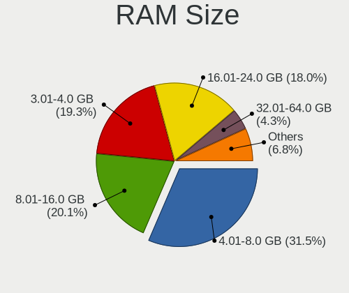

| Size in GB      | Computers | Percent |
|-----------------|-----------|---------|
| 4.01-8.0        | 1542      | 31.81%  |
| 3.01-4.0        | 1053      | 21.72%  |
| 8.01-16.0       | 944       | 19.48%  |
| 16.01-24.0      | 810       | 16.71%  |
| 32.01-64.0      | 183       | 3.78%   |
| 1.01-2.0        | 162       | 3.34%   |
| 64.01-256.0     | 49        | 1.01%   |
| 2.01-3.0        | 43        | 0.89%   |
| 24.01-32.0      | 41        | 0.85%   |
| 0.51-1.0        | 17        | 0.35%   |
| 0.01-0.5        | 2         | 0.04%   |
| More than 256.0 | 1         | 0.02%   |

RAM Used
--------

Used RAM memory

| Used GB     | Computers | Percent |
|-------------|-----------|---------|
| 2.01-3.0    | 1616      | 30.85%  |
| 1.01-2.0    | 1607      | 30.68%  |
| 4.01-8.0    | 824       | 15.73%  |
| 3.01-4.0    | 791       | 15.1%   |
| 0.51-1.0    | 185       | 3.53%   |
| 8.01-16.0   | 165       | 3.15%   |
| 0.01-0.5    | 33        | 0.63%   |
| 16.01-24.0  | 11        | 0.21%   |
| 32.01-64.0  | 2         | 0.04%   |
| 24.01-32.0  | 2         | 0.04%   |
| 64.01-256.0 | 1         | 0.02%   |
| Unknown     | 1         | 0.02%   |

Total Drives
------------

Number of drives on board

| Drives | Computers | Percent |
|--------|-----------|---------|
| 1      | 3384      | 69.74%  |
| 2      | 1186      | 24.44%  |
| 3      | 171       | 3.52%   |
| 4      | 45        | 0.93%   |
| 0      | 32        | 0.66%   |
| 5      | 19        | 0.39%   |
| 6      | 9         | 0.19%   |
| 7      | 3         | 0.06%   |
| 19     | 1         | 0.02%   |
| 9      | 1         | 0.02%   |
| 8      | 1         | 0.02%   |

Has CD-ROM
----------

Has CD-ROM on board

| Presented | Computers | Percent |
|-----------|-----------|---------|
| No        | 3294      | 68.43%  |
| Yes       | 1520      | 31.57%  |

Has Ethernet
------------

Has Ethernet on board

| Presented | Computers | Percent |
|-----------|-----------|---------|
| Yes       | 3931      | 82.07%  |
| No        | 859       | 17.93%  |

Has WiFi
--------

Has WiFi module

| Presented | Computers | Percent |
|-----------|-----------|---------|
| Yes       | 4201      | 87.54%  |
| No        | 598       | 12.46%  |

Has Bluetooth
-------------

Has Bluetooth module

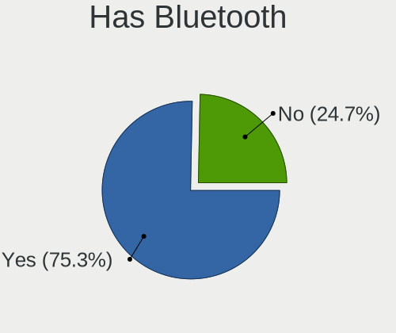

| Presented | Computers | Percent |
|-----------|-----------|---------|
| Yes       | 3579      | 74.02%  |
| No        | 1256      | 25.98%  |

Location
--------

Country
-------

Geographic location (country)

| Country | Computers | Percent |
|---------|-----------|---------|
| India   | 4781      | 100%    |

City
----

Geographic location (city)

| City          | Computers | Percent |
|---------------|-----------|---------|
| Bengaluru     | 615       | 12.05%  |
| Chennai       | 331       | 6.49%   |
| Mumbai        | 330       | 6.47%   |
| Hyderabad     | 306       | 6%      |
| Delhi         | 287       | 5.62%   |
| Pune          | 253       | 4.96%   |
| Kolkata       | 216       | 4.23%   |
| New Delhi     | 192       | 3.76%   |
| Ahmedabad     | 116       | 2.27%   |
| Lucknow       | 96        | 1.88%   |
| Patna         | 87        | 1.7%    |
| Jaipur        | 82        | 1.61%   |
| Ernakulam     | 79        | 1.55%   |
| Gurgaon       | 69        | 1.35%   |
| Indore        | 66        | 1.29%   |
| Kochi         | 63        | 1.23%   |
| Coimbatore    | 61        | 1.2%    |
| Bhopal        | 60        | 1.18%   |
| Navi Mumbai   | 53        | 1.04%   |
| Trivandrum    | 51        | 1%      |
| Surat         | 50        | 0.98%   |
| Thrissur      | 49        | 0.96%   |
| Guwahati      | 41        | 0.8%    |
| Bhubaneswar   | 39        | 0.76%   |
| Nagpur        | 37        | 0.72%   |
| Malappuram    | 37        | 0.72%   |
| Ludhiana      | 35        | 0.69%   |
| Noida         | 30        | 0.59%   |
| Chandigarh    | 28        | 0.55%   |
| Ghaziabad     | 27        | 0.53%   |
| Mangalore     | 26        | 0.51%   |
| Visakhapatnam | 24        | 0.47%   |
| Vadodara      | 24        | 0.47%   |
| Kanpur        | 24        | 0.47%   |
| Thane         | 23        | 0.45%   |
| Vijayawada    | 22        | 0.43%   |
| Gonikoppal    | 22        | 0.43%   |
| Dehradun      | 20        | 0.39%   |
| Kozhikode     | 19        | 0.37%   |
| Kottayam      | 19        | 0.37%   |

Drives
------

Drive Vendor
------------

Hard drive vendors

| Vendor                      | Computers | Drives | Percent |
|-----------------------------|-----------|--------|---------|
| Seagate                     | 1267      | 1656   | 20.51%  |
| WDC                         | 1111      | 1444   | 17.99%  |
| Samsung Electronics         | 614       | 786    | 9.94%   |
| Toshiba                     | 572       | 657    | 9.26%   |
| Sandisk                     | 275       | 341    | 4.45%   |
| Crucial                     | 247       | 328    | 4%      |
| Kingston                    | 231       | 278    | 3.74%   |
| Intel                       | 209       | 283    | 3.38%   |
| SK hynix                    | 205       | 233    | 3.32%   |
| Micron Technology           | 188       | 214    | 3.04%   |
| HGST                        | 181       | 220    | 2.93%   |
| Unknown                     | 134       | 165    | 2.17%   |
| Hitachi                     | 115       | 138    | 1.86%   |
| KIOXIA                      | 90        | 103    | 1.46%   |
| A-DATA Technology           | 75        | 82     | 1.21%   |
| China                       | 56        | 67     | 0.91%   |
| Micron/Crucial Technology   | 39        | 44     | 0.63%   |
| Unknown                     | 33        | 40     | 0.53%   |
| Gigabyte Technology         | 29        | 34     | 0.47%   |
| FORESEE                     | 26        | 30     | 0.42%   |
| Silicon Motion              | 24        | 27     | 0.39%   |
| Apple                       | 23        | 31     | 0.37%   |
| UMIS                        | 21        | 25     | 0.34%   |
| Phison                      | 20        | 24     | 0.32%   |
| Hewlett-Packard             | 20        | 26     | 0.32%   |
| LITEON                      | 16        | 20     | 0.26%   |
| Kingston Technology Company | 15        | 18     | 0.24%   |
| SPCC                        | 14        | 21     | 0.23%   |
| Lexar                       | 13        | 13     | 0.21%   |
| Transcend                   | 12        | 13     | 0.19%   |
| Realtek Semiconductor       | 12        | 18     | 0.19%   |
| Acer                        | 12        | 13     | 0.19%   |
| XPG                         | 11        | 15     | 0.18%   |
| ADATA Technology            | 11        | 15     | 0.18%   |
| Maxtor                      | 10        | 26     | 0.16%   |
| Fujitsu                     | 9         | 9      | 0.15%   |
| Union Memory (Shenzhen)     | 8         | 10     | 0.13%   |
| POWER                       | 8         | 8      | 0.13%   |
| EVM                         | 8         | 10     | 0.13%   |
| TO Exter                    | 7         | 7      | 0.11%   |

Drive Model
-----------

Hard drive models

| Model                                               | Computers | Percent |
|-----------------------------------------------------|-----------|---------|
| Seagate ST1000LM035-1RK172 1TB                      | 298       | 4.58%   |
| Toshiba MQ04ABF100 1TB                              | 158       | 2.43%   |
| Toshiba MQ01ABD100 1TB                              | 111       | 1.71%   |
| Seagate ST1000DM010-2EP102 1TB                      | 94        | 1.45%   |
| Crucial CT240BX500SSD1 240GB                        | 84        | 1.29%   |
| WDC WDS240G2G0A-00JH30 240GB SSD                    | 74        | 1.14%   |
| Seagate ST1000LM024 HN-M101MBB 1TB                  | 70        | 1.08%   |
| Seagate ST1000LM049-2GH172 1TB                      | 69        | 1.06%   |
| Seagate ST500LT012-1DG142 500GB                     | 66        | 1.02%   |
| Kingston SA400S37240G 240GB SSD                     | 58        | 0.89%   |
| Intel NVMe SSD Drive 512GB                          | 52        | 0.8%    |
| Toshiba MQ01ABF050 500GB                            | 47        | 0.72%   |
| Seagate ST500DM002-1BD142 500GB                     | 44        | 0.68%   |
| SanDisk NVMe SSD Drive 512GB                        | 44        | 0.68%   |
| Toshiba DT01ACA100 1TB                              | 42        | 0.65%   |
| Intel SSDPEKNW512G8 512GB                           | 41        | 0.63%   |
| HGST HTS541010A9E680 1TB                            | 41        | 0.63%   |
| WDC WD10SPZX-60Z10T0 1TB                            | 40        | 0.62%   |
| Seagate ST9500325AS 500GB                           | 38        | 0.58%   |
| SanDisk NVMe SSD Drive 256GB                        | 38        | 0.58%   |
| WDC WD10SPZX-24Z10 1TB                              | 37        | 0.57%   |
| Micron 2450_MTFDKBA512TFK 512GB                     | 37        | 0.57%   |
| Seagate ST2000LM007-1R8174 2TB                      | 36        | 0.55%   |
| Samsung NVMe SSD Drive 512GB                        | 36        | 0.55%   |
| Seagate ST1000LM048-2E7172 1TB                      | 35        | 0.54%   |
| HGST HTS721010A9E630 1TB                            | 34        | 0.52%   |
| Unknown                                             | 33        | 0.51%   |
| WDC WDS240G2G0B-00EPW0 240GB SSD                    | 32        | 0.49%   |
| Crucial CT480BX500SSD1 480GB                        | 31        | 0.48%   |
| SK hynix NVMe SSD Drive 512GB                       | 30        | 0.46%   |
| Samsung NVMe SSD Controller SM981/PM981/PM983 250GB | 29        | 0.45%   |
| WDC WD10SPZX-21Z10T0 1TB                            | 28        | 0.43%   |
| WDC WD10EZEX-08WN4A0 1TB                            | 28        | 0.43%   |
| WDC WD10JPVX-60JC3T1 1TB                            | 27        | 0.42%   |
| Samsung SSD 860 EVO 250GB                           | 27        | 0.42%   |
| HGST HTS545050A7E680 500GB                          | 27        | 0.42%   |
| Samsung PM963 2.5" NVMe PCIe SSD 256GB              | 26        | 0.4%    |
| Kingston SA400S37120G 120GB SSD                     | 26        | 0.4%    |
| Seagate ST3500312CS 500GB                           | 25        | 0.38%   |
| WDC WDS120G2G0A-00JH30 120GB SSD                    | 24        | 0.37%   |

HDD Vendor
----------

Hard disk drive vendors

| Vendor              | Computers | Drives | Percent |
|---------------------|-----------|--------|---------|
| Seagate             | 1250      | 1635   | 41.88%  |
| WDC                 | 832       | 1040   | 27.87%  |
| Toshiba             | 508       | 573    | 17.02%  |
| HGST                | 181       | 220    | 6.06%   |
| Hitachi             | 115       | 138    | 3.85%   |
| Samsung Electronics | 24        | 29     | 0.8%    |
| Unknown             | 22        | 26     | 0.74%   |
| Fujitsu             | 9         | 9      | 0.3%    |
| Apple               | 9         | 9      | 0.3%    |
| TO Exter            | 7         | 7      | 0.23%   |
| Hewlett-Packard     | 7         | 8      | 0.23%   |
| External            | 5         | 9      | 0.17%   |
| StoreJet            | 4         | 4      | 0.13%   |
| Maxtor              | 3         | 3      | 0.1%    |
| MARSHAL             | 3         | 3      | 0.1%    |
| WD MediaMax         | 1         | 1      | 0.03%   |
| Synology            | 1         | 1      | 0.03%   |
| Lenovo              | 1         | 1      | 0.03%   |
| KESU                | 1         | 2      | 0.03%   |
| IBM                 | 1         | 1      | 0.03%   |
| Unknown             | 1         | 1      | 0.03%   |

SSD Vendor
----------

Solid state drive vendors

| Vendor              | Computers | Drives | Percent |
|---------------------|-----------|--------|---------|
| Samsung Electronics | 220       | 277    | 16.07%  |
| Crucial             | 218       | 292    | 15.92%  |
| WDC                 | 203       | 250    | 14.83%  |
| Kingston            | 157       | 197    | 11.47%  |
| SanDisk             | 69        | 89     | 5.04%   |
| A-DATA Technology   | 66        | 73     | 4.82%   |
| China               | 55        | 66     | 4.02%   |
| SK hynix            | 37        | 39     | 2.7%    |
| Micron Technology   | 26        | 34     | 1.9%    |
| Intel               | 25        | 27     | 1.83%   |
| Gigabyte Technology | 23        | 26     | 1.68%   |
| FORESEE             | 18        | 22     | 1.31%   |
| Unknown             | 16        | 17     | 1.17%   |
| Toshiba             | 14        | 15     | 1.02%   |
| LITEON              | 14        | 18     | 1.02%   |
| Lexar               | 12        | 12     | 0.88%   |
| Apple               | 12        | 16     | 0.88%   |
| Hewlett-Packard     | 11        | 16     | 0.8%    |
| SPCC                | 10        | 14     | 0.73%   |
| Seagate             | 10        | 10     | 0.73%   |
| Acer                | 10        | 11     | 0.73%   |
| Transcend           | 8         | 9      | 0.58%   |
| POWER               | 8         | 8      | 0.58%   |
| PNY                 | 7         | 9      | 0.51%   |
| Maxtor              | 7         | 23     | 0.51%   |
| EVM                 | 6         | 8      | 0.44%   |
| Zebronics           | 5         | 5      | 0.37%   |
| Unknown             | 5         | 5      | 0.37%   |
| Netac               | 4         | 4      | 0.29%   |
| LITEONIT            | 4         | 7      | 0.29%   |
| Leven               | 4         | 4      | 0.29%   |
| KingSpec            | 4         | 4      | 0.29%   |
| HS-SSD-C100         | 4         | 5      | 0.29%   |
| CONSISTENT          | 4         | 5      | 0.29%   |
| Plextor             | 3         | 3      | 0.22%   |
| KLEVV               | 3         | 4      | 0.22%   |
| geonix              | 3         | 3      | 0.22%   |
| Aarvex              | 3         | 4      | 0.22%   |
| Unknown (690)       | 2         | 2      | 0.15%   |
| Team                | 2         | 2      | 0.15%   |

Drive Kind
----------

HDD or SSD

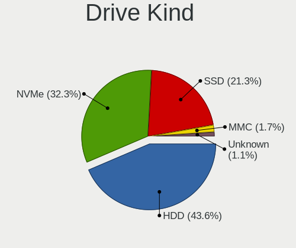

| Kind    | Computers | Drives | Percent |
|---------|-----------|--------|---------|
| HDD     | 2824      | 3720   | 47.83%  |
| NVMe    | 1631      | 2120   | 27.63%  |
| SSD     | 1291      | 1697   | 21.87%  |
| MMC     | 105       | 136    | 1.78%   |
| Unknown | 53        | 64     | 0.9%    |

Drive Connector
---------------

SATA, SAS, NVMe, etc.

| Type | Computers | Drives | Percent |
|------|-----------|--------|---------|
| SATA | 3528      | 5305   | 65.32%  |
| NVMe | 1630      | 2119   | 30.18%  |
| SAS  | 138       | 177    | 2.56%   |
| MMC  | 105       | 136    | 1.94%   |

Drive Size
----------

Size of hard drive

| Size in TB | Computers | Drives | Percent |
|------------|-----------|--------|---------|
| 0.01-0.5   | 2136      | 2851   | 51.91%  |
| 0.51-1.0   | 1762      | 2219   | 42.82%  |
| 1.01-2.0   | 148       | 220    | 3.6%    |
| 3.01-4.0   | 37        | 67     | 0.9%    |
| 4.01-10.0  | 18        | 35     | 0.44%   |
| 2.01-3.0   | 11        | 17     | 0.27%   |
| 10.01-20.0 | 3         | 8      | 0.07%   |

Space Total
-----------

Amount of disk space available on the file system

| Size in GB     | Computers | Percent |
|----------------|-----------|---------|
| 251-500        | 1361      | 26.95%  |
| 101-250        | 1290      | 25.54%  |
| 501-1000       | 865       | 17.13%  |
| 51-100         | 449       | 8.89%   |
| 1001-2000      | 315       | 6.24%   |
| 21-50          | 285       | 5.64%   |
| 1-20           | 264       | 5.23%   |
| More than 3000 | 79        | 1.56%   |
| Unknown        | 72        | 1.43%   |
| 2001-3000      | 70        | 1.39%   |

Space Used
----------

Amount of used disk space

| Used GB        | Computers | Percent |
|----------------|-----------|---------|
| 1-20           | 1963      | 37.58%  |
| 21-50          | 1096      | 20.98%  |
| 101-250        | 718       | 13.75%  |
| 51-100         | 647       | 12.39%  |
| 251-500        | 398       | 7.62%   |
| 501-1000       | 218       | 4.17%   |
| 1001-2000      | 76        | 1.46%   |
| Unknown        | 72        | 1.38%   |
| More than 3000 | 21        | 0.4%    |
| 2001-3000      | 13        | 0.25%   |
| 0              | 1         | 0.02%   |

Malfunc. Drives
---------------

Drive models with a malfunction

| Model                                | Computers | Drives | Percent |
|--------------------------------------|-----------|--------|---------|
| Seagate ST1000LM035-1RK172 1TB       | 27        | 30     | 5.96%   |
| HGST HTS541010A9E680 1TB             | 14        | 14     | 3.09%   |
| Seagate ST500LT012-1DG142 500GB      | 12        | 12     | 2.65%   |
| Seagate ST500DM002-1BD142 500GB      | 12        | 12     | 2.65%   |
| HGST HTS545050A7E680 500GB           | 12        | 16     | 2.65%   |
| Toshiba MQ01ABD100 1TB               | 11        | 11     | 2.43%   |
| Seagate ST1000LM024 HN-M101MBB 1TB   | 11        | 11     | 2.43%   |
| Seagate ST9500325AS 500GB            | 10        | 10     | 2.21%   |
| Seagate ST1000LM049-2GH172 1TB       | 10        | 12     | 2.21%   |
| Toshiba MQ04ABF100 1TB               | 6         | 7      | 1.32%   |
| Toshiba MQ01ABF050 500GB             | 6         | 6      | 1.32%   |
| Seagate ST500LT012-9WS142 500GB      | 6         | 7      | 1.32%   |
| Seagate ST500LM021-1KJ152 500GB      | 6         | 6      | 1.32%   |
| WDC WD10EZEX-08WN4A0 1TB             | 5         | 5      | 1.1%    |
| Seagate ST3500418AS 500GB            | 5         | 5      | 1.1%    |
| HGST HTS721010A9E630 1TB             | 5         | 5      | 1.1%    |
| HGST HTS545050A7E380 500GB           | 5         | 5      | 1.1%    |
| Seagate ST320LT007-9ZV142 320GB      | 4         | 4      | 0.88%   |
| Seagate ST2000LM007-1R8174 2TB       | 4         | 4      | 0.88%   |
| Seagate ST1000DM010-2EP102 1TB       | 4         | 4      | 0.88%   |
| Seagate ST1000DM003-1ER162 1TB       | 4         | 4      | 0.88%   |
| HGST HTS725050A7E630 500GB           | 4         | 4      | 0.88%   |
| WDC WD10SPZX-24Z10 1TB               | 3         | 3      | 0.66%   |
| WDC WD10JPVX-60JC3T1 1TB             | 3         | 3      | 0.66%   |
| Toshiba DT01ACA100 1TB               | 3         | 5      | 0.66%   |
| SK hynix PC711 HFS512GDE9X073N 512GB | 3         | 4      | 0.66%   |
| Seagate ST9320325AS 320GB            | 3         | 3      | 0.66%   |
| Seagate ST9160314AS 40GB             | 3         | 4      | 0.66%   |
| Seagate ST3500312CS 500GB            | 3         | 3      | 0.66%   |
| Seagate ST1000LM048-2E7172 1TB       | 3         | 3      | 0.66%   |
| Seagate ST1000DM003-1CH162 1TB       | 3         | 3      | 0.66%   |
| Hitachi HTS547575A9E384 752GB        | 3         | 3      | 0.66%   |
| Hitachi HTS545032B9A300 320GB        | 3         | 5      | 0.66%   |
| Hitachi HTS543232A7A384 320GB        | 3         | 3      | 0.66%   |
| WDC WDS480G2G0A-00JH30 480GB SSD     | 2         | 2      | 0.44%   |
| WDC WDS240G2G0A-00JH30 240GB SSD     | 2         | 2      | 0.44%   |
| WDC WD5000LPVX-75V0TT0 500GB         | 2         | 2      | 0.44%   |
| WDC WD5000LPVT-22G33T0 500GB         | 2         | 2      | 0.44%   |
| WDC WD5000AAKX-22ERMA0 500GB         | 2         | 2      | 0.44%   |
| WDC WD5000AAKX-00ERMA0 500GB         | 2         | 3      | 0.44%   |

Malfunc. Drive Vendor
---------------------

Vendors of faulty drives

| Vendor                      | Computers | Drives | Percent |
|-----------------------------|-----------|--------|---------|
| Seagate                     | 171       | 187    | 38.34%  |
| WDC                         | 89        | 104    | 19.96%  |
| Toshiba                     | 44        | 48     | 9.87%   |
| HGST                        | 44        | 48     | 9.87%   |
| Hitachi                     | 31        | 35     | 6.95%   |
| SK hynix                    | 13        | 15     | 2.91%   |
| Samsung Electronics         | 11        | 14     | 2.47%   |
| SanDisk                     | 7         | 7      | 1.57%   |
| Intel                       | 4         | 4      | 0.9%    |
| Crucial                     | 4         | 5      | 0.9%    |
| Apple                       | 3         | 3      | 0.67%   |
| A-DATA Technology           | 3         | 4      | 0.67%   |
| SPCC                        | 2         | 2      | 0.45%   |
| Micron Technology           | 2         | 2      | 0.45%   |
| China                       | 2         | 2      | 0.45%   |
| Unknown                     | 2         | 2      | 0.45%   |
| YS                          | 1         | 1      | 0.22%   |
| Wibtek                      | 1         | 1      | 0.22%   |
| Unknown                     | 1         | 1      | 0.22%   |
| Secure                      | 1         | 1      | 0.22%   |
| POWER                       | 1         | 1      | 0.22%   |
| MAXIO Technology (Hangzhou) | 1         | 1      | 0.22%   |
| MARSHAL                     | 1         | 1      | 0.22%   |
| LITEONIT                    | 1         | 1      | 0.22%   |
| LITEON                      | 1         | 1      | 0.22%   |
| Leven                       | 1         | 1      | 0.22%   |
| Lenovo                      | 1         | 2      | 0.22%   |
| Innodisk                    | 1         | 1      | 0.22%   |
| IBM                         | 1         | 1      | 0.22%   |
| Gamers                      | 1         | 1      | 0.22%   |

Malfunc. HDD Vendor
-------------------

Vendors of faulty HDD drives

| Vendor              | Computers | Drives | Percent |
|---------------------|-----------|--------|---------|
| Seagate             | 171       | 187    | 45.36%  |
| WDC                 | 78        | 92     | 20.69%  |
| HGST                | 44        | 48     | 11.67%  |
| Toshiba             | 43        | 47     | 11.41%  |
| Hitachi             | 31        | 35     | 8.22%   |
| Samsung Electronics | 5         | 7      | 1.33%   |
| Apple               | 3         | 3      | 0.8%    |
| MARSHAL             | 1         | 1      | 0.27%   |
| IBM                 | 1         | 1      | 0.27%   |

Malfunc. Drive Kind
-------------------

Kinds of faulty drives

| Kind | Computers | Drives | Percent |
|------|-----------|--------|---------|
| HDD  | 372       | 421    | 84.35%  |
| SSD  | 48        | 52     | 10.88%  |
| NVMe | 21        | 24     | 4.76%   |

Failed Drives
-------------

Failed drive models

| Model                               | Computers | Drives | Percent |
|-------------------------------------|-----------|--------|---------|
| WDC WD5000AAKX-001CA0 500GB         | 1         | 1      | 11.11%  |
| WDC WD10SPZX-21Z10T0 1TB            | 1         | 1      | 11.11%  |
| Toshiba HDWD110 1TB                 | 1         | 1      | 11.11%  |
| Seagate ST500LT012-1DG142 500GB     | 1         | 1      | 11.11%  |
| Seagate ST3320418AS 320GB           | 1         | 1      | 11.11%  |
| Seagate ST1000LM 024 HN-M101MBB 1TB | 1         | 1      | 11.11%  |
| Samsung Electronics SSD 980 500GB   | 1         | 2      | 11.11%  |
| Apple HDD HTS545050A7E362 500GB     | 1         | 1      | 11.11%  |
| Acer SSD FA100 256GB                | 1         | 1      | 11.11%  |

Failed Drive Vendor
-------------------

Failed drive vendors

| Vendor              | Computers | Drives | Percent |
|---------------------|-----------|--------|---------|
| Seagate             | 3         | 3      | 33.33%  |
| WDC                 | 2         | 2      | 22.22%  |
| Toshiba             | 1         | 1      | 11.11%  |
| Samsung Electronics | 1         | 2      | 11.11%  |
| Apple               | 1         | 1      | 11.11%  |
| Acer                | 1         | 1      | 11.11%  |

Drive Status
------------

Number of failed and malfunc. drives

| Status   | Computers | Drives | Percent |
|----------|-----------|--------|---------|
| Detected | 2811      | 4437   | 55.09%  |
| Works    | 1850      | 2793   | 36.25%  |
| Malfunc  | 433       | 497    | 8.49%   |
| Failed   | 9         | 10     | 0.18%   |

Storage controller
------------------

Storage Vendor
--------------

Storage controller vendors

| Vendor                                  | Computers | Percent |
|-----------------------------------------|-----------|---------|
| Intel                                   | 3522      | 59.85%  |
| AMD                                     | 739       | 12.56%  |
| Samsung Electronics                     | 396       | 6.73%   |
| SanDisk                                 | 318       | 5.4%    |
| SK hynix                                | 168       | 2.85%   |
| Micron Technology                       | 162       | 2.75%   |
| KIOXIA                                  | 94        | 1.6%    |
| Kingston Technology Company             | 89        | 1.51%   |
| Micron/Crucial Technology               | 66        | 1.12%   |
| Toshiba America Info Systems            | 61        | 1.04%   |
| Union Memory (Shenzhen)                 | 31        | 0.53%   |
| Silicon Motion                          | 29        | 0.49%   |
| Phison Electronics                      | 29        | 0.49%   |
| ADATA Technology                        | 27        | 0.46%   |
| ASMedia Technology                      | 26        | 0.44%   |
| Nvidia                                  | 18        | 0.31%   |
| Realtek Semiconductor                   | 17        | 0.29%   |
| Shenzhen Longsys Electronics            | 13        | 0.22%   |
| Yangtze Memory Technologies             | 10        | 0.17%   |
| Solid State Storage Technology          | 8         | 0.14%   |
| JMicron Technology                      | 8         | 0.14%   |
| Marvell Technology Group                | 7         | 0.12%   |
| Lite-On Technology                      | 6         | 0.1%    |
| Lenovo                                  | 5         | 0.08%   |
| Silicon Integrated Systems [SiS]        | 4         | 0.07%   |
| LSI Logic / Symbios Logic               | 4         | 0.07%   |
| INNOGRIT                                | 4         | 0.07%   |
| Broadcom / LSI                          | 4         | 0.07%   |
| MAXIO Technology (Hangzhou)             | 3         | 0.05%   |
| Apple                                   | 3         | 0.05%   |
| VIA Technologies                        | 2         | 0.03%   |
| Transcend                               | 2         | 0.03%   |
| Shenzhen Unionmemory Information System | 2         | 0.03%   |
| Solidigm                                | 1         | 0.02%   |
| ShenZhen TIGO Semiconductor             | 1         | 0.02%   |
| Seagate Technology                      | 1         | 0.02%   |
| Netac Technology                        | 1         | 0.02%   |
| Integrated Technology Express           | 1         | 0.02%   |
| Hosin Global Electronics                | 1         | 0.02%   |
| Hewlett-Packard                         | 1         | 0.02%   |

Storage Model
-------------

Storage controller models

| Model                                                                                   | Computers | Percent |
|-----------------------------------------------------------------------------------------|-----------|---------|
| AMD FCH SATA Controller [AHCI mode]                                                     | 628       | 9.55%   |
| Intel Sunrise Point-LP SATA Controller [AHCI mode]                                      | 507       | 7.71%   |
| Intel 82801 Mobile SATA Controller [RAID mode]                                          | 358       | 5.44%   |
| Intel Volume Management Device NVMe RAID Controller                                     | 223       | 3.39%   |
| Intel 7 Series Chipset Family 6-port SATA Controller [AHCI mode]                        | 209       | 3.18%   |
| Intel 8 Series SATA Controller 1 [AHCI mode]                                            | 191       | 2.9%    |
| Samsung NVMe SSD Controller 980 (DRAM-less)                                             | 168       | 2.55%   |
| Samsung NVMe SSD Controller SM981/PM981/PM983                                           | 153       | 2.33%   |
| Intel NM10/ICH7 Family SATA Controller [IDE mode]                                       | 147       | 2.24%   |
| Intel 8 Series/C220 Series Chipset Family 6-port SATA Controller 1 [AHCI mode]          | 134       | 2.04%   |
| Intel 6 Series/C200 Series Chipset Family 6 port Mobile SATA AHCI Controller            | 132       | 2.01%   |
| Intel Wildcat Point-LP SATA Controller [AHCI Mode]                                      | 131       | 1.99%   |
| Intel Comet Lake SATA AHCI Controller                                                   | 123       | 1.87%   |
| Intel 82801G (ICH7 Family) IDE Controller                                               | 120       | 1.82%   |
| Intel Cannon Lake Mobile PCH SATA AHCI Controller                                       | 114       | 1.73%   |
| Intel Tiger Lake-LP SATA Controller                                                     | 112       | 1.7%    |
| Intel SSD 660P Series                                                                   | 111       | 1.69%   |
| Intel Cannon Point-LP SATA Controller [AHCI Mode]                                       | 99        | 1.51%   |
| Intel 6 Series/C200 Series Chipset Family 6 port Desktop SATA AHCI Controller           | 87        | 1.32%   |
| SanDisk Ultra 3D / WD Blue SN550 NVMe SSD                                               | 83        | 1.26%   |
| Intel Q170/Q150/B150/H170/H110/Z170/CM236 Chipset SATA Controller [AHCI Mode]           | 82        | 1.25%   |
| KIOXIA NVMe SSD Controller BG4 (DRAM-less)                                              | 78        | 1.19%   |
| AMD 400 Series Chipset SATA Controller                                                  | 67        | 1.02%   |
| Intel 5 Series/3400 Series Chipset 4 port SATA AHCI Controller                          | 61        | 0.93%   |
| Intel 200 Series PCH SATA controller [AHCI mode]                                        | 59        | 0.9%    |
| SanDisk WD Blue SN500 / PC SN520 x2 M.2 2280 NVMe SSD                                   | 57        | 0.87%   |
| SK hynix Gold P31/BC711/PC711 NVMe Solid State Drive                                    | 55        | 0.84%   |
| Intel Ice Lake-LP SATA Controller [AHCI mode]                                           | 53        | 0.81%   |
| Intel 82801IBM/IEM (ICH9M/ICH9M-E) 4 port SATA Controller [AHCI mode]                   | 53        | 0.81%   |
| Intel 400 Series Chipset Family SATA AHCI Controller                                    | 51        | 0.78%   |
| Micron 2450 NVMe SSD [HendrixV] (DRAM-less)                                             | 49        | 0.75%   |
| Micron 2210 NVMe SSD [Cobain]                                                           | 49        | 0.75%   |
| SanDisk Extreme Pro / WD Black SN750 / PC SN730 / Red SN700 NVMe SSD                    | 48        | 0.73%   |
| Intel Cannon Lake PCH SATA AHCI Controller                                              | 48        | 0.73%   |
| Intel 6 Series/C200 Series Chipset Family Desktop SATA Controller (IDE mode, ports 0-3) | 47        | 0.71%   |
| Intel 6 Series/C200 Series Chipset Family Desktop SATA Controller (IDE mode, ports 4-5) | 46        | 0.7%    |
| SK hynix BC501 NVMe Solid State Drive                                                   | 45        | 0.68%   |
| Intel 500 Series Chipset Family SATA AHCI Controller                                    | 42        | 0.64%   |
| Intel HM170/QM170 Chipset SATA Controller [AHCI Mode]                                   | 40        | 0.61%   |
| Intel 5 Series/3400 Series Chipset 6 port SATA AHCI Controller                          | 40        | 0.61%   |

Storage Kind
------------

Kind of storage controller (IDE, SATA, NVMe, SAS, ...)

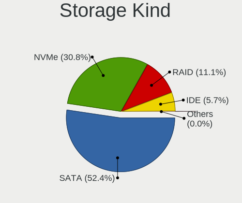

| Kind | Computers | Percent |
|------|-----------|---------|
| SATA | 3395      | 55.89%  |
| NVMe | 1641      | 27.02%  |
| RAID | 639       | 10.52%  |
| IDE  | 394       | 6.49%   |
| SAS  | 3         | 0.05%   |
| SCSI | 2         | 0.03%   |

Processor
---------

CPU Vendor
----------

Processor vendors

| Vendor       | Computers | Percent |
|--------------|-----------|---------|
| Intel        | 3786      | 79.19%  |
| AMD          | 973       | 20.35%  |
| ARM          | 21        | 0.44%   |
| CentaurHauls | 1         | 0.02%   |

CPU Model
---------

Processor models

| Model                                         | Computers | Percent |
|-----------------------------------------------|-----------|---------|
| Intel Core i5-8250U CPU @ 1.60GHz             | 199       | 4.16%   |
| Intel Core i5-8265U CPU @ 1.60GHz             | 127       | 2.65%   |
| Intel 11th Gen Core i5-1135G7 @ 2.40GHz       | 108       | 2.26%   |
| Intel Core i5-10210U CPU @ 1.60GHz            | 94        | 1.96%   |
| Intel Core i5-7200U CPU @ 2.50GHz             | 83        | 1.73%   |
| Intel Core i3-6006U CPU @ 2.00GHz             | 82        | 1.71%   |
| AMD Ryzen 5 3500U with Radeon Vega Mobile Gfx | 59        | 1.23%   |
| Intel Core i5-4210U CPU @ 1.70GHz             | 54        | 1.13%   |
| Intel Core i5-9300H CPU @ 2.40GHz             | 53        | 1.11%   |
| Intel Core i5-6200U CPU @ 2.30GHz             | 52        | 1.09%   |
| Intel Core i3-5005U CPU @ 2.00GHz             | 52        | 1.09%   |
| Intel Core i3-7020U CPU @ 2.30GHz             | 51        | 1.07%   |
| AMD Ryzen 5 3550H with Radeon Vega Mobile Gfx | 51        | 1.07%   |
| Intel Core i3-4005U CPU @ 1.70GHz             | 48        | 1%      |
| Intel Core i7-8550U CPU @ 1.80GHz             | 45        | 0.94%   |
| Intel Core i3-1005G1 CPU @ 1.20GHz            | 45        | 0.94%   |
| Intel 11th Gen Core i3-1115G4 @ 3.00GHz       | 43        | 0.9%    |
| Intel Core i5-1035G1 CPU @ 1.00GHz            | 41        | 0.86%   |
| Intel Core i7-9750H CPU @ 2.60GHz             | 40        | 0.84%   |
| Intel Core i5-5200U CPU @ 2.20GHz             | 40        | 0.84%   |
| Intel Core i5-3210M CPU @ 2.50GHz             | 40        | 0.84%   |
| AMD Ryzen 5 5500U with Radeon Graphics        | 38        | 0.79%   |
| AMD Ryzen 7 5800H with Radeon Graphics        | 37        | 0.77%   |
| Intel Core i3-10110U CPU @ 2.10GHz            | 36        | 0.75%   |
| AMD Ryzen 5 4600H with Radeon Graphics        | 36        | 0.75%   |
| Intel 11th Gen Core i7-1165G7 @ 2.80GHz       | 34        | 0.71%   |
| Intel Core i7-8750H CPU @ 2.20GHz             | 33        | 0.69%   |
| AMD Ryzen 5 5600H with Radeon Graphics        | 33        | 0.69%   |
| Intel Core i7-8565U CPU @ 1.80GHz             | 32        | 0.67%   |
| AMD Ryzen 5 2500U with Radeon Vega Mobile Gfx | 32        | 0.67%   |
| Intel Core i7-10510U CPU @ 1.80GHz            | 31        | 0.65%   |
| Intel Core i7-7700HQ CPU @ 2.80GHz            | 29        | 0.61%   |
| Intel Core i5-3320M CPU @ 2.60GHz             | 29        | 0.61%   |
| Intel Core i5-10400 CPU @ 2.90GHz             | 28        | 0.59%   |
| Intel Core i5-10300H CPU @ 2.50GHz            | 26        | 0.54%   |
| Intel Core i3-7100U CPU @ 2.40GHz             | 26        | 0.54%   |
| Intel 12th Gen Core i5-1240P                  | 26        | 0.54%   |
| AMD Ryzen 7 4800H with Radeon Graphics        | 25        | 0.52%   |
| Intel Core i7-10750H CPU @ 2.60GHz            | 24        | 0.5%    |
| AMD Ryzen 5 4500U with Radeon Graphics        | 24        | 0.5%    |

CPU Model Family
----------------

Processor model prefix

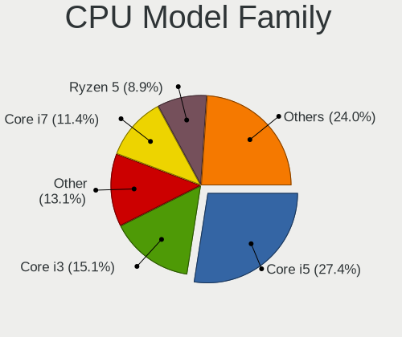

| Model                   | Computers | Percent |
|-------------------------|-----------|---------|
| Intel Core i5           | 1394      | 29.14%  |
| Intel Core i3           | 778       | 16.27%  |
| Intel Core i7           | 585       | 12.23%  |
| Other                   | 494       | 10.33%  |
| AMD Ryzen 5             | 392       | 8.2%    |
| AMD Ryzen 7             | 171       | 3.58%   |
| Intel Pentium           | 148       | 3.09%   |
| Intel Core 2 Duo        | 138       | 2.89%   |
| Intel Celeron           | 83        | 1.74%   |
| AMD Ryzen 3             | 79        | 1.65%   |
| Intel Pentium Dual-Core | 60        | 1.25%   |
| AMD A6                  | 47        | 0.98%   |
| AMD Ryzen 9             | 37        | 0.77%   |
| AMD A8                  | 34        | 0.71%   |
| AMD A4                  | 32        | 0.67%   |
| Intel Atom              | 29        | 0.61%   |
| Intel Xeon              | 27        | 0.56%   |
| AMD FX                  | 24        | 0.5%    |
| Intel Pentium Dual      | 22        | 0.46%   |
| Intel Core 2            | 18        | 0.38%   |
| AMD A10                 | 18        | 0.38%   |
| Intel Core 2 Quad       | 17        | 0.36%   |
| AMD E1                  | 15        | 0.31%   |
| Intel Pentium Silver    | 12        | 0.25%   |
| AMD Ryzen 7 PRO         | 11        | 0.23%   |
| Intel Core i9           | 9         | 0.19%   |
| AMD E2                  | 8         | 0.17%   |
| Intel Pentium Gold      | 7         | 0.15%   |
| Intel Pentium 4         | 7         | 0.15%   |
| AMD Athlon II X2        | 7         | 0.15%   |
| AMD Ryzen 5 PRO         | 6         | 0.13%   |
| AMD E                   | 6         | 0.13%   |
| ARM BCM                 | 5         | 0.1%    |
| AMD Sempron             | 5         | 0.1%    |
| AMD Athlon              | 5         | 0.1%    |
| Intel Pentium D         | 4         | 0.08%   |
| AMD Ryzen Threadripper  | 4         | 0.08%   |
| AMD Phenom II X4        | 4         | 0.08%   |
| AMD Phenom II X2        | 4         | 0.08%   |
| Intel Xeon Silver       | 3         | 0.06%   |

CPU Cores
---------

Number of processor cores

| Number | Computers | Percent |
|--------|-----------|---------|
| 2      | 2121      | 44.34%  |
| 4      | 1709      | 35.72%  |
| 6      | 458       | 9.57%   |
| 8      | 268       | 5.6%    |
| 12     | 77        | 1.61%   |
| 1      | 59        | 1.23%   |
| 10     | 34        | 0.71%   |
| 14     | 22        | 0.46%   |
| 16     | 16        | 0.33%   |
| 24     | 8         | 0.17%   |
| 3      | 8         | 0.17%   |
| 32     | 2         | 0.04%   |
| 36     | 1         | 0.02%   |
| 20     | 1         | 0.02%   |

CPU Sockets
-----------

Number of sockets

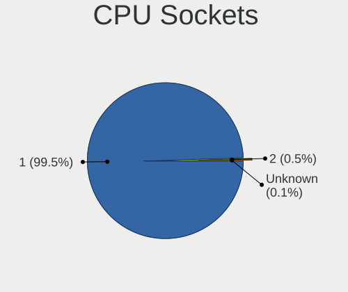

| Number | Computers | Percent |
|--------|-----------|---------|
| 1      | 4764      | 99.64%  |
| 2      | 17        | 0.36%   |

CPU Threads
-----------

Threads per core (Hyper-Threading)

| Number | Computers | Percent |
|--------|-----------|---------|
| 2      | 3676      | 76.86%  |
| 1      | 1104      | 23.08%  |
| 4      | 2         | 0.04%   |
| 12     | 1         | 0.02%   |

CPU Op-Modes
------------

CPU Operation Modes (32-bit, 64-bit)

| Op mode        | Computers | Percent |
|----------------|-----------|---------|
| 32-bit, 64-bit | 4726      | 98.79%  |
| Unknown        | 51        | 1.07%   |
| 32-bit         | 6         | 0.13%   |
| 64-bit         | 1         | 0.02%   |

CPU Microcode
-------------

Microcode number

| Number     | Computers | Percent |
|------------|-----------|---------|
| Unknown    | 1251      | 25.31%  |
| 0x306a9    | 235       | 4.76%   |
| 0x806ea    | 233       | 4.71%   |
| 0x806ec    | 232       | 4.69%   |
| 0x206a7    | 215       | 4.35%   |
| 0x806c1    | 166       | 3.36%   |
| 0x906ea    | 158       | 3.2%    |
| 0x406e3    | 154       | 3.12%   |
| 0x40651    | 154       | 3.12%   |
| 0x806e9    | 148       | 2.99%   |
| 0x1067a    | 125       | 2.53%   |
| 0x306c3    | 117       | 2.37%   |
| 0x306d4    | 112       | 2.27%   |
| 0x08108109 | 94        | 1.9%    |
| 0x706e5    | 82        | 1.66%   |
| 0x0a50000c | 76        | 1.54%   |
| 0x906e9    | 67        | 1.36%   |
| 0x20655    | 64        | 1.3%    |
| 0x806eb    | 62        | 1.25%   |
| 0x506e3    | 58        | 1.17%   |
| 0x08108102 | 50        | 1.01%   |
| 0xa0652    | 44        | 0.89%   |
| 0x06006705 | 44        | 0.89%   |
| 0x6fd      | 39        | 0.79%   |
| 0x08608103 | 38        | 0.77%   |
| 0x08600106 | 37        | 0.75%   |
| 0x906a3    | 36        | 0.73%   |
| 0x07030105 | 33        | 0.67%   |
| 0x0a50000d | 32        | 0.65%   |
| 0x20652    | 31        | 0.63%   |
| 0x08701021 | 30        | 0.61%   |
| 0x08600104 | 30        | 0.61%   |
| 0x0810100b | 29        | 0.59%   |
| 0xa0655    | 28        | 0.57%   |
| 0x906ed    | 24        | 0.49%   |
| 0x30678    | 23        | 0.47%   |
| 0x08101007 | 22        | 0.45%   |
| 0x06001119 | 22        | 0.45%   |
| 0x010000c8 | 21        | 0.42%   |
| 0x706a1    | 16        | 0.32%   |

CPU Microarch
-------------

Microarchitecture

| Name             | Computers | Percent |
|------------------|-----------|---------|
| KabyLake         | 1191      | 24.88%  |
| Haswell          | 358       | 7.48%   |
| IvyBridge        | 300       | 6.27%   |
| Skylake          | 287       | 6%      |
| SandyBridge      | 277       | 5.79%   |
| TigerLake        | 244       | 5.1%    |
| Zen+             | 199       | 4.16%   |
| Penryn           | 180       | 3.76%   |
| Zen 2            | 172       | 3.59%   |
| Unknown          | 170       | 3.55%   |
| Broadwell        | 152       | 3.18%   |
| Zen 3            | 145       | 3.03%   |
| IceLake          | 137       | 2.86%   |
| Alderlake Hybrid | 126       | 2.63%   |
| CometLake        | 122       | 2.55%   |
| Westmere         | 120       | 2.51%   |
| Zen              | 89        | 1.86%   |
| Excavator        | 87        | 1.82%   |
| Core             | 84        | 1.75%   |
| Silvermont       | 69        | 1.44%   |
| Puma             | 54        | 1.13%   |
| Piledriver       | 47        | 0.98%   |
| Goldmont plus    | 30        | 0.63%   |
| K10              | 25        | 0.52%   |
| Goldmont         | 23        | 0.48%   |
| Nehalem          | 15        | 0.31%   |
| K10 Llano        | 13        | 0.27%   |
| Bobcat           | 13        | 0.27%   |
| NetBurst         | 12        | 0.25%   |
| Bonnell          | 11        | 0.23%   |
| Jaguar           | 8         | 0.17%   |
| Tremont          | 6         | 0.13%   |
| Steamroller      | 6         | 0.13%   |
| Bulldozer        | 6         | 0.13%   |
| K8 Hammer        | 5         | 0.1%    |
| P6               | 3         | 0.06%   |
| Gracemont        | 1         | 0.02%   |

Graphics
--------

GPU Vendor
----------

Vendors of graphics cards

| Vendor                           | Computers | Percent |
|----------------------------------|-----------|---------|
| Intel                            | 3452      | 56.57%  |
| Nvidia                           | 1415      | 23.19%  |
| AMD                              | 1220      | 19.99%  |
| Matrox Electronics Systems       | 6         | 0.1%    |
| Silicon Integrated Systems [SiS] | 4         | 0.07%   |
| ASPEED Technology                | 3         | 0.05%   |
| VIA Technologies                 | 1         | 0.02%   |
| ATI Technologies                 | 1         | 0.02%   |

GPU Model
---------

Graphics card models

| Model                                                                                 | Computers | Percent |
|---------------------------------------------------------------------------------------|-----------|---------|
| Intel UHD Graphics 620                                                                | 274       | 4.4%    |
| Intel 2nd Generation Core Processor Family Integrated Graphics Controller             | 242       | 3.88%   |
| Intel HD Graphics 620                                                                 | 198       | 3.18%   |
| Intel Haswell-ULT Integrated Graphics Controller                                      | 198       | 3.18%   |
| Intel WhiskeyLake-U GT2 [UHD Graphics 620]                                            | 196       | 3.14%   |
| Intel TigerLake-LP GT2 [Iris Xe Graphics]                                             | 195       | 3.13%   |
| Nvidia TU117M [GeForce GTX 1650 Mobile / Max-Q]                                       | 189       | 3.03%   |
| Intel 3rd Gen Core processor Graphics Controller                                      | 188       | 3.02%   |
| AMD Picasso/Raven 2 [Radeon Vega Series / Radeon Vega Mobile Series]                  | 177       | 2.84%   |
| Intel Skylake GT2 [HD Graphics 520]                                                   | 173       | 2.78%   |
| Intel CometLake-U GT2 [UHD Graphics]                                                  | 170       | 2.73%   |
| Intel CoffeeLake-H GT2 [UHD Graphics 630]                                             | 155       | 2.49%   |
| Intel HD Graphics 5500                                                                | 133       | 2.13%   |
| AMD Sun XT [Radeon HD 8670A/8670M/8690M / R5 M330 / M430 / Radeon 520 Mobile]         | 117       | 1.88%   |
| AMD Renoir [Radeon RX Vega 6 (Ryzen 4000/5000 Mobile Series)]                         | 114       | 1.83%   |
| AMD Cezanne [Radeon Vega Series / Radeon Vega Mobile Series]                          | 111       | 1.78%   |
| Intel Core Processor Integrated Graphics Controller                                   | 88        | 1.41%   |
| Intel Iris Plus Graphics G1 (Ice Lake)                                                | 86        | 1.38%   |
| Nvidia GK208B [GeForce GT 710]                                                        | 76        | 1.22%   |
| Intel Xeon E3-1200 v2/3rd Gen Core processor Graphics Controller                      | 73        | 1.17%   |
| AMD Topaz XT [Radeon R7 M260/M265 / M340/M360 / M440/M445 / 530/535 / 620/625 Mobile] | 71        | 1.14%   |
| AMD Stoney [Radeon R2/R3/R4/R5 Graphics]                                              | 68        | 1.09%   |
| AMD Lucienne                                                                          | 67        | 1.07%   |
| Intel HD Graphics 630                                                                 | 66        | 1.06%   |
| Intel 4 Series Chipset Integrated Graphics Controller                                 | 66        | 1.06%   |
| AMD Raven Ridge [Radeon Vega Series / Radeon Vega Mobile Series]                      | 63        | 1.01%   |
| Nvidia GF117M [GeForce 610M/710M/810M/820M / GT 620M/625M/630M/720M]                  | 60        | 0.96%   |
| Intel Xeon E3-1200 v3/4th Gen Core Processor Integrated Graphics Controller           | 60        | 0.96%   |
| Intel Mobile 4 Series Chipset Integrated Graphics Controller                          | 58        | 0.93%   |
| Intel CometLake-H GT2 [UHD Graphics]                                                  | 57        | 0.91%   |
| Intel Alder Lake-P GT2 [Iris Xe Graphics]                                             | 55        | 0.88%   |
| Nvidia GP108M [GeForce MX250]                                                         | 54        | 0.87%   |
| Nvidia GA107M [GeForce RTX 3050 Mobile]                                               | 48        | 0.77%   |
| Intel Tiger Lake-LP GT2 [UHD Graphics G4]                                             | 48        | 0.77%   |
| Intel CoffeeLake-S GT2 [UHD Graphics 630]                                             | 46        | 0.74%   |
| Nvidia GP108M [GeForce MX150]                                                         | 45        | 0.72%   |
| Intel HD Graphics 530                                                                 | 44        | 0.71%   |
| Intel 4th Gen Core Processor Integrated Graphics Controller                           | 44        | 0.71%   |
| Nvidia GM108M [GeForce MX130]                                                         | 43        | 0.69%   |
| Intel CometLake-S GT2 [UHD Graphics 630]                                              | 41        | 0.66%   |

GPU Combo
---------

Combinations of graphics cards

| Name               | Computers | Percent |
|--------------------|-----------|---------|
| 1 x Intel          | 2292      | 47.69%  |
| Intel + Nvidia     | 828       | 17.23%  |
| 1 x AMD            | 652       | 13.57%  |
| 1 x Nvidia         | 400       | 8.32%   |
| Intel + AMD        | 299       | 6.22%   |
| AMD + Nvidia       | 183       | 3.81%   |
| 2 x AMD            | 91        | 1.89%   |
| Other              | 27        | 0.56%   |
| 2 x Intel          | 15        | 0.31%   |
| 1 x Matrox         | 6         | 0.12%   |
| 2 x Nvidia         | 4         | 0.08%   |
| 1 x SiS            | 4         | 0.08%   |
| 1 x ASPEED         | 2         | 0.04%   |
| 1 x VIA            | 1         | 0.02%   |
| Nvidia + ASPEED    | 1         | 0.02%   |
| Intel + 2 x Nvidia | 1         | 0.02%   |

GPU Driver
----------

Free vs proprietary

| Driver      | Computers | Percent |
|-------------|-----------|---------|
| Free        | 3923      | 80.94%  |
| Proprietary | 773       | 15.95%  |
| Unknown     | 151       | 3.12%   |

GPU Memory
----------

Total video memory

| Size in GB | Computers | Percent |
|------------|-----------|---------|
| Unknown    | 3036      | 61.76%  |
| 1.01-2.0   | 721       | 14.67%  |
| 0.01-0.5   | 437       | 8.89%   |
| 3.01-4.0   | 353       | 7.18%   |
| 0.51-1.0   | 221       | 4.5%    |
| 5.01-6.0   | 70        | 1.42%   |
| 7.01-8.0   | 43        | 0.87%   |
| 8.01-16.0  | 22        | 0.45%   |
| 16.01-24.0 | 8         | 0.16%   |
| 2.01-3.0   | 5         | 0.1%    |

Monitor
-------

Monitor Vendor
--------------

Monitor vendors

| Vendor                  | Computers | Percent |
|-------------------------|-----------|---------|
| BOE                     | 810       | 16.48%  |
| Chimei Innolux          | 755       | 15.36%  |
| AU Optronics            | 741       | 15.08%  |
| LG Display              | 572       | 11.64%  |
| Samsung Electronics     | 408       | 8.3%    |
| Dell                    | 270       | 5.49%   |
| Goldstar                | 217       | 4.42%   |
| BenQ                    | 142       | 2.89%   |
| Acer                    | 129       | 2.62%   |
| PANDA                   | 118       | 2.4%    |
| Hewlett-Packard         | 94        | 1.91%   |
| Lenovo                  | 80        | 1.63%   |
| AOC                     | 55        | 1.12%   |
| Sharp                   | 51        | 1.04%   |
| Chi Mei Optoelectronics | 43        | 0.87%   |
| InfoVision              | 39        | 0.79%   |
| Apple                   | 32        | 0.65%   |
| Sony                    | 30        | 0.61%   |
| ViewSonic               | 29        | 0.59%   |
| HCL                     | 21        | 0.43%   |
| TMX                     | 18        | 0.37%   |
| Philips                 | 17        | 0.35%   |
| Unknown                 | 15        | 0.31%   |
| LG Electronics          | 13        | 0.26%   |
| STD                     | 9         | 0.18%   |
| LG Philips              | 9         | 0.18%   |
| CSO                     | 9         | 0.18%   |
| ASUSTek Computer        | 9         | 0.18%   |
| Panasonic               | 8         | 0.16%   |
| InnoLux Display         | 8         | 0.16%   |
| HKC                     | 8         | 0.16%   |
| MSI                     | 7         | 0.14%   |
| Toshiba                 | 6         | 0.12%   |
| Gigabyte Technology     | 6         | 0.12%   |
| Ancor Communications    | 6         | 0.12%   |
| Xiaomi                  | 5         | 0.1%    |
| SGT                     | 5         | 0.1%    |
| Unknown                 | 5         | 0.1%    |
| RTK                     | 4         | 0.08%   |
| PZG                     | 4         | 0.08%   |

Monitor Model
-------------

Monitor models

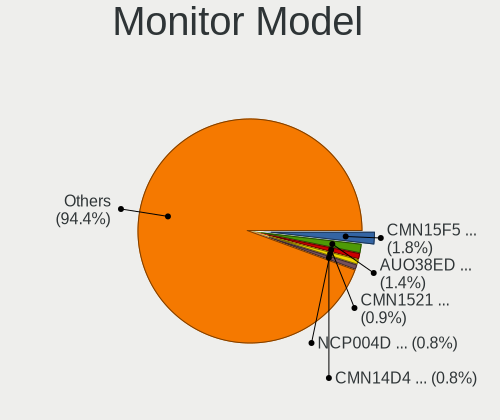

| Model                                                                | Computers | Percent |
|----------------------------------------------------------------------|-----------|---------|
| Chimei Innolux LCD Monitor CMN15F5 1920x1080 344x193mm 15.5-inch     | 93        | 1.87%   |
| AU Optronics LCD Monitor AUO38ED 1920x1080 344x193mm 15.5-inch       | 76        | 1.53%   |
| Chimei Innolux LCD Monitor CMN14D4 1920x1080 309x173mm 13.9-inch     | 47        | 0.95%   |
| BOE LCD Monitor BOE06A4 1366x768 344x194mm 15.5-inch                 | 41        | 0.82%   |
| Chimei Innolux LCD Monitor CMN14C3 1366x768 309x173mm 13.9-inch      | 38        | 0.76%   |
| BOE LCD Monitor BOE0687 1920x1080 344x193mm 15.5-inch                | 37        | 0.74%   |
| PANDA LCD Monitor NCP004D 1920x1080 344x194mm 15.5-inch              | 36        | 0.72%   |
| Chimei Innolux LCD Monitor CMN15DB 1366x768 344x193mm 15.5-inch      | 36        | 0.72%   |
| AU Optronics LCD Monitor AUO21ED 1920x1080 344x194mm 15.5-inch       | 36        | 0.72%   |
| Dell D1918H DEL2005 1366x768 410x230mm 18.5-inch                     | 33        | 0.66%   |
| Samsung Electronics LCD Monitor SEC5441 1366x768 309x174mm 14.0-inch | 30        | 0.6%    |
| AU Optronics LCD Monitor AUO2E3C 1366x768 309x173mm 13.9-inch        | 29        | 0.58%   |
| Chimei Innolux LCD Monitor CMN1521 1920x1080 344x193mm 15.5-inch     | 28        | 0.56%   |
| AU Optronics LCD Monitor AUO70EC 1366x768 344x193mm 15.5-inch        | 28        | 0.56%   |
| Chimei Innolux LCD Monitor CMN15E7 1920x1080 344x193mm 15.5-inch     | 27        | 0.54%   |
| BenQ GW2283 BNQ78E9 1920x1080 476x268mm 21.5-inch                    | 27        | 0.54%   |
| LG Display LCD Monitor LGD02DC 1366x768 344x194mm 15.5-inch          | 25        | 0.5%    |
| Goldstar LG IPS FULLHD GSM5AB8 1920x1080 480x270mm 21.7-inch         | 25        | 0.5%    |
| Chimei Innolux LCD Monitor CMN15D5 1920x1080 344x193mm 15.5-inch     | 25        | 0.5%    |
| AU Optronics LCD Monitor AUO45EC 1366x768 344x193mm 15.5-inch        | 25        | 0.5%    |
| Chimei Innolux LCD Monitor CMN14E5 1920x1080 309x173mm 13.9-inch     | 24        | 0.48%   |
| LG Display LCD Monitor LGD0456 1366x768 344x194mm 15.5-inch          | 23        | 0.46%   |
| Chimei Innolux LCD Monitor CMN14D6 1366x768 309x173mm 13.9-inch      | 23        | 0.46%   |
| BenQ GW2480 BNQ78E7 1920x1080 527x296mm 23.8-inch                    | 21        | 0.42%   |
| AU Optronics LCD Monitor AUO403D 1920x1080 309x174mm 14.0-inch       | 21        | 0.42%   |
| PANDA LCD Monitor NCP0036 1920x1080 344x194mm 15.5-inch              | 20        | 0.4%    |
| BOE LCD Monitor BOE07F6 1920x1080 309x174mm 14.0-inch                | 20        | 0.4%    |
| AU Optronics LCD Monitor AUO71EC 1366x768 344x193mm 15.5-inch        | 20        | 0.4%    |
| LG Display LCD Monitor LGD039F 1366x768 345x194mm 15.6-inch          | 19        | 0.38%   |
| PANDA LCD Monitor NCP002D 1920x1080 344x194mm 15.5-inch              | 17        | 0.34%   |
| Dell E1916HV DELF06C 1366x768 409x230mm 18.5-inch                    | 17        | 0.34%   |
| BOE LCD Monitor BOE06A9 1920x1080 344x193mm 15.5-inch                | 17        | 0.34%   |
| LG Display LCD Monitor LGD05E5 1920x1080 344x194mm 15.5-inch         | 16        | 0.32%   |
| BOE LCD Monitor BOE0812 1920x1080 344x194mm 15.5-inch                | 16        | 0.32%   |
| BOE LCD Monitor BOE07BD 1920x1080 309x174mm 14.0-inch                | 16        | 0.32%   |
| BOE LCD Monitor BOE0672 1366x768 344x194mm 15.5-inch                 | 16        | 0.32%   |
| AU Optronics LCD Monitor AUOD1ED 1920x1080 344x193mm 15.5-inch       | 16        | 0.32%   |
| Goldstar FULL HD GSM5B55 1920x1080 480x270mm 21.7-inch               | 15        | 0.3%    |
| BOE LCD Monitor BOE0671 1366x768 344x194mm 15.5-inch                 | 15        | 0.3%    |
| AU Optronics LCD Monitor AUO40EC 1366x768 344x193mm 15.5-inch        | 15        | 0.3%    |

Monitor Resolution
------------------

Monitor screen resolution

| Resolution         | Computers | Percent |
|--------------------|-----------|---------|
| 1920x1080 (FHD)    | 2375      | 49.79%  |
| 1366x768 (WXGA)    | 1595      | 33.44%  |
| 1600x900 (HD+)     | 146       | 3.06%   |
| 3840x2160 (4K)     | 116       | 2.43%   |
| 2560x1440 (QHD)    | 93        | 1.95%   |
| 1440x900 (WXGA+)   | 65        | 1.36%   |
| 1920x1200 (WUXGA)  | 54        | 1.13%   |
| 1280x800 (WXGA)    | 50        | 1.05%   |
| 2560x1600          | 36        | 0.75%   |
| 1360x768           | 29        | 0.61%   |
| 1280x1024 (SXGA)   | 29        | 0.61%   |
| 2560x1080          | 27        | 0.57%   |
| 2880x1800          | 24        | 0.5%    |
| 1680x1050 (WSXGA+) | 19        | 0.4%    |
| Unknown            | 15        | 0.31%   |
| 3200x2000          | 12        | 0.25%   |
| 3840x1080          | 9         | 0.19%   |
| 1024x768 (XGA)     | 9         | 0.19%   |
| 1024x600           | 7         | 0.15%   |
| 1280x720 (HD)      | 6         | 0.13%   |
| 3840x2400          | 4         | 0.08%   |
| 3440x1440          | 4         | 0.08%   |
| 2160x1440          | 4         | 0.08%   |
| 800x1280           | 3         | 0.06%   |
| 4093x4093          | 3         | 0.06%   |
| 3456x2160          | 3         | 0.06%   |
| 2288x1287          | 3         | 0.06%   |
| 2240x1400          | 3         | 0.06%   |
| 3072x1920          | 2         | 0.04%   |
| 2736x1824          | 2         | 0.04%   |
| 2256x1504          | 2         | 0.04%   |
| 1920x1280          | 2         | 0.04%   |
| 1280x768           | 2         | 0.04%   |
| 1152x864           | 2         | 0.04%   |
| 8160x4627          | 1         | 0.02%   |
| 6400x2160          | 1         | 0.02%   |
| 5760x2160          | 1         | 0.02%   |
| 4480x1080          | 1         | 0.02%   |
| 3840x1100          | 1         | 0.02%   |
| 3286x1080          | 1         | 0.02%   |

Monitor Diagonal
----------------

Diagonal size in inches

| Inches  | Computers | Percent |
|---------|-----------|---------|
| 15      | 2101      | 42.74%  |
| 13      | 629       | 12.79%  |
| 14      | 621       | 12.63%  |
| 21      | 286       | 5.82%   |
| 18      | 242       | 4.92%   |
| 24      | 152       | 3.09%   |
| 23      | 120       | 2.44%   |
| 19      | 115       | 2.34%   |
| 27      | 109       | 2.22%   |
| Unknown | 105       | 2.14%   |
| 20      | 61        | 1.24%   |
| 17      | 60        | 1.22%   |
| 12      | 55        | 1.12%   |
| 31      | 46        | 0.94%   |
| 16      | 43        | 0.87%   |
| 34      | 24        | 0.49%   |
| 11      | 20        | 0.41%   |
| 72      | 15        | 0.31%   |
| 26      | 14        | 0.28%   |
| 22      | 12        | 0.24%   |
| 40      | 11        | 0.22%   |
| 32      | 11        | 0.22%   |
| 10      | 10        | 0.2%    |
| 84      | 8         | 0.16%   |
| 46      | 7         | 0.14%   |
| 65      | 6         | 0.12%   |
| 25      | 5         | 0.1%    |
| 52      | 4         | 0.08%   |
| 54      | 3         | 0.06%   |
| 42      | 3         | 0.06%   |
| 39      | 3         | 0.06%   |
| 7       | 3         | 0.06%   |
| 142     | 2         | 0.04%   |
| 86      | 2         | 0.04%   |
| 36      | 2         | 0.04%   |
| 63      | 1         | 0.02%   |
| 61      | 1         | 0.02%   |
| 58      | 1         | 0.02%   |
| 48      | 1         | 0.02%   |
| 43      | 1         | 0.02%   |

Monitor Width
-------------

Physical width

| Width in mm    | Computers | Percent |
|----------------|-----------|---------|
| 301-350        | 3194      | 65.32%  |
| 401-500        | 701       | 14.34%  |
| 501-600        | 368       | 7.53%   |
| 201-300        | 244       | 4.99%   |
| 351-400        | 108       | 2.21%   |
| Unknown        | 105       | 2.15%   |
| 601-700        | 60        | 1.23%   |
| 701-800        | 37        | 0.76%   |
| 1001-1500      | 26        | 0.53%   |
| 1501-2000      | 23        | 0.47%   |
| 801-900        | 15        | 0.31%   |
| 901-1000       | 4         | 0.08%   |
| 1-100          | 3         | 0.06%   |
| More than 2000 | 2         | 0.04%   |

Aspect Ratio
------------

Proportional relationship between the width and the height

| Ratio   | Computers | Percent |
|---------|-----------|---------|
| 16/9    | 4119      | 89.62%  |
| 16/10   | 265       | 5.77%   |
| Unknown | 99        | 2.15%   |
| 5/4     | 27        | 0.59%   |
| 4/3     | 27        | 0.59%   |
| 21/9    | 26        | 0.57%   |
| 3/2     | 13        | 0.28%   |
| 6/5     | 6         | 0.13%   |
| 2.00    | 5         | 0.11%   |
| 0.67    | 3         | 0.07%   |
| 1.00    | 2         | 0.04%   |
| 0.56    | 2         | 0.04%   |
| 32/9    | 1         | 0.02%   |
| 3.40    | 1         | 0.02%   |

Monitor Area
------------

Area in inch

| Area in inch | Computers | Percent |
|----------------|-----------|---------|
| 101-110        | 2089      | 42.56%  |
| 81-90          | 1128      | 22.98%  |
| 201-250        | 486       | 9.9%    |
| 141-150        | 254       | 5.18%   |
| 151-200        | 235       | 4.79%   |
| 71-80          | 125       | 2.55%   |
| 301-350        | 113       | 2.3%    |
| Unknown        | 105       | 2.14%   |
| 351-500        | 82        | 1.67%   |
| 61-70          | 45        | 0.92%   |
| More than 1000 | 43        | 0.88%   |
| 121-130        | 42        | 0.86%   |
| 111-120        | 37        | 0.75%   |
| 251-300        | 35        | 0.71%   |
| 501-1000       | 28        | 0.57%   |
| 51-60          | 21        | 0.43%   |
| 91-100         | 17        | 0.35%   |
| 41-50          | 10        | 0.2%    |
| 131-140        | 10        | 0.2%    |
| 1-40           | 3         | 0.06%   |

Pixel Density
-------------

Pixels per inch

| Density       | Computers | Percent |
|---------------|-----------|---------|
| 121-160       | 1865      | 38.43%  |
| 101-120       | 1570      | 32.35%  |
| 51-100        | 985       | 20.3%   |
| 161-240       | 214       | 4.41%   |
| Unknown       | 105       | 2.16%   |
| More than 240 | 64        | 1.32%   |
| 1-50          | 50        | 1.03%   |

Multiple Monitors
-----------------

Total monitors connected

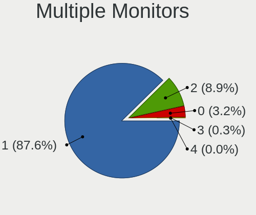

| Total | Computers | Percent |
|-------|-----------|---------|
| 1     | 4281      | 88.38%  |
| 2     | 402       | 8.3%    |
| 0     | 152       | 3.14%   |
| 3     | 9         | 0.19%   |

Network
-------

Net Controller Vendor
---------------------

Controller vendors

| Vendor                            | Computers | Percent |
|-----------------------------------|-----------|---------|
| Realtek Semiconductor             | 3223      | 42.53%  |
| Intel                             | 1982      | 26.15%  |
| Qualcomm Atheros                  | 900       | 11.87%  |
| Broadcom                          | 309       | 4.08%   |
| MediaTek                          | 142       | 1.87%   |
| Ralink Technology                 | 136       | 1.79%   |
| Xiaomi                            | 114       | 1.5%    |
| TP-Link                           | 109       | 1.44%   |
| Ralink                            | 73        | 0.96%   |
| Samsung Electronics               | 70        | 0.92%   |
| OPPO Electronics                  | 69        | 0.91%   |
| Broadcom Limited                  | 61        | 0.8%    |
| Qualcomm                          | 48        | 0.63%   |
| D-Link                            | 36        | 0.47%   |
| Marvell Technology Group          | 33        | 0.44%   |
| ASIX Electronics                  | 32        | 0.42%   |
| OnePlus Technology (Shenzhen)     | 25        | 0.33%   |
| Huawei Technologies               | 24        | 0.32%   |
| Motorola PCS                      | 21        | 0.28%   |
| Qualcomm Atheros Communications   | 15        | 0.2%    |
| Foxconn / Hon Hai                 | 15        | 0.2%    |
| Nvidia                            | 14        | 0.18%   |
| ICS Advent                        | 10        | 0.13%   |
| Google                            | 10        | 0.13%   |
| vivo                              | 8         | 0.11%   |
| NetGear                           | 8         | 0.11%   |
| Lenovo                            | 7         | 0.09%   |
| JMicron Technology                | 7         | 0.09%   |
| Edimax Technology                 | 6         | 0.08%   |
| DisplayLink                       | 6         | 0.08%   |
| NTmore                            | 5         | 0.07%   |
| HMD Global                        | 5         | 0.07%   |
| Dell                              | 5         | 0.07%   |
| ASUSTek Computer                  | 5         | 0.07%   |
| Microchip Technology              | 4         | 0.05%   |
| D-Link System                     | 4         | 0.05%   |
| Ericsson Business Mobile Networks | 3         | 0.04%   |
| Aquantia                          | 3         | 0.04%   |
| ZTE WCDMA Technologies MSM        | 2         | 0.03%   |
| Spreadtrum Communications         | 2         | 0.03%   |

Net Controller Model
--------------------

Controller models

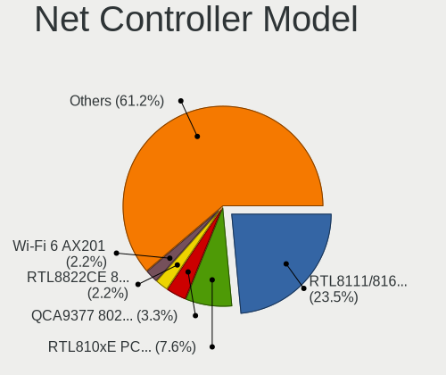

| Model                                                             | Computers | Percent |
|-------------------------------------------------------------------|-----------|---------|
| Realtek RTL8111/8168/8411 PCI Express Gigabit Ethernet Controller | 2108      | 23.92%  |
| Realtek RTL810xE PCI Express Fast Ethernet controller             | 719       | 8.16%   |
| Qualcomm Atheros QCA9377 802.11ac Wireless Network Adapter        | 320       | 3.63%   |
| Realtek RTL8822CE 802.11ac PCIe Wireless Network Adapter          | 187       | 2.12%   |
| Intel Wi-Fi 6 AX201                                               | 178       | 2.02%   |
| Intel Wi-Fi 6 AX200                                               | 163       | 1.85%   |
| Qualcomm Atheros QCA9565 / AR9565 Wireless Network Adapter        | 159       | 1.8%    |
| Intel Wireless 8265 / 8275                                        | 156       | 1.77%   |
| Intel Comet Lake PCH-LP CNVi WiFi                                 | 132       | 1.5%    |
| Realtek RTL8821CE 802.11ac PCIe Wireless Network Adapter          | 121       | 1.37%   |
| Realtek RTL8723BE PCIe Wireless Network Adapter                   | 118       | 1.34%   |
| Ralink MT7601U Wireless Adapter                                   | 118       | 1.34%   |
| Intel Cannon Lake PCH CNVi WiFi                                   | 111       | 1.26%   |
| Broadcom BCM43142 802.11b/g/n                                     | 110       | 1.25%   |
| Realtek RTL8723DE Wireless Network Adapter                        | 106       | 1.2%    |
| Intel Cannon Point-LP CNVi [Wireless-AC]                          | 105       | 1.19%   |
| Qualcomm Atheros AR9485 Wireless Network Adapter                  | 96        | 1.09%   |
| Qualcomm Atheros QCA6174 802.11ac Wireless Network Adapter        | 95        | 1.08%   |
| Intel Alder Lake-P PCH CNVi WiFi                                  | 91        | 1.03%   |
| Realtek RTL8188EUS 802.11n Wireless Network Adapter               | 89        | 1.01%   |
| Qualcomm Atheros AR9285 Wireless Network Adapter (PCI-Express)    | 88        | 1%      |
| Intel 82579LM Gigabit Network Connection (Lewisville)             | 88        | 1%      |
| Realtek RTL8188FTV 802.11b/g/n 1T1R 2.4G WLAN Adapter             | 86        | 0.98%   |
| Intel Wireless 7265                                               | 86        | 0.98%   |
| MediaTek MT7921 802.11ax PCI Express Wireless Network Adapter     | 82        | 0.93%   |
| Xiaomi Mi/Redmi series (RNDIS)                                    | 81        | 0.92%   |
| Intel Wireless 3165                                               | 79        | 0.9%    |
| Intel Wireless 3160                                               | 72        | 0.82%   |
| Broadcom BCM4313 802.11bgn Wireless Network Adapter               | 66        | 0.75%   |
| Realtek RTL8822BE 802.11a/b/g/n/ac WiFi adapter                   | 61        | 0.69%   |
| OPPO RMX3623                                                      | 61        | 0.69%   |
| Intel Ice Lake-LP PCH CNVi WiFi                                   | 59        | 0.67%   |
| Ralink RT3290 Wireless 802.11n 1T/1R PCIe                         | 57        | 0.65%   |
| Intel Wireless 8260                                               | 54        | 0.61%   |
| Samsung Galaxy series, misc. (tethering mode)                     | 52        | 0.59%   |
| Realtek RTL8852AE 802.11ax PCIe Wireless Network Adapter          | 49        | 0.56%   |
| Realtek RTL8125 2.5GbE Controller                                 | 47        | 0.53%   |
| Intel Dual Band Wireless-AC 3168NGW [Stone Peak]                  | 45        | 0.51%   |
| Intel Comet Lake PCH CNVi WiFi                                    | 45        | 0.51%   |
| Intel Wireless 7260                                               | 42        | 0.48%   |

Wireless Vendor
---------------

Wireless vendors

| Vendor                            | Computers | Percent |
|-----------------------------------|-----------|---------|
| Intel                             | 1725      | 39.56%  |
| Realtek Semiconductor             | 1004      | 23.03%  |
| Qualcomm Atheros                  | 803       | 18.42%  |
| Broadcom                          | 259       | 5.94%   |
| Ralink Technology                 | 136       | 3.12%   |
| MediaTek                          | 122       | 2.8%    |
| TP-Link                           | 100       | 2.29%   |
| Ralink                            | 72        | 1.65%   |
| Broadcom Limited                  | 47        | 1.08%   |
| D-Link                            | 36        | 0.83%   |
| Qualcomm Atheros Communications   | 15        | 0.34%   |
| Qualcomm                          | 10        | 0.23%   |
| NetGear                           | 8         | 0.18%   |
| Edimax Technology                 | 6         | 0.14%   |
| Dell                              | 4         | 0.09%   |
| Sierra Wireless                   | 2         | 0.05%   |
| D-Link System                     | 2         | 0.05%   |
| ASUSTek Computer                  | 2         | 0.05%   |
| Wacom                             | 1         | 0.02%   |
| Philips (or NXP)                  | 1         | 0.02%   |
| Micro Star International          | 1         | 0.02%   |
| Marvell Technology Group          | 1         | 0.02%   |
| IMC Networks                      | 1         | 0.02%   |
| Ericsson Business Mobile Networks | 1         | 0.02%   |
| Belkin Components                 | 1         | 0.02%   |

Wireless Model
--------------

Wireless models

| Model                                                          | Computers | Percent |
|----------------------------------------------------------------|-----------|---------|
| Qualcomm Atheros QCA9377 802.11ac Wireless Network Adapter     | 320       | 7.31%   |
| Realtek RTL8822CE 802.11ac PCIe Wireless Network Adapter       | 187       | 4.27%   |
| Intel Wi-Fi 6 AX201                                            | 178       | 4.06%   |
| Intel Wi-Fi 6 AX200                                            | 163       | 3.72%   |
| Qualcomm Atheros QCA9565 / AR9565 Wireless Network Adapter     | 159       | 3.63%   |
| Intel Wireless 8265 / 8275                                     | 156       | 3.56%   |
| Intel Comet Lake PCH-LP CNVi WiFi                              | 132       | 3.01%   |
| Realtek RTL8821CE 802.11ac PCIe Wireless Network Adapter       | 121       | 2.76%   |
| Realtek RTL8723BE PCIe Wireless Network Adapter                | 118       | 2.69%   |
| Ralink MT7601U Wireless Adapter                                | 118       | 2.69%   |
| Intel Cannon Lake PCH CNVi WiFi                                | 111       | 2.53%   |
| Broadcom BCM43142 802.11b/g/n                                  | 110       | 2.51%   |
| Realtek RTL8723DE Wireless Network Adapter                     | 106       | 2.42%   |
| Intel Cannon Point-LP CNVi [Wireless-AC]                       | 105       | 2.4%    |
| Qualcomm Atheros AR9485 Wireless Network Adapter               | 96        | 2.19%   |
| Qualcomm Atheros QCA6174 802.11ac Wireless Network Adapter     | 95        | 2.17%   |
| Intel Alder Lake-P PCH CNVi WiFi                               | 91        | 2.08%   |
| Realtek RTL8188EUS 802.11n Wireless Network Adapter            | 89        | 2.03%   |
| Qualcomm Atheros AR9285 Wireless Network Adapter (PCI-Express) | 88        | 2.01%   |
| Realtek RTL8188FTV 802.11b/g/n 1T1R 2.4G WLAN Adapter          | 86        | 1.96%   |
| Intel Wireless 7265                                            | 86        | 1.96%   |
| MediaTek MT7921 802.11ax PCI Express Wireless Network Adapter  | 82        | 1.87%   |
| Intel Wireless 3165                                            | 79        | 1.8%    |
| Intel Wireless 3160                                            | 72        | 1.64%   |
| Broadcom BCM4313 802.11bgn Wireless Network Adapter            | 66        | 1.51%   |
| Realtek RTL8822BE 802.11a/b/g/n/ac WiFi adapter                | 61        | 1.39%   |
| Intel Ice Lake-LP PCH CNVi WiFi                                | 59        | 1.35%   |
| Ralink RT3290 Wireless 802.11n 1T/1R PCIe                      | 57        | 1.3%    |
| Intel Wireless 8260                                            | 54        | 1.23%   |
| Realtek RTL8852AE 802.11ax PCIe Wireless Network Adapter       | 49        | 1.12%   |
| Intel Dual Band Wireless-AC 3168NGW [Stone Peak]               | 45        | 1.03%   |
| Intel Comet Lake PCH CNVi WiFi                                 | 45        | 1.03%   |
| Intel Wireless 7260                                            | 42        | 0.96%   |
| Intel Dual Band Wireless-AC 3165 Plus Bluetooth                | 37        | 0.84%   |
| Intel Wireless-AC 9260                                         | 34        | 0.78%   |
| Intel Centrino Advanced-N 6205 [Taylor Peak]                   | 34        | 0.78%   |
| Realtek RTL8188EE Wireless Network Adapter                     | 27        | 0.62%   |
| Realtek RTL8852BE PCIe 802.11ax Wireless Network Controller    | 25        | 0.57%   |
| TP-Link TL-WN823N v2/v3 [Realtek RTL8192EU]                    | 24        | 0.55%   |
| Intel Centrino Wireless-N 1000 [Condor Peak]                   | 22        | 0.5%    |

Ethernet Vendor
---------------

Ethernet vendors

| Vendor                           | Computers | Percent |
|----------------------------------|-----------|---------|
| Realtek Semiconductor            | 2941      | 68.17%  |
| Intel                            | 622       | 14.42%  |
| Qualcomm Atheros                 | 143       | 3.31%   |
| Xiaomi                           | 114       | 2.64%   |
| Broadcom                         | 76        | 1.76%   |
| OPPO Electronics                 | 69        | 1.6%    |
| Samsung Electronics              | 52        | 1.21%   |
| Qualcomm                         | 38        | 0.88%   |
| Marvell Technology Group         | 32        | 0.74%   |
| ASIX Electronics                 | 32        | 0.74%   |
| MediaTek                         | 22        | 0.51%   |
| Huawei Technologies              | 20        | 0.46%   |
| OnePlus Technology (Shenzhen)    | 19        | 0.44%   |
| Broadcom Limited                 | 14        | 0.32%   |
| Motorola PCS                     | 13        | 0.3%    |
| Nvidia                           | 12        | 0.28%   |
| ICS Advent                       | 10        | 0.23%   |
| Google                           | 10        | 0.23%   |
| TP-Link                          | 9         | 0.21%   |
| JMicron Technology               | 7         | 0.16%   |
| vivo                             | 6         | 0.14%   |
| Lenovo                           | 6         | 0.14%   |
| DisplayLink                      | 6         | 0.14%   |
| NTmore                           | 5         | 0.12%   |
| HMD Global                       | 5         | 0.12%   |
| Foxconn / Hon Hai                | 4         | 0.09%   |
| Microchip Technology             | 3         | 0.07%   |
| ASUSTek Computer                 | 3         | 0.07%   |
| Aquantia                         | 3         | 0.07%   |
| Spreadtrum Communications        | 2         | 0.05%   |
| Silicon Integrated Systems [SiS] | 2         | 0.05%   |
| D-Link System                    | 2         | 0.05%   |
| Attansic Technology              | 2         | 0.05%   |
| ZTE WCDMA Technologies MSM       | 1         | 0.02%   |
| VIA Technologies                 | 1         | 0.02%   |
| Standard Microsystems            | 1         | 0.02%   |
| LG Electronics                   | 1         | 0.02%   |
| LeEco                            | 1         | 0.02%   |
| HTC (High Tech Computer)         | 1         | 0.02%   |
| Emulex                           | 1         | 0.02%   |

Ethernet Model
--------------

Ethernet models

| Model                                                             | Computers | Percent |
|-------------------------------------------------------------------|-----------|---------|
| Realtek RTL8111/8168/8411 PCI Express Gigabit Ethernet Controller | 2108      | 48.33%  |
| Realtek RTL810xE PCI Express Fast Ethernet controller             | 719       | 16.48%  |
| Intel 82579LM Gigabit Network Connection (Lewisville)             | 88        | 2.02%   |
| Xiaomi Mi/Redmi series (RNDIS)                                    | 81        | 1.86%   |
| OPPO RMX3623                                                      | 61        | 1.4%    |
| Samsung Galaxy series, misc. (tethering mode)                     | 52        | 1.19%   |
| Realtek RTL8125 2.5GbE Controller                                 | 47        | 1.08%   |
| Intel Ethernet Connection I219-LM                                 | 36        | 0.83%   |
| Intel Ethernet Connection (4) I219-LM                             | 36        | 0.83%   |
| Intel Ethernet Connection (4) I219-V                              | 35        | 0.8%    |
| Xiaomi Mi/Redmi series (RNDIS + ADB)                              | 33        | 0.76%   |
| Qualcomm Redmi 9T                                                 | 31        | 0.71%   |
| Intel Ethernet Connection I217-LM                                 | 31        | 0.71%   |
| Realtek RTL8153 Gigabit Ethernet Adapter                          | 30        | 0.69%   |
| Realtek Killer E2600 Gigabit Ethernet Controller                  | 30        | 0.69%   |
| Intel Ethernet Connection (2) I219-V                              | 29        | 0.66%   |
| Intel 82579V Gigabit Network Connection                           | 29        | 0.66%   |
| Intel Ethernet Connection I218-LM                                 | 28        | 0.64%   |
| Intel I211 Gigabit Network Connection                             | 27        | 0.62%   |
| ASIX AX88179 Gigabit Ethernet                                     | 26        | 0.6%    |
| Qualcomm Atheros QCA8172 Fast Ethernet                            | 23        | 0.53%   |
| Intel Ethernet Controller I225-V                                  | 21        | 0.48%   |
| Intel Ethernet Connection (3) I218-LM                             | 21        | 0.48%   |
| OnePlus (Shenzhen) Android                                        | 19        | 0.44%   |
| Intel Ethernet Connection (7) I219-LM                             | 17        | 0.39%   |
| Intel Ethernet Connection (10) I219-V                             | 17        | 0.39%   |
| Intel 82577LM Gigabit Network Connection                          | 17        | 0.39%   |
| Qualcomm Atheros AR8162 Fast Ethernet                             | 16        | 0.37%   |
| MediaTek X55                                                      | 16        | 0.37%   |
| Qualcomm Atheros QCA8171 Gigabit Ethernet                         | 15        | 0.34%   |
| Intel Ethernet Connection (7) I219-V                              | 15        | 0.34%   |
| Intel Ethernet Connection (6) I219-V                              | 15        | 0.34%   |
| Intel Ethernet Connection (6) I219-LM                             | 15        | 0.34%   |
| Intel Ethernet Connection (2) I219-LM                             | 15        | 0.34%   |
| Broadcom NetLink BCM57785 Gigabit Ethernet PCIe                   | 15        | 0.34%   |
| Realtek RTL8152 Fast Ethernet Adapter                             | 13        | 0.3%    |
| Qualcomm Atheros Killer E2500 Gigabit Ethernet Controller         | 13        | 0.3%    |
| Qualcomm Atheros AR8152 v2.0 Fast Ethernet                        | 13        | 0.3%    |
| Qualcomm Atheros AR8151 v2.0 Gigabit Ethernet                     | 13        | 0.3%    |
| Motorola PCS moto g62 5G                                          | 13        | 0.3%    |

Net Controller Kind
-------------------

Ethernet, WiFi or modem

| Kind     | Computers | Percent |
|----------|-----------|---------|
| WiFi     | 4201      | 51.24%  |
| Ethernet | 3926      | 47.89%  |
| Modem    | 38        | 0.46%   |
| Unknown  | 33        | 0.4%    |

Used Controller
---------------

Currently used network controller

| Kind     | Computers | Percent |
|----------|-----------|---------|
| WiFi     | 3477      | 72.98%  |
| Ethernet | 1281      | 26.89%  |
| Unknown  | 4         | 0.08%   |
| Modem    | 2         | 0.04%   |

NICs
----

Total network controllers on board

| Total | Computers | Percent |
|-------|-----------|---------|
| 2     | 2890      | 60.3%   |
| 1     | 1787      | 37.28%  |
| 0     | 69        | 1.44%   |
| 3     | 35        | 0.73%   |
| 4     | 8         | 0.17%   |
| 6     | 2         | 0.04%   |
| 10    | 1         | 0.02%   |
| 8     | 1         | 0.02%   |

IPv6
----

IPv6 vs IPv4

| Used | Computers | Percent |
|------|-----------|---------|
| No   | 3846      | 78.89%  |
| Yes  | 1029      | 21.11%  |

Bluetooth
---------

Bluetooth Vendor
----------------

Controller vendors

| Vendor                          | Computers | Percent |
|---------------------------------|-----------|---------|
| Intel                           | 1516      | 42.05%  |
| Realtek Semiconductor           | 581       | 16.12%  |
| Qualcomm Atheros Communications | 492       | 13.65%  |
| IMC Networks                    | 188       | 5.21%   |
| Broadcom                        | 174       | 4.83%   |
| Cambridge Silicon Radio         | 146       | 4.05%   |
| Lite-On Technology              | 138       | 3.83%   |
| Foxconn / Hon Hai               | 115       | 3.19%   |
| Ralink                          | 57        | 1.58%   |
| Dell                            | 39        | 1.08%   |
| Apple                           | 36        | 1%      |
| TP-Link                         | 24        | 0.67%   |
| Hewlett-Packard                 | 18        | 0.5%    |
| MediaTek                        | 15        | 0.42%   |
| Toshiba                         | 10        | 0.28%   |
| Foxconn International           | 10        | 0.28%   |
| ASUSTek Computer                | 9         | 0.25%   |
| Realtek                         | 8         | 0.22%   |
| Ralink Technology               | 7         | 0.19%   |
| Opticis                         | 5         | 0.14%   |
| Integrated System Solution      | 4         | 0.11%   |
| USI                             | 3         | 0.08%   |
| SINO WEALTH                     | 2         | 0.06%   |
| Chicony Electronics             | 2         | 0.06%   |
| Unknown                         | 2         | 0.06%   |
| Micro Star International        | 1         | 0.03%   |
| Belkin Components               | 1         | 0.03%   |
| Alps Electric                   | 1         | 0.03%   |
| Accel Semiconductor             | 1         | 0.03%   |

Bluetooth Model
---------------

Controller models

| Model                                               | Computers | Percent |
|-----------------------------------------------------|-----------|---------|
| Intel Bluetooth wireless interface                  | 480       | 13.31%  |
| Intel Bluetooth 9460/9560 Jefferson Peak (JfP)      | 339       | 9.4%    |
| Intel AX201 Bluetooth                               | 332       | 9.21%   |
| Realtek Bluetooth Radio                             | 324       | 8.99%   |
| Qualcomm Atheros  Bluetooth Device                  | 295       | 8.18%   |
| Intel AX200 Bluetooth                               | 160       | 4.44%   |
| Realtek  Bluetooth 4.2 Adapter                      | 155       | 4.3%    |
| Cambridge Silicon Radio Bluetooth Dongle (HCI mode) | 146       | 4.05%   |
| Intel Bluetooth Device                              | 78        | 2.16%   |
| IMC Networks Bluetooth Radio                        | 70        | 1.94%   |
| Realtek 802.11ac WLAN Adapter                       | 66        | 1.83%   |
| IMC Networks Wireless_Device                        | 59        | 1.64%   |
| Qualcomm Atheros AR9462 Bluetooth                   | 58        | 1.61%   |
| Ralink RT3290 Bluetooth                             | 57        | 1.58%   |
| IMC Networks Bluetooth Device                       | 56        | 1.55%   |
| Lite-On Bluetooth Device                            | 50        | 1.39%   |
| Lite-On Qualcomm Atheros QCA9377 Bluetooth          | 48        | 1.33%   |
| Qualcomm Atheros AR3011 Bluetooth                   | 45        | 1.25%   |
| Intel Wireless-AC 3168 Bluetooth                    | 43        | 1.19%   |
| Broadcom BCM43142 Bluetooth 4.0                     | 42        | 1.16%   |
| Qualcomm Atheros AR3012 Bluetooth 4.0               | 39        | 1.08%   |
| Qualcomm Atheros QCA61x4 Bluetooth 4.0              | 33        | 0.92%   |
| Intel Centrino Bluetooth Wireless Transceiver       | 29        | 0.8%    |
| Broadcom BCM43142A0 Bluetooth 4.0                   | 26        | 0.72%   |
| TP-Link TP-Cdj+ UB5A Adapter                        | 24        | 0.67%   |
| Intel Wireless-AC 9260 Bluetooth Adapter            | 24        | 0.67%   |
| Foxconn / Hon Hai Bluetooth Device                  | 23        | 0.64%   |
| Apple Bluetooth USB Host Controller                 | 19        | 0.53%   |
| Intel Centrino Advanced-N 6230 Bluetooth adapter    | 18        | 0.5%    |
| Broadcom BCM43142A0 Bluetooth Device                | 18        | 0.5%    |
| Realtek RTL8822BE Bluetooth 4.2 Adapter             | 17        | 0.47%   |
| Realtek RTL8723B Bluetooth                          | 17        | 0.47%   |
| Broadcom BCM2070 Bluetooth 2.1 + EDR                | 17        | 0.47%   |
| Foxconn / Hon Hai MediaTek Bluetooth Adapter        | 16        | 0.44%   |
| Foxconn / Hon Hai Bluetooth USB Host Controller     | 16        | 0.44%   |
| Lite-On Wireless_Device                             | 15        | 0.42%   |
| Intel AX210 Bluetooth                               | 14        | 0.39%   |
| Dell Wireless 365 Bluetooth                         | 13        | 0.36%   |
| MediaTek Wireless_Device                            | 12        | 0.33%   |
| Foxconn / Hon Hai Wireless_Device                   | 12        | 0.33%   |

Sound
-----

Sound Vendor
------------

Sound card vendors

| Vendor                                       | Computers | Percent |
|----------------------------------------------|-----------|---------|
| Intel                                        | 3737      | 64.38%  |
| AMD                                          | 1033      | 17.8%   |
| Nvidia                                       | 803       | 13.83%  |
| C-Media Electronics                          | 40        | 0.69%   |
| GN Netcom                                    | 20        | 0.34%   |
| Creative Labs                                | 12        | 0.21%   |
| Texas Instruments                            | 10        | 0.17%   |
| Plantronics                                  | 9         | 0.16%   |
| JMTek                                        | 9         | 0.16%   |
| Generalplus Technology                       | 9         | 0.16%   |
| ASUSTek Computer                             | 9         | 0.16%   |
| Realtek Semiconductor                        | 8         | 0.14%   |
| Logitech                                     | 7         | 0.12%   |
| DSEA A/S                                     | 7         | 0.12%   |
| Creative Technology                          | 6         | 0.1%    |
| Tenx Technology                              | 5         | 0.09%   |
| OPPO Electronics                             | 5         | 0.09%   |
| SteelSeries ApS                              | 4         | 0.07%   |
| Silicon Integrated Systems [SiS]             | 4         | 0.07%   |
| Micro Star International                     | 3         | 0.05%   |
| Lenovo                                       | 3         | 0.05%   |
| Hewlett-Packard                              | 3         | 0.05%   |
| Corsair                                      | 3         | 0.05%   |
| BR25                                         | 3         | 0.05%   |
| YSTEK Technology                             | 2         | 0.03%   |
| M-Audio                                      | 2         | 0.03%   |
| Kingston Technology                          | 2         | 0.03%   |
| GYROCOM C&C                                  | 2         | 0.03%   |
| Giga-Byte Technology                         | 2         | 0.03%   |
| Focusrite-Novation                           | 2         | 0.03%   |
| DCMT Technology                              | 2         | 0.03%   |
| ClearOne Communications                      | 2         | 0.03%   |
| Cambridge Silicon Radio                      | 2         | 0.03%   |
| Apple                                        | 2         | 0.03%   |
| Zoran Co. Personal Media Division (Nogatech) | 1         | 0.02%   |
| ZOOM                                         | 1         | 0.02%   |
| Yamaha                                       | 1         | 0.02%   |
| XMOS                                         | 1         | 0.02%   |
| VIA Technologies                             | 1         | 0.02%   |
| Vault                                        | 1         | 0.02%   |

Sound Model
-----------

Sound card models

| Model                                                                      | Computers | Percent |
|----------------------------------------------------------------------------|-----------|---------|
| Intel Sunrise Point-LP HD Audio                                            | 682       | 9.68%   |
| AMD Family 17h/19h HD Audio Controller                                     | 588       | 8.35%   |
| Intel 7 Series/C216 Chipset Family High Definition Audio Controller        | 287       | 4.07%   |
| Intel 6 Series/C200 Series Chipset Family High Definition Audio Controller | 284       | 4.03%   |
| AMD Renoir Radeon High Definition Audio Controller                         | 253       | 3.59%   |
| Intel Tiger Lake-LP Smart Sound Technology Audio Controller                | 244       | 3.46%   |
| Intel Cannon Lake PCH cAVS                                                 | 215       | 3.05%   |
| AMD Raven/Raven2/Fenghuang HDMI/DP Audio Controller                        | 207       | 2.94%   |
| Intel Cannon Point-LP High Definition Audio Controller                     | 199       | 2.83%   |
| Intel 8 Series HD Audio Controller                                         | 198       | 2.81%   |
| Intel Haswell-ULT HD Audio Controller                                      | 196       | 2.78%   |
| Intel Comet Lake PCH-LP cAVS                                               | 174       | 2.47%   |
| Nvidia TU107 GeForce GTX 1650 High Definition Audio Controller             | 168       | 2.39%   |
| Intel NM10/ICH7 Family High Definition Audio Controller                    | 160       | 2.27%   |
| Intel Broadwell-U Audio Controller                                         | 147       | 2.09%   |
| Intel Wildcat Point-LP High Definition Audio Controller                    | 146       | 2.07%   |
| Intel 8 Series/C220 Series Chipset High Definition Audio Controller        | 146       | 2.07%   |
| Intel 5 Series/3400 Series Chipset High Definition Audio                   | 132       | 1.87%   |
| Intel Xeon E3-1200 v3/4th Gen Core Processor HD Audio Controller           | 127       | 1.8%    |
| AMD FCH Azalia Controller                                                  | 114       | 1.62%   |
| Intel Alder Lake PCH-P High Definition Audio Controller                    | 111       | 1.58%   |
| Nvidia GK208 HDMI/DP Audio Controller                                      | 110       | 1.56%   |
| Intel Ice Lake-LP Smart Sound Technology Audio Controller                  | 108       | 1.53%   |
| Intel 100 Series/C230 Series Chipset Family HD Audio Controller            | 95        | 1.35%   |
| AMD Family 15h (Models 60h-6fh) Audio Controller                           | 85        | 1.21%   |
| AMD Kabini HDMI/DP Audio                                                   | 77        | 1.09%   |
| Intel Comet Lake PCH cAVS                                                  | 74        | 1.05%   |
| Nvidia GP107GL High Definition Audio Controller                            | 70        | 0.99%   |
| AMD Starship/Matisse HD Audio Controller                                   | 69        | 0.98%   |
| Intel 200 Series PCH HD Audio                                              | 67        | 0.95%   |
| AMD High Definition Audio Controller                                       | 67        | 0.95%   |
| Intel 82801I (ICH9 Family) HD Audio Controller                             | 66        | 0.94%   |
| Nvidia Audio device                                                        | 56        | 0.8%    |
| Nvidia TU116 High Definition Audio Controller                              | 55        | 0.78%   |
| AMD SBx00 Azalia (Intel HDA)                                               | 54        | 0.77%   |
| Nvidia High Definition Audio Controller                                    | 45        | 0.64%   |
| AMD Family 17h (Models 00h-0fh) HD Audio Controller                        | 43        | 0.61%   |
| Intel CM238 HD Audio Controller                                            | 39        | 0.55%   |
| Nvidia GA106 High Definition Audio Controller                              | 38        | 0.54%   |
| Intel Tiger Lake-H HD Audio Controller                                     | 37        | 0.53%   |

Memory
------

Memory Vendor
-------------

Memory module vendors

| Vendor                       | Computers | Percent |
|------------------------------|-----------|---------|
| Samsung Electronics          | 853       | 26.34%  |
| SK hynix                     | 760       | 23.47%  |
| Micron Technology            | 421       | 13%     |
| Kingston                     | 275       | 8.49%   |
| Crucial                      | 188       | 5.81%   |
| Unknown                      | 151       | 4.66%   |
| A-DATA Technology            | 124       | 3.83%   |
| Corsair                      | 117       | 3.61%   |
| Ramaxel Technology           | 107       | 3.3%    |
| Transcend                    | 61        | 1.88%   |
| G.Skill                      | 37        | 1.14%   |
| CSX                          | 31        | 0.96%   |
| Nanya Technology             | 23        | 0.71%   |
| Elpida                       | 22        | 0.68%   |
| Unknown                      | 14        | 0.43%   |
| Unknown (ABCD)               | 8         | 0.25%   |
| OM Nanotech                  | 6         | 0.19%   |
| Silicon Power                | 5         | 0.15%   |
| ZION                         | 3         | 0.09%   |
| Avant                        | 3         | 0.09%   |
| Unknown (0x0CDC)             | 2         | 0.06%   |
| Team                         | 2         | 0.06%   |
| Kllisre                      | 2         | 0.06%   |
| Gold Key                     | 2         | 0.06%   |
| ASint Technology             | 2         | 0.06%   |
| Apacer                       | 2         | 0.06%   |
| Unknown (0xAD44594E45540000) | 1         | 0.03%   |
| Unknown (0x1007)             | 1         | 0.03%   |
| Unknown (0x0CAB)             | 1         | 0.03%   |
| Unknown (0x0080)             | 1         | 0.03%   |
| Unknown (09D5)               | 1         | 0.03%   |
| Unknown (07F7)               | 1         | 0.03%   |
| Strontium                    | 1         | 0.03%   |
| SHARETRONIC                  | 1         | 0.03%   |
| Ramos Technology             | 1         | 0.03%   |
| Qumo                         | 1         | 0.03%   |
| Qimonda                      | 1         | 0.03%   |
| Patriot Memory (PDP Systems) | 1         | 0.03%   |
| NETSOL                       | 1         | 0.03%   |
| Lexar Co Limited             | 1         | 0.03%   |

Memory Model
------------

Memory module models

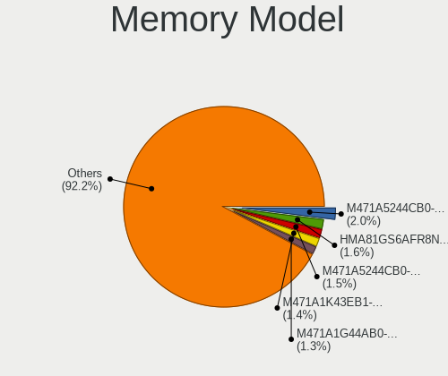

| Model                                                       | Computers | Percent |
|-------------------------------------------------------------|-----------|---------|
| Samsung RAM M471A5244CB0-CTD 4GB SODIMM DDR4 3266MT/s       | 73        | 2.14%   |
| Samsung RAM M471A5244CB0-CRC 4096MB SODIMM DDR4 2667MT/s    | 61        | 1.79%   |
| SK hynix RAM HMA81GS6AFR8N-UH 8GB SODIMM DDR4 2667MT/s      | 56        | 1.64%   |
| Samsung RAM M471A1G44AB0-CWE 8GB SODIMM DDR4 3200MT/s       | 46        | 1.35%   |
| SK hynix RAM HMA851S6AFR6N-UH 4GB SODIMM DDR4 2667MT/s      | 43        | 1.26%   |
| SK hynix RAM HMA81GS6JJR8N-VK 8GB SODIMM DDR4 2667MT/s      | 41        | 1.2%    |
| SK hynix RAM HMA81GS6DJR8N-XN 8GB SODIMM DDR4 3200MT/s      | 39        | 1.14%   |
| SK hynix RAM HMT451S6BFR8A-PB 4GB SODIMM DDR3 1600MT/s      | 37        | 1.08%   |
| Samsung RAM M471A5244CB0-CWE 4GB SODIMM DDR4 3200MT/s       | 35        | 1.03%   |
| Samsung RAM M471A1K43DB1-CTD 8GB SODIMM DDR4 2667MT/s       | 35        | 1.03%   |
| Samsung RAM M471A1K43EB1-CWE 8GB SODIMM DDR4 3200MT/s       | 34        | 1%      |
| Samsung RAM M471A1K43DB1-CWE 8GB SODIMM DDR4 3200MT/s       | 34        | 1%      |
| Micron RAM 8ATF1G64HZ-3G2J1 8GB SODIMM DDR4 3200MT/s        | 33        | 0.97%   |
| SK hynix RAM HMA851S6JJR6N-VK 4GB SODIMM DDR4 2667MT/s      | 32        | 0.94%   |
| Micron RAM 8ATF1G64HZ-3G2R1 8GB SODIMM DDR4 3200MT/s        | 31        | 0.91%   |
| SK hynix RAM HMAA1GS6CJR6N-XN 8GB SODIMM DDR4 3200MT/s      | 29        | 0.85%   |
| SK hynix RAM HMA81GS6CJR8N-VK 8GB SODIMM DDR4 2667MT/s      | 29        | 0.85%   |
| Samsung RAM M471B5173QH0-YK0 4GB SODIMM DDR3 1600MT/s       | 29        | 0.85%   |
| SK hynix RAM HMA851S6CJR6N-VK 4GB SODIMM DDR4 2667MT/s      | 28        | 0.82%   |
| Samsung RAM M471A1G44AB0-CWE 8GB Row Of Chips DDR4 3200MT/s | 28        | 0.82%   |
| Samsung RAM M471A1K43CB1-CTD 8GB SODIMM DDR4 2667MT/s       | 26        | 0.76%   |
| Samsung RAM M471A1G44BB0-CWE 8GB SODIMM DDR4 3200MT/s       | 26        | 0.76%   |
| Samsung RAM M471A1K43CB1-CRC 8GB SODIMM DDR4 2667MT/s       | 25        | 0.73%   |
| Micron RAM 4ATF1G64HZ-3G2E1 8GB SODIMM DDR4 3200MT/s        | 25        | 0.73%   |
| Samsung RAM M471B5173EB0-YK0 4GB SODIMM DDR3 1600MT/s       | 23        | 0.67%   |
| Micron RAM 8KTF51264HZ-1G6E1 4GB SODIMM DDR3 1600MT/s       | 22        | 0.64%   |
| Micron RAM 4ATF51264HZ-3G2J1 4GB SODIMM DDR4 3200MT/s       | 22        | 0.64%   |
| Micron RAM 4ATF51264HZ-2G6E1 4GB SODIMM DDR4 2667MT/s       | 21        | 0.62%   |
| SK hynix RAM HMT41GS6BFR8A-PB 8GB SODIMM DDR3 1600MT/s      | 18        | 0.53%   |
| Micron RAM Module 8GB DIMM DDR4 2666MT/s                    | 17        | 0.5%    |
| Crucial RAM CB8GS2400.C8ET 8GB SODIMM DDR4 2667MT/s         | 17        | 0.5%    |
| Corsair RAM CMK16GX4M1D3000C16 16GB DIMM DDR4 3000MT/s      | 17        | 0.5%    |
| Ramaxel RAM RMSA3270ME86H9F-2666 4GB SODIMM DDR4 2667MT/s   | 16        | 0.47%   |
| SK hynix RAM HMT451S6AFR8A-PB 4GB SODIMM DDR3 1600MT/s      | 15        | 0.44%   |
| SK hynix RAM HMA851S6DJR6N-XN 4GB SODIMM DDR4 3200MT/s      | 15        | 0.44%   |
| Samsung RAM M471B5173DB0-YK0 4GB SODIMM DDR3 1600MT/s       | 15        | 0.44%   |
| Micron RAM 4ATF1G64HZ-3G2E2 8GB SODIMM DDR4 3200MT/s        | 15        | 0.44%   |
| Corsair RAM CMK8GX4M1A2400C16 8GB DIMM DDR4 2800MT/s        | 15        | 0.44%   |
| SK hynix RAM HMT351S6EFR8A-PB 4096MB SODIMM DDR3 1600MT/s   | 14        | 0.41%   |
| Samsung RAM M471B1G73DB0-YK0 8GB SODIMM DDR3 1600MT/s       | 14        | 0.41%   |

Memory Kind
-----------

Memory module kinds

| Kind    | Computers | Percent |
|---------|-----------|---------|
| DDR4    | 1672      | 62.53%  |
| DDR3    | 666       | 24.91%  |
| LPDDR4  | 97        | 3.63%   |
| SDRAM   | 65        | 2.43%   |
| DDR2    | 49        | 1.83%   |
| DDR5    | 39        | 1.46%   |
| LPDDR3  | 31        | 1.16%   |
| LPDDR5  | 25        | 0.93%   |
| Unknown | 23        | 0.86%   |
| DDR     | 6         | 0.22%   |
| DRAM    | 1         | 0.04%   |

Memory Form Factor
------------------

Physical design of the memory module

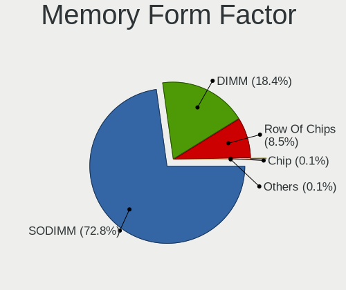

| Name         | Computers | Percent |
|--------------|-----------|---------|
| SODIMM       | 1961      | 73.83%  |
| DIMM         | 495       | 18.64%  |
| Row Of Chips | 192       | 7.23%   |
| Chip         | 4         | 0.15%   |
| RIMM         | 2         | 0.08%   |
| Unknown      | 2         | 0.08%   |

Memory Size
-----------

Memory module size

| Size  | Computers | Percent |
|-------|-----------|---------|
| 8192  | 1370      | 46.58%  |
| 4096  | 862       | 29.31%  |
| 16384 | 365       | 12.41%  |
| 2048  | 248       | 8.43%   |
| 32768 | 52        | 1.77%   |
| 1024  | 38        | 1.29%   |
| 512   | 4         | 0.14%   |
| 1536  | 1         | 0.03%   |
| 256   | 1         | 0.03%   |

Memory Speed
------------

Memory module speed

| Speed   | Computers | Percent |
|---------|-----------|---------|
| 2667    | 694       | 23.91%  |
| 3200    | 671       | 23.12%  |
| 1600    | 504       | 17.37%  |
| 2400    | 242       | 8.34%   |
| 1333    | 120       | 4.14%   |
| 2133    | 97        | 3.34%   |
| 3266    | 73        | 2.52%   |
| 1334    | 65        | 2.24%   |
| Unknown | 41        | 1.41%   |
| 3600    | 39        | 1.34%   |
| 2666    | 31        | 1.07%   |
| 667     | 31        | 1.07%   |
| 4267    | 30        | 1.03%   |
| 4800    | 29        | 1%      |
| 6400    | 27        | 0.93%   |
| 1067    | 24        | 0.83%   |
| 4199    | 20        | 0.69%   |
| 3000    | 18        | 0.62%   |
| 2800    | 18        | 0.62%   |
| 800     | 17        | 0.59%   |
| 1867    | 16        | 0.55%   |
| 975     | 14        | 0.48%   |
| 1866    | 8         | 0.28%   |
| 3733    | 7         | 0.24%   |
| 2048    | 7         | 0.24%   |
| 8400    | 4         | 0.14%   |
| 4266    | 4         | 0.14%   |
| 3400    | 4         | 0.14%   |
| 3066    | 4         | 0.14%   |
| 1800    | 4         | 0.14%   |
| 6000    | 3         | 0.1%    |
| 5200    | 3         | 0.1%    |
| 3866    | 3         | 0.1%    |
| 1648    | 3         | 0.1%    |
| 5600    | 2         | 0.07%   |
| 3666    | 2         | 0.07%   |
| 3466    | 2         | 0.07%   |
| 2933    | 2         | 0.07%   |
| 2000    | 2         | 0.07%   |
| 1066    | 2         | 0.07%   |

Printers & scanners
-------------------

Printer Vendor
--------------

Printer device vendors

| Vendor              | Computers | Percent |
|---------------------|-----------|---------|
| Hewlett-Packard     | 22        | 42.31%  |
| Seiko Epson         | 12        | 23.08%  |
| Canon               | 9         | 17.31%  |
| Brother Industries  | 5         | 9.62%   |
| STMicroelectronics  | 1         | 1.92%   |
| Samsung Electronics | 1         | 1.92%   |
| Ricoh               | 1         | 1.92%   |
| Konica Minolta      | 1         | 1.92%   |

Printer Model
-------------

Printer device models

| Model                                                                 | Computers | Percent |
|-----------------------------------------------------------------------|-----------|---------|
| HP LaserJet 1020                                                      | 6         | 11.54%  |
| HP Ink Tank 310 series                                                | 4         | 7.69%   |
| Canon PIXMA MG2500 Series                                             | 3         | 5.77%   |
| Seiko Epson L382 Series                                               | 2         | 3.85%   |
| HP DeskJet 2130 series                                                | 2         | 3.85%   |
| HP DeskJet 1110 series                                                | 2         | 3.85%   |
| Canon LBP2900                                                         | 2         | 3.85%   |
| STMicroelectronics USB Printing Support                               | 1         | 1.92%   |
| Seiko Epson USB2.0 Printer                                            | 1         | 1.92%   |
| Seiko Epson ME OFFICE 620F Series/Stylus Office BX305F/BX305FW/TX320F | 1         | 1.92%   |
| Seiko Epson M100 Series                                               | 1         | 1.92%   |
| Seiko Epson L6160 Series                                              | 1         | 1.92%   |
| Seiko Epson L405 Series                                               | 1         | 1.92%   |
| Seiko Epson L360 Series                                               | 1         | 1.92%   |
| Seiko Epson L3200 Series                                              | 1         | 1.92%   |
| Seiko Epson L3150 Series                                              | 1         | 1.92%   |
| Seiko Epson L3110 Series                                              | 1         | 1.92%   |
| Seiko Epson L132 Series                                               | 1         | 1.92%   |
| Samsung ML-1640 Series Laser Printer                                  | 1         | 1.92%   |
| Ricoh SP 112SU                                                        | 1         | 1.92%   |
| Konica Minolta 206                                                    | 1         | 1.92%   |
| HP Smart Install                                                      | 1         | 1.92%   |
| HP Printing Support                                                   | 1         | 1.92%   |
| HP LaserJet Professional P1566                                        | 1         | 1.92%   |
| HP LaserJet Pro M201dw                                                | 1         | 1.92%   |
| HP LaserJet P1102                                                     | 1         | 1.92%   |
| HP DeskJet 3630 series                                                | 1         | 1.92%   |
| HP DeskJet 2620 All-in-One Printer                                    | 1         | 1.92%   |
| HP Deskjet 1510                                                       | 1         | 1.92%   |
| Canon PIXMA MP280                                                     | 1         | 1.92%   |
| Canon PIXMA MP190                                                     | 1         | 1.92%   |
| Canon MF4800 Series                                                   | 1         | 1.92%   |
| Canon G2000 series                                                    | 1         | 1.92%   |
| Brother Printer                                                       | 1         | 1.92%   |
| Brother HL-L2320D series                                              | 1         | 1.92%   |
| Brother DCP-T510W                                                     | 1         | 1.92%   |
| Brother DCP-T310                                                      | 1         | 1.92%   |
| Brother DCP-L2520D                                                    | 1         | 1.92%   |

Scanner Vendor
--------------

Scanner device vendors

| Vendor          | Computers | Percent |
|-----------------|-----------|---------|
| Canon           | 6         | 75%     |
| Seiko Epson     | 1         | 12.5%   |
| Hewlett-Packard | 1         | 12.5%   |

Scanner Model
-------------

Scanner device models

| Model                                       | Computers | Percent |
|---------------------------------------------|-----------|---------|
| Canon CanoScan LiDE 110                     | 5         | 62.5%   |
| Seiko Epson GT-X820 [Perfection V600 Photo] | 1         | 12.5%   |
| HP ScanJet 2200c                            | 1         | 12.5%   |
| Canon CanoScan LiDE 120                     | 1         | 12.5%   |

Camera
------

Camera Vendor
-------------

Camera device vendors

| Vendor                                 | Computers | Percent |
|----------------------------------------|-----------|---------|
| Chicony Electronics                    | 648       | 18.12%  |
| IMC Networks                           | 517       | 14.46%  |
| Realtek Semiconductor                  | 353       | 9.87%   |
| Microdia                               | 348       | 9.73%   |
| Quanta                                 | 254       | 7.1%    |
| Bison Electronics                      | 218       | 6.1%    |
| Sunplus Innovation Technology          | 202       | 5.65%   |
| Cheng Uei Precision Industry (Foxlink) | 175       | 4.89%   |
| Syntek                                 | 139       | 3.89%   |
| Suyin                                  | 131       | 3.66%   |
| Luxvisions Innotech Limited            | 94        | 2.63%   |
| Logitech                               | 68        | 1.9%    |
| Lite-On Technology                     | 66        | 1.85%   |
| Sonix Technology                       | 38        | 1.06%   |
| Alcor Micro                            | 36        | 1.01%   |
| Apple                                  | 28        | 0.78%   |
| Samsung Electronics                    | 25        | 0.7%    |
| Acer                                   | 24        | 0.67%   |
| Silicon Motion                         | 21        | 0.59%   |
| Ricoh                                  | 15        | 0.42%   |
| Lenovo                                 | 14        | 0.39%   |
| Importek                               | 13        | 0.36%   |
| Z-Star Microelectronics                | 11        | 0.31%   |
| Primax Electronics                     | 10        | 0.28%   |
| Unknown                                | 9         | 0.25%   |
| OmniVision Technologies                | 9         | 0.25%   |
| OPPO Electronics                       | 8         | 0.22%   |
| SunplusIT                              | 7         | 0.2%    |
| Microsoft                              | 7         | 0.2%    |
| Arkmicro Technologies                  | 7         | 0.2%    |
| GEMBIRD                                | 6         | 0.17%   |
| 8SSC20F27114V1SR0BK1X4S                | 6         | 0.17%   |
| Intel                                  | 5         | 0.14%   |
| Hewlett-Packard                        | 5         | 0.14%   |
| Pixart Imaging                         | 4         | 0.11%   |
| MSD                                    | 4         | 0.11%   |
| MacroSilicon                           | 4         | 0.11%   |
| Cubeternet                             | 4         | 0.11%   |
| vivo                                   | 3         | 0.08%   |
| Jieli Technology                       | 3         | 0.08%   |

Camera Model
------------

Camera device models

| Model                                                          | Computers | Percent |
|----------------------------------------------------------------|-----------|---------|
| IMC Networks USB2.0 HD UVC WebCam                              | 179       | 5%      |
| Microdia Integrated_Webcam_HD                                  | 176       | 4.91%   |
| Realtek Integrated_Webcam_HD                                   | 146       | 4.07%   |
| IMC Networks Integrated Camera                                 | 141       | 3.94%   |
| Chicony Integrated Camera                                      | 137       | 3.82%   |
| Sunplus Integrated_Webcam_HD                                   | 97        | 2.71%   |
| IMC Networks USB2.0 VGA UVC WebCam                             | 89        | 2.48%   |
| Syntek Integrated Camera                                       | 81        | 2.26%   |
| Bison Integrated Camera                                        | 77        | 2.15%   |
| Chicony HP TrueVision HD Camera                                | 67        | 1.87%   |
| Realtek Integrated Webcam                                      | 61        | 1.7%    |
| Chicony HP Truevision HD                                       | 59        | 1.65%   |
| Quanta HP TrueVision HD Camera                                 | 52        | 1.45%   |
| Chicony EasyCamera                                             | 50        | 1.4%    |
| Quanta HD User Facing                                          | 47        | 1.31%   |
| Suyin HP Truevision HD                                         | 45        | 1.26%   |
| Luxvisions Innotech Limited HP TrueVision HD Camera            | 41        | 1.14%   |
| Logitech Webcam C270                                           | 40        | 1.12%   |
| Quanta HP Wide Vision HD Camera                                | 37        | 1.03%   |
| Chicony HP Wide Vision HD Camera                               | 35        | 0.98%   |
| Cheng Uei Precision Industry (Foxlink) HP TrueVision HD        | 35        | 0.98%   |
| Syntek EasyCamera                                              | 34        | 0.95%   |
| Chicony HD WebCam                                              | 34        | 0.95%   |
| Bison EasyCamera                                               | 34        | 0.95%   |
| Luxvisions Innotech Limited HP Wide Vision HD Camera           | 33        | 0.92%   |
| Chicony HD User Facing                                         | 33        | 0.92%   |
| Cheng Uei Precision Industry (Foxlink) HP TrueVision HD Camera | 33        | 0.92%   |
| Sonix USB2.0 HD UVC WebCam                                     | 29        | 0.81%   |
| Quanta HD Webcam                                               | 29        | 0.81%   |
| Lite-On Integrated Camera                                      | 28        | 0.78%   |
| IMC Networks HP TrueVision HD Camera                           | 27        | 0.75%   |
| Samsung Galaxy series, misc. (MTP mode)                        | 25        | 0.7%    |
| Quanta ACER HD User Facing                                     | 25        | 0.7%    |
| Suyin Integrated_Webcam_HD                                     | 24        | 0.67%   |
| Microdia Laptop_Integrated_Webcam_HD                           | 24        | 0.67%   |
| Microdia Integrated Webcam                                     | 24        | 0.67%   |
| Bison HD Webcam                                                | 24        | 0.67%   |
| Bison Lenovo EasyCamera                                        | 23        | 0.64%   |
| Realtek EasyCamera                                             | 22        | 0.61%   |
| Bison SunplusIT Integrated Camera                              | 22        | 0.61%   |

Security
--------

Fingerprint Vendor
------------------

Fingerprint sensor vendors

| Vendor                             | Computers | Percent |
|------------------------------------|-----------|---------|
| Validity Sensors                   | 195       | 29.28%  |
| Synaptics                          | 159       | 23.87%  |
| Shenzhen Goodix Technology         | 135       | 20.27%  |
| Elan Microelectronics              | 102       | 15.32%  |
| LighTuning Technology              | 23        | 3.45%   |
| Realtek USB2.0 Finger Print Bridge | 20        | 3%      |
| AuthenTec                          | 12        | 1.8%    |
| Upek                               | 11        | 1.65%   |
| Focal-systems.Corp                 | 6         | 0.9%    |
| STMicroelectronics                 | 1         | 0.15%   |
| Futronic Technology                | 1         | 0.15%   |
| DigitalPersona                     | 1         | 0.15%   |

Fingerprint Model
-----------------

Fingerprint sensor models

| Model                                                                      | Computers | Percent |
|----------------------------------------------------------------------------|-----------|---------|
| Shenzhen Goodix  FingerPrint Device                                        | 74        | 11.11%  |
| Elan ELAN:ARM-M4                                                           | 67        | 10.06%  |
| Validity Sensors VFS495 Fingerprint Reader                                 | 55        | 8.26%   |
| Shenzhen Goodix Fingerprint Reader                                         | 55        | 8.26%   |
| Elan ELAN:Fingerprint                                                      | 32        | 4.8%    |
| Synaptics WBDI                                                             | 27        | 4.05%   |
| Synaptics Metallica MIS Touch Fingerprint Reader                           | 26        | 3.9%    |
| Validity Sensors Synaptics VFS7552 Touch Fingerprint Sensor                | 25        | 3.75%   |
| Validity Sensors VFS5011 Fingerprint Reader                                | 24        | 3.6%    |
| LighTuning EgisTec Touch Fingerprint Sensor                                | 23        | 3.45%   |
| Synaptics UWP WBDI                                                         | 21        | 3.15%   |
| Realtek USB2.0 Finger Print Bridge FocalTech Fingerprint Device            | 20        | 3%      |
| Synaptics  WBDI                                                            | 19        | 2.85%   |
| Synaptics Prometheus MIS Touch Fingerprint Reader                          | 19        | 2.85%   |
| Synaptics Metallica MOH Touch Fingerprint Reader                           | 15        | 2.25%   |
| Synaptics Fingerprint scanner                                              | 14        | 2.1%    |
| Validity Sensors VFS 5011 fingerprint sensor                               | 13        | 1.95%   |
| Validity Sensors VFS Fingerprint sensor                                    | 12        | 1.8%    |
| Validity Sensors VFS491                                                    | 11        | 1.65%   |
| Validity Sensors Synaptics VFS7552 Touch Fingerprint Sensor with PurePrint | 11        | 1.65%   |
| Upek Biometric Touchchip/Touchstrip Fingerprint Sensor                     | 10        | 1.5%    |
| Validity Sensors Synaptics WBDI                                            | 9         | 1.35%   |
| Validity Sensors VFS7500 Touch Fingerprint Sensor                          | 7         | 1.05%   |
| Validity Sensors VFS451 Fingerprint Reader                                 | 6         | 0.9%    |
| Validity Sensors Swipe Fingerprint Sensor                                  | 6         | 0.9%    |
| Validity Sensors Fingerprint scanner                                       | 6         | 0.9%    |
| Shenzhen Goodix FingerPrint                                                | 6         | 0.9%    |
| Focal-systems.Corp FT9201Fingerprint.                                      | 6         | 0.9%    |
| Validity Sensors VFS471 Fingerprint Reader                                 | 5         | 0.75%   |
| Synaptics FS7604 Touch Fingerprint Sensor with PurePrint                   | 5         | 0.75%   |
| Synaptics Fingerprint reader [HP G6]                                       | 5         | 0.75%   |
| AuthenTec Fingerprint Sensor                                               | 5         | 0.75%   |
| Synaptics WBDI Fingerprint Reader USB 086                                  | 4         | 0.6%    |
| Elan fingerprint sensor [FeinTech FPS00200]                                | 3         | 0.45%   |
| AuthenTec AES1660 Fingerprint Sensor                                       | 3         | 0.45%   |
| Validity Sensors VFS301 Fingerprint Reader                                 | 2         | 0.3%    |
| Validity Sensors VFS101 Fingerprint Reader                                 | 2         | 0.3%    |
| Synaptics TouchPad                                                         | 2         | 0.3%    |
| AuthenTec AES2810                                                          | 2         | 0.3%    |
| AuthenTec AES1600                                                          | 2         | 0.3%    |

Chipcard Vendor
---------------

Chipcard module vendors

| Vendor                | Computers | Percent |
|-----------------------|-----------|---------|
| Broadcom              | 71        | 65.74%  |
| Alcor Micro           | 20        | 18.52%  |
| Upek                  | 8         | 7.41%   |
| O2 Micro              | 3         | 2.78%   |
| Lenovo                | 3         | 2.78%   |
| Yubico.com            | 1         | 0.93%   |
| Gemalto (was Gemplus) | 1         | 0.93%   |
| Clay Logic            | 1         | 0.93%   |

Chipcard Model
--------------

Chipcard module models

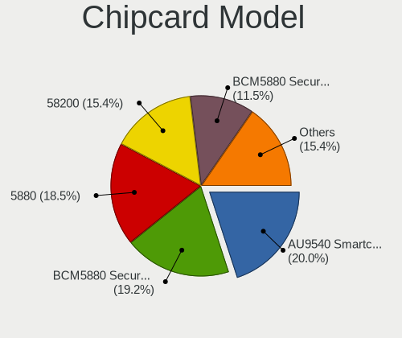

| Model                                                                        | Computers | Percent |
|------------------------------------------------------------------------------|-----------|---------|
| Broadcom BCM5880 Secure Applications Processor                               | 24        | 22.02%  |
| Broadcom 5880                                                                | 20        | 18.35%  |
| Alcor Micro AU9540 Smartcard Reader                                          | 20        | 18.35%  |
| Broadcom 58200                                                               | 15        | 13.76%  |
| Broadcom BCM5880 Secure Applications Processor with fingerprint swipe sensor | 13        | 11.93%  |
| Upek TouchChip Fingerprint Coprocessor (WBF advanced mode)                   | 8         | 7.34%   |
| Lenovo Integrated Smart Card Reader                                          | 3         | 2.75%   |
| O2 Micro OZ776 CCID Smartcard Reader                                         | 2         | 1.83%   |
| Yubico.com Yubikey 4/5 U2F+CCID                                              | 1         | 0.92%   |
| O2 Micro Oz776 SmartCard Reader                                              | 1         | 0.92%   |
| Gemalto (was Gemplus) Compact Smart Card Reader Writer                       | 1         | 0.92%   |
| Clay Logic Nitrokey HSM                                                      | 1         | 0.92%   |

Unsupported
-----------

Unsupported Devices
-------------------

Total unsupported devices on board

| Total | Computers | Percent |
|-------|-----------|---------|
| 0     | 3247      | 66.29%  |
| 1     | 1376      | 28.09%  |
| 2     | 221       | 4.51%   |
| 3     | 29        | 0.59%   |
| 4     | 14        | 0.29%   |
| 5     | 7         | 0.14%   |
| 9     | 2         | 0.04%   |
| 6     | 2         | 0.04%   |

Unsupported Device Types
------------------------

Types of unsupported devices

| Type                     | Computers | Percent |
|--------------------------|-----------|---------|
| Fingerprint reader       | 661       | 34.02%  |
| Graphics card            | 466       | 23.98%  |
| Net/wireless             | 293       | 15.08%  |
| Chipcard                 | 101       | 5.2%    |
| Multimedia controller    | 97        | 4.99%   |
| Bluetooth                | 92        | 4.73%   |
| Camera                   | 67        | 3.45%   |
| Communication controller | 63        | 3.24%   |
| Net/ethernet             | 27        | 1.39%   |
| Sound                    | 25        | 1.29%   |
| Storage                  | 14        | 0.72%   |
| Unassigned class         | 11        | 0.57%   |
| Network                  | 10        | 0.51%   |
| Modem                    | 7         | 0.36%   |
| Card reader              | 5         | 0.26%   |
| Storage/raid             | 1         | 0.05%   |
| Storage/nvme             | 1         | 0.05%   |
| Storage/ide              | 1         | 0.05%   |
| Firewire controller      | 1         | 0.05%   |

