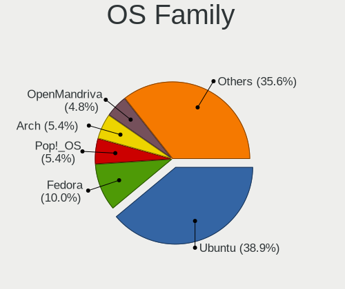
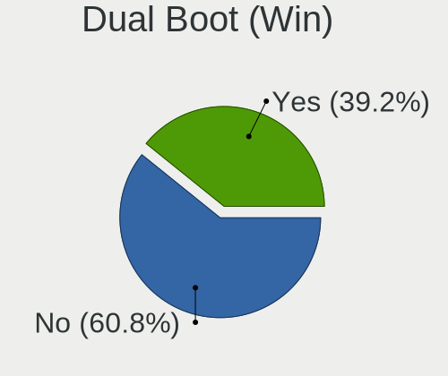
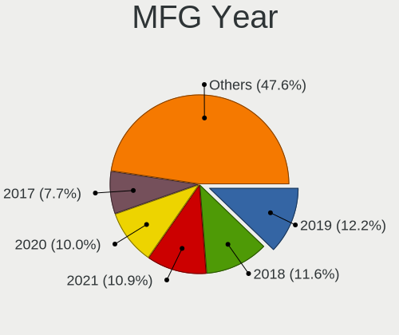
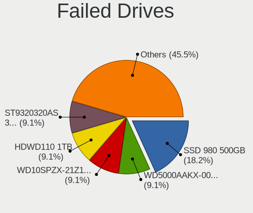
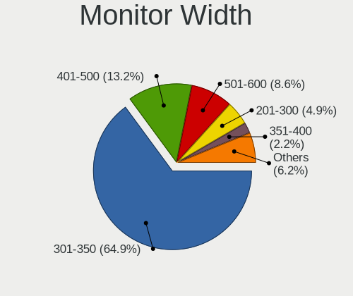
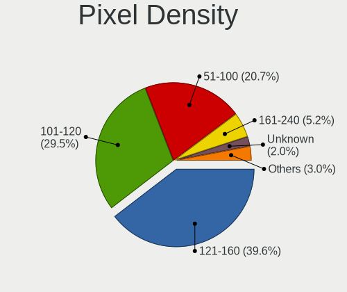
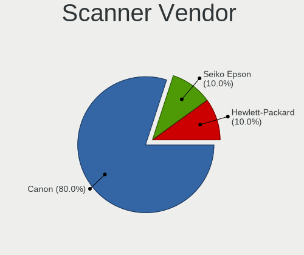

Linux in India - Tested Hardware & Statistics
---------------------------------------------

A project to collect tested hardware configurations for Linux in India.

Anyone can contribute to this report by the [hw-probe](https://github.com/linuxhw/hw-probe) tool:

    sudo -E hw-probe -all -upload

Please contribute! Especially if your hardware is rare.

This is a report for all computer types. See also reports for [desktops](/Location/India/Desktop/README.md) and [notebooks](/Location/India/Notebook/README.md).

Contents
--------

* [ Test Cases ](#test-cases)

* [ System ](#system)
  - [ OS                       ](#os)
  - [ OS Family                ](#os-family)
  - [ Kernel                   ](#kernel)
  - [ Kernel Family            ](#kernel-family)
  - [ Kernel Major Ver.        ](#kernel-major-ver)
  - [ Arch                     ](#arch)
  - [ DE                       ](#de)
  - [ Display Server           ](#display-server)
  - [ Display Manager          ](#display-manager)
  - [ OS Lang                  ](#os-lang)
  - [ Boot Mode                ](#boot-mode)
  - [ Filesystem               ](#filesystem)
  - [ Part. scheme             ](#part-scheme)
  - [ Dual Boot with Linux/BSD ](#dual-boot-with-linuxbsd)
  - [ Dual Boot (Win)          ](#dual-boot-win)

* [ Board ](#board)
  - [ Vendor                   ](#vendor)
  - [ Model                    ](#model)
  - [ Model Family             ](#model-family)
  - [ MFG Year                 ](#mfg-year)
  - [ Form Factor              ](#form-factor)
  - [ Secure Boot              ](#secure-boot)
  - [ Coreboot                 ](#coreboot)
  - [ RAM Size                 ](#ram-size)
  - [ RAM Used                 ](#ram-used)
  - [ Total Drives             ](#total-drives)
  - [ Has CD-ROM               ](#has-cd-rom)
  - [ Has Ethernet             ](#has-ethernet)
  - [ Has WiFi                 ](#has-wifi)
  - [ Has Bluetooth            ](#has-bluetooth)

* [ Location ](#location)
  - [ Country                  ](#country)
  - [ City                     ](#city)

* [ Drives ](#drives)
  - [ Drive Vendor             ](#drive-vendor)
  - [ Drive Model              ](#drive-model)
  - [ HDD Vendor               ](#hdd-vendor)
  - [ SSD Vendor               ](#ssd-vendor)
  - [ Drive Kind               ](#drive-kind)
  - [ Drive Connector          ](#drive-connector)
  - [ Drive Size               ](#drive-size)
  - [ Space Total              ](#space-total)
  - [ Space Used               ](#space-used)
  - [ Malfunc. Drives          ](#malfunc-drives)
  - [ Malfunc. Drive Vendor    ](#malfunc-drive-vendor)
  - [ Malfunc. HDD Vendor      ](#malfunc-hdd-vendor)
  - [ Malfunc. Drive Kind      ](#malfunc-drive-kind)
  - [ Failed Drives            ](#failed-drives)
  - [ Failed Drive Vendor      ](#failed-drive-vendor)
  - [ Drive Status             ](#drive-status)

* [ Storage controller ](#storage-controller)
  - [ Storage Vendor           ](#storage-vendor)
  - [ Storage Model            ](#storage-model)
  - [ Storage Kind             ](#storage-kind)

* [ Processor ](#processor)
  - [ CPU Vendor               ](#cpu-vendor)
  - [ CPU Model                ](#cpu-model)
  - [ CPU Model Family         ](#cpu-model-family)
  - [ CPU Cores                ](#cpu-cores)
  - [ CPU Sockets              ](#cpu-sockets)
  - [ CPU Threads              ](#cpu-threads)
  - [ CPU Op-Modes             ](#cpu-op-modes)
  - [ CPU Microcode            ](#cpu-microcode)
  - [ CPU Microarch            ](#cpu-microarch)

* [ Graphics ](#graphics)
  - [ GPU Vendor               ](#gpu-vendor)
  - [ GPU Model                ](#gpu-model)
  - [ GPU Combo                ](#gpu-combo)
  - [ GPU Driver               ](#gpu-driver)
  - [ GPU Memory               ](#gpu-memory)

* [ Monitor ](#monitor)
  - [ Monitor Vendor           ](#monitor-vendor)
  - [ Monitor Model            ](#monitor-model)
  - [ Monitor Resolution       ](#monitor-resolution)
  - [ Monitor Diagonal         ](#monitor-diagonal)
  - [ Monitor Width            ](#monitor-width)
  - [ Aspect Ratio             ](#aspect-ratio)
  - [ Monitor Area             ](#monitor-area)
  - [ Pixel Density            ](#pixel-density)
  - [ Multiple Monitors        ](#multiple-monitors)

* [ Network ](#network)
  - [ Net Controller Vendor    ](#net-controller-vendor)
  - [ Net Controller Model     ](#net-controller-model)
  - [ Wireless Vendor          ](#wireless-vendor)
  - [ Wireless Model           ](#wireless-model)
  - [ Ethernet Vendor          ](#ethernet-vendor)
  - [ Ethernet Model           ](#ethernet-model)
  - [ Net Controller Kind      ](#net-controller-kind)
  - [ Used Controller          ](#used-controller)
  - [ NICs                     ](#nics)
  - [ IPv6                     ](#ipv6)

* [ Bluetooth ](#bluetooth)
  - [ Bluetooth Vendor         ](#bluetooth-vendor)
  - [ Bluetooth Model          ](#bluetooth-model)

* [ Sound ](#sound)
  - [ Sound Vendor             ](#sound-vendor)
  - [ Sound Model              ](#sound-model)

* [ Memory ](#memory)
  - [ Memory Vendor            ](#memory-vendor)
  - [ Memory Model             ](#memory-model)
  - [ Memory Kind              ](#memory-kind)
  - [ Memory Form Factor       ](#memory-form-factor)
  - [ Memory Size              ](#memory-size)
  - [ Memory Speed             ](#memory-speed)

* [ Printers & scanners ](#printers--scanners)
  - [ Printer Vendor           ](#printer-vendor)
  - [ Printer Model            ](#printer-model)
  - [ Scanner Vendor           ](#scanner-vendor)
  - [ Scanner Model            ](#scanner-model)

* [ Camera ](#camera)
  - [ Camera Vendor            ](#camera-vendor)
  - [ Camera Model             ](#camera-model)

* [ Security ](#security)
  - [ Fingerprint Vendor       ](#fingerprint-vendor)
  - [ Fingerprint Model        ](#fingerprint-model)
  - [ Chipcard Vendor          ](#chipcard-vendor)
  - [ Chipcard Model           ](#chipcard-model)

* [ Unsupported ](#unsupported)
  - [ Unsupported Devices      ](#unsupported-devices)
  - [ Unsupported Device Types ](#unsupported-device-types)

Test Cases
----------

Total: 7532

| Vendor        | Model                       | Form-Factor | Probe                                                      | Date         |
|---------------|-----------------------------|-------------|------------------------------------------------------------|--------------|
| HP            | Laptop 15-bw0xx             | Notebook    | [be612ae4a6](https://linux-hardware.org/?probe=be612ae4a6) | May 09, 2024 |
| Dell          | Vostro 15-3568              | Notebook    | [afd5a26a47](https://linux-hardware.org/?probe=afd5a26a47) | May 09, 2024 |
| Sony          | SVP1321C5E                  | Notebook    | [373fd0a046](https://linux-hardware.org/?probe=373fd0a046) | May 08, 2024 |
| Lenovo        | ThinkPad E14 Gen 3 20YFC... | Notebook    | [6a43088440](https://linux-hardware.org/?probe=6a43088440) | May 08, 2024 |
| Infinix       | INBOOK Y1 PLUS NEO          | Notebook    | [253042bbd9](https://linux-hardware.org/?probe=253042bbd9) | May 08, 2024 |
| Lenovo        | V15 G4 AMN 82YU             | Notebook    | [3742af3546](https://linux-hardware.org/?probe=3742af3546) | May 08, 2024 |
| Acer          | Swift SF314-71              | Notebook    | [23d1f2e74a](https://linux-hardware.org/?probe=23d1f2e74a) | May 08, 2024 |
| Lenovo        | ThinkPad P14s Gen 4 21K5... | Notebook    | [e00e076344](https://linux-hardware.org/?probe=e00e076344) | May 08, 2024 |
| Lenovo        | ThinkPad E14 Gen 2 20T6S... | Notebook    | [eb9d3c539c](https://linux-hardware.org/?probe=eb9d3c539c) | May 08, 2024 |
| Lenovo        | V15 G4 AMN 82YU             | Notebook    | [29552fbf93](https://linux-hardware.org/?probe=29552fbf93) | May 08, 2024 |
| HP            | Laptop 15s-fq2xxx           | Notebook    | [ade9d916fe](https://linux-hardware.org/?probe=ade9d916fe) | May 08, 2024 |
| ASUSTek       | VivoBook_ASUSLaptop X712... | Notebook    | [d7c1c96567](https://linux-hardware.org/?probe=d7c1c96567) | May 07, 2024 |
| HP            | Laptop 15-bw0xx             | Notebook    | [f605dfd9c2](https://linux-hardware.org/?probe=f605dfd9c2) | May 07, 2024 |
| MSI           | MAG Z690 TOMAHAWK WIFI D... | Desktop     | [8848310fde](https://linux-hardware.org/?probe=8848310fde) | May 06, 2024 |
| MSI           | PRO B660M-A WIFI DDR4       | Desktop     | [7988d977fe](https://linux-hardware.org/?probe=7988d977fe) | May 05, 2024 |
| Unknown       | Unknown                     | Desktop     | [d676549abd](https://linux-hardware.org/?probe=d676549abd) | May 05, 2024 |
| Timi          | Mi NoteBook Pro             | Notebook    | [71071a816e](https://linux-hardware.org/?probe=71071a816e) | May 05, 2024 |
| Acer          | Aspire A315-23              | Notebook    | [35b8f59849](https://linux-hardware.org/?probe=35b8f59849) | May 05, 2024 |
| HP            | 246                         | Notebook    | [83140d67e2](https://linux-hardware.org/?probe=83140d67e2) | May 03, 2024 |
| ASUSTek       | ASUS Zenbook 14 UX3405MA... | Notebook    | [2b3beb5230](https://linux-hardware.org/?probe=2b3beb5230) | May 03, 2024 |
| ASUSTek       | VivoBook_ASUSLaptop X512... | Notebook    | [58390b50b4](https://linux-hardware.org/?probe=58390b50b4) | May 03, 2024 |
| MSI           | GF63 Thin 10SCSR            | Notebook    | [ab0eadc507](https://linux-hardware.org/?probe=ab0eadc507) | May 02, 2024 |
| Lenovo        | ThinkPad P14s Gen 4 21K5... | Notebook    | [a2d65a8e2d](https://linux-hardware.org/?probe=a2d65a8e2d) | May 02, 2024 |
| Gigabyte      | B550M K                     | Desktop     | [ad98dca4f1](https://linux-hardware.org/?probe=ad98dca4f1) | May 02, 2024 |
| ASUSTek       | VivoBook_ASUSLaptop X712... | Notebook    | [750eaa16c3](https://linux-hardware.org/?probe=750eaa16c3) | May 02, 2024 |
| HP            | 89B3 A                      | Desktop     | [5bc44b7b14](https://linux-hardware.org/?probe=5bc44b7b14) | May 02, 2024 |
| HP            | 89B3 A                      | Desktop     | [7ba4c8e1a2](https://linux-hardware.org/?probe=7ba4c8e1a2) | May 02, 2024 |
| Gigabyte      | H110M-S2-CF                 | Desktop     | [5f757d3cc1](https://linux-hardware.org/?probe=5f757d3cc1) | May 01, 2024 |
| Acer          | Nitro AN515-58              | Notebook    | [0ec502e8c7](https://linux-hardware.org/?probe=0ec502e8c7) | May 01, 2024 |
| Acer          | Predator PH315-51           | Notebook    | [6cadb88b1d](https://linux-hardware.org/?probe=6cadb88b1d) | May 01, 2024 |
| Dell          | G5 5505                     | Notebook    | [190d435401](https://linux-hardware.org/?probe=190d435401) | May 01, 2024 |
| HP            | Laptop 15q-bu0xx            | Notebook    | [7f08bc6862](https://linux-hardware.org/?probe=7f08bc6862) | May 01, 2024 |
| Acer          | TravelMate 4060             | Notebook    | [5bbfc69ef7](https://linux-hardware.org/?probe=5bbfc69ef7) | May 01, 2024 |
| Lenovo        | H410                        | Desktop     | [d16690b0c4](https://linux-hardware.org/?probe=d16690b0c4) | May 01, 2024 |
| HP            | ProBook 450 15.6 inch G9... | Notebook    | [8a4bab899a](https://linux-hardware.org/?probe=8a4bab899a) | May 01, 2024 |
| Lenovo        | Legion 5 Pro 16ITH6H 82J... | Notebook    | [76b1395f07](https://linux-hardware.org/?probe=76b1395f07) | May 01, 2024 |
| HP            | Pavilion 15                 | Notebook    | [12fcb13cea](https://linux-hardware.org/?probe=12fcb13cea) | Apr 30, 2024 |
| Intel         | H61S                        | Desktop     | [6b425a599b](https://linux-hardware.org/?probe=6b425a599b) | Apr 30, 2024 |
| Acer          | H81-M1                      | Desktop     | [cf0c78b108](https://linux-hardware.org/?probe=cf0c78b108) | Apr 30, 2024 |
| Dell          | 0R790T A00                  | Desktop     | [2086c30418](https://linux-hardware.org/?probe=2086c30418) | Apr 30, 2024 |
| HP            | Laptop 15q-bu0xx            | Notebook    | [24bf1e456c](https://linux-hardware.org/?probe=24bf1e456c) | Apr 30, 2024 |
| Lenovo        | Rev B 82LN                  | Notebook    | [5cf26fa98f](https://linux-hardware.org/?probe=5cf26fa98f) | Apr 30, 2024 |
| Lenovo        | Rev B 82LN                  | Notebook    | [130e9ebe45](https://linux-hardware.org/?probe=130e9ebe45) | Apr 30, 2024 |
| HP            | Pavilion Gaming Laptop 1... | Notebook    | [17441de577](https://linux-hardware.org/?probe=17441de577) | Apr 30, 2024 |
| Lenovo        | Yoga 6 13ALC6 82ND          | Convertible | [afd9edcffa](https://linux-hardware.org/?probe=afd9edcffa) | Apr 30, 2024 |
| Lenovo        | Yoga 7 16ARP8 83BS          | Convertible | [c19c792972](https://linux-hardware.org/?probe=c19c792972) | Apr 29, 2024 |
| Acer          | Aspire A715-76G             | Notebook    | [067678032d](https://linux-hardware.org/?probe=067678032d) | Apr 29, 2024 |
| Lenovo        | ThinkPad E14 Gen 5 21JKS... | Notebook    | [a9b2e41472](https://linux-hardware.org/?probe=a9b2e41472) | Apr 29, 2024 |
| MSI           | PRO X670-P WIFI             | Desktop     | [6dd6177312](https://linux-hardware.org/?probe=6dd6177312) | Apr 29, 2024 |
| ASUSTek       | VivoBook_ASUSLaptop X415... | Notebook    | [20ce0be473](https://linux-hardware.org/?probe=20ce0be473) | Apr 29, 2024 |
| Lenovo        | ThinkPad T420 4236L35       | Notebook    | [df6f046778](https://linux-hardware.org/?probe=df6f046778) | Apr 28, 2024 |
| Lenovo        | ThinkPad E14 Gen 4 21E3S... | Notebook    | [9553bbdbc4](https://linux-hardware.org/?probe=9553bbdbc4) | Apr 28, 2024 |
| HP            | Laptop 15-da0xxx            | Notebook    | [81bca40901](https://linux-hardware.org/?probe=81bca40901) | Apr 27, 2024 |
| MSI           | Modern 15 B7M               | Notebook    | [a7e83932d5](https://linux-hardware.org/?probe=a7e83932d5) | Apr 27, 2024 |
| ASUSTek       | ASUS TUF Gaming F15 FX50... | Notebook    | [86089f64dc](https://linux-hardware.org/?probe=86089f64dc) | Apr 26, 2024 |
| ASUSTek       | VivoBook_ASUSLaptop M650... | Notebook    | [6d6b67129d](https://linux-hardware.org/?probe=6d6b67129d) | Apr 26, 2024 |
| ASUSTek       | X542UQ                      | Notebook    | [146282870d](https://linux-hardware.org/?probe=146282870d) | Apr 26, 2024 |
| ASUSTek       | VivoBook_ASUSLaptop E410... | Notebook    | [cdc03d24ba](https://linux-hardware.org/?probe=cdc03d24ba) | Apr 26, 2024 |
| HP            | Pavilion Laptop 14-bf1xx    | Notebook    | [3daa76cdd8](https://linux-hardware.org/?probe=3daa76cdd8) | Apr 26, 2024 |
| Dell          | Latitude 5420               | Notebook    | [f367471e11](https://linux-hardware.org/?probe=f367471e11) | Apr 25, 2024 |
| Acer          | Predator PH315-51           | Notebook    | [f671d64f35](https://linux-hardware.org/?probe=f671d64f35) | Apr 25, 2024 |
| HP            | 2000                        | Notebook    | [1314698cd1](https://linux-hardware.org/?probe=1314698cd1) | Apr 25, 2024 |
| ASUSTek       | ASUS TUF Gaming F15 FX50... | Notebook    | [d6249f9918](https://linux-hardware.org/?probe=d6249f9918) | Apr 25, 2024 |
| Dell          | Inspiron 3501               | Notebook    | [7260ec24ee](https://linux-hardware.org/?probe=7260ec24ee) | Apr 25, 2024 |
| ASUSTek       | VivoBook_ASUSLaptop E410... | Notebook    | [3de02dadd5](https://linux-hardware.org/?probe=3de02dadd5) | Apr 25, 2024 |
| Valve         | Jupiter                     | Notebook    | [61762f3b53](https://linux-hardware.org/?probe=61762f3b53) | Apr 24, 2024 |
| HP            | Pavilion Gaming Laptop 1... | Notebook    | [fefcca9318](https://linux-hardware.org/?probe=fefcca9318) | Apr 24, 2024 |
| HP            | 15                          | Notebook    | [4ecce71b7d](https://linux-hardware.org/?probe=4ecce71b7d) | Apr 24, 2024 |
| HP            | EliteBook Folio 9470m       | Notebook    | [9ec106714c](https://linux-hardware.org/?probe=9ec106714c) | Apr 24, 2024 |
| ASUSTek       | ROG Strix G814JI_G814JI     | Notebook    | [e7bd7e1534](https://linux-hardware.org/?probe=e7bd7e1534) | Apr 24, 2024 |
| Gigabyte      | B760M D2H                   | Desktop     | [5ff47b02a8](https://linux-hardware.org/?probe=5ff47b02a8) | Apr 23, 2024 |
| Dell          | Inspiron 5558               | Notebook    | [246047bf8e](https://linux-hardware.org/?probe=246047bf8e) | Apr 23, 2024 |
| MSI           | Thin GF63 12HW              | Notebook    | [8de9a06c68](https://linux-hardware.org/?probe=8de9a06c68) | Apr 23, 2024 |
| Lenovo        | Yoga 6 13ARE05 82FN         | Convertible | [c71b06da34](https://linux-hardware.org/?probe=c71b06da34) | Apr 22, 2024 |
| ASUSTek       | VivoBook_ASUSLaptop K350... | Notebook    | [6b7887b99a](https://linux-hardware.org/?probe=6b7887b99a) | Apr 22, 2024 |
| ASUSTek       | VivoBook_ASUSLaptop K350... | Notebook    | [bc1baac9c9](https://linux-hardware.org/?probe=bc1baac9c9) | Apr 22, 2024 |
| Acer          | Aspire A514-54              | Notebook    | [3685be6a35](https://linux-hardware.org/?probe=3685be6a35) | Apr 22, 2024 |
| MSI           | Prestige 16 AI Studio B1... | Notebook    | [d1aa5b8b39](https://linux-hardware.org/?probe=d1aa5b8b39) | Apr 21, 2024 |
| MSI           | Thin GF63 12HW              | Notebook    | [388ebd516f](https://linux-hardware.org/?probe=388ebd516f) | Apr 21, 2024 |
| Acer          | Aspire A514-54              | Notebook    | [b06b4f2ac7](https://linux-hardware.org/?probe=b06b4f2ac7) | Apr 21, 2024 |
| MSI           | A320M PRO-VD/S              | Desktop     | [1c4a853ae2](https://linux-hardware.org/?probe=1c4a853ae2) | Apr 21, 2024 |
| HP            | 2000                        | Notebook    | [97a00523bc](https://linux-hardware.org/?probe=97a00523bc) | Apr 20, 2024 |
| Samsung       | 750QFG                      | Convertible | [19c7a1d90b](https://linux-hardware.org/?probe=19c7a1d90b) | Apr 20, 2024 |
| Samsung       | 750QFG                      | Convertible | [958ad1cbf7](https://linux-hardware.org/?probe=958ad1cbf7) | Apr 20, 2024 |
| HP            | OMEN Laptop 15-ek0xxx       | Notebook    | [8f61743310](https://linux-hardware.org/?probe=8f61743310) | Apr 20, 2024 |
| Dell          | Inspiron 3501               | Notebook    | [0f62918ed2](https://linux-hardware.org/?probe=0f62918ed2) | Apr 20, 2024 |
| Dell          | Inspiron 5559               | Notebook    | [fa44624ceb](https://linux-hardware.org/?probe=fa44624ceb) | Apr 20, 2024 |
| Biostar       | TP43E Combo                 | Desktop     | [b952037ea6](https://linux-hardware.org/?probe=b952037ea6) | Apr 19, 2024 |
| ASUSTek       | PRIME H510M-E               | Desktop     | [31e1a13f27](https://linux-hardware.org/?probe=31e1a13f27) | Apr 19, 2024 |
| Notebook      | P7xxDM2(-G)                 | Notebook    | [8b6528977b](https://linux-hardware.org/?probe=8b6528977b) | Apr 19, 2024 |
| ASUSTek       | M4A88TD-V EVO/USB3          | Desktop     | [5378e196b0](https://linux-hardware.org/?probe=5378e196b0) | Apr 19, 2024 |
| Lenovo        | ThinkBook 15 G5 ABP 21JF    | Notebook    | [8de733215c](https://linux-hardware.org/?probe=8de733215c) | Apr 18, 2024 |
| ASUSTek       | ASUS TUF Gaming A15 FA50... | Notebook    | [bcbc28897f](https://linux-hardware.org/?probe=bcbc28897f) | Apr 17, 2024 |
| Dell          | Inspiron 7560               | Notebook    | [6583453d1f](https://linux-hardware.org/?probe=6583453d1f) | Apr 17, 2024 |
| Sony          | VPCEH25EN                   | Notebook    | [3bf6f9edaa](https://linux-hardware.org/?probe=3bf6f9edaa) | Apr 17, 2024 |
| ASUSTek       | H110M-CS                    | Desktop     | [551218b127](https://linux-hardware.org/?probe=551218b127) | Apr 17, 2024 |
| Gigabyte      | H110M-S2-CF                 | Desktop     | [8b14a90950](https://linux-hardware.org/?probe=8b14a90950) | Apr 16, 2024 |
| Lenovo        | B490 20205                  | Notebook    | [54d7c4ca26](https://linux-hardware.org/?probe=54d7c4ca26) | Apr 16, 2024 |
| ASUSTek       | ASUS TUF Gaming A15 FA50... | Notebook    | [7809a3250e](https://linux-hardware.org/?probe=7809a3250e) | Apr 16, 2024 |
| Biostar       | H61MLC                      | Desktop     | [8f70d8bdb9](https://linux-hardware.org/?probe=8f70d8bdb9) | Apr 16, 2024 |
| Acer          | H81-M1                      | Desktop     | [1c508f5a38](https://linux-hardware.org/?probe=1c508f5a38) | Apr 16, 2024 |
| Lenovo        | 3111 SDK0J40697 WIN 3305... | Mini pc     | [8973327d74](https://linux-hardware.org/?probe=8973327d74) | Apr 16, 2024 |
| Framework     | Laptop 13 (AMD Ryzen 704... | Notebook    | [e3d7887dbb](https://linux-hardware.org/?probe=e3d7887dbb) | Apr 16, 2024 |
| HP            | EliteBook 735 G5            | Notebook    | [c978475180](https://linux-hardware.org/?probe=c978475180) | Apr 16, 2024 |
| HP            | Laptop 14s-dk0xxx           | Notebook    | [d3f9e91579](https://linux-hardware.org/?probe=d3f9e91579) | Apr 16, 2024 |
| ASUSTek       | VivoBook_ASUSLaptop X571... | Notebook    | [5378d5a780](https://linux-hardware.org/?probe=5378d5a780) | Apr 15, 2024 |
| Dell          | 07WP95 A02                  | Desktop     | [46e0a9d4d4](https://linux-hardware.org/?probe=46e0a9d4d4) | Apr 15, 2024 |
| HP            | Laptop 15-bs1xx             | Notebook    | [f51e425901](https://linux-hardware.org/?probe=f51e425901) | Apr 15, 2024 |
| HP            | Pavilion Gaming Laptop 1... | Notebook    | [16d5936653](https://linux-hardware.org/?probe=16d5936653) | Apr 14, 2024 |
| Infinix       | ZERO BOOK 13                | Notebook    | [7c89c087db](https://linux-hardware.org/?probe=7c89c087db) | Apr 14, 2024 |
| Lenovo        | IdeaPadFlex 5 14IAU7 82R... | Convertible | [8f895ff2dc](https://linux-hardware.org/?probe=8f895ff2dc) | Apr 14, 2024 |
| ASUSTek       | VivoBook_ASUSLaptop X571... | Notebook    | [c88e8fcf4f](https://linux-hardware.org/?probe=c88e8fcf4f) | Apr 14, 2024 |
| MSI           | Modern 14 B10MW             | Notebook    | [7a56c3ee49](https://linux-hardware.org/?probe=7a56c3ee49) | Apr 13, 2024 |
| Lenovo        | IdeaPadFlex 5 14IAU7 82R... | Convertible | [cddd47de42](https://linux-hardware.org/?probe=cddd47de42) | Apr 13, 2024 |
| Lenovo        | E41-25 81FS                 | Notebook    | [ee47604b55](https://linux-hardware.org/?probe=ee47604b55) | Apr 13, 2024 |
| Timi          | RedmiBook 15                | Notebook    | [4bfafed148](https://linux-hardware.org/?probe=4bfafed148) | Apr 13, 2024 |
| Dell          | Latitude 5400               | Notebook    | [d29cbc1d0a](https://linux-hardware.org/?probe=d29cbc1d0a) | Apr 13, 2024 |
| Dell          | Inspiron 5482               | Convertible | [0cc71d9718](https://linux-hardware.org/?probe=0cc71d9718) | Apr 13, 2024 |
| Intel         | H61                         | Desktop     | [725607d481](https://linux-hardware.org/?probe=725607d481) | Apr 12, 2024 |
| Intel         | H61                         | Desktop     | [e9f84da864](https://linux-hardware.org/?probe=e9f84da864) | Apr 12, 2024 |
| Apple         | MacBookAir6,2               | Notebook    | [71158a0432](https://linux-hardware.org/?probe=71158a0432) | Apr 12, 2024 |
| Lenovo        | ThinkPad T470 20HDS0C700    | Notebook    | [a06e4429b0](https://linux-hardware.org/?probe=a06e4429b0) | Apr 12, 2024 |
| Dell          | Inspiron 3501               | Notebook    | [d688f191c9](https://linux-hardware.org/?probe=d688f191c9) | Apr 12, 2024 |
| Lenovo        | ThinkBook 15 G2 ITL 20VE    | Notebook    | [78ca9d448c](https://linux-hardware.org/?probe=78ca9d448c) | Apr 11, 2024 |
| HP            | Pavilion Laptop 14-bf1xx    | Notebook    | [4c3351faf0](https://linux-hardware.org/?probe=4c3351faf0) | Apr 11, 2024 |
| Dell          | G15 5520                    | Notebook    | [d288eb1bcb](https://linux-hardware.org/?probe=d288eb1bcb) | Apr 11, 2024 |
| HP            | ZBook 15 G5                 | Notebook    | [4580358a7f](https://linux-hardware.org/?probe=4580358a7f) | Apr 10, 2024 |
| Lenovo        | ThinkPad P50 20EN0013US     | Notebook    | [afbcbc9b57](https://linux-hardware.org/?probe=afbcbc9b57) | Apr 10, 2024 |
| Lenovo        | ThinkBook 15 G3 ACL 21A4    | Notebook    | [6cc6ee597b](https://linux-hardware.org/?probe=6cc6ee597b) | Apr 10, 2024 |
| ASUSTek       | ROG Zephyrus G14 GA401QH... | Notebook    | [f6afd2e88a](https://linux-hardware.org/?probe=f6afd2e88a) | Apr 10, 2024 |
| ASUSTek       | ROG Zephyrus G14 GA401QH... | Notebook    | [e3daecc245](https://linux-hardware.org/?probe=e3daecc245) | Apr 10, 2024 |
| HP            | Victus by Gaming Laptop ... | Notebook    | [e78757c42d](https://linux-hardware.org/?probe=e78757c42d) | Apr 09, 2024 |
| HP            | Victus by Gaming Laptop ... | Notebook    | [4cc13eaf30](https://linux-hardware.org/?probe=4cc13eaf30) | Apr 09, 2024 |
| Intel         | H61                         | Desktop     | [cfc6e7e901](https://linux-hardware.org/?probe=cfc6e7e901) | Apr 09, 2024 |
| Infinix       | ZERO BOOK 13                | Notebook    | [f27647e9bb](https://linux-hardware.org/?probe=f27647e9bb) | Apr 08, 2024 |
| Timi          | Mi NoteBook Pro             | Notebook    | [ab28993dd3](https://linux-hardware.org/?probe=ab28993dd3) | Apr 08, 2024 |
| HP            | 15                          | Notebook    | [8e4dc27da3](https://linux-hardware.org/?probe=8e4dc27da3) | Apr 08, 2024 |
| ASUSTek       | VivoBook_ASUSLaptop M340... | Notebook    | [3c71179d12](https://linux-hardware.org/?probe=3c71179d12) | Apr 08, 2024 |
| ASUSTek       | TUF Gaming X670E-PLUS WI... | Desktop     | [c01d2bc687](https://linux-hardware.org/?probe=c01d2bc687) | Apr 07, 2024 |
| Acer          | Aspire A715-51G             | Notebook    | [a3f3c1986d](https://linux-hardware.org/?probe=a3f3c1986d) | Apr 07, 2024 |
| HP            | Pavilion 15                 | Notebook    | [cdf0bb7376](https://linux-hardware.org/?probe=cdf0bb7376) | Apr 07, 2024 |
| Acer          | Aspire A715-51G             | Notebook    | [0d3fb54918](https://linux-hardware.org/?probe=0d3fb54918) | Apr 07, 2024 |
| HP            | Pavilion 15                 | Notebook    | [e684c0b00b](https://linux-hardware.org/?probe=e684c0b00b) | Apr 07, 2024 |
| Timi          | Mi NoteBook Pro             | Notebook    | [96fefe11d7](https://linux-hardware.org/?probe=96fefe11d7) | Apr 06, 2024 |
| HP            | Pavilion Gaming Laptop 1... | Notebook    | [595c1e3d71](https://linux-hardware.org/?probe=595c1e3d71) | Apr 06, 2024 |
| HP            | Pavilion 15                 | Notebook    | [39b89d2411](https://linux-hardware.org/?probe=39b89d2411) | Apr 06, 2024 |
| ASUSTek       | VivoBook_ASUSLaptop K340... | Notebook    | [766c199389](https://linux-hardware.org/?probe=766c199389) | Apr 06, 2024 |
| Dell          | Latitude 7210 2-in-1        | Tablet      | [46837d0344](https://linux-hardware.org/?probe=46837d0344) | Apr 06, 2024 |
| HP            | Laptop 15q-ds0xxx           | Notebook    | [83bb8b0134](https://linux-hardware.org/?probe=83bb8b0134) | Apr 05, 2024 |
| HP            | Laptop 15q-ds0xxx           | Notebook    | [64e20f99d6](https://linux-hardware.org/?probe=64e20f99d6) | Apr 05, 2024 |
| Dell          | Vostro 3559                 | Notebook    | [7f70f63943](https://linux-hardware.org/?probe=7f70f63943) | Apr 04, 2024 |
| Dell          | 0KV62T A00                  | Desktop     | [4a6dd2d88a](https://linux-hardware.org/?probe=4a6dd2d88a) | Apr 04, 2024 |
| HP            | 18E4                        | Desktop     | [3718a56186](https://linux-hardware.org/?probe=3718a56186) | Apr 03, 2024 |
| ASRock        | B450M-HDV R4.0              | Desktop     | [d2f236e563](https://linux-hardware.org/?probe=d2f236e563) | Apr 02, 2024 |
| HP            | Pavilion Gaming Laptop 1... | Notebook    | [ae3fdecd5d](https://linux-hardware.org/?probe=ae3fdecd5d) | Apr 02, 2024 |
| Lenovo        | ThinkPad P14s Gen 4 21K5... | Notebook    | [d1da279a66](https://linux-hardware.org/?probe=d1da279a66) | Apr 02, 2024 |
| Timi          | Mi NoteBook Pro             | Notebook    | [79e676b7a6](https://linux-hardware.org/?probe=79e676b7a6) | Apr 01, 2024 |
| Lenovo        | ThinkPad P14s Gen 4 21K5... | Notebook    | [eb3dd0cff3](https://linux-hardware.org/?probe=eb3dd0cff3) | Apr 01, 2024 |
| Dell          | XPS 13 9360                 | Notebook    | [f6ec63e167](https://linux-hardware.org/?probe=f6ec63e167) | Apr 01, 2024 |
| Lenovo        | ThinkPad E14 Gen 4 21ECC... | Notebook    | [c19f043267](https://linux-hardware.org/?probe=c19f043267) | Mar 31, 2024 |
| ASUSTek       | ASUS TUF Gaming A15 FA50... | Notebook    | [8a68f21257](https://linux-hardware.org/?probe=8a68f21257) | Mar 30, 2024 |
| Dell          | Inspiron 3493               | Notebook    | [ed7f522ffa](https://linux-hardware.org/?probe=ed7f522ffa) | Mar 30, 2024 |
| HP            | Pavilion Laptop 14-dv0xx... | Notebook    | [f685bdd027](https://linux-hardware.org/?probe=f685bdd027) | Mar 30, 2024 |
| Lenovo        | IdeaPad S145-15IKB 81VD     | Notebook    | [01ec795558](https://linux-hardware.org/?probe=01ec795558) | Mar 29, 2024 |
| HP            | Pavilion Gaming Laptop 1... | Notebook    | [e34eb800b2](https://linux-hardware.org/?probe=e34eb800b2) | Mar 29, 2024 |
| ASUSTek       | TUF Gaming FX505DY_FX505... | Notebook    | [55f0862220](https://linux-hardware.org/?probe=55f0862220) | Mar 29, 2024 |
| Lenovo        | B50-70 20384                | Notebook    | [ce2d328e01](https://linux-hardware.org/?probe=ce2d328e01) | Mar 29, 2024 |
| Lenovo        | ThinkBook 14-IIL 20SL       | Notebook    | [b1ff4c1ab1](https://linux-hardware.org/?probe=b1ff4c1ab1) | Mar 28, 2024 |
| Infinix       | ZERO BOOK 13                | Notebook    | [d64684c03a](https://linux-hardware.org/?probe=d64684c03a) | Mar 28, 2024 |
| ASUSTek       | VivoBook_ASUSLaptop X415... | Notebook    | [90614a5f0b](https://linux-hardware.org/?probe=90614a5f0b) | Mar 28, 2024 |
| Infinix       | ZERO BOOK 13                | Notebook    | [cd91c5bb1e](https://linux-hardware.org/?probe=cd91c5bb1e) | Mar 28, 2024 |
| HP            | Pavilion Laptop 14-dv0xx... | Notebook    | [200883f6dc](https://linux-hardware.org/?probe=200883f6dc) | Mar 28, 2024 |
| ASUSTek       | ASUS TUF Gaming A15 FA50... | Notebook    | [e11313b626](https://linux-hardware.org/?probe=e11313b626) | Mar 27, 2024 |
| Acer          | Aspire A515-57G             | Notebook    | [95c573af0a](https://linux-hardware.org/?probe=95c573af0a) | Mar 27, 2024 |
| HP            | Laptop 15s-dr0xxx           | Notebook    | [a41db03c5b](https://linux-hardware.org/?probe=a41db03c5b) | Mar 26, 2024 |
| Apple         | MacBook5,1                  | Notebook    | [0b7838f79e](https://linux-hardware.org/?probe=0b7838f79e) | Mar 26, 2024 |
| Dell          | Vostro 3578                 | Notebook    | [0d29a06255](https://linux-hardware.org/?probe=0d29a06255) | Mar 26, 2024 |
| HP            | Pavilion 15                 | Notebook    | [9b219cffd5](https://linux-hardware.org/?probe=9b219cffd5) | Mar 26, 2024 |
| Dell          | Vostro 1550                 | Notebook    | [e022440d75](https://linux-hardware.org/?probe=e022440d75) | Mar 26, 2024 |
| HP            | 861A                        | Desktop     | [cc38b92cf4](https://linux-hardware.org/?probe=cc38b92cf4) | Mar 26, 2024 |
| Apple         | MacBookPro16,1              | Notebook    | [82901b0cb6](https://linux-hardware.org/?probe=82901b0cb6) | Mar 26, 2024 |
| MSI           | GF63 Thin 9RCX              | Notebook    | [0f5870ca39](https://linux-hardware.org/?probe=0f5870ca39) | Mar 25, 2024 |
| ASUSTek       | ROG Strix G531GU_G531GU     | Notebook    | [0bbd95d6e5](https://linux-hardware.org/?probe=0bbd95d6e5) | Mar 25, 2024 |
| ASUSTek       | ASUS TUF Gaming F15 FX50... | Notebook    | [2cbb874285](https://linux-hardware.org/?probe=2cbb874285) | Mar 25, 2024 |
| Acer          | Nitro AN515-57              | Notebook    | [c455ccf61a](https://linux-hardware.org/?probe=c455ccf61a) | Mar 25, 2024 |
| Gigabyte      | Z370M D3H-CF                | Desktop     | [300fa525c8](https://linux-hardware.org/?probe=300fa525c8) | Mar 25, 2024 |
| ASUSTek       | ASUS Zenbook 14 UX3405MA... | Notebook    | [ac4ffad941](https://linux-hardware.org/?probe=ac4ffad941) | Mar 24, 2024 |
| Lenovo        | G510 20238                  | Notebook    | [b63a7b1490](https://linux-hardware.org/?probe=b63a7b1490) | Mar 24, 2024 |
| MSI           | Cyborg 15 A12VE             | Notebook    | [012a9393ab](https://linux-hardware.org/?probe=012a9393ab) | Mar 22, 2024 |
| ASUSTek       | VivoBook_ASUSLaptop K340... | Notebook    | [370d890b88](https://linux-hardware.org/?probe=370d890b88) | Mar 22, 2024 |
| Dell          | Inspiron N4010              | Notebook    | [b0bf69df9a](https://linux-hardware.org/?probe=b0bf69df9a) | Mar 21, 2024 |
| Timi          | Mi NoteBook Ultra           | Notebook    | [c92aa3d747](https://linux-hardware.org/?probe=c92aa3d747) | Mar 21, 2024 |
| Dell          | Inspiron N4010              | Notebook    | [df814c37dd](https://linux-hardware.org/?probe=df814c37dd) | Mar 20, 2024 |
| MSI           | Cyborg 15 A12VE             | Notebook    | [e0dce5359f](https://linux-hardware.org/?probe=e0dce5359f) | Mar 20, 2024 |
| Lenovo        | IdeaPadFlex 10 20324        | Notebook    | [b0b209dac3](https://linux-hardware.org/?probe=b0b209dac3) | Mar 20, 2024 |
| MSI           | B450M-A PRO MAX II          | Desktop     | [81d81323e9](https://linux-hardware.org/?probe=81d81323e9) | Mar 20, 2024 |
| Raspberry ... | Raspberry Pi 3 Model B R... | Soc         | [0022401c37](https://linux-hardware.org/?probe=0022401c37) | Mar 20, 2024 |
| Lenovo        | IdeaPad 5 Pro 14ITL6 82L... | Notebook    | [08ef8bc02d](https://linux-hardware.org/?probe=08ef8bc02d) | Mar 20, 2024 |
| Lenovo        | ThinkPad P14s Gen 4 21K5... | Notebook    | [5bc5531a68](https://linux-hardware.org/?probe=5bc5531a68) | Mar 19, 2024 |
| Samsung       | 550XED                      | Notebook    | [9bb9a4c3f7](https://linux-hardware.org/?probe=9bb9a4c3f7) | Mar 19, 2024 |
| HP            | Pavilion x360 Convertibl... | Convertible | [4d9cfcc0fb](https://linux-hardware.org/?probe=4d9cfcc0fb) | Mar 19, 2024 |
| HP            | Notebook                    | Notebook    | [90535a0e4b](https://linux-hardware.org/?probe=90535a0e4b) | Mar 19, 2024 |
| HP            | Notebook                    | Notebook    | [97043bd58f](https://linux-hardware.org/?probe=97043bd58f) | Mar 19, 2024 |
| Apple         | MacBookAir8,1               | Notebook    | [d0c0446bb2](https://linux-hardware.org/?probe=d0c0446bb2) | Mar 19, 2024 |
| Acer          | Predator PH315-53           | Notebook    | [512ed7177b](https://linux-hardware.org/?probe=512ed7177b) | Mar 19, 2024 |
| Dell          | Latitude E6420              | Notebook    | [2243012f33](https://linux-hardware.org/?probe=2243012f33) | Mar 18, 2024 |
| Lenovo        | IdeaPad Slim 5 16IRL8 82... | Notebook    | [5444f5d926](https://linux-hardware.org/?probe=5444f5d926) | Mar 17, 2024 |
| Lenovo        | IdeaPad Slim 5 16IRL8 82... | Notebook    | [7abc3cc997](https://linux-hardware.org/?probe=7abc3cc997) | Mar 17, 2024 |
| ASUSTek       | VivoBook_ASUSLaptop K340... | Notebook    | [dabfa8c2b3](https://linux-hardware.org/?probe=dabfa8c2b3) | Mar 16, 2024 |
| Lenovo        | B50-70 20384                | Notebook    | [6d0478d986](https://linux-hardware.org/?probe=6d0478d986) | Mar 16, 2024 |
| ASUSTek       | ASUS TUF Gaming F15 FX50... | Notebook    | [511c52e15b](https://linux-hardware.org/?probe=511c52e15b) | Mar 16, 2024 |
| ASUSTek       | VivoBook_ASUSLaptop X421... | Notebook    | [076b0dcbc4](https://linux-hardware.org/?probe=076b0dcbc4) | Mar 16, 2024 |
| Dell          | Inspiron 5482               | Convertible | [91b14028f7](https://linux-hardware.org/?probe=91b14028f7) | Mar 16, 2024 |
| Lenovo        | IdeaPad Gaming 3 15ACH6 ... | Notebook    | [6b70347aa7](https://linux-hardware.org/?probe=6b70347aa7) | Mar 16, 2024 |
| ASUSTek       | TUF Gaming FX504GE_FX80G... | Notebook    | [33e7a03f71](https://linux-hardware.org/?probe=33e7a03f71) | Mar 15, 2024 |
| Lenovo        | IdeaPad Gaming 3 15ARH05... | Notebook    | [711cc3c20d](https://linux-hardware.org/?probe=711cc3c20d) | Mar 15, 2024 |
| Lenovo        | G50-80 80L0                 | Notebook    | [995f47afbb](https://linux-hardware.org/?probe=995f47afbb) | Mar 14, 2024 |
| HP            | Laptop 15-da1xxx            | Notebook    | [decbe9d726](https://linux-hardware.org/?probe=decbe9d726) | Mar 14, 2024 |
| Dell          | Inspiron 3542               | Notebook    | [9fb06fb797](https://linux-hardware.org/?probe=9fb06fb797) | Mar 13, 2024 |
| Intel         | DH67BL AAG10189-205         | Desktop     | [a8bf4c62c7](https://linux-hardware.org/?probe=a8bf4c62c7) | Mar 13, 2024 |
| Lenovo        | G50-80 80L0                 | Notebook    | [79173a6c7a](https://linux-hardware.org/?probe=79173a6c7a) | Mar 13, 2024 |
| Lenovo        | Legion 5 15ARH05 82B5       | Notebook    | [71d3373343](https://linux-hardware.org/?probe=71d3373343) | Mar 13, 2024 |
| Lenovo        | Legion 5 15ARH05 82B5       | Notebook    | [24bd77109e](https://linux-hardware.org/?probe=24bd77109e) | Mar 13, 2024 |
| Dell          | Inspiron 3543               | Notebook    | [a160c09d29](https://linux-hardware.org/?probe=a160c09d29) | Mar 13, 2024 |
| ASUSTek       | ASUS TUF Gaming A16 FA61... | Notebook    | [f80fc50a95](https://linux-hardware.org/?probe=f80fc50a95) | Mar 13, 2024 |
| ASUSTek       | VivoBook_ASUSLaptop K350... | Notebook    | [3c4326af6a](https://linux-hardware.org/?probe=3c4326af6a) | Mar 13, 2024 |
| Dell          | G7 7588                     | Notebook    | [956adb435e](https://linux-hardware.org/?probe=956adb435e) | Mar 12, 2024 |
| Acer          | Swift SF314-512             | Notebook    | [2a9597aa86](https://linux-hardware.org/?probe=2a9597aa86) | Mar 12, 2024 |
| HP            | Pavilion x360 Convertibl... | Convertible | [ff6c1aab7d](https://linux-hardware.org/?probe=ff6c1aab7d) | Mar 12, 2024 |
| Lenovo        | IdeaPad Gaming 3 15IMH05... | Notebook    | [00289086da](https://linux-hardware.org/?probe=00289086da) | Mar 12, 2024 |
| Dell          | Latitude 3490               | Notebook    | [ac7317cebc](https://linux-hardware.org/?probe=ac7317cebc) | Mar 11, 2024 |
| Dell          | Latitude E5450              | Notebook    | [a40134fc60](https://linux-hardware.org/?probe=a40134fc60) | Mar 11, 2024 |
| Gigabyte      | H61MS                       | Desktop     | [5bc31084ad](https://linux-hardware.org/?probe=5bc31084ad) | Mar 10, 2024 |
| ASUSTek       | ASUS TUF Gaming F15 FX50... | Notebook    | [4bb97e8868](https://linux-hardware.org/?probe=4bb97e8868) | Mar 10, 2024 |
| MSI           | B450M-A PRO MAX II          | Desktop     | [e38d871b42](https://linux-hardware.org/?probe=e38d871b42) | Mar 10, 2024 |
| ASUSTek       | PRIME H310M-E R2.0          | Desktop     | [a3776fd539](https://linux-hardware.org/?probe=a3776fd539) | Mar 10, 2024 |
| ASRock        | H81M-VG4 R3.0               | Desktop     | [173d836621](https://linux-hardware.org/?probe=173d836621) | Mar 10, 2024 |
| Intel         | DG31PR AAE39516-300         | Desktop     | [787913150f](https://linux-hardware.org/?probe=787913150f) | Mar 10, 2024 |
| HP            | Notebook                    | Notebook    | [6c525c86c4](https://linux-hardware.org/?probe=6c525c86c4) | Mar 10, 2024 |
| Lenovo        | V15 G4 ABP 82YY             | Notebook    | [a1d9dbb33e](https://linux-hardware.org/?probe=a1d9dbb33e) | Mar 10, 2024 |
| Acer          | Aspire Lite AL15-41         | Notebook    | [720c77ea8e](https://linux-hardware.org/?probe=720c77ea8e) | Mar 10, 2024 |
| Acer          | Aspire A315-59              | Notebook    | [8eb8fbd9be](https://linux-hardware.org/?probe=8eb8fbd9be) | Mar 09, 2024 |
| ASUSTek       | VivoBook_ASUSLaptop K350... | Notebook    | [b00732d7cc](https://linux-hardware.org/?probe=b00732d7cc) | Mar 09, 2024 |
| ASUSTek       | H81M-CS                     | Desktop     | [3f7a881615](https://linux-hardware.org/?probe=3f7a881615) | Mar 09, 2024 |
| ASUSTek       | VivoBook_ASUSLaptop X415... | Notebook    | [a69985caa8](https://linux-hardware.org/?probe=a69985caa8) | Mar 09, 2024 |
| HP            | Notebook                    | Notebook    | [8e0446bf88](https://linux-hardware.org/?probe=8e0446bf88) | Mar 08, 2024 |
| HP            | OMEN by Laptop 15-dc1xxx    | Notebook    | [605efa5d0e](https://linux-hardware.org/?probe=605efa5d0e) | Mar 08, 2024 |
| HP            | OMEN by Laptop 15-dc1xxx    | Notebook    | [e0459cc79f](https://linux-hardware.org/?probe=e0459cc79f) | Mar 08, 2024 |
| Dell          | Inspiron 3593               | Notebook    | [e5931414ce](https://linux-hardware.org/?probe=e5931414ce) | Mar 08, 2024 |
| Samsung       | 355V4C/356V4C/3445VC/354... | Notebook    | [eb169c5969](https://linux-hardware.org/?probe=eb169c5969) | Mar 07, 2024 |
| Lenovo        | ThinkPad T450s 20BX004QG... | Notebook    | [af2b0287ec](https://linux-hardware.org/?probe=af2b0287ec) | Mar 07, 2024 |
| ASUSTek       | VivoBook_ASUSLaptop M340... | Notebook    | [24f8aa7cd0](https://linux-hardware.org/?probe=24f8aa7cd0) | Mar 07, 2024 |
| Acer          | One 14 Z8-415               | Notebook    | [369734aa1f](https://linux-hardware.org/?probe=369734aa1f) | Mar 07, 2024 |
| Gigabyte      | G31M-ES2L                   | Desktop     | [0d5657518d](https://linux-hardware.org/?probe=0d5657518d) | Mar 07, 2024 |
| Gigabyte      | G31M-ES2L                   | Desktop     | [61e1fc891a](https://linux-hardware.org/?probe=61e1fc891a) | Mar 07, 2024 |
| Acer          | One 14 Z8-415               | Notebook    | [6fce03c633](https://linux-hardware.org/?probe=6fce03c633) | Mar 07, 2024 |
| Lenovo        | ThinkPad P14s Gen 2a 21A... | Notebook    | [c84d9da515](https://linux-hardware.org/?probe=c84d9da515) | Mar 06, 2024 |
| HP            | Laptop 15s-fr2xxx           | Notebook    | [41a41095e6](https://linux-hardware.org/?probe=41a41095e6) | Mar 06, 2024 |
| HP            | Pavilion x360 Convertibl... | Convertible | [1fce24506f](https://linux-hardware.org/?probe=1fce24506f) | Mar 06, 2024 |
| TECNO Mobi... | MEGABOOK T1 TGL             | Notebook    | [ce3e0ba9dc](https://linux-hardware.org/?probe=ce3e0ba9dc) | Mar 05, 2024 |
| Dell          | Vostro 3546                 | Notebook    | [836cd32457](https://linux-hardware.org/?probe=836cd32457) | Mar 05, 2024 |
| ASUSTek       | VivoBook_ASUSLaptop M650... | Notebook    | [b91c6debc9](https://linux-hardware.org/?probe=b91c6debc9) | Mar 05, 2024 |
| HP            | 540                         | Notebook    | [3423afe2ac](https://linux-hardware.org/?probe=3423afe2ac) | Mar 05, 2024 |
| Dell          | Inspiron 3521               | Notebook    | [9552e898d6](https://linux-hardware.org/?probe=9552e898d6) | Mar 04, 2024 |
| ASUSTek       | PRIME H510M-E               | Desktop     | [35d70301d6](https://linux-hardware.org/?probe=35d70301d6) | Mar 04, 2024 |
| Lenovo        | 312A NOK                    | Desktop     | [7455692b10](https://linux-hardware.org/?probe=7455692b10) | Mar 04, 2024 |
| Gigabyte      | Z390 AORUS ULTRA-CF         | Desktop     | [01c04e14c0](https://linux-hardware.org/?probe=01c04e14c0) | Mar 04, 2024 |
| HP            | 14                          | Notebook    | [6e6138e521](https://linux-hardware.org/?probe=6e6138e521) | Mar 04, 2024 |
| ASUSTek       | VivoBook_ASUSLaptop M650... | Notebook    | [471c4b53b8](https://linux-hardware.org/?probe=471c4b53b8) | Mar 03, 2024 |
| Lenovo        | IdeaPad D330-10IGL 82H0     | Tablet      | [94a7d20873](https://linux-hardware.org/?probe=94a7d20873) | Mar 03, 2024 |
| ASRock        | B760M Steel Legend WiFi     | Desktop     | [e693b43cc0](https://linux-hardware.org/?probe=e693b43cc0) | Mar 03, 2024 |
| Gigabyte      | AX370-Gaming K5-CF          | Desktop     | [03ffd1aa1b](https://linux-hardware.org/?probe=03ffd1aa1b) | Mar 03, 2024 |
| MSI           | H110M PRO-VH PLUS           | Desktop     | [729100c106](https://linux-hardware.org/?probe=729100c106) | Mar 03, 2024 |
| Lenovo        | G50-70 20351                | Notebook    | [5e44c1add4](https://linux-hardware.org/?probe=5e44c1add4) | Mar 03, 2024 |
| TECNO Mobi... | MEGABOOK T1 TGL             | Notebook    | [b55c18be6e](https://linux-hardware.org/?probe=b55c18be6e) | Mar 03, 2024 |
| Intel         | DH55TC AAE70932-300         | Desktop     | [81c051c583](https://linux-hardware.org/?probe=81c051c583) | Mar 03, 2024 |
| Infinix       | INBook X1                   | Notebook    | [be2654d4f7](https://linux-hardware.org/?probe=be2654d4f7) | Mar 02, 2024 |
| HP            | Pavilion x360 Convertibl... | Convertible | [54ddd297a5](https://linux-hardware.org/?probe=54ddd297a5) | Mar 02, 2024 |
| Lenovo        | IdeaPad S145-15IKB 81VD     | Notebook    | [7ccc640c2f](https://linux-hardware.org/?probe=7ccc640c2f) | Mar 02, 2024 |
| Apple         | MacBookAir7,2               | Notebook    | [c21c5f0bd2](https://linux-hardware.org/?probe=c21c5f0bd2) | Mar 02, 2024 |
| HP            | Pavilion 15                 | Notebook    | [15858caed0](https://linux-hardware.org/?probe=15858caed0) | Mar 01, 2024 |
| Lenovo        | IdeaPad 110-15ISK 80UD      | Notebook    | [beb30d1c82](https://linux-hardware.org/?probe=beb30d1c82) | Mar 01, 2024 |
| Lenovo        | ThinkPad X1 Carbon 7th 2... | Notebook    | [120d90cd85](https://linux-hardware.org/?probe=120d90cd85) | Mar 01, 2024 |
| HP            | Pavilion dv6                | Notebook    | [14e50b9c6c](https://linux-hardware.org/?probe=14e50b9c6c) | Mar 01, 2024 |
| HP            | Pavilion g6                 | Notebook    | [f6ef470081](https://linux-hardware.org/?probe=f6ef470081) | Mar 01, 2024 |
| Pegatron      | IPM41-D3                    | Desktop     | [5249318369](https://linux-hardware.org/?probe=5249318369) | Feb 29, 2024 |
| Toshiba       | Satellite L300              | Notebook    | [91ab21b4dc](https://linux-hardware.org/?probe=91ab21b4dc) | Feb 29, 2024 |
| ASUSTek       | VivoBook_ASUSLaptop X150... | Notebook    | [19d7dd5a8d](https://linux-hardware.org/?probe=19d7dd5a8d) | Feb 29, 2024 |
| ASUSTek       | VivoBook_ASUSLaptop M160... | Notebook    | [6d95912acb](https://linux-hardware.org/?probe=6d95912acb) | Feb 29, 2024 |
| Lenovo        | ThinkBook 15 G5 ABP 21JF    | Notebook    | [499c02fa90](https://linux-hardware.org/?probe=499c02fa90) | Feb 29, 2024 |
| HP            | ProBook 440 G8 Notebook ... | Notebook    | [f82ddd1079](https://linux-hardware.org/?probe=f82ddd1079) | Feb 28, 2024 |
| Timi          | Mi NoteBook Ultra           | Notebook    | [a17f299cea](https://linux-hardware.org/?probe=a17f299cea) | Feb 28, 2024 |
| HP            | 225E                        | Desktop     | [a9fb0165ad](https://linux-hardware.org/?probe=a9fb0165ad) | Feb 28, 2024 |
| Raspberry ... | Raspberry Pi 4 Model B R... | Soc         | [361a53c56c](https://linux-hardware.org/?probe=361a53c56c) | Feb 28, 2024 |
| HP            | ENVY x360 13-bf0085tu       | Convertible | [f218183cb3](https://linux-hardware.org/?probe=f218183cb3) | Feb 28, 2024 |
| HP            | Pavilion Gaming Laptop 1... | Notebook    | [bdc3e5e5ff](https://linux-hardware.org/?probe=bdc3e5e5ff) | Feb 27, 2024 |
| HP            | Pavilion Gaming Laptop 1... | Notebook    | [2e741a8a35](https://linux-hardware.org/?probe=2e741a8a35) | Feb 27, 2024 |
| Timi          | Mi NoteBook Ultra           | Notebook    | [be15da34bb](https://linux-hardware.org/?probe=be15da34bb) | Feb 27, 2024 |
| Lenovo        | IdeaPad 3 14ITL6 82H7       | Notebook    | [d44ed1a56f](https://linux-hardware.org/?probe=d44ed1a56f) | Feb 26, 2024 |
| ASUSTek       | ASUS Zenbook 14 UX3405MA... | Notebook    | [339c1aaeb1](https://linux-hardware.org/?probe=339c1aaeb1) | Feb 26, 2024 |
| Dell          | Vostro 5468                 | Notebook    | [02f46d2755](https://linux-hardware.org/?probe=02f46d2755) | Feb 26, 2024 |
| HP            | Notebook                    | Notebook    | [d2d7f65d5a](https://linux-hardware.org/?probe=d2d7f65d5a) | Feb 26, 2024 |
| Gigabyte      | H61MS                       | Desktop     | [734eead932](https://linux-hardware.org/?probe=734eead932) | Feb 26, 2024 |
| ASUSTek       | VivoBook_ASUSLaptop X412... | Notebook    | [a775aa024f](https://linux-hardware.org/?probe=a775aa024f) | Feb 25, 2024 |
| Lenovo        | ThinkPad P14s Gen 4 21K5... | Notebook    | [d8df7d2937](https://linux-hardware.org/?probe=d8df7d2937) | Feb 25, 2024 |
| Acer          | Nitro AN515-47              | Notebook    | [09278ddd93](https://linux-hardware.org/?probe=09278ddd93) | Feb 25, 2024 |
| Lenovo        | E40-80 80HR                 | Notebook    | [57929a984b](https://linux-hardware.org/?probe=57929a984b) | Feb 25, 2024 |
| Lenovo        | E40-80 80HR                 | Notebook    | [d9ce4a24bb](https://linux-hardware.org/?probe=d9ce4a24bb) | Feb 25, 2024 |
| Gigabyte      | H61MS                       | Desktop     | [34e5453caa](https://linux-hardware.org/?probe=34e5453caa) | Feb 25, 2024 |
| HP            | 158A                        | Desktop     | [a31b6f549f](https://linux-hardware.org/?probe=a31b6f549f) | Feb 25, 2024 |
| Unknown       | E-H61                       | Desktop     | [899be10105](https://linux-hardware.org/?probe=899be10105) | Feb 24, 2024 |
| Unknown       | E-H61                       | Desktop     | [fa84a51212](https://linux-hardware.org/?probe=fa84a51212) | Feb 24, 2024 |
| HP            | Laptop 14s-fq1xxx           | Notebook    | [6bb2788890](https://linux-hardware.org/?probe=6bb2788890) | Feb 24, 2024 |
| ASUSTek       | ASUS TUF Gaming F15 FX50... | Notebook    | [296f52bf01](https://linux-hardware.org/?probe=296f52bf01) | Feb 24, 2024 |
| Lenovo        | ThinkBook 15 G3 ACL 21A4    | Notebook    | [1ea0bb17d4](https://linux-hardware.org/?probe=1ea0bb17d4) | Feb 24, 2024 |
| DIGILITE      | DL-H61M-VG4                 | Desktop     | [3a30f126c4](https://linux-hardware.org/?probe=3a30f126c4) | Feb 24, 2024 |
| HP            | Laptop 14s-fq1xxx           | Notebook    | [db0b93e1b9](https://linux-hardware.org/?probe=db0b93e1b9) | Feb 24, 2024 |
| Acer          | Aspire A315-55G             | Notebook    | [f5b7121a08](https://linux-hardware.org/?probe=f5b7121a08) | Feb 24, 2024 |
| Intel         | X58                         | Desktop     | [f4526c5a1c](https://linux-hardware.org/?probe=f4526c5a1c) | Feb 23, 2024 |
| Lenovo        | Legion Pro 5 16ARX8 82WM    | Notebook    | [b6158c1b82](https://linux-hardware.org/?probe=b6158c1b82) | Feb 23, 2024 |
| HP            | Pavilion Notebook           | Notebook    | [2cb306402a](https://linux-hardware.org/?probe=2cb306402a) | Feb 23, 2024 |
| Lenovo        | E41-25 81FS                 | Notebook    | [9313724dd7](https://linux-hardware.org/?probe=9313724dd7) | Feb 23, 2024 |
| ASUSTek       | VivoBook_ASUSLaptop M650... | Notebook    | [1736ebc6c2](https://linux-hardware.org/?probe=1736ebc6c2) | Feb 22, 2024 |
| Dell          | Precision 5480              | Notebook    | [d8d89ffb0b](https://linux-hardware.org/?probe=d8d89ffb0b) | Feb 22, 2024 |
| Sony          | SVF15218SNB                 | Notebook    | [1afb130e3a](https://linux-hardware.org/?probe=1afb130e3a) | Feb 22, 2024 |
| Timi          | Xiaomi NoteBook Pro         | Notebook    | [8534bd02bf](https://linux-hardware.org/?probe=8534bd02bf) | Feb 21, 2024 |
| HP            | Pavilion Laptop 15-eg3xx... | Notebook    | [5c1801b253](https://linux-hardware.org/?probe=5c1801b253) | Feb 21, 2024 |
| Infinix       | INBOOK X2 PLUS              | Notebook    | [823ba3ef42](https://linux-hardware.org/?probe=823ba3ef42) | Feb 21, 2024 |
| ASUSTek       | ROG Flow X16 GV601RW_GV6... | Convertible | [f09501f30d](https://linux-hardware.org/?probe=f09501f30d) | Feb 21, 2024 |
| ASUSTek       | ROG Flow X16 GV601RW_GV6... | Convertible | [c0a9bb612c](https://linux-hardware.org/?probe=c0a9bb612c) | Feb 21, 2024 |
| HP            | Pavilion x360 Convertibl... | Convertible | [cf24d1fbf0](https://linux-hardware.org/?probe=cf24d1fbf0) | Feb 21, 2024 |
| HUAWEI        | BOHK-WAX9X                  | Notebook    | [306da5eda3](https://linux-hardware.org/?probe=306da5eda3) | Feb 19, 2024 |
| ASRock        | B760M Steel Legend WiFi     | Desktop     | [189241b2a9](https://linux-hardware.org/?probe=189241b2a9) | Feb 18, 2024 |
| Lenovo        | E41-15 80U6                 | Notebook    | [1618d166c7](https://linux-hardware.org/?probe=1618d166c7) | Feb 18, 2024 |
| Lenovo        | IdeaPad S540-15IWL D 81N... | Notebook    | [f253025d97](https://linux-hardware.org/?probe=f253025d97) | Feb 17, 2024 |
| Lenovo        | IdeaPad S540-15IWL D 81N... | Notebook    | [2b1227aff7](https://linux-hardware.org/?probe=2b1227aff7) | Feb 17, 2024 |
| Dell          | Inspiron 3543               | Notebook    | [4d2ac712c9](https://linux-hardware.org/?probe=4d2ac712c9) | Feb 17, 2024 |
| DIGILITE      | DL-H61M-VG4                 | Desktop     | [0293cc001a](https://linux-hardware.org/?probe=0293cc001a) | Feb 17, 2024 |
| MSI           | MAG Z790 TOMAHAWK WIFI      | Desktop     | [e6c55ff752](https://linux-hardware.org/?probe=e6c55ff752) | Feb 17, 2024 |
| HP            | Pavilion Laptop 15-eg3xx... | Notebook    | [876dc3deb9](https://linux-hardware.org/?probe=876dc3deb9) | Feb 16, 2024 |
| ASRock        | B760M Steel Legend WiFi     | Desktop     | [6307ab0c5c](https://linux-hardware.org/?probe=6307ab0c5c) | Feb 16, 2024 |
| Dell          | 05GD68 A00                  | Desktop     | [f6acc40fe3](https://linux-hardware.org/?probe=f6acc40fe3) | Feb 15, 2024 |
| Dell          | Inspiron 7501               | Notebook    | [e2526b1a25](https://linux-hardware.org/?probe=e2526b1a25) | Feb 15, 2024 |
| Dell          | Inspiron 3543               | Notebook    | [fecf34c51f](https://linux-hardware.org/?probe=fecf34c51f) | Feb 15, 2024 |
| Dell          | Latitude E6410              | Notebook    | [e2aa6e19b1](https://linux-hardware.org/?probe=e2aa6e19b1) | Feb 15, 2024 |
| MSI           | Alpha 15 A3DD               | Notebook    | [4a98f29767](https://linux-hardware.org/?probe=4a98f29767) | Feb 14, 2024 |
| Apple         | MacBookPro16,1              | Notebook    | [357bcd5d24](https://linux-hardware.org/?probe=357bcd5d24) | Feb 14, 2024 |
| HP            | 15                          | Notebook    | [7a2b0b9a6f](https://linux-hardware.org/?probe=7a2b0b9a6f) | Feb 14, 2024 |
| Acer          | Aspire A515-54G             | Notebook    | [dbcfefeabb](https://linux-hardware.org/?probe=dbcfefeabb) | Feb 12, 2024 |
| HP            | 15                          | Notebook    | [ef0b519e9b](https://linux-hardware.org/?probe=ef0b519e9b) | Feb 12, 2024 |
| Lenovo        | IdeaPad 110-15ISK 80UD      | Notebook    | [71ad520752](https://linux-hardware.org/?probe=71ad520752) | Feb 12, 2024 |
| HP            | Laptop 14s-fq1xxx           | Notebook    | [ebb27401be](https://linux-hardware.org/?probe=ebb27401be) | Feb 11, 2024 |
| ASUSTek       | VivoBook_ASUSLaptop X512... | Notebook    | [a7f40a3ffe](https://linux-hardware.org/?probe=a7f40a3ffe) | Feb 11, 2024 |
| Lenovo        | IdeaPad S340-15IIL 81WL     | Notebook    | [15de76bfd6](https://linux-hardware.org/?probe=15de76bfd6) | Feb 11, 2024 |
| ASUSTek       | TUF Gaming B650-PLUS        | Desktop     | [526bbe59b5](https://linux-hardware.org/?probe=526bbe59b5) | Feb 11, 2024 |
| Acer          | Aspire 4715                 | Notebook    | [01ea57145a](https://linux-hardware.org/?probe=01ea57145a) | Feb 11, 2024 |
| Lenovo        | IdeaPad Gaming 3 15IHU6 ... | Notebook    | [721486a397](https://linux-hardware.org/?probe=721486a397) | Feb 11, 2024 |
| MSI           | MAG B650 TOMAHAWK WIFI      | Desktop     | [26bfc4dd27](https://linux-hardware.org/?probe=26bfc4dd27) | Feb 11, 2024 |
| Acer          | Aspire 4715                 | Notebook    | [b5fd1680fb](https://linux-hardware.org/?probe=b5fd1680fb) | Feb 10, 2024 |
| Dell          | Latitude 3340               | Notebook    | [a80b967791](https://linux-hardware.org/?probe=a80b967791) | Feb 10, 2024 |
| Acer          | Aspire A514-53              | Notebook    | [70b16c69f0](https://linux-hardware.org/?probe=70b16c69f0) | Feb 10, 2024 |
| Lenovo        | ThinkPad T14 Gen 3 21CGC... | Notebook    | [8567f0b4d1](https://linux-hardware.org/?probe=8567f0b4d1) | Feb 10, 2024 |
| Lenovo        | ThinkPad P14s Gen 4 21K5... | Notebook    | [f459bb5ede](https://linux-hardware.org/?probe=f459bb5ede) | Feb 10, 2024 |
| Acer          | Nitro AN515-43              | Notebook    | [fe3bc3a432](https://linux-hardware.org/?probe=fe3bc3a432) | Feb 09, 2024 |
| ASUSTek       | ROG Zephyrus M16 GU603HE    | Notebook    | [4654ffb767](https://linux-hardware.org/?probe=4654ffb767) | Feb 09, 2024 |
| HP            | Pavilion Laptop 15-eg2xx... | Notebook    | [da1cf2600b](https://linux-hardware.org/?probe=da1cf2600b) | Feb 09, 2024 |
| HP            | ZBook Fury 16 G9 Mobile ... | Notebook    | [42aec60216](https://linux-hardware.org/?probe=42aec60216) | Feb 08, 2024 |
| MSI           | GS65 Stealth 9SF            | Notebook    | [1d143c7743](https://linux-hardware.org/?probe=1d143c7743) | Feb 07, 2024 |
| MSI           | B450M GAMING PLUS           | Desktop     | [093c937aa6](https://linux-hardware.org/?probe=093c937aa6) | Feb 07, 2024 |
| MSI           | GS65 Stealth 9SF            | Notebook    | [6bf22cd2ef](https://linux-hardware.org/?probe=6bf22cd2ef) | Feb 07, 2024 |
| HONOR         | BRN-FXXC                    | Notebook    | [bbf1299c7e](https://linux-hardware.org/?probe=bbf1299c7e) | Feb 07, 2024 |
| ASUSTek       | ASUS TUF Gaming A15 FA50... | Notebook    | [afca693b40](https://linux-hardware.org/?probe=afca693b40) | Feb 07, 2024 |
| HP            | EliteBook 8470p             | Notebook    | [71eb241b47](https://linux-hardware.org/?probe=71eb241b47) | Feb 06, 2024 |
| Lenovo        | ThinkPad T480 20L50011US    | Notebook    | [a820fbd52d](https://linux-hardware.org/?probe=a820fbd52d) | Feb 06, 2024 |
| ASUSTek       | ROG Zephyrus G15 GA503RW... | Notebook    | [f899452748](https://linux-hardware.org/?probe=f899452748) | Feb 05, 2024 |
| HP            | ENVY x360 Convertible 13... | Convertible | [646bef8208](https://linux-hardware.org/?probe=646bef8208) | Feb 05, 2024 |
| Timi          | Xiaomi NoteBook Pro         | Notebook    | [861a8f057e](https://linux-hardware.org/?probe=861a8f057e) | Feb 05, 2024 |
| ASUSTek       | PRIME H510M-E               | Desktop     | [c5b2a7386a](https://linux-hardware.org/?probe=c5b2a7386a) | Feb 04, 2024 |
| ASUSTek       | ASUS TUF Gaming F15 FX50... | Notebook    | [9bef173f6d](https://linux-hardware.org/?probe=9bef173f6d) | Feb 04, 2024 |
| Lenovo        | IdeaPad Y560                | Notebook    | [24bf3674dc](https://linux-hardware.org/?probe=24bf3674dc) | Feb 04, 2024 |
| Lenovo        | IdeaPad Y560                | Notebook    | [7d98e0f393](https://linux-hardware.org/?probe=7d98e0f393) | Feb 04, 2024 |
| Dell          | Inspiron 16 Plus 7630       | Notebook    | [03bce78a46](https://linux-hardware.org/?probe=03bce78a46) | Feb 04, 2024 |
| MSI           | B450M PRO-VDH MAX           | Desktop     | [ba51380320](https://linux-hardware.org/?probe=ba51380320) | Feb 03, 2024 |
| Lenovo        | ThinkPad X230 2325SDE       | Notebook    | [b8141f77e9](https://linux-hardware.org/?probe=b8141f77e9) | Feb 03, 2024 |
| HP            | Pavilion Gaming Laptop 1... | Notebook    | [2e7b602c12](https://linux-hardware.org/?probe=2e7b602c12) | Feb 03, 2024 |
| Dell          | Inspiron 15 3511            | Notebook    | [fbddf7610e](https://linux-hardware.org/?probe=fbddf7610e) | Feb 03, 2024 |
| ASUSTek       | VivoBook_ASUSLaptop M160... | Notebook    | [e78d8e93b2](https://linux-hardware.org/?probe=e78d8e93b2) | Feb 03, 2024 |
| HP            | 859C                        | Desktop     | [bc1cc805c6](https://linux-hardware.org/?probe=bc1cc805c6) | Feb 02, 2024 |
| INP           | i1000BTS                    | Desktop     | [3148738295](https://linux-hardware.org/?probe=3148738295) | Feb 02, 2024 |
| MSI           | Thin GF63 12HW              | Notebook    | [b5b16477c3](https://linux-hardware.org/?probe=b5b16477c3) | Feb 02, 2024 |
| Intel         | DH61HO AAG62445-102         | Desktop     | [f6db94d707](https://linux-hardware.org/?probe=f6db94d707) | Feb 01, 2024 |
| Intel         | DH61HO AAG62445-102         | Desktop     | [4752f66f57](https://linux-hardware.org/?probe=4752f66f57) | Feb 01, 2024 |
| MSI           | Z370 PC PRO                 | Desktop     | [b0a50105f7](https://linux-hardware.org/?probe=b0a50105f7) | Feb 01, 2024 |
| Dell          | Latitude 5420               | Notebook    | [9ca4bb32d7](https://linux-hardware.org/?probe=9ca4bb32d7) | Feb 01, 2024 |
| Dell          | Inspiron N5010              | Notebook    | [151239b938](https://linux-hardware.org/?probe=151239b938) | Feb 01, 2024 |
| Lenovo        | 3330 NOK                    | Mini pc     | [c925201205](https://linux-hardware.org/?probe=c925201205) | Feb 01, 2024 |
| Dell          | 0N0992 A00                  | Desktop     | [b1aae1e53b](https://linux-hardware.org/?probe=b1aae1e53b) | Feb 01, 2024 |
| Dell          | Inspiron 7501               | Notebook    | [5c071c25ab](https://linux-hardware.org/?probe=5c071c25ab) | Feb 01, 2024 |
| Lenovo        | ThinkPad T480 20L50011US    | Notebook    | [bb6dd71048](https://linux-hardware.org/?probe=bb6dd71048) | Feb 01, 2024 |
| Dell          | Inspiron 16 Plus 7630       | Notebook    | [af2db531a1](https://linux-hardware.org/?probe=af2db531a1) | Jan 31, 2024 |
| Lenovo        | IdeaPad Y560                | Notebook    | [e9a51b1fa8](https://linux-hardware.org/?probe=e9a51b1fa8) | Jan 31, 2024 |
| Infinix       | INBOOK X1 NEO               | Notebook    | [aca7de6cf8](https://linux-hardware.org/?probe=aca7de6cf8) | Jan 31, 2024 |
| Lenovo        | V14-ADA 82C6                | Notebook    | [916a39975c](https://linux-hardware.org/?probe=916a39975c) | Jan 31, 2024 |
| MSI           | Bravo 15 B5DD               | Notebook    | [a989f7aa10](https://linux-hardware.org/?probe=a989f7aa10) | Jan 30, 2024 |
| Lenovo        | IdeaPad Y560                | Notebook    | [a32d1d3fa7](https://linux-hardware.org/?probe=a32d1d3fa7) | Jan 30, 2024 |
| MSI           | Thin GF63 12HW              | Notebook    | [5c79e92eb3](https://linux-hardware.org/?probe=5c79e92eb3) | Jan 30, 2024 |
| MSI           | GL63 9SD                    | Notebook    | [174a4f49ac](https://linux-hardware.org/?probe=174a4f49ac) | Jan 29, 2024 |
| Timi          | Xiaomi NoteBook Pro         | Notebook    | [2e4fa19ae6](https://linux-hardware.org/?probe=2e4fa19ae6) | Jan 29, 2024 |
| Dell          | Latitude E6410              | Notebook    | [1d71a03516](https://linux-hardware.org/?probe=1d71a03516) | Jan 29, 2024 |
| Dell          | Vostro 3558                 | Notebook    | [f2c958ad91](https://linux-hardware.org/?probe=f2c958ad91) | Jan 29, 2024 |
| HP            | EliteBook 840 g5            | Notebook    | [b9ca87e1e4](https://linux-hardware.org/?probe=b9ca87e1e4) | Jan 28, 2024 |
| ASUSTek       | PRIME X570-P                | Desktop     | [0b1a4a9d6c](https://linux-hardware.org/?probe=0b1a4a9d6c) | Jan 28, 2024 |
| Lenovo        | ThinkPad T480 20L6S4T80H    | Notebook    | [cb5f6705aa](https://linux-hardware.org/?probe=cb5f6705aa) | Jan 28, 2024 |
| Tyrone Sys... | DIT400TR-48RL Intel Chip... | Server      | [6f84182a9b](https://linux-hardware.org/?probe=6f84182a9b) | Jan 28, 2024 |
| Dell          | Inspiron 3537               | Notebook    | [e91c3bfd73](https://linux-hardware.org/?probe=e91c3bfd73) | Jan 28, 2024 |
| Dell          | Inspiron 3537               | Notebook    | [0ee7687e3f](https://linux-hardware.org/?probe=0ee7687e3f) | Jan 28, 2024 |
| Acer          | Aspire A715-51G             | Notebook    | [e6b8ceb566](https://linux-hardware.org/?probe=e6b8ceb566) | Jan 27, 2024 |
| Lenovo        | ThinkPad E14 20RAS1S600     | Notebook    | [8544584b30](https://linux-hardware.org/?probe=8544584b30) | Jan 27, 2024 |
| Dell          | Inspiron 3542               | Notebook    | [2a81d5f313](https://linux-hardware.org/?probe=2a81d5f313) | Jan 27, 2024 |
| Acer          | Aspire A715-51G             | Notebook    | [fad23c2b03](https://linux-hardware.org/?probe=fad23c2b03) | Jan 27, 2024 |
| ASUSTek       | ZenBook UX435EG_UX435EG     | Notebook    | [a354ee36fe](https://linux-hardware.org/?probe=a354ee36fe) | Jan 26, 2024 |
| Google        | Kench                       | Desktop     | [42065dff7f](https://linux-hardware.org/?probe=42065dff7f) | Jan 26, 2024 |
| ASUSTek       | VivoBook_ASUSLaptop X421... | Notebook    | [3932a6e2cf](https://linux-hardware.org/?probe=3932a6e2cf) | Jan 26, 2024 |
| Fujitsu       | LIFEBOOK A555               | Notebook    | [4d1f942627](https://linux-hardware.org/?probe=4d1f942627) | Jan 25, 2024 |
| HP            | EliteBook 8470p             | Notebook    | [b892b5b8a4](https://linux-hardware.org/?probe=b892b5b8a4) | Jan 25, 2024 |
| Dell          | Inspiron 3501               | Notebook    | [2b4a8624c9](https://linux-hardware.org/?probe=2b4a8624c9) | Jan 24, 2024 |
| Acer          | Nitro AN515-45              | Notebook    | [decd7eb6dc](https://linux-hardware.org/?probe=decd7eb6dc) | Jan 24, 2024 |
| Acer          | Aspire A315-55G             | Notebook    | [c04d6bddfb](https://linux-hardware.org/?probe=c04d6bddfb) | Jan 24, 2024 |
| LG Electro... | 14Z990-V.AR52A2             | Notebook    | [346844d302](https://linux-hardware.org/?probe=346844d302) | Jan 24, 2024 |
| Raspberry ... | Raspberry Pi 4 Model B R... | Soc         | [9f4bd475eb](https://linux-hardware.org/?probe=9f4bd475eb) | Jan 23, 2024 |
| Gigabyte      | H61M-S1                     | Desktop     | [91f61c4366](https://linux-hardware.org/?probe=91f61c4366) | Jan 23, 2024 |
| ASUSTek       | VivoBook_ASUSLaptop K340... | Notebook    | [59eb577232](https://linux-hardware.org/?probe=59eb577232) | Jan 23, 2024 |
| HP            | Laptop 15s-fq5xxx           | Notebook    | [c2d6eded11](https://linux-hardware.org/?probe=c2d6eded11) | Jan 23, 2024 |
| ASUSTek       | ROG Zephyrus G15 GA503QM... | Notebook    | [5d754d0510](https://linux-hardware.org/?probe=5d754d0510) | Jan 23, 2024 |
| Apple         | MacBookPro8,1               | Notebook    | [ba1a3bef35](https://linux-hardware.org/?probe=ba1a3bef35) | Jan 21, 2024 |
| HP            | Pavilion g6                 | Notebook    | [58e29cfd8a](https://linux-hardware.org/?probe=58e29cfd8a) | Jan 21, 2024 |
| Dell          | 0YF8P5 A00                  | Desktop     | [dce46de08f](https://linux-hardware.org/?probe=dce46de08f) | Jan 21, 2024 |
| HP            | Laptop 15s-gr0xxx           | Notebook    | [320f2c215a](https://linux-hardware.org/?probe=320f2c215a) | Jan 21, 2024 |
| Lenovo        | IdeaPad Slim 5 16IRL8 82... | Notebook    | [ddb59f8c7e](https://linux-hardware.org/?probe=ddb59f8c7e) | Jan 21, 2024 |
| ASUSTek       | ASUS TUF Gaming F15 FX50... | Notebook    | [833af537d7](https://linux-hardware.org/?probe=833af537d7) | Jan 21, 2024 |
| Dell          | Inspiron 14 5410            | Notebook    | [018d9742c7](https://linux-hardware.org/?probe=018d9742c7) | Jan 21, 2024 |
| HP            | Notebook                    | Notebook    | [71136f647b](https://linux-hardware.org/?probe=71136f647b) | Jan 20, 2024 |
| Dell          | Inspiron 15 3511            | Notebook    | [d79a7275ed](https://linux-hardware.org/?probe=d79a7275ed) | Jan 20, 2024 |
| ASUSTek       | VivoBook_ASUSLaptop X513... | Notebook    | [5797795e83](https://linux-hardware.org/?probe=5797795e83) | Jan 20, 2024 |
| Lenovo        | 1037 NO DPK                 | Server      | [da53a6a2c0](https://linux-hardware.org/?probe=da53a6a2c0) | Jan 20, 2024 |
| Infinix       | ZERO BOOK 13                | Notebook    | [5f3718642b](https://linux-hardware.org/?probe=5f3718642b) | Jan 20, 2024 |
| ASUSTek       | VivoBook_ASUSLaptop K340... | Notebook    | [9fd92c9632](https://linux-hardware.org/?probe=9fd92c9632) | Jan 20, 2024 |
| Intel         | H55                         | Desktop     | [ab5eadebb8](https://linux-hardware.org/?probe=ab5eadebb8) | Jan 19, 2024 |
| HONOR         | BMH-WCX9                    | Notebook    | [45113bdfbb](https://linux-hardware.org/?probe=45113bdfbb) | Jan 19, 2024 |
| Dell          | 0Y2YM6 A00                  | Desktop     | [5cb5cb9692](https://linux-hardware.org/?probe=5cb5cb9692) | Jan 19, 2024 |
| Dell          | Inspiron 3501               | Notebook    | [dcd7920f8c](https://linux-hardware.org/?probe=dcd7920f8c) | Jan 19, 2024 |
| HP            | OMEN by Gaming Laptop 16... | Notebook    | [bf4f40eec4](https://linux-hardware.org/?probe=bf4f40eec4) | Jan 18, 2024 |
| ASUSTek       | VivoBook_ASUSLaptop K360... | Notebook    | [fb993819da](https://linux-hardware.org/?probe=fb993819da) | Jan 18, 2024 |
| HP            | OMEN by Gaming Laptop 16... | Notebook    | [459fc53c83](https://linux-hardware.org/?probe=459fc53c83) | Jan 18, 2024 |
| Gigabyte      | B450M DS3H V2               | Desktop     | [8d75949d34](https://linux-hardware.org/?probe=8d75949d34) | Jan 18, 2024 |
| Lenovo        | IdeaPad 5 15ITL05 Ua 82F... | Notebook    | [741f29036a](https://linux-hardware.org/?probe=741f29036a) | Jan 17, 2024 |
| Gigabyte      | F2A55M-DS2                  | Desktop     | [972e4192b6](https://linux-hardware.org/?probe=972e4192b6) | Jan 17, 2024 |
| Lenovo        | ThinkPad X230 2330A17       | Notebook    | [589c4362a6](https://linux-hardware.org/?probe=589c4362a6) | Jan 16, 2024 |
| Lenovo        | IdeaPad S145-15AST 81N3     | Notebook    | [78896edb96](https://linux-hardware.org/?probe=78896edb96) | Jan 16, 2024 |
| Infinix       | INBook X1 Pro               | Notebook    | [8fd49f9543](https://linux-hardware.org/?probe=8fd49f9543) | Jan 16, 2024 |
| Infinix       | INBOOK X1 NEO               | Notebook    | [ff730c7320](https://linux-hardware.org/?probe=ff730c7320) | Jan 16, 2024 |
| HP            | 15                          | Notebook    | [c84c138cef](https://linux-hardware.org/?probe=c84c138cef) | Jan 16, 2024 |
| Dell          | 0NW6H5 A00                  | Desktop     | [f1ec7dddcf](https://linux-hardware.org/?probe=f1ec7dddcf) | Jan 16, 2024 |
| Dell          | Latitude E5520              | Notebook    | [9700d44fe1](https://linux-hardware.org/?probe=9700d44fe1) | Jan 16, 2024 |
| ASUSTek       | VivoBook_ASUSLaptop K660... | Notebook    | [d124634554](https://linux-hardware.org/?probe=d124634554) | Jan 15, 2024 |
| Dell          | Inspiron 3501               | Notebook    | [fecc6a63eb](https://linux-hardware.org/?probe=fecc6a63eb) | Jan 15, 2024 |
| ASUSTek       | VivoBook 15_ASUS Laptop ... | Notebook    | [51693df272](https://linux-hardware.org/?probe=51693df272) | Jan 15, 2024 |
| HP            | 15                          | Notebook    | [c247a8a3fb](https://linux-hardware.org/?probe=c247a8a3fb) | Jan 14, 2024 |
| Gigabyte      | B250M-DS3H-CF               | Desktop     | [7f3e95be9c](https://linux-hardware.org/?probe=7f3e95be9c) | Jan 14, 2024 |
| Timi          | Mi NoteBook Ultra           | Notebook    | [a14c93df78](https://linux-hardware.org/?probe=a14c93df78) | Jan 14, 2024 |
| HP            | ENVY x360 Convertible 15... | Convertible | [ec35eb7a72](https://linux-hardware.org/?probe=ec35eb7a72) | Jan 14, 2024 |
| Dell          | Latitude E6420              | Notebook    | [78cffcaf30](https://linux-hardware.org/?probe=78cffcaf30) | Jan 14, 2024 |
| Lenovo        | ThinkPad L380 20M6S1MG0X    | Notebook    | [74d87d7f6f](https://linux-hardware.org/?probe=74d87d7f6f) | Jan 14, 2024 |
| Lenovo        | ThinkPad L380 20M6S1MG0X    | Notebook    | [9551a51d17](https://linux-hardware.org/?probe=9551a51d17) | Jan 13, 2024 |
| MSI           | GL63 8RC                    | Notebook    | [2e52a98d20](https://linux-hardware.org/?probe=2e52a98d20) | Jan 13, 2024 |
| Gigabyte      | H610M H DDR4                | Desktop     | [7ad8786f92](https://linux-hardware.org/?probe=7ad8786f92) | Jan 13, 2024 |
| Dell          | Vostro 3500                 | Notebook    | [a6d51704d8](https://linux-hardware.org/?probe=a6d51704d8) | Jan 13, 2024 |
| Samsung       | RV408/RV508                 | Notebook    | [05836028b1](https://linux-hardware.org/?probe=05836028b1) | Jan 13, 2024 |
| Gigabyte      | B450M S2H                   | Desktop     | [f29e741e2b](https://linux-hardware.org/?probe=f29e741e2b) | Jan 13, 2024 |
| Lenovo        | IdeaPadFlex 5 14ALC05 82... | Convertible | [52aaf67030](https://linux-hardware.org/?probe=52aaf67030) | Jan 13, 2024 |
| ASUSTek       | ROG Strix G513QM_G513QM     | Notebook    | [a74400cdb0](https://linux-hardware.org/?probe=a74400cdb0) | Jan 12, 2024 |
| Google        | Kench                       | Desktop     | [09cb7c7c8c](https://linux-hardware.org/?probe=09cb7c7c8c) | Jan 12, 2024 |
| Gigabyte      | Z87X-UD3H-CF                | Desktop     | [212135f3b5](https://linux-hardware.org/?probe=212135f3b5) | Jan 12, 2024 |
| Lenovo        | ThinkPad E14 Gen 4 21E3S... | Notebook    | [c9788a2dac](https://linux-hardware.org/?probe=c9788a2dac) | Jan 12, 2024 |
| HP            | Laptop 15-bs0xx             | Notebook    | [ddfda4248f](https://linux-hardware.org/?probe=ddfda4248f) | Jan 12, 2024 |
| HP            | 348 G5                      | Notebook    | [a7c6a60aaf](https://linux-hardware.org/?probe=a7c6a60aaf) | Jan 12, 2024 |
| ASUSTek       | ASUS TUF Gaming F15 FX50... | Notebook    | [8e72c34b9e](https://linux-hardware.org/?probe=8e72c34b9e) | Jan 11, 2024 |
| HP            | Notebook                    | Notebook    | [53e2f16b51](https://linux-hardware.org/?probe=53e2f16b51) | Jan 11, 2024 |
| HP            | Pavilion Laptop 14-dv0xx... | Notebook    | [cbce15965a](https://linux-hardware.org/?probe=cbce15965a) | Jan 11, 2024 |
| Dell          | Latitude 5511               | Notebook    | [a445a8c583](https://linux-hardware.org/?probe=a445a8c583) | Jan 11, 2024 |
| HP            | Victus by Gaming Laptop ... | Notebook    | [6394ca334a](https://linux-hardware.org/?probe=6394ca334a) | Jan 10, 2024 |
| HP            | Pavilion Gaming Laptop 1... | Notebook    | [54f475b387](https://linux-hardware.org/?probe=54f475b387) | Jan 10, 2024 |
| Dell          | 0J9VVP A00                  | Desktop     | [855cc5cb5c](https://linux-hardware.org/?probe=855cc5cb5c) | Jan 10, 2024 |
| Infinix       | ZERO BOOK 13                | Notebook    | [7101d9332b](https://linux-hardware.org/?probe=7101d9332b) | Jan 10, 2024 |
| ASUSTek       | ROG STRIX X570-E GAMING     | Desktop     | [5c2e8e03c6](https://linux-hardware.org/?probe=5c2e8e03c6) | Jan 10, 2024 |
| Infinix       | ZERO BOOK 13                | Notebook    | [a3c73eb2fd](https://linux-hardware.org/?probe=a3c73eb2fd) | Jan 09, 2024 |
| Lenovo        | IdeaPad 320-15IKB 80XL      | Notebook    | [1abf742848](https://linux-hardware.org/?probe=1abf742848) | Jan 09, 2024 |
| Lenovo        | Yoga 730-15IKB 81CU         | Convertible | [dc1999f5b3](https://linux-hardware.org/?probe=dc1999f5b3) | Jan 09, 2024 |
| Lenovo        | Yoga 730-15IKB 81CU         | Convertible | [5d90ffe9df](https://linux-hardware.org/?probe=5d90ffe9df) | Jan 09, 2024 |
| Dell          | Inspiron 3542               | Notebook    | [ce95868b75](https://linux-hardware.org/?probe=ce95868b75) | Jan 09, 2024 |
| Infinix       | INBOOK X3 Slim              | Notebook    | [a62bc72974](https://linux-hardware.org/?probe=a62bc72974) | Jan 09, 2024 |
| HP            | Laptop 14s-dy5xxx           | Notebook    | [f64c72ed00](https://linux-hardware.org/?probe=f64c72ed00) | Jan 09, 2024 |
| Gigabyte      | H370N WIFI-CF               | Desktop     | [2ed3ba8539](https://linux-hardware.org/?probe=2ed3ba8539) | Jan 08, 2024 |
| HP            | ENVY TS 14 Sleekbook        | Notebook    | [48871db703](https://linux-hardware.org/?probe=48871db703) | Jan 08, 2024 |
| ASUSTek       | ASUS TUF Gaming A15 FA50... | Notebook    | [81d7f1e405](https://linux-hardware.org/?probe=81d7f1e405) | Jan 08, 2024 |
| ASUSTek       | ASUS TUF Gaming A15 FA50... | Notebook    | [1673e31468](https://linux-hardware.org/?probe=1673e31468) | Jan 08, 2024 |
| Dell          | Latitude E6410              | Notebook    | [1260fc62f4](https://linux-hardware.org/?probe=1260fc62f4) | Jan 08, 2024 |
| Lenovo        | IdeaPad 5 15ALC05 82LN      | Notebook    | [fff38da117](https://linux-hardware.org/?probe=fff38da117) | Jan 08, 2024 |
| Dell          | Latitude 5421               | Notebook    | [11ff1eb9a9](https://linux-hardware.org/?probe=11ff1eb9a9) | Jan 08, 2024 |
| Dell          | Vostro 5402                 | Notebook    | [4c1d546ae0](https://linux-hardware.org/?probe=4c1d546ae0) | Jan 08, 2024 |
| HP            | EliteBook 840 G3            | Notebook    | [a8bd0e8c75](https://linux-hardware.org/?probe=a8bd0e8c75) | Jan 08, 2024 |
| Lenovo        | IdeaPad 5 15ALC05 82LN      | Notebook    | [132e89ac42](https://linux-hardware.org/?probe=132e89ac42) | Jan 08, 2024 |
| HP            | EliteBook Revolve 810 G1    | Notebook    | [c428c1eb3e](https://linux-hardware.org/?probe=c428c1eb3e) | Jan 08, 2024 |
| Lenovo        | IdeaPad 330S-15IKB D 81F... | Notebook    | [2068373a62](https://linux-hardware.org/?probe=2068373a62) | Jan 08, 2024 |
| Infinix       | INBOOK X3 Slim              | Notebook    | [8abae45d8f](https://linux-hardware.org/?probe=8abae45d8f) | Jan 07, 2024 |
| HP            | EliteBook 840 G3            | Notebook    | [d640505d97](https://linux-hardware.org/?probe=d640505d97) | Jan 07, 2024 |
| MSI           | Thin GF63 12HW              | Notebook    | [3b5cc98847](https://linux-hardware.org/?probe=3b5cc98847) | Jan 06, 2024 |
| ASUSTek       | ASUS Zenbook 14 UX3405MA... | Notebook    | [d922e42e7e](https://linux-hardware.org/?probe=d922e42e7e) | Jan 06, 2024 |
| Lenovo        | ThinkPad X390 20Q1S7RB00    | Notebook    | [cfcb27d0b7](https://linux-hardware.org/?probe=cfcb27d0b7) | Jan 06, 2024 |
| MSI           | Z97 PC Mate                 | Desktop     | [3911439492](https://linux-hardware.org/?probe=3911439492) | Jan 05, 2024 |
| MSI           | Z97 PC Mate                 | Desktop     | [86e4288461](https://linux-hardware.org/?probe=86e4288461) | Jan 05, 2024 |
| Intel         | H61/B75                     | Desktop     | [e44ccc1a76](https://linux-hardware.org/?probe=e44ccc1a76) | Jan 05, 2024 |
| Gigabyte      | B560M H                     | Desktop     | [d7952bcc19](https://linux-hardware.org/?probe=d7952bcc19) | Jan 05, 2024 |
| ASUSTek       | Rampage V EDITION 10        | Desktop     | [e666d40d0e](https://linux-hardware.org/?probe=e666d40d0e) | Jan 04, 2024 |
| ASUSTek       | VivoBook_ASUSLaptop K350... | Notebook    | [7c5e33071f](https://linux-hardware.org/?probe=7c5e33071f) | Jan 04, 2024 |
| Unknown       | V00                         | Mini pc     | [32ca2bbb84](https://linux-hardware.org/?probe=32ca2bbb84) | Jan 04, 2024 |
| ASUSTek       | VivoBook_ASUSLaptop X160... | Notebook    | [9ccd4b5019](https://linux-hardware.org/?probe=9ccd4b5019) | Jan 04, 2024 |
| Lenovo        | Legion 7 16ACHg6 82N6       | Notebook    | [cafe81526a](https://linux-hardware.org/?probe=cafe81526a) | Jan 04, 2024 |
| HP            | EliteBook 840 G3            | Notebook    | [840b965b43](https://linux-hardware.org/?probe=840b965b43) | Jan 04, 2024 |
| Lenovo        | ThinkCentre M71e 3156PT5    | Desktop     | [53089d138d](https://linux-hardware.org/?probe=53089d138d) | Jan 03, 2024 |
| HP            | EliteBook 840 G1            | Notebook    | [1f5691daf4](https://linux-hardware.org/?probe=1f5691daf4) | Jan 02, 2024 |
| HP            | Pavilion x360 Convertibl... | Convertible | [71fdca5d43](https://linux-hardware.org/?probe=71fdca5d43) | Jan 02, 2024 |
| Acer          | Nitro AN515-47              | Notebook    | [b53ce5dfb5](https://linux-hardware.org/?probe=b53ce5dfb5) | Jan 02, 2024 |
| HP            | Laptop 14s-dy5xxx           | Notebook    | [4c531fb260](https://linux-hardware.org/?probe=4c531fb260) | Jan 02, 2024 |
| ASUSTek       | K53SV                       | Notebook    | [0cc0c3f5e0](https://linux-hardware.org/?probe=0cc0c3f5e0) | Jan 02, 2024 |
| Google        | Blooguard                   | Notebook    | [dc6c0354a9](https://linux-hardware.org/?probe=dc6c0354a9) | Jan 02, 2024 |
| Acer          | One 14 Z8-415               | Notebook    | [b022baea77](https://linux-hardware.org/?probe=b022baea77) | Jan 01, 2024 |
| Acer          | One 14 Z8-415               | Notebook    | [0e2bbf3d20](https://linux-hardware.org/?probe=0e2bbf3d20) | Jan 01, 2024 |
| Dell          | Vostro 3405                 | Notebook    | [78db308528](https://linux-hardware.org/?probe=78db308528) | Jan 01, 2024 |
| Dell          | XPS 15 9530                 | Notebook    | [22ba5950e3](https://linux-hardware.org/?probe=22ba5950e3) | Jan 01, 2024 |
| Dell          | XPS 15 9530                 | Notebook    | [dddd9b59bf](https://linux-hardware.org/?probe=dddd9b59bf) | Jan 01, 2024 |
| HP            | Laptop 14s-ef1xxx           | Notebook    | [961d2db618](https://linux-hardware.org/?probe=961d2db618) | Dec 30, 2023 |
| Lenovo        | ThinkPad T480 20L6S29E1T    | Notebook    | [f96a0610cb](https://linux-hardware.org/?probe=f96a0610cb) | Dec 30, 2023 |
| HP            | ENVY x360 2-in-1 Laptop ... | Convertible | [bee026166f](https://linux-hardware.org/?probe=bee026166f) | Dec 30, 2023 |
| ASUSTek       | PRIME H510M-E               | Desktop     | [cfec230076](https://linux-hardware.org/?probe=cfec230076) | Dec 30, 2023 |
| Infinix       | INBOOK X1 NEO               | Notebook    | [71e74b3e03](https://linux-hardware.org/?probe=71e74b3e03) | Dec 30, 2023 |
| Dell          | Latitude E5420              | Notebook    | [0bc1fb2eaf](https://linux-hardware.org/?probe=0bc1fb2eaf) | Dec 30, 2023 |
| HP            | ProBook 440 G7              | Notebook    | [10d9fd3230](https://linux-hardware.org/?probe=10d9fd3230) | Dec 30, 2023 |
| ASUSTek       | ASUS TUF Gaming F15 FX50... | Notebook    | [2490d5b834](https://linux-hardware.org/?probe=2490d5b834) | Dec 30, 2023 |
| ASUSTek       | PRIME H510M-E               | Desktop     | [85ac43fbee](https://linux-hardware.org/?probe=85ac43fbee) | Dec 29, 2023 |
| Dell          | Vostro 3405                 | Notebook    | [e527034e74](https://linux-hardware.org/?probe=e527034e74) | Dec 29, 2023 |
| Dell          | Vostro 3405                 | Notebook    | [aee31d728f](https://linux-hardware.org/?probe=aee31d728f) | Dec 29, 2023 |
| MSI           | PRO Z790-A WIFI             | Desktop     | [74b6d51ade](https://linux-hardware.org/?probe=74b6d51ade) | Dec 29, 2023 |
| Acer          | Aspire A715-76G             | Notebook    | [e25984fb5e](https://linux-hardware.org/?probe=e25984fb5e) | Dec 29, 2023 |
| ASUSTek       | ASUS TUF Gaming F15 FX50... | Notebook    | [42c812d36d](https://linux-hardware.org/?probe=42c812d36d) | Dec 29, 2023 |
| Dell          | Precision M6400             | Notebook    | [7ea3fcf3ed](https://linux-hardware.org/?probe=7ea3fcf3ed) | Dec 29, 2023 |
| Lenovo        | V145-15AST 81MT             | Notebook    | [493e09fce5](https://linux-hardware.org/?probe=493e09fce5) | Dec 28, 2023 |
| HP            | EliteBook 840 G4            | Notebook    | [412a23e374](https://linux-hardware.org/?probe=412a23e374) | Dec 28, 2023 |
| HP            | EliteBook 840 G3            | Notebook    | [ce26af0483](https://linux-hardware.org/?probe=ce26af0483) | Dec 28, 2023 |
| HP            | Pavilion Laptop 15-eg2xx... | Notebook    | [6abb72e809](https://linux-hardware.org/?probe=6abb72e809) | Dec 28, 2023 |
| Acer          | H410H6-M17 P21-A1           | Desktop     | [6c4e2313d7](https://linux-hardware.org/?probe=6c4e2313d7) | Dec 28, 2023 |
| BY OEM        | B365C5                      | Desktop     | [b1f312c091](https://linux-hardware.org/?probe=b1f312c091) | Dec 28, 2023 |
| Lenovo        | ThinkPad T480 20L6S29E1T    | Notebook    | [1948c445d8](https://linux-hardware.org/?probe=1948c445d8) | Dec 27, 2023 |
| HP            | EliteBook Revolve 810 G1    | Notebook    | [30d2bb71e5](https://linux-hardware.org/?probe=30d2bb71e5) | Dec 27, 2023 |
| Dell          | Vostro 3446                 | Notebook    | [ed9d04a3d2](https://linux-hardware.org/?probe=ed9d04a3d2) | Dec 27, 2023 |
| HP            | Laptop 14s-dk0xxx           | Notebook    | [cce90b21c6](https://linux-hardware.org/?probe=cce90b21c6) | Dec 27, 2023 |
| HP            | Laptop 14s-dy5xxx           | Notebook    | [de602b4dc6](https://linux-hardware.org/?probe=de602b4dc6) | Dec 27, 2023 |
| Acer          | H410H6-M17 P21-A1           | Desktop     | [106af034ae](https://linux-hardware.org/?probe=106af034ae) | Dec 27, 2023 |
| Gigabyte      | B450 AORUS ELITE            | Desktop     | [c3b34cdeb4](https://linux-hardware.org/?probe=c3b34cdeb4) | Dec 26, 2023 |
| HP            | Pavilion Gaming Laptop 1... | Notebook    | [8fae3225fd](https://linux-hardware.org/?probe=8fae3225fd) | Dec 26, 2023 |
| HP            | OMEN by Gaming Laptop 16... | Notebook    | [c436ff8cab](https://linux-hardware.org/?probe=c436ff8cab) | Dec 26, 2023 |
| Lenovo        | ThinkPad L470 20J5S0JM00    | Notebook    | [c8f1140dc5](https://linux-hardware.org/?probe=c8f1140dc5) | Dec 26, 2023 |
| Timi          | Mi NoteBook Pro             | Notebook    | [5972225791](https://linux-hardware.org/?probe=5972225791) | Dec 25, 2023 |
| HP            | 8299                        | Desktop     | [b579f81db7](https://linux-hardware.org/?probe=b579f81db7) | Dec 24, 2023 |
| HP            | 8299                        | Desktop     | [9d48e9f8cb](https://linux-hardware.org/?probe=9d48e9f8cb) | Dec 24, 2023 |
| Gigabyte      | H510M H                     | Desktop     | [f9cf1edcee](https://linux-hardware.org/?probe=f9cf1edcee) | Dec 24, 2023 |
| Dell          | Latitude 3520               | Notebook    | [2bac03be10](https://linux-hardware.org/?probe=2bac03be10) | Dec 24, 2023 |
| Dell          | 0WMJ54 A01                  | Desktop     | [31f29a3843](https://linux-hardware.org/?probe=31f29a3843) | Dec 24, 2023 |
| ASUSTek       | PRIME B450M-A II            | Desktop     | [3366f8e90d](https://linux-hardware.org/?probe=3366f8e90d) | Dec 24, 2023 |
| Acer          | H81-M1                      | Desktop     | [e9fd2a5dc4](https://linux-hardware.org/?probe=e9fd2a5dc4) | Dec 23, 2023 |
| HP            | Victus by 15.6 inch Gami... | Notebook    | [b74170ede4](https://linux-hardware.org/?probe=b74170ede4) | Dec 23, 2023 |
| HP            | OMEN by Gaming Laptop 16... | Notebook    | [d36af9d69e](https://linux-hardware.org/?probe=d36af9d69e) | Dec 22, 2023 |
| HP            | Laptop 15-bs0xx             | Notebook    | [e42f9ff8f6](https://linux-hardware.org/?probe=e42f9ff8f6) | Dec 22, 2023 |
| Acer          | Nitro AN515-58              | Notebook    | [c7a31a4dab](https://linux-hardware.org/?probe=c7a31a4dab) | Dec 22, 2023 |
| HP            | Pavilion Laptop 15-cs3xx... | Notebook    | [18788fe1ea](https://linux-hardware.org/?probe=18788fe1ea) | Dec 22, 2023 |
| Dell          | Inspiron 15 3515            | Notebook    | [cdff1cf322](https://linux-hardware.org/?probe=cdff1cf322) | Dec 22, 2023 |
| Acer          | One 14 Z2-493               | Notebook    | [11215309a3](https://linux-hardware.org/?probe=11215309a3) | Dec 22, 2023 |
| Lenovo        | Yoga 7 16ARP8 83BS          | Convertible | [bf0861748d](https://linux-hardware.org/?probe=bf0861748d) | Dec 22, 2023 |
| HP            | Notebook                    | Notebook    | [9010ced489](https://linux-hardware.org/?probe=9010ced489) | Dec 21, 2023 |
| ASUSTek       | PRIME H510M-E               | Desktop     | [a2194f1fc6](https://linux-hardware.org/?probe=a2194f1fc6) | Dec 21, 2023 |
| Unknown       | Unknown                     | Desktop     | [ded73c0619](https://linux-hardware.org/?probe=ded73c0619) | Dec 21, 2023 |
| Dell          | Latitude 3410               | Notebook    | [3de48ebce1](https://linux-hardware.org/?probe=3de48ebce1) | Dec 20, 2023 |
| Gigabyte      | H81M-S                      | Desktop     | [5583555782](https://linux-hardware.org/?probe=5583555782) | Dec 20, 2023 |
| Gigabyte      | H81M-S                      | Desktop     | [eded3a5ce4](https://linux-hardware.org/?probe=eded3a5ce4) | Dec 20, 2023 |
| Unknown       | Unknown                     | Desktop     | [675b79ace4](https://linux-hardware.org/?probe=675b79ace4) | Dec 20, 2023 |
| Lenovo        | V15 G2 ALC Ua 82KD          | Notebook    | [870842c348](https://linux-hardware.org/?probe=870842c348) | Dec 20, 2023 |
| ASUSTek       | ASUS TUF Gaming A15 FA50... | Notebook    | [c2eacfced7](https://linux-hardware.org/?probe=c2eacfced7) | Dec 20, 2023 |
| Dell          | Inspiron 15 3520            | Notebook    | [dac9572e21](https://linux-hardware.org/?probe=dac9572e21) | Dec 20, 2023 |
| Lenovo        | V15 G2 ALC Ua 82KD          | Notebook    | [71bc732b86](https://linux-hardware.org/?probe=71bc732b86) | Dec 20, 2023 |
| Lenovo        | V15 G2 ALC Ua 82KD          | Notebook    | [5d14b45611](https://linux-hardware.org/?probe=5d14b45611) | Dec 20, 2023 |
| Lenovo        | V15 G2 ALC Ua 82KD          | Notebook    | [71d03541a9](https://linux-hardware.org/?probe=71d03541a9) | Dec 20, 2023 |
| MSI           | Thin GF63 12HW              | Notebook    | [28287138f4](https://linux-hardware.org/?probe=28287138f4) | Dec 19, 2023 |
| HP            | ENVY x360 2-in-1 Laptop ... | Convertible | [308a55288f](https://linux-hardware.org/?probe=308a55288f) | Dec 19, 2023 |
| Dell          | 0NV0M7 A02                  | Desktop     | [577e6d8d0e](https://linux-hardware.org/?probe=577e6d8d0e) | Dec 18, 2023 |
| Acer          | Swift SF314-71              | Notebook    | [5a5f20e49a](https://linux-hardware.org/?probe=5a5f20e49a) | Dec 18, 2023 |
| Lenovo        | IdeaPad Gaming 3 15IHU6 ... | Notebook    | [7d1b99f3a7](https://linux-hardware.org/?probe=7d1b99f3a7) | Dec 18, 2023 |
| ASUSTek       | VivoBook_ASUSLaptop X509... | Notebook    | [19fe61d807](https://linux-hardware.org/?probe=19fe61d807) | Dec 18, 2023 |
| Dell          | Vostro 3580                 | Notebook    | [90856c67e3](https://linux-hardware.org/?probe=90856c67e3) | Dec 17, 2023 |
| HP            | Victus by Laptop 16-e0xx... | Notebook    | [16902836db](https://linux-hardware.org/?probe=16902836db) | Dec 17, 2023 |
| HP            | 2000                        | Notebook    | [3570eb7cd0](https://linux-hardware.org/?probe=3570eb7cd0) | Dec 17, 2023 |
| Gigabyte      | B85-HD3-A                   | Desktop     | [e3d139cdb3](https://linux-hardware.org/?probe=e3d139cdb3) | Dec 16, 2023 |
| Intel         | H81                         | Desktop     | [9aaa6b2ab6](https://linux-hardware.org/?probe=9aaa6b2ab6) | Dec 16, 2023 |
| HP            | 15                          | Notebook    | [b1de66d4ed](https://linux-hardware.org/?probe=b1de66d4ed) | Dec 16, 2023 |
| Dell          | 0RT6HT A01                  | Desktop     | [3509be8560](https://linux-hardware.org/?probe=3509be8560) | Dec 16, 2023 |
| MSI           | PRO H410M-B                 | Desktop     | [0729c86d23](https://linux-hardware.org/?probe=0729c86d23) | Dec 15, 2023 |
| Lenovo        | IdeaPad Gaming 3 15ACH6 ... | Notebook    | [9986fed725](https://linux-hardware.org/?probe=9986fed725) | Dec 15, 2023 |
| Lenovo        | IdeaPad Gaming 3 15ACH6 ... | Notebook    | [4a964fa296](https://linux-hardware.org/?probe=4a964fa296) | Dec 15, 2023 |
| Gigabyte      | B85-HD3-A                   | Desktop     | [b60d191f59](https://linux-hardware.org/?probe=b60d191f59) | Dec 15, 2023 |
| ASUSTek       | ASUS TUF Gaming A17 FA70... | Notebook    | [6689e06c77](https://linux-hardware.org/?probe=6689e06c77) | Dec 15, 2023 |
| realme        | RMNBXXXX                    | Notebook    | [c5e74761c7](https://linux-hardware.org/?probe=c5e74761c7) | Dec 15, 2023 |
| MSI           | MAG B550 TOMAHAWK           | Desktop     | [b653a2fdf8](https://linux-hardware.org/?probe=b653a2fdf8) | Dec 15, 2023 |
| HP            | Laptop 15s-fq2xxx           | Notebook    | [0728e617a0](https://linux-hardware.org/?probe=0728e617a0) | Dec 14, 2023 |
| Lenovo        | ThinkPad T480 20L6S0U302    | Notebook    | [163493b62b](https://linux-hardware.org/?probe=163493b62b) | Dec 14, 2023 |
| Acer          | Aspire 1510 Rev.A           | Desktop     | [452be93d1b](https://linux-hardware.org/?probe=452be93d1b) | Dec 13, 2023 |
| HP            | ProBook 450 G1              | Notebook    | [f6f31f5ed6](https://linux-hardware.org/?probe=f6f31f5ed6) | Dec 13, 2023 |
| HP            | Pavilion g6                 | Notebook    | [f79863b604](https://linux-hardware.org/?probe=f79863b604) | Dec 13, 2023 |
| Lenovo        | G50-45 80E3                 | Notebook    | [4b88dcf6b3](https://linux-hardware.org/?probe=4b88dcf6b3) | Dec 13, 2023 |
| Lenovo        | G50-45 80E3                 | Notebook    | [1a63f79d28](https://linux-hardware.org/?probe=1a63f79d28) | Dec 13, 2023 |
| HP            | Pavilion dv6-1152tx (VB6... | Notebook    | [f8a2cfad5f](https://linux-hardware.org/?probe=f8a2cfad5f) | Dec 13, 2023 |
| HP            | Pavilion Laptop 15-eg2xx... | Notebook    | [9c38707d13](https://linux-hardware.org/?probe=9c38707d13) | Dec 13, 2023 |
| HP            | Pavilion Laptop 15-eg2xx... | Notebook    | [f837c928be](https://linux-hardware.org/?probe=f837c928be) | Dec 13, 2023 |
| MSI           | Z370 PC PRO                 | Desktop     | [b718b97eef](https://linux-hardware.org/?probe=b718b97eef) | Dec 12, 2023 |
| HP            | 82DC 1100                   | All in one  | [96f4033f37](https://linux-hardware.org/?probe=96f4033f37) | Dec 12, 2023 |
| Lenovo        | ThinkPad P1 Gen 3 20TJS1... | Notebook    | [293fe3fb8e](https://linux-hardware.org/?probe=293fe3fb8e) | Dec 12, 2023 |
| Lenovo        | ThinkPad T14s Gen 2a 20X... | Notebook    | [c9dd6aebbd](https://linux-hardware.org/?probe=c9dd6aebbd) | Dec 12, 2023 |
| Lenovo        | ThinkPad X1 Carbon 6th 2... | Notebook    | [e5415e7df5](https://linux-hardware.org/?probe=e5415e7df5) | Dec 12, 2023 |
| Dell          | 0Y2YM6 A00                  | Desktop     | [f985ca6bbb](https://linux-hardware.org/?probe=f985ca6bbb) | Dec 12, 2023 |
| Sony          | VPCEH25EN                   | Notebook    | [284401858f](https://linux-hardware.org/?probe=284401858f) | Dec 12, 2023 |
| Lenovo        | Unknown                     | Convertible | [ca130417ca](https://linux-hardware.org/?probe=ca130417ca) | Dec 12, 2023 |
| Acer          | H81-M1                      | Desktop     | [c6f5b1d841](https://linux-hardware.org/?probe=c6f5b1d841) | Dec 11, 2023 |
| ASUSTek       | ASUS TUF Gaming F15 FX50... | Notebook    | [bc96bd94d2](https://linux-hardware.org/?probe=bc96bd94d2) | Dec 11, 2023 |
| Dell          | Inspiron 3521               | Notebook    | [e96af5da4d](https://linux-hardware.org/?probe=e96af5da4d) | Dec 11, 2023 |
| HP            | Laptop 14s-dy5xxx           | Notebook    | [bfe021294b](https://linux-hardware.org/?probe=bfe021294b) | Dec 11, 2023 |
| Acer          | Nitro AN515-47              | Notebook    | [bfd1a093c9](https://linux-hardware.org/?probe=bfd1a093c9) | Dec 11, 2023 |
| Dell          | 0J4NFV A01                  | Desktop     | [11207ddb80](https://linux-hardware.org/?probe=11207ddb80) | Dec 11, 2023 |
| Dell          | 0Y2YM6 A00                  | Desktop     | [0b11b5e28f](https://linux-hardware.org/?probe=0b11b5e28f) | Dec 11, 2023 |
| HP            | Pavilion Gaming Laptop 1... | Notebook    | [9ae1729415](https://linux-hardware.org/?probe=9ae1729415) | Dec 10, 2023 |
| HP            | Laptop 15-da0xxx            | Notebook    | [a086fa3ad5](https://linux-hardware.org/?probe=a086fa3ad5) | Dec 10, 2023 |
| ASUSTek       | VivoBook_ASUSLaptop X515... | Notebook    | [f0bcb0009e](https://linux-hardware.org/?probe=f0bcb0009e) | Dec 09, 2023 |
| Gigabyte      | B250M-DS3H-CF               | Desktop     | [dd7e60da66](https://linux-hardware.org/?probe=dd7e60da66) | Dec 09, 2023 |
| Gigabyte      | B250M-DS3H-CF               | Desktop     | [1ce8dbd527](https://linux-hardware.org/?probe=1ce8dbd527) | Dec 08, 2023 |
| Acer          | Aspire E1-531               | Notebook    | [7082f03269](https://linux-hardware.org/?probe=7082f03269) | Dec 08, 2023 |
| ASUSTek       | ROG Strix G533ZW_G533ZW     | Notebook    | [a696c1d832](https://linux-hardware.org/?probe=a696c1d832) | Dec 08, 2023 |
| Infinix       | INBOOK X3 Slim              | Notebook    | [124c166e5f](https://linux-hardware.org/?probe=124c166e5f) | Dec 08, 2023 |
| Acer          | H81-M1                      | Desktop     | [76ff7a29ae](https://linux-hardware.org/?probe=76ff7a29ae) | Dec 07, 2023 |
| HP            | Pavilion Laptop 14-dv2xx... | Notebook    | [71cc90f71e](https://linux-hardware.org/?probe=71cc90f71e) | Dec 07, 2023 |
| ASUSTek       | ROG STRIX B550-F GAMING ... | Desktop     | [69fcc32b2c](https://linux-hardware.org/?probe=69fcc32b2c) | Dec 07, 2023 |
| Gigabyte      | B450M DS3H V2               | Desktop     | [d1337f45be](https://linux-hardware.org/?probe=d1337f45be) | Dec 06, 2023 |
| Gigabyte      | B450M DS3H V2               | Desktop     | [f2a72d7b29](https://linux-hardware.org/?probe=f2a72d7b29) | Dec 06, 2023 |
| ASUSTek       | VivoBook_ASUSLaptop X150... | Notebook    | [ed77f35114](https://linux-hardware.org/?probe=ed77f35114) | Dec 06, 2023 |
| Gigabyte      | Z690 UD                     | Desktop     | [d73ebb5e8c](https://linux-hardware.org/?probe=d73ebb5e8c) | Dec 06, 2023 |
| Dell          | Vostro 3580                 | Notebook    | [896cdac0e2](https://linux-hardware.org/?probe=896cdac0e2) | Dec 06, 2023 |
| Lenovo        | ThinkPad P14s Gen 4 21K5... | Notebook    | [0c0833952d](https://linux-hardware.org/?probe=0c0833952d) | Dec 06, 2023 |
| HP            | ZBook Firefly 16 inch G9... | Notebook    | [aa183c25d7](https://linux-hardware.org/?probe=aa183c25d7) | Dec 06, 2023 |
| Dell          | Inspiron 3593               | Notebook    | [3a07569e5f](https://linux-hardware.org/?probe=3a07569e5f) | Dec 05, 2023 |
| Dell          | Inspiron 3583               | Notebook    | [84dc9cc524](https://linux-hardware.org/?probe=84dc9cc524) | Dec 05, 2023 |
| Gigabyte      | B550 AORUS ELITE AX V2      | Desktop     | [54d3b585e6](https://linux-hardware.org/?probe=54d3b585e6) | Dec 05, 2023 |
| HP            | ZBook Firefly 14 inch G8... | Notebook    | [8fbe891429](https://linux-hardware.org/?probe=8fbe891429) | Dec 05, 2023 |
| ASUSTek       | VivoBook_ASUSLaptop X430... | Notebook    | [3306bdcb6c](https://linux-hardware.org/?probe=3306bdcb6c) | Dec 05, 2023 |
| ASUSTek       | VivoBook 15_ASUS Laptop ... | Notebook    | [9535cecf0f](https://linux-hardware.org/?probe=9535cecf0f) | Dec 05, 2023 |
| HP            | ENVY x360 Convertible 15... | Convertible | [48f3e5b7d8](https://linux-hardware.org/?probe=48f3e5b7d8) | Dec 05, 2023 |
| HP            | ENVY x360 Convertible 15... | Convertible | [0fca0314d6](https://linux-hardware.org/?probe=0fca0314d6) | Dec 05, 2023 |
| Dell          | 02N3WF A03                  | Desktop     | [2974cc160f](https://linux-hardware.org/?probe=2974cc160f) | Dec 05, 2023 |
| HP            | Pavilion 15                 | Notebook    | [15b5925773](https://linux-hardware.org/?probe=15b5925773) | Dec 04, 2023 |
| Dell          | Inspiron 3558               | Notebook    | [29d253c1cd](https://linux-hardware.org/?probe=29d253c1cd) | Dec 04, 2023 |
| Lenovo        | E41-25 81FS                 | Notebook    | [d088539ba0](https://linux-hardware.org/?probe=d088539ba0) | Dec 04, 2023 |
| Acer          | Unknown                     | Notebook    | [6555dd06ac](https://linux-hardware.org/?probe=6555dd06ac) | Dec 03, 2023 |
| Lenovo        | IdeaPad 320-15ISK 80XH      | Notebook    | [a12d533400](https://linux-hardware.org/?probe=a12d533400) | Dec 03, 2023 |
| MSI           | Thin GF63 12HW              | Notebook    | [0612c99f8a](https://linux-hardware.org/?probe=0612c99f8a) | Dec 03, 2023 |
| MSI           | Modern 14 B4MW              | Notebook    | [69c3f996db](https://linux-hardware.org/?probe=69c3f996db) | Dec 02, 2023 |
| ASUSTek       | ASUS TUF Gaming A15 FA50... | Notebook    | [6c9bc77547](https://linux-hardware.org/?probe=6c9bc77547) | Dec 02, 2023 |
| Gigabyte      | B650M DS3H                  | Desktop     | [0cd9d3d156](https://linux-hardware.org/?probe=0cd9d3d156) | Dec 02, 2023 |
| Lenovo        | ThinkPad X13 Gen 2a 20XH... | Notebook    | [26d7ac2396](https://linux-hardware.org/?probe=26d7ac2396) | Dec 02, 2023 |
| Lenovo        | MAHOBAY No DPK              | All in one  | [d97ecb484d](https://linux-hardware.org/?probe=d97ecb484d) | Dec 02, 2023 |
| Lenovo        | IdeaPad 130-15IKB 81H7      | Notebook    | [e33632af4f](https://linux-hardware.org/?probe=e33632af4f) | Dec 02, 2023 |
| Lenovo        | IdeaPad 130-15IKB 81H7      | Notebook    | [f86dd8a709](https://linux-hardware.org/?probe=f86dd8a709) | Dec 02, 2023 |
| Dell          | Inspiron 3558               | Notebook    | [6b97c68c9f](https://linux-hardware.org/?probe=6b97c68c9f) | Dec 01, 2023 |
| Dell          | Latitude 5480               | Notebook    | [dca8ec821b](https://linux-hardware.org/?probe=dca8ec821b) | Dec 01, 2023 |
| Lenovo        | K14 G2 IRU 21G1             | Notebook    | [b52ce46b0d](https://linux-hardware.org/?probe=b52ce46b0d) | Dec 01, 2023 |
| Gigabyte      | B660M DS3H AX DDR4          | Desktop     | [53bc6eba90](https://linux-hardware.org/?probe=53bc6eba90) | Dec 01, 2023 |
| Lenovo        | K14 G2 IRU 21G1             | Notebook    | [22af506155](https://linux-hardware.org/?probe=22af506155) | Dec 01, 2023 |
| Gigabyte      | A320M-S2H-CF                | Desktop     | [5cfd0eb0f5](https://linux-hardware.org/?probe=5cfd0eb0f5) | Nov 30, 2023 |
| Dell          | Inspiron 3521               | Notebook    | [3e97ecc95d](https://linux-hardware.org/?probe=3e97ecc95d) | Nov 30, 2023 |
| Dell          | Inspiron 1525               | Notebook    | [7c8b100c86](https://linux-hardware.org/?probe=7c8b100c86) | Nov 30, 2023 |
| HP            | ProBook 440 G7              | Notebook    | [bb8295e3fa](https://linux-hardware.org/?probe=bb8295e3fa) | Nov 30, 2023 |
| HP            | ProBook 440 G7              | Notebook    | [0d3ea0a6dc](https://linux-hardware.org/?probe=0d3ea0a6dc) | Nov 30, 2023 |
| ASUSTek       | ASUS TUF Gaming F15 FX50... | Notebook    | [62b38954c4](https://linux-hardware.org/?probe=62b38954c4) | Nov 30, 2023 |
| HP            | EliteBook 840 G1            | Notebook    | [da1096c1ed](https://linux-hardware.org/?probe=da1096c1ed) | Nov 29, 2023 |
| HP            | Victus by Gaming Laptop ... | Notebook    | [2f5a407d09](https://linux-hardware.org/?probe=2f5a407d09) | Nov 29, 2023 |
| Lenovo        | IdeaPad 3 15ALC6 Ub 82KU    | Notebook    | [f99e3c8556](https://linux-hardware.org/?probe=f99e3c8556) | Nov 28, 2023 |
| Gigabyte      | B660M DS3H AX DDR4          | Desktop     | [6eb25169c1](https://linux-hardware.org/?probe=6eb25169c1) | Nov 28, 2023 |
| Gigabyte      | B450 AORUS ELITE            | Desktop     | [7c4bb8dad1](https://linux-hardware.org/?probe=7c4bb8dad1) | Nov 28, 2023 |
| HP            | ProBook 440 G2              | Notebook    | [608d264af2](https://linux-hardware.org/?probe=608d264af2) | Nov 27, 2023 |
| HP            | ProBook 440 G2              | Notebook    | [2ecc0c852a](https://linux-hardware.org/?probe=2ecc0c852a) | Nov 27, 2023 |
| Dell          | 0XW3KG A02                  | All in one  | [bfab8a5c50](https://linux-hardware.org/?probe=bfab8a5c50) | Nov 27, 2023 |
| HP            | Laptop 15s-fq5xxx           | Notebook    | [7d4c7e1af2](https://linux-hardware.org/?probe=7d4c7e1af2) | Nov 27, 2023 |
| HP            | Laptop 15-hr0xxx            | Notebook    | [a2bef1066d](https://linux-hardware.org/?probe=a2bef1066d) | Nov 27, 2023 |
| Lenovo        | G510 20238                  | Notebook    | [3f9a7e29e7](https://linux-hardware.org/?probe=3f9a7e29e7) | Nov 26, 2023 |
| Acer          | Aspire Lite AL15-41         | Notebook    | [1ab369fc06](https://linux-hardware.org/?probe=1ab369fc06) | Nov 26, 2023 |
| MSI           | Thin GF63 12HW              | Notebook    | [82a4c6642b](https://linux-hardware.org/?probe=82a4c6642b) | Nov 25, 2023 |
| Dell          | 0RT6HT A01                  | Desktop     | [aedd0fa212](https://linux-hardware.org/?probe=aedd0fa212) | Nov 25, 2023 |
| Dell          | Precision M4500             | Notebook    | [c1833bf6b5](https://linux-hardware.org/?probe=c1833bf6b5) | Nov 25, 2023 |
| Gigabyte      | B660M DS3H AX DDR4          | Desktop     | [409c3e67d2](https://linux-hardware.org/?probe=409c3e67d2) | Nov 25, 2023 |
| HP            | Pavilion 15                 | Notebook    | [1aa46b36ee](https://linux-hardware.org/?probe=1aa46b36ee) | Nov 25, 2023 |
| ASRock        | B550M Steel Legend          | Desktop     | [9cb8304240](https://linux-hardware.org/?probe=9cb8304240) | Nov 24, 2023 |
| ASRock        | B550M Steel Legend          | Desktop     | [8cfb18380e](https://linux-hardware.org/?probe=8cfb18380e) | Nov 24, 2023 |
| FUTOPIA GL... | ULTIMUS PRO                 | Notebook    | [96b6b163d8](https://linux-hardware.org/?probe=96b6b163d8) | Nov 24, 2023 |
| Timi          | Mi NoteBook Pro             | Notebook    | [90499ad4f0](https://linux-hardware.org/?probe=90499ad4f0) | Nov 24, 2023 |
| Timi          | RedmiBook 15                | Notebook    | [5bcef78473](https://linux-hardware.org/?probe=5bcef78473) | Nov 24, 2023 |
| Timi          | RedmiBook 15                | Notebook    | [3edc0a53ce](https://linux-hardware.org/?probe=3edc0a53ce) | Nov 24, 2023 |
| ASUSTek       | VivoBook 15_ASUS Laptop ... | Notebook    | [df38b119a1](https://linux-hardware.org/?probe=df38b119a1) | Nov 23, 2023 |
| Lenovo        | IdeaPad Gaming 3 15ACH6 ... | Notebook    | [1e5ad7dda0](https://linux-hardware.org/?probe=1e5ad7dda0) | Nov 23, 2023 |
| Acer          | Aspire Lite AL15-52         | Notebook    | [a86c46d6fa](https://linux-hardware.org/?probe=a86c46d6fa) | Nov 23, 2023 |
| ASRock        | B550M Pro4                  | Desktop     | [c1d0f0a97d](https://linux-hardware.org/?probe=c1d0f0a97d) | Nov 22, 2023 |
| Dell          | 0Y2YM6 A00                  | Desktop     | [ce96501574](https://linux-hardware.org/?probe=ce96501574) | Nov 22, 2023 |
| Acer          | Predator PHN16-71           | Notebook    | [f202c6760e](https://linux-hardware.org/?probe=f202c6760e) | Nov 22, 2023 |
| Lenovo        | ThinkPad E14 Gen 3 20YDC... | Notebook    | [2474e3d0e7](https://linux-hardware.org/?probe=2474e3d0e7) | Nov 21, 2023 |
| ASRock        | H61M-VS                     | Desktop     | [b380bd45bd](https://linux-hardware.org/?probe=b380bd45bd) | Nov 21, 2023 |
| HP            | Pavilion 15                 | Notebook    | [b12a3ea8d6](https://linux-hardware.org/?probe=b12a3ea8d6) | Nov 21, 2023 |
| HP            | Pavilion 15                 | Notebook    | [a38bb99384](https://linux-hardware.org/?probe=a38bb99384) | Nov 21, 2023 |
| Acer          | Nitro AN515-43              | Notebook    | [7dcf0b28c0](https://linux-hardware.org/?probe=7dcf0b28c0) | Nov 21, 2023 |
| Acer          | Nitro AN515-55              | Notebook    | [b312b34d74](https://linux-hardware.org/?probe=b312b34d74) | Nov 20, 2023 |
| Acer          | Predator PHN16-71           | Notebook    | [3b72eaca1a](https://linux-hardware.org/?probe=3b72eaca1a) | Nov 20, 2023 |
| Acer          | Predator PHN16-71           | Notebook    | [8248b93899](https://linux-hardware.org/?probe=8248b93899) | Nov 20, 2023 |
| HP            | Pavilion 15                 | Notebook    | [7239efa8fe](https://linux-hardware.org/?probe=7239efa8fe) | Nov 20, 2023 |
| HP            | Laptop 15s-fr2xxx           | Notebook    | [fff3e03a74](https://linux-hardware.org/?probe=fff3e03a74) | Nov 20, 2023 |
| MSI           | MPG X570 GAMING PLUS        | Desktop     | [49139037ec](https://linux-hardware.org/?probe=49139037ec) | Nov 20, 2023 |
| Dell          | Vostro 1310                 | Notebook    | [bd82e2c035](https://linux-hardware.org/?probe=bd82e2c035) | Nov 19, 2023 |
| ASUSTek       | VivoBook_ASUSLaptop K340... | Notebook    | [f118e9b0a7](https://linux-hardware.org/?probe=f118e9b0a7) | Nov 19, 2023 |
| Acer          | Predator PHN16-71           | Notebook    | [8901c21f98](https://linux-hardware.org/?probe=8901c21f98) | Nov 19, 2023 |
| HP            | ProBook 440 G2              | Notebook    | [6a9af286f8](https://linux-hardware.org/?probe=6a9af286f8) | Nov 19, 2023 |
| HP            | Pavilion Laptop 14-dv1xx... | Notebook    | [aec2f789cf](https://linux-hardware.org/?probe=aec2f789cf) | Nov 18, 2023 |
| HP            | Pavilion Laptop 14-dv1xx... | Notebook    | [3ad49c55c8](https://linux-hardware.org/?probe=3ad49c55c8) | Nov 18, 2023 |
| Acer          | Predator PHN16-71           | Notebook    | [92546d4efc](https://linux-hardware.org/?probe=92546d4efc) | Nov 18, 2023 |
| ASUSTek       | PRIME B450M-A               | Desktop     | [4a8b7c376d](https://linux-hardware.org/?probe=4a8b7c376d) | Nov 18, 2023 |
| ASUSTek       | VivoBook_ASUSLaptop K350... | Notebook    | [70ca4894ab](https://linux-hardware.org/?probe=70ca4894ab) | Nov 18, 2023 |
| HP            | ProBook 430 G3              | Notebook    | [a02f6c770c](https://linux-hardware.org/?probe=a02f6c770c) | Nov 18, 2023 |
| ASUSTek       | ROG Strix G814JI_G814JI     | Notebook    | [54bad5da51](https://linux-hardware.org/?probe=54bad5da51) | Nov 17, 2023 |
| ASUSTek       | ROG Strix G513QY_G513QY     | Notebook    | [0f5f7fb08d](https://linux-hardware.org/?probe=0f5f7fb08d) | Nov 16, 2023 |
| HP            | 802E                        | Desktop     | [9046cfa950](https://linux-hardware.org/?probe=9046cfa950) | Nov 16, 2023 |
| HP            | Laptop 15s-du3xxx           | Notebook    | [72a6eac951](https://linux-hardware.org/?probe=72a6eac951) | Nov 15, 2023 |
| HP            | Notebook                    | Notebook    | [73567de74e](https://linux-hardware.org/?probe=73567de74e) | Nov 15, 2023 |
| ASUSTek       | VivoBook_ASUSLaptop K340... | Notebook    | [386519f50c](https://linux-hardware.org/?probe=386519f50c) | Nov 15, 2023 |
| HP            | Laptop 15s-fr2xxx           | Notebook    | [be79137b4b](https://linux-hardware.org/?probe=be79137b4b) | Nov 15, 2023 |
| HP            | OMEN Laptop 15-en0xxx       | Notebook    | [7df41d6e32](https://linux-hardware.org/?probe=7df41d6e32) | Nov 15, 2023 |
| MSI           | Thin GF63 12HW              | Notebook    | [bdac7a70aa](https://linux-hardware.org/?probe=bdac7a70aa) | Nov 14, 2023 |
| MSI           | Thin GF63 12HW              | Notebook    | [087220685a](https://linux-hardware.org/?probe=087220685a) | Nov 14, 2023 |
| HP            | Pavilion Aero Laptop 13-... | Notebook    | [b8e2bf284d](https://linux-hardware.org/?probe=b8e2bf284d) | Nov 13, 2023 |
| Lenovo        | IdeaPad 5 15ITL05 82FG      | Notebook    | [f3d934ed44](https://linux-hardware.org/?probe=f3d934ed44) | Nov 13, 2023 |
| ASUSTek       | VivoBook_ASUSLaptop X150... | Notebook    | [ba805ada14](https://linux-hardware.org/?probe=ba805ada14) | Nov 13, 2023 |
| ASUSTek       | VivoBook_ASUSLaptop X150... | Notebook    | [381c8b164d](https://linux-hardware.org/?probe=381c8b164d) | Nov 13, 2023 |
| Gigabyte      | B650M K                     | Desktop     | [8abd967216](https://linux-hardware.org/?probe=8abd967216) | Nov 13, 2023 |
| HP            | Laptop 15s-fr2xxx           | Notebook    | [f5d3c3e682](https://linux-hardware.org/?probe=f5d3c3e682) | Nov 12, 2023 |
| ASUSTek       | X556UR                      | Notebook    | [c4b344c176](https://linux-hardware.org/?probe=c4b344c176) | Nov 12, 2023 |
| Alienware     | 15 R3                       | Notebook    | [c920563c0b](https://linux-hardware.org/?probe=c920563c0b) | Nov 12, 2023 |
| ASUSTek       | ProArt X670E-CREATOR WIF... | Desktop     | [bbf00de926](https://linux-hardware.org/?probe=bbf00de926) | Nov 12, 2023 |
| HP            | Spectre x360 2-in-1 Lapt... | Convertible | [530c444ea1](https://linux-hardware.org/?probe=530c444ea1) | Nov 12, 2023 |
| HP            | Pavilion Laptop 15-eh2xx... | Notebook    | [197a03d08f](https://linux-hardware.org/?probe=197a03d08f) | Nov 12, 2023 |
| MSI           | H61M-P20                    | Desktop     | [6b4c00d564](https://linux-hardware.org/?probe=6b4c00d564) | Nov 11, 2023 |
| ZX            | H610ITXG                    | Desktop     | [89891cb41b](https://linux-hardware.org/?probe=89891cb41b) | Nov 11, 2023 |
| Timi          | Mi NoteBook Pro             | Notebook    | [f08c831e30](https://linux-hardware.org/?probe=f08c831e30) | Nov 11, 2023 |
| HP            | Pavilion Laptop 15-eh1xx... | Notebook    | [565411e232](https://linux-hardware.org/?probe=565411e232) | Nov 11, 2023 |
| Dell          | Inspiron 5559               | Notebook    | [86d8fabf27](https://linux-hardware.org/?probe=86d8fabf27) | Nov 11, 2023 |
| ASUSTek       | H97-PRO GAMER               | Desktop     | [26f1a89e53](https://linux-hardware.org/?probe=26f1a89e53) | Nov 10, 2023 |
| Gigabyte      | H510M H                     | Desktop     | [08c8ac6e4d](https://linux-hardware.org/?probe=08c8ac6e4d) | Nov 09, 2023 |
| Gigabyte      | H510M H                     | Desktop     | [c0e0567705](https://linux-hardware.org/?probe=c0e0567705) | Nov 09, 2023 |
| Lenovo        | ThinkPad X250 20CLAOMLIN    | Notebook    | [88967f98bd](https://linux-hardware.org/?probe=88967f98bd) | Nov 09, 2023 |
| HP            | Notebook                    | Notebook    | [28b2b3c585](https://linux-hardware.org/?probe=28b2b3c585) | Nov 08, 2023 |
| HP            | Notebook                    | Notebook    | [8881671430](https://linux-hardware.org/?probe=8881671430) | Nov 08, 2023 |
| Lenovo        | ThinkPad E14 Gen 5 21JLC... | Notebook    | [d44b69e61b](https://linux-hardware.org/?probe=d44b69e61b) | Nov 08, 2023 |
| ASUSTek       | ROG Zephyrus G15 GA503RW... | Notebook    | [63e0b9fc88](https://linux-hardware.org/?probe=63e0b9fc88) | Nov 08, 2023 |
| HP            | ENVY x360 Convertible 15... | Convertible | [d566deea22](https://linux-hardware.org/?probe=d566deea22) | Nov 08, 2023 |
| HP            | ENVY x360 Convertible 15... | Convertible | [f8b6335bea](https://linux-hardware.org/?probe=f8b6335bea) | Nov 08, 2023 |
| Intel         | NUC13ANBi3 M89896-203       | Mini pc     | [106f97cc8b](https://linux-hardware.org/?probe=106f97cc8b) | Nov 08, 2023 |
| Lenovo        | IdeaPad S540-15IWL          | Notebook    | [79e23fd44a](https://linux-hardware.org/?probe=79e23fd44a) | Nov 07, 2023 |
| Lenovo        | IdeaPadFlex 5 14ALC05 82... | Convertible | [0f5ee4c730](https://linux-hardware.org/?probe=0f5ee4c730) | Nov 07, 2023 |
| Timi          | Mi NoteBook Pro             | Notebook    | [a8a46eb495](https://linux-hardware.org/?probe=a8a46eb495) | Nov 06, 2023 |
| HP            | ENVY x360 Convertible 13... | Convertible | [ea37beb412](https://linux-hardware.org/?probe=ea37beb412) | Nov 05, 2023 |
| ASRock        | B450M-HDV R4.0              | Desktop     | [c17ad7033c](https://linux-hardware.org/?probe=c17ad7033c) | Nov 05, 2023 |
| Lenovo        | IdeaPad Gaming 3 15IAH7 ... | Notebook    | [1db5fee13c](https://linux-hardware.org/?probe=1db5fee13c) | Nov 05, 2023 |
| HP            | Pavilion 11 x360 PC         | Notebook    | [399dda92eb](https://linux-hardware.org/?probe=399dda92eb) | Nov 04, 2023 |
| HP            | Pavilion Laptop 15-eh2xx... | Notebook    | [49c91b6782](https://linux-hardware.org/?probe=49c91b6782) | Nov 04, 2023 |
| HP            | Pavilion Laptop 15-eh2xx... | Notebook    | [c39cd7480d](https://linux-hardware.org/?probe=c39cd7480d) | Nov 04, 2023 |
| HP            | 15                          | Notebook    | [5d5fb36764](https://linux-hardware.org/?probe=5d5fb36764) | Nov 04, 2023 |
| HP            | Compaq Presario CQ40        | Notebook    | [ede0c05f18](https://linux-hardware.org/?probe=ede0c05f18) | Nov 04, 2023 |
| Toshiba       | Satellite C55-C             | Notebook    | [07e66cf3c5](https://linux-hardware.org/?probe=07e66cf3c5) | Nov 04, 2023 |
| MSI           | MAG B660M MORTAR WIFI DD... | Desktop     | [3521a1f918](https://linux-hardware.org/?probe=3521a1f918) | Nov 04, 2023 |
| AVITA         | NS14A2                      | Notebook    | [738e0008ce](https://linux-hardware.org/?probe=738e0008ce) | Nov 04, 2023 |
| Intel         | DG41RQ AAE54511-203         | Desktop     | [dff06d88c5](https://linux-hardware.org/?probe=dff06d88c5) | Nov 03, 2023 |
| Lenovo        | G500s 20245                 | Notebook    | [c4aa915297](https://linux-hardware.org/?probe=c4aa915297) | Nov 03, 2023 |
| Dell          | 0CN7X8 A05                  | Server      | [afe0c7dfbe](https://linux-hardware.org/?probe=afe0c7dfbe) | Nov 03, 2023 |
| ASUSTek       | VivoBook_ASUSLaptop K350... | Notebook    | [bb1da2575d](https://linux-hardware.org/?probe=bb1da2575d) | Nov 02, 2023 |
| Lenovo        | ThinkPad E14 20RAS13J00     | Notebook    | [ebfdc934b7](https://linux-hardware.org/?probe=ebfdc934b7) | Nov 02, 2023 |
| Acer          | Swift SF314-55G             | Notebook    | [fee0e3c809](https://linux-hardware.org/?probe=fee0e3c809) | Nov 02, 2023 |
| Lenovo        | Legion 5 Pro 16ITH6H 82J... | Notebook    | [137dba2261](https://linux-hardware.org/?probe=137dba2261) | Nov 02, 2023 |
| HONOR         | BRN-FXX                     | Notebook    | [e4b4501211](https://linux-hardware.org/?probe=e4b4501211) | Nov 02, 2023 |
| HP            | Pavilion Gaming Laptop 1... | Notebook    | [54516fba78](https://linux-hardware.org/?probe=54516fba78) | Nov 01, 2023 |
| HP            | Compaq Presario CQ40        | Notebook    | [59e202bef7](https://linux-hardware.org/?probe=59e202bef7) | Nov 01, 2023 |
| HP            | Laptop 15s-eq2xxx           | Notebook    | [3c04d0213b](https://linux-hardware.org/?probe=3c04d0213b) | Nov 01, 2023 |
| Gigabyte      | A520M K V2                  | Desktop     | [10670f1068](https://linux-hardware.org/?probe=10670f1068) | Nov 01, 2023 |
| HP            | Laptop 15q-bu0xx            | Notebook    | [9031850aa0](https://linux-hardware.org/?probe=9031850aa0) | Nov 01, 2023 |
| ASUSTek       | ROG Strix G513RC_G513RC     | Notebook    | [70e4b3b007](https://linux-hardware.org/?probe=70e4b3b007) | Oct 31, 2023 |
| ASUSTek       | ROG Strix G513RC_G513RC     | Notebook    | [352bf34e3b](https://linux-hardware.org/?probe=352bf34e3b) | Oct 31, 2023 |
| ASUSTek       | VivoBook_ASUSLaptop X430... | Notebook    | [2e35f866e3](https://linux-hardware.org/?probe=2e35f866e3) | Oct 31, 2023 |
| Lenovo        | ThinkPad E14 20RAS13J00     | Notebook    | [91a0aacae9](https://linux-hardware.org/?probe=91a0aacae9) | Oct 31, 2023 |
| Lenovo        | ThinkPad E14 Gen 4 21E3S... | Notebook    | [ebec8d6fd1](https://linux-hardware.org/?probe=ebec8d6fd1) | Oct 31, 2023 |
| ASRock        | B450M-HDV R4.0              | Desktop     | [d9da25aaae](https://linux-hardware.org/?probe=d9da25aaae) | Oct 31, 2023 |
| Acer          | One 14 Z8-415               | Notebook    | [e3b7fce5f3](https://linux-hardware.org/?probe=e3b7fce5f3) | Oct 31, 2023 |
| Gigabyte      | F2A55M-DS2                  | Desktop     | [069872b404](https://linux-hardware.org/?probe=069872b404) | Oct 31, 2023 |
| Chuwi         | CoreBook                    | Notebook    | [71b0d03991](https://linux-hardware.org/?probe=71b0d03991) | Oct 30, 2023 |
| Acer          | Aspire A715-51G             | Notebook    | [7ffe987b92](https://linux-hardware.org/?probe=7ffe987b92) | Oct 30, 2023 |
| Intel         | H81                         | Desktop     | [2e37259d45](https://linux-hardware.org/?probe=2e37259d45) | Oct 29, 2023 |
| ASUSTek       | TUF Gaming Z790-PLUS WIF... | Desktop     | [4e093f6544](https://linux-hardware.org/?probe=4e093f6544) | Oct 29, 2023 |
| Dell          | 0T1D10 A01                  | Desktop     | [1b0a34d774](https://linux-hardware.org/?probe=1b0a34d774) | Oct 29, 2023 |
| Acer          | Aspire A715-51G             | Notebook    | [be3a00001c](https://linux-hardware.org/?probe=be3a00001c) | Oct 29, 2023 |
| HP            | 15                          | Notebook    | [cda635d432](https://linux-hardware.org/?probe=cda635d432) | Oct 28, 2023 |
| HP            | Pavilion g6                 | Notebook    | [ecc6e8d906](https://linux-hardware.org/?probe=ecc6e8d906) | Oct 28, 2023 |
| Acer          | Aspire 4752                 | Notebook    | [ce321700bc](https://linux-hardware.org/?probe=ce321700bc) | Oct 28, 2023 |
| HP            | Pavilion Gaming Laptop 1... | Notebook    | [c25324c2a2](https://linux-hardware.org/?probe=c25324c2a2) | Oct 28, 2023 |
| ASUSTek       | TUF Gaming Z790-PLUS WIF... | Desktop     | [8157e9bd12](https://linux-hardware.org/?probe=8157e9bd12) | Oct 28, 2023 |
| Lenovo        | IdeaPad Gaming 3 15IHU6 ... | Notebook    | [49982fda5c](https://linux-hardware.org/?probe=49982fda5c) | Oct 28, 2023 |
| HCL Infosy... | HCL ME Laptop               | Notebook    | [a23dc90a3b](https://linux-hardware.org/?probe=a23dc90a3b) | Oct 27, 2023 |
| Intel         | DB85FL AAG89861-201         | Desktop     | [44b772393d](https://linux-hardware.org/?probe=44b772393d) | Oct 27, 2023 |
| Timi          | Mi NoteBook Ultra           | Notebook    | [66cfbcd057](https://linux-hardware.org/?probe=66cfbcd057) | Oct 26, 2023 |
| ECS           | H81H3-M3S                   | Desktop     | [6f4c530a93](https://linux-hardware.org/?probe=6f4c530a93) | Oct 26, 2023 |
| HP            | ProBook 440 G6              | Notebook    | [f3407cd11d](https://linux-hardware.org/?probe=f3407cd11d) | Oct 26, 2023 |
| Lenovo        | ThinkPad E14 Gen 5 21JRS... | Notebook    | [0ed2bd399f](https://linux-hardware.org/?probe=0ed2bd399f) | Oct 25, 2023 |
| Infinix       | INBOOK X2 SLIM              | Notebook    | [03333fbe23](https://linux-hardware.org/?probe=03333fbe23) | Oct 25, 2023 |
| Dell          | Latitude E5430 non-vPro     | Notebook    | [358936d398](https://linux-hardware.org/?probe=358936d398) | Oct 25, 2023 |
| HP            | Victus by Gaming Laptop ... | Notebook    | [71a22f4706](https://linux-hardware.org/?probe=71a22f4706) | Oct 25, 2023 |
| Dell          | XPS 9315                    | Notebook    | [9246bb9a28](https://linux-hardware.org/?probe=9246bb9a28) | Oct 24, 2023 |
| HP            | Victus by Laptop 16-e0xx... | Notebook    | [ecde45a506](https://linux-hardware.org/?probe=ecde45a506) | Oct 24, 2023 |
| Google        | Teemo                       | Desktop     | [ae5140ac26](https://linux-hardware.org/?probe=ae5140ac26) | Oct 24, 2023 |
| Lenovo        | Yoga Slim 6 14IAP8 82WU     | Notebook    | [0f08eb340b](https://linux-hardware.org/?probe=0f08eb340b) | Oct 24, 2023 |
| Acer          | Aspire A315-510P            | Notebook    | [332b714861](https://linux-hardware.org/?probe=332b714861) | Oct 24, 2023 |
| ASUSTek       | ROG STRIX X470-F GAMING     | Desktop     | [673f62810a](https://linux-hardware.org/?probe=673f62810a) | Oct 23, 2023 |
| Gigabyte      | B75M-D3H                    | Desktop     | [5a23f97862](https://linux-hardware.org/?probe=5a23f97862) | Oct 23, 2023 |
| ASUSTek       | PRIME B450M-A               | Desktop     | [cf347b4567](https://linux-hardware.org/?probe=cf347b4567) | Oct 23, 2023 |
| Timi          | Mi NoteBook Pro             | Notebook    | [470eb40837](https://linux-hardware.org/?probe=470eb40837) | Oct 23, 2023 |
| HP            | Laptop 14s-dy5xxx           | Notebook    | [e873e5d24c](https://linux-hardware.org/?probe=e873e5d24c) | Oct 23, 2023 |
| Lenovo        | V15 G2 ITL Ua 82KB          | Notebook    | [399c501d43](https://linux-hardware.org/?probe=399c501d43) | Oct 23, 2023 |
| ASUSTek       | GL553VE                     | Notebook    | [9cb6cb4f5b](https://linux-hardware.org/?probe=9cb6cb4f5b) | Oct 22, 2023 |
| Acer          | Swift SF314-512             | Notebook    | [f6831bde3b](https://linux-hardware.org/?probe=f6831bde3b) | Oct 22, 2023 |
| Lenovo        | IdeaPad 5 15ITL05 Ua 82F... | Notebook    | [735bb309a1](https://linux-hardware.org/?probe=735bb309a1) | Oct 22, 2023 |
| ASUSTek       | VivoBook_ASUSLaptop M650... | Notebook    | [f204c7469c](https://linux-hardware.org/?probe=f204c7469c) | Oct 21, 2023 |
| ASUSTek       | VivoBook_ASUSLaptop K340... | Notebook    | [5f376e3415](https://linux-hardware.org/?probe=5f376e3415) | Oct 21, 2023 |
| ASUSTek       | ASUS TUF Gaming F15 FX50... | Notebook    | [97d1264314](https://linux-hardware.org/?probe=97d1264314) | Oct 21, 2023 |
| Gigabyte      | F2A55M-DS2                  | Desktop     | [422e70640a](https://linux-hardware.org/?probe=422e70640a) | Oct 21, 2023 |
| HP            | Victus by Gaming Laptop ... | Notebook    | [76632b6a09](https://linux-hardware.org/?probe=76632b6a09) | Oct 21, 2023 |
| ASUSTek       | X555LF                      | Notebook    | [b762dc0df0](https://linux-hardware.org/?probe=b762dc0df0) | Oct 20, 2023 |
| HP            | Victus by Gaming Laptop ... | Notebook    | [cc2f4a6fce](https://linux-hardware.org/?probe=cc2f4a6fce) | Oct 20, 2023 |
| HUAWEI        | BOHK-WAX9X                  | Notebook    | [9ce038aa93](https://linux-hardware.org/?probe=9ce038aa93) | Oct 20, 2023 |
| ASUSTek       | X555LF                      | Notebook    | [ee44c25ed9](https://linux-hardware.org/?probe=ee44c25ed9) | Oct 20, 2023 |
| Lenovo        | IdeaPad S340-14API 81NB     | Notebook    | [4e0af93a94](https://linux-hardware.org/?probe=4e0af93a94) | Oct 20, 2023 |
| Lenovo        | IdeaPad S340-14API 81NB     | Notebook    | [137f87e169](https://linux-hardware.org/?probe=137f87e169) | Oct 20, 2023 |
| HP            | Victus by Laptop 16-e0xx... | Notebook    | [a7dbe29bbe](https://linux-hardware.org/?probe=a7dbe29bbe) | Oct 19, 2023 |
| ASUSTek       | PRIME B650M-A WIFI          | Desktop     | [0c6accd4fc](https://linux-hardware.org/?probe=0c6accd4fc) | Oct 19, 2023 |
| ASUSTek       | PRIME B650M-A WIFI          | Desktop     | [c05a67e739](https://linux-hardware.org/?probe=c05a67e739) | Oct 19, 2023 |
| Fujitsu       | D2991-A1 S26361-D2991-A1    | Desktop     | [9ad763d3a1](https://linux-hardware.org/?probe=9ad763d3a1) | Oct 18, 2023 |
| Intel         | DG31PR AAD97573-206         | Desktop     | [5064906065](https://linux-hardware.org/?probe=5064906065) | Oct 18, 2023 |
| ASUSTek       | VivoBook_ASUSLaptop K350... | Notebook    | [e7787b05fe](https://linux-hardware.org/?probe=e7787b05fe) | Oct 18, 2023 |
| Lenovo        | IdeaPad 1 15AMN7 82VG       | Notebook    | [cde2726f48](https://linux-hardware.org/?probe=cde2726f48) | Oct 18, 2023 |
| Lenovo        | IdeaPad 1 15AMN7 82VG       | Notebook    | [2985805059](https://linux-hardware.org/?probe=2985805059) | Oct 18, 2023 |
| Lenovo        | IdeaPad 3 15IIL05 81WE      | Notebook    | [57dbbcb9f3](https://linux-hardware.org/?probe=57dbbcb9f3) | Oct 18, 2023 |
| Acer          | Aspire A715-51G             | Notebook    | [8fb05c37a8](https://linux-hardware.org/?probe=8fb05c37a8) | Oct 18, 2023 |
| Dell          | Inspiron N5110              | Notebook    | [8543bed1b3](https://linux-hardware.org/?probe=8543bed1b3) | Oct 17, 2023 |
| Lenovo        | B50-70 20384                | Notebook    | [91d1297632](https://linux-hardware.org/?probe=91d1297632) | Oct 17, 2023 |
| Acer          | Aspire A515-57G             | Notebook    | [7116f7edd9](https://linux-hardware.org/?probe=7116f7edd9) | Oct 17, 2023 |
| HP            | OMEN by Laptop              | Notebook    | [c3bd837d33](https://linux-hardware.org/?probe=c3bd837d33) | Oct 17, 2023 |
| ASUSTek       | VivoBook_ASUSLaptop K550... | Notebook    | [72e348d9bb](https://linux-hardware.org/?probe=72e348d9bb) | Oct 17, 2023 |
| Intel         | DH77KC AAG39641-401         | Desktop     | [abfbdc1640](https://linux-hardware.org/?probe=abfbdc1640) | Oct 17, 2023 |
| Dell          | Inspiron 1545               | Notebook    | [03670e3e53](https://linux-hardware.org/?probe=03670e3e53) | Oct 16, 2023 |
| HP            | Pavilion Laptop 14-dv1xx... | Notebook    | [73e2838408](https://linux-hardware.org/?probe=73e2838408) | Oct 16, 2023 |
| ASRock        | B550M-ITX/ac                | Desktop     | [83cb446c19](https://linux-hardware.org/?probe=83cb446c19) | Oct 16, 2023 |
| Lenovo        | G50-30 80G0                 | Notebook    | [3d308e7bb0](https://linux-hardware.org/?probe=3d308e7bb0) | Oct 16, 2023 |
| Gigabyte      | GA-78LMT-S2 R2              | Desktop     | [038f59eb24](https://linux-hardware.org/?probe=038f59eb24) | Oct 15, 2023 |
| Dell          | Latitude 5591               | Notebook    | [ef0287bbad](https://linux-hardware.org/?probe=ef0287bbad) | Oct 15, 2023 |
| Lenovo        | ThinkPad T480 20L50011US    | Notebook    | [7a732e8a25](https://linux-hardware.org/?probe=7a732e8a25) | Oct 15, 2023 |
| ASUSTek       | VivoBook_ASUSLaptop X571... | Notebook    | [73f73df16b](https://linux-hardware.org/?probe=73f73df16b) | Oct 14, 2023 |
| Acer          | Aspire A715-42G             | Notebook    | [b63b919a75](https://linux-hardware.org/?probe=b63b919a75) | Oct 14, 2023 |
| Acer          | Aspire A715-51G             | Notebook    | [4ddde9e92e](https://linux-hardware.org/?probe=4ddde9e92e) | Oct 13, 2023 |
| ASUSTek       | P7H55-M LX                  | Desktop     | [17d1931208](https://linux-hardware.org/?probe=17d1931208) | Oct 13, 2023 |
| ASUSTek       | UX430UAR                    | Notebook    | [e66e176aac](https://linux-hardware.org/?probe=e66e176aac) | Oct 13, 2023 |
| Dell          | Inspiron N5110              | Notebook    | [92726caa44](https://linux-hardware.org/?probe=92726caa44) | Oct 12, 2023 |
| Infinix       | ZERO BOOK 13                | Notebook    | [c20c04a240](https://linux-hardware.org/?probe=c20c04a240) | Oct 12, 2023 |
| Acer          | Swift SF315-41              | Notebook    | [804f28fe5b](https://linux-hardware.org/?probe=804f28fe5b) | Oct 12, 2023 |
| Fujitsu       | D2991-A1 S26361-D2991-A1    | Desktop     | [9ca6bc0b08](https://linux-hardware.org/?probe=9ca6bc0b08) | Oct 11, 2023 |
| Raspberry ... | Raspberry Pi 4 Model B R... | Soc         | [941644a3ed](https://linux-hardware.org/?probe=941644a3ed) | Oct 11, 2023 |
| HP            | ZBook Firefly 14 inch G9... | Notebook    | [605fcbffe8](https://linux-hardware.org/?probe=605fcbffe8) | Oct 11, 2023 |
| Lenovo        | IdeaPad 5 14ARE05 81YM      | Notebook    | [7aeb935c28](https://linux-hardware.org/?probe=7aeb935c28) | Oct 11, 2023 |
| Raspberry ... | Raspberry Pi 4 Model B R... | Soc         | [427ca84f59](https://linux-hardware.org/?probe=427ca84f59) | Oct 11, 2023 |
| ASUSTek       | ASUS TUF Gaming A15 FA50... | Notebook    | [a0e076c7f3](https://linux-hardware.org/?probe=a0e076c7f3) | Oct 11, 2023 |
| HP            | Pavilion Sleekbook 15 PC    | Notebook    | [7d7f268cec](https://linux-hardware.org/?probe=7d7f268cec) | Oct 11, 2023 |
| Acer          | Nitro AN515-58              | Notebook    | [767f2c26e0](https://linux-hardware.org/?probe=767f2c26e0) | Oct 10, 2023 |
| Lenovo        | IdeaPad 5 14ARE05 81YM      | Notebook    | [50682769d9](https://linux-hardware.org/?probe=50682769d9) | Oct 10, 2023 |
| Apple         | MacBookPro11,3              | Notebook    | [2bc390851d](https://linux-hardware.org/?probe=2bc390851d) | Oct 10, 2023 |
| Gigabyte      | H81M-S                      | Desktop     | [9799f9f959](https://linux-hardware.org/?probe=9799f9f959) | Oct 10, 2023 |
| HP            | Pavilion Gaming Laptop 1... | Notebook    | [640744cc70](https://linux-hardware.org/?probe=640744cc70) | Oct 10, 2023 |
| Lenovo        | ThinkPad T480 20L50011US    | Notebook    | [5d606c8b1c](https://linux-hardware.org/?probe=5d606c8b1c) | Oct 10, 2023 |
| Raspberry ... | Raspberry Pi 4 Model B R... | Soc         | [601fd070ec](https://linux-hardware.org/?probe=601fd070ec) | Oct 10, 2023 |
| Acer          | Predator PH315-51           | Notebook    | [265a8e5346](https://linux-hardware.org/?probe=265a8e5346) | Oct 09, 2023 |
| Gigabyte      | F2A55M-DS2                  | Desktop     | [dd44b0dc9e](https://linux-hardware.org/?probe=dd44b0dc9e) | Oct 08, 2023 |
| Gigabyte      | B660M DS3H AX DDR4          | Desktop     | [d8cf994cfe](https://linux-hardware.org/?probe=d8cf994cfe) | Oct 08, 2023 |
| Dell          | Vostro 1450                 | Notebook    | [55334a897d](https://linux-hardware.org/?probe=55334a897d) | Oct 08, 2023 |
| Dell          | Inspiron 14 5410            | Notebook    | [5f69a24978](https://linux-hardware.org/?probe=5f69a24978) | Oct 08, 2023 |
| Lenovo        | Yoga 7 16ARP8 83BS          | Convertible | [36d48fe6f7](https://linux-hardware.org/?probe=36d48fe6f7) | Oct 07, 2023 |
| Intel         | H61                         | Desktop     | [a37805d0d3](https://linux-hardware.org/?probe=a37805d0d3) | Oct 07, 2023 |
| HP            | Laptop 15s-fr2xxx           | Notebook    | [2dc2d438ea](https://linux-hardware.org/?probe=2dc2d438ea) | Oct 07, 2023 |
| Gigabyte      | H510M H                     | Desktop     | [9be367f445](https://linux-hardware.org/?probe=9be367f445) | Oct 06, 2023 |
| ASUSTek       | ROG Strix G513RC_G513RC     | Notebook    | [8619f7e43e](https://linux-hardware.org/?probe=8619f7e43e) | Oct 06, 2023 |
| ASUSTek       | ROG Strix G513RC_G513RC     | Notebook    | [0a18c0ff5d](https://linux-hardware.org/?probe=0a18c0ff5d) | Oct 06, 2023 |
| Dell          | XPS 15 9530                 | Notebook    | [425aa2b0f7](https://linux-hardware.org/?probe=425aa2b0f7) | Oct 05, 2023 |
| HP            | 198E                        | Desktop     | [a586865b3d](https://linux-hardware.org/?probe=a586865b3d) | Oct 05, 2023 |
| Dell          | Inspiron 7577               | Notebook    | [ddadccf492](https://linux-hardware.org/?probe=ddadccf492) | Oct 05, 2023 |
| HP            | ENVY Laptop 16-h0xxx        | Notebook    | [1729f3bfbe](https://linux-hardware.org/?probe=1729f3bfbe) | Oct 05, 2023 |
| ASUSTek       | VivoBook_ASUSLaptop M650... | Notebook    | [ee95e8f5fd](https://linux-hardware.org/?probe=ee95e8f5fd) | Oct 05, 2023 |
| Lenovo        | G40-45 80E1                 | Notebook    | [0cf58ae6b1](https://linux-hardware.org/?probe=0cf58ae6b1) | Oct 05, 2023 |
| Sony          | VPCEB16FG                   | Notebook    | [9e655187a5](https://linux-hardware.org/?probe=9e655187a5) | Oct 05, 2023 |
| ASUSTek       | VivoBook_ASUS Laptop X51... | Notebook    | [bdf9fff544](https://linux-hardware.org/?probe=bdf9fff544) | Oct 05, 2023 |
| Lenovo        | ThinkPad E14 20RAS06E00     | Notebook    | [549cad8b4f](https://linux-hardware.org/?probe=549cad8b4f) | Oct 05, 2023 |
| Gigabyte      | B550M DS3H                  | Desktop     | [ccd7cf5f34](https://linux-hardware.org/?probe=ccd7cf5f34) | Oct 05, 2023 |
| Dell          | Vostro 15-3568              | Notebook    | [3639fedec4](https://linux-hardware.org/?probe=3639fedec4) | Oct 04, 2023 |
| HP            | Pavilion Laptop 14-dv0xx... | Notebook    | [eebbbc30b8](https://linux-hardware.org/?probe=eebbbc30b8) | Oct 03, 2023 |
| HP            | Pavilion Laptop 14-dv0xx... | Notebook    | [f332024d38](https://linux-hardware.org/?probe=f332024d38) | Oct 03, 2023 |
| Dell          | Latitude 7400               | Notebook    | [bd6eee3b51](https://linux-hardware.org/?probe=bd6eee3b51) | Oct 03, 2023 |
| Acer          | Aspire A314-36M             | Notebook    | [5276b99f12](https://linux-hardware.org/?probe=5276b99f12) | Oct 03, 2023 |
| MSI           | B450M GAMING PLUS           | Desktop     | [8a780dd81c](https://linux-hardware.org/?probe=8a780dd81c) | Oct 02, 2023 |
| Lenovo        | Legion 5 Pro 16ACH6H 82J... | Notebook    | [160d49a81f](https://linux-hardware.org/?probe=160d49a81f) | Oct 01, 2023 |
| Lenovo        | Legion 5 Pro 16ACH6H 82J... | Notebook    | [445e604c2e](https://linux-hardware.org/?probe=445e604c2e) | Oct 01, 2023 |
| HP            | Laptop 15s-eq2xxx           | Notebook    | [4e0bb2d740](https://linux-hardware.org/?probe=4e0bb2d740) | Oct 01, 2023 |
| HP            | Laptop 15s-eq2xxx           | Notebook    | [840bfbb2cb](https://linux-hardware.org/?probe=840bfbb2cb) | Oct 01, 2023 |
| HP            | Pavilion Gaming Laptop 1... | Notebook    | [81027151d1](https://linux-hardware.org/?probe=81027151d1) | Oct 01, 2023 |
| HP            | Pavilion Gaming Laptop 1... | Notebook    | [f9a210173c](https://linux-hardware.org/?probe=f9a210173c) | Oct 01, 2023 |
| HP            | Laptop 14s-fq1xxx           | Notebook    | [3709e611a3](https://linux-hardware.org/?probe=3709e611a3) | Oct 01, 2023 |
| MSI           | Bravo 15 B5DD               | Notebook    | [1df2dc7261](https://linux-hardware.org/?probe=1df2dc7261) | Oct 01, 2023 |
| ASUSTek       | VivoBook_ASUSLaptop K340... | Notebook    | [59dcd18330](https://linux-hardware.org/?probe=59dcd18330) | Sep 30, 2023 |
| ASUSTek       | VivoBook_ASUSLaptop K340... | Notebook    | [a6d0762090](https://linux-hardware.org/?probe=a6d0762090) | Sep 30, 2023 |
| Pegatron      | Eureka3                     | Desktop     | [e5c7ff0c70](https://linux-hardware.org/?probe=e5c7ff0c70) | Sep 30, 2023 |
| Timi          | Mi NoteBook Ultra           | Notebook    | [1c4b1aa68d](https://linux-hardware.org/?probe=1c4b1aa68d) | Sep 30, 2023 |
| HP            | Pavilion x360 Convertibl... | Convertible | [4074a9c221](https://linux-hardware.org/?probe=4074a9c221) | Sep 30, 2023 |
| Timi          | Mi NoteBook Ultra           | Notebook    | [988f015a89](https://linux-hardware.org/?probe=988f015a89) | Sep 30, 2023 |
| Acer          | Aspire SW3-016              | Notebook    | [62c3855aa7](https://linux-hardware.org/?probe=62c3855aa7) | Sep 30, 2023 |
| Lenovo        | H410                        | Desktop     | [f49a6ce32f](https://linux-hardware.org/?probe=f49a6ce32f) | Sep 28, 2023 |
| Lenovo        | ThinkPad E14 Gen 4 21E3S... | Notebook    | [356b5f053d](https://linux-hardware.org/?probe=356b5f053d) | Sep 28, 2023 |
| Apple         | MacBookAir7,2               | Notebook    | [0c9b2c687a](https://linux-hardware.org/?probe=0c9b2c687a) | Sep 28, 2023 |
| HP            | Notebook                    | Notebook    | [7d55fd8520](https://linux-hardware.org/?probe=7d55fd8520) | Sep 28, 2023 |
| HP            | Notebook                    | Notebook    | [49192b29a6](https://linux-hardware.org/?probe=49192b29a6) | Sep 28, 2023 |
| Dell          | Inspiron 15-3567            | Notebook    | [d53c8ae481](https://linux-hardware.org/?probe=d53c8ae481) | Sep 28, 2023 |
| Lenovo        | ThinkBook 14-IIL 20SL       | Notebook    | [001d5aa716](https://linux-hardware.org/?probe=001d5aa716) | Sep 27, 2023 |
| ASUSTek       | ASUS TUF Gaming F15 FX50... | Notebook    | [c5c6c5233a](https://linux-hardware.org/?probe=c5c6c5233a) | Sep 27, 2023 |
| Dell          | Latitude 3410               | Notebook    | [7b326dd690](https://linux-hardware.org/?probe=7b326dd690) | Sep 27, 2023 |
| Lenovo        | Z51-70 80K6                 | Notebook    | [167d2e893e](https://linux-hardware.org/?probe=167d2e893e) | Sep 27, 2023 |
| Acer          | Swift SF314-512             | Notebook    | [afdb68ccfe](https://linux-hardware.org/?probe=afdb68ccfe) | Sep 26, 2023 |
| Acer          | Swift SF314-512             | Notebook    | [d6982725f2](https://linux-hardware.org/?probe=d6982725f2) | Sep 26, 2023 |
| Infinix       | INBOOK Y1 PLUS NEO          | Notebook    | [30998449af](https://linux-hardware.org/?probe=30998449af) | Sep 26, 2023 |
| HP            | ProBook 430 G3              | Notebook    | [cc34f92566](https://linux-hardware.org/?probe=cc34f92566) | Sep 26, 2023 |
| Lenovo        | IdeaPad S340-15IIL 81WL     | Notebook    | [17bb721483](https://linux-hardware.org/?probe=17bb721483) | Sep 26, 2023 |
| ASUSTek       | VivoBook_ASUSLaptop K350... | Notebook    | [14766bbd15](https://linux-hardware.org/?probe=14766bbd15) | Sep 26, 2023 |
| Lenovo        | Z50-70 20354                | Notebook    | [ccdfae441b](https://linux-hardware.org/?probe=ccdfae441b) | Sep 26, 2023 |
| Acer          | Nitro AN515-45              | Notebook    | [94ce4b6306](https://linux-hardware.org/?probe=94ce4b6306) | Sep 25, 2023 |
| Lenovo        | B480 20140                  | Notebook    | [960fe0be2b](https://linux-hardware.org/?probe=960fe0be2b) | Sep 25, 2023 |
| Apple         | Mac-942B5BF58194151B        | All in one  | [9de1c7395f](https://linux-hardware.org/?probe=9de1c7395f) | Sep 25, 2023 |
| Infinix       | INBOOK X1 SLIM              | Notebook    | [bd6f358c7f](https://linux-hardware.org/?probe=bd6f358c7f) | Sep 25, 2023 |
| MSI           | Z490-A PRO                  | Desktop     | [7ff4162cbb](https://linux-hardware.org/?probe=7ff4162cbb) | Sep 25, 2023 |
| MSI           | Z490-A PRO                  | Desktop     | [55f54a0aeb](https://linux-hardware.org/?probe=55f54a0aeb) | Sep 25, 2023 |
| ASUSTek       | ASUS TUF Gaming F15 FX50... | Notebook    | [b69f53c8fe](https://linux-hardware.org/?probe=b69f53c8fe) | Sep 25, 2023 |
| Apple         | Mac-942B5BF58194151B        | All in one  | [a7eb798aed](https://linux-hardware.org/?probe=a7eb798aed) | Sep 25, 2023 |
| Apple         | Mac-942B5BF58194151B        | All in one  | [ac45698051](https://linux-hardware.org/?probe=ac45698051) | Sep 25, 2023 |
| HP            | Pavilion Laptop 15-eh2xx... | Notebook    | [b42e3e4395](https://linux-hardware.org/?probe=b42e3e4395) | Sep 24, 2023 |
| ASRock        | B150M Pro4/Hyper            | Desktop     | [6bd5055b96](https://linux-hardware.org/?probe=6bd5055b96) | Sep 24, 2023 |
| Dell          | XPS 15 9570                 | Notebook    | [fe5f9ad018](https://linux-hardware.org/?probe=fe5f9ad018) | Sep 23, 2023 |
| Acer          | Aspire A515-56              | Notebook    | [4e91084325](https://linux-hardware.org/?probe=4e91084325) | Sep 23, 2023 |
| Acer          | Nitro AN515-55              | Notebook    | [793c32918d](https://linux-hardware.org/?probe=793c32918d) | Sep 23, 2023 |
| Acer          | Aspire A515-51              | Notebook    | [f6369d0be5](https://linux-hardware.org/?probe=f6369d0be5) | Sep 23, 2023 |
| Unknown       | Unknown                     | Desktop     | [e2c17f3a64](https://linux-hardware.org/?probe=e2c17f3a64) | Sep 23, 2023 |
| Intel         | DB85FL AAG89861-201         | Desktop     | [58b289a69d](https://linux-hardware.org/?probe=58b289a69d) | Sep 23, 2023 |
| Samsung       | 935XDB                      | Notebook    | [a0672b9726](https://linux-hardware.org/?probe=a0672b9726) | Sep 23, 2023 |
| Acer          | Aspire A715-51G             | Notebook    | [674c086aa5](https://linux-hardware.org/?probe=674c086aa5) | Sep 22, 2023 |
| HP            | 834F                        | Desktop     | [b69b667f2c](https://linux-hardware.org/?probe=b69b667f2c) | Sep 22, 2023 |
| Getac         | T800G2                      | Tablet      | [fe815f3c1f](https://linux-hardware.org/?probe=fe815f3c1f) | Sep 22, 2023 |
| HP            | ProBook 430 G3              | Notebook    | [67ac6fc0d9](https://linux-hardware.org/?probe=67ac6fc0d9) | Sep 22, 2023 |
| HP            | ProBook 430 G3              | Notebook    | [519a567ecb](https://linux-hardware.org/?probe=519a567ecb) | Sep 22, 2023 |
| Acer          | Nitro AN515-58              | Notebook    | [fc49b16c1c](https://linux-hardware.org/?probe=fc49b16c1c) | Sep 22, 2023 |
| ASUSTek       | VivoBook_ASUSLaptop X515... | Notebook    | [c00e994c2c](https://linux-hardware.org/?probe=c00e994c2c) | Sep 21, 2023 |
| Lenovo        | IdeaPad S340-15IIL 81VW     | Notebook    | [874c33c481](https://linux-hardware.org/?probe=874c33c481) | Sep 21, 2023 |
| Timi          | RedmiBook 15                | Notebook    | [af7ac2b917](https://linux-hardware.org/?probe=af7ac2b917) | Sep 21, 2023 |
| HP            | Pavilion Notebook           | Notebook    | [a085f48523](https://linux-hardware.org/?probe=a085f48523) | Sep 20, 2023 |
| Gigabyte      | Z790 AERO G                 | Desktop     | [0c99fa225e](https://linux-hardware.org/?probe=0c99fa225e) | Sep 20, 2023 |
| Lenovo        | H320 10044                  | Desktop     | [bf4ffce3e9](https://linux-hardware.org/?probe=bf4ffce3e9) | Sep 20, 2023 |
| Dell          | Vostro 3583                 | Notebook    | [f01ce05b1f](https://linux-hardware.org/?probe=f01ce05b1f) | Sep 20, 2023 |
| Lenovo        | G580 20157                  | Notebook    | [9b576274e4](https://linux-hardware.org/?probe=9b576274e4) | Sep 20, 2023 |

...

See full list of test cases in the file [Test_Cases.md](</Location/India/All/Test_Cases.md>).

System
------

OS
--

Installed operating systems

| Name                | Computers | Percent |
|---------------------|-----------|---------|
| Ubuntu 20.04        | 971       | 17.31%  |
| Ubuntu 22.04        | 463       | 8.25%   |
| Ubuntu 18.04        | 415       | 7.4%    |
| Arch Rolling        | 167       | 2.98%   |
| Pop!_OS 22.04       | 118       | 2.1%    |
| Zorin 16            | 104       | 1.85%   |
| Arch                | 104       | 1.85%   |
| ArcoLinux Rolling   | 97        | 1.73%   |
| Fedora 38           | 92        | 1.64%   |
| Fedora 39           | 85        | 1.52%   |
| KDE neon 20.04      | 84        | 1.5%    |
| OpenMandriva 4.3    | 78        | 1.39%   |
| Fedora 36           | 70        | 1.25%   |
| Pop!_OS 20.04       | 67        | 1.19%   |
| Fedora 37           | 63        | 1.12%   |
| Pop!_OS 21.04       | 60        | 1.07%   |
| Ubuntu 20.10        | 58        | 1.03%   |
| Fedora 34           | 58        | 1.03%   |
| Zorin 15            | 57        | 1.02%   |
| OpenMandriva 4.2    | 57        | 1.02%   |
| Manjaro             | 56        | 1%      |
| Ubuntu 21.04        | 54        | 0.96%   |
| Debian 12           | 52        | 0.93%   |
| Ubuntu 19.10        | 51        | 0.91%   |
| Debian 11           | 50        | 0.89%   |
| KDE neon 22.04      | 46        | 0.82%   |
| Ubuntu 21.10        | 45        | 0.8%    |
| Ubuntu 19.04        | 45        | 0.8%    |
| Ubuntu 23.04        | 44        | 0.78%   |
| Pop!_OS 20.10       | 44        | 0.78%   |
| EndeavourOS Rolling | 43        | 0.77%   |
| Linux Mint 21.1     | 42        | 0.75%   |
| Fedora 35           | 40        | 0.71%   |
| Fedora 32           | 39        | 0.7%    |
| Ubuntu Unity 16.04  | 34        | 0.61%   |
| Ubuntu 23.10        | 34        | 0.61%   |
| Linux Mint 20       | 34        | 0.61%   |
| Fedora 33           | 34        | 0.61%   |
| OpenMandriva 23.03  | 33        | 0.59%   |
| Ubuntu 16.04        | 32        | 0.57%   |

OS Family
---------

OS without a version

| Name          | Computers | Percent |
|---------------|-----------|---------|
| Ubuntu        | 2208      | 41.03%  |
| Fedora        | 478       | 8.88%   |
| Pop!_OS       | 301       | 5.59%   |
| Arch          | 262       | 4.87%   |
| OpenMandriva  | 243       | 4.52%   |
| Linux Mint    | 240       | 4.46%   |
| Zorin         | 184       | 3.42%   |
| Debian        | 150       | 2.79%   |
| Manjaro       | 140       | 2.6%    |
| KDE neon      | 139       | 2.58%   |
| ArcoLinux     | 103       | 1.91%   |
| Kali          | 102       | 1.9%    |
| Kubuntu       | 90        | 1.67%   |
| Ubuntu Unity  | 61        | 1.13%   |
| Elementary    | 60        | 1.11%   |
| Endless       | 53        | 0.98%   |
| EndeavourOS   | 47        | 0.87%   |
| openSUSE      | 42        | 0.78%   |
| Xubuntu       | 40        | 0.74%   |
| Garuda Linux  | 32        | 0.59%   |
| Xero          | 28        | 0.52%   |
| RHEL          | 28        | 0.52%   |
| CentOS        | 28        | 0.52%   |
| Clear Linux   | 24        | 0.45%   |
| ROSA          | 23        | 0.43%   |
| MX            | 22        | 0.41%   |
| Parrot        | 19        | 0.35%   |
| Ubuntu MATE   | 18        | 0.33%   |
| Ubuntu Budgie | 18        | 0.33%   |
| Nobara        | 18        | 0.33%   |
| Lubuntu       | 15        | 0.28%   |
| Void Linux    | 10        | 0.19%   |
| Solus         | 10        | 0.19%   |
| Gentoo        | 10        | 0.19%   |
| Artix         | 10        | 0.19%   |
| LMDE          | 9         | 0.17%   |
| Archcraft     | 8         | 0.15%   |
| Peppermint    | 7         | 0.13%   |
| BlackPanther  | 7         | 0.13%   |
| Slackware     | 6         | 0.11%   |

Kernel
------

Version of the Linux kernel

| Version                  | Computers | Percent |
|--------------------------|-----------|---------|
| 5.4.0-42-generic         | 153       | 2.53%   |
| 5.16.7-desktop-1omv4003  | 73        | 1.21%   |
| 5.4.0-40-generic         | 61        | 1.01%   |
| 5.10.14-desktop-1omv4002 | 57        | 0.94%   |
| 5.15.0-56-generic        | 55        | 0.91%   |
| 5.4.0-48-generic         | 47        | 0.78%   |
| 5.4.0-58-generic         | 43        | 0.71%   |
| 5.11.0-27-generic        | 41        | 0.68%   |
| 5.4.0-52-generic         | 40        | 0.66%   |
| 5.4.0-26-generic         | 40        | 0.66%   |
| 5.4.0-47-generic         | 39        | 0.65%   |
| 6.2.0-26-generic         | 36        | 0.6%    |
| 5.11.0-25-generic        | 34        | 0.56%   |
| 5.4.0-29-generic         | 33        | 0.55%   |
| 5.11.0-7620-generic      | 33        | 0.55%   |
| 6.2.6-desktop-1omv2390   | 32        | 0.53%   |
| 5.15.0-52-generic        | 32        | 0.53%   |
| 5.15.0-46-generic        | 32        | 0.53%   |
| 5.15.0-58-generic        | 30        | 0.5%    |
| 5.8.0-48-generic         | 29        | 0.48%   |
| 5.3.0-28-generic         | 29        | 0.48%   |
| 5.11.0-40-generic        | 29        | 0.48%   |
| 6.5.0-14-generic         | 28        | 0.46%   |
| 5.8.0-53-generic         | 28        | 0.46%   |
| 5.8.0-55-generic         | 27        | 0.45%   |
| 5.8.0-43-generic         | 27        | 0.45%   |
| 5.4.0-37-generic         | 27        | 0.45%   |
| 5.11.0-43-generic        | 26        | 0.43%   |
| 5.11.0-38-generic        | 26        | 0.43%   |
| 5.11.0-37-generic        | 26        | 0.43%   |
| 5.19.0-41-generic        | 25        | 0.41%   |
| 5.13.0-30-generic        | 25        | 0.41%   |
| 5.0.0-37-generic         | 25        | 0.41%   |
| 6.2.0-39-generic         | 24        | 0.4%    |
| 5.8.0-59-generic         | 24        | 0.4%    |
| 5.3.0-40-generic         | 24        | 0.4%    |
| 5.19.0-38-generic        | 24        | 0.4%    |
| 5.15.0-43-generic        | 24        | 0.4%    |
| 4.15.0-45-generic        | 24        | 0.4%    |
| 6.4.11-desktop-1omv2390  | 23        | 0.38%   |

Kernel Family
-------------

Linux kernel without a distro release

| Version | Computers | Percent |
|---------|-----------|---------|
| 5.4.0   | 874       | 15.1%   |
| 5.15.0  | 493       | 8.52%   |
| 5.11.0  | 336       | 5.81%   |
| 5.8.0   | 310       | 5.36%   |
| 4.15.0  | 237       | 4.09%   |
| 5.13.0  | 208       | 3.59%   |
| 5.3.0   | 192       | 3.32%   |
| 5.19.0  | 190       | 3.28%   |
| 6.2.0   | 170       | 2.94%   |
| 6.5.0   | 148       | 2.56%   |
| 5.0.0   | 130       | 2.25%   |
| 4.18.0  | 105       | 1.81%   |
| 5.10.0  | 82        | 1.42%   |
| 6.1.0   | 81        | 1.4%    |
| 5.16.7  | 75        | 1.3%    |
| 5.10.14 | 57        | 0.98%   |
| 6.2.6   | 53        | 0.92%   |
| 5.14.0  | 37        | 0.64%   |
| 4.19.0  | 30        | 0.52%   |
| 6.4.11  | 26        | 0.45%   |
| 4.4.0   | 25        | 0.43%   |
| 6.1.1   | 22        | 0.38%   |
| 5.17.5  | 22        | 0.38%   |
| 6.8.7   | 19        | 0.33%   |
| 6.8.0   | 19        | 0.33%   |
| 6.0.12  | 19        | 0.33%   |
| 6.0.0   | 19        | 0.33%   |
| 6.6.6   | 18        | 0.31%   |
| 6.5.6   | 18        | 0.31%   |
| 6.2.9   | 18        | 0.31%   |
| 6.6.2   | 16        | 0.28%   |
| 6.5.9   | 15        | 0.26%   |
| 6.5.5   | 15        | 0.26%   |
| 6.7.9   | 14        | 0.24%   |
| 6.7.4   | 14        | 0.24%   |
| 5.7.0   | 14        | 0.24%   |
| 6.6.8   | 13        | 0.22%   |
| 6.4.8   | 13        | 0.22%   |
| 6.0.8   | 13        | 0.22%   |
| 6.0.6   | 13        | 0.22%   |

Kernel Major Ver.
-----------------

Linux kernel major version

| Version | Computers | Percent |
|---------|-----------|---------|
| 5.4     | 915       | 16%     |
| 5.15    | 628       | 10.98%  |
| 5.11    | 375       | 6.56%   |
| 5.8     | 370       | 6.47%   |
| 6.2     | 298       | 5.21%   |
| 5.13    | 264       | 4.62%   |
| 5.19    | 247       | 4.32%   |
| 4.15    | 240       | 4.2%    |
| 6.5     | 235       | 4.11%   |
| 5.3     | 218       | 3.81%   |
| 5.10    | 211       | 3.69%   |
| 6.1     | 189       | 3.31%   |
| 5.16    | 141       | 2.47%   |
| 5.0     | 135       | 2.36%   |
| 6.6     | 116       | 2.03%   |
| 6.0     | 113       | 1.98%   |
| 4.18    | 112       | 1.96%   |
| 6.4     | 99        | 1.73%   |
| 5.14    | 95        | 1.66%   |
| 5.17    | 83        | 1.45%   |
| 6.7     | 81        | 1.42%   |
| 5.18    | 71        | 1.24%   |
| 6.8     | 63        | 1.1%    |
| 6.3     | 63        | 1.1%    |
| 5.12    | 56        | 0.98%   |
| 5.9     | 51        | 0.89%   |
| 5.7     | 49        | 0.86%   |
| 5.6     | 42        | 0.73%   |
| 4.19    | 42        | 0.73%   |
| 4.4     | 28        | 0.49%   |
| 5.5     | 26        | 0.45%   |
| 4.9     | 16        | 0.28%   |
| 3.10    | 12        | 0.21%   |
| 5.2     | 8         | 0.14%   |
| 4.13    | 5         | 0.09%   |
| 5.1     | 4         | 0.07%   |
| 4.20    | 3         | 0.05%   |
| 3.16    | 3         | 0.05%   |
| 4.14    | 2         | 0.03%   |
| 4.1     | 2         | 0.03%   |

Arch
----

OS architecture (x86_64, i586, etc.)

| Name    | Computers | Percent |
|---------|-----------|---------|
| x86_64  | 5065      | 98.18%  |
| i686    | 70        | 1.36%   |
| aarch64 | 18        | 0.35%   |
| armv7l  | 6         | 0.12%   |

DE
--

Desktop Environment

| Name                 | Computers | Percent |
|----------------------|-----------|---------|
| GNOME                | 3050      | 56.67%  |
| KDE5                 | 748       | 13.9%   |
| Unknown              | 505       | 9.38%   |
| XFCE                 | 258       | 4.79%   |
| X-Cinnamon           | 214       | 3.98%   |
| KDE                  | 110       | 2.04%   |
| Unity                | 63        | 1.17%   |
| MATE                 | 62        | 1.15%   |
| Pantheon             | 58        | 1.08%   |
| i3                   | 36        | 0.67%   |
| Cinnamon             | 36        | 0.67%   |
| Budgie               | 26        | 0.48%   |
| GNOME Flashback      | 25        | 0.46%   |
| LXDE                 | 22        | 0.41%   |
| LXQt                 | 20        | 0.37%   |
| KDE6                 | 19        | 0.35%   |
| Deepin               | 15        | 0.28%   |
| bspwm                | 14        | 0.26%   |
| KDE4                 | 13        | 0.24%   |
| GNOME Classic        | 13        | 0.24%   |
| awesome              | 12        | 0.22%   |
| qtile                | 10        | 0.19%   |
| Hyprland             | 9         | 0.17%   |
| Openbox              | 8         | 0.15%   |
| sway                 | 7         | 0.13%   |
| dwm                  | 7         | 0.13%   |
| LeftWM               | 5         | 0.09%   |
| xmonad               | 4         | 0.07%   |
| lightdm-xsession     | 2         | 0.04%   |
| Enlightenment        | 2         | 0.04%   |
| Yaru:ubuntu:GNOME    | 1         | 0.02%   |
| xinitrc              | 1         | 0.02%   |
| icewm                | 1         | 0.02%   |
| i3-with-shmlog       | 1         | 0.02%   |
| i3-gaps              | 1         | 0.02%   |
| herbstluftwm         | 1         | 0.02%   |
| Endless:GNOME        | 1         | 0.02%   |
| DesQ:Wayfire:wlroots | 1         | 0.02%   |
| chadwm               | 1         | 0.02%   |

Display Server
--------------

X11 or Wayland

| Name    | Computers | Percent |
|---------|-----------|---------|
| X11     | 3709      | 69.52%  |
| Wayland | 1232      | 23.09%  |
| Unknown | 317       | 5.94%   |
| Tty     | 77        | 1.44%   |

Display Manager
---------------

SDDM, LightDM, etc.

| Name    | Computers | Percent |
|---------|-----------|---------|
| Unknown | 2481      | 46.25%  |
| GDM     | 860       | 16.03%  |
| GDM3    | 801       | 14.93%  |
| SDDM    | 681       | 12.7%   |
| LightDM | 403       | 7.51%   |
| TDM     | 105       | 1.96%   |
| XDM     | 9         | 0.17%   |
| KDM     | 9         | 0.17%   |
| LXDM    | 4         | 0.07%   |
| SLiM    | 3         | 0.06%   |
| LY-DM   | 3         | 0.06%   |
| Ly      | 3         | 0.06%   |
| GREETD  | 2         | 0.04%   |

OS Lang
-------

Language

| Lang             | Computers | Percent |
|------------------|-----------|---------|
| en_IN            | 3176      | 59.33%  |
| en_US            | 1522      | 28.43%  |
| Unknown          | 390       | 7.29%   |
| en_GB            | 114       | 2.13%   |
| C                | 107       | 2%      |
| en_AG            | 9         | 0.17%   |
| en_CA            | 5         | 0.09%   |
| POSIX            | 3         | 0.06%   |
| zh_TW            | 2         | 0.04%   |
| mr_IN            | 2         | 0.04%   |
| mni_IN           | 2         | 0.04%   |
| en_IE            | 2         | 0.04%   |
| en_AU            | 2         | 0.04%   |
| C.UTF8           | 2         | 0.04%   |
| ta_LK            | 1         | 0.02%   |
| sa_IN            | 1         | 0.02%   |
| pl_PL            | 1         | 0.02%   |
| ks_IN            | 1         | 0.02%   |
| es_ES            | 1         | 0.02%   |
| en_US.ISO-8859-1 | 1         | 0.02%   |
| en_SG            | 1         | 0.02%   |
| en_NG            | 1         | 0.02%   |
| en_HK            | 1         | 0.02%   |
| en_DK            | 1         | 0.02%   |
| en_BW            | 1         | 0.02%   |
| de_DE            | 1         | 0.02%   |
| Default          | 1         | 0.02%   |
| bn_IN            | 1         | 0.02%   |
| aa_DJ            | 1         | 0.02%   |

Boot Mode
---------

EFI or BIOS

| Mode | Computers | Percent |
|------|-----------|---------|
| EFI  | 3101      | 58.88%  |
| BIOS | 2166      | 41.12%  |

Filesystem
----------

Type of filesystem

| Type    | Computers | Percent |
|---------|-----------|---------|
| Ext4    | 4046      | 76.05%  |
| Btrfs   | 605       | 11.37%  |
| Overlay | 245       | 4.61%   |
| Tmpfs   | 190       | 3.57%   |
| Xfs     | 92        | 1.73%   |
| Unknown | 79        | 1.48%   |
| Zfs     | 25        | 0.47%   |
| F2fs    | 13        | 0.24%   |
| Ext2    | 13        | 0.24%   |
| Ext3    | 9         | 0.17%   |
| XXXXX   | 1         | 0.02%   |
| Jfs     | 1         | 0.02%   |
| Aufs    | 1         | 0.02%   |

Part. scheme
------------

Scheme of partitioning

| Type    | Computers | Percent |
|---------|-----------|---------|
| Unknown | 2580      | 48.85%  |
| GPT     | 2301      | 43.57%  |
| MBR     | 400       | 7.57%   |

Dual Boot with Linux/BSD
------------------------

Hosting more than one Linux/BSD

| Dual boot | Computers | Percent |
|-----------|-----------|---------|
| No        | 4554      | 86.68%  |
| Yes       | 700       | 13.32%  |

Dual Boot (Win)
---------------

Hosting Linux and Windows

| Dual boot | Computers | Percent |
|-----------|-----------|---------|
| No        | 3180      | 60.64%  |
| Yes       | 2064      | 39.36%  |

Board
-----

Vendor
------

Motherboard manufacturer

| Name                    | Computers | Percent |
|-------------------------|-----------|---------|
| Hewlett-Packard         | 997       | 19.33%  |
| Lenovo                  | 991       | 19.22%  |
| Dell                    | 924       | 17.92%  |
| ASUSTek Computer        | 674       | 13.07%  |
| Acer                    | 342       | 6.63%   |
| Gigabyte Technology     | 306       | 5.93%   |
| MSI                     | 181       | 3.51%   |
| Intel                   | 155       | 3.01%   |
| Unknown                 | 73        | 1.42%   |
| Sony                    | 53        | 1.03%   |
| ASRock                  | 43        | 0.83%   |
| Apple                   | 42        | 0.81%   |
| Timi                    | 39        | 0.76%   |
| Toshiba                 | 37        | 0.72%   |
| Samsung Electronics     | 30        | 0.58%   |
| AVITA                   | 23        | 0.45%   |
| Infinix                 | 19        | 0.37%   |
| OEM                     | 16        | 0.31%   |
| Raspberry Pi Foundation | 15        | 0.29%   |
| Biostar                 | 13        | 0.25%   |
| ECS                     | 12        | 0.23%   |
| HONOR                   | 11        | 0.21%   |
| Fujitsu                 | 11        | 0.21%   |
| HUAWEI                  | 9         | 0.17%   |
| HCL Infosystems Limited | 9         | 0.17%   |
| Google                  | 9         | 0.17%   |
| Foxconn                 | 9         | 0.17%   |
| AMI                     | 9         | 0.17%   |
| LG Electronics          | 6         | 0.12%   |
| Alienware               | 6         | 0.12%   |
| Pegatron                | 5         | 0.1%    |
| Gateway                 | 5         | 0.1%    |
| Valve                   | 4         | 0.08%   |
| realme                  | 4         | 0.08%   |
| Radxa                   | 4         | 0.08%   |
| ITI LIMITED             | 4         | 0.08%   |
| eMachines               | 4         | 0.08%   |
| WIPRO                   | 3         | 0.06%   |
| LORD ELECTRONICS        | 3         | 0.06%   |
| ZOTAC                   | 2         | 0.04%   |

Model
-----

Motherboard model

| Name                                   | Computers | Percent |
|----------------------------------------|-----------|---------|
| Unknown                                | 100       | 1.94%   |
| HP Notebook                            | 86        | 1.67%   |
| HP 15                                  | 37        | 0.72%   |
| HP Pavilion 15                         | 34        | 0.66%   |
| Dell Inspiron 3542                     | 30        | 0.58%   |
| HP Pavilion g6                         | 29        | 0.56%   |
| Lenovo E41-25 81FS                     | 25        | 0.48%   |
| Intel H61                              | 24        | 0.47%   |
| Gigabyte H410M H V3                    | 23        | 0.45%   |
| HP Laptop 15-bs0xx                     | 22        | 0.43%   |
| Dell Inspiron 15-3567                  | 22        | 0.43%   |
| Dell Inspiron 5570                     | 20        | 0.39%   |
| Dell Inspiron 3521                     | 20        | 0.39%   |
| Lenovo IdeaPad 330-15IKB 81DE          | 19        | 0.37%   |
| HP Pavilion Notebook                   | 19        | 0.37%   |
| ASUS TUF Gaming FX505DT_FX505DT        | 18        | 0.35%   |
| HP Pavilion Gaming Laptop 15-ec2xxx    | 17        | 0.33%   |
| Acer Aspire A715-75G                   | 17        | 0.33%   |
| Lenovo G50-80 80E5                     | 16        | 0.31%   |
| Gigabyte H81M-S                        | 16        | 0.31%   |
| Gigabyte H61MS                         | 16        | 0.31%   |
| Dell Vostro 15-3568                    | 16        | 0.31%   |
| Timi Mi NoteBook Ultra                 | 15        | 0.29%   |
| HP Pavilion x360 Convertible 14-dh1xxx | 15        | 0.29%   |
| HP Laptop 15-da0xxx                    | 15        | 0.29%   |
| Dell Vostro 3480                       | 15        | 0.29%   |
| Lenovo IdeaPad 320-15ISK 80XH          | 14        | 0.27%   |
| Dell Vostro 3578                       | 14        | 0.27%   |
| Dell Inspiron 5559                     | 14        | 0.27%   |
| HP Pavilion Gaming Laptop 15-ec0xxx    | 13        | 0.25%   |
| Dell Inspiron 1545                     | 13        | 0.25%   |
| Lenovo G50-45 80E3                     | 12        | 0.23%   |
| HP Pavilion Laptop 14-dv0xxx           | 12        | 0.23%   |
| Gigabyte H310M S2 2.0                  | 12        | 0.23%   |
| Gigabyte H110M-S2                      | 12        | 0.23%   |
| Dell Inspiron N5010                    | 12        | 0.23%   |
| ASUS X510UNR                           | 12        | 0.23%   |
| ASUS VivoBook 15_ASUS Laptop X507UAR   | 12        | 0.23%   |
| ASUS TUF Gaming FX505DY_FX505DY        | 12        | 0.23%   |
| ASUS All Series                        | 12        | 0.23%   |

Model Family
------------

Motherboard model prefix

| Name               | Computers | Percent |
|--------------------|-----------|---------|
| Dell Inspiron      | 404       | 7.83%   |
| Lenovo ThinkPad    | 311       | 6.03%   |
| Lenovo IdeaPad     | 304       | 5.89%   |
| HP Pavilion        | 283       | 5.49%   |
| ASUS VivoBook      | 212       | 4.11%   |
| HP Laptop          | 186       | 3.61%   |
| Dell Latitude      | 179       | 3.47%   |
| Acer Aspire        | 176       | 3.41%   |
| Dell Vostro        | 168       | 3.26%   |
| Unknown            | 100       | 1.94%   |
| HP Notebook        | 87        | 1.69%   |
| ASUS ROG           | 70        | 1.36%   |
| ASUS ASUS          | 70        | 1.36%   |
| HP EliteBook       | 68        | 1.32%   |
| ASUS TUF           | 64        | 1.24%   |
| HP ProBook         | 57        | 1.11%   |
| Dell OptiPlex      | 56        | 1.09%   |
| Acer Nitro         | 50        | 0.97%   |
| HP ENVY            | 44        | 0.85%   |
| ASUS PRIME         | 44        | 0.85%   |
| Lenovo Legion      | 40        | 0.78%   |
| HP 15              | 38        | 0.74%   |
| Dell XPS           | 38        | 0.74%   |
| Lenovo ThinkBook   | 35        | 0.68%   |
| Acer Swift         | 35        | 0.68%   |
| Dell Precision     | 34        | 0.66%   |
| Toshiba Satellite  | 32        | 0.62%   |
| Timi Mi            | 29        | 0.56%   |
| Gigabyte H410M     | 29        | 0.56%   |
| Lenovo ThinkCentre | 28        | 0.54%   |
| HP Compaq          | 28        | 0.54%   |
| Lenovo E41-25      | 25        | 0.48%   |
| Intel H61          | 25        | 0.48%   |
| Lenovo Yoga        | 23        | 0.45%   |
| Lenovo IdeaPadFlex | 23        | 0.45%   |
| Gigabyte H310M     | 23        | 0.45%   |
| Acer Predator      | 23        | 0.45%   |
| HP OMEN            | 21        | 0.41%   |
| HP Victus          | 19        | 0.37%   |
| Acer Veriton       | 19        | 0.37%   |

MFG Year
--------

Motherboard manufacture year

| Year    | Computers | Percent |
|---------|-----------|---------|
| 2019    | 645       | 12.51%  |
| 2018    | 637       | 12.35%  |
| 2021    | 532       | 10.32%  |
| 2020    | 528       | 10.24%  |
| 2017    | 414       | 8.03%   |
| 2016    | 300       | 5.82%   |
| 2014    | 293       | 5.68%   |
| 2012    | 290       | 5.62%   |
| 2013    | 288       | 5.58%   |
| 2022    | 253       | 4.91%   |
| 2011    | 246       | 4.77%   |
| 2015    | 197       | 3.82%   |
| 2010    | 182       | 3.53%   |
| 2023    | 107       | 2.07%   |
| 2008    | 99        | 1.92%   |
| 2009    | 74        | 1.43%   |
| 2007    | 34        | 0.66%   |
| Unknown | 23        | 0.45%   |
| 2006    | 8         | 0.16%   |
| 2005    | 4         | 0.08%   |
| 2024    | 1         | 0.02%   |
| 2004    | 1         | 0.02%   |
| 2003    | 1         | 0.02%   |

Form Factor
-----------

Physical design of the computer

| Name           | Computers | Percent |
|----------------|-----------|---------|
| Notebook       | 3755      | 72.81%  |
| Desktop        | 1134      | 21.99%  |
| Convertible    | 145       | 2.81%   |
| Mini pc        | 37        | 0.72%   |
| All in one     | 34        | 0.66%   |
| System on chip | 23        | 0.45%   |
| Server         | 15        | 0.29%   |
| Tablet         | 14        | 0.27%   |

Secure Boot
-----------

Enabled or disabled

| State    | Computers | Percent |
|----------|-----------|---------|
| Disabled | 4566      | 87.64%  |
| Enabled  | 644       | 12.36%  |

Coreboot
--------

Have coreboot on board

| Used | Computers | Percent |
|------|-----------|---------|
| No   | 5141      | 99.69%  |
| Yes  | 16        | 0.31%   |

RAM Size
--------

Total RAM memory

| Size in GB      | Computers | Percent |
|-----------------|-----------|---------|
| 4.01-8.0        | 1665      | 31.79%  |
| 3.01-4.0        | 1090      | 20.81%  |
| 8.01-16.0       | 1033      | 19.72%  |
| 16.01-24.0      | 889       | 16.97%  |
| 32.01-64.0      | 216       | 4.12%   |
| 1.01-2.0        | 169       | 3.23%   |
| 64.01-256.0     | 55        | 1.05%   |
| 24.01-32.0      | 53        | 1.01%   |
| 2.01-3.0        | 46        | 0.88%   |
| 0.51-1.0        | 19        | 0.36%   |
| 0.01-0.5        | 2         | 0.04%   |
| More than 256.0 | 1         | 0.02%   |

RAM Used
--------

Used RAM memory

| Used GB     | Computers | Percent |
|-------------|-----------|---------|
| 2.01-3.0    | 1736      | 30.6%   |
| 1.01-2.0    | 1684      | 29.68%  |
| 4.01-8.0    | 947       | 16.69%  |
| 3.01-4.0    | 880       | 15.51%  |
| 0.51-1.0    | 195       | 3.44%   |
| 8.01-16.0   | 177       | 3.12%   |
| 0.01-0.5    | 35        | 0.62%   |
| 16.01-24.0  | 13        | 0.23%   |
| 24.01-32.0  | 3         | 0.05%   |
| 32.01-64.0  | 2         | 0.04%   |
| 64.01-256.0 | 1         | 0.02%   |
| Unknown     | 1         | 0.02%   |

Total Drives
------------

Number of drives on board

| Drives | Computers | Percent |
|--------|-----------|---------|
| 1      | 3632      | 69.35%  |
| 2      | 1299      | 24.8%   |
| 3      | 183       | 3.49%   |
| 4      | 54        | 1.03%   |
| 0      | 33        | 0.63%   |
| 5      | 19        | 0.36%   |
| 6      | 11        | 0.21%   |
| 7      | 3         | 0.06%   |
| 19     | 1         | 0.02%   |
| 9      | 1         | 0.02%   |
| 8      | 1         | 0.02%   |

Has CD-ROM
----------

Has CD-ROM on board

| Presented | Computers | Percent |
|-----------|-----------|---------|
| No        | 3619      | 69.74%  |
| Yes       | 1570      | 30.26%  |

Has Ethernet
------------

Has Ethernet on board

| Presented | Computers | Percent |
|-----------|-----------|---------|
| Yes       | 4224      | 81.75%  |
| No        | 943       | 18.25%  |

Has WiFi
--------

Has WiFi module

| Presented | Computers | Percent |
|-----------|-----------|---------|
| Yes       | 4539      | 87.69%  |
| No        | 637       | 12.31%  |

Has Bluetooth
-------------

Has Bluetooth module

| Presented | Computers | Percent |
|-----------|-----------|---------|
| Yes       | 3881      | 74.43%  |
| No        | 1333      | 25.57%  |

Location
--------

Country
-------

Geographic location (country)

| Country | Computers | Percent |
|---------|-----------|---------|
| India   | 5157      | 100%    |

City
----

Geographic location (city)

| City          | Computers | Percent |
|---------------|-----------|---------|
| Bengaluru     | 668       | 12.13%  |
| Chennai       | 365       | 6.63%   |
| Mumbai        | 352       | 6.39%   |
| Hyderabad     | 330       | 5.99%   |
| Delhi         | 328       | 5.96%   |
| Pune          | 268       | 4.87%   |
| Kolkata       | 234       | 4.25%   |
| New Delhi     | 194       | 3.52%   |
| Ahmedabad     | 121       | 2.2%    |
| Lucknow       | 103       | 1.87%   |
| Patna         | 96        | 1.74%   |
| Jaipur        | 94        | 1.71%   |
| Kochi         | 81        | 1.47%   |
| Ernakulam     | 79        | 1.43%   |
| Gurgaon       | 72        | 1.31%   |
| Indore        | 71        | 1.29%   |
| Bhopal        | 66        | 1.2%    |
| Coimbatore    | 64        | 1.16%   |
| Trivandrum    | 59        | 1.07%   |
| Thrissur      | 53        | 0.96%   |
| Surat         | 53        | 0.96%   |
| Navi Mumbai   | 53        | 0.96%   |
| Guwahati      | 43        | 0.78%   |
| Nagpur        | 41        | 0.74%   |
| Bhubaneswar   | 41        | 0.74%   |
| Ludhiana      | 39        | 0.71%   |
| Malappuram    | 38        | 0.69%   |
| Noida         | 33        | 0.6%    |
| Chandigarh    | 32        | 0.58%   |
| Ghaziabad     | 29        | 0.53%   |
| Mangalore     | 26        | 0.47%   |
| Visakhapatnam | 25        | 0.45%   |
| Vadodara      | 25        | 0.45%   |
| Kanpur        | 25        | 0.45%   |
| Vijayawada    | 23        | 0.42%   |
| Thane         | 23        | 0.42%   |
| Dehradun      | 23        | 0.42%   |
| Kozhikode     | 22        | 0.4%    |
| Gonikoppal    | 22        | 0.4%    |
| Kottayam      | 21        | 0.38%   |

Drives
------

Drive Vendor
------------

Hard drive vendors

| Vendor                       | Computers | Drives | Percent |
|------------------------------|-----------|--------|---------|
| Seagate                      | 1332      | 1753   | 19.87%  |
| WDC                          | 1175      | 1533   | 17.52%  |
| Samsung Electronics          | 684       | 880    | 10.2%   |
| Toshiba                      | 597       | 686    | 8.9%    |
| SanDisk                      | 311       | 387    | 4.64%   |
| Crucial                      | 264       | 359    | 3.94%   |
| Kingston                     | 248       | 299    | 3.7%    |
| SK hynix                     | 236       | 269    | 3.52%   |
| Micron Technology            | 225       | 261    | 3.36%   |
| Intel                        | 224       | 303    | 3.34%   |
| HGST                         | 189       | 228    | 2.82%   |
| Unknown                      | 151       | 184    | 2.25%   |
| Hitachi                      | 120       | 144    | 1.79%   |
| KIOXIA                       | 100       | 118    | 1.49%   |
| A-DATA Technology            | 77        | 84     | 1.15%   |
| China                        | 60        | 71     | 0.89%   |
| Micron/Crucial Technology    | 49        | 56     | 0.73%   |
| Unknown                      | 37        | 47     | 0.55%   |
| Gigabyte Technology          | 32        | 37     | 0.48%   |
| FORESEE                      | 30        | 35     | 0.45%   |
| Silicon Motion               | 26        | 30     | 0.39%   |
| Apple                        | 26        | 36     | 0.39%   |
| UMIS                         | 23        | 27     | 0.34%   |
| Hewlett-Packard              | 23        | 29     | 0.34%   |
| Phison                       | 21        | 26     | 0.31%   |
| Kingston Technology Company  | 21        | 24     | 0.31%   |
| LITEON                       | 17        | 21     | 0.25%   |
| ADATA Technology             | 16        | 20     | 0.24%   |
| SPCC                         | 15        | 22     | 0.22%   |
| Lexar                        | 14        | 14     | 0.21%   |
| EVM                          | 13        | 15     | 0.19%   |
| XPG                          | 12        | 17     | 0.18%   |
| Transcend                    | 12        | 14     | 0.18%   |
| Shenzhen Longsys Electronics | 12        | 15     | 0.18%   |
| Realtek Semiconductor        | 12        | 19     | 0.18%   |
| Acer                         | 12        | 13     | 0.18%   |
| Maxtor                       | 11        | 27     | 0.16%   |
| CONSISTENT                   | 11        | 12     | 0.16%   |
| Union Memory (Shenzhen)      | 10        | 14     | 0.15%   |
| POWER                        | 9         | 9      | 0.13%   |

Drive Model
-----------

Hard drive models

| Model                                             | Computers | Percent |
|---------------------------------------------------|-----------|---------|
| Seagate ST1000LM035-1RK172 1TB                    | 319       | 4.52%   |
| Toshiba MQ04ABF100 1TB                            | 161       | 2.28%   |
| Toshiba MQ01ABD100 1TB                            | 116       | 1.64%   |
| Seagate ST1000DM010-2EP102 1TB                    | 99        | 1.4%    |
| Crucial CT240BX500SSD1 240GB                      | 88        | 1.25%   |
| WDC WDS240G2G0A-00JH30 240GB SSD                  | 76        | 1.08%   |
| Seagate ST1000LM049-2GH172 1TB                    | 73        | 1.03%   |
| Seagate ST1000LM024 HN-M101MBB 1TB                | 71        | 1.01%   |
| Seagate ST500LT012-1DG142 500GB                   | 68        | 0.96%   |
| Kingston SA400S37240G 240GB SSD                   | 62        | 0.88%   |
| Intel NVMe SSD Drive 512GB                        | 52        | 0.74%   |
| Toshiba MQ01ABF050 500GB                          | 51        | 0.72%   |
| Seagate ST500DM002-1BD142 500GB                   | 49        | 0.69%   |
| SanDisk NVMe SSD Drive 512GB                      | 46        | 0.65%   |
| Micron 2450_MTFDKBA512TFK 512GB                   | 46        | 0.65%   |
| Toshiba DT01ACA100 1TB                            | 45        | 0.64%   |
| WDC WD10SPZX-60Z10T0 1TB                          | 44        | 0.62%   |
| HGST HTS541010A9E680 1TB                          | 43        | 0.61%   |
| Intel SSDPEKNW512G8 512GB                         | 41        | 0.58%   |
| WDC WD10SPZX-24Z10 1TB                            | 39        | 0.55%   |
| Seagate ST9500325AS 500GB                         | 39        | 0.55%   |
| Seagate ST1000LM048-2E7172 1TB                    | 39        | 0.55%   |
| SanDisk NVMe SSD Drive 256GB                      | 38        | 0.54%   |
| Samsung NVMe SSD Controller SM981/PM981/PM983 1TB | 38        | 0.54%   |
| Seagate ST2000LM007-1R8174 2TB                    | 37        | 0.52%   |
| Unknown                                           | 37        | 0.52%   |
| Samsung NVMe SSD Drive 512GB                      | 36        | 0.51%   |
| HGST HTS721010A9E630 1TB                          | 36        | 0.51%   |
| WDC WDS240G2G0B-00EPW0 240GB SSD                  | 35        | 0.5%    |
| WDC WD10EZEX-08WN4A0 1TB                          | 31        | 0.44%   |
| Crucial CT480BX500SSD1 480GB                      | 31        | 0.44%   |
| SK hynix NVMe SSD Drive 512GB                     | 30        | 0.43%   |
| Samsung SSD 860 EVO 250GB                         | 30        | 0.43%   |
| HGST HTS545050A7E680 500GB                        | 30        | 0.43%   |
| WDC WD10SPZX-21Z10T0 1TB                          | 29        | 0.41%   |
| Sandisk WD Blue SN550 NVMe SSD 2TB                | 28        | 0.4%    |
| Micron/Crucial P2 NVMe PCIe SSD 4TB               | 28        | 0.4%    |
| WDC WD10JPVX-60JC3T1 1TB                          | 27        | 0.38%   |
| Kingston SA400S37120G 120GB SSD                   | 27        | 0.38%   |
| Seagate ST3500312CS 500GB                         | 26        | 0.37%   |

HDD Vendor
----------

Hard disk drive vendors

| Vendor              | Computers | Drives | Percent |
|---------------------|-----------|--------|---------|
| Seagate             | 1313      | 1729   | 41.94%  |
| WDC                 | 880       | 1106   | 28.11%  |
| Toshiba             | 528       | 597    | 16.86%  |
| HGST                | 189       | 228    | 6.04%   |
| Hitachi             | 120       | 144    | 3.83%   |
| Unknown             | 27        | 31     | 0.86%   |
| Samsung Electronics | 25        | 30     | 0.8%    |
| Fujitsu             | 9         | 9      | 0.29%   |
| Apple               | 9         | 9      | 0.29%   |
| Hewlett-Packard     | 8         | 9      | 0.26%   |
| TO Exter            | 7         | 7      | 0.22%   |
| Maxtor              | 4         | 4      | 0.13%   |
| MARSHAL             | 3         | 3      | 0.1%    |
| WD MediaMax         | 1         | 1      | 0.03%   |
| Synology            | 1         | 1      | 0.03%   |
| StoreJet            | 1         | 1      | 0.03%   |
| Lenovo              | 1         | 1      | 0.03%   |
| KESU                | 1         | 2      | 0.03%   |
| JMicron Technology  | 1         | 1      | 0.03%   |
| IBM                 | 1         | 1      | 0.03%   |
| ASMedia             | 1         | 1      | 0.03%   |
| Unknown             | 1         | 1      | 0.03%   |

SSD Vendor
----------

Solid state drive vendors

| Vendor              | Computers | Drives | Percent |
|---------------------|-----------|--------|---------|
| Samsung Electronics | 233       | 300    | 15.75%  |
| Crucial             | 233       | 320    | 15.75%  |
| WDC                 | 218       | 267    | 14.74%  |
| Kingston            | 167       | 210    | 11.29%  |
| SanDisk             | 72        | 92     | 4.87%   |
| A-DATA Technology   | 67        | 74     | 4.53%   |
| China               | 59        | 70     | 3.99%   |
| SK hynix            | 42        | 44     | 2.84%   |
| Intel               | 28        | 31     | 1.89%   |
| Micron Technology   | 27        | 35     | 1.83%   |
| Gigabyte Technology | 25        | 28     | 1.69%   |
| Unknown             | 19        | 21     | 1.28%   |
| FORESEE             | 18        | 23     | 1.22%   |
| LITEON              | 15        | 19     | 1.01%   |
| Toshiba             | 14        | 15     | 0.95%   |
| Apple               | 14        | 18     | 0.95%   |
| Lexar               | 13        | 13     | 0.88%   |
| Hewlett-Packard     | 13        | 18     | 0.88%   |
| SPCC                | 11        | 15     | 0.74%   |
| Seagate             | 10        | 10     | 0.68%   |
| EVM                 | 10        | 12     | 0.68%   |
| CONSISTENT          | 10        | 11     | 0.68%   |
| Acer                | 10        | 11     | 0.68%   |
| PNY                 | 9         | 11     | 0.61%   |
| Transcend           | 8         | 10     | 0.54%   |
| POWER               | 8         | 8      | 0.54%   |
| Zebronics           | 7         | 7      | 0.47%   |
| Maxtor              | 7         | 23     | 0.47%   |
| Unknown             | 5         | 5      | 0.34%   |
| HS-SSD-C100         | 5         | 6      | 0.34%   |
| External            | 5         | 9      | 0.34%   |
| Netac               | 4         | 4      | 0.27%   |
| LITEONIT            | 4         | 7      | 0.27%   |
| Leven               | 4         | 4      | 0.27%   |
| KingSpec            | 4         | 4      | 0.27%   |
| Aarvex              | 4         | 6      | 0.27%   |
| StoreJet            | 3         | 3      | 0.2%    |
| Plextor             | 3         | 3      | 0.2%    |
| KLEVV               | 3         | 4      | 0.2%    |
| geonix              | 3         | 3      | 0.2%    |

Drive Kind
----------

HDD or SSD

| Kind    | Computers | Drives | Percent |
|---------|-----------|--------|---------|
| HDD     | 2960      | 3916   | 46.3%   |
| NVMe    | 1865      | 2441   | 29.17%  |
| SSD     | 1386      | 1845   | 21.68%  |
| MMC     | 116       | 149    | 1.81%   |
| Unknown | 66        | 81     | 1.03%   |

Drive Connector
---------------

SATA, SAS, NVMe, etc.

| Type | Computers | Drives | Percent |
|------|-----------|--------|---------|
| SATA | 3715      | 5654   | 63.54%  |
| NVMe | 1864      | 2438   | 31.88%  |
| SAS  | 152       | 191    | 2.6%    |
| MMC  | 116       | 149    | 1.98%   |

Drive Size
----------

Size of hard drive

| Size in TB | Computers | Drives | Percent |
|------------|-----------|--------|---------|
| 0.01-0.5   | 2255      | 3044   | 51.87%  |
| 0.51-1.0   | 1831      | 2309   | 42.12%  |
| 1.01-2.0   | 186       | 273    | 4.28%   |
| 3.01-4.0   | 44        | 77     | 1.01%   |
| 4.01-10.0  | 14        | 30     | 0.32%   |
| 2.01-3.0   | 11        | 17     | 0.25%   |
| 10.01-20.0 | 6         | 11     | 0.14%   |

Space Total
-----------

Amount of disk space available on the file system

| Size in GB     | Computers | Percent |
|----------------|-----------|---------|
| 251-500        | 1464      | 26.81%  |
| 101-250        | 1392      | 25.49%  |
| 501-1000       | 933       | 17.08%  |
| 51-100         | 478       | 8.75%   |
| 1001-2000      | 354       | 6.48%   |
| 21-50          | 300       | 5.49%   |
| 1-20           | 282       | 5.16%   |
| More than 3000 | 89        | 1.63%   |
| 2001-3000      | 85        | 1.56%   |
| Unknown        | 84        | 1.54%   |

Space Used
----------

Amount of used disk space

| Used GB        | Computers | Percent |
|----------------|-----------|---------|
| 1-20           | 2082      | 36.83%  |
| 21-50          | 1182      | 20.91%  |
| 101-250        | 790       | 13.97%  |
| 51-100         | 708       | 12.52%  |
| 251-500        | 437       | 7.73%   |
| 501-1000       | 245       | 4.33%   |
| 1001-2000      | 86        | 1.52%   |
| Unknown        | 84        | 1.49%   |
| More than 3000 | 23        | 0.41%   |
| 2001-3000      | 15        | 0.27%   |
| 0              | 1         | 0.02%   |

Malfunc. Drives
---------------

Drive models with a malfunction

| Model                                | Computers | Drives | Percent |
|--------------------------------------|-----------|--------|---------|
| Seagate ST1000LM035-1RK172 1TB       | 32        | 35     | 6.52%   |
| HGST HTS541010A9E680 1TB             | 14        | 14     | 2.85%   |
| Toshiba MQ01ABD100 1TB               | 13        | 13     | 2.65%   |
| Seagate ST500LT012-1DG142 500GB      | 13        | 13     | 2.65%   |
| Seagate ST500DM002-1BD142 500GB      | 13        | 13     | 2.65%   |
| HGST HTS545050A7E680 500GB           | 13        | 17     | 2.65%   |
| Seagate ST1000LM024 HN-M101MBB 1TB   | 11        | 11     | 2.24%   |
| Seagate ST9500325AS 500GB            | 10        | 10     | 2.04%   |
| Seagate ST1000LM049-2GH172 1TB       | 10        | 12     | 2.04%   |
| Toshiba MQ04ABF100 1TB               | 6         | 7      | 1.22%   |
| Toshiba MQ01ABF050 500GB             | 6         | 6      | 1.22%   |
| Seagate ST500LT012-9WS142 500GB      | 6         | 7      | 1.22%   |
| Seagate ST500LM021-1KJ152 500GB      | 6         | 6      | 1.22%   |
| WDC WD10EZEX-08WN4A0 1TB             | 5         | 5      | 1.02%   |
| Seagate ST3500418AS 500GB            | 5         | 5      | 1.02%   |
| Seagate ST2000LM007-1R8174 2TB       | 5         | 5      | 1.02%   |
| HGST HTS721010A9E630 1TB             | 5         | 5      | 1.02%   |
| HGST HTS545050A7E380 500GB           | 5         | 5      | 1.02%   |
| SK hynix PC711 HFS512GDE9X073N 512GB | 4         | 5      | 0.81%   |
| Seagate ST3500312CS 500GB            | 4         | 4      | 0.81%   |
| Seagate ST320LT007-9ZV142 320GB      | 4         | 5      | 0.81%   |
| Seagate ST1000DM010-2EP102 1TB       | 4         | 4      | 0.81%   |
| Seagate ST1000DM003-1ER162 1TB       | 4         | 4      | 0.81%   |
| HGST HTS725050A7E630 500GB           | 4         | 4      | 0.81%   |
| WDC WDS240G2G0A-00JH30 240GB SSD     | 3         | 3      | 0.61%   |
| WDC WD10SPZX-24Z10 1TB               | 3         | 3      | 0.61%   |
| WDC WD10JPVX-60JC3T1 1TB             | 3         | 3      | 0.61%   |
| WDC WD Green 2.5 240GB               | 3         | 3      | 0.61%   |
| Toshiba DT01ACA100 1TB               | 3         | 6      | 0.61%   |
| Seagate ST9320325AS 320GB            | 3         | 3      | 0.61%   |
| Seagate ST9160314AS 160GB            | 3         | 4      | 0.61%   |
| Seagate ST1000LM048-2E7172 1TB       | 3         | 5      | 0.61%   |
| Seagate ST1000DM003-1CH162 1TB       | 3         | 3      | 0.61%   |
| Hitachi HTS547575A9E384 752GB        | 3         | 3      | 0.61%   |
| Hitachi HTS545032B9A300 320GB        | 3         | 5      | 0.61%   |
| Hitachi HTS543232A7A384 320GB        | 3         | 3      | 0.61%   |
| Unknown                              | 3         | 4      | 0.61%   |
| WDC WDS480G2G0A-00JH30 480GB SSD     | 2         | 2      | 0.41%   |
| WDC WD5000LPVX-75V0TT0 500GB         | 2         | 2      | 0.41%   |
| WDC WD5000LPVT-22G33T0 500GB         | 2         | 2      | 0.41%   |

Malfunc. Drive Vendor
---------------------

Vendors of faulty drives

| Vendor                      | Computers | Drives | Percent |
|-----------------------------|-----------|--------|---------|
| Seagate                     | 186       | 206    | 38.43%  |
| WDC                         | 98        | 116    | 20.25%  |
| Toshiba                     | 48        | 53     | 9.92%   |
| HGST                        | 45        | 49     | 9.3%    |
| Hitachi                     | 31        | 35     | 6.4%    |
| SK hynix                    | 15        | 17     | 3.1%    |
| Samsung Electronics         | 12        | 17     | 2.48%   |
| SanDisk                     | 7         | 7      | 1.45%   |
| Crucial                     | 5         | 6      | 1.03%   |
| Intel                       | 4         | 4      | 0.83%   |
| Apple                       | 3         | 3      | 0.62%   |
| A-DATA Technology           | 3         | 4      | 0.62%   |
| Unknown                     | 3         | 4      | 0.62%   |
| SPCC                        | 2         | 2      | 0.41%   |
| Micron Technology           | 2         | 2      | 0.41%   |
| China                       | 2         | 2      | 0.41%   |
| ZEB-SD26                    | 1         | 1      | 0.21%   |
| YS                          | 1         | 1      | 0.21%   |
| Wibtek                      | 1         | 1      | 0.21%   |
| Unknown                     | 1         | 1      | 0.21%   |
| Secure                      | 1         | 1      | 0.21%   |
| POWER                       | 1         | 1      | 0.21%   |
| Micron/Crucial Technology   | 1         | 1      | 0.21%   |
| MAXIO Technology (Hangzhou) | 1         | 1      | 0.21%   |
| MARSHAL                     | 1         | 1      | 0.21%   |
| LITEONIT                    | 1         | 1      | 0.21%   |
| LITEON                      | 1         | 1      | 0.21%   |
| Leven                       | 1         | 1      | 0.21%   |
| Lenovo                      | 1         | 2      | 0.21%   |
| Kingston                    | 1         | 1      | 0.21%   |
| Innodisk                    | 1         | 1      | 0.21%   |
| IBM                         | 1         | 1      | 0.21%   |
| Gigabyte Technology         | 1         | 1      | 0.21%   |
| Gamers                      | 1         | 1      | 0.21%   |

Malfunc. HDD Vendor
-------------------

Vendors of faulty HDD drives

| Vendor              | Computers | Drives | Percent |
|---------------------|-----------|--------|---------|
| Seagate             | 186       | 206    | 46.38%  |
| WDC                 | 82        | 99     | 20.45%  |
| Toshiba             | 47        | 52     | 11.72%  |
| HGST                | 45        | 49     | 11.22%  |
| Hitachi             | 31        | 35     | 7.73%   |
| Samsung Electronics | 5         | 7      | 1.25%   |
| Apple               | 3         | 3      | 0.75%   |
| MARSHAL             | 1         | 1      | 0.25%   |
| IBM                 | 1         | 1      | 0.25%   |

Malfunc. Drive Kind
-------------------

Kinds of faulty drives

| Kind | Computers | Drives | Percent |
|------|-----------|--------|---------|
| HDD  | 395       | 453    | 82.64%  |
| SSD  | 59        | 65     | 12.34%  |
| NVMe | 24        | 28     | 5.02%   |

Failed Drives
-------------

Failed drive models

| Model                               | Computers | Drives | Percent |
|-------------------------------------|-----------|--------|---------|
| WDC WD5000AAKX-001CA0 500GB         | 1         | 1      | 10%     |
| WDC WD10SPZX-21Z10T0 1TB            | 1         | 1      | 10%     |
| Toshiba HDWD110 1TB                 | 1         | 1      | 10%     |
| Seagate ST9320320AS 320GB           | 1         | 1      | 10%     |
| Seagate ST500LT012-1DG142 500GB     | 1         | 1      | 10%     |
| Seagate ST3320418AS 320GB           | 1         | 1      | 10%     |
| Seagate ST1000LM 024 HN-M101MBB 1TB | 1         | 1      | 10%     |
| Samsung Electronics SSD 980 500GB   | 1         | 2      | 10%     |
| Apple HDD HTS545050A7E362 500GB     | 1         | 1      | 10%     |
| Acer SSD FA100 256GB                | 1         | 1      | 10%     |

Failed Drive Vendor
-------------------

Failed drive vendors

| Vendor              | Computers | Drives | Percent |
|---------------------|-----------|--------|---------|
| Seagate             | 4         | 4      | 40%     |
| WDC                 | 2         | 2      | 20%     |
| Toshiba             | 1         | 1      | 10%     |
| Samsung Electronics | 1         | 2      | 10%     |
| Apple               | 1         | 1      | 10%     |
| Acer                | 1         | 1      | 10%     |

Drive Status
------------

Number of failed and malfunc. drives

| Status   | Computers | Drives | Percent |
|----------|-----------|--------|---------|
| Detected | 3015      | 4806   | 54.66%  |
| Works    | 2026      | 3069   | 36.73%  |
| Malfunc  | 465       | 546    | 8.43%   |
| Failed   | 10        | 11     | 0.18%   |

Storage controller
------------------

Storage Vendor
--------------

Storage controller vendors

| Vendor                                  | Computers | Percent |
|-----------------------------------------|-----------|---------|
| Intel                                   | 3760      | 58.46%  |
| AMD                                     | 799       | 12.42%  |
| Samsung Electronics                     | 454       | 7.06%   |
| Sandisk                                 | 358       | 5.57%   |
| Micron Technology                       | 198       | 3.08%   |
| SK hynix                                | 194       | 3.02%   |
| KIOXIA                                  | 104       | 1.62%   |
| Kingston Technology Company             | 102       | 1.59%   |
| Micron/Crucial Technology               | 79        | 1.23%   |
| Toshiba America Info Systems            | 66        | 1.03%   |
| Phison Electronics                      | 34        | 0.53%   |
| ADATA Technology                        | 34        | 0.53%   |
| Union Memory (Shenzhen)                 | 33        | 0.51%   |
| Silicon Motion                          | 32        | 0.5%    |
| ASMedia Technology                      | 29        | 0.45%   |
| Shenzhen Longsys Electronics            | 25        | 0.39%   |
| Realtek Semiconductor                   | 18        | 0.28%   |
| Nvidia                                  | 18        | 0.28%   |
| Yangtze Memory Technologies             | 11        | 0.17%   |
| Solid State Storage Technology          | 10        | 0.16%   |
| Marvell Technology Group                | 9         | 0.14%   |
| JMicron Technology                      | 9         | 0.14%   |
| Lite-On Technology                      | 6         | 0.09%   |
| Lenovo                                  | 5         | 0.08%   |
| INNOGRIT                                | 5         | 0.08%   |
| Silicon Integrated Systems [SiS]        | 4         | 0.06%   |
| MAXIO Technology (Hangzhou)             | 4         | 0.06%   |
| LSI Logic / Symbios Logic               | 4         | 0.06%   |
| Broadcom / LSI                          | 4         | 0.06%   |
| Apple                                   | 4         | 0.06%   |
| VIA Technologies                        | 3         | 0.05%   |
| Shenzhen Unionmemory Information System | 3         | 0.05%   |
| Transcend                               | 2         | 0.03%   |
| Seagate Technology                      | 2         | 0.03%   |
| Biwin Storage Technology                | 2         | 0.03%   |
| Solidigm                                | 1         | 0.02%   |
| ShenZhen TIGO Semiconductor             | 1         | 0.02%   |
| O2 Micro                                | 1         | 0.02%   |
| Nextorage                               | 1         | 0.02%   |
| Netac Technology                        | 1         | 0.02%   |

Storage Model
-------------

Storage controller models

| Model                                                                                   | Computers | Percent |
|-----------------------------------------------------------------------------------------|-----------|---------|
| AMD FCH SATA Controller [AHCI mode]                                                     | 667       | 9.32%   |
| Intel Sunrise Point-LP SATA Controller [AHCI mode]                                      | 527       | 7.36%   |
| Intel 82801 Mobile SATA Controller [RAID mode]                                          | 384       | 5.36%   |
| Intel Volume Management Device NVMe RAID Controller                                     | 252       | 3.52%   |
| Intel 7 Series Chipset Family 6-port SATA Controller [AHCI mode]                        | 216       | 3.02%   |
| Intel 8 Series SATA Controller 1 [AHCI mode]                                            | 204       | 2.85%   |
| Samsung NVMe SSD Controller 980 (DRAM-less)                                             | 187       | 2.61%   |
| Samsung NVMe SSD Controller SM981/PM981/PM983                                           | 167       | 2.33%   |
| Intel NM10/ICH7 Family SATA Controller [IDE mode]                                       | 150       | 2.1%    |
| Intel 6 Series/C200 Series Chipset Family 6 port Mobile SATA AHCI Controller            | 139       | 1.94%   |
| Intel 8 Series/C220 Series Chipset Family 6-port SATA Controller 1 [AHCI mode]          | 138       | 1.93%   |
| Intel Wildcat Point-LP SATA Controller [AHCI Mode]                                      | 137       | 1.91%   |
| Intel Tiger Lake-LP SATA Controller                                                     | 125       | 1.75%   |
| Intel Comet Lake SATA AHCI Controller                                                   | 125       | 1.75%   |
| Intel 82801G (ICH7 Family) IDE Controller                                               | 121       | 1.69%   |
| Intel Cannon Lake Mobile PCH SATA AHCI Controller                                       | 120       | 1.68%   |
| Intel SSD 660P Series                                                                   | 116       | 1.62%   |
| Intel Cannon Point-LP SATA Controller [AHCI Mode]                                       | 104       | 1.45%   |
| Intel 6 Series/C200 Series Chipset Family 6 port Desktop SATA AHCI Controller           | 97        | 1.35%   |
| SanDisk Ultra 3D / WD Blue SN550 NVMe SSD                                               | 90        | 1.26%   |
| Intel Q170/Q150/B150/H170/H110/Z170/CM236 Chipset SATA Controller [AHCI Mode]           | 89        | 1.24%   |
| KIOXIA NVMe SSD Controller BG4 (DRAM-less)                                              | 86        | 1.2%    |
| AMD 400 Series Chipset SATA Controller                                                  | 73        | 1.02%   |
| SK hynix Gold P31/BC711/PC711 NVMe Solid State Drive                                    | 69        | 0.96%   |
| Intel 200 Series PCH SATA controller [AHCI mode]                                        | 65        | 0.91%   |
| Intel 400 Series Chipset Family SATA AHCI Controller                                    | 64        | 0.89%   |
| Micron 2450 NVMe SSD [HendrixV] (DRAM-less)                                             | 63        | 0.88%   |
| Intel 5 Series/3400 Series Chipset 4 port SATA AHCI Controller                          | 61        | 0.85%   |
| SanDisk WD Blue SN500 / PC SN520 x2 M.2 2280 NVMe SSD                                   | 60        | 0.84%   |
| Micron 2210 NVMe SSD [Cobain]                                                           | 58        | 0.81%   |
| Intel Ice Lake-LP SATA Controller [AHCI mode]                                           | 57        | 0.8%    |
| Intel 82801IBM/IEM (ICH9M/ICH9M-E) 4 port SATA Controller [AHCI mode]                   | 54        | 0.75%   |
| Intel Cannon Lake PCH SATA AHCI Controller                                              | 53        | 0.74%   |
| Samsung NVMe SSD Controller PM9A1/PM9A3/980PRO                                          | 50        | 0.7%    |
| SanDisk Extreme Pro / WD Black SN750 / PC SN730 / Red SN700 NVMe SSD                    | 49        | 0.68%   |
| Intel 6 Series/C200 Series Chipset Family Desktop SATA Controller (IDE mode, ports 0-3) | 49        | 0.68%   |
| Intel 6 Series/C200 Series Chipset Family Desktop SATA Controller (IDE mode, ports 4-5) | 48        | 0.67%   |
| SK hynix BC501 NVMe Solid State Drive                                                   | 47        | 0.66%   |
| Micron/Crucial P2 [Nick P2] / P3 / P3 Plus NVMe PCIe SSD (DRAM-less)                    | 46        | 0.64%   |
| Intel 500 Series Chipset Family SATA AHCI Controller                                    | 45        | 0.63%   |

Storage Kind
------------

Kind of storage controller (IDE, SATA, NVMe, SAS, ...)

| Kind | Computers | Percent |
|------|-----------|---------|
| SATA | 3625      | 54.73%  |
| NVMe | 1875      | 28.31%  |
| RAID | 705       | 10.64%  |
| IDE  | 412       | 6.22%   |
| SAS  | 4         | 0.06%   |
| SCSI | 2         | 0.03%   |

Processor
---------

CPU Vendor
----------

Processor vendors

| Vendor       | Computers | Percent |
|--------------|-----------|---------|
| Intel        | 4060      | 78.73%  |
| AMD          | 1072      | 20.79%  |
| ARM          | 24        | 0.47%   |
| CentaurHauls | 1         | 0.02%   |

CPU Model
---------

Processor models

| Model                                         | Computers | Percent |
|-----------------------------------------------|-----------|---------|
| Intel Core i5-8250U CPU @ 1.60GHz             | 205       | 3.97%   |
| Intel Core i5-8265U CPU @ 1.60GHz             | 131       | 2.54%   |
| Intel 11th Gen Core i5-1135G7 @ 2.40GHz       | 117       | 2.27%   |
| Intel Core i5-10210U CPU @ 1.60GHz            | 100       | 1.94%   |
| Intel Core i5-7200U CPU @ 2.50GHz             | 89        | 1.72%   |
| Intel Core i3-6006U CPU @ 2.00GHz             | 83        | 1.61%   |
| AMD Ryzen 5 3500U with Radeon Vega Mobile Gfx | 62        | 1.2%    |
| Intel Core i5-6200U CPU @ 2.30GHz             | 57        | 1.1%    |
| Intel Core i5-4210U CPU @ 1.70GHz             | 56        | 1.09%   |
| AMD Ryzen 5 3550H with Radeon Vega Mobile Gfx | 56        | 1.09%   |
| Intel Core i5-9300H CPU @ 2.40GHz             | 55        | 1.07%   |
| Intel Core i3-7020U CPU @ 2.30GHz             | 55        | 1.07%   |
| Intel Core i3-5005U CPU @ 2.00GHz             | 55        | 1.07%   |
| Intel Core i3-4005U CPU @ 1.70GHz             | 52        | 1.01%   |
| Intel Core i3-1005G1 CPU @ 1.20GHz            | 49        | 0.95%   |
| Intel 11th Gen Core i3-1115G4 @ 3.00GHz       | 48        | 0.93%   |
| Intel Core i7-8550U CPU @ 1.80GHz             | 45        | 0.87%   |
| Intel Core i5-1035G1 CPU @ 1.00GHz            | 44        | 0.85%   |
| Intel Core i7-9750H CPU @ 2.60GHz             | 43        | 0.83%   |
| AMD Ryzen 5 5500U with Radeon Graphics        | 43        | 0.83%   |
| AMD Ryzen 5 5600H with Radeon Graphics        | 41        | 0.79%   |
| AMD Ryzen 5 4600H with Radeon Graphics        | 41        | 0.79%   |
| Intel Core i5-5200U CPU @ 2.20GHz             | 40        | 0.78%   |
| Intel Core i5-3210M CPU @ 2.50GHz             | 40        | 0.78%   |
| AMD Ryzen 7 5800H with Radeon Graphics        | 39        | 0.76%   |
| Intel Core i5-10300H CPU @ 2.50GHz            | 38        | 0.74%   |
| Intel Core i3-10110U CPU @ 2.10GHz            | 37        | 0.72%   |
| Intel Core i7-8750H CPU @ 2.20GHz             | 36        | 0.7%    |
| Intel Core i7-8565U CPU @ 1.80GHz             | 36        | 0.7%    |
| Intel 11th Gen Core i7-1165G7 @ 2.80GHz       | 35        | 0.68%   |
| Intel Core i7-10510U CPU @ 1.80GHz            | 32        | 0.62%   |
| AMD Ryzen 5 2500U with Radeon Vega Mobile Gfx | 32        | 0.62%   |
| Intel 12th Gen Core i5-1240P                  | 30        | 0.58%   |
| Intel Core i7-7700HQ CPU @ 2.80GHz            | 29        | 0.56%   |
| Intel Core i5-3320M CPU @ 2.60GHz             | 29        | 0.56%   |
| Intel Core i5-10400 CPU @ 2.90GHz             | 28        | 0.54%   |
| AMD Ryzen 7 4800H with Radeon Graphics        | 28        | 0.54%   |
| Intel Core i5-8300H CPU @ 2.30GHz             | 27        | 0.52%   |
| Intel 11th Gen Core i5-11300H @ 3.10GHz       | 27        | 0.52%   |
| Intel Core i3-7100U CPU @ 2.40GHz             | 26        | 0.5%    |

CPU Model Family
----------------

Processor model prefix

| Model                   | Computers | Percent |
|-------------------------|-----------|---------|
| Intel Core i5           | 1482      | 28.73%  |
| Intel Core i3           | 817       | 15.84%  |
| Intel Core i7           | 616       | 11.94%  |
| Other                   | 581       | 11.26%  |
| AMD Ryzen 5             | 433       | 8.39%   |
| AMD Ryzen 7             | 199       | 3.86%   |
| Intel Pentium           | 156       | 3.02%   |
| Intel Core 2 Duo        | 143       | 2.77%   |
| Intel Celeron           | 92        | 1.78%   |
| AMD Ryzen 3             | 87        | 1.69%   |
| Intel Pentium Dual-Core | 62        | 1.2%    |
| AMD A6                  | 49        | 0.95%   |
| AMD Ryzen 9             | 42        | 0.81%   |
| AMD A8                  | 35        | 0.68%   |
| AMD A4                  | 32        | 0.62%   |
| Intel Atom              | 29        | 0.56%   |
| Intel Xeon              | 27        | 0.52%   |
| Intel Pentium Dual      | 24        | 0.47%   |
| AMD FX                  | 24        | 0.47%   |
| Intel Core 2            | 18        | 0.35%   |
| AMD A10                 | 18        | 0.35%   |
| Intel Core 2 Quad       | 17        | 0.33%   |
| AMD E1                  | 15        | 0.29%   |
| AMD Ryzen 7 PRO         | 14        | 0.27%   |
| Intel Pentium Silver    | 13        | 0.25%   |
| Intel Core i9           | 10        | 0.19%   |
| AMD Ryzen 5 PRO         | 9         | 0.17%   |
| AMD E2                  | 9         | 0.17%   |
| Intel Pentium Gold      | 8         | 0.16%   |
| Intel Pentium 4         | 7         | 0.14%   |
| AMD Athlon II X2        | 7         | 0.14%   |
| AMD Athlon              | 7         | 0.14%   |
| AMD E                   | 6         | 0.12%   |
| Intel Xeon Silver       | 5         | 0.1%    |
| ARM BCM                 | 5         | 0.1%    |
| AMD Sempron             | 5         | 0.1%    |
| Intel Pentium D         | 4         | 0.08%   |
| Intel Core              | 4         | 0.08%   |
| AMD Ryzen Threadripper  | 4         | 0.08%   |
| AMD Phenom II X6        | 4         | 0.08%   |

CPU Cores
---------

Number of processor cores

| Number  | Computers | Percent |
|---------|-----------|---------|
| 2       | 2230      | 43.22%  |
| 4       | 1833      | 35.52%  |
| 6       | 505       | 9.79%   |
| 8       | 314       | 6.09%   |
| 12      | 91        | 1.76%   |
| 1       | 60        | 1.16%   |
| 10      | 46        | 0.89%   |
| 14      | 34        | 0.66%   |
| 16      | 21        | 0.41%   |
| 24      | 9         | 0.17%   |
| 3       | 8         | 0.16%   |
| 32      | 3         | 0.06%   |
| Unknown | 3         | 0.06%   |
| 20      | 2         | 0.04%   |
| 36      | 1         | 0.02%   |

CPU Sockets
-----------

Number of sockets

| Number  | Computers | Percent |
|---------|-----------|---------|
| 1       | 5135      | 99.57%  |
| 2       | 19        | 0.37%   |
| Unknown | 3         | 0.06%   |

CPU Threads
-----------

Threads per core (Hyper-Threading)

| Number  | Computers | Percent |
|---------|-----------|---------|
| 2       | 3977      | 77.06%  |
| 1       | 1178      | 22.83%  |
| Unknown | 3         | 0.06%   |
| 4       | 2         | 0.04%   |
| 12      | 1         | 0.02%   |

CPU Op-Modes
------------

CPU Operation Modes (32-bit, 64-bit)

| Op mode        | Computers | Percent |
|----------------|-----------|---------|
| 32-bit, 64-bit | 5100      | 98.84%  |
| Unknown        | 52        | 1.01%   |
| 32-bit         | 7         | 0.14%   |
| 64-bit         | 1         | 0.02%   |

CPU Microcode
-------------

Microcode number

| Number     | Computers | Percent |
|------------|-----------|---------|
| Unknown    | 1558      | 29.18%  |
| 0x806ea    | 238       | 4.46%   |
| 0x306a9    | 236       | 4.42%   |
| 0x806ec    | 235       | 4.4%    |
| 0x206a7    | 217       | 4.06%   |
| 0x806c1    | 171       | 3.2%    |
| 0x906ea    | 158       | 2.96%   |
| 0x40651    | 158       | 2.96%   |
| 0x406e3    | 154       | 2.88%   |
| 0x806e9    | 151       | 2.83%   |
| 0x1067a    | 126       | 2.36%   |
| 0x306c3    | 118       | 2.21%   |
| 0x306d4    | 112       | 2.1%    |
| 0x08108109 | 102       | 1.91%   |
| 0x706e5    | 84        | 1.57%   |
| 0x0a50000c | 81        | 1.52%   |
| 0x906e9    | 68        | 1.27%   |
| 0x20655    | 65        | 1.22%   |
| 0x806eb    | 62        | 1.16%   |
| 0x506e3    | 58        | 1.09%   |
| 0x08108102 | 50        | 0.94%   |
| 0x06006705 | 47        | 0.88%   |
| 0xa0652    | 46        | 0.86%   |
| 0x08608103 | 42        | 0.79%   |
| 0x6fd      | 41        | 0.77%   |
| 0x08600106 | 41        | 0.77%   |
| 0x0a50000d | 39        | 0.73%   |
| 0x906a3    | 36        | 0.67%   |
| 0x07030105 | 33        | 0.62%   |
| 0x20652    | 31        | 0.58%   |
| 0x08701021 | 30        | 0.56%   |
| 0x08600104 | 30        | 0.56%   |
| 0x0810100b | 29        | 0.54%   |
| 0xa0655    | 28        | 0.52%   |
| 0x906ed    | 24        | 0.45%   |
| 0x30678    | 24        | 0.45%   |
| 0x08101007 | 22        | 0.41%   |
| 0x06001119 | 22        | 0.41%   |
| 0x010000c8 | 21        | 0.39%   |
| 0x806d1    | 16        | 0.3%    |

CPU Microarch
-------------

Microarchitecture

| Name              | Computers | Percent |
|-------------------|-----------|---------|
| KabyLake          | 1258      | 24.33%  |
| Haswell           | 378       | 7.31%   |
| IvyBridge         | 314       | 6.07%   |
| Skylake           | 302       | 5.84%   |
| SandyBridge       | 290       | 5.61%   |
| TigerLake         | 270       | 5.22%   |
| Unknown           | 231       | 4.47%   |
| Zen+              | 219       | 4.24%   |
| Zen 2             | 185       | 3.58%   |
| Penryn            | 185       | 3.58%   |
| Zen 3             | 174       | 3.36%   |
| Broadwell         | 160       | 3.09%   |
| Alderlake Hybrid  | 158       | 3.06%   |
| IceLake           | 149       | 2.88%   |
| CometLake         | 138       | 2.67%   |
| Westmere          | 125       | 2.42%   |
| Zen               | 92        | 1.78%   |
| Excavator         | 91        | 1.76%   |
| Core              | 88        | 1.7%    |
| Silvermont        | 72        | 1.39%   |
| Puma              | 56        | 1.08%   |
| Piledriver        | 47        | 0.91%   |
| Goldmont plus     | 32        | 0.62%   |
| K10               | 26        | 0.5%    |
| Goldmont          | 24        | 0.46%   |
| Nehalem           | 16        | 0.31%   |
| K10 Llano         | 13        | 0.25%   |
| Bobcat            | 13        | 0.25%   |
| NetBurst          | 12        | 0.23%   |
| Bonnell           | 11        | 0.21%   |
| Tremont           | 9         | 0.17%   |
| Jaguar            | 8         | 0.15%   |
| Steamroller       | 7         | 0.14%   |
| Bulldozer         | 6         | 0.12%   |
| K8 Hammer         | 5         | 0.1%    |
| P6                | 4         | 0.08%   |
| Meteorlake Hybrid | 2         | 0.04%   |
| Gracemont         | 1         | 0.02%   |

Graphics
--------

GPU Vendor
----------

Vendors of graphics cards

| Vendor                           | Computers | Percent |
|----------------------------------|-----------|---------|
| Intel                            | 3709      | 56.22%  |
| Nvidia                           | 1543      | 23.39%  |
| AMD                              | 1329      | 20.15%  |
| Matrox Electronics Systems       | 6         | 0.09%   |
| Silicon Integrated Systems [SiS] | 4         | 0.06%   |
| ASPEED Technology                | 4         | 0.06%   |
| VIA Technologies                 | 1         | 0.02%   |
| ATI Technologies                 | 1         | 0.02%   |

GPU Model
---------

Graphics card models

| Model                                                                                 | Computers | Percent |
|---------------------------------------------------------------------------------------|-----------|---------|
| Intel UHD Graphics 620                                                                | 285       | 4.23%   |
| Intel 2nd Generation Core Processor Family Integrated Graphics Controller             | 255       | 3.78%   |
| Intel TigerLake-LP GT2 [Iris Xe Graphics]                                             | 215       | 3.19%   |
| Nvidia TU117M [GeForce GTX 1650 Mobile / Max-Q]                                       | 214       | 3.18%   |
| Intel Haswell-ULT Integrated Graphics Controller                                      | 213       | 3.16%   |
| Intel HD Graphics 620                                                                 | 210       | 3.12%   |
| Intel WhiskeyLake-U GT2 [UHD Graphics 620]                                            | 206       | 3.06%   |
| AMD Picasso/Raven 2 [Radeon Vega Series / Radeon Vega Mobile Series]                  | 195       | 2.89%   |
| Intel 3rd Gen Core processor Graphics Controller                                      | 194       | 2.88%   |
| Intel Skylake GT2 [HD Graphics 520]                                                   | 180       | 2.67%   |
| Intel CometLake-U GT2 [UHD Graphics]                                                  | 179       | 2.66%   |
| Intel CoffeeLake-H GT2 [UHD Graphics 630]                                             | 167       | 2.48%   |
| Intel HD Graphics 5500                                                                | 139       | 2.06%   |
| AMD Cezanne [Radeon Vega Series / Radeon Vega Mobile Series]                          | 132       | 1.96%   |
| AMD Renoir [Radeon RX Vega 6 (Ryzen 4000/5000 Mobile Series)]                         | 126       | 1.87%   |
| AMD Sun XT [Radeon HD 8670A/8670M/8690M / R5 M330 / M430 / Radeon 520 Mobile]         | 123       | 1.83%   |
| Intel Iris Plus Graphics G1 (Ice Lake)                                                | 93        | 1.38%   |
| Intel Core Processor Integrated Graphics Controller                                   | 93        | 1.38%   |
| Nvidia GK208B [GeForce GT 710]                                                        | 80        | 1.19%   |
| Intel Xeon E3-1200 v2/3rd Gen Core processor Graphics Controller                      | 77        | 1.14%   |
| AMD Lucienne                                                                          | 77        | 1.14%   |
| AMD Stoney [Radeon R2/R3/R4/R5 Graphics]                                              | 72        | 1.07%   |
| Intel CometLake-H GT2 [UHD Graphics]                                                  | 71        | 1.05%   |
| AMD Topaz XT [Radeon R7 M260/M265 / M340/M360 / M440/M445 / 530/535 / 620/625 Mobile] | 71        | 1.05%   |
| Intel HD Graphics 630                                                                 | 69        | 1.02%   |
| Intel 4 Series Chipset Integrated Graphics Controller                                 | 66        | 0.98%   |
| Intel Xeon E3-1200 v3/4th Gen Core Processor Integrated Graphics Controller           | 65        | 0.96%   |
| Intel Alder Lake-P GT2 [Iris Xe Graphics]                                             | 64        | 0.95%   |
| AMD Raven Ridge [Radeon Vega Series / Radeon Vega Mobile Series]                      | 64        | 0.95%   |
| Nvidia GF117M [GeForce 610M/710M/810M/820M / GT 620M/625M/630M/720M]                  | 63        | 0.93%   |
| Intel Mobile 4 Series Chipset Integrated Graphics Controller                          | 59        | 0.88%   |
| Nvidia GA107M [GeForce RTX 3050 Mobile]                                               | 58        | 0.86%   |
| Nvidia GP108M [GeForce MX250]                                                         | 55        | 0.82%   |
| Intel Tiger Lake-LP GT2 [UHD Graphics G4]                                             | 54        | 0.8%    |
| Intel CoffeeLake-S GT2 [UHD Graphics 630]                                             | 51        | 0.76%   |
| Intel HD Graphics 530                                                                 | 49        | 0.73%   |
| Nvidia GP108M [GeForce MX150]                                                         | 45        | 0.67%   |
| Nvidia GM108M [GeForce MX130]                                                         | 44        | 0.65%   |
| Intel 4th Gen Core Processor Integrated Graphics Controller                           | 44        | 0.65%   |
| Nvidia GM108M [GeForce 940MX]                                                         | 43        | 0.64%   |

GPU Combo
---------

Combinations of graphics cards

| Name               | Computers | Percent |
|--------------------|-----------|---------|
| 1 x Intel          | 2460      | 47.43%  |
| Intel + Nvidia     | 898       | 17.31%  |
| 1 x AMD            | 713       | 13.75%  |
| 1 x Nvidia         | 426       | 8.21%   |
| Intel + AMD        | 311       | 6%      |
| AMD + Nvidia       | 214       | 4.13%   |
| 2 x AMD            | 98        | 1.89%   |
| Other              | 30        | 0.58%   |
| 2 x Intel          | 17        | 0.33%   |
| 1 x Matrox         | 6         | 0.12%   |
| 2 x Nvidia         | 4         | 0.08%   |
| 1 x SiS            | 4         | 0.08%   |
| Nvidia + ASPEED    | 2         | 0.04%   |
| 1 x ASPEED         | 2         | 0.04%   |
| 1 x VIA            | 1         | 0.02%   |
| Intel + 2 x Nvidia | 1         | 0.02%   |

GPU Driver
----------

Free vs proprietary

| Driver      | Computers | Percent |
|-------------|-----------|---------|
| Free        | 4210      | 80.45%  |
| Proprietary | 853       | 16.3%   |
| Unknown     | 170       | 3.25%   |

GPU Memory
----------

Total video memory

| Size in GB | Computers | Percent |
|------------|-----------|---------|
| Unknown    | 3312      | 62.41%  |
| 1.01-2.0   | 751       | 14.15%  |
| 0.01-0.5   | 471       | 8.88%   |
| 3.01-4.0   | 380       | 7.16%   |
| 0.51-1.0   | 229       | 4.32%   |
| 5.01-6.0   | 73        | 1.38%   |
| 7.01-8.0   | 48        | 0.9%    |
| 8.01-16.0  | 29        | 0.55%   |
| 16.01-24.0 | 9         | 0.17%   |
| 2.01-3.0   | 5         | 0.09%   |

Monitor
-------

Monitor Vendor
--------------

Monitor vendors

| Vendor                  | Computers | Percent |
|-------------------------|-----------|---------|
| BOE                     | 879       | 16.49%  |
| Chimei Innolux          | 818       | 15.34%  |
| AU Optronics            | 792       | 14.86%  |
| LG Display              | 611       | 11.46%  |
| Samsung Electronics     | 444       | 8.33%   |
| Dell                    | 291       | 5.46%   |
| Goldstar                | 236       | 4.43%   |
| BenQ                    | 154       | 2.89%   |
| Acer                    | 146       | 2.74%   |
| PANDA                   | 131       | 2.46%   |
| Hewlett-Packard         | 105       | 1.97%   |
| Lenovo                  | 84        | 1.58%   |
| AOC                     | 58        | 1.09%   |
| Sharp                   | 55        | 1.03%   |
| InfoVision              | 46        | 0.86%   |
| Chi Mei Optoelectronics | 45        | 0.84%   |
| Apple                   | 36        | 0.68%   |
| Sony                    | 32        | 0.6%    |
| ViewSonic               | 31        | 0.58%   |
| TMX                     | 23        | 0.43%   |
| HCL                     | 21        | 0.39%   |
| Unknown                 | 18        | 0.34%   |
| Philips                 | 18        | 0.34%   |
| LG Electronics          | 13        | 0.24%   |
| Panasonic               | 10        | 0.19%   |
| LG Philips              | 10        | 0.19%   |
| CSO                     | 10        | 0.19%   |
| ASUSTek Computer        | 10        | 0.19%   |
| STD                     | 9         | 0.17%   |
| MSI                     | 9         | 0.17%   |
| Toshiba                 | 8         | 0.15%   |
| InnoLux Display         | 8         | 0.15%   |
| HKC                     | 8         | 0.15%   |
| Gigabyte Technology     | 8         | 0.15%   |
| SGT                     | 7         | 0.13%   |
| Xiaomi                  | 6         | 0.11%   |
| KDC                     | 6         | 0.11%   |
| Ancor Communications    | 6         | 0.11%   |
| HJC                     | 5         | 0.09%   |
| Unknown                 | 5         | 0.09%   |

Monitor Model
-------------

Monitor models

| Model                                                                 | Computers | Percent |
|-----------------------------------------------------------------------|-----------|---------|
| Chimei Innolux LCD Monitor CMN15F5 1920x1080 344x193mm 15.5-inch      | 98        | 1.82%   |
| AU Optronics LCD Monitor AUO38ED 1920x1080 344x193mm 15.5-inch        | 80        | 1.48%   |
| Chimei Innolux LCD Monitor CMN14D4 1920x1080 309x173mm 13.9-inch      | 47        | 0.87%   |
| PANDA LCD Monitor NCP004D 1920x1080 344x194mm 15.5-inch               | 43        | 0.8%    |
| BOE LCD Monitor BOE06A4 1366x768 344x194mm 15.5-inch                  | 43        | 0.8%    |
| Chimei Innolux LCD Monitor CMN1521 1920x1080 344x193mm 15.5-inch      | 41        | 0.76%   |
| Chimei Innolux LCD Monitor CMN14C3 1366x768 309x173mm 13.9-inch       | 40        | 0.74%   |
| AU Optronics LCD Monitor AUO21ED 1920x1080 344x193mm 15.5-inch        | 40        | 0.74%   |
| Chimei Innolux LCD Monitor CMN15DB 1366x768 344x193mm 15.5-inch       | 38        | 0.7%    |
| BOE LCD Monitor BOE0687 1920x1080 344x193mm 15.5-inch                 | 38        | 0.7%    |
| Dell D1918H DEL2005 1366x768 410x230mm 18.5-inch                      | 33        | 0.61%   |
| Samsung Electronics LCD Monitor SEC5441 1366x768 344x194mm 15.5-inch  | 32        | 0.59%   |
| Chimei Innolux LCD Monitor CMN15E7 1920x1080 344x193mm 15.5-inch      | 31        | 0.57%   |
| AU Optronics LCD Monitor AUO2E3C 1366x768 309x173mm 13.9-inch         | 29        | 0.54%   |
| BenQ GW2283 BNQ78E9 1920x1080 480x270mm 21.7-inch                     | 28        | 0.52%   |
| AU Optronics LCD Monitor AUO70EC 1366x768 344x193mm 15.5-inch         | 28        | 0.52%   |
| Chimei Innolux LCD Monitor CMN14D6 1366x768 309x173mm 13.9-inch       | 27        | 0.5%    |
| BenQ GW2480 BNQ78E7 1920x1080 527x296mm 23.8-inch                     | 27        | 0.5%    |
| LG Display LCD Monitor LGD02DC 1366x768 344x194mm 15.5-inch           | 26        | 0.48%   |
| LG Display LCD Monitor LGD0456 1366x768 344x194mm 15.5-inch           | 25        | 0.46%   |
| Goldstar IPS FULLHD GSM5AB8 1920x1080 480x270mm 21.7-inch             | 25        | 0.46%   |
| Chimei Innolux LCD Monitor CMN15D5 1920x1080 344x193mm 15.5-inch      | 25        | 0.46%   |
| AU Optronics LCD Monitor AUO45EC 1366x768 344x193mm 15.5-inch         | 25        | 0.46%   |
| Chimei Innolux LCD Monitor CMN14E5 1920x1080 309x173mm 13.9-inch      | 24        | 0.44%   |
| BOE LCD Monitor BOE07F6 1920x1080 309x174mm 14.0-inch                 | 24        | 0.44%   |
| AU Optronics LCD Monitor AUO403D 1920x1080 309x174mm 14.0-inch        | 22        | 0.41%   |
| PANDA LCD Monitor NCP0036 1920x1080 344x194mm 15.5-inch               | 21        | 0.39%   |
| LG Display LCD Monitor LGD039F 1366x768 345x194mm 15.6-inch           | 20        | 0.37%   |
| AU Optronics LCD Monitor AUO71EC 1366x768 344x193mm 15.5-inch         | 20        | 0.37%   |
| Samsung Electronics LCD Monitor SDC4171 2880x1800 302x189mm 14.0-inch | 18        | 0.33%   |
| PANDA LCD Monitor NCP002D 1920x1080 344x194mm 15.5-inch               | 18        | 0.33%   |
| LG Display LCD Monitor LGD060F 1920x1080 309x174mm 14.0-inch          | 18        | 0.33%   |
| AU Optronics LCD Monitor AUOD1ED 1920x1080 344x193mm 15.5-inch        | 18        | 0.33%   |
| TMX TL156VDXP01 TMX1560 1920x1080 344x194mm 15.5-inch                 | 17        | 0.32%   |
| Dell E1916HV DELF06C 1366x768 409x230mm 18.5-inch                     | 17        | 0.32%   |
| BOE LCD Monitor BOE0812 1920x1080 344x194mm 15.5-inch                 | 17        | 0.32%   |
| BOE LCD Monitor BOE06A9 1920x1080 344x193mm 15.5-inch                 | 17        | 0.32%   |
| BOE LCD Monitor BOE0672 1366x768 344x194mm 15.5-inch                  | 17        | 0.32%   |
| LG Display LCD Monitor LGD05E5 1920x1080 344x194mm 15.5-inch          | 16        | 0.3%    |
| Goldstar FULL HD GSM5B55 1920x1080 480x270mm 21.7-inch                | 16        | 0.3%    |

Monitor Resolution
------------------

Monitor screen resolution

| Resolution         | Computers | Percent |
|--------------------|-----------|---------|
| 1920x1080 (FHD)    | 2599      | 50.34%  |
| 1366x768 (WXGA)    | 1670      | 32.35%  |
| 1600x900 (HD+)     | 156       | 3.02%   |
| 3840x2160 (4K)     | 124       | 2.4%    |
| 2560x1440 (QHD)    | 105       | 2.03%   |
| 1920x1200 (WUXGA)  | 72        | 1.39%   |
| 1440x900 (WXGA+)   | 71        | 1.38%   |
| 1280x800 (WXGA)    | 54        | 1.05%   |
| 2560x1600          | 45        | 0.87%   |
| 1360x768           | 33        | 0.64%   |
| 2880x1800          | 31        | 0.6%    |
| 1280x1024 (SXGA)   | 30        | 0.58%   |
| 2560x1080          | 28        | 0.54%   |
| 1680x1050 (WSXGA+) | 20        | 0.39%   |
| 3200x2000          | 17        | 0.33%   |
| Unknown            | 15        | 0.29%   |
| 3840x1080          | 9         | 0.17%   |
| 1024x768 (XGA)     | 9         | 0.17%   |
| 1024x600           | 7         | 0.14%   |
| 1280x720 (HD)      | 6         | 0.12%   |
| 800x1280           | 4         | 0.08%   |
| 3840x2400          | 4         | 0.08%   |
| 3456x2160          | 4         | 0.08%   |
| 3440x1440          | 4         | 0.08%   |
| 2288x1287          | 4         | 0.08%   |
| 2240x1400          | 4         | 0.08%   |
| 2160x1440          | 4         | 0.08%   |
| 4093x4093          | 3         | 0.06%   |
| 2256x1504          | 3         | 0.06%   |
| 1920x1280          | 3         | 0.06%   |
| 3072x1920          | 2         | 0.04%   |
| 2736x1824          | 2         | 0.04%   |
| 1280x768           | 2         | 0.04%   |
| 1152x864           | 2         | 0.04%   |
| 8160x4627          | 1         | 0.02%   |
| 6400x2160          | 1         | 0.02%   |
| 5760x2160          | 1         | 0.02%   |
| 4480x1080          | 1         | 0.02%   |
| 3840x1600          | 1         | 0.02%   |
| 3840x1100          | 1         | 0.02%   |

Monitor Diagonal
----------------

Diagonal size in inches

| Inches  | Computers | Percent |
|---------|-----------|---------|
| 15      | 2262      | 42.42%  |
| 14      | 687       | 12.88%  |
| 13      | 668       | 12.53%  |
| 21      | 306       | 5.74%   |
| 18      | 256       | 4.8%    |
| 24      | 181       | 3.39%   |
| 23      | 132       | 2.48%   |
| 27      | 123       | 2.31%   |
| 19      | 123       | 2.31%   |
| Unknown | 113       | 2.12%   |
| 20      | 65        | 1.22%   |
| 17      | 63        | 1.18%   |
| 16      | 59        | 1.11%   |
| 12      | 57        | 1.07%   |
| 31      | 50        | 0.94%   |
| 34      | 26        | 0.49%   |
| 11      | 21        | 0.39%   |
| 72      | 17        | 0.32%   |
| 26      | 16        | 0.3%    |
| 22      | 12        | 0.23%   |
| 40      | 11        | 0.21%   |
| 10      | 11        | 0.21%   |
| 32      | 10        | 0.19%   |
| 84      | 8         | 0.15%   |
| 65      | 7         | 0.13%   |
| 46      | 7         | 0.13%   |
| 52      | 5         | 0.09%   |
| 25      | 5         | 0.09%   |
| 7       | 4         | 0.08%   |
| 142     | 3         | 0.06%   |
| 86      | 3         | 0.06%   |
| 54      | 3         | 0.06%   |
| 42      | 3         | 0.06%   |
| 39      | 3         | 0.06%   |
| 64      | 2         | 0.04%   |
| 36      | 2         | 0.04%   |
| 75      | 1         | 0.02%   |
| 63      | 1         | 0.02%   |
| 61      | 1         | 0.02%   |
| 58      | 1         | 0.02%   |

Monitor Width
-------------

Physical width

| Width in mm    | Computers | Percent |
|----------------|-----------|---------|
| 301-350        | 3458      | 65.23%  |
| 401-500        | 744       | 14.04%  |
| 501-600        | 421       | 7.94%   |
| 201-300        | 263       | 4.96%   |
| 351-400        | 114       | 2.15%   |
| Unknown        | 113       | 2.13%   |
| 601-700        | 65        | 1.23%   |
| 701-800        | 38        | 0.72%   |
| 1001-1500      | 31        | 0.58%   |
| 1501-2000      | 26        | 0.49%   |
| 801-900        | 17        | 0.32%   |
| 901-1000       | 4         | 0.08%   |
| 1-100          | 4         | 0.08%   |
| More than 2000 | 3         | 0.06%   |

Aspect Ratio
------------

Proportional relationship between the width and the height

| Ratio   | Computers | Percent |
|---------|-----------|---------|
| 16/9    | 4434      | 89.07%  |
| 16/10   | 316       | 6.35%   |
| Unknown | 105       | 2.11%   |
| 21/9    | 29        | 0.58%   |
| 4/3     | 28        | 0.56%   |
| 5/4     | 27        | 0.54%   |
| 3/2     | 15        | 0.3%    |
| 6/5     | 6         | 0.12%   |
| 2.00    | 6         | 0.12%   |
| 0.67    | 4         | 0.08%   |
| 1.00    | 3         | 0.06%   |
| 0.56    | 3         | 0.06%   |
| 32/9    | 1         | 0.02%   |
| 3.40    | 1         | 0.02%   |

Monitor Area
------------

Area in inch

| Area in inch | Computers | Percent |
|----------------|-----------|---------|
| 101-110        | 2250      | 42.26%  |
| 81-90          | 1222      | 22.95%  |
| 201-250        | 531       | 9.97%   |
| 141-150        | 268       | 5.03%   |
| 151-200        | 258       | 4.85%   |
| 71-80          | 136       | 2.55%   |
| 301-350        | 127       | 2.39%   |
| Unknown        | 113       | 2.12%   |
| 351-500        | 87        | 1.63%   |
| More than 1000 | 52        | 0.98%   |
| 111-120        | 52        | 0.98%   |
| 61-70          | 47        | 0.88%   |
| 121-130        | 44        | 0.83%   |
| 251-300        | 41        | 0.77%   |
| 501-1000       | 30        | 0.56%   |
| 51-60          | 22        | 0.41%   |
| 91-100         | 18        | 0.34%   |
| 41-50          | 11        | 0.21%   |
| 131-140        | 11        | 0.21%   |
| 1-40           | 4         | 0.08%   |

Pixel Density
-------------

Pixels per inch

| Density       | Computers | Percent |
|---------------|-----------|---------|
| 121-160       | 2049      | 38.93%  |
| 101-120       | 1648      | 31.31%  |
| 51-100        | 1073      | 20.39%  |
| 161-240       | 245       | 4.66%   |
| Unknown       | 113       | 2.15%   |
| More than 240 | 78        | 1.48%   |
| 1-50          | 57        | 1.08%   |

Multiple Monitors
-----------------

Total monitors connected

| Total | Computers | Percent |
|-------|-----------|---------|
| 1     | 4608      | 88.06%  |
| 2     | 446       | 8.52%   |
| 0     | 166       | 3.17%   |
| 3     | 12        | 0.23%   |
| 4     | 1         | 0.02%   |

Network
-------

Net Controller Vendor
---------------------

Controller vendors

| Vendor                            | Computers | Percent |
|-----------------------------------|-----------|---------|
| Realtek Semiconductor             | 3462      | 42.38%  |
| Intel                             | 2159      | 26.43%  |
| Qualcomm Atheros                  | 934       | 11.43%  |
| Broadcom                          | 326       | 3.99%   |
| MediaTek                          | 186       | 2.28%   |
| Ralink Technology                 | 148       | 1.81%   |
| TP-Link                           | 120       | 1.47%   |
| Xiaomi                            | 118       | 1.44%   |
| OPPO Electronics                  | 78        | 0.95%   |
| Ralink                            | 76        | 0.93%   |
| Samsung Electronics               | 72        | 0.88%   |
| Broadcom Limited                  | 65        | 0.8%    |
| Qualcomm                          | 56        | 0.69%   |
| D-Link                            | 37        | 0.45%   |
| Marvell Technology Group          | 35        | 0.43%   |
| ASIX Electronics                  | 35        | 0.43%   |
| OnePlus Technology (Shenzhen)     | 25        | 0.31%   |
| Motorola PCS                      | 24        | 0.29%   |
| Huawei Technologies               | 24        | 0.29%   |
| Qualcomm Atheros Communications   | 15        | 0.18%   |
| Google                            | 15        | 0.18%   |
| Foxconn / Hon Hai                 | 15        | 0.18%   |
| Nvidia                            | 14        | 0.17%   |
| ICS Advent                        | 11        | 0.13%   |
| vivo                              | 8         | 0.1%    |
| NetGear                           | 8         | 0.1%    |
| Lenovo                            | 8         | 0.1%    |
| DisplayLink                       | 8         | 0.1%    |
| JMicron Technology                | 7         | 0.09%   |
| Edimax Technology                 | 6         | 0.07%   |
| ASUSTek Computer                  | 6         | 0.07%   |
| NTmore                            | 5         | 0.06%   |
| Microchip Technology              | 5         | 0.06%   |
| HMD Global                        | 5         | 0.06%   |
| Dell                              | 5         | 0.06%   |
| D-Link System                     | 4         | 0.05%   |
| Apple                             | 4         | 0.05%   |
| Sierra Wireless                   | 3         | 0.04%   |
| QinHeng Electronics               | 3         | 0.04%   |
| Ericsson Business Mobile Networks | 3         | 0.04%   |

Net Controller Model
--------------------

Controller models

| Model                                                                  | Computers | Percent |
|------------------------------------------------------------------------|-----------|---------|
| Realtek RTL8111/8168/8211/8411 PCI Express Gigabit Ethernet Controller | 2258      | 23.77%  |
| Realtek RTL810xE PCI Express Fast Ethernet controller                  | 755       | 7.95%   |
| Qualcomm Atheros QCA9377 802.11ac Wireless Network Adapter             | 332       | 3.49%   |
| Realtek RTL8822CE 802.11ac PCIe Wireless Network Adapter               | 201       | 2.12%   |
| Intel Wi-Fi 6 AX201                                                    | 194       | 2.04%   |
| Intel Wi-Fi 6 AX200                                                    | 178       | 1.87%   |
| Qualcomm Atheros QCA9565 / AR9565 Wireless Network Adapter             | 166       | 1.75%   |
| Intel Wireless 8265 / 8275                                             | 166       | 1.75%   |
| Intel Comet Lake PCH-LP CNVi WiFi                                      | 140       | 1.47%   |
| Realtek RTL8821CE 802.11ac PCIe Wireless Network Adapter               | 133       | 1.4%    |
| Ralink MT7601U Wireless Adapter                                        | 130       | 1.37%   |
| Intel Cannon Lake PCH CNVi WiFi                                        | 125       | 1.32%   |
| Realtek RTL8723BE PCIe Wireless Network Adapter                        | 123       | 1.29%   |
| Broadcom BCM43142 802.11b/g/n                                          | 118       | 1.24%   |
| Realtek RTL8723DE Wireless Network Adapter                             | 111       | 1.17%   |
| Intel Cannon Point-LP CNVi [Wireless-AC]                               | 111       | 1.17%   |
| Intel Alder Lake-P PCH CNVi WiFi                                       | 110       | 1.16%   |
| MediaTek MT7921 802.11ax PCI Express Wireless Network Adapter          | 109       | 1.15%   |
| Qualcomm Atheros QCA6174 802.11ac Wireless Network Adapter             | 101       | 1.06%   |
| Realtek RTL8188EUS 802.11n Wireless Network Adapter                    | 98        | 1.03%   |
| Qualcomm Atheros AR9485 Wireless Network Adapter                       | 97        | 1.02%   |
| Realtek RTL8188FTV 802.11b/g/n 1T1R 2.4G WLAN Adapter                  | 94        | 0.99%   |
| Intel Wireless 7265                                                    | 94        | 0.99%   |
| Intel 82579LM Gigabit Network Connection (Lewisville)                  | 94        | 0.99%   |
| Qualcomm Atheros AR9285 Wireless Network Adapter (PCI-Express)         | 89        | 0.94%   |
| Xiaomi Mi/Redmi series (RNDIS)                                         | 85        | 0.89%   |
| Intel Wireless 3165                                                    | 85        | 0.89%   |
| Intel Wireless 3160                                                    | 77        | 0.81%   |
| Broadcom BCM4313 802.11bgn Wireless Network Adapter                    | 70        | 0.74%   |
| OPPO SM8350-MTP _SN:9338D66C                                           | 69        | 0.73%   |
| Realtek RTL8822BE 802.11a/b/g/n/ac WiFi adapter                        | 63        | 0.66%   |
| Intel Ice Lake-LP PCH CNVi WiFi                                        | 63        | 0.66%   |
| Ralink RT3290 Wireless 802.11n 1T/1R PCIe                              | 59        | 0.62%   |
| Realtek RTL8125 2.5GbE Controller                                      | 58        | 0.61%   |
| Intel Wireless 8260                                                    | 55        | 0.58%   |
| Realtek RTL8852AE 802.11ax PCIe Wireless Network Adapter               | 54        | 0.57%   |
| Intel Comet Lake PCH CNVi WiFi                                         | 53        | 0.56%   |
| Samsung Galaxy series, misc. (tethering mode)                          | 52        | 0.55%   |
| Intel Wireless 7260                                                    | 45        | 0.47%   |
| Intel Dual Band Wireless-AC 3168NGW [Stone Peak]                       | 45        | 0.47%   |

Wireless Vendor
---------------

Wireless vendors

| Vendor                          | Computers | Percent |
|---------------------------------|-----------|---------|
| Intel                           | 1886      | 39.98%  |
| Realtek Semiconductor           | 1079      | 22.87%  |
| Qualcomm Atheros                | 831       | 17.62%  |
| Broadcom                        | 274       | 5.81%   |
| MediaTek                        | 166       | 3.52%   |
| Ralink Technology               | 148       | 3.14%   |
| TP-Link                         | 111       | 2.35%   |
| Ralink                          | 75        | 1.59%   |
| Broadcom Limited                | 50        | 1.06%   |
| D-Link                          | 37        | 0.78%   |
| Qualcomm Atheros Communications | 15        | 0.32%   |
| Qualcomm                        | 14        | 0.3%    |
| NetGear                         | 8         | 0.17%   |
| Edimax Technology               | 6         | 0.13%   |
| Dell                            | 4         | 0.08%   |
| Sierra Wireless                 | 3         | 0.06%   |
| D-Link System                   | 2         | 0.04%   |
| ASUSTek Computer                | 2         | 0.04%   |
| Wacom                           | 1         | 0.02%   |
| Philips (or NXP)                | 1         | 0.02%   |
| Micro Star International        | 1         | 0.02%   |
| Marvell Technology Group        | 1         | 0.02%   |
| IMC Networks                    | 1         | 0.02%   |
| Belkin Components               | 1         | 0.02%   |

Wireless Model
--------------

Wireless models

| Model                                                          | Computers | Percent |
|----------------------------------------------------------------|-----------|---------|
| Qualcomm Atheros QCA9377 802.11ac Wireless Network Adapter     | 332       | 7.01%   |
| Realtek RTL8822CE 802.11ac PCIe Wireless Network Adapter       | 201       | 4.24%   |
| Intel Wi-Fi 6 AX201                                            | 194       | 4.09%   |
| Intel Wi-Fi 6 AX200                                            | 178       | 3.76%   |
| Qualcomm Atheros QCA9565 / AR9565 Wireless Network Adapter     | 166       | 3.5%    |
| Intel Wireless 8265 / 8275                                     | 166       | 3.5%    |
| Intel Comet Lake PCH-LP CNVi WiFi                              | 140       | 2.95%   |
| Realtek RTL8821CE 802.11ac PCIe Wireless Network Adapter       | 133       | 2.81%   |
| Ralink MT7601U Wireless Adapter                                | 130       | 2.74%   |
| Intel Cannon Lake PCH CNVi WiFi                                | 125       | 2.64%   |
| Realtek RTL8723BE PCIe Wireless Network Adapter                | 123       | 2.6%    |
| Broadcom BCM43142 802.11b/g/n                                  | 118       | 2.49%   |
| Realtek RTL8723DE Wireless Network Adapter                     | 111       | 2.34%   |
| Intel Cannon Point-LP CNVi [Wireless-AC]                       | 111       | 2.34%   |
| Intel Alder Lake-P PCH CNVi WiFi                               | 110       | 2.32%   |
| MediaTek MT7921 802.11ax PCI Express Wireless Network Adapter  | 109       | 2.3%    |
| Qualcomm Atheros QCA6174 802.11ac Wireless Network Adapter     | 101       | 2.13%   |
| Realtek RTL8188EUS 802.11n Wireless Network Adapter            | 98        | 2.07%   |
| Qualcomm Atheros AR9485 Wireless Network Adapter               | 97        | 2.05%   |
| Realtek RTL8188FTV 802.11b/g/n 1T1R 2.4G WLAN Adapter          | 94        | 1.98%   |
| Intel Wireless 7265                                            | 94        | 1.98%   |
| Qualcomm Atheros AR9285 Wireless Network Adapter (PCI-Express) | 89        | 1.88%   |
| Intel Wireless 3165                                            | 85        | 1.79%   |
| Intel Wireless 3160                                            | 77        | 1.62%   |
| Broadcom BCM4313 802.11bgn Wireless Network Adapter            | 70        | 1.48%   |
| Realtek RTL8822BE 802.11a/b/g/n/ac WiFi adapter                | 63        | 1.33%   |
| Intel Ice Lake-LP PCH CNVi WiFi                                | 63        | 1.33%   |
| Ralink RT3290 Wireless 802.11n 1T/1R PCIe                      | 59        | 1.24%   |
| Intel Wireless 8260                                            | 55        | 1.16%   |
| Realtek RTL8852AE 802.11ax PCIe Wireless Network Adapter       | 54        | 1.14%   |
| Intel Comet Lake PCH CNVi WiFi                                 | 53        | 1.12%   |
| Intel Wireless 7260                                            | 45        | 0.95%   |
| Intel Dual Band Wireless-AC 3168NGW [Stone Peak]               | 45        | 0.95%   |
| Intel Dual Band Wireless-AC 3165 Plus Bluetooth                | 37        | 0.78%   |
| Intel Centrino Advanced-N 6205 [Taylor Peak]                   | 36        | 0.76%   |
| Intel Wi-Fi 5(802.11ac) Wireless-AC 9x6x [Thunder Peak]        | 34        | 0.72%   |
| Realtek RTL8852BE PCIe 802.11ax Wireless Network Controller    | 30        | 0.63%   |
| MediaTek MT7922 802.11ax PCI Express Wireless Network Adapter  | 28        | 0.59%   |
| Realtek RTL8188EE Wireless Network Adapter                     | 27        | 0.57%   |
| Intel Tiger Lake PCH CNVi WiFi                                 | 25        | 0.53%   |

Ethernet Vendor
---------------

Ethernet vendors

| Vendor                           | Computers | Percent |
|----------------------------------|-----------|---------|
| Realtek Semiconductor            | 3157      | 67.83%  |
| Intel                            | 674       | 14.48%  |
| Qualcomm Atheros                 | 149       | 3.2%    |
| Xiaomi                           | 118       | 2.54%   |
| Broadcom                         | 79        | 1.7%    |
| OPPO Electronics                 | 78        | 1.68%   |
| Samsung Electronics              | 72        | 1.55%   |
| Qualcomm                         | 42        | 0.9%    |
| ASIX Electronics                 | 35        | 0.75%   |
| Marvell Technology Group         | 34        | 0.73%   |
| MediaTek                         | 22        | 0.47%   |
| Huawei Technologies              | 20        | 0.43%   |
| OnePlus Technology (Shenzhen)    | 19        | 0.41%   |
| Motorola PCS                     | 15        | 0.32%   |
| Google                           | 15        | 0.32%   |
| Broadcom Limited                 | 15        | 0.32%   |
| Nvidia                           | 13        | 0.28%   |
| ICS Advent                       | 11        | 0.24%   |
| TP-Link                          | 10        | 0.21%   |
| vivo                             | 8         | 0.17%   |
| DisplayLink                      | 8         | 0.17%   |
| Lenovo                           | 7         | 0.15%   |
| JMicron Technology               | 7         | 0.15%   |
| NTmore                           | 5         | 0.11%   |
| HMD Global                       | 5         | 0.11%   |
| Microchip Technology             | 4         | 0.09%   |
| Foxconn / Hon Hai                | 4         | 0.09%   |
| ASUSTek Computer                 | 4         | 0.09%   |
| Aquantia                         | 3         | 0.06%   |
| Apple                            | 3         | 0.06%   |
| Spreadtrum Communications        | 2         | 0.04%   |
| Silicon Integrated Systems [SiS] | 2         | 0.04%   |
| D-Link System                    | 2         | 0.04%   |
| Attansic Technology              | 2         | 0.04%   |
| ZTE WCDMA Technologies MSM       | 1         | 0.02%   |
| VIA Technologies                 | 1         | 0.02%   |
| Standard Microsystems            | 1         | 0.02%   |
| LG Electronics                   | 1         | 0.02%   |
| LeEco                            | 1         | 0.02%   |
| HTC (High Tech Computer)         | 1         | 0.02%   |

Ethernet Model
--------------

Ethernet models

| Model                                                                  | Computers | Percent |
|------------------------------------------------------------------------|-----------|---------|
| Realtek RTL8111/8168/8211/8411 PCI Express Gigabit Ethernet Controller | 2258      | 47.94%  |
| Realtek RTL810xE PCI Express Fast Ethernet controller                  | 755       | 16.03%  |
| Intel 82579LM Gigabit Network Connection (Lewisville)                  | 94        | 2%      |
| Xiaomi Mi/Redmi series (RNDIS)                                         | 85        | 1.8%    |
| OPPO SM8350-MTP _SN:9338D66C                                           | 69        | 1.46%   |
| Realtek RTL8125 2.5GbE Controller                                      | 58        | 1.23%   |
| Samsung Galaxy series, misc. (tethering mode)                          | 52        | 1.1%    |
| Intel Ethernet Connection (4) I219-LM                                  | 40        | 0.85%   |
| Intel Ethernet Connection I219-LM                                      | 37        | 0.79%   |
| Intel Ethernet Connection (4) I219-V                                   | 37        | 0.79%   |
| Realtek RTL8153 Gigabit Ethernet Adapter                               | 36        | 0.76%   |
| Realtek Killer E2600 GbE Controller                                    | 36        | 0.76%   |
| Qualcomm Nokia G42 5G                                                  | 34        | 0.72%   |
| Xiaomi Mi/Redmi series (RNDIS + ADB)                                   | 33        | 0.7%    |
| Intel Ethernet Connection I217-LM                                      | 32        | 0.68%   |
| Intel Ethernet Connection (2) I219-V                                   | 32        | 0.68%   |
| Intel I211 Gigabit Network Connection                                  | 30        | 0.64%   |
| Intel 82579V Gigabit Network Connection                                | 30        | 0.64%   |
| Intel Ethernet Connection I218-LM                                      | 29        | 0.62%   |
| ASIX AX88179 Gigabit Ethernet                                          | 29        | 0.62%   |
| Intel Ethernet Controller I225-V                                       | 24        | 0.51%   |
| Samsung GT-I9070 (network tethering, USB debugging enabled)            | 23        | 0.49%   |
| Qualcomm Atheros QCA8172 Fast Ethernet                                 | 23        | 0.49%   |
| Intel Ethernet Connection (3) I218-LM                                  | 23        | 0.49%   |
| OnePlus (Shenzhen) OnePlus                                             | 19        | 0.4%    |
| Intel Ethernet Connection (7) I219-LM                                  | 19        | 0.4%    |
| Intel 82577LM Gigabit Network Connection                               | 18        | 0.38%   |
| Intel Ethernet Connection (7) I219-V                                   | 17        | 0.36%   |
| Intel Ethernet Connection (6) I219-V                                   | 17        | 0.36%   |
| Intel Ethernet Connection (10) I219-V                                  | 17        | 0.36%   |
| Qualcomm Atheros QCA8171 Gigabit Ethernet                              | 16        | 0.34%   |
| Qualcomm Atheros AR8162 Fast Ethernet                                  | 16        | 0.34%   |
| MediaTek RMX3085                                                       | 16        | 0.34%   |
| Intel Ethernet Connection (6) I219-LM                                  | 16        | 0.34%   |
| Motorola PCS moto g(7) power                                           | 15        | 0.32%   |
| Intel Ethernet Connection (2) I219-LM                                  | 15        | 0.32%   |
| Broadcom NetLink BCM57785 Gigabit Ethernet PCIe                        | 15        | 0.32%   |
| Realtek RTL8152 Fast Ethernet Adapter                                  | 14        | 0.3%    |
| Qualcomm Atheros Killer E2500 Gigabit Ethernet Controller              | 14        | 0.3%    |
| Qualcomm Atheros Killer E2400 Gigabit Ethernet Controller              | 14        | 0.3%    |

Net Controller Kind
-------------------

Ethernet, WiFi or modem

| Kind     | Computers | Percent |
|----------|-----------|---------|
| WiFi     | 4540      | 51.52%  |
| Ethernet | 4220      | 47.89%  |
| Unknown  | 33        | 0.37%   |
| Modem    | 19        | 0.22%   |

Used Controller
---------------

Currently used network controller

| Kind     | Computers | Percent |
|----------|-----------|---------|
| WiFi     | 3756      | 73.06%  |
| Ethernet | 1381      | 26.86%  |
| Unknown  | 4         | 0.08%   |

NICs
----

Total network controllers on board

| Total | Computers | Percent |
|-------|-----------|---------|
| 2     | 3094      | 59.85%  |
| 1     | 1952      | 37.76%  |
| 0     | 73        | 1.41%   |
| 3     | 39        | 0.75%   |
| 4     | 8         | 0.15%   |
| 6     | 2         | 0.04%   |
| 10    | 1         | 0.02%   |
| 8     | 1         | 0.02%   |

IPv6
----

IPv6 vs IPv4

| Used | Computers | Percent |
|------|-----------|---------|
| No   | 4072      | 77.36%  |
| Yes  | 1192      | 22.64%  |

Bluetooth
---------

Bluetooth Vendor
----------------

Controller vendors

| Vendor                          | Computers | Percent |
|---------------------------------|-----------|---------|
| Intel                           | 1667      | 42.65%  |
| Realtek Semiconductor           | 623       | 15.94%  |
| Qualcomm Atheros Communications | 508       | 13%     |
| IMC Networks                    | 220       | 5.63%   |
| Broadcom                        | 187       | 4.78%   |
| Cambridge Silicon Radio         | 156       | 3.99%   |
| Lite-On Technology              | 148       | 3.79%   |
| Foxconn / Hon Hai               | 128       | 3.27%   |
| Ralink                          | 59        | 1.51%   |
| Dell                            | 39        | 1%      |
| Apple                           | 39        | 1%      |
| TP-Link                         | 25        | 0.64%   |
| MediaTek                        | 21        | 0.54%   |
| Hewlett-Packard                 | 19        | 0.49%   |
| Toshiba                         | 10        | 0.26%   |
| Foxconn International           | 10        | 0.26%   |
| Realtek                         | 9         | 0.23%   |
| ASUSTek Computer                | 9         | 0.23%   |
| Ralink Technology               | 7         | 0.18%   |
| USI                             | 6         | 0.15%   |
| Opticis                         | 5         | 0.13%   |
| Integrated System Solution      | 4         | 0.1%    |
| SINO WEALTH                     | 2         | 0.05%   |
| Chicony Electronics             | 2         | 0.05%   |
| Unknown                         | 2         | 0.05%   |
| Micro Star International        | 1         | 0.03%   |
| Belkin Components               | 1         | 0.03%   |
| Alps Electric                   | 1         | 0.03%   |
| Accel Semiconductor             | 1         | 0.03%   |

Bluetooth Model
---------------

Controller models

| Model                                               | Computers | Percent |
|-----------------------------------------------------|-----------|---------|
| Intel AX201 Bluetooth                               | 372       | 9.51%   |
| Intel Bluetooth 9460/9560 Jefferson Peak (JfP)      | 371       | 9.49%   |
| Realtek Bluetooth Radio                             | 355       | 9.08%   |
| Intel Bluetooth wireless interface                  | 317       | 8.11%   |
| Qualcomm Atheros  Bluetooth Device                  | 304       | 7.77%   |
| Intel Bluetooth Device                              | 195       | 4.99%   |
| Intel AX200 Bluetooth                               | 174       | 4.45%   |
| Cambridge Silicon Radio Bluetooth Dongle (HCI mode) | 156       | 3.99%   |
| Realtek  Bluetooth 4.2 Adapter                      | 139       | 3.55%   |
| Intel AX211 Bluetooth                               | 108       | 2.76%   |
| IMC Networks Wireless_Device                        | 83        | 2.12%   |
| IMC Networks Bluetooth Radio                        | 77        | 1.97%   |
| Realtek 802.11ac WLAN Adapter                       | 72        | 1.84%   |
| Qualcomm Atheros AR9462 Bluetooth                   | 61        | 1.56%   |
| Ralink RT3290 Bluetooth                             | 59        | 1.51%   |
| IMC Networks Bluetooth Device                       | 57        | 1.46%   |
| Lite-On Bluetooth Device                            | 55        | 1.41%   |
| Lite-On Qualcomm Atheros QCA9377 Bluetooth          | 50        | 1.28%   |
| Qualcomm Atheros AR3011 Bluetooth                   | 46        | 1.18%   |
| Broadcom BCM43142 Bluetooth 4.0                     | 46        | 1.18%   |
| Intel Wireless-AC 3168 Bluetooth                    | 43        | 1.1%    |
| Qualcomm Atheros AR3012 Bluetooth 4.0               | 41        | 1.05%   |
| Qualcomm Atheros QCA61x4 Bluetooth 4.0              | 34        | 0.87%   |
| Intel Centrino Bluetooth Wireless Transceiver       | 31        | 0.79%   |
| Broadcom BCM43142A0 Bluetooth 4.0                   | 27        | 0.69%   |
| TP-Link UB500 Adapter                               | 25        | 0.64%   |
| Intel Wireless-AC 9260 Bluetooth Adapter            | 24        | 0.61%   |
| Foxconn / Hon Hai Bluetooth Device                  | 24        | 0.61%   |
| Foxconn / Hon Hai MediaTek Bluetooth Adapter        | 21        | 0.54%   |
| Apple Bluetooth USB Host Controller                 | 21        | 0.54%   |
| Realtek RTL8821A Bluetooth                          | 20        | 0.51%   |
| Broadcom BCM43142A0 Bluetooth Device                | 20        | 0.51%   |
| Foxconn / Hon Hai Wireless_Device                   | 19        | 0.49%   |
| Realtek RTL8822BE Bluetooth 4.2 Adapter             | 18        | 0.46%   |
| Lite-On Wireless_Device                             | 18        | 0.46%   |
| Intel Centrino Advanced-N 6230 Bluetooth adapter    | 18        | 0.46%   |
| Broadcom BCM2070 Bluetooth 2.1 + EDR                | 18        | 0.46%   |
| Realtek RTL8723B Bluetooth                          | 17        | 0.43%   |
| MediaTek Wireless_Device                            | 17        | 0.43%   |
| Intel AX210 Bluetooth                               | 16        | 0.41%   |

Sound
-----

Sound Vendor
------------

Sound card vendors

| Vendor                                       | Computers | Percent |
|----------------------------------------------|-----------|---------|
| Intel                                        | 4012      | 63.66%  |
| AMD                                          | 1137      | 18.04%  |
| Nvidia                                       | 892       | 14.15%  |
| C-Media Electronics                          | 44        | 0.7%    |
| GN Netcom                                    | 22        | 0.35%   |
| Creative Labs                                | 13        | 0.21%   |
| Realtek Semiconductor                        | 12        | 0.19%   |
| Texas Instruments                            | 10        | 0.16%   |
| Plantronics                                  | 10        | 0.16%   |
| JMTek                                        | 10        | 0.16%   |
| Generalplus Technology                       | 10        | 0.16%   |
| ASUSTek Computer                             | 9         | 0.14%   |
| Micro Star International                     | 8         | 0.13%   |
| Logitech                                     | 7         | 0.11%   |
| DSEA A/S                                     | 7         | 0.11%   |
| Tenx Technology                              | 6         | 0.1%    |
| Creative Technology                          | 6         | 0.1%    |
| OPPO Electronics                             | 5         | 0.08%   |
| SteelSeries ApS                              | 4         | 0.06%   |
| Silicon Integrated Systems [SiS]             | 4         | 0.06%   |
| Zoran Co. Personal Media Division (Nogatech) | 3         | 0.05%   |
| M-Audio                                      | 3         | 0.05%   |
| Lenovo                                       | 3         | 0.05%   |
| Hewlett-Packard                              | 3         | 0.05%   |
| Corsair                                      | 3         | 0.05%   |
| BR25                                         | 3         | 0.05%   |
| Apple                                        | 3         | 0.05%   |
| YSTEK Technology                             | 2         | 0.03%   |
| Samson Technologies                          | 2         | 0.03%   |
| Kingston Technology                          | 2         | 0.03%   |
| GYROCOM C&C                                  | 2         | 0.03%   |
| Giga-Byte Technology                         | 2         | 0.03%   |
| Focusrite-Novation                           | 2         | 0.03%   |
| DCMT Technology                              | 2         | 0.03%   |
| ClearOne Communications                      | 2         | 0.03%   |
| Cambridge Silicon Radio                      | 2         | 0.03%   |
| ZOOM                                         | 1         | 0.02%   |
| Yamaha                                       | 1         | 0.02%   |
| XMOS                                         | 1         | 0.02%   |
| VIA Technologies                             | 1         | 0.02%   |

Sound Model
-----------

Sound card models

| Model                                                                      | Computers | Percent |
|----------------------------------------------------------------------------|-----------|---------|
| Intel Sunrise Point-LP HD Audio                                            | 713       | 9.32%   |
| AMD Family 17h/19h HD Audio Controller                                     | 674       | 8.81%   |
| Intel 6 Series/C200 Series Chipset Family High Definition Audio Controller | 303       | 3.96%   |
| Intel 7 Series/C216 Chipset Family High Definition Audio Controller        | 295       | 3.85%   |
| AMD Renoir Radeon High Definition Audio Controller                         | 295       | 3.85%   |
| Intel Tiger Lake-LP Smart Sound Technology Audio Controller                | 270       | 3.53%   |
| Intel Cannon Lake PCH cAVS                                                 | 232       | 3.03%   |
| AMD Raven/Raven2/Fenghuang HDMI/DP Audio Controller                        | 222       | 2.9%    |
| Intel 8 Series HD Audio Controller                                         | 213       | 2.78%   |
| Intel Haswell-ULT HD Audio Controller                                      | 211       | 2.76%   |
| Intel Cannon Point-LP High Definition Audio Controller                     | 209       | 2.73%   |
| Nvidia TU107 GeForce GTX 1650 High Definition Audio Controller             | 194       | 2.53%   |
| Intel Comet Lake PCH-LP cAVS                                               | 183       | 2.39%   |
| Intel NM10/ICH7 Family High Definition Audio Controller                    | 163       | 2.13%   |
| Intel Broadwell-U Audio Controller                                         | 155       | 2.03%   |
| Intel Wildcat Point-LP High Definition Audio Controller                    | 154       | 2.01%   |
| Intel 8 Series/C220 Series Chipset High Definition Audio Controller        | 150       | 1.96%   |
| Intel 5 Series/3400 Series Chipset High Definition Audio                   | 137       | 1.79%   |
| Intel Alder Lake PCH-P High Definition Audio Controller                    | 134       | 1.75%   |
| Intel Xeon E3-1200 v3/4th Gen Core Processor HD Audio Controller           | 130       | 1.7%    |
| Nvidia GK208 HDMI/DP Audio Controller                                      | 117       | 1.53%   |
| AMD FCH Azalia Controller                                                  | 117       | 1.53%   |
| Intel Ice Lake-LP Smart Sound Technology Audio Controller                  | 116       | 1.52%   |
| Intel 100 Series/C230 Series Chipset Family HD Audio Controller            | 102       | 1.33%   |
| AMD Family 15h (Models 60h-6fh) Audio Controller                           | 89        | 1.16%   |
| Intel Comet Lake PCH cAVS                                                  | 88        | 1.15%   |
| AMD Kabini HDMI/DP Audio                                                   | 79        | 1.03%   |
| Nvidia Audio device                                                        | 75        | 0.98%   |
| Nvidia GP107GL High Definition Audio Controller                            | 73        | 0.95%   |
| Intel 200 Series PCH HD Audio                                              | 73        | 0.95%   |
| AMD Starship/Matisse HD Audio Controller                                   | 71        | 0.93%   |
| AMD High Definition Audio Controller                                       | 71        | 0.93%   |
| Intel 82801I (ICH9 Family) HD Audio Controller                             | 68        | 0.89%   |
| Nvidia TU116 High Definition Audio Controller                              | 59        | 0.77%   |
| AMD SBx00 Azalia (Intel HDA)                                               | 55        | 0.72%   |
| Nvidia High Definition Audio Controller                                    | 46        | 0.6%    |
| Intel Tiger Lake-H HD Audio Controller                                     | 46        | 0.6%    |
| AMD Family 17h (Models 00h-0fh) HD Audio Controller                        | 45        | 0.59%   |
| Nvidia GA106 High Definition Audio Controller                              | 44        | 0.57%   |
| AMD Rembrandt Radeon High Definition Audio Controller                      | 43        | 0.56%   |

Memory
------

Memory Vendor
-------------

Memory module vendors

| Vendor                       | Computers | Percent |
|------------------------------|-----------|---------|
| Samsung Electronics          | 946       | 26.92%  |
| SK hynix                     | 812       | 23.11%  |
| Micron Technology            | 465       | 13.23%  |
| Kingston                     | 291       | 8.28%   |
| Crucial                      | 212       | 6.03%   |
| Unknown                      | 163       | 4.64%   |
| A-DATA Technology            | 132       | 3.76%   |
| Corsair                      | 124       | 3.53%   |
| Ramaxel Technology           | 109       | 3.1%    |
| Transcend                    | 62        | 1.76%   |
| G.Skill                      | 43        | 1.22%   |
| CSX                          | 31        | 0.88%   |
| Nanya Technology             | 24        | 0.68%   |
| Elpida                       | 22        | 0.63%   |
| Unknown                      | 21        | 0.6%    |
| Unknown (ABCD)               | 8         | 0.23%   |
| OM Nanotech                  | 6         | 0.17%   |
| Silicon Power                | 5         | 0.14%   |
| ZION                         | 3         | 0.09%   |
| Avant                        | 3         | 0.09%   |
| Unknown (0x0CDC)             | 2         | 0.06%   |
| Team                         | 2         | 0.06%   |
| Qimonda                      | 2         | 0.06%   |
| Kllisre                      | 2         | 0.06%   |
| Gold Key                     | 2         | 0.06%   |
| ASint Technology             | 2         | 0.06%   |
| Apacer                       | 2         | 0.06%   |
| Unknown (0xAD44594E45540000) | 1         | 0.03%   |
| Unknown (0x1007)             | 1         | 0.03%   |
| Unknown (0x0CAB)             | 1         | 0.03%   |
| Unknown (0x0080)             | 1         | 0.03%   |
| Unknown (09D5)               | 1         | 0.03%   |
| Unknown (07F7)               | 1         | 0.03%   |
| Strontium                    | 1         | 0.03%   |
| SHARETRONIC                  | 1         | 0.03%   |
| Ramos Technology             | 1         | 0.03%   |
| Qumo                         | 1         | 0.03%   |
| Patriot Memory (PDP Systems) | 1         | 0.03%   |
| NETSOL                       | 1         | 0.03%   |
| Lexar Co Limited             | 1         | 0.03%   |

Memory Model
------------

Memory module models

| Model                                                       | Computers | Percent |
|-------------------------------------------------------------|-----------|---------|
| Samsung RAM M471A5244CB0-CTD 4GB SODIMM DDR4 3266MT/s       | 76        | 2.05%   |
| Samsung RAM M471A5244CB0-CRC 4GB SODIMM DDR4 2667MT/s       | 62        | 1.67%   |
| SK hynix RAM HMA81GS6AFR8N-UH 8GB SODIMM DDR4 2667MT/s      | 60        | 1.62%   |
| Samsung RAM M471A1G44AB0-CWE 8192MB SODIMM DDR4 3200MT/s    | 52        | 1.4%    |
| SK hynix RAM HMT451S6BFR8A-PB 4GB SODIMM DDR3 1600MT/s      | 45        | 1.21%   |
| SK hynix RAM HMA851S6AFR6N-UH 4GB SODIMM DDR4 2667MT/s      | 45        | 1.21%   |
| Samsung RAM M471A1K43EB1-CWE 8GB SODIMM DDR4 3200MT/s       | 43        | 1.16%   |
| SK hynix RAM HMA81GS6JJR8N-VK 8GB SODIMM DDR4 2667MT/s      | 42        | 1.13%   |
| Samsung RAM M471A5244CB0-CWE 4GB SODIMM DDR4 3200MT/s       | 42        | 1.13%   |
| Samsung RAM M471A1K43DB1-CWE 8GB SODIMM DDR4 3200MT/s       | 39        | 1.05%   |
| Samsung RAM M471A1K43DB1-CTD 8GB SODIMM DDR4 2667MT/s       | 39        | 1.05%   |
| Micron RAM 8ATF1G64HZ-3G2R1 8GB SODIMM DDR4 3200MT/s        | 35        | 0.94%   |
| Micron RAM 8ATF1G64HZ-3G2J1 8GB SODIMM DDR4 3200MT/s        | 34        | 0.92%   |
| SK hynix RAM HMA851S6JJR6N-VK 4GB SODIMM DDR4 2667MT/s      | 32        | 0.86%   |
| Samsung RAM M471A1K43CB1-CTD 8GB SODIMM DDR4 2667MT/s       | 32        | 0.86%   |
| Samsung RAM M471A1G44BB0-CWE 8GB SODIMM DDR4 3200MT/s       | 32        | 0.86%   |
| SK hynix RAM HMAA1GS6CJR6N-XN 8GB SODIMM DDR4 3200MT/s      | 31        | 0.84%   |
| SK hynix RAM HMA81GS6CJR8N-VK 8GB SODIMM DDR4 2667MT/s      | 31        | 0.84%   |
| Samsung RAM M471A1G44AB0-CWE 8GB Row Of Chips DDR4 3200MT/s | 31        | 0.84%   |
| Samsung RAM M471B5173QH0-YK0 4GB SODIMM DDR3 1600MT/s       | 29        | 0.78%   |
| Samsung RAM M471B5173EB0-YK0 4GB SODIMM DDR3 1600MT/s       | 27        | 0.73%   |
| Micron RAM 4ATF1G64HZ-3G2E1 8GB SODIMM DDR4 3200MT/s        | 26        | 0.7%    |
| Samsung RAM M471A1K43CB1-CRC 8GB SODIMM DDR4 2667MT/s       | 25        | 0.67%   |
| Micron RAM 4ATF51264HZ-3G2J1 4GB SODIMM DDR4 3200MT/s       | 25        | 0.67%   |
| SK hynix RAM HMA81GS6DJR8N-XN 8192MB SODIMM DDR4 3200MT/s   | 23        | 0.62%   |
| Micron RAM 8KTF51264HZ-1G6E1 4GB SODIMM DDR3 1600MT/s       | 22        | 0.59%   |
| Micron RAM 4ATF51264HZ-2G6E1 4GB SODIMM DDR4 2667MT/s       | 22        | 0.59%   |
| SK hynix RAM HMA851S6CJR6N-VK 8GB SODIMM DDR4 2667MT/s      | 21        | 0.57%   |
| Unknown                                                     | 21        | 0.57%   |
| SK hynix RAM HMA81GS6DJR8N-XN 8GB SODIMM DDR4 3200MT/s      | 19        | 0.51%   |
| SK hynix RAM HMT41GS6BFR8A-PB 8GB SODIMM DDR3 1600MT/s      | 18        | 0.49%   |
| SK hynix RAM HMA851S6DJR6N-XN 4GB SODIMM DDR4 3200MT/s      | 18        | 0.49%   |
| Samsung RAM M471B5173DB0-YK0 4GB SODIMM DDR3 1600MT/s       | 18        | 0.49%   |
| Micron RAM Module 8GB DIMM DDR4 2666MT/s                    | 17        | 0.46%   |
| Micron RAM 4ATF1G64HZ-3G2F1 8GB SODIMM DDR4 3200MT/s        | 17        | 0.46%   |
| Crucial RAM CB8GS2400.C8ET 8GB SODIMM DDR4 2667MT/s         | 17        | 0.46%   |
| Corsair RAM CMK8GX4M1A2400C16 8GB DIMM DDR4 3066MT/s        | 17        | 0.46%   |
| Corsair RAM CMK16GX4M1D3000C16 16GB DIMM DDR4 3000MT/s      | 17        | 0.46%   |
| Ramaxel RAM RMSA3270ME86H9F-2666 4GB SODIMM DDR4 2667MT/s   | 16        | 0.43%   |
| Micron RAM 4ATF1G64HZ-3G2E2 8GB SODIMM DDR4 3200MT/s        | 16        | 0.43%   |

Memory Kind
-----------

Memory module kinds

| Kind    | Computers | Percent |
|---------|-----------|---------|
| DDR4    | 1817      | 62.72%  |
| DDR3    | 691       | 23.85%  |
| LPDDR4  | 111       | 3.83%   |
| SDRAM   | 66        | 2.28%   |
| DDR2    | 54        | 1.86%   |
| DDR5    | 51        | 1.76%   |
| LPDDR5  | 35        | 1.21%   |
| LPDDR3  | 34        | 1.17%   |
| Unknown | 29        | 1%      |
| DDR     | 7         | 0.24%   |
| DRAM    | 2         | 0.07%   |

Memory Form Factor
------------------

Physical design of the memory module

| Name         | Computers | Percent |
|--------------|-----------|---------|
| SODIMM       | 2113      | 73.34%  |
| DIMM         | 531       | 18.43%  |
| Row Of Chips | 228       | 7.91%   |
| Chip         | 4         | 0.14%   |
| Unknown      | 3         | 0.1%    |
| RIMM         | 2         | 0.07%   |

Memory Size
-----------

Memory module size

| Size  | Computers | Percent |
|-------|-----------|---------|
| 8192  | 1490      | 46.75%  |
| 4096  | 915       | 28.71%  |
| 16384 | 414       | 12.99%  |
| 2048  | 257       | 8.06%   |
| 32768 | 60        | 1.88%   |
| 1024  | 45        | 1.41%   |
| 512   | 4         | 0.13%   |
| 1536  | 1         | 0.03%   |
| 256   | 1         | 0.03%   |

Memory Speed
------------

Memory module speed

| Speed   | Computers | Percent |
|---------|-----------|---------|
| 3200    | 760       | 24.18%  |
| 2667    | 748       | 23.8%   |
| 1600    | 522       | 16.61%  |
| 2400    | 251       | 7.99%   |
| 1333    | 125       | 3.98%   |
| 2133    | 105       | 3.34%   |
| 3266    | 76        | 2.42%   |
| 1334    | 66        | 2.1%    |
| Unknown | 44        | 1.4%    |
| 3600    | 42        | 1.34%   |
| 4267    | 38        | 1.21%   |
| 4800    | 37        | 1.18%   |
| 667     | 33        | 1.05%   |
| 6400    | 32        | 1.02%   |
| 2666    | 32        | 1.02%   |
| 1067    | 24        | 0.76%   |
| 3066    | 21        | 0.67%   |
| 4199    | 20        | 0.64%   |
| 800     | 19        | 0.6%    |
| 3000    | 18        | 0.57%   |
| 1867    | 17        | 0.54%   |
| 975     | 14        | 0.45%   |
| 1866    | 8         | 0.25%   |
| 3733    | 7         | 0.22%   |
| 2048    | 7         | 0.22%   |
| 5600    | 6         | 0.19%   |
| 6000    | 5         | 0.16%   |
| 1800    | 5         | 0.16%   |
| 8400    | 4         | 0.13%   |
| 5200    | 4         | 0.13%   |
| 4266    | 4         | 0.13%   |
| 3400    | 4         | 0.13%   |
| 533     | 4         | 0.13%   |
| 3866    | 3         | 0.1%    |
| 3666    | 3         | 0.1%    |
| 2800    | 3         | 0.1%    |
| 1648    | 3         | 0.1%    |
| 7500    | 2         | 0.06%   |
| 3466    | 2         | 0.06%   |
| 2933    | 2         | 0.06%   |

Printers & scanners
-------------------

Printer Vendor
--------------

Printer device vendors

| Vendor              | Computers | Percent |
|---------------------|-----------|---------|
| Hewlett-Packard     | 23        | 42.59%  |
| Seiko Epson         | 13        | 24.07%  |
| Canon               | 9         | 16.67%  |
| Brother Industries  | 5         | 9.26%   |
| STMicroelectronics  | 1         | 1.85%   |
| Samsung Electronics | 1         | 1.85%   |
| Ricoh               | 1         | 1.85%   |
| Konica Minolta      | 1         | 1.85%   |

Printer Model
-------------

Printer device models

| Model                                                                 | Computers | Percent |
|-----------------------------------------------------------------------|-----------|---------|
| HP LaserJet 1020                                                      | 6         | 11.11%  |
| HP Ink Tank 310 series                                                | 4         | 7.41%   |
| Canon PIXMA MG2500 Series                                             | 3         | 5.56%   |
| Seiko Epson ME OFFICE 620F Series/Stylus Office BX305F/BX305FW/TX320F | 2         | 3.7%    |
| Seiko Epson L382 Series                                               | 2         | 3.7%    |
| HP DeskJet 2130 series                                                | 2         | 3.7%    |
| HP DeskJet 1110 series                                                | 2         | 3.7%    |
| Canon LBP2900                                                         | 2         | 3.7%    |
| STMicroelectronics USB Printing Support                               | 1         | 1.85%   |
| Seiko Epson USB2.0 Printer                                            | 1         | 1.85%   |
| Seiko Epson M100 Series                                               | 1         | 1.85%   |
| Seiko Epson L6160 Series                                              | 1         | 1.85%   |
| Seiko Epson L405 Series                                               | 1         | 1.85%   |
| Seiko Epson L360 Series                                               | 1         | 1.85%   |
| Seiko Epson L3200 Series                                              | 1         | 1.85%   |
| Seiko Epson L3110 Series                                              | 1         | 1.85%   |
| Seiko Epson L132 Series                                               | 1         | 1.85%   |
| Seiko Epson ET-2710 Series                                            | 1         | 1.85%   |
| Samsung ML-1640 Series Laser Printer                                  | 1         | 1.85%   |
| Ricoh SP 112SU                                                        | 1         | 1.85%   |
| Konica Minolta 206                                                    | 1         | 1.85%   |
| HP Printing Support                                                   | 1         | 1.85%   |
| HP LaserJet Professional P1606dn                                      | 1         | 1.85%   |
| HP LaserJet Professional P1566                                        | 1         | 1.85%   |
| HP LaserJet Pro M201dw                                                | 1         | 1.85%   |
| HP LaserJet P1102                                                     | 1         | 1.85%   |
| HP DeskJet 3630 series                                                | 1         | 1.85%   |
| HP DeskJet 2600 series                                                | 1         | 1.85%   |
| HP DeskJet 2300 series                                                | 1         | 1.85%   |
| HP Deskjet 1510                                                       | 1         | 1.85%   |
| Canon PIXMA MP280                                                     | 1         | 1.85%   |
| Canon PIXMA MP190                                                     | 1         | 1.85%   |
| Canon MF4800 Series                                                   | 1         | 1.85%   |
| Canon G2000 series                                                    | 1         | 1.85%   |
| Brother Printer                                                       | 1         | 1.85%   |
| Brother HL-L2320D series                                              | 1         | 1.85%   |
| Brother DCP-T510W                                                     | 1         | 1.85%   |
| Brother DCP-T310                                                      | 1         | 1.85%   |
| Brother DCP-L2520D                                                    | 1         | 1.85%   |

Scanner Vendor
--------------

Scanner device vendors

| Vendor          | Computers | Percent |
|-----------------|-----------|---------|
| Canon           | 7         | 77.78%  |
| Seiko Epson     | 1         | 11.11%  |
| Hewlett-Packard | 1         | 11.11%  |

Scanner Model
-------------

Scanner device models

| Model                                       | Computers | Percent |
|---------------------------------------------|-----------|---------|
| Canon CanoScan LiDE 110                     | 6         | 66.67%  |
| Seiko Epson GT-X820 [Perfection V600 Photo] | 1         | 11.11%  |
| HP ScanJet 2200c                            | 1         | 11.11%  |
| Canon CanoScan LiDE 120                     | 1         | 11.11%  |

Camera
------

Camera Vendor
-------------

Camera device vendors

| Vendor                                 | Computers | Percent |
|----------------------------------------|-----------|---------|
| Chicony Electronics                    | 677       | 17.59%  |
| IMC Networks                           | 564       | 14.65%  |
| Realtek Semiconductor                  | 381       | 9.9%    |
| Microdia                               | 374       | 9.72%   |
| Quanta                                 | 282       | 7.33%   |
| Sunplus Innovation Technology          | 214       | 5.56%   |
| Bison Electronics                      | 197       | 5.12%   |
| Cheng Uei Precision Industry (Foxlink) | 187       | 4.86%   |
| Syntek                                 | 147       | 3.82%   |
| Suyin                                  | 138       | 3.59%   |
| Luxvisions Innotech Limited            | 112       | 2.91%   |
| Logitech                               | 72        | 1.87%   |
| Lite-On Technology                     | 70        | 1.82%   |
| Acer                                   | 65        | 1.69%   |
| Sonix Technology                       | 54        | 1.4%    |
| Alcor Micro                            | 36        | 0.94%   |
| Apple                                  | 32        | 0.83%   |
| Samsung Electronics                    | 25        | 0.65%   |
| Silicon Motion                         | 22        | 0.57%   |
| Ricoh                                  | 15        | 0.39%   |
| Lenovo                                 | 14        | 0.36%   |
| Importek                               | 13        | 0.34%   |
| Z-Star Microelectronics                | 11        | 0.29%   |
| SunplusIT                              | 10        | 0.26%   |
| Primax Electronics                     | 10        | 0.26%   |
| Unknown                                | 9         | 0.23%   |
| OmniVision Technologies                | 9         | 0.23%   |
| OPPO Electronics                       | 8         | 0.21%   |
| Microsoft                              | 7         | 0.18%   |
| Arkmicro Technologies                  | 7         | 0.18%   |
| ShineTech                              | 6         | 0.16%   |
| Hewlett-Packard                        | 6         | 0.16%   |
| GEMBIRD                                | 6         | 0.16%   |
| MacroSilicon                           | 5         | 0.13%   |
| Intel                                  | 5         | 0.13%   |
| vivo                                   | 4         | 0.1%    |
| Pixart Imaging                         | 4         | 0.1%    |
| MSD                                    | 4         | 0.1%    |
| Cubeternet                             | 4         | 0.1%    |
| ShineOptics                            | 3         | 0.08%   |

Camera Model
------------

Camera device models

| Model                                                           | Computers | Percent |
|-----------------------------------------------------------------|-----------|---------|
| IMC Networks USB2.0 HD UVC WebCam                               | 202       | 5.23%   |
| Microdia Integrated_Webcam_HD                                   | 191       | 4.95%   |
| Realtek Integrated_Webcam_HD                                    | 159       | 4.12%   |
| IMC Networks Integrated Camera                                  | 153       | 3.96%   |
| Chicony integrated camera                                       | 143       | 3.7%    |
| Sunplus Integrated_Webcam_HD                                    | 101       | 2.62%   |
| IMC Networks USB2.0 VGA UVC WebCam                              | 93        | 2.41%   |
| Syntek Integrated Camera                                        | 88        | 2.28%   |
| Chicony HP TrueVision HD Camera                                 | 71        | 1.84%   |
| Bison Integrated Camera                                         | 65        | 1.68%   |
| Realtek Integrated Webcam                                       | 63        | 1.63%   |
| Chicony HP Truevision HD                                        | 63        | 1.63%   |
| Quanta HP TrueVision HD Camera                                  | 60        | 1.55%   |
| Quanta HD User Facing                                           | 50        | 1.3%    |
| Chicony EasyCamera                                              | 50        | 1.3%    |
| Suyin HP Truevision HD                                          | 48        | 1.24%   |
| Chicony HD WebCam                                               | 48        | 1.24%   |
| Luxvisions Innotech Limited HP TrueVision HD Camera             | 46        | 1.19%   |
| Logitech Webcam C270                                            | 42        | 1.09%   |
| Quanta HP Wide Vision HD Camera                                 | 40        | 1.04%   |
| Sonix USB2.0 HD UVC WebCam                                      | 39        | 1.01%   |
| Chicony HP Wide Vision HD Camera                                | 37        | 0.96%   |
| Chicony HD User Facing                                          | 36        | 0.93%   |
| Cheng Uei Precision Industry (Foxlink) HP TrueVision HD         | 36        | 0.93%   |
| Syntek EasyCamera                                               | 35        | 0.91%   |
| Luxvisions Innotech Limited HP Wide Vision HD Camera            | 35        | 0.91%   |
| Cheng Uei Precision Industry (Foxlink) HP TrueVision HD Camera  | 35        | 0.91%   |
| Bison EasyCamera                                                | 33        | 0.85%   |
| Quanta ACER HD User Facing                                      | 32        | 0.83%   |
| Bison HD Webcam                                                 | 31        | 0.8%    |
| Lite-On Integrated Camera                                       | 30        | 0.78%   |
| IMC Networks HP TrueVision HD Camera                            | 30        | 0.78%   |
| Acer Integrated Camera                                          | 28        | 0.73%   |
| Microdia Laptop_Integrated_Webcam_HD                            | 27        | 0.7%    |
| Suyin Integrated_Webcam_HD                                      | 26        | 0.67%   |
| Samsung Galaxy series, misc. (MTP mode)                         | 25        | 0.65%   |
| Microdia USB 2.0 Camera                                         | 25        | 0.65%   |
| Luxvisions Innotech Limited Integrated Camera                   | 25        | 0.65%   |
| Microdia Integrated Webcam                                      | 24        | 0.62%   |
| Cheng Uei Precision Industry (Foxlink) HP Wide Vision HD Camera | 24        | 0.62%   |

Security
--------

Fingerprint Vendor
------------------

Fingerprint sensor vendors

| Vendor                             | Computers | Percent |
|------------------------------------|-----------|---------|
| Validity Sensors                   | 206       | 28.65%  |
| Synaptics                          | 175       | 24.34%  |
| Shenzhen Goodix Technology         | 146       | 20.31%  |
| Elan Microelectronics              | 109       | 15.16%  |
| Realtek USB2.0 Finger Print Bridge | 27        | 3.76%   |
| LighTuning Technology              | 23        | 3.2%    |
| Upek                               | 12        | 1.67%   |
| AuthenTec                          | 12        | 1.67%   |
| Focal-systems.Corp                 | 6         | 0.83%   |
| STMicroelectronics                 | 1         | 0.14%   |
| Futronic Technology                | 1         | 0.14%   |
| DigitalPersona                     | 1         | 0.14%   |

Fingerprint Model
-----------------

Fingerprint sensor models

| Model                                                                      | Computers | Percent |
|----------------------------------------------------------------------------|-----------|---------|
| Shenzhen Goodix  FingerPrint Device                                        | 82        | 11.4%   |
| Elan ELAN:ARM-M4                                                           | 68        | 9.46%   |
| Shenzhen Goodix Fingerprint Reader                                         | 58        | 8.07%   |
| Validity Sensors VFS495 Fingerprint Reader                                 | 55        | 7.65%   |
| Elan ELAN:Fingerprint                                                      | 38        | 5.29%   |
| Synaptics WBDI                                                             | 28        | 3.89%   |
| Synaptics Metallica MIS Touch Fingerprint Reader                           | 28        | 3.89%   |
| Validity Sensors VFS5011 Fingerprint Reader                                | 27        | 3.76%   |
| Realtek USB2.0 Finger Print Bridge FocalTech Fingerprint Device            | 27        | 3.76%   |
| Validity Sensors Synaptics VFS7552 Touch Fingerprint Sensor                | 25        | 3.48%   |
| Synaptics UWP WBDI                                                         | 23        | 3.2%    |
| LighTuning EgisTec Touch Fingerprint Sensor                                | 23        | 3.2%    |
| Synaptics Prometheus MIS Touch Fingerprint Reader                          | 22        | 3.06%   |
| Synaptics  WBDI                                                            | 20        | 2.78%   |
| Synaptics Fingerprint scanner                                              | 18        | 2.5%    |
| Synaptics Metallica MOH Touch Fingerprint Reader                           | 16        | 2.23%   |
| Validity Sensors VFS 5011 fingerprint sensor                               | 14        | 1.95%   |
| Validity Sensors Synaptics VFS7552 Touch Fingerprint Sensor with PurePrint | 14        | 1.95%   |
| Validity Sensors VFS491                                                    | 12        | 1.67%   |
| Validity Sensors VFS Fingerprint sensor                                    | 12        | 1.67%   |
| Upek Biometric Touchchip/Touchstrip Fingerprint Sensor                     | 11        | 1.53%   |
| Validity Sensors Synaptics WBDI                                            | 10        | 1.39%   |
| Validity Sensors VFS7500 Touch Fingerprint Sensor                          | 7         | 0.97%   |
| Validity Sensors Fingerprint scanner                                       | 7         | 0.97%   |
| Validity Sensors VFS471 Fingerprint Reader                                 | 6         | 0.83%   |
| Validity Sensors VFS451 Fingerprint Reader                                 | 6         | 0.83%   |
| Validity Sensors Swipe Fingerprint Sensor                                  | 6         | 0.83%   |
| Synaptics FS7604 Touch Fingerprint Sensor with PurePrint                   | 6         | 0.83%   |
| Shenzhen Goodix FingerPrint                                                | 6         | 0.83%   |
| Focal-systems.Corp FT9201Fingerprint.                                      | 6         | 0.83%   |
| Synaptics Fingerprint reader [HP G6]                                       | 5         | 0.7%    |
| AuthenTec Fingerprint Sensor                                               | 5         | 0.7%    |
| Synaptics WBDI Fingerprint Reader USB 086                                  | 4         | 0.56%   |
| Elan fingerprint sensor [FeinTech FPS00200]                                | 3         | 0.42%   |
| AuthenTec AES1660 Fingerprint Sensor                                       | 3         | 0.42%   |
| Validity Sensors VFS301 Fingerprint Reader                                 | 2         | 0.28%   |
| Validity Sensors VFS101 Fingerprint Reader                                 | 2         | 0.28%   |
| Synaptics TouchPad                                                         | 2         | 0.28%   |
| AuthenTec AES2810                                                          | 2         | 0.28%   |
| AuthenTec AES1600                                                          | 2         | 0.28%   |

Chipcard Vendor
---------------

Chipcard module vendors

| Vendor                | Computers | Percent |
|-----------------------|-----------|---------|
| Broadcom              | 74        | 64.91%  |
| Alcor Micro           | 22        | 19.3%   |
| Upek                  | 8         | 7.02%   |
| O2 Micro              | 4         | 3.51%   |
| Lenovo                | 3         | 2.63%   |
| Yubico.com            | 1         | 0.88%   |
| Gemalto (was Gemplus) | 1         | 0.88%   |
| Clay Logic            | 1         | 0.88%   |

Chipcard Model
--------------

Chipcard module models

| Model                                                                        | Computers | Percent |
|------------------------------------------------------------------------------|-----------|---------|
| Broadcom BCM5880 Secure Applications Processor                               | 25        | 21.74%  |
| Alcor Micro AU9540 Smartcard Reader                                          | 22        | 19.13%  |
| Broadcom 5880                                                                | 20        | 17.39%  |
| Broadcom 58200                                                               | 16        | 13.91%  |
| Broadcom BCM5880 Secure Applications Processor with fingerprint swipe sensor | 14        | 12.17%  |
| Upek TouchChip Fingerprint Coprocessor (WBF advanced mode)                   | 8         | 6.96%   |
| O2 Micro OZ776 CCID Smartcard Reader                                         | 3         | 2.61%   |
| Lenovo Integrated Smart Card Reader                                          | 3         | 2.61%   |
| Yubico.com Yubikey 4/5 U2F+CCID                                              | 1         | 0.87%   |
| O2 Micro Oz776 SmartCard Reader                                              | 1         | 0.87%   |
| Gemalto (was Gemplus) Compact Smart Card Reader Writer                       | 1         | 0.87%   |
| Clay Logic Nitrokey HSM                                                      | 1         | 0.87%   |

Unsupported
-----------

Unsupported Devices
-------------------

Total unsupported devices on board

| Total | Computers | Percent |
|-------|-----------|---------|
| 0     | 3511      | 66.45%  |
| 1     | 1472      | 27.86%  |
| 2     | 244       | 4.62%   |
| 3     | 31        | 0.59%   |
| 4     | 14        | 0.26%   |
| 5     | 7         | 0.13%   |
| 6     | 3         | 0.06%   |
| 9     | 2         | 0.04%   |

Unsupported Device Types
------------------------

Types of unsupported devices

| Type                     | Computers | Percent |
|--------------------------|-----------|---------|
| Fingerprint reader       | 714       | 34.16%  |
| Graphics card            | 485       | 23.21%  |
| Net/wireless             | 310       | 14.83%  |
| Multimedia controller    | 118       | 5.65%   |
| Chipcard                 | 107       | 5.12%   |
| Bluetooth                | 97        | 4.64%   |
| Camera                   | 78        | 3.73%   |
| Communication controller | 67        | 3.21%   |
| Net/ethernet             | 29        | 1.39%   |
| Sound                    | 28        | 1.34%   |
| Storage                  | 16        | 0.77%   |
| Unassigned class         | 13        | 0.62%   |
| Network                  | 10        | 0.48%   |
| Modem                    | 7         | 0.33%   |
| Card reader              | 5         | 0.24%   |
| Storage/ide              | 2         | 0.1%    |
| Storage/raid             | 1         | 0.05%   |
| Storage/nvme             | 1         | 0.05%   |
| Storage/ata              | 1         | 0.05%   |
| Firewire controller      | 1         | 0.05%   |

