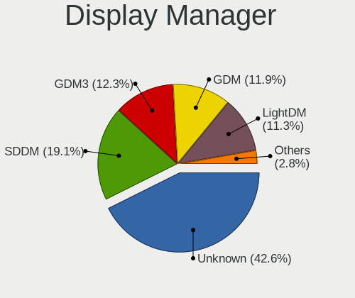
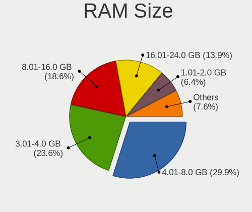
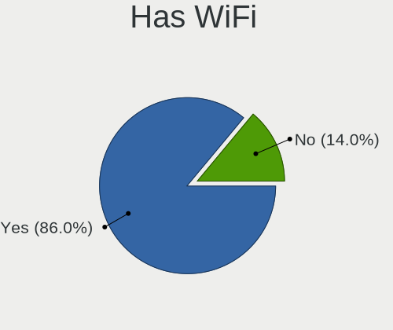
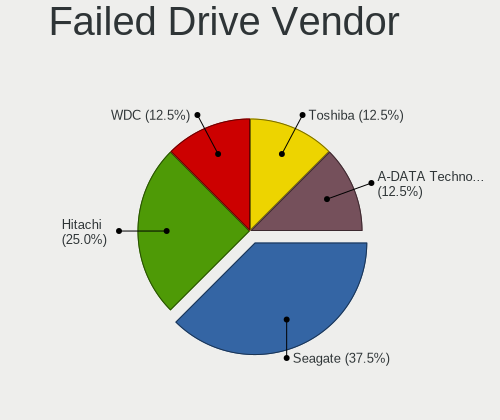
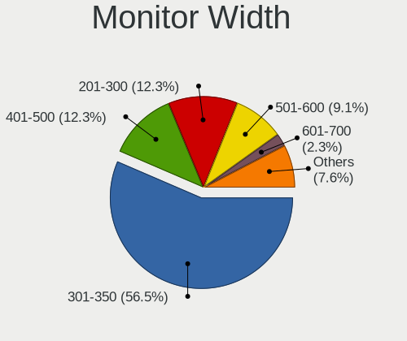
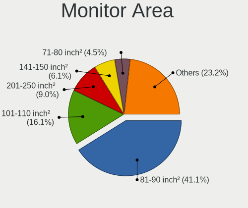
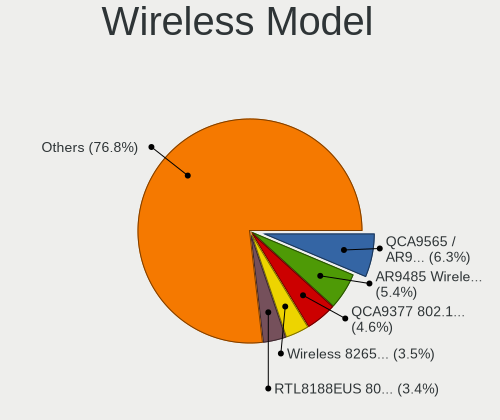
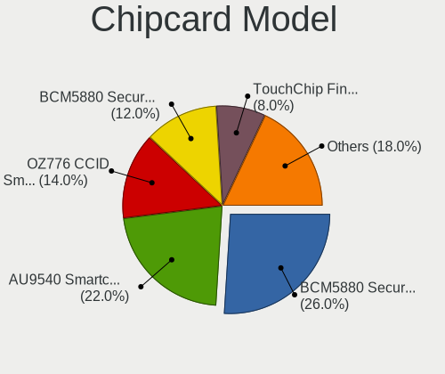

Linux in Indonesia - Tested Hardware & Statistics
-------------------------------------------------

A project to collect tested hardware configurations for Linux in Indonesia.

Anyone can contribute to this report by the [hw-probe](https://github.com/linuxhw/hw-probe) tool:

    sudo -E hw-probe -all -upload

Please contribute! Especially if your hardware is rare.

This is a report for all computer types. See also reports for [desktops](/Location/Indonesia/Desktop/README.md) and [notebooks](/Location/Indonesia/Notebook/README.md).

Contents
--------

* [ Test Cases ](#test-cases)

* [ System ](#system)
  - [ OS                       ](#os)
  - [ OS Family                ](#os-family)
  - [ Kernel                   ](#kernel)
  - [ Kernel Family            ](#kernel-family)
  - [ Kernel Major Ver.        ](#kernel-major-ver)
  - [ Arch                     ](#arch)
  - [ DE                       ](#de)
  - [ Display Server           ](#display-server)
  - [ Display Manager          ](#display-manager)
  - [ OS Lang                  ](#os-lang)
  - [ Boot Mode                ](#boot-mode)
  - [ Filesystem               ](#filesystem)
  - [ Part. scheme             ](#part-scheme)
  - [ Dual Boot with Linux/BSD ](#dual-boot-with-linuxbsd)
  - [ Dual Boot (Win)          ](#dual-boot-win)

* [ Board ](#board)
  - [ Vendor                   ](#vendor)
  - [ Model                    ](#model)
  - [ Model Family             ](#model-family)
  - [ MFG Year                 ](#mfg-year)
  - [ Form Factor              ](#form-factor)
  - [ Secure Boot              ](#secure-boot)
  - [ Coreboot                 ](#coreboot)
  - [ RAM Size                 ](#ram-size)
  - [ RAM Used                 ](#ram-used)
  - [ Total Drives             ](#total-drives)
  - [ Has CD-ROM               ](#has-cd-rom)
  - [ Has Ethernet             ](#has-ethernet)
  - [ Has WiFi                 ](#has-wifi)
  - [ Has Bluetooth            ](#has-bluetooth)

* [ Location ](#location)
  - [ Country                  ](#country)
  - [ City                     ](#city)

* [ Drives ](#drives)
  - [ Drive Vendor             ](#drive-vendor)
  - [ Drive Model              ](#drive-model)
  - [ HDD Vendor               ](#hdd-vendor)
  - [ SSD Vendor               ](#ssd-vendor)
  - [ Drive Kind               ](#drive-kind)
  - [ Drive Connector          ](#drive-connector)
  - [ Drive Size               ](#drive-size)
  - [ Space Total              ](#space-total)
  - [ Space Used               ](#space-used)
  - [ Malfunc. Drives          ](#malfunc-drives)
  - [ Malfunc. Drive Vendor    ](#malfunc-drive-vendor)
  - [ Malfunc. HDD Vendor      ](#malfunc-hdd-vendor)
  - [ Malfunc. Drive Kind      ](#malfunc-drive-kind)
  - [ Failed Drives            ](#failed-drives)
  - [ Failed Drive Vendor      ](#failed-drive-vendor)
  - [ Drive Status             ](#drive-status)

* [ Storage controller ](#storage-controller)
  - [ Storage Vendor           ](#storage-vendor)
  - [ Storage Model            ](#storage-model)
  - [ Storage Kind             ](#storage-kind)

* [ Processor ](#processor)
  - [ CPU Vendor               ](#cpu-vendor)
  - [ CPU Model                ](#cpu-model)
  - [ CPU Model Family         ](#cpu-model-family)
  - [ CPU Cores                ](#cpu-cores)
  - [ CPU Sockets              ](#cpu-sockets)
  - [ CPU Threads              ](#cpu-threads)
  - [ CPU Op-Modes             ](#cpu-op-modes)
  - [ CPU Microcode            ](#cpu-microcode)
  - [ CPU Microarch            ](#cpu-microarch)

* [ Graphics ](#graphics)
  - [ GPU Vendor               ](#gpu-vendor)
  - [ GPU Model                ](#gpu-model)
  - [ GPU Combo                ](#gpu-combo)
  - [ GPU Driver               ](#gpu-driver)
  - [ GPU Memory               ](#gpu-memory)

* [ Monitor ](#monitor)
  - [ Monitor Vendor           ](#monitor-vendor)
  - [ Monitor Model            ](#monitor-model)
  - [ Monitor Resolution       ](#monitor-resolution)
  - [ Monitor Diagonal         ](#monitor-diagonal)
  - [ Monitor Width            ](#monitor-width)
  - [ Aspect Ratio             ](#aspect-ratio)
  - [ Monitor Area             ](#monitor-area)
  - [ Pixel Density            ](#pixel-density)
  - [ Multiple Monitors        ](#multiple-monitors)

* [ Network ](#network)
  - [ Net Controller Vendor    ](#net-controller-vendor)
  - [ Net Controller Model     ](#net-controller-model)
  - [ Wireless Vendor          ](#wireless-vendor)
  - [ Wireless Model           ](#wireless-model)
  - [ Ethernet Vendor          ](#ethernet-vendor)
  - [ Ethernet Model           ](#ethernet-model)
  - [ Net Controller Kind      ](#net-controller-kind)
  - [ Used Controller          ](#used-controller)
  - [ NICs                     ](#nics)
  - [ IPv6                     ](#ipv6)

* [ Bluetooth ](#bluetooth)
  - [ Bluetooth Vendor         ](#bluetooth-vendor)
  - [ Bluetooth Model          ](#bluetooth-model)

* [ Sound ](#sound)
  - [ Sound Vendor             ](#sound-vendor)
  - [ Sound Model              ](#sound-model)

* [ Memory ](#memory)
  - [ Memory Vendor            ](#memory-vendor)
  - [ Memory Model             ](#memory-model)
  - [ Memory Kind              ](#memory-kind)
  - [ Memory Form Factor       ](#memory-form-factor)
  - [ Memory Size              ](#memory-size)
  - [ Memory Speed             ](#memory-speed)

* [ Printers & scanners ](#printers--scanners)
  - [ Printer Vendor           ](#printer-vendor)
  - [ Printer Model            ](#printer-model)
  - [ Scanner Vendor           ](#scanner-vendor)
  - [ Scanner Model            ](#scanner-model)

* [ Camera ](#camera)
  - [ Camera Vendor            ](#camera-vendor)
  - [ Camera Model             ](#camera-model)

* [ Security ](#security)
  - [ Fingerprint Vendor       ](#fingerprint-vendor)
  - [ Fingerprint Model        ](#fingerprint-model)
  - [ Chipcard Vendor          ](#chipcard-vendor)
  - [ Chipcard Model           ](#chipcard-model)

* [ Unsupported ](#unsupported)
  - [ Unsupported Devices      ](#unsupported-devices)
  - [ Unsupported Device Types ](#unsupported-device-types)

Test Cases
----------

Total: 1249

| Vendor        | Model                       | Form-Factor | Probe                                                      | Date         |
|---------------|-----------------------------|-------------|------------------------------------------------------------|--------------|
| Lenovo        | ThinkPad X230 23245NJ       | Notebook    | [3c85e43b86](https://linux-hardware.org/?probe=3c85e43b86) | Aug 01, 2022 |
| HP            | 240 G8 Notebook PC          | Notebook    | [f4533284b4](https://linux-hardware.org/?probe=f4533284b4) | Aug 01, 2022 |
| Lenovo        | ThinkBook 14 G3 ACL 21A2    | Notebook    | [3a496f366f](https://linux-hardware.org/?probe=3a496f366f) | Aug 01, 2022 |
| Acer          | Z476                        | Notebook    | [ade85b90c1](https://linux-hardware.org/?probe=ade85b90c1) | Aug 01, 2022 |
| Dell          | Latitude E7250              | Notebook    | [2dd83a16c7](https://linux-hardware.org/?probe=2dd83a16c7) | Aug 01, 2022 |
| Unknown       | Unknown                     | Desktop     | [a8e41fdaaa](https://linux-hardware.org/?probe=a8e41fdaaa) | Jul 31, 2022 |
| Sony          | VPCEA36FG                   | Notebook    | [6c742b6234](https://linux-hardware.org/?probe=6c742b6234) | Jul 30, 2022 |
| ASUSTek       | K43E                        | Notebook    | [f6d8225dd6](https://linux-hardware.org/?probe=f6d8225dd6) | Jul 28, 2022 |
| ASUSTek       | X455LF                      | Notebook    | [8e83c4492a](https://linux-hardware.org/?probe=8e83c4492a) | Jul 27, 2022 |
| Acer          | Aspire 4732Z                | Notebook    | [3d23b4bbdc](https://linux-hardware.org/?probe=3d23b4bbdc) | Jul 27, 2022 |
| ASUSTek       | X450CP                      | Notebook    | [dceda2fe9d](https://linux-hardware.org/?probe=dceda2fe9d) | Jul 27, 2022 |
| Lenovo        | ThinkBook 14 G3 ACL 21A2    | Notebook    | [2773e9510b](https://linux-hardware.org/?probe=2773e9510b) | Jul 27, 2022 |
| Gigabyte      | B365M H                     | Desktop     | [527b25a7f3](https://linux-hardware.org/?probe=527b25a7f3) | Jul 25, 2022 |
| Dell          | G3 3579                     | Notebook    | [96fab186c3](https://linux-hardware.org/?probe=96fab186c3) | Jul 24, 2022 |
| MSI           | 2A9C                        | Desktop     | [b0441c833d](https://linux-hardware.org/?probe=b0441c833d) | Jul 24, 2022 |
| ASUSTek       | N56VZ                       | Notebook    | [3813cc04d1](https://linux-hardware.org/?probe=3813cc04d1) | Jul 22, 2022 |
| Lenovo        | ThinkPad X240 20AMS0PB11    | Notebook    | [a6e3ee128e](https://linux-hardware.org/?probe=a6e3ee128e) | Jul 20, 2022 |
| Lenovo        | ThinkBook 14 G3 ACL 21A2    | Notebook    | [944ba71eef](https://linux-hardware.org/?probe=944ba71eef) | Jul 19, 2022 |
| Lenovo        | ThinkBook 14 G3 ACL 21A2    | Notebook    | [df94c841af](https://linux-hardware.org/?probe=df94c841af) | Jul 17, 2022 |
| Lenovo        | V310-14ISK 80SX             | Notebook    | [6dcb934555](https://linux-hardware.org/?probe=6dcb934555) | Jul 17, 2022 |
| Acer          | Aspire E5-475G              | Notebook    | [1f7429b29d](https://linux-hardware.org/?probe=1f7429b29d) | Jul 15, 2022 |
| Lenovo        | ThinkPad T430 2342A19       | Notebook    | [54c99c7f2f](https://linux-hardware.org/?probe=54c99c7f2f) | Jul 14, 2022 |
| Lenovo        | IdeaPad 3 15ITL6 82H8       | Notebook    | [cf41c08ea5](https://linux-hardware.org/?probe=cf41c08ea5) | Jul 14, 2022 |
| Lenovo        | IdeaPad 3 15ITL6 82H8       | Notebook    | [d651eb1f7d](https://linux-hardware.org/?probe=d651eb1f7d) | Jul 14, 2022 |
| Lenovo        | IdeaPad 3 15ITL6 82H8       | Notebook    | [b04b2741a0](https://linux-hardware.org/?probe=b04b2741a0) | Jul 14, 2022 |
| ASUSTek       | ROG Zephyrus G14 GA401IV... | Notebook    | [b00361cdbd](https://linux-hardware.org/?probe=b00361cdbd) | Jul 13, 2022 |
| Lenovo        | IdeaPad 320S-14IKB 81BN     | Notebook    | [cde5f69fef](https://linux-hardware.org/?probe=cde5f69fef) | Jul 13, 2022 |
| Dell          | 0WCWFJ A00                  | All in one  | [89a6f4711c](https://linux-hardware.org/?probe=89a6f4711c) | Jul 11, 2022 |
| HP            | Pavilion g4                 | Notebook    | [87a044a9c7](https://linux-hardware.org/?probe=87a044a9c7) | Jul 11, 2022 |
| Dell          | Latitude E6440              | Notebook    | [495237a0b0](https://linux-hardware.org/?probe=495237a0b0) | Jul 09, 2022 |
| ASUSTek       | H110M-A/DP                  | Desktop     | [01dccaff29](https://linux-hardware.org/?probe=01dccaff29) | Jul 07, 2022 |
| ECS           | H61H2-MV                    | Desktop     | [80e2fc79da](https://linux-hardware.org/?probe=80e2fc79da) | Jul 07, 2022 |
| Toshiba       | Satellite C640              | Notebook    | [cd8f69d739](https://linux-hardware.org/?probe=cd8f69d739) | Jul 07, 2022 |
| Lenovo        | IdeaPad 110-15ACL 80TJ      | Notebook    | [dcd03a28be](https://linux-hardware.org/?probe=dcd03a28be) | Jul 06, 2022 |
| Lenovo        | ThinkBook 14 G3 ACL 21A2    | Notebook    | [0d03afb249](https://linux-hardware.org/?probe=0d03afb249) | Jul 05, 2022 |
| ASUSTek       | H110M-A/DP                  | Desktop     | [356272d726](https://linux-hardware.org/?probe=356272d726) | Jul 04, 2022 |
| Lenovo        | ThinkBook 14 G3 ACL 21A2    | Notebook    | [d2dd306cb4](https://linux-hardware.org/?probe=d2dd306cb4) | Jul 04, 2022 |
| HP            | Laptop 14s-cf2xxx           | Notebook    | [8da2258fea](https://linux-hardware.org/?probe=8da2258fea) | Jul 01, 2022 |
| Lenovo        | ThinkPad L412 0585E86       | Notebook    | [ad82717c98](https://linux-hardware.org/?probe=ad82717c98) | Jul 01, 2022 |
| Acer          | Aspire 4732Z                | Notebook    | [1bf580aa91](https://linux-hardware.org/?probe=1bf580aa91) | Jun 30, 2022 |
| HP            | Laptop 14s-dk0xxx           | Notebook    | [97d88d7e00](https://linux-hardware.org/?probe=97d88d7e00) | Jun 30, 2022 |
| Apple         | MacBookPro12,1              | Notebook    | [3cec3cffbb](https://linux-hardware.org/?probe=3cec3cffbb) | Jun 30, 2022 |
| Apple         | MacBookPro12,1              | Notebook    | [bac4b49e55](https://linux-hardware.org/?probe=bac4b49e55) | Jun 30, 2022 |
| Biostar       | A68N-5600E                  | Desktop     | [d5cfa78343](https://linux-hardware.org/?probe=d5cfa78343) | Jun 29, 2022 |
| Acer          | Aspire A314-35              | Notebook    | [dfdd48254c](https://linux-hardware.org/?probe=dfdd48254c) | Jun 29, 2022 |
| ASUSTek       | K46CB                       | Notebook    | [3af9df185f](https://linux-hardware.org/?probe=3af9df185f) | Jun 26, 2022 |
| HP            | Pavilion g4                 | Notebook    | [d0c8c06219](https://linux-hardware.org/?probe=d0c8c06219) | Jun 24, 2022 |
| ASUSTek       | P5GC-MX/1333                | Desktop     | [30692c3fdb](https://linux-hardware.org/?probe=30692c3fdb) | Jun 23, 2022 |
| Fujitsu       | FMVS02003                   | Notebook    | [3536a9951f](https://linux-hardware.org/?probe=3536a9951f) | Jun 23, 2022 |
| Dell          | Precision M4500             | Notebook    | [e41b9f3386](https://linux-hardware.org/?probe=e41b9f3386) | Jun 22, 2022 |
| Apple         | MacBookPro14,1              | Notebook    | [e9d8c28a34](https://linux-hardware.org/?probe=e9d8c28a34) | Jun 22, 2022 |
| Acer          | Aspire A315-41              | Notebook    | [00a254b4ff](https://linux-hardware.org/?probe=00a254b4ff) | Jun 21, 2022 |
| Acer          | Aspire A315-41              | Notebook    | [4ca3721cbb](https://linux-hardware.org/?probe=4ca3721cbb) | Jun 20, 2022 |
| MSI           | 2A9C                        | Desktop     | [73dd2172d3](https://linux-hardware.org/?probe=73dd2172d3) | Jun 20, 2022 |
| ASUSTek       | X450CC                      | Notebook    | [4d5fb8a789](https://linux-hardware.org/?probe=4d5fb8a789) | Jun 20, 2022 |
| ASUSTek       | X450CC                      | Notebook    | [9f7b97f22f](https://linux-hardware.org/?probe=9f7b97f22f) | Jun 20, 2022 |
| Apple         | MacBookPro12,1              | Notebook    | [666e91f182](https://linux-hardware.org/?probe=666e91f182) | Jun 20, 2022 |
| Apple         | MacBookPro12,1              | Notebook    | [5d9f65fbc9](https://linux-hardware.org/?probe=5d9f65fbc9) | Jun 20, 2022 |
| AXIOO         | Mybook 14E                  | Notebook    | [499861f5e9](https://linux-hardware.org/?probe=499861f5e9) | Jun 19, 2022 |
| Dell          | Inspiron 3442               | Notebook    | [b71d801e61](https://linux-hardware.org/?probe=b71d801e61) | Jun 18, 2022 |
| ASUSTek       | K46CB                       | Notebook    | [a6cc4351be](https://linux-hardware.org/?probe=a6cc4351be) | Jun 17, 2022 |
| ASUSTek       | K46CB                       | Notebook    | [fe4f649d9b](https://linux-hardware.org/?probe=fe4f649d9b) | Jun 17, 2022 |
| Wearnes       | T1550-A1                    | Desktop     | [b131cd7e0d](https://linux-hardware.org/?probe=b131cd7e0d) | Jun 16, 2022 |
| Wearnes       | T1550-A1                    | Desktop     | [002ebf8c70](https://linux-hardware.org/?probe=002ebf8c70) | Jun 15, 2022 |
| HP            | Laptop 14s-fq0xxx           | Notebook    | [0a77925edb](https://linux-hardware.org/?probe=0a77925edb) | Jun 10, 2022 |
| HP            | 2B43                        | Desktop     | [6f36772b0c](https://linux-hardware.org/?probe=6f36772b0c) | Jun 10, 2022 |
| Acer          | AO756                       | Notebook    | [008fa33f13](https://linux-hardware.org/?probe=008fa33f13) | Jun 09, 2022 |
| Acer          | Aspire A514-54G             | Notebook    | [a74cd897c5](https://linux-hardware.org/?probe=a74cd897c5) | Jun 09, 2022 |
| MSI           | Prestige 14 A11SC           | Notebook    | [ea39fa65a1](https://linux-hardware.org/?probe=ea39fa65a1) | Jun 09, 2022 |
| Lenovo        | Legion 5 15IMH05H 81Y6      | Notebook    | [bdb3bbe37f](https://linux-hardware.org/?probe=bdb3bbe37f) | Jun 07, 2022 |
| Lenovo        | Z41-70 80K5                 | Notebook    | [3419d2fd18](https://linux-hardware.org/?probe=3419d2fd18) | Jun 06, 2022 |
| HP            | Pavilion 15                 | Notebook    | [5e4d9a126e](https://linux-hardware.org/?probe=5e4d9a126e) | Jun 05, 2022 |
| HP            | Pavilion Aero Laptop 13-... | Notebook    | [41862e04b8](https://linux-hardware.org/?probe=41862e04b8) | Jun 03, 2022 |
| Lenovo        | IdeaPad 320-14ISK 80XG      | Notebook    | [83cb6d1fe4](https://linux-hardware.org/?probe=83cb6d1fe4) | Jun 01, 2022 |
| MSI           | H81I                        | Desktop     | [6b4e34a35e](https://linux-hardware.org/?probe=6b4e34a35e) | Jun 01, 2022 |
| Acer          | Aspire A514-54G             | Notebook    | [1019de0d68](https://linux-hardware.org/?probe=1019de0d68) | Jun 01, 2022 |
| ASUSTek       | N550JV                      | Notebook    | [2652284f1a](https://linux-hardware.org/?probe=2652284f1a) | May 31, 2022 |
| ASRock        | A88M-G                      | Desktop     | [9b82b09acc](https://linux-hardware.org/?probe=9b82b09acc) | May 30, 2022 |
| Acer          | Aspire 4720Z                | Notebook    | [a1dd5003f5](https://linux-hardware.org/?probe=a1dd5003f5) | May 30, 2022 |
| AXIOO         | NEON HNM MODEL              | Notebook    | [0fbd1cf4af](https://linux-hardware.org/?probe=0fbd1cf4af) | May 30, 2022 |
| Lenovo        | ThinkBook 14 G3 ACL 21A2    | Notebook    | [983144763a](https://linux-hardware.org/?probe=983144763a) | May 27, 2022 |
| ASUSTek       | ZenBook UX333FN_UX333FN     | Notebook    | [ecebcc6033](https://linux-hardware.org/?probe=ecebcc6033) | May 26, 2022 |
| ASUSTek       | GL502VMK                    | Notebook    | [dfca615a89](https://linux-hardware.org/?probe=dfca615a89) | May 25, 2022 |
| Lenovo        | G400 20235                  | Notebook    | [351b94ec15](https://linux-hardware.org/?probe=351b94ec15) | May 25, 2022 |
| HP            | 1000                        | Notebook    | [e83bc1e8fe](https://linux-hardware.org/?probe=e83bc1e8fe) | May 24, 2022 |
| Lenovo        | IdeaPad S340-14API 81NB     | Notebook    | [1b061ef293](https://linux-hardware.org/?probe=1b061ef293) | May 24, 2022 |
| LORD ELECT... | LORD G4x 775 ICH7 8712 A... | Desktop     | [2e27b6fac9](https://linux-hardware.org/?probe=2e27b6fac9) | May 23, 2022 |
| Acer          | Swift SFX14-41G             | Notebook    | [da40fdda29](https://linux-hardware.org/?probe=da40fdda29) | May 22, 2022 |
| Biostar       | GF8200C M2+                 | Desktop     | [b80588cbea](https://linux-hardware.org/?probe=b80588cbea) | May 21, 2022 |
| ASUSTek       | K43U                        | Notebook    | [a46669147d](https://linux-hardware.org/?probe=a46669147d) | May 21, 2022 |
| MSI           | Modern 14 B11MO             | Notebook    | [c3b01c8c1b](https://linux-hardware.org/?probe=c3b01c8c1b) | May 20, 2022 |
| ASRock        | A88M-G                      | Desktop     | [e2baae7114](https://linux-hardware.org/?probe=e2baae7114) | May 19, 2022 |
| ASUSTek       | K43U                        | Notebook    | [2748cd44f0](https://linux-hardware.org/?probe=2748cd44f0) | May 19, 2022 |
| ASUSTek       | H81M-K                      | Desktop     | [c5cdf9ba52](https://linux-hardware.org/?probe=c5cdf9ba52) | May 18, 2022 |
| ASRock        | FM2A68M-DG3+                | Desktop     | [a1b9d7e608](https://linux-hardware.org/?probe=a1b9d7e608) | May 18, 2022 |
| ASUSTek       | VivoBook_ASUSLaptop X403... | Notebook    | [843a31b222](https://linux-hardware.org/?probe=843a31b222) | May 17, 2022 |
| Apple         | MacBookPro9,2               | Notebook    | [cfba770336](https://linux-hardware.org/?probe=cfba770336) | May 17, 2022 |
| Apple         | MacBookPro9,2               | Notebook    | [c19acfde6f](https://linux-hardware.org/?probe=c19acfde6f) | May 17, 2022 |
| Lenovo        | IdeaPad 320S-14IKB 81BN     | Notebook    | [1661f9e71d](https://linux-hardware.org/?probe=1661f9e71d) | May 16, 2022 |
| ASUSTek       | PRIME B250-PLUS             | Desktop     | [2ee65efb9e](https://linux-hardware.org/?probe=2ee65efb9e) | May 15, 2022 |
| ASUSTek       | VivoBook_ASUS Laptop X50... | Notebook    | [e633129a51](https://linux-hardware.org/?probe=e633129a51) | May 13, 2022 |
| ASUSTek       | VivoBook_ASUSLaptop X409... | Notebook    | [ffbf67b890](https://linux-hardware.org/?probe=ffbf67b890) | May 12, 2022 |
| HP            | Pavilion Aero Laptop 13-... | Notebook    | [7aaffeda48](https://linux-hardware.org/?probe=7aaffeda48) | May 12, 2022 |
| MSI           | Modern 14 B5M               | Notebook    | [b207ce7566](https://linux-hardware.org/?probe=b207ce7566) | May 12, 2022 |
| Acer          | Aspire E5-476G              | Notebook    | [98b0999339](https://linux-hardware.org/?probe=98b0999339) | May 12, 2022 |
| Acer          | Aspire E5-476G              | Notebook    | [c4e0e740bb](https://linux-hardware.org/?probe=c4e0e740bb) | May 12, 2022 |
| Acer          | V1.24                       | Notebook    | [186531d4d8](https://linux-hardware.org/?probe=186531d4d8) | May 11, 2022 |
| Sony          | SVS13137PGB                 | Notebook    | [6dd2b49c52](https://linux-hardware.org/?probe=6dd2b49c52) | May 10, 2022 |
| Acer          | Nitro AN515-52              | Notebook    | [5122079c78](https://linux-hardware.org/?probe=5122079c78) | May 10, 2022 |
| Unknown       | Unknown                     | Desktop     | [19345cd924](https://linux-hardware.org/?probe=19345cd924) | May 10, 2022 |
| Acer          | Swift SF314-41              | Notebook    | [108b57a5a7](https://linux-hardware.org/?probe=108b57a5a7) | May 10, 2022 |
| Acer          | Aspire A514-54G             | Notebook    | [ec1fa8e360](https://linux-hardware.org/?probe=ec1fa8e360) | May 08, 2022 |
| MSI           | B450 GAMING PLUS MAX        | Desktop     | [56cecf6472](https://linux-hardware.org/?probe=56cecf6472) | May 07, 2022 |
| MSI           | H55M-P33                    | Desktop     | [0f6b0dc134](https://linux-hardware.org/?probe=0f6b0dc134) | May 07, 2022 |
| Acer          | Aspire A514-54G             | Notebook    | [b4b52aad69](https://linux-hardware.org/?probe=b4b52aad69) | May 07, 2022 |
| ASUSTek       | UX360UAK                    | Convertible | [c0bfa1dddf](https://linux-hardware.org/?probe=c0bfa1dddf) | May 06, 2022 |
| Acer          | Aspire V5-431               | Notebook    | [04db0db85f](https://linux-hardware.org/?probe=04db0db85f) | May 05, 2022 |
| HP            | Pavilion Laptop 14-bf0xx    | Notebook    | [4dcc86a60e](https://linux-hardware.org/?probe=4dcc86a60e) | May 03, 2022 |
| MSI           | Modern 14 B5M               | Notebook    | [04dee023e6](https://linux-hardware.org/?probe=04dee023e6) | May 01, 2022 |
| Lenovo        | ThinkPad X230 Tablet 343... | Notebook    | [db2efb40d4](https://linux-hardware.org/?probe=db2efb40d4) | May 01, 2022 |
| ASUSTek       | VivoBook_ASUSLaptop X421... | Notebook    | [af3efcde26](https://linux-hardware.org/?probe=af3efcde26) | Apr 29, 2022 |
| ASUSTek       | X200MA                      | Notebook    | [f93f8fcb35](https://linux-hardware.org/?probe=f93f8fcb35) | Apr 28, 2022 |
| Dell          | Latitude E6510              | Notebook    | [10d60e00c2](https://linux-hardware.org/?probe=10d60e00c2) | Apr 27, 2022 |
| ASUSTek       | X455LD                      | Notebook    | [9f98b410f6](https://linux-hardware.org/?probe=9f98b410f6) | Apr 26, 2022 |
| Gigabyte      | M912                        | Notebook    | [fd0834889a](https://linux-hardware.org/?probe=fd0834889a) | Apr 25, 2022 |
| ASUSTek       | X450LCP                     | Notebook    | [a2ed4903be](https://linux-hardware.org/?probe=a2ed4903be) | Apr 23, 2022 |
| Lenovo        | IdeaPad Gaming 3 15ACH6 ... | Notebook    | [c90694a42c](https://linux-hardware.org/?probe=c90694a42c) | Apr 23, 2022 |
| Gigabyte      | AERO 15XV8                  | Notebook    | [d52bc41f4c](https://linux-hardware.org/?probe=d52bc41f4c) | Apr 21, 2022 |
| ASUSTek       | ZenBook UX333FN_UX333FN     | Notebook    | [8273c9ecb4](https://linux-hardware.org/?probe=8273c9ecb4) | Apr 20, 2022 |
| Gigabyte      | B550 AORUS ELITE            | Desktop     | [85b4ecf9d3](https://linux-hardware.org/?probe=85b4ecf9d3) | Apr 14, 2022 |
| ASUSTek       | PRIME A320M-F               | Desktop     | [1e81b06f04](https://linux-hardware.org/?probe=1e81b06f04) | Apr 14, 2022 |
| ASUSTek       | VivoBook 14_ASUS Laptop ... | Notebook    | [345734b3fd](https://linux-hardware.org/?probe=345734b3fd) | Apr 07, 2022 |
| Acer          | Aspire 4720Z                | Notebook    | [eb44050489](https://linux-hardware.org/?probe=eb44050489) | Apr 07, 2022 |
| Lenovo        | ThinkPad T450 20BV0001US    | Notebook    | [f72149904c](https://linux-hardware.org/?probe=f72149904c) | Apr 05, 2022 |
| ASUSTek       | X455YA                      | Notebook    | [cf17e2bba2](https://linux-hardware.org/?probe=cf17e2bba2) | Apr 03, 2022 |
| Unknown       | Unknown                     | Desktop     | [ca7ee75e52](https://linux-hardware.org/?probe=ca7ee75e52) | Apr 01, 2022 |
| Acer          | Aspire 4720Z                | Notebook    | [c3651e4d3d](https://linux-hardware.org/?probe=c3651e4d3d) | Apr 01, 2022 |
| Dell          | Latitude E6230              | Notebook    | [c45161f6f3](https://linux-hardware.org/?probe=c45161f6f3) | Mar 31, 2022 |
| HP            | 3641h                       | Desktop     | [d50fc13ff0](https://linux-hardware.org/?probe=d50fc13ff0) | Mar 30, 2022 |
| ASRock        | B75M-GL R2.0                | Desktop     | [84625838c2](https://linux-hardware.org/?probe=84625838c2) | Mar 30, 2022 |
| Lenovo        | 36F2 SDK0Q55754 WIN 3273... | All in one  | [64bc773e5b](https://linux-hardware.org/?probe=64bc773e5b) | Mar 30, 2022 |
| HP            | Pavilion 14                 | Notebook    | [1b15a2e740](https://linux-hardware.org/?probe=1b15a2e740) | Mar 28, 2022 |
| Infinix       | INBook X1                   | Notebook    | [a06d137316](https://linux-hardware.org/?probe=a06d137316) | Mar 28, 2022 |
| Koloe         | X58                         | Desktop     | [8025987817](https://linux-hardware.org/?probe=8025987817) | Mar 27, 2022 |
| MSI           | GF63 Thin 9SCXR             | Notebook    | [46acaeb2db](https://linux-hardware.org/?probe=46acaeb2db) | Mar 27, 2022 |
| Dell          | Latitude E7240              | Notebook    | [02c34ca310](https://linux-hardware.org/?probe=02c34ca310) | Mar 25, 2022 |
| ASUSTek       | X455YA                      | Notebook    | [b0469d5342](https://linux-hardware.org/?probe=b0469d5342) | Mar 25, 2022 |
| Colorful T... | C.H110M-K D3 PLUS V20       | Desktop     | [191dfebc88](https://linux-hardware.org/?probe=191dfebc88) | Mar 23, 2022 |
| Sony          | VPCSB35FG                   | Notebook    | [79d0465072](https://linux-hardware.org/?probe=79d0465072) | Mar 23, 2022 |
| HP            | Pavilion Aero Laptop 13-... | Notebook    | [3f4f125a64](https://linux-hardware.org/?probe=3f4f125a64) | Mar 23, 2022 |
| Acer          | Aspire 4750                 | Notebook    | [1b7f98b34d](https://linux-hardware.org/?probe=1b7f98b34d) | Mar 23, 2022 |
| ASUSTek       | X456UQK                     | Notebook    | [863693cc0a](https://linux-hardware.org/?probe=863693cc0a) | Mar 23, 2022 |
| Gigabyte      | B550 AORUS ELITE            | Desktop     | [7977e70f86](https://linux-hardware.org/?probe=7977e70f86) | Mar 22, 2022 |
| Lenovo        | IdeaPad 3 15ITL6 82H8       | Notebook    | [f0047d02ea](https://linux-hardware.org/?probe=f0047d02ea) | Mar 22, 2022 |
| MSI           | PRO B660M-A WIFI DDR4       | Desktop     | [dd7543bdb3](https://linux-hardware.org/?probe=dd7543bdb3) | Mar 21, 2022 |
| Dell          | Inspiron 13-5368            | Notebook    | [d98411620e](https://linux-hardware.org/?probe=d98411620e) | Mar 21, 2022 |
| ASUSTek       | K46CA                       | Notebook    | [08985cbe9e](https://linux-hardware.org/?probe=08985cbe9e) | Mar 21, 2022 |
| Intel         | H55                         | Desktop     | [baff4758b7](https://linux-hardware.org/?probe=baff4758b7) | Mar 21, 2022 |
| MSI           | PRO B660M-A WIFI DDR4       | Desktop     | [991793e09e](https://linux-hardware.org/?probe=991793e09e) | Mar 20, 2022 |
| HP            | Pavilion Aero Laptop 13-... | Notebook    | [8793c924fe](https://linux-hardware.org/?probe=8793c924fe) | Mar 19, 2022 |
| Clevo         | W240HU/W250HUQ              | Notebook    | [222cbe9b4e](https://linux-hardware.org/?probe=222cbe9b4e) | Mar 18, 2022 |
| Lenovo        | IdeaPad 320S-14IKB 81BN     | Notebook    | [fa74626a55](https://linux-hardware.org/?probe=fa74626a55) | Mar 16, 2022 |
| Lenovo        | V330-14IKB 81B0             | Notebook    | [06a3e2150b](https://linux-hardware.org/?probe=06a3e2150b) | Mar 16, 2022 |
| Lenovo        | V330-14IKB 81B0             | Notebook    | [73e48f6dc4](https://linux-hardware.org/?probe=73e48f6dc4) | Mar 16, 2022 |
| HP            | Pavilion Aero Laptop 13-... | Notebook    | [8e9c955b47](https://linux-hardware.org/?probe=8e9c955b47) | Mar 15, 2022 |
| ASUSTek       | X441NA                      | Notebook    | [b7cf53ebcc](https://linux-hardware.org/?probe=b7cf53ebcc) | Mar 15, 2022 |
| Lenovo        | IdeaPad 330-14AST 81D5      | Notebook    | [c334e9a1f6](https://linux-hardware.org/?probe=c334e9a1f6) | Mar 14, 2022 |
| HP            | Notebook                    | Notebook    | [6ae78b432d](https://linux-hardware.org/?probe=6ae78b432d) | Mar 12, 2022 |
| ZYREX COMP... | TACTICAL                    | Desktop     | [73a4735670](https://linux-hardware.org/?probe=73a4735670) | Mar 12, 2022 |
| Dell          | Latitude E7240              | Notebook    | [fed08a1d40](https://linux-hardware.org/?probe=fed08a1d40) | Mar 12, 2022 |
| HP            | Pavilion Aero Laptop 13-... | Notebook    | [e39d0d9111](https://linux-hardware.org/?probe=e39d0d9111) | Mar 11, 2022 |
| Lenovo        | Yoga Slim 7 Pro 14ACH5 8... | Notebook    | [f2a82ddf3b](https://linux-hardware.org/?probe=f2a82ddf3b) | Mar 11, 2022 |
| ASUSTek       | GL553VD                     | Notebook    | [5e43e1dd7b](https://linux-hardware.org/?probe=5e43e1dd7b) | Mar 11, 2022 |
| Biostar       | N68S3B                      | Desktop     | [aa1e6a4c82](https://linux-hardware.org/?probe=aa1e6a4c82) | Mar 10, 2022 |
| ASUSTek       | TUF Gaming FX505DD_FX505... | Notebook    | [ed4db5233e](https://linux-hardware.org/?probe=ed4db5233e) | Mar 10, 2022 |
| ASUSTek       | X450EA                      | Notebook    | [a7394d72a0](https://linux-hardware.org/?probe=a7394d72a0) | Mar 09, 2022 |
| MSI           | 2A9C                        | Desktop     | [2f6380807c](https://linux-hardware.org/?probe=2f6380807c) | Mar 09, 2022 |
| MSI           | 2A9C                        | Desktop     | [4702507c0f](https://linux-hardware.org/?probe=4702507c0f) | Mar 09, 2022 |
| MSI           | Modern 14 B10MW             | Notebook    | [661d068b83](https://linux-hardware.org/?probe=661d068b83) | Mar 08, 2022 |
| HP            | Pavilion g4                 | Notebook    | [3ff8cf8ed0](https://linux-hardware.org/?probe=3ff8cf8ed0) | Mar 08, 2022 |
| Dell          | 02YYK5 A01                  | Desktop     | [dbf296e963](https://linux-hardware.org/?probe=dbf296e963) | Mar 08, 2022 |
| Dell          | 02YYK5 A01                  | Desktop     | [7b670726c4](https://linux-hardware.org/?probe=7b670726c4) | Mar 08, 2022 |
| Biostar       | H61MLV2                     | Desktop     | [d5c330bad8](https://linux-hardware.org/?probe=d5c330bad8) | Mar 08, 2022 |
| Sony          | VPCSB35FG                   | Notebook    | [b8a266ddc0](https://linux-hardware.org/?probe=b8a266ddc0) | Mar 08, 2022 |
| Lenovo        | ThinkPad X240 20AMS35500    | Notebook    | [af08ab87c5](https://linux-hardware.org/?probe=af08ab87c5) | Mar 07, 2022 |
| Toshiba       | PORTEGE R835                | Notebook    | [67e8021c81](https://linux-hardware.org/?probe=67e8021c81) | Mar 06, 2022 |
| HP            | Pavilion Gaming Laptop 1... | Notebook    | [e7d5945f3d](https://linux-hardware.org/?probe=e7d5945f3d) | Mar 05, 2022 |
| Lenovo        | G40-45 80E1                 | Notebook    | [28f40df81d](https://linux-hardware.org/?probe=28f40df81d) | Mar 04, 2022 |
| ASUSTek       | UL20A                       | Notebook    | [c4efddb6b4](https://linux-hardware.org/?probe=c4efddb6b4) | Mar 02, 2022 |
| Fujitsu       | Unknown                     | Notebook    | [bc81b988ce](https://linux-hardware.org/?probe=bc81b988ce) | Mar 02, 2022 |
| Lenovo        | IdeaPad Z460 20059          | Notebook    | [621999b245](https://linux-hardware.org/?probe=621999b245) | Feb 24, 2022 |
| Gigabyte      | H110M-S2PH-CF               | Desktop     | [3b3c38ec7d](https://linux-hardware.org/?probe=3b3c38ec7d) | Feb 24, 2022 |
| Acer          | Aspire M3970                | Desktop     | [ba6546f689](https://linux-hardware.org/?probe=ba6546f689) | Feb 24, 2022 |
| Intel         | X79G V2.x                   | Desktop     | [cdc3afd163](https://linux-hardware.org/?probe=cdc3afd163) | Feb 24, 2022 |
| Dell          | 0GM819                      | Desktop     | [28011d003e](https://linux-hardware.org/?probe=28011d003e) | Feb 23, 2022 |
| Dell          | Vostro 5470                 | Notebook    | [5ba37db2b4](https://linux-hardware.org/?probe=5ba37db2b4) | Feb 23, 2022 |
| Dell          | Latitude E7240              | Notebook    | [91cc26a6ac](https://linux-hardware.org/?probe=91cc26a6ac) | Feb 22, 2022 |
| Acer          | Aspire 4720Z                | Notebook    | [eba3609129](https://linux-hardware.org/?probe=eba3609129) | Feb 19, 2022 |
| MSI           | Modern 14 B10MW             | Notebook    | [beb5ff195a](https://linux-hardware.org/?probe=beb5ff195a) | Feb 18, 2022 |
| HP            | Laptop 14-bs0xx             | Notebook    | [2b5b67148b](https://linux-hardware.org/?probe=2b5b67148b) | Feb 18, 2022 |
| Acer          | One Z1402                   | Notebook    | [8746e0e3e7](https://linux-hardware.org/?probe=8746e0e3e7) | Feb 18, 2022 |
| Lenovo        | IdeaPad 710S-13ISK 80SW     | Notebook    | [1582806778](https://linux-hardware.org/?probe=1582806778) | Feb 17, 2022 |
| ASUSTek       | X540LA                      | Notebook    | [b2efca795b](https://linux-hardware.org/?probe=b2efca795b) | Feb 17, 2022 |
| Intel         | H61                         | Desktop     | [a70c59ad0e](https://linux-hardware.org/?probe=a70c59ad0e) | Feb 17, 2022 |
| Lenovo        | IdeaPad S410p 20296         | Notebook    | [e3dfc424ca](https://linux-hardware.org/?probe=e3dfc424ca) | Feb 16, 2022 |
| Dell          | 0VRWRC A00                  | Desktop     | [1e54431036](https://linux-hardware.org/?probe=1e54431036) | Feb 15, 2022 |
| Fujitsu       | FMVNA1SE                    | Notebook    | [e2cd0bdcb5](https://linux-hardware.org/?probe=e2cd0bdcb5) | Feb 14, 2022 |
| Khadas        | VIM2                        | Soc         | [c3e2b43e74](https://linux-hardware.org/?probe=c3e2b43e74) | Feb 13, 2022 |
| ECS           | A58F2P-M4                   | Desktop     | [bae5185ab0](https://linux-hardware.org/?probe=bae5185ab0) | Feb 13, 2022 |
| Dell          | 0Y7WYT A00                  | Desktop     | [3a6bb92957](https://linux-hardware.org/?probe=3a6bb92957) | Feb 13, 2022 |
| Toshiba       | Satellite C840              | Notebook    | [cb53c43003](https://linux-hardware.org/?probe=cb53c43003) | Feb 13, 2022 |
| Lenovo        | IdeaPad S205 Brazos         | Notebook    | [402bdafb5f](https://linux-hardware.org/?probe=402bdafb5f) | Feb 12, 2022 |
| ASUSTek       | VivoBook_ASUSLaptop X409... | Notebook    | [46d98c991e](https://linux-hardware.org/?probe=46d98c991e) | Feb 12, 2022 |
| Lenovo        | IdeaPad 320S-14IKB 81BN     | Notebook    | [5d4b14e3e0](https://linux-hardware.org/?probe=5d4b14e3e0) | Feb 12, 2022 |
| Lenovo        | IdeaPad Y700-17ISK 80Q0     | Notebook    | [eea0ec2b64](https://linux-hardware.org/?probe=eea0ec2b64) | Feb 12, 2022 |
| Lenovo        | SHARKBAY 0B98401 PRO        | Desktop     | [276233dff5](https://linux-hardware.org/?probe=276233dff5) | Feb 11, 2022 |
| Biostar       | A68MHE                      | Desktop     | [d66f9ea911](https://linux-hardware.org/?probe=d66f9ea911) | Feb 10, 2022 |
| Biostar       | A68MHE                      | Desktop     | [edc710a49e](https://linux-hardware.org/?probe=edc710a49e) | Feb 10, 2022 |
| Toshiba       | Satellite C800D             | Notebook    | [5cdc03cbdf](https://linux-hardware.org/?probe=5cdc03cbdf) | Feb 10, 2022 |
| Lenovo        | IdeaPad 320S-14IKB 81BN     | Notebook    | [54e246f496](https://linux-hardware.org/?probe=54e246f496) | Feb 09, 2022 |
| Lenovo        | IdeaPad Z460 20059          | Notebook    | [aa037a1c8c](https://linux-hardware.org/?probe=aa037a1c8c) | Feb 09, 2022 |
| Lenovo        | IdeaPad Z460 20059          | Notebook    | [0de3e1022e](https://linux-hardware.org/?probe=0de3e1022e) | Feb 09, 2022 |
| Acer          | Nitro AN515-54              | Notebook    | [8023f7f6d2](https://linux-hardware.org/?probe=8023f7f6d2) | Feb 08, 2022 |
| Acer          | Nitro AN515-54              | Notebook    | [66c6eadf8b](https://linux-hardware.org/?probe=66c6eadf8b) | Feb 08, 2022 |
| ASUSTek       | VivoBook_ASUSLaptop X409... | Notebook    | [87954474ed](https://linux-hardware.org/?probe=87954474ed) | Feb 07, 2022 |
| Lenovo        | IdeaPad 100-14IBY 80MH      | Notebook    | [5e0e5de165](https://linux-hardware.org/?probe=5e0e5de165) | Feb 07, 2022 |
| Lenovo        | IdeaPad 330-14AST 81D5      | Notebook    | [aaceb070e8](https://linux-hardware.org/?probe=aaceb070e8) | Feb 07, 2022 |
| ASUSTek       | X455LD                      | Notebook    | [324512f303](https://linux-hardware.org/?probe=324512f303) | Feb 06, 2022 |
| Lenovo        | ThinkPad W520 427637U       | Notebook    | [f9eb52038d](https://linux-hardware.org/?probe=f9eb52038d) | Feb 01, 2022 |
| Dell          | Inspiron 5480               | Notebook    | [85796c8359](https://linux-hardware.org/?probe=85796c8359) | Jan 28, 2022 |
| Dell          | Inspiron 5480               | Notebook    | [59b6841322](https://linux-hardware.org/?probe=59b6841322) | Jan 28, 2022 |
| Acer          | Aspire E5-571G              | Notebook    | [a29ec0cc55](https://linux-hardware.org/?probe=a29ec0cc55) | Jan 28, 2022 |
| Lenovo        | IdeaPad 320-14AST 80XU      | Notebook    | [774625ff90](https://linux-hardware.org/?probe=774625ff90) | Jan 24, 2022 |
| Lenovo        | IdeaPad 320-14AST 80XU      | Notebook    | [e7c5bda932](https://linux-hardware.org/?probe=e7c5bda932) | Jan 24, 2022 |
| ASUSTek       | X450CP                      | Notebook    | [3f431523c1](https://linux-hardware.org/?probe=3f431523c1) | Jan 22, 2022 |
| Acer          | Swift SF314-43              | Notebook    | [567c5725d5](https://linux-hardware.org/?probe=567c5725d5) | Jan 22, 2022 |
| Sony          | SVE14A15FGB                 | Notebook    | [c35af68d7b](https://linux-hardware.org/?probe=c35af68d7b) | Jan 21, 2022 |
| Acer          | Aspire E5-471               | Notebook    | [a7c6bed4e1](https://linux-hardware.org/?probe=a7c6bed4e1) | Jan 21, 2022 |
| Sony          | SVD13213SGW                 | Notebook    | [ee9e63ab7c](https://linux-hardware.org/?probe=ee9e63ab7c) | Jan 21, 2022 |
| Acer          | Nitro AN515-52              | Notebook    | [e4791d09ec](https://linux-hardware.org/?probe=e4791d09ec) | Jan 20, 2022 |
| Lenovo        | IdeaPad 305-14IBD 80R1      | Notebook    | [f963f78bc6](https://linux-hardware.org/?probe=f963f78bc6) | Jan 20, 2022 |
| MSI           | Modern 14 B5M               | Notebook    | [ae605d8a23](https://linux-hardware.org/?probe=ae605d8a23) | Jan 18, 2022 |
| Lenovo        | IdeaPad 320S-14IKB 81BN     | Notebook    | [c021e3bb40](https://linux-hardware.org/?probe=c021e3bb40) | Jan 18, 2022 |
| Acer          | Aspire E5-471               | Notebook    | [bf81e9a289](https://linux-hardware.org/?probe=bf81e9a289) | Jan 17, 2022 |
| Toshiba       | PORTEGE Z30-A               | Notebook    | [6df479c161](https://linux-hardware.org/?probe=6df479c161) | Jan 16, 2022 |
| Lenovo        | ThinkPad X260 20F5S22K0Z    | Notebook    | [e83aec04ca](https://linux-hardware.org/?probe=e83aec04ca) | Jan 16, 2022 |
| Lenovo        | G400s 20244                 | Notebook    | [9ac1aa04cc](https://linux-hardware.org/?probe=9ac1aa04cc) | Jan 15, 2022 |
| Dell          | Vostro 5581                 | Notebook    | [45f89f3b39](https://linux-hardware.org/?probe=45f89f3b39) | Jan 13, 2022 |
| MSI           | Modern 14 B5M               | Notebook    | [4822adcbc3](https://linux-hardware.org/?probe=4822adcbc3) | Jan 09, 2022 |
| MSI           | GL65 9SC                    | Notebook    | [24c204f7cf](https://linux-hardware.org/?probe=24c204f7cf) | Jan 09, 2022 |
| Dell          | Latitude E7250              | Notebook    | [e586dba516](https://linux-hardware.org/?probe=e586dba516) | Jan 09, 2022 |
| Lenovo        | ThinkPad E14 20RAS0EQ00     | Notebook    | [ea22270511](https://linux-hardware.org/?probe=ea22270511) | Jan 09, 2022 |
| Dell          | Inspiron 5570               | Notebook    | [2268237364](https://linux-hardware.org/?probe=2268237364) | Jan 08, 2022 |
| MSI           | Modern 14 B5M               | Notebook    | [ea82b6b417](https://linux-hardware.org/?probe=ea82b6b417) | Jan 08, 2022 |
| ASUSTek       | N43SL                       | Notebook    | [8468a0ab83](https://linux-hardware.org/?probe=8468a0ab83) | Jan 04, 2022 |
| Lenovo        | U310                        | Notebook    | [47b64f9b71](https://linux-hardware.org/?probe=47b64f9b71) | Jan 04, 2022 |
| ASUSTek       | TP300LD                     | Notebook    | [2048e4ff56](https://linux-hardware.org/?probe=2048e4ff56) | Jan 04, 2022 |
| Biostar       | H81MHV3                     | Desktop     | [897c4f4fa5](https://linux-hardware.org/?probe=897c4f4fa5) | Jan 03, 2022 |
| Lenovo        | Yoga Slim 7 14ARE05 82A2    | Notebook    | [954bd9f15e](https://linux-hardware.org/?probe=954bd9f15e) | Jan 03, 2022 |
| Lenovo        | Yoga Slim 7 14ARE05 82A2    | Notebook    | [5a0df8b1d8](https://linux-hardware.org/?probe=5a0df8b1d8) | Jan 03, 2022 |
| Gigabyte      | GA-78LMT-USB3 x.x           | Desktop     | [af3d4f8c4d](https://linux-hardware.org/?probe=af3d4f8c4d) | Jan 02, 2022 |
| Acer          | Aspire 4720Z                | Notebook    | [1928762a58](https://linux-hardware.org/?probe=1928762a58) | Jan 02, 2022 |
| Acer          | Aspire E5-471               | Notebook    | [ad8cdd464b](https://linux-hardware.org/?probe=ad8cdd464b) | Jan 01, 2022 |
| ASUSTek       | TP300LD                     | Notebook    | [13e63153f1](https://linux-hardware.org/?probe=13e63153f1) | Dec 31, 2021 |
| ASUSTek       | Z97-C                       | Desktop     | [2956508483](https://linux-hardware.org/?probe=2956508483) | Dec 31, 2021 |
| Lenovo        | ThinkPad T430 2342A19       | Notebook    | [a9e50f6f42](https://linux-hardware.org/?probe=a9e50f6f42) | Dec 28, 2021 |
| Lenovo        | G40-45 80E1                 | Notebook    | [391b2705c1](https://linux-hardware.org/?probe=391b2705c1) | Dec 25, 2021 |
| HP            | Pavilion 14                 | Notebook    | [b212043e80](https://linux-hardware.org/?probe=b212043e80) | Dec 25, 2021 |
| Lenovo        | IdeaPad 320-14AST 80XU      | Notebook    | [80c8feb8bf](https://linux-hardware.org/?probe=80c8feb8bf) | Dec 25, 2021 |
| Lenovo        | CRESCENTBAY No DPK          | All in one  | [b5cd12bc15](https://linux-hardware.org/?probe=b5cd12bc15) | Dec 24, 2021 |
| Lenovo        | IdeaPad C340-14IWL 81N4     | Convertible | [25ca0533b3](https://linux-hardware.org/?probe=25ca0533b3) | Dec 24, 2021 |
| Fujitsu       | FMVNA7BEC                   | Notebook    | [5a7719cad2](https://linux-hardware.org/?probe=5a7719cad2) | Dec 23, 2021 |
| Acer          | Aspire E1-471G              | Notebook    | [93b181f3fd](https://linux-hardware.org/?probe=93b181f3fd) | Dec 21, 2021 |
| Dell          | Latitude E5400              | Notebook    | [ea58337ba8](https://linux-hardware.org/?probe=ea58337ba8) | Dec 20, 2021 |
| Toshiba       | Dakar10FW8                  | Notebook    | [937d3de436](https://linux-hardware.org/?probe=937d3de436) | Dec 19, 2021 |
| ECS           | H61H2-MV                    | Desktop     | [b8967e6235](https://linux-hardware.org/?probe=b8967e6235) | Dec 18, 2021 |
| ECS           | H61H2-MV                    | Desktop     | [b55aea9c38](https://linux-hardware.org/?probe=b55aea9c38) | Dec 13, 2021 |
| Lenovo        | IdeaPad S340-14API 81NB     | Notebook    | [1846fa72b5](https://linux-hardware.org/?probe=1846fa72b5) | Dec 12, 2021 |
| Lenovo        | IdeaPad 320S-14IKB 81BN     | Notebook    | [f279fb7b6f](https://linux-hardware.org/?probe=f279fb7b6f) | Dec 09, 2021 |
| Lenovo        | IdeaPad 320S-14IKB 81BN     | Notebook    | [635ec3d5d2](https://linux-hardware.org/?probe=635ec3d5d2) | Dec 09, 2021 |
| Lenovo        | IdeaPad Gaming 3 15ARH05... | Notebook    | [ee7ae7b860](https://linux-hardware.org/?probe=ee7ae7b860) | Dec 06, 2021 |
| ASUSTek       | UX360UAK                    | Convertible | [76fcef9590](https://linux-hardware.org/?probe=76fcef9590) | Dec 05, 2021 |
| Foxconn       | 17A0                        | Desktop     | [f3b593c1cf](https://linux-hardware.org/?probe=f3b593c1cf) | Dec 04, 2021 |
| ASUSTek       | X200MA                      | Notebook    | [c81483b4db](https://linux-hardware.org/?probe=c81483b4db) | Dec 04, 2021 |
| Samsung       | 700T                        | Notebook    | [efe2d4bd92](https://linux-hardware.org/?probe=efe2d4bd92) | Dec 03, 2021 |
| Lenovo        | CRESCENTBAY No DPK          | All in one  | [473e7afa6d](https://linux-hardware.org/?probe=473e7afa6d) | Dec 01, 2021 |
| ASUSTek       | X455LD                      | Notebook    | [8fcb88c027](https://linux-hardware.org/?probe=8fcb88c027) | Nov 30, 2021 |
| Foxconn       | 17A0                        | Desktop     | [9683f8f23c](https://linux-hardware.org/?probe=9683f8f23c) | Nov 29, 2021 |
| Lenovo        | ThinkCentre M58p 6137BG5    | Desktop     | [f5f0997eca](https://linux-hardware.org/?probe=f5f0997eca) | Nov 28, 2021 |
| Lenovo        | IdeaPad 320S-14IKB 81BN     | Notebook    | [08612b7f88](https://linux-hardware.org/?probe=08612b7f88) | Nov 27, 2021 |
| Gigabyte      | B550 AORUS ELITE            | Desktop     | [faf9c22988](https://linux-hardware.org/?probe=faf9c22988) | Nov 26, 2021 |
| ASUSTek       | ROG Strix G531GT_G531GT     | Notebook    | [8cffa892b2](https://linux-hardware.org/?probe=8cffa892b2) | Nov 26, 2021 |
| Acer          | Aspire 4732Z                | Notebook    | [7376dc0d58](https://linux-hardware.org/?probe=7376dc0d58) | Nov 25, 2021 |
| Acer          | Aspire 4732Z                | Notebook    | [d020b5f5c5](https://linux-hardware.org/?probe=d020b5f5c5) | Nov 25, 2021 |
| Lenovo        | ThinkPad X1 Carbon 6th 2... | Notebook    | [a87f01aa8a](https://linux-hardware.org/?probe=a87f01aa8a) | Nov 25, 2021 |
| HP            | EliteBook x360 830 G7 No... | Convertible | [4c596fa022](https://linux-hardware.org/?probe=4c596fa022) | Nov 24, 2021 |
| Acer          | Swift SF514-53T             | Notebook    | [09cc50e9eb](https://linux-hardware.org/?probe=09cc50e9eb) | Nov 23, 2021 |
| ASUSTek       | X455LD                      | Notebook    | [34d8f7fdbb](https://linux-hardware.org/?probe=34d8f7fdbb) | Nov 23, 2021 |
| HUAWEI        | BOHK-WAX9X                  | Notebook    | [945f4c9b1d](https://linux-hardware.org/?probe=945f4c9b1d) | Nov 22, 2021 |
| HP            | ENVY TS 15                  | Notebook    | [ca6e82745c](https://linux-hardware.org/?probe=ca6e82745c) | Nov 22, 2021 |
| ASUSTek       | K45VD                       | Notebook    | [4a655e0c04](https://linux-hardware.org/?probe=4a655e0c04) | Nov 22, 2021 |
| Acer          | Swift SF514-53T             | Notebook    | [dbca729f8c](https://linux-hardware.org/?probe=dbca729f8c) | Nov 20, 2021 |
| Lenovo        | Yoga 530-14ARR 81H9         | Convertible | [e84acf2bba](https://linux-hardware.org/?probe=e84acf2bba) | Nov 19, 2021 |
| ASUSTek       | P8H61-M LX R2.0             | Desktop     | [6d67037961](https://linux-hardware.org/?probe=6d67037961) | Nov 16, 2021 |
| Lenovo        | IdeaPad 300-14IBR 80M2      | Notebook    | [34fb650910](https://linux-hardware.org/?probe=34fb650910) | Nov 16, 2021 |
| Dell          | Vostro 3400                 | Notebook    | [f6ba3e3359](https://linux-hardware.org/?probe=f6ba3e3359) | Nov 15, 2021 |
| Foxconn       | 17A0                        | Desktop     | [ed1128211e](https://linux-hardware.org/?probe=ed1128211e) | Nov 14, 2021 |
| HP            | Pavilion Aero Laptop 13-... | Notebook    | [3a33eaa4c0](https://linux-hardware.org/?probe=3a33eaa4c0) | Nov 12, 2021 |
| Notebook      | P870DM                      | Notebook    | [7681edf3ee](https://linux-hardware.org/?probe=7681edf3ee) | Nov 12, 2021 |
| HP            | EliteBook 2570p             | Notebook    | [fa2cb4cfff](https://linux-hardware.org/?probe=fa2cb4cfff) | Nov 12, 2021 |
| HP            | EliteBook 2570p             | Notebook    | [53cf9a7e19](https://linux-hardware.org/?probe=53cf9a7e19) | Nov 12, 2021 |
| Acer          | Swift SF514-52T             | Notebook    | [020a93edbc](https://linux-hardware.org/?probe=020a93edbc) | Nov 10, 2021 |
| MSI           | GL62M 7RDX                  | Notebook    | [3538358a06](https://linux-hardware.org/?probe=3538358a06) | Nov 09, 2021 |
| ASUSTek       | X550ZE                      | Notebook    | [b27a794243](https://linux-hardware.org/?probe=b27a794243) | Nov 09, 2021 |
| Foxconn       | 17A0                        | Desktop     | [17ff85bc35](https://linux-hardware.org/?probe=17ff85bc35) | Nov 09, 2021 |
| Gigabyte      | Z270X-Gaming 5              | Desktop     | [5244244701](https://linux-hardware.org/?probe=5244244701) | Nov 08, 2021 |
| HP            | Notebook                    | Notebook    | [9334c94844](https://linux-hardware.org/?probe=9334c94844) | Nov 07, 2021 |
| Acer          | Swift SF314-41              | Notebook    | [ef268f8220](https://linux-hardware.org/?probe=ef268f8220) | Nov 07, 2021 |
| Acer          | Swift SF314-56G             | Notebook    | [bf298c7d2d](https://linux-hardware.org/?probe=bf298c7d2d) | Nov 07, 2021 |
| HP            | Pavilion Aero Laptop 13-... | Notebook    | [fe34c12d67](https://linux-hardware.org/?probe=fe34c12d67) | Nov 03, 2021 |
| ASUSTek       | PRIME H310M-K               | Desktop     | [a6cafee332](https://linux-hardware.org/?probe=a6cafee332) | Nov 02, 2021 |
| HP            | Pavilion Aero Laptop 13-... | Notebook    | [3a0bd3fa08](https://linux-hardware.org/?probe=3a0bd3fa08) | Nov 01, 2021 |
| Acer          | Swift SF314-43              | Notebook    | [4881a9a93c](https://linux-hardware.org/?probe=4881a9a93c) | Oct 31, 2021 |
| MSI           | B350M MORTAR                | Desktop     | [bab0e06723](https://linux-hardware.org/?probe=bab0e06723) | Oct 29, 2021 |
| MSI           | A520M-A PRO                 | Desktop     | [4fa9117126](https://linux-hardware.org/?probe=4fa9117126) | Oct 29, 2021 |
| MSI           | A520M-A PRO                 | Desktop     | [e4fc3665f7](https://linux-hardware.org/?probe=e4fc3665f7) | Oct 29, 2021 |
| Gigabyte      | B550I AORUS PRO AX          | Desktop     | [93b56b7543](https://linux-hardware.org/?probe=93b56b7543) | Oct 29, 2021 |
| Lenovo        | G40-45 80E1                 | Notebook    | [0cdc6e9d84](https://linux-hardware.org/?probe=0cdc6e9d84) | Oct 28, 2021 |
| MSI           | B350M MORTAR                | Desktop     | [e94404d654](https://linux-hardware.org/?probe=e94404d654) | Oct 26, 2021 |
| Dell          | Latitude E6440              | Notebook    | [00e8b6e3fd](https://linux-hardware.org/?probe=00e8b6e3fd) | Oct 24, 2021 |
| MSI           | Bravo 15 B5DD               | Notebook    | [afa573d049](https://linux-hardware.org/?probe=afa573d049) | Oct 22, 2021 |
| Lenovo        | ThinkPad X1 Carbon 3rd 2... | Notebook    | [78738c3586](https://linux-hardware.org/?probe=78738c3586) | Oct 22, 2021 |
| Dell          | G7 7588                     | Notebook    | [af1479f2fe](https://linux-hardware.org/?probe=af1479f2fe) | Oct 20, 2021 |
| Dell          | G7 7588                     | Notebook    | [0464fb8af6](https://linux-hardware.org/?probe=0464fb8af6) | Oct 20, 2021 |
| Pegatron      | 2AD4                        | Desktop     | [9e231f71ed](https://linux-hardware.org/?probe=9e231f71ed) | Oct 18, 2021 |
| HPE           | ProLiant DL360 Gen10        | Server      | [7ab4f05613](https://linux-hardware.org/?probe=7ab4f05613) | Oct 18, 2021 |
| Dell          | Inspiron 1440               | Notebook    | [9e9967a3fa](https://linux-hardware.org/?probe=9e9967a3fa) | Oct 17, 2021 |
| Acer          | Aspire 4738Z                | Notebook    | [8962990035](https://linux-hardware.org/?probe=8962990035) | Oct 16, 2021 |
| Gigabyte      | EP45-UD3R                   | Desktop     | [ee1862fa4f](https://linux-hardware.org/?probe=ee1862fa4f) | Oct 16, 2021 |
| Gigabyte      | G31M-ES2L                   | Desktop     | [9d1380f4a8](https://linux-hardware.org/?probe=9d1380f4a8) | Oct 15, 2021 |
| ASUSTek       | U36SD                       | Notebook    | [c426070626](https://linux-hardware.org/?probe=c426070626) | Oct 12, 2021 |
| ASUSTek       | 1215B                       | Notebook    | [7b3bf2ca14](https://linux-hardware.org/?probe=7b3bf2ca14) | Oct 11, 2021 |
| Dell          | 0773VG A01                  | Desktop     | [84fc704eaa](https://linux-hardware.org/?probe=84fc704eaa) | Oct 09, 2021 |
| ASUSTek       | K43SV                       | Notebook    | [6c0858f414](https://linux-hardware.org/?probe=6c0858f414) | Oct 08, 2021 |
| ASUSTek       | K43SV                       | Notebook    | [cff7419d9e](https://linux-hardware.org/?probe=cff7419d9e) | Oct 08, 2021 |
| Lenovo        | H310                        | Desktop     | [ce491df5a4](https://linux-hardware.org/?probe=ce491df5a4) | Oct 06, 2021 |
| HP            | Pavilion 14                 | Notebook    | [0c0ee7fe52](https://linux-hardware.org/?probe=0c0ee7fe52) | Oct 05, 2021 |
| Acer          | Aspire 4750                 | Notebook    | [b00fc610cd](https://linux-hardware.org/?probe=b00fc610cd) | Oct 05, 2021 |
| HP            | Laptop 14-bw0xx             | Notebook    | [5856720999](https://linux-hardware.org/?probe=5856720999) | Oct 04, 2021 |
| ASUSTek       | X441BA                      | Notebook    | [ae6206875f](https://linux-hardware.org/?probe=ae6206875f) | Oct 03, 2021 |
| ASUSTek       | X441BA                      | Notebook    | [692a1a1a57](https://linux-hardware.org/?probe=692a1a1a57) | Oct 03, 2021 |
| Lenovo        | IdeaPad 3 14ALC6 82KT       | Notebook    | [17c2d08e41](https://linux-hardware.org/?probe=17c2d08e41) | Oct 01, 2021 |
| HP            | Laptop 14s-cf3xxx           | Notebook    | [1c4d130d6a](https://linux-hardware.org/?probe=1c4d130d6a) | Oct 01, 2021 |
| Lenovo        | ThinkBook 14-IIL 20SL       | Notebook    | [2b03e34e82](https://linux-hardware.org/?probe=2b03e34e82) | Sep 30, 2021 |
| Lenovo        | ThinkPad T430 2342A19       | Notebook    | [32c58fa2f6](https://linux-hardware.org/?probe=32c58fa2f6) | Sep 30, 2021 |
| HP            | EliteBook 8440p (SH923UC... | Notebook    | [61b646614a](https://linux-hardware.org/?probe=61b646614a) | Sep 30, 2021 |
| ASRock        | AB350 Pro4                  | Desktop     | [4038d4a0a6](https://linux-hardware.org/?probe=4038d4a0a6) | Sep 29, 2021 |
| ASRock        | AB350 Pro4                  | Desktop     | [5854a1e114](https://linux-hardware.org/?probe=5854a1e114) | Sep 29, 2021 |
| Lenovo        | SHARKBAY SDK0E50510 WIN     | Desktop     | [410a604bab](https://linux-hardware.org/?probe=410a604bab) | Sep 29, 2021 |
| Lenovo        | SHARKBAY SDK0E50510 WIN     | Desktop     | [1f251e5ba2](https://linux-hardware.org/?probe=1f251e5ba2) | Sep 29, 2021 |
| HP            | EliteBook 2560p             | Notebook    | [28d13c49b3](https://linux-hardware.org/?probe=28d13c49b3) | Sep 28, 2021 |
| HP            | EliteBook 8440p (SH923UC... | Notebook    | [21ddcdea76](https://linux-hardware.org/?probe=21ddcdea76) | Sep 27, 2021 |
| ASUSTek       | PRIME H510M-D               | Desktop     | [f8fd88bca1](https://linux-hardware.org/?probe=f8fd88bca1) | Sep 26, 2021 |
| Acer          | Swift SFX14-41G             | Notebook    | [cb763824f9](https://linux-hardware.org/?probe=cb763824f9) | Sep 25, 2021 |
| Acer          | Aspire 4752                 | Notebook    | [c68b87dd56](https://linux-hardware.org/?probe=c68b87dd56) | Sep 25, 2021 |
| Apple         | MacBook3,1                  | Notebook    | [67212f51d0](https://linux-hardware.org/?probe=67212f51d0) | Sep 25, 2021 |
| Lenovo        | IdeaPad 330-15ARR 81D2      | Notebook    | [39921c4f34](https://linux-hardware.org/?probe=39921c4f34) | Sep 20, 2021 |
| ASUSTek       | X441SA                      | Notebook    | [f107358f2a](https://linux-hardware.org/?probe=f107358f2a) | Sep 20, 2021 |
| Lenovo        | ThinkBook 14s-IML 20RS      | Notebook    | [f93df3c890](https://linux-hardware.org/?probe=f93df3c890) | Sep 19, 2021 |
| Acer          | Aspire 4752                 | Notebook    | [c5758f5a05](https://linux-hardware.org/?probe=c5758f5a05) | Sep 18, 2021 |
| HP            | OMEN Laptop 15-en1014AX     | Notebook    | [8ff619f5f3](https://linux-hardware.org/?probe=8ff619f5f3) | Sep 17, 2021 |
| HP            | OMEN Laptop 15-en1014AX     | Notebook    | [57dc237470](https://linux-hardware.org/?probe=57dc237470) | Sep 17, 2021 |
| ASRock        | A320M-HDV                   | Desktop     | [24bb7c7d18](https://linux-hardware.org/?probe=24bb7c7d18) | Sep 17, 2021 |
| Foxconn       | 17A0                        | Desktop     | [06052023d3](https://linux-hardware.org/?probe=06052023d3) | Sep 14, 2021 |
| Acer          | Swift SF314-43              | Notebook    | [e5804af7f6](https://linux-hardware.org/?probe=e5804af7f6) | Sep 14, 2021 |
| HP            | Pavilion Aero Laptop 13-... | Notebook    | [e84546c757](https://linux-hardware.org/?probe=e84546c757) | Sep 14, 2021 |
| Acer          | Aspire 4752                 | Notebook    | [2cc8dabf64](https://linux-hardware.org/?probe=2cc8dabf64) | Sep 11, 2021 |
| Gigabyte      | P31-ES3G                    | Desktop     | [5d60817fb5](https://linux-hardware.org/?probe=5d60817fb5) | Sep 11, 2021 |
| HP            | Compaq Presario CQ40        | Notebook    | [62284df376](https://linux-hardware.org/?probe=62284df376) | Sep 10, 2021 |
| Dell          | 0T10XW A00                  | Desktop     | [585636f7fe](https://linux-hardware.org/?probe=585636f7fe) | Sep 08, 2021 |
| HP            | Convertible x360 11-ab1X... | Convertible | [5863fa858f](https://linux-hardware.org/?probe=5863fa858f) | Sep 07, 2021 |
| HP            | Laptop 14s-cf3xxx           | Notebook    | [5b9800e687](https://linux-hardware.org/?probe=5b9800e687) | Sep 06, 2021 |
| ASUSTek       | ZenBook UX333FN_UX333FN     | Notebook    | [a629879646](https://linux-hardware.org/?probe=a629879646) | Sep 06, 2021 |
| Dell          | XPS 15 7590                 | Notebook    | [82904dfc03](https://linux-hardware.org/?probe=82904dfc03) | Sep 05, 2021 |
| Apple         | MacBook3,1                  | Notebook    | [1473909011](https://linux-hardware.org/?probe=1473909011) | Sep 05, 2021 |
| Acer          | Aspire 4750                 | Notebook    | [f88ba2a8ea](https://linux-hardware.org/?probe=f88ba2a8ea) | Sep 04, 2021 |
| HP            | 14                          | Notebook    | [9f574ea069](https://linux-hardware.org/?probe=9f574ea069) | Sep 04, 2021 |
| ASUSTek       | H61M-K                      | Desktop     | [541ab60180](https://linux-hardware.org/?probe=541ab60180) | Sep 04, 2021 |
| Acer          | Aspire V3-371               | Notebook    | [ddd7b7b87f](https://linux-hardware.org/?probe=ddd7b7b87f) | Sep 02, 2021 |
| Acer          | Aspire V3-371               | Notebook    | [16c3c01bcd](https://linux-hardware.org/?probe=16c3c01bcd) | Sep 02, 2021 |
| HP            | Pavilion Aero Laptop 13-... | Notebook    | [0bfcbeeab5](https://linux-hardware.org/?probe=0bfcbeeab5) | Sep 02, 2021 |
| ASUSTek       | VivoBook_ASUS Laptop X50... | Notebook    | [808ff28683](https://linux-hardware.org/?probe=808ff28683) | Aug 31, 2021 |
| MSI           | B460M PRO-VDH WIFI          | Desktop     | [9ab0b9612a](https://linux-hardware.org/?probe=9ab0b9612a) | Aug 30, 2021 |
| ASUSTek       | Z97-C                       | Desktop     | [924e556648](https://linux-hardware.org/?probe=924e556648) | Aug 28, 2021 |
| ASRock        | X300M-STX                   | Desktop     | [246709cb9b](https://linux-hardware.org/?probe=246709cb9b) | Aug 27, 2021 |
| ASUSTek       | GL553VD                     | Notebook    | [d6a7f7807d](https://linux-hardware.org/?probe=d6a7f7807d) | Aug 26, 2021 |
| Acer          | Aspire A315-42              | Notebook    | [6e6129ddbe](https://linux-hardware.org/?probe=6e6129ddbe) | Aug 26, 2021 |
| ASUSTek       | H81M-C                      | Desktop     | [83393788bf](https://linux-hardware.org/?probe=83393788bf) | Aug 26, 2021 |
| HP            | ProBook 4430s               | Notebook    | [e764612d91](https://linux-hardware.org/?probe=e764612d91) | Aug 25, 2021 |
| Gigabyte      | EP45-DS3                    | Desktop     | [a2a6e3ee32](https://linux-hardware.org/?probe=a2a6e3ee32) | Aug 24, 2021 |
| ASUSTek       | VivoBook_ASUSLaptop X409... | Notebook    | [49aac2eefe](https://linux-hardware.org/?probe=49aac2eefe) | Aug 24, 2021 |
| Acer          | Aspire V3-371               | Notebook    | [d34df8e36e](https://linux-hardware.org/?probe=d34df8e36e) | Aug 23, 2021 |
| Gigabyte      | GA-880GM-UD2H               | Desktop     | [781fc26452](https://linux-hardware.org/?probe=781fc26452) | Aug 23, 2021 |
| Acer          | Aspire 4750                 | Notebook    | [6f5d61dc20](https://linux-hardware.org/?probe=6f5d61dc20) | Aug 22, 2021 |
| ASUSTek       | VivoBook_ASUSLaptop X430... | Notebook    | [b57e843f46](https://linux-hardware.org/?probe=b57e843f46) | Aug 22, 2021 |
| ECS           | A960M-MV                    | Desktop     | [684f50eff8](https://linux-hardware.org/?probe=684f50eff8) | Aug 18, 2021 |
| Acer          | Swift SF314-41              | Notebook    | [34d2f87751](https://linux-hardware.org/?probe=34d2f87751) | Aug 18, 2021 |
| HP            | 2B3C                        | Desktop     | [5e60efc4a4](https://linux-hardware.org/?probe=5e60efc4a4) | Aug 18, 2021 |
| Fujitsu       | FMVNA6HG                    | Notebook    | [3af7eec32c](https://linux-hardware.org/?probe=3af7eec32c) | Aug 16, 2021 |
| ASUSTek       | P5G41T-M LX3                | Desktop     | [2aa00ea596](https://linux-hardware.org/?probe=2aa00ea596) | Aug 15, 2021 |
| Toshiba       | Satellite R630              | Notebook    | [b2b7f07b7a](https://linux-hardware.org/?probe=b2b7f07b7a) | Aug 12, 2021 |
| ASRock        | AB350 Pro4                  | Desktop     | [2da83ae7b5](https://linux-hardware.org/?probe=2da83ae7b5) | Aug 12, 2021 |
| HP            | ENVY Notebook               | Notebook    | [f2dea0236d](https://linux-hardware.org/?probe=f2dea0236d) | Aug 11, 2021 |
| HP            | ENVY Notebook               | Notebook    | [ce3be0798b](https://linux-hardware.org/?probe=ce3be0798b) | Aug 11, 2021 |
| Lenovo        | Yoga 530-14ARR 81H9         | Convertible | [557e4010c3](https://linux-hardware.org/?probe=557e4010c3) | Aug 11, 2021 |
| Toshiba       | Satellite M100              | Notebook    | [8dff0ec788](https://linux-hardware.org/?probe=8dff0ec788) | Aug 10, 2021 |
| Toshiba       | Satellite M100              | Notebook    | [06e766539d](https://linux-hardware.org/?probe=06e766539d) | Aug 10, 2021 |
| HP            | Laptop 14-bw0xx             | Notebook    | [3d8ebc06f6](https://linux-hardware.org/?probe=3d8ebc06f6) | Aug 10, 2021 |
| HP            | Laptop 14-bw0xx             | Notebook    | [bb3eb06270](https://linux-hardware.org/?probe=bb3eb06270) | Aug 09, 2021 |
| Acer          | Nitro AN515-56              | Notebook    | [867c7e2bb4](https://linux-hardware.org/?probe=867c7e2bb4) | Aug 09, 2021 |
| Lenovo        | G40-45 80E1                 | Notebook    | [a9947e6264](https://linux-hardware.org/?probe=a9947e6264) | Aug 08, 2021 |
| ASUSTek       | ASUS TUF Gaming A15 FA50... | Notebook    | [6d691b88f0](https://linux-hardware.org/?probe=6d691b88f0) | Aug 08, 2021 |
| Acer          | Aspire 4752                 | Notebook    | [16f9fcdeed](https://linux-hardware.org/?probe=16f9fcdeed) | Aug 08, 2021 |
| Acer          | Swift SF314-41              | Notebook    | [4f141cc864](https://linux-hardware.org/?probe=4f141cc864) | Aug 07, 2021 |
| Acer          | Swift SF314-41              | Notebook    | [31e6bda7a8](https://linux-hardware.org/?probe=31e6bda7a8) | Aug 07, 2021 |
| Lenovo        | ThinkPad E14 Gen 2 20TBS... | Notebook    | [f7718b0dfe](https://linux-hardware.org/?probe=f7718b0dfe) | Aug 06, 2021 |
| Lenovo        | G40-45 80E1                 | Notebook    | [346da0d23a](https://linux-hardware.org/?probe=346da0d23a) | Aug 06, 2021 |
| HP            | ENVY x360 Convertible 13... | Convertible | [6a935239e8](https://linux-hardware.org/?probe=6a935239e8) | Aug 05, 2021 |
| ASUSTek       | X455YA                      | Notebook    | [7ceff8b834](https://linux-hardware.org/?probe=7ceff8b834) | Aug 05, 2021 |
| HP            | Laptop 15s-fq2xxx           | Notebook    | [506b637bd3](https://linux-hardware.org/?probe=506b637bd3) | Aug 05, 2021 |
| Lenovo        | G40-45 80E1                 | Notebook    | [26d0a4788c](https://linux-hardware.org/?probe=26d0a4788c) | Aug 03, 2021 |
| ASRock        | B450 Pro4                   | Desktop     | [47a05531da](https://linux-hardware.org/?probe=47a05531da) | Aug 02, 2021 |
| HUAWEI        | BOHK-WAX9X                  | Notebook    | [1a72340ff4](https://linux-hardware.org/?probe=1a72340ff4) | Aug 01, 2021 |
| Lenovo        | G400s 20244                 | Notebook    | [43fe80380d](https://linux-hardware.org/?probe=43fe80380d) | Aug 01, 2021 |
| Lenovo        | ThinkPad T430s 2356CTO      | Notebook    | [f3d9dd3c21](https://linux-hardware.org/?probe=f3d9dd3c21) | Jul 31, 2021 |
| Lenovo        | G40-45 80E1                 | Notebook    | [597f4ff063](https://linux-hardware.org/?probe=597f4ff063) | Jul 29, 2021 |
| Gigabyte      | Z270X-Gaming 5              | Desktop     | [b4a1e99fc0](https://linux-hardware.org/?probe=b4a1e99fc0) | Jul 28, 2021 |
| Gigabyte      | Z270X-Gaming 5              | Desktop     | [cc1c71078c](https://linux-hardware.org/?probe=cc1c71078c) | Jul 28, 2021 |
| ASRock        | A320M-HDV                   | Desktop     | [20dc9f0df4](https://linux-hardware.org/?probe=20dc9f0df4) | Jul 27, 2021 |
| Dell          | Inspiron 3458               | Notebook    | [43d4236000](https://linux-hardware.org/?probe=43d4236000) | Jul 27, 2021 |
| Dell          | Vostro 14-3468              | Notebook    | [c222cecae0](https://linux-hardware.org/?probe=c222cecae0) | Jul 27, 2021 |
| ASUSTek       | P5G41T-M LX3                | Desktop     | [85fddcd068](https://linux-hardware.org/?probe=85fddcd068) | Jul 26, 2021 |
| Acer          | Swift SF314-43              | Notebook    | [690b0d3adc](https://linux-hardware.org/?probe=690b0d3adc) | Jul 26, 2021 |
| Acer          | Swift SF314-43              | Notebook    | [3c2e8b0074](https://linux-hardware.org/?probe=3c2e8b0074) | Jul 26, 2021 |
| Acer          | Aspire A315-42              | Notebook    | [d59705a499](https://linux-hardware.org/?probe=d59705a499) | Jul 25, 2021 |
| HP            | ProBook 470 G5              | Notebook    | [a778d78c98](https://linux-hardware.org/?probe=a778d78c98) | Jul 25, 2021 |
| Lenovo        | ThinkPad X220 4291G75       | Notebook    | [fc0c3340bd](https://linux-hardware.org/?probe=fc0c3340bd) | Jul 25, 2021 |
| Acer          | Veriton L4630G V:1.0        | Desktop     | [c486fbf03f](https://linux-hardware.org/?probe=c486fbf03f) | Jul 25, 2021 |
| Lenovo        | ThinkBook 14-IML 20RV       | Notebook    | [c466690f21](https://linux-hardware.org/?probe=c466690f21) | Jul 25, 2021 |
| Toshiba       | PORTEGE M800                | Notebook    | [6de34f58af](https://linux-hardware.org/?probe=6de34f58af) | Jul 25, 2021 |
| Lenovo        | ThinkBook 14-IML 20RV       | Notebook    | [bfbf5b3302](https://linux-hardware.org/?probe=bfbf5b3302) | Jul 25, 2021 |
| Gigabyte      | B460M DS3H                  | Desktop     | [c989b48f08](https://linux-hardware.org/?probe=c989b48f08) | Jul 24, 2021 |
| ASUSTek       | P5KPL-AM SE                 | Desktop     | [a97fc63d3d](https://linux-hardware.org/?probe=a97fc63d3d) | Jul 23, 2021 |
| Gigabyte      | H61M-DS2                    | Desktop     | [fec68f6675](https://linux-hardware.org/?probe=fec68f6675) | Jul 23, 2021 |
| ECS           | G41T-M12                    | Desktop     | [bc6dbc46b6](https://linux-hardware.org/?probe=bc6dbc46b6) | Jul 23, 2021 |
| ASUSTek       | TUF Gaming FX504GE_FX80G... | Notebook    | [a8970607e0](https://linux-hardware.org/?probe=a8970607e0) | Jul 23, 2021 |
| Biostar       | H61MH                       | Desktop     | [adca68749a](https://linux-hardware.org/?probe=adca68749a) | Jul 23, 2021 |
| Biostar       | H61MH                       | Desktop     | [2c690e433f](https://linux-hardware.org/?probe=2c690e433f) | Jul 23, 2021 |
| Samsung       | 355V4C/355V4X/355V5C/355... | Notebook    | [8d72c96d15](https://linux-hardware.org/?probe=8d72c96d15) | Jul 23, 2021 |
| Acer          | Aspire V5-431               | Notebook    | [0616ef50a5](https://linux-hardware.org/?probe=0616ef50a5) | Jul 22, 2021 |
| ASUSTek       | H110M-E/M.2                 | Desktop     | [7f0ce9114c](https://linux-hardware.org/?probe=7f0ce9114c) | Jul 21, 2021 |
| Apple         | MacBookPro6,2               | Notebook    | [22a976ce11](https://linux-hardware.org/?probe=22a976ce11) | Jul 21, 2021 |
| Lenovo        | G40-45 80E1                 | Notebook    | [c6b76cb1f9](https://linux-hardware.org/?probe=c6b76cb1f9) | Jul 21, 2021 |
| Acer          | Nitro AN515-45              | Notebook    | [714ce6dfc9](https://linux-hardware.org/?probe=714ce6dfc9) | Jul 19, 2021 |
| Acer          | Nitro AN515-45              | Notebook    | [e1d1356c93](https://linux-hardware.org/?probe=e1d1356c93) | Jul 19, 2021 |
| Acer          | Aspire V5-431               | Notebook    | [e0519d6c32](https://linux-hardware.org/?probe=e0519d6c32) | Jul 19, 2021 |
| ASUSTek       | VivoBook_ASUSLaptop X570... | Notebook    | [d3561fadd3](https://linux-hardware.org/?probe=d3561fadd3) | Jul 18, 2021 |
| HP            | Laptop 14s-dk0xxx           | Notebook    | [6cc56f596f](https://linux-hardware.org/?probe=6cc56f596f) | Jul 17, 2021 |
| Lenovo        | ThinkPad X250 20CLA200ID    | Notebook    | [28c05ab175](https://linux-hardware.org/?probe=28c05ab175) | Jul 17, 2021 |
| Unknown       | Unknown                     | Notebook    | [1d1680d9c3](https://linux-hardware.org/?probe=1d1680d9c3) | Jul 16, 2021 |
| ASUSTek       | VivoBook_ASUSLaptop X570... | Notebook    | [4e75379022](https://linux-hardware.org/?probe=4e75379022) | Jul 16, 2021 |
| Dell          | 0YXT71 A03                  | Desktop     | [eea8e3b740](https://linux-hardware.org/?probe=eea8e3b740) | Jul 14, 2021 |
| Dell          | 0YXT71 A03                  | Desktop     | [e363457394](https://linux-hardware.org/?probe=e363457394) | Jul 13, 2021 |
| Dell          | Latitude E5520              | Notebook    | [9278405254](https://linux-hardware.org/?probe=9278405254) | Jul 13, 2021 |
| Pegatron      | IPMSB-VH1/HDMI/ODM          | Desktop     | [533da05156](https://linux-hardware.org/?probe=533da05156) | Jul 12, 2021 |
| Lenovo        | ThinkPad T430 2342A19       | Notebook    | [393ed0c954](https://linux-hardware.org/?probe=393ed0c954) | Jul 12, 2021 |
| Apple         | Mac-77F17D7DA9285301 iMa... | All in one  | [e336800a84](https://linux-hardware.org/?probe=e336800a84) | Jul 10, 2021 |
| Apple         | Mac-77F17D7DA9285301 iMa... | All in one  | [bdce45de75](https://linux-hardware.org/?probe=bdce45de75) | Jul 10, 2021 |
| ASUSTek       | TUF Gaming X570-PLUS        | Desktop     | [9765ba93ab](https://linux-hardware.org/?probe=9765ba93ab) | Jul 10, 2021 |
| Lenovo        | ThinkPad T430 2342A19       | Notebook    | [cd0155712e](https://linux-hardware.org/?probe=cd0155712e) | Jul 10, 2021 |
| Lenovo        | ThinkPad T430 2342A19       | Notebook    | [9727587570](https://linux-hardware.org/?probe=9727587570) | Jul 10, 2021 |
| Lenovo        | ThinkPad X61 7676A12        | Notebook    | [3e43acf8af](https://linux-hardware.org/?probe=3e43acf8af) | Jul 08, 2021 |
| Lenovo        | ThinkPad T430 2349SU6       | Notebook    | [9cd74fc6d1](https://linux-hardware.org/?probe=9cd74fc6d1) | Jul 08, 2021 |
| Lenovo        | ThinkPad X61 7676A12        | Notebook    | [196e6c6ec4](https://linux-hardware.org/?probe=196e6c6ec4) | Jul 08, 2021 |
| ASUSTek       | X450EA                      | Notebook    | [91a0ff32e1](https://linux-hardware.org/?probe=91a0ff32e1) | Jul 06, 2021 |
| ASUSTek       | X450EA                      | Notebook    | [e4dc18ebf9](https://linux-hardware.org/?probe=e4dc18ebf9) | Jul 06, 2021 |
| Gigabyte      | GA-78LMT-USB3 x.x           | Desktop     | [064817cd28](https://linux-hardware.org/?probe=064817cd28) | Jul 05, 2021 |
| ASUSTek       | K84L                        | Notebook    | [01c9e0cbe1](https://linux-hardware.org/?probe=01c9e0cbe1) | Jul 03, 2021 |
| Acer          | Aspire A515-45              | Notebook    | [42249c6e47](https://linux-hardware.org/?probe=42249c6e47) | Jul 02, 2021 |
| Lenovo        | IdeaPad S340-14API 81NB     | Notebook    | [c980ba6ae7](https://linux-hardware.org/?probe=c980ba6ae7) | Jul 02, 2021 |
| Acer          | Aspire A315-41              | Notebook    | [67c143c435](https://linux-hardware.org/?probe=67c143c435) | Jul 01, 2021 |
| Dell          | Latitude E5410              | Notebook    | [b047bdb721](https://linux-hardware.org/?probe=b047bdb721) | Jun 25, 2021 |
| Acer          | Aspire 4752                 | Notebook    | [16a063ab28](https://linux-hardware.org/?probe=16a063ab28) | Jun 24, 2021 |
| Lenovo        | ThinkBook 14 G2 ARE 20VF    | Notebook    | [e135f49903](https://linux-hardware.org/?probe=e135f49903) | Jun 20, 2021 |
| Lenovo        | G40-30 80FY                 | Notebook    | [114ba38c36](https://linux-hardware.org/?probe=114ba38c36) | Jun 20, 2021 |
| Acer          | Aspire E5-475G              | Notebook    | [0d6df01751](https://linux-hardware.org/?probe=0d6df01751) | Jun 20, 2021 |
| Lenovo        | G40-30 80FY                 | Notebook    | [0cb7e73af9](https://linux-hardware.org/?probe=0cb7e73af9) | Jun 19, 2021 |
| MSI           | 870A-G54                    | Desktop     | [b1b8e74ea3](https://linux-hardware.org/?probe=b1b8e74ea3) | Jun 16, 2021 |
| Acer          | Aspire E5-475G              | Notebook    | [c1c0f815dc](https://linux-hardware.org/?probe=c1c0f815dc) | Jun 15, 2021 |
| Lenovo        | IdeaPad S340-14API 81NB     | Notebook    | [7572d1aea9](https://linux-hardware.org/?probe=7572d1aea9) | Jun 13, 2021 |
| Biostar       | TA870+                      | Desktop     | [c86568a140](https://linux-hardware.org/?probe=c86568a140) | Jun 09, 2021 |
| Lenovo        | SHARKBAY NOK                | Desktop     | [a3cef73da9](https://linux-hardware.org/?probe=a3cef73da9) | Jun 09, 2021 |
| Lenovo        | 3102 SDK0K13455 WIN 3273... | Desktop     | [414008f0a3](https://linux-hardware.org/?probe=414008f0a3) | Jun 08, 2021 |
| Lenovo        | 3102 SDK0K13455 WIN 3273... | Desktop     | [744392b18f](https://linux-hardware.org/?probe=744392b18f) | Jun 08, 2021 |
| Lenovo        | IdeaPad Gaming 3 15ARH05... | Notebook    | [9551aa9271](https://linux-hardware.org/?probe=9551aa9271) | Jun 06, 2021 |
| Lenovo        | IdeaPad S340-14API 81NB     | Notebook    | [6d45501f90](https://linux-hardware.org/?probe=6d45501f90) | Jun 05, 2021 |
| Lenovo        | IdeaPad 130-14IKB 81H6      | Notebook    | [8af935f813](https://linux-hardware.org/?probe=8af935f813) | Jun 02, 2021 |
| HP            | 85A2                        | All in one  | [f0691e6eda](https://linux-hardware.org/?probe=f0691e6eda) | Jun 02, 2021 |
| MSI           | Z97-G43 GAMING              | Desktop     | [0a074f7196](https://linux-hardware.org/?probe=0a074f7196) | Jun 02, 2021 |
| HP            | 1906                        | Desktop     | [bf20783dee](https://linux-hardware.org/?probe=bf20783dee) | Jun 02, 2021 |
| Acer          | Aspire E5-476G              | Notebook    | [ecbaba7315](https://linux-hardware.org/?probe=ecbaba7315) | May 31, 2021 |
| ECS           | G41T-M12                    | Desktop     | [086ce490f7](https://linux-hardware.org/?probe=086ce490f7) | May 29, 2021 |
| ECS           | A55F2-M4                    | Desktop     | [b08197df02](https://linux-hardware.org/?probe=b08197df02) | May 29, 2021 |
| HP            | EliteBook Folio 9470m       | Notebook    | [3e6a2f7b59](https://linux-hardware.org/?probe=3e6a2f7b59) | May 27, 2021 |
| ASUSTek       | K45DR                       | Notebook    | [b86bb4b6c9](https://linux-hardware.org/?probe=b86bb4b6c9) | May 27, 2021 |
| Dell          | Latitude E6410              | Notebook    | [7e35c63842](https://linux-hardware.org/?probe=7e35c63842) | May 26, 2021 |
| Acer          | Aspire 4752                 | Notebook    | [7ca3035a20](https://linux-hardware.org/?probe=7ca3035a20) | May 26, 2021 |
| Gigabyte      | P85-D3                      | Desktop     | [a85613d8a6](https://linux-hardware.org/?probe=a85613d8a6) | May 24, 2021 |
| ECS           | H61H2-M2                    | Desktop     | [a6e86907bf](https://linux-hardware.org/?probe=a6e86907bf) | May 22, 2021 |
| ASUSTek       | K45DR                       | Notebook    | [583824ad87](https://linux-hardware.org/?probe=583824ad87) | May 21, 2021 |
| Dell          | 0GDG8Y A00                  | Desktop     | [c75161deac](https://linux-hardware.org/?probe=c75161deac) | May 20, 2021 |
| ASUSTek       | X550JX                      | Notebook    | [c837a795d7](https://linux-hardware.org/?probe=c837a795d7) | May 19, 2021 |
| Gigabyte      | B450M DS3H V2               | Desktop     | [8f39af876c](https://linux-hardware.org/?probe=8f39af876c) | May 19, 2021 |
| Acer          | Okinawa                     | Notebook    | [9579ede8a9](https://linux-hardware.org/?probe=9579ede8a9) | May 19, 2021 |
| Lenovo        | C-Notebook XXXX 3000 G40... | Notebook    | [1ad049bf43](https://linux-hardware.org/?probe=1ad049bf43) | May 17, 2021 |
| Acer          | Aspire 4752                 | Notebook    | [b26958098c](https://linux-hardware.org/?probe=b26958098c) | May 14, 2021 |
| ASRock        | H81M-VG4 R2.0               | Desktop     | [80070c566e](https://linux-hardware.org/?probe=80070c566e) | May 09, 2021 |
| Gigabyte      | GA-78LMT-USB3 R2 sex        | Desktop     | [f900105a8a](https://linux-hardware.org/?probe=f900105a8a) | May 09, 2021 |
| ASUSTek       | VivoBook_ASUSLaptop X412... | Notebook    | [9a69a064a2](https://linux-hardware.org/?probe=9a69a064a2) | May 08, 2021 |
| Acer          | Veriton M2611 v1.0          | Desktop     | [82b2ea1868](https://linux-hardware.org/?probe=82b2ea1868) | May 06, 2021 |
| Acer          | Veriton M2611 v1.0          | Desktop     | [218de62b27](https://linux-hardware.org/?probe=218de62b27) | May 06, 2021 |
| Lenovo        | ThinkPad X1 Carbon 3rd 2... | Notebook    | [0d732d9421](https://linux-hardware.org/?probe=0d732d9421) | May 05, 2021 |
| Unknown       | Unknown                     | Desktop     | [327d214403](https://linux-hardware.org/?probe=327d214403) | May 04, 2021 |
| Gigabyte      | H81M-DS2                    | Desktop     | [747c5516a4](https://linux-hardware.org/?probe=747c5516a4) | May 03, 2021 |
| ASUSTek       | VivoBook_ASUSLaptop X412... | Notebook    | [0beb84ac05](https://linux-hardware.org/?probe=0beb84ac05) | Apr 29, 2021 |
| ASUSTek       | VivoBook_ASUSLaptop X412... | Notebook    | [2fddce1bd1](https://linux-hardware.org/?probe=2fddce1bd1) | Apr 29, 2021 |
| ASUSTek       | X453SA                      | Notebook    | [e72a666c50](https://linux-hardware.org/?probe=e72a666c50) | Apr 28, 2021 |
| ECS           | 945GCT-M2                   | Desktop     | [3f73514b16](https://linux-hardware.org/?probe=3f73514b16) | Apr 26, 2021 |
| ECS           | 945GCT-M2                   | Desktop     | [289b6cba53](https://linux-hardware.org/?probe=289b6cba53) | Apr 25, 2021 |
| Acer          | Aspire 4750                 | Notebook    | [dcfd3e0bb5](https://linux-hardware.org/?probe=dcfd3e0bb5) | Apr 24, 2021 |
| Acer          | Aspire 4750                 | Notebook    | [5b1db085fc](https://linux-hardware.org/?probe=5b1db085fc) | Apr 24, 2021 |
| Dell          | Latitude 5400               | Notebook    | [a2fb8a380a](https://linux-hardware.org/?probe=a2fb8a380a) | Apr 23, 2021 |
| Dell          | Latitude 5400               | Notebook    | [e4a0edd922](https://linux-hardware.org/?probe=e4a0edd922) | Apr 23, 2021 |
| MSI           | Z97-G43 GAMING              | Desktop     | [ca62d8f11b](https://linux-hardware.org/?probe=ca62d8f11b) | Apr 21, 2021 |
| MSI           | Z97-G43 GAMING              | Desktop     | [f71c55764e](https://linux-hardware.org/?probe=f71c55764e) | Apr 21, 2021 |
| HP            | Spectre x360 Convertible... | Convertible | [2352caa9cf](https://linux-hardware.org/?probe=2352caa9cf) | Apr 19, 2021 |
| Acer          | Aspire A514-53              | Notebook    | [2a5c4baa8f](https://linux-hardware.org/?probe=2a5c4baa8f) | Apr 18, 2021 |
| HP            | Spectre x360 Convertible... | Convertible | [47d0215e94](https://linux-hardware.org/?probe=47d0215e94) | Apr 17, 2021 |
| Lenovo        | ThinkCentre A70 7099S3A     | Desktop     | [2fd4915fe8](https://linux-hardware.org/?probe=2fd4915fe8) | Apr 16, 2021 |
| Acer          | Swift SF314-41              | Notebook    | [fde9376452](https://linux-hardware.org/?probe=fde9376452) | Apr 16, 2021 |
| Acer          | Swift SF314-41              | Notebook    | [9f50b41201](https://linux-hardware.org/?probe=9f50b41201) | Apr 16, 2021 |
| ASUSTek       | X441UV                      | Notebook    | [8ee5e69c11](https://linux-hardware.org/?probe=8ee5e69c11) | Apr 16, 2021 |
| Lenovo        | ThinkPad T430 2342A19       | Notebook    | [9a5ad3016a](https://linux-hardware.org/?probe=9a5ad3016a) | Apr 15, 2021 |
| Acer          | Aspire 4752                 | Notebook    | [dbc22d503d](https://linux-hardware.org/?probe=dbc22d503d) | Apr 12, 2021 |
| Acer          | Aspire 4752                 | Notebook    | [c6ef5b093d](https://linux-hardware.org/?probe=c6ef5b093d) | Apr 12, 2021 |
| HP            | EliteBook 840 G1            | Notebook    | [b14a1a07ac](https://linux-hardware.org/?probe=b14a1a07ac) | Apr 11, 2021 |
| HP            | Spectre x360 Convertible... | Convertible | [2dd67dae79](https://linux-hardware.org/?probe=2dd67dae79) | Apr 11, 2021 |
| Dell          | Inspiron 5570               | Notebook    | [059aa32bb7](https://linux-hardware.org/?probe=059aa32bb7) | Apr 10, 2021 |
| Lenovo        | ThinkPad T430 2342A19       | Notebook    | [4a05cec425](https://linux-hardware.org/?probe=4a05cec425) | Apr 10, 2021 |
| Acer          | Aspire 4741                 | Notebook    | [cf750140a8](https://linux-hardware.org/?probe=cf750140a8) | Apr 10, 2021 |
| Lenovo        | IdeaPad 730S-13IWL 81JB     | Notebook    | [156c9db184](https://linux-hardware.org/?probe=156c9db184) | Apr 10, 2021 |
| ASRock        | B560M Pro4                  | Desktop     | [d4484f50cd](https://linux-hardware.org/?probe=d4484f50cd) | Apr 08, 2021 |
| Lenovo        | Yoga 6 13ARE05 82FN         | Convertible | [cd260eee11](https://linux-hardware.org/?probe=cd260eee11) | Apr 08, 2021 |
| ASRock        | B450 Pro4                   | Desktop     | [e83e7312c9](https://linux-hardware.org/?probe=e83e7312c9) | Apr 08, 2021 |
| MSI           | B85M GAMING                 | Desktop     | [bf0490433a](https://linux-hardware.org/?probe=bf0490433a) | Apr 07, 2021 |
| Lenovo        | IdeaPad Z410 20292          | Notebook    | [803bcbb44c](https://linux-hardware.org/?probe=803bcbb44c) | Apr 05, 2021 |
| HP            | ProLiant DL380p Gen8        | Server      | [2fc41158d5](https://linux-hardware.org/?probe=2fc41158d5) | Apr 05, 2021 |
| HP            | EliteBook Folio 9470m       | Notebook    | [22fc47b193](https://linux-hardware.org/?probe=22fc47b193) | Apr 05, 2021 |
| HP            | Laptop 15-bw0xx             | Notebook    | [44efde8890](https://linux-hardware.org/?probe=44efde8890) | Apr 05, 2021 |
| HP            | 1000                        | Notebook    | [be995ccb43](https://linux-hardware.org/?probe=be995ccb43) | Apr 04, 2021 |
| ASUSTek       | ROG Zephyrus G14 GA401IH... | Notebook    | [941b588cf9](https://linux-hardware.org/?probe=941b588cf9) | Apr 03, 2021 |
| MSI           | B550-A PRO                  | Desktop     | [f7ddac6f83](https://linux-hardware.org/?probe=f7ddac6f83) | Apr 02, 2021 |
| Acer          | Aspire 4739                 | Notebook    | [19ba24510c](https://linux-hardware.org/?probe=19ba24510c) | Apr 02, 2021 |
| Lenovo        | Yoga Slim 7 14ARE05 82A2    | Notebook    | [c41ba66f79](https://linux-hardware.org/?probe=c41ba66f79) | Apr 01, 2021 |
| Lenovo        | V310-14ISK 80SX             | Notebook    | [463bdc0444](https://linux-hardware.org/?probe=463bdc0444) | Apr 01, 2021 |
| ASUSTek       | X550VX                      | Notebook    | [4d95cd31eb](https://linux-hardware.org/?probe=4d95cd31eb) | Mar 27, 2021 |
| Dell          | Latitude 5400               | Notebook    | [5cab0ca67e](https://linux-hardware.org/?probe=5cab0ca67e) | Mar 26, 2021 |
| HP            | ENVY x360 Convertible 13... | Convertible | [adae4537c5](https://linux-hardware.org/?probe=adae4537c5) | Mar 25, 2021 |
| ASUSTek       | K45VD                       | Notebook    | [74592068ee](https://linux-hardware.org/?probe=74592068ee) | Mar 25, 2021 |
| Lenovo        | ThinkPad X1 Carbon 3rd 2... | Notebook    | [3d99b46431](https://linux-hardware.org/?probe=3d99b46431) | Mar 25, 2021 |
| Gigabyte      | GA-78LMT-S2P                | Desktop     | [a5d5c057c0](https://linux-hardware.org/?probe=a5d5c057c0) | Mar 24, 2021 |
| Lenovo        | V310-14ISK 80SX             | Notebook    | [1ce5b4161e](https://linux-hardware.org/?probe=1ce5b4161e) | Mar 24, 2021 |
| ASUSTek       | X45U                        | Notebook    | [05632e634d](https://linux-hardware.org/?probe=05632e634d) | Mar 23, 2021 |
| MSI           | B460M PRO                   | Desktop     | [3a26303ce0](https://linux-hardware.org/?probe=3a26303ce0) | Mar 21, 2021 |
| MSI           | B460M PRO                   | Desktop     | [82bf6fd41b](https://linux-hardware.org/?probe=82bf6fd41b) | Mar 21, 2021 |
| ASRock        | B450 Pro4                   | Desktop     | [ed1a952ed3](https://linux-hardware.org/?probe=ed1a952ed3) | Mar 17, 2021 |
| Dell          | Vostro 3481                 | Notebook    | [63b8942776](https://linux-hardware.org/?probe=63b8942776) | Mar 12, 2021 |
| ASUSTek       | X441SA                      | Notebook    | [abec8a4c19](https://linux-hardware.org/?probe=abec8a4c19) | Mar 08, 2021 |
| HP            | 85A2                        | All in one  | [7ff2ebf89e](https://linux-hardware.org/?probe=7ff2ebf89e) | Mar 08, 2021 |
| ASUSTek       | ZenBook UX333FN_UX333FN     | Notebook    | [461b5d7b4b](https://linux-hardware.org/?probe=461b5d7b4b) | Mar 06, 2021 |
| ASUSTek       | VivoBook 14_ASUS Laptop ... | Notebook    | [cb688e237f](https://linux-hardware.org/?probe=cb688e237f) | Mar 06, 2021 |
| ASUSTek       | ZenBook UX333FN_UX333FN     | Notebook    | [50a76385ba](https://linux-hardware.org/?probe=50a76385ba) | Mar 05, 2021 |
| Unknown       | Unknown                     | Desktop     | [b4b92701a0](https://linux-hardware.org/?probe=b4b92701a0) | Mar 05, 2021 |
| ASUSTek       | VivoBook 14_ASUS Laptop ... | Notebook    | [68d0129e2d](https://linux-hardware.org/?probe=68d0129e2d) | Mar 05, 2021 |
| HP            | ProLiant DL380 Gen9         | Server      | [404bdce056](https://linux-hardware.org/?probe=404bdce056) | Mar 05, 2021 |
| Fujitsu       | LIFEBOOK AH544              | Notebook    | [80ce017529](https://linux-hardware.org/?probe=80ce017529) | Mar 04, 2021 |
| ASUSTek       | X442URR                     | Notebook    | [d8e04d832e](https://linux-hardware.org/?probe=d8e04d832e) | Mar 03, 2021 |
| Supermicro    | X10DRG-O+-CPU               | Server      | [822418675e](https://linux-hardware.org/?probe=822418675e) | Mar 02, 2021 |
| ASUSTek       | UX303UB                     | Notebook    | [c4867a5743](https://linux-hardware.org/?probe=c4867a5743) | Mar 01, 2021 |
| ASUSTek       | VivoBook_ASUSLaptop X412... | Notebook    | [a5f08bd719](https://linux-hardware.org/?probe=a5f08bd719) | Mar 01, 2021 |
| Biostar       | H61MGV3                     | Desktop     | [85e0a1cacc](https://linux-hardware.org/?probe=85e0a1cacc) | Mar 01, 2021 |
| ASUSTek       | H61M-K                      | Desktop     | [b59c5fdb8a](https://linux-hardware.org/?probe=b59c5fdb8a) | Feb 28, 2021 |
| HP            | Pavilion x360 Convertibl... | Convertible | [a0a4dfe970](https://linux-hardware.org/?probe=a0a4dfe970) | Feb 28, 2021 |
| HP            | Pavilion x360 Convertibl... | Convertible | [17cc827fb6](https://linux-hardware.org/?probe=17cc827fb6) | Feb 28, 2021 |
| ASRock        | FM2A68M-HD+                 | Desktop     | [95c5fe898a](https://linux-hardware.org/?probe=95c5fe898a) | Feb 27, 2021 |
| Lenovo        | Unknown                     | Desktop     | [0ca27a0ce2](https://linux-hardware.org/?probe=0ca27a0ce2) | Feb 24, 2021 |
| Lenovo        | IdeaPad 3 14IIL05 81WD      | Notebook    | [d3f1f06d5d](https://linux-hardware.org/?probe=d3f1f06d5d) | Feb 22, 2021 |
| HP            | Notebook                    | Notebook    | [e718153751](https://linux-hardware.org/?probe=e718153751) | Feb 22, 2021 |
| ASUSTek       | K42F                        | Notebook    | [2380c82b48](https://linux-hardware.org/?probe=2380c82b48) | Feb 20, 2021 |
| HP            | Notebook                    | Notebook    | [326de2e4f5](https://linux-hardware.org/?probe=326de2e4f5) | Feb 19, 2021 |
| Gigabyte      | B460M DS3H                  | Desktop     | [fe95f7aef8](https://linux-hardware.org/?probe=fe95f7aef8) | Feb 19, 2021 |
| ASUSTek       | U36SD                       | Notebook    | [981c7e8da7](https://linux-hardware.org/?probe=981c7e8da7) | Feb 19, 2021 |
| Biostar       | Hi-Fi A68U3P                | Desktop     | [b1edb9db86](https://linux-hardware.org/?probe=b1edb9db86) | Feb 19, 2021 |
| Biostar       | Hi-Fi A68U3P                | Desktop     | [abc0ef8bc7](https://linux-hardware.org/?probe=abc0ef8bc7) | Feb 19, 2021 |
| Lenovo        | ThinkPad X230 Tablet 343... | Notebook    | [f9abaeb3f9](https://linux-hardware.org/?probe=f9abaeb3f9) | Feb 18, 2021 |
| HP            | Laptop 14-bw0xx             | Notebook    | [1a3e26503a](https://linux-hardware.org/?probe=1a3e26503a) | Feb 17, 2021 |
| Acer          | Aspire E5-471G              | Notebook    | [3b58cbf4e6](https://linux-hardware.org/?probe=3b58cbf4e6) | Feb 17, 2021 |
| Lenovo        | ThinkPad X240 20AMS0PB11    | Notebook    | [5a09ac2a06](https://linux-hardware.org/?probe=5a09ac2a06) | Feb 16, 2021 |
| Lenovo        | ThinkPad X240 20AMS0PB11    | Notebook    | [9805e3bcb5](https://linux-hardware.org/?probe=9805e3bcb5) | Feb 16, 2021 |
| Lenovo        | IdeaPad 110-14ISK 80UC      | Notebook    | [2cf1bfd6c6](https://linux-hardware.org/?probe=2cf1bfd6c6) | Feb 16, 2021 |
| ASUSTek       | ZenBook UX333FN_UX333FN     | Notebook    | [a0537ad7d5](https://linux-hardware.org/?probe=a0537ad7d5) | Feb 16, 2021 |
| Toshiba       | Satellite C855              | Notebook    | [60adcbc05d](https://linux-hardware.org/?probe=60adcbc05d) | Feb 16, 2021 |
| Timi          | TM1703                      | Notebook    | [4d64e40cca](https://linux-hardware.org/?probe=4d64e40cca) | Feb 14, 2021 |
| HP            | ProLiant DL380p Gen8        | Server      | [e4657a221a](https://linux-hardware.org/?probe=e4657a221a) | Feb 13, 2021 |
| HP            | Pavilion Laptop 14-bf0xx    | Notebook    | [309266e981](https://linux-hardware.org/?probe=309266e981) | Feb 13, 2021 |
| ASUSTek       | X456UQK                     | Notebook    | [f0380f099d](https://linux-hardware.org/?probe=f0380f099d) | Feb 12, 2021 |
| ASUSTek       | K43E                        | Notebook    | [1604193c0f](https://linux-hardware.org/?probe=1604193c0f) | Feb 11, 2021 |
| Lenovo        | G50-80 80E5                 | Notebook    | [704dbacb0d](https://linux-hardware.org/?probe=704dbacb0d) | Feb 11, 2021 |
| ASUSTek       | VivoBook_ASUSLaptop X570... | Notebook    | [ec95272afa](https://linux-hardware.org/?probe=ec95272afa) | Feb 10, 2021 |
| Lenovo        | ThinkPad X131e 33741E0      | Notebook    | [4c52c9aa29](https://linux-hardware.org/?probe=4c52c9aa29) | Feb 06, 2021 |
| Acer          | NXHATSN00190808A906600      | Notebook    | [2ed3d18f0a](https://linux-hardware.org/?probe=2ed3d18f0a) | Feb 05, 2021 |
| ASUSTek       | N56VM                       | Notebook    | [d56280ec33](https://linux-hardware.org/?probe=d56280ec33) | Feb 05, 2021 |
| Lenovo        | Yoga Slim 7 14ARE05 82A2    | Notebook    | [f48cf2f332](https://linux-hardware.org/?probe=f48cf2f332) | Feb 05, 2021 |
| Compal        | PBL10                       | Notebook    | [5cf67578d7](https://linux-hardware.org/?probe=5cf67578d7) | Feb 04, 2021 |
| Compal        | PBL10                       | Notebook    | [a20e9d9588](https://linux-hardware.org/?probe=a20e9d9588) | Feb 04, 2021 |
| ASUSTek       | X442UQ                      | Notebook    | [f79d79fd99](https://linux-hardware.org/?probe=f79d79fd99) | Feb 04, 2021 |
| HP            | ZBook Studio G3             | Notebook    | [6f207e9b7f](https://linux-hardware.org/?probe=6f207e9b7f) | Feb 04, 2021 |
| Lenovo        | MAHOBAY NO DPK              | Desktop     | [502bc7eb2a](https://linux-hardware.org/?probe=502bc7eb2a) | Feb 04, 2021 |
| HP            | EliteBook Folio 9470m       | Notebook    | [15b84d2abc](https://linux-hardware.org/?probe=15b84d2abc) | Feb 04, 2021 |
| Gigabyte      | B460M DS3H                  | Desktop     | [8d369a84ce](https://linux-hardware.org/?probe=8d369a84ce) | Feb 04, 2021 |
| Gigabyte      | B460M DS3H                  | Desktop     | [95883e3fff](https://linux-hardware.org/?probe=95883e3fff) | Feb 04, 2021 |
| ASUSTek       | X442UQ                      | Notebook    | [9b722252fa](https://linux-hardware.org/?probe=9b722252fa) | Feb 04, 2021 |
| HP            | Laptop 14-cm0xxx            | Notebook    | [2365556c9d](https://linux-hardware.org/?probe=2365556c9d) | Jan 31, 2021 |
| ASUSTek       | U36SD                       | Notebook    | [5267c17fbb](https://linux-hardware.org/?probe=5267c17fbb) | Jan 30, 2021 |
| HP            | ZBook 15 G2                 | Notebook    | [cebba8a2a8](https://linux-hardware.org/?probe=cebba8a2a8) | Jan 30, 2021 |
| Lenovo        | ThinkPad X280 20KES7YB00    | Notebook    | [b498c0fcba](https://linux-hardware.org/?probe=b498c0fcba) | Jan 29, 2021 |
| ASUSTek       | U36SD                       | Notebook    | [15288996d1](https://linux-hardware.org/?probe=15288996d1) | Jan 28, 2021 |
| Acer          | Aspire 4752                 | Notebook    | [2e5b64f391](https://linux-hardware.org/?probe=2e5b64f391) | Jan 27, 2021 |
| Acer          | Aspire 4752                 | Notebook    | [f068345e45](https://linux-hardware.org/?probe=f068345e45) | Jan 27, 2021 |
| Acer          | AOD255E                     | Notebook    | [b346230927](https://linux-hardware.org/?probe=b346230927) | Jan 27, 2021 |
| ASUSTek       | N56VM                       | Notebook    | [e6d527734c](https://linux-hardware.org/?probe=e6d527734c) | Jan 27, 2021 |
| Acer          | One Z1402                   | Notebook    | [1b8a4dfe38](https://linux-hardware.org/?probe=1b8a4dfe38) | Jan 26, 2021 |
| ASUSTek       | VivoBook_ASUSLaptop X412... | Notebook    | [4cacca5cdf](https://linux-hardware.org/?probe=4cacca5cdf) | Jan 25, 2021 |
| ASUSTek       | VivoBook_ASUSLaptop X412... | Notebook    | [d18f1e2124](https://linux-hardware.org/?probe=d18f1e2124) | Jan 23, 2021 |
| ASUSTek       | VivoBook_ASUSLaptop X412... | Notebook    | [16b5d3f4ca](https://linux-hardware.org/?probe=16b5d3f4ca) | Jan 23, 2021 |
| HP            | ENVY x360 Convertible 13... | Convertible | [1af669260c](https://linux-hardware.org/?probe=1af669260c) | Jan 22, 2021 |
| Acer          | Swift SF514-52T             | Notebook    | [be049e723f](https://linux-hardware.org/?probe=be049e723f) | Jan 21, 2021 |
| ASUSTek       | N56VM                       | Notebook    | [81c592d723](https://linux-hardware.org/?probe=81c592d723) | Jan 21, 2021 |
| ASUSTek       | TUF Gaming FX505DT_FX505... | Notebook    | [dc16c8d7a4](https://linux-hardware.org/?probe=dc16c8d7a4) | Jan 19, 2021 |
| ASUSTek       | TUF Gaming FX505DT_FX505... | Notebook    | [f9b1a75983](https://linux-hardware.org/?probe=f9b1a75983) | Jan 19, 2021 |
| Lenovo        | ThinkPad T480 20L5A02JID    | Notebook    | [0599ce4883](https://linux-hardware.org/?probe=0599ce4883) | Jan 18, 2021 |
| Lenovo        | ThinkPad X1 Carbon 3rd 2... | Notebook    | [f34a9b325b](https://linux-hardware.org/?probe=f34a9b325b) | Jan 18, 2021 |
| ASUSTek       | VivoBook_ASUSLaptop X409... | Notebook    | [be559d7b11](https://linux-hardware.org/?probe=be559d7b11) | Jan 17, 2021 |
| Lenovo        | IdeaPad Z370                | Notebook    | [728438c7eb](https://linux-hardware.org/?probe=728438c7eb) | Jan 16, 2021 |
| Lenovo        | IdeaPad Z370                | Notebook    | [6e3c415308](https://linux-hardware.org/?probe=6e3c415308) | Jan 16, 2021 |
| Lenovo        | IdeaPad D330-10IGM 81H3     | Tablet      | [78a8b317d6](https://linux-hardware.org/?probe=78a8b317d6) | Jan 16, 2021 |
| ASUSTek       | ASUSPRO P1440FAC_P1440FA    | Notebook    | [82728c7a68](https://linux-hardware.org/?probe=82728c7a68) | Jan 15, 2021 |
| Dell          | Vostro 5470                 | Notebook    | [8e785a29dd](https://linux-hardware.org/?probe=8e785a29dd) | Jan 15, 2021 |
| Lenovo        | IdeaPad 100-14IBD 80RK      | Notebook    | [bb99db17ed](https://linux-hardware.org/?probe=bb99db17ed) | Jan 15, 2021 |
| HP            | G42                         | Notebook    | [63dd848e66](https://linux-hardware.org/?probe=63dd848e66) | Jan 14, 2021 |
| HP            | 834F                        | Desktop     | [c849bbc95a](https://linux-hardware.org/?probe=c849bbc95a) | Jan 14, 2021 |
| Lenovo        | 36EB SDK0Q55726 WIN 3273... | Desktop     | [ace52f974e](https://linux-hardware.org/?probe=ace52f974e) | Jan 13, 2021 |
| ASUSTek       | ASUSPRO P1440FAC_P1440FA    | Notebook    | [0cfe91c011](https://linux-hardware.org/?probe=0cfe91c011) | Jan 13, 2021 |
| Acer          | Spin SP111-34N              | Convertible | [5012e25bd9](https://linux-hardware.org/?probe=5012e25bd9) | Jan 12, 2021 |
| Qualcomm T... | SDM670 PM660 + PM660L MT... | Phone       | [15c5b077ba](https://linux-hardware.org/?probe=15c5b077ba) | Jan 10, 2021 |
| HP            | ZBook 15 G2                 | Notebook    | [da387b9871](https://linux-hardware.org/?probe=da387b9871) | Jan 09, 2021 |
| ASUSTek       | G750JM                      | Notebook    | [794d86e07e](https://linux-hardware.org/?probe=794d86e07e) | Jan 07, 2021 |
| ASUSTek       | G750JM                      | Notebook    | [a32f193a0d](https://linux-hardware.org/?probe=a32f193a0d) | Jan 07, 2021 |
| ASUSTek       | VivoBook 14_ASUS Laptop ... | Notebook    | [692f320444](https://linux-hardware.org/?probe=692f320444) | Jan 07, 2021 |
| Gigabyte      | A320M-DS2-CF                | Desktop     | [414638f163](https://linux-hardware.org/?probe=414638f163) | Jan 07, 2021 |
| Lenovo        | C-Notebook XXXX 3000 G40... | Notebook    | [8a573087bd](https://linux-hardware.org/?probe=8a573087bd) | Jan 07, 2021 |
| MSI           | Modern 15 A10RBS            | Notebook    | [d4ded10aed](https://linux-hardware.org/?probe=d4ded10aed) | Jan 06, 2021 |
| ASUSTek       | ASUSPRO P1440FAC_P1440FA    | Notebook    | [ea36c16e10](https://linux-hardware.org/?probe=ea36c16e10) | Jan 05, 2021 |
| ASUSTek       | ASUSPRO P1440FAC_P1440FA    | Notebook    | [89d2d898df](https://linux-hardware.org/?probe=89d2d898df) | Jan 05, 2021 |
| ASUSTek       | K43SD                       | Notebook    | [79f04bb2b4](https://linux-hardware.org/?probe=79f04bb2b4) | Jan 04, 2021 |
| HP            | ZBook 15 G2                 | Notebook    | [6ebc8c1b1c](https://linux-hardware.org/?probe=6ebc8c1b1c) | Jan 03, 2021 |
| Gigabyte      | Z370N WIFI-CF               | Desktop     | [9fe6d5b992](https://linux-hardware.org/?probe=9fe6d5b992) | Jan 02, 2021 |
| ASUSTek       | X455LAB                     | Notebook    | [1c55bbde2e](https://linux-hardware.org/?probe=1c55bbde2e) | Jan 01, 2021 |
| Raspberry ... | Raspberry Pi 4 Model B R... | Soc         | [010abb3a8f](https://linux-hardware.org/?probe=010abb3a8f) | Jan 01, 2021 |
| HP            | 1000                        | Notebook    | [981fa79f13](https://linux-hardware.org/?probe=981fa79f13) | Jan 01, 2021 |
| MSI           | G41M-P26                    | Desktop     | [8d7a10a828](https://linux-hardware.org/?probe=8d7a10a828) | Dec 31, 2020 |
| ASUSTek       | X455LAB                     | Notebook    | [8cbb6c5afe](https://linux-hardware.org/?probe=8cbb6c5afe) | Dec 31, 2020 |
| Sole          | Unknown                     | Notebook    | [04bc36aa05](https://linux-hardware.org/?probe=04bc36aa05) | Dec 30, 2020 |
| HP            | ZBook 15 G2                 | Notebook    | [87757ee4f2](https://linux-hardware.org/?probe=87757ee4f2) | Dec 30, 2020 |
| Dell          | Vostro A840                 | Notebook    | [76e7e81662](https://linux-hardware.org/?probe=76e7e81662) | Dec 28, 2020 |
| MSI           | 760GM-P23                   | Desktop     | [9ea9c09319](https://linux-hardware.org/?probe=9ea9c09319) | Dec 27, 2020 |
| Lenovo        | ThinkPad T530 24294V4       | Notebook    | [50625b08c9](https://linux-hardware.org/?probe=50625b08c9) | Dec 26, 2020 |
| Lenovo        | MAHOBAY NO DPK              | Desktop     | [405b8ef206](https://linux-hardware.org/?probe=405b8ef206) | Dec 25, 2020 |
| HP            | EliteBook Folio 9470m       | Notebook    | [5bd5d77342](https://linux-hardware.org/?probe=5bd5d77342) | Dec 24, 2020 |
| Lenovo        | ThinkPad SL400 27439MA      | Notebook    | [a53bf69f31](https://linux-hardware.org/?probe=a53bf69f31) | Dec 24, 2020 |
| Lenovo        | ThinkPad SL400 27439MA      | Notebook    | [7f1872861c](https://linux-hardware.org/?probe=7f1872861c) | Dec 24, 2020 |
| ASUSTek       | UX370UAF                    | Convertible | [c1e1c56c70](https://linux-hardware.org/?probe=c1e1c56c70) | Dec 24, 2020 |
| Acer          | Aspire 4738Z                | Notebook    | [26c4af7060](https://linux-hardware.org/?probe=26c4af7060) | Dec 22, 2020 |
| Lenovo        | Yoga Slim 9 14ITL5 82D1     | Notebook    | [be0654391c](https://linux-hardware.org/?probe=be0654391c) | Dec 21, 2020 |
| MSI           | 870A-G54                    | Desktop     | [479ee62f9f](https://linux-hardware.org/?probe=479ee62f9f) | Dec 21, 2020 |
| Unknown       | Unknown                     | Phone       | [9771bde74e](https://linux-hardware.org/?probe=9771bde74e) | Dec 20, 2020 |
| HP            | 1497                        | Desktop     | [1bfa453ea4](https://linux-hardware.org/?probe=1bfa453ea4) | Dec 19, 2020 |
| HP            | 1497                        | Desktop     | [9b292e4071](https://linux-hardware.org/?probe=9b292e4071) | Dec 19, 2020 |
| Phoenix/Si... | M720SR                      | Notebook    | [019e901528](https://linux-hardware.org/?probe=019e901528) | Dec 19, 2020 |
| Dell          | 0W6TWP A01                  | Server      | [e24d0e827b](https://linux-hardware.org/?probe=e24d0e827b) | Dec 18, 2020 |
| Lenovo        | C-Notebook XXXX 3000 G40... | Notebook    | [23766674a9](https://linux-hardware.org/?probe=23766674a9) | Dec 18, 2020 |
| ASUSTek       | K55DR                       | Notebook    | [86bca93d29](https://linux-hardware.org/?probe=86bca93d29) | Dec 16, 2020 |
| ASUSTek       | K55DR                       | Notebook    | [300d21973e](https://linux-hardware.org/?probe=300d21973e) | Dec 16, 2020 |
| Lenovo        | IdeaPad 3 14ARE05 81W3      | Notebook    | [667577cb5f](https://linux-hardware.org/?probe=667577cb5f) | Dec 15, 2020 |
| ASUSTek       | 1015BX                      | Notebook    | [5cb5d5f2a8](https://linux-hardware.org/?probe=5cb5d5f2a8) | Dec 15, 2020 |
| HP            | ProLiant DL380 G6           | Server      | [514aa3a7fc](https://linux-hardware.org/?probe=514aa3a7fc) | Dec 14, 2020 |
| Lenovo        | IdeaPad 3 14IIL05 81WD      | Notebook    | [406d93673b](https://linux-hardware.org/?probe=406d93673b) | Dec 13, 2020 |
| Lenovo        | IdeaPad 3 14IIL05 81WD      | Notebook    | [785196a6d7](https://linux-hardware.org/?probe=785196a6d7) | Dec 13, 2020 |
| MSI           | B360 GAMING PLUS            | Desktop     | [7a77cc7ec2](https://linux-hardware.org/?probe=7a77cc7ec2) | Dec 12, 2020 |
| ASUSTek       | P9D-X Series                | Server      | [72dff1bd7f](https://linux-hardware.org/?probe=72dff1bd7f) | Dec 12, 2020 |
| Lenovo        | ThinkPad 11e 20DAS15V00     | Notebook    | [8a32a0ec2e](https://linux-hardware.org/?probe=8a32a0ec2e) | Dec 08, 2020 |
| Lenovo        | ThinkPad 11e 20DAS15V00     | Notebook    | [318416a95a](https://linux-hardware.org/?probe=318416a95a) | Dec 08, 2020 |
| Lenovo        | IdeaPad 3 14ADA05 81W0      | Notebook    | [d4c5036cd3](https://linux-hardware.org/?probe=d4c5036cd3) | Dec 04, 2020 |
| ASUSTek       | VivoBook_ASUSLaptop X409... | Notebook    | [5f56870146](https://linux-hardware.org/?probe=5f56870146) | Dec 04, 2020 |
| LORD ELECT... | LORD G4x 775 ICH7 8712 A... | Desktop     | [3e44b38d7f](https://linux-hardware.org/?probe=3e44b38d7f) | Dec 03, 2020 |
| ASUSTek       | VivoBook_ASUSLaptop X412... | Notebook    | [2a305a9be7](https://linux-hardware.org/?probe=2a305a9be7) | Dec 02, 2020 |
| ASUSTek       | VivoBook_ASUSLaptop X412... | Notebook    | [cf81aea5fe](https://linux-hardware.org/?probe=cf81aea5fe) | Dec 02, 2020 |
| Qualcomm T... | SDM670 PM660 + PM660L MT... | Phone       | [fdb97e12b2](https://linux-hardware.org/?probe=fdb97e12b2) | Nov 30, 2020 |
| ASUSTek       | X456URK                     | Notebook    | [be6b2ec83a](https://linux-hardware.org/?probe=be6b2ec83a) | Nov 29, 2020 |
| Lenovo        | ThinkPad X1 Carbon 3rd 2... | Notebook    | [7249400d79](https://linux-hardware.org/?probe=7249400d79) | Nov 29, 2020 |
| ASRock        | H67M                        | Desktop     | [11ccd3281d](https://linux-hardware.org/?probe=11ccd3281d) | Nov 28, 2020 |
| Lenovo        | IdeaPad Y410P 20216         | Notebook    | [b664b71a15](https://linux-hardware.org/?probe=b664b71a15) | Nov 28, 2020 |
| Lenovo        | IdeaPad 330-14IKB 81G2      | Notebook    | [4be164a8cb](https://linux-hardware.org/?probe=4be164a8cb) | Nov 26, 2020 |
| Acer          | NXHATSN00190808A906600      | Notebook    | [402e6fe81a](https://linux-hardware.org/?probe=402e6fe81a) | Nov 26, 2020 |
| Acer          | Aspire M3970                | Desktop     | [7350b05e56](https://linux-hardware.org/?probe=7350b05e56) | Nov 25, 2020 |
| Acer          | Aspire M3970                | Desktop     | [f380a566c2](https://linux-hardware.org/?probe=f380a566c2) | Nov 25, 2020 |
| Toshiba       | Satellite L40               | Notebook    | [ffafc05e1f](https://linux-hardware.org/?probe=ffafc05e1f) | Nov 25, 2020 |
| Acer          | Veriton X4610G              | Desktop     | [e9ace7d042](https://linux-hardware.org/?probe=e9ace7d042) | Nov 24, 2020 |
| HP            | 14                          | Notebook    | [1a02430025](https://linux-hardware.org/?probe=1a02430025) | Nov 23, 2020 |
| Lenovo        | IdeaPad 330-14IKB 81G2      | Notebook    | [4accc1011e](https://linux-hardware.org/?probe=4accc1011e) | Nov 23, 2020 |
| MSI           | GL65 9SDK                   | Notebook    | [a9b83b75fe](https://linux-hardware.org/?probe=a9b83b75fe) | Nov 22, 2020 |
| Lenovo        | IdeaPad 320-14AST 80XU      | Notebook    | [b17dd2d085](https://linux-hardware.org/?probe=b17dd2d085) | Nov 21, 2020 |
| Dell          | 08HPGT A01                  | Desktop     | [d5ae57d261](https://linux-hardware.org/?probe=d5ae57d261) | Nov 20, 2020 |
| Lenovo        | IdeaPad 320-14AST 80XU      | Notebook    | [25abf7a587](https://linux-hardware.org/?probe=25abf7a587) | Nov 19, 2020 |
| HP            | 14                          | Notebook    | [548056d4e9](https://linux-hardware.org/?probe=548056d4e9) | Nov 18, 2020 |
| HP            | 14                          | Notebook    | [a08766aff4](https://linux-hardware.org/?probe=a08766aff4) | Nov 18, 2020 |
| ASUSTek       | ZenBook UX431DA_UM431DA     | Notebook    | [3d65def3ce](https://linux-hardware.org/?probe=3d65def3ce) | Nov 16, 2020 |
| Lenovo        | IdeaPad 320-14AST 80XU      | Notebook    | [82dbd47dff](https://linux-hardware.org/?probe=82dbd47dff) | Nov 15, 2020 |
| Dell          | XPS 13 7390                 | Notebook    | [8844beb362](https://linux-hardware.org/?probe=8844beb362) | Nov 14, 2020 |
| Lenovo        | ThinkPad T410s 2904CGU      | Notebook    | [271f9ac078](https://linux-hardware.org/?probe=271f9ac078) | Nov 14, 2020 |
| ASRock        | B450 Pro4                   | Desktop     | [f24f7ba17e](https://linux-hardware.org/?probe=f24f7ba17e) | Nov 13, 2020 |
| Acer          | Aspire V5-132               | Notebook    | [166921ade6](https://linux-hardware.org/?probe=166921ade6) | Nov 13, 2020 |
| Acer          | Aspire E5-421               | Notebook    | [625727a34f](https://linux-hardware.org/?probe=625727a34f) | Nov 12, 2020 |
| Lenovo        | IdeaPad 320-14AST 80XU      | Notebook    | [0b2411ab89](https://linux-hardware.org/?probe=0b2411ab89) | Nov 12, 2020 |
| Lenovo        | G400 20235                  | Notebook    | [e8b5212a0b](https://linux-hardware.org/?probe=e8b5212a0b) | Nov 11, 2020 |
| HP            | 84DE                        | All in one  | [758fe8c860](https://linux-hardware.org/?probe=758fe8c860) | Nov 11, 2020 |
| Dell          | 0GY6Y8 A00                  | Desktop     | [613e036e8d](https://linux-hardware.org/?probe=613e036e8d) | Nov 11, 2020 |
| Acer          | Aspire E5-475G              | Notebook    | [1d195bfc21](https://linux-hardware.org/?probe=1d195bfc21) | Nov 10, 2020 |
| MSI           | H410M PRO-VH                | Desktop     | [e5603638aa](https://linux-hardware.org/?probe=e5603638aa) | Nov 10, 2020 |
| Lenovo        | ThinkPad T430 2342A19       | Notebook    | [579f942204](https://linux-hardware.org/?probe=579f942204) | Nov 09, 2020 |
| MSI           | 870A-G54                    | Desktop     | [d14df17124](https://linux-hardware.org/?probe=d14df17124) | Nov 08, 2020 |
| Lenovo        | ThinkPad X1 Carbon 4th 2... | Notebook    | [923558f59a](https://linux-hardware.org/?probe=923558f59a) | Nov 08, 2020 |
| HP            | 304Ah                       | Desktop     | [530cc628fb](https://linux-hardware.org/?probe=530cc628fb) | Nov 07, 2020 |
| HP            | 304Ah                       | Desktop     | [0ed06ad934](https://linux-hardware.org/?probe=0ed06ad934) | Nov 04, 2020 |
| ASUSTek       | X453SA                      | Notebook    | [1bb7c5cfe5](https://linux-hardware.org/?probe=1bb7c5cfe5) | Nov 03, 2020 |
| Gigabyte      | H81M-Gaming 3               | Desktop     | [8d7b38dbf3](https://linux-hardware.org/?probe=8d7b38dbf3) | Nov 03, 2020 |
| Gigabyte      | H81M-Gaming 3               | Desktop     | [0c6140c86e](https://linux-hardware.org/?probe=0c6140c86e) | Nov 03, 2020 |
| ASUSTek       | X442UQR                     | Notebook    | [98225dbf74](https://linux-hardware.org/?probe=98225dbf74) | Nov 03, 2020 |
| Unknown       | Unknown                     | Notebook    | [4c80913adb](https://linux-hardware.org/?probe=4c80913adb) | Nov 02, 2020 |
| Lenovo        | G40-30 80FY                 | Notebook    | [7bc709a3cd](https://linux-hardware.org/?probe=7bc709a3cd) | Nov 01, 2020 |
| Intel         | NUC10i7FNB K61360-303       | Mini pc     | [5cc15ed0be](https://linux-hardware.org/?probe=5cc15ed0be) | Oct 31, 2020 |
| Intel         | NUC10i7FNB K61360-303       | Mini pc     | [c1553eecd9](https://linux-hardware.org/?probe=c1553eecd9) | Oct 31, 2020 |
| Lenovo        | ThinkPad X1 Carbon 6th 2... | Notebook    | [64b38989db](https://linux-hardware.org/?probe=64b38989db) | Oct 30, 2020 |
| Lenovo        | ThinkPad X230 Tablet 343... | Notebook    | [516ff504f0](https://linux-hardware.org/?probe=516ff504f0) | Oct 29, 2020 |
| MSI           | B85M GAMING                 | Desktop     | [b2b720adf7](https://linux-hardware.org/?probe=b2b720adf7) | Oct 28, 2020 |
| Lenovo        | IdeaPad 310-14IKB 80TU      | Notebook    | [45b0065d49](https://linux-hardware.org/?probe=45b0065d49) | Oct 28, 2020 |
| HP            | Notebook                    | Notebook    | [fe4c2b1ca0](https://linux-hardware.org/?probe=fe4c2b1ca0) | Oct 25, 2020 |
| HP            | 1493                        | Desktop     | [cf9c3c195a](https://linux-hardware.org/?probe=cf9c3c195a) | Oct 24, 2020 |
| Clevo         | M7x0S                       | Notebook    | [8559d7b074](https://linux-hardware.org/?probe=8559d7b074) | Oct 24, 2020 |
| Lenovo        | IdeaPad 330-14AST 81D5      | Notebook    | [3b60701957](https://linux-hardware.org/?probe=3b60701957) | Oct 23, 2020 |
| Quanta        | 2B03 110                    | Desktop     | [afa8ef9dda](https://linux-hardware.org/?probe=afa8ef9dda) | Oct 20, 2020 |
| Lenovo        | V330-14IKB 81B0             | Notebook    | [0a1f42ff5e](https://linux-hardware.org/?probe=0a1f42ff5e) | Oct 18, 2020 |
| Lenovo        | V330-14IKB 81B0             | Notebook    | [327a983226](https://linux-hardware.org/?probe=327a983226) | Oct 18, 2020 |
| Acer          | Nitro AN515-52              | Notebook    | [ca3d5b9444](https://linux-hardware.org/?probe=ca3d5b9444) | Oct 13, 2020 |
| ASRock        | X99 Taichi                  | Desktop     | [fabde85a5a](https://linux-hardware.org/?probe=fabde85a5a) | Oct 11, 2020 |
| ASUSTek       | ZenBook UX433FN_UX433FN     | Notebook    | [646054c190](https://linux-hardware.org/?probe=646054c190) | Oct 08, 2020 |
| Lenovo        | SKYBAY NOK                  | Desktop     | [f02492e188](https://linux-hardware.org/?probe=f02492e188) | Oct 08, 2020 |
| ASUSTek       | X442URR                     | Notebook    | [5e9f9ee314](https://linux-hardware.org/?probe=5e9f9ee314) | Oct 06, 2020 |
| ASUSTek       | V221IC                      | All in one  | [8d09076156](https://linux-hardware.org/?probe=8d09076156) | Oct 05, 2020 |
| ASUSTek       | P5KPL-AM SE                 | Desktop     | [805323645e](https://linux-hardware.org/?probe=805323645e) | Oct 04, 2020 |
| Lenovo        | Yoga 2 Pro 20266            | Notebook    | [57e753215c](https://linux-hardware.org/?probe=57e753215c) | Oct 04, 2020 |
| Lenovo        | IdeaPad Z480                | Notebook    | [36a5cbc73c](https://linux-hardware.org/?probe=36a5cbc73c) | Oct 03, 2020 |
| Lenovo        | IdeaPad Z480                | Notebook    | [f7282459cf](https://linux-hardware.org/?probe=f7282459cf) | Oct 03, 2020 |
| Acer          | NXHATSN00190808A906600      | Notebook    | [ece82b096b](https://linux-hardware.org/?probe=ece82b096b) | Oct 01, 2020 |
| HP            | Pavilion x2 Detachable      | Notebook    | [d4078124eb](https://linux-hardware.org/?probe=d4078124eb) | Sep 30, 2020 |
| ASUSTek       | X450EA                      | Notebook    | [2646942e92](https://linux-hardware.org/?probe=2646942e92) | Sep 30, 2020 |
| ASUSTek       | H110M-E/M.2                 | Desktop     | [e937cdfcbc](https://linux-hardware.org/?probe=e937cdfcbc) | Sep 28, 2020 |
| MSI           | B360 GAMING PLUS            | Desktop     | [6b3915fc77](https://linux-hardware.org/?probe=6b3915fc77) | Sep 28, 2020 |
| HP            | 430                         | Notebook    | [9eef183864](https://linux-hardware.org/?probe=9eef183864) | Sep 27, 2020 |
| ASRock        | B365M Phantom Gaming 4      | Desktop     | [9f213e1442](https://linux-hardware.org/?probe=9f213e1442) | Sep 25, 2020 |
| Toshiba       | Satellite L730              | Notebook    | [28ff46aa6b](https://linux-hardware.org/?probe=28ff46aa6b) | Sep 25, 2020 |
| Lenovo        | ThinkCentre M57p 9193A11    | Desktop     | [4d8a70073f](https://linux-hardware.org/?probe=4d8a70073f) | Sep 25, 2020 |
| ASUSTek       | VivoBook_ASUSLaptop X421... | Notebook    | [24b078a7f0](https://linux-hardware.org/?probe=24b078a7f0) | Sep 24, 2020 |
| HP            | Laptop 15-bw0xx             | Notebook    | [9067f67190](https://linux-hardware.org/?probe=9067f67190) | Sep 24, 2020 |
| ASUSTek       | X455YA                      | Notebook    | [0959901fca](https://linux-hardware.org/?probe=0959901fca) | Sep 23, 2020 |
| HP            | ENVY Laptop 13-aq1xxx       | Notebook    | [ed83ee1e30](https://linux-hardware.org/?probe=ed83ee1e30) | Sep 22, 2020 |
| Acer          | Aspire ES1-111M             | Notebook    | [4a9dbc9937](https://linux-hardware.org/?probe=4a9dbc9937) | Sep 19, 2020 |
| Acer          | Aspire ES1-111M             | Notebook    | [0e2694227b](https://linux-hardware.org/?probe=0e2694227b) | Sep 19, 2020 |
| Apple         | MacBookPro12,1              | Notebook    | [d766064036](https://linux-hardware.org/?probe=d766064036) | Sep 17, 2020 |
| Lenovo        | Yoga C640-13IML 81UE        | Convertible | [32b487459e](https://linux-hardware.org/?probe=32b487459e) | Sep 16, 2020 |
| Gigabyte      | G1.Sniper A88X-CF           | Desktop     | [8be0a34480](https://linux-hardware.org/?probe=8be0a34480) | Sep 16, 2020 |
| Gigabyte      | H81M-S2PH                   | Desktop     | [b5438c62fc](https://linux-hardware.org/?probe=b5438c62fc) | Sep 16, 2020 |
| ECS           | Z97M-PK                     | Desktop     | [888e740324](https://linux-hardware.org/?probe=888e740324) | Sep 13, 2020 |
| HP            | 430                         | Notebook    | [bfb152e615](https://linux-hardware.org/?probe=bfb152e615) | Sep 10, 2020 |
| MSI           | B360 GAMING PLUS            | Desktop     | [6c5d768e02](https://linux-hardware.org/?probe=6c5d768e02) | Sep 10, 2020 |
| ASUSTek       | GL503VD                     | Notebook    | [820f4da953](https://linux-hardware.org/?probe=820f4da953) | Sep 09, 2020 |
| Gigabyte      | G1.Sniper A88X-CF           | Desktop     | [c363153de4](https://linux-hardware.org/?probe=c363153de4) | Sep 08, 2020 |
| Lenovo        | IdeaPad 320-14ISK 80XG      | Notebook    | [d545f007f9](https://linux-hardware.org/?probe=d545f007f9) | Sep 05, 2020 |
| Acer          | Nitro AN515-43              | Notebook    | [7e0202ac18](https://linux-hardware.org/?probe=7e0202ac18) | Sep 04, 2020 |
| Acer          | Nitro AN515-43              | Notebook    | [152a400df9](https://linux-hardware.org/?probe=152a400df9) | Sep 04, 2020 |
| Lenovo        | IdeaPad S340-14API 81NB     | Notebook    | [712ec86d11](https://linux-hardware.org/?probe=712ec86d11) | Sep 04, 2020 |
| HP            | Pavilion Gaming Notebook    | Notebook    | [5bcdd6aa5a](https://linux-hardware.org/?probe=5bcdd6aa5a) | Sep 03, 2020 |
| MSI           | B350M MORTAR                | Desktop     | [ebcd809d62](https://linux-hardware.org/?probe=ebcd809d62) | Sep 03, 2020 |
| HP            | Laptop 15-bw0xx             | Notebook    | [02c0bf156d](https://linux-hardware.org/?probe=02c0bf156d) | Sep 03, 2020 |
| Lenovo        | Yoga 530-14ARR 81H9         | Convertible | [8b75181a08](https://linux-hardware.org/?probe=8b75181a08) | Sep 03, 2020 |
| Lenovo        | G405 20239                  | Notebook    | [518d27feca](https://linux-hardware.org/?probe=518d27feca) | Sep 03, 2020 |
| ASUSTek       | X441BA                      | Notebook    | [e244d30598](https://linux-hardware.org/?probe=e244d30598) | Sep 03, 2020 |
| Lenovo        | ThinkPad X230 2325WLB       | Notebook    | [e558c503f8](https://linux-hardware.org/?probe=e558c503f8) | Sep 03, 2020 |
| Lenovo        | ThinkPad X230 2324AS7       | Notebook    | [676f1b8dce](https://linux-hardware.org/?probe=676f1b8dce) | Sep 03, 2020 |
| Lenovo        | IdeaPad 320-15ABR 80XS      | Notebook    | [24bdd07050](https://linux-hardware.org/?probe=24bdd07050) | Sep 02, 2020 |
| HP            | Pavilion dm1                | Notebook    | [1723b44134](https://linux-hardware.org/?probe=1723b44134) | Sep 02, 2020 |
| HP            | Pavilion Gaming Notebook    | Notebook    | [0c63fa76a6](https://linux-hardware.org/?probe=0c63fa76a6) | Sep 01, 2020 |
| HP            | EliteBook 2570p             | Notebook    | [a70aa343a9](https://linux-hardware.org/?probe=a70aa343a9) | Aug 31, 2020 |
| HP            | Pavilion g4                 | Notebook    | [cf281b97df](https://linux-hardware.org/?probe=cf281b97df) | Aug 31, 2020 |
| HP            | Pavilion g4                 | Notebook    | [4ae31fc59f](https://linux-hardware.org/?probe=4ae31fc59f) | Aug 30, 2020 |
| ASUSTek       | ROG STRIX B350-F GAMING     | Desktop     | [6d06e18252](https://linux-hardware.org/?probe=6d06e18252) | Aug 30, 2020 |
| MSI           | B75MA-P33                   | Desktop     | [05483ed2c3](https://linux-hardware.org/?probe=05483ed2c3) | Aug 28, 2020 |
| HP            | Pavilion Laptop 14-bf0xx    | Notebook    | [687538cadf](https://linux-hardware.org/?probe=687538cadf) | Aug 24, 2020 |
| MSI           | 870A-G54                    | Desktop     | [727980a18d](https://linux-hardware.org/?probe=727980a18d) | Aug 23, 2020 |
| Lenovo        | G400 20235                  | Notebook    | [f209fc4fd1](https://linux-hardware.org/?probe=f209fc4fd1) | Aug 22, 2020 |
| SPECTRUM U... | VA 880G                     | Desktop     | [ef0b289382](https://linux-hardware.org/?probe=ef0b289382) | Aug 21, 2020 |
| ASUSTek       | X550IK                      | Notebook    | [70aa141880](https://linux-hardware.org/?probe=70aa141880) | Aug 21, 2020 |
| ASRock        | A300M-STX                   | Desktop     | [0aeef3e18b](https://linux-hardware.org/?probe=0aeef3e18b) | Aug 19, 2020 |
| Lenovo        | SHARKBAY NOK                | Desktop     | [f205ba371e](https://linux-hardware.org/?probe=f205ba371e) | Aug 19, 2020 |
| Dell          | Inspiron 3180               | Notebook    | [cd7328883c](https://linux-hardware.org/?probe=cd7328883c) | Aug 18, 2020 |
| MSI           | 870A-G54                    | Desktop     | [292a02f724](https://linux-hardware.org/?probe=292a02f724) | Aug 17, 2020 |
| Fujitsu       | LIFEBOOK E734               | Notebook    | [977a611718](https://linux-hardware.org/?probe=977a611718) | Aug 16, 2020 |
| Dell          | Latitude E6400              | Notebook    | [177b63fda5](https://linux-hardware.org/?probe=177b63fda5) | Aug 15, 2020 |
| Biostar       | H310MHC                     | Desktop     | [4331ff5e27](https://linux-hardware.org/?probe=4331ff5e27) | Aug 14, 2020 |
| Dell          | 0D28YY A01                  | Desktop     | [6740e51a94](https://linux-hardware.org/?probe=6740e51a94) | Aug 14, 2020 |
| HP            | ProBook 440 G7              | Notebook    | [5291acaadc](https://linux-hardware.org/?probe=5291acaadc) | Aug 14, 2020 |
| HP            | ProBook 440 G4              | Notebook    | [191f1be39f](https://linux-hardware.org/?probe=191f1be39f) | Aug 14, 2020 |
| Dell          | Latitude E6230              | Notebook    | [da6d9fdf1d](https://linux-hardware.org/?probe=da6d9fdf1d) | Aug 14, 2020 |
| HP            | Notebook                    | Notebook    | [8e7a53706c](https://linux-hardware.org/?probe=8e7a53706c) | Aug 13, 2020 |
| HP            | ProBook 440 G4              | Notebook    | [c34e36f36e](https://linux-hardware.org/?probe=c34e36f36e) | Aug 10, 2020 |
| HP            | ProBook 440 G4              | Notebook    | [5b6c3861bb](https://linux-hardware.org/?probe=5b6c3861bb) | Aug 10, 2020 |
| Fujitsu       | LIFEBOOK E734               | Notebook    | [74050bb5dd](https://linux-hardware.org/?probe=74050bb5dd) | Aug 10, 2020 |
| NEC Comput... | MS-7264LW                   | Desktop     | [63f1552717](https://linux-hardware.org/?probe=63f1552717) | Aug 09, 2020 |
| NEC Comput... | MS-7264LW                   | Desktop     | [bc4eab7fa3](https://linux-hardware.org/?probe=bc4eab7fa3) | Aug 09, 2020 |
| MSI           | B85M GAMING                 | Desktop     | [984c0ed0a7](https://linux-hardware.org/?probe=984c0ed0a7) | Aug 07, 2020 |
| HP            | Pavilion g4                 | Notebook    | [0ea8276f60](https://linux-hardware.org/?probe=0ea8276f60) | Aug 07, 2020 |
| HP            | Pavilion g4                 | Notebook    | [227e2e8de7](https://linux-hardware.org/?probe=227e2e8de7) | Aug 07, 2020 |
| Lenovo        | Yoga C640-13IML 81UE        | Convertible | [d948bfbb09](https://linux-hardware.org/?probe=d948bfbb09) | Aug 07, 2020 |
| HP            | ProBook 440 G2              | Notebook    | [b19e6b64a7](https://linux-hardware.org/?probe=b19e6b64a7) | Aug 07, 2020 |
| Lenovo        | IdeaPad S340-15IWL 81N8     | Notebook    | [8a63857dec](https://linux-hardware.org/?probe=8a63857dec) | Aug 06, 2020 |
| ASUSTek       | VivoBook_ASUSLaptop X412... | Notebook    | [99bb1cd9d9](https://linux-hardware.org/?probe=99bb1cd9d9) | Aug 06, 2020 |
| ASRock        | A320M-HDV R4.0              | Desktop     | [87a26416b1](https://linux-hardware.org/?probe=87a26416b1) | Aug 06, 2020 |
| MSI           | H81M-P33                    | Desktop     | [f9cb52c02a](https://linux-hardware.org/?probe=f9cb52c02a) | Aug 05, 2020 |
| Dell          | Latitude E6400              | Notebook    | [a1d10698bc](https://linux-hardware.org/?probe=a1d10698bc) | Aug 05, 2020 |
| Toshiba       | Satellite L745              | Notebook    | [4770498bee](https://linux-hardware.org/?probe=4770498bee) | Aug 02, 2020 |
| Toshiba       | Satellite L745              | Notebook    | [8f86800c3c](https://linux-hardware.org/?probe=8f86800c3c) | Aug 02, 2020 |
| ASUSTek       | PRIME H410M-E               | Desktop     | [ecd5a9cdd0](https://linux-hardware.org/?probe=ecd5a9cdd0) | Aug 01, 2020 |
| ASUSTek       | PRIME H410M-E               | Desktop     | [f95e229d75](https://linux-hardware.org/?probe=f95e229d75) | Aug 01, 2020 |
| ASUSTek       | N46VM                       | Notebook    | [d5866f9f0f](https://linux-hardware.org/?probe=d5866f9f0f) | Jul 30, 2020 |
| Lenovo        | IdeaPad S340-14API 81NB     | Notebook    | [81ca2030be](https://linux-hardware.org/?probe=81ca2030be) | Jul 29, 2020 |
| Lenovo        | IdeaPad 330-14AST 81D5      | Notebook    | [3db826b463](https://linux-hardware.org/?probe=3db826b463) | Jul 29, 2020 |
| ASUSTek       | K43E                        | Notebook    | [47067cf62f](https://linux-hardware.org/?probe=47067cf62f) | Jul 29, 2020 |
| ASUSTek       | K43E                        | Notebook    | [5cc61ff85e](https://linux-hardware.org/?probe=5cc61ff85e) | Jul 29, 2020 |
| MSI           | B85M GAMING                 | Desktop     | [ca027f475e](https://linux-hardware.org/?probe=ca027f475e) | Jul 28, 2020 |
| Gigabyte      | G1.Sniper A88X-CF           | Desktop     | [5a271f15c2](https://linux-hardware.org/?probe=5a271f15c2) | Jul 28, 2020 |
| ASUSTek       | N46VM                       | Notebook    | [b9abcbb0ca](https://linux-hardware.org/?probe=b9abcbb0ca) | Jul 27, 2020 |
| ASUSTek       | N46VM                       | Notebook    | [864b3c0808](https://linux-hardware.org/?probe=864b3c0808) | Jul 27, 2020 |
| Lenovo        | ThinkCentre M58p 6137BG5    | Desktop     | [f34a4c062d](https://linux-hardware.org/?probe=f34a4c062d) | Jul 26, 2020 |
| Lenovo        | ThinkCentre M58p 6137BG5    | Desktop     | [1d18d6d402](https://linux-hardware.org/?probe=1d18d6d402) | Jul 25, 2020 |
| ASUSTek       | N43SN                       | Notebook    | [8652a9c307](https://linux-hardware.org/?probe=8652a9c307) | Jul 24, 2020 |
| MSI           | B85M GAMING                 | Desktop     | [29191c1b1e](https://linux-hardware.org/?probe=29191c1b1e) | Jul 24, 2020 |
| OEM           | G41 775 ICH7 8712           | Desktop     | [bdbd588c54](https://linux-hardware.org/?probe=bdbd588c54) | Jul 24, 2020 |
| ASUSTek       | N43SN                       | Notebook    | [6417be2a1c](https://linux-hardware.org/?probe=6417be2a1c) | Jul 24, 2020 |
| Dell          | Latitude E6420              | Notebook    | [2c5b59d1df](https://linux-hardware.org/?probe=2c5b59d1df) | Jul 22, 2020 |
| ASUSTek       | X451CAP                     | Notebook    | [b4a3b63689](https://linux-hardware.org/?probe=b4a3b63689) | Jul 21, 2020 |
| ASUSTek       | X451CAP                     | Notebook    | [948bec3418](https://linux-hardware.org/?probe=948bec3418) | Jul 21, 2020 |
| HP            | Laptop 14-bs0xx             | Notebook    | [be0c3117b4](https://linux-hardware.org/?probe=be0c3117b4) | Jul 20, 2020 |
| ASUSTek       | X451CAP                     | Notebook    | [9043a7e401](https://linux-hardware.org/?probe=9043a7e401) | Jul 20, 2020 |
| Lenovo        | ThinkPad W550s 20E2000CM... | Notebook    | [2db5fa6bb3](https://linux-hardware.org/?probe=2db5fa6bb3) | Jul 19, 2020 |
| HP            | Pavilion g4                 | Notebook    | [cfa0470ff1](https://linux-hardware.org/?probe=cfa0470ff1) | Jul 18, 2020 |
| Lenovo        | Legion 5 15ARH05 82B5       | Notebook    | [50272ea6ea](https://linux-hardware.org/?probe=50272ea6ea) | Jul 16, 2020 |
| MSI           | 870A-G54                    | Desktop     | [74d1532bd8](https://linux-hardware.org/?probe=74d1532bd8) | Jul 15, 2020 |
| MSI           | 870A-G54                    | Desktop     | [9110e601b2](https://linux-hardware.org/?probe=9110e601b2) | Jul 15, 2020 |
| Lenovo        | Legion 5 15ARH05 82B5       | Notebook    | [2b9f97d49e](https://linux-hardware.org/?probe=2b9f97d49e) | Jul 15, 2020 |
| Lenovo        | ThinkPad X1 Carbon 3rd 2... | Notebook    | [acf40c367c](https://linux-hardware.org/?probe=acf40c367c) | Jul 14, 2020 |
| HP            | 14                          | Notebook    | [c49bc9fa04](https://linux-hardware.org/?probe=c49bc9fa04) | Jul 13, 2020 |
| HP            | 14                          | Notebook    | [16f518d4d1](https://linux-hardware.org/?probe=16f518d4d1) | Jul 12, 2020 |
| ASUSTek       | X550ZE                      | Notebook    | [95e148ab0b](https://linux-hardware.org/?probe=95e148ab0b) | Jul 11, 2020 |
| Lenovo        | IdeaPad C340-14API 81N6     | Notebook    | [ce870d391e](https://linux-hardware.org/?probe=ce870d391e) | Jul 09, 2020 |
| MSI           | 870A-G54                    | Desktop     | [ce919dba00](https://linux-hardware.org/?probe=ce919dba00) | Jul 09, 2020 |
| Intel         | Unknown                     | Desktop     | [9224b78dd5](https://linux-hardware.org/?probe=9224b78dd5) | Jul 07, 2020 |
| Unknown       | Unknown                     | Phone       | [62984e1be5](https://linux-hardware.org/?probe=62984e1be5) | Jul 05, 2020 |
| Acer          | Aspire E1-451G              | Notebook    | [4765a08df1](https://linux-hardware.org/?probe=4765a08df1) | Jul 04, 2020 |
| Toshiba       | Satellite C40-A             | Notebook    | [672cca96fd](https://linux-hardware.org/?probe=672cca96fd) | Jul 04, 2020 |
| Lenovo        | IdeaPad S210 20256          | Notebook    | [31723f3abc](https://linux-hardware.org/?probe=31723f3abc) | Jul 04, 2020 |
| Unknown       | Unknown                     | Phone       | [2321cafc9f](https://linux-hardware.org/?probe=2321cafc9f) | Jul 04, 2020 |
| ASUSTek       | X555BP                      | Notebook    | [e34500bb1c](https://linux-hardware.org/?probe=e34500bb1c) | Jul 03, 2020 |
| ASUSTek       | D820MT_D820SF_BM3CE         | Desktop     | [21af10b11c](https://linux-hardware.org/?probe=21af10b11c) | Jul 03, 2020 |
| Acer          | Aspire F5-571T              | Notebook    | [61e70ca838](https://linux-hardware.org/?probe=61e70ca838) | Jun 29, 2020 |
| Acer          | Aspire F5-571T              | Notebook    | [bfc16ddd86](https://linux-hardware.org/?probe=bfc16ddd86) | Jun 28, 2020 |
| Lenovo        | ThinkPad X131e 33684SU      | Notebook    | [1ed3f7e63d](https://linux-hardware.org/?probe=1ed3f7e63d) | Jun 28, 2020 |
| ASUSTek       | UX331UN                     | Notebook    | [3bf2e1fb3c](https://linux-hardware.org/?probe=3bf2e1fb3c) | Jun 27, 2020 |
| Lenovo        | IdeaPad 330-14AST 81D5      | Notebook    | [20fe5eb234](https://linux-hardware.org/?probe=20fe5eb234) | Jun 27, 2020 |
| Lenovo        | IdeaPad 330-14AST 81D5      | Notebook    | [34c449d22e](https://linux-hardware.org/?probe=34c449d22e) | Jun 26, 2020 |
| HP            | 14                          | Notebook    | [4de0326f3b](https://linux-hardware.org/?probe=4de0326f3b) | Jun 24, 2020 |
| Nvidia        | NF-MCP68                    | Desktop     | [6b42b5244e](https://linux-hardware.org/?probe=6b42b5244e) | Jun 23, 2020 |
| Acer          | Swift SF314-54G             | Notebook    | [e69e144ab8](https://linux-hardware.org/?probe=e69e144ab8) | Jun 21, 2020 |
| Lenovo        | G400 20235                  | Notebook    | [b3d56039ce](https://linux-hardware.org/?probe=b3d56039ce) | Jun 20, 2020 |
| Dell          | Latitude E6420              | Notebook    | [f186fc19d1](https://linux-hardware.org/?probe=f186fc19d1) | Jun 20, 2020 |
| Dell          | Latitude E6420              | Notebook    | [f4a05ff8fe](https://linux-hardware.org/?probe=f4a05ff8fe) | Jun 19, 2020 |
| Lenovo        | ThinkPad Twist 33473BA      | Notebook    | [6af138a9a7](https://linux-hardware.org/?probe=6af138a9a7) | Jun 18, 2020 |
| Dell          | System Inspiron N4110       | Notebook    | [4d8d8ad86f](https://linux-hardware.org/?probe=4d8d8ad86f) | Jun 18, 2020 |
| HP            | Laptop 14-bp0xx             | Notebook    | [6efe053f69](https://linux-hardware.org/?probe=6efe053f69) | Jun 18, 2020 |
| HP            | Laptop 14-bp0xx             | Notebook    | [e1611d4a8f](https://linux-hardware.org/?probe=e1611d4a8f) | Jun 18, 2020 |
| Unknown       | G41 Series                  | Desktop     | [5f2347032e](https://linux-hardware.org/?probe=5f2347032e) | Jun 16, 2020 |
| Dell          | Latitude E6420              | Notebook    | [d7a5e67910](https://linux-hardware.org/?probe=d7a5e67910) | Jun 16, 2020 |
| Acer          | Aspire 4752                 | Notebook    | [c1bf847a06](https://linux-hardware.org/?probe=c1bf847a06) | Jun 15, 2020 |
| MSI           | 870A-G54                    | Desktop     | [4c34d33e03](https://linux-hardware.org/?probe=4c34d33e03) | Jun 15, 2020 |
| Dell          | Latitude E6420              | Notebook    | [b4e34247b1](https://linux-hardware.org/?probe=b4e34247b1) | Jun 14, 2020 |
| ECS           | Z77H2-A2X Deluxe            | Desktop     | [5bb6af2e45](https://linux-hardware.org/?probe=5bb6af2e45) | Jun 14, 2020 |
| ECS           | Z77H2-A2X Deluxe            | Desktop     | [c06f108477](https://linux-hardware.org/?probe=c06f108477) | Jun 14, 2020 |
| MSI           | 870A-G54                    | Desktop     | [8f14b79b6a](https://linux-hardware.org/?probe=8f14b79b6a) | Jun 14, 2020 |
| Dell          | Latitude E6420              | Notebook    | [9f81490571](https://linux-hardware.org/?probe=9f81490571) | Jun 12, 2020 |
| ASUSTek       | D820MT_D820SF_BM3CE         | Desktop     | [ab1f7a9baa](https://linux-hardware.org/?probe=ab1f7a9baa) | Jun 11, 2020 |
| ASUSTek       | D820MT_D820SF_BM3CE         | Desktop     | [e30aeca065](https://linux-hardware.org/?probe=e30aeca065) | Jun 11, 2020 |
| ASUSTek       | K46CM                       | Notebook    | [f50bd98e01](https://linux-hardware.org/?probe=f50bd98e01) | Jun 06, 2020 |
| Toshiba       | NB510                       | Notebook    | [034e807bf8](https://linux-hardware.org/?probe=034e807bf8) | Jun 05, 2020 |
| HP            | Pavilion g4                 | Notebook    | [a6a626b9ca](https://linux-hardware.org/?probe=a6a626b9ca) | Jun 04, 2020 |
| Acer          | Aspire 5050                 | Notebook    | [0c4de1a1a1](https://linux-hardware.org/?probe=0c4de1a1a1) | Jun 01, 2020 |
| Acer          | Aspire 5050                 | Notebook    | [ec8759bd69](https://linux-hardware.org/?probe=ec8759bd69) | Jun 01, 2020 |
| Acer          | Aspire A315-41              | Notebook    | [e91778b012](https://linux-hardware.org/?probe=e91778b012) | May 31, 2020 |
| ASUSTek       | K46CM                       | Notebook    | [b2b5f9db8d](https://linux-hardware.org/?probe=b2b5f9db8d) | May 31, 2020 |
| ASUSTek       | TUF Gaming FX505GD_FX505... | Notebook    | [dcc2d3e59f](https://linux-hardware.org/?probe=dcc2d3e59f) | May 31, 2020 |
| Lenovo        | G40-45 80E1                 | Notebook    | [4002bc5fb1](https://linux-hardware.org/?probe=4002bc5fb1) | May 30, 2020 |
| ASRock        | G41M-VS3                    | Desktop     | [8918ed5ee1](https://linux-hardware.org/?probe=8918ed5ee1) | May 29, 2020 |
| ASRock        | FM2A68M-DG3+                | Desktop     | [34ec73be33](https://linux-hardware.org/?probe=34ec73be33) | May 29, 2020 |
| ASRock        | FM2A68M-DG3+                | Desktop     | [f56d577ca6](https://linux-hardware.org/?probe=f56d577ca6) | May 29, 2020 |
| Gigabyte      | EP45-DS3LR                  | Desktop     | [1aa541af52](https://linux-hardware.org/?probe=1aa541af52) | May 29, 2020 |
| ECS           | P43G                        | Desktop     | [61bbe10085](https://linux-hardware.org/?probe=61bbe10085) | May 28, 2020 |
| ECS           | P43G                        | Desktop     | [13a37c39ae](https://linux-hardware.org/?probe=13a37c39ae) | May 28, 2020 |
| ASUSTek       | TUF Gaming FX505GD_FX505... | Notebook    | [b45d1eb089](https://linux-hardware.org/?probe=b45d1eb089) | May 28, 2020 |
| HP            | Pavilion Gaming Laptop 1... | Notebook    | [00f65112c3](https://linux-hardware.org/?probe=00f65112c3) | May 28, 2020 |
| MSI           | B85M GAMING                 | Desktop     | [ce4c6b31d7](https://linux-hardware.org/?probe=ce4c6b31d7) | May 24, 2020 |
| ASRock        | G41M-VS3                    | Desktop     | [b8573ae92c](https://linux-hardware.org/?probe=b8573ae92c) | May 23, 2020 |
| ASUSTek       | X200CA                      | Notebook    | [838a34d93c](https://linux-hardware.org/?probe=838a34d93c) | May 22, 2020 |
| MSI           | B85M GAMING                 | Desktop     | [aba32f928c](https://linux-hardware.org/?probe=aba32f928c) | May 17, 2020 |
| MSI           | MS-1481                     | Notebook    | [e32bed7fb1](https://linux-hardware.org/?probe=e32bed7fb1) | May 15, 2020 |
| Lenovo        | IdeaPad S340-15IWLTouch ... | Notebook    | [412ba3814d](https://linux-hardware.org/?probe=412ba3814d) | May 15, 2020 |
| Lenovo        | IdeaPad S340-15IWLTouch ... | Notebook    | [ba05f4ff6a](https://linux-hardware.org/?probe=ba05f4ff6a) | May 15, 2020 |
| HP            | Pavilion 14                 | Notebook    | [f366f5c4e4](https://linux-hardware.org/?probe=f366f5c4e4) | May 11, 2020 |
| Lenovo        | G400s 20244                 | Notebook    | [c53de49fbc](https://linux-hardware.org/?probe=c53de49fbc) | May 10, 2020 |
| Lenovo        | ThinkPad T430 2349FC3       | Notebook    | [00f6deaf61](https://linux-hardware.org/?probe=00f6deaf61) | May 09, 2020 |
| Lenovo        | ThinkPad Twist 33473BA      | Notebook    | [3dee72a67f](https://linux-hardware.org/?probe=3dee72a67f) | May 08, 2020 |
| Apple         | MacBookPro12,1              | Notebook    | [b0c6f48549](https://linux-hardware.org/?probe=b0c6f48549) | May 08, 2020 |
| ASUSTek       | N46VM                       | Notebook    | [dac0d32083](https://linux-hardware.org/?probe=dac0d32083) | May 08, 2020 |
| ASUSTek       | X442URR                     | Notebook    | [7595f05acd](https://linux-hardware.org/?probe=7595f05acd) | May 04, 2020 |
| Dell          | Vostro 14-3468              | Notebook    | [d1670dbbdd](https://linux-hardware.org/?probe=d1670dbbdd) | May 04, 2020 |
| Gigabyte      | H61M-DS2                    | Desktop     | [16bcd5ac39](https://linux-hardware.org/?probe=16bcd5ac39) | May 02, 2020 |
| MSI           | P55-CD53                    | Desktop     | [afb112f2e5](https://linux-hardware.org/?probe=afb112f2e5) | May 02, 2020 |
| Gigabyte      | H61M-DS2                    | Desktop     | [e16a4f321c](https://linux-hardware.org/?probe=e16a4f321c) | Apr 29, 2020 |
| Dell          | Vostro 14-3468              | Notebook    | [dbb1d688e9](https://linux-hardware.org/?probe=dbb1d688e9) | Apr 28, 2020 |
| Dell          | Vostro 14-3468              | Notebook    | [66350e55ef](https://linux-hardware.org/?probe=66350e55ef) | Apr 28, 2020 |
| MSI           | 970A-G45                    | Desktop     | [6ac0a4fa90](https://linux-hardware.org/?probe=6ac0a4fa90) | Apr 26, 2020 |
| Toshiba       | Satellite L510              | Notebook    | [a27037c0e1](https://linux-hardware.org/?probe=a27037c0e1) | Apr 26, 2020 |
| Lenovo        | ThinkPad T410 2522CTO       | Notebook    | [0342587f2b](https://linux-hardware.org/?probe=0342587f2b) | Apr 26, 2020 |
| Lenovo        | Legion Y540-15IRH-PG0 81... | Notebook    | [09b7ff4a7f](https://linux-hardware.org/?probe=09b7ff4a7f) | Apr 25, 2020 |
| HP            | EliteBook 840 G1            | Notebook    | [8d9870131a](https://linux-hardware.org/?probe=8d9870131a) | Apr 24, 2020 |
| ASUSTek       | P5KPL-AM SE                 | Desktop     | [6adbd75b76](https://linux-hardware.org/?probe=6adbd75b76) | Apr 24, 2020 |
| ASUSTek       | TUF Gaming FX505GD_FX505... | Notebook    | [2aa0175c4b](https://linux-hardware.org/?probe=2aa0175c4b) | Apr 22, 2020 |
| ASUSTek       | X450CC                      | Notebook    | [8395776e77](https://linux-hardware.org/?probe=8395776e77) | Apr 21, 2020 |
| Acer          | Swift SF314-56G             | Notebook    | [f2608b9796](https://linux-hardware.org/?probe=f2608b9796) | Apr 18, 2020 |
| AXIOO         | NEON CNW                    | Notebook    | [64edfa7923](https://linux-hardware.org/?probe=64edfa7923) | Apr 18, 2020 |
| Biostar       | H310MHC                     | Desktop     | [49ba466f80](https://linux-hardware.org/?probe=49ba466f80) | Apr 17, 2020 |
| Biostar       | H310MHC                     | Desktop     | [b7a62e3806](https://linux-hardware.org/?probe=b7a62e3806) | Apr 17, 2020 |
| ASUSTek       | X442UR                      | Notebook    | [b96b676ec0](https://linux-hardware.org/?probe=b96b676ec0) | Apr 16, 2020 |
| Apple         | MacBook4,1                  | Notebook    | [17f5daf01e](https://linux-hardware.org/?probe=17f5daf01e) | Apr 16, 2020 |
| ECS           | H61H2-M12                   | Desktop     | [ae9b0e4fc7](https://linux-hardware.org/?probe=ae9b0e4fc7) | Apr 15, 2020 |
| ECS           | H61H2-M12                   | Desktop     | [de706540bb](https://linux-hardware.org/?probe=de706540bb) | Apr 15, 2020 |
| ECS           | H61H2-M12                   | Desktop     | [e7b1567091](https://linux-hardware.org/?probe=e7b1567091) | Apr 15, 2020 |
| ASUSTek       | P8H61-M LX3 PLUS            | Desktop     | [de7c9abd9e](https://linux-hardware.org/?probe=de7c9abd9e) | Apr 14, 2020 |
| HP            | EliteBook 2560p             | Notebook    | [61ff7566f0](https://linux-hardware.org/?probe=61ff7566f0) | Apr 13, 2020 |
| HP            | EliteBook 2560p             | Notebook    | [e830e91c74](https://linux-hardware.org/?probe=e830e91c74) | Apr 13, 2020 |
| Lenovo        | ThinkPad 11e 20DAS0YW00     | Notebook    | [15057e288d](https://linux-hardware.org/?probe=15057e288d) | Apr 11, 2020 |
| Lenovo        | ThinkPad 11e 20DAS0YW00     | Notebook    | [90ca183e3d](https://linux-hardware.org/?probe=90ca183e3d) | Apr 10, 2020 |
| HP            | 540                         | Notebook    | [6fa99c27dd](https://linux-hardware.org/?probe=6fa99c27dd) | Apr 10, 2020 |
| AXIOO         | NEON CNW                    | Notebook    | [b31fc0c0dd](https://linux-hardware.org/?probe=b31fc0c0dd) | Apr 10, 2020 |
| Toshiba       | Satellite L510              | Notebook    | [659bf517f1](https://linux-hardware.org/?probe=659bf517f1) | Apr 08, 2020 |
| ASUSTek       | P8H61-M LX3 PLUS            | Desktop     | [39347abd01](https://linux-hardware.org/?probe=39347abd01) | Apr 07, 2020 |
| HP            | EliteBook 2560p             | Notebook    | [9e472a05c5](https://linux-hardware.org/?probe=9e472a05c5) | Apr 07, 2020 |
| HP            | EliteBook 2560p             | Notebook    | [488c8306ff](https://linux-hardware.org/?probe=488c8306ff) | Apr 07, 2020 |
| HP            | EliteBook 8570p             | Notebook    | [6928abb72d](https://linux-hardware.org/?probe=6928abb72d) | Apr 07, 2020 |
| HP            | EliteBook 8570p             | Notebook    | [020c71d11e](https://linux-hardware.org/?probe=020c71d11e) | Apr 07, 2020 |
| HP            | EliteBook 8570p             | Notebook    | [163b885549](https://linux-hardware.org/?probe=163b885549) | Apr 07, 2020 |
| Inventec      | DQ Class A02                | Desktop     | [8b47d0dec9](https://linux-hardware.org/?probe=8b47d0dec9) | Apr 07, 2020 |
| Dell          | Inspiron 3458               | Notebook    | [d9c91be81b](https://linux-hardware.org/?probe=d9c91be81b) | Apr 06, 2020 |
| Inventec      | DQ Class A02                | Desktop     | [de75fa5904](https://linux-hardware.org/?probe=de75fa5904) | Apr 06, 2020 |
| Dell          | Inspiron 3458               | Notebook    | [a10080482e](https://linux-hardware.org/?probe=a10080482e) | Apr 05, 2020 |
| Dell          | Inspiron 3458               | Notebook    | [cfb5a6d57c](https://linux-hardware.org/?probe=cfb5a6d57c) | Apr 05, 2020 |
| ASRock        | X570 Steel Legend           | Desktop     | [9ebe70290a](https://linux-hardware.org/?probe=9ebe70290a) | Apr 05, 2020 |
| Biostar       | X370GT3                     | Desktop     | [1eba7843c7](https://linux-hardware.org/?probe=1eba7843c7) | Apr 03, 2020 |
| Biostar       | X370GT3                     | Desktop     | [4a91b87778](https://linux-hardware.org/?probe=4a91b87778) | Apr 03, 2020 |
| HP            | ENVY x360 Convertible 13... | Convertible | [20e00a5c0c](https://linux-hardware.org/?probe=20e00a5c0c) | Apr 02, 2020 |
| HP            | ENVY x360 Convertible 13... | Convertible | [1c3105ad0d](https://linux-hardware.org/?probe=1c3105ad0d) | Apr 02, 2020 |
| Toshiba       | Satellite Pro C640          | Notebook    | [322a06db55](https://linux-hardware.org/?probe=322a06db55) | Mar 29, 2020 |
| AXIOO         | Mybook Lite                 | Notebook    | [0ec3e1d33f](https://linux-hardware.org/?probe=0ec3e1d33f) | Mar 28, 2020 |
| AXIOO         | Mybook Lite                 | Notebook    | [539bf6ca99](https://linux-hardware.org/?probe=539bf6ca99) | Mar 28, 2020 |
| ASUSTek       | X450CA                      | Notebook    | [0c5e774258](https://linux-hardware.org/?probe=0c5e774258) | Mar 27, 2020 |
| Chuwi         | LapBook SE                  | Notebook    | [f7cfd1b163](https://linux-hardware.org/?probe=f7cfd1b163) | Mar 26, 2020 |
| Dell          | Latitude E5450              | Notebook    | [8a4a9dcec1](https://linux-hardware.org/?probe=8a4a9dcec1) | Mar 24, 2020 |
| Intel         | NUC5CPYB H61145-404         | Mini pc     | [e060f4ca42](https://linux-hardware.org/?probe=e060f4ca42) | Mar 23, 2020 |
| Lenovo        | Yoga 2 Pro 20266            | Notebook    | [f08c6424b7](https://linux-hardware.org/?probe=f08c6424b7) | Mar 22, 2020 |
| Lenovo        | Yoga 2 Pro 20266            | Notebook    | [9fe1bc84d4](https://linux-hardware.org/?probe=9fe1bc84d4) | Mar 22, 2020 |
| Dell          | Inspiron 5490               | Notebook    | [79cbbe0dff](https://linux-hardware.org/?probe=79cbbe0dff) | Mar 20, 2020 |
| Dell          | 07C0H8 A00                  | Desktop     | [6863933279](https://linux-hardware.org/?probe=6863933279) | Mar 18, 2020 |
| Acer          | Aspire 4738Z                | Notebook    | [e34aa3ebf4](https://linux-hardware.org/?probe=e34aa3ebf4) | Mar 14, 2020 |
| Acer          | Aspire 4738Z                | Notebook    | [c898bc3309](https://linux-hardware.org/?probe=c898bc3309) | Mar 13, 2020 |
| Acer          | Aspire 4738Z                | Notebook    | [4895887d9e](https://linux-hardware.org/?probe=4895887d9e) | Mar 13, 2020 |
| HP            | ProLiant DL380 G7           | Server      | [4ea1c0f842](https://linux-hardware.org/?probe=4ea1c0f842) | Mar 11, 2020 |
| HP            | ProLiant DL380 G7           | Server      | [702a039450](https://linux-hardware.org/?probe=702a039450) | Mar 11, 2020 |
| Lenovo        | ThinkPad E490s 20NG0002A... | Notebook    | [023e57edf3](https://linux-hardware.org/?probe=023e57edf3) | Mar 11, 2020 |
| Acer          | Swift SF314-56G             | Notebook    | [c62b3c237f](https://linux-hardware.org/?probe=c62b3c237f) | Mar 10, 2020 |
| Dell          | Inspiron 3493               | Notebook    | [23e7a2104b](https://linux-hardware.org/?probe=23e7a2104b) | Mar 09, 2020 |
| ASUSTek       | K43SV                       | Notebook    | [a036dac000](https://linux-hardware.org/?probe=a036dac000) | Mar 06, 2020 |
| Lenovo        | ThinkPad X230 2325SSF       | Notebook    | [b94b74f6d4](https://linux-hardware.org/?probe=b94b74f6d4) | Mar 05, 2020 |
| Dell          | Latitude 7490               | Notebook    | [d03108116d](https://linux-hardware.org/?probe=d03108116d) | Mar 02, 2020 |
| MSI           | PS42 Modern 8RA             | Notebook    | [ab8a74e1ac](https://linux-hardware.org/?probe=ab8a74e1ac) | Mar 01, 2020 |
| Lenovo        | Yoga C640-13IML 81UE        | Convertible | [7a4d533903](https://linux-hardware.org/?probe=7a4d533903) | Feb 28, 2020 |
| Lenovo        | Yoga C640-13IML 81UE        | Convertible | [c0ed33f7ca](https://linux-hardware.org/?probe=c0ed33f7ca) | Feb 28, 2020 |
| Dell          | Inspiron 5491 2n1           | Convertible | [0413be96da](https://linux-hardware.org/?probe=0413be96da) | Feb 26, 2020 |
| Dell          | Inspiron 5490               | Notebook    | [1d589a5695](https://linux-hardware.org/?probe=1d589a5695) | Feb 24, 2020 |
| MSI           | CX420/CX420 MX              | Notebook    | [f1112049d2](https://linux-hardware.org/?probe=f1112049d2) | Feb 23, 2020 |
| ASUSTek       | CG8580                      | Desktop     | [a2755006be](https://linux-hardware.org/?probe=a2755006be) | Feb 22, 2020 |
| ASUSTek       | CG8580                      | Desktop     | [ca764ea79e](https://linux-hardware.org/?probe=ca764ea79e) | Feb 22, 2020 |
| Sony          | SVE11125CVW                 | Notebook    | [bee034816a](https://linux-hardware.org/?probe=bee034816a) | Feb 21, 2020 |
| ASUSTek       | H81M-E                      | Desktop     | [d4fc5bee1a](https://linux-hardware.org/?probe=d4fc5bee1a) | Feb 21, 2020 |
| ASUSTek       | H81M-E                      | Desktop     | [ee2cf3834b](https://linux-hardware.org/?probe=ee2cf3834b) | Feb 21, 2020 |
| ASUSTek       | H97M-E                      | Desktop     | [583ff222dc](https://linux-hardware.org/?probe=583ff222dc) | Feb 20, 2020 |
| HP            | EliteBook 2530p             | Notebook    | [55fb907088](https://linux-hardware.org/?probe=55fb907088) | Feb 17, 2020 |
| Dell          | Latitude 7490               | Notebook    | [39de737132](https://linux-hardware.org/?probe=39de737132) | Feb 16, 2020 |
| Intel         | Unknown                     | Desktop     | [ed1af52d9b](https://linux-hardware.org/?probe=ed1af52d9b) | Feb 14, 2020 |
| Lenovo        | IdeaPad 330-14AST 81D5      | Notebook    | [b41b751782](https://linux-hardware.org/?probe=b41b751782) | Feb 14, 2020 |
| HP            | ENVY x360 Convertible 15... | Convertible | [0cc784cc87](https://linux-hardware.org/?probe=0cc784cc87) | Feb 12, 2020 |
| AXIOO         | NEON MNW. SI94B-20+SI96A... | Notebook    | [ad58a21877](https://linux-hardware.org/?probe=ad58a21877) | Feb 11, 2020 |
| HP            | ENVY x360 Convertible 15... | Convertible | [61763227bd](https://linux-hardware.org/?probe=61763227bd) | Feb 10, 2020 |
| HP            | ENVY x360 Convertible 15... | Convertible | [5e2b5da4bd](https://linux-hardware.org/?probe=5e2b5da4bd) | Feb 10, 2020 |
| HP            | EliteBook 2530p             | Notebook    | [0ffc694ed0](https://linux-hardware.org/?probe=0ffc694ed0) | Feb 08, 2020 |
| Hampoo        | B3W6_NA123C Reserved        | Notebook    | [eaf4701374](https://linux-hardware.org/?probe=eaf4701374) | Feb 08, 2020 |
| Dell          | 09KPNV A00                  | Desktop     | [a242b5b90b](https://linux-hardware.org/?probe=a242b5b90b) | Feb 07, 2020 |
| ASUSTek       | BM6AD_BM1AD_BP1AD           | Desktop     | [ef5e60b804](https://linux-hardware.org/?probe=ef5e60b804) | Feb 06, 2020 |
| ASUSTek       | BM6AD_BM1AD_BP1AD           | Desktop     | [e2ad5e1470](https://linux-hardware.org/?probe=e2ad5e1470) | Feb 06, 2020 |
| HP            | 15                          | Notebook    | [e0d98d2e3d](https://linux-hardware.org/?probe=e0d98d2e3d) | Feb 05, 2020 |
| Lenovo        | ThinkPad T430s 2356GC9      | Notebook    | [08223129d8](https://linux-hardware.org/?probe=08223129d8) | Feb 05, 2020 |
| Hampoo        | B3W6_NA123C Reserved        | Notebook    | [1ca0264090](https://linux-hardware.org/?probe=1ca0264090) | Feb 04, 2020 |
| Hampoo        | B3W6_NA123C Reserved        | Notebook    | [f1d169e079](https://linux-hardware.org/?probe=f1d169e079) | Feb 04, 2020 |
| ASUSTek       | GL503VD                     | Notebook    | [3937c14284](https://linux-hardware.org/?probe=3937c14284) | Feb 02, 2020 |
| Lenovo        | IdeaPad 100-14IBD 80RK      | Notebook    | [7b9cdcc838](https://linux-hardware.org/?probe=7b9cdcc838) | Jan 29, 2020 |
| HP            | Compaq 6910p                | Notebook    | [b790eb4d3d](https://linux-hardware.org/?probe=b790eb4d3d) | Jan 28, 2020 |
| HP            | Presario C500 (RU924PA#U... | Notebook    | [f22ab20bae](https://linux-hardware.org/?probe=f22ab20bae) | Jan 28, 2020 |
| Dell          | Inspiron 5570               | Notebook    | [997718dc61](https://linux-hardware.org/?probe=997718dc61) | Jan 28, 2020 |
| HP            | Presario C500 (RU924PA#U... | Notebook    | [efe0249933](https://linux-hardware.org/?probe=efe0249933) | Jan 28, 2020 |
| Lenovo        | G40-45 80E1                 | Notebook    | [eeeb376a99](https://linux-hardware.org/?probe=eeeb376a99) | Jan 26, 2020 |
| ASUSTek       | S451LB                      | Notebook    | [0f309bac4f](https://linux-hardware.org/?probe=0f309bac4f) | Jan 24, 2020 |
| Acer          | Aspire 4738Z                | Notebook    | [f6d23a2b44](https://linux-hardware.org/?probe=f6d23a2b44) | Jan 24, 2020 |
| Lenovo        | G50-80 80E5                 | Notebook    | [8beff1830f](https://linux-hardware.org/?probe=8beff1830f) | Jan 24, 2020 |
| Dell          | Inspiron 3580               | Notebook    | [7a1e23b953](https://linux-hardware.org/?probe=7a1e23b953) | Jan 22, 2020 |
| Dell          | Inspiron 3580               | Notebook    | [0f76a113c1](https://linux-hardware.org/?probe=0f76a113c1) | Jan 22, 2020 |
| Acer          | TravelMate B115e            | Notebook    | [5dd85d88a5](https://linux-hardware.org/?probe=5dd85d88a5) | Jan 22, 2020 |
| ASUSTek       | VivoBook_ASUS Laptop X50... | Notebook    | [7075d2c989](https://linux-hardware.org/?probe=7075d2c989) | Jan 20, 2020 |
| Lenovo        | IdeaPad C340-14IWL 81N4     | Convertible | [2e9fbd38fd](https://linux-hardware.org/?probe=2e9fbd38fd) | Jan 19, 2020 |
| Biostar       | B45M2                       | Desktop     | [d5e8a2ad7a](https://linux-hardware.org/?probe=d5e8a2ad7a) | Jan 18, 2020 |
| Biostar       | B45M2                       | Desktop     | [8fde9c57e5](https://linux-hardware.org/?probe=8fde9c57e5) | Jan 18, 2020 |
| Intel         | S5000PAL0 FRU Ver           | Server      | [a61ffacb08](https://linux-hardware.org/?probe=a61ffacb08) | Jan 17, 2020 |
| ASUSTek       | VivoBook_ASUSLaptop X412... | Notebook    | [f1b9fa59ec](https://linux-hardware.org/?probe=f1b9fa59ec) | Jan 16, 2020 |
| ASUSTek       | VivoBook_ASUSLaptop X412... | Notebook    | [f766995e7e](https://linux-hardware.org/?probe=f766995e7e) | Jan 16, 2020 |
| Toshiba       | Satellite L55-B             | Notebook    | [67b00cee9e](https://linux-hardware.org/?probe=67b00cee9e) | Jan 15, 2020 |
| Intel         | S5000PAL0 FRU Ver           | Server      | [3c5d4f20f7](https://linux-hardware.org/?probe=3c5d4f20f7) | Jan 14, 2020 |
| Lenovo        | G40-80 80E4                 | Notebook    | [f4e0f183f5](https://linux-hardware.org/?probe=f4e0f183f5) | Jan 10, 2020 |
| MSI           | GS65 Stealth Thin 8RE       | Notebook    | [5ec506d808](https://linux-hardware.org/?probe=5ec506d808) | Jan 09, 2020 |
| Lenovo        | G40-80 80E4                 | Notebook    | [d20a535458](https://linux-hardware.org/?probe=d20a535458) | Jan 09, 2020 |
| MSI           | 2A78h                       | Desktop     | [275a99a2fe](https://linux-hardware.org/?probe=275a99a2fe) | Jan 06, 2020 |
| Acer          | Aspire E5-553G              | Notebook    | [b2aad899be](https://linux-hardware.org/?probe=b2aad899be) | Jan 02, 2020 |
| Acer          | Aspire E5-553G              | Notebook    | [e694f1b28a](https://linux-hardware.org/?probe=e694f1b28a) | Dec 27, 2019 |
| HP            | Laptop 14-bw0xx             | Notebook    | [47b10cd4f1](https://linux-hardware.org/?probe=47b10cd4f1) | Dec 25, 2019 |
| Intel         | DG31PR AAD97573-306         | Desktop     | [7f477da95d](https://linux-hardware.org/?probe=7f477da95d) | Dec 12, 2019 |
| Acer          | Aspire 4750                 | Notebook    | [94a0b4fab9](https://linux-hardware.org/?probe=94a0b4fab9) | Dec 10, 2019 |
| Lenovo        | G40-45 80E1                 | Notebook    | [a89268fd79](https://linux-hardware.org/?probe=a89268fd79) | Dec 10, 2019 |
| Sony          | SVE14A35CVS                 | Notebook    | [405f4def54](https://linux-hardware.org/?probe=405f4def54) | Dec 01, 2019 |
| Acer          | AO725                       | Notebook    | [0143e45ad7](https://linux-hardware.org/?probe=0143e45ad7) | Nov 19, 2019 |
| Acer          | Aspire E5-475G              | Notebook    | [177939d114](https://linux-hardware.org/?probe=177939d114) | Nov 18, 2019 |
| Acer          | Aspire E5-475G              | Notebook    | [44dd5d0924](https://linux-hardware.org/?probe=44dd5d0924) | Nov 18, 2019 |
| HP            | Laptop 14s-cf1xxx           | Notebook    | [4d0bbf965b](https://linux-hardware.org/?probe=4d0bbf965b) | Nov 07, 2019 |
| Biostar       | H310MHC                     | Desktop     | [a2ad758a5a](https://linux-hardware.org/?probe=a2ad758a5a) | Oct 29, 2019 |
| Biostar       | H310MHC                     | Desktop     | [3b6265a2aa](https://linux-hardware.org/?probe=3b6265a2aa) | Oct 29, 2019 |
| HP            | Pavilion 14                 | Notebook    | [80979c9b2c](https://linux-hardware.org/?probe=80979c9b2c) | Oct 27, 2019 |
| ASUSTek       | VivoBook_ASUS Laptop X50... | Notebook    | [961235a0ff](https://linux-hardware.org/?probe=961235a0ff) | Oct 26, 2019 |
| ASUSTek       | GL553VD                     | Notebook    | [65246f893a](https://linux-hardware.org/?probe=65246f893a) | Oct 24, 2019 |
| Sony          | VPCZ227GG                   | Notebook    | [6e74a95929](https://linux-hardware.org/?probe=6e74a95929) | Oct 23, 2019 |
| ASUSTek       | GL553VD                     | Notebook    | [a97dc59515](https://linux-hardware.org/?probe=a97dc59515) | Oct 22, 2019 |
| ASUSTek       | X450LCP                     | Notebook    | [0f412b6c32](https://linux-hardware.org/?probe=0f412b6c32) | Oct 19, 2019 |
| Dell          | 0T656F A01                  | Desktop     | [7a0f0d92a8](https://linux-hardware.org/?probe=7a0f0d92a8) | Oct 18, 2019 |
| ASUSTek       | X200MA                      | Notebook    | [ed6cbea554](https://linux-hardware.org/?probe=ed6cbea554) | Oct 14, 2019 |
| ECS           | A785GM-AD3                  | Desktop     | [69dee2c465](https://linux-hardware.org/?probe=69dee2c465) | Oct 10, 2019 |
| ASUSTek       | X450JN                      | Notebook    | [b16321a8a5](https://linux-hardware.org/?probe=b16321a8a5) | Oct 09, 2019 |
| ASUSTek       | X450JN                      | Notebook    | [9745c5a328](https://linux-hardware.org/?probe=9745c5a328) | Oct 09, 2019 |
| ASUSTek       | X200MA                      | Notebook    | [219d395e20](https://linux-hardware.org/?probe=219d395e20) | Oct 08, 2019 |
| ASUSTek       | TUF Gaming FX505DU_FX505... | Notebook    | [d5d77d3c0d](https://linux-hardware.org/?probe=d5d77d3c0d) | Oct 07, 2019 |
| Acer          | Aspire 4740                 | Notebook    | [b10fe6845e](https://linux-hardware.org/?probe=b10fe6845e) | Oct 06, 2019 |
| Lenovo        | G40-45 80E1                 | Notebook    | [88db11e321](https://linux-hardware.org/?probe=88db11e321) | Oct 06, 2019 |
| Lenovo        | IdeaPad 330S-14IKB 81F4     | Notebook    | [156a080f13](https://linux-hardware.org/?probe=156a080f13) | Oct 05, 2019 |
| Acer          | Aspire 4750                 | Notebook    | [eb02531024](https://linux-hardware.org/?probe=eb02531024) | Sep 22, 2019 |
| ASUSTek       | M4A785TD-V EVO              | Desktop     | [85e109926e](https://linux-hardware.org/?probe=85e109926e) | Sep 20, 2019 |
| HP            | G42                         | Notebook    | [5b701c891f](https://linux-hardware.org/?probe=5b701c891f) | Sep 18, 2019 |
| Intel         | DX58SO AAE29331-703         | Desktop     | [8a2de6109c](https://linux-hardware.org/?probe=8a2de6109c) | Sep 17, 2019 |
| Intel         | DG31PR AAD97573-306         | Desktop     | [1b36a15fbc](https://linux-hardware.org/?probe=1b36a15fbc) | Sep 17, 2019 |
| Intel         | DX58SO AAE29331-703         | Desktop     | [bc3adc24d0](https://linux-hardware.org/?probe=bc3adc24d0) | Sep 12, 2019 |
| ASUSTek       | P5KPL-AM                    | Desktop     | [7da787439e](https://linux-hardware.org/?probe=7da787439e) | Sep 11, 2019 |
| Acer          | Aspire 4750                 | Notebook    | [0315d96606](https://linux-hardware.org/?probe=0315d96606) | Sep 04, 2019 |
| Gigabyte      | H310M S2P                   | Desktop     | [6fffbe0439](https://linux-hardware.org/?probe=6fffbe0439) | Sep 02, 2019 |
| Intel         | D525MW AAE93082-400         | Desktop     | [89a1e0ba41](https://linux-hardware.org/?probe=89a1e0ba41) | Sep 01, 2019 |
| ASUSTek       | TUF Gaming FX505GD_FX505... | Notebook    | [51c94c839c](https://linux-hardware.org/?probe=51c94c839c) | Aug 28, 2019 |
| ASUSTek       | GL552VXK                    | Notebook    | [facf474182](https://linux-hardware.org/?probe=facf474182) | Aug 28, 2019 |
| ASUSTek       | P5KPL-AM                    | Desktop     | [11025c5412](https://linux-hardware.org/?probe=11025c5412) | Aug 27, 2019 |
| ASUSTek       | GL552VXK                    | Notebook    | [4f463b9a07](https://linux-hardware.org/?probe=4f463b9a07) | Aug 26, 2019 |
| Acer          | Aspire 4755                 | Notebook    | [90e4eaf7b2](https://linux-hardware.org/?probe=90e4eaf7b2) | Aug 24, 2019 |
| Acer          | Swift SF314-56G             | Notebook    | [5114f08197](https://linux-hardware.org/?probe=5114f08197) | Aug 24, 2019 |
| ASUSTek       | K43E                        | Notebook    | [8b6fca544b](https://linux-hardware.org/?probe=8b6fca544b) | Aug 24, 2019 |
| Clevo         | M7x0S                       | Notebook    | [6d5922e42c](https://linux-hardware.org/?probe=6d5922e42c) | Aug 23, 2019 |
| MSI           | 0AB8                        | Desktop     | [1728939e55](https://linux-hardware.org/?probe=1728939e55) | Aug 22, 2019 |
| ASUSTek       | P5KPL-AM EPU                | Desktop     | [4272d3a201](https://linux-hardware.org/?probe=4272d3a201) | Aug 22, 2019 |
| HP            | 14                          | Notebook    | [0ebab40d1e](https://linux-hardware.org/?probe=0ebab40d1e) | Aug 19, 2019 |
| Acer          | Swift SF314-56G             | Notebook    | [6410bd1b82](https://linux-hardware.org/?probe=6410bd1b82) | Aug 17, 2019 |
| Panasonic     | CF-Y8FWMCAS                 | Notebook    | [c3f2c78e79](https://linux-hardware.org/?probe=c3f2c78e79) | Aug 16, 2019 |
| Lenovo        | ThinkPad X120e 0611AM2      | Notebook    | [96c790e992](https://linux-hardware.org/?probe=96c790e992) | Aug 16, 2019 |
| Acer          | Aspire E1-410               | Notebook    | [b7d83d359d](https://linux-hardware.org/?probe=b7d83d359d) | Aug 16, 2019 |
| ASUSTek       | TUF Gaming FX505DU_FX505... | Notebook    | [e425b40f79](https://linux-hardware.org/?probe=e425b40f79) | Aug 09, 2019 |
| ASUSTek       | TUF Gaming FX504GM_FX80G... | Notebook    | [02c5d418e9](https://linux-hardware.org/?probe=02c5d418e9) | Aug 09, 2019 |
| ASUSTek       | TUF Gaming FX505DU_FX505... | Notebook    | [a4da95311b](https://linux-hardware.org/?probe=a4da95311b) | Aug 09, 2019 |
| Supermicro    | X10SDV-TP8F                 | Server      | [5315690568](https://linux-hardware.org/?probe=5315690568) | Jul 29, 2019 |
| HP            | Notebook                    | Notebook    | [2ec22fa87a](https://linux-hardware.org/?probe=2ec22fa87a) | Jul 25, 2019 |
| HP            | Notebook                    | Notebook    | [3225ed388d](https://linux-hardware.org/?probe=3225ed388d) | Jul 25, 2019 |
| ASRock        | A320M-HDV R4.0              | Desktop     | [cce7f9292d](https://linux-hardware.org/?probe=cce7f9292d) | Jul 23, 2019 |
| Lenovo        | SHARKBAY 0B98401 PRO        | Desktop     | [f664fb0c42](https://linux-hardware.org/?probe=f664fb0c42) | Jul 22, 2019 |
| MSI           | H110M PRO-VH PLUS           | Desktop     | [cdce9b48f0](https://linux-hardware.org/?probe=cdce9b48f0) | Jul 20, 2019 |
| Apple         | MacBook3,1                  | Notebook    | [b7ff730ca4](https://linux-hardware.org/?probe=b7ff730ca4) | Jul 20, 2019 |
| Apple         | MacBook3,1                  | Notebook    | [72555b95bc](https://linux-hardware.org/?probe=72555b95bc) | Jul 20, 2019 |
| Acer          | Aspire E1-451G              | Notebook    | [994ae0cfbf](https://linux-hardware.org/?probe=994ae0cfbf) | Jul 19, 2019 |
| Apple         | Mac-942B59F58194171B iMa... | All in one  | [561b991e16](https://linux-hardware.org/?probe=561b991e16) | Jul 18, 2019 |
| Acer          | Aspire E5-571G              | Notebook    | [6f1f1687b8](https://linux-hardware.org/?probe=6f1f1687b8) | Jul 12, 2019 |
| Lenovo        | ThinkPad X240 20AMS00100    | Notebook    | [fa7155b0e4](https://linux-hardware.org/?probe=fa7155b0e4) | Jul 11, 2019 |
| Dell          | 02YRK5 A02                  | Desktop     | [18212fdd56](https://linux-hardware.org/?probe=18212fdd56) | Jul 11, 2019 |
| Dell          | 02YRK5 A02                  | Desktop     | [9fa1b2681a](https://linux-hardware.org/?probe=9fa1b2681a) | Jul 10, 2019 |
| ASUSTek       | TUF Gaming FX505DU_FX505... | Notebook    | [27bb2f0366](https://linux-hardware.org/?probe=27bb2f0366) | Jul 07, 2019 |
| Jetway        | TA55MG2-OC                  | Desktop     | [f2e67158f7](https://linux-hardware.org/?probe=f2e67158f7) | Jul 06, 2019 |
| Jetway        | TA55MG2-OC                  | Desktop     | [7ac413972b](https://linux-hardware.org/?probe=7ac413972b) | Jul 06, 2019 |
| Acer          | Okinawa                     | Notebook    | [ce7e2b4d22](https://linux-hardware.org/?probe=ce7e2b4d22) | Jul 04, 2019 |
| Biostar       | R690A-M2T                   | Desktop     | [6c00967a8c](https://linux-hardware.org/?probe=6c00967a8c) | Jul 03, 2019 |
| Sony          | VPCZ227GG                   | Notebook    | [9109d4a264](https://linux-hardware.org/?probe=9109d4a264) | Jul 03, 2019 |
| HP            | Laptop 14-cm0xxx            | Notebook    | [908e49b930](https://linux-hardware.org/?probe=908e49b930) | Jun 27, 2019 |
| HP            | Laptop 14-cm0xxx            | Notebook    | [d2d977663d](https://linux-hardware.org/?probe=d2d977663d) | Jun 27, 2019 |
| Acer          | Aspire 4755                 | Notebook    | [b8fb16b9f4](https://linux-hardware.org/?probe=b8fb16b9f4) | Jun 26, 2019 |
| HP            | Laptop 14-cm0xxx            | Notebook    | [eca46a8357](https://linux-hardware.org/?probe=eca46a8357) | Jun 25, 2019 |
| HP            | Laptop 14-cm0xxx            | Notebook    | [a5e8d15902](https://linux-hardware.org/?probe=a5e8d15902) | Jun 25, 2019 |
| ASRock        | H61M-VS3                    | Desktop     | [1192feeead](https://linux-hardware.org/?probe=1192feeead) | Jun 20, 2019 |
| ASUSTek       | Zephyrus M GM501GS          | Notebook    | [578f1342d9](https://linux-hardware.org/?probe=578f1342d9) | Jun 17, 2019 |
| Acer          | TravelMate P243             | Notebook    | [47fda1ca09](https://linux-hardware.org/?probe=47fda1ca09) | Jun 15, 2019 |
| Lenovo        | ThinkPad X240 20AMS00100    | Notebook    | [703e5773b1](https://linux-hardware.org/?probe=703e5773b1) | Jun 15, 2019 |
| HP            | 2B60 MVB                    | Desktop     | [931efec797](https://linux-hardware.org/?probe=931efec797) | Jun 11, 2019 |
| ASUSTek       | GL503VD                     | Notebook    | [b8be17d96b](https://linux-hardware.org/?probe=b8be17d96b) | Jun 04, 2019 |
| Acer          | AO756                       | Notebook    | [8f2835ae3b](https://linux-hardware.org/?probe=8f2835ae3b) | May 31, 2019 |
| Lenovo        | ThinkPad X240 20AMS00100    | Notebook    | [b20a13a602](https://linux-hardware.org/?probe=b20a13a602) | May 30, 2019 |
| HP            | Presario V3000 (RL377PA#... | Notebook    | [400439715d](https://linux-hardware.org/?probe=400439715d) | May 30, 2019 |
| Biostar       | TB250-BTC PRO               | Desktop     | [56d589996a](https://linux-hardware.org/?probe=56d589996a) | May 23, 2019 |
| Biostar       | TB250-BTC PRO               | Desktop     | [41c5a400a2](https://linux-hardware.org/?probe=41c5a400a2) | May 23, 2019 |
| Biostar       | TB250-BTC PRO               | Desktop     | [e5699ad7bf](https://linux-hardware.org/?probe=e5699ad7bf) | May 23, 2019 |
| Intel         | NUC5CPYB H61145-404         | Mini pc     | [093c353a67](https://linux-hardware.org/?probe=093c353a67) | May 23, 2019 |
| Biostar       | G31M+                       | Desktop     | [ee05f6ce67](https://linux-hardware.org/?probe=ee05f6ce67) | May 20, 2019 |
| Gigabyte      | H310M DS2                   | Desktop     | [229e72bc4f](https://linux-hardware.org/?probe=229e72bc4f) | May 20, 2019 |
| Lenovo        | MAHOBAY NOK                 | Desktop     | [2e7abfe281](https://linux-hardware.org/?probe=2e7abfe281) | May 18, 2019 |
| ASUSTek       | VivoBook_ASUS Laptop X50... | Notebook    | [7420b6037e](https://linux-hardware.org/?probe=7420b6037e) | May 15, 2019 |
| Dell          | 0WR7PY A02                  | Desktop     | [6e00c71124](https://linux-hardware.org/?probe=6e00c71124) | May 14, 2019 |
| ASUSTek       | VivoBook_ASUS Laptop X50... | Notebook    | [47e88cfbd1](https://linux-hardware.org/?probe=47e88cfbd1) | May 14, 2019 |
| Acer          | AO532h                      | Notebook    | [26399c140a](https://linux-hardware.org/?probe=26399c140a) | May 13, 2019 |
| Acer          | Aspire 4755                 | Notebook    | [f2b6448161](https://linux-hardware.org/?probe=f2b6448161) | May 13, 2019 |
| Acer          | Aspire 4755                 | Notebook    | [a800461b6d](https://linux-hardware.org/?probe=a800461b6d) | May 13, 2019 |
| ASUSTek       | K42JZ                       | Notebook    | [b2218d3c9f](https://linux-hardware.org/?probe=b2218d3c9f) | May 11, 2019 |
| Toshiba       | PORTEGE M780                | Notebook    | [9f5e64a19a](https://linux-hardware.org/?probe=9f5e64a19a) | May 10, 2019 |
| Toshiba       | PORTEGE M780                | Notebook    | [27436c537b](https://linux-hardware.org/?probe=27436c537b) | May 10, 2019 |
| ASUSTek       | P8H67-V                     | Desktop     | [f39c397507](https://linux-hardware.org/?probe=f39c397507) | May 09, 2019 |
| ASUSTek       | 1215B                       | Notebook    | [31e97aedc6](https://linux-hardware.org/?probe=31e97aedc6) | May 09, 2019 |
| Lenovo        | IdeaPad 330-14IKB 81G2      | Notebook    | [4adfd3a1c3](https://linux-hardware.org/?probe=4adfd3a1c3) | May 02, 2019 |
| Lenovo        | IdeaPad 330-14IKB 81G2      | Notebook    | [90dd7d30ec](https://linux-hardware.org/?probe=90dd7d30ec) | May 02, 2019 |
| Intel         | Unknown                     | Desktop     | [a467374ecd](https://linux-hardware.org/?probe=a467374ecd) | Apr 25, 2019 |
| HP            | Laptop 14-bs0xx             | Notebook    | [f74ea44f1a](https://linux-hardware.org/?probe=f74ea44f1a) | Apr 21, 2019 |
| HP            | Laptop 14-bs0xx             | Notebook    | [73779c26b3](https://linux-hardware.org/?probe=73779c26b3) | Apr 14, 2019 |
| ASUSTek       | X540NA                      | Notebook    | [21f04e1abe](https://linux-hardware.org/?probe=21f04e1abe) | Apr 11, 2019 |
| HP            | Laptop 14s-cf0xxx           | Notebook    | [46a39369f4](https://linux-hardware.org/?probe=46a39369f4) | Apr 09, 2019 |
| ASUSTek       | X456URK                     | Notebook    | [5fa130cbb4](https://linux-hardware.org/?probe=5fa130cbb4) | Apr 01, 2019 |
| Acer          | Aspire E1-451G              | Notebook    | [3631187d23](https://linux-hardware.org/?probe=3631187d23) | Mar 31, 2019 |
| ASUSTek       | X455LA                      | Notebook    | [c019eb486b](https://linux-hardware.org/?probe=c019eb486b) | Mar 24, 2019 |
| HP            | 1000                        | Notebook    | [b813049f31](https://linux-hardware.org/?probe=b813049f31) | Mar 03, 2019 |
| ASUSTek       | P5G41C-M LX                 | Desktop     | [e4433722a7](https://linux-hardware.org/?probe=e4433722a7) | Feb 24, 2019 |
| ASUSTek       | P5G41C-M LX                 | Desktop     | [7e4001ef6e](https://linux-hardware.org/?probe=7e4001ef6e) | Feb 24, 2019 |
| ASUSTek       | T101HA                      | Tablet      | [a8c8319025](https://linux-hardware.org/?probe=a8c8319025) | Feb 24, 2019 |
| Lenovo        | G400 20235                  | Notebook    | [cd3d7d1c40](https://linux-hardware.org/?probe=cd3d7d1c40) | Feb 23, 2019 |
| Lenovo        | G400 20235                  | Notebook    | [2ca2f87846](https://linux-hardware.org/?probe=2ca2f87846) | Feb 23, 2019 |
| HP            | Laptop 14-bs0xx             | Notebook    | [82b35c05bb](https://linux-hardware.org/?probe=82b35c05bb) | Feb 15, 2019 |
| HP            | 17E2                        | Mini pc     | [7e6aa137e2](https://linux-hardware.org/?probe=7e6aa137e2) | Feb 02, 2019 |
| HP            | Laptop 14-bs0xx             | Notebook    | [520eb1f482](https://linux-hardware.org/?probe=520eb1f482) | Jan 27, 2019 |
| MSI           | 785GM-E51                   | Desktop     | [06046973d6](https://linux-hardware.org/?probe=06046973d6) | Jan 08, 2019 |
| ASUSTek       | K43TA                       | Notebook    | [811cc55c64](https://linux-hardware.org/?probe=811cc55c64) | Jan 06, 2019 |
| ASUSTek       | X455LAB                     | Notebook    | [6952701375](https://linux-hardware.org/?probe=6952701375) | Jan 05, 2019 |
| ASUSTek       | X441UV                      | Notebook    | [82144bfe29](https://linux-hardware.org/?probe=82144bfe29) | Dec 30, 2018 |
| ASUSTek       | X441UV                      | Notebook    | [32b213b99f](https://linux-hardware.org/?probe=32b213b99f) | Dec 29, 2018 |
| ASUSTek       | X441UV                      | Notebook    | [93dd582dab](https://linux-hardware.org/?probe=93dd582dab) | Dec 29, 2018 |
| ASUSTek       | X550IU                      | Notebook    | [7e184779a7](https://linux-hardware.org/?probe=7e184779a7) | Dec 16, 2018 |
| ASRock        | Z77 Professional            | Desktop     | [8bc3d31d80](https://linux-hardware.org/?probe=8bc3d31d80) | Dec 03, 2018 |
| ASRock        | Z77 Professional            | Desktop     | [243ff79ac2](https://linux-hardware.org/?probe=243ff79ac2) | Nov 30, 2018 |
| Dell          | 0J3C2F A02                  | Desktop     | [3b377580ad](https://linux-hardware.org/?probe=3b377580ad) | Nov 07, 2018 |
| Dell          | 0J3C2F A02                  | Desktop     | [17cec4b4ca](https://linux-hardware.org/?probe=17cec4b4ca) | Nov 06, 2018 |
| Intel         | DG31PR AAD97573-306         | Desktop     | [cf36e3e24d](https://linux-hardware.org/?probe=cf36e3e24d) | Oct 20, 2018 |
| Lenovo        | ThinkPad E420 11417NA       | Notebook    | [4b07a8c051](https://linux-hardware.org/?probe=4b07a8c051) | Oct 04, 2018 |
| ASRock        | G41M-VS3                    | Desktop     | [7bb4fff693](https://linux-hardware.org/?probe=7bb4fff693) | Sep 25, 2018 |
| Lenovo        | ThinkPad E420 11417NA       | Notebook    | [9d5fad95db](https://linux-hardware.org/?probe=9d5fad95db) | Aug 22, 2018 |
| Lenovo        | 00YJ423 SVT                 | Server      | [817865ded6](https://linux-hardware.org/?probe=817865ded6) | Aug 15, 2018 |
| ASUSTek       | P5QPL-VM EPU                | Desktop     | [6c4195dd46](https://linux-hardware.org/?probe=6c4195dd46) | Jul 30, 2018 |
| ASUSTek       | S451LB                      | Notebook    | [ba8f3b9a74](https://linux-hardware.org/?probe=ba8f3b9a74) | May 17, 2018 |
| HP            | Notebook                    | Notebook    | [a6ecdfef67](https://linux-hardware.org/?probe=a6ecdfef67) | Aug 14, 2017 |
| Dell          | Vostro 1014                 | Notebook    | [6006f3386e](https://linux-hardware.org/?probe=6006f3386e) | Jul 22, 2017 |
| ASUSTek       | F1A55-M LX PLUS             | Desktop     | [bd4bad9fd4](https://linux-hardware.org/?probe=bd4bad9fd4) | Apr 23, 2017 |
| Lenovo        | ThinkPad Edge E445 20B1A... | Notebook    | [66cb77a61b](https://linux-hardware.org/?probe=66cb77a61b) | Apr 17, 2017 |
| ASUSTek       | N53SV                       | Notebook    | [bc8d639ebe](https://linux-hardware.org/?probe=bc8d639ebe) | Mar 29, 2017 |
| Apple         | MacBookPro12,1              | Notebook    | [322a47ba97](https://linux-hardware.org/?probe=322a47ba97) | Mar 10, 2017 |
| HP            | 14                          | Notebook    | [645b644da7](https://linux-hardware.org/?probe=645b644da7) | Oct 31, 2016 |
| ASUSTek       | P5KPL-AM SE                 | Desktop     | [5128fdeca3](https://linux-hardware.org/?probe=5128fdeca3) | Dec 07, 2015 |

System
------

OS
--

Installed operating systems

| Name                         | Computers | Percent |
|------------------------------|-----------|---------|
| Ubuntu 20.04                 | 150       | 16.2%   |
| Ubuntu 18.04                 | 100       | 10.8%   |
| OpenMandriva 4.3             | 39        | 4.21%   |
| OpenMandriva 4.2             | 32        | 3.46%   |
| Zorin 15                     | 23        | 2.48%   |
| Arch                         | 21        | 2.27%   |
| Pop!_OS 20.04                | 18        | 1.94%   |
| KDE neon 20.04               | 17        | 1.84%   |
| Fedora 35                    | 16        | 1.73%   |
| Ubuntu 21.10                 | 15        | 1.62%   |
| Ubuntu 19.10                 | 15        | 1.62%   |
| Ubuntu 22.04                 | 14        | 1.51%   |
| Manjaro                      | 14        | 1.51%   |
| Linux Mint 19.3              | 14        | 1.51%   |
| Fedora 36                    | 13        | 1.4%    |
| Elementary 6.1               | 13        | 1.4%    |
| Xubuntu 20.04                | 12        | 1.3%    |
| Linux Mint 20.3              | 12        | 1.3%    |
| ArcoLinux Rolling            | 12        | 1.3%    |
| Arch Rolling                 | 11        | 1.19%   |
| Fedora 32                    | 10        | 1.08%   |
| Ubuntu 16.04                 | 9         | 0.97%   |
| Pop!_OS 21.04                | 9         | 0.97%   |
| Linux Mint 20                | 9         | 0.97%   |
| Fedora 33                    | 9         | 0.97%   |
| Debian 10                    | 9         | 0.97%   |
| Ubuntu 21.04                 | 8         | 0.86%   |
| Linux Mint 20.2              | 8         | 0.86%   |
| Kubuntu 20.04                | 8         | 0.86%   |
| Fedora 34                    | 8         | 0.86%   |
| Debian 11                    | 8         | 0.86%   |
| Zorin 16                     | 7         | 0.76%   |
| Ubuntu 19.04                 | 7         | 0.76%   |
| Linux Mint 20.1              | 7         | 0.76%   |
| Xubuntu 18.04                | 6         | 0.65%   |
| Ubuntu 20.10                 | 6         | 0.65%   |
| EndeavourOS Rolling          | 6         | 0.65%   |
| Elementary 6                 | 6         | 0.65%   |
| Elementary 5.1.7             | 6         | 0.65%   |
| Pop!_OS 20.10                | 5         | 0.54%   |
| Zorin 12                     | 4         | 0.43%   |
| ROSA R9                      | 4         | 0.43%   |
| ROSA R10                     | 4         | 0.43%   |
| openSUSE Tumbleweed-XXXXXXXX | 4         | 0.43%   |
| Manjaro 18.1.5               | 4         | 0.43%   |
| Endless 3.9.4                | 4         | 0.43%   |
| CentOS 8                     | 4         | 0.43%   |
| Android                      | 4         | 0.43%   |
| Ubuntu MATE 20.04            | 3         | 0.32%   |
| Manjaro 20.2.1               | 3         | 0.32%   |
| Lubuntu 20.04                | 3         | 0.32%   |
| LMDE 4                       | 3         | 0.32%   |
| Kali 2022.2                  | 3         | 0.32%   |
| Kali 2020.4                  | 3         | 0.32%   |
| Fedora 31                    | 3         | 0.32%   |
| Endless 3.6.4                | 3         | 0.32%   |
| Endless 3.5.7                | 3         | 0.32%   |
| Xubuntu 22.04                | 2         | 0.22%   |
| Xubuntu 21.04                | 2         | 0.22%   |
| UbuntuDDE 20.04              | 2         | 0.22%   |

OS Family
---------

OS without a version

| Name          | Computers | Percent |
|---------------|-----------|---------|
| Ubuntu        | 311       | 35.02%  |
| OpenMandriva  | 72        | 8.11%   |
| Fedora        | 54        | 6.08%   |
| Linux Mint    | 48        | 5.41%   |
| Manjaro       | 41        | 4.62%   |
| Zorin         | 34        | 3.83%   |
| Pop!_OS       | 34        | 3.83%   |
| Arch          | 33        | 3.72%   |
| Elementary    | 31        | 3.49%   |
| Endless       | 28        | 3.15%   |
| Xubuntu       | 25        | 2.82%   |
| Debian        | 21        | 2.36%   |
| KDE neon      | 19        | 2.14%   |
| Kubuntu       | 18        | 2.03%   |
| ArcoLinux     | 13        | 1.46%   |
| Kali          | 12        | 1.35%   |
| ROSA          | 11        | 1.24%   |
| Lubuntu       | 8         | 0.9%    |
| Clear Linux   | 7         | 0.79%   |
| EndeavourOS   | 6         | 0.68%   |
| Deepin        | 5         | 0.56%   |
| Ubuntu MATE   | 4         | 0.45%   |
| Parrot        | 4         | 0.45%   |
| openSUSE      | 4         | 0.45%   |
| CentOS        | 4         | 0.45%   |
| Artix         | 4         | 0.45%   |
| Android       | 4         | 0.45%   |
| LMDE          | 3         | 0.34%   |
| UbuntuDDE     | 2         | 0.23%   |
| Ubuntu Budgie | 2         | 0.23%   |
| Sparky        | 2         | 0.23%   |
| Solus         | 2         | 0.23%   |
| MX            | 2         | 0.23%   |
| Gentoo        | 2         | 0.23%   |
| Devuan        | 2         | 0.23%   |
| Chrome OS     | 2         | 0.23%   |
| BlackPanther  | 2         | 0.23%   |
| Void Linux    | 1         | 0.11%   |
| Trisquel      | 1         | 0.11%   |
| RHEL          | 1         | 0.11%   |
| Peux OS       | 1         | 0.11%   |
| Pear OS       | 1         | 0.11%   |
| NST           | 1         | 0.11%   |
| Mageia        | 1         | 0.11%   |
| Lilidog       | 1         | 0.11%   |
| Garuda Linux  | 1         | 0.11%   |
| Funtoo        | 1         | 0.11%   |
| Archcraft     | 1         | 0.11%   |
| Alpine        | 1         | 0.11%   |

Kernel
------

Version of the Linux kernel

| Version                  | Computers | Percent |
|--------------------------|-----------|---------|
| 5.16.7-desktop-1omv4003  | 38        | 3.86%   |
| 5.10.14-desktop-1omv4002 | 29        | 2.94%   |
| 5.4.0-42-generic         | 27        | 2.74%   |
| 5.4.0-26-generic         | 17        | 1.73%   |
| 5.4.0-52-generic         | 16        | 1.62%   |
| 5.4.0-58-generic         | 15        | 1.52%   |
| 4.18.0-15-generic        | 12        | 1.22%   |
| 5.0.0-25-generic         | 11        | 1.12%   |
| 5.4.0-80-generic         | 9         | 0.91%   |
| 5.11.0-37-generic        | 9         | 0.91%   |
| 5.4.0-54-generic         | 8         | 0.81%   |
| 5.3.0-46-generic         | 8         | 0.81%   |
| 5.3.0-40-generic         | 8         | 0.81%   |
| 5.8.0-48-generic         | 7         | 0.71%   |
| 5.8.0-14-generic         | 7         | 0.71%   |
| 5.11.0-40-generic        | 7         | 0.71%   |
| 5.4.0-33-generic         | 6         | 0.61%   |
| 5.11.0-7620-generic      | 6         | 0.61%   |
| 5.11.0-43-generic        | 6         | 0.61%   |
| 5.11.0-27-generic        | 6         | 0.61%   |
| 5.0.0-32-generic         | 6         | 0.61%   |
| 5.0.0-23-generic         | 6         | 0.61%   |
| 5.8.0-41-generic         | 5         | 0.51%   |
| 5.4.0-81-generic         | 5         | 0.51%   |
| 5.4.0-65-generic         | 5         | 0.51%   |
| 5.4.0-48-generic         | 5         | 0.51%   |
| 5.4.0-45-generic         | 5         | 0.51%   |
| 5.4.0-37-generic         | 5         | 0.51%   |
| 5.3.0-28-generic         | 5         | 0.51%   |
| 5.3.0-26-generic         | 5         | 0.51%   |
| 5.15.0-41-generic        | 5         | 0.51%   |
| 5.13.0-41-generic        | 5         | 0.51%   |
| 5.11.0-38-generic        | 5         | 0.51%   |
| 5.0.0-37-generic         | 5         | 0.51%   |
| 5.0.0-20-generic         | 5         | 0.51%   |
| 5.8.0-63-generic         | 4         | 0.41%   |
| 5.8.0-59-generic         | 4         | 0.41%   |
| 5.8.0-55-generic         | 4         | 0.41%   |
| 5.8.0-50-generic         | 4         | 0.41%   |
| 5.4.0-77-generic         | 4         | 0.41%   |
| 5.4.0-7642-generic       | 4         | 0.41%   |
| 5.4.0-7634-generic       | 4         | 0.41%   |
| 5.4.0-53-generic         | 4         | 0.41%   |
| 5.4.0-47-generic         | 4         | 0.41%   |
| 5.4.0-31-generic         | 4         | 0.41%   |
| 5.13.0-40-generic        | 4         | 0.41%   |
| 5.13.0-30-generic        | 4         | 0.41%   |
| 5.13.0-28-generic        | 4         | 0.41%   |
| 5.11.0-41-generic        | 4         | 0.41%   |
| 5.11.0-35-generic        | 4         | 0.41%   |
| 5.11.0-25-generic        | 4         | 0.41%   |
| 5.8.5-arch1-1            | 3         | 0.3%    |
| 5.8.0-7642-generic       | 3         | 0.3%    |
| 5.8.0-53-generic         | 3         | 0.3%    |
| 5.8.0-45-generic         | 3         | 0.3%    |
| 5.8.0-40-generic         | 3         | 0.3%    |
| 5.8.0-38-generic         | 3         | 0.3%    |
| 5.4.0-91-generic         | 3         | 0.3%    |
| 5.4.0-74-generic         | 3         | 0.3%    |
| 5.4.0-59-generic         | 3         | 0.3%    |

Kernel Family
-------------

Linux kernel without a distro release

| Version | Computers | Percent |
|---------|-----------|---------|
| 5.4.0   | 193       | 20.29%  |
| 5.11.0  | 68        | 7.15%   |
| 5.8.0   | 61        | 6.41%   |
| 5.3.0   | 51        | 5.36%   |
| 5.13.0  | 48        | 5.05%   |
| 4.15.0  | 48        | 5.05%   |
| 5.0.0   | 44        | 4.63%   |
| 5.16.7  | 40        | 4.21%   |
| 4.18.0  | 32        | 3.36%   |
| 5.10.14 | 30        | 3.15%   |
| 5.15.0  | 22        | 2.31%   |
| 5.10.0  | 17        | 1.79%   |
| 4.19.0  | 13        | 1.37%   |
| 5.17.5  | 7         | 0.74%   |
| 5.16.0  | 6         | 0.63%   |
| 4.4.0   | 6         | 0.63%   |
| 5.9.16  | 5         | 0.53%   |
| 5.16.12 | 5         | 0.53%   |
| 5.14.0  | 5         | 0.53%   |
| 5.8.12  | 4         | 0.42%   |
| 5.15.12 | 4         | 0.42%   |
| 5.14.16 | 4         | 0.42%   |
| 5.11.11 | 4         | 0.42%   |
| 4.9.20  | 4         | 0.42%   |
| 5.9.11  | 3         | 0.32%   |
| 5.9.1   | 3         | 0.32%   |
| 5.8.5   | 3         | 0.32%   |
| 5.17.6  | 3         | 0.32%   |
| 5.17.0  | 3         | 0.32%   |
| 5.15.32 | 3         | 0.32%   |
| 5.14.11 | 3         | 0.32%   |
| 5.13.4  | 3         | 0.32%   |
| 5.11.12 | 3         | 0.32%   |
| 5.10.53 | 3         | 0.32%   |
| 5.10.5  | 3         | 0.32%   |
| 5.10.16 | 3         | 0.32%   |
| 4.9.60  | 3         | 0.32%   |
| 5.9.10  | 2         | 0.21%   |
| 5.8.6   | 2         | 0.21%   |
| 5.8.3   | 2         | 0.21%   |
| 5.7.7   | 2         | 0.21%   |
| 5.7.0   | 2         | 0.21%   |
| 5.6.0   | 2         | 0.21%   |
| 5.5.7   | 2         | 0.21%   |
| 5.5.2   | 2         | 0.21%   |
| 5.5.10  | 2         | 0.21%   |
| 5.3.18  | 2         | 0.21%   |
| 5.2.11  | 2         | 0.21%   |
| 5.18.7  | 2         | 0.21%   |
| 5.18.5  | 2         | 0.21%   |
| 5.18.14 | 2         | 0.21%   |
| 5.17.9  | 2         | 0.21%   |
| 5.17.7  | 2         | 0.21%   |
| 5.17.4  | 2         | 0.21%   |
| 5.16.19 | 2         | 0.21%   |
| 5.16.14 | 2         | 0.21%   |
| 5.16.13 | 2         | 0.21%   |
| 5.15.3  | 2         | 0.21%   |
| 5.15.13 | 2         | 0.21%   |
| 5.15.11 | 2         | 0.21%   |

Kernel Major Ver.
-----------------

Linux kernel major version

| Version | Computers | Percent |
|---------|-----------|---------|
| 5.4     | 203       | 21.62%  |
| 5.10    | 82        | 8.73%   |
| 5.11    | 77        | 8.2%    |
| 5.8     | 76        | 8.09%   |
| 5.16    | 61        | 6.5%    |
| 5.13    | 56        | 5.96%   |
| 5.3     | 55        | 5.86%   |
| 4.15    | 48        | 5.11%   |
| 5.0     | 46        | 4.9%    |
| 5.15    | 42        | 4.47%   |
| 4.18    | 35        | 3.73%   |
| 5.17    | 21        | 2.24%   |
| 5.14    | 20        | 2.13%   |
| 4.19    | 18        | 1.92%   |
| 5.9     | 16        | 1.7%    |
| 5.12    | 12        | 1.28%   |
| 4.9     | 11        | 1.17%   |
| 5.7     | 10        | 1.06%   |
| 5.6     | 10        | 1.06%   |
| 5.18    | 9         | 0.96%   |
| 4.4     | 8         | 0.85%   |
| 5.5     | 6         | 0.64%   |
| 5.2     | 3         | 0.32%   |
| 4.14    | 2         | 0.21%   |
| 4.13    | 2         | 0.21%   |
| 4.10    | 2         | 0.21%   |
| 4.1     | 2         | 0.21%   |
| 5.1     | 1         | 0.11%   |
| 5       | 1         | 0.11%   |
| 4.3     | 1         | 0.11%   |
| 4.17    | 1         | 0.11%   |
| 3.16    | 1         | 0.11%   |
| 3.10    | 1         | 0.11%   |

Arch
----

OS architecture (x86_64, i586, etc.)

| Name    | Computers | Percent |
|---------|-----------|---------|
| x86_64  | 830       | 96.29%  |
| i686    | 26        | 3.02%   |
| armv8l  | 3         | 0.35%   |
| aarch64 | 2         | 0.23%   |
| armv7l  | 1         | 0.12%   |

DE
--

Desktop Environment

| Name              | Computers | Percent |
|-------------------|-----------|---------|
| GNOME             | 375       | 42.28%  |
| KDE5              | 137       | 15.45%  |
| Unknown           | 122       | 13.75%  |
| XFCE              | 69        | 7.78%   |
| X-Cinnamon        | 43        | 4.85%   |
| Pantheon          | 29        | 3.27%   |
| KDE               | 21        | 2.37%   |
| MATE              | 18        | 2.03%   |
| Cinnamon          | 11        | 1.24%   |
| Deepin            | 8         | 0.9%    |
| Unity             | 7         | 0.79%   |
| LXQt              | 7         | 0.79%   |
| Budgie            | 6         | 0.68%   |
| KDE4              | 5         | 0.56%   |
| i3                | 4         | 0.45%   |
| sway              | 3         | 0.34%   |
| ICEWM             | 3         | 0.34%   |
| Bspwm             | 3         | 0.34%   |
| xmonad            | 2         | 0.23%   |
| qtile             | 2         | 0.23%   |
| GNOME Flashback   | 2         | 0.23%   |
| DWM               | 2         | 0.23%   |
| Cutefish          | 2         | 0.23%   |
| Yaru:ubuntu:GNOME | 1         | 0.11%   |
| Peux Gnome        | 1         | 0.11%   |
| openbox           | 1         | 0.11%   |
| Lubuntu           | 1         | 0.11%   |
| lightdm-xsession  | 1         | 0.11%   |
| awesomeminimal    | 1         | 0.11%   |

Display Server
--------------

X11 or Wayland

| Name    | Computers | Percent |
|---------|-----------|---------|
| X11     | 699       | 79.7%   |
| Wayland | 89        | 10.15%  |
| Unknown | 82        | 9.35%   |
| Tty     | 7         | 0.8%    |

Display Manager
---------------

SDDM, LightDM, etc.

| Name    | Computers | Percent |
|---------|-----------|---------|
| Unknown | 480       | 53.99%  |
| SDDM    | 140       | 15.75%  |
| GDM     | 128       | 14.4%   |
| LightDM | 61        | 6.86%   |
| TDM     | 37        | 4.16%   |
| GDM3    | 34        | 3.82%   |
| KDM     | 5         | 0.56%   |
| SLiM    | 2         | 0.22%   |
| Ly      | 1         | 0.11%   |
| LXDM    | 1         | 0.11%   |

OS Lang
-------

Language

| Lang    | Computers | Percent |
|---------|-----------|---------|
| en_US   | 666       | 76.11%  |
| Unknown | 120       | 13.71%  |
| id_ID   | 62        | 7.09%   |
| en_GB   | 11        | 1.26%   |
| C       | 9         | 1.03%   |
| jv_ID   | 1         | 0.11%   |
| it_IT   | 1         | 0.11%   |
| en_SG   | 1         | 0.11%   |
| en_IN   | 1         | 0.11%   |
| en_CA   | 1         | 0.11%   |
| en_AU   | 1         | 0.11%   |
| de_CH   | 1         | 0.11%   |

Boot Mode
---------

EFI or BIOS

| Mode | Computers | Percent |
|------|-----------|---------|
| BIOS | 445       | 50.45%  |
| EFI  | 437       | 49.55%  |

Filesystem
----------

Type of filesystem

| Type    | Computers | Percent |
|---------|-----------|---------|
| Ext4    | 683       | 78.24%  |
| Btrfs   | 65        | 7.45%   |
| Overlay | 64        | 7.33%   |
| Unknown | 44        | 5.04%   |
| Xfs     | 8         | 0.92%   |
| Zfs     | 3         | 0.34%   |
| Ext2    | 3         | 0.34%   |
| Ext3    | 2         | 0.23%   |
| F2fs    | 1         | 0.11%   |

Part. scheme
------------

Scheme of partitioning

| Type    | Computers | Percent |
|---------|-----------|---------|
| Unknown | 503       | 57.62%  |
| GPT     | 257       | 29.44%  |
| MBR     | 113       | 12.94%  |

Dual Boot with Linux/BSD
------------------------

Hosting more than one Linux/BSD

| Dual boot | Computers | Percent |
|-----------|-----------|---------|
| No        | 766       | 87.84%  |
| Yes       | 106       | 12.16%  |

Dual Boot (Win)
---------------

Hosting Linux and Windows

| Dual boot | Computers | Percent |
|-----------|-----------|---------|
| No        | 499       | 56.77%  |
| Yes       | 380       | 43.23%  |

Board
-----

Vendor
------

Motherboard manufacturer

| Name                    | Computers | Percent |
|-------------------------|-----------|---------|
| ASUSTek Computer        | 174       | 20.19%  |
| Lenovo                  | 171       | 19.84%  |
| Hewlett-Packard         | 119       | 13.81%  |
| Acer                    | 91        | 10.56%  |
| Dell                    | 65        | 7.54%   |
| MSI                     | 42        | 4.87%   |
| Gigabyte Technology     | 31        | 3.6%    |
| ASRock                  | 27        | 3.13%   |
| Toshiba                 | 19        | 2.2%    |
| Biostar                 | 17        | 1.97%   |
| ECS                     | 14        | 1.62%   |
| Apple                   | 13        | 1.51%   |
| Intel                   | 12        | 1.39%   |
| Sony                    | 8         | 0.93%   |
| Unknown                 | 8         | 0.93%   |
| Fujitsu                 | 7         | 0.81%   |
| AXIOO                   | 5         | 0.58%   |
| Clevo                   | 3         | 0.35%   |
| Supermicro              | 2         | 0.23%   |
| Samsung Electronics     | 2         | 0.23%   |
| Pegatron                | 2         | 0.23%   |
| LORD ELECTRONICS        | 2         | 0.23%   |
| HUAWEI                  | 2         | 0.23%   |
| Foxconn                 | 2         | 0.23%   |
| ZYREX COMPUTER SYSTEMS  | 1         | 0.12%   |
| Wearnes                 | 1         | 0.12%   |
| Timi                    | 1         | 0.12%   |
| SPECTRUM UTAMA          | 1         | 0.12%   |
| Sole                    | 1         | 0.12%   |
| Raspberry Pi Foundation | 1         | 0.12%   |
| Quanta                  | 1         | 0.12%   |
| Qualcomm Technologies   | 1         | 0.12%   |
| Phoenix/SiS             | 1         | 0.12%   |
| Panasonic               | 1         | 0.12%   |
| OEM                     | 1         | 0.12%   |
| Nvidia                  | 1         | 0.12%   |
| Notebook                | 1         | 0.12%   |
| NEC Computers           | 1         | 0.12%   |
| Koloe                   | 1         | 0.12%   |
| Khadas                  | 1         | 0.12%   |
| Jetway                  | 1         | 0.12%   |
| Inventec                | 1         | 0.12%   |
| Infinix                 | 1         | 0.12%   |
| HPE                     | 1         | 0.12%   |
| Hampoo                  | 1         | 0.12%   |
| Compal                  | 1         | 0.12%   |
| Colorful Technology     | 1         | 0.12%   |
| Chuwi                   | 1         | 0.12%   |

Model
-----

Motherboard model

| Name                                              | Computers | Percent |
|---------------------------------------------------|-----------|---------|
| Unknown                                           | 13        | 1.51%   |
| Lenovo G40-45 80E1                                | 9         | 1.04%   |
| HP Notebook                                       | 8         | 0.93%   |
| Lenovo IdeaPad 330-14AST 81D5                     | 6         | 0.7%    |
| HP Pavilion Aero Laptop 13-be0xxx                 | 6         | 0.7%    |
| Acer Aspire 4752                                  | 6         | 0.7%    |
| Lenovo IdeaPad S340-14API 81NB                    | 5         | 0.58%   |
| Lenovo G400 20235                                 | 5         | 0.58%   |
| HP Pavilion g4                                    | 5         | 0.58%   |
| HP 14                                             | 5         | 0.58%   |
| ASUS VivoBook_ASUS Laptop X505ZA_X505ZA           | 5         | 0.58%   |
| ASUS All Series                                   | 5         | 0.58%   |
| Apple MacBookPro12,1                              | 5         | 0.58%   |
| Lenovo Yoga C640-13IML 81UE                       | 4         | 0.46%   |
| HP Pavilion 14                                    | 4         | 0.46%   |
| HP Laptop 14-bw0xx                                | 4         | 0.46%   |
| HP Laptop 14-bs0xx                                | 4         | 0.46%   |
| HP 1000                                           | 4         | 0.46%   |
| Dell OptiPlex 7010                                | 4         | 0.46%   |
| ASUS X455YA                                       | 4         | 0.46%   |
| Acer Aspire E5-475G                               | 4         | 0.46%   |
| Acer Aspire 4750                                  | 4         | 0.46%   |
| Lenovo IdeaPad 320-14AST 80XU                     | 3         | 0.35%   |
| Lenovo G400s 20244                                | 3         | 0.35%   |
| HP Laptop 14-cm0xxx                               | 3         | 0.35%   |
| ASUS X450EA                                       | 3         | 0.35%   |
| ASUS X442URR                                      | 3         | 0.35%   |
| ASUS X200MA                                       | 3         | 0.35%   |
| ASUS VivoBook_ASUSLaptop X412DA_A412DA            | 3         | 0.35%   |
| ASUS P5KPL-AM SE                                  | 3         | 0.35%   |
| ASUS K43E                                         | 3         | 0.35%   |
| ASUS GL553VD                                      | 3         | 0.35%   |
| ASRock B450 Pro4                                  | 3         | 0.35%   |
| Acer Swift SF314-56G                              | 3         | 0.35%   |
| Acer Swift SF314-41                               | 3         | 0.35%   |
| Acer Nitro AN515-52                               | 3         | 0.35%   |
| Acer Aspire A315-41                               | 3         | 0.35%   |
| Acer Aspire 4732Z                                 | 3         | 0.35%   |
| MSI MS-7B22                                       | 2         | 0.23%   |
| MSI MS-7A37                                       | 2         | 0.23%   |
| MSI MS-7823                                       | 2         | 0.23%   |
| LORD ELECTRONICS LORD G4x 775 ICH7 8712 As Design | 2         | 0.23%   |
| Lenovo V330-14IKB 81B0                            | 2         | 0.23%   |
| Lenovo V310-14ISK 80SX                            | 2         | 0.23%   |
| Lenovo ThinkPad X240 20AMS0PB11                   | 2         | 0.23%   |
| Lenovo ThinkPad X1 Carbon 3rd 20BS002BAU          | 2         | 0.23%   |
| Lenovo ThinkBook 14 G3 ACL 21A2                   | 2         | 0.23%   |
| Lenovo IdeaPad Z460 20059                         | 2         | 0.23%   |
| Lenovo IdeaPad Gaming 3 15ARH05 82EY              | 2         | 0.23%   |
| Lenovo IdeaPad C340-14IWL 81N4                    | 2         | 0.23%   |
| Lenovo IdeaPad 330-14IKB 81G2                     | 2         | 0.23%   |
| Lenovo IdeaPad 320-14ISK 80XG                     | 2         | 0.23%   |
| Lenovo IdeaPad 3 14IIL05 81WD                     | 2         | 0.23%   |
| Lenovo IdeaPad 100-14IBD 80RK                     | 2         | 0.23%   |
| Lenovo G50-80 80E5                                | 2         | 0.23%   |
| Lenovo G40-30 80FY                                | 2         | 0.23%   |
| Intel NUC5CPYB H61145-404                         | 2         | 0.23%   |
| HUAWEI BOHK-WAX9X                                 | 2         | 0.23%   |
| HP ProOne 600 G5 21.5-in All-in-One               | 2         | 0.23%   |
| HP Laptop 15-bw0xx                                | 2         | 0.23%   |

Model Family
------------

Motherboard model prefix

| Name                   | Computers | Percent |
|------------------------|-----------|---------|
| Lenovo IdeaPad         | 58        | 6.73%   |
| Acer Aspire            | 55        | 6.38%   |
| Lenovo ThinkPad        | 47        | 5.45%   |
| HP Pavilion            | 23        | 2.67%   |
| HP Laptop              | 23        | 2.67%   |
| ASUS VivoBook          | 23        | 2.67%   |
| Dell Latitude          | 19        | 2.2%    |
| Dell Inspiron          | 15        | 1.74%   |
| Toshiba Satellite      | 13        | 1.51%   |
| Unknown                | 13        | 1.51%   |
| Dell OptiPlex          | 12        | 1.39%   |
| HP EliteBook           | 11        | 1.28%   |
| Acer Swift             | 11        | 1.28%   |
| Lenovo Yoga            | 10        | 1.16%   |
| Dell Vostro            | 10        | 1.16%   |
| Lenovo ThinkCentre     | 9         | 1.04%   |
| Lenovo G40-45          | 9         | 1.04%   |
| HP Notebook            | 8         | 0.93%   |
| HP ENVY                | 8         | 0.93%   |
| ASUS TUF               | 7         | 0.81%   |
| Acer Nitro             | 7         | 0.81%   |
| Lenovo ThinkBook       | 6         | 0.7%    |
| Lenovo G400            | 5         | 0.58%   |
| HP ProBook             | 5         | 0.58%   |
| HP Compaq              | 5         | 0.58%   |
| HP 14                  | 5         | 0.58%   |
| ASUS PRIME             | 5         | 0.58%   |
| ASUS P5KPL-AM          | 5         | 0.58%   |
| ASUS All               | 5         | 0.58%   |
| Apple MacBookPro12     | 5         | 0.58%   |
| Toshiba PORTEGE        | 4         | 0.46%   |
| MSI Modern             | 4         | 0.46%   |
| HP ProLiant            | 4         | 0.46%   |
| HP 1000                | 4         | 0.46%   |
| ASUS X455YA            | 4         | 0.46%   |
| ASUS ROG               | 4         | 0.46%   |
| ASRock A320M-HDV       | 4         | 0.46%   |
| Lenovo Legion          | 3         | 0.35%   |
| Lenovo IdeaCentre      | 3         | 0.35%   |
| Lenovo G400s           | 3         | 0.35%   |
| Gigabyte GA-78LMT-USB3 | 3         | 0.35%   |
| Dell Precision         | 3         | 0.35%   |
| AXIOO NEON             | 3         | 0.35%   |
| ASUS ZenBook           | 3         | 0.35%   |
| ASUS X450EA            | 3         | 0.35%   |
| ASUS X442URR           | 3         | 0.35%   |
| ASUS X200MA            | 3         | 0.35%   |
| ASUS K43E              | 3         | 0.35%   |
| ASUS GL553VD           | 3         | 0.35%   |
| ASRock B450            | 3         | 0.35%   |
| Acer Veriton           | 3         | 0.35%   |
| MSI MS-7B22            | 2         | 0.23%   |
| MSI MS-7A37            | 2         | 0.23%   |
| MSI MS-7823            | 2         | 0.23%   |
| MSI GL65               | 2         | 0.23%   |
| MSI Compaq             | 2         | 0.23%   |
| LORD ELECTRONICS LORD  | 2         | 0.23%   |
| Lenovo V330-14IKB      | 2         | 0.23%   |
| Lenovo V310-14ISK      | 2         | 0.23%   |
| Lenovo G50-80          | 2         | 0.23%   |

MFG Year
--------

Motherboard manufacture year

| Year    | Computers | Percent |
|---------|-----------|---------|
| 2013    | 96        | 11.14%  |
| 2019    | 93        | 10.79%  |
| 2018    | 88        | 10.21%  |
| 2011    | 83        | 9.63%   |
| 2012    | 72        | 8.35%   |
| 2014    | 65        | 7.54%   |
| 2017    | 57        | 6.61%   |
| 2020    | 54        | 6.26%   |
| 2015    | 52        | 6.03%   |
| 2010    | 48        | 5.57%   |
| 2016    | 46        | 5.34%   |
| 2021    | 32        | 3.71%   |
| 2008    | 28        | 3.25%   |
| 2009    | 27        | 3.13%   |
| 2007    | 13        | 1.51%   |
| Unknown | 5         | 0.58%   |
| 2006    | 3         | 0.35%   |

Form Factor
-----------

Physical design of the computer

| Name           | Computers | Percent |
|----------------|-----------|---------|
| Notebook       | 588       | 68.21%  |
| Desktop        | 222       | 25.75%  |
| Convertible    | 21        | 2.44%   |
| Server         | 10        | 1.16%   |
| All in one     | 9         | 1.04%   |
| Phone          | 4         | 0.46%   |
| Mini pc        | 4         | 0.46%   |
| System on chip | 2         | 0.23%   |
| Tablet         | 2         | 0.23%   |

Secure Boot
-----------

Enabled or disabled

| State    | Computers | Percent |
|----------|-----------|---------|
| Disabled | 804       | 92.52%  |
| Enabled  | 65        | 7.48%   |

Coreboot
--------

Have coreboot on board

| Used | Computers | Percent |
|------|-----------|---------|
| No   | 862       | 100%    |

RAM Size
--------

Total RAM memory

| Size in GB      | Computers | Percent |
|-----------------|-----------|---------|
| 4.01-8.0        | 253       | 29.11%  |
| 3.01-4.0        | 237       | 27.27%  |
| 8.01-16.0       | 153       | 17.61%  |
| 16.01-24.0      | 109       | 12.54%  |
| 1.01-2.0        | 70        | 8.06%   |
| 32.01-64.0      | 16        | 1.84%   |
| 2.01-3.0        | 12        | 1.38%   |
| 64.01-256.0     | 7         | 0.81%   |
| 0.51-1.0        | 6         | 0.69%   |
| 24.01-32.0      | 5         | 0.58%   |
| More than 256.0 | 1         | 0.12%   |

RAM Used
--------

Used RAM memory

| Used GB    | Computers | Percent |
|------------|-----------|---------|
| 1.01-2.0   | 356       | 37.83%  |
| 2.01-3.0   | 270       | 28.69%  |
| 3.01-4.0   | 128       | 13.6%   |
| 4.01-8.0   | 104       | 11.05%  |
| 0.51-1.0   | 61        | 6.48%   |
| 8.01-16.0  | 13        | 1.38%   |
| 0.01-0.5   | 6         | 0.64%   |
| 16.01-24.0 | 2         | 0.21%   |
| Unknown    | 1         | 0.11%   |

Total Drives
------------

Number of drives on board

| Drives  | Computers | Percent |
|---------|-----------|---------|
| 1       | 590       | 67.12%  |
| 2       | 226       | 25.71%  |
| 3       | 39        | 4.44%   |
| 4       | 11        | 1.25%   |
| 0       | 8         | 0.91%   |
| 5       | 3         | 0.34%   |
| 15      | 1         | 0.11%   |
| Unknown | 1         | 0.11%   |

Has CD-ROM
----------

Has CD-ROM on board

| Presented | Computers | Percent |
|-----------|-----------|---------|
| No        | 539       | 61.88%  |
| Yes       | 332       | 38.12%  |

Has Ethernet
------------

Has Ethernet on board

| Presented | Computers | Percent |
|-----------|-----------|---------|
| Yes       | 741       | 85.86%  |
| No        | 122       | 14.14%  |

Has WiFi
--------

Has WiFi module

| Presented | Computers | Percent |
|-----------|-----------|---------|
| Yes       | 732       | 84.43%  |
| No        | 135       | 15.57%  |

Has Bluetooth
-------------

Has Bluetooth module

| Presented | Computers | Percent |
|-----------|-----------|---------|
| Yes       | 531       | 61.32%  |
| No        | 335       | 38.68%  |

Location
--------

Country
-------

Geographic location (country)

| Country   | Computers | Percent |
|-----------|-----------|---------|
| Indonesia | 862       | 100%    |

City
----

Geographic location (city)

| City            | Computers | Percent |
|-----------------|-----------|---------|
| Jakarta         | 265       | 28.68%  |
| Surabaya        | 93        | 10.06%  |
| Bandung         | 74        | 8.01%   |
| Yogyakarta      | 35        | 3.79%   |
| Bogor           | 30        | 3.25%   |
| Semarang        | 28        | 3.03%   |
| Tangerang       | 27        | 2.92%   |
| Bekasi          | 21        | 2.27%   |
| Medan           | 19        | 2.06%   |
| Malang          | 18        | 1.95%   |
| South Tangerang | 15        | 1.62%   |
| Denpasar        | 15        | 1.62%   |
| Makassar        | 13        | 1.41%   |
| Palembang       | 12        | 1.3%    |
| Depok           | 9         | 0.97%   |
| Banjarmasin     | 9         | 0.97%   |
| Gresik          | 8         | 0.87%   |
| Banda Aceh      | 8         | 0.87%   |
| Tasikmalaya     | 6         | 0.65%   |
| Surakarta       | 6         | 0.65%   |
| Pontianak       | 6         | 0.65%   |
| Mataram         | 6         | 0.65%   |
| Brebes          | 6         | 0.65%   |
| Blitar          | 6         | 0.65%   |
| Batam           | 6         | 0.65%   |
| Sleman          | 5         | 0.54%   |
| Samarinda       | 5         | 0.54%   |
| Pekan Baru      | 5         | 0.54%   |
| Cirebon         | 5         | 0.54%   |
| Balikpapan      | 5         | 0.54%   |
| Tanjung Pinang  | 4         | 0.43%   |
| Pasuruan        | 4         | 0.43%   |
| Bantabantaeng   | 4         | 0.43%   |
| Sukabumi        | 3         | 0.32%   |
| South Jakarta   | 3         | 0.32%   |
| Salatiga        | 3         | 0.32%   |
| Purwokerto      | 3         | 0.32%   |
| Magelang        | 3         | 0.32%   |
| Kediri          | 3         | 0.32%   |
| Karawang        | 3         | 0.32%   |
| Jepara          | 3         | 0.32%   |
| Jember          | 3         | 0.32%   |
| Bengkulu        | 3         | 0.32%   |
| Wonosari        | 2         | 0.22%   |
| Wates           | 2         | 0.22%   |
| Tegal           | 2         | 0.22%   |
| Tanjung Balai   | 2         | 0.22%   |
| Sidoarjo        | 2         | 0.22%   |
| Purworejo       | 2         | 0.22%   |
| Pegangsaan Dua  | 2         | 0.22%   |
| Pati            | 2         | 0.22%   |
| Padang          | 2         | 0.22%   |
| Manado          | 2         | 0.22%   |
| Kuningan Barat  | 2         | 0.22%   |
| Kramatjati      | 2         | 0.22%   |
| Kebumen         | 2         | 0.22%   |
| Jatimulya       | 2         | 0.22%   |
| Jatiasih        | 2         | 0.22%   |
| Garut           | 2         | 0.22%   |
| Demak           | 2         | 0.22%   |

Drives
------

Drive Vendor
------------

Hard drive vendors

| Vendor                | Computers | Drives | Percent |
|-----------------------|-----------|--------|---------|
| Seagate               | 251       | 319    | 22.23%  |
| WDC                   | 173       | 225    | 15.32%  |
| Samsung Electronics   | 106       | 136    | 9.39%   |
| Toshiba               | 99        | 107    | 8.77%   |
| HGST                  | 53        | 59     | 4.69%   |
| Hitachi               | 43        | 50     | 3.81%   |
| Unknown               | 40        | 53     | 3.54%   |
| SanDisk               | 35        | 46     | 3.1%    |
| Kingston              | 28        | 36     | 2.48%   |
| Intel                 | 28        | 43     | 2.48%   |
| V-GeN                 | 26        | 27     | 2.3%    |
| A-DATA Technology     | 24        | 26     | 2.13%   |
| SK hynix              | 17        | 20     | 1.51%   |
| Micron Technology     | 13        | 14     | 1.15%   |
| China                 | 13        | 13     | 1.15%   |
| Apacer                | 12        | 13     | 1.06%   |
| JMicron Technology    | 11        | 12     | 0.97%   |
| MidasForce            | 10        | 11     | 0.89%   |
| Fujitsu               | 10        | 11     | 0.89%   |
| Silicon Motion        | 9         | 10     | 0.8%    |
| Patriot               | 8         | 12     | 0.71%   |
| Apple                 | 8         | 9      | 0.71%   |
| Unknown               | 8         | 8      | 0.71%   |
| Team                  | 6         | 9      | 0.53%   |
| Pioneer               | 6         | 6      | 0.53%   |
| Crucial               | 6         | 7      | 0.53%   |
| XPG                   | 5         | 8      | 0.44%   |
| Transcend             | 5         | 9      | 0.44%   |
| RX7                   | 4         | 4      | 0.35%   |
| Phison                | 4         | 5      | 0.35%   |
| Realtek Semiconductor | 3         | 3      | 0.27%   |
| OCZ                   | 3         | 3      | 0.27%   |
| Maxtor                | 3         | 3      | 0.27%   |
| LITEONIT              | 3         | 3      | 0.27%   |
| LITEON                | 3         | 4      | 0.27%   |
| Hewlett-Packard       | 3         | 3      | 0.27%   |
| GALAX                 | 3         | 3      | 0.27%   |
| Biostar               | 3         | 4      | 0.27%   |
| SPCC                  | 2         | 2      | 0.18%   |
| Smart                 | 2         | 2      | 0.18%   |
| Memory                | 2         | 2      | 0.18%   |
| Lexar                 | 2         | 2      | 0.18%   |
| KIOXIA                | 2         | 2      | 0.18%   |
| HUAWEI                | 2         | 2      | 0.18%   |
| EYOTA                 | 2         | 2      | 0.18%   |
| External              | 2         | 2      | 0.18%   |
| Corsair               | 2         | 2      | 0.18%   |
| XSTAR                 | 1         | 1      | 0.09%   |
| WellcommMaster        | 1         | 1      | 0.09%   |
| Verbatim              | 1         | 1      | 0.09%   |
| Vaseky                | 1         | 2      | 0.09%   |
| Varro                 | 1         | 1      | 0.09%   |
| Union Memory          | 1         | 1      | 0.09%   |
| UMIS                  | 1         | 2      | 0.09%   |
| TO Exter              | 1         | 1      | 0.09%   |
| SNX                   | 1         | 1      | 0.09%   |
| SDVPSA18              | 1         | 1      | 0.09%   |
| Realtek               | 1         | 1      | 0.09%   |
| PNY                   | 1         | 1      | 0.09%   |
| OSCOO                 | 1         | 1      | 0.09%   |

Drive Model
-----------

Hard drive models

| Model                                | Computers | Percent |
|--------------------------------------|-----------|---------|
| Seagate ST1000LM035-1RK172 1TB       | 32        | 2.68%   |
| Seagate ST500LT012-1DG142 500GB      | 27        | 2.26%   |
| Toshiba MQ01ABF050 500GB             | 17        | 1.42%   |
| Toshiba MQ01ABD100 1TB               | 16        | 1.34%   |
| Seagate ST3500312CS 500GB            | 16        | 1.34%   |
| Toshiba MQ04ABF100 1TB               | 14        | 1.17%   |
| Seagate ST500DM002-1BD142 500GB      | 13        | 1.09%   |
| HGST HTS545050A7E680 500GB           | 13        | 1.09%   |
| A-DATA SU650 120GB SSD               | 13        | 1.09%   |
| Seagate ST9500325AS 500GB            | 10        | 0.84%   |
| Seagate ST1000LM024 HN-M101MBB 1TB   | 9         | 0.75%   |
| SanDisk NVMe SSD Drive 512GB         | 9         | 0.75%   |
| Samsung SSD 850 EVO 250GB            | 9         | 0.75%   |
| HGST HTS725050A7E630 500GB           | 9         | 0.75%   |
| HGST HTS721010A9E630 1TB             | 9         | 0.75%   |
| Seagate ST9320325AS 320GB            | 8         | 0.67%   |
| Seagate ST3250318AS 250GB            | 8         | 0.67%   |
| Intel SSDPEKNW512G8 512GB            | 8         | 0.67%   |
| Hitachi HTS545050A7E380 500GB        | 8         | 0.67%   |
| Unknown                              | 8         | 0.67%   |
| WDC WD5000LPVX-22V0TT0 500GB         | 7         | 0.59%   |
| Seagate ST500LT012-9WS142 500GB      | 7         | 0.59%   |
| Seagate ST1000LM049-2GH172 1TB       | 7         | 0.59%   |
| Seagate ST1000DM010-2EP102 1TB       | 7         | 0.59%   |
| Samsung SSD 860 EVO 250GB            | 7         | 0.59%   |
| Intel NVMe SSD Drive 512GB           | 7         | 0.59%   |
| Hitachi HTS543232A7A384 320GB        | 7         | 0.59%   |
| HGST HTS545050A7E380 500GB           | 7         | 0.59%   |
| Apacer AS340 240GB SSD               | 7         | 0.59%   |
| WDC WD5000LPVX-80V0TT0 500GB         | 6         | 0.5%    |
| WDC WD10SPZX-21Z10T0 1TB             | 6         | 0.5%    |
| Unknown MMC Card  32GB               | 6         | 0.5%    |
| Seagate ST2000LM007-1R8174 2TB       | 6         | 0.5%    |
| Samsung SSD 860 EVO 500GB            | 6         | 0.5%    |
| Samsung NVMe SSD Drive 512GB         | 6         | 0.5%    |
| JMicron Generic 2TB                  | 6         | 0.5%    |
| HGST HTS541010A9E680 1TB             | 6         | 0.5%    |
| WDC WDS500G2B0A-00SM50 500GB SSD     | 5         | 0.42%   |
| Toshiba MK3265GSX 320GB              | 5         | 0.42%   |
| Toshiba DT01ACA200 2TB               | 5         | 0.42%   |
| Seagate ST1000LX015-1U7172 1TB       | 5         | 0.42%   |
| SanDisk SSD PLUS 240GB               | 5         | 0.42%   |
| MidasForce SSD 120GB                 | 5         | 0.42%   |
| A-DATA SU650 240GB SSD               | 5         | 0.42%   |
| WDC WDS240G2G0A-00JH30 240GB SSD     | 4         | 0.33%   |
| WDC WDS120G2G0A-00JH30 120GB SSD     | 4         | 0.33%   |
| WDC WD5000LPCX-24C6HT0 500GB         | 4         | 0.33%   |
| WDC WD10SPZX-24Z10 1TB               | 4         | 0.33%   |
| WDC WD10JPCX-24UE4T0 1TB             | 4         | 0.33%   |
| WDC WD10EZEX-00WN4A0 1TB             | 4         | 0.33%   |
| WDC PC SN520 SDAPMUW-512G-1101 512GB | 4         | 0.33%   |
| Unknown SD/MMC/MS PRO 64GB           | 4         | 0.33%   |
| Unknown MMC Card  64GB               | 4         | 0.33%   |
| Toshiba MQ01ABD032 320GB             | 4         | 0.33%   |
| Seagate ST500LM021-1KJ152 500GB      | 4         | 0.33%   |
| Seagate ST3500418AS 500GB            | 4         | 0.33%   |
| Seagate ST3500413AS 500GB            | 4         | 0.33%   |
| Seagate ST31000528AS 1TB             | 4         | 0.33%   |
| Seagate ST2000DM008-2FR102 2TB       | 4         | 0.33%   |
| Seagate ST1000DM003-1ER162 1TB       | 4         | 0.33%   |

HDD Vendor
----------

Hard disk drive vendors

| Vendor              | Computers | Drives | Percent |
|---------------------|-----------|--------|---------|
| Seagate             | 250       | 314    | 41.25%  |
| WDC                 | 138       | 177    | 22.77%  |
| Toshiba             | 90        | 98     | 14.85%  |
| HGST                | 53        | 59     | 8.75%   |
| Hitachi             | 43        | 50     | 7.1%    |
| Samsung Electronics | 11        | 11     | 1.82%   |
| Fujitsu             | 8         | 8      | 1.32%   |
| Unknown             | 4         | 4      | 0.66%   |
| Maxtor              | 3         | 3      | 0.5%    |
| Hewlett-Packard     | 2         | 2      | 0.33%   |
| Apple               | 2         | 2      | 0.33%   |
| HGST HTS            | 1         | 3      | 0.17%   |
| ExcelStor           | 1         | 1      | 0.17%   |

SSD Vendor
----------

Solid state drive vendors

| Vendor              | Computers | Drives | Percent |
|---------------------|-----------|--------|---------|
| Samsung Electronics | 58        | 74     | 20.28%  |
| WDC                 | 23        | 30     | 8.04%   |
| SanDisk             | 21        | 29     | 7.34%   |
| A-DATA Technology   | 19        | 20     | 6.64%   |
| Kingston            | 17        | 19     | 5.94%   |
| China               | 13        | 13     | 4.55%   |
| Apacer              | 12        | 13     | 4.2%    |
| V-GeN               | 11        | 12     | 3.85%   |
| MidasForce          | 10        | 11     | 3.5%    |
| Patriot             | 8         | 12     | 2.8%    |
| Intel               | 8         | 12     | 2.8%    |
| Unknown             | 7         | 7      | 2.45%   |
| Pioneer             | 6         | 6      | 2.1%    |
| Crucial             | 6         | 7      | 2.1%    |
| Apple               | 5         | 5      | 1.75%   |
| Team                | 4         | 7      | 1.4%    |
| Seagate             | 4         | 4      | 1.4%    |
| Unknown             | 3         | 4      | 1.05%   |
| Transcend           | 3         | 6      | 1.05%   |
| OCZ                 | 3         | 3      | 1.05%   |
| Micron Technology   | 3         | 4      | 1.05%   |
| LITEONIT            | 3         | 3      | 1.05%   |
| LITEON              | 3         | 4      | 1.05%   |
| GALAX               | 3         | 3      | 1.05%   |
| Toshiba             | 2         | 2      | 0.7%    |
| SPCC                | 2         | 2      | 0.7%    |
| SK hynix            | 2         | 3      | 0.7%    |
| RX7                 | 2         | 2      | 0.7%    |
| Memory              | 2         | 2      | 0.7%    |
| Lexar               | 2         | 2      | 0.7%    |
| Biostar             | 2         | 3      | 0.7%    |
| XSTAR               | 1         | 1      | 0.35%   |
| WellcommMaster      | 1         | 1      | 0.35%   |
| Verbatim            | 1         | 1      | 0.35%   |
| Vaseky              | 1         | 2      | 0.35%   |
| Varro               | 1         | 1      | 0.35%   |
| TO Exter            | 1         | 1      | 0.35%   |
| Smart               | 1         | 1      | 0.35%   |
| PNY                 | 1         | 1      | 0.35%   |
| OSCOO               | 1         | 1      | 0.35%   |
| NGFF                | 1         | 1      | 0.35%   |
| Kingmax             | 1         | 1      | 0.35%   |
| KingDian            | 1         | 1      | 0.35%   |
| JMicron Technology  | 1         | 1      | 0.35%   |
| Hoodisk             | 1         | 4      | 0.35%   |
| Green House         | 1         | 1      | 0.35%   |
| Gigabyte Technology | 1         | 1      | 0.35%   |
| FORESEE             | 1         | 1      | 0.35%   |
| Corsair             | 1         | 1      | 0.35%   |
| Colorful            | 1         | 1      | 0.35%   |

Drive Kind
----------

HDD or SSD

| Kind    | Computers | Drives | Percent |
|---------|-----------|--------|---------|
| HDD     | 557       | 732    | 52.8%   |
| SSD     | 264       | 347    | 25.02%  |
| NVMe    | 171       | 227    | 16.21%  |
| Unknown | 36        | 43     | 3.41%   |
| MMC     | 27        | 36     | 2.56%   |

Drive Connector
---------------

SATA, SAS, NVMe, etc.

| Type | Computers | Drives | Percent |
|------|-----------|--------|---------|
| SATA | 716       | 1088   | 75.85%  |
| NVMe | 165       | 218    | 17.48%  |
| SAS  | 36        | 43     | 3.81%   |
| MMC  | 27        | 36     | 2.86%   |

Drive Size
----------

Size of hard drive

| Size in TB | Computers | Drives | Percent |
|------------|-----------|--------|---------|
| 0.01-0.5   | 538       | 747    | 66.92%  |
| 0.51-1.0   | 223       | 276    | 27.74%  |
| 1.01-2.0   | 33        | 44     | 4.1%    |
| 3.01-4.0   | 4         | 6      | 0.5%    |
| 2.01-3.0   | 3         | 3      | 0.37%   |
| 4.01-10.0  | 3         | 3      | 0.37%   |

Space Total
-----------

Amount of disk space available on the file system

| Size in GB     | Computers | Percent |
|----------------|-----------|---------|
| 101-250        | 241       | 26.96%  |
| 251-500        | 223       | 24.94%  |
| 51-100         | 105       | 11.74%  |
| 501-1000       | 98        | 10.96%  |
| 1-20           | 67        | 7.49%   |
| 1001-2000      | 62        | 6.94%   |
| 21-50          | 58        | 6.49%   |
| Unknown        | 15        | 1.68%   |
| More than 3000 | 13        | 1.45%   |
| 2001-3000      | 12        | 1.34%   |

Space Used
----------

Amount of used disk space

| Used GB        | Computers | Percent |
|----------------|-----------|---------|
| 1-20           | 375       | 40.19%  |
| 21-50          | 163       | 17.47%  |
| 51-100         | 113       | 12.11%  |
| 101-250        | 105       | 11.25%  |
| 251-500        | 81        | 8.68%   |
| 501-1000       | 57        | 6.11%   |
| 1001-2000      | 17        | 1.82%   |
| Unknown        | 15        | 1.61%   |
| More than 3000 | 4         | 0.43%   |
| 2001-3000      | 3         | 0.32%   |

Malfunc. Drives
---------------

Drive models with a malfunction

| Model                               | Computers | Drives | Percent |
|-------------------------------------|-----------|--------|---------|
| Seagate ST500DM002-1BD142 500GB     | 5         | 7      | 4.31%   |
| Seagate ST9500325AS 500GB           | 4         | 4      | 3.45%   |
| HGST HTS545050A7E680 500GB          | 4         | 4      | 3.45%   |
| Toshiba MQ01ABD032 320GB            | 3         | 3      | 2.59%   |
| Seagate ST500LT012-9WS142 500GB     | 3         | 3      | 2.59%   |
| Seagate ST1000LM035-1RK172 1TB      | 3         | 3      | 2.59%   |
| Hitachi HTS545050A7E380 500GB       | 3         | 3      | 2.59%   |
| WDC WD5000LPVX-22V0TT0 500GB        | 2         | 2      | 1.72%   |
| Toshiba MK3265GSX 320GB             | 2         | 2      | 1.72%   |
| Seagate ST9500420AS 500GB           | 2         | 2      | 1.72%   |
| Seagate ST500LT012-1DG142 500GB     | 2         | 2      | 1.72%   |
| Seagate ST1000LX015-1U7172 1TB      | 2         | 3      | 1.72%   |
| HGST HTS725050A7E630 500GB          | 2         | 2      | 1.72%   |
| HGST HTS545050A7E380 500GB          | 2         | 2      | 1.72%   |
| WellcommMaster 128GB SSD            | 1         | 1      | 0.86%   |
| WDC WD7500BPVT-55HXZT4 752GB        | 1         | 1      | 0.86%   |
| WDC WD6400AADS-00M2B0 640GB         | 1         | 1      | 0.86%   |
| WDC WD5000LPVX-80V0TT0 500GB        | 1         | 1      | 0.86%   |
| WDC WD5000LPCX-22VHAT0 500GB        | 1         | 1      | 0.86%   |
| WDC WD5000L 500GB                   | 1         | 1      | 0.86%   |
| WDC WD5000BPVT-60HXZT3 500GB        | 1         | 1      | 0.86%   |
| WDC WD5000AZLX-00JKKA0 500GB        | 1         | 1      | 0.86%   |
| WDC WD5000AAKX-08U6AA0 500GB        | 1         | 1      | 0.86%   |
| WDC WD5000AAKX-08ERMA0 500GB        | 1         | 1      | 0.86%   |
| WDC WD5000AAKX-083CA1 500GB         | 1         | 1      | 0.86%   |
| WDC WD5000AAKX-001CA0 500GB         | 1         | 1      | 0.86%   |
| WDC WD5000AACS-00G8B0 500GB         | 1         | 1      | 0.86%   |
| WDC WD40EZRX-00SPEB0 4TB            | 1         | 1      | 0.86%   |
| WDC WD3200JS-63PDB1 320GB           | 1         | 1      | 0.86%   |
| WDC WD3200BPVT-00HXZT1 320GB        | 1         | 1      | 0.86%   |
| WDC WD3200BEKT-60V5T1 320GB         | 1         | 1      | 0.86%   |
| WDC WD3200AVJS-63B6A0 320GB         | 1         | 1      | 0.86%   |
| WDC WD3200AAJS-08B4A0 320GB         | 1         | 1      | 0.86%   |
| WDC WD30EZRZ-00Z5HB0 3TB            | 1         | 1      | 0.86%   |
| WDC WD30EFRX-68AX9N0 3TB            | 1         | 1      | 0.86%   |
| WDC WD1600AVVS-63L2B0 160GB         | 1         | 1      | 0.86%   |
| WDC WD1600AAJS-00Z4A0 160GB         | 1         | 1      | 0.86%   |
| WDC WD10SPZX-24Z10T0 1TB            | 1         | 1      | 0.86%   |
| WDC WD10SPZX-24Z10 1TB              | 1         | 1      | 0.86%   |
| WDC WD10JPCX-24UE4T0 1TB            | 1         | 1      | 0.86%   |
| WDC WD10EZEX-08M2NA0 1TB            | 1         | 1      | 0.86%   |
| Toshiba MQ01ABF050 500GB            | 1         | 1      | 0.86%   |
| Toshiba MQ01ABD075 752GB            | 1         | 1      | 0.86%   |
| Toshiba MQ01ABD050 500GB            | 1         | 1      | 0.86%   |
| Toshiba MK7575GSX 752GB             | 1         | 2      | 0.86%   |
| Toshiba MK5075GSX 500GB             | 1         | 1      | 0.86%   |
| Toshiba MK3276GSX 320GB             | 1         | 1      | 0.86%   |
| Toshiba MK3275GSX 320GB             | 1         | 1      | 0.86%   |
| Toshiba DT01ACA200 2TB              | 1         | 1      | 0.86%   |
| Seagate ST9320423AS 320GB           | 1         | 1      | 0.86%   |
| Seagate ST9320325AS 320GB           | 1         | 1      | 0.86%   |
| Seagate ST9250410AS 250GB           | 1         | 1      | 0.86%   |
| Seagate ST500LM012 HN-M500MBB 500GB | 1         | 1      | 0.86%   |
| Seagate ST3500418AS 500GB           | 1         | 1      | 0.86%   |
| Seagate ST3500413AS 500GB           | 1         | 1      | 0.86%   |
| Seagate ST3500312CS 500GB           | 1         | 1      | 0.86%   |
| Seagate ST320LT020-9YG142 320GB     | 1         | 6      | 0.86%   |
| Seagate ST3160212SCE 160GB          | 1         | 1      | 0.86%   |
| Seagate ST31000528AS 1TB            | 1         | 1      | 0.86%   |
| Seagate ST1000LM049-2GH172 1TB      | 1         | 1      | 0.86%   |

Malfunc. Drive Vendor
---------------------

Vendors of faulty drives

| Vendor              | Computers | Drives | Percent |
|---------------------|-----------|--------|---------|
| Seagate             | 34        | 43     | 30.63%  |
| WDC                 | 24        | 28     | 21.62%  |
| Toshiba             | 13        | 14     | 11.71%  |
| Hitachi             | 11        | 11     | 9.91%   |
| HGST                | 10        | 10     | 9.01%   |
| Samsung Electronics | 5         | 5      | 4.5%    |
| SanDisk             | 3         | 3      | 2.7%    |
| Micron Technology   | 2         | 2      | 1.8%    |
| China               | 2         | 2      | 1.8%    |
| WellcommMaster      | 1         | 1      | 0.9%    |
| Maxtor              | 1         | 1      | 0.9%    |
| Kingston            | 1         | 1      | 0.9%    |
| Intel               | 1         | 1      | 0.9%    |
| Crucial             | 1         | 1      | 0.9%    |
| Apacer              | 1         | 2      | 0.9%    |
| A-DATA Technology   | 1         | 1      | 0.9%    |

Malfunc. HDD Vendor
-------------------

Vendors of faulty HDD drives

| Vendor              | Computers | Drives | Percent |
|---------------------|-----------|--------|---------|
| Seagate             | 34        | 43     | 35.42%  |
| WDC                 | 24        | 28     | 25%     |
| Toshiba             | 13        | 14     | 13.54%  |
| Hitachi             | 11        | 11     | 11.46%  |
| HGST                | 10        | 10     | 10.42%  |
| Samsung Electronics | 3         | 3      | 3.13%   |
| Maxtor              | 1         | 1      | 1.04%   |

Malfunc. Drive Kind
-------------------

Kinds of faulty drives

| Kind | Computers | Drives | Percent |
|------|-----------|--------|---------|
| HDD  | 91        | 110    | 86.67%  |
| SSD  | 13        | 15     | 12.38%  |
| NVMe | 1         | 1      | 0.95%   |

Failed Drives
-------------

Failed drive models

| Model                        | Computers | Drives | Percent |
|------------------------------|-----------|--------|---------|
| WDC WD5000BPVT-60HXZT1 500GB | 1         | 1      | 50%     |
| Seagate ST3250318AS 250GB    | 1         | 1      | 50%     |

Failed Drive Vendor
-------------------

Failed drive vendors

| Vendor  | Computers | Drives | Percent |
|---------|-----------|--------|---------|
| WDC     | 1         | 1      | 50%     |
| Seagate | 1         | 1      | 50%     |

Drive Status
------------

Number of failed and malfunc. drives

| Status   | Computers | Drives | Percent |
|----------|-----------|--------|---------|
| Detected | 524       | 826    | 56.83%  |
| Works    | 291       | 431    | 31.56%  |
| Malfunc  | 105       | 126    | 11.39%  |
| Failed   | 2         | 2      | 0.22%   |

Storage controller
------------------

Storage Vendor
--------------

Storage controller vendors

| Vendor                           | Computers | Percent |
|----------------------------------|-----------|---------|
| Intel                            | 605       | 61.61%  |
| AMD                              | 184       | 18.74%  |
| Samsung Electronics              | 45        | 4.58%   |
| SanDisk                          | 28        | 2.85%   |
| SK hynix                         | 15        | 1.53%   |
| Silicon Motion                   | 13        | 1.32%   |
| Kingston Technology Company      | 11        | 1.12%   |
| Micron Technology                | 10        | 1.02%   |
| ASMedia Technology               | 9         | 0.92%   |
| ADATA Technology                 | 9         | 0.92%   |
| Phison Electronics               | 7         | 0.71%   |
| Toshiba America Info Systems     | 6         | 0.61%   |
| Realtek Semiconductor            | 5         | 0.51%   |
| JMicron Technology               | 5         | 0.51%   |
| VIA Technologies                 | 4         | 0.41%   |
| Silicon Integrated Systems [SiS] | 4         | 0.41%   |
| Hewlett-Packard                  | 4         | 0.41%   |
| Union Memory (Shenzhen)          | 3         | 0.31%   |
| Nvidia                           | 3         | 0.31%   |
| KIOXIA                           | 3         | 0.31%   |
| Marvell Technology Group         | 2         | 0.2%    |
| LSI Logic / Symbios Logic        | 2         | 0.2%    |
| Adaptec                          | 2         | 0.2%    |
| Lenovo                           | 1         | 0.1%    |
| Broadcom / LSI                   | 1         | 0.1%    |
| Apple                            | 1         | 0.1%    |

Storage Model
-------------

Storage controller models

| Model                                                                                   | Computers | Percent |
|-----------------------------------------------------------------------------------------|-----------|---------|
| AMD FCH SATA Controller [AHCI mode]                                                     | 147       | 13.02%  |
| Intel 7 Series Chipset Family 6-port SATA Controller [AHCI mode]                        | 64        | 5.67%   |
| Intel Sunrise Point-LP SATA Controller [AHCI mode]                                      | 55        | 4.87%   |
| Intel 6 Series/C200 Series Chipset Family 6 port Mobile SATA AHCI Controller            | 42        | 3.72%   |
| Intel 8 Series/C220 Series Chipset Family 6-port SATA Controller 1 [AHCI mode]          | 36        | 3.19%   |
| Intel 8 Series SATA Controller 1 [AHCI mode]                                            | 36        | 3.19%   |
| Intel NM10/ICH7 Family SATA Controller [IDE mode]                                       | 31        | 2.75%   |
| Intel 82801 Mobile SATA Controller [RAID mode]                                          | 31        | 2.75%   |
| Intel 82801G (ICH7 Family) IDE Controller                                               | 27        | 2.39%   |
| Intel Wildcat Point-LP SATA Controller [AHCI Mode]                                      | 22        | 1.95%   |
| Intel 5 Series/3400 Series Chipset 4 port SATA AHCI Controller                          | 20        | 1.77%   |
| Intel 6 Series/C200 Series Chipset Family 6 port Desktop SATA AHCI Controller           | 19        | 1.68%   |
| Samsung NVMe SSD Controller SM981/PM981/PM983                                           | 17        | 1.51%   |
| Samsung NVMe SSD Controller 980                                                         | 16        | 1.42%   |
| Intel SSD 660P Series                                                                   | 16        | 1.42%   |
| Intel Cannon Lake Mobile PCH SATA AHCI Controller                                       | 14        | 1.24%   |
| Intel 82801IBM/IEM (ICH9M/ICH9M-E) 4 port SATA Controller [AHCI mode]                   | 14        | 1.24%   |
| AMD SB7x0/SB8x0/SB9x0 IDE Controller                                                    | 14        | 1.24%   |
| Intel Q170/Q150/B150/H170/H110/Z170/CM236 Chipset SATA Controller [AHCI Mode]           | 13        | 1.15%   |
| Intel Cannon Point-LP SATA Controller [AHCI Mode]                                       | 13        | 1.15%   |
| Intel 6 Series/C200 Series Chipset Family Desktop SATA Controller (IDE mode, ports 4-5) | 13        | 1.15%   |
| Intel 6 Series/C200 Series Chipset Family Desktop SATA Controller (IDE mode, ports 0-3) | 13        | 1.15%   |
| AMD SB7x0/SB8x0/SB9x0 SATA Controller [AHCI mode]                                       | 13        | 1.15%   |
| Intel Cannon Lake PCH SATA AHCI Controller                                              | 11        | 0.97%   |
| Intel Atom/Celeron/Pentium Processor x5-E8000/J3xxx/N3xxx Series SATA Controller        | 11        | 0.97%   |
| Intel 82801HM/HEM (ICH8M/ICH8M-E) IDE Controller                                        | 11        | 0.97%   |
| Micron Non-Volatile memory controller                                                   | 10        | 0.89%   |
| Intel Atom Processor E3800 Series SATA AHCI Controller                                  | 10        | 0.89%   |
| Intel 82801HM/HEM (ICH8M/ICH8M-E) SATA Controller [AHCI mode]                           | 10        | 0.89%   |
| Intel HM170/QM170 Chipset SATA Controller [AHCI Mode]                                   | 9         | 0.8%    |
| Intel 7 Series/C210 Series Chipset Family 6-port SATA Controller [AHCI mode]            | 9         | 0.8%    |
| Intel 5 Series/3400 Series Chipset 6 port SATA AHCI Controller                          | 9         | 0.8%    |
| ASMedia ASM1062 Serial ATA Controller                                                   | 9         | 0.8%    |
| AMD SB7x0/SB8x0/SB9x0 SATA Controller [IDE mode]                                        | 9         | 0.8%    |
| AMD FCH IDE Controller                                                                  | 9         | 0.8%    |
| ADATA XPG SX8200 Pro PCIe Gen3x4 M.2 2280 Solid State Drive                             | 9         | 0.8%    |
| Silicon Motion SM2263EN/SM2263XT SSD Controller                                         | 8         | 0.71%   |
| SanDisk PC SN520 NVMe SSD                                                               | 8         | 0.71%   |
| AMD FCH SATA Controller [IDE mode]                                                      | 8         | 0.71%   |
| Intel Comet Lake SATA AHCI Controller                                                   | 7         | 0.62%   |
| Intel Celeron/Pentium Silver Processor SATA Controller                                  | 7         | 0.62%   |
| Intel 200 Series PCH SATA controller [AHCI mode]                                        | 7         | 0.62%   |
| SK hynix BC511                                                                          | 6         | 0.53%   |
| Intel Volume Management Device NVMe RAID Controller                                     | 6         | 0.53%   |
| Intel SATA Controller [RAID mode]                                                       | 6         | 0.53%   |
| Intel 5 Series/3400 Series Chipset 4 port SATA IDE Controller                           | 6         | 0.53%   |
| Intel 5 Series/3400 Series Chipset 2 port SATA IDE Controller                           | 6         | 0.53%   |
| Intel 400 Series Chipset Family SATA AHCI Controller                                    | 6         | 0.53%   |
| AMD FCH SATA Controller D                                                               | 6         | 0.53%   |
| AMD 300 Series Chipset SATA Controller                                                  | 6         | 0.53%   |
| SK hynix BC501 NVMe Solid State Drive                                                   | 5         | 0.44%   |
| Silicon Motion SM2262/SM2262EN SSD Controller                                           | 5         | 0.44%   |
| SanDisk WD Blue SN550 NVMe SSD                                                          | 5         | 0.44%   |
| SanDisk WD Blue SN500 / PC SN520 NVMe SSD                                               | 5         | 0.44%   |
| SanDisk WD Black 2018/SN750 / PC SN720 NVMe SSD                                         | 5         | 0.44%   |
| Samsung Electronics SATA controller                                                     | 5         | 0.44%   |
| Phison E12 NVMe Controller                                                              | 5         | 0.44%   |
| Kingston Company OM3PDP3 NVMe SSD                                                       | 5         | 0.44%   |
| Intel Tiger Lake-LP SATA Controller                                                     | 5         | 0.44%   |
| Intel Ice Lake-LP SATA Controller [AHCI mode]                                           | 5         | 0.44%   |

Storage Kind
------------

Kind of storage controller (IDE, SATA, NVMe, SAS, ...)

| Kind | Computers | Percent |
|------|-----------|---------|
| SATA | 674       | 66.27%  |
| NVMe | 165       | 16.22%  |
| IDE  | 126       | 12.39%  |
| RAID | 48        | 4.72%   |
| SAS  | 3         | 0.29%   |
| SCSI | 1         | 0.1%    |

Processor
---------

CPU Vendor
----------

Processor vendors

| Vendor   | Computers | Percent |
|----------|-----------|---------|
| Intel    | 643       | 74.59%  |
| AMD      | 213       | 24.71%  |
| QUALCOMM | 3         | 0.35%   |
| ARM      | 3         | 0.35%   |

CPU Model
---------

Processor models

| Model                                         | Computers | Percent |
|-----------------------------------------------|-----------|---------|
| Intel Core i5-8265U CPU @ 1.60GHz             | 13        | 1.51%   |
| Intel Core i5-8250U CPU @ 1.60GHz             | 13        | 1.51%   |
| Intel Core i5-7200U CPU @ 2.50GHz             | 13        | 1.51%   |
| Intel Core i5-2410M CPU @ 2.30GHz             | 13        | 1.51%   |
| Intel Core i5-3320M CPU @ 2.60GHz             | 11        | 1.27%   |
| AMD Ryzen 3 3200U with Radeon Vega Mobile Gfx | 11        | 1.27%   |
| Intel Core i7-10510U CPU @ 1.80GHz            | 9         | 1.04%   |
| Intel Core i5-4210U CPU @ 1.70GHz             | 9         | 1.04%   |
| Intel Core 2 Duo CPU E8400 @ 3.00GHz          | 9         | 1.04%   |
| Intel Core i7-8550U CPU @ 1.80GHz             | 8         | 0.93%   |
| Intel Core i3-5005U CPU @ 2.00GHz             | 8         | 0.93%   |
| AMD Ryzen 5 2500U with Radeon Vega Mobile Gfx | 8         | 0.93%   |
| Intel Core i7-8565U CPU @ 1.80GHz             | 7         | 0.81%   |
| Intel Core i7-7700HQ CPU @ 2.80GHz            | 7         | 0.81%   |
| Intel Core i7-7500U CPU @ 2.70GHz             | 7         | 0.81%   |
| Intel Core i5-5300U CPU @ 2.30GHz             | 7         | 0.81%   |
| Intel Core i5-4200U CPU @ 1.60GHz             | 7         | 0.81%   |
| Intel Core i5-2400 CPU @ 3.10GHz              | 7         | 0.81%   |
| Intel Core i3-6006U CPU @ 2.00GHz             | 7         | 0.81%   |
| Intel Core i3-3217U CPU @ 1.80GHz             | 7         | 0.81%   |
| Intel Core i3-2120 CPU @ 3.30GHz              | 7         | 0.81%   |
| AMD Ryzen 5 5600U with Radeon Graphics        | 7         | 0.81%   |
| AMD Ryzen 5 3500U with Radeon Vega Mobile Gfx | 7         | 0.81%   |
| AMD Ryzen 3 2200G with Radeon Vega Graphics   | 7         | 0.81%   |
| AMD A9-9420 RADEON R5, 5 COMPUTE CORES 2C+3G  | 7         | 0.81%   |
| AMD A8-7410 APU with AMD Radeon R5 Graphics   | 7         | 0.81%   |
| Intel Core i7-9750H CPU @ 2.60GHz             | 6         | 0.7%    |
| Intel Core i7-8750H CPU @ 2.20GHz             | 6         | 0.7%    |
| Intel Core i5-2450M CPU @ 2.50GHz             | 6         | 0.7%    |
| AMD A9-9425 RADEON R5, 5 COMPUTE CORES 2C+3G  | 6         | 0.7%    |
| Intel Pentium CPU P6200 @ 2.13GHz             | 5         | 0.58%   |
| Intel Core i5-8300H CPU @ 2.30GHz             | 5         | 0.58%   |
| Intel Core i5-7400 CPU @ 3.00GHz              | 5         | 0.58%   |
| Intel Core i5-3230M CPU @ 2.60GHz             | 5         | 0.58%   |
| Intel Core i5-10210U CPU @ 1.60GHz            | 5         | 0.58%   |
| Intel Core i5 CPU M 520 @ 2.40GHz             | 5         | 0.58%   |
| Intel Core i3-3110M CPU @ 2.40GHz             | 5         | 0.58%   |
| Intel Core i3-2350M CPU @ 2.30GHz             | 5         | 0.58%   |
| Intel Core i3-2310M CPU @ 2.10GHz             | 5         | 0.58%   |
| Intel Core i3-1005G1 CPU @ 1.20GHz            | 5         | 0.58%   |
| Intel Core i3 CPU M 380 @ 2.53GHz             | 5         | 0.58%   |
| Intel Celeron CPU N3050 @ 1.60GHz             | 5         | 0.58%   |
| AMD Ryzen 5 5500U with Radeon Graphics        | 5         | 0.58%   |
| AMD A8-6410 APU with AMD Radeon R5 Graphics   | 5         | 0.58%   |
| AMD A8-4500M APU with Radeon HD Graphics      | 5         | 0.58%   |
| Intel Pentium Dual-Core CPU T4300 @ 2.10GHz   | 4         | 0.46%   |
| Intel Core i7-5500U CPU @ 2.40GHz             | 4         | 0.46%   |
| Intel Core i5-5257U CPU @ 2.70GHz             | 4         | 0.46%   |
| Intel Core i5-5200U CPU @ 2.20GHz             | 4         | 0.46%   |
| Intel Core i5-4690 CPU @ 3.50GHz              | 4         | 0.46%   |
| Intel Core i5-4300U CPU @ 1.90GHz             | 4         | 0.46%   |
| Intel Core i5-2430M CPU @ 2.40GHz             | 4         | 0.46%   |
| Intel Core i3-7020U CPU @ 2.30GHz             | 4         | 0.46%   |
| Intel Core i3-4130 CPU @ 3.40GHz              | 4         | 0.46%   |
| Intel Core i3-4005U CPU @ 1.70GHz             | 4         | 0.46%   |
| Intel Core i3-3220 CPU @ 3.30GHz              | 4         | 0.46%   |
| Intel Core i3-2370M CPU @ 2.40GHz             | 4         | 0.46%   |
| Intel Core i3-2330M CPU @ 2.20GHz             | 4         | 0.46%   |
| Intel Celeron N4000 CPU @ 1.10GHz             | 4         | 0.46%   |
| Intel Celeron CPU N2840 @ 2.16GHz             | 4         | 0.46%   |

CPU Model Family
----------------

Processor model prefix

| Model                   | Computers | Percent |
|-------------------------|-----------|---------|
| Intel Core i5           | 219       | 25.38%  |
| Intel Core i7           | 122       | 14.14%  |
| Intel Core i3           | 119       | 13.79%  |
| AMD Ryzen 5             | 50        | 5.79%   |
| Intel Celeron           | 42        | 4.87%   |
| Intel Core 2 Duo        | 41        | 4.75%   |
| Other                   | 31        | 3.59%   |
| AMD Ryzen 3             | 24        | 2.78%   |
| Intel Pentium           | 23        | 2.67%   |
| AMD A8                  | 22        | 2.55%   |
| Intel Xeon              | 15        | 1.74%   |
| AMD Ryzen 7             | 13        | 1.51%   |
| Intel Atom              | 12        | 1.39%   |
| AMD A6                  | 11        | 1.27%   |
| Intel Pentium Dual-Core | 10        | 1.16%   |
| AMD A4                  | 10        | 1.16%   |
| Intel Core 2 Quad       | 8         | 0.93%   |
| AMD E1                  | 8         | 0.93%   |
| AMD A10                 | 7         | 0.81%   |
| AMD FX                  | 6         | 0.7%    |
| AMD E                   | 6         | 0.7%    |
| AMD Athlon II X2        | 6         | 0.7%    |
| Intel Pentium Dual      | 5         | 0.58%   |
| Intel Genuine           | 5         | 0.58%   |
| AMD E2                  | 5         | 0.58%   |
| Intel Core 2            | 4         | 0.46%   |
| AMD Ryzen 9             | 4         | 0.46%   |
| AMD Phenom II X6        | 4         | 0.46%   |
| AMD Athlon              | 4         | 0.46%   |
| QUALCOMM AArch64        | 3         | 0.35%   |
| AMD Phenom II X4        | 3         | 0.35%   |
| AMD C-60                | 3         | 0.35%   |
| AMD Athlon X4           | 2         | 0.23%   |
| AMD A12                 | 2         | 0.23%   |
| Intel Xeon Silver       | 1         | 0.12%   |
| Intel Pentium Silver    | 1         | 0.12%   |
| Intel Pentium Gold      | 1         | 0.12%   |
| Intel Pentium D         | 1         | 0.12%   |
| Intel Core 2 Extreme    | 1         | 0.12%   |
| ARM ARMv7               | 1         | 0.12%   |
| AMD Turion 64 Mobile    | 1         | 0.12%   |
| AMD Ryzen 5 PRO         | 1         | 0.12%   |
| AMD Ryzen 3 PRO         | 1         | 0.12%   |
| AMD PRO A8              | 1         | 0.12%   |
| AMD Phenom              | 1         | 0.12%   |
| AMD GX                  | 1         | 0.12%   |
| AMD G                   | 1         | 0.12%   |
| AMD Athlon 64 X2        | 1         | 0.12%   |

CPU Cores
---------

Number of processor cores

| Number | Computers | Percent |
|--------|-----------|---------|
| 2      | 496       | 57.47%  |
| 4      | 264       | 30.59%  |
| 6      | 63        | 7.3%    |
| 8      | 20        | 2.32%   |
| 1      | 12        | 1.39%   |
| 12     | 3         | 0.35%   |
| 3      | 2         | 0.23%   |
| 44     | 1         | 0.12%   |
| 16     | 1         | 0.12%   |
| 10     | 1         | 0.12%   |

CPU Sockets
-----------

Number of sockets

| Number | Computers | Percent |
|--------|-----------|---------|
| 1      | 852       | 98.84%  |
| 2      | 8         | 0.93%   |
| 3      | 2         | 0.23%   |

CPU Threads
-----------

Threads per core (Hyper-Threading)

| Number | Computers | Percent |
|--------|-----------|---------|
| 2      | 564       | 65.43%  |
| 1      | 298       | 34.57%  |

CPU Op-Modes
------------

CPU Operation Modes (32-bit, 64-bit)

| Op mode        | Computers | Percent |
|----------------|-----------|---------|
| 32-bit, 64-bit | 837       | 97.1%   |
| Unknown        | 20        | 2.32%   |
| 32-bit         | 4         | 0.46%   |
| 64-bit         | 1         | 0.12%   |

CPU Microcode
-------------

Microcode number

| Number     | Computers | Percent |
|------------|-----------|---------|
| Unknown    | 128       | 14.4%   |
| 0x206a7    | 72        | 8.1%    |
| 0x306a9    | 66        | 7.42%   |
| 0x1067a    | 38        | 4.27%   |
| 0x306c3    | 35        | 3.94%   |
| 0x40651    | 32        | 3.6%    |
| 0x306d4    | 26        | 2.92%   |
| 0x906ea    | 25        | 2.81%   |
| 0x806ec    | 25        | 2.81%   |
| 0x806ea    | 22        | 2.47%   |
| 0x806e9    | 22        | 2.47%   |
| 0x20655    | 19        | 2.14%   |
| 0x06006705 | 17        | 1.91%   |
| 0x906e9    | 15        | 1.69%   |
| 0x08108109 | 15        | 1.69%   |
| 0x806eb    | 14        | 1.57%   |
| 0x08108102 | 14        | 1.57%   |
| 0x6fd      | 13        | 1.46%   |
| 0x406e3    | 13        | 1.46%   |
| 0x07030105 | 13        | 1.46%   |
| 0x506e3    | 11        | 1.24%   |
| 0x20652    | 11        | 1.24%   |
| 0x806c1    | 10        | 1.12%   |
| 0x0a50000c | 10        | 1.12%   |
| 0x0810100b | 10        | 1.12%   |
| 0x06001119 | 9         | 1.01%   |
| 0x706e5    | 8         | 0.9%    |
| 0x406c3    | 8         | 0.9%    |
| 0x30678    | 8         | 0.9%    |
| 0x10676    | 8         | 0.9%    |
| 0x6fb      | 7         | 0.79%   |
| 0x406c4    | 7         | 0.79%   |
| 0x08101007 | 7         | 0.79%   |
| 0x03000027 | 7         | 0.79%   |
| 0x08600104 | 6         | 0.67%   |
| 0x05000119 | 6         | 0.67%   |
| 0x706a1    | 5         | 0.56%   |
| 0x0700010f | 5         | 0.56%   |
| 0x0600611a | 5         | 0.56%   |
| 0x06003106 | 5         | 0.56%   |
| 0x010000c8 | 5         | 0.56%   |
| 0x906ed    | 4         | 0.45%   |
| 0x6f6      | 4         | 0.45%   |
| 0x106ca    | 4         | 0.45%   |
| 0x106a5    | 4         | 0.45%   |
| 0x08608103 | 4         | 0.45%   |
| 0x08001137 | 4         | 0.45%   |
| 0x010000dc | 4         | 0.45%   |
| 0xa0653    | 3         | 0.34%   |
| 0x106e5    | 3         | 0.34%   |
| 0x08701021 | 3         | 0.34%   |
| 0x06006704 | 3         | 0.34%   |
| 0x0500010d | 3         | 0.34%   |
| 0x010000c7 | 3         | 0.34%   |
| 0xa0671    | 2         | 0.22%   |
| 0xa0655    | 2         | 0.22%   |
| 0x906eb    | 2         | 0.22%   |
| 0x706a8    | 2         | 0.22%   |
| 0x6fa      | 2         | 0.22%   |
| 0x6ec      | 2         | 0.22%   |

CPU Microarch
-------------

Microarchitecture

| Name             | Computers | Percent |
|------------------|-----------|---------|
| KabyLake         | 144       | 16.71%  |
| SandyBridge      | 87        | 10.09%  |
| Haswell          | 81        | 9.4%    |
| IvyBridge        | 75        | 8.7%    |
| Penryn           | 47        | 5.45%   |
| Westmere         | 36        | 4.18%   |
| Zen+             | 33        | 3.83%   |
| Broadwell        | 32        | 3.71%   |
| Excavator        | 31        | 3.6%    |
| Skylake          | 28        | 3.25%   |
| Zen              | 27        | 3.13%   |
| Silvermont       | 26        | 3.02%   |
| Core             | 26        | 3.02%   |
| Puma             | 19        | 2.2%    |
| Zen 2            | 18        | 2.09%   |
| Piledriver       | 14        | 1.62%   |
| K10              | 14        | 1.62%   |
| Unknown          | 14        | 1.62%   |
| Zen 3            | 13        | 1.51%   |
| Bobcat           | 13        | 1.51%   |
| TigerLake        | 11        | 1.28%   |
| CometLake        | 10        | 1.16%   |
| Jaguar           | 8         | 0.93%   |
| IceLake          | 8         | 0.93%   |
| Goldmont plus    | 8         | 0.93%   |
| Steamroller      | 7         | 0.81%   |
| Nehalem          | 7         | 0.81%   |
| K10 Llano        | 7         | 0.81%   |
| Bonnell          | 7         | 0.81%   |
| Goldmont         | 3         | 0.35%   |
| P6               | 2         | 0.23%   |
| K8 Hammer        | 2         | 0.23%   |
| Tremont          | 1         | 0.12%   |
| NetBurst         | 1         | 0.12%   |
| Bulldozer        | 1         | 0.12%   |
| Alderlake Hybrid | 1         | 0.12%   |

Graphics
--------

GPU Vendor
----------

Vendors of graphics cards

| Vendor                           | Computers | Percent |
|----------------------------------|-----------|---------|
| Intel                            | 551       | 51.74%  |
| AMD                              | 283       | 26.57%  |
| Nvidia                           | 220       | 20.66%  |
| Matrox Electronics Systems       | 5         | 0.47%   |
| Silicon Integrated Systems [SiS] | 4         | 0.38%   |
| ASPEED Technology                | 2         | 0.19%   |

GPU Model
---------

Graphics card models

| Model                                                                                    | Computers | Percent |
|------------------------------------------------------------------------------------------|-----------|---------|
| Intel 2nd Generation Core Processor Family Integrated Graphics Controller                | 73        | 6.54%   |
| Intel 3rd Gen Core processor Graphics Controller                                         | 53        | 4.75%   |
| Intel Haswell-ULT Integrated Graphics Controller                                         | 38        | 3.41%   |
| AMD Picasso/Raven 2 [Radeon Vega Series / Radeon Vega Mobile Series]                     | 31        | 2.78%   |
| Intel Core Processor Integrated Graphics Controller                                      | 28        | 2.51%   |
| Intel WhiskeyLake-U GT2 [UHD Graphics 620]                                               | 25        | 2.24%   |
| Intel UHD Graphics 620                                                                   | 24        | 2.15%   |
| Intel HD Graphics 620                                                                    | 24        | 2.15%   |
| Intel HD Graphics 5500                                                                   | 24        | 2.15%   |
| AMD Raven Ridge [Radeon Vega Series / Radeon Vega Mobile Series]                         | 22        | 1.97%   |
| AMD Stoney [Radeon R2/R3/R4/R5 Graphics]                                                 | 21        | 1.88%   |
| Intel CoffeeLake-H GT2 [UHD Graphics 630]                                                | 19        | 1.7%    |
| AMD Topaz XT [Radeon R7 M260/M265 / M340/M360 / M440/M445 / 530/535 / 620/625 Mobile]    | 19        | 1.7%    |
| Intel CometLake-U GT2 [UHD Graphics]                                                     | 18        | 1.61%   |
| AMD Sun XT [Radeon HD 8670A/8670M/8690M / R5 M330 / M430 / Radeon 520 Mobile]            | 17        | 1.52%   |
| AMD Mullins [Radeon R4/R5 Graphics]                                                      | 17        | 1.52%   |
| Intel Atom/Celeron/Pentium Processor x5-E8000/J3xxx/N3xxx Integrated Graphics Controller | 16        | 1.43%   |
| Intel Xeon E3-1200 v3/4th Gen Core Processor Integrated Graphics Controller              | 15        | 1.34%   |
| Intel Mobile 4 Series Chipset Integrated Graphics Controller                             | 15        | 1.34%   |
| Nvidia GF117M [GeForce 610M/710M/810M/820M / GT 620M/625M/630M/720M]                     | 13        | 1.16%   |
| Nvidia GP107M [GeForce GTX 1050 Mobile]                                                  | 12        | 1.08%   |
| Intel Skylake GT2 [HD Graphics 520]                                                      | 12        | 1.08%   |
| Intel Mobile GM965/GL960 Integrated Graphics Controller (secondary)                      | 12        | 1.08%   |
| Intel Mobile GM965/GL960 Integrated Graphics Controller (primary)                        | 12        | 1.08%   |
| Intel 4th Gen Core Processor Integrated Graphics Controller                              | 12        | 1.08%   |
| Intel 4 Series Chipset Integrated Graphics Controller                                    | 12        | 1.08%   |
| AMD Renoir                                                                               | 12        | 1.08%   |
| AMD Cezanne                                                                              | 12        | 1.08%   |
| Intel Xeon E3-1200 v2/3rd Gen Core processor Graphics Controller                         | 11        | 0.99%   |
| Intel HD Graphics 630                                                                    | 11        | 0.99%   |
| Intel Atom Processor Z36xxx/Z37xxx Series Graphics & Display                             | 10        | 0.9%    |
| AMD Wani [Radeon R5/R6/R7 Graphics]                                                      | 9         | 0.81%   |
| AMD Ellesmere [Radeon RX 470/480/570/570X/580/580X/590]                                  | 9         | 0.81%   |
| Nvidia TU117M [GeForce GTX 1650 Mobile / Max-Q]                                          | 8         | 0.72%   |
| Nvidia GF108M [GeForce GT 540M]                                                          | 8         | 0.72%   |
| Intel HD Graphics 530                                                                    | 8         | 0.72%   |
| Intel CoffeeLake-S GT2 [UHD Graphics 630]                                                | 8         | 0.72%   |
| Nvidia GT218 [GeForce 210]                                                               | 7         | 0.63%   |
| Nvidia GP108M [GeForce MX150]                                                            | 7         | 0.63%   |
| Nvidia GM108M [GeForce 930MX]                                                            | 7         | 0.63%   |
| Intel TigerLake-LP GT2 [Iris Xe Graphics]                                                | 7         | 0.63%   |
| Intel Iris Plus Graphics G1 (Ice Lake)                                                   | 7         | 0.63%   |
| Intel GeminiLake [UHD Graphics 600]                                                      | 7         | 0.63%   |
| Intel 82G33/G31 Express Integrated Graphics Controller                                   | 7         | 0.63%   |
| Intel 4th Generation Core Processor Family Integrated Graphics Controller                | 7         | 0.63%   |
| AMD Seymour [Radeon HD 6400M/7400M Series]                                               | 7         | 0.63%   |
| Nvidia GP108M [GeForce MX250]                                                            | 6         | 0.54%   |
| Nvidia GM108M [GeForce 920MX]                                                            | 6         | 0.54%   |
| AMD Lucienne                                                                             | 6         | 0.54%   |
| AMD Cedar [Radeon HD 5000/6000/7350/8350 Series]                                         | 6         | 0.54%   |
| Nvidia GM108M [GeForce 940MX]                                                            | 5         | 0.45%   |
| Nvidia GK208M [GeForce GT 740M]                                                          | 5         | 0.45%   |
| Nvidia GK208B [GeForce GT 710]                                                           | 5         | 0.45%   |
| Nvidia GF108 [GeForce GT 730]                                                            | 5         | 0.45%   |
| Intel Iris Graphics 6100                                                                 | 5         | 0.45%   |
| AMD Trinity [Radeon HD 7640G]                                                            | 5         | 0.45%   |
| AMD SuperSumo [Radeon HD 6480G]                                                          | 5         | 0.45%   |
| AMD Sun PRO [Radeon HD 8570A/8570M]                                                      | 5         | 0.45%   |
| AMD Oland PRO [Radeon R7 240/340 / Radeon 520]                                           | 5         | 0.45%   |
| AMD Baffin [Radeon RX 460/560D / Pro 450/455/460/555/555X/560/560X]                      | 5         | 0.45%   |

GPU Combo
---------

Combinations of graphics cards

| Name                   | Computers | Percent |
|------------------------|-----------|---------|
| 1 x Intel              | 365       | 42.1%   |
| 1 x AMD                | 190       | 21.91%  |
| Intel + Nvidia         | 138       | 15.92%  |
| 1 x Nvidia             | 63        | 7.27%   |
| Intel + AMD            | 43        | 4.96%   |
| 2 x AMD                | 34        | 3.92%   |
| AMD + Nvidia           | 16        | 1.85%   |
| Other                  | 6         | 0.69%   |
| 1 x Matrox             | 5         | 0.58%   |
| 1 x SiS                | 4         | 0.46%   |
| Nvidia + ASPEED        | 1         | 0.12%   |
| 1 x Intel + 4 x Nvidia | 1         | 0.12%   |
| 1 x ASPEED             | 1         | 0.12%   |

GPU Driver
----------

Free vs proprietary

| Driver      | Computers | Percent |
|-------------|-----------|---------|
| Free        | 737       | 83.94%  |
| Proprietary | 114       | 12.98%  |
| Unknown     | 27        | 3.08%   |

GPU Memory
----------

Total video memory

| Size in GB | Computers | Percent |
|------------|-----------|---------|
| Unknown    | 476       | 53.79%  |
| 1.01-2.0   | 160       | 18.08%  |
| 0.01-0.5   | 110       | 12.43%  |
| 0.51-1.0   | 72        | 8.14%   |
| 3.01-4.0   | 45        | 5.08%   |
| 5.01-6.0   | 11        | 1.24%   |
| 7.01-8.0   | 7         | 0.79%   |
| 8.01-16.0  | 3         | 0.34%   |
| 2.01-3.0   | 1         | 0.11%   |

Monitor
-------

Monitor Vendor
--------------

Monitor vendors

| Vendor                  | Computers | Percent |
|-------------------------|-----------|---------|
| AU Optronics            | 157       | 17.86%  |
| Chimei Innolux          | 117       | 13.31%  |
| BOE                     | 100       | 11.38%  |
| LG Display              | 87        | 9.9%    |
| Samsung Electronics     | 84        | 9.56%   |
| Goldstar                | 82        | 9.33%   |
| Dell                    | 38        | 4.32%   |
| Lenovo                  | 22        | 2.5%    |
| Hewlett-Packard         | 19        | 2.16%   |
| AOC                     | 16        | 1.82%   |
| Philips                 | 13        | 1.48%   |
| Apple                   | 12        | 1.37%   |
| Acer                    | 11        | 1.25%   |
| ViewSonic               | 10        | 1.14%   |
| Sharp                   | 8         | 0.91%   |
| InfoVision              | 8         | 0.91%   |
| BenQ                    | 8         | 0.91%   |
| Toshiba                 | 7         | 0.8%    |
| PANDA                   | 7         | 0.8%    |
| LG Electronics          | 7         | 0.8%    |
| InnoLux Display         | 7         | 0.8%    |
| Chi Mei Optoelectronics | 7         | 0.8%    |
| LG Philips              | 5         | 0.57%   |
| Ancor Communications    | 5         | 0.57%   |
| Sony                    | 3         | 0.34%   |
| Quanta Display          | 3         | 0.34%   |
| QCM                     | 3         | 0.34%   |
| Panasonic               | 3         | 0.34%   |
| HannStar                | 3         | 0.34%   |
| CPT                     | 3         | 0.34%   |
| Unknown                 | 2         | 0.23%   |
| Seiko/Epson             | 2         | 0.23%   |
| RTK                     | 2         | 0.23%   |
| GDH                     | 2         | 0.23%   |
| Xiaomi                  | 1         | 0.11%   |
| Tech Concepts           | 1         | 0.11%   |
| TCH                     | 1         | 0.11%   |
| SPC                     | 1         | 0.11%   |
| S2-Tek                  | 1         | 0.11%   |
| PiLot                   | 1         | 0.11%   |
| Mi                      | 1         | 0.11%   |
| KDC                     | 1         | 0.11%   |
| HRX                     | 1         | 0.11%   |
| HKC                     | 1         | 0.11%   |
| HIC                     | 1         | 0.11%   |
| Haier                   | 1         | 0.11%   |
| Gateway                 | 1         | 0.11%   |
| CSO                     | 1         | 0.11%   |
| ASUSTek Computer        | 1         | 0.11%   |
| Armaggeddon             | 1         | 0.11%   |

Monitor Model
-------------

Monitor models

| Model                                                                 | Computers | Percent |
|-----------------------------------------------------------------------|-----------|---------|
| Chimei Innolux LCD Monitor CMN14D4 1920x1080 309x173mm 13.9-inch      | 13        | 1.46%   |
| AU Optronics LCD Monitor AUO183C 1366x768 309x173mm 13.9-inch         | 13        | 1.46%   |
| Goldstar FULL HD GSM5B55 1920x1080 480x270mm 21.7-inch                | 12        | 1.35%   |
| Goldstar IPS FULLHD GSM5AB8 1920x1080 480x270mm 21.7-inch             | 11        | 1.24%   |
| Chimei Innolux LCD Monitor CMN1493 1366x768 309x173mm 13.9-inch       | 11        | 1.24%   |
| Goldstar HD GSM5ACB 1366x768 410x230mm 18.5-inch                      | 10        | 1.12%   |
| Chimei Innolux LCD Monitor CMN1470 1366x768 309x174mm 14.0-inch       | 10        | 1.12%   |
| AU Optronics LCD Monitor AUO403D 1920x1080 309x174mm 14.0-inch        | 10        | 1.12%   |
| Chimei Innolux LCD Monitor CMN14C4 1366x768 309x173mm 13.9-inch       | 9         | 1.01%   |
| BOE LCD Monitor BOE0696 1366x768 309x173mm 13.9-inch                  | 9         | 1.01%   |
| AU Optronics LCD Monitor AUO323C 1366x768 309x173mm 13.9-inch         | 9         | 1.01%   |
| AU Optronics LCD Monitor AUO106C 1366x768 277x156mm 12.5-inch         | 8         | 0.9%    |
| BOE LCD Monitor BOE07F6 1920x1080 309x174mm 14.0-inch                 | 7         | 0.79%   |
| BOE LCD Monitor BOE06BD 1366x768 309x173mm 13.9-inch                  | 7         | 0.79%   |
| LG Display LCD Monitor LGD033C 1366x768 309x174mm 14.0-inch           | 6         | 0.67%   |
| LG Display LCD Monitor LGD02F8 1366x768 309x174mm 14.0-inch           | 6         | 0.67%   |
| Chimei Innolux LCD Monitor CMN14C3 1366x768 309x173mm 13.9-inch       | 6         | 0.67%   |
| Chimei Innolux LCD Monitor CMN1480 1366x768 309x174mm 14.0-inch       | 6         | 0.67%   |
| AU Optronics LCD Monitor AUO38ED 1920x1080 344x193mm 15.5-inch        | 6         | 0.67%   |
| AU Optronics LCD Monitor AUO2E3C 1366x768 309x173mm 13.9-inch         | 6         | 0.67%   |
| AU Optronics LCD Monitor AUO2D3C 1366x768 309x173mm 13.9-inch         | 6         | 0.67%   |
| Samsung Electronics C24F390 SAM0D2C 1920x1080 521x293mm 23.5-inch     | 5         | 0.56%   |
| Chimei Innolux LCD Monitor CMN15E6 1366x768 344x193mm 15.5-inch       | 5         | 0.56%   |
| Chimei Innolux LCD Monitor CMN14A7 1920x1080 308x173mm 13.9-inch      | 5         | 0.56%   |
| Chimei Innolux LCD Monitor CMN1487 1366x768 309x173mm 13.9-inch       | 5         | 0.56%   |
| BOE LCD Monitor BOE0698 1366x768 309x173mm 13.9-inch                  | 5         | 0.56%   |
| BOE LCD Monitor BOE05B1 1366x768 309x173mm 13.9-inch                  | 5         | 0.56%   |
| Samsung Electronics LCD Monitor SEC3849 1366x768 309x174mm 14.0-inch  | 4         | 0.45%   |
| Samsung Electronics LCD Monitor SEC3050 1366x768 309x174mm 14.0-inch  | 4         | 0.45%   |
| Philips PHL 242M8 PHLC253 1920x1080 527x296mm 23.8-inch               | 4         | 0.45%   |
| LG Display LCD Monitor LGD06B9 1920x1200 286x179mm 13.3-inch          | 4         | 0.45%   |
| LG Display LCD Monitor LGD0385 1366x768 309x174mm 14.0-inch           | 4         | 0.45%   |
| LG Display LCD Monitor LGD018B 1366x768 310x174mm 14.0-inch           | 4         | 0.45%   |
| Goldstar HDR WFHD GSM7714 2560x1080 798x334mm 34.1-inch               | 4         | 0.45%   |
| Chimei Innolux LCD Monitor CMN14D6 1366x768 309x173mm 13.9-inch       | 4         | 0.45%   |
| BOE LCD Monitor BOE07B5 1366x768 309x173mm 13.9-inch                  | 4         | 0.45%   |
| BOE LCD Monitor BOE069C 1920x1080 344x193mm 15.5-inch                 | 4         | 0.45%   |
| AU Optronics LCD Monitor AUO305C 1366x768 256x144mm 11.6-inch         | 4         | 0.45%   |
| AU Optronics LCD Monitor AUO193C 1366x768 309x173mm 13.9-inch         | 4         | 0.45%   |
| AOC 24G2W1G4 AOC2402 1920x1080 527x296mm 23.8-inch                    | 4         | 0.45%   |
| ViewSonic VX2481-mh VSC3933 1920x1080 527x296mm 23.8-inch             | 3         | 0.34%   |
| Toshiba LCD-MONITOR LCD1560 1366x768 344x194mm 15.5-inch              | 3         | 0.34%   |
| Samsung Electronics S19D300 SAM0B36 1366x768 410x230mm 18.5-inch      | 3         | 0.34%   |
| Samsung Electronics LCD Monitor SEC5441 1366x768 344x194mm 15.5-inch  | 3         | 0.34%   |
| Samsung Electronics LCD Monitor SAM0A7A 1920x1080 890x500mm 40.2-inch | 3         | 0.34%   |
| QCM LCD Monitor QCM0001 2800x1752 270x170mm 12.6-inch                 | 3         | 0.34%   |
| LG Display LCD Monitor LGD05F6 1920x1080 309x174mm 14.0-inch          | 3         | 0.34%   |
| LG Display LCD Monitor LGD05EC 1920x1080 309x174mm 14.0-inch          | 3         | 0.34%   |
| LG Display LCD Monitor LGD04C0 1366x768 309x174mm 14.0-inch           | 3         | 0.34%   |
| LG Display LCD Monitor LGD0454 1366x768 310x174mm 14.0-inch           | 3         | 0.34%   |
| LG Display LCD Monitor LGD02E9 1366x768 309x174mm 14.0-inch           | 3         | 0.34%   |
| LG Display LCD Monitor LGD01E6 1366x768 309x174mm 14.0-inch           | 3         | 0.34%   |
| InnoLux Display LCD Monitor INL0016 1366x768 309x174mm 14.0-inch      | 3         | 0.34%   |
| InfoVision LCD Monitor IVO0489 1366x768 256x144mm 11.6-inch           | 3         | 0.34%   |
| Hewlett-Packard V194 HWP3346 1366x768 410x230mm 18.5-inch             | 3         | 0.34%   |
| HannStar HSD121PHW1 HSD04B6 1366x768 270x150mm 12.2-inch              | 3         | 0.34%   |
| Goldstar IPS WSXGA GSM5B01 1440x900 419x262mm 19.5-inch               | 3         | 0.34%   |
| Goldstar HD PLUS GSM5AC5 1600x900 440x250mm 19.9-inch                 | 3         | 0.34%   |
| Goldstar FULL HD GSM5B54 1920x1080 480x270mm 21.7-inch                | 3         | 0.34%   |
| Dell E1914H DELD03A 1366x768 410x230mm 18.5-inch                      | 3         | 0.34%   |

Monitor Resolution
------------------

Monitor screen resolution

| Resolution         | Computers | Percent |
|--------------------|-----------|---------|
| 1366x768 (WXGA)    | 409       | 48.35%  |
| 1920x1080 (FHD)    | 272       | 32.15%  |
| 3840x2160 (4K)     | 27        | 3.19%   |
| 1600x900 (HD+)     | 25        | 2.96%   |
| 1280x800 (WXGA)    | 21        | 2.48%   |
| 1440x900 (WXGA+)   | 20        | 2.36%   |
| 1360x768           | 10        | 1.18%   |
| 2560x1440 (QHD)    | 9         | 1.06%   |
| 1920x1200 (WUXGA)  | 6         | 0.71%   |
| 1280x1024 (SXGA)   | 6         | 0.71%   |
| 2560x1600          | 5         | 0.59%   |
| 2560x1080          | 5         | 0.59%   |
| 1024x600           | 4         | 0.47%   |
| 3440x1440          | 3         | 0.35%   |
| 2800x1752          | 3         | 0.35%   |
| 1024x768 (XGA)     | 3         | 0.35%   |
| Unknown            | 3         | 0.35%   |
| 3840x1080          | 2         | 0.24%   |
| 2880x1800          | 2         | 0.24%   |
| 640x480            | 1         | 0.12%   |
| 5760x2160          | 1         | 0.12%   |
| 3840x2400          | 1         | 0.12%   |
| 3200x1800 (QHD+)   | 1         | 0.12%   |
| 2966x900           | 1         | 0.12%   |
| 2736x1824          | 1         | 0.12%   |
| 1680x1050 (WSXGA+) | 1         | 0.12%   |
| 1600x1200          | 1         | 0.12%   |
| 1280x960           | 1         | 0.12%   |
| 1280x720 (HD)      | 1         | 0.12%   |
| 1152x864           | 1         | 0.12%   |

Monitor Diagonal
----------------

Diagonal size in inches

| Inches  | Computers | Percent |
|---------|-----------|---------|
| 13      | 212       | 24.28%  |
| 14      | 182       | 20.85%  |
| 15      | 146       | 16.72%  |
| 18      | 59        | 6.76%   |
| 21      | 54        | 6.19%   |
| 23      | 46        | 5.27%   |
| 12      | 29        | 3.32%   |
| 19      | 22        | 2.52%   |
| Unknown | 22        | 2.52%   |
| 11      | 20        | 2.29%   |
| 24      | 16        | 1.83%   |
| 17      | 11        | 1.26%   |
| 27      | 10        | 1.15%   |
| 34      | 6         | 0.69%   |
| 40      | 4         | 0.46%   |
| 31      | 4         | 0.46%   |
| 10      | 4         | 0.46%   |
| 66      | 3         | 0.34%   |
| 48      | 3         | 0.34%   |
| 20      | 3         | 0.34%   |
| 37      | 2         | 0.23%   |
| 16      | 2         | 0.23%   |
| 84      | 1         | 0.11%   |
| 72      | 1         | 0.11%   |
| 65      | 1         | 0.11%   |
| 60      | 1         | 0.11%   |
| 54      | 1         | 0.11%   |
| 52      | 1         | 0.11%   |
| 46      | 1         | 0.11%   |
| 42      | 1         | 0.11%   |
| 39      | 1         | 0.11%   |
| 35      | 1         | 0.11%   |
| 32      | 1         | 0.11%   |
| 22      | 1         | 0.11%   |
| 9       | 1         | 0.11%   |

Monitor Width
-------------

Physical width

| Width in mm | Computers | Percent |
|-------------|-----------|---------|
| 301-350     | 479       | 55.31%  |
| 401-500     | 133       | 15.36%  |
| 201-300     | 106       | 12.24%  |
| 501-600     | 70        | 8.08%   |
| Unknown     | 22        | 2.54%   |
| 351-400     | 21        | 2.42%   |
| 601-700     | 9         | 1.04%   |
| 801-900     | 8         | 0.92%   |
| 1001-1500   | 8         | 0.92%   |
| 701-800     | 7         | 0.81%   |
| 1501-2000   | 2         | 0.23%   |
| 901-1000    | 1         | 0.12%   |

Aspect Ratio
------------

Proportional relationship between the width and the height

| Ratio   | Computers | Percent |
|---------|-----------|---------|
| 16/9    | 705       | 87.36%  |
| 16/10   | 57        | 7.06%   |
| Unknown | 22        | 2.73%   |
| 21/9    | 7         | 0.87%   |
| 5/4     | 6         | 0.74%   |
| 4/3     | 6         | 0.74%   |
| 0.45    | 3         | 0.37%   |
| 3/2     | 1         | 0.12%   |

Monitor Area
------------

Area in inch

| Area in inch | Computers | Percent |
|----------------|-----------|---------|
| 81-90          | 349       | 39.98%  |
| 101-110        | 142       | 16.27%  |
| 201-250        | 101       | 11.57%  |
| 141-150        | 62        | 7.1%    |
| 71-80          | 42        | 4.81%   |
| 151-200        | 39        | 4.47%   |
| 61-70          | 28        | 3.21%   |
| Unknown        | 22        | 2.52%   |
| 51-60          | 20        | 2.29%   |
| More than 1000 | 12        | 1.37%   |
| 351-500        | 12        | 1.37%   |
| 301-350        | 10        | 1.15%   |
| 501-1000       | 9         | 1.03%   |
| 91-100         | 7         | 0.8%    |
| 41-50          | 5         | 0.57%   |
| 121-130        | 4         | 0.46%   |
| 251-300        | 3         | 0.34%   |
| 131-140        | 3         | 0.34%   |
| 111-120        | 3         | 0.34%   |

Pixel Density
-------------

Pixels per inch

| Density       | Computers | Percent |
|---------------|-----------|---------|
| 101-120       | 374       | 43.34%  |
| 121-160       | 204       | 23.64%  |
| 51-100        | 194       | 22.48%  |
| 161-240       | 42        | 4.87%   |
| Unknown       | 22        | 2.55%   |
| 1-50          | 17        | 1.97%   |
| More than 240 | 10        | 1.16%   |

Multiple Monitors
-----------------

Total monitors connected

| Total | Computers | Percent |
|-------|-----------|---------|
| 1     | 749       | 85.4%   |
| 2     | 88        | 10.03%  |
| 0     | 38        | 4.33%   |
| 3     | 2         | 0.23%   |

Network
-------

Net Controller Vendor
---------------------

Controller vendors

| Vendor                            | Computers | Percent |
|-----------------------------------|-----------|---------|
| Realtek Semiconductor             | 538       | 39.33%  |
| Intel                             | 287       | 20.98%  |
| Qualcomm Atheros                  | 250       | 18.27%  |
| Broadcom                          | 85        | 6.21%   |
| Ralink Technology                 | 31        | 2.27%   |
| TP-Link                           | 25        | 1.83%   |
| Xiaomi                            | 19        | 1.39%   |
| Samsung Electronics               | 16        | 1.17%   |
| Broadcom Limited                  | 16        | 1.17%   |
| MediaTek                          | 14        | 1.02%   |
| Ralink                            | 12        | 0.88%   |
| Qualcomm Atheros Communications   | 12        | 0.88%   |
| Marvell Technology Group          | 9         | 0.66%   |
| OPPO Electronics                  | 5         | 0.37%   |
| JMicron Technology                | 5         | 0.37%   |
| Huawei Technologies               | 5         | 0.37%   |
| Qualcomm                          | 4         | 0.29%   |
| ASIX Electronics                  | 4         | 0.29%   |
| Silicon Integrated Systems [SiS]  | 3         | 0.22%   |
| D-Link System                     | 3         | 0.22%   |
| Attansic Technology               | 3         | 0.22%   |
| AboCom Systems                    | 3         | 0.22%   |
| Sierra Wireless                   | 2         | 0.15%   |
| Nvidia                            | 2         | 0.15%   |
| Ericsson Business Mobile Networks | 2         | 0.15%   |
| D-Link                            | 2         | 0.15%   |
| vivo                              | 1         | 0.07%   |
| VIA Technologies                  | 1         | 0.07%   |
| QinHeng Electronics               | 1         | 0.07%   |
| Lenovo                            | 1         | 0.07%   |
| ICS Advent                        | 1         | 0.07%   |
| IBM                               | 1         | 0.07%   |
| HTC (High Tech Computer)          | 1         | 0.07%   |
| HMD Global                        | 1         | 0.07%   |
| Hewlett-Packard                   | 1         | 0.07%   |
| Foxconn / Hon Hai                 | 1         | 0.07%   |
| ASUSTek Computer                  | 1         | 0.07%   |

Net Controller Model
--------------------

Controller models

| Model                                                             | Computers | Percent |
|-------------------------------------------------------------------|-----------|---------|
| Realtek RTL8111/8168/8411 PCI Express Gigabit Ethernet Controller | 359       | 22.52%  |
| Realtek RTL810xE PCI Express Fast Ethernet controller             | 108       | 6.78%   |
| Qualcomm Atheros AR9485 Wireless Network Adapter                  | 59        | 3.7%    |
| Qualcomm Atheros QCA9565 / AR9565 Wireless Network Adapter        | 57        | 3.58%   |
| Qualcomm Atheros QCA9377 802.11ac Wireless Network Adapter        | 36        | 2.26%   |
| Intel 82579LM Gigabit Network Connection (Lewisville)             | 33        | 2.07%   |
| Qualcomm Atheros AR9285 Wireless Network Adapter (PCI-Express)    | 29        | 1.82%   |
| Intel Wireless 8265 / 8275                                        | 24        | 1.51%   |
| Realtek RTL8188EUS 802.11n Wireless Network Adapter               | 22        | 1.38%   |
| Ralink MT7601U Wireless Adapter                                   | 20        | 1.25%   |
| Intel Wireless 7265                                               | 20        | 1.25%   |
| Intel Cannon Point-LP CNVi [Wireless-AC]                          | 20        | 1.25%   |
| Realtek RTL8723DE Wireless Network Adapter                        | 19        | 1.19%   |
| Intel Wireless 7260                                               | 17        | 1.07%   |
| Intel Centrino Advanced-N 6205 [Taylor Peak]                      | 17        | 1.07%   |
| Realtek RTL8723BE PCIe Wireless Network Adapter                   | 16        | 1%      |
| Intel Wi-Fi 6 AX200                                               | 16        | 1%      |
| Intel Comet Lake PCH-LP CNVi WiFi                                 | 16        | 1%      |
| Intel Cannon Lake PCH CNVi WiFi                                   | 16        | 1%      |
| Broadcom BCM4313 802.11bgn Wireless Network Adapter               | 16        | 1%      |
| Realtek RTL8821CE 802.11ac PCIe Wireless Network Adapter          | 14        | 0.88%   |
| Qualcomm Atheros AR8151 v2.0 Gigabit Ethernet                     | 14        | 0.88%   |
| Broadcom NetLink BCM57785 Gigabit Ethernet PCIe                   | 14        | 0.88%   |
| Broadcom BCM43142 802.11b/g/n                                     | 14        | 0.88%   |
| Xiaomi Mi/Redmi series (RNDIS)                                    | 13        | 0.82%   |
| TP-Link TL-WN722N v2/v3 [Realtek RTL8188EUS]                      | 13        | 0.82%   |
| Realtek RTL8822CE 802.11ac PCIe Wireless Network Adapter          | 13        | 0.82%   |
| Realtek RTL8822BE 802.11a/b/g/n/ac WiFi adapter                   | 13        | 0.82%   |
| Qualcomm Atheros AR9271 802.11n                                   | 12        | 0.75%   |
| Samsung Galaxy series, misc. (tethering mode)                     | 11        | 0.69%   |
| Qualcomm Atheros AR9287 Wireless Network Adapter (PCI-Express)    | 11        | 0.69%   |
| Qualcomm Atheros QCA8172 Fast Ethernet                            | 10        | 0.63%   |
| Intel Ethernet Connection I218-LM                                 | 10        | 0.63%   |
| Qualcomm Atheros QCA6174 802.11ac Wireless Network Adapter        | 9         | 0.56%   |
| Intel Ethernet Connection (3) I218-LM                             | 9         | 0.56%   |
| Realtek RTL8821AE 802.11ac PCIe Wireless Network Adapter          | 8         | 0.5%    |
| MediaTek MT7921 802.11ax PCI Express Wireless Network Adapter     | 8         | 0.5%    |
| Intel Wireless 3165                                               | 8         | 0.5%    |
| Realtek RTL8188FTV 802.11b/g/n 1T1R 2.4G WLAN Adapter             | 7         | 0.44%   |
| Realtek RTL8153 Gigabit Ethernet Adapter                          | 7         | 0.44%   |
| Qualcomm Atheros AR8152 v2.0 Fast Ethernet                        | 7         | 0.44%   |
| Intel Wireless 8260                                               | 7         | 0.44%   |
| Intel Ethernet Connection I217-LM                                 | 7         | 0.44%   |
| Intel Dual Band Wireless-AC 3165 Plus Bluetooth                   | 7         | 0.44%   |
| Intel 82577LM Gigabit Network Connection                          | 7         | 0.44%   |
| Xiaomi Mi/Redmi series (RNDIS + ADB)                              | 6         | 0.38%   |
| Realtek RTL8852AE 802.11ax PCIe Wireless Network Adapter          | 6         | 0.38%   |
| Realtek RTL8188EE Wireless Network Adapter                        | 6         | 0.38%   |
| Realtek RTL-8100/8101L/8139 PCI Fast Ethernet Adapter             | 6         | 0.38%   |
| Qualcomm Atheros QCA8171 Gigabit Ethernet                         | 6         | 0.38%   |
| Qualcomm Atheros AR928X Wireless Network Adapter (PCI-Express)    | 6         | 0.38%   |
| Qualcomm Atheros AR8132 Fast Ethernet                             | 6         | 0.38%   |
| Intel Dual Band Wireless-AC 3168NGW [Stone Peak]                  | 6         | 0.38%   |
| Broadcom BCM43602 802.11ac Wireless LAN SoC                       | 6         | 0.38%   |
| Samsung GT-I9070 (network tethering, USB debugging enabled)       | 5         | 0.31%   |
| Realtek RTL8723AE PCIe Wireless Network Adapter                   | 5         | 0.31%   |
| Ralink RT2870/RT3070 Wireless Adapter                             | 5         | 0.31%   |
| Qualcomm Atheros AR8162 Fast Ethernet                             | 5         | 0.31%   |
| Qualcomm Atheros AR8161 Gigabit Ethernet                          | 5         | 0.31%   |
| OPPO SDM720G-IDP _SN:B922E265                                     | 5         | 0.31%   |

Wireless Vendor
---------------

Wireless vendors

| Vendor                          | Computers | Percent |
|---------------------------------|-----------|---------|
| Intel                           | 230       | 30.1%   |
| Qualcomm Atheros                | 215       | 28.14%  |
| Realtek Semiconductor           | 154       | 20.16%  |
| Broadcom                        | 59        | 7.72%   |
| Ralink Technology               | 31        | 4.06%   |
| TP-Link                         | 21        | 2.75%   |
| Ralink                          | 12        | 1.57%   |
| Qualcomm Atheros Communications | 12        | 1.57%   |
| Broadcom Limited                | 12        | 1.57%   |
| MediaTek                        | 10        | 1.31%   |
| AboCom Systems                  | 3         | 0.39%   |
| Sierra Wireless                 | 2         | 0.26%   |
| D-Link                          | 2         | 0.26%   |
| D-Link System                   | 1         | 0.13%   |

Wireless Model
--------------

Wireless models

| Model                                                                   | Computers | Percent |
|-------------------------------------------------------------------------|-----------|---------|
| Qualcomm Atheros AR9485 Wireless Network Adapter                        | 59        | 7.66%   |
| Qualcomm Atheros QCA9565 / AR9565 Wireless Network Adapter              | 57        | 7.4%    |
| Qualcomm Atheros QCA9377 802.11ac Wireless Network Adapter              | 36        | 4.68%   |
| Qualcomm Atheros AR9285 Wireless Network Adapter (PCI-Express)          | 29        | 3.77%   |
| Intel Wireless 8265 / 8275                                              | 24        | 3.12%   |
| Realtek RTL8188EUS 802.11n Wireless Network Adapter                     | 22        | 2.86%   |
| Ralink MT7601U Wireless Adapter                                         | 20        | 2.6%    |
| Intel Wireless 7265                                                     | 20        | 2.6%    |
| Intel Cannon Point-LP CNVi [Wireless-AC]                                | 20        | 2.6%    |
| Realtek RTL8723DE Wireless Network Adapter                              | 19        | 2.47%   |
| Intel Wireless 7260                                                     | 17        | 2.21%   |
| Intel Centrino Advanced-N 6205 [Taylor Peak]                            | 17        | 2.21%   |
| Realtek RTL8723BE PCIe Wireless Network Adapter                         | 16        | 2.08%   |
| Intel Wi-Fi 6 AX200                                                     | 16        | 2.08%   |
| Intel Comet Lake PCH-LP CNVi WiFi                                       | 16        | 2.08%   |
| Intel Cannon Lake PCH CNVi WiFi                                         | 16        | 2.08%   |
| Broadcom BCM4313 802.11bgn Wireless Network Adapter                     | 16        | 2.08%   |
| Realtek RTL8821CE 802.11ac PCIe Wireless Network Adapter                | 14        | 1.82%   |
| Broadcom BCM43142 802.11b/g/n                                           | 14        | 1.82%   |
| TP-Link TL-WN722N v2/v3 [Realtek RTL8188EUS]                            | 13        | 1.69%   |
| Realtek RTL8822CE 802.11ac PCIe Wireless Network Adapter                | 13        | 1.69%   |
| Realtek RTL8822BE 802.11a/b/g/n/ac WiFi adapter                         | 13        | 1.69%   |
| Qualcomm Atheros AR9271 802.11n                                         | 12        | 1.56%   |
| Qualcomm Atheros AR9287 Wireless Network Adapter (PCI-Express)          | 11        | 1.43%   |
| Qualcomm Atheros QCA6174 802.11ac Wireless Network Adapter              | 9         | 1.17%   |
| Realtek RTL8821AE 802.11ac PCIe Wireless Network Adapter                | 8         | 1.04%   |
| MediaTek MT7921 802.11ax PCI Express Wireless Network Adapter           | 8         | 1.04%   |
| Intel Wireless 3165                                                     | 8         | 1.04%   |
| Realtek RTL8188FTV 802.11b/g/n 1T1R 2.4G WLAN Adapter                   | 7         | 0.91%   |
| Intel Wireless 8260                                                     | 7         | 0.91%   |
| Intel Dual Band Wireless-AC 3165 Plus Bluetooth                         | 7         | 0.91%   |
| Realtek RTL8852AE 802.11ax PCIe Wireless Network Adapter                | 6         | 0.78%   |
| Realtek RTL8188EE Wireless Network Adapter                              | 6         | 0.78%   |
| Qualcomm Atheros AR928X Wireless Network Adapter (PCI-Express)          | 6         | 0.78%   |
| Intel Dual Band Wireless-AC 3168NGW [Stone Peak]                        | 6         | 0.78%   |
| Broadcom BCM43602 802.11ac Wireless LAN SoC                             | 6         | 0.78%   |
| Realtek RTL8723AE PCIe Wireless Network Adapter                         | 5         | 0.65%   |
| Ralink RT2870/RT3070 Wireless Adapter                                   | 5         | 0.65%   |
| Intel Wireless 3160                                                     | 5         | 0.65%   |
| Intel Wi-Fi 6 AX201                                                     | 5         | 0.65%   |
| Intel Ice Lake-LP PCH CNVi WiFi                                         | 5         | 0.65%   |
| Intel Centrino Ultimate-N 6300                                          | 5         | 0.65%   |
| Realtek RTL8191SEvB Wireless LAN Controller                             | 4         | 0.52%   |
| Realtek RTL8188GU 802.11n WLAN Adapter (After Modeswitch)               | 4         | 0.52%   |
| Realtek RTL8188CE 802.11b/g/n WiFi Adapter                              | 4         | 0.52%   |
| Ralink RT5370 Wireless Adapter                                          | 4         | 0.52%   |
| Ralink RT3290 Wireless 802.11n 1T/1R PCIe                               | 4         | 0.52%   |
| Qualcomm Atheros AR242x / AR542x Wireless Network Adapter (PCI-Express) | 4         | 0.52%   |
| Intel Centrino Wireless-N 1000 [Condor Peak]                            | 4         | 0.52%   |
| Intel Centrino Advanced-N 6200                                          | 4         | 0.52%   |
| Broadcom Limited BCM43228 802.11a/b/g/n                                 | 4         | 0.52%   |
| Broadcom Limited BCM4312 802.11b/g LP-PHY                               | 4         | 0.52%   |
| Broadcom BCM43228 802.11a/b/g/n                                         | 4         | 0.52%   |
| TP-Link TL-WN821N v5/v6 [RTL8192EU]                                     | 3         | 0.39%   |
| Realtek 802.11ac NIC                                                    | 3         | 0.39%   |
| Ralink RT5392 PCIe Wireless Network Adapter                             | 3         | 0.39%   |
| Intel PRO/Wireless 3945ABG [Golan] Network Connection                   | 3         | 0.39%   |
| Intel Centrino Wireless-N 2230                                          | 3         | 0.39%   |
| Intel Centrino Wireless-N 135                                           | 3         | 0.39%   |
| Intel Centrino Advanced-N 6235                                          | 3         | 0.39%   |

Ethernet Vendor
---------------

Ethernet vendors

| Vendor                           | Computers | Percent |
|----------------------------------|-----------|---------|
| Realtek Semiconductor            | 486       | 60.07%  |
| Intel                            | 121       | 14.96%  |
| Qualcomm Atheros                 | 68        | 8.41%   |
| Broadcom                         | 35        | 4.33%   |
| Xiaomi                           | 19        | 2.35%   |
| Samsung Electronics              | 16        | 1.98%   |
| Marvell Technology Group         | 9         | 1.11%   |
| Broadcom Limited                 | 6         | 0.74%   |
| OPPO Electronics                 | 5         | 0.62%   |
| JMicron Technology               | 5         | 0.62%   |
| TP-Link                          | 4         | 0.49%   |
| Qualcomm                         | 4         | 0.49%   |
| MediaTek                         | 4         | 0.49%   |
| ASIX Electronics                 | 4         | 0.49%   |
| Silicon Integrated Systems [SiS] | 3         | 0.37%   |
| Attansic Technology              | 3         | 0.37%   |
| Nvidia                           | 2         | 0.25%   |
| Huawei Technologies              | 2         | 0.25%   |
| D-Link System                    | 2         | 0.25%   |
| vivo                             | 1         | 0.12%   |
| VIA Technologies                 | 1         | 0.12%   |
| QinHeng Electronics              | 1         | 0.12%   |
| Lenovo                           | 1         | 0.12%   |
| ICS Advent                       | 1         | 0.12%   |
| IBM                              | 1         | 0.12%   |
| HTC (High Tech Computer)         | 1         | 0.12%   |
| HMD Global                       | 1         | 0.12%   |
| Hewlett-Packard                  | 1         | 0.12%   |
| Foxconn / Hon Hai                | 1         | 0.12%   |
| ASUSTek Computer                 | 1         | 0.12%   |

Ethernet Model
--------------

Ethernet models

| Model                                                             | Computers | Percent |
|-------------------------------------------------------------------|-----------|---------|
| Realtek RTL8111/8168/8411 PCI Express Gigabit Ethernet Controller | 359       | 43.83%  |
| Realtek RTL810xE PCI Express Fast Ethernet controller             | 108       | 13.19%  |
| Intel 82579LM Gigabit Network Connection (Lewisville)             | 33        | 4.03%   |
| Qualcomm Atheros AR8151 v2.0 Gigabit Ethernet                     | 14        | 1.71%   |
| Broadcom NetLink BCM57785 Gigabit Ethernet PCIe                   | 14        | 1.71%   |
| Xiaomi Mi/Redmi series (RNDIS)                                    | 13        | 1.59%   |
| Samsung Galaxy series, misc. (tethering mode)                     | 11        | 1.34%   |
| Qualcomm Atheros QCA8172 Fast Ethernet                            | 10        | 1.22%   |
| Intel Ethernet Connection I218-LM                                 | 10        | 1.22%   |
| Intel Ethernet Connection (3) I218-LM                             | 9         | 1.1%    |
| Realtek RTL8153 Gigabit Ethernet Adapter                          | 7         | 0.85%   |
| Qualcomm Atheros AR8152 v2.0 Fast Ethernet                        | 7         | 0.85%   |
| Intel Ethernet Connection I217-LM                                 | 7         | 0.85%   |
| Intel 82577LM Gigabit Network Connection                          | 7         | 0.85%   |
| Xiaomi Mi/Redmi series (RNDIS + ADB)                              | 6         | 0.73%   |
| Realtek RTL-8100/8101L/8139 PCI Fast Ethernet Adapter             | 6         | 0.73%   |
| Qualcomm Atheros QCA8171 Gigabit Ethernet                         | 6         | 0.73%   |
| Qualcomm Atheros AR8132 Fast Ethernet                             | 6         | 0.73%   |
| Samsung GT-I9070 (network tethering, USB debugging enabled)       | 5         | 0.61%   |
| Qualcomm Atheros AR8162 Fast Ethernet                             | 5         | 0.61%   |
| Qualcomm Atheros AR8161 Gigabit Ethernet                          | 5         | 0.61%   |
| OPPO SDM720G-IDP _SN:B922E265                                     | 5         | 0.61%   |
| Intel I211 Gigabit Network Connection                             | 5         | 0.61%   |
| Qualcomm Atheros AR8121/AR8113/AR8114 Gigabit or Fast Ethernet    | 4         | 0.49%   |
| JMicron JMC250 PCI Express Gigabit Ethernet Controller            | 4         | 0.49%   |
| Intel Ethernet Connection I217-V                                  | 4         | 0.49%   |
| Broadcom NetXtreme BCM5719 Gigabit Ethernet PCIe                  | 4         | 0.49%   |
| Silicon Integrated Systems [SiS] 191 Gigabit Ethernet Adapter     | 3         | 0.37%   |
| Realtek RTL8152 Fast Ethernet Adapter                             | 3         | 0.37%   |
| Realtek RTL8125 2.5GbE Controller                                 | 3         | 0.37%   |
| Qualcomm BENGAL-QRD _SN:C5464635                                  | 3         | 0.37%   |
| Qualcomm Atheros AR8152 v1.1 Fast Ethernet                        | 3         | 0.37%   |
| MediaTek moto e(6) plus                                           | 3         | 0.37%   |
| Marvell Group 88E8058 PCI-E Gigabit Ethernet Controller           | 3         | 0.37%   |
| Intel Ethernet Connection (7) I219-V                              | 3         | 0.37%   |
| Intel Ethernet Connection (4) I219-V                              | 3         | 0.37%   |
| Intel Ethernet Connection (2) I219-LM                             | 3         | 0.37%   |
| Broadcom NetLink BCM57780 Gigabit Ethernet PCIe                   | 3         | 0.37%   |
| Attansic AR8152 v2.0 Fast Ethernet                                | 3         | 0.37%   |
| ASIX AX88179 Gigabit Ethernet                                     | 3         | 0.37%   |
| TP-Link USB 10/100 LAN                                            | 2         | 0.24%   |
| TP-Link UE300 10/100/1000 LAN (ethernet mode) [Realtek RTL8153]   | 2         | 0.24%   |
| Realtek Killer E2600 Gigabit Ethernet Controller                  | 2         | 0.24%   |
| Qualcomm Atheros Killer E2500 Gigabit Ethernet Controller         | 2         | 0.24%   |
| Qualcomm Atheros Killer E2400 Gigabit Ethernet Controller         | 2         | 0.24%   |
| Qualcomm Atheros Attansic L2 Fast Ethernet                        | 2         | 0.24%   |
| Marvell Group 88E8055 PCI-E Gigabit Ethernet Controller           | 2         | 0.24%   |
| Intel I350 Gigabit Network Connection                             | 2         | 0.24%   |
| Intel Ethernet Connection I219-LM                                 | 2         | 0.24%   |
| Intel Ethernet Connection (7) I219-LM                             | 2         | 0.24%   |
| Intel Ethernet Connection (6) I219-LM                             | 2         | 0.24%   |
| Intel Ethernet Connection (4) I219-LM                             | 2         | 0.24%   |
| Intel Ethernet Connection (2) I219-V                              | 2         | 0.24%   |
| Intel Ethernet Connection (2) I218-V                              | 2         | 0.24%   |
| Intel 82579V Gigabit Network Connection                           | 2         | 0.24%   |
| Intel 82574L Gigabit Network Connection                           | 2         | 0.24%   |
| Intel 82567LM Gigabit Network Connection                          | 2         | 0.24%   |
| Intel 82566MM Gigabit Network Connection                          | 2         | 0.24%   |
| Intel 82566DM-2 Gigabit Network Connection                        | 2         | 0.24%   |
| D-Link System DGE-528T Gigabit Ethernet Adapter                   | 2         | 0.24%   |

Net Controller Kind
-------------------

Ethernet, WiFi or modem

| Kind     | Computers | Percent |
|----------|-----------|---------|
| Ethernet | 740       | 50.1%   |
| WiFi     | 732       | 49.56%  |
| Modem    | 5         | 0.34%   |

Used Controller
---------------

Currently used network controller

| Kind     | Computers | Percent |
|----------|-----------|---------|
| WiFi     | 621       | 73.06%  |
| Ethernet | 228       | 26.82%  |
| Modem    | 1         | 0.12%   |

NICs
----

Total network controllers on board

| Total | Computers | Percent |
|-------|-----------|---------|
| 2     | 525       | 60.76%  |
| 1     | 308       | 35.65%  |
| 0     | 13        | 1.5%    |
| 3     | 9         | 1.04%   |
| 4     | 8         | 0.93%   |
| 8     | 1         | 0.12%   |

IPv6
----

IPv6 vs IPv4

| Used | Computers | Percent |
|------|-----------|---------|
| No   | 845       | 97.69%  |
| Yes  | 20        | 2.31%   |

Bluetooth
---------

Bluetooth Vendor
----------------

Controller vendors

| Vendor                          | Computers | Percent |
|---------------------------------|-----------|---------|
| Intel                           | 177       | 33.21%  |
| Realtek Semiconductor           | 83        | 15.57%  |
| Qualcomm Atheros Communications | 59        | 11.07%  |
| IMC Networks                    | 48        | 9.01%   |
| Lite-On Technology              | 39        | 7.32%   |
| Broadcom                        | 35        | 6.57%   |
| Cambridge Silicon Radio         | 28        | 5.25%   |
| Foxconn / Hon Hai               | 21        | 3.94%   |
| Apple                           | 12        | 2.25%   |
| Toshiba                         | 8         | 1.5%    |
| Dell                            | 5         | 0.94%   |
| Ralink                          | 4         | 0.75%   |
| Hewlett-Packard                 | 3         | 0.56%   |
| Foxconn International           | 3         | 0.56%   |
| Realtek                         | 2         | 0.38%   |
| Micro Star International        | 2         | 0.38%   |
| ASUSTek Computer                | 2         | 0.38%   |
| MediaTek                        | 1         | 0.19%   |
| Chicony Electronics             | 1         | 0.19%   |

Bluetooth Model
---------------

Controller models

| Model                                                      | Computers | Percent |
|------------------------------------------------------------|-----------|---------|
| Intel Bluetooth wireless interface                         | 77        | 14.45%  |
| Intel Bluetooth 9460/9560 Jefferson Peak (JfP)             | 52        | 9.76%   |
| Realtek Bluetooth Radio                                    | 34        | 6.38%   |
| IMC Networks Bluetooth Device                              | 30        | 5.63%   |
| Qualcomm Atheros  Bluetooth Device                         | 28        | 5.25%   |
| Cambridge Silicon Radio Bluetooth Dongle (HCI mode)        | 28        | 5.25%   |
| Realtek  Bluetooth 4.2 Adapter                             | 26        | 4.88%   |
| Intel AX200 Bluetooth                                      | 16        | 3%      |
| Intel AX201 Bluetooth                                      | 14        | 2.63%   |
| Qualcomm Atheros AR3011 Bluetooth                          | 13        | 2.44%   |
| Lite-On Bluetooth Device                                   | 13        | 2.44%   |
| Qualcomm Atheros AR3012 Bluetooth 4.0                      | 12        | 2.25%   |
| Lite-On Qualcomm Atheros QCA9377 Bluetooth                 | 10        | 1.88%   |
| Realtek RTL8723B Bluetooth                                 | 9         | 1.69%   |
| IMC Networks Atheros AR3012 Bluetooth 4.0 Adapter          | 9         | 1.69%   |
| Intel Centrino Bluetooth Wireless Transceiver              | 8         | 1.5%    |
| Realtek RTL8822BE Bluetooth 4.2 Adapter                    | 7         | 1.31%   |
| Realtek RTL8821A Bluetooth                                 | 7         | 1.31%   |
| Broadcom BCM43142A0 Bluetooth 4.0                          | 7         | 1.31%   |
| Lite-On Atheros Bluetooth                                  | 6         | 1.13%   |
| Intel Wireless-AC 3168 Bluetooth                           | 6         | 1.13%   |
| Broadcom BCM20702 Bluetooth 4.0 [ThinkPad]                 | 6         | 1.13%   |
| Apple Bluetooth Host Controller                            | 6         | 1.13%   |
| Lite-On Atheros AR3012 Bluetooth                           | 5         | 0.94%   |
| IMC Networks Bluetooth Radio                               | 5         | 0.94%   |
| Toshiba RT Bluetooth Radio                                 | 4         | 0.75%   |
| Ralink RT3290 Bluetooth                                    | 4         | 0.75%   |
| Qualcomm Atheros Bluetooth                                 | 4         | 0.75%   |
| Lite-On Wireless_Device                                    | 4         | 0.75%   |
| Foxconn / Hon Hai Wireless_Device                          | 4         | 0.75%   |
| Broadcom BCM2070 Bluetooth 2.1 + EDR                       | 4         | 0.75%   |
| Intel Bluetooth Device                                     | 3         | 0.56%   |
| Foxconn International BCM43142A0 Bluetooth module          | 3         | 0.56%   |
| Foxconn / Hon Hai Bluetooth USB Host Controller            | 3         | 0.56%   |
| Foxconn / Hon Hai Bluetooth Device                         | 3         | 0.56%   |
| Foxconn / Hon Hai Acer Module                              | 3         | 0.56%   |
| Broadcom HP Portable SoftSailing                           | 3         | 0.56%   |
| Broadcom BCM43142A0 Bluetooth Device                       | 3         | 0.56%   |
| Broadcom BCM20702A0                                        | 3         | 0.56%   |
| Apple Bluetooth HCI                                        | 3         | 0.56%   |
| Toshiba Integrated Bluetooth HCI                           | 2         | 0.38%   |
| Realtek Bluetooth Radio                                    | 2         | 0.38%   |
| Micro Star International Motorola Bluetooth 2.1+EDR Device | 2         | 0.38%   |
| IMC Networks Bluetooth USB Host Controller                 | 2         | 0.38%   |
| HP Broadcom 2070 Bluetooth Combo                           | 2         | 0.38%   |
| Foxconn / Hon Hai Broadcom Bluetooth 2.1 Device            | 2         | 0.38%   |
| Foxconn / Hon Hai BCM20702A0                               | 2         | 0.38%   |
| Dell DW375 Bluetooth Module                                | 2         | 0.38%   |
| Broadcom BCM2045B (BDC-2.1)                                | 2         | 0.38%   |
| Apple Bluetooth USB Host Controller                        | 2         | 0.38%   |
| Toshiba Integrated Bluetooth (Taiyo Yuden)                 | 1         | 0.19%   |
| Toshiba Bluetooth Device                                   | 1         | 0.19%   |
| Qualcomm Atheros Bluetooth USB Host Controller             | 1         | 0.19%   |
| Qualcomm Atheros AR9462 Bluetooth                          | 1         | 0.19%   |
| MediaTek Wireless_Device                                   | 1         | 0.19%   |
| Lite-On Bluetooth Radio                                    | 1         | 0.19%   |
| Intel AX210 Bluetooth                                      | 1         | 0.19%   |
| IMC Networks Broadcom Bluetooth 2.1                        | 1         | 0.19%   |
| IMC Networks BCM20702A0                                    | 1         | 0.19%   |
| HP Bluetooth 2.0 Interface [Broadcom BCM2045]              | 1         | 0.19%   |

Sound
-----

Sound Vendor
------------

Sound card vendors

| Vendor                           | Computers | Percent |
|----------------------------------|-----------|---------|
| Intel                            | 623       | 61.62%  |
| AMD                              | 245       | 24.23%  |
| Nvidia                           | 104       | 10.29%  |
| Generalplus Technology           | 8         | 0.79%   |
| C-Media Electronics              | 7         | 0.69%   |
| JMTek                            | 5         | 0.49%   |
| Silicon Integrated Systems [SiS] | 4         | 0.4%    |
| Samson Technologies              | 3         | 0.3%    |
| Samsung Electronics              | 2         | 0.2%    |
| Creative Labs                    | 2         | 0.2%    |
| USB-MIC                          | 1         | 0.1%    |
| Texas Instruments                | 1         | 0.1%    |
| SAVITECH                         | 1         | 0.1%    |
| Logitech                         | 1         | 0.1%    |
| Hewlett-Packard                  | 1         | 0.1%    |
| Creative Technology              | 1         | 0.1%    |
| Cooler Master                    | 1         | 0.1%    |
| ASUSTek Computer                 | 1         | 0.1%    |

Sound Model
-----------

Sound card models

| Model                                                                                             | Computers | Percent |
|---------------------------------------------------------------------------------------------------|-----------|---------|
| AMD Family 17h/19h HD Audio Controller                                                            | 84        | 6.48%   |
| Intel 6 Series/C200 Series Chipset Family High Definition Audio Controller                        | 80        | 6.17%   |
| Intel 7 Series/C216 Chipset Family High Definition Audio Controller                               | 78        | 6.02%   |
| Intel Sunrise Point-LP HD Audio                                                                   | 66        | 5.09%   |
| AMD FCH Azalia Controller                                                                         | 61        | 4.71%   |
| AMD Raven/Raven2/Fenghuang HDMI/DP Audio Controller                                               | 49        | 3.78%   |
| Intel NM10/ICH7 Family High Definition Audio Controller                                           | 39        | 3.01%   |
| Intel Haswell-ULT HD Audio Controller                                                             | 38        | 2.93%   |
| Intel 8 Series HD Audio Controller                                                                | 38        | 2.93%   |
| Intel 5 Series/3400 Series Chipset High Definition Audio                                          | 38        | 2.93%   |
| Intel 8 Series/C220 Series Chipset High Definition Audio Controller                               | 36        | 2.78%   |
| AMD Kabini HDMI/DP Audio                                                                          | 36        | 2.78%   |
| Intel Cannon Lake PCH cAVS                                                                        | 30        | 2.31%   |
| Intel Wildcat Point-LP High Definition Audio Controller                                           | 29        | 2.24%   |
| Intel Broadwell-U Audio Controller                                                                | 29        | 2.24%   |
| Intel Xeon E3-1200 v3/4th Gen Core Processor HD Audio Controller                                  | 28        | 2.16%   |
| AMD Family 15h (Models 60h-6fh) Audio Controller                                                  | 28        | 2.16%   |
| Intel Cannon Point-LP High Definition Audio Controller                                            | 26        | 2.01%   |
| AMD Renoir Radeon High Definition Audio Controller                                                | 25        | 1.93%   |
| AMD SBx00 Azalia (Intel HDA)                                                                      | 23        | 1.77%   |
| AMD High Definition Audio Controller                                                              | 21        | 1.62%   |
| Intel Comet Lake PCH-LP cAVS                                                                      | 20        | 1.54%   |
| Intel 82801I (ICH9 Family) HD Audio Controller                                                    | 19        | 1.47%   |
| Intel 100 Series/C230 Series Chipset Family HD Audio Controller                                   | 17        | 1.31%   |
| Nvidia GF108 High Definition Audio Controller                                                     | 15        | 1.16%   |
| Intel 82801H (ICH8 Family) HD Audio Controller                                                    | 15        | 1.16%   |
| Nvidia GP107GL High Definition Audio Controller                                                   | 12        | 0.93%   |
| AMD Wrestler HDMI Audio                                                                           | 12        | 0.93%   |
| Intel Tiger Lake-LP Smart Sound Technology Audio Controller                                       | 11        | 0.85%   |
| Intel Atom/Celeron/Pentium Processor x5-E8000/J3xxx/N3xxx Series High Definition Audio Controller | 11        | 0.85%   |
| AMD Trinity HDMI Audio Controller                                                                 | 11        | 0.85%   |
| Intel Atom Processor Z36xxx/Z37xxx Series High Definition Audio Controller                        | 10        | 0.77%   |
| AMD Oland/Hainan/Cape Verde/Pitcairn HDMI Audio [Radeon HD 7000 Series]                           | 10        | 0.77%   |
| Nvidia GM107 High Definition Audio Controller [GeForce 940MX]                                     | 9         | 0.69%   |
| Nvidia GK208 HDMI/DP Audio Controller                                                             | 9         | 0.69%   |
| AMD Ellesmere HDMI Audio [Radeon RX 470/480 / 570/580/590]                                        | 9         | 0.69%   |
| Nvidia High Definition Audio Controller                                                           | 8         | 0.62%   |
| Intel Ice Lake-LP Smart Sound Technology Audio Controller                                         | 8         | 0.62%   |
| Intel Celeron/Pentium Silver Processor High Definition Audio                                      | 8         | 0.62%   |
| Generalplus Technology USB Audio Device                                                           | 8         | 0.62%   |
| Nvidia TU107 GeForce GTX 1650 High Definition Audio Controller                                    | 7         | 0.54%   |
| Intel CM238 HD Audio Controller                                                                   | 7         | 0.54%   |
| Intel 200 Series PCH HD Audio                                                                     | 7         | 0.54%   |
| AMD Starship/Matisse HD Audio Controller                                                          | 7         | 0.54%   |
| AMD Cedar HDMI Audio [Radeon HD 5400/6300/7300 Series]                                            | 7         | 0.54%   |
| Intel Comet Lake PCH-V cAVS                                                                       | 6         | 0.46%   |
| Intel 82801JI (ICH10 Family) HD Audio Controller                                                  | 6         | 0.46%   |
| AMD Turks HDMI Audio [Radeon HD 6500/6600 / 6700M Series]                                         | 6         | 0.46%   |
| AMD RV710/730 HDMI Audio [Radeon HD 4000 series]                                                  | 6         | 0.46%   |
| AMD Family 17h (Models 00h-0fh) HD Audio Controller                                               | 6         | 0.46%   |
| AMD BeaverCreek HDMI Audio [Radeon HD 6500D and 6400G-6600G series]                               | 6         | 0.46%   |
| Nvidia TU116 High Definition Audio Controller                                                     | 5         | 0.39%   |
| Nvidia TU106 High Definition Audio Controller                                                     | 5         | 0.39%   |
| Nvidia GP106 High Definition Audio Controller                                                     | 5         | 0.39%   |
| Nvidia GK107 HDMI Audio Controller                                                                | 5         | 0.39%   |
| AMD Kaveri HDMI/DP Audio Controller                                                               | 5         | 0.39%   |
| AMD Baffin HDMI/DP Audio [Radeon RX 550 640SP / RX 560/560X]                                      | 5         | 0.39%   |
| Silicon Integrated Systems [SiS] Azalia Audio Controller                                          | 4         | 0.31%   |
| Intel 9 Series Chipset Family HD Audio Controller                                                 | 4         | 0.31%   |
| Nvidia GT216 HDMI Audio Controller                                                                | 3         | 0.23%   |

Memory
------

Memory Vendor
-------------

Memory module vendors

| Vendor              | Computers | Percent |
|---------------------|-----------|---------|
| Samsung Electronics | 152       | 27.19%  |
| SK hynix            | 108       | 19.32%  |
| Unknown             | 57        | 10.2%   |
| Micron Technology   | 53        | 9.48%   |
| Kingston            | 50        | 8.94%   |
| Corsair             | 29        | 5.19%   |
| Team                | 19        | 3.4%    |
| Elpida              | 14        | 2.5%    |
| V-GeN               | 13        | 2.33%   |
| Ramaxel Technology  | 13        | 2.33%   |
| Nanya Technology    | 8         | 1.43%   |
| G.Skill             | 5         | 0.89%   |
| Unknown             | 5         | 0.89%   |
| A-DATA Technology   | 4         | 0.72%   |
| Visipro             | 3         | 0.54%   |
| Crucial             | 3         | 0.54%   |
| Transcend           | 2         | 0.36%   |
| Patriot             | 2         | 0.36%   |
| Hewlett-Packard     | 2         | 0.36%   |
| ASint Technology    | 2         | 0.36%   |
| Apacer              | 2         | 0.36%   |
| A Force             | 2         | 0.36%   |
| Unknown (ABCD)      | 1         | 0.18%   |
| Super Talent        | 1         | 0.18%   |
| Strontium           | 1         | 0.18%   |
| Silicon Power       | 1         | 0.18%   |
| SHARETRONIC         | 1         | 0.18%   |
| Qumo                | 1         | 0.18%   |
| HPE                 | 1         | 0.18%   |
| GOODRAM             | 1         | 0.18%   |
| Goldkey             | 1         | 0.18%   |
| Essencore           | 1         | 0.18%   |
| 04?@                | 1         | 0.18%   |

Memory Model
------------

Memory module models

| Model                                                               | Computers | Percent |
|---------------------------------------------------------------------|-----------|---------|
| Samsung RAM M471A5244CB0-CTD 4096MB SODIMM DDR4 3266MT/s            | 16        | 2.64%   |
| Micron RAM 4ATF51264HZ-2G6E1 4GB SODIMM DDR4 2667MT/s               | 11        | 1.82%   |
| SK hynix RAM HMT451S6BFR8A-PB 4GB SODIMM DDR3 1600MT/s              | 9         | 1.49%   |
| Samsung RAM M471B5173EB0-YK0 4GB SODIMM DDR3 1600MT/s               | 9         | 1.49%   |
| SK hynix RAM HMA851S6CJR6N-VK 4GB SODIMM DDR4 2667MT/s              | 7         | 1.16%   |
| Samsung RAM M471B5773DH0-CH9 2GB SODIMM DDR3 1600MT/s               | 7         | 1.16%   |
| Samsung RAM M471B5173DB0-YK0 4GB SODIMM DDR3 1600MT/s               | 7         | 1.16%   |
| Samsung RAM M471A1G44AB0-CWE 8192MB SODIMM DDR4 3200MT/s            | 7         | 1.16%   |
| Samsung RAM M471B5173QH0-YK0 4GB SODIMM DDR3 1600MT/s               | 6         | 0.99%   |
| Samsung RAM M471A5244CB0-CRC 4GB SODIMM DDR4 2667MT/s               | 6         | 0.99%   |
| Samsung RAM M471A5143EB0-CPB 4GB SODIMM DDR4 2133MT/s               | 6         | 0.99%   |
| Samsung RAM M471B5273DH0-CK0 4GB SODIMM DDR3 1600MT/s               | 5         | 0.83%   |
| Samsung RAM M471B1G73DB0-YK0 8GB SODIMM DDR3 1600MT/s               | 5         | 0.83%   |
| Unknown                                                             | 5         | 0.83%   |
| Team RAM TEAMGROUP-SD4-2666 8GB SODIMM DDR4 2667MT/s                | 4         | 0.66%   |
| Team RAM TEAMGROUP-SD4-2400 16GB SODIMM DDR4 8400MT/s               | 4         | 0.66%   |
| SK hynix RAM HMA81GS6AFR8N-UH 8192MB SODIMM DDR4 2400MT/s           | 4         | 0.66%   |
| Samsung RAM M471B1G73EB0-YK0 8GB SODIMM DDR3 1600MT/s               | 4         | 0.66%   |
| Samsung RAM M471A1K43CB1-CTD 8GB SODIMM DDR4 2667MT/s               | 4         | 0.66%   |
| Samsung RAM M471A1K43CB1-CRC 8GB SODIMM DDR4 2667MT/s               | 4         | 0.66%   |
| Corsair RAM CMSO4GX3M1A1333C9 4GB SODIMM DDR3 1334MT/s              | 4         | 0.66%   |
| V-GeN RAM D4R8GS24A8R 8GB SODIMM DDR4 2400MT/s                      | 3         | 0.5%    |
| Unknown RAM Module 4GB SODIMM DDR3 1600MT/s                         | 3         | 0.5%    |
| Unknown RAM Module 2048MB DIMM DDR2 800MT/s                         | 3         | 0.5%    |
| SK hynix RAM HMT451S6CFR6A-PB 4GB SODIMM DDR3 1600MT/s              | 3         | 0.5%    |
| SK hynix RAM HMT451S6AFR8A-PB 4GB SODIMM DDR3 1600MT/s              | 3         | 0.5%    |
| SK hynix RAM HMT351S6CFR8C-PB 4GB SODIMM DDR3 1600MT/s              | 3         | 0.5%    |
| SK hynix RAM HMT325S6EFR8A-PB 2GB SODIMM DDR3 1600MT/s              | 3         | 0.5%    |
| SK hynix RAM HMT325S6CFR8C-PB 2048MB SODIMM DDR3 1600MT/s           | 3         | 0.5%    |
| SK hynix RAM HMA851S6JJR6N-VK 4GB SODIMM DDR4 2667MT/s              | 3         | 0.5%    |
| SK hynix RAM HMA81GS6DJR8N-XN 8GB SODIMM DDR4 3200MT/s              | 3         | 0.5%    |
| SK hynix RAM HMA81GS6AFR8N-UH 8GB SODIMM DDR4 2667MT/s              | 3         | 0.5%    |
| SK hynix RAM H9CCNNNCLGALAR-NVD 8192MB Row Of Chips LPDDR3 2133MT/s | 3         | 0.5%    |
| Samsung RAM M471B5674QH0-YK0 2GB SODIMM DDR3 1600MT/s               | 3         | 0.5%    |
| Samsung RAM M471B5674-M0-YK0 4GB Chip DDR3 1600MT/s                 | 3         | 0.5%    |
| Samsung RAM M471B5273DH0-CH9 4GB SODIMM DDR3 1334MT/s               | 3         | 0.5%    |
| Samsung RAM M471B1G73QH0-YK0 8GB SODIMM DDR3 1600MT/s               | 3         | 0.5%    |
| Samsung RAM M471A5244CB0-CWE 4GB SODIMM DDR4 3200MT/s               | 3         | 0.5%    |
| Samsung RAM M471A5244BB0-CRC 4096MB SODIMM DDR4 2667MT/s            | 3         | 0.5%    |
| Samsung RAM M471A1K43EB1-CWE 8192MB SODIMM DDR4 3200MT/s            | 3         | 0.5%    |
| Samsung RAM M471A1G44AB0-CTD 8GB SODIMM DDR4 2667MT/s               | 3         | 0.5%    |
| Ramaxel RAM RMSA3270ME86H9F-2666 4GB SODIMM DDR4 2667MT/s           | 3         | 0.5%    |
| Nanya RAM NT2GC64B88G0NS-CG 2GB SODIMM DDR3 1600MT/s                | 3         | 0.5%    |
| Micron RAM 4ATF51264HZ-3G2J1 4GB SODIMM DDR4 3200MT/s               | 3         | 0.5%    |
| Micron RAM 4ATF51264HZ-2G3B1 4GB SODIMM DDR4 2400MT/s               | 3         | 0.5%    |
| Kingston RAM ACR26D4S9S1ME-4 4GB SODIMM DDR4 2667MT/s               | 3         | 0.5%    |
| Corsair RAM CMZ8GX3M2A1600C9 4GB DIMM DDR3 1600MT/s                 | 3         | 0.5%    |
| Corsair RAM CMSX8GX4M1A2666C18 8192MB SODIMM DDR4 2667MT/s          | 3         | 0.5%    |
| V-GeN RAM D3R4GS16B8R 4096MB SODIMM DDR3 1600MT/s                   | 2         | 0.33%   |
| Unknown RAM Module 4GB SODIMM DDR3                                  | 2         | 0.33%   |
| Unknown RAM Module 4GB DIMM 1333MT/s                                | 2         | 0.33%   |
| Unknown RAM Module 4096MB SODIMM DDR3 1600MT/s                      | 2         | 0.33%   |
| Unknown RAM Module 4096MB SODIMM DDR3                               | 2         | 0.33%   |
| Unknown RAM Module 2GB SODIMM DDR2 533MT/s                          | 2         | 0.33%   |
| Unknown RAM Module 2GB DIMM DDR3 1333MT/s                           | 2         | 0.33%   |
| Unknown RAM Module 2GB DIMM 800MT/s                                 | 2         | 0.33%   |
| Unknown RAM Module 2GB DIMM 1333MT/s                                | 2         | 0.33%   |
| Team RAM TEAMGROUP-UD4-2400 8GB DIMM DDR4 2400MT/s                  | 2         | 0.33%   |
| Team RAM TEAMGROUP-SD4-3200 16GB SODIMM DDR4 3200MT/s               | 2         | 0.33%   |
| Team RAM TEAMGROUP-SD3-1600 4GB SODIMM DDR3 1600MT/s                | 2         | 0.33%   |

Memory Kind
-----------

Memory module kinds

| Kind    | Computers | Percent |
|---------|-----------|---------|
| DDR3    | 197       | 44.57%  |
| DDR4    | 187       | 42.31%  |
| DDR2    | 20        | 4.52%   |
| SDRAM   | 12        | 2.71%   |
| Unknown | 10        | 2.26%   |
| LPDDR4  | 8         | 1.81%   |
| LPDDR3  | 6         | 1.36%   |
| DRAM    | 1         | 0.23%   |
| DDR     | 1         | 0.23%   |

Memory Form Factor
------------------

Physical design of the memory module

| Name         | Computers | Percent |
|--------------|-----------|---------|
| SODIMM       | 330       | 74.83%  |
| DIMM         | 91        | 20.63%  |
| Row Of Chips | 17        | 3.85%   |
| Chip         | 3         | 0.68%   |

Memory Size
-----------

Memory module size

| Size  | Computers | Percent |
|-------|-----------|---------|
| 4096  | 215       | 43%     |
| 8192  | 141       | 28.2%   |
| 2048  | 94        | 18.8%   |
| 16384 | 28        | 5.6%    |
| 1024  | 13        | 2.6%    |
| 32768 | 7         | 1.4%    |
| 65536 | 1         | 0.2%    |
| 512   | 1         | 0.2%    |

Memory Speed
------------

Memory module speed

| Speed   | Computers | Percent |
|---------|-----------|---------|
| 1600    | 145       | 28.27%  |
| 2667    | 84        | 16.37%  |
| 2400    | 45        | 8.77%   |
| 3200    | 43        | 8.38%   |
| 1333    | 39        | 7.6%    |
| 2133    | 27        | 5.26%   |
| 1334    | 22        | 4.29%   |
| 3266    | 16        | 3.12%   |
| 800     | 13        | 2.53%   |
| 1067    | 11        | 2.14%   |
| 667     | 10        | 1.95%   |
| Unknown | 10        | 1.95%   |
| 1867    | 5         | 0.97%   |
| 8400    | 4         | 0.78%   |
| 4266    | 4         | 0.78%   |
| 4199    | 3         | 0.58%   |
| 3600    | 3         | 0.58%   |
| 2666    | 3         | 0.58%   |
| 533     | 3         | 0.58%   |
| 4267    | 2         | 0.39%   |
| 3151    | 2         | 0.39%   |
| 3000    | 2         | 0.39%   |
| 2048    | 2         | 0.39%   |
| 1866    | 2         | 0.39%   |
| 1800    | 2         | 0.39%   |
| 1066    | 2         | 0.39%   |
| 333     | 2         | 0.39%   |
| 3866    | 1         | 0.19%   |
| 3466    | 1         | 0.19%   |
| 2934    | 1         | 0.19%   |
| 2733    | 1         | 0.19%   |
| 2465    | 1         | 0.19%   |
| 2200    | 1         | 0.19%   |
| 1776    | 1         | 0.19%   |

Printers & scanners
-------------------

Printer Vendor
--------------

Printer device vendors

| Vendor             | Computers | Percent |
|--------------------|-----------|---------|
| Seiko Epson        | 17        | 60.71%  |
| Hewlett-Packard    | 5         | 17.86%  |
| Canon              | 2         | 7.14%   |
| Brother Industries | 2         | 7.14%   |
| STMicroelectronics | 1         | 3.57%   |
| Fuji Xerox         | 1         | 3.57%   |

Printer Model
-------------

Printer device models

| Model                            | Computers | Percent |
|----------------------------------|-----------|---------|
| Seiko Epson L220 Series          | 5         | 17.86%  |
| Seiko Epson L120 Series          | 4         | 14.29%  |
| Seiko Epson L312 Series          | 3         | 10.71%  |
| Seiko Epson L3110 Series         | 2         | 7.14%   |
| Canon iP2700 series              | 2         | 7.14%   |
| Brother DCP-T300                 | 2         | 7.14%   |
| STMicroelectronics JRSVC Printer | 1         | 3.57%   |
| Seiko Epson L405 Series          | 1         | 3.57%   |
| Seiko Epson L355 Series          | 1         | 3.57%   |
| Seiko Epson L1300 Series         | 1         | 3.57%   |
| HP LaserJet P1102                | 1         | 3.57%   |
| HP LaserJet P1006                | 1         | 3.57%   |
| HP LaserJet M101-M106            | 1         | 3.57%   |
| HP Ink Tank 110 series           | 1         | 3.57%   |
| HP DeskJet 5820 series           | 1         | 3.57%   |
| Fuji Xerox DocuPrint M205 b      | 1         | 3.57%   |

Scanner Vendor
--------------

Scanner device vendors

| Vendor | Computers | Percent |
|--------|-----------|---------|
| Canon  | 2         | 100%    |

Scanner Model
-------------

Scanner device models

| Model                  | Computers | Percent |
|------------------------|-----------|---------|
| Canon CanoScan LIDE 25 | 1         | 50%     |
| Canon CanoScan 4400F   | 1         | 50%     |

Camera
------

Camera Vendor
-------------

Camera device vendors

| Vendor                                 | Computers | Percent |
|----------------------------------------|-----------|---------|
| Chicony Electronics                    | 168       | 28.43%  |
| IMC Networks                           | 81        | 13.71%  |
| Realtek Semiconductor                  | 51        | 8.63%   |
| Acer                                   | 48        | 8.12%   |
| Sunplus Innovation Technology          | 38        | 6.43%   |
| Quanta                                 | 29        | 4.91%   |
| Cheng Uei Precision Industry (Foxlink) | 28        | 4.74%   |
| Syntek                                 | 26        | 4.4%    |
| Microdia                               | 20        | 3.38%   |
| Suyin                                  | 18        | 3.05%   |
| Alcor Micro                            | 18        | 3.05%   |
| Lite-On Technology                     | 10        | 1.69%   |
| Apple                                  | 9         | 1.52%   |
| Importek                               | 5         | 0.85%   |
| Ricoh                                  | 4         | 0.68%   |
| Logitech                               | 4         | 0.68%   |
| Jieli Technology                       | 4         | 0.68%   |
| Silicon Motion                         | 3         | 0.51%   |
| Generalplus Technology                 | 3         | 0.51%   |
| Luxvisions Innotech Limited            | 2         | 0.34%   |
| Lenovo                                 | 2         | 0.34%   |
| GEMBIRD                                | 2         | 0.34%   |
| Cubeternet                             | 2         | 0.34%   |
| Z-Star Microelectronics                | 1         | 0.17%   |
| WCM_USB                                | 1         | 0.17%   |
| Sunplus Technology                     | 1         | 0.17%   |
| SN0002                                 | 1         | 0.17%   |
| Primax Electronics                     | 1         | 0.17%   |
| Pixart Imaging                         | 1         | 0.17%   |
| Omnivision                             | 1         | 0.17%   |
| MacroSilicon                           | 1         | 0.17%   |
| Huawei Technologies                    | 1         | 0.17%   |
| Genesys Logic                          | 1         | 0.17%   |
| DigiTech                               | 1         | 0.17%   |
| Arkmicro Technologies                  | 1         | 0.17%   |
| ANYKA                                  | 1         | 0.17%   |
| ALi                                    | 1         | 0.17%   |
| A4Tech                                 | 1         | 0.17%   |
| 2M UVC CAMERA                          | 1         | 0.17%   |

Camera Model
------------

Camera device models

| Model                                                           | Computers | Percent |
|-----------------------------------------------------------------|-----------|---------|
| Chicony integrated camera                                       | 26        | 4.38%   |
| Chicony HD WebCam                                               | 26        | 4.38%   |
| IMC Networks USB2.0 HD UVC WebCam                               | 22        | 3.7%    |
| IMC Networks USB2.0 VGA UVC WebCam                              | 17        | 2.86%   |
| Chicony USB2.0 VGA UVC WebCam                                   | 17        | 2.86%   |
| Syntek Integrated Camera                                        | 15        | 2.53%   |
| Chicony USB2.0 HD UVC WebCam                                    | 15        | 2.53%   |
| Acer Lenovo EasyCamera                                          | 11        | 1.85%   |
| Realtek USB2.0 VGA UVC WebCam                                   | 10        | 1.68%   |
| IMC Networks Lenovo EasyCamera                                  | 10        | 1.68%   |
| IMC Networks Integrated Camera                                  | 10        | 1.68%   |
| Chicony Lenovo EasyCamera                                       | 9         | 1.52%   |
| Acer Integrated Camera                                          | 9         | 1.52%   |
| Sunplus ASUS USB2.0 Webcam                                      | 8         | 1.35%   |
| Realtek Integrated_Webcam_HD                                    | 8         | 1.35%   |
| Microdia Integrated_Webcam_HD                                   | 8         | 1.35%   |
| IMC Networks EasyCamera                                         | 8         | 1.35%   |
| Sunplus Integrated_Webcam_HD                                    | 7         | 1.18%   |
| Chicony HP TrueVision HD Camera                                 | 7         | 1.18%   |
| Chicony HP Truevision HD                                        | 7         | 1.18%   |
| Cheng Uei Precision Industry (Foxlink) HP TrueVision HD Camera  | 7         | 1.18%   |
| Alcor Micro Asus Integrated Webcam                              | 7         | 1.18%   |
| Syntek EasyCamera                                               | 6         | 1.01%   |
| Realtek USB2.0 HD UVC WebCam                                    | 6         | 1.01%   |
| Quanta HP TrueVision HD Camera                                  | 6         | 1.01%   |
| Quanta HD User Facing                                           | 6         | 1.01%   |
| Suyin 1.3M HD WebCam                                            | 5         | 0.84%   |
| Realtek USB Camera                                              | 5         | 0.84%   |
| Microdia Integrated Webcam                                      | 5         | 0.84%   |
| Lite-On Integrated Camera                                       | 5         | 0.84%   |
| Chicony EasyCamera                                              | 5         | 0.84%   |
| Cheng Uei Precision Industry (Foxlink) Webcam                   | 5         | 0.84%   |
| Cheng Uei Precision Industry (Foxlink) HP Wide Vision HD Camera | 5         | 0.84%   |
| Cheng Uei Precision Industry (Foxlink) HP Truevision HD         | 5         | 0.84%   |
| Acer HD Webcam                                                  | 5         | 0.84%   |
| Acer EasyCamera                                                 | 5         | 0.84%   |
| Acer BisonCam, NB Pro                                           | 5         | 0.84%   |
| Syntek Lenovo EasyCamera                                        | 4         | 0.67%   |
| Sunplus HP TrueVision HD Camera                                 | 4         | 0.67%   |
| Sunplus HD WebCam                                               | 4         | 0.67%   |
| Quanta HD WebCam                                                | 4         | 0.67%   |
| Jieli USB PHY 2.0                                               | 4         | 0.67%   |
| Chicony HP Wide Vision HD Camera                                | 4         | 0.67%   |
| Chicony Acer CrystalEye Webcam                                  | 4         | 0.67%   |
| Apple iPhone 5/5C/5S/6/SE                                       | 4         | 0.67%   |
| Alcor Micro USB 2.0 PC cam                                      | 4         | 0.67%   |
| Sunplus Laptop_Integrated_Webcam_HD                             | 3         | 0.51%   |
| Sunplus Integrated Webcam                                       | 3         | 0.51%   |
| Sunplus HP Truevision HD                                        | 3         | 0.51%   |
| Realtek HP Truevision HD                                        | 3         | 0.51%   |
| Realtek HD WebCam                                               | 3         | 0.51%   |
| Quanta VGA WebCam                                               | 3         | 0.51%   |
| Microdia Integrated Camera                                      | 3         | 0.51%   |
| IMC Networks USB2.0 UVC HD Webcam                               | 3         | 0.51%   |
| IMC Networks USB2.0 UVC 2M WebCam                               | 3         | 0.51%   |
| IMC Networks USB Camera                                         | 3         | 0.51%   |
| Chicony USB2.0 0.3M UVC WebCam                                  | 3         | 0.51%   |
| Chicony TOSHIBA Web Camera - HD                                 | 3         | 0.51%   |
| Chicony Lenovo Integrated Camera (0.3MP)                        | 3         | 0.51%   |
| Acer ThinkPad Integrated Camera                                 | 3         | 0.51%   |

Security
--------

Fingerprint Vendor
------------------

Fingerprint sensor vendors

| Vendor                     | Computers | Percent |
|----------------------------|-----------|---------|
| Validity Sensors           | 28        | 28.87%  |
| Elan Microelectronics      | 19        | 19.59%  |
| Synaptics                  | 17        | 17.53%  |
| Shenzhen Goodix Technology | 12        | 12.37%  |
| LighTuning Technology      | 11        | 11.34%  |
| AuthenTec                  | 5         | 5.15%   |
| Upek                       | 3         | 3.09%   |
| STMicroelectronics         | 2         | 2.06%   |

Fingerprint Model
-----------------

Fingerprint sensor models

| Model                                                     | Computers | Percent |
|-----------------------------------------------------------|-----------|---------|
| Elan ELAN:Fingerprint                                     | 12        | 12.37%  |
| LighTuning EgisTec Touch Fingerprint Sensor               | 10        | 10.31%  |
| Unknown                                                   | 9         | 9.28%   |
| Validity Sensors VFS 5011 fingerprint sensor              | 7         | 7.22%   |
| Shenzhen Goodix Fingerprint Reader                        | 7         | 7.22%   |
| Elan ELAN:ARM-M4                                          | 7         | 7.22%   |
| Validity Sensors VFS495 Fingerprint Reader                | 5         | 5.15%   |
| Shenzhen Goodix  FingerPrint Device                       | 5         | 5.15%   |
| Validity Sensors Swipe Fingerprint Sensor                 | 4         | 4.12%   |
| Synaptics  WBDI                                           | 4         | 4.12%   |
| Validity Sensors VFS471 Fingerprint Reader                | 3         | 3.09%   |
| Validity Sensors VFS Fingerprint sensor                   | 3         | 3.09%   |
| Upek Biometric Touchchip/Touchstrip Fingerprint Sensor    | 3         | 3.09%   |
| Synaptics Metallica MIS Touch Fingerprint Reader          | 3         | 3.09%   |
| Validity Sensors VFS5011 Fingerprint Reader               | 2         | 2.06%   |
| Validity Sensors VFS491                                   | 2         | 2.06%   |
| STMicroelectronics Fingerprint Reader                     | 2         | 2.06%   |
| AuthenTec AES1660 Fingerprint Sensor                      | 2         | 2.06%   |
| AuthenTec AES1600                                         | 2         | 2.06%   |
| Validity Sensors VFS7500 Touch Fingerprint Sensor         | 1         | 1.03%   |
| Validity Sensors VFS451 Fingerprint Reader                | 1         | 1.03%   |
| Synaptics  FS7604 Touch Fingerprint Sensor with PurePrint | 1         | 1.03%   |
| LighTuning ES603 Swipe Fingerprint Sensor                 | 1         | 1.03%   |
| AuthenTec AES2810                                         | 1         | 1.03%   |

Chipcard Vendor
---------------

Chipcard module vendors

| Vendor      | Computers | Percent |
|-------------|-----------|---------|
| Broadcom    | 12        | 50%     |
| Upek        | 4         | 16.67%  |
| Alcor Micro | 4         | 16.67%  |
| O2 Micro    | 2         | 8.33%   |
| Lenovo      | 2         | 8.33%   |

Chipcard Model
--------------

Chipcard module models

| Model                                                                        | Computers | Percent |
|------------------------------------------------------------------------------|-----------|---------|
| Broadcom BCM5880 Secure Applications Processor                               | 7         | 29.17%  |
| Upek TouchChip Fingerprint Coprocessor (WBF advanced mode)                   | 4         | 16.67%  |
| Alcor Micro AU9540 Smartcard Reader                                          | 4         | 16.67%  |
| O2 Micro OZ776 CCID Smartcard Reader                                         | 2         | 8.33%   |
| Lenovo Integrated Smart Card Reader                                          | 2         | 8.33%   |
| Broadcom BCM5880 Secure Applications Processor with fingerprint swipe sensor | 2         | 8.33%   |
| Broadcom 58200                                                               | 2         | 8.33%   |
| Broadcom 5880                                                                | 1         | 4.17%   |

Unsupported
-----------

Unsupported Devices
-------------------

Total unsupported devices on board

| Total | Computers | Percent |
|-------|-----------|---------|
| 0     | 644       | 73.43%  |
| 1     | 180       | 20.52%  |
| 2     | 44        | 5.02%   |
| 3     | 6         | 0.68%   |
| 6     | 2         | 0.23%   |
| 4     | 1         | 0.11%   |

Unsupported Device Types
------------------------

Types of unsupported devices

| Type                     | Computers | Percent |
|--------------------------|-----------|---------|
| Fingerprint reader       | 97        | 34.77%  |
| Graphics card            | 61        | 21.86%  |
| Net/wireless             | 33        | 11.83%  |
| Chipcard                 | 22        | 7.89%   |
| Bluetooth                | 15        | 5.38%   |
| Multimedia controller    | 13        | 4.66%   |
| Communication controller | 11        | 3.94%   |
| Camera                   | 6         | 2.15%   |
| Unassigned class         | 5         | 1.79%   |
| Net/ethernet             | 5         | 1.79%   |
| Storage                  | 3         | 1.08%   |
| Flash memory             | 2         | 0.72%   |
| Wireless                 | 1         | 0.36%   |
| Video                    | 1         | 0.36%   |
| Storage/ide              | 1         | 0.36%   |
| Sound                    | 1         | 0.36%   |
| Network                  | 1         | 0.36%   |
| Card reader              | 1         | 0.36%   |

