Linux in Indonesia - Tested Hardware & Statistics (Desktops)
------------------------------------------------------------

A project to collect tested hardware configurations for Linux in Indonesia.

Anyone can contribute to this report by the [hw-probe](https://github.com/linuxhw/hw-probe) tool:

    sudo -E hw-probe -all -upload

Please contribute! Especially if your hardware is rare.

Contents
--------

* [ Test Cases ](#test-cases)

* [ System ](#system)
  - [ OS                       ](#os)
  - [ OS Family                ](#os-family)
  - [ Kernel                   ](#kernel)
  - [ Kernel Family            ](#kernel-family)
  - [ Kernel Major Ver.        ](#kernel-major-ver)
  - [ Arch                     ](#arch)
  - [ DE                       ](#de)
  - [ Display Server           ](#display-server)
  - [ Display Manager          ](#display-manager)
  - [ OS Lang                  ](#os-lang)
  - [ Boot Mode                ](#boot-mode)
  - [ Filesystem               ](#filesystem)
  - [ Part. scheme             ](#part-scheme)
  - [ Dual Boot with Linux/BSD ](#dual-boot-with-linuxbsd)
  - [ Dual Boot (Win)          ](#dual-boot-win)

* [ Board ](#board)
  - [ Vendor                   ](#vendor)
  - [ Model                    ](#model)
  - [ Model Family             ](#model-family)
  - [ MFG Year                 ](#mfg-year)
  - [ Form Factor              ](#form-factor)
  - [ Secure Boot              ](#secure-boot)
  - [ Coreboot                 ](#coreboot)
  - [ RAM Size                 ](#ram-size)
  - [ RAM Used                 ](#ram-used)
  - [ Total Drives             ](#total-drives)
  - [ Has CD-ROM               ](#has-cd-rom)
  - [ Has Ethernet             ](#has-ethernet)
  - [ Has WiFi                 ](#has-wifi)
  - [ Has Bluetooth            ](#has-bluetooth)

* [ Location ](#location)
  - [ Country                  ](#country)
  - [ City                     ](#city)

* [ Drives ](#drives)
  - [ Drive Vendor             ](#drive-vendor)
  - [ Drive Model              ](#drive-model)
  - [ HDD Vendor               ](#hdd-vendor)
  - [ SSD Vendor               ](#ssd-vendor)
  - [ Drive Kind               ](#drive-kind)
  - [ Drive Connector          ](#drive-connector)
  - [ Drive Size               ](#drive-size)
  - [ Space Total              ](#space-total)
  - [ Space Used               ](#space-used)
  - [ Malfunc. Drives          ](#malfunc-drives)
  - [ Malfunc. Drive Vendor    ](#malfunc-drive-vendor)
  - [ Malfunc. HDD Vendor      ](#malfunc-hdd-vendor)
  - [ Malfunc. Drive Kind      ](#malfunc-drive-kind)
  - [ Failed Drives            ](#failed-drives)
  - [ Failed Drive Vendor      ](#failed-drive-vendor)
  - [ Drive Status             ](#drive-status)

* [ Storage controller ](#storage-controller)
  - [ Storage Vendor           ](#storage-vendor)
  - [ Storage Model            ](#storage-model)
  - [ Storage Kind             ](#storage-kind)

* [ Processor ](#processor)
  - [ CPU Vendor               ](#cpu-vendor)
  - [ CPU Model                ](#cpu-model)
  - [ CPU Model Family         ](#cpu-model-family)
  - [ CPU Cores                ](#cpu-cores)
  - [ CPU Sockets              ](#cpu-sockets)
  - [ CPU Threads              ](#cpu-threads)
  - [ CPU Op-Modes             ](#cpu-op-modes)
  - [ CPU Microcode            ](#cpu-microcode)
  - [ CPU Microarch            ](#cpu-microarch)

* [ Graphics ](#graphics)
  - [ GPU Vendor               ](#gpu-vendor)
  - [ GPU Model                ](#gpu-model)
  - [ GPU Combo                ](#gpu-combo)
  - [ GPU Driver               ](#gpu-driver)
  - [ GPU Memory               ](#gpu-memory)

* [ Monitor ](#monitor)
  - [ Monitor Vendor           ](#monitor-vendor)
  - [ Monitor Model            ](#monitor-model)
  - [ Monitor Resolution       ](#monitor-resolution)
  - [ Monitor Diagonal         ](#monitor-diagonal)
  - [ Monitor Width            ](#monitor-width)
  - [ Aspect Ratio             ](#aspect-ratio)
  - [ Monitor Area             ](#monitor-area)
  - [ Pixel Density            ](#pixel-density)
  - [ Multiple Monitors        ](#multiple-monitors)

* [ Network ](#network)
  - [ Net Controller Vendor    ](#net-controller-vendor)
  - [ Net Controller Model     ](#net-controller-model)
  - [ Wireless Vendor          ](#wireless-vendor)
  - [ Wireless Model           ](#wireless-model)
  - [ Ethernet Vendor          ](#ethernet-vendor)
  - [ Ethernet Model           ](#ethernet-model)
  - [ Net Controller Kind      ](#net-controller-kind)
  - [ Used Controller          ](#used-controller)
  - [ NICs                     ](#nics)
  - [ IPv6                     ](#ipv6)

* [ Bluetooth ](#bluetooth)
  - [ Bluetooth Vendor         ](#bluetooth-vendor)
  - [ Bluetooth Model          ](#bluetooth-model)

* [ Sound ](#sound)
  - [ Sound Vendor             ](#sound-vendor)
  - [ Sound Model              ](#sound-model)

* [ Memory ](#memory)
  - [ Memory Vendor            ](#memory-vendor)
  - [ Memory Model             ](#memory-model)
  - [ Memory Kind              ](#memory-kind)
  - [ Memory Form Factor       ](#memory-form-factor)
  - [ Memory Size              ](#memory-size)
  - [ Memory Speed             ](#memory-speed)

* [ Printers & scanners ](#printers--scanners)
  - [ Printer Vendor           ](#printer-vendor)
  - [ Printer Model            ](#printer-model)
  - [ Scanner Vendor           ](#scanner-vendor)
  - [ Scanner Model            ](#scanner-model)

* [ Camera ](#camera)
  - [ Camera Vendor            ](#camera-vendor)
  - [ Camera Model             ](#camera-model)

* [ Security ](#security)
  - [ Fingerprint Vendor       ](#fingerprint-vendor)
  - [ Fingerprint Model        ](#fingerprint-model)
  - [ Chipcard Vendor          ](#chipcard-vendor)
  - [ Chipcard Model           ](#chipcard-model)

* [ Unsupported ](#unsupported)
  - [ Unsupported Devices      ](#unsupported-devices)
  - [ Unsupported Device Types ](#unsupported-device-types)

Test Cases
----------

Total: 400

| Vendor        | Model                       | Probe                                                      | Date         |
|---------------|-----------------------------|------------------------------------------------------------|--------------|
| Intel         | H61                         | [81c7094e68](https://linux-hardware.org/?probe=81c7094e68) | Apr 15, 2023 |
| Intel         | H61                         | [8aeeb449f8](https://linux-hardware.org/?probe=8aeeb449f8) | Apr 14, 2023 |
| ASRock        | X300-ITX                    | [dbdef76cc2](https://linux-hardware.org/?probe=dbdef76cc2) | Apr 09, 2023 |
| AZW           | U59                         | [404036be4e](https://linux-hardware.org/?probe=404036be4e) | Apr 09, 2023 |
| Acer          | EG31M R01-C3                | [a548c9e661](https://linux-hardware.org/?probe=a548c9e661) | Apr 05, 2023 |
| MSI           | H310M PRO-VH PLUS           | [606eb36d59](https://linux-hardware.org/?probe=606eb36d59) | Apr 04, 2023 |
| Gigabyte      | B450M DS3H V2               | [c59398619e](https://linux-hardware.org/?probe=c59398619e) | Apr 03, 2023 |
| Gigabyte      | H61M-S2P                    | [6d808d8c4d](https://linux-hardware.org/?probe=6d808d8c4d) | Apr 03, 2023 |
| ASRock        | B550M Pro4                  | [161e53a104](https://linux-hardware.org/?probe=161e53a104) | Apr 03, 2023 |
| ASRock        | B550M Pro4                  | [9ccae5a498](https://linux-hardware.org/?probe=9ccae5a498) | Apr 02, 2023 |
| Gigabyte      | P41T-D3                     | [2941019778](https://linux-hardware.org/?probe=2941019778) | Mar 29, 2023 |
| Gigabyte      | GA-880GM-UD2H               | [8e9a11831c](https://linux-hardware.org/?probe=8e9a11831c) | Mar 24, 2023 |
| Gigabyte      | H81M-S2PV                   | [4b6ecef29b](https://linux-hardware.org/?probe=4b6ecef29b) | Mar 19, 2023 |
| GALAX         | B550M                       | [7b8e9c7506](https://linux-hardware.org/?probe=7b8e9c7506) | Mar 11, 2023 |
| Foxconn       | G31MX Series                | [79ee8e5da3](https://linux-hardware.org/?probe=79ee8e5da3) | Feb 28, 2023 |
| Intel         | H61                         | [b61ef1ed65](https://linux-hardware.org/?probe=b61ef1ed65) | Feb 27, 2023 |
| MSI           | Z97-G43 GAMING              | [b13f16cb2f](https://linux-hardware.org/?probe=b13f16cb2f) | Feb 26, 2023 |
| ASRock        | 970A-G                      | [bfdb227a9d](https://linux-hardware.org/?probe=bfdb227a9d) | Feb 24, 2023 |
| ASRock        | A88M-G                      | [917526ad4d](https://linux-hardware.org/?probe=917526ad4d) | Feb 24, 2023 |
| Unknown       | Unknown                     | [f41fcff6ff](https://linux-hardware.org/?probe=f41fcff6ff) | Feb 13, 2023 |
| AZW           | U59                         | [24ccf521f0](https://linux-hardware.org/?probe=24ccf521f0) | Feb 11, 2023 |
| Intel         | H61                         | [e07896a0a6](https://linux-hardware.org/?probe=e07896a0a6) | Feb 10, 2023 |
| ECS           | H81H3-MV                    | [e60810d8e6](https://linux-hardware.org/?probe=e60810d8e6) | Feb 05, 2023 |
| HP            | 198E                        | [7dedbbef80](https://linux-hardware.org/?probe=7dedbbef80) | Feb 04, 2023 |
| Dell          | 0VRWRC A00                  | [dac4a44a62](https://linux-hardware.org/?probe=dac4a44a62) | Jan 27, 2023 |
| ECS           | H61H2-MV                    | [92d2b62680](https://linux-hardware.org/?probe=92d2b62680) | Jan 22, 2023 |
| ECS           | H61H2-MV                    | [292ff62f4c](https://linux-hardware.org/?probe=292ff62f4c) | Jan 22, 2023 |
| ASRock        | B550M Pro4                  | [e2486858b9](https://linux-hardware.org/?probe=e2486858b9) | Jan 17, 2023 |
| Lenovo        | 3102 NO DPK                 | [fa7b131a50](https://linux-hardware.org/?probe=fa7b131a50) | Jan 16, 2023 |
| ASUSTek       | PRIME A320M-K               | [7fefb8d34c](https://linux-hardware.org/?probe=7fefb8d34c) | Jan 15, 2023 |
| Intel         | Unknown                     | [6928fe7911](https://linux-hardware.org/?probe=6928fe7911) | Jan 11, 2023 |
| ASUSTek       | PRIME B450M-A II            | [c7a6fdbf55](https://linux-hardware.org/?probe=c7a6fdbf55) | Jan 06, 2023 |
| ASRock        | AB350 Pro4                  | [b2dfc2437e](https://linux-hardware.org/?probe=b2dfc2437e) | Jan 06, 2023 |
| ASUSTek       | TUF B450-PLUS GAMING        | [fd8b340292](https://linux-hardware.org/?probe=fd8b340292) | Jan 05, 2023 |
| Gigabyte      | B550M AORUS PRO             | [bc36d65732](https://linux-hardware.org/?probe=bc36d65732) | Jan 02, 2023 |
| ASRock        | B550M Pro4                  | [ddab7428a1](https://linux-hardware.org/?probe=ddab7428a1) | Jan 01, 2023 |
| ASRock        | B550M Pro4                  | [7389925566](https://linux-hardware.org/?probe=7389925566) | Jan 01, 2023 |
| Biostar       | TA970                       | [6a55825894](https://linux-hardware.org/?probe=6a55825894) | Dec 30, 2022 |
| MSI           | Z390-A PRO                  | [e2feef912f](https://linux-hardware.org/?probe=e2feef912f) | Dec 27, 2022 |
| HP            | ProLiant ML110 G7           | [7b4b133211](https://linux-hardware.org/?probe=7b4b133211) | Dec 27, 2022 |
| Lenovo        | SHARKBAY NOK                | [46123218f3](https://linux-hardware.org/?probe=46123218f3) | Dec 26, 2022 |
| MSI           | H61M-P20                    | [07b5fe983c](https://linux-hardware.org/?probe=07b5fe983c) | Dec 24, 2022 |
| MSI           | H61M-P20                    | [e1d50cc8f4](https://linux-hardware.org/?probe=e1d50cc8f4) | Dec 24, 2022 |
| Dell          | 0JJW8N A03                  | [5917cccca0](https://linux-hardware.org/?probe=5917cccca0) | Dec 23, 2022 |
| Gigabyte      | 970A-D3P                    | [d09b578699](https://linux-hardware.org/?probe=d09b578699) | Dec 15, 2022 |
| ASUSTek       | ROG STRIX B660-F GAMING ... | [3f57fa2c71](https://linux-hardware.org/?probe=3f57fa2c71) | Dec 12, 2022 |
| LORD ELECT... | LORD G4x 775 ICH7 8712 A... | [5ca8db90bb](https://linux-hardware.org/?probe=5ca8db90bb) | Dec 10, 2022 |
| Gigabyte      | A520I AC                    | [39d35f8e37](https://linux-hardware.org/?probe=39d35f8e37) | Dec 10, 2022 |
| Gigabyte      | A520I AC                    | [cbdee77af1](https://linux-hardware.org/?probe=cbdee77af1) | Dec 08, 2022 |
| ASRock        | H61M-HVGS                   | [7bde3abe5d](https://linux-hardware.org/?probe=7bde3abe5d) | Dec 08, 2022 |
| ASUSTek       | Z8NA-D6                     | [1cd6da46f3](https://linux-hardware.org/?probe=1cd6da46f3) | Dec 05, 2022 |
| ASUSTek       | PRIME A320M-F               | [abe82b0f58](https://linux-hardware.org/?probe=abe82b0f58) | Dec 04, 2022 |
| Intel         | DH55PJ AAE93812-302         | [de105b99e4](https://linux-hardware.org/?probe=de105b99e4) | Dec 03, 2022 |
| LORD ELECT... | LORD G4x 775 ICH7 8712 A... | [62b19626ce](https://linux-hardware.org/?probe=62b19626ce) | Dec 03, 2022 |
| ASUSTek       | ROG STRIX X470-F GAMING     | [b52b8b590b](https://linux-hardware.org/?probe=b52b8b590b) | Nov 30, 2022 |
| MSI           | PRO H610M-B DDR4            | [dc35eb3d09](https://linux-hardware.org/?probe=dc35eb3d09) | Nov 30, 2022 |
| ASRock        | B550M Pro4                  | [f48969af69](https://linux-hardware.org/?probe=f48969af69) | Nov 29, 2022 |
| Gigabyte      | G31M-ES2L                   | [1eb32c408c](https://linux-hardware.org/?probe=1eb32c408c) | Nov 26, 2022 |
| ASRock        | B550M Pro4                  | [0828e5929e](https://linux-hardware.org/?probe=0828e5929e) | Nov 26, 2022 |
| Gigabyte      | H61M-DS2 x.x                | [cd65013120](https://linux-hardware.org/?probe=cd65013120) | Nov 21, 2022 |
| MSI           | H510M PRO                   | [182b91241d](https://linux-hardware.org/?probe=182b91241d) | Nov 20, 2022 |
| LORD ELECT... | LORD G4x 775 ICH7 8712 A... | [4f230635de](https://linux-hardware.org/?probe=4f230635de) | Nov 19, 2022 |
| MSI           | 2A9C                        | [a531fd4d8e](https://linux-hardware.org/?probe=a531fd4d8e) | Nov 11, 2022 |
| MSI           | 2A9C                        | [599470c2f4](https://linux-hardware.org/?probe=599470c2f4) | Nov 11, 2022 |
| Intel         | P61A-D3                     | [5561c81cf4](https://linux-hardware.org/?probe=5561c81cf4) | Nov 06, 2022 |
| ASRock        | B550M-ITX/ac                | [6d5c1da4b7](https://linux-hardware.org/?probe=6d5c1da4b7) | Oct 20, 2022 |
| Gigabyte      | AB350-Gaming 3-CF           | [7891f1e18c](https://linux-hardware.org/?probe=7891f1e18c) | Oct 18, 2022 |
| HP            | 198E                        | [ffa9a79cc0](https://linux-hardware.org/?probe=ffa9a79cc0) | Sep 24, 2022 |
| ECS           | A55F2-M4                    | [335d28e72c](https://linux-hardware.org/?probe=335d28e72c) | Sep 19, 2022 |
| ASUSTek       | H61M-C                      | [bb07dfab63](https://linux-hardware.org/?probe=bb07dfab63) | Sep 13, 2022 |
| Gigabyte      | H81M-S2PV                   | [e1b3cac9d8](https://linux-hardware.org/?probe=e1b3cac9d8) | Sep 07, 2022 |
| Gigabyte      | B560M DS3H V2               | [c430bf0275](https://linux-hardware.org/?probe=c430bf0275) | Sep 03, 2022 |
| Gigabyte      | H170-D3H-CF                 | [75a6e1e9a1](https://linux-hardware.org/?probe=75a6e1e9a1) | Aug 29, 2022 |
| Intel         | H61                         | [f0a810114c](https://linux-hardware.org/?probe=f0a810114c) | Aug 22, 2022 |
| ECS           | H61H2-MV                    | [0b95f78b15](https://linux-hardware.org/?probe=0b95f78b15) | Aug 15, 2022 |
| ASUSTek       | ROG STRIX B450-F GAMING ... | [903fda443e](https://linux-hardware.org/?probe=903fda443e) | Aug 14, 2022 |
| ASUSTek       | ROG STRIX B365-F GAMING     | [1ae946a847](https://linux-hardware.org/?probe=1ae946a847) | Aug 13, 2022 |
| Gigabyte      | GA-A55M-DS2                 | [29e8c10282](https://linux-hardware.org/?probe=29e8c10282) | Aug 13, 2022 |
| ECS           | H61H2-MV                    | [7dbc1a26ca](https://linux-hardware.org/?probe=7dbc1a26ca) | Aug 07, 2022 |
| ECS           | H61H2-MV                    | [6dbb0a4eb9](https://linux-hardware.org/?probe=6dbb0a4eb9) | Aug 06, 2022 |
| ASUSTek       | P5GC-MX/1333                | [4de0aa7ccf](https://linux-hardware.org/?probe=4de0aa7ccf) | Aug 05, 2022 |
| ASRock        | H61M-HVGS                   | [1c95e4f03d](https://linux-hardware.org/?probe=1c95e4f03d) | Aug 04, 2022 |
| Unknown       | Unknown                     | [a8e41fdaaa](https://linux-hardware.org/?probe=a8e41fdaaa) | Jul 31, 2022 |
| Gigabyte      | B365M H                     | [527b25a7f3](https://linux-hardware.org/?probe=527b25a7f3) | Jul 25, 2022 |
| MSI           | 2A9C                        | [b0441c833d](https://linux-hardware.org/?probe=b0441c833d) | Jul 24, 2022 |
| ASUSTek       | H110M-A/DP                  | [01dccaff29](https://linux-hardware.org/?probe=01dccaff29) | Jul 07, 2022 |
| ECS           | H61H2-MV                    | [80e2fc79da](https://linux-hardware.org/?probe=80e2fc79da) | Jul 07, 2022 |
| ASUSTek       | H110M-A/DP                  | [356272d726](https://linux-hardware.org/?probe=356272d726) | Jul 04, 2022 |
| Biostar       | A68N-5600E                  | [d5cfa78343](https://linux-hardware.org/?probe=d5cfa78343) | Jun 29, 2022 |
| ASUSTek       | P5GC-MX/1333                | [30692c3fdb](https://linux-hardware.org/?probe=30692c3fdb) | Jun 23, 2022 |
| MSI           | 2A9C                        | [73dd2172d3](https://linux-hardware.org/?probe=73dd2172d3) | Jun 20, 2022 |
| Wearnes       | T1550-A1                    | [b131cd7e0d](https://linux-hardware.org/?probe=b131cd7e0d) | Jun 16, 2022 |
| Wearnes       | T1550-A1                    | [002ebf8c70](https://linux-hardware.org/?probe=002ebf8c70) | Jun 15, 2022 |
| HP            | 2B43                        | [6f36772b0c](https://linux-hardware.org/?probe=6f36772b0c) | Jun 10, 2022 |
| MSI           | H81I                        | [6b4e34a35e](https://linux-hardware.org/?probe=6b4e34a35e) | Jun 01, 2022 |
| ASRock        | A88M-G                      | [9b82b09acc](https://linux-hardware.org/?probe=9b82b09acc) | May 30, 2022 |
| LORD ELECT... | LORD G4x 775 ICH7 8712 A... | [2e27b6fac9](https://linux-hardware.org/?probe=2e27b6fac9) | May 23, 2022 |
| Biostar       | GF8200C M2+                 | [b80588cbea](https://linux-hardware.org/?probe=b80588cbea) | May 21, 2022 |
| ASRock        | A88M-G                      | [e2baae7114](https://linux-hardware.org/?probe=e2baae7114) | May 19, 2022 |
| ASUSTek       | H81M-K                      | [c5cdf9ba52](https://linux-hardware.org/?probe=c5cdf9ba52) | May 18, 2022 |
| ASRock        | FM2A68M-DG3+                | [a1b9d7e608](https://linux-hardware.org/?probe=a1b9d7e608) | May 18, 2022 |
| ASUSTek       | PRIME B250-PLUS             | [2ee65efb9e](https://linux-hardware.org/?probe=2ee65efb9e) | May 15, 2022 |
| Unknown       | Unknown                     | [19345cd924](https://linux-hardware.org/?probe=19345cd924) | May 10, 2022 |
| MSI           | B450 GAMING PLUS MAX        | [56cecf6472](https://linux-hardware.org/?probe=56cecf6472) | May 07, 2022 |
| MSI           | H55M-P33                    | [0f6b0dc134](https://linux-hardware.org/?probe=0f6b0dc134) | May 07, 2022 |
| Gigabyte      | B550 AORUS ELITE            | [85b4ecf9d3](https://linux-hardware.org/?probe=85b4ecf9d3) | Apr 14, 2022 |
| ASUSTek       | PRIME A320M-F               | [1e81b06f04](https://linux-hardware.org/?probe=1e81b06f04) | Apr 14, 2022 |
| Unknown       | Unknown                     | [ca7ee75e52](https://linux-hardware.org/?probe=ca7ee75e52) | Apr 01, 2022 |
| HP            | 3641h                       | [d50fc13ff0](https://linux-hardware.org/?probe=d50fc13ff0) | Mar 30, 2022 |
| ASRock        | B75M-GL R2.0                | [84625838c2](https://linux-hardware.org/?probe=84625838c2) | Mar 30, 2022 |
| Koloe         | X58                         | [8025987817](https://linux-hardware.org/?probe=8025987817) | Mar 27, 2022 |
| Colorful T... | C.H110M-K D3 PLUS V20       | [191dfebc88](https://linux-hardware.org/?probe=191dfebc88) | Mar 23, 2022 |
| Gigabyte      | B550 AORUS ELITE            | [7977e70f86](https://linux-hardware.org/?probe=7977e70f86) | Mar 22, 2022 |
| MSI           | PRO B660M-A WIFI DDR4       | [dd7543bdb3](https://linux-hardware.org/?probe=dd7543bdb3) | Mar 21, 2022 |
| Intel         | H55                         | [baff4758b7](https://linux-hardware.org/?probe=baff4758b7) | Mar 21, 2022 |
| MSI           | PRO B660M-A WIFI DDR4       | [991793e09e](https://linux-hardware.org/?probe=991793e09e) | Mar 20, 2022 |
| ZYREX COMP... | TACTICAL                    | [73a4735670](https://linux-hardware.org/?probe=73a4735670) | Mar 12, 2022 |
| Biostar       | N68S3B                      | [aa1e6a4c82](https://linux-hardware.org/?probe=aa1e6a4c82) | Mar 10, 2022 |
| MSI           | 2A9C                        | [2f6380807c](https://linux-hardware.org/?probe=2f6380807c) | Mar 09, 2022 |
| MSI           | 2A9C                        | [4702507c0f](https://linux-hardware.org/?probe=4702507c0f) | Mar 09, 2022 |
| Dell          | 02YYK5 A01                  | [dbf296e963](https://linux-hardware.org/?probe=dbf296e963) | Mar 08, 2022 |
| Dell          | 02YYK5 A01                  | [7b670726c4](https://linux-hardware.org/?probe=7b670726c4) | Mar 08, 2022 |
| Biostar       | H61MLV2                     | [d5c330bad8](https://linux-hardware.org/?probe=d5c330bad8) | Mar 08, 2022 |
| Gigabyte      | H110M-S2PH-CF               | [3b3c38ec7d](https://linux-hardware.org/?probe=3b3c38ec7d) | Feb 24, 2022 |
| Acer          | Aspire M3970                | [ba6546f689](https://linux-hardware.org/?probe=ba6546f689) | Feb 24, 2022 |
| Intel         | X79G V2.x                   | [cdc3afd163](https://linux-hardware.org/?probe=cdc3afd163) | Feb 24, 2022 |
| Dell          | 0GM819                      | [28011d003e](https://linux-hardware.org/?probe=28011d003e) | Feb 23, 2022 |
| Intel         | H61                         | [a70c59ad0e](https://linux-hardware.org/?probe=a70c59ad0e) | Feb 17, 2022 |
| Dell          | 0VRWRC A00                  | [1e54431036](https://linux-hardware.org/?probe=1e54431036) | Feb 15, 2022 |
| ECS           | A58F2P-M4                   | [bae5185ab0](https://linux-hardware.org/?probe=bae5185ab0) | Feb 13, 2022 |
| Dell          | 0Y7WYT A00                  | [3a6bb92957](https://linux-hardware.org/?probe=3a6bb92957) | Feb 13, 2022 |
| Lenovo        | SHARKBAY 0B98401 PRO        | [276233dff5](https://linux-hardware.org/?probe=276233dff5) | Feb 11, 2022 |
| Biostar       | A68MHE                      | [d66f9ea911](https://linux-hardware.org/?probe=d66f9ea911) | Feb 10, 2022 |
| Biostar       | A68MHE                      | [edc710a49e](https://linux-hardware.org/?probe=edc710a49e) | Feb 10, 2022 |
| Biostar       | H81MHV3                     | [897c4f4fa5](https://linux-hardware.org/?probe=897c4f4fa5) | Jan 03, 2022 |
| Gigabyte      | GA-78LMT-USB3 x.x           | [af3d4f8c4d](https://linux-hardware.org/?probe=af3d4f8c4d) | Jan 02, 2022 |
| ASUSTek       | Z97-C                       | [2956508483](https://linux-hardware.org/?probe=2956508483) | Dec 31, 2021 |
| ECS           | H61H2-MV                    | [b8967e6235](https://linux-hardware.org/?probe=b8967e6235) | Dec 18, 2021 |
| ECS           | H61H2-MV                    | [b55aea9c38](https://linux-hardware.org/?probe=b55aea9c38) | Dec 13, 2021 |
| Foxconn       | 17A0                        | [f3b593c1cf](https://linux-hardware.org/?probe=f3b593c1cf) | Dec 04, 2021 |
| Foxconn       | 17A0                        | [9683f8f23c](https://linux-hardware.org/?probe=9683f8f23c) | Nov 29, 2021 |
| Lenovo        | ThinkCentre M58p 6137BG5    | [f5f0997eca](https://linux-hardware.org/?probe=f5f0997eca) | Nov 28, 2021 |
| Gigabyte      | B550 AORUS ELITE            | [faf9c22988](https://linux-hardware.org/?probe=faf9c22988) | Nov 26, 2021 |
| ASUSTek       | P8H61-M LX R2.0             | [6d67037961](https://linux-hardware.org/?probe=6d67037961) | Nov 16, 2021 |
| Foxconn       | 17A0                        | [ed1128211e](https://linux-hardware.org/?probe=ed1128211e) | Nov 14, 2021 |
| Foxconn       | 17A0                        | [17ff85bc35](https://linux-hardware.org/?probe=17ff85bc35) | Nov 09, 2021 |
| Gigabyte      | Z270X-Gaming 5              | [5244244701](https://linux-hardware.org/?probe=5244244701) | Nov 08, 2021 |
| ASUSTek       | PRIME H310M-K               | [a6cafee332](https://linux-hardware.org/?probe=a6cafee332) | Nov 02, 2021 |
| MSI           | B350M MORTAR                | [bab0e06723](https://linux-hardware.org/?probe=bab0e06723) | Oct 29, 2021 |
| MSI           | A520M-A PRO                 | [4fa9117126](https://linux-hardware.org/?probe=4fa9117126) | Oct 29, 2021 |
| MSI           | A520M-A PRO                 | [e4fc3665f7](https://linux-hardware.org/?probe=e4fc3665f7) | Oct 29, 2021 |
| Gigabyte      | B550I AORUS PRO AX          | [93b56b7543](https://linux-hardware.org/?probe=93b56b7543) | Oct 29, 2021 |
| MSI           | B350M MORTAR                | [e94404d654](https://linux-hardware.org/?probe=e94404d654) | Oct 26, 2021 |
| Pegatron      | 2AD4                        | [9e231f71ed](https://linux-hardware.org/?probe=9e231f71ed) | Oct 18, 2021 |
| Gigabyte      | EP45-UD3R                   | [ee1862fa4f](https://linux-hardware.org/?probe=ee1862fa4f) | Oct 16, 2021 |
| Gigabyte      | G31M-ES2L                   | [9d1380f4a8](https://linux-hardware.org/?probe=9d1380f4a8) | Oct 15, 2021 |
| Dell          | 0773VG A01                  | [84fc704eaa](https://linux-hardware.org/?probe=84fc704eaa) | Oct 09, 2021 |
| Lenovo        | H310                        | [ce491df5a4](https://linux-hardware.org/?probe=ce491df5a4) | Oct 06, 2021 |
| ASRock        | AB350 Pro4                  | [4038d4a0a6](https://linux-hardware.org/?probe=4038d4a0a6) | Sep 29, 2021 |
| ASRock        | AB350 Pro4                  | [5854a1e114](https://linux-hardware.org/?probe=5854a1e114) | Sep 29, 2021 |
| Lenovo        | SHARKBAY SDK0E50510 WIN     | [410a604bab](https://linux-hardware.org/?probe=410a604bab) | Sep 29, 2021 |
| Lenovo        | SHARKBAY SDK0E50510 WIN     | [1f251e5ba2](https://linux-hardware.org/?probe=1f251e5ba2) | Sep 29, 2021 |
| ASUSTek       | PRIME H510M-D               | [f8fd88bca1](https://linux-hardware.org/?probe=f8fd88bca1) | Sep 26, 2021 |
| ASRock        | A320M-HDV                   | [24bb7c7d18](https://linux-hardware.org/?probe=24bb7c7d18) | Sep 17, 2021 |
| Foxconn       | 17A0                        | [06052023d3](https://linux-hardware.org/?probe=06052023d3) | Sep 14, 2021 |
| Gigabyte      | P31-ES3G                    | [5d60817fb5](https://linux-hardware.org/?probe=5d60817fb5) | Sep 11, 2021 |
| Dell          | 0T10XW A00                  | [585636f7fe](https://linux-hardware.org/?probe=585636f7fe) | Sep 08, 2021 |
| ASUSTek       | H61M-K                      | [541ab60180](https://linux-hardware.org/?probe=541ab60180) | Sep 04, 2021 |
| MSI           | B460M PRO-VDH WIFI          | [9ab0b9612a](https://linux-hardware.org/?probe=9ab0b9612a) | Aug 30, 2021 |
| ASUSTek       | Z97-C                       | [924e556648](https://linux-hardware.org/?probe=924e556648) | Aug 28, 2021 |
| ASRock        | X300M-STX                   | [246709cb9b](https://linux-hardware.org/?probe=246709cb9b) | Aug 27, 2021 |
| ASUSTek       | H81M-C                      | [83393788bf](https://linux-hardware.org/?probe=83393788bf) | Aug 26, 2021 |
| Gigabyte      | EP45-DS3                    | [a2a6e3ee32](https://linux-hardware.org/?probe=a2a6e3ee32) | Aug 24, 2021 |
| Gigabyte      | GA-880GM-UD2H               | [781fc26452](https://linux-hardware.org/?probe=781fc26452) | Aug 23, 2021 |
| ECS           | A960M-MV                    | [684f50eff8](https://linux-hardware.org/?probe=684f50eff8) | Aug 18, 2021 |
| HP            | 2B3C                        | [5e60efc4a4](https://linux-hardware.org/?probe=5e60efc4a4) | Aug 18, 2021 |
| ASUSTek       | P5G41T-M LX3                | [2aa00ea596](https://linux-hardware.org/?probe=2aa00ea596) | Aug 15, 2021 |
| ASRock        | AB350 Pro4                  | [2da83ae7b5](https://linux-hardware.org/?probe=2da83ae7b5) | Aug 12, 2021 |
| ASRock        | B450 Pro4                   | [47a05531da](https://linux-hardware.org/?probe=47a05531da) | Aug 02, 2021 |
| Gigabyte      | Z270X-Gaming 5              | [b4a1e99fc0](https://linux-hardware.org/?probe=b4a1e99fc0) | Jul 28, 2021 |
| Gigabyte      | Z270X-Gaming 5              | [cc1c71078c](https://linux-hardware.org/?probe=cc1c71078c) | Jul 28, 2021 |
| ASRock        | A320M-HDV                   | [20dc9f0df4](https://linux-hardware.org/?probe=20dc9f0df4) | Jul 27, 2021 |
| ASUSTek       | P5G41T-M LX3                | [85fddcd068](https://linux-hardware.org/?probe=85fddcd068) | Jul 26, 2021 |
| Acer          | Veriton L4630G V:1.0        | [c486fbf03f](https://linux-hardware.org/?probe=c486fbf03f) | Jul 25, 2021 |
| Gigabyte      | B460M DS3H                  | [c989b48f08](https://linux-hardware.org/?probe=c989b48f08) | Jul 24, 2021 |
| ASUSTek       | P5KPL-AM SE                 | [a97fc63d3d](https://linux-hardware.org/?probe=a97fc63d3d) | Jul 23, 2021 |
| Gigabyte      | H61M-DS2                    | [fec68f6675](https://linux-hardware.org/?probe=fec68f6675) | Jul 23, 2021 |
| ECS           | G41T-M12                    | [bc6dbc46b6](https://linux-hardware.org/?probe=bc6dbc46b6) | Jul 23, 2021 |
| Biostar       | H61MH                       | [adca68749a](https://linux-hardware.org/?probe=adca68749a) | Jul 23, 2021 |
| Biostar       | H61MH                       | [2c690e433f](https://linux-hardware.org/?probe=2c690e433f) | Jul 23, 2021 |
| ASUSTek       | H110M-E/M.2                 | [7f0ce9114c](https://linux-hardware.org/?probe=7f0ce9114c) | Jul 21, 2021 |
| Dell          | 0YXT71 A03                  | [eea8e3b740](https://linux-hardware.org/?probe=eea8e3b740) | Jul 14, 2021 |
| Dell          | 0YXT71 A03                  | [e363457394](https://linux-hardware.org/?probe=e363457394) | Jul 13, 2021 |
| Pegatron      | IPMSB-VH1/HDMI/ODM          | [533da05156](https://linux-hardware.org/?probe=533da05156) | Jul 12, 2021 |
| ASUSTek       | TUF Gaming X570-PLUS        | [9765ba93ab](https://linux-hardware.org/?probe=9765ba93ab) | Jul 10, 2021 |
| Gigabyte      | GA-78LMT-USB3 x.x           | [064817cd28](https://linux-hardware.org/?probe=064817cd28) | Jul 05, 2021 |
| MSI           | 870A-G54                    | [b1b8e74ea3](https://linux-hardware.org/?probe=b1b8e74ea3) | Jun 16, 2021 |
| Biostar       | TA870+                      | [c86568a140](https://linux-hardware.org/?probe=c86568a140) | Jun 09, 2021 |
| Lenovo        | SHARKBAY NOK                | [a3cef73da9](https://linux-hardware.org/?probe=a3cef73da9) | Jun 09, 2021 |
| Lenovo        | 3102 SDK0K13455 WIN 3273... | [414008f0a3](https://linux-hardware.org/?probe=414008f0a3) | Jun 08, 2021 |
| Lenovo        | 3102 SDK0K13455 WIN 3273... | [744392b18f](https://linux-hardware.org/?probe=744392b18f) | Jun 08, 2021 |
| MSI           | Z97-G43 GAMING              | [0a074f7196](https://linux-hardware.org/?probe=0a074f7196) | Jun 02, 2021 |
| HP            | 1906                        | [bf20783dee](https://linux-hardware.org/?probe=bf20783dee) | Jun 02, 2021 |
| ECS           | G41T-M12                    | [086ce490f7](https://linux-hardware.org/?probe=086ce490f7) | May 29, 2021 |
| ECS           | A55F2-M4                    | [b08197df02](https://linux-hardware.org/?probe=b08197df02) | May 29, 2021 |
| Gigabyte      | P85-D3                      | [a85613d8a6](https://linux-hardware.org/?probe=a85613d8a6) | May 24, 2021 |
| ECS           | H61H2-M2                    | [a6e86907bf](https://linux-hardware.org/?probe=a6e86907bf) | May 22, 2021 |
| Dell          | 0GDG8Y A00                  | [c75161deac](https://linux-hardware.org/?probe=c75161deac) | May 20, 2021 |
| Gigabyte      | B450M DS3H V2               | [8f39af876c](https://linux-hardware.org/?probe=8f39af876c) | May 19, 2021 |
| ASRock        | H81M-VG4 R2.0               | [80070c566e](https://linux-hardware.org/?probe=80070c566e) | May 09, 2021 |
| Gigabyte      | GA-78LMT-USB3 R2 sex        | [f900105a8a](https://linux-hardware.org/?probe=f900105a8a) | May 09, 2021 |
| Acer          | Veriton M2611 v1.0          | [82b2ea1868](https://linux-hardware.org/?probe=82b2ea1868) | May 06, 2021 |
| Acer          | Veriton M2611 v1.0          | [218de62b27](https://linux-hardware.org/?probe=218de62b27) | May 06, 2021 |
| Unknown       | Unknown                     | [327d214403](https://linux-hardware.org/?probe=327d214403) | May 04, 2021 |
| Gigabyte      | H81M-DS2                    | [747c5516a4](https://linux-hardware.org/?probe=747c5516a4) | May 03, 2021 |
| ECS           | 945GCT-M2                   | [3f73514b16](https://linux-hardware.org/?probe=3f73514b16) | Apr 26, 2021 |
| ECS           | 945GCT-M2                   | [289b6cba53](https://linux-hardware.org/?probe=289b6cba53) | Apr 25, 2021 |
| MSI           | Z97-G43 GAMING              | [ca62d8f11b](https://linux-hardware.org/?probe=ca62d8f11b) | Apr 21, 2021 |
| MSI           | Z97-G43 GAMING              | [f71c55764e](https://linux-hardware.org/?probe=f71c55764e) | Apr 21, 2021 |
| Lenovo        | ThinkCentre A70 7099S3A     | [2fd4915fe8](https://linux-hardware.org/?probe=2fd4915fe8) | Apr 16, 2021 |
| ASRock        | B560M Pro4                  | [d4484f50cd](https://linux-hardware.org/?probe=d4484f50cd) | Apr 08, 2021 |
| ASRock        | B450 Pro4                   | [e83e7312c9](https://linux-hardware.org/?probe=e83e7312c9) | Apr 08, 2021 |
| MSI           | B85M GAMING                 | [bf0490433a](https://linux-hardware.org/?probe=bf0490433a) | Apr 07, 2021 |
| MSI           | B550-A PRO                  | [f7ddac6f83](https://linux-hardware.org/?probe=f7ddac6f83) | Apr 02, 2021 |
| Gigabyte      | GA-78LMT-S2P                | [a5d5c057c0](https://linux-hardware.org/?probe=a5d5c057c0) | Mar 24, 2021 |
| MSI           | B460M PRO                   | [3a26303ce0](https://linux-hardware.org/?probe=3a26303ce0) | Mar 21, 2021 |
| MSI           | B460M PRO                   | [82bf6fd41b](https://linux-hardware.org/?probe=82bf6fd41b) | Mar 21, 2021 |
| ASRock        | B450 Pro4                   | [ed1a952ed3](https://linux-hardware.org/?probe=ed1a952ed3) | Mar 17, 2021 |
| Unknown       | Unknown                     | [b4b92701a0](https://linux-hardware.org/?probe=b4b92701a0) | Mar 05, 2021 |
| Biostar       | H61MGV3                     | [85e0a1cacc](https://linux-hardware.org/?probe=85e0a1cacc) | Mar 01, 2021 |
| ASUSTek       | H61M-K                      | [b59c5fdb8a](https://linux-hardware.org/?probe=b59c5fdb8a) | Feb 28, 2021 |
| ASRock        | FM2A68M-HD+                 | [95c5fe898a](https://linux-hardware.org/?probe=95c5fe898a) | Feb 27, 2021 |
| Lenovo        | Unknown                     | [0ca27a0ce2](https://linux-hardware.org/?probe=0ca27a0ce2) | Feb 24, 2021 |
| Gigabyte      | B460M DS3H                  | [fe95f7aef8](https://linux-hardware.org/?probe=fe95f7aef8) | Feb 19, 2021 |
| Biostar       | Hi-Fi A68U3P                | [b1edb9db86](https://linux-hardware.org/?probe=b1edb9db86) | Feb 19, 2021 |
| Biostar       | Hi-Fi A68U3P                | [abc0ef8bc7](https://linux-hardware.org/?probe=abc0ef8bc7) | Feb 19, 2021 |
| Lenovo        | MAHOBAY NO DPK              | [502bc7eb2a](https://linux-hardware.org/?probe=502bc7eb2a) | Feb 04, 2021 |
| Gigabyte      | B460M DS3H                  | [8d369a84ce](https://linux-hardware.org/?probe=8d369a84ce) | Feb 04, 2021 |
| Gigabyte      | B460M DS3H                  | [95883e3fff](https://linux-hardware.org/?probe=95883e3fff) | Feb 04, 2021 |
| HP            | 834F                        | [c849bbc95a](https://linux-hardware.org/?probe=c849bbc95a) | Jan 14, 2021 |
| Lenovo        | 36EB SDK0Q55726 WIN 3273... | [ace52f974e](https://linux-hardware.org/?probe=ace52f974e) | Jan 13, 2021 |
| Gigabyte      | A320M-DS2-CF                | [414638f163](https://linux-hardware.org/?probe=414638f163) | Jan 07, 2021 |
| Gigabyte      | Z370N WIFI-CF               | [9fe6d5b992](https://linux-hardware.org/?probe=9fe6d5b992) | Jan 02, 2021 |
| MSI           | G41M-P26                    | [8d7a10a828](https://linux-hardware.org/?probe=8d7a10a828) | Dec 31, 2020 |
| MSI           | 760GM-P23                   | [9ea9c09319](https://linux-hardware.org/?probe=9ea9c09319) | Dec 27, 2020 |
| Lenovo        | MAHOBAY NO DPK              | [405b8ef206](https://linux-hardware.org/?probe=405b8ef206) | Dec 25, 2020 |
| MSI           | 870A-G54                    | [479ee62f9f](https://linux-hardware.org/?probe=479ee62f9f) | Dec 21, 2020 |
| HP            | 1497                        | [1bfa453ea4](https://linux-hardware.org/?probe=1bfa453ea4) | Dec 19, 2020 |
| HP            | 1497                        | [9b292e4071](https://linux-hardware.org/?probe=9b292e4071) | Dec 19, 2020 |
| MSI           | B360 GAMING PLUS            | [7a77cc7ec2](https://linux-hardware.org/?probe=7a77cc7ec2) | Dec 12, 2020 |
| LORD ELECT... | LORD G4x 775 ICH7 8712 A... | [3e44b38d7f](https://linux-hardware.org/?probe=3e44b38d7f) | Dec 03, 2020 |
| ASRock        | H67M                        | [11ccd3281d](https://linux-hardware.org/?probe=11ccd3281d) | Nov 28, 2020 |
| Acer          | Aspire M3970                | [7350b05e56](https://linux-hardware.org/?probe=7350b05e56) | Nov 25, 2020 |
| Acer          | Aspire M3970                | [f380a566c2](https://linux-hardware.org/?probe=f380a566c2) | Nov 25, 2020 |
| Acer          | Veriton X4610G              | [e9ace7d042](https://linux-hardware.org/?probe=e9ace7d042) | Nov 24, 2020 |
| Dell          | 08HPGT A01                  | [d5ae57d261](https://linux-hardware.org/?probe=d5ae57d261) | Nov 20, 2020 |
| ASRock        | B450 Pro4                   | [f24f7ba17e](https://linux-hardware.org/?probe=f24f7ba17e) | Nov 13, 2020 |
| Dell          | 0GY6Y8 A00                  | [613e036e8d](https://linux-hardware.org/?probe=613e036e8d) | Nov 11, 2020 |
| MSI           | H410M PRO-VH                | [e5603638aa](https://linux-hardware.org/?probe=e5603638aa) | Nov 10, 2020 |
| MSI           | 870A-G54                    | [d14df17124](https://linux-hardware.org/?probe=d14df17124) | Nov 08, 2020 |
| HP            | 304Ah                       | [530cc628fb](https://linux-hardware.org/?probe=530cc628fb) | Nov 07, 2020 |
| HP            | 304Ah                       | [0ed06ad934](https://linux-hardware.org/?probe=0ed06ad934) | Nov 04, 2020 |
| Gigabyte      | H81M-Gaming 3               | [8d7b38dbf3](https://linux-hardware.org/?probe=8d7b38dbf3) | Nov 03, 2020 |
| Gigabyte      | H81M-Gaming 3               | [0c6140c86e](https://linux-hardware.org/?probe=0c6140c86e) | Nov 03, 2020 |
| MSI           | B85M GAMING                 | [b2b720adf7](https://linux-hardware.org/?probe=b2b720adf7) | Oct 28, 2020 |
| HP            | 1493                        | [cf9c3c195a](https://linux-hardware.org/?probe=cf9c3c195a) | Oct 24, 2020 |
| Quanta        | 2B03 110                    | [afa8ef9dda](https://linux-hardware.org/?probe=afa8ef9dda) | Oct 20, 2020 |
| ASRock        | X99 Taichi                  | [fabde85a5a](https://linux-hardware.org/?probe=fabde85a5a) | Oct 11, 2020 |
| Lenovo        | SKYBAY NOK                  | [f02492e188](https://linux-hardware.org/?probe=f02492e188) | Oct 08, 2020 |
| ASUSTek       | P5KPL-AM SE                 | [805323645e](https://linux-hardware.org/?probe=805323645e) | Oct 04, 2020 |
| ASUSTek       | H110M-E/M.2                 | [e937cdfcbc](https://linux-hardware.org/?probe=e937cdfcbc) | Sep 28, 2020 |
| MSI           | B360 GAMING PLUS            | [6b3915fc77](https://linux-hardware.org/?probe=6b3915fc77) | Sep 28, 2020 |
| ASRock        | B365M Phantom Gaming 4      | [9f213e1442](https://linux-hardware.org/?probe=9f213e1442) | Sep 25, 2020 |
| Lenovo        | ThinkCentre M57p 9193A11    | [4d8a70073f](https://linux-hardware.org/?probe=4d8a70073f) | Sep 25, 2020 |
| Gigabyte      | G1.Sniper A88X-CF           | [8be0a34480](https://linux-hardware.org/?probe=8be0a34480) | Sep 16, 2020 |
| Gigabyte      | H81M-S2PH                   | [b5438c62fc](https://linux-hardware.org/?probe=b5438c62fc) | Sep 16, 2020 |
| ECS           | Z97M-PK                     | [888e740324](https://linux-hardware.org/?probe=888e740324) | Sep 13, 2020 |
| MSI           | B360 GAMING PLUS            | [6c5d768e02](https://linux-hardware.org/?probe=6c5d768e02) | Sep 10, 2020 |
| Gigabyte      | G1.Sniper A88X-CF           | [c363153de4](https://linux-hardware.org/?probe=c363153de4) | Sep 08, 2020 |
| MSI           | B350M MORTAR                | [ebcd809d62](https://linux-hardware.org/?probe=ebcd809d62) | Sep 03, 2020 |
| ASUSTek       | ROG STRIX B350-F GAMING     | [6d06e18252](https://linux-hardware.org/?probe=6d06e18252) | Aug 30, 2020 |
| MSI           | B75MA-P33                   | [05483ed2c3](https://linux-hardware.org/?probe=05483ed2c3) | Aug 28, 2020 |
| MSI           | 870A-G54                    | [727980a18d](https://linux-hardware.org/?probe=727980a18d) | Aug 23, 2020 |
| SPECTRUM U... | VA 880G                     | [ef0b289382](https://linux-hardware.org/?probe=ef0b289382) | Aug 21, 2020 |
| ASRock        | A300M-STX                   | [0aeef3e18b](https://linux-hardware.org/?probe=0aeef3e18b) | Aug 19, 2020 |
| Lenovo        | SHARKBAY NOK                | [f205ba371e](https://linux-hardware.org/?probe=f205ba371e) | Aug 19, 2020 |
| MSI           | 870A-G54                    | [292a02f724](https://linux-hardware.org/?probe=292a02f724) | Aug 17, 2020 |
| Biostar       | H310MHC                     | [4331ff5e27](https://linux-hardware.org/?probe=4331ff5e27) | Aug 14, 2020 |
| Dell          | 0D28YY A01                  | [6740e51a94](https://linux-hardware.org/?probe=6740e51a94) | Aug 14, 2020 |
| NEC Comput... | MS-7264LW                   | [63f1552717](https://linux-hardware.org/?probe=63f1552717) | Aug 09, 2020 |
| NEC Comput... | MS-7264LW                   | [bc4eab7fa3](https://linux-hardware.org/?probe=bc4eab7fa3) | Aug 09, 2020 |
| MSI           | B85M GAMING                 | [984c0ed0a7](https://linux-hardware.org/?probe=984c0ed0a7) | Aug 07, 2020 |
| ASRock        | A320M-HDV R4.0              | [87a26416b1](https://linux-hardware.org/?probe=87a26416b1) | Aug 06, 2020 |
| MSI           | H81M-P33                    | [f9cb52c02a](https://linux-hardware.org/?probe=f9cb52c02a) | Aug 05, 2020 |
| ASUSTek       | PRIME H410M-E               | [ecd5a9cdd0](https://linux-hardware.org/?probe=ecd5a9cdd0) | Aug 01, 2020 |
| ASUSTek       | PRIME H410M-E               | [f95e229d75](https://linux-hardware.org/?probe=f95e229d75) | Aug 01, 2020 |
| MSI           | B85M GAMING                 | [ca027f475e](https://linux-hardware.org/?probe=ca027f475e) | Jul 28, 2020 |
| Gigabyte      | G1.Sniper A88X-CF           | [5a271f15c2](https://linux-hardware.org/?probe=5a271f15c2) | Jul 28, 2020 |
| Lenovo        | ThinkCentre M58p 6137BG5    | [f34a4c062d](https://linux-hardware.org/?probe=f34a4c062d) | Jul 26, 2020 |
| Lenovo        | ThinkCentre M58p 6137BG5    | [1d18d6d402](https://linux-hardware.org/?probe=1d18d6d402) | Jul 25, 2020 |
| MSI           | B85M GAMING                 | [29191c1b1e](https://linux-hardware.org/?probe=29191c1b1e) | Jul 24, 2020 |
| OEM           | G41 775 ICH7 8712           | [bdbd588c54](https://linux-hardware.org/?probe=bdbd588c54) | Jul 24, 2020 |
| MSI           | 870A-G54                    | [74d1532bd8](https://linux-hardware.org/?probe=74d1532bd8) | Jul 15, 2020 |
| MSI           | 870A-G54                    | [9110e601b2](https://linux-hardware.org/?probe=9110e601b2) | Jul 15, 2020 |
| MSI           | 870A-G54                    | [ce919dba00](https://linux-hardware.org/?probe=ce919dba00) | Jul 09, 2020 |
| Intel         | Unknown                     | [9224b78dd5](https://linux-hardware.org/?probe=9224b78dd5) | Jul 07, 2020 |
| ASUSTek       | D820MT_D820SF_BM3CE         | [21af10b11c](https://linux-hardware.org/?probe=21af10b11c) | Jul 03, 2020 |
| Nvidia        | NF-MCP68                    | [6b42b5244e](https://linux-hardware.org/?probe=6b42b5244e) | Jun 23, 2020 |
| Unknown       | G41 Series                  | [5f2347032e](https://linux-hardware.org/?probe=5f2347032e) | Jun 16, 2020 |
| MSI           | 870A-G54                    | [4c34d33e03](https://linux-hardware.org/?probe=4c34d33e03) | Jun 15, 2020 |
| ECS           | Z77H2-A2X Deluxe            | [5bb6af2e45](https://linux-hardware.org/?probe=5bb6af2e45) | Jun 14, 2020 |
| ECS           | Z77H2-A2X Deluxe            | [c06f108477](https://linux-hardware.org/?probe=c06f108477) | Jun 14, 2020 |
| MSI           | 870A-G54                    | [8f14b79b6a](https://linux-hardware.org/?probe=8f14b79b6a) | Jun 14, 2020 |
| ASUSTek       | D820MT_D820SF_BM3CE         | [ab1f7a9baa](https://linux-hardware.org/?probe=ab1f7a9baa) | Jun 11, 2020 |
| ASUSTek       | D820MT_D820SF_BM3CE         | [e30aeca065](https://linux-hardware.org/?probe=e30aeca065) | Jun 11, 2020 |
| ASRock        | G41M-VS3                    | [8918ed5ee1](https://linux-hardware.org/?probe=8918ed5ee1) | May 29, 2020 |
| ASRock        | FM2A68M-DG3+                | [34ec73be33](https://linux-hardware.org/?probe=34ec73be33) | May 29, 2020 |
| ASRock        | FM2A68M-DG3+                | [f56d577ca6](https://linux-hardware.org/?probe=f56d577ca6) | May 29, 2020 |
| Gigabyte      | EP45-DS3LR                  | [1aa541af52](https://linux-hardware.org/?probe=1aa541af52) | May 29, 2020 |
| ECS           | P43G                        | [61bbe10085](https://linux-hardware.org/?probe=61bbe10085) | May 28, 2020 |
| ECS           | P43G                        | [13a37c39ae](https://linux-hardware.org/?probe=13a37c39ae) | May 28, 2020 |
| MSI           | B85M GAMING                 | [ce4c6b31d7](https://linux-hardware.org/?probe=ce4c6b31d7) | May 24, 2020 |
| ASRock        | G41M-VS3                    | [b8573ae92c](https://linux-hardware.org/?probe=b8573ae92c) | May 23, 2020 |
| MSI           | B85M GAMING                 | [aba32f928c](https://linux-hardware.org/?probe=aba32f928c) | May 17, 2020 |
| Gigabyte      | H61M-DS2                    | [16bcd5ac39](https://linux-hardware.org/?probe=16bcd5ac39) | May 02, 2020 |
| MSI           | P55-CD53                    | [afb112f2e5](https://linux-hardware.org/?probe=afb112f2e5) | May 02, 2020 |
| Gigabyte      | H61M-DS2                    | [e16a4f321c](https://linux-hardware.org/?probe=e16a4f321c) | Apr 29, 2020 |
| MSI           | 970A-G45                    | [6ac0a4fa90](https://linux-hardware.org/?probe=6ac0a4fa90) | Apr 26, 2020 |
| ASUSTek       | P5KPL-AM SE                 | [6adbd75b76](https://linux-hardware.org/?probe=6adbd75b76) | Apr 24, 2020 |
| Biostar       | H310MHC                     | [49ba466f80](https://linux-hardware.org/?probe=49ba466f80) | Apr 17, 2020 |
| Biostar       | H310MHC                     | [b7a62e3806](https://linux-hardware.org/?probe=b7a62e3806) | Apr 17, 2020 |
| ECS           | H61H2-M12                   | [ae9b0e4fc7](https://linux-hardware.org/?probe=ae9b0e4fc7) | Apr 15, 2020 |
| ECS           | H61H2-M12                   | [de706540bb](https://linux-hardware.org/?probe=de706540bb) | Apr 15, 2020 |
| ECS           | H61H2-M12                   | [e7b1567091](https://linux-hardware.org/?probe=e7b1567091) | Apr 15, 2020 |
| ASUSTek       | P8H61-M LX3 PLUS            | [de7c9abd9e](https://linux-hardware.org/?probe=de7c9abd9e) | Apr 14, 2020 |
| ASUSTek       | P8H61-M LX3 PLUS            | [39347abd01](https://linux-hardware.org/?probe=39347abd01) | Apr 07, 2020 |
| Inventec      | DQ Class A02                | [8b47d0dec9](https://linux-hardware.org/?probe=8b47d0dec9) | Apr 07, 2020 |
| Inventec      | DQ Class A02                | [de75fa5904](https://linux-hardware.org/?probe=de75fa5904) | Apr 06, 2020 |
| ASRock        | X570 Steel Legend           | [9ebe70290a](https://linux-hardware.org/?probe=9ebe70290a) | Apr 05, 2020 |
| Biostar       | X370GT3                     | [1eba7843c7](https://linux-hardware.org/?probe=1eba7843c7) | Apr 03, 2020 |
| Biostar       | X370GT3                     | [4a91b87778](https://linux-hardware.org/?probe=4a91b87778) | Apr 03, 2020 |
| Dell          | 07C0H8 A00                  | [6863933279](https://linux-hardware.org/?probe=6863933279) | Mar 18, 2020 |
| ASUSTek       | CG8580                      | [a2755006be](https://linux-hardware.org/?probe=a2755006be) | Feb 22, 2020 |
| ASUSTek       | CG8580                      | [ca764ea79e](https://linux-hardware.org/?probe=ca764ea79e) | Feb 22, 2020 |
| ASUSTek       | H81M-E                      | [d4fc5bee1a](https://linux-hardware.org/?probe=d4fc5bee1a) | Feb 21, 2020 |
| ASUSTek       | H81M-E                      | [ee2cf3834b](https://linux-hardware.org/?probe=ee2cf3834b) | Feb 21, 2020 |
| ASUSTek       | H97M-E                      | [583ff222dc](https://linux-hardware.org/?probe=583ff222dc) | Feb 20, 2020 |
| Intel         | Unknown                     | [ed1af52d9b](https://linux-hardware.org/?probe=ed1af52d9b) | Feb 14, 2020 |
| Dell          | 09KPNV A00                  | [a242b5b90b](https://linux-hardware.org/?probe=a242b5b90b) | Feb 07, 2020 |
| ASUSTek       | BM6AD_BM1AD_BP1AD           | [ef5e60b804](https://linux-hardware.org/?probe=ef5e60b804) | Feb 06, 2020 |
| ASUSTek       | BM6AD_BM1AD_BP1AD           | [e2ad5e1470](https://linux-hardware.org/?probe=e2ad5e1470) | Feb 06, 2020 |
| Biostar       | B45M2                       | [d5e8a2ad7a](https://linux-hardware.org/?probe=d5e8a2ad7a) | Jan 18, 2020 |
| Biostar       | B45M2                       | [8fde9c57e5](https://linux-hardware.org/?probe=8fde9c57e5) | Jan 18, 2020 |
| MSI           | 2A78h                       | [275a99a2fe](https://linux-hardware.org/?probe=275a99a2fe) | Jan 06, 2020 |
| Intel         | DG31PR AAD97573-306         | [7f477da95d](https://linux-hardware.org/?probe=7f477da95d) | Dec 12, 2019 |
| Biostar       | H310MHC                     | [a2ad758a5a](https://linux-hardware.org/?probe=a2ad758a5a) | Oct 29, 2019 |
| Biostar       | H310MHC                     | [3b6265a2aa](https://linux-hardware.org/?probe=3b6265a2aa) | Oct 29, 2019 |
| Dell          | 0T656F A01                  | [7a0f0d92a8](https://linux-hardware.org/?probe=7a0f0d92a8) | Oct 18, 2019 |
| ECS           | A785GM-AD3                  | [69dee2c465](https://linux-hardware.org/?probe=69dee2c465) | Oct 10, 2019 |
| ASUSTek       | M4A785TD-V EVO              | [85e109926e](https://linux-hardware.org/?probe=85e109926e) | Sep 20, 2019 |
| Intel         | DX58SO AAE29331-703         | [8a2de6109c](https://linux-hardware.org/?probe=8a2de6109c) | Sep 17, 2019 |
| Intel         | DG31PR AAD97573-306         | [1b36a15fbc](https://linux-hardware.org/?probe=1b36a15fbc) | Sep 17, 2019 |
| Intel         | DX58SO AAE29331-703         | [bc3adc24d0](https://linux-hardware.org/?probe=bc3adc24d0) | Sep 12, 2019 |
| ASUSTek       | P5KPL-AM                    | [7da787439e](https://linux-hardware.org/?probe=7da787439e) | Sep 11, 2019 |
| Gigabyte      | H310M S2P                   | [6fffbe0439](https://linux-hardware.org/?probe=6fffbe0439) | Sep 02, 2019 |
| Intel         | D525MW AAE93082-400         | [89a1e0ba41](https://linux-hardware.org/?probe=89a1e0ba41) | Sep 01, 2019 |
| ASUSTek       | P5KPL-AM                    | [11025c5412](https://linux-hardware.org/?probe=11025c5412) | Aug 27, 2019 |
| MSI           | 0AB8                        | [1728939e55](https://linux-hardware.org/?probe=1728939e55) | Aug 22, 2019 |
| ASUSTek       | P5KPL-AM EPU                | [4272d3a201](https://linux-hardware.org/?probe=4272d3a201) | Aug 22, 2019 |
| ASRock        | A320M-HDV R4.0              | [cce7f9292d](https://linux-hardware.org/?probe=cce7f9292d) | Jul 23, 2019 |
| Lenovo        | SHARKBAY 0B98401 PRO        | [f664fb0c42](https://linux-hardware.org/?probe=f664fb0c42) | Jul 22, 2019 |
| MSI           | H110M PRO-VH PLUS           | [cdce9b48f0](https://linux-hardware.org/?probe=cdce9b48f0) | Jul 20, 2019 |
| Dell          | 02YRK5 A02                  | [18212fdd56](https://linux-hardware.org/?probe=18212fdd56) | Jul 11, 2019 |
| Dell          | 02YRK5 A02                  | [9fa1b2681a](https://linux-hardware.org/?probe=9fa1b2681a) | Jul 10, 2019 |
| Jetway        | TA55MG2-OC                  | [f2e67158f7](https://linux-hardware.org/?probe=f2e67158f7) | Jul 06, 2019 |
| Jetway        | TA55MG2-OC                  | [7ac413972b](https://linux-hardware.org/?probe=7ac413972b) | Jul 06, 2019 |
| Biostar       | R690A-M2T                   | [6c00967a8c](https://linux-hardware.org/?probe=6c00967a8c) | Jul 03, 2019 |
| ASRock        | H61M-VS3                    | [1192feeead](https://linux-hardware.org/?probe=1192feeead) | Jun 20, 2019 |
| HP            | 2B60 MVB                    | [931efec797](https://linux-hardware.org/?probe=931efec797) | Jun 11, 2019 |
| Biostar       | TB250-BTC PRO               | [56d589996a](https://linux-hardware.org/?probe=56d589996a) | May 23, 2019 |
| Biostar       | TB250-BTC PRO               | [41c5a400a2](https://linux-hardware.org/?probe=41c5a400a2) | May 23, 2019 |
| Biostar       | TB250-BTC PRO               | [e5699ad7bf](https://linux-hardware.org/?probe=e5699ad7bf) | May 23, 2019 |
| Biostar       | G31M+                       | [ee05f6ce67](https://linux-hardware.org/?probe=ee05f6ce67) | May 20, 2019 |
| Gigabyte      | H310M DS2                   | [229e72bc4f](https://linux-hardware.org/?probe=229e72bc4f) | May 20, 2019 |
| Lenovo        | MAHOBAY NOK                 | [2e7abfe281](https://linux-hardware.org/?probe=2e7abfe281) | May 18, 2019 |
| Dell          | 0WR7PY A02                  | [6e00c71124](https://linux-hardware.org/?probe=6e00c71124) | May 14, 2019 |
| ASUSTek       | P8H67-V                     | [f39c397507](https://linux-hardware.org/?probe=f39c397507) | May 09, 2019 |
| Intel         | Unknown                     | [a467374ecd](https://linux-hardware.org/?probe=a467374ecd) | Apr 25, 2019 |
| ASUSTek       | P5G41C-M LX                 | [e4433722a7](https://linux-hardware.org/?probe=e4433722a7) | Feb 24, 2019 |
| ASUSTek       | P5G41C-M LX                 | [7e4001ef6e](https://linux-hardware.org/?probe=7e4001ef6e) | Feb 24, 2019 |
| MSI           | 785GM-E51                   | [06046973d6](https://linux-hardware.org/?probe=06046973d6) | Jan 08, 2019 |
| ASRock        | Z77 Professional            | [8bc3d31d80](https://linux-hardware.org/?probe=8bc3d31d80) | Dec 03, 2018 |
| ASRock        | Z77 Professional            | [243ff79ac2](https://linux-hardware.org/?probe=243ff79ac2) | Nov 30, 2018 |
| Dell          | 0J3C2F A02                  | [3b377580ad](https://linux-hardware.org/?probe=3b377580ad) | Nov 07, 2018 |
| Dell          | 0J3C2F A02                  | [17cec4b4ca](https://linux-hardware.org/?probe=17cec4b4ca) | Nov 06, 2018 |
| Intel         | DG31PR AAD97573-306         | [cf36e3e24d](https://linux-hardware.org/?probe=cf36e3e24d) | Oct 20, 2018 |
| ASRock        | G41M-VS3                    | [7bb4fff693](https://linux-hardware.org/?probe=7bb4fff693) | Sep 25, 2018 |
| ASUSTek       | P5QPL-VM EPU                | [6c4195dd46](https://linux-hardware.org/?probe=6c4195dd46) | Jul 30, 2018 |
| ASUSTek       | F1A55-M LX PLUS             | [bd4bad9fd4](https://linux-hardware.org/?probe=bd4bad9fd4) | Apr 23, 2017 |
| ASUSTek       | P5KPL-AM SE                 | [5128fdeca3](https://linux-hardware.org/?probe=5128fdeca3) | Dec 07, 2015 |

System
------

OS
--

Installed operating systems

| Name                         | Desktops | Percent |
|------------------------------|----------|---------|
| Ubuntu 20.04                 | 43       | 14.43%  |
| Ubuntu 18.04                 | 32       | 10.74%  |
| OpenMandriva 4.3             | 20       | 6.71%   |
| Zorin 15                     | 10       | 3.36%   |
| Ubuntu 22.04                 | 8        | 2.68%   |
| OpenMandriva 4.2             | 8        | 2.68%   |
| KDE neon 20.04               | 7        | 2.35%   |
| Elementary 6.1               | 6        | 2.01%   |
| Zorin 16                     | 5        | 1.68%   |
| Linux Mint 19.3              | 5        | 1.68%   |
| Xubuntu 20.04                | 4        | 1.34%   |
| Ubuntu Unity 20.04           | 4        | 1.34%   |
| Pop!_OS 20.04                | 4        | 1.34%   |
| OpenMandriva 23.03           | 4        | 1.34%   |
| OpenMandriva 23.01           | 4        | 1.34%   |
| Fedora 35                    | 4        | 1.34%   |
| Fedora 33                    | 4        | 1.34%   |
| Fedora 32                    | 4        | 1.34%   |
| ArcoLinux Rolling            | 4        | 1.34%   |
| Arch                         | 4        | 1.34%   |
| Ubuntu 21.10                 | 3        | 1.01%   |
| Ubuntu 20.10                 | 3        | 1.01%   |
| Pop!_OS 22.04                | 3        | 1.01%   |
| OpenMandriva 4.50            | 3        | 1.01%   |
| Linux Mint 20.1              | 3        | 1.01%   |
| Linux Mint 20                | 3        | 1.01%   |
| Fedora 37                    | 3        | 1.01%   |
| Fedora 36                    | 3        | 1.01%   |
| Elementary 6                 | 3        | 1.01%   |
| Debian 11                    | 3        | 1.01%   |
| Arch Rolling                 | 3        | 1.01%   |
| Ubuntu 21.04                 | 2        | 0.67%   |
| Ubuntu 19.10                 | 2        | 0.67%   |
| Sparky 6.2                   | 2        | 0.67%   |
| ROSA R10                     | 2        | 0.67%   |
| Rocky Linux 9.1              | 2        | 0.67%   |
| openSUSE Tumbleweed-XXXXXXXX | 2        | 0.67%   |
| Manjaro                      | 2        | 0.67%   |
| Linux Mint 21                | 2        | 0.67%   |
| Linux Mint 20.3              | 2        | 0.67%   |

OS Family
---------

OS without a version

| Name         | Desktops | Percent |
|--------------|----------|---------|
| Ubuntu       | 94       | 32.98%  |
| OpenMandriva | 38       | 13.33%  |
| Linux Mint   | 17       | 5.96%   |
| Fedora       | 17       | 5.96%   |
| Zorin        | 16       | 5.61%   |
| Elementary   | 11       | 3.86%   |
| Endless      | 9        | 3.16%   |
| Pop!_OS      | 8        | 2.81%   |
| Manjaro      | 7        | 2.46%   |
| KDE neon     | 7        | 2.46%   |
| Arch         | 7        | 2.46%   |
| Xubuntu      | 6        | 2.11%   |
| Ubuntu Unity | 4        | 1.4%    |
| ROSA         | 4        | 1.4%    |
| Kali         | 4        | 1.4%    |
| Debian       | 4        | 1.4%    |
| ArcoLinux    | 4        | 1.4%    |
| Kubuntu      | 3        | 1.05%   |
| Clear Linux  | 3        | 1.05%   |
| Sparky       | 2        | 0.7%    |
| Rocky Linux  | 2        | 0.7%    |
| openSUSE     | 2        | 0.7%    |
| MX           | 2        | 0.7%    |
| CentOS       | 2        | 0.7%    |
| UbuntuDDE    | 1        | 0.35%   |
| Ubuntu MATE  | 1        | 0.35%   |
| RHEL         | 1        | 0.35%   |
| Peux OS      | 1        | 0.35%   |
| Nobara       | 1        | 0.35%   |
| Lubuntu      | 1        | 0.35%   |
| Lilidog      | 1        | 0.35%   |
| Gentoo       | 1        | 0.35%   |
| Funtoo       | 1        | 0.35%   |
| EndeavourOS  | 1        | 0.35%   |
| Deepin       | 1        | 0.35%   |
| Alpine       | 1        | 0.35%   |

Kernel
------

Version of the Linux kernel

| Version                  | Desktops | Percent |
|--------------------------|----------|---------|
| 5.16.7-desktop-1omv4003  | 19       | 5.88%   |
| 5.4.0-42-generic         | 10       | 3.1%    |
| 5.15.0-56-generic        | 8        | 2.48%   |
| 5.4.0-52-generic         | 7        | 2.17%   |
| 5.4.0-26-generic         | 6        | 1.86%   |
| 5.4.0-58-generic         | 5        | 1.55%   |
| 5.10.14-desktop-1omv4002 | 5        | 1.55%   |
| 6.2.6-desktop-1omv2390   | 4        | 1.24%   |
| 5.8.0-14-generic         | 4        | 1.24%   |
| 5.4.0-80-generic         | 4        | 1.24%   |
| 5.3.0-28-generic         | 4        | 1.24%   |
| 5.4.0-81-generic         | 3        | 0.93%   |
| 5.15.0-43-generic        | 3        | 0.93%   |
| 5.13.0-41-generic        | 3        | 0.93%   |
| 5.11.12-desktop-1omv4002 | 3        | 0.93%   |
| 5.11.0-43-generic        | 3        | 0.93%   |
| 6.1.4-desktop-1omv2301   | 2        | 0.62%   |
| 6.1.1-desktop-1omv2290   | 2        | 0.62%   |
| 5.8.0-53-generic         | 2        | 0.62%   |
| 5.8.0-45-generic         | 2        | 0.62%   |
| 5.4.0-77-generic         | 2        | 0.62%   |
| 5.4.0-7642-generic       | 2        | 0.62%   |
| 5.4.0-74-generic         | 2        | 0.62%   |
| 5.4.0-65-generic         | 2        | 0.62%   |
| 5.4.0-53-generic         | 2        | 0.62%   |
| 5.4.0-48-generic         | 2        | 0.62%   |
| 5.4.0-37-generic         | 2        | 0.62%   |
| 5.4.0-33-generic         | 2        | 0.62%   |
| 5.3.0-46-generic         | 2        | 0.62%   |
| 5.3.0-45-generic         | 2        | 0.62%   |
| 5.3.0-40-generic         | 2        | 0.62%   |
| 5.19.5-desktop-1omv4090  | 2        | 0.62%   |
| 5.13.0-40-generic        | 2        | 0.62%   |
| 5.13.0-35-generic        | 2        | 0.62%   |
| 5.11.0-40-generic        | 2        | 0.62%   |
| 5.11.0-37-generic        | 2        | 0.62%   |
| 5.11.0-34-generic        | 2        | 0.62%   |
| 5.11.0-27-generic        | 2        | 0.62%   |
| 5.0.0-32-generic         | 2        | 0.62%   |
| 5.0.0-31-generic         | 2        | 0.62%   |

Kernel Family
-------------

Linux kernel without a distro release

| Version | Desktops | Percent |
|---------|----------|---------|
| 5.4.0   | 61       | 19.74%  |
| 5.16.7  | 20       | 6.47%   |
| 5.15.0  | 20       | 6.47%   |
| 4.15.0  | 17       | 5.5%    |
| 5.8.0   | 16       | 5.18%   |
| 5.11.0  | 15       | 4.85%   |
| 5.3.0   | 14       | 4.53%   |
| 5.13.0  | 13       | 4.21%   |
| 4.18.0  | 13       | 4.21%   |
| 5.0.0   | 10       | 3.24%   |
| 5.10.0  | 7        | 2.27%   |
| 6.2.6   | 5        | 1.62%   |
| 6.1.1   | 5        | 1.62%   |
| 5.10.14 | 5        | 1.62%   |
| 5.9.16  | 3        | 0.97%   |
| 5.19.0  | 3        | 0.97%   |
| 5.14.0  | 3        | 0.97%   |
| 5.11.12 | 3        | 0.97%   |
| 6.1.4   | 2        | 0.65%   |
| 6.0.10  | 2        | 0.65%   |
| 5.8.12  | 2        | 0.65%   |
| 5.19.5  | 2        | 0.65%   |
| 5.17.5  | 2        | 0.65%   |
| 5.16.12 | 2        | 0.65%   |
| 5.13.4  | 2        | 0.65%   |
| 4.19.0  | 2        | 0.65%   |
| 6.2.8   | 1        | 0.32%   |
| 6.1.6   | 1        | 0.32%   |
| 6.1.21  | 1        | 0.32%   |
| 6.1.12  | 1        | 0.32%   |
| 6.0.9   | 1        | 0.32%   |
| 6.0.6   | 1        | 0.32%   |
| 6.0.5   | 1        | 0.32%   |
| 6.0.2   | 1        | 0.32%   |
| 6.0.15  | 1        | 0.32%   |
| 6.0.11  | 1        | 0.32%   |
| 6.0.0   | 1        | 0.32%   |
| 5.8.6   | 1        | 0.32%   |
| 5.7.16  | 1        | 0.32%   |
| 5.7.15  | 1        | 0.32%   |

Kernel Major Ver.
-----------------

Linux kernel major version

| Version | Desktops | Percent |
|---------|----------|---------|
| 5.4     | 62       | 20.39%  |
| 5.16    | 23       | 7.57%   |
| 5.15    | 23       | 7.57%   |
| 5.10    | 23       | 7.57%   |
| 5.11    | 20       | 6.58%   |
| 5.8     | 19       | 6.25%   |
| 4.15    | 17       | 5.59%   |
| 5.13    | 16       | 5.26%   |
| 5.3     | 14       | 4.61%   |
| 4.18    | 13       | 4.28%   |
| 5.0     | 10       | 3.29%   |
| 6.1     | 9        | 2.96%   |
| 6.0     | 9        | 2.96%   |
| 6.2     | 6        | 1.97%   |
| 5.19    | 5        | 1.64%   |
| 5.14    | 5        | 1.64%   |
| 5.17    | 4        | 1.32%   |
| 5.12    | 4        | 1.32%   |
| 5.9     | 3        | 0.99%   |
| 5.7     | 3        | 0.99%   |
| 5.6     | 3        | 0.99%   |
| 5.18    | 3        | 0.99%   |
| 4.9     | 3        | 0.99%   |
| 4.19    | 2        | 0.66%   |
| 5.2     | 1        | 0.33%   |
| 5.1     | 1        | 0.33%   |
| 4.4     | 1        | 0.33%   |
| 4.3     | 1        | 0.33%   |
| 4.17    | 1        | 0.33%   |

Arch
----

OS architecture (x86_64, i586, etc.)

| Name   | Desktops | Percent |
|--------|----------|---------|
| x86_64 | 270      | 97.12%  |
| i686   | 8        | 2.88%   |

DE
--

Desktop Environment

| Name              | Desktops | Percent |
|-------------------|----------|---------|
| GNOME             | 116      | 40.7%   |
| KDE5              | 58       | 20.35%  |
| Unknown           | 41       | 14.39%  |
| XFCE              | 21       | 7.37%   |
| X-Cinnamon        | 10       | 3.51%   |
| Pantheon          | 10       | 3.51%   |
| Unity             | 4        | 1.4%    |
| MATE              | 4        | 1.4%    |
| KDE               | 3        | 1.05%   |
| Deepin            | 3        | 1.05%   |
| LXQt              | 2        | 0.7%    |
| KDE4              | 2        | 0.7%    |
| Cinnamon          | 2        | 0.7%    |
| Yaru:ubuntu:GNOME | 1        | 0.35%   |
| Peux Gnome        | 1        | 0.35%   |
| lightdm-xsession  | 1        | 0.35%   |
| ICEWM             | 1        | 0.35%   |
| i3                | 1        | 0.35%   |
| GNOME Flashback   | 1        | 0.35%   |
| DWM               | 1        | 0.35%   |
| Cutefish          | 1        | 0.35%   |
| Bspwm             | 1        | 0.35%   |

Display Server
--------------

X11 or Wayland

| Name    | Desktops | Percent |
|---------|----------|---------|
| X11     | 219      | 77.39%  |
| Wayland | 32       | 11.31%  |
| Unknown | 28       | 9.89%   |
| Tty     | 4        | 1.41%   |

Display Manager
---------------

SDDM, LightDM, etc.

| Name    | Desktops | Percent |
|---------|----------|---------|
| Unknown | 161      | 55.9%   |
| SDDM    | 58       | 20.14%  |
| GDM     | 26       | 9.03%   |
| LightDM | 18       | 6.25%   |
| GDM3    | 17       | 5.9%    |
| TDM     | 6        | 2.08%   |
| KDM     | 2        | 0.69%   |

OS Lang
-------

Language

| Lang    | Desktops | Percent |
|---------|----------|---------|
| en_US   | 222      | 78.45%  |
| Unknown | 34       | 12.01%  |
| id_ID   | 18       | 6.36%   |
| C       | 4        | 1.41%   |
| en_GB   | 2        | 0.71%   |
| it_IT   | 1        | 0.35%   |
| en_AG   | 1        | 0.35%   |
| Default | 1        | 0.35%   |

Boot Mode
---------

EFI or BIOS

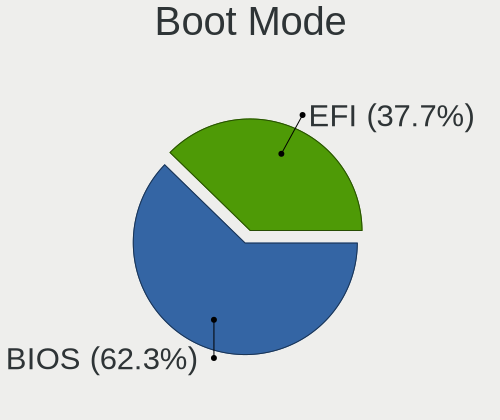

| Mode | Desktops | Percent |
|------|----------|---------|
| BIOS | 190      | 66.9%   |
| EFI  | 94       | 33.1%   |

Filesystem
----------

Type of filesystem

| Type    | Desktops | Percent |
|---------|----------|---------|
| Ext4    | 217      | 77.5%   |
| Overlay | 31       | 11.07%  |
| Btrfs   | 13       | 4.64%   |
| Unknown | 11       | 3.93%   |
| Xfs     | 7        | 2.5%    |
| Zfs     | 1        | 0.36%   |

Part. scheme
------------

Scheme of partitioning

| Type    | Desktops | Percent |
|---------|----------|---------|
| Unknown | 166      | 58.25%  |
| GPT     | 73       | 25.61%  |
| MBR     | 46       | 16.14%  |

Dual Boot with Linux/BSD
------------------------

Hosting more than one Linux/BSD

| Dual boot | Desktops | Percent |
|-----------|----------|---------|
| No        | 242      | 85.51%  |
| Yes       | 41       | 14.49%  |

Dual Boot (Win)
---------------

Hosting Linux and Windows

| Dual boot | Desktops | Percent |
|-----------|----------|---------|
| No        | 162      | 56.84%  |
| Yes       | 123      | 43.16%  |

Board
-----

Vendor
------

Motherboard manufacturer

| Name                   | Desktops | Percent |
|------------------------|----------|---------|
| ASUSTek Computer       | 44       | 15.83%  |
| Gigabyte Technology    | 41       | 14.75%  |
| MSI                    | 33       | 11.87%  |
| ASRock                 | 33       | 11.87%  |
| Dell                   | 19       | 6.83%   |
| Biostar                | 18       | 6.47%   |
| ECS                    | 17       | 6.12%   |
| Lenovo                 | 16       | 5.76%   |
| Intel                  | 14       | 5.04%   |
| Hewlett-Packard        | 12       | 4.32%   |
| Acer                   | 6        | 2.16%   |
| Unknown                | 4        | 1.44%   |
| Foxconn                | 3        | 1.08%   |
| Pegatron               | 2        | 0.72%   |
| LORD ELECTRONICS       | 2        | 0.72%   |
| AZW                    | 2        | 0.72%   |
| ZYREX COMPUTER SYSTEMS | 1        | 0.36%   |
| Wearnes                | 1        | 0.36%   |
| SPECTRUM UTAMA         | 1        | 0.36%   |
| Quanta                 | 1        | 0.36%   |
| OEM                    | 1        | 0.36%   |
| Nvidia                 | 1        | 0.36%   |
| NEC Computers          | 1        | 0.36%   |
| Koloe                  | 1        | 0.36%   |
| Jetway                 | 1        | 0.36%   |
| Inventec               | 1        | 0.36%   |
| GALAX                  | 1        | 0.36%   |
| Colorful Technology    | 1        | 0.36%   |

Model
-----

Motherboard model

| Name                                              | Desktops | Percent |
|---------------------------------------------------|----------|---------|
| Unknown                                           | 7        | 2.52%   |
| Intel H61                                         | 5        | 1.8%    |
| ASUS All Series                                   | 5        | 1.8%    |
| Dell OptiPlex 7010                                | 4        | 1.44%   |
| ECS H61H2-MV                                      | 3        | 1.08%   |
| ASUS P5KPL-AM SE                                  | 3        | 1.08%   |
| ASRock B450 Pro4                                  | 3        | 1.08%   |
| MSI MS-7B22                                       | 2        | 0.72%   |
| MSI MS-7A37                                       | 2        | 0.72%   |
| MSI MS-7823                                       | 2        | 0.72%   |
| LORD ELECTRONICS LORD G4x 775 ICH7 8712 As Design | 2        | 0.72%   |
| Gigabyte H61M-DS2                                 | 2        | 0.72%   |
| Gigabyte GA-78LMT-USB3 6.0                        | 2        | 0.72%   |
| Gigabyte G31M-ES2L                                | 2        | 0.72%   |
| Gigabyte B460MDS3H                                | 2        | 0.72%   |
| Foxconn Pro 3330 MT                               | 2        | 0.72%   |
| ECS G41T-M12                                      | 2        | 0.72%   |
| ECS A55F2-M4                                      | 2        | 0.72%   |
| Dell OptiPlex 790                                 | 2        | 0.72%   |
| Dell OptiPlex 3020M                               | 2        | 0.72%   |
| Biostar H310MHC                                   | 2        | 0.72%   |
| AZW U59                                           | 2        | 0.72%   |
| ASUS P5GC-MX/1333                                 | 2        | 0.72%   |
| ASUS H61M-K                                       | 2        | 0.72%   |
| ASUS H110M-E/M.2                                  | 2        | 0.72%   |
| ASRock G41M-VS3                                   | 2        | 0.72%   |
| ASRock FM2A68M-DG3+                               | 2        | 0.72%   |
| ASRock B550M Pro4                                 | 2        | 0.72%   |
| ASRock AB350 Pro4                                 | 2        | 0.72%   |
| ASRock A88M-G                                     | 2        | 0.72%   |
| ASRock A320M-HDV R4.0                             | 2        | 0.72%   |
| ASRock A320M-HDV                                  | 2        | 0.72%   |
| Acer Aspire M3970                                 | 2        | 0.72%   |
| ZYREX COMPUTER SYSTEMS TACTICAL                   | 1        | 0.36%   |
| Wearnes POS T-1550                                | 1        | 0.36%   |
| SPECTRUM UTAMA VA 880G                            | 1        | 0.36%   |
| Quanta 20-a200l                                   | 1        | 0.36%   |
| Pegatron p2-1110l                                 | 1        | 0.36%   |
| Pegatron IPMSB-VH1/HDMI/ODM                       | 1        | 0.36%   |
| OEM G41 775 ICH7 8712                             | 1        | 0.36%   |

Model Family
------------

Motherboard model prefix

| Name                   | Desktops | Percent |
|------------------------|----------|---------|
| Dell OptiPlex          | 13       | 4.68%   |
| Lenovo ThinkCentre     | 9        | 3.24%   |
| ASUS PRIME             | 7        | 2.52%   |
| Unknown                | 7        | 2.52%   |
| Intel H61              | 5        | 1.8%    |
| ASUS ROG               | 5        | 1.8%    |
| ASUS P5KPL-AM          | 5        | 1.8%    |
| ASUS All               | 5        | 1.8%    |
| ASRock A320M-HDV       | 4        | 1.44%   |
| Acer Veriton           | 4        | 1.44%   |
| HP Compaq              | 3        | 1.08%   |
| Gigabyte H61M-DS2      | 3        | 1.08%   |
| Gigabyte GA-78LMT-USB3 | 3        | 1.08%   |
| ECS H61H2-MV           | 3        | 1.08%   |
| ASRock B450            | 3        | 1.08%   |
| MSI MS-7B22            | 2        | 0.72%   |
| MSI MS-7A37            | 2        | 0.72%   |
| MSI MS-7823            | 2        | 0.72%   |
| MSI Compaq             | 2        | 0.72%   |
| LORD ELECTRONICS LORD  | 2        | 0.72%   |
| Lenovo IdeaCentre      | 2        | 0.72%   |
| HP ProDesk             | 2        | 0.72%   |
| Gigabyte G31M-ES2L     | 2        | 0.72%   |
| Gigabyte B460MDS3H     | 2        | 0.72%   |
| Foxconn Pro            | 2        | 0.72%   |
| ECS G41T-M12           | 2        | 0.72%   |
| ECS A55F2-M4           | 2        | 0.72%   |
| Dell Vostro            | 2        | 0.72%   |
| Dell Precision         | 2        | 0.72%   |
| Dell Inspiron          | 2        | 0.72%   |
| Biostar H310MHC        | 2        | 0.72%   |
| AZW U59                | 2        | 0.72%   |
| ASUS TUF               | 2        | 0.72%   |
| ASUS P8H61-M           | 2        | 0.72%   |
| ASUS P5GC-MX           | 2        | 0.72%   |
| ASUS H61M-K            | 2        | 0.72%   |
| ASUS H110M-E           | 2        | 0.72%   |
| ASRock G41M-VS3        | 2        | 0.72%   |
| ASRock FM2A68M-DG3+    | 2        | 0.72%   |
| ASRock B550M           | 2        | 0.72%   |

MFG Year
--------

Motherboard manufacture year

| Year | Desktops | Percent |
|------|----------|---------|
| 2013 | 34       | 12.23%  |
| 2011 | 27       | 9.71%   |
| 2014 | 23       | 8.27%   |
| 2012 | 23       | 8.27%   |
| 2010 | 23       | 8.27%   |
| 2020 | 21       | 7.55%   |
| 2017 | 21       | 7.55%   |
| 2018 | 18       | 6.47%   |
| 2019 | 17       | 6.12%   |
| 2008 | 15       | 5.4%    |
| 2016 | 13       | 4.68%   |
| 2009 | 13       | 4.68%   |
| 2015 | 12       | 4.32%   |
| 2021 | 9        | 3.24%   |
| 2007 | 7        | 2.52%   |
| 2022 | 2        | 0.72%   |

Form Factor
-----------

Physical design of the computer

| Name    | Desktops | Percent |
|---------|----------|---------|
| Desktop | 278      | 100%    |

Secure Boot
-----------

Enabled or disabled

| State    | Desktops | Percent |
|----------|----------|---------|
| Disabled | 272      | 97.84%  |
| Enabled  | 6        | 2.16%   |

Coreboot
--------

Have coreboot on board

| Used | Desktops | Percent |
|------|----------|---------|
| No   | 278      | 100%    |

RAM Size
--------

Total RAM memory

| Size in GB  | Desktops | Percent |
|-------------|----------|---------|
| 3.01-4.0    | 78       | 27.76%  |
| 8.01-16.0   | 63       | 22.42%  |
| 4.01-8.0    | 53       | 18.86%  |
| 16.01-24.0  | 50       | 17.79%  |
| 32.01-64.0  | 17       | 6.05%   |
| 1.01-2.0    | 11       | 3.91%   |
| 2.01-3.0    | 4        | 1.42%   |
| 24.01-32.0  | 3        | 1.07%   |
| 64.01-256.0 | 2        | 0.71%   |

RAM Used
--------

Used RAM memory

| Used GB    | Desktops | Percent |
|------------|----------|---------|
| 1.01-2.0   | 122      | 39.1%   |
| 2.01-3.0   | 82       | 26.28%  |
| 3.01-4.0   | 36       | 11.54%  |
| 4.01-8.0   | 35       | 11.22%  |
| 0.51-1.0   | 28       | 8.97%   |
| 8.01-16.0  | 4        | 1.28%   |
| 0.01-0.5   | 3        | 0.96%   |
| 16.01-24.0 | 2        | 0.64%   |

Total Drives
------------

Number of drives on board

| Drives | Desktops | Percent |
|--------|----------|---------|
| 1      | 148      | 51.39%  |
| 2      | 90       | 31.25%  |
| 3      | 29       | 10.07%  |
| 4      | 14       | 4.86%   |
| 5      | 4        | 1.39%   |
| 0      | 2        | 0.69%   |
| 15     | 1        | 0.35%   |

Has CD-ROM
----------

Has CD-ROM on board

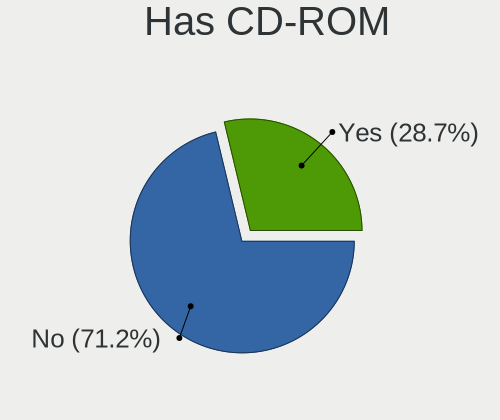

| Presented | Desktops | Percent |
|-----------|----------|---------|
| No        | 189      | 66.78%  |
| Yes       | 94       | 33.22%  |

Has Ethernet
------------

Has Ethernet on board

| Presented | Desktops | Percent |
|-----------|----------|---------|
| Yes       | 273      | 98.2%   |
| No        | 5        | 1.8%    |

Has WiFi
--------

Has WiFi module

| Presented | Desktops | Percent |
|-----------|----------|---------|
| Yes       | 154      | 54.23%  |
| No        | 130      | 45.77%  |

Has Bluetooth
-------------

Has Bluetooth module

| Presented | Desktops | Percent |
|-----------|----------|---------|
| No        | 218      | 77.58%  |
| Yes       | 63       | 22.42%  |

Location
--------

Country
-------

Geographic location (country)

| Country   | Desktops | Percent |
|-----------|----------|---------|
| Indonesia | 278      | 100%    |

City
----

Geographic location (city)

| City            | Desktops | Percent |
|-----------------|----------|---------|
| Jakarta         | 88       | 29.43%  |
| Bandung         | 26       | 8.7%    |
| Surabaya        | 22       | 7.36%   |
| Yogyakarta      | 18       | 6.02%   |
| Medan           | 12       | 4.01%   |
| Tangerang       | 10       | 3.34%   |
| Semarang        | 9        | 3.01%   |
| Malang          | 7        | 2.34%   |
| Bekasi          | 6        | 2.01%   |
| Banjarmasin     | 6        | 2.01%   |
| South Tangerang | 5        | 1.67%   |
| Bogor           | 5        | 1.67%   |
| Palembang       | 4        | 1.34%   |
| Depok           | 4        | 1.34%   |
| Sleman          | 3        | 1%      |
| Salatiga        | 3        | 1%      |
| Pasuruan        | 3        | 1%      |
| Gresik          | 3        | 1%      |
| Tasikmalaya     | 2        | 0.67%   |
| Tanjung Pinang  | 2        | 0.67%   |
| Surakarta       | 2        | 0.67%   |
| Sukabumi        | 2        | 0.67%   |
| Srengseng Sawah | 2        | 0.67%   |
| Sidoarjo        | 2        | 0.67%   |
| Palu            | 2        | 0.67%   |
| Makassar        | 2        | 0.67%   |
| Kediri          | 2        | 0.67%   |
| Denpasar        | 2        | 0.67%   |
| Batam           | 2        | 0.67%   |
| Bantabantaeng   | 2        | 0.67%   |
| Balikpapan      | 2        | 0.67%   |
| Wates           | 1        | 0.33%   |
| Ulee Gle        | 1        | 0.33%   |
| Tanjung Balai   | 1        | 0.33%   |
| South Jakarta   | 1        | 0.33%   |
| Serang          | 1        | 0.33%   |
| Randuagung      | 1        | 0.33%   |
| Purwokerto      | 1        | 0.33%   |
| Pontianak       | 1        | 0.33%   |
| Pati            | 1        | 0.33%   |

Drives
------

Drive Vendor
------------

Hard drive vendors

| Vendor                | Desktops | Drives | Percent |
|-----------------------|----------|--------|---------|
| Seagate               | 132      | 181    | 30.34%  |
| WDC                   | 84       | 128    | 19.31%  |
| Samsung Electronics   | 32       | 44     | 7.36%   |
| Toshiba               | 19       | 21     | 4.37%   |
| Hitachi               | 14       | 16     | 3.22%   |
| A-DATA Technology     | 14       | 17     | 3.22%   |
| V-GeN                 | 12       | 14     | 2.76%   |
| SanDisk               | 11       | 13     | 2.53%   |
| Kingston              | 10       | 12     | 2.3%    |
| China                 | 10       | 12     | 2.3%    |
| Unknown               | 8        | 13     | 1.84%   |
| Patriot               | 6        | 11     | 1.38%   |
| Apacer                | 6        | 7      | 1.38%   |
| XPG                   | 5        | 8      | 1.15%   |
| Silicon Motion        | 5        | 5      | 1.15%   |
| MidasForce            | 5        | 6      | 1.15%   |
| Transcend             | 4        | 7      | 0.92%   |
| HGST                  | 4        | 6      | 0.92%   |
| ADATA Technology      | 4        | 6      | 0.92%   |
| Pioneer               | 3        | 3      | 0.69%   |
| OCZ                   | 3        | 3      | 0.69%   |
| Maxtor                | 3        | 3      | 0.69%   |
| JMicron Technology    | 3        | 3      | 0.69%   |
| Intel                 | 3        | 3      | 0.69%   |
| Hewlett-Packard       | 3        | 3      | 0.69%   |
| Biostar               | 3        | 4      | 0.69%   |
| Unknown               | 3        | 3      | 0.69%   |
| Team                  | 2        | 2      | 0.46%   |
| RX7                   | 2        | 2      | 0.46%   |
| Realtek Semiconductor | 2        | 2      | 0.46%   |
| Ramos Technology      | 2        | 2      | 0.46%   |
| Verbatim              | 1        | 1      | 0.23%   |
| TO Exter              | 1        | 1      | 0.23%   |
| T-FORCE               | 1        | 1      | 0.23%   |
| SPCC                  | 1        | 1      | 0.23%   |
| Smart                 | 1        | 1      | 0.23%   |
| SK hynix              | 1        | 1      | 0.23%   |
| Phison                | 1        | 1      | 0.23%   |
| Memory                | 1        | 1      | 0.23%   |
| Kingmax               | 1        | 1      | 0.23%   |

Drive Model
-----------

Hard drive models

| Model                            | Desktops | Percent |
|----------------------------------|----------|---------|
| Seagate ST3500312CS 500GB        | 18       | 3.64%   |
| Seagate ST500DM002-1BD142 500GB  | 17       | 3.43%   |
| Seagate ST3250318AS 250GB        | 9        | 1.82%   |
| Seagate ST1000DM010-2EP102 1TB   | 9        | 1.82%   |
| A-DATA SU650 120GB SSD           | 7        | 1.41%   |
| Seagate ST2000DM008-2FR102 2TB   | 6        | 1.21%   |
| Seagate ST1000DM003-1ER162 1TB   | 6        | 1.21%   |
| Toshiba DT01ACA200 2TB           | 5        | 1.01%   |
| WDC WD10EZEX-00WN4A0 1TB         | 4        | 0.81%   |
| Seagate ST3500418AS 500GB        | 4        | 0.81%   |
| Seagate ST3500413AS 500GB        | 4        | 0.81%   |
| Seagate ST1000DM003-1CH162 1TB   | 4        | 0.81%   |
| SanDisk SSD PLUS 240GB           | 4        | 0.81%   |
| Samsung SSD 850 120GB            | 4        | 0.81%   |
| Kingston SA400S37120G 120GB SSD  | 4        | 0.81%   |
| Apacer AS340 240GB SSD           | 4        | 0.81%   |
| WDC WDS500G2B0A-00SM50 500GB SSD | 3        | 0.61%   |
| WDC WDS120G2G0B-00EPW0 120GB SSD | 3        | 0.61%   |
| WDC WD5000AAKX-75U6AA0 500GB     | 3        | 0.61%   |
| WDC WD1600AVVS-63L2B0 160GB      | 3        | 0.61%   |
| WDC WD10EZEX-08WN4A0 1TB         | 3        | 0.61%   |
| WDC WD10EZEX-08M2NA0 1TB         | 3        | 0.61%   |
| WDC WD10EZEX-00BN5A0 1TB         | 3        | 0.61%   |
| Toshiba HDWD110 1TB              | 3        | 0.61%   |
| Toshiba DT01ACA050 500GB         | 3        | 0.61%   |
| Seagate ST4000DM004-2CV104 4TB   | 3        | 0.61%   |
| Seagate ST380215AS 80GB          | 3        | 0.61%   |
| Seagate ST3160815AS 160GB        | 3        | 0.61%   |
| Seagate ST3160318AS 160GB        | 3        | 0.61%   |
| Seagate ST1000LM035-1RK172 970GB | 3        | 0.61%   |
| Samsung SSD 860 EVO 250GB        | 3        | 0.61%   |
| Samsung SSD 850 EVO 250GB        | 3        | 0.61%   |
| MidasForce SSD 120GB             | 3        | 0.61%   |
| Hitachi HTS545032B9A300 320GB    | 3        | 0.61%   |
| Unknown                          | 3        | 0.61%   |
| XPG NVMe SSD Drive 512GB         | 2        | 0.4%    |
| WDC WD800JD-08LSA0 80GB          | 2        | 0.4%    |
| WDC WD5000LPVX-22V0TT0 500GB     | 2        | 0.4%    |
| WDC WD5000AAKX-083CA1 500GB      | 2        | 0.4%    |
| WDC WD5000AAKX-001CA0 500GB      | 2        | 0.4%    |

HDD Vendor
----------

Hard disk drive vendors

| Vendor              | Desktops | Drives | Percent |
|---------------------|----------|--------|---------|
| Seagate             | 131      | 179    | 50.19%  |
| WDC                 | 74       | 114    | 28.35%  |
| Toshiba             | 18       | 20     | 6.9%    |
| Hitachi             | 14       | 16     | 5.36%   |
| Samsung Electronics | 9        | 9      | 3.45%   |
| HGST                | 4        | 6      | 1.53%   |
| Maxtor              | 3        | 3      | 1.15%   |
| Unknown             | 2        | 2      | 0.77%   |
| JMicron Technology  | 2        | 2      | 0.77%   |
| Hewlett-Packard     | 2        | 2      | 0.77%   |
| ExcelStor           | 1        | 1      | 0.38%   |
| Unknown             | 1        | 1      | 0.38%   |

SSD Vendor
----------

Solid state drive vendors

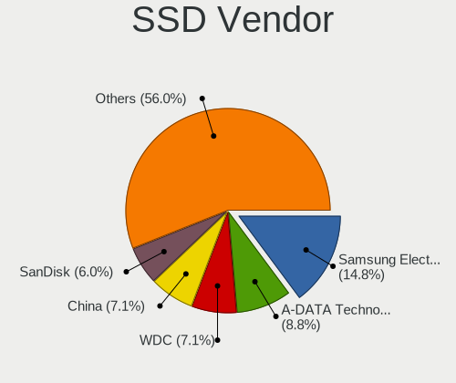

| Vendor              | Desktops | Drives | Percent |
|---------------------|----------|--------|---------|
| Samsung Electronics | 20       | 29     | 15.63%  |
| WDC                 | 12       | 12     | 9.38%   |
| China               | 10       | 12     | 7.81%   |
| A-DATA Technology   | 10       | 12     | 7.81%   |
| Kingston            | 9        | 11     | 7.03%   |
| SanDisk             | 8        | 9      | 6.25%   |
| Patriot             | 6        | 11     | 4.69%   |
| Apacer              | 6        | 7      | 4.69%   |
| V-GeN               | 5        | 7      | 3.91%   |
| MidasForce          | 5        | 6      | 3.91%   |
| Unknown             | 3        | 4      | 2.34%   |
| Transcend           | 3        | 6      | 2.34%   |
| Pioneer             | 3        | 3      | 2.34%   |
| OCZ                 | 3        | 3      | 2.34%   |
| Team                | 2        | 2      | 1.56%   |
| Seagate             | 2        | 2      | 1.56%   |
| Ramos Technology    | 2        | 2      | 1.56%   |
| Biostar             | 2        | 3      | 1.56%   |
| Unknown             | 2        | 2      | 1.56%   |
| Verbatim            | 1        | 1      | 0.78%   |
| Toshiba             | 1        | 1      | 0.78%   |
| TO Exter            | 1        | 1      | 0.78%   |
| T-FORCE             | 1        | 1      | 0.78%   |
| SPCC                | 1        | 1      | 0.78%   |
| RX7                 | 1        | 1      | 0.78%   |
| Memory              | 1        | 1      | 0.78%   |
| Kingmax             | 1        | 1      | 0.78%   |
| Intel               | 1        | 1      | 0.78%   |
| Hoodisk             | 1        | 4      | 0.78%   |
| Green House         | 1        | 1      | 0.78%   |
| Gigabyte Technology | 1        | 1      | 0.78%   |
| GALAX               | 1        | 1      | 0.78%   |
| External            | 1        | 1      | 0.78%   |
| ADATA SU            | 1        | 1      | 0.78%   |

Drive Kind
----------

HDD or SSD

| Kind    | Desktops | Drives | Percent |
|---------|----------|--------|---------|
| HDD     | 216      | 355    | 58.22%  |
| SSD     | 108      | 161    | 29.11%  |
| NVMe    | 34       | 48     | 9.16%   |
| Unknown | 12       | 13     | 3.23%   |
| MMC     | 1        | 4      | 0.27%   |

Drive Connector
---------------

SATA, SAS, NVMe, etc.

| Type | Desktops | Drives | Percent |
|------|----------|--------|---------|
| SATA | 265      | 511    | 84.13%  |
| NVMe | 34       | 48     | 10.79%  |
| SAS  | 15       | 18     | 4.76%   |
| MMC  | 1        | 4      | 0.32%   |

Drive Size
----------

Size of hard drive

| Size in TB | Desktops | Drives | Percent |
|------------|----------|--------|---------|
| 0.01-0.5   | 214      | 356    | 64.46%  |
| 0.51-1.0   | 75       | 105    | 22.59%  |
| 1.01-2.0   | 26       | 35     | 7.83%   |
| 3.01-4.0   | 8        | 11     | 2.41%   |
| 2.01-3.0   | 5        | 5      | 1.51%   |
| 4.01-10.0  | 4        | 4      | 1.2%    |

Space Total
-----------

Amount of disk space available on the file system

| Size in GB     | Desktops | Percent |
|----------------|----------|---------|
| 101-250        | 85       | 29.01%  |
| 251-500        | 61       | 20.82%  |
| 51-100         | 31       | 10.58%  |
| 501-1000       | 30       | 10.24%  |
| 1-20           | 28       | 9.56%   |
| 1001-2000      | 20       | 6.83%   |
| 21-50          | 15       | 5.12%   |
| More than 3000 | 10       | 3.41%   |
| 2001-3000      | 9        | 3.07%   |
| Unknown        | 4        | 1.37%   |

Space Used
----------

Amount of used disk space

| Used GB        | Desktops | Percent |
|----------------|----------|---------|
| 1-20           | 134      | 44.82%  |
| 21-50          | 48       | 16.05%  |
| 101-250        | 32       | 10.7%   |
| 51-100         | 27       | 9.03%   |
| 251-500        | 21       | 7.02%   |
| 501-1000       | 16       | 5.35%   |
| 1001-2000      | 9        | 3.01%   |
| More than 3000 | 6        | 2.01%   |
| Unknown        | 4        | 1.34%   |
| 2001-3000      | 2        | 0.67%   |

Malfunc. Drives
---------------

Drive models with a malfunction

| Model                             | Desktops | Drives | Percent |
|-----------------------------------|----------|--------|---------|
| Seagate ST500DM002-1BD142 500GB   | 7        | 9      | 11.29%  |
| WDC WD800JD-08LSA0 80GB           | 2        | 2      | 3.23%   |
| WDC WD10EZEX-08M2NA0 1TB          | 2        | 2      | 3.23%   |
| Seagate ST9250410AS 250GB         | 2        | 2      | 3.23%   |
| Seagate ST1000DM003-1ER162 1TB    | 2        | 2      | 3.23%   |
| WDC WD7500BPVT-55HXZT4 752GB      | 1        | 1      | 1.61%   |
| WDC WD6400AADS-00M2B0 640GB       | 1        | 1      | 1.61%   |
| WDC WD5000LPVX-22V0TT0 500GB      | 1        | 1      | 1.61%   |
| WDC WD5000AZLX-00JKKA0 500GB      | 1        | 1      | 1.61%   |
| WDC WD5000AAKX-08ERMA0 500GB      | 1        | 1      | 1.61%   |
| WDC WD5000AAKX-083CA1 500GB       | 1        | 1      | 1.61%   |
| WDC WD5000AAKX-001CA0 500GB       | 1        | 1      | 1.61%   |
| WDC WD5000AACS-00G8B0 500GB       | 1        | 1      | 1.61%   |
| WDC WD40EZRX-00SPEB0 4TB          | 1        | 1      | 1.61%   |
| WDC WD3200JS-63PDB1 320GB         | 1        | 1      | 1.61%   |
| WDC WD3200BPVT-00HXZT1 320GB      | 1        | 1      | 1.61%   |
| WDC WD3200AVJS-63B6A0 320GB       | 1        | 1      | 1.61%   |
| WDC WD3200AAKS-61L9A0 320GB       | 1        | 1      | 1.61%   |
| WDC WD3200AAJS-08B4A0 320GB       | 1        | 1      | 1.61%   |
| WDC WD30EZRZ-00Z5HB0 3TB          | 1        | 1      | 1.61%   |
| WDC WD30EFRX-68AX9N0 3TB          | 1        | 1      | 1.61%   |
| WDC WD20EARX-008FB0 2TB           | 1        | 1      | 1.61%   |
| WDC WD1600AVVS-63L2B0 160GB       | 1        | 1      | 1.61%   |
| WDC WD1600AAJS-00Z4A0 160GB       | 1        | 1      | 1.61%   |
| Toshiba DT01ACA200 2TB            | 1        | 1      | 1.61%   |
| T-FORCE SSD 512GB                 | 1        | 1      | 1.61%   |
| Seagate ST9500420AS 500GB         | 1        | 1      | 1.61%   |
| Seagate ST9500325AS 500GB         | 1        | 1      | 1.61%   |
| Seagate ST500LT0 12-9WS142 500GB  | 1        | 1      | 1.61%   |
| Seagate ST3808110AS 80GB          | 1        | 1      | 1.61%   |
| Seagate ST3500418AS 500GB         | 1        | 1      | 1.61%   |
| Seagate ST3500413AS 500GB         | 1        | 1      | 1.61%   |
| Seagate ST3500312CS 500GB         | 1        | 1      | 1.61%   |
| Seagate ST3160212SCE 160GB        | 1        | 1      | 1.61%   |
| Seagate ST31000528AS 1TB          | 1        | 1      | 1.61%   |
| Seagate ST1000DM010-2EP102 1TB    | 1        | 1      | 1.61%   |
| Seagate ST1000DM003-1CH162 1TB    | 1        | 1      | 1.61%   |
| SanDisk SSD PLUS 240GB            | 1        | 1      | 1.61%   |
| Samsung Electronics SV0412H 40GB  | 1        | 1      | 1.61%   |
| Samsung Electronics HD161GJ 160GB | 1        | 1      | 1.61%   |

Malfunc. Drive Vendor
---------------------

Vendors of faulty drives

| Vendor              | Desktops | Drives | Percent |
|---------------------|----------|--------|---------|
| Seagate             | 21       | 24     | 37.5%   |
| WDC                 | 18       | 23     | 32.14%  |
| Hitachi             | 6        | 6      | 10.71%  |
| Samsung Electronics | 2        | 2      | 3.57%   |
| Kingston            | 2        | 2      | 3.57%   |
| Toshiba             | 1        | 1      | 1.79%   |
| T-FORCE             | 1        | 1      | 1.79%   |
| SanDisk             | 1        | 1      | 1.79%   |
| Maxtor              | 1        | 1      | 1.79%   |
| HGST                | 1        | 1      | 1.79%   |
| China               | 1        | 1      | 1.79%   |
| Apacer              | 1        | 2      | 1.79%   |

Malfunc. HDD Vendor
-------------------

Vendors of faulty HDD drives

| Vendor              | Desktops | Drives | Percent |
|---------------------|----------|--------|---------|
| Seagate             | 21       | 24     | 42%     |
| WDC                 | 18       | 23     | 36%     |
| Hitachi             | 6        | 6      | 12%     |
| Samsung Electronics | 2        | 2      | 4%      |
| Toshiba             | 1        | 1      | 2%      |
| Maxtor              | 1        | 1      | 2%      |
| HGST                | 1        | 1      | 2%      |

Malfunc. Drive Kind
-------------------

Kinds of faulty drives

| Kind | Desktops | Drives | Percent |
|------|----------|--------|---------|
| HDD  | 43       | 58     | 89.58%  |
| SSD  | 5        | 7      | 10.42%  |

Failed Drives
-------------

Failed drive models

| Model                     | Desktops | Drives | Percent |
|---------------------------|----------|--------|---------|
| Seagate ST3250318AS 250GB | 2        | 2      | 100%    |

Failed Drive Vendor
-------------------

Failed drive vendors

| Vendor  | Desktops | Drives | Percent |
|---------|----------|--------|---------|
| Seagate | 2        | 2      | 100%    |

Drive Status
------------

Number of failed and malfunc. drives

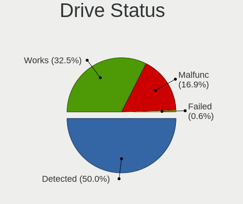

| Status   | Desktops | Drives | Percent |
|----------|----------|--------|---------|
| Detected | 182      | 335    | 56.52%  |
| Works    | 91       | 179    | 28.26%  |
| Malfunc  | 47       | 65     | 14.6%   |
| Failed   | 2        | 2      | 0.62%   |

Storage controller
------------------

Storage Vendor
--------------

Storage controller vendors

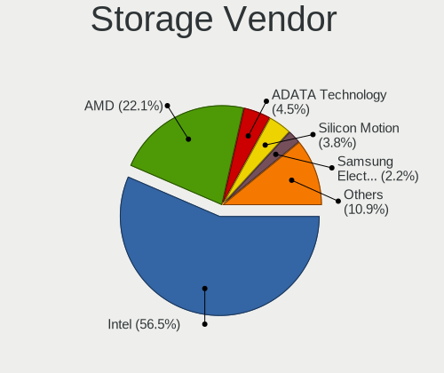

| Vendor                      | Desktops | Percent |
|-----------------------------|----------|---------|
| Intel                       | 202      | 60.3%   |
| AMD                         | 74       | 22.09%  |
| ADATA Technology            | 12       | 3.58%   |
| ASMedia Technology          | 8        | 2.39%   |
| Silicon Motion              | 7        | 2.09%   |
| SanDisk                     | 5        | 1.49%   |
| JMicron Technology          | 5        | 1.49%   |
| VIA Technologies            | 4        | 1.19%   |
| Samsung Electronics         | 4        | 1.19%   |
| Realtek Semiconductor       | 3        | 0.9%    |
| Nvidia                      | 3        | 0.9%    |
| Marvell Technology Group    | 3        | 0.9%    |
| SK hynix                    | 1        | 0.3%    |
| Phison Electronics          | 1        | 0.3%    |
| MAXIO Technology (Hangzhou) | 1        | 0.3%    |
| Kingston Technology Company | 1        | 0.3%    |
| Biwin Storage Technology    | 1        | 0.3%    |

Storage Model
-------------

Storage controller models

| Model                                                                                   | Desktops | Percent |
|-----------------------------------------------------------------------------------------|----------|---------|
| Intel NM10/ICH7 Family SATA Controller [IDE mode]                                       | 37       | 8.17%   |
| AMD FCH SATA Controller [AHCI mode]                                                     | 35       | 7.73%   |
| Intel 82801G (ICH7 Family) IDE Controller                                               | 29       | 6.4%    |
| Intel 8 Series/C220 Series Chipset Family 6-port SATA Controller 1 [AHCI mode]          | 28       | 6.18%   |
| Intel 6 Series/C200 Series Chipset Family 6 port Desktop SATA AHCI Controller           | 23       | 5.08%   |
| Intel 6 Series/C200 Series Chipset Family Desktop SATA Controller (IDE mode, ports 4-5) | 19       | 4.19%   |
| Intel 6 Series/C200 Series Chipset Family Desktop SATA Controller (IDE mode, ports 0-3) | 19       | 4.19%   |
| AMD SB7x0/SB8x0/SB9x0 IDE Controller                                                    | 15       | 3.31%   |
| AMD SB7x0/SB8x0/SB9x0 SATA Controller [IDE mode]                                        | 11       | 2.43%   |
| Intel Q170/Q150/B150/H170/H110/Z170/CM236 Chipset SATA Controller [AHCI Mode]           | 10       | 2.21%   |
| Intel 200 Series PCH SATA controller [AHCI mode]                                        | 10       | 2.21%   |
| AMD 500 Series Chipset SATA Controller                                                  | 10       | 2.21%   |
| Intel Cannon Lake PCH SATA AHCI Controller                                              | 9        | 1.99%   |
| Intel 7 Series/C210 Series Chipset Family 6-port SATA Controller [AHCI mode]            | 9        | 1.99%   |
| AMD 400 Series Chipset SATA Controller                                                  | 9        | 1.99%   |
| ADATA XPG SX8200 Pro PCIe Gen3x4 M.2 2280 Solid State Drive                             | 9        | 1.99%   |
| ASMedia ASM1062 Serial ATA Controller                                                   | 8        | 1.77%   |
| AMD FCH SATA Controller [IDE mode]                                                      | 8        | 1.77%   |
| Intel 5 Series/3400 Series Chipset 6 port SATA AHCI Controller                          | 7        | 1.55%   |
| AMD FCH SATA Controller D                                                               | 7        | 1.55%   |
| AMD FCH IDE Controller                                                                  | 7        | 1.55%   |
| AMD 300 Series Chipset SATA Controller                                                  | 7        | 1.55%   |
| Intel SATA Controller [RAID mode]                                                       | 6        | 1.32%   |
| AMD SB7x0/SB8x0/SB9x0 SATA Controller [AHCI mode]                                       | 6        | 1.32%   |
| Intel 82801JI (ICH10 Family) SATA AHCI Controller                                       | 5        | 1.1%    |
| Intel 400 Series Chipset Family SATA AHCI Controller                                    | 5        | 1.1%    |
| Silicon Motion SM2263EN/SM2263XT SSD Controller                                         | 4        | 0.88%   |
| JMicron JMB368 IDE controller                                                           | 4        | 0.88%   |
| Intel 9 Series Chipset Family SATA Controller [AHCI Mode]                               | 4        | 0.88%   |
| Intel 500 Series Chipset Family SATA AHCI Controller                                    | 4        | 0.88%   |
| VIA VT6415 PATA IDE Host Controller                                                     | 3        | 0.66%   |
| Silicon Motion SM2262/SM2262EN SSD Controller                                           | 3        | 0.66%   |
| SanDisk WD Blue SN550 NVMe SSD                                                          | 3        | 0.66%   |
| Samsung NVMe SSD Controller SM981/PM981/PM983                                           | 3        | 0.66%   |
| Realtek NVMe Controller                                                                 | 3        | 0.66%   |
| Intel Alder Lake-S PCH SATA Controller [AHCI Mode]                                      | 3        | 0.66%   |
| Intel 82801JI (ICH10 Family) 4 port SATA IDE Controller #1                              | 3        | 0.66%   |
| Intel 82801JI (ICH10 Family) 2 port SATA IDE Controller #2                              | 3        | 0.66%   |
| Intel 82801I (ICH9 Family) 2 port SATA Controller [IDE mode]                            | 3        | 0.66%   |
| JMicron JMB363 SATA/IDE Controller                                                      | 2        | 0.44%   |

Storage Kind
------------

Kind of storage controller (IDE, SATA, NVMe, SAS, ...)

| Kind | Desktops | Percent |
|------|----------|---------|
| SATA | 200      | 57.64%  |
| IDE  | 105      | 30.26%  |
| NVMe | 34       | 9.8%    |
| RAID | 7        | 2.02%   |
| SAS  | 1        | 0.29%   |

Processor
---------

CPU Vendor
----------

Processor vendors

| Vendor | Desktops | Percent |
|--------|----------|---------|
| Intel  | 201      | 72.3%   |
| AMD    | 77       | 27.7%   |

CPU Model
---------

Processor models

| Model                                       | Desktops | Percent |
|---------------------------------------------|----------|---------|
| Intel Core 2 Duo CPU E8400 @ 3.00GHz        | 9        | 3.23%   |
| Intel Core i5-2400 CPU @ 3.10GHz            | 8        | 2.87%   |
| AMD Ryzen 3 2200G with Radeon Vega Graphics | 8        | 2.87%   |
| Intel Core i3-2120 CPU @ 3.30GHz            | 7        | 2.51%   |
| Intel Core i7-8700 CPU @ 3.20GHz            | 5        | 1.79%   |
| Intel Core i5-3470 CPU @ 3.20GHz            | 5        | 1.79%   |
| Intel Core i3-4130 CPU @ 3.40GHz            | 5        | 1.79%   |
| Intel Core i3-3240 CPU @ 3.40GHz            | 5        | 1.79%   |
| Intel Core i5-7400 CPU @ 3.00GHz            | 4        | 1.43%   |
| Intel Core i5-4690 CPU @ 3.50GHz            | 4        | 1.43%   |
| Intel Core i3-3220 CPU @ 3.30GHz            | 4        | 1.43%   |
| Intel Core 2 Duo CPU E7500 @ 2.93GHz        | 4        | 1.43%   |
| Intel Core 2 Duo CPU E7400 @ 2.80GHz        | 4        | 1.43%   |
| AMD Phenom II X6 1055T Processor            | 4        | 1.43%   |
| Intel Pentium Dual-Core CPU E5700 @ 3.00GHz | 3        | 1.08%   |
| Intel Pentium CPU G2030 @ 3.00GHz           | 3        | 1.08%   |
| Intel Core i7-6700 CPU @ 3.40GHz            | 3        | 1.08%   |
| Intel Core i7-4790 CPU @ 3.60GHz            | 3        | 1.08%   |
| Intel Core i7-3770 CPU @ 3.40GHz            | 3        | 1.08%   |
| Intel Core i5-4590 CPU @ 3.30GHz            | 3        | 1.08%   |
| Intel Core i5 CPU 650 @ 3.20GHz             | 3        | 1.08%   |
| Intel Core 2 Quad CPU Q8400 @ 2.66GHz       | 3        | 1.08%   |
| AMD Ryzen 5 5600G with Radeon Graphics      | 3        | 1.08%   |
| AMD Ryzen 5 3600 6-Core Processor           | 3        | 1.08%   |
| AMD Ryzen 5 1600 Six-Core Processor         | 3        | 1.08%   |
| AMD FX-6300 Six-Core Processor              | 3        | 1.08%   |
| AMD A6-6400K APU with Radeon HD Graphics    | 3        | 1.08%   |
| Intel Pentium Dual-Core CPU E5400 @ 2.70GHz | 2        | 0.72%   |
| Intel Pentium CPU G3240 @ 3.10GHz           | 2        | 0.72%   |
| Intel Core i7-8700K CPU @ 3.70GHz           | 2        | 0.72%   |
| Intel Core i7-2600 CPU @ 3.40GHz            | 2        | 0.72%   |
| Intel Core i7 CPU 950 @ 3.07GHz             | 2        | 0.72%   |
| Intel Core i5-9400F CPU @ 2.90GHz           | 2        | 0.72%   |
| Intel Core i5-4570 CPU @ 3.20GHz            | 2        | 0.72%   |
| Intel Core i5-4460T CPU @ 1.90GHz           | 2        | 0.72%   |
| Intel Core i5-4460 CPU @ 3.20GHz            | 2        | 0.72%   |
| Intel Core i5-3570 CPU @ 3.40GHz            | 2        | 0.72%   |
| Intel Core i5-10400F CPU @ 2.90GHz          | 2        | 0.72%   |
| Intel Core i3-6100 CPU @ 3.70GHz            | 2        | 0.72%   |
| Intel Core i3-4170 CPU @ 3.70GHz            | 2        | 0.72%   |

CPU Model Family
----------------

Processor model prefix

| Model                   | Desktops | Percent |
|-------------------------|----------|---------|
| Intel Core i5           | 51       | 18.28%  |
| Intel Core i3           | 38       | 13.62%  |
| Intel Core i7           | 32       | 11.47%  |
| Intel Core 2 Duo        | 25       | 8.96%   |
| AMD Ryzen 5             | 19       | 6.81%   |
| Intel Pentium           | 13       | 4.66%   |
| AMD Ryzen 3             | 10       | 3.58%   |
| Intel Core 2 Quad       | 9        | 3.23%   |
| Other                   | 8        | 2.87%   |
| Intel Xeon              | 7        | 2.51%   |
| Intel Pentium Dual-Core | 6        | 2.15%   |
| AMD FX                  | 6        | 2.15%   |
| AMD Athlon II X2        | 6        | 2.15%   |
| AMD Ryzen 7             | 5        | 1.79%   |
| AMD A6                  | 5        | 1.79%   |
| AMD Phenom II X6        | 4        | 1.43%   |
| AMD A8                  | 4        | 1.43%   |
| Intel Celeron           | 3        | 1.08%   |
| Intel Atom              | 3        | 1.08%   |
| AMD Phenom II X4        | 3        | 1.08%   |
| Intel Genuine           | 2        | 0.72%   |
| Intel Core 2            | 2        | 0.72%   |
| AMD Ryzen 9             | 2        | 0.72%   |
| AMD Ryzen 3 PRO         | 2        | 0.72%   |
| AMD Athlon X4           | 2        | 0.72%   |
| AMD A10                 | 2        | 0.72%   |
| Intel Pentium Gold      | 1        | 0.36%   |
| Intel Pentium Dual      | 1        | 0.36%   |
| Intel Pentium D         | 1        | 0.36%   |
| Intel Core 2 Extreme    | 1        | 0.36%   |
| AMD PRO A8              | 1        | 0.36%   |
| AMD Phenom              | 1        | 0.36%   |
| AMD GX                  | 1        | 0.36%   |
| AMD Athlon 64 X2        | 1        | 0.36%   |
| AMD Athlon              | 1        | 0.36%   |
| AMD A4                  | 1        | 0.36%   |

CPU Cores
---------

Number of processor cores

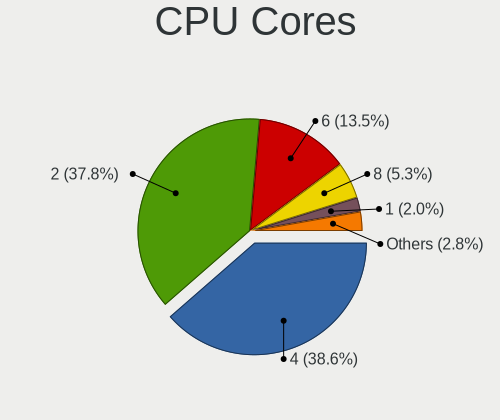

| Number | Desktops | Percent |
|--------|----------|---------|
| 2      | 111      | 39.78%  |
| 4      | 109      | 39.07%  |
| 6      | 33       | 11.83%  |
| 8      | 13       | 4.66%   |
| 1      | 5        | 1.79%   |
| 12     | 4        | 1.43%   |
| 3      | 3        | 1.08%   |
| 10     | 1        | 0.36%   |

CPU Sockets
-----------

Number of sockets

| Number | Desktops | Percent |
|--------|----------|---------|
| 1      | 277      | 99.64%  |
| 2      | 1        | 0.36%   |

CPU Threads
-----------

Threads per core (Hyper-Threading)

| Number | Desktops | Percent |
|--------|----------|---------|
| 2      | 140      | 50.36%  |
| 1      | 138      | 49.64%  |

CPU Op-Modes
------------

CPU Operation Modes (32-bit, 64-bit)

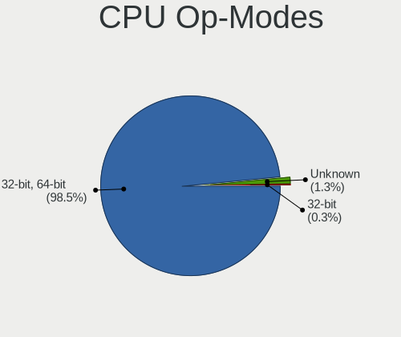

| Op mode        | Desktops | Percent |
|----------------|----------|---------|
| 32-bit, 64-bit | 272      | 97.84%  |
| Unknown        | 5        | 1.8%    |
| 32-bit         | 1        | 0.36%   |

CPU Microcode
-------------

Microcode number

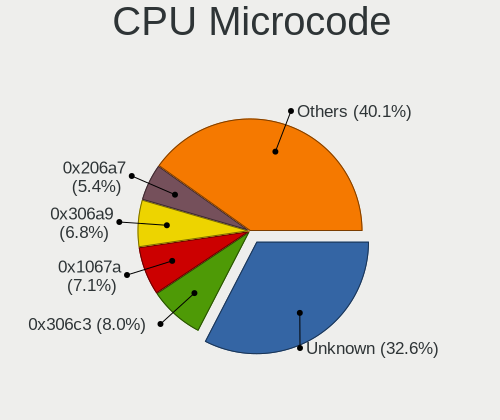

| Number     | Desktops | Percent |
|------------|----------|---------|
| Unknown    | 44       | 15.33%  |
| 0x306c3    | 32       | 11.15%  |
| 0x1067a    | 28       | 9.76%   |
| 0x306a9    | 24       | 8.36%   |
| 0x206a7    | 21       | 7.32%   |
| 0x906e9    | 10       | 3.48%   |
| 0x906ea    | 6        | 2.09%   |
| 0x08701021 | 6        | 2.09%   |
| 0x6fd      | 5        | 1.74%   |
| 0x6fb      | 5        | 1.74%   |
| 0x506e3    | 5        | 1.74%   |
| 0x010000c8 | 5        | 1.74%   |
| 0x20652    | 4        | 1.39%   |
| 0x0a50000c | 4        | 1.39%   |
| 0x08001137 | 4        | 1.39%   |
| 0x06003106 | 4        | 1.39%   |
| 0x010000dc | 4        | 1.39%   |
| 0xa0671    | 3        | 1.05%   |
| 0xa0653    | 3        | 1.05%   |
| 0x906ed    | 3        | 1.05%   |
| 0x106e5    | 3        | 1.05%   |
| 0x106a5    | 3        | 1.05%   |
| 0x10676    | 3        | 1.05%   |
| 0x0a201016 | 3        | 1.05%   |
| 0x08101016 | 3        | 1.05%   |
| 0x08101007 | 3        | 1.05%   |
| 0x0800820d | 3        | 1.05%   |
| 0x06001119 | 3        | 1.05%   |
| 0x010000c7 | 3        | 1.05%   |
| 0xa0655    | 2        | 0.7%    |
| 0x906eb    | 2        | 0.7%    |
| 0x90675    | 2        | 0.7%    |
| 0x6f6      | 2        | 0.7%    |
| 0x206d7    | 2        | 0.7%    |
| 0x106ca    | 2        | 0.7%    |
| 0x08108102 | 2        | 0.7%    |
| 0x0810100b | 2        | 0.7%    |
| 0x06000852 | 2        | 0.7%    |
| 0xf62      | 1        | 0.35%   |
| 0x906c0    | 1        | 0.35%   |

CPU Microarch
-------------

Microarchitecture

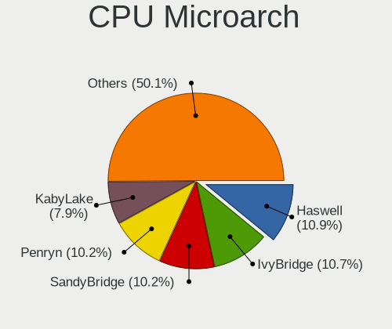

| Name             | Desktops | Percent |
|------------------|----------|---------|
| Haswell          | 36       | 12.95%  |
| Penryn           | 32       | 11.51%  |
| SandyBridge      | 29       | 10.43%  |
| IvyBridge        | 28       | 10.07%  |
| KabyLake         | 24       | 8.63%   |
| Zen              | 15       | 5.4%    |
| K10              | 14       | 5.04%   |
| Core             | 13       | 4.68%   |
| Zen 2            | 10       | 3.6%    |
| Piledriver       | 10       | 3.6%    |
| Zen 3            | 8        | 2.88%   |
| Westmere         | 7        | 2.52%   |
| Zen+             | 6        | 2.16%   |
| Skylake          | 6        | 2.16%   |
| Nehalem          | 6        | 2.16%   |
| CometLake        | 6        | 2.16%   |
| Steamroller      | 5        | 1.8%    |
| Excavator        | 3        | 1.08%   |
| Bonnell          | 3        | 1.08%   |
| Alderlake Hybrid | 3        | 1.08%   |
| Unknown          | 3        | 1.08%   |
| Tremont          | 2        | 0.72%   |
| K10 Llano        | 2        | 0.72%   |
| Puma             | 1        | 0.36%   |
| NetBurst         | 1        | 0.36%   |
| K8 Hammer        | 1        | 0.36%   |
| Jaguar           | 1        | 0.36%   |
| Icelake          | 1        | 0.36%   |
| Goldmont plus    | 1        | 0.36%   |
| Bulldozer        | 1        | 0.36%   |

Graphics
--------

GPU Vendor
----------

Vendors of graphics cards

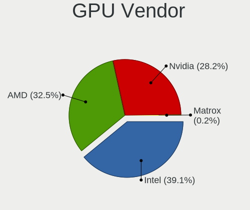

| Vendor                     | Desktops | Percent |
|----------------------------|----------|---------|
| Intel                      | 125      | 41.81%  |
| AMD                        | 95       | 31.77%  |
| Nvidia                     | 78       | 26.09%  |
| Matrox Electronics Systems | 1        | 0.33%   |

GPU Model
---------

Graphics card models

| Model                                                                       | Desktops | Percent |
|-----------------------------------------------------------------------------|----------|---------|
| Intel Xeon E3-1200 v2/3rd Gen Core processor Graphics Controller            | 18       | 5.92%   |
| Intel Xeon E3-1200 v3/4th Gen Core Processor Integrated Graphics Controller | 17       | 5.59%   |
| Intel 2nd Generation Core Processor Family Integrated Graphics Controller   | 16       | 5.26%   |
| Intel 4 Series Chipset Integrated Graphics Controller                       | 12       | 3.95%   |
| AMD Ellesmere [Radeon RX 470/480/570/570X/580/580X/590]                     | 12       | 3.95%   |
| Intel 82G33/G31 Express Integrated Graphics Controller                      | 10       | 3.29%   |
| Nvidia GT218 [GeForce 210]                                                  | 9        | 2.96%   |
| Intel 4th Generation Core Processor Family Integrated Graphics Controller   | 9        | 2.96%   |
| AMD Raven Ridge [Radeon Vega Series / Radeon Vega Mobile Series]            | 8        | 2.63%   |
| Intel CoffeeLake-S GT2 [UHD Graphics 630]                                   | 7        | 2.3%    |
| Nvidia GK208B [GeForce GT 730]                                              | 6        | 1.97%   |
| Nvidia GF108 [GeForce GT 730]                                               | 6        | 1.97%   |
| Intel HD Graphics 630                                                       | 6        | 1.97%   |
| AMD Cedar [Radeon HD 5000/6000/7350/8350 Series]                            | 6        | 1.97%   |
| Nvidia GK208B [GeForce GT 710]                                              | 5        | 1.64%   |
| AMD Oland PRO [Radeon R7 240/340 / Radeon 520]                              | 5        | 1.64%   |
| Nvidia GP107 [GeForce GTX 1050 Ti]                                          | 4        | 1.32%   |
| Nvidia GM107 [GeForce GTX 750 Ti]                                           | 4        | 1.32%   |
| AMD Cezanne [Radeon Vega Series / Radeon Vega Mobile Series]                | 4        | 1.32%   |
| Nvidia TU116 [GeForce GTX 1660]                                             | 3        | 0.99%   |
| Nvidia GP106 [GeForce GTX 1060 6GB]                                         | 3        | 0.99%   |
| Nvidia GK208B [GeForce GT 720]                                              | 3        | 0.99%   |
| Intel IvyBridge GT2 [HD Graphics 4000]                                      | 3        | 0.99%   |
| Intel HD Graphics 530                                                       | 3        | 0.99%   |
| Intel Core Processor Integrated Graphics Controller                         | 3        | 0.99%   |
| AMD Turks PRO [Radeon HD 6570/7570/8550 / R5 230]                           | 3        | 0.99%   |
| AMD RS780L [Radeon 3000]                                                    | 3        | 0.99%   |
| AMD Richland [Radeon HD 8470D]                                              | 3        | 0.99%   |
| AMD Picasso/Raven 2 [Radeon Vega Series / Radeon Vega Mobile Series]        | 3        | 0.99%   |
| AMD Kaveri [Radeon R7 Graphics]                                             | 3        | 0.99%   |
| AMD Baffin [Radeon RX 460/560D / Pro 450/455/460/555/555X/560/560X]         | 3        | 0.99%   |
| Nvidia GP108 [GeForce GT 1030]                                              | 2        | 0.66%   |
| Nvidia GP102 [GeForce GTX 1080 Ti]                                          | 2        | 0.66%   |
| Nvidia GM206 [GeForce GTX 960]                                              | 2        | 0.66%   |
| Nvidia G96C [GeForce 9500 GT]                                               | 2        | 0.66%   |
| Intel RocketLake-S GT1 [UHD Graphics 750]                                   | 2        | 0.66%   |
| Intel RocketLake-S GT1 [UHD Graphics 730]                                   | 2        | 0.66%   |
| Intel JasperLake [UHD Graphics]                                             | 2        | 0.66%   |
| Intel CometLake-S GT2 [UHD Graphics 630]                                    | 2        | 0.66%   |
| Intel Atom Processor D4xx/D5xx/N4xx/N5xx Integrated Graphics Controller     | 2        | 0.66%   |

GPU Combo
---------

Combinations of graphics cards

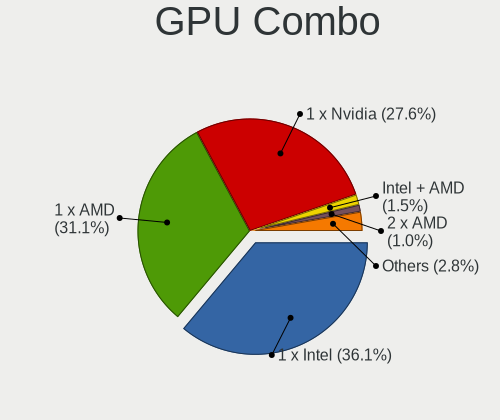

| Name                   | Desktops | Percent |
|------------------------|----------|---------|
| 1 x Intel              | 109      | 38.93%  |
| 1 x AMD                | 86       | 30.71%  |
| 1 x Nvidia             | 71       | 25.36%  |
| Intel + AMD            | 4        | 1.43%   |
| 2 x AMD                | 3        | 1.07%   |
| Intel + Nvidia         | 3        | 1.07%   |
| AMD + Nvidia           | 2        | 0.71%   |
| 1 x Matrox             | 1        | 0.36%   |
| 1 x Intel + 4 x Nvidia | 1        | 0.36%   |

GPU Driver
----------

Free vs proprietary

| Driver      | Desktops | Percent |
|-------------|----------|---------|
| Free        | 231      | 81.05%  |
| Proprietary | 43       | 15.09%  |
| Unknown     | 11       | 3.86%   |

GPU Memory
----------

Total video memory

| Size in GB | Desktops | Percent |
|------------|----------|---------|
| Unknown    | 127      | 44.72%  |
| 1.01-2.0   | 47       | 16.55%  |
| 0.51-1.0   | 39       | 13.73%  |
| 0.01-0.5   | 29       | 10.21%  |
| 3.01-4.0   | 21       | 7.39%   |
| 7.01-8.0   | 8        | 2.82%   |
| 5.01-6.0   | 8        | 2.82%   |
| 8.01-16.0  | 4        | 1.41%   |
| 2.01-3.0   | 1        | 0.35%   |

Monitor
-------

Monitor Vendor
--------------

Monitor vendors

| Vendor               | Desktops | Percent |
|----------------------|----------|---------|
| Goldstar             | 62       | 24.51%  |
| Samsung Electronics  | 36       | 14.23%  |
| Dell                 | 34       | 13.44%  |
| Hewlett-Packard      | 17       | 6.72%   |
| AOC                  | 14       | 5.53%   |
| Philips              | 11       | 4.35%   |
| Lenovo               | 11       | 4.35%   |
| Acer                 | 10       | 3.95%   |
| ViewSonic            | 7        | 2.77%   |
| LG Electronics       | 7        | 2.77%   |
| BenQ                 | 6        | 2.37%   |
| Toshiba              | 5        | 1.98%   |
| Ancor Communications | 5        | 1.98%   |
| Unknown              | 3        | 1.19%   |
| Sharp                | 2        | 0.79%   |
| RTK                  | 2        | 0.79%   |
| Mi                   | 2        | 0.79%   |
| JRY                  | 2        | 0.79%   |
| GDH                  | 2        | 0.79%   |
| ASUSTek Computer     | 2        | 0.79%   |
| Xiaomi               | 1        | 0.4%    |
| Tech Concepts        | 1        | 0.4%    |
| SPC                  | 1        | 0.4%    |
| Sony                 | 1        | 0.4%    |
| S2-Tek               | 1        | 0.4%    |
| Polaroid             | 1        | 0.4%    |
| PiLot                | 1        | 0.4%    |
| Panasonic            | 1        | 0.4%    |
| LRX                  | 1        | 0.4%    |
| ITE                  | 1        | 0.4%    |
| HRX                  | 1        | 0.4%    |
| Haier                | 1        | 0.4%    |
| Gateway              | 1        | 0.4%    |

Monitor Model
-------------

Monitor models

| Model                                                                | Desktops | Percent |
|----------------------------------------------------------------------|----------|---------|
| Goldstar HD GSM5ACB 1366x768 410x230mm 18.5-inch                     | 10       | 3.79%   |
| Goldstar FULL HD GSM5B55 1920x1080 480x270mm 21.7-inch               | 8        | 3.03%   |
| Goldstar IPS FULLHD GSM5AB8 1920x1080 480x270mm 21.7-inch            | 7        | 2.65%   |
| Philips PHL 242M8 PHLC253 1920x1080 527x296mm 23.8-inch              | 4        | 1.52%   |
| Toshiba LCD-MONITOR LCD1560 1366x768 344x194mm 15.5-inch             | 3        | 1.14%   |
| Hewlett-Packard V194 HWP3346 1366x768 410x230mm 18.5-inch            | 3        | 1.14%   |
| Goldstar IPS WSXGA GSM5B01 1440x900 419x262mm 19.5-inch              | 3        | 1.14%   |
| Dell E1914H DELD03A 1366x768 410x230mm 18.5-inch                     | 3        | 1.14%   |
| Dell E1912H DELF03E 1366x768 410x230mm 18.5-inch                     | 3        | 1.14%   |
| AOC 27G2G4 AOC2702 1920x1080 598x336mm 27.0-inch                     | 3        | 1.14%   |
| ViewSonic VX2481-mh VSC3933 1920x1080 527x296mm 23.8-inch            | 2        | 0.76%   |
| Unknown LCD Monitor AcerMFMAV 1440x900                               | 2        | 0.76%   |
| Sharp HDMI SHP108E 1360x768 820x460mm 37.0-inch                      | 2        | 0.76%   |
| Samsung Electronics SyncMaster SAM0598 1360x768 410x230mm 18.5-inch  | 2        | 0.76%   |
| Samsung Electronics SyncMaster SAM0116 1024x768 267x200mm 13.1-inch  | 2        | 0.76%   |
| Samsung Electronics SA300/SA350 SAM0788 1366x768 410x230mm 18.5-inch | 2        | 0.76%   |
| Samsung Electronics S22F350 SAM0D1A 1920x1080 477x268mm 21.5-inch    | 2        | 0.76%   |
| Samsung Electronics S19F350 SAM0D46 1366x768 410x230mm 18.5-inch     | 2        | 0.76%   |
| Samsung Electronics LCD Monitor S19D300 1366x768                     | 2        | 0.76%   |
| Samsung Electronics C24F390 SAM0D2D 1920x1080 521x293mm 23.5-inch    | 2        | 0.76%   |
| Samsung Electronics C24F390 SAM0D2C 1920x1080 521x293mm 23.5-inch    | 2        | 0.76%   |
| Philips 196VL PHLC07F 1366x768 409x230mm 18.5-inch                   | 2        | 0.76%   |
| Mi 27 NFGL XMIB004 1920x1080 598x336mm 27.0-inch                     | 2        | 0.76%   |
| LG Electronics LCD Monitor LG IPS WSXGA 1440x900                     | 2        | 0.76%   |
| Lenovo LEN LI1931ewA LEN65A1 1366x768 409x230mm 18.5-inch            | 2        | 0.76%   |
| Lenovo LEN E2054A LEN60DF 1440x900 419x262mm 19.5-inch               | 2        | 0.76%   |
| Goldstar MP59G GSM5B35 1920x1080 480x270mm 21.7-inch                 | 2        | 0.76%   |
| Goldstar MP59G GSM5B34 1920x1080 480x270mm 21.7-inch                 | 2        | 0.76%   |
| Goldstar HDR WFHD GSM7714 2560x1080 798x334mm 34.1-inch              | 2        | 0.76%   |
| Goldstar HD PLUS GSM5AC5 1600x900 440x250mm 19.9-inch                | 2        | 0.76%   |
| Goldstar HD 16 GSM3E92 1366x768 344x194mm 15.5-inch                  | 2        | 0.76%   |
| Goldstar FULL HD GSM5B54 1920x1080 480x270mm 21.7-inch               | 2        | 0.76%   |
| Goldstar E1642 GSM3E8C 1366x768 344x194mm 15.5-inch                  | 2        | 0.76%   |
| Goldstar 16EN33 GSM3E8F 1366x768 344x194mm 15.5-inch                 | 2        | 0.76%   |
| BenQ G610HDA BNQ7819 1366x768 344x194mm 15.5-inch                    | 2        | 0.76%   |
| AOC 24B1W1 AOC2401 1920x1080 527x296mm 23.8-inch                     | 2        | 0.76%   |
| Acer X163WL ACR022E 1366x768 344x193mm 15.5-inch                     | 2        | 0.76%   |
| Xiaomi Mi TV XMD004A 1920x1080 708x398mm 32.0-inch                   | 1        | 0.38%   |
| ViewSonic VA2261 Series VSC0F30 1920x1080 477x268mm 21.5-inch        | 1        | 0.38%   |
| ViewSonic VA2219 Series VSC7932 1920x1080 477x268mm 21.5-inch        | 1        | 0.38%   |

Monitor Resolution
------------------

Monitor screen resolution

| Resolution         | Desktops | Percent |
|--------------------|----------|---------|
| 1920x1080 (FHD)    | 94       | 37.9%   |
| 1366x768 (WXGA)    | 75       | 30.24%  |
| 3840x2160 (4K)     | 18       | 7.26%   |
| 1440x900 (WXGA+)   | 17       | 6.85%   |
| 1600x900 (HD+)     | 9        | 3.63%   |
| 1360x768           | 8        | 3.23%   |
| 1280x1024 (SXGA)   | 6        | 2.42%   |
| 2560x1440 (QHD)    | 3        | 1.21%   |
| 2560x1080          | 3        | 1.21%   |
| 1024x768 (XGA)     | 3        | 1.21%   |
| 3840x1080          | 2        | 0.81%   |
| 3440x1440          | 2        | 0.81%   |
| 1280x720 (HD)      | 2        | 0.81%   |
| Unknown            | 2        | 0.81%   |
| 640x480            | 1        | 0.4%    |
| 5760x2160          | 1        | 0.4%    |
| 1680x1050 (WSXGA+) | 1        | 0.4%    |
| 1280x960           | 1        | 0.4%    |

Monitor Diagonal
----------------

Diagonal size in inches

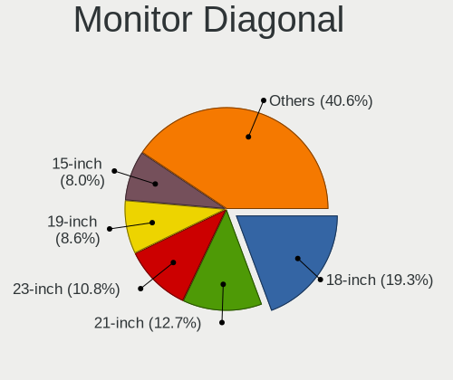

| Inches  | Desktops | Percent |
|---------|----------|---------|
| 18      | 54       | 21.6%   |
| 21      | 45       | 18%     |
| 23      | 25       | 10%     |
| Unknown | 22       | 8.8%    |
| 19      | 20       | 8%      |
| 15      | 20       | 8%      |
| 27      | 15       | 6%      |
| 24      | 13       | 5.2%    |
| 17      | 5        | 2%      |
| 40      | 3        | 1.2%    |
| 34      | 3        | 1.2%    |
| 31      | 3        | 1.2%    |
| 16      | 3        | 1.2%    |
| 48      | 2        | 0.8%    |
| 37      | 2        | 0.8%    |
| 20      | 2        | 0.8%    |
| 13      | 2        | 0.8%    |
| 84      | 1        | 0.4%    |
| 72      | 1        | 0.4%    |
| 65      | 1        | 0.4%    |
| 60      | 1        | 0.4%    |
| 57      | 1        | 0.4%    |
| 52      | 1        | 0.4%    |
| 42      | 1        | 0.4%    |
| 39      | 1        | 0.4%    |
| 36      | 1        | 0.4%    |
| 35      | 1        | 0.4%    |
| 22      | 1        | 0.4%    |

Monitor Width
-------------

Physical width

| Width in mm | Desktops | Percent |
|-------------|----------|---------|
| 401-500     | 115      | 46.94%  |
| 501-600     | 50       | 20.41%  |
| 301-350     | 23       | 9.39%   |
| Unknown     | 22       | 8.98%   |
| 351-400     | 8        | 3.27%   |
| 801-900     | 7        | 2.86%   |
| 701-800     | 5        | 2.04%   |
| 601-700     | 5        | 2.04%   |
| 1001-1500   | 5        | 2.04%   |
| 201-300     | 2        | 0.82%   |
| 1501-2000   | 2        | 0.82%   |
| 901-1000    | 1        | 0.41%   |

Aspect Ratio
------------

Proportional relationship between the width and the height

| Ratio   | Desktops | Percent |
|---------|----------|---------|
| 16/9    | 190      | 78.84%  |
| Unknown | 21       | 8.71%   |
| 16/10   | 15       | 6.22%   |
| 5/4     | 6        | 2.49%   |
| 4/3     | 4        | 1.66%   |
| 21/9    | 4        | 1.66%   |
| 0.56    | 1        | 0.41%   |

Monitor Area
------------

Area in inch

| Area in inch | Desktops | Percent |
|----------------|----------|---------|
| 201-250        | 67       | 26.91%  |
| 141-150        | 57       | 22.89%  |
| 151-200        | 35       | 14.06%  |
| Unknown        | 22       | 8.84%   |
| 101-110        | 18       | 7.23%   |
| 301-350        | 15       | 6.02%   |
| More than 1000 | 8        | 3.21%   |
| 501-1000       | 8        | 3.21%   |
| 351-500        | 7        | 2.81%   |
| 251-300        | 4        | 1.61%   |
| 111-120        | 3        | 1.2%    |
| 81-90          | 2        | 0.8%    |
| 91-100         | 2        | 0.8%    |
| 131-140        | 1        | 0.4%    |

Pixel Density
-------------

Pixels per inch

| Density | Desktops | Percent |
|---------|----------|---------|
| 51-100  | 145      | 58.7%   |
| 101-120 | 66       | 26.72%  |
| Unknown | 22       | 8.91%   |
| 1-50    | 11       | 4.45%   |
| 121-160 | 2        | 0.81%   |
| 161-240 | 1        | 0.4%    |

Multiple Monitors
-----------------

Total monitors connected

| Total | Desktops | Percent |
|-------|----------|---------|
| 1     | 237      | 83.75%  |
| 2     | 24       | 8.48%   |
| 0     | 22       | 7.77%   |

Network
-------

Net Controller Vendor
---------------------

Controller vendors

| Vendor                          | Desktops | Percent |
|---------------------------------|----------|---------|
| Realtek Semiconductor           | 212      | 49.53%  |
| Intel                           | 70       | 16.36%  |
| Qualcomm Atheros                | 30       | 7.01%   |
| Ralink Technology               | 28       | 6.54%   |
| TP-Link                         | 20       | 4.67%   |
| Xiaomi                          | 12       | 2.8%    |
| Samsung Electronics             | 8        | 1.87%   |
| Qualcomm Atheros Communications | 7        | 1.64%   |
| Broadcom                        | 7        | 1.64%   |
| Ralink                          | 5        | 1.17%   |
| D-Link System                   | 4        | 0.93%   |
| Qualcomm                        | 3        | 0.7%    |
| D-Link                          | 3        | 0.7%    |
| ASIX Electronics                | 3        | 0.7%    |
| OPPO Electronics                | 2        | 0.47%   |
| Nvidia                          | 2        | 0.47%   |
| HMD Global                      | 2        | 0.47%   |
| AboCom Systems                  | 2        | 0.47%   |
| vivo                            | 1        | 0.23%   |
| VIA Technologies                | 1        | 0.23%   |
| QinHeng Electronics             | 1        | 0.23%   |
| MediaTek                        | 1        | 0.23%   |
| Marvell Technology Group        | 1        | 0.23%   |
| Huawei Technologies             | 1        | 0.23%   |
| Broadcom Limited                | 1        | 0.23%   |
| ASUSTek Computer                | 1        | 0.23%   |

Net Controller Model
--------------------

Controller models

| Model                                                             | Desktops | Percent |
|-------------------------------------------------------------------|----------|---------|
| Realtek RTL8111/8168/8411 PCI Express Gigabit Ethernet Controller | 162      | 33.2%   |
| Realtek RTL810xE PCI Express Fast Ethernet controller             | 32       | 6.56%   |
| Realtek RTL8188EUS 802.11n Wireless Network Adapter               | 24       | 4.92%   |
| Ralink MT7601U Wireless Adapter                                   | 17       | 3.48%   |
| TP-Link TL-WN722N v2/v3 [Realtek RTL8188EUS]                      | 13       | 2.66%   |
| Intel 82579LM Gigabit Network Connection (Lewisville)             | 10       | 2.05%   |
| Xiaomi Mi/Redmi series (RNDIS)                                    | 9        | 1.84%   |
| Realtek RTL8188EE Wireless Network Adapter                        | 9        | 1.84%   |
| Realtek RTL8188FTV 802.11b/g/n 1T1R 2.4G WLAN Adapter             | 8        | 1.64%   |
| Qualcomm Atheros AR9271 802.11n                                   | 7        | 1.43%   |
| Qualcomm Atheros AR9485 Wireless Network Adapter                  | 7        | 1.43%   |
| Intel I211 Gigabit Network Connection                             | 7        | 1.43%   |
| Samsung Galaxy series, misc. (tethering mode)                     | 6        | 1.23%   |
| Intel Wi-Fi 6 AX200                                               | 6        | 1.23%   |
| Ralink RT2870/RT3070 Wireless Adapter                             | 5        | 1.02%   |
| Qualcomm Atheros AR8152 v2.0 Fast Ethernet                        | 4        | 0.82%   |
| Qualcomm Atheros AR8151 v2.0 Gigabit Ethernet                     | 4        | 0.82%   |
| Intel Ethernet Connection I217-V                                  | 4        | 0.82%   |
| Intel Ethernet Connection (7) I219-V                              | 4        | 0.82%   |
| Intel Ethernet Connection (2) I219-V                              | 4        | 0.82%   |
| Intel Dual Band Wireless-AC 3168NGW [Stone Peak]                  | 4        | 0.82%   |
| Intel 82574L Gigabit Network Connection                           | 4        | 0.82%   |
| Xiaomi Mi/Redmi series (RNDIS + ADB)                              | 3        | 0.61%   |
| Realtek RTL8188GU 802.11n WLAN Adapter (After Modeswitch)         | 3        | 0.61%   |
| Realtek RTL8188ETV Wireless LAN 802.11n Network Adapter           | 3        | 0.61%   |
| Realtek RTL8125 2.5GbE Controller                                 | 3        | 0.61%   |
| Realtek RTL-8100/8101L/8139 PCI Fast Ethernet Adapter             | 3        | 0.61%   |
| Ralink RT5370 Wireless Adapter                                    | 3        | 0.61%   |
| Qualcomm Nokia XR20                                               | 3        | 0.61%   |
| Qualcomm Atheros Attansic L2 Fast Ethernet                        | 3        | 0.61%   |
| Intel Ethernet Connection I217-LM                                 | 3        | 0.61%   |
| Intel Dual Band Wireless-AC 3165 Plus Bluetooth                   | 3        | 0.61%   |
| ASIX AX88179 Gigabit Ethernet                                     | 3        | 0.61%   |
| TP-Link TL-WN821N v5/v6 [RTL8192EU]                               | 2        | 0.41%   |
| Samsung GT-I9070 (network tethering, USB debugging enabled)       | 2        | 0.41%   |
| Realtek RTL8153 Gigabit Ethernet Adapter                          | 2        | 0.41%   |
| Realtek 802.11ac NIC                                              | 2        | 0.41%   |
| Ralink RT2501/RT2573 Wireless Adapter                             | 2        | 0.41%   |
| Ralink RT5392 PCIe Wireless Network Adapter                       | 2        | 0.41%   |
| Qualcomm Atheros AR8161 Gigabit Ethernet                          | 2        | 0.41%   |

Wireless Vendor
---------------

Wireless vendors

| Vendor                          | Desktops | Percent |
|---------------------------------|----------|---------|
| Realtek Semiconductor           | 54       | 33.54%  |
| Ralink Technology               | 28       | 17.39%  |
| Intel                           | 26       | 16.15%  |
| TP-Link                         | 19       | 11.8%   |
| Qualcomm Atheros                | 10       | 6.21%   |
| Qualcomm Atheros Communications | 7        | 4.35%   |
| Ralink                          | 5        | 3.11%   |
| D-Link                          | 3        | 1.86%   |
| Broadcom                        | 3        | 1.86%   |
| D-Link System                   | 2        | 1.24%   |
| AboCom Systems                  | 2        | 1.24%   |
| Broadcom Limited                | 1        | 0.62%   |
| ASUSTek Computer                | 1        | 0.62%   |

Wireless Model
--------------

Wireless models

| Model                                                     | Desktops | Percent |
|-----------------------------------------------------------|----------|---------|
| Realtek RTL8188EUS 802.11n Wireless Network Adapter       | 24       | 14.72%  |
| Ralink MT7601U Wireless Adapter                           | 17       | 10.43%  |
| TP-Link TL-WN722N v2/v3 [Realtek RTL8188EUS]              | 13       | 7.98%   |
| Realtek RTL8188EE Wireless Network Adapter                | 9        | 5.52%   |
| Realtek RTL8188FTV 802.11b/g/n 1T1R 2.4G WLAN Adapter     | 8        | 4.91%   |
| Qualcomm Atheros AR9271 802.11n                           | 7        | 4.29%   |
| Qualcomm Atheros AR9485 Wireless Network Adapter          | 7        | 4.29%   |
| Intel Wi-Fi 6 AX200                                       | 6        | 3.68%   |
| Ralink RT2870/RT3070 Wireless Adapter                     | 5        | 3.07%   |
| Intel Dual Band Wireless-AC 3168NGW [Stone Peak]          | 4        | 2.45%   |
| Realtek RTL8188GU 802.11n WLAN Adapter (After Modeswitch) | 3        | 1.84%   |
| Realtek RTL8188ETV Wireless LAN 802.11n Network Adapter   | 3        | 1.84%   |
| Ralink RT5370 Wireless Adapter                            | 3        | 1.84%   |
| Intel Dual Band Wireless-AC 3165 Plus Bluetooth           | 3        | 1.84%   |
| TP-Link TL-WN821N v5/v6 [RTL8192EU]                       | 2        | 1.23%   |
| Realtek 802.11ac NIC                                      | 2        | 1.23%   |
| Ralink RT2501/RT2573 Wireless Adapter                     | 2        | 1.23%   |
| Ralink RT5392 PCIe Wireless Network Adapter               | 2        | 1.23%   |
| Intel Wireless-AC 9260                                    | 2        | 1.23%   |
| Intel Wireless 7260                                       | 2        | 1.23%   |
| Intel Wireless 3165                                       | 2        | 1.23%   |
| Intel Wireless 3160                                       | 2        | 1.23%   |
| Intel Alder Lake-S PCH CNVi WiFi                          | 2        | 1.23%   |
| D-Link WLAN controller                                    | 2        | 1.23%   |
| Broadcom BCM43142 802.11b/g/n                             | 2        | 1.23%   |
| TP-Link TL-WN823N v2/v3 [Realtek RTL8192EU]               | 1        | 0.61%   |
| TP-Link TL-WN822N Version 4 RTL8192EU                     | 1        | 0.61%   |
| TP-Link Archer T2U PLUS [RTL8821AU]                       | 1        | 0.61%   |
| TP-Link 802.11n NIC                                       | 1        | 0.61%   |
| Realtek RTL8723BE PCIe Wireless Network Adapter           | 1        | 0.61%   |
| Realtek RTL8723AE PCIe Wireless Network Adapter           | 1        | 0.61%   |
| Realtek RTL8192EU 802.11b/g/n WLAN Adapter                | 1        | 0.61%   |
| Realtek RTL8192EE PCIe Wireless Network Adapter           | 1        | 0.61%   |
| Realtek RTL8191SEvB Wireless LAN Controller               | 1        | 0.61%   |
| Realtek RTL8188CUS 802.11n WLAN Adapter                   | 1        | 0.61%   |
| Realtek RTL8187 Wireless Adapter                          | 1        | 0.61%   |
| Ralink RT2070 Wireless Adapter                            | 1        | 0.61%   |
| Ralink RT3090 Wireless 802.11n 1T/1R PCIe                 | 1        | 0.61%   |
| Ralink RT3060 Wireless 802.11n 1T/1R                      | 1        | 0.61%   |
| Ralink RT2561/RT61 802.11g PCI                            | 1        | 0.61%   |

Ethernet Vendor
---------------

Ethernet vendors

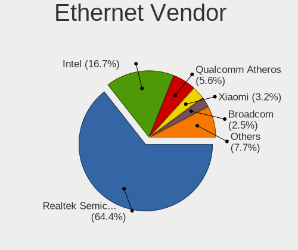

| Vendor                   | Desktops | Percent |
|--------------------------|----------|---------|
| Realtek Semiconductor    | 201      | 63.61%  |
| Intel                    | 52       | 16.46%  |
| Qualcomm Atheros         | 20       | 6.33%   |
| Xiaomi                   | 12       | 3.8%    |
| Samsung Electronics      | 6        | 1.9%    |
| Broadcom                 | 4        | 1.27%   |
| Qualcomm                 | 3        | 0.95%   |
| ASIX Electronics         | 3        | 0.95%   |
| OPPO Electronics         | 2        | 0.63%   |
| Nvidia                   | 2        | 0.63%   |
| HMD Global               | 2        | 0.63%   |
| D-Link System            | 2        | 0.63%   |
| vivo                     | 1        | 0.32%   |
| VIA Technologies         | 1        | 0.32%   |
| TP-Link                  | 1        | 0.32%   |
| QinHeng Electronics      | 1        | 0.32%   |
| MediaTek                 | 1        | 0.32%   |
| Marvell Technology Group | 1        | 0.32%   |
| Huawei Technologies      | 1        | 0.32%   |

Ethernet Model
--------------

Ethernet models

| Model                                                             | Desktops | Percent |
|-------------------------------------------------------------------|----------|---------|
| Realtek RTL8111/8168/8411 PCI Express Gigabit Ethernet Controller | 162      | 50.15%  |
| Realtek RTL810xE PCI Express Fast Ethernet controller             | 32       | 9.91%   |
| Intel 82579LM Gigabit Network Connection (Lewisville)             | 10       | 3.1%    |
| Xiaomi Mi/Redmi series (RNDIS)                                    | 9        | 2.79%   |
| Intel I211 Gigabit Network Connection                             | 7        | 2.17%   |
| Samsung Galaxy series, misc. (tethering mode)                     | 6        | 1.86%   |
| Qualcomm Atheros AR8152 v2.0 Fast Ethernet                        | 4        | 1.24%   |
| Qualcomm Atheros AR8151 v2.0 Gigabit Ethernet                     | 4        | 1.24%   |
| Intel Ethernet Connection I217-V                                  | 4        | 1.24%   |
| Intel Ethernet Connection (7) I219-V                              | 4        | 1.24%   |
| Intel Ethernet Connection (2) I219-V                              | 4        | 1.24%   |
| Intel 82574L Gigabit Network Connection                           | 4        | 1.24%   |
| Xiaomi Mi/Redmi series (RNDIS + ADB)                              | 3        | 0.93%   |
| Realtek RTL8125 2.5GbE Controller                                 | 3        | 0.93%   |
| Realtek RTL-8100/8101L/8139 PCI Fast Ethernet Adapter             | 3        | 0.93%   |
| Qualcomm Nokia XR20                                               | 3        | 0.93%   |
| Qualcomm Atheros Attansic L2 Fast Ethernet                        | 3        | 0.93%   |
| Intel Ethernet Connection I217-LM                                 | 3        | 0.93%   |
| ASIX AX88179 Gigabit Ethernet                                     | 3        | 0.93%   |
| Realtek RTL8153 Gigabit Ethernet Adapter                          | 2        | 0.62%   |
| Qualcomm Atheros AR8161 Gigabit Ethernet                          | 2        | 0.62%   |
| Qualcomm Atheros AR8132 Fast Ethernet                             | 2        | 0.62%   |
| Qualcomm Atheros AR8121/AR8113/AR8114 Gigabit or Fast Ethernet    | 2        | 0.62%   |
| OPPO KALAMA-MTP_CID:0437_SN:AEEEF597                              | 2        | 0.62%   |
| Intel Ethernet Connection (2) I219-LM                             | 2        | 0.62%   |
| Intel Ethernet Connection (2) I218-V                              | 2        | 0.62%   |
| Intel 82566DM-2 Gigabit Network Connection                        | 2        | 0.62%   |
| HMD Global Nokia7.2                                               | 2        | 0.62%   |
| D-Link System DGE-528T Gigabit Ethernet Adapter                   | 2        | 0.62%   |
| vivo 1808                                                         | 1        | 0.31%   |
| VIA VT6105/VT6106S [Rhine-III]                                    | 1        | 0.31%   |
| TP-Link UE300 10/100/1000 LAN (ethernet mode) [Realtek RTL8153]   | 1        | 0.31%   |
| Realtek RTL8169 PCI Gigabit Ethernet Controller                   | 1        | 0.31%   |
| Realtek RTL8152 Fast Ethernet Adapter                             | 1        | 0.31%   |
| Qualcomm Atheros Killer E2500 Gigabit Ethernet Controller         | 1        | 0.31%   |
| Qualcomm Atheros Killer E220x Gigabit Ethernet Controller         | 1        | 0.31%   |
| Qualcomm Atheros AR8131 Gigabit Ethernet                          | 1        | 0.31%   |
| QinHeng CH9200 USB Ethernet Adapter                               | 1        | 0.31%   |
| Nvidia MCP77 Ethernet                                             | 1        | 0.31%   |
| Nvidia MCP61 Ethernet                                             | 1        | 0.31%   |

Net Controller Kind
-------------------

Ethernet, WiFi or modem

| Kind     | Desktops | Percent |
|----------|----------|---------|
| Ethernet | 273      | 63.64%  |
| WiFi     | 154      | 35.9%   |
| Modem    | 2        | 0.47%   |

Used Controller
---------------

Currently used network controller

| Kind     | Desktops | Percent |
|----------|----------|---------|
| Ethernet | 174      | 61.7%   |
| WiFi     | 107      | 37.94%  |
| Modem    | 1        | 0.35%   |

NICs
----

Total network controllers on board

| Total | Desktops | Percent |
|-------|----------|---------|
| 1     | 206      | 73.84%  |
| 2     | 61       | 21.86%  |
| 3     | 9        | 3.23%   |
| 0     | 2        | 0.72%   |
| 4     | 1        | 0.36%   |

IPv6
----

IPv6 vs IPv4

| Used | Desktops | Percent |
|------|----------|---------|
| No   | 268      | 96.06%  |
| Yes  | 11       | 3.94%   |

Bluetooth
---------

Bluetooth Vendor
----------------

Controller vendors

| Vendor                          | Desktops | Percent |
|---------------------------------|----------|---------|
| Cambridge Silicon Radio         | 29       | 45.31%  |
| Intel                           | 25       | 39.06%  |
| Realtek Semiconductor           | 4        | 6.25%   |
| Qualcomm Atheros Communications | 3        | 4.69%   |
| Broadcom                        | 3        | 4.69%   |

Bluetooth Model
---------------

Controller models

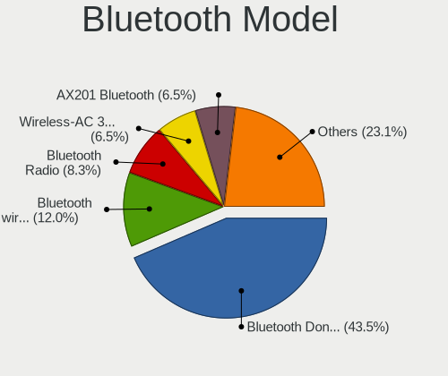

| Model                                               | Desktops | Percent |
|-----------------------------------------------------|----------|---------|
| Cambridge Silicon Radio Bluetooth Dongle (HCI mode) | 29       | 45.31%  |
| Intel Bluetooth wireless interface                  | 10       | 15.63%  |
| Intel AX200 Bluetooth                               | 6        | 9.38%   |
| Intel Wireless-AC 3168 Bluetooth                    | 4        | 6.25%   |
| Realtek Bluetooth Radio                             | 3        | 4.69%   |
| Intel Wireless-AC 9260 Bluetooth Adapter            | 2        | 3.13%   |
| Intel AX201 Bluetooth                               | 2        | 3.13%   |
| Broadcom BCM43142A0 Bluetooth 4.0                   | 2        | 3.13%   |
| Realtek RTL8723B Bluetooth                          | 1        | 1.56%   |
| Qualcomm Atheros Bluetooth USB Host Controller      | 1        | 1.56%   |
| Qualcomm Atheros Bluetooth                          | 1        | 1.56%   |
| Qualcomm Atheros AR9462 Bluetooth                   | 1        | 1.56%   |
| Intel Centrino Bluetooth Wireless Transceiver       | 1        | 1.56%   |
| Broadcom BCM92046DG-CL1ROM Bluetooth 2.1 UHE Dongle | 1        | 1.56%   |

Sound
-----

Sound Vendor
------------

Sound card vendors

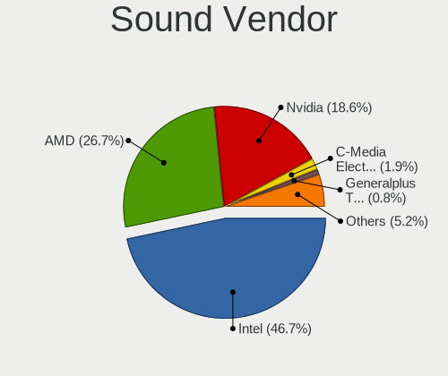

| Vendor                 | Desktops | Percent |
|------------------------|----------|---------|
| Intel                  | 199      | 48.89%  |
| AMD                    | 108      | 26.54%  |
| Nvidia                 | 72       | 17.69%  |
| C-Media Electronics    | 7        | 1.72%   |
| Generalplus Technology | 5        | 1.23%   |
| Creative Labs          | 3        | 0.74%   |
| KTMicro                | 2        | 0.49%   |
| JMTek                  | 2        | 0.49%   |
| Texas Instruments      | 1        | 0.25%   |
| SteelSeries ApS        | 1        | 0.25%   |
| Sony                   | 1        | 0.25%   |
| Solid State Logic      | 1        | 0.25%   |
| Razer USA              | 1        | 0.25%   |
| Hewlett-Packard        | 1        | 0.25%   |
| Creative Technology    | 1        | 0.25%   |
| Barco Display Systems  | 1        | 0.25%   |
| ASUSTek Computer       | 1        | 0.25%   |

Sound Model
-----------

Sound card models

| Model                                                                      | Desktops | Percent |
|----------------------------------------------------------------------------|----------|---------|
| Intel 6 Series/C200 Series Chipset Family High Definition Audio Controller | 43       | 8.88%   |
| Intel NM10/ICH7 Family High Definition Audio Controller                    | 37       | 7.64%   |
| Intel 8 Series/C220 Series Chipset High Definition Audio Controller        | 30       | 6.2%    |
| Intel Xeon E3-1200 v3/4th Gen Core Processor HD Audio Controller           | 20       | 4.13%   |
| AMD Family 17h/19h HD Audio Controller                                     | 20       | 4.13%   |
| AMD SBx00 Azalia (Intel HDA)                                               | 18       | 3.72%   |
| AMD FCH Azalia Controller                                                  | 17       | 3.51%   |
| Nvidia GK208 HDMI/DP Audio Controller                                      | 12       | 2.48%   |
| AMD Ellesmere HDMI Audio [Radeon RX 470/480 / 570/580/590]                 | 12       | 2.48%   |
| Intel 7 Series/C216 Chipset Family High Definition Audio Controller        | 11       | 2.27%   |
| Intel 100 Series/C230 Series Chipset Family HD Audio Controller            | 11       | 2.27%   |
| AMD Starship/Matisse HD Audio Controller                                   | 11       | 2.27%   |
| Nvidia High Definition Audio Controller                                    | 10       | 2.07%   |
| Intel 200 Series PCH HD Audio                                              | 10       | 2.07%   |
| AMD Raven/Raven2/Fenghuang HDMI/DP Audio Controller                        | 10       | 2.07%   |
| AMD Oland/Hainan/Cape Verde/Pitcairn HDMI Audio [Radeon HD 7000 Series]    | 10       | 2.07%   |
| Intel Cannon Lake PCH cAVS                                                 | 9        | 1.86%   |
| Intel 5 Series/3400 Series Chipset High Definition Audio                   | 9        | 1.86%   |
| Nvidia GF108 High Definition Audio Controller                              | 8        | 1.65%   |
| Intel 82801JI (ICH10 Family) HD Audio Controller                           | 8        | 1.65%   |
| AMD Family 17h (Models 00h-0fh) HD Audio Controller                        | 8        | 1.65%   |
| AMD Cedar HDMI Audio [Radeon HD 5400/6300/7300 Series]                     | 8        | 1.65%   |
| AMD Renoir Radeon High Definition Audio Controller                         | 7        | 1.45%   |
| Intel Comet Lake PCH-V cAVS                                                | 6        | 1.24%   |
| AMD Turks HDMI Audio [Radeon HD 6500/6600 / 6700M Series]                  | 6        | 1.24%   |
| Nvidia TU116 High Definition Audio Controller                              | 5        | 1.03%   |
| Nvidia GP107GL High Definition Audio Controller                            | 5        | 1.03%   |
| Nvidia GM107 High Definition Audio Controller [GeForce 940MX]              | 5        | 1.03%   |
| Generalplus Technology USB Audio Device                                    | 5        | 1.03%   |
| AMD RV710/730 HDMI Audio [Radeon HD 4000 series]                           | 5        | 1.03%   |
| AMD Baffin HDMI/DP Audio [Radeon RX 550 640SP / RX 560/560X]               | 5        | 1.03%   |
| Nvidia GP106 High Definition Audio Controller                              | 4        | 0.83%   |
| Intel Tiger Lake-H HD Audio Controller                                     | 4        | 0.83%   |
| Intel 9 Series Chipset Family HD Audio Controller                          | 4        | 0.83%   |
| Intel 82801I (ICH9 Family) HD Audio Controller                             | 4        | 0.83%   |
| AMD Trinity HDMI Audio Controller                                          | 4        | 0.83%   |
| AMD Kabini HDMI/DP Audio                                                   | 4        | 0.83%   |
| Nvidia GM206 High Definition Audio Controller                              | 3        | 0.62%   |
| Intel Alder Lake-S HD Audio Controller                                     | 3        | 0.62%   |
| AMD Navi 21/23 HDMI/DP Audio Controller                                    | 3        | 0.62%   |

Memory
------

Memory Vendor
-------------

Memory module vendors

| Vendor              | Desktops | Percent |
|---------------------|----------|---------|
| Unknown             | 32       | 20.13%  |
| Kingston            | 20       | 12.58%  |
| SK hynix            | 18       | 11.32%  |
| Corsair             | 17       | 10.69%  |
| Samsung Electronics | 15       | 9.43%   |
| Team                | 12       | 7.55%   |
| V-GeN               | 7        | 4.4%    |
| G.Skill             | 7        | 4.4%    |
| Micron Technology   | 6        | 3.77%   |
| Unknown             | 6        | 3.77%   |
| Elpida              | 3        | 1.89%   |
| Unknown (0x0DD5)    | 2        | 1.26%   |
| Ramaxel Technology  | 2        | 1.26%   |
| Crucial             | 2        | 1.26%   |
| Visipro             | 1        | 0.63%   |
| Unknown (8AA1)      | 1        | 0.63%   |
| Transcend           | 1        | 0.63%   |
| Super Talent        | 1        | 0.63%   |
| Patriot             | 1        | 0.63%   |
| Nanya Technology    | 1        | 0.63%   |
| Kingmax             | 1        | 0.63%   |
| Essencore           | 1        | 0.63%   |
| A-DATA Technology   | 1        | 0.63%   |
| 04?@                | 1        | 0.63%   |

Memory Model
------------

Memory module models

| Model                                                       | Desktops | Percent |
|-------------------------------------------------------------|----------|---------|
| Unknown                                                     | 6        | 3.53%   |
| Team RAM TEAMGROUP-UD4-3200 8GB DIMM DDR4 3800MT/s          | 4        | 2.35%   |
| Unknown RAM Module 2GB DIMM DDR3 1333MT/s                   | 3        | 1.76%   |
| Unknown RAM Module 2GB DIMM 800MT/s                         | 3        | 1.76%   |
| Unknown RAM Module 2048MB DIMM DDR2 800MT/s                 | 3        | 1.76%   |
| SK hynix RAM HMT451S6BFR8A-PB 4GB SODIMM DDR3 1600MT/s      | 3        | 1.76%   |
| Corsair RAM CMZ8GX3M2A1600C9 4GB DIMM 1600MT/s              | 3        | 1.76%   |
| Unknown RAM Module 4GB DIMM DDR3 1333MT/s                   | 2        | 1.18%   |
| Unknown RAM Module 4GB DIMM 1333MT/s                        | 2        | 1.18%   |
| Unknown RAM Module 2GB DIMM DDR2 800MT/s                    | 2        | 1.18%   |
| Unknown RAM Module 2GB DIMM DDR2 333MT/s                    | 2        | 1.18%   |
| Unknown RAM Module 2GB DIMM 1333MT/s                        | 2        | 1.18%   |
| Unknown RAM Module 1GB DIMM DDR2 333MT/s                    | 2        | 1.18%   |
| Unknown (0x0DD5) RAM AZ8G4SW266-8G 8GB SODIMM DDR4 2667MT/s | 2        | 1.18%   |
| Team RAM TEAMGROUP-UD4-2400 8GB DIMM DDR4 2400MT/s          | 2        | 1.18%   |
| SK hynix RAM HMT351U6CFR8C-PB 4GB DIMM DDR3 1800MT/s        | 2        | 1.18%   |
| Samsung RAM M378B5773QB0-CK0 2GB DIMM DDR3 1600MT/s         | 2        | 1.18%   |
| Samsung RAM M378B5273CH0-CH9 4GB DIMM DDR3 1867MT/s         | 2        | 1.18%   |
| Samsung RAM M378B5173EB0-CK0 4GB DIMM DDR3 1600MT/s         | 2        | 1.18%   |
| Micron RAM 16JTF51264AZ-1G6M1 4GB DIMM DDR3 1600MT/s        | 2        | 1.18%   |
| Kingston RAM KHX2400C15D4/4G 4GB DIMM DDR4 3151MT/s         | 2        | 1.18%   |
| Corsair RAM CMW16GX4M2C3200C16 8GB DIMM DDR4 3733MT/s       | 2        | 1.18%   |
| Corsair RAM CMK16GX4M2B3200C16 8GB DIMM DDR4 3600MT/s       | 2        | 1.18%   |
| Visipro RAM T4G86U1-H9H 4096MB DIMM DDR3 1067MT/s           | 1        | 0.59%   |
| V-GeN RAM D4S16GL32A8TS 16384MB DIMM DDR4 3200MT/s          | 1        | 0.59%   |
| V-GeN RAM D4H8GL32A8TXV 8GB DIMM DDR4 2400MT/s              | 1        | 0.59%   |
| V-GeN RAM D4H8GL32A8TS 8GB DIMM DDR4 3200MT/s               | 1        | 0.59%   |
| V-GeN RAM D4H8GL24A8 8GB DIMM DDR4 2400MT/s                 | 1        | 0.59%   |
| V-GeN RAM D3S4GL16B8 4GB DIMM DDR3 1333MT/s                 | 1        | 0.59%   |
| V-GeN RAM D3S4GL16A8 4GB DIMM DDR3                          | 1        | 0.59%   |
| V-GeN RAM D3R4GL16B8R 4GB DIMM DDR3 1600MT/s                | 1        | 0.59%   |
| Unknown RAM Module 8GB DIMM DDR3 1600MT/s                   | 1        | 0.59%   |
| Unknown RAM Module 8GB DIMM 1333MT/s                        | 1        | 0.59%   |
| Unknown RAM Module 4GB DIMM SDRAM 1066MT/s                  | 1        | 0.59%   |
| Unknown RAM Module 4GB DIMM SDRAM                           | 1        | 0.59%   |
| Unknown RAM Module 4GB DIMM 1600MT/s                        | 1        | 0.59%   |
| Unknown RAM Module 4096MB DIMM SDRAM 1066MT/s               | 1        | 0.59%   |
| Unknown RAM Module 4096MB DIMM SDRAM                        | 1        | 0.59%   |
| Unknown RAM Module 4096MB DIMM DDR3 1333MT/s                | 1        | 0.59%   |
| Unknown RAM Module 4096MB DIMM 667MT/s                      | 1        | 0.59%   |

Memory Kind
-----------

Memory module kinds

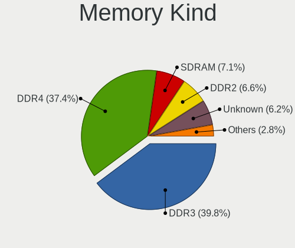

| Kind    | Desktops | Percent |
|---------|----------|---------|
| DDR3    | 55       | 41.35%  |
| DDR4    | 47       | 35.34%  |
| DDR2    | 11       | 8.27%   |
| Unknown | 11       | 8.27%   |
| SDRAM   | 8        | 6.02%   |
| DDR     | 1        | 0.75%   |

Memory Form Factor
------------------

Physical design of the memory module

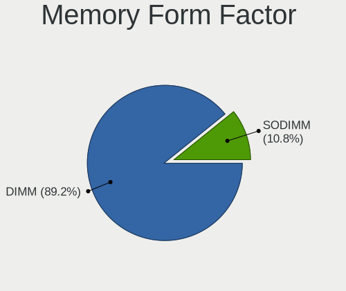

| Name   | Desktops | Percent |
|--------|----------|---------|
| DIMM   | 119      | 91.54%  |
| SODIMM | 11       | 8.46%   |

Memory Size
-----------

Memory module size

| Size  | Desktops | Percent |
|-------|----------|---------|
| 4096  | 49       | 33.11%  |
| 8192  | 38       | 25.68%  |
| 2048  | 36       | 24.32%  |
| 16384 | 10       | 6.76%   |
| 32768 | 8        | 5.41%   |
| 1024  | 7        | 4.73%   |

Memory Speed
------------

Memory module speed

| Speed   | Desktops | Percent |
|---------|----------|---------|
| 1600    | 35       | 23.18%  |
| 1333    | 25       | 16.56%  |
| 800     | 9        | 5.96%   |
| 3200    | 8        | 5.3%    |
| 2667    | 8        | 5.3%    |
| 2400    | 8        | 5.3%    |
| 667     | 5        | 3.31%   |
| Unknown | 5        | 3.31%   |
| 3800    | 4        | 2.65%   |
| 3600    | 4        | 2.65%   |
| 3733    | 3        | 1.99%   |
| 2666    | 3        | 1.99%   |
| 2133    | 3        | 1.99%   |
| 1800    | 3        | 1.99%   |
| 1067    | 3        | 1.99%   |
| 3466    | 2        | 1.32%   |
| 3151    | 2        | 1.32%   |
| 3000    | 2        | 1.32%   |
| 1867    | 2        | 1.32%   |
| 1866    | 2        | 1.32%   |
| 1066    | 2        | 1.32%   |
| 333     | 2        | 1.32%   |
| 50410   | 1        | 0.66%   |
| 4040    | 1        | 0.66%   |
| 3866    | 1        | 0.66%   |
| 3666    | 1        | 0.66%   |
| 3534    | 1        | 0.66%   |
| 3400    | 1        | 0.66%   |
| 2934    | 1        | 0.66%   |
| 2733    | 1        | 0.66%   |
| 2465    | 1        | 0.66%   |
| 2200    | 1        | 0.66%   |
| 1648    | 1        | 0.66%   |

Printers & scanners
-------------------

Printer Vendor
--------------

Printer device vendors

| Vendor             | Desktops | Percent |
|--------------------|----------|---------|
| Seiko Epson        | 13       | 72.22%  |
| Hewlett-Packard    | 3        | 16.67%  |
| STMicroelectronics | 1        | 5.56%   |
| Fuji Xerox         | 1        | 5.56%   |

Printer Model
-------------

Printer device models

| Model                            | Desktops | Percent |
|----------------------------------|----------|---------|
| Seiko Epson L120 Series          | 5        | 27.78%  |
| Seiko Epson L222 Series          | 3        | 16.67%  |
| Seiko Epson L3110 Series         | 2        | 11.11%  |
| STMicroelectronics JRSVC Printer | 1        | 5.56%   |
| Seiko Epson L310 Series          | 1        | 5.56%   |
| Seiko Epson L300 Series          | 1        | 5.56%   |
| Seiko Epson L1300 Series         | 1        | 5.56%   |
| HP LaserJet P1102                | 1        | 5.56%   |
| HP LaserJet P1006                | 1        | 5.56%   |
| HP DeskJet 5820 series           | 1        | 5.56%   |
| Fuji Xerox DocuPrint M205 b      | 1        | 5.56%   |

Scanner Vendor
--------------

Scanner device vendors

| Vendor | Desktops | Percent |
|--------|----------|---------|
| Canon  | 1        | 100%    |

Scanner Model
-------------

Scanner device models

| Model                  | Desktops | Percent |
|------------------------|----------|---------|
| Canon CanoScan LIDE 25 | 1        | 100%    |

Camera
------

Camera Vendor
-------------

Camera device vendors

| Vendor                        | Desktops | Percent |
|-------------------------------|----------|---------|
| Chicony Electronics           | 5        | 13.16%  |
| Microdia                      | 4        | 10.53%  |
| Logitech                      | 4        | 10.53%  |
| Generalplus Technology        | 3        | 7.89%   |
| Jieli Technology              | 2        | 5.26%   |
| IMC Networks                  | 2        | 5.26%   |
| GEMBIRD                       | 2        | 5.26%   |
| Cubeternet                    | 2        | 5.26%   |
| ANYKA                         | 2        | 5.26%   |
| Z-Star Microelectronics       | 1        | 2.63%   |
| WCM_USB                       | 1        | 2.63%   |
| Sunplus Innovation Technology | 1        | 2.63%   |
| SN0002                        | 1        | 2.63%   |
| Realtek Semiconductor         | 1        | 2.63%   |
| Razer USA                     | 1        | 2.63%   |
| MacroSilicon                  | 1        | 2.63%   |
| KYE Systems (Mouse Systems)   | 1        | 2.63%   |
| Huawei Technologies           | 1        | 2.63%   |
| Arkmicro Technologies         | 1        | 2.63%   |
| Apple                         | 1        | 2.63%   |
| A4Tech                        | 1        | 2.63%   |

Camera Model
------------

Camera device models

| Model                                      | Desktops | Percent |
|--------------------------------------------|----------|---------|
| Microdia Integrated Camera                 | 2        | 5.26%   |
| Jieli USB PHY 2.0                          | 2        | 5.26%   |
| Generalplus GENERAL WEBCAM                 | 2        | 5.26%   |
| GEMBIRD USB2.0 PC CAMERA                   | 2        | 5.26%   |
| Chicony HP High Definition 1MP Webcam      | 2        | 5.26%   |
| ANYKA V380 FHD Camera                      | 2        | 5.26%   |
| Z-Star Sirius USB2.0 Camera                | 1        | 2.63%   |
| WCM_USB WEB CAM                            | 1        | 2.63%   |
| Sunplus Canyon CNS-CWC5 Webcam             | 1        | 2.63%   |
| SN0002 1080P Web Camera                    | 1        | 2.63%   |
| Realtek FULL HD WEB CAM                    | 1        | 2.63%   |
| Razer USA Razer Kiyo Pro                   | 1        | 2.63%   |
| Microdia USB camera                        | 1        | 2.63%   |
| Microdia Integrated_Webcam_HD              | 1        | 2.63%   |
| MacroSilicon USB Video                     | 1        | 2.63%   |
| Logitech Webcam C170                       | 1        | 2.63%   |
| Logitech Webcam C110                       | 1        | 2.63%   |
| Logitech Logitech Webcam C160              | 1        | 2.63%   |
| Logitech C922 Pro Stream Webcam            | 1        | 2.63%   |
| KYE Systems (Mouse Systems) PC-LM1E Camera | 1        | 2.63%   |
| IMC Networks XHC Camera                    | 1        | 2.63%   |
| IMC Networks USB2.0 UVC HD Webcam          | 1        | 2.63%   |
| Huawei HiCamera                            | 1        | 2.63%   |
| Generalplus 808 Camera                     | 1        | 2.63%   |
| Cubeternet WebCam                          | 1        | 2.63%   |
| Cubeternet GL-UPC822 UVC WebCam            | 1        | 2.63%   |
| Chicony USB 2.0 Camera                     | 1        | 2.63%   |
| Chicony Integrated Camera                  | 1        | 2.63%   |
| Chicony HP Integrated Webcam               | 1        | 2.63%   |
| Arkmicro USB2.0 PC CAMERA                  | 1        | 2.63%   |
| Apple iPhone 5/5C/5S/6/SE/7/8/X            | 1        | 2.63%   |
| A4Tech USB Live camera                     | 1        | 2.63%   |

Security
--------

Fingerprint Vendor
------------------

Fingerprint sensor vendors

Zero info for selected period =(

Fingerprint Model
-----------------

Fingerprint sensor models

Zero info for selected period =(

Chipcard Vendor
---------------

Chipcard module vendors

Zero info for selected period =(

Chipcard Model
--------------

Chipcard module models

Zero info for selected period =(

Unsupported
-----------

Unsupported Devices
-------------------

Total unsupported devices on board

| Total | Desktops | Percent |
|-------|----------|---------|
| 0     | 250      | 88.65%  |
| 1     | 28       | 9.93%   |
| 2     | 3        | 1.06%   |
| 3     | 1        | 0.35%   |

Unsupported Device Types
------------------------

Types of unsupported devices

| Type                     | Desktops | Percent |
|--------------------------|----------|---------|
| Graphics card            | 15       | 41.67%  |
| Net/wireless             | 12       | 33.33%  |
| Communication controller | 3        | 8.33%   |
| Wireless                 | 1        | 2.78%   |
| Unassigned class         | 1        | 2.78%   |
| Storage/ide              | 1        | 2.78%   |
| Net/ethernet             | 1        | 2.78%   |
| Multimedia controller    | 1        | 2.78%   |
| Camera                   | 1        | 2.78%   |

