Linux in Indonesia - Tested Hardware & Statistics (Notebooks)
-------------------------------------------------------------

A project to collect tested hardware configurations for Linux in Indonesia.

Anyone can contribute to this report by the [hw-probe](https://github.com/linuxhw/hw-probe) tool:

    sudo -E hw-probe -all -upload

Please contribute! Especially if your hardware is rare.

Contents
--------

* [ Test Cases ](#test-cases)

* [ System ](#system)
  - [ OS                       ](#os)
  - [ OS Family                ](#os-family)
  - [ Kernel                   ](#kernel)
  - [ Kernel Family            ](#kernel-family)
  - [ Kernel Major Ver.        ](#kernel-major-ver)
  - [ Arch                     ](#arch)
  - [ DE                       ](#de)
  - [ Display Server           ](#display-server)
  - [ Display Manager          ](#display-manager)
  - [ OS Lang                  ](#os-lang)
  - [ Boot Mode                ](#boot-mode)
  - [ Filesystem               ](#filesystem)
  - [ Part. scheme             ](#part-scheme)
  - [ Dual Boot with Linux/BSD ](#dual-boot-with-linuxbsd)
  - [ Dual Boot (Win)          ](#dual-boot-win)

* [ Board ](#board)
  - [ Vendor                   ](#vendor)
  - [ Model                    ](#model)
  - [ Model Family             ](#model-family)
  - [ MFG Year                 ](#mfg-year)
  - [ Form Factor              ](#form-factor)
  - [ Secure Boot              ](#secure-boot)
  - [ Coreboot                 ](#coreboot)
  - [ RAM Size                 ](#ram-size)
  - [ RAM Used                 ](#ram-used)
  - [ Total Drives             ](#total-drives)
  - [ Has CD-ROM               ](#has-cd-rom)
  - [ Has Ethernet             ](#has-ethernet)
  - [ Has WiFi                 ](#has-wifi)
  - [ Has Bluetooth            ](#has-bluetooth)

* [ Location ](#location)
  - [ Country                  ](#country)
  - [ City                     ](#city)

* [ Drives ](#drives)
  - [ Drive Vendor             ](#drive-vendor)
  - [ Drive Model              ](#drive-model)
  - [ HDD Vendor               ](#hdd-vendor)
  - [ SSD Vendor               ](#ssd-vendor)
  - [ Drive Kind               ](#drive-kind)
  - [ Drive Connector          ](#drive-connector)
  - [ Drive Size               ](#drive-size)
  - [ Space Total              ](#space-total)
  - [ Space Used               ](#space-used)
  - [ Malfunc. Drives          ](#malfunc-drives)
  - [ Malfunc. Drive Vendor    ](#malfunc-drive-vendor)
  - [ Malfunc. HDD Vendor      ](#malfunc-hdd-vendor)
  - [ Malfunc. Drive Kind      ](#malfunc-drive-kind)
  - [ Failed Drives            ](#failed-drives)
  - [ Failed Drive Vendor      ](#failed-drive-vendor)
  - [ Drive Status             ](#drive-status)

* [ Storage controller ](#storage-controller)
  - [ Storage Vendor           ](#storage-vendor)
  - [ Storage Model            ](#storage-model)
  - [ Storage Kind             ](#storage-kind)

* [ Processor ](#processor)
  - [ CPU Vendor               ](#cpu-vendor)
  - [ CPU Model                ](#cpu-model)
  - [ CPU Model Family         ](#cpu-model-family)
  - [ CPU Cores                ](#cpu-cores)
  - [ CPU Sockets              ](#cpu-sockets)
  - [ CPU Threads              ](#cpu-threads)
  - [ CPU Op-Modes             ](#cpu-op-modes)
  - [ CPU Microcode            ](#cpu-microcode)
  - [ CPU Microarch            ](#cpu-microarch)

* [ Graphics ](#graphics)
  - [ GPU Vendor               ](#gpu-vendor)
  - [ GPU Model                ](#gpu-model)
  - [ GPU Combo                ](#gpu-combo)
  - [ GPU Driver               ](#gpu-driver)
  - [ GPU Memory               ](#gpu-memory)

* [ Monitor ](#monitor)
  - [ Monitor Vendor           ](#monitor-vendor)
  - [ Monitor Model            ](#monitor-model)
  - [ Monitor Resolution       ](#monitor-resolution)
  - [ Monitor Diagonal         ](#monitor-diagonal)
  - [ Monitor Width            ](#monitor-width)
  - [ Aspect Ratio             ](#aspect-ratio)
  - [ Monitor Area             ](#monitor-area)
  - [ Pixel Density            ](#pixel-density)
  - [ Multiple Monitors        ](#multiple-monitors)

* [ Network ](#network)
  - [ Net Controller Vendor    ](#net-controller-vendor)
  - [ Net Controller Model     ](#net-controller-model)
  - [ Wireless Vendor          ](#wireless-vendor)
  - [ Wireless Model           ](#wireless-model)
  - [ Ethernet Vendor          ](#ethernet-vendor)
  - [ Ethernet Model           ](#ethernet-model)
  - [ Net Controller Kind      ](#net-controller-kind)
  - [ Used Controller          ](#used-controller)
  - [ NICs                     ](#nics)
  - [ IPv6                     ](#ipv6)

* [ Bluetooth ](#bluetooth)
  - [ Bluetooth Vendor         ](#bluetooth-vendor)
  - [ Bluetooth Model          ](#bluetooth-model)

* [ Sound ](#sound)
  - [ Sound Vendor             ](#sound-vendor)
  - [ Sound Model              ](#sound-model)

* [ Memory ](#memory)
  - [ Memory Vendor            ](#memory-vendor)
  - [ Memory Model             ](#memory-model)
  - [ Memory Kind              ](#memory-kind)
  - [ Memory Form Factor       ](#memory-form-factor)
  - [ Memory Size              ](#memory-size)
  - [ Memory Speed             ](#memory-speed)

* [ Printers & scanners ](#printers--scanners)
  - [ Printer Vendor           ](#printer-vendor)
  - [ Printer Model            ](#printer-model)
  - [ Scanner Vendor           ](#scanner-vendor)
  - [ Scanner Model            ](#scanner-model)

* [ Camera ](#camera)
  - [ Camera Vendor            ](#camera-vendor)
  - [ Camera Model             ](#camera-model)

* [ Security ](#security)
  - [ Fingerprint Vendor       ](#fingerprint-vendor)
  - [ Fingerprint Model        ](#fingerprint-model)
  - [ Chipcard Vendor          ](#chipcard-vendor)
  - [ Chipcard Model           ](#chipcard-model)

* [ Unsupported ](#unsupported)
  - [ Unsupported Devices      ](#unsupported-devices)
  - [ Unsupported Device Types ](#unsupported-device-types)

Test Cases
----------

Total: 2207

| Vendor        | Model                       | Probe                                                      | Date         |
|---------------|-----------------------------|------------------------------------------------------------|--------------|
| Sony          | SVF14212SGW                 | [5bbc92047d](https://linux-hardware.org/?probe=5bbc92047d) | Jan 03, 2026 |
| ASUSTek       | ASUS Zenbook 14 UM3406HA... | [890648fece](https://linux-hardware.org/?probe=890648fece) | Jan 03, 2026 |
| Lenovo        | G40-45 80E1                 | [b7776e4ae0](https://linux-hardware.org/?probe=b7776e4ae0) | Jan 03, 2026 |
| Sony          | SVP11213SGBI                | [811f8094ee](https://linux-hardware.org/?probe=811f8094ee) | Jan 03, 2026 |
| ASUSTek       | VivoBook_ASUSLaptop X513... | [d8c9a2c73d](https://linux-hardware.org/?probe=d8c9a2c73d) | Jan 02, 2026 |
| Acer          | Aspire V5-471               | [423ccefb85](https://linux-hardware.org/?probe=423ccefb85) | Dec 31, 2025 |
| Acer          | Swift SF314-54G             | [4cd9361813](https://linux-hardware.org/?probe=4cd9361813) | Dec 31, 2025 |
| Lenovo        | ThinkPad X250 20CLS06800    | [ac469bf595](https://linux-hardware.org/?probe=ac469bf595) | Dec 30, 2025 |
| Apple         | MacBookAir4,1               | [c3797947db](https://linux-hardware.org/?probe=c3797947db) | Dec 29, 2025 |
| ASUSTek       | VivoBook_ASUSLaptop M140... | [ae78491b3d](https://linux-hardware.org/?probe=ae78491b3d) | Dec 28, 2025 |
| Fujitsu       | T580                        | [b90bb28423](https://linux-hardware.org/?probe=b90bb28423) | Dec 28, 2025 |
| Lenovo        | IdeaPad L340-15IRH Gamin... | [08812fdfe2](https://linux-hardware.org/?probe=08812fdfe2) | Dec 28, 2025 |
| Lenovo        | IdeaPad L340-15IRH Gamin... | [44130e6ef0](https://linux-hardware.org/?probe=44130e6ef0) | Dec 28, 2025 |
| Panasonic     | CF-SX1GDHYS                 | [ed137e4105](https://linux-hardware.org/?probe=ed137e4105) | Dec 27, 2025 |
| Lenovo        | ThinkPad T420 4180PKC       | [96452fed0f](https://linux-hardware.org/?probe=96452fed0f) | Dec 26, 2025 |
| ASUSTek       | Vivobook Go E1404GAB_E14... | [4c326c5a9e](https://linux-hardware.org/?probe=4c326c5a9e) | Dec 24, 2025 |
| ASUSTek       | VivoBook 14_ASUS Laptop ... | [7a3d640ca0](https://linux-hardware.org/?probe=7a3d640ca0) | Dec 24, 2025 |
| Lenovo        | IdeaPad 3 14IIL05 81WD      | [7315a4dacb](https://linux-hardware.org/?probe=7315a4dacb) | Dec 22, 2025 |
| Lenovo        | Legion Slim 5 16IRH8 82Y... | [d06a921c35](https://linux-hardware.org/?probe=d06a921c35) | Dec 21, 2025 |
| Lenovo        | ThinkPad T61 765801U        | [d3860bc423](https://linux-hardware.org/?probe=d3860bc423) | Dec 20, 2025 |
| ADVAN         | 1701                        | [4b91cc5a98](https://linux-hardware.org/?probe=4b91cc5a98) | Dec 18, 2025 |
| Lenovo        | ThinkBook 13s-IML 20RR      | [7c20e10861](https://linux-hardware.org/?probe=7c20e10861) | Dec 18, 2025 |
| Acer          | Aspire ES1-431              | [99faafef7a](https://linux-hardware.org/?probe=99faafef7a) | Dec 18, 2025 |
| Samsung       | 275E4E/275E5E               | [fa22f21ec7](https://linux-hardware.org/?probe=fa22f21ec7) | Dec 16, 2025 |
| Samsung       | 275E4E/275E5E               | [dcaa23df9f](https://linux-hardware.org/?probe=dcaa23df9f) | Dec 16, 2025 |
| Acer          | Aspire AL14-51M             | [6d7013d9fc](https://linux-hardware.org/?probe=6d7013d9fc) | Dec 16, 2025 |
| Acer          | Aspire E1-572               | [baad0ebb61](https://linux-hardware.org/?probe=baad0ebb61) | Dec 15, 2025 |
| Lenovo        | B40-80 80F6                 | [318f112a2f](https://linux-hardware.org/?probe=318f112a2f) | Dec 15, 2025 |
| HP            | Victus by Gaming Laptop ... | [67ddd7d385](https://linux-hardware.org/?probe=67ddd7d385) | Dec 13, 2025 |
| Lenovo        | IdeaPad 3 15ALC6 82KU       | [6c10af5541](https://linux-hardware.org/?probe=6c10af5541) | Dec 12, 2025 |
| Acer          | Aspire E5-475G              | [5aab283242](https://linux-hardware.org/?probe=5aab283242) | Dec 12, 2025 |
| Lenovo        | ThinkPad T430 2347AY1       | [82657de520](https://linux-hardware.org/?probe=82657de520) | Dec 11, 2025 |
| Acer          | Aspire E5-475G              | [b21fdca8c7](https://linux-hardware.org/?probe=b21fdca8c7) | Dec 10, 2025 |
| Lenovo        | Flex 2-14 20404             | [492de5e1b0](https://linux-hardware.org/?probe=492de5e1b0) | Dec 10, 2025 |
| Lenovo        | ThinkPad E14 Gen 2 20TA0... | [a02578bd61](https://linux-hardware.org/?probe=a02578bd61) | Dec 10, 2025 |
| Fujitsu       | LIFEBOOK U938               | [807118d9c2](https://linux-hardware.org/?probe=807118d9c2) | Dec 09, 2025 |
| Fujitsu       | LIFEBOOK U938               | [cd6f420426](https://linux-hardware.org/?probe=cd6f420426) | Dec 09, 2025 |
| Lenovo        | IdeaPad 3 14ITL05 81X7      | [b495f7293c](https://linux-hardware.org/?probe=b495f7293c) | Dec 08, 2025 |
| Lenovo        | IdeaPad 3 14IIL05 81WD      | [6ac88f7c1c](https://linux-hardware.org/?probe=6ac88f7c1c) | Dec 07, 2025 |
| ASUSTek       | ROG Strix G513RM            | [b658600e4f](https://linux-hardware.org/?probe=b658600e4f) | Dec 06, 2025 |
| Lenovo        | ThinkPad E14 Gen 2 20TA0... | [ed4340cd1a](https://linux-hardware.org/?probe=ed4340cd1a) | Dec 05, 2025 |
| Acer          | Swift SF314-510G            | [72d4a322d2](https://linux-hardware.org/?probe=72d4a322d2) | Dec 05, 2025 |
| Lenovo        | IdeaPad 3 15ALC6 82KU       | [c38dcd8f2e](https://linux-hardware.org/?probe=c38dcd8f2e) | Dec 04, 2025 |
| Lenovo        | Flex 2-14 20404             | [5bfa835fe4](https://linux-hardware.org/?probe=5bfa835fe4) | Dec 03, 2025 |
| Acer          | Aspire A314-22              | [618ae0cb96](https://linux-hardware.org/?probe=618ae0cb96) | Dec 02, 2025 |
| ASUSTek       | Vivobook Go E1404GAB_E14... | [6a92791cba](https://linux-hardware.org/?probe=6a92791cba) | Dec 01, 2025 |
| Lenovo        | ThinkPad T440 20B7A1P700    | [527ff37ff4](https://linux-hardware.org/?probe=527ff37ff4) | Nov 30, 2025 |
| ASUSTek       | X550IU                      | [25abd93fd5](https://linux-hardware.org/?probe=25abd93fd5) | Nov 30, 2025 |
| ASUSTek       | VivoBook_ASUSLaptop X340... | [cbf085a8c3](https://linux-hardware.org/?probe=cbf085a8c3) | Nov 29, 2025 |
| Toshiba       | dynabook G83/M              | [fffd9bf116](https://linux-hardware.org/?probe=fffd9bf116) | Nov 29, 2025 |
| Acer          | Aspire AL14-51M             | [9046fa633a](https://linux-hardware.org/?probe=9046fa633a) | Nov 26, 2025 |
| Lenovo        | ThinkPad Yoga 11e 20DAS0... | [44db012055](https://linux-hardware.org/?probe=44db012055) | Nov 25, 2025 |
| Lenovo        | V480 20143                  | [8a0c37dafd](https://linux-hardware.org/?probe=8a0c37dafd) | Nov 25, 2025 |
| HP            | ZBook 17 G4                 | [e61593dc31](https://linux-hardware.org/?probe=e61593dc31) | Nov 18, 2025 |
| Toshiba       | Satellite L745              | [b232141360](https://linux-hardware.org/?probe=b232141360) | Nov 17, 2025 |
| Toshiba       | Satellite L745              | [011f3387b2](https://linux-hardware.org/?probe=011f3387b2) | Nov 17, 2025 |
| Lenovo        | G410 20237                  | [0ddda52f91](https://linux-hardware.org/?probe=0ddda52f91) | Nov 17, 2025 |
| AXIOO         | MyBook Hype 5 AMD X5-2      | [1448aae1d0](https://linux-hardware.org/?probe=1448aae1d0) | Nov 17, 2025 |
| Lenovo        | G400 20235                  | [86e661ab78](https://linux-hardware.org/?probe=86e661ab78) | Nov 16, 2025 |
| ASUSTek       | ZenBook UX425QA_UM425QA     | [5ae1007d4c](https://linux-hardware.org/?probe=5ae1007d4c) | Nov 16, 2025 |
| ASUSTek       | GL553VD                     | [4366c9b128](https://linux-hardware.org/?probe=4366c9b128) | Nov 16, 2025 |
| ASUSTek       | VivoBook 14_ASUS Laptop ... | [ff75f1410a](https://linux-hardware.org/?probe=ff75f1410a) | Nov 13, 2025 |
| ASUSTek       | VivoBook_ASUSLaptop X412... | [46aaf99b53](https://linux-hardware.org/?probe=46aaf99b53) | Nov 13, 2025 |
| Chuwi         | CW129-6 N150 V2             | [c426ba6944](https://linux-hardware.org/?probe=c426ba6944) | Nov 09, 2025 |
| ASUSTek       | Vivobook Go E1404FA_E140... | [abadf600da](https://linux-hardware.org/?probe=abadf600da) | Nov 09, 2025 |
| ASUSTek       | X456URK                     | [91b2017dcd](https://linux-hardware.org/?probe=91b2017dcd) | Nov 07, 2025 |
| Apple         | MacBookAir4,1               | [5d609070cc](https://linux-hardware.org/?probe=5d609070cc) | Nov 06, 2025 |
| Apple         | MacBookAir4,1               | [ff75c1bc57](https://linux-hardware.org/?probe=ff75c1bc57) | Nov 06, 2025 |
| ASUSTek       | X441UV                      | [b29a5b208c](https://linux-hardware.org/?probe=b29a5b208c) | Nov 05, 2025 |
| Acer          | Nitro AN515-43              | [8f3615fe5b](https://linux-hardware.org/?probe=8f3615fe5b) | Nov 04, 2025 |
| Acer          | Nitro AN515-43              | [b3defe8e86](https://linux-hardware.org/?probe=b3defe8e86) | Nov 04, 2025 |
| Toshiba       | Satellite E105              | [034c60fabc](https://linux-hardware.org/?probe=034c60fabc) | Nov 03, 2025 |
| Unknown       | Unknown                     | [3b8403f9b4](https://linux-hardware.org/?probe=3b8403f9b4) | Nov 03, 2025 |
| ASUSTek       | ASUS TUF Gaming A15 FA50... | [0b0f0dad70](https://linux-hardware.org/?probe=0b0f0dad70) | Nov 02, 2025 |
| HP            | 1000                        | [91a4fe900f](https://linux-hardware.org/?probe=91a4fe900f) | Nov 01, 2025 |
| eMachines     | D725                        | [ba8479b330](https://linux-hardware.org/?probe=ba8479b330) | Oct 30, 2025 |
| Lenovo        | ThinkPad T480s 20L8S7GR0... | [a17031c704](https://linux-hardware.org/?probe=a17031c704) | Oct 30, 2025 |
| Lenovo        | ThinkPad T14 Gen 1 20S1S... | [35d7e93da4](https://linux-hardware.org/?probe=35d7e93da4) | Oct 30, 2025 |
| HP            | Laptop 14s-cf2xxx           | [9182e04f2c](https://linux-hardware.org/?probe=9182e04f2c) | Oct 30, 2025 |
| Acer          | Aspire 4739                 | [2e5855bdc6](https://linux-hardware.org/?probe=2e5855bdc6) | Oct 29, 2025 |
| Acer          | Swift SF314-510G            | [c30b00e2a0](https://linux-hardware.org/?probe=c30b00e2a0) | Oct 29, 2025 |
| ASUSTek       | VivoBook_ASUSLaptop X160... | [c10798b834](https://linux-hardware.org/?probe=c10798b834) | Oct 29, 2025 |
| ASUSTek       | VivoBook_ASUSLaptop X160... | [acc11e1382](https://linux-hardware.org/?probe=acc11e1382) | Oct 29, 2025 |
| Dell          | Inspiron 15 7000 Gaming     | [72691340c6](https://linux-hardware.org/?probe=72691340c6) | Oct 27, 2025 |
| ASUSTek       | X202E                       | [9b8fc2455a](https://linux-hardware.org/?probe=9b8fc2455a) | Oct 27, 2025 |
| Chuwi         | CW129-6 N150 V2             | [82b2ab89b0](https://linux-hardware.org/?probe=82b2ab89b0) | Oct 26, 2025 |
| Acer          | Aspire 4750                 | [f271528881](https://linux-hardware.org/?probe=f271528881) | Oct 24, 2025 |
| HP            | EliteBook 820 G3            | [ec41a82e08](https://linux-hardware.org/?probe=ec41a82e08) | Oct 23, 2025 |
| Lenovo        | Legion 5 15ACH6H 82JU       | [6e3aefbe66](https://linux-hardware.org/?probe=6e3aefbe66) | Oct 22, 2025 |
| ASUSTek       | VivoBook_ASUSLaptop X140... | [f88e766ff4](https://linux-hardware.org/?probe=f88e766ff4) | Oct 21, 2025 |
| Acer          | Aspire E5-471               | [e080b5f1c5](https://linux-hardware.org/?probe=e080b5f1c5) | Oct 20, 2025 |
| HP            | Laptop 14 dq5115TU          | [cad11b3a38](https://linux-hardware.org/?probe=cad11b3a38) | Oct 20, 2025 |
| Acer          | Aspire E5-471               | [088c6bf421](https://linux-hardware.org/?probe=088c6bf421) | Oct 20, 2025 |
| ADVAN         | 1701                        | [816fa2260a](https://linux-hardware.org/?probe=816fa2260a) | Oct 20, 2025 |
| Dell          | Vostro 14-5459              | [8e208ddc35](https://linux-hardware.org/?probe=8e208ddc35) | Oct 18, 2025 |
| Lenovo        | IdeaPad Gaming 3-15ACH6 ... | [835e9bc751](https://linux-hardware.org/?probe=835e9bc751) | Oct 17, 2025 |
| HP            | 430                         | [bb6853a2e0](https://linux-hardware.org/?probe=bb6853a2e0) | Oct 17, 2025 |
| Lenovo        | ThinkPad T480 20L6SEYY00    | [dedd2b5651](https://linux-hardware.org/?probe=dedd2b5651) | Oct 17, 2025 |
| Lenovo        | IdeaPad 3 15IIL05 81WE      | [222d3d64fe](https://linux-hardware.org/?probe=222d3d64fe) | Oct 17, 2025 |
| Infinix       | BL51A5                      | [db66d02e7e](https://linux-hardware.org/?probe=db66d02e7e) | Oct 16, 2025 |
| ASUSTek       | X441SA                      | [0683121be4](https://linux-hardware.org/?probe=0683121be4) | Oct 15, 2025 |
| Lenovo        | ThinkPad T14 Gen 1 20S1S... | [fa42168a60](https://linux-hardware.org/?probe=fa42168a60) | Oct 15, 2025 |
| ASUSTek       | X441SA                      | [6f218e68a4](https://linux-hardware.org/?probe=6f218e68a4) | Oct 15, 2025 |
| Lenovo        | IdeaPad Slim 5 14AHP10 8... | [befa0f1de1](https://linux-hardware.org/?probe=befa0f1de1) | Oct 14, 2025 |
| Lenovo        | IdeaPad Slim 5 14AHP10 8... | [8763921c2b](https://linux-hardware.org/?probe=8763921c2b) | Oct 14, 2025 |
| LG Electro... | 15UD560-GX51K               | [705f9d66d7](https://linux-hardware.org/?probe=705f9d66d7) | Oct 13, 2025 |
| ASUSTek       | X200MA                      | [a33f07a4b8](https://linux-hardware.org/?probe=a33f07a4b8) | Oct 13, 2025 |
| ASUSTek       | X441BA                      | [a4d77e49ca](https://linux-hardware.org/?probe=a4d77e49ca) | Oct 13, 2025 |
| Lenovo        | V130-14IGM 81HM             | [122738a4fb](https://linux-hardware.org/?probe=122738a4fb) | Oct 13, 2025 |
| Lenovo        | Legion 5 15ARH05H 82B1      | [6983035656](https://linux-hardware.org/?probe=6983035656) | Oct 12, 2025 |
| AXIOO         | Mybook Hype 5 AMD           | [7638cca9f5](https://linux-hardware.org/?probe=7638cca9f5) | Oct 12, 2025 |
| AXIOO         | Mybook Hype 5 AMD           | [bcabd89eee](https://linux-hardware.org/?probe=bcabd89eee) | Oct 12, 2025 |
| HP            | Pavilion Gaming Laptop 1... | [9f37fa48ac](https://linux-hardware.org/?probe=9f37fa48ac) | Oct 12, 2025 |
| Acer          | Aspire 4736Z                | [42f14c969f](https://linux-hardware.org/?probe=42f14c969f) | Oct 10, 2025 |
| Dell          | Vostro 3400                 | [1e35f44928](https://linux-hardware.org/?probe=1e35f44928) | Oct 09, 2025 |
| HP            | Laptop 14-bs1xx             | [5d021986fd](https://linux-hardware.org/?probe=5d021986fd) | Oct 08, 2025 |
| ASUSTek       | X455LAB                     | [72b2e8230b](https://linux-hardware.org/?probe=72b2e8230b) | Oct 08, 2025 |
| HP            | Pavilion g4                 | [37aa765d83](https://linux-hardware.org/?probe=37aa765d83) | Oct 07, 2025 |
| Acer          | Nitro AN515-58              | [4b130ee2a3](https://linux-hardware.org/?probe=4b130ee2a3) | Oct 07, 2025 |
| ASUSTek       | X455LAB                     | [1443c76001](https://linux-hardware.org/?probe=1443c76001) | Oct 07, 2025 |
| HP            | 430                         | [7d4dbdd77d](https://linux-hardware.org/?probe=7d4dbdd77d) | Oct 05, 2025 |
| ASUSTek       | X455LD                      | [157c77ae3e](https://linux-hardware.org/?probe=157c77ae3e) | Oct 05, 2025 |
| Lenovo        | V130-14IGM 81HM             | [bbbe41fd8d](https://linux-hardware.org/?probe=bbbe41fd8d) | Oct 04, 2025 |
| AXIOO         | Mybook Saga 10              | [24db04219f](https://linux-hardware.org/?probe=24db04219f) | Oct 04, 2025 |
| MSI           | Thin 15 B12UCX              | [1813ba8f32](https://linux-hardware.org/?probe=1813ba8f32) | Oct 03, 2025 |
| Lenovo        | ThinkPad P14s Gen 3 21J6... | [10d8ff1b44](https://linux-hardware.org/?probe=10d8ff1b44) | Oct 02, 2025 |
| Lenovo        | ThinkPad P14s Gen 3 21J6... | [1cafa83591](https://linux-hardware.org/?probe=1cafa83591) | Oct 02, 2025 |
| Dell          | G15 5515                    | [51886f045c](https://linux-hardware.org/?probe=51886f045c) | Oct 01, 2025 |
| ASUSTek       | Vivobook Go E1404FA_E140... | [c7f158e943](https://linux-hardware.org/?probe=c7f158e943) | Sep 28, 2025 |
| ASUSTek       | TUF Gaming FX505GE_FX505... | [63ae8b394e](https://linux-hardware.org/?probe=63ae8b394e) | Sep 28, 2025 |
| ASUSTek       | Vivobook Go E1404FA_E140... | [a417716168](https://linux-hardware.org/?probe=a417716168) | Sep 26, 2025 |
| MSI           | GL62M 7RDX                  | [714a237838](https://linux-hardware.org/?probe=714a237838) | Sep 26, 2025 |
| ASUSTek       | Vivobook Go E1404FA_E140... | [3a0cff210e](https://linux-hardware.org/?probe=3a0cff210e) | Sep 26, 2025 |
| ASUSTek       | X441UV                      | [be09cfdb07](https://linux-hardware.org/?probe=be09cfdb07) | Sep 25, 2025 |
| AXIOO         | MyBook Z10 Metal            | [9965f4c890](https://linux-hardware.org/?probe=9965f4c890) | Sep 24, 2025 |
| Lenovo        | IdeaPad 320-14IKB 80XK      | [b8920b2f12](https://linux-hardware.org/?probe=b8920b2f12) | Sep 22, 2025 |
| HP            | Laptop 15s-fq2xxx           | [69efd2f0c9](https://linux-hardware.org/?probe=69efd2f0c9) | Sep 21, 2025 |
| Dell          | Latitude E5450              | [ab4352584d](https://linux-hardware.org/?probe=ab4352584d) | Sep 21, 2025 |
| Lenovo        | ThinkPad T480 20L6SANC00    | [44fcc0df08](https://linux-hardware.org/?probe=44fcc0df08) | Sep 20, 2025 |
| Acer          | Aspire A314-22              | [897c4e7883](https://linux-hardware.org/?probe=897c4e7883) | Sep 20, 2025 |
| HP            | ZBook 15u G3                | [d057cfb420](https://linux-hardware.org/?probe=d057cfb420) | Sep 19, 2025 |
| Lenovo        | Legion 5 15ARH7H 82RD       | [3028daad06](https://linux-hardware.org/?probe=3028daad06) | Sep 18, 2025 |
| ASUSTek       | VivoBook_ASUSLaptop E410... | [72d601839b](https://linux-hardware.org/?probe=72d601839b) | Sep 17, 2025 |
| Dell          | Latitude E6420              | [a8f5f255ee](https://linux-hardware.org/?probe=a8f5f255ee) | Sep 16, 2025 |
| Lenovo        | ThinkPad X13 Gen 3 21CM0... | [86e7353b2f](https://linux-hardware.org/?probe=86e7353b2f) | Sep 16, 2025 |
| ASUSTek       | VivoBook_ASUSLaptop X140... | [620a2c48d4](https://linux-hardware.org/?probe=620a2c48d4) | Sep 16, 2025 |
| ASUSTek       | VivoBook_ASUSLaptop X415... | [8ccfbf33fc](https://linux-hardware.org/?probe=8ccfbf33fc) | Sep 15, 2025 |
| HUAWEI        | FLMH-XX                     | [b30618441a](https://linux-hardware.org/?probe=b30618441a) | Sep 14, 2025 |
| Lenovo        | IdeaPad 3 14ALC6 82KT       | [75ea035104](https://linux-hardware.org/?probe=75ea035104) | Sep 14, 2025 |
| Sony          | SVF14212SGW                 | [2eb7602989](https://linux-hardware.org/?probe=2eb7602989) | Sep 12, 2025 |
| ASUSTek       | K84L                        | [3bac93e134](https://linux-hardware.org/?probe=3bac93e134) | Sep 11, 2025 |
| HP            | Laptop 14-em0xxx            | [7776d88938](https://linux-hardware.org/?probe=7776d88938) | Sep 10, 2025 |
| ASUSTek       | ASUS TUF Gaming A15 FA50... | [a1d9f854da](https://linux-hardware.org/?probe=a1d9f854da) | Sep 09, 2025 |
| ASUSTek       | ASUS TUF Gaming A15 FA50... | [7d7de94b2b](https://linux-hardware.org/?probe=7d7de94b2b) | Sep 09, 2025 |
| Acer          | Swift SFX14-41G             | [75869e2995](https://linux-hardware.org/?probe=75869e2995) | Sep 09, 2025 |
| Acer          | Swift SFX14-41G             | [be453416cd](https://linux-hardware.org/?probe=be453416cd) | Sep 09, 2025 |
| ADVAN         | 1701                        | [15b92e24bb](https://linux-hardware.org/?probe=15b92e24bb) | Sep 07, 2025 |
| Acer          | Nitro AN515-58              | [b27cbe72b6](https://linux-hardware.org/?probe=b27cbe72b6) | Sep 07, 2025 |
| ASUSTek       | X456URK                     | [63cca1412e](https://linux-hardware.org/?probe=63cca1412e) | Sep 04, 2025 |
| Lenovo        | G40-45 80E1                 | [90b8eaaed1](https://linux-hardware.org/?probe=90b8eaaed1) | Sep 02, 2025 |
| Lenovo        | IdeaPad 3 15IGL05 81WQ      | [a8850ffd5c](https://linux-hardware.org/?probe=a8850ffd5c) | Aug 31, 2025 |
| Lenovo        | ThinkPad L14 Gen 1 20U6S... | [ad7e485eb4](https://linux-hardware.org/?probe=ad7e485eb4) | Aug 29, 2025 |
| TECNO Mobi... | MEGABOOK T14DA              | [9b8f06e699](https://linux-hardware.org/?probe=9b8f06e699) | Aug 26, 2025 |
| MSI           | Modern 14 C7M               | [798ffdf8f2](https://linux-hardware.org/?probe=798ffdf8f2) | Aug 25, 2025 |
| Lenovo        | ThinkPad L570 20J9S34000    | [633076c1ea](https://linux-hardware.org/?probe=633076c1ea) | Aug 25, 2025 |
| Acer          | Aspire E5-552G              | [89d664e6ce](https://linux-hardware.org/?probe=89d664e6ce) | Aug 24, 2025 |
| Lenovo        | V110-14IAP 80TF             | [97b5af9278](https://linux-hardware.org/?probe=97b5af9278) | Aug 23, 2025 |
| GPD           | G1622-01                    | [8430a9bd3b](https://linux-hardware.org/?probe=8430a9bd3b) | Aug 23, 2025 |
| Lenovo        | LOQ 15IRH8 82XV             | [f6e20d76e2](https://linux-hardware.org/?probe=f6e20d76e2) | Aug 23, 2025 |
| Lenovo        | G40-45 80E1                 | [e5dd58fca6](https://linux-hardware.org/?probe=e5dd58fca6) | Aug 23, 2025 |
| HP            | Laptop 15s-fq2xxx           | [a80e84712a](https://linux-hardware.org/?probe=a80e84712a) | Aug 23, 2025 |
| Lenovo        | V15-ADA 82C7                | [62649034ac](https://linux-hardware.org/?probe=62649034ac) | Aug 22, 2025 |
| HP            | ProBook 440 G2              | [6e73779cc7](https://linux-hardware.org/?probe=6e73779cc7) | Aug 22, 2025 |
| HP            | ProBook 440 G2              | [220639ed23](https://linux-hardware.org/?probe=220639ed23) | Aug 22, 2025 |
| Acer          | Aspire A315-41              | [27691e29c2](https://linux-hardware.org/?probe=27691e29c2) | Aug 22, 2025 |
| Lenovo        | ThinkPad T480 20L6SDR207    | [7fc8ddc002](https://linux-hardware.org/?probe=7fc8ddc002) | Aug 20, 2025 |
| ASUSTek       | ASUS EXPERTBOOK P1403CVA    | [e8de4e7c0d](https://linux-hardware.org/?probe=e8de4e7c0d) | Aug 18, 2025 |
| ASUSTek       | ASUS EXPERTBOOK P1403CVA    | [641eab3c98](https://linux-hardware.org/?probe=641eab3c98) | Aug 18, 2025 |
| MSI           | Modern 14 C11M              | [93de48aa18](https://linux-hardware.org/?probe=93de48aa18) | Aug 15, 2025 |
| Lenovo        | Yoga Slim 7 14ARE05 82A2    | [3b1cb3b1fa](https://linux-hardware.org/?probe=3b1cb3b1fa) | Aug 15, 2025 |
| HP            | Laptop 14-dk1xxx            | [8eab8248f4](https://linux-hardware.org/?probe=8eab8248f4) | Aug 14, 2025 |
| ASUSTek       | VivoBook_ASUSLaptop X140... | [5f0c65e41e](https://linux-hardware.org/?probe=5f0c65e41e) | Aug 12, 2025 |
| ASUSTek       | VivoBook_ASUSLaptop X412... | [5e29a83715](https://linux-hardware.org/?probe=5e29a83715) | Aug 12, 2025 |
| ASUSTek       | VivoBook_ASUSLaptop X140... | [d89998f4ea](https://linux-hardware.org/?probe=d89998f4ea) | Aug 10, 2025 |
| Acer          | Aspire S3                   | [fe375f9016](https://linux-hardware.org/?probe=fe375f9016) | Aug 10, 2025 |
| ASUSTek       | VivoBook_ASUSLaptop X140... | [611e4e4fa5](https://linux-hardware.org/?probe=611e4e4fa5) | Aug 10, 2025 |
| ASUSTek       | VivoBook_ASUSLaptop X515... | [02f89efa37](https://linux-hardware.org/?probe=02f89efa37) | Aug 09, 2025 |
| ASUSTek       | ROG Zephyrus G14 GA402RJ... | [4bca717507](https://linux-hardware.org/?probe=4bca717507) | Aug 09, 2025 |
| HP            | EliteBook 845 G8 Noteboo... | [75d13cd9a4](https://linux-hardware.org/?probe=75d13cd9a4) | Aug 05, 2025 |
| HP            | EliteBook 845 G8 Noteboo... | [455b10eae6](https://linux-hardware.org/?probe=455b10eae6) | Aug 05, 2025 |
| Lenovo        | ThinkPad T480 20L6SA5R0U    | [3b53da8f10](https://linux-hardware.org/?probe=3b53da8f10) | Aug 04, 2025 |
| ASUSTek       | X541NA                      | [2cce9c36ac](https://linux-hardware.org/?probe=2cce9c36ac) | Aug 04, 2025 |
| HP            | EliteBook 840 G2            | [19ae00c613](https://linux-hardware.org/?probe=19ae00c613) | Aug 01, 2025 |
| ASUSTek       | ASUS Vivobook 14 X1407CA... | [0b2c8b1bfc](https://linux-hardware.org/?probe=0b2c8b1bfc) | Jul 31, 2025 |
| ASUSTek       | ASUS Vivobook 14 X1407CA... | [3630935316](https://linux-hardware.org/?probe=3630935316) | Jul 31, 2025 |
| Lenovo        | LOQ 15IAX9 83GS             | [dc0ec33ceb](https://linux-hardware.org/?probe=dc0ec33ceb) | Jul 31, 2025 |
| Acer          | Aspire A314-23M             | [34167df6dc](https://linux-hardware.org/?probe=34167df6dc) | Jul 29, 2025 |
| Acer          | Aspire A314-23M             | [30e41e9447](https://linux-hardware.org/?probe=30e41e9447) | Jul 29, 2025 |
| Lenovo        | IdeaPad Pro 5 14IRH8 83A... | [55e0584ba4](https://linux-hardware.org/?probe=55e0584ba4) | Jul 28, 2025 |
| ASUSTek       | ASUS Vivobook 14 X1407CA... | [a9890f2a78](https://linux-hardware.org/?probe=a9890f2a78) | Jul 24, 2025 |
| Dell          | Vostro 3400                 | [a4784a4cb0](https://linux-hardware.org/?probe=a4784a4cb0) | Jul 24, 2025 |
| Dell          | Vostro 3400                 | [3f95c1fa8a](https://linux-hardware.org/?probe=3f95c1fa8a) | Jul 24, 2025 |
| ASUSTek       | ASUS TUF Gaming F16 FX60... | [95ddbb14b1](https://linux-hardware.org/?probe=95ddbb14b1) | Jul 23, 2025 |
| ASUSTek       | VivoBook 14_ASUS Laptop ... | [bced3c2fbc](https://linux-hardware.org/?probe=bced3c2fbc) | Jul 23, 2025 |
| Acer          | Swift SF314-54G             | [d394f4341a](https://linux-hardware.org/?probe=d394f4341a) | Jul 23, 2025 |
| HP            | Notebook                    | [ee92a5f469](https://linux-hardware.org/?probe=ee92a5f469) | Jul 21, 2025 |
| Lenovo        | ThinkPad S1 Yoga 12 20DL... | [e249757bbe](https://linux-hardware.org/?probe=e249757bbe) | Jul 20, 2025 |
| Lenovo        | IdeaPad Pro 5 14IRH8 83A... | [125d6cc614](https://linux-hardware.org/?probe=125d6cc614) | Jul 18, 2025 |
| ASUSTek       | ASUS TUF Gaming F16 FX60... | [ac22e2b602](https://linux-hardware.org/?probe=ac22e2b602) | Jul 18, 2025 |
| HP            | EliteBook 840 G2            | [cf9ad678d8](https://linux-hardware.org/?probe=cf9ad678d8) | Jul 18, 2025 |
| Acer          | Aspire 4736Z                | [dabc715b77](https://linux-hardware.org/?probe=dabc715b77) | Jul 18, 2025 |
| ASUSTek       | X455LB                      | [ebafec1a79](https://linux-hardware.org/?probe=ebafec1a79) | Jul 15, 2025 |
| MSI           | GF63 Thin 10SCSR            | [713b7ea2a8](https://linux-hardware.org/?probe=713b7ea2a8) | Jul 15, 2025 |
| HP            | Victus by Gaming Laptop ... | [11a8650c99](https://linux-hardware.org/?probe=11a8650c99) | Jul 15, 2025 |
| Lenovo        | ThinkPad T440p 20AWS14N0... | [17b9f8de92](https://linux-hardware.org/?probe=17b9f8de92) | Jul 14, 2025 |
| Lenovo        | IdeaPad 5 14ITL05 82FE      | [6588b5b6d4](https://linux-hardware.org/?probe=6588b5b6d4) | Jul 14, 2025 |
| AXIOO         | PICO CJW                    | [b0cb4272e6](https://linux-hardware.org/?probe=b0cb4272e6) | Jul 12, 2025 |
| ASUSTek       | TUF Gaming FX505GE_FX505... | [cfd7827fbd](https://linux-hardware.org/?probe=cfd7827fbd) | Jul 10, 2025 |
| ASUSTek       | TUF Gaming FX505GE_FX505... | [d0703df082](https://linux-hardware.org/?probe=d0703df082) | Jul 10, 2025 |
| ASUSTek       | X450EA                      | [1ec63ddd6b](https://linux-hardware.org/?probe=1ec63ddd6b) | Jul 10, 2025 |
| Lenovo        | IdeaPad 3 14ALC6 82KT       | [2d6a734012](https://linux-hardware.org/?probe=2d6a734012) | Jul 09, 2025 |
| Lenovo        | ThinkPad X1 Carbon 5th 2... | [7676ba3ef4](https://linux-hardware.org/?probe=7676ba3ef4) | Jul 06, 2025 |
| Lenovo        | VersaPro Type VB 20F5000... | [0a05f8b17f](https://linux-hardware.org/?probe=0a05f8b17f) | Jul 06, 2025 |
| Lenovo        | ThinkPad T470 W10DG 20JN... | [c85c55a67f](https://linux-hardware.org/?probe=c85c55a67f) | Jul 05, 2025 |
| ASUSTek       | VivoBook_ASUS Laptop X40... | [c64b8388a9](https://linux-hardware.org/?probe=c64b8388a9) | Jul 03, 2025 |
| Lenovo        | ThinkPad X1 Carbon 5th 2... | [259d334a44](https://linux-hardware.org/?probe=259d334a44) | Jul 03, 2025 |
| ASUSTek       | X456URK                     | [74abf5c992](https://linux-hardware.org/?probe=74abf5c992) | Jul 03, 2025 |
| ADVAN         | 1701                        | [2bd256412d](https://linux-hardware.org/?probe=2bd256412d) | Jul 03, 2025 |
| Lenovo        | ThinkPad X270 W10DG 20K6... | [1191422502](https://linux-hardware.org/?probe=1191422502) | Jul 03, 2025 |
| Dell          | Inspiron 3476               | [17f82bb049](https://linux-hardware.org/?probe=17f82bb049) | Jul 03, 2025 |
| Samsung       | 275E4E/275E5E               | [fea54302aa](https://linux-hardware.org/?probe=fea54302aa) | Jul 02, 2025 |
| Lenovo        | IdeaPad 3 14IIL05 81WD      | [1e23e51afa](https://linux-hardware.org/?probe=1e23e51afa) | Jul 01, 2025 |
| ASUSTek       | N56VZ                       | [b5e6c9e8bf](https://linux-hardware.org/?probe=b5e6c9e8bf) | Jul 01, 2025 |
| ASUSTek       | ASUS Vivobook 14 X1407CA... | [348b8ad0dd](https://linux-hardware.org/?probe=348b8ad0dd) | Jul 01, 2025 |
| ASUSTek       | ASUS Vivobook 14 X1407CA... | [2558c00155](https://linux-hardware.org/?probe=2558c00155) | Jul 01, 2025 |
| Acer          | Okinawa                     | [7c6e80c9ac](https://linux-hardware.org/?probe=7c6e80c9ac) | Jun 29, 2025 |
| Dell          | Latitude 3350               | [b90cb489b8](https://linux-hardware.org/?probe=b90cb489b8) | Jun 28, 2025 |
| Acer          | Okinawa                     | [f2e686b05e](https://linux-hardware.org/?probe=f2e686b05e) | Jun 28, 2025 |
| Acer          | Aspire 4352                 | [1cfa5c181c](https://linux-hardware.org/?probe=1cfa5c181c) | Jun 26, 2025 |
| Lenovo        | IdeaPad Gaming 3 15ACH6 ... | [a4617fce7c](https://linux-hardware.org/?probe=a4617fce7c) | Jun 26, 2025 |
| ADVAN         | 1405                        | [63e8c5aecd](https://linux-hardware.org/?probe=63e8c5aecd) | Jun 26, 2025 |
| ADVAN         | 1701                        | [1ad4e3ac03](https://linux-hardware.org/?probe=1ad4e3ac03) | Jun 25, 2025 |
| Acer          | Aspire 4750                 | [6457946093](https://linux-hardware.org/?probe=6457946093) | Jun 24, 2025 |
| Lenovo        | IdeaPad S145-14IIL 81W6     | [bf5ca69298](https://linux-hardware.org/?probe=bf5ca69298) | Jun 23, 2025 |
| TongFang      | GM7TG0P                     | [2b851f2530](https://linux-hardware.org/?probe=2b851f2530) | Jun 23, 2025 |
| Lenovo        | ThinkPad X390 20Q1S43P2E    | [a3583cd3c3](https://linux-hardware.org/?probe=a3583cd3c3) | Jun 20, 2025 |
| Lenovo        | ThinkBook 15p 20V3          | [c39de1b08f](https://linux-hardware.org/?probe=c39de1b08f) | Jun 19, 2025 |
| ASUSTek       | VivoBook 14_ASUS Laptop ... | [1a83c73bac](https://linux-hardware.org/?probe=1a83c73bac) | Jun 19, 2025 |
| ASUSTek       | X200MA                      | [6008c9e02a](https://linux-hardware.org/?probe=6008c9e02a) | Jun 19, 2025 |
| ASUSTek       | X441UV                      | [bf009333e1](https://linux-hardware.org/?probe=bf009333e1) | Jun 19, 2025 |
| Lenovo        | IdeaPad Z460 20059          | [7bb3e85cb0](https://linux-hardware.org/?probe=7bb3e85cb0) | Jun 18, 2025 |
| ASUSTek       | X200MA                      | [4a7e2290d4](https://linux-hardware.org/?probe=4a7e2290d4) | Jun 17, 2025 |
| ASUSTek       | X441NA                      | [7f70e5dd3b](https://linux-hardware.org/?probe=7f70e5dd3b) | Jun 17, 2025 |
| ASUSTek       | X441NA                      | [b6e3c525bc](https://linux-hardware.org/?probe=b6e3c525bc) | Jun 17, 2025 |
| Lenovo        | ThinkPad T430 2342A19       | [d576f70089](https://linux-hardware.org/?probe=d576f70089) | Jun 16, 2025 |
| Valve         | Jupiter                     | [47dd52c87c](https://linux-hardware.org/?probe=47dd52c87c) | Jun 16, 2025 |
| HP            | 14                          | [57f7a3fd40](https://linux-hardware.org/?probe=57f7a3fd40) | Jun 15, 2025 |
| Acer          | Aspire E1-432               | [5549edc6d3](https://linux-hardware.org/?probe=5549edc6d3) | Jun 15, 2025 |
| Lenovo        | IdeaPad 3 15ALC6 82KU       | [c8eb984098](https://linux-hardware.org/?probe=c8eb984098) | Jun 13, 2025 |
| Lenovo        | ThinkPad X13 Gen 1 20T3S... | [51a4b51015](https://linux-hardware.org/?probe=51a4b51015) | Jun 13, 2025 |
| Acer          | Aspire V5-431               | [1c9e332dbc](https://linux-hardware.org/?probe=1c9e332dbc) | Jun 13, 2025 |
| Lenovo        | ThinkPad X260 20F5S3WQ00    | [a2a15b5c22](https://linux-hardware.org/?probe=a2a15b5c22) | Jun 12, 2025 |
| Acer          | Aspire E5-476G              | [462a95ea2b](https://linux-hardware.org/?probe=462a95ea2b) | Jun 12, 2025 |
| ASUSTek       | Vivobook Go E1404FA_E140... | [636d7f49c9](https://linux-hardware.org/?probe=636d7f49c9) | Jun 12, 2025 |
| Acer          | Nitro ANV15-41              | [3f6117ade7](https://linux-hardware.org/?probe=3f6117ade7) | Jun 11, 2025 |
| Toshiba       | Satellite Pro C640          | [20f759c3cf](https://linux-hardware.org/?probe=20f759c3cf) | Jun 10, 2025 |
| Valve         | Jupiter                     | [629e8a9020](https://linux-hardware.org/?probe=629e8a9020) | Jun 09, 2025 |
| ASUSTek       | X441BA                      | [0a13a8fc83](https://linux-hardware.org/?probe=0a13a8fc83) | Jun 09, 2025 |
| Toshiba       | Satellite E105              | [a3925e3211](https://linux-hardware.org/?probe=a3925e3211) | Jun 08, 2025 |
| Dell          | Inspiron N4030              | [ba5d9c40c0](https://linux-hardware.org/?probe=ba5d9c40c0) | Jun 06, 2025 |
| Dell          | Latitude 7300               | [70a3f25c10](https://linux-hardware.org/?probe=70a3f25c10) | Jun 06, 2025 |
| Lenovo        | ThinkPad X13 Gen 1 20UGS... | [420bcdc2da](https://linux-hardware.org/?probe=420bcdc2da) | Jun 05, 2025 |
| HP            | Compaq 421                  | [f4e65b6c45](https://linux-hardware.org/?probe=f4e65b6c45) | Jun 04, 2025 |
| Lenovo        | ThinkPad X270 INVA20H       | [8c40503755](https://linux-hardware.org/?probe=8c40503755) | Jun 04, 2025 |
| AIO           | DynaBook e5                 | [855ba5397d](https://linux-hardware.org/?probe=855ba5397d) | Jun 03, 2025 |
| HP            | Victus by Gaming Laptop ... | [80bc590cfb](https://linux-hardware.org/?probe=80bc590cfb) | Jun 03, 2025 |
| Panasonic     | CFSZ6-2                     | [daa871d4e6](https://linux-hardware.org/?probe=daa871d4e6) | Jun 02, 2025 |
| ASUSTek       | VivoBook 14_ASUS Laptop ... | [8b03641397](https://linux-hardware.org/?probe=8b03641397) | Jun 02, 2025 |
| Acer          | Aspire AL14-31P             | [907e9bfef3](https://linux-hardware.org/?probe=907e9bfef3) | Jun 02, 2025 |
| Infinix       | INBook X1                   | [855c20e909](https://linux-hardware.org/?probe=855c20e909) | Jun 02, 2025 |
| Infinix       | INBook X1                   | [4cfb0bd2cb](https://linux-hardware.org/?probe=4cfb0bd2cb) | Jun 02, 2025 |
| Lenovo        | ThinkPad X220 4291KS8       | [4e10cc0299](https://linux-hardware.org/?probe=4e10cc0299) | Jun 01, 2025 |
| ASUSTek       | VivoBook 14_ASUS Laptop ... | [8435b7cbe0](https://linux-hardware.org/?probe=8435b7cbe0) | May 31, 2025 |
| Acer          | Aspire AL14-31P             | [c2f1838836](https://linux-hardware.org/?probe=c2f1838836) | May 31, 2025 |
| ASUSTek       | VivoBook_ASUSLaptop X415... | [a0e7d31a48](https://linux-hardware.org/?probe=a0e7d31a48) | May 31, 2025 |
| Lenovo        | ThinkPad X270 W10DG 20K5... | [ea969eb068](https://linux-hardware.org/?probe=ea969eb068) | May 30, 2025 |
| Lenovo        | ThinkPad X270 W10DG 20K5... | [ecb76b31b0](https://linux-hardware.org/?probe=ecb76b31b0) | May 30, 2025 |
| MSI           | Cyborg 15 A12VE             | [2170ee2b4c](https://linux-hardware.org/?probe=2170ee2b4c) | May 30, 2025 |
| HP            | Notebook                    | [a849a12e12](https://linux-hardware.org/?probe=a849a12e12) | May 30, 2025 |
| Timi          | RedmiBook 15                | [9459a5965e](https://linux-hardware.org/?probe=9459a5965e) | May 29, 2025 |
| Lenovo        | IdeaPad 310 80tu            | [68f9e2c0c6](https://linux-hardware.org/?probe=68f9e2c0c6) | May 28, 2025 |
| Toshiba       | NB305                       | [a13b17c106](https://linux-hardware.org/?probe=a13b17c106) | May 26, 2025 |
| HP            | Laptop 14s-cf2xxx           | [9cc98bf67c](https://linux-hardware.org/?probe=9cc98bf67c) | May 24, 2025 |
| ASUSTek       | X441BA                      | [53f7fabf55](https://linux-hardware.org/?probe=53f7fabf55) | May 24, 2025 |
| Lenovo        | IdeaPad L340-15IRH Gamin... | [dd163f2e80](https://linux-hardware.org/?probe=dd163f2e80) | May 24, 2025 |
| Lenovo        | ThinkBook 15p 20V3          | [76cfc052c1](https://linux-hardware.org/?probe=76cfc052c1) | May 23, 2025 |
| Lenovo        | IdeaPad 5 Pro 16ARH7 82S... | [e9aa37fcbb](https://linux-hardware.org/?probe=e9aa37fcbb) | May 22, 2025 |
| Lenovo        | ThinkPad L440 20ASA02AJP    | [461cf575a8](https://linux-hardware.org/?probe=461cf575a8) | May 21, 2025 |
| AXIOO         | Mybook Hype 7 AMD           | [8c3bad3cf7](https://linux-hardware.org/?probe=8c3bad3cf7) | May 20, 2025 |
| Apple         | MacBookPro9,2               | [58fe5cd572](https://linux-hardware.org/?probe=58fe5cd572) | May 18, 2025 |
| Lenovo        | ThinkPad X13 Gen 1 20UGS... | [c291f7da79](https://linux-hardware.org/?probe=c291f7da79) | May 18, 2025 |
| Lenovo        | ThinkPad X13 Gen 1 20UGS... | [b25ad47d19](https://linux-hardware.org/?probe=b25ad47d19) | May 17, 2025 |
| MSI           | Modern 14 C11M              | [7a522477e0](https://linux-hardware.org/?probe=7a522477e0) | May 17, 2025 |
| ASUSTek       | VivoBook E14 E402WA         | [5a85174220](https://linux-hardware.org/?probe=5a85174220) | May 16, 2025 |
| Valve         | Jupiter                     | [c5b4390a30](https://linux-hardware.org/?probe=c5b4390a30) | May 16, 2025 |
| Lenovo        | IdeaPad 1 11IGL05 81VT      | [87ec54a2d6](https://linux-hardware.org/?probe=87ec54a2d6) | May 16, 2025 |
| ASUSTek       | VivoBook_ASUSLaptop X409... | [766ffa0d8c](https://linux-hardware.org/?probe=766ffa0d8c) | May 15, 2025 |
| HP            | ProBook 430 G5              | [9c40451ead](https://linux-hardware.org/?probe=9c40451ead) | May 14, 2025 |
| ASUSTek       | ASUS Zenbook 14 UM3406KA... | [c3744984ac](https://linux-hardware.org/?probe=c3744984ac) | May 14, 2025 |
| Lenovo        | IdeaPad 110-14AST 80TQ      | [ed2ba76ed3](https://linux-hardware.org/?probe=ed2ba76ed3) | May 13, 2025 |
| Lenovo        | ThinkPad X200 7454HT1       | [ed68d0db2b](https://linux-hardware.org/?probe=ed68d0db2b) | May 12, 2025 |
| Apple         | MacBookPro12,1              | [18c45d9af2](https://linux-hardware.org/?probe=18c45d9af2) | May 12, 2025 |
| HP            | ENVY 15                     | [e197feb61c](https://linux-hardware.org/?probe=e197feb61c) | May 11, 2025 |
| HP            | ENVY 15                     | [e34782c06a](https://linux-hardware.org/?probe=e34782c06a) | May 11, 2025 |
| Apple         | MacBookPro9,2               | [5a57d7a2a2](https://linux-hardware.org/?probe=5a57d7a2a2) | May 11, 2025 |
| Acer          | Aspire ES1-111M             | [d12ec9a3ac](https://linux-hardware.org/?probe=d12ec9a3ac) | May 10, 2025 |
| Lenovo        | ThinkPad X230 23252G8       | [acaf05119c](https://linux-hardware.org/?probe=acaf05119c) | May 09, 2025 |
| Lenovo        | ThinkPad X250 20CLS3SR00    | [27eb3a81fb](https://linux-hardware.org/?probe=27eb3a81fb) | May 09, 2025 |
| Lenovo        | ThinkPad L440 20ASA02AJP    | [1f29f0c825](https://linux-hardware.org/?probe=1f29f0c825) | May 08, 2025 |
| ASUSTek       | N43SL                       | [4ecae1e703](https://linux-hardware.org/?probe=4ecae1e703) | May 07, 2025 |
| Lenovo        | ThinkPad Edge E130 3358A... | [2987fa1bca](https://linux-hardware.org/?probe=2987fa1bca) | May 07, 2025 |
| Lenovo        | ThinkPad Edge E130 3358A... | [664601b72c](https://linux-hardware.org/?probe=664601b72c) | May 07, 2025 |
| Lenovo        | ThinkPad T14 Gen 3 21CFC... | [805570f3b3](https://linux-hardware.org/?probe=805570f3b3) | May 06, 2025 |
| HP            | Laptop 14s-dq5xxx           | [5695e90635](https://linux-hardware.org/?probe=5695e90635) | May 05, 2025 |
| ASUSTek       | X200MA                      | [9497c344d0](https://linux-hardware.org/?probe=9497c344d0) | May 05, 2025 |
| HP            | ProBook 4431s               | [232ae41018](https://linux-hardware.org/?probe=232ae41018) | May 04, 2025 |
| Dell          | Latitude E7240              | [5675883f51](https://linux-hardware.org/?probe=5675883f51) | May 04, 2025 |
| ASUSTek       | X456URK                     | [0eec2e45dc](https://linux-hardware.org/?probe=0eec2e45dc) | May 03, 2025 |
| Lenovo        | Legion Y540-15IRH-PG0 81... | [98bc76e5dd](https://linux-hardware.org/?probe=98bc76e5dd) | May 02, 2025 |
| Notebook      | V35x_6xSNC_SND_SNE          | [14877c99d4](https://linux-hardware.org/?probe=14877c99d4) | May 02, 2025 |
| Acer          | Aspire A311-31              | [cedfe14ccd](https://linux-hardware.org/?probe=cedfe14ccd) | Apr 28, 2025 |
| Acer          | Aspire 4352                 | [7f556d9723](https://linux-hardware.org/?probe=7f556d9723) | Apr 26, 2025 |
| ASUSTek       | ASUS TUF Gaming A15 FA50... | [ef2fe40b12](https://linux-hardware.org/?probe=ef2fe40b12) | Apr 26, 2025 |
| Valve         | Jupiter                     | [9eb0bb5c51](https://linux-hardware.org/?probe=9eb0bb5c51) | Apr 25, 2025 |
| Lenovo        | IdeaPad 3 14ABA7 82RM       | [1dc4e43187](https://linux-hardware.org/?probe=1dc4e43187) | Apr 24, 2025 |
| Lenovo        | ThinkBook 14 G3 ACL 21A2    | [4ce999e211](https://linux-hardware.org/?probe=4ce999e211) | Apr 24, 2025 |
| Apple         | MacBookPro9,2               | [ce8ad0a2f6](https://linux-hardware.org/?probe=ce8ad0a2f6) | Apr 22, 2025 |
| Timi          | RedmiBook 15                | [aeaab1a00c](https://linux-hardware.org/?probe=aeaab1a00c) | Apr 22, 2025 |
| HP            | ProBook 4421s               | [02e93a1c9a](https://linux-hardware.org/?probe=02e93a1c9a) | Apr 21, 2025 |
| HP            | ProBook 4421s               | [844511443f](https://linux-hardware.org/?probe=844511443f) | Apr 21, 2025 |
| Valve         | Galileo                     | [5ef4ab2e74](https://linux-hardware.org/?probe=5ef4ab2e74) | Apr 19, 2025 |
| Lenovo        | ThinkPad T430 2349KYA       | [f5a9e045d0](https://linux-hardware.org/?probe=f5a9e045d0) | Apr 18, 2025 |
| ASUSTek       | VivoBook_ASUSLaptop X415... | [261cca5e2a](https://linux-hardware.org/?probe=261cca5e2a) | Apr 17, 2025 |
| ASUSTek       | VivoBook_ASUSLaptop X415... | [e045bb43a0](https://linux-hardware.org/?probe=e045bb43a0) | Apr 17, 2025 |
| HP            | Laptop 15s-fq2xxx           | [b11cb00993](https://linux-hardware.org/?probe=b11cb00993) | Apr 17, 2025 |
| ASUSTek       | VivoBook_ASUSLaptop X140... | [3750829c9f](https://linux-hardware.org/?probe=3750829c9f) | Apr 16, 2025 |
| Lenovo        | Yoga Slim 7 ProX 14ARH7 ... | [e990ae749c](https://linux-hardware.org/?probe=e990ae749c) | Apr 13, 2025 |
| Valve         | Jupiter                     | [b1ad9f7e94](https://linux-hardware.org/?probe=b1ad9f7e94) | Apr 12, 2025 |
| Lenovo        | ThinkPad T495 20NKS3BG00    | [41202c42b6](https://linux-hardware.org/?probe=41202c42b6) | Apr 09, 2025 |
| Acer          | Aspire A314-23M             | [82ea64b7db](https://linux-hardware.org/?probe=82ea64b7db) | Apr 08, 2025 |
| MSI           | GF63 Thin 9SCSR             | [cc4be36fd5](https://linux-hardware.org/?probe=cc4be36fd5) | Apr 08, 2025 |
| MSI           | GF63 Thin 9SCSR             | [ad5c3a2113](https://linux-hardware.org/?probe=ad5c3a2113) | Apr 08, 2025 |
| Lenovo        | ThinkPad P15s Gen 1 20T4... | [534d396c5a](https://linux-hardware.org/?probe=534d396c5a) | Apr 07, 2025 |
| Lenovo        | ThinkPad P15s Gen 1 20T4... | [a0641663a5](https://linux-hardware.org/?probe=a0641663a5) | Apr 07, 2025 |
| HUAWEI        | FLMH-XX                     | [197993e262](https://linux-hardware.org/?probe=197993e262) | Apr 07, 2025 |
| Lenovo        | IdeaPad 1 14AMN7 82VF       | [1e8baeba0d](https://linux-hardware.org/?probe=1e8baeba0d) | Apr 04, 2025 |
| Toshiba       | PORTEGE Z30-C               | [9a8e1d8467](https://linux-hardware.org/?probe=9a8e1d8467) | Apr 03, 2025 |
| Acer          | Aspire A314-23M             | [d095497d41](https://linux-hardware.org/?probe=d095497d41) | Apr 01, 2025 |
| HP            | Pavilion 14                 | [a9d21edec0](https://linux-hardware.org/?probe=a9d21edec0) | Mar 29, 2025 |
| Acer          | Aspire A514-54G             | [06b79da9f2](https://linux-hardware.org/?probe=06b79da9f2) | Mar 28, 2025 |
| Dell          | Latitude 5400               | [c295b72bb1](https://linux-hardware.org/?probe=c295b72bb1) | Mar 25, 2025 |
| Acer          | Swift SF514-56T             | [376d808ffb](https://linux-hardware.org/?probe=376d808ffb) | Mar 25, 2025 |
| ASUSTek       | X456URK                     | [920a36ab33](https://linux-hardware.org/?probe=920a36ab33) | Mar 24, 2025 |
| ASUSTek       | X456URK                     | [b0b0ae7d96](https://linux-hardware.org/?probe=b0b0ae7d96) | Mar 24, 2025 |
| Infinix       | INBook X1                   | [de6846871e](https://linux-hardware.org/?probe=de6846871e) | Mar 20, 2025 |
| Lenovo        | ThinkPad T14s Gen 1 20T1... | [8e2160523e](https://linux-hardware.org/?probe=8e2160523e) | Mar 19, 2025 |
| ASUSTek       | ASUS TUF Gaming F15 FX50... | [6cb52e57aa](https://linux-hardware.org/?probe=6cb52e57aa) | Mar 19, 2025 |
| HP            | EliteBook 840 G6            | [879e7669a3](https://linux-hardware.org/?probe=879e7669a3) | Mar 18, 2025 |
| Dell          | Latitude 3420               | [58e3679dda](https://linux-hardware.org/?probe=58e3679dda) | Mar 18, 2025 |
| Acer          | Swift SF314-52G             | [99eab0e279](https://linux-hardware.org/?probe=99eab0e279) | Mar 18, 2025 |
| Lenovo        | Yoga 300-11IBY 80M0         | [8429859090](https://linux-hardware.org/?probe=8429859090) | Mar 16, 2025 |
| Infinix       | INBook X1                   | [58b1fcaeeb](https://linux-hardware.org/?probe=58b1fcaeeb) | Mar 16, 2025 |
| Lenovo        | Yoga 300-11IBY 80M0         | [565514c44f](https://linux-hardware.org/?probe=565514c44f) | Mar 16, 2025 |
| HP            | EliteBook 8470p             | [91f0194615](https://linux-hardware.org/?probe=91f0194615) | Mar 14, 2025 |
| Lenovo        | ThinkPad P50 20EQS3B302     | [8911174681](https://linux-hardware.org/?probe=8911174681) | Mar 13, 2025 |
| Lenovo        | ThinkPad P50 20EQS3B302     | [bbd0c73f77](https://linux-hardware.org/?probe=bbd0c73f77) | Mar 13, 2025 |
| HP            | ProBook 440 G6              | [b60ae271ce](https://linux-hardware.org/?probe=b60ae271ce) | Mar 13, 2025 |
| Lenovo        | ThinkPad E14 Gen 2 20TA0... | [172cb38c43](https://linux-hardware.org/?probe=172cb38c43) | Mar 12, 2025 |
| HP            | Victus by Laptop 16-e0xx... | [143658c6f9](https://linux-hardware.org/?probe=143658c6f9) | Mar 11, 2025 |
| ASUSTek       | VivoBook_ASUSLaptop X409... | [84bd4a8d2a](https://linux-hardware.org/?probe=84bd4a8d2a) | Mar 10, 2025 |
| Acer          | Aspire 4752                 | [51068a585b](https://linux-hardware.org/?probe=51068a585b) | Mar 10, 2025 |
| Lenovo        | ThinkPad X13 Gen 1 20T3S... | [ad919d59a0](https://linux-hardware.org/?probe=ad919d59a0) | Mar 10, 2025 |
| Lenovo        | ThinkPad T480 20L6SA5R0U    | [d210722d1f](https://linux-hardware.org/?probe=d210722d1f) | Mar 09, 2025 |
| ASUSTek       | X441BA                      | [c4cb0d019f](https://linux-hardware.org/?probe=c4cb0d019f) | Mar 09, 2025 |
| Lenovo        | ThinkPad T14 Gen 3 21CFC... | [a52d2a4820](https://linux-hardware.org/?probe=a52d2a4820) | Mar 08, 2025 |
| Acer          | Aspire 4752                 | [0663065782](https://linux-hardware.org/?probe=0663065782) | Mar 07, 2025 |
| Lenovo        | G40-70 20369                | [0054a03579](https://linux-hardware.org/?probe=0054a03579) | Mar 05, 2025 |
| Beelink       | Gemini X                    | [29918e8e6d](https://linux-hardware.org/?probe=29918e8e6d) | Mar 05, 2025 |
| MicroByte     | ezbook                      | [89116248d8](https://linux-hardware.org/?probe=89116248d8) | Mar 04, 2025 |
| Lenovo        | IdeaPad 3 14IAU7 82RJ       | [517a0b0bf8](https://linux-hardware.org/?probe=517a0b0bf8) | Mar 03, 2025 |
| ASUSTek       | VivoBook_ASUSLaptop X409... | [6390659ba5](https://linux-hardware.org/?probe=6390659ba5) | Mar 02, 2025 |
| Lenovo        | ThinkPad A285 20MXS05R00    | [7f3bfb696b](https://linux-hardware.org/?probe=7f3bfb696b) | Mar 02, 2025 |
| ASUSTek       | ASUS TUF Gaming A15 FA50... | [ce55426d2b](https://linux-hardware.org/?probe=ce55426d2b) | Mar 01, 2025 |
| Google        | Vorticon                    | [92174303aa](https://linux-hardware.org/?probe=92174303aa) | Feb 28, 2025 |
| Google        | Vorticon                    | [ae7a4cd94f](https://linux-hardware.org/?probe=ae7a4cd94f) | Feb 28, 2025 |
| Lenovo        | ThinkPad E480 20KNA013CD    | [c33d4162e2](https://linux-hardware.org/?probe=c33d4162e2) | Feb 28, 2025 |
| Acer          | Aspire V5-471G              | [21097ec090](https://linux-hardware.org/?probe=21097ec090) | Feb 27, 2025 |
| System76      | Oryx Pro                    | [bfe3a1e66b](https://linux-hardware.org/?probe=bfe3a1e66b) | Feb 27, 2025 |
| Lenovo        | ThinkPad X220 42915L1       | [fb282a1f45](https://linux-hardware.org/?probe=fb282a1f45) | Feb 27, 2025 |
| HP            | EliteBook 845 G7 Noteboo... | [60690258de](https://linux-hardware.org/?probe=60690258de) | Feb 26, 2025 |
| Lenovo        | ThinkPad X13s Gen 1 21BX... | [b08087034f](https://linux-hardware.org/?probe=b08087034f) | Feb 25, 2025 |
| Lenovo        | ThinkPad X13s Gen 1 21BX... | [c173ec8466](https://linux-hardware.org/?probe=c173ec8466) | Feb 25, 2025 |
| HP            | EliteBook 845 G7 Noteboo... | [0a17a6d4eb](https://linux-hardware.org/?probe=0a17a6d4eb) | Feb 25, 2025 |
| Lenovo        | B450 1S168003694001K        | [3a899614a8](https://linux-hardware.org/?probe=3a899614a8) | Feb 25, 2025 |
| Lenovo        | IdeaPad Pro 5 14IRH8 83A... | [669fb284db](https://linux-hardware.org/?probe=669fb284db) | Feb 25, 2025 |
| MSI           | Cyborg 15 A12VE             | [abd55d12f9](https://linux-hardware.org/?probe=abd55d12f9) | Feb 24, 2025 |
| Pegatron      | H24Z                        | [7ca6696e41](https://linux-hardware.org/?probe=7ca6696e41) | Feb 23, 2025 |
| ASUSTek       | ASUS P1412CEA_P1412CEA      | [f2c7a0de85](https://linux-hardware.org/?probe=f2c7a0de85) | Feb 22, 2025 |
| HP            | 1000                        | [3e9ea94616](https://linux-hardware.org/?probe=3e9ea94616) | Feb 22, 2025 |
| Acer          | Nitro AN515-58              | [948fe3275e](https://linux-hardware.org/?probe=948fe3275e) | Feb 22, 2025 |
| Lenovo        | IdeaPad Slim 5 14IRL8 82... | [729a6cdc7f](https://linux-hardware.org/?probe=729a6cdc7f) | Feb 21, 2025 |
| Lenovo        | IdeaPad Slim 5 14IRL8 82... | [2841edca44](https://linux-hardware.org/?probe=2841edca44) | Feb 21, 2025 |
| ASUSTek       | VivoBook 14_ASUS Laptop ... | [59e3b32227](https://linux-hardware.org/?probe=59e3b32227) | Feb 20, 2025 |
| ASUSTek       | VivoBook 14_ASUS Laptop ... | [3e87ea3249](https://linux-hardware.org/?probe=3e87ea3249) | Feb 20, 2025 |
| ADVAN         | 1701                        | [87ab532970](https://linux-hardware.org/?probe=87ab532970) | Feb 20, 2025 |
| ADVAN         | 1701                        | [3041f37c41](https://linux-hardware.org/?probe=3041f37c41) | Feb 20, 2025 |
| Infinix       | INBook X1 Pro               | [31d8d76e64](https://linux-hardware.org/?probe=31d8d76e64) | Feb 16, 2025 |
| Lenovo        | G40-45 80E1                 | [8ed3d96327](https://linux-hardware.org/?probe=8ed3d96327) | Feb 16, 2025 |
| Lenovo        | ThinkPad X1 Carbon 6th 2... | [738d0ac31e](https://linux-hardware.org/?probe=738d0ac31e) | Feb 13, 2025 |
| ADVAN         | 1701                        | [d878759b13](https://linux-hardware.org/?probe=d878759b13) | Feb 12, 2025 |
| PT Zyrexin... | Sky 232                     | [18461e2dfb](https://linux-hardware.org/?probe=18461e2dfb) | Feb 12, 2025 |
| Lenovo        | ThinkPad R400 2784A48       | [eb04b141cb](https://linux-hardware.org/?probe=eb04b141cb) | Feb 11, 2025 |
| Lenovo        | ThinkPad L13 Gen 2 20VJS... | [ed96efb08a](https://linux-hardware.org/?probe=ed96efb08a) | Feb 10, 2025 |
| Acer          | Swift SF314-511             | [4686c715f2](https://linux-hardware.org/?probe=4686c715f2) | Feb 09, 2025 |
| ASUSTek       | VivoBook_ASUSLaptop X740... | [c3eb22c6a6](https://linux-hardware.org/?probe=c3eb22c6a6) | Feb 08, 2025 |
| Acer          | Aspire A715-76G             | [24d7c1cdb0](https://linux-hardware.org/?probe=24d7c1cdb0) | Feb 08, 2025 |
| Acer          | Aspire A715-76G             | [a291e4250f](https://linux-hardware.org/?probe=a291e4250f) | Feb 08, 2025 |
| Pegatron      | H24Z                        | [3c81349f95](https://linux-hardware.org/?probe=3c81349f95) | Feb 06, 2025 |
| Unknown       | DS16                        | [3046e211c3](https://linux-hardware.org/?probe=3046e211c3) | Feb 04, 2025 |
| Dell          | Latitude 3410               | [274ab64912](https://linux-hardware.org/?probe=274ab64912) | Feb 04, 2025 |
| ASUSTek       | VivoBook_ASUSLaptop E410... | [9e412f387b](https://linux-hardware.org/?probe=9e412f387b) | Feb 04, 2025 |
| Unknown       | DS16                        | [21f86f377f](https://linux-hardware.org/?probe=21f86f377f) | Feb 03, 2025 |
| Lenovo        | IdeaPad S410p 20296         | [0654c79cbf](https://linux-hardware.org/?probe=0654c79cbf) | Feb 02, 2025 |
| Lenovo        | IdeaPad S410p 20296         | [eaa235e5c0](https://linux-hardware.org/?probe=eaa235e5c0) | Feb 02, 2025 |
| Lenovo        | G40-45 80E1                 | [2e99c7e2bb](https://linux-hardware.org/?probe=2e99c7e2bb) | Feb 02, 2025 |
| Lenovo        | G40-45 80E1                 | [6d4bfb2e1a](https://linux-hardware.org/?probe=6d4bfb2e1a) | Feb 02, 2025 |
| Lenovo        | ThinkPad X1 Carbon 7th 2... | [2dcab89630](https://linux-hardware.org/?probe=2dcab89630) | Feb 01, 2025 |
| Toshiba       | Satellite E105              | [efaf43188f](https://linux-hardware.org/?probe=efaf43188f) | Jan 31, 2025 |
| Lenovo        | ThinkPad T480 20L6A080UK    | [e86d9e0be8](https://linux-hardware.org/?probe=e86d9e0be8) | Jan 31, 2025 |
| Lenovo        | ThinkPad E14 Gen 2 20TA0... | [e308b111ef](https://linux-hardware.org/?probe=e308b111ef) | Jan 31, 2025 |
| Lenovo        | V130-14IKB 81HQ             | [359e12ca0a](https://linux-hardware.org/?probe=359e12ca0a) | Jan 30, 2025 |
| MSI           | Thin 15 B12UCX              | [ae6e11a71c](https://linux-hardware.org/?probe=ae6e11a71c) | Jan 29, 2025 |
| Acer          | Aspire V5-132               | [e6dd3d6ec0](https://linux-hardware.org/?probe=e6dd3d6ec0) | Jan 27, 2025 |
| HP            | ProBook 4421s               | [3ad7223dbf](https://linux-hardware.org/?probe=3ad7223dbf) | Jan 26, 2025 |
| HP            | 245 14 inch G10 Notebook... | [4d383eda43](https://linux-hardware.org/?probe=4d383eda43) | Jan 25, 2025 |
| ASUSTek       | ASUS TUF Gaming A15 FA50... | [7a81f8b4b0](https://linux-hardware.org/?probe=7a81f8b4b0) | Jan 25, 2025 |
| Timi          | RedmiBook 15                | [674e16712b](https://linux-hardware.org/?probe=674e16712b) | Jan 24, 2025 |
| Acer          | Nitro AN515-58              | [f46ba5ae1e](https://linux-hardware.org/?probe=f46ba5ae1e) | Jan 24, 2025 |
| HP            | 245 14 inch G10 Notebook... | [8b31dfa21b](https://linux-hardware.org/?probe=8b31dfa21b) | Jan 23, 2025 |
| HP            | 245 14 inch G10 Notebook... | [fff3a32597](https://linux-hardware.org/?probe=fff3a32597) | Jan 23, 2025 |
| HP            | 245 14 inch G10 Notebook... | [20268c40b9](https://linux-hardware.org/?probe=20268c40b9) | Jan 23, 2025 |
| Dell          | Latitude 7410               | [4163f4f046](https://linux-hardware.org/?probe=4163f4f046) | Jan 23, 2025 |
| Lenovo        | IdeaPad S410p 20296         | [e9f1dd03a7](https://linux-hardware.org/?probe=e9f1dd03a7) | Jan 22, 2025 |
| ASUSTek       | GL553VD                     | [f290b0e7e4](https://linux-hardware.org/?probe=f290b0e7e4) | Jan 20, 2025 |
| AXIOO         | MyBook Hype 7 AMD X7-2      | [2217855507](https://linux-hardware.org/?probe=2217855507) | Jan 19, 2025 |
| HP            | Pavilion 11 x2              | [5bb68b1ea0](https://linux-hardware.org/?probe=5bb68b1ea0) | Jan 18, 2025 |
| HP            | Pavilion 11 x2              | [6c10cf02c4](https://linux-hardware.org/?probe=6c10cf02c4) | Jan 18, 2025 |
| HP            | Notebook                    | [8785444a30](https://linux-hardware.org/?probe=8785444a30) | Jan 16, 2025 |
| Lenovo        | ThinkPad T480 20L6A080UK    | [a6fb25acac](https://linux-hardware.org/?probe=a6fb25acac) | Jan 15, 2025 |
| Lenovo        | ThinkPad T480 20L6A080UK    | [cb8dc4e308](https://linux-hardware.org/?probe=cb8dc4e308) | Jan 15, 2025 |
| ASUSTek       | VivoBook_ASUSLaptop X421... | [7d24cd1858](https://linux-hardware.org/?probe=7d24cd1858) | Jan 14, 2025 |
| ASUSTek       | VivoBook_ASUSLaptop X412... | [742a75a9eb](https://linux-hardware.org/?probe=742a75a9eb) | Jan 13, 2025 |
| Panasonic     | CFSZ6-2                     | [fca851e13d](https://linux-hardware.org/?probe=fca851e13d) | Jan 11, 2025 |
| Lenovo        | ThinkPad T14 Gen 1 20UES... | [218fb03699](https://linux-hardware.org/?probe=218fb03699) | Jan 11, 2025 |
| Toshiba       | TECRA Z50-A                 | [b5e4d0f289](https://linux-hardware.org/?probe=b5e4d0f289) | Jan 09, 2025 |
| Lenovo        | ThinkPad T480 20L6SA5R0U    | [ec96260bec](https://linux-hardware.org/?probe=ec96260bec) | Jan 08, 2025 |
| Lenovo        | ThinkPad T480 20L6SA5R0U    | [7b707d6903](https://linux-hardware.org/?probe=7b707d6903) | Jan 07, 2025 |
| Lenovo        | ThinkPad P15v Gen 1 20TQ... | [9c46a2928e](https://linux-hardware.org/?probe=9c46a2928e) | Jan 06, 2025 |
| Lenovo        | G40-45 80E1                 | [ac16ada090](https://linux-hardware.org/?probe=ac16ada090) | Jan 06, 2025 |
| Lenovo        | ThinkPad T480 20L6SA5R0U    | [a73526a4ad](https://linux-hardware.org/?probe=a73526a4ad) | Jan 04, 2025 |
| HP            | Pavilion Laptop 14-ec0xx... | [9bb39e061b](https://linux-hardware.org/?probe=9bb39e061b) | Jan 04, 2025 |
| Acer          | Aspire E5-552G              | [97430826f3](https://linux-hardware.org/?probe=97430826f3) | Jan 03, 2025 |
| Acer          | Aspire E5-552G              | [9b3e1c7a27](https://linux-hardware.org/?probe=9b3e1c7a27) | Jan 02, 2025 |
| Acer          | Aspire E5-552G              | [2cd3af691f](https://linux-hardware.org/?probe=2cd3af691f) | Jan 02, 2025 |
| ASUSTek       | VivoBook 14_ASUS Laptop ... | [54b1993e1c](https://linux-hardware.org/?probe=54b1993e1c) | Jan 02, 2025 |
| ASUSTek       | Vivobook Go E1504FA_E150... | [3bb27ee500](https://linux-hardware.org/?probe=3bb27ee500) | Jan 02, 2025 |
| HP            | ProBook 440 G8 Notebook ... | [9829e4ea09](https://linux-hardware.org/?probe=9829e4ea09) | Jan 01, 2025 |
| MSI           | Katana A15 AI B8VE          | [2dc1c3f9ae](https://linux-hardware.org/?probe=2dc1c3f9ae) | Dec 27, 2024 |
| MSI           | Katana A15 AI B8VE          | [ae92e3f945](https://linux-hardware.org/?probe=ae92e3f945) | Dec 27, 2024 |
| HP            | ProBook 440 G5              | [eb07190046](https://linux-hardware.org/?probe=eb07190046) | Dec 27, 2024 |
| ASUSTek       | X455LD                      | [0695dcd803](https://linux-hardware.org/?probe=0695dcd803) | Dec 26, 2024 |
| Lenovo        | Yoga Slim 7 Pro 14ACH5 O... | [bc75be3895](https://linux-hardware.org/?probe=bc75be3895) | Dec 25, 2024 |
| HP            | Victus by Gaming Laptop ... | [e3ecdfe665](https://linux-hardware.org/?probe=e3ecdfe665) | Dec 23, 2024 |
| HP            | ProBook 450 G5              | [d884bdac45](https://linux-hardware.org/?probe=d884bdac45) | Dec 19, 2024 |
| Lenovo        | ThinkPad S1 Yoga 20C0A0C... | [013dec6bfc](https://linux-hardware.org/?probe=013dec6bfc) | Dec 19, 2024 |
| Lenovo        | ThinkPad X260 20F5S0D501    | [d1c3cc5bc7](https://linux-hardware.org/?probe=d1c3cc5bc7) | Dec 18, 2024 |
| HP            | Notebook                    | [17804122c5](https://linux-hardware.org/?probe=17804122c5) | Dec 18, 2024 |
| HP            | Laptop 14-ck0xxx            | [eee288c125](https://linux-hardware.org/?probe=eee288c125) | Dec 17, 2024 |
| ASUSTek       | VivoBook_ASUSLaptop X140... | [eaa6397d5e](https://linux-hardware.org/?probe=eaa6397d5e) | Dec 16, 2024 |
| Lenovo        | ThinkPad X270 W10DG 20K5... | [b200a9d4f6](https://linux-hardware.org/?probe=b200a9d4f6) | Dec 16, 2024 |
| Dell          | Latitude E7450              | [18a5e779b9](https://linux-hardware.org/?probe=18a5e779b9) | Dec 16, 2024 |
| ASUSTek       | VivoBook_ASUSLaptop X409... | [98e4e31c99](https://linux-hardware.org/?probe=98e4e31c99) | Dec 15, 2024 |
| ASUSTek       | X202E                       | [ff5d34316c](https://linux-hardware.org/?probe=ff5d34316c) | Dec 15, 2024 |
| ASUSTek       | VivoBook_ASUSLaptop X409... | [8c4e0cc970](https://linux-hardware.org/?probe=8c4e0cc970) | Dec 15, 2024 |
| Lenovo        | G41-35 80M7                 | [771258a66a](https://linux-hardware.org/?probe=771258a66a) | Dec 14, 2024 |
| Sony          | VPCYB15AG                   | [2b66b4ead4](https://linux-hardware.org/?probe=2b66b4ead4) | Dec 14, 2024 |
| Fujitsu       | LIFEBOOK S762               | [de007da665](https://linux-hardware.org/?probe=de007da665) | Dec 13, 2024 |
| Lenovo        | IdeaPad 1 14AMN7 82VF       | [4333cd141f](https://linux-hardware.org/?probe=4333cd141f) | Dec 13, 2024 |
| ASUSTek       | X450CP                      | [920b185ab5](https://linux-hardware.org/?probe=920b185ab5) | Dec 13, 2024 |
| Dell          | G3 3590                     | [9559e19b33](https://linux-hardware.org/?probe=9559e19b33) | Dec 12, 2024 |
| ADVAN         | 1405                        | [0c35574db2](https://linux-hardware.org/?probe=0c35574db2) | Dec 10, 2024 |
| Acer          | Swift SF314-56G             | [64815f9248](https://linux-hardware.org/?probe=64815f9248) | Dec 09, 2024 |
| Lenovo        | ThinkPad E14 Gen 2 20TA0... | [cbd8da337a](https://linux-hardware.org/?probe=cbd8da337a) | Dec 09, 2024 |
| ASUSTek       | VivoBook 14_ASUS Laptop ... | [1b7baa72c2](https://linux-hardware.org/?probe=1b7baa72c2) | Dec 06, 2024 |
| Lenovo        | ThinkPad L480 20LTA02MJP    | [5816a82f83](https://linux-hardware.org/?probe=5816a82f83) | Dec 05, 2024 |
| AXIOO         | EduBook Air                 | [54b6286adc](https://linux-hardware.org/?probe=54b6286adc) | Dec 05, 2024 |
| AXIOO         | EduBook Air                 | [f71d5640ed](https://linux-hardware.org/?probe=f71d5640ed) | Dec 05, 2024 |
| HP            | ProBook 440 G8 Notebook ... | [f28ca4079c](https://linux-hardware.org/?probe=f28ca4079c) | Dec 02, 2024 |
| ASUSTek       | VivoBook_ASUSLaptop X412... | [456d3c7b2d](https://linux-hardware.org/?probe=456d3c7b2d) | Nov 30, 2024 |
| Lenovo        | ThinkPad T480 20L6SA5R0U    | [a176cb1cfa](https://linux-hardware.org/?probe=a176cb1cfa) | Nov 30, 2024 |
| HP            | 250 G8 Notebook PC          | [0709f67f61](https://linux-hardware.org/?probe=0709f67f61) | Nov 29, 2024 |
| HP            | 250 G8 Notebook PC          | [3943e4d18a](https://linux-hardware.org/?probe=3943e4d18a) | Nov 29, 2024 |
| ASUSTek       | VivoBook_ASUSLaptop S540... | [d10b86c991](https://linux-hardware.org/?probe=d10b86c991) | Nov 29, 2024 |
| HP            | Pavilion Gaming Laptop 1... | [3757df02d2](https://linux-hardware.org/?probe=3757df02d2) | Nov 28, 2024 |
| HP            | EliteBook 840 G2            | [e7ffb651be](https://linux-hardware.org/?probe=e7ffb651be) | Nov 26, 2024 |
| HP            | EliteBook 8560w             | [5c651293f0](https://linux-hardware.org/?probe=5c651293f0) | Nov 25, 2024 |
| Lenovo        | ThinkPad T480 20L6SA5R0U    | [616dd41a0d](https://linux-hardware.org/?probe=616dd41a0d) | Nov 25, 2024 |
| Lenovo        | ThinkPad X270 20HMS2JD03    | [9cc08cb72c](https://linux-hardware.org/?probe=9cc08cb72c) | Nov 25, 2024 |
| AXIOO         | Hype 5 G12                  | [c05b80051b](https://linux-hardware.org/?probe=c05b80051b) | Nov 25, 2024 |
| Dell          | Latitude D620               | [b6bcc2c7f0](https://linux-hardware.org/?probe=b6bcc2c7f0) | Nov 25, 2024 |
| ASUSTek       | GL553VD                     | [2dc26b3608](https://linux-hardware.org/?probe=2dc26b3608) | Nov 22, 2024 |
| ASUSTek       | GL553VD                     | [05198e67f4](https://linux-hardware.org/?probe=05198e67f4) | Nov 22, 2024 |
| Lenovo        | ThinkPad T480 20L6SA5R0U    | [f3bc755a64](https://linux-hardware.org/?probe=f3bc755a64) | Nov 21, 2024 |
| Acer          | Aspire A514-54G             | [90415bf718](https://linux-hardware.org/?probe=90415bf718) | Nov 21, 2024 |
| Acer          | Aspire E1-531G              | [0dc612c4a9](https://linux-hardware.org/?probe=0dc612c4a9) | Nov 18, 2024 |
| ASUSTek       | VivoBook_ASUSLaptop M140... | [48d4b2b2d6](https://linux-hardware.org/?probe=48d4b2b2d6) | Nov 18, 2024 |
| Lenovo        | ThinkPad 20NMS0C900         | [4966e097ee](https://linux-hardware.org/?probe=4966e097ee) | Nov 17, 2024 |
| Lenovo        | ThinkPad 20NMS0C900         | [f32f6badec](https://linux-hardware.org/?probe=f32f6badec) | Nov 17, 2024 |
| Acer          | Aspire A514-54G             | [a965ec6798](https://linux-hardware.org/?probe=a965ec6798) | Nov 16, 2024 |
| Lenovo        | V330-14IKB 81B0             | [f6ebfc4fcb](https://linux-hardware.org/?probe=f6ebfc4fcb) | Nov 13, 2024 |
| Lenovo        | ThinkPad T14 Gen 1 20UES... | [3a28af2ad6](https://linux-hardware.org/?probe=3a28af2ad6) | Nov 13, 2024 |
| Acer          | Swift SF314-71              | [582c75cc01](https://linux-hardware.org/?probe=582c75cc01) | Nov 12, 2024 |
| ASUSTek       | VivoBook_ASUSLaptop X340... | [467624f847](https://linux-hardware.org/?probe=467624f847) | Nov 08, 2024 |
| AXIOO         | Mybook-14E                  | [32f6d232e2](https://linux-hardware.org/?probe=32f6d232e2) | Nov 07, 2024 |
| ASUSTek       | VivoBook_ASUSLaptop X409... | [2be2989e95](https://linux-hardware.org/?probe=2be2989e95) | Nov 05, 2024 |
| ASUSTek       | TP300LD                     | [3a6d49031d](https://linux-hardware.org/?probe=3a6d49031d) | Nov 04, 2024 |
| ASUSTek       | TP300LD                     | [551c5bff17](https://linux-hardware.org/?probe=551c5bff17) | Nov 03, 2024 |
| Acer          | Aspire A314-42P             | [3b985cceae](https://linux-hardware.org/?probe=3b985cceae) | Nov 03, 2024 |
| Acer          | Nitro ANV15-51              | [c135e3383d](https://linux-hardware.org/?probe=c135e3383d) | Nov 03, 2024 |
| Lenovo        | ThinkPad E14 Gen 2 20TA0... | [0c49f1f721](https://linux-hardware.org/?probe=0c49f1f721) | Nov 03, 2024 |
| ASUSTek       | VivoBook_ASUSLaptop X415... | [e9762f3377](https://linux-hardware.org/?probe=e9762f3377) | Oct 31, 2024 |
| ASUSTek       | K46CB                       | [e081c9ab8c](https://linux-hardware.org/?probe=e081c9ab8c) | Oct 30, 2024 |
| ASUSTek       | X441UV                      | [ef419e7dda](https://linux-hardware.org/?probe=ef419e7dda) | Oct 26, 2024 |
| ASUSTek       | VivoBook_ASUSLaptop X415... | [d46929135e](https://linux-hardware.org/?probe=d46929135e) | Oct 25, 2024 |
| Acer          | Aspire AL14-31P             | [5dc0afb6b3](https://linux-hardware.org/?probe=5dc0afb6b3) | Oct 24, 2024 |
| HP            | G60                         | [34dc5984dc](https://linux-hardware.org/?probe=34dc5984dc) | Oct 23, 2024 |
| ASUSTek       | X441UV                      | [d5527bcd69](https://linux-hardware.org/?probe=d5527bcd69) | Oct 23, 2024 |
| ASUSTek       | VivoBook_ASUSLaptop X412... | [2b9158e95b](https://linux-hardware.org/?probe=2b9158e95b) | Oct 22, 2024 |
| Lenovo        | Legion 5 15ARH05 82B5       | [cfd54e896b](https://linux-hardware.org/?probe=cfd54e896b) | Oct 22, 2024 |
| Lenovo        | ThinkPad X230 2325YF3       | [b10ade1b28](https://linux-hardware.org/?probe=b10ade1b28) | Oct 19, 2024 |
| HUAWEI        | NBLB-WAX9N                  | [7d19f92203](https://linux-hardware.org/?probe=7d19f92203) | Oct 18, 2024 |
| ASUSTek       | ASUS Zenbook S 13 UX5304... | [a15c3e921c](https://linux-hardware.org/?probe=a15c3e921c) | Oct 17, 2024 |
| itel Mobil... | Epic 1                      | [d8b92ea891](https://linux-hardware.org/?probe=d8b92ea891) | Oct 17, 2024 |
| itel Mobil... | Epic 1                      | [b99b7f9e7a](https://linux-hardware.org/?probe=b99b7f9e7a) | Oct 16, 2024 |
| Lenovo        | ThinkPad T480 20L6SA5R0U    | [fe47439b78](https://linux-hardware.org/?probe=fe47439b78) | Oct 15, 2024 |
| Acer          | Aspire A314-32              | [f0e0f318dd](https://linux-hardware.org/?probe=f0e0f318dd) | Oct 14, 2024 |
| Lenovo        | ThinkPad L512 4444PL4       | [2df5620570](https://linux-hardware.org/?probe=2df5620570) | Oct 12, 2024 |
| Lenovo        | ThinkPad T480 20L6SA5R0U    | [bcada5cbe6](https://linux-hardware.org/?probe=bcada5cbe6) | Oct 10, 2024 |
| Lenovo        | LOQ 15IAX9 83GS             | [7bf1c31e28](https://linux-hardware.org/?probe=7bf1c31e28) | Oct 10, 2024 |
| ASUSTek       | VivoBook_ASUSLaptop X409... | [b02ac16d4e](https://linux-hardware.org/?probe=b02ac16d4e) | Oct 08, 2024 |
| HP            | Laptop 14-em0xxx            | [f0fb885887](https://linux-hardware.org/?probe=f0fb885887) | Oct 07, 2024 |
| ASUSTek       | X555DG                      | [c602f86121](https://linux-hardware.org/?probe=c602f86121) | Oct 06, 2024 |
| Acer          | Aspire AL14-31P             | [b1fff870c3](https://linux-hardware.org/?probe=b1fff870c3) | Oct 05, 2024 |
| Dell          | Inspiron 5379               | [d4ec7c3588](https://linux-hardware.org/?probe=d4ec7c3588) | Oct 05, 2024 |
| Acer          | Aspire AG14-31P             | [ba0935bde6](https://linux-hardware.org/?probe=ba0935bde6) | Oct 05, 2024 |
| Acer          | Aspire AG14-31P             | [f3c50b490a](https://linux-hardware.org/?probe=f3c50b490a) | Oct 05, 2024 |
| Dell          | Venue 11 Pro 7140           | [cd6776c30a](https://linux-hardware.org/?probe=cd6776c30a) | Oct 04, 2024 |
| Unknown       | Unknown                     | [cb3c212bc9](https://linux-hardware.org/?probe=cb3c212bc9) | Oct 03, 2024 |
| Lenovo        | ThinkPad T14 Gen 1 20UES... | [8f6ef31fc0](https://linux-hardware.org/?probe=8f6ef31fc0) | Oct 01, 2024 |
| HP            | Victus by Gaming Laptop ... | [605995ef0d](https://linux-hardware.org/?probe=605995ef0d) | Oct 01, 2024 |
| Dell          | Latitude 3420               | [d7672fb8f4](https://linux-hardware.org/?probe=d7672fb8f4) | Sep 29, 2024 |
| Acer          | Predator PHN16-71           | [8815e16a5e](https://linux-hardware.org/?probe=8815e16a5e) | Sep 29, 2024 |
| Acer          | Okinawa                     | [dd1134eda8](https://linux-hardware.org/?probe=dd1134eda8) | Sep 28, 2024 |
| Lenovo        | ThinkPad W550s 20E2000QU... | [5adcba6b0e](https://linux-hardware.org/?probe=5adcba6b0e) | Sep 27, 2024 |
| Fujitsu       | LIFEBOOK T902               | [7b4b348c98](https://linux-hardware.org/?probe=7b4b348c98) | Sep 27, 2024 |
| Google        | Fleex                       | [05a6990467](https://linux-hardware.org/?probe=05a6990467) | Sep 27, 2024 |
| Lenovo        | ThinkPad W550s 20E2000QU... | [fe8af671af](https://linux-hardware.org/?probe=fe8af671af) | Sep 26, 2024 |
| ASUSTek       | ASUS TUF Dash F15 FX516P... | [24a8743042](https://linux-hardware.org/?probe=24a8743042) | Sep 24, 2024 |
| HP            | Pavilion Aero Laptop 13-... | [fd06da7fc1](https://linux-hardware.org/?probe=fd06da7fc1) | Sep 22, 2024 |
| Lenovo        | ThinkPad X100e 2876CTO      | [7282bf9e1e](https://linux-hardware.org/?probe=7282bf9e1e) | Sep 22, 2024 |
| Dell          | Latitude 3420               | [91dbcf2851](https://linux-hardware.org/?probe=91dbcf2851) | Sep 21, 2024 |
| ASUSTek       | TUF Gaming FX505DD_FX505... | [126bd31450](https://linux-hardware.org/?probe=126bd31450) | Sep 20, 2024 |
| Lenovo        | G400 20235                  | [96ebcfea10](https://linux-hardware.org/?probe=96ebcfea10) | Sep 18, 2024 |
| Lenovo        | ThinkPad T480 20L6SA5R0U    | [ffe3da2a61](https://linux-hardware.org/?probe=ffe3da2a61) | Sep 17, 2024 |
| AXIOO         | MyBook Hype 5               | [d6b2a6bbbe](https://linux-hardware.org/?probe=d6b2a6bbbe) | Sep 15, 2024 |
| ASUSTek       | VivoBook_ASUSLaptop X409... | [b105d16e70](https://linux-hardware.org/?probe=b105d16e70) | Sep 13, 2024 |
| Dell          | Latitude E7250              | [f5079722a9](https://linux-hardware.org/?probe=f5079722a9) | Sep 11, 2024 |
| Lenovo        | ThinkPad T480s 20L8S6360... | [488ff39e81](https://linux-hardware.org/?probe=488ff39e81) | Sep 10, 2024 |
| Lenovo        | IdeaPad 130-14IKB 81H6      | [5645aa8848](https://linux-hardware.org/?probe=5645aa8848) | Sep 05, 2024 |
| Dell          | XPS 9320                    | [27298b827b](https://linux-hardware.org/?probe=27298b827b) | Sep 03, 2024 |
| ASUSTek       | ASUS TUF Gaming A15 FA50... | [45cfeca88a](https://linux-hardware.org/?probe=45cfeca88a) | Aug 31, 2024 |
| AXIOO         | PICO CJW                    | [3c7b0a8d95](https://linux-hardware.org/?probe=3c7b0a8d95) | Aug 31, 2024 |
| AXIOO         | PICO CJW                    | [6ba416a56c](https://linux-hardware.org/?probe=6ba416a56c) | Aug 31, 2024 |
| Lenovo        | IdeaPad 320-14ISK 80XG      | [8886ae523e](https://linux-hardware.org/?probe=8886ae523e) | Aug 29, 2024 |
| ASUSTek       | VivoBook_ASUSLaptop X415... | [5502afcee2](https://linux-hardware.org/?probe=5502afcee2) | Aug 29, 2024 |
| ASUSTek       | X455LF                      | [2ebd2ae224](https://linux-hardware.org/?probe=2ebd2ae224) | Aug 28, 2024 |
| ASUSTek       | TUF Gaming FX505GE_FX505... | [9d5c4db3d1](https://linux-hardware.org/?probe=9d5c4db3d1) | Aug 27, 2024 |
| Acer          | Aspire 4743                 | [2407fc17fc](https://linux-hardware.org/?probe=2407fc17fc) | Aug 27, 2024 |
| Dell          | Latitude 14 Rugged (5404... | [98393b8796](https://linux-hardware.org/?probe=98393b8796) | Aug 23, 2024 |
| Dell          | Latitude 14 Rugged (5404... | [8457bf32ea](https://linux-hardware.org/?probe=8457bf32ea) | Aug 23, 2024 |
| Dell          | Latitude 3410               | [0b09307b53](https://linux-hardware.org/?probe=0b09307b53) | Aug 22, 2024 |
| Lenovo        | IdeaPad Gaming 3 15ARH7 ... | [59afcb4476](https://linux-hardware.org/?probe=59afcb4476) | Aug 21, 2024 |
| Toshiba       | TECRA Z40-A                 | [24e6b94f55](https://linux-hardware.org/?probe=24e6b94f55) | Aug 20, 2024 |
| Lenovo        | ThinkPad T61 7658CTO        | [c395b3e28c](https://linux-hardware.org/?probe=c395b3e28c) | Aug 19, 2024 |
| ASUSTek       | VivoBook_ASUSLaptop X415... | [0b49e3d246](https://linux-hardware.org/?probe=0b49e3d246) | Aug 16, 2024 |
| Lenovo        | ThinkPad X240 20AMA3AECD    | [ca3f5f8a59](https://linux-hardware.org/?probe=ca3f5f8a59) | Aug 15, 2024 |
| Lenovo        | ThinkPad X1C 5th W10DG 2... | [0e2d15df7c](https://linux-hardware.org/?probe=0e2d15df7c) | Aug 15, 2024 |
| ASUSTek       | GL552VW                     | [2a780be401](https://linux-hardware.org/?probe=2a780be401) | Aug 14, 2024 |
| ASUSTek       | TUF Gaming FX505DD_FX505... | [aee1dc9bfe](https://linux-hardware.org/?probe=aee1dc9bfe) | Aug 13, 2024 |
| ASUSTek       | TUF Gaming FX505DD_FX505... | [e322a156a0](https://linux-hardware.org/?probe=e322a156a0) | Aug 13, 2024 |
| Apple         | MacBookPro11,2              | [f11d04ee8e](https://linux-hardware.org/?probe=f11d04ee8e) | Aug 09, 2024 |
| Lenovo        | ThinkPad E14 Gen 2 20TA0... | [e6c64713c1](https://linux-hardware.org/?probe=e6c64713c1) | Aug 08, 2024 |
| HP            | Compaq 435                  | [4911c70481](https://linux-hardware.org/?probe=4911c70481) | Aug 08, 2024 |
| Valve         | Jupiter                     | [6afe9c392f](https://linux-hardware.org/?probe=6afe9c392f) | Aug 04, 2024 |
| Lenovo        | G400 20235                  | [ffa298e6de](https://linux-hardware.org/?probe=ffa298e6de) | Aug 03, 2024 |
| ASUSTek       | VivoBook_ASUSLaptop X140... | [1bae3fe2d4](https://linux-hardware.org/?probe=1bae3fe2d4) | Aug 01, 2024 |
| ASUSTek       | VivoBook_ASUSLaptop X140... | [058fa0e4aa](https://linux-hardware.org/?probe=058fa0e4aa) | Aug 01, 2024 |
| ASUSTek       | ASUS TUF Gaming A15 FA50... | [0d84b625a7](https://linux-hardware.org/?probe=0d84b625a7) | Jul 30, 2024 |
| Lenovo        | ThinkPad X1 Carbon Gen 1... | [1329ba82ac](https://linux-hardware.org/?probe=1329ba82ac) | Jul 29, 2024 |
| ASUSTek       | VivoBook_ASUSLaptop X421... | [637e807f6a](https://linux-hardware.org/?probe=637e807f6a) | Jul 28, 2024 |
| Lenovo        | Y720-15IKB 80VR             | [0dbc5b0c8a](https://linux-hardware.org/?probe=0dbc5b0c8a) | Jul 26, 2024 |
| HP            | ProBook 440 G4              | [a2ffdc1d34](https://linux-hardware.org/?probe=a2ffdc1d34) | Jul 26, 2024 |
| Dell          | Inspiron 14-3462            | [13234332e1](https://linux-hardware.org/?probe=13234332e1) | Jul 25, 2024 |
| Lenovo        | G460 20041                  | [67670a0f4a](https://linux-hardware.org/?probe=67670a0f4a) | Jul 25, 2024 |
| Valve         | Jupiter                     | [79e199cee3](https://linux-hardware.org/?probe=79e199cee3) | Jul 24, 2024 |
| HP            | Laptop 15-bw0xx             | [e09128a4ab](https://linux-hardware.org/?probe=e09128a4ab) | Jul 22, 2024 |
| HP            | 14                          | [f418deebad](https://linux-hardware.org/?probe=f418deebad) | Jul 22, 2024 |
| ASUSTek       | ASUS EXPERTBOOK L1400CDA... | [0ff73e973a](https://linux-hardware.org/?probe=0ff73e973a) | Jul 22, 2024 |
| Lenovo        | ThinkPad X230 2306A27       | [07e6f1b674](https://linux-hardware.org/?probe=07e6f1b674) | Jul 22, 2024 |
| Toshiba       | Satellite L510              | [97e25526be](https://linux-hardware.org/?probe=97e25526be) | Jul 21, 2024 |
| Lenovo        | G460 20041                  | [2baabb5540](https://linux-hardware.org/?probe=2baabb5540) | Jul 20, 2024 |
| HP            | Pavilion Gaming Laptop 1... | [de93837a91](https://linux-hardware.org/?probe=de93837a91) | Jul 20, 2024 |
| Apple         | MacBookPro14,1              | [04a35f754e](https://linux-hardware.org/?probe=04a35f754e) | Jul 17, 2024 |
| ADVAN         | 1405                        | [fd0d652727](https://linux-hardware.org/?probe=fd0d652727) | Jul 17, 2024 |
| Toshiba       | Satellite L645              | [7c46019cc3](https://linux-hardware.org/?probe=7c46019cc3) | Jul 16, 2024 |
| ASUSTek       | X455LJ                      | [560bb80195](https://linux-hardware.org/?probe=560bb80195) | Jul 15, 2024 |
| ASUSTek       | X455LJ                      | [6364ad10c5](https://linux-hardware.org/?probe=6364ad10c5) | Jul 15, 2024 |
| Acer          | Aspire E5-475G              | [18965ce4ea](https://linux-hardware.org/?probe=18965ce4ea) | Jul 15, 2024 |
| Lenovo        | ThinkPad T480 20L6S1F20F    | [b9445ad087](https://linux-hardware.org/?probe=b9445ad087) | Jul 15, 2024 |
| Lenovo        | ThinkPad T430 23476W7       | [9033123c38](https://linux-hardware.org/?probe=9033123c38) | Jul 15, 2024 |
| HP            | Laptop 14-bs1xx             | [cf4f3c0bb8](https://linux-hardware.org/?probe=cf4f3c0bb8) | Jul 15, 2024 |
| ASUSTek       | ASUS TUF Gaming F15 FX50... | [5482a0b3dc](https://linux-hardware.org/?probe=5482a0b3dc) | Jul 15, 2024 |
| Dell          | Latitude 5290 2-in-1        | [a7d115c7d5](https://linux-hardware.org/?probe=a7d115c7d5) | Jul 15, 2024 |
| ASUSTek       | VivoBook E14 E402YA_E402... | [8e7672b34e](https://linux-hardware.org/?probe=8e7672b34e) | Jul 14, 2024 |
| Lenovo        | IdeaPad 320-14ISK 80XG      | [39b464c39e](https://linux-hardware.org/?probe=39b464c39e) | Jul 14, 2024 |
| HP            | Notebook                    | [76d1a8c671](https://linux-hardware.org/?probe=76d1a8c671) | Jul 14, 2024 |
| Acer          | Nitro AN515-58              | [d9aeff835a](https://linux-hardware.org/?probe=d9aeff835a) | Jul 13, 2024 |
| ASUSTek       | ASUS TUF Gaming A15 FA50... | [0837d07786](https://linux-hardware.org/?probe=0837d07786) | Jul 11, 2024 |
| Lenovo        | G40-45 80E1                 | [c5a2c8ebb0](https://linux-hardware.org/?probe=c5a2c8ebb0) | Jul 09, 2024 |
| ASUSTek       | VivoBook_ASUSLaptop X140... | [4da248e266](https://linux-hardware.org/?probe=4da248e266) | Jul 08, 2024 |
| ASUSTek       | VivoBook_ASUSLaptop X140... | [5c863e0d7c](https://linux-hardware.org/?probe=5c863e0d7c) | Jul 08, 2024 |
| Apple         | MacBookPro5,3               | [79a2ee9967](https://linux-hardware.org/?probe=79a2ee9967) | Jul 07, 2024 |
| HP            | Pavilion g4                 | [7dc29fa0b4](https://linux-hardware.org/?probe=7dc29fa0b4) | Jul 07, 2024 |
| Acer          | Swift SF314-71              | [7910b13b30](https://linux-hardware.org/?probe=7910b13b30) | Jul 06, 2024 |
| ASUSTek       | X201EV                      | [f02eb29877](https://linux-hardware.org/?probe=f02eb29877) | Jul 06, 2024 |
| Panasonic     | CFSZ6-2                     | [09991bde50](https://linux-hardware.org/?probe=09991bde50) | Jul 06, 2024 |
| ASUSTek       | Vivobook Go E1404FA_E140... | [5988ce94ee](https://linux-hardware.org/?probe=5988ce94ee) | Jul 06, 2024 |
| Lenovo        | ThinkPad T430 23476W7       | [5b5cf02ccc](https://linux-hardware.org/?probe=5b5cf02ccc) | Jul 05, 2024 |
| Lenovo        | ThinkPad X1C 5th W10DG 2... | [6e79e0bd1e](https://linux-hardware.org/?probe=6e79e0bd1e) | Jul 04, 2024 |
| Lenovo        | ThinkPad X1C 5th W10DG 2... | [83aba2641e](https://linux-hardware.org/?probe=83aba2641e) | Jul 04, 2024 |
| ADVAN         | 1701                        | [74128c428a](https://linux-hardware.org/?probe=74128c428a) | Jul 01, 2024 |
| Samsung       | 300E5EV/300E4EV/270E5EV/... | [68fff6c23b](https://linux-hardware.org/?probe=68fff6c23b) | Jul 01, 2024 |
| Lenovo        | ThinkPad T520 423953J       | [01e5062809](https://linux-hardware.org/?probe=01e5062809) | Jun 29, 2024 |
| ADVAN         | 1701                        | [983e29b86d](https://linux-hardware.org/?probe=983e29b86d) | Jun 27, 2024 |
| ASUSTek       | VivoBook_ASUSLaptop X415... | [6dd3ef98e9](https://linux-hardware.org/?probe=6dd3ef98e9) | Jun 26, 2024 |
| AVITA         | NE14A2                      | [36e93c620c](https://linux-hardware.org/?probe=36e93c620c) | Jun 25, 2024 |
| ASUSTek       | ROG Strix G512LI_G512LI     | [186d1f827c](https://linux-hardware.org/?probe=186d1f827c) | Jun 24, 2024 |
| ASUSTek       | ROG Strix G512LI_G512LI     | [ab244cc45f](https://linux-hardware.org/?probe=ab244cc45f) | Jun 24, 2024 |
| Valve         | Jupiter                     | [49ade9d97b](https://linux-hardware.org/?probe=49ade9d97b) | Jun 24, 2024 |
| Lenovo        | ThinkPad T430 23476W7       | [52e6290d5d](https://linux-hardware.org/?probe=52e6290d5d) | Jun 20, 2024 |
| Lenovo        | ThinkPad L570 20J9S34000    | [a600d8246f](https://linux-hardware.org/?probe=a600d8246f) | Jun 18, 2024 |
| Valve         | Jupiter                     | [f2f1d90b24](https://linux-hardware.org/?probe=f2f1d90b24) | Jun 16, 2024 |
| ASUSTek       | ASUS Zenbook S 13 UX5304... | [66051331fd](https://linux-hardware.org/?probe=66051331fd) | Jun 11, 2024 |
| Toshiba       | dynabook R734/M             | [c8a799a398](https://linux-hardware.org/?probe=c8a799a398) | Jun 10, 2024 |
| HP            | Notebook                    | [4bbae416f7](https://linux-hardware.org/?probe=4bbae416f7) | Jun 09, 2024 |
| Lenovo        | Legion Slim 5 16IRH8 82Y... | [d66cae1613](https://linux-hardware.org/?probe=d66cae1613) | Jun 08, 2024 |
| HP            | Laptop 14s-cf3xxx           | [fd48784b0f](https://linux-hardware.org/?probe=fd48784b0f) | Jun 08, 2024 |
| HP            | Victus by Gaming Laptop ... | [6cf80a06d1](https://linux-hardware.org/?probe=6cf80a06d1) | Jun 07, 2024 |
| AIO           | DynaBook e5                 | [0e4ad04db5](https://linux-hardware.org/?probe=0e4ad04db5) | Jun 06, 2024 |
| HP            | Laptop 14-bs0xx             | [9d0db9afbe](https://linux-hardware.org/?probe=9d0db9afbe) | Jun 06, 2024 |
| Apple         | MacBookPro9,2               | [be344b10dc](https://linux-hardware.org/?probe=be344b10dc) | Jun 05, 2024 |
| Toshiba       | dynabook R734/M             | [f539a0d213](https://linux-hardware.org/?probe=f539a0d213) | Jun 04, 2024 |
| Lenovo        | Legion Slim 5 16IRH8 82Y... | [00dc39a0b7](https://linux-hardware.org/?probe=00dc39a0b7) | Jun 03, 2024 |
| Toshiba       | dynabook R731/C             | [e8f41ce95d](https://linux-hardware.org/?probe=e8f41ce95d) | Jun 02, 2024 |
| Toshiba       | dynabook R731/C             | [421ef5ca84](https://linux-hardware.org/?probe=421ef5ca84) | Jun 02, 2024 |
| ASUSTek       | GL552VW                     | [e29deb87ee](https://linux-hardware.org/?probe=e29deb87ee) | May 28, 2024 |
| Toshiba       | Satellite L740              | [af075df4bd](https://linux-hardware.org/?probe=af075df4bd) | May 25, 2024 |
| ASUSTek       | X200CA                      | [b4af45240b](https://linux-hardware.org/?probe=b4af45240b) | May 25, 2024 |
| Panasonic     | CFSZ5-2                     | [dd94dab0da](https://linux-hardware.org/?probe=dd94dab0da) | May 24, 2024 |
| Toshiba       | Satellite L740              | [471713a2b2](https://linux-hardware.org/?probe=471713a2b2) | May 24, 2024 |
| Chuwi         | FreeBook                    | [6cd2de3abd](https://linux-hardware.org/?probe=6cd2de3abd) | May 23, 2024 |
| HP            | Laptop 14-bs0xx             | [ba3f755558](https://linux-hardware.org/?probe=ba3f755558) | May 23, 2024 |
| Acer          | Swift SF313-51              | [80ad889357](https://linux-hardware.org/?probe=80ad889357) | May 20, 2024 |
| Acer          | Swift SF313-51              | [79d8372cf3](https://linux-hardware.org/?probe=79d8372cf3) | May 20, 2024 |
| Acer          | Aspire E5-471G              | [6ad4e168d9](https://linux-hardware.org/?probe=6ad4e168d9) | May 20, 2024 |
| Lenovo        | IdeaPad 320-14AST 80XU      | [c761a6d766](https://linux-hardware.org/?probe=c761a6d766) | May 19, 2024 |
| AIO           | DynaBook e5                 | [061663a80d](https://linux-hardware.org/?probe=061663a80d) | May 15, 2024 |
| Lenovo        | ThinkPad X200               | [2cd87a7d08](https://linux-hardware.org/?probe=2cd87a7d08) | May 14, 2024 |
| Lenovo        | IdeaPad S410p 20296         | [bda1d0daa6](https://linux-hardware.org/?probe=bda1d0daa6) | May 13, 2024 |
| HP            | Pavilion g4                 | [e4d725eba3](https://linux-hardware.org/?probe=e4d725eba3) | May 11, 2024 |
| Acer          | Aspire E5-411G              | [82675c702e](https://linux-hardware.org/?probe=82675c702e) | May 10, 2024 |
| HP            | Laptop 14-bw0xx             | [33b98e985f](https://linux-hardware.org/?probe=33b98e985f) | May 09, 2024 |
| ASUSTek       | ASUS TUF Gaming F15 FX50... | [10c139f22b](https://linux-hardware.org/?probe=10c139f22b) | May 08, 2024 |
| ASUSTek       | VivoBook 14_ASUS Laptop ... | [73ee3d2b74](https://linux-hardware.org/?probe=73ee3d2b74) | May 08, 2024 |
| Lenovo        | ThinkPad T14 Gen 1 20UD0... | [0ef70379ee](https://linux-hardware.org/?probe=0ef70379ee) | May 07, 2024 |
| ADVAN         | 1701                        | [e0928a1604](https://linux-hardware.org/?probe=e0928a1604) | May 06, 2024 |
| HP            | EliteBook 830 G5            | [7ad59bc402](https://linux-hardware.org/?probe=7ad59bc402) | May 05, 2024 |
| HP            | EliteBook 830 G5            | [a88155be11](https://linux-hardware.org/?probe=a88155be11) | May 05, 2024 |
| Lenovo        | IdeaPad S340-14API 81NB     | [80f71c25c1](https://linux-hardware.org/?probe=80f71c25c1) | May 05, 2024 |
| HP            | EliteBook 840 G5            | [e200a00e5a](https://linux-hardware.org/?probe=e200a00e5a) | May 02, 2024 |
| realme        | CloudProXXXX                | [4a04219fcc](https://linux-hardware.org/?probe=4a04219fcc) | May 01, 2024 |
| ASUSTek       | X202E                       | [f782bac9e8](https://linux-hardware.org/?probe=f782bac9e8) | Apr 28, 2024 |
| HP            | 240 G8 Notebook PC          | [309c38a064](https://linux-hardware.org/?probe=309c38a064) | Apr 22, 2024 |
| ASUSTek       | X441SA                      | [4ebc6f3907](https://linux-hardware.org/?probe=4ebc6f3907) | Apr 22, 2024 |
| Apple         | MacBookPro11,2              | [802dfe39ec](https://linux-hardware.org/?probe=802dfe39ec) | Apr 20, 2024 |
| Acer          | Aspire A314-22              | [cb041e53b1](https://linux-hardware.org/?probe=cb041e53b1) | Apr 20, 2024 |
| ADVAN         | 1701                        | [a55c0ef710](https://linux-hardware.org/?probe=a55c0ef710) | Apr 19, 2024 |
| AXIOO         | NEON RNE                    | [a9f58cb42f](https://linux-hardware.org/?probe=a9f58cb42f) | Apr 16, 2024 |
| AXIOO         | NEON RNE                    | [e650f6d340](https://linux-hardware.org/?probe=e650f6d340) | Apr 16, 2024 |
| ASUSTek       | GL502VMZ                    | [6b670ef81e](https://linux-hardware.org/?probe=6b670ef81e) | Apr 10, 2024 |
| Lenovo        | V310-14ISK 80SX             | [74499eab00](https://linux-hardware.org/?probe=74499eab00) | Apr 07, 2024 |
| Dell          | Latitude 7400               | [063a09c041](https://linux-hardware.org/?probe=063a09c041) | Apr 05, 2024 |
| Lenovo        | IdeaPad S410p 20296         | [285b9be78c](https://linux-hardware.org/?probe=285b9be78c) | Apr 05, 2024 |
| ASUSTek       | X456UQ                      | [e7ae74a0ed](https://linux-hardware.org/?probe=e7ae74a0ed) | Apr 03, 2024 |
| Lenovo        | ThinkPad T460 20FMS06V00    | [9bda4cf2a7](https://linux-hardware.org/?probe=9bda4cf2a7) | Apr 01, 2024 |
| Lenovo        | G460 20041                  | [1e27980b1d](https://linux-hardware.org/?probe=1e27980b1d) | Apr 01, 2024 |
| Clevo         | W240HU/W250HUQ              | [d9af69f439](https://linux-hardware.org/?probe=d9af69f439) | Apr 01, 2024 |
| ASUSTek       | K46CM                       | [81723c2d41](https://linux-hardware.org/?probe=81723c2d41) | Mar 27, 2024 |
| Lenovo        | ThinkPad T430 2342A19       | [d71f48c168](https://linux-hardware.org/?probe=d71f48c168) | Mar 25, 2024 |
| HP            | EliteBook 840 G6            | [dbb5c1fe9f](https://linux-hardware.org/?probe=dbb5c1fe9f) | Mar 20, 2024 |
| HP            | Victus by Gaming Laptop ... | [03556f08ce](https://linux-hardware.org/?probe=03556f08ce) | Mar 19, 2024 |
| HP            | Pavilion 15                 | [a9bc9facce](https://linux-hardware.org/?probe=a9bc9facce) | Mar 19, 2024 |
| Lenovo        | ThinkPad T460 20FMS06V00    | [a781e10290](https://linux-hardware.org/?probe=a781e10290) | Mar 16, 2024 |
| Lenovo        | V310-14IKB 80T2             | [0018e3e74d](https://linux-hardware.org/?probe=0018e3e74d) | Mar 16, 2024 |
| Lenovo        | IdeaPad 3 14IIL05 81WD      | [c63d09f5fa](https://linux-hardware.org/?probe=c63d09f5fa) | Mar 15, 2024 |
| Google        | Coral                       | [415209f979](https://linux-hardware.org/?probe=415209f979) | Mar 15, 2024 |
| Lenovo        | IdeaPad 3 14IIL05 81WD      | [3f7ac15be0](https://linux-hardware.org/?probe=3f7ac15be0) | Mar 15, 2024 |
| Dell          | Latitude 7480               | [13613ddbb8](https://linux-hardware.org/?probe=13613ddbb8) | Mar 14, 2024 |
| HP            | 248 G1                      | [918afcb1a0](https://linux-hardware.org/?probe=918afcb1a0) | Mar 07, 2024 |
| ADVAN         | 1405                        | [f11d45ddde](https://linux-hardware.org/?probe=f11d45ddde) | Mar 07, 2024 |
| AIO           | DynaBook e5                 | [877e963f0b](https://linux-hardware.org/?probe=877e963f0b) | Mar 06, 2024 |
| ASUSTek       | X453MA                      | [e1e03429e2](https://linux-hardware.org/?probe=e1e03429e2) | Mar 05, 2024 |
| ASUSTek       | VivoBook_ASUSLaptop X409... | [b11673c68a](https://linux-hardware.org/?probe=b11673c68a) | Mar 05, 2024 |
| HP            | 240 G7 Notebook PC          | [7556bb7dcb](https://linux-hardware.org/?probe=7556bb7dcb) | Mar 04, 2024 |
| ADVAN         | 1701                        | [c956a2409c](https://linux-hardware.org/?probe=c956a2409c) | Mar 03, 2024 |
| AIO           | DynaBook e5                 | [733a714da6](https://linux-hardware.org/?probe=733a714da6) | Mar 02, 2024 |
| Dell          | Latitude 7300               | [21fe8b5d70](https://linux-hardware.org/?probe=21fe8b5d70) | Feb 29, 2024 |
| Toshiba       | PORTEGE Z30-A               | [a685c7e5d5](https://linux-hardware.org/?probe=a685c7e5d5) | Feb 28, 2024 |
| Dell          | Inspiron 15 7000 Gaming     | [385221c459](https://linux-hardware.org/?probe=385221c459) | Feb 28, 2024 |
| Intel         | intibook                    | [7668db4bcd](https://linux-hardware.org/?probe=7668db4bcd) | Feb 27, 2024 |
| ASUSTek       | X441UA                      | [1185900ace](https://linux-hardware.org/?probe=1185900ace) | Feb 26, 2024 |
| Lenovo        | G40-45 80E1                 | [df12996678](https://linux-hardware.org/?probe=df12996678) | Feb 25, 2024 |
| Lenovo        | IdeaPad 330-14AST 81D5      | [4dd27fbd4e](https://linux-hardware.org/?probe=4dd27fbd4e) | Feb 23, 2024 |
| Dell          | Vostro 1014                 | [5fcabcc564](https://linux-hardware.org/?probe=5fcabcc564) | Feb 22, 2024 |
| ASUSTek       | ASUS TUF Gaming F15 FX50... | [da357b8940](https://linux-hardware.org/?probe=da357b8940) | Feb 22, 2024 |
| Apple         | MacBookAir7,2               | [627c4721b6](https://linux-hardware.org/?probe=627c4721b6) | Feb 21, 2024 |
| ASUSTek       | G501JW                      | [fc8be1147a](https://linux-hardware.org/?probe=fc8be1147a) | Feb 21, 2024 |
| HP            | Laptop 14s-dq3xxx           | [fc0eb603fc](https://linux-hardware.org/?probe=fc0eb603fc) | Feb 18, 2024 |
| Lenovo        | Yoga Slim 7 ProX 14ARH7 ... | [129718807d](https://linux-hardware.org/?probe=129718807d) | Feb 17, 2024 |
| Lenovo        | Yoga Slim 7 ProX 14ARH7 ... | [7f6526b0a1](https://linux-hardware.org/?probe=7f6526b0a1) | Feb 17, 2024 |
| Dell          | Vostro 1540                 | [ed9ed14ad8](https://linux-hardware.org/?probe=ed9ed14ad8) | Feb 14, 2024 |
| AXIOO         | Slimbook 13                 | [6699ab5560](https://linux-hardware.org/?probe=6699ab5560) | Feb 14, 2024 |
| Lenovo        | G470 20078                  | [03e084a881](https://linux-hardware.org/?probe=03e084a881) | Feb 14, 2024 |
| ASUSTek       | GL552VW                     | [3d01ffb3f6](https://linux-hardware.org/?probe=3d01ffb3f6) | Feb 13, 2024 |
| Acer          | Swift SF314-71              | [7fe62a177a](https://linux-hardware.org/?probe=7fe62a177a) | Feb 10, 2024 |
| Lenovo        | S10-3                       | [e9d3156b70](https://linux-hardware.org/?probe=e9d3156b70) | Feb 09, 2024 |
| MSI           | Modern 14 B11MOU            | [da8a74088f](https://linux-hardware.org/?probe=da8a74088f) | Feb 09, 2024 |
| Acer          | Aspire A515-56              | [0786192aa8](https://linux-hardware.org/?probe=0786192aa8) | Feb 07, 2024 |
| Lenovo        | G40-45 80E1                 | [0f58d5d24e](https://linux-hardware.org/?probe=0f58d5d24e) | Feb 06, 2024 |
| realme        | CloudProXXXX                | [1299621a5e](https://linux-hardware.org/?probe=1299621a5e) | Feb 01, 2024 |
| Lenovo        | G405 20239                  | [7afc820794](https://linux-hardware.org/?probe=7afc820794) | Feb 01, 2024 |
| Lenovo        | ThinkPad L440 20ASS01400    | [c8fad8ec59](https://linux-hardware.org/?probe=c8fad8ec59) | Jan 28, 2024 |
| Dell          | XPS 9320                    | [0214714fb9](https://linux-hardware.org/?probe=0214714fb9) | Jan 27, 2024 |
| ASUSTek       | VivoBook_ASUSLaptop X415... | [e6681b71bc](https://linux-hardware.org/?probe=e6681b71bc) | Jan 25, 2024 |
| ASUSTek       | VivoBook_ASUSLaptop X415... | [65a3715aa3](https://linux-hardware.org/?probe=65a3715aa3) | Jan 25, 2024 |
| Lenovo        | IdeaPad Slim 5 14IRL8 82... | [0e4d078f49](https://linux-hardware.org/?probe=0e4d078f49) | Jan 25, 2024 |
| Lenovo        | ThinkPad T480 20L6S3L400    | [3861071640](https://linux-hardware.org/?probe=3861071640) | Jan 24, 2024 |
| Clevo         | M720SRS                     | [c0f6248edd](https://linux-hardware.org/?probe=c0f6248edd) | Jan 24, 2024 |
| Lenovo        | G400 20235                  | [2097e4f7e6](https://linux-hardware.org/?probe=2097e4f7e6) | Jan 22, 2024 |
| ASUSTek       | VivoBook 14_ASUS Laptop ... | [92f943771a](https://linux-hardware.org/?probe=92f943771a) | Jan 19, 2024 |
| Lenovo        | ThinkPad P52s 20LCS1H100    | [9efd333805](https://linux-hardware.org/?probe=9efd333805) | Jan 18, 2024 |
| Lenovo        | IdeaPad 110-14IBR 80T6      | [22802134b7](https://linux-hardware.org/?probe=22802134b7) | Jan 15, 2024 |
| Lenovo        | ThinkPad T420 4180PV4       | [3277e75c3e](https://linux-hardware.org/?probe=3277e75c3e) | Jan 15, 2024 |
| HP            | 250 G5 Notebook PC          | [8fb1c8650f](https://linux-hardware.org/?probe=8fb1c8650f) | Jan 12, 2024 |
| Dell          | Vostro 3401                 | [cd47812859](https://linux-hardware.org/?probe=cd47812859) | Jan 11, 2024 |
| Unknown       | Unknown                     | [2d74d756b3](https://linux-hardware.org/?probe=2d74d756b3) | Jan 10, 2024 |
| Unknown       | DS16                        | [1951d37c43](https://linux-hardware.org/?probe=1951d37c43) | Jan 10, 2024 |
| Lenovo        | ThinkPad 13 2nd Gen 20J1... | [9cfcebcd8c](https://linux-hardware.org/?probe=9cfcebcd8c) | Jan 09, 2024 |
| Lenovo        | ThinkPad 13 2nd Gen 20J1... | [0306a42404](https://linux-hardware.org/?probe=0306a42404) | Jan 09, 2024 |
| Lenovo        | ThinkPad T440 20B7A1P700    | [825a5ed72b](https://linux-hardware.org/?probe=825a5ed72b) | Jan 08, 2024 |
| Dell          | Inspiron 3576               | [ff3dc4d39e](https://linux-hardware.org/?probe=ff3dc4d39e) | Jan 08, 2024 |
| HP            | Presario CQ42               | [6addf001a5](https://linux-hardware.org/?probe=6addf001a5) | Jan 08, 2024 |
| Lenovo        | IdeaPad S145-14AST 81ST     | [4572d32ab9](https://linux-hardware.org/?probe=4572d32ab9) | Jan 06, 2024 |
| HP            | Laptop 14s-cf3xxx           | [416bb92e6e](https://linux-hardware.org/?probe=416bb92e6e) | Jan 05, 2024 |
| Lenovo        | ThinkPad X1 Carbon 7th 2... | [afb1d878cd](https://linux-hardware.org/?probe=afb1d878cd) | Jan 04, 2024 |
| Lenovo        | ThinkPad X250 20CL001LUS    | [f0f3c9a66c](https://linux-hardware.org/?probe=f0f3c9a66c) | Jan 04, 2024 |
| Acidanther... | MacBookPro16,4              | [3c8c520472](https://linux-hardware.org/?probe=3c8c520472) | Jan 02, 2024 |
| Lenovo        | ThinkPad X200s 7469W92      | [6ea14ec02e](https://linux-hardware.org/?probe=6ea14ec02e) | Jan 01, 2024 |
| Lenovo        | G400s 20244                 | [29ab65f09e](https://linux-hardware.org/?probe=29ab65f09e) | Jan 01, 2024 |
| Lenovo        | G400s 20244                 | [3afdb557c8](https://linux-hardware.org/?probe=3afdb557c8) | Jan 01, 2024 |
| Lenovo        | ThinkPad P50 20EQS3YS00     | [34294e5b8b](https://linux-hardware.org/?probe=34294e5b8b) | Dec 31, 2023 |
| ASUSTek       | X450CC                      | [0d985ff465](https://linux-hardware.org/?probe=0d985ff465) | Dec 31, 2023 |
| Lenovo        | ThinkPad X220 4291G75       | [1192d8e746](https://linux-hardware.org/?probe=1192d8e746) | Dec 27, 2023 |
| Lenovo        | ThinkPad X220 4291G75       | [3fdb3a1cc7](https://linux-hardware.org/?probe=3fdb3a1cc7) | Dec 27, 2023 |
| Lenovo        | ThinkPad T440 20B7A1P700    | [3bd91ab067](https://linux-hardware.org/?probe=3bd91ab067) | Dec 24, 2023 |
| Lenovo        | ThinkPad T440 20B7A1P700    | [d49a8fe4d4](https://linux-hardware.org/?probe=d49a8fe4d4) | Dec 24, 2023 |
| Lenovo        | ThinkPad T440 20B7A1P700    | [f1c9eab3f4](https://linux-hardware.org/?probe=f1c9eab3f4) | Dec 24, 2023 |
| ASUSTek       | X441BA                      | [04e5c55b92](https://linux-hardware.org/?probe=04e5c55b92) | Dec 23, 2023 |
| Dell          | Latitude E6400              | [67d4d37a04](https://linux-hardware.org/?probe=67d4d37a04) | Dec 20, 2023 |
| Lenovo        | ThinkPad T590 20N5S44300    | [5a90e712d1](https://linux-hardware.org/?probe=5a90e712d1) | Dec 19, 2023 |
| Lenovo        | V14-ADA 82C6                | [ec237cc638](https://linux-hardware.org/?probe=ec237cc638) | Dec 19, 2023 |
| Medion        | S17403                      | [250e479ad5](https://linux-hardware.org/?probe=250e479ad5) | Dec 18, 2023 |
| ASUSTek       | UX490UAR                    | [e8aa69b910](https://linux-hardware.org/?probe=e8aa69b910) | Dec 16, 2023 |
| ASUSTek       | VivoBook 15_ASUS Laptop ... | [b7194dbbb8](https://linux-hardware.org/?probe=b7194dbbb8) | Dec 15, 2023 |
| Acer          | Aspire E5-411G              | [f4af1a07e3](https://linux-hardware.org/?probe=f4af1a07e3) | Dec 15, 2023 |
| Lenovo        | ThinkPad L330 34701V0       | [d418989434](https://linux-hardware.org/?probe=d418989434) | Dec 15, 2023 |
| Samsung       | 300E5E/300E4E/300E5V/300... | [e7d5f85bea](https://linux-hardware.org/?probe=e7d5f85bea) | Dec 13, 2023 |
| Dell          | Latitude E7240              | [4fcd011c61](https://linux-hardware.org/?probe=4fcd011c61) | Dec 13, 2023 |
| Lenovo        | V110-14IAP 80TF             | [e7bbe1d5e7](https://linux-hardware.org/?probe=e7bbe1d5e7) | Dec 10, 2023 |
| Acer          | Aspire E5-411G              | [72c0c4e3a0](https://linux-hardware.org/?probe=72c0c4e3a0) | Dec 09, 2023 |
| Dell          | Latitude E6400              | [0f4aeac8ca](https://linux-hardware.org/?probe=0f4aeac8ca) | Dec 09, 2023 |
| HP            | EliteBook 745 G6            | [29a2194396](https://linux-hardware.org/?probe=29a2194396) | Dec 06, 2023 |
| ASUSTek       | VivoBook_ASUSLaptop X415... | [1b3b476186](https://linux-hardware.org/?probe=1b3b476186) | Dec 06, 2023 |
| ASUSTek       | VivoBook_ASUSLaptop X415... | [58547d36b7](https://linux-hardware.org/?probe=58547d36b7) | Dec 06, 2023 |
| Acer          | Aspire A314-22              | [daa41db960](https://linux-hardware.org/?probe=daa41db960) | Dec 05, 2023 |
| ASUSTek       | VivoBook 15_ASUS Laptop ... | [becdc5222d](https://linux-hardware.org/?probe=becdc5222d) | Dec 05, 2023 |
| ASUSTek       | X441BA                      | [272c82d8eb](https://linux-hardware.org/?probe=272c82d8eb) | Dec 05, 2023 |
| HP            | Laptop 14-em0xxx            | [b3a0f94dfd](https://linux-hardware.org/?probe=b3a0f94dfd) | Dec 04, 2023 |
| Lenovo        | G400 20235                  | [b3bc756e27](https://linux-hardware.org/?probe=b3bc756e27) | Dec 04, 2023 |
| Lenovo        | G400 20235                  | [9af224bc40](https://linux-hardware.org/?probe=9af224bc40) | Dec 04, 2023 |
| ASUSTek       | X441NA                      | [9a4c0266e8](https://linux-hardware.org/?probe=9a4c0266e8) | Dec 02, 2023 |
| Lenovo        | Yoga Slim 7 14IIL05 82A1    | [f43aaf1d39](https://linux-hardware.org/?probe=f43aaf1d39) | Nov 29, 2023 |
| HP            | EliteBook 840 G2            | [12e26441e1](https://linux-hardware.org/?probe=12e26441e1) | Nov 27, 2023 |
| Valve         | Jupiter                     | [a6240c8d6a](https://linux-hardware.org/?probe=a6240c8d6a) | Nov 20, 2023 |
| Lenovo        | ThinkPad L13 Gen 3 21B30... | [5685f17122](https://linux-hardware.org/?probe=5685f17122) | Nov 19, 2023 |
| ASUSTek       | ASUS TUF Gaming F15 FX50... | [95624a1d82](https://linux-hardware.org/?probe=95624a1d82) | Nov 18, 2023 |
| Dell          | XPS 9320                    | [04760461ba](https://linux-hardware.org/?probe=04760461ba) | Nov 17, 2023 |
| Acer          | Nitro AN515-57              | [39c7028c1e](https://linux-hardware.org/?probe=39c7028c1e) | Nov 15, 2023 |
| ADVAN         | 1405                        | [55a639a506](https://linux-hardware.org/?probe=55a639a506) | Nov 14, 2023 |
| ASUSTek       | T100TAS                     | [ff4068e60a](https://linux-hardware.org/?probe=ff4068e60a) | Nov 12, 2023 |
| Acer          | Swift SFX14-41G             | [be4c8862d0](https://linux-hardware.org/?probe=be4c8862d0) | Nov 11, 2023 |
| Acer          | Swift SF314-511             | [ba5db231dd](https://linux-hardware.org/?probe=ba5db231dd) | Nov 08, 2023 |
| Lenovo        | ThinkPad Edge E465 BE465... | [54b9aa1cac](https://linux-hardware.org/?probe=54b9aa1cac) | Nov 07, 2023 |
| Acer          | Swift SF314-511             | [1e2ba13164](https://linux-hardware.org/?probe=1e2ba13164) | Nov 06, 2023 |
| Lenovo        | IdeaPad S410p 20296         | [61828bc39f](https://linux-hardware.org/?probe=61828bc39f) | Nov 05, 2023 |
| Lenovo        | ThinkPad X1 Carbon Gen 8... | [38df9f5382](https://linux-hardware.org/?probe=38df9f5382) | Nov 04, 2023 |
| HP            | Pavilion Gaming Laptop 1... | [669430e32e](https://linux-hardware.org/?probe=669430e32e) | Nov 04, 2023 |
| Acidanther... | MacBookPro15,2              | [ae60650070](https://linux-hardware.org/?probe=ae60650070) | Nov 04, 2023 |
| ASUSTek       | VivoBook 14_ASUS Laptop ... | [0ce0a4d87a](https://linux-hardware.org/?probe=0ce0a4d87a) | Nov 04, 2023 |
| Lenovo        | IdeaPad 3 14ITL6 82H7       | [fb7f16d298](https://linux-hardware.org/?probe=fb7f16d298) | Nov 02, 2023 |
| ASUSTek       | X456UR                      | [9a0a4dfd02](https://linux-hardware.org/?probe=9a0a4dfd02) | Nov 02, 2023 |
| Lenovo        | G40-45 80E1                 | [fffa5fb420](https://linux-hardware.org/?probe=fffa5fb420) | Nov 02, 2023 |
| ASUSTek       | VivoBook E14 E402YA_E402... | [a7f47546e5](https://linux-hardware.org/?probe=a7f47546e5) | Nov 01, 2023 |
| ASUSTek       | VivoBook E14 E402YA_E402... | [8901bca741](https://linux-hardware.org/?probe=8901bca741) | Nov 01, 2023 |
| HP            | EliteBook 2570p             | [bc8c6e67a9](https://linux-hardware.org/?probe=bc8c6e67a9) | Oct 28, 2023 |
| Acer          | Swift SFX14-41G             | [63b5c65c01](https://linux-hardware.org/?probe=63b5c65c01) | Oct 28, 2023 |
| Acer          | Aspire E5-411G              | [220dddac59](https://linux-hardware.org/?probe=220dddac59) | Oct 28, 2023 |
| Dell          | Precision 5530              | [e707fe59cc](https://linux-hardware.org/?probe=e707fe59cc) | Oct 27, 2023 |
| HP            | Notebook                    | [1f270f615f](https://linux-hardware.org/?probe=1f270f615f) | Oct 27, 2023 |
| Dell          | Inspiron One 2310           | [1a8d313e86](https://linux-hardware.org/?probe=1a8d313e86) | Oct 25, 2023 |
| Dell          | Latitude 5285               | [9af5195620](https://linux-hardware.org/?probe=9af5195620) | Oct 24, 2023 |
| Dell          | Latitude 5320               | [520c2effa3](https://linux-hardware.org/?probe=520c2effa3) | Oct 23, 2023 |
| Lenovo        | IdeaPad 3 14ITL05 81X7      | [5b608b97fc](https://linux-hardware.org/?probe=5b608b97fc) | Oct 23, 2023 |
| Dell          | Latitude 5285               | [9552613f54](https://linux-hardware.org/?probe=9552613f54) | Oct 23, 2023 |
| Dell          | Latitude E6320              | [c6965e07e3](https://linux-hardware.org/?probe=c6965e07e3) | Oct 21, 2023 |
| Dell          | Inspiron 3458               | [ff4adff045](https://linux-hardware.org/?probe=ff4adff045) | Oct 21, 2023 |
| Acer          | Aspire E5-411G              | [fe4a9ec4d0](https://linux-hardware.org/?probe=fe4a9ec4d0) | Oct 20, 2023 |
| ASUSTek       | S400CA                      | [1c0c1df851](https://linux-hardware.org/?probe=1c0c1df851) | Oct 20, 2023 |
| Toshiba       | dynabook R732/H             | [4852b6da95](https://linux-hardware.org/?probe=4852b6da95) | Oct 20, 2023 |
| HP            | Notebook                    | [3fb8313450](https://linux-hardware.org/?probe=3fb8313450) | Oct 19, 2023 |
| ASUSTek       | GL553VD                     | [71ffea0397](https://linux-hardware.org/?probe=71ffea0397) | Oct 19, 2023 |
| ASUSTek       | GL553VD                     | [9ab2c722a5](https://linux-hardware.org/?probe=9ab2c722a5) | Oct 19, 2023 |
| HP            | Pavilion Aero Laptop 13-... | [459dc02cda](https://linux-hardware.org/?probe=459dc02cda) | Oct 18, 2023 |
| Acer          | Aspire E3-112M              | [11d6580d3e](https://linux-hardware.org/?probe=11d6580d3e) | Oct 18, 2023 |
| ASUSTek       | ROG Zephyrus G14 GA401II... | [329a5f99e0](https://linux-hardware.org/?probe=329a5f99e0) | Oct 18, 2023 |
| MicroByte     | ezbook                      | [c67055c10c](https://linux-hardware.org/?probe=c67055c10c) | Oct 17, 2023 |
| MicroByte     | ezbook                      | [5018eaffae](https://linux-hardware.org/?probe=5018eaffae) | Oct 17, 2023 |
| Toshiba       | Satellite L645              | [5bea545bf5](https://linux-hardware.org/?probe=5bea545bf5) | Oct 16, 2023 |
| Valve         | Jupiter                     | [ec059c9ea7](https://linux-hardware.org/?probe=ec059c9ea7) | Oct 15, 2023 |
| Acer          | Swift SF314-511             | [3d63dd4590](https://linux-hardware.org/?probe=3d63dd4590) | Oct 13, 2023 |
| Toshiba       | Satellite C55D-C            | [e083a8012f](https://linux-hardware.org/?probe=e083a8012f) | Oct 11, 2023 |
| HP            | 430                         | [e62771b9a7](https://linux-hardware.org/?probe=e62771b9a7) | Oct 09, 2023 |
| HP            | 430                         | [71211a4eda](https://linux-hardware.org/?probe=71211a4eda) | Oct 09, 2023 |
| ASUSTek       | VivoBook_ASUSLaptop X515... | [f3348806a2](https://linux-hardware.org/?probe=f3348806a2) | Oct 09, 2023 |
| ASUSTek       | ASUS TUF Dash F15 FX517Z... | [f269e7a6ee](https://linux-hardware.org/?probe=f269e7a6ee) | Oct 09, 2023 |
| Lenovo        | G40-45 80E1                 | [1bb42f8755](https://linux-hardware.org/?probe=1bb42f8755) | Oct 09, 2023 |
| Acer          | Swift SF314-56G             | [2696a8d9c0](https://linux-hardware.org/?probe=2696a8d9c0) | Oct 08, 2023 |
| Acidanther... | MacBookPro16,4              | [c40356b94d](https://linux-hardware.org/?probe=c40356b94d) | Oct 05, 2023 |
| Acer          | Swift SF314-56G             | [15b613a264](https://linux-hardware.org/?probe=15b613a264) | Oct 03, 2023 |
| ASUSTek       | ROG Zephyrus G14 GA401II... | [0df81159a2](https://linux-hardware.org/?probe=0df81159a2) | Oct 03, 2023 |
| Lenovo        | ThinkPad X1 Carbon 7th 2... | [a3773ae099](https://linux-hardware.org/?probe=a3773ae099) | Oct 02, 2023 |
| Lenovo        | IdeaPad 3 14ITL6 82H7       | [25211e6ce1](https://linux-hardware.org/?probe=25211e6ce1) | Oct 01, 2023 |
| HP            | ProBook 440 G4              | [810959ffa7](https://linux-hardware.org/?probe=810959ffa7) | Oct 01, 2023 |
| Acer          | Aspire E5-411G              | [80ac43658d](https://linux-hardware.org/?probe=80ac43658d) | Sep 30, 2023 |
| Lenovo        | ThinkPad L530 24783R8       | [eda040f456](https://linux-hardware.org/?probe=eda040f456) | Sep 30, 2023 |
| Lenovo        | IdeaPad 3 14IML05 81WA      | [d95e370c54](https://linux-hardware.org/?probe=d95e370c54) | Sep 29, 2023 |
| Acer          | Aspire E5-411G              | [eeb582da25](https://linux-hardware.org/?probe=eeb582da25) | Sep 28, 2023 |
| Dell          | Latitude 7490               | [6f5e4547fa](https://linux-hardware.org/?probe=6f5e4547fa) | Sep 27, 2023 |
| Dell          | Latitude 7490               | [8bb2e054ec](https://linux-hardware.org/?probe=8bb2e054ec) | Sep 26, 2023 |
| Acer          | Nitro AN515-54              | [6383f263a8](https://linux-hardware.org/?probe=6383f263a8) | Sep 25, 2023 |
| Toshiba       | dynabook R632/H             | [7279759e40](https://linux-hardware.org/?probe=7279759e40) | Sep 25, 2023 |
| Acer          | Aspire S3                   | [4b2b76bdb3](https://linux-hardware.org/?probe=4b2b76bdb3) | Sep 24, 2023 |
| Acer          | Aspire S3                   | [723a872112](https://linux-hardware.org/?probe=723a872112) | Sep 24, 2023 |
| HUAWEI        | KPL-W0X                     | [3154e03d3f](https://linux-hardware.org/?probe=3154e03d3f) | Sep 22, 2023 |
| HP            | Laptop 14-ep0xxx            | [ee7b0c8506](https://linux-hardware.org/?probe=ee7b0c8506) | Sep 21, 2023 |
| Lenovo        | V14 G3 IAP 82TS             | [2528381c0e](https://linux-hardware.org/?probe=2528381c0e) | Sep 21, 2023 |
| HUAWEI        | KPL-W0X                     | [efafe71bd6](https://linux-hardware.org/?probe=efafe71bd6) | Sep 21, 2023 |
| HP            | Laptop 14s-dq3xxx           | [a1356bddb2](https://linux-hardware.org/?probe=a1356bddb2) | Sep 21, 2023 |
| HP            | Laptop 14s-dq3xxx           | [77e008b6d9](https://linux-hardware.org/?probe=77e008b6d9) | Sep 20, 2023 |
| Lenovo        | ThinkPad P53 MFG_IN_GO     | [98a32c8241](https://linux-hardware.org/?probe=98a32c8241) | Sep 19, 2023 |
| HP            | EliteBook 8470p             | [a8995def08](https://linux-hardware.org/?probe=a8995def08) | Sep 19, 2023 |
| Lenovo        | G40-45 80E1                 | [417ad95c4c](https://linux-hardware.org/?probe=417ad95c4c) | Sep 18, 2023 |
| Lenovo        | G40-45 80E1                 | [c27b81ea3e](https://linux-hardware.org/?probe=c27b81ea3e) | Sep 17, 2023 |
| realme        | RMNBXXXX                    | [7f93463d6a](https://linux-hardware.org/?probe=7f93463d6a) | Sep 14, 2023 |
| realme        | RMNBXXXX                    | [a635ea5599](https://linux-hardware.org/?probe=a635ea5599) | Sep 14, 2023 |
| HP            | 245 G7 Notebook PC          | [ab68dea087](https://linux-hardware.org/?probe=ab68dea087) | Sep 14, 2023 |
| HP            | EliteBook 2570p             | [6259de24be](https://linux-hardware.org/?probe=6259de24be) | Sep 11, 2023 |
| Acer          | Swift SF314-71              | [00e5dd81d7](https://linux-hardware.org/?probe=00e5dd81d7) | Sep 10, 2023 |
| Acer          | Aspire E5-411G              | [16c285bb07](https://linux-hardware.org/?probe=16c285bb07) | Sep 10, 2023 |
| Samsung       | RV413/RV513                 | [c59551fc6f](https://linux-hardware.org/?probe=c59551fc6f) | Sep 09, 2023 |
| ASUSTek       | X450CC                      | [5564e70c85](https://linux-hardware.org/?probe=5564e70c85) | Sep 09, 2023 |
| ASUSTek       | X201EP                      | [a714c5a35a](https://linux-hardware.org/?probe=a714c5a35a) | Sep 09, 2023 |
| HP            | Laptop 15-db1xxx            | [34e95a943a](https://linux-hardware.org/?probe=34e95a943a) | Sep 08, 2023 |
| Lenovo        | IdeaPad 1 14AMN7 82VF       | [cbd5cf3e4b](https://linux-hardware.org/?probe=cbd5cf3e4b) | Sep 08, 2023 |
| Sony          | VGN-CS108D                  | [24bf5bb06c](https://linux-hardware.org/?probe=24bf5bb06c) | Sep 05, 2023 |
| Lenovo        | IdeaPad 100-14IBD 80RK      | [1a1c5e43bc](https://linux-hardware.org/?probe=1a1c5e43bc) | Sep 05, 2023 |
| AXIOO         | Mybook 14E                  | [b6ddb628dc](https://linux-hardware.org/?probe=b6ddb628dc) | Sep 04, 2023 |
| Acer          | Aspire A314-35              | [6edc4e910d](https://linux-hardware.org/?probe=6edc4e910d) | Sep 04, 2023 |
| HP            | EliteBook Revolve 810 G2    | [3f102b35e3](https://linux-hardware.org/?probe=3f102b35e3) | Sep 04, 2023 |
| Lenovo        | Legion Slim 5 16APH8 82Y... | [e27673ed4c](https://linux-hardware.org/?probe=e27673ed4c) | Sep 03, 2023 |
| Lenovo        | IdeaPad S145-14AST 81ST     | [959fb04734](https://linux-hardware.org/?probe=959fb04734) | Sep 03, 2023 |
| Sony          | VPCYB15AG                   | [e192029ff0](https://linux-hardware.org/?probe=e192029ff0) | Sep 03, 2023 |
| Acer          | Aspire E5-475G              | [55542f9b89](https://linux-hardware.org/?probe=55542f9b89) | Aug 31, 2023 |
| Dell          | Latitude E6410              | [c2337bbe75](https://linux-hardware.org/?probe=c2337bbe75) | Aug 31, 2023 |
| Acer          | Aspire E5-411G              | [13ec5c53cf](https://linux-hardware.org/?probe=13ec5c53cf) | Aug 31, 2023 |
| Lenovo        | ThinkPad P53 MFG_IN_GO     | [5cfa9a748f](https://linux-hardware.org/?probe=5cfa9a748f) | Aug 31, 2023 |
| Dell          | Inspiron 3585               | [02708536f4](https://linux-hardware.org/?probe=02708536f4) | Aug 30, 2023 |
| HP            | Pavilion Gaming Laptop 1... | [aa10544f35](https://linux-hardware.org/?probe=aa10544f35) | Aug 30, 2023 |
| Fujitsu       | FMVU14003                   | [8da3625e06](https://linux-hardware.org/?probe=8da3625e06) | Aug 27, 2023 |
| Lenovo        | IdeaPad Slim 1-11AST-05 ... | [5b334ec725](https://linux-hardware.org/?probe=5b334ec725) | Aug 27, 2023 |
| Acer          | Aspire E5-411G              | [1986877980](https://linux-hardware.org/?probe=1986877980) | Aug 25, 2023 |
| HP            | Laptop 15-db1xxx            | [2a72d00223](https://linux-hardware.org/?probe=2a72d00223) | Aug 25, 2023 |
| HP            | Victus by Gaming Laptop ... | [f79de96905](https://linux-hardware.org/?probe=f79de96905) | Aug 23, 2023 |
| Lenovo        | IdeaPad 130-14IKB 81H6      | [abae84243d](https://linux-hardware.org/?probe=abae84243d) | Aug 23, 2023 |
| Dell          | Latitude E6410              | [fbaef9218f](https://linux-hardware.org/?probe=fbaef9218f) | Aug 22, 2023 |
| ASUSTek       | VivoBook_ASUSLaptop X430... | [8fd1db4fee](https://linux-hardware.org/?probe=8fd1db4fee) | Aug 21, 2023 |
| ASUSTek       | VivoBook_ASUSLaptop X430... | [2cbbb89cd4](https://linux-hardware.org/?probe=2cbbb89cd4) | Aug 21, 2023 |
| Lenovo        | ThinkPad L14 Gen 1 20U50... | [c1a5eb75bf](https://linux-hardware.org/?probe=c1a5eb75bf) | Aug 21, 2023 |
| HP            | Victus by Gaming Laptop ... | [c47971e406](https://linux-hardware.org/?probe=c47971e406) | Aug 21, 2023 |
| Lenovo        | ThinkPad T540p 20BFS02S0... | [2f59ec7141](https://linux-hardware.org/?probe=2f59ec7141) | Aug 18, 2023 |
| Infinix       | INBOOK X2 GEN11             | [f368b5bf17](https://linux-hardware.org/?probe=f368b5bf17) | Aug 18, 2023 |
| Toshiba       | Satellite L510              | [f06d068ca0](https://linux-hardware.org/?probe=f06d068ca0) | Aug 16, 2023 |
| Lenovo        | ThinkPad E14 Gen 2 20TBS... | [b7a28997df](https://linux-hardware.org/?probe=b7a28997df) | Aug 15, 2023 |
| Acer          | Swift SF314-71              | [b78f4bf01d](https://linux-hardware.org/?probe=b78f4bf01d) | Aug 15, 2023 |
| Lenovo        | ThinkPad S1 Yoga 20C0A0C... | [c192c37af2](https://linux-hardware.org/?probe=c192c37af2) | Aug 14, 2023 |
| MSI           | Katana GF66 11UD            | [e7e9bfd605](https://linux-hardware.org/?probe=e7e9bfd605) | Aug 13, 2023 |
| Samsung       | 960XFH                      | [b7f35fe8b5](https://linux-hardware.org/?probe=b7f35fe8b5) | Aug 13, 2023 |
| HP            | EliteBook 820 G3            | [544810db31](https://linux-hardware.org/?probe=544810db31) | Aug 12, 2023 |
| Acer          | TravelMate B113             | [5d3d27c8bb](https://linux-hardware.org/?probe=5d3d27c8bb) | Aug 12, 2023 |
| Acer          | One Z1402                   | [9fd6a2d41b](https://linux-hardware.org/?probe=9fd6a2d41b) | Aug 12, 2023 |
| HP            | Pavilion Laptop 14-ec0xx... | [fadee3e38d](https://linux-hardware.org/?probe=fadee3e38d) | Aug 11, 2023 |
| Lenovo        | G40-45 80E1                 | [49a3480efb](https://linux-hardware.org/?probe=49a3480efb) | Aug 11, 2023 |
| Lenovo        | ThinkPad S1 Yoga 20C0A0C... | [6de592988e](https://linux-hardware.org/?probe=6de592988e) | Aug 09, 2023 |
| Acer          | Aspire 4752                 | [1c68b4d24a](https://linux-hardware.org/?probe=1c68b4d24a) | Aug 08, 2023 |
| Acer          | Aspire 4750                 | [8491f5fc3b](https://linux-hardware.org/?probe=8491f5fc3b) | Aug 07, 2023 |
| Lenovo        | IdeaPad S145-14IWL 81MU     | [eab0544dc6](https://linux-hardware.org/?probe=eab0544dc6) | Aug 06, 2023 |
| HP            | ProBook 440 G3              | [abb19010d2](https://linux-hardware.org/?probe=abb19010d2) | Aug 05, 2023 |
| Dell          | Latitude E6410              | [ad46549b01](https://linux-hardware.org/?probe=ad46549b01) | Aug 04, 2023 |
| Dell          | Latitude E6410              | [e2364d5aac](https://linux-hardware.org/?probe=e2364d5aac) | Aug 04, 2023 |
| Lenovo        | ThinkPad Edge E330 33542... | [73e1dd94b2](https://linux-hardware.org/?probe=73e1dd94b2) | Aug 02, 2023 |
| Lenovo        | ThinkPad Edge E330 33542... | [a13fd4044e](https://linux-hardware.org/?probe=a13fd4044e) | Aug 01, 2023 |
| ASUSTek       | TUF Gaming FX505DD          | [e965235133](https://linux-hardware.org/?probe=e965235133) | Jul 29, 2023 |
| Acer          | Aspire A315-42              | [3afa5a3034](https://linux-hardware.org/?probe=3afa5a3034) | Jul 27, 2023 |
| HP            | ENVY Laptop 13-aq0xxx       | [6632226064](https://linux-hardware.org/?probe=6632226064) | Jul 26, 2023 |
| Lenovo        | IdeaPad 3 14ALC6 82KT       | [24c092f0b0](https://linux-hardware.org/?probe=24c092f0b0) | Jul 26, 2023 |
| Lenovo        | ThinkPad X230 23246V9       | [e7bc7dac48](https://linux-hardware.org/?probe=e7bc7dac48) | Jul 24, 2023 |
| Lenovo        | IdeaPad 330-14AST 81D5      | [c16c981a88](https://linux-hardware.org/?probe=c16c981a88) | Jul 24, 2023 |
| Fujitsu       | FMVNC4BC4                   | [14249b136a](https://linux-hardware.org/?probe=14249b136a) | Jul 19, 2023 |
| Acer          | Aspire E5-476G              | [74af6477be](https://linux-hardware.org/?probe=74af6477be) | Jul 19, 2023 |
| Lenovo        | IdeaPad 130-14IKB 81H6      | [3649d91857](https://linux-hardware.org/?probe=3649d91857) | Jul 18, 2023 |
| Acer          | Swift SF314-71              | [462a41184d](https://linux-hardware.org/?probe=462a41184d) | Jul 17, 2023 |
| Lenovo        | IdeaPad S340-14API 81NB     | [94555c5887](https://linux-hardware.org/?probe=94555c5887) | Jul 10, 2023 |
| Lenovo        | IdeaPad 1 14AMN7 82VF       | [de7dbebf49](https://linux-hardware.org/?probe=de7dbebf49) | Jul 10, 2023 |
| Acer          | Aspire 4937                 | [fe9bfd5f77](https://linux-hardware.org/?probe=fe9bfd5f77) | Jul 10, 2023 |
| Acer          | Aspire 4937                 | [d4dadd2e77](https://linux-hardware.org/?probe=d4dadd2e77) | Jul 10, 2023 |
| HP            | ProBook 4420s               | [51e917f03e](https://linux-hardware.org/?probe=51e917f03e) | Jul 09, 2023 |
| Acer          | Aspire 4720Z                | [312486a5b7](https://linux-hardware.org/?probe=312486a5b7) | Jul 09, 2023 |
| ASUSTek       | VivoBook_ASUSLaptop X415... | [06b52888f8](https://linux-hardware.org/?probe=06b52888f8) | Jul 08, 2023 |
| ASUSTek       | VivoBook_ASUSLaptop X415... | [0048149cd5](https://linux-hardware.org/?probe=0048149cd5) | Jul 08, 2023 |
| Toshiba       | PORTEGE R30-C               | [f07f4d423b](https://linux-hardware.org/?probe=f07f4d423b) | Jul 07, 2023 |
| Lenovo        | IdeaPad S340-14API 81NB     | [c5fcc4bcf0](https://linux-hardware.org/?probe=c5fcc4bcf0) | Jul 06, 2023 |
| Lenovo        | IdeaPad S340-14API 81NB     | [f05e91be82](https://linux-hardware.org/?probe=f05e91be82) | Jul 06, 2023 |
| Toshiba       | Satellite C640              | [680f3038da](https://linux-hardware.org/?probe=680f3038da) | Jul 06, 2023 |
| HP            | Laptop 15-fc0xxx            | [a0183085b8](https://linux-hardware.org/?probe=a0183085b8) | Jul 06, 2023 |
| AZW           | Z85                         | [ca44d0b498](https://linux-hardware.org/?probe=ca44d0b498) | Jul 05, 2023 |
| Acer          | Aspire V5-471G              | [6dd5e93eea](https://linux-hardware.org/?probe=6dd5e93eea) | Jul 05, 2023 |
| Lenovo        | ThinkPad X230 Tablet 343... | [f1ad74f37a](https://linux-hardware.org/?probe=f1ad74f37a) | Jul 05, 2023 |
| Dell          | Latitude E6540              | [17ec85df62](https://linux-hardware.org/?probe=17ec85df62) | Jul 05, 2023 |
| Dell          | Latitude 3410               | [11d9814008](https://linux-hardware.org/?probe=11d9814008) | Jul 02, 2023 |
| ASUSTek       | X201EV                      | [a3fe51bc01](https://linux-hardware.org/?probe=a3fe51bc01) | Jun 30, 2023 |
| ASUSTek       | VivoBook 14_ASUS Laptop ... | [14a983e6d3](https://linux-hardware.org/?probe=14a983e6d3) | Jun 30, 2023 |

...

See full list of test cases in the file [Test_Cases.md](</Location/Indonesia/Notebook/Test_Cases.md>).

System
------

OS
--

Installed operating systems

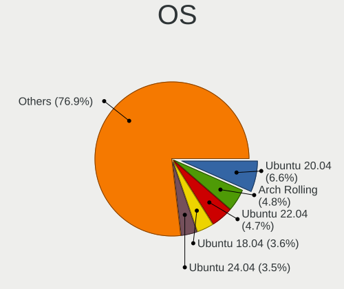

| Name                         | Notebooks | Percent |
|------------------------------|-----------|---------|
| Ubuntu 20.04                 | 111       | 6.6%    |
| Arch Rolling                 | 80        | 4.76%   |
| Ubuntu 22.04                 | 79        | 4.7%    |
| Ubuntu 18.04                 | 61        | 3.63%   |
| Ubuntu 24.04                 | 58        | 3.45%   |
| Pop!_OS 22.04                | 45        | 2.68%   |
| OpenMandriva 4.3             | 40        | 2.38%   |
| Debian 12                    | 37        | 2.2%    |
| Zorin 17                     | 27        | 1.61%   |
| OpenMandriva 25.90           | 27        | 1.61%   |
| Fedora 42                    | 24        | 1.43%   |
| OpenMandriva 4.2             | 23        | 1.37%   |
| OpenMandriva 24.12           | 21        | 1.25%   |
| Fedora 40                    | 21        | 1.25%   |
| ArcoLinux Rolling            | 20        | 1.19%   |
| KDE neon 20.04               | 19        | 1.13%   |
| Manjaro                      | 18        | 1.07%   |
| Fedora 38                    | 18        | 1.07%   |
| Fedora 36                    | 18        | 1.07%   |
| OpenMandriva 23.08           | 17        | 1.01%   |
| Arch                         | 17        | 1.01%   |
| Fedora 41                    | 16        | 0.95%   |
| OpenMandriva 5.0             | 15        | 0.89%   |
| Zorin 16                     | 14        | 0.83%   |
| Pop!_OS 20.04                | 14        | 0.83%   |
| Linux Mint 22.1              | 14        | 0.83%   |
| EndeavourOS Rolling          | 14        | 0.83%   |
| Zorin 15                     | 13        | 0.77%   |
| Elementary 6.1               | 13        | 0.77%   |
| Debian 11                    | 13        | 0.77%   |
| Ubuntu 19.10                 | 12        | 0.71%   |
| openSUSE Tumbleweed-XXXXXXXX | 12        | 0.71%   |
| Kubuntu 22.04                | 12        | 0.71%   |
| Fedora 37                    | 12        | 0.71%   |
| Fedora 35                    | 12        | 0.71%   |
| Ubuntu 21.10                 | 11        | 0.65%   |
| OpenMandriva 23.03           | 11        | 0.65%   |
| Linux Mint 22                | 11        | 0.65%   |
| Linux Mint 21.1              | 11        | 0.65%   |
| Linux Mint 20.3              | 11        | 0.65%   |

OS Family
---------

OS without a version

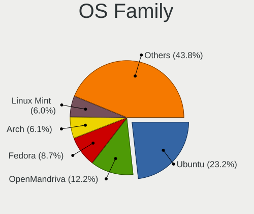

| Name          | Notebooks | Percent |
|---------------|-----------|---------|
| Ubuntu        | 370       | 23.23%  |
| OpenMandriva  | 195       | 12.24%  |
| Fedora        | 138       | 8.66%   |
| Arch          | 97        | 6.09%   |
| Linux Mint    | 95        | 5.96%   |
| Debian        | 76        | 4.77%   |
| Pop!_OS       | 72        | 4.52%   |
| Zorin         | 62        | 3.89%   |
| Manjaro       | 51        | 3.2%    |
| Elementary    | 43        | 2.7%    |
| KDE neon      | 37        | 2.32%   |
| Kubuntu       | 34        | 2.13%   |
| Kali          | 31        | 1.95%   |
| Xubuntu       | 23        | 1.44%   |
| Endless       | 22        | 1.38%   |
| ArcoLinux     | 21        | 1.32%   |
| Lubuntu       | 18        | 1.13%   |
| Ubuntu MATE   | 14        | 0.88%   |
| ROSA          | 14        | 0.88%   |
| openSUSE      | 14        | 0.88%   |
| EndeavourOS   | 14        | 0.88%   |
| SteamOS       | 12        | 0.75%   |
| MX            | 10        | 0.63%   |
| Nobara        | 9         | 0.56%   |
| LMDE          | 9         | 0.56%   |
| Gentoo        | 8         | 0.5%    |
| Parrot        | 7         | 0.44%   |
| Ubuntu Unity  | 6         | 0.38%   |
| Garuda Linux  | 6         | 0.38%   |
| Deepin        | 6         | 0.38%   |
| CachyOS       | 6         | 0.38%   |
| NixOS         | 5         | 0.31%   |
| Artix         | 5         | 0.31%   |
| Xero          | 4         | 0.25%   |
| Ubuntu Budgie | 4         | 0.25%   |
| TUXEDO OS     | 4         | 0.25%   |
| Trisquel      | 3         | 0.19%   |
| Linux Lite    | 3         | 0.19%   |
| Keloola OS    | 3         | 0.19%   |
| Clear Linux   | 3         | 0.19%   |

Kernel
------

Version of the Linux kernel

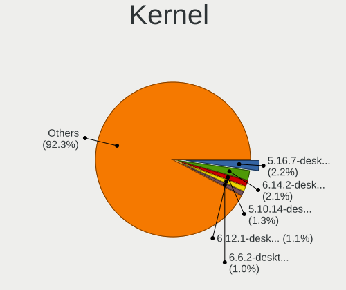

| Version                  | Notebooks | Percent |
|--------------------------|-----------|---------|
| 5.16.7-desktop-1omv4003  | 40        | 2.24%   |
| 6.14.2-desktop-3omv2590  | 38        | 2.13%   |
| 5.10.14-desktop-1omv4002 | 23        | 1.29%   |
| 6.12.1-desktop-1omv2490  | 20        | 1.12%   |
| 6.6.2-desktop-1omv2390   | 17        | 0.95%   |
| 5.4.0-42-generic         | 16        | 0.9%    |
| 6.4.11-desktop-1omv2390  | 13        | 0.73%   |
| 5.15.0-56-generic        | 13        | 0.73%   |
| 5.4.0-26-generic         | 12        | 0.67%   |
| 6.9.3-76060903-generic   | 11        | 0.62%   |
| 5.15.0-41-generic        | 11        | 0.62%   |
| 6.2.6-desktop-1omv2390   | 10        | 0.56%   |
| 6.8.0-60-generic         | 9         | 0.5%    |
| 6.8.0-52-generic         | 9         | 0.5%    |
| 6.8.0-49-generic         | 9         | 0.5%    |
| 6.14.0-33-generic        | 9         | 0.5%    |
| 6.1.1-desktop-1omv2290   | 9         | 0.5%    |
| 5.4.0-52-generic         | 9         | 0.5%    |
| 5.15.0-46-generic        | 9         | 0.5%    |
| 6.8.0-51-generic         | 8         | 0.45%   |
| 5.15.0-48-generic        | 8         | 0.45%   |
| 5.15.0-47-generic        | 8         | 0.45%   |
| 5.0.0-25-generic         | 8         | 0.45%   |
| 4.18.0-15-generic        | 8         | 0.45%   |
| 5.4.0-58-generic         | 7         | 0.39%   |
| 5.4.0-54-generic         | 7         | 0.39%   |
| 5.15.0-58-generic        | 7         | 0.39%   |
| 5.11.0-37-generic        | 7         | 0.39%   |
| 6.8.0-64-generic         | 6         | 0.34%   |
| 6.8.0-48-generic         | 6         | 0.34%   |
| 6.8.0-45-generic         | 6         | 0.34%   |
| 6.8.0-31-generic         | 6         | 0.34%   |
| 6.5.0-35-generic         | 6         | 0.34%   |
| 6.2.0-33-generic         | 6         | 0.34%   |
| 6.14.0-27-generic        | 6         | 0.34%   |
| 6.12.48+deb13-amd64      | 6         | 0.34%   |
| 5.8.0-48-generic         | 6         | 0.34%   |
| 5.3.0-46-generic         | 6         | 0.34%   |
| 5.19.0-35-generic        | 6         | 0.34%   |
| 5.15.0-91-generic        | 6         | 0.34%   |

Kernel Family
-------------

Linux kernel without a distro release

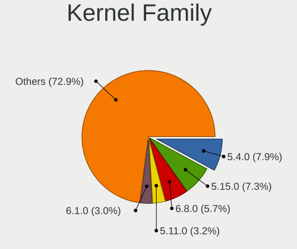

| Version | Notebooks | Percent |
|---------|-----------|---------|
| 5.4.0   | 137       | 7.92%   |
| 5.15.0  | 126       | 7.29%   |
| 6.8.0   | 98        | 5.67%   |
| 5.11.0  | 55        | 3.18%   |
| 6.1.0   | 52        | 3.01%   |
| 6.5.0   | 48        | 2.78%   |
| 6.14.0  | 41        | 2.37%   |
| 5.8.0   | 41        | 2.37%   |
| 5.16.7  | 41        | 2.37%   |
| 6.14.2  | 40        | 2.31%   |
| 5.13.0  | 37        | 2.14%   |
| 6.2.0   | 35        | 2.02%   |
| 5.3.0   | 33        | 1.91%   |
| 4.15.0  | 31        | 1.79%   |
| 5.0.0   | 30        | 1.74%   |
| 6.11.0  | 27        | 1.56%   |
| 5.19.0  | 26        | 1.5%    |
| 5.10.0  | 25        | 1.45%   |
| 5.10.14 | 24        | 1.39%   |
| 6.12.1  | 20        | 1.16%   |
| 6.6.2   | 17        | 0.98%   |
| 4.18.0  | 17        | 0.98%   |
| 6.4.11  | 16        | 0.93%   |
| 6.2.6   | 13        | 0.75%   |
| 4.19.0  | 13        | 0.75%   |
| 6.9.3   | 12        | 0.69%   |
| 6.1.1   | 12        | 0.69%   |
| 6.5.5   | 10        | 0.58%   |
| 5.14.0  | 8         | 0.46%   |
| 6.9.7   | 7         | 0.4%    |
| 6.17.1  | 7         | 0.4%    |
| 6.17.0  | 7         | 0.4%    |
| 6.16.7  | 6         | 0.35%   |
| 6.12.48 | 6         | 0.35%   |
| 6.12.10 | 6         | 0.35%   |
| 6.10.0  | 6         | 0.35%   |
| 5.17.5  | 6         | 0.35%   |
| 5.16.0  | 6         | 0.35%   |
| 6.8.5   | 5         | 0.29%   |
| 6.4.8   | 5         | 0.29%   |

Kernel Major Ver.
-----------------

Linux kernel major version

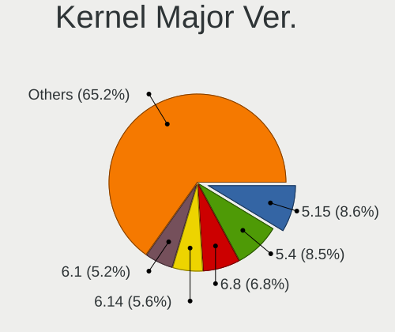

| Version | Notebooks | Percent |
|---------|-----------|---------|
| 5.15    | 147       | 8.65%   |
| 5.4     | 145       | 8.53%   |
| 6.8     | 116       | 6.82%   |
| 6.14    | 95        | 5.59%   |
| 6.1     | 89        | 5.24%   |
| 6.12    | 75        | 4.41%   |
| 5.10    | 73        | 4.29%   |
| 6.5     | 72        | 4.24%   |
| 5.16    | 61        | 3.59%   |
| 6.2     | 60        | 3.53%   |
| 5.11    | 59        | 3.47%   |
| 6.6     | 55        | 3.24%   |
| 5.8     | 52        | 3.06%   |
| 6.11    | 43        | 2.53%   |
| 5.13    | 41        | 2.41%   |
| 6.4     | 39        | 2.29%   |
| 5.19    | 39        | 2.29%   |
| 5.3     | 35        | 2.06%   |
| 5.0     | 32        | 1.88%   |
| 6.17    | 31        | 1.82%   |
| 4.15    | 31        | 1.82%   |
| 6.9     | 30        | 1.76%   |
| 6.10    | 27        | 1.59%   |
| 5.14    | 22        | 1.29%   |
| 6.0     | 20        | 1.18%   |
| 4.18    | 20        | 1.18%   |
| 6.16    | 19        | 1.12%   |
| 6.15    | 19        | 1.12%   |
| 5.17    | 18        | 1.06%   |
| 4.19    | 17        | 1%      |
| 6.3     | 15        | 0.88%   |
| 5.18    | 15        | 0.88%   |
| 6.13    | 12        | 0.71%   |
| 5.9     | 12        | 0.71%   |
| 6.7     | 10        | 0.59%   |
| 4.9     | 9         | 0.53%   |
| 5.6     | 7         | 0.41%   |
| 5.12    | 6         | 0.35%   |
| 4.4     | 6         | 0.35%   |
| 6.18    | 5         | 0.29%   |

Arch
----

OS architecture (x86_64, i586, etc.)

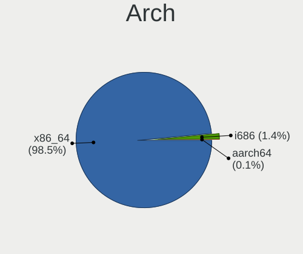

| Name    | Notebooks | Percent |
|---------|-----------|---------|
| x86_64  | 1498      | 98.49%  |
| i686    | 22        | 1.45%   |
| aarch64 | 1         | 0.07%   |

DE
--

Desktop Environment

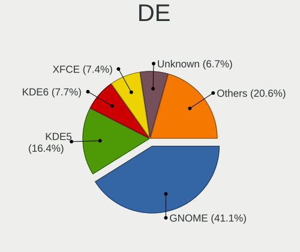

| Name            | Notebooks | Percent |
|-----------------|-----------|---------|
| GNOME           | 659       | 41.11%  |
| KDE5            | 263       | 16.41%  |
| KDE6            | 123       | 7.67%   |
| XFCE            | 119       | 7.42%   |
| Unknown         | 108       | 6.74%   |
| X-Cinnamon      | 95        | 5.93%   |
| Pantheon        | 42        | 2.62%   |
| LXQt            | 35        | 2.18%   |
| MATE            | 30        | 1.87%   |
| KDE             | 22        | 1.37%   |
| Hyprland        | 17        | 1.06%   |
| Cinnamon        | 13        | 0.81%   |
| i3              | 10        | 0.62%   |
| Budgie          | 9         | 0.56%   |
| Unity           | 6         | 0.37%   |
| DWM             | 5         | 0.31%   |
| Deepin          | 5         | 0.31%   |
| KDE4            | 4         | 0.25%   |
| ICEWM           | 4         | 0.25%   |
| GNOME Flashback | 4         | 0.25%   |
| bspwm           | 4         | 0.25%   |
| sway            | 3         | 0.19%   |
| LXDE            | 3         | 0.19%   |
| GNOME Classic   | 3         | 0.19%   |
| Cutefish        | 3         | 0.19%   |
| qtile           | 2         | 0.12%   |
| openbox         | 2         | 0.12%   |
| niri            | 2         | 0.12%   |
| DDE             | 2         | 0.12%   |
| xmonad          | 1         | 0.06%   |
| Lubuntu         | 1         | 0.06%   |
| Endless:GNOME   | 1         | 0.06%   |
| COSMIC          | 1         | 0.06%   |
| awesomeminimal  | 1         | 0.06%   |
| awesome         | 1         | 0.06%   |

Display Server
--------------

X11 or Wayland

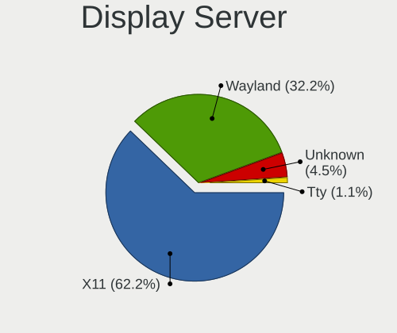

| Name    | Notebooks | Percent |
|---------|-----------|---------|
| X11     | 979       | 62.2%   |
| Wayland | 507       | 32.21%  |
| Unknown | 71        | 4.51%   |
| Tty     | 17        | 1.08%   |

Display Manager
---------------

SDDM, LightDM, etc.

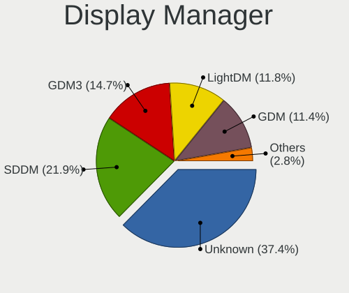

| Name    | Notebooks | Percent |
|---------|-----------|---------|
| Unknown | 591       | 37.41%  |
| SDDM    | 346       | 21.9%   |
| GDM3    | 232       | 14.68%  |
| LightDM | 187       | 11.84%  |
| GDM     | 180       | 11.39%  |
| TDM     | 29        | 1.84%   |
| LY-DM   | 4         | 0.25%   |
| Ly      | 3         | 0.19%   |
| KDM     | 3         | 0.19%   |
| SLiM    | 2         | 0.13%   |
| SLIMSKI | 1         | 0.06%   |
| LXDM    | 1         | 0.06%   |
| GREETD  | 1         | 0.06%   |

OS Lang
-------

Language

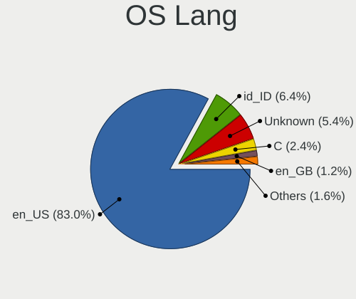

| Lang    | Notebooks | Percent |
|---------|-----------|---------|
| en_US   | 1280      | 82.96%  |
| id_ID   | 98        | 6.35%   |
| Unknown | 84        | 5.44%   |
| C       | 37        | 2.4%    |
| en_GB   | 19        | 1.23%   |
| en_SG   | 6         | 0.39%   |
| en_AU   | 5         | 0.32%   |
| en_AG   | 3         | 0.19%   |
| ru_RU   | 2         | 0.13%   |
| fr_FR   | 2         | 0.13%   |
| de_DE   | 2         | 0.13%   |
| jv_ID   | 1         | 0.06%   |
| en_IN   | 1         | 0.06%   |
| en_HK   | 1         | 0.06%   |
| de_CH   | 1         | 0.06%   |
| C.UTF8  | 1         | 0.06%   |

Boot Mode
---------

EFI or BIOS

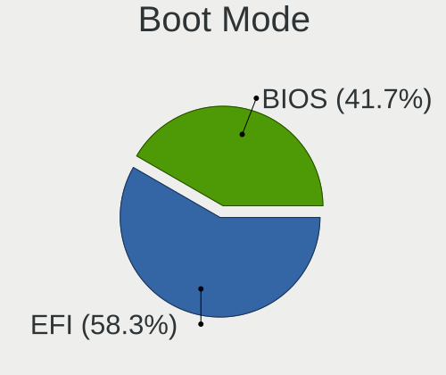

| Mode | Notebooks | Percent |
|------|-----------|---------|
| EFI  | 904       | 58.32%  |
| BIOS | 646       | 41.68%  |

Filesystem
----------

Type of filesystem

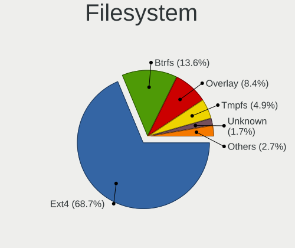

| Type    | Notebooks | Percent |
|---------|-----------|---------|
| Ext4    | 1072      | 68.72%  |
| Btrfs   | 212       | 13.59%  |
| Overlay | 131       | 8.4%    |
| Tmpfs   | 76        | 4.87%   |
| Unknown | 27        | 1.73%   |
| Xfs     | 20        | 1.28%   |
| F2fs    | 8         | 0.51%   |
| Zfs     | 7         | 0.45%   |
| Ext2    | 5         | 0.32%   |
| Ext3    | 2         | 0.13%   |

Part. scheme
------------

Scheme of partitioning

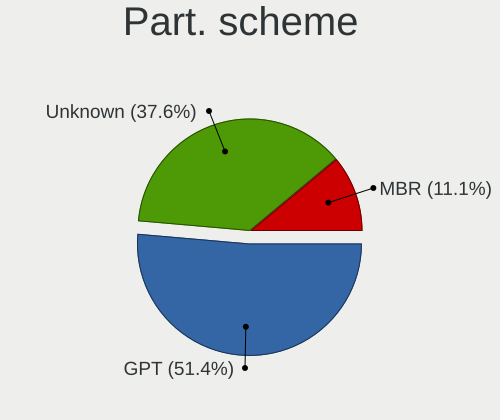

| Type    | Notebooks | Percent |
|---------|-----------|---------|
| GPT     | 799       | 51.38%  |
| Unknown | 584       | 37.56%  |
| MBR     | 172       | 11.06%  |

Dual Boot with Linux/BSD
------------------------

Hosting more than one Linux/BSD

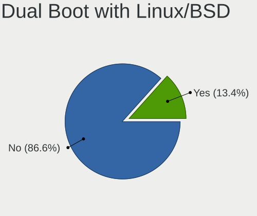

| Dual boot | Notebooks | Percent |
|-----------|-----------|---------|
| No        | 1342      | 86.64%  |
| Yes       | 207       | 13.36%  |

Dual Boot (Win)
---------------

Hosting Linux and Windows

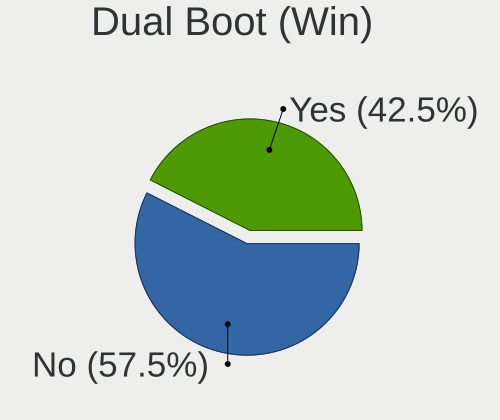

| Dual boot | Notebooks | Percent |
|-----------|-----------|---------|
| No        | 893       | 57.46%  |
| Yes       | 661       | 42.54%  |

Board
-----

Vendor
------

Motherboard manufacturer

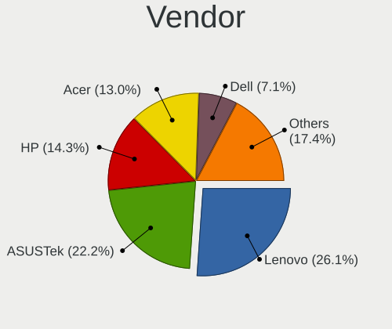

| Name                       | Notebooks | Percent |
|----------------------------|-----------|---------|
| Lenovo                     | 397       | 26.1%   |
| ASUSTek Computer           | 338       | 22.22%  |
| Hewlett-Packard            | 217       | 14.27%  |
| Acer                       | 197       | 12.95%  |
| Dell                       | 108       | 7.1%    |
| Toshiba                    | 47        | 3.09%   |
| MSI                        | 32        | 2.1%    |
| AXIOO                      | 25        | 1.64%   |
| Apple                      | 20        | 1.31%   |
| ADVAN                      | 14        | 0.92%   |
| Sony                       | 13        | 0.85%   |
| Fujitsu                    | 13        | 0.85%   |
| Infinix                    | 10        | 0.66%   |
| Valve                      | 9         | 0.59%   |
| Samsung Electronics        | 9         | 0.59%   |
| HUAWEI                     | 7         | 0.46%   |
| Unknown                    | 7         | 0.46%   |
| Panasonic                  | 6         | 0.39%   |
| Timi                       | 5         | 0.33%   |
| Clevo                      | 5         | 0.33%   |
| Google                     | 4         | 0.26%   |
| realme                     | 3         | 0.2%    |
| Intel                      | 3         | 0.2%    |
| Chuwi                      | 3         | 0.2%    |
| Notebook                   | 2         | 0.13%   |
| MicroByte                  | 2         | 0.13%   |
| GPD                        | 2         | 0.13%   |
| Gigabyte Technology        | 2         | 0.13%   |
| AVITA                      | 2         | 0.13%   |
| Acidanthera                | 2         | 0.13%   |
| UMAX                       | 1         | 0.07%   |
| TongFang                   | 1         | 0.07%   |
| TECNO Mobile Limited       | 1         | 0.07%   |
| System76                   | 1         | 0.07%   |
| Sole                       | 1         | 0.07%   |
| PT Zyrexindo Mandiri Buana | 1         | 0.07%   |
| Phoenix/SiS                | 1         | 0.07%   |
| Pegatron                   | 1         | 0.07%   |
| Medion                     | 1         | 0.07%   |
| LG Electronics             | 1         | 0.07%   |

Model
-----

Motherboard model

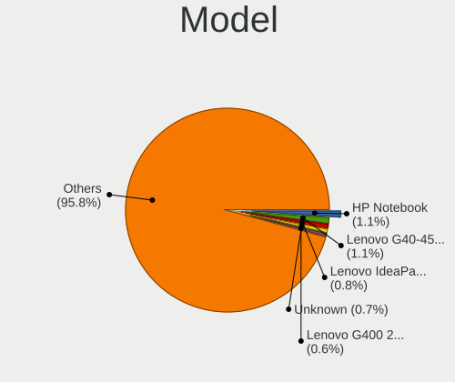

| Name                                     | Notebooks | Percent |
|------------------------------------------|-----------|---------|
| HP Notebook                              | 17        | 1.12%   |
| Lenovo G40-45 80E1                       | 16        | 1.05%   |
| Lenovo IdeaPad 330-14AST 81D5            | 12        | 0.79%   |
| Unknown                                  | 10        | 0.66%   |
| Lenovo G400 20235                        | 9         | 0.59%   |
| HP Pavilion Aero Laptop 13-be0xxx        | 9         | 0.59%   |
| ASUS X441BA                              | 9         | 0.59%   |
| ADVAN 1701                               | 9         | 0.59%   |
| Acer Aspire 4752                         | 9         | 0.59%   |
| Valve Jupiter                            | 8         | 0.53%   |
| HP Pavilion g4                           | 8         | 0.53%   |
| HP 14                                    | 8         | 0.53%   |
| ASUS X456URK                             | 8         | 0.53%   |
| ASUS GL553VD                             | 8         | 0.53%   |
| Acer Swift SF314-71                      | 8         | 0.53%   |
| Acer Aspire 4750                         | 8         | 0.53%   |
| Lenovo IdeaPad S340-14API 81NB           | 7         | 0.46%   |
| HP Laptop 14-bw0xx                       | 7         | 0.46%   |
| ASUS X200MA                              | 7         | 0.46%   |
| Lenovo IdeaPad 3 14IIL05 81WD            | 6         | 0.39%   |
| HP Laptop 14-bs0xx                       | 6         | 0.39%   |
| HP 1000                                  | 6         | 0.39%   |
| ASUS X455LF                              | 6         | 0.39%   |
| ASUS X441UV                              | 6         | 0.39%   |
| Apple MacBookPro12,1                     | 6         | 0.39%   |
| Acer Swift SFX14-41G                     | 6         | 0.39%   |
| Acer Aspire E5-475G                      | 6         | 0.39%   |
| Lenovo IdeaPad 320-14AST 80XU            | 5         | 0.33%   |
| HP Pavilion 14                           | 5         | 0.33%   |
| ASUS X455YA                              | 5         | 0.33%   |
| ASUS X455LD                              | 5         | 0.33%   |
| ASUS X441NA                              | 5         | 0.33%   |
| ASUS VivoBook_ASUSLaptop X1404ZA_A1404ZA | 5         | 0.33%   |
| ASUS VivoBook_ASUS Laptop X505ZA_X505ZA  | 5         | 0.33%   |
| ASUS Vivobook Go E1404FA_E1404FA         | 5         | 0.33%   |
| ADVAN 1405                               | 5         | 0.33%   |
| Acer Swift SF314-56G                     | 5         | 0.33%   |
| Acer One Z1402                           | 5         | 0.33%   |
| Acer Aspire E5-476G                      | 5         | 0.33%   |
| Timi RedmiBook 15                        | 4         | 0.26%   |

Model Family
------------

Motherboard model prefix

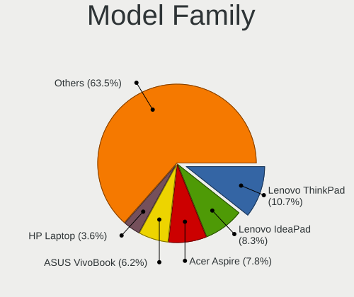

| Name               | Notebooks | Percent |
|--------------------|-----------|---------|
| Lenovo ThinkPad    | 162       | 10.65%  |
| Lenovo IdeaPad     | 126       | 8.28%   |
| Acer Aspire        | 119       | 7.82%   |
| ASUS VivoBook      | 94        | 6.18%   |
| HP Laptop          | 54        | 3.55%   |
| Dell Latitude      | 54        | 3.55%   |
| HP Pavilion        | 44        | 2.89%   |
| Acer Swift         | 34        | 2.24%   |
| HP EliteBook       | 29        | 1.91%   |
| ASUS ASUS          | 29        | 1.91%   |
| Toshiba Satellite  | 28        | 1.84%   |
| Dell Inspiron      | 26        | 1.71%   |
| HP Notebook        | 17        | 1.12%   |
| Acer Nitro         | 17        | 1.12%   |
| Lenovo G40-45      | 16        | 1.05%   |
| HP ProBook         | 16        | 1.05%   |
| Dell Vostro        | 14        | 0.92%   |
| AXIOO Mybook       | 12        | 0.79%   |
| ASUS TUF           | 12        | 0.79%   |
| Lenovo Yoga        | 11        | 0.72%   |
| Lenovo ThinkBook   | 11        | 0.72%   |
| Lenovo Legion      | 11        | 0.72%   |
| MSI Modern         | 10        | 0.66%   |
| Unknown            | 10        | 0.66%   |
| Lenovo G400        | 9         | 0.59%   |
| Infinix INBook     | 9         | 0.59%   |
| ASUS X441BA        | 9         | 0.59%   |
| ADVAN 1701         | 9         | 0.59%   |
| Valve Jupiter      | 8         | 0.53%   |
| Toshiba PORTEGE    | 8         | 0.53%   |
| HP 14              | 8         | 0.53%   |
| ASUS X456URK       | 8         | 0.53%   |
| ASUS ROG           | 8         | 0.53%   |
| ASUS GL553VD       | 8         | 0.53%   |
| ASUS X200MA        | 7         | 0.46%   |
| Toshiba dynabook   | 6         | 0.39%   |
| HP 1000            | 6         | 0.39%   |
| ASUS X455LF        | 6         | 0.39%   |
| ASUS X441UV        | 6         | 0.39%   |
| Apple MacBookPro12 | 6         | 0.39%   |

MFG Year
--------

Motherboard manufacture year

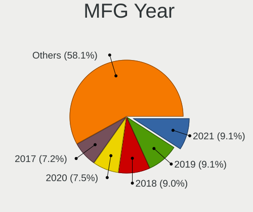

| Year | Notebooks | Percent |
|------|-----------|---------|
| 2021 | 139       | 9.14%   |
| 2019 | 139       | 9.14%   |
| 2018 | 137       | 9.01%   |
| 2020 | 114       | 7.5%    |
| 2017 | 109       | 7.17%   |
| 2013 | 107       | 7.03%   |
| 2012 | 105       | 6.9%    |
| 2011 | 103       | 6.77%   |
| 2014 | 98        | 6.44%   |
| 2015 | 87        | 5.72%   |
| 2016 | 73        | 4.8%    |
| 2022 | 70        | 4.6%    |
| 2023 | 65        | 4.27%   |
| 2010 | 60        | 3.94%   |
| 2008 | 32        | 2.1%    |
| 2024 | 30        | 1.97%   |
| 2009 | 30        | 1.97%   |
| 2007 | 11        | 0.72%   |
| 2025 | 7         | 0.46%   |
| 2006 | 5         | 0.33%   |

Form Factor
-----------

Physical design of the computer

| Name     | Notebooks | Percent |
|----------|-----------|---------|
| Notebook | 1521      | 100%    |

Secure Boot
-----------

Enabled or disabled

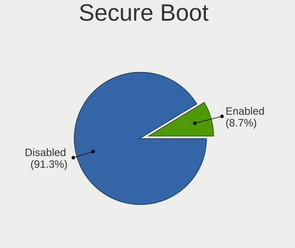

| State    | Notebooks | Percent |
|----------|-----------|---------|
| Disabled | 1403      | 91.34%  |
| Enabled  | 133       | 8.66%   |

Coreboot
--------

Have coreboot on board

| Used | Notebooks | Percent |
|------|-----------|---------|
| No   | 1515      | 99.61%  |
| Yes  | 6         | 0.39%   |

RAM Size
--------

Total RAM memory

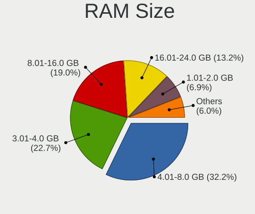

| Size in GB  | Notebooks | Percent |
|-------------|-----------|---------|
| 4.01-8.0    | 496       | 32.21%  |
| 3.01-4.0    | 349       | 22.66%  |
| 8.01-16.0   | 293       | 19.03%  |
| 16.01-24.0  | 204       | 13.25%  |
| 1.01-2.0    | 106       | 6.88%   |
| 32.01-64.0  | 48        | 3.12%   |
| 24.01-32.0  | 23        | 1.49%   |
| 2.01-3.0    | 11        | 0.71%   |
| 0.51-1.0    | 6         | 0.39%   |
| 64.01-256.0 | 4         | 0.26%   |

RAM Used
--------

Used RAM memory

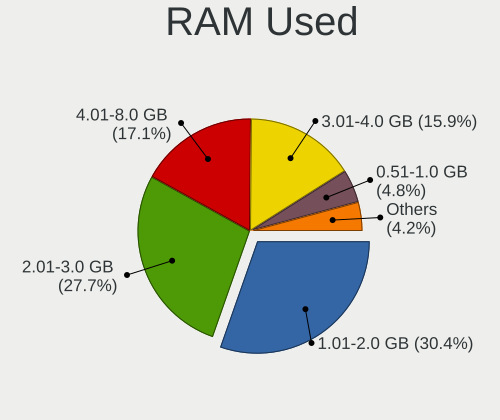

| Used GB    | Notebooks | Percent |
|------------|-----------|---------|
| 1.01-2.0   | 508       | 30.36%  |
| 2.01-3.0   | 463       | 27.67%  |
| 4.01-8.0   | 286       | 17.1%   |
| 3.01-4.0   | 266       | 15.9%   |
| 0.51-1.0   | 80        | 4.78%   |
| 8.01-16.0  | 57        | 3.41%   |
| 0.01-0.5   | 8         | 0.48%   |
| 16.01-24.0 | 4         | 0.24%   |
| 24.01-32.0 | 1         | 0.06%   |

Total Drives
------------

Number of drives on board

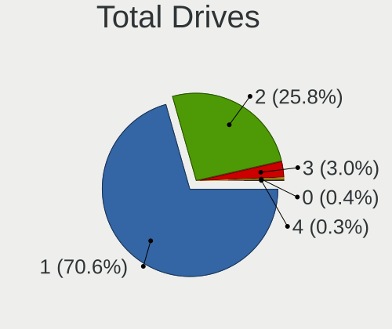

| Drives | Notebooks | Percent |
|--------|-----------|---------|
| 1      | 1096      | 70.62%  |
| 2      | 400       | 25.77%  |
| 3      | 46        | 2.96%   |
| 0      | 6         | 0.39%   |
| 4      | 4         | 0.26%   |

Has CD-ROM
----------

Has CD-ROM on board

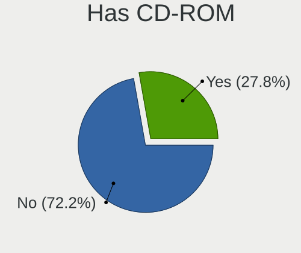

| Presented | Notebooks | Percent |
|-----------|-----------|---------|
| No        | 1107      | 72.21%  |
| Yes       | 426       | 27.79%  |

Has Ethernet
------------

Has Ethernet on board

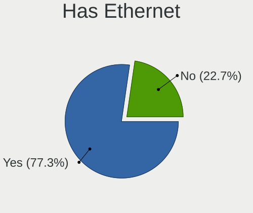

| Presented | Notebooks | Percent |
|-----------|-----------|---------|
| Yes       | 1178      | 77.3%   |
| No        | 346       | 22.7%   |

Has WiFi
--------

Has WiFi module

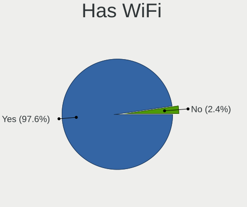

| Presented | Notebooks | Percent |
|-----------|-----------|---------|
| Yes       | 1487      | 97.64%  |
| No        | 36        | 2.36%   |

Has Bluetooth
-------------

Has Bluetooth module

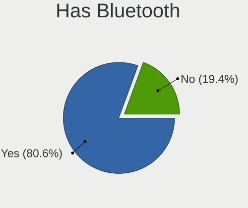

| Presented | Notebooks | Percent |
|-----------|-----------|---------|
| Yes       | 1238      | 80.6%   |
| No        | 298       | 19.4%   |

Location
--------

Country
-------

Geographic location (country)

| Country   | Notebooks | Percent |
|-----------|-----------|---------|
| Indonesia | 1521      | 100%    |

City
----

Geographic location (city)

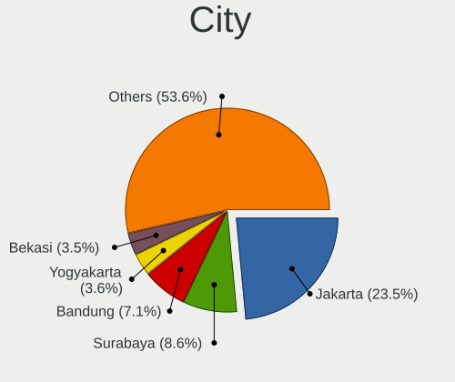

| City            | Notebooks | Percent |
|-----------------|-----------|---------|
| Jakarta         | 393       | 23.5%   |
| Surabaya        | 144       | 8.61%   |
| Bandung         | 119       | 7.12%   |
| Yogyakarta      | 60        | 3.59%   |
| Bekasi          | 59        | 3.53%   |
| Semarang        | 57        | 3.41%   |
| Bogor           | 54        | 3.23%   |
| Denpasar        | 43        | 2.57%   |
| Malang          | 41        | 2.45%   |
| Tangerang       | 34        | 2.03%   |
| Depok           | 31        | 1.85%   |
| Medan           | 29        | 1.73%   |
| South Tangerang | 28        | 1.67%   |
| Makassar        | 25        | 1.5%    |
| Bengkulu        | 21        | 1.26%   |
| Palembang       | 17        | 1.02%   |
| Samarinda       | 15        | 0.9%    |
| Kediri          | 14        | 0.84%   |
| Pecenongan      | 13        | 0.78%   |
| Banjarmasin     | 13        | 0.78%   |
| Balikpapan      | 13        | 0.78%   |
| Sleman          | 12        | 0.72%   |
| Tasikmalaya     | 11        | 0.66%   |
| Surakarta       | 10        | 0.6%    |
| Pontianak       | 10        | 0.6%    |
| Magelang        | 9         | 0.54%   |
| Cirebon         | 9         | 0.54%   |
| Banda Aceh      | 9         | 0.54%   |
| Gresik          | 8         | 0.48%   |
| Brebes          | 8         | 0.48%   |
| Sidoarjo        | 7         | 0.42%   |
| Pekanbaru       | 7         | 0.42%   |
| Padang          | 7         | 0.42%   |
| Kudus           | 7         | 0.42%   |
| Jember          | 7         | 0.42%   |
| Blitar          | 7         | 0.42%   |
| Tulungagung     | 6         | 0.36%   |
| Pasuruan        | 6         | 0.36%   |
| Jambi City      | 6         | 0.36%   |
| Jakarta Pusat   | 6         | 0.36%   |

Drives
------

Drive Vendor
------------

Hard drive vendors

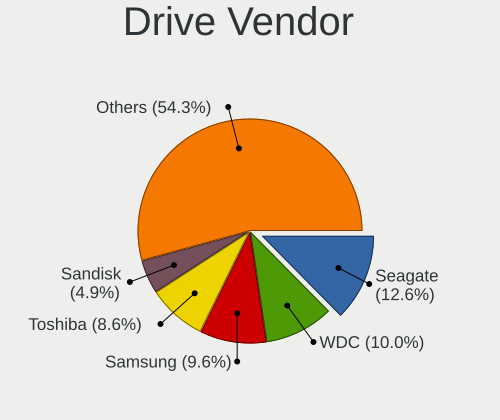

| Vendor                       | Notebooks | Drives | Percent |
|------------------------------|-----------|--------|---------|
| Seagate                      | 250       | 315    | 12.61%  |
| WDC                          | 199       | 231    | 10.04%  |
| Samsung Electronics          | 191       | 251    | 9.63%   |
| Toshiba                      | 170       | 186    | 8.57%   |
| Sandisk                      | 97        | 114    | 4.89%   |
| HGST                         | 82        | 93     | 4.14%   |
| Micron Technology            | 74        | 94     | 3.73%   |
| Unknown                      | 65        | 79     | 3.28%   |
| Intel                        | 65        | 87     | 3.28%   |
| V-GeN                        | 63        | 69     | 3.18%   |
| SK hynix                     | 63        | 75     | 3.18%   |
| Hitachi                      | 57        | 65     | 2.87%   |
| Kingston                     | 51        | 60     | 2.57%   |
| A-DATA Technology            | 42        | 50     | 2.12%   |
| MidasForce                   | 33        | 38     | 1.66%   |
| China                        | 31        | 35     | 1.56%   |
| Silicon Motion               | 27        | 32     | 1.36%   |
| Unknown                      | 27        | 29     | 1.36%   |
| Team                         | 22        | 25     | 1.11%   |
| VISIPRO                      | 19        | 24     | 0.96%   |
| KIOXIA                       | 17        | 22     | 0.86%   |
| EYOTA                        | 15        | 19     | 0.76%   |
| ADATA Technology             | 15        | 19     | 0.76%   |
| RX7                          | 14        | 19     | 0.71%   |
| JMicron Technology           | 14        | 15     | 0.71%   |
| Crucial                      | 13        | 15     | 0.66%   |
| Phison Electronics           | 12        | 14     | 0.61%   |
| Fujitsu                      | 11        | 12     | 0.55%   |
| Apacer                       | 11        | 11     | 0.55%   |
| MAXIO Technology (Hangzhou)  | 10        | 12     | 0.5%    |
| Apple                        | 10        | 12     | 0.5%    |
| Patriot                      | 9         | 13     | 0.45%   |
| SCY                          | 8         | 12     | 0.4%    |
| Realtek Semiconductor        | 8         | 8      | 0.4%    |
| Kingston Technology Company  | 8         | 8      | 0.4%    |
| FORESEE                      | 8         | 8      | 0.4%    |
| PNY                          | 6         | 6      | 0.3%    |
| Shenzhen Longsys Electronics | 5         | 7      | 0.25%   |
| Ramos Technology             | 5         | 23     | 0.25%   |
| LITEON                       | 5         | 6      | 0.25%   |

Drive Model
-----------

Hard drive models

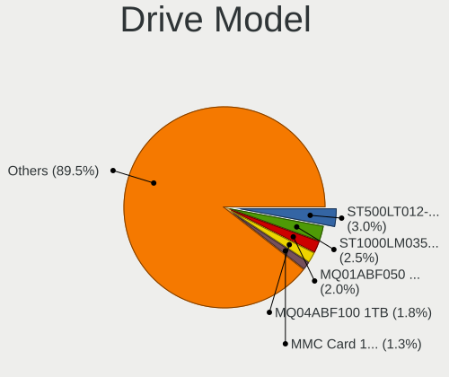

| Model                                                              | Notebooks | Percent |
|--------------------------------------------------------------------|-----------|---------|
| Seagate ST500LT012-1DG142 500GB                                    | 60        | 2.95%   |
| Seagate ST1000LM035-1RK172 1TB                                     | 51        | 2.51%   |
| Toshiba MQ01ABF050 500GB                                           | 40        | 1.97%   |
| Toshiba MQ04ABF100 1TB                                             | 36        | 1.77%   |
| Unknown                                                            | 27        | 1.33%   |
| HGST HTS545050A7E680 500GB                                         | 23        | 1.13%   |
| Toshiba MQ01ABD100 1TB                                             | 21        | 1.03%   |
| Seagate ST500LT012-9WS142 500GB                                    | 15        | 0.74%   |
| Unknown MMC Card  32GB                                             | 14        | 0.69%   |
| Silicon Motion SM2263EN/SM2263XT SSD Controller 512GB              | 14        | 0.69%   |
| Samsung NVMe SSD Controller SM981/PM981/PM983 1TB                  | 13        | 0.64%   |
| HGST HTS721010A9E630 1TB                                           | 13        | 0.64%   |
| A-DATA SU650 120GB SSD                                             | 13        | 0.64%   |
| Seagate ST9320325AS 320GB                                          | 12        | 0.59%   |
| SanDisk NVMe SSD Drive 512GB                                       | 12        | 0.59%   |
| MidasForce SSD 128GB                                               | 12        | 0.59%   |
| Micron 2450_MTFDKBA512TFK 512GB                                    | 12        | 0.59%   |
| Hitachi HTS543232A7A384 320GB                                      | 12        | 0.59%   |
| WDC WDS240G2G0A-00JH30 240GB SSD                                   | 11        | 0.54%   |
| Sandisk WD Blue SN550 NVMe SSD 1024GB                              | 11        | 0.54%   |
| Intel SSDPEKNW512G8 512GB                                          | 11        | 0.54%   |
| Hitachi HTS545050A7E380 500GB                                      | 11        | 0.54%   |
| ADATA XPG SX8200 Pro PCIe Gen3x4 M.2 2280 Solid State Drive 1024GB | 11        | 0.54%   |
| WDC WD5000LPVX-22V0TT0 500GB                                       | 10        | 0.49%   |
| Seagate ST9500325AS 500GB                                          | 10        | 0.49%   |
| MAXIO (Hangzhou) NVMe SSD Controller MAP1202 2TB                   | 10        | 0.49%   |
| Kingston SA400S37240G 240GB SSD                                    | 10        | 0.49%   |
| HGST HTS725050A7E630 500GB                                         | 10        | 0.49%   |
| HGST HTS541010A9E680 1TB                                           | 10        | 0.49%   |
| Seagate ST1000LM024 HN-M101MBB 1TB                                 | 9         | 0.44%   |
| Samsung SSD 850 EVO 250GB                                          | 9         | 0.44%   |
| JMicron Generic 320GB                                              | 9         | 0.44%   |
| WDC WD10SPZX-21Z10T0 1TB                                           | 8         | 0.39%   |
| Seagate ST500LM021-1KJ152 500GB                                    | 8         | 0.39%   |
| Micron 2400_MTFDKBA512QFM 512GB                                    | 8         | 0.39%   |
| Intel SSD 660P Series 512GB                                        | 8         | 0.39%   |
| China SSD 256GB                                                    | 8         | 0.39%   |
| A-DATA SU650 240GB SSD                                             | 8         | 0.39%   |
| WDC WD5000LPVX-80V0TT0 500GB                                       | 7         | 0.34%   |
| WDC WD5000LPCX-21VHAT0 500GB                                       | 7         | 0.34%   |

HDD Vendor
----------

Hard disk drive vendors

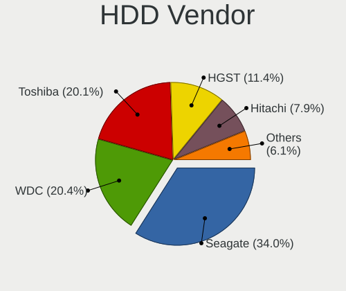

| Vendor              | Notebooks | Drives | Percent |
|---------------------|-----------|--------|---------|
| Seagate             | 244       | 306    | 34.03%  |
| WDC                 | 146       | 163    | 20.36%  |
| Toshiba             | 144       | 158    | 20.08%  |
| HGST                | 82        | 93     | 11.44%  |
| Hitachi             | 57        | 65     | 7.95%   |
| JMicron Technology  | 9         | 9      | 1.26%   |
| Fujitsu             | 9         | 9      | 1.26%   |
| Unknown             | 5         | 5      | 0.7%    |
| Samsung Electronics | 4         | 4      | 0.56%   |
| External            | 4         | 4      | 0.56%   |
| USB3.0              | 3         | 3      | 0.42%   |
| SAGE                | 2         | 2      | 0.28%   |
| TO Exter            | 1         | 1      | 0.14%   |
| T-FORCE             | 1         | 1      | 0.14%   |
| SYMTEC              | 1         | 1      | 0.14%   |
| StoreJet            | 1         | 1      | 0.14%   |
| Shenzhen            | 1         | 1      | 0.14%   |
| HGST HTS            | 1         | 3      | 0.14%   |
| Hewlett-Packard     | 1         | 1      | 0.14%   |
| Apple               | 1         | 1      | 0.14%   |

SSD Vendor
----------

Solid state drive vendors

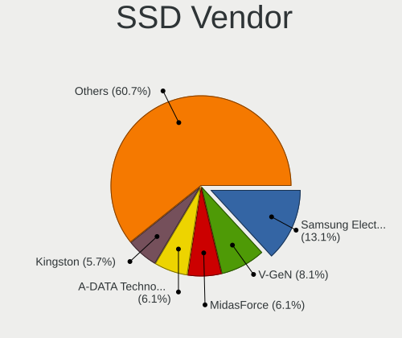

| Vendor              | Notebooks | Drives | Percent |
|---------------------|-----------|--------|---------|
| Samsung Electronics | 71        | 93     | 13.15%  |
| V-GeN               | 44        | 49     | 8.15%   |
| MidasForce          | 33        | 38     | 6.11%   |
| A-DATA Technology   | 33        | 40     | 6.11%   |
| Kingston            | 31        | 32     | 5.74%   |
| WDC                 | 30        | 40     | 5.56%   |
| SanDisk             | 29        | 40     | 5.37%   |
| China               | 28        | 32     | 5.19%   |
| Team                | 17        | 20     | 3.15%   |
| Unknown             | 16        | 16     | 2.96%   |
| VISIPRO             | 14        | 19     | 2.59%   |
| EYOTA               | 11        | 14     | 2.04%   |
| Apacer              | 11        | 11     | 2.04%   |
| Toshiba             | 10        | 11     | 1.85%   |
| RX7                 | 10        | 14     | 1.85%   |
| Intel               | 10        | 14     | 1.85%   |
| Crucial             | 10        | 12     | 1.85%   |
| Patriot             | 9         | 13     | 1.67%   |
| Micron Technology   | 8         | 14     | 1.48%   |
| Apple               | 8         | 9      | 1.48%   |
| FORESEE             | 6         | 6      | 1.11%   |
| Ramos Technology    | 5         | 23     | 0.93%   |
| LITEON              | 5         | 6      | 0.93%   |
| Wellcomm            | 4         | 4      | 0.74%   |
| SK hynix            | 4         | 5      | 0.74%   |
| Seagate             | 4         | 4      | 0.74%   |
| PNY                 | 4         | 4      | 0.74%   |
| LITEONIT            | 4         | 5      | 0.74%   |
| Colorful            | 4         | 4      | 0.74%   |
| XSTAR               | 3         | 3      | 0.56%   |
| Pioneer             | 3         | 3      | 0.56%   |
| Lexar               | 3         | 3      | 0.56%   |
| DST                 | 3         | 4      | 0.56%   |
| Xinsujie            | 2         | 2      | 0.37%   |
| Varro               | 2         | 2      | 0.37%   |
| Transcend           | 2         | 2      | 0.37%   |
| SPCC                | 2         | 2      | 0.37%   |
| Smart               | 2         | 2      | 0.37%   |
| Netac               | 2         | 2      | 0.37%   |
| Kingmax             | 2         | 2      | 0.37%   |

Drive Kind
----------

HDD or SSD

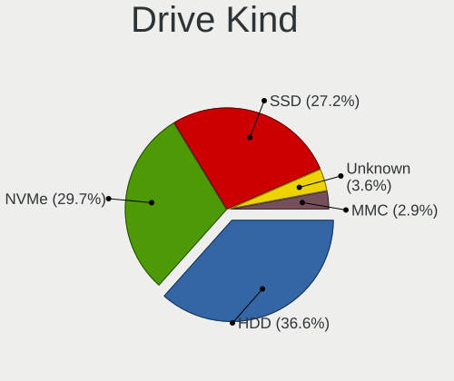

| Kind    | Notebooks | Drives | Percent |
|---------|-----------|--------|---------|
| HDD     | 683       | 831    | 36.6%   |
| NVMe    | 554       | 735    | 29.69%  |
| SSD     | 507       | 663    | 27.17%  |
| Unknown | 67        | 77     | 3.59%   |
| MMC     | 55        | 70     | 2.95%   |

Drive Connector
---------------

SATA, SAS, NVMe, etc.

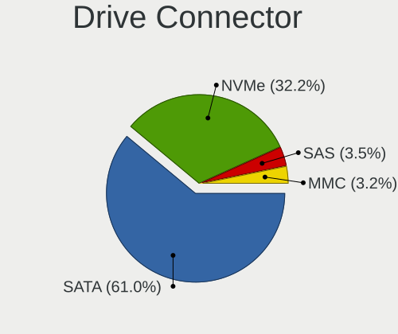

| Type | Notebooks | Drives | Percent |
|------|-----------|--------|---------|
| SATA | 1050      | 1508   | 61.05%  |
| NVMe | 554       | 733    | 32.21%  |
| SAS  | 61        | 65     | 3.55%   |
| MMC  | 55        | 70     | 3.2%    |

Drive Size
----------

Size of hard drive

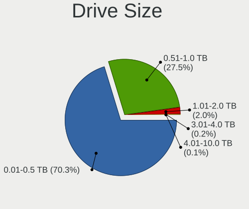

| Size in TB | Notebooks | Drives | Percent |
|------------|-----------|--------|---------|
| 0.01-0.5   | 790       | 1066   | 70.28%  |
| 0.51-1.0   | 309       | 389    | 27.49%  |
| 1.01-2.0   | 22        | 36     | 1.96%   |
| 3.01-4.0   | 2         | 2      | 0.18%   |
| 4.01-10.0  | 1         | 1      | 0.09%   |

Space Total
-----------

Amount of disk space available on the file system

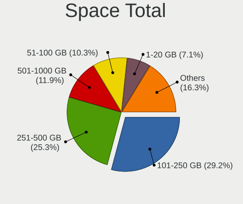

| Size in GB     | Notebooks | Percent |
|----------------|-----------|---------|
| 101-250        | 470       | 29.16%  |
| 251-500        | 408       | 25.31%  |
| 501-1000       | 192       | 11.91%  |
| 51-100         | 166       | 10.3%   |
| 1-20           | 114       | 7.07%   |
| 1001-2000      | 97        | 6.02%   |
| 21-50          | 92        | 5.71%   |
| Unknown        | 41        | 2.54%   |
| 2001-3000      | 17        | 1.05%   |
| More than 3000 | 15        | 0.93%   |

Space Used
----------

Amount of used disk space

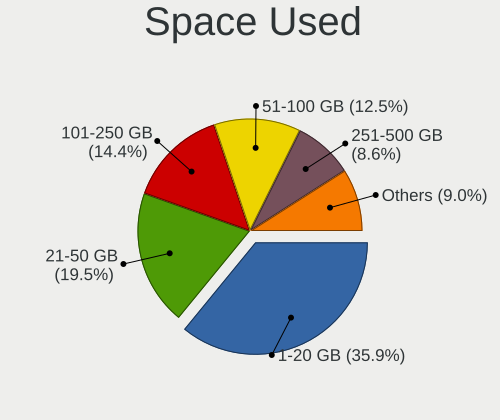

| Used GB        | Notebooks | Percent |
|----------------|-----------|---------|
| 1-20           | 600       | 35.93%  |
| 21-50          | 326       | 19.52%  |
| 101-250        | 240       | 14.37%  |
| 51-100         | 209       | 12.51%  |
| 251-500        | 144       | 8.62%   |
| 501-1000       | 77        | 4.61%   |
| Unknown        | 41        | 2.46%   |
| 1001-2000      | 21        | 1.26%   |
| 2001-3000      | 7         | 0.42%   |
| More than 3000 | 3         | 0.18%   |
| 0              | 2         | 0.12%   |

Malfunc. Drives
---------------

Drive models with a malfunction

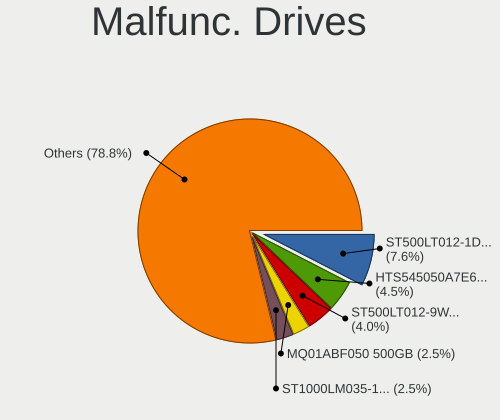

| Model                                | Notebooks | Drives | Percent |
|--------------------------------------|-----------|--------|---------|
| Seagate ST500LT012-1DG142 500GB      | 15        | 16     | 7.58%   |
| HGST HTS545050A7E680 500GB           | 9         | 10     | 4.55%   |
| Seagate ST500LT012-9WS142 500GB      | 8         | 8      | 4.04%   |
| Toshiba MQ01ABF050 500GB             | 5         | 5      | 2.53%   |
| Seagate ST1000LM035-1RK172 1TB       | 5         | 5      | 2.53%   |
| SK hynix BC711 HFM512GD3JX013N 512GB | 4         | 6      | 2.02%   |
| Seagate ST9500325AS 500GB            | 4         | 4      | 2.02%   |
| Hitachi HTS543232A7A384 320GB        | 4         | 4      | 2.02%   |
| WDC WDS240G2G0A-00JH30 240GB SSD     | 3         | 3      | 1.52%   |
| Toshiba MQ01ABD050 500GB             | 3         | 3      | 1.52%   |
| Toshiba MQ01ABD032 320GB             | 3         | 3      | 1.52%   |
| Seagate ST9320325AS 320GB            | 3         | 3      | 1.52%   |
| Hitachi HTS545050A7E380 500GB        | 3         | 3      | 1.52%   |
| Hitachi HTS545032B9A300 320GB        | 3         | 3      | 1.52%   |
| HGST HTS725050A7E630 500GB           | 3         | 3      | 1.52%   |
| Unknown                              | 3         | 3      | 1.52%   |
| WDC WD5000LPVX-80V0TT0 500GB         | 2         | 2      | 1.01%   |
| WDC WD5000LPVX-22V0TT0 500GB         | 2         | 2      | 1.01%   |
| WDC WD3200BEKT-60V5T1 320GB          | 2         | 2      | 1.01%   |
| WDC WD10JPVX-60JC3T1 1TB             | 2         | 2      | 1.01%   |
| WDC WD10JPCX-24UE4T0 1TB             | 2         | 4      | 1.01%   |
| Toshiba MQ01ABD100 1TB               | 2         | 2      | 1.01%   |
| Toshiba MK5059GSXP 500GB             | 2         | 2      | 1.01%   |
| Toshiba MK3265GSX 320GB              | 2         | 3      | 1.01%   |
| Seagate ST500LM021-1KJ152 500GB      | 2         | 2      | 1.01%   |
| Seagate ST320LT020-9YG142 320GB      | 2         | 11     | 1.01%   |
| Seagate ST320LT012-9WS14C 320GB      | 2         | 2      | 1.01%   |
| Seagate ST1000LX015-1U7172 1TB       | 2         | 3      | 1.01%   |
| Hitachi HTS545050B9A300 500GB        | 2         | 2      | 1.01%   |
| HGST HTS545050A7E380 500GB           | 2         | 2      | 1.01%   |
| A-DATA Technology SU650 240GB SSD    | 2         | 2      | 1.01%   |
| Xinsujie XSJ-X100-128GB SSD          | 1         | 1      | 0.51%   |
| WellcommMaster 128GB SSD             | 1         | 1      | 0.51%   |
| Wellcomm Master 128GB SSD            | 1         | 1      | 0.51%   |
| WDC WD800BEVT-22ZCT0 80GB            | 1         | 1      | 0.51%   |
| WDC WD5000LPVT-22G33T0 500GB         | 1         | 1      | 0.51%   |
| WDC WD5000LPCX-22VHAT0 500GB         | 1         | 1      | 0.51%   |
| WDC WD5000L 500GB                    | 1         | 1      | 0.51%   |
| WDC WD5000BPVT-60HXZT3 500GB         | 1         | 1      | 0.51%   |
| WDC WD5000BPVT-22HXZT3 500GB         | 1         | 1      | 0.51%   |

Malfunc. Drive Vendor
---------------------

Vendors of faulty drives

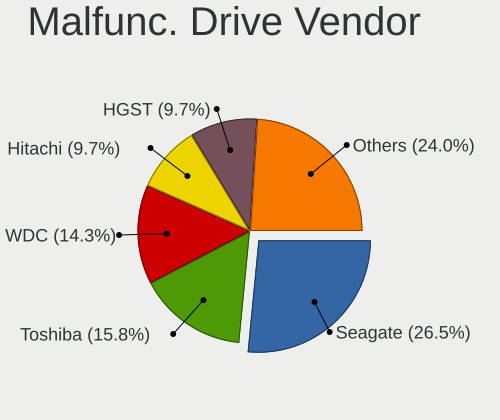

| Vendor              | Notebooks | Drives | Percent |
|---------------------|-----------|--------|---------|
| Seagate             | 52        | 64     | 26.53%  |
| Toshiba             | 31        | 34     | 15.82%  |
| WDC                 | 28        | 31     | 14.29%  |
| Hitachi             | 19        | 19     | 9.69%   |
| HGST                | 19        | 21     | 9.69%   |
| SK hynix            | 6         | 8      | 3.06%   |
| Samsung Electronics | 4         | 5      | 2.04%   |
| Micron Technology   | 4         | 4      | 2.04%   |
| A-DATA Technology   | 4         | 6      | 2.04%   |
| China               | 3         | 6      | 1.53%   |
| Unknown             | 3         | 3      | 1.53%   |
| VISIPRO             | 2         | 4      | 1.02%   |
| V-GeN               | 2         | 3      | 1.02%   |
| SanDisk             | 2         | 2      | 1.02%   |
| KLEVV               | 2         | 2      | 1.02%   |
| Intel               | 2         | 2      | 1.02%   |
| Crucial             | 2         | 2      | 1.02%   |
| Xinsujie            | 1         | 1      | 0.51%   |
| WellcommMaster      | 1         | 1      | 0.51%   |
| Wellcomm            | 1         | 1      | 0.51%   |
| ValueTech           | 1         | 1      | 0.51%   |
| SM200               | 1         | 1      | 0.51%   |
| Silicon Motion      | 1         | 1      | 0.51%   |
| RX7                 | 1         | 1      | 0.51%   |
| Kingston            | 1         | 1      | 0.51%   |
| Colorful            | 1         | 1      | 0.51%   |
| Apacer              | 1         | 1      | 0.51%   |
| ADATA Technology    | 1         | 1      | 0.51%   |

Malfunc. HDD Vendor
-------------------

Vendors of faulty HDD drives

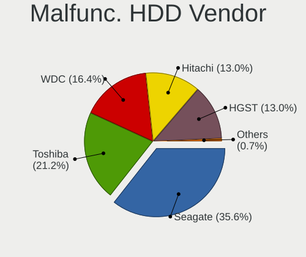

| Vendor              | Notebooks | Drives | Percent |
|---------------------|-----------|--------|---------|
| Seagate             | 52        | 64     | 35.62%  |
| Toshiba             | 31        | 34     | 21.23%  |
| WDC                 | 24        | 27     | 16.44%  |
| Hitachi             | 19        | 19     | 13.01%  |
| HGST                | 19        | 21     | 13.01%  |
| Samsung Electronics | 1         | 1      | 0.68%   |

Malfunc. Drive Kind
-------------------

Kinds of faulty drives

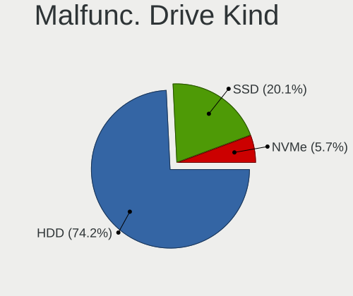

| Kind | Notebooks | Drives | Percent |
|------|-----------|--------|---------|
| HDD  | 144       | 166    | 74.23%  |
| SSD  | 39        | 47     | 20.1%   |
| NVMe | 11        | 14     | 5.67%   |

Failed Drives
-------------

Failed drive models

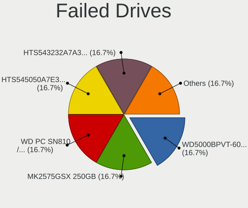

| Model                                            | Notebooks | Drives | Percent |
|--------------------------------------------------|-----------|--------|---------|
| WDC WD5000BPVT-60HXZT1 500GB                     | 1         | 1      | 16.67%  |
| Toshiba MK2575GSX 250GB                          | 1         | 1      | 16.67%  |
| Sandisk WD PC SN810 / Black SN850 NVMe SSD 500GB | 1         | 1      | 16.67%  |
| Hitachi HTS545050A7E380 500GB                    | 1         | 1      | 16.67%  |
| Hitachi HTS543232A7A384 320GB                    | 1         | 1      | 16.67%  |
| A-DATA Technology SX8200PNP 256GB                | 1         | 1      | 16.67%  |

Failed Drive Vendor
-------------------

Failed drive vendors

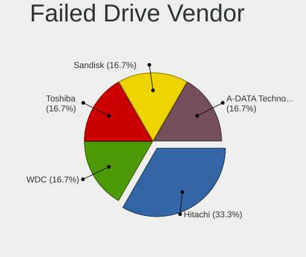

| Vendor            | Notebooks | Drives | Percent |
|-------------------|-----------|--------|---------|
| Hitachi           | 2         | 2      | 33.33%  |
| WDC               | 1         | 1      | 16.67%  |
| Toshiba           | 1         | 1      | 16.67%  |
| Sandisk           | 1         | 1      | 16.67%  |
| A-DATA Technology | 1         | 1      | 16.67%  |

Drive Status
------------

Number of failed and malfunc. drives

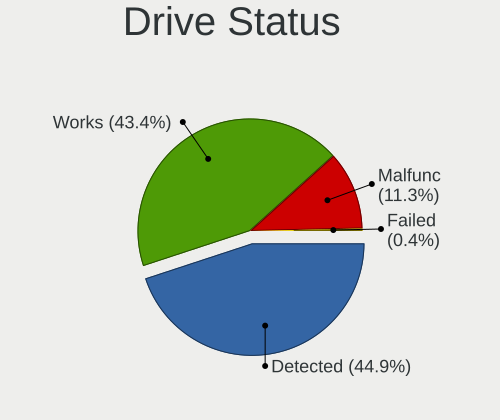

| Status   | Notebooks | Drives | Percent |
|----------|-----------|--------|---------|
| Detected | 747       | 1130   | 44.95%  |
| Works    | 721       | 1013   | 43.38%  |
| Malfunc  | 188       | 227    | 11.31%  |
| Failed   | 6         | 6      | 0.36%   |

Storage controller
------------------

Storage Vendor
--------------

Storage controller vendors

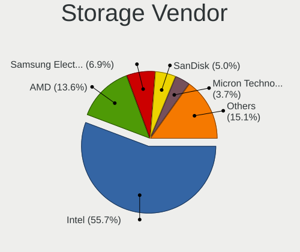

| Vendor                                  | Notebooks | Percent |
|-----------------------------------------|-----------|---------|
| Intel                                   | 1019      | 55.74%  |
| AMD                                     | 249       | 13.62%  |
| Samsung Electronics                     | 126       | 6.89%   |
| SanDisk                                 | 91        | 4.98%   |
| Micron Technology                       | 67        | 3.67%   |
| SK hynix                                | 58        | 3.17%   |
| Silicon Motion                          | 35        | 1.91%   |
| Kingston Technology Company             | 27        | 1.48%   |
| ADATA Technology                        | 23        | 1.26%   |
| Phison Electronics                      | 22        | 1.2%    |
| KIOXIA                                  | 19        | 1.04%   |
| Toshiba America Info Systems            | 13        | 0.71%   |
| Realtek Semiconductor                   | 12        | 0.66%   |
| MAXIO Technology (Hangzhou)             | 12        | 0.66%   |
| Shenzhen Shichuangyi Electronics        | 9         | 0.49%   |
| Shenzhen Longsys Electronics            | 8         | 0.44%   |
| Solidigm                                | 5         | 0.27%   |
| Silicon Integrated Systems [SiS]        | 5         | 0.27%   |
| Union Memory (Shenzhen)                 | 4         | 0.22%   |
| Micron/Crucial Technology               | 3         | 0.16%   |
| INNOGRIT                                | 3         | 0.16%   |
| Shenzhen Unionmemory Information System | 2         | 0.11%   |
| Seagate Technology                      | 2         | 0.11%   |
| O2 Micro                                | 2         | 0.11%   |
| Nvidia                                  | 2         | 0.11%   |
| ASMedia Technology                      | 2         | 0.11%   |
| TenaFe                                  | 1         | 0.05%   |
| Solid State Storage Technology          | 1         | 0.05%   |
| Lenovo                                  | 1         | 0.05%   |
| Hosin Global Electronics                | 1         | 0.05%   |
| Foxconn International                   | 1         | 0.05%   |
| Biwin Storage Technology                | 1         | 0.05%   |
| Apple                                   | 1         | 0.05%   |
| Unknown                                 | 1         | 0.05%   |

Storage Model
-------------

Storage controller models

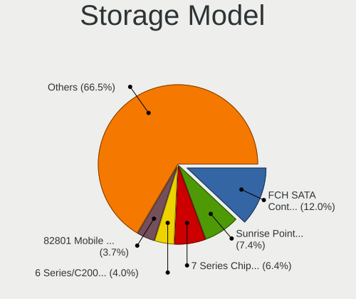

| Model                                                                            | Notebooks | Percent |
|----------------------------------------------------------------------------------|-----------|---------|
| AMD FCH SATA Controller [AHCI mode]                                              | 233       | 12%     |
| Intel Sunrise Point-LP SATA Controller [AHCI mode]                               | 143       | 7.37%   |
| Intel 7 Series Chipset Family 6-port SATA Controller [AHCI mode]                 | 124       | 6.39%   |
| Intel 6 Series/C200 Series Chipset Family 6 port Mobile SATA AHCI Controller     | 78        | 4.02%   |
| Intel 82801 Mobile SATA Controller [RAID mode]                                   | 72        | 3.71%   |
| Intel 8 Series SATA Controller 1 [AHCI mode]                                     | 63        | 3.25%   |
| Intel Volume Management Device NVMe RAID Controller                              | 60        | 3.09%   |
| Samsung NVMe SSD Controller 980 (DRAM-less)                                      | 52        | 2.68%   |
| Intel Wildcat Point-LP SATA Controller [AHCI Mode]                               | 51        | 2.63%   |
| Intel 5 Series/3400 Series Chipset 4 port SATA AHCI Controller                   | 39        | 2.01%   |
| Intel Celeron/Pentium Silver Processor SATA Controller                           | 35        | 1.8%    |
| Intel 82801IBM/IEM (ICH9M/ICH9M-E) 4 port SATA Controller [AHCI mode]            | 32        | 1.65%   |
| Intel Atom Processor E3800 Series SATA AHCI Controller                           | 30        | 1.55%   |
| Samsung NVMe SSD Controller SM981/PM981/PM983                                    | 29        | 1.49%   |
| Intel Tiger Lake-LP SATA Controller                                              | 28        | 1.44%   |
| Silicon Motion SM2263EN/SM2263XT (DRAM-less) NVMe SSD Controllers                | 27        | 1.39%   |
| Intel Cannon Lake Mobile PCH SATA AHCI Controller                                | 27        | 1.39%   |
| Intel SSD 660P Series                                                            | 25        | 1.29%   |
| Intel Cannon Point-LP SATA Controller [AHCI Mode]                                | 25        | 1.29%   |
| SK hynix Gold P31/BC711/PC711 NVMe Solid State Drive                             | 21        | 1.08%   |
| Intel HM170/QM170 Chipset SATA Controller [AHCI Mode]                            | 20        | 1.03%   |
| Intel 8 Series/C220 Series Chipset Family 6-port SATA Controller 1 [AHCI mode]   | 20        | 1.03%   |
| SanDisk Ultra 3D / WD PC SN530, IX SN530, Blue SN550 NVMe SSD (DRAM-less)        | 19        | 0.98%   |
| Intel Atom/Celeron/Pentium Processor x5-E8000/J3xxx/N3xxx Series SATA Controller | 18        | 0.93%   |
| Micron 2450 NVMe SSD [HendrixV] (DRAM-less)                                      | 17        | 0.88%   |
| Intel SSD 670p Series [Keystone Harbor]                                          | 17        | 0.88%   |
| Intel Ice Lake-LP SATA Controller [AHCI mode]                                    | 17        | 0.88%   |
| ADATA XPG SX8200 Pro PCIe Gen3x4 M.2 2280 Solid State Drive                      | 17        | 0.88%   |
| Micron 2400 NVMe SSD (DRAM-less)                                                 | 16        | 0.82%   |
| Micron 2210 NVMe SSD [Cobain]                                                    | 16        | 0.82%   |
| Samsung NVMe SSD Controller PM9A1/PM9A3/980PRO                                   | 14        | 0.72%   |
| Intel Celeron N3350/Pentium N4200/Atom E3900 Series SATA AHCI Controller         | 14        | 0.72%   |
| Intel Alder Lake-P SATA AHCI Controller                                          | 14        | 0.72%   |
| SanDisk WD SN560/SN740/SN770/SN5000 NVMe SSD                                     | 13        | 0.67%   |
| Samsung NVMe SSD Controller PM9B1 (DRAM-less)                                    | 13        | 0.67%   |
| Phison PS5013-E13 PCIe3 NVMe Controller (DRAM-less)                              | 13        | 0.67%   |
| Intel 82801HM/HEM (ICH8M/ICH8M-E) SATA Controller [AHCI mode]                    | 13        | 0.67%   |
| Intel 82801HM/HEM (ICH8M/ICH8M-E) IDE Controller                                 | 13        | 0.67%   |
| SK hynix BC511 NVMe SSD                                                          | 12        | 0.62%   |
| MAXIO (Hangzhou) NVMe SSD Controller MAP1202 (DRAM-less)                         | 12        | 0.62%   |

Storage Kind
------------

Kind of storage controller (IDE, SATA, NVMe, SAS, ...)

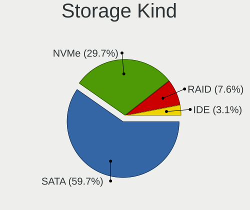

| Kind | Notebooks | Percent |
|------|-----------|---------|
| SATA | 1115      | 59.72%  |
| NVMe | 554       | 29.67%  |
| RAID | 141       | 7.55%   |
| IDE  | 57        | 3.05%   |

Processor
---------

CPU Vendor
----------

Processor vendors

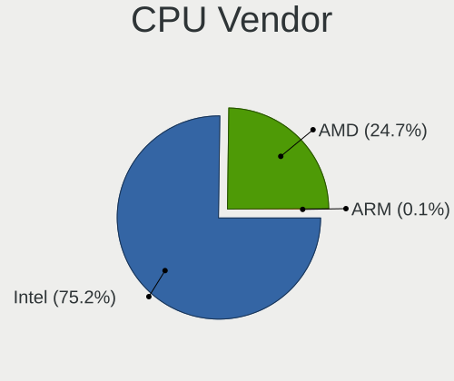

| Vendor | Notebooks | Percent |
|--------|-----------|---------|
| Intel  | 1144      | 75.21%  |
| AMD    | 376       | 24.72%  |
| ARM    | 1         | 0.07%   |

CPU Model
---------

Processor models

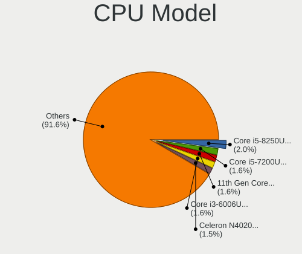

| Model                                         | Notebooks | Percent |
|-----------------------------------------------|-----------|---------|
| Intel Core i5-8250U CPU @ 1.60GHz             | 31        | 2.04%   |
| Intel Core i5-7200U CPU @ 2.50GHz             | 25        | 1.64%   |
| Intel 11th Gen Core i3-1115G4 @ 3.00GHz       | 25        | 1.64%   |
| Intel Core i3-6006U CPU @ 2.00GHz             | 24        | 1.58%   |
| Intel Celeron N4020 CPU @ 1.10GHz             | 23        | 1.51%   |
| Intel Core i5-3320M CPU @ 2.60GHz             | 22        | 1.44%   |
| Intel Core i3-1005G1 CPU @ 1.20GHz            | 21        | 1.38%   |
| Intel Celeron CPU N2840 @ 2.16GHz             | 20        | 1.31%   |
| Intel 11th Gen Core i5-1135G7 @ 2.40GHz       | 19        | 1.25%   |
| AMD A9-9425 RADEON R5, 5 COMPUTE CORES 2C+3G  | 19        | 1.25%   |
| Intel Core i7-7700HQ CPU @ 2.80GHz            | 18        | 1.18%   |
| Intel Core i3-5005U CPU @ 2.00GHz             | 18        | 1.18%   |
| Intel Core i7-8550U CPU @ 1.80GHz             | 17        | 1.12%   |
| Intel Core i5-8265U CPU @ 1.60GHz             | 17        | 1.12%   |
| Intel Core i3-3217U CPU @ 1.80GHz             | 16        | 1.05%   |
| Intel Core i5-5300U CPU @ 2.30GHz             | 15        | 0.98%   |
| AMD Ryzen 5 5500U with Radeon Graphics        | 15        | 0.98%   |
| Intel Core i5-2410M CPU @ 2.30GHz             | 14        | 0.92%   |
| AMD Ryzen 3 3200U with Radeon Vega Mobile Gfx | 14        | 0.92%   |
| AMD A8-7410 APU with AMD Radeon R5 Graphics   | 14        | 0.92%   |
| Intel Core i5-6300U CPU @ 2.40GHz             | 13        | 0.85%   |
| Intel Core i3-2310M CPU @ 2.10GHz             | 13        | 0.85%   |
| Intel Celeron N4000 CPU @ 1.10GHz             | 13        | 0.85%   |
| Intel Celeron CPU N3350 @ 1.10GHz             | 13        | 0.85%   |
| AMD A9-9420 RADEON R5, 5 COMPUTE CORES 2C+3G  | 13        | 0.85%   |
| Intel Core i7-8750H CPU @ 2.20GHz             | 12        | 0.79%   |
| Intel Core i7-8565U CPU @ 1.80GHz             | 12        | 0.79%   |
| Intel Core i5-4210U CPU @ 1.70GHz             | 12        | 0.79%   |
| Intel Core i5-6200U CPU @ 2.30GHz             | 11        | 0.72%   |
| Intel Core i5-5200U CPU @ 2.20GHz             | 11        | 0.72%   |
| Intel Core i5-4200U CPU @ 1.60GHz             | 11        | 0.72%   |
| Intel Core i5-2520M CPU @ 2.50GHz             | 11        | 0.72%   |
| Intel Core i3-7020U CPU @ 2.30GHz             | 11        | 0.72%   |
| Intel Core i3 CPU M 380 @ 2.53GHz             | 11        | 0.72%   |
| AMD Ryzen 5 5600U with Radeon Graphics        | 11        | 0.72%   |
| AMD Ryzen 5 3500U with Radeon Vega Mobile Gfx | 11        | 0.72%   |
| Intel Core i7-9750H CPU @ 2.60GHz             | 10        | 0.66%   |
| Intel Core i3-4030U CPU @ 1.90GHz             | 10        | 0.66%   |
| Intel 12th Gen Core i5-12500H                 | 10        | 0.66%   |
| Intel 11th Gen Core i7-1165G7 @ 2.80GHz       | 10        | 0.66%   |

CPU Model Family
----------------

Processor model prefix

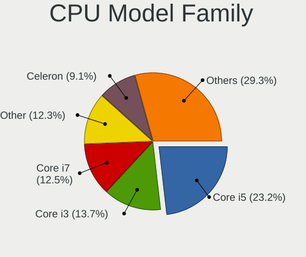

| Model                   | Notebooks | Percent |
|-------------------------|-----------|---------|
| Intel Core i5           | 353       | 23.18%  |
| Intel Core i3           | 209       | 13.72%  |
| Intel Core i7           | 190       | 12.48%  |
| Other                   | 187       | 12.28%  |
| Intel Celeron           | 138       | 9.06%   |
| AMD Ryzen 5             | 93        | 6.11%   |
| AMD Ryzen 7             | 46        | 3.02%   |
| Intel Core 2 Duo        | 44        | 2.89%   |
| AMD Ryzen 3             | 43        | 2.82%   |
| AMD A8                  | 31        | 2.04%   |
| Intel Pentium           | 21        | 1.38%   |
| Intel Atom              | 18        | 1.18%   |
| AMD A4                  | 17        | 1.12%   |
| AMD Ryzen 5 PRO         | 13        | 0.85%   |
| AMD E1                  | 13        | 0.85%   |
| AMD E                   | 11        | 0.72%   |
| AMD A6                  | 11        | 0.72%   |
| AMD Athlon              | 10        | 0.66%   |
| Intel Pentium Dual-Core | 8         | 0.53%   |
| AMD Ryzen 9             | 8         | 0.53%   |
| AMD E2                  | 8         | 0.53%   |
| AMD A10                 | 8         | 0.53%   |
| Intel Core              | 6         | 0.39%   |
| Intel Pentium Dual      | 5         | 0.33%   |
| Intel Genuine           | 5         | 0.33%   |
| AMD FX                  | 5         | 0.33%   |
| Intel Core 2            | 4         | 0.26%   |
| AMD Ryzen 7 PRO         | 4         | 0.26%   |
| Intel Xeon              | 3         | 0.2%    |
| AMD C-60                | 3         | 0.2%    |
| AMD A12                 | 2         | 0.13%   |
| Intel Pentium Silver    | 1         | 0.07%   |
| Intel Core M            | 1         | 0.07%   |
| AMD Turion 64 Mobile    | 1         | 0.07%   |
| AMD PRO A10             | 1         | 0.07%   |
| AMD C-50                | 1         | 0.07%   |
| AMD Athlon Neo X2       | 1         | 0.07%   |

CPU Cores
---------

Number of processor cores

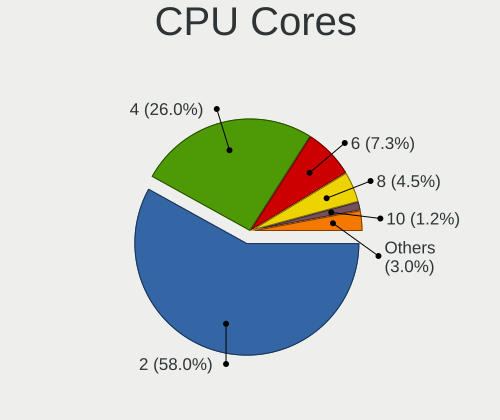

| Number | Notebooks | Percent |
|--------|-----------|---------|
| 2      | 884       | 58.04%  |
| 4      | 396       | 26%     |
| 6      | 111       | 7.29%   |
| 8      | 68        | 4.46%   |
| 10     | 19        | 1.25%   |
| 14     | 15        | 0.98%   |
| 12     | 15        | 0.98%   |
| 1      | 12        | 0.79%   |
| 16     | 2         | 0.13%   |
| 3      | 1         | 0.07%   |

CPU Sockets
-----------

Number of sockets

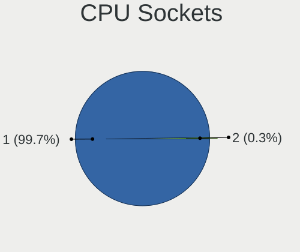

| Number | Notebooks | Percent |
|--------|-----------|---------|
| 1      | 1517      | 99.74%  |
| 2      | 4         | 0.26%   |

CPU Threads
-----------

Threads per core (Hyper-Threading)

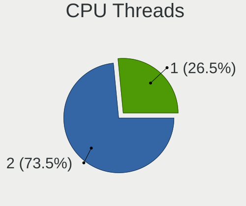

| Number | Notebooks | Percent |
|--------|-----------|---------|
| 2      | 1119      | 73.47%  |
| 1      | 404       | 26.53%  |

CPU Op-Modes
------------

CPU Operation Modes (32-bit, 64-bit)

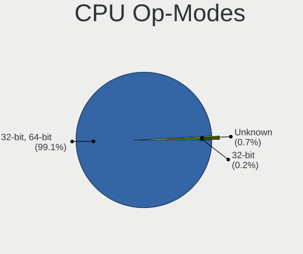

| Op mode        | Notebooks | Percent |
|----------------|-----------|---------|
| 32-bit, 64-bit | 1507      | 99.08%  |
| Unknown        | 11        | 0.72%   |
| 32-bit         | 3         | 0.2%    |

CPU Microcode
-------------

Microcode number

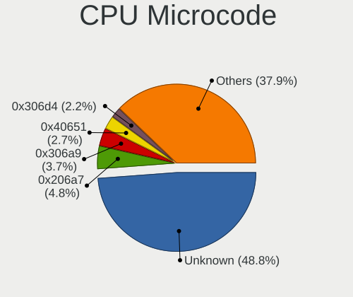

| Number     | Notebooks | Percent |
|------------|-----------|---------|
| Unknown    | 770       | 48.83%  |
| 0x206a7    | 75        | 4.76%   |
| 0x306a9    | 58        | 3.68%   |
| 0x40651    | 43        | 2.73%   |
| 0x306d4    | 34        | 2.16%   |
| 0x806ea    | 32        | 2.03%   |
| 0x06006705 | 31        | 1.97%   |
| 0x806e9    | 27        | 1.71%   |
| 0x406e3    | 27        | 1.71%   |
| 0x08108109 | 27        | 1.71%   |
| 0x806ec    | 26        | 1.65%   |
| 0x20655    | 24        | 1.52%   |
| 0x806c1    | 23        | 1.46%   |
| 0x1067a    | 21        | 1.33%   |
| 0x906ea    | 18        | 1.14%   |
| 0x0a50000c | 17        | 1.08%   |
| 0x08108102 | 16        | 1.01%   |
| 0x07030105 | 16        | 1.01%   |
| 0x806eb    | 15        | 0.95%   |
| 0x706e5    | 14        | 0.89%   |
| 0x30678    | 14        | 0.89%   |
| 0x6fd      | 13        | 0.82%   |
| 0x706a8    | 12        | 0.76%   |
| 0x306c3    | 11        | 0.7%    |
| 0x08608103 | 11        | 0.7%    |
| 0x20652    | 10        | 0.63%   |
| 0x406c4    | 9         | 0.57%   |
| 0x906e9    | 8         | 0.51%   |
| 0x406c3    | 8         | 0.51%   |
| 0x08600104 | 8         | 0.51%   |
| 0x10676    | 7         | 0.44%   |
| 0x0700010f | 7         | 0.44%   |
| 0x06001119 | 7         | 0.44%   |
| 0x05000119 | 7         | 0.44%   |
| 0xa0652    | 6         | 0.38%   |
| 0x906a3    | 6         | 0.38%   |
| 0x0810100b | 6         | 0.38%   |
| 0x06006704 | 6         | 0.38%   |
| 0x03000027 | 6         | 0.38%   |
| 0x706a1    | 5         | 0.32%   |

CPU Microarch
-------------

Microarchitecture

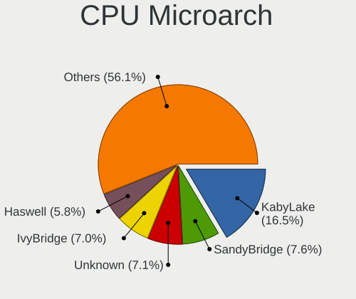

| Name               | Notebooks | Percent |
|--------------------|-----------|---------|
| KabyLake           | 251       | 16.48%  |
| SandyBridge        | 116       | 7.62%   |
| Unknown            | 108       | 7.09%   |
| IvyBridge          | 106       | 6.96%   |
| Haswell            | 88        | 5.78%   |
| Skylake            | 69        | 4.53%   |
| TigerLake          | 63        | 4.14%   |
| Broadwell          | 63        | 4.14%   |
| Excavator          | 62        | 4.07%   |
| Zen+               | 61        | 4.01%   |
| Westmere           | 58        | 3.81%   |
| Silvermont         | 57        | 3.74%   |
| Alderlake Hybrid   | 46        | 3.02%   |
| IceLake            | 43        | 2.82%   |
| Penryn             | 41        | 2.69%   |
| Zen 3              | 40        | 2.63%   |
| Goldmont plus      | 39        | 2.56%   |
| Puma               | 38        | 2.5%    |
| Zen 2              | 32        | 2.1%    |
| Core               | 23        | 1.51%   |
| Bobcat             | 19        | 1.25%   |
| CometLake          | 16        | 1.05%   |
| Zen                | 15        | 0.98%   |
| Goldmont           | 15        | 0.98%   |
| Piledriver         | 9         | 0.59%   |
| Jaguar             | 9         | 0.59%   |
| Bonnell            | 9         | 0.59%   |
| Tremont            | 7         | 0.46%   |
| K10 Llano          | 7         | 0.46%   |
| Gracemont          | 4         | 0.26%   |
| Steamroller        | 2         | 0.13%   |
| P6                 | 2         | 0.13%   |
| Meteorlake Hybrid  | 2         | 0.13%   |
| K8 Hammer          | 2         | 0.13%   |
| ArrowLake-H Hybrid | 1         | 0.07%   |

Graphics
--------

GPU Vendor
----------

Vendors of graphics cards

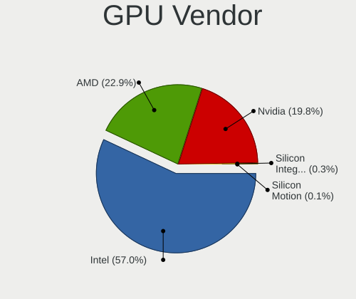

| Vendor                           | Notebooks | Percent |
|----------------------------------|-----------|---------|
| Intel                            | 1111      | 56.97%  |
| AMD                              | 447       | 22.92%  |
| Nvidia                           | 386       | 19.79%  |
| Silicon Integrated Systems [SiS] | 5         | 0.26%   |
| Silicon Motion                   | 1         | 0.05%   |

GPU Model
---------

Graphics card models

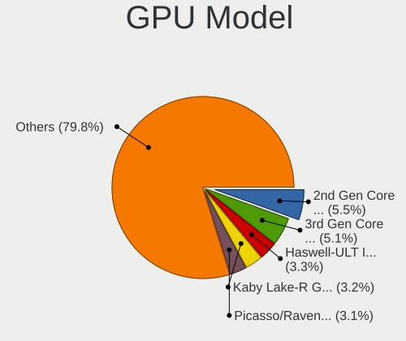

| Model                                                                                    | Notebooks | Percent |
|------------------------------------------------------------------------------------------|-----------|---------|
| Intel 2nd Generation Core Processor Family Integrated Graphics Controller                | 111       | 5.49%   |
| Intel 3rd Gen Core processor Graphics Controller                                         | 103       | 5.1%    |
| Intel Haswell-ULT Integrated Graphics Controller                                         | 67        | 3.32%   |
| Intel Kaby Lake-R GT2 [UHD Graphics 620]                                                 | 65        | 3.22%   |
| AMD Picasso/Raven 2 [Radeon Vega Series / Radeon Vega Mobile Series]                     | 62        | 3.07%   |
| Intel Broadwell-U GT2 [HD Graphics 5500]                                                 | 55        | 2.72%   |
| Intel Skylake-U GT2 [HD Graphics 520]                                                    | 52        | 2.57%   |
| Intel Kaby Lake-U GT2 [HD Graphics 620]                                                  | 52        | 2.57%   |
| Intel Core Processor Integrated Graphics Controller                                      | 50        | 2.47%   |
| AMD Stoney [Radeon R2/R3/R4/R5 Graphics]                                                 | 49        | 2.42%   |
| Intel WhiskeyLake-U GT2 [UHD Graphics 620]                                               | 42        | 2.08%   |
| Intel GeminiLake [UHD Graphics 600]                                                      | 39        | 1.93%   |
| Intel TigerLake-LP GT2 [Iris Xe Graphics]                                                | 38        | 1.88%   |
| Intel Mobile 4 Series Chipset Integrated Graphics Controller                             | 33        | 1.63%   |
| Intel CoffeeLake-H GT2 [UHD Graphics 630]                                                | 33        | 1.63%   |
| Intel Atom Processor Z36xxx/Z37xxx Series Graphics & Display                             | 32        | 1.58%   |
| AMD Cezanne [Radeon Vega Series / Radeon Vega Mobile Series]                             | 32        | 1.58%   |
| AMD Renoir [Radeon Vega Series / Radeon Vega Mobile Series]                              | 31        | 1.53%   |
| Intel Iris Plus Graphics G1 (Ice Lake)                                                   | 30        | 1.48%   |
| AMD Mullins [Radeon R4/R5 Graphics]                                                      | 30        | 1.48%   |
| Nvidia GF117M [GeForce 610M/710M/810M/820M / GT 620M/625M/630M/720M]                     | 29        | 1.43%   |
| Intel CometLake-U GT2 [UHD Graphics]                                                     | 29        | 1.43%   |
| AMD Sun XT [Radeon HD 8670A/8670M/8690M / R5 M330 / M430 / Radeon 520 Mobile]            | 27        | 1.34%   |
| AMD Topaz XT [Radeon R7 M260/M265 / M340/M360 / M440/M445 / 530/535 / 620/625 Mobile]    | 26        | 1.29%   |
| Intel Tiger Lake-LP GT2 [UHD Graphics G4]                                                | 25        | 1.24%   |
| Intel Atom/Celeron/Pentium Processor x5-E8000/J3xxx/N3xxx Integrated Graphics Controller | 25        | 1.24%   |
| Nvidia GA107M [GeForce RTX 3050 Mobile]                                                  | 24        | 1.19%   |
| AMD Rembrandt [Radeon 680M]                                                              | 22        | 1.09%   |
| AMD Lucienne                                                                             | 22        | 1.09%   |
| Nvidia TU117M [GeForce GTX 1650 Mobile / Max-Q]                                          | 20        | 0.99%   |
| Intel 4th Gen Core Processor Integrated Graphics Controller                              | 20        | 0.99%   |
| Nvidia GP107M [GeForce GTX 1050 Mobile]                                                  | 19        | 0.94%   |
| Intel Kaby Lake-H GT2 [HD Graphics 630]                                                  | 17        | 0.84%   |
| AMD Mendocino [Radeon 610M]                                                              | 17        | 0.84%   |
| Intel Alder Lake-P GT2 [Iris Xe Graphics]                                                | 16        | 0.79%   |
| Nvidia GP108M [GeForce MX150]                                                            | 15        | 0.74%   |
| Nvidia GM108M [GeForce 930MX]                                                            | 15        | 0.74%   |
| Intel Mobile GM965/GL960 Integrated Graphics Controller (secondary)                      | 15        | 0.74%   |
| Intel Mobile GM965/GL960 Integrated Graphics Controller (primary)                        | 15        | 0.74%   |
| Intel Apollo Lake GT1 [HD Graphics 500]                                                  | 15        | 0.74%   |

GPU Combo
---------

Combinations of graphics cards

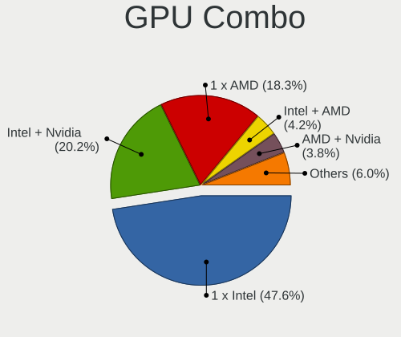

| Name               | Notebooks | Percent |
|--------------------|-----------|---------|
| 1 x Intel          | 726       | 47.58%  |
| Intel + Nvidia     | 308       | 20.18%  |
| 1 x AMD            | 279       | 18.28%  |
| Intel + AMD        | 64        | 4.19%   |
| AMD + Nvidia       | 58        | 3.8%    |
| 2 x AMD            | 46        | 3.01%   |
| 1 x Nvidia         | 18        | 1.18%   |
| 2 x Intel          | 15        | 0.98%   |
| 1 x SiS            | 5         | 0.33%   |
| Other              | 4         | 0.26%   |
| 2 x Nvidia         | 2         | 0.13%   |
| 1 x Silicon Motion | 1         | 0.07%   |

GPU Driver
----------

Free vs proprietary

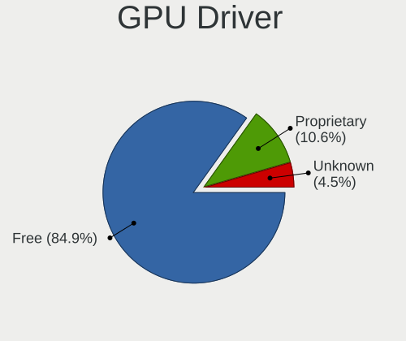

| Driver      | Notebooks | Percent |
|-------------|-----------|---------|
| Free        | 1309      | 84.89%  |
| Proprietary | 164       | 10.64%  |
| Unknown     | 69        | 4.47%   |

GPU Memory
----------

Total video memory

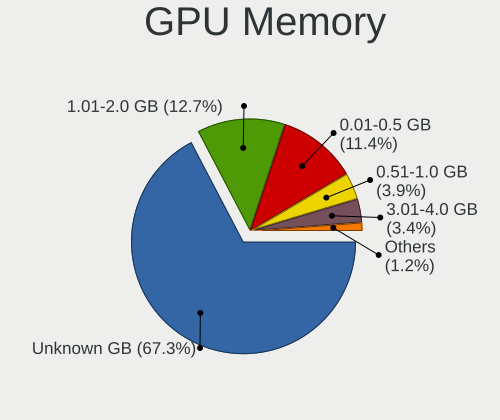

| Size in GB | Notebooks | Percent |
|------------|-----------|---------|
| Unknown    | 1047      | 67.33%  |
| 1.01-2.0   | 198       | 12.73%  |
| 0.01-0.5   | 178       | 11.45%  |
| 0.51-1.0   | 60        | 3.86%   |
| 3.01-4.0   | 53        | 3.41%   |
| 5.01-6.0   | 10        | 0.64%   |
| 7.01-8.0   | 5         | 0.32%   |
| 2.01-3.0   | 3         | 0.19%   |
| 8.01-16.0  | 1         | 0.06%   |

Monitor
-------

Monitor Vendor
--------------

Monitor vendors

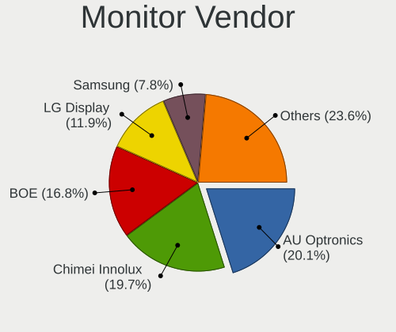

| Vendor                  | Notebooks | Percent |
|-------------------------|-----------|---------|
| AU Optronics            | 331       | 20.13%  |
| Chimei Innolux          | 324       | 19.71%  |
| BOE                     | 277       | 16.85%  |
| LG Display              | 196       | 11.92%  |
| Samsung Electronics     | 128       | 7.79%   |
| Goldstar                | 49        | 2.98%   |
| Lenovo                  | 46        | 2.8%    |
| PANDA                   | 27        | 1.64%   |
| InfoVision              | 27        | 1.64%   |
| Sharp                   | 22        | 1.34%   |
| Apple                   | 20        | 1.22%   |
| InnoLux Display         | 12        | 0.73%   |
| Chi Mei Optoelectronics | 12        | 0.73%   |
| Dell                    | 10        | 0.61%   |
| Valve                   | 9         | 0.55%   |
| AOC                     | 9         | 0.55%   |
| Acer                    | 9         | 0.55%   |
| ViewSonic               | 8         | 0.49%   |
| HKC                     | 8         | 0.49%   |
| Philips                 | 7         | 0.43%   |
| Mi                      | 7         | 0.43%   |
| Hewlett-Packard         | 7         | 0.43%   |
| CPT                     | 7         | 0.43%   |
| LG Philips              | 6         | 0.36%   |
| KDC                     | 5         | 0.3%    |
| HJC                     | 5         | 0.3%    |
| HannStar                | 5         | 0.3%    |
| Toshiba                 | 4         | 0.24%   |
| TMX                     | 4         | 0.24%   |
| Quanta Display          | 4         | 0.24%   |
| KDB                     | 4         | 0.24%   |
| CSW                     | 4         | 0.24%   |
| CSOT                    | 4         | 0.24%   |
| Sony                    | 3         | 0.18%   |
| Panasonic               | 3         | 0.18%   |
| CSO                     | 3         | 0.18%   |
| Unknown (XXX)           | 2         | 0.12%   |
| STA                     | 2         | 0.12%   |
| Seiko/Epson             | 2         | 0.12%   |
| Polaroid                | 2         | 0.12%   |

Monitor Model
-------------

Monitor models

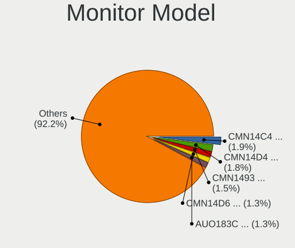

| Model                                                                 | Notebooks | Percent |
|-----------------------------------------------------------------------|-----------|---------|
| Chimei Innolux LCD Monitor CMN14C4 1366x768 309x173mm 13.9-inch       | 32        | 1.94%   |
| Chimei Innolux LCD Monitor CMN14D4 1920x1080 309x173mm 13.9-inch      | 29        | 1.76%   |
| Chimei Innolux LCD Monitor CMN1493 1366x768 309x173mm 13.9-inch       | 24        | 1.46%   |
| Chimei Innolux LCD Monitor CMN14D6 1366x768 309x173mm 13.9-inch       | 22        | 1.33%   |
| AU Optronics LCD Monitor AUO183C 1366x768 309x173mm 13.9-inch         | 22        | 1.33%   |
| AU Optronics LCD Monitor AUO403D 1920x1080 309x174mm 14.0-inch        | 20        | 1.21%   |
| AU Optronics LCD Monitor AUO106C 1366x768 276x155mm 12.5-inch         | 19        | 1.15%   |
| Chimei Innolux LCD Monitor CMN14C3 1366x768 309x173mm 13.9-inch       | 17        | 1.03%   |
| BOE LCD Monitor BOE0696 1366x768 309x173mm 13.9-inch                  | 17        | 1.03%   |
| Chimei Innolux LCD Monitor CMN1521 1920x1080 344x193mm 15.5-inch      | 15        | 0.91%   |
| AU Optronics LCD Monitor AUO2D3C 1366x768 309x173mm 13.9-inch         | 14        | 0.85%   |
| BOE LCD Monitor BOE07F6 1920x1080 309x174mm 14.0-inch                 | 13        | 0.79%   |
| BOE LCD Monitor BOE06BD 1366x768 309x173mm 13.9-inch                  | 13        | 0.79%   |
| AU Optronics LCD Monitor AUO323C 1366x768 309x173mm 13.9-inch         | 13        | 0.79%   |
| AU Optronics LCD Monitor AUO305C 1366x768 256x144mm 11.6-inch         | 13        | 0.79%   |
| AU Optronics LCD Monitor AUO2E3C 1366x768 309x173mm 13.9-inch         | 13        | 0.79%   |
| LG Display LCD Monitor LGD033C 1366x768 309x174mm 14.0-inch           | 12        | 0.73%   |
| Chimei Innolux LCD Monitor CMN1470 1366x768 309x174mm 14.0-inch       | 12        | 0.73%   |
| Chimei Innolux LCD Monitor CMN1487 1366x768 309x173mm 13.9-inch       | 11        | 0.67%   |
| BOE LCD Monitor BOE07F7 1920x1080 309x174mm 14.0-inch                 | 11        | 0.67%   |
| LG Display LCD Monitor LGD02F8 1366x768 309x174mm 14.0-inch           | 10        | 0.61%   |
| BOE LCD Monitor BOE0698 1366x768 309x173mm 13.9-inch                  | 10        | 0.61%   |
| Samsung Electronics LCD Monitor SDC4171 2880x1800 302x189mm 14.0-inch | 9         | 0.55%   |
| Samsung Electronics C24F390 SAM0D2C 1920x1080 521x293mm 23.5-inch     | 9         | 0.55%   |
| PANDA LCD Monitor NCP004D 1920x1080 344x194mm 15.5-inch               | 9         | 0.55%   |
| Chimei Innolux LCD Monitor CMN1491 1366x768 309x174mm 14.0-inch       | 9         | 0.55%   |
| BOE LCD Monitor BOE0644 1366x768 309x173mm 13.9-inch                  | 9         | 0.55%   |
| Valve ANX7530 U VLV3001 800x1280 100x150mm 7.1-inch                   | 8         | 0.49%   |
| Goldstar HD GSM5ACB 1366x768 410x230mm 18.5-inch                      | 8         | 0.49%   |
| Goldstar FULL HD GSM5B55 1920x1080 480x270mm 21.7-inch                | 8         | 0.49%   |
| Chimei Innolux LCD Monitor CMN14E5 1920x1080 309x173mm 13.9-inch      | 8         | 0.49%   |
| Chimei Innolux LCD Monitor CMN14A7 1920x1080 308x173mm 13.9-inch      | 8         | 0.49%   |
| Chimei Innolux LCD Monitor CMN1480 1366x768 309x174mm 14.0-inch       | 8         | 0.49%   |
| BOE LCD Monitor BOE07B5 1366x768 309x173mm 13.9-inch                  | 8         | 0.49%   |
| AU Optronics LCD Monitor AUO683D 1920x1080 309x174mm 14.0-inch        | 8         | 0.49%   |
| LG Display LCD Monitor LGD05EC 1920x1080 309x174mm 14.0-inch          | 7         | 0.42%   |
| LG Display LCD Monitor LGD046F 1920x1080 344x194mm 15.5-inch          | 7         | 0.42%   |
| LG Display LCD Monitor LGD02E9 1366x768 309x174mm 14.0-inch           | 7         | 0.42%   |
| BOE LCD Monitor BOE069C 1920x1080 344x193mm 15.5-inch                 | 7         | 0.42%   |
| AU Optronics LCD Monitor AUOAF90 1920x1080 344x193mm 15.5-inch        | 7         | 0.42%   |

Monitor Resolution
------------------

Monitor screen resolution

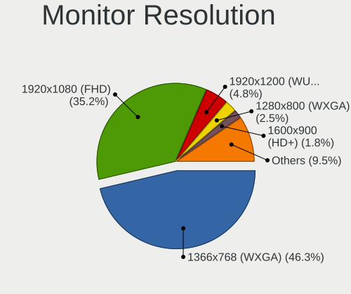

| Resolution        | Notebooks | Percent |
|-------------------|-----------|---------|
| 1366x768 (WXGA)   | 730       | 46.32%  |
| 1920x1080 (FHD)   | 554       | 35.15%  |
| 1920x1200 (WUXGA) | 75        | 4.76%   |
| 1280x800 (WXGA)   | 39        | 2.47%   |
| 1600x900 (HD+)    | 28        | 1.78%   |
| 2880x1800         | 23        | 1.46%   |
| 3840x2160 (4K)    | 22        | 1.4%    |
| 2560x1440 (QHD)   | 20        | 1.27%   |
| 2560x1600         | 18        | 1.14%   |
| 1440x900 (WXGA+)  | 13        | 0.82%   |
| 800x1280          | 9         | 0.57%   |
| 1360x768          | 9         | 0.57%   |
| 1024x600          | 5         | 0.32%   |
| 3440x1440         | 3         | 0.19%   |
| 2880x1920         | 3         | 0.19%   |
| 2160x1440         | 3         | 0.19%   |
| Unknown           | 3         | 0.19%   |
| 3840x2400         | 2         | 0.13%   |
| 3072x1920         | 2         | 0.13%   |
| 2560x1080         | 2         | 0.13%   |
| 1920x550          | 2         | 0.13%   |
| 1920x1280         | 2         | 0.13%   |
| 3456x2160         | 1         | 0.06%   |
| 3200x1800 (QHD+)  | 1         | 0.06%   |
| 2966x900          | 1         | 0.06%   |
| 2736x1824         | 1         | 0.06%   |
| 2288x1287         | 1         | 0.06%   |
| 2256x1504         | 1         | 0.06%   |
| 2240x1400         | 1         | 0.06%   |
| 1280x960          | 1         | 0.06%   |
| 1024x768 (XGA)    | 1         | 0.06%   |

Monitor Diagonal
----------------

Diagonal size in inches

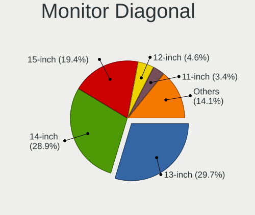

| Inches  | Notebooks | Percent |
|---------|-----------|---------|
| 13      | 486       | 29.67%  |
| 14      | 474       | 28.94%  |
| 15      | 317       | 19.35%  |
| 12      | 75        | 4.58%   |
| 11      | 55        | 3.36%   |
| 23      | 42        | 2.56%   |
| 18      | 33        | 2.01%   |
| 24      | 23        | 1.4%    |
| 21      | 18        | 1.1%    |
| 16      | 17        | 1.04%   |
| 31      | 15        | 0.92%   |
| 27      | 11        | 0.67%   |
| 19      | 11        | 0.67%   |
| 17      | 11        | 0.67%   |
| 40      | 9         | 0.55%   |
| 7       | 9         | 0.55%   |
| Unknown | 7         | 0.43%   |
| 10      | 5         | 0.31%   |
| 34      | 4         | 0.24%   |
| 63      | 3         | 0.18%   |
| 48      | 2         | 0.12%   |
| 20      | 2         | 0.12%   |
| 142     | 1         | 0.06%   |
| 72      | 1         | 0.06%   |
| 60      | 1         | 0.06%   |
| 54      | 1         | 0.06%   |
| 52      | 1         | 0.06%   |
| 32      | 1         | 0.06%   |
| 26      | 1         | 0.06%   |
| 25      | 1         | 0.06%   |
| 9       | 1         | 0.06%   |

Monitor Width
-------------

Physical width

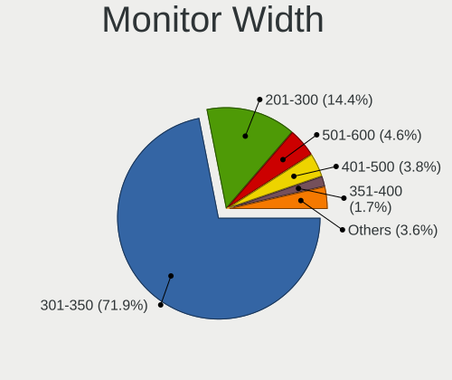

| Width in mm    | Notebooks | Percent |
|----------------|-----------|---------|
| 301-350        | 1168      | 71.92%  |
| 201-300        | 234       | 14.41%  |
| 501-600        | 75        | 4.62%   |
| 401-500        | 62        | 3.82%   |
| 351-400        | 27        | 1.66%   |
| 601-700        | 18        | 1.11%   |
| 801-900        | 9         | 0.55%   |
| 1-100          | 9         | 0.55%   |
| 1001-1500      | 8         | 0.49%   |
| Unknown        | 7         | 0.43%   |
| 701-800        | 5         | 0.31%   |
| More than 2000 | 1         | 0.06%   |
| 1501-2000      | 1         | 0.06%   |

Aspect Ratio
------------

Proportional relationship between the width and the height

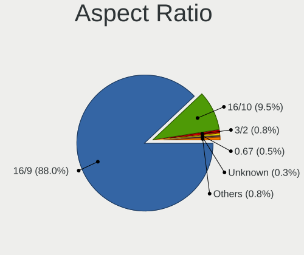

| Ratio   | Notebooks | Percent |
|---------|-----------|---------|
| 16/9    | 1318      | 87.98%  |
| 16/10   | 143       | 9.55%   |
| 3/2     | 12        | 0.8%    |
| 0.67    | 8         | 0.53%   |
| Unknown | 5         | 0.33%   |
| 21/9    | 4         | 0.27%   |
| 4/3     | 3         | 0.2%    |
| 32/9    | 2         | 0.13%   |
| 5/4     | 1         | 0.07%   |
| 1.00    | 1         | 0.07%   |
| 0.62    | 1         | 0.07%   |

Monitor Area
------------

Area in inch²

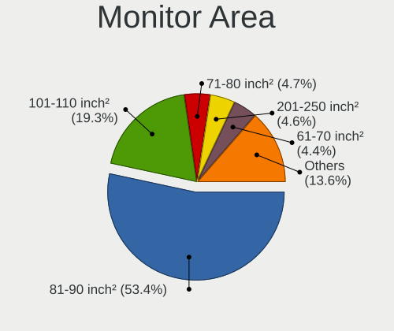

| Area in inch² | Notebooks | Percent |
|----------------|-----------|---------|
| 81-90          | 872       | 53.37%  |
| 101-110        | 316       | 19.34%  |
| 71-80          | 77        | 4.71%   |
| 201-250        | 75        | 4.59%   |
| 61-70          | 72        | 4.41%   |
| 51-60          | 55        | 3.37%   |
| 141-150        | 34        | 2.08%   |
| 351-500        | 20        | 1.22%   |
| 151-200        | 16        | 0.98%   |
| 111-120        | 14        | 0.86%   |
| 301-350        | 12        | 0.73%   |
| 121-130        | 11        | 0.67%   |
| 91-100         | 11        | 0.67%   |
| More than 1000 | 10        | 0.61%   |
| 1-40           | 9         | 0.55%   |
| 501-1000       | 9         | 0.55%   |
| Unknown        | 7         | 0.43%   |
| 41-50          | 6         | 0.37%   |
| 251-300        | 6         | 0.37%   |
| 131-140        | 2         | 0.12%   |

Pixel Density
-------------

Pixels per inch

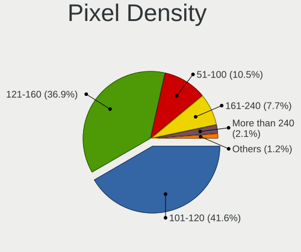

| Density       | Notebooks | Percent |
|---------------|-----------|---------|
| 101-120       | 675       | 41.62%  |
| 121-160       | 598       | 36.87%  |
| 51-100        | 170       | 10.48%  |
| 161-240       | 125       | 7.71%   |
| More than 240 | 34        | 2.1%    |
| 1-50          | 13        | 0.8%    |
| Unknown       | 7         | 0.43%   |

Multiple Monitors
-----------------

Total monitors connected

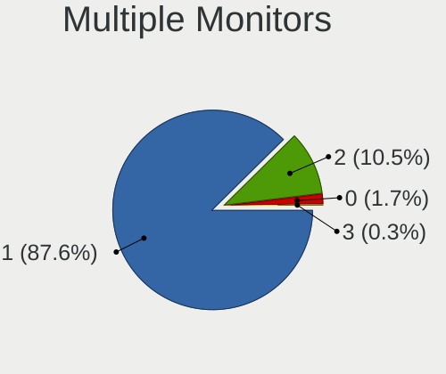

| Total | Notebooks | Percent |
|-------|-----------|---------|
| 1     | 1355      | 87.59%  |
| 2     | 162       | 10.47%  |
| 0     | 26        | 1.68%   |
| 3     | 4         | 0.26%   |

Network
-------

Net Controller Vendor
---------------------

Controller vendors

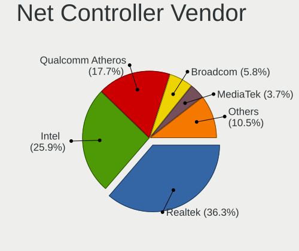

| Vendor                                 | Notebooks | Percent |
|----------------------------------------|-----------|---------|
| Realtek Semiconductor                  | 878       | 36.31%  |
| Intel                                  | 627       | 25.93%  |
| Qualcomm Atheros                       | 428       | 17.7%   |
| Broadcom                               | 141       | 5.83%   |
| MediaTek                               | 90        | 3.72%   |
| Xiaomi                                 | 30        | 1.24%   |
| TP-Link                                | 24        | 0.99%   |
| Samsung Electronics                    | 23        | 0.95%   |
| Broadcom Limited                       | 22        | 0.91%   |
| Ralink Technology                      | 20        | 0.83%   |
| OPPO Electronics                       | 16        | 0.66%   |
| Ralink                                 | 12        | 0.5%    |
| Marvell Technology Group               | 11        | 0.45%   |
| Qualcomm Atheros Communications        | 10        | 0.41%   |
| Qualcomm                               | 9         | 0.37%   |
| JMicron Technology                     | 9         | 0.37%   |
| Sierra Wireless                        | 8         | 0.33%   |
| ASIX Electronics                       | 7         | 0.29%   |
| Huawei Technologies                    | 6         | 0.25%   |
| Shenzhen Goodix Technology             | 5         | 0.21%   |
| vivo                                   | 4         | 0.17%   |
| Silicon Integrated Systems [SiS]       | 4         | 0.17%   |
| Ericsson Business Mobile Networks      | 4         | 0.17%   |
| ICS Advent                             | 3         | 0.12%   |
| Attansic Technology                    | 3         | 0.12%   |
| Nvidia                                 | 2         | 0.08%   |
| Naxiang                                | 2         | 0.08%   |
| Mercucys                               | 2         | 0.08%   |
| Hewlett-Packard                        | 2         | 0.08%   |
| D-Link                                 | 2         | 0.08%   |
| ZTE WCDMA Technologies MSM             | 1         | 0.04%   |
| Sony Ericsson Mobile Communications AB | 1         | 0.04%   |
| skyGate Technology.                    | 1         | 0.04%   |
| QinHeng Electronics                    | 1         | 0.04%   |
| Linksys                                | 1         | 0.04%   |
| Lenovo                                 | 1         | 0.04%   |
| HTC (High Tech Computer)               | 1         | 0.04%   |
| Foxconn / Hon Hai                      | 1         | 0.04%   |
| Fibocom                                | 1         | 0.04%   |
| Edimax Technology                      | 1         | 0.04%   |

Net Controller Model
--------------------

Controller models

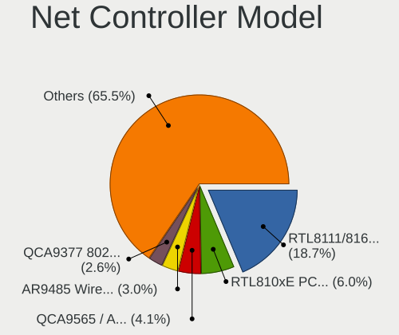

| Model                                                                  | Notebooks | Percent |
|------------------------------------------------------------------------|-----------|---------|
| Realtek RTL8111/8168/8211/8411 PCI Express Gigabit Ethernet Controller | 534       | 18.66%  |
| Realtek RTL810xE PCI Express Fast Ethernet controller                  | 173       | 6.05%   |
| Qualcomm Atheros QCA9565 / AR9565 Wireless Network Adapter             | 118       | 4.12%   |
| Qualcomm Atheros AR9485 Wireless Network Adapter                       | 87        | 3.04%   |
| Qualcomm Atheros QCA9377 802.11ac Wireless Network Adapter             | 75        | 2.62%   |
| Intel Wireless 8265 / 8275                                             | 71        | 2.48%   |
| Realtek RTL8822CE 802.11ac PCIe Wireless Network Adapter               | 56        | 1.96%   |
| Intel 82579LM Gigabit Network Connection (Lewisville)                  | 50        | 1.75%   |
| Intel Wireless 7265                                                    | 48        | 1.68%   |
| Qualcomm Atheros AR9285 Wireless Network Adapter (PCI-Express)         | 45        | 1.57%   |
| Realtek RTL8821CE 802.11ac PCIe Wireless Network Adapter               | 44        | 1.54%   |
| Intel Wi-Fi 6 AX201                                                    | 41        | 1.43%   |
| MediaTek MT7921 802.11ax PCIe Wireless Network Adapter [Filogic 330]   | 40        | 1.4%    |
| Broadcom BCM4313 802.11bgn Wireless Network Adapter                    | 36        | 1.26%   |
| Intel Centrino Advanced-N 6205 [Taylor Peak]                           | 35        | 1.22%   |
| Intel Cannon Point-LP CNVi [Wireless-AC]                               | 34        | 1.19%   |
| Realtek RTL8723DE Wireless Network Adapter                             | 32        | 1.12%   |
| Broadcom BCM43142 802.11b/g/n                                          | 31        | 1.08%   |
| Realtek RTL8723BE PCIe Wireless Network Adapter                        | 30        | 1.05%   |
| Intel Wi-Fi 6 AX200                                                    | 30        | 1.05%   |
| Intel Wireless 8260                                                    | 29        | 1.01%   |
| Intel Cannon Lake PCH CNVi WiFi                                        | 29        | 1.01%   |
| Intel Wireless 7260                                                    | 27        | 0.94%   |
| Intel Alder Lake-P PCH CNVi WiFi                                       | 27        | 0.94%   |
| Broadcom NetLink BCM57785 Gigabit Ethernet PCIe                        | 26        | 0.91%   |
| Intel Comet Lake PCH-LP CNVi WiFi                                      | 25        | 0.87%   |
| Qualcomm Atheros AR9287 Wireless Network Adapter (PCI-Express)         | 24        | 0.84%   |
| Intel Ice Lake-LP PCH CNVi WiFi                                        | 23        | 0.8%    |
| Intel Ethernet Connection (4) I219-LM                                  | 23        | 0.8%    |
| Xiaomi Mi/Redmi series (RNDIS)                                         | 22        | 0.77%   |
| Realtek RTL8852BE PCIe 802.11ax Wireless Network Controller            | 22        | 0.77%   |
| Intel Ethernet Connection (3) I218-LM                                  | 20        | 0.7%    |
| Realtek RTL8188EUS 802.11n Wireless Network Adapter                    | 19        | 0.66%   |
| Qualcomm Atheros QCA8172 Fast Ethernet                                 | 19        | 0.66%   |
| MediaTek MT7902 802.11ax PCIe Wireless Network Adapter [Filogic 310]   | 19        | 0.66%   |
| Intel Wireless 3165                                                    | 18        | 0.63%   |
| Intel Ethernet Connection I219-LM                                      | 18        | 0.63%   |
| Realtek RTL8822BE 802.11a/b/g/n/ac WiFi adapter                        | 17        | 0.59%   |
| Intel Ethernet Connection I218-LM                                      | 17        | 0.59%   |
| Samsung Galaxy series, misc. (tethering mode)                          | 16        | 0.56%   |

Wireless Vendor
---------------

Wireless vendors

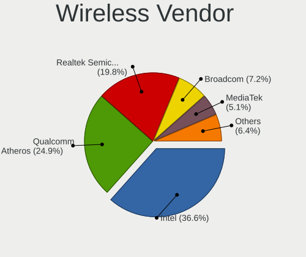

| Vendor                          | Notebooks | Percent |
|---------------------------------|-----------|---------|
| Intel                           | 574       | 36.58%  |
| Qualcomm Atheros                | 391       | 24.92%  |
| Realtek Semiconductor           | 310       | 19.76%  |
| Broadcom                        | 113       | 7.2%    |
| MediaTek                        | 80        | 5.1%    |
| Ralink Technology               | 20        | 1.27%   |
| TP-Link                         | 18        | 1.15%   |
| Broadcom Limited                | 18        | 1.15%   |
| Ralink                          | 12        | 0.76%   |
| Qualcomm Atheros Communications | 10        | 0.64%   |
| Sierra Wireless                 | 8         | 0.51%   |
| Qualcomm                        | 6         | 0.38%   |
| Mercucys                        | 2         | 0.13%   |
| D-Link                          | 2         | 0.13%   |
| Linksys                         | 1         | 0.06%   |
| Fibocom                         | 1         | 0.06%   |
| Edimax Technology               | 1         | 0.06%   |
| Dell                            | 1         | 0.06%   |
| AboCom Systems                  | 1         | 0.06%   |

Wireless Model
--------------

Wireless models

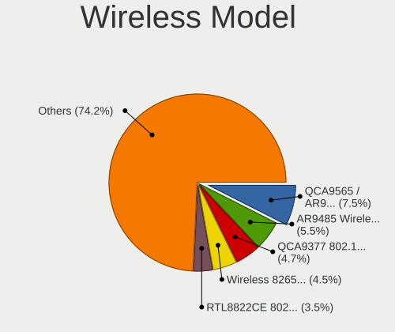

| Model                                                                | Notebooks | Percent |
|----------------------------------------------------------------------|-----------|---------|
| Qualcomm Atheros QCA9565 / AR9565 Wireless Network Adapter           | 118       | 7.47%   |
| Qualcomm Atheros AR9485 Wireless Network Adapter                     | 87        | 5.51%   |
| Qualcomm Atheros QCA9377 802.11ac Wireless Network Adapter           | 75        | 4.75%   |
| Intel Wireless 8265 / 8275                                           | 71        | 4.49%   |
| Realtek RTL8822CE 802.11ac PCIe Wireless Network Adapter             | 56        | 3.54%   |
| Intel Wireless 7265                                                  | 48        | 3.04%   |
| Qualcomm Atheros AR9285 Wireless Network Adapter (PCI-Express)       | 45        | 2.85%   |
| Realtek RTL8821CE 802.11ac PCIe Wireless Network Adapter             | 44        | 2.78%   |
| Intel Wi-Fi 6 AX201                                                  | 41        | 2.59%   |
| MediaTek MT7921 802.11ax PCIe Wireless Network Adapter [Filogic 330] | 40        | 2.53%   |
| Broadcom BCM4313 802.11bgn Wireless Network Adapter                  | 36        | 2.28%   |
| Intel Centrino Advanced-N 6205 [Taylor Peak]                         | 35        | 2.22%   |
| Intel Cannon Point-LP CNVi [Wireless-AC]                             | 34        | 2.15%   |
| Realtek RTL8723DE Wireless Network Adapter                           | 32        | 2.03%   |
| Broadcom BCM43142 802.11b/g/n                                        | 31        | 1.96%   |
| Realtek RTL8723BE PCIe Wireless Network Adapter                      | 30        | 1.9%    |
| Intel Wi-Fi 6 AX200                                                  | 30        | 1.9%    |
| Intel Wireless 8260                                                  | 29        | 1.84%   |
| Intel Cannon Lake PCH CNVi WiFi                                      | 29        | 1.84%   |
| Intel Wireless 7260                                                  | 27        | 1.71%   |
| Intel Comet Lake PCH-LP CNVi WiFi                                    | 25        | 1.58%   |
| Qualcomm Atheros AR9287 Wireless Network Adapter (PCI-Express)       | 24        | 1.52%   |
| Intel Ice Lake-LP PCH CNVi WiFi                                      | 23        | 1.46%   |
| Realtek RTL8852BE PCIe 802.11ax Wireless Network Controller          | 21        | 1.33%   |
| Realtek RTL8188EUS 802.11n Wireless Network Adapter                  | 19        | 1.2%    |
| MediaTek MT7902 802.11ax PCIe Wireless Network Adapter [Filogic 310] | 19        | 1.2%    |
| Intel Alder Lake-P PCH CNVi WiFi                                     | 19        | 1.2%    |
| Intel Wireless 3165                                                  | 18        | 1.14%   |
| Realtek RTL8822BE 802.11a/b/g/n/ac WiFi adapter                      | 17        | 1.08%   |
| Realtek RTL8852AE 802.11ax PCIe Wireless Network Adapter             | 16        | 1.01%   |
| Realtek RTL8821AE 802.11ac PCIe Wireless Network Adapter             | 15        | 0.95%   |
| Ralink MT7601U Wireless Adapter                                      | 15        | 0.95%   |
| Qualcomm Atheros QCA6174 802.11ac Wireless Network Adapter           | 15        | 0.95%   |
| Qualcomm Atheros AR928X Wireless Network Adapter (PCI-Express)       | 11        | 0.7%    |
| Intel Gemini Lake PCH CNVi WiFi                                      | 11        | 0.7%    |
| Intel Dual Band Wireless-AC 3168NGW [Stone Peak]                     | 11        | 0.7%    |
| TP-Link TL-WN722N v2/v3 [Realtek RTL8188EUS]                         | 10        | 0.63%   |
| Realtek 802.11n WLAN Adapter                                         | 10        | 0.63%   |
| Qualcomm Atheros AR9271 802.11n                                      | 10        | 0.63%   |
| MediaTek MT7922 802.11ax PCI Express Wireless Network Adapter        | 10        | 0.63%   |

Ethernet Vendor
---------------

Ethernet vendors

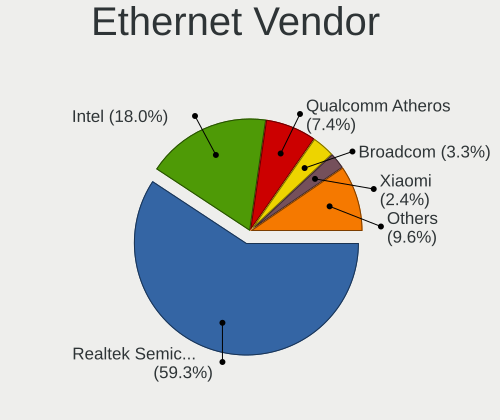

| Vendor                                 | Notebooks | Percent |
|----------------------------------------|-----------|---------|
| Realtek Semiconductor                  | 744       | 59.28%  |
| Intel                                  | 226       | 18.01%  |
| Qualcomm Atheros                       | 93        | 7.41%   |
| Broadcom                               | 42        | 3.35%   |
| Xiaomi                                 | 30        | 2.39%   |
| Samsung Electronics                    | 23        | 1.83%   |
| OPPO Electronics                       | 16        | 1.27%   |
| Marvell Technology Group               | 11        | 0.88%   |
| MediaTek                               | 10        | 0.8%    |
| JMicron Technology                     | 9         | 0.72%   |
| ASIX Electronics                       | 7         | 0.56%   |
| TP-Link                                | 6         | 0.48%   |
| Broadcom Limited                       | 6         | 0.48%   |
| vivo                                   | 4         | 0.32%   |
| Silicon Integrated Systems [SiS]       | 4         | 0.32%   |
| Qualcomm                               | 3         | 0.24%   |
| ICS Advent                             | 3         | 0.24%   |
| Attansic Technology                    | 3         | 0.24%   |
| Nvidia                                 | 2         | 0.16%   |
| Naxiang                                | 2         | 0.16%   |
| Hewlett-Packard                        | 2         | 0.16%   |
| Sony Ericsson Mobile Communications AB | 1         | 0.08%   |
| skyGate Technology.                    | 1         | 0.08%   |
| QinHeng Electronics                    | 1         | 0.08%   |
| Lenovo                                 | 1         | 0.08%   |
| Huawei Technologies                    | 1         | 0.08%   |
| HTC (High Tech Computer)               | 1         | 0.08%   |
| Foxconn / Hon Hai                      | 1         | 0.08%   |
| DisplayLink                            | 1         | 0.08%   |
| ASUSTek Computer                       | 1         | 0.08%   |

Ethernet Model
--------------

Ethernet models

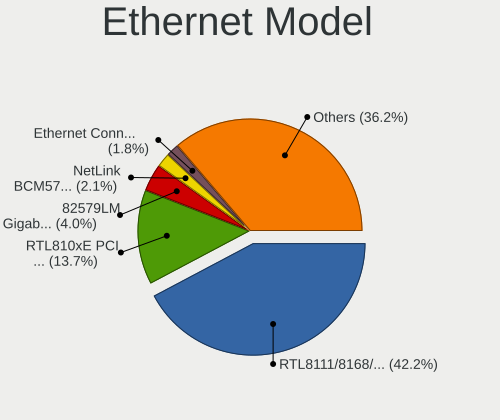

| Model                                                                  | Notebooks | Percent |
|------------------------------------------------------------------------|-----------|---------|
| Realtek RTL8111/8168/8211/8411 PCI Express Gigabit Ethernet Controller | 534       | 42.25%  |
| Realtek RTL810xE PCI Express Fast Ethernet controller                  | 173       | 13.69%  |
| Intel 82579LM Gigabit Network Connection (Lewisville)                  | 50        | 3.96%   |
| Broadcom NetLink BCM57785 Gigabit Ethernet PCIe                        | 26        | 2.06%   |
| Intel Ethernet Connection (4) I219-LM                                  | 23        | 1.82%   |
| Xiaomi Mi/Redmi series (RNDIS)                                         | 22        | 1.74%   |
| Intel Ethernet Connection (3) I218-LM                                  | 20        | 1.58%   |
| Qualcomm Atheros QCA8172 Fast Ethernet                                 | 19        | 1.5%    |
| Intel Ethernet Connection I219-LM                                      | 18        | 1.42%   |
| Intel Ethernet Connection I218-LM                                      | 17        | 1.34%   |
| Samsung Galaxy series, misc. (tethering mode)                          | 16        | 1.27%   |
| Qualcomm Atheros AR8151 v2.0 Gigabit Ethernet                          | 15        | 1.19%   |
| OPPO Ace 3V                                                            | 14        | 1.11%   |
| Realtek RTL8153 Gigabit Ethernet Adapter                               | 11        | 0.87%   |
| Qualcomm Atheros AR8162 Fast Ethernet                                  | 11        | 0.87%   |
| Intel Ethernet Connection (4) I219-V                                   | 11        | 0.87%   |
| Realtek RTL8152 Fast Ethernet Adapter                                  | 10        | 0.79%   |
| Xiaomi Mi/Redmi series (RNDIS + ADB)                                   | 9         | 0.71%   |
| Qualcomm Atheros AR8152 v2.0 Fast Ethernet                             | 9         | 0.71%   |
| Realtek Killer E2600 GbE Controller                                    | 8         | 0.63%   |
| Intel Alder Lake-P PCH CNVi WiFi                                       | 8         | 0.63%   |
| Intel 82577LM Gigabit Network Connection                               | 8         | 0.63%   |
| Samsung GT-I9070 (network tethering, USB debugging enabled)            | 7         | 0.55%   |
| Qualcomm Atheros QCA8171 Gigabit Ethernet                              | 7         | 0.55%   |
| Qualcomm Atheros AR8152 v1.1 Fast Ethernet                             | 7         | 0.55%   |
| MediaTek Infinix HOT 50i                                               | 7         | 0.55%   |
| Intel Ethernet Connection I219-V                                       | 7         | 0.55%   |
| Intel Ethernet Connection I217-LM                                      | 7         | 0.55%   |
| Intel Ethernet Connection (6) I219-LM                                  | 7         | 0.55%   |
| Intel 82567LM Gigabit Network Connection                               | 7         | 0.55%   |
| Qualcomm Atheros AR8132 Fast Ethernet                                  | 6         | 0.47%   |
| JMicron JMC250 PCI Express Gigabit Ethernet Controller                 | 6         | 0.47%   |
| ASIX AX88179 Gigabit Ethernet                                          | 6         | 0.47%   |
| Qualcomm Atheros AR8161 Gigabit Ethernet                               | 5         | 0.4%    |
| Qualcomm Atheros AR8121/AR8113/AR8114 Gigabit or Fast Ethernet         | 5         | 0.4%    |
| Intel 82579V Gigabit Network Connection                                | 5         | 0.4%    |
| vivo V2029                                                             | 4         | 0.32%   |
| Silicon Integrated Systems [SiS] 191 Gigabit Ethernet Adapter          | 4         | 0.32%   |
| Realtek RTL8125 2.5GbE Controller                                      | 4         | 0.32%   |
| Qualcomm Atheros Killer E2400 Gigabit Ethernet Controller              | 4         | 0.32%   |

Net Controller Kind
-------------------

Ethernet, WiFi or modem

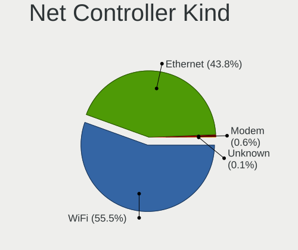

| Kind     | Notebooks | Percent |
|----------|-----------|---------|
| WiFi     | 1487      | 55.53%  |
| Ethernet | 1174      | 43.84%  |
| Modem    | 15        | 0.56%   |
| Unknown  | 2         | 0.07%   |

Used Controller
---------------

Currently used network controller

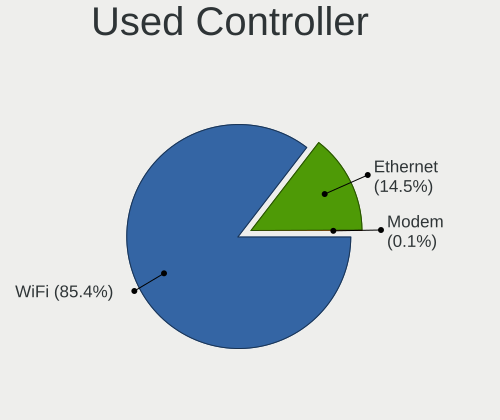

| Kind     | Notebooks | Percent |
|----------|-----------|---------|
| WiFi     | 1297      | 85.44%  |
| Ethernet | 220       | 14.49%  |
| Modem    | 1         | 0.07%   |

NICs
----

Total network controllers on board

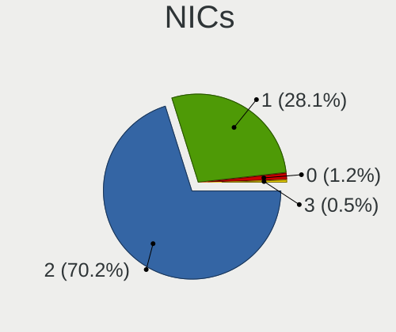

| Total | Notebooks | Percent |
|-------|-----------|---------|
| 2     | 1068      | 70.17%  |
| 1     | 427       | 28.06%  |
| 0     | 19        | 1.25%   |
| 3     | 8         | 0.53%   |

IPv6
----

IPv6 vs IPv4

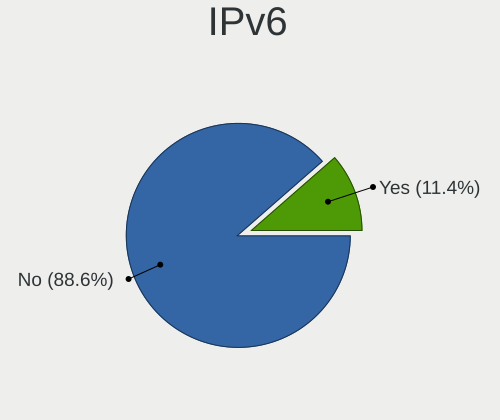

| Used | Notebooks | Percent |
|------|-----------|---------|
| No   | 1371      | 88.57%  |
| Yes  | 177       | 11.43%  |

Bluetooth
---------

Bluetooth Vendor
----------------

Controller vendors

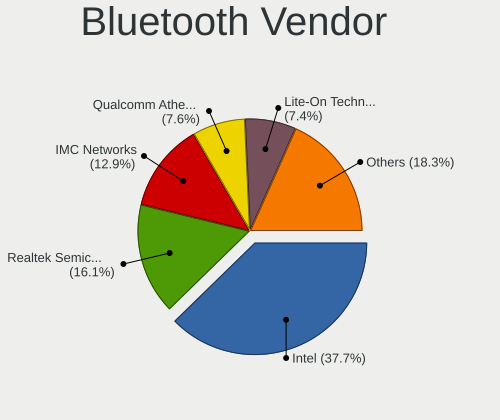

| Vendor                          | Notebooks | Percent |
|---------------------------------|-----------|---------|
| Intel                           | 469       | 37.7%   |
| Realtek Semiconductor           | 200       | 16.08%  |
| IMC Networks                    | 160       | 12.86%  |
| Qualcomm Atheros Communications | 95        | 7.64%   |
| Lite-On Technology              | 92        | 7.4%    |
| Broadcom                        | 64        | 5.14%   |
| Foxconn / Hon Hai               | 48        | 3.86%   |
| Toshiba                         | 19        | 1.53%   |
| Apple                           | 18        | 1.45%   |
| Cambridge Silicon Radio         | 13        | 1.05%   |
| Dell                            | 12        | 0.96%   |
| MediaTek                        | 11        | 0.88%   |
| Ralink                          | 8         | 0.64%   |
| Hewlett-Packard                 | 8         | 0.64%   |
| Foxconn International           | 8         | 0.64%   |
| Realtek                         | 5         | 0.4%    |
| USI                             | 3         | 0.24%   |
| ASUSTek Computer                | 3         | 0.24%   |
| Micro Star International        | 2         | 0.16%   |
| Alps Electric                   | 2         | 0.16%   |
| TP-Link                         | 1         | 0.08%   |
| Chicony Electronics             | 1         | 0.08%   |
| Askey Computer                  | 1         | 0.08%   |
| Actions                         | 1         | 0.08%   |

Bluetooth Model
---------------

Controller models

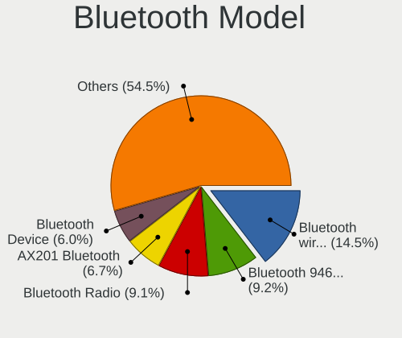

| Model                                               | Notebooks | Percent |
|-----------------------------------------------------|-----------|---------|
| Intel Bluetooth wireless interface                  | 181       | 14.54%  |
| Intel Bluetooth 9460/9560 Jefferson Peak (JfP)      | 114       | 9.16%   |
| Realtek Bluetooth Radio                             | 113       | 9.08%   |
| Intel AX201 Bluetooth                               | 84        | 6.75%   |
| IMC Networks Bluetooth Device                       | 75        | 6.02%   |
| Qualcomm Atheros  Bluetooth Device                  | 45        | 3.61%   |
| Realtek  Bluetooth 4.2 Adapter                      | 44        | 3.53%   |
| IMC Networks Wireless_Device                        | 35        | 2.81%   |
| Lite-On Bluetooth Device                            | 32        | 2.57%   |
| IMC Networks Bluetooth Radio                        | 31        | 2.49%   |
| Intel AX200 Bluetooth                               | 30        | 2.41%   |
| Qualcomm Atheros AR3012 Bluetooth 4.0               | 22        | 1.77%   |
| Qualcomm Atheros AR3011 Bluetooth                   | 22        | 1.77%   |
| Intel Bluetooth Device                              | 21        | 1.69%   |
| Lite-On Qualcomm Atheros QCA9377 Bluetooth          | 19        | 1.53%   |
| Lite-On Wireless_Device                             | 18        | 1.45%   |
| Realtek RTL8723B Bluetooth                          | 16        | 1.29%   |
| Intel Centrino Bluetooth Wireless Transceiver       | 16        | 1.29%   |
| Realtek RTL8821A Bluetooth                          | 13        | 1.04%   |
| IMC Networks Atheros AR3012 Bluetooth 4.0 Adapter   | 13        | 1.04%   |
| Cambridge Silicon Radio Bluetooth Dongle (HCI mode) | 13        | 1.04%   |
| MediaTek Wireless_Device                            | 11        | 0.88%   |
| Broadcom BCM20702 Bluetooth 4.0 [ThinkPad]          | 11        | 0.88%   |
| Intel AX210 Bluetooth                               | 10        | 0.8%    |
| Lite-On Atheros AR3012 Bluetooth                    | 9         | 0.72%   |
| Broadcom BCM43142A0 Bluetooth 4.0                   | 9         | 0.72%   |
| Broadcom BCM2070 Bluetooth 2.1 + EDR                | 9         | 0.72%   |
| Apple Bluetooth Host Controller                     | 9         | 0.72%   |
| Realtek RTL8822BE Bluetooth 4.2 Adapter             | 8         | 0.64%   |
| Ralink RT3290 Bluetooth                             | 8         | 0.64%   |
| Lite-On Atheros Bluetooth                           | 8         | 0.64%   |
| Foxconn International BCM43142A0 Bluetooth module   | 8         | 0.64%   |
| Intel Wireless-AC 3168 Bluetooth                    | 7         | 0.56%   |
| HP Broadcom 2070 Bluetooth Combo                    | 7         | 0.56%   |
| Foxconn / Hon Hai MediaTek Bluetooth Adapter        | 7         | 0.56%   |
| Foxconn / Hon Hai Wireless_Device                   | 6         | 0.48%   |
| Foxconn / Hon Hai Bluetooth USB Host Controller     | 6         | 0.48%   |
| Foxconn / Hon Hai Bluetooth Device                  | 6         | 0.48%   |
| Broadcom BCM43142A0 Bluetooth Device                | 6         | 0.48%   |
| Realtek Bluetooth Radio                             | 5         | 0.4%    |

Sound
-----

Sound Vendor
------------

Sound card vendors

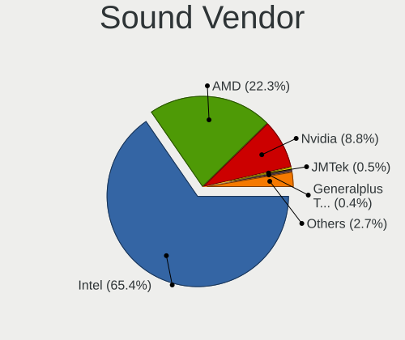

| Vendor                           | Notebooks | Percent |
|----------------------------------|-----------|---------|
| Intel                            | 1125      | 65.41%  |
| AMD                              | 383       | 22.27%  |
| Nvidia                           | 151       | 8.78%   |
| JMTek                            | 8         | 0.47%   |
| Generalplus Technology           | 7         | 0.41%   |
| Silicon Integrated Systems [SiS] | 5         | 0.29%   |
| C-Media Electronics              | 5         | 0.29%   |
| Comtrue                          | 4         | 0.23%   |
| Samsung Electronics              | 3         | 0.17%   |
| Samson Technologies              | 3         | 0.17%   |
| Logitech                         | 3         | 0.17%   |
| Jieli Technology                 | 3         | 0.17%   |
| Texas Instruments                | 2         | 0.12%   |
| Nordic Semiconductor ASA         | 2         | 0.12%   |
| Barco Display Systems            | 2         | 0.12%   |
| ASUSTek Computer                 | 2         | 0.12%   |
| Walmart                          | 1         | 0.06%   |
| TTGK Technology                  | 1         | 0.06%   |
| STMicroelectronics               | 1         | 0.06%   |
| Soundprese                       | 1         | 0.06%   |
| SAVITECH                         | 1         | 0.06%   |
| Realtek Semiconductor            | 1         | 0.06%   |
| KTMicro                          | 1         | 0.06%   |
| Huawei Technologies              | 1         | 0.06%   |
| FDUCE PRO AUDIO MADE             | 1         | 0.06%   |
| Dell                             | 1         | 0.06%   |
| Cooler Master                    | 1         | 0.06%   |
| Conexant Systems                 | 1         | 0.06%   |

Sound Model
-----------

Sound card models

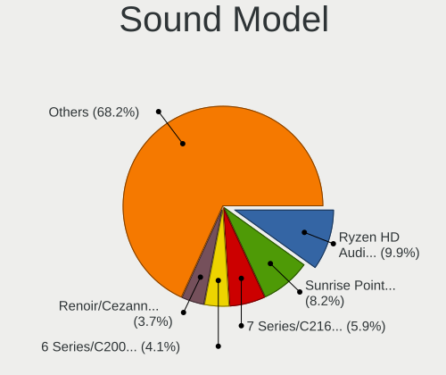

| Model                                                                                             | Notebooks | Percent |
|---------------------------------------------------------------------------------------------------|-----------|---------|
| AMD Ryzen HD Audio Controller                                                                     | 219       | 9.89%   |
| Intel Sunrise Point-LP HD Audio                                                                   | 182       | 8.22%   |
| Intel 7 Series/C216 Chipset Family High Definition Audio Controller                               | 130       | 5.87%   |
| Intel 6 Series/C200 Series Chipset Family High Definition Audio Controller                        | 90        | 4.06%   |
| AMD Renoir/Cezanne HDMI/DP Audio Controller                                                       | 83        | 3.75%   |
| AMD FCH Azalia Controller                                                                         | 72        | 3.25%   |
| Intel Haswell-ULT HD Audio Controller                                                             | 67        | 3.02%   |
| Intel 8 Series HD Audio Controller                                                                | 67        | 3.02%   |
| AMD Raven/Raven2/Fenghuang HDMI/DP Audio Controller                                               | 67        | 3.02%   |
| Intel Tiger Lake-LP Smart Sound Technology Audio Controller                                       | 63        | 2.84%   |
| Intel Broadwell-U Audio Controller                                                                | 63        | 2.84%   |
| Intel Wildcat Point-LP High Definition Audio Controller                                           | 62        | 2.8%    |
| AMD Family 15h (Models 60h-6fh) Audio Controller                                                  | 62        | 2.8%    |
| AMD Kabini HDMI/DP Audio                                                                          | 60        | 2.71%   |
| Intel 5 Series/3400 Series Chipset High Definition Audio                                          | 58        | 2.62%   |
| AMD Radeon High Definition Audio Controller                                                       | 57        | 2.57%   |
| AMD High Definition Audio Controller                                                              | 49        | 2.21%   |
| Intel Cannon Point-LP High Definition Audio Controller                                            | 45        | 2.03%   |
| Intel Alder Lake PCH-P High Definition Audio Controller                                           | 42        | 1.9%    |
| Intel Celeron/Pentium Silver Processor High Definition Audio                                      | 39        | 1.76%   |
| Intel Ice Lake-LP Smart Sound Technology Audio Controller                                         | 36        | 1.63%   |
| Intel 82801I (ICH9 Family) HD Audio Controller                                                    | 36        | 1.63%   |
| Intel Cannon Lake PCH cAVS                                                                        | 35        | 1.58%   |
| Intel Comet Lake PCH-LP cAVS                                                                      | 32        | 1.44%   |
| Intel Atom Processor Z36xxx/Z37xxx Series High Definition Audio Controller                        | 30        | 1.35%   |
| Nvidia GA107 High Definition Audio Controller                                                     | 24        | 1.08%   |
| Intel 8 Series/C220 Series Chipset High Definition Audio Controller                               | 21        | 0.95%   |
| Nvidia GP107GL High Definition Audio Controller                                                   | 20        | 0.9%    |
| Intel Xeon E3-1200 v3/4th Gen Core Processor HD Audio Controller                                  | 19        | 0.86%   |
| Intel CM238 HD Audio Controller                                                                   | 19        | 0.86%   |
| Nvidia TU107 GeForce GTX 1650 High Definition Audio Controller                                    | 18        | 0.81%   |
| Intel Atom/Celeron/Pentium Processor x5-E8000/J3xxx/N3xxx Series High Definition Audio Controller | 18        | 0.81%   |
| AMD Wrestler HDMI Audio                                                                           | 18        | 0.81%   |
| Intel 82801H (ICH8 Family) HD Audio Controller                                                    | 16        | 0.72%   |
| Nvidia GF108 High Definition Audio Controller                                                     | 15        | 0.68%   |
| Intel NM10/ICH7 Family High Definition Audio Controller                                           | 15        | 0.68%   |
| Intel Celeron N3350/Pentium N4200/Atom E3900 Series Audio Cluster                                 | 15        | 0.68%   |
| Intel Raptor Lake-P/U/H cAVS                                                                      | 14        | 0.63%   |
| AMD SBx00 Azalia (Intel HDA)                                                                      | 13        | 0.59%   |
| Intel Comet Lake PCH cAVS                                                                         | 12        | 0.54%   |

Memory
------

Memory Vendor
-------------

Memory module vendors

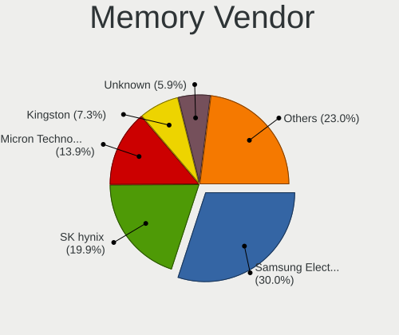

| Vendor                                  | Notebooks | Percent |
|-----------------------------------------|-----------|---------|
| Samsung Electronics                     | 368       | 30.02%  |
| SK hynix                                | 244       | 19.9%   |
| Micron Technology                       | 170       | 13.87%  |
| Kingston                                | 90        | 7.34%   |
| Unknown                                 | 72        | 5.87%   |
| Team                                    | 44        | 3.59%   |
| V-GeN                                   | 36        | 2.94%   |
| Corsair                                 | 32        | 2.61%   |
| Ramaxel Technology                      | 30        | 2.45%   |
| Elpida                                  | 17        | 1.39%   |
| Unknown (ABCD)                          | 16        | 1.31%   |
| A-DATA Technology                       | 16        | 1.31%   |
| Nanya Technology                        | 14        | 1.14%   |
| Unknown                                 | 13        | 1.06%   |
| Crucial                                 | 9         | 0.73%   |
| Apacer                                  | 6         | 0.49%   |
| Hikvision                               | 5         | 0.41%   |
| Transcend                               | 4         | 0.33%   |
| ASint Technology                        | 4         | 0.33%   |
| Visipro                                 | 3         | 0.24%   |
| Unknown (0x0080)                        | 3         | 0.24%   |
| Shenzhen SCY                            | 3         | 0.24%   |
| SHARETRONIC                             | 3         | 0.24%   |
| PNY                                     | 3         | 0.24%   |
| Lexar                                   | 2         | 0.16%   |
| G.Skill                                 | 2         | 0.16%   |
| A Force                                 | 2         | 0.16%   |
| Unknown (940A)                          | 1         | 0.08%   |
| Unknown (8A02)                          | 1         | 0.08%   |
| Teikon                                  | 1         | 0.08%   |
| Strontium                               | 1         | 0.08%   |
| Silicon Power Computer & Communications | 1         | 0.08%   |
| Silicon Power                           | 1         | 0.08%   |
| Qumo                                    | 1         | 0.08%   |
| Patriot                                 | 1         | 0.08%   |
| Kingmax                                 | 1         | 0.08%   |
| GOODRAM                                 | 1         | 0.08%   |
| Goldkey                                 | 1         | 0.08%   |
| Foxline                                 | 1         | 0.08%   |
| ff                                      | 1         | 0.08%   |

Memory Model
------------

Memory module models

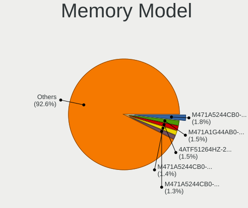

| Model                                                            | Notebooks | Percent |
|------------------------------------------------------------------|-----------|---------|
| Samsung RAM M471A5244CB0-CTD 4GB SODIMM DDR4 3266MT/s            | 23        | 1.76%   |
| Samsung RAM M471A1G44AB0-CWE 8GiB SODIMM DDR4 3200MT/s           | 20        | 1.53%   |
| Micron RAM 4ATF51264HZ-2G6E1 4GB SODIMM DDR4 2667MT/s            | 19        | 1.45%   |
| Samsung RAM M471A5244CB0-CWE 4GB SODIMM DDR4 3200MT/s            | 18        | 1.38%   |
| Samsung RAM M471A5244CB0-CRC 4GB SODIMM DDR4 2667MT/s            | 17        | 1.3%    |
| Unknown (ABCD) RAM 123456789012345678 2GB SODIMM LPDDR4 2400MT/s | 16        | 1.22%   |
| Micron RAM 4ATF51264HZ-3G2J1 4GB SODIMM DDR4 3200MT/s            | 15        | 1.15%   |
| Team RAM TEAMGROUP-SD4-3200 16GB SODIMM DDR4 3200MT/s            | 14        | 1.07%   |
| Samsung RAM M471B5773DH0-CH9 2GB SODIMM DDR3 1600MT/s            | 14        | 1.07%   |
| Samsung RAM M471B5173EB0-YK0 4GB SODIMM DDR3 1600MT/s            | 14        | 1.07%   |
| Samsung RAM M471B5173DB0-YK0 4GB SODIMM DDR3 1600MT/s            | 14        | 1.07%   |
| SK hynix RAM HMA81GS6AFR8N-UH 8GB SODIMM DDR4 2667MT/s           | 13        | 0.99%   |
| Unknown                                                          | 13        | 0.99%   |
| Samsung RAM M471A5143EB0-CPB 4GB SODIMM DDR4 2133MT/s            | 12        | 0.92%   |
| SK hynix RAM HMT451S6BFR8A-PB 4GB SODIMM DDR3 1600MT/s           | 11        | 0.84%   |
| Samsung RAM M471B5173QH0-YK0 4GB SODIMM DDR3 1600MT/s            | 11        | 0.84%   |
| Team RAM TEAMGROUP-SD4-2666 8GB SODIMM DDR4 2667MT/s             | 10        | 0.76%   |
| Team RAM TEAMGROUP-SD4-2400 16GB SODIMM DDR4 8400MT/s            | 10        | 0.76%   |
| Samsung RAM M471B5273DH0-CH9 4GB SODIMM DDR3 1600MT/s            | 10        | 0.76%   |
| Samsung RAM M471A1K43CB1-CRC 8GB SODIMM DDR4 8400MT/s            | 10        | 0.76%   |
| SK hynix RAM HMAA1GS6CJR6N-XN 8GB SODIMM DDR4 3200MT/s           | 9         | 0.69%   |
| SK hynix RAM HMA851S6CJR6N-VK 4GB SODIMM DDR4 2667MT/s           | 9         | 0.69%   |
| Samsung RAM M471B1G73DB0-YK0 8GB SODIMM DDR3 1600MT/s            | 9         | 0.69%   |
| SK hynix RAM HMA851S6DJR6N-XN 4GB SODIMM DDR4 3200MT/s           | 8         | 0.61%   |
| SK hynix RAM H9JCNNNCP3MLYR-N6E 4GB SODIMM LPDDR5 6400MT/s       | 8         | 0.61%   |
| Samsung RAM M471A1K43EB1-CWE 8GB SODIMM DDR4 3200MT/s            | 8         | 0.61%   |
| Samsung RAM M471A1K43CB1-CTD 8GB SODIMM DDR4 3200MT/s            | 8         | 0.61%   |
| Samsung RAM M471A1G43DB0-CPB 8GB SODIMM DDR4 3200MT/s            | 8         | 0.61%   |
| Micron RAM 8ATF1G64HZ-3G2R1 8GB SODIMM DDR4 3200MT/s             | 8         | 0.61%   |
| SK hynix RAM HMT325S6EFR8A-PB 2GB SODIMM DDR3 1600MT/s           | 7         | 0.54%   |
| SK hynix RAM HMA81GS6DJR8N-XN 8GB SODIMM DDR4 3200MT/s           | 7         | 0.54%   |
| Samsung RAM M471B5273DH0-CK0 4GB SODIMM DDR3 2400MT/s            | 7         | 0.54%   |
| Samsung RAM M471A5143EB1-CRC 4GB SODIMM DDR4 2400MT/s            | 7         | 0.54%   |
| Samsung RAM M471A1K43DB1-CWE 8GB SODIMM DDR4 3200MT/s            | 7         | 0.54%   |
| Samsung RAM M471A1G44BB0-CWE 8GB SODIMM DDR4 3200MT/s            | 7         | 0.54%   |
| Micron RAM 4ATF51264HZ-3G2J1 4GB Row Of Chips DDR4 3200MT/s      | 7         | 0.54%   |
| Unknown RAM Module 8GB SODIMM DDR3 1600MT/s                      | 6         | 0.46%   |
| Unknown RAM Module 4GB SODIMM DDR3 1600MT/s                      | 6         | 0.46%   |
| Team RAM TEAMGROUP-SD3-1600 8GB SODIMM DDR3 1600MT/s             | 6         | 0.46%   |
| SK hynix RAM HMT351S6CFR8C-PB 4GB SODIMM DDR3 1600MT/s           | 6         | 0.46%   |

Memory Kind
-----------

Memory module kinds

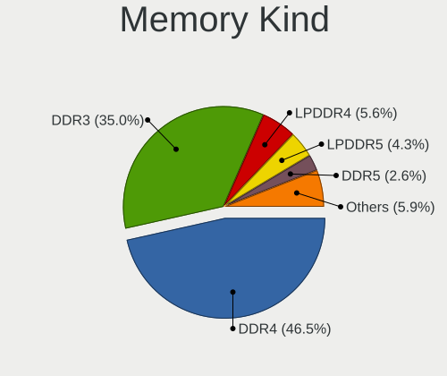

| Kind    | Notebooks | Percent |
|---------|-----------|---------|
| DDR4    | 446       | 46.51%  |
| DDR3    | 336       | 35.04%  |
| LPDDR4  | 54        | 5.63%   |
| LPDDR5  | 41        | 4.28%   |
| DDR5    | 25        | 2.61%   |
| DDR2    | 25        | 2.61%   |
| LPDDR3  | 14        | 1.46%   |
| SDRAM   | 13        | 1.36%   |
| Unknown | 3         | 0.31%   |
| DRAM    | 2         | 0.21%   |

Memory Form Factor
------------------

Physical design of the memory module

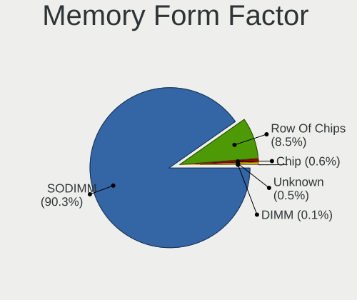

| Name         | Notebooks | Percent |
|--------------|-----------|---------|
| SODIMM       | 864       | 90.28%  |
| Row Of Chips | 81        | 8.46%   |
| Chip         | 6         | 0.63%   |
| Unknown      | 5         | 0.52%   |
| DIMM         | 1         | 0.1%    |

Memory Size
-----------

Memory module size

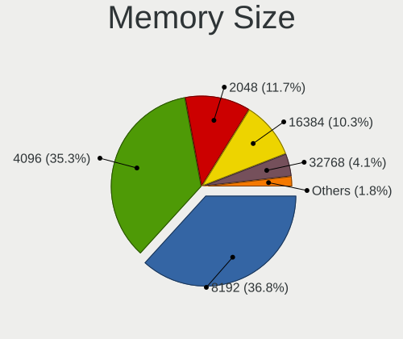

| Size  | Notebooks | Percent |
|-------|-----------|---------|
| 8192  | 407       | 36.77%  |
| 4096  | 391       | 35.32%  |
| 2048  | 130       | 11.74%  |
| 16384 | 114       | 10.3%   |
| 32768 | 45        | 4.07%   |
| 1024  | 15        | 1.36%   |
| 12288 | 3         | 0.27%   |
| 6144  | 1         | 0.09%   |
| 512   | 1         | 0.09%   |

Memory Speed
------------

Memory module speed

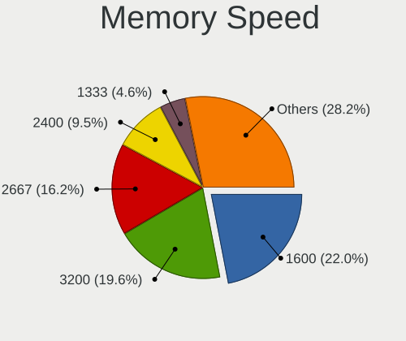

| Speed   | Notebooks | Percent |
|---------|-----------|---------|
| 1600    | 241       | 21.97%  |
| 3200    | 215       | 19.6%   |
| 2667    | 178       | 16.23%  |
| 2400    | 104       | 9.48%   |
| 1333    | 50        | 4.56%   |
| 2133    | 48        | 4.38%   |
| 1334    | 32        | 2.92%   |
| 6400    | 31        | 2.83%   |
| 3266    | 23        | 2.1%    |
| 1067    | 21        | 1.91%   |
| 8400    | 20        | 1.82%   |
| 4266    | 15        | 1.37%   |
| 5600    | 13        | 1.19%   |
| Unknown | 13        | 1.19%   |
| 4800    | 12        | 1.09%   |
| 4267    | 12        | 1.09%   |
| 800     | 12        | 1.09%   |
| 667     | 11        | 1%      |
| 1867    | 10        | 0.91%   |
| 4199    | 9         | 0.82%   |
| 7500    | 5         | 0.46%   |
| 5500    | 3         | 0.27%   |
| 2048    | 3         | 0.27%   |
| 1866    | 3         | 0.27%   |
| 533     | 3         | 0.27%   |
| 3333    | 2         | 0.18%   |
| 1066    | 2         | 0.18%   |
| 975     | 2         | 0.18%   |
| 8533    | 1         | 0.09%   |
| 8000    | 1         | 0.09%   |
| 1776    | 1         | 0.09%   |
| 333     | 1         | 0.09%   |

Printers & scanners
-------------------

Printer Vendor
--------------

Printer device vendors

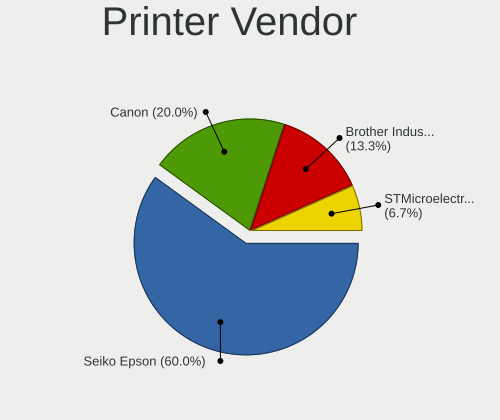

| Vendor             | Notebooks | Percent |
|--------------------|-----------|---------|
| Seiko Epson        | 9         | 60%     |
| Canon              | 3         | 20%     |
| Brother Industries | 2         | 13.33%  |
| STMicroelectronics | 1         | 6.67%   |

Printer Model
-------------

Printer device models

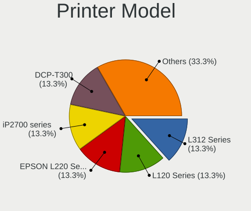

| Model                                   | Notebooks | Percent |
|-----------------------------------------|-----------|---------|
| Seiko Epson L312 Series                 | 2         | 13.33%  |
| Seiko Epson L120 Series                 | 2         | 13.33%  |
| Seiko Epson EPSON L220 Series           | 2         | 13.33%  |
| Canon iP2700 series                     | 2         | 13.33%  |
| Brother DCP-T300                        | 2         | 13.33%  |
| STMicroelectronics USB Printing Support | 1         | 6.67%   |
| Seiko Epson L405 Series                 | 1         | 6.67%   |
| Seiko Epson L355 Series                 | 1         | 6.67%   |
| Seiko Epson L3210 Series                | 1         | 6.67%   |
| Canon LiDE 300                          | 1         | 6.67%   |

Scanner Vendor
--------------

Scanner device vendors

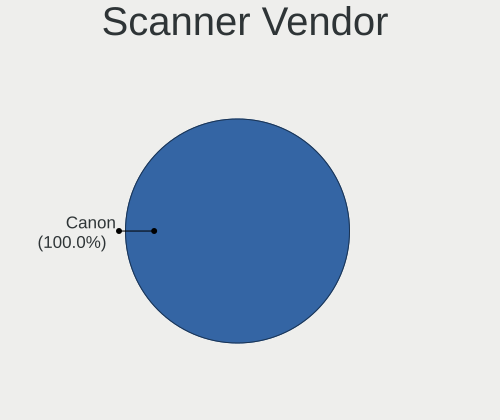

| Vendor | Notebooks | Percent |
|--------|-----------|---------|
| Canon  | 1         | 100%    |

Scanner Model
-------------

Scanner device models

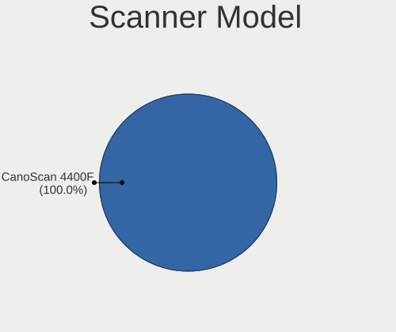

| Model                | Notebooks | Percent |
|----------------------|-----------|---------|
| Canon CanoScan 4400F | 1         | 100%    |

Camera
------

Camera Vendor
-------------

Camera device vendors

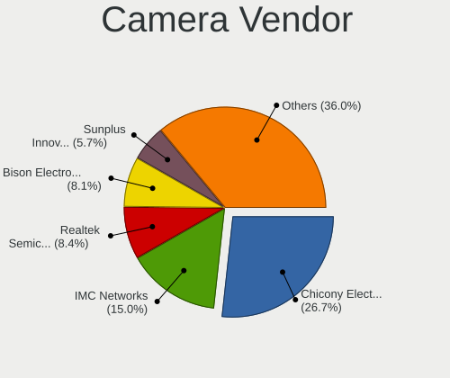

| Vendor                                 | Notebooks | Percent |
|----------------------------------------|-----------|---------|
| Chicony Electronics                    | 368       | 26.72%  |
| IMC Networks                           | 207       | 15.03%  |
| Realtek Semiconductor                  | 116       | 8.42%   |
| Bison Electronics                      | 111       | 8.06%   |
| Sunplus Innovation Technology          | 79        | 5.74%   |
| Quanta                                 | 66        | 4.79%   |
| Microdia                               | 61        | 4.43%   |
| Syntek                                 | 54        | 3.92%   |
| Cheng Uei Precision Industry (Foxlink) | 50        | 3.63%   |
| Suyin                                  | 32        | 2.32%   |
| Luxvisions Innotech Limited            | 31        | 2.25%   |
| Alcor Micro                            | 29        | 2.11%   |
| Sonix Technology                       | 28        | 2.03%   |
| Lite-On Technology                     | 25        | 1.82%   |
| Acer                                   | 16        | 1.16%   |
| Apple                                  | 12        | 0.87%   |
| ShineTech                              | 10        | 0.73%   |
| Silicon Motion                         | 9         | 0.65%   |
| Ricoh                                  | 8         | 0.58%   |
| Lenovo                                 | 8         | 0.58%   |
| Importek                               | 7         | 0.51%   |
| Primax Electronics                     | 5         | 0.36%   |
| SunplusIT                              | 4         | 0.29%   |
| Sunplus Technology                     | 3         | 0.22%   |
| Shine-optics                           | 3         | 0.22%   |
| Jieli Technology                       | 3         | 0.22%   |
| Unknown                                | 3         | 0.22%   |
| webcam                                 | 2         | 0.15%   |
| Samsung Electronics                    | 2         | 0.15%   |
| ALi                                    | 2         | 0.15%   |
| vivo                                   | 1         | 0.07%   |
| USB CAMERA                             | 1         | 0.07%   |
| Unknown (2000595910700018410)          | 1         | 0.07%   |
| Tripath Technology                     | 1         | 0.07%   |
| Sunplus IT                             | 1         | 0.07%   |
| SenseTek                               | 1         | 0.07%   |
| Pixart Imaging                         | 1         | 0.07%   |
| OPPO Electronics                       | 1         | 0.07%   |
| Omnivision                             | 1         | 0.07%   |
| Motorola PCS                           | 1         | 0.07%   |

Camera Model
------------

Camera device models

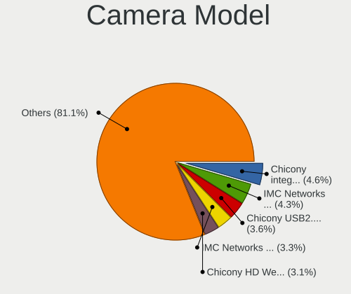

| Model                                                          | Notebooks | Percent |
|----------------------------------------------------------------|-----------|---------|
| Chicony integrated camera                                      | 63        | 4.56%   |
| IMC Networks USB2.0 HD UVC WebCam                              | 60        | 4.34%   |
| Chicony USB2.0 VGA UVC WebCam                                  | 50        | 3.62%   |
| IMC Networks USB2.0 VGA UVC WebCam                             | 45        | 3.26%   |
| Chicony HD WebCam                                              | 43        | 3.11%   |
| IMC Networks Integrated Camera                                 | 39        | 2.82%   |
| Syntek Integrated Camera                                       | 33        | 2.39%   |
| Bison Integrated Camera                                        | 31        | 2.24%   |
| Chicony HP TrueVision HD Camera                                | 26        | 1.88%   |
| Realtek USB2.0 VGA UVC WebCam                                  | 21        | 1.52%   |
| Sonix USB2.0 HD UVC WebCam                                     | 20        | 1.45%   |
| Microdia Integrated_Webcam_HD                                  | 20        | 1.45%   |
| Realtek Integrated_Webcam_HD                                   | 19        | 1.38%   |
| Chicony USB2.0 HD UVC WebCam                                   | 19        | 1.38%   |
| IMC Networks Lenovo EasyCamera                                 | 16        | 1.16%   |
| Bison Lenovo EasyCamera                                        | 16        | 1.16%   |
| IMC Networks EasyCamera                                        | 15        | 1.09%   |
| Cheng Uei Precision Industry (Foxlink) HP TrueVision HD Camera | 14        | 1.01%   |
| Quanta HD User Facing                                          | 13        | 0.94%   |
| Chicony HP TrueVision HD                                       | 13        | 0.94%   |
| Chicony HD User Facing                                         | 13        | 0.94%   |
| Lite-On Integrated Camera                                      | 12        | 0.87%   |
| Sunplus Asus Webcam                                            | 11        | 0.8%    |
| Realtek USB2.0 HD UVC WebCam                                   | 11        | 0.8%    |
| Realtek USB2.0 camera                                          | 11        | 0.8%    |
| Realtek USB Camera                                             | 11        | 0.8%    |
| Chicony Lenovo EasyCamera                                      | 11        | 0.8%    |
| Bison HD Webcam                                                | 11        | 0.8%    |
| Bison EasyCamera                                               | 11        | 0.8%    |
| Syntek Lenovo EasyCamera                                       | 10        | 0.72%   |
| Syntek EasyCamera                                              | 10        | 0.72%   |
| Sunplus Integrated_Webcam_HD                                   | 10        | 0.72%   |
| Microdia Webcam Vitade AF                                      | 10        | 0.72%   |
| IMC Networks USB2.0 UVC HD Webcam                              | 10        | 0.72%   |
| Chicony TOSHIBA Web Camera - HD                                | 10        | 0.72%   |
| Chicony Integrated Camera (1280x720@30)                        | 10        | 0.72%   |
| Chicony EasyCamera                                             | 10        | 0.72%   |
| Quanta HD WebCam                                               | 9         | 0.65%   |
| Microdia Integrated Webcam                                     | 9         | 0.65%   |
| Suyin 1.3M HD WebCam                                           | 8         | 0.58%   |

Security
--------

Fingerprint Vendor
------------------

Fingerprint sensor vendors

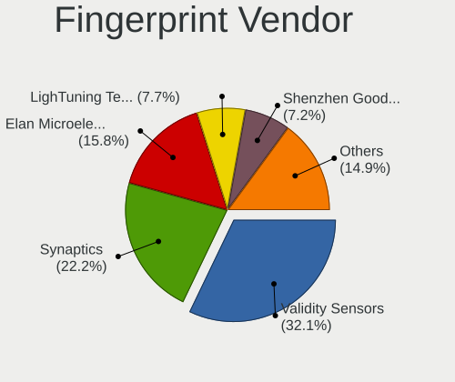

| Vendor                     | Notebooks | Percent |
|----------------------------|-----------|---------|
| Validity Sensors           | 71        | 32.13%  |
| Synaptics                  | 49        | 22.17%  |
| Elan Microelectronics      | 35        | 15.84%  |
| LighTuning Technology      | 17        | 7.69%   |
| Shenzhen Goodix Technology | 16        | 7.24%   |
| AuthenTec                  | 13        | 5.88%   |
| Upek                       | 7         | 3.17%   |
| Focal-systems.Corp         | 7         | 3.17%   |
| STMicroelectronics         | 3         | 1.36%   |
| HOLTEK                     | 2         | 0.9%    |
| DigitalPersona             | 1         | 0.45%   |

Fingerprint Model
-----------------

Fingerprint sensor models

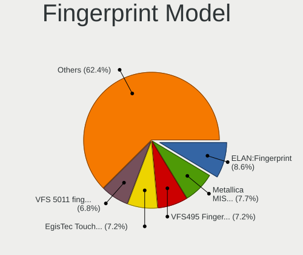

| Model                                                                      | Notebooks | Percent |
|----------------------------------------------------------------------------|-----------|---------|
| Elan ELAN:Fingerprint                                                      | 19        | 8.6%    |
| Synaptics Metallica MIS Touch Fingerprint Reader                           | 17        | 7.69%   |
| Validity Sensors VFS495 Fingerprint Reader                                 | 16        | 7.24%   |
| LighTuning EgisTec Touch Fingerprint Sensor                                | 16        | 7.24%   |
| Validity Sensors VFS 5011 fingerprint sensor                               | 15        | 6.79%   |
| Synaptics Prometheus MIS Touch Fingerprint Reader                          | 15        | 6.79%   |
| Elan ELAN:ARM-M4                                                           | 15        | 6.79%   |
| Shenzhen Goodix  FingerPrint Device                                        | 11        | 4.98%   |
| Validity Sensors VFS5011 Fingerprint Reader                                | 8         | 3.62%   |
| Validity Sensors Swipe Fingerprint Sensor                                  | 7         | 3.17%   |
| Upek Biometric Touchchip/Touchstrip Fingerprint Sensor                     | 7         | 3.17%   |
| Focal-systems.Corp FT9201Fingerprint.                                      | 7         | 3.17%   |
| Validity Sensors VFS Fingerprint sensor                                    | 6         | 2.71%   |
| AuthenTec AES1600                                                          | 6         | 2.71%   |
| Shenzhen Goodix Fingerprint Reader                                         | 5         | 2.26%   |
| Validity Sensors VFS7500 Touch Fingerprint Sensor                          | 4         | 1.81%   |
| Validity Sensors VFS491                                                    | 4         | 1.81%   |
| Validity Sensors Synaptics WBDI                                            | 4         | 1.81%   |
| AuthenTec Fingerprint Sensor                                               | 4         | 1.81%   |
| Validity Sensors VFS471 Fingerprint Reader                                 | 3         | 1.36%   |
| Validity Sensors Synaptics VFS7552 Touch Fingerprint Sensor with PurePrint | 3         | 1.36%   |
| Synaptics  WBDI                                                            | 3         | 1.36%   |
| STMicroelectronics Fingerprint Reader                                      | 3         | 1.36%   |
| Synaptics WBDI Fingerprint Reader USB 086                                  | 2         | 0.9%    |
| Synaptics WBDI                                                             | 2         | 0.9%    |
| Synaptics UWP WBDI Device                                                  | 2         | 0.9%    |
| Synaptics UWP WBDI                                                         | 2         | 0.9%    |
| Synaptics  FS7604 Touch Fingerprint Sensor with PurePrint                  | 2         | 0.9%    |
| Synaptics Prometheus Fingerprint Reader                                    | 2         | 0.9%    |
| Synaptics Fingerprint reader [HP G6]                                       | 2         | 0.9%    |
| HOLTEK FocalTech Fingerprint Device                                        | 2         | 0.9%    |
| AuthenTec AES1660 Fingerprint Sensor                                       | 2         | 0.9%    |
| Validity Sensors VFS451 Fingerprint Reader                                 | 1         | 0.45%   |
| LighTuning ES603 Swipe Fingerprint Sensor                                  | 1         | 0.45%   |
| Elan fingerprint sensor [FeinTech FPS00200]                                | 1         | 0.45%   |
| DigitalPersona Fingerprint Reader                                          | 1         | 0.45%   |
| AuthenTec AES2810                                                          | 1         | 0.45%   |

Chipcard Vendor
---------------

Chipcard module vendors

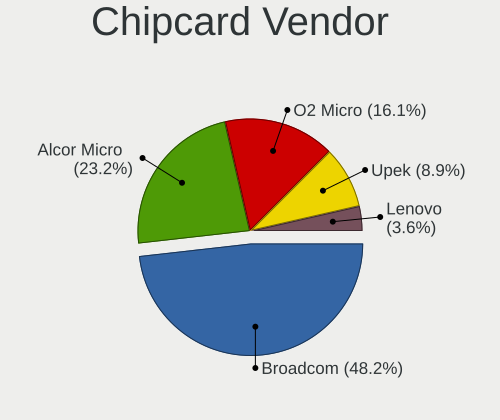

| Vendor      | Notebooks | Percent |
|-------------|-----------|---------|
| Broadcom    | 27        | 48.21%  |
| Alcor Micro | 13        | 23.21%  |
| O2 Micro    | 9         | 16.07%  |
| Upek        | 5         | 8.93%   |
| Lenovo      | 2         | 3.57%   |

Chipcard Model
--------------

Chipcard module models

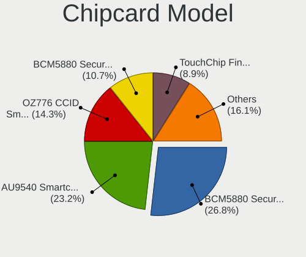

| Model                                                                        | Notebooks | Percent |
|------------------------------------------------------------------------------|-----------|---------|
| Broadcom BCM5880 Secure Applications Processor                               | 15        | 26.79%  |
| Alcor Micro AU9540 Smartcard Reader                                          | 13        | 23.21%  |
| O2 Micro OZ776 CCID Smartcard Reader                                         | 8         | 14.29%  |
| Broadcom BCM5880 Secure Applications Processor with fingerprint swipe sensor | 6         | 10.71%  |
| Upek TouchChip Fingerprint Coprocessor (WBF advanced mode)                   | 5         | 8.93%   |
| Broadcom BCM58200 ControlVault 3 (FingerPrint sensor + Contacted SmartCard)  | 3         | 5.36%   |
| Lenovo Integrated Smart Card Reader                                          | 2         | 3.57%   |
| Broadcom 5880                                                                | 2         | 3.57%   |
| O2 Micro Oz776 SmartCard Reader                                              | 1         | 1.79%   |
| Broadcom 58200                                                               | 1         | 1.79%   |

Unsupported
-----------

Unsupported Devices
-------------------

Total unsupported devices on board

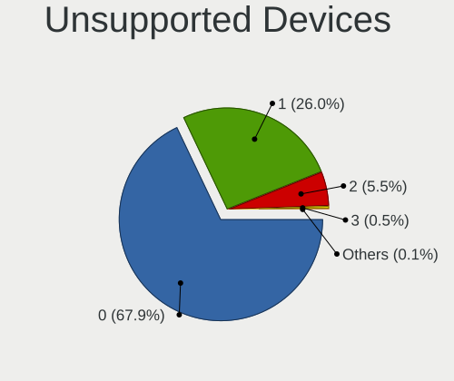

| Total | Notebooks | Percent |
|-------|-----------|---------|
| 0     | 1055      | 67.93%  |
| 1     | 404       | 26.01%  |
| 2     | 85        | 5.47%   |
| 3     | 7         | 0.45%   |
| 6     | 1         | 0.06%   |
| 5     | 1         | 0.06%   |

Unsupported Device Types
------------------------

Types of unsupported devices

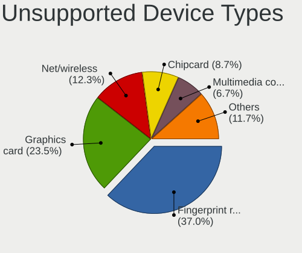

| Type                     | Notebooks | Percent |
|--------------------------|-----------|---------|
| Fingerprint reader       | 216       | 37.05%  |
| Graphics card            | 137       | 23.5%   |
| Net/wireless             | 72        | 12.35%  |
| Chipcard                 | 51        | 8.75%   |
| Multimedia controller    | 39        | 6.69%   |
| Bluetooth                | 24        | 4.12%   |
| Camera                   | 13        | 2.23%   |
| Communication controller | 8         | 1.37%   |
| Net/ethernet             | 7         | 1.2%    |
| Storage                  | 5         | 0.86%   |
| Flash memory             | 3         | 0.51%   |
| Card reader              | 3         | 0.51%   |
| Sound                    | 2         | 0.34%   |
| Video                    | 1         | 0.17%   |
| Network                  | 1         | 0.17%   |
| Modem                    | 1         | 0.17%   |

