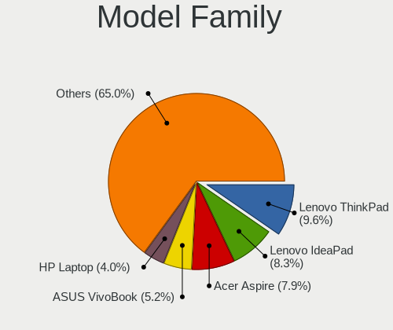
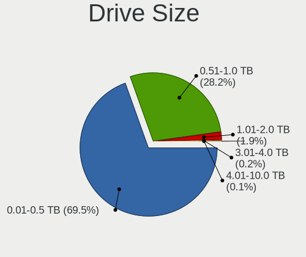
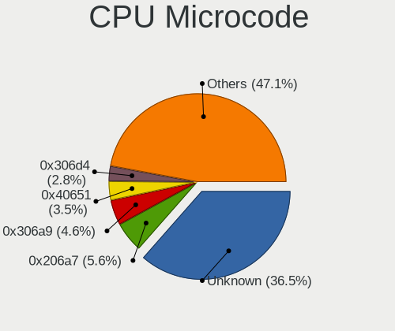
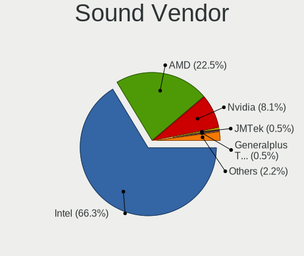
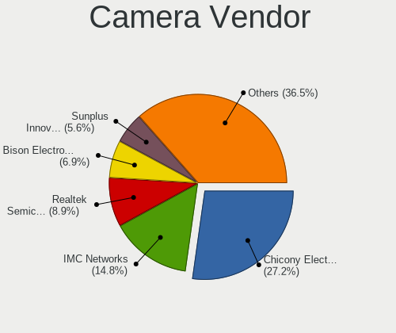

Linux in Indonesia - Tested Hardware & Statistics (Notebooks)
-------------------------------------------------------------

A project to collect tested hardware configurations for Linux in Indonesia.

Anyone can contribute to this report by the [hw-probe](https://github.com/linuxhw/hw-probe) tool:

    sudo -E hw-probe -all -upload

Please contribute! Especially if your hardware is rare.

Contents
--------

* [ Test Cases ](#test-cases)

* [ System ](#system)
  - [ OS                       ](#os)
  - [ OS Family                ](#os-family)
  - [ Kernel                   ](#kernel)
  - [ Kernel Family            ](#kernel-family)
  - [ Kernel Major Ver.        ](#kernel-major-ver)
  - [ Arch                     ](#arch)
  - [ DE                       ](#de)
  - [ Display Server           ](#display-server)
  - [ Display Manager          ](#display-manager)
  - [ OS Lang                  ](#os-lang)
  - [ Boot Mode                ](#boot-mode)
  - [ Filesystem               ](#filesystem)
  - [ Part. scheme             ](#part-scheme)
  - [ Dual Boot with Linux/BSD ](#dual-boot-with-linuxbsd)
  - [ Dual Boot (Win)          ](#dual-boot-win)

* [ Board ](#board)
  - [ Vendor                   ](#vendor)
  - [ Model                    ](#model)
  - [ Model Family             ](#model-family)
  - [ MFG Year                 ](#mfg-year)
  - [ Form Factor              ](#form-factor)
  - [ Secure Boot              ](#secure-boot)
  - [ Coreboot                 ](#coreboot)
  - [ RAM Size                 ](#ram-size)
  - [ RAM Used                 ](#ram-used)
  - [ Total Drives             ](#total-drives)
  - [ Has CD-ROM               ](#has-cd-rom)
  - [ Has Ethernet             ](#has-ethernet)
  - [ Has WiFi                 ](#has-wifi)
  - [ Has Bluetooth            ](#has-bluetooth)

* [ Location ](#location)
  - [ Country                  ](#country)
  - [ City                     ](#city)

* [ Drives ](#drives)
  - [ Drive Vendor             ](#drive-vendor)
  - [ Drive Model              ](#drive-model)
  - [ HDD Vendor               ](#hdd-vendor)
  - [ SSD Vendor               ](#ssd-vendor)
  - [ Drive Kind               ](#drive-kind)
  - [ Drive Connector          ](#drive-connector)
  - [ Drive Size               ](#drive-size)
  - [ Space Total              ](#space-total)
  - [ Space Used               ](#space-used)
  - [ Malfunc. Drives          ](#malfunc-drives)
  - [ Malfunc. Drive Vendor    ](#malfunc-drive-vendor)
  - [ Malfunc. HDD Vendor      ](#malfunc-hdd-vendor)
  - [ Malfunc. Drive Kind      ](#malfunc-drive-kind)
  - [ Failed Drives            ](#failed-drives)
  - [ Failed Drive Vendor      ](#failed-drive-vendor)
  - [ Drive Status             ](#drive-status)

* [ Storage controller ](#storage-controller)
  - [ Storage Vendor           ](#storage-vendor)
  - [ Storage Model            ](#storage-model)
  - [ Storage Kind             ](#storage-kind)

* [ Processor ](#processor)
  - [ CPU Vendor               ](#cpu-vendor)
  - [ CPU Model                ](#cpu-model)
  - [ CPU Model Family         ](#cpu-model-family)
  - [ CPU Cores                ](#cpu-cores)
  - [ CPU Sockets              ](#cpu-sockets)
  - [ CPU Threads              ](#cpu-threads)
  - [ CPU Op-Modes             ](#cpu-op-modes)
  - [ CPU Microcode            ](#cpu-microcode)
  - [ CPU Microarch            ](#cpu-microarch)

* [ Graphics ](#graphics)
  - [ GPU Vendor               ](#gpu-vendor)
  - [ GPU Model                ](#gpu-model)
  - [ GPU Combo                ](#gpu-combo)
  - [ GPU Driver               ](#gpu-driver)
  - [ GPU Memory               ](#gpu-memory)

* [ Monitor ](#monitor)
  - [ Monitor Vendor           ](#monitor-vendor)
  - [ Monitor Model            ](#monitor-model)
  - [ Monitor Resolution       ](#monitor-resolution)
  - [ Monitor Diagonal         ](#monitor-diagonal)
  - [ Monitor Width            ](#monitor-width)
  - [ Aspect Ratio             ](#aspect-ratio)
  - [ Monitor Area             ](#monitor-area)
  - [ Pixel Density            ](#pixel-density)
  - [ Multiple Monitors        ](#multiple-monitors)

* [ Network ](#network)
  - [ Net Controller Vendor    ](#net-controller-vendor)
  - [ Net Controller Model     ](#net-controller-model)
  - [ Wireless Vendor          ](#wireless-vendor)
  - [ Wireless Model           ](#wireless-model)
  - [ Ethernet Vendor          ](#ethernet-vendor)
  - [ Ethernet Model           ](#ethernet-model)
  - [ Net Controller Kind      ](#net-controller-kind)
  - [ Used Controller          ](#used-controller)
  - [ NICs                     ](#nics)
  - [ IPv6                     ](#ipv6)

* [ Bluetooth ](#bluetooth)
  - [ Bluetooth Vendor         ](#bluetooth-vendor)
  - [ Bluetooth Model          ](#bluetooth-model)

* [ Sound ](#sound)
  - [ Sound Vendor             ](#sound-vendor)
  - [ Sound Model              ](#sound-model)

* [ Memory ](#memory)
  - [ Memory Vendor            ](#memory-vendor)
  - [ Memory Model             ](#memory-model)
  - [ Memory Kind              ](#memory-kind)
  - [ Memory Form Factor       ](#memory-form-factor)
  - [ Memory Size              ](#memory-size)
  - [ Memory Speed             ](#memory-speed)

* [ Printers & scanners ](#printers--scanners)
  - [ Printer Vendor           ](#printer-vendor)
  - [ Printer Model            ](#printer-model)
  - [ Scanner Vendor           ](#scanner-vendor)
  - [ Scanner Model            ](#scanner-model)

* [ Camera ](#camera)
  - [ Camera Vendor            ](#camera-vendor)
  - [ Camera Model             ](#camera-model)

* [ Security ](#security)
  - [ Fingerprint Vendor       ](#fingerprint-vendor)
  - [ Fingerprint Model        ](#fingerprint-model)
  - [ Chipcard Vendor          ](#chipcard-vendor)
  - [ Chipcard Model           ](#chipcard-model)

* [ Unsupported ](#unsupported)
  - [ Unsupported Devices      ](#unsupported-devices)
  - [ Unsupported Device Types ](#unsupported-device-types)

Test Cases
----------

Total: 832

| Vendor        | Model                       | Probe                                                      | Date         |
|---------------|-----------------------------|------------------------------------------------------------|--------------|
| HP            | Laptop 14s-cf2xxx           | [8da2258fea](https://linux-hardware.org/?probe=8da2258fea) | Jul 01, 2022 |
| Lenovo        | ThinkPad L412 0585E86       | [ad82717c98](https://linux-hardware.org/?probe=ad82717c98) | Jul 01, 2022 |
| Acer          | Aspire 4732Z                | [1bf580aa91](https://linux-hardware.org/?probe=1bf580aa91) | Jun 30, 2022 |
| HP            | Laptop 14s-dk0xxx           | [97d88d7e00](https://linux-hardware.org/?probe=97d88d7e00) | Jun 30, 2022 |
| Apple         | MacBookPro12,1              | [3cec3cffbb](https://linux-hardware.org/?probe=3cec3cffbb) | Jun 30, 2022 |
| Apple         | MacBookPro12,1              | [bac4b49e55](https://linux-hardware.org/?probe=bac4b49e55) | Jun 30, 2022 |
| Acer          | Aspire A314-35              | [dfdd48254c](https://linux-hardware.org/?probe=dfdd48254c) | Jun 29, 2022 |
| ASUSTek       | K46CB                       | [3af9df185f](https://linux-hardware.org/?probe=3af9df185f) | Jun 26, 2022 |
| HP            | Pavilion g4                 | [d0c8c06219](https://linux-hardware.org/?probe=d0c8c06219) | Jun 24, 2022 |
| Fujitsu       | FMVS02003                   | [3536a9951f](https://linux-hardware.org/?probe=3536a9951f) | Jun 23, 2022 |
| Dell          | Precision M4500             | [e41b9f3386](https://linux-hardware.org/?probe=e41b9f3386) | Jun 22, 2022 |
| Apple         | MacBookPro14,1              | [e9d8c28a34](https://linux-hardware.org/?probe=e9d8c28a34) | Jun 22, 2022 |
| Acer          | Aspire A315-41              | [00a254b4ff](https://linux-hardware.org/?probe=00a254b4ff) | Jun 21, 2022 |
| Acer          | Aspire A315-41              | [4ca3721cbb](https://linux-hardware.org/?probe=4ca3721cbb) | Jun 20, 2022 |
| ASUSTek       | X450CC                      | [4d5fb8a789](https://linux-hardware.org/?probe=4d5fb8a789) | Jun 20, 2022 |
| ASUSTek       | X450CC                      | [9f7b97f22f](https://linux-hardware.org/?probe=9f7b97f22f) | Jun 20, 2022 |
| Apple         | MacBookPro12,1              | [666e91f182](https://linux-hardware.org/?probe=666e91f182) | Jun 20, 2022 |
| Apple         | MacBookPro12,1              | [5d9f65fbc9](https://linux-hardware.org/?probe=5d9f65fbc9) | Jun 20, 2022 |
| AXIOO         | Mybook 14E                  | [499861f5e9](https://linux-hardware.org/?probe=499861f5e9) | Jun 19, 2022 |
| Dell          | Inspiron 3442               | [b71d801e61](https://linux-hardware.org/?probe=b71d801e61) | Jun 18, 2022 |
| ASUSTek       | K46CB                       | [a6cc4351be](https://linux-hardware.org/?probe=a6cc4351be) | Jun 17, 2022 |
| ASUSTek       | K46CB                       | [fe4f649d9b](https://linux-hardware.org/?probe=fe4f649d9b) | Jun 17, 2022 |
| HP            | Laptop 14s-fq0xxx           | [0a77925edb](https://linux-hardware.org/?probe=0a77925edb) | Jun 10, 2022 |
| Acer          | AO756                       | [008fa33f13](https://linux-hardware.org/?probe=008fa33f13) | Jun 09, 2022 |
| Acer          | Aspire A514-54G             | [a74cd897c5](https://linux-hardware.org/?probe=a74cd897c5) | Jun 09, 2022 |
| MSI           | Prestige 14 A11SC           | [ea39fa65a1](https://linux-hardware.org/?probe=ea39fa65a1) | Jun 09, 2022 |
| Lenovo        | Legion 5 15IMH05H 81Y6      | [bdb3bbe37f](https://linux-hardware.org/?probe=bdb3bbe37f) | Jun 07, 2022 |
| Lenovo        | Z41-70 80K5                 | [3419d2fd18](https://linux-hardware.org/?probe=3419d2fd18) | Jun 06, 2022 |
| HP            | Pavilion 15                 | [5e4d9a126e](https://linux-hardware.org/?probe=5e4d9a126e) | Jun 05, 2022 |
| HP            | Pavilion Aero Laptop 13-... | [41862e04b8](https://linux-hardware.org/?probe=41862e04b8) | Jun 03, 2022 |
| Lenovo        | IdeaPad 320-14ISK 80XG      | [83cb6d1fe4](https://linux-hardware.org/?probe=83cb6d1fe4) | Jun 01, 2022 |
| Acer          | Aspire A514-54G             | [1019de0d68](https://linux-hardware.org/?probe=1019de0d68) | Jun 01, 2022 |
| ASUSTek       | N550JV                      | [2652284f1a](https://linux-hardware.org/?probe=2652284f1a) | May 31, 2022 |
| Acer          | Aspire 4720Z                | [a1dd5003f5](https://linux-hardware.org/?probe=a1dd5003f5) | May 30, 2022 |
| AXIOO         | NEON HNM MODEL              | [0fbd1cf4af](https://linux-hardware.org/?probe=0fbd1cf4af) | May 30, 2022 |
| Lenovo        | ThinkBook 14 G3 ACL 21A2    | [983144763a](https://linux-hardware.org/?probe=983144763a) | May 27, 2022 |
| ASUSTek       | ZenBook UX333FN_UX333FN     | [ecebcc6033](https://linux-hardware.org/?probe=ecebcc6033) | May 26, 2022 |
| ASUSTek       | GL502VMK                    | [dfca615a89](https://linux-hardware.org/?probe=dfca615a89) | May 25, 2022 |
| Lenovo        | G400 20235                  | [351b94ec15](https://linux-hardware.org/?probe=351b94ec15) | May 25, 2022 |
| HP            | 1000                        | [e83bc1e8fe](https://linux-hardware.org/?probe=e83bc1e8fe) | May 24, 2022 |
| Lenovo        | IdeaPad S340-14API 81NB     | [1b061ef293](https://linux-hardware.org/?probe=1b061ef293) | May 24, 2022 |
| Acer          | Swift SFX14-41G             | [da40fdda29](https://linux-hardware.org/?probe=da40fdda29) | May 22, 2022 |
| ASUSTek       | K43U                        | [a46669147d](https://linux-hardware.org/?probe=a46669147d) | May 21, 2022 |
| MSI           | Modern 14 B11MO             | [c3b01c8c1b](https://linux-hardware.org/?probe=c3b01c8c1b) | May 20, 2022 |
| ASUSTek       | K43U                        | [2748cd44f0](https://linux-hardware.org/?probe=2748cd44f0) | May 19, 2022 |
| ASUSTek       | VivoBook_ASUSLaptop X403... | [843a31b222](https://linux-hardware.org/?probe=843a31b222) | May 17, 2022 |
| Apple         | MacBookPro9,2               | [cfba770336](https://linux-hardware.org/?probe=cfba770336) | May 17, 2022 |
| Apple         | MacBookPro9,2               | [c19acfde6f](https://linux-hardware.org/?probe=c19acfde6f) | May 17, 2022 |
| Lenovo        | IdeaPad 320S-14IKB 81BN     | [1661f9e71d](https://linux-hardware.org/?probe=1661f9e71d) | May 16, 2022 |
| ASUSTek       | VivoBook_ASUS Laptop X50... | [e633129a51](https://linux-hardware.org/?probe=e633129a51) | May 13, 2022 |
| ASUSTek       | VivoBook_ASUSLaptop X409... | [ffbf67b890](https://linux-hardware.org/?probe=ffbf67b890) | May 12, 2022 |
| HP            | Pavilion Aero Laptop 13-... | [7aaffeda48](https://linux-hardware.org/?probe=7aaffeda48) | May 12, 2022 |
| MSI           | Modern 14 B5M               | [b207ce7566](https://linux-hardware.org/?probe=b207ce7566) | May 12, 2022 |
| Acer          | Aspire E5-476G              | [98b0999339](https://linux-hardware.org/?probe=98b0999339) | May 12, 2022 |
| Acer          | Aspire E5-476G              | [c4e0e740bb](https://linux-hardware.org/?probe=c4e0e740bb) | May 12, 2022 |
| Acer          | V1.24                       | [186531d4d8](https://linux-hardware.org/?probe=186531d4d8) | May 11, 2022 |
| Sony          | SVS13137PGB                 | [6dd2b49c52](https://linux-hardware.org/?probe=6dd2b49c52) | May 10, 2022 |
| Acer          | Nitro AN515-52              | [5122079c78](https://linux-hardware.org/?probe=5122079c78) | May 10, 2022 |
| Acer          | Swift SF314-41              | [108b57a5a7](https://linux-hardware.org/?probe=108b57a5a7) | May 10, 2022 |
| Acer          | Aspire A514-54G             | [ec1fa8e360](https://linux-hardware.org/?probe=ec1fa8e360) | May 08, 2022 |
| Acer          | Aspire A514-54G             | [b4b52aad69](https://linux-hardware.org/?probe=b4b52aad69) | May 07, 2022 |
| Acer          | Aspire V5-431               | [04db0db85f](https://linux-hardware.org/?probe=04db0db85f) | May 05, 2022 |
| HP            | Pavilion Laptop 14-bf0xx    | [4dcc86a60e](https://linux-hardware.org/?probe=4dcc86a60e) | May 03, 2022 |
| MSI           | Modern 14 B5M               | [04dee023e6](https://linux-hardware.org/?probe=04dee023e6) | May 01, 2022 |
| Lenovo        | ThinkPad X230 Tablet 343... | [db2efb40d4](https://linux-hardware.org/?probe=db2efb40d4) | May 01, 2022 |
| ASUSTek       | VivoBook_ASUSLaptop X421... | [af3efcde26](https://linux-hardware.org/?probe=af3efcde26) | Apr 29, 2022 |
| ASUSTek       | X200MA                      | [f93f8fcb35](https://linux-hardware.org/?probe=f93f8fcb35) | Apr 28, 2022 |
| Dell          | Latitude E6510              | [10d60e00c2](https://linux-hardware.org/?probe=10d60e00c2) | Apr 27, 2022 |
| ASUSTek       | X455LD                      | [9f98b410f6](https://linux-hardware.org/?probe=9f98b410f6) | Apr 26, 2022 |
| Gigabyte      | M912                        | [fd0834889a](https://linux-hardware.org/?probe=fd0834889a) | Apr 25, 2022 |
| ASUSTek       | X450LCP                     | [a2ed4903be](https://linux-hardware.org/?probe=a2ed4903be) | Apr 23, 2022 |
| Lenovo        | IdeaPad Gaming 3 15ACH6 ... | [c90694a42c](https://linux-hardware.org/?probe=c90694a42c) | Apr 23, 2022 |
| Gigabyte      | AERO 15XV8                  | [d52bc41f4c](https://linux-hardware.org/?probe=d52bc41f4c) | Apr 21, 2022 |
| ASUSTek       | ZenBook UX333FN_UX333FN     | [8273c9ecb4](https://linux-hardware.org/?probe=8273c9ecb4) | Apr 20, 2022 |
| ASUSTek       | VivoBook 14_ASUS Laptop ... | [345734b3fd](https://linux-hardware.org/?probe=345734b3fd) | Apr 07, 2022 |
| Acer          | Aspire 4720Z                | [eb44050489](https://linux-hardware.org/?probe=eb44050489) | Apr 07, 2022 |
| Lenovo        | ThinkPad T450 20BV0001US    | [f72149904c](https://linux-hardware.org/?probe=f72149904c) | Apr 05, 2022 |
| ASUSTek       | X455YA                      | [cf17e2bba2](https://linux-hardware.org/?probe=cf17e2bba2) | Apr 03, 2022 |
| Acer          | Aspire 4720Z                | [c3651e4d3d](https://linux-hardware.org/?probe=c3651e4d3d) | Apr 01, 2022 |
| Dell          | Latitude E6230              | [c45161f6f3](https://linux-hardware.org/?probe=c45161f6f3) | Mar 31, 2022 |
| HP            | Pavilion 14                 | [1b15a2e740](https://linux-hardware.org/?probe=1b15a2e740) | Mar 28, 2022 |
| Infinix       | INBook X1                   | [a06d137316](https://linux-hardware.org/?probe=a06d137316) | Mar 28, 2022 |
| MSI           | GF63 Thin 9SCXR             | [46acaeb2db](https://linux-hardware.org/?probe=46acaeb2db) | Mar 27, 2022 |
| Dell          | Latitude E7240              | [02c34ca310](https://linux-hardware.org/?probe=02c34ca310) | Mar 25, 2022 |
| ASUSTek       | X455YA                      | [b0469d5342](https://linux-hardware.org/?probe=b0469d5342) | Mar 25, 2022 |
| Sony          | VPCSB35FG                   | [79d0465072](https://linux-hardware.org/?probe=79d0465072) | Mar 23, 2022 |
| HP            | Pavilion Aero Laptop 13-... | [3f4f125a64](https://linux-hardware.org/?probe=3f4f125a64) | Mar 23, 2022 |
| Acer          | Aspire 4750                 | [1b7f98b34d](https://linux-hardware.org/?probe=1b7f98b34d) | Mar 23, 2022 |
| ASUSTek       | X456UQK                     | [863693cc0a](https://linux-hardware.org/?probe=863693cc0a) | Mar 23, 2022 |
| Lenovo        | IdeaPad 3 15ITL6 82H8       | [f0047d02ea](https://linux-hardware.org/?probe=f0047d02ea) | Mar 22, 2022 |
| Dell          | Inspiron 13-5368            | [d98411620e](https://linux-hardware.org/?probe=d98411620e) | Mar 21, 2022 |
| ASUSTek       | K46CA                       | [08985cbe9e](https://linux-hardware.org/?probe=08985cbe9e) | Mar 21, 2022 |
| HP            | Pavilion Aero Laptop 13-... | [8793c924fe](https://linux-hardware.org/?probe=8793c924fe) | Mar 19, 2022 |
| Clevo         | W240HU/W250HUQ              | [222cbe9b4e](https://linux-hardware.org/?probe=222cbe9b4e) | Mar 18, 2022 |
| Lenovo        | IdeaPad 320S-14IKB 81BN     | [fa74626a55](https://linux-hardware.org/?probe=fa74626a55) | Mar 16, 2022 |
| Lenovo        | V330-14IKB 81B0             | [06a3e2150b](https://linux-hardware.org/?probe=06a3e2150b) | Mar 16, 2022 |
| Lenovo        | V330-14IKB 81B0             | [73e48f6dc4](https://linux-hardware.org/?probe=73e48f6dc4) | Mar 16, 2022 |
| HP            | Pavilion Aero Laptop 13-... | [8e9c955b47](https://linux-hardware.org/?probe=8e9c955b47) | Mar 15, 2022 |
| ASUSTek       | X441NA                      | [b7cf53ebcc](https://linux-hardware.org/?probe=b7cf53ebcc) | Mar 15, 2022 |
| Lenovo        | IdeaPad 330-14AST 81D5      | [c334e9a1f6](https://linux-hardware.org/?probe=c334e9a1f6) | Mar 14, 2022 |
| HP            | Notebook                    | [6ae78b432d](https://linux-hardware.org/?probe=6ae78b432d) | Mar 12, 2022 |
| Dell          | Latitude E7240              | [fed08a1d40](https://linux-hardware.org/?probe=fed08a1d40) | Mar 12, 2022 |
| HP            | Pavilion Aero Laptop 13-... | [e39d0d9111](https://linux-hardware.org/?probe=e39d0d9111) | Mar 11, 2022 |
| Lenovo        | Yoga Slim 7 Pro 14ACH5 8... | [f2a82ddf3b](https://linux-hardware.org/?probe=f2a82ddf3b) | Mar 11, 2022 |
| ASUSTek       | GL553VD                     | [5e43e1dd7b](https://linux-hardware.org/?probe=5e43e1dd7b) | Mar 11, 2022 |
| ASUSTek       | TUF Gaming FX505DD_FX505... | [ed4db5233e](https://linux-hardware.org/?probe=ed4db5233e) | Mar 10, 2022 |
| ASUSTek       | X450EA                      | [a7394d72a0](https://linux-hardware.org/?probe=a7394d72a0) | Mar 09, 2022 |
| MSI           | Modern 14 B10MW             | [661d068b83](https://linux-hardware.org/?probe=661d068b83) | Mar 08, 2022 |
| HP            | Pavilion g4                 | [3ff8cf8ed0](https://linux-hardware.org/?probe=3ff8cf8ed0) | Mar 08, 2022 |
| Sony          | VPCSB35FG                   | [b8a266ddc0](https://linux-hardware.org/?probe=b8a266ddc0) | Mar 08, 2022 |
| Lenovo        | ThinkPad X240 20AMS35500    | [af08ab87c5](https://linux-hardware.org/?probe=af08ab87c5) | Mar 07, 2022 |
| Toshiba       | PORTEGE R835                | [67e8021c81](https://linux-hardware.org/?probe=67e8021c81) | Mar 06, 2022 |
| HP            | Pavilion Gaming Laptop 1... | [e7d5945f3d](https://linux-hardware.org/?probe=e7d5945f3d) | Mar 05, 2022 |
| Lenovo        | G40-45 80E1                 | [28f40df81d](https://linux-hardware.org/?probe=28f40df81d) | Mar 04, 2022 |
| ASUSTek       | UL20A                       | [c4efddb6b4](https://linux-hardware.org/?probe=c4efddb6b4) | Mar 02, 2022 |
| Fujitsu       | Unknown                     | [bc81b988ce](https://linux-hardware.org/?probe=bc81b988ce) | Mar 02, 2022 |
| Lenovo        | IdeaPad Z460 20059          | [621999b245](https://linux-hardware.org/?probe=621999b245) | Feb 24, 2022 |
| Dell          | Vostro 5470                 | [5ba37db2b4](https://linux-hardware.org/?probe=5ba37db2b4) | Feb 23, 2022 |
| Dell          | Latitude E7240              | [91cc26a6ac](https://linux-hardware.org/?probe=91cc26a6ac) | Feb 22, 2022 |
| Acer          | Aspire 4720Z                | [eba3609129](https://linux-hardware.org/?probe=eba3609129) | Feb 19, 2022 |
| MSI           | Modern 14 B10MW             | [beb5ff195a](https://linux-hardware.org/?probe=beb5ff195a) | Feb 18, 2022 |
| HP            | Laptop 14-bs0xx             | [2b5b67148b](https://linux-hardware.org/?probe=2b5b67148b) | Feb 18, 2022 |
| Acer          | One Z1402                   | [8746e0e3e7](https://linux-hardware.org/?probe=8746e0e3e7) | Feb 18, 2022 |
| Lenovo        | IdeaPad 710S-13ISK 80SW     | [1582806778](https://linux-hardware.org/?probe=1582806778) | Feb 17, 2022 |
| ASUSTek       | X540LA                      | [b2efca795b](https://linux-hardware.org/?probe=b2efca795b) | Feb 17, 2022 |
| Lenovo        | IdeaPad S410p 20296         | [e3dfc424ca](https://linux-hardware.org/?probe=e3dfc424ca) | Feb 16, 2022 |
| Fujitsu       | FMVNA1SE                    | [e2cd0bdcb5](https://linux-hardware.org/?probe=e2cd0bdcb5) | Feb 14, 2022 |
| Toshiba       | Satellite C840              | [cb53c43003](https://linux-hardware.org/?probe=cb53c43003) | Feb 13, 2022 |
| Lenovo        | IdeaPad S205 Brazos         | [402bdafb5f](https://linux-hardware.org/?probe=402bdafb5f) | Feb 12, 2022 |
| ASUSTek       | VivoBook_ASUSLaptop X409... | [46d98c991e](https://linux-hardware.org/?probe=46d98c991e) | Feb 12, 2022 |
| Lenovo        | IdeaPad 320S-14IKB 81BN     | [5d4b14e3e0](https://linux-hardware.org/?probe=5d4b14e3e0) | Feb 12, 2022 |
| Lenovo        | IdeaPad Y700-17ISK 80Q0     | [eea0ec2b64](https://linux-hardware.org/?probe=eea0ec2b64) | Feb 12, 2022 |
| Toshiba       | Satellite C800D             | [5cdc03cbdf](https://linux-hardware.org/?probe=5cdc03cbdf) | Feb 10, 2022 |
| Lenovo        | IdeaPad 320S-14IKB 81BN     | [54e246f496](https://linux-hardware.org/?probe=54e246f496) | Feb 09, 2022 |
| Lenovo        | IdeaPad Z460 20059          | [aa037a1c8c](https://linux-hardware.org/?probe=aa037a1c8c) | Feb 09, 2022 |
| Lenovo        | IdeaPad Z460 20059          | [0de3e1022e](https://linux-hardware.org/?probe=0de3e1022e) | Feb 09, 2022 |
| Acer          | Nitro AN515-54              | [8023f7f6d2](https://linux-hardware.org/?probe=8023f7f6d2) | Feb 08, 2022 |
| Acer          | Nitro AN515-54              | [66c6eadf8b](https://linux-hardware.org/?probe=66c6eadf8b) | Feb 08, 2022 |
| ASUSTek       | VivoBook_ASUSLaptop X409... | [87954474ed](https://linux-hardware.org/?probe=87954474ed) | Feb 07, 2022 |
| Lenovo        | IdeaPad 100-14IBY 80MH      | [5e0e5de165](https://linux-hardware.org/?probe=5e0e5de165) | Feb 07, 2022 |
| Lenovo        | IdeaPad 330-14AST 81D5      | [aaceb070e8](https://linux-hardware.org/?probe=aaceb070e8) | Feb 07, 2022 |
| ASUSTek       | X455LD                      | [324512f303](https://linux-hardware.org/?probe=324512f303) | Feb 06, 2022 |
| Lenovo        | ThinkPad W520 427637U       | [f9eb52038d](https://linux-hardware.org/?probe=f9eb52038d) | Feb 01, 2022 |
| Dell          | Inspiron 5480               | [85796c8359](https://linux-hardware.org/?probe=85796c8359) | Jan 28, 2022 |
| Dell          | Inspiron 5480               | [59b6841322](https://linux-hardware.org/?probe=59b6841322) | Jan 28, 2022 |
| Acer          | Aspire E5-571G              | [a29ec0cc55](https://linux-hardware.org/?probe=a29ec0cc55) | Jan 28, 2022 |
| Lenovo        | IdeaPad 320-14AST 80XU      | [774625ff90](https://linux-hardware.org/?probe=774625ff90) | Jan 24, 2022 |
| Lenovo        | IdeaPad 320-14AST 80XU      | [e7c5bda932](https://linux-hardware.org/?probe=e7c5bda932) | Jan 24, 2022 |
| ASUSTek       | X450CP                      | [3f431523c1](https://linux-hardware.org/?probe=3f431523c1) | Jan 22, 2022 |
| Acer          | Swift SF314-43              | [567c5725d5](https://linux-hardware.org/?probe=567c5725d5) | Jan 22, 2022 |
| Sony          | SVE14A15FGB                 | [c35af68d7b](https://linux-hardware.org/?probe=c35af68d7b) | Jan 21, 2022 |
| Acer          | Aspire E5-471               | [a7c6bed4e1](https://linux-hardware.org/?probe=a7c6bed4e1) | Jan 21, 2022 |
| Sony          | SVD13213SGW                 | [ee9e63ab7c](https://linux-hardware.org/?probe=ee9e63ab7c) | Jan 21, 2022 |
| Acer          | Nitro AN515-52              | [e4791d09ec](https://linux-hardware.org/?probe=e4791d09ec) | Jan 20, 2022 |
| Lenovo        | IdeaPad 305-14IBD 80R1      | [f963f78bc6](https://linux-hardware.org/?probe=f963f78bc6) | Jan 20, 2022 |
| MSI           | Modern 14 B5M               | [ae605d8a23](https://linux-hardware.org/?probe=ae605d8a23) | Jan 18, 2022 |
| Lenovo        | IdeaPad 320S-14IKB 81BN     | [c021e3bb40](https://linux-hardware.org/?probe=c021e3bb40) | Jan 18, 2022 |
| Acer          | Aspire E5-471               | [bf81e9a289](https://linux-hardware.org/?probe=bf81e9a289) | Jan 17, 2022 |
| Toshiba       | PORTEGE Z30-A               | [6df479c161](https://linux-hardware.org/?probe=6df479c161) | Jan 16, 2022 |
| Lenovo        | ThinkPad X260 20F5S22K0Z    | [e83aec04ca](https://linux-hardware.org/?probe=e83aec04ca) | Jan 16, 2022 |
| Lenovo        | G400s 20244                 | [9ac1aa04cc](https://linux-hardware.org/?probe=9ac1aa04cc) | Jan 15, 2022 |
| Dell          | Vostro 5581                 | [45f89f3b39](https://linux-hardware.org/?probe=45f89f3b39) | Jan 13, 2022 |
| MSI           | Modern 14 B5M               | [4822adcbc3](https://linux-hardware.org/?probe=4822adcbc3) | Jan 09, 2022 |
| MSI           | GL65 9SC                    | [24c204f7cf](https://linux-hardware.org/?probe=24c204f7cf) | Jan 09, 2022 |
| Dell          | Latitude E7250              | [e586dba516](https://linux-hardware.org/?probe=e586dba516) | Jan 09, 2022 |
| Lenovo        | ThinkPad E14 20RAS0EQ00     | [ea22270511](https://linux-hardware.org/?probe=ea22270511) | Jan 09, 2022 |
| Dell          | Inspiron 5570               | [2268237364](https://linux-hardware.org/?probe=2268237364) | Jan 08, 2022 |
| MSI           | Modern 14 B5M               | [ea82b6b417](https://linux-hardware.org/?probe=ea82b6b417) | Jan 08, 2022 |
| ASUSTek       | N43SL                       | [8468a0ab83](https://linux-hardware.org/?probe=8468a0ab83) | Jan 04, 2022 |
| Lenovo        | U310                        | [47b64f9b71](https://linux-hardware.org/?probe=47b64f9b71) | Jan 04, 2022 |
| ASUSTek       | TP300LD                     | [2048e4ff56](https://linux-hardware.org/?probe=2048e4ff56) | Jan 04, 2022 |
| Lenovo        | Yoga Slim 7 14ARE05 82A2    | [954bd9f15e](https://linux-hardware.org/?probe=954bd9f15e) | Jan 03, 2022 |
| Lenovo        | Yoga Slim 7 14ARE05 82A2    | [5a0df8b1d8](https://linux-hardware.org/?probe=5a0df8b1d8) | Jan 03, 2022 |
| Acer          | Aspire 4720Z                | [1928762a58](https://linux-hardware.org/?probe=1928762a58) | Jan 02, 2022 |
| Acer          | Aspire E5-471               | [ad8cdd464b](https://linux-hardware.org/?probe=ad8cdd464b) | Jan 01, 2022 |
| ASUSTek       | TP300LD                     | [13e63153f1](https://linux-hardware.org/?probe=13e63153f1) | Dec 31, 2021 |
| Lenovo        | ThinkPad T430 2342A19       | [a9e50f6f42](https://linux-hardware.org/?probe=a9e50f6f42) | Dec 28, 2021 |
| Lenovo        | G40-45 80E1                 | [391b2705c1](https://linux-hardware.org/?probe=391b2705c1) | Dec 25, 2021 |
| HP            | Pavilion 14                 | [b212043e80](https://linux-hardware.org/?probe=b212043e80) | Dec 25, 2021 |
| Lenovo        | IdeaPad 320-14AST 80XU      | [80c8feb8bf](https://linux-hardware.org/?probe=80c8feb8bf) | Dec 25, 2021 |
| Fujitsu       | FMVNA7BEC                   | [5a7719cad2](https://linux-hardware.org/?probe=5a7719cad2) | Dec 23, 2021 |
| Acer          | Aspire E1-471G              | [93b181f3fd](https://linux-hardware.org/?probe=93b181f3fd) | Dec 21, 2021 |
| Dell          | Latitude E5400              | [ea58337ba8](https://linux-hardware.org/?probe=ea58337ba8) | Dec 20, 2021 |
| Toshiba       | Dakar10FW8                  | [937d3de436](https://linux-hardware.org/?probe=937d3de436) | Dec 19, 2021 |
| Lenovo        | IdeaPad S340-14API 81NB     | [1846fa72b5](https://linux-hardware.org/?probe=1846fa72b5) | Dec 12, 2021 |
| Lenovo        | IdeaPad 320S-14IKB 81BN     | [f279fb7b6f](https://linux-hardware.org/?probe=f279fb7b6f) | Dec 09, 2021 |
| Lenovo        | IdeaPad 320S-14IKB 81BN     | [635ec3d5d2](https://linux-hardware.org/?probe=635ec3d5d2) | Dec 09, 2021 |
| Lenovo        | IdeaPad Gaming 3 15ARH05... | [ee7ae7b860](https://linux-hardware.org/?probe=ee7ae7b860) | Dec 06, 2021 |
| ASUSTek       | X200MA                      | [c81483b4db](https://linux-hardware.org/?probe=c81483b4db) | Dec 04, 2021 |
| Samsung       | 700T                        | [efe2d4bd92](https://linux-hardware.org/?probe=efe2d4bd92) | Dec 03, 2021 |
| ASUSTek       | X455LD                      | [8fcb88c027](https://linux-hardware.org/?probe=8fcb88c027) | Nov 30, 2021 |
| Lenovo        | IdeaPad 320S-14IKB 81BN     | [08612b7f88](https://linux-hardware.org/?probe=08612b7f88) | Nov 27, 2021 |
| ASUSTek       | ROG Strix G531GT_G531GT     | [8cffa892b2](https://linux-hardware.org/?probe=8cffa892b2) | Nov 26, 2021 |
| Acer          | Aspire 4732Z                | [7376dc0d58](https://linux-hardware.org/?probe=7376dc0d58) | Nov 25, 2021 |
| Acer          | Aspire 4732Z                | [d020b5f5c5](https://linux-hardware.org/?probe=d020b5f5c5) | Nov 25, 2021 |
| Lenovo        | ThinkPad X1 Carbon 6th 2... | [a87f01aa8a](https://linux-hardware.org/?probe=a87f01aa8a) | Nov 25, 2021 |
| Acer          | Swift SF514-53T             | [09cc50e9eb](https://linux-hardware.org/?probe=09cc50e9eb) | Nov 23, 2021 |
| ASUSTek       | X455LD                      | [34d8f7fdbb](https://linux-hardware.org/?probe=34d8f7fdbb) | Nov 23, 2021 |
| HUAWEI        | BOHK-WAX9X                  | [945f4c9b1d](https://linux-hardware.org/?probe=945f4c9b1d) | Nov 22, 2021 |
| HP            | ENVY TS 15                  | [ca6e82745c](https://linux-hardware.org/?probe=ca6e82745c) | Nov 22, 2021 |
| ASUSTek       | K45VD                       | [4a655e0c04](https://linux-hardware.org/?probe=4a655e0c04) | Nov 22, 2021 |
| Acer          | Swift SF514-53T             | [dbca729f8c](https://linux-hardware.org/?probe=dbca729f8c) | Nov 20, 2021 |
| Lenovo        | IdeaPad 300-14IBR 80M2      | [34fb650910](https://linux-hardware.org/?probe=34fb650910) | Nov 16, 2021 |
| Dell          | Vostro 3400                 | [f6ba3e3359](https://linux-hardware.org/?probe=f6ba3e3359) | Nov 15, 2021 |
| HP            | Pavilion Aero Laptop 13-... | [3a33eaa4c0](https://linux-hardware.org/?probe=3a33eaa4c0) | Nov 12, 2021 |
| Notebook      | P870DM                      | [7681edf3ee](https://linux-hardware.org/?probe=7681edf3ee) | Nov 12, 2021 |
| HP            | EliteBook 2570p             | [fa2cb4cfff](https://linux-hardware.org/?probe=fa2cb4cfff) | Nov 12, 2021 |
| HP            | EliteBook 2570p             | [53cf9a7e19](https://linux-hardware.org/?probe=53cf9a7e19) | Nov 12, 2021 |
| Acer          | Swift SF514-52T             | [020a93edbc](https://linux-hardware.org/?probe=020a93edbc) | Nov 10, 2021 |
| MSI           | GL62M 7RDX                  | [3538358a06](https://linux-hardware.org/?probe=3538358a06) | Nov 09, 2021 |
| ASUSTek       | X550ZE                      | [b27a794243](https://linux-hardware.org/?probe=b27a794243) | Nov 09, 2021 |
| HP            | Notebook                    | [9334c94844](https://linux-hardware.org/?probe=9334c94844) | Nov 07, 2021 |
| Acer          | Swift SF314-41              | [ef268f8220](https://linux-hardware.org/?probe=ef268f8220) | Nov 07, 2021 |
| Acer          | Swift SF314-56G             | [bf298c7d2d](https://linux-hardware.org/?probe=bf298c7d2d) | Nov 07, 2021 |
| HP            | Pavilion Aero Laptop 13-... | [fe34c12d67](https://linux-hardware.org/?probe=fe34c12d67) | Nov 03, 2021 |
| HP            | Pavilion Aero Laptop 13-... | [3a0bd3fa08](https://linux-hardware.org/?probe=3a0bd3fa08) | Nov 01, 2021 |
| Acer          | Swift SF314-43              | [4881a9a93c](https://linux-hardware.org/?probe=4881a9a93c) | Oct 31, 2021 |
| Lenovo        | G40-45 80E1                 | [0cdc6e9d84](https://linux-hardware.org/?probe=0cdc6e9d84) | Oct 28, 2021 |
| Dell          | Latitude E6440              | [00e8b6e3fd](https://linux-hardware.org/?probe=00e8b6e3fd) | Oct 24, 2021 |
| MSI           | Bravo 15 B5DD               | [afa573d049](https://linux-hardware.org/?probe=afa573d049) | Oct 22, 2021 |
| Lenovo        | ThinkPad X1 Carbon 3rd 2... | [78738c3586](https://linux-hardware.org/?probe=78738c3586) | Oct 22, 2021 |
| Dell          | G7 7588                     | [af1479f2fe](https://linux-hardware.org/?probe=af1479f2fe) | Oct 20, 2021 |
| Dell          | G7 7588                     | [0464fb8af6](https://linux-hardware.org/?probe=0464fb8af6) | Oct 20, 2021 |
| Dell          | Inspiron 1440               | [9e9967a3fa](https://linux-hardware.org/?probe=9e9967a3fa) | Oct 17, 2021 |
| Acer          | Aspire 4738Z                | [8962990035](https://linux-hardware.org/?probe=8962990035) | Oct 16, 2021 |
| ASUSTek       | U36SD                       | [c426070626](https://linux-hardware.org/?probe=c426070626) | Oct 12, 2021 |
| ASUSTek       | 1215B                       | [7b3bf2ca14](https://linux-hardware.org/?probe=7b3bf2ca14) | Oct 11, 2021 |
| ASUSTek       | K43SV                       | [6c0858f414](https://linux-hardware.org/?probe=6c0858f414) | Oct 08, 2021 |
| ASUSTek       | K43SV                       | [cff7419d9e](https://linux-hardware.org/?probe=cff7419d9e) | Oct 08, 2021 |
| HP            | Pavilion 14                 | [0c0ee7fe52](https://linux-hardware.org/?probe=0c0ee7fe52) | Oct 05, 2021 |
| Acer          | Aspire 4750                 | [b00fc610cd](https://linux-hardware.org/?probe=b00fc610cd) | Oct 05, 2021 |
| HP            | Laptop 14-bw0xx             | [5856720999](https://linux-hardware.org/?probe=5856720999) | Oct 04, 2021 |
| ASUSTek       | X441BA                      | [ae6206875f](https://linux-hardware.org/?probe=ae6206875f) | Oct 03, 2021 |
| ASUSTek       | X441BA                      | [692a1a1a57](https://linux-hardware.org/?probe=692a1a1a57) | Oct 03, 2021 |
| Lenovo        | IdeaPad 3 14ALC6 82KT       | [17c2d08e41](https://linux-hardware.org/?probe=17c2d08e41) | Oct 01, 2021 |
| HP            | Laptop 14s-cf3xxx           | [1c4d130d6a](https://linux-hardware.org/?probe=1c4d130d6a) | Oct 01, 2021 |
| Lenovo        | ThinkBook 14-IIL 20SL       | [2b03e34e82](https://linux-hardware.org/?probe=2b03e34e82) | Sep 30, 2021 |
| Lenovo        | ThinkPad T430 2342A19       | [32c58fa2f6](https://linux-hardware.org/?probe=32c58fa2f6) | Sep 30, 2021 |
| HP            | EliteBook 8440p (SH923UC... | [61b646614a](https://linux-hardware.org/?probe=61b646614a) | Sep 30, 2021 |
| HP            | EliteBook 2560p             | [28d13c49b3](https://linux-hardware.org/?probe=28d13c49b3) | Sep 28, 2021 |
| HP            | EliteBook 8440p (SH923UC... | [21ddcdea76](https://linux-hardware.org/?probe=21ddcdea76) | Sep 27, 2021 |
| Acer          | Swift SFX14-41G             | [cb763824f9](https://linux-hardware.org/?probe=cb763824f9) | Sep 25, 2021 |
| Acer          | Aspire 4752                 | [c68b87dd56](https://linux-hardware.org/?probe=c68b87dd56) | Sep 25, 2021 |
| Apple         | MacBook3,1                  | [67212f51d0](https://linux-hardware.org/?probe=67212f51d0) | Sep 25, 2021 |
| Lenovo        | IdeaPad 330-15ARR 81D2      | [39921c4f34](https://linux-hardware.org/?probe=39921c4f34) | Sep 20, 2021 |
| ASUSTek       | X441SA                      | [f107358f2a](https://linux-hardware.org/?probe=f107358f2a) | Sep 20, 2021 |
| Lenovo        | ThinkBook 14s-IML 20RS      | [f93df3c890](https://linux-hardware.org/?probe=f93df3c890) | Sep 19, 2021 |
| Acer          | Aspire 4752                 | [c5758f5a05](https://linux-hardware.org/?probe=c5758f5a05) | Sep 18, 2021 |
| HP            | OMEN Laptop 15-en1014AX     | [8ff619f5f3](https://linux-hardware.org/?probe=8ff619f5f3) | Sep 17, 2021 |
| HP            | OMEN Laptop 15-en1014AX     | [57dc237470](https://linux-hardware.org/?probe=57dc237470) | Sep 17, 2021 |
| Acer          | Swift SF314-43              | [e5804af7f6](https://linux-hardware.org/?probe=e5804af7f6) | Sep 14, 2021 |
| HP            | Pavilion Aero Laptop 13-... | [e84546c757](https://linux-hardware.org/?probe=e84546c757) | Sep 14, 2021 |
| Acer          | Aspire 4752                 | [2cc8dabf64](https://linux-hardware.org/?probe=2cc8dabf64) | Sep 11, 2021 |
| HP            | Compaq Presario CQ40        | [62284df376](https://linux-hardware.org/?probe=62284df376) | Sep 10, 2021 |
| HP            | Laptop 14s-cf3xxx           | [5b9800e687](https://linux-hardware.org/?probe=5b9800e687) | Sep 06, 2021 |
| ASUSTek       | ZenBook UX333FN_UX333FN     | [a629879646](https://linux-hardware.org/?probe=a629879646) | Sep 06, 2021 |
| Dell          | XPS 15 7590                 | [82904dfc03](https://linux-hardware.org/?probe=82904dfc03) | Sep 05, 2021 |
| Apple         | MacBook3,1                  | [1473909011](https://linux-hardware.org/?probe=1473909011) | Sep 05, 2021 |
| Acer          | Aspire 4750                 | [f88ba2a8ea](https://linux-hardware.org/?probe=f88ba2a8ea) | Sep 04, 2021 |
| HP            | 14                          | [9f574ea069](https://linux-hardware.org/?probe=9f574ea069) | Sep 04, 2021 |
| Acer          | Aspire V3-371               | [ddd7b7b87f](https://linux-hardware.org/?probe=ddd7b7b87f) | Sep 02, 2021 |
| Acer          | Aspire V3-371               | [16c3c01bcd](https://linux-hardware.org/?probe=16c3c01bcd) | Sep 02, 2021 |
| HP            | Pavilion Aero Laptop 13-... | [0bfcbeeab5](https://linux-hardware.org/?probe=0bfcbeeab5) | Sep 02, 2021 |
| ASUSTek       | VivoBook_ASUS Laptop X50... | [808ff28683](https://linux-hardware.org/?probe=808ff28683) | Aug 31, 2021 |
| ASUSTek       | GL553VD                     | [d6a7f7807d](https://linux-hardware.org/?probe=d6a7f7807d) | Aug 26, 2021 |
| Acer          | Aspire A315-42              | [6e6129ddbe](https://linux-hardware.org/?probe=6e6129ddbe) | Aug 26, 2021 |
| HP            | ProBook 4430s               | [e764612d91](https://linux-hardware.org/?probe=e764612d91) | Aug 25, 2021 |
| ASUSTek       | VivoBook_ASUSLaptop X409... | [49aac2eefe](https://linux-hardware.org/?probe=49aac2eefe) | Aug 24, 2021 |
| Acer          | Aspire V3-371               | [d34df8e36e](https://linux-hardware.org/?probe=d34df8e36e) | Aug 23, 2021 |
| Acer          | Aspire 4750                 | [6f5d61dc20](https://linux-hardware.org/?probe=6f5d61dc20) | Aug 22, 2021 |
| ASUSTek       | VivoBook_ASUSLaptop X430... | [b57e843f46](https://linux-hardware.org/?probe=b57e843f46) | Aug 22, 2021 |
| Acer          | Swift SF314-41              | [34d2f87751](https://linux-hardware.org/?probe=34d2f87751) | Aug 18, 2021 |
| Fujitsu       | FMVNA6HG                    | [3af7eec32c](https://linux-hardware.org/?probe=3af7eec32c) | Aug 16, 2021 |
| Toshiba       | Satellite R630              | [b2b7f07b7a](https://linux-hardware.org/?probe=b2b7f07b7a) | Aug 12, 2021 |
| HP            | ENVY Notebook               | [f2dea0236d](https://linux-hardware.org/?probe=f2dea0236d) | Aug 11, 2021 |
| HP            | ENVY Notebook               | [ce3be0798b](https://linux-hardware.org/?probe=ce3be0798b) | Aug 11, 2021 |
| Toshiba       | Satellite M100              | [8dff0ec788](https://linux-hardware.org/?probe=8dff0ec788) | Aug 10, 2021 |
| Toshiba       | Satellite M100              | [06e766539d](https://linux-hardware.org/?probe=06e766539d) | Aug 10, 2021 |
| HP            | Laptop 14-bw0xx             | [3d8ebc06f6](https://linux-hardware.org/?probe=3d8ebc06f6) | Aug 10, 2021 |
| HP            | Laptop 14-bw0xx             | [bb3eb06270](https://linux-hardware.org/?probe=bb3eb06270) | Aug 09, 2021 |
| Acer          | Nitro AN515-56              | [867c7e2bb4](https://linux-hardware.org/?probe=867c7e2bb4) | Aug 09, 2021 |
| Lenovo        | G40-45 80E1                 | [a9947e6264](https://linux-hardware.org/?probe=a9947e6264) | Aug 08, 2021 |
| ASUSTek       | ASUS TUF Gaming A15 FA50... | [6d691b88f0](https://linux-hardware.org/?probe=6d691b88f0) | Aug 08, 2021 |
| Acer          | Aspire 4752                 | [16f9fcdeed](https://linux-hardware.org/?probe=16f9fcdeed) | Aug 08, 2021 |
| Acer          | Swift SF314-41              | [4f141cc864](https://linux-hardware.org/?probe=4f141cc864) | Aug 07, 2021 |
| Acer          | Swift SF314-41              | [31e6bda7a8](https://linux-hardware.org/?probe=31e6bda7a8) | Aug 07, 2021 |
| Lenovo        | ThinkPad E14 Gen 2 20TBS... | [f7718b0dfe](https://linux-hardware.org/?probe=f7718b0dfe) | Aug 06, 2021 |
| Lenovo        | G40-45 80E1                 | [346da0d23a](https://linux-hardware.org/?probe=346da0d23a) | Aug 06, 2021 |
| ASUSTek       | X455YA                      | [7ceff8b834](https://linux-hardware.org/?probe=7ceff8b834) | Aug 05, 2021 |
| HP            | Laptop 15s-fq2xxx           | [506b637bd3](https://linux-hardware.org/?probe=506b637bd3) | Aug 05, 2021 |
| Lenovo        | G40-45 80E1                 | [26d0a4788c](https://linux-hardware.org/?probe=26d0a4788c) | Aug 03, 2021 |
| HUAWEI        | BOHK-WAX9X                  | [1a72340ff4](https://linux-hardware.org/?probe=1a72340ff4) | Aug 01, 2021 |
| Lenovo        | G400s 20244                 | [43fe80380d](https://linux-hardware.org/?probe=43fe80380d) | Aug 01, 2021 |
| Lenovo        | ThinkPad T430s 2356CTO      | [f3d9dd3c21](https://linux-hardware.org/?probe=f3d9dd3c21) | Jul 31, 2021 |
| Lenovo        | G40-45 80E1                 | [597f4ff063](https://linux-hardware.org/?probe=597f4ff063) | Jul 29, 2021 |
| Dell          | Inspiron 3458               | [43d4236000](https://linux-hardware.org/?probe=43d4236000) | Jul 27, 2021 |
| Dell          | Vostro 14-3468              | [c222cecae0](https://linux-hardware.org/?probe=c222cecae0) | Jul 27, 2021 |
| Acer          | Swift SF314-43              | [690b0d3adc](https://linux-hardware.org/?probe=690b0d3adc) | Jul 26, 2021 |
| Acer          | Swift SF314-43              | [3c2e8b0074](https://linux-hardware.org/?probe=3c2e8b0074) | Jul 26, 2021 |
| Acer          | Aspire A315-42              | [d59705a499](https://linux-hardware.org/?probe=d59705a499) | Jul 25, 2021 |
| HP            | ProBook 470 G5              | [a778d78c98](https://linux-hardware.org/?probe=a778d78c98) | Jul 25, 2021 |
| Lenovo        | ThinkPad X220 4291G75       | [fc0c3340bd](https://linux-hardware.org/?probe=fc0c3340bd) | Jul 25, 2021 |
| Lenovo        | ThinkBook 14-IML 20RV       | [c466690f21](https://linux-hardware.org/?probe=c466690f21) | Jul 25, 2021 |
| Toshiba       | PORTEGE M800                | [6de34f58af](https://linux-hardware.org/?probe=6de34f58af) | Jul 25, 2021 |
| Lenovo        | ThinkBook 14-IML 20RV       | [bfbf5b3302](https://linux-hardware.org/?probe=bfbf5b3302) | Jul 25, 2021 |
| ASUSTek       | TUF Gaming FX504GE_FX80G... | [a8970607e0](https://linux-hardware.org/?probe=a8970607e0) | Jul 23, 2021 |
| Samsung       | 355V4C/355V4X/355V5C/355... | [8d72c96d15](https://linux-hardware.org/?probe=8d72c96d15) | Jul 23, 2021 |
| Acer          | Aspire V5-431               | [0616ef50a5](https://linux-hardware.org/?probe=0616ef50a5) | Jul 22, 2021 |
| Apple         | MacBookPro6,2               | [22a976ce11](https://linux-hardware.org/?probe=22a976ce11) | Jul 21, 2021 |
| Lenovo        | G40-45 80E1                 | [c6b76cb1f9](https://linux-hardware.org/?probe=c6b76cb1f9) | Jul 21, 2021 |
| Acer          | Nitro AN515-45              | [714ce6dfc9](https://linux-hardware.org/?probe=714ce6dfc9) | Jul 19, 2021 |
| Acer          | Nitro AN515-45              | [e1d1356c93](https://linux-hardware.org/?probe=e1d1356c93) | Jul 19, 2021 |
| Acer          | Aspire V5-431               | [e0519d6c32](https://linux-hardware.org/?probe=e0519d6c32) | Jul 19, 2021 |
| ASUSTek       | VivoBook_ASUSLaptop X570... | [d3561fadd3](https://linux-hardware.org/?probe=d3561fadd3) | Jul 18, 2021 |
| HP            | Laptop 14s-dk0xxx           | [6cc56f596f](https://linux-hardware.org/?probe=6cc56f596f) | Jul 17, 2021 |
| Lenovo        | ThinkPad X250 20CLA200ID    | [28c05ab175](https://linux-hardware.org/?probe=28c05ab175) | Jul 17, 2021 |
| Unknown       | Unknown                     | [1d1680d9c3](https://linux-hardware.org/?probe=1d1680d9c3) | Jul 16, 2021 |
| ASUSTek       | VivoBook_ASUSLaptop X570... | [4e75379022](https://linux-hardware.org/?probe=4e75379022) | Jul 16, 2021 |
| Dell          | Latitude E5520              | [9278405254](https://linux-hardware.org/?probe=9278405254) | Jul 13, 2021 |
| Lenovo        | ThinkPad T430 2342A19       | [393ed0c954](https://linux-hardware.org/?probe=393ed0c954) | Jul 12, 2021 |
| Lenovo        | ThinkPad T430 2342A19       | [cd0155712e](https://linux-hardware.org/?probe=cd0155712e) | Jul 10, 2021 |
| Lenovo        | ThinkPad T430 2342A19       | [9727587570](https://linux-hardware.org/?probe=9727587570) | Jul 10, 2021 |
| Lenovo        | ThinkPad X61 7676A12        | [3e43acf8af](https://linux-hardware.org/?probe=3e43acf8af) | Jul 08, 2021 |
| Lenovo        | ThinkPad T430 2349SU6       | [9cd74fc6d1](https://linux-hardware.org/?probe=9cd74fc6d1) | Jul 08, 2021 |
| Lenovo        | ThinkPad X61 7676A12        | [196e6c6ec4](https://linux-hardware.org/?probe=196e6c6ec4) | Jul 08, 2021 |
| ASUSTek       | X450EA                      | [91a0ff32e1](https://linux-hardware.org/?probe=91a0ff32e1) | Jul 06, 2021 |
| ASUSTek       | X450EA                      | [e4dc18ebf9](https://linux-hardware.org/?probe=e4dc18ebf9) | Jul 06, 2021 |
| ASUSTek       | K84L                        | [01c9e0cbe1](https://linux-hardware.org/?probe=01c9e0cbe1) | Jul 03, 2021 |
| Acer          | Aspire A515-45              | [42249c6e47](https://linux-hardware.org/?probe=42249c6e47) | Jul 02, 2021 |
| Lenovo        | IdeaPad S340-14API 81NB     | [c980ba6ae7](https://linux-hardware.org/?probe=c980ba6ae7) | Jul 02, 2021 |
| Acer          | Aspire A315-41              | [67c143c435](https://linux-hardware.org/?probe=67c143c435) | Jul 01, 2021 |
| Dell          | Latitude E5410              | [b047bdb721](https://linux-hardware.org/?probe=b047bdb721) | Jun 25, 2021 |
| Acer          | Aspire 4752                 | [16a063ab28](https://linux-hardware.org/?probe=16a063ab28) | Jun 24, 2021 |
| Lenovo        | ThinkBook 14 G2 ARE 20VF    | [e135f49903](https://linux-hardware.org/?probe=e135f49903) | Jun 20, 2021 |
| Lenovo        | G40-30 80FY                 | [114ba38c36](https://linux-hardware.org/?probe=114ba38c36) | Jun 20, 2021 |
| Acer          | Aspire E5-475G              | [0d6df01751](https://linux-hardware.org/?probe=0d6df01751) | Jun 20, 2021 |
| Lenovo        | G40-30 80FY                 | [0cb7e73af9](https://linux-hardware.org/?probe=0cb7e73af9) | Jun 19, 2021 |
| Acer          | Aspire E5-475G              | [c1c0f815dc](https://linux-hardware.org/?probe=c1c0f815dc) | Jun 15, 2021 |
| Lenovo        | IdeaPad S340-14API 81NB     | [7572d1aea9](https://linux-hardware.org/?probe=7572d1aea9) | Jun 13, 2021 |
| Lenovo        | IdeaPad Gaming 3 15ARH05... | [9551aa9271](https://linux-hardware.org/?probe=9551aa9271) | Jun 06, 2021 |
| Lenovo        | IdeaPad S340-14API 81NB     | [6d45501f90](https://linux-hardware.org/?probe=6d45501f90) | Jun 05, 2021 |
| Lenovo        | IdeaPad 130-14IKB 81H6      | [8af935f813](https://linux-hardware.org/?probe=8af935f813) | Jun 02, 2021 |
| Acer          | Aspire E5-476G              | [ecbaba7315](https://linux-hardware.org/?probe=ecbaba7315) | May 31, 2021 |
| HP            | EliteBook Folio 9470m       | [3e6a2f7b59](https://linux-hardware.org/?probe=3e6a2f7b59) | May 27, 2021 |
| ASUSTek       | K45DR                       | [b86bb4b6c9](https://linux-hardware.org/?probe=b86bb4b6c9) | May 27, 2021 |
| Dell          | Latitude E6410              | [7e35c63842](https://linux-hardware.org/?probe=7e35c63842) | May 26, 2021 |
| Acer          | Aspire 4752                 | [7ca3035a20](https://linux-hardware.org/?probe=7ca3035a20) | May 26, 2021 |
| ASUSTek       | K45DR                       | [583824ad87](https://linux-hardware.org/?probe=583824ad87) | May 21, 2021 |
| ASUSTek       | X550JX                      | [c837a795d7](https://linux-hardware.org/?probe=c837a795d7) | May 19, 2021 |
| Acer          | Okinawa                     | [9579ede8a9](https://linux-hardware.org/?probe=9579ede8a9) | May 19, 2021 |
| Lenovo        | C-Notebook XXXX 3000 G40... | [1ad049bf43](https://linux-hardware.org/?probe=1ad049bf43) | May 17, 2021 |
| Acer          | Aspire 4752                 | [b26958098c](https://linux-hardware.org/?probe=b26958098c) | May 14, 2021 |
| ASUSTek       | VivoBook_ASUSLaptop X412... | [9a69a064a2](https://linux-hardware.org/?probe=9a69a064a2) | May 08, 2021 |
| Lenovo        | ThinkPad X1 Carbon 3rd 2... | [0d732d9421](https://linux-hardware.org/?probe=0d732d9421) | May 05, 2021 |
| ASUSTek       | VivoBook_ASUSLaptop X412... | [0beb84ac05](https://linux-hardware.org/?probe=0beb84ac05) | Apr 29, 2021 |
| ASUSTek       | VivoBook_ASUSLaptop X412... | [2fddce1bd1](https://linux-hardware.org/?probe=2fddce1bd1) | Apr 29, 2021 |
| ASUSTek       | X453SA                      | [e72a666c50](https://linux-hardware.org/?probe=e72a666c50) | Apr 28, 2021 |
| Acer          | Aspire 4750                 | [dcfd3e0bb5](https://linux-hardware.org/?probe=dcfd3e0bb5) | Apr 24, 2021 |
| Acer          | Aspire 4750                 | [5b1db085fc](https://linux-hardware.org/?probe=5b1db085fc) | Apr 24, 2021 |
| Dell          | Latitude 5400               | [a2fb8a380a](https://linux-hardware.org/?probe=a2fb8a380a) | Apr 23, 2021 |
| Dell          | Latitude 5400               | [e4a0edd922](https://linux-hardware.org/?probe=e4a0edd922) | Apr 23, 2021 |
| Acer          | Aspire A514-53              | [2a5c4baa8f](https://linux-hardware.org/?probe=2a5c4baa8f) | Apr 18, 2021 |
| Acer          | Swift SF314-41              | [fde9376452](https://linux-hardware.org/?probe=fde9376452) | Apr 16, 2021 |
| Acer          | Swift SF314-41              | [9f50b41201](https://linux-hardware.org/?probe=9f50b41201) | Apr 16, 2021 |
| ASUSTek       | X441UV                      | [8ee5e69c11](https://linux-hardware.org/?probe=8ee5e69c11) | Apr 16, 2021 |
| Lenovo        | ThinkPad T430 2342A19       | [9a5ad3016a](https://linux-hardware.org/?probe=9a5ad3016a) | Apr 15, 2021 |
| Acer          | Aspire 4752                 | [dbc22d503d](https://linux-hardware.org/?probe=dbc22d503d) | Apr 12, 2021 |
| Acer          | Aspire 4752                 | [c6ef5b093d](https://linux-hardware.org/?probe=c6ef5b093d) | Apr 12, 2021 |
| HP            | EliteBook 840 G1            | [b14a1a07ac](https://linux-hardware.org/?probe=b14a1a07ac) | Apr 11, 2021 |
| Dell          | Inspiron 5570               | [059aa32bb7](https://linux-hardware.org/?probe=059aa32bb7) | Apr 10, 2021 |
| Lenovo        | ThinkPad T430 2342A19       | [4a05cec425](https://linux-hardware.org/?probe=4a05cec425) | Apr 10, 2021 |
| Acer          | Aspire 4741                 | [cf750140a8](https://linux-hardware.org/?probe=cf750140a8) | Apr 10, 2021 |
| Lenovo        | IdeaPad 730S-13IWL 81JB     | [156c9db184](https://linux-hardware.org/?probe=156c9db184) | Apr 10, 2021 |
| Lenovo        | IdeaPad Z410 20292          | [803bcbb44c](https://linux-hardware.org/?probe=803bcbb44c) | Apr 05, 2021 |
| HP            | EliteBook Folio 9470m       | [22fc47b193](https://linux-hardware.org/?probe=22fc47b193) | Apr 05, 2021 |
| HP            | Laptop 15-bw0xx             | [44efde8890](https://linux-hardware.org/?probe=44efde8890) | Apr 05, 2021 |
| HP            | 1000                        | [be995ccb43](https://linux-hardware.org/?probe=be995ccb43) | Apr 04, 2021 |
| ASUSTek       | ROG Zephyrus G14 GA401IH... | [941b588cf9](https://linux-hardware.org/?probe=941b588cf9) | Apr 03, 2021 |
| Acer          | Aspire 4739                 | [19ba24510c](https://linux-hardware.org/?probe=19ba24510c) | Apr 02, 2021 |
| Lenovo        | Yoga Slim 7 14ARE05 82A2    | [c41ba66f79](https://linux-hardware.org/?probe=c41ba66f79) | Apr 01, 2021 |
| Lenovo        | V310-14ISK 80SX             | [463bdc0444](https://linux-hardware.org/?probe=463bdc0444) | Apr 01, 2021 |
| ASUSTek       | X550VX                      | [4d95cd31eb](https://linux-hardware.org/?probe=4d95cd31eb) | Mar 27, 2021 |
| Dell          | Latitude 5400               | [5cab0ca67e](https://linux-hardware.org/?probe=5cab0ca67e) | Mar 26, 2021 |
| ASUSTek       | K45VD                       | [74592068ee](https://linux-hardware.org/?probe=74592068ee) | Mar 25, 2021 |
| Lenovo        | ThinkPad X1 Carbon 3rd 2... | [3d99b46431](https://linux-hardware.org/?probe=3d99b46431) | Mar 25, 2021 |
| Lenovo        | V310-14ISK 80SX             | [1ce5b4161e](https://linux-hardware.org/?probe=1ce5b4161e) | Mar 24, 2021 |
| ASUSTek       | X45U                        | [05632e634d](https://linux-hardware.org/?probe=05632e634d) | Mar 23, 2021 |
| Dell          | Vostro 3481                 | [63b8942776](https://linux-hardware.org/?probe=63b8942776) | Mar 12, 2021 |
| ASUSTek       | X441SA                      | [abec8a4c19](https://linux-hardware.org/?probe=abec8a4c19) | Mar 08, 2021 |
| ASUSTek       | ZenBook UX333FN_UX333FN     | [461b5d7b4b](https://linux-hardware.org/?probe=461b5d7b4b) | Mar 06, 2021 |
| ASUSTek       | VivoBook 14_ASUS Laptop ... | [cb688e237f](https://linux-hardware.org/?probe=cb688e237f) | Mar 06, 2021 |
| ASUSTek       | ZenBook UX333FN_UX333FN     | [50a76385ba](https://linux-hardware.org/?probe=50a76385ba) | Mar 05, 2021 |
| ASUSTek       | VivoBook 14_ASUS Laptop ... | [68d0129e2d](https://linux-hardware.org/?probe=68d0129e2d) | Mar 05, 2021 |
| Fujitsu       | LIFEBOOK AH544              | [80ce017529](https://linux-hardware.org/?probe=80ce017529) | Mar 04, 2021 |
| ASUSTek       | X442URR                     | [d8e04d832e](https://linux-hardware.org/?probe=d8e04d832e) | Mar 03, 2021 |
| ASUSTek       | UX303UB                     | [c4867a5743](https://linux-hardware.org/?probe=c4867a5743) | Mar 01, 2021 |
| ASUSTek       | VivoBook_ASUSLaptop X412... | [a5f08bd719](https://linux-hardware.org/?probe=a5f08bd719) | Mar 01, 2021 |
| Lenovo        | IdeaPad 3 14IIL05 81WD      | [d3f1f06d5d](https://linux-hardware.org/?probe=d3f1f06d5d) | Feb 22, 2021 |
| HP            | Notebook                    | [e718153751](https://linux-hardware.org/?probe=e718153751) | Feb 22, 2021 |
| ASUSTek       | K42F                        | [2380c82b48](https://linux-hardware.org/?probe=2380c82b48) | Feb 20, 2021 |
| HP            | Notebook                    | [326de2e4f5](https://linux-hardware.org/?probe=326de2e4f5) | Feb 19, 2021 |
| ASUSTek       | U36SD                       | [981c7e8da7](https://linux-hardware.org/?probe=981c7e8da7) | Feb 19, 2021 |
| Lenovo        | ThinkPad X230 Tablet 343... | [f9abaeb3f9](https://linux-hardware.org/?probe=f9abaeb3f9) | Feb 18, 2021 |
| HP            | Laptop 14-bw0xx             | [1a3e26503a](https://linux-hardware.org/?probe=1a3e26503a) | Feb 17, 2021 |
| Acer          | Aspire E5-471G              | [3b58cbf4e6](https://linux-hardware.org/?probe=3b58cbf4e6) | Feb 17, 2021 |
| Lenovo        | ThinkPad X240 20AMS0PB11    | [5a09ac2a06](https://linux-hardware.org/?probe=5a09ac2a06) | Feb 16, 2021 |
| Lenovo        | ThinkPad X240 20AMS0PB11    | [9805e3bcb5](https://linux-hardware.org/?probe=9805e3bcb5) | Feb 16, 2021 |
| Lenovo        | IdeaPad 110-14ISK 80UC      | [2cf1bfd6c6](https://linux-hardware.org/?probe=2cf1bfd6c6) | Feb 16, 2021 |
| ASUSTek       | ZenBook UX333FN_UX333FN     | [a0537ad7d5](https://linux-hardware.org/?probe=a0537ad7d5) | Feb 16, 2021 |
| Toshiba       | Satellite C855              | [60adcbc05d](https://linux-hardware.org/?probe=60adcbc05d) | Feb 16, 2021 |
| Timi          | TM1703                      | [4d64e40cca](https://linux-hardware.org/?probe=4d64e40cca) | Feb 14, 2021 |
| HP            | Pavilion Laptop 14-bf0xx    | [309266e981](https://linux-hardware.org/?probe=309266e981) | Feb 13, 2021 |
| ASUSTek       | X456UQK                     | [f0380f099d](https://linux-hardware.org/?probe=f0380f099d) | Feb 12, 2021 |
| ASUSTek       | K43E                        | [1604193c0f](https://linux-hardware.org/?probe=1604193c0f) | Feb 11, 2021 |
| Lenovo        | G50-80 80E5                 | [704dbacb0d](https://linux-hardware.org/?probe=704dbacb0d) | Feb 11, 2021 |
| ASUSTek       | VivoBook_ASUSLaptop X570... | [ec95272afa](https://linux-hardware.org/?probe=ec95272afa) | Feb 10, 2021 |
| Lenovo        | ThinkPad X131e 33741E0      | [4c52c9aa29](https://linux-hardware.org/?probe=4c52c9aa29) | Feb 06, 2021 |
| Acer          | NXHATSN00190808A906600      | [2ed3d18f0a](https://linux-hardware.org/?probe=2ed3d18f0a) | Feb 05, 2021 |
| ASUSTek       | N56VM                       | [d56280ec33](https://linux-hardware.org/?probe=d56280ec33) | Feb 05, 2021 |
| Lenovo        | Yoga Slim 7 14ARE05 82A2    | [f48cf2f332](https://linux-hardware.org/?probe=f48cf2f332) | Feb 05, 2021 |
| Compal        | PBL10                       | [5cf67578d7](https://linux-hardware.org/?probe=5cf67578d7) | Feb 04, 2021 |
| Compal        | PBL10                       | [a20e9d9588](https://linux-hardware.org/?probe=a20e9d9588) | Feb 04, 2021 |
| ASUSTek       | X442UQ                      | [f79d79fd99](https://linux-hardware.org/?probe=f79d79fd99) | Feb 04, 2021 |
| HP            | ZBook Studio G3             | [6f207e9b7f](https://linux-hardware.org/?probe=6f207e9b7f) | Feb 04, 2021 |
| HP            | EliteBook Folio 9470m       | [15b84d2abc](https://linux-hardware.org/?probe=15b84d2abc) | Feb 04, 2021 |
| ASUSTek       | X442UQ                      | [9b722252fa](https://linux-hardware.org/?probe=9b722252fa) | Feb 04, 2021 |
| HP            | Laptop 14-cm0xxx            | [2365556c9d](https://linux-hardware.org/?probe=2365556c9d) | Jan 31, 2021 |
| ASUSTek       | U36SD                       | [5267c17fbb](https://linux-hardware.org/?probe=5267c17fbb) | Jan 30, 2021 |
| HP            | ZBook 15 G2                 | [cebba8a2a8](https://linux-hardware.org/?probe=cebba8a2a8) | Jan 30, 2021 |
| Lenovo        | ThinkPad X280 20KES7YB00    | [b498c0fcba](https://linux-hardware.org/?probe=b498c0fcba) | Jan 29, 2021 |
| ASUSTek       | U36SD                       | [15288996d1](https://linux-hardware.org/?probe=15288996d1) | Jan 28, 2021 |
| Acer          | Aspire 4752                 | [2e5b64f391](https://linux-hardware.org/?probe=2e5b64f391) | Jan 27, 2021 |
| Acer          | Aspire 4752                 | [f068345e45](https://linux-hardware.org/?probe=f068345e45) | Jan 27, 2021 |
| Acer          | AOD255E                     | [b346230927](https://linux-hardware.org/?probe=b346230927) | Jan 27, 2021 |
| ASUSTek       | N56VM                       | [e6d527734c](https://linux-hardware.org/?probe=e6d527734c) | Jan 27, 2021 |
| Acer          | One Z1402                   | [1b8a4dfe38](https://linux-hardware.org/?probe=1b8a4dfe38) | Jan 26, 2021 |
| ASUSTek       | VivoBook_ASUSLaptop X412... | [4cacca5cdf](https://linux-hardware.org/?probe=4cacca5cdf) | Jan 25, 2021 |
| ASUSTek       | VivoBook_ASUSLaptop X412... | [d18f1e2124](https://linux-hardware.org/?probe=d18f1e2124) | Jan 23, 2021 |
| ASUSTek       | VivoBook_ASUSLaptop X412... | [16b5d3f4ca](https://linux-hardware.org/?probe=16b5d3f4ca) | Jan 23, 2021 |
| Acer          | Swift SF514-52T             | [be049e723f](https://linux-hardware.org/?probe=be049e723f) | Jan 21, 2021 |
| ASUSTek       | N56VM                       | [81c592d723](https://linux-hardware.org/?probe=81c592d723) | Jan 21, 2021 |
| ASUSTek       | TUF Gaming FX505DT_FX505... | [dc16c8d7a4](https://linux-hardware.org/?probe=dc16c8d7a4) | Jan 19, 2021 |
| ASUSTek       | TUF Gaming FX505DT_FX505... | [f9b1a75983](https://linux-hardware.org/?probe=f9b1a75983) | Jan 19, 2021 |
| Lenovo        | ThinkPad T480 20L5A02JID    | [0599ce4883](https://linux-hardware.org/?probe=0599ce4883) | Jan 18, 2021 |
| Lenovo        | ThinkPad X1 Carbon 3rd 2... | [f34a9b325b](https://linux-hardware.org/?probe=f34a9b325b) | Jan 18, 2021 |
| ASUSTek       | VivoBook_ASUSLaptop X409... | [be559d7b11](https://linux-hardware.org/?probe=be559d7b11) | Jan 17, 2021 |
| Lenovo        | IdeaPad Z370                | [728438c7eb](https://linux-hardware.org/?probe=728438c7eb) | Jan 16, 2021 |
| Lenovo        | IdeaPad Z370                | [6e3c415308](https://linux-hardware.org/?probe=6e3c415308) | Jan 16, 2021 |
| ASUSTek       | ASUSPRO P1440FAC_P1440FA    | [82728c7a68](https://linux-hardware.org/?probe=82728c7a68) | Jan 15, 2021 |
| Dell          | Vostro 5470                 | [8e785a29dd](https://linux-hardware.org/?probe=8e785a29dd) | Jan 15, 2021 |
| Lenovo        | IdeaPad 100-14IBD 80RK      | [bb99db17ed](https://linux-hardware.org/?probe=bb99db17ed) | Jan 15, 2021 |
| HP            | G42                         | [63dd848e66](https://linux-hardware.org/?probe=63dd848e66) | Jan 14, 2021 |
| ASUSTek       | ASUSPRO P1440FAC_P1440FA    | [0cfe91c011](https://linux-hardware.org/?probe=0cfe91c011) | Jan 13, 2021 |
| HP            | ZBook 15 G2                 | [da387b9871](https://linux-hardware.org/?probe=da387b9871) | Jan 09, 2021 |
| ASUSTek       | G750JM                      | [794d86e07e](https://linux-hardware.org/?probe=794d86e07e) | Jan 07, 2021 |
| ASUSTek       | G750JM                      | [a32f193a0d](https://linux-hardware.org/?probe=a32f193a0d) | Jan 07, 2021 |
| ASUSTek       | VivoBook 14_ASUS Laptop ... | [692f320444](https://linux-hardware.org/?probe=692f320444) | Jan 07, 2021 |
| Lenovo        | C-Notebook XXXX 3000 G40... | [8a573087bd](https://linux-hardware.org/?probe=8a573087bd) | Jan 07, 2021 |
| MSI           | Modern 15 A10RBS            | [d4ded10aed](https://linux-hardware.org/?probe=d4ded10aed) | Jan 06, 2021 |
| ASUSTek       | ASUSPRO P1440FAC_P1440FA    | [ea36c16e10](https://linux-hardware.org/?probe=ea36c16e10) | Jan 05, 2021 |
| ASUSTek       | ASUSPRO P1440FAC_P1440FA    | [89d2d898df](https://linux-hardware.org/?probe=89d2d898df) | Jan 05, 2021 |
| ASUSTek       | K43SD                       | [79f04bb2b4](https://linux-hardware.org/?probe=79f04bb2b4) | Jan 04, 2021 |
| HP            | ZBook 15 G2                 | [6ebc8c1b1c](https://linux-hardware.org/?probe=6ebc8c1b1c) | Jan 03, 2021 |
| ASUSTek       | X455LAB                     | [1c55bbde2e](https://linux-hardware.org/?probe=1c55bbde2e) | Jan 01, 2021 |
| HP            | 1000                        | [981fa79f13](https://linux-hardware.org/?probe=981fa79f13) | Jan 01, 2021 |
| ASUSTek       | X455LAB                     | [8cbb6c5afe](https://linux-hardware.org/?probe=8cbb6c5afe) | Dec 31, 2020 |
| Sole          | Unknown                     | [04bc36aa05](https://linux-hardware.org/?probe=04bc36aa05) | Dec 30, 2020 |
| HP            | ZBook 15 G2                 | [87757ee4f2](https://linux-hardware.org/?probe=87757ee4f2) | Dec 30, 2020 |
| Dell          | Vostro A840                 | [76e7e81662](https://linux-hardware.org/?probe=76e7e81662) | Dec 28, 2020 |
| Lenovo        | ThinkPad T530 24294V4       | [50625b08c9](https://linux-hardware.org/?probe=50625b08c9) | Dec 26, 2020 |
| HP            | EliteBook Folio 9470m       | [5bd5d77342](https://linux-hardware.org/?probe=5bd5d77342) | Dec 24, 2020 |
| Lenovo        | ThinkPad SL400 27439MA      | [a53bf69f31](https://linux-hardware.org/?probe=a53bf69f31) | Dec 24, 2020 |
| Lenovo        | ThinkPad SL400 27439MA      | [7f1872861c](https://linux-hardware.org/?probe=7f1872861c) | Dec 24, 2020 |
| Acer          | Aspire 4738Z                | [26c4af7060](https://linux-hardware.org/?probe=26c4af7060) | Dec 22, 2020 |
| Lenovo        | Yoga Slim 9 14ITL5 82D1     | [be0654391c](https://linux-hardware.org/?probe=be0654391c) | Dec 21, 2020 |
| Phoenix/Si... | M720SR                      | [019e901528](https://linux-hardware.org/?probe=019e901528) | Dec 19, 2020 |
| Lenovo        | C-Notebook XXXX 3000 G40... | [23766674a9](https://linux-hardware.org/?probe=23766674a9) | Dec 18, 2020 |
| ASUSTek       | K55DR                       | [86bca93d29](https://linux-hardware.org/?probe=86bca93d29) | Dec 16, 2020 |
| ASUSTek       | K55DR                       | [300d21973e](https://linux-hardware.org/?probe=300d21973e) | Dec 16, 2020 |
| Lenovo        | IdeaPad 3 14ARE05 81W3      | [667577cb5f](https://linux-hardware.org/?probe=667577cb5f) | Dec 15, 2020 |
| ASUSTek       | 1015BX                      | [5cb5d5f2a8](https://linux-hardware.org/?probe=5cb5d5f2a8) | Dec 15, 2020 |
| Lenovo        | IdeaPad 3 14IIL05 81WD      | [406d93673b](https://linux-hardware.org/?probe=406d93673b) | Dec 13, 2020 |
| Lenovo        | IdeaPad 3 14IIL05 81WD      | [785196a6d7](https://linux-hardware.org/?probe=785196a6d7) | Dec 13, 2020 |
| Lenovo        | ThinkPad 11e 20DAS15V00     | [8a32a0ec2e](https://linux-hardware.org/?probe=8a32a0ec2e) | Dec 08, 2020 |
| Lenovo        | ThinkPad 11e 20DAS15V00     | [318416a95a](https://linux-hardware.org/?probe=318416a95a) | Dec 08, 2020 |
| Lenovo        | IdeaPad 3 14ADA05 81W0      | [d4c5036cd3](https://linux-hardware.org/?probe=d4c5036cd3) | Dec 04, 2020 |
| ASUSTek       | VivoBook_ASUSLaptop X409... | [5f56870146](https://linux-hardware.org/?probe=5f56870146) | Dec 04, 2020 |
| ASUSTek       | VivoBook_ASUSLaptop X412... | [2a305a9be7](https://linux-hardware.org/?probe=2a305a9be7) | Dec 02, 2020 |
| ASUSTek       | VivoBook_ASUSLaptop X412... | [cf81aea5fe](https://linux-hardware.org/?probe=cf81aea5fe) | Dec 02, 2020 |
| ASUSTek       | X456URK                     | [be6b2ec83a](https://linux-hardware.org/?probe=be6b2ec83a) | Nov 29, 2020 |
| Lenovo        | ThinkPad X1 Carbon 3rd 2... | [7249400d79](https://linux-hardware.org/?probe=7249400d79) | Nov 29, 2020 |
| Lenovo        | IdeaPad Y410P 20216         | [b664b71a15](https://linux-hardware.org/?probe=b664b71a15) | Nov 28, 2020 |
| Lenovo        | IdeaPad 330-14IKB 81G2      | [4be164a8cb](https://linux-hardware.org/?probe=4be164a8cb) | Nov 26, 2020 |
| Acer          | NXHATSN00190808A906600      | [402e6fe81a](https://linux-hardware.org/?probe=402e6fe81a) | Nov 26, 2020 |
| Toshiba       | Satellite L40               | [ffafc05e1f](https://linux-hardware.org/?probe=ffafc05e1f) | Nov 25, 2020 |
| HP            | 14                          | [1a02430025](https://linux-hardware.org/?probe=1a02430025) | Nov 23, 2020 |
| Lenovo        | IdeaPad 330-14IKB 81G2      | [4accc1011e](https://linux-hardware.org/?probe=4accc1011e) | Nov 23, 2020 |
| MSI           | GL65 9SDK                   | [a9b83b75fe](https://linux-hardware.org/?probe=a9b83b75fe) | Nov 22, 2020 |
| Lenovo        | IdeaPad 320-14AST 80XU      | [b17dd2d085](https://linux-hardware.org/?probe=b17dd2d085) | Nov 21, 2020 |
| Lenovo        | IdeaPad 320-14AST 80XU      | [25abf7a587](https://linux-hardware.org/?probe=25abf7a587) | Nov 19, 2020 |
| HP            | 14                          | [548056d4e9](https://linux-hardware.org/?probe=548056d4e9) | Nov 18, 2020 |
| HP            | 14                          | [a08766aff4](https://linux-hardware.org/?probe=a08766aff4) | Nov 18, 2020 |
| ASUSTek       | ZenBook UX431DA_UM431DA     | [3d65def3ce](https://linux-hardware.org/?probe=3d65def3ce) | Nov 16, 2020 |
| Lenovo        | IdeaPad 320-14AST 80XU      | [82dbd47dff](https://linux-hardware.org/?probe=82dbd47dff) | Nov 15, 2020 |
| Dell          | XPS 13 7390                 | [8844beb362](https://linux-hardware.org/?probe=8844beb362) | Nov 14, 2020 |
| Lenovo        | ThinkPad T410s 2904CGU      | [271f9ac078](https://linux-hardware.org/?probe=271f9ac078) | Nov 14, 2020 |
| Acer          | Aspire V5-132               | [166921ade6](https://linux-hardware.org/?probe=166921ade6) | Nov 13, 2020 |
| Acer          | Aspire E5-421               | [625727a34f](https://linux-hardware.org/?probe=625727a34f) | Nov 12, 2020 |
| Lenovo        | IdeaPad 320-14AST 80XU      | [0b2411ab89](https://linux-hardware.org/?probe=0b2411ab89) | Nov 12, 2020 |
| Lenovo        | G400 20235                  | [e8b5212a0b](https://linux-hardware.org/?probe=e8b5212a0b) | Nov 11, 2020 |
| Acer          | Aspire E5-475G              | [1d195bfc21](https://linux-hardware.org/?probe=1d195bfc21) | Nov 10, 2020 |
| Lenovo        | ThinkPad T430 2342A19       | [579f942204](https://linux-hardware.org/?probe=579f942204) | Nov 09, 2020 |
| Lenovo        | ThinkPad X1 Carbon 4th 2... | [923558f59a](https://linux-hardware.org/?probe=923558f59a) | Nov 08, 2020 |
| ASUSTek       | X453SA                      | [1bb7c5cfe5](https://linux-hardware.org/?probe=1bb7c5cfe5) | Nov 03, 2020 |
| ASUSTek       | X442UQR                     | [98225dbf74](https://linux-hardware.org/?probe=98225dbf74) | Nov 03, 2020 |
| Unknown       | Unknown                     | [4c80913adb](https://linux-hardware.org/?probe=4c80913adb) | Nov 02, 2020 |
| Lenovo        | G40-30 80FY                 | [7bc709a3cd](https://linux-hardware.org/?probe=7bc709a3cd) | Nov 01, 2020 |
| Lenovo        | ThinkPad X1 Carbon 6th 2... | [64b38989db](https://linux-hardware.org/?probe=64b38989db) | Oct 30, 2020 |
| Lenovo        | ThinkPad X230 Tablet 343... | [516ff504f0](https://linux-hardware.org/?probe=516ff504f0) | Oct 29, 2020 |
| Lenovo        | IdeaPad 310-14IKB 80TU      | [45b0065d49](https://linux-hardware.org/?probe=45b0065d49) | Oct 28, 2020 |
| HP            | Notebook                    | [fe4c2b1ca0](https://linux-hardware.org/?probe=fe4c2b1ca0) | Oct 25, 2020 |
| Clevo         | M7x0S                       | [8559d7b074](https://linux-hardware.org/?probe=8559d7b074) | Oct 24, 2020 |
| Lenovo        | IdeaPad 330-14AST 81D5      | [3b60701957](https://linux-hardware.org/?probe=3b60701957) | Oct 23, 2020 |
| Lenovo        | V330-14IKB 81B0             | [0a1f42ff5e](https://linux-hardware.org/?probe=0a1f42ff5e) | Oct 18, 2020 |
| Lenovo        | V330-14IKB 81B0             | [327a983226](https://linux-hardware.org/?probe=327a983226) | Oct 18, 2020 |
| Acer          | Nitro AN515-52              | [ca3d5b9444](https://linux-hardware.org/?probe=ca3d5b9444) | Oct 13, 2020 |
| ASUSTek       | ZenBook UX433FN_UX433FN     | [646054c190](https://linux-hardware.org/?probe=646054c190) | Oct 08, 2020 |
| ASUSTek       | X442URR                     | [5e9f9ee314](https://linux-hardware.org/?probe=5e9f9ee314) | Oct 06, 2020 |
| Lenovo        | Yoga 2 Pro 20266            | [57e753215c](https://linux-hardware.org/?probe=57e753215c) | Oct 04, 2020 |
| Lenovo        | IdeaPad Z480                | [36a5cbc73c](https://linux-hardware.org/?probe=36a5cbc73c) | Oct 03, 2020 |
| Lenovo        | IdeaPad Z480                | [f7282459cf](https://linux-hardware.org/?probe=f7282459cf) | Oct 03, 2020 |
| Acer          | NXHATSN00190808A906600      | [ece82b096b](https://linux-hardware.org/?probe=ece82b096b) | Oct 01, 2020 |
| HP            | Pavilion x2 Detachable      | [d4078124eb](https://linux-hardware.org/?probe=d4078124eb) | Sep 30, 2020 |
| ASUSTek       | X450EA                      | [2646942e92](https://linux-hardware.org/?probe=2646942e92) | Sep 30, 2020 |
| HP            | 430                         | [9eef183864](https://linux-hardware.org/?probe=9eef183864) | Sep 27, 2020 |
| Toshiba       | Satellite L730              | [28ff46aa6b](https://linux-hardware.org/?probe=28ff46aa6b) | Sep 25, 2020 |
| ASUSTek       | VivoBook_ASUSLaptop X421... | [24b078a7f0](https://linux-hardware.org/?probe=24b078a7f0) | Sep 24, 2020 |
| HP            | Laptop 15-bw0xx             | [9067f67190](https://linux-hardware.org/?probe=9067f67190) | Sep 24, 2020 |
| ASUSTek       | X455YA                      | [0959901fca](https://linux-hardware.org/?probe=0959901fca) | Sep 23, 2020 |
| HP            | ENVY Laptop 13-aq1xxx       | [ed83ee1e30](https://linux-hardware.org/?probe=ed83ee1e30) | Sep 22, 2020 |
| Acer          | Aspire ES1-111M             | [4a9dbc9937](https://linux-hardware.org/?probe=4a9dbc9937) | Sep 19, 2020 |
| Acer          | Aspire ES1-111M             | [0e2694227b](https://linux-hardware.org/?probe=0e2694227b) | Sep 19, 2020 |
| Apple         | MacBookPro12,1              | [d766064036](https://linux-hardware.org/?probe=d766064036) | Sep 17, 2020 |
| HP            | 430                         | [bfb152e615](https://linux-hardware.org/?probe=bfb152e615) | Sep 10, 2020 |
| ASUSTek       | GL503VD                     | [820f4da953](https://linux-hardware.org/?probe=820f4da953) | Sep 09, 2020 |
| Lenovo        | IdeaPad 320-14ISK 80XG      | [d545f007f9](https://linux-hardware.org/?probe=d545f007f9) | Sep 05, 2020 |
| Acer          | Nitro AN515-43              | [7e0202ac18](https://linux-hardware.org/?probe=7e0202ac18) | Sep 04, 2020 |
| Acer          | Nitro AN515-43              | [152a400df9](https://linux-hardware.org/?probe=152a400df9) | Sep 04, 2020 |
| Lenovo        | IdeaPad S340-14API 81NB     | [712ec86d11](https://linux-hardware.org/?probe=712ec86d11) | Sep 04, 2020 |
| HP            | Pavilion Gaming Notebook    | [5bcdd6aa5a](https://linux-hardware.org/?probe=5bcdd6aa5a) | Sep 03, 2020 |
| HP            | Laptop 15-bw0xx             | [02c0bf156d](https://linux-hardware.org/?probe=02c0bf156d) | Sep 03, 2020 |
| Lenovo        | G405 20239                  | [518d27feca](https://linux-hardware.org/?probe=518d27feca) | Sep 03, 2020 |
| ASUSTek       | X441BA                      | [e244d30598](https://linux-hardware.org/?probe=e244d30598) | Sep 03, 2020 |
| Lenovo        | ThinkPad X230 2325WLB       | [e558c503f8](https://linux-hardware.org/?probe=e558c503f8) | Sep 03, 2020 |
| Lenovo        | ThinkPad X230 2324AS7       | [676f1b8dce](https://linux-hardware.org/?probe=676f1b8dce) | Sep 03, 2020 |
| Lenovo        | IdeaPad 320-15ABR 80XS      | [24bdd07050](https://linux-hardware.org/?probe=24bdd07050) | Sep 02, 2020 |
| HP            | Pavilion dm1                | [1723b44134](https://linux-hardware.org/?probe=1723b44134) | Sep 02, 2020 |
| HP            | Pavilion Gaming Notebook    | [0c63fa76a6](https://linux-hardware.org/?probe=0c63fa76a6) | Sep 01, 2020 |
| HP            | EliteBook 2570p             | [a70aa343a9](https://linux-hardware.org/?probe=a70aa343a9) | Aug 31, 2020 |
| HP            | Pavilion g4                 | [cf281b97df](https://linux-hardware.org/?probe=cf281b97df) | Aug 31, 2020 |
| HP            | Pavilion g4                 | [4ae31fc59f](https://linux-hardware.org/?probe=4ae31fc59f) | Aug 30, 2020 |
| HP            | Pavilion Laptop 14-bf0xx    | [687538cadf](https://linux-hardware.org/?probe=687538cadf) | Aug 24, 2020 |
| Lenovo        | G400 20235                  | [f209fc4fd1](https://linux-hardware.org/?probe=f209fc4fd1) | Aug 22, 2020 |
| ASUSTek       | X550IK                      | [70aa141880](https://linux-hardware.org/?probe=70aa141880) | Aug 21, 2020 |
| Dell          | Inspiron 3180               | [cd7328883c](https://linux-hardware.org/?probe=cd7328883c) | Aug 18, 2020 |
| Fujitsu       | LIFEBOOK E734               | [977a611718](https://linux-hardware.org/?probe=977a611718) | Aug 16, 2020 |
| Dell          | Latitude E6400              | [177b63fda5](https://linux-hardware.org/?probe=177b63fda5) | Aug 15, 2020 |
| HP            | ProBook 440 G7              | [5291acaadc](https://linux-hardware.org/?probe=5291acaadc) | Aug 14, 2020 |
| HP            | ProBook 440 G4              | [191f1be39f](https://linux-hardware.org/?probe=191f1be39f) | Aug 14, 2020 |
| Dell          | Latitude E6230              | [da6d9fdf1d](https://linux-hardware.org/?probe=da6d9fdf1d) | Aug 14, 2020 |
| HP            | Notebook                    | [8e7a53706c](https://linux-hardware.org/?probe=8e7a53706c) | Aug 13, 2020 |
| HP            | ProBook 440 G4              | [c34e36f36e](https://linux-hardware.org/?probe=c34e36f36e) | Aug 10, 2020 |
| HP            | ProBook 440 G4              | [5b6c3861bb](https://linux-hardware.org/?probe=5b6c3861bb) | Aug 10, 2020 |
| Fujitsu       | LIFEBOOK E734               | [74050bb5dd](https://linux-hardware.org/?probe=74050bb5dd) | Aug 10, 2020 |
| HP            | Pavilion g4                 | [0ea8276f60](https://linux-hardware.org/?probe=0ea8276f60) | Aug 07, 2020 |
| HP            | Pavilion g4                 | [227e2e8de7](https://linux-hardware.org/?probe=227e2e8de7) | Aug 07, 2020 |
| HP            | ProBook 440 G2              | [b19e6b64a7](https://linux-hardware.org/?probe=b19e6b64a7) | Aug 07, 2020 |
| Lenovo        | IdeaPad S340-15IWL 81N8     | [8a63857dec](https://linux-hardware.org/?probe=8a63857dec) | Aug 06, 2020 |
| ASUSTek       | VivoBook_ASUSLaptop X412... | [99bb1cd9d9](https://linux-hardware.org/?probe=99bb1cd9d9) | Aug 06, 2020 |
| Dell          | Latitude E6400              | [a1d10698bc](https://linux-hardware.org/?probe=a1d10698bc) | Aug 05, 2020 |
| Toshiba       | Satellite L745              | [4770498bee](https://linux-hardware.org/?probe=4770498bee) | Aug 02, 2020 |
| Toshiba       | Satellite L745              | [8f86800c3c](https://linux-hardware.org/?probe=8f86800c3c) | Aug 02, 2020 |
| ASUSTek       | N46VM                       | [d5866f9f0f](https://linux-hardware.org/?probe=d5866f9f0f) | Jul 30, 2020 |
| Lenovo        | IdeaPad S340-14API 81NB     | [81ca2030be](https://linux-hardware.org/?probe=81ca2030be) | Jul 29, 2020 |
| Lenovo        | IdeaPad 330-14AST 81D5      | [3db826b463](https://linux-hardware.org/?probe=3db826b463) | Jul 29, 2020 |
| ASUSTek       | K43E                        | [47067cf62f](https://linux-hardware.org/?probe=47067cf62f) | Jul 29, 2020 |
| ASUSTek       | K43E                        | [5cc61ff85e](https://linux-hardware.org/?probe=5cc61ff85e) | Jul 29, 2020 |
| ASUSTek       | N46VM                       | [b9abcbb0ca](https://linux-hardware.org/?probe=b9abcbb0ca) | Jul 27, 2020 |
| ASUSTek       | N46VM                       | [864b3c0808](https://linux-hardware.org/?probe=864b3c0808) | Jul 27, 2020 |
| ASUSTek       | N43SN                       | [8652a9c307](https://linux-hardware.org/?probe=8652a9c307) | Jul 24, 2020 |
| ASUSTek       | N43SN                       | [6417be2a1c](https://linux-hardware.org/?probe=6417be2a1c) | Jul 24, 2020 |
| Dell          | Latitude E6420              | [2c5b59d1df](https://linux-hardware.org/?probe=2c5b59d1df) | Jul 22, 2020 |
| ASUSTek       | X451CAP                     | [b4a3b63689](https://linux-hardware.org/?probe=b4a3b63689) | Jul 21, 2020 |
| ASUSTek       | X451CAP                     | [948bec3418](https://linux-hardware.org/?probe=948bec3418) | Jul 21, 2020 |
| HP            | Laptop 14-bs0xx             | [be0c3117b4](https://linux-hardware.org/?probe=be0c3117b4) | Jul 20, 2020 |
| ASUSTek       | X451CAP                     | [9043a7e401](https://linux-hardware.org/?probe=9043a7e401) | Jul 20, 2020 |
| Lenovo        | ThinkPad W550s 20E2000CM... | [2db5fa6bb3](https://linux-hardware.org/?probe=2db5fa6bb3) | Jul 19, 2020 |
| HP            | Pavilion g4                 | [cfa0470ff1](https://linux-hardware.org/?probe=cfa0470ff1) | Jul 18, 2020 |
| Lenovo        | Legion 5 15ARH05 82B5       | [50272ea6ea](https://linux-hardware.org/?probe=50272ea6ea) | Jul 16, 2020 |
| Lenovo        | Legion 5 15ARH05 82B5       | [2b9f97d49e](https://linux-hardware.org/?probe=2b9f97d49e) | Jul 15, 2020 |
| Lenovo        | ThinkPad X1 Carbon 3rd 2... | [acf40c367c](https://linux-hardware.org/?probe=acf40c367c) | Jul 14, 2020 |
| HP            | 14                          | [c49bc9fa04](https://linux-hardware.org/?probe=c49bc9fa04) | Jul 13, 2020 |
| HP            | 14                          | [16f518d4d1](https://linux-hardware.org/?probe=16f518d4d1) | Jul 12, 2020 |
| ASUSTek       | X550ZE                      | [95e148ab0b](https://linux-hardware.org/?probe=95e148ab0b) | Jul 11, 2020 |
| Lenovo        | IdeaPad C340-14API 81N6     | [ce870d391e](https://linux-hardware.org/?probe=ce870d391e) | Jul 09, 2020 |
| Acer          | Aspire E1-451G              | [4765a08df1](https://linux-hardware.org/?probe=4765a08df1) | Jul 04, 2020 |
| Toshiba       | Satellite C40-A             | [672cca96fd](https://linux-hardware.org/?probe=672cca96fd) | Jul 04, 2020 |
| Lenovo        | IdeaPad S210 20256          | [31723f3abc](https://linux-hardware.org/?probe=31723f3abc) | Jul 04, 2020 |
| ASUSTek       | X555BP                      | [e34500bb1c](https://linux-hardware.org/?probe=e34500bb1c) | Jul 03, 2020 |
| Acer          | Aspire F5-571T              | [61e70ca838](https://linux-hardware.org/?probe=61e70ca838) | Jun 29, 2020 |
| Acer          | Aspire F5-571T              | [bfc16ddd86](https://linux-hardware.org/?probe=bfc16ddd86) | Jun 28, 2020 |
| Lenovo        | ThinkPad X131e 33684SU      | [1ed3f7e63d](https://linux-hardware.org/?probe=1ed3f7e63d) | Jun 28, 2020 |
| ASUSTek       | UX331UN                     | [3bf2e1fb3c](https://linux-hardware.org/?probe=3bf2e1fb3c) | Jun 27, 2020 |
| Lenovo        | IdeaPad 330-14AST 81D5      | [20fe5eb234](https://linux-hardware.org/?probe=20fe5eb234) | Jun 27, 2020 |
| Lenovo        | IdeaPad 330-14AST 81D5      | [34c449d22e](https://linux-hardware.org/?probe=34c449d22e) | Jun 26, 2020 |
| HP            | 14                          | [4de0326f3b](https://linux-hardware.org/?probe=4de0326f3b) | Jun 24, 2020 |
| Acer          | Swift SF314-54G             | [e69e144ab8](https://linux-hardware.org/?probe=e69e144ab8) | Jun 21, 2020 |
| Lenovo        | G400 20235                  | [b3d56039ce](https://linux-hardware.org/?probe=b3d56039ce) | Jun 20, 2020 |
| Dell          | Latitude E6420              | [f186fc19d1](https://linux-hardware.org/?probe=f186fc19d1) | Jun 20, 2020 |
| Dell          | Latitude E6420              | [f4a05ff8fe](https://linux-hardware.org/?probe=f4a05ff8fe) | Jun 19, 2020 |
| Lenovo        | ThinkPad Twist 33473BA      | [6af138a9a7](https://linux-hardware.org/?probe=6af138a9a7) | Jun 18, 2020 |
| Dell          | System Inspiron N4110       | [4d8d8ad86f](https://linux-hardware.org/?probe=4d8d8ad86f) | Jun 18, 2020 |
| HP            | Laptop 14-bp0xx             | [6efe053f69](https://linux-hardware.org/?probe=6efe053f69) | Jun 18, 2020 |
| HP            | Laptop 14-bp0xx             | [e1611d4a8f](https://linux-hardware.org/?probe=e1611d4a8f) | Jun 18, 2020 |
| Dell          | Latitude E6420              | [d7a5e67910](https://linux-hardware.org/?probe=d7a5e67910) | Jun 16, 2020 |
| Acer          | Aspire 4752                 | [c1bf847a06](https://linux-hardware.org/?probe=c1bf847a06) | Jun 15, 2020 |
| Dell          | Latitude E6420              | [b4e34247b1](https://linux-hardware.org/?probe=b4e34247b1) | Jun 14, 2020 |
| Dell          | Latitude E6420              | [9f81490571](https://linux-hardware.org/?probe=9f81490571) | Jun 12, 2020 |
| ASUSTek       | K46CM                       | [f50bd98e01](https://linux-hardware.org/?probe=f50bd98e01) | Jun 06, 2020 |
| Toshiba       | NB510                       | [034e807bf8](https://linux-hardware.org/?probe=034e807bf8) | Jun 05, 2020 |
| HP            | Pavilion g4                 | [a6a626b9ca](https://linux-hardware.org/?probe=a6a626b9ca) | Jun 04, 2020 |
| Acer          | Aspire 5050                 | [0c4de1a1a1](https://linux-hardware.org/?probe=0c4de1a1a1) | Jun 01, 2020 |
| Acer          | Aspire 5050                 | [ec8759bd69](https://linux-hardware.org/?probe=ec8759bd69) | Jun 01, 2020 |
| Acer          | Aspire A315-41              | [e91778b012](https://linux-hardware.org/?probe=e91778b012) | May 31, 2020 |
| ASUSTek       | K46CM                       | [b2b5f9db8d](https://linux-hardware.org/?probe=b2b5f9db8d) | May 31, 2020 |
| ASUSTek       | TUF Gaming FX505GD_FX505... | [dcc2d3e59f](https://linux-hardware.org/?probe=dcc2d3e59f) | May 31, 2020 |
| Lenovo        | G40-45 80E1                 | [4002bc5fb1](https://linux-hardware.org/?probe=4002bc5fb1) | May 30, 2020 |
| ASUSTek       | TUF Gaming FX505GD_FX505... | [b45d1eb089](https://linux-hardware.org/?probe=b45d1eb089) | May 28, 2020 |
| HP            | Pavilion Gaming Laptop 1... | [00f65112c3](https://linux-hardware.org/?probe=00f65112c3) | May 28, 2020 |
| ASUSTek       | X200CA                      | [838a34d93c](https://linux-hardware.org/?probe=838a34d93c) | May 22, 2020 |
| MSI           | MS-1481                     | [e32bed7fb1](https://linux-hardware.org/?probe=e32bed7fb1) | May 15, 2020 |
| Lenovo        | IdeaPad S340-15IWLTouch ... | [412ba3814d](https://linux-hardware.org/?probe=412ba3814d) | May 15, 2020 |
| Lenovo        | IdeaPad S340-15IWLTouch ... | [ba05f4ff6a](https://linux-hardware.org/?probe=ba05f4ff6a) | May 15, 2020 |
| HP            | Pavilion 14                 | [f366f5c4e4](https://linux-hardware.org/?probe=f366f5c4e4) | May 11, 2020 |
| Lenovo        | G400s 20244                 | [c53de49fbc](https://linux-hardware.org/?probe=c53de49fbc) | May 10, 2020 |
| Lenovo        | ThinkPad T430 2349FC3       | [00f6deaf61](https://linux-hardware.org/?probe=00f6deaf61) | May 09, 2020 |
| Lenovo        | ThinkPad Twist 33473BA      | [3dee72a67f](https://linux-hardware.org/?probe=3dee72a67f) | May 08, 2020 |
| Apple         | MacBookPro12,1              | [b0c6f48549](https://linux-hardware.org/?probe=b0c6f48549) | May 08, 2020 |
| ASUSTek       | N46VM                       | [dac0d32083](https://linux-hardware.org/?probe=dac0d32083) | May 08, 2020 |
| ASUSTek       | X442URR                     | [7595f05acd](https://linux-hardware.org/?probe=7595f05acd) | May 04, 2020 |
| Dell          | Vostro 14-3468              | [d1670dbbdd](https://linux-hardware.org/?probe=d1670dbbdd) | May 04, 2020 |
| Dell          | Vostro 14-3468              | [dbb1d688e9](https://linux-hardware.org/?probe=dbb1d688e9) | Apr 28, 2020 |
| Dell          | Vostro 14-3468              | [66350e55ef](https://linux-hardware.org/?probe=66350e55ef) | Apr 28, 2020 |
| Toshiba       | Satellite L510              | [a27037c0e1](https://linux-hardware.org/?probe=a27037c0e1) | Apr 26, 2020 |
| Lenovo        | ThinkPad T410 2522CTO       | [0342587f2b](https://linux-hardware.org/?probe=0342587f2b) | Apr 26, 2020 |
| Lenovo        | Legion Y540-15IRH-PG0 81... | [09b7ff4a7f](https://linux-hardware.org/?probe=09b7ff4a7f) | Apr 25, 2020 |
| HP            | EliteBook 840 G1            | [8d9870131a](https://linux-hardware.org/?probe=8d9870131a) | Apr 24, 2020 |
| ASUSTek       | TUF Gaming FX505GD_FX505... | [2aa0175c4b](https://linux-hardware.org/?probe=2aa0175c4b) | Apr 22, 2020 |
| ASUSTek       | X450CC                      | [8395776e77](https://linux-hardware.org/?probe=8395776e77) | Apr 21, 2020 |
| Acer          | Swift SF314-56G             | [f2608b9796](https://linux-hardware.org/?probe=f2608b9796) | Apr 18, 2020 |
| AXIOO         | NEON CNW                    | [64edfa7923](https://linux-hardware.org/?probe=64edfa7923) | Apr 18, 2020 |
| ASUSTek       | X442UR                      | [b96b676ec0](https://linux-hardware.org/?probe=b96b676ec0) | Apr 16, 2020 |
| Apple         | MacBook4,1                  | [17f5daf01e](https://linux-hardware.org/?probe=17f5daf01e) | Apr 16, 2020 |
| HP            | EliteBook 2560p             | [61ff7566f0](https://linux-hardware.org/?probe=61ff7566f0) | Apr 13, 2020 |
| HP            | EliteBook 2560p             | [e830e91c74](https://linux-hardware.org/?probe=e830e91c74) | Apr 13, 2020 |
| Lenovo        | ThinkPad 11e 20DAS0YW00     | [15057e288d](https://linux-hardware.org/?probe=15057e288d) | Apr 11, 2020 |
| Lenovo        | ThinkPad 11e 20DAS0YW00     | [90ca183e3d](https://linux-hardware.org/?probe=90ca183e3d) | Apr 10, 2020 |
| HP            | 540                         | [6fa99c27dd](https://linux-hardware.org/?probe=6fa99c27dd) | Apr 10, 2020 |
| AXIOO         | NEON CNW                    | [b31fc0c0dd](https://linux-hardware.org/?probe=b31fc0c0dd) | Apr 10, 2020 |
| Toshiba       | Satellite L510              | [659bf517f1](https://linux-hardware.org/?probe=659bf517f1) | Apr 08, 2020 |
| HP            | EliteBook 2560p             | [9e472a05c5](https://linux-hardware.org/?probe=9e472a05c5) | Apr 07, 2020 |
| HP            | EliteBook 2560p             | [488c8306ff](https://linux-hardware.org/?probe=488c8306ff) | Apr 07, 2020 |
| HP            | EliteBook 8570p             | [6928abb72d](https://linux-hardware.org/?probe=6928abb72d) | Apr 07, 2020 |
| HP            | EliteBook 8570p             | [020c71d11e](https://linux-hardware.org/?probe=020c71d11e) | Apr 07, 2020 |
| HP            | EliteBook 8570p             | [163b885549](https://linux-hardware.org/?probe=163b885549) | Apr 07, 2020 |
| Dell          | Inspiron 3458               | [d9c91be81b](https://linux-hardware.org/?probe=d9c91be81b) | Apr 06, 2020 |
| Dell          | Inspiron 3458               | [a10080482e](https://linux-hardware.org/?probe=a10080482e) | Apr 05, 2020 |
| Dell          | Inspiron 3458               | [cfb5a6d57c](https://linux-hardware.org/?probe=cfb5a6d57c) | Apr 05, 2020 |
| Toshiba       | Satellite Pro C640          | [322a06db55](https://linux-hardware.org/?probe=322a06db55) | Mar 29, 2020 |
| AXIOO         | Mybook Lite                 | [0ec3e1d33f](https://linux-hardware.org/?probe=0ec3e1d33f) | Mar 28, 2020 |
| AXIOO         | Mybook Lite                 | [539bf6ca99](https://linux-hardware.org/?probe=539bf6ca99) | Mar 28, 2020 |
| ASUSTek       | X450CA                      | [0c5e774258](https://linux-hardware.org/?probe=0c5e774258) | Mar 27, 2020 |
| Chuwi         | LapBook SE                  | [f7cfd1b163](https://linux-hardware.org/?probe=f7cfd1b163) | Mar 26, 2020 |
| Dell          | Latitude E5450              | [8a4a9dcec1](https://linux-hardware.org/?probe=8a4a9dcec1) | Mar 24, 2020 |
| Lenovo        | Yoga 2 Pro 20266            | [f08c6424b7](https://linux-hardware.org/?probe=f08c6424b7) | Mar 22, 2020 |
| Lenovo        | Yoga 2 Pro 20266            | [9fe1bc84d4](https://linux-hardware.org/?probe=9fe1bc84d4) | Mar 22, 2020 |
| Dell          | Inspiron 5490               | [79cbbe0dff](https://linux-hardware.org/?probe=79cbbe0dff) | Mar 20, 2020 |
| Acer          | Aspire 4738Z                | [e34aa3ebf4](https://linux-hardware.org/?probe=e34aa3ebf4) | Mar 14, 2020 |
| Acer          | Aspire 4738Z                | [c898bc3309](https://linux-hardware.org/?probe=c898bc3309) | Mar 13, 2020 |
| Acer          | Aspire 4738Z                | [4895887d9e](https://linux-hardware.org/?probe=4895887d9e) | Mar 13, 2020 |
| Lenovo        | ThinkPad E490s 20NG0002A... | [023e57edf3](https://linux-hardware.org/?probe=023e57edf3) | Mar 11, 2020 |
| Acer          | Swift SF314-56G             | [c62b3c237f](https://linux-hardware.org/?probe=c62b3c237f) | Mar 10, 2020 |
| Dell          | Inspiron 3493               | [23e7a2104b](https://linux-hardware.org/?probe=23e7a2104b) | Mar 09, 2020 |
| ASUSTek       | K43SV                       | [a036dac000](https://linux-hardware.org/?probe=a036dac000) | Mar 06, 2020 |
| Lenovo        | ThinkPad X230 2325SSF       | [b94b74f6d4](https://linux-hardware.org/?probe=b94b74f6d4) | Mar 05, 2020 |
| Dell          | Latitude 7490               | [d03108116d](https://linux-hardware.org/?probe=d03108116d) | Mar 02, 2020 |
| MSI           | PS42 Modern 8RA             | [ab8a74e1ac](https://linux-hardware.org/?probe=ab8a74e1ac) | Mar 01, 2020 |
| Dell          | Inspiron 5490               | [1d589a5695](https://linux-hardware.org/?probe=1d589a5695) | Feb 24, 2020 |
| MSI           | CX420/CX420 MX              | [f1112049d2](https://linux-hardware.org/?probe=f1112049d2) | Feb 23, 2020 |
| Sony          | SVE11125CVW                 | [bee034816a](https://linux-hardware.org/?probe=bee034816a) | Feb 21, 2020 |
| HP            | EliteBook 2530p             | [55fb907088](https://linux-hardware.org/?probe=55fb907088) | Feb 17, 2020 |
| Dell          | Latitude 7490               | [39de737132](https://linux-hardware.org/?probe=39de737132) | Feb 16, 2020 |
| Lenovo        | IdeaPad 330-14AST 81D5      | [b41b751782](https://linux-hardware.org/?probe=b41b751782) | Feb 14, 2020 |
| AXIOO         | NEON MNW. SI94B-20+SI96A... | [ad58a21877](https://linux-hardware.org/?probe=ad58a21877) | Feb 11, 2020 |
| HP            | EliteBook 2530p             | [0ffc694ed0](https://linux-hardware.org/?probe=0ffc694ed0) | Feb 08, 2020 |
| Hampoo        | B3W6_NA123C Reserved        | [eaf4701374](https://linux-hardware.org/?probe=eaf4701374) | Feb 08, 2020 |
| HP            | 15                          | [e0d98d2e3d](https://linux-hardware.org/?probe=e0d98d2e3d) | Feb 05, 2020 |
| Lenovo        | ThinkPad T430s 2356GC9      | [08223129d8](https://linux-hardware.org/?probe=08223129d8) | Feb 05, 2020 |
| Hampoo        | B3W6_NA123C Reserved        | [1ca0264090](https://linux-hardware.org/?probe=1ca0264090) | Feb 04, 2020 |
| Hampoo        | B3W6_NA123C Reserved        | [f1d169e079](https://linux-hardware.org/?probe=f1d169e079) | Feb 04, 2020 |
| ASUSTek       | GL503VD                     | [3937c14284](https://linux-hardware.org/?probe=3937c14284) | Feb 02, 2020 |
| Lenovo        | IdeaPad 100-14IBD 80RK      | [7b9cdcc838](https://linux-hardware.org/?probe=7b9cdcc838) | Jan 29, 2020 |
| HP            | Compaq 6910p                | [b790eb4d3d](https://linux-hardware.org/?probe=b790eb4d3d) | Jan 28, 2020 |
| HP            | Presario C500 (RU924PA#U... | [f22ab20bae](https://linux-hardware.org/?probe=f22ab20bae) | Jan 28, 2020 |
| Dell          | Inspiron 5570               | [997718dc61](https://linux-hardware.org/?probe=997718dc61) | Jan 28, 2020 |
| HP            | Presario C500 (RU924PA#U... | [efe0249933](https://linux-hardware.org/?probe=efe0249933) | Jan 28, 2020 |
| Lenovo        | G40-45 80E1                 | [eeeb376a99](https://linux-hardware.org/?probe=eeeb376a99) | Jan 26, 2020 |
| ASUSTek       | S451LB                      | [0f309bac4f](https://linux-hardware.org/?probe=0f309bac4f) | Jan 24, 2020 |
| Acer          | Aspire 4738Z                | [f6d23a2b44](https://linux-hardware.org/?probe=f6d23a2b44) | Jan 24, 2020 |
| Lenovo        | G50-80 80E5                 | [8beff1830f](https://linux-hardware.org/?probe=8beff1830f) | Jan 24, 2020 |
| Dell          | Inspiron 3580               | [7a1e23b953](https://linux-hardware.org/?probe=7a1e23b953) | Jan 22, 2020 |
| Dell          | Inspiron 3580               | [0f76a113c1](https://linux-hardware.org/?probe=0f76a113c1) | Jan 22, 2020 |
| Acer          | TravelMate B115e            | [5dd85d88a5](https://linux-hardware.org/?probe=5dd85d88a5) | Jan 22, 2020 |
| ASUSTek       | VivoBook_ASUS Laptop X50... | [7075d2c989](https://linux-hardware.org/?probe=7075d2c989) | Jan 20, 2020 |
| ASUSTek       | VivoBook_ASUSLaptop X412... | [f1b9fa59ec](https://linux-hardware.org/?probe=f1b9fa59ec) | Jan 16, 2020 |
| ASUSTek       | VivoBook_ASUSLaptop X412... | [f766995e7e](https://linux-hardware.org/?probe=f766995e7e) | Jan 16, 2020 |
| Toshiba       | Satellite L55-B             | [67b00cee9e](https://linux-hardware.org/?probe=67b00cee9e) | Jan 15, 2020 |
| Lenovo        | G40-80 80E4                 | [f4e0f183f5](https://linux-hardware.org/?probe=f4e0f183f5) | Jan 10, 2020 |
| MSI           | GS65 Stealth Thin 8RE       | [5ec506d808](https://linux-hardware.org/?probe=5ec506d808) | Jan 09, 2020 |
| Lenovo        | G40-80 80E4                 | [d20a535458](https://linux-hardware.org/?probe=d20a535458) | Jan 09, 2020 |
| Acer          | Aspire E5-553G              | [b2aad899be](https://linux-hardware.org/?probe=b2aad899be) | Jan 02, 2020 |
| Acer          | Aspire E5-553G              | [e694f1b28a](https://linux-hardware.org/?probe=e694f1b28a) | Dec 27, 2019 |
| HP            | Laptop 14-bw0xx             | [47b10cd4f1](https://linux-hardware.org/?probe=47b10cd4f1) | Dec 25, 2019 |
| Acer          | Aspire 4750                 | [94a0b4fab9](https://linux-hardware.org/?probe=94a0b4fab9) | Dec 10, 2019 |
| Lenovo        | G40-45 80E1                 | [a89268fd79](https://linux-hardware.org/?probe=a89268fd79) | Dec 10, 2019 |
| Sony          | SVE14A35CVS                 | [405f4def54](https://linux-hardware.org/?probe=405f4def54) | Dec 01, 2019 |
| Acer          | AO725                       | [0143e45ad7](https://linux-hardware.org/?probe=0143e45ad7) | Nov 19, 2019 |
| Acer          | Aspire E5-475G              | [177939d114](https://linux-hardware.org/?probe=177939d114) | Nov 18, 2019 |
| Acer          | Aspire E5-475G              | [44dd5d0924](https://linux-hardware.org/?probe=44dd5d0924) | Nov 18, 2019 |
| HP            | Laptop 14s-cf1xxx           | [4d0bbf965b](https://linux-hardware.org/?probe=4d0bbf965b) | Nov 07, 2019 |
| HP            | Pavilion 14                 | [80979c9b2c](https://linux-hardware.org/?probe=80979c9b2c) | Oct 27, 2019 |
| ASUSTek       | VivoBook_ASUS Laptop X50... | [961235a0ff](https://linux-hardware.org/?probe=961235a0ff) | Oct 26, 2019 |
| ASUSTek       | GL553VD                     | [65246f893a](https://linux-hardware.org/?probe=65246f893a) | Oct 24, 2019 |
| Sony          | VPCZ227GG                   | [6e74a95929](https://linux-hardware.org/?probe=6e74a95929) | Oct 23, 2019 |
| ASUSTek       | GL553VD                     | [a97dc59515](https://linux-hardware.org/?probe=a97dc59515) | Oct 22, 2019 |
| ASUSTek       | X450LCP                     | [0f412b6c32](https://linux-hardware.org/?probe=0f412b6c32) | Oct 19, 2019 |
| ASUSTek       | X200MA                      | [ed6cbea554](https://linux-hardware.org/?probe=ed6cbea554) | Oct 14, 2019 |
| ASUSTek       | X450JN                      | [b16321a8a5](https://linux-hardware.org/?probe=b16321a8a5) | Oct 09, 2019 |
| ASUSTek       | X450JN                      | [9745c5a328](https://linux-hardware.org/?probe=9745c5a328) | Oct 09, 2019 |
| ASUSTek       | X200MA                      | [219d395e20](https://linux-hardware.org/?probe=219d395e20) | Oct 08, 2019 |
| ASUSTek       | TUF Gaming FX505DU_FX505... | [d5d77d3c0d](https://linux-hardware.org/?probe=d5d77d3c0d) | Oct 07, 2019 |
| Acer          | Aspire 4740                 | [b10fe6845e](https://linux-hardware.org/?probe=b10fe6845e) | Oct 06, 2019 |
| Lenovo        | G40-45 80E1                 | [88db11e321](https://linux-hardware.org/?probe=88db11e321) | Oct 06, 2019 |
| Lenovo        | IdeaPad 330S-14IKB 81F4     | [156a080f13](https://linux-hardware.org/?probe=156a080f13) | Oct 05, 2019 |
| Acer          | Aspire 4750                 | [eb02531024](https://linux-hardware.org/?probe=eb02531024) | Sep 22, 2019 |
| HP            | G42                         | [5b701c891f](https://linux-hardware.org/?probe=5b701c891f) | Sep 18, 2019 |
| Acer          | Aspire 4750                 | [0315d96606](https://linux-hardware.org/?probe=0315d96606) | Sep 04, 2019 |
| ASUSTek       | TUF Gaming FX505GD_FX505... | [51c94c839c](https://linux-hardware.org/?probe=51c94c839c) | Aug 28, 2019 |
| ASUSTek       | GL552VXK                    | [facf474182](https://linux-hardware.org/?probe=facf474182) | Aug 28, 2019 |
| ASUSTek       | GL552VXK                    | [4f463b9a07](https://linux-hardware.org/?probe=4f463b9a07) | Aug 26, 2019 |
| Acer          | Aspire 4755                 | [90e4eaf7b2](https://linux-hardware.org/?probe=90e4eaf7b2) | Aug 24, 2019 |
| Acer          | Swift SF314-56G             | [5114f08197](https://linux-hardware.org/?probe=5114f08197) | Aug 24, 2019 |
| ASUSTek       | K43E                        | [8b6fca544b](https://linux-hardware.org/?probe=8b6fca544b) | Aug 24, 2019 |
| Clevo         | M7x0S                       | [6d5922e42c](https://linux-hardware.org/?probe=6d5922e42c) | Aug 23, 2019 |
| HP            | 14                          | [0ebab40d1e](https://linux-hardware.org/?probe=0ebab40d1e) | Aug 19, 2019 |
| Acer          | Swift SF314-56G             | [6410bd1b82](https://linux-hardware.org/?probe=6410bd1b82) | Aug 17, 2019 |
| Panasonic     | CF-Y8FWMCAS                 | [c3f2c78e79](https://linux-hardware.org/?probe=c3f2c78e79) | Aug 16, 2019 |
| Lenovo        | ThinkPad X120e 0611AM2      | [96c790e992](https://linux-hardware.org/?probe=96c790e992) | Aug 16, 2019 |
| Acer          | Aspire E1-410               | [b7d83d359d](https://linux-hardware.org/?probe=b7d83d359d) | Aug 16, 2019 |
| ASUSTek       | TUF Gaming FX505DU_FX505... | [e425b40f79](https://linux-hardware.org/?probe=e425b40f79) | Aug 09, 2019 |
| ASUSTek       | TUF Gaming FX504GM_FX80G... | [02c5d418e9](https://linux-hardware.org/?probe=02c5d418e9) | Aug 09, 2019 |
| ASUSTek       | TUF Gaming FX505DU_FX505... | [a4da95311b](https://linux-hardware.org/?probe=a4da95311b) | Aug 09, 2019 |
| HP            | Notebook                    | [2ec22fa87a](https://linux-hardware.org/?probe=2ec22fa87a) | Jul 25, 2019 |
| HP            | Notebook                    | [3225ed388d](https://linux-hardware.org/?probe=3225ed388d) | Jul 25, 2019 |
| Apple         | MacBook3,1                  | [b7ff730ca4](https://linux-hardware.org/?probe=b7ff730ca4) | Jul 20, 2019 |
| Apple         | MacBook3,1                  | [72555b95bc](https://linux-hardware.org/?probe=72555b95bc) | Jul 20, 2019 |
| Acer          | Aspire E1-451G              | [994ae0cfbf](https://linux-hardware.org/?probe=994ae0cfbf) | Jul 19, 2019 |
| Acer          | Aspire E5-571G              | [6f1f1687b8](https://linux-hardware.org/?probe=6f1f1687b8) | Jul 12, 2019 |
| Lenovo        | ThinkPad X240 20AMS00100    | [fa7155b0e4](https://linux-hardware.org/?probe=fa7155b0e4) | Jul 11, 2019 |
| ASUSTek       | TUF Gaming FX505DU_FX505... | [27bb2f0366](https://linux-hardware.org/?probe=27bb2f0366) | Jul 07, 2019 |
| Acer          | Okinawa                     | [ce7e2b4d22](https://linux-hardware.org/?probe=ce7e2b4d22) | Jul 04, 2019 |
| Sony          | VPCZ227GG                   | [9109d4a264](https://linux-hardware.org/?probe=9109d4a264) | Jul 03, 2019 |
| HP            | Laptop 14-cm0xxx            | [908e49b930](https://linux-hardware.org/?probe=908e49b930) | Jun 27, 2019 |
| HP            | Laptop 14-cm0xxx            | [d2d977663d](https://linux-hardware.org/?probe=d2d977663d) | Jun 27, 2019 |
| Acer          | Aspire 4755                 | [b8fb16b9f4](https://linux-hardware.org/?probe=b8fb16b9f4) | Jun 26, 2019 |
| HP            | Laptop 14-cm0xxx            | [eca46a8357](https://linux-hardware.org/?probe=eca46a8357) | Jun 25, 2019 |
| HP            | Laptop 14-cm0xxx            | [a5e8d15902](https://linux-hardware.org/?probe=a5e8d15902) | Jun 25, 2019 |
| ASUSTek       | Zephyrus M GM501GS          | [578f1342d9](https://linux-hardware.org/?probe=578f1342d9) | Jun 17, 2019 |
| Acer          | TravelMate P243             | [47fda1ca09](https://linux-hardware.org/?probe=47fda1ca09) | Jun 15, 2019 |
| Lenovo        | ThinkPad X240 20AMS00100    | [703e5773b1](https://linux-hardware.org/?probe=703e5773b1) | Jun 15, 2019 |
| ASUSTek       | GL503VD                     | [b8be17d96b](https://linux-hardware.org/?probe=b8be17d96b) | Jun 04, 2019 |
| Acer          | AO756                       | [8f2835ae3b](https://linux-hardware.org/?probe=8f2835ae3b) | May 31, 2019 |
| Lenovo        | ThinkPad X240 20AMS00100    | [b20a13a602](https://linux-hardware.org/?probe=b20a13a602) | May 30, 2019 |
| HP            | Presario V3000 (RL377PA#... | [400439715d](https://linux-hardware.org/?probe=400439715d) | May 30, 2019 |
| ASUSTek       | VivoBook_ASUS Laptop X50... | [7420b6037e](https://linux-hardware.org/?probe=7420b6037e) | May 15, 2019 |
| ASUSTek       | VivoBook_ASUS Laptop X50... | [47e88cfbd1](https://linux-hardware.org/?probe=47e88cfbd1) | May 14, 2019 |
| Acer          | AO532h                      | [26399c140a](https://linux-hardware.org/?probe=26399c140a) | May 13, 2019 |
| Acer          | Aspire 4755                 | [f2b6448161](https://linux-hardware.org/?probe=f2b6448161) | May 13, 2019 |
| Acer          | Aspire 4755                 | [a800461b6d](https://linux-hardware.org/?probe=a800461b6d) | May 13, 2019 |
| ASUSTek       | K42JZ                       | [b2218d3c9f](https://linux-hardware.org/?probe=b2218d3c9f) | May 11, 2019 |
| Toshiba       | PORTEGE M780                | [9f5e64a19a](https://linux-hardware.org/?probe=9f5e64a19a) | May 10, 2019 |
| Toshiba       | PORTEGE M780                | [27436c537b](https://linux-hardware.org/?probe=27436c537b) | May 10, 2019 |
| ASUSTek       | 1215B                       | [31e97aedc6](https://linux-hardware.org/?probe=31e97aedc6) | May 09, 2019 |
| Lenovo        | IdeaPad 330-14IKB 81G2      | [4adfd3a1c3](https://linux-hardware.org/?probe=4adfd3a1c3) | May 02, 2019 |
| Lenovo        | IdeaPad 330-14IKB 81G2      | [90dd7d30ec](https://linux-hardware.org/?probe=90dd7d30ec) | May 02, 2019 |
| HP            | Laptop 14-bs0xx             | [f74ea44f1a](https://linux-hardware.org/?probe=f74ea44f1a) | Apr 21, 2019 |
| HP            | Laptop 14-bs0xx             | [73779c26b3](https://linux-hardware.org/?probe=73779c26b3) | Apr 14, 2019 |
| ASUSTek       | X540NA                      | [21f04e1abe](https://linux-hardware.org/?probe=21f04e1abe) | Apr 11, 2019 |
| HP            | Laptop 14s-cf0xxx           | [46a39369f4](https://linux-hardware.org/?probe=46a39369f4) | Apr 09, 2019 |
| ASUSTek       | X456URK                     | [5fa130cbb4](https://linux-hardware.org/?probe=5fa130cbb4) | Apr 01, 2019 |
| Acer          | Aspire E1-451G              | [3631187d23](https://linux-hardware.org/?probe=3631187d23) | Mar 31, 2019 |
| ASUSTek       | X455LA                      | [c019eb486b](https://linux-hardware.org/?probe=c019eb486b) | Mar 24, 2019 |
| HP            | 1000                        | [b813049f31](https://linux-hardware.org/?probe=b813049f31) | Mar 03, 2019 |
| Lenovo        | G400 20235                  | [cd3d7d1c40](https://linux-hardware.org/?probe=cd3d7d1c40) | Feb 23, 2019 |
| Lenovo        | G400 20235                  | [2ca2f87846](https://linux-hardware.org/?probe=2ca2f87846) | Feb 23, 2019 |
| HP            | Laptop 14-bs0xx             | [82b35c05bb](https://linux-hardware.org/?probe=82b35c05bb) | Feb 15, 2019 |
| HP            | Laptop 14-bs0xx             | [520eb1f482](https://linux-hardware.org/?probe=520eb1f482) | Jan 27, 2019 |
| ASUSTek       | K43TA                       | [811cc55c64](https://linux-hardware.org/?probe=811cc55c64) | Jan 06, 2019 |
| ASUSTek       | X455LAB                     | [6952701375](https://linux-hardware.org/?probe=6952701375) | Jan 05, 2019 |
| ASUSTek       | X441UV                      | [82144bfe29](https://linux-hardware.org/?probe=82144bfe29) | Dec 30, 2018 |
| ASUSTek       | X441UV                      | [32b213b99f](https://linux-hardware.org/?probe=32b213b99f) | Dec 29, 2018 |
| ASUSTek       | X441UV                      | [93dd582dab](https://linux-hardware.org/?probe=93dd582dab) | Dec 29, 2018 |
| ASUSTek       | X550IU                      | [7e184779a7](https://linux-hardware.org/?probe=7e184779a7) | Dec 16, 2018 |
| Lenovo        | ThinkPad E420 11417NA       | [4b07a8c051](https://linux-hardware.org/?probe=4b07a8c051) | Oct 04, 2018 |
| Lenovo        | ThinkPad E420 11417NA       | [9d5fad95db](https://linux-hardware.org/?probe=9d5fad95db) | Aug 22, 2018 |
| ASUSTek       | S451LB                      | [ba8f3b9a74](https://linux-hardware.org/?probe=ba8f3b9a74) | May 17, 2018 |
| HP            | Notebook                    | [a6ecdfef67](https://linux-hardware.org/?probe=a6ecdfef67) | Aug 14, 2017 |
| Dell          | Vostro 1014                 | [6006f3386e](https://linux-hardware.org/?probe=6006f3386e) | Jul 22, 2017 |
| Lenovo        | ThinkPad Edge E445 20B1A... | [66cb77a61b](https://linux-hardware.org/?probe=66cb77a61b) | Apr 17, 2017 |
| ASUSTek       | N53SV                       | [bc8d639ebe](https://linux-hardware.org/?probe=bc8d639ebe) | Mar 29, 2017 |
| Apple         | MacBookPro12,1              | [322a47ba97](https://linux-hardware.org/?probe=322a47ba97) | Mar 10, 2017 |
| HP            | 14                          | [645b644da7](https://linux-hardware.org/?probe=645b644da7) | Oct 31, 2016 |

System
------

OS
--

Installed operating systems

| Name                         | Notebooks | Percent |
|------------------------------|-----------|---------|
| Ubuntu 20.04                 | 95        | 15.47%  |
| Ubuntu 18.04                 | 59        | 9.61%   |
| OpenMandriva 4.3             | 25        | 4.07%   |
| OpenMandriva 4.2             | 23        | 3.75%   |
| Arch                         | 16        | 2.61%   |
| Pop!_OS 20.04                | 14        | 2.28%   |
| Zorin 15                     | 13        | 2.12%   |
| Ubuntu 19.10                 | 12        | 1.95%   |
| Fedora 35                    | 12        | 1.95%   |
| Manjaro                      | 11        | 1.79%   |
| Ubuntu 21.10                 | 10        | 1.63%   |
| KDE neon 20.04               | 10        | 1.63%   |
| Fedora 36                    | 9         | 1.47%   |
| Arch Rolling                 | 9         | 1.47%   |
| Ubuntu 22.04                 | 8         | 1.3%    |
| Linux Mint 19.3              | 8         | 1.3%    |
| Kubuntu 20.04                | 8         | 1.3%    |
| Xubuntu 20.04                | 7         | 1.14%   |
| Pop!_OS 21.04                | 7         | 1.14%   |
| Linux Mint 20.3              | 7         | 1.14%   |
| Debian 11                    | 7         | 1.14%   |
| ArcoLinux Rolling            | 7         | 1.14%   |
| Ubuntu 21.04                 | 6         | 0.98%   |
| Ubuntu 19.04                 | 6         | 0.98%   |
| Ubuntu 16.04                 | 6         | 0.98%   |
| Linux Mint 20.2              | 6         | 0.98%   |
| Fedora 34                    | 6         | 0.98%   |
| Fedora 32                    | 6         | 0.98%   |
| Elementary 6.1               | 6         | 0.98%   |
| Debian 10                    | 6         | 0.98%   |
| Zorin 16                     | 5         | 0.81%   |
| Xubuntu 18.04                | 5         | 0.81%   |
| Fedora 33                    | 5         | 0.81%   |
| EndeavourOS Rolling          | 5         | 0.81%   |
| Elementary 5.1.7             | 5         | 0.81%   |
| Pop!_OS 20.10                | 4         | 0.65%   |
| Linux Mint 20.1              | 4         | 0.65%   |
| Zorin 12                     | 3         | 0.49%   |
| Ubuntu MATE 20.04            | 3         | 0.49%   |
| ROSA R9                      | 3         | 0.49%   |
| Manjaro 18.1.5               | 3         | 0.49%   |
| LMDE 4                       | 3         | 0.49%   |
| Linux Mint 20                | 3         | 0.49%   |
| Kali 2022.2                  | 3         | 0.49%   |
| Kali 2020.4                  | 3         | 0.49%   |
| Endless 3.5.7                | 3         | 0.49%   |
| Elementary 6                 | 3         | 0.49%   |
| Ubuntu Budgie 20.04          | 2         | 0.33%   |
| Ubuntu 20.10                 | 2         | 0.33%   |
| Solus 4.1                    | 2         | 0.33%   |
| ROSA R8.1                    | 2         | 0.33%   |
| ROSA R10                     | 2         | 0.33%   |
| Pop!_OS 21.10                | 2         | 0.33%   |
| Parrot 4.8                   | 2         | 0.33%   |
| openSUSE Tumbleweed-XXXXXXXX | 2         | 0.33%   |
| Manjaro 21.1.0               | 2         | 0.33%   |
| Manjaro 20.2.1               | 2         | 0.33%   |
| Manjaro 20.2                 | 2         | 0.33%   |
| Manjaro 20.0.3               | 2         | 0.33%   |
| Manjaro 18.1.0               | 2         | 0.33%   |

OS Family
---------

OS without a version

| Name          | Notebooks | Percent |
|---------------|-----------|---------|
| Ubuntu        | 196       | 33.33%  |
| OpenMandriva  | 48        | 8.16%   |
| Fedora        | 37        | 6.29%   |
| Manjaro       | 32        | 5.44%   |
| Pop!_OS       | 27        | 4.59%   |
| Linux Mint    | 26        | 4.42%   |
| Arch          | 26        | 4.42%   |
| Zorin         | 21        | 3.57%   |
| Elementary    | 19        | 3.23%   |
| Kubuntu       | 17        | 2.89%   |
| Xubuntu       | 16        | 2.72%   |
| Endless       | 16        | 2.72%   |
| Debian        | 16        | 2.72%   |
| KDE neon      | 12        | 2.04%   |
| Kali          | 10        | 1.7%    |
| ROSA          | 8         | 1.36%   |
| ArcoLinux     | 8         | 1.36%   |
| Lubuntu       | 6         | 1.02%   |
| EndeavourOS   | 5         | 0.85%   |
| Ubuntu MATE   | 4         | 0.68%   |
| Parrot        | 4         | 0.68%   |
| Deepin        | 4         | 0.68%   |
| Artix         | 4         | 0.68%   |
| LMDE          | 3         | 0.51%   |
| Ubuntu Budgie | 2         | 0.34%   |
| Solus         | 2         | 0.34%   |
| openSUSE      | 2         | 0.34%   |
| Gentoo        | 2         | 0.34%   |
| Clear Linux   | 2         | 0.34%   |
| Chrome OS     | 2         | 0.34%   |
| CentOS        | 2         | 0.34%   |
| BlackPanther  | 2         | 0.34%   |
| UbuntuDDE     | 1         | 0.17%   |
| Trisquel      | 1         | 0.17%   |
| Pear OS       | 1         | 0.17%   |
| NST           | 1         | 0.17%   |
| MX            | 1         | 0.17%   |
| Mageia        | 1         | 0.17%   |
| Garuda Linux  | 1         | 0.17%   |

Kernel
------

Version of the Linux kernel

| Version                  | Notebooks | Percent |
|--------------------------|-----------|---------|
| 5.16.7-desktop-1omv4003  | 25        | 3.84%   |
| 5.10.14-desktop-1omv4002 | 23        | 3.53%   |
| 5.4.0-42-generic         | 16        | 2.46%   |
| 5.4.0-26-generic         | 11        | 1.69%   |
| 5.4.0-52-generic         | 9         | 1.38%   |
| 5.0.0-25-generic         | 8         | 1.23%   |
| 4.18.0-15-generic        | 8         | 1.23%   |
| 5.4.0-58-generic         | 7         | 1.08%   |
| 5.4.0-54-generic         | 7         | 1.08%   |
| 5.11.0-37-generic        | 7         | 1.08%   |
| 5.8.0-48-generic         | 6         | 0.92%   |
| 5.3.0-46-generic         | 6         | 0.92%   |
| 5.8.0-41-generic         | 5         | 0.77%   |
| 5.4.0-80-generic         | 5         | 0.77%   |
| 5.4.0-45-generic         | 5         | 0.77%   |
| 5.11.0-7620-generic      | 5         | 0.77%   |
| 5.11.0-40-generic        | 5         | 0.77%   |
| 5.0.0-23-generic         | 5         | 0.77%   |
| 5.4.0-7634-generic       | 4         | 0.61%   |
| 5.4.0-33-generic         | 4         | 0.61%   |
| 5.3.0-26-generic         | 4         | 0.61%   |
| 5.11.0-41-generic        | 4         | 0.61%   |
| 5.11.0-38-generic        | 4         | 0.61%   |
| 5.11.0-35-generic        | 4         | 0.61%   |
| 5.11.0-27-generic        | 4         | 0.61%   |
| 5.0.0-37-generic         | 4         | 0.61%   |
| 5.0.0-20-generic         | 4         | 0.61%   |
| 5.8.0-63-generic         | 3         | 0.46%   |
| 5.8.0-59-generic         | 3         | 0.46%   |
| 5.8.0-55-generic         | 3         | 0.46%   |
| 5.8.0-50-generic         | 3         | 0.46%   |
| 5.8.0-38-generic         | 3         | 0.46%   |
| 5.8.0-14-generic         | 3         | 0.46%   |
| 5.4.0-91-generic         | 3         | 0.46%   |
| 5.4.0-65-generic         | 3         | 0.46%   |
| 5.4.0-48-generic         | 3         | 0.46%   |
| 5.4.0-47-generic         | 3         | 0.46%   |
| 5.4.0-37-generic         | 3         | 0.46%   |
| 5.4.0-31-generic         | 3         | 0.46%   |
| 5.3.0-42-generic         | 3         | 0.46%   |
| 5.3.0-40-generic         | 3         | 0.46%   |
| 5.17.6-300.fc36.x86_64   | 3         | 0.46%   |
| 5.15.0-40-generic        | 3         | 0.46%   |
| 5.15.0-39-generic        | 3         | 0.46%   |
| 5.13.0-7620-generic      | 3         | 0.46%   |
| 5.13.0-30-generic        | 3         | 0.46%   |
| 5.13.0-28-generic        | 3         | 0.46%   |
| 5.13.0-27-generic        | 3         | 0.46%   |
| 5.11.0-7612-generic      | 3         | 0.46%   |
| 5.11.0-25-generic        | 3         | 0.46%   |
| 5.10.53-1-MANJARO        | 3         | 0.46%   |
| 5.0.0-32-generic         | 3         | 0.46%   |
| 4.15.0-76-generic        | 3         | 0.46%   |
| 5.9.11-3-MANJARO         | 2         | 0.31%   |
| 5.9.10-200.fc33.x86_64   | 2         | 0.31%   |
| 5.9.1-arch1-1            | 2         | 0.31%   |
| 5.8.5-arch1-1            | 2         | 0.31%   |
| 5.8.0-7642-generic       | 2         | 0.31%   |
| 5.8.0-7630-generic       | 2         | 0.31%   |
| 5.8.0-40-generic         | 2         | 0.31%   |

Kernel Family
-------------

Linux kernel without a distro release

| Version | Notebooks | Percent |
|---------|-----------|---------|
| 5.4.0   | 121       | 19.18%  |
| 5.11.0  | 50        | 7.92%   |
| 5.8.0   | 41        | 6.5%    |
| 5.3.0   | 33        | 5.23%   |
| 5.0.0   | 30        | 4.75%   |
| 5.13.0  | 29        | 4.6%    |
| 4.15.0  | 28        | 4.44%   |
| 5.16.7  | 26        | 4.12%   |
| 5.10.14 | 24        | 3.8%    |
| 4.18.0  | 17        | 2.69%   |
| 5.15.0  | 14        | 2.22%   |
| 5.10.0  | 11        | 1.74%   |
| 4.19.0  | 11        | 1.74%   |
| 5.16.0  | 6         | 0.95%   |
| 5.17.5  | 5         | 0.79%   |
| 5.15.12 | 4         | 0.63%   |
| 5.14.16 | 4         | 0.63%   |
| 5.9.11  | 3         | 0.48%   |
| 5.9.1   | 3         | 0.48%   |
| 5.17.6  | 3         | 0.48%   |
| 5.16.12 | 3         | 0.48%   |
| 5.14.0  | 3         | 0.48%   |
| 5.11.11 | 3         | 0.48%   |
| 5.10.53 | 3         | 0.48%   |
| 4.9.20  | 3         | 0.48%   |
| 4.4.0   | 3         | 0.48%   |
| 5.9.10  | 2         | 0.32%   |
| 5.8.5   | 2         | 0.32%   |
| 5.8.3   | 2         | 0.32%   |
| 5.8.12  | 2         | 0.32%   |
| 5.7.7   | 2         | 0.32%   |
| 5.5.7   | 2         | 0.32%   |
| 5.5.10  | 2         | 0.32%   |
| 5.18.5  | 2         | 0.32%   |
| 5.17.9  | 2         | 0.32%   |
| 5.17.7  | 2         | 0.32%   |
| 5.17.0  | 2         | 0.32%   |
| 5.16.19 | 2         | 0.32%   |
| 5.16.14 | 2         | 0.32%   |
| 5.15.32 | 2         | 0.32%   |
| 5.15.13 | 2         | 0.32%   |
| 5.15.11 | 2         | 0.32%   |
| 5.14.8  | 2         | 0.32%   |
| 5.14.11 | 2         | 0.32%   |
| 5.13.12 | 2         | 0.32%   |
| 5.12.13 | 2         | 0.32%   |
| 5.10.5  | 2         | 0.32%   |
| 5.10.49 | 2         | 0.32%   |
| 5.10.4  | 2         | 0.32%   |
| 5.10.16 | 2         | 0.32%   |
| 5.10.11 | 2         | 0.32%   |
| 4.9.60  | 2         | 0.32%   |
| 4.19.69 | 2         | 0.32%   |
| 4.18.16 | 2         | 0.32%   |
| 4.13.0  | 2         | 0.32%   |
| 4.10.0  | 2         | 0.32%   |
| 5.9.4   | 1         | 0.16%   |
| 5.9.2   | 1         | 0.16%   |
| 5.9.16  | 1         | 0.16%   |
| 5.9.14  | 1         | 0.16%   |

Kernel Major Ver.
-----------------

Linux kernel major version

| Version | Notebooks | Percent |
|---------|-----------|---------|
| 5.4     | 129       | 20.71%  |
| 5.10    | 58        | 9.31%   |
| 5.11    | 53        | 8.51%   |
| 5.8     | 52        | 8.35%   |
| 5.16    | 44        | 7.06%   |
| 5.3     | 35        | 5.62%   |
| 5.13    | 33        | 5.3%    |
| 5.0     | 32        | 5.14%   |
| 5.15    | 30        | 4.82%   |
| 4.15    | 28        | 4.49%   |
| 4.18    | 20        | 3.21%   |
| 5.17    | 17        | 2.73%   |
| 5.14    | 16        | 2.57%   |
| 4.19    | 16        | 2.57%   |
| 5.9     | 12        | 1.93%   |
| 5.6     | 7         | 1.12%   |
| 4.9     | 7         | 1.12%   |
| 5.12    | 6         | 0.96%   |
| 5.7     | 5         | 0.8%    |
| 5.5     | 5         | 0.8%    |
| 5.18    | 4         | 0.64%   |
| 4.4     | 4         | 0.64%   |
| 5.2     | 2         | 0.32%   |
| 4.13    | 2         | 0.32%   |
| 4.10    | 2         | 0.32%   |
| 4.1     | 2         | 0.32%   |
| 5       | 1         | 0.16%   |
| 3.16    | 1         | 0.16%   |

Arch
----

OS architecture (x86_64, i586, etc.)

| Name   | Notebooks | Percent |
|--------|-----------|---------|
| x86_64 | 549       | 96.65%  |
| i686   | 19        | 3.35%   |

DE
--

Desktop Environment

| Name            | Notebooks | Percent |
|-----------------|-----------|---------|
| GNOME           | 247       | 42.01%  |
| KDE5            | 96        | 16.33%  |
| Unknown         | 70        | 11.9%   |
| XFCE            | 49        | 8.33%   |
| X-Cinnamon      | 27        | 4.59%   |
| Pantheon        | 18        | 3.06%   |
| KDE             | 18        | 3.06%   |
| MATE            | 14        | 2.38%   |
| Cinnamon        | 8         | 1.36%   |
| LXQt            | 6         | 1.02%   |
| Deepin          | 5         | 0.85%   |
| Budgie          | 5         | 0.85%   |
| Unity           | 4         | 0.68%   |
| sway            | 3         | 0.51%   |
| KDE4            | 3         | 0.51%   |
| i3              | 3         | 0.51%   |
| qtile           | 2         | 0.34%   |
| ICEWM           | 2         | 0.34%   |
| bspwm           | 2         | 0.34%   |
| xmonad          | 1         | 0.17%   |
| Lubuntu         | 1         | 0.17%   |
| GNOME Flashback | 1         | 0.17%   |
| DWM             | 1         | 0.17%   |
| Cutefish        | 1         | 0.17%   |
| awesomeminimal  | 1         | 0.17%   |

Display Server
--------------

X11 or Wayland

| Name    | Notebooks | Percent |
|---------|-----------|---------|
| X11     | 470       | 81.46%  |
| Wayland | 59        | 10.23%  |
| Unknown | 46        | 7.97%   |
| Tty     | 2         | 0.35%   |

Display Manager
---------------

SDDM, LightDM, etc.

| Name    | Notebooks | Percent |
|---------|-----------|---------|
| Unknown | 292       | 49.74%  |
| SDDM    | 99        | 16.87%  |
| GDM     | 91        | 15.5%   |
| LightDM | 47        | 8.01%   |
| TDM     | 29        | 4.94%   |
| GDM3    | 24        | 4.09%   |
| KDM     | 3         | 0.51%   |
| SLiM    | 1         | 0.17%   |
| Ly      | 1         | 0.17%   |

OS Lang
-------

Language

| Lang    | Notebooks | Percent |
|---------|-----------|---------|
| en_US   | 448       | 77.51%  |
| Unknown | 73        | 12.63%  |
| id_ID   | 41        | 7.09%   |
| en_GB   | 7         | 1.21%   |
| C       | 4         | 0.69%   |
| jv_ID   | 1         | 0.17%   |
| en_SG   | 1         | 0.17%   |
| en_IN   | 1         | 0.17%   |
| en_AU   | 1         | 0.17%   |
| de_CH   | 1         | 0.17%   |

Boot Mode
---------

EFI or BIOS

| Mode | Notebooks | Percent |
|------|-----------|---------|
| EFI  | 326       | 56.01%  |
| BIOS | 256       | 43.99%  |

Filesystem
----------

Type of filesystem

| Type    | Notebooks | Percent |
|---------|-----------|---------|
| Ext4    | 450       | 77.85%  |
| Btrfs   | 51        | 8.82%   |
| Overlay | 42        | 7.27%   |
| Unknown | 25        | 4.33%   |
| Ext2    | 3         | 0.52%   |
| Zfs     | 2         | 0.35%   |
| Xfs     | 2         | 0.35%   |
| Ext3    | 2         | 0.35%   |
| F2fs    | 1         | 0.17%   |

Part. scheme
------------

Scheme of partitioning

| Type    | Notebooks | Percent |
|---------|-----------|---------|
| Unknown | 310       | 53.73%  |
| GPT     | 190       | 32.93%  |
| MBR     | 77        | 13.34%  |

Dual Boot with Linux/BSD
------------------------

Hosting more than one Linux/BSD

| Dual boot | Notebooks | Percent |
|-----------|-----------|---------|
| No        | 505       | 87.83%  |
| Yes       | 70        | 12.17%  |

Dual Boot (Win)
---------------

Hosting Linux and Windows

| Dual boot | Notebooks | Percent |
|-----------|-----------|---------|
| No        | 318       | 54.83%  |
| Yes       | 262       | 45.17%  |

Board
-----

Vendor
------

Motherboard manufacturer

| Name                | Notebooks | Percent |
|---------------------|-----------|---------|
| Lenovo              | 140       | 24.65%  |
| ASUSTek Computer    | 131       | 23.06%  |
| Hewlett-Packard     | 91        | 16.02%  |
| Acer                | 82        | 14.44%  |
| Dell                | 42        | 7.39%   |
| Toshiba             | 18        | 3.17%   |
| MSI                 | 14        | 2.46%   |
| Apple               | 11        | 1.94%   |
| Sony                | 7         | 1.23%   |
| Fujitsu             | 7         | 1.23%   |
| AXIOO               | 5         | 0.88%   |
| Clevo               | 3         | 0.53%   |
| Samsung Electronics | 2         | 0.35%   |
| HUAWEI              | 2         | 0.35%   |
| Gigabyte Technology | 2         | 0.35%   |
| Unknown             | 2         | 0.35%   |
| Timi                | 1         | 0.18%   |
| Sole                | 1         | 0.18%   |
| Phoenix/SiS         | 1         | 0.18%   |
| Panasonic           | 1         | 0.18%   |
| Notebook            | 1         | 0.18%   |
| Infinix             | 1         | 0.18%   |
| Hampoo              | 1         | 0.18%   |
| Compal              | 1         | 0.18%   |
| Chuwi               | 1         | 0.18%   |

Model
-----

Motherboard model

| Name                                     | Notebooks | Percent |
|------------------------------------------|-----------|---------|
| Lenovo G40-45 80E1                       | 9         | 1.58%   |
| HP Notebook                              | 8         | 1.41%   |
| Lenovo IdeaPad 330-14AST 81D5            | 6         | 1.06%   |
| HP Pavilion Aero Laptop 13-be0xxx        | 6         | 1.06%   |
| Acer Aspire 4752                         | 6         | 1.06%   |
| Lenovo IdeaPad S340-14API 81NB           | 5         | 0.88%   |
| Lenovo G400 20235                        | 5         | 0.88%   |
| HP 14                                    | 5         | 0.88%   |
| ASUS VivoBook_ASUS Laptop X505ZA_X505ZA  | 5         | 0.88%   |
| Apple MacBookPro12,1                     | 5         | 0.88%   |
| HP Pavilion g4                           | 4         | 0.7%    |
| HP Pavilion 14                           | 4         | 0.7%    |
| HP Laptop 14-bw0xx                       | 4         | 0.7%    |
| HP Laptop 14-bs0xx                       | 4         | 0.7%    |
| HP 1000                                  | 4         | 0.7%    |
| ASUS X455YA                              | 4         | 0.7%    |
| Acer Aspire 4750                         | 4         | 0.7%    |
| Unknown                                  | 4         | 0.7%    |
| Lenovo IdeaPad 320-14AST 80XU            | 3         | 0.53%   |
| Lenovo G400s 20244                       | 3         | 0.53%   |
| HP Laptop 14-cm0xxx                      | 3         | 0.53%   |
| ASUS X450EA                              | 3         | 0.53%   |
| ASUS X442URR                             | 3         | 0.53%   |
| ASUS X200MA                              | 3         | 0.53%   |
| ASUS VivoBook_ASUSLaptop X412DA_A412DA   | 3         | 0.53%   |
| ASUS GL553VD                             | 3         | 0.53%   |
| Acer Swift SF314-56G                     | 3         | 0.53%   |
| Acer Swift SF314-41                      | 3         | 0.53%   |
| Acer Nitro AN515-52                      | 3         | 0.53%   |
| Acer Aspire E5-475G                      | 3         | 0.53%   |
| Acer Aspire A315-41                      | 3         | 0.53%   |
| Lenovo V330-14IKB 81B0                   | 2         | 0.35%   |
| Lenovo ThinkPad X1 Carbon 3rd 20BS002BAU | 2         | 0.35%   |
| Lenovo IdeaPad Z460 20059                | 2         | 0.35%   |
| Lenovo IdeaPad Gaming 3 15ARH05 82EY     | 2         | 0.35%   |
| Lenovo IdeaPad 330-14IKB 81G2            | 2         | 0.35%   |
| Lenovo IdeaPad 320-14ISK 80XG            | 2         | 0.35%   |
| Lenovo IdeaPad 3 14IIL05 81WD            | 2         | 0.35%   |
| Lenovo IdeaPad 100-14IBD 80RK            | 2         | 0.35%   |
| Lenovo G50-80 80E5                       | 2         | 0.35%   |
| Lenovo G40-30 80FY                       | 2         | 0.35%   |
| HUAWEI BOHK-WAX9X                        | 2         | 0.35%   |
| HP Laptop 15-bw0xx                       | 2         | 0.35%   |
| HP Laptop 14s-dk0xxx                     | 2         | 0.35%   |
| HP Laptop 14s-cf3xxx                     | 2         | 0.35%   |
| HP G42                                   | 2         | 0.35%   |
| HP EliteBook 840 G1                      | 2         | 0.35%   |
| HP EliteBook 2570p                       | 2         | 0.35%   |
| HP EliteBook 2560p                       | 2         | 0.35%   |
| Dell Vostro 5470                         | 2         | 0.35%   |
| Dell Vostro 14-3468                      | 2         | 0.35%   |
| Dell Latitude E7240                      | 2         | 0.35%   |
| Dell Latitude E6230                      | 2         | 0.35%   |
| Dell Latitude 5400                       | 2         | 0.35%   |
| Dell Inspiron 3458                       | 2         | 0.35%   |
| Clevo M7x0S                              | 2         | 0.35%   |
| ASUS X550ZE                              | 2         | 0.35%   |
| ASUS X456URK                             | 2         | 0.35%   |
| ASUS X456UQK                             | 2         | 0.35%   |
| ASUS X455LAB                             | 2         | 0.35%   |

Model Family
------------

Motherboard model prefix

| Name               | Notebooks | Percent |
|--------------------|-----------|---------|
| Lenovo IdeaPad     | 54        | 9.51%   |
| Acer Aspire        | 51        | 8.98%   |
| Lenovo ThinkPad    | 45        | 7.92%   |
| HP Laptop          | 23        | 4.05%   |
| ASUS VivoBook      | 23        | 4.05%   |
| HP Pavilion        | 21        | 3.7%    |
| Dell Latitude      | 17        | 2.99%   |
| Toshiba Satellite  | 12        | 2.11%   |
| Dell Inspiron      | 11        | 1.94%   |
| Acer Swift         | 11        | 1.94%   |
| HP EliteBook       | 10        | 1.76%   |
| Lenovo G40-45      | 9         | 1.58%   |
| Dell Vostro        | 9         | 1.58%   |
| HP Notebook        | 8         | 1.41%   |
| Acer Nitro         | 7         | 1.23%   |
| ASUS TUF           | 6         | 1.06%   |
| Lenovo ThinkBook   | 5         | 0.88%   |
| Lenovo G400        | 5         | 0.88%   |
| HP ProBook         | 5         | 0.88%   |
| HP 14              | 5         | 0.88%   |
| Apple MacBookPro12 | 5         | 0.88%   |
| Toshiba PORTEGE    | 4         | 0.7%    |
| MSI Modern         | 4         | 0.7%    |
| Lenovo Yoga        | 4         | 0.7%    |
| HP 1000            | 4         | 0.7%    |
| ASUS X455YA        | 4         | 0.7%    |
| Unknown            | 4         | 0.7%    |
| Lenovo Legion      | 3         | 0.53%   |
| Lenovo G400s       | 3         | 0.53%   |
| HP ENVY            | 3         | 0.53%   |
| AXIOO NEON         | 3         | 0.53%   |
| ASUS ZenBook       | 3         | 0.53%   |
| ASUS X450EA        | 3         | 0.53%   |
| ASUS X442URR       | 3         | 0.53%   |
| ASUS X200MA        | 3         | 0.53%   |
| ASUS GL553VD       | 3         | 0.53%   |
| MSI GL65           | 2         | 0.35%   |
| Lenovo V330-14IKB  | 2         | 0.35%   |
| Lenovo G50-80      | 2         | 0.35%   |
| Lenovo G40-30      | 2         | 0.35%   |
| HUAWEI BOHK-WAX9X  | 2         | 0.35%   |
| HP ZBook           | 2         | 0.35%   |
| HP Presario        | 2         | 0.35%   |
| HP G42             | 2         | 0.35%   |
| HP Compaq          | 2         | 0.35%   |
| Fujitsu LIFEBOOK   | 2         | 0.35%   |
| Dell XPS           | 2         | 0.35%   |
| Clevo M7x0S        | 2         | 0.35%   |
| AXIOO Mybook       | 2         | 0.35%   |
| ASUS X550ZE        | 2         | 0.35%   |
| ASUS X456URK       | 2         | 0.35%   |
| ASUS X456UQK       | 2         | 0.35%   |
| ASUS X455LAB       | 2         | 0.35%   |
| ASUS X453SA        | 2         | 0.35%   |
| ASUS X450LCP       | 2         | 0.35%   |
| ASUS X450CC        | 2         | 0.35%   |
| ASUS X441UV        | 2         | 0.35%   |
| ASUS X441BA        | 2         | 0.35%   |
| ASUS U36SD         | 2         | 0.35%   |
| ASUS S451LB        | 2         | 0.35%   |

MFG Year
--------

Motherboard manufacture year

| Year | Notebooks | Percent |
|------|-----------|---------|
| 2019 | 64        | 11.27%  |
| 2018 | 63        | 11.09%  |
| 2013 | 63        | 11.09%  |
| 2011 | 55        | 9.68%   |
| 2012 | 52        | 9.15%   |
| 2014 | 44        | 7.75%   |
| 2017 | 37        | 6.51%   |
| 2015 | 36        | 6.34%   |
| 2020 | 31        | 5.46%   |
| 2016 | 31        | 5.46%   |
| 2021 | 27        | 4.75%   |
| 2010 | 25        | 4.4%    |
| 2009 | 16        | 2.82%   |
| 2008 | 14        | 2.46%   |
| 2007 | 7         | 1.23%   |
| 2006 | 3         | 0.53%   |

Form Factor
-----------

Physical design of the computer

| Name     | Notebooks | Percent |
|----------|-----------|---------|
| Notebook | 568       | 100%    |

Secure Boot
-----------

Enabled or disabled

| State    | Notebooks | Percent |
|----------|-----------|---------|
| Disabled | 520       | 90.59%  |
| Enabled  | 54        | 9.41%   |

Coreboot
--------

Have coreboot on board

| Used | Notebooks | Percent |
|------|-----------|---------|
| No   | 568       | 100%    |

RAM Size
--------

Total RAM memory

| Size in GB  | Notebooks | Percent |
|-------------|-----------|---------|
| 4.01-8.0    | 185       | 32.4%   |
| 3.01-4.0    | 157       | 27.5%   |
| 8.01-16.0   | 88        | 15.41%  |
| 16.01-24.0  | 59        | 10.33%  |
| 1.01-2.0    | 58        | 10.16%  |
| 2.01-3.0    | 9         | 1.58%   |
| 32.01-64.0  | 6         | 1.05%   |
| 0.51-1.0    | 5         | 0.88%   |
| 24.01-32.0  | 3         | 0.53%   |
| 64.01-256.0 | 1         | 0.18%   |

RAM Used
--------

Used RAM memory

| Used GB   | Notebooks | Percent |
|-----------|-----------|---------|
| 1.01-2.0  | 232       | 37.6%   |
| 2.01-3.0  | 180       | 29.17%  |
| 3.01-4.0  | 83        | 13.45%  |
| 4.01-8.0  | 70        | 11.35%  |
| 0.51-1.0  | 38        | 6.16%   |
| 8.01-16.0 | 10        | 1.62%   |
| 0.01-0.5  | 4         | 0.65%   |

Total Drives
------------

Number of drives on board

| Drives | Notebooks | Percent |
|--------|-----------|---------|
| 1      | 413       | 71.58%  |
| 2      | 145       | 25.13%  |
| 3      | 13        | 2.25%   |
| 0      | 4         | 0.69%   |
| 4      | 2         | 0.35%   |

Has CD-ROM
----------

Has CD-ROM on board

| Presented | Notebooks | Percent |
|-----------|-----------|---------|
| No        | 335       | 58.57%  |
| Yes       | 237       | 41.43%  |

Has Ethernet
------------

Has Ethernet on board

| Presented | Notebooks | Percent |
|-----------|-----------|---------|
| Yes       | 480       | 84.36%  |
| No        | 89        | 15.64%  |

Has WiFi
--------

Has WiFi module

| Presented | Notebooks | Percent |
|-----------|-----------|---------|
| Yes       | 559       | 98.24%  |
| No        | 10        | 1.76%   |

Has Bluetooth
-------------

Has Bluetooth module

| Presented | Notebooks | Percent |
|-----------|-----------|---------|
| Yes       | 436       | 76.63%  |
| No        | 133       | 23.37%  |

Location
--------

Country
-------

Geographic location (country)

| Country   | Notebooks | Percent |
|-----------|-----------|---------|
| Indonesia | 568       | 100%    |

City
----

Geographic location (city)

| City                | Notebooks | Percent |
|---------------------|-----------|---------|
| Jakarta             | 168       | 27.41%  |
| Surabaya            | 76        | 12.4%   |
| Bandung             | 45        | 7.34%   |
| Semarang            | 23        | 3.75%   |
| Bogor               | 22        | 3.59%   |
| Yogyakarta          | 21        | 3.43%   |
| Tangerang           | 13        | 2.12%   |
| Bekasi              | 13        | 2.12%   |
| Makassar            | 12        | 1.96%   |
| Denpasar            | 12        | 1.96%   |
| South Tangerang     | 10        | 1.63%   |
| Medan               | 9         | 1.47%   |
| Malang              | 9         | 1.47%   |
| Palembang           | 8         | 1.31%   |
| Blitar              | 6         | 0.98%   |
| Banda Aceh          | 6         | 0.98%   |
| Tasikmalaya         | 5         | 0.82%   |
| Surakarta           | 5         | 0.82%   |
| Samarinda           | 5         | 0.82%   |
| Pontianak           | 5         | 0.82%   |
| Depok               | 5         | 0.82%   |
| Brebes              | 5         | 0.82%   |
| Banjarmasin         | 5         | 0.82%   |
| Sleman              | 4         | 0.65%   |
| Mataram             | 4         | 0.65%   |
| Gresik              | 4         | 0.65%   |
| Cirebon             | 4         | 0.65%   |
| Magelang            | 3         | 0.49%   |
| Batam               | 3         | 0.49%   |
| Balikpapan          | 3         | 0.49%   |
| Wonosari            | 2         | 0.33%   |
| Tegal               | 2         | 0.33%   |
| Purworejo           | 2         | 0.33%   |
| Purwokerto          | 2         | 0.33%   |
| Pekan Baru          | 2         | 0.33%   |
| Pegangsaan Dua      | 2         | 0.33%   |
| Kediri              | 2         | 0.33%   |
| Jepara              | 2         | 0.33%   |
| Jember              | 2         | 0.33%   |
| Jatimulya           | 2         | 0.33%   |
| Demak               | 2         | 0.33%   |
| Ciapus              | 2         | 0.33%   |
| Cempaka Baru        | 2         | 0.33%   |
| Buaran              | 2         | 0.33%   |
| Bengkulu            | 2         | 0.33%   |
| Bantabantaeng       | 2         | 0.33%   |
| Wonogiri            | 1         | 0.16%   |
| Wates               | 1         | 0.16%   |
| Tenggarong          | 1         | 0.16%   |
| Tanjung Pinang      | 1         | 0.16%   |
| Tanjung Balai       | 1         | 0.16%   |
| Sukabumi            | 1         | 0.16%   |
| Sragen              | 1         | 0.16%   |
| South Jakarta       | 1         | 0.16%   |
| Sidoarjo            | 1         | 0.16%   |
| Sawunggaling        | 1         | 0.16%   |
| Sanur               | 1         | 0.16%   |
| Rintis              | 1         | 0.16%   |
| Purwakarta          | 1         | 0.16%   |
| Pugeran Maguwoharjo | 1         | 0.16%   |

Drives
------

Drive Vendor
------------

Hard drive vendors

| Vendor                | Notebooks | Drives | Percent |
|-----------------------|-----------|--------|---------|
| Seagate               | 129       | 164    | 18.14%  |
| WDC                   | 94        | 111    | 13.22%  |
| Toshiba               | 78        | 84     | 10.97%  |
| Samsung Electronics   | 64        | 81     | 9%      |
| HGST                  | 46        | 50     | 6.47%   |
| Hitachi               | 32        | 38     | 4.5%    |
| Unknown               | 24        | 30     | 3.38%   |
| Kingston              | 23        | 30     | 3.23%   |
| Intel                 | 23        | 37     | 3.23%   |
| SanDisk               | 20        | 28     | 2.81%   |
| SK hynix              | 15        | 17     | 2.11%   |
| A-DATA Technology     | 15        | 15     | 2.11%   |
| V-GeN                 | 14        | 14     | 1.97%   |
| Micron Technology     | 13        | 14     | 1.83%   |
| Fujitsu               | 9         | 10     | 1.27%   |
| JMicron Technology    | 8         | 9      | 1.13%   |
| Apple                 | 7         | 8      | 0.98%   |
| Apacer                | 7         | 7      | 0.98%   |
| MidasForce            | 6         | 7      | 0.84%   |
| Crucial               | 6         | 7      | 0.84%   |
| China                 | 6         | 6      | 0.84%   |
| Unknown               | 6         | 6      | 0.84%   |
| Team                  | 5         | 8      | 0.7%    |
| Patriot               | 5         | 7      | 0.7%    |
| Silicon Motion        | 4         | 5      | 0.56%   |
| RX7                   | 3         | 3      | 0.42%   |
| Pioneer               | 3         | 3      | 0.42%   |
| LITEON                | 3         | 4      | 0.42%   |
| Realtek Semiconductor | 2         | 2      | 0.28%   |
| Phison                | 2         | 2      | 0.28%   |
| LITEONIT              | 2         | 2      | 0.28%   |
| Lexar                 | 2         | 2      | 0.28%   |
| KIOXIA                | 2         | 2      | 0.28%   |
| HUAWEI                | 2         | 2      | 0.28%   |
| GALAX                 | 2         | 2      | 0.28%   |
| Corsair               | 2         | 2      | 0.28%   |
| XSTAR                 | 1         | 1      | 0.14%   |
| WellcommMaster        | 1         | 1      | 0.14%   |
| Vaseky                | 1         | 2      | 0.14%   |
| Varro                 | 1         | 1      | 0.14%   |
| Union Memory          | 1         | 1      | 0.14%   |
| UMIS                  | 1         | 1      | 0.14%   |
| Transcend             | 1         | 2      | 0.14%   |
| TO Exter              | 1         | 1      | 0.14%   |
| SPCC                  | 1         | 1      | 0.14%   |
| SNX                   | 1         | 1      | 0.14%   |
| Smart                 | 1         | 1      | 0.14%   |
| SDVPSA18              | 1         | 1      | 0.14%   |
| Realtek               | 1         | 1      | 0.14%   |
| PNY                   | 1         | 1      | 0.14%   |
| OSCOO                 | 1         | 1      | 0.14%   |
| OSC                   | 1         | 1      | 0.14%   |
| NGFF                  | 1         | 1      | 0.14%   |
| Memory                | 1         | 1      | 0.14%   |
| Lenovo                | 1         | 1      | 0.14%   |
| KingDian              | 1         | 1      | 0.14%   |
| HGST HTS              | 1         | 3      | 0.14%   |
| Hewlett-Packard       | 1         | 1      | 0.14%   |
| FORESEE               | 1         | 1      | 0.14%   |
| EYOTA                 | 1         | 1      | 0.14%   |

Drive Model
-----------

Hard drive models

| Model                                | Notebooks | Percent |
|--------------------------------------|-----------|---------|
| Seagate ST1000LM035-1RK172 1TB       | 29        | 3.98%   |
| Seagate ST500LT012-1DG142 500GB      | 26        | 3.57%   |
| Toshiba MQ01ABF050 500GB             | 15        | 2.06%   |
| Toshiba MQ01ABD100 1TB               | 15        | 2.06%   |
| Toshiba MQ04ABF100 1TB               | 14        | 1.92%   |
| HGST HTS545050A7E680 500GB           | 13        | 1.78%   |
| Seagate ST9500325AS 500GB            | 9         | 1.23%   |
| SanDisk NVMe SSD Drive 512GB         | 8         | 1.1%    |
| Intel SSDPEKNW512G8 512GB            | 8         | 1.1%    |
| Hitachi HTS545050A7E380 500GB        | 8         | 1.1%    |
| HGST HTS725050A7E630 500GB           | 8         | 1.1%    |
| A-DATA SU650 120GB SSD               | 8         | 1.1%    |
| HGST HTS721010A9E630 1TB             | 7         | 0.96%   |
| WDC WD5000LPVX-80V0TT0 500GB         | 6         | 0.82%   |
| WDC WD10SPZX-21Z10T0 1TB             | 6         | 0.82%   |
| Seagate ST9320325AS 320GB            | 6         | 0.82%   |
| Seagate ST500LT012-9WS142 500GB      | 6         | 0.82%   |
| Seagate ST2000LM007-1R8174 2TB       | 6         | 0.82%   |
| Samsung SSD 850 EVO 250GB            | 6         | 0.82%   |
| Hitachi HTS543232A7A384 320GB        | 6         | 0.82%   |
| HGST HTS541010A9E680 1TB             | 6         | 0.82%   |
| Unknown                              | 6         | 0.82%   |
| WDC WD5000LPVX-22V0TT0 500GB         | 5         | 0.69%   |
| Unknown MMC Card  32GB               | 5         | 0.69%   |
| Seagate ST1000LX015-1U7172 1TB       | 5         | 0.69%   |
| Seagate ST1000LM024 HN-M101MBB 1TB   | 5         | 0.69%   |
| Intel NVMe SSD Drive 512GB           | 5         | 0.69%   |
| HGST HTS545050A7E380 500GB           | 5         | 0.69%   |
| WDC WD5000LPCX-24C6HT0 500GB         | 4         | 0.55%   |
| WDC WD10SPZX-24Z10 1TB               | 4         | 0.55%   |
| Toshiba MQ01ABD032 320GB             | 4         | 0.55%   |
| Toshiba MK3265GSX 320GB              | 4         | 0.55%   |
| Seagate ST500LM021-1KJ152 500GB      | 4         | 0.55%   |
| Seagate ST1000LM049-2GH172 1TB       | 4         | 0.55%   |
| Samsung SSD 860 EVO 500GB            | 4         | 0.55%   |
| Samsung SSD 860 EVO 250GB            | 4         | 0.55%   |
| Micron MTFDHBA512QFD-1AX1AABHA 512GB | 4         | 0.55%   |
| JMicron Generic 2TB                  | 4         | 0.55%   |
| Apacer AS340 240GB SSD               | 4         | 0.55%   |
| WDC WDS240G2G0A-00JH30 240GB SSD     | 3         | 0.41%   |
| WDC WDS120G2G0A-00JH30 120GB SSD     | 3         | 0.41%   |
| WDC WD10SPZX-60Z10T0 1TB             | 3         | 0.41%   |
| WDC WD10JPVX-60JC3T0 1TB             | 3         | 0.41%   |
| WDC WD10JPCX-24UE4T0 1TB             | 3         | 0.41%   |
| WDC PC SN520 SDAPMUW-512G-1101 512GB | 3         | 0.41%   |
| Toshiba MQ01ABD075 752GB             | 3         | 0.41%   |
| Toshiba MQ01ABD050 500GB             | 3         | 0.41%   |
| Seagate ST1000LM048-2E7172 1TB       | 3         | 0.41%   |
| Samsung NVMe SSD Drive 512GB         | 3         | 0.41%   |
| Samsung NVMe SSD Drive 256GB         | 3         | 0.41%   |
| Samsung MZVLB512HBJQ-000L2 512GB     | 3         | 0.41%   |
| Micron NVMe SSD Drive 512GB          | 3         | 0.41%   |
| Kingston SA400S37240G 240GB SSD      | 3         | 0.41%   |
| JMicron Tech 250GB                   | 3         | 0.41%   |
| Hitachi HTS545025B9A300 250GB        | 3         | 0.41%   |
| Fujitsu MHZ2320BH G2 320GB           | 3         | 0.41%   |
| China SSD 120GB                      | 3         | 0.41%   |
| A-DATA SU650 240GB SSD               | 3         | 0.41%   |
| WDC WDS500G2B0A-00SM50 500GB SSD     | 2         | 0.27%   |
| WDC WD5000LPVT-22G33T0 500GB         | 2         | 0.27%   |

HDD Vendor
----------

Hard disk drive vendors

| Vendor              | Notebooks | Drives | Percent |
|---------------------|-----------|--------|---------|
| Seagate             | 128       | 160    | 34.5%   |
| WDC                 | 74        | 82     | 19.95%  |
| Toshiba             | 71        | 77     | 19.14%  |
| HGST                | 46        | 50     | 12.4%   |
| Hitachi             | 32        | 38     | 8.63%   |
| Fujitsu             | 8         | 8      | 2.16%   |
| JMicron Technology  | 4         | 4      | 1.08%   |
| Samsung Electronics | 3         | 3      | 0.81%   |
| Unknown             | 2         | 2      | 0.54%   |
| HGST HTS            | 1         | 3      | 0.27%   |
| Hewlett-Packard     | 1         | 1      | 0.27%   |
| Apple               | 1         | 1      | 0.27%   |

SSD Vendor
----------

Solid state drive vendors

| Vendor              | Notebooks | Drives | Percent |
|---------------------|-----------|--------|---------|
| Samsung Electronics | 35        | 44     | 20.11%  |
| WDC                 | 12        | 19     | 6.9%    |
| Kingston            | 12        | 13     | 6.9%    |
| A-DATA Technology   | 11        | 11     | 6.32%   |
| SanDisk             | 10        | 16     | 5.75%   |
| Intel               | 7         | 11     | 4.02%   |
| Apacer              | 7         | 7      | 4.02%   |
| V-GeN               | 6         | 6      | 3.45%   |
| MidasForce          | 6         | 7      | 3.45%   |
| Crucial             | 6         | 7      | 3.45%   |
| China               | 6         | 6      | 3.45%   |
| Patriot             | 5         | 7      | 2.87%   |
| Apple               | 5         | 5      | 2.87%   |
| Unknown             | 5         | 5      | 2.87%   |
| Team                | 3         | 6      | 1.72%   |
| Seagate             | 3         | 3      | 1.72%   |
| Pioneer             | 3         | 3      | 1.72%   |
| Micron Technology   | 3         | 4      | 1.72%   |
| LITEON              | 3         | 4      | 1.72%   |
| RX7                 | 2         | 2      | 1.15%   |
| LITEONIT            | 2         | 2      | 1.15%   |
| Lexar               | 2         | 2      | 1.15%   |
| GALAX               | 2         | 2      | 1.15%   |
| XSTAR               | 1         | 1      | 0.57%   |
| WellcommMaster      | 1         | 1      | 0.57%   |
| Vaseky              | 1         | 2      | 0.57%   |
| Varro               | 1         | 1      | 0.57%   |
| Toshiba             | 1         | 1      | 0.57%   |
| TO Exter            | 1         | 1      | 0.57%   |
| SPCC                | 1         | 1      | 0.57%   |
| Smart               | 1         | 1      | 0.57%   |
| SK hynix            | 1         | 1      | 0.57%   |
| PNY                 | 1         | 1      | 0.57%   |
| OSCOO               | 1         | 1      | 0.57%   |
| NGFF                | 1         | 1      | 0.57%   |
| Memory              | 1         | 1      | 0.57%   |
| KingDian            | 1         | 1      | 0.57%   |
| JMicron Technology  | 1         | 1      | 0.57%   |
| FORESEE             | 1         | 1      | 0.57%   |
| Corsair             | 1         | 1      | 0.57%   |
| Colorful            | 1         | 1      | 0.57%   |

Drive Kind
----------

HDD or SSD

| Kind    | Notebooks | Drives | Percent |
|---------|-----------|--------|---------|
| HDD     | 358       | 429    | 51.88%  |
| SSD     | 166       | 211    | 24.06%  |
| NVMe    | 125       | 161    | 18.12%  |
| Unknown | 23        | 27     | 3.33%   |
| MMC     | 18        | 22     | 2.61%   |

Drive Connector
---------------

SATA, SAS, NVMe, etc.

| Type | Notebooks | Drives | Percent |
|------|-----------|--------|---------|
| SATA | 466       | 643    | 73.85%  |
| NVMe | 124       | 159    | 19.65%  |
| SAS  | 23        | 26     | 3.65%   |
| MMC  | 18        | 22     | 2.85%   |

Drive Size
----------

Size of hard drive

| Size in TB | Notebooks | Drives | Percent |
|------------|-----------|--------|---------|
| 0.01-0.5   | 339       | 434    | 67%     |
| 0.51-1.0   | 153       | 185    | 30.24%  |
| 1.01-2.0   | 14        | 21     | 2.77%   |

Space Total
-----------

Amount of disk space available on the file system

| Size in GB     | Notebooks | Percent |
|----------------|-----------|---------|
| 101-250        | 154       | 26.06%  |
| 251-500        | 153       | 25.89%  |
| 501-1000       | 70        | 11.84%  |
| 51-100         | 67        | 11.34%  |
| 1001-2000      | 45        | 7.61%   |
| 21-50          | 43        | 7.28%   |
| 1-20           | 43        | 7.28%   |
| More than 3000 | 6         | 1.02%   |
| Unknown        | 6         | 1.02%   |
| 2001-3000      | 4         | 0.68%   |

Space Used
----------

Amount of used disk space

| Used GB        | Notebooks | Percent |
|----------------|-----------|---------|
| 1-20           | 237       | 38.04%  |
| 21-50          | 116       | 18.62%  |
| 51-100         | 78        | 12.52%  |
| 101-250        | 76        | 12.2%   |
| 251-500        | 59        | 9.47%   |
| 501-1000       | 39        | 6.26%   |
| 1001-2000      | 9         | 1.44%   |
| Unknown        | 6         | 0.96%   |
| 2001-3000      | 2         | 0.32%   |
| More than 3000 | 1         | 0.16%   |

Malfunc. Drives
---------------

Drive models with a malfunction

| Model                                          | Notebooks | Drives | Percent |
|------------------------------------------------|-----------|--------|---------|
| HGST HTS545050A7E680 500GB                     | 4         | 4      | 6.15%   |
| Toshiba MQ01ABD032 320GB                       | 3         | 3      | 4.62%   |
| Seagate ST9500325AS 500GB                      | 3         | 3      | 4.62%   |
| Seagate ST500LT012-9WS142 500GB                | 3         | 3      | 4.62%   |
| Seagate ST1000LM035-1RK172 1TB                 | 3         | 3      | 4.62%   |
| Hitachi HTS545050A7E380 500GB                  | 3         | 3      | 4.62%   |
| Toshiba MK3265GSX 320GB                        | 2         | 2      | 3.08%   |
| Seagate ST500LT012-1DG142 500GB                | 2         | 2      | 3.08%   |
| Seagate ST1000LX015-1U7172 1TB                 | 2         | 3      | 3.08%   |
| WellcommMaster 128GB SSD                       | 1         | 1      | 1.54%   |
| WDC WD5000LPVX-80V0TT0 500GB                   | 1         | 1      | 1.54%   |
| WDC WD5000LPVX-22V0TT0 500GB                   | 1         | 1      | 1.54%   |
| WDC WD5000L 500GB                              | 1         | 1      | 1.54%   |
| WDC WD5000BPVT-60HXZT3 500GB                   | 1         | 1      | 1.54%   |
| WDC WD3200BEKT-60V5T1 320GB                    | 1         | 1      | 1.54%   |
| WDC WD10SPZX-24Z10T0 1TB                       | 1         | 1      | 1.54%   |
| WDC WD10SPZX-24Z10 1TB                         | 1         | 1      | 1.54%   |
| Toshiba MQ01ABF050 500GB                       | 1         | 1      | 1.54%   |
| Toshiba MQ01ABD075 752GB                       | 1         | 1      | 1.54%   |
| Toshiba MQ01ABD050 500GB                       | 1         | 1      | 1.54%   |
| Toshiba MK7575GSX 752GB                        | 1         | 2      | 1.54%   |
| Toshiba MK5075GSX 500GB                        | 1         | 1      | 1.54%   |
| Toshiba MK3276GSX 320GB                        | 1         | 1      | 1.54%   |
| Toshiba MK3275GSX 320GB                        | 1         | 1      | 1.54%   |
| Seagate ST9500420AS 500GB                      | 1         | 1      | 1.54%   |
| Seagate ST9320423AS 320GB                      | 1         | 1      | 1.54%   |
| Seagate ST9320325AS 320GB                      | 1         | 1      | 1.54%   |
| Seagate ST500LM012 HN-M500MBB 500GB            | 1         | 1      | 1.54%   |
| Seagate ST320LT020-9YG142 320GB                | 1         | 5      | 1.54%   |
| Seagate ST1000LM049-2GH172 1TB                 | 1         | 1      | 1.54%   |
| Seagate OOS1000G128M 1TB                       | 1         | 1      | 1.54%   |
| SanDisk SSD PLUS 120 GB                        | 1         | 1      | 1.54%   |
| SanDisk SDSSDA120G 120GB                       | 1         | 1      | 1.54%   |
| Samsung Electronics MZVLB512HAJQ-00000 512GB   | 1         | 1      | 1.54%   |
| Samsung Electronics HM321HI 320GB              | 1         | 1      | 1.54%   |
| Micron Technology MTFDDAK256MAM-1K12 256GB SSD | 1         | 1      | 1.54%   |
| Micron Technology 1100_MTFDDAV512TBN 512GB SSD | 1         | 1      | 1.54%   |
| Intel SSDSC2KF480H6L 480GB                     | 1         | 1      | 1.54%   |
| Hitachi HTS725016A9A364 160GB                  | 1         | 1      | 1.54%   |
| Hitachi HTS547550A9E384 500GB                  | 1         | 1      | 1.54%   |
| Hitachi HTS545016B9A300 160GB                  | 1         | 1      | 1.54%   |
| Hitachi HTS543232A7A384 320GB                  | 1         | 1      | 1.54%   |
| HGST HTS725050A7E630 500GB                     | 1         | 1      | 1.54%   |
| HGST HTS545050A7E660 500GB                     | 1         | 1      | 1.54%   |
| HGST HTS545050A7E380 500GB                     | 1         | 1      | 1.54%   |
| HGST HTS541010A9E680 1TB                       | 1         | 1      | 1.54%   |
| Crucial CT512M550SSD3 512GB                    | 1         | 1      | 1.54%   |
| China SSD 120GB                                | 1         | 1      | 1.54%   |
| A-DATA Technology SU650 240GB SSD              | 1         | 1      | 1.54%   |

Malfunc. Drive Vendor
---------------------

Vendors of faulty drives

| Vendor              | Notebooks | Drives | Percent |
|---------------------|-----------|--------|---------|
| Seagate             | 19        | 25     | 29.69%  |
| Toshiba             | 12        | 13     | 18.75%  |
| HGST                | 8         | 8      | 12.5%   |
| WDC                 | 7         | 7      | 10.94%  |
| Hitachi             | 7         | 7      | 10.94%  |
| SanDisk             | 2         | 2      | 3.13%   |
| Samsung Electronics | 2         | 2      | 3.13%   |
| Micron Technology   | 2         | 2      | 3.13%   |
| WellcommMaster      | 1         | 1      | 1.56%   |
| Intel               | 1         | 1      | 1.56%   |
| Crucial             | 1         | 1      | 1.56%   |
| China               | 1         | 1      | 1.56%   |
| A-DATA Technology   | 1         | 1      | 1.56%   |

Malfunc. HDD Vendor
-------------------

Vendors of faulty HDD drives

| Vendor              | Notebooks | Drives | Percent |
|---------------------|-----------|--------|---------|
| Seagate             | 19        | 25     | 35.19%  |
| Toshiba             | 12        | 13     | 22.22%  |
| HGST                | 8         | 8      | 14.81%  |
| WDC                 | 7         | 7      | 12.96%  |
| Hitachi             | 7         | 7      | 12.96%  |
| Samsung Electronics | 1         | 1      | 1.85%   |

Malfunc. Drive Kind
-------------------

Kinds of faulty drives

| Kind | Notebooks | Drives | Percent |
|------|-----------|--------|---------|
| HDD  | 54        | 61     | 84.38%  |
| SSD  | 9         | 9      | 14.06%  |
| NVMe | 1         | 1      | 1.56%   |

Failed Drives
-------------

Failed drive models

| Model                        | Notebooks | Drives | Percent |
|------------------------------|-----------|--------|---------|
| WDC WD5000BPVT-60HXZT1 500GB | 1         | 1      | 100%    |

Failed Drive Vendor
-------------------

Failed drive vendors

| Vendor | Notebooks | Drives | Percent |
|--------|-----------|--------|---------|
| WDC    | 1         | 1      | 100%    |

Drive Status
------------

Number of failed and malfunc. drives

| Status   | Notebooks | Drives | Percent |
|----------|-----------|--------|---------|
| Detected | 328       | 484    | 54.04%  |
| Works    | 214       | 294    | 35.26%  |
| Malfunc  | 64        | 71     | 10.54%  |
| Failed   | 1         | 1      | 0.16%   |

Storage controller
------------------

Storage Vendor
--------------

Storage controller vendors

| Vendor                           | Notebooks | Percent |
|----------------------------------|-----------|---------|
| Intel                            | 399       | 62.15%  |
| AMD                              | 120       | 18.69%  |
| Samsung Electronics              | 33        | 5.14%   |
| SanDisk                          | 19        | 2.96%   |
| SK hynix                         | 14        | 2.18%   |
| Kingston Technology Company      | 11        | 1.71%   |
| Micron Technology                | 10        | 1.56%   |
| Silicon Motion                   | 6         | 0.93%   |
| Toshiba America Info Systems     | 5         | 0.78%   |
| Phison Electronics               | 5         | 0.78%   |
| Silicon Integrated Systems [SiS] | 4         | 0.62%   |
| ADATA Technology                 | 4         | 0.62%   |
| Union Memory (Shenzhen)          | 3         | 0.47%   |
| Realtek Semiconductor            | 3         | 0.47%   |
| KIOXIA                           | 3         | 0.47%   |
| Lenovo                           | 1         | 0.16%   |
| ASMedia Technology               | 1         | 0.16%   |
| Apple                            | 1         | 0.16%   |

Storage Model
-------------

Storage controller models

| Model                                                                                  | Notebooks | Percent |
|----------------------------------------------------------------------------------------|-----------|---------|
| AMD FCH SATA Controller [AHCI mode]                                                    | 110       | 16.01%  |
| Intel 7 Series Chipset Family 6-port SATA Controller [AHCI mode]                       | 61        | 8.88%   |
| Intel Sunrise Point-LP SATA Controller [AHCI mode]                                     | 48        | 6.99%   |
| Intel 6 Series/C200 Series Chipset Family 6 port Mobile SATA AHCI Controller           | 41        | 5.97%   |
| Intel 8 Series SATA Controller 1 [AHCI mode]                                           | 34        | 4.95%   |
| Intel 82801 Mobile SATA Controller [RAID mode]                                         | 30        | 4.37%   |
| Intel Wildcat Point-LP SATA Controller [AHCI Mode]                                     | 21        | 3.06%   |
| Intel 5 Series/3400 Series Chipset 4 port SATA AHCI Controller                         | 18        | 2.62%   |
| Intel SSD 660P Series                                                                  | 13        | 1.89%   |
| Intel Cannon Lake Mobile PCH SATA AHCI Controller                                      | 13        | 1.89%   |
| Intel 82801IBM/IEM (ICH9M/ICH9M-E) 4 port SATA Controller [AHCI mode]                  | 13        | 1.89%   |
| Samsung NVMe SSD Controller SM981/PM981/PM983                                          | 12        | 1.75%   |
| Intel Cannon Point-LP SATA Controller [AHCI Mode]                                      | 12        | 1.75%   |
| Intel 8 Series/C220 Series Chipset Family 6-port SATA Controller 1 [AHCI mode]         | 11        | 1.6%    |
| Samsung NVMe SSD Controller 980                                                        | 10        | 1.46%   |
| Micron Non-Volatile memory controller                                                  | 10        | 1.46%   |
| Intel Atom Processor E3800 Series SATA AHCI Controller                                 | 10        | 1.46%   |
| Intel 82801HM/HEM (ICH8M/ICH8M-E) SATA Controller [AHCI mode]                          | 10        | 1.46%   |
| Intel 82801HM/HEM (ICH8M/ICH8M-E) IDE Controller                                       | 10        | 1.46%   |
| Intel HM170/QM170 Chipset SATA Controller [AHCI Mode]                                  | 9         | 1.31%   |
| Intel Atom/Celeron/Pentium Processor x5-E8000/J3xxx/N3xxx Series SATA Controller       | 9         | 1.31%   |
| SanDisk PC SN520 NVMe SSD                                                              | 7         | 1.02%   |
| AMD SB7x0/SB8x0/SB9x0 SATA Controller [AHCI mode]                                      | 7         | 1.02%   |
| SK hynix BC511                                                                         | 5         | 0.73%   |
| SK hynix BC501 NVMe Solid State Drive                                                  | 5         | 0.73%   |
| SanDisk WD Blue SN500 / PC SN520 NVMe SSD                                              | 5         | 0.73%   |
| Samsung Electronics SATA controller                                                    | 5         | 0.73%   |
| Kingston Company OM3PDP3 NVMe SSD                                                      | 5         | 0.73%   |
| Intel Ice Lake-LP SATA Controller [AHCI mode]                                          | 5         | 0.73%   |
| Intel Comet Lake SATA AHCI Controller                                                  | 5         | 0.73%   |
| Silicon Motion SM2263EN/SM2263XT SSD Controller                                        | 4         | 0.58%   |
| Samsung NVMe SSD Controller SM961/PM961/SM963                                          | 4         | 0.58%   |
| Phison E12 NVMe Controller                                                             | 4         | 0.58%   |
| Intel Volume Management Device NVMe RAID Controller                                    | 4         | 0.58%   |
| Intel Tiger Lake-LP SATA Controller [AHCI mode]                                        | 4         | 0.58%   |
| Intel Celeron/Pentium Silver Processor SATA Controller                                 | 4         | 0.58%   |
| Intel 5 Series/3400 Series Chipset 4 port SATA IDE Controller                          | 4         | 0.58%   |
| Intel 5 Series/3400 Series Chipset 2 port SATA IDE Controller                          | 4         | 0.58%   |
| AMD FCH IDE Controller                                                                 | 4         | 0.58%   |
| ADATA XPG SX8200 Pro PCIe Gen3x4 M.2 2280 Solid State Drive                            | 4         | 0.58%   |
| Union Memory (Shenzhen) Non-Volatile memory controller                                 | 3         | 0.44%   |
| Toshiba America Info Systems XG6 NVMe SSD Controller                                   | 3         | 0.44%   |
| Silicon Integrated Systems [SiS] AHCI IDE Controller (0106)                            | 3         | 0.44%   |
| Silicon Integrated Systems [SiS] 5513 IDE Controller                                   | 3         | 0.44%   |
| SanDisk WD Black 2018/SN750 / PC SN720 NVMe SSD                                        | 3         | 0.44%   |
| KIOXIA Non-Volatile memory controller                                                  | 3         | 0.44%   |
| Kingston Company Company Non-Volatile memory controller                                | 3         | 0.44%   |
| Intel NM10/ICH7 Family SATA Controller [AHCI mode]                                     | 3         | 0.44%   |
| Intel Celeron N3350/Pentium N4200/Atom E3900 Series SATA AHCI Controller               | 3         | 0.44%   |
| Intel 82801HM/HEM (ICH8M/ICH8M-E) SATA Controller [IDE mode]                           | 3         | 0.44%   |
| Intel 82801GBM/GHM (ICH7-M Family) SATA Controller [IDE mode]                          | 3         | 0.44%   |
| Intel 82801G (ICH7 Family) IDE Controller                                              | 3         | 0.44%   |
| Intel 6 Series/C200 Series Chipset Family Mobile SATA Controller (IDE mode, ports 4-5) | 3         | 0.44%   |
| Intel 6 Series/C200 Series Chipset Family Mobile SATA Controller (IDE mode, ports 0-3) | 3         | 0.44%   |
| Intel 5 Series/3400 Series Chipset 6 port SATA AHCI Controller                         | 3         | 0.44%   |
| Toshiba America Info Systems BG3 NVMe SSD Controller                                   | 2         | 0.29%   |
| SK hynix Gold P31 SSD                                                                  | 2         | 0.29%   |
| Silicon Motion SM2262/SM2262EN SSD Controller                                          | 2         | 0.29%   |
| SanDisk WD Black SN750 / PC SN730 NVMe SSD                                             | 2         | 0.29%   |
| Realtek Realtek Non-Volatile memory controller                                         | 2         | 0.29%   |

Storage Kind
------------

Kind of storage controller (IDE, SATA, NVMe, SAS, ...)

| Kind | Notebooks | Percent |
|------|-----------|---------|
| SATA | 472       | 70.87%  |
| NVMe | 124       | 18.62%  |
| IDE  | 37        | 5.56%   |
| RAID | 33        | 4.95%   |

Processor
---------

CPU Vendor
----------

Processor vendors

| Vendor | Notebooks | Percent |
|--------|-----------|---------|
| Intel  | 426       | 75%     |
| AMD    | 142       | 25%     |

CPU Model
---------

Processor models

| Model                                         | Notebooks | Percent |
|-----------------------------------------------|-----------|---------|
| Intel Core i5-8250U CPU @ 1.60GHz             | 13        | 2.29%   |
| Intel Core i5-2410M CPU @ 2.30GHz             | 13        | 2.29%   |
| Intel Core i5-8265U CPU @ 1.60GHz             | 12        | 2.11%   |
| AMD Ryzen 3 3200U with Radeon Vega Mobile Gfx | 11        | 1.94%   |
| Intel Core i5-7200U CPU @ 2.50GHz             | 10        | 1.76%   |
| Intel Core i5-3320M CPU @ 2.60GHz             | 10        | 1.76%   |
| Intel Core i7-8550U CPU @ 1.80GHz             | 8         | 1.41%   |
| Intel Core i5-4210U CPU @ 1.70GHz             | 8         | 1.41%   |
| Intel Core i7-8565U CPU @ 1.80GHz             | 7         | 1.23%   |
| Intel Core i7-7700HQ CPU @ 2.80GHz            | 7         | 1.23%   |
| Intel Core i5-4200U CPU @ 1.60GHz             | 7         | 1.23%   |
| Intel Core i3-5005U CPU @ 2.00GHz             | 7         | 1.23%   |
| AMD Ryzen 5 5600U with Radeon Graphics        | 7         | 1.23%   |
| AMD Ryzen 5 3500U with Radeon Vega Mobile Gfx | 7         | 1.23%   |
| AMD A9-9420 RADEON R5, 5 COMPUTE CORES 2C+3G  | 7         | 1.23%   |
| Intel Core i7-9750H CPU @ 2.60GHz             | 6         | 1.06%   |
| Intel Core i7-8750H CPU @ 2.20GHz             | 6         | 1.06%   |
| Intel Core i7-7500U CPU @ 2.70GHz             | 6         | 1.06%   |
| Intel Core i5-5300U CPU @ 2.30GHz             | 6         | 1.06%   |
| Intel Core i5-2450M CPU @ 2.50GHz             | 6         | 1.06%   |
| Intel Core i3-6006U CPU @ 2.00GHz             | 6         | 1.06%   |
| Intel Core i3-3217U CPU @ 1.80GHz             | 6         | 1.06%   |
| AMD A9-9425 RADEON R5, 5 COMPUTE CORES 2C+3G  | 6         | 1.06%   |
| AMD A8-7410 APU with AMD Radeon R5 Graphics   | 6         | 1.06%   |
| Intel Pentium CPU P6200 @ 2.13GHz             | 5         | 0.88%   |
| Intel Core i7-10510U CPU @ 1.80GHz            | 5         | 0.88%   |
| Intel Core i5-3230M CPU @ 2.60GHz             | 5         | 0.88%   |
| Intel Core i5 CPU M 520 @ 2.40GHz             | 5         | 0.88%   |
| Intel Core i3-3110M CPU @ 2.40GHz             | 5         | 0.88%   |
| Intel Core i3-2350M CPU @ 2.30GHz             | 5         | 0.88%   |
| Intel Core i3-2310M CPU @ 2.10GHz             | 5         | 0.88%   |
| Intel Core i3-1005G1 CPU @ 1.20GHz            | 5         | 0.88%   |
| AMD Ryzen 5 2500U with Radeon Vega Mobile Gfx | 5         | 0.88%   |
| AMD A8-6410 APU with AMD Radeon R5 Graphics   | 5         | 0.88%   |
| AMD A8-4500M APU with Radeon HD Graphics      | 5         | 0.88%   |
| Intel Core i7-5500U CPU @ 2.40GHz             | 4         | 0.7%    |
| Intel Core i5-8300H CPU @ 2.30GHz             | 4         | 0.7%    |
| Intel Core i5-5257U CPU @ 2.70GHz             | 4         | 0.7%    |
| Intel Core i5-5200U CPU @ 2.20GHz             | 4         | 0.7%    |
| Intel Core i5-2430M CPU @ 2.40GHz             | 4         | 0.7%    |
| Intel Core i5-10210U CPU @ 1.60GHz            | 4         | 0.7%    |
| Intel Core i3-7020U CPU @ 2.30GHz             | 4         | 0.7%    |
| Intel Core i3-4005U CPU @ 1.70GHz             | 4         | 0.7%    |
| Intel Core i3-2370M CPU @ 2.40GHz             | 4         | 0.7%    |
| Intel Core i3-2330M CPU @ 2.20GHz             | 4         | 0.7%    |
| Intel Core i3 CPU M 380 @ 2.53GHz             | 4         | 0.7%    |
| Intel Celeron CPU N2840 @ 2.16GHz             | 4         | 0.7%    |
| AMD Ryzen 5 5500U with Radeon Graphics        | 4         | 0.7%    |
| AMD A6-6310 APU with AMD Radeon R4 Graphics   | 4         | 0.7%    |
| AMD A4-9125 RADEON R3, 4 COMPUTE CORES 2C+2G  | 4         | 0.7%    |
| Intel Pentium Dual-Core CPU T4300 @ 2.10GHz   | 3         | 0.53%   |
| Intel Core i7-6700HQ CPU @ 2.60GHz            | 3         | 0.53%   |
| Intel Core i7-4500U CPU @ 1.80GHz             | 3         | 0.53%   |
| Intel Core i5-6200U CPU @ 2.30GHz             | 3         | 0.53%   |
| Intel Core i5-4300U CPU @ 1.90GHz             | 3         | 0.53%   |
| Intel Core i5-3210M CPU @ 2.50GHz             | 3         | 0.53%   |
| Intel Core i5-2540M CPU @ 2.60GHz             | 3         | 0.53%   |
| Intel Core i5 CPU M 540 @ 2.53GHz             | 3         | 0.53%   |
| Intel Core i3-4030U CPU @ 1.90GHz             | 3         | 0.53%   |
| Intel Core i3-4010U CPU @ 1.70GHz             | 3         | 0.53%   |

CPU Model Family
----------------

Processor model prefix

| Model                   | Notebooks | Percent |
|-------------------------|-----------|---------|
| Intel Core i5           | 157       | 27.64%  |
| Intel Core i7           | 89        | 15.67%  |
| Intel Core i3           | 79        | 13.91%  |
| Intel Celeron           | 37        | 6.51%   |
| AMD Ryzen 5             | 32        | 5.63%   |
| Other                   | 23        | 4.05%   |
| Intel Core 2 Duo        | 19        | 3.35%   |
| AMD A8                  | 17        | 2.99%   |
| AMD Ryzen 3             | 16        | 2.82%   |
| Intel Pentium           | 13        | 2.29%   |
| AMD Ryzen 7             | 9         | 1.58%   |
| AMD A4                  | 9         | 1.58%   |
| Intel Atom              | 8         | 1.41%   |
| AMD E1                  | 8         | 1.41%   |
| AMD A6                  | 7         | 1.23%   |
| AMD E                   | 6         | 1.06%   |
| Intel Pentium Dual      | 5         | 0.88%   |
| AMD E2                  | 5         | 0.88%   |
| AMD A10                 | 5         | 0.88%   |
| Intel Pentium Dual-Core | 4         | 0.7%    |
| Intel Genuine           | 4         | 0.7%    |
| AMD FX                  | 3         | 0.53%   |
| AMD C-60                | 3         | 0.53%   |
| AMD Athlon              | 3         | 0.53%   |
| Intel Core 2            | 2         | 0.35%   |
| AMD Ryzen 9             | 2         | 0.35%   |
| AMD A12                 | 2         | 0.35%   |
| AMD Turion 64 Mobile    | 1         | 0.18%   |

CPU Cores
---------

Number of processor cores

| Number | Notebooks | Percent |
|--------|-----------|---------|
| 2      | 377       | 66.37%  |
| 4      | 146       | 25.7%   |
| 6      | 31        | 5.46%   |
| 1      | 8         | 1.41%   |
| 8      | 6         | 1.06%   |

CPU Sockets
-----------

Number of sockets

| Number | Notebooks | Percent |
|--------|-----------|---------|
| 1      | 568       | 100%    |

CPU Threads
-----------

Threads per core (Hyper-Threading)

| Number | Notebooks | Percent |
|--------|-----------|---------|
| 2      | 411       | 72.36%  |
| 1      | 157       | 27.64%  |

CPU Op-Modes
------------

CPU Operation Modes (32-bit, 64-bit)

| Op mode        | Notebooks | Percent |
|----------------|-----------|---------|
| 32-bit, 64-bit | 554       | 97.54%  |
| Unknown        | 11        | 1.94%   |
| 32-bit         | 3         | 0.53%   |

CPU Microcode
-------------

Microcode number

| Number     | Notebooks | Percent |
|------------|-----------|---------|
| Unknown    | 76        | 12.97%  |
| 0x206a7    | 52        | 8.87%   |
| 0x306a9    | 46        | 7.85%   |
| 0x40651    | 31        | 5.29%   |
| 0x306d4    | 24        | 4.1%    |
| 0x806ea    | 21        | 3.58%   |
| 0x806ec    | 19        | 3.24%   |
| 0x806e9    | 18        | 3.07%   |
| 0x20655    | 18        | 3.07%   |
| 0x06006705 | 17        | 2.9%    |
| 0x906ea    | 16        | 2.73%   |
| 0x08108109 | 14        | 2.39%   |
| 0x806eb    | 13        | 2.22%   |
| 0x406e3    | 12        | 2.05%   |
| 0x1067a    | 12        | 2.05%   |
| 0x07030105 | 12        | 2.05%   |
| 0x08108102 | 11        | 1.88%   |
| 0x6fd      | 10        | 1.71%   |
| 0x0a50000c | 10        | 1.71%   |
| 0x806c1    | 8         | 1.37%   |
| 0x706e5    | 8         | 1.37%   |
| 0x306c3    | 8         | 1.37%   |
| 0x30678    | 8         | 1.37%   |
| 0x20652    | 7         | 1.19%   |
| 0x06001119 | 7         | 1.19%   |
| 0x906e9    | 6         | 1.02%   |
| 0x406c4    | 6         | 1.02%   |
| 0x406c3    | 6         | 1.02%   |
| 0x05000119 | 6         | 1.02%   |
| 0x506e3    | 5         | 0.85%   |
| 0x10676    | 5         | 0.85%   |
| 0x0810100b | 5         | 0.85%   |
| 0x0700010f | 5         | 0.85%   |
| 0x03000027 | 5         | 0.85%   |
| 0x08101007 | 4         | 0.68%   |
| 0x0600611a | 4         | 0.68%   |
| 0x706a1    | 3         | 0.51%   |
| 0x08608103 | 3         | 0.51%   |
| 0x08600104 | 3         | 0.51%   |
| 0x06006704 | 3         | 0.51%   |
| 0x906ed    | 2         | 0.34%   |
| 0x6fa      | 2         | 0.34%   |
| 0x6f6      | 2         | 0.34%   |
| 0x6ec      | 2         | 0.34%   |
| 0x506c9    | 2         | 0.34%   |
| 0x30673    | 2         | 0.34%   |
| 0x106ca    | 2         | 0.34%   |
| 0x08608102 | 2         | 0.34%   |
| 0x08600103 | 2         | 0.34%   |
| 0x07030104 | 2         | 0.34%   |
| 0x0500010d | 2         | 0.34%   |
| 0x05000029 | 2         | 0.34%   |
| 0xa0660    | 1         | 0.17%   |
| 0xa0652    | 1         | 0.17%   |
| 0x906c0    | 1         | 0.17%   |
| 0x806c2    | 1         | 0.17%   |
| 0x706a8    | 1         | 0.17%   |
| 0x6fb      | 1         | 0.17%   |
| 0x106c2    | 1         | 0.17%   |
| 0x0a50000b | 1         | 0.17%   |

CPU Microarch
-------------

Microarchitecture

| Name          | Notebooks | Percent |
|---------------|-----------|---------|
| KabyLake      | 105       | 18.49%  |
| SandyBridge   | 60        | 10.56%  |
| IvyBridge     | 50        | 8.8%    |
| Haswell       | 47        | 8.27%   |
| Westmere      | 28        | 4.93%   |
| Excavator     | 28        | 4.93%   |
| Zen+          | 27        | 4.75%   |
| Broadwell     | 27        | 4.75%   |
| Silvermont    | 23        | 4.05%   |
| Skylake       | 19        | 3.35%   |
| Penryn        | 18        | 3.17%   |
| Puma          | 17        | 2.99%   |
| Core          | 15        | 2.64%   |
| Zen 3         | 12        | 2.11%   |
| Bobcat        | 12        | 2.11%   |
| Zen           | 10        | 1.76%   |
| TigerLake     | 9         | 1.58%   |
| Zen 2         | 8         | 1.41%   |
| Piledriver    | 8         | 1.41%   |
| IceLake       | 8         | 1.41%   |
| Jaguar        | 7         | 1.23%   |
| K10 Llano     | 5         | 0.88%   |
| Unknown       | 5         | 0.88%   |
| Goldmont plus | 4         | 0.7%    |
| Bonnell       | 4         | 0.7%    |
| Goldmont      | 3         | 0.53%   |
| CometLake     | 3         | 0.53%   |
| Steamroller   | 2         | 0.35%   |
| P6            | 2         | 0.35%   |
| Tremont       | 1         | 0.18%   |
| K8 Hammer     | 1         | 0.18%   |

Graphics
--------

GPU Vendor
----------

Vendors of graphics cards

| Vendor                           | Notebooks | Percent |
|----------------------------------|-----------|---------|
| Intel                            | 411       | 55.02%  |
| AMD                              | 183       | 24.5%   |
| Nvidia                           | 149       | 19.95%  |
| Silicon Integrated Systems [SiS] | 4         | 0.54%   |

GPU Model
---------

Graphics card models

| Model                                                                                    | Notebooks | Percent |
|------------------------------------------------------------------------------------------|-----------|---------|
| Intel 2nd Generation Core Processor Family Integrated Graphics Controller                | 57        | 7.19%   |
| Intel 3rd Gen Core processor Graphics Controller                                         | 50        | 6.31%   |
| Intel Haswell-ULT Integrated Graphics Controller                                         | 36        | 4.54%   |
| AMD Picasso/Raven 2 [Radeon Vega Series / Radeon Vega Mobile Series]                     | 27        | 3.4%    |
| Intel Core Processor Integrated Graphics Controller                                      | 24        | 3.03%   |
| Intel WhiskeyLake-U GT2 [UHD Graphics 620]                                               | 23        | 2.9%    |
| Intel UHD Graphics 620                                                                   | 23        | 2.9%    |
| Intel HD Graphics 5500                                                                   | 22        | 2.77%   |
| AMD Stoney [Radeon R2/R3/R4/R5 Graphics]                                                 | 21        | 2.65%   |
| Intel HD Graphics 620                                                                    | 19        | 2.4%    |
| Intel CoffeeLake-H GT2 [UHD Graphics 630]                                                | 18        | 2.27%   |
| AMD Topaz XT [Radeon R7 M260/M265 / M340/M360 / M440/M445 / 530/535 / 620/625 Mobile]    | 17        | 2.14%   |
| AMD Sun XT [Radeon HD 8670A/8670M/8690M / R5 M330 / M430 / Radeon 520 Mobile]            | 16        | 2.02%   |
| AMD Mullins [Radeon R4/R5 Graphics]                                                      | 15        | 1.89%   |
| Nvidia GF117M [GeForce 610M/710M/810M/820M / GT 620M/625M/630M/720M]                     | 13        | 1.64%   |
| Intel Mobile 4 Series Chipset Integrated Graphics Controller                             | 13        | 1.64%   |
| Intel Atom/Celeron/Pentium Processor x5-E8000/J3xxx/N3xxx Integrated Graphics Controller | 13        | 1.64%   |
| Intel Skylake GT2 [HD Graphics 520]                                                      | 12        | 1.51%   |
| Intel Mobile GM965/GL960 Integrated Graphics Controller (secondary)                      | 12        | 1.51%   |
| Intel Mobile GM965/GL960 Integrated Graphics Controller (primary)                        | 12        | 1.51%   |
| Intel CometLake-U GT2 [UHD Graphics]                                                     | 12        | 1.51%   |
| AMD Cezanne                                                                              | 12        | 1.51%   |
| Nvidia GP107M [GeForce GTX 1050 Mobile]                                                  | 11        | 1.39%   |
| Intel 4th Gen Core Processor Integrated Graphics Controller                              | 11        | 1.39%   |
| Intel Atom Processor Z36xxx/Z37xxx Series Graphics & Display                             | 10        | 1.26%   |
| AMD Raven Ridge [Radeon Vega Series / Radeon Vega Mobile Series]                         | 10        | 1.26%   |
| Nvidia TU117M [GeForce GTX 1650 Mobile / Max-Q]                                          | 8         | 1.01%   |
| Nvidia GF108M [GeForce GT 540M]                                                          | 8         | 1.01%   |
| AMD Renoir                                                                               | 8         | 1.01%   |
| Nvidia GP108M [GeForce MX150]                                                            | 7         | 0.88%   |
| Nvidia GM108M [GeForce 930MX]                                                            | 7         | 0.88%   |
| Intel Iris Plus Graphics G1 (Ice Lake)                                                   | 7         | 0.88%   |
| AMD Wani [Radeon R5/R6/R7 Graphics]                                                      | 7         | 0.88%   |
| AMD Seymour [Radeon HD 6400M/7400M Series]                                               | 7         | 0.88%   |
| Nvidia GP108M [GeForce MX250]                                                            | 6         | 0.76%   |
| Nvidia GM108M [GeForce 920MX]                                                            | 6         | 0.76%   |
| Intel TigerLake-LP GT2 [Iris Xe Graphics]                                                | 6         | 0.76%   |
| Intel HD Graphics 630                                                                    | 6         | 0.76%   |
| Nvidia GM108M [GeForce 940MX]                                                            | 5         | 0.63%   |
| Nvidia GK208M [GeForce GT 740M]                                                          | 5         | 0.63%   |
| Intel Iris Graphics 6100                                                                 | 5         | 0.63%   |
| AMD Trinity [Radeon HD 7640G]                                                            | 5         | 0.63%   |
| AMD Sun PRO [Radeon HD 8570A/8570M]                                                      | 5         | 0.63%   |
| AMD Lucienne                                                                             | 5         | 0.63%   |
| Silicon Integrated Systems [SiS] 771/671 PCIE VGA Display Adapter                        | 4         | 0.5%    |
| Nvidia GM107M [GeForce GTX 950M]                                                         | 4         | 0.5%    |
| Intel Mobile 945GM/GMS/GME, 943/940GML Express Integrated Graphics Controller            | 4         | 0.5%    |
| Intel HD Graphics 530                                                                    | 4         | 0.5%    |
| Intel GeminiLake [UHD Graphics 600]                                                      | 4         | 0.5%    |
| AMD SuperSumo [Radeon HD 6480G]                                                          | 4         | 0.5%    |
| AMD Sun LE [Radeon HD 8550M / R5 M230]                                                   | 4         | 0.5%    |
| AMD Jet PRO [Radeon R5 M230 / R7 M260DX / Radeon 520 Mobile]                             | 4         | 0.5%    |
| Nvidia TU117M                                                                            | 3         | 0.38%   |
| Nvidia TU116M [GeForce GTX 1660 Ti Mobile]                                               | 3         | 0.38%   |
| Nvidia GP107M [GeForce MX350]                                                            | 3         | 0.38%   |
| Nvidia GM108M [GeForce 840M]                                                             | 3         | 0.38%   |
| Nvidia GM107 [GeForce 940MX]                                                             | 3         | 0.38%   |
| Nvidia GF119M [GeForce 610M]                                                             | 3         | 0.38%   |
| Nvidia GF108M [GeForce GT 620M/630M/635M/640M LE]                                        | 3         | 0.38%   |
| Intel Tiger Lake UHD Graphics                                                            | 3         | 0.38%   |

GPU Combo
---------

Combinations of graphics cards

| Name           | Notebooks | Percent |
|----------------|-----------|---------|
| 1 x Intel      | 249       | 43.61%  |
| Intel + Nvidia | 128       | 22.42%  |
| 1 x AMD        | 102       | 17.86%  |
| Intel + AMD    | 37        | 6.48%   |
| 2 x AMD        | 30        | 5.25%   |
| AMD + Nvidia   | 14        | 2.45%   |
| 1 x Nvidia     | 7         | 1.23%   |
| 1 x SiS        | 4         | 0.7%    |

GPU Driver
----------

Free vs proprietary

| Driver      | Notebooks | Percent |
|-------------|-----------|---------|
| Free        | 490       | 84.92%  |
| Proprietary | 75        | 13%     |
| Unknown     | 12        | 2.08%   |

GPU Memory
----------

Total video memory

| Size in GB | Notebooks | Percent |
|------------|-----------|---------|
| Unknown    | 329       | 56.24%  |
| 1.01-2.0   | 112       | 19.15%  |
| 0.01-0.5   | 76        | 12.99%  |
| 0.51-1.0   | 35        | 5.98%   |
| 3.01-4.0   | 25        | 4.27%   |
| 5.01-6.0   | 6         | 1.03%   |
| 7.01-8.0   | 2         | 0.34%   |

Monitor
-------

Monitor Vendor
--------------

Monitor vendors

| Vendor                  | Notebooks | Percent |
|-------------------------|-----------|---------|
| AU Optronics            | 141       | 22.96%  |
| Chimei Innolux          | 113       | 18.4%   |
| BOE                     | 93        | 15.15%  |
| LG Display              | 83        | 13.52%  |
| Samsung Electronics     | 51        | 8.31%   |
| Goldstar                | 24        | 3.91%   |
| Lenovo                  | 12        | 1.95%   |
| Apple                   | 11        | 1.79%   |
| PANDA                   | 7         | 1.14%   |
| Chi Mei Optoelectronics | 7         | 1.14%   |
| Sharp                   | 6         | 0.98%   |
| InnoLux Display         | 6         | 0.98%   |
| Acer                    | 6         | 0.98%   |
| ViewSonic               | 5         | 0.81%   |
| LG Philips              | 5         | 0.81%   |
| InfoVision              | 5         | 0.81%   |
| Dell                    | 5         | 0.81%   |
| AOC                     | 4         | 0.65%   |
| Quanta Display          | 3         | 0.49%   |
| Philips                 | 3         | 0.49%   |
| Hewlett-Packard         | 3         | 0.49%   |
| HannStar                | 3         | 0.49%   |
| CPT                     | 3         | 0.49%   |
| Toshiba                 | 2         | 0.33%   |
| Sony                    | 2         | 0.33%   |
| Seiko/Epson             | 2         | 0.33%   |
| Panasonic               | 2         | 0.33%   |
| BenQ                    | 2         | 0.33%   |
| Mi                      | 1         | 0.16%   |
| KDC                     | 1         | 0.16%   |
| HIC                     | 1         | 0.16%   |
| CSO                     | 1         | 0.16%   |
| Armaggeddon             | 1         | 0.16%   |

Monitor Model
-------------

Monitor models

| Model                                                                | Notebooks | Percent |
|----------------------------------------------------------------------|-----------|---------|
| Chimei Innolux LCD Monitor CMN14D4 1920x1080 309x173mm 13.9-inch     | 13        | 2.11%   |
| AU Optronics LCD Monitor AUO183C 1366x768 310x170mm 13.9-inch        | 13        | 2.11%   |
| Chimei Innolux LCD Monitor CMN1493 1366x768 309x173mm 13.9-inch      | 11        | 1.79%   |
| Chimei Innolux LCD Monitor CMN14C4 1366x768 309x173mm 13.9-inch      | 9         | 1.46%   |
| Chimei Innolux LCD Monitor CMN1470 1366x768 309x174mm 14.0-inch      | 9         | 1.46%   |
| BOE LCD Monitor BOE0696 1366x768 309x173mm 13.9-inch                 | 9         | 1.46%   |
| AU Optronics LCD Monitor AUO323C 1366x768 309x173mm 13.9-inch        | 9         | 1.46%   |
| BOE LCD Monitor BOE07F6 1920x1080 309x174mm 14.0-inch                | 7         | 1.14%   |
| BOE LCD Monitor BOE06BD 1366x768 309x173mm 13.9-inch                 | 7         | 1.14%   |
| AU Optronics LCD Monitor AUO403D 1920x1080 309x174mm 14.0-inch       | 7         | 1.14%   |
| AU Optronics LCD Monitor AUO106C 1366x768 277x156mm 12.5-inch        | 7         | 1.14%   |
| LG Display LCD Monitor LGD02F8 1366x768 309x174mm 14.0-inch          | 6         | 0.97%   |
| Chimei Innolux LCD Monitor CMN14C3 1366x768 309x173mm 13.9-inch      | 6         | 0.97%   |
| Chimei Innolux LCD Monitor CMN1480 1366x768 309x174mm 14.0-inch      | 6         | 0.97%   |
| AU Optronics LCD Monitor AUO2E3C 1366x768 309x173mm 13.9-inch        | 6         | 0.97%   |
| AU Optronics LCD Monitor AUO2D3C 1366x768 309x173mm 13.9-inch        | 6         | 0.97%   |
| LG Display LCD Monitor LGD033C 1366x768 309x174mm 14.0-inch          | 5         | 0.81%   |
| Chimei Innolux LCD Monitor CMN15E6 1366x768 344x193mm 15.5-inch      | 5         | 0.81%   |
| Chimei Innolux LCD Monitor CMN14A7 1920x1080 308x173mm 13.9-inch     | 5         | 0.81%   |
| Chimei Innolux LCD Monitor CMN1487 1366x768 309x173mm 13.9-inch      | 5         | 0.81%   |
| BOE LCD Monitor BOE05B1 1366x768 309x173mm 13.9-inch                 | 5         | 0.81%   |
| AU Optronics LCD Monitor AUO38ED 1920x1080 344x193mm 15.5-inch       | 5         | 0.81%   |
| Samsung Electronics LCD Monitor SEC3050 1366x768 309x174mm 14.0-inch | 4         | 0.65%   |
| LG Display LCD Monitor LGD06B9 1920x1200 286x179mm 13.3-inch         | 4         | 0.65%   |
| LG Display LCD Monitor LGD0385 1366x768 309x174mm 14.0-inch          | 4         | 0.65%   |
| LG Display LCD Monitor LGD018B 1366x768 310x174mm 14.0-inch          | 4         | 0.65%   |
| Goldstar FULL HD GSM5B55 1920x1080 480x270mm 21.7-inch               | 4         | 0.65%   |
| BOE LCD Monitor BOE07B5 1366x768 309x173mm 13.9-inch                 | 4         | 0.65%   |
| BOE LCD Monitor BOE069C 1920x1080 344x193mm 15.5-inch                | 4         | 0.65%   |
| AU Optronics LCD Monitor AUO305C 1366x768 256x144mm 11.6-inch        | 4         | 0.65%   |
| AU Optronics LCD Monitor AUO193C 1366x768 309x173mm 13.9-inch        | 4         | 0.65%   |
| Samsung Electronics LCD Monitor SEC5441 1366x768 344x194mm 15.5-inch | 3         | 0.49%   |
| Samsung Electronics LCD Monitor SEC3849 1366x768 309x174mm 14.0-inch | 3         | 0.49%   |
| Samsung Electronics C24F390 SAM0D2C 1920x1080 521x293mm 23.5-inch    | 3         | 0.49%   |
| LG Display LCD Monitor LGD05F6 1920x1080 309x174mm 14.0-inch         | 3         | 0.49%   |
| LG Display LCD Monitor LGD05EC 1920x1080 309x174mm 14.0-inch         | 3         | 0.49%   |
| LG Display LCD Monitor LGD0454 1366x768 310x174mm 14.0-inch          | 3         | 0.49%   |
| LG Display LCD Monitor LGD02E9 1366x768 309x174mm 14.0-inch          | 3         | 0.49%   |
| InnoLux Display LCD Monitor INL0016 1366x768 309x174mm 14.0-inch     | 3         | 0.49%   |
| InfoVision LCD Monitor IVO0489 1366x768 256x144mm 11.6-inch          | 3         | 0.49%   |
| HannStar HSD121PHW1 HSD04B6 1366x768 270x150mm 12.2-inch             | 3         | 0.49%   |
| Goldstar HD GSM5ACB 1366x768 410x230mm 18.5-inch                     | 3         | 0.49%   |
| Chimei Innolux LCD Monitor CMN1521 1920x1080 344x193mm 15.5-inch     | 3         | 0.49%   |
| Chimei Innolux LCD Monitor CMN14D6 1366x768 309x173mm 13.9-inch      | 3         | 0.49%   |
| Chimei Innolux LCD Monitor CMN14D5 1920x1080 309x173mm 13.9-inch     | 3         | 0.49%   |
| Chimei Innolux LCD Monitor CMN1472 1366x768 309x174mm 14.0-inch      | 3         | 0.49%   |
| BOE LCD Monitor BOE0698 1366x768 309x173mm 13.9-inch                 | 3         | 0.49%   |
| BOE LCD Monitor BOE0644 1366x768 309x173mm 13.9-inch                 | 3         | 0.49%   |
| BOE LCD Monitor BOE05F0 1366x768 309x173mm 13.9-inch                 | 3         | 0.49%   |
| AU Optronics LCD Monitor AUO61ED 1920x1080 344x194mm 15.5-inch       | 3         | 0.49%   |
| AU Optronics LCD Monitor AUO203D 1920x1080 309x174mm 14.0-inch       | 3         | 0.49%   |
| AU Optronics LCD Monitor AUO103C 1366x768 309x173mm 13.9-inch        | 3         | 0.49%   |
| Apple Color LCD APPA029 2560x1600 286x179mm 13.3-inch                | 3         | 0.49%   |
| AOC 24B2W1G5 AOC2402 1920x1080 527x296mm 23.8-inch                   | 3         | 0.49%   |
| ViewSonic VX2481-mh VSC3933 1920x1080 527x296mm 23.8-inch            | 2         | 0.32%   |
| Samsung Electronics S24F350 SAM0D20 1920x1080 521x293mm 23.5-inch    | 2         | 0.32%   |
| Samsung Electronics LCD Monitor SEC4D42 1280x800 303x190mm 14.1-inch | 2         | 0.32%   |
| Samsung Electronics LCD Monitor SEC4149 1366x768 292x174mm 13.4-inch | 2         | 0.32%   |
| Samsung Electronics LCD Monitor SEC3649 1366x768 309x174mm 14.0-inch | 2         | 0.32%   |
| Samsung Electronics LCD Monitor SEC324C 1600x900 310x174mm 14.0-inch | 2         | 0.32%   |

Monitor Resolution
------------------

Monitor screen resolution

| Resolution        | Notebooks | Percent |
|-------------------|-----------|---------|
| 1366x768 (WXGA)   | 326       | 55.63%  |
| 1920x1080 (FHD)   | 170       | 29.01%  |
| 1280x800 (WXGA)   | 21        | 3.58%   |
| 1600x900 (HD+)    | 16        | 2.73%   |
| 3840x2160 (4K)    | 10        | 1.71%   |
| 1440x900 (WXGA+)  | 8         | 1.37%   |
| 2560x1440 (QHD)   | 6         | 1.02%   |
| 1920x1200 (WUXGA) | 6         | 1.02%   |
| 2560x1600         | 5         | 0.85%   |
| 1360x768          | 4         | 0.68%   |
| 1024x600          | 4         | 0.68%   |
| 2880x1800         | 2         | 0.34%   |
| 2560x1080         | 2         | 0.34%   |
| 3840x2400         | 1         | 0.17%   |
| 3440x1440         | 1         | 0.17%   |
| 3200x1800 (QHD+)  | 1         | 0.17%   |
| 2966x900          | 1         | 0.17%   |
| 2736x1824         | 1         | 0.17%   |
| Unknown           | 1         | 0.17%   |

Monitor Diagonal
----------------

Diagonal size in inches

| Inches  | Notebooks | Percent |
|---------|-----------|---------|
| 13      | 193       | 31.48%  |
| 14      | 169       | 27.57%  |
| 15      | 121       | 19.74%  |
| 12      | 26        | 4.24%   |
| 23      | 22        | 3.59%   |
| 11      | 19        | 3.1%    |
| 18      | 14        | 2.28%   |
| 21      | 9         | 1.47%   |
| 19      | 7         | 1.14%   |
| 17      | 6         | 0.98%   |
| 24      | 5         | 0.82%   |
| 10      | 4         | 0.65%   |
| 34      | 3         | 0.49%   |
| 27      | 3         | 0.49%   |
| Unknown | 3         | 0.49%   |
| 48      | 2         | 0.33%   |
| 40      | 2         | 0.33%   |
| 72      | 1         | 0.16%   |
| 54      | 1         | 0.16%   |
| 31      | 1         | 0.16%   |
| 20      | 1         | 0.16%   |
| 9       | 1         | 0.16%   |

Monitor Width
-------------

Physical width

| Width in mm | Notebooks | Percent |
|-------------|-----------|---------|
| 301-350     | 434       | 71.38%  |
| 201-300     | 88        | 14.47%  |
| 401-500     | 30        | 4.93%   |
| 501-600     | 29        | 4.77%   |
| 351-400     | 13        | 2.14%   |
| 701-800     | 3         | 0.49%   |
| 1001-1500   | 3         | 0.49%   |
| Unknown     | 3         | 0.49%   |
| 801-900     | 2         | 0.33%   |
| 601-700     | 2         | 0.33%   |
| 1501-2000   | 1         | 0.16%   |

Aspect Ratio
------------

Proportional relationship between the width and the height

| Ratio   | Notebooks | Percent |
|---------|-----------|---------|
| 16/9    | 502       | 90.45%  |
| 16/10   | 45        | 8.11%   |
| 21/9    | 3         | 0.54%   |
| Unknown | 3         | 0.54%   |
| 4/3     | 1         | 0.18%   |
| 3/2     | 1         | 0.18%   |

Monitor Area
------------

Area in inch

| Area in inch | Notebooks | Percent |
|----------------|-----------|---------|
| 81-90          | 329       | 53.67%  |
| 101-110        | 121       | 19.74%  |
| 201-250        | 36        | 5.87%   |
| 71-80          | 30        | 4.89%   |
| 61-70          | 25        | 4.08%   |
| 51-60          | 19        | 3.1%    |
| 141-150        | 14        | 2.28%   |
| 151-200        | 8         | 1.31%   |
| 41-50          | 5         | 0.82%   |
| More than 1000 | 4         | 0.65%   |
| 351-500        | 4         | 0.65%   |
| 121-130        | 4         | 0.65%   |
| 91-100         | 4         | 0.65%   |
| 301-350        | 3         | 0.49%   |
| Unknown        | 3         | 0.49%   |
| 131-140        | 2         | 0.33%   |
| 501-1000       | 2         | 0.33%   |

Pixel Density
-------------

Pixels per inch

| Density       | Notebooks | Percent |
|---------------|-----------|---------|
| 101-120       | 298       | 49.26%  |
| 121-160       | 191       | 31.57%  |
| 51-100        | 71        | 11.74%  |
| 161-240       | 27        | 4.46%   |
| More than 240 | 10        | 1.65%   |
| 1-50          | 5         | 0.83%   |
| Unknown       | 3         | 0.5%    |

Multiple Monitors
-----------------

Total monitors connected

| Total | Notebooks | Percent |
|-------|-----------|---------|
| 1     | 498       | 85.86%  |
| 2     | 66        | 11.38%  |
| 0     | 14        | 2.41%   |
| 3     | 2         | 0.34%   |

Network
-------

Net Controller Vendor
---------------------

Controller vendors

| Vendor                            | Notebooks | Percent |
|-----------------------------------|-----------|---------|
| Realtek Semiconductor             | 345       | 36.86%  |
| Qualcomm Atheros                  | 206       | 22.01%  |
| Intel                             | 203       | 21.69%  |
| Broadcom                          | 69        | 7.37%   |
| Broadcom Limited                  | 15        | 1.6%    |
| MediaTek                          | 13        | 1.39%   |
| Xiaomi                            | 9         | 0.96%   |
| Samsung Electronics               | 9         | 0.96%   |
| Ralink Technology                 | 9         | 0.96%   |
| TP-Link                           | 8         | 0.85%   |
| Marvell Technology Group          | 7         | 0.75%   |
| Ralink                            | 6         | 0.64%   |
| Qualcomm Atheros Communications   | 5         | 0.53%   |
| JMicron Technology                | 5         | 0.53%   |
| OPPO Electronics                  | 4         | 0.43%   |
| Huawei Technologies               | 4         | 0.43%   |
| Silicon Integrated Systems [SiS]  | 3         | 0.32%   |
| Attansic Technology               | 3         | 0.32%   |
| Sierra Wireless                   | 2         | 0.21%   |
| Qualcomm                          | 2         | 0.21%   |
| Ericsson Business Mobile Networks | 2         | 0.21%   |
| ICS Advent                        | 1         | 0.11%   |
| HTC (High Tech Computer)          | 1         | 0.11%   |
| Hewlett-Packard                   | 1         | 0.11%   |
| Foxconn / Hon Hai                 | 1         | 0.11%   |
| ASUSTek Computer                  | 1         | 0.11%   |
| ASIX Electronics                  | 1         | 0.11%   |
| AboCom Systems                    | 1         | 0.11%   |

Net Controller Model
--------------------

Controller models

| Model                                                                   | Notebooks | Percent |
|-------------------------------------------------------------------------|-----------|---------|
| Realtek RTL8111/8168/8411 PCI Express Gigabit Ethernet Controller       | 220       | 19.91%  |
| Realtek RTL810xE PCI Express Fast Ethernet controller                   | 81        | 7.33%   |
| Qualcomm Atheros QCA9565 / AR9565 Wireless Network Adapter              | 53        | 4.8%    |
| Qualcomm Atheros AR9485 Wireless Network Adapter                        | 50        | 4.52%   |
| Qualcomm Atheros QCA9377 802.11ac Wireless Network Adapter              | 29        | 2.62%   |
| Qualcomm Atheros AR9285 Wireless Network Adapter (PCI-Express)          | 27        | 2.44%   |
| Intel Wireless 8265 / 8275                                              | 24        | 2.17%   |
| Intel 82579LM Gigabit Network Connection (Lewisville)                   | 22        | 1.99%   |
| Realtek RTL8723DE Wireless Network Adapter                              | 19        | 1.72%   |
| Intel Cannon Point-LP CNVi [Wireless-AC]                                | 18        | 1.63%   |
| Intel Wireless 7265                                                     | 17        | 1.54%   |
| Intel Centrino Advanced-N 6205 [Taylor Peak]                            | 16        | 1.45%   |
| Broadcom BCM4313 802.11bgn Wireless Network Adapter                     | 16        | 1.45%   |
| Intel Wireless 7260                                                     | 15        | 1.36%   |
| Intel Cannon Lake PCH CNVi WiFi                                         | 15        | 1.36%   |
| Realtek RTL8723BE PCIe Wireless Network Adapter                         | 14        | 1.27%   |
| Broadcom NetLink BCM57785 Gigabit Ethernet PCIe                         | 14        | 1.27%   |
| Broadcom BCM43142 802.11b/g/n                                           | 12        | 1.09%   |
| Realtek RTL8822CE 802.11ac PCIe Wireless Network Adapter                | 11        | 1%      |
| Realtek RTL8821CE 802.11ac PCIe Wireless Network Adapter                | 11        | 1%      |
| Qualcomm Atheros AR9287 Wireless Network Adapter (PCI-Express)          | 11        | 1%      |
| Qualcomm Atheros QCA8172 Fast Ethernet                                  | 10        | 0.9%    |
| Qualcomm Atheros AR8151 v2.0 Gigabit Ethernet                           | 10        | 0.9%    |
| Realtek RTL8822BE 802.11a/b/g/n/ac WiFi adapter                         | 9         | 0.81%   |
| Qualcomm Atheros QCA6174 802.11ac Wireless Network Adapter              | 9         | 0.81%   |
| Intel Wi-Fi 6 AX200                                                     | 9         | 0.81%   |
| Intel Ethernet Connection I218-LM                                       | 9         | 0.81%   |
| Intel Comet Lake PCH-LP CNVi WiFi                                       | 9         | 0.81%   |
| Realtek RTL8821AE 802.11ac PCIe Wireless Network Adapter                | 8         | 0.72%   |
| Intel Ethernet Connection (3) I218-LM                                   | 8         | 0.72%   |
| Ralink MT7601U Wireless Adapter                                         | 7         | 0.63%   |
| MediaTek MT7921 802.11ax PCI Express Wireless Network Adapter           | 7         | 0.63%   |
| Intel 82577LM Gigabit Network Connection                                | 7         | 0.63%   |
| Xiaomi Mi/Redmi series (RNDIS)                                          | 6         | 0.54%   |
| Samsung Galaxy series, misc. (tethering mode)                           | 6         | 0.54%   |
| Realtek RTL8852AE 802.11ax PCIe Wireless Network Adapter                | 6         | 0.54%   |
| Realtek RTL8188EUS 802.11n Wireless Network Adapter                     | 6         | 0.54%   |
| Qualcomm Atheros QCA8171 Gigabit Ethernet                               | 6         | 0.54%   |
| Intel Wireless 3165                                                     | 6         | 0.54%   |
| Qualcomm Atheros AR9271 802.11n                                         | 5         | 0.45%   |
| Qualcomm Atheros AR8162 Fast Ethernet                                   | 5         | 0.45%   |
| Intel Wireless 8260                                                     | 5         | 0.45%   |
| Intel Ice Lake-LP PCH CNVi WiFi                                         | 5         | 0.45%   |
| Intel Centrino Ultimate-N 6300                                          | 5         | 0.45%   |
| Broadcom BCM43602 802.11ac Wireless LAN SoC                             | 5         | 0.45%   |
| Realtek RTL8723AE PCIe Wireless Network Adapter                         | 4         | 0.36%   |
| Realtek RTL8188CE 802.11b/g/n WiFi Adapter                              | 4         | 0.36%   |
| Ralink RT3290 Wireless 802.11n 1T/1R PCIe                               | 4         | 0.36%   |
| Qualcomm Atheros AR928X Wireless Network Adapter (PCI-Express)          | 4         | 0.36%   |
| Qualcomm Atheros AR8132 Fast Ethernet                                   | 4         | 0.36%   |
| Qualcomm Atheros AR242x / AR542x Wireless Network Adapter (PCI-Express) | 4         | 0.36%   |
| OPPO Find X2 Lite                                                       | 4         | 0.36%   |
| JMicron JMC250 PCI Express Gigabit Ethernet Controller                  | 4         | 0.36%   |
| Intel Wi-Fi 6 AX201                                                     | 4         | 0.36%   |
| Intel Dual Band Wireless-AC 3165 Plus Bluetooth                         | 4         | 0.36%   |
| Intel Centrino Advanced-N 6200                                          | 4         | 0.36%   |
| Broadcom Limited BCM43228 802.11a/b/g/n                                 | 4         | 0.36%   |
| Broadcom Limited BCM4312 802.11b/g LP-PHY                               | 4         | 0.36%   |
| Broadcom BCM43228 802.11a/b/g/n                                         | 4         | 0.36%   |
| Xiaomi Mi/Redmi series (RNDIS + ADB)                                    | 3         | 0.27%   |

Wireless Vendor
---------------

Wireless vendors

| Vendor                          | Notebooks | Percent |
|---------------------------------|-----------|---------|
| Qualcomm Atheros                | 189       | 32.25%  |
| Intel                           | 188       | 32.08%  |
| Realtek Semiconductor           | 105       | 17.92%  |
| Broadcom                        | 56        | 9.56%   |
| Broadcom Limited                | 11        | 1.88%   |
| Ralink Technology               | 9         | 1.54%   |
| MediaTek                        | 9         | 1.54%   |
| Ralink                          | 6         | 1.02%   |
| TP-Link                         | 5         | 0.85%   |
| Qualcomm Atheros Communications | 5         | 0.85%   |
| Sierra Wireless                 | 2         | 0.34%   |
| AboCom Systems                  | 1         | 0.17%   |

Wireless Model
--------------

Wireless models

| Model                                                                   | Notebooks | Percent |
|-------------------------------------------------------------------------|-----------|---------|
| Qualcomm Atheros QCA9565 / AR9565 Wireless Network Adapter              | 53        | 8.98%   |
| Qualcomm Atheros AR9485 Wireless Network Adapter                        | 50        | 8.47%   |
| Qualcomm Atheros QCA9377 802.11ac Wireless Network Adapter              | 29        | 4.92%   |
| Qualcomm Atheros AR9285 Wireless Network Adapter (PCI-Express)          | 27        | 4.58%   |
| Intel Wireless 8265 / 8275                                              | 24        | 4.07%   |
| Realtek RTL8723DE Wireless Network Adapter                              | 19        | 3.22%   |
| Intel Cannon Point-LP CNVi [Wireless-AC]                                | 18        | 3.05%   |
| Intel Wireless 7265                                                     | 17        | 2.88%   |
| Intel Centrino Advanced-N 6205 [Taylor Peak]                            | 16        | 2.71%   |
| Broadcom BCM4313 802.11bgn Wireless Network Adapter                     | 16        | 2.71%   |
| Intel Wireless 7260                                                     | 15        | 2.54%   |
| Intel Cannon Lake PCH CNVi WiFi                                         | 15        | 2.54%   |
| Realtek RTL8723BE PCIe Wireless Network Adapter                         | 14        | 2.37%   |
| Broadcom BCM43142 802.11b/g/n                                           | 12        | 2.03%   |
| Realtek RTL8822CE 802.11ac PCIe Wireless Network Adapter                | 11        | 1.86%   |
| Realtek RTL8821CE 802.11ac PCIe Wireless Network Adapter                | 11        | 1.86%   |
| Qualcomm Atheros AR9287 Wireless Network Adapter (PCI-Express)          | 11        | 1.86%   |
| Realtek RTL8822BE 802.11a/b/g/n/ac WiFi adapter                         | 9         | 1.53%   |
| Qualcomm Atheros QCA6174 802.11ac Wireless Network Adapter              | 9         | 1.53%   |
| Intel Wi-Fi 6 AX200                                                     | 9         | 1.53%   |
| Intel Comet Lake PCH-LP CNVi WiFi                                       | 9         | 1.53%   |
| Realtek RTL8821AE 802.11ac PCIe Wireless Network Adapter                | 8         | 1.36%   |
| Ralink MT7601U Wireless Adapter                                         | 7         | 1.19%   |
| MediaTek MT7921 802.11ax PCI Express Wireless Network Adapter           | 7         | 1.19%   |
| Realtek RTL8852AE 802.11ax PCIe Wireless Network Adapter                | 6         | 1.02%   |
| Realtek RTL8188EUS 802.11n Wireless Network Adapter                     | 6         | 1.02%   |
| Intel Wireless 3165                                                     | 6         | 1.02%   |
| Qualcomm Atheros AR9271 802.11n                                         | 5         | 0.85%   |
| Intel Wireless 8260                                                     | 5         | 0.85%   |
| Intel Ice Lake-LP PCH CNVi WiFi                                         | 5         | 0.85%   |
| Intel Centrino Ultimate-N 6300                                          | 5         | 0.85%   |
| Broadcom BCM43602 802.11ac Wireless LAN SoC                             | 5         | 0.85%   |
| Realtek RTL8723AE PCIe Wireless Network Adapter                         | 4         | 0.68%   |
| Realtek RTL8188CE 802.11b/g/n WiFi Adapter                              | 4         | 0.68%   |
| Ralink RT3290 Wireless 802.11n 1T/1R PCIe                               | 4         | 0.68%   |
| Qualcomm Atheros AR928X Wireless Network Adapter (PCI-Express)          | 4         | 0.68%   |
| Qualcomm Atheros AR242x / AR542x Wireless Network Adapter (PCI-Express) | 4         | 0.68%   |
| Intel Wi-Fi 6 AX201                                                     | 4         | 0.68%   |
| Intel Dual Band Wireless-AC 3165 Plus Bluetooth                         | 4         | 0.68%   |
| Intel Centrino Advanced-N 6200                                          | 4         | 0.68%   |
| Broadcom Limited BCM43228 802.11a/b/g/n                                 | 4         | 0.68%   |
| Broadcom Limited BCM4312 802.11b/g LP-PHY                               | 4         | 0.68%   |
| Broadcom BCM43228 802.11a/b/g/n                                         | 4         | 0.68%   |
| Realtek RTL8191SEvB Wireless LAN Controller                             | 3         | 0.51%   |
| Intel Wireless 3160                                                     | 3         | 0.51%   |
| Intel PRO/Wireless 3945ABG [Golan] Network Connection                   | 3         | 0.51%   |
| Intel Dual Band Wireless-AC 3168NGW [Stone Peak]                        | 3         | 0.51%   |
| Intel Centrino Wireless-N 135                                           | 3         | 0.51%   |
| Intel Centrino Wireless-N 1000 [Condor Peak]                            | 3         | 0.51%   |
| Intel Centrino Advanced-N 6235                                          | 3         | 0.51%   |
| Broadcom BCM43224 802.11a/b/g/n                                         | 3         | 0.51%   |
| Broadcom BCM4321 802.11a/b/g/n                                          | 3         | 0.51%   |
| Broadcom BCM4311 802.11b/g WLAN                                         | 3         | 0.51%   |
| TP-Link TL-WN722N v2/v3 [Realtek RTL8188EUS]                            | 2         | 0.34%   |
| Realtek RTL8723BU 802.11b/g/n WLAN Adapter                              | 2         | 0.34%   |
| Realtek RTL8187B Wireless 802.11g 54Mbps Network Adapter                | 2         | 0.34%   |
| Realtek 802.11ac NIC                                                    | 2         | 0.34%   |
| Qualcomm Atheros AR9462 Wireless Network Adapter                        | 2         | 0.34%   |
| Intel Comet Lake PCH CNVi WiFi                                          | 2         | 0.34%   |
| Intel Centrino Wireless-N 2230                                          | 2         | 0.34%   |

Ethernet Vendor
---------------

Ethernet vendors

| Vendor                           | Notebooks | Percent |
|----------------------------------|-----------|---------|
| Realtek Semiconductor            | 311       | 61.1%   |
| Intel                            | 69        | 13.56%  |
| Qualcomm Atheros                 | 46        | 9.04%   |
| Broadcom                         | 21        | 4.13%   |
| Xiaomi                           | 9         | 1.77%   |
| Samsung Electronics              | 9         | 1.77%   |
| Marvell Technology Group         | 7         | 1.38%   |
| Broadcom Limited                 | 6         | 1.18%   |
| JMicron Technology               | 5         | 0.98%   |
| OPPO Electronics                 | 4         | 0.79%   |
| MediaTek                         | 4         | 0.79%   |
| TP-Link                          | 3         | 0.59%   |
| Silicon Integrated Systems [SiS] | 3         | 0.59%   |
| Attansic Technology              | 3         | 0.59%   |
| Qualcomm                         | 2         | 0.39%   |
| ICS Advent                       | 1         | 0.2%    |
| Huawei Technologies              | 1         | 0.2%    |
| HTC (High Tech Computer)         | 1         | 0.2%    |
| Hewlett-Packard                  | 1         | 0.2%    |
| Foxconn / Hon Hai                | 1         | 0.2%    |
| ASUSTek Computer                 | 1         | 0.2%    |
| ASIX Electronics                 | 1         | 0.2%    |

Ethernet Model
--------------

Ethernet models

| Model                                                             | Notebooks | Percent |
|-------------------------------------------------------------------|-----------|---------|
| Realtek RTL8111/8168/8411 PCI Express Gigabit Ethernet Controller | 220       | 43.14%  |
| Realtek RTL810xE PCI Express Fast Ethernet controller             | 81        | 15.88%  |
| Intel 82579LM Gigabit Network Connection (Lewisville)             | 22        | 4.31%   |
| Broadcom NetLink BCM57785 Gigabit Ethernet PCIe                   | 14        | 2.75%   |
| Qualcomm Atheros QCA8172 Fast Ethernet                            | 10        | 1.96%   |
| Qualcomm Atheros AR8151 v2.0 Gigabit Ethernet                     | 10        | 1.96%   |
| Intel Ethernet Connection I218-LM                                 | 9         | 1.76%   |
| Intel Ethernet Connection (3) I218-LM                             | 8         | 1.57%   |
| Intel 82577LM Gigabit Network Connection                          | 7         | 1.37%   |
| Xiaomi Mi/Redmi series (RNDIS)                                    | 6         | 1.18%   |
| Samsung Galaxy series, misc. (tethering mode)                     | 6         | 1.18%   |
| Qualcomm Atheros QCA8171 Gigabit Ethernet                         | 6         | 1.18%   |
| Qualcomm Atheros AR8162 Fast Ethernet                             | 5         | 0.98%   |
| Qualcomm Atheros AR8132 Fast Ethernet                             | 4         | 0.78%   |
| OPPO Find X2 Lite                                                 | 4         | 0.78%   |
| JMicron JMC250 PCI Express Gigabit Ethernet Controller            | 4         | 0.78%   |
| Xiaomi Mi/Redmi series (RNDIS + ADB)                              | 3         | 0.59%   |
| Silicon Integrated Systems [SiS] 191 Gigabit Ethernet Adapter     | 3         | 0.59%   |
| Samsung GT-I9070 (network tethering, USB debugging enabled)       | 3         | 0.59%   |
| Realtek RTL8153 Gigabit Ethernet Adapter                          | 3         | 0.59%   |
| Realtek RTL-8100/8101L/8139 PCI Fast Ethernet Adapter             | 3         | 0.59%   |
| Qualcomm Atheros AR8152 v2.0 Fast Ethernet                        | 3         | 0.59%   |
| MediaTek TECNO SPARK 3                                            | 3         | 0.59%   |
| Marvell Group 88E8058 PCI-E Gigabit Ethernet Controller           | 3         | 0.59%   |
| Intel Ethernet Connection I217-LM                                 | 3         | 0.59%   |
| Intel Ethernet Connection (4) I219-V                              | 3         | 0.59%   |
| Broadcom NetLink BCM57780 Gigabit Ethernet PCIe                   | 3         | 0.59%   |
| Attansic AR8152 v2.0 Fast Ethernet                                | 3         | 0.59%   |
| TP-Link USB 10/100 LAN                                            | 2         | 0.39%   |
| Realtek RTL8152 Fast Ethernet Adapter                             | 2         | 0.39%   |
| Realtek Killer E2600 Gigabit Ethernet Controller                  | 2         | 0.39%   |
| Qualcomm Atheros Killer E2400 Gigabit Ethernet Controller         | 2         | 0.39%   |
| Qualcomm Atheros AR8161 Gigabit Ethernet                          | 2         | 0.39%   |
| Qualcomm Atheros AR8152 v1.1 Fast Ethernet                        | 2         | 0.39%   |
| Marvell Group 88E8055 PCI-E Gigabit Ethernet Controller           | 2         | 0.39%   |
| Intel Ethernet Connection I219-LM                                 | 2         | 0.39%   |
| Intel Ethernet Connection (6) I219-LM                             | 2         | 0.39%   |
| Intel Ethernet Connection (4) I219-LM                             | 2         | 0.39%   |
| Intel 82567LM Gigabit Network Connection                          | 2         | 0.39%   |
| Intel 82566MM Gigabit Network Connection                          | 2         | 0.39%   |
| Broadcom Limited NetLink BCM5787M Gigabit Ethernet PCI Express    | 2         | 0.39%   |
| TP-Link UE300 10/100/1000 LAN (ethernet mode) [Realtek RTL8153]   | 1         | 0.2%    |
| Qualcomm Redmi 9T                                                 | 1         | 0.2%    |
| Qualcomm POCO F2 Pro                                              | 1         | 0.2%    |
| Qualcomm Atheros Killer E2500 Gigabit Ethernet Controller         | 1         | 0.2%    |
| Qualcomm Atheros AR8121/AR8113/AR8114 Gigabit or Fast Ethernet    | 1         | 0.2%    |
| MediaTek TECNO SPARK 6 Go                                         | 1         | 0.2%    |
| Marvell Group 88E8057 PCI-E Gigabit Ethernet Controller           | 1         | 0.2%    |
| Marvell Group 88E8040T PCI-E Fast Ethernet Controller             | 1         | 0.2%    |
| JMicron JMC260 PCI Express Fast Ethernet Controller               | 1         | 0.2%    |
| Intel WiMAX Connection 2400m                                      | 1         | 0.2%    |
| Intel PRO/100 VE Network Connection                               | 1         | 0.2%    |
| Intel Ethernet Connection (3) I218-V                              | 1         | 0.2%    |
| Intel Ethernet Connection (2) I219-LM                             | 1         | 0.2%    |
| Intel 82579V Gigabit Network Connection                           | 1         | 0.2%    |
| Intel 82577LC Gigabit Network Connection                          | 1         | 0.2%    |
| Intel 82573L Gigabit Ethernet Controller                          | 1         | 0.2%    |
| Intel 82562GT 10/100 Network Connection                           | 1         | 0.2%    |
| ICS Advent DM9601 Fast Ethernet Adapter                           | 1         | 0.2%    |
| Huawei E353/E3131                                                 | 1         | 0.2%    |

Net Controller Kind
-------------------

Ethernet, WiFi or modem

| Kind     | Notebooks | Percent |
|----------|-----------|---------|
| WiFi     | 559       | 53.6%   |
| Ethernet | 479       | 45.93%  |
| Modem    | 5         | 0.48%   |

Used Controller
---------------

Currently used network controller

| Kind     | Notebooks | Percent |
|----------|-----------|---------|
| WiFi     | 489       | 87.17%  |
| Ethernet | 71        | 12.66%  |
| Modem    | 1         | 0.18%   |

NICs
----

Total network controllers on board

| Total | Notebooks | Percent |
|-------|-----------|---------|
| 2     | 447       | 78.42%  |
| 1     | 115       | 20.18%  |
| 0     | 5         | 0.88%   |
| 3     | 3         | 0.53%   |

IPv6
----

IPv6 vs IPv4

| Used | Notebooks | Percent |
|------|-----------|---------|
| No   | 556       | 97.37%  |
| Yes  | 15        | 2.63%   |

Bluetooth
---------

Bluetooth Vendor
----------------

Controller vendors

| Vendor                          | Notebooks | Percent |
|---------------------------------|-----------|---------|
| Intel                           | 139       | 31.81%  |
| Realtek Semiconductor           | 70        | 16.02%  |
| Qualcomm Atheros Communications | 49        | 11.21%  |
| IMC Networks                    | 45        | 10.3%   |
| Lite-On Technology              | 38        | 8.7%    |
| Broadcom                        | 31        | 7.09%   |
| Foxconn / Hon Hai               | 19        | 4.35%   |
| Apple                           | 10        | 2.29%   |
| Toshiba                         | 8         | 1.83%   |
| Dell                            | 5         | 1.14%   |
| Cambridge Silicon Radio         | 5         | 1.14%   |
| Ralink                          | 4         | 0.92%   |
| Hewlett-Packard                 | 3         | 0.69%   |
| Foxconn International           | 3         | 0.69%   |
| Realtek                         | 2         | 0.46%   |
| Micro Star International        | 2         | 0.46%   |
| ASUSTek Computer                | 2         | 0.46%   |
| MediaTek                        | 1         | 0.23%   |
| Chicony Electronics             | 1         | 0.23%   |

Bluetooth Model
---------------

Controller models

| Model                                                      | Notebooks | Percent |
|------------------------------------------------------------|-----------|---------|
| Intel Bluetooth wireless interface                         | 64        | 14.65%  |
| Intel Bluetooth 9460/9560 Jefferson Peak (JfP)             | 43        | 9.84%   |
| Realtek Bluetooth Radio                                    | 30        | 6.86%   |
| IMC Networks Bluetooth Device                              | 28        | 6.41%   |
| Realtek  Bluetooth 4.2 Adapter                             | 20        | 4.58%   |
| Qualcomm Atheros  Bluetooth Device                         | 20        | 4.58%   |
| Qualcomm Atheros AR3011 Bluetooth                          | 13        | 2.97%   |
| Lite-On Bluetooth Device                                   | 13        | 2.97%   |
| Qualcomm Atheros AR3012 Bluetooth 4.0                      | 12        | 2.75%   |
| Intel Bluetooth Device                                     | 10        | 2.29%   |
| Lite-On Qualcomm Atheros QCA9377 Bluetooth                 | 9         | 2.06%   |
| Intel AX200 Bluetooth                                      | 9         | 2.06%   |
| IMC Networks Atheros AR3012 Bluetooth 4.0 Adapter          | 8         | 1.83%   |
| Realtek RTL8821A Bluetooth                                 | 7         | 1.6%    |
| Realtek RTL8723B Bluetooth                                 | 7         | 1.6%    |
| Intel Centrino Bluetooth Wireless Transceiver              | 7         | 1.6%    |
| Realtek RTL8822BE Bluetooth 4.2 Adapter                    | 6         | 1.37%   |
| Lite-On Atheros Bluetooth                                  | 6         | 1.37%   |
| Apple Bluetooth Host Controller                            | 6         | 1.37%   |
| Lite-On Atheros AR3012 Bluetooth                           | 5         | 1.14%   |
| IMC Networks Bluetooth Radio                               | 5         | 1.14%   |
| Cambridge Silicon Radio Bluetooth Dongle (HCI mode)        | 5         | 1.14%   |
| Broadcom BCM43142A0 Bluetooth 4.0                          | 5         | 1.14%   |
| Broadcom BCM20702 Bluetooth 4.0 [ThinkPad]                 | 5         | 1.14%   |
| Toshiba RT Bluetooth Radio                                 | 4         | 0.92%   |
| Ralink RT3290 Bluetooth                                    | 4         | 0.92%   |
| Lite-On Wireless_Device                                    | 4         | 0.92%   |
| Broadcom BCM2070 Bluetooth 2.1 + EDR                       | 4         | 0.92%   |
| Intel Wireless-AC 3168 Bluetooth                           | 3         | 0.69%   |
| Foxconn International BCM43142A0 Bluetooth module          | 3         | 0.69%   |
| Foxconn / Hon Hai Wireless_Device                          | 3         | 0.69%   |
| Foxconn / Hon Hai Bluetooth USB Host Controller            | 3         | 0.69%   |
| Foxconn / Hon Hai Bluetooth Device                         | 3         | 0.69%   |
| Foxconn / Hon Hai Acer Module                              | 3         | 0.69%   |
| Broadcom HP Portable SoftSailing                           | 3         | 0.69%   |
| Broadcom BCM43142A0 Bluetooth Device                       | 3         | 0.69%   |
| Broadcom BCM20702A0                                        | 3         | 0.69%   |
| Apple Bluetooth HCI                                        | 3         | 0.69%   |
| Toshiba Integrated Bluetooth HCI                           | 2         | 0.46%   |
| Realtek Bluetooth Radio                                    | 2         | 0.46%   |
| Qualcomm Atheros QCA61x4 Bluetooth 4.0                     | 2         | 0.46%   |
| Qualcomm Atheros Bluetooth                                 | 2         | 0.46%   |
| Micro Star International Motorola Bluetooth 2.1+EDR Device | 2         | 0.46%   |
| Intel Centrino Advanced-N 6230 Bluetooth adapter           | 2         | 0.46%   |
| IMC Networks Bluetooth USB Host Controller                 | 2         | 0.46%   |
| HP Broadcom 2070 Bluetooth Combo                           | 2         | 0.46%   |
| Foxconn / Hon Hai Broadcom Bluetooth 2.1 Device            | 2         | 0.46%   |
| Foxconn / Hon Hai BCM20702A0                               | 2         | 0.46%   |
| Dell DW375 Bluetooth Module                                | 2         | 0.46%   |
| Broadcom BCM2045B (BDC-2.1)                                | 2         | 0.46%   |
| Toshiba Integrated Bluetooth (Taiyo Yuden)                 | 1         | 0.23%   |
| Toshiba Bluetooth Device                                   | 1         | 0.23%   |
| MediaTek Wireless_Device                                   | 1         | 0.23%   |
| Lite-On Bluetooth Radio                                    | 1         | 0.23%   |
| Intel AX210 Bluetooth                                      | 1         | 0.23%   |
| IMC Networks Broadcom Bluetooth 2.1                        | 1         | 0.23%   |
| IMC Networks BCM20702A0                                    | 1         | 0.23%   |
| HP Bluetooth 2.0 Interface [Broadcom BCM2045]              | 1         | 0.23%   |
| Foxconn / Hon Hai BT                                       | 1         | 0.23%   |
| Foxconn / Hon Hai BCM2045A0                                | 1         | 0.23%   |

Sound
-----

Sound Vendor
------------

Sound card vendors

| Vendor                           | Notebooks | Percent |
|----------------------------------|-----------|---------|
| Intel                            | 418       | 66.67%  |
| AMD                              | 144       | 22.97%  |
| Nvidia                           | 43        | 6.86%   |
| Silicon Integrated Systems [SiS] | 4         | 0.64%   |
| Samson Technologies              | 3         | 0.48%   |
| JMTek                            | 3         | 0.48%   |
| Generalplus Technology           | 3         | 0.48%   |
| Samsung Electronics              | 2         | 0.32%   |
| C-Media Electronics              | 2         | 0.32%   |
| USB-MIC                          | 1         | 0.16%   |
| SAVITECH                         | 1         | 0.16%   |
| Logitech                         | 1         | 0.16%   |
| Cooler Master                    | 1         | 0.16%   |
| ASUSTek Computer                 | 1         | 0.16%   |

Sound Model
-----------

Sound card models

| Model                                                                                             | Notebooks | Percent |
|---------------------------------------------------------------------------------------------------|-----------|---------|
| Intel 7 Series/C216 Chipset Family High Definition Audio Controller                               | 64        | 7.68%   |
| AMD Family 17h/19h HD Audio Controller                                                            | 62        | 7.44%   |
| Intel Sunrise Point-LP HD Audio                                                                   | 59        | 7.08%   |
| Intel 6 Series/C200 Series Chipset Family High Definition Audio Controller                        | 46        | 5.52%   |
| AMD FCH Azalia Controller                                                                         | 44        | 5.28%   |
| Intel Haswell-ULT HD Audio Controller                                                             | 36        | 4.32%   |
| Intel 8 Series HD Audio Controller                                                                | 36        | 4.32%   |
| AMD Raven/Raven2/Fenghuang HDMI/DP Audio Controller                                               | 34        | 4.08%   |
| AMD Kabini HDMI/DP Audio                                                                          | 31        | 3.72%   |
| Intel 5 Series/3400 Series Chipset High Definition Audio                                          | 28        | 3.36%   |
| AMD Family 15h (Models 60h-6fh) Audio Controller                                                  | 28        | 3.36%   |
| Intel Wildcat Point-LP High Definition Audio Controller                                           | 27        | 3.24%   |
| Intel Broadwell-U Audio Controller                                                                | 27        | 3.24%   |
| Intel Cannon Point-LP High Definition Audio Controller                                            | 23        | 2.76%   |
| AMD High Definition Audio Controller                                                              | 21        | 2.52%   |
| AMD Renoir Radeon High Definition Audio Controller                                                | 20        | 2.4%    |
| Intel Cannon Lake PCH cAVS                                                                        | 18        | 2.16%   |
| Intel 82801I (ICH9 Family) HD Audio Controller                                                    | 14        | 1.68%   |
| Intel Comet Lake PCH-LP cAVS                                                                      | 13        | 1.56%   |
| Intel 82801H (ICH8 Family) HD Audio Controller                                                    | 13        | 1.56%   |
| Intel 8 Series/C220 Series Chipset High Definition Audio Controller                               | 11        | 1.32%   |
| AMD Wrestler HDMI Audio                                                                           | 11        | 1.32%   |
| Intel Xeon E3-1200 v3/4th Gen Core Processor HD Audio Controller                                  | 10        | 1.2%    |
| Intel Atom Processor Z36xxx/Z37xxx Series High Definition Audio Controller                        | 10        | 1.2%    |
| Intel Tiger Lake-LP Smart Sound Technology Audio Controller                                       | 9         | 1.08%   |
| Intel Atom/Celeron/Pentium Processor x5-E8000/J3xxx/N3xxx Series High Definition Audio Controller | 9         | 1.08%   |
| Nvidia GF108 High Definition Audio Controller                                                     | 8         | 0.96%   |
| Intel NM10/ICH7 Family High Definition Audio Controller                                           | 8         | 0.96%   |
| Intel Ice Lake-LP Smart Sound Technology Audio Controller                                         | 8         | 0.96%   |
| AMD Trinity HDMI Audio Controller                                                                 | 8         | 0.96%   |
| Nvidia TU107 GeForce GTX 1650 High Definition Audio Controller                                    | 7         | 0.84%   |
| Nvidia GP107GL High Definition Audio Controller                                                   | 7         | 0.84%   |
| Intel CM238 HD Audio Controller                                                                   | 7         | 0.84%   |
| AMD SBx00 Azalia (Intel HDA)                                                                      | 7         | 0.84%   |
| Intel 100 Series/C230 Series Chipset Family HD Audio Controller                                   | 5         | 0.6%    |
| AMD BeaverCreek HDMI Audio [Radeon HD 6500D and 6400G-6600G series]                               | 5         | 0.6%    |
| Silicon Integrated Systems [SiS] Azalia Audio Controller                                          | 4         | 0.48%   |
| Nvidia GK107 HDMI Audio Controller                                                                | 4         | 0.48%   |
| Intel Celeron/Pentium Silver Processor High Definition Audio                                      | 4         | 0.48%   |
| Nvidia TU116 High Definition Audio Controller                                                     | 3         | 0.36%   |
| Nvidia GT216 HDMI Audio Controller                                                                | 3         | 0.36%   |
| Nvidia GM107 High Definition Audio Controller [GeForce 940MX]                                     | 3         | 0.36%   |
| Intel Celeron N3350/Pentium N4200/Atom E3900 Series Audio Cluster                                 | 3         | 0.36%   |
| Generalplus Technology IMYB 7.1 Channel                                                           | 3         | 0.36%   |
| Samsung Electronics USBC Headset                                                                  | 2         | 0.24%   |
| Nvidia TU106 High Definition Audio Controller                                                     | 2         | 0.24%   |
| Nvidia GP106 High Definition Audio Controller                                                     | 2         | 0.24%   |
| JMTek USB PnP Audio Device                                                                        | 2         | 0.24%   |
| Intel Comet Lake PCH cAVS                                                                         | 2         | 0.24%   |
| C-Media Electronics USB Audio Device                                                              | 2         | 0.24%   |
| AMD Kaveri HDMI/DP Audio Controller                                                               | 2         | 0.24%   |
| USB-MIC USB-MIC                                                                                   | 1         | 0.12%   |
| SAVITECH USB DAC K1                                                                               | 1         | 0.12%   |
| Samson Technologies Q2U handheld microphone with XLR                                              | 1         | 0.12%   |
| Samson Technologies GoMic compact condenser mic                                                   | 1         | 0.12%   |
| Samson Technologies C01U Pro condenser microphone                                                 | 1         | 0.12%   |
| Nvidia High Definition Audio Controller                                                           | 1         | 0.12%   |
| Nvidia GP104 High Definition Audio Controller                                                     | 1         | 0.12%   |
| Nvidia GM204 High Definition Audio Controller                                                     | 1         | 0.12%   |
| Nvidia Audio device                                                                               | 1         | 0.12%   |

Memory
------

Memory Vendor
-------------

Memory module vendors

| Vendor              | Notebooks | Percent |
|---------------------|-----------|---------|
| Samsung Electronics | 124       | 30.62%  |
| SK hynix            | 82        | 20.25%  |
| Micron Technology   | 46        | 11.36%  |
| Kingston            | 35        | 8.64%   |
| Unknown             | 29        | 7.16%   |
| Corsair             | 14        | 3.46%   |
| Team                | 13        | 3.21%   |
| V-GeN               | 11        | 2.72%   |
| Ramaxel Technology  | 11        | 2.72%   |
| Elpida              | 11        | 2.72%   |
| Nanya Technology    | 7         | 1.73%   |
| A-DATA Technology   | 4         | 0.99%   |
| Visipro             | 2         | 0.49%   |
| ASint Technology    | 2         | 0.49%   |
| Apacer              | 2         | 0.49%   |
| A Force             | 2         | 0.49%   |
| Unknown (ABCD)      | 1         | 0.25%   |
| Transcend           | 1         | 0.25%   |
| Strontium           | 1         | 0.25%   |
| Silicon Power       | 1         | 0.25%   |
| SHARETRONIC         | 1         | 0.25%   |
| Qumo                | 1         | 0.25%   |
| Patriot             | 1         | 0.25%   |
| Goodram             | 1         | 0.25%   |
| Crucial             | 1         | 0.25%   |
| Unknown             | 1         | 0.25%   |

Memory Model
------------

Memory module models

| Model                                                            | Notebooks | Percent |
|------------------------------------------------------------------|-----------|---------|
| Samsung RAM M471A5244CB0-CTD 4GB SODIMM DDR4 3266MT/s            | 12        | 2.75%   |
| Micron RAM 4ATF51264HZ-2G6E1 4GB SODIMM DDR4 2667MT/s            | 11        | 2.52%   |
| Samsung RAM M471B5773DH0-CH9 2GB SODIMM DDR3 1600MT/s            | 7         | 1.6%    |
| Samsung RAM M471B5173DB0-YK0 4GB SODIMM DDR3 1600MT/s            | 7         | 1.6%    |
| Samsung RAM M471A1G44AB0-CWE 8192MB SODIMM DDR4 3200MT/s         | 7         | 1.6%    |
| SK hynix RAM HMA851S6CJR6N-VK 4GB SODIMM DDR4 2667MT/s           | 6         | 1.37%   |
| Samsung RAM M471B5173QH0-YK0 4GB SODIMM DDR3 1600MT/s            | 6         | 1.37%   |
| Samsung RAM M471B5173EB0-YK0 4GB SODIMM DDR3 1600MT/s            | 6         | 1.37%   |
| Samsung RAM M471A5244CB0-CRC 4GB SODIMM DDR4 2667MT/s            | 6         | 1.37%   |
| Samsung RAM M471A5143EB0-CPB 4GB SODIMM DDR4 2133MT/s            | 6         | 1.37%   |
| Samsung RAM M471B5273DH0-CK0 4GB SODIMM DDR3 1600MT/s            | 5         | 1.14%   |
| Samsung RAM M471B1G73DB0-YK0 8GB SODIMM DDR3 1600MT/s            | 5         | 1.14%   |
| Team RAM TEAMGROUP-SD4-2666 32GB SODIMM DDR4 2667MT/s            | 4         | 0.92%   |
| Team RAM TEAMGROUP-SD4-2400 16GB SODIMM DDR4 8400MT/s            | 4         | 0.92%   |
| Samsung RAM M471A1K43CB1-CTD 8GB SODIMM DDR4 2667MT/s            | 4         | 0.92%   |
| Samsung RAM M471A1K43CB1-CRC 8192MB SODIMM DDR4 2667MT/s         | 4         | 0.92%   |
| Corsair RAM CMSO4GX3M1A1333C9 4GB SODIMM DDR3 1334MT/s           | 4         | 0.92%   |
| V-GeN RAM D4R8GS24A8R 8GB SODIMM DDR4 2400MT/s                   | 3         | 0.69%   |
| Unknown RAM Module 4GB SODIMM DDR3 1600MT/s                      | 3         | 0.69%   |
| SK hynix RAM HMT451S6CFR6A-PB 4GB SODIMM DDR3 1600MT/s           | 3         | 0.69%   |
| SK hynix RAM HMT451S6BFR8A-PB 4GB SODIMM DDR3 1600MT/s           | 3         | 0.69%   |
| SK hynix RAM HMT451S6BFR8A-PB 4096MB SODIMM DDR3 1600MT/s        | 3         | 0.69%   |
| SK hynix RAM HMT451S6AFR8A-PB 4GB SODIMM DDR3 1600MT/s           | 3         | 0.69%   |
| SK hynix RAM HMA81GS6AFR8N-UH 8GB SODIMM DDR4 2667MT/s           | 3         | 0.69%   |
| SK hynix RAM HMA81GS6AFR8N-UH 8GB SODIMM DDR4 2400MT/s           | 3         | 0.69%   |
| SK hynix RAM H9CCNNNCLGALAR-NVD 8GB Row Of Chips LPDDR3 2133MT/s | 3         | 0.69%   |
| Samsung RAM M471B5674QH0-YK0 2GB SODIMM DDR3 1600MT/s            | 3         | 0.69%   |
| Samsung RAM M471B5674-M0-YK0 4GB Chip DDR3 1600MT/s              | 3         | 0.69%   |
| Samsung RAM M471B5273DH0-CH9 4GB SODIMM DDR3 1334MT/s            | 3         | 0.69%   |
| Samsung RAM M471B1G73EB0-YK0 8GB SODIMM DDR3 1600MT/s            | 3         | 0.69%   |
| Samsung RAM M471A5244CB0-CWE 4GB SODIMM DDR4 3200MT/s            | 3         | 0.69%   |
| Samsung RAM M471A5244BB0-CRC 8GB SODIMM DDR4 2667MT/s            | 3         | 0.69%   |
| Ramaxel RAM RMSA3270ME86H9F-2666 4GB SODIMM DDR4 2667MT/s        | 3         | 0.69%   |
| Nanya RAM NT2GC64B88G0NS-CG 2GB SODIMM DDR3 1600MT/s             | 3         | 0.69%   |
| Micron RAM 4ATF51264HZ-3G2J1 4GB SODIMM DDR4 3200MT/s            | 3         | 0.69%   |
| Micron RAM 4ATF51264HZ-2G3B1 4GB SODIMM DDR4 2400MT/s            | 3         | 0.69%   |
| Kingston RAM ACR26D4S9S1ME-4 4GB SODIMM DDR4 2667MT/s            | 3         | 0.69%   |
| V-GeN RAM D3R4GS16B8R 4096MB SODIMM DDR3 1600MT/s                | 2         | 0.46%   |
| Unknown RAM Module 4GB SODIMM DDR3                               | 2         | 0.46%   |
| Unknown RAM Module 4096MB SODIMM DDR3 1600MT/s                   | 2         | 0.46%   |
| Unknown RAM Module 2GB SODIMM DDR2 533MT/s                       | 2         | 0.46%   |
| Team RAM TEAMGROUP-SD3-1600 4GB SODIMM DDR3 1600MT/s             | 2         | 0.46%   |
| SK hynix RAM Module 4GB SODIMM DDR3 1867MT/s                     | 2         | 0.46%   |
| SK hynix RAM Module 4GB SODIMM DDR3 1067MT/s                     | 2         | 0.46%   |
| SK hynix RAM HMT351S6CFR8C-PB 4GB SODIMM DDR3 1600MT/s           | 2         | 0.46%   |
| SK hynix RAM HMT351S6CFR8C-H9 4GB SODIMM DDR3 1333MT/s           | 2         | 0.46%   |
| SK hynix RAM HMT325S6EFR8A-PB 2GB SODIMM DDR3 1600MT/s           | 2         | 0.46%   |
| SK hynix RAM HMT325S6CFR8C-PB 2GB SODIMM DDR3 1600MT/s           | 2         | 0.46%   |
| SK hynix RAM HMT325S6BFR8C-H9 2GB SODIMM DDR3 1600MT/s           | 2         | 0.46%   |
| SK hynix RAM HMA851S6JJR6N-VK 4GB SODIMM DDR4 2667MT/s           | 2         | 0.46%   |
| SK hynix RAM HMA851S6AFR6N-UH 4GB SODIMM DDR4 2400MT/s           | 2         | 0.46%   |
| SK hynix RAM HMA81GS6DJR8N-XN 8192MB SODIMM DDR4 3200MT/s        | 2         | 0.46%   |
| SK hynix RAM HMA81GS6CJR8N-VK 8GB SODIMM DDR4 2667MT/s           | 2         | 0.46%   |
| SK hynix RAM H9HCNNNCPMMLXR-NEE 8GB SODIMM LPDDR4 4266MT/s       | 2         | 0.46%   |
| Samsung RAM M471B5773DH0-CK0 2GB SODIMM DDR3 1600MT/s            | 2         | 0.46%   |
| Samsung RAM M471B5773CHS-CK0 2GB SODIMM DDR3 1600MT/s            | 2         | 0.46%   |
| Samsung RAM M471B5773CHS-CH9 2GB SODIMM DDR3 4199MT/s            | 2         | 0.46%   |
| Samsung RAM M471B5273DH0-YKO 4GB SODIMM DDR4 2400MT/s            | 2         | 0.46%   |
| Samsung RAM M471B1G73QH0-YK0 8GB SODIMM DDR3 1600MT/s            | 2         | 0.46%   |
| Samsung RAM M471A5143EB1-CRC 4GB SODIMM DDR4 2400MT/s            | 2         | 0.46%   |

Memory Kind
-----------

Memory module kinds

| Kind    | Notebooks | Percent |
|---------|-----------|---------|
| DDR3    | 145       | 46.62%  |
| DDR4    | 135       | 43.41%  |
| DDR2    | 12        | 3.86%   |
| LPDDR4  | 7         | 2.25%   |
| LPDDR3  | 6         | 1.93%   |
| SDRAM   | 4         | 1.29%   |
| DRAM    | 1         | 0.32%   |
| Unknown | 1         | 0.32%   |

Memory Form Factor
------------------

Physical design of the memory module

| Name         | Notebooks | Percent |
|--------------|-----------|---------|
| SODIMM       | 294       | 94.23%  |
| Row Of Chips | 15        | 4.81%   |
| Chip         | 3         | 0.96%   |

Memory Size
-----------

Memory module size

| Size  | Notebooks | Percent |
|-------|-----------|---------|
| 4096  | 161       | 45.35%  |
| 8192  | 103       | 29.01%  |
| 2048  | 62        | 17.46%  |
| 16384 | 16        | 4.51%   |
| 1024  | 7         | 1.97%   |
| 32768 | 5         | 1.41%   |
| 512   | 1         | 0.28%   |

Memory Speed
------------

Memory module speed

| Speed   | Notebooks | Percent |
|---------|-----------|---------|
| 1600    | 108       | 29.51%  |
| 2667    | 71        | 19.4%   |
| 2400    | 36        | 9.84%   |
| 3200    | 31        | 8.47%   |
| 1334    | 22        | 6.01%   |
| 2133    | 21        | 5.74%   |
| 1333    | 18        | 4.92%   |
| 3266    | 12        | 3.28%   |
| 1067    | 7         | 1.91%   |
| 800     | 6         | 1.64%   |
| 667     | 6         | 1.64%   |
| Unknown | 6         | 1.64%   |
| 8400    | 4         | 1.09%   |
| 4266    | 4         | 1.09%   |
| 4199    | 3         | 0.82%   |
| 1867    | 3         | 0.82%   |
| 533     | 3         | 0.82%   |
| 4267    | 2         | 0.55%   |
| 2048    | 1         | 0.27%   |
| 1776    | 1         | 0.27%   |
| 333     | 1         | 0.27%   |

Printers & scanners
-------------------

Printer Vendor
--------------

Printer device vendors

| Vendor             | Notebooks | Percent |
|--------------------|-----------|---------|
| Seiko Epson        | 6         | 60%     |
| Canon              | 2         | 20%     |
| Brother Industries | 2         | 20%     |

Printer Model
-------------

Printer device models

| Model                   | Notebooks | Percent |
|-------------------------|-----------|---------|
| Seiko Epson L312 Series | 2         | 20%     |
| Seiko Epson L222 Series | 2         | 20%     |
| Canon iP2700 series     | 2         | 20%     |
| Brother DCP-T300        | 2         | 20%     |
| Seiko Epson L405 Series | 1         | 10%     |
| Seiko Epson L355 Series | 1         | 10%     |

Scanner Vendor
--------------

Scanner device vendors

| Vendor | Notebooks | Percent |
|--------|-----------|---------|
| Canon  | 1         | 100%    |

Scanner Model
-------------

Scanner device models

| Model                | Notebooks | Percent |
|----------------------|-----------|---------|
| Canon CanoScan 4400F | 1         | 100%    |

Camera
------

Camera Vendor
-------------

Camera device vendors

| Vendor                                 | Notebooks | Percent |
|----------------------------------------|-----------|---------|
| Chicony Electronics                    | 148       | 28.91%  |
| IMC Networks                           | 77        | 15.04%  |
| Realtek Semiconductor                  | 47        | 9.18%   |
| Acer                                   | 44        | 8.59%   |
| Sunplus Innovation Technology          | 33        | 6.45%   |
| Quanta                                 | 25        | 4.88%   |
| Syntek                                 | 24        | 4.69%   |
| Cheng Uei Precision Industry (Foxlink) | 24        | 4.69%   |
| Suyin                                  | 18        | 3.52%   |
| Alcor Micro                            | 17        | 3.32%   |
| Microdia                               | 14        | 2.73%   |
| Lite-On Technology                     | 9         | 1.76%   |
| Apple                                  | 6         | 1.17%   |
| Ricoh                                  | 4         | 0.78%   |
| Importek                               | 4         | 0.78%   |
| Silicon Motion                         | 3         | 0.59%   |
| Luxvisions Innotech Limited            | 2         | 0.39%   |
| Lenovo                                 | 2         | 0.39%   |
| Jieli Technology                       | 2         | 0.39%   |
| Sunplus Technology                     | 1         | 0.2%    |
| Primax Electronics                     | 1         | 0.2%    |
| Pixart Imaging                         | 1         | 0.2%    |
| Omnivision                             | 1         | 0.2%    |
| Logitech                               | 1         | 0.2%    |
| Genesys Logic                          | 1         | 0.2%    |
| DigiTech                               | 1         | 0.2%    |
| ALi                                    | 1         | 0.2%    |
| 2M UVC CAMERA                          | 1         | 0.2%    |

Camera Model
------------

Camera device models

| Model                                                           | Notebooks | Percent |
|-----------------------------------------------------------------|-----------|---------|
| Chicony HD WebCam                                               | 25        | 4.86%   |
| IMC Networks USB2.0 HD UVC WebCam                               | 22        | 4.28%   |
| Chicony Integrated Camera                                       | 21        | 4.09%   |
| IMC Networks USB2.0 VGA UVC WebCam                              | 16        | 3.11%   |
| Chicony USB2.0 VGA UVC WebCam                                   | 16        | 3.11%   |
| Chicony USB2.0 HD UVC WebCam                                    | 14        | 2.72%   |
| Syntek Integrated Camera                                        | 13        | 2.53%   |
| Acer Lenovo EasyCamera                                          | 11        | 2.14%   |
| Realtek USB2.0 VGA UVC WebCam                                   | 10        | 1.95%   |
| IMC Networks Lenovo EasyCamera                                  | 10        | 1.95%   |
| Chicony Lenovo EasyCamera                                       | 9         | 1.75%   |
| Realtek Integrated_Webcam_HD                                    | 8         | 1.56%   |
| IMC Networks Integrated Camera                                  | 8         | 1.56%   |
| IMC Networks EasyCamera                                         | 8         | 1.56%   |
| Sunplus Asus Webcam                                             | 7         | 1.36%   |
| Chicony HP TrueVision HD Camera                                 | 7         | 1.36%   |
| Chicony HP Truevision HD                                        | 7         | 1.36%   |
| Syntek EasyCamera                                               | 6         | 1.17%   |
| Quanta HP TrueVision HD Camera                                  | 6         | 1.17%   |
| Quanta HD User Facing                                           | 6         | 1.17%   |
| Alcor Micro Asus Integrated Webcam                              | 6         | 1.17%   |
| Acer Integrated Camera                                          | 6         | 1.17%   |
| Suyin 1.3M HD WebCam                                            | 5         | 0.97%   |
| Sunplus Integrated_Webcam_HD                                    | 5         | 0.97%   |
| Realtek USB2.0 HD UVC WebCam                                    | 5         | 0.97%   |
| Realtek USB Camera                                              | 5         | 0.97%   |
| Microdia Integrated_Webcam_HD                                   | 5         | 0.97%   |
| Microdia Integrated Webcam                                      | 5         | 0.97%   |
| Lite-On Integrated Camera                                       | 5         | 0.97%   |
| Cheng Uei Precision Industry (Foxlink) Webcam                   | 5         | 0.97%   |
| Cheng Uei Precision Industry (Foxlink) HP Wide Vision HD Camera | 5         | 0.97%   |
| Cheng Uei Precision Industry (Foxlink) HP TrueVision HD Camera  | 5         | 0.97%   |
| Acer HD Webcam                                                  | 5         | 0.97%   |
| Acer EasyCamera                                                 | 5         | 0.97%   |
| Acer BisonCam, NB Pro                                           | 5         | 0.97%   |
| Syntek Lenovo EasyCamera                                        | 4         | 0.78%   |
| Sunplus HP TrueVision HD Camera                                 | 4         | 0.78%   |
| Sunplus HD WebCam                                               | 4         | 0.78%   |
| Quanta VGA WebCam                                               | 4         | 0.78%   |
| Cheng Uei Precision Industry (Foxlink) HP TrueVision HD         | 4         | 0.78%   |
| Alcor Micro USB 2.0 Camera                                      | 4         | 0.78%   |
| Sunplus Integrated Webcam                                       | 3         | 0.58%   |
| Sunplus HP Truevision HD                                        | 3         | 0.58%   |
| Realtek HP Truevision HD                                        | 3         | 0.58%   |
| Realtek HD WebCam                                               | 3         | 0.58%   |
| Quanta HD Webcam                                                | 3         | 0.58%   |
| IMC Networks USB2.0 UVC 2M WebCam                               | 3         | 0.58%   |
| IMC Networks USB Camera                                         | 3         | 0.58%   |
| Chicony USB2.0 0.3M UVC WebCam                                  | 3         | 0.58%   |
| Chicony TOSHIBA Web Camera - HD                                 | 3         | 0.58%   |
| Chicony Lenovo Integrated Camera (0.3MP)                        | 3         | 0.58%   |
| Chicony EasyCamera                                              | 3         | 0.58%   |
| Chicony Acer CrystalEye Webcam                                  | 3         | 0.58%   |
| Apple iPhone 5/5C/5S/6/SE                                       | 3         | 0.58%   |
| Acer Lenovo Integrated Webcam                                   | 3         | 0.58%   |
| Suyin Integrated_Webcam_HD                                      | 2         | 0.39%   |
| Suyin HD WebCam                                                 | 2         | 0.39%   |
| Suyin Acer/HP Integrated Webcam [CN0314]                        | 2         | 0.39%   |
| Sunplus Laptop_Integrated_Webcam_HD                             | 2         | 0.39%   |
| Sunplus 1.3M HD WebCam                                          | 2         | 0.39%   |

Security
--------

Fingerprint Vendor
------------------

Fingerprint sensor vendors

| Vendor                     | Notebooks | Percent |
|----------------------------|-----------|---------|
| Validity Sensors           | 28        | 33.33%  |
| Elan Microelectronics      | 17        | 20.24%  |
| LighTuning Technology      | 11        | 13.1%   |
| Synaptics                  | 10        | 11.9%   |
| Shenzhen Goodix Technology | 8         | 9.52%   |
| AuthenTec                  | 5         | 5.95%   |
| Upek                       | 3         | 3.57%   |
| STMicroelectronics         | 2         | 2.38%   |

Fingerprint Model
-----------------

Fingerprint sensor models

| Model                                                  | Notebooks | Percent |
|--------------------------------------------------------|-----------|---------|
| Elan ELAN:Fingerprint                                  | 11        | 13.1%   |
| LighTuning EgisTec Touch Fingerprint Sensor            | 10        | 11.9%   |
| Validity Sensors VFS 5011 fingerprint sensor           | 7         | 8.33%   |
| Elan ELAN:ARM-M4                                       | 6         | 7.14%   |
| Validity Sensors VFS495 Fingerprint Reader             | 5         | 5.95%   |
| Shenzhen Goodix  FingerPrint Device                    | 5         | 5.95%   |
| Validity Sensors Swipe Fingerprint Sensor              | 4         | 4.76%   |
| Unknown                                                | 4         | 4.76%   |
| Validity Sensors VFS471 Fingerprint Reader             | 3         | 3.57%   |
| Validity Sensors VFS Fingerprint sensor                | 3         | 3.57%   |
| Upek Biometric Touchchip/Touchstrip Fingerprint Sensor | 3         | 3.57%   |
| Synaptics  WBDI                                        | 3         | 3.57%   |
| Synaptics Metallica MIS Touch Fingerprint Reader       | 3         | 3.57%   |
| Shenzhen Goodix Fingerprint Reader                     | 3         | 3.57%   |
| Validity Sensors VFS5011 Fingerprint Reader            | 2         | 2.38%   |
| Validity Sensors VFS491                                | 2         | 2.38%   |
| STMicroelectronics Fingerprint Reader                  | 2         | 2.38%   |
| AuthenTec AES1660 Fingerprint Sensor                   | 2         | 2.38%   |
| AuthenTec AES1600                                      | 2         | 2.38%   |
| Validity Sensors VFS7500 Touch Fingerprint Sensor      | 1         | 1.19%   |
| Validity Sensors VFS451 Fingerprint Reader             | 1         | 1.19%   |
| LighTuning ES603 Swipe Fingerprint Sensor              | 1         | 1.19%   |
| AuthenTec AES2810                                      | 1         | 1.19%   |

Chipcard Vendor
---------------

Chipcard module vendors

| Vendor      | Notebooks | Percent |
|-------------|-----------|---------|
| Broadcom    | 11        | 50%     |
| Upek        | 4         | 18.18%  |
| Alcor Micro | 3         | 13.64%  |
| O2 Micro    | 2         | 9.09%   |
| Lenovo      | 2         | 9.09%   |

Chipcard Model
--------------

Chipcard module models

| Model                                                                        | Notebooks | Percent |
|------------------------------------------------------------------------------|-----------|---------|
| Broadcom BCM5880 Secure Applications Processor                               | 7         | 31.82%  |
| Upek TouchChip Fingerprint Coprocessor (WBF advanced mode)                   | 4         | 18.18%  |
| Alcor Micro AU9540 Smartcard Reader                                          | 3         | 13.64%  |
| O2 Micro OZ776 CCID Smartcard Reader                                         | 2         | 9.09%   |
| Lenovo Integrated Smart Card Reader                                          | 2         | 9.09%   |
| Broadcom 58200                                                               | 2         | 9.09%   |
| Broadcom BCM5880 Secure Applications Processor with fingerprint swipe sensor | 1         | 4.55%   |
| Broadcom 5880                                                                | 1         | 4.55%   |

Unsupported
-----------

Unsupported Devices
-------------------

Total unsupported devices on board

| Total | Notebooks | Percent |
|-------|-----------|---------|
| 0     | 392       | 67.59%  |
| 1     | 145       | 25%     |
| 2     | 38        | 6.55%   |
| 3     | 4         | 0.69%   |
| 6     | 1         | 0.17%   |

Unsupported Device Types
------------------------

Types of unsupported devices

| Type                     | Notebooks | Percent |
|--------------------------|-----------|---------|
| Fingerprint reader       | 84        | 37.33%  |
| Graphics card            | 50        | 22.22%  |
| Net/wireless             | 24        | 10.67%  |
| Chipcard                 | 21        | 9.33%   |
| Bluetooth                | 15        | 6.67%   |
| Multimedia controller    | 11        | 4.89%   |
| Communication controller | 5         | 2.22%   |
| Camera                   | 4         | 1.78%   |
| Storage                  | 3         | 1.33%   |
| Net/ethernet             | 3         | 1.33%   |
| Flash memory             | 2         | 0.89%   |
| Video                    | 1         | 0.44%   |
| Network                  | 1         | 0.44%   |
| Card reader              | 1         | 0.44%   |

