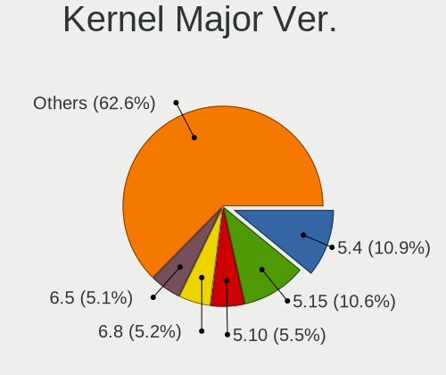
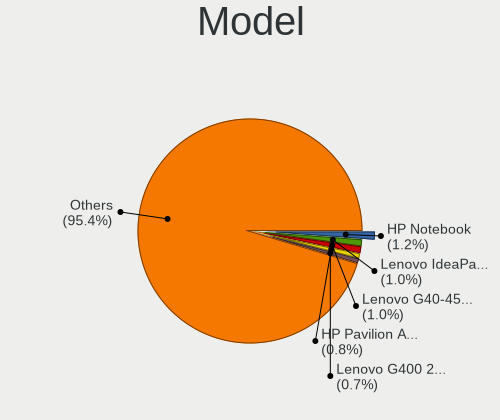
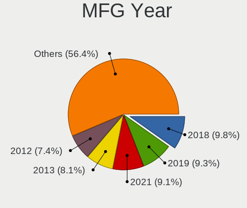
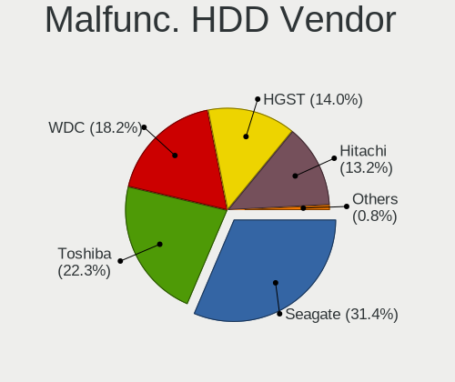
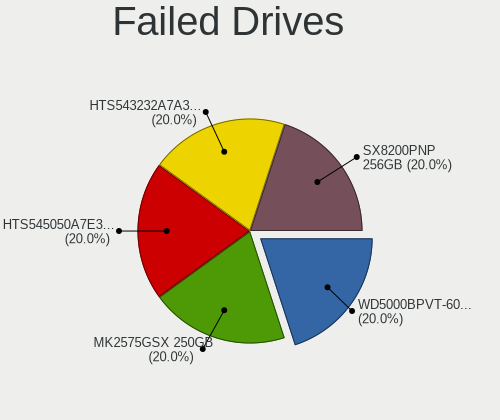
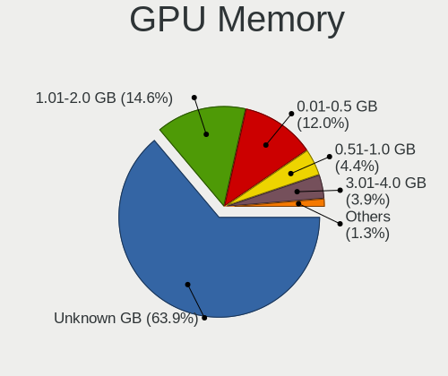
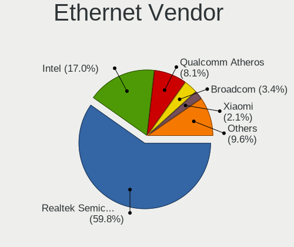
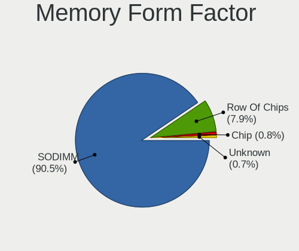
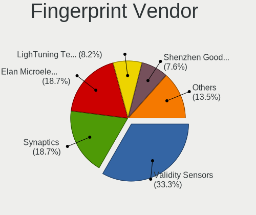

Linux in Indonesia - Tested Hardware & Statistics (Notebooks)
-------------------------------------------------------------

A project to collect tested hardware configurations for Linux in Indonesia.

Anyone can contribute to this report by the [hw-probe](https://github.com/linuxhw/hw-probe) tool:

    sudo -E hw-probe -all -upload

Please contribute! Especially if your hardware is rare.

Contents
--------

* [ Test Cases ](#test-cases)

* [ System ](#system)
  - [ OS                       ](#os)
  - [ OS Family                ](#os-family)
  - [ Kernel                   ](#kernel)
  - [ Kernel Family            ](#kernel-family)
  - [ Kernel Major Ver.        ](#kernel-major-ver)
  - [ Arch                     ](#arch)
  - [ DE                       ](#de)
  - [ Display Server           ](#display-server)
  - [ Display Manager          ](#display-manager)
  - [ OS Lang                  ](#os-lang)
  - [ Boot Mode                ](#boot-mode)
  - [ Filesystem               ](#filesystem)
  - [ Part. scheme             ](#part-scheme)
  - [ Dual Boot with Linux/BSD ](#dual-boot-with-linuxbsd)
  - [ Dual Boot (Win)          ](#dual-boot-win)

* [ Board ](#board)
  - [ Vendor                   ](#vendor)
  - [ Model                    ](#model)
  - [ Model Family             ](#model-family)
  - [ MFG Year                 ](#mfg-year)
  - [ Form Factor              ](#form-factor)
  - [ Secure Boot              ](#secure-boot)
  - [ Coreboot                 ](#coreboot)
  - [ RAM Size                 ](#ram-size)
  - [ RAM Used                 ](#ram-used)
  - [ Total Drives             ](#total-drives)
  - [ Has CD-ROM               ](#has-cd-rom)
  - [ Has Ethernet             ](#has-ethernet)
  - [ Has WiFi                 ](#has-wifi)
  - [ Has Bluetooth            ](#has-bluetooth)

* [ Location ](#location)
  - [ Country                  ](#country)
  - [ City                     ](#city)

* [ Drives ](#drives)
  - [ Drive Vendor             ](#drive-vendor)
  - [ Drive Model              ](#drive-model)
  - [ HDD Vendor               ](#hdd-vendor)
  - [ SSD Vendor               ](#ssd-vendor)
  - [ Drive Kind               ](#drive-kind)
  - [ Drive Connector          ](#drive-connector)
  - [ Drive Size               ](#drive-size)
  - [ Space Total              ](#space-total)
  - [ Space Used               ](#space-used)
  - [ Malfunc. Drives          ](#malfunc-drives)
  - [ Malfunc. Drive Vendor    ](#malfunc-drive-vendor)
  - [ Malfunc. HDD Vendor      ](#malfunc-hdd-vendor)
  - [ Malfunc. Drive Kind      ](#malfunc-drive-kind)
  - [ Failed Drives            ](#failed-drives)
  - [ Failed Drive Vendor      ](#failed-drive-vendor)
  - [ Drive Status             ](#drive-status)

* [ Storage controller ](#storage-controller)
  - [ Storage Vendor           ](#storage-vendor)
  - [ Storage Model            ](#storage-model)
  - [ Storage Kind             ](#storage-kind)

* [ Processor ](#processor)
  - [ CPU Vendor               ](#cpu-vendor)
  - [ CPU Model                ](#cpu-model)
  - [ CPU Model Family         ](#cpu-model-family)
  - [ CPU Cores                ](#cpu-cores)
  - [ CPU Sockets              ](#cpu-sockets)
  - [ CPU Threads              ](#cpu-threads)
  - [ CPU Op-Modes             ](#cpu-op-modes)
  - [ CPU Microcode            ](#cpu-microcode)
  - [ CPU Microarch            ](#cpu-microarch)

* [ Graphics ](#graphics)
  - [ GPU Vendor               ](#gpu-vendor)
  - [ GPU Model                ](#gpu-model)
  - [ GPU Combo                ](#gpu-combo)
  - [ GPU Driver               ](#gpu-driver)
  - [ GPU Memory               ](#gpu-memory)

* [ Monitor ](#monitor)
  - [ Monitor Vendor           ](#monitor-vendor)
  - [ Monitor Model            ](#monitor-model)
  - [ Monitor Resolution       ](#monitor-resolution)
  - [ Monitor Diagonal         ](#monitor-diagonal)
  - [ Monitor Width            ](#monitor-width)
  - [ Aspect Ratio             ](#aspect-ratio)
  - [ Monitor Area             ](#monitor-area)
  - [ Pixel Density            ](#pixel-density)
  - [ Multiple Monitors        ](#multiple-monitors)

* [ Network ](#network)
  - [ Net Controller Vendor    ](#net-controller-vendor)
  - [ Net Controller Model     ](#net-controller-model)
  - [ Wireless Vendor          ](#wireless-vendor)
  - [ Wireless Model           ](#wireless-model)
  - [ Ethernet Vendor          ](#ethernet-vendor)
  - [ Ethernet Model           ](#ethernet-model)
  - [ Net Controller Kind      ](#net-controller-kind)
  - [ Used Controller          ](#used-controller)
  - [ NICs                     ](#nics)
  - [ IPv6                     ](#ipv6)

* [ Bluetooth ](#bluetooth)
  - [ Bluetooth Vendor         ](#bluetooth-vendor)
  - [ Bluetooth Model          ](#bluetooth-model)

* [ Sound ](#sound)
  - [ Sound Vendor             ](#sound-vendor)
  - [ Sound Model              ](#sound-model)

* [ Memory ](#memory)
  - [ Memory Vendor            ](#memory-vendor)
  - [ Memory Model             ](#memory-model)
  - [ Memory Kind              ](#memory-kind)
  - [ Memory Form Factor       ](#memory-form-factor)
  - [ Memory Size              ](#memory-size)
  - [ Memory Speed             ](#memory-speed)

* [ Printers & scanners ](#printers--scanners)
  - [ Printer Vendor           ](#printer-vendor)
  - [ Printer Model            ](#printer-model)
  - [ Scanner Vendor           ](#scanner-vendor)
  - [ Scanner Model            ](#scanner-model)

* [ Camera ](#camera)
  - [ Camera Vendor            ](#camera-vendor)
  - [ Camera Model             ](#camera-model)

* [ Security ](#security)
  - [ Fingerprint Vendor       ](#fingerprint-vendor)
  - [ Fingerprint Model        ](#fingerprint-model)
  - [ Chipcard Vendor          ](#chipcard-vendor)
  - [ Chipcard Model           ](#chipcard-model)

* [ Unsupported ](#unsupported)
  - [ Unsupported Devices      ](#unsupported-devices)
  - [ Unsupported Device Types ](#unsupported-device-types)

Test Cases
----------

Total: 1438

| Vendor        | Model                       | Probe                                                      | Date         |
|---------------|-----------------------------|------------------------------------------------------------|--------------|
| realme        | CloudProXXXX                | [1299621a5e](https://linux-hardware.org/?probe=1299621a5e) | Feb 01, 2024 |
| Lenovo        | G405 20239                  | [7afc820794](https://linux-hardware.org/?probe=7afc820794) | Feb 01, 2024 |
| Lenovo        | ThinkPad L440 20ASS01400    | [c8fad8ec59](https://linux-hardware.org/?probe=c8fad8ec59) | Jan 28, 2024 |
| Dell          | XPS 9320                    | [0214714fb9](https://linux-hardware.org/?probe=0214714fb9) | Jan 27, 2024 |
| ASUSTek       | VivoBook_ASUSLaptop X415... | [e6681b71bc](https://linux-hardware.org/?probe=e6681b71bc) | Jan 25, 2024 |
| ASUSTek       | VivoBook_ASUSLaptop X415... | [65a3715aa3](https://linux-hardware.org/?probe=65a3715aa3) | Jan 25, 2024 |
| Lenovo        | IdeaPad Slim 5 14IRL8 82... | [0e4d078f49](https://linux-hardware.org/?probe=0e4d078f49) | Jan 25, 2024 |
| Lenovo        | ThinkPad T480 20L6S3L400    | [3861071640](https://linux-hardware.org/?probe=3861071640) | Jan 24, 2024 |
| Clevo         | M720SRS                     | [c0f6248edd](https://linux-hardware.org/?probe=c0f6248edd) | Jan 24, 2024 |
| Lenovo        | G400 20235                  | [2097e4f7e6](https://linux-hardware.org/?probe=2097e4f7e6) | Jan 22, 2024 |
| ASUSTek       | VivoBook 14_ASUS Laptop ... | [92f943771a](https://linux-hardware.org/?probe=92f943771a) | Jan 19, 2024 |
| Lenovo        | ThinkPad P52s 20LCS1H100    | [9efd333805](https://linux-hardware.org/?probe=9efd333805) | Jan 18, 2024 |
| Lenovo        | IdeaPad 110-14IBR 80T6      | [22802134b7](https://linux-hardware.org/?probe=22802134b7) | Jan 15, 2024 |
| Lenovo        | ThinkPad T420 4180PV4       | [3277e75c3e](https://linux-hardware.org/?probe=3277e75c3e) | Jan 15, 2024 |
| HP            | 250 G5 Notebook PC          | [8fb1c8650f](https://linux-hardware.org/?probe=8fb1c8650f) | Jan 12, 2024 |
| Dell          | Vostro 3401                 | [cd47812859](https://linux-hardware.org/?probe=cd47812859) | Jan 11, 2024 |
| Unknown       | Unknown                     | [2d74d756b3](https://linux-hardware.org/?probe=2d74d756b3) | Jan 10, 2024 |
| Unknown       | DS16                        | [1951d37c43](https://linux-hardware.org/?probe=1951d37c43) | Jan 10, 2024 |
| Lenovo        | ThinkPad 13 2nd Gen 20J1... | [9cfcebcd8c](https://linux-hardware.org/?probe=9cfcebcd8c) | Jan 09, 2024 |
| Lenovo        | ThinkPad 13 2nd Gen 20J1... | [0306a42404](https://linux-hardware.org/?probe=0306a42404) | Jan 09, 2024 |
| Lenovo        | ThinkPad T440 20B7A1P700    | [825a5ed72b](https://linux-hardware.org/?probe=825a5ed72b) | Jan 08, 2024 |
| Dell          | Inspiron 3576               | [ff3dc4d39e](https://linux-hardware.org/?probe=ff3dc4d39e) | Jan 08, 2024 |
| HP            | Presario CQ42               | [6addf001a5](https://linux-hardware.org/?probe=6addf001a5) | Jan 08, 2024 |
| Lenovo        | IdeaPad S145-14AST 81ST     | [4572d32ab9](https://linux-hardware.org/?probe=4572d32ab9) | Jan 06, 2024 |
| HP            | Laptop 14s-cf3xxx           | [416bb92e6e](https://linux-hardware.org/?probe=416bb92e6e) | Jan 05, 2024 |
| Lenovo        | ThinkPad X1 Carbon 7th 2... | [afb1d878cd](https://linux-hardware.org/?probe=afb1d878cd) | Jan 04, 2024 |
| Lenovo        | ThinkPad X250 20CL001LUS    | [f0f3c9a66c](https://linux-hardware.org/?probe=f0f3c9a66c) | Jan 04, 2024 |
| Acidanther... | MacBookPro16,4              | [3c8c520472](https://linux-hardware.org/?probe=3c8c520472) | Jan 02, 2024 |
| Lenovo        | ThinkPad X200s 7469W92      | [6ea14ec02e](https://linux-hardware.org/?probe=6ea14ec02e) | Jan 01, 2024 |
| Lenovo        | G400s 20244                 | [29ab65f09e](https://linux-hardware.org/?probe=29ab65f09e) | Jan 01, 2024 |
| Lenovo        | G400s 20244                 | [3afdb557c8](https://linux-hardware.org/?probe=3afdb557c8) | Jan 01, 2024 |
| Lenovo        | ThinkPad P50 20EQS3YS00     | [34294e5b8b](https://linux-hardware.org/?probe=34294e5b8b) | Dec 31, 2023 |
| ASUSTek       | X450CC                      | [0d985ff465](https://linux-hardware.org/?probe=0d985ff465) | Dec 31, 2023 |
| Lenovo        | ThinkPad X220 4291G75       | [1192d8e746](https://linux-hardware.org/?probe=1192d8e746) | Dec 27, 2023 |
| Lenovo        | ThinkPad X220 4291G75       | [3fdb3a1cc7](https://linux-hardware.org/?probe=3fdb3a1cc7) | Dec 27, 2023 |
| Lenovo        | ThinkPad T440 20B7A1P700    | [3bd91ab067](https://linux-hardware.org/?probe=3bd91ab067) | Dec 24, 2023 |
| Lenovo        | ThinkPad T440 20B7A1P700    | [d49a8fe4d4](https://linux-hardware.org/?probe=d49a8fe4d4) | Dec 24, 2023 |
| Lenovo        | ThinkPad T440 20B7A1P700    | [f1c9eab3f4](https://linux-hardware.org/?probe=f1c9eab3f4) | Dec 24, 2023 |
| ASUSTek       | X441BA                      | [04e5c55b92](https://linux-hardware.org/?probe=04e5c55b92) | Dec 23, 2023 |
| Dell          | Latitude E6400              | [67d4d37a04](https://linux-hardware.org/?probe=67d4d37a04) | Dec 20, 2023 |
| Lenovo        | ThinkPad T590 20N5S44300    | [5a90e712d1](https://linux-hardware.org/?probe=5a90e712d1) | Dec 19, 2023 |
| Lenovo        | V14-ADA 82C6                | [ec237cc638](https://linux-hardware.org/?probe=ec237cc638) | Dec 19, 2023 |
| Medion        | S17403                      | [250e479ad5](https://linux-hardware.org/?probe=250e479ad5) | Dec 18, 2023 |
| ASUSTek       | UX490UAR                    | [e8aa69b910](https://linux-hardware.org/?probe=e8aa69b910) | Dec 16, 2023 |
| ASUSTek       | VivoBook 15_ASUS Laptop ... | [b7194dbbb8](https://linux-hardware.org/?probe=b7194dbbb8) | Dec 15, 2023 |
| Acer          | Aspire E5-411G              | [f4af1a07e3](https://linux-hardware.org/?probe=f4af1a07e3) | Dec 15, 2023 |
| Lenovo        | ThinkPad L330 34701V0       | [d418989434](https://linux-hardware.org/?probe=d418989434) | Dec 15, 2023 |
| Samsung       | 300E5E/300E4E/300E5V/300... | [e7d5f85bea](https://linux-hardware.org/?probe=e7d5f85bea) | Dec 13, 2023 |
| Dell          | Latitude E7240              | [4fcd011c61](https://linux-hardware.org/?probe=4fcd011c61) | Dec 13, 2023 |
| Lenovo        | V110-14IAP 80TF             | [e7bbe1d5e7](https://linux-hardware.org/?probe=e7bbe1d5e7) | Dec 10, 2023 |
| Acer          | Aspire E5-411G              | [72c0c4e3a0](https://linux-hardware.org/?probe=72c0c4e3a0) | Dec 09, 2023 |
| Dell          | Latitude E6400              | [0f4aeac8ca](https://linux-hardware.org/?probe=0f4aeac8ca) | Dec 09, 2023 |
| HP            | EliteBook 745 G6            | [29a2194396](https://linux-hardware.org/?probe=29a2194396) | Dec 06, 2023 |
| ASUSTek       | VivoBook_ASUSLaptop X415... | [1b3b476186](https://linux-hardware.org/?probe=1b3b476186) | Dec 06, 2023 |
| ASUSTek       | VivoBook_ASUSLaptop X415... | [58547d36b7](https://linux-hardware.org/?probe=58547d36b7) | Dec 06, 2023 |
| Acer          | Aspire A314-22              | [daa41db960](https://linux-hardware.org/?probe=daa41db960) | Dec 05, 2023 |
| ASUSTek       | VivoBook 15_ASUS Laptop ... | [becdc5222d](https://linux-hardware.org/?probe=becdc5222d) | Dec 05, 2023 |
| ASUSTek       | X441BA                      | [272c82d8eb](https://linux-hardware.org/?probe=272c82d8eb) | Dec 05, 2023 |
| HP            | Laptop 14-em0xxx            | [b3a0f94dfd](https://linux-hardware.org/?probe=b3a0f94dfd) | Dec 04, 2023 |
| Lenovo        | G400 20235                  | [b3bc756e27](https://linux-hardware.org/?probe=b3bc756e27) | Dec 04, 2023 |
| Lenovo        | G400 20235                  | [9af224bc40](https://linux-hardware.org/?probe=9af224bc40) | Dec 04, 2023 |
| ASUSTek       | X441NA                      | [9a4c0266e8](https://linux-hardware.org/?probe=9a4c0266e8) | Dec 02, 2023 |
| Lenovo        | Yoga Slim 7 14IIL05 82A1    | [f43aaf1d39](https://linux-hardware.org/?probe=f43aaf1d39) | Nov 29, 2023 |
| HP            | EliteBook 840 G2            | [12e26441e1](https://linux-hardware.org/?probe=12e26441e1) | Nov 27, 2023 |
| Valve         | Jupiter                     | [a6240c8d6a](https://linux-hardware.org/?probe=a6240c8d6a) | Nov 20, 2023 |
| Lenovo        | ThinkPad L13 Gen 3 21B30... | [5685f17122](https://linux-hardware.org/?probe=5685f17122) | Nov 19, 2023 |
| ASUSTek       | ASUS TUF Gaming F15 FX50... | [95624a1d82](https://linux-hardware.org/?probe=95624a1d82) | Nov 18, 2023 |
| Dell          | XPS 9320                    | [04760461ba](https://linux-hardware.org/?probe=04760461ba) | Nov 17, 2023 |
| Acer          | Nitro AN515-57              | [39c7028c1e](https://linux-hardware.org/?probe=39c7028c1e) | Nov 15, 2023 |
| ADVAN         | 1405                        | [55a639a506](https://linux-hardware.org/?probe=55a639a506) | Nov 14, 2023 |
| ASUSTek       | T100TAS                     | [ff4068e60a](https://linux-hardware.org/?probe=ff4068e60a) | Nov 12, 2023 |
| Acer          | Swift SFX14-41G             | [be4c8862d0](https://linux-hardware.org/?probe=be4c8862d0) | Nov 11, 2023 |
| Acer          | Swift SF314-511             | [ba5db231dd](https://linux-hardware.org/?probe=ba5db231dd) | Nov 08, 2023 |
| Lenovo        | ThinkPad Edge E465 BE465... | [54b9aa1cac](https://linux-hardware.org/?probe=54b9aa1cac) | Nov 07, 2023 |
| Acer          | Swift SF314-511             | [1e2ba13164](https://linux-hardware.org/?probe=1e2ba13164) | Nov 06, 2023 |
| Lenovo        | IdeaPad S410p 20296         | [61828bc39f](https://linux-hardware.org/?probe=61828bc39f) | Nov 05, 2023 |
| Lenovo        | ThinkPad X1 Carbon Gen 8... | [38df9f5382](https://linux-hardware.org/?probe=38df9f5382) | Nov 04, 2023 |
| HP            | Pavilion Gaming Laptop 1... | [669430e32e](https://linux-hardware.org/?probe=669430e32e) | Nov 04, 2023 |
| Acidanther... | MacBookPro15,2              | [ae60650070](https://linux-hardware.org/?probe=ae60650070) | Nov 04, 2023 |
| ASUSTek       | VivoBook 14_ASUS Laptop ... | [0ce0a4d87a](https://linux-hardware.org/?probe=0ce0a4d87a) | Nov 04, 2023 |
| Lenovo        | IdeaPad 3 14ITL6 82H7       | [fb7f16d298](https://linux-hardware.org/?probe=fb7f16d298) | Nov 02, 2023 |
| ASUSTek       | X456UR                      | [9a0a4dfd02](https://linux-hardware.org/?probe=9a0a4dfd02) | Nov 02, 2023 |
| Lenovo        | G40-45 80E1                 | [fffa5fb420](https://linux-hardware.org/?probe=fffa5fb420) | Nov 02, 2023 |
| ASUSTek       | VivoBook E14 E402YA_E402... | [a7f47546e5](https://linux-hardware.org/?probe=a7f47546e5) | Nov 01, 2023 |
| ASUSTek       | VivoBook E14 E402YA_E402... | [8901bca741](https://linux-hardware.org/?probe=8901bca741) | Nov 01, 2023 |
| HP            | EliteBook 2570p             | [bc8c6e67a9](https://linux-hardware.org/?probe=bc8c6e67a9) | Oct 28, 2023 |
| Acer          | Swift SFX14-41G             | [63b5c65c01](https://linux-hardware.org/?probe=63b5c65c01) | Oct 28, 2023 |
| Acer          | Aspire E5-411G              | [220dddac59](https://linux-hardware.org/?probe=220dddac59) | Oct 28, 2023 |
| Dell          | Precision 5530              | [e707fe59cc](https://linux-hardware.org/?probe=e707fe59cc) | Oct 27, 2023 |
| HP            | Notebook                    | [1f270f615f](https://linux-hardware.org/?probe=1f270f615f) | Oct 27, 2023 |
| Dell          | Inspiron One 2310           | [1a8d313e86](https://linux-hardware.org/?probe=1a8d313e86) | Oct 25, 2023 |
| Dell          | Latitude 5285               | [9af5195620](https://linux-hardware.org/?probe=9af5195620) | Oct 24, 2023 |
| Dell          | Latitude 5320               | [520c2effa3](https://linux-hardware.org/?probe=520c2effa3) | Oct 23, 2023 |
| Lenovo        | IdeaPad 3 14ITL05 81X7      | [5b608b97fc](https://linux-hardware.org/?probe=5b608b97fc) | Oct 23, 2023 |
| Dell          | Latitude 5285               | [9552613f54](https://linux-hardware.org/?probe=9552613f54) | Oct 23, 2023 |
| Dell          | Latitude E6320              | [c6965e07e3](https://linux-hardware.org/?probe=c6965e07e3) | Oct 21, 2023 |
| Dell          | Inspiron 3458               | [ff4adff045](https://linux-hardware.org/?probe=ff4adff045) | Oct 21, 2023 |
| Acer          | Aspire E5-411G              | [fe4a9ec4d0](https://linux-hardware.org/?probe=fe4a9ec4d0) | Oct 20, 2023 |
| ASUSTek       | S400CA                      | [1c0c1df851](https://linux-hardware.org/?probe=1c0c1df851) | Oct 20, 2023 |
| Toshiba       | dynabook R732/H             | [4852b6da95](https://linux-hardware.org/?probe=4852b6da95) | Oct 20, 2023 |
| HP            | Notebook                    | [3fb8313450](https://linux-hardware.org/?probe=3fb8313450) | Oct 19, 2023 |
| ASUSTek       | GL553VD                     | [71ffea0397](https://linux-hardware.org/?probe=71ffea0397) | Oct 19, 2023 |
| ASUSTek       | GL553VD                     | [9ab2c722a5](https://linux-hardware.org/?probe=9ab2c722a5) | Oct 19, 2023 |
| HP            | Pavilion Aero Laptop 13-... | [459dc02cda](https://linux-hardware.org/?probe=459dc02cda) | Oct 18, 2023 |
| Acer          | Aspire E3-112M              | [11d6580d3e](https://linux-hardware.org/?probe=11d6580d3e) | Oct 18, 2023 |
| ASUSTek       | ROG Zephyrus G14 GA401II... | [329a5f99e0](https://linux-hardware.org/?probe=329a5f99e0) | Oct 18, 2023 |
| MicroByte     | ezbook                      | [c67055c10c](https://linux-hardware.org/?probe=c67055c10c) | Oct 17, 2023 |
| MicroByte     | ezbook                      | [5018eaffae](https://linux-hardware.org/?probe=5018eaffae) | Oct 17, 2023 |
| Toshiba       | Satellite L645              | [5bea545bf5](https://linux-hardware.org/?probe=5bea545bf5) | Oct 16, 2023 |
| Valve         | Jupiter                     | [ec059c9ea7](https://linux-hardware.org/?probe=ec059c9ea7) | Oct 15, 2023 |
| Acer          | Swift SF314-511             | [3d63dd4590](https://linux-hardware.org/?probe=3d63dd4590) | Oct 13, 2023 |
| Toshiba       | Satellite C55D-C            | [e083a8012f](https://linux-hardware.org/?probe=e083a8012f) | Oct 11, 2023 |
| HP            | 430                         | [e62771b9a7](https://linux-hardware.org/?probe=e62771b9a7) | Oct 09, 2023 |
| HP            | 430                         | [71211a4eda](https://linux-hardware.org/?probe=71211a4eda) | Oct 09, 2023 |
| ASUSTek       | VivoBook_ASUSLaptop X515... | [f3348806a2](https://linux-hardware.org/?probe=f3348806a2) | Oct 09, 2023 |
| ASUSTek       | ASUS TUF Dash F15 FX517Z... | [f269e7a6ee](https://linux-hardware.org/?probe=f269e7a6ee) | Oct 09, 2023 |
| Lenovo        | G40-45 80E1                 | [1bb42f8755](https://linux-hardware.org/?probe=1bb42f8755) | Oct 09, 2023 |
| Acer          | Swift SF314-56G             | [2696a8d9c0](https://linux-hardware.org/?probe=2696a8d9c0) | Oct 08, 2023 |
| Acidanther... | MacBookPro16,4              | [c40356b94d](https://linux-hardware.org/?probe=c40356b94d) | Oct 05, 2023 |
| Acer          | Swift SF314-56G             | [15b613a264](https://linux-hardware.org/?probe=15b613a264) | Oct 03, 2023 |
| ASUSTek       | ROG Zephyrus G14 GA401II... | [0df81159a2](https://linux-hardware.org/?probe=0df81159a2) | Oct 03, 2023 |
| Lenovo        | ThinkPad X1 Carbon 7th 2... | [a3773ae099](https://linux-hardware.org/?probe=a3773ae099) | Oct 02, 2023 |
| Lenovo        | IdeaPad 3 14ITL6 82H7       | [25211e6ce1](https://linux-hardware.org/?probe=25211e6ce1) | Oct 01, 2023 |
| HP            | ProBook 440 G4              | [810959ffa7](https://linux-hardware.org/?probe=810959ffa7) | Oct 01, 2023 |
| Acer          | Aspire E5-411G              | [80ac43658d](https://linux-hardware.org/?probe=80ac43658d) | Sep 30, 2023 |
| Lenovo        | ThinkPad L530 24783R8       | [eda040f456](https://linux-hardware.org/?probe=eda040f456) | Sep 30, 2023 |
| Lenovo        | IdeaPad 3 14IML05 81WA      | [d95e370c54](https://linux-hardware.org/?probe=d95e370c54) | Sep 29, 2023 |
| Acer          | Aspire E5-411G              | [eeb582da25](https://linux-hardware.org/?probe=eeb582da25) | Sep 28, 2023 |
| Dell          | Latitude 7490               | [6f5e4547fa](https://linux-hardware.org/?probe=6f5e4547fa) | Sep 27, 2023 |
| Dell          | Latitude 7490               | [8bb2e054ec](https://linux-hardware.org/?probe=8bb2e054ec) | Sep 26, 2023 |
| Acer          | Nitro AN515-54              | [6383f263a8](https://linux-hardware.org/?probe=6383f263a8) | Sep 25, 2023 |
| Toshiba       | dynabook R632/H             | [7279759e40](https://linux-hardware.org/?probe=7279759e40) | Sep 25, 2023 |
| Acer          | Aspire S3                   | [4b2b76bdb3](https://linux-hardware.org/?probe=4b2b76bdb3) | Sep 24, 2023 |
| Acer          | Aspire S3                   | [723a872112](https://linux-hardware.org/?probe=723a872112) | Sep 24, 2023 |
| HUAWEI        | KPL-W0X                     | [3154e03d3f](https://linux-hardware.org/?probe=3154e03d3f) | Sep 22, 2023 |
| HP            | Laptop 14-ep0xxx            | [ee7b0c8506](https://linux-hardware.org/?probe=ee7b0c8506) | Sep 21, 2023 |
| Lenovo        | V14 G3 IAP 82TS             | [2528381c0e](https://linux-hardware.org/?probe=2528381c0e) | Sep 21, 2023 |
| HUAWEI        | KPL-W0X                     | [efafe71bd6](https://linux-hardware.org/?probe=efafe71bd6) | Sep 21, 2023 |
| HP            | Laptop 14s-dq3xxx           | [a1356bddb2](https://linux-hardware.org/?probe=a1356bddb2) | Sep 21, 2023 |
| HP            | Laptop 14s-dq3xxx           | [77e008b6d9](https://linux-hardware.org/?probe=77e008b6d9) | Sep 20, 2023 |
| Lenovo        | ThinkPad P53 MFG_IN_GO     | [98a32c8241](https://linux-hardware.org/?probe=98a32c8241) | Sep 19, 2023 |
| HP            | EliteBook 8470p             | [a8995def08](https://linux-hardware.org/?probe=a8995def08) | Sep 19, 2023 |
| Lenovo        | G40-45 80E1                 | [417ad95c4c](https://linux-hardware.org/?probe=417ad95c4c) | Sep 18, 2023 |
| Lenovo        | G40-45 80E1                 | [c27b81ea3e](https://linux-hardware.org/?probe=c27b81ea3e) | Sep 17, 2023 |
| realme        | RMNBXXXX                    | [7f93463d6a](https://linux-hardware.org/?probe=7f93463d6a) | Sep 14, 2023 |
| realme        | RMNBXXXX                    | [a635ea5599](https://linux-hardware.org/?probe=a635ea5599) | Sep 14, 2023 |
| HP            | 245 G7 Notebook PC          | [ab68dea087](https://linux-hardware.org/?probe=ab68dea087) | Sep 14, 2023 |
| HP            | EliteBook 2570p             | [6259de24be](https://linux-hardware.org/?probe=6259de24be) | Sep 11, 2023 |
| Acer          | Swift SF314-71              | [00e5dd81d7](https://linux-hardware.org/?probe=00e5dd81d7) | Sep 10, 2023 |
| Acer          | Aspire E5-411G              | [16c285bb07](https://linux-hardware.org/?probe=16c285bb07) | Sep 10, 2023 |
| Samsung       | RV413/RV513                 | [c59551fc6f](https://linux-hardware.org/?probe=c59551fc6f) | Sep 09, 2023 |
| ASUSTek       | X450CC                      | [5564e70c85](https://linux-hardware.org/?probe=5564e70c85) | Sep 09, 2023 |
| ASUSTek       | X201EP                      | [a714c5a35a](https://linux-hardware.org/?probe=a714c5a35a) | Sep 09, 2023 |
| HP            | Laptop 15-db1xxx            | [34e95a943a](https://linux-hardware.org/?probe=34e95a943a) | Sep 08, 2023 |
| Lenovo        | IdeaPad 1 14AMN7 82VF       | [cbd5cf3e4b](https://linux-hardware.org/?probe=cbd5cf3e4b) | Sep 08, 2023 |
| Sony          | VGN-CS108D                  | [24bf5bb06c](https://linux-hardware.org/?probe=24bf5bb06c) | Sep 05, 2023 |
| Lenovo        | IdeaPad 100-14IBD 80RK      | [1a1c5e43bc](https://linux-hardware.org/?probe=1a1c5e43bc) | Sep 05, 2023 |
| AXIOO         | Mybook 14E                  | [b6ddb628dc](https://linux-hardware.org/?probe=b6ddb628dc) | Sep 04, 2023 |
| Acer          | Aspire A314-35              | [6edc4e910d](https://linux-hardware.org/?probe=6edc4e910d) | Sep 04, 2023 |
| HP            | EliteBook Revolve 810 G2    | [3f102b35e3](https://linux-hardware.org/?probe=3f102b35e3) | Sep 04, 2023 |
| Lenovo        | Legion Slim 5 16APH8 82Y... | [e27673ed4c](https://linux-hardware.org/?probe=e27673ed4c) | Sep 03, 2023 |
| Lenovo        | IdeaPad S145-14AST 81ST     | [959fb04734](https://linux-hardware.org/?probe=959fb04734) | Sep 03, 2023 |
| Sony          | VPCYB15AG                   | [e192029ff0](https://linux-hardware.org/?probe=e192029ff0) | Sep 03, 2023 |
| Acer          | Aspire E5-475G              | [55542f9b89](https://linux-hardware.org/?probe=55542f9b89) | Aug 31, 2023 |
| Dell          | Latitude E6410              | [c2337bbe75](https://linux-hardware.org/?probe=c2337bbe75) | Aug 31, 2023 |
| Acer          | Aspire E5-411G              | [13ec5c53cf](https://linux-hardware.org/?probe=13ec5c53cf) | Aug 31, 2023 |
| Lenovo        | ThinkPad P53 MFG_IN_GO     | [5cfa9a748f](https://linux-hardware.org/?probe=5cfa9a748f) | Aug 31, 2023 |
| Dell          | Inspiron 3585               | [02708536f4](https://linux-hardware.org/?probe=02708536f4) | Aug 30, 2023 |
| HP            | Pavilion Gaming Laptop 1... | [aa10544f35](https://linux-hardware.org/?probe=aa10544f35) | Aug 30, 2023 |
| Fujitsu       | FMVU14003                   | [8da3625e06](https://linux-hardware.org/?probe=8da3625e06) | Aug 27, 2023 |
| Lenovo        | IdeaPad Slim 1-11AST-05 ... | [5b334ec725](https://linux-hardware.org/?probe=5b334ec725) | Aug 27, 2023 |
| Acer          | Aspire E5-411G              | [1986877980](https://linux-hardware.org/?probe=1986877980) | Aug 25, 2023 |
| HP            | Laptop 15-db1xxx            | [2a72d00223](https://linux-hardware.org/?probe=2a72d00223) | Aug 25, 2023 |
| HP            | Victus by Gaming Laptop ... | [f79de96905](https://linux-hardware.org/?probe=f79de96905) | Aug 23, 2023 |
| Lenovo        | IdeaPad 130-14IKB 81H6      | [abae84243d](https://linux-hardware.org/?probe=abae84243d) | Aug 23, 2023 |
| Dell          | Latitude E6410              | [fbaef9218f](https://linux-hardware.org/?probe=fbaef9218f) | Aug 22, 2023 |
| ASUSTek       | VivoBook_ASUSLaptop X430... | [8fd1db4fee](https://linux-hardware.org/?probe=8fd1db4fee) | Aug 21, 2023 |
| ASUSTek       | VivoBook_ASUSLaptop X430... | [2cbbb89cd4](https://linux-hardware.org/?probe=2cbbb89cd4) | Aug 21, 2023 |
| Lenovo        | ThinkPad L14 Gen 1 20U50... | [c1a5eb75bf](https://linux-hardware.org/?probe=c1a5eb75bf) | Aug 21, 2023 |
| HP            | Victus by Gaming Laptop ... | [c47971e406](https://linux-hardware.org/?probe=c47971e406) | Aug 21, 2023 |
| Lenovo        | ThinkPad T540p 20BFS02S0... | [2f59ec7141](https://linux-hardware.org/?probe=2f59ec7141) | Aug 18, 2023 |
| Infinix       | INBOOK X2 GEN11             | [f368b5bf17](https://linux-hardware.org/?probe=f368b5bf17) | Aug 18, 2023 |
| Toshiba       | Satellite L510              | [f06d068ca0](https://linux-hardware.org/?probe=f06d068ca0) | Aug 16, 2023 |
| Lenovo        | ThinkPad E14 Gen 2 20TBS... | [b7a28997df](https://linux-hardware.org/?probe=b7a28997df) | Aug 15, 2023 |
| Acer          | Swift SF314-71              | [b78f4bf01d](https://linux-hardware.org/?probe=b78f4bf01d) | Aug 15, 2023 |
| Lenovo        | ThinkPad S1 Yoga 20C0A0C... | [c192c37af2](https://linux-hardware.org/?probe=c192c37af2) | Aug 14, 2023 |
| MSI           | Katana GF66 11UD            | [e7e9bfd605](https://linux-hardware.org/?probe=e7e9bfd605) | Aug 13, 2023 |
| Samsung       | 960XFH                      | [b7f35fe8b5](https://linux-hardware.org/?probe=b7f35fe8b5) | Aug 13, 2023 |
| HP            | EliteBook 820 G3            | [544810db31](https://linux-hardware.org/?probe=544810db31) | Aug 12, 2023 |
| Acer          | TravelMate B113             | [5d3d27c8bb](https://linux-hardware.org/?probe=5d3d27c8bb) | Aug 12, 2023 |
| Acer          | One Z1402                   | [9fd6a2d41b](https://linux-hardware.org/?probe=9fd6a2d41b) | Aug 12, 2023 |
| HP            | Pavilion Laptop 14-ec0xx... | [fadee3e38d](https://linux-hardware.org/?probe=fadee3e38d) | Aug 11, 2023 |
| Lenovo        | G40-45 80E1                 | [49a3480efb](https://linux-hardware.org/?probe=49a3480efb) | Aug 11, 2023 |
| Lenovo        | ThinkPad S1 Yoga 20C0A0C... | [6de592988e](https://linux-hardware.org/?probe=6de592988e) | Aug 09, 2023 |
| Acer          | Aspire 4752                 | [1c68b4d24a](https://linux-hardware.org/?probe=1c68b4d24a) | Aug 08, 2023 |
| Acer          | Aspire 4750                 | [8491f5fc3b](https://linux-hardware.org/?probe=8491f5fc3b) | Aug 07, 2023 |
| Lenovo        | IdeaPad S145-14IWL 81MU     | [eab0544dc6](https://linux-hardware.org/?probe=eab0544dc6) | Aug 06, 2023 |
| HP            | ProBook 440 G3              | [abb19010d2](https://linux-hardware.org/?probe=abb19010d2) | Aug 05, 2023 |
| Dell          | Latitude E6410              | [ad46549b01](https://linux-hardware.org/?probe=ad46549b01) | Aug 04, 2023 |
| Dell          | Latitude E6410              | [e2364d5aac](https://linux-hardware.org/?probe=e2364d5aac) | Aug 04, 2023 |
| Lenovo        | ThinkPad Edge E330 33542... | [73e1dd94b2](https://linux-hardware.org/?probe=73e1dd94b2) | Aug 02, 2023 |
| Lenovo        | ThinkPad Edge E330 33542... | [a13fd4044e](https://linux-hardware.org/?probe=a13fd4044e) | Aug 01, 2023 |
| ASUSTek       | TUF Gaming FX505DD          | [e965235133](https://linux-hardware.org/?probe=e965235133) | Jul 29, 2023 |
| Acer          | Aspire A315-42              | [3afa5a3034](https://linux-hardware.org/?probe=3afa5a3034) | Jul 27, 2023 |
| HP            | ENVY Laptop 13-aq0xxx       | [6632226064](https://linux-hardware.org/?probe=6632226064) | Jul 26, 2023 |
| Lenovo        | IdeaPad 3 14ALC6 82KT       | [24c092f0b0](https://linux-hardware.org/?probe=24c092f0b0) | Jul 26, 2023 |
| Lenovo        | ThinkPad X230 23246V9       | [e7bc7dac48](https://linux-hardware.org/?probe=e7bc7dac48) | Jul 24, 2023 |
| Lenovo        | IdeaPad 330-14AST 81D5      | [c16c981a88](https://linux-hardware.org/?probe=c16c981a88) | Jul 24, 2023 |
| Fujitsu       | FMVNC4BC4                   | [14249b136a](https://linux-hardware.org/?probe=14249b136a) | Jul 19, 2023 |
| Acer          | Aspire E5-476G              | [74af6477be](https://linux-hardware.org/?probe=74af6477be) | Jul 19, 2023 |
| Lenovo        | IdeaPad 130-14IKB 81H6      | [3649d91857](https://linux-hardware.org/?probe=3649d91857) | Jul 18, 2023 |
| Acer          | Swift SF314-71              | [462a41184d](https://linux-hardware.org/?probe=462a41184d) | Jul 17, 2023 |
| Lenovo        | IdeaPad S340-14API 81NB     | [94555c5887](https://linux-hardware.org/?probe=94555c5887) | Jul 10, 2023 |
| Lenovo        | IdeaPad 1 14AMN7 82VF       | [de7dbebf49](https://linux-hardware.org/?probe=de7dbebf49) | Jul 10, 2023 |
| Acer          | Aspire 4937                 | [fe9bfd5f77](https://linux-hardware.org/?probe=fe9bfd5f77) | Jul 10, 2023 |
| Acer          | Aspire 4937                 | [d4dadd2e77](https://linux-hardware.org/?probe=d4dadd2e77) | Jul 10, 2023 |
| HP            | ProBook 4420s               | [51e917f03e](https://linux-hardware.org/?probe=51e917f03e) | Jul 09, 2023 |
| Acer          | Aspire 4720Z                | [312486a5b7](https://linux-hardware.org/?probe=312486a5b7) | Jul 09, 2023 |
| ASUSTek       | VivoBook_ASUSLaptop X415... | [06b52888f8](https://linux-hardware.org/?probe=06b52888f8) | Jul 08, 2023 |
| ASUSTek       | VivoBook_ASUSLaptop X415... | [0048149cd5](https://linux-hardware.org/?probe=0048149cd5) | Jul 08, 2023 |
| Toshiba       | PORTEGE R30-C               | [f07f4d423b](https://linux-hardware.org/?probe=f07f4d423b) | Jul 07, 2023 |
| Lenovo        | IdeaPad S340-14API 81NB     | [c5fcc4bcf0](https://linux-hardware.org/?probe=c5fcc4bcf0) | Jul 06, 2023 |
| Lenovo        | IdeaPad S340-14API 81NB     | [f05e91be82](https://linux-hardware.org/?probe=f05e91be82) | Jul 06, 2023 |
| Toshiba       | Satellite C640              | [680f3038da](https://linux-hardware.org/?probe=680f3038da) | Jul 06, 2023 |
| HP            | Laptop 15-fc0xxx            | [a0183085b8](https://linux-hardware.org/?probe=a0183085b8) | Jul 06, 2023 |
| AZW           | Z85                         | [ca44d0b498](https://linux-hardware.org/?probe=ca44d0b498) | Jul 05, 2023 |
| Acer          | Aspire V5-471G              | [6dd5e93eea](https://linux-hardware.org/?probe=6dd5e93eea) | Jul 05, 2023 |
| Lenovo        | ThinkPad X230 Tablet 343... | [f1ad74f37a](https://linux-hardware.org/?probe=f1ad74f37a) | Jul 05, 2023 |
| Dell          | Latitude E6540              | [17ec85df62](https://linux-hardware.org/?probe=17ec85df62) | Jul 05, 2023 |
| Dell          | Latitude 3410               | [11d9814008](https://linux-hardware.org/?probe=11d9814008) | Jul 02, 2023 |
| ASUSTek       | X201EV                      | [a3fe51bc01](https://linux-hardware.org/?probe=a3fe51bc01) | Jun 30, 2023 |
| ASUSTek       | VivoBook 14_ASUS Laptop ... | [14a983e6d3](https://linux-hardware.org/?probe=14a983e6d3) | Jun 30, 2023 |
| ASUSTek       | X201EV                      | [3cffef17f3](https://linux-hardware.org/?probe=3cffef17f3) | Jun 30, 2023 |
| ASUSTek       | ASUS TUF Gaming F15 FX50... | [5873d04afe](https://linux-hardware.org/?probe=5873d04afe) | Jun 29, 2023 |
| UMAX          | VisionBook 14Wr Plus        | [5f838f5922](https://linux-hardware.org/?probe=5f838f5922) | Jun 28, 2023 |
| ASUSTek       | VivoBook_ASUSLaptop X415... | [0c87fda1f9](https://linux-hardware.org/?probe=0c87fda1f9) | Jun 27, 2023 |
| Lenovo        | V14 G2 ALC 82KC             | [40cbc38a69](https://linux-hardware.org/?probe=40cbc38a69) | Jun 25, 2023 |
| ASUSTek       | VivoBook_ASUSLaptop X415... | [01a9e10a34](https://linux-hardware.org/?probe=01a9e10a34) | Jun 24, 2023 |
| Toshiba       | PORTEGE Z930                | [0cad0d9955](https://linux-hardware.org/?probe=0cad0d9955) | Jun 22, 2023 |
| Notebook      | P870DM                      | [cd318aa5a4](https://linux-hardware.org/?probe=cd318aa5a4) | Jun 21, 2023 |
| Dell          | G7 7588                     | [946a645897](https://linux-hardware.org/?probe=946a645897) | Jun 20, 2023 |
| Lenovo        | IdeaPad S410p 20296         | [6a6cfb05d6](https://linux-hardware.org/?probe=6a6cfb05d6) | Jun 20, 2023 |
| ASUSTek       | VivoBook_ASUSLaptop X513... | [42fd301e8b](https://linux-hardware.org/?probe=42fd301e8b) | Jun 19, 2023 |
| HP            | Laptop 17-ca0xxx            | [5296ca6ae2](https://linux-hardware.org/?probe=5296ca6ae2) | Jun 19, 2023 |
| HP            | Laptop 14s-dk1xxx           | [16bbd0f687](https://linux-hardware.org/?probe=16bbd0f687) | Jun 18, 2023 |
| HP            | Laptop 14-bw0xx             | [f38253d79c](https://linux-hardware.org/?probe=f38253d79c) | Jun 17, 2023 |
| Acer          | Aspire 4752                 | [441eb3fe51](https://linux-hardware.org/?probe=441eb3fe51) | Jun 17, 2023 |
| HP            | Pavilion Gaming Laptop 1... | [d7e9625e19](https://linux-hardware.org/?probe=d7e9625e19) | Jun 17, 2023 |
| ASUSTek       | VivoBook_ASUSLaptop X513... | [eb0ba3c881](https://linux-hardware.org/?probe=eb0ba3c881) | Jun 15, 2023 |
| ASUSTek       | VivoBook_ASUSLaptop X421... | [78f12c4671](https://linux-hardware.org/?probe=78f12c4671) | Jun 07, 2023 |
| Acer          | Aspire E5-411G              | [9a69b50d97](https://linux-hardware.org/?probe=9a69b50d97) | Jun 07, 2023 |
| Infinix       | INBook X1 Pro               | [c558de3b74](https://linux-hardware.org/?probe=c558de3b74) | Jun 05, 2023 |
| Infinix       | INBOOK X2                   | [0a82b1aed3](https://linux-hardware.org/?probe=0a82b1aed3) | Jun 05, 2023 |
| Acer          | Swift SF314-511             | [6754a25d1d](https://linux-hardware.org/?probe=6754a25d1d) | Jun 03, 2023 |
| HP            | Laptop 14-bw0xx             | [3958079ad5](https://linux-hardware.org/?probe=3958079ad5) | Jun 03, 2023 |
| Lenovo        | ThinkPad X230 Tablet 343... | [1034aea990](https://linux-hardware.org/?probe=1034aea990) | Jun 03, 2023 |
| AXIOO         | Mybook-14E                  | [cb04b551d8](https://linux-hardware.org/?probe=cb04b551d8) | May 31, 2023 |
| ASUSTek       | X456URK                     | [6de2588617](https://linux-hardware.org/?probe=6de2588617) | May 29, 2023 |
| ASUSTek       | X456URK                     | [369aa4fc93](https://linux-hardware.org/?probe=369aa4fc93) | May 29, 2023 |
| ASUSTek       | X455LF                      | [b90c1083ca](https://linux-hardware.org/?probe=b90c1083ca) | May 28, 2023 |
| AVITA         | NE14A2                      | [89c5edafbc](https://linux-hardware.org/?probe=89c5edafbc) | May 28, 2023 |
| Lenovo        | IdeaPad 1 14AMN7 82VF       | [db7d7cf31d](https://linux-hardware.org/?probe=db7d7cf31d) | May 26, 2023 |
| Panasonic     | CFSZ5-2                     | [d5b1455382](https://linux-hardware.org/?probe=d5b1455382) | May 25, 2023 |
| HP            | Laptop 14s-cf2xxx           | [e51dec5daf](https://linux-hardware.org/?probe=e51dec5daf) | May 24, 2023 |
| ASUSTek       | Strix 17 GL703GE            | [e752398b87](https://linux-hardware.org/?probe=e752398b87) | May 23, 2023 |
| HP            | Laptop 14s-dk1xxx           | [d9f9d8c907](https://linux-hardware.org/?probe=d9f9d8c907) | May 22, 2023 |
| Lenovo        | ThinkPad X260 20F5S53600    | [cfdb07c9ca](https://linux-hardware.org/?probe=cfdb07c9ca) | May 21, 2023 |
| Lenovo        | ThinkPad X260 20F5S53600    | [379bcdafa9](https://linux-hardware.org/?probe=379bcdafa9) | May 21, 2023 |
| Sony          | VPCSB35FG                   | [81d2592989](https://linux-hardware.org/?probe=81d2592989) | May 20, 2023 |
| Sony          | VPCSB35FG                   | [828fb24994](https://linux-hardware.org/?probe=828fb24994) | May 20, 2023 |
| Acer          | One Z1402                   | [390a684064](https://linux-hardware.org/?probe=390a684064) | May 16, 2023 |
| ASUSTek       | GL502VMK                    | [0b7232826d](https://linux-hardware.org/?probe=0b7232826d) | May 13, 2023 |
| HP            | Laptop 14s-cf0xxx           | [6d0f055f82](https://linux-hardware.org/?probe=6d0f055f82) | May 11, 2023 |
| HP            | Laptop 14s-cf0xxx           | [7f90473be2](https://linux-hardware.org/?probe=7f90473be2) | May 11, 2023 |
| Infinix       | INBook X1                   | [c005323a1a](https://linux-hardware.org/?probe=c005323a1a) | May 11, 2023 |
| Dell          | Inspiron 3505               | [e8f10d5f7e](https://linux-hardware.org/?probe=e8f10d5f7e) | May 09, 2023 |
| HUAWEI        | NBLB-WAX9N                  | [1b0786ec5e](https://linux-hardware.org/?probe=1b0786ec5e) | May 07, 2023 |
| ASUSTek       | K42Jc                       | [ba4b9c97f9](https://linux-hardware.org/?probe=ba4b9c97f9) | May 05, 2023 |
| ASUSTek       | K42Jc                       | [98d7593057](https://linux-hardware.org/?probe=98d7593057) | May 05, 2023 |
| Dell          | Latitude D630               | [0bef13413f](https://linux-hardware.org/?probe=0bef13413f) | May 05, 2023 |
| Lenovo        | IdeaPad 5 Pro 14ARH7 82S... | [139c809251](https://linux-hardware.org/?probe=139c809251) | May 04, 2023 |
| Dell          | Latitude D630               | [d8ee0e7ca8](https://linux-hardware.org/?probe=d8ee0e7ca8) | May 02, 2023 |
| Lenovo        | IdeaPad 1 14AMN7 82VF       | [9035ec79cd](https://linux-hardware.org/?probe=9035ec79cd) | May 02, 2023 |
| Acer          | Aspire A514-54G             | [adbd990ca2](https://linux-hardware.org/?probe=adbd990ca2) | Apr 29, 2023 |
| Dell          | Latitude D630               | [a3c3e09675](https://linux-hardware.org/?probe=a3c3e09675) | Apr 28, 2023 |
| Lenovo        | IdeaPad 330-14AST 81D5      | [c1616fcd6c](https://linux-hardware.org/?probe=c1616fcd6c) | Apr 28, 2023 |
| Dell          | Latitude D630               | [850df6e76f](https://linux-hardware.org/?probe=850df6e76f) | Apr 26, 2023 |
| AXIOO         | MYBOOK-14 .B001             | [38d6a9b3d2](https://linux-hardware.org/?probe=38d6a9b3d2) | Apr 25, 2023 |
| HP            | Laptop 14-cm0xxx            | [4591d1bf9d](https://linux-hardware.org/?probe=4591d1bf9d) | Apr 24, 2023 |
| Valve         | Jupiter                     | [ff8440808f](https://linux-hardware.org/?probe=ff8440808f) | Apr 22, 2023 |
| Acer          | Swift SF314-511             | [96fd44e94a](https://linux-hardware.org/?probe=96fd44e94a) | Apr 20, 2023 |
| Lenovo        | IdeaPad 3 14ALC6 82KT       | [6cf066b06b](https://linux-hardware.org/?probe=6cf066b06b) | Apr 19, 2023 |
| Acer          | Swift SFX14-41G             | [40ae403838](https://linux-hardware.org/?probe=40ae403838) | Apr 18, 2023 |
| AXIOO         | SlimBook 11                 | [b0c639ab77](https://linux-hardware.org/?probe=b0c639ab77) | Apr 15, 2023 |
| Dell          | Latitude 7300               | [1064b58edb](https://linux-hardware.org/?probe=1064b58edb) | Apr 13, 2023 |
| HP            | Laptop 14s-cf1xxx           | [76c9bf81a6](https://linux-hardware.org/?probe=76c9bf81a6) | Apr 12, 2023 |
| MSI           | Creator 15 A11UE            | [ca70d48c0e](https://linux-hardware.org/?probe=ca70d48c0e) | Apr 11, 2023 |
| HP            | Notebook                    | [584a741058](https://linux-hardware.org/?probe=584a741058) | Apr 08, 2023 |
| ASUSTek       | K46CM                       | [d878fad4d0](https://linux-hardware.org/?probe=d878fad4d0) | Apr 06, 2023 |
| Dell          | Latitude E5430 non-vPro     | [fcfcfdbbe7](https://linux-hardware.org/?probe=fcfcfdbbe7) | Apr 06, 2023 |
| Toshiba       | Satellite L640              | [8009d927db](https://linux-hardware.org/?probe=8009d927db) | Apr 05, 2023 |
| Lenovo        | ThinkPad Edge 0578RZ3       | [d37b6fa47b](https://linux-hardware.org/?probe=d37b6fa47b) | Apr 05, 2023 |
| Timi          | TM1703                      | [54b062157f](https://linux-hardware.org/?probe=54b062157f) | Apr 04, 2023 |
| AXIOO         | MYBOOK-14 .B001             | [edba1216c0](https://linux-hardware.org/?probe=edba1216c0) | Apr 04, 2023 |
| Dell          | Latitude 3410               | [0b29a27e88](https://linux-hardware.org/?probe=0b29a27e88) | Apr 03, 2023 |
| Dell          | Latitude 3410               | [9c8218ebd6](https://linux-hardware.org/?probe=9c8218ebd6) | Apr 03, 2023 |
| Acer          | Swift SFX14-41G             | [e60610d78a](https://linux-hardware.org/?probe=e60610d78a) | Apr 02, 2023 |
| Lenovo        | IdeaPad Gaming 3 15ACH6 ... | [45c62cbb5c](https://linux-hardware.org/?probe=45c62cbb5c) | Apr 02, 2023 |
| Acer          | Aspire 4738Z                | [20e13078ef](https://linux-hardware.org/?probe=20e13078ef) | Apr 02, 2023 |
| Acer          | Aspire A515-56              | [a959d79d84](https://linux-hardware.org/?probe=a959d79d84) | Apr 01, 2023 |
| Acer          | Aspire A515-56              | [db53e1a333](https://linux-hardware.org/?probe=db53e1a333) | Apr 01, 2023 |
| HP            | 240 G6 Notebook PC          | [44e093df31](https://linux-hardware.org/?probe=44e093df31) | Apr 01, 2023 |
| Acer          | Aspire A514-53              | [4bb2babc0a](https://linux-hardware.org/?probe=4bb2babc0a) | Mar 31, 2023 |
| MSI           | Bravo 15 B5DD               | [6dac36ba2d](https://linux-hardware.org/?probe=6dac36ba2d) | Mar 28, 2023 |
| Lenovo        | IdeaPad 100-14IBY 80MH      | [0e8125dc1f](https://linux-hardware.org/?probe=0e8125dc1f) | Mar 28, 2023 |
| Acer          | Aspire E5-411G              | [4ac3cde372](https://linux-hardware.org/?probe=4ac3cde372) | Mar 27, 2023 |
| ASUSTek       | X555BA                      | [f7d51f3c2f](https://linux-hardware.org/?probe=f7d51f3c2f) | Mar 26, 2023 |
| Acer          | Swift SF314-511             | [55c1b171dd](https://linux-hardware.org/?probe=55c1b171dd) | Mar 25, 2023 |
| ASUSTek       | ROG Zephyrus G14 GA401II... | [ae09be520b](https://linux-hardware.org/?probe=ae09be520b) | Mar 25, 2023 |
| HP            | Pavilion 11 x360 PC         | [2c3c5a65a5](https://linux-hardware.org/?probe=2c3c5a65a5) | Mar 24, 2023 |
| MSI           | GF63 Thin 11SC              | [a63c9ded60](https://linux-hardware.org/?probe=a63c9ded60) | Mar 22, 2023 |
| MSI           | GF63 Thin 11SC              | [cc5ca6f040](https://linux-hardware.org/?probe=cc5ca6f040) | Mar 22, 2023 |
| Samsung       | RF511/RF411/RF711           | [bff0b1d8a4](https://linux-hardware.org/?probe=bff0b1d8a4) | Mar 20, 2023 |
| ASUSTek       | X540LJ                      | [4eab8887fa](https://linux-hardware.org/?probe=4eab8887fa) | Mar 18, 2023 |
| ASUSTek       | X540LJ                      | [b3bf824f3a](https://linux-hardware.org/?probe=b3bf824f3a) | Mar 18, 2023 |
| Samsung       | RF511/RF411/RF711           | [f3a832587b](https://linux-hardware.org/?probe=f3a832587b) | Mar 18, 2023 |
| ASUSTek       | VivoBook_ASUSLaptop X515... | [bc39bd2ce5](https://linux-hardware.org/?probe=bc39bd2ce5) | Mar 17, 2023 |
| Samsung       | RF511/RF411/RF711           | [ecb08b3c5e](https://linux-hardware.org/?probe=ecb08b3c5e) | Mar 17, 2023 |
| Samsung       | RV410/RV510/S3510/E3510     | [063ed79c8f](https://linux-hardware.org/?probe=063ed79c8f) | Mar 15, 2023 |
| Toshiba       | PORTEGE Z30t-C              | [7098d7537b](https://linux-hardware.org/?probe=7098d7537b) | Mar 15, 2023 |
| Lenovo        | G400s 20244                 | [fed6bb2c17](https://linux-hardware.org/?probe=fed6bb2c17) | Mar 13, 2023 |
| Dell          | Latitude E5440              | [fe81dc02b0](https://linux-hardware.org/?probe=fe81dc02b0) | Mar 13, 2023 |
| ASUSTek       | X455LF                      | [cda777dad9](https://linux-hardware.org/?probe=cda777dad9) | Mar 13, 2023 |
| AXIOO         | Mybook 14E                  | [1b6c10d1d8](https://linux-hardware.org/?probe=1b6c10d1d8) | Mar 13, 2023 |
| Lenovo        | ThinkPad T480s 20L8S2AX0... | [d6854dc15a](https://linux-hardware.org/?probe=d6854dc15a) | Mar 12, 2023 |
| Valve         | Jupiter                     | [f4ad14a82a](https://linux-hardware.org/?probe=f4ad14a82a) | Mar 08, 2023 |
| ASUSTek       | ASUS TUF Gaming A15 FA50... | [439ea07bc5](https://linux-hardware.org/?probe=439ea07bc5) | Mar 08, 2023 |
| ADVAN         | 1405                        | [7f96f0214f](https://linux-hardware.org/?probe=7f96f0214f) | Mar 08, 2023 |
| Lenovo        | G40-80 80E4                 | [01dae27177](https://linux-hardware.org/?probe=01dae27177) | Mar 07, 2023 |
| Dell          | G7 7588                     | [a50e6bef64](https://linux-hardware.org/?probe=a50e6bef64) | Mar 06, 2023 |
| Lenovo        | ThinkPad T580 20LAS35M00    | [2cdcded03e](https://linux-hardware.org/?probe=2cdcded03e) | Mar 04, 2023 |
| HP            | Pavilion Gaming Laptop 1... | [fa94a404fa](https://linux-hardware.org/?probe=fa94a404fa) | Mar 04, 2023 |
| Lenovo        | ThinkPad T580 20LAS35M00    | [9857559bb5](https://linux-hardware.org/?probe=9857559bb5) | Mar 03, 2023 |
| Lenovo        | ThinkPad T580 20LAS35M00    | [096c600c1d](https://linux-hardware.org/?probe=096c600c1d) | Mar 03, 2023 |
| Lenovo        | ThinkPad T580 20LAS35M00    | [cd8d61c1b6](https://linux-hardware.org/?probe=cd8d61c1b6) | Mar 03, 2023 |
| Google        | Vorticon                    | [7e9f3425ab](https://linux-hardware.org/?probe=7e9f3425ab) | Mar 03, 2023 |
| Google        | Vorticon                    | [aaa620e932](https://linux-hardware.org/?probe=aaa620e932) | Mar 03, 2023 |
| ASUSTek       | VivoBook_ASUSLaptop X421... | [cf806f07cb](https://linux-hardware.org/?probe=cf806f07cb) | Mar 02, 2023 |
| ASUSTek       | E202SA                      | [bccde0c9a5](https://linux-hardware.org/?probe=bccde0c9a5) | Feb 28, 2023 |
| ASUSTek       | VivoBook E14 E402YA_E402... | [169d8ef4a8](https://linux-hardware.org/?probe=169d8ef4a8) | Feb 26, 2023 |
| ASUSTek       | GL553VD                     | [302b65ed41](https://linux-hardware.org/?probe=302b65ed41) | Feb 25, 2023 |
| ASUSTek       | VivoBook E14 E402YA_E402... | [2ea850fc7e](https://linux-hardware.org/?probe=2ea850fc7e) | Feb 24, 2023 |
| Dell          | Inspiron 3476               | [58bff0319e](https://linux-hardware.org/?probe=58bff0319e) | Feb 24, 2023 |
| ASUSTek       | X441UA                      | [cd870fc3d3](https://linux-hardware.org/?probe=cd870fc3d3) | Feb 23, 2023 |
| Lenovo        | ThinkBook 14 G2 ARE 20VF    | [7acab84e04](https://linux-hardware.org/?probe=7acab84e04) | Feb 22, 2023 |
| Lenovo        | ThinkPad T460 20FMS06V00    | [d2aa21118e](https://linux-hardware.org/?probe=d2aa21118e) | Feb 21, 2023 |
| Lenovo        | IdeaPad 110-14AST 80TQ      | [2953555c08](https://linux-hardware.org/?probe=2953555c08) | Feb 19, 2023 |
| Lenovo        | B40-70 20392                | [7197aacb00](https://linux-hardware.org/?probe=7197aacb00) | Feb 16, 2023 |
| Acer          | Swift SF314-511             | [71778cedf9](https://linux-hardware.org/?probe=71778cedf9) | Feb 16, 2023 |
| ASUSTek       | X200MA                      | [b01624da44](https://linux-hardware.org/?probe=b01624da44) | Feb 15, 2023 |
| ASUSTek       | VivoBook_ASUSLaptop X421... | [f6e519323b](https://linux-hardware.org/?probe=f6e519323b) | Feb 15, 2023 |
| Acer          | Aspire 4750                 | [ac80c33464](https://linux-hardware.org/?probe=ac80c33464) | Feb 14, 2023 |
| Acer          | Aspire 4732Z                | [abf9d41a29](https://linux-hardware.org/?probe=abf9d41a29) | Feb 14, 2023 |
| Lenovo        | ThinkPad X270 W10DG 20K5... | [bf015f98c2](https://linux-hardware.org/?probe=bf015f98c2) | Feb 14, 2023 |
| Lenovo        | IdeaPad 110-14AST 80TQ      | [a8a5ef19de](https://linux-hardware.org/?probe=a8a5ef19de) | Feb 13, 2023 |
| HP            | EliteBook 745 G6            | [9fd578a21d](https://linux-hardware.org/?probe=9fd578a21d) | Feb 13, 2023 |
| Lenovo        | IdeaPad 110-14AST 80TQ      | [608ce76690](https://linux-hardware.org/?probe=608ce76690) | Feb 13, 2023 |
| Toshiba       | Satellite L510              | [706759d61d](https://linux-hardware.org/?probe=706759d61d) | Feb 12, 2023 |
| Dell          | Vostro 3400                 | [89365a25ee](https://linux-hardware.org/?probe=89365a25ee) | Feb 12, 2023 |
| Lenovo        | ThinkPad W520 4284Y54       | [f8f0fb1a21](https://linux-hardware.org/?probe=f8f0fb1a21) | Feb 11, 2023 |
| Timi          | RedmiBook 15                | [6dffda8f11](https://linux-hardware.org/?probe=6dffda8f11) | Feb 10, 2023 |
| Dell          | Studio XPS 1340             | [4c96fdcf99](https://linux-hardware.org/?probe=4c96fdcf99) | Feb 09, 2023 |
| Lenovo        | IdeaPad 5 14IAL7 82SD       | [86297e5638](https://linux-hardware.org/?probe=86297e5638) | Feb 09, 2023 |
| Toshiba       | Satellite L735              | [99f282862c](https://linux-hardware.org/?probe=99f282862c) | Feb 08, 2023 |
| Lenovo        | ThinkPad W520 4284Y54       | [06ffbacba3](https://linux-hardware.org/?probe=06ffbacba3) | Feb 08, 2023 |
| ASUSTek       | X455LF                      | [d60cd149fb](https://linux-hardware.org/?probe=d60cd149fb) | Feb 07, 2023 |
| ASUSTek       | P453UA                      | [476ff28577](https://linux-hardware.org/?probe=476ff28577) | Feb 06, 2023 |
| Lenovo        | ThinkPad W520 4284Y54       | [6fcc29607c](https://linux-hardware.org/?probe=6fcc29607c) | Feb 06, 2023 |
| Acer          | Aspire E5-476G              | [3b8e69dd3a](https://linux-hardware.org/?probe=3b8e69dd3a) | Feb 06, 2023 |
| Lenovo        | ThinkPad W520 4284Y54       | [cfc187a64c](https://linux-hardware.org/?probe=cfc187a64c) | Feb 05, 2023 |
| Acer          | Swift SFX14-41G             | [5f59acbf0d](https://linux-hardware.org/?probe=5f59acbf0d) | Feb 05, 2023 |
| Lenovo        | ThinkBook 13s G2 ITL 20V... | [74bf135ed9](https://linux-hardware.org/?probe=74bf135ed9) | Jan 31, 2023 |
| Lenovo        | ThinkBook 13s G2 ITL 20V... | [e0c723e305](https://linux-hardware.org/?probe=e0c723e305) | Jan 31, 2023 |
| Lenovo        | IdeaPad 1 14AMN7 82VF       | [0c220851f3](https://linux-hardware.org/?probe=0c220851f3) | Jan 30, 2023 |
| Acer          | Swift SF314-71              | [41c052436a](https://linux-hardware.org/?probe=41c052436a) | Jan 30, 2023 |
| MSI           | Modern 14 A10RB             | [619a49b55d](https://linux-hardware.org/?probe=619a49b55d) | Jan 28, 2023 |
| ASUSTek       | X555LAB                     | [343025f50f](https://linux-hardware.org/?probe=343025f50f) | Jan 28, 2023 |
| Acer          | Swift SF314-511             | [c47b08d2a9](https://linux-hardware.org/?probe=c47b08d2a9) | Jan 27, 2023 |
| Lenovo        | ThinkPad W520 4284Y54       | [3b41afb262](https://linux-hardware.org/?probe=3b41afb262) | Jan 27, 2023 |
| HP            | 14                          | [53d080d83a](https://linux-hardware.org/?probe=53d080d83a) | Jan 27, 2023 |
| Dell          | Inspiron 3585               | [b41a540bb4](https://linux-hardware.org/?probe=b41a540bb4) | Jan 27, 2023 |
| Lenovo        | ThinkPad W520 4284Y54       | [acf75dbe88](https://linux-hardware.org/?probe=acf75dbe88) | Jan 26, 2023 |
| Acer          | Swift SF314-511             | [9c04ff43a3](https://linux-hardware.org/?probe=9c04ff43a3) | Jan 26, 2023 |
| Acer          | Aspire E1-421               | [16277f992b](https://linux-hardware.org/?probe=16277f992b) | Jan 23, 2023 |
| HP            | EliteBook 745 G3            | [1fda4d1e4a](https://linux-hardware.org/?probe=1fda4d1e4a) | Jan 23, 2023 |
| Acer          | Swift SF314-71              | [9cee6edc8e](https://linux-hardware.org/?probe=9cee6edc8e) | Jan 20, 2023 |
| ASUSTek       | X442URR                     | [6104ee1f65](https://linux-hardware.org/?probe=6104ee1f65) | Jan 20, 2023 |
| Lenovo        | IdeaPad 3 15ALC6 82KU       | [87f11d2b18](https://linux-hardware.org/?probe=87f11d2b18) | Jan 19, 2023 |
| ASUSTek       | X455LF                      | [9995b86c04](https://linux-hardware.org/?probe=9995b86c04) | Jan 18, 2023 |
| Acer          | Aspire E1-421               | [855c9b8e45](https://linux-hardware.org/?probe=855c9b8e45) | Jan 18, 2023 |
| Lenovo        | IdeaPad 3 14ARE05 81W3      | [804fe39b80](https://linux-hardware.org/?probe=804fe39b80) | Jan 16, 2023 |
| Lenovo        | ThinkPad T480 20L50011US    | [6a0a4494d3](https://linux-hardware.org/?probe=6a0a4494d3) | Jan 16, 2023 |
| Lenovo        | Yoga Slim 7 Carbon 13ITL... | [58f2d0e1b4](https://linux-hardware.org/?probe=58f2d0e1b4) | Jan 12, 2023 |
| HP            | Laptop 14-bw0xx             | [0092ec8702](https://linux-hardware.org/?probe=0092ec8702) | Jan 12, 2023 |
| ASUSTek       | X456URK                     | [09c6b0ed0a](https://linux-hardware.org/?probe=09c6b0ed0a) | Jan 12, 2023 |
| Acer          | AO756                       | [e0332e892a](https://linux-hardware.org/?probe=e0332e892a) | Jan 11, 2023 |
| HP            | EliteBook 840 G3            | [5de089f4c0](https://linux-hardware.org/?probe=5de089f4c0) | Jan 08, 2023 |
| HP            | EliteBook 840 G3            | [d47b3555d6](https://linux-hardware.org/?probe=d47b3555d6) | Jan 08, 2023 |
| Dell          | Inspiron N4030              | [efaaf759cb](https://linux-hardware.org/?probe=efaaf759cb) | Jan 08, 2023 |
| Lenovo        | IdeaPad 330-14AST 81D5      | [8056078760](https://linux-hardware.org/?probe=8056078760) | Jan 07, 2023 |
| ASUSTek       | X441NA                      | [e546680389](https://linux-hardware.org/?probe=e546680389) | Jan 07, 2023 |
| ASUSTek       | X441NA                      | [d556eedbbf](https://linux-hardware.org/?probe=d556eedbbf) | Jan 07, 2023 |
| Lenovo        | IdeaPad S145-14AST 81ST     | [b8e1b2ec8e](https://linux-hardware.org/?probe=b8e1b2ec8e) | Jan 07, 2023 |
| Acer          | Swift SF314-71              | [7fa69ddddb](https://linux-hardware.org/?probe=7fa69ddddb) | Jan 07, 2023 |
| Lenovo        | ThinkBook 14 G3 ACL 21A2    | [8ac0b43549](https://linux-hardware.org/?probe=8ac0b43549) | Jan 05, 2023 |
| Lenovo        | B40-70 20392                | [71c1ae09af](https://linux-hardware.org/?probe=71c1ae09af) | Jan 05, 2023 |
| ASUSTek       | X453MA                      | [1584b0616c](https://linux-hardware.org/?probe=1584b0616c) | Jan 03, 2023 |
| Lenovo        | IdeaPad 3 14IGL05 81WH      | [86cf09380a](https://linux-hardware.org/?probe=86cf09380a) | Jan 02, 2023 |
| Lenovo        | IdeaPad 330-14AST 81D5      | [d99426e3d5](https://linux-hardware.org/?probe=d99426e3d5) | Jan 01, 2023 |
| Lenovo        | IdeaPad 330-14AST 81D5      | [7e7df16316](https://linux-hardware.org/?probe=7e7df16316) | Jan 01, 2023 |
| Lenovo        | IdeaPad 320-14AST 80XU      | [56e961b0ca](https://linux-hardware.org/?probe=56e961b0ca) | Jan 01, 2023 |
| Lenovo        | Y520-15IKBN 80WK            | [9f2441851f](https://linux-hardware.org/?probe=9f2441851f) | Dec 31, 2022 |
| Acer          | TravelMate P214             | [436186d9e5](https://linux-hardware.org/?probe=436186d9e5) | Dec 30, 2022 |
| Lenovo        | ThinkPad X240 20AMS1J60B    | [1d8fcd4a75](https://linux-hardware.org/?probe=1d8fcd4a75) | Dec 30, 2022 |
| ASUSTek       | X540YA                      | [d128cfee28](https://linux-hardware.org/?probe=d128cfee28) | Dec 29, 2022 |
| Lenovo        | IdeaPad 3 14ITL6 82H7       | [b6413f9cf2](https://linux-hardware.org/?probe=b6413f9cf2) | Dec 28, 2022 |
| Lenovo        | IdeaPad 3 14ITL6 82H7       | [4ddf1fecb8](https://linux-hardware.org/?probe=4ddf1fecb8) | Dec 28, 2022 |
| Lenovo        | V310-14ISK 80SX             | [a1e4dd02b2](https://linux-hardware.org/?probe=a1e4dd02b2) | Dec 27, 2022 |
| Lenovo        | V310-14ISK 80SX             | [cedf39754e](https://linux-hardware.org/?probe=cedf39754e) | Dec 27, 2022 |
| Lenovo        | IdeaPad S110 20126          | [dd7fd03edd](https://linux-hardware.org/?probe=dd7fd03edd) | Dec 24, 2022 |
| Acer          | Swift SF314-71              | [36d833d9c2](https://linux-hardware.org/?probe=36d833d9c2) | Dec 20, 2022 |
| Acer          | Swift SF314-71              | [c065eec185](https://linux-hardware.org/?probe=c065eec185) | Dec 20, 2022 |
| ASUSTek       | X45C                        | [80377ba23f](https://linux-hardware.org/?probe=80377ba23f) | Dec 17, 2022 |
| MSI           | Modern 14 B4MW              | [19e6ba206d](https://linux-hardware.org/?probe=19e6ba206d) | Dec 16, 2022 |
| Lenovo        | G40-30 80FY                 | [b9184a9ade](https://linux-hardware.org/?probe=b9184a9ade) | Dec 16, 2022 |
| Acer          | EX-215-52                   | [25201732ef](https://linux-hardware.org/?probe=25201732ef) | Dec 14, 2022 |
| Acer          | EX-215-52                   | [4cb72a8770](https://linux-hardware.org/?probe=4cb72a8770) | Dec 14, 2022 |
| HP            | Pavilion Aero Laptop 13-... | [b08795ce45](https://linux-hardware.org/?probe=b08795ce45) | Dec 13, 2022 |
| ASUSTek       | VivoBook_ASUSLaptop X430... | [24fefa1408](https://linux-hardware.org/?probe=24fefa1408) | Dec 13, 2022 |
| Lenovo        | IdeaPad 1 14AMN7 82VF       | [ed087084fb](https://linux-hardware.org/?probe=ed087084fb) | Dec 12, 2022 |
| Lenovo        | G40-30 80FY                 | [1a330e248d](https://linux-hardware.org/?probe=1a330e248d) | Dec 11, 2022 |
| ASUSTek       | T100TA                      | [efd7016171](https://linux-hardware.org/?probe=efd7016171) | Dec 11, 2022 |
| HP            | Laptop 14-bw0xx             | [3f3a7f6841](https://linux-hardware.org/?probe=3f3a7f6841) | Dec 09, 2022 |
| Lenovo        | ThinkBook 14 G3 ACL 21A2    | [5250630bdd](https://linux-hardware.org/?probe=5250630bdd) | Dec 09, 2022 |
| Acer          | Unknown                     | [b4eea49cf7](https://linux-hardware.org/?probe=b4eea49cf7) | Dec 09, 2022 |
| Lenovo        | ThinkPad L530 24783R8       | [406c066d36](https://linux-hardware.org/?probe=406c066d36) | Dec 08, 2022 |
| Lenovo        | IdeaPad 1 14AMN7 82VF       | [c2d30310e8](https://linux-hardware.org/?probe=c2d30310e8) | Dec 06, 2022 |
| Lenovo        | IdeaPad 1 14AMN7 82VF       | [a978cbc03b](https://linux-hardware.org/?probe=a978cbc03b) | Dec 06, 2022 |
| Acer          | One Z1401                   | [835ad73eff](https://linux-hardware.org/?probe=835ad73eff) | Dec 05, 2022 |
| Toshiba       | dynabook R63/P              | [f51571b62c](https://linux-hardware.org/?probe=f51571b62c) | Dec 04, 2022 |
| MSI           | Modern 14 B4MW              | [897f477f2d](https://linux-hardware.org/?probe=897f477f2d) | Dec 04, 2022 |
| MSI           | Modern 14 B4MW              | [9f512598e2](https://linux-hardware.org/?probe=9f512598e2) | Dec 04, 2022 |
| Dell          | Latitude 3420               | [23e8b890d2](https://linux-hardware.org/?probe=23e8b890d2) | Dec 03, 2022 |
| Lenovo        | B40-70 20392                | [a527c5b6e6](https://linux-hardware.org/?probe=a527c5b6e6) | Dec 01, 2022 |
| ASUSTek       | E203NAH                     | [3d091ea214](https://linux-hardware.org/?probe=3d091ea214) | Nov 30, 2022 |
| Dell          | Latitude E6440              | [0c3dd709dd](https://linux-hardware.org/?probe=0c3dd709dd) | Nov 30, 2022 |
| HP            | Pavilion Laptop 14-dv0xx... | [4a49152177](https://linux-hardware.org/?probe=4a49152177) | Nov 29, 2022 |
| Lenovo        | V310-14IKB 80T2             | [b7c976ef9c](https://linux-hardware.org/?probe=b7c976ef9c) | Nov 29, 2022 |
| HP            | Laptop 14s-dq5xxx           | [9bb72cb3e8](https://linux-hardware.org/?probe=9bb72cb3e8) | Nov 28, 2022 |
| HP            | Laptop 14s-dq5xxx           | [e5164649e1](https://linux-hardware.org/?probe=e5164649e1) | Nov 27, 2022 |
| Dell          | Inspiron 3521               | [74d291cf07](https://linux-hardware.org/?probe=74d291cf07) | Nov 24, 2022 |
| Dell          | Inspiron 3521               | [4f0d293e99](https://linux-hardware.org/?probe=4f0d293e99) | Nov 24, 2022 |
| Dell          | Latitude E6230              | [28b93e0f7c](https://linux-hardware.org/?probe=28b93e0f7c) | Nov 23, 2022 |
| HP            | Laptop 14-bw0xx             | [5d4e847eef](https://linux-hardware.org/?probe=5d4e847eef) | Nov 23, 2022 |
| Lenovo        | G40-45 80E1                 | [c50111eb6d](https://linux-hardware.org/?probe=c50111eb6d) | Nov 22, 2022 |
| Acer          | Aspire 4736                 | [5f72d40c0e](https://linux-hardware.org/?probe=5f72d40c0e) | Nov 22, 2022 |
| Acer          | Aspire 4736                 | [e6acabebb2](https://linux-hardware.org/?probe=e6acabebb2) | Nov 21, 2022 |
| ASUSTek       | X45C                        | [02a232c4ef](https://linux-hardware.org/?probe=02a232c4ef) | Nov 21, 2022 |
| ASUSTek       | X455YA                      | [70267d756a](https://linux-hardware.org/?probe=70267d756a) | Nov 21, 2022 |
| Dell          | Latitude E6520              | [855dc4dadd](https://linux-hardware.org/?probe=855dc4dadd) | Nov 20, 2022 |
| HP            | Pavilion Aero Laptop 13-... | [95b46d1513](https://linux-hardware.org/?probe=95b46d1513) | Nov 18, 2022 |
| Lenovo        | ThinkPad X201 36809T1       | [aad9f7cbaf](https://linux-hardware.org/?probe=aad9f7cbaf) | Nov 16, 2022 |
| Lenovo        | ThinkBook 14 G3 ACL 21A2    | [4c05f821c1](https://linux-hardware.org/?probe=4c05f821c1) | Nov 16, 2022 |
| Acer          | Swift SF314-71              | [c1eca34f9c](https://linux-hardware.org/?probe=c1eca34f9c) | Nov 15, 2022 |
| Intel         | SandyBridge Platform        | [7019c7ba85](https://linux-hardware.org/?probe=7019c7ba85) | Nov 13, 2022 |
| Acer          | AO722                       | [5c51412f98](https://linux-hardware.org/?probe=5c51412f98) | Nov 12, 2022 |
| Lenovo        | IdeaPad S410p 20296         | [77f7b2ff84](https://linux-hardware.org/?probe=77f7b2ff84) | Nov 10, 2022 |
| Lenovo        | ThinkPad P52s 20LB0026US    | [9443a4ceda](https://linux-hardware.org/?probe=9443a4ceda) | Nov 08, 2022 |
| Toshiba       | Satellite L15-B             | [b7a5fabbbd](https://linux-hardware.org/?probe=b7a5fabbbd) | Nov 08, 2022 |
| ASUSTek       | VivoBook_ASUSLaptop X412... | [234729e8b5](https://linux-hardware.org/?probe=234729e8b5) | Nov 08, 2022 |
| GPD           | G1619-04                    | [0c0542ac2e](https://linux-hardware.org/?probe=0c0542ac2e) | Nov 07, 2022 |
| MSI           | Modern 14 B5M               | [c2e7afc800](https://linux-hardware.org/?probe=c2e7afc800) | Nov 07, 2022 |
| HP            | Pavilion Aero Laptop 13-... | [82048cfa4a](https://linux-hardware.org/?probe=82048cfa4a) | Nov 06, 2022 |
| Lenovo        | ThinkBook 14 G3 ACL 21A2    | [98e419a04d](https://linux-hardware.org/?probe=98e419a04d) | Nov 03, 2022 |
| AXIOO         | SlimBook 11                 | [ffc6980bf3](https://linux-hardware.org/?probe=ffc6980bf3) | Nov 03, 2022 |
| AXIOO         | SlimBook 11                 | [a16eac12d2](https://linux-hardware.org/?probe=a16eac12d2) | Nov 03, 2022 |
| Intel         | SandyBridge Platform        | [88c15d34e4](https://linux-hardware.org/?probe=88c15d34e4) | Nov 03, 2022 |
| Acer          | Aspire A514-55              | [391048b46f](https://linux-hardware.org/?probe=391048b46f) | Nov 02, 2022 |
| ASUSTek       | VivoBook_ASUSLaptop M760... | [49d6eb853f](https://linux-hardware.org/?probe=49d6eb853f) | Nov 01, 2022 |
| ASUSTek       | VivoBook_ASUSLaptop M760... | [5de7efb403](https://linux-hardware.org/?probe=5de7efb403) | Nov 01, 2022 |
| Acer          | Aspire A514-55              | [142e1c0695](https://linux-hardware.org/?probe=142e1c0695) | Oct 31, 2022 |
| Acer          | Aspire A514-55              | [87f4a137dc](https://linux-hardware.org/?probe=87f4a137dc) | Oct 31, 2022 |
| ASUSTek       | X453MA                      | [da3e45d6c3](https://linux-hardware.org/?probe=da3e45d6c3) | Oct 29, 2022 |
| AXIOO         | Mybook 14H                  | [f8a7c19640](https://linux-hardware.org/?probe=f8a7c19640) | Oct 29, 2022 |
| MSI           | GF63 Thin 11UD              | [0084d271e4](https://linux-hardware.org/?probe=0084d271e4) | Oct 28, 2022 |
| Acer          | Swift SFX14-41G             | [a490ccddeb](https://linux-hardware.org/?probe=a490ccddeb) | Oct 25, 2022 |
| Lenovo        | V310-14IKB 80T2             | [73f18a6fbb](https://linux-hardware.org/?probe=73f18a6fbb) | Oct 24, 2022 |
| ASUSTek       | T100TA                      | [0ceb92e552](https://linux-hardware.org/?probe=0ceb92e552) | Oct 21, 2022 |
| Lenovo        | V310-14IKB 80T2             | [8a0f6b66e6](https://linux-hardware.org/?probe=8a0f6b66e6) | Oct 21, 2022 |
| ASUSTek       | VivoBook_ASUSLaptop M350... | [669c715fa8](https://linux-hardware.org/?probe=669c715fa8) | Oct 20, 2022 |
| ASUSTek       | VivoBook_ASUSLaptop M350... | [ddee1b5408](https://linux-hardware.org/?probe=ddee1b5408) | Oct 20, 2022 |
| ASUSTek       | VivoBook_ASUSLaptop X421... | [3b87b259c8](https://linux-hardware.org/?probe=3b87b259c8) | Oct 19, 2022 |
| ASUSTek       | VivoBook_ASUSLaptop X421... | [e438393dca](https://linux-hardware.org/?probe=e438393dca) | Oct 19, 2022 |
| Lenovo        | IdeaPad 330-14AST 81D5      | [b7a14994b1](https://linux-hardware.org/?probe=b7a14994b1) | Oct 17, 2022 |
| ASUSTek       | VivoBook_ASUSLaptop X415... | [d78ecde0a2](https://linux-hardware.org/?probe=d78ecde0a2) | Oct 17, 2022 |
| ASUSTek       | VivoBook_ASUSLaptop X415... | [adda30ef79](https://linux-hardware.org/?probe=adda30ef79) | Oct 17, 2022 |
| Lenovo        | ThinkPad E14 Gen 2 20TBS... | [665763812f](https://linux-hardware.org/?probe=665763812f) | Oct 16, 2022 |
| Dell          | Latitude 3490               | [a739a29b72](https://linux-hardware.org/?probe=a739a29b72) | Oct 16, 2022 |
| HP            | Pavilion Laptop 14-ec0xx... | [babb66e9c9](https://linux-hardware.org/?probe=babb66e9c9) | Oct 16, 2022 |
| Acer          | Aspire A314-22              | [eff5a7242e](https://linux-hardware.org/?probe=eff5a7242e) | Oct 15, 2022 |
| Intel         | SandyBridge Platform        | [3cc3d23297](https://linux-hardware.org/?probe=3cc3d23297) | Oct 14, 2022 |
| ASUSTek       | X455LD                      | [ae520872e3](https://linux-hardware.org/?probe=ae520872e3) | Oct 14, 2022 |
| Lenovo        | ThinkPad T430 2342A19       | [7c6c3783e6](https://linux-hardware.org/?probe=7c6c3783e6) | Oct 14, 2022 |
| Apple         | MacBookPro5,3               | [814a533c23](https://linux-hardware.org/?probe=814a533c23) | Oct 13, 2022 |
| Lenovo        | ThinkBook 14 G3 ACL 21A2    | [ce1dbed861](https://linux-hardware.org/?probe=ce1dbed861) | Oct 12, 2022 |
| ASUSTek       | ASUS TUF Gaming F15 FX50... | [46bc0c74c6](https://linux-hardware.org/?probe=46bc0c74c6) | Oct 11, 2022 |
| AXIOO         | Slimbook 13                 | [221b0b500d](https://linux-hardware.org/?probe=221b0b500d) | Oct 09, 2022 |
| Acer          | Aspire 4736                 | [48b8af7bcf](https://linux-hardware.org/?probe=48b8af7bcf) | Oct 04, 2022 |
| HP            | 240 G7 Notebook PC          | [05b4e2117b](https://linux-hardware.org/?probe=05b4e2117b) | Oct 03, 2022 |
| Acer          | Aspire ES1-522              | [b5c516677a](https://linux-hardware.org/?probe=b5c516677a) | Oct 02, 2022 |
| Acer          | Aspire ES1-522              | [86e57e249a](https://linux-hardware.org/?probe=86e57e249a) | Oct 02, 2022 |
| HP            | EliteBook 745 G6            | [ce8e31b40d](https://linux-hardware.org/?probe=ce8e31b40d) | Oct 02, 2022 |
| HP            | Compaq 420                  | [d3e367cedc](https://linux-hardware.org/?probe=d3e367cedc) | Oct 01, 2022 |
| HP            | EliteBook 745 G6            | [25e087916a](https://linux-hardware.org/?probe=25e087916a) | Oct 01, 2022 |
| ASUSTek       | X450EA                      | [345600d392](https://linux-hardware.org/?probe=345600d392) | Sep 29, 2022 |
| HUAWEI        | BOHK-WAX9X                  | [af7b986ff8](https://linux-hardware.org/?probe=af7b986ff8) | Sep 28, 2022 |
| Dell          | Latitude E6540              | [b2abaca929](https://linux-hardware.org/?probe=b2abaca929) | Sep 26, 2022 |
| Acer          | Aspire V5-471               | [66437a2187](https://linux-hardware.org/?probe=66437a2187) | Sep 26, 2022 |
| Acer          | Swift SF314-71              | [3414420bc7](https://linux-hardware.org/?probe=3414420bc7) | Sep 25, 2022 |
| Lenovo        | ThinkPad T430 2349NZ8       | [8f61a903c5](https://linux-hardware.org/?probe=8f61a903c5) | Sep 25, 2022 |
| Lenovo        | IdeaPad Geming 3 15ARH05... | [ab84311fcc](https://linux-hardware.org/?probe=ab84311fcc) | Sep 24, 2022 |
| Lenovo        | IdeaPad Geming 3 15ARH05... | [48a40a2f04](https://linux-hardware.org/?probe=48a40a2f04) | Sep 24, 2022 |
| Acer          | Aspire A314-22              | [31b11c4544](https://linux-hardware.org/?probe=31b11c4544) | Sep 24, 2022 |
| ASUSTek       | X453SA                      | [b879e569d1](https://linux-hardware.org/?probe=b879e569d1) | Sep 24, 2022 |
| ASUSTek       | X450EA                      | [79d9dab7dc](https://linux-hardware.org/?probe=79d9dab7dc) | Sep 24, 2022 |
| HP            | Pavilion 14                 | [277d97cc71](https://linux-hardware.org/?probe=277d97cc71) | Sep 23, 2022 |
| AXIOO         | SlimBook 11                 | [c658e4f48c](https://linux-hardware.org/?probe=c658e4f48c) | Sep 22, 2022 |
| ASUSTek       | X441BA                      | [e542a68ddf](https://linux-hardware.org/?probe=e542a68ddf) | Sep 21, 2022 |
| ASUSTek       | ASUS TUF Gaming F15 FX50... | [64ff44a074](https://linux-hardware.org/?probe=64ff44a074) | Sep 21, 2022 |
| Lenovo        | ThinkPad X1 Carbon 4th 2... | [f24f78c803](https://linux-hardware.org/?probe=f24f78c803) | Sep 19, 2022 |
| Acer          | Swift SF314-71              | [0c383a03ad](https://linux-hardware.org/?probe=0c383a03ad) | Sep 17, 2022 |
| Lenovo        | ThinkPad P53 MFG_IN_GO     | [d39fd89ab8](https://linux-hardware.org/?probe=d39fd89ab8) | Sep 15, 2022 |
| ASUSTek       | ZenBook UX425IA_UM425IA     | [26cdf51338](https://linux-hardware.org/?probe=26cdf51338) | Sep 15, 2022 |
| Toshiba       | Satellite C660              | [39b26715f0](https://linux-hardware.org/?probe=39b26715f0) | Sep 14, 2022 |
| Lenovo        | ThinkPad T450s 20BWS0S10... | [0fd5868b54](https://linux-hardware.org/?probe=0fd5868b54) | Sep 14, 2022 |
| Lenovo        | ThinkPad P53 MFG_IN_GO     | [aa0553a310](https://linux-hardware.org/?probe=aa0553a310) | Sep 13, 2022 |
| Lenovo        | ThinkPad P53 MFG_IN_GO     | [0c3d0800eb](https://linux-hardware.org/?probe=0c3d0800eb) | Sep 12, 2022 |
| ASUSTek       | X455LD                      | [c31dc64978](https://linux-hardware.org/?probe=c31dc64978) | Sep 12, 2022 |
| ASUSTek       | X453SA                      | [1446eda5e9](https://linux-hardware.org/?probe=1446eda5e9) | Sep 12, 2022 |
| Lenovo        | ZHAOYANG E47                | [7f1fab5ff0](https://linux-hardware.org/?probe=7f1fab5ff0) | Sep 11, 2022 |
| Acer          | Aspire E3-112               | [bfa4cc7ddc](https://linux-hardware.org/?probe=bfa4cc7ddc) | Sep 10, 2022 |
| ASUSTek       | X441NA                      | [05b7b3b122](https://linux-hardware.org/?probe=05b7b3b122) | Sep 08, 2022 |
| HUAWEI        | BOHK-WAX9X                  | [983d14d741](https://linux-hardware.org/?probe=983d14d741) | Sep 06, 2022 |
| Lenovo        | IdeaPad Gaming 3 15IMH05... | [c073d9fb9f](https://linux-hardware.org/?probe=c073d9fb9f) | Sep 03, 2022 |
| Toshiba       | Satellite C660              | [448c7a24e2](https://linux-hardware.org/?probe=448c7a24e2) | Sep 02, 2022 |
| ASUSTek       | T100TA                      | [fb4d9c8521](https://linux-hardware.org/?probe=fb4d9c8521) | Sep 02, 2022 |
| Lenovo        | ThinkPad T430 2342A19       | [1fee695aec](https://linux-hardware.org/?probe=1fee695aec) | Sep 01, 2022 |
| Lenovo        | ThinkPad T460 20FMS08U00    | [d7457fd32a](https://linux-hardware.org/?probe=d7457fd32a) | Sep 01, 2022 |
| Lenovo        | IdeaPad S410p 20296         | [dac943f23a](https://linux-hardware.org/?probe=dac943f23a) | Sep 01, 2022 |
| Acer          | Aspire V5-431               | [5ac694007d](https://linux-hardware.org/?probe=5ac694007d) | Sep 01, 2022 |
| Lenovo        | IdeaPad 3 14ARE05 81W3      | [b8c22aafab](https://linux-hardware.org/?probe=b8c22aafab) | Sep 01, 2022 |
| Lenovo        | ThinkPad L512 259756M       | [3990fcfeed](https://linux-hardware.org/?probe=3990fcfeed) | Aug 30, 2022 |
| Infinix       | INBOOK X2                   | [02ae752ba2](https://linux-hardware.org/?probe=02ae752ba2) | Aug 29, 2022 |
| Lenovo        | IdeaPad 320-14ISK 80XG      | [8fac02d016](https://linux-hardware.org/?probe=8fac02d016) | Aug 28, 2022 |
| Lenovo        | IdeaPad 320-14ISK 80XG      | [d281087322](https://linux-hardware.org/?probe=d281087322) | Aug 28, 2022 |
| Dell          | Latitude 7280               | [d214e30b1e](https://linux-hardware.org/?probe=d214e30b1e) | Aug 27, 2022 |
| Lenovo        | ThinkBook 14 G3 ACL 21A2    | [9f3be0c9b5](https://linux-hardware.org/?probe=9f3be0c9b5) | Aug 25, 2022 |
| Lenovo        | ThinkPad X200 7458FZ3       | [232835b00b](https://linux-hardware.org/?probe=232835b00b) | Aug 21, 2022 |
| Acer          | One Z1402                   | [d4b5a11843](https://linux-hardware.org/?probe=d4b5a11843) | Aug 18, 2022 |
| Dell          | Inspiron N5010              | [a54395e915](https://linux-hardware.org/?probe=a54395e915) | Aug 18, 2022 |
| ASUSTek       | X453MA                      | [fa2c1b6a14](https://linux-hardware.org/?probe=fa2c1b6a14) | Aug 15, 2022 |
| Acer          | Nitro AN515-43              | [a7d615e104](https://linux-hardware.org/?probe=a7d615e104) | Aug 14, 2022 |
| HP            | 14                          | [92172385ef](https://linux-hardware.org/?probe=92172385ef) | Aug 13, 2022 |
| ASUSTek       | K43E                        | [fc2d9e330c](https://linux-hardware.org/?probe=fc2d9e330c) | Aug 11, 2022 |
| Acer          | Aspire 4732Z                | [73027b2cca](https://linux-hardware.org/?probe=73027b2cca) | Aug 07, 2022 |
| Lenovo        | ThinkBook 14 G3 ACL 21A2    | [6880ac8488](https://linux-hardware.org/?probe=6880ac8488) | Aug 06, 2022 |
| ASUSTek       | K43E                        | [373d77aec0](https://linux-hardware.org/?probe=373d77aec0) | Aug 04, 2022 |
| Acer          | Aspire E5-476G              | [9c842ec71c](https://linux-hardware.org/?probe=9c842ec71c) | Aug 03, 2022 |
| HP            | 431                         | [2f6caa3d47](https://linux-hardware.org/?probe=2f6caa3d47) | Aug 02, 2022 |
| HP            | 431                         | [68fa0d3ebc](https://linux-hardware.org/?probe=68fa0d3ebc) | Aug 02, 2022 |
| Lenovo        | ThinkPad X230 23245NJ       | [3c85e43b86](https://linux-hardware.org/?probe=3c85e43b86) | Aug 01, 2022 |
| HP            | 240 G8 Notebook PC          | [f4533284b4](https://linux-hardware.org/?probe=f4533284b4) | Aug 01, 2022 |
| Acer          | Z476                        | [ade85b90c1](https://linux-hardware.org/?probe=ade85b90c1) | Aug 01, 2022 |
| Dell          | Latitude E7250              | [2dd83a16c7](https://linux-hardware.org/?probe=2dd83a16c7) | Aug 01, 2022 |
| Sony          | VPCEA36FG                   | [6c742b6234](https://linux-hardware.org/?probe=6c742b6234) | Jul 30, 2022 |
| ASUSTek       | K43E                        | [f6d8225dd6](https://linux-hardware.org/?probe=f6d8225dd6) | Jul 28, 2022 |
| ASUSTek       | X455LF                      | [8e83c4492a](https://linux-hardware.org/?probe=8e83c4492a) | Jul 27, 2022 |
| Acer          | Aspire 4732Z                | [3d23b4bbdc](https://linux-hardware.org/?probe=3d23b4bbdc) | Jul 27, 2022 |
| ASUSTek       | X450CP                      | [dceda2fe9d](https://linux-hardware.org/?probe=dceda2fe9d) | Jul 27, 2022 |
| Dell          | G3 3579                     | [96fab186c3](https://linux-hardware.org/?probe=96fab186c3) | Jul 24, 2022 |
| ASUSTek       | N56VZ                       | [3813cc04d1](https://linux-hardware.org/?probe=3813cc04d1) | Jul 22, 2022 |
| Lenovo        | ThinkPad X240 20AMS0PB11    | [a6e3ee128e](https://linux-hardware.org/?probe=a6e3ee128e) | Jul 20, 2022 |
| Lenovo        | V310-14ISK 80SX             | [6dcb934555](https://linux-hardware.org/?probe=6dcb934555) | Jul 17, 2022 |
| Acer          | Aspire E5-475G              | [1f7429b29d](https://linux-hardware.org/?probe=1f7429b29d) | Jul 15, 2022 |
| Lenovo        | ThinkPad T430 2342A19       | [54c99c7f2f](https://linux-hardware.org/?probe=54c99c7f2f) | Jul 14, 2022 |
| Lenovo        | IdeaPad 3 15ITL6 82H8       | [cf41c08ea5](https://linux-hardware.org/?probe=cf41c08ea5) | Jul 14, 2022 |
| Lenovo        | IdeaPad 3 15ITL6 82H8       | [d651eb1f7d](https://linux-hardware.org/?probe=d651eb1f7d) | Jul 14, 2022 |
| Lenovo        | IdeaPad 3 15ITL6 82H8       | [b04b2741a0](https://linux-hardware.org/?probe=b04b2741a0) | Jul 14, 2022 |
| ASUSTek       | ROG Zephyrus G14 GA401IV... | [b00361cdbd](https://linux-hardware.org/?probe=b00361cdbd) | Jul 13, 2022 |
| Lenovo        | IdeaPad 320S-14IKB 81BN     | [cde5f69fef](https://linux-hardware.org/?probe=cde5f69fef) | Jul 13, 2022 |
| HP            | Pavilion g4                 | [87a044a9c7](https://linux-hardware.org/?probe=87a044a9c7) | Jul 11, 2022 |
| Dell          | Latitude E6440              | [495237a0b0](https://linux-hardware.org/?probe=495237a0b0) | Jul 09, 2022 |
| Toshiba       | Satellite C640              | [cd8f69d739](https://linux-hardware.org/?probe=cd8f69d739) | Jul 07, 2022 |
| Lenovo        | IdeaPad 110-15ACL 80TJ      | [dcd03a28be](https://linux-hardware.org/?probe=dcd03a28be) | Jul 06, 2022 |
| Lenovo        | ThinkBook 14 G3 ACL 21A2    | [0d03afb249](https://linux-hardware.org/?probe=0d03afb249) | Jul 05, 2022 |
| Lenovo        | ThinkBook 14 G3 ACL 21A2    | [d2dd306cb4](https://linux-hardware.org/?probe=d2dd306cb4) | Jul 04, 2022 |
| HP            | Laptop 14s-cf2xxx           | [8da2258fea](https://linux-hardware.org/?probe=8da2258fea) | Jul 01, 2022 |
| Lenovo        | ThinkPad L412 0585E86       | [ad82717c98](https://linux-hardware.org/?probe=ad82717c98) | Jul 01, 2022 |
| Acer          | Aspire 4732Z                | [1bf580aa91](https://linux-hardware.org/?probe=1bf580aa91) | Jun 30, 2022 |
| HP            | Laptop 14s-dk0xxx           | [97d88d7e00](https://linux-hardware.org/?probe=97d88d7e00) | Jun 30, 2022 |
| Apple         | MacBookPro12,1              | [3cec3cffbb](https://linux-hardware.org/?probe=3cec3cffbb) | Jun 30, 2022 |
| Apple         | MacBookPro12,1              | [bac4b49e55](https://linux-hardware.org/?probe=bac4b49e55) | Jun 30, 2022 |
| Acer          | Aspire A314-35              | [dfdd48254c](https://linux-hardware.org/?probe=dfdd48254c) | Jun 29, 2022 |
| ASUSTek       | K46CB                       | [3af9df185f](https://linux-hardware.org/?probe=3af9df185f) | Jun 26, 2022 |
| HP            | Pavilion g4                 | [d0c8c06219](https://linux-hardware.org/?probe=d0c8c06219) | Jun 24, 2022 |
| Fujitsu       | FMVS02003                   | [3536a9951f](https://linux-hardware.org/?probe=3536a9951f) | Jun 23, 2022 |
| Dell          | Precision M4500             | [e41b9f3386](https://linux-hardware.org/?probe=e41b9f3386) | Jun 22, 2022 |
| Apple         | MacBookPro14,1              | [e9d8c28a34](https://linux-hardware.org/?probe=e9d8c28a34) | Jun 22, 2022 |
| Acer          | Aspire A315-41              | [00a254b4ff](https://linux-hardware.org/?probe=00a254b4ff) | Jun 21, 2022 |
| Acer          | Aspire A315-41              | [4ca3721cbb](https://linux-hardware.org/?probe=4ca3721cbb) | Jun 20, 2022 |
| ASUSTek       | X450CC                      | [4d5fb8a789](https://linux-hardware.org/?probe=4d5fb8a789) | Jun 20, 2022 |
| ASUSTek       | X450CC                      | [9f7b97f22f](https://linux-hardware.org/?probe=9f7b97f22f) | Jun 20, 2022 |
| Apple         | MacBookPro12,1              | [666e91f182](https://linux-hardware.org/?probe=666e91f182) | Jun 20, 2022 |
| Apple         | MacBookPro12,1              | [5d9f65fbc9](https://linux-hardware.org/?probe=5d9f65fbc9) | Jun 20, 2022 |
| AXIOO         | Mybook 14E                  | [499861f5e9](https://linux-hardware.org/?probe=499861f5e9) | Jun 19, 2022 |
| Dell          | Inspiron 3442               | [b71d801e61](https://linux-hardware.org/?probe=b71d801e61) | Jun 18, 2022 |
| ASUSTek       | K46CB                       | [a6cc4351be](https://linux-hardware.org/?probe=a6cc4351be) | Jun 17, 2022 |
| ASUSTek       | K46CB                       | [fe4f649d9b](https://linux-hardware.org/?probe=fe4f649d9b) | Jun 17, 2022 |
| HP            | Laptop 14s-fq0xxx           | [0a77925edb](https://linux-hardware.org/?probe=0a77925edb) | Jun 10, 2022 |
| Acer          | AO756                       | [008fa33f13](https://linux-hardware.org/?probe=008fa33f13) | Jun 09, 2022 |
| Acer          | Aspire A514-54G             | [a74cd897c5](https://linux-hardware.org/?probe=a74cd897c5) | Jun 09, 2022 |
| MSI           | Prestige 14 A11SC           | [ea39fa65a1](https://linux-hardware.org/?probe=ea39fa65a1) | Jun 09, 2022 |
| Lenovo        | Legion 5 15IMH05H 81Y6      | [bdb3bbe37f](https://linux-hardware.org/?probe=bdb3bbe37f) | Jun 07, 2022 |
| Lenovo        | Z41-70 80K5                 | [3419d2fd18](https://linux-hardware.org/?probe=3419d2fd18) | Jun 06, 2022 |
| HP            | Pavilion 15                 | [5e4d9a126e](https://linux-hardware.org/?probe=5e4d9a126e) | Jun 05, 2022 |
| HP            | Pavilion Aero Laptop 13-... | [41862e04b8](https://linux-hardware.org/?probe=41862e04b8) | Jun 03, 2022 |
| Lenovo        | IdeaPad 320-14ISK 80XG      | [83cb6d1fe4](https://linux-hardware.org/?probe=83cb6d1fe4) | Jun 01, 2022 |
| Acer          | Aspire A514-54G             | [1019de0d68](https://linux-hardware.org/?probe=1019de0d68) | Jun 01, 2022 |
| ASUSTek       | N550JV                      | [2652284f1a](https://linux-hardware.org/?probe=2652284f1a) | May 31, 2022 |
| Acer          | Aspire 4720Z                | [a1dd5003f5](https://linux-hardware.org/?probe=a1dd5003f5) | May 30, 2022 |
| AXIOO         | NEON HNM MODEL              | [0fbd1cf4af](https://linux-hardware.org/?probe=0fbd1cf4af) | May 30, 2022 |
| Lenovo        | ThinkBook 14 G3 ACL 21A2    | [983144763a](https://linux-hardware.org/?probe=983144763a) | May 27, 2022 |
| ASUSTek       | ZenBook UX333FN_UX333FN     | [ecebcc6033](https://linux-hardware.org/?probe=ecebcc6033) | May 26, 2022 |
| ASUSTek       | GL502VMK                    | [dfca615a89](https://linux-hardware.org/?probe=dfca615a89) | May 25, 2022 |
| Lenovo        | G400 20235                  | [351b94ec15](https://linux-hardware.org/?probe=351b94ec15) | May 25, 2022 |
| HP            | 1000                        | [e83bc1e8fe](https://linux-hardware.org/?probe=e83bc1e8fe) | May 24, 2022 |
| Lenovo        | IdeaPad S340-14API 81NB     | [1b061ef293](https://linux-hardware.org/?probe=1b061ef293) | May 24, 2022 |
| Acer          | Swift SFX14-41G             | [da40fdda29](https://linux-hardware.org/?probe=da40fdda29) | May 22, 2022 |
| ASUSTek       | K43U                        | [a46669147d](https://linux-hardware.org/?probe=a46669147d) | May 21, 2022 |
| MSI           | Modern 14 B11MO             | [c3b01c8c1b](https://linux-hardware.org/?probe=c3b01c8c1b) | May 20, 2022 |
| ASUSTek       | K43U                        | [2748cd44f0](https://linux-hardware.org/?probe=2748cd44f0) | May 19, 2022 |
| ASUSTek       | VivoBook_ASUSLaptop X403... | [843a31b222](https://linux-hardware.org/?probe=843a31b222) | May 17, 2022 |
| Apple         | MacBookPro9,2               | [cfba770336](https://linux-hardware.org/?probe=cfba770336) | May 17, 2022 |
| Apple         | MacBookPro9,2               | [c19acfde6f](https://linux-hardware.org/?probe=c19acfde6f) | May 17, 2022 |
| Lenovo        | IdeaPad 320S-14IKB 81BN     | [1661f9e71d](https://linux-hardware.org/?probe=1661f9e71d) | May 16, 2022 |
| ASUSTek       | VivoBook_ASUS Laptop X50... | [e633129a51](https://linux-hardware.org/?probe=e633129a51) | May 13, 2022 |
| ASUSTek       | VivoBook_ASUSLaptop X415... | [ffbf67b890](https://linux-hardware.org/?probe=ffbf67b890) | May 12, 2022 |
| HP            | Pavilion Aero Laptop 13-... | [7aaffeda48](https://linux-hardware.org/?probe=7aaffeda48) | May 12, 2022 |
| MSI           | Modern 14 B5M               | [b207ce7566](https://linux-hardware.org/?probe=b207ce7566) | May 12, 2022 |
| Acer          | Aspire E5-476G              | [98b0999339](https://linux-hardware.org/?probe=98b0999339) | May 12, 2022 |
| Acer          | Aspire E5-476G              | [c4e0e740bb](https://linux-hardware.org/?probe=c4e0e740bb) | May 12, 2022 |
| Acer          | V1.24                       | [186531d4d8](https://linux-hardware.org/?probe=186531d4d8) | May 11, 2022 |
| Sony          | SVS13137PGB                 | [6dd2b49c52](https://linux-hardware.org/?probe=6dd2b49c52) | May 10, 2022 |
| Acer          | Nitro AN515-52              | [5122079c78](https://linux-hardware.org/?probe=5122079c78) | May 10, 2022 |
| Acer          | Swift SF314-41              | [108b57a5a7](https://linux-hardware.org/?probe=108b57a5a7) | May 10, 2022 |
| Acer          | Aspire A514-54G             | [ec1fa8e360](https://linux-hardware.org/?probe=ec1fa8e360) | May 08, 2022 |
| Acer          | Aspire A514-54G             | [b4b52aad69](https://linux-hardware.org/?probe=b4b52aad69) | May 07, 2022 |
| Acer          | Aspire V5-431               | [04db0db85f](https://linux-hardware.org/?probe=04db0db85f) | May 05, 2022 |
| HP            | Pavilion Laptop 14-bf0xx    | [4dcc86a60e](https://linux-hardware.org/?probe=4dcc86a60e) | May 03, 2022 |
| MSI           | Modern 14 B5M               | [04dee023e6](https://linux-hardware.org/?probe=04dee023e6) | May 01, 2022 |
| Lenovo        | ThinkPad X230 Tablet 343... | [db2efb40d4](https://linux-hardware.org/?probe=db2efb40d4) | May 01, 2022 |
| ASUSTek       | VivoBook_ASUSLaptop X421... | [af3efcde26](https://linux-hardware.org/?probe=af3efcde26) | Apr 29, 2022 |
| ASUSTek       | X200MA                      | [f93f8fcb35](https://linux-hardware.org/?probe=f93f8fcb35) | Apr 28, 2022 |
| Dell          | Latitude E6510              | [10d60e00c2](https://linux-hardware.org/?probe=10d60e00c2) | Apr 27, 2022 |
| ASUSTek       | X455LD                      | [9f98b410f6](https://linux-hardware.org/?probe=9f98b410f6) | Apr 26, 2022 |
| Gigabyte      | M912                        | [fd0834889a](https://linux-hardware.org/?probe=fd0834889a) | Apr 25, 2022 |
| ASUSTek       | X450LCP                     | [a2ed4903be](https://linux-hardware.org/?probe=a2ed4903be) | Apr 23, 2022 |
| Lenovo        | IdeaPad Gaming 3 15ACH6 ... | [c90694a42c](https://linux-hardware.org/?probe=c90694a42c) | Apr 23, 2022 |
| Gigabyte      | AERO 15XV8                  | [d52bc41f4c](https://linux-hardware.org/?probe=d52bc41f4c) | Apr 21, 2022 |
| ASUSTek       | ZenBook UX333FN_UX333FN     | [8273c9ecb4](https://linux-hardware.org/?probe=8273c9ecb4) | Apr 20, 2022 |
| ASUSTek       | VivoBook 14_ASUS Laptop ... | [345734b3fd](https://linux-hardware.org/?probe=345734b3fd) | Apr 07, 2022 |
| Acer          | Aspire 4720Z                | [eb44050489](https://linux-hardware.org/?probe=eb44050489) | Apr 07, 2022 |
| Lenovo        | ThinkPad T450 20BV0001US    | [f72149904c](https://linux-hardware.org/?probe=f72149904c) | Apr 05, 2022 |
| ASUSTek       | X455YA                      | [cf17e2bba2](https://linux-hardware.org/?probe=cf17e2bba2) | Apr 03, 2022 |
| Acer          | Aspire 4720Z                | [c3651e4d3d](https://linux-hardware.org/?probe=c3651e4d3d) | Apr 01, 2022 |
| Dell          | Latitude E6230              | [c45161f6f3](https://linux-hardware.org/?probe=c45161f6f3) | Mar 31, 2022 |
| HP            | Pavilion 14                 | [1b15a2e740](https://linux-hardware.org/?probe=1b15a2e740) | Mar 28, 2022 |
| Infinix       | INBook X1                   | [a06d137316](https://linux-hardware.org/?probe=a06d137316) | Mar 28, 2022 |
| MSI           | GF63 Thin 9SCXR             | [46acaeb2db](https://linux-hardware.org/?probe=46acaeb2db) | Mar 27, 2022 |
| Dell          | Latitude E7240              | [02c34ca310](https://linux-hardware.org/?probe=02c34ca310) | Mar 25, 2022 |
| ASUSTek       | X455YA                      | [b0469d5342](https://linux-hardware.org/?probe=b0469d5342) | Mar 25, 2022 |
| Sony          | VPCSB35FG                   | [79d0465072](https://linux-hardware.org/?probe=79d0465072) | Mar 23, 2022 |
| HP            | Pavilion Aero Laptop 13-... | [3f4f125a64](https://linux-hardware.org/?probe=3f4f125a64) | Mar 23, 2022 |
| Acer          | Aspire 4750                 | [1b7f98b34d](https://linux-hardware.org/?probe=1b7f98b34d) | Mar 23, 2022 |
| ASUSTek       | X456UQK                     | [863693cc0a](https://linux-hardware.org/?probe=863693cc0a) | Mar 23, 2022 |
| Lenovo        | IdeaPad 3 15ITL6 82H8       | [f0047d02ea](https://linux-hardware.org/?probe=f0047d02ea) | Mar 22, 2022 |
| Dell          | Inspiron 13-5368            | [d98411620e](https://linux-hardware.org/?probe=d98411620e) | Mar 21, 2022 |
| ASUSTek       | K46CA                       | [08985cbe9e](https://linux-hardware.org/?probe=08985cbe9e) | Mar 21, 2022 |
| HP            | Pavilion Aero Laptop 13-... | [8793c924fe](https://linux-hardware.org/?probe=8793c924fe) | Mar 19, 2022 |
| Clevo         | W240HU/W250HUQ              | [222cbe9b4e](https://linux-hardware.org/?probe=222cbe9b4e) | Mar 18, 2022 |
| Lenovo        | IdeaPad 320S-14IKB 81BN     | [fa74626a55](https://linux-hardware.org/?probe=fa74626a55) | Mar 16, 2022 |
| Lenovo        | V330-14IKB 81B0             | [06a3e2150b](https://linux-hardware.org/?probe=06a3e2150b) | Mar 16, 2022 |
| Lenovo        | V330-14IKB 81B0             | [73e48f6dc4](https://linux-hardware.org/?probe=73e48f6dc4) | Mar 16, 2022 |
| HP            | Pavilion Aero Laptop 13-... | [8e9c955b47](https://linux-hardware.org/?probe=8e9c955b47) | Mar 15, 2022 |
| ASUSTek       | X441NA                      | [b7cf53ebcc](https://linux-hardware.org/?probe=b7cf53ebcc) | Mar 15, 2022 |
| Lenovo        | IdeaPad 330-14AST 81D5      | [c334e9a1f6](https://linux-hardware.org/?probe=c334e9a1f6) | Mar 14, 2022 |
| HP            | Notebook                    | [6ae78b432d](https://linux-hardware.org/?probe=6ae78b432d) | Mar 12, 2022 |
| Dell          | Latitude E7240              | [fed08a1d40](https://linux-hardware.org/?probe=fed08a1d40) | Mar 12, 2022 |
| HP            | Pavilion Aero Laptop 13-... | [e39d0d9111](https://linux-hardware.org/?probe=e39d0d9111) | Mar 11, 2022 |
| Lenovo        | Yoga Slim 7 Pro 14ACH5 8... | [f2a82ddf3b](https://linux-hardware.org/?probe=f2a82ddf3b) | Mar 11, 2022 |
| ASUSTek       | GL553VD                     | [5e43e1dd7b](https://linux-hardware.org/?probe=5e43e1dd7b) | Mar 11, 2022 |
| ASUSTek       | TUF Gaming FX505DD_FX505... | [ed4db5233e](https://linux-hardware.org/?probe=ed4db5233e) | Mar 10, 2022 |
| ASUSTek       | X450EA                      | [a7394d72a0](https://linux-hardware.org/?probe=a7394d72a0) | Mar 09, 2022 |
| MSI           | Modern 14 B10MW             | [661d068b83](https://linux-hardware.org/?probe=661d068b83) | Mar 08, 2022 |
| HP            | Pavilion g4                 | [3ff8cf8ed0](https://linux-hardware.org/?probe=3ff8cf8ed0) | Mar 08, 2022 |
| Sony          | VPCSB35FG                   | [b8a266ddc0](https://linux-hardware.org/?probe=b8a266ddc0) | Mar 08, 2022 |
| Lenovo        | ThinkPad X240 20AMS35500    | [af08ab87c5](https://linux-hardware.org/?probe=af08ab87c5) | Mar 07, 2022 |
| Toshiba       | PORTEGE R835                | [67e8021c81](https://linux-hardware.org/?probe=67e8021c81) | Mar 06, 2022 |
| HP            | Pavilion Gaming Laptop 1... | [e7d5945f3d](https://linux-hardware.org/?probe=e7d5945f3d) | Mar 05, 2022 |
| Lenovo        | G40-45 80E1                 | [28f40df81d](https://linux-hardware.org/?probe=28f40df81d) | Mar 04, 2022 |
| ASUSTek       | UL20A                       | [c4efddb6b4](https://linux-hardware.org/?probe=c4efddb6b4) | Mar 02, 2022 |
| Fujitsu       | Unknown                     | [bc81b988ce](https://linux-hardware.org/?probe=bc81b988ce) | Mar 02, 2022 |
| Lenovo        | IdeaPad Z460 20059          | [621999b245](https://linux-hardware.org/?probe=621999b245) | Feb 24, 2022 |
| Dell          | Vostro 5470                 | [5ba37db2b4](https://linux-hardware.org/?probe=5ba37db2b4) | Feb 23, 2022 |
| Dell          | Latitude E7240              | [91cc26a6ac](https://linux-hardware.org/?probe=91cc26a6ac) | Feb 22, 2022 |
| Acer          | Aspire 4720Z                | [eba3609129](https://linux-hardware.org/?probe=eba3609129) | Feb 19, 2022 |
| MSI           | Modern 14 B10MW             | [beb5ff195a](https://linux-hardware.org/?probe=beb5ff195a) | Feb 18, 2022 |
| HP            | Laptop 14-bs0xx             | [2b5b67148b](https://linux-hardware.org/?probe=2b5b67148b) | Feb 18, 2022 |
| Acer          | One Z1402                   | [8746e0e3e7](https://linux-hardware.org/?probe=8746e0e3e7) | Feb 18, 2022 |
| Lenovo        | IdeaPad 710S-13ISK 80SW     | [1582806778](https://linux-hardware.org/?probe=1582806778) | Feb 17, 2022 |
| ASUSTek       | X540LA                      | [b2efca795b](https://linux-hardware.org/?probe=b2efca795b) | Feb 17, 2022 |
| Lenovo        | IdeaPad S410p 20296         | [e3dfc424ca](https://linux-hardware.org/?probe=e3dfc424ca) | Feb 16, 2022 |
| Fujitsu       | FMVNA1SE                    | [e2cd0bdcb5](https://linux-hardware.org/?probe=e2cd0bdcb5) | Feb 14, 2022 |
| Toshiba       | Satellite C840              | [cb53c43003](https://linux-hardware.org/?probe=cb53c43003) | Feb 13, 2022 |
| Lenovo        | IdeaPad S205 Brazos         | [402bdafb5f](https://linux-hardware.org/?probe=402bdafb5f) | Feb 12, 2022 |
| ASUSTek       | VivoBook_ASUSLaptop X415... | [46d98c991e](https://linux-hardware.org/?probe=46d98c991e) | Feb 12, 2022 |
| Lenovo        | IdeaPad 320S-14IKB 81BN     | [5d4b14e3e0](https://linux-hardware.org/?probe=5d4b14e3e0) | Feb 12, 2022 |
| Lenovo        | IdeaPad Y700-17ISK 80Q0     | [eea0ec2b64](https://linux-hardware.org/?probe=eea0ec2b64) | Feb 12, 2022 |
| Toshiba       | Satellite C800D             | [5cdc03cbdf](https://linux-hardware.org/?probe=5cdc03cbdf) | Feb 10, 2022 |
| Lenovo        | IdeaPad 320S-14IKB 81BN     | [54e246f496](https://linux-hardware.org/?probe=54e246f496) | Feb 09, 2022 |
| Lenovo        | IdeaPad Z460 20059          | [aa037a1c8c](https://linux-hardware.org/?probe=aa037a1c8c) | Feb 09, 2022 |
| Lenovo        | IdeaPad Z460 20059          | [0de3e1022e](https://linux-hardware.org/?probe=0de3e1022e) | Feb 09, 2022 |
| Acer          | Nitro AN515-54              | [8023f7f6d2](https://linux-hardware.org/?probe=8023f7f6d2) | Feb 08, 2022 |
| Acer          | Nitro AN515-54              | [66c6eadf8b](https://linux-hardware.org/?probe=66c6eadf8b) | Feb 08, 2022 |
| ASUSTek       | VivoBook_ASUSLaptop X409... | [87954474ed](https://linux-hardware.org/?probe=87954474ed) | Feb 07, 2022 |
| Lenovo        | IdeaPad 100-14IBY 80MH      | [5e0e5de165](https://linux-hardware.org/?probe=5e0e5de165) | Feb 07, 2022 |
| Lenovo        | IdeaPad 330-14AST 81D5      | [aaceb070e8](https://linux-hardware.org/?probe=aaceb070e8) | Feb 07, 2022 |
| ASUSTek       | X455LD                      | [324512f303](https://linux-hardware.org/?probe=324512f303) | Feb 06, 2022 |
| Lenovo        | ThinkPad W520 427637U       | [f9eb52038d](https://linux-hardware.org/?probe=f9eb52038d) | Feb 01, 2022 |
| Dell          | Inspiron 5480               | [85796c8359](https://linux-hardware.org/?probe=85796c8359) | Jan 28, 2022 |
| Dell          | Inspiron 5480               | [59b6841322](https://linux-hardware.org/?probe=59b6841322) | Jan 28, 2022 |
| Acer          | Aspire E5-571G              | [a29ec0cc55](https://linux-hardware.org/?probe=a29ec0cc55) | Jan 28, 2022 |
| Lenovo        | IdeaPad 320-14AST 80XU      | [774625ff90](https://linux-hardware.org/?probe=774625ff90) | Jan 24, 2022 |
| Lenovo        | IdeaPad 320-14AST 80XU      | [e7c5bda932](https://linux-hardware.org/?probe=e7c5bda932) | Jan 24, 2022 |
| ASUSTek       | X450CP                      | [3f431523c1](https://linux-hardware.org/?probe=3f431523c1) | Jan 22, 2022 |
| Acer          | Swift SF314-43              | [567c5725d5](https://linux-hardware.org/?probe=567c5725d5) | Jan 22, 2022 |
| Sony          | SVE14A15FGB                 | [c35af68d7b](https://linux-hardware.org/?probe=c35af68d7b) | Jan 21, 2022 |
| Acer          | Aspire E5-471               | [a7c6bed4e1](https://linux-hardware.org/?probe=a7c6bed4e1) | Jan 21, 2022 |
| Sony          | SVD13213SGW                 | [ee9e63ab7c](https://linux-hardware.org/?probe=ee9e63ab7c) | Jan 21, 2022 |
| Acer          | Nitro AN515-52              | [e4791d09ec](https://linux-hardware.org/?probe=e4791d09ec) | Jan 20, 2022 |
| Lenovo        | IdeaPad 305-14IBD 80R1      | [f963f78bc6](https://linux-hardware.org/?probe=f963f78bc6) | Jan 20, 2022 |
| MSI           | Modern 14 B5M               | [ae605d8a23](https://linux-hardware.org/?probe=ae605d8a23) | Jan 18, 2022 |
| Lenovo        | IdeaPad 320S-14IKB 81BN     | [c021e3bb40](https://linux-hardware.org/?probe=c021e3bb40) | Jan 18, 2022 |
| Acer          | Aspire E5-471               | [bf81e9a289](https://linux-hardware.org/?probe=bf81e9a289) | Jan 17, 2022 |
| Toshiba       | PORTEGE Z30-A               | [6df479c161](https://linux-hardware.org/?probe=6df479c161) | Jan 16, 2022 |
| Lenovo        | ThinkPad X260 20F5S22K0Z    | [e83aec04ca](https://linux-hardware.org/?probe=e83aec04ca) | Jan 16, 2022 |
| Lenovo        | G400s 20244                 | [9ac1aa04cc](https://linux-hardware.org/?probe=9ac1aa04cc) | Jan 15, 2022 |
| Dell          | Vostro 5581                 | [45f89f3b39](https://linux-hardware.org/?probe=45f89f3b39) | Jan 13, 2022 |
| MSI           | Modern 14 B5M               | [4822adcbc3](https://linux-hardware.org/?probe=4822adcbc3) | Jan 09, 2022 |
| MSI           | GL65 9SC                    | [24c204f7cf](https://linux-hardware.org/?probe=24c204f7cf) | Jan 09, 2022 |
| Dell          | Latitude E7250              | [e586dba516](https://linux-hardware.org/?probe=e586dba516) | Jan 09, 2022 |
| Lenovo        | ThinkPad E14 20RAS0EQ00     | [ea22270511](https://linux-hardware.org/?probe=ea22270511) | Jan 09, 2022 |
| Dell          | Inspiron 5570               | [2268237364](https://linux-hardware.org/?probe=2268237364) | Jan 08, 2022 |
| MSI           | Modern 14 B5M               | [ea82b6b417](https://linux-hardware.org/?probe=ea82b6b417) | Jan 08, 2022 |
| ASUSTek       | N43SL                       | [8468a0ab83](https://linux-hardware.org/?probe=8468a0ab83) | Jan 04, 2022 |
| Lenovo        | U310                        | [47b64f9b71](https://linux-hardware.org/?probe=47b64f9b71) | Jan 04, 2022 |
| ASUSTek       | TP300LD                     | [2048e4ff56](https://linux-hardware.org/?probe=2048e4ff56) | Jan 04, 2022 |
| Lenovo        | Yoga Slim 7 14ARE05 82A2    | [954bd9f15e](https://linux-hardware.org/?probe=954bd9f15e) | Jan 03, 2022 |
| Lenovo        | Yoga Slim 7 14ARE05 82A2    | [5a0df8b1d8](https://linux-hardware.org/?probe=5a0df8b1d8) | Jan 03, 2022 |
| Acer          | Aspire 4720Z                | [1928762a58](https://linux-hardware.org/?probe=1928762a58) | Jan 02, 2022 |
| Acer          | Aspire E5-471               | [ad8cdd464b](https://linux-hardware.org/?probe=ad8cdd464b) | Jan 01, 2022 |
| ASUSTek       | TP300LD                     | [13e63153f1](https://linux-hardware.org/?probe=13e63153f1) | Dec 31, 2021 |
| Lenovo        | ThinkPad T430 2342A19       | [a9e50f6f42](https://linux-hardware.org/?probe=a9e50f6f42) | Dec 28, 2021 |
| Lenovo        | G40-45 80E1                 | [391b2705c1](https://linux-hardware.org/?probe=391b2705c1) | Dec 25, 2021 |
| HP            | Pavilion 14                 | [b212043e80](https://linux-hardware.org/?probe=b212043e80) | Dec 25, 2021 |
| Lenovo        | IdeaPad 320-14AST 80XU      | [80c8feb8bf](https://linux-hardware.org/?probe=80c8feb8bf) | Dec 25, 2021 |
| Fujitsu       | FMVNA7BEC                   | [5a7719cad2](https://linux-hardware.org/?probe=5a7719cad2) | Dec 23, 2021 |
| Acer          | Aspire E1-471G              | [93b181f3fd](https://linux-hardware.org/?probe=93b181f3fd) | Dec 21, 2021 |
| Dell          | Latitude E5400              | [ea58337ba8](https://linux-hardware.org/?probe=ea58337ba8) | Dec 20, 2021 |
| Toshiba       | Dakar10FW8                  | [937d3de436](https://linux-hardware.org/?probe=937d3de436) | Dec 19, 2021 |
| Lenovo        | IdeaPad S340-14API 81NB     | [1846fa72b5](https://linux-hardware.org/?probe=1846fa72b5) | Dec 12, 2021 |
| Lenovo        | IdeaPad 320S-14IKB 81BN     | [f279fb7b6f](https://linux-hardware.org/?probe=f279fb7b6f) | Dec 09, 2021 |
| Lenovo        | IdeaPad 320S-14IKB 81BN     | [635ec3d5d2](https://linux-hardware.org/?probe=635ec3d5d2) | Dec 09, 2021 |
| Lenovo        | IdeaPad Gaming 3 15ARH05... | [ee7ae7b860](https://linux-hardware.org/?probe=ee7ae7b860) | Dec 06, 2021 |
| ASUSTek       | X200MA                      | [c81483b4db](https://linux-hardware.org/?probe=c81483b4db) | Dec 04, 2021 |
| Samsung       | 700T                        | [efe2d4bd92](https://linux-hardware.org/?probe=efe2d4bd92) | Dec 03, 2021 |
| ASUSTek       | X455LD                      | [8fcb88c027](https://linux-hardware.org/?probe=8fcb88c027) | Nov 30, 2021 |
| Lenovo        | IdeaPad 320S-14IKB 81BN     | [08612b7f88](https://linux-hardware.org/?probe=08612b7f88) | Nov 27, 2021 |
| ASUSTek       | ROG Strix G531GT_G531GT     | [8cffa892b2](https://linux-hardware.org/?probe=8cffa892b2) | Nov 26, 2021 |
| Acer          | Aspire 4732Z                | [7376dc0d58](https://linux-hardware.org/?probe=7376dc0d58) | Nov 25, 2021 |
| Acer          | Aspire 4732Z                | [d020b5f5c5](https://linux-hardware.org/?probe=d020b5f5c5) | Nov 25, 2021 |
| Lenovo        | ThinkPad X1 Carbon 6th 2... | [a87f01aa8a](https://linux-hardware.org/?probe=a87f01aa8a) | Nov 25, 2021 |
| Acer          | Swift SF514-53T             | [09cc50e9eb](https://linux-hardware.org/?probe=09cc50e9eb) | Nov 23, 2021 |
| ASUSTek       | X455LD                      | [34d8f7fdbb](https://linux-hardware.org/?probe=34d8f7fdbb) | Nov 23, 2021 |
| HUAWEI        | BOHK-WAX9X                  | [945f4c9b1d](https://linux-hardware.org/?probe=945f4c9b1d) | Nov 22, 2021 |
| HP            | ENVY TS 15                  | [ca6e82745c](https://linux-hardware.org/?probe=ca6e82745c) | Nov 22, 2021 |
| ASUSTek       | K45VD                       | [4a655e0c04](https://linux-hardware.org/?probe=4a655e0c04) | Nov 22, 2021 |
| Acer          | Swift SF514-53T             | [dbca729f8c](https://linux-hardware.org/?probe=dbca729f8c) | Nov 20, 2021 |
| Lenovo        | IdeaPad 300-14IBR 80M2      | [34fb650910](https://linux-hardware.org/?probe=34fb650910) | Nov 16, 2021 |
| Dell          | Vostro 3400                 | [f6ba3e3359](https://linux-hardware.org/?probe=f6ba3e3359) | Nov 15, 2021 |
| HP            | Pavilion Aero Laptop 13-... | [3a33eaa4c0](https://linux-hardware.org/?probe=3a33eaa4c0) | Nov 12, 2021 |
| Notebook      | P870DM                      | [7681edf3ee](https://linux-hardware.org/?probe=7681edf3ee) | Nov 12, 2021 |
| HP            | EliteBook 2570p             | [fa2cb4cfff](https://linux-hardware.org/?probe=fa2cb4cfff) | Nov 12, 2021 |
| HP            | EliteBook 2570p             | [53cf9a7e19](https://linux-hardware.org/?probe=53cf9a7e19) | Nov 12, 2021 |
| Acer          | Swift SF514-52T             | [020a93edbc](https://linux-hardware.org/?probe=020a93edbc) | Nov 10, 2021 |
| MSI           | GL62M 7RDX                  | [3538358a06](https://linux-hardware.org/?probe=3538358a06) | Nov 09, 2021 |
| ASUSTek       | X550ZE                      | [b27a794243](https://linux-hardware.org/?probe=b27a794243) | Nov 09, 2021 |
| HP            | Notebook                    | [9334c94844](https://linux-hardware.org/?probe=9334c94844) | Nov 07, 2021 |
| Acer          | Swift SF314-41              | [ef268f8220](https://linux-hardware.org/?probe=ef268f8220) | Nov 07, 2021 |
| Acer          | Swift SF314-56G             | [bf298c7d2d](https://linux-hardware.org/?probe=bf298c7d2d) | Nov 07, 2021 |
| HP            | Pavilion Aero Laptop 13-... | [fe34c12d67](https://linux-hardware.org/?probe=fe34c12d67) | Nov 03, 2021 |
| HP            | Pavilion Aero Laptop 13-... | [3a0bd3fa08](https://linux-hardware.org/?probe=3a0bd3fa08) | Nov 01, 2021 |
| Acer          | Swift SF314-43              | [4881a9a93c](https://linux-hardware.org/?probe=4881a9a93c) | Oct 31, 2021 |
| Lenovo        | G40-45 80E1                 | [0cdc6e9d84](https://linux-hardware.org/?probe=0cdc6e9d84) | Oct 28, 2021 |
| Dell          | Latitude E6440              | [00e8b6e3fd](https://linux-hardware.org/?probe=00e8b6e3fd) | Oct 24, 2021 |
| MSI           | Bravo 15 B5DD               | [afa573d049](https://linux-hardware.org/?probe=afa573d049) | Oct 22, 2021 |
| Lenovo        | ThinkPad X1 Carbon 3rd 2... | [78738c3586](https://linux-hardware.org/?probe=78738c3586) | Oct 22, 2021 |
| Dell          | G7 7588                     | [af1479f2fe](https://linux-hardware.org/?probe=af1479f2fe) | Oct 20, 2021 |
| Dell          | G7 7588                     | [0464fb8af6](https://linux-hardware.org/?probe=0464fb8af6) | Oct 20, 2021 |
| Dell          | Inspiron 1440               | [9e9967a3fa](https://linux-hardware.org/?probe=9e9967a3fa) | Oct 17, 2021 |
| Acer          | Aspire 4738Z                | [8962990035](https://linux-hardware.org/?probe=8962990035) | Oct 16, 2021 |
| ASUSTek       | U36SD                       | [c426070626](https://linux-hardware.org/?probe=c426070626) | Oct 12, 2021 |
| ASUSTek       | 1215B                       | [7b3bf2ca14](https://linux-hardware.org/?probe=7b3bf2ca14) | Oct 11, 2021 |
| ASUSTek       | K43SV                       | [6c0858f414](https://linux-hardware.org/?probe=6c0858f414) | Oct 08, 2021 |
| ASUSTek       | K43SV                       | [cff7419d9e](https://linux-hardware.org/?probe=cff7419d9e) | Oct 08, 2021 |
| HP            | Pavilion 14                 | [0c0ee7fe52](https://linux-hardware.org/?probe=0c0ee7fe52) | Oct 05, 2021 |
| Acer          | Aspire 4750                 | [b00fc610cd](https://linux-hardware.org/?probe=b00fc610cd) | Oct 05, 2021 |
| HP            | Laptop 14-bw0xx             | [5856720999](https://linux-hardware.org/?probe=5856720999) | Oct 04, 2021 |
| ASUSTek       | X441BA                      | [ae6206875f](https://linux-hardware.org/?probe=ae6206875f) | Oct 03, 2021 |
| ASUSTek       | X441BA                      | [692a1a1a57](https://linux-hardware.org/?probe=692a1a1a57) | Oct 03, 2021 |
| Lenovo        | IdeaPad 3 14ALC6 82KT       | [17c2d08e41](https://linux-hardware.org/?probe=17c2d08e41) | Oct 01, 2021 |
| HP            | Laptop 14s-cf3xxx           | [1c4d130d6a](https://linux-hardware.org/?probe=1c4d130d6a) | Oct 01, 2021 |
| Lenovo        | ThinkBook 14-IIL 20SL       | [2b03e34e82](https://linux-hardware.org/?probe=2b03e34e82) | Sep 30, 2021 |
| Lenovo        | ThinkPad T430 2342A19       | [32c58fa2f6](https://linux-hardware.org/?probe=32c58fa2f6) | Sep 30, 2021 |
| HP            | EliteBook 8440p (SH923UC... | [61b646614a](https://linux-hardware.org/?probe=61b646614a) | Sep 30, 2021 |
| HP            | EliteBook 2560p             | [28d13c49b3](https://linux-hardware.org/?probe=28d13c49b3) | Sep 28, 2021 |
| HP            | EliteBook 8440p (SH923UC... | [21ddcdea76](https://linux-hardware.org/?probe=21ddcdea76) | Sep 27, 2021 |
| Acer          | Swift SFX14-41G             | [cb763824f9](https://linux-hardware.org/?probe=cb763824f9) | Sep 25, 2021 |
| Acer          | Aspire 4752                 | [c68b87dd56](https://linux-hardware.org/?probe=c68b87dd56) | Sep 25, 2021 |
| Apple         | MacBook3,1                  | [67212f51d0](https://linux-hardware.org/?probe=67212f51d0) | Sep 25, 2021 |
| Lenovo        | IdeaPad 330-15ARR 81D2      | [39921c4f34](https://linux-hardware.org/?probe=39921c4f34) | Sep 20, 2021 |
| ASUSTek       | X441SA                      | [f107358f2a](https://linux-hardware.org/?probe=f107358f2a) | Sep 20, 2021 |
| Lenovo        | ThinkBook 14s-IML 20RS      | [f93df3c890](https://linux-hardware.org/?probe=f93df3c890) | Sep 19, 2021 |
| Acer          | Aspire 4752                 | [c5758f5a05](https://linux-hardware.org/?probe=c5758f5a05) | Sep 18, 2021 |
| HP            | OMEN Laptop 15-en1014AX     | [8ff619f5f3](https://linux-hardware.org/?probe=8ff619f5f3) | Sep 17, 2021 |
| HP            | OMEN Laptop 15-en1014AX     | [57dc237470](https://linux-hardware.org/?probe=57dc237470) | Sep 17, 2021 |
| Acer          | Swift SF314-43              | [e5804af7f6](https://linux-hardware.org/?probe=e5804af7f6) | Sep 14, 2021 |
| HP            | Pavilion Aero Laptop 13-... | [e84546c757](https://linux-hardware.org/?probe=e84546c757) | Sep 14, 2021 |
| Acer          | Aspire 4752                 | [2cc8dabf64](https://linux-hardware.org/?probe=2cc8dabf64) | Sep 11, 2021 |
| HP            | Compaq Presario CQ40        | [62284df376](https://linux-hardware.org/?probe=62284df376) | Sep 10, 2021 |
| HP            | Laptop 14s-cf3xxx           | [5b9800e687](https://linux-hardware.org/?probe=5b9800e687) | Sep 06, 2021 |
| ASUSTek       | ZenBook UX333FN_UX333FN     | [a629879646](https://linux-hardware.org/?probe=a629879646) | Sep 06, 2021 |
| Dell          | XPS 15 7590                 | [82904dfc03](https://linux-hardware.org/?probe=82904dfc03) | Sep 05, 2021 |
| Apple         | MacBook3,1                  | [1473909011](https://linux-hardware.org/?probe=1473909011) | Sep 05, 2021 |
| Acer          | Aspire 4750                 | [f88ba2a8ea](https://linux-hardware.org/?probe=f88ba2a8ea) | Sep 04, 2021 |
| HP            | 14                          | [9f574ea069](https://linux-hardware.org/?probe=9f574ea069) | Sep 04, 2021 |
| Acer          | Aspire V3-371               | [ddd7b7b87f](https://linux-hardware.org/?probe=ddd7b7b87f) | Sep 02, 2021 |
| Acer          | Aspire V3-371               | [16c3c01bcd](https://linux-hardware.org/?probe=16c3c01bcd) | Sep 02, 2021 |
| HP            | Pavilion Aero Laptop 13-... | [0bfcbeeab5](https://linux-hardware.org/?probe=0bfcbeeab5) | Sep 02, 2021 |
| ASUSTek       | VivoBook_ASUS Laptop X50... | [808ff28683](https://linux-hardware.org/?probe=808ff28683) | Aug 31, 2021 |
| ASUSTek       | GL553VD                     | [d6a7f7807d](https://linux-hardware.org/?probe=d6a7f7807d) | Aug 26, 2021 |
| Acer          | Aspire A315-42              | [6e6129ddbe](https://linux-hardware.org/?probe=6e6129ddbe) | Aug 26, 2021 |
| HP            | ProBook 4430s               | [e764612d91](https://linux-hardware.org/?probe=e764612d91) | Aug 25, 2021 |
| ASUSTek       | VivoBook_ASUSLaptop X415... | [49aac2eefe](https://linux-hardware.org/?probe=49aac2eefe) | Aug 24, 2021 |
| Acer          | Aspire V3-371               | [d34df8e36e](https://linux-hardware.org/?probe=d34df8e36e) | Aug 23, 2021 |
| Acer          | Aspire 4750                 | [6f5d61dc20](https://linux-hardware.org/?probe=6f5d61dc20) | Aug 22, 2021 |
| ASUSTek       | VivoBook_ASUSLaptop X430... | [b57e843f46](https://linux-hardware.org/?probe=b57e843f46) | Aug 22, 2021 |
| Acer          | Swift SF314-41              | [34d2f87751](https://linux-hardware.org/?probe=34d2f87751) | Aug 18, 2021 |
| Fujitsu       | FMVNA6HG                    | [3af7eec32c](https://linux-hardware.org/?probe=3af7eec32c) | Aug 16, 2021 |
| Toshiba       | Satellite R630              | [b2b7f07b7a](https://linux-hardware.org/?probe=b2b7f07b7a) | Aug 12, 2021 |
| HP            | ENVY Notebook               | [f2dea0236d](https://linux-hardware.org/?probe=f2dea0236d) | Aug 11, 2021 |
| HP            | ENVY Notebook               | [ce3be0798b](https://linux-hardware.org/?probe=ce3be0798b) | Aug 11, 2021 |
| Toshiba       | Satellite M100              | [8dff0ec788](https://linux-hardware.org/?probe=8dff0ec788) | Aug 10, 2021 |
| Toshiba       | Satellite M100              | [06e766539d](https://linux-hardware.org/?probe=06e766539d) | Aug 10, 2021 |
| HP            | Laptop 14-bw0xx             | [3d8ebc06f6](https://linux-hardware.org/?probe=3d8ebc06f6) | Aug 10, 2021 |
| HP            | Laptop 14-bw0xx             | [bb3eb06270](https://linux-hardware.org/?probe=bb3eb06270) | Aug 09, 2021 |
| Acer          | Nitro AN515-56              | [867c7e2bb4](https://linux-hardware.org/?probe=867c7e2bb4) | Aug 09, 2021 |
| Lenovo        | G40-45 80E1                 | [a9947e6264](https://linux-hardware.org/?probe=a9947e6264) | Aug 08, 2021 |
| ASUSTek       | ASUS TUF Gaming A15 FA50... | [6d691b88f0](https://linux-hardware.org/?probe=6d691b88f0) | Aug 08, 2021 |
| Acer          | Aspire 4752                 | [16f9fcdeed](https://linux-hardware.org/?probe=16f9fcdeed) | Aug 08, 2021 |
| Acer          | Swift SF314-41              | [4f141cc864](https://linux-hardware.org/?probe=4f141cc864) | Aug 07, 2021 |
| Acer          | Swift SF314-41              | [31e6bda7a8](https://linux-hardware.org/?probe=31e6bda7a8) | Aug 07, 2021 |
| Lenovo        | ThinkPad E14 Gen 2 20TBS... | [f7718b0dfe](https://linux-hardware.org/?probe=f7718b0dfe) | Aug 06, 2021 |
| Lenovo        | G40-45 80E1                 | [346da0d23a](https://linux-hardware.org/?probe=346da0d23a) | Aug 06, 2021 |
| ASUSTek       | X455YA                      | [7ceff8b834](https://linux-hardware.org/?probe=7ceff8b834) | Aug 05, 2021 |
| HP            | Laptop 15s-fq2xxx           | [506b637bd3](https://linux-hardware.org/?probe=506b637bd3) | Aug 05, 2021 |
| Lenovo        | G40-45 80E1                 | [26d0a4788c](https://linux-hardware.org/?probe=26d0a4788c) | Aug 03, 2021 |
| HUAWEI        | BOHK-WAX9X                  | [1a72340ff4](https://linux-hardware.org/?probe=1a72340ff4) | Aug 01, 2021 |
| Lenovo        | G400s 20244                 | [43fe80380d](https://linux-hardware.org/?probe=43fe80380d) | Aug 01, 2021 |
| Lenovo        | ThinkPad T430s 2356CTO      | [f3d9dd3c21](https://linux-hardware.org/?probe=f3d9dd3c21) | Jul 31, 2021 |
| Lenovo        | G40-45 80E1                 | [597f4ff063](https://linux-hardware.org/?probe=597f4ff063) | Jul 29, 2021 |
| Dell          | Inspiron 3458               | [43d4236000](https://linux-hardware.org/?probe=43d4236000) | Jul 27, 2021 |
| Dell          | Vostro 14-3468              | [c222cecae0](https://linux-hardware.org/?probe=c222cecae0) | Jul 27, 2021 |
| Acer          | Swift SF314-43              | [690b0d3adc](https://linux-hardware.org/?probe=690b0d3adc) | Jul 26, 2021 |
| Acer          | Swift SF314-43              | [3c2e8b0074](https://linux-hardware.org/?probe=3c2e8b0074) | Jul 26, 2021 |
| Acer          | Aspire A315-42              | [d59705a499](https://linux-hardware.org/?probe=d59705a499) | Jul 25, 2021 |
| HP            | ProBook 470 G5              | [a778d78c98](https://linux-hardware.org/?probe=a778d78c98) | Jul 25, 2021 |
| Lenovo        | ThinkPad X220 4291G75       | [fc0c3340bd](https://linux-hardware.org/?probe=fc0c3340bd) | Jul 25, 2021 |
| Lenovo        | ThinkBook 14-IML 20RV       | [c466690f21](https://linux-hardware.org/?probe=c466690f21) | Jul 25, 2021 |
| Toshiba       | PORTEGE M800                | [6de34f58af](https://linux-hardware.org/?probe=6de34f58af) | Jul 25, 2021 |
| Lenovo        | ThinkBook 14-IML 20RV       | [bfbf5b3302](https://linux-hardware.org/?probe=bfbf5b3302) | Jul 25, 2021 |
| ASUSTek       | TUF Gaming FX504GE_FX80G... | [a8970607e0](https://linux-hardware.org/?probe=a8970607e0) | Jul 23, 2021 |
| Samsung       | 355V4C/355V4X/355V5C/355... | [8d72c96d15](https://linux-hardware.org/?probe=8d72c96d15) | Jul 23, 2021 |
| Acer          | Aspire V5-431               | [0616ef50a5](https://linux-hardware.org/?probe=0616ef50a5) | Jul 22, 2021 |
| Apple         | MacBookPro6,2               | [22a976ce11](https://linux-hardware.org/?probe=22a976ce11) | Jul 21, 2021 |
| Lenovo        | G40-45 80E1                 | [c6b76cb1f9](https://linux-hardware.org/?probe=c6b76cb1f9) | Jul 21, 2021 |
| Acer          | Nitro AN515-45              | [714ce6dfc9](https://linux-hardware.org/?probe=714ce6dfc9) | Jul 19, 2021 |
| Acer          | Nitro AN515-45              | [e1d1356c93](https://linux-hardware.org/?probe=e1d1356c93) | Jul 19, 2021 |
| Acer          | Aspire V5-431               | [e0519d6c32](https://linux-hardware.org/?probe=e0519d6c32) | Jul 19, 2021 |
| ASUSTek       | VivoBook_ASUSLaptop X570... | [d3561fadd3](https://linux-hardware.org/?probe=d3561fadd3) | Jul 18, 2021 |
| HP            | Laptop 14s-dk0xxx           | [6cc56f596f](https://linux-hardware.org/?probe=6cc56f596f) | Jul 17, 2021 |
| Lenovo        | ThinkPad X250 20CLA200ID    | [28c05ab175](https://linux-hardware.org/?probe=28c05ab175) | Jul 17, 2021 |
| Unknown       | Unknown                     | [1d1680d9c3](https://linux-hardware.org/?probe=1d1680d9c3) | Jul 16, 2021 |
| ASUSTek       | VivoBook_ASUSLaptop X570... | [4e75379022](https://linux-hardware.org/?probe=4e75379022) | Jul 16, 2021 |
| Dell          | Latitude E5520              | [9278405254](https://linux-hardware.org/?probe=9278405254) | Jul 13, 2021 |
| Lenovo        | ThinkPad T430 2342A19       | [393ed0c954](https://linux-hardware.org/?probe=393ed0c954) | Jul 12, 2021 |
| Lenovo        | ThinkPad T430 2342A19       | [cd0155712e](https://linux-hardware.org/?probe=cd0155712e) | Jul 10, 2021 |
| Lenovo        | ThinkPad T430 2342A19       | [9727587570](https://linux-hardware.org/?probe=9727587570) | Jul 10, 2021 |
| Lenovo        | ThinkPad X61 7676A12        | [3e43acf8af](https://linux-hardware.org/?probe=3e43acf8af) | Jul 08, 2021 |
| Lenovo        | ThinkPad T430 2349SU6       | [9cd74fc6d1](https://linux-hardware.org/?probe=9cd74fc6d1) | Jul 08, 2021 |
| Lenovo        | ThinkPad X61 7676A12        | [196e6c6ec4](https://linux-hardware.org/?probe=196e6c6ec4) | Jul 08, 2021 |
| ASUSTek       | X450EA                      | [91a0ff32e1](https://linux-hardware.org/?probe=91a0ff32e1) | Jul 06, 2021 |
| ASUSTek       | X450EA                      | [e4dc18ebf9](https://linux-hardware.org/?probe=e4dc18ebf9) | Jul 06, 2021 |
| ASUSTek       | K84L                        | [01c9e0cbe1](https://linux-hardware.org/?probe=01c9e0cbe1) | Jul 03, 2021 |
| Acer          | Aspire A515-45              | [42249c6e47](https://linux-hardware.org/?probe=42249c6e47) | Jul 02, 2021 |
| Lenovo        | IdeaPad S340-14API 81NB     | [c980ba6ae7](https://linux-hardware.org/?probe=c980ba6ae7) | Jul 02, 2021 |
| Acer          | Aspire A315-41              | [67c143c435](https://linux-hardware.org/?probe=67c143c435) | Jul 01, 2021 |
| Dell          | Latitude E5410              | [b047bdb721](https://linux-hardware.org/?probe=b047bdb721) | Jun 25, 2021 |
| Acer          | Aspire 4752                 | [16a063ab28](https://linux-hardware.org/?probe=16a063ab28) | Jun 24, 2021 |
| Lenovo        | ThinkBook 14 G2 ARE 20VF    | [e135f49903](https://linux-hardware.org/?probe=e135f49903) | Jun 20, 2021 |
| Lenovo        | G40-30 80FY                 | [114ba38c36](https://linux-hardware.org/?probe=114ba38c36) | Jun 20, 2021 |
| Acer          | Aspire E5-475G              | [0d6df01751](https://linux-hardware.org/?probe=0d6df01751) | Jun 20, 2021 |
| Lenovo        | G40-30 80FY                 | [0cb7e73af9](https://linux-hardware.org/?probe=0cb7e73af9) | Jun 19, 2021 |
| Acer          | Aspire E5-475G              | [c1c0f815dc](https://linux-hardware.org/?probe=c1c0f815dc) | Jun 15, 2021 |
| Lenovo        | IdeaPad S340-14API 81NB     | [7572d1aea9](https://linux-hardware.org/?probe=7572d1aea9) | Jun 13, 2021 |
| Lenovo        | IdeaPad Gaming 3 15ARH05... | [9551aa9271](https://linux-hardware.org/?probe=9551aa9271) | Jun 06, 2021 |
| Lenovo        | IdeaPad S340-14API 81NB     | [6d45501f90](https://linux-hardware.org/?probe=6d45501f90) | Jun 05, 2021 |
| Lenovo        | IdeaPad 130-14IKB 81H6      | [8af935f813](https://linux-hardware.org/?probe=8af935f813) | Jun 02, 2021 |
| Acer          | Aspire E5-476G              | [ecbaba7315](https://linux-hardware.org/?probe=ecbaba7315) | May 31, 2021 |
| HP            | EliteBook Folio 9470m       | [3e6a2f7b59](https://linux-hardware.org/?probe=3e6a2f7b59) | May 27, 2021 |
| ASUSTek       | K45DR                       | [b86bb4b6c9](https://linux-hardware.org/?probe=b86bb4b6c9) | May 27, 2021 |
| Dell          | Latitude E6410              | [7e35c63842](https://linux-hardware.org/?probe=7e35c63842) | May 26, 2021 |
| Acer          | Aspire 4752                 | [7ca3035a20](https://linux-hardware.org/?probe=7ca3035a20) | May 26, 2021 |
| ASUSTek       | K45DR                       | [583824ad87](https://linux-hardware.org/?probe=583824ad87) | May 21, 2021 |
| ASUSTek       | X550JX                      | [c837a795d7](https://linux-hardware.org/?probe=c837a795d7) | May 19, 2021 |
| Acer          | Okinawa                     | [9579ede8a9](https://linux-hardware.org/?probe=9579ede8a9) | May 19, 2021 |
| Lenovo        | C-Notebook XXXX 3000 G40... | [1ad049bf43](https://linux-hardware.org/?probe=1ad049bf43) | May 17, 2021 |
| Acer          | Aspire 4752                 | [b26958098c](https://linux-hardware.org/?probe=b26958098c) | May 14, 2021 |
| ASUSTek       | VivoBook_ASUSLaptop X412... | [9a69a064a2](https://linux-hardware.org/?probe=9a69a064a2) | May 08, 2021 |
| Lenovo        | ThinkPad X1 Carbon 3rd 2... | [0d732d9421](https://linux-hardware.org/?probe=0d732d9421) | May 05, 2021 |
| ASUSTek       | VivoBook_ASUSLaptop X412... | [0beb84ac05](https://linux-hardware.org/?probe=0beb84ac05) | Apr 29, 2021 |
| ASUSTek       | VivoBook_ASUSLaptop X412... | [2fddce1bd1](https://linux-hardware.org/?probe=2fddce1bd1) | Apr 29, 2021 |
| ASUSTek       | X453SA                      | [e72a666c50](https://linux-hardware.org/?probe=e72a666c50) | Apr 28, 2021 |
| Acer          | Aspire 4750                 | [dcfd3e0bb5](https://linux-hardware.org/?probe=dcfd3e0bb5) | Apr 24, 2021 |
| Acer          | Aspire 4750                 | [5b1db085fc](https://linux-hardware.org/?probe=5b1db085fc) | Apr 24, 2021 |
| Dell          | Latitude 5400               | [a2fb8a380a](https://linux-hardware.org/?probe=a2fb8a380a) | Apr 23, 2021 |
| Dell          | Latitude 5400               | [e4a0edd922](https://linux-hardware.org/?probe=e4a0edd922) | Apr 23, 2021 |
| Acer          | Aspire A514-53              | [2a5c4baa8f](https://linux-hardware.org/?probe=2a5c4baa8f) | Apr 18, 2021 |
| Acer          | Swift SF314-41              | [fde9376452](https://linux-hardware.org/?probe=fde9376452) | Apr 16, 2021 |
| Acer          | Swift SF314-41              | [9f50b41201](https://linux-hardware.org/?probe=9f50b41201) | Apr 16, 2021 |
| ASUSTek       | X441UV                      | [8ee5e69c11](https://linux-hardware.org/?probe=8ee5e69c11) | Apr 16, 2021 |
| Lenovo        | ThinkPad T430 2342A19       | [9a5ad3016a](https://linux-hardware.org/?probe=9a5ad3016a) | Apr 15, 2021 |
| Acer          | Aspire 4752                 | [dbc22d503d](https://linux-hardware.org/?probe=dbc22d503d) | Apr 12, 2021 |
| Acer          | Aspire 4752                 | [c6ef5b093d](https://linux-hardware.org/?probe=c6ef5b093d) | Apr 12, 2021 |
| HP            | EliteBook 840 G1            | [b14a1a07ac](https://linux-hardware.org/?probe=b14a1a07ac) | Apr 11, 2021 |
| Dell          | Inspiron 5570               | [059aa32bb7](https://linux-hardware.org/?probe=059aa32bb7) | Apr 10, 2021 |
| Lenovo        | ThinkPad T430 2342A19       | [4a05cec425](https://linux-hardware.org/?probe=4a05cec425) | Apr 10, 2021 |
| Acer          | Aspire 4741                 | [cf750140a8](https://linux-hardware.org/?probe=cf750140a8) | Apr 10, 2021 |
| Lenovo        | IdeaPad 730S-13IWL 81JB     | [156c9db184](https://linux-hardware.org/?probe=156c9db184) | Apr 10, 2021 |
| Lenovo        | IdeaPad Z410 20292          | [803bcbb44c](https://linux-hardware.org/?probe=803bcbb44c) | Apr 05, 2021 |
| HP            | EliteBook Folio 9470m       | [22fc47b193](https://linux-hardware.org/?probe=22fc47b193) | Apr 05, 2021 |
| HP            | Laptop 15-bw0xx             | [44efde8890](https://linux-hardware.org/?probe=44efde8890) | Apr 05, 2021 |
| HP            | 1000                        | [be995ccb43](https://linux-hardware.org/?probe=be995ccb43) | Apr 04, 2021 |
| ASUSTek       | ROG Zephyrus G14 GA401IH... | [941b588cf9](https://linux-hardware.org/?probe=941b588cf9) | Apr 03, 2021 |
| Acer          | Aspire 4739                 | [19ba24510c](https://linux-hardware.org/?probe=19ba24510c) | Apr 02, 2021 |
| Lenovo        | Yoga Slim 7 14ARE05 82A2    | [c41ba66f79](https://linux-hardware.org/?probe=c41ba66f79) | Apr 01, 2021 |
| Lenovo        | V310-14ISK 80SX             | [463bdc0444](https://linux-hardware.org/?probe=463bdc0444) | Apr 01, 2021 |
| ASUSTek       | X550VX                      | [4d95cd31eb](https://linux-hardware.org/?probe=4d95cd31eb) | Mar 27, 2021 |
| Dell          | Latitude 5400               | [5cab0ca67e](https://linux-hardware.org/?probe=5cab0ca67e) | Mar 26, 2021 |
| ASUSTek       | K45VD                       | [74592068ee](https://linux-hardware.org/?probe=74592068ee) | Mar 25, 2021 |
| Lenovo        | ThinkPad X1 Carbon 3rd 2... | [3d99b46431](https://linux-hardware.org/?probe=3d99b46431) | Mar 25, 2021 |
| Lenovo        | V310-14ISK 80SX             | [1ce5b4161e](https://linux-hardware.org/?probe=1ce5b4161e) | Mar 24, 2021 |
| ASUSTek       | X45U                        | [05632e634d](https://linux-hardware.org/?probe=05632e634d) | Mar 23, 2021 |
| Dell          | Vostro 3481                 | [63b8942776](https://linux-hardware.org/?probe=63b8942776) | Mar 12, 2021 |
| ASUSTek       | X441SA                      | [abec8a4c19](https://linux-hardware.org/?probe=abec8a4c19) | Mar 08, 2021 |
| ASUSTek       | ZenBook UX333FN_UX333FN     | [461b5d7b4b](https://linux-hardware.org/?probe=461b5d7b4b) | Mar 06, 2021 |
| ASUSTek       | VivoBook 14_ASUS Laptop ... | [cb688e237f](https://linux-hardware.org/?probe=cb688e237f) | Mar 06, 2021 |
| ASUSTek       | ZenBook UX333FN_UX333FN     | [50a76385ba](https://linux-hardware.org/?probe=50a76385ba) | Mar 05, 2021 |
| ASUSTek       | VivoBook 14_ASUS Laptop ... | [68d0129e2d](https://linux-hardware.org/?probe=68d0129e2d) | Mar 05, 2021 |
| Fujitsu       | LIFEBOOK AH544              | [80ce017529](https://linux-hardware.org/?probe=80ce017529) | Mar 04, 2021 |
| ASUSTek       | X442URR                     | [d8e04d832e](https://linux-hardware.org/?probe=d8e04d832e) | Mar 03, 2021 |

...

See full list of test cases in the file [Test_Cases.md](</Location/Indonesia/Notebook/Test_Cases.md>).

System
------

OS
--

Installed operating systems

| Name                         | Notebooks | Percent |
|------------------------------|-----------|---------|
| Ubuntu 20.04                 | 108       | 10.15%  |
| Ubuntu 22.04                 | 61        | 5.73%   |
| Ubuntu 18.04                 | 60        | 5.64%   |
| OpenMandriva 4.3             | 38        | 3.57%   |
| Arch Rolling                 | 30        | 2.82%   |
| Pop!_OS 22.04                | 23        | 2.16%   |
| OpenMandriva 4.2             | 23        | 2.16%   |
| KDE neon 20.04               | 19        | 1.79%   |
| Fedora 38                    | 18        | 1.69%   |
| Fedora 36                    | 18        | 1.69%   |
| Arch                         | 17        | 1.6%    |
| ArcoLinux Rolling            | 16        | 1.5%    |
| Manjaro                      | 15        | 1.41%   |
| Zorin 16                     | 14        | 1.32%   |
| Pop!_OS 20.04                | 14        | 1.32%   |
| Zorin 15                     | 13        | 1.22%   |
| Elementary 6.1               | 13        | 1.22%   |
| Debian 11                    | 13        | 1.22%   |
| Ubuntu 19.10                 | 12        | 1.13%   |
| OpenMandriva 23.08           | 12        | 1.13%   |
| Fedora 37                    | 12        | 1.13%   |
| Fedora 35                    | 12        | 1.13%   |
| Ubuntu 21.10                 | 11        | 1.03%   |
| OpenMandriva 23.03           | 11        | 1.03%   |
| Linux Mint 21.1              | 11        | 1.03%   |
| Linux Mint 20.3              | 11        | 1.03%   |
| Kubuntu 22.04                | 10        | 0.94%   |
| Xubuntu 20.04                | 9         | 0.85%   |
| OpenMandriva 23.01           | 9         | 0.85%   |
| Kubuntu 20.04                | 9         | 0.85%   |
| KDE neon 22.04               | 9         | 0.85%   |
| EndeavourOS Rolling          | 9         | 0.85%   |
| Linux Mint 20                | 8         | 0.75%   |
| Linux Mint 19.3              | 8         | 0.75%   |
| Debian 12                    | 8         | 0.75%   |
| Debian 10                    | 8         | 0.75%   |
| Ubuntu 23.04                 | 7         | 0.66%   |
| Ubuntu 21.04                 | 7         | 0.66%   |
| Pop!_OS 21.04                | 7         | 0.66%   |
| openSUSE Tumbleweed-XXXXXXXX | 7         | 0.66%   |

OS Family
---------

OS without a version

| Name          | Notebooks | Percent |
|---------------|-----------|---------|
| Ubuntu        | 274       | 27.16%  |
| OpenMandriva  | 99        | 9.81%   |
| Fedora        | 74        | 7.33%   |
| Linux Mint    | 58        | 5.75%   |
| Pop!_OS       | 49        | 4.86%   |
| Arch          | 47        | 4.66%   |
| Manjaro       | 40        | 3.96%   |
| Zorin         | 33        | 3.27%   |
| Debian        | 33        | 3.27%   |
| KDE neon      | 29        | 2.87%   |
| Elementary    | 29        | 2.87%   |
| Kubuntu       | 26        | 2.58%   |
| Kali          | 25        | 2.48%   |
| Endless       | 21        | 2.08%   |
| Xubuntu       | 19        | 1.88%   |
| ArcoLinux     | 17        | 1.68%   |
| Lubuntu       | 15        | 1.49%   |
| Ubuntu MATE   | 10        | 0.99%   |
| ROSA          | 10        | 0.99%   |
| EndeavourOS   | 9         | 0.89%   |
| openSUSE      | 8         | 0.79%   |
| Nobara        | 7         | 0.69%   |
| Parrot        | 6         | 0.59%   |
| LMDE          | 6         | 0.59%   |
| Ubuntu Unity  | 5         | 0.5%    |
| Gentoo        | 5         | 0.5%    |
| Ubuntu Budgie | 4         | 0.4%    |
| SteamOS       | 4         | 0.4%    |
| MX            | 4         | 0.4%    |
| Deepin        | 4         | 0.4%    |
| Artix         | 4         | 0.4%    |
| Xero          | 3         | 0.3%    |
| Garuda Linux  | 3         | 0.3%    |
| Clear Linux   | 3         | 0.3%    |
| Solus         | 2         | 0.2%    |
| Rocky Linux   | 2         | 0.2%    |
| Linux Lite    | 2         | 0.2%    |
| Chrome OS     | 2         | 0.2%    |
| CentOS        | 2         | 0.2%    |
| BlackPanther  | 2         | 0.2%    |

Kernel
------

Version of the Linux kernel

| Version                  | Notebooks | Percent |
|--------------------------|-----------|---------|
| 5.16.7-desktop-1omv4003  | 38        | 3.35%   |
| 5.10.14-desktop-1omv4002 | 23        | 2.02%   |
| 5.4.0-42-generic         | 16        | 1.41%   |
| 5.15.0-56-generic        | 13        | 1.14%   |
| 5.4.0-26-generic         | 12        | 1.06%   |
| 5.15.0-41-generic        | 11        | 0.97%   |
| 6.4.11-desktop-1omv2390  | 10        | 0.88%   |
| 6.2.6-desktop-1omv2390   | 10        | 0.88%   |
| 6.1.1-desktop-1omv2290   | 9         | 0.79%   |
| 5.4.0-52-generic         | 9         | 0.79%   |
| 5.15.0-46-generic        | 9         | 0.79%   |
| 5.15.0-48-generic        | 8         | 0.7%    |
| 5.15.0-47-generic        | 8         | 0.7%    |
| 5.0.0-25-generic         | 8         | 0.7%    |
| 4.18.0-15-generic        | 8         | 0.7%    |
| 5.4.0-58-generic         | 7         | 0.62%   |
| 5.4.0-54-generic         | 7         | 0.62%   |
| 5.15.0-58-generic        | 7         | 0.62%   |
| 5.11.0-37-generic        | 7         | 0.62%   |
| 5.8.0-48-generic         | 6         | 0.53%   |
| 5.3.0-46-generic         | 6         | 0.53%   |
| 5.19.0-35-generic        | 6         | 0.53%   |
| 5.15.0-52-generic        | 6         | 0.53%   |
| 5.15.0-43-generic        | 6         | 0.53%   |
| 6.6.2-desktop-1omv2390   | 5         | 0.44%   |
| 6.2.0-39-generic         | 5         | 0.44%   |
| 6.2.0-26-generic         | 5         | 0.44%   |
| 5.8.0-41-generic         | 5         | 0.44%   |
| 5.4.0-80-generic         | 5         | 0.44%   |
| 5.4.0-45-generic         | 5         | 0.44%   |
| 5.19.0-46-generic        | 5         | 0.44%   |
| 5.15.0-53-generic        | 5         | 0.44%   |
| 5.11.0-7620-generic      | 5         | 0.44%   |
| 5.11.0-41-generic        | 5         | 0.44%   |
| 5.11.0-40-generic        | 5         | 0.44%   |
| 5.11.0-38-generic        | 5         | 0.44%   |
| 5.11.0-35-generic        | 5         | 0.44%   |
| 5.11.0-27-generic        | 5         | 0.44%   |
| 5.0.0-23-generic         | 5         | 0.44%   |
| 6.4.6-76060406-generic   | 4         | 0.35%   |

Kernel Family
-------------

Linux kernel without a distro release

| Version | Notebooks | Percent |
|---------|-----------|---------|
| 5.4.0   | 136       | 12.39%  |
| 5.15.0  | 111       | 10.11%  |
| 5.11.0  | 55        | 5.01%   |
| 5.8.0   | 41        | 3.73%   |
| 5.16.7  | 39        | 3.55%   |
| 5.13.0  | 37        | 3.37%   |
| 5.3.0   | 33        | 3.01%   |
| 6.2.0   | 32        | 2.91%   |
| 5.0.0   | 30        | 2.73%   |
| 4.15.0  | 30        | 2.73%   |
| 5.19.0  | 26        | 2.37%   |
| 5.10.0  | 25        | 2.28%   |
| 5.10.14 | 24        | 2.19%   |
| 6.1.0   | 19        | 1.73%   |
| 4.18.0  | 17        | 1.55%   |
| 6.5.0   | 13        | 1.18%   |
| 6.4.11  | 13        | 1.18%   |
| 6.2.6   | 13        | 1.18%   |
| 4.19.0  | 13        | 1.18%   |
| 6.1.1   | 12        | 1.09%   |
| 6.5.5   | 10        | 0.91%   |
| 5.14.0  | 7         | 0.64%   |
| 5.17.5  | 6         | 0.55%   |
| 5.16.0  | 6         | 0.55%   |
| 6.6.2   | 5         | 0.46%   |
| 6.4.6   | 5         | 0.46%   |
| 6.6.8   | 4         | 0.36%   |
| 6.5.3   | 4         | 0.36%   |
| 6.0.12  | 4         | 0.36%   |
| 5.15.12 | 4         | 0.36%   |
| 5.14.16 | 4         | 0.36%   |
| 4.4.0   | 4         | 0.36%   |
| 6.6.6   | 3         | 0.27%   |
| 6.6.1   | 3         | 0.27%   |
| 6.5.6   | 3         | 0.27%   |
| 6.4.8   | 3         | 0.27%   |
| 6.4.10  | 3         | 0.27%   |
| 6.3.5   | 3         | 0.27%   |
| 6.3.3   | 3         | 0.27%   |
| 6.2.9   | 3         | 0.27%   |

Kernel Major Ver.
-----------------

Linux kernel major version

| Version | Notebooks | Percent |
|---------|-----------|---------|
| 5.4     | 144       | 13.35%  |
| 5.15    | 133       | 12.33%  |
| 5.10    | 74        | 6.86%   |
| 5.16    | 58        | 5.38%   |
| 5.11    | 58        | 5.38%   |
| 6.2     | 57        | 5.28%   |
| 6.1     | 52        | 4.82%   |
| 5.8     | 52        | 4.82%   |
| 5.13    | 41        | 3.8%    |
| 5.19    | 38        | 3.52%   |
| 6.5     | 36        | 3.34%   |
| 5.3     | 35        | 3.24%   |
| 6.4     | 33        | 3.06%   |
| 5.0     | 32        | 2.97%   |
| 4.15    | 30        | 2.78%   |
| 6.6     | 21        | 1.95%   |
| 5.14    | 21        | 1.95%   |
| 6.0     | 20        | 1.85%   |
| 4.18    | 20        | 1.85%   |
| 5.17    | 18        | 1.67%   |
| 4.19    | 18        | 1.67%   |
| 6.3     | 15        | 1.39%   |
| 5.18    | 15        | 1.39%   |
| 5.9     | 12        | 1.11%   |
| 4.9     | 8         | 0.74%   |
| 5.6     | 7         | 0.65%   |
| 5.12    | 6         | 0.56%   |
| 5.7     | 5         | 0.46%   |
| 5.5     | 5         | 0.46%   |
| 4.4     | 5         | 0.46%   |
| 5.2     | 2         | 0.19%   |
| 4.13    | 2         | 0.19%   |
| 4.10    | 2         | 0.19%   |
| 4.1     | 2         | 0.19%   |
| 5       | 1         | 0.09%   |
| 3.16    | 1         | 0.09%   |

Arch
----

OS architecture (x86_64, i586, etc.)

| Name   | Notebooks | Percent |
|--------|-----------|---------|
| x86_64 | 948       | 97.73%  |
| i686   | 22        | 2.27%   |

DE
--

Desktop Environment

| Name            | Notebooks | Percent |
|-----------------|-----------|---------|
| GNOME           | 425       | 41.91%  |
| KDE5            | 206       | 20.32%  |
| XFCE            | 85        | 8.38%   |
| Unknown         | 84        | 8.28%   |
| X-Cinnamon      | 57        | 5.62%   |
| Pantheon        | 28        | 2.76%   |
| MATE            | 25        | 2.47%   |
| LXQt            | 18        | 1.78%   |
| KDE             | 18        | 1.78%   |
| Cinnamon        | 12        | 1.18%   |
| Budgie          | 8         | 0.79%   |
| i3              | 6         | 0.59%   |
| Unity           | 5         | 0.49%   |
| Deepin          | 5         | 0.49%   |
| Hyprland        | 4         | 0.39%   |
| bspwm           | 4         | 0.39%   |
| sway            | 3         | 0.3%    |
| KDE4            | 3         | 0.3%    |
| GNOME Flashback | 3         | 0.3%    |
| DWM             | 3         | 0.3%    |
| qtile           | 2         | 0.2%    |
| ICEWM           | 2         | 0.2%    |
| Cutefish        | 2         | 0.2%    |
| xmonad          | 1         | 0.1%    |
| openbox         | 1         | 0.1%    |
| LXDE            | 1         | 0.1%    |
| Lubuntu         | 1         | 0.1%    |
| awesomeminimal  | 1         | 0.1%    |
| awesome         | 1         | 0.1%    |

Display Server
--------------

X11 or Wayland

| Name    | Notebooks | Percent |
|---------|-----------|---------|
| X11     | 724       | 72.4%   |
| Wayland | 213       | 21.3%   |
| Unknown | 56        | 5.6%    |
| Tty     | 7         | 0.7%    |

Display Manager
---------------

SDDM, LightDM, etc.

| Name    | Notebooks | Percent |
|---------|-----------|---------|
| Unknown | 406       | 40.48%  |
| SDDM    | 189       | 18.84%  |
| GDM     | 136       | 13.56%  |
| LightDM | 119       | 11.86%  |
| GDM3    | 116       | 11.57%  |
| TDM     | 29        | 2.89%   |
| KDM     | 3         | 0.3%    |
| SLiM    | 2         | 0.2%    |
| Ly      | 2         | 0.2%    |
| LXDM    | 1         | 0.1%    |

OS Lang
-------

Language

| Lang    | Notebooks | Percent |
|---------|-----------|---------|
| en_US   | 798       | 81.02%  |
| Unknown | 77        | 7.82%   |
| id_ID   | 66        | 6.7%    |
| C       | 14        | 1.42%   |
| en_GB   | 12        | 1.22%   |
| en_AU   | 5         | 0.51%   |
| en_SG   | 3         | 0.3%    |
| en_AG   | 3         | 0.3%    |
| fr_FR   | 2         | 0.2%    |
| de_DE   | 2         | 0.2%    |
| jv_ID   | 1         | 0.1%    |
| en_IN   | 1         | 0.1%    |
| de_CH   | 1         | 0.1%    |

Boot Mode
---------

EFI or BIOS

| Mode | Notebooks | Percent |
|------|-----------|---------|
| EFI  | 591       | 59.64%  |
| BIOS | 400       | 40.36%  |

Filesystem
----------

Type of filesystem

| Type    | Notebooks | Percent |
|---------|-----------|---------|
| Ext4    | 743       | 74.9%   |
| Btrfs   | 110       | 11.09%  |
| Overlay | 67        | 6.75%   |
| Unknown | 25        | 2.52%   |
| Tmpfs   | 17        | 1.71%   |
| Xfs     | 14        | 1.41%   |
| Zfs     | 5         | 0.5%    |
| Ext2    | 5         | 0.5%    |
| F2fs    | 4         | 0.4%    |
| Ext3    | 2         | 0.2%    |

Part. scheme
------------

Scheme of partitioning

| Type    | Notebooks | Percent |
|---------|-----------|---------|
| GPT     | 445       | 44.9%   |
| Unknown | 423       | 42.68%  |
| MBR     | 123       | 12.41%  |

Dual Boot with Linux/BSD
------------------------

Hosting more than one Linux/BSD

| Dual boot | Notebooks | Percent |
|-----------|-----------|---------|
| No        | 859       | 87.12%  |
| Yes       | 127       | 12.88%  |

Dual Boot (Win)
---------------

Hosting Linux and Windows

| Dual boot | Notebooks | Percent |
|-----------|-----------|---------|
| No        | 565       | 57.19%  |
| Yes       | 423       | 42.81%  |

Board
-----

Vendor
------

Motherboard manufacturer

| Name                | Notebooks | Percent |
|---------------------|-----------|---------|
| Lenovo              | 246       | 25.36%  |
| ASUSTek Computer    | 207       | 21.34%  |
| Hewlett-Packard     | 147       | 15.15%  |
| Acer                | 138       | 14.23%  |
| Dell                | 80        | 8.25%   |
| Toshiba             | 34        | 3.51%   |
| MSI                 | 21        | 2.16%   |
| AXIOO               | 12        | 1.24%   |
| Apple               | 12        | 1.24%   |
| Sony                | 10        | 1.03%   |
| Fujitsu             | 9         | 0.93%   |
| Samsung Electronics | 7         | 0.72%   |
| Infinix             | 5         | 0.52%   |
| HUAWEI              | 4         | 0.41%   |
| Clevo               | 4         | 0.41%   |
| Unknown             | 4         | 0.41%   |
| Valve               | 3         | 0.31%   |
| Timi                | 2         | 0.21%   |
| realme              | 2         | 0.21%   |
| Panasonic           | 2         | 0.21%   |
| Intel               | 2         | 0.21%   |
| Gigabyte Technology | 2         | 0.21%   |
| ADVAN               | 2         | 0.21%   |
| Acidanthera         | 2         | 0.21%   |
| UMAX                | 1         | 0.1%    |
| Sole                | 1         | 0.1%    |
| Phoenix/SiS         | 1         | 0.1%    |
| Notebook            | 1         | 0.1%    |
| MicroByte           | 1         | 0.1%    |
| Medion              | 1         | 0.1%    |
| Hampoo              | 1         | 0.1%    |
| GPD                 | 1         | 0.1%    |
| Google              | 1         | 0.1%    |
| Compal              | 1         | 0.1%    |
| Chuwi               | 1         | 0.1%    |
| AZW                 | 1         | 0.1%    |
| AVITA               | 1         | 0.1%    |

Model
-----

Motherboard model

| Name                                    | Notebooks | Percent |
|-----------------------------------------|-----------|---------|
| Lenovo IdeaPad 330-14AST 81D5           | 11        | 1.13%   |
| Lenovo G40-45 80E1                      | 11        | 1.13%   |
| HP Notebook                             | 11        | 1.13%   |
| HP Pavilion Aero Laptop 13-be0xxx       | 9         | 0.93%   |
| Acer Aspire 4752                        | 8         | 0.82%   |
| Lenovo G400 20235                       | 7         | 0.72%   |
| Unknown                                 | 7         | 0.72%   |
| Lenovo IdeaPad S340-14API 81NB          | 6         | 0.62%   |
| HP Laptop 14-bw0xx                      | 6         | 0.62%   |
| HP 14                                   | 6         | 0.62%   |
| Acer Aspire 4750                        | 6         | 0.62%   |
| HP Pavilion g4                          | 5         | 0.52%   |
| ASUS X455YA                             | 5         | 0.52%   |
| ASUS X455LF                             | 5         | 0.52%   |
| ASUS X441BA                             | 5         | 0.52%   |
| ASUS VivoBook_ASUS Laptop X505ZA_X505ZA | 5         | 0.52%   |
| ASUS GL553VD                            | 5         | 0.52%   |
| Apple MacBookPro12,1                    | 5         | 0.52%   |
| Acer Swift SFX14-41G                    | 5         | 0.52%   |
| Acer Swift SF314-71                     | 5         | 0.52%   |
| Acer One Z1402                          | 5         | 0.52%   |
| Lenovo IdeaPad 320-14AST 80XU           | 4         | 0.41%   |
| Lenovo G400s 20244                      | 4         | 0.41%   |
| Lenovo G40-30 80FY                      | 4         | 0.41%   |
| HP Pavilion 14                          | 4         | 0.41%   |
| HP Laptop 14-cm0xxx                     | 4         | 0.41%   |
| HP Laptop 14-bs0xx                      | 4         | 0.41%   |
| HP EliteBook 2570p                      | 4         | 0.41%   |
| HP 1000                                 | 4         | 0.41%   |
| ASUS X456URK                            | 4         | 0.41%   |
| ASUS X453SA                             | 4         | 0.41%   |
| ASUS X450CC                             | 4         | 0.41%   |
| ASUS X442URR                            | 4         | 0.41%   |
| ASUS X441NA                             | 4         | 0.41%   |
| ASUS X200MA                             | 4         | 0.41%   |
| Acer Swift SF314-56G                    | 4         | 0.41%   |
| Acer Aspire E5-476G                     | 4         | 0.41%   |
| Acer Aspire E5-475G                     | 4         | 0.41%   |
| Valve Jupiter                           | 3         | 0.31%   |
| Lenovo V310-14ISK 80SX                  | 3         | 0.31%   |

Model Family
------------

Motherboard model prefix

| Name               | Notebooks | Percent |
|--------------------|-----------|---------|
| Lenovo IdeaPad     | 91        | 9.38%   |
| Lenovo ThinkPad    | 88        | 9.07%   |
| Acer Aspire        | 82        | 8.45%   |
| ASUS VivoBook      | 41        | 4.23%   |
| HP Laptop          | 40        | 4.12%   |
| Dell Latitude      | 38        | 3.92%   |
| HP Pavilion        | 33        | 3.4%    |
| Toshiba Satellite  | 22        | 2.27%   |
| Acer Swift         | 22        | 2.27%   |
| HP EliteBook       | 20        | 2.06%   |
| Dell Inspiron      | 20        | 2.06%   |
| Lenovo G40-45      | 11        | 1.13%   |
| HP Notebook        | 11        | 1.13%   |
| Dell Vostro        | 11        | 1.13%   |
| Acer Nitro         | 10        | 1.03%   |
| Lenovo ThinkBook   | 9         | 0.93%   |
| Toshiba PORTEGE    | 7         | 0.72%   |
| Lenovo G400        | 7         | 0.72%   |
| HP ProBook         | 7         | 0.72%   |
| ASUS TUF           | 7         | 0.72%   |
| ASUS ASUS          | 7         | 0.72%   |
| Unknown            | 7         | 0.72%   |
| MSI Modern         | 6         | 0.62%   |
| Lenovo Yoga        | 6         | 0.62%   |
| HP 14              | 6         | 0.62%   |
| Acer One           | 6         | 0.62%   |
| Infinix INBook     | 5         | 0.52%   |
| AXIOO Mybook       | 5         | 0.52%   |
| ASUS X455YA        | 5         | 0.52%   |
| ASUS X455LF        | 5         | 0.52%   |
| ASUS X441BA        | 5         | 0.52%   |
| ASUS ROG           | 5         | 0.52%   |
| ASUS GL553VD       | 5         | 0.52%   |
| Apple MacBookPro12 | 5         | 0.52%   |
| Lenovo Legion      | 4         | 0.41%   |
| Lenovo G400s       | 4         | 0.41%   |
| Lenovo G40-30      | 4         | 0.41%   |
| HP ENVY            | 4         | 0.41%   |
| HP 1000            | 4         | 0.41%   |
| ASUS ZenBook       | 4         | 0.41%   |

MFG Year
--------

Motherboard manufacture year

| Year | Notebooks | Percent |
|------|-----------|---------|
| 2018 | 102       | 10.52%  |
| 2019 | 95        | 9.79%   |
| 2021 | 92        | 9.48%   |
| 2013 | 84        | 8.66%   |
| 2012 | 77        | 7.94%   |
| 2011 | 74        | 7.63%   |
| 2014 | 68        | 7.01%   |
| 2020 | 65        | 6.7%    |
| 2015 | 63        | 6.49%   |
| 2017 | 60        | 6.19%   |
| 2016 | 49        | 5.05%   |
| 2010 | 46        | 4.74%   |
| 2022 | 25        | 2.58%   |
| 2009 | 24        | 2.47%   |
| 2008 | 24        | 2.47%   |
| 2023 | 10        | 1.03%   |
| 2007 | 9         | 0.93%   |
| 2006 | 3         | 0.31%   |

Form Factor
-----------

Physical design of the computer

| Name     | Notebooks | Percent |
|----------|-----------|---------|
| Notebook | 970       | 100%    |

Secure Boot
-----------

Enabled or disabled

| State    | Notebooks | Percent |
|----------|-----------|---------|
| Disabled | 893       | 90.94%  |
| Enabled  | 89        | 9.06%   |

Coreboot
--------

Have coreboot on board

| Used | Notebooks | Percent |
|------|-----------|---------|
| No   | 969       | 99.9%   |
| Yes  | 1         | 0.1%    |

RAM Size
--------

Total RAM memory

| Size in GB  | Notebooks | Percent |
|-------------|-----------|---------|
| 4.01-8.0    | 322       | 32.82%  |
| 3.01-4.0    | 257       | 26.2%   |
| 8.01-16.0   | 164       | 16.72%  |
| 16.01-24.0  | 110       | 11.21%  |
| 1.01-2.0    | 85        | 8.66%   |
| 32.01-64.0  | 18        | 1.83%   |
| 2.01-3.0    | 10        | 1.02%   |
| 24.01-32.0  | 8         | 0.82%   |
| 0.51-1.0    | 5         | 0.51%   |
| 64.01-256.0 | 2         | 0.2%    |

RAM Used
--------

Used RAM memory

| Used GB    | Notebooks | Percent |
|------------|-----------|---------|
| 1.01-2.0   | 378       | 35.46%  |
| 2.01-3.0   | 300       | 28.14%  |
| 3.01-4.0   | 152       | 14.26%  |
| 4.01-8.0   | 144       | 13.51%  |
| 0.51-1.0   | 57        | 5.35%   |
| 8.01-16.0  | 29        | 2.72%   |
| 0.01-0.5   | 4         | 0.38%   |
| 16.01-24.0 | 2         | 0.19%   |

Total Drives
------------

Number of drives on board

| Drives | Notebooks | Percent |
|--------|-----------|---------|
| 1      | 703       | 71.08%  |
| 2      | 253       | 25.58%  |
| 3      | 25        | 2.53%   |
| 0      | 5         | 0.51%   |
| 4      | 3         | 0.3%    |

Has CD-ROM
----------

Has CD-ROM on board

| Presented | Notebooks | Percent |
|-----------|-----------|---------|
| No        | 642       | 65.64%  |
| Yes       | 336       | 34.36%  |

Has Ethernet
------------

Has Ethernet on board

| Presented | Notebooks | Percent |
|-----------|-----------|---------|
| Yes       | 781       | 80.43%  |
| No        | 190       | 19.57%  |

Has WiFi
--------

Has WiFi module

| Presented | Notebooks | Percent |
|-----------|-----------|---------|
| Yes       | 955       | 98.35%  |
| No        | 16        | 1.65%   |

Has Bluetooth
-------------

Has Bluetooth module

| Presented | Notebooks | Percent |
|-----------|-----------|---------|
| Yes       | 762       | 77.91%  |
| No        | 216       | 22.09%  |

Location
--------

Country
-------

Geographic location (country)

| Country   | Notebooks | Percent |
|-----------|-----------|---------|
| Indonesia | 970       | 100%    |

City
----

Geographic location (city)

| City            | Notebooks | Percent |
|-----------------|-----------|---------|
| Jakarta         | 274       | 25.82%  |
| Surabaya        | 102       | 9.61%   |
| Bandung         | 71        | 6.69%   |
| Bogor           | 41        | 3.86%   |
| Yogyakarta      | 40        | 3.77%   |
| Semarang        | 35        | 3.3%    |
| Bekasi          | 33        | 3.11%   |
| Denpasar        | 26        | 2.45%   |
| Malang          | 22        | 2.07%   |
| Tangerang       | 21        | 1.98%   |
| South Tangerang | 19        | 1.79%   |
| Medan           | 17        | 1.6%    |
| Makassar        | 14        | 1.32%   |
| Palembang       | 13        | 1.23%   |
| Depok           | 13        | 1.23%   |
| Sleman          | 11        | 1.04%   |
| Samarinda       | 11        | 1.04%   |
| Balikpapan      | 10        | 0.94%   |
| Tasikmalaya     | 9         | 0.85%   |
| Banjarmasin     | 9         | 0.85%   |
| Banda Aceh      | 8         | 0.75%   |
| Surakarta       | 7         | 0.66%   |
| Blitar          | 7         | 0.66%   |
| Magelang        | 6         | 0.57%   |
| Kudus           | 6         | 0.57%   |
| Jember          | 6         | 0.57%   |
| Brebes          | 6         | 0.57%   |
| Pontianak       | 5         | 0.47%   |
| Mataram         | 5         | 0.47%   |
| Kediri          | 5         | 0.47%   |
| Gresik          | 5         | 0.47%   |
| Demak           | 5         | 0.47%   |
| Cirebon         | 5         | 0.47%   |
| Pekanbaru       | 4         | 0.38%   |
| Pasuruan        | 4         | 0.38%   |
| Jambi City      | 4         | 0.38%   |
| Batam           | 4         | 0.38%   |
| Tegal           | 3         | 0.28%   |
| Sukabumi        | 3         | 0.28%   |
| Sragen          | 3         | 0.28%   |

Drives
------

Drive Vendor
------------

Hard drive vendors

| Vendor                | Notebooks | Drives | Percent |
|-----------------------|-----------|--------|---------|
| Seagate               | 186       | 237    | 14.99%  |
| WDC                   | 146       | 171    | 11.76%  |
| Toshiba               | 126       | 138    | 10.15%  |
| Samsung Electronics   | 115       | 158    | 9.27%   |
| HGST                  | 63        | 71     | 5.08%   |
| Hitachi               | 50        | 57     | 4.03%   |
| SanDisk               | 45        | 57     | 3.63%   |
| Unknown               | 43        | 52     | 3.46%   |
| Intel                 | 39        | 57     | 3.14%   |
| SK hynix              | 35        | 40     | 2.82%   |
| Kingston              | 35        | 43     | 2.82%   |
| V-GeN                 | 33        | 35     | 2.66%   |
| Micron Technology     | 30        | 42     | 2.42%   |
| A-DATA Technology     | 25        | 31     | 2.01%   |
| MidasForce            | 23        | 24     | 1.85%   |
| China                 | 14        | 14     | 1.13%   |
| Unknown               | 14        | 15     | 1.13%   |
| VISIPRO               | 13        | 16     | 1.05%   |
| Silicon Motion        | 11        | 13     | 0.89%   |
| Fujitsu               | 11        | 12     | 0.89%   |
| Team                  | 10        | 13     | 0.81%   |
| EYOTA                 | 10        | 14     | 0.81%   |
| Apacer                | 10        | 10     | 0.81%   |
| RX7                   | 9         | 11     | 0.73%   |
| JMicron Technology    | 9         | 10     | 0.73%   |
| Crucial               | 9         | 11     | 0.73%   |
| Apple                 | 7         | 8      | 0.56%   |
| Phison Electronics    | 6         | 7      | 0.48%   |
| Patriot               | 6         | 8      | 0.48%   |
| KIOXIA                | 5         | 5      | 0.4%    |
| Wellcomm              | 4         | 4      | 0.32%   |
| LITEON                | 4         | 5      | 0.32%   |
| External              | 4         | 4      | 0.32%   |
| Realtek Semiconductor | 3         | 3      | 0.24%   |
| Ramos Technology      | 3         | 10     | 0.24%   |
| PNY                   | 3         | 3      | 0.24%   |
| Pioneer               | 3         | 3      | 0.24%   |
| Phison                | 3         | 4      | 0.24%   |
| LITEONIT              | 3         | 4      | 0.24%   |
| KLEVV                 | 3         | 3      | 0.24%   |

Drive Model
-----------

Hard drive models

| Model                                | Notebooks | Percent |
|--------------------------------------|-----------|---------|
| Seagate ST500LT012-1DG142 500GB      | 41        | 3.21%   |
| Seagate ST1000LM035-1RK172 1TB       | 40        | 3.13%   |
| Toshiba MQ01ABF050 500GB             | 27        | 2.12%   |
| Toshiba MQ04ABF100 1TB               | 24        | 1.88%   |
| Toshiba MQ01ABD100 1TB               | 19        | 1.49%   |
| HGST HTS545050A7E680 500GB           | 19        | 1.49%   |
| Unknown                              | 14        | 1.1%    |
| A-DATA SU650 120GB SSD               | 12        | 0.94%   |
| Seagate ST9500325AS 500GB            | 10        | 0.78%   |
| Seagate ST500LT012-9WS142 500GB      | 10        | 0.78%   |
| Hitachi HTS545050A7E380 500GB        | 10        | 0.78%   |
| Hitachi HTS543232A7A384 320GB        | 10        | 0.78%   |
| HGST HTS725050A7E630 500GB           | 10        | 0.78%   |
| SanDisk NVMe SSD Drive 512GB         | 9         | 0.71%   |
| Intel SSDPEKNW512G8 512GB            | 9         | 0.71%   |
| HGST HTS721010A9E630 1TB             | 9         | 0.71%   |
| WDC WD5000LPVX-22V0TT0 500GB         | 8         | 0.63%   |
| WDC WD10SPZX-21Z10T0 1TB             | 8         | 0.63%   |
| MidasForce SSD 128GB                 | 8         | 0.63%   |
| WDC WDS240G2G0A-00JH30 240GB SSD     | 7         | 0.55%   |
| Unknown MMC Card  32GB               | 7         | 0.55%   |
| Seagate ST9320325AS 320GB            | 7         | 0.55%   |
| Seagate ST2000LM007-1R8174 2TB       | 7         | 0.55%   |
| Seagate ST1000LM024 HN-M101MBB 1TB   | 7         | 0.55%   |
| Samsung SSD 850 EVO 250GB            | 7         | 0.55%   |
| WDC WD5000LPVX-80V0TT0 500GB         | 6         | 0.47%   |
| WDC WD10JPCX-24UE4T0 1TB             | 6         | 0.47%   |
| Seagate ST1000LX015-1U7172 1TB       | 6         | 0.47%   |
| Sandisk WD Blue SN550 NVMe SSD 512GB | 6         | 0.47%   |
| Samsung SSD 860 EVO 250GB            | 6         | 0.47%   |
| MidasForce SSD 256GB                 | 6         | 0.47%   |
| Kingston SA400S37240G 240GB SSD      | 6         | 0.47%   |
| HGST HTS545050A7E380 500GB           | 6         | 0.47%   |
| HGST HTS541010A9E680 1TB             | 6         | 0.47%   |
| Unknown MMC Card  64GB               | 5         | 0.39%   |
| Unknown MMC Card  128GB              | 5         | 0.39%   |
| Seagate ST500LM021-1KJ152 500GB      | 5         | 0.39%   |
| Seagate ST1000LM049-2GH172 1TB       | 5         | 0.39%   |
| Seagate ST1000LM048-2E7172 1TB       | 5         | 0.39%   |
| Samsung SSD 860 EVO 500GB            | 5         | 0.39%   |

HDD Vendor
----------

Hard disk drive vendors

| Vendor              | Notebooks | Drives | Percent |
|---------------------|-----------|--------|---------|
| Seagate             | 184       | 232    | 33.7%   |
| WDC                 | 108       | 121    | 19.78%  |
| Toshiba             | 108       | 118    | 19.78%  |
| HGST                | 63        | 71     | 11.54%  |
| Hitachi             | 50        | 57     | 9.16%   |
| Fujitsu             | 9         | 9      | 1.65%   |
| JMicron Technology  | 6         | 6      | 1.1%    |
| Unknown             | 5         | 5      | 0.92%   |
| Samsung Electronics | 4         | 4      | 0.73%   |
| External            | 4         | 4      | 0.73%   |
| TO Exter            | 1         | 1      | 0.18%   |
| SYMTEC              | 1         | 1      | 0.18%   |
| HGST HTS            | 1         | 3      | 0.18%   |
| Hewlett-Packard     | 1         | 1      | 0.18%   |
| Apple               | 1         | 1      | 0.18%   |

SSD Vendor
----------

Solid state drive vendors

| Vendor              | Notebooks | Drives | Percent |
|---------------------|-----------|--------|---------|
| Samsung Electronics | 48        | 64     | 13.95%  |
| V-GeN               | 23        | 25     | 6.69%   |
| MidasForce          | 23        | 24     | 6.69%   |
| WDC                 | 22        | 31     | 6.4%    |
| SanDisk             | 20        | 30     | 5.81%   |
| Kingston            | 20        | 21     | 5.81%   |
| A-DATA Technology   | 18        | 23     | 5.23%   |
| China               | 14        | 14     | 4.07%   |
| VISIPRO             | 10        | 13     | 2.91%   |
| Apacer              | 10        | 10     | 2.91%   |
| Unknown             | 10        | 10     | 2.91%   |
| EYOTA               | 9         | 12     | 2.62%   |
| Toshiba             | 8         | 9      | 2.33%   |
| Team                | 8         | 11     | 2.33%   |
| Intel               | 8         | 12     | 2.33%   |
| Crucial             | 8         | 10     | 2.33%   |
| RX7                 | 6         | 7      | 1.74%   |
| Patriot             | 6         | 8      | 1.74%   |
| Micron Technology   | 5         | 7      | 1.45%   |
| Apple               | 5         | 5      | 1.45%   |
| Wellcomm            | 4         | 4      | 1.16%   |
| Seagate             | 4         | 4      | 1.16%   |
| LITEON              | 4         | 5      | 1.16%   |
| Ramos Technology    | 3         | 10     | 0.87%   |
| Pioneer             | 3         | 3      | 0.87%   |
| LITEONIT            | 3         | 4      | 0.87%   |
| XSTAR               | 2         | 2      | 0.58%   |
| USB3.0              | 2         | 2      | 0.58%   |
| Smart               | 2         | 2      | 0.58%   |
| SK hynix            | 2         | 2      | 0.58%   |
| PNY                 | 2         | 2      | 0.58%   |
| Netac               | 2         | 2      | 0.58%   |
| Lexar               | 2         | 2      | 0.58%   |
| Kingmax             | 2         | 2      | 0.58%   |
| GALAX               | 2         | 2      | 0.58%   |
| FORESEE             | 2         | 2      | 0.58%   |
| WellcommMaster      | 1         | 1      | 0.29%   |
| Vaseky              | 1         | 2      | 0.29%   |
| Varro               | 1         | 1      | 0.29%   |
| ValueTech           | 1         | 1      | 0.29%   |

Drive Kind
----------

HDD or SSD

| Kind    | Notebooks | Drives | Percent |
|---------|-----------|--------|---------|
| HDD     | 520       | 634    | 43.77%  |
| SSD     | 325       | 419    | 27.36%  |
| NVMe    | 272       | 360    | 22.9%   |
| Unknown | 36        | 43     | 3.03%   |
| MMC     | 35        | 44     | 2.95%   |

Drive Connector
---------------

SATA, SAS, NVMe, etc.

| Type | Notebooks | Drives | Percent |
|------|-----------|--------|---------|
| SATA | 740       | 1055   | 68.14%  |
| NVMe | 272       | 359    | 25.05%  |
| SAS  | 39        | 42     | 3.59%   |
| MMC  | 35        | 44     | 3.22%   |

Drive Size
----------

Size of hard drive

| Size in TB | Notebooks | Drives | Percent |
|------------|-----------|--------|---------|
| 0.01-0.5   | 558       | 751    | 70.01%  |
| 0.51-1.0   | 224       | 276    | 28.11%  |
| 1.01-2.0   | 14        | 25     | 1.76%   |
| 3.01-4.0   | 1         | 1      | 0.13%   |

Space Total
-----------

Amount of disk space available on the file system

| Size in GB     | Notebooks | Percent |
|----------------|-----------|---------|
| 101-250        | 307       | 30.16%  |
| 251-500        | 264       | 25.93%  |
| 501-1000       | 124       | 12.18%  |
| 51-100         | 104       | 10.22%  |
| 1-20           | 67        | 6.58%   |
| 1001-2000      | 64        | 6.29%   |
| 21-50          | 62        | 6.09%   |
| Unknown        | 13        | 1.28%   |
| 2001-3000      | 7         | 0.69%   |
| More than 3000 | 6         | 0.59%   |

Space Used
----------

Amount of used disk space

| Used GB        | Notebooks | Percent |
|----------------|-----------|---------|
| 1-20           | 380       | 35.55%  |
| 21-50          | 218       | 20.39%  |
| 101-250        | 151       | 14.13%  |
| 51-100         | 139       | 13%     |
| 251-500        | 98        | 9.17%   |
| 501-1000       | 53        | 4.96%   |
| 1001-2000      | 13        | 1.22%   |
| Unknown        | 13        | 1.22%   |
| 2001-3000      | 3         | 0.28%   |
| More than 3000 | 1         | 0.09%   |

Malfunc. Drives
---------------

Drive models with a malfunction

| Model                            | Notebooks | Drives | Percent |
|----------------------------------|-----------|--------|---------|
| HGST HTS545050A7E680 500GB       | 8         | 9      | 6.25%   |
| Seagate ST500LT012-1DG142 500GB  | 7         | 7      | 5.47%   |
| Seagate ST500LT012-9WS142 500GB  | 6         | 6      | 4.69%   |
| Seagate ST9500325AS 500GB        | 4         | 4      | 3.13%   |
| Toshiba MQ01ABF050 500GB         | 3         | 3      | 2.34%   |
| Toshiba MQ01ABD032 320GB         | 3         | 3      | 2.34%   |
| Seagate ST1000LM035-1RK172 1TB   | 3         | 3      | 2.34%   |
| Hitachi HTS545050A7E380 500GB    | 3         | 3      | 2.34%   |
| HGST HTS725050A7E630 500GB       | 3         | 3      | 2.34%   |
| WDC WD5000LPVX-22V0TT0 500GB     | 2         | 2      | 1.56%   |
| WDC WD3200BEKT-60V5T1 320GB      | 2         | 2      | 1.56%   |
| WDC WD10JPCX-24UE4T0 1TB         | 2         | 3      | 1.56%   |
| Toshiba MQ01ABD100 1TB           | 2         | 2      | 1.56%   |
| Toshiba MQ01ABD050 500GB         | 2         | 2      | 1.56%   |
| Toshiba MK5059GSXP 500GB         | 2         | 2      | 1.56%   |
| Toshiba MK3265GSX 320GB          | 2         | 3      | 1.56%   |
| Seagate ST1000LX015-1U7172 1TB   | 2         | 3      | 1.56%   |
| Hitachi HTS545032B9A300 320GB    | 2         | 2      | 1.56%   |
| HGST HTS545050A7E380 500GB       | 2         | 2      | 1.56%   |
| WellcommMaster 128GB SSD         | 1         | 1      | 0.78%   |
| Wellcomm Master 128GB SSD        | 1         | 1      | 0.78%   |
| WDC WDS240G2G0A-00JH30 240GB SSD | 1         | 1      | 0.78%   |
| WDC WD5000LPVX-80V0TT0 500GB     | 1         | 1      | 0.78%   |
| WDC WD5000LPVT-22G33T0 500GB     | 1         | 1      | 0.78%   |
| WDC WD5000LPCX-22VHAT0 500GB     | 1         | 1      | 0.78%   |
| WDC WD5000L 500GB                | 1         | 1      | 0.78%   |
| WDC WD5000BPVT-60HXZT3 500GB     | 1         | 1      | 0.78%   |
| WDC WD5000BPVT-22HXZT3 500GB     | 1         | 1      | 0.78%   |
| WDC WD5000BPVT-08HXZT3 500GB     | 1         | 1      | 0.78%   |
| WDC WD5000BPVT-00HXZT3 500GB     | 1         | 1      | 0.78%   |
| WDC WD3200BPVT-80JJ5T0 320GB     | 1         | 1      | 0.78%   |
| WDC WD10SPZX-24Z10T0 1TB         | 1         | 1      | 0.78%   |
| WDC WD10SPZX-24Z10 1TB           | 1         | 1      | 0.78%   |
| VISIPRO SSD 256GB                | 1         | 3      | 0.78%   |
| ValueTech SSD 256GB              | 1         | 1      | 0.78%   |
| Toshiba MQ04ABF100 1TB           | 1         | 1      | 0.78%   |
| Toshiba MQ01ABD075 752GB         | 1         | 1      | 0.78%   |
| Toshiba MQ01ABD050V 500GB        | 1         | 1      | 0.78%   |
| Toshiba MK7575GSX 752GB          | 1         | 2      | 0.78%   |
| Toshiba MK5075GSX 500GB          | 1         | 1      | 0.78%   |

Malfunc. Drive Vendor
---------------------

Vendors of faulty drives

| Vendor              | Notebooks | Drives | Percent |
|---------------------|-----------|--------|---------|
| Seagate             | 32        | 41     | 25.4%   |
| Toshiba             | 23        | 25     | 18.25%  |
| WDC                 | 18        | 19     | 14.29%  |
| HGST                | 17        | 19     | 13.49%  |
| Hitachi             | 13        | 13     | 10.32%  |
| Samsung Electronics | 3         | 4      | 2.38%   |
| Micron Technology   | 3         | 3      | 2.38%   |
| SanDisk             | 2         | 2      | 1.59%   |
| KLEVV               | 2         | 2      | 1.59%   |
| Crucial             | 2         | 2      | 1.59%   |
| A-DATA Technology   | 2         | 4      | 1.59%   |
| WellcommMaster      | 1         | 1      | 0.79%   |
| Wellcomm            | 1         | 1      | 0.79%   |
| VISIPRO             | 1         | 3      | 0.79%   |
| ValueTech           | 1         | 1      | 0.79%   |
| SK hynix            | 1         | 1      | 0.79%   |
| RX7                 | 1         | 1      | 0.79%   |
| Intel               | 1         | 1      | 0.79%   |
| China               | 1         | 1      | 0.79%   |
| Unknown             | 1         | 1      | 0.79%   |

Malfunc. HDD Vendor
-------------------

Vendors of faulty HDD drives

| Vendor              | Notebooks | Drives | Percent |
|---------------------|-----------|--------|---------|
| Seagate             | 32        | 41     | 31.07%  |
| Toshiba             | 23        | 25     | 22.33%  |
| WDC                 | 17        | 18     | 16.5%   |
| HGST                | 17        | 19     | 16.5%   |
| Hitachi             | 13        | 13     | 12.62%  |
| Samsung Electronics | 1         | 1      | 0.97%   |

Malfunc. Drive Kind
-------------------

Kinds of faulty drives

| Kind | Notebooks | Drives | Percent |
|------|-----------|--------|---------|
| HDD  | 101       | 117    | 81.45%  |
| SSD  | 19        | 23     | 15.32%  |
| NVMe | 4         | 5      | 3.23%   |

Failed Drives
-------------

Failed drive models

| Model                             | Notebooks | Drives | Percent |
|-----------------------------------|-----------|--------|---------|
| WDC WD5000BPVT-60HXZT1 500GB      | 1         | 1      | 20%     |
| Toshiba MK2575GSX 250GB           | 1         | 1      | 20%     |
| Hitachi HTS545050A7E380 500GB     | 1         | 1      | 20%     |
| Hitachi HTS543232A7A384 320GB     | 1         | 1      | 20%     |
| A-DATA Technology SX8200PNP 256GB | 1         | 1      | 20%     |

Failed Drive Vendor
-------------------

Failed drive vendors

| Vendor            | Notebooks | Drives | Percent |
|-------------------|-----------|--------|---------|
| Hitachi           | 2         | 2      | 40%     |
| WDC               | 1         | 1      | 20%     |
| Toshiba           | 1         | 1      | 20%     |
| A-DATA Technology | 1         | 1      | 20%     |

Drive Status
------------

Number of failed and malfunc. drives

| Status   | Notebooks | Drives | Percent |
|----------|-----------|--------|---------|
| Detected | 494       | 744    | 46.87%  |
| Works    | 435       | 606    | 41.27%  |
| Malfunc  | 120       | 145    | 11.39%  |
| Failed   | 5         | 5      | 0.47%   |

Storage controller
------------------

Storage Vendor
--------------

Storage controller vendors

| Vendor                           | Notebooks | Percent |
|----------------------------------|-----------|---------|
| Intel                            | 673       | 59.5%   |
| AMD                              | 191       | 16.89%  |
| Samsung Electronics              | 70        | 6.19%   |
| SanDisk                          | 42        | 3.71%   |
| SK hynix                         | 32        | 2.83%   |
| Micron Technology                | 25        | 2.21%   |
| Kingston Technology Company      | 17        | 1.5%    |
| Silicon Motion                   | 16        | 1.41%   |
| Phison Electronics               | 12        | 1.06%   |
| ADATA Technology                 | 9         | 0.8%    |
| Toshiba America Info Systems     | 8         | 0.71%   |
| KIOXIA                           | 7         | 0.62%   |
| Silicon Integrated Systems [SiS] | 5         | 0.44%   |
| Realtek Semiconductor            | 5         | 0.44%   |
| Union Memory (Shenzhen)          | 4         | 0.35%   |
| Shenzhen Longsys Electronics     | 3         | 0.27%   |
| Nvidia                           | 2         | 0.18%   |
| Micron/Crucial Technology        | 2         | 0.18%   |
| ASMedia Technology               | 2         | 0.18%   |
| Solid State Storage Technology   | 1         | 0.09%   |
| O2 Micro                         | 1         | 0.09%   |
| MAXIO Technology (Hangzhou)      | 1         | 0.09%   |
| Lenovo                           | 1         | 0.09%   |
| INNOGRIT                         | 1         | 0.09%   |
| Apple                            | 1         | 0.09%   |

Storage Model
-------------

Storage controller models

| Model                                                                            | Notebooks | Percent |
|----------------------------------------------------------------------------------|-----------|---------|
| AMD FCH SATA Controller [AHCI mode]                                              | 179       | 14.89%  |
| Intel 7 Series Chipset Family 6-port SATA Controller [AHCI mode]                 | 93        | 7.74%   |
| Intel Sunrise Point-LP SATA Controller [AHCI mode]                               | 84        | 6.99%   |
| Intel 6 Series/C200 Series Chipset Family 6 port Mobile SATA AHCI Controller     | 54        | 4.49%   |
| Intel 82801 Mobile SATA Controller [RAID mode]                                   | 53        | 4.41%   |
| Intel 8 Series SATA Controller 1 [AHCI mode]                                     | 47        | 3.91%   |
| Intel Wildcat Point-LP SATA Controller [AHCI Mode]                               | 36        | 3%      |
| Samsung NVMe SSD Controller 980 (DRAM-less)                                      | 32        | 2.66%   |
| Intel 5 Series/3400 Series Chipset 4 port SATA AHCI Controller                   | 30        | 2.5%    |
| Intel Volume Management Device NVMe RAID Controller                              | 25        | 2.08%   |
| Intel 82801IBM/IEM (ICH9M/ICH9M-E) 4 port SATA Controller [AHCI mode]            | 23        | 1.91%   |
| Intel Atom Processor E3800 Series SATA AHCI Controller                           | 22        | 1.83%   |
| Intel Cannon Point-LP SATA Controller [AHCI Mode]                                | 19        | 1.58%   |
| Intel Cannon Lake Mobile PCH SATA AHCI Controller                                | 19        | 1.58%   |
| Intel Tiger Lake-LP SATA Controller                                              | 17        | 1.41%   |
| Intel SSD 660P Series                                                            | 17        | 1.41%   |
| Intel Celeron/Pentium Silver Processor SATA Controller                           | 17        | 1.41%   |
| Samsung NVMe SSD Controller SM981/PM981/PM983                                    | 15        | 1.25%   |
| Intel 8 Series/C220 Series Chipset Family 6-port SATA Controller 1 [AHCI mode]   | 15        | 1.25%   |
| Intel Atom/Celeron/Pentium Processor x5-E8000/J3xxx/N3xxx Series SATA Controller | 14        | 1.16%   |
| SanDisk Ultra 3D / WD Blue SN550 NVMe SSD                                        | 13        | 1.08%   |
| Micron 2210 NVMe SSD [Cobain]                                                    | 12        | 1%      |
| Intel HM170/QM170 Chipset SATA Controller [AHCI Mode]                            | 12        | 1%      |
| Silicon Motion SM2263EN/SM2263XT (DRAM-less) NVMe SSD Controllers                | 11        | 0.92%   |
| Intel 82801HM/HEM (ICH8M/ICH8M-E) SATA Controller [AHCI mode]                    | 11        | 0.92%   |
| Intel 82801HM/HEM (ICH8M/ICH8M-E) IDE Controller                                 | 11        | 0.92%   |
| SK hynix Gold P31/BC711/PC711 NVMe Solid State Drive                             | 10        | 0.83%   |
| SK hynix BC511 NVMe SSD                                                          | 10        | 0.83%   |
| Intel Comet Lake SATA AHCI Controller                                            | 10        | 0.83%   |
| Intel Celeron N3350/Pentium N4200/Atom E3900 Series SATA AHCI Controller         | 10        | 0.83%   |
| AMD SB7x0/SB8x0/SB9x0 SATA Controller [AHCI mode]                                | 10        | 0.83%   |
| Micron 2450 NVMe SSD [HendrixV] (DRAM-less)                                      | 8         | 0.67%   |
| SK hynix BC501 NVMe Solid State Drive                                            | 7         | 0.58%   |
| SanDisk PC SN520 x2 M.2 2242 NVMe SSD                                            | 7         | 0.58%   |
| Samsung NVMe SSD Controller PM9A1/PM9A3/980PRO                                   | 7         | 0.58%   |
| Phison PS5013-E13 PCIe3 NVMe Controller (DRAM-less)                              | 7         | 0.58%   |
| KIOXIA NVMe SSD Controller BG4 (DRAM-less)                                       | 7         | 0.58%   |
| Intel SSD 670p Series [Keystone Harbor]                                          | 7         | 0.58%   |
| Intel Ice Lake-LP SATA Controller [AHCI mode]                                    | 7         | 0.58%   |
| Intel 5 Series/3400 Series Chipset 6 port SATA AHCI Controller                   | 7         | 0.58%   |

Storage Kind
------------

Kind of storage controller (IDE, SATA, NVMe, SAS, ...)

| Kind | Notebooks | Percent |
|------|-----------|---------|
| SATA | 776       | 66.38%  |
| NVMe | 272       | 23.27%  |
| RAID | 78        | 6.67%   |
| IDE  | 43        | 3.68%   |

Processor
---------

CPU Vendor
----------

Processor vendors

| Vendor | Notebooks | Percent |
|--------|-----------|---------|
| Intel  | 730       | 75.26%  |
| AMD    | 240       | 24.74%  |

CPU Model
---------

Processor models

| Model                                         | Notebooks | Percent |
|-----------------------------------------------|-----------|---------|
| Intel Core i5-8250U CPU @ 1.60GHz             | 17        | 1.75%   |
| Intel Core i5-3320M CPU @ 2.60GHz             | 16        | 1.65%   |
| Intel Celeron CPU N2840 @ 2.16GHz             | 16        | 1.65%   |
| AMD A9-9425 RADEON R5, 5 COMPUTE CORES 2C+3G  | 16        | 1.65%   |
| Intel Core i5-8265U CPU @ 1.60GHz             | 14        | 1.44%   |
| Intel Core i5-7200U CPU @ 2.50GHz             | 14        | 1.44%   |
| Intel Core i3-6006U CPU @ 2.00GHz             | 14        | 1.44%   |
| Intel Core i3-5005U CPU @ 2.00GHz             | 14        | 1.44%   |
| Intel Core i5-2410M CPU @ 2.30GHz             | 13        | 1.34%   |
| Intel 11th Gen Core i5-1135G7 @ 2.40GHz       | 13        | 1.34%   |
| AMD Ryzen 3 3200U with Radeon Vega Mobile Gfx | 13        | 1.34%   |
| Intel Core i3-1005G1 CPU @ 1.20GHz            | 12        | 1.24%   |
| Intel Celeron N4020 CPU @ 1.10GHz             | 12        | 1.24%   |
| AMD Ryzen 5 5500U with Radeon Graphics        | 12        | 1.24%   |
| Intel Core i7-8550U CPU @ 1.80GHz             | 11        | 1.13%   |
| Intel Core i5-5300U CPU @ 2.30GHz             | 11        | 1.13%   |
| Intel Core i5-4210U CPU @ 1.70GHz             | 11        | 1.13%   |
| Intel 11th Gen Core i3-1115G4 @ 3.00GHz       | 11        | 1.13%   |
| AMD Ryzen 5 5600U with Radeon Graphics        | 11        | 1.13%   |
| AMD A9-9420 RADEON R5, 5 COMPUTE CORES 2C+3G  | 11        | 1.13%   |
| Intel Core i7-8750H CPU @ 2.20GHz             | 10        | 1.03%   |
| Intel Core i7-8565U CPU @ 1.80GHz             | 10        | 1.03%   |
| Intel Core i7-7700HQ CPU @ 2.80GHz            | 10        | 1.03%   |
| AMD A8-7410 APU with AMD Radeon R5 Graphics   | 10        | 1.03%   |
| Intel Core i5-6200U CPU @ 2.30GHz             | 9         | 0.93%   |
| Intel Core i5-4300U CPU @ 1.90GHz             | 9         | 0.93%   |
| Intel Core i3-3217U CPU @ 1.80GHz             | 9         | 0.93%   |
| Intel Core i3 CPU M 380 @ 2.53GHz             | 9         | 0.93%   |
| Intel Celeron CPU N3350 @ 1.10GHz             | 9         | 0.93%   |
| AMD Ryzen 5 3500U with Radeon Vega Mobile Gfx | 9         | 0.93%   |
| Intel Core i5-4200U CPU @ 1.60GHz             | 8         | 0.82%   |
| Intel Core i5-10210U CPU @ 1.60GHz            | 8         | 0.82%   |
| Intel Core i7-9750H CPU @ 2.60GHz             | 7         | 0.72%   |
| Intel Core i7-7500U CPU @ 2.70GHz             | 7         | 0.72%   |
| Intel Core i5 CPU M 520 @ 2.40GHz             | 7         | 0.72%   |
| Intel Core i3-7020U CPU @ 2.30GHz             | 7         | 0.72%   |
| Intel Core i3-3110M CPU @ 2.40GHz             | 7         | 0.72%   |
| Intel Core i3-2310M CPU @ 2.10GHz             | 7         | 0.72%   |
| Intel Pentium CPU P6200 @ 2.13GHz             | 6         | 0.62%   |
| Intel Core i5-6300U CPU @ 2.40GHz             | 6         | 0.62%   |

CPU Model Family
----------------

Processor model prefix

| Model                   | Notebooks | Percent |
|-------------------------|-----------|---------|
| Intel Core i5           | 240       | 24.72%  |
| Intel Core i3           | 139       | 14.32%  |
| Intel Core i7           | 123       | 12.67%  |
| Other                   | 88        | 9.06%   |
| Intel Celeron           | 88        | 9.06%   |
| AMD Ryzen 5             | 59        | 6.08%   |
| Intel Core 2 Duo        | 32        | 3.3%    |
| AMD Ryzen 3             | 27        | 2.78%   |
| AMD A8                  | 22        | 2.27%   |
| AMD Ryzen 7             | 20        | 2.06%   |
| Intel Pentium           | 18        | 1.85%   |
| AMD A4                  | 14        | 1.44%   |
| Intel Atom              | 12        | 1.24%   |
| AMD E1                  | 11        | 1.13%   |
| AMD E                   | 9         | 0.93%   |
| AMD A6                  | 9         | 0.93%   |
| AMD E2                  | 7         | 0.72%   |
| AMD Athlon              | 7         | 0.72%   |
| Intel Pentium Dual-Core | 6         | 0.62%   |
| Intel Pentium Dual      | 5         | 0.51%   |
| Intel Genuine           | 5         | 0.51%   |
| AMD A10                 | 5         | 0.51%   |
| AMD Ryzen 9             | 4         | 0.41%   |
| Intel Xeon              | 3         | 0.31%   |
| Intel Core 2            | 3         | 0.31%   |
| AMD Ryzen 5 PRO         | 3         | 0.31%   |
| AMD FX                  | 3         | 0.31%   |
| AMD C-60                | 3         | 0.31%   |
| AMD A12                 | 2         | 0.21%   |
| Intel Pentium Silver    | 1         | 0.1%    |
| AMD Turion 64 Mobile    | 1         | 0.1%    |
| AMD PRO A10             | 1         | 0.1%    |
| AMD C-50                | 1         | 0.1%    |

CPU Cores
---------

Number of processor cores

| Number | Notebooks | Percent |
|--------|-----------|---------|
| 2      | 625       | 64.37%  |
| 4      | 237       | 24.41%  |
| 6      | 62        | 6.39%   |
| 8      | 23        | 2.37%   |
| 1      | 10        | 1.03%   |
| 12     | 6         | 0.62%   |
| 10     | 6         | 0.62%   |
| 14     | 2         | 0.21%   |

CPU Sockets
-----------

Number of sockets

| Number | Notebooks | Percent |
|--------|-----------|---------|
| 1      | 970       | 100%    |

CPU Threads
-----------

Threads per core (Hyper-Threading)

| Number | Notebooks | Percent |
|--------|-----------|---------|
| 2      | 688       | 70.85%  |
| 1      | 283       | 29.15%  |

CPU Op-Modes
------------

CPU Operation Modes (32-bit, 64-bit)

| Op mode        | Notebooks | Percent |
|----------------|-----------|---------|
| 32-bit, 64-bit | 956       | 98.56%  |
| Unknown        | 11        | 1.13%   |
| 32-bit         | 3         | 0.31%   |

CPU Microcode
-------------

Microcode number

| Number     | Notebooks | Percent |
|------------|-----------|---------|
| Unknown    | 254       | 25.15%  |
| 0x206a7    | 68        | 6.73%   |
| 0x306a9    | 54        | 5.35%   |
| 0x40651    | 42        | 4.16%   |
| 0x306d4    | 34        | 3.37%   |
| 0x06006705 | 29        | 2.87%   |
| 0x806ea    | 28        | 2.77%   |
| 0x406e3    | 26        | 2.57%   |
| 0x806ec    | 25        | 2.48%   |
| 0x806e9    | 24        | 2.38%   |
| 0x08108109 | 24        | 2.38%   |
| 0x806c1    | 23        | 2.28%   |
| 0x20655    | 23        | 2.28%   |
| 0x1067a    | 21        | 2.08%   |
| 0x906ea    | 18        | 1.78%   |
| 0x0a50000c | 17        | 1.68%   |
| 0x806eb    | 15        | 1.49%   |
| 0x07030105 | 15        | 1.49%   |
| 0x08108102 | 14        | 1.39%   |
| 0x706e5    | 13        | 1.29%   |
| 0x30678    | 13        | 1.29%   |
| 0x6fd      | 12        | 1.19%   |
| 0x306c3    | 11        | 1.09%   |
| 0x706a8    | 10        | 0.99%   |
| 0x20652    | 10        | 0.99%   |
| 0x08608103 | 10        | 0.99%   |
| 0x406c4    | 8         | 0.79%   |
| 0x406c3    | 8         | 0.79%   |
| 0x08600104 | 8         | 0.79%   |
| 0x906e9    | 7         | 0.69%   |
| 0x0700010f | 7         | 0.69%   |
| 0x06001119 | 7         | 0.69%   |
| 0x05000119 | 7         | 0.69%   |
| 0x906a3    | 6         | 0.59%   |
| 0x10676    | 6         | 0.59%   |
| 0x0810100b | 6         | 0.59%   |
| 0x03000027 | 6         | 0.59%   |
| 0xa0652    | 5         | 0.5%    |
| 0x706a1    | 5         | 0.5%    |
| 0x506e3    | 5         | 0.5%    |

CPU Microarch
-------------

Microarchitecture

| Name             | Notebooks | Percent |
|------------------|-----------|---------|
| KabyLake         | 161       | 16.58%  |
| SandyBridge      | 85        | 8.75%   |
| IvyBridge        | 77        | 7.93%   |
| Haswell          | 65        | 6.69%   |
| Excavator        | 49        | 5.05%   |
| Westmere         | 46        | 4.74%   |
| Zen+             | 44        | 4.53%   |
| Silvermont       | 43        | 4.43%   |
| Broadwell        | 43        | 4.43%   |
| Skylake          | 40        | 4.12%   |
| TigerLake        | 32        | 3.3%    |
| Penryn           | 31        | 3.19%   |
| Unknown          | 28        | 2.88%   |
| Puma             | 26        | 2.68%   |
| Icelake          | 25        | 2.57%   |
| Zen 3            | 22        | 2.27%   |
| Zen 2            | 19        | 1.96%   |
| Goldmont plus    | 18        | 1.85%   |
| Core             | 18        | 1.85%   |
| Bobcat           | 16        | 1.65%   |
| Alderlake Hybrid | 15        | 1.54%   |
| Zen              | 14        | 1.44%   |
| Goldmont         | 10        | 1.03%   |
| Jaguar           | 9         | 0.93%   |
| Piledriver       | 8         | 0.82%   |
| CometLake        | 7         | 0.72%   |
| K10 Llano        | 6         | 0.62%   |
| Bonnell          | 5         | 0.51%   |
| Tremont          | 4         | 0.41%   |
| Steamroller      | 2         | 0.21%   |
| P6               | 2         | 0.21%   |
| K8 Hammer        | 1         | 0.1%    |

Graphics
--------

GPU Vendor
----------

Vendors of graphics cards

| Vendor                           | Notebooks | Percent |
|----------------------------------|-----------|---------|
| Intel                            | 707       | 56.56%  |
| AMD                              | 296       | 23.68%  |
| Nvidia                           | 241       | 19.28%  |
| Silicon Integrated Systems [SiS] | 5         | 0.4%    |
| Silicon Motion                   | 1         | 0.08%   |

GPU Model
---------

Graphics card models

| Model                                                                                    | Notebooks | Percent |
|------------------------------------------------------------------------------------------|-----------|---------|
| Intel 2nd Generation Core Processor Family Integrated Graphics Controller                | 82        | 6.27%   |
| Intel 3rd Gen Core processor Graphics Controller                                         | 75        | 5.74%   |
| Intel Haswell-ULT Integrated Graphics Controller                                         | 50        | 3.83%   |
| AMD Picasso/Raven 2 [Radeon Vega Series / Radeon Vega Mobile Series]                     | 45        | 3.44%   |
| Intel Core Processor Integrated Graphics Controller                                      | 40        | 3.06%   |
| AMD Stoney [Radeon R2/R3/R4/R5 Graphics]                                                 | 40        | 3.06%   |
| Intel HD Graphics 5500                                                                   | 38        | 2.91%   |
| Intel UHD Graphics 620                                                                   | 37        | 2.83%   |
| Intel HD Graphics 620                                                                    | 33        | 2.52%   |
| Intel WhiskeyLake-U GT2 [UHD Graphics 620]                                               | 31        | 2.37%   |
| Intel Skylake GT2 [HD Graphics 520]                                                      | 29        | 2.22%   |
| Intel CoffeeLake-H GT2 [UHD Graphics 630]                                                | 26        | 1.99%   |
| Intel Atom Processor Z36xxx/Z37xxx Series Graphics & Display                             | 24        | 1.84%   |
| Intel Mobile 4 Series Chipset Integrated Graphics Controller                             | 23        | 1.76%   |
| Nvidia GF117M [GeForce 610M/710M/810M/820M / GT 620M/625M/630M/720M]                     | 22        | 1.68%   |
| AMD Cezanne [Radeon Vega Series / Radeon Vega Mobile Series]                             | 22        | 1.68%   |
| Intel TigerLake-LP GT2 [Iris Xe Graphics]                                                | 21        | 1.61%   |
| AMD Topaz XT [Radeon R7 M260/M265 / M340/M360 / M440/M445 / 530/535 / 620/625 Mobile]    | 21        | 1.61%   |
| Intel CometLake-U GT2 [UHD Graphics]                                                     | 20        | 1.53%   |
| AMD Sun XT [Radeon HD 8670A/8670M/8690M / R5 M330 / M430 / Radeon 520 Mobile]            | 20        | 1.53%   |
| AMD Mullins [Radeon R4/R5 Graphics]                                                      | 20        | 1.53%   |
| Intel Atom/Celeron/Pentium Processor x5-E8000/J3xxx/N3xxx Integrated Graphics Controller | 19        | 1.45%   |
| AMD Renoir [Radeon RX Vega 6 (Ryzen 4000/5000 Mobile Series)]                            | 19        | 1.45%   |
| Intel GeminiLake [UHD Graphics 600]                                                      | 18        | 1.38%   |
| Intel Iris Plus Graphics G1 (Ice Lake)                                                   | 17        | 1.3%    |
| Nvidia TU117M [GeForce GTX 1650 Mobile / Max-Q]                                          | 15        | 1.15%   |
| Nvidia GP107M [GeForce GTX 1050 Mobile]                                                  | 15        | 1.15%   |
| Intel 4th Gen Core Processor Integrated Graphics Controller                              | 15        | 1.15%   |
| AMD Lucienne                                                                             | 15        | 1.15%   |
| Intel Mobile GM965/GL960 Integrated Graphics Controller (secondary)                      | 13        | 0.99%   |
| Intel Mobile GM965/GL960 Integrated Graphics Controller (primary)                        | 13        | 0.99%   |
| AMD Raven Ridge [Radeon Vega Series / Radeon Vega Mobile Series]                         | 13        | 0.99%   |
| Nvidia GP108M [GeForce MX150]                                                            | 11        | 0.84%   |
| Nvidia GM108M [GeForce 930MX]                                                            | 11        | 0.84%   |
| Nvidia GA107M [GeForce RTX 3050 Mobile]                                                  | 11        | 0.84%   |
| Intel Tiger Lake-LP GT2 [UHD Graphics G4]                                                | 11        | 0.84%   |
| Intel HD Graphics 500                                                                    | 10        | 0.77%   |
| Intel HD Graphics 630                                                                    | 9         | 0.69%   |
| AMD Wani [Radeon R5/R6/R7 Graphics]                                                      | 9         | 0.69%   |
| Nvidia GP108M [GeForce MX250]                                                            | 8         | 0.61%   |

GPU Combo
---------

Combinations of graphics cards

| Name               | Notebooks | Percent |
|--------------------|-----------|---------|
| 1 x Intel          | 454       | 46.56%  |
| Intel + Nvidia     | 201       | 20.62%  |
| 1 x AMD            | 181       | 18.56%  |
| Intel + AMD        | 49        | 5.03%   |
| 2 x AMD            | 36        | 3.69%   |
| AMD + Nvidia       | 30        | 3.08%   |
| 1 x Nvidia         | 8         | 0.82%   |
| 2 x Intel          | 7         | 0.72%   |
| 1 x SiS            | 5         | 0.51%   |
| 2 x Nvidia         | 2         | 0.21%   |
| Other              | 1         | 0.1%    |
| 1 x Silicon Motion | 1         | 0.1%    |

GPU Driver
----------

Free vs proprietary

| Driver      | Notebooks | Percent |
|-------------|-----------|---------|
| Free        | 845       | 86.14%  |
| Proprietary | 120       | 12.23%  |
| Unknown     | 16        | 1.63%   |

GPU Memory
----------

Total video memory

| Size in GB | Notebooks | Percent |
|------------|-----------|---------|
| Unknown    | 617       | 61.76%  |
| 1.01-2.0   | 158       | 15.82%  |
| 0.01-0.5   | 123       | 12.31%  |
| 0.51-1.0   | 47        | 4.7%    |
| 3.01-4.0   | 42        | 4.2%    |
| 5.01-6.0   | 8         | 0.8%    |
| 7.01-8.0   | 3         | 0.3%    |
| 2.01-3.0   | 1         | 0.1%    |

Monitor
-------

Monitor Vendor
--------------

Monitor vendors

| Vendor                  | Notebooks | Percent |
|-------------------------|-----------|---------|
| AU Optronics            | 216       | 20.91%  |
| Chimei Innolux          | 206       | 19.94%  |
| BOE                     | 170       | 16.46%  |
| LG Display              | 141       | 13.65%  |
| Samsung Electronics     | 81        | 7.84%   |
| Goldstar                | 38        | 3.68%   |
| Lenovo                  | 21        | 2.03%   |
| PANDA                   | 16        | 1.55%   |
| Sharp                   | 15        | 1.45%   |
| InfoVision              | 13        | 1.26%   |
| Apple                   | 12        | 1.16%   |
| Chi Mei Optoelectronics | 11        | 1.06%   |
| InnoLux Display         | 8         | 0.77%   |
| Dell                    | 7         | 0.68%   |
| ViewSonic               | 6         | 0.58%   |
| LG Philips              | 6         | 0.58%   |
| Acer                    | 6         | 0.58%   |
| Philips                 | 5         | 0.48%   |
| AOC                     | 5         | 0.48%   |
| Toshiba                 | 4         | 0.39%   |
| KDC                     | 4         | 0.39%   |
| CPT                     | 4         | 0.39%   |
| Valve                   | 3         | 0.29%   |
| Sony                    | 3         | 0.29%   |
| Quanta Display          | 3         | 0.29%   |
| HKC                     | 3         | 0.29%   |
| Hewlett-Packard         | 3         | 0.29%   |
| HannStar                | 3         | 0.29%   |
| Seiko/Epson             | 2         | 0.19%   |
| Panasonic               | 2         | 0.19%   |
| HJC                     | 2         | 0.19%   |
| BenQ                    | 2         | 0.19%   |
| WST                     | 1         | 0.1%    |
| TMX                     | 1         | 0.1%    |
| SPC                     | 1         | 0.1%    |
| Mi                      | 1         | 0.1%    |
| JDI                     | 1         | 0.1%    |
| HUAWEI                  | 1         | 0.1%    |
| Hitachi                 | 1         | 0.1%    |
| HIC                     | 1         | 0.1%    |

Monitor Model
-------------

Monitor models

| Model                                                                 | Notebooks | Percent |
|-----------------------------------------------------------------------|-----------|---------|
| Chimei Innolux LCD Monitor CMN1493 1366x768 309x173mm 13.9-inch       | 20        | 1.93%   |
| Chimei Innolux LCD Monitor CMN14C4 1366x768 309x173mm 13.9-inch       | 19        | 1.83%   |
| Chimei Innolux LCD Monitor CMN14D4 1920x1080 309x173mm 13.9-inch      | 18        | 1.74%   |
| AU Optronics LCD Monitor AUO183C 1366x768 309x173mm 13.9-inch         | 17        | 1.64%   |
| BOE LCD Monitor BOE0696 1366x768 309x173mm 13.9-inch                  | 13        | 1.25%   |
| BOE LCD Monitor BOE06BD 1366x768 309x173mm 13.9-inch                  | 12        | 1.16%   |
| AU Optronics LCD Monitor AUO403D 1920x1080 309x174mm 14.0-inch        | 12        | 1.16%   |
| Chimei Innolux LCD Monitor CMN14C3 1366x768 309x173mm 13.9-inch       | 11        | 1.06%   |
| AU Optronics LCD Monitor AUO323C 1366x768 309x173mm 13.9-inch         | 11        | 1.06%   |
| AU Optronics LCD Monitor AUO106C 1366x768 276x155mm 12.5-inch         | 11        | 1.06%   |
| Chimei Innolux LCD Monitor CMN14D6 1366x768 309x173mm 13.9-inch       | 10        | 0.96%   |
| Chimei Innolux LCD Monitor CMN1470 1366x768 309x174mm 14.0-inch       | 10        | 0.96%   |
| BOE LCD Monitor BOE07F6 1920x1080 309x174mm 14.0-inch                 | 10        | 0.96%   |
| AU Optronics LCD Monitor AUO2D3C 1366x768 309x173mm 13.9-inch         | 10        | 0.96%   |
| LG Display LCD Monitor LGD033C 1366x768 309x174mm 14.0-inch           | 9         | 0.87%   |
| BOE LCD Monitor BOE0698 1366x768 309x173mm 13.9-inch                  | 9         | 0.87%   |
| AU Optronics LCD Monitor AUO2E3C 1366x768 309x173mm 13.9-inch         | 9         | 0.87%   |
| Chimei Innolux LCD Monitor CMN1521 1920x1080 344x193mm 15.5-inch      | 8         | 0.77%   |
| LG Display LCD Monitor LGD02F8 1366x768 310x170mm 13.9-inch           | 7         | 0.68%   |
| Chimei Innolux LCD Monitor CMN1487 1366x768 309x173mm 13.9-inch       | 7         | 0.68%   |
| Chimei Innolux LCD Monitor CMN1480 1366x768 309x174mm 14.0-inch       | 7         | 0.68%   |
| BOE LCD Monitor BOE07B5 1366x768 309x173mm 13.9-inch                  | 7         | 0.68%   |
| AU Optronics LCD Monitor AUO38ED 1920x1080 344x193mm 15.5-inch        | 7         | 0.68%   |
| AU Optronics LCD Monitor AUO305C 1366x768 256x144mm 11.6-inch         | 7         | 0.68%   |
| Samsung Electronics C24F390 SAM0D2C 1920x1080 521x293mm 23.5-inch     | 6         | 0.58%   |
| LG Display LCD Monitor LGD018B 1366x768 309x174mm 14.0-inch           | 6         | 0.58%   |
| Chimei Innolux LCD Monitor CMN1491 1366x768 309x174mm 14.0-inch       | 6         | 0.58%   |
| BOE LCD Monitor BOE05B1 1366x768 309x173mm 13.9-inch                  | 6         | 0.58%   |
| AU Optronics LCD Monitor AUO683D 1920x1080 309x174mm 14.0-inch        | 6         | 0.58%   |
| Samsung Electronics LCD Monitor SEC3050 1366x768 309x174mm 14.0-inch  | 5         | 0.48%   |
| LG Display LCD Monitor LGD04C0 1366x768 309x174mm 14.0-inch           | 5         | 0.48%   |
| LG Display LCD Monitor LGD02E9 1366x768 309x174mm 14.0-inch           | 5         | 0.48%   |
| Goldstar HD GSM5ACB 1366x768 410x230mm 18.5-inch                      | 5         | 0.48%   |
| Chimei Innolux LCD Monitor CMN15E6 1366x768 344x193mm 15.5-inch       | 5         | 0.48%   |
| Chimei Innolux LCD Monitor CMN14A7 1920x1080 308x173mm 13.9-inch      | 5         | 0.48%   |
| BOE LCD Monitor BOE069C 1920x1080 344x193mm 15.5-inch                 | 5         | 0.48%   |
| AU Optronics LCD Monitor AUO193C 1366x768 309x173mm 13.9-inch         | 5         | 0.48%   |
| Samsung Electronics LCD Monitor SEC5441 1366x768 344x194mm 15.5-inch  | 4         | 0.39%   |
| Samsung Electronics LCD Monitor SEC3849 1366x768 309x174mm 14.0-inch  | 4         | 0.39%   |
| Samsung Electronics LCD Monitor SDC4171 2880x1800 302x189mm 14.0-inch | 4         | 0.39%   |

Monitor Resolution
------------------

Monitor screen resolution

| Resolution        | Notebooks | Percent |
|-------------------|-----------|---------|
| 1366x768 (WXGA)   | 535       | 53.88%  |
| 1920x1080 (FHD)   | 310       | 31.22%  |
| 1280x800 (WXGA)   | 27        | 2.72%   |
| 1600x900 (HD+)    | 22        | 2.22%   |
| 1920x1200 (WUXGA) | 15        | 1.51%   |
| 3840x2160 (4K)    | 13        | 1.31%   |
| 2560x1440 (QHD)   | 13        | 1.31%   |
| 1440x900 (WXGA+)  | 12        | 1.21%   |
| 2560x1600         | 10        | 1.01%   |
| 2880x1800         | 7         | 0.7%    |
| 1360x768          | 7         | 0.7%    |
| 1024x600          | 4         | 0.4%    |
| 800x1280          | 3         | 0.3%    |
| 3840x2400         | 2         | 0.2%    |
| 2560x1080         | 2         | 0.2%    |
| 2160x1440         | 2         | 0.2%    |
| 3440x1440         | 1         | 0.1%    |
| 3200x1800 (QHD+)  | 1         | 0.1%    |
| 2966x900          | 1         | 0.1%    |
| 2736x1824         | 1         | 0.1%    |
| 2240x1400         | 1         | 0.1%    |
| 1920x550          | 1         | 0.1%    |
| 1920x1280         | 1         | 0.1%    |
| 1024x768 (XGA)    | 1         | 0.1%    |
| Unknown           | 1         | 0.1%    |

Monitor Diagonal
----------------

Diagonal size in inches

| Inches  | Notebooks | Percent |
|---------|-----------|---------|
| 13      | 310       | 30.01%  |
| 14      | 304       | 29.43%  |
| 15      | 200       | 19.36%  |
| 12      | 49        | 4.74%   |
| 11      | 33        | 3.19%   |
| 23      | 31        | 3%      |
| 18      | 24        | 2.32%   |
| 21      | 12        | 1.16%   |
| 24      | 10        | 0.97%   |
| 17      | 10        | 0.97%   |
| 19      | 9         | 0.87%   |
| 40      | 6         | 0.58%   |
| 16      | 6         | 0.58%   |
| 10      | 4         | 0.39%   |
| Unknown | 4         | 0.39%   |
| 34      | 3         | 0.29%   |
| 27      | 3         | 0.29%   |
| 7       | 3         | 0.29%   |
| 48      | 2         | 0.19%   |
| 31      | 2         | 0.19%   |
| 72      | 1         | 0.1%    |
| 60      | 1         | 0.1%    |
| 54      | 1         | 0.1%    |
| 52      | 1         | 0.1%    |
| 26      | 1         | 0.1%    |
| 25      | 1         | 0.1%    |
| 20      | 1         | 0.1%    |
| 9       | 1         | 0.1%    |

Monitor Width
-------------

Physical width

| Width in mm | Notebooks | Percent |
|-------------|-----------|---------|
| 301-350     | 742       | 72.32%  |
| 201-300     | 149       | 14.52%  |
| 501-600     | 45        | 4.39%   |
| 401-500     | 45        | 4.39%   |
| 351-400     | 20        | 1.95%   |
| 801-900     | 6         | 0.58%   |
| 1001-1500   | 5         | 0.49%   |
| Unknown     | 4         | 0.39%   |
| 701-800     | 3         | 0.29%   |
| 601-700     | 3         | 0.29%   |
| 1-100       | 3         | 0.29%   |
| 1501-2000   | 1         | 0.1%    |

Aspect Ratio
------------

Proportional relationship between the width and the height

| Ratio   | Notebooks | Percent |
|---------|-----------|---------|
| 16/9    | 855       | 90.38%  |
| 16/10   | 73        | 7.72%   |
| 3/2     | 6         | 0.63%   |
| 21/9    | 3         | 0.32%   |
| 0.67    | 3         | 0.32%   |
| Unknown | 3         | 0.32%   |
| 4/3     | 2         | 0.21%   |
| 32/9    | 1         | 0.11%   |

Monitor Area
------------

Area in inch

| Area in inch | Notebooks | Percent |
|----------------|-----------|---------|
| 81-90          | 558       | 54.07%  |
| 101-110        | 198       | 19.19%  |
| 201-250        | 53        | 5.14%   |
| 71-80          | 51        | 4.94%   |
| 61-70          | 48        | 4.65%   |
| 51-60          | 33        | 3.2%    |
| 141-150        | 24        | 2.33%   |
| 151-200        | 10        | 0.97%   |
| 121-130        | 10        | 0.97%   |
| More than 1000 | 6         | 0.58%   |
| 501-1000       | 6         | 0.58%   |
| 91-100         | 6         | 0.58%   |
| 351-500        | 5         | 0.48%   |
| 41-50          | 5         | 0.48%   |
| 111-120        | 5         | 0.48%   |
| 301-350        | 4         | 0.39%   |
| Unknown        | 4         | 0.39%   |
| 1-40           | 3         | 0.29%   |
| 131-140        | 2         | 0.19%   |
| 251-300        | 1         | 0.1%    |

Pixel Density
-------------

Pixels per inch

| Density       | Notebooks | Percent |
|---------------|-----------|---------|
| 101-120       | 477       | 46.63%  |
| 121-160       | 348       | 34.02%  |
| 51-100        | 108       | 10.56%  |
| 161-240       | 59        | 5.77%   |
| More than 240 | 18        | 1.76%   |
| 1-50          | 9         | 0.88%   |
| Unknown       | 4         | 0.39%   |

Multiple Monitors
-----------------

Total monitors connected

| Total | Notebooks | Percent |
|-------|-----------|---------|
| 1     | 865       | 87.2%   |
| 2     | 102       | 10.28%  |
| 0     | 22        | 2.22%   |
| 3     | 3         | 0.3%    |

Network
-------

Net Controller Vendor
---------------------

Controller vendors

| Vendor                            | Notebooks | Percent |
|-----------------------------------|-----------|---------|
| Realtek Semiconductor             | 580       | 37.11%  |
| Intel                             | 372       | 23.8%   |
| Qualcomm Atheros                  | 324       | 20.73%  |
| Broadcom                          | 102       | 6.53%   |
| MediaTek                          | 34        | 2.18%   |
| Xiaomi                            | 16        | 1.02%   |
| Broadcom Limited                  | 16        | 1.02%   |
| Ralink Technology                 | 13        | 0.83%   |
| Samsung Electronics               | 12        | 0.77%   |
| TP-Link                           | 11        | 0.7%    |
| Marvell Technology Group          | 11        | 0.7%    |
| OPPO Electronics                  | 10        | 0.64%   |
| Qualcomm Atheros Communications   | 9         | 0.58%   |
| Ralink                            | 8         | 0.51%   |
| JMicron Technology                | 6         | 0.38%   |
| Silicon Integrated Systems [SiS]  | 4         | 0.26%   |
| Sierra Wireless                   | 4         | 0.26%   |
| Huawei Technologies               | 4         | 0.26%   |
| Ericsson Business Mobile Networks | 4         | 0.26%   |
| ASIX Electronics                  | 4         | 0.26%   |
| Qualcomm                          | 3         | 0.19%   |
| Attansic Technology               | 3         | 0.19%   |
| Nvidia                            | 2         | 0.13%   |
| ICS Advent                        | 2         | 0.13%   |
| Hewlett-Packard                   | 2         | 0.13%   |
| Lenovo                            | 1         | 0.06%   |
| HTC (High Tech Computer)          | 1         | 0.06%   |
| Foxconn / Hon Hai                 | 1         | 0.06%   |
| Fibocom                           | 1         | 0.06%   |
| D-Link                            | 1         | 0.06%   |
| ASUSTek Computer                  | 1         | 0.06%   |
| AboCom Systems                    | 1         | 0.06%   |

Net Controller Model
--------------------

Controller models

| Model                                                                  | Notebooks | Percent |
|------------------------------------------------------------------------|-----------|---------|
| Realtek RTL8111/8168/8211/8411 PCI Express Gigabit Ethernet Controller | 351       | 19%     |
| Realtek RTL810xE PCI Express Fast Ethernet controller                  | 127       | 6.88%   |
| Qualcomm Atheros QCA9565 / AR9565 Wireless Network Adapter             | 85        | 4.6%    |
| Qualcomm Atheros AR9485 Wireless Network Adapter                       | 69        | 3.74%   |
| Qualcomm Atheros QCA9377 802.11ac Wireless Network Adapter             | 56        | 3.03%   |
| Intel Wireless 8265 / 8275                                             | 37        | 2%      |
| Intel 82579LM Gigabit Network Connection (Lewisville)                  | 36        | 1.95%   |
| Qualcomm Atheros AR9285 Wireless Network Adapter (PCI-Express)         | 35        | 1.89%   |
| Realtek RTL8822CE 802.11ac PCIe Wireless Network Adapter               | 33        | 1.79%   |
| Realtek RTL8821CE 802.11ac PCIe Wireless Network Adapter               | 29        | 1.57%   |
| Intel Wireless 7265                                                    | 28        | 1.52%   |
| Intel Cannon Point-LP CNVi [Wireless-AC]                               | 26        | 1.41%   |
| Broadcom BCM4313 802.11bgn Wireless Network Adapter                    | 26        | 1.41%   |
| Realtek RTL8723DE Wireless Network Adapter                             | 25        | 1.35%   |
| Intel Centrino Advanced-N 6205 [Taylor Peak]                           | 23        | 1.25%   |
| Realtek RTL8723BE PCIe Wireless Network Adapter                        | 21        | 1.14%   |
| Intel Wireless 7260                                                    | 21        | 1.14%   |
| Intel Cannon Lake PCH CNVi WiFi                                        | 21        | 1.14%   |
| MediaTek MT7921 802.11ax PCI Express Wireless Network Adapter          | 20        | 1.08%   |
| Intel Wi-Fi 6 AX201                                                    | 20        | 1.08%   |
| Broadcom NetLink BCM57785 Gigabit Ethernet PCIe                        | 20        | 1.08%   |
| Broadcom BCM43142 802.11b/g/n                                          | 19        | 1.03%   |
| Qualcomm Atheros AR9287 Wireless Network Adapter (PCI-Express)         | 17        | 0.92%   |
| Intel Wi-Fi 6 AX200                                                    | 17        | 0.92%   |
| Intel Comet Lake PCH-LP CNVi WiFi                                      | 17        | 0.92%   |
| Intel Wireless 8260                                                    | 16        | 0.87%   |
| Qualcomm Atheros QCA8172 Fast Ethernet                                 | 15        | 0.81%   |
| Intel Ethernet Connection I218-LM                                      | 14        | 0.76%   |
| Intel Ethernet Connection (3) I218-LM                                  | 13        | 0.7%    |
| Xiaomi Mi/Redmi series (RNDIS)                                         | 12        | 0.65%   |
| Realtek RTL8852AE 802.11ax PCIe Wireless Network Adapter               | 12        | 0.65%   |
| Realtek RTL8821AE 802.11ac PCIe Wireless Network Adapter               | 12        | 0.65%   |
| Realtek RTL8188EUS 802.11n Wireless Network Adapter                    | 12        | 0.65%   |
| Qualcomm Atheros AR8151 v2.0 Gigabit Ethernet                          | 12        | 0.65%   |
| Qualcomm Atheros QCA6174 802.11ac Wireless Network Adapter             | 11        | 0.6%    |
| Intel Wireless 3165                                                    | 11        | 0.6%    |
| Realtek RTL8822BE 802.11a/b/g/n/ac WiFi adapter                        | 10        | 0.54%   |
| OPPO SM8350-IDP _SN:361A1B3C                                           | 10        | 0.54%   |
| Intel Ice Lake-LP PCH CNVi WiFi                                        | 10        | 0.54%   |
| Ralink MT7601U Wireless Adapter                                        | 9         | 0.49%   |

Wireless Vendor
---------------

Wireless vendors

| Vendor                            | Notebooks | Percent |
|-----------------------------------|-----------|---------|
| Intel                             | 342       | 34.03%  |
| Qualcomm Atheros                  | 292       | 29.05%  |
| Realtek Semiconductor             | 206       | 20.5%   |
| Broadcom                          | 81        | 8.06%   |
| MediaTek                          | 27        | 2.69%   |
| Ralink Technology                 | 13        | 1.29%   |
| Broadcom Limited                  | 12        | 1.19%   |
| Qualcomm Atheros Communications   | 9         | 0.9%    |
| Ralink                            | 8         | 0.8%    |
| TP-Link                           | 7         | 0.7%    |
| Sierra Wireless                   | 4         | 0.4%    |
| Fibocom                           | 1         | 0.1%    |
| Ericsson Business Mobile Networks | 1         | 0.1%    |
| D-Link                            | 1         | 0.1%    |
| AboCom Systems                    | 1         | 0.1%    |

Wireless Model
--------------

Wireless models

| Model                                                          | Notebooks | Percent |
|----------------------------------------------------------------|-----------|---------|
| Qualcomm Atheros QCA9565 / AR9565 Wireless Network Adapter     | 85        | 8.41%   |
| Qualcomm Atheros AR9485 Wireless Network Adapter               | 69        | 6.82%   |
| Qualcomm Atheros QCA9377 802.11ac Wireless Network Adapter     | 56        | 5.54%   |
| Intel Wireless 8265 / 8275                                     | 37        | 3.66%   |
| Qualcomm Atheros AR9285 Wireless Network Adapter (PCI-Express) | 35        | 3.46%   |
| Realtek RTL8822CE 802.11ac PCIe Wireless Network Adapter       | 33        | 3.26%   |
| Realtek RTL8821CE 802.11ac PCIe Wireless Network Adapter       | 29        | 2.87%   |
| Intel Wireless 7265                                            | 28        | 2.77%   |
| Intel Cannon Point-LP CNVi [Wireless-AC]                       | 26        | 2.57%   |
| Broadcom BCM4313 802.11bgn Wireless Network Adapter            | 26        | 2.57%   |
| Realtek RTL8723DE Wireless Network Adapter                     | 25        | 2.47%   |
| Intel Centrino Advanced-N 6205 [Taylor Peak]                   | 23        | 2.27%   |
| Realtek RTL8723BE PCIe Wireless Network Adapter                | 21        | 2.08%   |
| Intel Wireless 7260                                            | 21        | 2.08%   |
| Intel Cannon Lake PCH CNVi WiFi                                | 21        | 2.08%   |
| MediaTek MT7921 802.11ax PCI Express Wireless Network Adapter  | 20        | 1.98%   |
| Intel Wi-Fi 6 AX201                                            | 20        | 1.98%   |
| Broadcom BCM43142 802.11b/g/n                                  | 19        | 1.88%   |
| Qualcomm Atheros AR9287 Wireless Network Adapter (PCI-Express) | 17        | 1.68%   |
| Intel Wi-Fi 6 AX200                                            | 17        | 1.68%   |
| Intel Comet Lake PCH-LP CNVi WiFi                              | 17        | 1.68%   |
| Intel Wireless 8260                                            | 16        | 1.58%   |
| Realtek RTL8852AE 802.11ax PCIe Wireless Network Adapter       | 12        | 1.19%   |
| Realtek RTL8821AE 802.11ac PCIe Wireless Network Adapter       | 12        | 1.19%   |
| Realtek RTL8188EUS 802.11n Wireless Network Adapter            | 12        | 1.19%   |
| Qualcomm Atheros QCA6174 802.11ac Wireless Network Adapter     | 11        | 1.09%   |
| Intel Wireless 3165                                            | 11        | 1.09%   |
| Realtek RTL8822BE 802.11a/b/g/n/ac WiFi adapter                | 10        | 0.99%   |
| Intel Ice Lake-LP PCH CNVi WiFi                                | 10        | 0.99%   |
| Ralink MT7601U Wireless Adapter                                | 9         | 0.89%   |
| Qualcomm Atheros AR9271 802.11n                                | 9         | 0.89%   |
| Intel Dual Band Wireless-AC 3168NGW [Stone Peak]               | 9         | 0.89%   |
| Intel Alder Lake-P PCH CNVi WiFi                               | 9         | 0.89%   |
| Realtek 802.11n WLAN Adapter                                   | 8         | 0.79%   |
| Qualcomm Atheros AR928X Wireless Network Adapter (PCI-Express) | 8         | 0.79%   |
| Broadcom BCM43228 802.11a/b/g/n                                | 8         | 0.79%   |
| Intel Centrino Advanced-N 6235                                 | 7         | 0.69%   |
| Realtek RTL8852BE PCIe 802.11ax Wireless Network Controller    | 6         | 0.59%   |
| Realtek RTL8723BU 802.11b/g/n WLAN Adapter                     | 6         | 0.59%   |
| Realtek RTL8191SEvB Wireless LAN Controller                    | 6         | 0.59%   |

Ethernet Vendor
---------------

Ethernet vendors

| Vendor                           | Notebooks | Percent |
|----------------------------------|-----------|---------|
| Realtek Semiconductor            | 494       | 59.66%  |
| Intel                            | 134       | 16.18%  |
| Qualcomm Atheros                 | 72        | 8.7%    |
| Broadcom                         | 31        | 3.74%   |
| Xiaomi                           | 16        | 1.93%   |
| Samsung Electronics              | 12        | 1.45%   |
| Marvell Technology Group         | 11        | 1.33%   |
| OPPO Electronics                 | 10        | 1.21%   |
| MediaTek                         | 7         | 0.85%   |
| JMicron Technology               | 6         | 0.72%   |
| Broadcom Limited                 | 6         | 0.72%   |
| TP-Link                          | 4         | 0.48%   |
| Silicon Integrated Systems [SiS] | 4         | 0.48%   |
| ASIX Electronics                 | 4         | 0.48%   |
| Qualcomm                         | 3         | 0.36%   |
| Attansic Technology              | 3         | 0.36%   |
| Nvidia                           | 2         | 0.24%   |
| ICS Advent                       | 2         | 0.24%   |
| Hewlett-Packard                  | 2         | 0.24%   |
| Lenovo                           | 1         | 0.12%   |
| Huawei Technologies              | 1         | 0.12%   |
| HTC (High Tech Computer)         | 1         | 0.12%   |
| Foxconn / Hon Hai                | 1         | 0.12%   |
| ASUSTek Computer                 | 1         | 0.12%   |

Ethernet Model
--------------

Ethernet models

| Model                                                                  | Notebooks | Percent |
|------------------------------------------------------------------------|-----------|---------|
| Realtek RTL8111/8168/8211/8411 PCI Express Gigabit Ethernet Controller | 351       | 42.29%  |
| Realtek RTL810xE PCI Express Fast Ethernet controller                  | 127       | 15.3%   |
| Intel 82579LM Gigabit Network Connection (Lewisville)                  | 36        | 4.34%   |
| Broadcom NetLink BCM57785 Gigabit Ethernet PCIe                        | 20        | 2.41%   |
| Qualcomm Atheros QCA8172 Fast Ethernet                                 | 15        | 1.81%   |
| Intel Ethernet Connection I218-LM                                      | 14        | 1.69%   |
| Intel Ethernet Connection (3) I218-LM                                  | 13        | 1.57%   |
| Xiaomi Mi/Redmi series (RNDIS)                                         | 12        | 1.45%   |
| Qualcomm Atheros AR8151 v2.0 Gigabit Ethernet                          | 12        | 1.45%   |
| OPPO SM8350-IDP _SN:361A1B3C                                           | 10        | 1.2%    |
| Intel Ethernet Connection (4) I219-LM                                  | 9         | 1.08%   |
| Samsung Galaxy series, misc. (tethering mode)                          | 8         | 0.96%   |
| Intel Ethernet Connection I219-LM                                      | 8         | 0.96%   |
| Intel 82577LM Gigabit Network Connection                               | 8         | 0.96%   |
| Qualcomm Atheros AR8162 Fast Ethernet                                  | 7         | 0.84%   |
| Qualcomm Atheros QCA8171 Gigabit Ethernet                              | 6         | 0.72%   |
| Qualcomm Atheros AR8152 v2.0 Fast Ethernet                             | 6         | 0.72%   |
| Qualcomm Atheros AR8152 v1.1 Fast Ethernet                             | 6         | 0.72%   |
| Intel Ethernet Connection I217-LM                                      | 6         | 0.72%   |
| Intel 82567LM Gigabit Network Connection                               | 6         | 0.72%   |
| Realtek RTL8152 Fast Ethernet Adapter                                  | 5         | 0.6%    |
| MediaTek File-CD Gadget                                                | 5         | 0.6%    |
| JMicron JMC250 PCI Express Gigabit Ethernet Controller                 | 5         | 0.6%    |
| Intel Ethernet Connection (4) I219-V                                   | 5         | 0.6%    |
| Intel 82579V Gigabit Network Connection                                | 5         | 0.6%    |
| Xiaomi Mi/Redmi series (RNDIS + ADB)                                   | 4         | 0.48%   |
| Silicon Integrated Systems [SiS] 191 Gigabit Ethernet Adapter          | 4         | 0.48%   |
| Samsung GT-I9070 (network tethering, USB debugging enabled)            | 4         | 0.48%   |
| Qualcomm Atheros Killer E2400 Gigabit Ethernet Controller              | 4         | 0.48%   |
| Qualcomm Atheros AR8161 Gigabit Ethernet                               | 4         | 0.48%   |
| Qualcomm Atheros AR8132 Fast Ethernet                                  | 4         | 0.48%   |
| Qualcomm Atheros AR8121/AR8113/AR8114 Gigabit or Fast Ethernet         | 4         | 0.48%   |
| Intel Ethernet Connection I219-V                                       | 4         | 0.48%   |
| Intel Ethernet Connection (6) I219-LM                                  | 4         | 0.48%   |
| Broadcom NetLink BCM57780 Gigabit Ethernet PCIe                        | 4         | 0.48%   |
| TP-Link USB 10/100 LAN                                                 | 3         | 0.36%   |
| Realtek RTL8153 Gigabit Ethernet Adapter                               | 3         | 0.36%   |
| Realtek RTL-8100/8101L/8139 PCI Fast Ethernet Adapter                  | 3         | 0.36%   |
| Realtek Killer E2600 GbE Controller                                    | 3         | 0.36%   |
| Marvell Group 88E8058 PCI-E Gigabit Ethernet Controller                | 3         | 0.36%   |

Net Controller Kind
-------------------

Ethernet, WiFi or modem

| Kind     | Notebooks | Percent |
|----------|-----------|---------|
| WiFi     | 955       | 54.89%  |
| Ethernet | 779       | 44.77%  |
| Modem    | 6         | 0.34%   |

Used Controller
---------------

Currently used network controller

| Kind     | Notebooks | Percent |
|----------|-----------|---------|
| WiFi     | 838       | 86.93%  |
| Ethernet | 125       | 12.97%  |
| Modem    | 1         | 0.1%    |

NICs
----

Total network controllers on board

| Total | Notebooks | Percent |
|-------|-----------|---------|
| 2     | 726       | 74.69%  |
| 1     | 228       | 23.46%  |
| 0     | 15        | 1.54%   |
| 3     | 3         | 0.31%   |

IPv6
----

IPv6 vs IPv4

| Used | Notebooks | Percent |
|------|-----------|---------|
| No   | 899       | 91.27%  |
| Yes  | 86        | 8.73%   |

Bluetooth
---------

Bluetooth Vendor
----------------

Controller vendors

| Vendor                          | Notebooks | Percent |
|---------------------------------|-----------|---------|
| Intel                           | 264       | 34.46%  |
| Realtek Semiconductor           | 131       | 17.1%   |
| IMC Networks                    | 84        | 10.97%  |
| Qualcomm Atheros Communications | 75        | 9.79%   |
| Lite-On Technology              | 63        | 8.22%   |
| Broadcom                        | 47        | 6.14%   |
| Foxconn / Hon Hai               | 31        | 4.05%   |
| Toshiba                         | 14        | 1.83%   |
| Dell                            | 10        | 1.31%   |
| Cambridge Silicon Radio         | 10        | 1.31%   |
| Apple                           | 10        | 1.31%   |
| Hewlett-Packard                 | 6         | 0.78%   |
| Ralink                          | 5         | 0.65%   |
| Foxconn International           | 4         | 0.52%   |
| Realtek                         | 3         | 0.39%   |
| ASUSTek Computer                | 3         | 0.39%   |
| Micro Star International        | 2         | 0.26%   |
| MediaTek                        | 2         | 0.26%   |
| Chicony Electronics             | 1         | 0.13%   |
| Alps Electric                   | 1         | 0.13%   |

Bluetooth Model
---------------

Controller models

| Model                                               | Notebooks | Percent |
|-----------------------------------------------------|-----------|---------|
| Intel Bluetooth wireless interface                  | 107       | 13.97%  |
| Realtek Bluetooth Radio                             | 80        | 10.44%  |
| Intel Bluetooth 9460/9560 Jefferson Peak (JfP)      | 67        | 8.75%   |
| IMC Networks Bluetooth Device                       | 49        | 6.4%    |
| Qualcomm Atheros  Bluetooth Device                  | 37        | 4.83%   |
| Intel AX201 Bluetooth                               | 36        | 4.7%    |
| Realtek  Bluetooth 4.2 Adapter                      | 33        | 4.31%   |
| Lite-On Bluetooth Device                            | 24        | 3.13%   |
| Qualcomm Atheros AR3012 Bluetooth 4.0               | 17        | 2.22%   |
| Intel AX200 Bluetooth                               | 17        | 2.22%   |
| Qualcomm Atheros AR3011 Bluetooth                   | 16        | 2.09%   |
| Intel Centrino Bluetooth Wireless Transceiver       | 16        | 2.09%   |
| Lite-On Qualcomm Atheros QCA9377 Bluetooth          | 14        | 1.83%   |
| IMC Networks Bluetooth Radio                        | 13        | 1.7%    |
| Realtek RTL8723B Bluetooth                          | 11        | 1.44%   |
| Lite-On Wireless_Device                             | 11        | 1.44%   |
| Intel Bluetooth Device                              | 10        | 1.31%   |
| IMC Networks Atheros AR3012 Bluetooth 4.0 Adapter   | 10        | 1.31%   |
| Cambridge Silicon Radio Bluetooth Dongle (HCI mode) | 10        | 1.31%   |
| Broadcom BCM20702 Bluetooth 4.0 [ThinkPad]          | 8         | 1.04%   |
| Realtek RTL8822BE Bluetooth 4.2 Adapter             | 7         | 0.91%   |
| Broadcom BCM43142A0 Bluetooth 4.0                   | 7         | 0.91%   |
| Lite-On Atheros Bluetooth                           | 6         | 0.78%   |
| Lite-On Atheros AR3012 Bluetooth                    | 6         | 0.78%   |
| Intel Wireless-AC 3168 Bluetooth                    | 6         | 0.78%   |
| IMC Networks Wireless_Device                        | 6         | 0.78%   |
| Foxconn / Hon Hai Wireless_Device                   | 6         | 0.78%   |
| Apple Bluetooth Host Controller                     | 6         | 0.78%   |
| Ralink RT3290 Bluetooth                             | 5         | 0.65%   |
| HP Broadcom 2070 Bluetooth Combo                    | 5         | 0.65%   |
| Foxconn / Hon Hai Bluetooth USB Host Controller     | 5         | 0.65%   |
| Broadcom HP Portable SoftSailing                    | 5         | 0.65%   |
| Broadcom BCM2070 Bluetooth 2.1 + EDR                | 5         | 0.65%   |
| Toshiba RT Bluetooth Radio                          | 4         | 0.52%   |
| Foxconn International BCM43142A0 Bluetooth module   | 4         | 0.52%   |
| Foxconn / Hon Hai Bluetooth Device                  | 4         | 0.52%   |
| Dell DW375 Bluetooth Module                         | 4         | 0.52%   |
| Broadcom BCM43142A0 Bluetooth Device                | 4         | 0.52%   |
| Broadcom BCM20702A0                                 | 4         | 0.52%   |
| Toshiba Integrated Bluetooth HCI                    | 3         | 0.39%   |

Sound
-----

Sound Vendor
------------

Sound card vendors

| Vendor                           | Notebooks | Percent |
|----------------------------------|-----------|---------|
| Intel                            | 714       | 66.92%  |
| AMD                              | 245       | 22.96%  |
| Nvidia                           | 78        | 7.31%   |
| Silicon Integrated Systems [SiS] | 5         | 0.47%   |
| JMTek                            | 4         | 0.37%   |
| Generalplus Technology           | 4         | 0.37%   |
| Samson Technologies              | 3         | 0.28%   |
| Samsung Electronics              | 2         | 0.19%   |
| C-Media Electronics              | 2         | 0.19%   |
| BR23                             | 2         | 0.19%   |
| ASUSTek Computer                 | 2         | 0.19%   |
| USB-MIC                          | 1         | 0.09%   |
| SAVITECH                         | 1         | 0.09%   |
| Logitech                         | 1         | 0.09%   |
| Cooler Master                    | 1         | 0.09%   |
| Conexant Systems                 | 1         | 0.09%   |
| Barco Display Systems            | 1         | 0.09%   |

Sound Model
-----------

Sound card models

| Model                                                                                             | Notebooks | Percent |
|---------------------------------------------------------------------------------------------------|-----------|---------|
| AMD Family 17h/19h HD Audio Controller                                                            | 120       | 8.58%   |
| Intel Sunrise Point-LP HD Audio                                                                   | 105       | 7.51%   |
| Intel 7 Series/C216 Chipset Family High Definition Audio Controller                               | 98        | 7.01%   |
| Intel 6 Series/C200 Series Chipset Family High Definition Audio Controller                        | 62        | 4.43%   |
| AMD FCH Azalia Controller                                                                         | 57        | 4.07%   |
| AMD Raven/Raven2/Fenghuang HDMI/DP Audio Controller                                               | 52        | 3.72%   |
| Intel Haswell-ULT HD Audio Controller                                                             | 50        | 3.57%   |
| Intel 8 Series HD Audio Controller                                                                | 50        | 3.57%   |
| AMD Renoir Radeon High Definition Audio Controller                                                | 49        | 3.5%    |
| AMD Family 15h (Models 60h-6fh) Audio Controller                                                  | 49        | 3.5%    |
| Intel 5 Series/3400 Series Chipset High Definition Audio                                          | 46        | 3.29%   |
| AMD Kabini HDMI/DP Audio                                                                          | 44        | 3.15%   |
| Intel Wildcat Point-LP High Definition Audio Controller                                           | 43        | 3.07%   |
| Intel Broadwell-U Audio Controller                                                                | 43        | 3.07%   |
| AMD High Definition Audio Controller                                                              | 40        | 2.86%   |
| Intel Cannon Point-LP High Definition Audio Controller                                            | 33        | 2.36%   |
| Intel Tiger Lake-LP Smart Sound Technology Audio Controller                                       | 32        | 2.29%   |
| Intel Cannon Lake PCH cAVS                                                                        | 26        | 1.86%   |
| Intel 82801I (ICH9 Family) HD Audio Controller                                                    | 25        | 1.79%   |
| Intel Comet Lake PCH-LP cAVS                                                                      | 22        | 1.57%   |
| Intel Atom Processor Z36xxx/Z37xxx Series High Definition Audio Controller                        | 22        | 1.57%   |
| Intel Ice Lake-LP Smart Sound Technology Audio Controller                                         | 19        | 1.36%   |
| Intel Celeron/Pentium Silver Processor High Definition Audio                                      | 18        | 1.29%   |
| Intel 8 Series/C220 Series Chipset High Definition Audio Controller                               | 15        | 1.07%   |
| AMD Wrestler HDMI Audio                                                                           | 15        | 1.07%   |
| Intel Xeon E3-1200 v3/4th Gen Core Processor HD Audio Controller                                  | 14        | 1%      |
| Intel Atom/Celeron/Pentium Processor x5-E8000/J3xxx/N3xxx Series High Definition Audio Controller | 14        | 1%      |
| Intel 82801H (ICH8 Family) HD Audio Controller                                                    | 14        | 1%      |
| Intel Alder Lake PCH-P High Definition Audio Controller                                           | 13        | 0.93%   |
| Nvidia TU107 GeForce GTX 1650 High Definition Audio Controller                                    | 12        | 0.86%   |
| Nvidia GP107GL High Definition Audio Controller                                                   | 11        | 0.79%   |
| Nvidia GF108 High Definition Audio Controller                                                     | 10        | 0.71%   |
| Intel NM10/ICH7 Family High Definition Audio Controller                                           | 10        | 0.71%   |
| Intel CM238 HD Audio Controller                                                                   | 10        | 0.71%   |
| Intel Celeron N3350/Pentium N4200/Atom E3900 Series Audio Cluster                                 | 10        | 0.71%   |
| AMD SBx00 Azalia (Intel HDA)                                                                      | 10        | 0.71%   |
| AMD Rembrandt Radeon High Definition Audio Controller                                             | 10        | 0.71%   |
| AMD Trinity HDMI Audio Controller                                                                 | 8         | 0.57%   |
| Nvidia TU116 High Definition Audio Controller                                                     | 7         | 0.5%    |
| Intel Tiger Lake-H HD Audio Controller                                                            | 7         | 0.5%    |

Memory
------

Memory Vendor
-------------

Memory module vendors

| Vendor                                  | Notebooks | Percent |
|-----------------------------------------|-----------|---------|
| Samsung Electronics                     | 238       | 31.36%  |
| SK hynix                                | 150       | 19.76%  |
| Micron Technology                       | 91        | 11.99%  |
| Kingston                                | 59        | 7.77%   |
| Unknown                                 | 48        | 6.32%   |
| Team                                    | 26        | 3.43%   |
| Corsair                                 | 25        | 3.29%   |
| V-GeN                                   | 22        | 2.9%    |
| Ramaxel Technology                      | 19        | 2.5%    |
| Elpida                                  | 13        | 1.71%   |
| Nanya Technology                        | 11        | 1.45%   |
| Unknown (ABCD)                          | 10        | 1.32%   |
| A-DATA Technology                       | 8         | 1.05%   |
| Transcend                               | 4         | 0.53%   |
| Apacer                                  | 4         | 0.53%   |
| Unknown                                 | 4         | 0.53%   |
| SHARETRONIC                             | 3         | 0.4%    |
| Crucial                                 | 3         | 0.4%    |
| Visipro                                 | 2         | 0.26%   |
| Lexar                                   | 2         | 0.26%   |
| ASint Technology                        | 2         | 0.26%   |
| A Force                                 | 2         | 0.26%   |
| Unknown (8A02)                          | 1         | 0.13%   |
| Unknown (0x0080)                        | 1         | 0.13%   |
| Strontium                               | 1         | 0.13%   |
| Silicon Power Computer & Communications | 1         | 0.13%   |
| Silicon Power                           | 1         | 0.13%   |
| Qumo                                    | 1         | 0.13%   |
| Patriot                                 | 1         | 0.13%   |
| Kingmax                                 | 1         | 0.13%   |
| GOODRAM                                 | 1         | 0.13%   |
| Goldkey                                 | 1         | 0.13%   |
| Foxline                                 | 1         | 0.13%   |
| ff                                      | 1         | 0.13%   |
| 4ea5                                    | 1         | 0.13%   |

Memory Model
------------

Memory module models

| Model                                                               | Notebooks | Percent |
|---------------------------------------------------------------------|-----------|---------|
| Samsung RAM M471A5244CB0-CTD 4096MB SODIMM DDR4 3266MT/s            | 16        | 1.95%   |
| Micron RAM 4ATF51264HZ-2G6E1 4GB SODIMM DDR4 2667MT/s               | 14        | 1.71%   |
| Samsung RAM M471B5173EB0-YK0 4GB SODIMM DDR3 1600MT/s               | 13        | 1.59%   |
| Samsung RAM M471A5244CB0-CRC 4GB SODIMM DDR4 2667MT/s               | 12        | 1.47%   |
| Samsung RAM M471A1G44AB0-CWE 8GB SODIMM DDR4 3200MT/s               | 12        | 1.47%   |
| Samsung RAM M471B5773DH0-CH9 2GB SODIMM DDR3 1600MT/s               | 11        | 1.34%   |
| Unknown (ABCD) RAM 123456789012345678 2048MB SODIMM LPDDR4 2400MT/s | 10        | 1.22%   |
| SK hynix RAM HMT451S6BFR8A-PB 4GB SODIMM DDR3 1600MT/s              | 9         | 1.1%    |
| Samsung RAM M471B5173DB0-YK0 4GB SODIMM DDR3 1600MT/s               | 9         | 1.1%    |
| Samsung RAM M471A5143EB0-CPB 4GB SODIMM DDR4 2133MT/s               | 9         | 1.1%    |
| SK hynix RAM HMA851S6CJR6N-VK 4GB SODIMM DDR4 2667MT/s              | 8         | 0.98%   |
| Samsung RAM M471B5173QH0-YK0 4096MB SODIMM DDR3 1600MT/s            | 8         | 0.98%   |
| Samsung RAM M471A5244CB0-CWE 4GB SODIMM DDR4 3200MT/s               | 8         | 0.98%   |
| Samsung RAM M471A1K43CB1-CTD 8GB SODIMM DDR4 2667MT/s               | 8         | 0.98%   |
| Micron RAM 4ATF51264HZ-3G2J1 4GB SODIMM DDR4 3200MT/s               | 8         | 0.98%   |
| Team RAM TEAMGROUP-SD4-2666 16GB SODIMM DDR4 2667MT/s               | 7         | 0.85%   |
| Team RAM TEAMGROUP-SD4-2400 8GB SODIMM DDR4 8400MT/s                | 7         | 0.85%   |
| SK hynix RAM HMAA1GS6CJR6N-XN 8GB SODIMM DDR4 3200MT/s              | 7         | 0.85%   |
| Samsung RAM M471B5273DH0-CH9 4GB SODIMM DDR3 1334MT/s               | 7         | 0.85%   |
| Samsung RAM M471B1G73DB0-YK0 8GB SODIMM DDR3 1600MT/s               | 7         | 0.85%   |
| Samsung RAM M471A1K43CB1-CRC 8GB SODIMM DDR4 2667MT/s               | 7         | 0.85%   |
| SK hynix RAM HMT351S6CFR8C-PB 4GB SODIMM DDR3 1600MT/s              | 6         | 0.73%   |
| SK hynix RAM HMA851S6DJR6N-XN 4GB SODIMM DDR4 3200MT/s              | 6         | 0.73%   |
| Samsung RAM M471B5273DH0-CK0 4GB SODIMM DDR3 1600MT/s               | 6         | 0.73%   |
| Samsung RAM M471A1K43EB1-CWE 8GB SODIMM DDR4 3200MT/s               | 6         | 0.73%   |
| Samsung RAM M471A1K43DB1-CWE 8GB SODIMM DDR4 3200MT/s               | 6         | 0.73%   |
| Micron RAM 4ATF51264HZ-3G2J1 4GB Row Of Chips DDR4 3200MT/s         | 6         | 0.73%   |
| SK hynix RAM HMA81GS6DJR8N-XN 8GB SODIMM DDR4 3200MT/s              | 5         | 0.61%   |
| SK hynix RAM HMA81GS6AFR8N-UH 8GB SODIMM DDR4 2667MT/s              | 5         | 0.61%   |
| Samsung RAM M471B1G73EB0-YK0 8GB SODIMM DDR3 1600MT/s               | 5         | 0.61%   |
| Samsung RAM M471A1G43DB0-CPB 8GB SODIMM DDR4 3200MT/s               | 5         | 0.61%   |
| Ramaxel RAM RMSA3270ME86H9F-2666 4GB SODIMM DDR4 2667MT/s           | 5         | 0.61%   |
| Nanya RAM NT2GC64B88G0NS-CG 2GB SODIMM DDR3 1600MT/s                | 5         | 0.61%   |
| Kingston RAM 9905625-004.A03LF 4GB SODIMM DDR3 3200MT/s             | 5         | 0.61%   |
| Team RAM TEAMGROUP-SD4-3200 8GB SODIMM DDR4 3200MT/s                | 4         | 0.49%   |
| Team RAM TEAMGROUP-SD3-1600 8GB SODIMM DDR3 1600MT/s                | 4         | 0.49%   |
| SK hynix RAM HMT451S6AFR8A-PB 4GB SODIMM DDR3 1600MT/s              | 4         | 0.49%   |
| SK hynix RAM HMT41GS6AFR8A-PB 8GB SODIMM DDR3 1600MT/s              | 4         | 0.49%   |
| SK hynix RAM HMT325S6EFR8A-PB 2048MB SODIMM DDR3 1600MT/s           | 4         | 0.49%   |
| Samsung RAM M471B5674QH0-YK0 2GB SODIMM DDR3 3200MT/s               | 4         | 0.49%   |

Memory Kind
-----------

Memory module kinds

| Kind    | Notebooks | Percent |
|---------|-----------|---------|
| DDR4    | 262       | 44.56%  |
| DDR3    | 244       | 41.5%   |
| LPDDR4  | 32        | 5.44%   |
| DDR2    | 16        | 2.72%   |
| LPDDR3  | 11        | 1.87%   |
| LPDDR5  | 9         | 1.53%   |
| SDRAM   | 8         | 1.36%   |
| Unknown | 3         | 0.51%   |
| DRAM    | 2         | 0.34%   |
| DDR5    | 1         | 0.17%   |

Memory Form Factor
------------------

Physical design of the memory module

| Name         | Notebooks | Percent |
|--------------|-----------|---------|
| SODIMM       | 539       | 90.59%  |
| Row Of Chips | 49        | 8.24%   |
| Chip         | 5         | 0.84%   |
| Unknown      | 2         | 0.34%   |

Memory Size
-----------

Memory module size

| Size  | Notebooks | Percent |
|-------|-----------|---------|
| 4096  | 274       | 40.23%  |
| 8192  | 228       | 33.48%  |
| 2048  | 91        | 13.36%  |
| 16384 | 59        | 8.66%   |
| 32768 | 17        | 2.5%    |
| 1024  | 11        | 1.62%   |
| 512   | 1         | 0.15%   |

Memory Speed
------------

Memory module speed

| Speed   | Notebooks | Percent |
|---------|-----------|---------|
| 1600    | 177       | 26.03%  |
| 2667    | 119       | 17.5%   |
| 3200    | 109       | 16.03%  |
| 2400    | 62        | 9.12%   |
| 2133    | 34        | 5%      |
| 1334    | 32        | 4.71%   |
| 1333    | 28        | 4.12%   |
| 1067    | 17        | 2.5%    |
| 3266    | 16        | 2.35%   |
| Unknown | 11        | 1.62%   |
| 800     | 10        | 1.47%   |
| 4266    | 9         | 1.32%   |
| 4267    | 8         | 1.18%   |
| 8400    | 7         | 1.03%   |
| 6400    | 7         | 1.03%   |
| 667     | 7         | 1.03%   |
| 1867    | 6         | 0.88%   |
| 4199    | 5         | 0.74%   |
| 533     | 3         | 0.44%   |
| 2048    | 2         | 0.29%   |
| 1866    | 2         | 0.29%   |
| 1066    | 2         | 0.29%   |
| 7467    | 1         | 0.15%   |
| 5500    | 1         | 0.15%   |
| 4800    | 1         | 0.15%   |
| 3333    | 1         | 0.15%   |
| 1776    | 1         | 0.15%   |
| 975     | 1         | 0.15%   |
| 333     | 1         | 0.15%   |

Printers & scanners
-------------------

Printer Vendor
--------------

Printer device vendors

| Vendor             | Notebooks | Percent |
|--------------------|-----------|---------|
| Seiko Epson        | 8         | 57.14%  |
| Canon              | 3         | 21.43%  |
| Brother Industries | 2         | 14.29%  |
| STMicroelectronics | 1         | 7.14%   |

Printer Model
-------------

Printer device models

| Model                                   | Notebooks | Percent |
|-----------------------------------------|-----------|---------|
| Seiko Epson L360 Series                 | 2         | 14.29%  |
| Seiko Epson L310 Series                 | 2         | 14.29%  |
| Canon iP2700 series                     | 2         | 14.29%  |
| Brother DCP-T300                        | 2         | 14.29%  |
| STMicroelectronics USB Printing Support | 1         | 7.14%   |
| Seiko Epson L405 Series                 | 1         | 7.14%   |
| Seiko Epson L355 Series                 | 1         | 7.14%   |
| Seiko Epson L3210 Series                | 1         | 7.14%   |
| Seiko Epson L120 Series                 | 1         | 7.14%   |
| Canon CanoScan LiDE 300                 | 1         | 7.14%   |

Scanner Vendor
--------------

Scanner device vendors

| Vendor | Notebooks | Percent |
|--------|-----------|---------|
| Canon  | 1         | 100%    |

Scanner Model
-------------

Scanner device models

| Model                | Notebooks | Percent |
|----------------------|-----------|---------|
| Canon CanoScan 4400F | 1         | 100%    |

Camera
------

Camera Vendor
-------------

Camera device vendors

| Vendor                                 | Notebooks | Percent |
|----------------------------------------|-----------|---------|
| Chicony Electronics                    | 241       | 27.73%  |
| IMC Networks                           | 126       | 14.5%   |
| Realtek Semiconductor                  | 77        | 8.86%   |
| Bison Electronics                      | 58        | 6.67%   |
| Sunplus Innovation Technology          | 47        | 5.41%   |
| Quanta                                 | 46        | 5.29%   |
| Cheng Uei Precision Industry (Foxlink) | 41        | 4.72%   |
| Syntek                                 | 40        | 4.6%    |
| Microdia                               | 38        | 4.37%   |
| Suyin                                  | 25        | 2.88%   |
| Alcor Micro                            | 24        | 2.76%   |
| Acer                                   | 21        | 2.42%   |
| Lite-On Technology                     | 12        | 1.38%   |
| Apple                                  | 9         | 1.04%   |
| Luxvisions Innotech Limited            | 8         | 0.92%   |
| Silicon Motion                         | 7         | 0.81%   |
| Sonix Technology                       | 6         | 0.69%   |
| Ricoh                                  | 6         | 0.69%   |
| Importek                               | 6         | 0.69%   |
| Primax Electronics                     | 4         | 0.46%   |
| Lenovo                                 | 4         | 0.46%   |
| SunplusIT                              | 2         | 0.23%   |
| Sunplus Technology                     | 2         | 0.23%   |
| Jieli Technology                       | 2         | 0.23%   |
| ALi                                    | 2         | 0.23%   |
| Unknown                                | 2         | 0.23%   |
| webcamvendor                           | 1         | 0.12%   |
| Tripath Technology                     | 1         | 0.12%   |
| Pixart Imaging                         | 1         | 0.12%   |
| OPPO Electronics                       | 1         | 0.12%   |
| Omnivision                             | 1         | 0.12%   |
| Logitech                               | 1         | 0.12%   |
| Huawei Technologies                    | 1         | 0.12%   |
| Genesys Logic                          | 1         | 0.12%   |
| GEMBIRD                                | 1         | 0.12%   |
| eMPIA Technology                       | 1         | 0.12%   |
| DigiTech                               | 1         | 0.12%   |
| 8SSC21K12273V1SR33X2817                | 1         | 0.12%   |
| 8SSC20F27114V1SR0BK1X4S                | 1         | 0.12%   |

Camera Model
------------

Camera device models

| Model                                                           | Notebooks | Percent |
|-----------------------------------------------------------------|-----------|---------|
| IMC Networks USB2.0 HD UVC WebCam                               | 35        | 4.02%   |
| Chicony Integrated Camera                                       | 35        | 4.02%   |
| Chicony HD WebCam                                               | 33        | 3.79%   |
| Chicony USB2.0 VGA UVC WebCam                                   | 31        | 3.56%   |
| IMC Networks USB2.0 VGA UVC WebCam                              | 28        | 3.21%   |
| Syntek Integrated Camera                                        | 23        | 2.64%   |
| IMC Networks Integrated Camera                                  | 22        | 2.53%   |
| Realtek USB2.0 VGA UVC WebCam                                   | 17        | 1.95%   |
| Chicony USB2.0 HD UVC WebCam                                    | 17        | 1.95%   |
| Microdia Integrated_Webcam_HD                                   | 15        | 1.72%   |
| Chicony HP TrueVision HD Camera                                 | 15        | 1.72%   |
| Realtek USB Camera                                              | 13        | 1.49%   |
| Bison Lenovo EasyCamera                                         | 13        | 1.49%   |
| Quanta HD User Facing                                           | 12        | 1.38%   |
| IMC Networks Lenovo EasyCamera                                  | 12        | 1.38%   |
| Bison Integrated Camera                                         | 12        | 1.38%   |
| Realtek Integrated_Webcam_HD                                    | 11        | 1.26%   |
| IMC Networks EasyCamera                                         | 11        | 1.26%   |
| Cheng Uei Precision Industry (Foxlink) HP TrueVision HD Camera  | 11        | 1.26%   |
| Sunplus Asus Webcam                                             | 10        | 1.15%   |
| Chicony HP TrueVision HD                                        | 10        | 1.15%   |
| Microdia Integrated Webcam                                      | 9         | 1.03%   |
| Chicony Lenovo EasyCamera                                       | 9         | 1.03%   |
| Chicony EasyCamera                                              | 9         | 1.03%   |
| Syntek Lenovo EasyCamera                                        | 8         | 0.92%   |
| Syntek EasyCamera                                               | 8         | 0.92%   |
| Realtek USB2.0 HD UVC WebCam                                    | 8         | 0.92%   |
| Chicony TOSHIBA Web Camera - HD                                 | 8         | 0.92%   |
| Alcor Micro USB 2.0 Camera                                      | 8         | 0.92%   |
| Suyin 1.3M HD WebCam                                            | 7         | 0.8%    |
| Sunplus Integrated_Webcam_HD                                    | 7         | 0.8%    |
| Quanta VGA WebCam                                               | 7         | 0.8%    |
| Quanta HP TrueVision HD Camera                                  | 7         | 0.8%    |
| Chicony HD User Facing                                          | 7         | 0.8%    |
| Cheng Uei Precision Industry (Foxlink) HP Wide Vision HD Camera | 7         | 0.8%    |
| Alcor Micro Asus Integrated Webcam                              | 7         | 0.8%    |
| Sonix USB2.0 HD UVC WebCam                                      | 6         | 0.69%   |
| Quanta HD Webcam                                                | 6         | 0.69%   |
| Lite-On Integrated Camera                                       | 6         | 0.69%   |
| Cheng Uei Precision Industry (Foxlink) Webcam                   | 6         | 0.69%   |

Security
--------

Fingerprint Vendor
------------------

Fingerprint sensor vendors

| Vendor                     | Notebooks | Percent |
|----------------------------|-----------|---------|
| Validity Sensors           | 45        | 33.58%  |
| Elan Microelectronics      | 26        | 19.4%   |
| Synaptics                  | 23        | 17.16%  |
| LighTuning Technology      | 12        | 8.96%   |
| Shenzhen Goodix Technology | 11        | 8.21%   |
| AuthenTec                  | 9         | 6.72%   |
| Upek                       | 5         | 3.73%   |
| STMicroelectronics         | 2         | 1.49%   |
| DigitalPersona             | 1         | 0.75%   |

Fingerprint Model
-----------------

Fingerprint sensor models

| Model                                                  | Notebooks | Percent |
|--------------------------------------------------------|-----------|---------|
| Elan ELAN:ARM-M4                                       | 13        | 9.7%    |
| Elan ELAN:Fingerprint                                  | 12        | 8.96%   |
| LighTuning EgisTec Touch Fingerprint Sensor            | 11        | 8.21%   |
| Validity Sensors VFS495 Fingerprint Reader             | 9         | 6.72%   |
| Validity Sensors VFS 5011 fingerprint sensor           | 9         | 6.72%   |
| Synaptics Metallica MIS Touch Fingerprint Reader       | 8         | 5.97%   |
| Shenzhen Goodix  FingerPrint Device                    | 7         | 5.22%   |
| Validity Sensors VFS5011 Fingerprint Reader            | 6         | 4.48%   |
| Validity Sensors Swipe Fingerprint Sensor              | 5         | 3.73%   |
| Upek Biometric Touchchip/Touchstrip Fingerprint Sensor | 5         | 3.73%   |
| Validity Sensors VFS491                                | 4         | 2.99%   |
| Validity Sensors VFS Fingerprint sensor                | 4         | 2.99%   |
| Synaptics Prometheus MIS Touch Fingerprint Reader      | 4         | 2.99%   |
| Shenzhen Goodix Fingerprint Reader                     | 4         | 2.99%   |
| AuthenTec AES1600                                      | 4         | 2.99%   |
| Validity Sensors VFS7500 Touch Fingerprint Sensor      | 3         | 2.24%   |
| Validity Sensors VFS471 Fingerprint Reader             | 3         | 2.24%   |
| Synaptics  WBDI                                        | 3         | 2.24%   |
| Synaptics WBDI Fingerprint Reader USB 086              | 2         | 1.49%   |
| Synaptics UWP WBDI                                     | 2         | 1.49%   |
| Synaptics Fingerprint reader [HP G6]                   | 2         | 1.49%   |
| STMicroelectronics Fingerprint Reader                  | 2         | 1.49%   |
| AuthenTec Fingerprint Sensor                           | 2         | 1.49%   |
| AuthenTec AES1660 Fingerprint Sensor                   | 2         | 1.49%   |
| Validity Sensors VFS451 Fingerprint Reader             | 1         | 0.75%   |
| Validity Sensors Synaptics WBDI                        | 1         | 0.75%   |
| Synaptics WBDI                                         | 1         | 0.75%   |
| Synaptics UWP WBDI Device                              | 1         | 0.75%   |
| LighTuning ES603 Swipe Fingerprint Sensor              | 1         | 0.75%   |
| Elan fingerprint sensor [FeinTech FPS00200]            | 1         | 0.75%   |
| DigitalPersona Fingerprint Reader                      | 1         | 0.75%   |
| AuthenTec AES2810                                      | 1         | 0.75%   |

Chipcard Vendor
---------------

Chipcard module vendors

| Vendor      | Notebooks | Percent |
|-------------|-----------|---------|
| Broadcom    | 21        | 55.26%  |
| Alcor Micro | 6         | 15.79%  |
| O2 Micro    | 5         | 13.16%  |
| Upek        | 4         | 10.53%  |
| Lenovo      | 2         | 5.26%   |

Chipcard Model
--------------

Chipcard module models

| Model                                                                        | Notebooks | Percent |
|------------------------------------------------------------------------------|-----------|---------|
| Broadcom BCM5880 Secure Applications Processor                               | 12        | 31.58%  |
| Alcor Micro AU9540 Smartcard Reader                                          | 6         | 15.79%  |
| O2 Micro OZ776 CCID Smartcard Reader                                         | 5         | 13.16%  |
| Broadcom BCM5880 Secure Applications Processor with fingerprint swipe sensor | 5         | 13.16%  |
| Upek TouchChip Fingerprint Coprocessor (WBF advanced mode)                   | 4         | 10.53%  |
| Lenovo Integrated Smart Card Reader                                          | 2         | 5.26%   |
| Broadcom 5880                                                                | 2         | 5.26%   |
| Broadcom 58200                                                               | 2         | 5.26%   |

Unsupported
-----------

Unsupported Devices
-------------------

Total unsupported devices on board

| Total | Notebooks | Percent |
|-------|-----------|---------|
| 0     | 683       | 68.71%  |
| 1     | 246       | 24.75%  |
| 2     | 59        | 5.94%   |
| 3     | 5         | 0.5%    |
| 6     | 1         | 0.1%    |

Unsupported Device Types
------------------------

Types of unsupported devices

| Type                     | Notebooks | Percent |
|--------------------------|-----------|---------|
| Fingerprint reader       | 132       | 36.16%  |
| Graphics card            | 86        | 23.56%  |
| Net/wireless             | 38        | 10.41%  |
| Chipcard                 | 35        | 9.59%   |
| Multimedia controller    | 23        | 6.3%    |
| Bluetooth                | 18        | 4.93%   |
| Camera                   | 8         | 2.19%   |
| Communication controller | 6         | 1.64%   |
| Net/ethernet             | 5         | 1.37%   |
| Storage                  | 4         | 1.1%    |
| Flash memory             | 3         | 0.82%   |
| Sound                    | 2         | 0.55%   |
| Card reader              | 2         | 0.55%   |
| Video                    | 1         | 0.27%   |
| Network                  | 1         | 0.27%   |
| Modem                    | 1         | 0.27%   |

