Linux in Indonesia - Tested Hardware & Statistics
-------------------------------------------------

A project to collect tested hardware configurations for Linux in Indonesia.

Anyone can contribute to this report by the [hw-probe](https://github.com/linuxhw/hw-probe) tool:

    sudo -E hw-probe -all -upload

Please contribute! Especially if your hardware is rare.

This is a report for all computer types. See also reports for [desktops](/Location/Indonesia/Desktop/README.md) and [notebooks](/Location/Indonesia/Notebook/README.md).

Contents
--------

* [ Test Cases ](#test-cases)

* [ System ](#system)
  - [ OS                       ](#os)
  - [ OS Family                ](#os-family)
  - [ Kernel                   ](#kernel)
  - [ Kernel Family            ](#kernel-family)
  - [ Kernel Major Ver.        ](#kernel-major-ver)
  - [ Arch                     ](#arch)
  - [ DE                       ](#de)
  - [ Display Server           ](#display-server)
  - [ Display Manager          ](#display-manager)
  - [ OS Lang                  ](#os-lang)
  - [ Boot Mode                ](#boot-mode)
  - [ Filesystem               ](#filesystem)
  - [ Part. scheme             ](#part-scheme)
  - [ Dual Boot with Linux/BSD ](#dual-boot-with-linuxbsd)
  - [ Dual Boot (Win)          ](#dual-boot-win)

* [ Board ](#board)
  - [ Vendor                   ](#vendor)
  - [ Model                    ](#model)
  - [ Model Family             ](#model-family)
  - [ MFG Year                 ](#mfg-year)
  - [ Form Factor              ](#form-factor)
  - [ Secure Boot              ](#secure-boot)
  - [ Coreboot                 ](#coreboot)
  - [ RAM Size                 ](#ram-size)
  - [ RAM Used                 ](#ram-used)
  - [ Total Drives             ](#total-drives)
  - [ Has CD-ROM               ](#has-cd-rom)
  - [ Has Ethernet             ](#has-ethernet)
  - [ Has WiFi                 ](#has-wifi)
  - [ Has Bluetooth            ](#has-bluetooth)

* [ Location ](#location)
  - [ Country                  ](#country)
  - [ City                     ](#city)

* [ Drives ](#drives)
  - [ Drive Vendor             ](#drive-vendor)
  - [ Drive Model              ](#drive-model)
  - [ HDD Vendor               ](#hdd-vendor)
  - [ SSD Vendor               ](#ssd-vendor)
  - [ Drive Kind               ](#drive-kind)
  - [ Drive Connector          ](#drive-connector)
  - [ Drive Size               ](#drive-size)
  - [ Space Total              ](#space-total)
  - [ Space Used               ](#space-used)
  - [ Malfunc. Drives          ](#malfunc-drives)
  - [ Malfunc. Drive Vendor    ](#malfunc-drive-vendor)
  - [ Malfunc. HDD Vendor      ](#malfunc-hdd-vendor)
  - [ Malfunc. Drive Kind      ](#malfunc-drive-kind)
  - [ Failed Drives            ](#failed-drives)
  - [ Failed Drive Vendor      ](#failed-drive-vendor)
  - [ Drive Status             ](#drive-status)

* [ Storage controller ](#storage-controller)
  - [ Storage Vendor           ](#storage-vendor)
  - [ Storage Model            ](#storage-model)
  - [ Storage Kind             ](#storage-kind)

* [ Processor ](#processor)
  - [ CPU Vendor               ](#cpu-vendor)
  - [ CPU Model                ](#cpu-model)
  - [ CPU Model Family         ](#cpu-model-family)
  - [ CPU Cores                ](#cpu-cores)
  - [ CPU Sockets              ](#cpu-sockets)
  - [ CPU Threads              ](#cpu-threads)
  - [ CPU Op-Modes             ](#cpu-op-modes)
  - [ CPU Microcode            ](#cpu-microcode)
  - [ CPU Microarch            ](#cpu-microarch)

* [ Graphics ](#graphics)
  - [ GPU Vendor               ](#gpu-vendor)
  - [ GPU Model                ](#gpu-model)
  - [ GPU Combo                ](#gpu-combo)
  - [ GPU Driver               ](#gpu-driver)
  - [ GPU Memory               ](#gpu-memory)

* [ Monitor ](#monitor)
  - [ Monitor Vendor           ](#monitor-vendor)
  - [ Monitor Model            ](#monitor-model)
  - [ Monitor Resolution       ](#monitor-resolution)
  - [ Monitor Diagonal         ](#monitor-diagonal)
  - [ Monitor Width            ](#monitor-width)
  - [ Aspect Ratio             ](#aspect-ratio)
  - [ Monitor Area             ](#monitor-area)
  - [ Pixel Density            ](#pixel-density)
  - [ Multiple Monitors        ](#multiple-monitors)

* [ Network ](#network)
  - [ Net Controller Vendor    ](#net-controller-vendor)
  - [ Net Controller Model     ](#net-controller-model)
  - [ Wireless Vendor          ](#wireless-vendor)
  - [ Wireless Model           ](#wireless-model)
  - [ Ethernet Vendor          ](#ethernet-vendor)
  - [ Ethernet Model           ](#ethernet-model)
  - [ Net Controller Kind      ](#net-controller-kind)
  - [ Used Controller          ](#used-controller)
  - [ NICs                     ](#nics)
  - [ IPv6                     ](#ipv6)

* [ Bluetooth ](#bluetooth)
  - [ Bluetooth Vendor         ](#bluetooth-vendor)
  - [ Bluetooth Model          ](#bluetooth-model)

* [ Sound ](#sound)
  - [ Sound Vendor             ](#sound-vendor)
  - [ Sound Model              ](#sound-model)

* [ Memory ](#memory)
  - [ Memory Vendor            ](#memory-vendor)
  - [ Memory Model             ](#memory-model)
  - [ Memory Kind              ](#memory-kind)
  - [ Memory Form Factor       ](#memory-form-factor)
  - [ Memory Size              ](#memory-size)
  - [ Memory Speed             ](#memory-speed)

* [ Printers & scanners ](#printers--scanners)
  - [ Printer Vendor           ](#printer-vendor)
  - [ Printer Model            ](#printer-model)
  - [ Scanner Vendor           ](#scanner-vendor)
  - [ Scanner Model            ](#scanner-model)

* [ Camera ](#camera)
  - [ Camera Vendor            ](#camera-vendor)
  - [ Camera Model             ](#camera-model)

* [ Security ](#security)
  - [ Fingerprint Vendor       ](#fingerprint-vendor)
  - [ Fingerprint Model        ](#fingerprint-model)
  - [ Chipcard Vendor          ](#chipcard-vendor)
  - [ Chipcard Model           ](#chipcard-model)

* [ Unsupported ](#unsupported)
  - [ Unsupported Devices      ](#unsupported-devices)
  - [ Unsupported Device Types ](#unsupported-device-types)

Test Cases
----------

Total: 2159

| Vendor        | Model                       | Form-Factor | Probe                                                      | Date         |
|---------------|-----------------------------|-------------|------------------------------------------------------------|--------------|
| ASUSTek       | ASUS TUF Gaming F15 FX50... | Notebook    | [10c139f22b](https://linux-hardware.org/?probe=10c139f22b) | May 08, 2024 |
| ASUSTek       | VivoBook 14_ASUS Laptop ... | Notebook    | [73ee3d2b74](https://linux-hardware.org/?probe=73ee3d2b74) | May 08, 2024 |
| Lenovo        | ThinkPad T14 Gen 1 20UD0... | Notebook    | [0ef70379ee](https://linux-hardware.org/?probe=0ef70379ee) | May 07, 2024 |
| ADVAN         | 1701                        | Notebook    | [e0928a1604](https://linux-hardware.org/?probe=e0928a1604) | May 06, 2024 |
| HP            | EliteBook 830 G5            | Notebook    | [7ad59bc402](https://linux-hardware.org/?probe=7ad59bc402) | May 05, 2024 |
| HP            | EliteBook 830 G5            | Notebook    | [a88155be11](https://linux-hardware.org/?probe=a88155be11) | May 05, 2024 |
| Lenovo        | IdeaPad S340-14API 81NB     | Notebook    | [80f71c25c1](https://linux-hardware.org/?probe=80f71c25c1) | May 05, 2024 |
| Unknown       | G41 A01                     | Desktop     | [537cc137bd](https://linux-hardware.org/?probe=537cc137bd) | May 04, 2024 |
| HP            | EliteBook 840 G5            | Notebook    | [e200a00e5a](https://linux-hardware.org/?probe=e200a00e5a) | May 02, 2024 |
| realme        | CloudProXXXX                | Notebook    | [4a04219fcc](https://linux-hardware.org/?probe=4a04219fcc) | May 01, 2024 |
| HP            | 0B4Ch D                     | Desktop     | [29d73efd4a](https://linux-hardware.org/?probe=29d73efd4a) | Apr 30, 2024 |
| ASUSTek       | X202E                       | Notebook    | [f782bac9e8](https://linux-hardware.org/?probe=f782bac9e8) | Apr 28, 2024 |
| HP            | 240 G8 Notebook PC          | Notebook    | [309c38a064](https://linux-hardware.org/?probe=309c38a064) | Apr 22, 2024 |
| ASUSTek       | X441SA                      | Notebook    | [4ebc6f3907](https://linux-hardware.org/?probe=4ebc6f3907) | Apr 22, 2024 |
| Apple         | MacBookPro11,2              | Notebook    | [802dfe39ec](https://linux-hardware.org/?probe=802dfe39ec) | Apr 20, 2024 |
| Acer          | Aspire A314-22              | Notebook    | [cb041e53b1](https://linux-hardware.org/?probe=cb041e53b1) | Apr 20, 2024 |
| ADVAN         | 1701                        | Notebook    | [a55c0ef710](https://linux-hardware.org/?probe=a55c0ef710) | Apr 19, 2024 |
| AXIOO         | NEON RNE                    | Notebook    | [a9f58cb42f](https://linux-hardware.org/?probe=a9f58cb42f) | Apr 16, 2024 |
| AXIOO         | NEON RNE                    | Notebook    | [e650f6d340](https://linux-hardware.org/?probe=e650f6d340) | Apr 16, 2024 |
| ASUSTek       | PRIME A320M-K               | Desktop     | [97e9e0c7a1](https://linux-hardware.org/?probe=97e9e0c7a1) | Apr 13, 2024 |
| Lenovo        | 3306 SDK0T76528 WIN 3556... | All in one  | [06b63083c7](https://linux-hardware.org/?probe=06b63083c7) | Apr 10, 2024 |
| ASUSTek       | GL502VMZ                    | Notebook    | [6b670ef81e](https://linux-hardware.org/?probe=6b670ef81e) | Apr 10, 2024 |
| Lenovo        | V310-14ISK 80SX             | Notebook    | [74499eab00](https://linux-hardware.org/?probe=74499eab00) | Apr 07, 2024 |
| Dell          | Latitude 7400               | Notebook    | [063a09c041](https://linux-hardware.org/?probe=063a09c041) | Apr 05, 2024 |
| Lenovo        | IdeaPad S410p 20296         | Notebook    | [285b9be78c](https://linux-hardware.org/?probe=285b9be78c) | Apr 05, 2024 |
| Dell          | 0C1GJ7 A00                  | All in one  | [f501017a54](https://linux-hardware.org/?probe=f501017a54) | Apr 04, 2024 |
| ASUSTek       | X456UQ                      | Notebook    | [e7ae74a0ed](https://linux-hardware.org/?probe=e7ae74a0ed) | Apr 03, 2024 |
| Lenovo        | ThinkPad T460 20FMS06V00    | Notebook    | [9bda4cf2a7](https://linux-hardware.org/?probe=9bda4cf2a7) | Apr 01, 2024 |
| Lenovo        | G460 20041                  | Notebook    | [1e27980b1d](https://linux-hardware.org/?probe=1e27980b1d) | Apr 01, 2024 |
| Clevo         | W240HU/W250HUQ              | Notebook    | [d9af69f439](https://linux-hardware.org/?probe=d9af69f439) | Apr 01, 2024 |
| ASUSTek       | K46CM                       | Notebook    | [81723c2d41](https://linux-hardware.org/?probe=81723c2d41) | Mar 27, 2024 |
| Intel         | H81                         | Desktop     | [e734609a4c](https://linux-hardware.org/?probe=e734609a4c) | Mar 26, 2024 |
| Lenovo        | ThinkPad T430 2342A19       | Notebook    | [d71f48c168](https://linux-hardware.org/?probe=d71f48c168) | Mar 25, 2024 |
| ASRock        | H610M-HVS/M.2 R2.0          | Desktop     | [208a49a1cc](https://linux-hardware.org/?probe=208a49a1cc) | Mar 24, 2024 |
| ECS           | H61H2-MV                    | Desktop     | [2ab5b82fb2](https://linux-hardware.org/?probe=2ab5b82fb2) | Mar 21, 2024 |
| HP            | EliteBook 840 G6            | Notebook    | [dbb5c1fe9f](https://linux-hardware.org/?probe=dbb5c1fe9f) | Mar 20, 2024 |
| HP            | Victus by Gaming Laptop ... | Notebook    | [03556f08ce](https://linux-hardware.org/?probe=03556f08ce) | Mar 19, 2024 |
| HP            | Pavilion 15                 | Notebook    | [a9bc9facce](https://linux-hardware.org/?probe=a9bc9facce) | Mar 19, 2024 |
| ASRock        | B550M Steel Legend          | Desktop     | [a1762528fb](https://linux-hardware.org/?probe=a1762528fb) | Mar 17, 2024 |
| Lenovo        | ThinkPad T460 20FMS06V00    | Notebook    | [a781e10290](https://linux-hardware.org/?probe=a781e10290) | Mar 16, 2024 |
| Lenovo        | V310-14IKB 80T2             | Notebook    | [0018e3e74d](https://linux-hardware.org/?probe=0018e3e74d) | Mar 16, 2024 |
| Lenovo        | IdeaPad 3 14IIL05 81WD      | Notebook    | [c63d09f5fa](https://linux-hardware.org/?probe=c63d09f5fa) | Mar 15, 2024 |
| Google        | Coral                       | Notebook    | [415209f979](https://linux-hardware.org/?probe=415209f979) | Mar 15, 2024 |
| Lenovo        | IdeaPad 3 14IIL05 81WD      | Notebook    | [3f7ac15be0](https://linux-hardware.org/?probe=3f7ac15be0) | Mar 15, 2024 |
| Dell          | Latitude 7480               | Notebook    | [13613ddbb8](https://linux-hardware.org/?probe=13613ddbb8) | Mar 14, 2024 |
| HP            | 248 G1                      | Notebook    | [918afcb1a0](https://linux-hardware.org/?probe=918afcb1a0) | Mar 07, 2024 |
| ADVAN         | 1405                        | Notebook    | [f11d45ddde](https://linux-hardware.org/?probe=f11d45ddde) | Mar 07, 2024 |
| AIO           | DynaBook e5                 | Notebook    | [877e963f0b](https://linux-hardware.org/?probe=877e963f0b) | Mar 06, 2024 |
| MSI           | B450 TOMAHAWK MAX II        | Desktop     | [d9770af085](https://linux-hardware.org/?probe=d9770af085) | Mar 06, 2024 |
| ASUSTek       | X453MA                      | Notebook    | [e1e03429e2](https://linux-hardware.org/?probe=e1e03429e2) | Mar 05, 2024 |
| Intel         | H61                         | Desktop     | [2577e168b3](https://linux-hardware.org/?probe=2577e168b3) | Mar 05, 2024 |
| ASUSTek       | VivoBook_ASUSLaptop X409... | Notebook    | [b11673c68a](https://linux-hardware.org/?probe=b11673c68a) | Mar 05, 2024 |
| HP            | 240 G7 Notebook PC          | Notebook    | [7556bb7dcb](https://linux-hardware.org/?probe=7556bb7dcb) | Mar 04, 2024 |
| ADVAN         | 1701                        | Notebook    | [c956a2409c](https://linux-hardware.org/?probe=c956a2409c) | Mar 03, 2024 |
| Intel         | H81                         | Desktop     | [4f0a4894dc](https://linux-hardware.org/?probe=4f0a4894dc) | Mar 03, 2024 |
| AIO           | DynaBook e5                 | Notebook    | [733a714da6](https://linux-hardware.org/?probe=733a714da6) | Mar 02, 2024 |
| ASRock        | B550 Phantom Gaming 4       | Desktop     | [223fbfa988](https://linux-hardware.org/?probe=223fbfa988) | Feb 29, 2024 |
| Dell          | Latitude 7300               | Notebook    | [21fe8b5d70](https://linux-hardware.org/?probe=21fe8b5d70) | Feb 29, 2024 |
| Toshiba       | PORTEGE Z30-A               | Notebook    | [a685c7e5d5](https://linux-hardware.org/?probe=a685c7e5d5) | Feb 28, 2024 |
| Dell          | Inspiron 15 7000 Gaming     | Notebook    | [385221c459](https://linux-hardware.org/?probe=385221c459) | Feb 28, 2024 |
| Lenovo        | 3102 NOK                    | Desktop     | [b343ea038a](https://linux-hardware.org/?probe=b343ea038a) | Feb 27, 2024 |
| Intel         | intibook                    | Notebook    | [7668db4bcd](https://linux-hardware.org/?probe=7668db4bcd) | Feb 27, 2024 |
| ASUSTek       | X441UA                      | Notebook    | [1185900ace](https://linux-hardware.org/?probe=1185900ace) | Feb 26, 2024 |
| Lenovo        | G40-45 80E1                 | Notebook    | [df12996678](https://linux-hardware.org/?probe=df12996678) | Feb 25, 2024 |
| Lenovo        | IdeaPad 330-14AST 81D5      | Notebook    | [4dd27fbd4e](https://linux-hardware.org/?probe=4dd27fbd4e) | Feb 23, 2024 |
| Dell          | Vostro 1014                 | Notebook    | [5fcabcc564](https://linux-hardware.org/?probe=5fcabcc564) | Feb 22, 2024 |
| ASUSTek       | ASUS TUF Gaming F15 FX50... | Notebook    | [da357b8940](https://linux-hardware.org/?probe=da357b8940) | Feb 22, 2024 |
| Apple         | MacBookAir7,2               | Notebook    | [627c4721b6](https://linux-hardware.org/?probe=627c4721b6) | Feb 21, 2024 |
| ASUSTek       | G501JW                      | Notebook    | [fc8be1147a](https://linux-hardware.org/?probe=fc8be1147a) | Feb 21, 2024 |
| HP            | 1998                        | Desktop     | [ea2b04fb8f](https://linux-hardware.org/?probe=ea2b04fb8f) | Feb 20, 2024 |
| ASRock        | X99 Taichi                  | Desktop     | [98640d2d16](https://linux-hardware.org/?probe=98640d2d16) | Feb 19, 2024 |
| HP            | Laptop 14s-dq3xxx           | Notebook    | [fc0eb603fc](https://linux-hardware.org/?probe=fc0eb603fc) | Feb 18, 2024 |
| Lenovo        | IdeaPadFlex 5 14IAU7 82R... | Convertible | [13adc3e2df](https://linux-hardware.org/?probe=13adc3e2df) | Feb 18, 2024 |
| ASRock        | FM2A58M-VG3+ R2.0           | Desktop     | [5c7e2b278a](https://linux-hardware.org/?probe=5c7e2b278a) | Feb 17, 2024 |
| Lenovo        | Yoga Slim 7 ProX 14ARH7 ... | Notebook    | [129718807d](https://linux-hardware.org/?probe=129718807d) | Feb 17, 2024 |
| Lenovo        | Yoga Slim 7 ProX 14ARH7 ... | Notebook    | [7f6526b0a1](https://linux-hardware.org/?probe=7f6526b0a1) | Feb 17, 2024 |
| ASRock        | FM2A58M-VG3+ R2.0           | Desktop     | [a44e202559](https://linux-hardware.org/?probe=a44e202559) | Feb 17, 2024 |
| Dell          | Vostro 1540                 | Notebook    | [ed9ed14ad8](https://linux-hardware.org/?probe=ed9ed14ad8) | Feb 14, 2024 |
| AXIOO         | Slimbook 13                 | Notebook    | [6699ab5560](https://linux-hardware.org/?probe=6699ab5560) | Feb 14, 2024 |
| ASUSTek       | ROG STRIX Z490-G GAMING     | Desktop     | [1809bea252](https://linux-hardware.org/?probe=1809bea252) | Feb 14, 2024 |
| Lenovo        | G470 20078                  | Notebook    | [03e084a881](https://linux-hardware.org/?probe=03e084a881) | Feb 14, 2024 |
| ASUSTek       | GL552VW                     | Notebook    | [3d01ffb3f6](https://linux-hardware.org/?probe=3d01ffb3f6) | Feb 13, 2024 |
| Acer          | Swift SF314-71              | Notebook    | [7fe62a177a](https://linux-hardware.org/?probe=7fe62a177a) | Feb 10, 2024 |
| Lenovo        | S10-3                       | Notebook    | [e9d3156b70](https://linux-hardware.org/?probe=e9d3156b70) | Feb 09, 2024 |
| MSI           | Modern 14 B11MOU            | Notebook    | [da8a74088f](https://linux-hardware.org/?probe=da8a74088f) | Feb 09, 2024 |
| Acer          | Aspire A515-56              | Notebook    | [0786192aa8](https://linux-hardware.org/?probe=0786192aa8) | Feb 07, 2024 |
| Lenovo        | G40-45 80E1                 | Notebook    | [0f58d5d24e](https://linux-hardware.org/?probe=0f58d5d24e) | Feb 06, 2024 |
| realme        | CloudProXXXX                | Notebook    | [1299621a5e](https://linux-hardware.org/?probe=1299621a5e) | Feb 01, 2024 |
| Lenovo        | G405 20239                  | Notebook    | [7afc820794](https://linux-hardware.org/?probe=7afc820794) | Feb 01, 2024 |
| HP            | ENVY x360 Convertible 13... | Convertible | [98de51c101](https://linux-hardware.org/?probe=98de51c101) | Jan 31, 2024 |
| HP            | ENVY x360 Convertible 13... | Convertible | [348c7c4e82](https://linux-hardware.org/?probe=348c7c4e82) | Jan 31, 2024 |
| Intel         | H81                         | Desktop     | [fac0a305d4](https://linux-hardware.org/?probe=fac0a305d4) | Jan 29, 2024 |
| Lenovo        | ThinkPad L440 20ASS01400    | Notebook    | [c8fad8ec59](https://linux-hardware.org/?probe=c8fad8ec59) | Jan 28, 2024 |
| Dell          | XPS 9320                    | Notebook    | [0214714fb9](https://linux-hardware.org/?probe=0214714fb9) | Jan 27, 2024 |
| HP            | Pavilion x360 2-in-1 Lap... | Convertible | [931f000daf](https://linux-hardware.org/?probe=931f000daf) | Jan 27, 2024 |
| ASUSTek       | VivoBook_ASUSLaptop X415... | Notebook    | [e6681b71bc](https://linux-hardware.org/?probe=e6681b71bc) | Jan 25, 2024 |
| ASUSTek       | VivoBook_ASUSLaptop X415... | Notebook    | [65a3715aa3](https://linux-hardware.org/?probe=65a3715aa3) | Jan 25, 2024 |
| Samsung       | DT1234567890 SEC_SW_REVI... | Desktop     | [fe98e7026e](https://linux-hardware.org/?probe=fe98e7026e) | Jan 25, 2024 |
| Lenovo        | IdeaPad Slim 5 14IRL8 82... | Notebook    | [0e4d078f49](https://linux-hardware.org/?probe=0e4d078f49) | Jan 25, 2024 |
| Lenovo        | ThinkPad T480 20L6S3L400    | Notebook    | [3861071640](https://linux-hardware.org/?probe=3861071640) | Jan 24, 2024 |
| Gigabyte      | F2A58M-DS2                  | Desktop     | [b8fc987633](https://linux-hardware.org/?probe=b8fc987633) | Jan 24, 2024 |
| Clevo         | M720SRS                     | Notebook    | [c0f6248edd](https://linux-hardware.org/?probe=c0f6248edd) | Jan 24, 2024 |
| Samsung       | DT1234567890 SEC_SW_REVI... | Desktop     | [8edec841f0](https://linux-hardware.org/?probe=8edec841f0) | Jan 22, 2024 |
| Lenovo        | G400 20235                  | Notebook    | [2097e4f7e6](https://linux-hardware.org/?probe=2097e4f7e6) | Jan 22, 2024 |
| Gigabyte      | F2A58M-DS2                  | Desktop     | [2b604752a0](https://linux-hardware.org/?probe=2b604752a0) | Jan 21, 2024 |
| ASUSTek       | VivoBook 14_ASUS Laptop ... | Notebook    | [92f943771a](https://linux-hardware.org/?probe=92f943771a) | Jan 19, 2024 |
| Lenovo        | ThinkPad P52s 20LCS1H100    | Notebook    | [9efd333805](https://linux-hardware.org/?probe=9efd333805) | Jan 18, 2024 |
| Apple         | Mac-942B59F58194171B iMa... | All in one  | [040715bf2d](https://linux-hardware.org/?probe=040715bf2d) | Jan 17, 2024 |
| Dell          | 0MHWCY A00                  | All in one  | [021cf9cd7c](https://linux-hardware.org/?probe=021cf9cd7c) | Jan 17, 2024 |
| Microsoft     | Surface Pro 8               | Tablet      | [0a7cafc47f](https://linux-hardware.org/?probe=0a7cafc47f) | Jan 16, 2024 |
| ECS           | H61H2-MV                    | Desktop     | [09c20c7740](https://linux-hardware.org/?probe=09c20c7740) | Jan 15, 2024 |
| Lenovo        | IdeaPad 110-14IBR 80T6      | Notebook    | [22802134b7](https://linux-hardware.org/?probe=22802134b7) | Jan 15, 2024 |
| Lenovo        | ThinkPad T420 4180PV4       | Notebook    | [3277e75c3e](https://linux-hardware.org/?probe=3277e75c3e) | Jan 15, 2024 |
| Apple         | Mac-F2238BAE iMac11,3       | All in one  | [1af5c7bda4](https://linux-hardware.org/?probe=1af5c7bda4) | Jan 15, 2024 |
| HP            | 81B4 01                     | Desktop     | [2a8624aed6](https://linux-hardware.org/?probe=2a8624aed6) | Jan 15, 2024 |
| MSI           | H310M PRO-VH PLUS           | Desktop     | [7b76b0de4f](https://linux-hardware.org/?probe=7b76b0de4f) | Jan 13, 2024 |
| HP            | 250 G5 Notebook PC          | Notebook    | [8fb1c8650f](https://linux-hardware.org/?probe=8fb1c8650f) | Jan 12, 2024 |
| Dell          | Vostro 3401                 | Notebook    | [cd47812859](https://linux-hardware.org/?probe=cd47812859) | Jan 11, 2024 |
| MSI           | H310M PRO-VH PLUS           | Desktop     | [8431e0e3d7](https://linux-hardware.org/?probe=8431e0e3d7) | Jan 10, 2024 |
| Unknown       | Unknown                     | Notebook    | [2d74d756b3](https://linux-hardware.org/?probe=2d74d756b3) | Jan 10, 2024 |
| Unknown       | DS16                        | Notebook    | [1951d37c43](https://linux-hardware.org/?probe=1951d37c43) | Jan 10, 2024 |
| Lenovo        | ThinkPad 13 2nd Gen 20J1... | Notebook    | [9cfcebcd8c](https://linux-hardware.org/?probe=9cfcebcd8c) | Jan 09, 2024 |
| Lenovo        | ThinkPad 13 2nd Gen 20J1... | Notebook    | [0306a42404](https://linux-hardware.org/?probe=0306a42404) | Jan 09, 2024 |
| ASUSTek       | TP410UR                     | Convertible | [3063278c30](https://linux-hardware.org/?probe=3063278c30) | Jan 09, 2024 |
| Lenovo        | ThinkPad T440 20B7A1P700    | Notebook    | [825a5ed72b](https://linux-hardware.org/?probe=825a5ed72b) | Jan 08, 2024 |
| Dell          | Inspiron 3576               | Notebook    | [ff3dc4d39e](https://linux-hardware.org/?probe=ff3dc4d39e) | Jan 08, 2024 |
| HP            | Presario CQ42               | Notebook    | [6addf001a5](https://linux-hardware.org/?probe=6addf001a5) | Jan 08, 2024 |
| Lenovo        | IdeaPad S145-14AST 81ST     | Notebook    | [4572d32ab9](https://linux-hardware.org/?probe=4572d32ab9) | Jan 06, 2024 |
| HP            | Laptop 14s-cf3xxx           | Notebook    | [416bb92e6e](https://linux-hardware.org/?probe=416bb92e6e) | Jan 05, 2024 |
| Lenovo        | ThinkPad X1 Carbon 7th 2... | Notebook    | [afb1d878cd](https://linux-hardware.org/?probe=afb1d878cd) | Jan 04, 2024 |
| Lenovo        | ThinkPad X250 20CL001LUS    | Notebook    | [f0f3c9a66c](https://linux-hardware.org/?probe=f0f3c9a66c) | Jan 04, 2024 |
| Acidanther... | MacBookPro16,4              | Notebook    | [3c8c520472](https://linux-hardware.org/?probe=3c8c520472) | Jan 02, 2024 |
| Lenovo        | ThinkPad X200s 7469W92      | Notebook    | [6ea14ec02e](https://linux-hardware.org/?probe=6ea14ec02e) | Jan 01, 2024 |
| Lenovo        | G400s 20244                 | Notebook    | [29ab65f09e](https://linux-hardware.org/?probe=29ab65f09e) | Jan 01, 2024 |
| Lenovo        | G400s 20244                 | Notebook    | [3afdb557c8](https://linux-hardware.org/?probe=3afdb557c8) | Jan 01, 2024 |
| Samsung       | DT1234567890 SEC_SW_REVI... | Desktop     | [d2112b91c1](https://linux-hardware.org/?probe=d2112b91c1) | Jan 01, 2024 |
| Samsung       | DT1234567890 SEC_SW_REVI... | Desktop     | [252e78398a](https://linux-hardware.org/?probe=252e78398a) | Jan 01, 2024 |
| Lenovo        | ThinkPad P50 20EQS3YS00     | Notebook    | [34294e5b8b](https://linux-hardware.org/?probe=34294e5b8b) | Dec 31, 2023 |
| ASUSTek       | X450CC                      | Notebook    | [0d985ff465](https://linux-hardware.org/?probe=0d985ff465) | Dec 31, 2023 |
| Lenovo        | ThinkPad X1 Yoga Gen 6 2... | Convertible | [32ce52498b](https://linux-hardware.org/?probe=32ce52498b) | Dec 28, 2023 |
| Dell          | 033FF6 A00                  | Desktop     | [f54cfd23ee](https://linux-hardware.org/?probe=f54cfd23ee) | Dec 28, 2023 |
| Lenovo        | ThinkPad X220 4291G75       | Notebook    | [1192d8e746](https://linux-hardware.org/?probe=1192d8e746) | Dec 27, 2023 |
| Lenovo        | ThinkPad X220 4291G75       | Notebook    | [3fdb3a1cc7](https://linux-hardware.org/?probe=3fdb3a1cc7) | Dec 27, 2023 |
| Dell          | 033FF6 A00                  | Desktop     | [977367b99e](https://linux-hardware.org/?probe=977367b99e) | Dec 26, 2023 |
| AZW           | MINI S 10                   | Desktop     | [fbeeeb79f5](https://linux-hardware.org/?probe=fbeeeb79f5) | Dec 25, 2023 |
| Intel         | B75                         | Desktop     | [65bfc8c4cf](https://linux-hardware.org/?probe=65bfc8c4cf) | Dec 24, 2023 |
| Lenovo        | ThinkPad T440 20B7A1P700    | Notebook    | [3bd91ab067](https://linux-hardware.org/?probe=3bd91ab067) | Dec 24, 2023 |
| Lenovo        | ThinkPad T440 20B7A1P700    | Notebook    | [d49a8fe4d4](https://linux-hardware.org/?probe=d49a8fe4d4) | Dec 24, 2023 |
| Lenovo        | ThinkPad T440 20B7A1P700    | Notebook    | [f1c9eab3f4](https://linux-hardware.org/?probe=f1c9eab3f4) | Dec 24, 2023 |
| ASUSTek       | X441BA                      | Notebook    | [04e5c55b92](https://linux-hardware.org/?probe=04e5c55b92) | Dec 23, 2023 |
| Dell          | 033FF6 A00                  | Desktop     | [88cad415fb](https://linux-hardware.org/?probe=88cad415fb) | Dec 21, 2023 |
| ECS           | H81H3-MV                    | Desktop     | [95bd5100ac](https://linux-hardware.org/?probe=95bd5100ac) | Dec 20, 2023 |
| Dell          | Latitude E6400              | Notebook    | [67d4d37a04](https://linux-hardware.org/?probe=67d4d37a04) | Dec 20, 2023 |
| Unknown       | Unknown                     | Other       | [92d87c0e52](https://linux-hardware.org/?probe=92d87c0e52) | Dec 19, 2023 |
| Lenovo        | ThinkPad T590 20N5S44300    | Notebook    | [5a90e712d1](https://linux-hardware.org/?probe=5a90e712d1) | Dec 19, 2023 |
| Lenovo        | V14-ADA 82C6                | Notebook    | [ec237cc638](https://linux-hardware.org/?probe=ec237cc638) | Dec 19, 2023 |
| Apple         | Mac-942B5BF58194151B        | All in one  | [97e3b8d570](https://linux-hardware.org/?probe=97e3b8d570) | Dec 18, 2023 |
| Apple         | Mac-942B5BF58194151B        | All in one  | [a6d28b0e6a](https://linux-hardware.org/?probe=a6d28b0e6a) | Dec 18, 2023 |
| Medion        | S17403                      | Notebook    | [250e479ad5](https://linux-hardware.org/?probe=250e479ad5) | Dec 18, 2023 |
| MSI           | Z77A-G43                    | Desktop     | [9afc3e4d49](https://linux-hardware.org/?probe=9afc3e4d49) | Dec 16, 2023 |
| ASUSTek       | UX490UAR                    | Notebook    | [e8aa69b910](https://linux-hardware.org/?probe=e8aa69b910) | Dec 16, 2023 |
| MSI           | Z77A-G43                    | Desktop     | [25c5c9bb33](https://linux-hardware.org/?probe=25c5c9bb33) | Dec 16, 2023 |
| ASUSTek       | VivoBook 15_ASUS Laptop ... | Notebook    | [b7194dbbb8](https://linux-hardware.org/?probe=b7194dbbb8) | Dec 15, 2023 |
| Acer          | Aspire E5-411G              | Notebook    | [f4af1a07e3](https://linux-hardware.org/?probe=f4af1a07e3) | Dec 15, 2023 |
| Lenovo        | ThinkPad L330 34701V0       | Notebook    | [d418989434](https://linux-hardware.org/?probe=d418989434) | Dec 15, 2023 |
| Samsung       | 300E5E/300E4E/300E5V/300... | Notebook    | [e7d5f85bea](https://linux-hardware.org/?probe=e7d5f85bea) | Dec 13, 2023 |
| Dell          | Latitude E7240              | Notebook    | [4fcd011c61](https://linux-hardware.org/?probe=4fcd011c61) | Dec 13, 2023 |
| ASUSTek       | TP410UR                     | Convertible | [2442ce24b5](https://linux-hardware.org/?probe=2442ce24b5) | Dec 11, 2023 |
| Lenovo        | V110-14IAP 80TF             | Notebook    | [e7bbe1d5e7](https://linux-hardware.org/?probe=e7bbe1d5e7) | Dec 10, 2023 |
| Acer          | Aspire E5-411G              | Notebook    | [72c0c4e3a0](https://linux-hardware.org/?probe=72c0c4e3a0) | Dec 09, 2023 |
| Dell          | Latitude E6400              | Notebook    | [0f4aeac8ca](https://linux-hardware.org/?probe=0f4aeac8ca) | Dec 09, 2023 |
| ASUSTek       | Crosshair V Formula         | Desktop     | [4167bf6fe4](https://linux-hardware.org/?probe=4167bf6fe4) | Dec 08, 2023 |
| HP            | EliteBook 745 G6            | Notebook    | [29a2194396](https://linux-hardware.org/?probe=29a2194396) | Dec 06, 2023 |
| ASUSTek       | VivoBook_ASUSLaptop X415... | Notebook    | [1b3b476186](https://linux-hardware.org/?probe=1b3b476186) | Dec 06, 2023 |
| ASUSTek       | VivoBook_ASUSLaptop X415... | Notebook    | [58547d36b7](https://linux-hardware.org/?probe=58547d36b7) | Dec 06, 2023 |
| Apple         | Mac-942B5BF58194151B        | All in one  | [b5430476af](https://linux-hardware.org/?probe=b5430476af) | Dec 06, 2023 |
| Apple         | Mac-942B5BF58194151B        | All in one  | [6e61bec2ab](https://linux-hardware.org/?probe=6e61bec2ab) | Dec 06, 2023 |
| Acer          | Aspire A314-22              | Notebook    | [daa41db960](https://linux-hardware.org/?probe=daa41db960) | Dec 05, 2023 |
| ASUSTek       | VivoBook 15_ASUS Laptop ... | Notebook    | [becdc5222d](https://linux-hardware.org/?probe=becdc5222d) | Dec 05, 2023 |
| ASUSTek       | X441BA                      | Notebook    | [272c82d8eb](https://linux-hardware.org/?probe=272c82d8eb) | Dec 05, 2023 |
| HP            | Laptop 14-em0xxx            | Notebook    | [b3a0f94dfd](https://linux-hardware.org/?probe=b3a0f94dfd) | Dec 04, 2023 |
| Lenovo        | G400 20235                  | Notebook    | [b3bc756e27](https://linux-hardware.org/?probe=b3bc756e27) | Dec 04, 2023 |
| Lenovo        | G400 20235                  | Notebook    | [9af224bc40](https://linux-hardware.org/?probe=9af224bc40) | Dec 04, 2023 |
| Xiaomi        | Redmi 2 (Wingtech WT8804... | Soc         | [a35cc27d50](https://linux-hardware.org/?probe=a35cc27d50) | Dec 03, 2023 |
| ASUSTek       | X441NA                      | Notebook    | [9a4c0266e8](https://linux-hardware.org/?probe=9a4c0266e8) | Dec 02, 2023 |
| Intel         | H61                         | Desktop     | [9951d7579f](https://linux-hardware.org/?probe=9951d7579f) | Dec 02, 2023 |
| ASUSTek       | PRIME X670-P WIFI           | Desktop     | [92a2b35bc8](https://linux-hardware.org/?probe=92a2b35bc8) | Dec 01, 2023 |
| Intel         | H61                         | Desktop     | [a0a26787ca](https://linux-hardware.org/?probe=a0a26787ca) | Nov 30, 2023 |
| Lenovo        | Yoga Slim 7 14IIL05 82A1    | Notebook    | [f43aaf1d39](https://linux-hardware.org/?probe=f43aaf1d39) | Nov 29, 2023 |
| HP            | EliteBook 840 G2            | Notebook    | [12e26441e1](https://linux-hardware.org/?probe=12e26441e1) | Nov 27, 2023 |
| HP            | Pavilion x360 2-in-1 Lap... | Convertible | [96bb14bbf4](https://linux-hardware.org/?probe=96bb14bbf4) | Nov 25, 2023 |
| Minix         | H61M-USB3 V1.2              | Desktop     | [2024379183](https://linux-hardware.org/?probe=2024379183) | Nov 25, 2023 |
| MSI           | MAG B550 TOMAHAWK           | Desktop     | [dbfedd49f8](https://linux-hardware.org/?probe=dbfedd49f8) | Nov 21, 2023 |
| Valve         | Jupiter                     | Notebook    | [a6240c8d6a](https://linux-hardware.org/?probe=a6240c8d6a) | Nov 20, 2023 |
| Lenovo        | ThinkPad L13 Gen 3 21B30... | Notebook    | [5685f17122](https://linux-hardware.org/?probe=5685f17122) | Nov 19, 2023 |
| ASUSTek       | ASUS TUF Gaming F15 FX50... | Notebook    | [95624a1d82](https://linux-hardware.org/?probe=95624a1d82) | Nov 18, 2023 |
| Dell          | XPS 9320                    | Notebook    | [04760461ba](https://linux-hardware.org/?probe=04760461ba) | Nov 17, 2023 |
| Acer          | Nitro AN515-57              | Notebook    | [39c7028c1e](https://linux-hardware.org/?probe=39c7028c1e) | Nov 15, 2023 |
| ADVAN         | 1405                        | Notebook    | [55a639a506](https://linux-hardware.org/?probe=55a639a506) | Nov 14, 2023 |
| ASUSTek       | T100TAS                     | Notebook    | [ff4068e60a](https://linux-hardware.org/?probe=ff4068e60a) | Nov 12, 2023 |
| Acer          | Swift SFX14-41G             | Notebook    | [be4c8862d0](https://linux-hardware.org/?probe=be4c8862d0) | Nov 11, 2023 |
| Khadas        | VIM2                        | Soc         | [3db877cd01](https://linux-hardware.org/?probe=3db877cd01) | Nov 09, 2023 |
| Lenovo        | 0x36C6                      | All in one  | [8a4dfa9648](https://linux-hardware.org/?probe=8a4dfa9648) | Nov 09, 2023 |
| Acer          | Swift SF314-511             | Notebook    | [ba5db231dd](https://linux-hardware.org/?probe=ba5db231dd) | Nov 08, 2023 |
| Dell          | 0HH807                      | Desktop     | [300ee3d8f5](https://linux-hardware.org/?probe=300ee3d8f5) | Nov 08, 2023 |
| Lenovo        | ThinkPad Edge E465 BE465... | Notebook    | [54b9aa1cac](https://linux-hardware.org/?probe=54b9aa1cac) | Nov 07, 2023 |
| Acer          | Swift SF314-511             | Notebook    | [1e2ba13164](https://linux-hardware.org/?probe=1e2ba13164) | Nov 06, 2023 |
| Gigabyte      | B560M AORUS PRO AX          | Desktop     | [04327aa85c](https://linux-hardware.org/?probe=04327aa85c) | Nov 06, 2023 |
| Lenovo        | IdeaPad S410p 20296         | Notebook    | [61828bc39f](https://linux-hardware.org/?probe=61828bc39f) | Nov 05, 2023 |
| Lenovo        | ThinkPad X1 Carbon Gen 8... | Notebook    | [38df9f5382](https://linux-hardware.org/?probe=38df9f5382) | Nov 04, 2023 |
| HP            | Pavilion Gaming Laptop 1... | Notebook    | [669430e32e](https://linux-hardware.org/?probe=669430e32e) | Nov 04, 2023 |
| ASRock        | B550M Pro4                  | Desktop     | [f0354d2416](https://linux-hardware.org/?probe=f0354d2416) | Nov 04, 2023 |
| Acidanther... | MacBookPro15,2              | Notebook    | [ae60650070](https://linux-hardware.org/?probe=ae60650070) | Nov 04, 2023 |
| ASUSTek       | VivoBook 14_ASUS Laptop ... | Notebook    | [0ce0a4d87a](https://linux-hardware.org/?probe=0ce0a4d87a) | Nov 04, 2023 |
| Lenovo        | IdeaPad 3 14ITL6 82H7       | Notebook    | [fb7f16d298](https://linux-hardware.org/?probe=fb7f16d298) | Nov 02, 2023 |
| ASUSTek       | X456UR                      | Notebook    | [9a0a4dfd02](https://linux-hardware.org/?probe=9a0a4dfd02) | Nov 02, 2023 |
| Gigabyte      | A520I AC                    | Desktop     | [2b76c45313](https://linux-hardware.org/?probe=2b76c45313) | Nov 02, 2023 |
| Lenovo        | G40-45 80E1                 | Notebook    | [fffa5fb420](https://linux-hardware.org/?probe=fffa5fb420) | Nov 02, 2023 |
| ASUSTek       | VivoBook E14 E402YA_E402... | Notebook    | [a7f47546e5](https://linux-hardware.org/?probe=a7f47546e5) | Nov 01, 2023 |
| ASUSTek       | VivoBook E14 E402YA_E402... | Notebook    | [8901bca741](https://linux-hardware.org/?probe=8901bca741) | Nov 01, 2023 |
| ASUSTek       | ROG STRIX B660-I GAMING ... | Desktop     | [5787618dae](https://linux-hardware.org/?probe=5787618dae) | Oct 31, 2023 |
| HP            | EliteBook 2570p             | Notebook    | [bc8c6e67a9](https://linux-hardware.org/?probe=bc8c6e67a9) | Oct 28, 2023 |
| Acer          | Swift SFX14-41G             | Notebook    | [63b5c65c01](https://linux-hardware.org/?probe=63b5c65c01) | Oct 28, 2023 |
| Acer          | Aspire E5-411G              | Notebook    | [220dddac59](https://linux-hardware.org/?probe=220dddac59) | Oct 28, 2023 |
| Dell          | Precision 5530              | Notebook    | [e707fe59cc](https://linux-hardware.org/?probe=e707fe59cc) | Oct 27, 2023 |
| Dell          | 0HH807                      | Desktop     | [7f15d65c22](https://linux-hardware.org/?probe=7f15d65c22) | Oct 27, 2023 |
| HP            | Notebook                    | Notebook    | [1f270f615f](https://linux-hardware.org/?probe=1f270f615f) | Oct 27, 2023 |
| Acer          | EG31M R01-C3                | Desktop     | [8a4232c8f0](https://linux-hardware.org/?probe=8a4232c8f0) | Oct 26, 2023 |
| Gigabyte      | B550M DS3H                  | Desktop     | [a70d4b8a0d](https://linux-hardware.org/?probe=a70d4b8a0d) | Oct 25, 2023 |
| HP            | 198E                        | Desktop     | [3102593d74](https://linux-hardware.org/?probe=3102593d74) | Oct 25, 2023 |
| Dell          | Inspiron One 2310           | Notebook    | [1a8d313e86](https://linux-hardware.org/?probe=1a8d313e86) | Oct 25, 2023 |
| Dell          | Latitude 5285               | Notebook    | [9af5195620](https://linux-hardware.org/?probe=9af5195620) | Oct 24, 2023 |
| Dell          | Latitude 5320               | Notebook    | [520c2effa3](https://linux-hardware.org/?probe=520c2effa3) | Oct 23, 2023 |
| Lenovo        | IdeaPad 3 14ITL05 81X7      | Notebook    | [5b608b97fc](https://linux-hardware.org/?probe=5b608b97fc) | Oct 23, 2023 |
| Dell          | Latitude 5285               | Notebook    | [9552613f54](https://linux-hardware.org/?probe=9552613f54) | Oct 23, 2023 |
| Dell          | Latitude E6320              | Notebook    | [c6965e07e3](https://linux-hardware.org/?probe=c6965e07e3) | Oct 21, 2023 |
| Dell          | Inspiron 3458               | Notebook    | [ff4adff045](https://linux-hardware.org/?probe=ff4adff045) | Oct 21, 2023 |
| Acer          | Aspire E5-411G              | Notebook    | [fe4a9ec4d0](https://linux-hardware.org/?probe=fe4a9ec4d0) | Oct 20, 2023 |
| ASUSTek       | S400CA                      | Notebook    | [1c0c1df851](https://linux-hardware.org/?probe=1c0c1df851) | Oct 20, 2023 |
| MSI           | 770T-C45                    | Desktop     | [bbe901612f](https://linux-hardware.org/?probe=bbe901612f) | Oct 20, 2023 |
| Toshiba       | dynabook R732/H             | Notebook    | [4852b6da95](https://linux-hardware.org/?probe=4852b6da95) | Oct 20, 2023 |
| HP            | Notebook                    | Notebook    | [3fb8313450](https://linux-hardware.org/?probe=3fb8313450) | Oct 19, 2023 |
| ASUSTek       | GL553VD                     | Notebook    | [71ffea0397](https://linux-hardware.org/?probe=71ffea0397) | Oct 19, 2023 |
| ASUSTek       | GL553VD                     | Notebook    | [9ab2c722a5](https://linux-hardware.org/?probe=9ab2c722a5) | Oct 19, 2023 |
| HP            | Pavilion Aero Laptop 13-... | Notebook    | [459dc02cda](https://linux-hardware.org/?probe=459dc02cda) | Oct 18, 2023 |
| Acer          | Aspire E3-112M              | Notebook    | [11d6580d3e](https://linux-hardware.org/?probe=11d6580d3e) | Oct 18, 2023 |
| Lenovo        | IdeaPadFlex 5 14ALC7 82R... | Convertible | [0270e71d5e](https://linux-hardware.org/?probe=0270e71d5e) | Oct 18, 2023 |
| ASUSTek       | ROG Zephyrus G14 GA401II... | Notebook    | [329a5f99e0](https://linux-hardware.org/?probe=329a5f99e0) | Oct 18, 2023 |
| MicroByte     | ezbook                      | Notebook    | [c67055c10c](https://linux-hardware.org/?probe=c67055c10c) | Oct 17, 2023 |
| MicroByte     | ezbook                      | Notebook    | [5018eaffae](https://linux-hardware.org/?probe=5018eaffae) | Oct 17, 2023 |
| Toshiba       | Satellite L645              | Notebook    | [5bea545bf5](https://linux-hardware.org/?probe=5bea545bf5) | Oct 16, 2023 |
| ASRock        | A320M-HDV R4.0              | Desktop     | [bfbd0b0a49](https://linux-hardware.org/?probe=bfbd0b0a49) | Oct 15, 2023 |
| Valve         | Jupiter                     | Notebook    | [ec059c9ea7](https://linux-hardware.org/?probe=ec059c9ea7) | Oct 15, 2023 |
| Acer          | Swift SF314-511             | Notebook    | [3d63dd4590](https://linux-hardware.org/?probe=3d63dd4590) | Oct 13, 2023 |
| ASRock        | B550M Pro4                  | Desktop     | [c1e1d017af](https://linux-hardware.org/?probe=c1e1d017af) | Oct 13, 2023 |
| Toshiba       | Satellite C55D-C            | Notebook    | [e083a8012f](https://linux-hardware.org/?probe=e083a8012f) | Oct 11, 2023 |
| HP            | 430                         | Notebook    | [e62771b9a7](https://linux-hardware.org/?probe=e62771b9a7) | Oct 09, 2023 |
| HP            | 430                         | Notebook    | [71211a4eda](https://linux-hardware.org/?probe=71211a4eda) | Oct 09, 2023 |
| ASUSTek       | VivoBook_ASUSLaptop X515... | Notebook    | [f3348806a2](https://linux-hardware.org/?probe=f3348806a2) | Oct 09, 2023 |
| ASUSTek       | ASUS TUF Dash F15 FX517Z... | Notebook    | [f269e7a6ee](https://linux-hardware.org/?probe=f269e7a6ee) | Oct 09, 2023 |
| Lenovo        | G40-45 80E1                 | Notebook    | [1bb42f8755](https://linux-hardware.org/?probe=1bb42f8755) | Oct 09, 2023 |
| Acer          | Swift SF314-56G             | Notebook    | [2696a8d9c0](https://linux-hardware.org/?probe=2696a8d9c0) | Oct 08, 2023 |
| Acidanther... | MacBookPro16,4              | Notebook    | [c40356b94d](https://linux-hardware.org/?probe=c40356b94d) | Oct 05, 2023 |
| ASRock        | FM2A68M-DG3+                | Desktop     | [d48122086b](https://linux-hardware.org/?probe=d48122086b) | Oct 04, 2023 |
| Acer          | Swift SF314-56G             | Notebook    | [15b613a264](https://linux-hardware.org/?probe=15b613a264) | Oct 03, 2023 |
| ASUSTek       | ROG Zephyrus G14 GA401II... | Notebook    | [0df81159a2](https://linux-hardware.org/?probe=0df81159a2) | Oct 03, 2023 |
| Lenovo        | ThinkPad X1 Carbon 7th 2... | Notebook    | [a3773ae099](https://linux-hardware.org/?probe=a3773ae099) | Oct 02, 2023 |
| Lenovo        | IdeaPad 3 14ITL6 82H7       | Notebook    | [25211e6ce1](https://linux-hardware.org/?probe=25211e6ce1) | Oct 01, 2023 |
| HP            | ProBook 440 G4              | Notebook    | [810959ffa7](https://linux-hardware.org/?probe=810959ffa7) | Oct 01, 2023 |
| ASRock        | A88M-G                      | Desktop     | [a918b08771](https://linux-hardware.org/?probe=a918b08771) | Sep 30, 2023 |
| Acer          | Aspire E5-411G              | Notebook    | [80ac43658d](https://linux-hardware.org/?probe=80ac43658d) | Sep 30, 2023 |
| Shenzhen M... | F7BSC                       | Desktop     | [79b4f4f30e](https://linux-hardware.org/?probe=79b4f4f30e) | Sep 30, 2023 |
| Gigabyte      | P31-ES3G                    | Desktop     | [bee14e504c](https://linux-hardware.org/?probe=bee14e504c) | Sep 30, 2023 |
| Lenovo        | ThinkPad L530 24783R8       | Notebook    | [eda040f456](https://linux-hardware.org/?probe=eda040f456) | Sep 30, 2023 |
| Lenovo        | 312A SDK0J40697 WIN 3305... | Desktop     | [7c8b825512](https://linux-hardware.org/?probe=7c8b825512) | Sep 29, 2023 |
| Lenovo        | IdeaPad 3 14IML05 81WA      | Notebook    | [d95e370c54](https://linux-hardware.org/?probe=d95e370c54) | Sep 29, 2023 |
| Acer          | Aspire E5-411G              | Notebook    | [eeb582da25](https://linux-hardware.org/?probe=eeb582da25) | Sep 28, 2023 |
| Dell          | Latitude 7490               | Notebook    | [6f5e4547fa](https://linux-hardware.org/?probe=6f5e4547fa) | Sep 27, 2023 |
| ZOTAC         | NM10                        | Desktop     | [8932b16aa1](https://linux-hardware.org/?probe=8932b16aa1) | Sep 27, 2023 |
| Dell          | Latitude 7490               | Notebook    | [8bb2e054ec](https://linux-hardware.org/?probe=8bb2e054ec) | Sep 26, 2023 |
| Acer          | Aspire M5910                | Desktop     | [5b44d1de35](https://linux-hardware.org/?probe=5b44d1de35) | Sep 25, 2023 |
| Acer          | Nitro AN515-54              | Notebook    | [6383f263a8](https://linux-hardware.org/?probe=6383f263a8) | Sep 25, 2023 |
| Toshiba       | dynabook R632/H             | Notebook    | [7279759e40](https://linux-hardware.org/?probe=7279759e40) | Sep 25, 2023 |
| Acer          | Aspire S3                   | Notebook    | [4b2b76bdb3](https://linux-hardware.org/?probe=4b2b76bdb3) | Sep 24, 2023 |
| Acer          | Aspire S3                   | Notebook    | [723a872112](https://linux-hardware.org/?probe=723a872112) | Sep 24, 2023 |
| HUAWEI        | KPL-W0X                     | Notebook    | [3154e03d3f](https://linux-hardware.org/?probe=3154e03d3f) | Sep 22, 2023 |
| Lenovo        | ThinkPad X1 Yoga 4th 20Q... | Convertible | [4c12bddd77](https://linux-hardware.org/?probe=4c12bddd77) | Sep 22, 2023 |
| Lenovo        | ThinkPad X1 Yoga 4th 20Q... | Convertible | [80e28a9df2](https://linux-hardware.org/?probe=80e28a9df2) | Sep 22, 2023 |
| HP            | Laptop 14-ep0xxx            | Notebook    | [ee7b0c8506](https://linux-hardware.org/?probe=ee7b0c8506) | Sep 21, 2023 |
| Lenovo        | V14 G3 IAP 82TS             | Notebook    | [2528381c0e](https://linux-hardware.org/?probe=2528381c0e) | Sep 21, 2023 |
| HUAWEI        | KPL-W0X                     | Notebook    | [efafe71bd6](https://linux-hardware.org/?probe=efafe71bd6) | Sep 21, 2023 |
| HP            | Laptop 14s-dq3xxx           | Notebook    | [a1356bddb2](https://linux-hardware.org/?probe=a1356bddb2) | Sep 21, 2023 |
| HP            | Laptop 14s-dq3xxx           | Notebook    | [77e008b6d9](https://linux-hardware.org/?probe=77e008b6d9) | Sep 20, 2023 |
| Lenovo        | IdeaPadFlex 5 14ALC05 82... | Convertible | [09433de4b0](https://linux-hardware.org/?probe=09433de4b0) | Sep 20, 2023 |
| Lenovo        | ThinkPad P53 MFG_IN_GO     | Notebook    | [98a32c8241](https://linux-hardware.org/?probe=98a32c8241) | Sep 19, 2023 |
| HP            | EliteBook 8470p             | Notebook    | [a8995def08](https://linux-hardware.org/?probe=a8995def08) | Sep 19, 2023 |
| Lenovo        | G40-45 80E1                 | Notebook    | [417ad95c4c](https://linux-hardware.org/?probe=417ad95c4c) | Sep 18, 2023 |
| Lenovo        | G40-45 80E1                 | Notebook    | [c27b81ea3e](https://linux-hardware.org/?probe=c27b81ea3e) | Sep 17, 2023 |
| MSI           | 2A9C                        | Desktop     | [378490ed0b](https://linux-hardware.org/?probe=378490ed0b) | Sep 14, 2023 |
| realme        | RMNBXXXX                    | Notebook    | [7f93463d6a](https://linux-hardware.org/?probe=7f93463d6a) | Sep 14, 2023 |
| realme        | RMNBXXXX                    | Notebook    | [a635ea5599](https://linux-hardware.org/?probe=a635ea5599) | Sep 14, 2023 |
| HP            | 245 G7 Notebook PC          | Notebook    | [ab68dea087](https://linux-hardware.org/?probe=ab68dea087) | Sep 14, 2023 |
| Lenovo        | 312A SDK0J40697 WIN 3305... | Desktop     | [877e70bb6f](https://linux-hardware.org/?probe=877e70bb6f) | Sep 14, 2023 |
| MSI           | MS-B9091                    | Desktop     | [5b1250945b](https://linux-hardware.org/?probe=5b1250945b) | Sep 11, 2023 |
| HP            | EliteBook 2570p             | Notebook    | [6259de24be](https://linux-hardware.org/?probe=6259de24be) | Sep 11, 2023 |
| Acer          | Swift SF314-71              | Notebook    | [00e5dd81d7](https://linux-hardware.org/?probe=00e5dd81d7) | Sep 10, 2023 |
| Acer          | Aspire E5-411G              | Notebook    | [16c285bb07](https://linux-hardware.org/?probe=16c285bb07) | Sep 10, 2023 |
| Samsung       | RV413/RV513                 | Notebook    | [c59551fc6f](https://linux-hardware.org/?probe=c59551fc6f) | Sep 09, 2023 |
| MSI           | MS-B9091                    | Desktop     | [226300a88d](https://linux-hardware.org/?probe=226300a88d) | Sep 09, 2023 |
| ASUSTek       | X450CC                      | Notebook    | [5564e70c85](https://linux-hardware.org/?probe=5564e70c85) | Sep 09, 2023 |
| ASUSTek       | X201EP                      | Notebook    | [a714c5a35a](https://linux-hardware.org/?probe=a714c5a35a) | Sep 09, 2023 |
| HP            | Laptop 15-db1xxx            | Notebook    | [34e95a943a](https://linux-hardware.org/?probe=34e95a943a) | Sep 08, 2023 |
| Lenovo        | IdeaPad 1 14AMN7 82VF       | Notebook    | [cbd5cf3e4b](https://linux-hardware.org/?probe=cbd5cf3e4b) | Sep 08, 2023 |
| ASUSTek       | ROG Ally RC71L_RC71L        | Tablet      | [89b56b4baf](https://linux-hardware.org/?probe=89b56b4baf) | Sep 06, 2023 |
| Intel         | NUC12WSBi5 M46425-304       | Mini pc     | [d75c936b50](https://linux-hardware.org/?probe=d75c936b50) | Sep 06, 2023 |
| MSI           | H310M PRO-VH PLUS           | Desktop     | [56f00eec4a](https://linux-hardware.org/?probe=56f00eec4a) | Sep 05, 2023 |
| Sony          | VGN-CS108D                  | Notebook    | [24bf5bb06c](https://linux-hardware.org/?probe=24bf5bb06c) | Sep 05, 2023 |
| Acer          | Veriton M480                | Desktop     | [0c97015cce](https://linux-hardware.org/?probe=0c97015cce) | Sep 05, 2023 |
| Lenovo        | IdeaPad 100-14IBD 80RK      | Notebook    | [1a1c5e43bc](https://linux-hardware.org/?probe=1a1c5e43bc) | Sep 05, 2023 |
| AXIOO         | Mybook 14E                  | Notebook    | [b6ddb628dc](https://linux-hardware.org/?probe=b6ddb628dc) | Sep 04, 2023 |
| Foxconn       | G31MX Series                | Desktop     | [4b4c5fb5f8](https://linux-hardware.org/?probe=4b4c5fb5f8) | Sep 04, 2023 |
| Acer          | Aspire A314-35              | Notebook    | [6edc4e910d](https://linux-hardware.org/?probe=6edc4e910d) | Sep 04, 2023 |
| HP            | EliteBook Revolve 810 G2    | Notebook    | [3f102b35e3](https://linux-hardware.org/?probe=3f102b35e3) | Sep 04, 2023 |
| Lenovo        | Legion Slim 5 16APH8 82Y... | Notebook    | [e27673ed4c](https://linux-hardware.org/?probe=e27673ed4c) | Sep 03, 2023 |
| Lenovo        | IdeaPad S145-14AST 81ST     | Notebook    | [959fb04734](https://linux-hardware.org/?probe=959fb04734) | Sep 03, 2023 |
| Sony          | VPCYB15AG                   | Notebook    | [e192029ff0](https://linux-hardware.org/?probe=e192029ff0) | Sep 03, 2023 |
| Gigabyte      | B560M AORUS PRO AX          | Desktop     | [2180bc1b72](https://linux-hardware.org/?probe=2180bc1b72) | Sep 01, 2023 |
| Acer          | Aspire E5-475G              | Notebook    | [55542f9b89](https://linux-hardware.org/?probe=55542f9b89) | Aug 31, 2023 |
| Dell          | Latitude E6410              | Notebook    | [c2337bbe75](https://linux-hardware.org/?probe=c2337bbe75) | Aug 31, 2023 |
| Acer          | Aspire E5-411G              | Notebook    | [13ec5c53cf](https://linux-hardware.org/?probe=13ec5c53cf) | Aug 31, 2023 |
| Lenovo        | ThinkPad P53 MFG_IN_GO     | Notebook    | [5cfa9a748f](https://linux-hardware.org/?probe=5cfa9a748f) | Aug 31, 2023 |
| Dell          | Inspiron 3585               | Notebook    | [02708536f4](https://linux-hardware.org/?probe=02708536f4) | Aug 30, 2023 |
| MSI           | B450 TOMAHAWK MAX II        | Desktop     | [f7a484830d](https://linux-hardware.org/?probe=f7a484830d) | Aug 30, 2023 |
| HP            | Pavilion Gaming Laptop 1... | Notebook    | [aa10544f35](https://linux-hardware.org/?probe=aa10544f35) | Aug 30, 2023 |
| MSI           | B450 TOMAHAWK MAX II        | Desktop     | [2a2adfdc2e](https://linux-hardware.org/?probe=2a2adfdc2e) | Aug 30, 2023 |
| Fujitsu       | FMVU14003                   | Notebook    | [8da3625e06](https://linux-hardware.org/?probe=8da3625e06) | Aug 27, 2023 |
| Lenovo        | IdeaPad Slim 1-11AST-05 ... | Notebook    | [5b334ec725](https://linux-hardware.org/?probe=5b334ec725) | Aug 27, 2023 |
| Acer          | Aspire E5-411G              | Notebook    | [1986877980](https://linux-hardware.org/?probe=1986877980) | Aug 25, 2023 |
| HP            | Laptop 15-db1xxx            | Notebook    | [2a72d00223](https://linux-hardware.org/?probe=2a72d00223) | Aug 25, 2023 |
| HP            | Victus by Gaming Laptop ... | Notebook    | [f79de96905](https://linux-hardware.org/?probe=f79de96905) | Aug 23, 2023 |
| Lenovo        | IdeaPad 130-14IKB 81H6      | Notebook    | [abae84243d](https://linux-hardware.org/?probe=abae84243d) | Aug 23, 2023 |
| Dell          | Latitude E6410              | Notebook    | [fbaef9218f](https://linux-hardware.org/?probe=fbaef9218f) | Aug 22, 2023 |
| ASUSTek       | VivoBook_ASUSLaptop X430... | Notebook    | [8fd1db4fee](https://linux-hardware.org/?probe=8fd1db4fee) | Aug 21, 2023 |
| ASUSTek       | VivoBook_ASUSLaptop X430... | Notebook    | [2cbbb89cd4](https://linux-hardware.org/?probe=2cbbb89cd4) | Aug 21, 2023 |
| ASRock        | H61M-HVGS                   | Desktop     | [1d023bc980](https://linux-hardware.org/?probe=1d023bc980) | Aug 21, 2023 |
| Lenovo        | ThinkPad L14 Gen 1 20U50... | Notebook    | [c1a5eb75bf](https://linux-hardware.org/?probe=c1a5eb75bf) | Aug 21, 2023 |
| HP            | Victus by Gaming Laptop ... | Notebook    | [c47971e406](https://linux-hardware.org/?probe=c47971e406) | Aug 21, 2023 |
| Intel         | H81                         | Desktop     | [70d2da2312](https://linux-hardware.org/?probe=70d2da2312) | Aug 20, 2023 |
| Lenovo        | ThinkPad T540p 20BFS02S0... | Notebook    | [2f59ec7141](https://linux-hardware.org/?probe=2f59ec7141) | Aug 18, 2023 |
| Infinix       | INBOOK X2 GEN11             | Notebook    | [f368b5bf17](https://linux-hardware.org/?probe=f368b5bf17) | Aug 18, 2023 |
| Lenovo        | ThinkCentre M90z 5205CTO    | All in one  | [7f7f077fda](https://linux-hardware.org/?probe=7f7f077fda) | Aug 18, 2023 |
| Lenovo        | ThinkCentre M90z 5205CTO    | All in one  | [2c4ded9440](https://linux-hardware.org/?probe=2c4ded9440) | Aug 18, 2023 |
| Toshiba       | Satellite L510              | Notebook    | [f06d068ca0](https://linux-hardware.org/?probe=f06d068ca0) | Aug 16, 2023 |
| Lenovo        | ThinkPad E14 Gen 2 20TBS... | Notebook    | [b7a28997df](https://linux-hardware.org/?probe=b7a28997df) | Aug 15, 2023 |
| Acer          | Swift SF314-71              | Notebook    | [b78f4bf01d](https://linux-hardware.org/?probe=b78f4bf01d) | Aug 15, 2023 |
| MSI           | 3666h                       | Desktop     | [d3f51a2bf0](https://linux-hardware.org/?probe=d3f51a2bf0) | Aug 15, 2023 |
| Lenovo        | ThinkPad S1 Yoga 20C0A0C... | Notebook    | [c192c37af2](https://linux-hardware.org/?probe=c192c37af2) | Aug 14, 2023 |
| Gigabyte      | B365M DS3H                  | Desktop     | [857539aaba](https://linux-hardware.org/?probe=857539aaba) | Aug 14, 2023 |
| Dell          | 03015M A01                  | Server      | [82a456951b](https://linux-hardware.org/?probe=82a456951b) | Aug 14, 2023 |
| Lenovo        | IdeaPadFlex 5 14ITL05 82... | Convertible | [0ecb69efbc](https://linux-hardware.org/?probe=0ecb69efbc) | Aug 14, 2023 |
| Gigabyte      | H61M-DS2                    | Desktop     | [2a753fd907](https://linux-hardware.org/?probe=2a753fd907) | Aug 14, 2023 |
| ASRock        | B550M Pro4                  | Desktop     | [182445f47d](https://linux-hardware.org/?probe=182445f47d) | Aug 13, 2023 |
| MSI           | Katana GF66 11UD            | Notebook    | [e7e9bfd605](https://linux-hardware.org/?probe=e7e9bfd605) | Aug 13, 2023 |
| Samsung       | 960XFH                      | Notebook    | [b7f35fe8b5](https://linux-hardware.org/?probe=b7f35fe8b5) | Aug 13, 2023 |
| HP            | EliteBook 820 G3            | Notebook    | [544810db31](https://linux-hardware.org/?probe=544810db31) | Aug 12, 2023 |
| Acer          | TravelMate B113             | Notebook    | [5d3d27c8bb](https://linux-hardware.org/?probe=5d3d27c8bb) | Aug 12, 2023 |
| Acer          | One Z1402                   | Notebook    | [9fd6a2d41b](https://linux-hardware.org/?probe=9fd6a2d41b) | Aug 12, 2023 |
| HP            | Pavilion Laptop 14-ec0xx... | Notebook    | [fadee3e38d](https://linux-hardware.org/?probe=fadee3e38d) | Aug 11, 2023 |
| Lenovo        | G40-45 80E1                 | Notebook    | [49a3480efb](https://linux-hardware.org/?probe=49a3480efb) | Aug 11, 2023 |
| Lenovo        | ThinkPad S1 Yoga 20C0A0C... | Notebook    | [6de592988e](https://linux-hardware.org/?probe=6de592988e) | Aug 09, 2023 |
| ASRock        | H61M-HVGS                   | Desktop     | [f78ce03ad4](https://linux-hardware.org/?probe=f78ce03ad4) | Aug 08, 2023 |
| ASRock        | H61M-HVGS                   | Desktop     | [60d9dcfa89](https://linux-hardware.org/?probe=60d9dcfa89) | Aug 08, 2023 |
| Acer          | Aspire 4752                 | Notebook    | [1c68b4d24a](https://linux-hardware.org/?probe=1c68b4d24a) | Aug 08, 2023 |
| Acer          | Aspire 4750                 | Notebook    | [8491f5fc3b](https://linux-hardware.org/?probe=8491f5fc3b) | Aug 07, 2023 |
| Lenovo        | IdeaPad S145-14IWL 81MU     | Notebook    | [eab0544dc6](https://linux-hardware.org/?probe=eab0544dc6) | Aug 06, 2023 |
| Lenovo        | IdeaPadFlex 5 14IAU7 82R... | Convertible | [738a42f72e](https://linux-hardware.org/?probe=738a42f72e) | Aug 05, 2023 |
| ASUSTek       | P5QD TURBO                  | Desktop     | [ffbbe60721](https://linux-hardware.org/?probe=ffbbe60721) | Aug 05, 2023 |
| HP            | ProBook 440 G3              | Notebook    | [abb19010d2](https://linux-hardware.org/?probe=abb19010d2) | Aug 05, 2023 |
| ASUSTek       | P5QD TURBO                  | Desktop     | [50be5e5725](https://linux-hardware.org/?probe=50be5e5725) | Aug 05, 2023 |
| Dell          | Latitude E6410              | Notebook    | [ad46549b01](https://linux-hardware.org/?probe=ad46549b01) | Aug 04, 2023 |
| Dell          | Latitude E6410              | Notebook    | [e2364d5aac](https://linux-hardware.org/?probe=e2364d5aac) | Aug 04, 2023 |
| MSI           | H81M-E35 V2                 | Desktop     | [2e72dc6560](https://linux-hardware.org/?probe=2e72dc6560) | Aug 04, 2023 |
| Dell          | 0GTK4K A10                  | Desktop     | [b6586709f2](https://linux-hardware.org/?probe=b6586709f2) | Aug 03, 2023 |
| Lenovo        | ThinkPad Edge E330 33542... | Notebook    | [73e1dd94b2](https://linux-hardware.org/?probe=73e1dd94b2) | Aug 02, 2023 |
| Lenovo        | ThinkPad Edge E330 33542... | Notebook    | [a13fd4044e](https://linux-hardware.org/?probe=a13fd4044e) | Aug 01, 2023 |
| Unknown       | Unknown                     | Other       | [db0911c516](https://linux-hardware.org/?probe=db0911c516) | Jul 29, 2023 |
| ASUSTek       | TUF Gaming FX505DD          | Notebook    | [e965235133](https://linux-hardware.org/?probe=e965235133) | Jul 29, 2023 |
| HP            | Pavilion x360 2-in-1 Lap... | Convertible | [7642eb12d5](https://linux-hardware.org/?probe=7642eb12d5) | Jul 29, 2023 |
| Acer          | Aspire A315-42              | Notebook    | [3afa5a3034](https://linux-hardware.org/?probe=3afa5a3034) | Jul 27, 2023 |
| HP            | ENVY Laptop 13-aq0xxx       | Notebook    | [6632226064](https://linux-hardware.org/?probe=6632226064) | Jul 26, 2023 |
| Lenovo        | IdeaPad 3 14ALC6 82KT       | Notebook    | [24c092f0b0](https://linux-hardware.org/?probe=24c092f0b0) | Jul 26, 2023 |
| MSI           | PRO B660M-A WIFI DDR4       | Desktop     | [bf88e1114e](https://linux-hardware.org/?probe=bf88e1114e) | Jul 25, 2023 |
| MSI           | PRO B660M-A WIFI DDR4       | Desktop     | [69b707119e](https://linux-hardware.org/?probe=69b707119e) | Jul 25, 2023 |
| Lenovo        | ThinkPad X230 23246V9       | Notebook    | [e7bc7dac48](https://linux-hardware.org/?probe=e7bc7dac48) | Jul 24, 2023 |
| Lenovo        | IdeaPad 330-14AST 81D5      | Notebook    | [c16c981a88](https://linux-hardware.org/?probe=c16c981a88) | Jul 24, 2023 |
| Gigabyte      | H61M-DS2                    | Desktop     | [c78c35de44](https://linux-hardware.org/?probe=c78c35de44) | Jul 23, 2023 |
| Unknown       | Unknown                     | Other       | [18c7d0154b](https://linux-hardware.org/?probe=18c7d0154b) | Jul 22, 2023 |
| HP            | 2187 A01                    | Desktop     | [efd197811b](https://linux-hardware.org/?probe=efd197811b) | Jul 22, 2023 |
| Fujitsu       | FMVNC4BC4                   | Notebook    | [14249b136a](https://linux-hardware.org/?probe=14249b136a) | Jul 19, 2023 |
| Acer          | Aspire E5-476G              | Notebook    | [74af6477be](https://linux-hardware.org/?probe=74af6477be) | Jul 19, 2023 |
| Lenovo        | IdeaPad 130-14IKB 81H6      | Notebook    | [3649d91857](https://linux-hardware.org/?probe=3649d91857) | Jul 18, 2023 |
| Acer          | Swift SF314-71              | Notebook    | [462a41184d](https://linux-hardware.org/?probe=462a41184d) | Jul 17, 2023 |
| ASRock        | H510M-HDV/M.2               | Desktop     | [4c07b0b74c](https://linux-hardware.org/?probe=4c07b0b74c) | Jul 17, 2023 |
| MSI           | 2A9C                        | Desktop     | [eaaf1d2a5a](https://linux-hardware.org/?probe=eaaf1d2a5a) | Jul 16, 2023 |
| Gigabyte      | H81M-S2PV                   | Desktop     | [c1c039384c](https://linux-hardware.org/?probe=c1c039384c) | Jul 11, 2023 |
| Lenovo        | IdeaPad S340-14API 81NB     | Notebook    | [94555c5887](https://linux-hardware.org/?probe=94555c5887) | Jul 10, 2023 |
| Lenovo        | IdeaPad 1 14AMN7 82VF       | Notebook    | [de7dbebf49](https://linux-hardware.org/?probe=de7dbebf49) | Jul 10, 2023 |
| Acer          | Aspire 4937                 | Notebook    | [fe9bfd5f77](https://linux-hardware.org/?probe=fe9bfd5f77) | Jul 10, 2023 |
| Unknown       | Unknown                     | Other       | [a5da218315](https://linux-hardware.org/?probe=a5da218315) | Jul 10, 2023 |
| Acer          | Aspire 4937                 | Notebook    | [d4dadd2e77](https://linux-hardware.org/?probe=d4dadd2e77) | Jul 10, 2023 |
| HP            | ProBook 4420s               | Notebook    | [51e917f03e](https://linux-hardware.org/?probe=51e917f03e) | Jul 09, 2023 |
| Gigabyte      | P55-USB3L                   | Desktop     | [b225c530bd](https://linux-hardware.org/?probe=b225c530bd) | Jul 09, 2023 |
| Acer          | Aspire 4720Z                | Notebook    | [312486a5b7](https://linux-hardware.org/?probe=312486a5b7) | Jul 09, 2023 |
| Lenovo        | Unknown                     | Convertible | [7c4ddbebf7](https://linux-hardware.org/?probe=7c4ddbebf7) | Jul 09, 2023 |
| ASUSTek       | VivoBook_ASUSLaptop X415... | Notebook    | [06b52888f8](https://linux-hardware.org/?probe=06b52888f8) | Jul 08, 2023 |
| ASUSTek       | VivoBook_ASUSLaptop X415... | Notebook    | [0048149cd5](https://linux-hardware.org/?probe=0048149cd5) | Jul 08, 2023 |
| Unknown       | Unknown                     | Soc         | [e31f4bb359](https://linux-hardware.org/?probe=e31f4bb359) | Jul 08, 2023 |
| Toshiba       | PORTEGE R30-C               | Notebook    | [f07f4d423b](https://linux-hardware.org/?probe=f07f4d423b) | Jul 07, 2023 |
| Lenovo        | IdeaPad S340-14API 81NB     | Notebook    | [c5fcc4bcf0](https://linux-hardware.org/?probe=c5fcc4bcf0) | Jul 06, 2023 |
| Lenovo        | IdeaPad S340-14API 81NB     | Notebook    | [f05e91be82](https://linux-hardware.org/?probe=f05e91be82) | Jul 06, 2023 |
| Toshiba       | Satellite C640              | Notebook    | [680f3038da](https://linux-hardware.org/?probe=680f3038da) | Jul 06, 2023 |
| HP            | Laptop 15-fc0xxx            | Notebook    | [a0183085b8](https://linux-hardware.org/?probe=a0183085b8) | Jul 06, 2023 |
| AZW           | Z85                         | Notebook    | [ca44d0b498](https://linux-hardware.org/?probe=ca44d0b498) | Jul 05, 2023 |
| Acer          | Aspire V5-471G              | Notebook    | [6dd5e93eea](https://linux-hardware.org/?probe=6dd5e93eea) | Jul 05, 2023 |
| Lenovo        | ThinkPad X230 Tablet 343... | Notebook    | [f1ad74f37a](https://linux-hardware.org/?probe=f1ad74f37a) | Jul 05, 2023 |
| Dell          | Latitude E6540              | Notebook    | [17ec85df62](https://linux-hardware.org/?probe=17ec85df62) | Jul 05, 2023 |
| Dell          | Latitude 3410               | Notebook    | [11d9814008](https://linux-hardware.org/?probe=11d9814008) | Jul 02, 2023 |
| HP            | 8061                        | Desktop     | [429534fab2](https://linux-hardware.org/?probe=429534fab2) | Jul 01, 2023 |
| ASUSTek       | X201EV                      | Notebook    | [a3fe51bc01](https://linux-hardware.org/?probe=a3fe51bc01) | Jun 30, 2023 |
| ASUSTek       | VivoBook 14_ASUS Laptop ... | Notebook    | [14a983e6d3](https://linux-hardware.org/?probe=14a983e6d3) | Jun 30, 2023 |
| ASUSTek       | X201EV                      | Notebook    | [3cffef17f3](https://linux-hardware.org/?probe=3cffef17f3) | Jun 30, 2023 |
| ASUSTek       | ASUS TUF Gaming F15 FX50... | Notebook    | [5873d04afe](https://linux-hardware.org/?probe=5873d04afe) | Jun 29, 2023 |
| Microsoft     | Surface Pro 2               | Tablet      | [5b92d42213](https://linux-hardware.org/?probe=5b92d42213) | Jun 29, 2023 |
| UMAX          | VisionBook 14Wr Plus        | Notebook    | [5f838f5922](https://linux-hardware.org/?probe=5f838f5922) | Jun 28, 2023 |
| Intel         | Unknown                     | Desktop     | [3c85a0c7b9](https://linux-hardware.org/?probe=3c85a0c7b9) | Jun 28, 2023 |
| Intel         | Unknown                     | Desktop     | [dbfbe4b6aa](https://linux-hardware.org/?probe=dbfbe4b6aa) | Jun 27, 2023 |
| ASUSTek       | VivoBook_ASUSLaptop X415... | Notebook    | [0c87fda1f9](https://linux-hardware.org/?probe=0c87fda1f9) | Jun 27, 2023 |
| Lenovo        | V14 G2 ALC 82KC             | Notebook    | [40cbc38a69](https://linux-hardware.org/?probe=40cbc38a69) | Jun 25, 2023 |
| ASUSTek       | VivoBook_ASUSLaptop X415... | Notebook    | [01a9e10a34](https://linux-hardware.org/?probe=01a9e10a34) | Jun 24, 2023 |
| ASRock        | FM2A58M-VG3+ R2.0           | Desktop     | [9ab87d56a7](https://linux-hardware.org/?probe=9ab87d56a7) | Jun 22, 2023 |
| Toshiba       | PORTEGE Z930                | Notebook    | [0cad0d9955](https://linux-hardware.org/?probe=0cad0d9955) | Jun 22, 2023 |
| Notebook      | P870DM                      | Notebook    | [cd318aa5a4](https://linux-hardware.org/?probe=cd318aa5a4) | Jun 21, 2023 |
| Gigabyte      | B550M AORUS PRO-P           | Desktop     | [9bcbbbd906](https://linux-hardware.org/?probe=9bcbbbd906) | Jun 21, 2023 |
| Lenovo        | Yoga 310-11IAP 80U2         | Convertible | [d432122ffe](https://linux-hardware.org/?probe=d432122ffe) | Jun 21, 2023 |
| MSI           | B75MA-P45                   | Desktop     | [2d8b92b0e6](https://linux-hardware.org/?probe=2d8b92b0e6) | Jun 20, 2023 |
| Dell          | G7 7588                     | Notebook    | [946a645897](https://linux-hardware.org/?probe=946a645897) | Jun 20, 2023 |
| Lenovo        | IdeaPad S410p 20296         | Notebook    | [6a6cfb05d6](https://linux-hardware.org/?probe=6a6cfb05d6) | Jun 20, 2023 |
| ASUSTek       | VivoBook_ASUSLaptop X513... | Notebook    | [42fd301e8b](https://linux-hardware.org/?probe=42fd301e8b) | Jun 19, 2023 |
| HP            | Laptop 17-ca0xxx            | Notebook    | [5296ca6ae2](https://linux-hardware.org/?probe=5296ca6ae2) | Jun 19, 2023 |
| HP            | Laptop 14s-dk1xxx           | Notebook    | [16bbd0f687](https://linux-hardware.org/?probe=16bbd0f687) | Jun 18, 2023 |
| Lenovo        | Yoga 310-11IAP 80U2         | Convertible | [b1d6af488d](https://linux-hardware.org/?probe=b1d6af488d) | Jun 18, 2023 |
| HP            | Laptop 14-bw0xx             | Notebook    | [f38253d79c](https://linux-hardware.org/?probe=f38253d79c) | Jun 17, 2023 |
| Acer          | Aspire 4752                 | Notebook    | [441eb3fe51](https://linux-hardware.org/?probe=441eb3fe51) | Jun 17, 2023 |
| HP            | Pavilion Gaming Laptop 1... | Notebook    | [d7e9625e19](https://linux-hardware.org/?probe=d7e9625e19) | Jun 17, 2023 |
| ASUSTek       | VivoBook_ASUSLaptop X513... | Notebook    | [eb0ba3c881](https://linux-hardware.org/?probe=eb0ba3c881) | Jun 15, 2023 |
| MSI           | B350M MORTAR                | Desktop     | [1050576987](https://linux-hardware.org/?probe=1050576987) | Jun 14, 2023 |
| Unknown       | Unknown                     | Desktop     | [76c1fcc4e5](https://linux-hardware.org/?probe=76c1fcc4e5) | Jun 14, 2023 |
| ASRock        | FM2A58M-VG3+ R2.0           | Desktop     | [3e4b7afb1e](https://linux-hardware.org/?probe=3e4b7afb1e) | Jun 10, 2023 |
| ASRock        | X670E Pro RS                | Desktop     | [9770971a47](https://linux-hardware.org/?probe=9770971a47) | Jun 08, 2023 |
| ASUSTek       | VivoBook_ASUSLaptop X421... | Notebook    | [78f12c4671](https://linux-hardware.org/?probe=78f12c4671) | Jun 07, 2023 |
| Acer          | Aspire E5-411G              | Notebook    | [9a69b50d97](https://linux-hardware.org/?probe=9a69b50d97) | Jun 07, 2023 |
| Infinix       | INBook X1 Pro               | Notebook    | [c558de3b74](https://linux-hardware.org/?probe=c558de3b74) | Jun 05, 2023 |
| Infinix       | INBOOK X2                   | Notebook    | [0a82b1aed3](https://linux-hardware.org/?probe=0a82b1aed3) | Jun 05, 2023 |
| Acer          | Swift SF314-511             | Notebook    | [6754a25d1d](https://linux-hardware.org/?probe=6754a25d1d) | Jun 03, 2023 |
| HP            | Laptop 14-bw0xx             | Notebook    | [3958079ad5](https://linux-hardware.org/?probe=3958079ad5) | Jun 03, 2023 |
| Lenovo        | ThinkPad X230 Tablet 343... | Notebook    | [1034aea990](https://linux-hardware.org/?probe=1034aea990) | Jun 03, 2023 |
| AXIOO         | Mybook-14E                  | Notebook    | [cb04b551d8](https://linux-hardware.org/?probe=cb04b551d8) | May 31, 2023 |
| ASUSTek       | X456URK                     | Notebook    | [6de2588617](https://linux-hardware.org/?probe=6de2588617) | May 29, 2023 |
| ASUSTek       | X456URK                     | Notebook    | [369aa4fc93](https://linux-hardware.org/?probe=369aa4fc93) | May 29, 2023 |
| ASUSTek       | X455LF                      | Notebook    | [b90c1083ca](https://linux-hardware.org/?probe=b90c1083ca) | May 28, 2023 |
| AVITA         | NE14A2                      | Notebook    | [89c5edafbc](https://linux-hardware.org/?probe=89c5edafbc) | May 28, 2023 |
| Lenovo        | IdeaPad 1 14AMN7 82VF       | Notebook    | [db7d7cf31d](https://linux-hardware.org/?probe=db7d7cf31d) | May 26, 2023 |
| Lenovo        | IdeaPad Duet 5 12IAU7 82... | Tablet      | [b88a90f9d3](https://linux-hardware.org/?probe=b88a90f9d3) | May 25, 2023 |
| Panasonic     | CFSZ5-2                     | Notebook    | [d5b1455382](https://linux-hardware.org/?probe=d5b1455382) | May 25, 2023 |
| HP            | Laptop 14s-cf2xxx           | Notebook    | [e51dec5daf](https://linux-hardware.org/?probe=e51dec5daf) | May 24, 2023 |
| MSI           | 2A9C                        | Desktop     | [acaff65dda](https://linux-hardware.org/?probe=acaff65dda) | May 24, 2023 |
| ASUSTek       | Strix 17 GL703GE            | Notebook    | [e752398b87](https://linux-hardware.org/?probe=e752398b87) | May 23, 2023 |
| Unknown       | Unknown                     | Desktop     | [9cbda228a9](https://linux-hardware.org/?probe=9cbda228a9) | May 23, 2023 |
| HP            | Laptop 14s-dk1xxx           | Notebook    | [d9f9d8c907](https://linux-hardware.org/?probe=d9f9d8c907) | May 22, 2023 |
| Lenovo        | ThinkPad X260 20F5S53600    | Notebook    | [cfdb07c9ca](https://linux-hardware.org/?probe=cfdb07c9ca) | May 21, 2023 |
| Lenovo        | ThinkPad X260 20F5S53600    | Notebook    | [379bcdafa9](https://linux-hardware.org/?probe=379bcdafa9) | May 21, 2023 |
| Sony          | VPCSB35FG                   | Notebook    | [81d2592989](https://linux-hardware.org/?probe=81d2592989) | May 20, 2023 |
| Sony          | VPCSB35FG                   | Notebook    | [828fb24994](https://linux-hardware.org/?probe=828fb24994) | May 20, 2023 |
| MSI           | 2A9C                        | Desktop     | [78d54a3ebf](https://linux-hardware.org/?probe=78d54a3ebf) | May 19, 2023 |
| AZW           | SER V1.0                    | Mini pc     | [59902928be](https://linux-hardware.org/?probe=59902928be) | May 18, 2023 |
| ASUSTek       | V241EA                      | All in one  | [e4f05ea74b](https://linux-hardware.org/?probe=e4f05ea74b) | May 16, 2023 |
| Acer          | One Z1402                   | Notebook    | [390a684064](https://linux-hardware.org/?probe=390a684064) | May 16, 2023 |
| Lenovo        | ThinkCentre M90z 5205CTO    | All in one  | [6353fe7194](https://linux-hardware.org/?probe=6353fe7194) | May 16, 2023 |
| ASUSTek       | GL502VMK                    | Notebook    | [0b7232826d](https://linux-hardware.org/?probe=0b7232826d) | May 13, 2023 |
| HP            | Laptop 14s-cf0xxx           | Notebook    | [6d0f055f82](https://linux-hardware.org/?probe=6d0f055f82) | May 11, 2023 |
| HP            | Laptop 14s-cf0xxx           | Notebook    | [7f90473be2](https://linux-hardware.org/?probe=7f90473be2) | May 11, 2023 |
| Infinix       | INBook X1                   | Notebook    | [c005323a1a](https://linux-hardware.org/?probe=c005323a1a) | May 11, 2023 |
| Intel         | H61                         | Desktop     | [57ef0f0f97](https://linux-hardware.org/?probe=57ef0f0f97) | May 11, 2023 |
| HP            | 83EB                        | All in one  | [0abdbdd77b](https://linux-hardware.org/?probe=0abdbdd77b) | May 10, 2023 |
| Lenovo        | IdeaPad Duet 5 12IAU7 82... | Tablet      | [036d26ffb3](https://linux-hardware.org/?probe=036d26ffb3) | May 10, 2023 |
| Dell          | Inspiron 3505               | Notebook    | [e8f10d5f7e](https://linux-hardware.org/?probe=e8f10d5f7e) | May 09, 2023 |
| HUAWEI        | NBLB-WAX9N                  | Notebook    | [1b0786ec5e](https://linux-hardware.org/?probe=1b0786ec5e) | May 07, 2023 |
| ASRock        | B560M Pro4                  | Desktop     | [5491fd5858](https://linux-hardware.org/?probe=5491fd5858) | May 05, 2023 |
| ASUSTek       | K42Jc                       | Notebook    | [ba4b9c97f9](https://linux-hardware.org/?probe=ba4b9c97f9) | May 05, 2023 |
| ASUSTek       | K42Jc                       | Notebook    | [98d7593057](https://linux-hardware.org/?probe=98d7593057) | May 05, 2023 |
| Dell          | Latitude D630               | Notebook    | [0bef13413f](https://linux-hardware.org/?probe=0bef13413f) | May 05, 2023 |
| Lenovo        | IdeaPad 5 Pro 14ARH7 82S... | Notebook    | [139c809251](https://linux-hardware.org/?probe=139c809251) | May 04, 2023 |
| Dell          | Latitude D630               | Notebook    | [d8ee0e7ca8](https://linux-hardware.org/?probe=d8ee0e7ca8) | May 02, 2023 |
| Lenovo        | IdeaPad 1 14AMN7 82VF       | Notebook    | [9035ec79cd](https://linux-hardware.org/?probe=9035ec79cd) | May 02, 2023 |
| Raspberry ... | Raspberry Pi                | Soc         | [f1537beedf](https://linux-hardware.org/?probe=f1537beedf) | May 01, 2023 |
| Acer          | Aspire A514-54G             | Notebook    | [adbd990ca2](https://linux-hardware.org/?probe=adbd990ca2) | Apr 29, 2023 |
| Dell          | Latitude D630               | Notebook    | [a3c3e09675](https://linux-hardware.org/?probe=a3c3e09675) | Apr 28, 2023 |
| Lenovo        | IdeaPad 330-14AST 81D5      | Notebook    | [c1616fcd6c](https://linux-hardware.org/?probe=c1616fcd6c) | Apr 28, 2023 |
| Dell          | Latitude D630               | Notebook    | [850df6e76f](https://linux-hardware.org/?probe=850df6e76f) | Apr 26, 2023 |
| AXIOO         | MYBOOK-14 .B001             | Notebook    | [38d6a9b3d2](https://linux-hardware.org/?probe=38d6a9b3d2) | Apr 25, 2023 |
| HP            | Laptop 14-cm0xxx            | Notebook    | [4591d1bf9d](https://linux-hardware.org/?probe=4591d1bf9d) | Apr 24, 2023 |
| Valve         | Jupiter                     | Notebook    | [ff8440808f](https://linux-hardware.org/?probe=ff8440808f) | Apr 22, 2023 |
| Acer          | Swift SF314-511             | Notebook    | [96fd44e94a](https://linux-hardware.org/?probe=96fd44e94a) | Apr 20, 2023 |
| Lenovo        | IdeaPad 3 14ALC6 82KT       | Notebook    | [6cf066b06b](https://linux-hardware.org/?probe=6cf066b06b) | Apr 19, 2023 |
| Acer          | Swift SFX14-41G             | Notebook    | [40ae403838](https://linux-hardware.org/?probe=40ae403838) | Apr 18, 2023 |
| AXIOO         | SlimBook 11                 | Notebook    | [b0c639ab77](https://linux-hardware.org/?probe=b0c639ab77) | Apr 15, 2023 |
| Intel         | H61                         | Desktop     | [81c7094e68](https://linux-hardware.org/?probe=81c7094e68) | Apr 15, 2023 |
| Intel         | H61                         | Desktop     | [8aeeb449f8](https://linux-hardware.org/?probe=8aeeb449f8) | Apr 14, 2023 |
| Dell          | Latitude 7300               | Notebook    | [1064b58edb](https://linux-hardware.org/?probe=1064b58edb) | Apr 13, 2023 |
| HP            | Laptop 14s-cf1xxx           | Notebook    | [76c9bf81a6](https://linux-hardware.org/?probe=76c9bf81a6) | Apr 12, 2023 |
| MSI           | Creator 15 A11UE            | Notebook    | [ca70d48c0e](https://linux-hardware.org/?probe=ca70d48c0e) | Apr 11, 2023 |
| Lenovo        | IdeaPadFlex 5 14ALC05 82... | Convertible | [fc811580c9](https://linux-hardware.org/?probe=fc811580c9) | Apr 09, 2023 |
| Lenovo        | IdeaPadFlex 5 14ALC05 82... | Convertible | [ca58518a03](https://linux-hardware.org/?probe=ca58518a03) | Apr 09, 2023 |
| ASRock        | X300-ITX                    | Desktop     | [dbdef76cc2](https://linux-hardware.org/?probe=dbdef76cc2) | Apr 09, 2023 |
| AZW           | U59                         | Desktop     | [404036be4e](https://linux-hardware.org/?probe=404036be4e) | Apr 09, 2023 |
| HP            | Notebook                    | Notebook    | [584a741058](https://linux-hardware.org/?probe=584a741058) | Apr 08, 2023 |
| ASUSTek       | K46CM                       | Notebook    | [d878fad4d0](https://linux-hardware.org/?probe=d878fad4d0) | Apr 06, 2023 |
| Dell          | Latitude E5430 non-vPro     | Notebook    | [fcfcfdbbe7](https://linux-hardware.org/?probe=fcfcfdbbe7) | Apr 06, 2023 |
| Acer          | EG31M R01-C3                | Desktop     | [a548c9e661](https://linux-hardware.org/?probe=a548c9e661) | Apr 05, 2023 |
| Toshiba       | Satellite L640              | Notebook    | [8009d927db](https://linux-hardware.org/?probe=8009d927db) | Apr 05, 2023 |
| Lenovo        | ThinkPad Edge 0578RZ3       | Notebook    | [d37b6fa47b](https://linux-hardware.org/?probe=d37b6fa47b) | Apr 05, 2023 |
| Timi          | TM1703                      | Notebook    | [54b062157f](https://linux-hardware.org/?probe=54b062157f) | Apr 04, 2023 |
| AXIOO         | MYBOOK-14 .B001             | Notebook    | [edba1216c0](https://linux-hardware.org/?probe=edba1216c0) | Apr 04, 2023 |
| MSI           | H310M PRO-VH PLUS           | Desktop     | [606eb36d59](https://linux-hardware.org/?probe=606eb36d59) | Apr 04, 2023 |
| Gigabyte      | B450M DS3H V2               | Desktop     | [c59398619e](https://linux-hardware.org/?probe=c59398619e) | Apr 03, 2023 |
| Gigabyte      | H61M-S2P                    | Desktop     | [6d808d8c4d](https://linux-hardware.org/?probe=6d808d8c4d) | Apr 03, 2023 |
| Dell          | Latitude 3410               | Notebook    | [0b29a27e88](https://linux-hardware.org/?probe=0b29a27e88) | Apr 03, 2023 |
| Dell          | Latitude 3410               | Notebook    | [9c8218ebd6](https://linux-hardware.org/?probe=9c8218ebd6) | Apr 03, 2023 |
| ASRock        | B550M Pro4                  | Desktop     | [161e53a104](https://linux-hardware.org/?probe=161e53a104) | Apr 03, 2023 |
| Acer          | Swift SFX14-41G             | Notebook    | [e60610d78a](https://linux-hardware.org/?probe=e60610d78a) | Apr 02, 2023 |
| Lenovo        | IdeaPad Gaming 3 15ACH6 ... | Notebook    | [45c62cbb5c](https://linux-hardware.org/?probe=45c62cbb5c) | Apr 02, 2023 |
| ASRock        | B550M Pro4                  | Desktop     | [9ccae5a498](https://linux-hardware.org/?probe=9ccae5a498) | Apr 02, 2023 |
| Acer          | Aspire 4738Z                | Notebook    | [20e13078ef](https://linux-hardware.org/?probe=20e13078ef) | Apr 02, 2023 |
| Acer          | Aspire A515-56              | Notebook    | [a959d79d84](https://linux-hardware.org/?probe=a959d79d84) | Apr 01, 2023 |
| Acer          | Aspire A515-56              | Notebook    | [db53e1a333](https://linux-hardware.org/?probe=db53e1a333) | Apr 01, 2023 |
| HP            | 240 G6 Notebook PC          | Notebook    | [44e093df31](https://linux-hardware.org/?probe=44e093df31) | Apr 01, 2023 |
| Acer          | Aspire A514-53              | Notebook    | [4bb2babc0a](https://linux-hardware.org/?probe=4bb2babc0a) | Mar 31, 2023 |
| Gigabyte      | P41T-D3                     | Desktop     | [2941019778](https://linux-hardware.org/?probe=2941019778) | Mar 29, 2023 |
| MSI           | Bravo 15 B5DD               | Notebook    | [6dac36ba2d](https://linux-hardware.org/?probe=6dac36ba2d) | Mar 28, 2023 |
| Lenovo        | IdeaPad 100-14IBY 80MH      | Notebook    | [0e8125dc1f](https://linux-hardware.org/?probe=0e8125dc1f) | Mar 28, 2023 |
| Acer          | Aspire E5-411G              | Notebook    | [4ac3cde372](https://linux-hardware.org/?probe=4ac3cde372) | Mar 27, 2023 |
| ASUSTek       | X555BA                      | Notebook    | [f7d51f3c2f](https://linux-hardware.org/?probe=f7d51f3c2f) | Mar 26, 2023 |
| Acer          | Swift SF314-511             | Notebook    | [55c1b171dd](https://linux-hardware.org/?probe=55c1b171dd) | Mar 25, 2023 |
| ASUSTek       | ROG Zephyrus G14 GA401II... | Notebook    | [ae09be520b](https://linux-hardware.org/?probe=ae09be520b) | Mar 25, 2023 |
| HP            | Pavilion 11 x360 PC         | Notebook    | [2c3c5a65a5](https://linux-hardware.org/?probe=2c3c5a65a5) | Mar 24, 2023 |
| Gigabyte      | GA-880GM-UD2H               | Desktop     | [8e9a11831c](https://linux-hardware.org/?probe=8e9a11831c) | Mar 24, 2023 |
| MSI           | GF63 Thin 11SC              | Notebook    | [a63c9ded60](https://linux-hardware.org/?probe=a63c9ded60) | Mar 22, 2023 |
| MSI           | GF63 Thin 11SC              | Notebook    | [cc5ca6f040](https://linux-hardware.org/?probe=cc5ca6f040) | Mar 22, 2023 |
| Samsung       | RF511/RF411/RF711           | Notebook    | [bff0b1d8a4](https://linux-hardware.org/?probe=bff0b1d8a4) | Mar 20, 2023 |
| Gigabyte      | H81M-S2PV                   | Desktop     | [4b6ecef29b](https://linux-hardware.org/?probe=4b6ecef29b) | Mar 19, 2023 |
| ASUSTek       | X540LJ                      | Notebook    | [4eab8887fa](https://linux-hardware.org/?probe=4eab8887fa) | Mar 18, 2023 |
| ASUSTek       | X540LJ                      | Notebook    | [b3bf824f3a](https://linux-hardware.org/?probe=b3bf824f3a) | Mar 18, 2023 |
| Samsung       | RF511/RF411/RF711           | Notebook    | [f3a832587b](https://linux-hardware.org/?probe=f3a832587b) | Mar 18, 2023 |
| ASUSTek       | VivoBook_ASUSLaptop X515... | Notebook    | [bc39bd2ce5](https://linux-hardware.org/?probe=bc39bd2ce5) | Mar 17, 2023 |
| Samsung       | RF511/RF411/RF711           | Notebook    | [ecb08b3c5e](https://linux-hardware.org/?probe=ecb08b3c5e) | Mar 17, 2023 |
| Samsung       | RV410/RV510/S3510/E3510     | Notebook    | [063ed79c8f](https://linux-hardware.org/?probe=063ed79c8f) | Mar 15, 2023 |
| Toshiba       | PORTEGE Z30t-C              | Notebook    | [7098d7537b](https://linux-hardware.org/?probe=7098d7537b) | Mar 15, 2023 |
| Lenovo        | G400s 20244                 | Notebook    | [fed6bb2c17](https://linux-hardware.org/?probe=fed6bb2c17) | Mar 13, 2023 |
| Dell          | Latitude E5440              | Notebook    | [fe81dc02b0](https://linux-hardware.org/?probe=fe81dc02b0) | Mar 13, 2023 |
| ASUSTek       | X455LF                      | Notebook    | [cda777dad9](https://linux-hardware.org/?probe=cda777dad9) | Mar 13, 2023 |
| AXIOO         | Mybook 14E                  | Notebook    | [1b6c10d1d8](https://linux-hardware.org/?probe=1b6c10d1d8) | Mar 13, 2023 |
| Lenovo        | ThinkPad T480s 20L8S2AX0... | Notebook    | [d6854dc15a](https://linux-hardware.org/?probe=d6854dc15a) | Mar 12, 2023 |
| GALAX         | B550M                       | Desktop     | [7b8e9c7506](https://linux-hardware.org/?probe=7b8e9c7506) | Mar 11, 2023 |
| Valve         | Jupiter                     | Notebook    | [f4ad14a82a](https://linux-hardware.org/?probe=f4ad14a82a) | Mar 08, 2023 |
| ASUSTek       | ASUS TUF Gaming A15 FA50... | Notebook    | [439ea07bc5](https://linux-hardware.org/?probe=439ea07bc5) | Mar 08, 2023 |
| ADVAN         | 1405                        | Notebook    | [7f96f0214f](https://linux-hardware.org/?probe=7f96f0214f) | Mar 08, 2023 |
| Lenovo        | G40-80 80E4                 | Notebook    | [01dae27177](https://linux-hardware.org/?probe=01dae27177) | Mar 07, 2023 |
| Dell          | G7 7588                     | Notebook    | [a50e6bef64](https://linux-hardware.org/?probe=a50e6bef64) | Mar 06, 2023 |
| Lenovo        | ThinkPad T580 20LAS35M00    | Notebook    | [2cdcded03e](https://linux-hardware.org/?probe=2cdcded03e) | Mar 04, 2023 |
| HP            | Pavilion Gaming Laptop 1... | Notebook    | [fa94a404fa](https://linux-hardware.org/?probe=fa94a404fa) | Mar 04, 2023 |
| Lenovo        | ThinkPad T580 20LAS35M00    | Notebook    | [9857559bb5](https://linux-hardware.org/?probe=9857559bb5) | Mar 03, 2023 |
| Lenovo        | ThinkPad T580 20LAS35M00    | Notebook    | [096c600c1d](https://linux-hardware.org/?probe=096c600c1d) | Mar 03, 2023 |
| Lenovo        | ThinkPad T580 20LAS35M00    | Notebook    | [cd8d61c1b6](https://linux-hardware.org/?probe=cd8d61c1b6) | Mar 03, 2023 |
| Google        | Vorticon                    | Notebook    | [7e9f3425ab](https://linux-hardware.org/?probe=7e9f3425ab) | Mar 03, 2023 |
| Google        | Vorticon                    | Notebook    | [aaa620e932](https://linux-hardware.org/?probe=aaa620e932) | Mar 03, 2023 |
| ASUSTek       | VivoBook_ASUSLaptop X421... | Notebook    | [cf806f07cb](https://linux-hardware.org/?probe=cf806f07cb) | Mar 02, 2023 |
| ASUSTek       | E202SA                      | Notebook    | [bccde0c9a5](https://linux-hardware.org/?probe=bccde0c9a5) | Feb 28, 2023 |
| Foxconn       | G31MX Series                | Desktop     | [79ee8e5da3](https://linux-hardware.org/?probe=79ee8e5da3) | Feb 28, 2023 |
| Intel         | H61                         | Desktop     | [b61ef1ed65](https://linux-hardware.org/?probe=b61ef1ed65) | Feb 27, 2023 |
| ASUSTek       | VivoBook E14 E402YA_E402... | Notebook    | [169d8ef4a8](https://linux-hardware.org/?probe=169d8ef4a8) | Feb 26, 2023 |
| MSI           | Z97-G43 GAMING              | Desktop     | [b13f16cb2f](https://linux-hardware.org/?probe=b13f16cb2f) | Feb 26, 2023 |
| ASUSTek       | GL553VD                     | Notebook    | [302b65ed41](https://linux-hardware.org/?probe=302b65ed41) | Feb 25, 2023 |
| ASRock        | 970A-G                      | Desktop     | [bfdb227a9d](https://linux-hardware.org/?probe=bfdb227a9d) | Feb 24, 2023 |
| ASUSTek       | VivoBook E14 E402YA_E402... | Notebook    | [2ea850fc7e](https://linux-hardware.org/?probe=2ea850fc7e) | Feb 24, 2023 |
| ASRock        | A88M-G                      | Desktop     | [917526ad4d](https://linux-hardware.org/?probe=917526ad4d) | Feb 24, 2023 |
| Dell          | Inspiron 3476               | Notebook    | [58bff0319e](https://linux-hardware.org/?probe=58bff0319e) | Feb 24, 2023 |
| ASUSTek       | X441UA                      | Notebook    | [cd870fc3d3](https://linux-hardware.org/?probe=cd870fc3d3) | Feb 23, 2023 |
| Lenovo        | ThinkBook 14 G2 ARE 20VF    | Notebook    | [7acab84e04](https://linux-hardware.org/?probe=7acab84e04) | Feb 22, 2023 |
| Lenovo        | ThinkPad T460 20FMS06V00    | Notebook    | [d2aa21118e](https://linux-hardware.org/?probe=d2aa21118e) | Feb 21, 2023 |
| Lenovo        | ThinkPad X1 Yoga 3rd 20L... | Convertible | [e9cfac6aa3](https://linux-hardware.org/?probe=e9cfac6aa3) | Feb 21, 2023 |
| Lenovo        | IdeaPad 110-14AST 80TQ      | Notebook    | [2953555c08](https://linux-hardware.org/?probe=2953555c08) | Feb 19, 2023 |
| Lenovo        | B40-70 20392                | Notebook    | [7197aacb00](https://linux-hardware.org/?probe=7197aacb00) | Feb 16, 2023 |
| Acer          | Swift SF314-511             | Notebook    | [71778cedf9](https://linux-hardware.org/?probe=71778cedf9) | Feb 16, 2023 |
| ASUSTek       | X200MA                      | Notebook    | [b01624da44](https://linux-hardware.org/?probe=b01624da44) | Feb 15, 2023 |
| ASUSTek       | VivoBook_ASUSLaptop X421... | Notebook    | [f6e519323b](https://linux-hardware.org/?probe=f6e519323b) | Feb 15, 2023 |
| Acer          | Aspire 4750                 | Notebook    | [ac80c33464](https://linux-hardware.org/?probe=ac80c33464) | Feb 14, 2023 |
| Acer          | Aspire 4732Z                | Notebook    | [abf9d41a29](https://linux-hardware.org/?probe=abf9d41a29) | Feb 14, 2023 |
| Lenovo        | ThinkPad X270 W10DG 20K5... | Notebook    | [bf015f98c2](https://linux-hardware.org/?probe=bf015f98c2) | Feb 14, 2023 |
| Lenovo        | IdeaPad 110-14AST 80TQ      | Notebook    | [a8a5ef19de](https://linux-hardware.org/?probe=a8a5ef19de) | Feb 13, 2023 |
| Unknown       | Unknown                     | Desktop     | [f41fcff6ff](https://linux-hardware.org/?probe=f41fcff6ff) | Feb 13, 2023 |
| HP            | EliteBook 745 G6            | Notebook    | [9fd578a21d](https://linux-hardware.org/?probe=9fd578a21d) | Feb 13, 2023 |
| Lenovo        | IdeaPad 110-14AST 80TQ      | Notebook    | [608ce76690](https://linux-hardware.org/?probe=608ce76690) | Feb 13, 2023 |
| Toshiba       | Satellite L510              | Notebook    | [706759d61d](https://linux-hardware.org/?probe=706759d61d) | Feb 12, 2023 |
| Dell          | Vostro 3400                 | Notebook    | [89365a25ee](https://linux-hardware.org/?probe=89365a25ee) | Feb 12, 2023 |
| AZW           | U59                         | Desktop     | [24ccf521f0](https://linux-hardware.org/?probe=24ccf521f0) | Feb 11, 2023 |
| Lenovo        | ThinkPad W520 4284Y54       | Notebook    | [f8f0fb1a21](https://linux-hardware.org/?probe=f8f0fb1a21) | Feb 11, 2023 |
| Timi          | RedmiBook 15                | Notebook    | [6dffda8f11](https://linux-hardware.org/?probe=6dffda8f11) | Feb 10, 2023 |
| Intel         | H61                         | Desktop     | [e07896a0a6](https://linux-hardware.org/?probe=e07896a0a6) | Feb 10, 2023 |
| Dell          | Studio XPS 1340             | Notebook    | [4c96fdcf99](https://linux-hardware.org/?probe=4c96fdcf99) | Feb 09, 2023 |
| Lenovo        | IdeaPad 5 14IAL7 82SD       | Notebook    | [86297e5638](https://linux-hardware.org/?probe=86297e5638) | Feb 09, 2023 |
| Toshiba       | Satellite L735              | Notebook    | [99f282862c](https://linux-hardware.org/?probe=99f282862c) | Feb 08, 2023 |
| Lenovo        | ThinkPad W520 4284Y54       | Notebook    | [06ffbacba3](https://linux-hardware.org/?probe=06ffbacba3) | Feb 08, 2023 |
| ASUSTek       | X455LF                      | Notebook    | [d60cd149fb](https://linux-hardware.org/?probe=d60cd149fb) | Feb 07, 2023 |
| ASUSTek       | P453UA                      | Notebook    | [476ff28577](https://linux-hardware.org/?probe=476ff28577) | Feb 06, 2023 |
| Lenovo        | ThinkPad W520 4284Y54       | Notebook    | [6fcc29607c](https://linux-hardware.org/?probe=6fcc29607c) | Feb 06, 2023 |
| Acer          | Aspire E5-476G              | Notebook    | [3b8e69dd3a](https://linux-hardware.org/?probe=3b8e69dd3a) | Feb 06, 2023 |
| Lenovo        | ThinkPad W520 4284Y54       | Notebook    | [cfc187a64c](https://linux-hardware.org/?probe=cfc187a64c) | Feb 05, 2023 |
| ECS           | H81H3-MV                    | Desktop     | [e60810d8e6](https://linux-hardware.org/?probe=e60810d8e6) | Feb 05, 2023 |
| Acer          | Swift SFX14-41G             | Notebook    | [5f59acbf0d](https://linux-hardware.org/?probe=5f59acbf0d) | Feb 05, 2023 |
| HP            | 198E                        | Desktop     | [7dedbbef80](https://linux-hardware.org/?probe=7dedbbef80) | Feb 04, 2023 |
| Lenovo        | ThinkBook 13s G2 ITL 20V... | Notebook    | [74bf135ed9](https://linux-hardware.org/?probe=74bf135ed9) | Jan 31, 2023 |
| Lenovo        | ThinkBook 13s G2 ITL 20V... | Notebook    | [e0c723e305](https://linux-hardware.org/?probe=e0c723e305) | Jan 31, 2023 |
| Lenovo        | IdeaPad 1 14AMN7 82VF       | Notebook    | [0c220851f3](https://linux-hardware.org/?probe=0c220851f3) | Jan 30, 2023 |
| Acer          | Swift SF314-71              | Notebook    | [41c052436a](https://linux-hardware.org/?probe=41c052436a) | Jan 30, 2023 |
| MSI           | Modern 14 A10RB             | Notebook    | [619a49b55d](https://linux-hardware.org/?probe=619a49b55d) | Jan 28, 2023 |
| OEM           | M882CWP                     | Tablet      | [d98f389956](https://linux-hardware.org/?probe=d98f389956) | Jan 28, 2023 |
| OEM           | M882CWP                     | Tablet      | [152e24910a](https://linux-hardware.org/?probe=152e24910a) | Jan 28, 2023 |
| ASUSTek       | X555LAB                     | Notebook    | [343025f50f](https://linux-hardware.org/?probe=343025f50f) | Jan 28, 2023 |
| Acer          | Swift SF314-511             | Notebook    | [c47b08d2a9](https://linux-hardware.org/?probe=c47b08d2a9) | Jan 27, 2023 |
| Dell          | 0VRWRC A00                  | Desktop     | [dac4a44a62](https://linux-hardware.org/?probe=dac4a44a62) | Jan 27, 2023 |
| Lenovo        | ThinkPad W520 4284Y54       | Notebook    | [3b41afb262](https://linux-hardware.org/?probe=3b41afb262) | Jan 27, 2023 |
| HP            | 14                          | Notebook    | [53d080d83a](https://linux-hardware.org/?probe=53d080d83a) | Jan 27, 2023 |
| Dell          | Inspiron 3585               | Notebook    | [b41a540bb4](https://linux-hardware.org/?probe=b41a540bb4) | Jan 27, 2023 |
| Lenovo        | ThinkPad W520 4284Y54       | Notebook    | [acf75dbe88](https://linux-hardware.org/?probe=acf75dbe88) | Jan 26, 2023 |
| Acer          | Swift SF314-511             | Notebook    | [9c04ff43a3](https://linux-hardware.org/?probe=9c04ff43a3) | Jan 26, 2023 |
| Acer          | Aspire E1-421               | Notebook    | [16277f992b](https://linux-hardware.org/?probe=16277f992b) | Jan 23, 2023 |
| HP            | EliteBook 745 G3            | Notebook    | [1fda4d1e4a](https://linux-hardware.org/?probe=1fda4d1e4a) | Jan 23, 2023 |
| ECS           | H61H2-MV                    | Desktop     | [92d2b62680](https://linux-hardware.org/?probe=92d2b62680) | Jan 22, 2023 |
| ECS           | H61H2-MV                    | Desktop     | [292ff62f4c](https://linux-hardware.org/?probe=292ff62f4c) | Jan 22, 2023 |
| Acer          | Swift SF314-71              | Notebook    | [9cee6edc8e](https://linux-hardware.org/?probe=9cee6edc8e) | Jan 20, 2023 |
| ASUSTek       | X442URR                     | Notebook    | [6104ee1f65](https://linux-hardware.org/?probe=6104ee1f65) | Jan 20, 2023 |
| Lenovo        | IdeaPad 3 15ALC6 82KU       | Notebook    | [87f11d2b18](https://linux-hardware.org/?probe=87f11d2b18) | Jan 19, 2023 |
| ASUSTek       | X455LF                      | Notebook    | [9995b86c04](https://linux-hardware.org/?probe=9995b86c04) | Jan 18, 2023 |
| Acer          | Aspire E1-421               | Notebook    | [855c9b8e45](https://linux-hardware.org/?probe=855c9b8e45) | Jan 18, 2023 |
| ASRock        | B550M Pro4                  | Desktop     | [e2486858b9](https://linux-hardware.org/?probe=e2486858b9) | Jan 17, 2023 |
| Lenovo        | IdeaPad 3 14ARE05 81W3      | Notebook    | [804fe39b80](https://linux-hardware.org/?probe=804fe39b80) | Jan 16, 2023 |
| Lenovo        | 3102 NO DPK                 | Desktop     | [fa7b131a50](https://linux-hardware.org/?probe=fa7b131a50) | Jan 16, 2023 |
| Lenovo        | ThinkPad T480 20L50011US    | Notebook    | [6a0a4494d3](https://linux-hardware.org/?probe=6a0a4494d3) | Jan 16, 2023 |
| Unknown       | Unknown                     | Phone       | [71abbc8c47](https://linux-hardware.org/?probe=71abbc8c47) | Jan 15, 2023 |
| ASUSTek       | PRIME A320M-K               | Desktop     | [7fefb8d34c](https://linux-hardware.org/?probe=7fefb8d34c) | Jan 15, 2023 |
| Lenovo        | Yoga Slim 7 Carbon 13ITL... | Notebook    | [58f2d0e1b4](https://linux-hardware.org/?probe=58f2d0e1b4) | Jan 12, 2023 |
| HP            | Laptop 14-bw0xx             | Notebook    | [0092ec8702](https://linux-hardware.org/?probe=0092ec8702) | Jan 12, 2023 |
| ASUSTek       | X456URK                     | Notebook    | [09c6b0ed0a](https://linux-hardware.org/?probe=09c6b0ed0a) | Jan 12, 2023 |
| Intel         | Unknown                     | Desktop     | [6928fe7911](https://linux-hardware.org/?probe=6928fe7911) | Jan 11, 2023 |
| Acer          | AO756                       | Notebook    | [e0332e892a](https://linux-hardware.org/?probe=e0332e892a) | Jan 11, 2023 |
| HP            | EliteBook 840 G3            | Notebook    | [5de089f4c0](https://linux-hardware.org/?probe=5de089f4c0) | Jan 08, 2023 |
| HP            | EliteBook 840 G3            | Notebook    | [d47b3555d6](https://linux-hardware.org/?probe=d47b3555d6) | Jan 08, 2023 |
| Dell          | Inspiron N4030              | Notebook    | [efaaf759cb](https://linux-hardware.org/?probe=efaaf759cb) | Jan 08, 2023 |
| Lenovo        | IdeaPad 330-14AST 81D5      | Notebook    | [8056078760](https://linux-hardware.org/?probe=8056078760) | Jan 07, 2023 |
| ASUSTek       | X441NA                      | Notebook    | [e546680389](https://linux-hardware.org/?probe=e546680389) | Jan 07, 2023 |
| ASUSTek       | X441NA                      | Notebook    | [d556eedbbf](https://linux-hardware.org/?probe=d556eedbbf) | Jan 07, 2023 |
| Lenovo        | IdeaPad S145-14AST 81ST     | Notebook    | [b8e1b2ec8e](https://linux-hardware.org/?probe=b8e1b2ec8e) | Jan 07, 2023 |
| Acer          | Swift SF314-71              | Notebook    | [7fa69ddddb](https://linux-hardware.org/?probe=7fa69ddddb) | Jan 07, 2023 |
| ASUSTek       | PRIME B450M-A II            | Desktop     | [c7a6fdbf55](https://linux-hardware.org/?probe=c7a6fdbf55) | Jan 06, 2023 |
| ASRock        | AB350 Pro4                  | Desktop     | [b2dfc2437e](https://linux-hardware.org/?probe=b2dfc2437e) | Jan 06, 2023 |
| ASUSTek       | TUF B450-PLUS GAMING        | Desktop     | [fd8b340292](https://linux-hardware.org/?probe=fd8b340292) | Jan 05, 2023 |
| Lenovo        | ThinkBook 14 G3 ACL 21A2    | Notebook    | [8ac0b43549](https://linux-hardware.org/?probe=8ac0b43549) | Jan 05, 2023 |
| Lenovo        | B40-70 20392                | Notebook    | [71c1ae09af](https://linux-hardware.org/?probe=71c1ae09af) | Jan 05, 2023 |
| ASUSTek       | X453MA                      | Notebook    | [1584b0616c](https://linux-hardware.org/?probe=1584b0616c) | Jan 03, 2023 |
| Gigabyte      | B550M AORUS PRO             | Desktop     | [bc36d65732](https://linux-hardware.org/?probe=bc36d65732) | Jan 02, 2023 |
| Lenovo        | IdeaPad 3 14IGL05 81WH      | Notebook    | [86cf09380a](https://linux-hardware.org/?probe=86cf09380a) | Jan 02, 2023 |
| Lenovo        | IdeaPad 330-14AST 81D5      | Notebook    | [d99426e3d5](https://linux-hardware.org/?probe=d99426e3d5) | Jan 01, 2023 |
| Lenovo        | IdeaPad 330-14AST 81D5      | Notebook    | [7e7df16316](https://linux-hardware.org/?probe=7e7df16316) | Jan 01, 2023 |
| Lenovo        | IdeaPad 320-14AST 80XU      | Notebook    | [56e961b0ca](https://linux-hardware.org/?probe=56e961b0ca) | Jan 01, 2023 |
| ASRock        | B550M Pro4                  | Desktop     | [ddab7428a1](https://linux-hardware.org/?probe=ddab7428a1) | Jan 01, 2023 |
| ASRock        | B550M Pro4                  | Desktop     | [7389925566](https://linux-hardware.org/?probe=7389925566) | Jan 01, 2023 |
| Lenovo        | Y520-15IKBN 80WK            | Notebook    | [9f2441851f](https://linux-hardware.org/?probe=9f2441851f) | Dec 31, 2022 |
| Biostar       | TA970                       | Desktop     | [6a55825894](https://linux-hardware.org/?probe=6a55825894) | Dec 30, 2022 |
| Acer          | TravelMate P214             | Notebook    | [436186d9e5](https://linux-hardware.org/?probe=436186d9e5) | Dec 30, 2022 |
| Lenovo        | ThinkPad X240 20AMS1J60B    | Notebook    | [1d8fcd4a75](https://linux-hardware.org/?probe=1d8fcd4a75) | Dec 30, 2022 |
| ASUSTek       | X540YA                      | Notebook    | [d128cfee28](https://linux-hardware.org/?probe=d128cfee28) | Dec 29, 2022 |
| Rockchip      | RK3318 BOX                  | Soc         | [a9c1fc9fbd](https://linux-hardware.org/?probe=a9c1fc9fbd) | Dec 28, 2022 |
| Lenovo        | IdeaPad 3 14ITL6 82H7       | Notebook    | [b6413f9cf2](https://linux-hardware.org/?probe=b6413f9cf2) | Dec 28, 2022 |
| Lenovo        | IdeaPad 3 14ITL6 82H7       | Notebook    | [4ddf1fecb8](https://linux-hardware.org/?probe=4ddf1fecb8) | Dec 28, 2022 |
| ASUSTek       | A4110                       | All in one  | [fa417dc5c7](https://linux-hardware.org/?probe=fa417dc5c7) | Dec 28, 2022 |
| MSI           | Z390-A PRO                  | Desktop     | [e2feef912f](https://linux-hardware.org/?probe=e2feef912f) | Dec 27, 2022 |
| Lenovo        | V310-14ISK 80SX             | Notebook    | [a1e4dd02b2](https://linux-hardware.org/?probe=a1e4dd02b2) | Dec 27, 2022 |
| Lenovo        | V310-14ISK 80SX             | Notebook    | [cedf39754e](https://linux-hardware.org/?probe=cedf39754e) | Dec 27, 2022 |
| HP            | ProLiant ML110 G7           | Desktop     | [7b4b133211](https://linux-hardware.org/?probe=7b4b133211) | Dec 27, 2022 |
| Lenovo        | SHARKBAY NOK                | Desktop     | [46123218f3](https://linux-hardware.org/?probe=46123218f3) | Dec 26, 2022 |
| ASUSTek       | T101HA                      | Tablet      | [68963cb64b](https://linux-hardware.org/?probe=68963cb64b) | Dec 25, 2022 |
| Lenovo        | IdeaPad S110 20126          | Notebook    | [dd7fd03edd](https://linux-hardware.org/?probe=dd7fd03edd) | Dec 24, 2022 |
| MSI           | H61M-P20                    | Desktop     | [07b5fe983c](https://linux-hardware.org/?probe=07b5fe983c) | Dec 24, 2022 |
| MSI           | H61M-P20                    | Desktop     | [e1d50cc8f4](https://linux-hardware.org/?probe=e1d50cc8f4) | Dec 24, 2022 |
| Khadas        | VIM2                        | Soc         | [2ead7fb94b](https://linux-hardware.org/?probe=2ead7fb94b) | Dec 23, 2022 |
| Dell          | 0JJW8N A03                  | Desktop     | [5917cccca0](https://linux-hardware.org/?probe=5917cccca0) | Dec 23, 2022 |
| Langchao      | NF5110                      | Server      | [3578ca8ceb](https://linux-hardware.org/?probe=3578ca8ceb) | Dec 20, 2022 |
| Acer          | Swift SF314-71              | Notebook    | [36d833d9c2](https://linux-hardware.org/?probe=36d833d9c2) | Dec 20, 2022 |
| Acer          | Swift SF314-71              | Notebook    | [c065eec185](https://linux-hardware.org/?probe=c065eec185) | Dec 20, 2022 |
| ASUSTek       | X45C                        | Notebook    | [80377ba23f](https://linux-hardware.org/?probe=80377ba23f) | Dec 17, 2022 |
| HP            | Pavilion x360 2-in-1 Lap... | Convertible | [00437ce174](https://linux-hardware.org/?probe=00437ce174) | Dec 16, 2022 |
| MSI           | Modern 14 B4MW              | Notebook    | [19e6ba206d](https://linux-hardware.org/?probe=19e6ba206d) | Dec 16, 2022 |
| Lenovo        | G40-30 80FY                 | Notebook    | [b9184a9ade](https://linux-hardware.org/?probe=b9184a9ade) | Dec 16, 2022 |
| Gigabyte      | 970A-D3P                    | Desktop     | [d09b578699](https://linux-hardware.org/?probe=d09b578699) | Dec 15, 2022 |
| Acer          | EX-215-52                   | Notebook    | [25201732ef](https://linux-hardware.org/?probe=25201732ef) | Dec 14, 2022 |
| Acer          | EX-215-52                   | Notebook    | [4cb72a8770](https://linux-hardware.org/?probe=4cb72a8770) | Dec 14, 2022 |
| HP            | Pavilion Aero Laptop 13-... | Notebook    | [b08795ce45](https://linux-hardware.org/?probe=b08795ce45) | Dec 13, 2022 |
| ASUSTek       | VivoBook_ASUSLaptop X430... | Notebook    | [24fefa1408](https://linux-hardware.org/?probe=24fefa1408) | Dec 13, 2022 |
| Lenovo        | IdeaPad 1 14AMN7 82VF       | Notebook    | [ed087084fb](https://linux-hardware.org/?probe=ed087084fb) | Dec 12, 2022 |
| ASUSTek       | ROG STRIX B660-F GAMING ... | Desktop     | [3f57fa2c71](https://linux-hardware.org/?probe=3f57fa2c71) | Dec 12, 2022 |
| Lenovo        | G40-30 80FY                 | Notebook    | [1a330e248d](https://linux-hardware.org/?probe=1a330e248d) | Dec 11, 2022 |
| ASUSTek       | T100TA                      | Notebook    | [efd7016171](https://linux-hardware.org/?probe=efd7016171) | Dec 11, 2022 |
| Dell          | 0VC7DK A03                  | Server      | [5e9bc6749d](https://linux-hardware.org/?probe=5e9bc6749d) | Dec 10, 2022 |
| Dell          | 0VC7DK A03                  | Server      | [f7958003c5](https://linux-hardware.org/?probe=f7958003c5) | Dec 10, 2022 |
| LORD ELECT... | LORD G4x 775 ICH7 8712 A... | Desktop     | [5ca8db90bb](https://linux-hardware.org/?probe=5ca8db90bb) | Dec 10, 2022 |
| Gigabyte      | A520I AC                    | Desktop     | [39d35f8e37](https://linux-hardware.org/?probe=39d35f8e37) | Dec 10, 2022 |
| HP            | Laptop 14-bw0xx             | Notebook    | [3f3a7f6841](https://linux-hardware.org/?probe=3f3a7f6841) | Dec 09, 2022 |
| Lenovo        | ThinkBook 14 G3 ACL 21A2    | Notebook    | [5250630bdd](https://linux-hardware.org/?probe=5250630bdd) | Dec 09, 2022 |
| Acer          | Unknown                     | Notebook    | [b4eea49cf7](https://linux-hardware.org/?probe=b4eea49cf7) | Dec 09, 2022 |
| Gigabyte      | A520I AC                    | Desktop     | [cbdee77af1](https://linux-hardware.org/?probe=cbdee77af1) | Dec 08, 2022 |
| Lenovo        | ThinkPad L530 24783R8       | Notebook    | [406c066d36](https://linux-hardware.org/?probe=406c066d36) | Dec 08, 2022 |
| ASRock        | H61M-HVGS                   | Desktop     | [7bde3abe5d](https://linux-hardware.org/?probe=7bde3abe5d) | Dec 08, 2022 |
| Lenovo        | IdeaPad 1 14AMN7 82VF       | Notebook    | [c2d30310e8](https://linux-hardware.org/?probe=c2d30310e8) | Dec 06, 2022 |
| Lenovo        | IdeaPad 1 14AMN7 82VF       | Notebook    | [a978cbc03b](https://linux-hardware.org/?probe=a978cbc03b) | Dec 06, 2022 |
| Acer          | One Z1401                   | Notebook    | [835ad73eff](https://linux-hardware.org/?probe=835ad73eff) | Dec 05, 2022 |
| ASUSTek       | Z8NA-D6                     | Desktop     | [1cd6da46f3](https://linux-hardware.org/?probe=1cd6da46f3) | Dec 05, 2022 |
| Toshiba       | dynabook R63/P              | Notebook    | [f51571b62c](https://linux-hardware.org/?probe=f51571b62c) | Dec 04, 2022 |
| MSI           | Modern 14 B4MW              | Notebook    | [897f477f2d](https://linux-hardware.org/?probe=897f477f2d) | Dec 04, 2022 |
| MSI           | Modern 14 B4MW              | Notebook    | [9f512598e2](https://linux-hardware.org/?probe=9f512598e2) | Dec 04, 2022 |
| ASUSTek       | PRIME A320M-F               | Desktop     | [abe82b0f58](https://linux-hardware.org/?probe=abe82b0f58) | Dec 04, 2022 |
| Dell          | Latitude 3420               | Notebook    | [23e8b890d2](https://linux-hardware.org/?probe=23e8b890d2) | Dec 03, 2022 |
| Intel         | DH55PJ AAE93812-302         | Desktop     | [de105b99e4](https://linux-hardware.org/?probe=de105b99e4) | Dec 03, 2022 |
| LORD ELECT... | LORD G4x 775 ICH7 8712 A... | Desktop     | [62b19626ce](https://linux-hardware.org/?probe=62b19626ce) | Dec 03, 2022 |
| Langchao      | NF5110                      | Server      | [ae8b7868da](https://linux-hardware.org/?probe=ae8b7868da) | Dec 02, 2022 |
| Lenovo        | B40-70 20392                | Notebook    | [a527c5b6e6](https://linux-hardware.org/?probe=a527c5b6e6) | Dec 01, 2022 |
| ASUSTek       | ROG STRIX X470-F GAMING     | Desktop     | [b52b8b590b](https://linux-hardware.org/?probe=b52b8b590b) | Nov 30, 2022 |
| ASUSTek       | E203NAH                     | Notebook    | [3d091ea214](https://linux-hardware.org/?probe=3d091ea214) | Nov 30, 2022 |
| Dell          | Latitude E6440              | Notebook    | [0c3dd709dd](https://linux-hardware.org/?probe=0c3dd709dd) | Nov 30, 2022 |
| MSI           | PRO H610M-B DDR4            | Desktop     | [dc35eb3d09](https://linux-hardware.org/?probe=dc35eb3d09) | Nov 30, 2022 |
| HP            | Pavilion Laptop 14-dv0xx... | Notebook    | [4a49152177](https://linux-hardware.org/?probe=4a49152177) | Nov 29, 2022 |
| ASRock        | B550M Pro4                  | Desktop     | [f48969af69](https://linux-hardware.org/?probe=f48969af69) | Nov 29, 2022 |
| Lenovo        | V310-14IKB 80T2             | Notebook    | [b7c976ef9c](https://linux-hardware.org/?probe=b7c976ef9c) | Nov 29, 2022 |
| HP            | Laptop 14s-dq5xxx           | Notebook    | [9bb72cb3e8](https://linux-hardware.org/?probe=9bb72cb3e8) | Nov 28, 2022 |
| HP            | Laptop 14s-dq5xxx           | Notebook    | [e5164649e1](https://linux-hardware.org/?probe=e5164649e1) | Nov 27, 2022 |
| Gigabyte      | G31M-ES2L                   | Desktop     | [1eb32c408c](https://linux-hardware.org/?probe=1eb32c408c) | Nov 26, 2022 |
| ASRock        | B550M Pro4                  | Desktop     | [0828e5929e](https://linux-hardware.org/?probe=0828e5929e) | Nov 26, 2022 |
| Dell          | Inspiron 3521               | Notebook    | [74d291cf07](https://linux-hardware.org/?probe=74d291cf07) | Nov 24, 2022 |
| Dell          | Inspiron 3521               | Notebook    | [4f0d293e99](https://linux-hardware.org/?probe=4f0d293e99) | Nov 24, 2022 |
| Dell          | Latitude E6230              | Notebook    | [28b93e0f7c](https://linux-hardware.org/?probe=28b93e0f7c) | Nov 23, 2022 |
| HP            | Laptop 14-bw0xx             | Notebook    | [5d4e847eef](https://linux-hardware.org/?probe=5d4e847eef) | Nov 23, 2022 |
| Lenovo        | G40-45 80E1                 | Notebook    | [c50111eb6d](https://linux-hardware.org/?probe=c50111eb6d) | Nov 22, 2022 |
| Acer          | Aspire 4736                 | Notebook    | [5f72d40c0e](https://linux-hardware.org/?probe=5f72d40c0e) | Nov 22, 2022 |
| Acer          | Aspire 4736                 | Notebook    | [e6acabebb2](https://linux-hardware.org/?probe=e6acabebb2) | Nov 21, 2022 |
| ASUSTek       | X45C                        | Notebook    | [02a232c4ef](https://linux-hardware.org/?probe=02a232c4ef) | Nov 21, 2022 |
| Gigabyte      | H61M-DS2 x.x                | Desktop     | [cd65013120](https://linux-hardware.org/?probe=cd65013120) | Nov 21, 2022 |
| ASUSTek       | X455YA                      | Notebook    | [70267d756a](https://linux-hardware.org/?probe=70267d756a) | Nov 21, 2022 |
| Dell          | Latitude E6520              | Notebook    | [855dc4dadd](https://linux-hardware.org/?probe=855dc4dadd) | Nov 20, 2022 |
| MSI           | H510M PRO                   | Desktop     | [182b91241d](https://linux-hardware.org/?probe=182b91241d) | Nov 20, 2022 |
| LORD ELECT... | LORD G4x 775 ICH7 8712 A... | Desktop     | [4f230635de](https://linux-hardware.org/?probe=4f230635de) | Nov 19, 2022 |
| HP            | Pavilion Aero Laptop 13-... | Notebook    | [95b46d1513](https://linux-hardware.org/?probe=95b46d1513) | Nov 18, 2022 |
| Lenovo        | ThinkPad X201 36809T1       | Notebook    | [aad9f7cbaf](https://linux-hardware.org/?probe=aad9f7cbaf) | Nov 16, 2022 |
| Lenovo        | ThinkBook 14 G3 ACL 21A2    | Notebook    | [4c05f821c1](https://linux-hardware.org/?probe=4c05f821c1) | Nov 16, 2022 |
| Acer          | Swift SF314-71              | Notebook    | [c1eca34f9c](https://linux-hardware.org/?probe=c1eca34f9c) | Nov 15, 2022 |
| Lenovo        | ThinkPad X1 Yoga 4th 20Q... | Convertible | [f67cd83e31](https://linux-hardware.org/?probe=f67cd83e31) | Nov 14, 2022 |
| Intel         | SandyBridge Platform        | Notebook    | [7019c7ba85](https://linux-hardware.org/?probe=7019c7ba85) | Nov 13, 2022 |
| Acer          | AO722                       | Notebook    | [5c51412f98](https://linux-hardware.org/?probe=5c51412f98) | Nov 12, 2022 |
| MSI           | 2A9C                        | Desktop     | [a531fd4d8e](https://linux-hardware.org/?probe=a531fd4d8e) | Nov 11, 2022 |
| MSI           | 2A9C                        | Desktop     | [599470c2f4](https://linux-hardware.org/?probe=599470c2f4) | Nov 11, 2022 |
| Lenovo        | IdeaPad S410p 20296         | Notebook    | [77f7b2ff84](https://linux-hardware.org/?probe=77f7b2ff84) | Nov 10, 2022 |
| Lenovo        | ThinkPad P52s 20LB0026US    | Notebook    | [9443a4ceda](https://linux-hardware.org/?probe=9443a4ceda) | Nov 08, 2022 |
| Toshiba       | Satellite L15-B             | Notebook    | [b7a5fabbbd](https://linux-hardware.org/?probe=b7a5fabbbd) | Nov 08, 2022 |
| ASUSTek       | VivoBook_ASUSLaptop X412... | Notebook    | [234729e8b5](https://linux-hardware.org/?probe=234729e8b5) | Nov 08, 2022 |
| GPD           | G1619-04                    | Notebook    | [0c0542ac2e](https://linux-hardware.org/?probe=0c0542ac2e) | Nov 07, 2022 |
| Lenovo        | 7Y51CTO1WW                  | Server      | [6331807ba3](https://linux-hardware.org/?probe=6331807ba3) | Nov 07, 2022 |
| Unknown       | Unknown                     | Server      | [3facb2e9a7](https://linux-hardware.org/?probe=3facb2e9a7) | Nov 07, 2022 |
| Lenovo        | 7X04CTO1WW                  | Server      | [433a068c09](https://linux-hardware.org/?probe=433a068c09) | Nov 07, 2022 |
| Lenovo        | 7X08CTO1WW                  | Server      | [a3236bc9e8](https://linux-hardware.org/?probe=a3236bc9e8) | Nov 07, 2022 |
| Lenovo        | 7X04CTO1WW                  | Server      | [fab16fdb8d](https://linux-hardware.org/?probe=fab16fdb8d) | Nov 07, 2022 |
| Lenovo        | 7Y51CTO1WW                  | Server      | [ce01f7d898](https://linux-hardware.org/?probe=ce01f7d898) | Nov 07, 2022 |
| Lenovo        | 7X04CTO1WW                  | Server      | [8b79ae4568](https://linux-hardware.org/?probe=8b79ae4568) | Nov 07, 2022 |
| MSI           | Modern 14 B5M               | Notebook    | [c2e7afc800](https://linux-hardware.org/?probe=c2e7afc800) | Nov 07, 2022 |
| Intel         | P61A-D3                     | Desktop     | [5561c81cf4](https://linux-hardware.org/?probe=5561c81cf4) | Nov 06, 2022 |
| HP            | Pavilion Aero Laptop 13-... | Notebook    | [82048cfa4a](https://linux-hardware.org/?probe=82048cfa4a) | Nov 06, 2022 |
| Lenovo        | ThinkBook 14 G3 ACL 21A2    | Notebook    | [98e419a04d](https://linux-hardware.org/?probe=98e419a04d) | Nov 03, 2022 |
| AXIOO         | SlimBook 11                 | Notebook    | [ffc6980bf3](https://linux-hardware.org/?probe=ffc6980bf3) | Nov 03, 2022 |
| AXIOO         | SlimBook 11                 | Notebook    | [a16eac12d2](https://linux-hardware.org/?probe=a16eac12d2) | Nov 03, 2022 |
| Intel         | SandyBridge Platform        | Notebook    | [88c15d34e4](https://linux-hardware.org/?probe=88c15d34e4) | Nov 03, 2022 |
| Acer          | Aspire A514-55              | Notebook    | [391048b46f](https://linux-hardware.org/?probe=391048b46f) | Nov 02, 2022 |
| ASUSTek       | VivoBook_ASUSLaptop M760... | Notebook    | [49d6eb853f](https://linux-hardware.org/?probe=49d6eb853f) | Nov 01, 2022 |
| ASUSTek       | VivoBook_ASUSLaptop M760... | Notebook    | [5de7efb403](https://linux-hardware.org/?probe=5de7efb403) | Nov 01, 2022 |
| Acer          | Aspire A514-55              | Notebook    | [142e1c0695](https://linux-hardware.org/?probe=142e1c0695) | Oct 31, 2022 |
| Acer          | Aspire A514-55              | Notebook    | [87f4a137dc](https://linux-hardware.org/?probe=87f4a137dc) | Oct 31, 2022 |
| ASUSTek       | X453MA                      | Notebook    | [da3e45d6c3](https://linux-hardware.org/?probe=da3e45d6c3) | Oct 29, 2022 |
| AXIOO         | Mybook 14H                  | Notebook    | [f8a7c19640](https://linux-hardware.org/?probe=f8a7c19640) | Oct 29, 2022 |
| MSI           | GF63 Thin 11UD              | Notebook    | [0084d271e4](https://linux-hardware.org/?probe=0084d271e4) | Oct 28, 2022 |
| Acer          | Swift SFX14-41G             | Notebook    | [a490ccddeb](https://linux-hardware.org/?probe=a490ccddeb) | Oct 25, 2022 |
| Lenovo        | V310-14IKB 80T2             | Notebook    | [73f18a6fbb](https://linux-hardware.org/?probe=73f18a6fbb) | Oct 24, 2022 |
| ASUSTek       | T100TA                      | Notebook    | [0ceb92e552](https://linux-hardware.org/?probe=0ceb92e552) | Oct 21, 2022 |
| Lenovo        | V310-14IKB 80T2             | Notebook    | [8a0f6b66e6](https://linux-hardware.org/?probe=8a0f6b66e6) | Oct 21, 2022 |
| ASUSTek       | VivoBook_ASUSLaptop M350... | Notebook    | [669c715fa8](https://linux-hardware.org/?probe=669c715fa8) | Oct 20, 2022 |
| ASRock        | B550M-ITX/ac                | Desktop     | [6d5c1da4b7](https://linux-hardware.org/?probe=6d5c1da4b7) | Oct 20, 2022 |
| ASUSTek       | VivoBook_ASUSLaptop M350... | Notebook    | [ddee1b5408](https://linux-hardware.org/?probe=ddee1b5408) | Oct 20, 2022 |
| ASUSTek       | VivoBook_ASUSLaptop X421... | Notebook    | [3b87b259c8](https://linux-hardware.org/?probe=3b87b259c8) | Oct 19, 2022 |
| ASUSTek       | VivoBook_ASUSLaptop X421... | Notebook    | [e438393dca](https://linux-hardware.org/?probe=e438393dca) | Oct 19, 2022 |
| Gigabyte      | AB350-Gaming 3-CF           | Desktop     | [7891f1e18c](https://linux-hardware.org/?probe=7891f1e18c) | Oct 18, 2022 |
| Lenovo        | IdeaPad 330-14AST 81D5      | Notebook    | [b7a14994b1](https://linux-hardware.org/?probe=b7a14994b1) | Oct 17, 2022 |
| ASUSTek       | VivoBook_ASUSLaptop X415... | Notebook    | [d78ecde0a2](https://linux-hardware.org/?probe=d78ecde0a2) | Oct 17, 2022 |
| ASUSTek       | VivoBook_ASUSLaptop X415... | Notebook    | [adda30ef79](https://linux-hardware.org/?probe=adda30ef79) | Oct 17, 2022 |
| Lenovo        | IdeaPadFlex 3 11IGL05 82... | Convertible | [6e32a194d3](https://linux-hardware.org/?probe=6e32a194d3) | Oct 16, 2022 |
| Lenovo        | ThinkPad E14 Gen 2 20TBS... | Notebook    | [665763812f](https://linux-hardware.org/?probe=665763812f) | Oct 16, 2022 |
| Dell          | Latitude 3490               | Notebook    | [a739a29b72](https://linux-hardware.org/?probe=a739a29b72) | Oct 16, 2022 |
| HP            | Pavilion Laptop 14-ec0xx... | Notebook    | [babb66e9c9](https://linux-hardware.org/?probe=babb66e9c9) | Oct 16, 2022 |
| Acer          | Aspire A314-22              | Notebook    | [eff5a7242e](https://linux-hardware.org/?probe=eff5a7242e) | Oct 15, 2022 |
| Intel         | SandyBridge Platform        | Notebook    | [3cc3d23297](https://linux-hardware.org/?probe=3cc3d23297) | Oct 14, 2022 |
| ASUSTek       | X455LD                      | Notebook    | [ae520872e3](https://linux-hardware.org/?probe=ae520872e3) | Oct 14, 2022 |
| Lenovo        | ThinkPad T430 2342A19       | Notebook    | [7c6c3783e6](https://linux-hardware.org/?probe=7c6c3783e6) | Oct 14, 2022 |
| Apple         | MacBookPro5,3               | Notebook    | [814a533c23](https://linux-hardware.org/?probe=814a533c23) | Oct 13, 2022 |
| Lenovo        | ThinkBook 14 G3 ACL 21A2    | Notebook    | [ce1dbed861](https://linux-hardware.org/?probe=ce1dbed861) | Oct 12, 2022 |
| ASUSTek       | ASUS TUF Gaming F15 FX50... | Notebook    | [46bc0c74c6](https://linux-hardware.org/?probe=46bc0c74c6) | Oct 11, 2022 |
| Lenovo        | IdeaPad C340-14IWL 81N4     | Convertible | [a6eb228e33](https://linux-hardware.org/?probe=a6eb228e33) | Oct 10, 2022 |
| AXIOO         | Slimbook 13                 | Notebook    | [221b0b500d](https://linux-hardware.org/?probe=221b0b500d) | Oct 09, 2022 |
| Acer          | Aspire 4736                 | Notebook    | [48b8af7bcf](https://linux-hardware.org/?probe=48b8af7bcf) | Oct 04, 2022 |
| HP            | 240 G7 Notebook PC          | Notebook    | [05b4e2117b](https://linux-hardware.org/?probe=05b4e2117b) | Oct 03, 2022 |
| Acer          | Aspire ES1-522              | Notebook    | [b5c516677a](https://linux-hardware.org/?probe=b5c516677a) | Oct 02, 2022 |
| Acer          | Aspire ES1-522              | Notebook    | [86e57e249a](https://linux-hardware.org/?probe=86e57e249a) | Oct 02, 2022 |
| HP            | EliteBook 745 G6            | Notebook    | [ce8e31b40d](https://linux-hardware.org/?probe=ce8e31b40d) | Oct 02, 2022 |
| HP            | Compaq 420                  | Notebook    | [d3e367cedc](https://linux-hardware.org/?probe=d3e367cedc) | Oct 01, 2022 |
| HP            | EliteBook 745 G6            | Notebook    | [25e087916a](https://linux-hardware.org/?probe=25e087916a) | Oct 01, 2022 |
| Lenovo        | IdeaPad C340-14IWL 81N4     | Convertible | [6f6704ea90](https://linux-hardware.org/?probe=6f6704ea90) | Oct 01, 2022 |
| Lenovo        | IdeaPad C340-14IWL 81N4     | Convertible | [5e9a9b60e6](https://linux-hardware.org/?probe=5e9a9b60e6) | Oct 01, 2022 |
| ASUSTek       | X450EA                      | Notebook    | [345600d392](https://linux-hardware.org/?probe=345600d392) | Sep 29, 2022 |
| HUAWEI        | BOHK-WAX9X                  | Notebook    | [af7b986ff8](https://linux-hardware.org/?probe=af7b986ff8) | Sep 28, 2022 |
| Intel         | NUC10i7FNB K61360-303       | Mini pc     | [4a285e2052](https://linux-hardware.org/?probe=4a285e2052) | Sep 27, 2022 |
| Dell          | Latitude E6540              | Notebook    | [b2abaca929](https://linux-hardware.org/?probe=b2abaca929) | Sep 26, 2022 |
| Acer          | Aspire V5-471               | Notebook    | [66437a2187](https://linux-hardware.org/?probe=66437a2187) | Sep 26, 2022 |
| Acer          | Swift SF314-71              | Notebook    | [3414420bc7](https://linux-hardware.org/?probe=3414420bc7) | Sep 25, 2022 |
| Lenovo        | ThinkPad T430 2349NZ8       | Notebook    | [8f61a903c5](https://linux-hardware.org/?probe=8f61a903c5) | Sep 25, 2022 |
| Lenovo        | IdeaPad Geming 3 15ARH05... | Notebook    | [ab84311fcc](https://linux-hardware.org/?probe=ab84311fcc) | Sep 24, 2022 |
| Lenovo        | IdeaPad Geming 3 15ARH05... | Notebook    | [48a40a2f04](https://linux-hardware.org/?probe=48a40a2f04) | Sep 24, 2022 |
| HP            | 198E                        | Desktop     | [ffa9a79cc0](https://linux-hardware.org/?probe=ffa9a79cc0) | Sep 24, 2022 |
| Acer          | Aspire A314-22              | Notebook    | [31b11c4544](https://linux-hardware.org/?probe=31b11c4544) | Sep 24, 2022 |
| ASUSTek       | X453SA                      | Notebook    | [b879e569d1](https://linux-hardware.org/?probe=b879e569d1) | Sep 24, 2022 |
| ASUSTek       | X450EA                      | Notebook    | [79d9dab7dc](https://linux-hardware.org/?probe=79d9dab7dc) | Sep 24, 2022 |
| HP            | Pavilion 14                 | Notebook    | [277d97cc71](https://linux-hardware.org/?probe=277d97cc71) | Sep 23, 2022 |
| AXIOO         | SlimBook 11                 | Notebook    | [c658e4f48c](https://linux-hardware.org/?probe=c658e4f48c) | Sep 22, 2022 |
| ASUSTek       | X441BA                      | Notebook    | [e542a68ddf](https://linux-hardware.org/?probe=e542a68ddf) | Sep 21, 2022 |
| ASUSTek       | ASUS TUF Gaming F15 FX50... | Notebook    | [64ff44a074](https://linux-hardware.org/?probe=64ff44a074) | Sep 21, 2022 |
| Lenovo        | ThinkPad X1 Carbon 4th 2... | Notebook    | [f24f78c803](https://linux-hardware.org/?probe=f24f78c803) | Sep 19, 2022 |
| ECS           | A55F2-M4                    | Desktop     | [335d28e72c](https://linux-hardware.org/?probe=335d28e72c) | Sep 19, 2022 |
| ASUSTek       | ET2013I                     | All in one  | [fddeb02707](https://linux-hardware.org/?probe=fddeb02707) | Sep 18, 2022 |
| Acer          | Swift SF314-71              | Notebook    | [0c383a03ad](https://linux-hardware.org/?probe=0c383a03ad) | Sep 17, 2022 |
| Lenovo        | ThinkPad P53 MFG_IN_GO     | Notebook    | [d39fd89ab8](https://linux-hardware.org/?probe=d39fd89ab8) | Sep 15, 2022 |
| ASUSTek       | ZenBook UX425IA_UM425IA     | Notebook    | [26cdf51338](https://linux-hardware.org/?probe=26cdf51338) | Sep 15, 2022 |
| Toshiba       | Satellite C660              | Notebook    | [39b26715f0](https://linux-hardware.org/?probe=39b26715f0) | Sep 14, 2022 |
| Lenovo        | ThinkPad T450s 20BWS0S10... | Notebook    | [0fd5868b54](https://linux-hardware.org/?probe=0fd5868b54) | Sep 14, 2022 |
| Lenovo        | ThinkPad P53 MFG_IN_GO     | Notebook    | [aa0553a310](https://linux-hardware.org/?probe=aa0553a310) | Sep 13, 2022 |
| ASUSTek       | H61M-C                      | Desktop     | [bb07dfab63](https://linux-hardware.org/?probe=bb07dfab63) | Sep 13, 2022 |
| Lenovo        | ThinkPad P53 MFG_IN_GO     | Notebook    | [0c3d0800eb](https://linux-hardware.org/?probe=0c3d0800eb) | Sep 12, 2022 |
| ASUSTek       | X455LD                      | Notebook    | [c31dc64978](https://linux-hardware.org/?probe=c31dc64978) | Sep 12, 2022 |
| ASUSTek       | X453SA                      | Notebook    | [1446eda5e9](https://linux-hardware.org/?probe=1446eda5e9) | Sep 12, 2022 |
| Lenovo        | ZHAOYANG E47                | Notebook    | [7f1fab5ff0](https://linux-hardware.org/?probe=7f1fab5ff0) | Sep 11, 2022 |
| Acer          | Aspire E3-112               | Notebook    | [bfa4cc7ddc](https://linux-hardware.org/?probe=bfa4cc7ddc) | Sep 10, 2022 |
| ASUSTek       | X441NA                      | Notebook    | [05b7b3b122](https://linux-hardware.org/?probe=05b7b3b122) | Sep 08, 2022 |
| Gigabyte      | H81M-S2PV                   | Desktop     | [e1b3cac9d8](https://linux-hardware.org/?probe=e1b3cac9d8) | Sep 07, 2022 |
| HUAWEI        | BOHK-WAX9X                  | Notebook    | [983d14d741](https://linux-hardware.org/?probe=983d14d741) | Sep 06, 2022 |
| Lenovo        | IdeaPad Gaming 3 15IMH05... | Notebook    | [c073d9fb9f](https://linux-hardware.org/?probe=c073d9fb9f) | Sep 03, 2022 |
| Gigabyte      | B560M DS3H V2               | Desktop     | [c430bf0275](https://linux-hardware.org/?probe=c430bf0275) | Sep 03, 2022 |
| Toshiba       | Satellite C660              | Notebook    | [448c7a24e2](https://linux-hardware.org/?probe=448c7a24e2) | Sep 02, 2022 |
| ASUSTek       | T100TA                      | Notebook    | [fb4d9c8521](https://linux-hardware.org/?probe=fb4d9c8521) | Sep 02, 2022 |
| Lenovo        | ThinkPad T430 2342A19       | Notebook    | [1fee695aec](https://linux-hardware.org/?probe=1fee695aec) | Sep 01, 2022 |
| Lenovo        | ThinkPad T460 20FMS08U00    | Notebook    | [d7457fd32a](https://linux-hardware.org/?probe=d7457fd32a) | Sep 01, 2022 |
| Lenovo        | IdeaPad S410p 20296         | Notebook    | [dac943f23a](https://linux-hardware.org/?probe=dac943f23a) | Sep 01, 2022 |
| Acer          | Aspire V5-431               | Notebook    | [5ac694007d](https://linux-hardware.org/?probe=5ac694007d) | Sep 01, 2022 |
| Lenovo        | IdeaPad 3 14ARE05 81W3      | Notebook    | [b8c22aafab](https://linux-hardware.org/?probe=b8c22aafab) | Sep 01, 2022 |
| Lenovo        | ThinkPad L512 259756M       | Notebook    | [3990fcfeed](https://linux-hardware.org/?probe=3990fcfeed) | Aug 30, 2022 |
| Infinix       | INBOOK X2                   | Notebook    | [02ae752ba2](https://linux-hardware.org/?probe=02ae752ba2) | Aug 29, 2022 |
| Gigabyte      | H170-D3H-CF                 | Desktop     | [75a6e1e9a1](https://linux-hardware.org/?probe=75a6e1e9a1) | Aug 29, 2022 |
| Lenovo        | IdeaPad 320-14ISK 80XG      | Notebook    | [8fac02d016](https://linux-hardware.org/?probe=8fac02d016) | Aug 28, 2022 |
| Lenovo        | IdeaPad 320-14ISK 80XG      | Notebook    | [d281087322](https://linux-hardware.org/?probe=d281087322) | Aug 28, 2022 |
| Dell          | Latitude 7280               | Notebook    | [d214e30b1e](https://linux-hardware.org/?probe=d214e30b1e) | Aug 27, 2022 |
| Lenovo        | ThinkBook 14 G3 ACL 21A2    | Notebook    | [9f3be0c9b5](https://linux-hardware.org/?probe=9f3be0c9b5) | Aug 25, 2022 |
| Intel         | H61                         | Desktop     | [f0a810114c](https://linux-hardware.org/?probe=f0a810114c) | Aug 22, 2022 |
| Lenovo        | ThinkPad X200 7458FZ3       | Notebook    | [232835b00b](https://linux-hardware.org/?probe=232835b00b) | Aug 21, 2022 |
| Acer          | One Z1402                   | Notebook    | [d4b5a11843](https://linux-hardware.org/?probe=d4b5a11843) | Aug 18, 2022 |
| Dell          | Inspiron N5010              | Notebook    | [a54395e915](https://linux-hardware.org/?probe=a54395e915) | Aug 18, 2022 |
| Lenovo        | IdeaPad Duet 3 10IGL5 82... | Tablet      | [9ac20fda5a](https://linux-hardware.org/?probe=9ac20fda5a) | Aug 16, 2022 |
| ASUSTek       | X453MA                      | Notebook    | [fa2c1b6a14](https://linux-hardware.org/?probe=fa2c1b6a14) | Aug 15, 2022 |
| ECS           | H61H2-MV                    | Desktop     | [0b95f78b15](https://linux-hardware.org/?probe=0b95f78b15) | Aug 15, 2022 |
| ASUSTek       | ROG STRIX B450-F GAMING ... | Desktop     | [903fda443e](https://linux-hardware.org/?probe=903fda443e) | Aug 14, 2022 |
| Acer          | Nitro AN515-43              | Notebook    | [a7d615e104](https://linux-hardware.org/?probe=a7d615e104) | Aug 14, 2022 |
| ASUSTek       | ROG STRIX B365-F GAMING     | Desktop     | [1ae946a847](https://linux-hardware.org/?probe=1ae946a847) | Aug 13, 2022 |
| HP            | 14                          | Notebook    | [92172385ef](https://linux-hardware.org/?probe=92172385ef) | Aug 13, 2022 |
| Gigabyte      | GA-A55M-DS2                 | Desktop     | [29e8c10282](https://linux-hardware.org/?probe=29e8c10282) | Aug 13, 2022 |
| ASUSTek       | K43E                        | Notebook    | [fc2d9e330c](https://linux-hardware.org/?probe=fc2d9e330c) | Aug 11, 2022 |
| ECS           | H61H2-MV                    | Desktop     | [7dbc1a26ca](https://linux-hardware.org/?probe=7dbc1a26ca) | Aug 07, 2022 |
| Acer          | Aspire 4732Z                | Notebook    | [73027b2cca](https://linux-hardware.org/?probe=73027b2cca) | Aug 07, 2022 |
| Lenovo        | ThinkBook 14 G3 ACL 21A2    | Notebook    | [6880ac8488](https://linux-hardware.org/?probe=6880ac8488) | Aug 06, 2022 |
| ECS           | H61H2-MV                    | Desktop     | [6dbb0a4eb9](https://linux-hardware.org/?probe=6dbb0a4eb9) | Aug 06, 2022 |
| ASUSTek       | P5GC-MX/1333                | Desktop     | [4de0aa7ccf](https://linux-hardware.org/?probe=4de0aa7ccf) | Aug 05, 2022 |
| ASRock        | H61M-HVGS                   | Desktop     | [1c95e4f03d](https://linux-hardware.org/?probe=1c95e4f03d) | Aug 04, 2022 |
| ASUSTek       | K43E                        | Notebook    | [373d77aec0](https://linux-hardware.org/?probe=373d77aec0) | Aug 04, 2022 |
| Acer          | Aspire E5-476G              | Notebook    | [9c842ec71c](https://linux-hardware.org/?probe=9c842ec71c) | Aug 03, 2022 |
| HP            | 431                         | Notebook    | [2f6caa3d47](https://linux-hardware.org/?probe=2f6caa3d47) | Aug 02, 2022 |
| HP            | 431                         | Notebook    | [68fa0d3ebc](https://linux-hardware.org/?probe=68fa0d3ebc) | Aug 02, 2022 |
| Lenovo        | ThinkPad X230 23245NJ       | Notebook    | [3c85e43b86](https://linux-hardware.org/?probe=3c85e43b86) | Aug 01, 2022 |
| HP            | 240 G8 Notebook PC          | Notebook    | [f4533284b4](https://linux-hardware.org/?probe=f4533284b4) | Aug 01, 2022 |
| Acer          | Z476                        | Notebook    | [ade85b90c1](https://linux-hardware.org/?probe=ade85b90c1) | Aug 01, 2022 |
| Dell          | Latitude E7250              | Notebook    | [2dd83a16c7](https://linux-hardware.org/?probe=2dd83a16c7) | Aug 01, 2022 |
| Unknown       | Unknown                     | Desktop     | [a8e41fdaaa](https://linux-hardware.org/?probe=a8e41fdaaa) | Jul 31, 2022 |
| Sony          | VPCEA36FG                   | Notebook    | [6c742b6234](https://linux-hardware.org/?probe=6c742b6234) | Jul 30, 2022 |
| ASUSTek       | K43E                        | Notebook    | [f6d8225dd6](https://linux-hardware.org/?probe=f6d8225dd6) | Jul 28, 2022 |
| ASUSTek       | X455LF                      | Notebook    | [8e83c4492a](https://linux-hardware.org/?probe=8e83c4492a) | Jul 27, 2022 |
| Acer          | Aspire 4732Z                | Notebook    | [3d23b4bbdc](https://linux-hardware.org/?probe=3d23b4bbdc) | Jul 27, 2022 |
| ASUSTek       | X450CP                      | Notebook    | [dceda2fe9d](https://linux-hardware.org/?probe=dceda2fe9d) | Jul 27, 2022 |
| Gigabyte      | B365M H                     | Desktop     | [527b25a7f3](https://linux-hardware.org/?probe=527b25a7f3) | Jul 25, 2022 |
| Dell          | G3 3579                     | Notebook    | [96fab186c3](https://linux-hardware.org/?probe=96fab186c3) | Jul 24, 2022 |
| MSI           | 2A9C                        | Desktop     | [b0441c833d](https://linux-hardware.org/?probe=b0441c833d) | Jul 24, 2022 |
| ASUSTek       | N56VZ                       | Notebook    | [3813cc04d1](https://linux-hardware.org/?probe=3813cc04d1) | Jul 22, 2022 |
| Lenovo        | ThinkPad X240 20AMS0PB11    | Notebook    | [a6e3ee128e](https://linux-hardware.org/?probe=a6e3ee128e) | Jul 20, 2022 |
| Lenovo        | V310-14ISK 80SX             | Notebook    | [6dcb934555](https://linux-hardware.org/?probe=6dcb934555) | Jul 17, 2022 |
| Acer          | Aspire E5-475G              | Notebook    | [1f7429b29d](https://linux-hardware.org/?probe=1f7429b29d) | Jul 15, 2022 |
| Lenovo        | ThinkPad T430 2342A19       | Notebook    | [54c99c7f2f](https://linux-hardware.org/?probe=54c99c7f2f) | Jul 14, 2022 |
| Lenovo        | IdeaPad 3 15ITL6 82H8       | Notebook    | [cf41c08ea5](https://linux-hardware.org/?probe=cf41c08ea5) | Jul 14, 2022 |
| Lenovo        | IdeaPad 3 15ITL6 82H8       | Notebook    | [d651eb1f7d](https://linux-hardware.org/?probe=d651eb1f7d) | Jul 14, 2022 |
| Lenovo        | IdeaPad 3 15ITL6 82H8       | Notebook    | [b04b2741a0](https://linux-hardware.org/?probe=b04b2741a0) | Jul 14, 2022 |
| ASUSTek       | ROG Zephyrus G14 GA401IV... | Notebook    | [b00361cdbd](https://linux-hardware.org/?probe=b00361cdbd) | Jul 13, 2022 |
| Lenovo        | IdeaPad 320S-14IKB 81BN     | Notebook    | [cde5f69fef](https://linux-hardware.org/?probe=cde5f69fef) | Jul 13, 2022 |
| Dell          | 0WCWFJ A00                  | All in one  | [89a6f4711c](https://linux-hardware.org/?probe=89a6f4711c) | Jul 11, 2022 |
| HP            | Pavilion g4                 | Notebook    | [87a044a9c7](https://linux-hardware.org/?probe=87a044a9c7) | Jul 11, 2022 |
| Dell          | Latitude E6440              | Notebook    | [495237a0b0](https://linux-hardware.org/?probe=495237a0b0) | Jul 09, 2022 |
| ASUSTek       | H110M-A/DP                  | Desktop     | [01dccaff29](https://linux-hardware.org/?probe=01dccaff29) | Jul 07, 2022 |
| ECS           | H61H2-MV                    | Desktop     | [80e2fc79da](https://linux-hardware.org/?probe=80e2fc79da) | Jul 07, 2022 |
| Toshiba       | Satellite C640              | Notebook    | [cd8f69d739](https://linux-hardware.org/?probe=cd8f69d739) | Jul 07, 2022 |
| Lenovo        | IdeaPad 110-15ACL 80TJ      | Notebook    | [dcd03a28be](https://linux-hardware.org/?probe=dcd03a28be) | Jul 06, 2022 |
| Lenovo        | ThinkBook 14 G3 ACL 21A2    | Notebook    | [0d03afb249](https://linux-hardware.org/?probe=0d03afb249) | Jul 05, 2022 |
| ASUSTek       | H110M-A/DP                  | Desktop     | [356272d726](https://linux-hardware.org/?probe=356272d726) | Jul 04, 2022 |
| Lenovo        | ThinkBook 14 G3 ACL 21A2    | Notebook    | [d2dd306cb4](https://linux-hardware.org/?probe=d2dd306cb4) | Jul 04, 2022 |
| HP            | Laptop 14s-cf2xxx           | Notebook    | [8da2258fea](https://linux-hardware.org/?probe=8da2258fea) | Jul 01, 2022 |
| Lenovo        | ThinkPad L412 0585E86       | Notebook    | [ad82717c98](https://linux-hardware.org/?probe=ad82717c98) | Jul 01, 2022 |
| Acer          | Aspire 4732Z                | Notebook    | [1bf580aa91](https://linux-hardware.org/?probe=1bf580aa91) | Jun 30, 2022 |
| HP            | Laptop 14s-dk0xxx           | Notebook    | [97d88d7e00](https://linux-hardware.org/?probe=97d88d7e00) | Jun 30, 2022 |
| Apple         | MacBookPro12,1              | Notebook    | [3cec3cffbb](https://linux-hardware.org/?probe=3cec3cffbb) | Jun 30, 2022 |
| Apple         | MacBookPro12,1              | Notebook    | [bac4b49e55](https://linux-hardware.org/?probe=bac4b49e55) | Jun 30, 2022 |
| Biostar       | A68N-5600E                  | Desktop     | [d5cfa78343](https://linux-hardware.org/?probe=d5cfa78343) | Jun 29, 2022 |
| Acer          | Aspire A314-35              | Notebook    | [dfdd48254c](https://linux-hardware.org/?probe=dfdd48254c) | Jun 29, 2022 |
| ASUSTek       | K46CB                       | Notebook    | [3af9df185f](https://linux-hardware.org/?probe=3af9df185f) | Jun 26, 2022 |
| HP            | Pavilion g4                 | Notebook    | [d0c8c06219](https://linux-hardware.org/?probe=d0c8c06219) | Jun 24, 2022 |
| ASUSTek       | P5GC-MX/1333                | Desktop     | [30692c3fdb](https://linux-hardware.org/?probe=30692c3fdb) | Jun 23, 2022 |
| Fujitsu       | FMVS02003                   | Notebook    | [3536a9951f](https://linux-hardware.org/?probe=3536a9951f) | Jun 23, 2022 |
| Dell          | Precision M4500             | Notebook    | [e41b9f3386](https://linux-hardware.org/?probe=e41b9f3386) | Jun 22, 2022 |
| Apple         | MacBookPro14,1              | Notebook    | [e9d8c28a34](https://linux-hardware.org/?probe=e9d8c28a34) | Jun 22, 2022 |
| Acer          | Aspire A315-41              | Notebook    | [00a254b4ff](https://linux-hardware.org/?probe=00a254b4ff) | Jun 21, 2022 |
| Acer          | Aspire A315-41              | Notebook    | [4ca3721cbb](https://linux-hardware.org/?probe=4ca3721cbb) | Jun 20, 2022 |
| MSI           | 2A9C                        | Desktop     | [73dd2172d3](https://linux-hardware.org/?probe=73dd2172d3) | Jun 20, 2022 |
| ASUSTek       | X450CC                      | Notebook    | [4d5fb8a789](https://linux-hardware.org/?probe=4d5fb8a789) | Jun 20, 2022 |
| ASUSTek       | X450CC                      | Notebook    | [9f7b97f22f](https://linux-hardware.org/?probe=9f7b97f22f) | Jun 20, 2022 |
| Apple         | MacBookPro12,1              | Notebook    | [666e91f182](https://linux-hardware.org/?probe=666e91f182) | Jun 20, 2022 |
| Apple         | MacBookPro12,1              | Notebook    | [5d9f65fbc9](https://linux-hardware.org/?probe=5d9f65fbc9) | Jun 20, 2022 |
| AXIOO         | Mybook 14E                  | Notebook    | [499861f5e9](https://linux-hardware.org/?probe=499861f5e9) | Jun 19, 2022 |
| Dell          | Inspiron 3442               | Notebook    | [b71d801e61](https://linux-hardware.org/?probe=b71d801e61) | Jun 18, 2022 |
| ASUSTek       | K46CB                       | Notebook    | [a6cc4351be](https://linux-hardware.org/?probe=a6cc4351be) | Jun 17, 2022 |
| ASUSTek       | K46CB                       | Notebook    | [fe4f649d9b](https://linux-hardware.org/?probe=fe4f649d9b) | Jun 17, 2022 |
| Wearnes       | T1550-A1                    | Desktop     | [b131cd7e0d](https://linux-hardware.org/?probe=b131cd7e0d) | Jun 16, 2022 |
| Wearnes       | T1550-A1                    | Desktop     | [002ebf8c70](https://linux-hardware.org/?probe=002ebf8c70) | Jun 15, 2022 |
| HP            | Laptop 14s-fq0xxx           | Notebook    | [0a77925edb](https://linux-hardware.org/?probe=0a77925edb) | Jun 10, 2022 |
| HP            | 2B43                        | Desktop     | [6f36772b0c](https://linux-hardware.org/?probe=6f36772b0c) | Jun 10, 2022 |
| Acer          | AO756                       | Notebook    | [008fa33f13](https://linux-hardware.org/?probe=008fa33f13) | Jun 09, 2022 |
| Acer          | Aspire A514-54G             | Notebook    | [a74cd897c5](https://linux-hardware.org/?probe=a74cd897c5) | Jun 09, 2022 |
| MSI           | Prestige 14 A11SC           | Notebook    | [ea39fa65a1](https://linux-hardware.org/?probe=ea39fa65a1) | Jun 09, 2022 |
| Lenovo        | Legion 5 15IMH05H 81Y6      | Notebook    | [bdb3bbe37f](https://linux-hardware.org/?probe=bdb3bbe37f) | Jun 07, 2022 |
| Lenovo        | Z41-70 80K5                 | Notebook    | [3419d2fd18](https://linux-hardware.org/?probe=3419d2fd18) | Jun 06, 2022 |
| HP            | Pavilion 15                 | Notebook    | [5e4d9a126e](https://linux-hardware.org/?probe=5e4d9a126e) | Jun 05, 2022 |
| HP            | Pavilion Aero Laptop 13-... | Notebook    | [41862e04b8](https://linux-hardware.org/?probe=41862e04b8) | Jun 03, 2022 |
| Lenovo        | IdeaPad 320-14ISK 80XG      | Notebook    | [83cb6d1fe4](https://linux-hardware.org/?probe=83cb6d1fe4) | Jun 01, 2022 |
| MSI           | H81I                        | Desktop     | [6b4e34a35e](https://linux-hardware.org/?probe=6b4e34a35e) | Jun 01, 2022 |
| Acer          | Aspire A514-54G             | Notebook    | [1019de0d68](https://linux-hardware.org/?probe=1019de0d68) | Jun 01, 2022 |
| ASUSTek       | N550JV                      | Notebook    | [2652284f1a](https://linux-hardware.org/?probe=2652284f1a) | May 31, 2022 |
| ASRock        | A88M-G                      | Desktop     | [9b82b09acc](https://linux-hardware.org/?probe=9b82b09acc) | May 30, 2022 |
| Acer          | Aspire 4720Z                | Notebook    | [a1dd5003f5](https://linux-hardware.org/?probe=a1dd5003f5) | May 30, 2022 |
| AXIOO         | NEON HNM MODEL              | Notebook    | [0fbd1cf4af](https://linux-hardware.org/?probe=0fbd1cf4af) | May 30, 2022 |
| Lenovo        | ThinkBook 14 G3 ACL 21A2    | Notebook    | [983144763a](https://linux-hardware.org/?probe=983144763a) | May 27, 2022 |
| ASUSTek       | ZenBook UX333FN_UX333FN     | Notebook    | [ecebcc6033](https://linux-hardware.org/?probe=ecebcc6033) | May 26, 2022 |
| ASUSTek       | GL502VMK                    | Notebook    | [dfca615a89](https://linux-hardware.org/?probe=dfca615a89) | May 25, 2022 |
| Lenovo        | G400 20235                  | Notebook    | [351b94ec15](https://linux-hardware.org/?probe=351b94ec15) | May 25, 2022 |
| HP            | 1000                        | Notebook    | [e83bc1e8fe](https://linux-hardware.org/?probe=e83bc1e8fe) | May 24, 2022 |
| Lenovo        | IdeaPad S340-14API 81NB     | Notebook    | [1b061ef293](https://linux-hardware.org/?probe=1b061ef293) | May 24, 2022 |
| LORD ELECT... | LORD G4x 775 ICH7 8712 A... | Desktop     | [2e27b6fac9](https://linux-hardware.org/?probe=2e27b6fac9) | May 23, 2022 |
| Acer          | Swift SFX14-41G             | Notebook    | [da40fdda29](https://linux-hardware.org/?probe=da40fdda29) | May 22, 2022 |
| Biostar       | GF8200C M2+                 | Desktop     | [b80588cbea](https://linux-hardware.org/?probe=b80588cbea) | May 21, 2022 |
| ASUSTek       | K43U                        | Notebook    | [a46669147d](https://linux-hardware.org/?probe=a46669147d) | May 21, 2022 |
| MSI           | Modern 14 B11MO             | Notebook    | [c3b01c8c1b](https://linux-hardware.org/?probe=c3b01c8c1b) | May 20, 2022 |

...

See full list of test cases in the file [Test_Cases.md](</Location/Indonesia/All/Test_Cases.md>).

System
------

OS
--

Installed operating systems

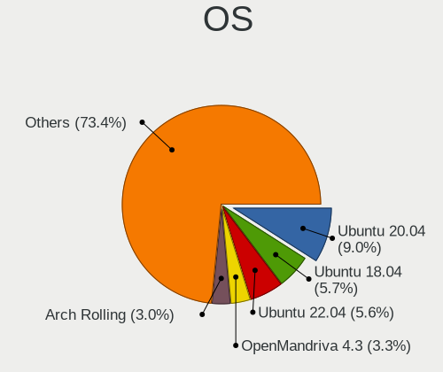

| Name                         | Computers | Percent |
|------------------------------|-----------|---------|
| Ubuntu 20.04                 | 167       | 10.42%  |
| Ubuntu 18.04                 | 105       | 6.55%   |
| Ubuntu 22.04                 | 96        | 5.99%   |
| OpenMandriva 4.3             | 61        | 3.81%   |
| Arch Rolling                 | 40        | 2.5%    |
| Pop!_OS 22.04                | 34        | 2.12%   |
| OpenMandriva 4.2             | 32        | 2%      |
| KDE neon 20.04               | 26        | 1.62%   |
| ArcoLinux Rolling            | 26        | 1.62%   |
| Fedora 38                    | 24        | 1.5%    |
| Zorin 15                     | 23        | 1.43%   |
| Arch                         | 22        | 1.37%   |
| Fedora 36                    | 21        | 1.31%   |
| Zorin 16                     | 19        | 1.19%   |
| Manjaro                      | 19        | 1.19%   |
| Elementary 6.1               | 19        | 1.19%   |
| Debian 12                    | 19        | 1.19%   |
| Pop!_OS 20.04                | 18        | 1.12%   |
| OpenMandriva 23.03           | 17        | 1.06%   |
| Debian 11                    | 17        | 1.06%   |
| Ubuntu 21.10                 | 16        | 1%      |
| Linux Mint 21.1              | 16        | 1%      |
| Linux Mint 20.3              | 16        | 1%      |
| Fedora 35                    | 16        | 1%      |
| Ubuntu 19.10                 | 15        | 0.94%   |
| OpenMandriva 23.08           | 15        | 0.94%   |
| Fedora 37                    | 15        | 0.94%   |
| EndeavourOS Rolling          | 15        | 0.94%   |
| OpenMandriva 23.01           | 14        | 0.87%   |
| Linux Mint 19.3              | 14        | 0.87%   |
| Xubuntu 20.04                | 13        | 0.81%   |
| openSUSE Tumbleweed-XXXXXXXX | 13        | 0.81%   |
| Fedora 39                    | 13        | 0.81%   |
| Linux Mint 20                | 12        | 0.75%   |
| Kubuntu 22.04                | 12        | 0.75%   |
| Debian 10                    | 11        | 0.69%   |
| Linux Mint 21.2              | 10        | 0.62%   |
| KDE neon 22.04               | 10        | 0.62%   |
| Fedora 32                    | 10        | 0.62%   |
| Ubuntu 23.10                 | 9         | 0.56%   |

OS Family
---------

OS without a version

| Name          | Computers | Percent |
|---------------|-----------|---------|
| Ubuntu        | 437       | 28.66%  |
| OpenMandriva  | 158       | 10.36%  |
| Fedora        | 105       | 6.89%   |
| Linux Mint    | 91        | 5.97%   |
| Pop!_OS       | 67        | 4.39%   |
| Arch          | 62        | 4.07%   |
| Zorin         | 53        | 3.48%   |
| Manjaro       | 51        | 3.34%   |
| Debian        | 51        | 3.34%   |
| Elementary    | 46        | 3.02%   |
| KDE neon      | 36        | 2.36%   |
| Kubuntu       | 34        | 2.23%   |
| Endless       | 34        | 2.23%   |
| Kali          | 33        | 2.16%   |
| Xubuntu       | 28        | 1.84%   |
| ArcoLinux     | 27        | 1.77%   |
| Lubuntu       | 20        | 1.31%   |
| openSUSE      | 16        | 1.05%   |
| ROSA          | 15        | 0.98%   |
| EndeavourOS   | 15        | 0.98%   |
| Ubuntu MATE   | 11        | 0.72%   |
| Ubuntu Unity  | 9         | 0.59%   |
| Nobara        | 9         | 0.59%   |
| MX            | 8         | 0.52%   |
| LMDE          | 8         | 0.52%   |
| Clear Linux   | 8         | 0.52%   |
| Parrot        | 7         | 0.46%   |
| SteamOS       | 6         | 0.39%   |
| Gentoo        | 6         | 0.39%   |
| Deepin        | 5         | 0.33%   |
| CentOS        | 5         | 0.33%   |
| Android       | 5         | 0.33%   |
| Ubuntu Budgie | 4         | 0.26%   |
| Rocky Linux   | 4         | 0.26%   |
| Artix         | 4         | 0.26%   |
| Xero          | 3         | 0.2%    |
| Sparky        | 3         | 0.2%    |
| Solus         | 3         | 0.2%    |
| Linux Lite    | 3         | 0.2%    |
| Garuda Linux  | 3         | 0.2%    |

Kernel
------

Version of the Linux kernel

| Version                  | Computers | Percent |
|--------------------------|-----------|---------|
| 5.16.7-desktop-1omv4003  | 60        | 3.49%   |
| 5.10.14-desktop-1omv4002 | 29        | 1.69%   |
| 5.4.0-42-generic         | 28        | 1.63%   |
| 5.15.0-56-generic        | 22        | 1.28%   |
| 5.4.0-26-generic         | 18        | 1.05%   |
| 6.2.6-desktop-1omv2390   | 16        | 0.93%   |
| 5.4.0-52-generic         | 16        | 0.93%   |
| 5.4.0-58-generic         | 15        | 0.87%   |
| 6.6.2-desktop-1omv2390   | 13        | 0.76%   |
| 6.4.11-desktop-1omv2390  | 13        | 0.76%   |
| 6.1.1-desktop-1omv2290   | 12        | 0.7%    |
| 4.18.0-15-generic        | 12        | 0.7%    |
| 5.15.0-41-generic        | 11        | 0.64%   |
| 5.0.0-25-generic         | 11        | 0.64%   |
| 5.15.0-48-generic        | 10        | 0.58%   |
| 5.15.0-46-generic        | 10        | 0.58%   |
| 5.15.0-43-generic        | 10        | 0.58%   |
| 5.4.0-80-generic         | 9         | 0.52%   |
| 5.15.0-47-generic        | 9         | 0.52%   |
| 5.11.0-37-generic        | 9         | 0.52%   |
| 5.4.0-54-generic         | 8         | 0.47%   |
| 5.3.0-46-generic         | 8         | 0.47%   |
| 5.3.0-40-generic         | 8         | 0.47%   |
| 5.19.0-46-generic        | 8         | 0.47%   |
| 5.15.0-58-generic        | 8         | 0.47%   |
| 6.2.0-26-generic         | 7         | 0.41%   |
| 5.8.0-48-generic         | 7         | 0.41%   |
| 5.8.0-14-generic         | 7         | 0.41%   |
| 5.19.0-35-generic        | 7         | 0.41%   |
| 5.15.0-91-generic        | 7         | 0.41%   |
| 5.15.0-52-generic        | 7         | 0.41%   |
| 5.11.0-43-generic        | 7         | 0.41%   |
| 5.11.0-40-generic        | 7         | 0.41%   |
| 5.11.0-27-generic        | 7         | 0.41%   |
| 6.5.5-desktop-1omv2390   | 6         | 0.35%   |
| 6.5.0-14-generic         | 6         | 0.35%   |
| 6.2.0-39-generic         | 6         | 0.35%   |
| 5.4.0-33-generic         | 6         | 0.35%   |
| 5.11.0-7620-generic      | 6         | 0.35%   |
| 5.11.0-38-generic        | 6         | 0.35%   |

Kernel Family
-------------

Linux kernel without a distro release

| Version | Computers | Percent |
|---------|-----------|---------|
| 5.4.0   | 211       | 12.72%  |
| 5.15.0  | 151       | 9.1%    |
| 5.11.0  | 74        | 4.46%   |
| 5.16.7  | 62        | 3.74%   |
| 5.8.0   | 61        | 3.68%   |
| 4.15.0  | 56        | 3.38%   |
| 5.13.0  | 53        | 3.19%   |
| 5.3.0   | 51        | 3.07%   |
| 5.0.0   | 43        | 2.59%   |
| 6.5.0   | 42        | 2.53%   |
| 6.2.0   | 42        | 2.53%   |
| 5.19.0  | 36        | 2.17%   |
| 5.10.0  | 33        | 1.99%   |
| 4.18.0  | 32        | 1.93%   |
| 6.1.0   | 31        | 1.87%   |
| 5.10.14 | 30        | 1.81%   |
| 6.2.6   | 20        | 1.21%   |
| 6.1.1   | 18        | 1.08%   |
| 6.4.11  | 16        | 0.96%   |
| 6.5.5   | 15        | 0.9%    |
| 4.19.0  | 15        | 0.9%    |
| 6.6.2   | 13        | 0.78%   |
| 5.14.0  | 11        | 0.66%   |
| 5.17.5  | 8         | 0.48%   |
| 6.5.6   | 7         | 0.42%   |
| 6.4.6   | 7         | 0.42%   |
| 4.4.0   | 7         | 0.42%   |
| 6.6.9   | 6         | 0.36%   |
| 6.6.8   | 6         | 0.36%   |
| 6.5.3   | 6         | 0.36%   |
| 5.16.0  | 6         | 0.36%   |
| 6.3.5   | 5         | 0.3%    |
| 6.2.8   | 5         | 0.3%    |
| 5.9.16  | 5         | 0.3%    |
| 5.16.12 | 5         | 0.3%    |
| 6.8.7   | 4         | 0.24%   |
| 6.7.6   | 4         | 0.24%   |
| 6.4.8   | 4         | 0.24%   |
| 6.3.8   | 4         | 0.24%   |
| 6.3.7   | 4         | 0.24%   |

Kernel Major Ver.
-----------------

Linux kernel major version

| Version | Computers | Percent |
|---------|-----------|---------|
| 5.4     | 221       | 13.53%  |
| 5.15    | 178       | 10.9%   |
| 5.10    | 100       | 6.12%   |
| 5.16    | 85        | 5.21%   |
| 5.11    | 84        | 5.14%   |
| 6.2     | 80        | 4.9%    |
| 6.5     | 79        | 4.84%   |
| 6.1     | 76        | 4.65%   |
| 5.8     | 76        | 4.65%   |
| 5.13    | 61        | 3.74%   |
| 4.15    | 56        | 3.43%   |
| 5.3     | 55        | 3.37%   |
| 5.19    | 52        | 3.18%   |
| 6.4     | 45        | 2.76%   |
| 5.0     | 45        | 2.76%   |
| 6.6     | 42        | 2.57%   |
| 4.18    | 35        | 2.14%   |
| 6.0     | 31        | 1.9%    |
| 5.14    | 27        | 1.65%   |
| 6.3     | 25        | 1.53%   |
| 5.17    | 22        | 1.35%   |
| 5.18    | 19        | 1.16%   |
| 4.19    | 19        | 1.16%   |
| 5.9     | 16        | 0.98%   |
| 6.7     | 14        | 0.86%   |
| 4.9     | 13        | 0.8%    |
| 5.12    | 12        | 0.73%   |
| 5.7     | 10        | 0.61%   |
| 5.6     | 10        | 0.61%   |
| 6.8     | 9         | 0.55%   |
| 4.4     | 9         | 0.55%   |
| 5.5     | 6         | 0.37%   |
| 5.2     | 3         | 0.18%   |
| 4.13    | 3         | 0.18%   |
| 4.14    | 2         | 0.12%   |
| 4.10    | 2         | 0.12%   |
| 4.1     | 2         | 0.12%   |
| 3.10    | 2         | 0.12%   |
| 6       | 1         | 0.06%   |
| 5.1     | 1         | 0.06%   |

Arch
----

OS architecture (x86_64, i586, etc.)

| Name    | Computers | Percent |
|---------|-----------|---------|
| x86_64  | 1429      | 97.08%  |
| i686    | 31        | 2.11%   |
| aarch64 | 6         | 0.41%   |
| armv8l  | 3         | 0.2%    |
| armv7l  | 3         | 0.2%    |

DE
--

Desktop Environment

| Name              | Computers | Percent |
|-------------------|-----------|---------|
| GNOME             | 645       | 42.13%  |
| KDE5              | 308       | 20.12%  |
| Unknown           | 152       | 9.93%   |
| XFCE              | 120       | 7.84%   |
| X-Cinnamon        | 82        | 5.36%   |
| Pantheon          | 44        | 2.87%   |
| MATE              | 32        | 2.09%   |
| LXQt              | 26        | 1.7%    |
| KDE               | 22        | 1.44%   |
| Cinnamon          | 16        | 1.05%   |
| Budgie            | 10        | 0.65%   |
| Unity             | 9         | 0.59%   |
| i3                | 8         | 0.52%   |
| Deepin            | 8         | 0.52%   |
| KDE4              | 5         | 0.33%   |
| Bspwm             | 5         | 0.33%   |
| Hyprland          | 4         | 0.26%   |
| GNOME Flashback   | 4         | 0.26%   |
| dwm               | 4         | 0.26%   |
| sway              | 3         | 0.2%    |
| ICEWM             | 3         | 0.2%    |
| Cutefish          | 3         | 0.2%    |
| Yaru:ubuntu:GNOME | 2         | 0.13%   |
| xmonad            | 2         | 0.13%   |
| qtile             | 2         | 0.13%   |
| LXDE              | 2         | 0.13%   |
| lightdm-xsession  | 2         | 0.13%   |
| KDE6              | 2         | 0.13%   |
| Phosh:GNOME       | 1         | 0.07%   |
| Peux Gnome        | 1         | 0.07%   |
| openbox           | 1         | 0.07%   |
| Lubuntu           | 1         | 0.07%   |
| awesomeminimal    | 1         | 0.07%   |
| awesome           | 1         | 0.07%   |

Display Server
--------------

X11 or Wayland

| Name    | Computers | Percent |
|---------|-----------|---------|
| X11     | 1075      | 70.68%  |
| Wayland | 321       | 21.1%   |
| Unknown | 103       | 6.77%   |
| Tty     | 22        | 1.45%   |

Display Manager
---------------

SDDM, LightDM, etc.

| Name    | Computers | Percent |
|---------|-----------|---------|
| Unknown | 664       | 43.57%  |
| SDDM    | 285       | 18.7%   |
| GDM     | 193       | 12.66%  |
| GDM3    | 172       | 11.29%  |
| LightDM | 162       | 10.63%  |
| TDM     | 37        | 2.43%   |
| KDM     | 5         | 0.33%   |
| SLiM    | 3         | 0.2%    |
| Ly      | 2         | 0.13%   |
| LXDM    | 1         | 0.07%   |

OS Lang
-------

Language

| Lang    | Computers | Percent |
|---------|-----------|---------|
| en_US   | 1207      | 80.79%  |
| Unknown | 124       | 8.3%    |
| id_ID   | 94        | 6.29%   |
| C       | 24        | 1.61%   |
| en_GB   | 17        | 1.14%   |
| en_AU   | 6         | 0.4%    |
| en_AG   | 5         | 0.33%   |
| en_SG   | 4         | 0.27%   |
| de_DE   | 3         | 0.2%    |
| fr_FR   | 2         | 0.13%   |
| en_IN   | 2         | 0.13%   |
| en_CA   | 2         | 0.13%   |
| jv_ID   | 1         | 0.07%   |
| it_IT   | 1         | 0.07%   |
| de_CH   | 1         | 0.07%   |
| Default | 1         | 0.07%   |

Boot Mode
---------

EFI or BIOS

| Mode | Computers | Percent |
|------|-----------|---------|
| EFI  | 814       | 54.09%  |
| BIOS | 691       | 45.91%  |

Filesystem
----------

Type of filesystem

| Type    | Computers | Percent |
|---------|-----------|---------|
| Ext4    | 1119      | 74.4%   |
| Btrfs   | 152       | 10.11%  |
| Overlay | 115       | 7.65%   |
| Unknown | 45        | 2.99%   |
| Tmpfs   | 33        | 2.19%   |
| Xfs     | 23        | 1.53%   |
| Zfs     | 6         | 0.4%    |
| Ext2    | 5         | 0.33%   |
| F2fs    | 4         | 0.27%   |
| Ext3    | 2         | 0.13%   |

Part. scheme
------------

Scheme of partitioning

| Type    | Computers | Percent |
|---------|-----------|---------|
| Unknown | 672       | 44.62%  |
| GPT     | 644       | 42.76%  |
| MBR     | 190       | 12.62%  |

Dual Boot with Linux/BSD
------------------------

Hosting more than one Linux/BSD

| Dual boot | Computers | Percent |
|-----------|-----------|---------|
| No        | 1299      | 86.77%  |
| Yes       | 198       | 13.23%  |

Dual Boot (Win)
---------------

Hosting Linux and Windows

| Dual boot | Computers | Percent |
|-----------|-----------|---------|
| No        | 877       | 58.39%  |
| Yes       | 625       | 41.61%  |

Board
-----

Vendor
------

Motherboard manufacturer

| Name                    | Computers | Percent |
|-------------------------|-----------|---------|
| Lenovo                  | 312       | 21.2%   |
| ASUSTek Computer        | 279       | 18.95%  |
| Hewlett-Packard         | 195       | 13.25%  |
| Acer                    | 149       | 10.12%  |
| Dell                    | 115       | 7.81%   |
| MSI                     | 66        | 4.48%   |
| Gigabyte Technology     | 52        | 3.53%   |
| ASRock                  | 44        | 2.99%   |
| Toshiba                 | 34        | 2.31%   |
| Intel                   | 28        | 1.9%    |
| Apple                   | 19        | 1.29%   |
| ECS                     | 18        | 1.22%   |
| Biostar                 | 18        | 1.22%   |
| Unknown                 | 17        | 1.15%   |
| AXIOO                   | 13        | 0.88%   |
| Sony                    | 10        | 0.68%   |
| Fujitsu                 | 9         | 0.61%   |
| Samsung Electronics     | 8         | 0.54%   |
| Infinix                 | 5         | 0.34%   |
| Clevo                   | 5         | 0.34%   |
| AZW                     | 5         | 0.34%   |
| ADVAN                   | 5         | 0.34%   |
| HUAWEI                  | 4         | 0.27%   |
| Valve                   | 3         | 0.2%    |
| realme                  | 3         | 0.2%    |
| Foxconn                 | 3         | 0.2%    |
| Timi                    | 2         | 0.14%   |
| Supermicro              | 2         | 0.14%   |
| Raspberry Pi Foundation | 2         | 0.14%   |
| Pegatron                | 2         | 0.14%   |
| Panasonic               | 2         | 0.14%   |
| OEM                     | 2         | 0.14%   |
| Microsoft               | 2         | 0.14%   |
| LORD ELECTRONICS        | 2         | 0.14%   |
| Langchao                | 2         | 0.14%   |
| Google                  | 2         | 0.14%   |
| Acidanthera             | 2         | 0.14%   |
| ZYREX COMPUTER SYSTEMS  | 1         | 0.07%   |
| ZOTAC                   | 1         | 0.07%   |
| Xiaomi                  | 1         | 0.07%   |

Model
-----

Motherboard model

| Name                                    | Computers | Percent |
|-----------------------------------------|-----------|---------|
| Unknown                                 | 24        | 1.63%   |
| Lenovo IdeaPad 330-14AST 81D5           | 12        | 0.82%   |
| Lenovo G40-45 80E1                      | 12        | 0.82%   |
| HP Notebook                             | 11        | 0.75%   |
| HP Pavilion Aero Laptop 13-be0xxx       | 9         | 0.61%   |
| Intel H61                               | 8         | 0.54%   |
| Acer Aspire 4752                        | 8         | 0.54%   |
| Lenovo IdeaPad S340-14API 81NB          | 7         | 0.48%   |
| Lenovo G400 20235                       | 7         | 0.48%   |
| HP Laptop 14-bw0xx                      | 6         | 0.41%   |
| HP 14                                   | 6         | 0.41%   |
| Acer Swift SF314-71                     | 6         | 0.41%   |
| Acer Aspire 4750                        | 6         | 0.41%   |
| HP Pavilion g4                          | 5         | 0.34%   |
| ASUS X455YA                             | 5         | 0.34%   |
| ASUS X455LF                             | 5         | 0.34%   |
| ASUS X441BA                             | 5         | 0.34%   |
| ASUS VivoBook_ASUS Laptop X505ZA_X505ZA | 5         | 0.34%   |
| ASUS GL553VD                            | 5         | 0.34%   |
| ASUS All Series                         | 5         | 0.34%   |
| Apple MacBookPro12,1                    | 5         | 0.34%   |
| Acer Swift SFX14-41G                    | 5         | 0.34%   |
| Acer One Z1402                          | 5         | 0.34%   |
| Lenovo Yoga C640-13IML 81UE             | 4         | 0.27%   |
| Lenovo V310-14ISK 80SX                  | 4         | 0.27%   |
| Lenovo IdeaPad 320-14AST 80XU           | 4         | 0.27%   |
| Lenovo G400s 20244                      | 4         | 0.27%   |
| Lenovo G40-30 80FY                      | 4         | 0.27%   |
| HP Pavilion 14                          | 4         | 0.27%   |
| HP Laptop 14-cm0xxx                     | 4         | 0.27%   |
| HP Laptop 14-bs0xx                      | 4         | 0.27%   |
| HP EliteBook 2570p                      | 4         | 0.27%   |
| HP 1000                                 | 4         | 0.27%   |
| Gigabyte H61M-DS2                       | 4         | 0.27%   |
| Dell OptiPlex 7010                      | 4         | 0.27%   |
| ASUS X456URK                            | 4         | 0.27%   |
| ASUS X453SA                             | 4         | 0.27%   |
| ASUS X450CC                             | 4         | 0.27%   |
| ASUS X442URR                            | 4         | 0.27%   |
| ASUS X441NA                             | 4         | 0.27%   |

Model Family
------------

Motherboard model prefix

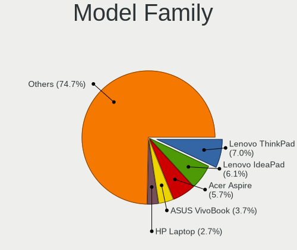

| Name               | Computers | Percent |
|--------------------|-----------|---------|
| Lenovo IdeaPad     | 100       | 6.79%   |
| Lenovo ThinkPad    | 94        | 6.39%   |
| Acer Aspire        | 86        | 5.84%   |
| ASUS VivoBook      | 43        | 2.92%   |
| Dell Latitude      | 41        | 2.79%   |
| HP Laptop          | 40        | 2.72%   |
| HP Pavilion        | 39        | 2.65%   |
| Dell Inspiron      | 27        | 1.83%   |
| HP EliteBook       | 24        | 1.63%   |
| Unknown            | 24        | 1.63%   |
| Acer Swift         | 23        | 1.56%   |
| Toshiba Satellite  | 22        | 1.49%   |
| Dell Vostro        | 15        | 1.02%   |
| Dell OptiPlex      | 15        | 1.02%   |
| Lenovo Yoga        | 14        | 0.95%   |
| ASUS ROG           | 13        | 0.88%   |
| Lenovo ThinkCentre | 12        | 0.82%   |
| Lenovo G40-45      | 12        | 0.82%   |
| HP Notebook        | 11        | 0.75%   |
| ASUS ASUS          | 10        | 0.68%   |
| Acer Nitro         | 10        | 0.68%   |
| Lenovo ThinkBook   | 9         | 0.61%   |
| HP ENVY            | 9         | 0.61%   |
| ASUS TUF           | 9         | 0.61%   |
| ASUS PRIME         | 9         | 0.61%   |
| Intel H61          | 8         | 0.54%   |
| Toshiba PORTEGE    | 7         | 0.48%   |
| MSI Modern         | 7         | 0.48%   |
| Lenovo IdeaPadFlex | 7         | 0.48%   |
| Lenovo G400        | 7         | 0.48%   |
| HP ProBook         | 7         | 0.48%   |
| Lenovo ThinkSystem | 6         | 0.41%   |
| HP Compaq          | 6         | 0.41%   |
| HP 14              | 6         | 0.41%   |
| Acer One           | 6         | 0.41%   |
| Infinix INBook     | 5         | 0.34%   |
| HP ProLiant        | 5         | 0.34%   |
| HP 240             | 5         | 0.34%   |
| Gigabyte H61M-DS2  | 5         | 0.34%   |
| AXIOO Mybook       | 5         | 0.34%   |

MFG Year
--------

Motherboard manufacture year

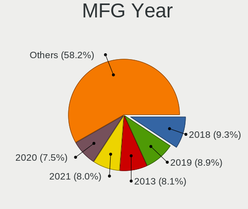

| Year    | Computers | Percent |
|---------|-----------|---------|
| 2018    | 142       | 9.65%   |
| 2019    | 137       | 9.31%   |
| 2013    | 127       | 8.63%   |
| 2021    | 119       | 8.08%   |
| 2020    | 112       | 7.61%   |
| 2011    | 111       | 7.54%   |
| 2012    | 110       | 7.47%   |
| 2017    | 100       | 6.79%   |
| 2014    | 100       | 6.79%   |
| 2015    | 85        | 5.77%   |
| 2010    | 80        | 5.43%   |
| 2016    | 70        | 4.76%   |
| 2022    | 43        | 2.92%   |
| 2009    | 43        | 2.92%   |
| 2008    | 39        | 2.65%   |
| 2023    | 21        | 1.43%   |
| 2007    | 18        | 1.22%   |
| Unknown | 11        | 0.75%   |
| 2006    | 4         | 0.27%   |

Form Factor
-----------

Physical design of the computer

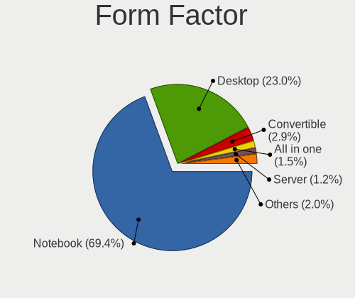

| Name           | Computers | Percent |
|----------------|-----------|---------|
| Notebook       | 1020      | 69.29%  |
| Desktop        | 341       | 23.17%  |
| Convertible    | 41        | 2.79%   |
| All in one     | 21        | 1.43%   |
| Server         | 21        | 1.43%   |
| Tablet         | 9         | 0.61%   |
| Mini pc        | 7         | 0.48%   |
| System on chip | 6         | 0.41%   |
| Phone          | 5         | 0.34%   |
| Other          | 1         | 0.07%   |

Secure Boot
-----------

Enabled or disabled

| State    | Computers | Percent |
|----------|-----------|---------|
| Disabled | 1374      | 92.53%  |
| Enabled  | 111       | 7.47%   |

Coreboot
--------

Have coreboot on board

| Used | Computers | Percent |
|------|-----------|---------|
| No   | 1470      | 99.86%  |
| Yes  | 2         | 0.14%   |

RAM Size
--------

Total RAM memory

| Size in GB      | Computers | Percent |
|-----------------|-----------|---------|
| 4.01-8.0        | 443       | 29.73%  |
| 3.01-4.0        | 369       | 24.77%  |
| 8.01-16.0       | 268       | 17.99%  |
| 16.01-24.0      | 202       | 13.56%  |
| 1.01-2.0        | 103       | 6.91%   |
| 32.01-64.0      | 51        | 3.42%   |
| 24.01-32.0      | 16        | 1.07%   |
| 2.01-3.0        | 16        | 1.07%   |
| 64.01-256.0     | 13        | 0.87%   |
| 0.51-1.0        | 8         | 0.54%   |
| More than 256.0 | 1         | 0.07%   |

RAM Used
--------

Used RAM memory

| Used GB    | Computers | Percent |
|------------|-----------|---------|
| 1.01-2.0   | 565       | 34.79%  |
| 2.01-3.0   | 454       | 27.96%  |
| 4.01-8.0   | 226       | 13.92%  |
| 3.01-4.0   | 221       | 13.61%  |
| 0.51-1.0   | 99        | 6.1%    |
| 8.01-16.0  | 40        | 2.46%   |
| 0.01-0.5   | 9         | 0.55%   |
| 16.01-24.0 | 7         | 0.43%   |
| 32.01-64.0 | 1         | 0.06%   |
| 24.01-32.0 | 1         | 0.06%   |
| Unknown    | 1         | 0.06%   |

Total Drives
------------

Number of drives on board

| Drives  | Computers | Percent |
|---------|-----------|---------|
| 1       | 992       | 65.74%  |
| 2       | 400       | 26.51%  |
| 3       | 69        | 4.57%   |
| 4       | 24        | 1.59%   |
| 0       | 11        | 0.73%   |
| 5       | 5         | 0.33%   |
| 6       | 3         | 0.2%    |
| 15      | 1         | 0.07%   |
| 12      | 1         | 0.07%   |
| 8       | 1         | 0.07%   |
| 7       | 1         | 0.07%   |
| Unknown | 1         | 0.07%   |

Has CD-ROM
----------

Has CD-ROM on board

| Presented | Computers | Percent |
|-----------|-----------|---------|
| No        | 1020      | 68.69%  |
| Yes       | 465       | 31.31%  |

Has Ethernet
------------

Has Ethernet on board

| Presented | Computers | Percent |
|-----------|-----------|---------|
| Yes       | 1212      | 82.28%  |
| No        | 261       | 17.72%  |

Has WiFi
--------

Has WiFi module

| Presented | Computers | Percent |
|-----------|-----------|---------|
| Yes       | 1276      | 86.16%  |
| No        | 205       | 13.84%  |

Has Bluetooth
-------------

Has Bluetooth module

| Presented | Computers | Percent |
|-----------|-----------|---------|
| Yes       | 970       | 65.23%  |
| No        | 517       | 34.77%  |

Location
--------

Country
-------

Geographic location (country)

| Country   | Computers | Percent |
|-----------|-----------|---------|
| Indonesia | 1472      | 100%    |

City
----

Geographic location (city)

| City            | Computers | Percent |
|-----------------|-----------|---------|
| Jakarta         | 415       | 25.82%  |
| Surabaya        | 139       | 8.65%   |
| Bandung         | 123       | 7.65%   |
| Yogyakarta      | 68        | 4.23%   |
| Semarang        | 51        | 3.17%   |
| Bogor           | 49        | 3.05%   |
| Bekasi          | 47        | 2.92%   |
| Tangerang       | 43        | 2.68%   |
| Malang          | 38        | 2.36%   |
| Denpasar        | 37        | 2.3%    |
| South Tangerang | 35        | 2.18%   |
| Medan           | 34        | 2.12%   |
| Depok           | 23        | 1.43%   |
| Palembang       | 20        | 1.24%   |
| Makassar        | 16        | 1%      |
| Banjarmasin     | 16        | 1%      |
| Sleman          | 14        | 0.87%   |
| Balikpapan      | 13        | 0.81%   |
| Tasikmalaya     | 12        | 0.75%   |
| Samarinda       | 11        | 0.68%   |
| Surakarta       | 10        | 0.62%   |
| Blitar          | 10        | 0.62%   |
| Banda Aceh      | 10        | 0.62%   |
| Magelang        | 9         | 0.56%   |
| Gresik          | 9         | 0.56%   |
| Batam           | 9         | 0.56%   |
| Pasuruan        | 8         | 0.5%    |
| Mataram         | 8         | 0.5%    |
| Jember          | 8         | 0.5%    |
| Pontianak       | 7         | 0.44%   |
| Pekanbaru       | 7         | 0.44%   |
| Kediri          | 7         | 0.44%   |
| Brebes          | 7         | 0.44%   |
| Kudus           | 6         | 0.37%   |
| Cirebon         | 6         | 0.37%   |
| Bandar Lampung  | 6         | 0.37%   |
| Sukabumi        | 5         | 0.31%   |
| Pekan Baru      | 5         | 0.31%   |
| Jambi City      | 5         | 0.31%   |
| Demak           | 5         | 0.31%   |

Drives
------

Drive Vendor
------------

Hard drive vendors

| Vendor                | Computers | Drives | Percent |
|-----------------------|-----------|--------|---------|
| Seagate               | 368       | 499    | 18.49%  |
| WDC                   | 270       | 360    | 13.57%  |
| Samsung Electronics   | 177       | 238    | 8.89%   |
| Toshiba               | 164       | 183    | 8.24%   |
| HGST                  | 77        | 91     | 3.87%   |
| SanDisk               | 71        | 87     | 3.57%   |
| Hitachi               | 71        | 87     | 3.57%   |
| Unknown               | 68        | 89     | 3.42%   |
| Intel                 | 52        | 71     | 2.61%   |
| A-DATA Technology     | 50        | 60     | 2.51%   |
| V-GeN                 | 46        | 50     | 2.31%   |
| Kingston              | 46        | 56     | 2.31%   |
| SK hynix              | 41        | 47     | 2.06%   |
| MidasForce            | 37        | 41     | 1.86%   |
| Micron Technology     | 35        | 47     | 1.76%   |
| Unknown               | 27        | 29     | 1.36%   |
| China                 | 26        | 29     | 1.31%   |
| Silicon Motion        | 22        | 26     | 1.11%   |
| Apacer                | 19        | 22     | 0.95%   |
| JMicron Technology    | 17        | 18     | 0.85%   |
| Patriot               | 15        | 25     | 0.75%   |
| Team                  | 14        | 18     | 0.7%    |
| VISIPRO               | 13        | 17     | 0.65%   |
| RX7                   | 13        | 16     | 0.65%   |
| EYOTA                 | 12        | 16     | 0.6%    |
| Apple                 | 12        | 13     | 0.6%    |
| Fujitsu               | 11        | 12     | 0.55%   |
| Crucial               | 11        | 13     | 0.55%   |
| ADATA Technology      | 10        | 18     | 0.5%    |
| Hewlett-Packard       | 9         | 11     | 0.45%   |
| KIOXIA                | 8         | 9      | 0.4%    |
| Transcend             | 7         | 11     | 0.35%   |
| Phison Electronics    | 7         | 8      | 0.35%   |
| Realtek Semiconductor | 6         | 6      | 0.3%    |
| Pioneer               | 6         | 6      | 0.3%    |
| External              | 6         | 6      | 0.3%    |
| XPG                   | 5         | 8      | 0.25%   |
| Wellcomm              | 5         | 5      | 0.25%   |
| Ramos Technology      | 5         | 13     | 0.25%   |
| PNY                   | 5         | 6      | 0.25%   |

Drive Model
-----------

Hard drive models

| Model                                                 | Computers | Percent |
|-------------------------------------------------------|-----------|---------|
| Seagate ST500LT012-1DG142 500GB                       | 46        | 2.18%   |
| Seagate ST1000LM035-1RK172 1TB                        | 46        | 2.18%   |
| Toshiba MQ01ABF050 500GB                              | 32        | 1.52%   |
| Unknown                                               | 27        | 1.28%   |
| Toshiba MQ04ABF100 1TB                                | 26        | 1.23%   |
| Toshiba MQ01ABD100 1TB                                | 22        | 1.04%   |
| Seagate ST3500312CS 500GB                             | 22        | 1.04%   |
| HGST HTS545050A7E680 500GB                            | 21        | 1%      |
| A-DATA SU650 120GB SSD                                | 21        | 1%      |
| Seagate ST500DM002-1BD142 500GB                       | 18        | 0.85%   |
| Hitachi HTS543232A7A384 320GB                         | 15        | 0.71%   |
| MidasForce SSD 128GB                                  | 13        | 0.62%   |
| Seagate ST500LT012-9WS142 500GB                       | 12        | 0.57%   |
| HGST HTS721010A9E630 1TB                              | 12        | 0.57%   |
| Seagate ST9500325AS 500GB                             | 11        | 0.52%   |
| Seagate ST1000DM010-2EP102 1TB                        | 11        | 0.52%   |
| Samsung SSD 860 EVO 250GB                             | 11        | 0.52%   |
| JMicron Generic 320GB                                 | 11        | 0.52%   |
| WDC WD5000LPVX-22V0TT0 500GB                          | 10        | 0.47%   |
| Seagate ST9320325AS 320GB                             | 10        | 0.47%   |
| Seagate ST1000LM024 HN-M101MBB 1TB                    | 10        | 0.47%   |
| SanDisk NVMe SSD Drive 512GB                          | 10        | 0.47%   |
| Samsung SSD 850 EVO 250GB                             | 10        | 0.47%   |
| Hitachi HTS545050A7E380 500GB                         | 10        | 0.47%   |
| HGST HTS725050A7E630 500GB                            | 10        | 0.47%   |
| HGST HTS545050A7E380 500GB                            | 10        | 0.47%   |
| A-DATA SU650 240GB SSD                                | 10        | 0.47%   |
| Unknown MMC Card  64GB                                | 9         | 0.43%   |
| Unknown MMC Card  128GB                               | 9         | 0.43%   |
| Seagate ST3250318AS 250GB                             | 9         | 0.43%   |
| Seagate ST1000LM049-2GH172 1TB                        | 9         | 0.43%   |
| Intel SSDPEKNW512G8 512GB                             | 9         | 0.43%   |
| WDC WDS240G2G0A-00JH30 240GB SSD                      | 8         | 0.38%   |
| WDC WD10SPZX-21Z10T0 1TB                              | 8         | 0.38%   |
| Unknown SD/MMC/MS PRO 128GB                           | 8         | 0.38%   |
| Unknown MMC Card  32GB                                | 8         | 0.38%   |
| Silicon Motion SM2263EN/SM2263XT SSD Controller 256GB | 8         | 0.38%   |
| Seagate ST1000LX015-1U7172 1TB                        | 8         | 0.38%   |
| Seagate ST1000DM003-1ER162 1TB                        | 8         | 0.38%   |
| MidasForce SSD 120GB                                  | 8         | 0.38%   |

HDD Vendor
----------

Hard disk drive vendors

| Vendor              | Computers | Drives | Percent |
|---------------------|-----------|--------|---------|
| Seagate             | 365       | 492    | 39%     |
| WDC                 | 215       | 286    | 22.97%  |
| Toshiba             | 142       | 158    | 15.17%  |
| HGST                | 77        | 91     | 8.23%   |
| Hitachi             | 71        | 87     | 7.59%   |
| Samsung Electronics | 13        | 13     | 1.39%   |
| JMicron Technology  | 12        | 12     | 1.28%   |
| Unknown             | 9         | 9      | 0.96%   |
| Fujitsu             | 9         | 9      | 0.96%   |
| Hewlett-Packard     | 7         | 9      | 0.75%   |
| Maxtor              | 4         | 4      | 0.43%   |
| Apple               | 4         | 4      | 0.43%   |
| TO Exter            | 2         | 2      | 0.21%   |
| Unknown             | 2         | 2      | 0.21%   |
| SYMTEC              | 1         | 1      | 0.11%   |
| HGST HTS            | 1         | 3      | 0.11%   |
| ExcelStor           | 1         | 1      | 0.11%   |
| CLOVER              | 1         | 1      | 0.11%   |

SSD Vendor
----------

Solid state drive vendors

| Vendor              | Computers | Drives | Percent |
|---------------------|-----------|--------|---------|
| Samsung Electronics | 79        | 108    | 14.42%  |
| MidasForce          | 36        | 40     | 6.57%   |
| A-DATA Technology   | 36        | 43     | 6.57%   |
| WDC                 | 35        | 45     | 6.39%   |
| SanDisk             | 35        | 48     | 6.39%   |
| V-GeN               | 31        | 35     | 5.66%   |
| Kingston            | 30        | 33     | 5.47%   |
| China               | 26        | 29     | 4.74%   |
| Apacer              | 19        | 22     | 3.47%   |
| Unknown             | 16        | 16     | 2.92%   |
| Patriot             | 15        | 25     | 2.74%   |
| VISIPRO             | 10        | 14     | 1.82%   |
| Team                | 10        | 14     | 1.82%   |
| Intel               | 10        | 14     | 1.82%   |
| EYOTA               | 10        | 13     | 1.82%   |
| Toshiba             | 9         | 10     | 1.64%   |
| RX7                 | 9         | 10     | 1.64%   |
| Crucial             | 9         | 11     | 1.64%   |
| Apple               | 7         | 7      | 1.28%   |
| Seagate             | 6         | 6      | 1.09%   |
| Pioneer             | 6         | 6      | 1.09%   |
| Micron Technology   | 6         | 8      | 1.09%   |
| External            | 6         | 6      | 1.09%   |
| Wellcomm            | 5         | 5      | 0.91%   |
| Transcend           | 5         | 8      | 0.91%   |
| Ramos Technology    | 5         | 13     | 0.91%   |
| SK hynix            | 4         | 5      | 0.73%   |
| LITEON              | 4         | 5      | 0.73%   |
| XSTAR               | 3         | 3      | 0.55%   |
| USB3.0              | 3         | 3      | 0.55%   |
| Unknown             | 3         | 4      | 0.55%   |
| PNY                 | 3         | 3      | 0.55%   |
| OCZ                 | 3         | 3      | 0.55%   |
| LITEONIT            | 3         | 4      | 0.55%   |
| Kingmax             | 3         | 3      | 0.55%   |
| GALAX               | 3         | 3      | 0.55%   |
| Varro               | 2         | 2      | 0.36%   |
| T-FORCE             | 2         | 2      | 0.36%   |
| SPCC                | 2         | 2      | 0.36%   |
| Smart               | 2         | 2      | 0.36%   |

Drive Kind
----------

HDD or SSD

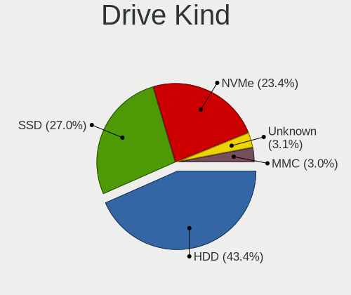

| Kind    | Computers | Drives | Percent |
|---------|-----------|--------|---------|
| HDD     | 834       | 1184   | 45.62%  |
| SSD     | 500       | 675    | 27.35%  |
| NVMe    | 388       | 514    | 21.23%  |
| MMC     | 53        | 73     | 2.9%    |
| Unknown | 53        | 62     | 2.9%    |

Drive Connector
---------------

SATA, SAS, NVMe, etc.

| Type | Computers | Drives | Percent |
|------|-----------|--------|---------|
| SATA | 1130      | 1838   | 68.73%  |
| NVMe | 388       | 512    | 23.6%   |
| SAS  | 73        | 85     | 4.44%   |
| MMC  | 53        | 73     | 3.22%   |

Drive Size
----------

Size of hard drive

| Size in TB | Computers | Drives | Percent |
|------------|-----------|--------|---------|
| 0.01-0.5   | 876       | 1295   | 67.75%  |
| 0.51-1.0   | 336       | 444    | 25.99%  |
| 1.01-2.0   | 58        | 90     | 4.49%   |
| 3.01-4.0   | 10        | 15     | 0.77%   |
| 2.01-3.0   | 7         | 7      | 0.54%   |
| 4.01-10.0  | 5         | 7      | 0.39%   |
| 10.01-20.0 | 1         | 1      | 0.08%   |

Space Total
-----------

Amount of disk space available on the file system

| Size in GB     | Computers | Percent |
|----------------|-----------|---------|
| 101-250        | 445       | 28.75%  |
| 251-500        | 385       | 24.87%  |
| 501-1000       | 180       | 11.63%  |
| 51-100         | 157       | 10.14%  |
| 1-20           | 114       | 7.36%   |
| 1001-2000      | 102       | 6.59%   |
| 21-50          | 91        | 5.88%   |
| Unknown        | 28        | 1.81%   |
| More than 3000 | 27        | 1.74%   |
| 2001-3000      | 19        | 1.23%   |

Space Used
----------

Amount of used disk space

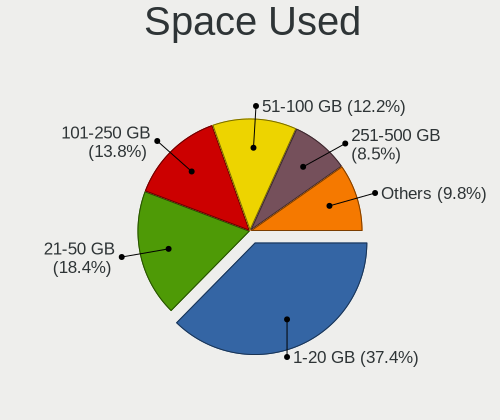

| Used GB        | Computers | Percent |
|----------------|-----------|---------|
| 1-20           | 599       | 37.18%  |
| 21-50          | 301       | 18.68%  |
| 101-250        | 220       | 13.66%  |
| 51-100         | 197       | 12.23%  |
| 251-500        | 136       | 8.44%   |
| 501-1000       | 86        | 5.34%   |
| Unknown        | 28        | 1.74%   |
| 1001-2000      | 26        | 1.61%   |
| More than 3000 | 12        | 0.74%   |
| 2001-3000      | 6         | 0.37%   |

Malfunc. Drives
---------------

Drive models with a malfunction

| Model                                 | Computers | Drives | Percent |
|---------------------------------------|-----------|--------|---------|
| HGST HTS545050A7E680 500GB            | 9         | 10     | 3.98%   |
| Seagate ST500LT012-1DG142 500GB       | 7         | 7      | 3.1%    |
| Seagate ST500DM002-1BD142 500GB       | 7         | 9      | 3.1%    |
| Seagate ST500LT012-9WS142 500GB       | 6         | 6      | 2.65%   |
| Seagate ST9500325AS 500GB             | 5         | 5      | 2.21%   |
| Toshiba MQ01ABF050 500GB              | 4         | 4      | 1.77%   |
| HGST HTS545050A7E380 500GB            | 4         | 5      | 1.77%   |
| WDC WD5000LPVX-22V0TT0 500GB          | 3         | 4      | 1.33%   |
| Toshiba MQ01ABD032 320GB              | 3         | 3      | 1.33%   |
| Seagate ST1000LX015-1U7172 1TB        | 3         | 4      | 1.33%   |
| Seagate ST1000LM035-1RK172 1TB        | 3         | 3      | 1.33%   |
| Hitachi HTS545050A7E380 500GB         | 3         | 3      | 1.33%   |
| Hitachi HTS543232A7A384 320GB         | 3         | 3      | 1.33%   |
| HGST HTS725050A7E630 500GB            | 3         | 3      | 1.33%   |
| Unknown                               | 3         | 3      | 1.33%   |
| WDC WD800JD-08LSA0 80GB               | 2         | 2      | 0.88%   |
| WDC WD3200BEKT-60V5T1 320GB           | 2         | 2      | 0.88%   |
| WDC WD3200AAKS-61L9A0 320GB           | 2         | 3      | 0.88%   |
| WDC WD2000FYYZ-01UL1B1 2TB            | 2         | 2      | 0.88%   |
| WDC WD10JPCX-24UE4T0 1TB              | 2         | 4      | 0.88%   |
| WDC WD10EZEX-08M2NA0 1TB              | 2         | 2      | 0.88%   |
| Toshiba MQ01ABD100 1TB                | 2         | 2      | 0.88%   |
| Toshiba MQ01ABD050 500GB              | 2         | 2      | 0.88%   |
| Toshiba MK5059GSXP 500GB              | 2         | 2      | 0.88%   |
| Toshiba MK3265GSX 320GB               | 2         | 3      | 0.88%   |
| Seagate ST9500420AS 500GB             | 2         | 2      | 0.88%   |
| Seagate ST9320325AS 320GB             | 2         | 2      | 0.88%   |
| Seagate ST9250410AS 250GB             | 2         | 2      | 0.88%   |
| Seagate ST320LT012-9WS14C 320GB       | 2         | 2      | 0.88%   |
| Seagate ST1000DM003-1ER162 1TB        | 2         | 2      | 0.88%   |
| SanDisk SSD PLUS 120 GB               | 2         | 2      | 0.88%   |
| Hitachi HTS545050B9A300 500GB         | 2         | 2      | 0.88%   |
| Hitachi HTS545032B9A300 320GB         | 2         | 2      | 0.88%   |
| Hitachi HTS545016B9A300 160GB         | 2         | 2      | 0.88%   |
| A-DATA Technology SU800NS38 256GB SSD | 2         | 2      | 0.88%   |
| WellcommMaster 128GB SSD              | 1         | 1      | 0.44%   |
| Wellcomm Master 128GB SSD             | 1         | 1      | 0.44%   |
| WDC WDS240G2G0A-00JH30 240GB SSD      | 1         | 1      | 0.44%   |
| WDC WD80EZZX-11CSGA0 8TB              | 1         | 2      | 0.44%   |
| WDC WD7500BPVT-55HXZT4 752GB          | 1         | 1      | 0.44%   |

Malfunc. Drive Vendor
---------------------

Vendors of faulty drives

| Vendor              | Computers | Drives | Percent |
|---------------------|-----------|--------|---------|
| Seagate             | 61        | 75     | 27.98%  |
| WDC                 | 47        | 57     | 21.56%  |
| Toshiba             | 25        | 27     | 11.47%  |
| Hitachi             | 22        | 22     | 10.09%  |
| HGST                | 20        | 23     | 9.17%   |
| Samsung Electronics | 5         | 6      | 2.29%   |
| SanDisk             | 4         | 4      | 1.83%   |
| Micron Technology   | 4         | 4      | 1.83%   |
| A-DATA Technology   | 4         | 6      | 1.83%   |
| Unknown             | 3         | 3      | 1.38%   |
| KLEVV               | 2         | 2      | 0.92%   |
| Kingston            | 2         | 2      | 0.92%   |
| Crucial             | 2         | 2      | 0.92%   |
| China               | 2         | 2      | 0.92%   |
| Apacer              | 2         | 3      | 0.92%   |
| WellcommMaster      | 1         | 1      | 0.46%   |
| Wellcomm            | 1         | 1      | 0.46%   |
| VISIPRO             | 1         | 3      | 0.46%   |
| ValueTech           | 1         | 1      | 0.46%   |
| T-FORCE             | 1         | 1      | 0.46%   |
| SK hynix            | 1         | 1      | 0.46%   |
| Silicon Motion      | 1         | 1      | 0.46%   |
| RX7                 | 1         | 1      | 0.46%   |
| Maxtor              | 1         | 1      | 0.46%   |
| Intel               | 1         | 1      | 0.46%   |
| EYOTA               | 1         | 1      | 0.46%   |
| CLOVER              | 1         | 1      | 0.46%   |
| Apple               | 1         | 1      | 0.46%   |

Malfunc. HDD Vendor
-------------------

Vendors of faulty HDD drives

| Vendor              | Computers | Drives | Percent |
|---------------------|-----------|--------|---------|
| Seagate             | 61        | 75     | 33.7%   |
| WDC                 | 46        | 56     | 25.41%  |
| Toshiba             | 25        | 27     | 13.81%  |
| Hitachi             | 22        | 22     | 12.15%  |
| HGST                | 20        | 23     | 11.05%  |
| Samsung Electronics | 3         | 3      | 1.66%   |
| Maxtor              | 1         | 1      | 0.55%   |
| CLOVER              | 1         | 1      | 0.55%   |
| Apple               | 1         | 1      | 0.55%   |
| Unknown             | 1         | 1      | 0.55%   |

Malfunc. Drive Kind
-------------------

Kinds of faulty drives

| Kind | Computers | Drives | Percent |
|------|-----------|--------|---------|
| HDD  | 168       | 210    | 82.35%  |
| SSD  | 31        | 37     | 15.2%   |
| NVMe | 5         | 6      | 2.45%   |

Failed Drives
-------------

Failed drive models

| Model                             | Computers | Drives | Percent |
|-----------------------------------|-----------|--------|---------|
| Seagate ST3250318AS 250GB         | 2         | 2      | 28.57%  |
| WDC WD5000BPVT-60HXZT1 500GB      | 1         | 1      | 14.29%  |
| Toshiba MK2575GSX 250GB           | 1         | 1      | 14.29%  |
| Hitachi HTS545050A7E380 500GB     | 1         | 1      | 14.29%  |
| Hitachi HTS543232A7A384 320GB     | 1         | 1      | 14.29%  |
| A-DATA Technology SX8200PNP 256GB | 1         | 1      | 14.29%  |

Failed Drive Vendor
-------------------

Failed drive vendors

| Vendor            | Computers | Drives | Percent |
|-------------------|-----------|--------|---------|
| Seagate           | 2         | 2      | 28.57%  |
| Hitachi           | 2         | 2      | 28.57%  |
| WDC               | 1         | 1      | 14.29%  |
| Toshiba           | 1         | 1      | 14.29%  |
| A-DATA Technology | 1         | 1      | 14.29%  |

Drive Status
------------

Number of failed and malfunc. drives

| Status   | Computers | Drives | Percent |
|----------|-----------|--------|---------|
| Detected | 791       | 1292   | 48.95%  |
| Works    | 619       | 956    | 38.3%   |
| Malfunc  | 199       | 253    | 12.31%  |
| Failed   | 7         | 7      | 0.43%   |

Storage controller
------------------

Storage Vendor
--------------

Storage controller vendors

| Vendor                           | Computers | Percent |
|----------------------------------|-----------|---------|
| Intel                            | 1006      | 58.39%  |
| AMD                              | 296       | 17.18%  |
| Samsung Electronics              | 95        | 5.51%   |
| SanDisk                          | 59        | 3.42%   |
| SK hynix                         | 36        | 2.09%   |
| Silicon Motion                   | 31        | 1.8%    |
| Micron Technology                | 29        | 1.68%   |
| ADATA Technology                 | 27        | 1.57%   |
| Kingston Technology Company      | 20        | 1.16%   |
| Phison Electronics               | 19        | 1.1%    |
| Toshiba America Info Systems     | 11        | 0.64%   |
| ASMedia Technology               | 11        | 0.64%   |
| Realtek Semiconductor            | 10        | 0.58%   |
| KIOXIA                           | 10        | 0.58%   |
| JMicron Technology               | 7         | 0.41%   |
| Union Memory (Shenzhen)          | 6         | 0.35%   |
| Broadcom / LSI                   | 6         | 0.35%   |
| Silicon Integrated Systems [SiS] | 5         | 0.29%   |
| Nvidia                           | 5         | 0.29%   |
| VIA Technologies                 | 4         | 0.23%   |
| Micron/Crucial Technology        | 4         | 0.23%   |
| MAXIO Technology (Hangzhou)      | 4         | 0.23%   |
| Hewlett-Packard                  | 4         | 0.23%   |
| Shenzhen Longsys Electronics     | 3         | 0.17%   |
| Marvell Technology Group         | 3         | 0.17%   |
| LSI Logic / Symbios Logic        | 2         | 0.12%   |
| INNOGRIT                         | 2         | 0.12%   |
| Adaptec                          | 2         | 0.12%   |
| Solid State Storage Technology   | 1         | 0.06%   |
| Shenzhen Shichuangyi Electronics | 1         | 0.06%   |
| O2 Micro                         | 1         | 0.06%   |
| Lenovo                           | 1         | 0.06%   |
| Biwin Storage Technology         | 1         | 0.06%   |
| Apple                            | 1         | 0.06%   |

Storage Model
-------------

Storage controller models

| Model                                                                                   | Computers | Percent |
|-----------------------------------------------------------------------------------------|-----------|---------|
| AMD FCH SATA Controller [AHCI mode]                                                     | 230       | 11.81%  |
| Intel Sunrise Point-LP SATA Controller [AHCI mode]                                      | 96        | 4.93%   |
| Intel 7 Series Chipset Family 6-port SATA Controller [AHCI mode]                        | 96        | 4.93%   |
| Intel 6 Series/C200 Series Chipset Family 6 port Mobile SATA AHCI Controller            | 56        | 2.87%   |
| Intel 82801 Mobile SATA Controller [RAID mode]                                          | 55        | 2.82%   |
| Intel 8 Series/C220 Series Chipset Family 6-port SATA Controller 1 [AHCI mode]          | 51        | 2.62%   |
| Intel 8 Series SATA Controller 1 [AHCI mode]                                            | 50        | 2.57%   |
| Samsung NVMe SSD Controller 980 (DRAM-less)                                             | 42        | 2.16%   |
| Intel NM10/ICH7 Family SATA Controller [IDE mode]                                       | 42        | 2.16%   |
| Intel Wildcat Point-LP SATA Controller [AHCI Mode]                                      | 36        | 1.85%   |
| Intel 82801G (ICH7 Family) IDE Controller                                               | 36        | 1.85%   |
| Intel 6 Series/C200 Series Chipset Family 6 port Desktop SATA AHCI Controller           | 34        | 1.75%   |
| Intel Volume Management Device NVMe RAID Controller                                     | 31        | 1.59%   |
| Intel 5 Series/3400 Series Chipset 4 port SATA AHCI Controller                          | 31        | 1.59%   |
| Intel 82801IBM/IEM (ICH9M/ICH9M-E) 4 port SATA Controller [AHCI mode]                   | 24        | 1.23%   |
| Silicon Motion SM2263EN/SM2263XT (DRAM-less) NVMe SSD Controllers                       | 23        | 1.18%   |
| Samsung NVMe SSD Controller SM981/PM981/PM983                                           | 23        | 1.18%   |
| Intel 6 Series/C200 Series Chipset Family Desktop SATA Controller (IDE mode, ports 4-5) | 23        | 1.18%   |
| Intel 6 Series/C200 Series Chipset Family Desktop SATA Controller (IDE mode, ports 0-3) | 23        | 1.18%   |
| Intel Celeron/Pentium Silver Processor SATA Controller                                  | 22        | 1.13%   |
| Intel Cannon Point-LP SATA Controller [AHCI Mode]                                       | 22        | 1.13%   |
| Intel Atom Processor E3800 Series SATA AHCI Controller                                  | 22        | 1.13%   |
| Intel SSD 660P Series                                                                   | 21        | 1.08%   |
| Intel Tiger Lake-LP SATA Controller                                                     | 20        | 1.03%   |
| ADATA XPG SX8200 Pro PCIe Gen3x4 M.2 2280 Solid State Drive                             | 20        | 1.03%   |
| Intel Cannon Lake Mobile PCH SATA AHCI Controller                                       | 19        | 0.98%   |
| AMD SB7x0/SB8x0/SB9x0 SATA Controller [AHCI mode]                                       | 18        | 0.92%   |
| SanDisk Ultra 3D / WD Blue SN550 NVMe SSD                                               | 17        | 0.87%   |
| Intel Q170/Q150/B150/H170/H110/Z170/CM236 Chipset SATA Controller [AHCI Mode]           | 17        | 0.87%   |
| Intel Atom/Celeron/Pentium Processor x5-E8000/J3xxx/N3xxx Series SATA Controller        | 17        | 0.87%   |
| Intel 5 Series/3400 Series Chipset 6 port SATA AHCI Controller                          | 17        | 0.87%   |
| AMD SB7x0/SB8x0/SB9x0 IDE Controller                                                    | 17        | 0.87%   |
| AMD FCH IDE Controller                                                                  | 16        | 0.82%   |
| AMD 500 Series Chipset SATA Controller                                                  | 16        | 0.82%   |
| Intel HM170/QM170 Chipset SATA Controller [AHCI Mode]                                   | 15        | 0.77%   |
| Intel Cannon Lake PCH SATA AHCI Controller                                              | 15        | 0.77%   |
| Micron 2210 NVMe SSD [Cobain]                                                           | 14        | 0.72%   |
| Intel SSD 670p Series [Keystone Harbor]                                                 | 14        | 0.72%   |
| Intel Comet Lake SATA AHCI Controller                                                   | 14        | 0.72%   |
| Intel 7 Series/C210 Series Chipset Family 6-port SATA Controller [AHCI mode]            | 14        | 0.72%   |

Storage Kind
------------

Kind of storage controller (IDE, SATA, NVMe, SAS, ...)

| Kind | Computers | Percent |
|------|-----------|---------|
| SATA | 1110      | 62.32%  |
| NVMe | 388       | 21.79%  |
| IDE  | 170       | 9.55%   |
| RAID | 108       | 6.06%   |
| SAS  | 4         | 0.22%   |
| SCSI | 1         | 0.06%   |

Processor
---------

CPU Vendor
----------

Processor vendors

| Vendor   | Computers | Percent |
|----------|-----------|---------|
| Intel    | 1096      | 74.46%  |
| AMD      | 364       | 24.73%  |
| ARM      | 8         | 0.54%   |
| QUALCOMM | 4         | 0.27%   |

CPU Model
---------

Processor models

| Model                                         | Computers | Percent |
|-----------------------------------------------|-----------|---------|
| Intel Core i5-7200U CPU @ 2.50GHz             | 19        | 1.29%   |
| Intel Core i5-8250U CPU @ 1.60GHz             | 18        | 1.22%   |
| AMD A9-9425 RADEON R5, 5 COMPUTE CORES 2C+3G  | 17        | 1.15%   |
| Intel Core i5-8265U CPU @ 1.60GHz             | 16        | 1.09%   |
| Intel Core i5-3320M CPU @ 2.60GHz             | 16        | 1.09%   |
| Intel Core i3-6006U CPU @ 2.00GHz             | 16        | 1.09%   |
| Intel Celeron CPU N2840 @ 2.16GHz             | 16        | 1.09%   |
| Intel Core i3-5005U CPU @ 2.00GHz             | 14        | 0.95%   |
| Intel Celeron N4020 CPU @ 1.10GHz             | 14        | 0.95%   |
| Intel 11th Gen Core i5-1135G7 @ 2.40GHz       | 14        | 0.95%   |
| AMD Ryzen 3 3200U with Radeon Vega Mobile Gfx | 14        | 0.95%   |
| Intel Core i5-2410M CPU @ 2.30GHz             | 13        | 0.88%   |
| Intel Core i3-1005G1 CPU @ 1.20GHz            | 13        | 0.88%   |
| Intel 11th Gen Core i3-1115G4 @ 3.00GHz       | 13        | 0.88%   |
| Intel Core i7-7700HQ CPU @ 2.80GHz            | 12        | 0.81%   |
| Intel Core i5-4210U CPU @ 1.70GHz             | 12        | 0.81%   |
| AMD Ryzen 5 5500U with Radeon Graphics        | 12        | 0.81%   |
| Intel Core i7-8565U CPU @ 1.80GHz             | 11        | 0.75%   |
| Intel Core i7-8550U CPU @ 1.80GHz             | 11        | 0.75%   |
| Intel Core i5-5300U CPU @ 2.30GHz             | 11        | 0.75%   |
| Intel Celeron CPU N3350 @ 1.10GHz             | 11        | 0.75%   |
| AMD Ryzen 5 5600U with Radeon Graphics        | 11        | 0.75%   |
| AMD A9-9420 RADEON R5, 5 COMPUTE CORES 2C+3G  | 11        | 0.75%   |
| Intel Core i7-8750H CPU @ 2.20GHz             | 10        | 0.68%   |
| Intel Core i5-4300U CPU @ 1.90GHz             | 10        | 0.68%   |
| Intel Core i5-2400 CPU @ 3.10GHz              | 10        | 0.68%   |
| Intel Core i3-3217U CPU @ 1.80GHz             | 10        | 0.68%   |
| AMD A8-7410 APU with AMD Radeon R5 Graphics   | 10        | 0.68%   |
| Intel Core i7-10510U CPU @ 1.80GHz            | 9         | 0.61%   |
| Intel Core i5-6200U CPU @ 2.30GHz             | 9         | 0.61%   |
| Intel Core i5-4200U CPU @ 1.60GHz             | 9         | 0.61%   |
| Intel Core i5-10210U CPU @ 1.60GHz            | 9         | 0.61%   |
| Intel Core i3 CPU M 380 @ 2.53GHz             | 9         | 0.61%   |
| Intel Core 2 Duo CPU E8400 @ 3.00GHz          | 9         | 0.61%   |
| AMD Ryzen 5 3500U with Radeon Vega Mobile Gfx | 9         | 0.61%   |
| AMD Ryzen 5 2500U with Radeon Vega Mobile Gfx | 9         | 0.61%   |
| Intel Core i7-7500U CPU @ 2.70GHz             | 8         | 0.54%   |
| Intel Core i3-2120 CPU @ 3.30GHz              | 8         | 0.54%   |
| Intel 11th Gen Core i7-1165G7 @ 2.80GHz       | 8         | 0.54%   |
| AMD Ryzen 3 2200G with Radeon Vega Graphics   | 8         | 0.54%   |

CPU Model Family
----------------

Processor model prefix

| Model                   | Computers | Percent |
|-------------------------|-----------|---------|
| Intel Core i5           | 339       | 23%     |
| Intel Core i3           | 195       | 13.23%  |
| Intel Core i7           | 179       | 12.14%  |
| Other                   | 129       | 8.75%   |
| Intel Celeron           | 101       | 6.85%   |
| AMD Ryzen 5             | 91        | 6.17%   |
| Intel Core 2 Duo        | 58        | 3.93%   |
| AMD Ryzen 3             | 42        | 2.85%   |
| AMD Ryzen 7             | 34        | 2.31%   |
| Intel Pentium           | 33        | 2.24%   |
| AMD A8                  | 28        | 1.9%    |
| Intel Xeon              | 27        | 1.83%   |
| Intel Atom              | 20        | 1.36%   |
| AMD A6                  | 16        | 1.09%   |
| AMD A4                  | 16        | 1.09%   |
| Intel Pentium Dual-Core | 15        | 1.02%   |
| AMD E1                  | 11        | 0.75%   |
| Intel Core 2 Quad       | 10        | 0.68%   |
| AMD FX                  | 10        | 0.68%   |
| AMD Ryzen 9             | 9         | 0.61%   |
| AMD E                   | 9         | 0.61%   |
| AMD Athlon              | 9         | 0.61%   |
| AMD A10                 | 8         | 0.54%   |
| Intel Genuine           | 7         | 0.47%   |
| AMD E2                  | 7         | 0.47%   |
| Intel Pentium Dual      | 6         | 0.41%   |
| Intel Core 2            | 6         | 0.41%   |
| AMD Athlon II X2        | 6         | 0.41%   |
| AMD Ryzen 5 PRO         | 5         | 0.34%   |
| Intel Xeon Bronze       | 4         | 0.27%   |
| AMD Phenom II X6        | 4         | 0.27%   |
| AMD Athlon X4           | 4         | 0.27%   |
| QUALCOMM AArch64        | 3         | 0.2%    |
| Intel Pentium Silver    | 3         | 0.2%    |
| Intel Pentium Gold      | 3         | 0.2%    |
| AMD Phenom II X4        | 3         | 0.2%    |
| AMD C-60                | 3         | 0.2%    |
| Intel Xeon Silver       | 2         | 0.14%   |
| Intel Pentium D         | 2         | 0.14%   |
| AMD Ryzen 3 PRO         | 2         | 0.14%   |

CPU Cores
---------

Number of processor cores

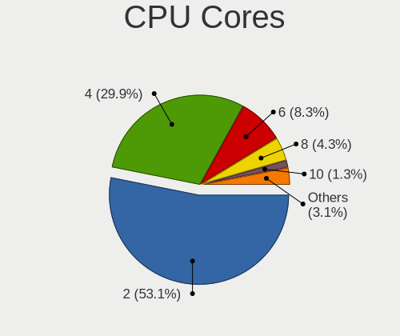

| Number  | Computers | Percent |
|---------|-----------|---------|
| 2       | 804       | 54.55%  |
| 4       | 435       | 29.51%  |
| 6       | 121       | 8.21%   |
| 8       | 56        | 3.8%    |
| 1       | 17        | 1.15%   |
| 10      | 16        | 1.09%   |
| 12      | 13        | 0.88%   |
| 16      | 4         | 0.27%   |
| 3       | 3         | 0.2%    |
| 14      | 2         | 0.14%   |
| Unknown | 2         | 0.14%   |
| 44      | 1         | 0.07%   |

CPU Sockets
-----------

Number of sockets

| Number  | Computers | Percent |
|---------|-----------|---------|
| 1       | 1458      | 99.05%  |
| 2       | 10        | 0.68%   |
| 3       | 2         | 0.14%   |
| Unknown | 2         | 0.14%   |

CPU Threads
-----------

Threads per core (Hyper-Threading)

| Number  | Computers | Percent |
|---------|-----------|---------|
| 2       | 970       | 65.85%  |
| 1       | 501       | 34.01%  |
| Unknown | 2         | 0.14%   |

CPU Op-Modes
------------

CPU Operation Modes (32-bit, 64-bit)

| Op mode        | Computers | Percent |
|----------------|-----------|---------|
| 32-bit, 64-bit | 1442      | 97.96%  |
| Unknown        | 22        | 1.49%   |
| 64-bit         | 4         | 0.27%   |
| 32-bit         | 4         | 0.27%   |

CPU Microcode
-------------

Microcode number

| Number     | Computers | Percent |
|------------|-----------|---------|
| Unknown    | 434       | 28.26%  |
| 0x206a7    | 91        | 5.92%   |
| 0x306a9    | 83        | 5.4%    |
| 0x1067a    | 50        | 3.26%   |
| 0x306c3    | 44        | 2.86%   |
| 0x40651    | 43        | 2.8%    |
| 0x306d4    | 34        | 2.21%   |
| 0x806ec    | 33        | 2.15%   |
| 0x906ea    | 30        | 1.95%   |
| 0x806ea    | 30        | 1.95%   |
| 0x06006705 | 30        | 1.95%   |
| 0x406e3    | 27        | 1.76%   |
| 0x08108109 | 27        | 1.76%   |
| 0x806e9    | 26        | 1.69%   |
| 0x806c1    | 26        | 1.69%   |
| 0x20655    | 24        | 1.56%   |
| 0x0a50000c | 21        | 1.37%   |
| 0x906e9    | 20        | 1.3%    |
| 0x6fd      | 18        | 1.17%   |
| 0x08108102 | 17        | 1.11%   |
| 0x806eb    | 16        | 1.04%   |
| 0x20652    | 15        | 0.98%   |
| 0x07030105 | 15        | 0.98%   |
| 0x706e5    | 13        | 0.85%   |
| 0x30678    | 13        | 0.85%   |
| 0x08608103 | 13        | 0.85%   |
| 0x706a8    | 12        | 0.78%   |
| 0x406c4    | 12        | 0.78%   |
| 0x506e3    | 11        | 0.72%   |
| 0x0810100b | 11        | 0.72%   |
| 0x06001119 | 11        | 0.72%   |
| 0x406c3    | 10        | 0.65%   |
| 0x08600104 | 10        | 0.65%   |
| 0x10676    | 9         | 0.59%   |
| 0x0700010f | 8         | 0.52%   |
| 0x906a3    | 7         | 0.46%   |
| 0x706a1    | 7         | 0.46%   |
| 0x6fb      | 7         | 0.46%   |
| 0x08101007 | 7         | 0.46%   |
| 0x05000119 | 7         | 0.46%   |

CPU Microarch
-------------

Microarchitecture

| Name             | Computers | Percent |
|------------------|-----------|---------|
| KabyLake         | 225       | 15.27%  |
| SandyBridge      | 126       | 8.55%   |
| IvyBridge        | 117       | 7.94%   |
| Haswell          | 112       | 7.6%    |
| Penryn           | 67        | 4.55%   |
| Unknown          | 63        | 4.28%   |
| Skylake          | 61        | 4.14%   |
| Westmere         | 60        | 4.07%   |
| Zen+             | 56        | 3.8%    |
| Excavator        | 55        | 3.73%   |
| Silvermont       | 50        | 3.39%   |
| Broadwell        | 48        | 3.26%   |
| TigerLake        | 42        | 2.85%   |
| Zen 3            | 37        | 2.51%   |
| Zen              | 34        | 2.31%   |
| Core             | 34        | 2.31%   |
| Zen 2            | 33        | 2.24%   |
| Puma             | 28        | 1.9%    |
| Icelake          | 28        | 1.9%    |
| Goldmont plus    | 25        | 1.7%    |
| Alderlake Hybrid | 24        | 1.63%   |
| Piledriver       | 22        | 1.49%   |
| CometLake        | 21        | 1.43%   |
| Bobcat           | 17        | 1.15%   |
| K10              | 14        | 0.95%   |
| Goldmont         | 12        | 0.81%   |
| Jaguar           | 11        | 0.75%   |
| Bonnell          | 10        | 0.68%   |
| Nehalem          | 9         | 0.61%   |
| Steamroller      | 8         | 0.54%   |
| K10 Llano        | 8         | 0.54%   |
| Tremont          | 6         | 0.41%   |
| K8 Hammer        | 3         | 0.2%    |
| P6               | 2         | 0.14%   |
| NetBurst         | 2         | 0.14%   |
| Bulldozer        | 2         | 0.14%   |
| Gracemont        | 1         | 0.07%   |

Graphics
--------

GPU Vendor
----------

Vendors of graphics cards

| Vendor                           | Computers | Percent |
|----------------------------------|-----------|---------|
| Intel                            | 951       | 53.04%  |
| AMD                              | 453       | 25.26%  |
| Nvidia                           | 364       | 20.3%   |
| Matrox Electronics Systems       | 14        | 0.78%   |
| Silicon Integrated Systems [SiS] | 5         | 0.28%   |
| ASPEED Technology                | 5         | 0.28%   |
| Silicon Motion                   | 1         | 0.06%   |

GPU Model
---------

Graphics card models

| Model                                                                                    | Computers | Percent |
|------------------------------------------------------------------------------------------|-----------|---------|
| Intel 2nd Generation Core Processor Family Integrated Graphics Controller                | 107       | 5.76%   |
| Intel 3rd Gen Core processor Graphics Controller                                         | 76        | 4.09%   |
| Intel Haswell-ULT Integrated Graphics Controller                                         | 53        | 2.85%   |
| AMD Picasso/Raven 2 [Radeon Vega Series / Radeon Vega Mobile Series]                     | 53        | 2.85%   |
| Intel Core Processor Integrated Graphics Controller                                      | 46        | 2.48%   |
| AMD Stoney [Radeon R2/R3/R4/R5 Graphics]                                                 | 42        | 2.26%   |
| Intel UHD Graphics 620                                                                   | 41        | 2.21%   |
| Intel WhiskeyLake-U GT2 [UHD Graphics 620]                                               | 40        | 2.15%   |
| Intel HD Graphics 620                                                                    | 39        | 2.1%    |
| Intel HD Graphics 5500                                                                   | 38        | 2.05%   |
| Intel Skylake GT2 [HD Graphics 520]                                                      | 33        | 1.78%   |
| Intel TigerLake-LP GT2 [Iris Xe Graphics]                                                | 28        | 1.51%   |
| AMD Cezanne [Radeon Vega Series / Radeon Vega Mobile Series]                             | 28        | 1.51%   |
| Intel CometLake-U GT2 [UHD Graphics]                                                     | 26        | 1.4%    |
| Intel CoffeeLake-H GT2 [UHD Graphics 630]                                                | 26        | 1.4%    |
| Intel Atom/Celeron/Pentium Processor x5-E8000/J3xxx/N3xxx Integrated Graphics Controller | 26        | 1.4%    |
| Intel Mobile 4 Series Chipset Integrated Graphics Controller                             | 25        | 1.35%   |
| AMD Raven Ridge [Radeon Vega Series / Radeon Vega Mobile Series]                         | 25        | 1.35%   |
| Intel Atom Processor Z36xxx/Z37xxx Series Graphics & Display                             | 24        | 1.29%   |
| AMD Topaz XT [Radeon R7 M260/M265 / M340/M360 / M440/M445 / 530/535 / 620/625 Mobile]    | 24        | 1.29%   |
| AMD Renoir [Radeon RX Vega 6 (Ryzen 4000/5000 Mobile Series)]                            | 24        | 1.29%   |
| Intel GeminiLake [UHD Graphics 600]                                                      | 23        | 1.24%   |
| Nvidia GF117M [GeForce 610M/710M/810M/820M / GT 620M/625M/630M/720M]                     | 22        | 1.18%   |
| AMD Sun XT [Radeon HD 8670A/8670M/8690M / R5 M330 / M430 / Radeon 520 Mobile]            | 22        | 1.18%   |
| AMD Mullins [Radeon R4/R5 Graphics]                                                      | 22        | 1.18%   |
| Intel Xeon E3-1200 v3/4th Gen Core Processor Integrated Graphics Controller              | 21        | 1.13%   |
| Intel Xeon E3-1200 v2/3rd Gen Core processor Graphics Controller                         | 21        | 1.13%   |
| Intel Iris Plus Graphics G1 (Ice Lake)                                                   | 19        | 1.02%   |
| AMD Lucienne                                                                             | 19        | 1.02%   |
| Intel HD Graphics 630                                                                    | 17        | 0.91%   |
| Nvidia TU117M [GeForce GTX 1650 Mobile / Max-Q]                                          | 16        | 0.86%   |
| Intel 4th Gen Core Processor Integrated Graphics Controller                              | 16        | 0.86%   |
| Nvidia GP107M [GeForce GTX 1050 Mobile]                                                  | 15        | 0.81%   |
| Nvidia GT218 [GeForce 210]                                                               | 14        | 0.75%   |
| Intel Tiger Lake-LP GT2 [UHD Graphics G4]                                                | 14        | 0.75%   |
| Nvidia GM108M [GeForce 930MX]                                                            | 13        | 0.7%    |
| Intel Mobile GM965/GL960 Integrated Graphics Controller (secondary)                      | 13        | 0.7%    |
| Intel Mobile GM965/GL960 Integrated Graphics Controller (primary)                        | 13        | 0.7%    |
| Intel 4 Series Chipset Integrated Graphics Controller                                    | 13        | 0.7%    |
| Intel HD Graphics 500                                                                    | 12        | 0.65%   |

GPU Combo
---------

Combinations of graphics cards

| Name                   | Computers | Percent |
|------------------------|-----------|---------|
| 1 x Intel              | 656       | 44.23%  |
| 1 x AMD                | 319       | 21.51%  |
| Intel + Nvidia         | 220       | 14.83%  |
| 1 x Nvidia             | 105       | 7.08%   |
| Intel + AMD            | 60        | 4.05%   |
| 2 x AMD                | 40        | 2.7%    |
| AMD + Nvidia           | 34        | 2.29%   |
| 1 x Matrox             | 14        | 0.94%   |
| Other                  | 13        | 0.88%   |
| 2 x Intel              | 8         | 0.54%   |
| 1 x SiS                | 5         | 0.34%   |
| 1 x ASPEED             | 4         | 0.27%   |
| 2 x Nvidia             | 2         | 0.13%   |
| 1 x Silicon Motion     | 1         | 0.07%   |
| Nvidia + ASPEED        | 1         | 0.07%   |
| 1 x Intel + 4 x Nvidia | 1         | 0.07%   |

GPU Driver
----------

Free vs proprietary

| Driver      | Computers | Percent |
|-------------|-----------|---------|
| Free        | 1265      | 84.67%  |
| Proprietary | 181       | 12.12%  |
| Unknown     | 48        | 3.21%   |

GPU Memory
----------

Total video memory

| Size in GB | Computers | Percent |
|------------|-----------|---------|
| Unknown    | 899       | 59.34%  |
| 1.01-2.0   | 222       | 14.65%  |
| 0.01-0.5   | 179       | 11.82%  |
| 0.51-1.0   | 100       | 6.6%    |
| 3.01-4.0   | 69        | 4.55%   |
| 7.01-8.0   | 17        | 1.12%   |
| 5.01-6.0   | 17        | 1.12%   |
| 8.01-16.0  | 8         | 0.53%   |
| 2.01-3.0   | 4         | 0.26%   |

Monitor
-------

Monitor Vendor
--------------

Monitor vendors

| Vendor                  | Computers | Percent |
|-------------------------|-----------|---------|
| AU Optronics            | 238       | 16.04%  |
| Chimei Innolux          | 226       | 15.23%  |
| BOE                     | 192       | 12.94%  |
| LG Display              | 147       | 9.91%   |
| Samsung Electronics     | 135       | 9.1%    |
| Goldstar                | 121       | 8.15%   |
| Dell                    | 53        | 3.57%   |
| Lenovo                  | 43        | 2.9%    |
| Hewlett-Packard         | 25        | 1.68%   |
| AOC                     | 24        | 1.62%   |
| InfoVision              | 21        | 1.42%   |
| Acer                    | 20        | 1.35%   |
| Sharp                   | 18        | 1.21%   |
| PANDA                   | 18        | 1.21%   |
| Apple                   | 18        | 1.21%   |
| ViewSonic               | 17        | 1.15%   |
| Philips                 | 17        | 1.15%   |
| Chi Mei Optoelectronics | 11        | 0.74%   |
| BenQ                    | 11        | 0.74%   |
| Toshiba                 | 9         | 0.61%   |
| InnoLux Display         | 9         | 0.61%   |
| LG Electronics          | 8         | 0.54%   |
| Ancor Communications    | 7         | 0.47%   |
| LG Philips              | 6         | 0.4%    |
| Mi                      | 5         | 0.34%   |
| HKC                     | 5         | 0.34%   |
| Sony                    | 4         | 0.27%   |
| Panasonic               | 4         | 0.27%   |
| KDC                     | 4         | 0.27%   |
| HannStar                | 4         | 0.27%   |
| CPT                     | 4         | 0.27%   |
| Valve                   | 3         | 0.2%    |
| Unknown                 | 3         | 0.2%    |
| RTK                     | 3         | 0.2%    |
| Quanta Display          | 3         | 0.2%    |
| QCM                     | 3         | 0.2%    |
| JRY                     | 3         | 0.2%    |
| ASUSTek Computer        | 3         | 0.2%    |
| TMX                     | 2         | 0.13%   |
| SPC                     | 2         | 0.13%   |

Monitor Model
-------------

Monitor models

| Model                                                                 | Computers | Percent |
|-----------------------------------------------------------------------|-----------|---------|
| Chimei Innolux LCD Monitor CMN14D4 1920x1080 309x173mm 13.9-inch      | 21        | 1.4%    |
| Chimei Innolux LCD Monitor CMN1493 1366x768 309x173mm 13.9-inch       | 20        | 1.33%   |
| Chimei Innolux LCD Monitor CMN14C4 1366x768 309x173mm 13.9-inch       | 19        | 1.26%   |
| AU Optronics LCD Monitor AUO183C 1366x768 309x173mm 13.9-inch         | 17        | 1.13%   |
| Goldstar HD GSM5ACB 1366x768 410x230mm 18.5-inch                      | 16        | 1.06%   |
| Goldstar FULL HD GSM5B55 1920x1080 480x270mm 21.7-inch                | 16        | 1.06%   |
| AU Optronics LCD Monitor AUO403D 1920x1080 309x174mm 14.0-inch        | 15        | 1%      |
| Chimei Innolux LCD Monitor CMN14D6 1366x768 309x173mm 13.9-inch       | 13        | 0.86%   |
| BOE LCD Monitor BOE0696 1366x768 309x173mm 13.9-inch                  | 13        | 0.86%   |
| Goldstar IPS FULLHD GSM5AB8 1920x1080 480x270mm 21.7-inch             | 12        | 0.8%    |
| BOE LCD Monitor BOE06BD 1366x768 309x173mm 13.9-inch                  | 12        | 0.8%    |
| Chimei Innolux LCD Monitor CMN14C3 1366x768 309x173mm 13.9-inch       | 11        | 0.73%   |
| AU Optronics LCD Monitor AUO323C 1366x768 309x173mm 13.9-inch         | 11        | 0.73%   |
| AU Optronics LCD Monitor AUO106C 1366x768 277x156mm 12.5-inch         | 11        | 0.73%   |
| Samsung Electronics C24F390 SAM0D2C 1920x1080 521x293mm 23.5-inch     | 10        | 0.66%   |
| Chimei Innolux LCD Monitor CMN1470 1366x768 309x174mm 14.0-inch       | 10        | 0.66%   |
| BOE LCD Monitor BOE07F6 1920x1080 309x174mm 14.0-inch                 | 10        | 0.66%   |
| AU Optronics LCD Monitor AUO2E3C 1366x768 309x173mm 13.9-inch         | 10        | 0.66%   |
| AU Optronics LCD Monitor AUO2D3C 1366x768 309x173mm 13.9-inch         | 10        | 0.66%   |
| LG Display LCD Monitor LGD033C 1366x768 310x170mm 13.9-inch           | 9         | 0.6%    |
| BOE LCD Monitor BOE0698 1366x768 309x173mm 13.9-inch                  | 9         | 0.6%    |
| Chimei Innolux LCD Monitor CMN1521 1920x1080 344x193mm 15.5-inch      | 8         | 0.53%   |
| Chimei Innolux LCD Monitor CMN1487 1366x768 309x173mm 13.9-inch       | 8         | 0.53%   |
| AU Optronics LCD Monitor AUO305C 1366x768 256x144mm 11.6-inch         | 8         | 0.53%   |
| LG Display LCD Monitor LGD02F8 1366x768 309x174mm 14.0-inch           | 7         | 0.47%   |
| Chimei Innolux LCD Monitor CMN14A7 1920x1080 308x173mm 13.9-inch      | 7         | 0.47%   |
| Chimei Innolux LCD Monitor CMN1480 1366x768 309x174mm 14.0-inch       | 7         | 0.47%   |
| BOE LCD Monitor BOE07B5 1366x768 309x173mm 13.9-inch                  | 7         | 0.47%   |
| AU Optronics LCD Monitor AUO38ED 1920x1080 344x193mm 15.5-inch        | 7         | 0.47%   |
| LG Display LCD Monitor LGD018B 1366x768 310x174mm 14.0-inch           | 6         | 0.4%    |
| Chimei Innolux LCD Monitor CMN1491 1366x768 309x174mm 14.0-inch       | 6         | 0.4%    |
| BOE LCD Monitor BOE069C 1920x1080 344x193mm 15.5-inch                 | 6         | 0.4%    |
| BOE LCD Monitor BOE05B1 1366x768 309x173mm 13.9-inch                  | 6         | 0.4%    |
| AU Optronics LCD Monitor AUO683D 1920x1080 309x174mm 14.0-inch        | 6         | 0.4%    |
| Samsung Electronics S19D300 SAM0B36 1366x768 410x230mm 18.5-inch      | 5         | 0.33%   |
| Samsung Electronics LCD Monitor SEC5441 1366x768 344x194mm 15.5-inch  | 5         | 0.33%   |
| Samsung Electronics LCD Monitor SEC3050 1366x768 309x174mm 14.0-inch  | 5         | 0.33%   |
| Samsung Electronics LCD Monitor SDC4171 2880x1800 302x189mm 14.0-inch | 5         | 0.33%   |
| PANDA LCD Monitor NCP004D 1920x1080 344x194mm 15.5-inch               | 5         | 0.33%   |
| LG Display LCD Monitor LGD05EC 1920x1080 309x174mm 14.0-inch          | 5         | 0.33%   |

Monitor Resolution
------------------

Monitor screen resolution

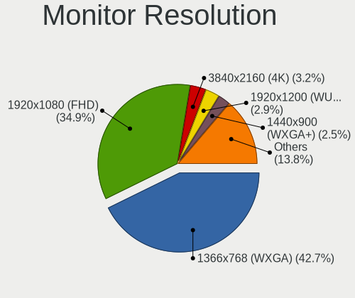

| Resolution         | Computers | Percent |
|--------------------|-----------|---------|
| 1366x768 (WXGA)    | 649       | 45.23%  |
| 1920x1080 (FHD)    | 499       | 34.77%  |
| 3840x2160 (4K)     | 44        | 3.07%   |
| 1440x900 (WXGA+)   | 37        | 2.58%   |
| 1600x900 (HD+)     | 33        | 2.3%    |
| 1280x800 (WXGA)    | 27        | 1.88%   |
| 2560x1440 (QHD)    | 25        | 1.74%   |
| 1920x1200 (WUXGA)  | 20        | 1.39%   |
| 1360x768           | 18        | 1.25%   |
| 2560x1600          | 10        | 0.7%    |
| 2880x1800          | 9         | 0.63%   |
| 1280x1024 (SXGA)   | 9         | 0.63%   |
| 2560x1080          | 8         | 0.56%   |
| 3440x1440          | 5         | 0.35%   |
| 1024x768 (XGA)     | 4         | 0.28%   |
| 1024x600           | 4         | 0.28%   |
| 800x1280           | 3         | 0.21%   |
| 2800x1752          | 3         | 0.21%   |
| 2160x1440          | 3         | 0.21%   |
| 1680x1050 (WSXGA+) | 3         | 0.21%   |
| Unknown            | 3         | 0.21%   |
| 3840x2400          | 2         | 0.14%   |
| 3840x1080          | 2         | 0.14%   |
| 1280x720 (HD)      | 2         | 0.14%   |
| 640x480            | 1         | 0.07%   |
| 5760x2160          | 1         | 0.07%   |
| 3456x2160          | 1         | 0.07%   |
| 3200x1800 (QHD+)   | 1         | 0.07%   |
| 3072x1920          | 1         | 0.07%   |
| 2966x900           | 1         | 0.07%   |
| 2880x1920          | 1         | 0.07%   |
| 2736x1824          | 1         | 0.07%   |
| 2240x1400          | 1         | 0.07%   |
| 1920x550           | 1         | 0.07%   |
| 1920x1280          | 1         | 0.07%   |
| 1280x960           | 1         | 0.07%   |
| 1152x864           | 1         | 0.07%   |

Monitor Diagonal
----------------

Diagonal size in inches

| Inches  | Computers | Percent |
|---------|-----------|---------|
| 13      | 350       | 23.6%   |
| 14      | 339       | 22.86%  |
| 15      | 243       | 16.39%  |
| 18      | 91        | 6.14%   |
| 21      | 79        | 5.33%   |
| 23      | 67        | 4.52%   |
| 12      | 49        | 3.3%    |
| 24      | 38        | 2.56%   |
| 11      | 37        | 2.49%   |
| 19      | 33        | 2.23%   |
| Unknown | 29        | 1.96%   |
| 27      | 26        | 1.75%   |
| 17      | 17        | 1.15%   |
| 34      | 12        | 0.81%   |
| 40      | 9         | 0.61%   |
| 31      | 9         | 0.61%   |
| 16      | 9         | 0.61%   |
| 20      | 5         | 0.34%   |
| 48      | 4         | 0.27%   |
| 10      | 4         | 0.27%   |
| 7       | 4         | 0.27%   |
| 84      | 3         | 0.2%    |
| 67      | 3         | 0.2%    |
| 52      | 3         | 0.2%    |
| 22      | 3         | 0.2%    |
| 72      | 2         | 0.13%   |
| 60      | 2         | 0.13%   |
| 37      | 2         | 0.13%   |
| 65      | 1         | 0.07%   |
| 57      | 1         | 0.07%   |
| 54      | 1         | 0.07%   |
| 46      | 1         | 0.07%   |
| 42      | 1         | 0.07%   |
| 39      | 1         | 0.07%   |
| 36      | 1         | 0.07%   |
| 35      | 1         | 0.07%   |
| 26      | 1         | 0.07%   |
| 25      | 1         | 0.07%   |
| 9       | 1         | 0.07%   |

Monitor Width
-------------

Physical width

| Width in mm | Computers | Percent |
|-------------|-----------|---------|
| 301-350     | 840       | 57.3%   |
| 401-500     | 200       | 13.64%  |
| 201-300     | 172       | 11.73%  |
| 501-600     | 126       | 8.59%   |
| 351-400     | 33        | 2.25%   |
| Unknown     | 29        | 1.98%   |
| 701-800     | 17        | 1.16%   |
| 601-700     | 14        | 0.95%   |
| 801-900     | 13        | 0.89%   |
| 1001-1500   | 12        | 0.82%   |
| 1501-2000   | 5         | 0.34%   |
| 1-100       | 3         | 0.2%    |
| 101-200     | 1         | 0.07%   |
| 901-1000    | 1         | 0.07%   |

Aspect Ratio
------------

Proportional relationship between the width and the height

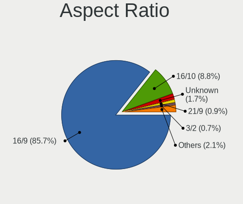

| Ratio   | Computers | Percent |
|---------|-----------|---------|
| 16/9    | 1191      | 86.81%  |
| 16/10   | 110       | 8.02%   |
| Unknown | 27        | 1.97%   |
| 21/9    | 13        | 0.95%   |
| 5/4     | 8         | 0.58%   |
| 3/2     | 8         | 0.58%   |
| 4/3     | 7         | 0.51%   |
| 0.67    | 3         | 0.22%   |
| 0.45    | 3         | 0.22%   |
| 32/9    | 1         | 0.07%   |
| 0.56    | 1         | 0.07%   |

Monitor Area
------------

Area in inch

| Area in inch | Computers | Percent |
|----------------|-----------|---------|
| 81-90          | 615       | 41.61%  |
| 101-110        | 238       | 16.1%   |
| 201-250        | 153       | 10.35%  |
| 141-150        | 92        | 6.22%   |
| 71-80          | 66        | 4.47%   |
| 151-200        | 58        | 3.92%   |
| 61-70          | 48        | 3.25%   |
| 51-60          | 37        | 2.5%    |
| Unknown        | 29        | 1.96%   |
| 301-350        | 27        | 1.83%   |
| 351-500        | 22        | 1.49%   |
| More than 1000 | 20        | 1.35%   |
| 251-300        | 15        | 1.01%   |
| 501-1000       | 15        | 1.01%   |
| 121-130        | 10        | 0.68%   |
| 91-100         | 10        | 0.68%   |
| 111-120        | 8         | 0.54%   |
| 131-140        | 6         | 0.41%   |
| 41-50          | 5         | 0.34%   |
| 1-40           | 4         | 0.27%   |

Pixel Density
-------------

Pixels per inch

| Density       | Computers | Percent |
|---------------|-----------|---------|
| 101-120       | 590       | 40.3%   |
| 121-160       | 398       | 27.19%  |
| 51-100        | 317       | 21.65%  |
| 161-240       | 83        | 5.67%   |
| Unknown       | 29        | 1.98%   |
| 1-50          | 24        | 1.64%   |
| More than 240 | 23        | 1.57%   |

Multiple Monitors
-----------------

Total monitors connected

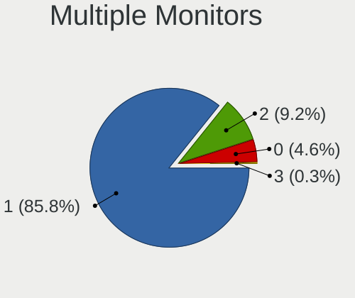

| Total | Computers | Percent |
|-------|-----------|---------|
| 1     | 1287      | 85.74%  |
| 2     | 141       | 9.39%   |
| 0     | 70        | 4.66%   |
| 3     | 3         | 0.2%    |

Network
-------

Net Controller Vendor
---------------------

Controller vendors

| Vendor                            | Computers | Percent |
|-----------------------------------|-----------|---------|
| Realtek Semiconductor             | 907       | 39.28%  |
| Intel                             | 527       | 22.82%  |
| Qualcomm Atheros                  | 383       | 16.59%  |
| Broadcom                          | 135       | 5.85%   |
| Ralink Technology                 | 50        | 2.17%   |
| MediaTek                          | 46        | 1.99%   |
| TP-Link                           | 42        | 1.82%   |
| Xiaomi                            | 31        | 1.34%   |
| Samsung Electronics               | 23        | 1%      |
| Broadcom Limited                  | 21        | 0.91%   |
| Qualcomm Atheros Communications   | 18        | 0.78%   |
| Ralink                            | 17        | 0.74%   |
| OPPO Electronics                  | 14        | 0.61%   |
| Marvell Technology Group          | 13        | 0.56%   |
| ASIX Electronics                  | 8         | 0.35%   |
| JMicron Technology                | 7         | 0.3%    |
| Qualcomm                          | 6         | 0.26%   |
| IBM                               | 6         | 0.26%   |
| Huawei Technologies               | 5         | 0.22%   |
| Silicon Integrated Systems [SiS]  | 4         | 0.17%   |
| Sierra Wireless                   | 4         | 0.17%   |
| Nvidia                            | 4         | 0.17%   |
| Ericsson Business Mobile Networks | 4         | 0.17%   |
| D-Link System                     | 4         | 0.17%   |
| D-Link                            | 4         | 0.17%   |
| ICS Advent                        | 3         | 0.13%   |
| Attansic Technology               | 3         | 0.13%   |
| AboCom Systems                    | 3         | 0.13%   |
| Lenovo                            | 2         | 0.09%   |
| HMD Global                        | 2         | 0.09%   |
| Hewlett-Packard                   | 2         | 0.09%   |
| ASUSTek Computer                  | 2         | 0.09%   |
| vivo                              | 1         | 0.04%   |
| VIA Technologies                  | 1         | 0.04%   |
| QinHeng Electronics               | 1         | 0.04%   |
| Microchip Technology              | 1         | 0.04%   |
| Linksys                           | 1         | 0.04%   |
| HTC (High Tech Computer)          | 1         | 0.04%   |
| Foxconn / Hon Hai                 | 1         | 0.04%   |
| Fibocom                           | 1         | 0.04%   |

Net Controller Model
--------------------

Controller models

| Model                                                                  | Computers | Percent |
|------------------------------------------------------------------------|-----------|---------|
| Realtek RTL8111/8168/8211/8411 PCI Express Gigabit Ethernet Controller | 579       | 21.44%  |
| Realtek RTL810xE PCI Express Fast Ethernet controller                  | 171       | 6.33%   |
| Qualcomm Atheros QCA9565 / AR9565 Wireless Network Adapter             | 94        | 3.48%   |
| Qualcomm Atheros AR9485 Wireless Network Adapter                       | 78        | 2.89%   |
| Qualcomm Atheros QCA9377 802.11ac Wireless Network Adapter             | 65        | 2.41%   |
| Intel 82579LM Gigabit Network Connection (Lewisville)                  | 47        | 1.74%   |
| Realtek RTL8188EUS 802.11n Wireless Network Adapter                    | 45        | 1.67%   |
| Intel Wireless 8265 / 8275                                             | 42        | 1.55%   |
| Realtek RTL8822CE 802.11ac PCIe Wireless Network Adapter               | 36        | 1.33%   |
| Qualcomm Atheros AR9285 Wireless Network Adapter (PCI-Express)         | 36        | 1.33%   |
| Ralink MT7601U Wireless Adapter                                        | 35        | 1.3%    |
| Realtek RTL8821CE 802.11ac PCIe Wireless Network Adapter               | 33        | 1.22%   |
| Intel Wireless 7265                                                    | 32        | 1.18%   |
| Intel Cannon Point-LP CNVi [Wireless-AC]                               | 31        | 1.15%   |
| Intel Wi-Fi 6 AX201                                                    | 28        | 1.04%   |
| Intel Wi-Fi 6 AX200                                                    | 28        | 1.04%   |
| Broadcom BCM4313 802.11bgn Wireless Network Adapter                    | 28        | 1.04%   |
| MediaTek MT7921 802.11ax PCI Express Wireless Network Adapter          | 26        | 0.96%   |
| Realtek RTL8723DE Wireless Network Adapter                             | 25        | 0.93%   |
| Intel Comet Lake PCH-LP CNVi WiFi                                      | 25        | 0.93%   |
| Realtek RTL8723BE PCIe Wireless Network Adapter                        | 24        | 0.89%   |
| Intel Wireless 7260                                                    | 24        | 0.89%   |
| TP-Link TL-WN722N v2/v3 [Realtek RTL8188EUS]                           | 23        | 0.85%   |
| Intel Centrino Advanced-N 6205 [Taylor Peak]                           | 23        | 0.85%   |
| Xiaomi Mi/Redmi series (RNDIS)                                         | 22        | 0.81%   |
| Intel Cannon Lake PCH CNVi WiFi                                        | 22        | 0.81%   |
| Broadcom BCM43142 802.11b/g/n                                          | 21        | 0.78%   |
| Intel Wireless 8260                                                    | 20        | 0.74%   |
| Broadcom NetLink BCM57785 Gigabit Ethernet PCIe                        | 20        | 0.74%   |
| Realtek RTL8822BE 802.11a/b/g/n/ac WiFi adapter                        | 18        | 0.67%   |
| Qualcomm Atheros AR9271 802.11n                                        | 18        | 0.67%   |
| Qualcomm Atheros AR9287 Wireless Network Adapter (PCI-Express)         | 17        | 0.63%   |
| Samsung Galaxy series, misc. (tethering mode)                          | 16        | 0.59%   |
| Qualcomm Atheros AR8151 v2.0 Gigabit Ethernet                          | 16        | 0.59%   |
| Intel Wireless 3165                                                    | 16        | 0.59%   |
| Qualcomm Atheros QCA8172 Fast Ethernet                                 | 15        | 0.56%   |
| Intel Alder Lake-P PCH CNVi WiFi                                       | 15        | 0.56%   |
| OPPO SM8350-MTP _SN:9338D66C                                           | 14        | 0.52%   |
| Intel Ethernet Connection I218-LM                                      | 14        | 0.52%   |
| Intel Dual Band Wireless-AC 3168NGW [Stone Peak]                       | 14        | 0.52%   |

Wireless Vendor
---------------

Wireless vendors

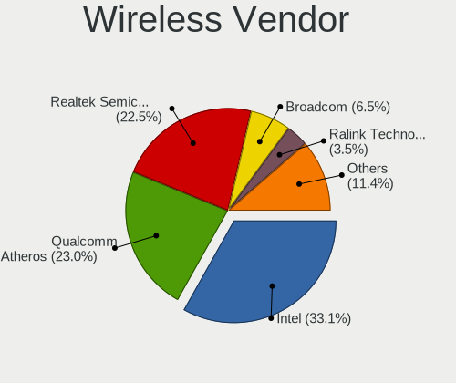

| Vendor                          | Computers | Percent |
|---------------------------------|-----------|---------|
| Intel                           | 430       | 31.99%  |
| Qualcomm Atheros                | 329       | 24.48%  |
| Realtek Semiconductor           | 303       | 22.54%  |
| Broadcom                        | 90        | 6.7%    |
| Ralink Technology               | 50        | 3.72%   |
| MediaTek                        | 37        | 2.75%   |
| TP-Link                         | 36        | 2.68%   |
| Qualcomm Atheros Communications | 18        | 1.34%   |
| Ralink                          | 17        | 1.26%   |
| Broadcom Limited                | 17        | 1.26%   |
| Sierra Wireless                 | 4         | 0.3%    |
| D-Link                          | 4         | 0.3%    |
| AboCom Systems                  | 3         | 0.22%   |
| D-Link System                   | 2         | 0.15%   |
| Linksys                         | 1         | 0.07%   |
| Fibocom                         | 1         | 0.07%   |
| Edimax Technology               | 1         | 0.07%   |
| ASUSTek Computer                | 1         | 0.07%   |

Wireless Model
--------------

Wireless models

| Model                                                          | Computers | Percent |
|----------------------------------------------------------------|-----------|---------|
| Qualcomm Atheros QCA9565 / AR9565 Wireless Network Adapter     | 94        | 6.94%   |
| Qualcomm Atheros AR9485 Wireless Network Adapter               | 78        | 5.76%   |
| Qualcomm Atheros QCA9377 802.11ac Wireless Network Adapter     | 65        | 4.8%    |
| Realtek RTL8188EUS 802.11n Wireless Network Adapter            | 45        | 3.32%   |
| Intel Wireless 8265 / 8275                                     | 42        | 3.1%    |
| Realtek RTL8822CE 802.11ac PCIe Wireless Network Adapter       | 36        | 2.66%   |
| Qualcomm Atheros AR9285 Wireless Network Adapter (PCI-Express) | 36        | 2.66%   |
| Ralink MT7601U Wireless Adapter                                | 35        | 2.58%   |
| Realtek RTL8821CE 802.11ac PCIe Wireless Network Adapter       | 33        | 2.44%   |
| Intel Wireless 7265                                            | 32        | 2.36%   |
| Intel Cannon Point-LP CNVi [Wireless-AC]                       | 31        | 2.29%   |
| Intel Wi-Fi 6 AX201                                            | 28        | 2.07%   |
| Intel Wi-Fi 6 AX200                                            | 28        | 2.07%   |
| Broadcom BCM4313 802.11bgn Wireless Network Adapter            | 28        | 2.07%   |
| MediaTek MT7921 802.11ax PCI Express Wireless Network Adapter  | 26        | 1.92%   |
| Realtek RTL8723DE Wireless Network Adapter                     | 25        | 1.85%   |
| Intel Comet Lake PCH-LP CNVi WiFi                              | 25        | 1.85%   |
| Realtek RTL8723BE PCIe Wireless Network Adapter                | 24        | 1.77%   |
| Intel Wireless 7260                                            | 24        | 1.77%   |
| TP-Link TL-WN722N v2/v3 [Realtek RTL8188EUS]                   | 23        | 1.7%    |
| Intel Centrino Advanced-N 6205 [Taylor Peak]                   | 23        | 1.7%    |
| Intel Cannon Lake PCH CNVi WiFi                                | 22        | 1.62%   |
| Broadcom BCM43142 802.11b/g/n                                  | 21        | 1.55%   |
| Intel Wireless 8260                                            | 20        | 1.48%   |
| Realtek RTL8822BE 802.11a/b/g/n/ac WiFi adapter                | 18        | 1.33%   |
| Qualcomm Atheros AR9271 802.11n                                | 18        | 1.33%   |
| Qualcomm Atheros AR9287 Wireless Network Adapter (PCI-Express) | 17        | 1.26%   |
| Intel Wireless 3165                                            | 16        | 1.18%   |
| Intel Alder Lake-P PCH CNVi WiFi                               | 15        | 1.11%   |
| Intel Dual Band Wireless-AC 3168NGW [Stone Peak]               | 14        | 1.03%   |
| Realtek RTL8852BE PCIe 802.11ax Wireless Network Controller    | 13        | 0.96%   |
| Realtek RTL8852AE 802.11ax PCIe Wireless Network Adapter       | 13        | 0.96%   |
| Realtek RTL8821AE 802.11ac PCIe Wireless Network Adapter       | 13        | 0.96%   |
| Realtek RTL8188FTV 802.11b/g/n 1T1R 2.4G WLAN Adapter          | 13        | 0.96%   |
| Qualcomm Atheros QCA6174 802.11ac Wireless Network Adapter     | 13        | 0.96%   |
| Intel Ice Lake-LP PCH CNVi WiFi                                | 12        | 0.89%   |
| Realtek RTL8188EE Wireless Network Adapter                     | 10        | 0.74%   |
| Qualcomm Atheros AR928X Wireless Network Adapter (PCI-Express) | 10        | 0.74%   |
| Intel Dual Band Wireless-AC 3165 Plus Bluetooth                | 9         | 0.66%   |
| Broadcom BCM43228 802.11a/b/g/n                                | 9         | 0.66%   |

Ethernet Vendor
---------------

Ethernet vendors

| Vendor                           | Computers | Percent |
|----------------------------------|-----------|---------|
| Realtek Semiconductor            | 785       | 59.38%  |
| Intel                            | 224       | 16.94%  |
| Qualcomm Atheros                 | 96        | 7.26%   |
| Broadcom                         | 56        | 4.24%   |
| Xiaomi                           | 31        | 2.34%   |
| Samsung Electronics              | 23        | 1.74%   |
| OPPO Electronics                 | 14        | 1.06%   |
| Marvell Technology Group         | 13        | 0.98%   |
| MediaTek                         | 10        | 0.76%   |
| ASIX Electronics                 | 8         | 0.61%   |
| JMicron Technology               | 7         | 0.53%   |
| TP-Link                          | 6         | 0.45%   |
| Qualcomm                         | 6         | 0.45%   |
| IBM                              | 6         | 0.45%   |
| Broadcom Limited                 | 6         | 0.45%   |
| Silicon Integrated Systems [SiS] | 4         | 0.3%    |
| Nvidia                           | 4         | 0.3%    |
| ICS Advent                       | 3         | 0.23%   |
| Attansic Technology              | 3         | 0.23%   |
| Lenovo                           | 2         | 0.15%   |
| Huawei Technologies              | 2         | 0.15%   |
| HMD Global                       | 2         | 0.15%   |
| Hewlett-Packard                  | 2         | 0.15%   |
| D-Link System                    | 2         | 0.15%   |
| vivo                             | 1         | 0.08%   |
| VIA Technologies                 | 1         | 0.08%   |
| QinHeng Electronics              | 1         | 0.08%   |
| Microchip Technology             | 1         | 0.08%   |
| HTC (High Tech Computer)         | 1         | 0.08%   |
| Foxconn / Hon Hai                | 1         | 0.08%   |
| ASUSTek Computer                 | 1         | 0.08%   |

Ethernet Model
--------------

Ethernet models

| Model                                                                  | Computers | Percent |
|------------------------------------------------------------------------|-----------|---------|
| Realtek RTL8111/8168/8211/8411 PCI Express Gigabit Ethernet Controller | 579       | 43.21%  |
| Realtek RTL810xE PCI Express Fast Ethernet controller                  | 171       | 12.76%  |
| Intel 82579LM Gigabit Network Connection (Lewisville)                  | 47        | 3.51%   |
| Xiaomi Mi/Redmi series (RNDIS)                                         | 22        | 1.64%   |
| Broadcom NetLink BCM57785 Gigabit Ethernet PCIe                        | 20        | 1.49%   |
| Samsung Galaxy series, misc. (tethering mode)                          | 16        | 1.19%   |
| Qualcomm Atheros AR8151 v2.0 Gigabit Ethernet                          | 16        | 1.19%   |
| Qualcomm Atheros QCA8172 Fast Ethernet                                 | 15        | 1.12%   |
| OPPO SM8350-MTP _SN:9338D66C                                           | 14        | 1.04%   |
| Intel Ethernet Connection I218-LM                                      | 14        | 1.04%   |
| Intel Ethernet Connection (3) I218-LM                                  | 13        | 0.97%   |
| Intel Ethernet Connection (4) I219-LM                                  | 12        | 0.9%    |
| Qualcomm Atheros AR8152 v2.0 Fast Ethernet                             | 11        | 0.82%   |
| Realtek RTL8125 2.5GbE Controller                                      | 10        | 0.75%   |
| Intel Ethernet Connection I217-LM                                      | 10        | 0.75%   |
| Xiaomi Mi/Redmi series (RNDIS + ADB)                                   | 9         | 0.67%   |
| Intel Ethernet Connection I219-LM                                      | 9         | 0.67%   |
| Realtek RTL-8100/8101L/8139 PCI Fast Ethernet Adapter                  | 8         | 0.6%    |
| Qualcomm Atheros AR8162 Fast Ethernet                                  | 8         | 0.6%    |
| Intel 82577LM Gigabit Network Connection                               | 8         | 0.6%    |
| Samsung GT-I9070 (network tethering, USB debugging enabled)            | 7         | 0.52%   |
| Realtek RTL8153 Gigabit Ethernet Adapter                               | 7         | 0.52%   |
| Realtek RTL8152 Fast Ethernet Adapter                                  | 7         | 0.52%   |
| Qualcomm Atheros AR8121/AR8113/AR8114 Gigabit or Fast Ethernet         | 7         | 0.52%   |
| MediaTek RMX3085                                                       | 7         | 0.52%   |
| Intel I211 Gigabit Network Connection                                  | 7         | 0.52%   |
| Intel Ethernet Connection (6) I219-LM                                  | 7         | 0.52%   |
| Intel 82574L Gigabit Network Connection                                | 7         | 0.52%   |
| ASIX AX88179 Gigabit Ethernet                                          | 7         | 0.52%   |
| Qualcomm Atheros QCA8171 Gigabit Ethernet                              | 6         | 0.45%   |
| Qualcomm Atheros AR8161 Gigabit Ethernet                               | 6         | 0.45%   |
| Qualcomm Atheros AR8152 v1.1 Fast Ethernet                             | 6         | 0.45%   |
| Qualcomm Atheros AR8132 Fast Ethernet                                  | 6         | 0.45%   |
| JMicron JMC250 PCI Express Gigabit Ethernet Controller                 | 6         | 0.45%   |
| Intel Ethernet Connection (4) I219-V                                   | 6         | 0.45%   |
| Intel 82579V Gigabit Network Connection                                | 6         | 0.45%   |
| Intel 82567LM Gigabit Network Connection                               | 6         | 0.45%   |
| IBM XClarity Controller                                                | 6         | 0.45%   |
| Qualcomm Nokia G42 5G                                                  | 5         | 0.37%   |
| Intel Ethernet Controller I225-V                                       | 5         | 0.37%   |

Net Controller Kind
-------------------

Ethernet, WiFi or modem

| Kind     | Computers | Percent |
|----------|-----------|---------|
| WiFi     | 1276      | 51.18%  |
| Ethernet | 1210      | 48.54%  |
| Modem    | 7         | 0.28%   |

Used Controller
---------------

Currently used network controller

| Kind     | Computers | Percent |
|----------|-----------|---------|
| WiFi     | 1081      | 74.35%  |
| Ethernet | 372       | 25.58%  |
| Modem    | 1         | 0.07%   |

NICs
----

Total network controllers on board

| Total | Computers | Percent |
|-------|-----------|---------|
| 2     | 873       | 59.11%  |
| 1     | 542       | 36.7%   |
| 0     | 31        | 2.1%    |
| 3     | 18        | 1.22%   |
| 4     | 11        | 0.74%   |
| 8     | 1         | 0.07%   |
| 6     | 1         | 0.07%   |

IPv6
----

IPv6 vs IPv4

| Used | Computers | Percent |
|------|-----------|---------|
| No   | 1377      | 92.29%  |
| Yes  | 115       | 7.71%   |

Bluetooth
---------

Bluetooth Vendor
----------------

Controller vendors

| Vendor                          | Computers | Percent |
|---------------------------------|-----------|---------|
| Intel                           | 349       | 35.65%  |
| Realtek Semiconductor           | 165       | 16.85%  |
| IMC Networks                    | 96        | 9.81%   |
| Qualcomm Atheros Communications | 87        | 8.89%   |
| Lite-On Technology              | 66        | 6.74%   |
| Cambridge Silicon Radio         | 54        | 5.52%   |
| Broadcom                        | 51        | 5.21%   |
| Foxconn / Hon Hai               | 35        | 3.58%   |
| Apple                           | 18        | 1.84%   |
| Toshiba                         | 14        | 1.43%   |
| Dell                            | 11        | 1.12%   |
| Ralink                          | 6         | 0.61%   |
| Hewlett-Packard                 | 6         | 0.61%   |
| MediaTek                        | 5         | 0.51%   |
| Foxconn International           | 4         | 0.41%   |
| Realtek                         | 3         | 0.31%   |
| ASUSTek Computer                | 3         | 0.31%   |
| Micro Star International        | 2         | 0.2%    |
| Marvell Semiconductor           | 1         | 0.1%    |
| Chicony Electronics             | 1         | 0.1%    |
| Alps Electric                   | 1         | 0.1%    |
| Actions                         | 1         | 0.1%    |

Bluetooth Model
---------------

Controller models

| Model                                               | Computers | Percent |
|-----------------------------------------------------|-----------|---------|
| Intel Bluetooth 9460/9560 Jefferson Peak (JfP)      | 84        | 8.58%   |
| Realtek Bluetooth Radio                             | 83        | 8.48%   |
| Intel Bluetooth wireless interface                  | 78        | 7.97%   |
| IMC Networks Bluetooth Device                       | 57        | 5.82%   |
| Intel Bluetooth Device                              | 55        | 5.62%   |
| Intel AX201 Bluetooth                               | 54        | 5.52%   |
| Cambridge Silicon Radio Bluetooth Dongle (HCI mode) | 54        | 5.52%   |
| Qualcomm Atheros  Bluetooth Device                  | 43        | 4.39%   |
| Realtek  Bluetooth 4.2 Adapter                      | 36        | 3.68%   |
| Intel AX200 Bluetooth                               | 28        | 2.86%   |
| Lite-On Bluetooth Device                            | 25        | 2.55%   |
| Qualcomm Atheros AR3012 Bluetooth 4.0               | 18        | 1.84%   |
| Intel Centrino Bluetooth Wireless Transceiver       | 17        | 1.74%   |
| Qualcomm Atheros AR3011 Bluetooth                   | 16        | 1.63%   |
| Lite-On Qualcomm Atheros QCA9377 Bluetooth          | 15        | 1.53%   |
| IMC Networks Bluetooth Radio                        | 14        | 1.43%   |
| Realtek RTL8723B Bluetooth                          | 13        | 1.33%   |
| Realtek RTL8821A Bluetooth                          | 12        | 1.23%   |
| Lite-On Wireless_Device                             | 11        | 1.12%   |
| Intel Wireless-AC 3168 Bluetooth                    | 11        | 1.12%   |
| Intel AX211 Bluetooth                               | 11        | 1.12%   |
| Realtek RTL8822BE Bluetooth 4.2 Adapter             | 10        | 1.02%   |
| Realtek 802.11ac WLAN Adapter                       | 10        | 1.02%   |
| IMC Networks Atheros AR3012 Bluetooth 4.0 Adapter   | 10        | 1.02%   |
| IMC Networks Wireless_Device                        | 9         | 0.92%   |
| Broadcom BCM43142A0 Bluetooth 4.0                   | 9         | 0.92%   |
| Broadcom BCM20702 Bluetooth 4.0 [ThinkPad]          | 8         | 0.82%   |
| Lite-On Atheros Bluetooth                           | 7         | 0.72%   |
| Foxconn / Hon Hai MediaTek Bluetooth Adapter        | 7         | 0.72%   |
| Apple Bluetooth Host Controller                     | 7         | 0.72%   |
| Ralink RT3290 Bluetooth                             | 6         | 0.61%   |
| Lite-On Atheros AR3012 Bluetooth                    | 6         | 0.61%   |
| Broadcom BCM2070 Bluetooth 2.1 + EDR                | 6         | 0.61%   |
| MediaTek Wireless_Device                            | 5         | 0.51%   |
| Intel AX210 Bluetooth                               | 5         | 0.51%   |
| HP Broadcom 2070 Bluetooth Combo                    | 5         | 0.51%   |
| Foxconn / Hon Hai Bluetooth USB Host Controller     | 5         | 0.51%   |
| Broadcom HP Portable SoftSailing                    | 5         | 0.51%   |
| Toshiba RT Bluetooth Radio                          | 4         | 0.41%   |
| Qualcomm Atheros QCA61x4 Bluetooth 4.0              | 4         | 0.41%   |

Sound
-----

Sound Vendor
------------

Sound card vendors

| Vendor                               | Computers | Percent |
|--------------------------------------|-----------|---------|
| Intel                                | 1054      | 61.28%  |
| AMD                                  | 413       | 24.01%  |
| Nvidia                               | 178       | 10.35%  |
| C-Media Electronics                  | 12        | 0.7%    |
| Generalplus Technology               | 9         | 0.52%   |
| JMTek                                | 6         | 0.35%   |
| Silicon Integrated Systems [SiS]     | 5         | 0.29%   |
| Texas Instruments                    | 4         | 0.23%   |
| Samson Technologies                  | 4         | 0.23%   |
| Creative Labs                        | 4         | 0.23%   |
| Logitech                             | 3         | 0.17%   |
| BR25                                 | 3         | 0.17%   |
| ASUSTek Computer                     | 3         | 0.17%   |
| Samsung Electronics                  | 2         | 0.12%   |
| Razer USA                            | 2         | 0.12%   |
| KTMicro                              | 2         | 0.12%   |
| Barco Display Systems                | 2         | 0.12%   |
| Weltrend Semiconductor               | 1         | 0.06%   |
| USB-MIC                              | 1         | 0.06%   |
| Thesycon Systemsoftware & Consulting | 1         | 0.06%   |
| STMicroelectronics                   | 1         | 0.06%   |
| SteelSeries ApS                      | 1         | 0.06%   |
| Sony                                 | 1         | 0.06%   |
| Solid State Logic                    | 1         | 0.06%   |
| SAVITECH                             | 1         | 0.06%   |
| Nordic Semiconductor ASA             | 1         | 0.06%   |
| Kingston Technology                  | 1         | 0.06%   |
| Hewlett-Packard                      | 1         | 0.06%   |
| Creative Technology                  | 1         | 0.06%   |
| Cooler Master                        | 1         | 0.06%   |
| Conexant Systems                     | 1         | 0.06%   |

Sound Model
-----------

Sound card models

| Model                                                                                             | Computers | Percent |
|---------------------------------------------------------------------------------------------------|-----------|---------|
| AMD Family 17h/19h HD Audio Controller                                                            | 167       | 7.66%   |
| Intel Sunrise Point-LP HD Audio                                                                   | 120       | 5.51%   |
| Intel 6 Series/C200 Series Chipset Family High Definition Audio Controller                        | 117       | 5.37%   |
| Intel 7 Series/C216 Chipset Family High Definition Audio Controller                               | 116       | 5.32%   |
| AMD FCH Azalia Controller                                                                         | 82        | 3.76%   |
| AMD Raven/Raven2/Fenghuang HDMI/DP Audio Controller                                               | 71        | 3.26%   |
| AMD Renoir Radeon High Definition Audio Controller                                                | 65        | 2.98%   |
| Intel 5 Series/3400 Series Chipset High Definition Audio                                          | 62        | 2.85%   |
| Intel Haswell-ULT HD Audio Controller                                                             | 53        | 2.43%   |
| Intel 8 Series HD Audio Controller                                                                | 53        | 2.43%   |
| Intel NM10/ICH7 Family High Definition Audio Controller                                           | 52        | 2.39%   |
| Intel 8 Series/C220 Series Chipset High Definition Audio Controller                               | 52        | 2.39%   |
| AMD Family 15h (Models 60h-6fh) Audio Controller                                                  | 51        | 2.34%   |
| AMD Kabini HDMI/DP Audio                                                                          | 50        | 2.29%   |
| Intel Wildcat Point-LP High Definition Audio Controller                                           | 44        | 2.02%   |
| Intel Broadwell-U Audio Controller                                                                | 44        | 2.02%   |
| Intel Cannon Point-LP High Definition Audio Controller                                            | 43        | 1.97%   |
| Intel Tiger Lake-LP Smart Sound Technology Audio Controller                                       | 42        | 1.93%   |
| AMD High Definition Audio Controller                                                              | 42        | 1.93%   |
| Intel Cannon Lake PCH cAVS                                                                        | 41        | 1.88%   |
| Intel Xeon E3-1200 v3/4th Gen Core Processor HD Audio Controller                                  | 40        | 1.84%   |
| AMD SBx00 Azalia (Intel HDA)                                                                      | 31        | 1.42%   |
| Intel Comet Lake PCH-LP cAVS                                                                      | 30        | 1.38%   |
| Intel 82801I (ICH9 Family) HD Audio Controller                                                    | 30        | 1.38%   |
| Intel Celeron/Pentium Silver Processor High Definition Audio                                      | 25        | 1.15%   |
| Intel Atom Processor Z36xxx/Z37xxx Series High Definition Audio Controller                        | 22        | 1.01%   |
| Intel 100 Series/C230 Series Chipset Family HD Audio Controller                                   | 22        | 1.01%   |
| Nvidia High Definition Audio Controller                                                           | 21        | 0.96%   |
| Intel Ice Lake-LP Smart Sound Technology Audio Controller                                         | 21        | 0.96%   |
| Intel Alder Lake PCH-P High Definition Audio Controller                                           | 20        | 0.92%   |
| Nvidia GF108 High Definition Audio Controller                                                     | 18        | 0.83%   |
| Intel Atom/Celeron/Pentium Processor x5-E8000/J3xxx/N3xxx Series High Definition Audio Controller | 18        | 0.83%   |
| Nvidia GP107GL High Definition Audio Controller                                                   | 17        | 0.78%   |
| AMD Starship/Matisse HD Audio Controller                                                          | 17        | 0.78%   |
| AMD Rembrandt Radeon High Definition Audio Controller                                             | 17        | 0.78%   |
| Intel 82801H (ICH8 Family) HD Audio Controller                                                    | 16        | 0.73%   |
| AMD Wrestler HDMI Audio                                                                           | 16        | 0.73%   |
| Nvidia TU116 High Definition Audio Controller                                                     | 15        | 0.69%   |
| Nvidia GK208 HDMI/DP Audio Controller                                                             | 15        | 0.69%   |
| Nvidia TU107 GeForce GTX 1650 High Definition Audio Controller                                    | 14        | 0.64%   |

Memory
------

Memory Vendor
-------------

Memory module vendors

| Vendor                                  | Computers | Percent |
|-----------------------------------------|-----------|---------|
| Samsung Electronics                     | 289       | 27.01%  |
| SK hynix                                | 203       | 18.97%  |
| Micron Technology                       | 112       | 10.47%  |
| Unknown                                 | 94        | 8.79%   |
| Kingston                                | 93        | 8.69%   |
| Corsair                                 | 46        | 4.3%    |
| Team                                    | 45        | 4.21%   |
| V-GeN                                   | 31        | 2.9%    |
| Ramaxel Technology                      | 26        | 2.43%   |
| Elpida                                  | 21        | 1.96%   |
| Nanya Technology                        | 14        | 1.31%   |
| Unknown                                 | 13        | 1.21%   |
| Unknown (ABCD)                          | 11        | 1.03%   |
| A-DATA Technology                       | 11        | 1.03%   |
| G.Skill                                 | 8         | 0.75%   |
| Crucial                                 | 6         | 0.56%   |
| Transcend                               | 5         | 0.47%   |
| Apacer                                  | 4         | 0.37%   |
| Visipro                                 | 3         | 0.28%   |
| SHARETRONIC                             | 3         | 0.28%   |
| Patriot                                 | 3         | 0.28%   |
| Unknown (0x0DD5)                        | 2         | 0.19%   |
| Lexar                                   | 2         | 0.19%   |
| Kingmax                                 | 2         | 0.19%   |
| Hewlett-Packard                         | 2         | 0.19%   |
| ASint Technology                        | 2         | 0.19%   |
| A Force                                 | 2         | 0.19%   |
| Unknown (8AA1)                          | 1         | 0.09%   |
| Unknown (8A02)                          | 1         | 0.09%   |
| Unknown (0x0080)                        | 1         | 0.09%   |
| Super Talent                            | 1         | 0.09%   |
| Strontium                               | 1         | 0.09%   |
| Silicon Power Computer & Communications | 1         | 0.09%   |
| Silicon Power                           | 1         | 0.09%   |
| Qumo                                    | 1         | 0.09%   |
| HPE                                     | 1         | 0.09%   |
| Hikvision                               | 1         | 0.09%   |
| GOODRAM                                 | 1         | 0.09%   |
| Goldkey                                 | 1         | 0.09%   |
| Foxline                                 | 1         | 0.09%   |

Memory Model
------------

Memory module models

| Model                                                            | Computers | Percent |
|------------------------------------------------------------------|-----------|---------|
| Samsung RAM M471A5244CB0-CTD 4GB SODIMM DDR4 3266MT/s            | 21        | 1.83%   |
| Samsung RAM M471B5173EB0-YK0 4GB SODIMM DDR3 1600MT/s            | 15        | 1.31%   |
| Micron RAM 4ATF51264HZ-2G6E1 4GB SODIMM DDR4 2667MT/s            | 14        | 1.22%   |
| SK hynix RAM HMT451S6BFR8A-PB 4GB SODIMM DDR3 1600MT/s           | 13        | 1.13%   |
| Unknown                                                          | 13        | 1.13%   |
| Samsung RAM M471A5244CB0-CRC 4GB SODIMM DDR4 2667MT/s            | 12        | 1.04%   |
| Samsung RAM M471A1G44AB0-CWE 8192MB SODIMM DDR4 3200MT/s         | 12        | 1.04%   |
| Unknown (ABCD) RAM 123456789012345678 2GB SODIMM LPDDR4 2400MT/s | 11        | 0.96%   |
| Samsung RAM M471B5773DH0-CH9 2GB SODIMM DDR3 1600MT/s            | 11        | 0.96%   |
| Samsung RAM M471B5173DB0-YK0 4GB SODIMM DDR3 1600MT/s            | 10        | 0.87%   |
| Samsung RAM M471A5244CB0-CWE 4GB SODIMM DDR4 3200MT/s            | 9         | 0.78%   |
| Samsung RAM M471A5143EB0-CPB 4GB SODIMM DDR4 2133MT/s            | 9         | 0.78%   |
| Micron RAM 4ATF51264HZ-3G2J1 4GB SODIMM DDR4 3200MT/s            | 9         | 0.78%   |
| Team RAM TEAMGROUP-SD4-2666 8GB SODIMM DDR4 2667MT/s             | 8         | 0.7%    |
| Team RAM TEAMGROUP-SD4-2400 8GB SODIMM DDR4 8400MT/s             | 8         | 0.7%    |
| SK hynix RAM HMAA1GS6CJR6N-XN 8GB SODIMM DDR4 3200MT/s           | 8         | 0.7%    |
| Samsung RAM M471B5173QH0-YK0 4GB SODIMM DDR3 1600MT/s            | 8         | 0.7%    |
| Samsung RAM M471A1K43CB1-CTD 8GB SODIMM DDR4 2667MT/s            | 8         | 0.7%    |
| SK hynix RAM HMT351S6CFR8C-PB 4GB SODIMM DDR3 1600MT/s           | 7         | 0.61%   |
| SK hynix RAM HMA81GS6AFR8N-UH 8GB SODIMM DDR4 2667MT/s           | 7         | 0.61%   |
| Samsung RAM M471B5273DH0-CH9 4GB SODIMM DDR3 1334MT/s            | 7         | 0.61%   |
| Samsung RAM M471B1G73DB0-YK0 8GB SODIMM DDR3 1600MT/s            | 7         | 0.61%   |
| Samsung RAM M471A1K43CB1-CRC 8GB SODIMM DDR4 2667MT/s            | 7         | 0.61%   |
| SK hynix RAM HMA851S6DJR6N-XN 4GB SODIMM DDR4 3200MT/s           | 6         | 0.52%   |
| SK hynix RAM HMA851S6CJR6N-VK 8GB SODIMM DDR4 2667MT/s           | 6         | 0.52%   |
| Samsung RAM M471B5273DH0-CK0 4096MB SODIMM DDR3 1600MT/s         | 6         | 0.52%   |
| Samsung RAM M471A1K43EB1-CWE 8GB SODIMM DDR4 3200MT/s            | 6         | 0.52%   |
| Samsung RAM M471A1K43DB1-CWE 8GB SODIMM DDR4 3200MT/s            | 6         | 0.52%   |
| Ramaxel RAM RMSA3270ME86H9F-2666 4GB SODIMM DDR4 2667MT/s        | 6         | 0.52%   |
| Micron RAM 4ATF51264HZ-3G2J1 4096MB Row Of Chips DDR4 3200MT/s   | 6         | 0.52%   |
| Unknown RAM Module 4GB SODIMM DDR3 1600MT/s                      | 5         | 0.44%   |
| Team RAM TEAMGROUP-UD4-3200 8GB DIMM DDR4 3800MT/s               | 5         | 0.44%   |
| Team RAM TEAMGROUP-SD3-1600 8GB SODIMM DDR3 1600MT/s             | 5         | 0.44%   |
| SK hynix RAM HMT425S6CFR6A-PB 2GB SODIMM DDR3 1600MT/s           | 5         | 0.44%   |
| SK hynix RAM HMT41GS6AFR8A-PB 8GB SODIMM DDR3 1600MT/s           | 5         | 0.44%   |
| SK hynix RAM HMA81GS6DJR8N-XN 8192MB SODIMM DDR4 3200MT/s        | 5         | 0.44%   |
| Samsung RAM M471B5674QH0-YK0 2GB SODIMM DDR3 3200MT/s            | 5         | 0.44%   |
| Samsung RAM M471B1G73EB0-YK0 8GB SODIMM DDR3 1600MT/s            | 5         | 0.44%   |
| Samsung RAM M471A1G43DB0-CPB 8GB SODIMM DDR4 3200MT/s            | 5         | 0.44%   |
| Nanya RAM NT2GC64B88G0NS-CG 2GB SODIMM DDR3 1600MT/s             | 5         | 0.44%   |

Memory Kind
-----------

Memory module kinds

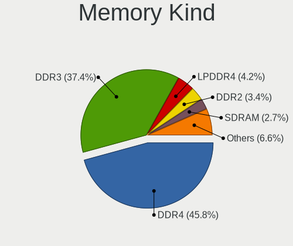

| Kind    | Computers | Percent |
|---------|-----------|---------|
| DDR4    | 376       | 44.03%  |
| DDR3    | 336       | 39.34%  |
| LPDDR4  | 37        | 4.33%   |
| DDR2    | 32        | 3.75%   |
| SDRAM   | 23        | 2.69%   |
| Unknown | 15        | 1.76%   |
| LPDDR5  | 14        | 1.64%   |
| LPDDR3  | 12        | 1.41%   |
| DDR5    | 5         | 0.59%   |
| DRAM    | 2         | 0.23%   |
| DDR     | 2         | 0.23%   |

Memory Form Factor
------------------

Physical design of the memory module

| Name         | Computers | Percent |
|--------------|-----------|---------|
| SODIMM       | 617       | 72.5%   |
| DIMM         | 163       | 19.15%  |
| Row Of Chips | 63        | 7.4%    |
| Chip         | 5         | 0.59%   |
| Unknown      | 3         | 0.35%   |

Memory Size
-----------

Memory module size

| Size  | Computers | Percent |
|-------|-----------|---------|
| 4096  | 356       | 36.63%  |
| 8192  | 322       | 33.13%  |
| 2048  | 148       | 15.23%  |
| 16384 | 84        | 8.64%   |
| 32768 | 39        | 4.01%   |
| 1024  | 20        | 2.06%   |
| 512   | 2         | 0.21%   |
| 65536 | 1         | 0.1%    |

Memory Speed
------------

Memory module speed

| Speed   | Computers | Percent |
|---------|-----------|---------|
| 1600    | 229       | 23.46%  |
| 2667    | 147       | 15.06%  |
| 3200    | 143       | 14.65%  |
| 2400    | 81        | 8.3%    |
| 1333    | 67        | 6.86%   |
| 2133    | 47        | 4.82%   |
| 1334    | 33        | 3.38%   |
| 1067    | 22        | 2.25%   |
| 3266    | 21        | 2.15%   |
| 800     | 20        | 2.05%   |
| Unknown | 19        | 1.95%   |
| 667     | 14        | 1.43%   |
| 6400    | 12        | 1.23%   |
| 4267    | 10        | 1.02%   |
| 4266    | 9         | 0.92%   |
| 1867    | 9         | 0.92%   |
| 1800    | 9         | 0.92%   |
| 8400    | 8         | 0.82%   |
| 3600    | 7         | 0.72%   |
| 4199    | 6         | 0.61%   |
| 3800    | 5         | 0.51%   |
| 3733    | 5         | 0.51%   |
| 1866    | 5         | 0.51%   |
| 1066    | 4         | 0.41%   |
| 533     | 4         | 0.41%   |
| 3400    | 3         | 0.31%   |
| 2666    | 3         | 0.31%   |
| 333     | 3         | 0.31%   |
| 5600    | 2         | 0.2%    |
| 5200    | 2         | 0.2%    |
| 3666    | 2         | 0.2%    |
| 3151    | 2         | 0.2%    |
| 2048    | 2         | 0.2%    |
| 975     | 2         | 0.2%    |
| 50410   | 1         | 0.1%    |
| 7467    | 1         | 0.1%    |
| 5500    | 1         | 0.1%    |
| 4800    | 1         | 0.1%    |
| 4040    | 1         | 0.1%    |
| 3866    | 1         | 0.1%    |

Printers & scanners
-------------------

Printer Vendor
--------------

Printer device vendors

| Vendor             | Computers | Percent |
|--------------------|-----------|---------|
| Seiko Epson        | 23        | 60.53%  |
| Hewlett-Packard    | 6         | 15.79%  |
| Canon              | 3         | 7.89%   |
| Brother Industries | 3         | 7.89%   |
| STMicroelectronics | 2         | 5.26%   |
| Fuji Xerox         | 1         | 2.63%   |

Printer Model
-------------

Printer device models

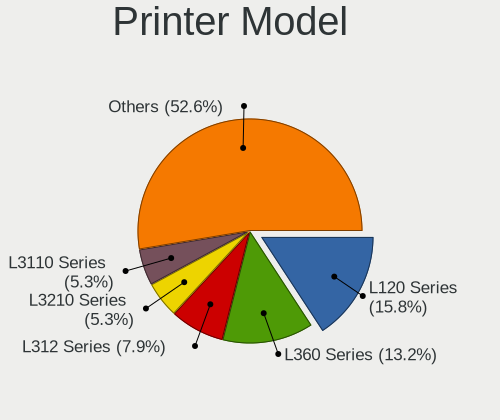

| Model                                   | Computers | Percent |
|-----------------------------------------|-----------|---------|
| Seiko Epson L120 Series                 | 6         | 15.79%  |
| Seiko Epson L360 Series                 | 5         | 13.16%  |
| Seiko Epson L312 Series                 | 3         | 7.89%   |
| Seiko Epson L3210 Series                | 2         | 5.26%   |
| Seiko Epson L3110 Series                | 2         | 5.26%   |
| Seiko Epson L300 Series                 | 2         | 5.26%   |
| Canon iP2700 series                     | 2         | 5.26%   |
| Brother DCP-T300                        | 2         | 5.26%   |
| STMicroelectronics USB Printing Support | 1         | 2.63%   |
| STMicroelectronics JRSVC Printer        | 1         | 2.63%   |
| Seiko Epson L405 Series                 | 1         | 2.63%   |
| Seiko Epson L355 Series                 | 1         | 2.63%   |
| Seiko Epson L1300 Series                | 1         | 2.63%   |
| HP LaserJet P1102                       | 1         | 2.63%   |
| HP LaserJet P1006                       | 1         | 2.63%   |
| HP LaserJet M101-M106                   | 1         | 2.63%   |
| HP Ink Tank 110 series                  | 1         | 2.63%   |
| HP DeskJet 5820 series                  | 1         | 2.63%   |
| HP DeskJet 2130 series                  | 1         | 2.63%   |
| Fuji Xerox DocuPrint M205 b             | 1         | 2.63%   |
| Canon LiDE 300                          | 1         | 2.63%   |
| Brother DCP-T310                        | 1         | 2.63%   |

Scanner Vendor
--------------

Scanner device vendors

| Vendor | Computers | Percent |
|--------|-----------|---------|
| Canon  | 2         | 100%    |

Scanner Model
-------------

Scanner device models

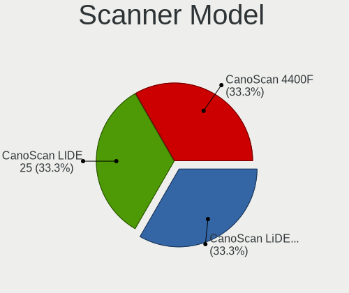

| Model                  | Computers | Percent |
|------------------------|-----------|---------|
| Canon CanoScan LIDE 25 | 1         | 50%     |
| Canon CanoScan 4400F   | 1         | 50%     |

Camera
------

Camera Vendor
-------------

Camera device vendors

| Vendor                                 | Computers | Percent |
|----------------------------------------|-----------|---------|
| Chicony Electronics                    | 276       | 26.9%   |
| IMC Networks                           | 142       | 13.84%  |
| Realtek Semiconductor                  | 90        | 8.77%   |
| Bison Electronics                      | 65        | 6.34%   |
| Quanta                                 | 54        | 5.26%   |
| Sunplus Innovation Technology          | 53        | 5.17%   |
| Syntek                                 | 49        | 4.78%   |
| Microdia                               | 46        | 4.48%   |
| Cheng Uei Precision Industry (Foxlink) | 45        | 4.39%   |
| Suyin                                  | 25        | 2.44%   |
| Alcor Micro                            | 24        | 2.34%   |
| Acer                                   | 23        | 2.24%   |
| Apple                                  | 16        | 1.56%   |
| Lite-On Technology                     | 14        | 1.36%   |
| Luxvisions Innotech Limited            | 13        | 1.27%   |
| Sonix Technology                       | 9         | 0.88%   |
| Silicon Motion                         | 7         | 0.68%   |
| Ricoh                                  | 6         | 0.58%   |
| Logitech                               | 6         | 0.58%   |
| Importek                               | 6         | 0.58%   |
| ANYKA                                  | 5         | 0.49%   |
| Primax Electronics                     | 4         | 0.39%   |
| Lenovo                                 | 4         | 0.39%   |
| Jieli Technology                       | 4         | 0.39%   |
| SunplusIT                              | 3         | 0.29%   |
| Generalplus Technology                 | 3         | 0.29%   |
| GEMBIRD                                | 3         | 0.29%   |
| Z-Star Microelectronics                | 2         | 0.19%   |
| Sunplus Technology                     | 2         | 0.19%   |
| OPPO Electronics                       | 2         | 0.19%   |
| Huawei Technologies                    | 2         | 0.19%   |
| Cubeternet                             | 2         | 0.19%   |
| ALi                                    | 2         | 0.19%   |
| 04004000_P040200_SN0002                | 2         | 0.19%   |
| Unknown                                | 2         | 0.19%   |
| WCM_USB                                | 1         | 0.1%    |
| Tripath Technology                     | 1         | 0.1%    |
| Samsung Electronics                    | 1         | 0.1%    |
| Razer USA                              | 1         | 0.1%    |
| Pixart Imaging                         | 1         | 0.1%    |

Camera Model
------------

Camera device models

| Model                                                           | Computers | Percent |
|-----------------------------------------------------------------|-----------|---------|
| Chicony Integrated Camera                                       | 49        | 4.75%   |
| IMC Networks USB2.0 HD UVC WebCam                               | 36        | 3.49%   |
| IMC Networks USB2.0 VGA UVC WebCam                              | 33        | 3.2%    |
| Chicony USB2.0 VGA UVC WebCam                                   | 33        | 3.2%    |
| Chicony HD WebCam                                               | 33        | 3.2%    |
| Syntek Integrated Camera                                        | 30        | 2.91%   |
| IMC Networks Integrated Camera                                  | 24        | 2.33%   |
| Realtek USB2.0 VGA UVC WebCam                                   | 18        | 1.75%   |
| Chicony USB2.0 HD UVC WebCam                                    | 18        | 1.75%   |
| Microdia Integrated_Webcam_HD                                   | 17        | 1.65%   |
| Chicony HP TrueVision HD Camera                                 | 16        | 1.55%   |
| Bison Integrated Camera                                         | 16        | 1.55%   |
| Realtek USB Camera                                              | 15        | 1.45%   |
| Realtek Integrated_Webcam_HD                                    | 15        | 1.45%   |
| Cheng Uei Precision Industry (Foxlink) HP TrueVision HD Camera  | 13        | 1.26%   |
| Quanta HD User Facing                                           | 12        | 1.16%   |
| IMC Networks Lenovo EasyCamera                                  | 12        | 1.16%   |
| IMC Networks EasyCamera                                         | 12        | 1.16%   |
| Chicony HP Truevision HD                                        | 11        | 1.07%   |
| Sunplus Asus Webcam                                             | 10        | 0.97%   |
| Realtek USB2.0 HD UVC WebCam                                    | 10        | 0.97%   |
| Quanta VGA WebCam                                               | 10        | 0.97%   |
| Chicony Lenovo EasyCamera                                       | 10        | 0.97%   |
| Chicony EasyCamera                                              | 10        | 0.97%   |
| Bison Lenovo EasyCamera                                         | 10        | 0.97%   |
| Syntek EasyCamera                                               | 9         | 0.87%   |
| Sunplus Integrated_Webcam_HD                                    | 9         | 0.87%   |
| Microdia Integrated Webcam                                      | 9         | 0.87%   |
| Bison EasyCamera                                                | 9         | 0.87%   |
| Syntek Lenovo EasyCamera                                        | 8         | 0.78%   |
| Sonix USB2.0 HD UVC WebCam                                      | 8         | 0.78%   |
| Chicony TOSHIBA Web Camera - HD                                 | 8         | 0.78%   |
| Chicony HD User Facing                                          | 8         | 0.78%   |
| Acer Lenovo EasyCamera                                          | 8         | 0.78%   |
| Suyin 1.3M HD WebCam                                            | 7         | 0.68%   |
| Quanta HP TrueVision HD Camera                                  | 7         | 0.68%   |
| Cheng Uei Precision Industry (Foxlink) HP Wide Vision HD Camera | 7         | 0.68%   |
| Bison HD Webcam                                                 | 7         | 0.68%   |
| Apple iPhone 5/5C/5S/6/SE/7/8/X                                 | 7         | 0.68%   |
| Alcor Micro USB 2.0 PC cam                                      | 7         | 0.68%   |

Security
--------

Fingerprint Vendor
------------------

Fingerprint sensor vendors

| Vendor                     | Computers | Percent |
|----------------------------|-----------|---------|
| Validity Sensors           | 50        | 29.94%  |
| Synaptics                  | 36        | 21.56%  |
| Elan Microelectronics      | 28        | 16.77%  |
| Shenzhen Goodix Technology | 20        | 11.98%  |
| LighTuning Technology      | 12        | 7.19%   |
| AuthenTec                  | 9         | 5.39%   |
| Upek                       | 5         | 2.99%   |
| STMicroelectronics         | 4         | 2.4%    |
| Focal-systems.Corp         | 2         | 1.2%    |
| DigitalPersona             | 1         | 0.6%    |

Fingerprint Model
-----------------

Fingerprint sensor models

| Model                                                                      | Computers | Percent |
|----------------------------------------------------------------------------|-----------|---------|
| Elan ELAN:ARM-M4                                                           | 14        | 8.38%   |
| Shenzhen Goodix Fingerprint Reader                                         | 13        | 7.78%   |
| Elan ELAN:Fingerprint                                                      | 13        | 7.78%   |
| LighTuning EgisTec Touch Fingerprint Sensor                                | 11        | 6.59%   |
| Validity Sensors VFS 5011 fingerprint sensor                               | 10        | 5.99%   |
| Validity Sensors VFS495 Fingerprint Reader                                 | 9         | 5.39%   |
| Synaptics Metallica MIS Touch Fingerprint Reader                           | 9         | 5.39%   |
| Validity Sensors VFS5011 Fingerprint Reader                                | 7         | 4.19%   |
| Synaptics Prometheus MIS Touch Fingerprint Reader                          | 7         | 4.19%   |
| Shenzhen Goodix  FingerPrint Device                                        | 7         | 4.19%   |
| Validity Sensors Swipe Fingerprint Sensor                                  | 6         | 3.59%   |
| Upek Biometric Touchchip/Touchstrip Fingerprint Sensor                     | 5         | 2.99%   |
| Synaptics WBDI                                                             | 5         | 2.99%   |
| Validity Sensors VFS491                                                    | 4         | 2.4%    |
| Validity Sensors VFS Fingerprint sensor                                    | 4         | 2.4%    |
| Synaptics UWP WBDI                                                         | 4         | 2.4%    |
| Synaptics  WBDI                                                            | 4         | 2.4%    |
| STMicroelectronics Fingerprint Reader                                      | 4         | 2.4%    |
| AuthenTec AES1600                                                          | 4         | 2.4%    |
| Validity Sensors VFS7500 Touch Fingerprint Sensor                          | 3         | 1.8%    |
| Validity Sensors VFS471 Fingerprint Reader                                 | 3         | 1.8%    |
| Validity Sensors Synaptics VFS7552 Touch Fingerprint Sensor with PurePrint | 2         | 1.2%    |
| Synaptics WBDI Fingerprint Reader USB 086                                  | 2         | 1.2%    |
| Synaptics Fingerprint reader [HP G6]                                       | 2         | 1.2%    |
| Focal-systems.Corp FT9201Fingerprint.                                      | 2         | 1.2%    |
| AuthenTec Fingerprint Sensor                                               | 2         | 1.2%    |
| AuthenTec AES1660 Fingerprint Sensor                                       | 2         | 1.2%    |
| Validity Sensors VFS451 Fingerprint Reader                                 | 1         | 0.6%    |
| Validity Sensors Synaptics WBDI                                            | 1         | 0.6%    |
| Synaptics WBDI Fingerprint Reader USB 102                                  | 1         | 0.6%    |
| Synaptics UWP WBDI Device                                                  | 1         | 0.6%    |
| Synaptics  FS7604 Touch Fingerprint Sensor with PurePrint                  | 1         | 0.6%    |
| LighTuning ES603 Swipe Fingerprint Sensor                                  | 1         | 0.6%    |
| Elan fingerprint sensor [FeinTech FPS00200]                                | 1         | 0.6%    |
| DigitalPersona Fingerprint Reader                                          | 1         | 0.6%    |
| AuthenTec AES2810                                                          | 1         | 0.6%    |

Chipcard Vendor
---------------

Chipcard module vendors

| Vendor      | Computers | Percent |
|-------------|-----------|---------|
| Broadcom    | 22        | 53.66%  |
| Alcor Micro | 8         | 19.51%  |
| O2 Micro    | 5         | 12.2%   |
| Upek        | 4         | 9.76%   |
| Lenovo      | 2         | 4.88%   |

Chipcard Model
--------------

Chipcard module models

| Model                                                                        | Computers | Percent |
|------------------------------------------------------------------------------|-----------|---------|
| Broadcom BCM5880 Secure Applications Processor                               | 12        | 29.27%  |
| Alcor Micro AU9540 Smartcard Reader                                          | 8         | 19.51%  |
| O2 Micro OZ776 CCID Smartcard Reader                                         | 5         | 12.2%   |
| Broadcom BCM5880 Secure Applications Processor with fingerprint swipe sensor | 5         | 12.2%   |
| Upek TouchChip Fingerprint Coprocessor (WBF advanced mode)                   | 4         | 9.76%   |
| Broadcom 58200                                                               | 3         | 7.32%   |
| Lenovo Integrated Smart Card Reader                                          | 2         | 4.88%   |
| Broadcom 5880                                                                | 2         | 4.88%   |

Unsupported
-----------

Unsupported Devices
-------------------

Total unsupported devices on board

| Total | Computers | Percent |
|-------|-----------|---------|
| 0     | 1087      | 72.37%  |
| 1     | 328       | 21.84%  |
| 2     | 71        | 4.73%   |
| 3     | 8         | 0.53%   |
| 4     | 6         | 0.4%    |
| 6     | 2         | 0.13%   |

Unsupported Device Types
------------------------

Types of unsupported devices

| Type                     | Computers | Percent |
|--------------------------|-----------|---------|
| Fingerprint reader       | 164       | 32.93%  |
| Graphics card            | 113       | 22.69%  |
| Net/wireless             | 58        | 11.65%  |
| Chipcard                 | 37        | 7.43%   |
| Multimedia controller    | 32        | 6.43%   |
| Communication controller | 24        | 4.82%   |
| Bluetooth                | 20        | 4.02%   |
| Unassigned class         | 11        | 2.21%   |
| Net/ethernet             | 11        | 2.21%   |
| Camera                   | 10        | 2.01%   |
| Storage                  | 4         | 0.8%    |
| Sound                    | 3         | 0.6%    |
| Flash memory             | 3         | 0.6%    |
| Storage/ide              | 2         | 0.4%    |
| Card reader              | 2         | 0.4%    |
| Wireless                 | 1         | 0.2%    |
| Video                    | 1         | 0.2%    |
| Network                  | 1         | 0.2%    |
| Modem                    | 1         | 0.2%    |

