Linux in Iran - Tested Hardware & Statistics
--------------------------------------------

A project to collect tested hardware configurations for Linux in Iran.

Anyone can contribute to this report by the [hw-probe](https://github.com/linuxhw/hw-probe) tool:

    sudo -E hw-probe -all -upload

Please contribute! Especially if your hardware is rare.

This is a report for all computer types. See also reports for [desktops](/Location/Iran/Desktop/README.md) and [notebooks](/Location/Iran/Notebook/README.md).

Contents
--------

* [ Test Cases ](#test-cases)

* [ System ](#system)
  - [ OS                       ](#os)
  - [ OS Family                ](#os-family)
  - [ Kernel                   ](#kernel)
  - [ Kernel Family            ](#kernel-family)
  - [ Kernel Major Ver.        ](#kernel-major-ver)
  - [ Arch                     ](#arch)
  - [ DE                       ](#de)
  - [ Display Server           ](#display-server)
  - [ Display Manager          ](#display-manager)
  - [ OS Lang                  ](#os-lang)
  - [ Boot Mode                ](#boot-mode)
  - [ Filesystem               ](#filesystem)
  - [ Part. scheme             ](#part-scheme)
  - [ Dual Boot with Linux/BSD ](#dual-boot-with-linuxbsd)
  - [ Dual Boot (Win)          ](#dual-boot-win)

* [ Board ](#board)
  - [ Vendor                   ](#vendor)
  - [ Model                    ](#model)
  - [ Model Family             ](#model-family)
  - [ MFG Year                 ](#mfg-year)
  - [ Form Factor              ](#form-factor)
  - [ Secure Boot              ](#secure-boot)
  - [ Coreboot                 ](#coreboot)
  - [ RAM Size                 ](#ram-size)
  - [ RAM Used                 ](#ram-used)
  - [ Total Drives             ](#total-drives)
  - [ Has CD-ROM               ](#has-cd-rom)
  - [ Has Ethernet             ](#has-ethernet)
  - [ Has WiFi                 ](#has-wifi)
  - [ Has Bluetooth            ](#has-bluetooth)

* [ Location ](#location)
  - [ Country                  ](#country)
  - [ City                     ](#city)

* [ Drives ](#drives)
  - [ Drive Vendor             ](#drive-vendor)
  - [ Drive Model              ](#drive-model)
  - [ HDD Vendor               ](#hdd-vendor)
  - [ SSD Vendor               ](#ssd-vendor)
  - [ Drive Kind               ](#drive-kind)
  - [ Drive Connector          ](#drive-connector)
  - [ Drive Size               ](#drive-size)
  - [ Space Total              ](#space-total)
  - [ Space Used               ](#space-used)
  - [ Malfunc. Drives          ](#malfunc-drives)
  - [ Malfunc. Drive Vendor    ](#malfunc-drive-vendor)
  - [ Malfunc. HDD Vendor      ](#malfunc-hdd-vendor)
  - [ Malfunc. Drive Kind      ](#malfunc-drive-kind)
  - [ Failed Drives            ](#failed-drives)
  - [ Failed Drive Vendor      ](#failed-drive-vendor)
  - [ Drive Status             ](#drive-status)

* [ Storage controller ](#storage-controller)
  - [ Storage Vendor           ](#storage-vendor)
  - [ Storage Model            ](#storage-model)
  - [ Storage Kind             ](#storage-kind)

* [ Processor ](#processor)
  - [ CPU Vendor               ](#cpu-vendor)
  - [ CPU Model                ](#cpu-model)
  - [ CPU Model Family         ](#cpu-model-family)
  - [ CPU Cores                ](#cpu-cores)
  - [ CPU Sockets              ](#cpu-sockets)
  - [ CPU Threads              ](#cpu-threads)
  - [ CPU Op-Modes             ](#cpu-op-modes)
  - [ CPU Microcode            ](#cpu-microcode)
  - [ CPU Microarch            ](#cpu-microarch)

* [ Graphics ](#graphics)
  - [ GPU Vendor               ](#gpu-vendor)
  - [ GPU Model                ](#gpu-model)
  - [ GPU Combo                ](#gpu-combo)
  - [ GPU Driver               ](#gpu-driver)
  - [ GPU Memory               ](#gpu-memory)

* [ Monitor ](#monitor)
  - [ Monitor Vendor           ](#monitor-vendor)
  - [ Monitor Model            ](#monitor-model)
  - [ Monitor Resolution       ](#monitor-resolution)
  - [ Monitor Diagonal         ](#monitor-diagonal)
  - [ Monitor Width            ](#monitor-width)
  - [ Aspect Ratio             ](#aspect-ratio)
  - [ Monitor Area             ](#monitor-area)
  - [ Pixel Density            ](#pixel-density)
  - [ Multiple Monitors        ](#multiple-monitors)

* [ Network ](#network)
  - [ Net Controller Vendor    ](#net-controller-vendor)
  - [ Net Controller Model     ](#net-controller-model)
  - [ Wireless Vendor          ](#wireless-vendor)
  - [ Wireless Model           ](#wireless-model)
  - [ Ethernet Vendor          ](#ethernet-vendor)
  - [ Ethernet Model           ](#ethernet-model)
  - [ Net Controller Kind      ](#net-controller-kind)
  - [ Used Controller          ](#used-controller)
  - [ NICs                     ](#nics)
  - [ IPv6                     ](#ipv6)

* [ Bluetooth ](#bluetooth)
  - [ Bluetooth Vendor         ](#bluetooth-vendor)
  - [ Bluetooth Model          ](#bluetooth-model)

* [ Sound ](#sound)
  - [ Sound Vendor             ](#sound-vendor)
  - [ Sound Model              ](#sound-model)

* [ Memory ](#memory)
  - [ Memory Vendor            ](#memory-vendor)
  - [ Memory Model             ](#memory-model)
  - [ Memory Kind              ](#memory-kind)
  - [ Memory Form Factor       ](#memory-form-factor)
  - [ Memory Size              ](#memory-size)
  - [ Memory Speed             ](#memory-speed)

* [ Printers & scanners ](#printers--scanners)
  - [ Printer Vendor           ](#printer-vendor)
  - [ Printer Model            ](#printer-model)
  - [ Scanner Vendor           ](#scanner-vendor)
  - [ Scanner Model            ](#scanner-model)

* [ Camera ](#camera)
  - [ Camera Vendor            ](#camera-vendor)
  - [ Camera Model             ](#camera-model)

* [ Security ](#security)
  - [ Fingerprint Vendor       ](#fingerprint-vendor)
  - [ Fingerprint Model        ](#fingerprint-model)
  - [ Chipcard Vendor          ](#chipcard-vendor)
  - [ Chipcard Model           ](#chipcard-model)

* [ Unsupported ](#unsupported)
  - [ Unsupported Devices      ](#unsupported-devices)
  - [ Unsupported Device Types ](#unsupported-device-types)

Test Cases
----------

Total: 1385

| Vendor        | Model                       | Form-Factor | Probe                                                      | Date         |
|---------------|-----------------------------|-------------|------------------------------------------------------------|--------------|
| ASUSTek       | PRIME H610M-K D4            | Desktop     | [84b7be2db5](https://linux-hardware.org/?probe=84b7be2db5) | Dec 31, 2025 |
| ASUSTek       | PRIME H610M-K D4            | Desktop     | [d515fbdbf2](https://linux-hardware.org/?probe=d515fbdbf2) | Dec 31, 2025 |
| HP            | ProBook 430 G2              | Notebook    | [c03541779b](https://linux-hardware.org/?probe=c03541779b) | Dec 29, 2025 |
| Gigabyte      | H410M S2H V3                | Desktop     | [f604c56b6e](https://linux-hardware.org/?probe=f604c56b6e) | Dec 27, 2025 |
| ASUSTek       | ASUS TUF Gaming A15 FA50... | Notebook    | [e29657305b](https://linux-hardware.org/?probe=e29657305b) | Dec 26, 2025 |
| ASUSTek       | ASUS TUF Gaming A15 FA50... | Notebook    | [5f971cb857](https://linux-hardware.org/?probe=5f971cb857) | Dec 26, 2025 |
| HP            | Stream Laptop 14-ax0XX      | Notebook    | [5fbce87398](https://linux-hardware.org/?probe=5fbce87398) | Dec 25, 2025 |
| Dell          | Inspiron 7520               | Notebook    | [91deb79e5c](https://linux-hardware.org/?probe=91deb79e5c) | Dec 24, 2025 |
| Acer          | Aspire A315-53G             | Notebook    | [6044890213](https://linux-hardware.org/?probe=6044890213) | Dec 24, 2025 |
| HP            | 3397                        | Desktop     | [9e4aba9002](https://linux-hardware.org/?probe=9e4aba9002) | Dec 22, 2025 |
| ASUSTek       | VivoBook_ASUSLaptop X170... | Notebook    | [24aa658305](https://linux-hardware.org/?probe=24aa658305) | Dec 16, 2025 |
| Apple         | MacBookPro8,1               | Notebook    | [6065585a45](https://linux-hardware.org/?probe=6065585a45) | Dec 15, 2025 |
| Gigabyte      | B650I AX                    | Desktop     | [e08d3ce2b0](https://linux-hardware.org/?probe=e08d3ce2b0) | Dec 14, 2025 |
| Gigabyte      | B650I AX                    | Desktop     | [aa7d383c4e](https://linux-hardware.org/?probe=aa7d383c4e) | Dec 14, 2025 |
| ASUSTek       | VivoBook_ASUSLaptop X580... | Notebook    | [2919b760d9](https://linux-hardware.org/?probe=2919b760d9) | Dec 13, 2025 |
| Acer          | Extensa 4220                | Notebook    | [de77b24321](https://linux-hardware.org/?probe=de77b24321) | Dec 12, 2025 |
| Shenzhen M... | F8BSC                       | Mini pc     | [c0e75afd4f](https://linux-hardware.org/?probe=c0e75afd4f) | Dec 12, 2025 |
| ASUSTek       | P5KPL-AM                    | Desktop     | [34f131f00e](https://linux-hardware.org/?probe=34f131f00e) | Dec 10, 2025 |
| MSI           | Cyborg 15 A13UDX            | Notebook    | [6a8ca39c2d](https://linux-hardware.org/?probe=6a8ca39c2d) | Dec 10, 2025 |
| ASUSTek       | ASUS Vivobook S 14 S5406... | Notebook    | [0b5a4ca1f5](https://linux-hardware.org/?probe=0b5a4ca1f5) | Dec 09, 2025 |
| Intel         | SHARKBAY                    | Desktop     | [4ccf806250](https://linux-hardware.org/?probe=4ccf806250) | Dec 09, 2025 |
| Intel         | SHARKBAY                    | Desktop     | [e601c6e475](https://linux-hardware.org/?probe=e601c6e475) | Dec 09, 2025 |
| ASUSTek       | PRIME Z790-P WIFI           | Desktop     | [2fefcbe886](https://linux-hardware.org/?probe=2fefcbe886) | Dec 06, 2025 |
| ASUSTek       | ASUS TUF Gaming F15 FX50... | Notebook    | [882b41e959](https://linux-hardware.org/?probe=882b41e959) | Dec 06, 2025 |
| Dell          | Precision 7530              | Notebook    | [3a0e3a87a3](https://linux-hardware.org/?probe=3a0e3a87a3) | Dec 05, 2025 |
| Toshiba       | dynabook R82/B              | Notebook    | [9764bfe58d](https://linux-hardware.org/?probe=9764bfe58d) | Dec 03, 2025 |
| Lenovo        | ThinkPad L14 Gen 1 20U6S... | Notebook    | [c98a361949](https://linux-hardware.org/?probe=c98a361949) | Dec 02, 2025 |
| Lenovo        | ThinkPad L14 Gen 1 20U6S... | Notebook    | [0d40477c06](https://linux-hardware.org/?probe=0d40477c06) | Dec 02, 2025 |
| HP            | Notebook                    | Notebook    | [d6fa5d24dd](https://linux-hardware.org/?probe=d6fa5d24dd) | Dec 02, 2025 |
| HP            | Notebook                    | Notebook    | [865798df2c](https://linux-hardware.org/?probe=865798df2c) | Dec 02, 2025 |
| Apple         | MacBookAir7,2               | Notebook    | [127a463fbb](https://linux-hardware.org/?probe=127a463fbb) | Dec 02, 2025 |
| ASUSTek       | PRIME B450-PLUS             | Desktop     | [07ee3c243e](https://linux-hardware.org/?probe=07ee3c243e) | Nov 26, 2025 |
| ASUSTek       | PRIME B450-PLUS             | Desktop     | [9b49b49d23](https://linux-hardware.org/?probe=9b49b49d23) | Nov 26, 2025 |
| Fujitsu       | LIFEBOOK AH530/HD6          | Notebook    | [06f0e1d461](https://linux-hardware.org/?probe=06f0e1d461) | Nov 23, 2025 |
| Supermicro    | X7SBL                       | Desktop     | [aba30640d1](https://linux-hardware.org/?probe=aba30640d1) | Nov 19, 2025 |
| ASUSTek       | ASUS Vivobook S 14 S5406... | Notebook    | [41197cc7d2](https://linux-hardware.org/?probe=41197cc7d2) | Nov 16, 2025 |
| Lenovo        | 3102 SDK0J40697 WIN 3305... | Desktop     | [02abbebe48](https://linux-hardware.org/?probe=02abbebe48) | Nov 16, 2025 |
| ASUSTek       | ASUS TUF Gaming F15 FX50... | Notebook    | [c7326d8d2f](https://linux-hardware.org/?probe=c7326d8d2f) | Nov 16, 2025 |
| ASUSTek       | H110M-C                     | Desktop     | [534f01c9f2](https://linux-hardware.org/?probe=534f01c9f2) | Nov 13, 2025 |
| ASUSTek       | H110M-C                     | Desktop     | [25123319e4](https://linux-hardware.org/?probe=25123319e4) | Nov 13, 2025 |
| HP            | Elite x2 1013 G3            | Tablet      | [a05e5afb6e](https://linux-hardware.org/?probe=a05e5afb6e) | Nov 13, 2025 |
| ASUSTek       | X555LD                      | Notebook    | [bf13868650](https://linux-hardware.org/?probe=bf13868650) | Nov 13, 2025 |
| HP            | Victus by Gaming Laptop ... | Notebook    | [9482407841](https://linux-hardware.org/?probe=9482407841) | Nov 09, 2025 |
| ASUSTek       | ROG Zephyrus G14 GA402RK... | Notebook    | [f9a554042e](https://linux-hardware.org/?probe=f9a554042e) | Nov 04, 2025 |
| Lenovo        | IdeaPad Slim 3 15IRU8 82... | Notebook    | [596e213522](https://linux-hardware.org/?probe=596e213522) | Nov 04, 2025 |
| Lenovo        | IdeaPad Slim 3 15IRH8 83... | Notebook    | [e88e5e5c11](https://linux-hardware.org/?probe=e88e5e5c11) | Nov 04, 2025 |
| HP            | EliteBook 735 G6            | Notebook    | [edf03fb6c0](https://linux-hardware.org/?probe=edf03fb6c0) | Nov 03, 2025 |
| Lenovo        | IdeaPad Slim 3 15IRH8 83... | Notebook    | [d3b1c52bc2](https://linux-hardware.org/?probe=d3b1c52bc2) | Nov 02, 2025 |
| Lenovo        | ThinkCentre M70e 0830NR3    | Desktop     | [d114a3e545](https://linux-hardware.org/?probe=d114a3e545) | Oct 22, 2025 |
| Acer          | Aspire 5750G                | Notebook    | [3c4818e753](https://linux-hardware.org/?probe=3c4818e753) | Oct 22, 2025 |
| HP            | Elite x2 1013 G3            | Tablet      | [78e20e4d78](https://linux-hardware.org/?probe=78e20e4d78) | Oct 22, 2025 |
| Dell          | Inspiron 3593               | Notebook    | [1db6618b3c](https://linux-hardware.org/?probe=1db6618b3c) | Oct 18, 2025 |
| HP            | ENVY x360 2-in-1 Laptop ... | Convertible | [0102cbf4b1](https://linux-hardware.org/?probe=0102cbf4b1) | Oct 17, 2025 |
| HP            | Pavilion 15                 | Notebook    | [c7395a578a](https://linux-hardware.org/?probe=c7395a578a) | Oct 16, 2025 |
| ASUSTek       | TUF Gaming Z590-PLUS        | Desktop     | [c896dca502](https://linux-hardware.org/?probe=c896dca502) | Oct 15, 2025 |
| ASUSTek       | VivoBook_ASUSLaptop M350... | Notebook    | [a5c664cdb4](https://linux-hardware.org/?probe=a5c664cdb4) | Oct 13, 2025 |
| HP            | ZBook 15 G3                 | Notebook    | [07c7d9ddc4](https://linux-hardware.org/?probe=07c7d9ddc4) | Oct 12, 2025 |
| HP            | ZBook 15 G3                 | Notebook    | [a9bfc7e936](https://linux-hardware.org/?probe=a9bfc7e936) | Oct 12, 2025 |
| ASUSTek       | ASUS TUF Gaming A15 FA50... | Notebook    | [433af157b9](https://linux-hardware.org/?probe=433af157b9) | Oct 12, 2025 |
| ASUSTek       | E202SA                      | Notebook    | [eda74c1cf0](https://linux-hardware.org/?probe=eda74c1cf0) | Oct 11, 2025 |
| Acer          | Aspire A15-41M              | Notebook    | [ad1c5689f3](https://linux-hardware.org/?probe=ad1c5689f3) | Oct 08, 2025 |
| ASUSTek       | ASUS Vivobook S 15 S5506... | Notebook    | [9c5ccfafc0](https://linux-hardware.org/?probe=9c5ccfafc0) | Oct 07, 2025 |
| Lenovo        | ThinkPad L14 Gen 1 20U6S... | Notebook    | [08b8e8d997](https://linux-hardware.org/?probe=08b8e8d997) | Oct 04, 2025 |
| MSI           | Modern 15 A11MU             | Notebook    | [b6ca75a532](https://linux-hardware.org/?probe=b6ca75a532) | Sep 26, 2025 |
| Lenovo        | ThinkPad L14 Gen 1 20U6S... | Notebook    | [cc8786bb7d](https://linux-hardware.org/?probe=cc8786bb7d) | Sep 25, 2025 |
| HP            | ENVY x360 m6 Convertible    | Convertible | [0335d5597e](https://linux-hardware.org/?probe=0335d5597e) | Sep 24, 2025 |
| HP            | EliteBook 850 G4            | Notebook    | [56a4c14e91](https://linux-hardware.org/?probe=56a4c14e91) | Sep 23, 2025 |
| HP            | EliteBook 850 G4            | Notebook    | [f5e8008d6b](https://linux-hardware.org/?probe=f5e8008d6b) | Sep 22, 2025 |
| Acer          | Aspire A715-75G             | Notebook    | [96baedd5cc](https://linux-hardware.org/?probe=96baedd5cc) | Sep 22, 2025 |
| Acer          | Aspire A715-75G             | Notebook    | [a3496c1f3a](https://linux-hardware.org/?probe=a3496c1f3a) | Sep 22, 2025 |
| Lenovo        | ThinkPad L14 Gen 1 20U6S... | Notebook    | [34e735de63](https://linux-hardware.org/?probe=34e735de63) | Sep 21, 2025 |
| Lenovo        | ThinkPad L14 Gen 1 20U6S... | Notebook    | [61e4fbea47](https://linux-hardware.org/?probe=61e4fbea47) | Sep 20, 2025 |
| ASUSTek       | PRIME Z490-A                | Desktop     | [b5a64f06c1](https://linux-hardware.org/?probe=b5a64f06c1) | Sep 19, 2025 |
| Gigabyte      | B650M GAMING PLUS WIFI      | Desktop     | [d4b0a08df4](https://linux-hardware.org/?probe=d4b0a08df4) | Sep 16, 2025 |
| Lenovo        | IdeaPad Slim 3 15ABR8 82... | Notebook    | [ddf703ea07](https://linux-hardware.org/?probe=ddf703ea07) | Sep 16, 2025 |
| ASUSTek       | PRIME H610M-K ARGB          | Desktop     | [731d96e7cb](https://linux-hardware.org/?probe=731d96e7cb) | Sep 14, 2025 |
| Lenovo        | ThinkBook 14 G6 IRL 21KG    | Notebook    | [cecd489ae3](https://linux-hardware.org/?probe=cecd489ae3) | Sep 05, 2025 |
| HP            | 18E7                        | Desktop     | [547611a86d](https://linux-hardware.org/?probe=547611a86d) | Sep 02, 2025 |
| ASUSTek       | PRIME B760-PLUS             | Desktop     | [d5cf97f3f0](https://linux-hardware.org/?probe=d5cf97f3f0) | Aug 29, 2025 |
| ASUSTek       | PRIME Z690-P D4             | Desktop     | [fc8fdfd128](https://linux-hardware.org/?probe=fc8fdfd128) | Aug 22, 2025 |
| Dell          | Vostro 1015                 | Notebook    | [768a7d4849](https://linux-hardware.org/?probe=768a7d4849) | Aug 18, 2025 |
| Lenovo        | IdeaPad 5 14ALC05 82LM      | Notebook    | [2072a8c11d](https://linux-hardware.org/?probe=2072a8c11d) | Aug 17, 2025 |
| ASUSTek       | ASUS EXPERTBOOK P1503CVA    | Notebook    | [7fe4e9c039](https://linux-hardware.org/?probe=7fe4e9c039) | Aug 15, 2025 |
| Dell          | Latitude 5421               | Notebook    | [411487698a](https://linux-hardware.org/?probe=411487698a) | Aug 13, 2025 |
| aigo          | X99M D4 V1.0                | Desktop     | [68d7a31f1a](https://linux-hardware.org/?probe=68d7a31f1a) | Aug 12, 2025 |
| Gigabyte      | H81M-S2PV                   | Desktop     | [66d511c661](https://linux-hardware.org/?probe=66d511c661) | Aug 10, 2025 |
| ASUSTek       | VivoBook_ASUSLaptop M160... | Notebook    | [9589371562](https://linux-hardware.org/?probe=9589371562) | Aug 08, 2025 |
| ASUSTek       | VivoBook_ASUSLaptop M160... | Notebook    | [c557a787d7](https://linux-hardware.org/?probe=c557a787d7) | Aug 08, 2025 |
| HP            | 1000                        | Notebook    | [3ea82ef6a6](https://linux-hardware.org/?probe=3ea82ef6a6) | Aug 06, 2025 |
| Lenovo        | IdeaPad 330-15IKB 81DE      | Notebook    | [a2cdf7413d](https://linux-hardware.org/?probe=a2cdf7413d) | Jul 29, 2025 |
| Samsung       | 300E4Z/300E5Z/300E7Z        | Notebook    | [ae5495785c](https://linux-hardware.org/?probe=ae5495785c) | Jul 24, 2025 |
| HP            | ProBook 430 G8 Notebook ... | Notebook    | [ffd1782bf3](https://linux-hardware.org/?probe=ffd1782bf3) | Jul 22, 2025 |
| Sony          | VPCSE1C9E                   | Notebook    | [c1ffa60a1d](https://linux-hardware.org/?probe=c1ffa60a1d) | Jul 21, 2025 |
| Lenovo        | IdeaPad 5 14ALC05 82LM      | Notebook    | [9a16bccb26](https://linux-hardware.org/?probe=9a16bccb26) | Jul 21, 2025 |
| HP            | ZBook 14u G6                | Notebook    | [769cc271da](https://linux-hardware.org/?probe=769cc271da) | Jul 16, 2025 |
| HP            | ZBook 17 G3                 | Notebook    | [c0a66b5f4f](https://linux-hardware.org/?probe=c0a66b5f4f) | Jul 16, 2025 |
| HP            | ZBook 14u G6                | Notebook    | [95ba4c85bd](https://linux-hardware.org/?probe=95ba4c85bd) | Jul 16, 2025 |
| ASUSTek       | VivoBook_ASUSLaptop K360... | Notebook    | [9e3f889ce7](https://linux-hardware.org/?probe=9e3f889ce7) | Jul 14, 2025 |
| Google        | Redrix                      | Notebook    | [714801f458](https://linux-hardware.org/?probe=714801f458) | Jul 13, 2025 |
| Lenovo        | IdeaPad 5 14ALC05 82LM      | Notebook    | [a2844aaa6b](https://linux-hardware.org/?probe=a2844aaa6b) | Jul 10, 2025 |
| Gigabyte      | X299 UD4-CF                 | Desktop     | [7a1f1b1aa1](https://linux-hardware.org/?probe=7a1f1b1aa1) | Jul 08, 2025 |
| Sony          | SVF1521DCXW                 | Notebook    | [66ffcb6dc2](https://linux-hardware.org/?probe=66ffcb6dc2) | Jul 08, 2025 |
| Dell          | Inspiron 1564               | Notebook    | [30723ae2c0](https://linux-hardware.org/?probe=30723ae2c0) | Jul 07, 2025 |
| Gigabyte      | X299 UD4-CF                 | Desktop     | [257c3efefc](https://linux-hardware.org/?probe=257c3efefc) | Jul 07, 2025 |
| HP            | Compaq 6730b (GW687AV)      | Notebook    | [9ea874a1b4](https://linux-hardware.org/?probe=9ea874a1b4) | Jun 27, 2025 |
| Lenovo        | IdeaPad Z510 20287          | Notebook    | [a64abb9c48](https://linux-hardware.org/?probe=a64abb9c48) | Jun 11, 2025 |
| ASUSTek       | PRIME H610M-A               | Desktop     | [01d0a5675c](https://linux-hardware.org/?probe=01d0a5675c) | Jun 09, 2025 |
| ASUSTek       | PRIME H610M-A               | Desktop     | [3402fe3a6e](https://linux-hardware.org/?probe=3402fe3a6e) | Jun 09, 2025 |
| Lenovo        | V110-15IAP 80TG             | Notebook    | [ed91f0a3ec](https://linux-hardware.org/?probe=ed91f0a3ec) | Jun 08, 2025 |
| ASUSTek       | X450LD                      | Notebook    | [031d726720](https://linux-hardware.org/?probe=031d726720) | Jun 08, 2025 |
| Acer          | Swift SF314-59              | Notebook    | [84f52bcf55](https://linux-hardware.org/?probe=84f52bcf55) | Jun 07, 2025 |
| ASUSTek       | VivoBook_ASUSLaptop X150... | Notebook    | [bcf3aa9bea](https://linux-hardware.org/?probe=bcf3aa9bea) | Jun 07, 2025 |
| MSI           | GP60 2OD                    | Notebook    | [c35d23795c](https://linux-hardware.org/?probe=c35d23795c) | Jun 07, 2025 |
| Microsoft     | Surface Pro 4               | Tablet      | [0f4dc385b3](https://linux-hardware.org/?probe=0f4dc385b3) | Jun 07, 2025 |
| ASUSTek       | ASUS Vivobook S 15 S5506... | Notebook    | [52e94fe42f](https://linux-hardware.org/?probe=52e94fe42f) | Jun 07, 2025 |
| ASUSTek       | PRIME H370-A                | Desktop     | [d79b9b2d44](https://linux-hardware.org/?probe=d79b9b2d44) | May 29, 2025 |
| Dell          | Inspiron N5040              | Notebook    | [43e7fcd6b6](https://linux-hardware.org/?probe=43e7fcd6b6) | May 27, 2025 |
| Gigabyte      | B760M GAMING DDR4           | Desktop     | [eb06fd095f](https://linux-hardware.org/?probe=eb06fd095f) | May 27, 2025 |
| Razer         | Blade Stealth 13 (Early ... | Notebook    | [01070f9164](https://linux-hardware.org/?probe=01070f9164) | May 25, 2025 |
| Lenovo        | ThinkPad Edge E130 3358A... | Notebook    | [8cbb059f70](https://linux-hardware.org/?probe=8cbb059f70) | May 20, 2025 |
| ASUSTek       | VivoBook_ASUSLaptop K360... | Notebook    | [c445378496](https://linux-hardware.org/?probe=c445378496) | May 16, 2025 |
| ASUSTek       | ROG Strix G513RM_G513RM     | Notebook    | [51439c447a](https://linux-hardware.org/?probe=51439c447a) | May 16, 2025 |
| ASUSTek       | PRIME H610M-K D4            | Desktop     | [4ddc1e8706](https://linux-hardware.org/?probe=4ddc1e8706) | May 15, 2025 |
| HP            | ZBook 15 G3                 | Notebook    | [fb8a2b372e](https://linux-hardware.org/?probe=fb8a2b372e) | May 11, 2025 |
| HP            | ZBook 15 G3                 | Notebook    | [111c894d04](https://linux-hardware.org/?probe=111c894d04) | May 09, 2025 |
| ASUSTek       | ROG Strix G513RM_G513RM     | Notebook    | [96c6d944bb](https://linux-hardware.org/?probe=96c6d944bb) | May 09, 2025 |
| Lenovo        | IdeaPad 5 14ALC05 82LM      | Notebook    | [92a2dd3a06](https://linux-hardware.org/?probe=92a2dd3a06) | May 08, 2025 |
| Dell          | Latitude E6420              | Notebook    | [cceb33d297](https://linux-hardware.org/?probe=cceb33d297) | May 07, 2025 |
| Dell          | Latitude E6420              | Notebook    | [ed4add5bb8](https://linux-hardware.org/?probe=ed4add5bb8) | May 07, 2025 |
| ASUSTek       | ASUS EXPERTBOOK P1503CVA    | Notebook    | [9382b0d452](https://linux-hardware.org/?probe=9382b0d452) | May 04, 2025 |
| ASUSTek       | H81M-C                      | Desktop     | [357444c21d](https://linux-hardware.org/?probe=357444c21d) | May 04, 2025 |
| Lenovo        | ThinkPad E15 Gen 2 20T80... | Notebook    | [5225673118](https://linux-hardware.org/?probe=5225673118) | May 03, 2025 |
| ASUSTek       | K53SD                       | Notebook    | [599d9a3e88](https://linux-hardware.org/?probe=599d9a3e88) | May 03, 2025 |
| HP            | 8054                        | Desktop     | [dc6fb71a2a](https://linux-hardware.org/?probe=dc6fb71a2a) | May 01, 2025 |
| Foxconn       | B85MX/B85MX-D/B85MX-S       | Desktop     | [1dca4aa54d](https://linux-hardware.org/?probe=1dca4aa54d) | Apr 27, 2025 |
| Foxconn       | B85MX/B85MX-D/B85MX-S       | Desktop     | [bd8d3924a4](https://linux-hardware.org/?probe=bd8d3924a4) | Apr 27, 2025 |
| Lenovo        | B590 20208                  | Notebook    | [e2508c38f3](https://linux-hardware.org/?probe=e2508c38f3) | Apr 26, 2025 |
| Dell          | XPS 9320                    | Notebook    | [d0628e1ae9](https://linux-hardware.org/?probe=d0628e1ae9) | Apr 25, 2025 |
| MSI           | CR610M                      | Notebook    | [fff5d43a1d](https://linux-hardware.org/?probe=fff5d43a1d) | Apr 25, 2025 |
| ASUSTek       | ASUS TUF Gaming F15 FX50... | Notebook    | [bca0444592](https://linux-hardware.org/?probe=bca0444592) | Apr 23, 2025 |
| ASUSTek       | TUF Gaming B550M-PLUS       | Desktop     | [e5a8a718bc](https://linux-hardware.org/?probe=e5a8a718bc) | Apr 23, 2025 |
| Acer          | Aspire ES1-571              | Notebook    | [6cbbe77d79](https://linux-hardware.org/?probe=6cbbe77d79) | Apr 21, 2025 |
| Lenovo        | IdeaPad Y480                | Notebook    | [898bce2f77](https://linux-hardware.org/?probe=898bce2f77) | Apr 20, 2025 |
| Lenovo        | ThinkPad X1 Yoga 3rd 20L... | Convertible | [64264bcb7f](https://linux-hardware.org/?probe=64264bcb7f) | Apr 18, 2025 |
| Lenovo        | IdeaPadFlex 4-1480 80VD     | Convertible | [055587462c](https://linux-hardware.org/?probe=055587462c) | Apr 17, 2025 |
| Lenovo        | IdeaPadFlex 4-1480 80VD     | Convertible | [1c88624441](https://linux-hardware.org/?probe=1c88624441) | Apr 17, 2025 |
| Lenovo        | ThinkPad X1 Yoga 3rd 20L... | Convertible | [cfb99a23cc](https://linux-hardware.org/?probe=cfb99a23cc) | Apr 16, 2025 |
| ASUSTek       | TUF Gaming Z690-PLUS        | Desktop     | [03685d95a6](https://linux-hardware.org/?probe=03685d95a6) | Apr 12, 2025 |
| Lenovo        | IdeaPad 5 14ALC05 82LM      | Notebook    | [2d38ebc70e](https://linux-hardware.org/?probe=2d38ebc70e) | Apr 09, 2025 |
| Lenovo        | ThinkPad E15 Gen 2 20T80... | Notebook    | [ef0db5b030](https://linux-hardware.org/?probe=ef0db5b030) | Mar 31, 2025 |
| HP            | ProBook 430 G2              | Notebook    | [963465ffe5](https://linux-hardware.org/?probe=963465ffe5) | Mar 30, 2025 |
| Acer          | Predator PHN16-72           | Notebook    | [2710ed48a1](https://linux-hardware.org/?probe=2710ed48a1) | Mar 30, 2025 |
| HP            | ProBook 430 G2              | Notebook    | [ed128d40dc](https://linux-hardware.org/?probe=ed128d40dc) | Mar 28, 2025 |
| ASUSTek       | VivoBook_ASUSLaptop X160... | Notebook    | [104deebdbc](https://linux-hardware.org/?probe=104deebdbc) | Mar 28, 2025 |
| Lenovo        | ThinkPad E15 Gen 2 20T80... | Notebook    | [0aca55bb23](https://linux-hardware.org/?probe=0aca55bb23) | Mar 20, 2025 |
| ASUSTek       | PRIME Z390-P                | Desktop     | [9f33cd7da0](https://linux-hardware.org/?probe=9f33cd7da0) | Mar 19, 2025 |
| ASUSTek       | PRIME H510M-C/PS            | Desktop     | [f1e72cf03a](https://linux-hardware.org/?probe=f1e72cf03a) | Mar 18, 2025 |
| ASUSTek       | ProArt Z690-CREATOR WIFI    | Desktop     | [64f6eeae8c](https://linux-hardware.org/?probe=64f6eeae8c) | Mar 17, 2025 |
| Lenovo        | LOQ 15IRX9 83DV             | Notebook    | [e2698545f4](https://linux-hardware.org/?probe=e2698545f4) | Mar 14, 2025 |
| ASUSTek       | X550CC                      | Notebook    | [b4e30e1e7b](https://linux-hardware.org/?probe=b4e30e1e7b) | Mar 13, 2025 |
| Lenovo        | IdeaPad Gaming 3 15IAH7 ... | Notebook    | [b295ff8fd7](https://linux-hardware.org/?probe=b295ff8fd7) | Mar 13, 2025 |
| Lenovo        | IdeaPad Gaming 3 15IAH7 ... | Notebook    | [3bde780223](https://linux-hardware.org/?probe=3bde780223) | Mar 13, 2025 |
| MSI           | CR610M                      | Notebook    | [73bb7f3b08](https://linux-hardware.org/?probe=73bb7f3b08) | Mar 11, 2025 |
| Gigabyte      | GA-MA770T-UD3               | Desktop     | [7962692ff7](https://linux-hardware.org/?probe=7962692ff7) | Mar 10, 2025 |
| ASUSTek       | PRIME H610M-C/PS D4         | Desktop     | [7dceb2857b](https://linux-hardware.org/?probe=7dceb2857b) | Mar 10, 2025 |
| HP            | 15                          | Notebook    | [8648674db6](https://linux-hardware.org/?probe=8648674db6) | Mar 08, 2025 |
| Dell          | Inspiron N5010              | Notebook    | [a2d52dafaa](https://linux-hardware.org/?probe=a2d52dafaa) | Mar 02, 2025 |
| ASUSTek       | PRIME Z590-P                | Desktop     | [14abab9287](https://linux-hardware.org/?probe=14abab9287) | Mar 01, 2025 |
| Acer          | Aspire V3-571G              | Notebook    | [c32b3b7b51](https://linux-hardware.org/?probe=c32b3b7b51) | Feb 28, 2025 |
| Acer          | Aspire V3-571G              | Notebook    | [99d4f5f1a9](https://linux-hardware.org/?probe=99d4f5f1a9) | Feb 28, 2025 |
| Dell          | Inspiron N5010              | Notebook    | [096f912ecd](https://linux-hardware.org/?probe=096f912ecd) | Feb 25, 2025 |
| HP            | 3397                        | Desktop     | [faf3d3726e](https://linux-hardware.org/?probe=faf3d3726e) | Feb 23, 2025 |
| ASUSTek       | ROG Strix G614JU_G614JU     | Notebook    | [1628355796](https://linux-hardware.org/?probe=1628355796) | Feb 19, 2025 |
| Dell          | Latitude E6410              | Notebook    | [a5257434a1](https://linux-hardware.org/?probe=a5257434a1) | Feb 17, 2025 |
| Dell          | Latitude E6410              | Notebook    | [ca57c1faea](https://linux-hardware.org/?probe=ca57c1faea) | Feb 17, 2025 |
| ASUSTek       | ASUS TUF Gaming A15 FA50... | Notebook    | [ceccfba3b5](https://linux-hardware.org/?probe=ceccfba3b5) | Feb 15, 2025 |
| ASUSTek       | PRIME H510M-K               | Desktop     | [fe2e4c2536](https://linux-hardware.org/?probe=fe2e4c2536) | Feb 11, 2025 |
| Dell          | Studio 1537                 | Notebook    | [f94d6c9598](https://linux-hardware.org/?probe=f94d6c9598) | Feb 10, 2025 |
| Lenovo        | ThinkPad X131e 33671P9      | Notebook    | [153184bab4](https://linux-hardware.org/?probe=153184bab4) | Feb 02, 2025 |
| ASUSTek       | TUF Gaming FX505DT_FX505... | Notebook    | [65f2f0f1b8](https://linux-hardware.org/?probe=65f2f0f1b8) | Jan 29, 2025 |
| Gigabyte      | Z97-D3H-CF                  | Desktop     | [c0063cc8ce](https://linux-hardware.org/?probe=c0063cc8ce) | Jan 27, 2025 |
| ASUSTek       | ASUS TUF Gaming F15 FX50... | Notebook    | [56ac01be12](https://linux-hardware.org/?probe=56ac01be12) | Jan 23, 2025 |
| Lenovo        | Legion 5 15IMH05H 81Y6      | Notebook    | [eefea7c8da](https://linux-hardware.org/?probe=eefea7c8da) | Jan 16, 2025 |
| Lenovo        | Legion 5 15IMH05H 81Y6      | Notebook    | [adb14778ad](https://linux-hardware.org/?probe=adb14778ad) | Jan 16, 2025 |
| HP            | 15                          | Notebook    | [ef8a150b5f](https://linux-hardware.org/?probe=ef8a150b5f) | Jan 13, 2025 |
| Lenovo        | IdeaPad Z580                | Notebook    | [9d303d199c](https://linux-hardware.org/?probe=9d303d199c) | Jan 09, 2025 |
| HP            | 3397                        | Desktop     | [a0ab887c49](https://linux-hardware.org/?probe=a0ab887c49) | Jan 09, 2025 |
| Lenovo        | IdeaPad Y700-15ISK 80NV     | Notebook    | [5534263506](https://linux-hardware.org/?probe=5534263506) | Jan 04, 2025 |
| Lenovo        | Unknown                     | Notebook    | [a18bd92542](https://linux-hardware.org/?probe=a18bd92542) | Jan 02, 2025 |
| Acer          | Aspire E1-571G              | Notebook    | [a589ad91b5](https://linux-hardware.org/?probe=a589ad91b5) | Dec 30, 2024 |
| Lenovo        | Yoga 900-13ISK 80MK         | Notebook    | [7852114da0](https://linux-hardware.org/?probe=7852114da0) | Dec 24, 2024 |
| ASUSTek       | ROG STRIX Z790-A GAMING ... | Desktop     | [52df805f98](https://linux-hardware.org/?probe=52df805f98) | Dec 24, 2024 |
| Acer          | Aspire ES1-132              | Notebook    | [0f3a83bb56](https://linux-hardware.org/?probe=0f3a83bb56) | Dec 19, 2024 |
| Lenovo        | IdeaPad Y700-15ISK 80NV     | Notebook    | [6748714931](https://linux-hardware.org/?probe=6748714931) | Dec 19, 2024 |
| Lenovo        | IdeaPad Y700-15ISK 80NV     | Notebook    | [85385e1ab5](https://linux-hardware.org/?probe=85385e1ab5) | Dec 17, 2024 |
| ASUSTek       | ZenBook UX325EA_UX325EA     | Notebook    | [12be2072af](https://linux-hardware.org/?probe=12be2072af) | Dec 16, 2024 |
| Dell          | Vostro 1510                 | Notebook    | [e65fd8a402](https://linux-hardware.org/?probe=e65fd8a402) | Dec 16, 2024 |
| Lenovo        | IdeaPad 5 14ALC05 82LM      | Notebook    | [cc9e7aed4d](https://linux-hardware.org/?probe=cc9e7aed4d) | Dec 12, 2024 |
| ASUSTek       | ASUS TUF Gaming F15 FX50... | Notebook    | [861b5550d3](https://linux-hardware.org/?probe=861b5550d3) | Dec 10, 2024 |
| Lenovo        | LOQ 15IRX9 83DV             | Notebook    | [c6e0329105](https://linux-hardware.org/?probe=c6e0329105) | Dec 08, 2024 |
| Lenovo        | ThinkPad X131e 33671P9      | Notebook    | [ac080feaa5](https://linux-hardware.org/?probe=ac080feaa5) | Dec 07, 2024 |
| Lenovo        | ThinkPad X131e 33671P9      | Notebook    | [2ae8fcd4f0](https://linux-hardware.org/?probe=2ae8fcd4f0) | Dec 06, 2024 |
| Fujitsu       | LIFEBOOK AH531              | Notebook    | [36683f8571](https://linux-hardware.org/?probe=36683f8571) | Dec 05, 2024 |
| ASUSTek       | X550CC                      | Notebook    | [c395078c21](https://linux-hardware.org/?probe=c395078c21) | Dec 05, 2024 |
| HP            | 8597                        | Desktop     | [c0b7ad7c1f](https://linux-hardware.org/?probe=c0b7ad7c1f) | Dec 01, 2024 |
| Apple         | MacBookPro15,4              | Notebook    | [0d07341af3](https://linux-hardware.org/?probe=0d07341af3) | Nov 29, 2024 |
| HP            | Elite x2 1013 G3            | Tablet      | [a1f8f4c528](https://linux-hardware.org/?probe=a1f8f4c528) | Nov 22, 2024 |
| HP            | Elite x2 1013 G3            | Tablet      | [6a0c61a016](https://linux-hardware.org/?probe=6a0c61a016) | Nov 22, 2024 |
| ASUSTek       | PRIME Z690-P WIFI           | Desktop     | [73455e8d8a](https://linux-hardware.org/?probe=73455e8d8a) | Nov 20, 2024 |
| MSI           | MPG Z790 CARBON WIFI II     | Desktop     | [c10e454a0e](https://linux-hardware.org/?probe=c10e454a0e) | Nov 17, 2024 |
| ASUSTek       | PRIME B660-PLUS D4          | Desktop     | [2674fe3d2e](https://linux-hardware.org/?probe=2674fe3d2e) | Nov 14, 2024 |
| HP            | Pavilion x360 Convertibl... | Convertible | [44fca8e77c](https://linux-hardware.org/?probe=44fca8e77c) | Nov 09, 2024 |
| HP            | Pavilion x360 Convertibl... | Convertible | [e17bcc1d20](https://linux-hardware.org/?probe=e17bcc1d20) | Nov 09, 2024 |
| Lenovo        | ThinkCentre M81 M 5049-Y... | Desktop     | [e6e78d2a35](https://linux-hardware.org/?probe=e6e78d2a35) | Oct 30, 2024 |
| Lenovo        | IdeaPad 5 14ALC05 82LM      | Notebook    | [d1adfd3848](https://linux-hardware.org/?probe=d1adfd3848) | Oct 29, 2024 |
| ASUSTek       | PRIME B560M-A               | Desktop     | [4d3c9d7850](https://linux-hardware.org/?probe=4d3c9d7850) | Oct 23, 2024 |
| ASUSTek       | VivoBook_ASUSLaptop K360... | Notebook    | [d0c1cb66bc](https://linux-hardware.org/?probe=d0c1cb66bc) | Oct 18, 2024 |
| ASUSTek       | ZenBook UX434FLC_UX433FL... | Notebook    | [c4a9610593](https://linux-hardware.org/?probe=c4a9610593) | Oct 18, 2024 |
| Apple         | MacBook8,1                  | Notebook    | [187941fe6d](https://linux-hardware.org/?probe=187941fe6d) | Oct 14, 2024 |
| Apple         | MacBook8,1                  | Notebook    | [be0a45d5f6](https://linux-hardware.org/?probe=be0a45d5f6) | Oct 14, 2024 |
| Dell          | XPS 13 7390                 | Notebook    | [4bc8b23ee8](https://linux-hardware.org/?probe=4bc8b23ee8) | Oct 13, 2024 |
| Sony          | SVE15118FGB                 | Notebook    | [b18e981595](https://linux-hardware.org/?probe=b18e981595) | Oct 07, 2024 |
| ECS           | A880GM-AD3                  | Desktop     | [7346981ac3](https://linux-hardware.org/?probe=7346981ac3) | Oct 06, 2024 |
| Lenovo        | IdeaPad 3 15IAU7 82RK       | Notebook    | [8053e3651e](https://linux-hardware.org/?probe=8053e3651e) | Oct 05, 2024 |
| ASUSTek       | ASUS TUF Gaming F15 FX50... | Notebook    | [dd0fe502ab](https://linux-hardware.org/?probe=dd0fe502ab) | Oct 04, 2024 |
| ASUSTek       | ASUS TUF Gaming F15 FX50... | Notebook    | [372bdc8f2b](https://linux-hardware.org/?probe=372bdc8f2b) | Oct 04, 2024 |
| ASUSTek       | Z97-A                       | Desktop     | [1e8e373eb7](https://linux-hardware.org/?probe=1e8e373eb7) | Oct 04, 2024 |
| Lenovo        | Legion 5 15ARH05H 82B1      | Notebook    | [b2977f96cd](https://linux-hardware.org/?probe=b2977f96cd) | Sep 27, 2024 |
| ASUSTek       | M5A88-M                     | Desktop     | [5725f8c2e1](https://linux-hardware.org/?probe=5725f8c2e1) | Sep 26, 2024 |
| HP            | 255 15.6 inch G9 Noteboo... | Notebook    | [506cc233e6](https://linux-hardware.org/?probe=506cc233e6) | Sep 25, 2024 |
| Gigabyte      | H55M-USB3                   | Desktop     | [ddffc54d59](https://linux-hardware.org/?probe=ddffc54d59) | Sep 22, 2024 |
| Dell          | Latitude 7290               | Notebook    | [7310d2504b](https://linux-hardware.org/?probe=7310d2504b) | Sep 22, 2024 |
| Lenovo        | ThinkPad T14s Gen 1 20UJ... | Notebook    | [fdcd6421d6](https://linux-hardware.org/?probe=fdcd6421d6) | Sep 20, 2024 |
| Toshiba       | Satellite C640              | Notebook    | [e3a9b659d6](https://linux-hardware.org/?probe=e3a9b659d6) | Sep 19, 2024 |
| Lenovo        | ThinkPad T490 20N3S8T22A    | Notebook    | [32ec38ff8c](https://linux-hardware.org/?probe=32ec38ff8c) | Sep 19, 2024 |
| ASUSTek       | ASUS TUF Dash F15 FX516P... | Notebook    | [6fd7c686fc](https://linux-hardware.org/?probe=6fd7c686fc) | Sep 14, 2024 |
| Gigabyte      | P110-D3-CF                  | Desktop     | [11179fcd4d](https://linux-hardware.org/?probe=11179fcd4d) | Sep 13, 2024 |
| ASUSTek       | VivoBook_ASUSLaptop K650... | Notebook    | [38fd7b1b76](https://linux-hardware.org/?probe=38fd7b1b76) | Sep 11, 2024 |
| ASUSTek       | VivoBook_ASUSLaptop K360... | Notebook    | [d63547e4e7](https://linux-hardware.org/?probe=d63547e4e7) | Sep 11, 2024 |
| ASUSTek       | VivoBook_ASUSLaptop K360... | Notebook    | [96fbec6444](https://linux-hardware.org/?probe=96fbec6444) | Sep 11, 2024 |
| HP            | ZBook 17 G5                 | Notebook    | [1a6e1fc880](https://linux-hardware.org/?probe=1a6e1fc880) | Sep 06, 2024 |
| DFI           | BI P45-T2R                  | Desktop     | [cef2a3926b](https://linux-hardware.org/?probe=cef2a3926b) | Sep 03, 2024 |
| HP            | 3397                        | Desktop     | [41f12d3708](https://linux-hardware.org/?probe=41f12d3708) | Aug 31, 2024 |
| ASUSTek       | ASUS TUF Gaming F15 FX50... | Notebook    | [33cb105809](https://linux-hardware.org/?probe=33cb105809) | Aug 31, 2024 |
| MSI           | MS-AA52 11                  | Other       | [738afff05c](https://linux-hardware.org/?probe=738afff05c) | Aug 30, 2024 |
| MSI           | MS-AA52 11                  | Other       | [88c7f91229](https://linux-hardware.org/?probe=88c7f91229) | Aug 30, 2024 |
| ASUSTek       | ASUS TUF Gaming F15 FX50... | Notebook    | [28dd42ce86](https://linux-hardware.org/?probe=28dd42ce86) | Aug 28, 2024 |
| ASUSTek       | VivoBook_ASUSLaptop X540... | Notebook    | [2942fe4c28](https://linux-hardware.org/?probe=2942fe4c28) | Aug 23, 2024 |
| Lenovo        | IdeaPad 520-15IKB 81BF      | Notebook    | [935b5d9511](https://linux-hardware.org/?probe=935b5d9511) | Aug 22, 2024 |
| Acer          | Aspire VN7-571G             | Notebook    | [1b0e2cc44c](https://linux-hardware.org/?probe=1b0e2cc44c) | Aug 20, 2024 |
| Sony          | VPCF132FX                   | Notebook    | [da6bb5274c](https://linux-hardware.org/?probe=da6bb5274c) | Aug 20, 2024 |
| ASUSTek       | PRIME B660M-K D4            | Desktop     | [9d0afb59e0](https://linux-hardware.org/?probe=9d0afb59e0) | Aug 18, 2024 |
| Sony          | VPCF132FX                   | Notebook    | [83a4d54bd2](https://linux-hardware.org/?probe=83a4d54bd2) | Aug 17, 2024 |
| Dell          | Vostro 1510                 | Notebook    | [4c113026a9](https://linux-hardware.org/?probe=4c113026a9) | Aug 13, 2024 |
| Dell          | Vostro 1510                 | Notebook    | [a7630e0c14](https://linux-hardware.org/?probe=a7630e0c14) | Aug 12, 2024 |
| HP            | 3397                        | Desktop     | [da2b320cd5](https://linux-hardware.org/?probe=da2b320cd5) | Aug 12, 2024 |
| Gigabyte      | H61M-S1                     | Desktop     | [83ebba4331](https://linux-hardware.org/?probe=83ebba4331) | Aug 10, 2024 |
| ASUSTek       | K45VM                       | Notebook    | [bb8ec693eb](https://linux-hardware.org/?probe=bb8ec693eb) | Aug 10, 2024 |
| ASUSTek       | ASUS TUF Gaming A15 FA50... | Notebook    | [850bf21fa2](https://linux-hardware.org/?probe=850bf21fa2) | Aug 08, 2024 |
| ASUSTek       | ASUS TUF Gaming F15 FX50... | Notebook    | [7682cd79d5](https://linux-hardware.org/?probe=7682cd79d5) | Aug 06, 2024 |
| ASUSTek       | ASUS TUF Gaming F15 FX50... | Notebook    | [c5e066d0af](https://linux-hardware.org/?probe=c5e066d0af) | Aug 06, 2024 |
| ASUSTek       | PRIME Z490-A                | Desktop     | [6a328cd3ea](https://linux-hardware.org/?probe=6a328cd3ea) | Aug 02, 2024 |
| ASUSTek       | ASUS TUF Gaming F15 FX50... | Notebook    | [04fbf7eb2d](https://linux-hardware.org/?probe=04fbf7eb2d) | Aug 01, 2024 |
| Lenovo        | IdeaPad 520-15IKB 81BF      | Notebook    | [eb708e134f](https://linux-hardware.org/?probe=eb708e134f) | Jul 30, 2024 |
| HP            | 1998                        | Desktop     | [60afbd15ac](https://linux-hardware.org/?probe=60afbd15ac) | Jul 29, 2024 |
| HP            | 1998                        | Desktop     | [aec61d3087](https://linux-hardware.org/?probe=aec61d3087) | Jul 29, 2024 |
| Lenovo        | IdeaPad 5 14ALC05 82LM      | Notebook    | [057dd65190](https://linux-hardware.org/?probe=057dd65190) | Jul 28, 2024 |
| Lenovo        | ThinkPad X1 Carbon 4th 2... | Notebook    | [79bbd8846b](https://linux-hardware.org/?probe=79bbd8846b) | Jul 27, 2024 |
| Lenovo        | ThinkPad X1 Carbon 4th 2... | Notebook    | [6896bae4c8](https://linux-hardware.org/?probe=6896bae4c8) | Jul 27, 2024 |
| Lenovo        | V15 G4 AMN 82YU             | Notebook    | [66e39a4081](https://linux-hardware.org/?probe=66e39a4081) | Jul 26, 2024 |
| ASUSTek       | VivoBook_ASUSLaptop X540... | Notebook    | [ba66d077e7](https://linux-hardware.org/?probe=ba66d077e7) | Jul 26, 2024 |
| Lenovo        | IdeaPad 5 15ITL05 82FG      | Notebook    | [0012829b12](https://linux-hardware.org/?probe=0012829b12) | Jul 24, 2024 |
| Lenovo        | G510 20238                  | Notebook    | [38180e0cf9](https://linux-hardware.org/?probe=38180e0cf9) | Jul 24, 2024 |
| Dell          | Studio 1537                 | Notebook    | [a912e97b90](https://linux-hardware.org/?probe=a912e97b90) | Jul 23, 2024 |
| Dell          | System Inspiron N7110       | Notebook    | [9eca86601c](https://linux-hardware.org/?probe=9eca86601c) | Jul 23, 2024 |
| ASUSTek       | X550LD                      | Notebook    | [94884c2b02](https://linux-hardware.org/?probe=94884c2b02) | Jul 19, 2024 |
| Lenovo        | IdeaPad 330-15IKB 81DE      | Notebook    | [34fa837cb3](https://linux-hardware.org/?probe=34fa837cb3) | Jul 18, 2024 |
| ASUSTek       | K53SV                       | Notebook    | [76212aff71](https://linux-hardware.org/?probe=76212aff71) | Jul 12, 2024 |
| ASUSTek       | X550IK                      | Notebook    | [a6ae6a7c83](https://linux-hardware.org/?probe=a6ae6a7c83) | Jul 09, 2024 |
| Dell          | Latitude 7390               | Notebook    | [4d43328aad](https://linux-hardware.org/?probe=4d43328aad) | Jul 09, 2024 |
| Dell          | Latitude 7390               | Notebook    | [dc471a79e4](https://linux-hardware.org/?probe=dc471a79e4) | Jul 09, 2024 |
| ASUSTek       | ASUS TUF Gaming F15 FX50... | Notebook    | [738373c2bd](https://linux-hardware.org/?probe=738373c2bd) | Jul 08, 2024 |
| Gigabyte      | G41MT-S2P                   | Desktop     | [a0f176c415](https://linux-hardware.org/?probe=a0f176c415) | Jul 06, 2024 |
| Gigabyte      | G41MT-S2P                   | Desktop     | [d710eb627a](https://linux-hardware.org/?probe=d710eb627a) | Jul 06, 2024 |
| Lenovo        | IdeaPad Y700-15ISK 80NV     | Notebook    | [e8b885d16c](https://linux-hardware.org/?probe=e8b885d16c) | Jul 01, 2024 |
| Gigabyte      | H170-D3H-CF                 | Desktop     | [2cc67e46f7](https://linux-hardware.org/?probe=2cc67e46f7) | Jun 27, 2024 |
| Lenovo        | IdeaPad 110-15ISK 80UD      | Notebook    | [0be9720c78](https://linux-hardware.org/?probe=0be9720c78) | Jun 27, 2024 |
| Acer          | Predator PT316-51s          | Notebook    | [4eaaff5dc9](https://linux-hardware.org/?probe=4eaaff5dc9) | Jun 26, 2024 |
| Lenovo        | IdeaPad L3 15IML05 81Y3     | Notebook    | [eefb6986cb](https://linux-hardware.org/?probe=eefb6986cb) | Jun 26, 2024 |
| Lenovo        | IdeaPad L3 15IML05 81Y3     | Notebook    | [7a3972d072](https://linux-hardware.org/?probe=7a3972d072) | Jun 26, 2024 |
| Gigabyte      | 970A-D3                     | Desktop     | [ca72b5cc43](https://linux-hardware.org/?probe=ca72b5cc43) | Jun 24, 2024 |
| ASUSTek       | ASUS TUF Gaming F15 FX50... | Notebook    | [fca3cbf957](https://linux-hardware.org/?probe=fca3cbf957) | Jun 24, 2024 |
| Apple         | Mac-00BE6ED71E35EB86 iMa... | All in one  | [4cb54dee0c](https://linux-hardware.org/?probe=4cb54dee0c) | Jun 23, 2024 |
| ASUSTek       | PRIME H770-PLUS             | Desktop     | [5a56b9dda5](https://linux-hardware.org/?probe=5a56b9dda5) | Jun 23, 2024 |
| ASUSTek       | ASUS TUF Gaming F15 FX50... | Notebook    | [5bb98f4fc3](https://linux-hardware.org/?probe=5bb98f4fc3) | Jun 21, 2024 |
| Lenovo        | IdeaPad 5 15ITL05 82FG      | Notebook    | [d20c1aabf4](https://linux-hardware.org/?probe=d20c1aabf4) | Jun 20, 2024 |
| HP            | ProBook 640 G2              | Notebook    | [f6ab7b098f](https://linux-hardware.org/?probe=f6ab7b098f) | Jun 19, 2024 |
| HP            | ProBook 640 G2              | Notebook    | [641728fe6f](https://linux-hardware.org/?probe=641728fe6f) | Jun 17, 2024 |
| Acer          | Swift SFG14-72              | Notebook    | [e83b83a5a9](https://linux-hardware.org/?probe=e83b83a5a9) | Jun 14, 2024 |
| Lenovo        | IdeaPad 330-15IKB 81DE      | Notebook    | [6e9e46f097](https://linux-hardware.org/?probe=6e9e46f097) | Jun 14, 2024 |
| MSI           | CX61 0NC/CX61 0ND/CX61 0... | Notebook    | [1ba4b894ab](https://linux-hardware.org/?probe=1ba4b894ab) | Jun 13, 2024 |
| ASUSTek       | ASUS TUF Gaming F15 FX50... | Notebook    | [6865db43a7](https://linux-hardware.org/?probe=6865db43a7) | Jun 12, 2024 |
| MSI           | CX61 0NC/CX61 0ND/CX61 0... | Notebook    | [965524f775](https://linux-hardware.org/?probe=965524f775) | Jun 11, 2024 |
| HP            | EliteBook 8570w             | Notebook    | [01e1b70a0a](https://linux-hardware.org/?probe=01e1b70a0a) | Jun 11, 2024 |
| Acer          | Swift SFG14-72              | Notebook    | [f0f869b4eb](https://linux-hardware.org/?probe=f0f869b4eb) | Jun 07, 2024 |
| Lenovo        | IdeaPad 5 14ALC05 82LM      | Notebook    | [9686819f62](https://linux-hardware.org/?probe=9686819f62) | Jun 07, 2024 |
| ASUSTek       | ASUS EXPERTBOOK B7402FBA... | Convertible | [aea8f7e4c8](https://linux-hardware.org/?probe=aea8f7e4c8) | Jun 04, 2024 |
| Gigabyte      | MD90-FS0-XX 01234567        | Server      | [8cbc315636](https://linux-hardware.org/?probe=8cbc315636) | May 28, 2024 |
| ASUSTek       | SABERTOOTH Z170 S           | Desktop     | [ad9041b532](https://linux-hardware.org/?probe=ad9041b532) | May 27, 2024 |
| ASUSTek       | SABERTOOTH Z170 S           | Desktop     | [df3d348d4b](https://linux-hardware.org/?probe=df3d348d4b) | May 27, 2024 |
| Lenovo        | IdeaPad Pro 5 16ARP8 83A... | Notebook    | [2a65cacd9e](https://linux-hardware.org/?probe=2a65cacd9e) | May 20, 2024 |
| Dell          | Studio 1557                 | Notebook    | [170fc87723](https://linux-hardware.org/?probe=170fc87723) | May 20, 2024 |
| Dell          | Studio 1557                 | Notebook    | [db03b870cf](https://linux-hardware.org/?probe=db03b870cf) | May 20, 2024 |
| ASUSTek       | VivoBook_ASUSLaptop X540... | Notebook    | [deea96eb1c](https://linux-hardware.org/?probe=deea96eb1c) | May 19, 2024 |
| HP            | ENVY 15                     | Notebook    | [b7b96fb51a](https://linux-hardware.org/?probe=b7b96fb51a) | May 17, 2024 |
| Lenovo        | ThinkBook 16 G5+ IRH 21H... | Notebook    | [f38bb08185](https://linux-hardware.org/?probe=f38bb08185) | May 16, 2024 |
| HP            | ENVY 15                     | Notebook    | [31c08e7c6e](https://linux-hardware.org/?probe=31c08e7c6e) | May 15, 2024 |
| ASUSTek       | PRIME B550M-A WIFI II       | Desktop     | [65b8f85c07](https://linux-hardware.org/?probe=65b8f85c07) | May 09, 2024 |
| Dell          | Vostro 1015                 | Notebook    | [b5f6b13138](https://linux-hardware.org/?probe=b5f6b13138) | May 07, 2024 |
| Dell          | 0215PR A02                  | Desktop     | [ff480889b4](https://linux-hardware.org/?probe=ff480889b4) | May 07, 2024 |
| MSI           | CX61 0NC/CX61 0ND/CX61 0... | Notebook    | [3206e427b1](https://linux-hardware.org/?probe=3206e427b1) | May 07, 2024 |
| MSI           | CX61 0NC/CX61 0ND/CX61 0... | Notebook    | [3d1643b2c5](https://linux-hardware.org/?probe=3d1643b2c5) | May 06, 2024 |
| Lenovo        | B570e HuronRiver Platfor... | Notebook    | [4a361a3420](https://linux-hardware.org/?probe=4a361a3420) | May 06, 2024 |
| HP            | 83DD                        | Mini pc     | [c20e13567a](https://linux-hardware.org/?probe=c20e13567a) | May 04, 2024 |
| ASUSTek       | PRIME B460-PLUS             | Desktop     | [dd201d321b](https://linux-hardware.org/?probe=dd201d321b) | May 03, 2024 |
| HP            | ProBook 650 G3              | Notebook    | [e2f71d285f](https://linux-hardware.org/?probe=e2f71d285f) | Apr 28, 2024 |
| Lenovo        | G510 20238                  | Notebook    | [f7d0515f40](https://linux-hardware.org/?probe=f7d0515f40) | Apr 26, 2024 |
| HP            | ZBook 17 G3                 | Notebook    | [05ef86a1b6](https://linux-hardware.org/?probe=05ef86a1b6) | Apr 25, 2024 |
| Lenovo        | G510 20238                  | Notebook    | [ec99c46757](https://linux-hardware.org/?probe=ec99c46757) | Apr 25, 2024 |
| Dell          | Latitude E6440              | Notebook    | [84566c2460](https://linux-hardware.org/?probe=84566c2460) | Apr 24, 2024 |
| Dell          | Latitude E6440              | Notebook    | [3b5213b70a](https://linux-hardware.org/?probe=3b5213b70a) | Apr 24, 2024 |
| Gigabyte      | A320M-S2H-CF                | Desktop     | [488c5e3d42](https://linux-hardware.org/?probe=488c5e3d42) | Apr 23, 2024 |
| Dell          | Precision 7720              | Notebook    | [53cebf5b16](https://linux-hardware.org/?probe=53cebf5b16) | Apr 20, 2024 |
| HP            | 339A                        | Desktop     | [8cb48fe045](https://linux-hardware.org/?probe=8cb48fe045) | Apr 19, 2024 |
| HP            | ProBook 640 G2              | Notebook    | [76e18e23c3](https://linux-hardware.org/?probe=76e18e23c3) | Apr 19, 2024 |
| ASUSTek       | H61M-C                      | Desktop     | [a0e36b103b](https://linux-hardware.org/?probe=a0e36b103b) | Apr 10, 2024 |
| ASUSTek       | ASUS TUF Dash F15 FX516P... | Notebook    | [35d9b4afce](https://linux-hardware.org/?probe=35d9b4afce) | Apr 07, 2024 |
| ASUSTek       | ASUS TUF Dash F15 FX516P... | Notebook    | [490787ceee](https://linux-hardware.org/?probe=490787ceee) | Apr 07, 2024 |
| Lenovo        | LOQ 15IRH8 82XV             | Notebook    | [cf5333f4e5](https://linux-hardware.org/?probe=cf5333f4e5) | Apr 06, 2024 |
| MSI           | Unknown                     | Notebook    | [4eef9d4799](https://linux-hardware.org/?probe=4eef9d4799) | Apr 05, 2024 |
| Acer          | Aspire 5755G                | Notebook    | [1d1175f274](https://linux-hardware.org/?probe=1d1175f274) | Apr 04, 2024 |
| HP            | Pro x2 612 G2               | Tablet      | [78020fe4fb](https://linux-hardware.org/?probe=78020fe4fb) | Apr 04, 2024 |
| ASUSTek       | TUF Gaming FX504GD_FX80G... | Notebook    | [becc45e734](https://linux-hardware.org/?probe=becc45e734) | Apr 04, 2024 |
| Acer          | Aspire 5755G                | Notebook    | [779b1b8228](https://linux-hardware.org/?probe=779b1b8228) | Apr 04, 2024 |
| ASUSTek       | PRIME Z690-P WIFI D4        | Desktop     | [efd659b2da](https://linux-hardware.org/?probe=efd659b2da) | Apr 01, 2024 |
| Dell          | Latitude 5400               | Notebook    | [7c41e018c9](https://linux-hardware.org/?probe=7c41e018c9) | Mar 28, 2024 |
| ASUSTek       | PRIME H510M-D               | Desktop     | [f51533e204](https://linux-hardware.org/?probe=f51533e204) | Mar 25, 2024 |
| Lenovo        | V15 G4 AMN 82YU             | Notebook    | [bb3d04acc5](https://linux-hardware.org/?probe=bb3d04acc5) | Mar 23, 2024 |
| MSI           | CR610M                      | Notebook    | [7b139fb61c](https://linux-hardware.org/?probe=7b139fb61c) | Mar 23, 2024 |
| Lenovo        | V15 G4 AMN 82YU             | Notebook    | [3cab34a6cb](https://linux-hardware.org/?probe=3cab34a6cb) | Mar 23, 2024 |
| Dell          | XPS 13 9343                 | Notebook    | [46380bc9fe](https://linux-hardware.org/?probe=46380bc9fe) | Mar 23, 2024 |
| ASUSTek       | X450LD                      | Notebook    | [a3b7b15fa7](https://linux-hardware.org/?probe=a3b7b15fa7) | Mar 22, 2024 |
| HP            | Victus by Gaming Laptop ... | Notebook    | [8b380f5ddd](https://linux-hardware.org/?probe=8b380f5ddd) | Mar 21, 2024 |
| Lenovo        | IdeaPad Slim 3 15IAN8 82... | Notebook    | [60437d07d3](https://linux-hardware.org/?probe=60437d07d3) | Mar 19, 2024 |
| Lenovo        | IdeaPad Slim 3 15IAN8 82... | Notebook    | [9ef0fec665](https://linux-hardware.org/?probe=9ef0fec665) | Mar 18, 2024 |
| Lenovo        | ThinkBook 15-IIL 20SM       | Notebook    | [42a5d23a39](https://linux-hardware.org/?probe=42a5d23a39) | Mar 16, 2024 |
| ASUSTek       | ASUS EXPERTBOOK B7402FBA... | Convertible | [43b39cedea](https://linux-hardware.org/?probe=43b39cedea) | Mar 16, 2024 |
| Gigabyte      | A320M-S2H-CF                | Desktop     | [ea5a34f828](https://linux-hardware.org/?probe=ea5a34f828) | Mar 15, 2024 |
| Gigabyte      | A320M-S2H-CF                | Desktop     | [b9dc85b113](https://linux-hardware.org/?probe=b9dc85b113) | Mar 14, 2024 |
| HP            | 1998                        | Desktop     | [e51bd4abc7](https://linux-hardware.org/?probe=e51bd4abc7) | Mar 14, 2024 |
| ASUSTek       | ROG STRIX Z690-I GAMING ... | Desktop     | [00c46d511e](https://linux-hardware.org/?probe=00c46d511e) | Mar 06, 2024 |
| ASUSTek       | PRIME B250-PLUS             | Desktop     | [b4a202211e](https://linux-hardware.org/?probe=b4a202211e) | Mar 06, 2024 |
| Lenovo        | ThinkPad L470 W10DG 20JV... | Notebook    | [b4bc485d5e](https://linux-hardware.org/?probe=b4bc485d5e) | Mar 03, 2024 |
| ASUSTek       | ASUS EXPERTBOOK B7402FBA... | Convertible | [f176927a8f](https://linux-hardware.org/?probe=f176927a8f) | Mar 02, 2024 |
| Dell          | System XPS L502X            | Notebook    | [c289512484](https://linux-hardware.org/?probe=c289512484) | Feb 29, 2024 |
| ASUSTek       | PRIME H510M-D               | Desktop     | [6df147d26d](https://linux-hardware.org/?probe=6df147d26d) | Feb 27, 2024 |
| ASUSTek       | PRIME H510M-D               | Desktop     | [4510503539](https://linux-hardware.org/?probe=4510503539) | Feb 27, 2024 |
| ASUSTek       | PRIME B250-PLUS             | Desktop     | [41dbc538ba](https://linux-hardware.org/?probe=41dbc538ba) | Feb 26, 2024 |
| ASUSTek       | VivoBook 15_ASUS Laptop ... | Notebook    | [3f760d848e](https://linux-hardware.org/?probe=3f760d848e) | Feb 26, 2024 |
| ASUSTek       | N53SN                       | Notebook    | [121581f984](https://linux-hardware.org/?probe=121581f984) | Feb 23, 2024 |
| ASUSTek       | T303UA                      | Tablet      | [503d57f0a5](https://linux-hardware.org/?probe=503d57f0a5) | Feb 20, 2024 |
| Sony          | VGN-SR35G_B                 | Notebook    | [aaa8b6533c](https://linux-hardware.org/?probe=aaa8b6533c) | Feb 19, 2024 |
| ASUSTek       | VivoBook_ASUSLaptop X760... | Notebook    | [e477ab47a2](https://linux-hardware.org/?probe=e477ab47a2) | Feb 19, 2024 |
| ASUSTek       | VivoBook_ASUSLaptop X760... | Notebook    | [6afbbfd5d0](https://linux-hardware.org/?probe=6afbbfd5d0) | Feb 19, 2024 |
| I-life        | ZEDNOTE                     | Notebook    | [ceefa317d1](https://linux-hardware.org/?probe=ceefa317d1) | Feb 18, 2024 |
| ASUSTek       | H81M-C                      | Desktop     | [0c55d1c68f](https://linux-hardware.org/?probe=0c55d1c68f) | Feb 17, 2024 |
| ASUSTek       | X555YI                      | Notebook    | [9fcad9e566](https://linux-hardware.org/?probe=9fcad9e566) | Feb 16, 2024 |
| MSI           | CR610M                      | Notebook    | [cc4ca57086](https://linux-hardware.org/?probe=cc4ca57086) | Feb 13, 2024 |
| Lenovo        | V330-15IKB 81AX             | Notebook    | [98dd82d807](https://linux-hardware.org/?probe=98dd82d807) | Feb 12, 2024 |
| Lenovo        | G50-70 20351                | Notebook    | [26a59a1a00](https://linux-hardware.org/?probe=26a59a1a00) | Feb 11, 2024 |
| ASUSTek       | ASUS EXPERTBOOK B7402FBA... | Convertible | [3e88e5f74b](https://linux-hardware.org/?probe=3e88e5f74b) | Feb 10, 2024 |
| Lenovo        | Z51-70 80K6                 | Notebook    | [255ad6e265](https://linux-hardware.org/?probe=255ad6e265) | Feb 09, 2024 |
| MSI           | MS-7388                     | Desktop     | [e9a8006742](https://linux-hardware.org/?probe=e9a8006742) | Feb 05, 2024 |
| ASUSTek       | ASUS EXPERTBOOK B7402FBA... | Convertible | [f2b4ad5d19](https://linux-hardware.org/?probe=f2b4ad5d19) | Jan 30, 2024 |
| Acer          | Aspire VN7-571G             | Notebook    | [b5f8437f3c](https://linux-hardware.org/?probe=b5f8437f3c) | Jan 28, 2024 |
| HP            | EliteBook 8570p             | Notebook    | [b6507e7469](https://linux-hardware.org/?probe=b6507e7469) | Jan 25, 2024 |
| Rockchip      | RK3288 Asus Tinker          | Soc         | [b21fbd5b1c](https://linux-hardware.org/?probe=b21fbd5b1c) | Jan 22, 2024 |
| HP            | 82B4                        | Desktop     | [0eca4196b3](https://linux-hardware.org/?probe=0eca4196b3) | Jan 21, 2024 |
| Lenovo        | IdeaPad S410p 20296         | Notebook    | [cd1e18703e](https://linux-hardware.org/?probe=cd1e18703e) | Jan 19, 2024 |
| Lenovo        | IdeaPad S410p 20296         | Notebook    | [f07c9d75f0](https://linux-hardware.org/?probe=f07c9d75f0) | Jan 18, 2024 |
| ASUSTek       | H81M-C                      | Desktop     | [3437acb566](https://linux-hardware.org/?probe=3437acb566) | Jan 15, 2024 |
| HP            | ProLiant DL380 Gen9         | Server      | [8f3bf0ff17](https://linux-hardware.org/?probe=8f3bf0ff17) | Jan 15, 2024 |
| ASUSTek       | PRIME B250-PLUS             | Desktop     | [c0f0afd78c](https://linux-hardware.org/?probe=c0f0afd78c) | Jan 14, 2024 |
| MSI           | Unknown                     | Notebook    | [e8e49c344d](https://linux-hardware.org/?probe=e8e49c344d) | Jan 14, 2024 |
| ASUSTek       | PRIME B250-PLUS             | Desktop     | [5654e285db](https://linux-hardware.org/?probe=5654e285db) | Jan 10, 2024 |
| ASUSTek       | H81M-C                      | Desktop     | [234e6e24b3](https://linux-hardware.org/?probe=234e6e24b3) | Jan 10, 2024 |
| HP            | 17E2                        | Mini pc     | [a2be55ec15](https://linux-hardware.org/?probe=a2be55ec15) | Jan 09, 2024 |
| Lenovo        | ThinkPad X260 20F5A1AC00    | Notebook    | [b14e96fc5f](https://linux-hardware.org/?probe=b14e96fc5f) | Jan 03, 2024 |
| Dell          | Latitude E5470              | Notebook    | [fdc804210f](https://linux-hardware.org/?probe=fdc804210f) | Jan 01, 2024 |
| Dell          | Vostro 2420                 | Notebook    | [52ae549c99](https://linux-hardware.org/?probe=52ae549c99) | Dec 28, 2023 |
| ASUSTek       | PRIME B250-PLUS             | Desktop     | [8f6b669800](https://linux-hardware.org/?probe=8f6b669800) | Dec 27, 2023 |
| Unknown       | Unknown                     | Desktop     | [1f73670f10](https://linux-hardware.org/?probe=1f73670f10) | Dec 27, 2023 |
| ASUSTek       | H81-PLUS                    | Desktop     | [359af07cb2](https://linux-hardware.org/?probe=359af07cb2) | Dec 19, 2023 |
| ASUSTek       | H81-PLUS                    | Desktop     | [b4b91802b5](https://linux-hardware.org/?probe=b4b91802b5) | Dec 19, 2023 |
| Gigabyte      | H61M-S2PV                   | Desktop     | [bad7f51319](https://linux-hardware.org/?probe=bad7f51319) | Dec 18, 2023 |
| Gigabyte      | H61M-S2PV                   | Desktop     | [c3968eb521](https://linux-hardware.org/?probe=c3968eb521) | Dec 18, 2023 |
| ASUSTek       | ROG Strix G713QE_G713QE     | Notebook    | [b4bcda5523](https://linux-hardware.org/?probe=b4bcda5523) | Dec 15, 2023 |
| Apple         | Mac-00BE6ED71E35EB86 iMa... | All in one  | [fecb896f9f](https://linux-hardware.org/?probe=fecb896f9f) | Dec 14, 2023 |
| HP            | EliteBook 850 G1            | Notebook    | [899db988cc](https://linux-hardware.org/?probe=899db988cc) | Dec 12, 2023 |
| Apple         | Mac-F227BEC8 PVT            | All in one  | [eed0305500](https://linux-hardware.org/?probe=eed0305500) | Dec 10, 2023 |
| MSI           | CR610M                      | Notebook    | [f182f4595a](https://linux-hardware.org/?probe=f182f4595a) | Dec 10, 2023 |
| Unknown       | Apple MacBook Air (13-in... | Notebook    | [15b9622f09](https://linux-hardware.org/?probe=15b9622f09) | Dec 09, 2023 |
| HP            | EliteBook 840 G3            | Notebook    | [ae0afe3e73](https://linux-hardware.org/?probe=ae0afe3e73) | Dec 09, 2023 |
| Unknown       | Apple MacBook Air (13-in... | Notebook    | [28887ed4c5](https://linux-hardware.org/?probe=28887ed4c5) | Dec 09, 2023 |
| Lenovo        | G50-80 80E5                 | Notebook    | [d0e32e1ab3](https://linux-hardware.org/?probe=d0e32e1ab3) | Dec 08, 2023 |
| Lenovo        | G50-80 80E5                 | Notebook    | [d1ad1e6658](https://linux-hardware.org/?probe=d1ad1e6658) | Dec 08, 2023 |
| HP            | 339A                        | Desktop     | [a114886e67](https://linux-hardware.org/?probe=a114886e67) | Dec 07, 2023 |
| HP            | ProBook 450 G2              | Notebook    | [0e087e0b94](https://linux-hardware.org/?probe=0e087e0b94) | Dec 07, 2023 |
| HP            | 3646h                       | Desktop     | [df62144cda](https://linux-hardware.org/?probe=df62144cda) | Dec 05, 2023 |
| ASUSTek       | ASUSLaptop_Q540VJ           | Notebook    | [0c680c33ec](https://linux-hardware.org/?probe=0c680c33ec) | Dec 05, 2023 |
| Acer          | Aspire A715-76G             | Notebook    | [11e0ab5e1b](https://linux-hardware.org/?probe=11e0ab5e1b) | Dec 05, 2023 |
| Samsung       | QX311/QX411/QX412/QX511     | Notebook    | [a82cdb418c](https://linux-hardware.org/?probe=a82cdb418c) | Dec 01, 2023 |
| MSI           | CR610M                      | Notebook    | [35d23c9d26](https://linux-hardware.org/?probe=35d23c9d26) | Nov 30, 2023 |
| ASUSTek       | PRIME B450M-K               | Desktop     | [9fa48c41da](https://linux-hardware.org/?probe=9fa48c41da) | Nov 27, 2023 |
| Samsung       | QX311/QX411/QX412/QX511     | Notebook    | [746bd8c3d5](https://linux-hardware.org/?probe=746bd8c3d5) | Nov 21, 2023 |
| Microsoft     | Surface Pro 6               | Tablet      | [aa86ed33d3](https://linux-hardware.org/?probe=aa86ed33d3) | Nov 21, 2023 |
| HP            | ZBook 17 G3                 | Notebook    | [5f26bd4798](https://linux-hardware.org/?probe=5f26bd4798) | Nov 21, 2023 |
| HP            | ZBook 17 G3                 | Notebook    | [ed1bde2ed6](https://linux-hardware.org/?probe=ed1bde2ed6) | Nov 20, 2023 |
| MSI           | CR610M                      | Notebook    | [66ca456fa1](https://linux-hardware.org/?probe=66ca456fa1) | Nov 19, 2023 |
| ASUSTek       | PRIME H510M-K               | Desktop     | [4243816d27](https://linux-hardware.org/?probe=4243816d27) | Nov 19, 2023 |
| Microsoft     | Surface Pro 6               | Tablet      | [111e6f3234](https://linux-hardware.org/?probe=111e6f3234) | Nov 16, 2023 |
| HP            | Compaq 6910p                | Notebook    | [019a154d30](https://linux-hardware.org/?probe=019a154d30) | Nov 14, 2023 |
| Lenovo        | IdeaPad S540-15IWL GTX 8... | Notebook    | [0b16b45e10](https://linux-hardware.org/?probe=0b16b45e10) | Nov 14, 2023 |
| ASUSTek       | K45VM                       | Notebook    | [f307d97867](https://linux-hardware.org/?probe=f307d97867) | Nov 13, 2023 |
| Gigabyte      | H510M S2H V2                | Desktop     | [8599ff1b2c](https://linux-hardware.org/?probe=8599ff1b2c) | Nov 13, 2023 |
| Gigabyte      | H510M S2H V2                | Desktop     | [238ea043b4](https://linux-hardware.org/?probe=238ea043b4) | Nov 10, 2023 |
| ASUSTek       | N53SN                       | Notebook    | [0f6145e565](https://linux-hardware.org/?probe=0f6145e565) | Nov 10, 2023 |
| ASUSTek       | TUF Gaming B550-PLUS WIF... | Desktop     | [c8cbd7f579](https://linux-hardware.org/?probe=c8cbd7f579) | Nov 09, 2023 |
| Gigabyte      | 970A-D3                     | Desktop     | [80fb26e63a](https://linux-hardware.org/?probe=80fb26e63a) | Nov 03, 2023 |
| 3Logic Gro... | Graviton N15i               | Notebook    | [555d634638](https://linux-hardware.org/?probe=555d634638) | Nov 02, 2023 |
| ASUSTek       | ROG Zephyrus G15 GA503RS... | Notebook    | [af854a07c5](https://linux-hardware.org/?probe=af854a07c5) | Oct 31, 2023 |
| ASUSTek       | ROG Zephyrus G15 GA503RS... | Notebook    | [fadc897ee2](https://linux-hardware.org/?probe=fadc897ee2) | Oct 31, 2023 |
| ASUSTek       | Zenbook UX5401ZAS_UX5401... | Notebook    | [0e14e6c7dc](https://linux-hardware.org/?probe=0e14e6c7dc) | Oct 30, 2023 |
| MSI           | PRO Z690-A WIFI DDR4        | Desktop     | [23fdd2c31d](https://linux-hardware.org/?probe=23fdd2c31d) | Oct 30, 2023 |
| ASUSTek       | N53SN                       | Notebook    | [f3f325941b](https://linux-hardware.org/?probe=f3f325941b) | Oct 25, 2023 |
| Microsoft     | Surface Pro 6               | Tablet      | [1b88e8b489](https://linux-hardware.org/?probe=1b88e8b489) | Oct 25, 2023 |
| ASUSTek       | N53SN                       | Notebook    | [1cc18d5c46](https://linux-hardware.org/?probe=1cc18d5c46) | Oct 25, 2023 |
| HP            | ProBook 450 G8 Notebook ... | Notebook    | [b003720f21](https://linux-hardware.org/?probe=b003720f21) | Oct 23, 2023 |
| Lenovo        | B570e HuronRiver Platfor... | Notebook    | [6a5182fc9c](https://linux-hardware.org/?probe=6a5182fc9c) | Oct 20, 2023 |
| Dell          | Latitude E5470              | Notebook    | [be8c08b665](https://linux-hardware.org/?probe=be8c08b665) | Oct 18, 2023 |
| Acer          | Aspire 4750                 | Notebook    | [fa78f5938c](https://linux-hardware.org/?probe=fa78f5938c) | Oct 17, 2023 |
| ASUSTek       | VivoBook_ASUSLaptop K660... | Notebook    | [7045758f33](https://linux-hardware.org/?probe=7045758f33) | Oct 13, 2023 |
| Acer          | Aspire 5250                 | Notebook    | [bef1086dfe](https://linux-hardware.org/?probe=bef1086dfe) | Oct 12, 2023 |
| Apple         | MacBookPro9,2               | Notebook    | [21d197e617](https://linux-hardware.org/?probe=21d197e617) | Oct 05, 2023 |
| ASUSTek       | P8H67                       | Desktop     | [68e28eea76](https://linux-hardware.org/?probe=68e28eea76) | Oct 05, 2023 |
| Lenovo        | IdeaPad L340-15IRH Gamin... | Notebook    | [f0b1db1bfd](https://linux-hardware.org/?probe=f0b1db1bfd) | Oct 03, 2023 |
| Toshiba       | Satellite U400              | Notebook    | [394ad8616c](https://linux-hardware.org/?probe=394ad8616c) | Oct 02, 2023 |
| Dell          | Vostro 3360                 | Notebook    | [812367b788](https://linux-hardware.org/?probe=812367b788) | Sep 27, 2023 |
| ASUSTek       | N551JW                      | Notebook    | [8c38084e7e](https://linux-hardware.org/?probe=8c38084e7e) | Sep 27, 2023 |
| ASUSTek       | TUF B450-PLUS GAMING        | Desktop     | [8da87a8c78](https://linux-hardware.org/?probe=8da87a8c78) | Sep 26, 2023 |
| Apple         | MacBookPro8,2               | Notebook    | [cba55a15ec](https://linux-hardware.org/?probe=cba55a15ec) | Sep 24, 2023 |
| Lenovo        | IdeaPad Y700-15ISK 80NV     | Notebook    | [e6bd73a6e1](https://linux-hardware.org/?probe=e6bd73a6e1) | Sep 24, 2023 |
| Apple         | MacBookPro11,1              | Notebook    | [169fe58269](https://linux-hardware.org/?probe=169fe58269) | Sep 22, 2023 |
| MSI           | CR610M                      | Notebook    | [5a9d9ba5ae](https://linux-hardware.org/?probe=5a9d9ba5ae) | Sep 22, 2023 |
| ASUSTek       | N551JW                      | Notebook    | [5dae6d6eda](https://linux-hardware.org/?probe=5dae6d6eda) | Sep 21, 2023 |
| ASUSTek       | N551JW                      | Notebook    | [ae062bd5ca](https://linux-hardware.org/?probe=ae062bd5ca) | Sep 21, 2023 |
| Lenovo        | IdeaPad 130-15IKB 81H7      | Notebook    | [ddf1d6a712](https://linux-hardware.org/?probe=ddf1d6a712) | Sep 20, 2023 |
| ASUSTek       | Zenbook UM3402YA_UM3402Y... | Notebook    | [4064a0898f](https://linux-hardware.org/?probe=4064a0898f) | Sep 20, 2023 |
| HP            | 3397                        | Desktop     | [f202c90e23](https://linux-hardware.org/?probe=f202c90e23) | Sep 20, 2023 |
| Dell          | Latitude E5470              | Notebook    | [0602c2deb2](https://linux-hardware.org/?probe=0602c2deb2) | Sep 16, 2023 |
| HP            | EliteBook 8540w             | Notebook    | [ec5b4aeb84](https://linux-hardware.org/?probe=ec5b4aeb84) | Sep 15, 2023 |
| Lenovo        | G505 20240                  | Notebook    | [db2962124c](https://linux-hardware.org/?probe=db2962124c) | Sep 14, 2023 |
| ASUSTek       | P8H61/USB3                  | Desktop     | [cf48b0b959](https://linux-hardware.org/?probe=cf48b0b959) | Sep 14, 2023 |
| ASUSTek       | TUF Gaming B550-PLUS        | Desktop     | [a68551130a](https://linux-hardware.org/?probe=a68551130a) | Sep 13, 2023 |
| ASUSTek       | TUF Gaming B550-PLUS        | Desktop     | [3edc89267d](https://linux-hardware.org/?probe=3edc89267d) | Sep 13, 2023 |
| ECS           | A880GM-AD3                  | Desktop     | [828f89ff31](https://linux-hardware.org/?probe=828f89ff31) | Sep 12, 2023 |
| ASUSTek       | ASUS TUF Gaming F15 FX50... | Notebook    | [be2af85bb7](https://linux-hardware.org/?probe=be2af85bb7) | Sep 12, 2023 |
| Gigabyte      | P85-D3                      | Desktop     | [f090137faf](https://linux-hardware.org/?probe=f090137faf) | Sep 11, 2023 |
| ASUSTek       | P8H61/USB3                  | Desktop     | [d93600fc7c](https://linux-hardware.org/?probe=d93600fc7c) | Sep 11, 2023 |
| Gigabyte      | H110M-S2PT-CF               | Desktop     | [83ff674ae7](https://linux-hardware.org/?probe=83ff674ae7) | Sep 10, 2023 |
| HP            | 8266                        | Desktop     | [fed6cc89fe](https://linux-hardware.org/?probe=fed6cc89fe) | Sep 09, 2023 |
| Lenovo        | IdeaPad 3 15ITL6 82H8       | Notebook    | [24a7c8a496](https://linux-hardware.org/?probe=24a7c8a496) | Sep 04, 2023 |
| Lenovo        | G50-70 20351                | Notebook    | [00a308aa4a](https://linux-hardware.org/?probe=00a308aa4a) | Sep 01, 2023 |
| ASUSTek       | ASUS TUF Dash F15 FX517Z... | Notebook    | [10db09006a](https://linux-hardware.org/?probe=10db09006a) | Aug 31, 2023 |
| ASUSTek       | TUF Z270 MARK 2             | Desktop     | [2d74d46701](https://linux-hardware.org/?probe=2d74d46701) | Aug 30, 2023 |
| HP            | 83DD                        | Mini pc     | [2955a0b6c5](https://linux-hardware.org/?probe=2955a0b6c5) | Aug 30, 2023 |
| Apple         | MacBookPro5,5               | Notebook    | [641243c308](https://linux-hardware.org/?probe=641243c308) | Aug 30, 2023 |
| ASUSTek       | ASUS EXPERTBOOK B1500CBA... | Notebook    | [243b20df85](https://linux-hardware.org/?probe=243b20df85) | Aug 28, 2023 |
| ASUSTek       | ASUS EXPERTBOOK B1500CBA... | Notebook    | [8cbbb0c64a](https://linux-hardware.org/?probe=8cbbb0c64a) | Aug 28, 2023 |
| MSI           | 970A-G46                    | Desktop     | [5b4c3411dc](https://linux-hardware.org/?probe=5b4c3411dc) | Aug 28, 2023 |
| HP            | OMEN by Laptop              | Notebook    | [df71a92503](https://linux-hardware.org/?probe=df71a92503) | Aug 26, 2023 |
| HP            | EliteBook 850 G1            | Notebook    | [4f74cc24e0](https://linux-hardware.org/?probe=4f74cc24e0) | Aug 26, 2023 |
| ASUSTek       | X450LD                      | Notebook    | [b9187b37b7](https://linux-hardware.org/?probe=b9187b37b7) | Aug 24, 2023 |
| ASUSTek       | X540UP                      | Notebook    | [7041925c33](https://linux-hardware.org/?probe=7041925c33) | Aug 23, 2023 |
| HP            | EliteBook 8540w             | Notebook    | [c61948c95e](https://linux-hardware.org/?probe=c61948c95e) | Aug 23, 2023 |
| ASUSTek       | TUF Gaming Z490-PLUS        | Desktop     | [6947635a16](https://linux-hardware.org/?probe=6947635a16) | Aug 18, 2023 |
| Lenovo        | IdeaPad 110-15ACL 80TJ      | Notebook    | [dbee57dbed](https://linux-hardware.org/?probe=dbee57dbed) | Aug 17, 2023 |
| HP            | EliteBook 8540w             | Notebook    | [c24cfbc475](https://linux-hardware.org/?probe=c24cfbc475) | Aug 14, 2023 |
| HP            | EliteBook 8540w             | Notebook    | [6077ff7606](https://linux-hardware.org/?probe=6077ff7606) | Aug 14, 2023 |
| HP            | EliteBook 8540w             | Notebook    | [25f4c96f7b](https://linux-hardware.org/?probe=25f4c96f7b) | Aug 14, 2023 |
| HP            | EliteBook 8540w             | Notebook    | [3048a8eb60](https://linux-hardware.org/?probe=3048a8eb60) | Aug 12, 2023 |
| HP            | EliteBook 8540w             | Notebook    | [2df5a4bd58](https://linux-hardware.org/?probe=2df5a4bd58) | Aug 11, 2023 |
| HP            | EliteBook 8540w             | Notebook    | [1bf7b69b0f](https://linux-hardware.org/?probe=1bf7b69b0f) | Aug 11, 2023 |
| Dell          | Latitude E6400              | Notebook    | [f28a234c30](https://linux-hardware.org/?probe=f28a234c30) | Aug 10, 2023 |
| Lenovo        | ThinkPad E15 20RD0086UE     | Notebook    | [cb8ad3e0fc](https://linux-hardware.org/?probe=cb8ad3e0fc) | Aug 10, 2023 |
| HP            | 8456                        | Desktop     | [fa8ea86591](https://linux-hardware.org/?probe=fa8ea86591) | Aug 08, 2023 |
| Sony          | VGN-FW373D                  | Notebook    | [535f0edf33](https://linux-hardware.org/?probe=535f0edf33) | Aug 04, 2023 |
| Dell          | Latitude E6400              | Notebook    | [9f3cef93ed](https://linux-hardware.org/?probe=9f3cef93ed) | Aug 03, 2023 |
| HP            | ZBook 17 G3                 | Notebook    | [79c3c3612b](https://linux-hardware.org/?probe=79c3c3612b) | Aug 02, 2023 |
| Lenovo        | IdeaPad Gaming 3 15ACH6 ... | Notebook    | [d9db031e65](https://linux-hardware.org/?probe=d9db031e65) | Aug 01, 2023 |
| Lenovo        | IdeaPad Gaming 3 15ACH6 ... | Notebook    | [7ed6a80c20](https://linux-hardware.org/?probe=7ed6a80c20) | Aug 01, 2023 |
| HP            | EliteBook 8540w             | Notebook    | [96a30f2f21](https://linux-hardware.org/?probe=96a30f2f21) | Jul 27, 2023 |
| Lenovo        | IdeaPad Z510 20287          | Notebook    | [fd2bcebb1d](https://linux-hardware.org/?probe=fd2bcebb1d) | Jul 22, 2023 |
| Lenovo        | IdeaPad Z510 20287          | Notebook    | [daff830182](https://linux-hardware.org/?probe=daff830182) | Jul 21, 2023 |
| ASUSTek       | TUF B360-PLUS GAMING        | Desktop     | [173929b667](https://linux-hardware.org/?probe=173929b667) | Jul 19, 2023 |
| HP            | EliteBook 8540w             | Notebook    | [b86a3c24df](https://linux-hardware.org/?probe=b86a3c24df) | Jul 16, 2023 |
| ASUSTek       | PRIME H370-PLUS             | Desktop     | [8a2aeb02b0](https://linux-hardware.org/?probe=8a2aeb02b0) | Jul 13, 2023 |
| Lenovo        | IdeaPad 330-15IGM 81D1      | Notebook    | [adab548264](https://linux-hardware.org/?probe=adab548264) | Jul 13, 2023 |
| Lenovo        | IdeaPad 330-15IGM 81D1      | Notebook    | [ce2deb4b1d](https://linux-hardware.org/?probe=ce2deb4b1d) | Jul 13, 2023 |
| ASUSTek       | N61Jv                       | Notebook    | [fa3485dbc6](https://linux-hardware.org/?probe=fa3485dbc6) | Jul 13, 2023 |
| HP            | EliteBook 8540w             | Notebook    | [26c6ceb0a6](https://linux-hardware.org/?probe=26c6ceb0a6) | Jul 13, 2023 |
| HP            | ProBook 445 G8 Notebook ... | Notebook    | [779f922cbb](https://linux-hardware.org/?probe=779f922cbb) | Jul 12, 2023 |
| ASUSTek       | P8Z77-V                     | Desktop     | [13ece994a6](https://linux-hardware.org/?probe=13ece994a6) | Jul 09, 2023 |
| Unknown       | CoffeeLake                  | Desktop     | [b3f96a87d5](https://linux-hardware.org/?probe=b3f96a87d5) | Jul 09, 2023 |
| HP            | 18E7                        | Desktop     | [8157fe83c7](https://linux-hardware.org/?probe=8157fe83c7) | Jul 09, 2023 |
| HP            | EliteBook 8540w             | Notebook    | [a760e46715](https://linux-hardware.org/?probe=a760e46715) | Jul 08, 2023 |
| HP            | EliteBook 8540w             | Notebook    | [1a53ce97b8](https://linux-hardware.org/?probe=1a53ce97b8) | Jul 07, 2023 |
| HP            | EliteBook 8540w             | Notebook    | [465b44efff](https://linux-hardware.org/?probe=465b44efff) | Jul 01, 2023 |
| HP            | EliteBook 8540w             | Notebook    | [826e649d7a](https://linux-hardware.org/?probe=826e649d7a) | Jul 01, 2023 |
| Lenovo        | ThinkPad X1 Carbon 2nd 2... | Notebook    | [df0ca94515](https://linux-hardware.org/?probe=df0ca94515) | Jun 29, 2023 |
| Lenovo        | IdeaPad 330-15IGM 81D1      | Notebook    | [47451d9f30](https://linux-hardware.org/?probe=47451d9f30) | Jun 27, 2023 |
| HP            | EliteBook 8540w             | Notebook    | [d675031e74](https://linux-hardware.org/?probe=d675031e74) | Jun 26, 2023 |
| HP            | EliteBook 8540w             | Notebook    | [37e828b0b6](https://linux-hardware.org/?probe=37e828b0b6) | Jun 24, 2023 |
| ASUSTek       | N53SV                       | Notebook    | [0908f99494](https://linux-hardware.org/?probe=0908f99494) | Jun 23, 2023 |
| ASUSTek       | N53SV                       | Notebook    | [1999834725](https://linux-hardware.org/?probe=1999834725) | Jun 23, 2023 |
| HP            | EliteBook 8540w             | Notebook    | [e1678729ff](https://linux-hardware.org/?probe=e1678729ff) | Jun 23, 2023 |
| HP            | EliteBook 8540w             | Notebook    | [094d8e8ecf](https://linux-hardware.org/?probe=094d8e8ecf) | Jun 22, 2023 |
| HP            | EliteBook 8540w             | Notebook    | [a013e4866a](https://linux-hardware.org/?probe=a013e4866a) | Jun 22, 2023 |
| HP            | EliteBook 8540w             | Notebook    | [6c766e53cb](https://linux-hardware.org/?probe=6c766e53cb) | Jun 21, 2023 |
| HP            | EliteBook 8540w             | Notebook    | [91e2324734](https://linux-hardware.org/?probe=91e2324734) | Jun 20, 2023 |
| HP            | EliteBook 8540w             | Notebook    | [cd78108f1f](https://linux-hardware.org/?probe=cd78108f1f) | Jun 19, 2023 |
| HP            | EliteBook 8540w             | Notebook    | [eb29f214f3](https://linux-hardware.org/?probe=eb29f214f3) | Jun 17, 2023 |
| HP            | EliteBook 8540w             | Notebook    | [a7728ed657](https://linux-hardware.org/?probe=a7728ed657) | Jun 16, 2023 |
| HP            | EliteBook 8540w             | Notebook    | [03c8eed64b](https://linux-hardware.org/?probe=03c8eed64b) | Jun 16, 2023 |
| HP            | EliteBook 8540w             | Notebook    | [9b08f8189d](https://linux-hardware.org/?probe=9b08f8189d) | Jun 15, 2023 |
| ASUSTek       | M5A97 PRO                   | Desktop     | [a5cbd2e848](https://linux-hardware.org/?probe=a5cbd2e848) | Jun 14, 2023 |
| Toshiba       | PORTEGE X30-D               | Notebook    | [9f26d41d53](https://linux-hardware.org/?probe=9f26d41d53) | Jun 14, 2023 |
| Lenovo        | Legion Y530-15ICH-1060 8... | Notebook    | [1c33fe3f61](https://linux-hardware.org/?probe=1c33fe3f61) | Jun 12, 2023 |
| ASUSTek       | PRIME Z690-P WIFI           | Desktop     | [63c110632a](https://linux-hardware.org/?probe=63c110632a) | Jun 10, 2023 |
| Dell          | Latitude E5470              | Notebook    | [c9b909273b](https://linux-hardware.org/?probe=c9b909273b) | Jun 09, 2023 |
| Biostar       | A68N-2100K                  | Desktop     | [9ac86a512d](https://linux-hardware.org/?probe=9ac86a512d) | Jun 09, 2023 |
| Toshiba       | PORTEGE X30-D               | Notebook    | [262ee566e1](https://linux-hardware.org/?probe=262ee566e1) | Jun 06, 2023 |
| ASUSTek       | X540UP                      | Notebook    | [b6613930a2](https://linux-hardware.org/?probe=b6613930a2) | Jun 05, 2023 |
| ASUSTek       | X540UP                      | Notebook    | [5102ecc266](https://linux-hardware.org/?probe=5102ecc266) | Jun 04, 2023 |
| Sony          | VPCEA45FG                   | Notebook    | [873ca04445](https://linux-hardware.org/?probe=873ca04445) | May 29, 2023 |
| Lenovo        | IdeaPad Gaming 3 15IAH7 ... | Notebook    | [c2125f60d2](https://linux-hardware.org/?probe=c2125f60d2) | May 28, 2023 |
| ASUSTek       | TUF Gaming FX505DT_FX505... | Notebook    | [8e5402cb16](https://linux-hardware.org/?probe=8e5402cb16) | May 24, 2023 |
| Lenovo        | IdeaPadFlex 5-1570 80XB     | Convertible | [9e2f0c46ef](https://linux-hardware.org/?probe=9e2f0c46ef) | May 20, 2023 |
| ASUSTek       | PRIME Z690-P WIFI           | Desktop     | [061e1e2aec](https://linux-hardware.org/?probe=061e1e2aec) | May 19, 2023 |
| Lenovo        | ThinkPad T440p 20AWS0GK0... | Notebook    | [177f30243c](https://linux-hardware.org/?probe=177f30243c) | May 08, 2023 |
| Gigabyte      | Z97X-Gaming 3               | Desktop     | [2cbff804d8](https://linux-hardware.org/?probe=2cbff804d8) | May 08, 2023 |
| ASUSTek       | VivoBook 15_ASUS Laptop ... | Notebook    | [728b1e3209](https://linux-hardware.org/?probe=728b1e3209) | May 03, 2023 |
| Toshiba       | Satellite C640              | Notebook    | [20d436bfa7](https://linux-hardware.org/?probe=20d436bfa7) | May 02, 2023 |
| ASUSTek       | VivoBook 15_ASUS Laptop ... | Notebook    | [9a43268d9b](https://linux-hardware.org/?probe=9a43268d9b) | May 02, 2023 |
| ASUSTek       | VivoBook_ASUSLaptop M650... | Notebook    | [5086f7f4a2](https://linux-hardware.org/?probe=5086f7f4a2) | May 01, 2023 |
| Gigabyte      | Z97X-Gaming 3               | Desktop     | [dd0a47b6fc](https://linux-hardware.org/?probe=dd0a47b6fc) | May 01, 2023 |
| Gigabyte      | Z97X-Gaming 3               | Desktop     | [7087295cd7](https://linux-hardware.org/?probe=7087295cd7) | May 01, 2023 |
| ASUSTek       | H110-PLUS                   | Desktop     | [f8317bce7b](https://linux-hardware.org/?probe=f8317bce7b) | Apr 26, 2023 |
| Lenovo        | Legion 5 15IMH05H 81Y6      | Notebook    | [e37aab534f](https://linux-hardware.org/?probe=e37aab534f) | Apr 24, 2023 |
| ASUSTek       | ZenBook UX425UA_UM425UA     | Notebook    | [a8644a5b03](https://linux-hardware.org/?probe=a8644a5b03) | Apr 23, 2023 |
| Sony          | VGN-SZ640N                  | Notebook    | [659b01c666](https://linux-hardware.org/?probe=659b01c666) | Apr 21, 2023 |
| ASUSTek       | VivoBook 15_ASUS Laptop ... | Notebook    | [c10e38e18e](https://linux-hardware.org/?probe=c10e38e18e) | Apr 20, 2023 |
| Toshiba       | Satellite A100              | Notebook    | [f95e411124](https://linux-hardware.org/?probe=f95e411124) | Apr 20, 2023 |
| HP            | ZBook 15                    | Notebook    | [c5397a7fbb](https://linux-hardware.org/?probe=c5397a7fbb) | Apr 14, 2023 |
| HP            | ZBook 15                    | Notebook    | [aaaa838a8f](https://linux-hardware.org/?probe=aaaa838a8f) | Apr 13, 2023 |
| ASUSTek       | K55VD                       | Notebook    | [110fdee9b2](https://linux-hardware.org/?probe=110fdee9b2) | Apr 10, 2023 |
| Lenovo        | ThinkPad T420 4178A4G       | Notebook    | [206861226d](https://linux-hardware.org/?probe=206861226d) | Apr 09, 2023 |
| ASUSTek       | VivoBook_ASUSLaptop X509... | Notebook    | [9e7e969310](https://linux-hardware.org/?probe=9e7e969310) | Apr 06, 2023 |
| Lenovo        | IdeaPad 3 15ITL6 82H8       | Notebook    | [a64c365f62](https://linux-hardware.org/?probe=a64c365f62) | Apr 05, 2023 |
| Lenovo        | IdeaPad Gaming 3 15ACH6 ... | Notebook    | [0a028a43f8](https://linux-hardware.org/?probe=0a028a43f8) | Apr 01, 2023 |
| ASUSTek       | X555BP                      | Notebook    | [c7f621e335](https://linux-hardware.org/?probe=c7f621e335) | Apr 01, 2023 |
| ASUSTek       | PRIME H370-PLUS             | Desktop     | [4a7e7763c1](https://linux-hardware.org/?probe=4a7e7763c1) | Mar 28, 2023 |
| Lenovo        | IdeaPad 330-15IGM 81D1      | Notebook    | [54f096fd88](https://linux-hardware.org/?probe=54f096fd88) | Mar 27, 2023 |
| ASUSTek       | K54HR                       | Notebook    | [ac6cf948d5](https://linux-hardware.org/?probe=ac6cf948d5) | Mar 27, 2023 |
| YANYU         | ITX-S192                    | Desktop     | [0d2fb6a8d7](https://linux-hardware.org/?probe=0d2fb6a8d7) | Mar 27, 2023 |
| Gigabyte      | G31M-ES2C                   | Desktop     | [fcd077e70a](https://linux-hardware.org/?probe=fcd077e70a) | Mar 27, 2023 |
| ASUSTek       | VivoBook_ASUSLaptop X515... | Notebook    | [fe79f70952](https://linux-hardware.org/?probe=fe79f70952) | Mar 27, 2023 |
| Lenovo        | Legion 5 Pro 16IAH7H 82R... | Notebook    | [e4a88fa14e](https://linux-hardware.org/?probe=e4a88fa14e) | Mar 27, 2023 |
| Acer          | Aspire 4736Z                | Notebook    | [30e77255e4](https://linux-hardware.org/?probe=30e77255e4) | Mar 20, 2023 |
| Lenovo        | IdeaPad L3 15IML05 81Y3     | Notebook    | [95ae633abb](https://linux-hardware.org/?probe=95ae633abb) | Mar 19, 2023 |
| Lenovo        | IdeaPad L3 15IML05 81Y3     | Notebook    | [54025a10f5](https://linux-hardware.org/?probe=54025a10f5) | Mar 19, 2023 |
| ASUSTek       | X550LC                      | Notebook    | [5f73fa5db7](https://linux-hardware.org/?probe=5f73fa5db7) | Mar 18, 2023 |
| ASUSTek       | VivoBook_ASUSLaptop X509... | Notebook    | [51ec4d252f](https://linux-hardware.org/?probe=51ec4d252f) | Mar 17, 2023 |
| ASUSTek       | P5P43TD                     | Desktop     | [f2be993036](https://linux-hardware.org/?probe=f2be993036) | Mar 13, 2023 |
| Toshiba       | PORTEGE X30-D               | Notebook    | [9b7e4e10af](https://linux-hardware.org/?probe=9b7e4e10af) | Mar 12, 2023 |
| HP            | EliteBook 840 G7 Noteboo... | Notebook    | [5e4e9bde6f](https://linux-hardware.org/?probe=5e4e9bde6f) | Mar 03, 2023 |
| Gigabyte      | G41MT-S2                    | Desktop     | [7f72d6bba7](https://linux-hardware.org/?probe=7f72d6bba7) | Feb 26, 2023 |
| Gigabyte      | G41MT-S2                    | Desktop     | [d81c35b55b](https://linux-hardware.org/?probe=d81c35b55b) | Feb 25, 2023 |
| HP            | EliteBook 8470p             | Notebook    | [6d36ab1fcf](https://linux-hardware.org/?probe=6d36ab1fcf) | Feb 24, 2023 |
| HP            | EliteBook 8470p             | Notebook    | [0a1b4d8122](https://linux-hardware.org/?probe=0a1b4d8122) | Feb 23, 2023 |
| ASUSTek       | ROG Strix G733ZW_G733ZW     | Notebook    | [72f074b930](https://linux-hardware.org/?probe=72f074b930) | Feb 19, 2023 |
| ASUSTek       | ROG Strix G733ZW_G733ZW     | Notebook    | [c6d06c27c7](https://linux-hardware.org/?probe=c6d06c27c7) | Feb 19, 2023 |
| Lenovo        | Z50-70 20354                | Notebook    | [3932889971](https://linux-hardware.org/?probe=3932889971) | Feb 11, 2023 |
| ASUSTek       | VivoBook_ASUSLaptop X421... | Notebook    | [f6276d350a](https://linux-hardware.org/?probe=f6276d350a) | Feb 08, 2023 |
| ASUSTek       | PRIME H610M-A WIFI D4       | Desktop     | [1b800ff8c2](https://linux-hardware.org/?probe=1b800ff8c2) | Feb 07, 2023 |
| ASUSTek       | PRIME H610M-A WIFI D4       | Desktop     | [69f96bffa5](https://linux-hardware.org/?probe=69f96bffa5) | Feb 07, 2023 |
| MSI           | S12T 3M/S12 3M              | Notebook    | [787543930a](https://linux-hardware.org/?probe=787543930a) | Feb 07, 2023 |
| Acer          | Aspire VN7-592G             | Notebook    | [a313fa3b83](https://linux-hardware.org/?probe=a313fa3b83) | Feb 02, 2023 |
| Gigabyte      | H270-Gaming 3               | Desktop     | [e64a1e0a5a](https://linux-hardware.org/?probe=e64a1e0a5a) | Jan 31, 2023 |
| Gigabyte      | H270-Gaming 3               | Desktop     | [4427845ac1](https://linux-hardware.org/?probe=4427845ac1) | Jan 30, 2023 |
| Lenovo        | V15 G2 ALC 82KD             | Notebook    | [2b2401b0f0](https://linux-hardware.org/?probe=2b2401b0f0) | Jan 28, 2023 |
| ASUSTek       | ZenBook UX434IQ_UM433IQ     | Notebook    | [17b4a2466c](https://linux-hardware.org/?probe=17b4a2466c) | Jan 20, 2023 |
| HP            | OMEN by Laptop 16-c0xxx     | Notebook    | [8474e8ce69](https://linux-hardware.org/?probe=8474e8ce69) | Jan 17, 2023 |
| HP            | 805A                        | Desktop     | [4061c209e2](https://linux-hardware.org/?probe=4061c209e2) | Jan 17, 2023 |
| ASUSTek       | H110M-K                     | Desktop     | [dcbf101b59](https://linux-hardware.org/?probe=dcbf101b59) | Jan 17, 2023 |
| ASUSTek       | H110M-K                     | Desktop     | [3964c82d71](https://linux-hardware.org/?probe=3964c82d71) | Jan 17, 2023 |
| ASUSTek       | X550VX                      | Notebook    | [b325ae9a48](https://linux-hardware.org/?probe=b325ae9a48) | Jan 11, 2023 |
| HP            | EliteBook 8570p             | Notebook    | [268f34635a](https://linux-hardware.org/?probe=268f34635a) | Dec 28, 2022 |
| HIGRADED      | W651UI                      | Notebook    | [66d9d484cd](https://linux-hardware.org/?probe=66d9d484cd) | Dec 27, 2022 |
| HP            | EliteBook 8470p             | Notebook    | [d70aca4ad6](https://linux-hardware.org/?probe=d70aca4ad6) | Dec 24, 2022 |
| HP            | Pavilion Gaming Laptop 1... | Notebook    | [a6d43b6afd](https://linux-hardware.org/?probe=a6d43b6afd) | Dec 22, 2022 |
| ASUSTek       | PRIME B250-PLUS             | Desktop     | [4d24d45918](https://linux-hardware.org/?probe=4d24d45918) | Dec 21, 2022 |
| Acer          | Predator PH315-55           | Notebook    | [01ba4c7b4a](https://linux-hardware.org/?probe=01ba4c7b4a) | Dec 16, 2022 |
| Acer          | Predator PH315-55           | Notebook    | [e2297c201d](https://linux-hardware.org/?probe=e2297c201d) | Dec 16, 2022 |
| Lenovo        | IdeaPad 5 15ITL05 82FG      | Notebook    | [d1342c521a](https://linux-hardware.org/?probe=d1342c521a) | Dec 15, 2022 |
| Lenovo        | IdeaPad 5 15ITL05 82FG      | Notebook    | [5c0099832f](https://linux-hardware.org/?probe=5c0099832f) | Dec 15, 2022 |
| HP            | Pavilion g6                 | Notebook    | [1120db45a3](https://linux-hardware.org/?probe=1120db45a3) | Dec 13, 2022 |
| Acer          | Aspire E1-572G              | Notebook    | [df78e85dfe](https://linux-hardware.org/?probe=df78e85dfe) | Dec 08, 2022 |
| Acer          | Aspire A315-56              | Notebook    | [a1ec8cb1b2](https://linux-hardware.org/?probe=a1ec8cb1b2) | Nov 29, 2022 |
| HP            | 3397                        | Desktop     | [e264b68f30](https://linux-hardware.org/?probe=e264b68f30) | Nov 27, 2022 |
| ASUSTek       | 1015CX                      | Notebook    | [89ec4e86f7](https://linux-hardware.org/?probe=89ec4e86f7) | Nov 26, 2022 |
| HPE           | ProLiant DL380 Gen10        | Server      | [4cdcad1148](https://linux-hardware.org/?probe=4cdcad1148) | Nov 24, 2022 |
| HP            | ENVY x360 Convertible 15... | Convertible | [2c8a884430](https://linux-hardware.org/?probe=2c8a884430) | Nov 14, 2022 |
| ASUSTek       | VivoBook_ASUSLaptop X350... | Notebook    | [451d2e210d](https://linux-hardware.org/?probe=451d2e210d) | Nov 11, 2022 |
| ASUSTek       | VivoBook_ASUSLaptop X350... | Notebook    | [51809e1ff3](https://linux-hardware.org/?probe=51809e1ff3) | Nov 11, 2022 |
| Lenovo        | Legion 5 15IMH05H 81Y6      | Notebook    | [f8cd836199](https://linux-hardware.org/?probe=f8cd836199) | Nov 10, 2022 |
| Gigabyte      | EP41-UD3L                   | Desktop     | [db0a79fbd9](https://linux-hardware.org/?probe=db0a79fbd9) | Nov 07, 2022 |
| Lenovo        | G50-70 20351                | Notebook    | [0d4536a010](https://linux-hardware.org/?probe=0d4536a010) | Nov 07, 2022 |
| ASUSTek       | H97-PLUS                    | Desktop     | [f22f67754e](https://linux-hardware.org/?probe=f22f67754e) | Oct 29, 2022 |
| MSI           | Modern 15 A10RBS            | Notebook    | [ddc3eded89](https://linux-hardware.org/?probe=ddc3eded89) | Oct 28, 2022 |
| HP            | G62                         | Notebook    | [a7b5ac8e19](https://linux-hardware.org/?probe=a7b5ac8e19) | Oct 20, 2022 |
| MSI           | Modern 15 A5M               | Notebook    | [6459e3fedb](https://linux-hardware.org/?probe=6459e3fedb) | Oct 16, 2022 |
| MSI           | Modern 15 A5M               | Notebook    | [5192a80499](https://linux-hardware.org/?probe=5192a80499) | Oct 16, 2022 |
| ASUSTek       | VivoBook_ASUSLaptop X509... | Notebook    | [d844ce4115](https://linux-hardware.org/?probe=d844ce4115) | Oct 13, 2022 |
| HP            | G62                         | Notebook    | [dbe9a778bb](https://linux-hardware.org/?probe=dbe9a778bb) | Oct 12, 2022 |
| Lenovo        | ThinkPad T420 42361L0       | Notebook    | [abe6563e67](https://linux-hardware.org/?probe=abe6563e67) | Sep 30, 2022 |
| HP            | EliteBook Revolve 810 G3    | Notebook    | [77b578f861](https://linux-hardware.org/?probe=77b578f861) | Sep 23, 2022 |
| ASUSTek       | UX490UA                     | Notebook    | [e953c29d50](https://linux-hardware.org/?probe=e953c29d50) | Sep 19, 2022 |
| Gigabyte      | G41MT-S2P                   | Desktop     | [d8be5e602a](https://linux-hardware.org/?probe=d8be5e602a) | Sep 19, 2022 |
| ASUSTek       | H110M-K                     | Desktop     | [a15d189c98](https://linux-hardware.org/?probe=a15d189c98) | Sep 17, 2022 |
| ASUSTek       | VivoBook_ASUSLaptop X513... | Notebook    | [0737d49df2](https://linux-hardware.org/?probe=0737d49df2) | Sep 15, 2022 |
| ASUSTek       | ROG Flow Z13 GZ301ZE_GZ3... | Tablet      | [968826d76c](https://linux-hardware.org/?probe=968826d76c) | Sep 13, 2022 |
| ASUSTek       | K56CB                       | Notebook    | [8718c2bb09](https://linux-hardware.org/?probe=8718c2bb09) | Sep 12, 2022 |
| Acer          | Aspire V3-571G              | Notebook    | [33c08b8aef](https://linux-hardware.org/?probe=33c08b8aef) | Sep 09, 2022 |
| Lenovo        | B570e HuronRiver Platfor... | Notebook    | [c803fe67f3](https://linux-hardware.org/?probe=c803fe67f3) | Sep 08, 2022 |
| ASUSTek       | M2N-E                       | Desktop     | [2737c0fd67](https://linux-hardware.org/?probe=2737c0fd67) | Sep 08, 2022 |
| Lenovo        | Legion 5 15ARH05 82B5       | Notebook    | [c98348c9a3](https://linux-hardware.org/?probe=c98348c9a3) | Sep 07, 2022 |
| ASUSTek       | PRIME A320M-C R2.0          | Desktop     | [7649a53341](https://linux-hardware.org/?probe=7649a53341) | Sep 06, 2022 |
| Lenovo        | IdeaPad 330-15IKB 81DE      | Notebook    | [68b6da5fe1](https://linux-hardware.org/?probe=68b6da5fe1) | Sep 04, 2022 |
| ASUSTek       | ROG Flow Z13 GZ301ZE_GZ3... | Tablet      | [349fc1d85c](https://linux-hardware.org/?probe=349fc1d85c) | Sep 03, 2022 |
| ASUSTek       | ROG Flow Z13 GZ301ZE_GZ3... | Tablet      | [f0d85f4991](https://linux-hardware.org/?probe=f0d85f4991) | Sep 03, 2022 |
| Lenovo        | G50-80 80E5                 | Notebook    | [ec5bb450ff](https://linux-hardware.org/?probe=ec5bb450ff) | Sep 01, 2022 |
| ASUSTek       | X550ZE                      | Notebook    | [187a6feadf](https://linux-hardware.org/?probe=187a6feadf) | Sep 01, 2022 |
| ASUSTek       | E202SA                      | Notebook    | [393cb25da2](https://linux-hardware.org/?probe=393cb25da2) | Aug 30, 2022 |
| HP            | 255 G8 Notebook PC          | Notebook    | [c96e8a8254](https://linux-hardware.org/?probe=c96e8a8254) | Aug 30, 2022 |
| ASUSTek       | N61Jv                       | Notebook    | [a8b586b903](https://linux-hardware.org/?probe=a8b586b903) | Aug 27, 2022 |
| ASUSTek       | H61M-C                      | Desktop     | [93ac400083](https://linux-hardware.org/?probe=93ac400083) | Aug 23, 2022 |
| ASUSTek       | H61M-C                      | Desktop     | [8d187f0a28](https://linux-hardware.org/?probe=8d187f0a28) | Aug 22, 2022 |
| ASUSTek       | Z10PE-D16 WS                | Desktop     | [d9ff119ebe](https://linux-hardware.org/?probe=d9ff119ebe) | Aug 21, 2022 |
| Gigabyte      | H81M-S2PH                   | Desktop     | [c8f8e78df8](https://linux-hardware.org/?probe=c8f8e78df8) | Aug 17, 2022 |
| ASUSTek       | Z10PE-D16 WS                | Desktop     | [ea40fd79f3](https://linux-hardware.org/?probe=ea40fd79f3) | Aug 15, 2022 |
| Lenovo        | IdeaPad 5 14ITL05 82FE      | Notebook    | [fa12e95e32](https://linux-hardware.org/?probe=fa12e95e32) | Aug 14, 2022 |
| ASUSTek       | VivoBook_ASUSLaptop X509... | Notebook    | [a36a32eb0e](https://linux-hardware.org/?probe=a36a32eb0e) | Aug 10, 2022 |
| Lenovo        | IdeaPad 330-15IKB 81DE      | Notebook    | [759c9dee6b](https://linux-hardware.org/?probe=759c9dee6b) | Aug 09, 2022 |
| ASUSTek       | ROG Zephyrus G14 GA401QM... | Notebook    | [1636ef38d5](https://linux-hardware.org/?probe=1636ef38d5) | Aug 09, 2022 |
| Lenovo        | IdeaPad 3 15ITL6 82H8       | Notebook    | [114ada270e](https://linux-hardware.org/?probe=114ada270e) | Aug 08, 2022 |
| ASUSTek       | H110M-C/PS                  | Desktop     | [b633163f9f](https://linux-hardware.org/?probe=b633163f9f) | Aug 06, 2022 |
| ASUSTek       | 1015CX                      | Notebook    | [f8d358f521](https://linux-hardware.org/?probe=f8d358f521) | Aug 05, 2022 |
| Timi          | RedmiBook 14                | Notebook    | [10c33f11cf](https://linux-hardware.org/?probe=10c33f11cf) | Aug 02, 2022 |
| Dell          | Latitude E7470              | Notebook    | [0851479f6b](https://linux-hardware.org/?probe=0851479f6b) | Aug 01, 2022 |
| Lenovo        | ThinkPad P17 Gen 2i 20YU... | Notebook    | [9996781aa7](https://linux-hardware.org/?probe=9996781aa7) | Jul 29, 2022 |
| ASUSTek       | ASUS TUF Gaming A15 FA50... | Notebook    | [be9941b639](https://linux-hardware.org/?probe=be9941b639) | Jul 28, 2022 |
| ASUSTek       | ASUS TUF Gaming A15 FA50... | Notebook    | [56faf89859](https://linux-hardware.org/?probe=56faf89859) | Jul 28, 2022 |
| ASUSTek       | H61-PLUS                    | Desktop     | [117f3d3969](https://linux-hardware.org/?probe=117f3d3969) | Jul 26, 2022 |
| Gigabyte      | H61M-D2P-B3                 | Desktop     | [8f0769b485](https://linux-hardware.org/?probe=8f0769b485) | Jul 25, 2022 |
| ASUSTek       | VivoBook_ASUSLaptop X509... | Notebook    | [fb442470d4](https://linux-hardware.org/?probe=fb442470d4) | Jul 24, 2022 |
| ASUSTek       | PRIME B360M-C               | Desktop     | [6f2adb5629](https://linux-hardware.org/?probe=6f2adb5629) | Jul 24, 2022 |
| ASUSTek       | X555LD                      | Notebook    | [bc783f5d64](https://linux-hardware.org/?probe=bc783f5d64) | Jul 23, 2022 |
| Lenovo        | IdeaPad Z510 20287          | Notebook    | [e632ef83da](https://linux-hardware.org/?probe=e632ef83da) | Jul 20, 2022 |
| HP            | G62                         | Notebook    | [bcb07d1cc9](https://linux-hardware.org/?probe=bcb07d1cc9) | Jul 16, 2022 |
| HP            | G62                         | Notebook    | [020a13b927](https://linux-hardware.org/?probe=020a13b927) | Jul 16, 2022 |
| ASUSTek       | PRIME B360M-C               | Desktop     | [4e8aa38fb4](https://linux-hardware.org/?probe=4e8aa38fb4) | Jul 11, 2022 |
| Acer          | Nitro AN515-55              | Notebook    | [85845c3282](https://linux-hardware.org/?probe=85845c3282) | Jul 07, 2022 |
| ASUSTek       | VivoBook_ASUSLaptop X509... | Notebook    | [1a03301817](https://linux-hardware.org/?probe=1a03301817) | Jul 02, 2022 |
| ASUSTek       | VivoBook_ASUSLaptop X509... | Notebook    | [859145be97](https://linux-hardware.org/?probe=859145be97) | Jul 02, 2022 |
| ASUSTek       | N43JQ                       | Notebook    | [d73f714472](https://linux-hardware.org/?probe=d73f714472) | Jul 01, 2022 |
| ASUSTek       | PRIME Z390-P                | Desktop     | [97613877b7](https://linux-hardware.org/?probe=97613877b7) | Jun 29, 2022 |
| ASUSTek       | X542UN                      | Notebook    | [56e348118b](https://linux-hardware.org/?probe=56e348118b) | Jun 26, 2022 |
| HP            | 3397                        | Desktop     | [337e956c95](https://linux-hardware.org/?probe=337e956c95) | Jun 22, 2022 |
| ASUSTek       | H61-PLUS                    | Desktop     | [43cf14bdd7](https://linux-hardware.org/?probe=43cf14bdd7) | Jun 22, 2022 |
| HP            | EliteBook 8440p             | Notebook    | [4bea8264d3](https://linux-hardware.org/?probe=4bea8264d3) | Jun 20, 2022 |
| ASUSTek       | X542UN                      | Notebook    | [83a04b4dc4](https://linux-hardware.org/?probe=83a04b4dc4) | Jun 17, 2022 |
| Gigabyte      | H510M H                     | Desktop     | [7b1a78a681](https://linux-hardware.org/?probe=7b1a78a681) | Jun 11, 2022 |
| ASUSTek       | VivoBook_ASUSLaptop X509... | Notebook    | [2893254eb3](https://linux-hardware.org/?probe=2893254eb3) | Jun 10, 2022 |
| ASUSTek       | VivoBook_ASUSLaptop X509... | Notebook    | [e64a2a0eeb](https://linux-hardware.org/?probe=e64a2a0eeb) | Jun 10, 2022 |
| ASUSTek       | ASUS TUF Gaming F15 FX50... | Notebook    | [b0e13d9a94](https://linux-hardware.org/?probe=b0e13d9a94) | Jun 05, 2022 |
| ASUSTek       | X550JX                      | Notebook    | [05094a5491](https://linux-hardware.org/?probe=05094a5491) | Jun 05, 2022 |
| Lenovo        | ThinkPad E420 1141E9G       | Notebook    | [48b5588cbd](https://linux-hardware.org/?probe=48b5588cbd) | Jun 01, 2022 |
| ASUSTek       | Maximus II Formula          | Desktop     | [84df720c51](https://linux-hardware.org/?probe=84df720c51) | May 30, 2022 |
| ASUSTek       | ASUS TUF Gaming F15 FX50... | Notebook    | [27dffb7089](https://linux-hardware.org/?probe=27dffb7089) | May 29, 2022 |
| Lenovo        | IdeaPad 5 14ALC05 82LM      | Notebook    | [8a4d6e798d](https://linux-hardware.org/?probe=8a4d6e798d) | May 26, 2022 |
| Toshiba       | Satellite Pro T130          | Notebook    | [2771a53784](https://linux-hardware.org/?probe=2771a53784) | May 23, 2022 |
| Lenovo        | B570e HuronRiver Platfor... | Notebook    | [232b74e86b](https://linux-hardware.org/?probe=232b74e86b) | May 17, 2022 |
| ASUSTek       | VivoBook 15 ASUS Laptop ... | Notebook    | [1bce5b14e3](https://linux-hardware.org/?probe=1bce5b14e3) | May 17, 2022 |
| MSI           | 760GM-P33                   | Desktop     | [d37fca6b00](https://linux-hardware.org/?probe=d37fca6b00) | May 17, 2022 |
| Lenovo        | IdeaPad 5 14ALC05 82LM      | Notebook    | [247fc8ed78](https://linux-hardware.org/?probe=247fc8ed78) | May 16, 2022 |
| ASUSTek       | PRIME Z390-P                | Desktop     | [a0c15e2a2f](https://linux-hardware.org/?probe=a0c15e2a2f) | May 16, 2022 |
| Lenovo        | IdeaPad 5 14ALC05 82LM      | Notebook    | [8a9646dc78](https://linux-hardware.org/?probe=8a9646dc78) | May 16, 2022 |
| ASUSTek       | VivoBook_ASUSLaptop X570... | Notebook    | [b6cb96e1d0](https://linux-hardware.org/?probe=b6cb96e1d0) | May 13, 2022 |
| ASUSTek       | X580VD                      | Notebook    | [1d71c877c7](https://linux-hardware.org/?probe=1d71c877c7) | May 13, 2022 |
| Lenovo        | ThinkPad X230 23253QU       | Notebook    | [fde2b81a1c](https://linux-hardware.org/?probe=fde2b81a1c) | May 11, 2022 |
| Dell          | 0WMJ54 A01                  | Desktop     | [58b3a1b83d](https://linux-hardware.org/?probe=58b3a1b83d) | May 07, 2022 |
| Biostar       | A68N-2100K                  | Desktop     | [db9760ae3a](https://linux-hardware.org/?probe=db9760ae3a) | Apr 27, 2022 |
| Biostar       | A68N-2100K                  | Desktop     | [87d629883f](https://linux-hardware.org/?probe=87d629883f) | Apr 27, 2022 |
| ASUSTek       | ASUSPRO P1440FAC_P1440FA    | Notebook    | [b53c2836e9](https://linux-hardware.org/?probe=b53c2836e9) | Apr 21, 2022 |
| ASUSTek       | ASUSPRO P1440FAC_P1440FA    | Notebook    | [cb2bc8f53e](https://linux-hardware.org/?probe=cb2bc8f53e) | Apr 21, 2022 |
| Lenovo        | ThinkPad SL 2743X12         | Notebook    | [ad56efc5ff](https://linux-hardware.org/?probe=ad56efc5ff) | Apr 19, 2022 |
| HP            | Victus by Laptop 16-d0xx... | Notebook    | [020929c7b4](https://linux-hardware.org/?probe=020929c7b4) | Apr 17, 2022 |
| HP            | 3048h                       | Desktop     | [2d19799047](https://linux-hardware.org/?probe=2d19799047) | Apr 14, 2022 |
| Gigabyte      | 945PL-S3                    | Desktop     | [a7da4b6ee0](https://linux-hardware.org/?probe=a7da4b6ee0) | Apr 14, 2022 |
| Gigabyte      | 945PL-S3                    | Desktop     | [a0ab75ee00](https://linux-hardware.org/?probe=a0ab75ee00) | Apr 14, 2022 |
| HP            | ProBook 450 G4              | Notebook    | [2cb837e17f](https://linux-hardware.org/?probe=2cb837e17f) | Apr 14, 2022 |
| Acer          | Aspire VX5-591G             | Notebook    | [8d091affca](https://linux-hardware.org/?probe=8d091affca) | Apr 13, 2022 |
| HP            | ProBook 450 G4              | Notebook    | [fb5bcd7c77](https://linux-hardware.org/?probe=fb5bcd7c77) | Apr 13, 2022 |
| ASUSTek       | X550CC                      | Notebook    | [0809202e65](https://linux-hardware.org/?probe=0809202e65) | Apr 12, 2022 |
| ASUSTek       | X550CC                      | Notebook    | [a3f3072035](https://linux-hardware.org/?probe=a3f3072035) | Apr 12, 2022 |
| MSI           | Katana GF66 11UE            | Notebook    | [36c4b80dbb](https://linux-hardware.org/?probe=36c4b80dbb) | Apr 07, 2022 |
| Lenovo        | ThinkPad E14 20RA000RAD     | Notebook    | [6f4db41ef5](https://linux-hardware.org/?probe=6f4db41ef5) | Apr 06, 2022 |
| Acer          | Aspire xxxx                 | Notebook    | [c389f4acb2](https://linux-hardware.org/?probe=c389f4acb2) | Apr 06, 2022 |
| Dell          | Latitude E7240              | Notebook    | [242cae44a5](https://linux-hardware.org/?probe=242cae44a5) | Apr 04, 2022 |
| HP            | Pavilion Notebook           | Notebook    | [c0dd92f23c](https://linux-hardware.org/?probe=c0dd92f23c) | Apr 03, 2022 |
| Packard Be... | EasyNote TK85               | Notebook    | [bfc20224d0](https://linux-hardware.org/?probe=bfc20224d0) | Mar 28, 2022 |
| Apple         | MacBookPro7,1               | Notebook    | [6e0eef7b54](https://linux-hardware.org/?probe=6e0eef7b54) | Mar 25, 2022 |
| ASUSTek       | N550JK                      | Notebook    | [dac9dfc52d](https://linux-hardware.org/?probe=dac9dfc52d) | Mar 20, 2022 |
| Lenovo        | Legion 5 15ARH05H 82B1      | Notebook    | [5eb63254f8](https://linux-hardware.org/?probe=5eb63254f8) | Mar 19, 2022 |
| Lenovo        | Legion 5 15ARH05H 82B1      | Notebook    | [5864c55419](https://linux-hardware.org/?probe=5864c55419) | Mar 19, 2022 |
| Fujitsu       | LIFEBOOK AH544              | Notebook    | [08a511ac81](https://linux-hardware.org/?probe=08a511ac81) | Mar 18, 2022 |
| Fujitsu       | LIFEBOOK AH544              | Notebook    | [61b36dcd42](https://linux-hardware.org/?probe=61b36dcd42) | Mar 18, 2022 |
| ASUSTek       | N501VW                      | Notebook    | [e3df8d9fc2](https://linux-hardware.org/?probe=e3df8d9fc2) | Mar 18, 2022 |
| Dell          | Latitude E7470              | Notebook    | [2eca1925d5](https://linux-hardware.org/?probe=2eca1925d5) | Mar 16, 2022 |
| Dell          | Latitude E7470              | Notebook    | [b10d8b3a00](https://linux-hardware.org/?probe=b10d8b3a00) | Mar 16, 2022 |
| Dell          | Latitude E6530              | Notebook    | [2c3bfeff1d](https://linux-hardware.org/?probe=2c3bfeff1d) | Mar 13, 2022 |
| Unknown       | Unknown                     | Notebook    | [472d23c4f4](https://linux-hardware.org/?probe=472d23c4f4) | Mar 13, 2022 |
| Gigabyte      | G1.Sniper 5                 | Desktop     | [1ee0fc40a2](https://linux-hardware.org/?probe=1ee0fc40a2) | Mar 12, 2022 |
| ASUSTek       | H61-PLUS                    | Desktop     | [0d2de64455](https://linux-hardware.org/?probe=0d2de64455) | Mar 06, 2022 |
| ASUSTek       | PRIME H310-PLUS R2.0        | Desktop     | [76da8a616f](https://linux-hardware.org/?probe=76da8a616f) | Mar 05, 2022 |
| ASUSTek       | X550VX                      | Notebook    | [91eafd1ed4](https://linux-hardware.org/?probe=91eafd1ed4) | Mar 04, 2022 |
| HP            | Pavilion dv6                | Notebook    | [dad6067f40](https://linux-hardware.org/?probe=dad6067f40) | Mar 03, 2022 |
| ASUSTek       | ASUS TUF Gaming F15 FX50... | Notebook    | [29926fb03b](https://linux-hardware.org/?probe=29926fb03b) | Mar 03, 2022 |
| ASUSTek       | H81-PLUS                    | Desktop     | [e8956dc4ec](https://linux-hardware.org/?probe=e8956dc4ec) | Feb 27, 2022 |
| ASUSTek       | H81-PLUS                    | Desktop     | [9c68dfb511](https://linux-hardware.org/?probe=9c68dfb511) | Feb 26, 2022 |
| Dell          | Latitude E5430 non-vPro     | Notebook    | [071f146979](https://linux-hardware.org/?probe=071f146979) | Feb 24, 2022 |
| Dell          | Inspiron 5520               | Notebook    | [fa0603a25d](https://linux-hardware.org/?probe=fa0603a25d) | Feb 16, 2022 |
| Lenovo        | IdeaPad 5 14ALC05 82LM      | Notebook    | [4d49233d4b](https://linux-hardware.org/?probe=4d49233d4b) | Feb 11, 2022 |
| Gigabyte      | P31-ES3G                    | Desktop     | [8294f013e8](https://linux-hardware.org/?probe=8294f013e8) | Feb 02, 2022 |
| ASUSTek       | VivoBook_ASUSLaptop X521... | Notebook    | [93ca64d766](https://linux-hardware.org/?probe=93ca64d766) | Jan 28, 2022 |
| HP            | 8054                        | Desktop     | [332217129d](https://linux-hardware.org/?probe=332217129d) | Jan 26, 2022 |
| ASUSTek       | UX303UB                     | Notebook    | [c48fbc97e2](https://linux-hardware.org/?probe=c48fbc97e2) | Jan 22, 2022 |
| ECS           | H61H2-A                     | Desktop     | [90c26876b2](https://linux-hardware.org/?probe=90c26876b2) | Jan 21, 2022 |
| Alienware     | 17 R3                       | Notebook    | [032772ad42](https://linux-hardware.org/?probe=032772ad42) | Jan 20, 2022 |
| ASUSTek       | N55SF                       | Notebook    | [e800e249d1](https://linux-hardware.org/?probe=e800e249d1) | Jan 19, 2022 |
| ASUSTek       | N55SF                       | Notebook    | [104263a808](https://linux-hardware.org/?probe=104263a808) | Jan 19, 2022 |
| ECS           | H61H2-A                     | Desktop     | [518e31fcb0](https://linux-hardware.org/?probe=518e31fcb0) | Jan 13, 2022 |
| Dell          | Inspiron 7577               | Notebook    | [6875440733](https://linux-hardware.org/?probe=6875440733) | Jan 10, 2022 |
| ASUSTek       | X450LC                      | Notebook    | [8228658808](https://linux-hardware.org/?probe=8228658808) | Jan 09, 2022 |
| ECS           | H61H2-A                     | Desktop     | [47fb5347c0](https://linux-hardware.org/?probe=47fb5347c0) | Jan 06, 2022 |
| ECS           | H61H2-A                     | Desktop     | [fa589d8ed4](https://linux-hardware.org/?probe=fa589d8ed4) | Jan 06, 2022 |
| HP            | 806A                        | Desktop     | [d7519db95a](https://linux-hardware.org/?probe=d7519db95a) | Jan 02, 2022 |
| ASUSTek       | 1001PX                      | Notebook    | [ba7acc9c68](https://linux-hardware.org/?probe=ba7acc9c68) | Jan 01, 2022 |
| ASUSTek       | 1001PX                      | Notebook    | [a175657549](https://linux-hardware.org/?probe=a175657549) | Dec 31, 2021 |
| ASUSTek       | 1001PX                      | Notebook    | [48423d0bef](https://linux-hardware.org/?probe=48423d0bef) | Dec 31, 2021 |
| Lenovo        | G50-80 80E5                 | Notebook    | [71a50bcb50](https://linux-hardware.org/?probe=71a50bcb50) | Dec 30, 2021 |
| Lenovo        | G50-80 80E5                 | Notebook    | [d8d81e5c50](https://linux-hardware.org/?probe=d8d81e5c50) | Dec 30, 2021 |
| Lenovo        | G580 20150                  | Notebook    | [71135c1724](https://linux-hardware.org/?probe=71135c1724) | Dec 27, 2021 |
| ASUSTek       | VivoBook_ASUSLaptop X570... | Notebook    | [9f22de7369](https://linux-hardware.org/?probe=9f22de7369) | Dec 24, 2021 |
| Lenovo        | Legion 5 15ARH05H 82B1      | Notebook    | [dcbbdb5fc5](https://linux-hardware.org/?probe=dcbbdb5fc5) | Dec 23, 2021 |
| Acer          | Aspire E1-572G              | Notebook    | [44551d08cd](https://linux-hardware.org/?probe=44551d08cd) | Dec 21, 2021 |
| Razer         | Blade 15 Advanced Model ... | Notebook    | [5408a1a82b](https://linux-hardware.org/?probe=5408a1a82b) | Dec 21, 2021 |
| Raspberry ... | Raspberry Pi                | Soc         | [261f98a324](https://linux-hardware.org/?probe=261f98a324) | Dec 19, 2021 |
| Gigabyte      | H310M S2P                   | Desktop     | [a931eb10f0](https://linux-hardware.org/?probe=a931eb10f0) | Dec 19, 2021 |
| ASUSTek       | UX430UNR                    | Notebook    | [8e802c50ad](https://linux-hardware.org/?probe=8e802c50ad) | Dec 17, 2021 |
| Lenovo        | ThinkPad E15 Gen 2 20TD0... | Notebook    | [7b6f9acbf8](https://linux-hardware.org/?probe=7b6f9acbf8) | Dec 15, 2021 |
| HP            | 3397                        | Desktop     | [83d7b8fe86](https://linux-hardware.org/?probe=83d7b8fe86) | Dec 12, 2021 |
| HP            | 3397                        | Desktop     | [469adb677f](https://linux-hardware.org/?probe=469adb677f) | Dec 12, 2021 |
| Microsoft     | Surface Book 2              | Tablet      | [b4a346e899](https://linux-hardware.org/?probe=b4a346e899) | Dec 11, 2021 |
| HP            | ZBook 15 G3                 | Notebook    | [2c739999fa](https://linux-hardware.org/?probe=2c739999fa) | Dec 10, 2021 |
| ASUSTek       | X580VD                      | Notebook    | [8473dd1cc0](https://linux-hardware.org/?probe=8473dd1cc0) | Dec 08, 2021 |
| Dell          | Vostro 1510                 | Notebook    | [68820e21d2](https://linux-hardware.org/?probe=68820e21d2) | Dec 08, 2021 |
| Dell          | Vostro 1510                 | Notebook    | [c7e180ab84](https://linux-hardware.org/?probe=c7e180ab84) | Dec 08, 2021 |
| Dell          | Latitude E7470              | Notebook    | [06666f541b](https://linux-hardware.org/?probe=06666f541b) | Dec 07, 2021 |
| Lenovo        | IdeaPad S540-15IWL GTX 8... | Notebook    | [7eed1618fe](https://linux-hardware.org/?probe=7eed1618fe) | Dec 04, 2021 |
| Acer          | Aspire A315-34              | Notebook    | [01c7adcf94](https://linux-hardware.org/?probe=01c7adcf94) | Nov 28, 2021 |
| HP            | EliteBook 840 G1            | Notebook    | [6eff02505f](https://linux-hardware.org/?probe=6eff02505f) | Nov 27, 2021 |
| HP            | EliteBook 745 G3            | Notebook    | [92968d4a23](https://linux-hardware.org/?probe=92968d4a23) | Nov 27, 2021 |
| ASUSTek       | Z170-PRO                    | Desktop     | [005b267983](https://linux-hardware.org/?probe=005b267983) | Nov 22, 2021 |
| ASUSTek       | GL702VMK                    | Notebook    | [ff58d2a76e](https://linux-hardware.org/?probe=ff58d2a76e) | Nov 21, 2021 |
| Lenovo        | ThinkBook 15 G2 ITL 20VE    | Notebook    | [81a7c19597](https://linux-hardware.org/?probe=81a7c19597) | Nov 17, 2021 |
| ASUSTek       | VivoBook_ASUSLaptop X521... | Notebook    | [f119e55cf9](https://linux-hardware.org/?probe=f119e55cf9) | Nov 13, 2021 |
| ASUSTek       | VivoBook 15_ASUS Laptop ... | Notebook    | [fa348e4f87](https://linux-hardware.org/?probe=fa348e4f87) | Nov 12, 2021 |
| Gigabyte      | P41T-D3P                    | Desktop     | [54a25af09a](https://linux-hardware.org/?probe=54a25af09a) | Nov 11, 2021 |
| ASUSTek       | VivoBook S15 X510UF         | Notebook    | [fc4d285e0a](https://linux-hardware.org/?probe=fc4d285e0a) | Nov 10, 2021 |
| ASUSTek       | P5P41T-LE                   | Desktop     | [20aa404ab6](https://linux-hardware.org/?probe=20aa404ab6) | Nov 10, 2021 |
| ASUSTek       | PRIME B460M-A               | Desktop     | [cfafa7735b](https://linux-hardware.org/?probe=cfafa7735b) | Nov 08, 2021 |
| Dell          | Latitude E7240              | Notebook    | [366228fab6](https://linux-hardware.org/?probe=366228fab6) | Nov 05, 2021 |
| ASUSTek       | Z97-K                       | Desktop     | [1e136c311c](https://linux-hardware.org/?probe=1e136c311c) | Nov 03, 2021 |
| HP            | ProBook 640 G2              | Notebook    | [d098305f2a](https://linux-hardware.org/?probe=d098305f2a) | Oct 30, 2021 |
| HP            | ProBook 640 G2              | Notebook    | [d99bdece1d](https://linux-hardware.org/?probe=d99bdece1d) | Oct 30, 2021 |
| Lenovo        | IdeaPad L340-15API 81LW     | Notebook    | [8db63e7a74](https://linux-hardware.org/?probe=8db63e7a74) | Oct 28, 2021 |
| ASUSTek       | TUF B450-PRO GAMING         | Desktop     | [75b53e8d45](https://linux-hardware.org/?probe=75b53e8d45) | Oct 27, 2021 |
| ASUSTek       | TUF B450-PRO GAMING         | Desktop     | [19cdc9b391](https://linux-hardware.org/?probe=19cdc9b391) | Oct 26, 2021 |
| Sony          | VPCSA25GX                   | Notebook    | [be4db20b0e](https://linux-hardware.org/?probe=be4db20b0e) | Oct 25, 2021 |
| Lenovo        | ThinkPad E15 20RD001SUE     | Notebook    | [6ab1ce41db](https://linux-hardware.org/?probe=6ab1ce41db) | Oct 25, 2021 |
| Dell          | Inspiron N5010              | Notebook    | [6547cded19](https://linux-hardware.org/?probe=6547cded19) | Oct 22, 2021 |
| Dell          | Inspiron N5010              | Notebook    | [30c1b322ad](https://linux-hardware.org/?probe=30c1b322ad) | Oct 22, 2021 |
| ASUSTek       | U56E                        | Notebook    | [a610876405](https://linux-hardware.org/?probe=a610876405) | Oct 20, 2021 |
| HP            | Laptop 15-ef2xxx            | Notebook    | [4e6bceb431](https://linux-hardware.org/?probe=4e6bceb431) | Oct 18, 2021 |
| ASUSTek       | H110M-R                     | Desktop     | [783eeaaa01](https://linux-hardware.org/?probe=783eeaaa01) | Oct 17, 2021 |
| Acer          | Aspire A715-75G             | Notebook    | [87c7c24dcc](https://linux-hardware.org/?probe=87c7c24dcc) | Oct 17, 2021 |
| Acer          | Aspire A715-75G             | Notebook    | [0d9ad64b08](https://linux-hardware.org/?probe=0d9ad64b08) | Oct 15, 2021 |
| ASUSTek       | K55VD                       | Notebook    | [cce3e9bd74](https://linux-hardware.org/?probe=cce3e9bd74) | Oct 12, 2021 |
| ASUSTek       | P5G41T-M LE                 | Desktop     | [398dedabb8](https://linux-hardware.org/?probe=398dedabb8) | Oct 07, 2021 |
| HP            | EliteBook 840 G2            | Notebook    | [24efeaacb7](https://linux-hardware.org/?probe=24efeaacb7) | Oct 07, 2021 |
| ASUSTek       | P5G41T-M LE                 | Desktop     | [23d2e1a73d](https://linux-hardware.org/?probe=23d2e1a73d) | Oct 06, 2021 |
| HP            | ProBook 440 G2              | Notebook    | [cc83275513](https://linux-hardware.org/?probe=cc83275513) | Oct 05, 2021 |
| ASUSTek       | ASUS TUF Gaming F15 FX50... | Notebook    | [325655d6c5](https://linux-hardware.org/?probe=325655d6c5) | Sep 29, 2021 |
| Lenovo        | IdeaPad 5 14ALC05 82LM      | Notebook    | [6cfb3f0c44](https://linux-hardware.org/?probe=6cfb3f0c44) | Sep 28, 2021 |
| ASUSTek       | P8H61-M LE R2.0             | Desktop     | [b633c9e1d1](https://linux-hardware.org/?probe=b633c9e1d1) | Sep 28, 2021 |
| ASUSTek       | T103HAF                     | Tablet      | [b2d1b00b0a](https://linux-hardware.org/?probe=b2d1b00b0a) | Sep 28, 2021 |
| ASRock        | B85M                        | Desktop     | [566089bd43](https://linux-hardware.org/?probe=566089bd43) | Sep 27, 2021 |
| ASUSTek       | TUF B360-PLUS GAMING        | Desktop     | [eec5db351d](https://linux-hardware.org/?probe=eec5db351d) | Sep 27, 2021 |
| ASUSTek       | VivoBook 15_ASUS Laptop ... | Notebook    | [0e614dfffe](https://linux-hardware.org/?probe=0e614dfffe) | Sep 27, 2021 |
| Lenovo        | IdeaPad 130-15AST 81H5      | Notebook    | [3c4378f506](https://linux-hardware.org/?probe=3c4378f506) | Sep 25, 2021 |
| ASUSTek       | PRIME Z390-P                | Desktop     | [9b27471e86](https://linux-hardware.org/?probe=9b27471e86) | Sep 23, 2021 |
| HP            | EliteBook 745 G2            | Notebook    | [2b74c7b1ff](https://linux-hardware.org/?probe=2b74c7b1ff) | Sep 18, 2021 |
| Acer          | Aspire V3-571G              | Notebook    | [2b132c74b6](https://linux-hardware.org/?probe=2b132c74b6) | Sep 16, 2021 |
| Acer          | Aspire V3-571G              | Notebook    | [ca2bc77aa5](https://linux-hardware.org/?probe=ca2bc77aa5) | Sep 16, 2021 |
| HP            | EliteBook 840 G2            | Notebook    | [31ca803af1](https://linux-hardware.org/?probe=31ca803af1) | Sep 13, 2021 |
| HP            | EliteBook 840 G2            | Notebook    | [675a3f37b7](https://linux-hardware.org/?probe=675a3f37b7) | Sep 12, 2021 |
| LG Electro... | RD590-K.ADJCRE6             | Notebook    | [00da9ca38f](https://linux-hardware.org/?probe=00da9ca38f) | Sep 12, 2021 |
| HP            | EliteBook 840 G2            | Notebook    | [ec0cd5d69b](https://linux-hardware.org/?probe=ec0cd5d69b) | Sep 12, 2021 |
| HP            | EliteBook 840 G2            | Notebook    | [7797008e19](https://linux-hardware.org/?probe=7797008e19) | Sep 12, 2021 |
| HP            | EliteBook 840 G2            | Notebook    | [07d1890920](https://linux-hardware.org/?probe=07d1890920) | Sep 12, 2021 |
| ASUSTek       | VivoBook_ASUSLaptop X540... | Notebook    | [a6221df8f8](https://linux-hardware.org/?probe=a6221df8f8) | Sep 10, 2021 |
| ASUSTek       | X540UV                      | Notebook    | [b0a231831a](https://linux-hardware.org/?probe=b0a231831a) | Sep 09, 2021 |
| Acer          | Aspire F5-573G              | Notebook    | [d47d63a84f](https://linux-hardware.org/?probe=d47d63a84f) | Sep 07, 2021 |
| Lenovo        | IdeaPad 5 15ITL05 82FG      | Notebook    | [453f65a5e7](https://linux-hardware.org/?probe=453f65a5e7) | Sep 07, 2021 |
| Acer          | Aspire A715-71G             | Notebook    | [b915ae27b7](https://linux-hardware.org/?probe=b915ae27b7) | Sep 06, 2021 |
| Acer          | Aspire F5-573G              | Notebook    | [62fc103f71](https://linux-hardware.org/?probe=62fc103f71) | Sep 06, 2021 |
| ECS           | GeForce6100PM-M2            | Desktop     | [016672b182](https://linux-hardware.org/?probe=016672b182) | Sep 03, 2021 |
| Acer          | Aspire V3-571G              | Notebook    | [b011298d66](https://linux-hardware.org/?probe=b011298d66) | Sep 01, 2021 |
| MSI           | Prestige 14 A10RB           | Notebook    | [2aaa6d05d2](https://linux-hardware.org/?probe=2aaa6d05d2) | Sep 01, 2021 |
| ASUSTek       | PRIME H310-PLUS R2.0        | Desktop     | [2044660bb8](https://linux-hardware.org/?probe=2044660bb8) | Aug 30, 2021 |
| Lenovo        | IdeaPad 5 15ITL05 82FG      | Notebook    | [eec643e4e2](https://linux-hardware.org/?probe=eec643e4e2) | Aug 29, 2021 |
| YANYU         | M9F baytrail                | Desktop     | [0e5100e716](https://linux-hardware.org/?probe=0e5100e716) | Aug 29, 2021 |
| YANYU         | M9F baytrail                | Desktop     | [0bf997753c](https://linux-hardware.org/?probe=0bf997753c) | Aug 29, 2021 |
| Lenovo        | IdeaPad Z410 20292          | Notebook    | [9f01a4629a](https://linux-hardware.org/?probe=9f01a4629a) | Aug 28, 2021 |
| MSI           | H81M-P33                    | Desktop     | [de74046226](https://linux-hardware.org/?probe=de74046226) | Aug 23, 2021 |
| ASUSTek       | X550EA                      | Notebook    | [19a7dfc92a](https://linux-hardware.org/?probe=19a7dfc92a) | Aug 22, 2021 |
| Gigabyte      | P31-ES3G                    | Desktop     | [1563940d09](https://linux-hardware.org/?probe=1563940d09) | Aug 22, 2021 |
| Gigabyte      | P31-ES3G                    | Desktop     | [34cd2a9116](https://linux-hardware.org/?probe=34cd2a9116) | Aug 22, 2021 |
| ASUSTek       | K55VD                       | Notebook    | [bfe60273f6](https://linux-hardware.org/?probe=bfe60273f6) | Aug 09, 2021 |
| HP            | ZBook 15                    | Notebook    | [1a67896055](https://linux-hardware.org/?probe=1a67896055) | Aug 09, 2021 |
| Sony          | VPCEH36EG                   | Notebook    | [ec709da453](https://linux-hardware.org/?probe=ec709da453) | Aug 09, 2021 |
| MSI           | GE620/GE620DX/FX620DX/FX... | Notebook    | [31891cbc13](https://linux-hardware.org/?probe=31891cbc13) | Aug 08, 2021 |
| ASUSTek       | ROG Strix G712LW_G712LW     | Notebook    | [fe27de6bbc](https://linux-hardware.org/?probe=fe27de6bbc) | Aug 07, 2021 |
| HP            | ENVY Laptop 13-aq0xxx       | Notebook    | [407501f166](https://linux-hardware.org/?probe=407501f166) | Aug 05, 2021 |
| ASUSTek       | N53SV                       | Notebook    | [1e165352ad](https://linux-hardware.org/?probe=1e165352ad) | Aug 04, 2021 |
| Acer          | Aspire 5749Z                | Notebook    | [a5c472e082](https://linux-hardware.org/?probe=a5c472e082) | Aug 01, 2021 |
| Acer          | Aspire 5749Z                | Notebook    | [538eb1efa0](https://linux-hardware.org/?probe=538eb1efa0) | Aug 01, 2021 |
| ASUSTek       | N53SV                       | Notebook    | [13e3cf7a5f](https://linux-hardware.org/?probe=13e3cf7a5f) | Jul 29, 2021 |
| Acer          | Aspire E5-475G              | Notebook    | [063facd29a](https://linux-hardware.org/?probe=063facd29a) | Jul 28, 2021 |
| MSI           | GE620/GE620DX/FX620DX/FX... | Notebook    | [4b49f7026f](https://linux-hardware.org/?probe=4b49f7026f) | Jul 27, 2021 |
| MSI           | GE620/GE620DX/FX620DX/FX... | Notebook    | [2bd8f0dd2e](https://linux-hardware.org/?probe=2bd8f0dd2e) | Jul 27, 2021 |
| Lenovo        | ThinkPad E15 20RD0086UE     | Notebook    | [afb9cb6674](https://linux-hardware.org/?probe=afb9cb6674) | Jul 27, 2021 |
| Lenovo        | Z50-75 80EC                 | Notebook    | [5d118fd4cc](https://linux-hardware.org/?probe=5d118fd4cc) | Jul 26, 2021 |
| Dell          | Inspiron N4030              | Notebook    | [3f20462c62](https://linux-hardware.org/?probe=3f20462c62) | Jul 25, 2021 |
| HP            | ProBook 4540s               | Notebook    | [719b37c9ac](https://linux-hardware.org/?probe=719b37c9ac) | Jul 20, 2021 |
| Lenovo        | ThinkPad E15 20RD001SUE     | Notebook    | [0ae43f5015](https://linux-hardware.org/?probe=0ae43f5015) | Jul 20, 2021 |
| ASUSTek       | K55VD                       | Notebook    | [b26638f586](https://linux-hardware.org/?probe=b26638f586) | Jul 17, 2021 |
| ASUSTek       | K55VD                       | Notebook    | [8a28a4f7f5](https://linux-hardware.org/?probe=8a28a4f7f5) | Jul 17, 2021 |
| HP            | ProBook 450 G0              | Notebook    | [08f5207ee6](https://linux-hardware.org/?probe=08f5207ee6) | Jul 17, 2021 |
| ASUSTek       | X550LD                      | Notebook    | [b3bb7e1295](https://linux-hardware.org/?probe=b3bb7e1295) | Jul 17, 2021 |
| ASUSTek       | P5KPL-AM/PS                 | Desktop     | [01b8cc373f](https://linux-hardware.org/?probe=01b8cc373f) | Jul 13, 2021 |
| Gigabyte      | P31-ES3G                    | Desktop     | [09ec64fc0d](https://linux-hardware.org/?probe=09ec64fc0d) | Jul 10, 2021 |
| HP            | Notebook                    | Notebook    | [3fc4cb2f55](https://linux-hardware.org/?probe=3fc4cb2f55) | Jul 09, 2021 |
| ASUSTek       | ROG Maximus XII HERO        | Desktop     | [90a20b185b](https://linux-hardware.org/?probe=90a20b185b) | Jul 03, 2021 |
| Gigabyte      | 8IPE1000-G/L                | Desktop     | [0301b9707b](https://linux-hardware.org/?probe=0301b9707b) | Jun 29, 2021 |
| Lenovo        | ThinkPad E560 20EV0005AD    | Notebook    | [fab11e73ee](https://linux-hardware.org/?probe=fab11e73ee) | Jun 29, 2021 |
| Acer          | Aspire 4736Z                | Notebook    | [6a5d92699d](https://linux-hardware.org/?probe=6a5d92699d) | Jun 23, 2021 |
| Dell          | Latitude D420               | Notebook    | [5f0d609bef](https://linux-hardware.org/?probe=5f0d609bef) | Jun 21, 2021 |
| Supermicro    | X11DPL-i                    | Server      | [7026c20c97](https://linux-hardware.org/?probe=7026c20c97) | Jun 20, 2021 |
| Supermicro    | X11DPL-i                    | Server      | [f34a1bbe5a](https://linux-hardware.org/?probe=f34a1bbe5a) | Jun 20, 2021 |
| ASUSTek       | ROG Maximus XII HERO        | Desktop     | [1343b5bb5d](https://linux-hardware.org/?probe=1343b5bb5d) | Jun 20, 2021 |
| ASUSTek       | PRIME B460-PLUS             | Desktop     | [5963dd2256](https://linux-hardware.org/?probe=5963dd2256) | Jun 18, 2021 |
| Lenovo        | IdeaPad 310-15ISK 80SM      | Notebook    | [4af988fc2f](https://linux-hardware.org/?probe=4af988fc2f) | Jun 17, 2021 |
| Lenovo        | IdeaPad 310-15ISK 80SM      | Notebook    | [1fd8a9e8c8](https://linux-hardware.org/?probe=1fd8a9e8c8) | Jun 16, 2021 |
| Acer          | TravelMate P446-M           | Notebook    | [0c47a21c07](https://linux-hardware.org/?probe=0c47a21c07) | Jun 14, 2021 |
| ASUSTek       | Z11PG-D24 Series            | Server      | [e4be3f2344](https://linux-hardware.org/?probe=e4be3f2344) | Jun 12, 2021 |
| ASUSTek       | N53SV                       | Notebook    | [28e717743a](https://linux-hardware.org/?probe=28e717743a) | Jun 06, 2021 |
| Acer          | Aspire R3-131T              | Notebook    | [35b68a0b4a](https://linux-hardware.org/?probe=35b68a0b4a) | Jun 06, 2021 |
| Gigabyte      | P31-ES3G                    | Desktop     | [4b5debd7a6](https://linux-hardware.org/?probe=4b5debd7a6) | Jun 04, 2021 |
| Gigabyte      | P31-ES3G                    | Desktop     | [4333473e1e](https://linux-hardware.org/?probe=4333473e1e) | Jun 03, 2021 |
| HP            | ProBook 4520s               | Notebook    | [b0a9a196db](https://linux-hardware.org/?probe=b0a9a196db) | Jun 03, 2021 |
| ASUSTek       | N56VM                       | Notebook    | [b3206cba40](https://linux-hardware.org/?probe=b3206cba40) | Jun 03, 2021 |
| HP            | ProLiant DL380p Gen8        | Server      | [043730ad50](https://linux-hardware.org/?probe=043730ad50) | Jun 01, 2021 |
| ASRock        | N68-GS4 FX                  | Desktop     | [1023832c74](https://linux-hardware.org/?probe=1023832c74) | Jun 01, 2021 |
| ASRock        | N68-GS4 FX                  | Desktop     | [2ff6c9500b](https://linux-hardware.org/?probe=2ff6c9500b) | Jun 01, 2021 |
| Sony          | VGN-CS38GD_B                | Notebook    | [07aa0b9e2b](https://linux-hardware.org/?probe=07aa0b9e2b) | Jun 01, 2021 |
| Sony          | VGN-CS38GD_B                | Notebook    | [6b0fca64c4](https://linux-hardware.org/?probe=6b0fca64c4) | Jun 01, 2021 |
| Sony          | VGN-CS38GD_B                | Notebook    | [4c650b1991](https://linux-hardware.org/?probe=4c650b1991) | Jun 01, 2021 |
| Lenovo        | IdeaPad 310-15ISK 80SM      | Notebook    | [74d1da4b68](https://linux-hardware.org/?probe=74d1da4b68) | May 28, 2021 |
| ASUSTek       | X550MJ                      | Notebook    | [208fc3f30f](https://linux-hardware.org/?probe=208fc3f30f) | May 25, 2021 |
| Acer          | Aspire R3-131T              | Notebook    | [28d19f1a59](https://linux-hardware.org/?probe=28d19f1a59) | May 25, 2021 |
| Acer          | Aspire R3-131T              | Notebook    | [512cc44d82](https://linux-hardware.org/?probe=512cc44d82) | May 21, 2021 |
| ASUSTek       | K53SM                       | Notebook    | [f0199bc53d](https://linux-hardware.org/?probe=f0199bc53d) | May 20, 2021 |
| ASUSTek       | T100TA                      | Notebook    | [bca3c06314](https://linux-hardware.org/?probe=bca3c06314) | May 20, 2021 |
| ASUSTek       | T100TA                      | Notebook    | [f232d2395d](https://linux-hardware.org/?probe=f232d2395d) | May 19, 2021 |
| ASUSTek       | VivoBook 15_ASUS Laptop ... | Notebook    | [1779bd65f6](https://linux-hardware.org/?probe=1779bd65f6) | May 18, 2021 |
| ASUSTek       | VivoBook 15_ASUS Laptop ... | Notebook    | [8771b02dfe](https://linux-hardware.org/?probe=8771b02dfe) | May 17, 2021 |
| ASUSTek       | N56VM                       | Notebook    | [1417eccc8b](https://linux-hardware.org/?probe=1417eccc8b) | May 15, 2021 |
| HP            | EliteBook 725 G2            | Notebook    | [5dddeca3e8](https://linux-hardware.org/?probe=5dddeca3e8) | May 09, 2021 |
| MSI           | PH67A-C43                   | Desktop     | [8e818ce79a](https://linux-hardware.org/?probe=8e818ce79a) | May 05, 2021 |
| Acer          | Aspire V3-574G              | Notebook    | [507422ce0b](https://linux-hardware.org/?probe=507422ce0b) | May 05, 2021 |
| Dell          | XPS 15 9500                 | Notebook    | [2d12301b1c](https://linux-hardware.org/?probe=2d12301b1c) | May 05, 2021 |
| HP            | Laptop 15-bs0xx             | Notebook    | [57540cdfa4](https://linux-hardware.org/?probe=57540cdfa4) | May 03, 2021 |
| HP            | Laptop 15-bs0xx             | Notebook    | [8f0e9df209](https://linux-hardware.org/?probe=8f0e9df209) | May 01, 2021 |
| Lenovo        | IdeaPad L340-15IRH Gamin... | Notebook    | [940758b420](https://linux-hardware.org/?probe=940758b420) | Apr 27, 2021 |
| Lenovo        | Legion Y7000P-1060 81LF     | Notebook    | [ced3a1165d](https://linux-hardware.org/?probe=ced3a1165d) | Apr 24, 2021 |
| Gigabyte      | G41MT-S2PT                  | Desktop     | [eeb73d1c4a](https://linux-hardware.org/?probe=eeb73d1c4a) | Apr 20, 2021 |
| ASUSTek       | P8H61                       | Desktop     | [93671f3ecc](https://linux-hardware.org/?probe=93671f3ecc) | Apr 20, 2021 |
| ASUSTek       | P8H61                       | Desktop     | [9fbf2707b0](https://linux-hardware.org/?probe=9fbf2707b0) | Apr 19, 2021 |
| ASUSTek       | X555LF                      | Notebook    | [eb9637ae4a](https://linux-hardware.org/?probe=eb9637ae4a) | Apr 19, 2021 |
| Lenovo        | ThinkPad E590 20NB0057AD    | Notebook    | [d06cfc6dee](https://linux-hardware.org/?probe=d06cfc6dee) | Apr 18, 2021 |
| Acer          | AOD260                      | Notebook    | [97f6b98307](https://linux-hardware.org/?probe=97f6b98307) | Apr 16, 2021 |
| Lenovo        | ThinkPad T470p 20J6S08M0... | Notebook    | [84619b1b45](https://linux-hardware.org/?probe=84619b1b45) | Apr 15, 2021 |
| Lenovo        | IdeaPad 520-15IKB 81BF      | Notebook    | [1dcb2a173e](https://linux-hardware.org/?probe=1dcb2a173e) | Apr 14, 2021 |
| Lenovo        | IdeaPad 520-15IKB 81BF      | Notebook    | [28d13bbb26](https://linux-hardware.org/?probe=28d13bbb26) | Apr 14, 2021 |
| Gigabyte      | M52S-S3P                    | Desktop     | [494ac8b449](https://linux-hardware.org/?probe=494ac8b449) | Apr 11, 2021 |
| Lenovo        | ThinkBook 14s Yoga ITL 2... | Convertible | [29e4ff83db](https://linux-hardware.org/?probe=29e4ff83db) | Apr 10, 2021 |
| Acer          | Aspire E1-571G              | Notebook    | [7713767fa6](https://linux-hardware.org/?probe=7713767fa6) | Apr 10, 2021 |
| HP            | EliteBook 840 G2            | Notebook    | [9c00d55213](https://linux-hardware.org/?probe=9c00d55213) | Apr 10, 2021 |
| HP            | Laptop 15-bs0xx             | Notebook    | [9a9c3c8d26](https://linux-hardware.org/?probe=9a9c3c8d26) | Apr 09, 2021 |
| Lenovo        | V310-15IKB 80T3             | Notebook    | [6e1542aab7](https://linux-hardware.org/?probe=6e1542aab7) | Apr 09, 2021 |
| ASUSTek       | X542UQ                      | Notebook    | [5b0c97ade1](https://linux-hardware.org/?probe=5b0c97ade1) | Apr 09, 2021 |
| MSI           | CR610M                      | Notebook    | [e2e00880a3](https://linux-hardware.org/?probe=e2e00880a3) | Apr 08, 2021 |
| HP            | Laptop 15-bs0xx             | Notebook    | [60168d5b6d](https://linux-hardware.org/?probe=60168d5b6d) | Apr 07, 2021 |
| MSI           | CX62 6QL                    | Notebook    | [fc3756c451](https://linux-hardware.org/?probe=fc3756c451) | Apr 05, 2021 |
| MSI           | CX62 6QL                    | Notebook    | [41b87e1036](https://linux-hardware.org/?probe=41b87e1036) | Apr 05, 2021 |
| Acer          | Aspire 4741                 | Notebook    | [ddda7566c5](https://linux-hardware.org/?probe=ddda7566c5) | Apr 03, 2021 |
| Acer          | Aspire 4741                 | Notebook    | [5fb915669a](https://linux-hardware.org/?probe=5fb915669a) | Apr 03, 2021 |
| ASUSTek       | H61M-C                      | Desktop     | [c39fc169bf](https://linux-hardware.org/?probe=c39fc169bf) | Apr 02, 2021 |
| Acer          | Aspire E1-571G              | Notebook    | [c5e7e65164](https://linux-hardware.org/?probe=c5e7e65164) | Apr 01, 2021 |
| HP            | EliteBook 745 G4            | Notebook    | [a5888bbded](https://linux-hardware.org/?probe=a5888bbded) | Apr 01, 2021 |
| MSI           | GE60 2OC\2OD\2OE            | Notebook    | [9a4a054203](https://linux-hardware.org/?probe=9a4a054203) | Apr 01, 2021 |
| ASUSTek       | Z170-K                      | Desktop     | [9c2661508e](https://linux-hardware.org/?probe=9c2661508e) | Mar 30, 2021 |
| Acer          | Aspire E5-573G              | Notebook    | [bacb9e5030](https://linux-hardware.org/?probe=bacb9e5030) | Mar 30, 2021 |
| Lenovo        | IdeaPad L340-15IRH Gamin... | Notebook    | [344eec241a](https://linux-hardware.org/?probe=344eec241a) | Mar 21, 2021 |
| Lenovo        | ThinkPad E560 20EV000HAD    | Notebook    | [ca815648fc](https://linux-hardware.org/?probe=ca815648fc) | Mar 17, 2021 |
| Sony          | VGN-CS38GD_B                | Notebook    | [d5d788f2f3](https://linux-hardware.org/?probe=d5d788f2f3) | Mar 15, 2021 |
| ASUSTek       | H81-PLUS                    | Desktop     | [89b0451670](https://linux-hardware.org/?probe=89b0451670) | Mar 14, 2021 |
| ASUSTek       | H81-PLUS                    | Desktop     | [ed8b926f53](https://linux-hardware.org/?probe=ed8b926f53) | Mar 14, 2021 |
| Lenovo        | ThinkPad E560 20EV000HAD    | Notebook    | [75ba14ee94](https://linux-hardware.org/?probe=75ba14ee94) | Mar 14, 2021 |
| HP            | 3397                        | Desktop     | [13a7f8c4c2](https://linux-hardware.org/?probe=13a7f8c4c2) | Mar 08, 2021 |
| Lenovo        | ThinkPad E14 20RA0085UE     | Notebook    | [be98339598](https://linux-hardware.org/?probe=be98339598) | Mar 07, 2021 |
| ASUSTek       | P8H61                       | Desktop     | [eb31b2ffb6](https://linux-hardware.org/?probe=eb31b2ffb6) | Mar 07, 2021 |
| ASUSTek       | P8H61                       | Desktop     | [fd19b6b1c8](https://linux-hardware.org/?probe=fd19b6b1c8) | Mar 07, 2021 |
| ASUSTek       | P5P41T-LE                   | Desktop     | [502ef11b75](https://linux-hardware.org/?probe=502ef11b75) | Mar 07, 2021 |
| Gigabyte      | GA-M55SLI-S4                | Desktop     | [43d0cb9ac1](https://linux-hardware.org/?probe=43d0cb9ac1) | Mar 07, 2021 |
| Lenovo        | ThinkPad E14 20RA0085UE     | Notebook    | [b7e39a92a0](https://linux-hardware.org/?probe=b7e39a92a0) | Mar 07, 2021 |
| Lenovo        | ThinkPad E14 20RA0085UE     | Notebook    | [7ca6ad9361](https://linux-hardware.org/?probe=7ca6ad9361) | Mar 06, 2021 |
| ASUSTek       | P5E                         | Desktop     | [5681b93aaf](https://linux-hardware.org/?probe=5681b93aaf) | Mar 06, 2021 |
| ASUSTek       | P5E                         | Desktop     | [9f858aaf27](https://linux-hardware.org/?probe=9f858aaf27) | Mar 05, 2021 |
| ASUSTek       | K42JK                       | Notebook    | [bae11d222f](https://linux-hardware.org/?probe=bae11d222f) | Mar 04, 2021 |
| ASUSTek       | K42JK                       | Notebook    | [3ae670828a](https://linux-hardware.org/?probe=3ae670828a) | Mar 03, 2021 |
| Lenovo        | Legion Y7000P-1060 81LF     | Notebook    | [fd21e67a3c](https://linux-hardware.org/?probe=fd21e67a3c) | Feb 28, 2021 |
| HP            | ProLiant DL360 G6           | Server      | [429c09a059](https://linux-hardware.org/?probe=429c09a059) | Feb 28, 2021 |
| HP            | Pavilion g6                 | Notebook    | [2ce61d58bf](https://linux-hardware.org/?probe=2ce61d58bf) | Feb 26, 2021 |
| HP            | ProBook 4540s               | Notebook    | [dda65f86ac](https://linux-hardware.org/?probe=dda65f86ac) | Feb 24, 2021 |
| HP            | ProBook 4540s               | Notebook    | [e3ff93ab0a](https://linux-hardware.org/?probe=e3ff93ab0a) | Feb 21, 2021 |
| ASUSTek       | ASUS Gaming FX570UD         | Notebook    | [ab787a4172](https://linux-hardware.org/?probe=ab787a4172) | Feb 21, 2021 |
| ASUSTek       | ASUS Gaming FX570UD         | Notebook    | [7ba0b6a17d](https://linux-hardware.org/?probe=7ba0b6a17d) | Feb 21, 2021 |
| ASUSTek       | P8H77-V LE                  | Desktop     | [b1b8587cdb](https://linux-hardware.org/?probe=b1b8587cdb) | Feb 19, 2021 |
| Lenovo        | G580 20150                  | Notebook    | [d45ed4ad08](https://linux-hardware.org/?probe=d45ed4ad08) | Feb 19, 2021 |
| MSI           | B350M GAMING PRO            | Desktop     | [b6a8851986](https://linux-hardware.org/?probe=b6a8851986) | Feb 19, 2021 |
| Lenovo        | G580 20150                  | Notebook    | [520780b02d](https://linux-hardware.org/?probe=520780b02d) | Feb 18, 2021 |
| MSI           | Modern 14 A10M              | Notebook    | [62c9e819cd](https://linux-hardware.org/?probe=62c9e819cd) | Feb 17, 2021 |
| Lenovo        | IdeaPad 530S-15IKB 81EV     | Notebook    | [8070e672a7](https://linux-hardware.org/?probe=8070e672a7) | Feb 15, 2021 |
| Lenovo        | Flex 2-15 20405             | Notebook    | [ee986e1fdd](https://linux-hardware.org/?probe=ee986e1fdd) | Feb 11, 2021 |
| Lenovo        | Flex 2-15 20405             | Notebook    | [b661aa21f1](https://linux-hardware.org/?probe=b661aa21f1) | Feb 09, 2021 |
| Acer          | Aspire E5-553G              | Notebook    | [0c9067579c](https://linux-hardware.org/?probe=0c9067579c) | Feb 09, 2021 |
| Lenovo        | Z50-70 20354                | Notebook    | [ab4bc22a87](https://linux-hardware.org/?probe=ab4bc22a87) | Feb 06, 2021 |

...

See full list of test cases in the file [Test_Cases.md](</Location/Iran/All/Test_Cases.md>).

System
------

OS
--

Installed operating systems

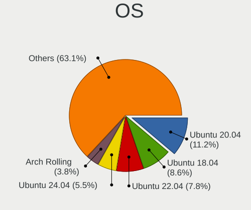

| Name               | Computers | Percent |
|--------------------|-----------|---------|
| Ubuntu 20.04       | 110       | 11.21%  |
| Ubuntu 18.04       | 84        | 8.56%   |
| Ubuntu 22.04       | 77        | 7.85%   |
| Ubuntu 24.04       | 54        | 5.5%    |
| Arch Rolling       | 37        | 3.77%   |
| ArcoLinux Rolling  | 19        | 1.94%   |
| Arch               | 19        | 1.94%   |
| Ubuntu 19.04       | 16        | 1.63%   |
| Fedora 33          | 14        | 1.43%   |
| Debian 12          | 14        | 1.43%   |
| Fedora 38          | 13        | 1.33%   |
| Ubuntu 23.10       | 12        | 1.22%   |
| Manjaro            | 11        | 1.12%   |
| Debian 11          | 11        | 1.12%   |
| Ubuntu 21.10       | 10        | 1.02%   |
| Ubuntu 20.10       | 10        | 1.02%   |
| KDE neon 20.04     | 10        | 1.02%   |
| Xubuntu 18.04      | 9         | 0.92%   |
| OpenMandriva 4.2   | 9         | 0.92%   |
| Fedora 40          | 9         | 0.92%   |
| Fedora 34          | 9         | 0.92%   |
| Ubuntu 19.10       | 8         | 0.82%   |
| Pop!_OS 22.04      | 8         | 0.82%   |
| OpenMandriva 24.07 | 8         | 0.82%   |
| OpenMandriva 23.08 | 8         | 0.82%   |
| Zorin 17           | 7         | 0.71%   |
| Ubuntu 25.04       | 7         | 0.71%   |
| OpenMandriva 4.3   | 7         | 0.71%   |
| Xubuntu 22.04      | 6         | 0.61%   |
| Xubuntu 20.04      | 6         | 0.61%   |
| Ubuntu 23.04       | 6         | 0.61%   |
| Ubuntu 22.10       | 6         | 0.61%   |
| Ubuntu 21.04       | 6         | 0.61%   |
| Linux Mint 20.3    | 6         | 0.61%   |
| Fedora 37          | 6         | 0.61%   |
| Debian             | 6         | 0.61%   |
| Zorin 16           | 5         | 0.51%   |
| OpenMandriva 5.0   | 5         | 0.51%   |
| OpenMandriva 25.90 | 5         | 0.51%   |
| Fedora 43          | 5         | 0.51%   |

OS Family
---------

OS without a version

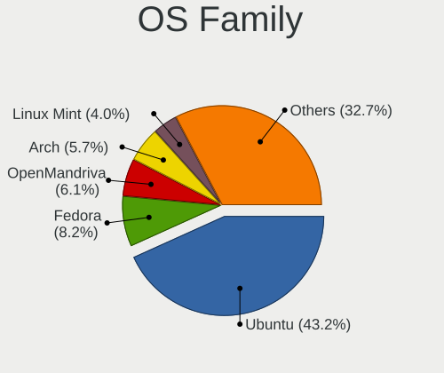

| Name          | Computers | Percent |
|---------------|-----------|---------|
| Ubuntu        | 410       | 43.25%  |
| Fedora        | 78        | 8.23%   |
| OpenMandriva  | 58        | 6.12%   |
| Arch          | 54        | 5.7%    |
| Linux Mint    | 38        | 4.01%   |
| Manjaro       | 37        | 3.9%    |
| Debian        | 37        | 3.9%    |
| Kubuntu       | 22        | 2.32%   |
| Zorin         | 21        | 2.22%   |
| Xubuntu       | 21        | 2.22%   |
| Kali          | 20        | 2.11%   |
| ArcoLinux     | 19        | 2%      |
| Pop!_OS       | 17        | 1.79%   |
| KDE neon      | 17        | 1.79%   |
| Endless       | 17        | 1.79%   |
| ROSA          | 7         | 0.74%   |
| Lubuntu       | 6         | 0.63%   |
| Ubuntu Unity  | 5         | 0.53%   |
| Ubuntu Budgie | 5         | 0.53%   |
| Parch         | 5         | 0.53%   |
| openSUSE      | 5         | 0.53%   |
| Elementary    | 5         | 0.53%   |
| Gentoo        | 3         | 0.32%   |
| CentOS        | 3         | 0.32%   |
| CachyOS       | 3         | 0.32%   |
| Artix         | 3         | 0.32%   |
| Xero          | 2         | 0.21%   |
| Ubuntu MATE   | 2         | 0.21%   |
| Solus         | 2         | 0.21%   |
| NixOS         | 2         | 0.21%   |
| EndeavourOS   | 2         | 0.21%   |
| Deepin        | 2         | 0.21%   |
| Clear Linux   | 2         | 0.21%   |
| Bazzite       | 2         | 0.21%   |
| Ubuntu Studio | 1         | 0.11%   |
| Slackware     | 1         | 0.11%   |
| Sabayon       | 1         | 0.11%   |
| Rocky Linux   | 1         | 0.11%   |
| Raspbian      | 1         | 0.11%   |
| PureOS        | 1         | 0.11%   |

Kernel
------

Version of the Linux kernel

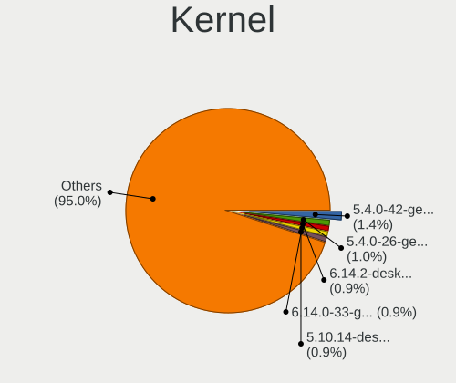

| Version                  | Computers | Percent |
|--------------------------|-----------|---------|
| 5.4.0-42-generic         | 15        | 1.43%   |
| 5.4.0-26-generic         | 10        | 0.96%   |
| 6.14.2-desktop-3omv2590  | 9         | 0.86%   |
| 6.14.0-33-generic        | 9         | 0.86%   |
| 5.10.14-desktop-1omv4002 | 9         | 0.86%   |
| 6.5.0-26-generic         | 8         | 0.76%   |
| 6.10.0-desktop-1omv2490  | 8         | 0.76%   |
| 5.3.0-46-generic         | 8         | 0.76%   |
| 5.15.0-47-generic        | 8         | 0.76%   |
| 6.5.0-9-generic          | 7         | 0.67%   |
| 5.4.0-58-generic         | 7         | 0.67%   |
| 5.4.0-52-generic         | 7         | 0.67%   |
| 5.3.0-40-generic         | 7         | 0.67%   |
| 5.16.7-desktop-1omv4003  | 7         | 0.67%   |
| 5.15.0-56-generic        | 7         | 0.67%   |
| 5.11.0-27-generic        | 7         | 0.67%   |
| 5.4.0-48-generic         | 6         | 0.57%   |
| 5.11.0-41-generic        | 6         | 0.57%   |
| 5.0.0-23-generic         | 6         | 0.57%   |
| 6.5.0-21-generic         | 5         | 0.48%   |
| 6.4.11-desktop-1omv2390  | 5         | 0.48%   |
| 6.2.0-39-generic         | 5         | 0.48%   |
| 6.2.0-20-generic         | 5         | 0.48%   |
| 6.14.0-37-generic        | 5         | 0.48%   |
| 6.14.0-29-generic        | 5         | 0.48%   |
| 5.8.0-63-generic         | 5         | 0.48%   |
| 5.8.0-48-generic         | 5         | 0.48%   |
| 5.15.0-58-generic        | 5         | 0.48%   |
| 5.0.0-37-generic         | 5         | 0.48%   |
| 5.0.0-25-generic         | 5         | 0.48%   |
| 5.0.0-13-generic         | 5         | 0.48%   |
| 4.18.0-15-generic        | 5         | 0.48%   |
| 4.15.0-29-generic        | 5         | 0.48%   |
| 6.8.0-51-generic         | 4         | 0.38%   |
| 6.8.0-49-generic         | 4         | 0.38%   |
| 6.8.0-31-generic         | 4         | 0.38%   |
| 6.6.2-desktop-1omv2390   | 4         | 0.38%   |
| 6.2.9-300.fc38.x86_64    | 4         | 0.38%   |
| 6.2.6-desktop-1omv2390   | 4         | 0.38%   |
| 6.2.0-35-generic         | 4         | 0.38%   |

Kernel Family
-------------

Linux kernel without a distro release

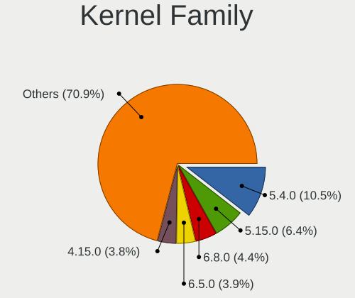

| Version | Computers | Percent |
|---------|-----------|---------|
| 5.4.0   | 107       | 10.51%  |
| 5.15.0  | 65        | 6.39%   |
| 6.8.0   | 45        | 4.42%   |
| 6.5.0   | 40        | 3.93%   |
| 4.15.0  | 39        | 3.83%   |
| 5.0.0   | 38        | 3.73%   |
| 5.11.0  | 36        | 3.54%   |
| 5.8.0   | 34        | 3.34%   |
| 5.3.0   | 33        | 3.24%   |
| 6.14.0  | 32        | 3.14%   |
| 5.13.0  | 29        | 2.85%   |
| 4.18.0  | 25        | 2.46%   |
| 6.2.0   | 23        | 2.26%   |
| 5.19.0  | 22        | 2.16%   |
| 6.11.0  | 18        | 1.77%   |
| 6.1.0   | 16        | 1.57%   |
| 5.10.0  | 16        | 1.57%   |
| 6.14.2  | 10        | 0.98%   |
| 6.4.11  | 9         | 0.88%   |
| 5.10.14 | 9         | 0.88%   |
| 6.10.0  | 8         | 0.79%   |
| 5.16.7  | 8         | 0.79%   |
| 4.13.0  | 6         | 0.59%   |
| 6.8.11  | 5         | 0.49%   |
| 6.2.9   | 5         | 0.49%   |
| 6.2.6   | 5         | 0.49%   |
| 6.8.9   | 4         | 0.39%   |
| 6.6.2   | 4         | 0.39%   |
| 6.17.0  | 4         | 0.39%   |
| 6.12.10 | 4         | 0.39%   |
| 6.12.1  | 4         | 0.39%   |
| 5.8.18  | 4         | 0.39%   |
| 5.16.15 | 4         | 0.39%   |
| 5.11.11 | 4         | 0.39%   |
| 6.9.3   | 3         | 0.29%   |
| 6.7.4   | 3         | 0.29%   |
| 6.5.9   | 3         | 0.29%   |
| 6.4.8   | 3         | 0.29%   |
| 6.4.12  | 3         | 0.29%   |
| 6.17.9  | 3         | 0.29%   |

Kernel Major Ver.
-----------------

Linux kernel major version

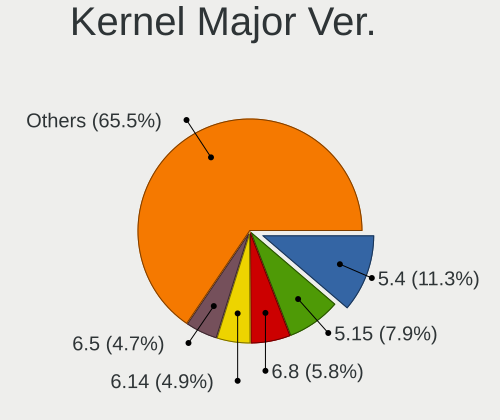

| Version | Computers | Percent |
|---------|-----------|---------|
| 5.4     | 113       | 11.27%  |
| 5.15    | 79        | 7.88%   |
| 6.8     | 58        | 5.78%   |
| 6.14    | 49        | 4.89%   |
| 6.5     | 47        | 4.69%   |
| 5.8     | 46        | 4.59%   |
| 5.11    | 45        | 4.49%   |
| 5.0     | 41        | 4.09%   |
| 4.15    | 39        | 3.89%   |
| 6.2     | 38        | 3.79%   |
| 5.13    | 38        | 3.79%   |
| 5.10    | 35        | 3.49%   |
| 5.3     | 34        | 3.39%   |
| 6.1     | 27        | 2.69%   |
| 6.11    | 26        | 2.59%   |
| 6.4     | 25        | 2.49%   |
| 4.18    | 25        | 2.49%   |
| 5.19    | 24        | 2.39%   |
| 6.6     | 20        | 1.99%   |
| 6.12    | 19        | 1.89%   |
| 5.16    | 19        | 1.89%   |
| 6.10    | 18        | 1.79%   |
| 6.17    | 16        | 1.6%    |
| 5.14    | 12        | 1.2%    |
| 6.9     | 9         | 0.9%    |
| 6.3     | 8         | 0.8%    |
| 6.13    | 8         | 0.8%    |
| 5.9     | 8         | 0.8%    |
| 5.18    | 8         | 0.8%    |
| 6.16    | 7         | 0.7%    |
| 6.0     | 7         | 0.7%    |
| 5.6     | 7         | 0.7%    |
| 5.12    | 7         | 0.7%    |
| 6.7     | 6         | 0.6%    |
| 4.13    | 6         | 0.6%    |
| 5.7     | 5         | 0.5%    |
| 4.19    | 5         | 0.5%    |
| 6.15    | 4         | 0.4%    |
| 5.17    | 3         | 0.3%    |
| 4.9     | 3         | 0.3%    |

Arch
----

OS architecture (x86_64, i586, etc.)

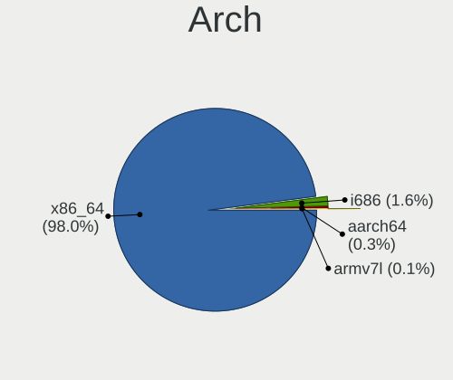

| Name    | Computers | Percent |
|---------|-----------|---------|
| x86_64  | 908       | 97.95%  |
| i686    | 15        | 1.62%   |
| aarch64 | 3         | 0.32%   |
| armv7l  | 1         | 0.11%   |

DE
--

Desktop Environment

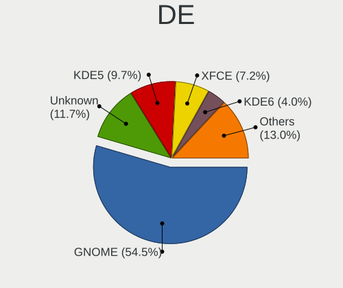

| Name          | Computers | Percent |
|---------------|-----------|---------|
| GNOME         | 524       | 54.53%  |
| Unknown       | 112       | 11.65%  |
| KDE5          | 93        | 9.68%   |
| XFCE          | 69        | 7.18%   |
| KDE6          | 38        | 3.95%   |
| X-Cinnamon    | 34        | 3.54%   |
| KDE           | 25        | 2.6%    |
| i3            | 13        | 1.35%   |
| LXQt          | 9         | 0.94%   |
| MATE          | 8         | 0.83%   |
| Budgie        | 7         | 0.73%   |
| Unity         | 5         | 0.52%   |
| Pantheon      | 5         | 0.52%   |
| GNOME Classic | 3         | 0.31%   |
| bspwm         | 3         | 0.31%   |
| sway          | 2         | 0.21%   |
| KDE4          | 2         | 0.21%   |
| Cinnamon      | 2         | 0.21%   |
| Trinity       | 1         | 0.1%    |
| LXDE          | 1         | 0.1%    |
| Hyprland      | 1         | 0.1%    |
| enlightenment | 1         | 0.1%    |
| Deepin        | 1         | 0.1%    |
| DDE           | 1         | 0.1%    |
| COSMIC        | 1         | 0.1%    |

Display Server
--------------

X11 or Wayland

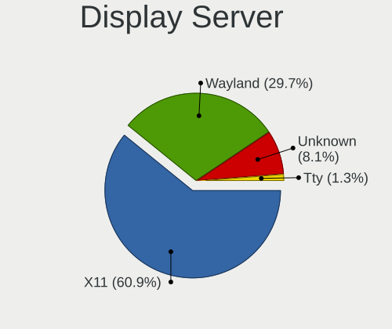

| Name    | Computers | Percent |
|---------|-----------|---------|
| X11     | 583       | 60.86%  |
| Wayland | 285       | 29.75%  |
| Unknown | 78        | 8.14%   |
| Tty     | 12        | 1.25%   |

Display Manager
---------------

SDDM, LightDM, etc.

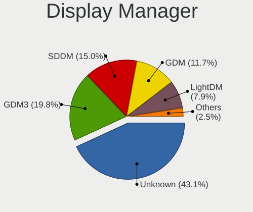

| Name           | Computers | Percent |
|----------------|-----------|---------|
| Unknown        | 414       | 43.13%  |
| GDM3           | 190       | 19.79%  |
| SDDM           | 144       | 15%     |
| GDM            | 112       | 11.67%  |
| LightDM        | 76        | 7.92%   |
| TDM            | 14        | 1.46%   |
| Ly             | 3         | 0.31%   |
| XDM            | 2         | 0.21%   |
| KDM            | 2         | 0.21%   |
| LY-DM          | 1         | 0.1%    |
| LXDM           | 1         | 0.1%    |
| COSMIC-GREETER | 1         | 0.1%    |

OS Lang
-------

Language

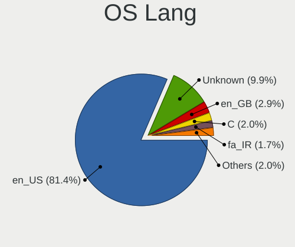

| Lang        | Computers | Percent |
|-------------|-----------|---------|
| en_US       | 764       | 81.45%  |
| Unknown     | 93        | 9.91%   |
| en_GB       | 27        | 2.88%   |
| C           | 19        | 2.03%   |
| fa_IR       | 16        | 1.71%   |
| en_CA       | 8         | 0.85%   |
| ru_RU       | 2         | 0.21%   |
| en_AG       | 2         | 0.21%   |
| POSIX       | 1         | 0.11%   |
| ja_JP       | 1         | 0.11%   |
| en_US.UFT-8 | 1         | 0.11%   |
| en_150      | 1         | 0.11%   |
| en.US       | 1         | 0.11%   |
| de_DE       | 1         | 0.11%   |
| az_IR       | 1         | 0.11%   |

Boot Mode
---------

EFI or BIOS

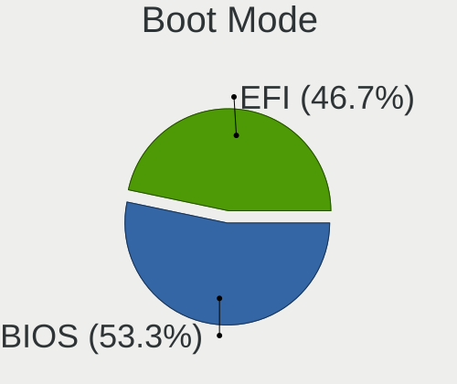

| Mode | Computers | Percent |
|------|-----------|---------|
| BIOS | 503       | 53.28%  |
| EFI  | 441       | 46.72%  |

Filesystem
----------

Type of filesystem

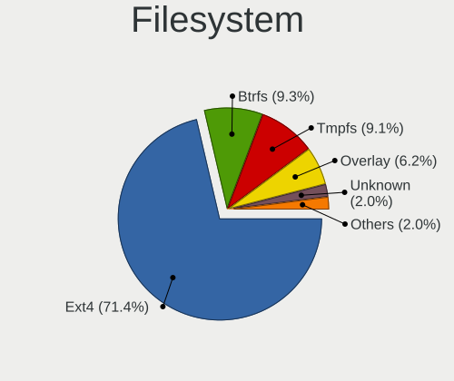

| Type    | Computers | Percent |
|---------|-----------|---------|
| Ext4    | 673       | 71.37%  |
| Btrfs   | 88        | 9.33%   |
| Tmpfs   | 86        | 9.12%   |
| Overlay | 58        | 6.15%   |
| Unknown | 19        | 2.01%   |
| Xfs     | 9         | 0.95%   |
| Zfs     | 6         | 0.64%   |
| Ext3    | 2         | 0.21%   |
| F2fs    | 1         | 0.11%   |
| Ext2    | 1         | 0.11%   |

Part. scheme
------------

Scheme of partitioning

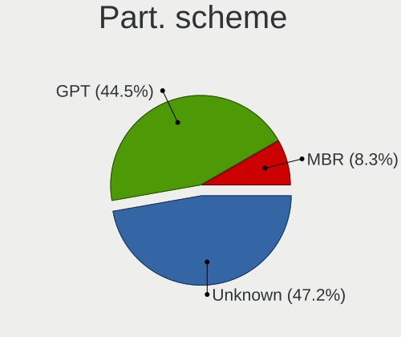

| Type    | Computers | Percent |
|---------|-----------|---------|
| Unknown | 444       | 47.23%  |
| GPT     | 418       | 44.47%  |
| MBR     | 78        | 8.3%    |

Dual Boot with Linux/BSD
------------------------

Hosting more than one Linux/BSD

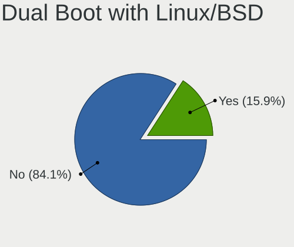

| Dual boot | Computers | Percent |
|-----------|-----------|---------|
| No        | 791       | 84.15%  |
| Yes       | 149       | 15.85%  |

Dual Boot (Win)
---------------

Hosting Linux and Windows

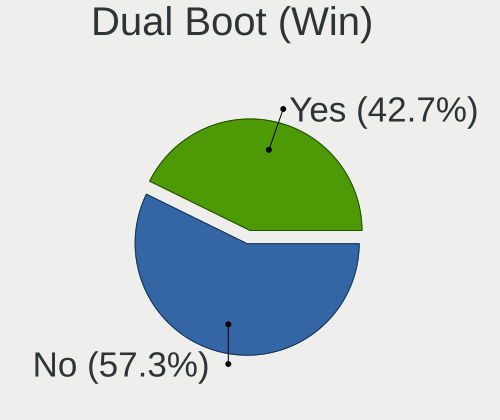

| Dual boot | Computers | Percent |
|-----------|-----------|---------|
| No        | 536       | 57.26%  |
| Yes       | 400       | 42.74%  |

Board
-----

Vendor
------

Motherboard manufacturer

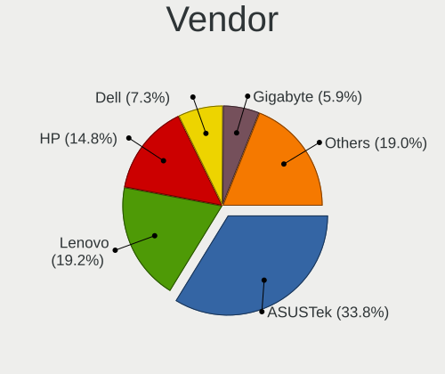

| Name                                 | Computers | Percent |
|--------------------------------------|-----------|---------|
| ASUSTek Computer                     | 313       | 33.76%  |
| Lenovo                               | 178       | 19.2%   |
| Hewlett-Packard                      | 137       | 14.78%  |
| Dell                                 | 68        | 7.34%   |
| Gigabyte Technology                  | 55        | 5.93%   |
| Acer                                 | 53        | 5.72%   |
| MSI                                  | 29        | 3.13%   |
| Sony                                 | 18        | 1.94%   |
| Apple                                | 12        | 1.29%   |
| Toshiba                              | 9         | 0.97%   |
| ECS                                  | 7         | 0.76%   |
| Unknown                              | 6         | 0.65%   |
| Fujitsu                              | 5         | 0.54%   |
| ASRock                               | 5         | 0.54%   |
| Microsoft                            | 4         | 0.43%   |
| YANYU                                | 2         | 0.22%   |
| Supermicro                           | 2         | 0.22%   |
| Samsung Electronics                  | 2         | 0.22%   |
| Razer                                | 2         | 0.22%   |
| Raspberry Pi Foundation              | 2         | 0.22%   |
| Intel                                | 2         | 0.22%   |
| Foxconn                              | 2         | 0.22%   |
| Biostar                              | 2         | 0.22%   |
| Timi                                 | 1         | 0.11%   |
| Shenzhen Meigao Electronic Equipment | 1         | 0.11%   |
| Rockchip                             | 1         | 0.11%   |
| Packard Bell                         | 1         | 0.11%   |
| LG Electronics                       | 1         | 0.11%   |
| HPE                                  | 1         | 0.11%   |
| HIGRADED                             | 1         | 0.11%   |
| Google                               | 1         | 0.11%   |
| DFI                                  | 1         | 0.11%   |
| Alienware                            | 1         | 0.11%   |
| aigo                                 | 1         | 0.11%   |
| 3Logic Group                         | 1         | 0.11%   |

Model
-----

Motherboard model

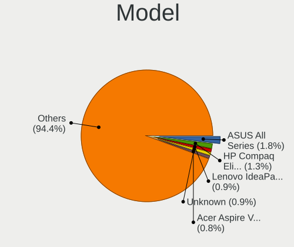

| Name                                       | Computers | Percent |
|--------------------------------------------|-----------|---------|
| ASUS All Series                            | 17        | 1.83%   |
| HP Compaq Elite 8300 SFF                   | 12        | 1.29%   |
| Lenovo IdeaPad 330-15IKB 81DE              | 8         | 0.86%   |
| Unknown                                    | 8         | 0.86%   |
| Acer Aspire V3-571G                        | 7         | 0.76%   |
| Lenovo IdeaPad Z510 20287                  | 6         | 0.65%   |
| HP ProBook 4540s                           | 6         | 0.65%   |
| Lenovo IdeaPad 5 15ITL05 82FG              | 5         | 0.54%   |
| Lenovo G50-70 20351                        | 5         | 0.54%   |
| Lenovo IdeaPad 520-15IKB 81BF              | 4         | 0.43%   |
| Lenovo B570e HuronRiver Platform           | 4         | 0.43%   |
| HP Pavilion g6                             | 4         | 0.43%   |
| HP EliteBook 8470p                         | 4         | 0.43%   |
| Dell Vostro 1510                           | 4         | 0.43%   |
| Dell Vostro 1015                           | 4         | 0.43%   |
| ASUS VivoBook 15_ASUS Laptop X540UBR       | 4         | 0.43%   |
| Lenovo Z50-70 20354                        | 3         | 0.32%   |
| Lenovo Legion 5 15IMH05H 81Y6              | 3         | 0.32%   |
| Lenovo Legion 5 15ARH05H 82B1              | 3         | 0.32%   |
| Lenovo IdeaPad L340-15IRH Gaming 81LK      | 3         | 0.32%   |
| Lenovo IdeaPad 3 15ITL6 82H8               | 3         | 0.32%   |
| Lenovo G510 20238                          | 3         | 0.32%   |
| Lenovo G50-80 80E5                         | 3         | 0.32%   |
| HP ZBook 17 G3                             | 3         | 0.32%   |
| HP ZBook 15 G3                             | 3         | 0.32%   |
| HP ProDesk 600 G1 SFF                      | 3         | 0.32%   |
| HP ProBook 640 G2                          | 3         | 0.32%   |
| HP EliteDesk 800 G2 SFF                    | 3         | 0.32%   |
| HP EliteBook 8570p                         | 3         | 0.32%   |
| HP EliteBook 840 G2                        | 3         | 0.32%   |
| Gigabyte H81M-S2PV                         | 3         | 0.32%   |
| ASUS X580VD                                | 3         | 0.32%   |
| ASUS X550CC                                | 3         | 0.32%   |
| ASUS VivoBook 15_ASUS Laptop X540MB_X540MB | 3         | 0.32%   |
| ASUS PRIME Z390-P                          | 3         | 0.32%   |
| ASUS PRIME B250-PLUS                       | 3         | 0.32%   |
| ASUS P5P41T-LE                             | 3         | 0.32%   |
| ASUS K55VD                                 | 3         | 0.32%   |
| ASUS H61M-C                                | 3         | 0.32%   |
| ASUS ASUS TUF Gaming F15 FX506LH_FX506LH   | 3         | 0.32%   |

Model Family
------------

Motherboard model prefix

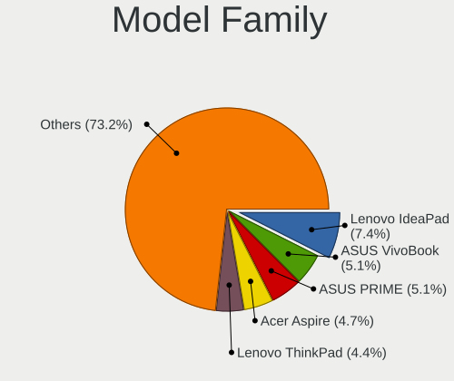

| Name               | Computers | Percent |
|--------------------|-----------|---------|
| Lenovo IdeaPad     | 69        | 7.44%   |
| ASUS VivoBook      | 47        | 5.07%   |
| ASUS PRIME         | 47        | 5.07%   |
| Acer Aspire        | 44        | 4.75%   |
| Lenovo ThinkPad    | 41        | 4.42%   |
| HP EliteBook       | 30        | 3.24%   |
| ASUS ASUS          | 28        | 3.02%   |
| HP ProBook         | 21        | 2.27%   |
| Dell Latitude      | 21        | 2.27%   |
| Dell Inspiron      | 19        | 2.05%   |
| HP Compaq          | 18        | 1.94%   |
| ASUS All           | 17        | 1.83%   |
| Dell Vostro        | 14        | 1.51%   |
| ASUS TUF           | 13        | 1.4%    |
| ASUS ROG           | 13        | 1.4%    |
| HP Pavilion        | 12        | 1.29%   |
| Lenovo Legion      | 10        | 1.08%   |
| HP ZBook           | 10        | 1.08%   |
| Unknown            | 8         | 0.86%   |
| HP EliteDesk       | 7         | 0.76%   |
| Lenovo ThinkBook   | 6         | 0.65%   |
| HP ProDesk         | 6         | 0.65%   |
| ASUS Zenbook       | 6         | 0.65%   |
| Toshiba Satellite  | 5         | 0.54%   |
| Lenovo ThinkCentre | 5         | 0.54%   |
| Lenovo G50-70      | 5         | 0.54%   |
| HP ENVY            | 5         | 0.54%   |
| Fujitsu LIFEBOOK   | 5         | 0.54%   |
| MSI Modern         | 4         | 0.43%   |
| Microsoft Surface  | 4         | 0.43%   |
| Lenovo B570e       | 4         | 0.43%   |
| HP ProLiant        | 4         | 0.43%   |
| Dell XPS           | 4         | 0.43%   |
| Dell Precision     | 4         | 0.43%   |
| Toshiba PORTEGE    | 3         | 0.32%   |
| Lenovo Z50-70      | 3         | 0.32%   |
| Lenovo V15         | 3         | 0.32%   |
| Lenovo LOQ         | 3         | 0.32%   |
| Lenovo G510        | 3         | 0.32%   |
| Lenovo G50-80      | 3         | 0.32%   |

MFG Year
--------

Motherboard manufacture year

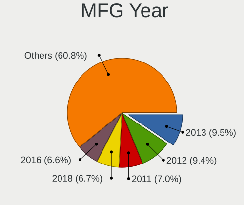

| Year    | Computers | Percent |
|---------|-----------|---------|
| 2013    | 88        | 9.49%   |
| 2012    | 87        | 9.39%   |
| 2011    | 65        | 7.01%   |
| 2018    | 62        | 6.69%   |
| 2016    | 61        | 6.58%   |
| 2021    | 60        | 6.47%   |
| 2017    | 60        | 6.47%   |
| 2020    | 58        | 6.26%   |
| 2019    | 54        | 5.83%   |
| 2015    | 52        | 5.61%   |
| 2010    | 51        | 5.5%    |
| 2014    | 49        | 5.29%   |
| 2009    | 39        | 4.21%   |
| 2022    | 38        | 4.1%    |
| 2023    | 29        | 3.13%   |
| 2008    | 29        | 3.13%   |
| 2024    | 15        | 1.62%   |
| 2007    | 10        | 1.08%   |
| 2006    | 10        | 1.08%   |
| Unknown | 4         | 0.43%   |
| 2025    | 3         | 0.32%   |
| 2005    | 2         | 0.22%   |
| 2004    | 1         | 0.11%   |

Form Factor
-----------

Physical design of the computer

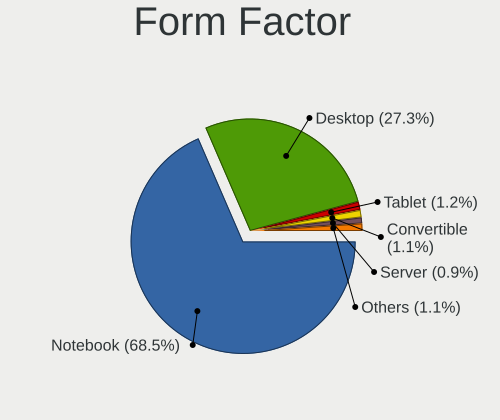

| Name           | Computers | Percent |
|----------------|-----------|---------|
| Notebook       | 635       | 68.5%   |
| Desktop        | 253       | 27.29%  |
| Tablet         | 11        | 1.19%   |
| Convertible    | 10        | 1.08%   |
| Server         | 8         | 0.86%   |
| Mini pc        | 4         | 0.43%   |
| System on chip | 3         | 0.32%   |
| All in one     | 2         | 0.22%   |
| Other          | 1         | 0.11%   |

Secure Boot
-----------

Enabled or disabled

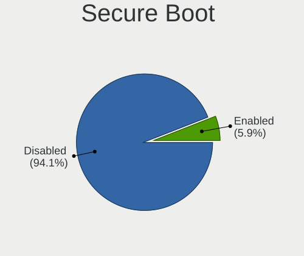

| State    | Computers | Percent |
|----------|-----------|---------|
| Disabled | 873       | 94.07%  |
| Enabled  | 55        | 5.93%   |

Coreboot
--------

Have coreboot on board

| Used | Computers | Percent |
|------|-----------|---------|
| No   | 926       | 99.89%  |
| Yes  | 1         | 0.11%   |

RAM Size
--------

Total RAM memory

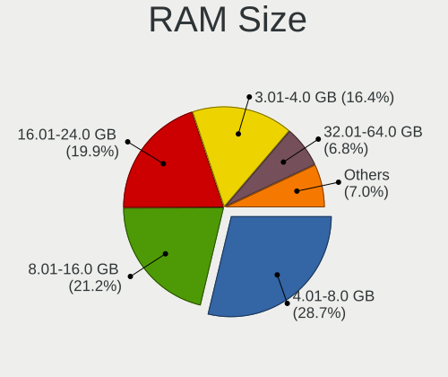

| Size in GB      | Computers | Percent |
|-----------------|-----------|---------|
| 4.01-8.0        | 268       | 28.72%  |
| 8.01-16.0       | 198       | 21.22%  |
| 16.01-24.0      | 186       | 19.94%  |
| 3.01-4.0        | 153       | 16.4%   |
| 32.01-64.0      | 63        | 6.75%   |
| 1.01-2.0        | 23        | 2.47%   |
| 2.01-3.0        | 14        | 1.5%    |
| 24.01-32.0      | 12        | 1.29%   |
| 64.01-256.0     | 9         | 0.96%   |
| 0.51-1.0        | 4         | 0.43%   |
| More than 256.0 | 3         | 0.32%   |

RAM Used
--------

Used RAM memory

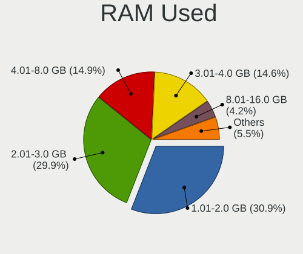

| Used GB    | Computers | Percent |
|------------|-----------|---------|
| 1.01-2.0   | 311       | 30.91%  |
| 2.01-3.0   | 301       | 29.92%  |
| 4.01-8.0   | 150       | 14.91%  |
| 3.01-4.0   | 147       | 14.61%  |
| 8.01-16.0  | 42        | 4.17%   |
| 0.51-1.0   | 41        | 4.08%   |
| 0.01-0.5   | 9         | 0.89%   |
| 16.01-24.0 | 3         | 0.3%    |
| 24.01-32.0 | 2         | 0.2%    |

Total Drives
------------

Number of drives on board

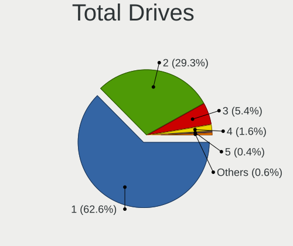

| Drives  | Computers | Percent |
|---------|-----------|---------|
| 1       | 589       | 62.59%  |
| 2       | 276       | 29.33%  |
| 3       | 51        | 5.42%   |
| 4       | 15        | 1.59%   |
| 5       | 4         | 0.43%   |
| 0       | 3         | 0.32%   |
| 6       | 2         | 0.21%   |
| Unknown | 1         | 0.11%   |

Has CD-ROM
----------

Has CD-ROM on board

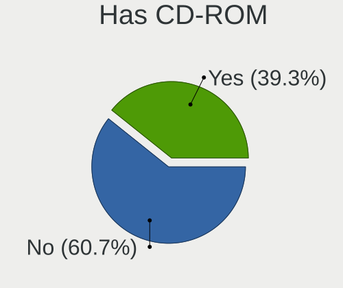

| Presented | Computers | Percent |
|-----------|-----------|---------|
| No        | 568       | 60.75%  |
| Yes       | 367       | 39.25%  |

Has Ethernet
------------

Has Ethernet on board

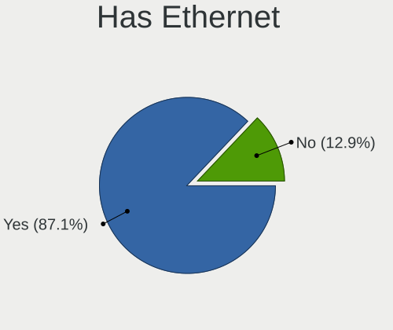

| Presented | Computers | Percent |
|-----------|-----------|---------|
| Yes       | 808       | 87.07%  |
| No        | 120       | 12.93%  |

Has WiFi
--------

Has WiFi module

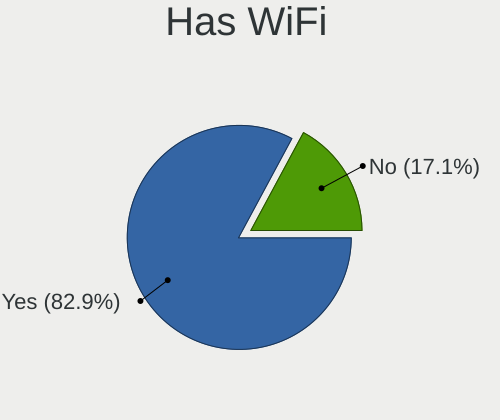

| Presented | Computers | Percent |
|-----------|-----------|---------|
| Yes       | 773       | 82.85%  |
| No        | 160       | 17.15%  |

Has Bluetooth
-------------

Has Bluetooth module

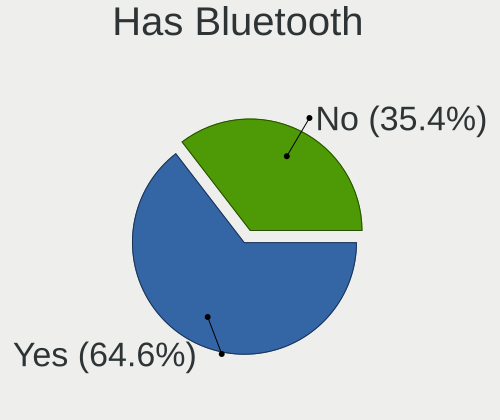

| Presented | Computers | Percent |
|-----------|-----------|---------|
| Yes       | 603       | 64.56%  |
| No        | 331       | 35.44%  |

Location
--------

Country
-------

Geographic location (country)

| Country | Computers | Percent |
|---------|-----------|---------|
| Iran    | 927       | 100%    |

City
----

Geographic location (city)

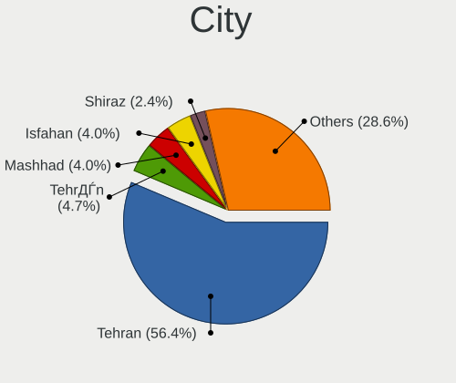

| City                   | Computers | Percent |
|------------------------|-----------|---------|
| Tehran                 | 554       | 56.36%  |
| TehrДЃn              | 46        | 4.68%   |
| Mashhad                | 39        | 3.97%   |
| Isfahan                | 39        | 3.97%   |
| Shiraz                 | 24        | 2.44%   |
| Karaj                  | 21        | 2.14%   |
| Tabriz                 | 19        | 1.93%   |
| Qom                    | 15        | 1.53%   |
| Tajrish                | 13        | 1.32%   |
| Yazd                   | 12        | 1.22%   |
| Babol                  | 10        | 1.02%   |
| Rasht                  | 9         | 0.92%   |
| Ahvaz                  | 8         | 0.81%   |
| Sanandij               | 7         | 0.71%   |
| Khorramshahr           | 7         | 0.71%   |
| Kerman                 | 5         | 0.51%   |
| Arak                   | 5         | 0.51%   |
| Kermanshah             | 4         | 0.41%   |
| Zanjan                 | 3         | 0.31%   |
| TajrД«sh             | 3         | 0.31%   |
| Qazvin                 | 3         | 0.31%   |
| Gorgan                 | 3         | 0.31%   |
| Behshahr               | 3         | 0.31%   |
| Shahre Jadide Andisheh | 2         | 0.2%    |
| Shahr-e Qods           | 2         | 0.2%    |
| Shahr-e Kord           | 2         | 0.2%    |
| Sari                   | 2         | 0.2%    |
| Rey                    | 2         | 0.2%    |
| Rehnān                | 2         | 0.2%    |
| Mīāndoāb            | 2         | 0.2%    |
| Meybod                 | 2         | 0.2%    |
| Markaz                 | 2         | 0.2%    |
| Malārd                | 2         | 0.2%    |
| Khorramabad            | 2         | 0.2%    |
| Kāshān               | 2         | 0.2%    |
| Hashtgerd              | 2         | 0.2%    |
| Hamadan                | 2         | 0.2%    |
| Gachsaran              | 2         | 0.2%    |
| Farsan                 | 2         | 0.2%    |
| DamДЃvand            | 2         | 0.2%    |

Drives
------

Drive Vendor
------------

Hard drive vendors

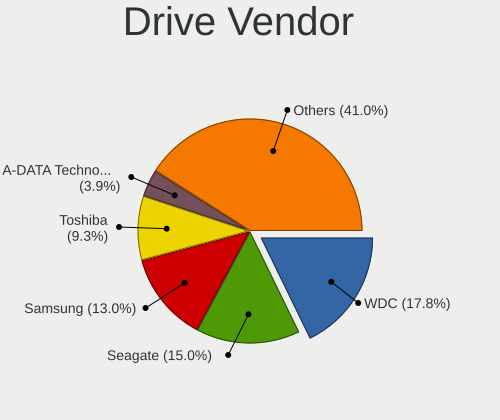

| Vendor                       | Computers | Drives | Percent |
|------------------------------|-----------|--------|---------|
| WDC                          | 226       | 293    | 17.78%  |
| Seagate                      | 191       | 238    | 15.03%  |
| Samsung Electronics          | 165       | 192    | 12.98%  |
| Toshiba                      | 118       | 145    | 9.28%   |
| A-DATA Technology            | 50        | 61     | 3.93%   |
| SanDisk                      | 48        | 55     | 3.78%   |
| Micron Technology            | 41        | 58     | 3.23%   |
| Intel                        | 36        | 39     | 2.83%   |
| Unknown                      | 27        | 28     | 2.12%   |
| HGST                         | 27        | 31     | 2.12%   |
| Lexar                        | 26        | 31     | 2.05%   |
| Maxtor                       | 25        | 33     | 1.97%   |
| Hitachi                      | 24        | 28     | 1.89%   |
| SK hynix                     | 20        | 23     | 1.57%   |
| Kingston                     | 20        | 26     | 1.57%   |
| PNY                          | 12        | 16     | 0.94%   |
| SPCC                         | 10        | 12     | 0.79%   |
| Kingmax                      | 9         | 10     | 0.71%   |
| Crucial                      | 9         | 11     | 0.71%   |
| Apple                        | 9         | 13     | 0.71%   |
| Apacer                       | 9         | 9      | 0.71%   |
| MSI                          | 8         | 8      | 0.63%   |
| LITEON                       | 8         | 9      | 0.63%   |
| Gigabyte Technology          | 8         | 9      | 0.63%   |
| Silicon Motion               | 6         | 6      | 0.47%   |
| Shenzhen Longsys Electronics | 6         | 8      | 0.47%   |
| KIOXIA                       | 6         | 7      | 0.47%   |
| Unknown                      | 6         | 7      | 0.47%   |
| MAXIO Technology (Hangzhou)  | 5         | 6      | 0.39%   |
| China                        | 5         | 5      | 0.39%   |
| Union Memory (Shenzhen)      | 4         | 4      | 0.31%   |
| Plextor                      | 4         | 4      | 0.31%   |
| Phison Electronics           | 4         | 4      | 0.31%   |
| ADATA Technology             | 4         | 4      | 0.31%   |
| TwinMOS                      | 3         | 3      | 0.24%   |
| Team                         | 3         | 3      | 0.24%   |
| Realtek Semiconductor        | 3         | 4      | 0.24%   |
| OCZ                          | 3         | 3      | 0.24%   |
| LITEONIT                     | 3         | 4      | 0.24%   |
| Hewlett-Packard              | 3         | 3      | 0.24%   |

Drive Model
-----------

Hard drive models

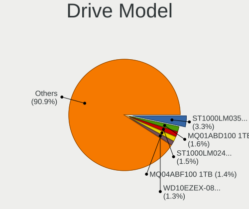

| Model                                             | Computers | Percent |
|---------------------------------------------------|-----------|---------|
| Seagate ST1000LM035-1RK172 1TB                    | 44        | 3.31%   |
| Toshiba MQ01ABD100 1TB                            | 21        | 1.58%   |
| Seagate ST1000LM024 HN-M101MBB 1TB                | 20        | 1.5%    |
| Toshiba MQ04ABF100 1TB                            | 19        | 1.43%   |
| WDC WD10EZEX-08WN4A0 1TB                          | 17        | 1.28%   |
| WDC WDS240G2G0A-00JH30 240GB SSD                  | 14        | 1.05%   |
| Samsung SSD 860 EVO 500GB                         | 13        | 0.98%   |
| WDC WD10SPZX-08Z10 1TB                            | 12        | 0.9%    |
| Seagate ST9500325AS 500GB                         | 12        | 0.9%    |
| Lexar 128GB SSD                                   | 12        | 0.9%    |
| A-DATA SU650 120GB SSD                            | 12        | 0.9%    |
| Toshiba MQ01ABF050 500GB                          | 11        | 0.83%   |
| WDC WD10SPZX-24Z10 1TB                            | 10        | 0.75%   |
| Seagate ST500DM002-1BD142 500GB                   | 10        | 0.75%   |
| Samsung SSD 850 EVO 250GB                         | 10        | 0.75%   |
| Samsung NVMe SSD Controller SM981/PM981/PM983 1TB | 10        | 0.75%   |
| WDC WD10JPCX-24UE4T0 1TB                          | 9         | 0.68%   |
| Samsung SSD 860 EVO 250GB                         | 9         | 0.68%   |
| Seagate ST2000LM007-1R8174 2TB                    | 8         | 0.6%    |
| Samsung SSD 870 EVO 500GB                         | 8         | 0.6%    |
| Intel SSDPEKNU512GZ 512GB                         | 8         | 0.6%    |
| WDC WDS120G2G0A-00JH30 120GB SSD                  | 7         | 0.53%   |
| Micron 2210_MTFDHBA512QFD 512GB                   | 7         | 0.53%   |
| Unknown MMC Card  32GB                            | 6         | 0.45%   |
| Toshiba DT01ACA050 500GB                          | 6         | 0.45%   |
| Seagate ST9500420AS 500GB                         | 6         | 0.45%   |
| Seagate ST500LT012-1DG142 500GB                   | 6         | 0.45%   |
| Maxtor STM3250310AS 250GB                         | 6         | 0.45%   |
| Lexar 256GB SSD                                   | 6         | 0.45%   |
| HGST HTS721010A9E630 1TB                          | 6         | 0.45%   |
| Unknown                                           | 6         | 0.45%   |
| Toshiba MQ01ABD075 752GB                          | 5         | 0.38%   |
| Toshiba MQ01ABD050V 500GB                         | 5         | 0.38%   |
| Toshiba MQ01ABD050 500GB                          | 5         | 0.38%   |
| Seagate ST3500413AS 500GB                         | 5         | 0.38%   |
| Seagate ST2000LM003 HN-M201RAD 2TB                | 5         | 0.38%   |
| Samsung SSD 870 EVO 250GB                         | 5         | 0.38%   |
| PNY CS900 240GB SSD                               | 5         | 0.38%   |
| Micron MTFDKCD512QFM-1BD1AABLA 512GB              | 5         | 0.38%   |
| Maxtor STM3160215AS 160GB                         | 5         | 0.38%   |

HDD Vendor
----------

Hard disk drive vendors

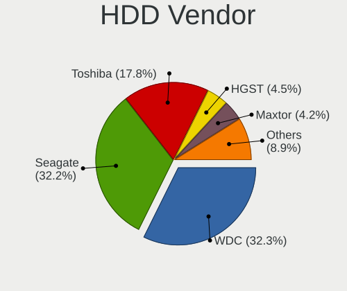

| Vendor              | Computers | Drives | Percent |
|---------------------|-----------|--------|---------|
| WDC                 | 192       | 242    | 32.32%  |
| Seagate             | 191       | 238    | 32.15%  |
| Toshiba             | 106       | 129    | 17.85%  |
| HGST                | 27        | 31     | 4.55%   |
| Maxtor              | 25        | 33     | 4.21%   |
| Hitachi             | 24        | 28     | 4.04%   |
| Samsung Electronics | 11        | 15     | 1.85%   |
| Unknown             | 3         | 3      | 0.51%   |
| Hewlett-Packard     | 3         | 3      | 0.51%   |
| Apple               | 3         | 5      | 0.51%   |
| USB3.0              | 1         | 1      | 0.17%   |
| TO Exter            | 1         | 1      | 0.17%   |
| Teleplan            | 1         | 4      | 0.17%   |
| Kingmax             | 1         | 1      | 0.17%   |
| HPE                 | 1         | 1      | 0.17%   |
| Fujitsu             | 1         | 1      | 0.17%   |
| External            | 1         | 1      | 0.17%   |
| China               | 1         | 1      | 0.17%   |
| Unknown             | 1         | 2      | 0.17%   |

SSD Vendor
----------

Solid state drive vendors

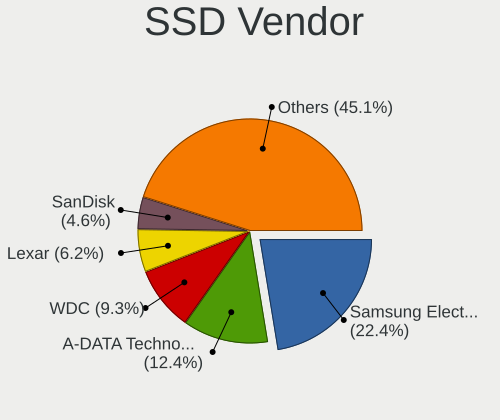

| Vendor              | Computers | Drives | Percent |
|---------------------|-----------|--------|---------|
| Samsung Electronics | 87        | 101    | 22.42%  |
| A-DATA Technology   | 48        | 59     | 12.37%  |
| WDC                 | 36        | 41     | 9.28%   |
| Lexar               | 24        | 27     | 6.19%   |
| SanDisk             | 18        | 22     | 4.64%   |
| Kingston            | 16        | 21     | 4.12%   |
| Micron Technology   | 13        | 13     | 3.35%   |
| SPCC                | 10        | 12     | 2.58%   |
| PNY                 | 10        | 13     | 2.58%   |
| SK hynix            | 9         | 11     | 2.32%   |
| Crucial             | 9         | 11     | 2.32%   |
| LITEON              | 8         | 9      | 2.06%   |
| Apacer              | 8         | 8      | 2.06%   |
| Gigabyte Technology | 7         | 8      | 1.8%    |
| Toshiba             | 6         | 10     | 1.55%   |
| Kingmax             | 6         | 7      | 1.55%   |
| Intel               | 6         | 6      | 1.55%   |
| MSI                 | 5         | 5      | 1.29%   |
| Plextor             | 4         | 4      | 1.03%   |
| China               | 4         | 4      | 1.03%   |
| TwinMOS             | 3         | 3      | 0.77%   |
| Team                | 3         | 3      | 0.77%   |
| OCZ                 | 3         | 3      | 0.77%   |
| LITEONIT            | 3         | 4      | 0.77%   |
| FDK                 | 3         | 3      | 0.77%   |
| Biostar             | 3         | 4      | 0.77%   |
| Apple               | 3         | 3      | 0.77%   |
| ValueTech           | 2         | 4      | 0.52%   |
| Transcend           | 2         | 2      | 0.52%   |
| Pioneer             | 2         | 2      | 0.52%   |
| Patriot             | 2         | 2      | 0.52%   |
| OSCOO               | 2         | 3      | 0.52%   |
| MAX                 | 2         | 2      | 0.52%   |
| KODAK               | 2         | 2      | 0.52%   |
| KingSpec            | 2         | 2      | 0.52%   |
| GeIL                | 2         | 2      | 0.52%   |
| Dahua               | 2         | 2      | 0.52%   |
| ZADAK               | 1         | 1      | 0.26%   |
| X-ENERGY            | 1         | 1      | 0.26%   |
| Western             | 1         | 1      | 0.26%   |

Drive Kind
----------

HDD or SSD

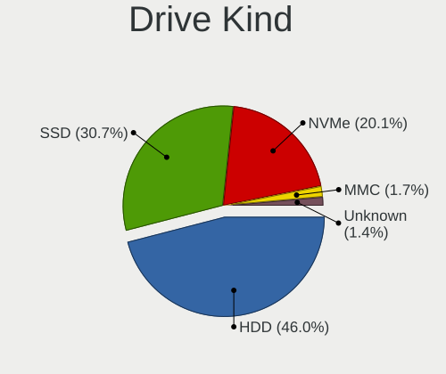

| Kind    | Computers | Drives | Percent |
|---------|-----------|--------|---------|
| HDD     | 552       | 740    | 45.96%  |
| SSD     | 369       | 452    | 30.72%  |
| NVMe    | 242       | 307    | 20.15%  |
| MMC     | 21        | 22     | 1.75%   |
| Unknown | 17        | 19     | 1.42%   |

Drive Connector
---------------

SATA, SAS, NVMe, etc.

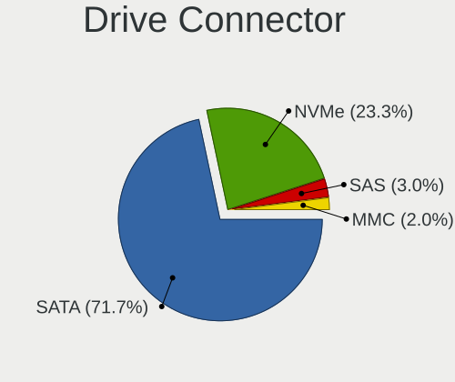

| Type | Computers | Drives | Percent |
|------|-----------|--------|---------|
| SATA | 744       | 1181   | 71.68%  |
| NVMe | 242       | 304    | 23.31%  |
| SAS  | 31        | 33     | 2.99%   |
| MMC  | 21        | 22     | 2.02%   |

Drive Size
----------

Size of hard drive

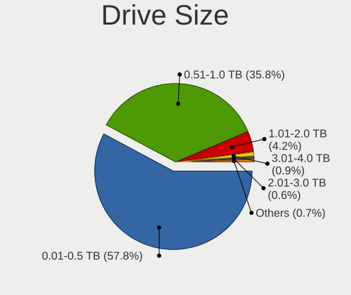

| Size in TB | Computers | Drives | Percent |
|------------|-----------|--------|---------|
| 0.01-0.5   | 518       | 716    | 57.81%  |
| 0.51-1.0   | 321       | 403    | 35.83%  |
| 1.01-2.0   | 38        | 50     | 4.24%   |
| 3.01-4.0   | 8         | 8      | 0.89%   |
| 2.01-3.0   | 5         | 7      | 0.56%   |
| 4.01-10.0  | 4         | 4      | 0.45%   |
| 10.01-20.0 | 2         | 4      | 0.22%   |

Space Total
-----------

Amount of disk space available on the file system

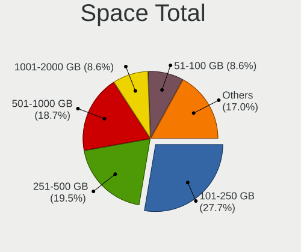

| Size in GB     | Computers | Percent |
|----------------|-----------|---------|
| 101-250        | 268       | 27.66%  |
| 251-500        | 189       | 19.5%   |
| 501-1000       | 181       | 18.68%  |
| 1001-2000      | 83        | 8.57%   |
| 51-100         | 83        | 8.57%   |
| 21-50          | 55        | 5.68%   |
| 1-20           | 54        | 5.57%   |
| Unknown        | 22        | 2.27%   |
| More than 3000 | 19        | 1.96%   |
| 2001-3000      | 15        | 1.55%   |

Space Used
----------

Amount of used disk space

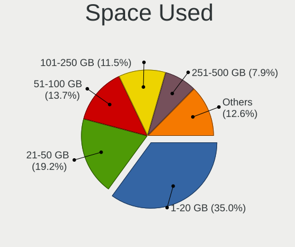

| Used GB        | Computers | Percent |
|----------------|-----------|---------|
| 1-20           | 349       | 35.01%  |
| 21-50          | 191       | 19.16%  |
| 51-100         | 137       | 13.74%  |
| 101-250        | 115       | 11.53%  |
| 251-500        | 79        | 7.92%   |
| 501-1000       | 76        | 7.62%   |
| Unknown        | 22        | 2.21%   |
| 1001-2000      | 15        | 1.5%    |
| More than 3000 | 9         | 0.9%    |
| 2001-3000      | 4         | 0.4%    |

Malfunc. Drives
---------------

Drive models with a malfunction

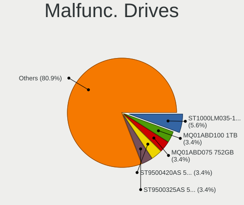

| Model                            | Computers | Drives | Percent |
|----------------------------------|-----------|--------|---------|
| Seagate ST1000LM035-1RK172 1TB   | 5         | 6      | 5.62%   |
| Toshiba MQ01ABD100 1TB           | 3         | 3      | 3.37%   |
| Toshiba MQ01ABD075 752GB         | 3         | 3      | 3.37%   |
| Seagate ST9500420AS 500GB        | 3         | 3      | 3.37%   |
| Seagate ST9500325AS 500GB        | 3         | 10     | 3.37%   |
| Toshiba MQ01ABF050 500GB         | 2         | 9      | 2.25%   |
| Toshiba MQ01ABD050 500GB         | 2         | 2      | 2.25%   |
| SK hynix SC308 SATA 256GB SSD    | 2         | 2      | 2.25%   |
| Seagate ST500DM002-1BD142 500GB  | 2         | 3      | 2.25%   |
| Seagate ST3500413AS 500GB        | 2         | 2      | 2.25%   |
| HGST HTS541075A9E680 752GB       | 2         | 2      | 2.25%   |
| XPG SPECTRIX S40G 1TB            | 1         | 1      | 1.12%   |
| WDC WDS240G2G0A-00JH30 240GB SSD | 1         | 1      | 1.12%   |
| WDC WDS120G2G0A-00JH30 120GB SSD | 1         | 1      | 1.12%   |
| WDC WD7500BPVT-80HXZT1 752GB     | 1         | 3      | 1.12%   |
| WDC WD5000LPVX-80V0TT0 500GB     | 1         | 1      | 1.12%   |
| WDC WD5000LPCX-24C6HT0 500GB     | 1         | 1      | 1.12%   |
| WDC WD5000AVDS-63U7B1 500GB      | 1         | 1      | 1.12%   |
| WDC WD5000AAKX-22ERMA0 500GB     | 1         | 2      | 1.12%   |
| WDC WD5000AAKS-00V1A0 500GB      | 1         | 1      | 1.12%   |
| WDC WD3200BPVT-75ZEST0 320GB     | 1         | 1      | 1.12%   |
| WDC WD3200AVVS-62L2B0 320GB      | 1         | 1      | 1.12%   |
| WDC WD10SPZX-24Z10 1TB           | 1         | 1      | 1.12%   |
| WDC WD10SPZX-08Z10 1TB           | 1         | 1      | 1.12%   |
| WDC WD10PURZ-85U8XY0 1TB         | 1         | 1      | 1.12%   |
| WDC WD10JPCX-24UE4T0 1TB         | 1         | 1      | 1.12%   |
| WDC WD10EZRX-00A3KB0 1TB         | 1         | 1      | 1.12%   |
| WDC WD10EZEX-00WN4A0 1TB         | 1         | 1      | 1.12%   |
| WDC WD10EARX-00N0YB0 1TB         | 1         | 1      | 1.12%   |
| WDC WD10EARS-00MVWB0 1TB         | 1         | 1      | 1.12%   |
| WDC WD1002FBYS-18A6B0 1TB        | 1         | 1      | 1.12%   |
| Toshiba MQ04ABF100 1TB           | 1         | 1      | 1.12%   |
| Toshiba MK3265GSXN 320GB         | 1         | 2      | 1.12%   |
| Toshiba MK3263GSX 320GB          | 1         | 1      | 1.12%   |
| Toshiba HDWD105 500GB            | 1         | 1      | 1.12%   |
| SSSTC CVB-8D128-HP 128GB         | 1         | 1      | 1.12%   |
| Seagate ST9640320AS 640GB        | 1         | 1      | 1.12%   |
| Seagate ST9250315AS 250GB        | 1         | 2      | 1.12%   |
| Seagate ST500LT012-9WS142 500GB  | 1         | 1      | 1.12%   |
| Seagate ST500LT012-1DG142 500GB  | 1         | 1      | 1.12%   |

Malfunc. Drive Vendor
---------------------

Vendors of faulty drives

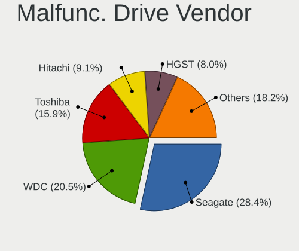

| Vendor                      | Computers | Drives | Percent |
|-----------------------------|-----------|--------|---------|
| Seagate                     | 25        | 35     | 28.41%  |
| WDC                         | 18        | 22     | 20.45%  |
| Toshiba                     | 14        | 22     | 15.91%  |
| Hitachi                     | 8         | 9      | 9.09%   |
| HGST                        | 7         | 7      | 7.95%   |
| Samsung Electronics         | 3         | 5      | 3.41%   |
| Micron Technology           | 3         | 3      | 3.41%   |
| SK hynix                    | 2         | 2      | 2.27%   |
| Maxtor                      | 2         | 3      | 2.27%   |
| XPG                         | 1         | 1      | 1.14%   |
| SSSTC                       | 1         | 1      | 1.14%   |
| MAXIO Technology (Hangzhou) | 1         | 2      | 1.14%   |
| LITEON                      | 1         | 1      | 1.14%   |
| Apple                       | 1         | 1      | 1.14%   |
| Unknown                     | 1         | 2      | 1.14%   |

Malfunc. HDD Vendor
-------------------

Vendors of faulty HDD drives

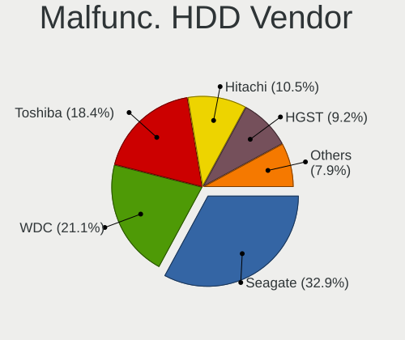

| Vendor              | Computers | Drives | Percent |
|---------------------|-----------|--------|---------|
| Seagate             | 25        | 35     | 32.89%  |
| WDC                 | 16        | 20     | 21.05%  |
| Toshiba             | 14        | 22     | 18.42%  |
| Hitachi             | 8         | 9      | 10.53%  |
| HGST                | 7         | 7      | 9.21%   |
| Samsung Electronics | 2         | 3      | 2.63%   |
| Maxtor              | 2         | 3      | 2.63%   |
| Apple               | 1         | 1      | 1.32%   |
| Unknown             | 1         | 2      | 1.32%   |

Malfunc. Drive Kind
-------------------

Kinds of faulty drives

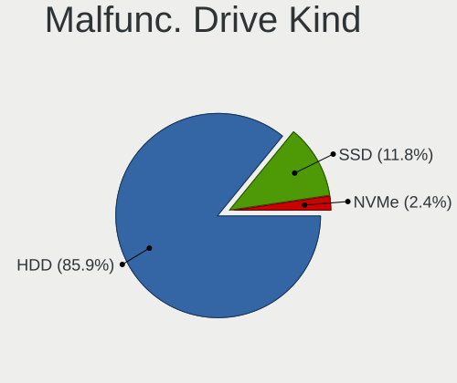

| Kind | Computers | Drives | Percent |
|------|-----------|--------|---------|
| HDD  | 73        | 102    | 85.88%  |
| SSD  | 10        | 11     | 11.76%  |
| NVMe | 2         | 3      | 2.35%   |

Failed Drives
-------------

Failed drive models

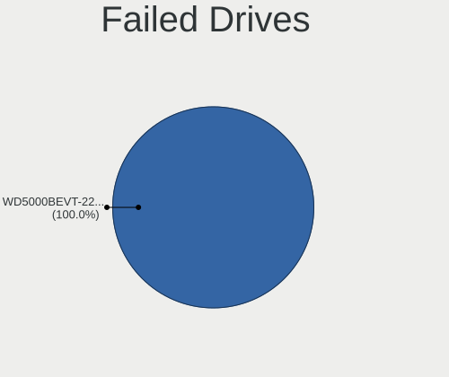

| Model                        | Computers | Drives | Percent |
|------------------------------|-----------|--------|---------|
| WDC WD5000BEVT-22A0RT0 500GB | 1         | 1      | 100%    |

Failed Drive Vendor
-------------------

Failed drive vendors

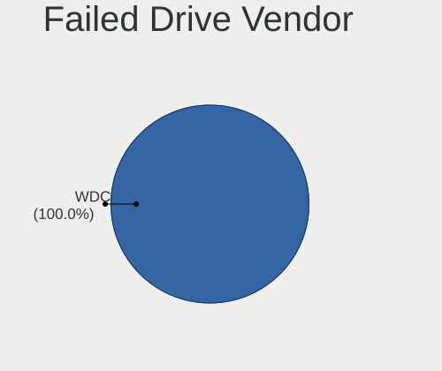

| Vendor | Computers | Drives | Percent |
|--------|-----------|--------|---------|
| WDC    | 1         | 1      | 100%    |

Drive Status
------------

Number of failed and malfunc. drives

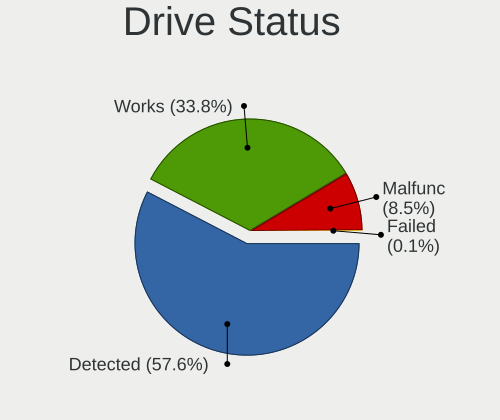

| Status   | Computers | Drives | Percent |
|----------|-----------|--------|---------|
| Detected | 571       | 913    | 57.62%  |
| Works    | 335       | 510    | 33.8%   |
| Malfunc  | 84        | 116    | 8.48%   |
| Failed   | 1         | 1      | 0.1%    |

Storage controller
------------------

Storage Vendor
--------------

Storage controller vendors

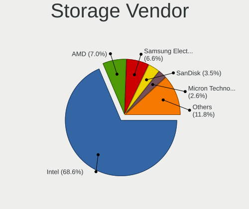

| Vendor                                  | Computers | Percent |
|-----------------------------------------|-----------|---------|
| Intel                                   | 750       | 68.62%  |
| AMD                                     | 76        | 6.95%   |
| Samsung Electronics                     | 72        | 6.59%   |
| SanDisk                                 | 38        | 3.48%   |
| Micron Technology                       | 28        | 2.56%   |
| Phison Electronics                      | 16        | 1.46%   |
| SK hynix                                | 11        | 1.01%   |
| Shenzhen Longsys Electronics            | 9         | 0.82%   |
| KIOXIA                                  | 8         | 0.73%   |
| ADATA Technology                        | 8         | 0.73%   |
| Union Memory (Shenzhen)                 | 7         | 0.64%   |
| Silicon Motion                          | 7         | 0.64%   |
| Nvidia                                  | 7         | 0.64%   |
| MAXIO Technology (Hangzhou)             | 6         | 0.55%   |
| Kingston Technology Company             | 6         | 0.55%   |
| Toshiba America Info Systems            | 5         | 0.46%   |
| Realtek Semiconductor                   | 5         | 0.46%   |
| Marvell Technology Group                | 5         | 0.46%   |
| JMicron Technology                      | 5         | 0.46%   |
| ASMedia Technology                      | 5         | 0.46%   |
| VIA Technologies                        | 4         | 0.37%   |
| Hewlett-Packard                         | 4         | 0.37%   |
| Silicon Integrated Systems [SiS]        | 2         | 0.18%   |
| Micron/Crucial Technology               | 2         | 0.18%   |
| Apple                                   | 2         | 0.18%   |
| ULi Electronics                         | 1         | 0.09%   |
| Solidigm                                | 1         | 0.09%   |
| Shenzhen Unionmemory Information System | 1         | 0.09%   |
| Broadcom / LSI                          | 1         | 0.09%   |
| Adaptec                                 | 1         | 0.09%   |

Storage Model
-------------

Storage controller models

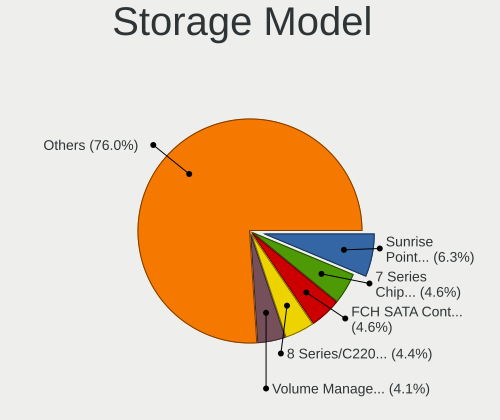

| Model                                                                                   | Computers | Percent |
|-----------------------------------------------------------------------------------------|-----------|---------|
| Intel Sunrise Point-LP SATA Controller [AHCI mode]                                      | 78        | 6.3%    |
| Intel 7 Series Chipset Family 6-port SATA Controller [AHCI mode]                        | 57        | 4.6%    |
| AMD FCH SATA Controller [AHCI mode]                                                     | 57        | 4.6%    |
| Intel 8 Series/C220 Series Chipset Family 6-port SATA Controller 1 [AHCI mode]          | 54        | 4.36%   |
| Intel Volume Management Device NVMe RAID Controller                                     | 51        | 4.12%   |
| Intel 82801 Mobile SATA Controller [RAID mode]                                          | 37        | 2.99%   |
| Intel 6 Series/C200 Series Chipset Family 6 port Mobile SATA AHCI Controller            | 37        | 2.99%   |
| Intel 8 Series SATA Controller 1 [AHCI mode]                                            | 32        | 2.58%   |
| Intel Wildcat Point-LP SATA Controller [AHCI Mode]                                      | 26        | 2.1%    |
| Intel NM10/ICH7 Family SATA Controller [IDE mode]                                       | 26        | 2.1%    |
| Intel Q170/Q150/B150/H170/H110/Z170/CM236 Chipset SATA Controller [AHCI Mode]           | 25        | 2.02%   |
| Samsung NVMe SSD Controller 980 (DRAM-less)                                             | 24        | 1.94%   |
| Intel HM170/QM170 Chipset SATA Controller [AHCI Mode]                                   | 23        | 1.86%   |
| Intel 5 Series/3400 Series Chipset 4 port SATA AHCI Controller                          | 23        | 1.86%   |
| Samsung NVMe SSD Controller SM981/PM981/PM983                                           | 22        | 1.78%   |
| Intel Alder Lake-S PCH SATA Controller [AHCI Mode]                                      | 17        | 1.37%   |
| Intel 82801IBM/IEM (ICH9M/ICH9M-E) 4 port SATA Controller [AHCI mode]                   | 17        | 1.37%   |
| Intel 82801G (ICH7 Family) IDE Controller                                               | 16        | 1.29%   |
| Intel 7 Series/C210 Series Chipset Family 6-port SATA Controller [AHCI mode]            | 16        | 1.29%   |
| Intel 5 Series/3400 Series Chipset 6 port SATA AHCI Controller                          | 15        | 1.21%   |
| Intel SSD 670p Series [Keystone Harbor]                                                 | 14        | 1.13%   |
| Intel RST Volume Management Device Controller                                           | 13        | 1.05%   |
| Intel Comet Lake SATA AHCI Controller                                                   | 13        | 1.05%   |
| Intel 6 Series/C200 Series Chipset Family Desktop SATA Controller (IDE mode, ports 4-5) | 13        | 1.05%   |
| Intel 6 Series/C200 Series Chipset Family Desktop SATA Controller (IDE mode, ports 0-3) | 13        | 1.05%   |
| Intel SSD 660P Series                                                                   | 12        | 0.97%   |
| Intel 82801HM/HEM (ICH8M/ICH8M-E) IDE Controller                                        | 12        | 0.97%   |
| SanDisk WD SN560/SN740/SN770/SN5000 NVMe SSD                                            | 11        | 0.89%   |
| Phison PS5013-E13 PCIe3 NVMe Controller (DRAM-less)                                     | 11        | 0.89%   |
| Intel Tiger Lake-LP SATA Controller                                                     | 11        | 0.89%   |
| Intel Cannon Lake Mobile PCH SATA AHCI Controller                                       | 11        | 0.89%   |
| Intel 500 Series Chipset Family SATA AHCI Controller                                    | 11        | 0.89%   |
| Intel 400 Series Chipset Family SATA AHCI Controller                                    | 11        | 0.89%   |
| Intel 200 Series PCH SATA controller [AHCI mode]                                        | 11        | 0.89%   |
| Intel SATA Controller [RAID mode]                                                       | 10        | 0.81%   |
| Intel Cannon Lake PCH SATA AHCI Controller                                              | 10        | 0.81%   |
| Micron 2400 NVMe SSD (DRAM-less)                                                        | 9         | 0.73%   |
| Micron 2210 NVMe SSD [Cobain]                                                           | 9         | 0.73%   |
| Intel Celeron/Pentium Silver Processor SATA Controller                                  | 9         | 0.73%   |
| Samsung NVMe SSD Controller PM9A1/PM9A3/980PRO                                          | 8         | 0.65%   |

Storage Kind
------------

Kind of storage controller (IDE, SATA, NVMe, SAS, ...)

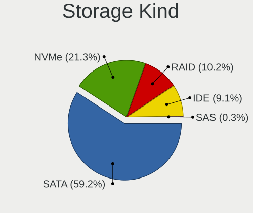

| Kind | Computers | Percent |
|------|-----------|---------|
| SATA | 669       | 59.15%  |
| NVMe | 241       | 21.31%  |
| RAID | 115       | 10.17%  |
| IDE  | 103       | 9.11%   |
| SAS  | 3         | 0.27%   |

Processor
---------

CPU Vendor
----------

Processor vendors

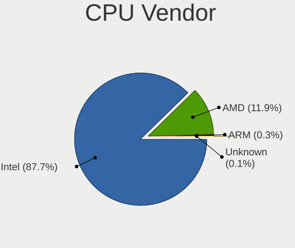

| Vendor  | Computers | Percent |
|---------|-----------|---------|
| Intel   | 813       | 87.7%   |
| AMD     | 110       | 11.87%  |
| ARM     | 3         | 0.32%   |
| Unknown | 1         | 0.11%   |

CPU Model
---------

Processor models

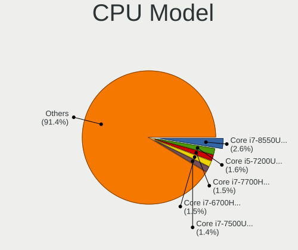

| Model                                   | Computers | Percent |
|-----------------------------------------|-----------|---------|
| Intel Core i7-8550U CPU @ 1.80GHz       | 24        | 2.59%   |
| Intel Core i5-7200U CPU @ 2.50GHz       | 15        | 1.62%   |
| Intel Core i7-7700HQ CPU @ 2.80GHz      | 14        | 1.51%   |
| Intel Core i7-6700HQ CPU @ 2.60GHz      | 14        | 1.51%   |
| Intel Core i7-7500U CPU @ 2.70GHz       | 13        | 1.4%    |
| Intel 11th Gen Core i7-1165G7 @ 2.80GHz | 12        | 1.29%   |
| Intel Core i7-10510U CPU @ 1.80GHz      | 11        | 1.19%   |
| Intel Core i5-3210M CPU @ 2.50GHz       | 11        | 1.19%   |
| Intel Core i7-4702MQ CPU @ 2.20GHz      | 10        | 1.08%   |
| Intel Core i5-5200U CPU @ 2.20GHz       | 10        | 1.08%   |
| Intel Core i5-4200U CPU @ 1.60GHz       | 10        | 1.08%   |
| Intel Core i5-3230M CPU @ 2.60GHz       | 10        | 1.08%   |
| Intel Core i5-8250U CPU @ 1.60GHz       | 9         | 0.97%   |
| Intel Core i5-4210U CPU @ 1.70GHz       | 9         | 0.97%   |
| Intel Core i5-3470 CPU @ 3.20GHz        | 9         | 0.97%   |
| Intel Core i5-2430M CPU @ 2.40GHz       | 9         | 0.97%   |
| Intel Core 2 Duo CPU E8400 @ 3.00GHz    | 9         | 0.97%   |
| Intel 12th Gen Core i7-12700H           | 9         | 0.97%   |
| Intel Core i5-6300U CPU @ 2.40GHz       | 8         | 0.86%   |
| Intel Core i7-8565U CPU @ 1.80GHz       | 7         | 0.76%   |
| Intel Core i7-6500U CPU @ 2.50GHz       | 7         | 0.76%   |
| Intel 11th Gen Core i5-1135G7 @ 2.40GHz | 7         | 0.76%   |
| Intel Pentium CPU P6200 @ 2.13GHz       | 6         | 0.65%   |
| Intel Core i7-9750H CPU @ 2.60GHz       | 6         | 0.65%   |
| Intel Core i7-8750H CPU @ 2.20GHz       | 6         | 0.65%   |
| Intel Core i7-5500U CPU @ 2.40GHz       | 6         | 0.65%   |
| Intel Core i7-2670QM CPU @ 2.20GHz      | 6         | 0.65%   |
| Intel Core i5-7400 CPU @ 3.00GHz        | 6         | 0.65%   |
| Intel Core i5-4460 CPU @ 3.20GHz        | 6         | 0.65%   |
| Intel 13th Gen Core i7-13620H           | 6         | 0.65%   |
| AMD Ryzen 7 5800H with Radeon Graphics  | 6         | 0.65%   |
| Intel Core i7-6820HQ CPU @ 2.70GHz      | 5         | 0.54%   |
| Intel Core i7-4700HQ CPU @ 2.40GHz      | 5         | 0.54%   |
| Intel Core i7-10750H CPU @ 2.60GHz      | 5         | 0.54%   |
| Intel Core i5-5300U CPU @ 2.30GHz       | 5         | 0.54%   |
| Intel Core i5-3320M CPU @ 2.60GHz       | 5         | 0.54%   |
| Intel Core i5-2450M CPU @ 2.50GHz       | 5         | 0.54%   |
| Intel Core i5-2410M CPU @ 2.30GHz       | 5         | 0.54%   |
| Intel Core i5-1035G1 CPU @ 1.00GHz      | 5         | 0.54%   |
| Intel Core i5-10300H CPU @ 2.50GHz      | 5         | 0.54%   |

CPU Model Family
----------------

Processor model prefix

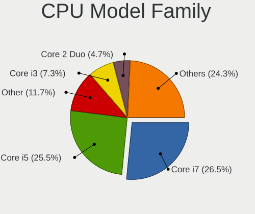

| Model                   | Computers | Percent |
|-------------------------|-----------|---------|
| Intel Core i7           | 246       | 26.54%  |
| Intel Core i5           | 236       | 25.46%  |
| Other                   | 108       | 11.65%  |
| Intel Core i3           | 68        | 7.34%   |
| Intel Core 2 Duo        | 44        | 4.75%   |
| Intel Pentium           | 31        | 3.34%   |
| AMD Ryzen 7             | 31        | 3.34%   |
| Intel Celeron           | 21        | 2.27%   |
| AMD Ryzen 5             | 20        | 2.16%   |
| Intel Xeon              | 11        | 1.19%   |
| Intel Pentium Dual-Core | 9         | 0.97%   |
| Intel Core 2 Quad       | 9         | 0.97%   |
| AMD FX                  | 9         | 0.97%   |
| Intel Atom              | 8         | 0.86%   |
| AMD Ryzen 3             | 6         | 0.65%   |
| AMD E1                  | 5         | 0.54%   |
| Intel Pentium Dual      | 4         | 0.43%   |
| Intel Core              | 4         | 0.43%   |
| AMD Athlon II X2        | 4         | 0.43%   |
| AMD A10                 | 4         | 0.43%   |
| Intel Xeon Gold         | 3         | 0.32%   |
| Intel Pentium Silver    | 3         | 0.32%   |
| Intel Genuine           | 3         | 0.32%   |
| Intel Core i9           | 3         | 0.32%   |
| AMD Ryzen 9             | 3         | 0.32%   |
| AMD PRO A10             | 3         | 0.32%   |
| AMD A4                  | 3         | 0.32%   |
| Intel Pentium 4         | 2         | 0.22%   |
| Intel Core M            | 2         | 0.22%   |
| AMD Ryzen 5 PRO         | 2         | 0.22%   |
| AMD Ryzen 3 PRO         | 2         | 0.22%   |
| AMD Athlon 64 X2        | 2         | 0.22%   |
| AMD Athlon 64           | 2         | 0.22%   |
| AMD A6                  | 2         | 0.22%   |
| Intel Pentium D         | 1         | 0.11%   |
| Intel Core m3           | 1         | 0.11%   |
| Intel Core Duo          | 1         | 0.11%   |
| ARM BCM                 | 1         | 0.11%   |
| AMD Ryzen 7 PRO         | 1         | 0.11%   |
| AMD PRO A8              | 1         | 0.11%   |

CPU Cores
---------

Number of processor cores

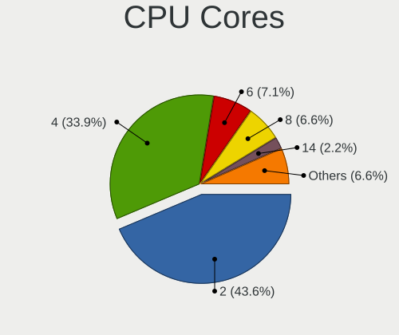

| Number | Computers | Percent |
|--------|-----------|---------|
| 2      | 405       | 43.64%  |
| 4      | 315       | 33.94%  |
| 6      | 66        | 7.11%   |
| 8      | 61        | 6.57%   |
| 14     | 20        | 2.16%   |
| 10     | 19        | 2.05%   |
| 1      | 13        | 1.4%    |
| 12     | 11        | 1.19%   |
| 16     | 5         | 0.54%   |
| 3      | 4         | 0.43%   |
| 24     | 3         | 0.32%   |
| 28     | 2         | 0.22%   |
| 52     | 1         | 0.11%   |
| 44     | 1         | 0.11%   |
| 20     | 1         | 0.11%   |
| 5      | 1         | 0.11%   |

CPU Sockets
-----------

Number of sockets

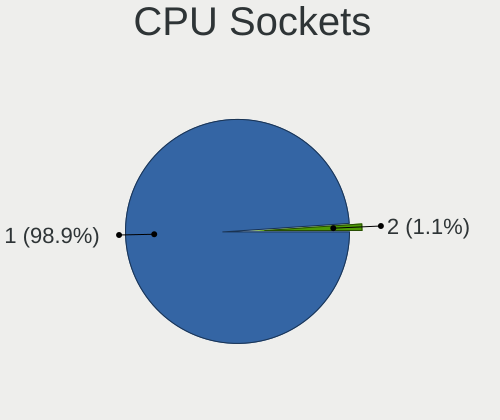

| Number | Computers | Percent |
|--------|-----------|---------|
| 1      | 917       | 98.92%  |
| 2      | 10        | 1.08%   |

CPU Threads
-----------

Threads per core (Hyper-Threading)

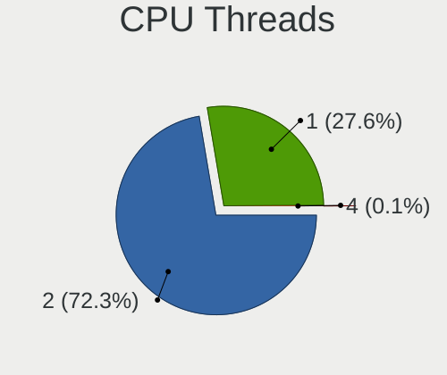

| Number | Computers | Percent |
|--------|-----------|---------|
| 2      | 672       | 72.34%  |
| 1      | 256       | 27.56%  |
| 4      | 1         | 0.11%   |

CPU Op-Modes
------------

CPU Operation Modes (32-bit, 64-bit)

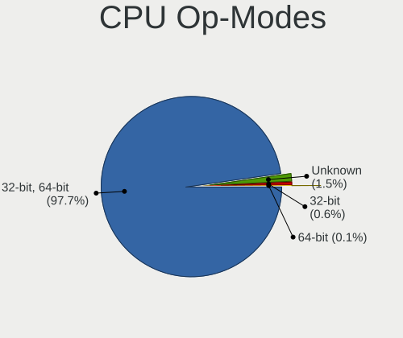

| Op mode        | Computers | Percent |
|----------------|-----------|---------|
| 32-bit, 64-bit | 908       | 97.74%  |
| Unknown        | 14        | 1.51%   |
| 32-bit         | 6         | 0.65%   |
| 64-bit         | 1         | 0.11%   |

CPU Microcode
-------------

Microcode number

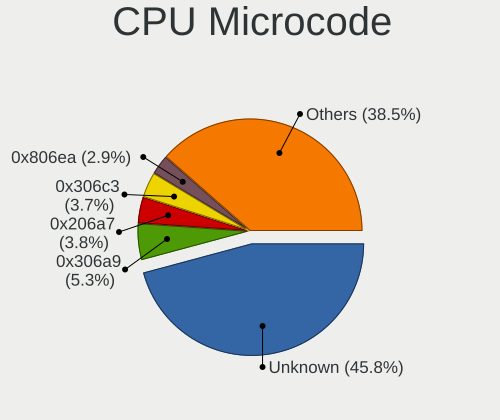

| Number     | Computers | Percent |
|------------|-----------|---------|
| Unknown    | 433       | 45.82%  |
| 0x306a9    | 50        | 5.29%   |
| 0x206a7    | 36        | 3.81%   |
| 0x306c3    | 35        | 3.7%    |
| 0x806ea    | 27        | 2.86%   |
| 0x1067a    | 27        | 2.86%   |
| 0x306d4    | 24        | 2.54%   |
| 0x20655    | 23        | 2.43%   |
| 0x806e9    | 18        | 1.9%    |
| 0x906e9    | 16        | 1.69%   |
| 0x506e3    | 16        | 1.69%   |
| 0x806ec    | 15        | 1.59%   |
| 0x906ea    | 14        | 1.48%   |
| 0x40651    | 13        | 1.38%   |
| 0x806c1    | 11        | 1.16%   |
| 0x906a3    | 9         | 0.95%   |
| 0x6fd      | 9         | 0.95%   |
| 0x406e3    | 9         | 0.95%   |
| 0x20652    | 8         | 0.85%   |
| 0xa0652    | 7         | 0.74%   |
| 0x706e5    | 6         | 0.63%   |
| 0x106e5    | 6         | 0.63%   |
| 0x6fb      | 5         | 0.53%   |
| 0x10676    | 5         | 0.53%   |
| 0x906ed    | 4         | 0.42%   |
| 0x706a1    | 4         | 0.42%   |
| 0x0a50000d | 4         | 0.42%   |
| 0x0a50000c | 4         | 0.42%   |
| 0x08608103 | 4         | 0.42%   |
| 0x0700010f | 4         | 0.42%   |
| 0x0600611a | 4         | 0.42%   |
| 0xa0653    | 3         | 0.32%   |
| 0x90672    | 3         | 0.32%   |
| 0x806d1    | 3         | 0.32%   |
| 0x406c4    | 3         | 0.32%   |
| 0x30678    | 3         | 0.32%   |
| 0x106ca    | 3         | 0.32%   |
| 0x08108109 | 3         | 0.32%   |
| 0x06003106 | 3         | 0.32%   |
| 0x010000c8 | 3         | 0.32%   |

CPU Microarch
-------------

Microarchitecture

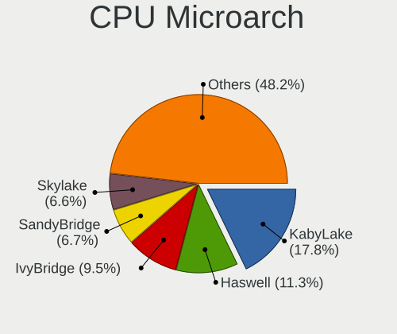

| Name              | Computers | Percent |
|-------------------|-----------|---------|
| KabyLake          | 165       | 17.78%  |
| Haswell           | 105       | 11.31%  |
| IvyBridge         | 88        | 9.48%   |
| SandyBridge       | 62        | 6.68%   |
| Skylake           | 61        | 6.57%   |
| Unknown           | 58        | 6.25%   |
| Penryn            | 50        | 5.39%   |
| Alderlake Hybrid  | 41        | 4.42%   |
| Westmere          | 39        | 4.2%    |
| Broadwell         | 33        | 3.56%   |
| CometLake         | 27        | 2.91%   |
| TigerLake         | 25        | 2.69%   |
| Core              | 19        | 2.05%   |
| Zen 3             | 16        | 1.72%   |
| IceLake           | 16        | 1.72%   |
| Zen 2             | 13        | 1.4%    |
| Zen+              | 10        | 1.08%   |
| Nehalem           | 10        | 1.08%   |
| Excavator         | 10        | 1.08%   |
| Silvermont        | 9         | 0.97%   |
| Goldmont plus     | 9         | 0.97%   |
| K10               | 8         | 0.86%   |
| Zen               | 6         | 0.65%   |
| Bonnell           | 6         | 0.65%   |
| Steamroller       | 5         | 0.54%   |
| NetBurst          | 5         | 0.54%   |
| Jaguar            | 5         | 0.54%   |
| Puma              | 4         | 0.43%   |
| K8 Hammer         | 4         | 0.43%   |
| Goldmont          | 4         | 0.43%   |
| P6                | 3         | 0.32%   |
| Bulldozer         | 3         | 0.32%   |
| Bobcat            | 3         | 0.32%   |
| Piledriver        | 2         | 0.22%   |
| Meteorlake Hybrid | 1         | 0.11%   |
| Lunarlake Hybrid  | 1         | 0.11%   |
| K10 Llano         | 1         | 0.11%   |
| Gracemont         | 1         | 0.11%   |

Graphics
--------

GPU Vendor
----------

Vendors of graphics cards

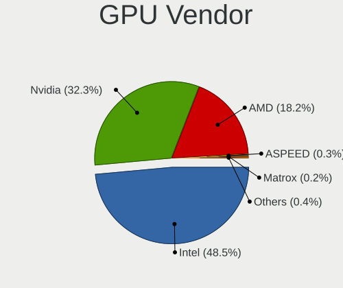

| Vendor                                       | Computers | Percent |
|----------------------------------------------|-----------|---------|
| Intel                                        | 635       | 48.55%  |
| Nvidia                                       | 423       | 32.34%  |
| AMD                                          | 238       | 18.2%   |
| ASPEED Technology                            | 4         | 0.31%   |
| Matrox Electronics Systems                   | 3         | 0.23%   |
| XGI Technology (eXtreme Graphics Innovation) | 1         | 0.08%   |
| VIA Technologies                             | 1         | 0.08%   |
| Trident Microsystems                         | 1         | 0.08%   |
| Silicon Integrated Systems [SiS]             | 1         | 0.08%   |
| ATI Technologies                             | 1         | 0.08%   |

GPU Model
---------

Graphics card models

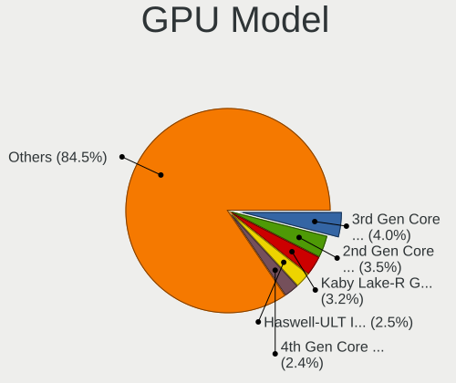

| Model                                                                                 | Computers | Percent |
|---------------------------------------------------------------------------------------|-----------|---------|
| Intel 3rd Gen Core processor Graphics Controller                                      | 53        | 3.98%   |
| Intel 2nd Generation Core Processor Family Integrated Graphics Controller             | 47        | 3.53%   |
| Intel Kaby Lake-R GT2 [UHD Graphics 620]                                              | 42        | 3.15%   |
| Intel Haswell-ULT Integrated Graphics Controller                                      | 33        | 2.48%   |
| Intel 4th Gen Core Processor Integrated Graphics Controller                           | 32        | 2.4%    |
| Intel Kaby Lake-U GT2 [HD Graphics 620]                                               | 31        | 2.33%   |
| Intel Broadwell-U GT2 [HD Graphics 5500]                                              | 25        | 1.88%   |
| Intel TigerLake-LP GT2 [Iris Xe Graphics]                                             | 24        | 1.8%    |
| Intel Skylake-U GT2 [HD Graphics 520]                                                 | 21        | 1.58%   |
| Intel Core Processor Integrated Graphics Controller                                   | 21        | 1.58%   |
| Intel Xeon E3-1200 v3/4th Gen Core Processor Integrated Graphics Controller           | 20        | 1.5%    |
| Nvidia GF117M [GeForce 610M/710M/810M/820M / GT 620M/625M/630M/720M]                  | 19        | 1.43%   |
| Nvidia TU117M [GeForce GTX 1650 Mobile / Max-Q]                                       | 17        | 1.28%   |
| Nvidia GP107M [GeForce GTX 1050 Mobile]                                               | 17        | 1.28%   |
| Intel Skylake-H GT2 [HD Graphics 530]                                                 | 17        | 1.28%   |
| Intel CometLake-U GT2 [UHD Graphics]                                                  | 16        | 1.2%    |
| Intel Alder Lake-P GT2 [Iris Xe Graphics]                                             | 16        | 1.2%    |
| Nvidia GP108M [GeForce MX150]                                                         | 15        | 1.13%   |
| AMD Cedar [Radeon HD 5000/6000/7350/8350 Series]                                      | 15        | 1.13%   |
| Intel Mobile 4 Series Chipset Integrated Graphics Controller                          | 14        | 1.05%   |
| Intel CoffeeLake-H GT2 [UHD Graphics 630]                                             | 14        | 1.05%   |
| Nvidia GK208M [GeForce GT 740M]                                                       | 13        | 0.98%   |
| Intel Xeon E3-1200 v2/3rd Gen Core processor Graphics Controller                      | 13        | 0.98%   |
| Intel Kaby Lake-H GT2 [HD Graphics 630]                                               | 13        | 0.98%   |
| AMD Ellesmere [Radeon RX 470/480/570/570X/580/580X/590]                               | 13        | 0.98%   |
| Nvidia GT218 [GeForce 210]                                                            | 12        | 0.9%    |
| Nvidia GA107M [GeForce RTX 3050 Mobile]                                               | 12        | 0.9%    |
| Intel WhiskeyLake-U GT2 [UHD Graphics 620]                                            | 12        | 0.9%    |
| Intel CometLake-H GT2 [UHD Graphics]                                                  | 12        | 0.9%    |
| AMD Topaz XT [Radeon R7 M260/M265 / M340/M360 / M440/M445 / 530/535 / 620/625 Mobile] | 12        | 0.9%    |
| AMD Cezanne [Radeon Vega Series / Radeon Vega Mobile Series]                          | 12        | 0.9%    |
| Nvidia GM108M [GeForce MX110]                                                         | 11        | 0.83%   |
| AMD Thames [Radeon HD 7550M/7570M/7650M]                                              | 11        | 0.83%   |
| Nvidia GP107M [GeForce MX350]                                                         | 10        | 0.75%   |
| Intel CoffeeLake-S GT2 [UHD Graphics 630]                                             | 10        | 0.75%   |
| Nvidia GA107M [GeForce RTX 3050 Ti Mobile]                                            | 9         | 0.68%   |
| Intel TigerLake-H GT1 [UHD Graphics]                                                  | 9         | 0.68%   |
| Intel Raptor Lake-P [UHD Graphics]                                                    | 9         | 0.68%   |
| AMD Sun XT [Radeon HD 8670A/8670M/8690M / R5 M330 / M430 / Radeon 520 Mobile]         | 9         | 0.68%   |
| AMD Renoir [Radeon Vega Series / Radeon Vega Mobile Series]                           | 9         | 0.68%   |

GPU Combo
---------

Combinations of graphics cards

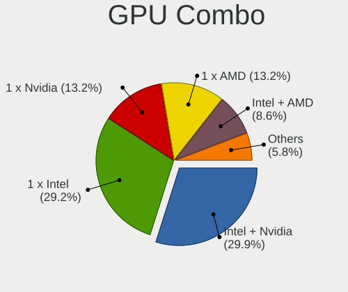

| Name                     | Computers | Percent |
|--------------------------|-----------|---------|
| Intel + Nvidia           | 278       | 29.89%  |
| 1 x Intel                | 272       | 29.25%  |
| 1 x Nvidia               | 123       | 13.23%  |
| 1 x AMD                  | 123       | 13.23%  |
| Intel + AMD              | 80        | 8.6%    |
| AMD + Nvidia             | 20        | 2.15%   |
| 2 x AMD                  | 17        | 1.83%   |
| Other                    | 4         | 0.43%   |
| 1 x Matrox               | 3         | 0.32%   |
| 2 x Intel                | 2         | 0.22%   |
| Nvidia + ASPEED          | 2         | 0.22%   |
| 2 x Nvidia + 1 x ASPEED  | 1         | 0.11%   |
| 1 x XGI                  | 1         | 0.11%   |
| 1 x VIA                  | 1         | 0.11%   |
| 1 x Trident Microsystems | 1         | 0.11%   |
| 1 x SiS                  | 1         | 0.11%   |
| 1 x ASPEED               | 1         | 0.11%   |

GPU Driver
----------

Free vs proprietary

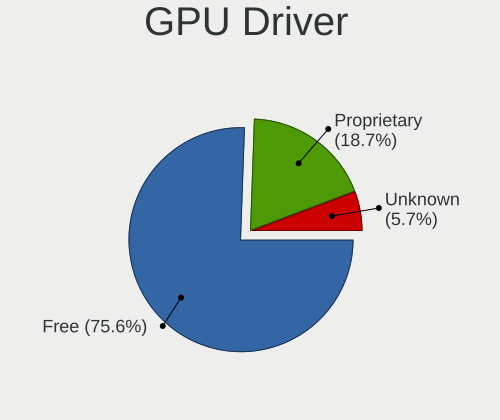

| Driver      | Computers | Percent |
|-------------|-----------|---------|
| Free        | 711       | 75.56%  |
| Proprietary | 176       | 18.7%   |
| Unknown     | 54        | 5.74%   |

GPU Memory
----------

Total video memory

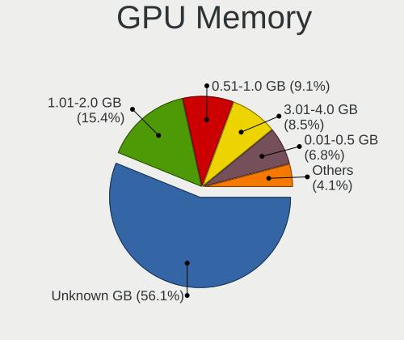

| Size in GB | Computers | Percent |
|------------|-----------|---------|
| Unknown    | 531       | 56.13%  |
| 1.01-2.0   | 146       | 15.43%  |
| 0.51-1.0   | 86        | 9.09%   |
| 3.01-4.0   | 80        | 8.46%   |
| 0.01-0.5   | 64        | 6.77%   |
| 7.01-8.0   | 19        | 2.01%   |
| 5.01-6.0   | 15        | 1.59%   |
| 8.01-16.0  | 4         | 0.42%   |
| 2.01-3.0   | 1         | 0.11%   |

Monitor
-------

Monitor Vendor
--------------

Monitor vendors

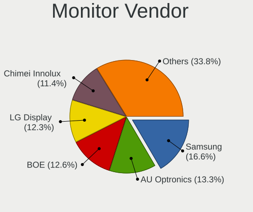

| Vendor                  | Computers | Percent |
|-------------------------|-----------|---------|
| Samsung Electronics     | 154       | 16.58%  |
| AU Optronics            | 124       | 13.35%  |
| BOE                     | 117       | 12.59%  |
| LG Display              | 114       | 12.27%  |
| Chimei Innolux          | 106       | 11.41%  |
| Goldstar                | 83        | 8.93%   |
| PANDA                   | 17        | 1.83%   |
| Hewlett-Packard         | 16        | 1.72%   |
| Chi Mei Optoelectronics | 15        | 1.61%   |
| Ancor Communications    | 15        | 1.61%   |
| Apple                   | 13        | 1.4%    |
| AOC                     | 13        | 1.4%    |
| BenQ                    | 12        | 1.29%   |
| Lenovo                  | 11        | 1.18%   |
| MSI                     | 10        | 1.08%   |
| CHD                     | 10        | 1.08%   |
| Dell                    | 8         | 0.86%   |
| Sony                    | 7         | 0.75%   |
| Sharp                   | 7         | 0.75%   |
| ASUSTek Computer        | 7         | 0.75%   |
| LG Electronics          | 6         | 0.65%   |
| HannStar                | 5         | 0.54%   |
| Unknown                 | 4         | 0.43%   |
| RTK                     | 4         | 0.43%   |
| InfoVision              | 4         | 0.43%   |
| ViewSonic               | 3         | 0.32%   |
| LG Philips              | 3         | 0.32%   |
| HUAWEI                  | 3         | 0.32%   |
| Acer                    | 3         | 0.32%   |
| Unknown (ADA)           | 2         | 0.22%   |
| TMX                     | 2         | 0.22%   |
| Nvidia                  | 2         | 0.22%   |
| Mi                      | 2         | 0.22%   |
| InnoLux Display         | 2         | 0.22%   |
| GOL                     | 2         | 0.22%   |
| CSO                     | 2         | 0.22%   |
| XVision                 | 1         | 0.11%   |
| Xiaomi                  | 1         | 0.11%   |
| Seiko/Epson             | 1         | 0.11%   |
| SEEYOO                  | 1         | 0.11%   |

Monitor Model
-------------

Monitor models

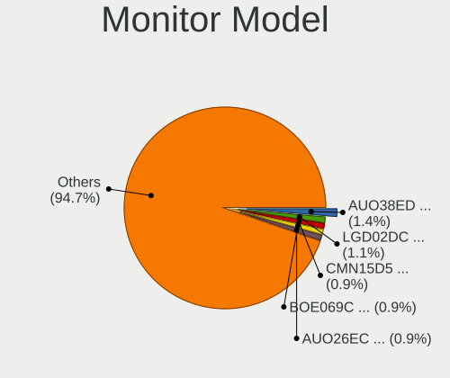

| Model                                                                    | Computers | Percent |
|--------------------------------------------------------------------------|-----------|---------|
| AU Optronics LCD Monitor AUO38ED 1920x1080 344x193mm 15.5-inch           | 13        | 1.37%   |
| LG Display LCD Monitor LGD02DC 1366x768 344x194mm 15.5-inch              | 10        | 1.05%   |
| Chimei Innolux LCD Monitor CMN15D5 1920x1080 344x193mm 15.5-inch         | 9         | 0.95%   |
| BOE LCD Monitor BOE069C 1920x1080 344x193mm 15.5-inch                    | 9         | 0.95%   |
| AU Optronics LCD Monitor AUO26EC 1366x768 344x193mm 15.5-inch            | 9         | 0.95%   |
| AU Optronics LCD Monitor AUO22EC 1366x768 344x193mm 15.5-inch            | 9         | 0.95%   |
| Chimei Innolux LCD Monitor CMN15F5 1920x1080 344x193mm 15.5-inch         | 8         | 0.84%   |
| Samsung Electronics LCD Monitor SEC5441 1280x800 331x207mm 15.4-inch     | 7         | 0.74%   |
| PANDA LCD Monitor NCP004D 1920x1080 344x194mm 15.5-inch                  | 7         | 0.74%   |
| Chimei Innolux LCD Monitor CMN1521 1920x1080 344x193mm 15.5-inch         | 7         | 0.74%   |
| Goldstar LG IPS FULLHD GSM5AB8 1920x1080 480x270mm 21.7-inch             | 6         | 0.63%   |
| Samsung Electronics S22F350 SAM0D1A 1920x1080 477x268mm 21.5-inch        | 5         | 0.53%   |
| Samsung Electronics S22B300 SAM08A9 1600x900 443x249mm 20.0-inch         | 5         | 0.53%   |
| LG Display LCD Monitor LGD04D4 3840x2160 344x194mm 15.5-inch             | 5         | 0.53%   |
| Goldstar W2053 GSM4E9F 1600x900 443x249mm 20.0-inch                      | 5         | 0.53%   |
| Goldstar IPS WSXGA GSM5B01 1440x900 419x262mm 19.5-inch                  | 5         | 0.53%   |
| Goldstar FULL HD GSM5B55 1920x1080 480x270mm 21.7-inch                   | 5         | 0.53%   |
| Goldstar E1940 GSM4BD6 1360x768 406x229mm 18.4-inch                      | 5         | 0.53%   |
| Chimei Innolux LCD Monitor CMN15C4 1920x1080 344x193mm 15.5-inch         | 5         | 0.53%   |
| Chimei Innolux LCD Monitor CMN14D5 1920x1080 309x173mm 13.9-inch         | 5         | 0.53%   |
| Chi Mei Optoelectronics LCD Monitor CMO15A7 1366x768 344x193mm 15.5-inch | 5         | 0.53%   |
| CHD PMO S240-IFC CHD0240 1920x1080 368x207mm 16.6-inch                   | 5         | 0.53%   |
| AU Optronics LCD Monitor AUO21ED 1920x1080 344x193mm 15.5-inch           | 5         | 0.53%   |
| Samsung Electronics S24D390 SAM0B65 1920x1080 521x293mm 23.5-inch        | 4         | 0.42%   |
| Samsung Electronics S20B300 SAM08A8 1600x900 443x249mm 20.0-inch         | 4         | 0.42%   |
| Samsung Electronics LCD Monitor SDC4752 1366x768 344x194mm 15.5-inch     | 4         | 0.42%   |
| Samsung Electronics LCD Monitor SDC416E 2880x1620 344x194mm 15.5-inch    | 4         | 0.42%   |
| RTK LCD Monitor RTK1D1A 1920x1080 1020x570mm 46.0-inch                   | 4         | 0.42%   |
| LG Display LCD Monitor LGD046F 1920x1080 344x194mm 15.5-inch             | 4         | 0.42%   |
| LG Display LCD Monitor LGD033A 1366x768 344x194mm 15.5-inch              | 4         | 0.42%   |
| Chimei Innolux LCD Monitor CMN15E8 1920x1080 344x193mm 15.5-inch         | 4         | 0.42%   |
| Chimei Innolux LCD Monitor CMN14D4 1920x1080 309x173mm 13.9-inch         | 4         | 0.42%   |
| BOE LCD Monitor BOE08E2 1920x1080 344x194mm 15.5-inch                    | 4         | 0.42%   |
| BOE LCD Monitor BOE08D5 1920x1080 344x194mm 15.5-inch                    | 4         | 0.42%   |
| BOE LCD Monitor BOE06A5 1366x768 344x194mm 15.5-inch                     | 4         | 0.42%   |
| BOE LCD Monitor BOE0675 1366x768 344x194mm 15.5-inch                     | 4         | 0.42%   |
| AU Optronics LCD Monitor AUO71EC 1366x768 344x193mm 15.5-inch            | 4         | 0.42%   |
| AU Optronics LCD Monitor AUO183C 1366x768 309x173mm 13.9-inch            | 4         | 0.42%   |
| Samsung Electronics S22F350 SAM0D1B 1920x1080 477x268mm 21.5-inch        | 3         | 0.32%   |
| Samsung Electronics LCD Monitor SEC4252 1366x768 344x194mm 15.5-inch     | 3         | 0.32%   |

Monitor Resolution
------------------

Monitor screen resolution

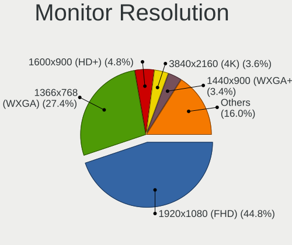

| Resolution         | Computers | Percent |
|--------------------|-----------|---------|
| 1920x1080 (FHD)    | 404       | 44.84%  |
| 1366x768 (WXGA)    | 247       | 27.41%  |
| 1600x900 (HD+)     | 43        | 4.77%   |
| 3840x2160 (4K)     | 32        | 3.55%   |
| 1440x900 (WXGA+)   | 31        | 3.44%   |
| 1280x800 (WXGA)    | 21        | 2.33%   |
| 1920x1200 (WUXGA)  | 17        | 1.89%   |
| 1280x1024 (SXGA)   | 15        | 1.66%   |
| 2560x1440 (QHD)    | 13        | 1.44%   |
| 1360x768           | 13        | 1.44%   |
| 1680x1050 (WSXGA+) | 12        | 1.33%   |
| 2560x1600          | 6         | 0.67%   |
| 2880x1620          | 5         | 0.55%   |
| Unknown            | 5         | 0.55%   |
| 2560x1080          | 4         | 0.44%   |
| 1024x600           | 4         | 0.44%   |
| 2880x1800          | 3         | 0.33%   |
| 3840x2400          | 2         | 0.22%   |
| 3440x1440          | 2         | 0.22%   |
| 3240x2160          | 2         | 0.22%   |
| 3200x1800 (QHD+)   | 2         | 0.22%   |
| 3000x2000          | 2         | 0.22%   |
| 2880x1920          | 2         | 0.22%   |
| 1920x1280          | 2         | 0.22%   |
| 1280x960           | 2         | 0.22%   |
| 5760x2160          | 1         | 0.11%   |
| 3840x1080          | 1         | 0.11%   |
| 3200x2000          | 1         | 0.11%   |
| 2944x1080          | 1         | 0.11%   |
| 2736x1824          | 1         | 0.11%   |
| 2720x768           | 1         | 0.11%   |
| 2304x1440          | 1         | 0.11%   |
| 2288x1287          | 1         | 0.11%   |
| 1680x945           | 1         | 0.11%   |
| 1280x720 (HD)      | 1         | 0.11%   |

Monitor Diagonal
----------------

Diagonal size in inches

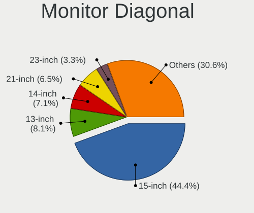

| Inches  | Computers | Percent |
|---------|-----------|---------|
| 15      | 413       | 44.41%  |
| 13      | 75        | 8.06%   |
| 14      | 66        | 7.1%    |
| 21      | 60        | 6.45%   |
| 23      | 31        | 3.33%   |
| 18      | 30        | 3.23%   |
| 27      | 28        | 3.01%   |
| 24      | 28        | 3.01%   |
| 20      | 27        | 2.9%    |
| Unknown | 26        | 2.8%    |
| 19      | 25        | 2.69%   |
| 17      | 21        | 2.26%   |
| 12      | 18        | 1.94%   |
| 16      | 17        | 1.83%   |
| 31      | 10        | 1.08%   |
| 22      | 10        | 1.08%   |
| 11      | 10        | 1.08%   |
| 10      | 5         | 0.54%   |
| 46      | 4         | 0.43%   |
| 34      | 3         | 0.32%   |
| 29      | 3         | 0.32%   |
| 84      | 2         | 0.22%   |
| 72      | 2         | 0.22%   |
| 65      | 2         | 0.22%   |
| 54      | 2         | 0.22%   |
| 40      | 2         | 0.22%   |
| 32      | 2         | 0.22%   |
| 7       | 2         | 0.22%   |
| 142     | 1         | 0.11%   |
| 75      | 1         | 0.11%   |
| 50      | 1         | 0.11%   |
| 49      | 1         | 0.11%   |
| 26      | 1         | 0.11%   |
| 25      | 1         | 0.11%   |

Monitor Width
-------------

Physical width

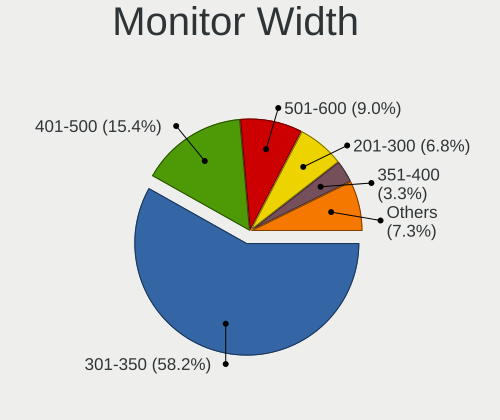

| Width in mm    | Computers | Percent |
|----------------|-----------|---------|
| 301-350        | 535       | 58.15%  |
| 401-500        | 142       | 15.43%  |
| 501-600        | 83        | 9.02%   |
| 201-300        | 63        | 6.85%   |
| 351-400        | 30        | 3.26%   |
| Unknown        | 26        | 2.83%   |
| 601-700        | 16        | 1.74%   |
| 1001-1500      | 10        | 1.09%   |
| 1501-2000      | 5         | 0.54%   |
| 701-800        | 4         | 0.43%   |
| 801-900        | 3         | 0.33%   |
| 101-200        | 2         | 0.22%   |
| More than 2000 | 1         | 0.11%   |

Aspect Ratio
------------

Proportional relationship between the width and the height

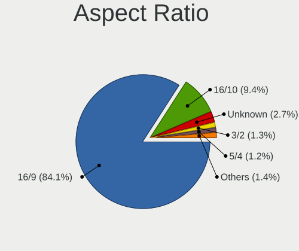

| Ratio   | Computers | Percent |
|---------|-----------|---------|
| 16/9    | 726       | 84.13%  |
| 16/10   | 81        | 9.39%   |
| Unknown | 23        | 2.67%   |
| 3/2     | 11        | 1.27%   |
| 5/4     | 10        | 1.16%   |
| 4/3     | 6         | 0.7%    |
| 21/9    | 5         | 0.58%   |
| 1.00    | 1         | 0.12%   |

Monitor Area
------------

Area in inch²

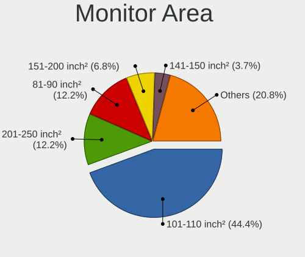

| Area in inch² | Computers | Percent |
|----------------|-----------|---------|
| 101-110        | 412       | 44.4%   |
| 81-90          | 113       | 12.18%  |
| 201-250        | 113       | 12.18%  |
| 151-200        | 63        | 6.79%   |
| 141-150        | 34        | 3.66%   |
| 301-350        | 30        | 3.23%   |
| Unknown        | 26        | 2.8%    |
| 71-80          | 25        | 2.69%   |
| 61-70          | 18        | 1.94%   |
| 351-500        | 16        | 1.72%   |
| 121-130        | 15        | 1.62%   |
| 111-120        | 13        | 1.4%    |
| More than 1000 | 12        | 1.29%   |
| 51-60          | 10        | 1.08%   |
| 251-300        | 7         | 0.75%   |
| 501-1000       | 6         | 0.65%   |
| 41-50          | 5         | 0.54%   |
| 131-140        | 5         | 0.54%   |
| 91-100         | 3         | 0.32%   |
| 1-40           | 2         | 0.22%   |

Pixel Density
-------------

Pixels per inch

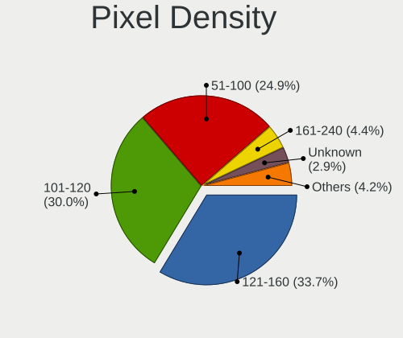

| Density       | Computers | Percent |
|---------------|-----------|---------|
| 121-160       | 307       | 33.66%  |
| 101-120       | 274       | 30.04%  |
| 51-100        | 227       | 24.89%  |
| 161-240       | 40        | 4.39%   |
| Unknown       | 26        | 2.85%   |
| More than 240 | 25        | 2.74%   |
| 1-50          | 13        | 1.43%   |

Multiple Monitors
-----------------

Total monitors connected

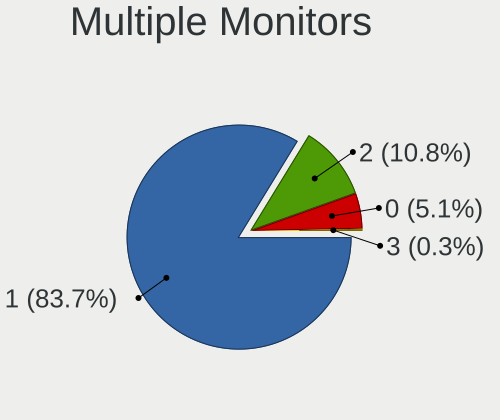

| Total | Computers | Percent |
|-------|-----------|---------|
| 1     | 783       | 83.74%  |
| 2     | 101       | 10.8%   |
| 0     | 48        | 5.13%   |
| 3     | 3         | 0.32%   |

Network
-------

Net Controller Vendor
---------------------

Controller vendors

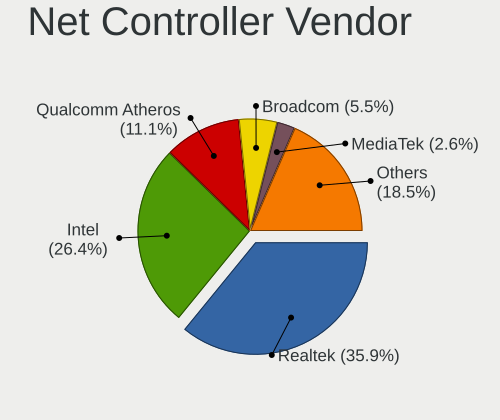

| Vendor                                 | Computers | Percent |
|----------------------------------------|-----------|---------|
| Realtek Semiconductor                  | 540       | 35.9%   |
| Intel                                  | 397       | 26.4%   |
| Qualcomm Atheros                       | 167       | 11.1%   |
| Broadcom                               | 83        | 5.52%   |
| MediaTek                               | 39        | 2.59%   |
| Samsung Electronics                    | 33        | 2.19%   |
| Ralink Technology                      | 32        | 2.13%   |
| Xiaomi                                 | 28        | 1.86%   |
| Ralink                                 | 27        | 1.8%    |
| Broadcom Limited                       | 27        | 1.8%    |
| D-Link                                 | 20        | 1.33%   |
| Marvell Technology Group               | 17        | 1.13%   |
| TP-Link                                | 13        | 0.86%   |
| Huawei Technologies                    | 11        | 0.73%   |
| Hewlett-Packard                        | 8         | 0.53%   |
| VIA Technologies                       | 6         | 0.4%    |
| D-Link System                          | 6         | 0.4%    |
| Nvidia                                 | 5         | 0.33%   |
| Qualcomm Atheros Communications        | 4         | 0.27%   |
| Shenzhen Goodix Technology             | 3         | 0.2%    |
| JMicron Technology                     | 3         | 0.2%    |
| HTC (High Tech Computer)               | 3         | 0.2%    |
| ASUSTek Computer                       | 3         | 0.2%    |
| Apple                                  | 3         | 0.2%    |
| Sierra Wireless                        | 2         | 0.13%   |
| Qualcomm                               | 2         | 0.13%   |
| Microsoft                              | 2         | 0.13%   |
| ICS Advent                             | 2         | 0.13%   |
| ASIX Electronics                       | 2         | 0.13%   |
| Aquantia                               | 2         | 0.13%   |
| ZyDAS                                  | 1         | 0.07%   |
| Tenda                                  | 1         | 0.07%   |
| Sony Ericsson Mobile Communications AB | 1         | 0.07%   |
| Smart Link                             | 1         | 0.07%   |
| Silicon Integrated Systems [SiS]       | 1         | 0.07%   |
| Qualcomm Technologies                  | 1         | 0.07%   |
| OPPO Electronics                       | 1         | 0.07%   |
| LG Electronics                         | 1         | 0.07%   |
| Lenovo                                 | 1         | 0.07%   |
| Ericsson Business Mobile Networks      | 1         | 0.07%   |

Net Controller Model
--------------------

Controller models

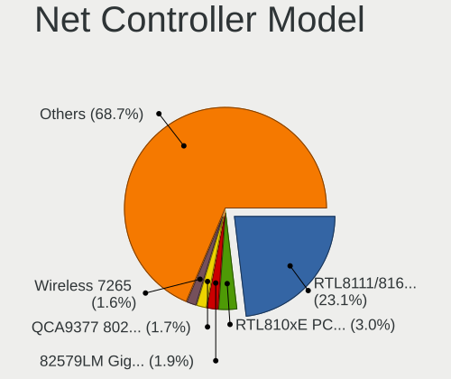

| Model                                                                  | Computers | Percent |
|------------------------------------------------------------------------|-----------|---------|
| Realtek RTL8111/8168/8211/8411 PCI Express Gigabit Ethernet Controller | 399       | 23.13%  |
| Realtek RTL810xE PCI Express Fast Ethernet controller                  | 52        | 3.01%   |
| Intel 82579LM Gigabit Network Connection (Lewisville)                  | 32        | 1.86%   |
| Qualcomm Atheros QCA9377 802.11ac Wireless Network Adapter             | 29        | 1.68%   |
| Intel Wireless 7265                                                    | 28        | 1.62%   |
| Realtek RTL8821CE 802.11ac PCIe Wireless Network Adapter               | 27        | 1.57%   |
| Qualcomm Atheros AR9285 Wireless Network Adapter (PCI-Express)         | 26        | 1.51%   |
| Ralink MT7601U Wireless Adapter                                        | 25        | 1.45%   |
| Intel Wireless 8265 / 8275                                             | 25        | 1.45%   |
| Intel Wireless 8260                                                    | 24        | 1.39%   |
| Samsung Galaxy series, misc. (tethering mode)                          | 23        | 1.33%   |
| MediaTek MT7921 802.11ax PCIe Wireless Network Adapter [Filogic 330]   | 22        | 1.28%   |
| Qualcomm Atheros AR9485 Wireless Network Adapter                       | 21        | 1.22%   |
| Intel Wi-Fi 6 AX201                                                    | 20        | 1.16%   |
| Intel Wireless 7260                                                    | 19        | 1.1%    |
| Xiaomi Mi/Redmi series (RNDIS)                                         | 18        | 1.04%   |
| Realtek RTL8723BE PCIe Wireless Network Adapter                        | 18        | 1.04%   |
| Realtek RTL8188EUS 802.11n Wireless Network Adapter                    | 18        | 1.04%   |
| Qualcomm Atheros QCA9565 / AR9565 Wireless Network Adapter             | 18        | 1.04%   |
| Realtek RTL8125 2.5GbE Controller                                      | 17        | 0.99%   |
| Broadcom BCM43142 802.11b/g/n                                          | 16        | 0.93%   |
| Intel Dual Band Wireless-AC 3165 Plus Bluetooth                        | 15        | 0.87%   |
| Intel Comet Lake PCH-LP CNVi WiFi                                      | 15        | 0.87%   |
| Intel Alder Lake-P PCH CNVi WiFi                                       | 15        | 0.87%   |
| Realtek RTL8852BE PCIe 802.11ax Wireless Network Controller            | 14        | 0.81%   |
| Realtek RTL8821AE 802.11ac PCIe Wireless Network Adapter               | 14        | 0.81%   |
| Ralink RT3290 Wireless 802.11n 1T/1R PCIe                              | 13        | 0.75%   |
| Intel Wi-Fi 6 AX200                                                    | 13        | 0.75%   |
| Intel Centrino Advanced-N 6205 [Taylor Peak]                           | 13        | 0.75%   |
| Intel Ethernet Connection I217-LM                                      | 12        | 0.7%    |
| Broadcom NetLink BCM57785 Gigabit Ethernet PCIe                        | 12        | 0.7%    |
| Realtek RTL8822CE 802.11ac PCIe Wireless Network Adapter               | 11        | 0.64%   |
| Qualcomm Atheros AR9462 Wireless Network Adapter                       | 10        | 0.58%   |
| Intel Comet Lake PCH CNVi WiFi                                         | 10        | 0.58%   |
| Broadcom BCM4313 802.11bgn Wireless Network Adapter                    | 10        | 0.58%   |
| Xiaomi Mi/Redmi series (RNDIS + ADB)                                   | 9         | 0.52%   |
| Samsung GT-I9070 (network tethering, USB debugging enabled)            | 9         | 0.52%   |
| Realtek RTL8188FTV 802.11b/g/n 1T1R 2.4G WLAN Adapter                  | 9         | 0.52%   |
| Intel Ethernet Connection I219-LM                                      | 9         | 0.52%   |
| Intel Ethernet Connection (2) I219-LM                                  | 9         | 0.52%   |

Wireless Vendor
---------------

Wireless vendors

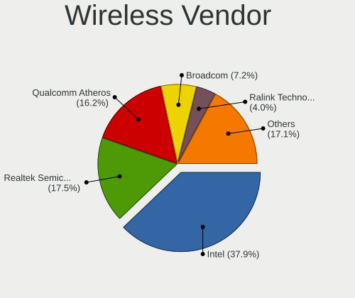

| Vendor                          | Computers | Percent |
|---------------------------------|-----------|---------|
| Intel                           | 303       | 37.88%  |
| Realtek Semiconductor           | 140       | 17.5%   |
| Qualcomm Atheros                | 130       | 16.25%  |
| Broadcom                        | 58        | 7.25%   |
| Ralink Technology               | 32        | 4%      |
| MediaTek                        | 32        | 4%      |
| Ralink                          | 27        | 3.38%   |
| Broadcom Limited                | 23        | 2.88%   |
| D-Link                          | 19        | 2.38%   |
| TP-Link                         | 12        | 1.5%    |
| Qualcomm Atheros Communications | 4         | 0.5%    |
| Hewlett-Packard                 | 4         | 0.5%    |
| D-Link System                   | 4         | 0.5%    |
| Marvell Technology Group        | 3         | 0.38%   |
| Sierra Wireless                 | 2         | 0.25%   |
| ZyDAS                           | 1         | 0.13%   |
| Xiaomi                          | 1         | 0.13%   |
| Tenda                           | 1         | 0.13%   |
| Samsung Electronics             | 1         | 0.13%   |
| BUFFALO                         | 1         | 0.13%   |
| Accton Technology               | 1         | 0.13%   |
| AboCom Systems                  | 1         | 0.13%   |

Wireless Model
--------------

Wireless models

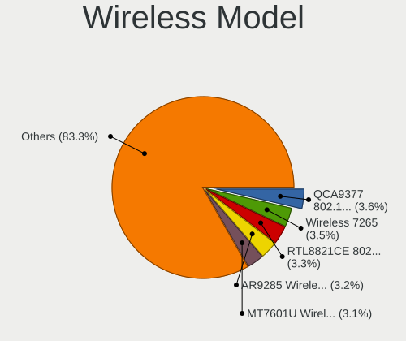

| Model                                                                | Computers | Percent |
|----------------------------------------------------------------------|-----------|---------|
| Qualcomm Atheros QCA9377 802.11ac Wireless Network Adapter           | 29        | 3.6%    |
| Intel Wireless 7265                                                  | 28        | 3.47%   |
| Realtek RTL8821CE 802.11ac PCIe Wireless Network Adapter             | 27        | 3.35%   |
| Qualcomm Atheros AR9285 Wireless Network Adapter (PCI-Express)       | 26        | 3.23%   |
| Ralink MT7601U Wireless Adapter                                      | 25        | 3.1%    |
| Intel Wireless 8265 / 8275                                           | 25        | 3.1%    |
| Intel Wireless 8260                                                  | 24        | 2.98%   |
| MediaTek MT7921 802.11ax PCIe Wireless Network Adapter [Filogic 330] | 22        | 2.73%   |
| Qualcomm Atheros AR9485 Wireless Network Adapter                     | 21        | 2.61%   |
| Intel Wi-Fi 6 AX201                                                  | 20        | 2.48%   |
| Intel Wireless 7260                                                  | 19        | 2.36%   |
| Realtek RTL8723BE PCIe Wireless Network Adapter                      | 18        | 2.23%   |
| Realtek RTL8188EUS 802.11n Wireless Network Adapter                  | 18        | 2.23%   |
| Qualcomm Atheros QCA9565 / AR9565 Wireless Network Adapter           | 18        | 2.23%   |
| Broadcom BCM43142 802.11b/g/n                                        | 16        | 1.99%   |
| Intel Dual Band Wireless-AC 3165 Plus Bluetooth                      | 15        | 1.86%   |
| Intel Comet Lake PCH-LP CNVi WiFi                                    | 15        | 1.86%   |
| Realtek RTL8852BE PCIe 802.11ax Wireless Network Controller          | 14        | 1.74%   |
| Realtek RTL8821AE 802.11ac PCIe Wireless Network Adapter             | 14        | 1.74%   |
| Ralink RT3290 Wireless 802.11n 1T/1R PCIe                            | 13        | 1.61%   |
| Intel Wi-Fi 6 AX200                                                  | 13        | 1.61%   |
| Intel Centrino Advanced-N 6205 [Taylor Peak]                         | 13        | 1.61%   |
| Realtek RTL8822CE 802.11ac PCIe Wireless Network Adapter             | 11        | 1.36%   |
| Qualcomm Atheros AR9462 Wireless Network Adapter                     | 10        | 1.24%   |
| Intel Comet Lake PCH CNVi WiFi                                       | 10        | 1.24%   |
| Broadcom BCM4313 802.11bgn Wireless Network Adapter                  | 10        | 1.24%   |
| Realtek RTL8188FTV 802.11b/g/n 1T1R 2.4G WLAN Adapter                | 9         | 1.12%   |
| Intel Alder Lake-P PCH CNVi WiFi                                     | 9         | 1.12%   |
| D-Link DWA-123 Wireless N 150 Adapter (rev.D1)                       | 9         | 1.12%   |
| Qualcomm Atheros QCA6174 802.11ac Wireless Network Adapter           | 8         | 0.99%   |
| Intel Centrino Ultimate-N 6300                                       | 8         | 0.99%   |
| Intel Cannon Lake PCH CNVi WiFi                                      | 7         | 0.87%   |
| Realtek RTL8852AE 802.11ax PCIe Wireless Network Adapter             | 6         | 0.74%   |
| Ralink RT5370 Wireless Adapter                                       | 6         | 0.74%   |
| Intel Wireless 3160                                                  | 6         | 0.74%   |
| Intel Tiger Lake PCH CNVi WiFi                                       | 6         | 0.74%   |
| Intel Centrino Advanced-N 6200                                       | 6         | 0.74%   |
| Broadcom Limited BCM4312 802.11b/g LP-PHY                            | 6         | 0.74%   |
| Broadcom BCM43228 802.11a/b/g/n                                      | 6         | 0.74%   |
| Broadcom BCM4312 802.11b/g LP-PHY                                    | 6         | 0.74%   |

Ethernet Vendor
---------------

Ethernet vendors

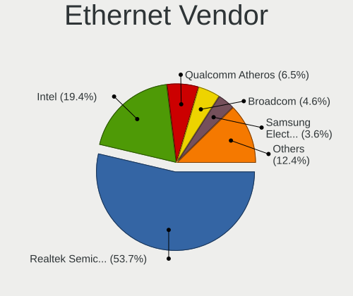

| Vendor                                 | Computers | Percent |
|----------------------------------------|-----------|---------|
| Realtek Semiconductor                  | 482       | 53.67%  |
| Intel                                  | 174       | 19.38%  |
| Qualcomm Atheros                       | 58        | 6.46%   |
| Broadcom                               | 41        | 4.57%   |
| Samsung Electronics                    | 32        | 3.56%   |
| Xiaomi                                 | 27        | 3.01%   |
| Marvell Technology Group               | 14        | 1.56%   |
| Huawei Technologies                    | 11        | 1.22%   |
| MediaTek                               | 8         | 0.89%   |
| VIA Technologies                       | 6         | 0.67%   |
| Nvidia                                 | 5         | 0.56%   |
| Hewlett-Packard                        | 4         | 0.45%   |
| Broadcom Limited                       | 4         | 0.45%   |
| JMicron Technology                     | 3         | 0.33%   |
| HTC (High Tech Computer)               | 3         | 0.33%   |
| Apple                                  | 3         | 0.33%   |
| Qualcomm                               | 2         | 0.22%   |
| Microsoft                              | 2         | 0.22%   |
| ICS Advent                             | 2         | 0.22%   |
| D-Link System                          | 2         | 0.22%   |
| ASUSTek Computer                       | 2         | 0.22%   |
| ASIX Electronics                       | 2         | 0.22%   |
| Aquantia                               | 2         | 0.22%   |
| TP-Link                                | 1         | 0.11%   |
| Sony Ericsson Mobile Communications AB | 1         | 0.11%   |
| Silicon Integrated Systems [SiS]       | 1         | 0.11%   |
| Qualcomm Technologies                  | 1         | 0.11%   |
| OPPO Electronics                       | 1         | 0.11%   |
| LG Electronics                         | 1         | 0.11%   |
| Lenovo                                 | 1         | 0.11%   |
| D-Link                                 | 1         | 0.11%   |
| Attansic Technology                    | 1         | 0.11%   |

Ethernet Model
--------------

Ethernet models

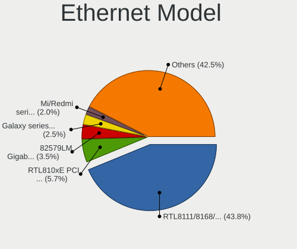

| Model                                                                  | Computers | Percent |
|------------------------------------------------------------------------|-----------|---------|
| Realtek RTL8111/8168/8211/8411 PCI Express Gigabit Ethernet Controller | 399       | 43.8%   |
| Realtek RTL810xE PCI Express Fast Ethernet controller                  | 52        | 5.71%   |
| Intel 82579LM Gigabit Network Connection (Lewisville)                  | 32        | 3.51%   |
| Samsung Galaxy series, misc. (tethering mode)                          | 23        | 2.52%   |
| Xiaomi Mi/Redmi series (RNDIS)                                         | 18        | 1.98%   |
| Realtek RTL8125 2.5GbE Controller                                      | 17        | 1.87%   |
| Intel Ethernet Connection I217-LM                                      | 12        | 1.32%   |
| Broadcom NetLink BCM57785 Gigabit Ethernet PCIe                        | 12        | 1.32%   |
| Xiaomi Mi/Redmi series (RNDIS + ADB)                                   | 9         | 0.99%   |
| Samsung GT-I9070 (network tethering, USB debugging enabled)            | 9         | 0.99%   |
| Intel Ethernet Connection I219-LM                                      | 9         | 0.99%   |
| Intel Ethernet Connection (2) I219-LM                                  | 9         | 0.99%   |
| Realtek RTL8153 Gigabit Ethernet Adapter                               | 8         | 0.88%   |
| Qualcomm Atheros AR8131 Gigabit Ethernet                               | 8         | 0.88%   |
| Intel Ethernet Connection (2) I219-V                                   | 8         | 0.88%   |
| Huawei FOA-LX9                                                         | 8         | 0.88%   |
| Qualcomm Atheros QCA8172 Fast Ethernet                                 | 7         | 0.77%   |
| Qualcomm Atheros QCA8171 Gigabit Ethernet                              | 7         | 0.77%   |
| Intel 82577LM Gigabit Network Connection                               | 7         | 0.77%   |
| Intel Ethernet Controller I225-V                                       | 6         | 0.66%   |
| Intel Ethernet Connection (14) I219-V                                  | 6         | 0.66%   |
| Intel Alder Lake-P PCH CNVi WiFi                                       | 6         | 0.66%   |
| VIA VT6105/VT6106S [Rhine-III]                                         | 5         | 0.55%   |
| Realtek RTL-8100/8101L/8139 PCI Fast Ethernet Adapter                  | 5         | 0.55%   |
| Qualcomm Atheros AR8151 v2.0 Gigabit Ethernet                          | 5         | 0.55%   |
| Qualcomm Atheros AR8132 Fast Ethernet                                  | 5         | 0.55%   |
| Qualcomm Atheros AR8121/AR8113/AR8114 Gigabit or Fast Ethernet         | 5         | 0.55%   |
| MediaTek MT7922 802.11ax PCI Express Wireless Network Adapter          | 5         | 0.55%   |
| Intel Ethernet Connection (3) I218-LM                                  | 5         | 0.55%   |
| Intel 82567LM-3 Gigabit Network Connection                             | 5         | 0.55%   |
| Broadcom NetLink BCM57780 Gigabit Ethernet PCIe                        | 5         | 0.55%   |
| Qualcomm Atheros Killer E220x Gigabit Ethernet Controller              | 4         | 0.44%   |
| Qualcomm Atheros AR8161 Gigabit Ethernet                               | 4         | 0.44%   |
| Marvell Group 88E8040 PCI-E Fast Ethernet Controller                   | 4         | 0.44%   |
| Intel Ethernet Connection I218-LM                                      | 4         | 0.44%   |
| Intel Ethernet Connection I217-V                                       | 4         | 0.44%   |
| Intel Ethernet Connection (7) I219-V                                   | 4         | 0.44%   |
| Intel Ethernet Connection (7) I219-LM                                  | 4         | 0.44%   |
| Intel Ethernet Connection (2) I218-V                                   | 4         | 0.44%   |
| Intel Ethernet Connection (17) I219-V                                  | 4         | 0.44%   |

Net Controller Kind
-------------------

Ethernet, WiFi or modem

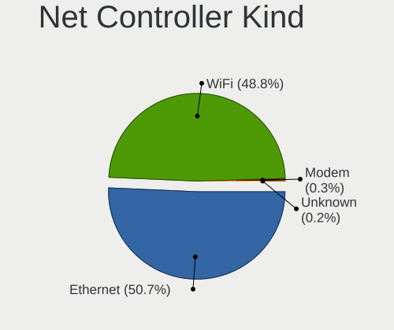

| Kind     | Computers | Percent |
|----------|-----------|---------|
| Ethernet | 800       | 50.7%   |
| WiFi     | 770       | 48.8%   |
| Modem    | 5         | 0.32%   |
| Unknown  | 3         | 0.19%   |

Used Controller
---------------

Currently used network controller

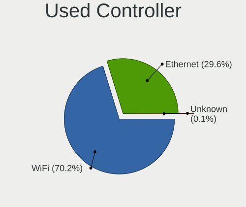

| Kind     | Computers | Percent |
|----------|-----------|---------|
| WiFi     | 635       | 70.24%  |
| Ethernet | 268       | 29.65%  |
| Unknown  | 1         | 0.11%   |

NICs
----

Total network controllers on board

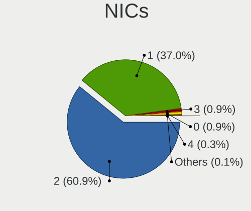

| Total | Computers | Percent |
|-------|-----------|---------|
| 2     | 565       | 60.88%  |
| 1     | 343       | 36.96%  |
| 3     | 8         | 0.86%   |
| 0     | 8         | 0.86%   |
| 4     | 3         | 0.32%   |
| 8     | 1         | 0.11%   |

IPv6
----

IPv6 vs IPv4

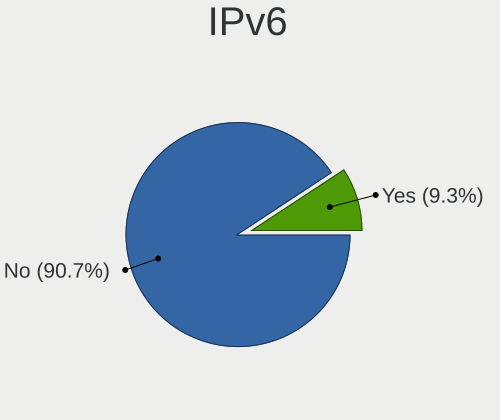

| Used | Computers | Percent |
|------|-----------|---------|
| No   | 852       | 90.73%  |
| Yes  | 87        | 9.27%   |

Bluetooth
---------

Bluetooth Vendor
----------------

Controller vendors

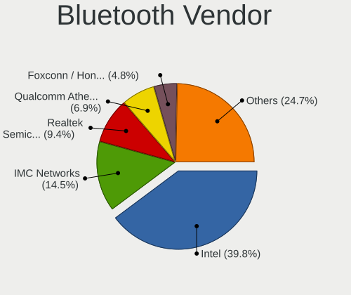

| Vendor                          | Computers | Percent |
|---------------------------------|-----------|---------|
| Intel                           | 242       | 39.8%   |
| IMC Networks                    | 88        | 14.47%  |
| Realtek Semiconductor           | 57        | 9.38%   |
| Qualcomm Atheros Communications | 42        | 6.91%   |
| Foxconn / Hon Hai               | 29        | 4.77%   |
| Broadcom                        | 26        | 4.28%   |
| Cambridge Silicon Radio         | 23        | 3.78%   |
| Lite-On Technology              | 22        | 3.62%   |
| Dell                            | 14        | 2.3%    |
| Ralink                          | 13        | 2.14%   |
| ASUSTek Computer                | 10        | 1.64%   |
| Apple                           | 10        | 1.64%   |
| Foxconn International           | 8         | 1.32%   |
| Ralink Technology               | 3         | 0.49%   |
| Marvell Semiconductor           | 3         | 0.49%   |
| Integrated System Solution      | 3         | 0.49%   |
| Hewlett-Packard                 | 3         | 0.49%   |
| Askey Computer                  | 3         | 0.49%   |
| Realtek                         | 2         | 0.33%   |
| Alps Electric                   | 2         | 0.33%   |
| SiW                             | 1         | 0.16%   |
| Quectel Wireless Solutions      | 1         | 0.16%   |
| Micro Star International        | 1         | 0.16%   |
| MediaTek                        | 1         | 0.16%   |
| Unknown                         | 1         | 0.16%   |

Bluetooth Model
---------------

Controller models

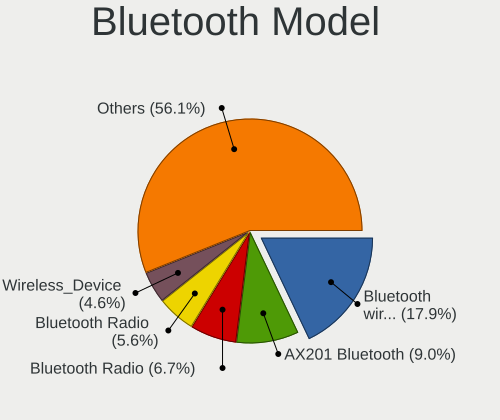

| Model                                                                               | Computers | Percent |
|-------------------------------------------------------------------------------------|-----------|---------|
| Intel Bluetooth wireless interface                                                  | 109       | 17.93%  |
| Intel AX201 Bluetooth                                                               | 55        | 9.05%   |
| Realtek Bluetooth Radio                                                             | 41        | 6.74%   |
| IMC Networks Bluetooth Radio                                                        | 34        | 5.59%   |
| IMC Networks Wireless_Device                                                        | 28        | 4.61%   |
| Intel Bluetooth 9460/9560 Jefferson Peak (JfP)                                      | 24        | 3.95%   |
| Cambridge Silicon Radio Bluetooth Dongle (HCI mode)                                 | 23        | 3.78%   |
| Qualcomm Atheros  Bluetooth Device                                                  | 20        | 3.29%   |
| Intel Bluetooth Device                                                              | 16        | 2.63%   |
| Ralink RT3290 Bluetooth                                                             | 13        | 2.14%   |
| Intel AX200 Bluetooth                                                               | 13        | 2.14%   |
| IMC Networks Bluetooth Device                                                       | 11        | 1.81%   |
| Qualcomm Atheros AR3011 Bluetooth                                                   | 9         | 1.48%   |
| Intel Centrino Bluetooth Wireless Transceiver                                       | 9         | 1.48%   |
| Foxconn International BCM43142A0 Bluetooth module                                   | 8         | 1.32%   |
| Foxconn / Hon Hai Bluetooth Device                                                  | 8         | 1.32%   |
| Realtek RTL8723B Bluetooth                                                          | 7         | 1.15%   |
| Qualcomm Atheros AR3012 Bluetooth 4.0                                               | 7         | 1.15%   |
| Intel Centrino Advanced-N 6230 Bluetooth adapter                                    | 7         | 1.15%   |
| IMC Networks Atheros AR3012 Bluetooth 4.0 Adapter                                   | 7         | 1.15%   |
| ASUS BT-270 Bluetooth Adapter                                                       | 7         | 1.15%   |
| Realtek RTL8821A Bluetooth                                                          | 6         | 0.99%   |
| Lite-On Qualcomm Atheros QCA9377 Bluetooth                                          | 6         | 0.99%   |
| Lite-On Bluetooth Device                                                            | 6         | 0.99%   |
| Dell Wireless 360 Bluetooth                                                         | 5         | 0.82%   |
| Broadcom BCM20702A0                                                                 | 5         | 0.82%   |
| Apple Bluetooth Host Controller                                                     | 5         | 0.82%   |
| Foxconn / Hon Hai Foxconn T77H114 BCM2070 [Single-Chip Bluetooth 2.1 + EDR Adapter] | 4         | 0.66%   |
| Broadcom HP Portable SoftSailing                                                    | 4         | 0.66%   |
| Broadcom BCM2070 Bluetooth 2.1 + EDR                                                | 4         | 0.66%   |
| Apple Bluetooth USB Host Controller                                                 | 4         | 0.66%   |
| Realtek RTL8822BE Bluetooth 4.2 Adapter                                             | 3         | 0.49%   |
| Marvell Bluetooth and Wireless LAN Composite                                        | 3         | 0.49%   |
| Lite-On Broadcom BCM43142A0 Bluetooth Device                                        | 3         | 0.49%   |
| Lite-On Atheros AR3012 Bluetooth                                                    | 3         | 0.49%   |
| Intel Wireless-AC 9260 Bluetooth Adapter                                            | 3         | 0.49%   |
| Intel AX210 Bluetooth                                                               | 3         | 0.49%   |
| Integrated System Solution Bluetooth Device                                         | 3         | 0.49%   |
| IMC Networks Bluetooth USB Host Controller                                          | 3         | 0.49%   |
| IMC Networks Bluetooth                                                              | 3         | 0.49%   |

Sound
-----

Sound Vendor
------------

Sound card vendors

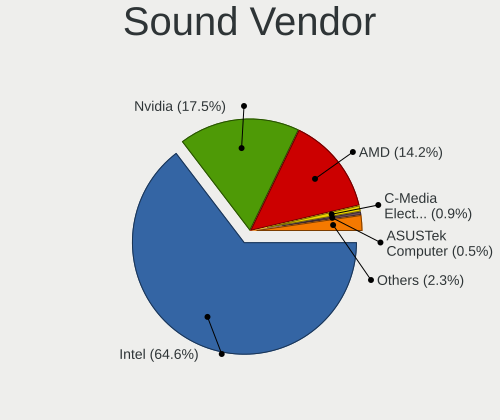

| Vendor                           | Computers | Percent |
|----------------------------------|-----------|---------|
| Intel                            | 793       | 64.63%  |
| Nvidia                           | 215       | 17.52%  |
| AMD                              | 174       | 14.18%  |
| C-Media Electronics              | 11        | 0.9%    |
| ASUSTek Computer                 | 6         | 0.49%   |
| Generalplus Technology           | 5         | 0.41%   |
| Focusrite-Novation               | 3         | 0.24%   |
| Silicon Integrated Systems [SiS] | 2         | 0.16%   |
| Jieli Technology                 | 2         | 0.16%   |
| Creative Labs                    | 2         | 0.16%   |
| Yamaha                           | 1         | 0.08%   |
| VIA Technologies                 | 1         | 0.08%   |
| ULi Electronics                  | 1         | 0.08%   |
| TEAC                             | 1         | 0.08%   |
| Shenzhen Rapoo Technology        | 1         | 0.08%   |
| Realtek Semiconductor            | 1         | 0.08%   |
| Plantronics                      | 1         | 0.08%   |
| Native Instruments               | 1         | 0.08%   |
| Micro Star International         | 1         | 0.08%   |
| Medeli Electronics               | 1         | 0.08%   |
| ESS Technology                   | 1         | 0.08%   |
| CMX Systems                      | 1         | 0.08%   |
| Audio-Technica                   | 1         | 0.08%   |
| Apple                            | 1         | 0.08%   |

Sound Model
-----------

Sound card models

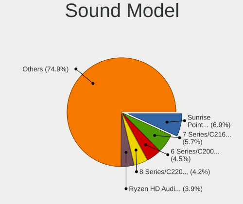

| Model                                                                      | Computers | Percent |
|----------------------------------------------------------------------------|-----------|---------|
| Intel Sunrise Point-LP HD Audio                                            | 98        | 6.86%   |
| Intel 7 Series/C216 Chipset Family High Definition Audio Controller        | 82        | 5.74%   |
| Intel 6 Series/C200 Series Chipset Family High Definition Audio Controller | 64        | 4.48%   |
| Intel 8 Series/C220 Series Chipset High Definition Audio Controller        | 60        | 4.2%    |
| AMD Ryzen HD Audio Controller                                              | 55        | 3.85%   |
| Intel Xeon E3-1200 v3/4th Gen Core Processor HD Audio Controller           | 49        | 3.43%   |
| Intel 5 Series/3400 Series Chipset High Definition Audio                   | 46        | 3.22%   |
| Intel 100 Series/C230 Series Chipset Family HD Audio Controller            | 37        | 2.59%   |
| Intel NM10/ICH7 Family High Definition Audio Controller                    | 33        | 2.31%   |
| Intel Haswell-ULT HD Audio Controller                                      | 33        | 2.31%   |
| Intel 8 Series HD Audio Controller                                         | 33        | 2.31%   |
| Nvidia GF108 High Definition Audio Controller                              | 32        | 2.24%   |
| Intel Cannon Lake PCH cAVS                                                 | 30        | 2.1%    |
| Intel Broadwell-U Audio Controller                                         | 29        | 2.03%   |
| Intel Wildcat Point-LP High Definition Audio Controller                    | 28        | 1.96%   |
| AMD Renoir/Cezanne HDMI/DP Audio Controller                                | 27        | 1.89%   |
| Intel Alder Lake PCH-P High Definition Audio Controller                    | 26        | 1.82%   |
| Intel Tiger Lake-LP Smart Sound Technology Audio Controller                | 25        | 1.75%   |
| AMD Cedar HDMI Audio [Radeon HD 5400/6300/7300 Series]                     | 23        | 1.61%   |
| Nvidia GA107 High Definition Audio Controller                              | 22        | 1.54%   |
| Intel 82801I (ICH9 Family) HD Audio Controller                             | 20        | 1.4%    |
| Intel Comet Lake PCH-LP cAVS                                               | 17        | 1.19%   |
| Intel Alder Lake-S HD Audio Controller                                     | 17        | 1.19%   |
| Nvidia High Definition Audio Controller                                    | 16        | 1.12%   |
| Intel Comet Lake PCH cAVS                                                  | 16        | 1.12%   |
| Intel CM238 HD Audio Controller                                            | 16        | 1.12%   |
| AMD FCH Azalia Controller                                                  | 16        | 1.12%   |
| Nvidia TU107 GeForce GTX 1650 High Definition Audio Controller             | 15        | 1.05%   |
| AMD Kabini HDMI/DP Audio                                                   | 15        | 1.05%   |
| Intel Raptor Lake-P/U/H cAVS                                               | 14        | 0.98%   |
| Intel Tiger Lake-H HD Audio Controller                                     | 13        | 0.91%   |
| Intel Cannon Point-LP High Definition Audio Controller                     | 13        | 0.91%   |
| Intel 200 Series PCH HD Audio                                              | 13        | 0.91%   |
| AMD Ellesmere HDMI Audio [Radeon RX 470/480 / 570/580/590]                 | 13        | 0.91%   |
| Intel 82801H (ICH8 Family) HD Audio Controller                             | 12        | 0.84%   |
| AMD SBx00 Azalia (Intel HDA)                                               | 12        | 0.84%   |
| Nvidia GM107 High Definition Audio Controller [GeForce 940MX]              | 11        | 0.77%   |
| AMD Radeon High Definition Audio Controller                                | 11        | 0.77%   |
| Nvidia TU116 High Definition Audio Controller                              | 10        | 0.7%    |
| Nvidia GP107GL High Definition Audio Controller                            | 10        | 0.7%    |

Memory
------

Memory Vendor
-------------

Memory module vendors

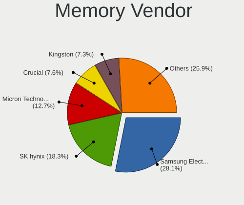

| Vendor                       | Computers | Percent |
|------------------------------|-----------|---------|
| Samsung Electronics          | 166       | 28.14%  |
| SK hynix                     | 108       | 18.31%  |
| Micron Technology            | 75        | 12.71%  |
| Crucial                      | 45        | 7.63%   |
| Kingston                     | 43        | 7.29%   |
| Unknown                      | 38        | 6.44%   |
| Ramaxel Technology           | 19        | 3.22%   |
| Corsair                      | 17        | 2.88%   |
| Elpida                       | 16        | 2.71%   |
| A-DATA Technology            | 11        | 1.86%   |
| G.Skill                      | 9         | 1.53%   |
| Apacer                       | 8         | 1.36%   |
| GeIL                         | 7         | 1.19%   |
| Kingmax                      | 5         | 0.85%   |
| Nanya Technology             | 4         | 0.68%   |
| Unknown                      | 4         | 0.68%   |
| Ramos Technology             | 2         | 0.34%   |
| Golden Empire                | 2         | 0.34%   |
| Unknown (8A02)               | 1         | 0.17%   |
| TwinMOS                      | 1         | 0.17%   |
| Transcend                    | 1         | 0.17%   |
| Team                         | 1         | 0.17%   |
| SpecTek                      | 1         | 0.17%   |
| Silicon Power                | 1         | 0.17%   |
| PDPSystems                   | 1         | 0.17%   |
| Patriot Memory (PDP Systems) | 1         | 0.17%   |
| Neo Forza                    | 1         | 0.17%   |
| Lexar                        | 1         | 0.17%   |
| ASint Technology             | 1         | 0.17%   |

Memory Model
------------

Memory module models

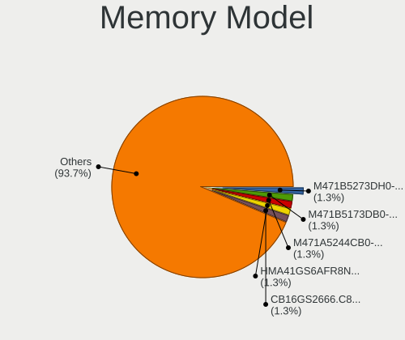

| Model                                                        | Computers | Percent |
|--------------------------------------------------------------|-----------|---------|
| SK hynix RAM HMA41GS6AFR8N-TF 8GB SODIMM DDR4 2667MT/s       | 8         | 1.26%   |
| Samsung RAM M471B5273DH0-CH9 4GB SODIMM DDR3 1600MT/s        | 8         | 1.26%   |
| Samsung RAM M471B5173DB0-YK0 4GB SODIMM DDR3 1600MT/s        | 8         | 1.26%   |
| Samsung RAM M471A5244CB0-CTD 4GB SODIMM DDR4 3266MT/s        | 8         | 1.26%   |
| Crucial RAM CB16GS2666.C8ET 16GB SODIMM DDR4 2667MT/s        | 8         | 1.26%   |
| SK hynix RAM HMT451S6AFR8A-PB 4GB SODIMM DDR3 1600MT/s       | 7         | 1.11%   |
| Samsung RAM M471B5173QH0-YK0 4GB SODIMM DDR3 1600MT/s        | 7         | 1.11%   |
| Samsung RAM M471A2K43CB1-CRC 16GB SODIMM DDR4 2667MT/s       | 7         | 1.11%   |
| Samsung RAM M471A1K43CB1-CRC 8GB SODIMM DDR4 8400MT/s        | 7         | 1.11%   |
| Samsung RAM M471A1G44AB0-CWE 8GiB SODIMM DDR4 3200MT/s       | 7         | 1.11%   |
| Elpida RAM EBJ41UF8BCS0-DJ-F 4GB SODIMM DDR3 1334MT/s        | 7         | 1.11%   |
| SK hynix RAM HMA81GS6AFR8N-UH 8GB SODIMM DDR4 2667MT/s       | 6         | 0.95%   |
| Samsung RAM M471B5273CH0-CH9 4GB SODIMM DDR3 1334MT/s        | 6         | 0.95%   |
| Samsung RAM M471A5244CB0-CRC 4GB SODIMM DDR4 2667MT/s        | 6         | 0.95%   |
| Samsung RAM M471B5173EB0-YK0 4GB SODIMM DDR3 1600MT/s        | 5         | 0.79%   |
| Samsung RAM M471B1G73QH0-YK0 8GB SODIMM DDR3 1600MT/s        | 5         | 0.79%   |
| Samsung RAM M425R1GB4BB0-CQKOL 8GB SODIMM DDR5 4800MT/s      | 5         | 0.79%   |
| Micron RAM 8ATF1G64HZ-3G2J1 8GB SODIMM DDR4 3200MT/s         | 5         | 0.79%   |
| SK hynix RAM HMT351S6CFR8C-PB 4GB SODIMM DDR3 1600MT/s       | 4         | 0.63%   |
| SK hynix RAM HMA81GS6DJR8N-XN 8GB SODIMM DDR4 3200MT/s       | 4         | 0.63%   |
| Micron RAM 8ATF1G64HZ-2G3B1 8GB SODIMM DDR4 2400MT/s         | 4         | 0.63%   |
| GeIL RAM CL17-17-17 D4-2400 8GB DIMM DDR4 2400MT/s           | 4         | 0.63%   |
| Unknown                                                      | 4         | 0.63%   |
| SK hynix RAM HMT325S6CFR8C-PB 2GB SODIMM DDR3 1600MT/s       | 3         | 0.47%   |
| SK hynix RAM HMA851S6JJR6N-VK 4GB SODIMM DDR4 2667MT/s       | 3         | 0.47%   |
| SK hynix RAM HMA851S6DJR6N-XN 4GB SODIMM DDR4 3200MT/s       | 3         | 0.47%   |
| SK hynix RAM HMA851S6AFR6N-UH 4GB SODIMM DDR4 2667MT/s       | 3         | 0.47%   |
| Samsung RAM Module 8GB SODIMM DDR4 2133MT/s                  | 3         | 0.47%   |
| Samsung RAM M471B1G73DB0-YK0 8GB SODIMM DDR3 1600MT/s        | 3         | 0.47%   |
| Samsung RAM M471A5244CB0-CWE 4GB SODIMM DDR4 3200MT/s        | 3         | 0.47%   |
| Samsung RAM M471A2K43CB1-CTD 16GB SODIMM DDR4 8400MT/s       | 3         | 0.47%   |
| Samsung RAM M471A1K43EB1-CWE 8GB SODIMM DDR4 3200MT/s        | 3         | 0.47%   |
| Samsung RAM M471A1K43DB1-CWE 8GB SODIMM DDR4 3200MT/s        | 3         | 0.47%   |
| Samsung RAM M471A1K43BB1-CRC 8GB SODIMM DDR4 2667MT/s        | 3         | 0.47%   |
| Samsung RAM M471A1G43DB0-CPB 8GB SODIMM DDR4 3200MT/s        | 3         | 0.47%   |
| Samsung RAM K3LKBKB0BM-MGCP 2GB Row Of Chips LPDDR5 6400MT/s | 3         | 0.47%   |
| Ramaxel RAM RMT3170MK58F8F1600 2GB SODIMM DDR3 1600MT/s      | 3         | 0.47%   |
| Micron RAM 4ATF1G64HZ-3G2F1 8GB SODIMM DDR4 3200MT/s         | 3         | 0.47%   |
| Micron RAM 16KTF51264HZ-1G6M1 4GB SODIMM DDR3 1600MT/s       | 3         | 0.47%   |
| Corsair RAM CMK16GX4M2E3200C16 8GB DIMM DDR4 3466MT/s        | 3         | 0.47%   |

Memory Kind
-----------

Memory module kinds

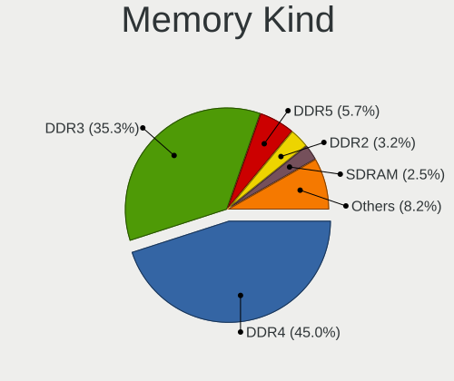

| Kind    | Computers | Percent |
|---------|-----------|---------|
| DDR4    | 213       | 45.03%  |
| DDR3    | 167       | 35.31%  |
| DDR5    | 27        | 5.71%   |
| DDR2    | 15        | 3.17%   |
| SDRAM   | 12        | 2.54%   |
| LPDDR5  | 12        | 2.54%   |
| Unknown | 10        | 2.11%   |
| LPDDR4  | 8         | 1.69%   |
| LPDDR3  | 8         | 1.69%   |
| DDR     | 1         | 0.21%   |

Memory Form Factor
------------------

Physical design of the memory module

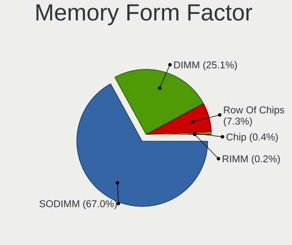

| Name         | Computers | Percent |
|--------------|-----------|---------|
| SODIMM       | 313       | 67.02%  |
| DIMM         | 117       | 25.05%  |
| Row Of Chips | 34        | 7.28%   |
| Chip         | 2         | 0.43%   |
| RIMM         | 1         | 0.21%   |

Memory Size
-----------

Memory module size

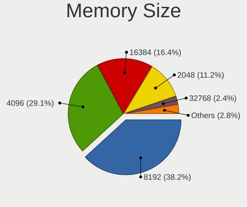

| Size  | Computers | Percent |
|-------|-----------|---------|
| 8192  | 205       | 38.18%  |
| 4096  | 156       | 29.05%  |
| 16384 | 88        | 16.39%  |
| 2048  | 60        | 11.17%  |
| 32768 | 13        | 2.42%   |
| 1024  | 13        | 2.42%   |
| 65536 | 1         | 0.19%   |
| 12288 | 1         | 0.19%   |

Memory Speed
------------

Memory module speed

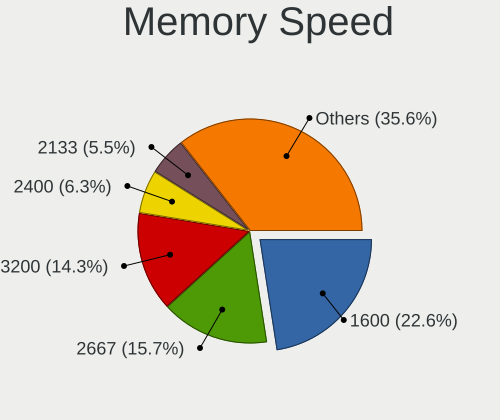

| Speed   | Computers | Percent |
|---------|-----------|---------|
| 1600    | 118       | 22.56%  |
| 2667    | 82        | 15.68%  |
| 3200    | 75        | 14.34%  |
| 2400    | 33        | 6.31%   |
| 2133    | 29        | 5.54%   |
| 1333    | 26        | 4.97%   |
| 1334    | 19        | 3.63%   |
| 4800    | 18        | 3.44%   |
| 8400    | 10        | 1.91%   |
| Unknown | 10        | 1.91%   |
| 6400    | 9         | 1.72%   |
| 667     | 9         | 1.72%   |
| 3266    | 8         | 1.53%   |
| 3600    | 7         | 1.34%   |
| 800     | 7         | 1.34%   |
| 5600    | 6         | 1.15%   |
| 4199    | 6         | 1.15%   |
| 1867    | 6         | 1.15%   |
| 4267    | 3         | 0.57%   |
| 3466    | 3         | 0.57%   |
| 1866    | 3         | 0.57%   |
| 1067    | 3         | 0.57%   |
| 8533    | 2         | 0.38%   |
| 6000    | 2         | 0.38%   |
| 4266    | 2         | 0.38%   |
| 4000    | 2         | 0.38%   |
| 3400    | 2         | 0.38%   |
| 3000    | 2         | 0.38%   |
| 2800    | 2         | 0.38%   |
| 2666    | 2         | 0.38%   |
| 1066    | 2         | 0.38%   |
| 533     | 2         | 0.38%   |
| 7500    | 1         | 0.19%   |
| 5000    | 1         | 0.19%   |
| 3733    | 1         | 0.19%   |
| 3500    | 1         | 0.19%   |
| 3066    | 1         | 0.19%   |
| 2933    | 1         | 0.19%   |
| 2048    | 1         | 0.19%   |
| 1800    | 1         | 0.19%   |

Printers & scanners
-------------------

Printer Vendor
--------------

Printer device vendors

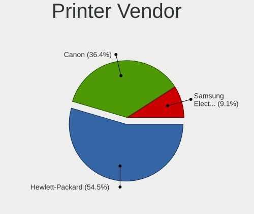

| Vendor              | Computers | Percent |
|---------------------|-----------|---------|
| Hewlett-Packard     | 6         | 54.55%  |
| Canon               | 4         | 36.36%  |
| Samsung Electronics | 1         | 9.09%   |

Printer Model
-------------

Printer device models

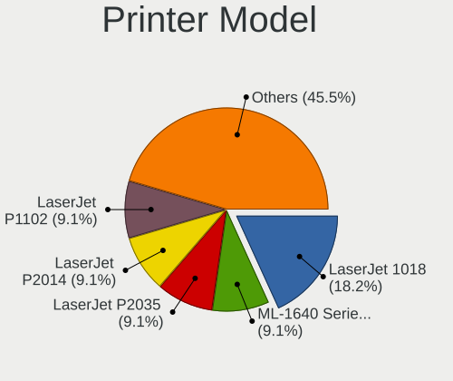

| Model                                | Computers | Percent |
|--------------------------------------|-----------|---------|
| HP LaserJet 1018                     | 2         | 18.18%  |
| Samsung ML-1640 Series Laser Printer | 1         | 9.09%   |
| HP LaserJet P2035                    | 1         | 9.09%   |
| HP LaserJet P2014                    | 1         | 9.09%   |
| HP LaserJet P1102                    | 1         | 9.09%   |
| HP DeskJet 2130 series               | 1         | 9.09%   |
| Canon TS3600 series                  | 1         | 9.09%   |
| Canon PIXMA MG5600 Series            | 1         | 9.09%   |
| Canon LBP6300                        | 1         | 9.09%   |
| Canon iR2004/2204 UFRII LT           | 1         | 9.09%   |

Scanner Vendor
--------------

Scanner device vendors

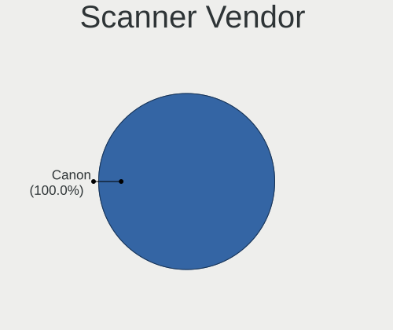

| Vendor | Computers | Percent |
|--------|-----------|---------|
| Canon  | 3         | 100%    |

Scanner Model
-------------

Scanner device models

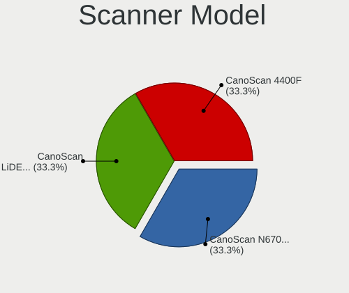

| Model                              | Computers | Percent |
|------------------------------------|-----------|---------|
| Canon CanoScan N670U/N676U/LiDE 20 | 1         | 33.33%  |
| Canon CanoScan LiDE 120            | 1         | 33.33%  |
| Canon CanoScan 4400F               | 1         | 33.33%  |

Camera
------

Camera Vendor
-------------

Camera device vendors

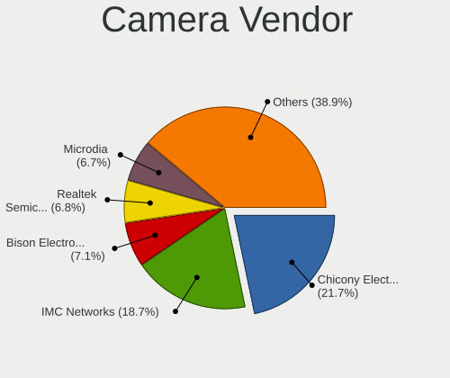

| Vendor                                 | Computers | Percent |
|----------------------------------------|-----------|---------|
| Chicony Electronics                    | 137       | 21.75%  |
| IMC Networks                           | 118       | 18.73%  |
| Bison Electronics                      | 45        | 7.14%   |
| Realtek Semiconductor                  | 43        | 6.83%   |
| Microdia                               | 42        | 6.67%   |
| Syntek                                 | 31        | 4.92%   |
| Sunplus Innovation Technology          | 23        | 3.65%   |
| Cheng Uei Precision Industry (Foxlink) | 23        | 3.65%   |
| Sonix Technology                       | 22        | 3.49%   |
| Apple                                  | 22        | 3.49%   |
| Quanta                                 | 18        | 2.86%   |
| Lite-On Technology                     | 15        | 2.38%   |
| Samsung Electronics                    | 12        | 1.9%    |
| Suyin                                  | 11        | 1.75%   |
| Ricoh                                  | 10        | 1.59%   |
| Luxvisions Innotech Limited            | 9         | 1.43%   |
| Acer                                   | 8         | 1.27%   |
| Silicon Motion                         | 4         | 0.63%   |
| Alcor Micro                            | 4         | 0.63%   |
| Shinetech                              | 3         | 0.48%   |
| Pixart Imaging                         | 3         | 0.48%   |
| Logitech                               | 3         | 0.48%   |
| Lenovo                                 | 3         | 0.48%   |
| BillionPixels                          | 3         | 0.48%   |
| ALi                                    | 3         | 0.48%   |
| Shine-optics                           | 2         | 0.32%   |
| MacroSilicon                           | 2         | 0.32%   |
| Importek                               | 2         | 0.32%   |
| webcam                                 | 1         | 0.16%   |
| Sunplus Technology                     | 1         | 0.16%   |
| Primax Electronics                     | 1         | 0.16%   |
| OmniVision Technologies                | 1         | 0.16%   |
| LG Electronics                         | 1         | 0.16%   |
| KYE Systems (Mouse Systems)            | 1         | 0.16%   |
| Google                                 | 1         | 0.16%   |
| Goertek Electronics                    | 1         | 0.16%   |
| Generalplus Technology                 | 1         | 0.16%   |

Camera Model
------------

Camera device models

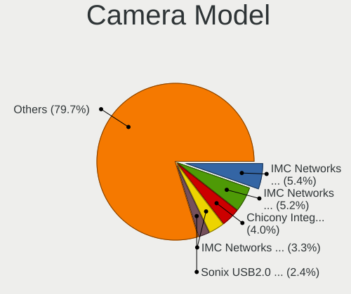

| Model                                               | Computers | Percent |
|-----------------------------------------------------|-----------|---------|
| IMC Networks USB2.0 VGA UVC WebCam                  | 34        | 5.39%   |
| IMC Networks USB2.0 HD UVC WebCam                   | 33        | 5.23%   |
| Chicony Integrated Camera                           | 25        | 3.96%   |
| IMC Networks Integrated Camera                      | 21        | 3.33%   |
| Sonix USB2.0 HD UVC WebCam                          | 15        | 2.38%   |
| Apple iPhone 5/5C/5S/6/SE/7/8/X                     | 14        | 2.22%   |
| Chicony USB2.0 HD UVC WebCam                        | 13        | 2.06%   |
| Samsung Galaxy series, misc. (MTP mode)             | 12        | 1.9%    |
| IMC Networks Lenovo EasyCamera                      | 12        | 1.9%    |
| Syntek Integrated Camera                            | 11        | 1.74%   |
| Chicony EasyCamera                                  | 11        | 1.74%   |
| Syntek EasyCamera                                   | 10        | 1.58%   |
| Chicony HP HD Camera                                | 10        | 1.58%   |
| Microdia Laptop_Integrated_Webcam_HD                | 9         | 1.43%   |
| Chicony HD WebCam                                   | 9         | 1.43%   |
| Syntek Lenovo EasyCamera                            | 8         | 1.27%   |
| Realtek USB2.0 VGA UVC WebCam                       | 8         | 1.27%   |
| Realtek USB Camera                                  | 8         | 1.27%   |
| Lite-On Integrated Camera                           | 8         | 1.27%   |
| Bison Lenovo EasyCamera                             | 8         | 1.27%   |
| Bison Integrated Camera                             | 8         | 1.27%   |
| Sunplus HD WebCam                                   | 7         | 1.11%   |
| Chicony HP HD Webcam                                | 7         | 1.11%   |
| Bison Lenovo Integrated Webcam                      | 7         | 1.11%   |
| Realtek Integrated_Webcam_HD                        | 6         | 0.95%   |
| Lite-On HP HD Camera                                | 6         | 0.95%   |
| Cheng Uei Precision Industry (Foxlink) HP HD Webcam | 6         | 0.95%   |
| Acer Lenovo EasyCamera                              | 6         | 0.95%   |
| Sunplus Asus Webcam                                 | 5         | 0.79%   |
| Realtek USB2.0 HD UVC WebCam                        | 5         | 0.79%   |
| Microdia Sonix Integrated Webcam                    | 5         | 0.79%   |
| Microdia Integrated_Webcam_HD                       | 5         | 0.79%   |
| Chicony Lenovo EasyCamera                           | 5         | 0.79%   |
| Chicony Integrated HP HD Webcam                     | 5         | 0.79%   |
| Chicony HP HD Webcam [Fixed]                        | 5         | 0.79%   |
| Bison SunplusIT Integrated Camera                   | 5         | 0.79%   |
| Sunplus Integrated_Webcam_HD                        | 4         | 0.63%   |
| Sonix USB2.0 FHD UVC WebCam                         | 4         | 0.63%   |
| Quanta HD User Facing                               | 4         | 0.63%   |
| Microdia Integrated Webcam                          | 4         | 0.63%   |

Security
--------

Fingerprint Vendor
------------------

Fingerprint sensor vendors

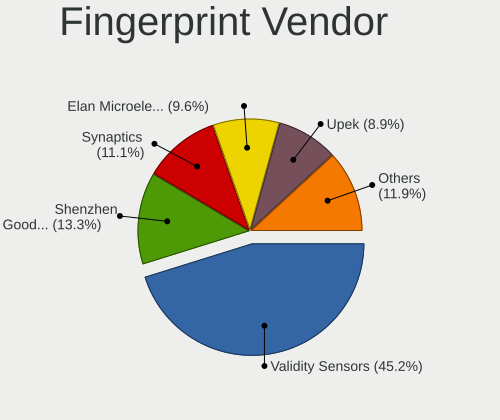

| Vendor                             | Computers | Percent |
|------------------------------------|-----------|---------|
| Validity Sensors                   | 61        | 45.19%  |
| Shenzhen Goodix Technology         | 18        | 13.33%  |
| Synaptics                          | 15        | 11.11%  |
| Elan Microelectronics              | 13        | 9.63%   |
| Upek                               | 12        | 8.89%   |
| AuthenTec                          | 7         | 5.19%   |
| Realtek USB2.0 Finger Print Bridge | 3         | 2.22%   |
| LighTuning Technology              | 3         | 2.22%   |
| STMicroelectronics                 | 2         | 1.48%   |
| Suprema                            | 1         | 0.74%   |

Fingerprint Model
-----------------

Fingerprint sensor models

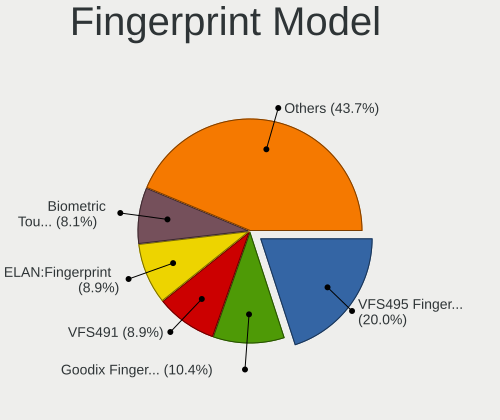

| Model                                                                      | Computers | Percent |
|----------------------------------------------------------------------------|-----------|---------|
| Validity Sensors VFS495 Fingerprint Reader                                 | 27        | 20%     |
| Shenzhen Goodix  FingerPrint Device                                        | 14        | 10.37%  |
| Validity Sensors VFS491                                                    | 12        | 8.89%   |
| Elan ELAN:Fingerprint                                                      | 12        | 8.89%   |
| Upek Biometric Touchchip/Touchstrip Fingerprint Sensor                     | 11        | 8.15%   |
| Synaptics  WBDI                                                            | 6         | 4.44%   |
| Validity Sensors VFS 5011 fingerprint sensor                               | 5         | 3.7%    |
| Validity Sensors Synaptics VFS7552 Touch Fingerprint Sensor with PurePrint | 5         | 3.7%    |
| Shenzhen Goodix Fingerprint Reader                                         | 3         | 2.22%   |
| Realtek USB2.0 Finger Print Bridge FocalTech Fingerprint Device            | 3         | 2.22%   |
| AuthenTec AES1660 Fingerprint Sensor                                       | 3         | 2.22%   |
| Validity Sensors VFS5011 Fingerprint Reader                                | 2         | 1.48%   |
| Validity Sensors VFS451 Fingerprint Reader                                 | 2         | 1.48%   |
| Validity Sensors Synaptics WBDI                                            | 2         | 1.48%   |
| Synaptics WBDI Fingerprint Reader USB 086                                  | 2         | 1.48%   |
| Synaptics Prometheus MIS Touch Fingerprint Reader                          | 2         | 1.48%   |
| Synaptics Metallica MOH Touch Fingerprint Reader                           | 2         | 1.48%   |
| STMicroelectronics Fingerprint Reader                                      | 2         | 1.48%   |
| LighTuning ES603 Swipe Fingerprint Sensor                                  | 2         | 1.48%   |
| Validity Sensors VFS7500 Touch Fingerprint Sensor                          | 1         | 0.74%   |
| Validity Sensors VFS471 Fingerprint Reader                                 | 1         | 0.74%   |
| Validity Sensors VFS301 Fingerprint Reader                                 | 1         | 0.74%   |
| Validity Sensors Synaptics VFS7552 Touch Fingerprint Sensor                | 1         | 0.74%   |
| Validity Sensors Swipe Fingerprint Sensor                                  | 1         | 0.74%   |
| Validity Sensors Fingerprint scanner                                       | 1         | 0.74%   |
| Upek TCS5B Fingerprint sensor                                              | 1         | 0.74%   |
| Synaptics WBDI                                                             | 1         | 0.74%   |
| Synaptics UWP WBDI                                                         | 1         | 0.74%   |
| Synaptics Fingerprint reader [HP G6]                                       | 1         | 0.74%   |
| Suprema SUP-SFR400(A) BioMini Fingerprint Reader                           | 1         | 0.74%   |
| Shenzhen Goodix FingerPrint                                                | 1         | 0.74%   |
| LighTuning EgisTec Touch Fingerprint Sensor                                | 1         | 0.74%   |
| Elan ELAN:ARM-M4                                                           | 1         | 0.74%   |
| AuthenTec Fingerprint Sensor                                               | 1         | 0.74%   |
| AuthenTec AES2810                                                          | 1         | 0.74%   |
| AuthenTec AES2550 Fingerprint Sensor                                       | 1         | 0.74%   |
| AuthenTec AES2501 Fingerprint Sensor                                       | 1         | 0.74%   |

Chipcard Vendor
---------------

Chipcard module vendors

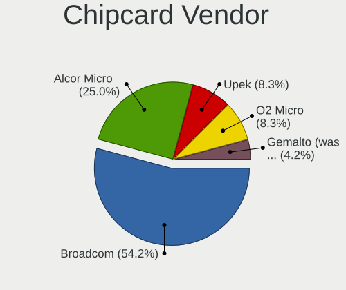

| Vendor                | Computers | Percent |
|-----------------------|-----------|---------|
| Broadcom              | 13        | 54.17%  |
| Alcor Micro           | 6         | 25%     |
| Upek                  | 2         | 8.33%   |
| O2 Micro              | 2         | 8.33%   |
| Gemalto (was Gemplus) | 1         | 4.17%   |

Chipcard Model
--------------

Chipcard module models

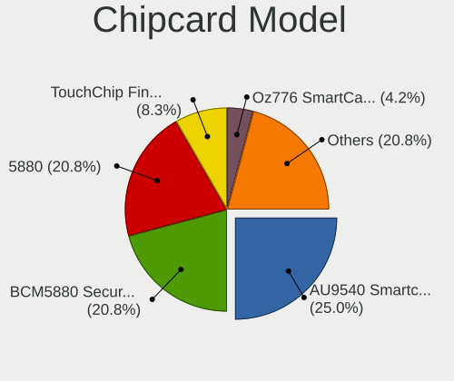

| Model                                                                        | Computers | Percent |
|------------------------------------------------------------------------------|-----------|---------|
| Alcor Micro AU9540 Smartcard Reader                                          | 6         | 25%     |
| Broadcom BCM5880 Secure Applications Processor                               | 5         | 20.83%  |
| Broadcom 5880                                                                | 5         | 20.83%  |
| Upek TouchChip Fingerprint Coprocessor (WBF advanced mode)                   | 2         | 8.33%   |
| O2 Micro Oz776 SmartCard Reader                                              | 1         | 4.17%   |
| O2 Micro OZ776 CCID Smartcard Reader                                         | 1         | 4.17%   |
| Gemalto (was Gemplus) Compact Smart Card Reader Writer                       | 1         | 4.17%   |
| Broadcom BCM5880 Secure Applications Processor with fingerprint touch sensor | 1         | 4.17%   |
| Broadcom BCM5880 Secure Applications Processor with fingerprint swipe sensor | 1         | 4.17%   |
| Broadcom 58200                                                               | 1         | 4.17%   |

Unsupported
-----------

Unsupported Devices
-------------------

Total unsupported devices on board

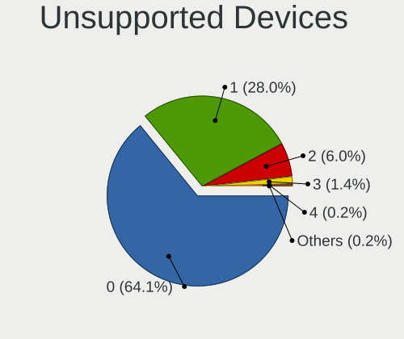

| Total | Computers | Percent |
|-------|-----------|---------|
| 0     | 606       | 64.13%  |
| 1     | 265       | 28.04%  |
| 2     | 57        | 6.03%   |
| 3     | 13        | 1.38%   |
| 4     | 2         | 0.21%   |
| 7     | 1         | 0.11%   |
| 5     | 1         | 0.11%   |

Unsupported Device Types
------------------------

Types of unsupported devices

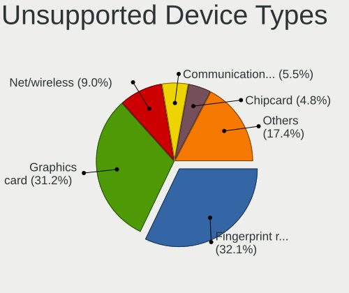

| Type                     | Computers | Percent |
|--------------------------|-----------|---------|
| Fingerprint reader       | 135       | 32.14%  |
| Graphics card            | 131       | 31.19%  |
| Net/wireless             | 38        | 9.05%   |
| Communication controller | 23        | 5.48%   |
| Chipcard                 | 20        | 4.76%   |
| Bluetooth                | 20        | 4.76%   |
| Multimedia controller    | 14        | 3.33%   |
| Unassigned class         | 10        | 2.38%   |
| Camera                   | 10        | 2.38%   |
| Storage                  | 7         | 1.67%   |
| Sound                    | 3         | 0.71%   |
| Net/ethernet             | 3         | 0.71%   |
| Network                  | 2         | 0.48%   |
| Card reader              | 2         | 0.48%   |
| Wireless                 | 1         | 0.24%   |
| Storage/raid             | 1         | 0.24%   |

