Linux in Iran - Tested Hardware & Statistics
--------------------------------------------

A project to collect tested hardware configurations for Linux in Iran.

Anyone can contribute to this report by the [hw-probe](https://github.com/linuxhw/hw-probe) tool:

    sudo -E hw-probe -all -upload

Please contribute! Especially if your hardware is rare.

This is a report for all computer types. See also reports for [desktops](/Location/Iran/Desktop/README.md) and [notebooks](/Location/Iran/Notebook/README.md).

Contents
--------

* [ Test Cases ](#test-cases)

* [ System ](#system)
  - [ OS                       ](#os)
  - [ OS Family                ](#os-family)
  - [ Kernel                   ](#kernel)
  - [ Kernel Family            ](#kernel-family)
  - [ Kernel Major Ver.        ](#kernel-major-ver)
  - [ Arch                     ](#arch)
  - [ DE                       ](#de)
  - [ Display Server           ](#display-server)
  - [ Display Manager          ](#display-manager)
  - [ OS Lang                  ](#os-lang)
  - [ Boot Mode                ](#boot-mode)
  - [ Filesystem               ](#filesystem)
  - [ Part. scheme             ](#part-scheme)
  - [ Dual Boot with Linux/BSD ](#dual-boot-with-linuxbsd)
  - [ Dual Boot (Win)          ](#dual-boot-win)

* [ Board ](#board)
  - [ Vendor                   ](#vendor)
  - [ Model                    ](#model)
  - [ Model Family             ](#model-family)
  - [ MFG Year                 ](#mfg-year)
  - [ Form Factor              ](#form-factor)
  - [ Secure Boot              ](#secure-boot)
  - [ Coreboot                 ](#coreboot)
  - [ RAM Size                 ](#ram-size)
  - [ RAM Used                 ](#ram-used)
  - [ Total Drives             ](#total-drives)
  - [ Has CD-ROM               ](#has-cd-rom)
  - [ Has Ethernet             ](#has-ethernet)
  - [ Has WiFi                 ](#has-wifi)
  - [ Has Bluetooth            ](#has-bluetooth)

* [ Location ](#location)
  - [ Country                  ](#country)
  - [ City                     ](#city)

* [ Drives ](#drives)
  - [ Drive Vendor             ](#drive-vendor)
  - [ Drive Model              ](#drive-model)
  - [ HDD Vendor               ](#hdd-vendor)
  - [ SSD Vendor               ](#ssd-vendor)
  - [ Drive Kind               ](#drive-kind)
  - [ Drive Connector          ](#drive-connector)
  - [ Drive Size               ](#drive-size)
  - [ Space Total              ](#space-total)
  - [ Space Used               ](#space-used)
  - [ Malfunc. Drives          ](#malfunc-drives)
  - [ Malfunc. Drive Vendor    ](#malfunc-drive-vendor)
  - [ Malfunc. HDD Vendor      ](#malfunc-hdd-vendor)
  - [ Malfunc. Drive Kind      ](#malfunc-drive-kind)
  - [ Failed Drives            ](#failed-drives)
  - [ Failed Drive Vendor      ](#failed-drive-vendor)
  - [ Drive Status             ](#drive-status)

* [ Storage controller ](#storage-controller)
  - [ Storage Vendor           ](#storage-vendor)
  - [ Storage Model            ](#storage-model)
  - [ Storage Kind             ](#storage-kind)

* [ Processor ](#processor)
  - [ CPU Vendor               ](#cpu-vendor)
  - [ CPU Model                ](#cpu-model)
  - [ CPU Model Family         ](#cpu-model-family)
  - [ CPU Cores                ](#cpu-cores)
  - [ CPU Sockets              ](#cpu-sockets)
  - [ CPU Threads              ](#cpu-threads)
  - [ CPU Op-Modes             ](#cpu-op-modes)
  - [ CPU Microcode            ](#cpu-microcode)
  - [ CPU Microarch            ](#cpu-microarch)

* [ Graphics ](#graphics)
  - [ GPU Vendor               ](#gpu-vendor)
  - [ GPU Model                ](#gpu-model)
  - [ GPU Combo                ](#gpu-combo)
  - [ GPU Driver               ](#gpu-driver)
  - [ GPU Memory               ](#gpu-memory)

* [ Monitor ](#monitor)
  - [ Monitor Vendor           ](#monitor-vendor)
  - [ Monitor Model            ](#monitor-model)
  - [ Monitor Resolution       ](#monitor-resolution)
  - [ Monitor Diagonal         ](#monitor-diagonal)
  - [ Monitor Width            ](#monitor-width)
  - [ Aspect Ratio             ](#aspect-ratio)
  - [ Monitor Area             ](#monitor-area)
  - [ Pixel Density            ](#pixel-density)
  - [ Multiple Monitors        ](#multiple-monitors)

* [ Network ](#network)
  - [ Net Controller Vendor    ](#net-controller-vendor)
  - [ Net Controller Model     ](#net-controller-model)
  - [ Wireless Vendor          ](#wireless-vendor)
  - [ Wireless Model           ](#wireless-model)
  - [ Ethernet Vendor          ](#ethernet-vendor)
  - [ Ethernet Model           ](#ethernet-model)
  - [ Net Controller Kind      ](#net-controller-kind)
  - [ Used Controller          ](#used-controller)
  - [ NICs                     ](#nics)
  - [ IPv6                     ](#ipv6)

* [ Bluetooth ](#bluetooth)
  - [ Bluetooth Vendor         ](#bluetooth-vendor)
  - [ Bluetooth Model          ](#bluetooth-model)

* [ Sound ](#sound)
  - [ Sound Vendor             ](#sound-vendor)
  - [ Sound Model              ](#sound-model)

* [ Memory ](#memory)
  - [ Memory Vendor            ](#memory-vendor)
  - [ Memory Model             ](#memory-model)
  - [ Memory Kind              ](#memory-kind)
  - [ Memory Form Factor       ](#memory-form-factor)
  - [ Memory Size              ](#memory-size)
  - [ Memory Speed             ](#memory-speed)

* [ Printers & scanners ](#printers--scanners)
  - [ Printer Vendor           ](#printer-vendor)
  - [ Printer Model            ](#printer-model)
  - [ Scanner Vendor           ](#scanner-vendor)
  - [ Scanner Model            ](#scanner-model)

* [ Camera ](#camera)
  - [ Camera Vendor            ](#camera-vendor)
  - [ Camera Model             ](#camera-model)

* [ Security ](#security)
  - [ Fingerprint Vendor       ](#fingerprint-vendor)
  - [ Fingerprint Model        ](#fingerprint-model)
  - [ Chipcard Vendor          ](#chipcard-vendor)
  - [ Chipcard Model           ](#chipcard-model)

* [ Unsupported ](#unsupported)
  - [ Unsupported Devices      ](#unsupported-devices)
  - [ Unsupported Device Types ](#unsupported-device-types)

Test Cases
----------

Total: 987

| Vendor        | Model                       | Form-Factor | Probe                                                      | Date         |
|---------------|-----------------------------|-------------|------------------------------------------------------------|--------------|
| Dell          | Latitude E5470              | Notebook    | [fdc804210f](https://linux-hardware.org/?probe=fdc804210f) | Jan 01, 2024 |
| Dell          | Vostro 2420                 | Notebook    | [52ae549c99](https://linux-hardware.org/?probe=52ae549c99) | Dec 28, 2023 |
| ASUSTek       | PRIME B250-PLUS             | Desktop     | [8f6b669800](https://linux-hardware.org/?probe=8f6b669800) | Dec 27, 2023 |
| Unknown       | Unknown                     | Desktop     | [1f73670f10](https://linux-hardware.org/?probe=1f73670f10) | Dec 27, 2023 |
| ASUSTek       | H81-PLUS                    | Desktop     | [359af07cb2](https://linux-hardware.org/?probe=359af07cb2) | Dec 19, 2023 |
| ASUSTek       | H81-PLUS                    | Desktop     | [b4b91802b5](https://linux-hardware.org/?probe=b4b91802b5) | Dec 19, 2023 |
| Gigabyte      | H61M-S2PV                   | Desktop     | [bad7f51319](https://linux-hardware.org/?probe=bad7f51319) | Dec 18, 2023 |
| Gigabyte      | H61M-S2PV                   | Desktop     | [c3968eb521](https://linux-hardware.org/?probe=c3968eb521) | Dec 18, 2023 |
| ASUSTek       | ROG Strix G713QE_G713QE     | Notebook    | [b4bcda5523](https://linux-hardware.org/?probe=b4bcda5523) | Dec 15, 2023 |
| Apple         | Mac-00BE6ED71E35EB86 iMa... | All in one  | [fecb896f9f](https://linux-hardware.org/?probe=fecb896f9f) | Dec 14, 2023 |
| HP            | EliteBook 850 G1            | Notebook    | [899db988cc](https://linux-hardware.org/?probe=899db988cc) | Dec 12, 2023 |
| Apple         | Mac-F227BEC8 PVT            | All in one  | [eed0305500](https://linux-hardware.org/?probe=eed0305500) | Dec 10, 2023 |
| MSI           | CR610M                      | Notebook    | [f182f4595a](https://linux-hardware.org/?probe=f182f4595a) | Dec 10, 2023 |
| Unknown       | Apple MacBook Air (13-in... | Notebook    | [15b9622f09](https://linux-hardware.org/?probe=15b9622f09) | Dec 09, 2023 |
| HP            | EliteBook 840 G3            | Notebook    | [ae0afe3e73](https://linux-hardware.org/?probe=ae0afe3e73) | Dec 09, 2023 |
| Unknown       | Apple MacBook Air (13-in... | Notebook    | [28887ed4c5](https://linux-hardware.org/?probe=28887ed4c5) | Dec 09, 2023 |
| Lenovo        | G50-80 80E5                 | Notebook    | [d0e32e1ab3](https://linux-hardware.org/?probe=d0e32e1ab3) | Dec 08, 2023 |
| Lenovo        | G50-80 80E5                 | Notebook    | [d1ad1e6658](https://linux-hardware.org/?probe=d1ad1e6658) | Dec 08, 2023 |
| HP            | 339A                        | Desktop     | [a114886e67](https://linux-hardware.org/?probe=a114886e67) | Dec 07, 2023 |
| HP            | ProBook 450 G2              | Notebook    | [0e087e0b94](https://linux-hardware.org/?probe=0e087e0b94) | Dec 07, 2023 |
| HP            | 3646h                       | Desktop     | [df62144cda](https://linux-hardware.org/?probe=df62144cda) | Dec 05, 2023 |
| ASUSTek       | ASUSLaptop_Q540VJ           | Notebook    | [0c680c33ec](https://linux-hardware.org/?probe=0c680c33ec) | Dec 05, 2023 |
| Acer          | Aspire A715-76G             | Notebook    | [11e0ab5e1b](https://linux-hardware.org/?probe=11e0ab5e1b) | Dec 05, 2023 |
| Samsung       | QX311/QX411/QX412/QX511     | Notebook    | [a82cdb418c](https://linux-hardware.org/?probe=a82cdb418c) | Dec 01, 2023 |
| MSI           | CR610M                      | Notebook    | [35d23c9d26](https://linux-hardware.org/?probe=35d23c9d26) | Nov 30, 2023 |
| ASUSTek       | PRIME B450M-K               | Desktop     | [9fa48c41da](https://linux-hardware.org/?probe=9fa48c41da) | Nov 27, 2023 |
| Samsung       | QX311/QX411/QX412/QX511     | Notebook    | [746bd8c3d5](https://linux-hardware.org/?probe=746bd8c3d5) | Nov 21, 2023 |
| Microsoft     | Surface Pro 6               | Tablet      | [aa86ed33d3](https://linux-hardware.org/?probe=aa86ed33d3) | Nov 21, 2023 |
| HP            | ZBook 17 G3                 | Notebook    | [5f26bd4798](https://linux-hardware.org/?probe=5f26bd4798) | Nov 21, 2023 |
| HP            | ZBook 17 G3                 | Notebook    | [ed1bde2ed6](https://linux-hardware.org/?probe=ed1bde2ed6) | Nov 20, 2023 |
| MSI           | CR610M                      | Notebook    | [66ca456fa1](https://linux-hardware.org/?probe=66ca456fa1) | Nov 19, 2023 |
| ASUSTek       | PRIME H510M-K               | Desktop     | [4243816d27](https://linux-hardware.org/?probe=4243816d27) | Nov 19, 2023 |
| Microsoft     | Surface Pro 6               | Tablet      | [111e6f3234](https://linux-hardware.org/?probe=111e6f3234) | Nov 16, 2023 |
| HP            | Compaq 6910p                | Notebook    | [019a154d30](https://linux-hardware.org/?probe=019a154d30) | Nov 14, 2023 |
| Lenovo        | IdeaPad S540-15IWL GTX 8... | Notebook    | [0b16b45e10](https://linux-hardware.org/?probe=0b16b45e10) | Nov 14, 2023 |
| ASUSTek       | K45VM                       | Notebook    | [f307d97867](https://linux-hardware.org/?probe=f307d97867) | Nov 13, 2023 |
| Gigabyte      | H510M S2H V2                | Desktop     | [8599ff1b2c](https://linux-hardware.org/?probe=8599ff1b2c) | Nov 13, 2023 |
| Gigabyte      | H510M S2H V2                | Desktop     | [238ea043b4](https://linux-hardware.org/?probe=238ea043b4) | Nov 10, 2023 |
| ASUSTek       | N53SN                       | Notebook    | [0f6145e565](https://linux-hardware.org/?probe=0f6145e565) | Nov 10, 2023 |
| ASUSTek       | TUF Gaming B550-PLUS WIF... | Desktop     | [c8cbd7f579](https://linux-hardware.org/?probe=c8cbd7f579) | Nov 09, 2023 |
| Gigabyte      | 970A-D3                     | Desktop     | [80fb26e63a](https://linux-hardware.org/?probe=80fb26e63a) | Nov 03, 2023 |
| 3Logic Gro... | Graviton N15i               | Notebook    | [555d634638](https://linux-hardware.org/?probe=555d634638) | Nov 02, 2023 |
| ASUSTek       | ROG Zephyrus G15 GA503RS... | Notebook    | [af854a07c5](https://linux-hardware.org/?probe=af854a07c5) | Oct 31, 2023 |
| ASUSTek       | ROG Zephyrus G15 GA503RS... | Notebook    | [fadc897ee2](https://linux-hardware.org/?probe=fadc897ee2) | Oct 31, 2023 |
| ASUSTek       | Zenbook UX5401ZAS_UX5401... | Notebook    | [0e14e6c7dc](https://linux-hardware.org/?probe=0e14e6c7dc) | Oct 30, 2023 |
| MSI           | PRO Z690-A WIFI DDR4        | Desktop     | [23fdd2c31d](https://linux-hardware.org/?probe=23fdd2c31d) | Oct 30, 2023 |
| ASUSTek       | N53SN                       | Notebook    | [f3f325941b](https://linux-hardware.org/?probe=f3f325941b) | Oct 25, 2023 |
| Microsoft     | Surface Pro 6               | Tablet      | [1b88e8b489](https://linux-hardware.org/?probe=1b88e8b489) | Oct 25, 2023 |
| ASUSTek       | N53SN                       | Notebook    | [1cc18d5c46](https://linux-hardware.org/?probe=1cc18d5c46) | Oct 25, 2023 |
| HP            | ProBook 450 G8 Notebook ... | Notebook    | [b003720f21](https://linux-hardware.org/?probe=b003720f21) | Oct 23, 2023 |
| Lenovo        | B570e HuronRiver Platfor... | Notebook    | [6a5182fc9c](https://linux-hardware.org/?probe=6a5182fc9c) | Oct 20, 2023 |
| Dell          | Latitude E5470              | Notebook    | [be8c08b665](https://linux-hardware.org/?probe=be8c08b665) | Oct 18, 2023 |
| Acer          | Aspire 4750                 | Notebook    | [fa78f5938c](https://linux-hardware.org/?probe=fa78f5938c) | Oct 17, 2023 |
| ASUSTek       | VivoBook_ASUSLaptop K660... | Notebook    | [7045758f33](https://linux-hardware.org/?probe=7045758f33) | Oct 13, 2023 |
| Acer          | Aspire 5250                 | Notebook    | [bef1086dfe](https://linux-hardware.org/?probe=bef1086dfe) | Oct 12, 2023 |
| Apple         | MacBookPro9,2               | Notebook    | [21d197e617](https://linux-hardware.org/?probe=21d197e617) | Oct 05, 2023 |
| ASUSTek       | P8H67                       | Desktop     | [68e28eea76](https://linux-hardware.org/?probe=68e28eea76) | Oct 05, 2023 |
| Lenovo        | IdeaPad L340-15IRH Gamin... | Notebook    | [f0b1db1bfd](https://linux-hardware.org/?probe=f0b1db1bfd) | Oct 03, 2023 |
| Toshiba       | Satellite U400              | Notebook    | [394ad8616c](https://linux-hardware.org/?probe=394ad8616c) | Oct 02, 2023 |
| Dell          | Vostro 3360                 | Notebook    | [812367b788](https://linux-hardware.org/?probe=812367b788) | Sep 27, 2023 |
| ASUSTek       | N551JW                      | Notebook    | [8c38084e7e](https://linux-hardware.org/?probe=8c38084e7e) | Sep 27, 2023 |
| ASUSTek       | TUF B450-PLUS GAMING        | Desktop     | [8da87a8c78](https://linux-hardware.org/?probe=8da87a8c78) | Sep 26, 2023 |
| Apple         | MacBookPro8,2               | Notebook    | [cba55a15ec](https://linux-hardware.org/?probe=cba55a15ec) | Sep 24, 2023 |
| Lenovo        | IdeaPad Y700-15ISK 80NV     | Notebook    | [e6bd73a6e1](https://linux-hardware.org/?probe=e6bd73a6e1) | Sep 24, 2023 |
| Apple         | MacBookPro11,1              | Notebook    | [169fe58269](https://linux-hardware.org/?probe=169fe58269) | Sep 22, 2023 |
| MSI           | CR610M                      | Notebook    | [5a9d9ba5ae](https://linux-hardware.org/?probe=5a9d9ba5ae) | Sep 22, 2023 |
| ASUSTek       | N551JW                      | Notebook    | [5dae6d6eda](https://linux-hardware.org/?probe=5dae6d6eda) | Sep 21, 2023 |
| ASUSTek       | N551JW                      | Notebook    | [ae062bd5ca](https://linux-hardware.org/?probe=ae062bd5ca) | Sep 21, 2023 |
| Lenovo        | IdeaPad 130-15IKB 81H7      | Notebook    | [ddf1d6a712](https://linux-hardware.org/?probe=ddf1d6a712) | Sep 20, 2023 |
| ASUSTek       | Zenbook UM3402YA_UM3402Y... | Notebook    | [4064a0898f](https://linux-hardware.org/?probe=4064a0898f) | Sep 20, 2023 |
| HP            | 3397                        | Desktop     | [f202c90e23](https://linux-hardware.org/?probe=f202c90e23) | Sep 20, 2023 |
| Dell          | Latitude E5470              | Notebook    | [0602c2deb2](https://linux-hardware.org/?probe=0602c2deb2) | Sep 16, 2023 |
| HP            | EliteBook 8540w             | Notebook    | [ec5b4aeb84](https://linux-hardware.org/?probe=ec5b4aeb84) | Sep 15, 2023 |
| Lenovo        | G505 20240                  | Notebook    | [db2962124c](https://linux-hardware.org/?probe=db2962124c) | Sep 14, 2023 |
| ASUSTek       | P8H61/USB3                  | Desktop     | [cf48b0b959](https://linux-hardware.org/?probe=cf48b0b959) | Sep 14, 2023 |
| ASUSTek       | TUF Gaming B550-PLUS        | Desktop     | [a68551130a](https://linux-hardware.org/?probe=a68551130a) | Sep 13, 2023 |
| ASUSTek       | TUF Gaming B550-PLUS        | Desktop     | [3edc89267d](https://linux-hardware.org/?probe=3edc89267d) | Sep 13, 2023 |
| ECS           | A880GM-AD3                  | Desktop     | [828f89ff31](https://linux-hardware.org/?probe=828f89ff31) | Sep 12, 2023 |
| ASUSTek       | ASUS TUF Gaming F15 FX50... | Notebook    | [be2af85bb7](https://linux-hardware.org/?probe=be2af85bb7) | Sep 12, 2023 |
| Gigabyte      | P85-D3                      | Desktop     | [f090137faf](https://linux-hardware.org/?probe=f090137faf) | Sep 11, 2023 |
| ASUSTek       | P8H61/USB3                  | Desktop     | [d93600fc7c](https://linux-hardware.org/?probe=d93600fc7c) | Sep 11, 2023 |
| Gigabyte      | H110M-S2PT-CF               | Desktop     | [83ff674ae7](https://linux-hardware.org/?probe=83ff674ae7) | Sep 10, 2023 |
| HP            | 8266                        | Desktop     | [fed6cc89fe](https://linux-hardware.org/?probe=fed6cc89fe) | Sep 09, 2023 |
| Lenovo        | IdeaPad 3 15ITL6 82H8       | Notebook    | [24a7c8a496](https://linux-hardware.org/?probe=24a7c8a496) | Sep 04, 2023 |
| Lenovo        | G50-70 20351                | Notebook    | [00a308aa4a](https://linux-hardware.org/?probe=00a308aa4a) | Sep 01, 2023 |
| ASUSTek       | ASUS TUF Dash F15 FX517Z... | Notebook    | [10db09006a](https://linux-hardware.org/?probe=10db09006a) | Aug 31, 2023 |
| ASUSTek       | TUF Z270 MARK 2             | Desktop     | [2d74d46701](https://linux-hardware.org/?probe=2d74d46701) | Aug 30, 2023 |
| HP            | 83DD                        | Mini pc     | [2955a0b6c5](https://linux-hardware.org/?probe=2955a0b6c5) | Aug 30, 2023 |
| Apple         | MacBookPro5,5               | Notebook    | [641243c308](https://linux-hardware.org/?probe=641243c308) | Aug 30, 2023 |
| ASUSTek       | ASUS EXPERTBOOK B1500CBA... | Notebook    | [243b20df85](https://linux-hardware.org/?probe=243b20df85) | Aug 28, 2023 |
| ASUSTek       | ASUS EXPERTBOOK B1500CBA... | Notebook    | [8cbbb0c64a](https://linux-hardware.org/?probe=8cbbb0c64a) | Aug 28, 2023 |
| MSI           | 970A-G46                    | Desktop     | [5b4c3411dc](https://linux-hardware.org/?probe=5b4c3411dc) | Aug 28, 2023 |
| HP            | OMEN by Laptop              | Notebook    | [df71a92503](https://linux-hardware.org/?probe=df71a92503) | Aug 26, 2023 |
| HP            | EliteBook 850 G1            | Notebook    | [4f74cc24e0](https://linux-hardware.org/?probe=4f74cc24e0) | Aug 26, 2023 |
| ASUSTek       | X450LD                      | Notebook    | [b9187b37b7](https://linux-hardware.org/?probe=b9187b37b7) | Aug 24, 2023 |
| ASUSTek       | X540UP                      | Notebook    | [7041925c33](https://linux-hardware.org/?probe=7041925c33) | Aug 23, 2023 |
| HP            | EliteBook 8540w             | Notebook    | [c61948c95e](https://linux-hardware.org/?probe=c61948c95e) | Aug 23, 2023 |
| ASUSTek       | TUF Gaming Z490-PLUS        | Desktop     | [6947635a16](https://linux-hardware.org/?probe=6947635a16) | Aug 18, 2023 |
| Lenovo        | IdeaPad 110-15ACL 80TJ      | Notebook    | [dbee57dbed](https://linux-hardware.org/?probe=dbee57dbed) | Aug 17, 2023 |
| HP            | EliteBook 8540w             | Notebook    | [c24cfbc475](https://linux-hardware.org/?probe=c24cfbc475) | Aug 14, 2023 |
| HP            | EliteBook 8540w             | Notebook    | [6077ff7606](https://linux-hardware.org/?probe=6077ff7606) | Aug 14, 2023 |
| HP            | EliteBook 8540w             | Notebook    | [25f4c96f7b](https://linux-hardware.org/?probe=25f4c96f7b) | Aug 14, 2023 |
| HP            | EliteBook 8540w             | Notebook    | [3048a8eb60](https://linux-hardware.org/?probe=3048a8eb60) | Aug 12, 2023 |
| HP            | EliteBook 8540w             | Notebook    | [2df5a4bd58](https://linux-hardware.org/?probe=2df5a4bd58) | Aug 11, 2023 |
| HP            | EliteBook 8540w             | Notebook    | [1bf7b69b0f](https://linux-hardware.org/?probe=1bf7b69b0f) | Aug 11, 2023 |
| Dell          | Latitude E6400              | Notebook    | [f28a234c30](https://linux-hardware.org/?probe=f28a234c30) | Aug 10, 2023 |
| Lenovo        | ThinkPad E15 20RD0086UE     | Notebook    | [cb8ad3e0fc](https://linux-hardware.org/?probe=cb8ad3e0fc) | Aug 10, 2023 |
| HP            | 8456                        | Desktop     | [fa8ea86591](https://linux-hardware.org/?probe=fa8ea86591) | Aug 08, 2023 |
| Sony          | VGN-FW373D                  | Notebook    | [535f0edf33](https://linux-hardware.org/?probe=535f0edf33) | Aug 04, 2023 |
| Dell          | Latitude E6400              | Notebook    | [9f3cef93ed](https://linux-hardware.org/?probe=9f3cef93ed) | Aug 03, 2023 |
| HP            | ZBook 17 G3                 | Notebook    | [79c3c3612b](https://linux-hardware.org/?probe=79c3c3612b) | Aug 02, 2023 |
| Lenovo        | IdeaPad Gaming 3 15ACH6 ... | Notebook    | [d9db031e65](https://linux-hardware.org/?probe=d9db031e65) | Aug 01, 2023 |
| Lenovo        | IdeaPad Gaming 3 15ACH6 ... | Notebook    | [7ed6a80c20](https://linux-hardware.org/?probe=7ed6a80c20) | Aug 01, 2023 |
| HP            | EliteBook 8540w             | Notebook    | [96a30f2f21](https://linux-hardware.org/?probe=96a30f2f21) | Jul 27, 2023 |
| Lenovo        | IdeaPad Z510 20287          | Notebook    | [fd2bcebb1d](https://linux-hardware.org/?probe=fd2bcebb1d) | Jul 22, 2023 |
| Lenovo        | IdeaPad Z510 20287          | Notebook    | [daff830182](https://linux-hardware.org/?probe=daff830182) | Jul 21, 2023 |
| ASUSTek       | TUF B360-PLUS GAMING        | Desktop     | [173929b667](https://linux-hardware.org/?probe=173929b667) | Jul 19, 2023 |
| HP            | EliteBook 8540w             | Notebook    | [b86a3c24df](https://linux-hardware.org/?probe=b86a3c24df) | Jul 16, 2023 |
| ASUSTek       | PRIME H370-PLUS             | Desktop     | [8a2aeb02b0](https://linux-hardware.org/?probe=8a2aeb02b0) | Jul 13, 2023 |
| Lenovo        | IdeaPad 330-15IGM 81D1      | Notebook    | [adab548264](https://linux-hardware.org/?probe=adab548264) | Jul 13, 2023 |
| Lenovo        | IdeaPad 330-15IGM 81D1      | Notebook    | [ce2deb4b1d](https://linux-hardware.org/?probe=ce2deb4b1d) | Jul 13, 2023 |
| ASUSTek       | N61Jv                       | Notebook    | [fa3485dbc6](https://linux-hardware.org/?probe=fa3485dbc6) | Jul 13, 2023 |
| HP            | EliteBook 8540w             | Notebook    | [26c6ceb0a6](https://linux-hardware.org/?probe=26c6ceb0a6) | Jul 13, 2023 |
| HP            | ProBook 445 G8 Notebook ... | Notebook    | [779f922cbb](https://linux-hardware.org/?probe=779f922cbb) | Jul 12, 2023 |
| ASUSTek       | P8Z77-V                     | Desktop     | [13ece994a6](https://linux-hardware.org/?probe=13ece994a6) | Jul 09, 2023 |
| Unknown       | CoffeeLake                  | Desktop     | [b3f96a87d5](https://linux-hardware.org/?probe=b3f96a87d5) | Jul 09, 2023 |
| HP            | 18E7                        | Desktop     | [8157fe83c7](https://linux-hardware.org/?probe=8157fe83c7) | Jul 09, 2023 |
| HP            | EliteBook 8540w             | Notebook    | [a760e46715](https://linux-hardware.org/?probe=a760e46715) | Jul 08, 2023 |
| HP            | EliteBook 8540w             | Notebook    | [1a53ce97b8](https://linux-hardware.org/?probe=1a53ce97b8) | Jul 07, 2023 |
| HP            | EliteBook 8540w             | Notebook    | [465b44efff](https://linux-hardware.org/?probe=465b44efff) | Jul 01, 2023 |
| HP            | EliteBook 8540w             | Notebook    | [826e649d7a](https://linux-hardware.org/?probe=826e649d7a) | Jul 01, 2023 |
| Lenovo        | ThinkPad X1 Carbon 2nd 2... | Notebook    | [df0ca94515](https://linux-hardware.org/?probe=df0ca94515) | Jun 29, 2023 |
| Lenovo        | IdeaPad 330-15IGM 81D1      | Notebook    | [47451d9f30](https://linux-hardware.org/?probe=47451d9f30) | Jun 27, 2023 |
| HP            | EliteBook 8540w             | Notebook    | [d675031e74](https://linux-hardware.org/?probe=d675031e74) | Jun 26, 2023 |
| HP            | EliteBook 8540w             | Notebook    | [37e828b0b6](https://linux-hardware.org/?probe=37e828b0b6) | Jun 24, 2023 |
| ASUSTek       | N53SV                       | Notebook    | [0908f99494](https://linux-hardware.org/?probe=0908f99494) | Jun 23, 2023 |
| ASUSTek       | N53SV                       | Notebook    | [1999834725](https://linux-hardware.org/?probe=1999834725) | Jun 23, 2023 |
| HP            | EliteBook 8540w             | Notebook    | [e1678729ff](https://linux-hardware.org/?probe=e1678729ff) | Jun 23, 2023 |
| HP            | EliteBook 8540w             | Notebook    | [094d8e8ecf](https://linux-hardware.org/?probe=094d8e8ecf) | Jun 22, 2023 |
| HP            | EliteBook 8540w             | Notebook    | [a013e4866a](https://linux-hardware.org/?probe=a013e4866a) | Jun 22, 2023 |
| HP            | EliteBook 8540w             | Notebook    | [6c766e53cb](https://linux-hardware.org/?probe=6c766e53cb) | Jun 21, 2023 |
| HP            | EliteBook 8540w             | Notebook    | [91e2324734](https://linux-hardware.org/?probe=91e2324734) | Jun 20, 2023 |
| HP            | EliteBook 8540w             | Notebook    | [cd78108f1f](https://linux-hardware.org/?probe=cd78108f1f) | Jun 19, 2023 |
| HP            | EliteBook 8540w             | Notebook    | [eb29f214f3](https://linux-hardware.org/?probe=eb29f214f3) | Jun 17, 2023 |
| HP            | EliteBook 8540w             | Notebook    | [a7728ed657](https://linux-hardware.org/?probe=a7728ed657) | Jun 16, 2023 |
| HP            | EliteBook 8540w             | Notebook    | [03c8eed64b](https://linux-hardware.org/?probe=03c8eed64b) | Jun 16, 2023 |
| HP            | EliteBook 8540w             | Notebook    | [9b08f8189d](https://linux-hardware.org/?probe=9b08f8189d) | Jun 15, 2023 |
| ASUSTek       | M5A97 PRO                   | Desktop     | [a5cbd2e848](https://linux-hardware.org/?probe=a5cbd2e848) | Jun 14, 2023 |
| Toshiba       | PORTEGE X30-D               | Notebook    | [9f26d41d53](https://linux-hardware.org/?probe=9f26d41d53) | Jun 14, 2023 |
| Lenovo        | Legion Y530-15ICH-1060 8... | Notebook    | [1c33fe3f61](https://linux-hardware.org/?probe=1c33fe3f61) | Jun 12, 2023 |
| ASUSTek       | PRIME Z690-P WIFI           | Desktop     | [63c110632a](https://linux-hardware.org/?probe=63c110632a) | Jun 10, 2023 |
| Dell          | Latitude E5470              | Notebook    | [c9b909273b](https://linux-hardware.org/?probe=c9b909273b) | Jun 09, 2023 |
| Biostar       | A68N-2100K                  | Desktop     | [9ac86a512d](https://linux-hardware.org/?probe=9ac86a512d) | Jun 09, 2023 |
| Toshiba       | PORTEGE X30-D               | Notebook    | [262ee566e1](https://linux-hardware.org/?probe=262ee566e1) | Jun 06, 2023 |
| ASUSTek       | X540UP                      | Notebook    | [b6613930a2](https://linux-hardware.org/?probe=b6613930a2) | Jun 05, 2023 |
| ASUSTek       | X540UP                      | Notebook    | [5102ecc266](https://linux-hardware.org/?probe=5102ecc266) | Jun 04, 2023 |
| Sony          | VPCEA45FG                   | Notebook    | [873ca04445](https://linux-hardware.org/?probe=873ca04445) | May 29, 2023 |
| Lenovo        | IdeaPad Gaming 3 15IAH7 ... | Notebook    | [c2125f60d2](https://linux-hardware.org/?probe=c2125f60d2) | May 28, 2023 |
| ASUSTek       | TUF Gaming FX505DT_FX505... | Notebook    | [8e5402cb16](https://linux-hardware.org/?probe=8e5402cb16) | May 24, 2023 |
| Lenovo        | IdeaPadFlex 5-1570 80XB     | Convertible | [9e2f0c46ef](https://linux-hardware.org/?probe=9e2f0c46ef) | May 20, 2023 |
| ASUSTek       | PRIME Z690-P WIFI           | Desktop     | [061e1e2aec](https://linux-hardware.org/?probe=061e1e2aec) | May 19, 2023 |
| Lenovo        | ThinkPad T440p 20AWS0GK0... | Notebook    | [177f30243c](https://linux-hardware.org/?probe=177f30243c) | May 08, 2023 |
| Gigabyte      | Z97X-Gaming 3               | Desktop     | [2cbff804d8](https://linux-hardware.org/?probe=2cbff804d8) | May 08, 2023 |
| ASUSTek       | VivoBook 15_ASUS Laptop ... | Notebook    | [728b1e3209](https://linux-hardware.org/?probe=728b1e3209) | May 03, 2023 |
| Toshiba       | Satellite C640              | Notebook    | [20d436bfa7](https://linux-hardware.org/?probe=20d436bfa7) | May 02, 2023 |
| ASUSTek       | VivoBook 15_ASUS Laptop ... | Notebook    | [9a43268d9b](https://linux-hardware.org/?probe=9a43268d9b) | May 02, 2023 |
| ASUSTek       | VivoBook_ASUSLaptop M650... | Notebook    | [5086f7f4a2](https://linux-hardware.org/?probe=5086f7f4a2) | May 01, 2023 |
| Gigabyte      | Z97X-Gaming 3               | Desktop     | [dd0a47b6fc](https://linux-hardware.org/?probe=dd0a47b6fc) | May 01, 2023 |
| Gigabyte      | Z97X-Gaming 3               | Desktop     | [7087295cd7](https://linux-hardware.org/?probe=7087295cd7) | May 01, 2023 |
| ASUSTek       | H110-PLUS                   | Desktop     | [f8317bce7b](https://linux-hardware.org/?probe=f8317bce7b) | Apr 26, 2023 |
| Lenovo        | Legion 5 15IMH05H 81Y6      | Notebook    | [e37aab534f](https://linux-hardware.org/?probe=e37aab534f) | Apr 24, 2023 |
| ASUSTek       | ZenBook UX425UA_UM425UA     | Notebook    | [a8644a5b03](https://linux-hardware.org/?probe=a8644a5b03) | Apr 23, 2023 |
| Sony          | VGN-SZ640N                  | Notebook    | [659b01c666](https://linux-hardware.org/?probe=659b01c666) | Apr 21, 2023 |
| ASUSTek       | VivoBook 15_ASUS Laptop ... | Notebook    | [c10e38e18e](https://linux-hardware.org/?probe=c10e38e18e) | Apr 20, 2023 |
| Toshiba       | Satellite A100              | Notebook    | [f95e411124](https://linux-hardware.org/?probe=f95e411124) | Apr 20, 2023 |
| HP            | ZBook 15                    | Notebook    | [c5397a7fbb](https://linux-hardware.org/?probe=c5397a7fbb) | Apr 14, 2023 |
| HP            | ZBook 15                    | Notebook    | [aaaa838a8f](https://linux-hardware.org/?probe=aaaa838a8f) | Apr 13, 2023 |
| ASUSTek       | K55VD                       | Notebook    | [110fdee9b2](https://linux-hardware.org/?probe=110fdee9b2) | Apr 10, 2023 |
| Lenovo        | ThinkPad T420 4178A4G       | Notebook    | [206861226d](https://linux-hardware.org/?probe=206861226d) | Apr 09, 2023 |
| ASUSTek       | VivoBook_ASUSLaptop X509... | Notebook    | [9e7e969310](https://linux-hardware.org/?probe=9e7e969310) | Apr 06, 2023 |
| Lenovo        | IdeaPad 3 15ITL6 82H8       | Notebook    | [a64c365f62](https://linux-hardware.org/?probe=a64c365f62) | Apr 05, 2023 |
| Lenovo        | IdeaPad Gaming 3 15ACH6 ... | Notebook    | [0a028a43f8](https://linux-hardware.org/?probe=0a028a43f8) | Apr 01, 2023 |
| ASUSTek       | X555BP                      | Notebook    | [c7f621e335](https://linux-hardware.org/?probe=c7f621e335) | Apr 01, 2023 |
| ASUSTek       | PRIME H370-PLUS             | Desktop     | [4a7e7763c1](https://linux-hardware.org/?probe=4a7e7763c1) | Mar 28, 2023 |
| Lenovo        | IdeaPad 330-15IGM 81D1      | Notebook    | [54f096fd88](https://linux-hardware.org/?probe=54f096fd88) | Mar 27, 2023 |
| ASUSTek       | K54HR                       | Notebook    | [ac6cf948d5](https://linux-hardware.org/?probe=ac6cf948d5) | Mar 27, 2023 |
| YANYU         | ITX-S192                    | Desktop     | [0d2fb6a8d7](https://linux-hardware.org/?probe=0d2fb6a8d7) | Mar 27, 2023 |
| Gigabyte      | G31M-ES2C                   | Desktop     | [fcd077e70a](https://linux-hardware.org/?probe=fcd077e70a) | Mar 27, 2023 |
| ASUSTek       | VivoBook_ASUSLaptop X515... | Notebook    | [fe79f70952](https://linux-hardware.org/?probe=fe79f70952) | Mar 27, 2023 |
| Lenovo        | Legion 5 Pro 16IAH7H 82R... | Notebook    | [e4a88fa14e](https://linux-hardware.org/?probe=e4a88fa14e) | Mar 27, 2023 |
| Acer          | Aspire 4736Z                | Notebook    | [30e77255e4](https://linux-hardware.org/?probe=30e77255e4) | Mar 20, 2023 |
| Lenovo        | IdeaPad L3 15IML05 81Y3     | Notebook    | [95ae633abb](https://linux-hardware.org/?probe=95ae633abb) | Mar 19, 2023 |
| Lenovo        | IdeaPad L3 15IML05 81Y3     | Notebook    | [54025a10f5](https://linux-hardware.org/?probe=54025a10f5) | Mar 19, 2023 |
| ASUSTek       | X550LC                      | Notebook    | [5f73fa5db7](https://linux-hardware.org/?probe=5f73fa5db7) | Mar 18, 2023 |
| ASUSTek       | VivoBook_ASUSLaptop X509... | Notebook    | [51ec4d252f](https://linux-hardware.org/?probe=51ec4d252f) | Mar 17, 2023 |
| ASUSTek       | P5P43TD                     | Desktop     | [f2be993036](https://linux-hardware.org/?probe=f2be993036) | Mar 13, 2023 |
| Toshiba       | PORTEGE X30-D               | Notebook    | [9b7e4e10af](https://linux-hardware.org/?probe=9b7e4e10af) | Mar 12, 2023 |
| HP            | EliteBook 840 G7 Noteboo... | Notebook    | [5e4e9bde6f](https://linux-hardware.org/?probe=5e4e9bde6f) | Mar 03, 2023 |
| Gigabyte      | G41MT-S2                    | Desktop     | [7f72d6bba7](https://linux-hardware.org/?probe=7f72d6bba7) | Feb 26, 2023 |
| Gigabyte      | G41MT-S2                    | Desktop     | [d81c35b55b](https://linux-hardware.org/?probe=d81c35b55b) | Feb 25, 2023 |
| HP            | EliteBook 8470p             | Notebook    | [6d36ab1fcf](https://linux-hardware.org/?probe=6d36ab1fcf) | Feb 24, 2023 |
| HP            | EliteBook 8470p             | Notebook    | [0a1b4d8122](https://linux-hardware.org/?probe=0a1b4d8122) | Feb 23, 2023 |
| ASUSTek       | ROG Strix G733ZW_G733ZW     | Notebook    | [72f074b930](https://linux-hardware.org/?probe=72f074b930) | Feb 19, 2023 |
| ASUSTek       | ROG Strix G733ZW_G733ZW     | Notebook    | [c6d06c27c7](https://linux-hardware.org/?probe=c6d06c27c7) | Feb 19, 2023 |
| Lenovo        | Z50-70 20354                | Notebook    | [3932889971](https://linux-hardware.org/?probe=3932889971) | Feb 11, 2023 |
| ASUSTek       | VivoBook_ASUSLaptop X421... | Notebook    | [f6276d350a](https://linux-hardware.org/?probe=f6276d350a) | Feb 08, 2023 |
| ASUSTek       | PRIME H610M-A WIFI D4       | Desktop     | [1b800ff8c2](https://linux-hardware.org/?probe=1b800ff8c2) | Feb 07, 2023 |
| ASUSTek       | PRIME H610M-A WIFI D4       | Desktop     | [69f96bffa5](https://linux-hardware.org/?probe=69f96bffa5) | Feb 07, 2023 |
| MSI           | S12T 3M/S12 3M              | Notebook    | [787543930a](https://linux-hardware.org/?probe=787543930a) | Feb 07, 2023 |
| Acer          | Aspire VN7-592G             | Notebook    | [a313fa3b83](https://linux-hardware.org/?probe=a313fa3b83) | Feb 02, 2023 |
| Gigabyte      | H270-Gaming 3               | Desktop     | [e64a1e0a5a](https://linux-hardware.org/?probe=e64a1e0a5a) | Jan 31, 2023 |
| Gigabyte      | H270-Gaming 3               | Desktop     | [4427845ac1](https://linux-hardware.org/?probe=4427845ac1) | Jan 30, 2023 |
| Lenovo        | V15 G2 ALC 82KD             | Notebook    | [2b2401b0f0](https://linux-hardware.org/?probe=2b2401b0f0) | Jan 28, 2023 |
| ASUSTek       | ZenBook UX434IQ_UM433IQ     | Notebook    | [17b4a2466c](https://linux-hardware.org/?probe=17b4a2466c) | Jan 20, 2023 |
| HP            | OMEN by Laptop 16-c0xxx     | Notebook    | [8474e8ce69](https://linux-hardware.org/?probe=8474e8ce69) | Jan 17, 2023 |
| HP            | 805A                        | Desktop     | [4061c209e2](https://linux-hardware.org/?probe=4061c209e2) | Jan 17, 2023 |
| ASUSTek       | H110M-K                     | Desktop     | [dcbf101b59](https://linux-hardware.org/?probe=dcbf101b59) | Jan 17, 2023 |
| ASUSTek       | H110M-K                     | Desktop     | [3964c82d71](https://linux-hardware.org/?probe=3964c82d71) | Jan 17, 2023 |
| ASUSTek       | X550VX                      | Notebook    | [b325ae9a48](https://linux-hardware.org/?probe=b325ae9a48) | Jan 11, 2023 |
| HP            | EliteBook 8570p             | Notebook    | [268f34635a](https://linux-hardware.org/?probe=268f34635a) | Dec 28, 2022 |
| HIGRADED      | W651UI                      | Notebook    | [66d9d484cd](https://linux-hardware.org/?probe=66d9d484cd) | Dec 27, 2022 |
| HP            | EliteBook 8470p             | Notebook    | [d70aca4ad6](https://linux-hardware.org/?probe=d70aca4ad6) | Dec 24, 2022 |
| HP            | Pavilion Gaming Laptop 1... | Notebook    | [a6d43b6afd](https://linux-hardware.org/?probe=a6d43b6afd) | Dec 22, 2022 |
| ASUSTek       | PRIME B250-PLUS             | Desktop     | [4d24d45918](https://linux-hardware.org/?probe=4d24d45918) | Dec 21, 2022 |
| Acer          | Predator PH315-55           | Notebook    | [01ba4c7b4a](https://linux-hardware.org/?probe=01ba4c7b4a) | Dec 16, 2022 |
| Acer          | Predator PH315-55           | Notebook    | [e2297c201d](https://linux-hardware.org/?probe=e2297c201d) | Dec 16, 2022 |
| Lenovo        | IdeaPad 5 15ITL05 82FG      | Notebook    | [d1342c521a](https://linux-hardware.org/?probe=d1342c521a) | Dec 15, 2022 |
| Lenovo        | IdeaPad 5 15ITL05 82FG      | Notebook    | [5c0099832f](https://linux-hardware.org/?probe=5c0099832f) | Dec 15, 2022 |
| HP            | Pavilion g6                 | Notebook    | [1120db45a3](https://linux-hardware.org/?probe=1120db45a3) | Dec 13, 2022 |
| Acer          | Aspire E1-572G              | Notebook    | [df78e85dfe](https://linux-hardware.org/?probe=df78e85dfe) | Dec 08, 2022 |
| Acer          | Aspire A315-56              | Notebook    | [a1ec8cb1b2](https://linux-hardware.org/?probe=a1ec8cb1b2) | Nov 29, 2022 |
| HP            | 3397                        | Desktop     | [e264b68f30](https://linux-hardware.org/?probe=e264b68f30) | Nov 27, 2022 |
| ASUSTek       | 1015CX                      | Notebook    | [89ec4e86f7](https://linux-hardware.org/?probe=89ec4e86f7) | Nov 26, 2022 |
| HPE           | ProLiant DL380 Gen10        | Server      | [4cdcad1148](https://linux-hardware.org/?probe=4cdcad1148) | Nov 24, 2022 |
| HP            | ENVY x360 Convertible 15... | Convertible | [2c8a884430](https://linux-hardware.org/?probe=2c8a884430) | Nov 14, 2022 |
| ASUSTek       | VivoBook_ASUSLaptop X350... | Notebook    | [451d2e210d](https://linux-hardware.org/?probe=451d2e210d) | Nov 11, 2022 |
| ASUSTek       | VivoBook_ASUSLaptop X350... | Notebook    | [51809e1ff3](https://linux-hardware.org/?probe=51809e1ff3) | Nov 11, 2022 |
| Lenovo        | Legion 5 15IMH05H 81Y6      | Notebook    | [f8cd836199](https://linux-hardware.org/?probe=f8cd836199) | Nov 10, 2022 |
| Gigabyte      | EP41-UD3L                   | Desktop     | [db0a79fbd9](https://linux-hardware.org/?probe=db0a79fbd9) | Nov 07, 2022 |
| Lenovo        | G50-70 20351                | Notebook    | [0d4536a010](https://linux-hardware.org/?probe=0d4536a010) | Nov 07, 2022 |
| ASUSTek       | H97-PLUS                    | Desktop     | [f22f67754e](https://linux-hardware.org/?probe=f22f67754e) | Oct 29, 2022 |
| MSI           | Modern 15 A10RBS            | Notebook    | [ddc3eded89](https://linux-hardware.org/?probe=ddc3eded89) | Oct 28, 2022 |
| HP            | G62                         | Notebook    | [a7b5ac8e19](https://linux-hardware.org/?probe=a7b5ac8e19) | Oct 20, 2022 |
| MSI           | Modern 15 A5M               | Notebook    | [6459e3fedb](https://linux-hardware.org/?probe=6459e3fedb) | Oct 16, 2022 |
| MSI           | Modern 15 A5M               | Notebook    | [5192a80499](https://linux-hardware.org/?probe=5192a80499) | Oct 16, 2022 |
| ASUSTek       | VivoBook_ASUSLaptop X509... | Notebook    | [d844ce4115](https://linux-hardware.org/?probe=d844ce4115) | Oct 13, 2022 |
| HP            | G62                         | Notebook    | [dbe9a778bb](https://linux-hardware.org/?probe=dbe9a778bb) | Oct 12, 2022 |
| Lenovo        | ThinkPad T420 42361L0       | Notebook    | [abe6563e67](https://linux-hardware.org/?probe=abe6563e67) | Sep 30, 2022 |
| HP            | EliteBook Revolve 810 G3    | Notebook    | [77b578f861](https://linux-hardware.org/?probe=77b578f861) | Sep 23, 2022 |
| ASUSTek       | UX490UA                     | Notebook    | [e953c29d50](https://linux-hardware.org/?probe=e953c29d50) | Sep 19, 2022 |
| Gigabyte      | G41MT-S2P                   | Desktop     | [d8be5e602a](https://linux-hardware.org/?probe=d8be5e602a) | Sep 19, 2022 |
| ASUSTek       | H110M-K                     | Desktop     | [a15d189c98](https://linux-hardware.org/?probe=a15d189c98) | Sep 17, 2022 |
| ASUSTek       | VivoBook_ASUSLaptop X513... | Notebook    | [0737d49df2](https://linux-hardware.org/?probe=0737d49df2) | Sep 15, 2022 |
| ASUSTek       | ROG Flow Z13 GZ301ZE_GZ3... | Tablet      | [968826d76c](https://linux-hardware.org/?probe=968826d76c) | Sep 13, 2022 |
| ASUSTek       | K56CB                       | Notebook    | [8718c2bb09](https://linux-hardware.org/?probe=8718c2bb09) | Sep 12, 2022 |
| Acer          | Aspire V3-571G              | Notebook    | [33c08b8aef](https://linux-hardware.org/?probe=33c08b8aef) | Sep 09, 2022 |
| Lenovo        | B570e HuronRiver Platfor... | Notebook    | [c803fe67f3](https://linux-hardware.org/?probe=c803fe67f3) | Sep 08, 2022 |
| ASUSTek       | M2N-E                       | Desktop     | [2737c0fd67](https://linux-hardware.org/?probe=2737c0fd67) | Sep 08, 2022 |
| Lenovo        | Legion 5 15ARH05 82B5       | Notebook    | [c98348c9a3](https://linux-hardware.org/?probe=c98348c9a3) | Sep 07, 2022 |
| ASUSTek       | PRIME A320M-C R2.0          | Desktop     | [7649a53341](https://linux-hardware.org/?probe=7649a53341) | Sep 06, 2022 |
| Lenovo        | IdeaPad 330-15IKB 81DE      | Notebook    | [68b6da5fe1](https://linux-hardware.org/?probe=68b6da5fe1) | Sep 04, 2022 |
| ASUSTek       | ROG Flow Z13 GZ301ZE_GZ3... | Tablet      | [349fc1d85c](https://linux-hardware.org/?probe=349fc1d85c) | Sep 03, 2022 |
| ASUSTek       | ROG Flow Z13 GZ301ZE_GZ3... | Tablet      | [f0d85f4991](https://linux-hardware.org/?probe=f0d85f4991) | Sep 03, 2022 |
| Lenovo        | G50-80 80E5                 | Notebook    | [ec5bb450ff](https://linux-hardware.org/?probe=ec5bb450ff) | Sep 01, 2022 |
| ASUSTek       | X550ZE                      | Notebook    | [187a6feadf](https://linux-hardware.org/?probe=187a6feadf) | Sep 01, 2022 |
| ASUSTek       | E202SA                      | Notebook    | [393cb25da2](https://linux-hardware.org/?probe=393cb25da2) | Aug 30, 2022 |
| HP            | 255 G8 Notebook PC          | Notebook    | [c96e8a8254](https://linux-hardware.org/?probe=c96e8a8254) | Aug 30, 2022 |
| ASUSTek       | N61Jv                       | Notebook    | [a8b586b903](https://linux-hardware.org/?probe=a8b586b903) | Aug 27, 2022 |
| ASUSTek       | H61M-C                      | Desktop     | [93ac400083](https://linux-hardware.org/?probe=93ac400083) | Aug 23, 2022 |
| ASUSTek       | H61M-C                      | Desktop     | [8d187f0a28](https://linux-hardware.org/?probe=8d187f0a28) | Aug 22, 2022 |
| ASUSTek       | Z10PE-D16 WS                | Desktop     | [d9ff119ebe](https://linux-hardware.org/?probe=d9ff119ebe) | Aug 21, 2022 |
| Gigabyte      | H81M-S2PH                   | Desktop     | [c8f8e78df8](https://linux-hardware.org/?probe=c8f8e78df8) | Aug 17, 2022 |
| ASUSTek       | Z10PE-D16 WS                | Desktop     | [ea40fd79f3](https://linux-hardware.org/?probe=ea40fd79f3) | Aug 15, 2022 |
| Lenovo        | IdeaPad 5 14ITL05 82FE      | Notebook    | [fa12e95e32](https://linux-hardware.org/?probe=fa12e95e32) | Aug 14, 2022 |
| ASUSTek       | VivoBook_ASUSLaptop X509... | Notebook    | [a36a32eb0e](https://linux-hardware.org/?probe=a36a32eb0e) | Aug 10, 2022 |
| Lenovo        | IdeaPad 330-15IKB 81DE      | Notebook    | [759c9dee6b](https://linux-hardware.org/?probe=759c9dee6b) | Aug 09, 2022 |
| ASUSTek       | ROG Zephyrus G14 GA401QM... | Notebook    | [1636ef38d5](https://linux-hardware.org/?probe=1636ef38d5) | Aug 09, 2022 |
| Lenovo        | IdeaPad 3 15ITL6 82H8       | Notebook    | [114ada270e](https://linux-hardware.org/?probe=114ada270e) | Aug 08, 2022 |
| ASUSTek       | H110M-C/PS                  | Desktop     | [b633163f9f](https://linux-hardware.org/?probe=b633163f9f) | Aug 06, 2022 |
| ASUSTek       | 1015CX                      | Notebook    | [f8d358f521](https://linux-hardware.org/?probe=f8d358f521) | Aug 05, 2022 |
| Timi          | RedmiBook 14                | Notebook    | [10c33f11cf](https://linux-hardware.org/?probe=10c33f11cf) | Aug 02, 2022 |
| Dell          | Latitude E7470              | Notebook    | [0851479f6b](https://linux-hardware.org/?probe=0851479f6b) | Aug 01, 2022 |
| Lenovo        | ThinkPad P17 Gen 2i 20YU... | Notebook    | [9996781aa7](https://linux-hardware.org/?probe=9996781aa7) | Jul 29, 2022 |
| ASUSTek       | ASUS TUF Gaming A15 FA50... | Notebook    | [be9941b639](https://linux-hardware.org/?probe=be9941b639) | Jul 28, 2022 |
| ASUSTek       | ASUS TUF Gaming A15 FA50... | Notebook    | [56faf89859](https://linux-hardware.org/?probe=56faf89859) | Jul 28, 2022 |
| ASUSTek       | H61-PLUS                    | Desktop     | [117f3d3969](https://linux-hardware.org/?probe=117f3d3969) | Jul 26, 2022 |
| Gigabyte      | H61M-D2P-B3                 | Desktop     | [8f0769b485](https://linux-hardware.org/?probe=8f0769b485) | Jul 25, 2022 |
| ASUSTek       | VivoBook_ASUSLaptop X509... | Notebook    | [fb442470d4](https://linux-hardware.org/?probe=fb442470d4) | Jul 24, 2022 |
| ASUSTek       | PRIME B360M-C               | Desktop     | [6f2adb5629](https://linux-hardware.org/?probe=6f2adb5629) | Jul 24, 2022 |
| ASUSTek       | X555LD                      | Notebook    | [bc783f5d64](https://linux-hardware.org/?probe=bc783f5d64) | Jul 23, 2022 |
| Lenovo        | IdeaPad Z510 20287          | Notebook    | [e632ef83da](https://linux-hardware.org/?probe=e632ef83da) | Jul 20, 2022 |
| HP            | G62                         | Notebook    | [bcb07d1cc9](https://linux-hardware.org/?probe=bcb07d1cc9) | Jul 16, 2022 |
| HP            | G62                         | Notebook    | [020a13b927](https://linux-hardware.org/?probe=020a13b927) | Jul 16, 2022 |
| ASUSTek       | PRIME B360M-C               | Desktop     | [4e8aa38fb4](https://linux-hardware.org/?probe=4e8aa38fb4) | Jul 11, 2022 |
| Acer          | Nitro AN515-55              | Notebook    | [85845c3282](https://linux-hardware.org/?probe=85845c3282) | Jul 07, 2022 |
| ASUSTek       | VivoBook_ASUSLaptop X509... | Notebook    | [1a03301817](https://linux-hardware.org/?probe=1a03301817) | Jul 02, 2022 |
| ASUSTek       | VivoBook_ASUSLaptop X509... | Notebook    | [859145be97](https://linux-hardware.org/?probe=859145be97) | Jul 02, 2022 |
| ASUSTek       | N43JQ                       | Notebook    | [d73f714472](https://linux-hardware.org/?probe=d73f714472) | Jul 01, 2022 |
| ASUSTek       | PRIME Z390-P                | Desktop     | [97613877b7](https://linux-hardware.org/?probe=97613877b7) | Jun 29, 2022 |
| ASUSTek       | X542UN                      | Notebook    | [56e348118b](https://linux-hardware.org/?probe=56e348118b) | Jun 26, 2022 |
| HP            | 3397                        | Desktop     | [337e956c95](https://linux-hardware.org/?probe=337e956c95) | Jun 22, 2022 |
| ASUSTek       | H61-PLUS                    | Desktop     | [43cf14bdd7](https://linux-hardware.org/?probe=43cf14bdd7) | Jun 22, 2022 |
| HP            | EliteBook 8440p             | Notebook    | [4bea8264d3](https://linux-hardware.org/?probe=4bea8264d3) | Jun 20, 2022 |
| ASUSTek       | X542UN                      | Notebook    | [83a04b4dc4](https://linux-hardware.org/?probe=83a04b4dc4) | Jun 17, 2022 |
| Gigabyte      | H510M H                     | Desktop     | [7b1a78a681](https://linux-hardware.org/?probe=7b1a78a681) | Jun 11, 2022 |
| ASUSTek       | VivoBook_ASUSLaptop X509... | Notebook    | [2893254eb3](https://linux-hardware.org/?probe=2893254eb3) | Jun 10, 2022 |
| ASUSTek       | VivoBook_ASUSLaptop X509... | Notebook    | [e64a2a0eeb](https://linux-hardware.org/?probe=e64a2a0eeb) | Jun 10, 2022 |
| ASUSTek       | ASUS TUF Gaming F15 FX50... | Notebook    | [b0e13d9a94](https://linux-hardware.org/?probe=b0e13d9a94) | Jun 05, 2022 |
| ASUSTek       | X550JX                      | Notebook    | [05094a5491](https://linux-hardware.org/?probe=05094a5491) | Jun 05, 2022 |
| Lenovo        | ThinkPad E420 1141E9G       | Notebook    | [48b5588cbd](https://linux-hardware.org/?probe=48b5588cbd) | Jun 01, 2022 |
| ASUSTek       | Maximus II Formula          | Desktop     | [84df720c51](https://linux-hardware.org/?probe=84df720c51) | May 30, 2022 |
| ASUSTek       | ASUS TUF Gaming F15 FX50... | Notebook    | [27dffb7089](https://linux-hardware.org/?probe=27dffb7089) | May 29, 2022 |
| Lenovo        | IdeaPad 5 14ALC05 82LM      | Notebook    | [8a4d6e798d](https://linux-hardware.org/?probe=8a4d6e798d) | May 26, 2022 |
| Toshiba       | Satellite Pro T130          | Notebook    | [2771a53784](https://linux-hardware.org/?probe=2771a53784) | May 23, 2022 |
| Lenovo        | B570e HuronRiver Platfor... | Notebook    | [232b74e86b](https://linux-hardware.org/?probe=232b74e86b) | May 17, 2022 |
| ASUSTek       | VivoBook 15 ASUS Laptop ... | Notebook    | [1bce5b14e3](https://linux-hardware.org/?probe=1bce5b14e3) | May 17, 2022 |
| MSI           | 760GM-P33                   | Desktop     | [d37fca6b00](https://linux-hardware.org/?probe=d37fca6b00) | May 17, 2022 |
| Lenovo        | IdeaPad 5 14ALC05 82LM      | Notebook    | [247fc8ed78](https://linux-hardware.org/?probe=247fc8ed78) | May 16, 2022 |
| ASUSTek       | PRIME Z390-P                | Desktop     | [a0c15e2a2f](https://linux-hardware.org/?probe=a0c15e2a2f) | May 16, 2022 |
| Lenovo        | IdeaPad 5 14ALC05 82LM      | Notebook    | [8a9646dc78](https://linux-hardware.org/?probe=8a9646dc78) | May 16, 2022 |
| ASUSTek       | VivoBook_ASUSLaptop X570... | Notebook    | [b6cb96e1d0](https://linux-hardware.org/?probe=b6cb96e1d0) | May 13, 2022 |
| ASUSTek       | X580VD                      | Notebook    | [1d71c877c7](https://linux-hardware.org/?probe=1d71c877c7) | May 13, 2022 |
| Lenovo        | ThinkPad X230 23253QU       | Notebook    | [fde2b81a1c](https://linux-hardware.org/?probe=fde2b81a1c) | May 11, 2022 |
| Dell          | 0WMJ54 A01                  | Desktop     | [58b3a1b83d](https://linux-hardware.org/?probe=58b3a1b83d) | May 07, 2022 |
| Biostar       | A68N-2100K                  | Desktop     | [db9760ae3a](https://linux-hardware.org/?probe=db9760ae3a) | Apr 27, 2022 |
| Biostar       | A68N-2100K                  | Desktop     | [87d629883f](https://linux-hardware.org/?probe=87d629883f) | Apr 27, 2022 |
| ASUSTek       | ASUSPRO P1440FAC_P1440FA    | Notebook    | [b53c2836e9](https://linux-hardware.org/?probe=b53c2836e9) | Apr 21, 2022 |
| ASUSTek       | ASUSPRO P1440FAC_P1440FA    | Notebook    | [cb2bc8f53e](https://linux-hardware.org/?probe=cb2bc8f53e) | Apr 21, 2022 |
| Lenovo        | ThinkPad SL 2743X12         | Notebook    | [ad56efc5ff](https://linux-hardware.org/?probe=ad56efc5ff) | Apr 19, 2022 |
| HP            | Victus by Laptop 16-d0xx... | Notebook    | [020929c7b4](https://linux-hardware.org/?probe=020929c7b4) | Apr 17, 2022 |
| HP            | 3048h                       | Desktop     | [2d19799047](https://linux-hardware.org/?probe=2d19799047) | Apr 14, 2022 |
| Gigabyte      | 945PL-S3                    | Desktop     | [a7da4b6ee0](https://linux-hardware.org/?probe=a7da4b6ee0) | Apr 14, 2022 |
| Gigabyte      | 945PL-S3                    | Desktop     | [a0ab75ee00](https://linux-hardware.org/?probe=a0ab75ee00) | Apr 14, 2022 |
| HP            | ProBook 450 G4              | Notebook    | [2cb837e17f](https://linux-hardware.org/?probe=2cb837e17f) | Apr 14, 2022 |
| Acer          | Aspire VX5-591G             | Notebook    | [8d091affca](https://linux-hardware.org/?probe=8d091affca) | Apr 13, 2022 |
| HP            | ProBook 450 G4              | Notebook    | [fb5bcd7c77](https://linux-hardware.org/?probe=fb5bcd7c77) | Apr 13, 2022 |
| ASUSTek       | X550CC                      | Notebook    | [0809202e65](https://linux-hardware.org/?probe=0809202e65) | Apr 12, 2022 |
| ASUSTek       | X550CC                      | Notebook    | [a3f3072035](https://linux-hardware.org/?probe=a3f3072035) | Apr 12, 2022 |
| MSI           | Katana GF66 11UE            | Notebook    | [36c4b80dbb](https://linux-hardware.org/?probe=36c4b80dbb) | Apr 07, 2022 |
| Lenovo        | ThinkPad E14 20RA000RAD     | Notebook    | [6f4db41ef5](https://linux-hardware.org/?probe=6f4db41ef5) | Apr 06, 2022 |
| Acer          | Aspire xxxx                 | Notebook    | [c389f4acb2](https://linux-hardware.org/?probe=c389f4acb2) | Apr 06, 2022 |
| Dell          | Latitude E7240              | Notebook    | [242cae44a5](https://linux-hardware.org/?probe=242cae44a5) | Apr 04, 2022 |
| HP            | Pavilion Notebook           | Notebook    | [c0dd92f23c](https://linux-hardware.org/?probe=c0dd92f23c) | Apr 03, 2022 |
| Packard Be... | EasyNote TK85               | Notebook    | [bfc20224d0](https://linux-hardware.org/?probe=bfc20224d0) | Mar 28, 2022 |
| Apple         | MacBookPro7,1               | Notebook    | [6e0eef7b54](https://linux-hardware.org/?probe=6e0eef7b54) | Mar 25, 2022 |
| ASUSTek       | N550JK                      | Notebook    | [dac9dfc52d](https://linux-hardware.org/?probe=dac9dfc52d) | Mar 20, 2022 |
| Lenovo        | Legion 5 15ARH05H 82B1      | Notebook    | [5eb63254f8](https://linux-hardware.org/?probe=5eb63254f8) | Mar 19, 2022 |
| Lenovo        | Legion 5 15ARH05H 82B1      | Notebook    | [5864c55419](https://linux-hardware.org/?probe=5864c55419) | Mar 19, 2022 |
| Fujitsu       | LIFEBOOK AH544              | Notebook    | [08a511ac81](https://linux-hardware.org/?probe=08a511ac81) | Mar 18, 2022 |
| Fujitsu       | LIFEBOOK AH544              | Notebook    | [61b36dcd42](https://linux-hardware.org/?probe=61b36dcd42) | Mar 18, 2022 |
| ASUSTek       | N501VW                      | Notebook    | [e3df8d9fc2](https://linux-hardware.org/?probe=e3df8d9fc2) | Mar 18, 2022 |
| Dell          | Latitude E7470              | Notebook    | [2eca1925d5](https://linux-hardware.org/?probe=2eca1925d5) | Mar 16, 2022 |
| Dell          | Latitude E7470              | Notebook    | [b10d8b3a00](https://linux-hardware.org/?probe=b10d8b3a00) | Mar 16, 2022 |
| Dell          | Latitude E6530              | Notebook    | [2c3bfeff1d](https://linux-hardware.org/?probe=2c3bfeff1d) | Mar 13, 2022 |
| Unknown       | Unknown                     | Notebook    | [472d23c4f4](https://linux-hardware.org/?probe=472d23c4f4) | Mar 13, 2022 |
| Gigabyte      | G1.Sniper 5                 | Desktop     | [1ee0fc40a2](https://linux-hardware.org/?probe=1ee0fc40a2) | Mar 12, 2022 |
| ASUSTek       | H61-PLUS                    | Desktop     | [0d2de64455](https://linux-hardware.org/?probe=0d2de64455) | Mar 06, 2022 |
| ASUSTek       | PRIME H310-PLUS R2.0        | Desktop     | [76da8a616f](https://linux-hardware.org/?probe=76da8a616f) | Mar 05, 2022 |
| ASUSTek       | X550VX                      | Notebook    | [91eafd1ed4](https://linux-hardware.org/?probe=91eafd1ed4) | Mar 04, 2022 |
| HP            | Pavilion dv6                | Notebook    | [dad6067f40](https://linux-hardware.org/?probe=dad6067f40) | Mar 03, 2022 |
| ASUSTek       | ASUS TUF Gaming F15 FX50... | Notebook    | [29926fb03b](https://linux-hardware.org/?probe=29926fb03b) | Mar 03, 2022 |
| ASUSTek       | H81-PLUS                    | Desktop     | [e8956dc4ec](https://linux-hardware.org/?probe=e8956dc4ec) | Feb 27, 2022 |
| ASUSTek       | H81-PLUS                    | Desktop     | [9c68dfb511](https://linux-hardware.org/?probe=9c68dfb511) | Feb 26, 2022 |
| Dell          | Latitude E5430 non-vPro     | Notebook    | [071f146979](https://linux-hardware.org/?probe=071f146979) | Feb 24, 2022 |
| Dell          | Inspiron 5520               | Notebook    | [fa0603a25d](https://linux-hardware.org/?probe=fa0603a25d) | Feb 16, 2022 |
| Lenovo        | IdeaPad 5 14ALC05 82LM      | Notebook    | [4d49233d4b](https://linux-hardware.org/?probe=4d49233d4b) | Feb 11, 2022 |
| Gigabyte      | P31-ES3G                    | Desktop     | [8294f013e8](https://linux-hardware.org/?probe=8294f013e8) | Feb 02, 2022 |
| ASUSTek       | VivoBook_ASUSLaptop X521... | Notebook    | [93ca64d766](https://linux-hardware.org/?probe=93ca64d766) | Jan 28, 2022 |
| HP            | 8054                        | Desktop     | [332217129d](https://linux-hardware.org/?probe=332217129d) | Jan 26, 2022 |
| ASUSTek       | UX303UB                     | Notebook    | [c48fbc97e2](https://linux-hardware.org/?probe=c48fbc97e2) | Jan 22, 2022 |
| ECS           | H61H2-A                     | Desktop     | [90c26876b2](https://linux-hardware.org/?probe=90c26876b2) | Jan 21, 2022 |
| Alienware     | 17 R3                       | Notebook    | [032772ad42](https://linux-hardware.org/?probe=032772ad42) | Jan 20, 2022 |
| ASUSTek       | N55SF                       | Notebook    | [e800e249d1](https://linux-hardware.org/?probe=e800e249d1) | Jan 19, 2022 |
| ASUSTek       | N55SF                       | Notebook    | [104263a808](https://linux-hardware.org/?probe=104263a808) | Jan 19, 2022 |
| ECS           | H61H2-A                     | Desktop     | [518e31fcb0](https://linux-hardware.org/?probe=518e31fcb0) | Jan 13, 2022 |
| Dell          | Inspiron 7577               | Notebook    | [6875440733](https://linux-hardware.org/?probe=6875440733) | Jan 10, 2022 |
| ASUSTek       | X450LC                      | Notebook    | [8228658808](https://linux-hardware.org/?probe=8228658808) | Jan 09, 2022 |
| ECS           | H61H2-A                     | Desktop     | [47fb5347c0](https://linux-hardware.org/?probe=47fb5347c0) | Jan 06, 2022 |
| ECS           | H61H2-A                     | Desktop     | [fa589d8ed4](https://linux-hardware.org/?probe=fa589d8ed4) | Jan 06, 2022 |
| HP            | 806A                        | Desktop     | [d7519db95a](https://linux-hardware.org/?probe=d7519db95a) | Jan 02, 2022 |
| ASUSTek       | 1001PX                      | Notebook    | [ba7acc9c68](https://linux-hardware.org/?probe=ba7acc9c68) | Jan 01, 2022 |
| ASUSTek       | 1001PX                      | Notebook    | [a175657549](https://linux-hardware.org/?probe=a175657549) | Dec 31, 2021 |
| ASUSTek       | 1001PX                      | Notebook    | [48423d0bef](https://linux-hardware.org/?probe=48423d0bef) | Dec 31, 2021 |
| Lenovo        | G50-80 80E5                 | Notebook    | [71a50bcb50](https://linux-hardware.org/?probe=71a50bcb50) | Dec 30, 2021 |
| Lenovo        | G50-80 80E5                 | Notebook    | [d8d81e5c50](https://linux-hardware.org/?probe=d8d81e5c50) | Dec 30, 2021 |
| Lenovo        | G580 20150                  | Notebook    | [71135c1724](https://linux-hardware.org/?probe=71135c1724) | Dec 27, 2021 |
| ASUSTek       | VivoBook_ASUSLaptop X570... | Notebook    | [9f22de7369](https://linux-hardware.org/?probe=9f22de7369) | Dec 24, 2021 |
| Lenovo        | Legion 5 15ARH05H 82B1      | Notebook    | [dcbbdb5fc5](https://linux-hardware.org/?probe=dcbbdb5fc5) | Dec 23, 2021 |
| Acer          | Aspire E1-572G              | Notebook    | [44551d08cd](https://linux-hardware.org/?probe=44551d08cd) | Dec 21, 2021 |
| Razer         | Blade 15 Advanced Model ... | Notebook    | [5408a1a82b](https://linux-hardware.org/?probe=5408a1a82b) | Dec 21, 2021 |
| Raspberry ... | Raspberry Pi                | Soc         | [261f98a324](https://linux-hardware.org/?probe=261f98a324) | Dec 19, 2021 |
| Gigabyte      | H310M S2P                   | Desktop     | [a931eb10f0](https://linux-hardware.org/?probe=a931eb10f0) | Dec 19, 2021 |
| ASUSTek       | UX430UNR                    | Notebook    | [8e802c50ad](https://linux-hardware.org/?probe=8e802c50ad) | Dec 17, 2021 |
| Lenovo        | ThinkPad E15 Gen 2 20TD0... | Notebook    | [7b6f9acbf8](https://linux-hardware.org/?probe=7b6f9acbf8) | Dec 15, 2021 |
| HP            | 3397                        | Desktop     | [83d7b8fe86](https://linux-hardware.org/?probe=83d7b8fe86) | Dec 12, 2021 |
| HP            | 3397                        | Desktop     | [469adb677f](https://linux-hardware.org/?probe=469adb677f) | Dec 12, 2021 |
| Microsoft     | Surface Book 2              | Tablet      | [b4a346e899](https://linux-hardware.org/?probe=b4a346e899) | Dec 11, 2021 |
| HP            | ZBook 15 G3                 | Notebook    | [2c739999fa](https://linux-hardware.org/?probe=2c739999fa) | Dec 10, 2021 |
| ASUSTek       | X580VD                      | Notebook    | [8473dd1cc0](https://linux-hardware.org/?probe=8473dd1cc0) | Dec 08, 2021 |
| Dell          | Vostro 1510                 | Notebook    | [68820e21d2](https://linux-hardware.org/?probe=68820e21d2) | Dec 08, 2021 |
| Dell          | Vostro 1510                 | Notebook    | [c7e180ab84](https://linux-hardware.org/?probe=c7e180ab84) | Dec 08, 2021 |
| Dell          | Latitude E7470              | Notebook    | [06666f541b](https://linux-hardware.org/?probe=06666f541b) | Dec 07, 2021 |
| Lenovo        | IdeaPad S540-15IWL GTX 8... | Notebook    | [7eed1618fe](https://linux-hardware.org/?probe=7eed1618fe) | Dec 04, 2021 |
| Acer          | Aspire A315-34              | Notebook    | [01c7adcf94](https://linux-hardware.org/?probe=01c7adcf94) | Nov 28, 2021 |
| HP            | EliteBook 840 G1            | Notebook    | [6eff02505f](https://linux-hardware.org/?probe=6eff02505f) | Nov 27, 2021 |
| HP            | EliteBook 745 G3            | Notebook    | [92968d4a23](https://linux-hardware.org/?probe=92968d4a23) | Nov 27, 2021 |
| ASUSTek       | Z170-PRO                    | Desktop     | [005b267983](https://linux-hardware.org/?probe=005b267983) | Nov 22, 2021 |
| ASUSTek       | GL702VMK                    | Notebook    | [ff58d2a76e](https://linux-hardware.org/?probe=ff58d2a76e) | Nov 21, 2021 |
| Lenovo        | ThinkBook 15 G2 ITL 20VE    | Notebook    | [81a7c19597](https://linux-hardware.org/?probe=81a7c19597) | Nov 17, 2021 |
| ASUSTek       | VivoBook_ASUSLaptop X521... | Notebook    | [f119e55cf9](https://linux-hardware.org/?probe=f119e55cf9) | Nov 13, 2021 |
| ASUSTek       | VivoBook 15_ASUS Laptop ... | Notebook    | [fa348e4f87](https://linux-hardware.org/?probe=fa348e4f87) | Nov 12, 2021 |
| Gigabyte      | P41T-D3P                    | Desktop     | [54a25af09a](https://linux-hardware.org/?probe=54a25af09a) | Nov 11, 2021 |
| ASUSTek       | VivoBook S15 X510UF         | Notebook    | [fc4d285e0a](https://linux-hardware.org/?probe=fc4d285e0a) | Nov 10, 2021 |
| ASUSTek       | P5P41T-LE                   | Desktop     | [20aa404ab6](https://linux-hardware.org/?probe=20aa404ab6) | Nov 10, 2021 |
| ASUSTek       | PRIME B460M-A               | Desktop     | [cfafa7735b](https://linux-hardware.org/?probe=cfafa7735b) | Nov 08, 2021 |
| Dell          | Latitude E7240              | Notebook    | [366228fab6](https://linux-hardware.org/?probe=366228fab6) | Nov 05, 2021 |
| ASUSTek       | Z97-K                       | Desktop     | [1e136c311c](https://linux-hardware.org/?probe=1e136c311c) | Nov 03, 2021 |
| HP            | ProBook 640 G2              | Notebook    | [d098305f2a](https://linux-hardware.org/?probe=d098305f2a) | Oct 30, 2021 |
| HP            | ProBook 640 G2              | Notebook    | [d99bdece1d](https://linux-hardware.org/?probe=d99bdece1d) | Oct 30, 2021 |
| Lenovo        | IdeaPad L340-15API 81LW     | Notebook    | [8db63e7a74](https://linux-hardware.org/?probe=8db63e7a74) | Oct 28, 2021 |
| ASUSTek       | TUF B450-PRO GAMING         | Desktop     | [75b53e8d45](https://linux-hardware.org/?probe=75b53e8d45) | Oct 27, 2021 |
| ASUSTek       | TUF B450-PRO GAMING         | Desktop     | [19cdc9b391](https://linux-hardware.org/?probe=19cdc9b391) | Oct 26, 2021 |
| Sony          | VPCSA25GX                   | Notebook    | [be4db20b0e](https://linux-hardware.org/?probe=be4db20b0e) | Oct 25, 2021 |
| Lenovo        | ThinkPad E15 20RD001SUE     | Notebook    | [6ab1ce41db](https://linux-hardware.org/?probe=6ab1ce41db) | Oct 25, 2021 |
| Dell          | Inspiron N5010              | Notebook    | [6547cded19](https://linux-hardware.org/?probe=6547cded19) | Oct 22, 2021 |
| Dell          | Inspiron N5010              | Notebook    | [30c1b322ad](https://linux-hardware.org/?probe=30c1b322ad) | Oct 22, 2021 |
| ASUSTek       | U56E                        | Notebook    | [a610876405](https://linux-hardware.org/?probe=a610876405) | Oct 20, 2021 |
| HP            | Laptop 15-ef2xxx            | Notebook    | [4e6bceb431](https://linux-hardware.org/?probe=4e6bceb431) | Oct 18, 2021 |
| ASUSTek       | H110M-R                     | Desktop     | [783eeaaa01](https://linux-hardware.org/?probe=783eeaaa01) | Oct 17, 2021 |
| Acer          | Aspire A715-75G             | Notebook    | [87c7c24dcc](https://linux-hardware.org/?probe=87c7c24dcc) | Oct 17, 2021 |
| Acer          | Aspire A715-75G             | Notebook    | [0d9ad64b08](https://linux-hardware.org/?probe=0d9ad64b08) | Oct 15, 2021 |
| ASUSTek       | K55VD                       | Notebook    | [cce3e9bd74](https://linux-hardware.org/?probe=cce3e9bd74) | Oct 12, 2021 |
| ASUSTek       | P5G41T-M LE                 | Desktop     | [398dedabb8](https://linux-hardware.org/?probe=398dedabb8) | Oct 07, 2021 |
| HP            | EliteBook 840 G2            | Notebook    | [24efeaacb7](https://linux-hardware.org/?probe=24efeaacb7) | Oct 07, 2021 |
| ASUSTek       | P5G41T-M LE                 | Desktop     | [23d2e1a73d](https://linux-hardware.org/?probe=23d2e1a73d) | Oct 06, 2021 |
| HP            | ProBook 440 G2              | Notebook    | [cc83275513](https://linux-hardware.org/?probe=cc83275513) | Oct 05, 2021 |
| ASUSTek       | ASUS TUF Gaming F15 FX50... | Notebook    | [325655d6c5](https://linux-hardware.org/?probe=325655d6c5) | Sep 29, 2021 |
| Lenovo        | IdeaPad 5 14ALC05 82LM      | Notebook    | [6cfb3f0c44](https://linux-hardware.org/?probe=6cfb3f0c44) | Sep 28, 2021 |
| ASUSTek       | P8H61-M LE R2.0             | Desktop     | [b633c9e1d1](https://linux-hardware.org/?probe=b633c9e1d1) | Sep 28, 2021 |
| ASUSTek       | T103HAF                     | Tablet      | [b2d1b00b0a](https://linux-hardware.org/?probe=b2d1b00b0a) | Sep 28, 2021 |
| ASRock        | B85M                        | Desktop     | [566089bd43](https://linux-hardware.org/?probe=566089bd43) | Sep 27, 2021 |
| ASUSTek       | TUF B360-PLUS GAMING        | Desktop     | [eec5db351d](https://linux-hardware.org/?probe=eec5db351d) | Sep 27, 2021 |
| ASUSTek       | VivoBook 15_ASUS Laptop ... | Notebook    | [0e614dfffe](https://linux-hardware.org/?probe=0e614dfffe) | Sep 27, 2021 |
| Lenovo        | IdeaPad 130-15AST 81H5      | Notebook    | [3c4378f506](https://linux-hardware.org/?probe=3c4378f506) | Sep 25, 2021 |
| ASUSTek       | PRIME Z390-P                | Desktop     | [9b27471e86](https://linux-hardware.org/?probe=9b27471e86) | Sep 23, 2021 |
| HP            | EliteBook 745 G2            | Notebook    | [2b74c7b1ff](https://linux-hardware.org/?probe=2b74c7b1ff) | Sep 18, 2021 |
| Acer          | Aspire V3-571G              | Notebook    | [2b132c74b6](https://linux-hardware.org/?probe=2b132c74b6) | Sep 16, 2021 |
| Acer          | Aspire V3-571G              | Notebook    | [ca2bc77aa5](https://linux-hardware.org/?probe=ca2bc77aa5) | Sep 16, 2021 |
| HP            | EliteBook 840 G2            | Notebook    | [31ca803af1](https://linux-hardware.org/?probe=31ca803af1) | Sep 13, 2021 |
| HP            | EliteBook 840 G2            | Notebook    | [675a3f37b7](https://linux-hardware.org/?probe=675a3f37b7) | Sep 12, 2021 |
| LG Electro... | RD590-K.ADJCRE6             | Notebook    | [00da9ca38f](https://linux-hardware.org/?probe=00da9ca38f) | Sep 12, 2021 |
| HP            | EliteBook 840 G2            | Notebook    | [ec0cd5d69b](https://linux-hardware.org/?probe=ec0cd5d69b) | Sep 12, 2021 |
| HP            | EliteBook 840 G2            | Notebook    | [7797008e19](https://linux-hardware.org/?probe=7797008e19) | Sep 12, 2021 |
| HP            | EliteBook 840 G2            | Notebook    | [07d1890920](https://linux-hardware.org/?probe=07d1890920) | Sep 12, 2021 |
| ASUSTek       | VivoBook_ASUSLaptop X540... | Notebook    | [a6221df8f8](https://linux-hardware.org/?probe=a6221df8f8) | Sep 10, 2021 |
| ASUSTek       | X540UV                      | Notebook    | [b0a231831a](https://linux-hardware.org/?probe=b0a231831a) | Sep 09, 2021 |
| Acer          | Aspire F5-573G              | Notebook    | [d47d63a84f](https://linux-hardware.org/?probe=d47d63a84f) | Sep 07, 2021 |
| Lenovo        | IdeaPad 5 15ITL05 82FG      | Notebook    | [453f65a5e7](https://linux-hardware.org/?probe=453f65a5e7) | Sep 07, 2021 |
| Acer          | Aspire A715-71G             | Notebook    | [b915ae27b7](https://linux-hardware.org/?probe=b915ae27b7) | Sep 06, 2021 |
| Acer          | Aspire F5-573G              | Notebook    | [62fc103f71](https://linux-hardware.org/?probe=62fc103f71) | Sep 06, 2021 |
| ECS           | GeForce6100PM-M2            | Desktop     | [016672b182](https://linux-hardware.org/?probe=016672b182) | Sep 03, 2021 |
| Acer          | Aspire V3-571G              | Notebook    | [b011298d66](https://linux-hardware.org/?probe=b011298d66) | Sep 01, 2021 |
| MSI           | Prestige 14 A10RB           | Notebook    | [2aaa6d05d2](https://linux-hardware.org/?probe=2aaa6d05d2) | Sep 01, 2021 |
| ASUSTek       | PRIME H310-PLUS R2.0        | Desktop     | [2044660bb8](https://linux-hardware.org/?probe=2044660bb8) | Aug 30, 2021 |
| Lenovo        | IdeaPad 5 15ITL05 82FG      | Notebook    | [eec643e4e2](https://linux-hardware.org/?probe=eec643e4e2) | Aug 29, 2021 |
| YANYU         | M9F baytrail                | Desktop     | [0e5100e716](https://linux-hardware.org/?probe=0e5100e716) | Aug 29, 2021 |
| YANYU         | M9F baytrail                | Desktop     | [0bf997753c](https://linux-hardware.org/?probe=0bf997753c) | Aug 29, 2021 |
| Lenovo        | IdeaPad Z410 20292          | Notebook    | [9f01a4629a](https://linux-hardware.org/?probe=9f01a4629a) | Aug 28, 2021 |
| MSI           | H81M-P33                    | Desktop     | [de74046226](https://linux-hardware.org/?probe=de74046226) | Aug 23, 2021 |
| ASUSTek       | X550EA                      | Notebook    | [19a7dfc92a](https://linux-hardware.org/?probe=19a7dfc92a) | Aug 22, 2021 |
| Gigabyte      | P31-ES3G                    | Desktop     | [1563940d09](https://linux-hardware.org/?probe=1563940d09) | Aug 22, 2021 |
| Gigabyte      | P31-ES3G                    | Desktop     | [34cd2a9116](https://linux-hardware.org/?probe=34cd2a9116) | Aug 22, 2021 |
| ASUSTek       | K55VD                       | Notebook    | [bfe60273f6](https://linux-hardware.org/?probe=bfe60273f6) | Aug 09, 2021 |
| HP            | ZBook 15                    | Notebook    | [1a67896055](https://linux-hardware.org/?probe=1a67896055) | Aug 09, 2021 |
| Sony          | VPCEH36EG                   | Notebook    | [ec709da453](https://linux-hardware.org/?probe=ec709da453) | Aug 09, 2021 |
| MSI           | GE620/GE620DX/FX620DX/FX... | Notebook    | [31891cbc13](https://linux-hardware.org/?probe=31891cbc13) | Aug 08, 2021 |
| ASUSTek       | ROG Strix G712LW_G712LW     | Notebook    | [fe27de6bbc](https://linux-hardware.org/?probe=fe27de6bbc) | Aug 07, 2021 |
| HP            | ENVY Laptop 13-aq0xxx       | Notebook    | [407501f166](https://linux-hardware.org/?probe=407501f166) | Aug 05, 2021 |
| ASUSTek       | N53SV                       | Notebook    | [1e165352ad](https://linux-hardware.org/?probe=1e165352ad) | Aug 04, 2021 |
| Acer          | Aspire 5749Z                | Notebook    | [a5c472e082](https://linux-hardware.org/?probe=a5c472e082) | Aug 01, 2021 |
| Acer          | Aspire 5749Z                | Notebook    | [538eb1efa0](https://linux-hardware.org/?probe=538eb1efa0) | Aug 01, 2021 |
| ASUSTek       | N53SV                       | Notebook    | [13e3cf7a5f](https://linux-hardware.org/?probe=13e3cf7a5f) | Jul 29, 2021 |
| Acer          | Aspire E5-475G              | Notebook    | [063facd29a](https://linux-hardware.org/?probe=063facd29a) | Jul 28, 2021 |
| MSI           | GE620/GE620DX/FX620DX/FX... | Notebook    | [4b49f7026f](https://linux-hardware.org/?probe=4b49f7026f) | Jul 27, 2021 |
| MSI           | GE620/GE620DX/FX620DX/FX... | Notebook    | [2bd8f0dd2e](https://linux-hardware.org/?probe=2bd8f0dd2e) | Jul 27, 2021 |
| Lenovo        | ThinkPad E15 20RD0086UE     | Notebook    | [afb9cb6674](https://linux-hardware.org/?probe=afb9cb6674) | Jul 27, 2021 |
| Lenovo        | Z50-75 80EC                 | Notebook    | [5d118fd4cc](https://linux-hardware.org/?probe=5d118fd4cc) | Jul 26, 2021 |
| Dell          | Inspiron N4030              | Notebook    | [3f20462c62](https://linux-hardware.org/?probe=3f20462c62) | Jul 25, 2021 |
| HP            | ProBook 4540s               | Notebook    | [719b37c9ac](https://linux-hardware.org/?probe=719b37c9ac) | Jul 20, 2021 |
| Lenovo        | ThinkPad E15 20RD001SUE     | Notebook    | [0ae43f5015](https://linux-hardware.org/?probe=0ae43f5015) | Jul 20, 2021 |
| ASUSTek       | K55VD                       | Notebook    | [b26638f586](https://linux-hardware.org/?probe=b26638f586) | Jul 17, 2021 |
| ASUSTek       | K55VD                       | Notebook    | [8a28a4f7f5](https://linux-hardware.org/?probe=8a28a4f7f5) | Jul 17, 2021 |
| HP            | ProBook 450 G0              | Notebook    | [08f5207ee6](https://linux-hardware.org/?probe=08f5207ee6) | Jul 17, 2021 |
| ASUSTek       | X550LD                      | Notebook    | [b3bb7e1295](https://linux-hardware.org/?probe=b3bb7e1295) | Jul 17, 2021 |
| ASUSTek       | P5KPL-AM/PS                 | Desktop     | [01b8cc373f](https://linux-hardware.org/?probe=01b8cc373f) | Jul 13, 2021 |
| Gigabyte      | P31-ES3G                    | Desktop     | [09ec64fc0d](https://linux-hardware.org/?probe=09ec64fc0d) | Jul 10, 2021 |
| HP            | Notebook                    | Notebook    | [3fc4cb2f55](https://linux-hardware.org/?probe=3fc4cb2f55) | Jul 09, 2021 |
| ASUSTek       | ROG Maximus XII HERO        | Desktop     | [90a20b185b](https://linux-hardware.org/?probe=90a20b185b) | Jul 03, 2021 |
| Gigabyte      | 8IPE1000-G/L                | Desktop     | [0301b9707b](https://linux-hardware.org/?probe=0301b9707b) | Jun 29, 2021 |
| Lenovo        | ThinkPad E560 20EV0005AD    | Notebook    | [fab11e73ee](https://linux-hardware.org/?probe=fab11e73ee) | Jun 29, 2021 |
| Acer          | Aspire 4736Z                | Notebook    | [6a5d92699d](https://linux-hardware.org/?probe=6a5d92699d) | Jun 23, 2021 |
| Dell          | Latitude D420               | Notebook    | [5f0d609bef](https://linux-hardware.org/?probe=5f0d609bef) | Jun 21, 2021 |
| Supermicro    | X11DPL-i                    | Server      | [7026c20c97](https://linux-hardware.org/?probe=7026c20c97) | Jun 20, 2021 |
| Supermicro    | X11DPL-i                    | Server      | [f34a1bbe5a](https://linux-hardware.org/?probe=f34a1bbe5a) | Jun 20, 2021 |
| ASUSTek       | ROG Maximus XII HERO        | Desktop     | [1343b5bb5d](https://linux-hardware.org/?probe=1343b5bb5d) | Jun 20, 2021 |
| ASUSTek       | PRIME B460-PLUS             | Desktop     | [5963dd2256](https://linux-hardware.org/?probe=5963dd2256) | Jun 18, 2021 |
| Lenovo        | IdeaPad 310-15ISK 80SM      | Notebook    | [4af988fc2f](https://linux-hardware.org/?probe=4af988fc2f) | Jun 17, 2021 |
| Lenovo        | IdeaPad 310-15ISK 80SM      | Notebook    | [1fd8a9e8c8](https://linux-hardware.org/?probe=1fd8a9e8c8) | Jun 16, 2021 |
| Acer          | TravelMate P446-M           | Notebook    | [0c47a21c07](https://linux-hardware.org/?probe=0c47a21c07) | Jun 14, 2021 |
| ASUSTek       | Z11PG-D24 Series            | Server      | [e4be3f2344](https://linux-hardware.org/?probe=e4be3f2344) | Jun 12, 2021 |
| ASUSTek       | N53SV                       | Notebook    | [28e717743a](https://linux-hardware.org/?probe=28e717743a) | Jun 06, 2021 |
| Acer          | Aspire R3-131T              | Notebook    | [35b68a0b4a](https://linux-hardware.org/?probe=35b68a0b4a) | Jun 06, 2021 |
| Gigabyte      | P31-ES3G                    | Desktop     | [4b5debd7a6](https://linux-hardware.org/?probe=4b5debd7a6) | Jun 04, 2021 |
| Gigabyte      | P31-ES3G                    | Desktop     | [4333473e1e](https://linux-hardware.org/?probe=4333473e1e) | Jun 03, 2021 |
| HP            | ProBook 4520s               | Notebook    | [b0a9a196db](https://linux-hardware.org/?probe=b0a9a196db) | Jun 03, 2021 |
| ASUSTek       | N56VM                       | Notebook    | [b3206cba40](https://linux-hardware.org/?probe=b3206cba40) | Jun 03, 2021 |
| HP            | ProLiant DL380p Gen8        | Server      | [043730ad50](https://linux-hardware.org/?probe=043730ad50) | Jun 01, 2021 |
| ASRock        | N68-GS4 FX                  | Desktop     | [1023832c74](https://linux-hardware.org/?probe=1023832c74) | Jun 01, 2021 |
| ASRock        | N68-GS4 FX                  | Desktop     | [2ff6c9500b](https://linux-hardware.org/?probe=2ff6c9500b) | Jun 01, 2021 |
| Sony          | VGN-CS38GD_B                | Notebook    | [07aa0b9e2b](https://linux-hardware.org/?probe=07aa0b9e2b) | Jun 01, 2021 |
| Sony          | VGN-CS38GD_B                | Notebook    | [6b0fca64c4](https://linux-hardware.org/?probe=6b0fca64c4) | Jun 01, 2021 |
| Sony          | VGN-CS38GD_B                | Notebook    | [4c650b1991](https://linux-hardware.org/?probe=4c650b1991) | Jun 01, 2021 |
| Lenovo        | IdeaPad 310-15ISK 80SM      | Notebook    | [74d1da4b68](https://linux-hardware.org/?probe=74d1da4b68) | May 28, 2021 |
| ASUSTek       | X550MJ                      | Notebook    | [208fc3f30f](https://linux-hardware.org/?probe=208fc3f30f) | May 25, 2021 |
| Acer          | Aspire R3-131T              | Notebook    | [28d19f1a59](https://linux-hardware.org/?probe=28d19f1a59) | May 25, 2021 |
| Acer          | Aspire R3-131T              | Notebook    | [512cc44d82](https://linux-hardware.org/?probe=512cc44d82) | May 21, 2021 |
| ASUSTek       | K53SM                       | Notebook    | [f0199bc53d](https://linux-hardware.org/?probe=f0199bc53d) | May 20, 2021 |
| ASUSTek       | T100TA                      | Notebook    | [bca3c06314](https://linux-hardware.org/?probe=bca3c06314) | May 20, 2021 |
| ASUSTek       | T100TA                      | Notebook    | [f232d2395d](https://linux-hardware.org/?probe=f232d2395d) | May 19, 2021 |
| ASUSTek       | VivoBook 15_ASUS Laptop ... | Notebook    | [1779bd65f6](https://linux-hardware.org/?probe=1779bd65f6) | May 18, 2021 |
| ASUSTek       | VivoBook 15_ASUS Laptop ... | Notebook    | [8771b02dfe](https://linux-hardware.org/?probe=8771b02dfe) | May 17, 2021 |
| ASUSTek       | N56VM                       | Notebook    | [1417eccc8b](https://linux-hardware.org/?probe=1417eccc8b) | May 15, 2021 |
| HP            | EliteBook 725 G2            | Notebook    | [5dddeca3e8](https://linux-hardware.org/?probe=5dddeca3e8) | May 09, 2021 |
| MSI           | PH67A-C43                   | Desktop     | [8e818ce79a](https://linux-hardware.org/?probe=8e818ce79a) | May 05, 2021 |
| Acer          | Aspire V3-574G              | Notebook    | [507422ce0b](https://linux-hardware.org/?probe=507422ce0b) | May 05, 2021 |
| Dell          | XPS 15 9500                 | Notebook    | [2d12301b1c](https://linux-hardware.org/?probe=2d12301b1c) | May 05, 2021 |
| HP            | Laptop 15-bs0xx             | Notebook    | [57540cdfa4](https://linux-hardware.org/?probe=57540cdfa4) | May 03, 2021 |
| HP            | Laptop 15-bs0xx             | Notebook    | [8f0e9df209](https://linux-hardware.org/?probe=8f0e9df209) | May 01, 2021 |
| Lenovo        | IdeaPad L340-15IRH Gamin... | Notebook    | [940758b420](https://linux-hardware.org/?probe=940758b420) | Apr 27, 2021 |
| Lenovo        | Legion Y7000P-1060 81LF     | Notebook    | [ced3a1165d](https://linux-hardware.org/?probe=ced3a1165d) | Apr 24, 2021 |
| Gigabyte      | G41MT-S2PT                  | Desktop     | [eeb73d1c4a](https://linux-hardware.org/?probe=eeb73d1c4a) | Apr 20, 2021 |
| ASUSTek       | P8H61                       | Desktop     | [93671f3ecc](https://linux-hardware.org/?probe=93671f3ecc) | Apr 20, 2021 |
| ASUSTek       | P8H61                       | Desktop     | [9fbf2707b0](https://linux-hardware.org/?probe=9fbf2707b0) | Apr 19, 2021 |
| ASUSTek       | X555LF                      | Notebook    | [eb9637ae4a](https://linux-hardware.org/?probe=eb9637ae4a) | Apr 19, 2021 |
| Lenovo        | ThinkPad E590 20NB0057AD    | Notebook    | [d06cfc6dee](https://linux-hardware.org/?probe=d06cfc6dee) | Apr 18, 2021 |
| Acer          | AOD260                      | Notebook    | [97f6b98307](https://linux-hardware.org/?probe=97f6b98307) | Apr 16, 2021 |
| Lenovo        | ThinkPad T470p 20J6S08M0... | Notebook    | [84619b1b45](https://linux-hardware.org/?probe=84619b1b45) | Apr 15, 2021 |
| Lenovo        | IdeaPad 520-15IKB 81BF      | Notebook    | [1dcb2a173e](https://linux-hardware.org/?probe=1dcb2a173e) | Apr 14, 2021 |
| Lenovo        | IdeaPad 520-15IKB 81BF      | Notebook    | [28d13bbb26](https://linux-hardware.org/?probe=28d13bbb26) | Apr 14, 2021 |
| Gigabyte      | M52S-S3P                    | Desktop     | [494ac8b449](https://linux-hardware.org/?probe=494ac8b449) | Apr 11, 2021 |
| Lenovo        | ThinkBook 14s Yoga ITL 2... | Convertible | [29e4ff83db](https://linux-hardware.org/?probe=29e4ff83db) | Apr 10, 2021 |
| Acer          | Aspire E1-571G              | Notebook    | [7713767fa6](https://linux-hardware.org/?probe=7713767fa6) | Apr 10, 2021 |
| HP            | EliteBook 840 G2            | Notebook    | [9c00d55213](https://linux-hardware.org/?probe=9c00d55213) | Apr 10, 2021 |
| HP            | Laptop 15-bs0xx             | Notebook    | [9a9c3c8d26](https://linux-hardware.org/?probe=9a9c3c8d26) | Apr 09, 2021 |
| Lenovo        | V310-15IKB 80T3             | Notebook    | [6e1542aab7](https://linux-hardware.org/?probe=6e1542aab7) | Apr 09, 2021 |
| ASUSTek       | X542UQ                      | Notebook    | [5b0c97ade1](https://linux-hardware.org/?probe=5b0c97ade1) | Apr 09, 2021 |
| MSI           | CR610M                      | Notebook    | [e2e00880a3](https://linux-hardware.org/?probe=e2e00880a3) | Apr 08, 2021 |
| HP            | Laptop 15-bs0xx             | Notebook    | [60168d5b6d](https://linux-hardware.org/?probe=60168d5b6d) | Apr 07, 2021 |
| MSI           | CX62 6QL                    | Notebook    | [fc3756c451](https://linux-hardware.org/?probe=fc3756c451) | Apr 05, 2021 |
| MSI           | CX62 6QL                    | Notebook    | [41b87e1036](https://linux-hardware.org/?probe=41b87e1036) | Apr 05, 2021 |
| Acer          | Aspire 4741                 | Notebook    | [ddda7566c5](https://linux-hardware.org/?probe=ddda7566c5) | Apr 03, 2021 |
| Acer          | Aspire 4741                 | Notebook    | [5fb915669a](https://linux-hardware.org/?probe=5fb915669a) | Apr 03, 2021 |
| ASUSTek       | H61M-C                      | Desktop     | [c39fc169bf](https://linux-hardware.org/?probe=c39fc169bf) | Apr 02, 2021 |
| Acer          | Aspire E1-571G              | Notebook    | [c5e7e65164](https://linux-hardware.org/?probe=c5e7e65164) | Apr 01, 2021 |
| HP            | EliteBook 745 G4            | Notebook    | [a5888bbded](https://linux-hardware.org/?probe=a5888bbded) | Apr 01, 2021 |
| MSI           | GE60 2OC\2OD\2OE            | Notebook    | [9a4a054203](https://linux-hardware.org/?probe=9a4a054203) | Apr 01, 2021 |
| ASUSTek       | Z170-K                      | Desktop     | [9c2661508e](https://linux-hardware.org/?probe=9c2661508e) | Mar 30, 2021 |
| Acer          | Aspire E5-573G              | Notebook    | [bacb9e5030](https://linux-hardware.org/?probe=bacb9e5030) | Mar 30, 2021 |
| Lenovo        | IdeaPad L340-15IRH Gamin... | Notebook    | [344eec241a](https://linux-hardware.org/?probe=344eec241a) | Mar 21, 2021 |
| Lenovo        | ThinkPad E560 20EV000HAD    | Notebook    | [ca815648fc](https://linux-hardware.org/?probe=ca815648fc) | Mar 17, 2021 |
| Sony          | VGN-CS38GD_B                | Notebook    | [d5d788f2f3](https://linux-hardware.org/?probe=d5d788f2f3) | Mar 15, 2021 |
| ASUSTek       | H81-PLUS                    | Desktop     | [89b0451670](https://linux-hardware.org/?probe=89b0451670) | Mar 14, 2021 |
| ASUSTek       | H81-PLUS                    | Desktop     | [ed8b926f53](https://linux-hardware.org/?probe=ed8b926f53) | Mar 14, 2021 |
| Lenovo        | ThinkPad E560 20EV000HAD    | Notebook    | [75ba14ee94](https://linux-hardware.org/?probe=75ba14ee94) | Mar 14, 2021 |
| HP            | 3397                        | Desktop     | [13a7f8c4c2](https://linux-hardware.org/?probe=13a7f8c4c2) | Mar 08, 2021 |
| Lenovo        | ThinkPad E14 20RA0085UE     | Notebook    | [be98339598](https://linux-hardware.org/?probe=be98339598) | Mar 07, 2021 |
| ASUSTek       | P8H61                       | Desktop     | [eb31b2ffb6](https://linux-hardware.org/?probe=eb31b2ffb6) | Mar 07, 2021 |
| ASUSTek       | P8H61                       | Desktop     | [fd19b6b1c8](https://linux-hardware.org/?probe=fd19b6b1c8) | Mar 07, 2021 |
| ASUSTek       | P5P41T-LE                   | Desktop     | [502ef11b75](https://linux-hardware.org/?probe=502ef11b75) | Mar 07, 2021 |
| Gigabyte      | GA-M55SLI-S4                | Desktop     | [43d0cb9ac1](https://linux-hardware.org/?probe=43d0cb9ac1) | Mar 07, 2021 |
| Lenovo        | ThinkPad E14 20RA0085UE     | Notebook    | [b7e39a92a0](https://linux-hardware.org/?probe=b7e39a92a0) | Mar 07, 2021 |
| Lenovo        | ThinkPad E14 20RA0085UE     | Notebook    | [7ca6ad9361](https://linux-hardware.org/?probe=7ca6ad9361) | Mar 06, 2021 |
| ASUSTek       | P5E                         | Desktop     | [5681b93aaf](https://linux-hardware.org/?probe=5681b93aaf) | Mar 06, 2021 |
| ASUSTek       | P5E                         | Desktop     | [9f858aaf27](https://linux-hardware.org/?probe=9f858aaf27) | Mar 05, 2021 |
| ASUSTek       | K42JK                       | Notebook    | [bae11d222f](https://linux-hardware.org/?probe=bae11d222f) | Mar 04, 2021 |
| ASUSTek       | K42JK                       | Notebook    | [3ae670828a](https://linux-hardware.org/?probe=3ae670828a) | Mar 03, 2021 |
| Lenovo        | Legion Y7000P-1060 81LF     | Notebook    | [fd21e67a3c](https://linux-hardware.org/?probe=fd21e67a3c) | Feb 28, 2021 |
| HP            | ProLiant DL360 G6           | Server      | [429c09a059](https://linux-hardware.org/?probe=429c09a059) | Feb 28, 2021 |
| HP            | Pavilion g6                 | Notebook    | [2ce61d58bf](https://linux-hardware.org/?probe=2ce61d58bf) | Feb 26, 2021 |
| HP            | ProBook 4540s               | Notebook    | [dda65f86ac](https://linux-hardware.org/?probe=dda65f86ac) | Feb 24, 2021 |
| HP            | ProBook 4540s               | Notebook    | [e3ff93ab0a](https://linux-hardware.org/?probe=e3ff93ab0a) | Feb 21, 2021 |
| ASUSTek       | ASUS Gaming FX570UD         | Notebook    | [ab787a4172](https://linux-hardware.org/?probe=ab787a4172) | Feb 21, 2021 |
| ASUSTek       | ASUS Gaming FX570UD         | Notebook    | [7ba0b6a17d](https://linux-hardware.org/?probe=7ba0b6a17d) | Feb 21, 2021 |
| ASUSTek       | P8H77-V LE                  | Desktop     | [b1b8587cdb](https://linux-hardware.org/?probe=b1b8587cdb) | Feb 19, 2021 |
| Lenovo        | G580 20150                  | Notebook    | [d45ed4ad08](https://linux-hardware.org/?probe=d45ed4ad08) | Feb 19, 2021 |
| MSI           | B350M GAMING PRO            | Desktop     | [b6a8851986](https://linux-hardware.org/?probe=b6a8851986) | Feb 19, 2021 |
| Lenovo        | G580 20150                  | Notebook    | [520780b02d](https://linux-hardware.org/?probe=520780b02d) | Feb 18, 2021 |
| MSI           | Modern 14 A10M              | Notebook    | [62c9e819cd](https://linux-hardware.org/?probe=62c9e819cd) | Feb 17, 2021 |
| Lenovo        | IdeaPad 530S-15IKB 81EV     | Notebook    | [8070e672a7](https://linux-hardware.org/?probe=8070e672a7) | Feb 15, 2021 |
| Lenovo        | Flex 2-15 20405             | Notebook    | [ee986e1fdd](https://linux-hardware.org/?probe=ee986e1fdd) | Feb 11, 2021 |
| Lenovo        | Flex 2-15 20405             | Notebook    | [b661aa21f1](https://linux-hardware.org/?probe=b661aa21f1) | Feb 09, 2021 |
| Acer          | Aspire E5-553G              | Notebook    | [0c9067579c](https://linux-hardware.org/?probe=0c9067579c) | Feb 09, 2021 |
| Lenovo        | Z50-70 20354                | Notebook    | [ab4bc22a87](https://linux-hardware.org/?probe=ab4bc22a87) | Feb 06, 2021 |
| Acer          | Aspire E5-553G              | Notebook    | [5e9aa1c3de](https://linux-hardware.org/?probe=5e9aa1c3de) | Feb 06, 2021 |
| ASUSTek       | X456URK                     | Notebook    | [6c3b5bdfb1](https://linux-hardware.org/?probe=6c3b5bdfb1) | Feb 05, 2021 |
| Gigabyte      | H81M-S2PV                   | Desktop     | [9de86c8038](https://linux-hardware.org/?probe=9de86c8038) | Feb 05, 2021 |
| Dell          | Inspiron N4010              | Notebook    | [d383b4a5e7](https://linux-hardware.org/?probe=d383b4a5e7) | Feb 05, 2021 |
| Lenovo        | Flex 2-15 20405             | Notebook    | [2bd7b5699d](https://linux-hardware.org/?probe=2bd7b5699d) | Feb 05, 2021 |
| ASUSTek       | Z87-K                       | Desktop     | [f1f4fbad09](https://linux-hardware.org/?probe=f1f4fbad09) | Feb 03, 2021 |
| ASUSTek       | Z87-K                       | Desktop     | [0df26493a8](https://linux-hardware.org/?probe=0df26493a8) | Feb 03, 2021 |
| Lenovo        | Flex 2-15 20405             | Notebook    | [82920966cf](https://linux-hardware.org/?probe=82920966cf) | Feb 01, 2021 |
| Lenovo        | Flex 2-15 20405             | Notebook    | [d82031935e](https://linux-hardware.org/?probe=d82031935e) | Feb 01, 2021 |
| ASUSTek       | N56JR                       | Notebook    | [29ad612f88](https://linux-hardware.org/?probe=29ad612f88) | Jan 28, 2021 |
| ASUSTek       | VivoBook S15 X510UF         | Notebook    | [2960ce1b31](https://linux-hardware.org/?probe=2960ce1b31) | Jan 27, 2021 |
| ASUSTek       | VivoBook S15 X510UF         | Notebook    | [b97b822412](https://linux-hardware.org/?probe=b97b822412) | Jan 27, 2021 |
| Lenovo        | ThinkPad E15 20RD001SUE     | Notebook    | [a0eb5fc713](https://linux-hardware.org/?probe=a0eb5fc713) | Jan 20, 2021 |
| Dell          | Vostro 5470                 | Notebook    | [2fa2f12de6](https://linux-hardware.org/?probe=2fa2f12de6) | Jan 19, 2021 |
| Sony          | VPCZ126GG                   | Notebook    | [537d05799c](https://linux-hardware.org/?probe=537d05799c) | Jan 16, 2021 |
| Sony          | VPCZ126GG                   | Notebook    | [66598d3f69](https://linux-hardware.org/?probe=66598d3f69) | Jan 16, 2021 |
| Sony          | VPCZ126GG                   | Notebook    | [113406e67d](https://linux-hardware.org/?probe=113406e67d) | Jan 15, 2021 |
| Lenovo        | IdeaPad 330-15IKB 81DE      | Notebook    | [703dd398d1](https://linux-hardware.org/?probe=703dd398d1) | Jan 14, 2021 |
| Unknown       | Unknown                     | Desktop     | [85c5454ed1](https://linux-hardware.org/?probe=85c5454ed1) | Jan 14, 2021 |
| ASUSTek       | X542UN                      | Notebook    | [44633c4ff2](https://linux-hardware.org/?probe=44633c4ff2) | Jan 13, 2021 |
| ASUSTek       | H61M-A/USB3                 | Desktop     | [d8aafdef30](https://linux-hardware.org/?probe=d8aafdef30) | Jan 10, 2021 |
| Sony          | SVF15N12SGB                 | Notebook    | [3ff592b868](https://linux-hardware.org/?probe=3ff592b868) | Jan 07, 2021 |
| Acer          | TravelMate P446-M           | Notebook    | [a0706cf84a](https://linux-hardware.org/?probe=a0706cf84a) | Jan 06, 2021 |
| Acer          | TravelMate P446-M           | Notebook    | [dd100bc162](https://linux-hardware.org/?probe=dd100bc162) | Jan 04, 2021 |
| Lenovo        | ThinkPad X1 Carbon 34483... | Notebook    | [4e6cc9fdc4](https://linux-hardware.org/?probe=4e6cc9fdc4) | Jan 03, 2021 |
| HP            | Laptop 15-bs0xx             | Notebook    | [96280026fb](https://linux-hardware.org/?probe=96280026fb) | Jan 03, 2021 |
| Dell          | Vostro 1015                 | Notebook    | [7243a2df4f](https://linux-hardware.org/?probe=7243a2df4f) | Jan 02, 2021 |
| Acer          | TravelMate P446-M           | Notebook    | [d040cbadcc](https://linux-hardware.org/?probe=d040cbadcc) | Jan 02, 2021 |
| Biostar       | P4M900-M7 FE Ver:1.0        | Desktop     | [4d96f1db71](https://linux-hardware.org/?probe=4d96f1db71) | Dec 31, 2020 |
| ASUSTek       | P5P41T-LE                   | Desktop     | [be00a7c4e5](https://linux-hardware.org/?probe=be00a7c4e5) | Dec 28, 2020 |
| Acer          | Aspire 5755G                | Notebook    | [5577ccef28](https://linux-hardware.org/?probe=5577ccef28) | Dec 28, 2020 |
| HP            | ProBook 4540s               | Notebook    | [86bd405fac](https://linux-hardware.org/?probe=86bd405fac) | Dec 27, 2020 |
| HP            | ProBook 4540s               | Notebook    | [7a93e1b05a](https://linux-hardware.org/?probe=7a93e1b05a) | Dec 27, 2020 |
| Dell          | Vostro 1015                 | Notebook    | [9be1d69693](https://linux-hardware.org/?probe=9be1d69693) | Dec 26, 2020 |
| Gigabyte      | EP41-UD3L                   | Desktop     | [9582155494](https://linux-hardware.org/?probe=9582155494) | Dec 25, 2020 |
| Lenovo        | IdeaPad Z500 20202          | Notebook    | [f7f32358db](https://linux-hardware.org/?probe=f7f32358db) | Dec 24, 2020 |
| HP            | Laptop 15-bs0xx             | Notebook    | [ec5fac5f1d](https://linux-hardware.org/?probe=ec5fac5f1d) | Dec 24, 2020 |
| ASUSTek       | Z97-K                       | Desktop     | [3071d9e517](https://linux-hardware.org/?probe=3071d9e517) | Dec 23, 2020 |
| MSI           | GE60 2PC                    | Notebook    | [46af0a2d84](https://linux-hardware.org/?probe=46af0a2d84) | Dec 22, 2020 |
| MSI           | GE60 2PC                    | Notebook    | [c659f6a910](https://linux-hardware.org/?probe=c659f6a910) | Dec 21, 2020 |
| HP            | 3397                        | Desktop     | [1b81310dbf](https://linux-hardware.org/?probe=1b81310dbf) | Dec 20, 2020 |
| HP            | 3397                        | Desktop     | [086227e446](https://linux-hardware.org/?probe=086227e446) | Dec 20, 2020 |
| Lenovo        | ThinkPad T440p 20AWS2T10... | Notebook    | [d5a85767cd](https://linux-hardware.org/?probe=d5a85767cd) | Dec 18, 2020 |
| Dell          | Inspiron N5110              | Notebook    | [a6bf272580](https://linux-hardware.org/?probe=a6bf272580) | Dec 18, 2020 |
| HP            | ProBook 450 G4              | Notebook    | [fe5ef27982](https://linux-hardware.org/?probe=fe5ef27982) | Dec 17, 2020 |
| ASUSTek       | Z97-K                       | Desktop     | [ccdd9fbe6b](https://linux-hardware.org/?probe=ccdd9fbe6b) | Dec 16, 2020 |
| ASUSTek       | Z97-K                       | Desktop     | [e7e6ad670b](https://linux-hardware.org/?probe=e7e6ad670b) | Dec 16, 2020 |
| Acer          | Aspire A715-74G             | Notebook    | [03f5d24d56](https://linux-hardware.org/?probe=03f5d24d56) | Dec 16, 2020 |
| Acer          | Aspire A715-74G             | Notebook    | [886054e929](https://linux-hardware.org/?probe=886054e929) | Dec 15, 2020 |
| ASUSTek       | PRIME H310-PLUS             | Desktop     | [e39c3e59b5](https://linux-hardware.org/?probe=e39c3e59b5) | Dec 13, 2020 |
| Lenovo        | ThinkPad Edge E540 20C60... | Notebook    | [67aa2554c3](https://linux-hardware.org/?probe=67aa2554c3) | Dec 10, 2020 |
| MSI           | CX62 6QL                    | Notebook    | [90a60a1e78](https://linux-hardware.org/?probe=90a60a1e78) | Dec 06, 2020 |
| MSI           | CX62 6QL                    | Notebook    | [9b4aaf5856](https://linux-hardware.org/?probe=9b4aaf5856) | Dec 06, 2020 |
| Gigabyte      | EP41-UD3L                   | Desktop     | [d93fb9ef4a](https://linux-hardware.org/?probe=d93fb9ef4a) | Dec 04, 2020 |
| ASUSTek       | VivoBook 15_ASUS Laptop ... | Notebook    | [47835d66f6](https://linux-hardware.org/?probe=47835d66f6) | Dec 01, 2020 |
| Gigabyte      | P55A-UD3P                   | Desktop     | [9f5052c50b](https://linux-hardware.org/?probe=9f5052c50b) | Nov 30, 2020 |
| Gigabyte      | P55A-UD3P                   | Desktop     | [03db05b217](https://linux-hardware.org/?probe=03db05b217) | Nov 30, 2020 |
| ASUSTek       | H110M-A/M.2                 | Desktop     | [c9c25216a4](https://linux-hardware.org/?probe=c9c25216a4) | Nov 25, 2020 |
| Sony          | VPCEH11FX                   | Notebook    | [d3ff8db043](https://linux-hardware.org/?probe=d3ff8db043) | Nov 22, 2020 |
| HP            | 2AF3                        | Desktop     | [3c07a68022](https://linux-hardware.org/?probe=3c07a68022) | Nov 21, 2020 |
| ASUSTek       | VivoBook_ASUSLaptop X509... | Notebook    | [8e0bc13a31](https://linux-hardware.org/?probe=8e0bc13a31) | Nov 20, 2020 |
| Lenovo        | ThinkPad Edge E540 20C60... | Notebook    | [c099ac62d5](https://linux-hardware.org/?probe=c099ac62d5) | Nov 19, 2020 |
| ASUSTek       | VivoBook_ASUSLaptop X521... | Notebook    | [7787345258](https://linux-hardware.org/?probe=7787345258) | Nov 17, 2020 |
| Lenovo        | IdeaPad Y700-15ISK 80NV     | Notebook    | [458ab52080](https://linux-hardware.org/?probe=458ab52080) | Nov 17, 2020 |
| Acer          | TravelMate 5742Z            | Notebook    | [be124397e2](https://linux-hardware.org/?probe=be124397e2) | Nov 13, 2020 |
| Lenovo        | IdeaPad 700-15ISK 80RU      | Notebook    | [3bc3e0823a](https://linux-hardware.org/?probe=3bc3e0823a) | Nov 09, 2020 |
| HP            | ProBook 4540s               | Notebook    | [4864704e84](https://linux-hardware.org/?probe=4864704e84) | Nov 09, 2020 |
| ASUSTek       | ROG Zephyrus G14 GA401IU... | Notebook    | [adbb505553](https://linux-hardware.org/?probe=adbb505553) | Nov 08, 2020 |
| ASUSTek       | X550IU                      | Notebook    | [543559dfac](https://linux-hardware.org/?probe=543559dfac) | Nov 07, 2020 |
| ASUSTek       | X550IU                      | Notebook    | [c7b7b29a68](https://linux-hardware.org/?probe=c7b7b29a68) | Nov 07, 2020 |
| Lenovo        | E5                          | Notebook    | [3b7111b4a2](https://linux-hardware.org/?probe=3b7111b4a2) | Nov 07, 2020 |
| Lenovo        | E5                          | Notebook    | [cb3bf5a3df](https://linux-hardware.org/?probe=cb3bf5a3df) | Nov 07, 2020 |
| Gigabyte      | H81M-S2PV                   | Desktop     | [6a88e646aa](https://linux-hardware.org/?probe=6a88e646aa) | Nov 07, 2020 |
| ASUSTek       | X550VXK                     | Notebook    | [5f95436c09](https://linux-hardware.org/?probe=5f95436c09) | Nov 06, 2020 |
| Lenovo        | ThinkBook 15-IIL 20SM       | Notebook    | [42ef7e253c](https://linux-hardware.org/?probe=42ef7e253c) | Nov 01, 2020 |
| Lenovo        | ThinkBook 15-IIL 20SM       | Notebook    | [cba527dd9f](https://linux-hardware.org/?probe=cba527dd9f) | Nov 01, 2020 |
| Acer          | Aspire 5741G                | Notebook    | [75bacf18a7](https://linux-hardware.org/?probe=75bacf18a7) | Oct 31, 2020 |
| Lenovo        | IdeaPad S540-15IWL GTX 8... | Notebook    | [f6c5e1d108](https://linux-hardware.org/?probe=f6c5e1d108) | Oct 28, 2020 |
| Foxconn       | A8G-i                       | Desktop     | [b4675cde03](https://linux-hardware.org/?probe=b4675cde03) | Oct 27, 2020 |
| Gigabyte      | EP41-UD3L                   | Desktop     | [c3cd0fcf33](https://linux-hardware.org/?probe=c3cd0fcf33) | Oct 24, 2020 |
| Lenovo        | IdeaPad 320-15ISK 80XH      | Notebook    | [11db584122](https://linux-hardware.org/?probe=11db584122) | Oct 24, 2020 |
| ASUSTek       | VivoBook_ASUSLaptop X580... | Notebook    | [7525ff1dde](https://linux-hardware.org/?probe=7525ff1dde) | Oct 23, 2020 |
| ASUSTek       | N552VW                      | Notebook    | [6893d4927d](https://linux-hardware.org/?probe=6893d4927d) | Oct 20, 2020 |
| Lenovo        | ThinkPad Edge E540 20C6A... | Notebook    | [9565cc6937](https://linux-hardware.org/?probe=9565cc6937) | Oct 20, 2020 |
| Lenovo        | B50-80 80EW                 | Notebook    | [c6bf9e5376](https://linux-hardware.org/?probe=c6bf9e5376) | Oct 17, 2020 |
| ASUSTek       | X505BA                      | Notebook    | [6f5c254a9f](https://linux-hardware.org/?probe=6f5c254a9f) | Oct 15, 2020 |
| Intel         | P61-S3                      | Desktop     | [efee9af681](https://linux-hardware.org/?probe=efee9af681) | Oct 13, 2020 |
| Intel         | P61-S3                      | Desktop     | [36f0f58223](https://linux-hardware.org/?probe=36f0f58223) | Oct 12, 2020 |
| Gigabyte      | 8S648FX-RZ                  | Desktop     | [c00289e6ed](https://linux-hardware.org/?probe=c00289e6ed) | Oct 11, 2020 |
| Sony          | VPCSB36FG                   | Notebook    | [2763c330eb](https://linux-hardware.org/?probe=2763c330eb) | Oct 09, 2020 |
| ASRock        | P5B-DE                      | Desktop     | [ef1c17dd39](https://linux-hardware.org/?probe=ef1c17dd39) | Oct 08, 2020 |
| ASUSTek       | UX430UA                     | Notebook    | [d6586b9bb8](https://linux-hardware.org/?probe=d6586b9bb8) | Oct 05, 2020 |
| ASUSTek       | P8Z77-V LK                  | Desktop     | [bbf7ae1125](https://linux-hardware.org/?probe=bbf7ae1125) | Oct 05, 2020 |
| Gigabyte      | P55-USB3                    | Desktop     | [ceeced1246](https://linux-hardware.org/?probe=ceeced1246) | Oct 02, 2020 |
| Gigabyte      | AX370-Gaming K7             | Desktop     | [5996a3b895](https://linux-hardware.org/?probe=5996a3b895) | Sep 29, 2020 |
| Gigabyte      | AX370-Gaming K7             | Desktop     | [60156a645b](https://linux-hardware.org/?probe=60156a645b) | Sep 29, 2020 |
| Sony          | VPCEB1SFX                   | Notebook    | [01b67b1979](https://linux-hardware.org/?probe=01b67b1979) | Sep 27, 2020 |
| Sony          | VPCEB1SFX                   | Notebook    | [616d06a0b0](https://linux-hardware.org/?probe=616d06a0b0) | Sep 26, 2020 |
| HP            | EliteBook 725 G2            | Notebook    | [6f184c4bc8](https://linux-hardware.org/?probe=6f184c4bc8) | Sep 26, 2020 |
| ASUSTek       | K42Jc                       | Notebook    | [9808a6bb0c](https://linux-hardware.org/?probe=9808a6bb0c) | Sep 25, 2020 |
| Sony          | VPCSB36FG                   | Notebook    | [5ea9c0eca9](https://linux-hardware.org/?probe=5ea9c0eca9) | Sep 24, 2020 |
| ASUSTek       | Maximus VII HERO            | Desktop     | [59f1e93325](https://linux-hardware.org/?probe=59f1e93325) | Sep 18, 2020 |
| ASUSTek       | Maximus VII HERO            | Desktop     | [a91b502a98](https://linux-hardware.org/?probe=a91b502a98) | Sep 18, 2020 |
| HP            | EliteBook 725 G2            | Notebook    | [9456172087](https://linux-hardware.org/?probe=9456172087) | Sep 18, 2020 |
| Gigabyte      | B75M-D3V                    | Desktop     | [32e15ba2b5](https://linux-hardware.org/?probe=32e15ba2b5) | Sep 18, 2020 |
| ASUSTek       | N501VW                      | Notebook    | [36d0455f5f](https://linux-hardware.org/?probe=36d0455f5f) | Sep 15, 2020 |
| ASUSTek       | PRIME B360M-A               | Desktop     | [7ad450ddd7](https://linux-hardware.org/?probe=7ad450ddd7) | Sep 14, 2020 |
| Sony          | VPCSB36FG                   | Notebook    | [5ed2d21f85](https://linux-hardware.org/?probe=5ed2d21f85) | Sep 05, 2020 |
| ASUSTek       | K52F                        | Notebook    | [1658b8903d](https://linux-hardware.org/?probe=1658b8903d) | Sep 04, 2020 |
| ASUSTek       | K52F                        | Notebook    | [b7a5d27a01](https://linux-hardware.org/?probe=b7a5d27a01) | Sep 04, 2020 |
| ASUSTek       | K42Jc                       | Notebook    | [79d7ee2e74](https://linux-hardware.org/?probe=79d7ee2e74) | Sep 04, 2020 |
| Sony          | VPCSB36FG                   | Notebook    | [61bc69e87c](https://linux-hardware.org/?probe=61bc69e87c) | Sep 04, 2020 |
| Dell          | Latitude E6530              | Notebook    | [c026f89bd8](https://linux-hardware.org/?probe=c026f89bd8) | Aug 31, 2020 |
| Raspberry ... | Raspberry Pi 4 Model B R... | Soc         | [0ab2905b28](https://linux-hardware.org/?probe=0ab2905b28) | Aug 29, 2020 |
| MSI           | Prestige 14 A10RB           | Notebook    | [b7fff5e5cc](https://linux-hardware.org/?probe=b7fff5e5cc) | Aug 28, 2020 |
| HP            | EliteBook 8570w             | Notebook    | [c172701a56](https://linux-hardware.org/?probe=c172701a56) | Aug 11, 2020 |
| ASUSTek       | VivoBook 15_ASUS Laptop ... | Notebook    | [af595ebfde](https://linux-hardware.org/?probe=af595ebfde) | Aug 10, 2020 |
| ASUSTek       | VivoBook_ASUSLaptop X580... | Notebook    | [c03d58914c](https://linux-hardware.org/?probe=c03d58914c) | Aug 07, 2020 |
| ASUSTek       | VivoBook_ASUSLaptop X580... | Notebook    | [55c0c83149](https://linux-hardware.org/?probe=55c0c83149) | Aug 06, 2020 |
| ASUSTek       | VivoBook_ASUSLaptop X571... | Notebook    | [e97f7b8582](https://linux-hardware.org/?probe=e97f7b8582) | Aug 02, 2020 |
| MSI           | GF63 Thin 9RC               | Notebook    | [f7eff6d78e](https://linux-hardware.org/?probe=f7eff6d78e) | Jul 28, 2020 |
| MSI           | GF63 Thin 9RC               | Notebook    | [7b12eabb3e](https://linux-hardware.org/?probe=7b12eabb3e) | Jul 28, 2020 |
| HP            | 3397                        | Desktop     | [e4e6951a4f](https://linux-hardware.org/?probe=e4e6951a4f) | Jul 25, 2020 |
| ASUSTek       | M4A78T-E                    | Desktop     | [2c268bdb51](https://linux-hardware.org/?probe=2c268bdb51) | Jul 24, 2020 |
| Lenovo        | ThinkCentre M58 8910ASU     | Desktop     | [d29d396ad0](https://linux-hardware.org/?probe=d29d396ad0) | Jul 23, 2020 |
| Lenovo        | ThinkPad E490 20N8000JUE    | Notebook    | [66d2ca1186](https://linux-hardware.org/?probe=66d2ca1186) | Jul 22, 2020 |
| ASUSTek       | N53Jq                       | Notebook    | [4d04d4ee3a](https://linux-hardware.org/?probe=4d04d4ee3a) | Jul 19, 2020 |
| Acer          | Aspire V3-571G              | Notebook    | [d7789565b7](https://linux-hardware.org/?probe=d7789565b7) | Jul 18, 2020 |
| ASUSTek       | N56JN                       | Notebook    | [43c91be0b3](https://linux-hardware.org/?probe=43c91be0b3) | Jul 16, 2020 |
| Gigabyte      | H170-D3H-CF                 | Desktop     | [eb9ea3a7af](https://linux-hardware.org/?probe=eb9ea3a7af) | Jul 12, 2020 |
| Lenovo        | IdeaPad 330-15IGM 81D1      | Notebook    | [e9a3474bde](https://linux-hardware.org/?probe=e9a3474bde) | Jul 09, 2020 |
| HP            | 212B                        | Desktop     | [4a3583e0db](https://linux-hardware.org/?probe=4a3583e0db) | Jul 06, 2020 |
| Acer          | TravelMate 5742Z            | Notebook    | [de25d26410](https://linux-hardware.org/?probe=de25d26410) | Jul 05, 2020 |
| ECS           | G31T-M                      | Desktop     | [614dcd20e7](https://linux-hardware.org/?probe=614dcd20e7) | Jul 05, 2020 |
| Acer          | Aspire V5-561G              | Notebook    | [81b19839f7](https://linux-hardware.org/?probe=81b19839f7) | Jul 02, 2020 |
| ASUSTek       | Z170-K                      | Desktop     | [a35de97ee5](https://linux-hardware.org/?probe=a35de97ee5) | Jun 27, 2020 |
| ASUSTek       | H110M-C                     | Desktop     | [5656016c57](https://linux-hardware.org/?probe=5656016c57) | Jun 27, 2020 |
| ASRock        | P5B-DE                      | Desktop     | [304331fe41](https://linux-hardware.org/?probe=304331fe41) | Jun 24, 2020 |
| Lenovo        | Yoga 710-15IKB 80V5         | Convertible | [d0f33583b0](https://linux-hardware.org/?probe=d0f33583b0) | Jun 21, 2020 |
| ASUSTek       | H81M-C                      | Desktop     | [7554759bac](https://linux-hardware.org/?probe=7554759bac) | Jun 18, 2020 |
| ASUSTek       | N56JN                       | Notebook    | [3f30010f53](https://linux-hardware.org/?probe=3f30010f53) | Jun 14, 2020 |
| ASUSTek       | X580VD                      | Notebook    | [1ad8491ca0](https://linux-hardware.org/?probe=1ad8491ca0) | Jun 14, 2020 |
| ASUSTek       | VivoBook 15_ASUS Laptop ... | Notebook    | [376ebf1819](https://linux-hardware.org/?probe=376ebf1819) | Jun 14, 2020 |
| Acer          | Aspire F5-573G              | Notebook    | [56a1c895ee](https://linux-hardware.org/?probe=56a1c895ee) | Jun 07, 2020 |
| Acer          | Aspire V5-572G              | Notebook    | [4a67c5fabb](https://linux-hardware.org/?probe=4a67c5fabb) | Jun 03, 2020 |
| ASUSTek       | X510UQR                     | Notebook    | [8fd66dd600](https://linux-hardware.org/?probe=8fd66dd600) | Jun 01, 2020 |
| ASUSTek       | X510UQR                     | Notebook    | [fbd9ae49c7](https://linux-hardware.org/?probe=fbd9ae49c7) | Jun 01, 2020 |
| Dell          | Inspiron N5110              | Notebook    | [d059aa2096](https://linux-hardware.org/?probe=d059aa2096) | May 29, 2020 |
| Sony          | VGN-SR165E                  | Notebook    | [ee7e382325](https://linux-hardware.org/?probe=ee7e382325) | May 27, 2020 |
| Microsoft     | Surface Book 2              | Tablet      | [0ff458cc64](https://linux-hardware.org/?probe=0ff458cc64) | May 23, 2020 |
| Lenovo        | G580 20157                  | Notebook    | [639a8b36be](https://linux-hardware.org/?probe=639a8b36be) | May 23, 2020 |
| Lenovo        | ThinkPad X250 20CM002XUS    | Notebook    | [870f5869a0](https://linux-hardware.org/?probe=870f5869a0) | May 22, 2020 |
| Lenovo        | ThinkPad X250 20CM002XUS    | Notebook    | [842fbba95c](https://linux-hardware.org/?probe=842fbba95c) | May 22, 2020 |
| Lenovo        | G580 20157                  | Notebook    | [c9967bfff4](https://linux-hardware.org/?probe=c9967bfff4) | May 22, 2020 |
| Fujitsu       | LIFEBOOK NH570              | Notebook    | [58dbbb5f10](https://linux-hardware.org/?probe=58dbbb5f10) | May 22, 2020 |
| Gigabyte      | Z68P-DS3                    | Desktop     | [a82798aea1](https://linux-hardware.org/?probe=a82798aea1) | May 21, 2020 |
| HP            | 3397                        | Desktop     | [6d3acf04fa](https://linux-hardware.org/?probe=6d3acf04fa) | May 18, 2020 |
| Acer          | Aspire V5-572G              | Notebook    | [d919340bf8](https://linux-hardware.org/?probe=d919340bf8) | May 18, 2020 |
| ASUSTek       | VivoBook_ASUSLaptop X571... | Notebook    | [91908a3d7e](https://linux-hardware.org/?probe=91908a3d7e) | May 15, 2020 |
| Gigabyte      | H81M-S2PV                   | Desktop     | [d064b573d0](https://linux-hardware.org/?probe=d064b573d0) | May 14, 2020 |
| ECS           | G41T-M13                    | Desktop     | [7f8c6dbb44](https://linux-hardware.org/?probe=7f8c6dbb44) | May 14, 2020 |
| Lenovo        | IdeaPad 510-15IKB 80SV      | Notebook    | [3448fe759e](https://linux-hardware.org/?probe=3448fe759e) | May 13, 2020 |
| ECS           | G41T-M13                    | Desktop     | [b2c5f54483](https://linux-hardware.org/?probe=b2c5f54483) | May 10, 2020 |
| Lenovo        | ThinkPad X250 20CM002XUS    | Notebook    | [d27ef604e7](https://linux-hardware.org/?probe=d27ef604e7) | May 10, 2020 |
| HP            | EliteBook 8470p             | Notebook    | [cc84ca4df1](https://linux-hardware.org/?probe=cc84ca4df1) | May 08, 2020 |
| HP            | EliteBook 8470p             | Notebook    | [150b4cbfba](https://linux-hardware.org/?probe=150b4cbfba) | May 08, 2020 |
| Lenovo        | ThinkPad X250 20CM002XUS    | Notebook    | [efe32a1257](https://linux-hardware.org/?probe=efe32a1257) | May 07, 2020 |
| Lenovo        | ThinkPad X250 20CM002XUS    | Notebook    | [3cac051446](https://linux-hardware.org/?probe=3cac051446) | May 07, 2020 |
| HP            | EliteBook 8470p             | Notebook    | [543fb035d1](https://linux-hardware.org/?probe=543fb035d1) | May 07, 2020 |
| ASUSTek       | VivoBook_ASUSLaptop X509... | Notebook    | [7d8b34f96f](https://linux-hardware.org/?probe=7d8b34f96f) | May 03, 2020 |
| ASUSTek       | H97-PRO                     | Desktop     | [a214d8fa2f](https://linux-hardware.org/?probe=a214d8fa2f) | May 02, 2020 |
| ASUSTek       | H97-PRO                     | Desktop     | [a6f251843f](https://linux-hardware.org/?probe=a6f251843f) | May 01, 2020 |
| Lenovo        | IdeaPad L340-15IRH Gamin... | Notebook    | [96005fbb6f](https://linux-hardware.org/?probe=96005fbb6f) | Apr 28, 2020 |
| Lenovo        | ThinkPad SL400 2743A14      | Notebook    | [3405972303](https://linux-hardware.org/?probe=3405972303) | Apr 27, 2020 |
| Lenovo        | ThinkPad SL400 2743A14      | Notebook    | [2950c5ee7f](https://linux-hardware.org/?probe=2950c5ee7f) | Apr 27, 2020 |
| HP            | EliteBook 8470p             | Notebook    | [f82980ac2c](https://linux-hardware.org/?probe=f82980ac2c) | Apr 26, 2020 |
| Lenovo        | ThinkPad SL400 2743A14      | Notebook    | [86e4dd0977](https://linux-hardware.org/?probe=86e4dd0977) | Apr 26, 2020 |
| HP            | EliteBook 8470p             | Notebook    | [abfe333fb8](https://linux-hardware.org/?probe=abfe333fb8) | Apr 25, 2020 |
| HP            | EliteBook 8470p             | Notebook    | [9e8575f75a](https://linux-hardware.org/?probe=9e8575f75a) | Apr 25, 2020 |
| ASUSTek       | VivoBook 15_ASUS Laptop ... | Notebook    | [5ec8b8b3b7](https://linux-hardware.org/?probe=5ec8b8b3b7) | Apr 25, 2020 |
| Lenovo        | ThinkPad SL400 2743A14      | Notebook    | [c194d8e6be](https://linux-hardware.org/?probe=c194d8e6be) | Apr 24, 2020 |
| Apple         | MacBookAir7,2               | Notebook    | [680bbeabad](https://linux-hardware.org/?probe=680bbeabad) | Apr 24, 2020 |
| HP            | Pavilion g6                 | Notebook    | [66ba3bc59b](https://linux-hardware.org/?probe=66ba3bc59b) | Apr 23, 2020 |
| Lenovo        | ThinkPad SL400 2743A14      | Notebook    | [82f761db09](https://linux-hardware.org/?probe=82f761db09) | Apr 23, 2020 |
| ASUSTek       | Z10PE-D16 WS                | Desktop     | [409a40b72d](https://linux-hardware.org/?probe=409a40b72d) | Apr 20, 2020 |
| Lenovo        | ThinkPad E480 20KN007XAD    | Notebook    | [8310d15c91](https://linux-hardware.org/?probe=8310d15c91) | Apr 18, 2020 |
| Lenovo        | IdeaPad Z510 20287          | Notebook    | [74699b5097](https://linux-hardware.org/?probe=74699b5097) | Apr 16, 2020 |
| Lenovo        | G505 20240                  | Notebook    | [93a89841fd](https://linux-hardware.org/?probe=93a89841fd) | Apr 12, 2020 |
| ASUSTek       | X550IU                      | Notebook    | [943b36ee80](https://linux-hardware.org/?probe=943b36ee80) | Apr 10, 2020 |
| Sony          | VPCEH11FX                   | Notebook    | [e0ef96682b](https://linux-hardware.org/?probe=e0ef96682b) | Apr 09, 2020 |
| ASUSTek       | G750JH                      | Notebook    | [45a70fa311](https://linux-hardware.org/?probe=45a70fa311) | Apr 08, 2020 |
| ASUSTek       | G750JH                      | Notebook    | [3314aa590e](https://linux-hardware.org/?probe=3314aa590e) | Apr 08, 2020 |
| ASUSTek       | Z97-C                       | Desktop     | [53462bc3ec](https://linux-hardware.org/?probe=53462bc3ec) | Apr 07, 2020 |
| Dell          | Latitude D630               | Notebook    | [98199f8421](https://linux-hardware.org/?probe=98199f8421) | Apr 07, 2020 |
| Lenovo        | Z50-70 20354                | Notebook    | [839c8344be](https://linux-hardware.org/?probe=839c8344be) | Apr 07, 2020 |
| ASUSTek       | 1015CX                      | Notebook    | [c98f5bcee3](https://linux-hardware.org/?probe=c98f5bcee3) | Apr 05, 2020 |
| ASUSTek       | 1015CX                      | Notebook    | [216b680d21](https://linux-hardware.org/?probe=216b680d21) | Apr 05, 2020 |
| Dell          | Latitude 7350               | Notebook    | [3ecdea8fcc](https://linux-hardware.org/?probe=3ecdea8fcc) | Apr 03, 2020 |
| Toshiba       | PORTEGE R930                | Notebook    | [0dbe97d54b](https://linux-hardware.org/?probe=0dbe97d54b) | Mar 30, 2020 |
| HP            | 3397                        | Desktop     | [f2d1e62e57](https://linux-hardware.org/?probe=f2d1e62e57) | Mar 29, 2020 |
| HP            | 3646h                       | Desktop     | [63c3bf2b90](https://linux-hardware.org/?probe=63c3bf2b90) | Mar 28, 2020 |
| Dell          | Inspiron 1545               | Notebook    | [ffeee579db](https://linux-hardware.org/?probe=ffeee579db) | Mar 28, 2020 |
| Dell          | Inspiron 3443               | Notebook    | [0a21a54858](https://linux-hardware.org/?probe=0a21a54858) | Mar 28, 2020 |
| Lenovo        | IdeaPad Z510 20287          | Notebook    | [aa94d9ab9b](https://linux-hardware.org/?probe=aa94d9ab9b) | Mar 28, 2020 |
| Lenovo        | IdeaPad Z510 20287          | Notebook    | [96f26b673c](https://linux-hardware.org/?probe=96f26b673c) | Mar 28, 2020 |
| Dell          | Vostro 3578                 | Notebook    | [21b92f29e5](https://linux-hardware.org/?probe=21b92f29e5) | Mar 28, 2020 |
| Lenovo        | IdeaPad 330-15IKB 81DE      | Notebook    | [e7effd8e19](https://linux-hardware.org/?probe=e7effd8e19) | Mar 23, 2020 |
| Gigabyte      | G31M-S2L                    | Desktop     | [ec35befc4a](https://linux-hardware.org/?probe=ec35befc4a) | Mar 23, 2020 |
| Gigabyte      | G31M-S2L                    | Desktop     | [6f1f96e7fc](https://linux-hardware.org/?probe=6f1f96e7fc) | Mar 23, 2020 |
| ASUSTek       | VivoBook 15_ASUS Laptop ... | Notebook    | [aa7093b56c](https://linux-hardware.org/?probe=aa7093b56c) | Mar 23, 2020 |
| Gigabyte      | H61M-S2V-B3                 | Desktop     | [b7d3805ba6](https://linux-hardware.org/?probe=b7d3805ba6) | Mar 23, 2020 |
| Dell          | Inspiron 5570               | Notebook    | [a79912cfdf](https://linux-hardware.org/?probe=a79912cfdf) | Mar 22, 2020 |
| HP            | Pavilion Sleekbook 15 PC    | Notebook    | [409951a0dd](https://linux-hardware.org/?probe=409951a0dd) | Mar 20, 2020 |
| ASRock        | ConRoe865GV                 | Desktop     | [e849d8b11f](https://linux-hardware.org/?probe=e849d8b11f) | Mar 15, 2020 |
| Dell          | Studio 1558                 | Notebook    | [06b0f26f6a](https://linux-hardware.org/?probe=06b0f26f6a) | Mar 12, 2020 |
| ASRock        | ConRoe865GV                 | Desktop     | [2f52f8c106](https://linux-hardware.org/?probe=2f52f8c106) | Mar 12, 2020 |
| Dell          | Studio 1558                 | Notebook    | [57fddb1856](https://linux-hardware.org/?probe=57fddb1856) | Mar 12, 2020 |
| MSI           | B250M PRO-VH                | Desktop     | [1eb2d76730](https://linux-hardware.org/?probe=1eb2d76730) | Mar 10, 2020 |
| ECS           | 945GCT-M                    | Desktop     | [069450c325](https://linux-hardware.org/?probe=069450c325) | Mar 08, 2020 |
| Gigabyte      | M1689D                      | Desktop     | [9f48604ff2](https://linux-hardware.org/?probe=9f48604ff2) | Mar 07, 2020 |
| Gigabyte      | M1689D                      | Desktop     | [43f9f0167a](https://linux-hardware.org/?probe=43f9f0167a) | Mar 07, 2020 |
| Lenovo        | IdeaPad 310-15IKB 80TV      | Notebook    | [c3d3d42413](https://linux-hardware.org/?probe=c3d3d42413) | Mar 05, 2020 |
| Lenovo        | IdeaPad 330-15IKB 81DE      | Notebook    | [b224a48803](https://linux-hardware.org/?probe=b224a48803) | Mar 04, 2020 |
| ASUSTek       | N82JQ                       | Notebook    | [b1b698b060](https://linux-hardware.org/?probe=b1b698b060) | Mar 02, 2020 |
| ASUSTek       | M4A78T-E                    | Desktop     | [80b614b253](https://linux-hardware.org/?probe=80b614b253) | Mar 02, 2020 |
| Lenovo        | IdeaPad 520-15IKB 81BF      | Notebook    | [910ec05246](https://linux-hardware.org/?probe=910ec05246) | Feb 29, 2020 |
| Lenovo        | IdeaPad 520-15IKB 81BF      | Notebook    | [ddb0fad848](https://linux-hardware.org/?probe=ddb0fad848) | Feb 29, 2020 |
| Lenovo        | ThinkCentre M58 7360EHU     | Desktop     | [7067a56ae2](https://linux-hardware.org/?probe=7067a56ae2) | Feb 27, 2020 |
| ASUSTek       | UX360UAK                    | Convertible | [e378eda49c](https://linux-hardware.org/?probe=e378eda49c) | Feb 21, 2020 |
| ASUSTek       | UX360UAK                    | Convertible | [8063e9ef93](https://linux-hardware.org/?probe=8063e9ef93) | Feb 21, 2020 |
| Dell          | Vostro 1015                 | Notebook    | [091443df09](https://linux-hardware.org/?probe=091443df09) | Feb 20, 2020 |
| ASUSTek       | PRIME Z270-K                | Desktop     | [98cee968eb](https://linux-hardware.org/?probe=98cee968eb) | Feb 18, 2020 |
| Toshiba       | Satellite L655              | Notebook    | [c04cf86240](https://linux-hardware.org/?probe=c04cf86240) | Feb 15, 2020 |
| Toshiba       | Satellite L655              | Notebook    | [00e7d3f0b6](https://linux-hardware.org/?probe=00e7d3f0b6) | Feb 15, 2020 |
| Lenovo        | V580c 20160                 | Notebook    | [7e02c8c738](https://linux-hardware.org/?probe=7e02c8c738) | Feb 11, 2020 |
| Unknown       | Unknown                     | Desktop     | [0061763167](https://linux-hardware.org/?probe=0061763167) | Feb 11, 2020 |
| Sony          | VPCSB19GG                   | Notebook    | [cc8806b4ec](https://linux-hardware.org/?probe=cc8806b4ec) | Feb 04, 2020 |
| Lenovo        | IdeaPad 310-15IKB 80TV      | Notebook    | [759e13afc4](https://linux-hardware.org/?probe=759e13afc4) | Feb 02, 2020 |
| Lenovo        | IdeaPad 310-15IKB 80TV      | Notebook    | [32f19ab04d](https://linux-hardware.org/?probe=32f19ab04d) | Jan 23, 2020 |
| ASUSTek       | GL503VS                     | Notebook    | [dccdce5101](https://linux-hardware.org/?probe=dccdce5101) | Jan 23, 2020 |
| Dell          | Vostro 1510                 | Notebook    | [51fbe1ce5b](https://linux-hardware.org/?probe=51fbe1ce5b) | Jan 23, 2020 |
| ASUSTek       | GL503VS                     | Notebook    | [664116ebbf](https://linux-hardware.org/?probe=664116ebbf) | Jan 22, 2020 |
| Lenovo        | IdeaPad S540-15IWL GTX 8... | Notebook    | [f77d00b6ce](https://linux-hardware.org/?probe=f77d00b6ce) | Jan 10, 2020 |
| Dell          | Precision M4800             | Notebook    | [cc63357309](https://linux-hardware.org/?probe=cc63357309) | Jan 09, 2020 |
| Lenovo        | ThinkPad X131e 33711T4      | Notebook    | [f06e98b417](https://linux-hardware.org/?probe=f06e98b417) | Jan 08, 2020 |
| HP            | 8054                        | Desktop     | [b9f8081fe1](https://linux-hardware.org/?probe=b9f8081fe1) | Jan 06, 2020 |
| ASUSTek       | P8Z68-V LE                  | Desktop     | [9d6c061d8b](https://linux-hardware.org/?probe=9d6c061d8b) | Jan 04, 2020 |
| HP            | ProBook 4540s               | Notebook    | [9ef64f7487](https://linux-hardware.org/?probe=9ef64f7487) | Jan 03, 2020 |
| Lenovo        | G510 20238                  | Notebook    | [63fd9a500f](https://linux-hardware.org/?probe=63fd9a500f) | Dec 27, 2019 |
| Lenovo        | G510 20238                  | Notebook    | [8543221f24](https://linux-hardware.org/?probe=8543221f24) | Dec 27, 2019 |
| HP            | EliteBook 2740p             | Notebook    | [82cb2d5e90](https://linux-hardware.org/?probe=82cb2d5e90) | Dec 26, 2019 |
| Gigabyte      | Z390 GAMING X-CF            | Desktop     | [61d0162de0](https://linux-hardware.org/?probe=61d0162de0) | Dec 21, 2019 |
| Dell          | Inspiron N5040              | Notebook    | [493965d4d4](https://linux-hardware.org/?probe=493965d4d4) | Dec 19, 2019 |
| Dell          | Inspiron N5040              | Notebook    | [ac12864629](https://linux-hardware.org/?probe=ac12864629) | Dec 19, 2019 |
| ASUSTek       | X542UN                      | Notebook    | [4b7f71d936](https://linux-hardware.org/?probe=4b7f71d936) | Dec 14, 2019 |
| Lenovo        | G50-70 20351                | Notebook    | [f30b5e8075](https://linux-hardware.org/?probe=f30b5e8075) | Dec 09, 2019 |
| Gigabyte      | Z390 GAMING X-CF            | Desktop     | [130e16c2b6](https://linux-hardware.org/?probe=130e16c2b6) | Dec 08, 2019 |
| ECS           | 945GCT-M                    | Desktop     | [a68627d7eb](https://linux-hardware.org/?probe=a68627d7eb) | Nov 28, 2019 |
| Lenovo        | ThinkPad X1 Carbon 3rd 2... | Notebook    | [15babe41d0](https://linux-hardware.org/?probe=15babe41d0) | Nov 26, 2019 |
| HP            | 18E7                        | Desktop     | [f728a63212](https://linux-hardware.org/?probe=f728a63212) | Nov 26, 2019 |
| ASUSTek       | B9440UA                     | Notebook    | [ed7fb8cbb9](https://linux-hardware.org/?probe=ed7fb8cbb9) | Nov 15, 2019 |
| ASUSTek       | B9440UA                     | Notebook    | [5e184acc59](https://linux-hardware.org/?probe=5e184acc59) | Nov 15, 2019 |
| Lenovo        | IdeaPad 310-15IKB 80TV      | Notebook    | [f13de25d56](https://linux-hardware.org/?probe=f13de25d56) | Nov 14, 2019 |
| Lenovo        | ThinkPad X1 Carbon 3rd 2... | Notebook    | [dda0a53712](https://linux-hardware.org/?probe=dda0a53712) | Nov 14, 2019 |
| Lenovo        | ThinkPad X1 Carbon 3rd 2... | Notebook    | [b86e3d7141](https://linux-hardware.org/?probe=b86e3d7141) | Nov 13, 2019 |
| ASUSTek       | B9440UA                     | Notebook    | [7f6afd4c6b](https://linux-hardware.org/?probe=7f6afd4c6b) | Nov 13, 2019 |
| ASUSTek       | B9440UA                     | Notebook    | [370c185f25](https://linux-hardware.org/?probe=370c185f25) | Nov 13, 2019 |
| HP            | Pavilion 15                 | Notebook    | [57540edaa7](https://linux-hardware.org/?probe=57540edaa7) | Nov 12, 2019 |
| ASUSTek       | B9440UA                     | Notebook    | [79c10ef42c](https://linux-hardware.org/?probe=79c10ef42c) | Nov 11, 2019 |
| ECS           | 945GCT-M                    | Desktop     | [380140eb8d](https://linux-hardware.org/?probe=380140eb8d) | Nov 06, 2019 |
| Dell          | Vostro 1520                 | Notebook    | [247d9e9c2f](https://linux-hardware.org/?probe=247d9e9c2f) | Nov 01, 2019 |
| ECS           | 945GCT-M                    | Desktop     | [89e9d28a32](https://linux-hardware.org/?probe=89e9d28a32) | Nov 01, 2019 |
| Lenovo        | IdeaPad 310-15IKB 80TV      | Notebook    | [797965c573](https://linux-hardware.org/?probe=797965c573) | Oct 30, 2019 |
| ASUSTek       | P7P55 LX                    | Desktop     | [63dc09b54e](https://linux-hardware.org/?probe=63dc09b54e) | Oct 28, 2019 |
| ASUSTek       | P7P55 LX                    | Desktop     | [cf9411c533](https://linux-hardware.org/?probe=cf9411c533) | Oct 28, 2019 |
| Dell          | Vostro 1015                 | Notebook    | [400532e714](https://linux-hardware.org/?probe=400532e714) | Oct 24, 2019 |
| Dell          | Vostro 1015                 | Notebook    | [df8815e747](https://linux-hardware.org/?probe=df8815e747) | Oct 24, 2019 |
| ASUSTek       | N501VW                      | Notebook    | [4d2a1a9add](https://linux-hardware.org/?probe=4d2a1a9add) | Oct 16, 2019 |
| Lenovo        | IdeaPad 330-15IKB 81DE      | Notebook    | [d1394d6252](https://linux-hardware.org/?probe=d1394d6252) | Oct 11, 2019 |
| Lenovo        | IdeaPad 120S-11IAP 81A4     | Notebook    | [c4f25ea846](https://linux-hardware.org/?probe=c4f25ea846) | Oct 07, 2019 |
| ASUSTek       | VivoBook 15_ASUS Laptop ... | Notebook    | [c8223df556](https://linux-hardware.org/?probe=c8223df556) | Oct 03, 2019 |
| Dell          | Inspiron N4050              | Notebook    | [153db5ae1b](https://linux-hardware.org/?probe=153db5ae1b) | Oct 01, 2019 |
| Lenovo        | G50-45 80E3                 | Notebook    | [a814f0be14](https://linux-hardware.org/?probe=a814f0be14) | Sep 26, 2019 |
| Lenovo        | G50-45 80E3                 | Notebook    | [4c39be72b3](https://linux-hardware.org/?probe=4c39be72b3) | Sep 26, 2019 |
| Lenovo        | ThinkPad SL400 2743A14      | Notebook    | [fbbabc5836](https://linux-hardware.org/?probe=fbbabc5836) | Sep 23, 2019 |
| Lenovo        | G50-70 20351                | Notebook    | [0143228659](https://linux-hardware.org/?probe=0143228659) | Sep 20, 2019 |
| Lenovo        | G50-70 20351                | Notebook    | [6e13970f68](https://linux-hardware.org/?probe=6e13970f68) | Sep 18, 2019 |
| ASRock        | ConRoeXFire-eSATA2          | Desktop     | [22d2f0f13e](https://linux-hardware.org/?probe=22d2f0f13e) | Sep 12, 2019 |
| ASUSTek       | X556UQK                     | Notebook    | [cd4ce4d624](https://linux-hardware.org/?probe=cd4ce4d624) | Sep 12, 2019 |
| ASUSTek       | B85-PLUS                    | Desktop     | [2665a9b231](https://linux-hardware.org/?probe=2665a9b231) | Sep 11, 2019 |
| ECS           | 945PT-A2                    | Desktop     | [e73a14a3e7](https://linux-hardware.org/?probe=e73a14a3e7) | Sep 10, 2019 |
| HP            | Pavilion 15                 | Notebook    | [c56817e0e4](https://linux-hardware.org/?probe=c56817e0e4) | Sep 10, 2019 |
| ASUSTek       | M3N78-EH                    | Desktop     | [0ded7435b9](https://linux-hardware.org/?probe=0ded7435b9) | Sep 04, 2019 |
| HP            | Pavilion g6                 | Notebook    | [81b3b2667e](https://linux-hardware.org/?probe=81b3b2667e) | Sep 03, 2019 |
| Acer          | Aspire V3-571G              | Notebook    | [a4f33fd40a](https://linux-hardware.org/?probe=a4f33fd40a) | Sep 03, 2019 |
| HP            | ProBook 4540s               | Notebook    | [1349a15c0f](https://linux-hardware.org/?probe=1349a15c0f) | Sep 01, 2019 |
| ASRock        | ConRoeXFire-eSATA2          | Desktop     | [eaf9b72412](https://linux-hardware.org/?probe=eaf9b72412) | Aug 31, 2019 |
| Lenovo        | ThinkPad E470 20H1002DAD    | Notebook    | [75804928d2](https://linux-hardware.org/?probe=75804928d2) | Aug 30, 2019 |
| Lenovo        | IdeaPad 330-15IKB 81DE      | Notebook    | [579809b8b0](https://linux-hardware.org/?probe=579809b8b0) | Aug 30, 2019 |
| Lenovo        | IdeaPad 330-15IKB 81DE      | Notebook    | [81e015523a](https://linux-hardware.org/?probe=81e015523a) | Aug 30, 2019 |
| HP            | EliteBook 2540p             | Notebook    | [72437e888c](https://linux-hardware.org/?probe=72437e888c) | Aug 29, 2019 |
| ASUSTek       | X102BA                      | Notebook    | [8365a8b9d6](https://linux-hardware.org/?probe=8365a8b9d6) | Aug 27, 2019 |
| ASUSTek       | X102BA                      | Notebook    | [43b9931c92](https://linux-hardware.org/?probe=43b9931c92) | Aug 26, 2019 |
| ASUSTek       | PRIME H310-PLUS             | Desktop     | [be649fc45f](https://linux-hardware.org/?probe=be649fc45f) | Aug 25, 2019 |
| MSI           | MS-1454                     | Notebook    | [b03f58cc28](https://linux-hardware.org/?probe=b03f58cc28) | Aug 23, 2019 |
| MSI           | MS-1454                     | Notebook    | [94bfc26599](https://linux-hardware.org/?probe=94bfc26599) | Aug 23, 2019 |
| ASUSTek       | X540UPR                     | Notebook    | [2f40c492db](https://linux-hardware.org/?probe=2f40c492db) | Aug 12, 2019 |
| Lenovo        | ThinkPad X201 3249CTO       | Notebook    | [24c83ab728](https://linux-hardware.org/?probe=24c83ab728) | Aug 09, 2019 |
| Lenovo        | ThinkPad X220 4291B25       | Notebook    | [2507713bd4](https://linux-hardware.org/?probe=2507713bd4) | Aug 06, 2019 |
| Lenovo        | ThinkPad X220 4291B25       | Notebook    | [0ad209e005](https://linux-hardware.org/?probe=0ad209e005) | Aug 06, 2019 |
| ASUSTek       | X555LJ                      | Notebook    | [541fb4f240](https://linux-hardware.org/?probe=541fb4f240) | Aug 06, 2019 |
| Gigabyte      | H110M-S2PV-CF               | Desktop     | [d0ac33919a](https://linux-hardware.org/?probe=d0ac33919a) | Aug 05, 2019 |
| Lenovo        | ThinkPad SL400 2743A14      | Notebook    | [2ab556fd2e](https://linux-hardware.org/?probe=2ab556fd2e) | Aug 03, 2019 |
| Lenovo        | ThinkPad SL400 2743A14      | Notebook    | [3ff8ae9e18](https://linux-hardware.org/?probe=3ff8ae9e18) | Aug 01, 2019 |
| Lenovo        | ThinkPad SL400 2743A14      | Notebook    | [9518b70a0d](https://linux-hardware.org/?probe=9518b70a0d) | Jul 31, 2019 |
| Lenovo        | ThinkPad SL400 2743A14      | Notebook    | [9c80796306](https://linux-hardware.org/?probe=9c80796306) | Jul 31, 2019 |
| Lenovo        | ThinkPad SL400 2743A14      | Notebook    | [66cc9aa111](https://linux-hardware.org/?probe=66cc9aa111) | Jul 31, 2019 |
| HP            | Pavilion dv6                | Notebook    | [38f37f78c5](https://linux-hardware.org/?probe=38f37f78c5) | Jul 29, 2019 |
| ASUSTek       | FX503VD                     | Notebook    | [c53df5f083](https://linux-hardware.org/?probe=c53df5f083) | Jul 27, 2019 |
| ASUSTek       | FX503VD                     | Notebook    | [051b4df60a](https://linux-hardware.org/?probe=051b4df60a) | Jul 27, 2019 |
| ASUSTek       | VivoBook 15 ASUS Laptop ... | Notebook    | [b6b40de397](https://linux-hardware.org/?probe=b6b40de397) | Jul 26, 2019 |
| ASUSTek       | GL553VD                     | Notebook    | [1a816e6ebb](https://linux-hardware.org/?probe=1a816e6ebb) | Jul 23, 2019 |
| Acer          | Aspire V3-571G              | Notebook    | [6478022b75](https://linux-hardware.org/?probe=6478022b75) | Jul 21, 2019 |
| Acer          | Aspire V3-571G              | Notebook    | [22e01f3d1f](https://linux-hardware.org/?probe=22e01f3d1f) | Jul 21, 2019 |
| ASUSTek       | X542UN                      | Notebook    | [0120b3a78b](https://linux-hardware.org/?probe=0120b3a78b) | Jul 19, 2019 |
| HP            | ProBook 450 G1              | Notebook    | [ce6df77b4c](https://linux-hardware.org/?probe=ce6df77b4c) | Jul 18, 2019 |
| HP            | ProBook 450 G1              | Notebook    | [997a4ec1c4](https://linux-hardware.org/?probe=997a4ec1c4) | Jul 18, 2019 |
| ASUSTek       | X411UNV                     | Notebook    | [ca77267e34](https://linux-hardware.org/?probe=ca77267e34) | Jul 17, 2019 |
| HP            | EliteBook Revolve 810 G3    | Notebook    | [46408abbb6](https://linux-hardware.org/?probe=46408abbb6) | Jul 12, 2019 |
| Lenovo        | AILZx                       | Notebook    | [3673023593](https://linux-hardware.org/?probe=3673023593) | Jun 27, 2019 |
| Lenovo        | AILZx                       | Notebook    | [e4c012a605](https://linux-hardware.org/?probe=e4c012a605) | Jun 27, 2019 |
| ASUSTek       | All Series                  | Desktop     | [383d32f068](https://linux-hardware.org/?probe=383d32f068) | Jun 27, 2019 |
| ASUSTek       | UX550VD                     | Notebook    | [b4ed65654c](https://linux-hardware.org/?probe=b4ed65654c) | Jun 26, 2019 |
| ASUSTek       | UX550VD                     | Notebook    | [dfc972293d](https://linux-hardware.org/?probe=dfc972293d) | Jun 25, 2019 |
| Dell          | Latitude E6500              | Notebook    | [5d172397d7](https://linux-hardware.org/?probe=5d172397d7) | Jun 10, 2019 |
| ASUSTek       | P5GC-MX/1333                | Desktop     | [b974503bc3](https://linux-hardware.org/?probe=b974503bc3) | Jun 07, 2019 |
| ASUSTek       | X556URK                     | Notebook    | [1ac09da8a9](https://linux-hardware.org/?probe=1ac09da8a9) | Jun 07, 2019 |
| Dell          | Inspiron MM061              | Notebook    | [586a6a9f8a](https://linux-hardware.org/?probe=586a6a9f8a) | Jun 07, 2019 |
| Dell          | Inspiron MM061              | Notebook    | [3633557547](https://linux-hardware.org/?probe=3633557547) | Jun 06, 2019 |
| Acer          | Aspire V3-571G              | Notebook    | [116b742db8](https://linux-hardware.org/?probe=116b742db8) | Jun 05, 2019 |
| ASUSTek       | P9X79 LE                    | Desktop     | [7cb5494874](https://linux-hardware.org/?probe=7cb5494874) | Jun 03, 2019 |
| ASUSTek       | P9X79 LE                    | Desktop     | [77dc13fea3](https://linux-hardware.org/?probe=77dc13fea3) | Jun 03, 2019 |
| Dell          | Latitude E6410              | Notebook    | [91ff183bf0](https://linux-hardware.org/?probe=91ff183bf0) | Jun 02, 2019 |
| Dell          | Latitude E6410              | Notebook    | [3029853366](https://linux-hardware.org/?probe=3029853366) | Jun 02, 2019 |
| ASUSTek       | 1005PX                      | Notebook    | [33f338599d](https://linux-hardware.org/?probe=33f338599d) | May 29, 2019 |
| ASUSTek       | X541NA                      | Notebook    | [b8a49028c8](https://linux-hardware.org/?probe=b8a49028c8) | May 27, 2019 |
| ASUSTek       | H81-PLUS                    | Desktop     | [7ce9462b77](https://linux-hardware.org/?probe=7ce9462b77) | May 25, 2019 |
| ASUSTek       | H81-PLUS                    | Desktop     | [4f2a9b31b5](https://linux-hardware.org/?probe=4f2a9b31b5) | May 19, 2019 |
| HP            | ProLiant DL360 G6           | Server      | [b4ad542a11](https://linux-hardware.org/?probe=b4ad542a11) | May 17, 2019 |
| ASUSTek       | N550JV                      | Notebook    | [1f0902bced](https://linux-hardware.org/?probe=1f0902bced) | May 17, 2019 |
| Lenovo        | IdeaPad 320-15IKB 81BG      | Notebook    | [89b4ae088c](https://linux-hardware.org/?probe=89b4ae088c) | May 16, 2019 |
| Lenovo        | IdeaPad 320-15IKB 81BG      | Notebook    | [4626315623](https://linux-hardware.org/?probe=4626315623) | May 14, 2019 |
| Dell          | Vostro 1500                 | Notebook    | [7008fbfa25](https://linux-hardware.org/?probe=7008fbfa25) | May 13, 2019 |
| Gigabyte      | P75-D3                      | Desktop     | [80e0cb37ad](https://linux-hardware.org/?probe=80e0cb37ad) | May 08, 2019 |
| Gigabyte      | P75-D3                      | Desktop     | [af7b263534](https://linux-hardware.org/?probe=af7b263534) | May 08, 2019 |
| HP            | EliteBook 8460w             | Notebook    | [2e2a41395d](https://linux-hardware.org/?probe=2e2a41395d) | May 07, 2019 |
| Gigabyte      | P75-D3                      | Desktop     | [341ae19874](https://linux-hardware.org/?probe=341ae19874) | May 07, 2019 |
| ASUSTek       | P7H57D-V EVO                | Desktop     | [8083f1c192](https://linux-hardware.org/?probe=8083f1c192) | May 02, 2019 |
| HP            | EliteBook Revolve 810 G3    | Notebook    | [e50b27ba1a](https://linux-hardware.org/?probe=e50b27ba1a) | Apr 27, 2019 |
| ASUSTek       | N501VW                      | Notebook    | [976a879300](https://linux-hardware.org/?probe=976a879300) | Apr 27, 2019 |
| HP            | 18E7                        | Desktop     | [314a0e2775](https://linux-hardware.org/?probe=314a0e2775) | Apr 24, 2019 |
| Acer          | Aspire 5738                 | Notebook    | [9b6046b160](https://linux-hardware.org/?probe=9b6046b160) | Apr 22, 2019 |
| Fujitsu       | LIFEBOOK AH530/HD6          | Notebook    | [7c65853191](https://linux-hardware.org/?probe=7c65853191) | Apr 21, 2019 |
| Dell          | Inspiron 5567               | Notebook    | [cc9157e4bd](https://linux-hardware.org/?probe=cc9157e4bd) | Apr 14, 2019 |
| Lenovo        | V330-15IKB 81AX             | Notebook    | [1218f381aa](https://linux-hardware.org/?probe=1218f381aa) | Apr 11, 2019 |
| Lenovo        | IdeaPad Z510 20287          | Notebook    | [b9f44fe73b](https://linux-hardware.org/?probe=b9f44fe73b) | Apr 11, 2019 |
| Lenovo        | IdeaPad 330-15IKB 81DE      | Notebook    | [ea6eec5a29](https://linux-hardware.org/?probe=ea6eec5a29) | Apr 03, 2019 |
| Lenovo        | IdeaPad 330-15IKB 81DE      | Notebook    | [f7854f2bb7](https://linux-hardware.org/?probe=f7854f2bb7) | Apr 03, 2019 |
| Lenovo        | G500 20236                  | Notebook    | [2dd89e3983](https://linux-hardware.org/?probe=2dd89e3983) | Apr 03, 2019 |
| Lenovo        | G500 20236                  | Notebook    | [9e505ea7e9](https://linux-hardware.org/?probe=9e505ea7e9) | Apr 03, 2019 |
| HP            | EliteBook 8470p             | Notebook    | [2d5727bd09](https://linux-hardware.org/?probe=2d5727bd09) | Apr 02, 2019 |
| HP            | EliteBook 8570p             | Notebook    | [fd1396f058](https://linux-hardware.org/?probe=fd1396f058) | Mar 29, 2019 |
| Lenovo        | V330-15IKB 81AX             | Notebook    | [ec89277577](https://linux-hardware.org/?probe=ec89277577) | Mar 09, 2019 |
| HP            | 18E7                        | Desktop     | [74ff68d1e2](https://linux-hardware.org/?probe=74ff68d1e2) | Feb 28, 2019 |
| ASUSTek       | B85-PRO GAMER               | Desktop     | [078ded72a8](https://linux-hardware.org/?probe=078ded72a8) | Dec 10, 2018 |
| ASUSTek       | B85-PRO GAMER               | Desktop     | [7ee24f399a](https://linux-hardware.org/?probe=7ee24f399a) | Dec 10, 2018 |
| Gigabyte      | H61M-S2P                    | Desktop     | [bdd9f59ab7](https://linux-hardware.org/?probe=bdd9f59ab7) | Dec 09, 2018 |
| Gigabyte      | H61M-S2P                    | Desktop     | [3e29d905ef](https://linux-hardware.org/?probe=3e29d905ef) | Dec 09, 2018 |
| ECS           | 945GZ/CT-M                  | Desktop     | [86754f87d7](https://linux-hardware.org/?probe=86754f87d7) | Dec 07, 2018 |
| ECS           | 945GZ/CT-M                  | Desktop     | [0c8259eea0](https://linux-hardware.org/?probe=0c8259eea0) | Dec 07, 2018 |
| Acer          | Aspire A715-71G             | Notebook    | [b01e1626a7](https://linux-hardware.org/?probe=b01e1626a7) | Oct 31, 2018 |
| ASUSTek       | GL553VE                     | Notebook    | [3cdb244ea4](https://linux-hardware.org/?probe=3cdb244ea4) | Mar 31, 2018 |
| ASUSTek       | PRIME B350-PLUS             | Desktop     | [504bfb59ec](https://linux-hardware.org/?probe=504bfb59ec) | Jan 08, 2018 |
| ASUSTek       | PRIME B350-PLUS             | Desktop     | [6976c096dc](https://linux-hardware.org/?probe=6976c096dc) | Jan 08, 2018 |

...

See full list of test cases in the file [Test_Cases.md](</Location/Iran/All/Test_Cases.md>).

System
------

OS
--

Installed operating systems

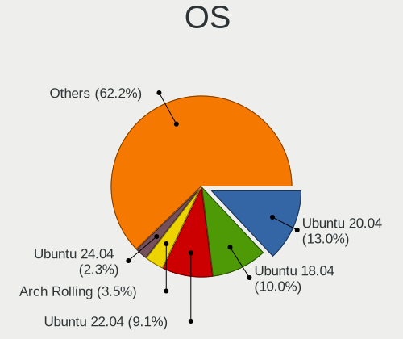

| Name                | Computers | Percent |
|---------------------|-----------|---------|
| Ubuntu 20.04        | 108       | 15.67%  |
| Ubuntu 18.04        | 83        | 12.05%  |
| Ubuntu 22.04        | 54        | 7.84%   |
| Arch Rolling        | 21        | 3.05%   |
| Arch                | 19        | 2.76%   |
| Ubuntu 19.04        | 16        | 2.32%   |
| Fedora 33           | 14        | 2.03%   |
| Fedora 38           | 11        | 1.6%    |
| Ubuntu 21.10        | 10        | 1.45%   |
| Ubuntu 20.10        | 10        | 1.45%   |
| KDE neon 20.04      | 10        | 1.45%   |
| Debian 11           | 10        | 1.45%   |
| ArcoLinux Rolling   | 10        | 1.45%   |
| Xubuntu 18.04       | 9         | 1.31%   |
| Manjaro             | 9         | 1.31%   |
| Fedora 34           | 9         | 1.31%   |
| Ubuntu 19.10        | 8         | 1.16%   |
| OpenMandriva 4.2    | 8         | 1.16%   |
| Fedora 37           | 7         | 1.02%   |
| Xubuntu 22.04       | 6         | 0.87%   |
| Xubuntu 20.04       | 6         | 0.87%   |
| Ubuntu 23.04        | 6         | 0.87%   |
| Ubuntu 21.04        | 6         | 0.87%   |
| Linux Mint 20.3     | 6         | 0.87%   |
| Ubuntu 22.10        | 5         | 0.73%   |
| OpenMandriva 4.3    | 5         | 0.73%   |
| Fedora 35           | 5         | 0.73%   |
| Zorin 16            | 4         | 0.58%   |
| Zorin 15            | 4         | 0.58%   |
| Ubuntu 18.10        | 4         | 0.58%   |
| Linux Mint 21.1     | 4         | 0.58%   |
| Kubuntu 20.04       | 4         | 0.58%   |
| Kali 2021.2         | 4         | 0.58%   |
| Fedora 31           | 4         | 0.58%   |
| Debian 12           | 4         | 0.58%   |
| Ubuntu Unity 16.04  | 3         | 0.44%   |
| Ubuntu Budgie 20.04 | 3         | 0.44%   |
| Ubuntu 23.10        | 3         | 0.44%   |
| Pop!_OS 22.04       | 3         | 0.44%   |
| Pop!_OS 20.04       | 3         | 0.44%   |

OS Family
---------

OS without a version

| Name               | Computers | Percent |
|--------------------|-----------|---------|
| Ubuntu             | 309       | 46.19%  |
| Fedora             | 56        | 8.37%   |
| Arch               | 38        | 5.68%   |
| Manjaro            | 28        | 4.19%   |
| Linux Mint         | 27        | 4.04%   |
| OpenMandriva       | 22        | 3.29%   |
| Xubuntu            | 21        | 3.14%   |
| Debian             | 20        | 2.99%   |
| Kali               | 16        | 2.39%   |
| Endless            | 16        | 2.39%   |
| KDE neon           | 15        | 2.24%   |
| Kubuntu            | 14        | 2.09%   |
| Pop!_OS            | 11        | 1.64%   |
| ArcoLinux          | 10        | 1.49%   |
| Zorin              | 9         | 1.35%   |
| ROSA               | 6         | 0.9%    |
| Ubuntu Unity       | 5         | 0.75%   |
| Lubuntu            | 5         | 0.75%   |
| Ubuntu Budgie      | 4         | 0.6%    |
| openSUSE           | 4         | 0.6%    |
| Elementary         | 4         | 0.6%    |
| Gentoo             | 3         | 0.45%   |
| CentOS             | 3         | 0.45%   |
| Xero               | 2         | 0.3%    |
| Solus              | 2         | 0.3%    |
| Clear Linux        | 2         | 0.3%    |
| Artix              | 2         | 0.3%    |
| Ubuntu MATE        | 1         | 0.15%   |
| Slackware          | 1         | 0.15%   |
| Sabayon            | 1         | 0.15%   |
| Raspbian           | 1         | 0.15%   |
| PureOS             | 1         | 0.15%   |
| Parch              | 1         | 0.15%   |
| NixOS              | 1         | 0.15%   |
| MX                 | 1         | 0.15%   |
| LMDE               | 1         | 0.15%   |
| Linux Lite         | 1         | 0.15%   |
| GNOME OS           | 1         | 0.15%   |
| Fedora-asahi-remix | 1         | 0.15%   |
| Exodia             | 1         | 0.15%   |

Kernel
------

Version of the Linux kernel

| Version                  | Computers | Percent |
|--------------------------|-----------|---------|
| 5.4.0-42-generic         | 15        | 2.05%   |
| 5.4.0-26-generic         | 9         | 1.23%   |
| 5.3.0-46-generic         | 8         | 1.1%    |
| 5.15.0-47-generic        | 8         | 1.1%    |
| 5.10.14-desktop-1omv4002 | 8         | 1.1%    |
| 5.4.0-58-generic         | 7         | 0.96%   |
| 5.4.0-52-generic         | 7         | 0.96%   |
| 5.3.0-40-generic         | 7         | 0.96%   |
| 5.15.0-56-generic        | 7         | 0.96%   |
| 5.11.0-27-generic        | 7         | 0.96%   |
| 5.4.0-48-generic         | 6         | 0.82%   |
| 5.11.0-41-generic        | 6         | 0.82%   |
| 5.0.0-23-generic         | 6         | 0.82%   |
| 6.2.0-20-generic         | 5         | 0.68%   |
| 5.8.0-63-generic         | 5         | 0.68%   |
| 5.8.0-48-generic         | 5         | 0.68%   |
| 5.16.7-desktop-1omv4003  | 5         | 0.68%   |
| 5.15.0-58-generic        | 5         | 0.68%   |
| 5.0.0-37-generic         | 5         | 0.68%   |
| 5.0.0-25-generic         | 5         | 0.68%   |
| 5.0.0-13-generic         | 5         | 0.68%   |
| 4.18.0-15-generic        | 5         | 0.68%   |
| 6.2.9-300.fc38.x86_64    | 4         | 0.55%   |
| 6.2.0-39-generic         | 4         | 0.55%   |
| 6.2.0-35-generic         | 4         | 0.55%   |
| 5.8.0-50-generic         | 4         | 0.55%   |
| 5.3.0-51-generic         | 4         | 0.55%   |
| 5.19.0-35-generic        | 4         | 0.55%   |
| 5.13.0-30-generic        | 4         | 0.55%   |
| 4.18.0-25-generic        | 4         | 0.55%   |
| 4.18.0-18-generic        | 4         | 0.55%   |
| 4.15.0-29-generic        | 4         | 0.55%   |
| 6.5.0-9-generic          | 3         | 0.41%   |
| 6.2.6-desktop-1omv2390   | 3         | 0.41%   |
| 5.8.0-59-generic         | 3         | 0.41%   |
| 5.8.0-44-generic         | 3         | 0.41%   |
| 5.8.0-43-generic         | 3         | 0.41%   |
| 5.4.0-91-generic         | 3         | 0.41%   |
| 5.4.0-65-generic         | 3         | 0.41%   |
| 5.4.0-59-generic         | 3         | 0.41%   |

Kernel Family
-------------

Linux kernel without a distro release

| Version | Computers | Percent |
|---------|-----------|---------|
| 5.4.0   | 106       | 14.99%  |
| 5.15.0  | 57        | 8.06%   |
| 5.0.0   | 38        | 5.37%   |
| 4.15.0  | 38        | 5.37%   |
| 5.11.0  | 35        | 4.95%   |
| 5.8.0   | 34        | 4.81%   |
| 5.3.0   | 33        | 4.67%   |
| 5.13.0  | 29        | 4.1%    |
| 4.18.0  | 25        | 3.54%   |
| 6.2.0   | 21        | 2.97%   |
| 5.19.0  | 21        | 2.97%   |
| 5.10.0  | 15        | 2.12%   |
| 5.10.14 | 8         | 1.13%   |
| 6.5.0   | 7         | 0.99%   |
| 6.4.11  | 6         | 0.85%   |
| 6.1.0   | 6         | 0.85%   |
| 5.16.7  | 6         | 0.85%   |
| 4.13.0  | 6         | 0.85%   |
| 6.2.9   | 5         | 0.71%   |
| 5.8.18  | 4         | 0.57%   |
| 5.11.11 | 4         | 0.57%   |
| 6.4.12  | 3         | 0.42%   |
| 6.2.6   | 3         | 0.42%   |
| 6.0.9   | 3         | 0.42%   |
| 5.9.16  | 3         | 0.42%   |
| 5.6.0   | 3         | 0.42%   |
| 5.18.0  | 3         | 0.42%   |
| 5.16.15 | 3         | 0.42%   |
| 5.16.0  | 3         | 0.42%   |
| 5.14.16 | 3         | 0.42%   |
| 5.13.19 | 3         | 0.42%   |
| 6.6.4   | 2         | 0.28%   |
| 6.5.9   | 2         | 0.28%   |
| 6.5.4   | 2         | 0.28%   |
| 6.4.3   | 2         | 0.28%   |
| 6.4.2   | 2         | 0.28%   |
| 6.4.0   | 2         | 0.28%   |
| 6.3.12  | 2         | 0.28%   |
| 6.2.8   | 2         | 0.28%   |
| 6.2.12  | 2         | 0.28%   |

Kernel Major Ver.
-----------------

Linux kernel major version

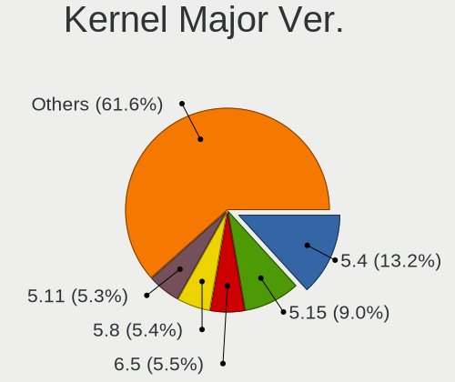

| Version | Computers | Percent |
|---------|-----------|---------|
| 5.4     | 112       | 16%     |
| 5.15    | 72        | 10.29%  |
| 5.8     | 46        | 6.57%   |
| 5.11    | 43        | 6.14%   |
| 5.0     | 41        | 5.86%   |
| 5.13    | 38        | 5.43%   |
| 4.15    | 38        | 5.43%   |
| 6.2     | 34        | 4.86%   |
| 5.3     | 34        | 4.86%   |
| 5.10    | 34        | 4.86%   |
| 4.18    | 25        | 3.57%   |
| 5.19    | 23        | 3.29%   |
| 6.4     | 19        | 2.71%   |
| 5.16    | 17        | 2.43%   |
| 6.1     | 16        | 2.29%   |
| 6.5     | 13        | 1.86%   |
| 5.14    | 11        | 1.57%   |
| 6.3     | 8         | 1.14%   |
| 6.0     | 8         | 1.14%   |
| 5.9     | 8         | 1.14%   |
| 5.18    | 8         | 1.14%   |
| 5.6     | 7         | 1%      |
| 5.12    | 7         | 1%      |
| 6.6     | 6         | 0.86%   |
| 4.13    | 6         | 0.86%   |
| 5.7     | 5         | 0.71%   |
| 4.19    | 5         | 0.71%   |
| 5.17    | 3         | 0.43%   |
| 4.9     | 3         | 0.43%   |
| 5.5     | 2         | 0.29%   |
| 4.14    | 2         | 0.29%   |
| 6.7     | 1         | 0.14%   |
| 5.2     | 1         | 0.14%   |
| 4.5     | 1         | 0.14%   |
| 4.20    | 1         | 0.14%   |
| 4.12    | 1         | 0.14%   |
| 3.10    | 1         | 0.14%   |

Arch
----

OS architecture (x86_64, i586, etc.)

| Name    | Computers | Percent |
|---------|-----------|---------|
| x86_64  | 637       | 97.25%  |
| i686    | 15        | 2.29%   |
| aarch64 | 3         | 0.46%   |

DE
--

Desktop Environment

| Name            | Computers | Percent |
|-----------------|-----------|---------|
| GNOME           | 368       | 54.6%   |
| Unknown         | 95        | 14.09%  |
| KDE5            | 68        | 10.09%  |
| XFCE            | 55        | 8.16%   |
| X-Cinnamon      | 22        | 3.26%   |
| KDE             | 17        | 2.52%   |
| i3              | 10        | 1.48%   |
| LXQt            | 7         | 1.04%   |
| MATE            | 6         | 0.89%   |
| Budgie          | 6         | 0.89%   |
| Unity           | 5         | 0.74%   |
| Pantheon        | 4         | 0.59%   |
| KDE4            | 2         | 0.3%    |
| Cinnamon        | 2         | 0.3%    |
| bspwm           | 2         | 0.3%    |
| Trinity         | 1         | 0.15%   |
| sway            | 1         | 0.15%   |
| LXDE            | 1         | 0.15%   |
| GNOME Flashback | 1         | 0.15%   |
| enlightenment   | 1         | 0.15%   |

Display Server
--------------

X11 or Wayland

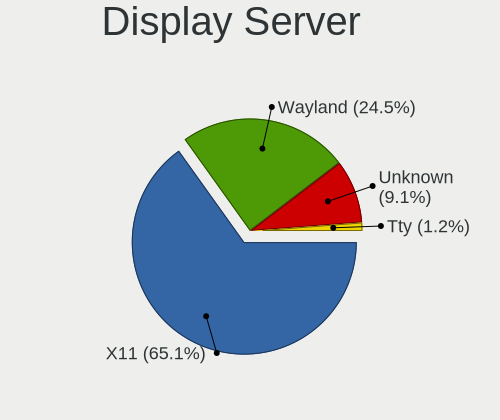

| Name    | Computers | Percent |
|---------|-----------|---------|
| X11     | 469       | 69.58%  |
| Wayland | 129       | 19.14%  |
| Unknown | 69        | 10.24%  |
| Tty     | 7         | 1.04%   |

Display Manager
---------------

SDDM, LightDM, etc.

| Name    | Computers | Percent |
|---------|-----------|---------|
| Unknown | 340       | 50.15%  |
| GDM     | 97        | 14.31%  |
| GDM3    | 94        | 13.86%  |
| SDDM    | 70        | 10.32%  |
| LightDM | 56        | 8.26%   |
| TDM     | 14        | 2.06%   |
| XDM     | 2         | 0.29%   |
| Ly      | 2         | 0.29%   |
| KDM     | 2         | 0.29%   |
| LXDM    | 1         | 0.15%   |

OS Lang
-------

Language

| Lang    | Computers | Percent |
|---------|-----------|---------|
| en_US   | 520       | 78.31%  |
| Unknown | 91        | 13.7%   |
| en_GB   | 17        | 2.56%   |
| fa_IR   | 13        | 1.96%   |
| C       | 10        | 1.51%   |
| en_CA   | 6         | 0.9%    |
| en_AG   | 2         | 0.3%    |
| ru_RU   | 1         | 0.15%   |
| POSIX   | 1         | 0.15%   |
| ja_JP   | 1         | 0.15%   |
| de_DE   | 1         | 0.15%   |
| az_IR   | 1         | 0.15%   |

Boot Mode
---------

EFI or BIOS

| Mode | Computers | Percent |
|------|-----------|---------|
| BIOS | 357       | 53.44%  |
| EFI  | 311       | 46.56%  |

Filesystem
----------

Type of filesystem

| Type    | Computers | Percent |
|---------|-----------|---------|
| Ext4    | 528       | 79.52%  |
| Btrfs   | 52        | 7.83%   |
| Overlay | 31        | 4.67%   |
| Tmpfs   | 19        | 2.86%   |
| Unknown | 18        | 2.71%   |
| Xfs     | 7         | 1.05%   |
| Zfs     | 6         | 0.9%    |
| Ext3    | 2         | 0.3%    |
| Ext2    | 1         | 0.15%   |

Part. scheme
------------

Scheme of partitioning

| Type    | Computers | Percent |
|---------|-----------|---------|
| Unknown | 377       | 56.78%  |
| GPT     | 235       | 35.39%  |
| MBR     | 52        | 7.83%   |

Dual Boot with Linux/BSD
------------------------

Hosting more than one Linux/BSD

| Dual boot | Computers | Percent |
|-----------|-----------|---------|
| No        | 559       | 84.06%  |
| Yes       | 106       | 15.94%  |

Dual Boot (Win)
---------------

Hosting Linux and Windows

| Dual boot | Computers | Percent |
|-----------|-----------|---------|
| No        | 356       | 53.78%  |
| Yes       | 306       | 46.22%  |

Board
-----

Vendor
------

Motherboard manufacturer

| Name                    | Computers | Percent |
|-------------------------|-----------|---------|
| ASUSTek Computer        | 223       | 34.05%  |
| Lenovo                  | 123       | 18.78%  |
| Hewlett-Packard         | 94        | 14.35%  |
| Dell                    | 42        | 6.41%   |
| Acer                    | 41        | 6.26%   |
| Gigabyte Technology     | 40        | 6.11%   |
| MSI                     | 21        | 3.21%   |
| Sony                    | 13        | 1.98%   |
| Toshiba                 | 8         | 1.22%   |
| Apple                   | 8         | 1.22%   |
| ECS                     | 7         | 1.07%   |
| Unknown                 | 6         | 0.92%   |
| ASRock                  | 5         | 0.76%   |
| Microsoft               | 3         | 0.46%   |
| Fujitsu                 | 3         | 0.46%   |
| YANYU                   | 2         | 0.31%   |
| Raspberry Pi Foundation | 2         | 0.31%   |
| Biostar                 | 2         | 0.31%   |
| Timi                    | 1         | 0.15%   |
| Supermicro              | 1         | 0.15%   |
| Samsung Electronics     | 1         | 0.15%   |
| Razer                   | 1         | 0.15%   |
| Packard Bell            | 1         | 0.15%   |
| LG Electronics          | 1         | 0.15%   |
| Intel                   | 1         | 0.15%   |
| HPE                     | 1         | 0.15%   |
| HIGRADED                | 1         | 0.15%   |
| Foxconn                 | 1         | 0.15%   |
| Alienware               | 1         | 0.15%   |
| 3Logic Group            | 1         | 0.15%   |

Model
-----

Motherboard model

| Name                                  | Computers | Percent |
|---------------------------------------|-----------|---------|
| ASUS All Series                       | 14        | 2.14%   |
| HP Compaq Elite 8300 SFF              | 8         | 1.22%   |
| Lenovo IdeaPad 330-15IKB 81DE         | 6         | 0.92%   |
| HP ProBook 4540s                      | 6         | 0.92%   |
| Acer Aspire V3-571G                   | 6         | 0.92%   |
| Unknown                               | 6         | 0.92%   |
| Lenovo IdeaPad Z510 20287             | 5         | 0.76%   |
| Lenovo G50-70 20351                   | 4         | 0.61%   |
| HP Pavilion g6                        | 4         | 0.61%   |
| HP EliteBook 8470p                    | 4         | 0.61%   |
| ASUS VivoBook 15_ASUS Laptop X540UBR  | 4         | 0.61%   |
| Lenovo Z50-70 20354                   | 3         | 0.46%   |
| Lenovo IdeaPad L340-15IRH Gaming 81LK | 3         | 0.46%   |
| Lenovo IdeaPad 5 15ITL05 82FG         | 3         | 0.46%   |
| Lenovo IdeaPad 3 15ITL6 82H8          | 3         | 0.46%   |
| Lenovo G50-80 80E5                    | 3         | 0.46%   |
| Lenovo B570e HuronRiver Platform      | 3         | 0.46%   |
| HP EliteBook 840 G2                   | 3         | 0.46%   |
| ASUS X580VD                           | 3         | 0.46%   |
| ASUS P5P41T-LE                        | 3         | 0.46%   |
| ASUS K55VD                            | 3         | 0.46%   |
| Toshiba PORTEGE X30-D                 | 2         | 0.31%   |
| MSI Prestige 14 A10RB                 | 2         | 0.31%   |
| Microsoft Surface Book 2              | 2         | 0.31%   |
| Lenovo ThinkPad X250 20CM002XUS       | 2         | 0.31%   |
| Lenovo ThinkPad E15 20RD0086UE        | 2         | 0.31%   |
| Lenovo Legion 5 15IMH05H 81Y6         | 2         | 0.31%   |
| Lenovo Legion 5 15ARH05H 82B1         | 2         | 0.31%   |
| Lenovo IdeaPad S540-15IWL GTX 81SW    | 2         | 0.31%   |
| Lenovo IdeaPad Gaming 3 15ACH6 82K2   | 2         | 0.31%   |
| Lenovo IdeaPad 520-15IKB 81BF         | 2         | 0.31%   |
| Lenovo IdeaPad 5 14ALC05 82LM         | 2         | 0.31%   |
| Lenovo IdeaPad 330-15IGM 81D1         | 2         | 0.31%   |
| Lenovo G505 20240                     | 2         | 0.31%   |
| Lenovo Flex 2-15 20405                | 2         | 0.31%   |
| HP ZBook 17 G3                        | 2         | 0.31%   |
| HP ZBook 15                           | 2         | 0.31%   |
| HP ProLiant DL360 G6                  | 2         | 0.31%   |
| HP ProDesk 600 G1 SFF                 | 2         | 0.31%   |
| HP ProBook 450 G4                     | 2         | 0.31%   |

Model Family
------------

Motherboard model prefix

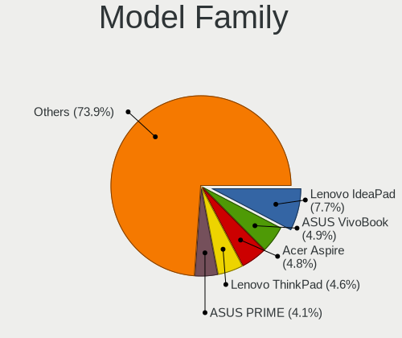

| Name              | Computers | Percent |
|-------------------|-----------|---------|
| Lenovo IdeaPad    | 48        | 7.33%   |
| Acer Aspire       | 35        | 5.34%   |
| ASUS VivoBook     | 34        | 5.19%   |
| Lenovo ThinkPad   | 31        | 4.73%   |
| HP EliteBook      | 26        | 3.97%   |
| ASUS PRIME        | 21        | 3.21%   |
| HP ProBook        | 16        | 2.44%   |
| Dell Latitude     | 14        | 2.14%   |
| Dell Inspiron     | 14        | 2.14%   |
| ASUS All          | 14        | 2.14%   |
| HP Compaq         | 13        | 1.98%   |
| HP Pavilion       | 10        | 1.53%   |
| Dell Vostro       | 10        | 1.53%   |
| ASUS ASUS         | 9         | 1.37%   |
| Lenovo Legion     | 8         | 1.22%   |
| ASUS TUF          | 8         | 1.22%   |
| ASUS ROG          | 8         | 1.22%   |
| Unknown           | 6         | 0.92%   |
| Toshiba Satellite | 5         | 0.76%   |
| HP ZBook          | 5         | 0.76%   |
| Lenovo G50-70     | 4         | 0.61%   |
| HP EliteDesk      | 4         | 0.61%   |
| ASUS Zenbook      | 4         | 0.61%   |
| Toshiba PORTEGE   | 3         | 0.46%   |
| MSI Modern        | 3         | 0.46%   |
| Microsoft Surface | 3         | 0.46%   |
| Lenovo Z50-70     | 3         | 0.46%   |
| Lenovo ThinkBook  | 3         | 0.46%   |
| Lenovo G50-80     | 3         | 0.46%   |
| Lenovo B570e      | 3         | 0.46%   |
| HP ProLiant       | 3         | 0.46%   |
| HP ProDesk        | 3         | 0.46%   |
| Fujitsu LIFEBOOK  | 3         | 0.46%   |
| ASUS X580VD       | 3         | 0.46%   |
| ASUS P8H61        | 3         | 0.46%   |
| ASUS P5P41T-LE    | 3         | 0.46%   |
| ASUS K55VD        | 3         | 0.46%   |
| Acer TravelMate   | 3         | 0.46%   |
| RPi Raspberry     | 2         | 0.31%   |
| MSI Prestige      | 2         | 0.31%   |

MFG Year
--------

Motherboard manufacture year

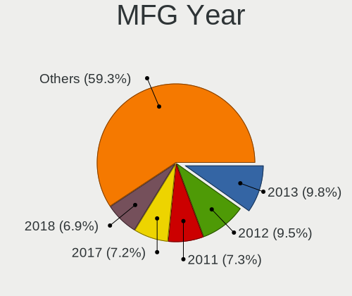

| Year    | Computers | Percent |
|---------|-----------|---------|
| 2012    | 67        | 10.23%  |
| 2013    | 66        | 10.08%  |
| 2011    | 50        | 7.63%   |
| 2017    | 49        | 7.48%   |
| 2018    | 45        | 6.87%   |
| 2016    | 44        | 6.72%   |
| 2010    | 44        | 6.72%   |
| 2020    | 42        | 6.41%   |
| 2014    | 42        | 6.41%   |
| 2015    | 38        | 5.8%    |
| 2019    | 37        | 5.65%   |
| 2021    | 34        | 5.19%   |
| 2009    | 32        | 4.89%   |
| 2008    | 19        | 2.9%    |
| 2022    | 18        | 2.75%   |
| 2007    | 11        | 1.68%   |
| 2006    | 8         | 1.22%   |
| 2023    | 3         | 0.46%   |
| Unknown | 3         | 0.46%   |
| 2005    | 2         | 0.31%   |
| 2004    | 1         | 0.15%   |

Form Factor
-----------

Physical design of the computer

| Name           | Computers | Percent |
|----------------|-----------|---------|
| Notebook       | 457       | 69.77%  |
| Desktop        | 177       | 27.02%  |
| Tablet         | 6         | 0.92%   |
| Server         | 6         | 0.92%   |
| Convertible    | 4         | 0.61%   |
| System on chip | 2         | 0.31%   |
| All in one     | 2         | 0.31%   |
| Mini pc        | 1         | 0.15%   |

Secure Boot
-----------

Enabled or disabled

| State    | Computers | Percent |
|----------|-----------|---------|
| Disabled | 616       | 93.76%  |
| Enabled  | 41        | 6.24%   |

Coreboot
--------

Have coreboot on board

| Used | Computers | Percent |
|------|-----------|---------|
| No   | 655       | 100%    |

RAM Size
--------

Total RAM memory

| Size in GB      | Computers | Percent |
|-----------------|-----------|---------|
| 4.01-8.0        | 199       | 30.2%   |
| 8.01-16.0       | 139       | 21.09%  |
| 16.01-24.0      | 126       | 19.12%  |
| 3.01-4.0        | 124       | 18.82%  |
| 32.01-64.0      | 28        | 4.25%   |
| 1.01-2.0        | 19        | 2.88%   |
| 2.01-3.0        | 11        | 1.67%   |
| 64.01-256.0     | 5         | 0.76%   |
| 0.51-1.0        | 4         | 0.61%   |
| 24.01-32.0      | 3         | 0.46%   |
| More than 256.0 | 1         | 0.15%   |

RAM Used
--------

Used RAM memory

| Used GB    | Computers | Percent |
|------------|-----------|---------|
| 1.01-2.0   | 239       | 33.8%   |
| 2.01-3.0   | 211       | 29.84%  |
| 3.01-4.0   | 114       | 16.12%  |
| 4.01-8.0   | 85        | 12.02%  |
| 0.51-1.0   | 32        | 4.53%   |
| 8.01-16.0  | 17        | 2.4%    |
| 0.01-0.5   | 7         | 0.99%   |
| 24.01-32.0 | 1         | 0.14%   |
| 16.01-24.0 | 1         | 0.14%   |

Total Drives
------------

Number of drives on board

| Drives  | Computers | Percent |
|---------|-----------|---------|
| 1       | 419       | 62.91%  |
| 2       | 196       | 29.43%  |
| 3       | 32        | 4.8%    |
| 4       | 10        | 1.5%    |
| 5       | 3         | 0.45%   |
| 0       | 3         | 0.45%   |
| 6       | 2         | 0.3%    |
| Unknown | 1         | 0.15%   |

Has CD-ROM
----------

Has CD-ROM on board

| Presented | Computers | Percent |
|-----------|-----------|---------|
| No        | 367       | 55.52%  |
| Yes       | 294       | 44.48%  |

Has Ethernet
------------

Has Ethernet on board

| Presented | Computers | Percent |
|-----------|-----------|---------|
| Yes       | 578       | 88.11%  |
| No        | 78        | 11.89%  |

Has WiFi
--------

Has WiFi module

| Presented | Computers | Percent |
|-----------|-----------|---------|
| Yes       | 549       | 83.18%  |
| No        | 111       | 16.82%  |

Has Bluetooth
-------------

Has Bluetooth module

| Presented | Computers | Percent |
|-----------|-----------|---------|
| Yes       | 415       | 62.88%  |
| No        | 245       | 37.12%  |

Location
--------

Country
-------

Geographic location (country)

| Country | Computers | Percent |
|---------|-----------|---------|
| Iran    | 655       | 100%    |

City
----

Geographic location (city)

| City                           | Computers | Percent |
|--------------------------------|-----------|---------|
| Tehran                         | 391       | 56.75%  |
| Tehrn                      | 46        | 6.68%   |
| Mashhad                        | 26        | 3.77%   |
| Isfahan                        | 25        | 3.63%   |
| Shiraz                         | 13        | 1.89%   |
| Karaj                          | 13        | 1.89%   |
| Tajrsh                       | 9         | 1.31%   |
| Qom                            | 8         | 1.16%   |
| Khorramshahr                   | 7         | 1.02%   |
| Babol                          | 7         | 1.02%   |
| Tabriz                         | 6         | 0.87%   |
| Sanandij                       | 6         | 0.87%   |
| Rasht                          | 6         | 0.87%   |
| Yazd                           | 5         | 0.73%   |
| Kerman                         | 5         | 0.73%   |
| Ahvaz                          | 4         | 0.58%   |
| Tajrsh                     | 3         | 0.44%   |
| Rey                            | 3         | 0.44%   |
| Kermanshah                     | 3         | 0.44%   |
| Gorgan                         | 3         | 0.44%   |
| Arak                           | 3         | 0.44%   |
| Zanjan                         | 2         | 0.29%   |
| Shahre Jadide Andisheh         | 2         | 0.29%   |
| Shahr-e Qods                   | 2         | 0.29%   |
| Shahr-e Kord                   | 2         | 0.29%   |
| Sari                           | 2         | 0.29%   |
| Rehnn                        | 2         | 0.29%   |
| Qazvin                         | 2         | 0.29%   |
| Hamadan                        | 2         | 0.29%   |
| Gachsaran                      | 2         | 0.29%   |
| Farsan                         | 2         | 0.29%   |
| Damvand                    | 2         | 0.29%   |
| Borjerd                    | 2         | 0.29%   |
| Behshahr                       | 2         | 0.29%   |
| stneh-ye Ashrafyeh | 1         | 0.15%   |
| Varamin                        | 1         | 0.15%   |
| Trn                        | 1         | 0.15%   |
| owmeeh Sar                 | 1         | 0.15%   |
| Siakhdekhan                    | 1         | 0.15%   |
| Shhn Shahr             | 1         | 0.15%   |

Drives
------

Drive Vendor
------------

Hard drive vendors

| Vendor                       | Computers | Drives | Percent |
|------------------------------|-----------|--------|---------|
| WDC                          | 177       | 225    | 20.07%  |
| Seagate                      | 151       | 184    | 17.12%  |
| Samsung Electronics          | 106       | 127    | 12.02%  |
| Toshiba                      | 99        | 118    | 11.22%  |
| A-DATA Technology            | 41        | 48     | 4.65%   |
| SanDisk                      | 26        | 30     | 2.95%   |
| Micron Technology            | 24        | 26     | 2.72%   |
| Maxtor                       | 23        | 30     | 2.61%   |
| Intel                        | 23        | 23     | 2.61%   |
| HGST                         | 22        | 26     | 2.49%   |
| Lexar                        | 17        | 21     | 1.93%   |
| Unknown                      | 16        | 17     | 1.81%   |
| Hitachi                      | 16        | 17     | 1.81%   |
| Kingston                     | 15        | 20     | 1.7%    |
| SK hynix                     | 13        | 16     | 1.47%   |
| SPCC                         | 6         | 7      | 0.68%   |
| PNY                          | 6         | 7      | 0.68%   |
| Kingmax                      | 6         | 6      | 0.68%   |
| Gigabyte Technology          | 6         | 7      | 0.68%   |
| Apacer                       | 6         | 6      | 0.68%   |
| Silicon Motion               | 5         | 5      | 0.57%   |
| Apple                        | 5         | 8      | 0.57%   |
| Plextor                      | 4         | 4      | 0.45%   |
| Crucial                      | 4         | 4      | 0.45%   |
| Unknown                      | 4         | 4      | 0.45%   |
| Union Memory (Shenzhen)      | 3         | 3      | 0.34%   |
| Shenzhen Longsys Electronics | 3         | 3      | 0.34%   |
| LITEON                       | 3         | 4      | 0.34%   |
| ValueTech                    | 2         | 3      | 0.23%   |
| Union Memory                 | 2         | 2      | 0.23%   |
| Team                         | 2         | 2      | 0.23%   |
| Realtek Semiconductor        | 2         | 3      | 0.23%   |
| OCZ                          | 2         | 2      | 0.23%   |
| MSI                          | 2         | 2      | 0.23%   |
| MAXIO Technology (Hangzhou)  | 2         | 2      | 0.23%   |
| LITEONIT                     | 2         | 3      | 0.23%   |
| BR                           | 2         | 2      | 0.23%   |
| Biostar                      | 2         | 3      | 0.23%   |
| XPG                          | 1         | 1      | 0.11%   |
| X-ENERGY                     | 1         | 1      | 0.11%   |

Drive Model
-----------

Hard drive models

| Model                                               | Computers | Percent |
|-----------------------------------------------------|-----------|---------|
| Seagate ST1000LM035-1RK172 1TB                      | 38        | 4.12%   |
| Toshiba MQ01ABD100 1TB                              | 20        | 2.17%   |
| Toshiba MQ04ABF100 1TB                              | 18        | 1.95%   |
| WDC WD10EZEX-08WN4A0 1TB                            | 15        | 1.63%   |
| Seagate ST1000LM024 HN-M101MBB 1TB                  | 14        | 1.52%   |
| Seagate ST9500325AS 500GB                           | 11        | 1.19%   |
| WDC WDS240G2G0A-00JH30 240GB SSD                    | 10        | 1.08%   |
| WDC WD10SPZX-08Z10 1TB                              | 10        | 1.08%   |
| A-DATA SU650 120GB SSD                              | 10        | 1.08%   |
| WDC WD10SPZX-24Z10 1TB                              | 9         | 0.98%   |
| Toshiba MQ01ABF050 500GB                            | 9         | 0.98%   |
| Samsung SSD 860 EVO 500GB                           | 9         | 0.98%   |
| Samsung SSD 860 EVO 250GB                           | 9         | 0.98%   |
| Seagate ST500DM002-1BD142 500GB                     | 8         | 0.87%   |
| WDC WD10JPCX-24UE4T0 1TB                            | 7         | 0.76%   |
| Samsung SSD 850 EVO 250GB                           | 7         | 0.76%   |
| WDC WDS120G2G0A-00JH30 120GB SSD                    | 6         | 0.65%   |
| Seagate ST500LT012-1DG142 500GB                     | 6         | 0.65%   |
| Micron 2210_MTFDHBA512QFD 512GB                     | 6         | 0.65%   |
| Maxtor STM3250310AS 250GB                           | 6         | 0.65%   |
| Lexar 256GB SSD                                     | 6         | 0.65%   |
| Lexar 128GB SSD                                     | 6         | 0.65%   |
| HGST HTS721010A9E630 1TB                            | 6         | 0.65%   |
| Toshiba MQ01ABD050V 500GB                           | 5         | 0.54%   |
| Toshiba MQ01ABD050 500GB                            | 5         | 0.54%   |
| Seagate ST9500420AS 500GB                           | 5         | 0.54%   |
| Seagate ST2000LM007-1R8174 2TB                      | 5         | 0.54%   |
| Samsung NVMe SSD Controller SM981/PM981/PM983 512GB | 5         | 0.54%   |
| WDC WD10EZRX-00L4HB0 1TB                            | 4         | 0.43%   |
| Unknown MMC Card  32GB                              | 4         | 0.43%   |
| Toshiba MQ01ABD075 752GB                            | 4         | 0.43%   |
| Toshiba DT01ACA050 500GB                            | 4         | 0.43%   |
| Seagate ST2000LM003 HN-M201RAD 2TB                  | 4         | 0.43%   |
| Samsung PM963 2.5" NVMe PCIe SSD 256GB              | 4         | 0.43%   |
| Micron 1100_MTFDDAV256TBN 256GB SSD                 | 4         | 0.43%   |
| Maxtor STM3160215AS 160GB                           | 4         | 0.43%   |
| Maxtor 6Y080L0 82GB                                 | 4         | 0.43%   |
| Intel NVMe SSD Drive 512GB                          | 4         | 0.43%   |
| HGST HTS541010B7E610 1TB                            | 4         | 0.43%   |
| HGST HTS541010A9E680 1TB                            | 4         | 0.43%   |

HDD Vendor
----------

Hard disk drive vendors

| Vendor              | Computers | Drives | Percent |
|---------------------|-----------|--------|---------|
| WDC                 | 151       | 188    | 32.06%  |
| Seagate             | 151       | 184    | 32.06%  |
| Toshiba             | 91        | 106    | 19.32%  |
| Maxtor              | 23        | 30     | 4.88%   |
| HGST                | 22        | 26     | 4.67%   |
| Hitachi             | 16        | 17     | 3.4%    |
| Samsung Electronics | 8         | 12     | 1.7%    |
| Unknown             | 2         | 2      | 0.42%   |
| Apple               | 2         | 3      | 0.42%   |
| USB3.0              | 1         | 1      | 0.21%   |
| TO Exter            | 1         | 1      | 0.21%   |
| Teleplan            | 1         | 4      | 0.21%   |
| HPE                 | 1         | 1      | 0.21%   |
| Fujitsu             | 1         | 1      | 0.21%   |

SSD Vendor
----------

Solid state drive vendors

| Vendor              | Computers | Drives | Percent |
|---------------------|-----------|--------|---------|
| Samsung Electronics | 63        | 74     | 23.42%  |
| A-DATA Technology   | 41        | 48     | 15.24%  |
| WDC                 | 29        | 32     | 10.78%  |
| SanDisk             | 16        | 19     | 5.95%   |
| Lexar               | 15        | 17     | 5.58%   |
| Kingston            | 12        | 16     | 4.46%   |
| Micron Technology   | 11        | 11     | 4.09%   |
| SK hynix            | 7         | 9      | 2.6%    |
| SPCC                | 6         | 7      | 2.23%   |
| Gigabyte Technology | 6         | 7      | 2.23%   |
| Toshiba             | 5         | 9      | 1.86%   |
| PNY                 | 5         | 5      | 1.86%   |
| Intel               | 5         | 5      | 1.86%   |
| Apacer              | 5         | 5      | 1.86%   |
| Plextor             | 4         | 4      | 1.49%   |
| Kingmax             | 4         | 4      | 1.49%   |
| Crucial             | 4         | 4      | 1.49%   |
| LITEON              | 3         | 4      | 1.12%   |
| ValueTech           | 2         | 3      | 0.74%   |
| Team                | 2         | 2      | 0.74%   |
| OCZ                 | 2         | 2      | 0.74%   |
| LITEONIT            | 2         | 3      | 0.74%   |
| Biostar             | 2         | 3      | 0.74%   |
| Apple               | 2         | 2      | 0.74%   |
| X-ENERGY            | 1         | 1      | 0.37%   |
| TwinMOS             | 1         | 1      | 0.37%   |
| Transcend           | 1         | 1      | 0.37%   |
| SSSTC               | 1         | 1      | 0.37%   |
| Pioneer             | 1         | 1      | 0.37%   |
| Patriot             | 1         | 1      | 0.37%   |
| OSCOO               | 1         | 2      | 0.37%   |
| Netac               | 1         | 1      | 0.37%   |
| MSI                 | 1         | 1      | 0.37%   |
| KODAK               | 1         | 1      | 0.37%   |
| KingSpec            | 1         | 1      | 0.37%   |
| GeIL                | 1         | 1      | 0.37%   |
| China               | 1         | 1      | 0.37%   |
| BR                  | 1         | 1      | 0.37%   |
| AMD                 | 1         | 1      | 0.37%   |
| Unknown             | 1         | 1      | 0.37%   |

Drive Kind
----------

HDD or SSD

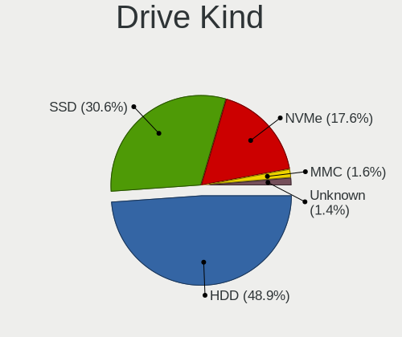

| Kind    | Computers | Drives | Percent |
|---------|-----------|--------|---------|
| HDD     | 440       | 576    | 52.19%  |
| SSD     | 258       | 312    | 30.6%   |
| NVMe    | 122       | 144    | 14.47%  |
| MMC     | 12        | 13     | 1.42%   |
| Unknown | 11        | 12     | 1.3%    |

Drive Connector
---------------

SATA, SAS, NVMe, etc.

| Type | Computers | Drives | Percent |
|------|-----------|--------|---------|
| SATA | 572       | 885    | 79.55%  |
| NVMe | 122       | 144    | 16.97%  |
| SAS  | 13        | 15     | 1.81%   |
| MMC  | 12        | 13     | 1.67%   |

Drive Size
----------

Size of hard drive

| Size in TB | Computers | Drives | Percent |
|------------|-----------|--------|---------|
| 0.01-0.5   | 381       | 511    | 55.7%   |
| 0.51-1.0   | 264       | 333    | 38.6%   |
| 1.01-2.0   | 23        | 25     | 3.36%   |
| 3.01-4.0   | 7         | 7      | 1.02%   |
| 2.01-3.0   | 4         | 5      | 0.58%   |
| 4.01-10.0  | 4         | 4      | 0.58%   |
| 10.01-20.0 | 1         | 3      | 0.15%   |

Space Total
-----------

Amount of disk space available on the file system

| Size in GB     | Computers | Percent |
|----------------|-----------|---------|
| 101-250        | 185       | 27.13%  |
| 251-500        | 132       | 19.35%  |
| 501-1000       | 127       | 18.62%  |
| 51-100         | 61        | 8.94%   |
| 1001-2000      | 60        | 8.8%    |
| 21-50          | 40        | 5.87%   |
| 1-20           | 40        | 5.87%   |
| Unknown        | 14        | 2.05%   |
| More than 3000 | 12        | 1.76%   |
| 2001-3000      | 11        | 1.61%   |

Space Used
----------

Amount of used disk space

| Used GB        | Computers | Percent |
|----------------|-----------|---------|
| 1-20           | 257       | 36.71%  |
| 21-50          | 121       | 17.29%  |
| 51-100         | 92        | 13.14%  |
| 101-250        | 86        | 12.29%  |
| 501-1000       | 57        | 8.14%   |
| 251-500        | 54        | 7.71%   |
| Unknown        | 14        | 2%      |
| 1001-2000      | 9         | 1.29%   |
| More than 3000 | 6         | 0.86%   |
| 2001-3000      | 4         | 0.57%   |

Malfunc. Drives
---------------

Drive models with a malfunction

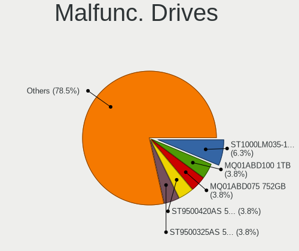

| Model                               | Computers | Drives | Percent |
|-------------------------------------|-----------|--------|---------|
| Seagate ST1000LM035-1RK172 1TB      | 5         | 6      | 7.35%   |
| Toshiba MQ01ABD100 1TB              | 3         | 3      | 4.41%   |
| Seagate ST9500420AS 500GB           | 3         | 3      | 4.41%   |
| Seagate ST9500325AS 500GB           | 3         | 6      | 4.41%   |
| Toshiba MQ01ABF050 500GB            | 2         | 5      | 2.94%   |
| Toshiba MQ01ABD075 752GB            | 2         | 2      | 2.94%   |
| Toshiba MQ01ABD050 500GB            | 2         | 2      | 2.94%   |
| SK hynix SC308 SATA 256GB SSD       | 2         | 2      | 2.94%   |
| Seagate ST500DM002-1BD142 500GB     | 2         | 3      | 2.94%   |
| HGST HTS541075A9E680 752GB          | 2         | 2      | 2.94%   |
| WDC WDS120G2G0A-00JH30 120GB SSD    | 1         | 1      | 1.47%   |
| WDC WD7500BPVT-80HXZT1 752GB        | 1         | 2      | 1.47%   |
| WDC WD5000LPVX-80V0TT0 500GB        | 1         | 1      | 1.47%   |
| WDC WD5000AVDS-63U7B1 500GB         | 1         | 1      | 1.47%   |
| WDC WD5000AAKX-22ERMA0 500GB        | 1         | 2      | 1.47%   |
| WDC WD3200BPVT-75ZEST0 320GB        | 1         | 1      | 1.47%   |
| WDC WD3200AVVS-62L2B0 320GB         | 1         | 1      | 1.47%   |
| WDC WD10SPZX-24Z10 1TB              | 1         | 1      | 1.47%   |
| WDC WD10SPZX-08Z10 1TB              | 1         | 1      | 1.47%   |
| WDC WD10PURZ-85U8XY0 1TB            | 1         | 1      | 1.47%   |
| WDC WD10JPCX-24UE4T0 1TB            | 1         | 1      | 1.47%   |
| WDC WD10EZRX-00A3KB0 1TB            | 1         | 1      | 1.47%   |
| WDC WD10EZEX-00WN4A0 1TB            | 1         | 1      | 1.47%   |
| WDC WD10EARX-00N0YB0 1TB            | 1         | 1      | 1.47%   |
| WDC WD10EARS-00MVWB0 1TB            | 1         | 1      | 1.47%   |
| WDC WD1002FBYS-18A6B0 1TB           | 1         | 1      | 1.47%   |
| Toshiba MQ04ABF100 1TB              | 1         | 1      | 1.47%   |
| Toshiba MK3265GSXN 320GB            | 1         | 1      | 1.47%   |
| Toshiba MK3263GSX 320GB             | 1         | 1      | 1.47%   |
| Toshiba HDWD105 500GB               | 1         | 1      | 1.47%   |
| SSSTC CVB-8D128-HP 128GB SSD        | 1         | 1      | 1.47%   |
| Seagate ST9250315AS 250GB           | 1         | 2      | 1.47%   |
| Seagate ST500LT012-9WS142 500GB     | 1         | 1      | 1.47%   |
| Seagate ST500LT012-1DG142 500GB     | 1         | 1      | 1.47%   |
| Seagate ST3500413AS 500GB           | 1         | 1      | 1.47%   |
| Seagate ST3320613AS 320GB           | 1         | 1      | 1.47%   |
| Seagate ST320LT020-9YG142 320GB     | 1         | 1      | 1.47%   |
| Seagate ST1000LM014-SSHD-8GB        | 1         | 1      | 1.47%   |
| Seagate ST1000DM003-9YN162 1TB      | 1         | 1      | 1.47%   |
| Samsung Electronics SSD 870 EVO 1TB | 1         | 2      | 1.47%   |

Malfunc. Drive Vendor
---------------------

Vendors of faulty drives

| Vendor              | Computers | Drives | Percent |
|---------------------|-----------|--------|---------|
| Seagate             | 21        | 27     | 31.34%  |
| WDC                 | 15        | 18     | 22.39%  |
| Toshiba             | 13        | 16     | 19.4%   |
| Hitachi             | 6         | 7      | 8.96%   |
| HGST                | 4         | 4      | 5.97%   |
| SK hynix            | 2         | 2      | 2.99%   |
| Samsung Electronics | 2         | 4      | 2.99%   |
| Maxtor              | 2         | 2      | 2.99%   |
| SSSTC               | 1         | 1      | 1.49%   |
| Micron Technology   | 1         | 1      | 1.49%   |

Malfunc. HDD Vendor
-------------------

Vendors of faulty HDD drives

| Vendor              | Computers | Drives | Percent |
|---------------------|-----------|--------|---------|
| Seagate             | 21        | 27     | 34.43%  |
| WDC                 | 14        | 17     | 22.95%  |
| Toshiba             | 13        | 16     | 21.31%  |
| Hitachi             | 6         | 7      | 9.84%   |
| HGST                | 4         | 4      | 6.56%   |
| Maxtor              | 2         | 2      | 3.28%   |
| Samsung Electronics | 1         | 2      | 1.64%   |

Malfunc. Drive Kind
-------------------

Kinds of faulty drives

| Kind | Computers | Drives | Percent |
|------|-----------|--------|---------|
| HDD  | 58        | 75     | 90.63%  |
| SSD  | 6         | 7      | 9.38%   |

Failed Drives
-------------

Failed drive models

| Model                        | Computers | Drives | Percent |
|------------------------------|-----------|--------|---------|
| WDC WD5000BEVT-22A0RT0 500GB | 1         | 1      | 100%    |

Failed Drive Vendor
-------------------

Failed drive vendors

| Vendor | Computers | Drives | Percent |
|--------|-----------|--------|---------|
| WDC    | 1         | 1      | 100%    |

Drive Status
------------

Number of failed and malfunc. drives

| Status   | Computers | Drives | Percent |
|----------|-----------|--------|---------|
| Detected | 417       | 661    | 60.09%  |
| Works    | 213       | 313    | 30.69%  |
| Malfunc  | 63        | 82     | 9.08%   |
| Failed   | 1         | 1      | 0.14%   |

Storage controller
------------------

Storage Vendor
--------------

Storage controller vendors

| Vendor                           | Computers | Percent |
|----------------------------------|-----------|---------|
| Intel                            | 548       | 73.16%  |
| AMD                              | 59        | 7.88%   |
| Samsung Electronics              | 39        | 5.21%   |
| SanDisk                          | 15        | 2%      |
| Micron Technology                | 13        | 1.74%   |
| Nvidia                           | 7         | 0.93%   |
| Union Memory (Shenzhen)          | 6         | 0.8%    |
| SK hynix                         | 6         | 0.8%    |
| Silicon Motion                   | 6         | 0.8%    |
| Shenzhen Longsys Electronics     | 6         | 0.8%    |
| Phison Electronics               | 6         | 0.8%    |
| Marvell Technology Group         | 5         | 0.67%   |
| VIA Technologies                 | 4         | 0.53%   |
| ASMedia Technology               | 4         | 0.53%   |
| Realtek Semiconductor            | 3         | 0.4%    |
| MAXIO Technology (Hangzhou)      | 3         | 0.4%    |
| Kingston Technology Company      | 3         | 0.4%    |
| JMicron Technology               | 3         | 0.4%    |
| Hewlett-Packard                  | 3         | 0.4%    |
| Toshiba America Info Systems     | 2         | 0.27%   |
| Silicon Integrated Systems [SiS] | 2         | 0.27%   |
| ADATA Technology                 | 2         | 0.27%   |
| ULi Electronics                  | 1         | 0.13%   |
| Micron/Crucial Technology        | 1         | 0.13%   |
| KIOXIA                           | 1         | 0.13%   |
| Adaptec                          | 1         | 0.13%   |

Storage Model
-------------

Storage controller models

| Model                                                                                   | Computers | Percent |
|-----------------------------------------------------------------------------------------|-----------|---------|
| Intel Sunrise Point-LP SATA Controller [AHCI mode]                                      | 56        | 6.55%   |
| AMD FCH SATA Controller [AHCI mode]                                                     | 49        | 5.73%   |
| Intel 8 Series/C220 Series Chipset Family 6-port SATA Controller 1 [AHCI mode]          | 43        | 5.03%   |
| Intel 7 Series Chipset Family 6-port SATA Controller [AHCI mode]                        | 43        | 5.03%   |
| Intel 82801 Mobile SATA Controller [RAID mode]                                          | 31        | 3.63%   |
| Intel 6 Series/C200 Series Chipset Family 6 port Mobile SATA AHCI Controller            | 27        | 3.16%   |
| Intel Volume Management Device NVMe RAID Controller                                     | 26        | 3.04%   |
| Intel 8 Series SATA Controller 1 [AHCI mode]                                            | 24        | 2.81%   |
| Intel Wildcat Point-LP SATA Controller [AHCI Mode]                                      | 23        | 2.69%   |
| Intel NM10/ICH7 Family SATA Controller [IDE mode]                                       | 23        | 2.69%   |
| Intel HM170/QM170 Chipset SATA Controller [AHCI Mode]                                   | 22        | 2.57%   |
| Intel 5 Series/3400 Series Chipset 4 port SATA AHCI Controller                          | 21        | 2.46%   |
| Samsung NVMe SSD Controller SM981/PM981/PM983                                           | 17        | 1.99%   |
| Intel Q170/Q150/B150/H170/H110/Z170/CM236 Chipset SATA Controller [AHCI Mode]           | 17        | 1.99%   |
| Intel 82801G (ICH7 Family) IDE Controller                                               | 14        | 1.64%   |
| Intel 6 Series/C200 Series Chipset Family Desktop SATA Controller (IDE mode, ports 4-5) | 13        | 1.52%   |
| Intel 6 Series/C200 Series Chipset Family Desktop SATA Controller (IDE mode, ports 0-3) | 13        | 1.52%   |
| Intel 82801IBM/IEM (ICH9M/ICH9M-E) 4 port SATA Controller [AHCI mode]                   | 12        | 1.4%    |
| Intel 7 Series/C210 Series Chipset Family 6-port SATA Controller [AHCI mode]            | 12        | 1.4%    |
| Samsung NVMe SSD Controller 980 (DRAM-less)                                             | 11        | 1.29%   |
| Intel Comet Lake SATA AHCI Controller                                                   | 11        | 1.29%   |
| Intel SSD 660P Series                                                                   | 10        | 1.17%   |
| Intel 5 Series/3400 Series Chipset 6 port SATA AHCI Controller                          | 10        | 1.17%   |
| Intel 82801HM/HEM (ICH8M/ICH8M-E) IDE Controller                                        | 9         | 1.05%   |
| Micron 2210 NVMe SSD [Cobain]                                                           | 8         | 0.94%   |
| Intel Tiger Lake-LP SATA Controller                                                     | 8         | 0.94%   |
| Intel Cannon Lake PCH SATA AHCI Controller                                              | 8         | 0.94%   |
| Intel Cannon Lake Mobile PCH SATA AHCI Controller                                       | 8         | 0.94%   |
| Intel 200 Series PCH SATA controller [AHCI mode]                                        | 8         | 0.94%   |
| Intel Celeron/Pentium Silver Processor SATA Controller                                  | 7         | 0.82%   |
| Intel 5 Series/3400 Series Chipset 4 port SATA IDE Controller                           | 7         | 0.82%   |
| Intel 5 Series/3400 Series Chipset 2 port SATA IDE Controller                           | 7         | 0.82%   |
| Intel 400 Series Chipset Family SATA AHCI Controller                                    | 7         | 0.82%   |
| Intel SSD 670p Series [Keystone Harbor]                                                 | 6         | 0.7%    |
| Intel SATA Controller [RAID mode]                                                       | 6         | 0.7%    |
| Intel 9 Series Chipset Family SATA Controller [AHCI Mode]                               | 6         | 0.7%    |
| Intel 82801HM/HEM (ICH8M/ICH8M-E) SATA Controller [AHCI mode]                           | 6         | 0.7%    |
| AMD SB7x0/SB8x0/SB9x0 SATA Controller [IDE mode]                                        | 6         | 0.7%    |
| AMD SB7x0/SB8x0/SB9x0 IDE Controller                                                    | 6         | 0.7%    |
| Silicon Motion SM2263EN/SM2263XT (DRAM-less) NVMe SSD Controllers                       | 5         | 0.58%   |

Storage Kind
------------

Kind of storage controller (IDE, SATA, NVMe, SAS, ...)

| Kind | Computers | Percent |
|------|-----------|---------|
| SATA | 490       | 63.72%  |
| NVMe | 121       | 15.73%  |
| IDE  | 90        | 11.7%   |
| RAID | 67        | 8.71%   |
| SAS  | 1         | 0.13%   |

Processor
---------

CPU Vendor
----------

Processor vendors

| Vendor  | Computers | Percent |
|---------|-----------|---------|
| Intel   | 577       | 88.09%  |
| AMD     | 75        | 11.45%  |
| ARM     | 2         | 0.31%   |
| Unknown | 1         | 0.15%   |

CPU Model
---------

Processor models

| Model                                       | Computers | Percent |
|---------------------------------------------|-----------|---------|
| Intel Core i7-8550U CPU @ 1.80GHz           | 21        | 3.21%   |
| Intel Core i7-7700HQ CPU @ 2.80GHz          | 14        | 2.14%   |
| Intel Core i7-7500U CPU @ 2.70GHz           | 13        | 1.98%   |
| Intel Core i7-6700HQ CPU @ 2.60GHz          | 11        | 1.68%   |
| Intel Core i5-7200U CPU @ 2.50GHz           | 11        | 1.68%   |
| Intel Core i5-5200U CPU @ 2.20GHz           | 10        | 1.53%   |
| Intel Core i5-3210M CPU @ 2.50GHz           | 10        | 1.53%   |
| Intel Core i7-10510U CPU @ 1.80GHz          | 9         | 1.37%   |
| Intel Core i5-4200U CPU @ 1.60GHz           | 9         | 1.37%   |
| Intel Core i5-3230M CPU @ 2.60GHz           | 9         | 1.37%   |
| Intel 11th Gen Core i7-1165G7 @ 2.80GHz     | 9         | 1.37%   |
| Intel Core i7-4702MQ CPU @ 2.20GHz          | 8         | 1.22%   |
| Intel Core i5-4210U CPU @ 1.70GHz           | 8         | 1.22%   |
| Intel Core i7-8565U CPU @ 1.80GHz           | 7         | 1.07%   |
| Intel Core 2 Duo CPU E8400 @ 3.00GHz        | 7         | 1.07%   |
| Intel Core i7-9750H CPU @ 2.60GHz           | 6         | 0.92%   |
| Intel Core i5-8250U CPU @ 1.60GHz           | 6         | 0.92%   |
| Intel Core i5-3470 CPU @ 3.20GHz            | 6         | 0.92%   |
| Intel 12th Gen Core i7-12700H               | 6         | 0.92%   |
| Intel 11th Gen Core i5-1135G7 @ 2.40GHz     | 6         | 0.92%   |
| Intel Pentium CPU P6200 @ 2.13GHz           | 5         | 0.76%   |
| Intel Core i7-6500U CPU @ 2.50GHz           | 5         | 0.76%   |
| Intel Core i7-4700HQ CPU @ 2.40GHz          | 5         | 0.76%   |
| Intel Core i5-4460 CPU @ 3.20GHz            | 5         | 0.76%   |
| Intel Core i5-3320M CPU @ 2.60GHz           | 5         | 0.76%   |
| Intel Core i5-2430M CPU @ 2.40GHz           | 5         | 0.76%   |
| AMD Ryzen 7 5800H with Radeon Graphics      | 5         | 0.76%   |
| AMD Ryzen 7 5700U with Radeon Graphics      | 5         | 0.76%   |
| Intel Pentium Dual-Core CPU E5700 @ 3.00GHz | 4         | 0.61%   |
| Intel Core i7-8750H CPU @ 2.20GHz           | 4         | 0.61%   |
| Intel Core i7-5500U CPU @ 2.40GHz           | 4         | 0.61%   |
| Intel Core i7-3770 CPU @ 3.40GHz            | 4         | 0.61%   |
| Intel Core i7-2670QM CPU @ 2.20GHz          | 4         | 0.61%   |
| Intel Core i7-2630QM CPU @ 2.00GHz          | 4         | 0.61%   |
| Intel Core i5-8400 CPU @ 2.80GHz            | 4         | 0.61%   |
| Intel Core i5-6200U CPU @ 2.30GHz           | 4         | 0.61%   |
| Intel Core i5-5300U CPU @ 2.30GHz           | 4         | 0.61%   |
| Intel Core i5-2410M CPU @ 2.30GHz           | 4         | 0.61%   |
| Intel Core i5 CPU M 480 @ 2.67GHz           | 4         | 0.61%   |
| Intel Celeron N4000 CPU @ 1.10GHz           | 4         | 0.61%   |

CPU Model Family
----------------

Processor model prefix

| Model                   | Computers | Percent |
|-------------------------|-----------|---------|
| Intel Core i7           | 195       | 29.77%  |
| Intel Core i5           | 174       | 26.56%  |
| Other                   | 44        | 6.72%   |
| Intel Core i3           | 44        | 6.72%   |
| Intel Core 2 Duo        | 34        | 5.19%   |
| Intel Pentium           | 28        | 4.27%   |
| AMD Ryzen 7             | 20        | 3.05%   |
| Intel Celeron           | 14        | 2.14%   |
| AMD Ryzen 5             | 11        | 1.68%   |
| Intel Pentium Dual-Core | 9         | 1.37%   |
| Intel Atom              | 8         | 1.22%   |
| AMD FX                  | 8         | 1.22%   |
| Intel Core 2 Quad       | 7         | 1.07%   |
| Intel Xeon              | 6         | 0.92%   |
| AMD E1                  | 5         | 0.76%   |
| Intel Pentium Dual      | 4         | 0.61%   |
| AMD Ryzen 3             | 4         | 0.61%   |
| Intel Xeon Gold         | 3         | 0.46%   |
| Intel Genuine           | 3         | 0.46%   |
| AMD PRO A10             | 3         | 0.46%   |
| AMD A4                  | 3         | 0.46%   |
| AMD A10                 | 3         | 0.46%   |
| Intel Pentium Silver    | 2         | 0.31%   |
| Intel Pentium 4         | 2         | 0.31%   |
| AMD Athlon II X2        | 2         | 0.31%   |
| AMD Athlon 64 X2        | 2         | 0.31%   |
| AMD Athlon 64           | 2         | 0.31%   |
| AMD A6                  | 2         | 0.31%   |
| Intel Pentium D         | 1         | 0.15%   |
| Intel Core M            | 1         | 0.15%   |
| Intel Core i9           | 1         | 0.15%   |
| Intel Core Duo          | 1         | 0.15%   |
| ARM BCM                 | 1         | 0.15%   |
| AMD Ryzen 9             | 1         | 0.15%   |
| AMD Ryzen 3 PRO         | 1         | 0.15%   |
| AMD PRO A8              | 1         | 0.15%   |
| AMD Phenom II X4        | 1         | 0.15%   |
| AMD E2                  | 1         | 0.15%   |
| AMD E                   | 1         | 0.15%   |
| AMD Athlon II X3        | 1         | 0.15%   |

CPU Cores
---------

Number of processor cores

| Number | Computers | Percent |
|--------|-----------|---------|
| 2      | 318       | 48.48%  |
| 4      | 232       | 35.37%  |
| 6      | 37        | 5.64%   |
| 8      | 36        | 5.49%   |
| 1      | 12        | 1.83%   |
| 14     | 10        | 1.52%   |
| 3      | 4         | 0.61%   |
| 24     | 2         | 0.3%    |
| 10     | 2         | 0.3%    |
| 52     | 1         | 0.15%   |
| 44     | 1         | 0.15%   |
| 12     | 1         | 0.15%   |

CPU Sockets
-----------

Number of sockets

| Number | Computers | Percent |
|--------|-----------|---------|
| 1      | 648       | 98.93%  |
| 2      | 7         | 1.07%   |

CPU Threads
-----------

Threads per core (Hyper-Threading)

| Number | Computers | Percent |
|--------|-----------|---------|
| 2      | 468       | 71.23%  |
| 1      | 188       | 28.61%  |
| 4      | 1         | 0.15%   |

CPU Op-Modes
------------

CPU Operation Modes (32-bit, 64-bit)

| Op mode        | Computers | Percent |
|----------------|-----------|---------|
| 32-bit, 64-bit | 637       | 96.96%  |
| Unknown        | 13        | 1.98%   |
| 32-bit         | 6         | 0.91%   |
| 64-bit         | 1         | 0.15%   |

CPU Microcode
-------------

Microcode number

| Number     | Computers | Percent |
|------------|-----------|---------|
| Unknown    | 180       | 26.83%  |
| 0x306a9    | 50        | 7.45%   |
| 0x206a7    | 36        | 5.37%   |
| 0x306c3    | 35        | 5.22%   |
| 0x806ea    | 27        | 4.02%   |
| 0x1067a    | 26        | 3.87%   |
| 0x306d4    | 24        | 3.58%   |
| 0x20655    | 23        | 3.43%   |
| 0x806e9    | 17        | 2.53%   |
| 0x906e9    | 16        | 2.38%   |
| 0x506e3    | 16        | 2.38%   |
| 0x806ec    | 15        | 2.24%   |
| 0x906ea    | 14        | 2.09%   |
| 0x40651    | 13        | 1.94%   |
| 0x806c1    | 11        | 1.64%   |
| 0x906a3    | 9         | 1.34%   |
| 0x406e3    | 9         | 1.34%   |
| 0x6fd      | 8         | 1.19%   |
| 0x20652    | 7         | 1.04%   |
| 0xa0652    | 6         | 0.89%   |
| 0x106e5    | 6         | 0.89%   |
| 0x706e5    | 5         | 0.75%   |
| 0x6fb      | 5         | 0.75%   |
| 0x10676    | 5         | 0.75%   |
| 0x906ed    | 4         | 0.6%    |
| 0x706a1    | 4         | 0.6%    |
| 0x0a50000c | 4         | 0.6%    |
| 0x08608103 | 4         | 0.6%    |
| 0x0700010f | 4         | 0.6%    |
| 0x0600611a | 4         | 0.6%    |
| 0x806d1    | 3         | 0.45%   |
| 0x30678    | 3         | 0.45%   |
| 0x106ca    | 3         | 0.45%   |
| 0x08108109 | 3         | 0.45%   |
| 0x06003106 | 3         | 0.45%   |
| 0x010000c8 | 3         | 0.45%   |
| 0xa0653    | 2         | 0.3%    |
| 0x906eb    | 2         | 0.3%    |
| 0x90672    | 2         | 0.3%    |
| 0x6e8      | 2         | 0.3%    |

CPU Microarch
-------------

Microarchitecture

| Name             | Computers | Percent |
|------------------|-----------|---------|
| KabyLake         | 128       | 19.54%  |
| Haswell          | 79        | 12.06%  |
| IvyBridge        | 70        | 10.69%  |
| SandyBridge      | 45        | 6.87%   |
| Skylake          | 43        | 6.56%   |
| Penryn           | 40        | 6.11%   |
| Westmere         | 33        | 5.04%   |
| Broadwell        | 25        | 3.82%   |
| TigerLake        | 16        | 2.44%   |
| Core             | 16        | 2.44%   |
| Unknown          | 16        | 2.44%   |
| CometLake        | 15        | 2.29%   |
| Alderlake Hybrid | 15        | 2.29%   |
| Zen 3            | 10        | 1.53%   |
| IceLake          | 9         | 1.37%   |
| Excavator        | 9         | 1.37%   |
| Zen+             | 8         | 1.22%   |
| Nehalem          | 8         | 1.22%   |
| Silvermont       | 7         | 1.07%   |
| Goldmont plus    | 7         | 1.07%   |
| Zen 2            | 6         | 0.92%   |
| Bonnell          | 6         | 0.92%   |
| Zen              | 5         | 0.76%   |
| Steamroller      | 5         | 0.76%   |
| NetBurst         | 5         | 0.76%   |
| K10              | 5         | 0.76%   |
| Jaguar           | 5         | 0.76%   |
| K8 Hammer        | 4         | 0.61%   |
| Puma             | 3         | 0.46%   |
| P6               | 3         | 0.46%   |
| Bulldozer        | 3         | 0.46%   |
| Goldmont         | 2         | 0.31%   |
| Bobcat           | 2         | 0.31%   |
| Piledriver       | 1         | 0.15%   |
| K10 Llano        | 1         | 0.15%   |

Graphics
--------

GPU Vendor
----------

Vendors of graphics cards

| Vendor                           | Computers | Percent |
|----------------------------------|-----------|---------|
| Intel                            | 446       | 47.5%   |
| Nvidia                           | 316       | 33.65%  |
| AMD                              | 168       | 17.89%  |
| ASPEED Technology                | 3         | 0.32%   |
| Matrox Electronics Systems       | 2         | 0.21%   |
| VIA Technologies                 | 1         | 0.11%   |
| Trident Microsystems             | 1         | 0.11%   |
| Silicon Integrated Systems [SiS] | 1         | 0.11%   |
| ATI Technologies                 | 1         | 0.11%   |

GPU Model
---------

Graphics card models

| Model                                                                                 | Computers | Percent |
|---------------------------------------------------------------------------------------|-----------|---------|
| Intel 3rd Gen Core processor Graphics Controller                                      | 43        | 4.5%    |
| Intel UHD Graphics 620                                                                | 32        | 3.35%   |
| Intel 2nd Generation Core Processor Family Integrated Graphics Controller             | 32        | 3.35%   |
| Intel HD Graphics 620                                                                 | 25        | 2.62%   |
| Intel Haswell-ULT Integrated Graphics Controller                                      | 25        | 2.62%   |
| Intel 4th Gen Core Processor Integrated Graphics Controller                           | 25        | 2.62%   |
| Intel HD Graphics 5500                                                                | 22        | 2.3%    |
| Intel HD Graphics 530                                                                 | 18        | 1.88%   |
| Intel Core Processor Integrated Graphics Controller                                   | 18        | 1.88%   |
| Intel TigerLake-LP GT2 [Iris Xe Graphics]                                             | 16        | 1.67%   |
| Nvidia GP107M [GeForce GTX 1050 Mobile]                                               | 15        | 1.57%   |
| Intel HD Graphics 630                                                                 | 15        | 1.57%   |
| Intel Xeon E3-1200 v3/4th Gen Core Processor Integrated Graphics Controller           | 14        | 1.46%   |
| Nvidia TU117M [GeForce GTX 1650 Mobile / Max-Q]                                       | 13        | 1.36%   |
| Nvidia GF117M [GeForce 610M/710M/810M/820M / GT 620M/625M/630M/720M]                  | 13        | 1.36%   |
| Intel Skylake GT2 [HD Graphics 520]                                                   | 13        | 1.36%   |
| Intel CometLake-U GT2 [UHD Graphics]                                                  | 13        | 1.36%   |
| Nvidia GP108M [GeForce MX150]                                                         | 12        | 1.26%   |
| Nvidia GT218 [GeForce 210]                                                            | 11        | 1.15%   |
| Intel CoffeeLake-H GT2 [UHD Graphics 630]                                             | 11        | 1.15%   |
| Nvidia GP107M [GeForce MX350]                                                         | 10        | 1.05%   |
| Nvidia GM108M [GeForce MX110]                                                         | 10        | 1.05%   |
| Nvidia GK208M [GeForce GT 740M]                                                       | 10        | 1.05%   |
| Intel Xeon E3-1200 v2/3rd Gen Core processor Graphics Controller                      | 10        | 1.05%   |
| Intel WhiskeyLake-U GT2 [UHD Graphics 620]                                            | 9         | 0.94%   |
| Intel Mobile 4 Series Chipset Integrated Graphics Controller                          | 9         | 0.94%   |
| Intel CoffeeLake-S GT2 [UHD Graphics 630]                                             | 9         | 0.94%   |
| AMD Topaz XT [Radeon R7 M260/M265 / M340/M360 / M440/M445 / 530/535 / 620/625 Mobile] | 9         | 0.94%   |
| AMD Thames [Radeon HD 7550M/7570M/7650M]                                              | 9         | 0.94%   |
| AMD Cezanne [Radeon Vega Series / Radeon Vega Mobile Series]                          | 9         | 0.94%   |
| AMD Cedar [Radeon HD 5000/6000/7350/8350 Series]                                      | 9         | 0.94%   |
| Nvidia GM108M [GeForce 940MX]                                                         | 8         | 0.84%   |
| Intel CometLake-H GT2 [UHD Graphics]                                                  | 8         | 0.84%   |
| Intel Alder Lake-P GT2 [Iris Xe Graphics]                                             | 8         | 0.84%   |
| Nvidia GM108M [GeForce 840M]                                                          | 7         | 0.73%   |
| Intel 4 Series Chipset Integrated Graphics Controller                                 | 7         | 0.73%   |
| AMD Sun LE [Radeon HD 8550M / R5 M230]                                                | 7         | 0.73%   |
| AMD Lucienne                                                                          | 7         | 0.73%   |
| Nvidia GM107M [GeForce GTX 960M]                                                      | 6         | 0.63%   |
| Nvidia GM107M [GeForce GTX 950M]                                                      | 6         | 0.63%   |

GPU Combo
---------

Combinations of graphics cards

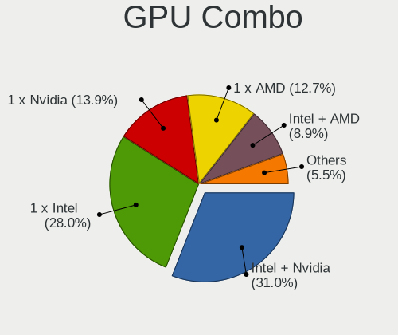

| Name                     | Computers | Percent |
|--------------------------|-----------|---------|
| Intel + Nvidia           | 207       | 31.55%  |
| 1 x Intel                | 175       | 26.68%  |
| 1 x Nvidia               | 93        | 14.18%  |
| 1 x AMD                  | 83        | 12.65%  |
| Intel + AMD              | 61        | 9.3%    |
| AMD + Nvidia             | 14        | 2.13%   |
| 2 x AMD                  | 11        | 1.68%   |
| Other                    | 3         | 0.46%   |
| 1 x Matrox               | 2         | 0.3%    |
| 2 x Nvidia + 1 x ASPEED  | 1         | 0.15%   |
| 2 x Intel                | 1         | 0.15%   |
| 1 x VIA                  | 1         | 0.15%   |
| 1 x Trident Microsystems | 1         | 0.15%   |
| 1 x SiS                  | 1         | 0.15%   |
| Nvidia + ASPEED          | 1         | 0.15%   |
| 1 x ASPEED               | 1         | 0.15%   |

GPU Driver
----------

Free vs proprietary

| Driver      | Computers | Percent |
|-------------|-----------|---------|
| Free        | 500       | 75.41%  |
| Proprietary | 141       | 21.27%  |
| Unknown     | 22        | 3.32%   |

GPU Memory
----------

Total video memory

| Size in GB | Computers | Percent |
|------------|-----------|---------|
| Unknown    | 321       | 48.2%   |
| 1.01-2.0   | 126       | 18.92%  |
| 0.51-1.0   | 70        | 10.51%  |
| 3.01-4.0   | 67        | 10.06%  |
| 0.01-0.5   | 54        | 8.11%   |
| 5.01-6.0   | 13        | 1.95%   |
| 7.01-8.0   | 12        | 1.8%    |
| 8.01-16.0  | 2         | 0.3%    |
| 2.01-3.0   | 1         | 0.15%   |

Monitor
-------

Monitor Vendor
--------------

Monitor vendors

| Vendor                  | Computers | Percent |
|-------------------------|-----------|---------|
| Samsung Electronics     | 106       | 16.46%  |
| LG Display              | 90        | 13.98%  |
| AU Optronics            | 88        | 13.66%  |
| BOE                     | 77        | 11.96%  |
| Chimei Innolux          | 74        | 11.49%  |
| Goldstar                | 66        | 10.25%  |
| Chi Mei Optoelectronics | 13        | 2.02%   |
| PANDA                   | 11        | 1.71%   |
| Hewlett-Packard         | 11        | 1.71%   |
| Ancor Communications    | 10        | 1.55%   |
| Apple                   | 9         | 1.4%    |
| AOC                     | 8         | 1.24%   |
| CHD                     | 7         | 1.09%   |
| BenQ                    | 7         | 1.09%   |
| Lenovo                  | 6         | 0.93%   |
| Dell                    | 6         | 0.93%   |
| Sony                    | 5         | 0.78%   |
| LG Electronics          | 5         | 0.78%   |
| HannStar                | 5         | 0.78%   |
| RTK                     | 4         | 0.62%   |
| Unknown                 | 3         | 0.47%   |
| Sharp                   | 3         | 0.47%   |
| LG Philips              | 3         | 0.47%   |
| MSI                     | 2         | 0.31%   |
| InnoLux Display         | 2         | 0.31%   |
| InfoVision              | 2         | 0.31%   |
| ASUSTek Computer        | 2         | 0.31%   |
| Acer                    | 2         | 0.31%   |
| XVision                 | 1         | 0.16%   |
| Xiaomi                  | 1         | 0.16%   |
| ViewSonic               | 1         | 0.16%   |
| Unknown (ADA)           | 1         | 0.16%   |
| TMX                     | 1         | 0.16%   |
| Seiko/Epson             | 1         | 0.16%   |
| SEEYOO                  | 1         | 0.16%   |
| Quanta Display          | 1         | 0.16%   |
| PAR                     | 1         | 0.16%   |
| Nvidia                  | 1         | 0.16%   |
| LGD                     | 1         | 0.16%   |
| KDC                     | 1         | 0.16%   |

Monitor Model
-------------

Monitor models

| Model                                                                    | Computers | Percent |
|--------------------------------------------------------------------------|-----------|---------|
| AU Optronics LCD Monitor AUO38ED 1920x1080 344x193mm 15.5-inch           | 12        | 1.83%   |
| BOE LCD Monitor BOE069C 1920x1080 344x193mm 15.5-inch                    | 8         | 1.22%   |
| AU Optronics LCD Monitor AUO26EC 1366x768 344x193mm 15.5-inch            | 8         | 1.22%   |
| Chimei Innolux LCD Monitor CMN15F5 1920x1080 344x193mm 15.5-inch         | 7         | 1.07%   |
| Chimei Innolux LCD Monitor CMN15D5 1920x1080 344x193mm 15.5-inch         | 7         | 1.07%   |
| LG Display LCD Monitor LGD02DC 1366x768 344x194mm 15.5-inch              | 6         | 0.92%   |
| AU Optronics LCD Monitor AUO22EC 1366x768 344x193mm 15.5-inch            | 6         | 0.92%   |
| Samsung Electronics S22B300 SAM08A9 1600x900 443x249mm 20.0-inch         | 5         | 0.76%   |
| LG Display LCD Monitor LGD04D4 3840x2160 344x194mm 15.5-inch             | 5         | 0.76%   |
| Goldstar W2053 GSM4E9F 1600x900 443x249mm 20.0-inch                      | 5         | 0.76%   |
| Goldstar LG IPS FULLHD GSM5AB8 1920x1080 480x270mm 21.7-inch             | 5         | 0.76%   |
| Goldstar IPS WSXGA GSM5B01 1440x900 419x262mm 19.5-inch                  | 5         | 0.76%   |
| Goldstar FULL HD GSM5B55 1920x1080 480x270mm 21.7-inch                   | 5         | 0.76%   |
| Chimei Innolux LCD Monitor CMN14D5 1920x1080 309x173mm 13.9-inch         | 5         | 0.76%   |
| Chi Mei Optoelectronics LCD Monitor CMO15A7 1366x768 344x193mm 15.5-inch | 5         | 0.76%   |
| AU Optronics LCD Monitor AUO21ED 1920x1080 344x193mm 15.5-inch           | 5         | 0.76%   |
| Samsung Electronics S22F350 SAM0D1A 1920x1080 477x268mm 21.5-inch        | 4         | 0.61%   |
| Samsung Electronics S20B300 SAM08A8 1600x900 443x249mm 20.0-inch         | 4         | 0.61%   |
| Samsung Electronics LCD Monitor SEC5441 1366x768 344x194mm 15.5-inch     | 4         | 0.61%   |
| RTK LCD Monitor RTK1D1A 1920x1080 1020x570mm 46.0-inch                   | 4         | 0.61%   |
| Chimei Innolux LCD Monitor CMN15E8 1920x1080 344x193mm 15.5-inch         | 4         | 0.61%   |
| Chimei Innolux LCD Monitor CMN15C4 1920x1080 344x193mm 15.5-inch         | 4         | 0.61%   |
| BOE LCD Monitor BOE06A5 1366x768 344x194mm 15.5-inch                     | 4         | 0.61%   |
| Samsung Electronics S22F350 SAM0D1B 1920x1080 477x268mm 21.5-inch        | 3         | 0.46%   |
| Samsung Electronics LCD Monitor SDC4752 1366x768 344x194mm 15.5-inch     | 3         | 0.46%   |
| Samsung Electronics LCD Monitor SDC434B 3840x2160 344x194mm 15.5-inch    | 3         | 0.46%   |
| PANDA LCD Monitor NCP004D 1920x1080 344x194mm 15.5-inch                  | 3         | 0.46%   |
| PANDA LCD Monitor NCP003B 1920x1080 344x194mm 15.5-inch                  | 3         | 0.46%   |
| LG Display LCD Monitor LGD046F 1920x1080 344x194mm 15.5-inch             | 3         | 0.46%   |
| LG Display LCD Monitor LGD045E 1366x768 310x174mm 14.0-inch              | 3         | 0.46%   |
| LG Display LCD Monitor LGD044F 1920x1080 345x194mm 15.6-inch             | 3         | 0.46%   |
| LG Display LCD Monitor LGD033A 1366x768 344x194mm 15.5-inch              | 3         | 0.46%   |
| Goldstar FULL HD GSM5ABB 1920x1080 480x270mm 21.7-inch                   | 3         | 0.46%   |
| Chimei Innolux LCD Monitor CMN15E6 1366x768 344x193mm 15.5-inch          | 3         | 0.46%   |
| Chimei Innolux LCD Monitor CMN15BD 1366x768 344x194mm 15.5-inch          | 3         | 0.46%   |
| Chimei Innolux LCD Monitor CMN14C0 1920x1080 308x173mm 13.9-inch         | 3         | 0.46%   |
| Chi Mei Optoelectronics LCD Monitor CMO15A1 1366x768 344x193mm 15.5-inch | 3         | 0.46%   |
| CHD 24VCF CHD0240 1920x1080 368x207mm 16.6-inch                          | 3         | 0.46%   |
| BOE LCD Monitor BOE08E2 1920x1080 344x194mm 15.5-inch                    | 3         | 0.46%   |
| BOE LCD Monitor BOE0675 1366x768 344x194mm 15.5-inch                     | 3         | 0.46%   |

Monitor Resolution
------------------

Monitor screen resolution

| Resolution         | Computers | Percent |
|--------------------|-----------|---------|
| 1920x1080 (FHD)    | 272       | 43.17%  |
| 1366x768 (WXGA)    | 188       | 29.84%  |
| 1600x900 (HD+)     | 36        | 5.71%   |
| 1440x900 (WXGA+)   | 26        | 4.13%   |
| 3840x2160 (4K)     | 25        | 3.97%   |
| 1280x800 (WXGA)    | 17        | 2.7%    |
| 1680x1050 (WSXGA+) | 9         | 1.43%   |
| 1280x1024 (SXGA)   | 8         | 1.27%   |
| 2560x1440 (QHD)    | 7         | 1.11%   |
| 1360x768           | 7         | 1.11%   |
| Unknown            | 5         | 0.79%   |
| 1024x600           | 4         | 0.63%   |
| 2560x1080          | 3         | 0.48%   |
| 1920x1200 (WUXGA)  | 3         | 0.48%   |
| 3240x2160          | 2         | 0.32%   |
| 2880x1800          | 2         | 0.32%   |
| 2880x1620          | 2         | 0.32%   |
| 2560x1600          | 2         | 0.32%   |
| 1280x960           | 2         | 0.32%   |
| 5760x2160          | 1         | 0.16%   |
| 3840x2400          | 1         | 0.16%   |
| 3840x1080          | 1         | 0.16%   |
| 3200x2000          | 1         | 0.16%   |
| 3200x1800 (QHD+)   | 1         | 0.16%   |
| 2944x1080          | 1         | 0.16%   |
| 2736x1824          | 1         | 0.16%   |
| 2720x768           | 1         | 0.16%   |
| 1680x945           | 1         | 0.16%   |
| 1280x720 (HD)      | 1         | 0.16%   |

Monitor Diagonal
----------------

Diagonal size in inches

| Inches  | Computers | Percent |
|---------|-----------|---------|
| 15      | 297       | 46.26%  |
| 14      | 52        | 8.1%    |
| 13      | 46        | 7.17%   |
| 21      | 45        | 7.01%   |
| 20      | 23        | 3.58%   |
| Unknown | 23        | 3.58%   |
| 19      | 19        | 2.96%   |
| 18      | 19        | 2.96%   |
| 23      | 18        | 2.8%    |
| 24      | 13        | 2.02%   |
| 17      | 13        | 2.02%   |
| 27      | 12        | 1.87%   |
| 12      | 12        | 1.87%   |
| 22      | 8         | 1.25%   |
| 16      | 8         | 1.25%   |
| 11      | 6         | 0.93%   |
| 10      | 5         | 0.78%   |
| 46      | 4         | 0.62%   |
| 29      | 3         | 0.47%   |
| 84      | 2         | 0.31%   |
| 72      | 2         | 0.31%   |
| 65      | 2         | 0.31%   |
| 54      | 2         | 0.31%   |
| 32      | 2         | 0.31%   |
| 31      | 2         | 0.31%   |
| 50      | 1         | 0.16%   |
| 40      | 1         | 0.16%   |
| 26      | 1         | 0.16%   |
| 7       | 1         | 0.16%   |

Monitor Width
-------------

Physical width

| Width in mm | Computers | Percent |
|-------------|-----------|---------|
| 301-350     | 387       | 60.56%  |
| 401-500     | 110       | 17.21%  |
| 501-600     | 43        | 6.73%   |
| 201-300     | 36        | 5.63%   |
| Unknown     | 23        | 3.6%    |
| 351-400     | 17        | 2.66%   |
| 1001-1500   | 9         | 1.41%   |
| 601-700     | 6         | 0.94%   |
| 1501-2000   | 4         | 0.63%   |
| 701-800     | 2         | 0.31%   |
| 801-900     | 1         | 0.16%   |
| 101-200     | 1         | 0.16%   |

Aspect Ratio
------------

Proportional relationship between the width and the height

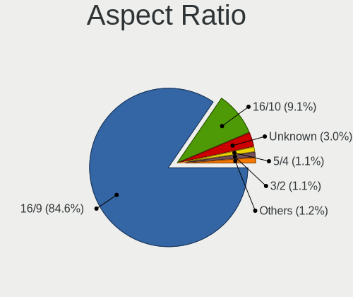

| Ratio   | Computers | Percent |
|---------|-----------|---------|
| 16/9    | 512       | 85.05%  |
| 16/10   | 53        | 8.8%    |
| Unknown | 21        | 3.49%   |
| 4/3     | 5         | 0.83%   |
| 3/2     | 5         | 0.83%   |
| 5/4     | 4         | 0.66%   |
| 21/9    | 2         | 0.33%   |

Monitor Area
------------

Area in inch

| Area in inch | Computers | Percent |
|----------------|-----------|---------|
| 101-110        | 297       | 46.26%  |
| 81-90          | 85        | 13.24%  |
| 201-250        | 75        | 11.68%  |
| 151-200        | 49        | 7.63%   |
| Unknown        | 23        | 3.58%   |
| 141-150        | 21        | 3.27%   |
| 301-350        | 14        | 2.18%   |
| 71-80          | 12        | 1.87%   |
| 61-70          | 11        | 1.71%   |
| 121-130        | 10        | 1.56%   |
| More than 1000 | 9         | 1.4%    |
| 51-60          | 6         | 0.93%   |
| 351-500        | 5         | 0.78%   |
| 41-50          | 5         | 0.78%   |
| 501-1000       | 5         | 0.78%   |
| 251-300        | 4         | 0.62%   |
| 131-140        | 4         | 0.62%   |
| 111-120        | 3         | 0.47%   |
| 91-100         | 3         | 0.47%   |
| 1-40           | 1         | 0.16%   |

Pixel Density
-------------

Pixels per inch

| Density       | Computers | Percent |
|---------------|-----------|---------|
| 121-160       | 211       | 33.33%  |
| 101-120       | 206       | 32.54%  |
| 51-100        | 152       | 24.01%  |
| Unknown       | 23        | 3.63%   |
| More than 240 | 17        | 2.69%   |
| 161-240       | 15        | 2.37%   |
| 1-50          | 9         | 1.42%   |

Multiple Monitors
-----------------

Total monitors connected

| Total | Computers | Percent |
|-------|-----------|---------|
| 1     | 558       | 84.42%  |
| 2     | 68        | 10.29%  |
| 0     | 34        | 5.14%   |
| 3     | 1         | 0.15%   |

Network
-------

Net Controller Vendor
---------------------

Controller vendors

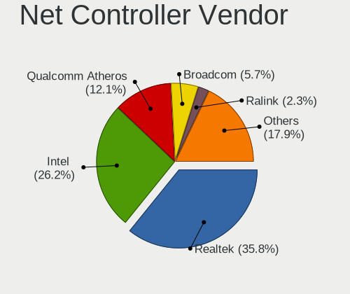

| Vendor                                 | Computers | Percent |
|----------------------------------------|-----------|---------|
| Realtek Semiconductor                  | 385       | 36.42%  |
| Intel                                  | 263       | 24.88%  |
| Qualcomm Atheros                       | 135       | 12.77%  |
| Broadcom                               | 62        | 5.87%   |
| Ralink Technology                      | 25        | 2.37%   |
| Samsung Electronics                    | 22        | 2.08%   |
| Ralink                                 | 20        | 1.89%   |
| MediaTek                               | 18        | 1.7%    |
| Broadcom Limited                       | 18        | 1.7%    |
| D-Link                                 | 16        | 1.51%   |
| Xiaomi                                 | 13        | 1.23%   |
| Marvell Technology Group               | 13        | 1.23%   |
| TP-Link                                | 9         | 0.85%   |
| VIA Technologies                       | 6         | 0.57%   |
| Huawei Technologies                    | 6         | 0.57%   |
| Nvidia                                 | 5         | 0.47%   |
| Hewlett-Packard                        | 5         | 0.47%   |
| D-Link System                          | 5         | 0.47%   |
| Qualcomm Atheros Communications        | 3         | 0.28%   |
| JMicron Technology                     | 3         | 0.28%   |
| HTC (High Tech Computer)               | 3         | 0.28%   |
| Qualcomm                               | 2         | 0.19%   |
| Microsoft                              | 2         | 0.19%   |
| ICS Advent                             | 2         | 0.19%   |
| ASUSTek Computer                       | 2         | 0.19%   |
| ASIX Electronics                       | 2         | 0.19%   |
| ZyDAS                                  | 1         | 0.09%   |
| Tenda                                  | 1         | 0.09%   |
| Sony Ericsson Mobile Communications AB | 1         | 0.09%   |
| Silicon Integrated Systems [SiS]       | 1         | 0.09%   |
| Sierra Wireless                        | 1         | 0.09%   |
| LG Electronics                         | 1         | 0.09%   |
| Lenovo                                 | 1         | 0.09%   |
| BUFFALO                                | 1         | 0.09%   |
| Attansic Technology                    | 1         | 0.09%   |
| Aquantia                               | 1         | 0.09%   |
| Apple                                  | 1         | 0.09%   |
| AboCom Systems                         | 1         | 0.09%   |

Net Controller Model
--------------------

Controller models

| Model                                                             | Computers | Percent |
|-------------------------------------------------------------------|-----------|---------|
| Realtek RTL8111/8168/8411 PCI Express Gigabit Ethernet Controller | 295       | 24.38%  |
| Realtek RTL810xE PCI Express Fast Ethernet controller             | 40        | 3.31%   |
| Intel Wireless 7265                                               | 24        | 1.98%   |
| Intel 82579LM Gigabit Network Connection (Lewisville)             | 24        | 1.98%   |
| Realtek RTL8821CE 802.11ac PCIe Wireless Network Adapter          | 23        | 1.9%    |
| Qualcomm Atheros QCA9377 802.11ac Wireless Network Adapter        | 23        | 1.9%    |
| Qualcomm Atheros AR9285 Wireless Network Adapter (PCI-Express)    | 21        | 1.74%   |
| Ralink MT7601U Wireless Adapter                                   | 18        | 1.49%   |
| Intel Wireless 7260                                               | 18        | 1.49%   |
| Qualcomm Atheros AR9485 Wireless Network Adapter                  | 17        | 1.4%    |
| Realtek RTL8723BE PCIe Wireless Network Adapter                   | 16        | 1.32%   |
| Intel Wireless 8265 / 8275                                        | 16        | 1.32%   |
| Qualcomm Atheros QCA9565 / AR9565 Wireless Network Adapter        | 15        | 1.24%   |
| Samsung Galaxy series, misc. (tethering mode)                     | 13        | 1.07%   |
| Intel Wireless 8260                                               | 13        | 1.07%   |
| Intel Comet Lake PCH-LP CNVi WiFi                                 | 13        | 1.07%   |
| Realtek RTL8821AE 802.11ac PCIe Wireless Network Adapter          | 12        | 0.99%   |
| Intel Wi-Fi 6 AX201                                               | 12        | 0.99%   |
| Intel Dual Band Wireless-AC 3165 Plus Bluetooth                   | 12        | 0.99%   |
| Intel Centrino Advanced-N 6205 [Taylor Peak]                      | 12        | 0.99%   |
| Broadcom BCM43142 802.11b/g/n                                     | 11        | 0.91%   |
| MediaTek MT7921 802.11ax PCI Express Wireless Network Adapter     | 10        | 0.83%   |
| Ralink RT3290 Wireless 802.11n 1T/1R PCIe                         | 9         | 0.74%   |
| Qualcomm Atheros AR9462 Wireless Network Adapter                  | 9         | 0.74%   |
| Broadcom NetLink BCM57785 Gigabit Ethernet PCIe                   | 9         | 0.74%   |
| Samsung GT-I9070 (network tethering, USB debugging enabled)       | 8         | 0.66%   |
| Realtek RTL8822CE 802.11ac PCIe Wireless Network Adapter          | 8         | 0.66%   |
| Qualcomm Atheros AR8131 Gigabit Ethernet                          | 8         | 0.66%   |
| Intel Comet Lake PCH CNVi WiFi                                    | 8         | 0.66%   |
| Intel Alder Lake-P PCH CNVi WiFi                                  | 8         | 0.66%   |
| Broadcom BCM4313 802.11bgn Wireless Network Adapter               | 8         | 0.66%   |
| Realtek RTL8188EUS 802.11n Wireless Network Adapter               | 7         | 0.58%   |
| Intel Ethernet Connection I217-LM                                 | 7         | 0.58%   |
| D-Link DWA-123 Wireless N 150 Adapter (rev.D1)                    | 7         | 0.58%   |
| Xiaomi Mi/Redmi series (RNDIS)                                    | 6         | 0.5%    |
| Xiaomi Mi/Redmi series (RNDIS + ADB)                              | 6         | 0.5%    |
| Ralink RT5370 Wireless Adapter                                    | 6         | 0.5%    |
| Qualcomm Atheros QCA8171 Gigabit Ethernet                         | 6         | 0.5%    |
| Qualcomm Atheros QCA6174 802.11ac Wireless Network Adapter        | 6         | 0.5%    |
| Intel Wi-Fi 6 AX200                                               | 6         | 0.5%    |

Wireless Vendor
---------------

Wireless vendors

| Vendor                          | Computers | Percent |
|---------------------------------|-----------|---------|
| Intel                           | 213       | 37.57%  |
| Qualcomm Atheros                | 103       | 18.17%  |
| Realtek Semiconductor           | 93        | 16.4%   |
| Broadcom                        | 40        | 7.05%   |
| Ralink Technology               | 25        | 4.41%   |
| Ralink                          | 20        | 3.53%   |
| MediaTek                        | 17        | 3%      |
| D-Link                          | 15        | 2.65%   |
| Broadcom Limited                | 15        | 2.65%   |
| TP-Link                         | 8         | 1.41%   |
| Hewlett-Packard                 | 4         | 0.71%   |
| Qualcomm Atheros Communications | 3         | 0.53%   |
| D-Link System                   | 3         | 0.53%   |
| Marvell Technology Group        | 2         | 0.35%   |
| ZyDAS                           | 1         | 0.18%   |
| Xiaomi                          | 1         | 0.18%   |
| Tenda                           | 1         | 0.18%   |
| Sierra Wireless                 | 1         | 0.18%   |
| BUFFALO                         | 1         | 0.18%   |
| AboCom Systems                  | 1         | 0.18%   |

Wireless Model
--------------

Wireless models

| Model                                                          | Computers | Percent |
|----------------------------------------------------------------|-----------|---------|
| Intel Wireless 7265                                            | 24        | 4.2%    |
| Realtek RTL8821CE 802.11ac PCIe Wireless Network Adapter       | 23        | 4.03%   |
| Qualcomm Atheros QCA9377 802.11ac Wireless Network Adapter     | 23        | 4.03%   |
| Qualcomm Atheros AR9285 Wireless Network Adapter (PCI-Express) | 21        | 3.68%   |
| Ralink MT7601U Wireless Adapter                                | 18        | 3.15%   |
| Intel Wireless 7260                                            | 18        | 3.15%   |
| Qualcomm Atheros AR9485 Wireless Network Adapter               | 17        | 2.98%   |
| Realtek RTL8723BE PCIe Wireless Network Adapter                | 16        | 2.8%    |
| Intel Wireless 8265 / 8275                                     | 16        | 2.8%    |
| Qualcomm Atheros QCA9565 / AR9565 Wireless Network Adapter     | 15        | 2.63%   |
| Intel Wireless 8260                                            | 13        | 2.28%   |
| Intel Comet Lake PCH-LP CNVi WiFi                              | 13        | 2.28%   |
| Realtek RTL8821AE 802.11ac PCIe Wireless Network Adapter       | 12        | 2.1%    |
| Intel Wi-Fi 6 AX201                                            | 12        | 2.1%    |
| Intel Dual Band Wireless-AC 3165 Plus Bluetooth                | 12        | 2.1%    |
| Intel Centrino Advanced-N 6205 [Taylor Peak]                   | 12        | 2.1%    |
| Broadcom BCM43142 802.11b/g/n                                  | 11        | 1.93%   |
| MediaTek MT7921 802.11ax PCI Express Wireless Network Adapter  | 10        | 1.75%   |
| Ralink RT3290 Wireless 802.11n 1T/1R PCIe                      | 9         | 1.58%   |
| Qualcomm Atheros AR9462 Wireless Network Adapter               | 9         | 1.58%   |
| Realtek RTL8822CE 802.11ac PCIe Wireless Network Adapter       | 8         | 1.4%    |
| Intel Comet Lake PCH CNVi WiFi                                 | 8         | 1.4%    |
| Intel Alder Lake-P PCH CNVi WiFi                               | 8         | 1.4%    |
| Broadcom BCM4313 802.11bgn Wireless Network Adapter            | 8         | 1.4%    |
| Realtek RTL8188EUS 802.11n Wireless Network Adapter            | 7         | 1.23%   |
| D-Link DWA-123 Wireless N 150 Adapter (rev.D1)                 | 7         | 1.23%   |
| Ralink RT5370 Wireless Adapter                                 | 6         | 1.05%   |
| Qualcomm Atheros QCA6174 802.11ac Wireless Network Adapter     | 6         | 1.05%   |
| Intel Wi-Fi 6 AX200                                            | 6         | 1.05%   |
| Intel Centrino Ultimate-N 6300                                 | 6         | 1.05%   |
| Intel Centrino Advanced-N 6200                                 | 6         | 1.05%   |
| Realtek RTL8852AE 802.11ax PCIe Wireless Network Adapter       | 5         | 0.88%   |
| Realtek RTL8822BE 802.11a/b/g/n/ac WiFi adapter                | 5         | 0.88%   |
| Intel Cannon Lake PCH CNVi WiFi                                | 5         | 0.88%   |
| TP-Link TL-WN823N v2/v3 [Realtek RTL8192EU]                    | 4         | 0.7%    |
| Realtek RTL8192EU 802.11b/g/n WLAN Adapter                     | 4         | 0.7%    |
| Realtek RTL8188FTV 802.11b/g/n 1T1R 2.4G WLAN Adapter          | 4         | 0.7%    |
| MediaTek MT7922 802.11ax PCI Express Wireless Network Adapter  | 4         | 0.7%    |
| Intel Wireless 3165                                            | 4         | 0.7%    |
| Intel Wireless 3160                                            | 4         | 0.7%    |

Ethernet Vendor
---------------

Ethernet vendors

| Vendor                                 | Computers | Percent |
|----------------------------------------|-----------|---------|
| Realtek Semiconductor                  | 350       | 56.18%  |
| Intel                                  | 106       | 17.01%  |
| Qualcomm Atheros                       | 51        | 8.19%   |
| Broadcom                               | 32        | 5.14%   |
| Samsung Electronics                    | 13        | 2.09%   |
| Xiaomi                                 | 12        | 1.93%   |
| Marvell Technology Group               | 11        | 1.77%   |
| VIA Technologies                       | 6         | 0.96%   |
| Huawei Technologies                    | 6         | 0.96%   |
| Nvidia                                 | 5         | 0.8%    |
| JMicron Technology                     | 3         | 0.48%   |
| HTC (High Tech Computer)               | 3         | 0.48%   |
| Broadcom Limited                       | 3         | 0.48%   |
| Qualcomm                               | 2         | 0.32%   |
| Microsoft                              | 2         | 0.32%   |
| ICS Advent                             | 2         | 0.32%   |
| D-Link System                          | 2         | 0.32%   |
| ASIX Electronics                       | 2         | 0.32%   |
| TP-Link                                | 1         | 0.16%   |
| Sony Ericsson Mobile Communications AB | 1         | 0.16%   |
| Silicon Integrated Systems [SiS]       | 1         | 0.16%   |
| MediaTek                               | 1         | 0.16%   |
| LG Electronics                         | 1         | 0.16%   |
| Lenovo                                 | 1         | 0.16%   |
| Hewlett-Packard                        | 1         | 0.16%   |
| D-Link                                 | 1         | 0.16%   |
| Attansic Technology                    | 1         | 0.16%   |
| ASUSTek Computer                       | 1         | 0.16%   |
| Aquantia                               | 1         | 0.16%   |
| Apple                                  | 1         | 0.16%   |

Ethernet Model
--------------

Ethernet models

| Model                                                             | Computers | Percent |
|-------------------------------------------------------------------|-----------|---------|
| Realtek RTL8111/8168/8411 PCI Express Gigabit Ethernet Controller | 295       | 46.97%  |
| Realtek RTL810xE PCI Express Fast Ethernet controller             | 40        | 6.37%   |
| Intel 82579LM Gigabit Network Connection (Lewisville)             | 24        | 3.82%   |
| Samsung Galaxy series, misc. (tethering mode)                     | 13        | 2.07%   |
| Broadcom NetLink BCM57785 Gigabit Ethernet PCIe                   | 9         | 1.43%   |
| Qualcomm Atheros AR8131 Gigabit Ethernet                          | 8         | 1.27%   |
| Intel Ethernet Connection I217-LM                                 | 7         | 1.11%   |
| Xiaomi Mi/Redmi series (RNDIS)                                    | 6         | 0.96%   |
| Xiaomi Mi/Redmi series (RNDIS + ADB)                              | 6         | 0.96%   |
| Qualcomm Atheros QCA8171 Gigabit Ethernet                         | 6         | 0.96%   |
| Intel 82577LM Gigabit Network Connection                          | 6         | 0.96%   |
| VIA VT6105/VT6106S [Rhine-III]                                    | 5         | 0.8%    |
| Realtek RTL8125 2.5GbE Controller                                 | 5         | 0.8%    |
| Realtek RTL-8100/8101L/8139 PCI Fast Ethernet Adapter             | 5         | 0.8%    |
| Qualcomm Atheros AR8132 Fast Ethernet                             | 5         | 0.8%    |
| Qualcomm Atheros AR8121/AR8113/AR8114 Gigabit or Fast Ethernet    | 5         | 0.8%    |
| Intel Ethernet Connection I219-LM                                 | 5         | 0.8%    |
| Intel Ethernet Connection (3) I218-LM                             | 5         | 0.8%    |
| Intel Ethernet Connection (2) I219-V                              | 5         | 0.8%    |
| Intel Ethernet Connection (2) I219-LM                             | 5         | 0.8%    |
| Intel 82567LM-3 Gigabit Network Connection                        | 5         | 0.8%    |
| Huawei MAR-LX1M                                                   | 5         | 0.8%    |
| Broadcom NetLink BCM57780 Gigabit Ethernet PCIe                   | 5         | 0.8%    |
| Realtek RTL8153 Gigabit Ethernet Adapter                          | 4         | 0.64%   |
| Qualcomm Atheros QCA8172 Fast Ethernet                            | 4         | 0.64%   |
| Qualcomm Atheros Killer E220x Gigabit Ethernet Controller         | 4         | 0.64%   |
| Intel Ethernet Connection I218-LM                                 | 4         | 0.64%   |
| Intel Ethernet Connection (7) I219-V                              | 4         | 0.64%   |
| Qualcomm Atheros AR8161 Gigabit Ethernet                          | 3         | 0.48%   |
| Qualcomm Atheros AR8152 v2.0 Fast Ethernet                        | 3         | 0.48%   |
| Qualcomm Atheros AR8152 v1.1 Fast Ethernet                        | 3         | 0.48%   |
| Qualcomm Atheros AR8151 v2.0 Gigabit Ethernet                     | 3         | 0.48%   |
| Marvell Group 88E8055 PCI-E Gigabit Ethernet Controller           | 3         | 0.48%   |
| Marvell Group 88E8040 PCI-E Fast Ethernet Controller              | 3         | 0.48%   |
| JMicron JMC250 PCI Express Gigabit Ethernet Controller            | 3         | 0.48%   |
| Intel I211 Gigabit Network Connection                             | 3         | 0.48%   |
| Intel Ethernet Connection (2) I218-V                              | 3         | 0.48%   |
| Intel Ethernet Connection (16) I219-LM                            | 3         | 0.48%   |
| Broadcom NetXtreme BCM5762 Gigabit Ethernet PCIe                  | 3         | 0.48%   |
| Realtek RTL8169 PCI Gigabit Ethernet Controller                   | 2         | 0.32%   |

Net Controller Kind
-------------------

Ethernet, WiFi or modem

| Kind     | Computers | Percent |
|----------|-----------|---------|
| Ethernet | 574       | 50.62%  |
| WiFi     | 549       | 48.41%  |
| Modem    | 9         | 0.79%   |
| Unknown  | 2         | 0.18%   |

Used Controller
---------------

Currently used network controller

| Kind     | Computers | Percent |
|----------|-----------|---------|
| WiFi     | 458       | 71.56%  |
| Ethernet | 181       | 28.28%  |
| Unknown  | 1         | 0.16%   |

NICs
----

Total network controllers on board

| Total | Computers | Percent |
|-------|-----------|---------|
| 2     | 410       | 62.6%   |
| 1     | 232       | 35.42%  |
| 0     | 6         | 0.92%   |
| 3     | 4         | 0.61%   |
| 4     | 2         | 0.31%   |
| 8     | 1         | 0.15%   |

IPv6
----

IPv6 vs IPv4

| Used | Computers | Percent |
|------|-----------|---------|
| No   | 615       | 93.04%  |
| Yes  | 46        | 6.96%   |

Bluetooth
---------

Bluetooth Vendor
----------------

Controller vendors

| Vendor                          | Computers | Percent |
|---------------------------------|-----------|---------|
| Intel                           | 157       | 37.47%  |
| IMC Networks                    | 59        | 14.08%  |
| Realtek Semiconductor           | 40        | 9.55%   |
| Qualcomm Atheros Communications | 32        | 7.64%   |
| Broadcom                        | 21        | 5.01%   |
| Cambridge Silicon Radio         | 18        | 4.3%    |
| Lite-On Technology              | 17        | 4.06%   |
| Foxconn / Hon Hai               | 17        | 4.06%   |
| ASUSTek Computer                | 10        | 2.39%   |
| Ralink                          | 9         | 2.15%   |
| Dell                            | 9         | 2.15%   |
| Apple                           | 8         | 1.91%   |
| Foxconn International           | 6         | 1.43%   |
| Ralink Technology               | 3         | 0.72%   |
| Hewlett-Packard                 | 3         | 0.72%   |
| Realtek                         | 2         | 0.48%   |
| Marvell Semiconductor           | 2         | 0.48%   |
| Askey Computer                  | 2         | 0.48%   |
| Micro Star International        | 1         | 0.24%   |
| MediaTek                        | 1         | 0.24%   |
| Integrated System Solution      | 1         | 0.24%   |
| Alps Electric                   | 1         | 0.24%   |

Bluetooth Model
---------------

Controller models

| Model                                                                               | Computers | Percent |
|-------------------------------------------------------------------------------------|-----------|---------|
| Intel Bluetooth wireless interface                                                  | 81        | 19.33%  |
| Intel Bluetooth Device                                                              | 36        | 8.59%   |
| Realtek Bluetooth Radio                                                             | 25        | 5.97%   |
| IMC Networks Bluetooth Radio                                                        | 24        | 5.73%   |
| Intel Bluetooth 9460/9560 Jefferson Peak (JfP)                                      | 21        | 5.01%   |
| Cambridge Silicon Radio Bluetooth Dongle (HCI mode)                                 | 18        | 4.3%    |
| Qualcomm Atheros  Bluetooth Device                                                  | 14        | 3.34%   |
| IMC Networks Wireless_Device                                                        | 12        | 2.86%   |
| IMC Networks Bluetooth Device                                                       | 11        | 2.63%   |
| Ralink RT3290 Bluetooth                                                             | 9         | 2.15%   |
| Realtek RTL8723B Bluetooth                                                          | 7         | 1.67%   |
| Qualcomm Atheros AR3011 Bluetooth                                                   | 7         | 1.67%   |
| Intel Centrino Bluetooth Wireless Transceiver                                       | 7         | 1.67%   |
| ASUS BT-270 Bluetooth Adapter                                                       | 7         | 1.67%   |
| Qualcomm Atheros AR3012 Bluetooth 4.0                                               | 6         | 1.43%   |
| Intel AX200 Bluetooth                                                               | 6         | 1.43%   |
| Foxconn International BCM43142A0 Bluetooth module                                   | 6         | 1.43%   |
| Realtek RTL8821A Bluetooth                                                          | 5         | 1.19%   |
| Lite-On Qualcomm Atheros QCA9377 Bluetooth                                          | 5         | 1.19%   |
| Lite-On Bluetooth Device                                                            | 5         | 1.19%   |
| IMC Networks Atheros AR3012 Bluetooth 4.0 Adapter                                   | 5         | 1.19%   |
| Foxconn / Hon Hai Bluetooth Device                                                  | 5         | 1.19%   |
| Broadcom BCM20702A0                                                                 | 4         | 0.95%   |
| Apple Bluetooth Host Controller                                                     | 4         | 0.95%   |
| Realtek RTL8822BE Bluetooth 4.2 Adapter                                             | 3         | 0.72%   |
| Lite-On Atheros AR3012 Bluetooth                                                    | 3         | 0.72%   |
| Intel Centrino Advanced-N 6230 Bluetooth adapter                                    | 3         | 0.72%   |
| IMC Networks Bluetooth USB Host Controller                                          | 3         | 0.72%   |
| Foxconn / Hon Hai Foxconn T77H114 BCM2070 [Single-Chip Bluetooth 2.1 + EDR Adapter] | 3         | 0.72%   |
| Broadcom HP Portable SoftSailing                                                    | 3         | 0.72%   |
| Broadcom BCM43142 Bluetooth 4.0                                                     | 3         | 0.72%   |
| Broadcom BCM2070 Bluetooth 2.1 + EDR                                                | 3         | 0.72%   |
| Apple Bluetooth USB Host Controller                                                 | 3         | 0.72%   |
| Realtek Bluetooth Radio                                                             | 2         | 0.48%   |
| Ralink Motorola BC4 Bluetooth 3.0+HS Adapter                                        | 2         | 0.48%   |
| Marvell Bluetooth and Wireless LAN Composite                                        | 2         | 0.48%   |
| Lite-On Broadcom BCM43142A0 Bluetooth Device                                        | 2         | 0.48%   |
| Intel Wireless-AC 3168 Bluetooth                                                    | 2         | 0.48%   |
| IMC Networks Bluetooth                                                              | 2         | 0.48%   |
| HP Broadcom 2070 Bluetooth Combo                                                    | 2         | 0.48%   |

Sound
-----

Sound Vendor
------------

Sound card vendors

| Vendor                           | Computers | Percent |
|----------------------------------|-----------|---------|
| Intel                            | 560       | 65.8%   |
| Nvidia                           | 146       | 17.16%  |
| AMD                              | 117       | 13.75%  |
| C-Media Electronics              | 6         | 0.71%   |
| Generalplus Technology           | 5         | 0.59%   |
| ASUSTek Computer                 | 4         | 0.47%   |
| Silicon Integrated Systems [SiS] | 2         | 0.24%   |
| Focusrite-Novation               | 2         | 0.24%   |
| Creative Labs                    | 2         | 0.24%   |
| Yamaha                           | 1         | 0.12%   |
| VIA Technologies                 | 1         | 0.12%   |
| ULi Electronics                  | 1         | 0.12%   |
| Native Instruments               | 1         | 0.12%   |
| ESS Technology                   | 1         | 0.12%   |
| CMX Systems                      | 1         | 0.12%   |
| BR23                             | 1         | 0.12%   |

Sound Model
-----------

Sound card models

| Model                                                                      | Computers | Percent |
|----------------------------------------------------------------------------|-----------|---------|
| Intel Sunrise Point-LP HD Audio                                            | 71        | 7.14%   |
| Intel 7 Series/C216 Chipset Family High Definition Audio Controller        | 63        | 6.34%   |
| Intel 6 Series/C200 Series Chipset Family High Definition Audio Controller | 49        | 4.93%   |
| Intel 8 Series/C220 Series Chipset High Definition Audio Controller        | 46        | 4.63%   |
| Intel 5 Series/3400 Series Chipset High Definition Audio                   | 38        | 3.82%   |
| Intel Xeon E3-1200 v3/4th Gen Core Processor HD Audio Controller           | 35        | 3.52%   |
| AMD Family 17h/19h HD Audio Controller                                     | 31        | 3.12%   |
| Intel NM10/ICH7 Family High Definition Audio Controller                    | 30        | 3.02%   |
| Intel 100 Series/C230 Series Chipset Family HD Audio Controller            | 28        | 2.82%   |
| Intel Haswell-ULT HD Audio Controller                                      | 25        | 2.52%   |
| Intel 8 Series HD Audio Controller                                         | 25        | 2.52%   |
| Intel Broadwell-U Audio Controller                                         | 24        | 2.41%   |
| Nvidia GF108 High Definition Audio Controller                              | 23        | 2.31%   |
| Intel Wildcat Point-LP High Definition Audio Controller                    | 23        | 2.31%   |
| Intel Cannon Lake PCH cAVS                                                 | 23        | 2.31%   |
| AMD Renoir Radeon High Definition Audio Controller                         | 18        | 1.81%   |
| Intel Tiger Lake-LP Smart Sound Technology Audio Controller                | 16        | 1.61%   |
| AMD Cedar HDMI Audio [Radeon HD 5400/6300/7300 Series]                     | 16        | 1.61%   |
| Intel CM238 HD Audio Controller                                            | 15        | 1.51%   |
| Intel 82801I (ICH9 Family) HD Audio Controller                             | 15        | 1.51%   |
| AMD FCH Azalia Controller                                                  | 15        | 1.51%   |
| Nvidia High Definition Audio Controller                                    | 14        | 1.41%   |
| Intel Comet Lake PCH-LP cAVS                                               | 14        | 1.41%   |
| AMD Kabini HDMI/DP Audio                                                   | 14        | 1.41%   |
| Intel Alder Lake PCH-P High Definition Audio Controller                    | 13        | 1.31%   |
| Intel Comet Lake PCH cAVS                                                  | 11        | 1.11%   |
| Nvidia TU107 GeForce GTX 1650 High Definition Audio Controller             | 10        | 1.01%   |
| Nvidia GF119 HDMI Audio Controller                                         | 9         | 0.91%   |
| Nvidia Audio device                                                        | 9         | 0.91%   |
| Intel Cannon Point-LP High Definition Audio Controller                     | 9         | 0.91%   |
| Intel 82801H (ICH8 Family) HD Audio Controller                             | 9         | 0.91%   |
| Intel 200 Series PCH HD Audio                                              | 9         | 0.91%   |
| AMD Oland/Hainan/Cape Verde/Pitcairn HDMI Audio [Radeon HD 7000 Series]    | 9         | 0.91%   |
| AMD Family 15h (Models 60h-6fh) Audio Controller                           | 9         | 0.91%   |
| Nvidia GP107GL High Definition Audio Controller                            | 8         | 0.8%    |
| Nvidia GM107 High Definition Audio Controller [GeForce 940MX]              | 8         | 0.8%    |
| AMD SBx00 Azalia (Intel HDA)                                               | 8         | 0.8%    |
| Nvidia TU116 High Definition Audio Controller                              | 7         | 0.7%    |
| Intel Celeron/Pentium Silver Processor High Definition Audio               | 7         | 0.7%    |
| AMD Raven/Raven2/Fenghuang HDMI/DP Audio Controller                        | 7         | 0.7%    |

Memory
------

Memory Vendor
-------------

Memory module vendors

| Vendor              | Computers | Percent |
|---------------------|-----------|---------|
| Samsung Electronics | 108       | 27.76%  |
| SK hynix            | 69        | 17.74%  |
| Micron Technology   | 49        | 12.6%   |
| Kingston            | 31        | 7.97%   |
| Unknown             | 30        | 7.71%   |
| Crucial             | 29        | 7.46%   |
| Ramaxel Technology  | 15        | 3.86%   |
| Elpida              | 14        | 3.6%    |
| A-DATA Technology   | 7         | 1.8%    |
| GeIL                | 6         | 1.54%   |
| Corsair             | 6         | 1.54%   |
| Apacer              | 6         | 1.54%   |
| G.Skill             | 4         | 1.03%   |
| Kingmax             | 3         | 0.77%   |
| Ramos Technology    | 2         | 0.51%   |
| Nanya Technology    | 2         | 0.51%   |
| Unknown             | 2         | 0.51%   |
| Unknown (8A02)      | 1         | 0.26%   |
| TwinMOS             | 1         | 0.26%   |
| Transcend           | 1         | 0.26%   |
| Silicon Power       | 1         | 0.26%   |
| Neo Forza           | 1         | 0.26%   |
| ASint Technology    | 1         | 0.26%   |

Memory Model
------------

Memory module models

| Model                                                        | Computers | Percent |
|--------------------------------------------------------------|-----------|---------|
| Samsung RAM M471A5244CB0-CTD 4GB SODIMM DDR4 3266MT/s        | 8         | 1.9%    |
| Samsung RAM M471B5273DH0-CH9 4096MB SODIMM DDR3 1334MT/s     | 7         | 1.67%   |
| Samsung RAM M471B5173QH0-YK0 4GB SODIMM DDR3 1600MT/s        | 7         | 1.67%   |
| Crucial RAM CB16GS2666.C8ET 16GB SODIMM DDR4 2667MT/s        | 7         | 1.67%   |
| SK hynix RAM HMA81GS6AFR8N-UH 8GB SODIMM DDR4 2667MT/s       | 6         | 1.43%   |
| SK hynix RAM HMA41GS6AFR8N-TF 8GB SODIMM DDR4 2667MT/s       | 6         | 1.43%   |
| Samsung RAM M471B5173DB0-YK0 4GB SODIMM DDR3 1600MT/s        | 6         | 1.43%   |
| Elpida RAM EBJ41UF8BCS0-DJ-F 4GB SODIMM DDR3 1334MT/s        | 6         | 1.43%   |
| SK hynix RAM HMT451S6AFR8A-PB 4096MB SODIMM DDR3 1600MT/s    | 5         | 1.19%   |
| Samsung RAM M471B1G73QH0-YK0 8GB SODIMM DDR3 1867MT/s        | 5         | 1.19%   |
| Samsung RAM M471A5244CB0-CRC 4096MB SODIMM DDR4 2667MT/s     | 5         | 1.19%   |
| Samsung RAM M471A1K43CB1-CRC 8GB SODIMM DDR4 2667MT/s        | 5         | 1.19%   |
| Samsung RAM M425R1GB4BB0-CQKOL 8GB SODIMM DDR5 4800MT/s      | 5         | 1.19%   |
| Samsung RAM M471B5173EB0-YK0 4GB SODIMM DDR3 1600MT/s        | 4         | 0.95%   |
| Samsung RAM M471A2K43CB1-CRC 16GB SODIMM DDR4 2667MT/s       | 4         | 0.95%   |
| Micron RAM 8ATF1G64HZ-3G2J1 8GB SODIMM DDR4 3200MT/s         | 4         | 0.95%   |
| Micron RAM 8ATF1G64HZ-2G3B1 8GB SODIMM DDR4 2400MT/s         | 4         | 0.95%   |
| GeIL RAM CL17-17-17 D4-2400 8GB DIMM DDR4 2400MT/s           | 4         | 0.95%   |
| SK hynix RAM HMT41GS6BFR8A-PB 8GB SODIMM DDR3 1600MT/s       | 3         | 0.71%   |
| SK hynix RAM HMT325S6CFR8C-PB 2GB SODIMM DDR3 1600MT/s       | 3         | 0.71%   |
| SK hynix RAM HMA851S6JJR6N-VK 4GB SODIMM DDR4 2667MT/s       | 3         | 0.71%   |
| Samsung RAM M471B5273CH0-CH9 4096MB SODIMM DDR3 1334MT/s     | 3         | 0.71%   |
| Samsung RAM M471A5244CB0-CWE 4GB SODIMM DDR4 3200MT/s        | 3         | 0.71%   |
| Samsung RAM M471A2K43CB1-CTD 16GB SODIMM DDR4 8400MT/s       | 3         | 0.71%   |
| Samsung RAM M471A1K43BB1-CRC 8GB SODIMM DDR4 2667MT/s        | 3         | 0.71%   |
| Micron RAM 16KTF51264HZ-1G6M1 4GB SODIMM DDR3 1600MT/s       | 3         | 0.71%   |
| Unknown RAM Module 8GB DIMM DDR3 1333MT/s                    | 2         | 0.48%   |
| Unknown RAM Module 2GB SODIMM DDR2 667MT/s                   | 2         | 0.48%   |
| Unknown RAM Module 2GB DIMM 800MT/s                          | 2         | 0.48%   |
| Unknown RAM Module 1GB SODIMM DDR2 667MT/s                   | 2         | 0.48%   |
| SK hynix RAM HMT451S6BFR8A-PB 4GB SODIMM DDR3 1600MT/s       | 2         | 0.48%   |
| SK hynix RAM HMT41GU6BFR8C-PB 8GB DIMM DDR3 1600MT/s         | 2         | 0.48%   |
| SK hynix RAM HMT351S6EFR8A-PB 4GB SODIMM DDR3 1600MT/s       | 2         | 0.48%   |
| SK hynix RAM HMT351S6CFR8C-PB 4GB SODIMM DDR3 1600MT/s       | 2         | 0.48%   |
| SK hynix RAM HMT351S6BFR8C-H9 4GB SODIMM DDR3 1334MT/s       | 2         | 0.48%   |
| SK hynix RAM HMT351S6BFR8C-H9 4GB SODIMM DDR3 1333MT/s       | 2         | 0.48%   |
| SK hynix RAM HMT325S6BFR8C-H9 2GB SODIMM DDR3 1600MT/s       | 2         | 0.48%   |
| SK hynix RAM HMAB2GS6CMR6N-XN 16GB SODIMM DDR4 3200MT/s      | 2         | 0.48%   |
| SK hynix RAM HMA851S6DJR6N-XN 4GB SODIMM DDR4 3200MT/s       | 2         | 0.48%   |
| SK hynix RAM HMA851S6CJR6N-XN 4GB Row Of Chips DDR4 3200MT/s | 2         | 0.48%   |

Memory Kind
-----------

Memory module kinds

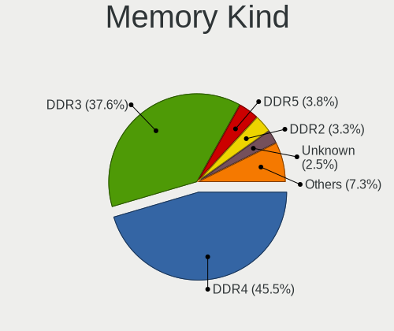

| Kind    | Computers | Percent |
|---------|-----------|---------|
| DDR4    | 144       | 45.71%  |
| DDR3    | 128       | 40.63%  |
| DDR2    | 10        | 3.17%   |
| DDR5    | 8         | 2.54%   |
| Unknown | 8         | 2.54%   |
| SDRAM   | 6         | 1.9%    |
| LPDDR4  | 4         | 1.27%   |
| LPDDR5  | 3         | 0.95%   |
| LPDDR3  | 3         | 0.95%   |
| DDR     | 1         | 0.32%   |

Memory Form Factor
------------------

Physical design of the memory module

| Name         | Computers | Percent |
|--------------|-----------|---------|
| SODIMM       | 227       | 72.52%  |
| DIMM         | 70        | 22.36%  |
| Row Of Chips | 14        | 4.47%   |
| Chip         | 2         | 0.64%   |

Memory Size
-----------

Memory module size

| Size  | Computers | Percent |
|-------|-----------|---------|
| 8192  | 135       | 37.29%  |
| 4096  | 120       | 33.15%  |
| 16384 | 48        | 13.26%  |
| 2048  | 45        | 12.43%  |
| 1024  | 9         | 2.49%   |
| 32768 | 4         | 1.1%    |
| 65536 | 1         | 0.28%   |

Memory Speed
------------

Memory module speed

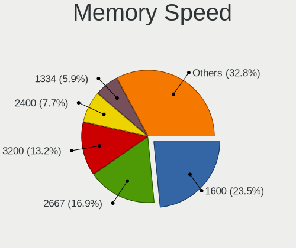

| Speed   | Computers | Percent |
|---------|-----------|---------|
| 1600    | 87        | 24.93%  |
| 2667    | 59        | 16.91%  |
| 3200    | 45        | 12.89%  |
| 2400    | 29        | 8.31%   |
| 1334    | 23        | 6.59%   |
| 1333    | 20        | 5.73%   |
| 2133    | 17        | 4.87%   |
| 4800    | 8         | 2.29%   |
| 3266    | 8         | 2.29%   |
| Unknown | 8         | 2.29%   |
| 667     | 7         | 2.01%   |
| 4199    | 5         | 1.43%   |
| 800     | 5         | 1.43%   |
| 8400    | 3         | 0.86%   |
| 6400    | 3         | 0.86%   |
| 2933    | 3         | 0.86%   |
| 1867    | 3         | 0.86%   |
| 1067    | 3         | 0.86%   |
| 4266    | 2         | 0.57%   |
| 533     | 2         | 0.57%   |
| 3600    | 1         | 0.29%   |
| 3066    | 1         | 0.29%   |
| 2800    | 1         | 0.29%   |
| 2666    | 1         | 0.29%   |
| 1866    | 1         | 0.29%   |
| 1800    | 1         | 0.29%   |
| 1400    | 1         | 0.29%   |
| 1328    | 1         | 0.29%   |
| 400     | 1         | 0.29%   |

Printers & scanners
-------------------

Printer Vendor
--------------

Printer device vendors

| Vendor              | Computers | Percent |
|---------------------|-----------|---------|
| Hewlett-Packard     | 3         | 42.86%  |
| Canon               | 3         | 42.86%  |
| Samsung Electronics | 1         | 14.29%  |

Printer Model
-------------

Printer device models

| Model                                | Computers | Percent |
|--------------------------------------|-----------|---------|
| Samsung ML-1640 Series Laser Printer | 1         | 14.29%  |
| HP LaserJet P1102                    | 1         | 14.29%  |
| HP LaserJet 1018                     | 1         | 14.29%  |
| HP DeskJet 2130 series               | 1         | 14.29%  |
| Canon PIXMA MG5600 Series            | 1         | 14.29%  |
| Canon LBP6300                        | 1         | 14.29%  |
| Canon iR2004/2204 UFRII LT           | 1         | 14.29%  |

Scanner Vendor
--------------

Scanner device vendors

| Vendor | Computers | Percent |
|--------|-----------|---------|
| Canon  | 3         | 100%    |

Scanner Model
-------------

Scanner device models

| Model                              | Computers | Percent |
|------------------------------------|-----------|---------|
| Canon CanoScan N670U/N676U/LiDE 20 | 1         | 33.33%  |
| Canon CanoScan LiDE 120            | 1         | 33.33%  |
| Canon CanoScan 4400F               | 1         | 33.33%  |

Camera
------

Camera Vendor
-------------

Camera device vendors

| Vendor                                 | Computers | Percent |
|----------------------------------------|-----------|---------|
| Chicony Electronics                    | 99        | 22.2%   |
| IMC Networks                           | 95        | 21.3%   |
| Realtek Semiconductor                  | 32        | 7.17%   |
| Bison Electronics                      | 32        | 7.17%   |
| Microdia                               | 30        | 6.73%   |
| Syntek                                 | 19        | 4.26%   |
| Sunplus Innovation Technology          | 17        | 3.81%   |
| Cheng Uei Precision Industry (Foxlink) | 17        | 3.81%   |
| Apple                                  | 16        | 3.59%   |
| Sonix Technology                       | 12        | 2.69%   |
| Lite-On Technology                     | 11        | 2.47%   |
| Quanta                                 | 10        | 2.24%   |
| Suyin                                  | 9         | 2.02%   |
| Acer                                   | 8         | 1.79%   |
| Ricoh                                  | 7         | 1.57%   |
| Samsung Electronics                    | 6         | 1.35%   |
| Pixart Imaging                         | 3         | 0.67%   |
| Lenovo                                 | 3         | 0.67%   |
| ALi                                    | 3         | 0.67%   |
| Alcor Micro                            | 3         | 0.67%   |
| Silicon Motion                         | 2         | 0.45%   |
| Luxvisions Innotech Limited            | 2         | 0.45%   |
| Importek                               | 2         | 0.45%   |
| Sunplus Technology                     | 1         | 0.22%   |
| Primax Electronics                     | 1         | 0.22%   |
| OmniVision Technologies                | 1         | 0.22%   |
| MacroSilicon                           | 1         | 0.22%   |
| LG Electronics                         | 1         | 0.22%   |
| KYE Systems (Mouse Systems)            | 1         | 0.22%   |
| Goertek Electronics                    | 1         | 0.22%   |
| Generalplus Technology                 | 1         | 0.22%   |

Camera Model
------------

Camera device models

| Model                                               | Computers | Percent |
|-----------------------------------------------------|-----------|---------|
| IMC Networks USB2.0 VGA UVC WebCam                  | 33        | 7.4%    |
| IMC Networks USB2.0 HD UVC WebCam                   | 22        | 4.93%   |
| IMC Networks Integrated Camera                      | 16        | 3.59%   |
| Chicony Integrated Camera                           | 14        | 3.14%   |
| Chicony USB2.0 HD UVC WebCam                        | 10        | 2.24%   |
| Apple iPhone 5/5C/5S/6/SE                           | 10        | 2.24%   |
| IMC Networks Lenovo EasyCamera                      | 9         | 2.02%   |
| Chicony EasyCamera                                  | 9         | 2.02%   |
| Sonix USB2.0 HD UVC WebCam                          | 8         | 1.79%   |
| Chicony HD WebCam                                   | 8         | 1.79%   |
| Realtek USB Camera                                  | 7         | 1.57%   |
| Bison Lenovo EasyCamera                             | 7         | 1.57%   |
| Bison Integrated Camera                             | 7         | 1.57%   |
| Syntek Lenovo EasyCamera                            | 6         | 1.35%   |
| Syntek Integrated Camera                            | 6         | 1.35%   |
| Syntek EasyCamera                                   | 6         | 1.35%   |
| Sunplus HD WebCam                                   | 6         | 1.35%   |
| Samsung Galaxy series, misc. (MTP mode)             | 6         | 1.35%   |
| Realtek USB2.0 VGA UVC WebCam                       | 6         | 1.35%   |
| Microdia Laptop_Integrated_Webcam_HD                | 6         | 1.35%   |
| Lite-On Integrated Camera                           | 6         | 1.35%   |
| Chicony HP HD Webcam                                | 6         | 1.35%   |
| Cheng Uei Precision Industry (Foxlink) HP HD Webcam | 6         | 1.35%   |
| Acer Lenovo EasyCamera                              | 6         | 1.35%   |
| Sunplus ASUS USB2.0 Webcam                          | 5         | 1.12%   |
| Realtek USB2.0 HD UVC WebCam                        | 5         | 1.12%   |
| Microdia USB 2.0 Camera                             | 5         | 1.12%   |
| Chicony HP HD Webcam [Fixed]                        | 5         | 1.12%   |
| Chicony HP HD Camera                                | 5         | 1.12%   |
| Realtek Integrated_Webcam_HD                        | 4         | 0.9%    |
| Microdia Integrated_Webcam_HD                       | 4         | 0.9%    |
| Lite-On HP HD Camera                                | 4         | 0.9%    |
| Chicony Integrated HP HD Webcam                     | 4         | 0.9%    |
| Bison SunplusIT Integrated Camera                   | 4         | 0.9%    |
| Bison Lenovo Integrated Webcam                      | 4         | 0.9%    |
| Sonix USB2.0 FHD UVC WebCam                         | 3         | 0.67%   |
| Microdia Sonix Integrated Webcam                    | 3         | 0.67%   |
| Microdia Integrated Webcam                          | 3         | 0.67%   |
| IMC Networks VGA UVC WebCam                         | 3         | 0.67%   |
| IMC Networks Integrated Webcam                      | 3         | 0.67%   |

Security
--------

Fingerprint Vendor
------------------

Fingerprint sensor vendors

| Vendor                             | Computers | Percent |
|------------------------------------|-----------|---------|
| Validity Sensors                   | 45        | 42.45%  |
| Shenzhen Goodix Technology         | 16        | 15.09%  |
| Upek                               | 12        | 11.32%  |
| Elan Microelectronics              | 12        | 11.32%  |
| Synaptics                          | 9         | 8.49%   |
| AuthenTec                          | 5         | 4.72%   |
| LighTuning Technology              | 3         | 2.83%   |
| Realtek USB2.0 Finger Print Bridge | 2         | 1.89%   |
| Suprema                            | 1         | 0.94%   |
| STMicroelectronics                 | 1         | 0.94%   |

Fingerprint Model
-----------------

Fingerprint sensor models

| Model                                                                      | Computers | Percent |
|----------------------------------------------------------------------------|-----------|---------|
| Validity Sensors VFS495 Fingerprint Reader                                 | 20        | 18.87%  |
| Shenzhen Goodix  FingerPrint Device                                        | 12        | 11.32%  |
| Elan ELAN:Fingerprint                                                      | 12        | 11.32%  |
| Validity Sensors VFS491                                                    | 11        | 10.38%  |
| Upek Biometric Touchchip/Touchstrip Fingerprint Sensor                     | 11        | 10.38%  |
| Validity Sensors VFS 5011 fingerprint sensor                               | 5         | 4.72%   |
| Synaptics  WBDI                                                            | 3         | 2.83%   |
| Shenzhen Goodix Fingerprint Reader                                         | 3         | 2.83%   |
| Validity Sensors VFS5011 Fingerprint Reader                                | 2         | 1.89%   |
| Validity Sensors VFS451 Fingerprint Reader                                 | 2         | 1.89%   |
| Synaptics WBDI Fingerprint Reader USB 086                                  | 2         | 1.89%   |
| Synaptics Metallica MOH Touch Fingerprint Reader                           | 2         | 1.89%   |
| Realtek USB2.0 Finger Print Bridge FocalTech Fingerprint Device            | 2         | 1.89%   |
| LighTuning ES603 Swipe Fingerprint Sensor                                  | 2         | 1.89%   |
| AuthenTec AES1660 Fingerprint Sensor                                       | 2         | 1.89%   |
| Validity Sensors VFS471 Fingerprint Reader                                 | 1         | 0.94%   |
| Validity Sensors VFS301 Fingerprint Reader                                 | 1         | 0.94%   |
| Validity Sensors Synaptics WBDI                                            | 1         | 0.94%   |
| Validity Sensors Synaptics VFS7552 Touch Fingerprint Sensor with PurePrint | 1         | 0.94%   |
| Validity Sensors Fingerprint scanner                                       | 1         | 0.94%   |
| Upek TCS5B Fingerprint sensor                                              | 1         | 0.94%   |
| Synaptics UWP WBDI                                                         | 1         | 0.94%   |
| Synaptics Prometheus MIS Touch Fingerprint Reader                          | 1         | 0.94%   |
| Suprema SUP-SFR400(A) BioMini Fingerprint Reader                           | 1         | 0.94%   |
| STMicroelectronics Fingerprint Reader                                      | 1         | 0.94%   |
| Shenzhen Goodix FingerPrint                                                | 1         | 0.94%   |
| LighTuning EgisTec Touch Fingerprint Sensor                                | 1         | 0.94%   |
| AuthenTec Fingerprint Sensor                                               | 1         | 0.94%   |
| AuthenTec AES2550 Fingerprint Sensor                                       | 1         | 0.94%   |
| AuthenTec AES2501 Fingerprint Sensor                                       | 1         | 0.94%   |

Chipcard Vendor
---------------

Chipcard module vendors

| Vendor                | Computers | Percent |
|-----------------------|-----------|---------|
| Broadcom              | 7         | 43.75%  |
| Alcor Micro           | 4         | 25%     |
| Upek                  | 2         | 12.5%   |
| O2 Micro              | 2         | 12.5%   |
| Gemalto (was Gemplus) | 1         | 6.25%   |

Chipcard Model
--------------

Chipcard module models

| Model                                                                        | Computers | Percent |
|------------------------------------------------------------------------------|-----------|---------|
| Alcor Micro AU9540 Smartcard Reader                                          | 4         | 25%     |
| Broadcom BCM5880 Secure Applications Processor                               | 3         | 18.75%  |
| Upek TouchChip Fingerprint Coprocessor (WBF advanced mode)                   | 2         | 12.5%   |
| Broadcom 5880                                                                | 2         | 12.5%   |
| O2 Micro Oz776 SmartCard Reader                                              | 1         | 6.25%   |
| O2 Micro OZ776 CCID Smartcard Reader                                         | 1         | 6.25%   |
| Gemalto (was Gemplus) Compact Smart Card Reader Writer                       | 1         | 6.25%   |
| Broadcom BCM5880 Secure Applications Processor with fingerprint touch sensor | 1         | 6.25%   |
| Broadcom BCM5880 Secure Applications Processor with fingerprint swipe sensor | 1         | 6.25%   |

Unsupported
-----------

Unsupported Devices
-------------------

Total unsupported devices on board

| Total | Computers | Percent |
|-------|-----------|---------|
| 0     | 422       | 63.08%  |
| 1     | 189       | 28.25%  |
| 2     | 45        | 6.73%   |
| 3     | 9         | 1.35%   |
| 4     | 2         | 0.3%    |
| 7     | 1         | 0.15%   |
| 5     | 1         | 0.15%   |

Unsupported Device Types
------------------------

Types of unsupported devices

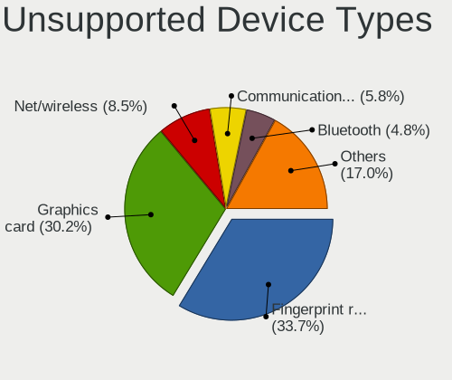

| Type                     | Computers | Percent |
|--------------------------|-----------|---------|
| Fingerprint reader       | 106       | 34.53%  |
| Graphics card            | 89        | 28.99%  |
| Net/wireless             | 26        | 8.47%   |
| Communication controller | 19        | 6.19%   |
| Bluetooth                | 16        | 5.21%   |
| Chipcard                 | 14        | 4.56%   |
| Camera                   | 10        | 3.26%   |
| Multimedia controller    | 7         | 2.28%   |
| Unassigned class         | 6         | 1.95%   |
| Storage                  | 5         | 1.63%   |
| Sound                    | 3         | 0.98%   |
| Network                  | 2         | 0.65%   |
| Card reader              | 2         | 0.65%   |
| Wireless                 | 1         | 0.33%   |
| Net/ethernet             | 1         | 0.33%   |

