Linux in Iran - Tested Hardware & Statistics (Desktops)
-------------------------------------------------------

A project to collect tested hardware configurations for Linux in Iran.

Anyone can contribute to this report by the [hw-probe](https://github.com/linuxhw/hw-probe) tool:

    sudo -E hw-probe -all -upload

Please contribute! Especially if your hardware is rare.

Contents
--------

* [ Test Cases ](#test-cases)

* [ System ](#system)
  - [ OS                       ](#os)
  - [ OS Family                ](#os-family)
  - [ Kernel                   ](#kernel)
  - [ Kernel Family            ](#kernel-family)
  - [ Kernel Major Ver.        ](#kernel-major-ver)
  - [ Arch                     ](#arch)
  - [ DE                       ](#de)
  - [ Display Server           ](#display-server)
  - [ Display Manager          ](#display-manager)
  - [ OS Lang                  ](#os-lang)
  - [ Boot Mode                ](#boot-mode)
  - [ Filesystem               ](#filesystem)
  - [ Part. scheme             ](#part-scheme)
  - [ Dual Boot with Linux/BSD ](#dual-boot-with-linuxbsd)
  - [ Dual Boot (Win)          ](#dual-boot-win)

* [ Board ](#board)
  - [ Vendor                   ](#vendor)
  - [ Model                    ](#model)
  - [ Model Family             ](#model-family)
  - [ MFG Year                 ](#mfg-year)
  - [ Form Factor              ](#form-factor)
  - [ Secure Boot              ](#secure-boot)
  - [ Coreboot                 ](#coreboot)
  - [ RAM Size                 ](#ram-size)
  - [ RAM Used                 ](#ram-used)
  - [ Total Drives             ](#total-drives)
  - [ Has CD-ROM               ](#has-cd-rom)
  - [ Has Ethernet             ](#has-ethernet)
  - [ Has WiFi                 ](#has-wifi)
  - [ Has Bluetooth            ](#has-bluetooth)

* [ Location ](#location)
  - [ Country                  ](#country)
  - [ City                     ](#city)

* [ Drives ](#drives)
  - [ Drive Vendor             ](#drive-vendor)
  - [ Drive Model              ](#drive-model)
  - [ HDD Vendor               ](#hdd-vendor)
  - [ SSD Vendor               ](#ssd-vendor)
  - [ Drive Kind               ](#drive-kind)
  - [ Drive Connector          ](#drive-connector)
  - [ Drive Size               ](#drive-size)
  - [ Space Total              ](#space-total)
  - [ Space Used               ](#space-used)
  - [ Malfunc. Drives          ](#malfunc-drives)
  - [ Malfunc. Drive Vendor    ](#malfunc-drive-vendor)
  - [ Malfunc. HDD Vendor      ](#malfunc-hdd-vendor)
  - [ Malfunc. Drive Kind      ](#malfunc-drive-kind)
  - [ Failed Drives            ](#failed-drives)
  - [ Failed Drive Vendor      ](#failed-drive-vendor)
  - [ Drive Status             ](#drive-status)

* [ Storage controller ](#storage-controller)
  - [ Storage Vendor           ](#storage-vendor)
  - [ Storage Model            ](#storage-model)
  - [ Storage Kind             ](#storage-kind)

* [ Processor ](#processor)
  - [ CPU Vendor               ](#cpu-vendor)
  - [ CPU Model                ](#cpu-model)
  - [ CPU Model Family         ](#cpu-model-family)
  - [ CPU Cores                ](#cpu-cores)
  - [ CPU Sockets              ](#cpu-sockets)
  - [ CPU Threads              ](#cpu-threads)
  - [ CPU Op-Modes             ](#cpu-op-modes)
  - [ CPU Microcode            ](#cpu-microcode)
  - [ CPU Microarch            ](#cpu-microarch)

* [ Graphics ](#graphics)
  - [ GPU Vendor               ](#gpu-vendor)
  - [ GPU Model                ](#gpu-model)
  - [ GPU Combo                ](#gpu-combo)
  - [ GPU Driver               ](#gpu-driver)
  - [ GPU Memory               ](#gpu-memory)

* [ Monitor ](#monitor)
  - [ Monitor Vendor           ](#monitor-vendor)
  - [ Monitor Model            ](#monitor-model)
  - [ Monitor Resolution       ](#monitor-resolution)
  - [ Monitor Diagonal         ](#monitor-diagonal)
  - [ Monitor Width            ](#monitor-width)
  - [ Aspect Ratio             ](#aspect-ratio)
  - [ Monitor Area             ](#monitor-area)
  - [ Pixel Density            ](#pixel-density)
  - [ Multiple Monitors        ](#multiple-monitors)

* [ Network ](#network)
  - [ Net Controller Vendor    ](#net-controller-vendor)
  - [ Net Controller Model     ](#net-controller-model)
  - [ Wireless Vendor          ](#wireless-vendor)
  - [ Wireless Model           ](#wireless-model)
  - [ Ethernet Vendor          ](#ethernet-vendor)
  - [ Ethernet Model           ](#ethernet-model)
  - [ Net Controller Kind      ](#net-controller-kind)
  - [ Used Controller          ](#used-controller)
  - [ NICs                     ](#nics)
  - [ IPv6                     ](#ipv6)

* [ Bluetooth ](#bluetooth)
  - [ Bluetooth Vendor         ](#bluetooth-vendor)
  - [ Bluetooth Model          ](#bluetooth-model)

* [ Sound ](#sound)
  - [ Sound Vendor             ](#sound-vendor)
  - [ Sound Model              ](#sound-model)

* [ Memory ](#memory)
  - [ Memory Vendor            ](#memory-vendor)
  - [ Memory Model             ](#memory-model)
  - [ Memory Kind              ](#memory-kind)
  - [ Memory Form Factor       ](#memory-form-factor)
  - [ Memory Size              ](#memory-size)
  - [ Memory Speed             ](#memory-speed)

* [ Printers & scanners ](#printers--scanners)
  - [ Printer Vendor           ](#printer-vendor)
  - [ Printer Model            ](#printer-model)
  - [ Scanner Vendor           ](#scanner-vendor)
  - [ Scanner Model            ](#scanner-model)

* [ Camera ](#camera)
  - [ Camera Vendor            ](#camera-vendor)
  - [ Camera Model             ](#camera-model)

* [ Security ](#security)
  - [ Fingerprint Vendor       ](#fingerprint-vendor)
  - [ Fingerprint Model        ](#fingerprint-model)
  - [ Chipcard Vendor          ](#chipcard-vendor)
  - [ Chipcard Model           ](#chipcard-model)

* [ Unsupported ](#unsupported)
  - [ Unsupported Devices      ](#unsupported-devices)
  - [ Unsupported Device Types ](#unsupported-device-types)

Test Cases
----------

Total: 184

| Vendor   | Model                | Probe                                                      | Date         |
|----------|----------------------|------------------------------------------------------------|--------------|
| Biostar  | A68N-2100K           | [db9760ae3a](https://linux-hardware.org/?probe=db9760ae3a) | Apr 27, 2022 |
| Biostar  | A68N-2100K           | [87d629883f](https://linux-hardware.org/?probe=87d629883f) | Apr 27, 2022 |
| HP       | 3048h                | [2d19799047](https://linux-hardware.org/?probe=2d19799047) | Apr 14, 2022 |
| Gigabyte | 945PL-S3             | [a7da4b6ee0](https://linux-hardware.org/?probe=a7da4b6ee0) | Apr 14, 2022 |
| Gigabyte | 945PL-S3             | [a0ab75ee00](https://linux-hardware.org/?probe=a0ab75ee00) | Apr 14, 2022 |
| Gigabyte | G1.Sniper 5          | [1ee0fc40a2](https://linux-hardware.org/?probe=1ee0fc40a2) | Mar 12, 2022 |
| ASUSTek  | H61-PLUS             | [0d2de64455](https://linux-hardware.org/?probe=0d2de64455) | Mar 06, 2022 |
| ASUSTek  | PRIME H310-PLUS R2.0 | [76da8a616f](https://linux-hardware.org/?probe=76da8a616f) | Mar 05, 2022 |
| ASUSTek  | H81-PLUS             | [e8956dc4ec](https://linux-hardware.org/?probe=e8956dc4ec) | Feb 27, 2022 |
| ASUSTek  | H81-PLUS             | [9c68dfb511](https://linux-hardware.org/?probe=9c68dfb511) | Feb 26, 2022 |
| Gigabyte | P31-ES3G             | [8294f013e8](https://linux-hardware.org/?probe=8294f013e8) | Feb 02, 2022 |
| HP       | 8054                 | [332217129d](https://linux-hardware.org/?probe=332217129d) | Jan 26, 2022 |
| ECS      | H61H2-A              | [90c26876b2](https://linux-hardware.org/?probe=90c26876b2) | Jan 21, 2022 |
| ECS      | H61H2-A              | [518e31fcb0](https://linux-hardware.org/?probe=518e31fcb0) | Jan 13, 2022 |
| ECS      | H61H2-A              | [47fb5347c0](https://linux-hardware.org/?probe=47fb5347c0) | Jan 06, 2022 |
| ECS      | H61H2-A              | [fa589d8ed4](https://linux-hardware.org/?probe=fa589d8ed4) | Jan 06, 2022 |
| HP       | 806A                 | [d7519db95a](https://linux-hardware.org/?probe=d7519db95a) | Jan 02, 2022 |
| Gigabyte | H310M S2P            | [a931eb10f0](https://linux-hardware.org/?probe=a931eb10f0) | Dec 19, 2021 |
| HP       | 3397                 | [83d7b8fe86](https://linux-hardware.org/?probe=83d7b8fe86) | Dec 12, 2021 |
| HP       | 3397                 | [469adb677f](https://linux-hardware.org/?probe=469adb677f) | Dec 12, 2021 |
| ASUSTek  | Z170-PRO             | [005b267983](https://linux-hardware.org/?probe=005b267983) | Nov 22, 2021 |
| Gigabyte | P41T-D3P             | [54a25af09a](https://linux-hardware.org/?probe=54a25af09a) | Nov 11, 2021 |
| ASUSTek  | P5P41T-LE            | [20aa404ab6](https://linux-hardware.org/?probe=20aa404ab6) | Nov 10, 2021 |
| ASUSTek  | PRIME B460M-A        | [cfafa7735b](https://linux-hardware.org/?probe=cfafa7735b) | Nov 08, 2021 |
| ASUSTek  | Z97-K                | [1e136c311c](https://linux-hardware.org/?probe=1e136c311c) | Nov 03, 2021 |
| ASUSTek  | TUF B450-PRO GAMING  | [75b53e8d45](https://linux-hardware.org/?probe=75b53e8d45) | Oct 27, 2021 |
| ASUSTek  | TUF B450-PRO GAMING  | [19cdc9b391](https://linux-hardware.org/?probe=19cdc9b391) | Oct 26, 2021 |
| ASUSTek  | H110M-R              | [783eeaaa01](https://linux-hardware.org/?probe=783eeaaa01) | Oct 17, 2021 |
| ASUSTek  | P5G41T-M LE          | [398dedabb8](https://linux-hardware.org/?probe=398dedabb8) | Oct 07, 2021 |
| ASUSTek  | P5G41T-M LE          | [23d2e1a73d](https://linux-hardware.org/?probe=23d2e1a73d) | Oct 06, 2021 |
| ASUSTek  | P8H61-M LE R2.0      | [b633c9e1d1](https://linux-hardware.org/?probe=b633c9e1d1) | Sep 28, 2021 |
| ASRock   | B85M                 | [566089bd43](https://linux-hardware.org/?probe=566089bd43) | Sep 27, 2021 |
| ASUSTek  | TUF B360-PLUS GAMING | [eec5db351d](https://linux-hardware.org/?probe=eec5db351d) | Sep 27, 2021 |
| ASUSTek  | PRIME Z390-P         | [9b27471e86](https://linux-hardware.org/?probe=9b27471e86) | Sep 23, 2021 |
| ECS      | GeForce6100PM-M2     | [016672b182](https://linux-hardware.org/?probe=016672b182) | Sep 03, 2021 |
| ASUSTek  | PRIME H310-PLUS R2.0 | [2044660bb8](https://linux-hardware.org/?probe=2044660bb8) | Aug 30, 2021 |
| YANYU    | M9F baytrail         | [0e5100e716](https://linux-hardware.org/?probe=0e5100e716) | Aug 29, 2021 |
| YANYU    | M9F baytrail         | [0bf997753c](https://linux-hardware.org/?probe=0bf997753c) | Aug 29, 2021 |
| MSI      | H81M-P33             | [de74046226](https://linux-hardware.org/?probe=de74046226) | Aug 23, 2021 |
| Gigabyte | P31-ES3G             | [1563940d09](https://linux-hardware.org/?probe=1563940d09) | Aug 22, 2021 |
| Gigabyte | P31-ES3G             | [34cd2a9116](https://linux-hardware.org/?probe=34cd2a9116) | Aug 22, 2021 |
| ASUSTek  | P5KPL-AM/PS          | [01b8cc373f](https://linux-hardware.org/?probe=01b8cc373f) | Jul 13, 2021 |
| Gigabyte | P31-ES3G             | [09ec64fc0d](https://linux-hardware.org/?probe=09ec64fc0d) | Jul 10, 2021 |
| ASUSTek  | ROG Maximus XII HERO | [90a20b185b](https://linux-hardware.org/?probe=90a20b185b) | Jul 03, 2021 |
| ASUSTek  | ROG Maximus XII HERO | [c5c6993717](https://linux-hardware.org/?probe=c5c6993717) | Jul 03, 2021 |
| Gigabyte | 8IPE1000-G/L         | [0301b9707b](https://linux-hardware.org/?probe=0301b9707b) | Jun 29, 2021 |
| ASUSTek  | ROG Maximus XII HERO | [1343b5bb5d](https://linux-hardware.org/?probe=1343b5bb5d) | Jun 20, 2021 |
| ASUSTek  | PRIME B460-PLUS      | [5963dd2256](https://linux-hardware.org/?probe=5963dd2256) | Jun 18, 2021 |
| Gigabyte | P31-ES3G             | [4b5debd7a6](https://linux-hardware.org/?probe=4b5debd7a6) | Jun 04, 2021 |
| Gigabyte | P31-ES3G             | [4333473e1e](https://linux-hardware.org/?probe=4333473e1e) | Jun 03, 2021 |
| ASRock   | N68-GS4 FX           | [1023832c74](https://linux-hardware.org/?probe=1023832c74) | Jun 01, 2021 |
| ASRock   | N68-GS4 FX           | [2ff6c9500b](https://linux-hardware.org/?probe=2ff6c9500b) | Jun 01, 2021 |
| MSI      | PH67A-C43            | [8e818ce79a](https://linux-hardware.org/?probe=8e818ce79a) | May 05, 2021 |
| Gigabyte | G41MT-S2PT           | [eeb73d1c4a](https://linux-hardware.org/?probe=eeb73d1c4a) | Apr 20, 2021 |
| ASUSTek  | P8H61                | [93671f3ecc](https://linux-hardware.org/?probe=93671f3ecc) | Apr 20, 2021 |
| ASUSTek  | P8H61                | [9fbf2707b0](https://linux-hardware.org/?probe=9fbf2707b0) | Apr 19, 2021 |
| Gigabyte | M52S-S3P             | [494ac8b449](https://linux-hardware.org/?probe=494ac8b449) | Apr 11, 2021 |
| ASUSTek  | H61M-C               | [c39fc169bf](https://linux-hardware.org/?probe=c39fc169bf) | Apr 02, 2021 |
| ASUSTek  | Z170-K               | [9c2661508e](https://linux-hardware.org/?probe=9c2661508e) | Mar 30, 2021 |
| ASUSTek  | H81-PLUS             | [89b0451670](https://linux-hardware.org/?probe=89b0451670) | Mar 14, 2021 |
| ASUSTek  | H81-PLUS             | [ed8b926f53](https://linux-hardware.org/?probe=ed8b926f53) | Mar 14, 2021 |
| HP       | 3397                 | [13a7f8c4c2](https://linux-hardware.org/?probe=13a7f8c4c2) | Mar 08, 2021 |
| ASUSTek  | P8H61                | [eb31b2ffb6](https://linux-hardware.org/?probe=eb31b2ffb6) | Mar 07, 2021 |
| ASUSTek  | P8H61                | [fd19b6b1c8](https://linux-hardware.org/?probe=fd19b6b1c8) | Mar 07, 2021 |
| ASUSTek  | P5P41T-LE            | [502ef11b75](https://linux-hardware.org/?probe=502ef11b75) | Mar 07, 2021 |
| Gigabyte | GA-M55SLI-S4         | [43d0cb9ac1](https://linux-hardware.org/?probe=43d0cb9ac1) | Mar 07, 2021 |
| ASUSTek  | P5E                  | [5681b93aaf](https://linux-hardware.org/?probe=5681b93aaf) | Mar 06, 2021 |
| ASUSTek  | P5E                  | [9f858aaf27](https://linux-hardware.org/?probe=9f858aaf27) | Mar 05, 2021 |
| ASUSTek  | P8H77-V LE           | [b1b8587cdb](https://linux-hardware.org/?probe=b1b8587cdb) | Feb 19, 2021 |
| MSI      | B350M GAMING PRO     | [b6a8851986](https://linux-hardware.org/?probe=b6a8851986) | Feb 19, 2021 |
| Gigabyte | H81M-S2PV            | [9de86c8038](https://linux-hardware.org/?probe=9de86c8038) | Feb 05, 2021 |
| ASUSTek  | Z87-K                | [f1f4fbad09](https://linux-hardware.org/?probe=f1f4fbad09) | Feb 03, 2021 |
| ASUSTek  | Z87-K                | [0df26493a8](https://linux-hardware.org/?probe=0df26493a8) | Feb 03, 2021 |
| Unknown  | Unknown              | [85c5454ed1](https://linux-hardware.org/?probe=85c5454ed1) | Jan 14, 2021 |
| ASUSTek  | H61M-A/USB3          | [d8aafdef30](https://linux-hardware.org/?probe=d8aafdef30) | Jan 10, 2021 |
| Biostar  | P4M900-M7 FE Ver:1.0 | [4d96f1db71](https://linux-hardware.org/?probe=4d96f1db71) | Dec 31, 2020 |
| ASUSTek  | P5P41T-LE            | [be00a7c4e5](https://linux-hardware.org/?probe=be00a7c4e5) | Dec 28, 2020 |
| Gigabyte | EP41-UD3L            | [9582155494](https://linux-hardware.org/?probe=9582155494) | Dec 25, 2020 |
| ASUSTek  | Z97-K                | [3071d9e517](https://linux-hardware.org/?probe=3071d9e517) | Dec 23, 2020 |
| HP       | 3397                 | [1b81310dbf](https://linux-hardware.org/?probe=1b81310dbf) | Dec 20, 2020 |
| HP       | 3397                 | [086227e446](https://linux-hardware.org/?probe=086227e446) | Dec 20, 2020 |
| ASUSTek  | Z97-K                | [ccdd9fbe6b](https://linux-hardware.org/?probe=ccdd9fbe6b) | Dec 16, 2020 |
| ASUSTek  | Z97-K                | [e7e6ad670b](https://linux-hardware.org/?probe=e7e6ad670b) | Dec 16, 2020 |
| ASUSTek  | PRIME H310-PLUS      | [e39c3e59b5](https://linux-hardware.org/?probe=e39c3e59b5) | Dec 13, 2020 |
| Gigabyte | EP41-UD3L            | [d93fb9ef4a](https://linux-hardware.org/?probe=d93fb9ef4a) | Dec 04, 2020 |
| Gigabyte | P55A-UD3P            | [9f5052c50b](https://linux-hardware.org/?probe=9f5052c50b) | Nov 30, 2020 |
| Gigabyte | P55A-UD3P            | [03db05b217](https://linux-hardware.org/?probe=03db05b217) | Nov 30, 2020 |
| ASUSTek  | H110M-A/M.2          | [c9c25216a4](https://linux-hardware.org/?probe=c9c25216a4) | Nov 25, 2020 |
| HP       | 2AF3                 | [3c07a68022](https://linux-hardware.org/?probe=3c07a68022) | Nov 21, 2020 |
| Gigabyte | H81M-S2PV            | [6a88e646aa](https://linux-hardware.org/?probe=6a88e646aa) | Nov 07, 2020 |
| Foxconn  | A8G-i                | [b4675cde03](https://linux-hardware.org/?probe=b4675cde03) | Oct 27, 2020 |
| Gigabyte | EP41-UD3L            | [c3cd0fcf33](https://linux-hardware.org/?probe=c3cd0fcf33) | Oct 24, 2020 |
| Intel    | P61-S3               | [efee9af681](https://linux-hardware.org/?probe=efee9af681) | Oct 13, 2020 |
| Intel    | P61-S3               | [36f0f58223](https://linux-hardware.org/?probe=36f0f58223) | Oct 12, 2020 |
| Gigabyte | 8S648FX-RZ           | [c00289e6ed](https://linux-hardware.org/?probe=c00289e6ed) | Oct 11, 2020 |
| ASRock   | P5B-DE               | [ef1c17dd39](https://linux-hardware.org/?probe=ef1c17dd39) | Oct 08, 2020 |
| ASUSTek  | P8Z77-V LK           | [bbf7ae1125](https://linux-hardware.org/?probe=bbf7ae1125) | Oct 05, 2020 |
| Gigabyte | P55-USB3             | [ceeced1246](https://linux-hardware.org/?probe=ceeced1246) | Oct 02, 2020 |
| Gigabyte | AX370-Gaming K7      | [5996a3b895](https://linux-hardware.org/?probe=5996a3b895) | Sep 29, 2020 |
| Gigabyte | AX370-Gaming K7      | [60156a645b](https://linux-hardware.org/?probe=60156a645b) | Sep 29, 2020 |
| ASUSTek  | Maximus VII HERO     | [59f1e93325](https://linux-hardware.org/?probe=59f1e93325) | Sep 18, 2020 |
| ASUSTek  | Maximus VII HERO     | [a91b502a98](https://linux-hardware.org/?probe=a91b502a98) | Sep 18, 2020 |
| Gigabyte | B75M-D3V             | [32e15ba2b5](https://linux-hardware.org/?probe=32e15ba2b5) | Sep 18, 2020 |
| ASUSTek  | PRIME B360M-A        | [7ad450ddd7](https://linux-hardware.org/?probe=7ad450ddd7) | Sep 14, 2020 |
| HP       | 3397                 | [e4e6951a4f](https://linux-hardware.org/?probe=e4e6951a4f) | Jul 25, 2020 |
| ASUSTek  | M4A78T-E             | [2c268bdb51](https://linux-hardware.org/?probe=2c268bdb51) | Jul 24, 2020 |
| Lenovo   | Board                | [d29d396ad0](https://linux-hardware.org/?probe=d29d396ad0) | Jul 23, 2020 |
| Gigabyte | H170-D3H-CF          | [eb9ea3a7af](https://linux-hardware.org/?probe=eb9ea3a7af) | Jul 12, 2020 |
| HP       | 212B                 | [4a3583e0db](https://linux-hardware.org/?probe=4a3583e0db) | Jul 06, 2020 |
| ECS      | G31T-M               | [614dcd20e7](https://linux-hardware.org/?probe=614dcd20e7) | Jul 05, 2020 |
| ASUSTek  | Z170-K               | [a35de97ee5](https://linux-hardware.org/?probe=a35de97ee5) | Jun 27, 2020 |
| ASUSTek  | H110M-C              | [5656016c57](https://linux-hardware.org/?probe=5656016c57) | Jun 27, 2020 |
| ASRock   | P5B-DE               | [78a611e7da](https://linux-hardware.org/?probe=78a611e7da) | Jun 24, 2020 |
| ASRock   | P5B-DE               | [304331fe41](https://linux-hardware.org/?probe=304331fe41) | Jun 24, 2020 |
| ASUSTek  | H81M-C               | [7554759bac](https://linux-hardware.org/?probe=7554759bac) | Jun 18, 2020 |
| Gigabyte | Z68P-DS3             | [a82798aea1](https://linux-hardware.org/?probe=a82798aea1) | May 21, 2020 |
| HP       | 3397                 | [6d3acf04fa](https://linux-hardware.org/?probe=6d3acf04fa) | May 18, 2020 |
| Gigabyte | H81M-S2PV            | [d064b573d0](https://linux-hardware.org/?probe=d064b573d0) | May 14, 2020 |
| ECS      | G41T-M13             | [7f8c6dbb44](https://linux-hardware.org/?probe=7f8c6dbb44) | May 14, 2020 |
| ECS      | G41T-M13             | [48a0cc80f5](https://linux-hardware.org/?probe=48a0cc80f5) | May 13, 2020 |
| ECS      | G41T-M13             | [9f4b72e955](https://linux-hardware.org/?probe=9f4b72e955) | May 13, 2020 |
| ECS      | G41T-M13             | [e7697e2b15](https://linux-hardware.org/?probe=e7697e2b15) | May 11, 2020 |
| ECS      | G41T-M13             | [b2c5f54483](https://linux-hardware.org/?probe=b2c5f54483) | May 10, 2020 |
| ASUSTek  | H97-PRO              | [a214d8fa2f](https://linux-hardware.org/?probe=a214d8fa2f) | May 02, 2020 |
| ASUSTek  | H97-PRO              | [a6f251843f](https://linux-hardware.org/?probe=a6f251843f) | May 01, 2020 |
| ASUSTek  | Z10PE-D16 WS         | [409a40b72d](https://linux-hardware.org/?probe=409a40b72d) | Apr 20, 2020 |
| ASUSTek  | Z97-C                | [53462bc3ec](https://linux-hardware.org/?probe=53462bc3ec) | Apr 07, 2020 |
| HP       | 3397                 | [f2d1e62e57](https://linux-hardware.org/?probe=f2d1e62e57) | Mar 29, 2020 |
| HP       | 3646h                | [63c3bf2b90](https://linux-hardware.org/?probe=63c3bf2b90) | Mar 28, 2020 |
| Gigabyte | G31M-S2L             | [ec35befc4a](https://linux-hardware.org/?probe=ec35befc4a) | Mar 23, 2020 |
| Gigabyte | G31M-S2L             | [6f1f96e7fc](https://linux-hardware.org/?probe=6f1f96e7fc) | Mar 23, 2020 |
| Gigabyte | H61M-S2V-B3          | [b7d3805ba6](https://linux-hardware.org/?probe=b7d3805ba6) | Mar 23, 2020 |
| ASRock   | ConRoe865GV          | [e849d8b11f](https://linux-hardware.org/?probe=e849d8b11f) | Mar 15, 2020 |
| ASRock   | ConRoe865GV          | [2f52f8c106](https://linux-hardware.org/?probe=2f52f8c106) | Mar 12, 2020 |
| MSI      | B250M PRO-VH         | [1eb2d76730](https://linux-hardware.org/?probe=1eb2d76730) | Mar 10, 2020 |
| ECS      | 945GCT-M             | [069450c325](https://linux-hardware.org/?probe=069450c325) | Mar 08, 2020 |
| Gigabyte | M1689D               | [9f48604ff2](https://linux-hardware.org/?probe=9f48604ff2) | Mar 07, 2020 |
| Gigabyte | M1689D               | [43f9f0167a](https://linux-hardware.org/?probe=43f9f0167a) | Mar 07, 2020 |
| ASUSTek  | M4A78T-E             | [80b614b253](https://linux-hardware.org/?probe=80b614b253) | Mar 02, 2020 |
| Lenovo   | Board                | [7067a56ae2](https://linux-hardware.org/?probe=7067a56ae2) | Feb 27, 2020 |
| ASUSTek  | PRIME Z270-K         | [98cee968eb](https://linux-hardware.org/?probe=98cee968eb) | Feb 18, 2020 |
| Unknown  | Unknown              | [0061763167](https://linux-hardware.org/?probe=0061763167) | Feb 11, 2020 |
| HP       | 8054                 | [b9f8081fe1](https://linux-hardware.org/?probe=b9f8081fe1) | Jan 06, 2020 |
| ASUSTek  | P8Z68-V LE           | [9d6c061d8b](https://linux-hardware.org/?probe=9d6c061d8b) | Jan 04, 2020 |
| ECS      | 945GCT-M             | [9214d5aed4](https://linux-hardware.org/?probe=9214d5aed4) | Dec 24, 2019 |
| ECS      | 945GCT-M             | [152d3005a9](https://linux-hardware.org/?probe=152d3005a9) | Dec 24, 2019 |
| Gigabyte | Z390 GAMING X-CF     | [61d0162de0](https://linux-hardware.org/?probe=61d0162de0) | Dec 21, 2019 |
| Gigabyte | Z390 GAMING X-CF     | [130e16c2b6](https://linux-hardware.org/?probe=130e16c2b6) | Dec 08, 2019 |
| ECS      | 945GCT-M             | [a68627d7eb](https://linux-hardware.org/?probe=a68627d7eb) | Nov 28, 2019 |
| HP       | 18E7                 | [f728a63212](https://linux-hardware.org/?probe=f728a63212) | Nov 26, 2019 |
| ECS      | 945GCT-M             | [380140eb8d](https://linux-hardware.org/?probe=380140eb8d) | Nov 06, 2019 |
| ECS      | 945GCT-M             | [89e9d28a32](https://linux-hardware.org/?probe=89e9d28a32) | Nov 01, 2019 |
| ASUSTek  | P7P55 LX             | [63dc09b54e](https://linux-hardware.org/?probe=63dc09b54e) | Oct 28, 2019 |
| ASUSTek  | P7P55 LX             | [cf9411c533](https://linux-hardware.org/?probe=cf9411c533) | Oct 28, 2019 |
| ASRock   | ConRoeXFire-eSATA2   | [22d2f0f13e](https://linux-hardware.org/?probe=22d2f0f13e) | Sep 12, 2019 |
| ASUSTek  | B85-PLUS             | [2665a9b231](https://linux-hardware.org/?probe=2665a9b231) | Sep 11, 2019 |
| ECS      | 945PT-A2             | [e73a14a3e7](https://linux-hardware.org/?probe=e73a14a3e7) | Sep 10, 2019 |
| ASUSTek  | M3N78-EH             | [0ded7435b9](https://linux-hardware.org/?probe=0ded7435b9) | Sep 04, 2019 |
| ASRock   | ConRoeXFire-eSATA2   | [eaf9b72412](https://linux-hardware.org/?probe=eaf9b72412) | Aug 31, 2019 |
| ASUSTek  | PRIME H310-PLUS      | [be649fc45f](https://linux-hardware.org/?probe=be649fc45f) | Aug 25, 2019 |
| Gigabyte | H110M-S2PV-CF        | [d0ac33919a](https://linux-hardware.org/?probe=d0ac33919a) | Aug 05, 2019 |
| ASUSTek  | All Series           | [383d32f068](https://linux-hardware.org/?probe=383d32f068) | Jun 27, 2019 |
| ASUSTek  | P5GC-MX/1333         | [b974503bc3](https://linux-hardware.org/?probe=b974503bc3) | Jun 07, 2019 |
| ASUSTek  | P9X79 LE             | [7cb5494874](https://linux-hardware.org/?probe=7cb5494874) | Jun 03, 2019 |
| ASUSTek  | P9X79 LE             | [77dc13fea3](https://linux-hardware.org/?probe=77dc13fea3) | Jun 03, 2019 |
| ASUSTek  | H81-PLUS             | [7ce9462b77](https://linux-hardware.org/?probe=7ce9462b77) | May 25, 2019 |
| ASUSTek  | H81-PLUS             | [81d917e52e](https://linux-hardware.org/?probe=81d917e52e) | May 19, 2019 |
| ASUSTek  | H81-PLUS             | [4f2a9b31b5](https://linux-hardware.org/?probe=4f2a9b31b5) | May 19, 2019 |
| Gigabyte | P75-D3               | [80e0cb37ad](https://linux-hardware.org/?probe=80e0cb37ad) | May 08, 2019 |
| Gigabyte | P75-D3               | [af7b263534](https://linux-hardware.org/?probe=af7b263534) | May 08, 2019 |
| Gigabyte | P75-D3               | [cea1c617cb](https://linux-hardware.org/?probe=cea1c617cb) | May 07, 2019 |
| Gigabyte | P75-D3               | [341ae19874](https://linux-hardware.org/?probe=341ae19874) | May 07, 2019 |
| ASUSTek  | P7H57D-V EVO         | [8083f1c192](https://linux-hardware.org/?probe=8083f1c192) | May 02, 2019 |
| HP       | 18E7                 | [314a0e2775](https://linux-hardware.org/?probe=314a0e2775) | Apr 24, 2019 |
| HP       | 18E7                 | [74ff68d1e2](https://linux-hardware.org/?probe=74ff68d1e2) | Feb 28, 2019 |
| ASUSTek  | B85-PRO GAMER        | [078ded72a8](https://linux-hardware.org/?probe=078ded72a8) | Dec 10, 2018 |
| ASUSTek  | B85-PRO GAMER        | [7ee24f399a](https://linux-hardware.org/?probe=7ee24f399a) | Dec 10, 2018 |
| Gigabyte | H61M-S2P             | [bdd9f59ab7](https://linux-hardware.org/?probe=bdd9f59ab7) | Dec 09, 2018 |
| Gigabyte | H61M-S2P             | [4aa295dad1](https://linux-hardware.org/?probe=4aa295dad1) | Dec 09, 2018 |
| Gigabyte | H61M-S2P             | [3e29d905ef](https://linux-hardware.org/?probe=3e29d905ef) | Dec 09, 2018 |
| ECS      | 945GZ/CT-M           | [86754f87d7](https://linux-hardware.org/?probe=86754f87d7) | Dec 07, 2018 |
| ECS      | 945GZ/CT-M           | [0c8259eea0](https://linux-hardware.org/?probe=0c8259eea0) | Dec 07, 2018 |
| ASUSTek  | PRIME B350-PLUS      | [504bfb59ec](https://linux-hardware.org/?probe=504bfb59ec) | Jan 08, 2018 |
| ASUSTek  | PRIME B350-PLUS      | [6976c096dc](https://linux-hardware.org/?probe=6976c096dc) | Jan 08, 2018 |

System
------

OS
--

Installed operating systems

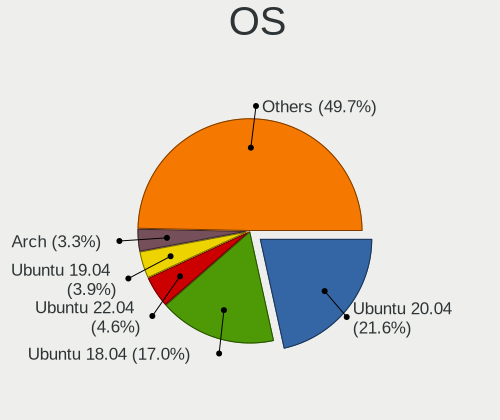

| Name              | Desktops | Percent |
|-------------------|----------|---------|
| Ubuntu 20.04      | 30       | 24.79%  |
| Ubuntu 18.04      | 26       | 21.49%  |
| Ubuntu 19.04      | 6        | 4.96%   |
| Arch              | 5        | 4.13%   |
| Xubuntu 18.04     | 4        | 3.31%   |
| Ubuntu 20.10      | 3        | 2.48%   |
| OpenMandriva 4.2  | 3        | 2.48%   |
| KDE neon 20.04    | 3        | 2.48%   |
| Zorin 15          | 2        | 1.65%   |
| Ubuntu 21.10      | 2        | 1.65%   |
| Ubuntu 19.10      | 2        | 1.65%   |
| Linux Mint 20.3   | 2        | 1.65%   |
| Linux Mint 20.1   | 2        | 1.65%   |
| Linux Mint 20     | 2        | 1.65%   |
| Elementary 6.1    | 2        | 1.65%   |
| Arch Rolling      | 2        | 1.65%   |
| Ubuntu 16.04      | 1        | 0.83%   |
| Solus 4.3         | 1        | 0.83%   |
| ROSA R10          | 1        | 0.83%   |
| Pop!_OS 21.04     | 1        | 0.83%   |
| Pop!_OS 20.10     | 1        | 0.83%   |
| Pop!_OS 20.04     | 1        | 0.83%   |
| Manjaro 18.0.4    | 1        | 0.83%   |
| Lubuntu 18.04     | 1        | 0.83%   |
| Kubuntu 22.04     | 1        | 0.83%   |
| Kali 2022.1       | 1        | 0.83%   |
| Kali 2021.2       | 1        | 0.83%   |
| Fedora 34         | 1        | 0.83%   |
| Fedora 33         | 1        | 0.83%   |
| Fedora 32         | 1        | 0.83%   |
| Fedora 31         | 1        | 0.83%   |
| Fedora 30         | 1        | 0.83%   |
| Fedora 29         | 1        | 0.83%   |
| Endless 3.7.5     | 1        | 0.83%   |
| Endless 3.6.0     | 1        | 0.83%   |
| Endless 3.5.6     | 1        | 0.83%   |
| Debian 11         | 1        | 0.83%   |
| Debian 10         | 1        | 0.83%   |
| CentOS 8          | 1        | 0.83%   |
| Artix             | 1        | 0.83%   |
| ArcoLinux Rolling | 1        | 0.83%   |

OS Family
---------

OS without a version

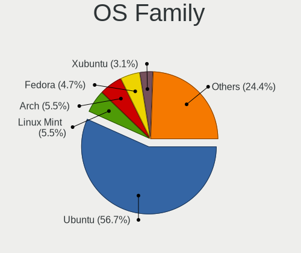

| Name         | Desktops | Percent |
|--------------|----------|---------|
| Ubuntu       | 69       | 57.98%  |
| Arch         | 7        | 5.88%   |
| Linux Mint   | 6        | 5.04%   |
| Fedora       | 6        | 5.04%   |
| Xubuntu      | 4        | 3.36%   |
| Pop!_OS      | 3        | 2.52%   |
| OpenMandriva | 3        | 2.52%   |
| KDE neon     | 3        | 2.52%   |
| Zorin        | 2        | 1.68%   |
| Kali         | 2        | 1.68%   |
| Endless      | 2        | 1.68%   |
| Elementary   | 2        | 1.68%   |
| Debian       | 2        | 1.68%   |
| Solus        | 1        | 0.84%   |
| ROSA         | 1        | 0.84%   |
| Manjaro      | 1        | 0.84%   |
| Lubuntu      | 1        | 0.84%   |
| Kubuntu      | 1        | 0.84%   |
| CentOS       | 1        | 0.84%   |
| Artix        | 1        | 0.84%   |
| ArcoLinux    | 1        | 0.84%   |

Kernel
------

Version of the Linux kernel

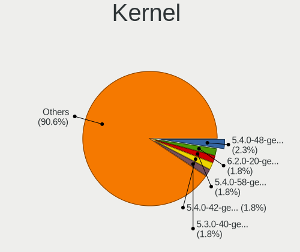

| Version                  | Desktops | Percent |
|--------------------------|----------|---------|
| 5.4.0-48-generic         | 4        | 3.13%   |
| 5.4.0-58-generic         | 3        | 2.34%   |
| 5.4.0-42-generic         | 3        | 2.34%   |
| 5.3.0-40-generic         | 3        | 2.34%   |
| 5.10.14-desktop-1omv4002 | 3        | 2.34%   |
| 5.8.0-50-generic         | 2        | 1.56%   |
| 5.8.0-44-generic         | 2        | 1.56%   |
| 5.4.0-52-generic         | 2        | 1.56%   |
| 5.4.0-37-generic         | 2        | 1.56%   |
| 5.4.0-26-generic         | 2        | 1.56%   |
| 5.13.0-30-generic        | 2        | 1.56%   |
| 5.11.0-41-generic        | 2        | 1.56%   |
| 5.11.0-37-generic        | 2        | 1.56%   |
| 5.11.0-27-generic        | 2        | 1.56%   |
| 5.0.0-38-generic         | 2        | 1.56%   |
| 5.0.0-37-generic         | 2        | 1.56%   |
| 5.0.0-25-generic         | 2        | 1.56%   |
| 5.0.0-23-generic         | 2        | 1.56%   |
| 4.15.0-88-generic        | 2        | 1.56%   |
| 4.15.0-50-generic        | 2        | 1.56%   |
| 4.15.0-29-generic        | 2        | 1.56%   |
| 5.9.4-arch1-1            | 1        | 0.78%   |
| 5.9.12-arch1-1           | 1        | 0.78%   |
| 5.8.9-200.fc32.x86_64    | 1        | 0.78%   |
| 5.8.8-arch1-1            | 1        | 0.78%   |
| 5.8.18-300.fc33.x86_64   | 1        | 0.78%   |
| 5.8.12-artix1-1          | 1        | 0.78%   |
| 5.8.0-7642-generic       | 1        | 0.78%   |
| 5.8.0-7630-generic       | 1        | 0.78%   |
| 5.8.0-53-generic         | 1        | 0.78%   |
| 5.8.0-43-generic         | 1        | 0.78%   |
| 5.8.0-33-generic         | 1        | 0.78%   |
| 5.8.0-25-generic         | 1        | 0.78%   |
| 5.7.7-100.fc31.x86_64    | 1        | 0.78%   |
| 5.7.6-arch1-1            | 1        | 0.78%   |
| 5.6.13-100.fc30.x86_64   | 1        | 0.78%   |
| 5.4.0-92-generic         | 1        | 0.78%   |
| 5.4.0-74-generic         | 1        | 0.78%   |
| 5.4.0-66-generic         | 1        | 0.78%   |
| 5.4.0-65-generic         | 1        | 0.78%   |
| 5.4.0-62-generic         | 1        | 0.78%   |
| 5.4.0-60-generic         | 1        | 0.78%   |
| 5.4.0-59-generic         | 1        | 0.78%   |
| 5.4.0-56-generic         | 1        | 0.78%   |
| 5.4.0-54-generic         | 1        | 0.78%   |
| 5.4.0-53-generic         | 1        | 0.78%   |
| 5.4.0-45-generic         | 1        | 0.78%   |
| 5.4.0-39-generic         | 1        | 0.78%   |
| 5.4.0-29-generic         | 1        | 0.78%   |
| 5.4.0-28-generic         | 1        | 0.78%   |
| 5.4.0-18-generic         | 1        | 0.78%   |
| 5.4.0-14-generic         | 1        | 0.78%   |
| 5.4.0-107-generic        | 1        | 0.78%   |
| 5.3.0-59-generic         | 1        | 0.78%   |
| 5.3.0-51-generic         | 1        | 0.78%   |
| 5.3.0-46-generic         | 1        | 0.78%   |
| 5.3.0-45-generic         | 1        | 0.78%   |
| 5.3.0-42-generic         | 1        | 0.78%   |
| 5.3.0-23-generic         | 1        | 0.78%   |
| 5.16.4-zen1-1-zen        | 1        | 0.78%   |

Kernel Family
-------------

Linux kernel without a distro release

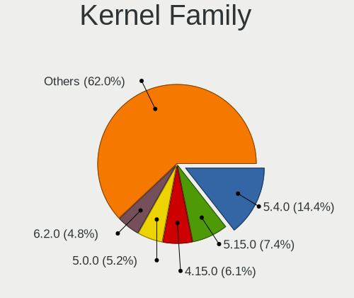

| Version  | Desktops | Percent |
|----------|----------|---------|
| 5.4.0    | 30       | 24.19%  |
| 4.15.0   | 14       | 11.29%  |
| 5.0.0    | 12       | 9.68%   |
| 5.8.0    | 10       | 8.06%   |
| 5.11.0   | 10       | 8.06%   |
| 5.3.0    | 9        | 7.26%   |
| 5.13.0   | 7        | 5.65%   |
| 4.18.0   | 5        | 4.03%   |
| 5.10.14  | 3        | 2.42%   |
| 5.10.0   | 2        | 1.61%   |
| 5.9.4    | 1        | 0.81%   |
| 5.9.12   | 1        | 0.81%   |
| 5.8.9    | 1        | 0.81%   |
| 5.8.8    | 1        | 0.81%   |
| 5.8.18   | 1        | 0.81%   |
| 5.8.12   | 1        | 0.81%   |
| 5.7.7    | 1        | 0.81%   |
| 5.7.6    | 1        | 0.81%   |
| 5.6.13   | 1        | 0.81%   |
| 5.16.4   | 1        | 0.81%   |
| 5.16.0   | 1        | 0.81%   |
| 5.15.2   | 1        | 0.81%   |
| 5.15.0   | 1        | 0.81%   |
| 5.14.14  | 1        | 0.81%   |
| 5.13.12  | 1        | 0.81%   |
| 5.12.14  | 1        | 0.81%   |
| 5.10.27  | 1        | 0.81%   |
| 5.10.13  | 1        | 0.81%   |
| 5.0.9    | 1        | 0.81%   |
| 4.9.60   | 1        | 0.81%   |
| 4.19.0   | 1        | 0.81%   |
| 4.14.138 | 1        | 0.81%   |

Kernel Major Ver.
-----------------

Linux kernel major version

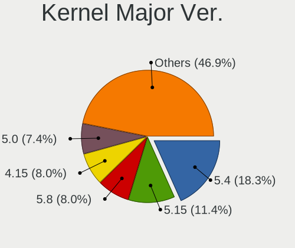

| Version | Desktops | Percent |
|---------|----------|---------|
| 5.4     | 30       | 24.19%  |
| 5.8     | 14       | 11.29%  |
| 4.15    | 14       | 11.29%  |
| 5.0     | 13       | 10.48%  |
| 5.11    | 10       | 8.06%   |
| 5.3     | 9        | 7.26%   |
| 5.13    | 8        | 6.45%   |
| 5.10    | 7        | 5.65%   |
| 4.18    | 5        | 4.03%   |
| 5.9     | 2        | 1.61%   |
| 5.7     | 2        | 1.61%   |
| 5.16    | 2        | 1.61%   |
| 5.15    | 2        | 1.61%   |
| 5.6     | 1        | 0.81%   |
| 5.14    | 1        | 0.81%   |
| 5.12    | 1        | 0.81%   |
| 4.9     | 1        | 0.81%   |
| 4.19    | 1        | 0.81%   |
| 4.14    | 1        | 0.81%   |

Arch
----

OS architecture (x86_64, i586, etc.)

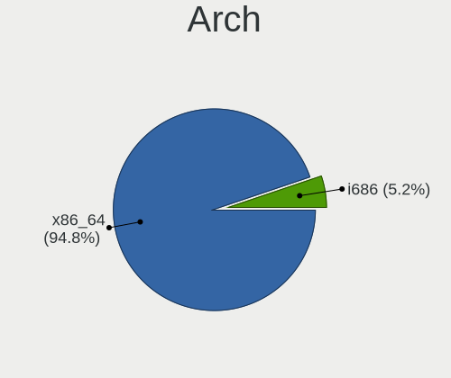

| Name   | Desktops | Percent |
|--------|----------|---------|
| x86_64 | 108      | 93.1%   |
| i686   | 8        | 6.9%    |

DE
--

Desktop Environment

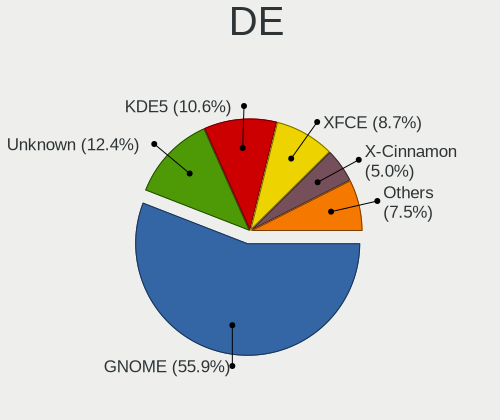

| Name       | Desktops | Percent |
|------------|----------|---------|
| GNOME      | 68       | 56.2%   |
| Unknown    | 20       | 16.53%  |
| KDE5       | 10       | 8.26%   |
| XFCE       | 9        | 7.44%   |
| X-Cinnamon | 5        | 4.13%   |
| Pantheon   | 2        | 1.65%   |
| i3         | 2        | 1.65%   |
| Unity      | 1        | 0.83%   |
| LXQt       | 1        | 0.83%   |
| LXDE       | 1        | 0.83%   |
| KDE        | 1        | 0.83%   |
| Budgie     | 1        | 0.83%   |

Display Server
--------------

X11 or Wayland

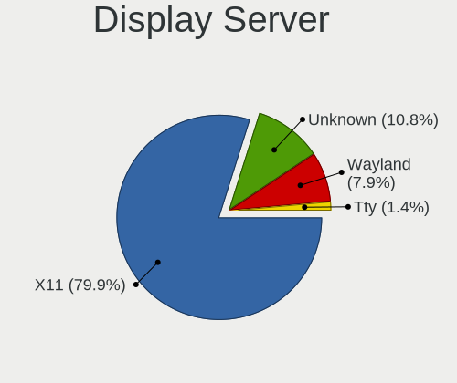

| Name    | Desktops | Percent |
|---------|----------|---------|
| X11     | 95       | 79.17%  |
| Unknown | 15       | 12.5%   |
| Wayland | 8        | 6.67%   |
| Tty     | 2        | 1.67%   |

Display Manager
---------------

SDDM, LightDM, etc.

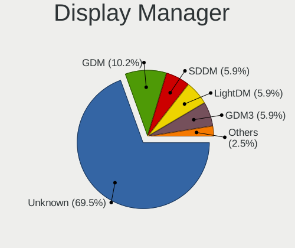

| Name    | Desktops | Percent |
|---------|----------|---------|
| Unknown | 82       | 69.49%  |
| GDM     | 12       | 10.17%  |
| SDDM    | 7        | 5.93%   |
| LightDM | 7        | 5.93%   |
| GDM3    | 7        | 5.93%   |
| TDM     | 3        | 2.54%   |

OS Lang
-------

Language

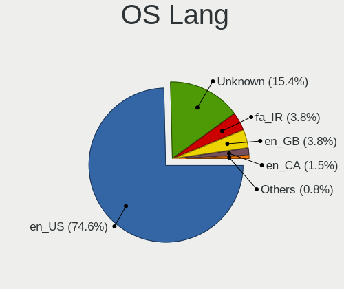

| Lang    | Desktops | Percent |
|---------|----------|---------|
| en_US   | 86       | 72.88%  |
| Unknown | 20       | 16.95%  |
| fa_IR   | 5        | 4.24%   |
| en_GB   | 4        | 3.39%   |
| en_CA   | 2        | 1.69%   |
| C       | 1        | 0.85%   |

Boot Mode
---------

EFI or BIOS

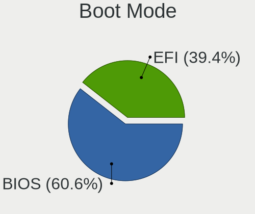

| Mode | Desktops | Percent |
|------|----------|---------|
| BIOS | 72       | 62.07%  |
| EFI  | 44       | 37.93%  |

Filesystem
----------

Type of filesystem

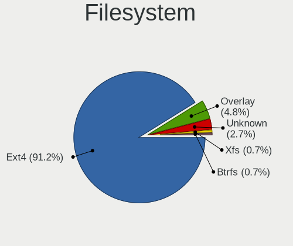

| Type    | Desktops | Percent |
|---------|----------|---------|
| Ext4    | 108      | 92.31%  |
| Unknown | 4        | 3.42%   |
| Overlay | 3        | 2.56%   |
| Xfs     | 1        | 0.85%   |
| Btrfs   | 1        | 0.85%   |

Part. scheme
------------

Scheme of partitioning

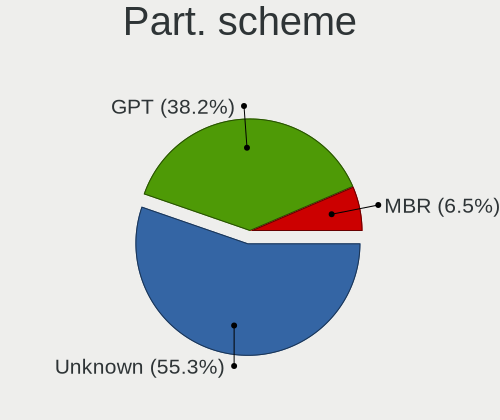

| Type    | Desktops | Percent |
|---------|----------|---------|
| Unknown | 91       | 77.78%  |
| GPT     | 17       | 14.53%  |
| MBR     | 9        | 7.69%   |

Dual Boot with Linux/BSD
------------------------

Hosting more than one Linux/BSD

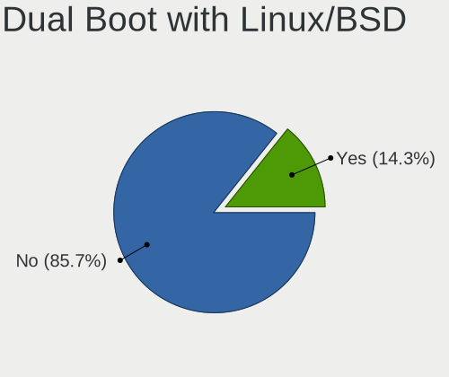

| Dual boot | Desktops | Percent |
|-----------|----------|---------|
| No        | 103      | 87.29%  |
| Yes       | 15       | 12.71%  |

Dual Boot (Win)
---------------

Hosting Linux and Windows

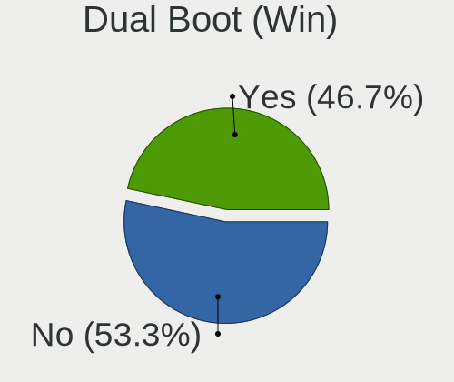

| Dual boot | Desktops | Percent |
|-----------|----------|---------|
| No        | 63       | 53.39%  |
| Yes       | 55       | 46.61%  |

Board
-----

Vendor
------

Motherboard manufacturer

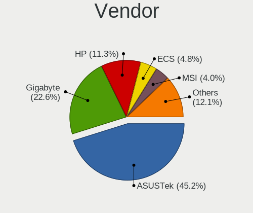

| Name                | Desktops | Percent |
|---------------------|----------|---------|
| ASUSTek Computer    | 53       | 45.69%  |
| Gigabyte Technology | 26       | 22.41%  |
| Hewlett-Packard     | 13       | 11.21%  |
| ECS                 | 6        | 5.17%   |
| ASRock              | 5        | 4.31%   |
| MSI                 | 4        | 3.45%   |
| Lenovo              | 2        | 1.72%   |
| Biostar             | 2        | 1.72%   |
| Unknown             | 2        | 1.72%   |
| YANYU               | 1        | 0.86%   |
| Intel               | 1        | 0.86%   |
| Foxconn             | 1        | 0.86%   |

Model
-----

Motherboard model

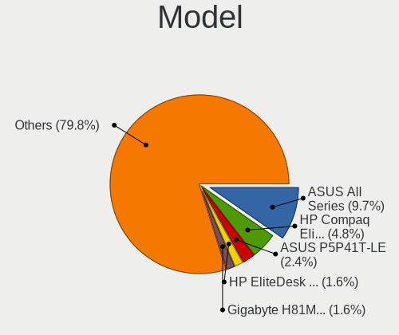

| Name                           | Desktops | Percent |
|--------------------------------|----------|---------|
| ASUS All Series                | 12       | 10.34%  |
| HP Compaq Elite 8300 SFF       | 5        | 4.31%   |
| ASUS P5P41T-LE                 | 3        | 2.59%   |
| HP EliteDesk 800 G2 SFF        | 2        | 1.72%   |
| Gigabyte H81M-S2PV             | 2        | 1.72%   |
| ASUS PRIME H310-PLUS R2.0      | 2        | 1.72%   |
| ASUS PRIME H310-PLUS           | 2        | 1.72%   |
| ASUS P9X79 LE                  | 2        | 1.72%   |
| ASUS P8H61                     | 2        | 1.72%   |
| Unknown                        | 2        | 1.72%   |
| YANYU M9F baytrail             | 1        | 0.86%   |
| MSI MS-7A74                    | 1        | 0.86%   |
| MSI MS-7A39                    | 1        | 0.86%   |
| MSI MS-7817                    | 1        | 0.86%   |
| MSI MS-7673                    | 1        | 0.86%   |
| Lenovo ThinkCentre M58 8910ASU | 1        | 0.86%   |
| Lenovo ThinkCentre M58 7360EHU | 1        | 0.86%   |
| Intel P61-S3                   | 1        | 0.86%   |
| HP Z440 Workstation            | 1        | 0.86%   |
| HP ProDesk 600 G1 SFF          | 1        | 0.86%   |
| HP ProDesk 400 G2 MINI         | 1        | 0.86%   |
| HP Compaq 8000 Elite SFF PC    | 1        | 0.86%   |
| HP Compaq 6000 Pro SFF PC      | 1        | 0.86%   |
| HP 700-270jp                   | 1        | 0.86%   |
| Gigabyte Z68P-DS3              | 1        | 0.86%   |
| Gigabyte Z390 GAMING X         | 1        | 0.86%   |
| Gigabyte P75-D3                | 1        | 0.86%   |
| Gigabyte P55A-UD3P             | 1        | 0.86%   |
| Gigabyte P55-USB3              | 1        | 0.86%   |
| Gigabyte P41T-D3P              | 1        | 0.86%   |
| Gigabyte P31-ES3G              | 1        | 0.86%   |
| Gigabyte M52S-S3P              | 1        | 0.86%   |
| Gigabyte M1689D                | 1        | 0.86%   |
| Gigabyte H61M-S2V-B3           | 1        | 0.86%   |
| Gigabyte H61M-S2P              | 1        | 0.86%   |
| Gigabyte H310M S2P 2.0         | 1        | 0.86%   |
| Gigabyte H170-D3H              | 1        | 0.86%   |
| Gigabyte H110M-S2PV            | 1        | 0.86%   |
| Gigabyte GA-M55SLI-S4          | 1        | 0.86%   |
| Gigabyte G41MT-S2PT            | 1        | 0.86%   |
| Gigabyte G31M-ES2L             | 1        | 0.86%   |
| Gigabyte G1.Sniper 5           | 1        | 0.86%   |
| Gigabyte EP41-UD3L             | 1        | 0.86%   |
| Gigabyte B75M-D3V              | 1        | 0.86%   |
| Gigabyte AX370-Gaming K7       | 1        | 0.86%   |
| Gigabyte 945PL-S3              | 1        | 0.86%   |
| Gigabyte 8S648FX-RZ            | 1        | 0.86%   |
| Gigabyte 8IPE1000-G/L          | 1        | 0.86%   |
| Foxconn A8G-i                  | 1        | 0.86%   |
| ECS H61H2-A                    | 1        | 0.86%   |
| ECS G41T-M13                   | 1        | 0.86%   |
| ECS G31T-M                     | 1        | 0.86%   |
| ECS 945PT-A2                   | 1        | 0.86%   |
| ECS 945GZ/CT-M                 | 1        | 0.86%   |
| ECS 945GCT-M                   | 1        | 0.86%   |
| Biostar P4M900-M7 FE           | 1        | 0.86%   |
| Biostar A68N-2100K             | 1        | 0.86%   |
| ASUS Z170-PRO                  | 1        | 0.86%   |
| ASUS Z170-K                    | 1        | 0.86%   |
| ASUS Z10PE-D16 WS              | 1        | 0.86%   |

Model Family
------------

Motherboard model prefix

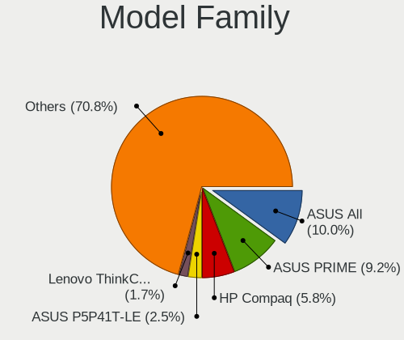

| Name                  | Desktops | Percent |
|-----------------------|----------|---------|
| ASUS All              | 12       | 10.34%  |
| ASUS PRIME            | 10       | 8.62%   |
| HP Compaq             | 7        | 6.03%   |
| ASUS P5P41T-LE        | 3        | 2.59%   |
| Lenovo ThinkCentre    | 2        | 1.72%   |
| HP ProDesk            | 2        | 1.72%   |
| HP EliteDesk          | 2        | 1.72%   |
| Gigabyte H81M-S2PV    | 2        | 1.72%   |
| ASUS TUF              | 2        | 1.72%   |
| ASUS P9X79            | 2        | 1.72%   |
| ASUS P8H61            | 2        | 1.72%   |
| Unknown               | 2        | 1.72%   |
| YANYU M9F             | 1        | 0.86%   |
| MSI MS-7A74           | 1        | 0.86%   |
| MSI MS-7A39           | 1        | 0.86%   |
| MSI MS-7817           | 1        | 0.86%   |
| MSI MS-7673           | 1        | 0.86%   |
| Intel P61-S3          | 1        | 0.86%   |
| HP Z440               | 1        | 0.86%   |
| HP 700-270jp          | 1        | 0.86%   |
| Gigabyte Z68P-DS3     | 1        | 0.86%   |
| Gigabyte Z390         | 1        | 0.86%   |
| Gigabyte P75-D3       | 1        | 0.86%   |
| Gigabyte P55A-UD3P    | 1        | 0.86%   |
| Gigabyte P55-USB3     | 1        | 0.86%   |
| Gigabyte P41T-D3P     | 1        | 0.86%   |
| Gigabyte P31-ES3G     | 1        | 0.86%   |
| Gigabyte M52S-S3P     | 1        | 0.86%   |
| Gigabyte M1689D       | 1        | 0.86%   |
| Gigabyte H61M-S2V-B3  | 1        | 0.86%   |
| Gigabyte H61M-S2P     | 1        | 0.86%   |
| Gigabyte H310M        | 1        | 0.86%   |
| Gigabyte H170-D3H     | 1        | 0.86%   |
| Gigabyte H110M-S2PV   | 1        | 0.86%   |
| Gigabyte GA-M55SLI-S4 | 1        | 0.86%   |
| Gigabyte G41MT-S2PT   | 1        | 0.86%   |
| Gigabyte G31M-ES2L    | 1        | 0.86%   |
| Gigabyte G1.Sniper    | 1        | 0.86%   |
| Gigabyte EP41-UD3L    | 1        | 0.86%   |
| Gigabyte B75M-D3V     | 1        | 0.86%   |
| Gigabyte AX370-Gaming | 1        | 0.86%   |
| Gigabyte 945PL-S3     | 1        | 0.86%   |
| Gigabyte 8S648FX-RZ   | 1        | 0.86%   |
| Gigabyte 8IPE1000-G   | 1        | 0.86%   |
| Foxconn A8G-i         | 1        | 0.86%   |
| ECS H61H2-A           | 1        | 0.86%   |
| ECS G41T-M13          | 1        | 0.86%   |
| ECS G31T-M            | 1        | 0.86%   |
| ECS 945PT-A2          | 1        | 0.86%   |
| ECS 945GZ             | 1        | 0.86%   |
| ECS 945GCT-M          | 1        | 0.86%   |
| Biostar P4M900-M7     | 1        | 0.86%   |
| Biostar A68N-2100K    | 1        | 0.86%   |
| ASUS Z170-PRO         | 1        | 0.86%   |
| ASUS Z170-K           | 1        | 0.86%   |
| ASUS Z10PE-D16        | 1        | 0.86%   |
| ASUS ROG              | 1        | 0.86%   |
| ASUS P8Z77-V          | 1        | 0.86%   |
| ASUS P8Z68-V          | 1        | 0.86%   |
| ASUS P8H77-V          | 1        | 0.86%   |

MFG Year
--------

Motherboard manufacture year

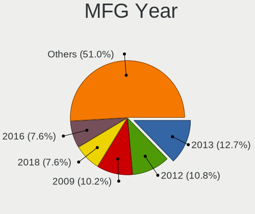

| Year | Desktops | Percent |
|------|----------|---------|
| 2013 | 17       | 14.66%  |
| 2009 | 14       | 12.07%  |
| 2012 | 13       | 11.21%  |
| 2011 | 11       | 9.48%   |
| 2018 | 8        | 6.9%    |
| 2020 | 7        | 6.03%   |
| 2007 | 7        | 6.03%   |
| 2017 | 6        | 5.17%   |
| 2016 | 6        | 5.17%   |
| 2015 | 6        | 5.17%   |
| 2014 | 6        | 5.17%   |
| 2010 | 4        | 3.45%   |
| 2008 | 4        | 3.45%   |
| 2006 | 4        | 3.45%   |
| 2005 | 2        | 1.72%   |
| 2004 | 1        | 0.86%   |

Form Factor
-----------

Physical design of the computer

| Name    | Desktops | Percent |
|---------|----------|---------|
| Desktop | 116      | 100%    |

Secure Boot
-----------

Enabled or disabled

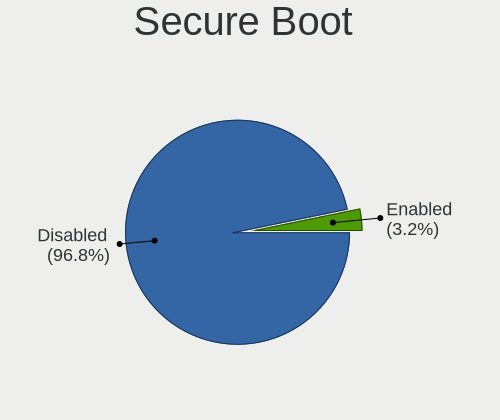

| State    | Desktops | Percent |
|----------|----------|---------|
| Disabled | 112      | 96.55%  |
| Enabled  | 4        | 3.45%   |

Coreboot
--------

Have coreboot on board

| Used | Desktops | Percent |
|------|----------|---------|
| No   | 116      | 100%    |

RAM Size
--------

Total RAM memory

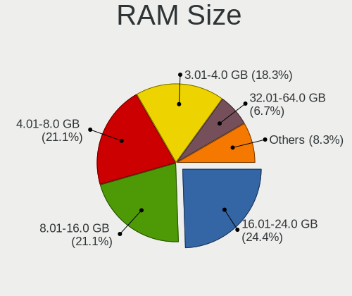

| Size in GB  | Desktops | Percent |
|-------------|----------|---------|
| 8.01-16.0   | 25       | 21.55%  |
| 4.01-8.0    | 24       | 20.69%  |
| 3.01-4.0    | 24       | 20.69%  |
| 16.01-24.0  | 24       | 20.69%  |
| 1.01-2.0    | 7        | 6.03%   |
| 32.01-64.0  | 5        | 4.31%   |
| 2.01-3.0    | 4        | 3.45%   |
| 64.01-256.0 | 2        | 1.72%   |
| 0.51-1.0    | 1        | 0.86%   |

RAM Used
--------

Used RAM memory

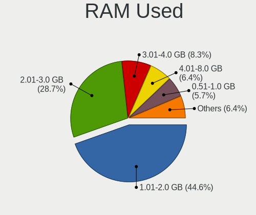

| Used GB   | Desktops | Percent |
|-----------|----------|---------|
| 1.01-2.0  | 58       | 46.4%   |
| 2.01-3.0  | 34       | 27.2%   |
| 3.01-4.0  | 11       | 8.8%    |
| 4.01-8.0  | 8        | 6.4%    |
| 0.51-1.0  | 8        | 6.4%    |
| 8.01-16.0 | 3        | 2.4%    |
| 0.01-0.5  | 3        | 2.4%    |

Total Drives
------------

Number of drives on board

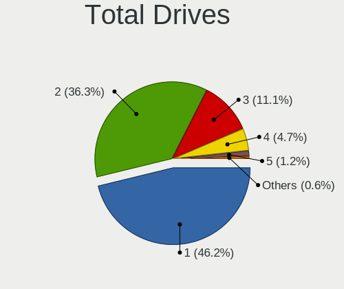

| Drives | Desktops | Percent |
|--------|----------|---------|
| 1      | 60       | 51.28%  |
| 2      | 39       | 33.33%  |
| 3      | 13       | 11.11%  |
| 4      | 4        | 3.42%   |
| 5      | 1        | 0.85%   |

Has CD-ROM
----------

Has CD-ROM on board

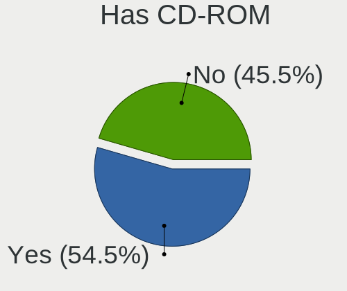

| Presented | Desktops | Percent |
|-----------|----------|---------|
| Yes       | 66       | 55.46%  |
| No        | 53       | 44.54%  |

Has Ethernet
------------

Has Ethernet on board

| Presented | Desktops | Percent |
|-----------|----------|---------|
| Yes       | 115      | 99.14%  |
| No        | 1        | 0.86%   |

Has WiFi
--------

Has WiFi module

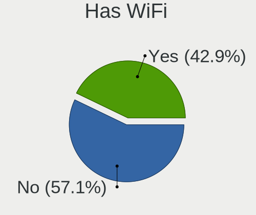

| Presented | Desktops | Percent |
|-----------|----------|---------|
| No        | 69       | 57.98%  |
| Yes       | 50       | 42.02%  |

Has Bluetooth
-------------

Has Bluetooth module

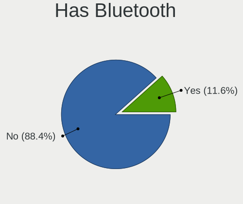

| Presented | Desktops | Percent |
|-----------|----------|---------|
| No        | 102      | 87.18%  |
| Yes       | 15       | 12.82%  |

Location
--------

Country
-------

Geographic location (country)

| Country | Desktops | Percent |
|---------|----------|---------|
| Iran    | 116      | 100%    |

City
----

Geographic location (city)

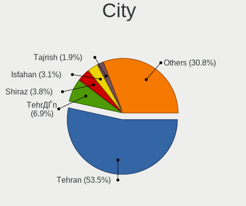

| City                      | Desktops | Percent |
|---------------------------|----------|---------|
| Tehran                    | 67       | 54.47%  |
| TehrДЃn                 | 11       | 8.94%   |
| Shiraz                    | 4        | 3.25%   |
| Isfahan                   | 4        | 3.25%   |
| Sanandij                  | 2        | 1.63%   |
| Rey                       | 2        | 1.63%   |
| Qom                       | 2        | 1.63%   |
| Mashhad                   | 2        | 1.63%   |
| Kerman                    | 2        | 1.63%   |
| Arak                      | 2        | 1.63%   |
| Yazd                      | 1        | 0.81%   |
| Tajrish                   | 1        | 0.81%   |
| Siakhdekhan               | 1        | 0.81%   |
| Shahrak-e Kūlūrī | 1        | 0.81%   |
| Shaft                     | 1        | 0.81%   |
| PДЃkdasht               | 1        | 0.81%   |
| Najafābād           | 1        | 0.81%   |
| Khorramabad               | 1        | 0.81%   |
| KhondДЃb                | 1        | 0.81%   |
| Kermanshah                | 1        | 0.81%   |
| Karaj                     | 1        | 0.81%   |
| KahrД«z                 | 1        | 0.81%   |
| JongД«yeh               | 1        | 0.81%   |
| JavДЃnrЕ«d            | 1        | 0.81%   |
| Hamadan                   | 1        | 0.81%   |
| Falāvarjān          | 1        | 0.81%   |
| DorЕ«d                  | 1        | 0.81%   |
| DamДЃvand               | 1        | 0.81%   |
| BorЕ«jerd               | 1        | 0.81%   |
| Behshahr                  | 1        | 0.81%   |
| Bahar                     | 1        | 0.81%   |
| Babol                     | 1        | 0.81%   |
| Ardabil                   | 1        | 0.81%   |
| Alvand                    | 1        | 0.81%   |
| Ahvaz                     | 1        | 0.81%   |

Drives
------

Drive Vendor
------------

Hard drive vendors

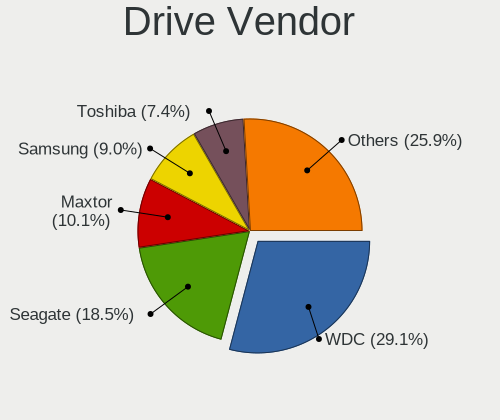

| Vendor                | Desktops | Drives | Percent |
|-----------------------|----------|--------|---------|
| WDC                   | 51       | 71     | 30.36%  |
| Seagate               | 32       | 34     | 19.05%  |
| MAXTOR                | 19       | 26     | 11.31%  |
| Samsung Electronics   | 16       | 26     | 9.52%   |
| Toshiba               | 12       | 14     | 7.14%   |
| A-DATA Technology     | 8        | 8      | 4.76%   |
| Kingston              | 5        | 7      | 2.98%   |
| SPCC                  | 4        | 5      | 2.38%   |
| Lexar                 | 4        | 4      | 2.38%   |
| Hitachi               | 4        | 4      | 2.38%   |
| Unknown               | 3        | 3      | 1.79%   |
| Silicon Motion        | 1        | 1      | 0.6%    |
| SanDisk               | 1        | 1      | 0.6%    |
| Realtek Semiconductor | 1        | 1      | 0.6%    |
| PLEXTOR               | 1        | 1      | 0.6%    |
| Pioneer               | 1        | 1      | 0.6%    |
| Patriot               | 1        | 1      | 0.6%    |
| OCZ                   | 1        | 1      | 0.6%    |
| Kingmax               | 1        | 1      | 0.6%    |
| HPE                   | 1        | 1      | 0.6%    |
| Apacer                | 1        | 1      | 0.6%    |

Drive Model
-----------

Hard drive models

| Model                            | Desktops | Percent |
|----------------------------------|----------|---------|
| WDC WD10EZEX-08WN4A0 1TB         | 11       | 5.91%   |
| Seagate ST500DM002-1BD142 500GB  | 6        | 3.23%   |
| MAXTOR STM3250310AS 250GB        | 6        | 3.23%   |
| WDC WDS240G2G0A-00JH30 240GB SSD | 5        | 2.69%   |
| WDC WD10EARS-00MVWB0 1TB         | 3        | 1.61%   |
| Toshiba DT01ACA100 1TB           | 3        | 1.61%   |
| Toshiba DT01ACA050 500GB         | 3        | 1.61%   |
| Seagate ST3500413AS 500GB        | 3        | 1.61%   |
| MAXTOR 6Y080L0 82GB              | 3        | 1.61%   |
| Lexar 256GB SSD                  | 3        | 1.61%   |
| WDC WD5000AZRX-00L4HB0 500GB     | 2        | 1.08%   |
| WDC WD5000AZRX-00A8LB0 500GB     | 2        | 1.08%   |
| WDC WD5000AAKX-08U6AA0 500GB     | 2        | 1.08%   |
| WDC WD10EZRX-00L4HB0 1TB         | 2        | 1.08%   |
| WDC WD10EZEX-00WN4A0 1TB         | 2        | 1.08%   |
| SPCC Solid State Disk 128GB      | 2        | 1.08%   |
| SPCC Solid State Disk 120GB      | 2        | 1.08%   |
| Seagate ST3500418AS 500GB        | 2        | 1.08%   |
| Seagate ST3320613AS 320GB        | 2        | 1.08%   |
| Seagate ST1000DM003-9YN162 1TB   | 2        | 1.08%   |
| Seagate Backup+ Hub BK 6TB       | 2        | 1.08%   |
| Samsung SSD 850 EVO 250GB        | 2        | 1.08%   |
| Samsung HD160JJ 160GB            | 2        | 1.08%   |
| MAXTOR STM3802110A 80GB          | 2        | 1.08%   |
| MAXTOR STM3160215AS 160GB        | 2        | 1.08%   |
| Kingston SKC400S37256G 256GB SSD | 2        | 1.08%   |
| A-DATA XPG EX500 512GB SSD       | 2        | 1.08%   |
| WDC WDS480G2G0A-00JH30 480GB SSD | 1        | 0.54%   |
| WDC WDS250G1B0A-00H9H0 250GB SSD | 1        | 0.54%   |
| WDC WDS120G2G0A-00JH30 120GB SSD | 1        | 0.54%   |
| WDC WD7500AACS-65D6B0 752GB      | 1        | 0.54%   |
| WDC WD5000LPVX-08V0TT2 500GB     | 1        | 0.54%   |
| WDC WD5000AVVS-63H0B1 500GB      | 1        | 0.54%   |
| WDC WD5000AVJB-63J1A0 500GB      | 1        | 0.54%   |
| WDC WD5000AAKX-75U6AA0 500GB     | 1        | 0.54%   |
| WDC WD5000AAKX-22ERMA0 500GB     | 1        | 0.54%   |
| WDC WD5000AAKX-001CA0 500GB      | 1        | 0.54%   |
| WDC WD5000AADS-00S9B0 500GB      | 1        | 0.54%   |
| WDC WD5000AADS-00M2B0 500GB      | 1        | 0.54%   |
| WDC WD3200AVVS-63L2B0 320GB      | 1        | 0.54%   |
| WDC WD3200AAJS-56M0A0 320GB      | 1        | 0.54%   |
| WDC WD3200AAJS-56B4A0 320GB      | 1        | 0.54%   |
| WDC WD30EZRZ-00Z5HB0 3TB         | 1        | 0.54%   |
| WDC WD2500AAKX-19U6AA0 250GB     | 1        | 0.54%   |
| WDC WD20PURZ-85GU6Y0 2TB         | 1        | 0.54%   |
| WDC WD20EARX-00PASB0 2TB         | 1        | 0.54%   |
| WDC WD10PURZ-85U8XY0 1TB         | 1        | 0.54%   |
| WDC WD10EZRX-00A8LB0 1TB         | 1        | 0.54%   |
| WDC WD10EZRX-00A3KB0 1TB         | 1        | 0.54%   |
| WDC WD10EZEX-75WN4A0 1TB         | 1        | 0.54%   |
| WDC WD10EZEX-60WN4A1 1TB         | 1        | 0.54%   |
| WDC WD10EZEX-60WN4A0 1TB         | 1        | 0.54%   |
| WDC WD10EZEX-22MFCA0 1TB         | 1        | 0.54%   |
| WDC WD10EZEX-08M2NA0 1TB         | 1        | 0.54%   |
| WDC WD10EZEX-00BN5A0 1TB         | 1        | 0.54%   |
| WDC WD10EURX-63FH1Y0 1TB         | 1        | 0.54%   |
| WDC WD10EURX-63C57Y0 1TB         | 1        | 0.54%   |
| WDC WD10EARX-00N0YB0 1TB         | 1        | 0.54%   |
| WDC WD10EARS-00Y5B1 1TB          | 1        | 0.54%   |
| WDC WD1003FZEX-00MK2A0 1TB       | 1        | 0.54%   |

HDD Vendor
----------

Hard disk drive vendors

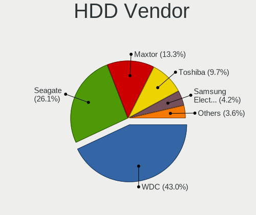

| Vendor              | Desktops | Drives | Percent |
|---------------------|----------|--------|---------|
| WDC                 | 47       | 63     | 38.84%  |
| Seagate             | 32       | 34     | 26.45%  |
| MAXTOR              | 19       | 26     | 15.7%   |
| Toshiba             | 12       | 14     | 9.92%   |
| Samsung Electronics | 5        | 10     | 4.13%   |
| Hitachi             | 4        | 4      | 3.31%   |
| Unknown             | 1        | 1      | 0.83%   |
| HPE                 | 1        | 1      | 0.83%   |

SSD Vendor
----------

Solid state drive vendors

| Vendor              | Desktops | Drives | Percent |
|---------------------|----------|--------|---------|
| Samsung Electronics | 11       | 14     | 23.4%   |
| WDC                 | 8        | 8      | 17.02%  |
| A-DATA Technology   | 8        | 8      | 17.02%  |
| Kingston            | 5        | 7      | 10.64%  |
| SPCC                | 4        | 5      | 8.51%   |
| Lexar               | 4        | 4      | 8.51%   |
| SanDisk             | 1        | 1      | 2.13%   |
| PLEXTOR             | 1        | 1      | 2.13%   |
| Pioneer             | 1        | 1      | 2.13%   |
| Patriot             | 1        | 1      | 2.13%   |
| OCZ                 | 1        | 1      | 2.13%   |
| Kingmax             | 1        | 1      | 2.13%   |
| Apacer              | 1        | 1      | 2.13%   |

Drive Kind
----------

HDD or SSD

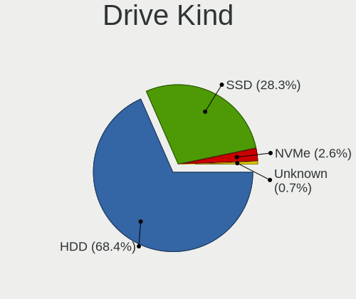

| Kind    | Desktops | Drives | Percent |
|---------|----------|--------|---------|
| HDD     | 104      | 153    | 68.42%  |
| SSD     | 43       | 53     | 28.29%  |
| NVMe    | 4        | 5      | 2.63%   |
| Unknown | 1        | 1      | 0.66%   |

Drive Connector
---------------

SATA, SAS, NVMe, etc.

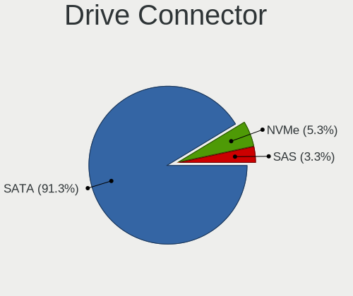

| Type | Desktops | Drives | Percent |
|------|----------|--------|---------|
| SATA | 115      | 203    | 93.5%   |
| SAS  | 4        | 4      | 3.25%   |
| NVMe | 4        | 5      | 3.25%   |

Drive Size
----------

Size of hard drive

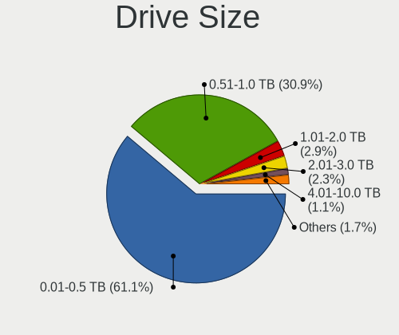

| Size in TB | Desktops | Drives | Percent |
|------------|----------|--------|---------|
| 0.01-0.5   | 90       | 133    | 60.81%  |
| 0.51-1.0   | 47       | 61     | 31.76%  |
| 1.01-2.0   | 5        | 5      | 3.38%   |
| 2.01-3.0   | 4        | 5      | 2.7%    |
| 4.01-10.0  | 2        | 2      | 1.35%   |

Space Total
-----------

Amount of disk space available on the file system

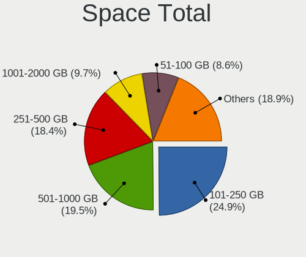

| Size in GB     | Desktops | Percent |
|----------------|----------|---------|
| 101-250        | 35       | 28.69%  |
| 501-1000       | 26       | 21.31%  |
| 251-500        | 21       | 17.21%  |
| 51-100         | 12       | 9.84%   |
| 1001-2000      | 10       | 8.2%    |
| 21-50          | 6        | 4.92%   |
| 2001-3000      | 6        | 4.92%   |
| More than 3000 | 3        | 2.46%   |
| 1-20           | 2        | 1.64%   |
| Unknown        | 1        | 0.82%   |

Space Used
----------

Amount of used disk space

| Used GB        | Desktops | Percent |
|----------------|----------|---------|
| 1-20           | 47       | 37.6%   |
| 21-50          | 20       | 16%     |
| 101-250        | 14       | 11.2%   |
| 51-100         | 14       | 11.2%   |
| 251-500        | 11       | 8.8%    |
| 501-1000       | 8        | 6.4%    |
| 1001-2000      | 5        | 4%      |
| More than 3000 | 3        | 2.4%    |
| 2001-3000      | 2        | 1.6%    |
| Unknown        | 1        | 0.8%    |

Malfunc. Drives
---------------

Drive models with a malfunction

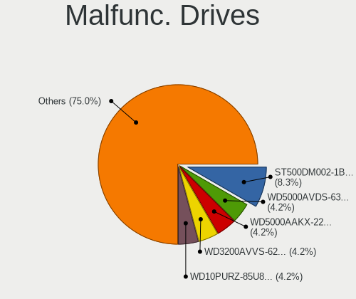

| Model                             | Desktops | Drives | Percent |
|-----------------------------------|----------|--------|---------|
| WDC WD5000AAKX-22ERMA0 500GB      | 1        | 2      | 7.69%   |
| WDC WD10EZEX-00WN4A0 1TB          | 1        | 1      | 7.69%   |
| WDC WD10EARS-00MVWB0 1TB          | 1        | 1      | 7.69%   |
| WDC WD1002FBYS-18A6B0 1TB         | 1        | 1      | 7.69%   |
| Toshiba HDWD105 500GB             | 1        | 1      | 7.69%   |
| Seagate ST9500420AS 500GB         | 1        | 1      | 7.69%   |
| Seagate ST3500413AS 500GB         | 1        | 1      | 7.69%   |
| Seagate ST3320613AS 320GB         | 1        | 1      | 7.69%   |
| Seagate ST1000DM003-9YN162 1TB    | 1        | 1      | 7.69%   |
| Samsung Electronics HD502HI 500GB | 1        | 2      | 7.69%   |
| MAXTOR 6Y080M0 81GB               | 1        | 1      | 7.69%   |
| Hitachi HDS721010KLA330 1TB       | 1        | 1      | 7.69%   |
| Hitachi HCT721010SLA360 1TB       | 1        | 1      | 7.69%   |

Malfunc. Drive Vendor
---------------------

Vendors of faulty drives

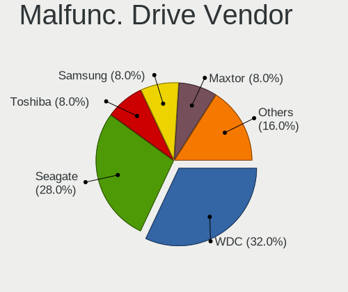

| Vendor              | Desktops | Drives | Percent |
|---------------------|----------|--------|---------|
| WDC                 | 4        | 5      | 30.77%  |
| Seagate             | 4        | 4      | 30.77%  |
| Hitachi             | 2        | 2      | 15.38%  |
| Toshiba             | 1        | 1      | 7.69%   |
| Samsung Electronics | 1        | 2      | 7.69%   |
| MAXTOR              | 1        | 1      | 7.69%   |

Malfunc. HDD Vendor
-------------------

Vendors of faulty HDD drives

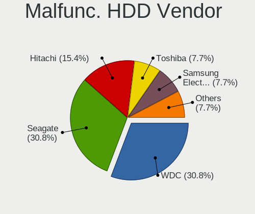

| Vendor              | Desktops | Drives | Percent |
|---------------------|----------|--------|---------|
| WDC                 | 4        | 5      | 30.77%  |
| Seagate             | 4        | 4      | 30.77%  |
| Hitachi             | 2        | 2      | 15.38%  |
| Toshiba             | 1        | 1      | 7.69%   |
| Samsung Electronics | 1        | 2      | 7.69%   |
| MAXTOR              | 1        | 1      | 7.69%   |

Malfunc. Drive Kind
-------------------

Kinds of faulty drives

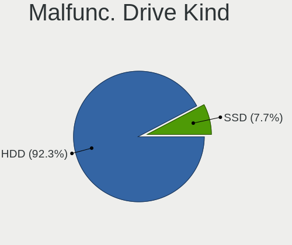

| Kind | Desktops | Drives | Percent |
|------|----------|--------|---------|
| HDD  | 12       | 15     | 100%    |

Failed Drives
-------------

Failed drive models

Zero info for selected period =(

Failed Drive Vendor
-------------------

Failed drive vendors

Zero info for selected period =(

Drive Status
------------

Number of failed and malfunc. drives

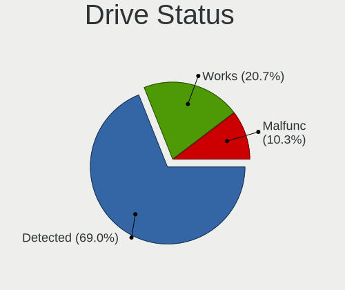

| Status   | Desktops | Drives | Percent |
|----------|----------|--------|---------|
| Detected | 90       | 159    | 72%     |
| Works    | 23       | 38     | 18.4%   |
| Malfunc  | 12       | 15     | 9.6%    |

Storage controller
------------------

Storage Vendor
--------------

Storage controller vendors

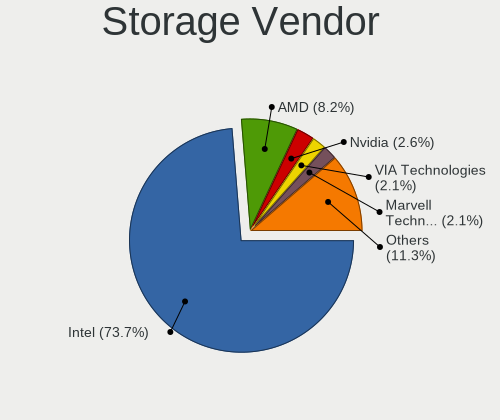

| Vendor                           | Desktops | Percent |
|----------------------------------|----------|---------|
| Intel                            | 102      | 78.46%  |
| AMD                              | 7        | 5.38%   |
| Nvidia                           | 4        | 3.08%   |
| VIA Technologies                 | 3        | 2.31%   |
| ASMedia Technology               | 3        | 2.31%   |
| Samsung Electronics              | 2        | 1.54%   |
| Marvell Technology Group         | 2        | 1.54%   |
| JMicron Technology               | 2        | 1.54%   |
| ULi Electronics                  | 1        | 0.77%   |
| Silicon Motion                   | 1        | 0.77%   |
| Silicon Integrated Systems [SiS] | 1        | 0.77%   |
| Realtek Semiconductor            | 1        | 0.77%   |
| ADATA Technology                 | 1        | 0.77%   |

Storage Model
-------------

Storage controller models

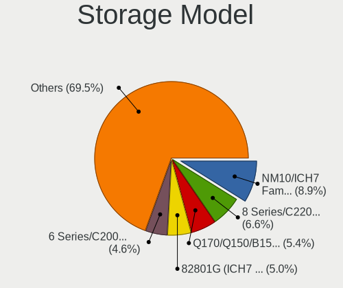

| Model                                                                                   | Desktops | Percent |
|-----------------------------------------------------------------------------------------|----------|---------|
| Intel NM10/ICH7 Family SATA Controller [IDE mode]                                       | 19       | 10.56%  |
| Intel 82801G (ICH7 Family) IDE Controller                                               | 13       | 7.22%   |
| Intel 8 Series/C220 Series Chipset Family 6-port SATA Controller 1 [AHCI mode]          | 13       | 7.22%   |
| Intel Q170/Q150/B150/H170/H110/Z170/CM236 Chipset SATA Controller [AHCI Mode]           | 10       | 5.56%   |
| Intel 6 Series/C200 Series Chipset Family Desktop SATA Controller (IDE mode, ports 4-5) | 9        | 5%      |
| Intel 6 Series/C200 Series Chipset Family Desktop SATA Controller (IDE mode, ports 0-3) | 9        | 5%      |
| Intel 7 Series/C210 Series Chipset Family 6-port SATA Controller [AHCI mode]            | 6        | 3.33%   |
| Intel Cannon Lake PCH SATA AHCI Controller                                              | 5        | 2.78%   |
| AMD FCH SATA Controller [AHCI mode]                                                     | 5        | 2.78%   |
| Intel 9 Series Chipset Family SATA Controller [AHCI Mode]                               | 4        | 2.22%   |
| Intel 82801JD/DO (ICH10 Family) SATA AHCI Controller                                    | 4        | 2.22%   |
| Intel 6 Series/C200 Series Chipset Family 6 port Desktop SATA AHCI Controller           | 4        | 2.22%   |
| Intel 200 Series PCH SATA controller [AHCI mode]                                        | 4        | 2.22%   |
| Intel SATA Controller [RAID mode]                                                       | 3        | 1.67%   |
| Intel 7 Series/C210 Series Chipset Family 4-port SATA Controller [IDE mode]             | 3        | 1.67%   |
| Intel 7 Series/C210 Series Chipset Family 2-port SATA Controller [IDE mode]             | 3        | 1.67%   |
| Intel 5 Series/3400 Series Chipset 4 port SATA IDE Controller                           | 3        | 1.67%   |
| Intel 5 Series/3400 Series Chipset 2 port SATA IDE Controller                           | 3        | 1.67%   |
| Intel 4 Series Chipset PT IDER Controller                                               | 3        | 1.67%   |
| ASMedia ASM1062 Serial ATA Controller                                                   | 3        | 1.67%   |
| VIA VT6415 PATA IDE Host Controller                                                     | 2        | 1.11%   |
| Samsung NVMe SSD Controller SM981/PM981/PM983                                           | 2        | 1.11%   |
| Nvidia MCP61 SATA Controller                                                            | 2        | 1.11%   |
| Nvidia MCP61 IDE                                                                        | 2        | 1.11%   |
| Intel C610/X99 series chipset sSATA Controller [AHCI mode]                              | 2        | 1.11%   |
| Intel C610/X99 series chipset 6-Port SATA Controller [AHCI mode]                        | 2        | 1.11%   |
| Intel C600/X79 series chipset 6-Port SATA AHCI Controller                               | 2        | 1.11%   |
| Intel 82801EB/ER (ICH5/ICH5R) IDE Controller                                            | 2        | 1.11%   |
| Intel 8 Series/C220 Series Chipset Family 4-port SATA Controller 1 [IDE mode]           | 2        | 1.11%   |
| Intel 400 Series Chipset Family SATA AHCI Controller                                    | 2        | 1.11%   |
| AMD SB7x0/SB8x0/SB9x0 SATA Controller [IDE mode]                                        | 2        | 1.11%   |
| AMD SB7x0/SB8x0/SB9x0 IDE Controller                                                    | 2        | 1.11%   |
| AMD 300 Series Chipset SATA Controller                                                  | 2        | 1.11%   |
| VIA VT82C586A/B/VT82C686/A/B/VT823x/A/C PIPC Bus Master IDE                             | 1        | 0.56%   |
| VIA Serial ATA Controller                                                               | 1        | 0.56%   |
| ULi ULi 5289 SATA                                                                       | 1        | 0.56%   |
| ULi M5229 IDE                                                                           | 1        | 0.56%   |
| Silicon Motion Non-Volatile memory controller                                           | 1        | 0.56%   |
| Silicon Integrated Systems [SiS] 5513 IDE Controller                                    | 1        | 0.56%   |
| Realtek Realtek Non-Volatile memory controller                                          | 1        | 0.56%   |
| Nvidia MCP78S [GeForce 8200] SATA Controller (non-AHCI mode)                            | 1        | 0.56%   |
| Nvidia MCP78S [GeForce 8200] IDE                                                        | 1        | 0.56%   |
| Nvidia CK804 Serial ATA Controller                                                      | 1        | 0.56%   |
| Nvidia CK804 IDE                                                                        | 1        | 0.56%   |
| Marvell Group 88SE9230 PCIe 2.0 x2 4-port SATA 6 Gb/s RAID Controller                   | 1        | 0.56%   |
| Marvell Group 88SE914D SATA-600 Controller                                              | 1        | 0.56%   |
| Marvell Group 88SE6111/6121 SATA II / PATA Controller                                   | 1        | 0.56%   |
| JMicron JMB368 IDE controller                                                           | 1        | 0.56%   |
| JMicron JMB363 SATA/IDE Controller                                                      | 1        | 0.56%   |
| Intel NM10/ICH7 Family SATA Controller [AHCI mode]                                      | 1        | 0.56%   |
| Intel Comet Lake SATA AHCI Controller                                                   | 1        | 0.56%   |
| Intel Atom Processor E3800 Series SATA AHCI Controller                                  | 1        | 0.56%   |
| Intel 82801IR/IO/IH (ICH9R/DO/DH) 4 port SATA Controller [IDE mode]                     | 1        | 0.56%   |
| Intel 82801I (ICH9 Family) 2 port SATA Controller [IDE mode]                            | 1        | 0.56%   |
| Intel 82801HR/HO/HH (ICH8R/DO/DH) 2 port SATA Controller [IDE mode]                     | 1        | 0.56%   |
| Intel 82801H (ICH8 Family) 4 port SATA Controller [IDE mode]                            | 1        | 0.56%   |
| Intel 82801EB (ICH5) SATA Controller                                                    | 1        | 0.56%   |
| Intel 5 Series/3400 Series Chipset 6 port SATA AHCI Controller                          | 1        | 0.56%   |
| AMD X370 Series Chipset SATA Controller                                                 | 1        | 0.56%   |
| AMD 400 Series Chipset SATA Controller                                                  | 1        | 0.56%   |

Storage Kind
------------

Kind of storage controller (IDE, SATA, NVMe, SAS, ...)

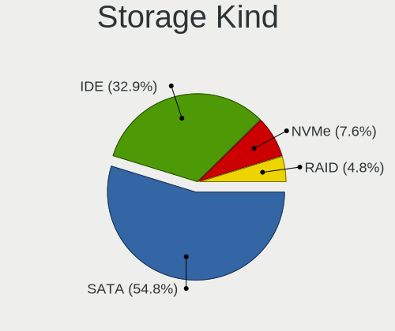

| Kind | Desktops | Percent |
|------|----------|---------|
| SATA | 67       | 51.94%  |
| IDE  | 54       | 41.86%  |
| NVMe | 5        | 3.88%   |
| RAID | 3        | 2.33%   |

Processor
---------

CPU Vendor
----------

Processor vendors

| Vendor | Desktops | Percent |
|--------|----------|---------|
| Intel  | 104      | 89.66%  |
| AMD    | 12       | 10.34%  |

CPU Model
---------

Processor models

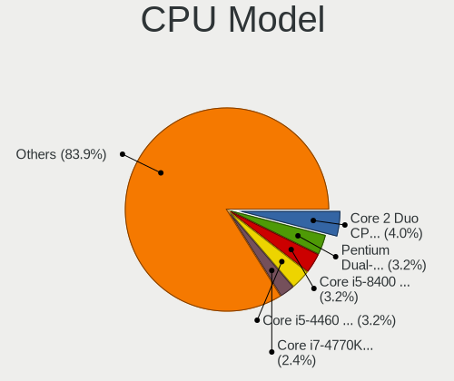

| Model                                       | Desktops | Percent |
|---------------------------------------------|----------|---------|
| Intel Core 2 Duo CPU E8400 @ 3.00GHz        | 5        | 4.31%   |
| Intel Pentium Dual-Core CPU E5700 @ 3.00GHz | 4        | 3.45%   |
| Intel Core i5-8400 CPU @ 2.80GHz            | 4        | 3.45%   |
| Intel Core i7-4770K CPU @ 3.50GHz           | 3        | 2.59%   |
| Intel Core i7-3770 CPU @ 3.40GHz            | 3        | 2.59%   |
| Intel Core i5-4460 CPU @ 3.20GHz            | 3        | 2.59%   |
| Intel Core i3-4170 CPU @ 3.70GHz            | 3        | 2.59%   |
| Intel Core 2 Duo CPU E7500 @ 2.93GHz        | 3        | 2.59%   |
| Intel Pentium Dual-Core CPU E6600 @ 3.06GHz | 2        | 1.72%   |
| Intel Pentium Dual CPU E2180 @ 2.00GHz      | 2        | 1.72%   |
| Intel Pentium CPU G630 @ 2.70GHz            | 2        | 1.72%   |
| Intel Pentium CPU G620 @ 2.60GHz            | 2        | 1.72%   |
| Intel Pentium CPU G2020 @ 2.90GHz           | 2        | 1.72%   |
| Intel Core i7-6700K CPU @ 4.00GHz           | 2        | 1.72%   |
| Intel Core i7-4820K CPU @ 3.70GHz           | 2        | 1.72%   |
| Intel Core i7-4790 CPU @ 3.60GHz            | 2        | 1.72%   |
| Intel Core i5-6500 CPU @ 3.20GHz            | 2        | 1.72%   |
| Intel Core i5-6400 CPU @ 2.70GHz            | 2        | 1.72%   |
| Intel Core i5-3570 CPU @ 3.40GHz            | 2        | 1.72%   |
| Intel Core i5-3470 CPU @ 3.20GHz            | 2        | 1.72%   |
| Intel Core i3-4160 CPU @ 3.60GHz            | 2        | 1.72%   |
| Intel Core 2 Quad CPU Q9550 @ 2.83GHz       | 2        | 1.72%   |
| Intel Core 2 Duo CPU E6550 @ 2.33GHz        | 2        | 1.72%   |
| AMD Ryzen 7 2700X Eight-Core Processor      | 2        | 1.72%   |
| Intel Xeon CPU E5-2680 v3 @ 2.50GHz         | 1        | 0.86%   |
| Intel Xeon CPU E5-1650 v3 @ 3.50GHz         | 1        | 0.86%   |
| Intel Pentium Dual CPU E2160 @ 1.80GHz      | 1        | 0.86%   |
| Intel Pentium CPU G645 @ 2.90GHz            | 1        | 0.86%   |
| Intel Pentium CPU G4400T @ 2.90GHz          | 1        | 0.86%   |
| Intel Pentium CPU G4400 @ 3.30GHz           | 1        | 0.86%   |
| Intel Pentium CPU G3260 @ 3.30GHz           | 1        | 0.86%   |
| Intel Pentium CPU G3250 @ 3.20GHz           | 1        | 0.86%   |
| Intel Pentium CPU G3220 @ 3.00GHz           | 1        | 0.86%   |
| Intel Pentium 4 CPU 3.00GHz                 | 1        | 0.86%   |
| Intel Pentium 4 CPU 2.80GHz                 | 1        | 0.86%   |
| Intel Core i9-9900KF CPU @ 3.60GHz          | 1        | 0.86%   |
| Intel Core i7-9700K CPU @ 3.60GHz           | 1        | 0.86%   |
| Intel Core i7-9700 CPU @ 3.00GHz            | 1        | 0.86%   |
| Intel Core i7-4770 CPU @ 3.40GHz            | 1        | 0.86%   |
| Intel Core i7-2600K CPU @ 3.40GHz           | 1        | 0.86%   |
| Intel Core i7-2600 CPU @ 3.40GHz            | 1        | 0.86%   |
| Intel Core i7-10700K CPU @ 3.80GHz          | 1        | 0.86%   |
| Intel Core i7 CPU 860 @ 2.80GHz             | 1        | 0.86%   |
| Intel Core i5-7500 CPU @ 3.40GHz            | 1        | 0.86%   |
| Intel Core i5-7400 CPU @ 3.00GHz            | 1        | 0.86%   |
| Intel Core i5-6600T CPU @ 2.70GHz           | 1        | 0.86%   |
| Intel Core i5-4570 CPU @ 3.20GHz            | 1        | 0.86%   |
| Intel Core i5-4440 CPU @ 3.10GHz            | 1        | 0.86%   |
| Intel Core i5-3550 CPU @ 3.30GHz            | 1        | 0.86%   |
| Intel Core i5-3470S CPU @ 2.90GHz           | 1        | 0.86%   |
| Intel Core i5-10400 CPU @ 2.90GHz           | 1        | 0.86%   |
| Intel Core i5 CPU 760 @ 2.80GHz             | 1        | 0.86%   |
| Intel Core i5 CPU 660 @ 3.33GHz             | 1        | 0.86%   |
| Intel Core i3-9100F CPU @ 3.60GHz           | 1        | 0.86%   |
| Intel Core i3-8100 CPU @ 3.60GHz            | 1        | 0.86%   |
| Intel Core i3-7100 CPU @ 3.90GHz            | 1        | 0.86%   |
| Intel Core i3-3240 CPU @ 3.40GHz            | 1        | 0.86%   |
| Intel Core i3-3220 CPU @ 3.30GHz            | 1        | 0.86%   |
| Intel Core i3-2100 CPU @ 3.10GHz            | 1        | 0.86%   |
| Intel Core i3-10100F CPU @ 3.60GHz          | 1        | 0.86%   |

CPU Model Family
----------------

Processor model prefix

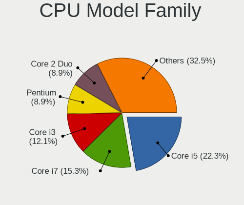

| Model                   | Desktops | Percent |
|-------------------------|----------|---------|
| Intel Core i5           | 25       | 21.55%  |
| Intel Core i7           | 19       | 16.38%  |
| Intel Core i3           | 13       | 11.21%  |
| Intel Pentium           | 12       | 10.34%  |
| Intel Core 2 Duo        | 12       | 10.34%  |
| Intel Pentium Dual-Core | 6        | 5.17%   |
| Intel Celeron           | 5        | 4.31%   |
| Intel Pentium Dual      | 3        | 2.59%   |
| Intel Core 2 Quad       | 3        | 2.59%   |
| AMD Ryzen 7             | 3        | 2.59%   |
| Intel Xeon              | 2        | 1.72%   |
| Intel Pentium 4         | 2        | 1.72%   |
| AMD Athlon 64           | 2        | 1.72%   |
| Intel Core i9           | 1        | 0.86%   |
| Intel Atom              | 1        | 0.86%   |
| AMD Ryzen 5             | 1        | 0.86%   |
| AMD Phenom II X4        | 1        | 0.86%   |
| AMD FX                  | 1        | 0.86%   |
| AMD E1                  | 1        | 0.86%   |
| AMD Athlon II X2        | 1        | 0.86%   |
| AMD Athlon 64 X2        | 1        | 0.86%   |
| AMD Athlon              | 1        | 0.86%   |

CPU Cores
---------

Number of processor cores

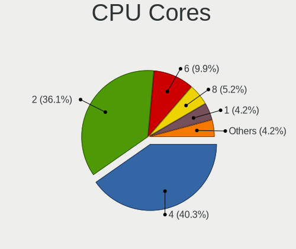

| Number | Desktops | Percent |
|--------|----------|---------|
| 2      | 50       | 43.1%   |
| 4      | 44       | 37.93%  |
| 8      | 7        | 6.03%   |
| 1      | 7        | 6.03%   |
| 6      | 6        | 5.17%   |
| 24     | 1        | 0.86%   |
| 3      | 1        | 0.86%   |

CPU Sockets
-----------

Number of sockets

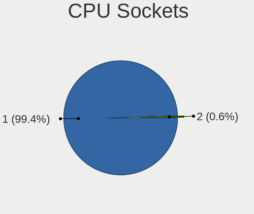

| Number | Desktops | Percent |
|--------|----------|---------|
| 1      | 115      | 99.14%  |
| 2      | 1        | 0.86%   |

CPU Threads
-----------

Threads per core (Hyper-Threading)

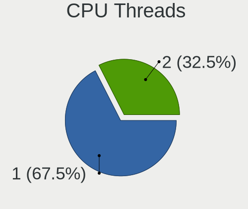

| Number | Desktops | Percent |
|--------|----------|---------|
| 1      | 78       | 66.67%  |
| 2      | 39       | 33.33%  |

CPU Op-Modes
------------

CPU Operation Modes (32-bit, 64-bit)

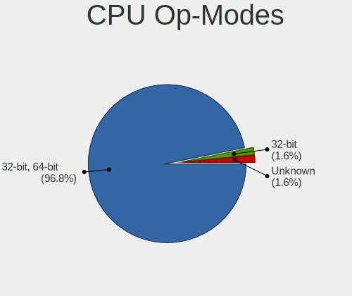

| Op mode        | Desktops | Percent |
|----------------|----------|---------|
| 32-bit, 64-bit | 113      | 96.58%  |
| 32-bit         | 2        | 1.71%   |
| Unknown        | 2        | 1.71%   |

CPU Microcode
-------------

Microcode number

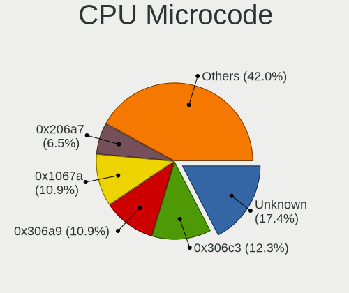

| Number     | Desktops | Percent |
|------------|----------|---------|
| 0x306c3    | 16       | 13.68%  |
| Unknown    | 15       | 12.82%  |
| 0x1067a    | 14       | 11.97%  |
| 0x306a9    | 13       | 11.11%  |
| 0x506e3    | 8        | 6.84%   |
| 0x206a7    | 8        | 6.84%   |
| 0x6fd      | 4        | 3.42%   |
| 0x906ea    | 3        | 2.56%   |
| 0x906e9    | 3        | 2.56%   |
| 0x6fb      | 3        | 2.56%   |
| 0xa0653    | 2        | 1.71%   |
| 0x906ed    | 2        | 1.71%   |
| 0x906eb    | 2        | 1.71%   |
| 0x306f2    | 2        | 1.71%   |
| 0x306e4    | 2        | 1.71%   |
| 0xf4a      | 1        | 0.85%   |
| 0xf49      | 1        | 0.85%   |
| 0xf41      | 1        | 0.85%   |
| 0xf33      | 1        | 0.85%   |
| 0xa0655    | 1        | 0.85%   |
| 0x906ec    | 1        | 0.85%   |
| 0x30678    | 1        | 0.85%   |
| 0x30661    | 1        | 0.85%   |
| 0x20655    | 1        | 0.85%   |
| 0x20652    | 1        | 0.85%   |
| 0x106e5    | 1        | 0.85%   |
| 0x10676    | 1        | 0.85%   |
| 0x10661    | 1        | 0.85%   |
| 0x0800820d | 1        | 0.85%   |
| 0x08001129 | 1        | 0.85%   |
| 0x07030106 | 1        | 0.85%   |
| 0x0600063e | 1        | 0.85%   |
| 0x010000db | 1        | 0.85%   |
| 0x010000c8 | 1        | 0.85%   |
| 0x01000083 | 1        | 0.85%   |

CPU Microarch
-------------

Microarchitecture

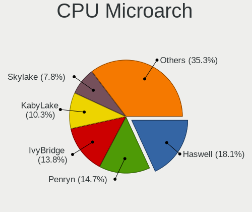

| Name        | Desktops | Percent |
|-------------|----------|---------|
| Haswell     | 21       | 18.1%   |
| Penryn      | 17       | 14.66%  |
| IvyBridge   | 16       | 13.79%  |
| KabyLake    | 12       | 10.34%  |
| Skylake     | 9        | 7.76%   |
| SandyBridge | 8        | 6.9%    |
| Core        | 8        | 6.9%    |
| NetBurst    | 4        | 3.45%   |
| K8 Hammer   | 3        | 2.59%   |
| K10         | 3        | 2.59%   |
| CometLake   | 3        | 2.59%   |
| Zen+        | 2        | 1.72%   |
| Zen         | 2        | 1.72%   |
| Westmere    | 2        | 1.72%   |
| Nehalem     | 2        | 1.72%   |
| Silvermont  | 1        | 0.86%   |
| Puma        | 1        | 0.86%   |
| Bulldozer   | 1        | 0.86%   |
| Bonnell     | 1        | 0.86%   |

Graphics
--------

GPU Vendor
----------

Vendors of graphics cards

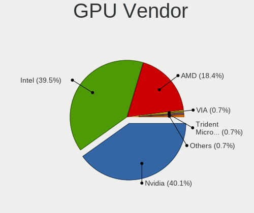

| Vendor               | Desktops | Percent |
|----------------------|----------|---------|
| Nvidia               | 50       | 40.32%  |
| Intel                | 48       | 38.71%  |
| AMD                  | 23       | 18.55%  |
| VIA Technologies     | 1        | 0.81%   |
| Trident Microsystems | 1        | 0.81%   |
| ASPEED Technology    | 1        | 0.81%   |

GPU Model
---------

Graphics card models

| Model                                                                       | Desktops | Percent |
|-----------------------------------------------------------------------------|----------|---------|
| Intel Xeon E3-1200 v3/4th Gen Core Processor Integrated Graphics Controller | 9        | 7.26%   |
| Nvidia GT218 [GeForce 210]                                                  | 7        | 5.65%   |
| Intel Xeon E3-1200 v2/3rd Gen Core processor Graphics Controller            | 6        | 4.84%   |
| Intel HD Graphics 530                                                       | 5        | 4.03%   |
| Intel CoffeeLake-S GT2 [UHD Graphics 630]                                   | 5        | 4.03%   |
| Intel 4 Series Chipset Integrated Graphics Controller                       | 5        | 4.03%   |
| AMD Cedar [Radeon HD 5000/6000/7350/8350 Series]                            | 5        | 4.03%   |
| Nvidia GM107 [GeForce GTX 750 Ti]                                           | 3        | 2.42%   |
| Nvidia GF119 [GeForce GT 610]                                               | 3        | 2.42%   |
| Nvidia GF119 [GeForce GT 520]                                               | 3        | 2.42%   |
| Nvidia GF108 [GeForce GT 630]                                               | 3        | 2.42%   |
| Intel 82G33/G31 Express Integrated Graphics Controller                      | 3        | 2.42%   |
| Intel 4th Generation Core Processor Family Integrated Graphics Controller   | 3        | 2.42%   |
| AMD Oland PRO [Radeon R7 240/340 / Radeon 520]                              | 3        | 2.42%   |
| AMD Ellesmere [Radeon RX 470/480/570/570X/580/580X/590]                     | 3        | 2.42%   |
| Nvidia GP104 [GeForce GTX 1070]                                             | 2        | 1.61%   |
| Nvidia GF108 [GeForce GT 430]                                               | 2        | 1.61%   |
| Nvidia G96C [GeForce 9500 GT]                                               | 2        | 1.61%   |
| Nvidia G86 [GeForce 8400 GS]                                                | 2        | 1.61%   |
| Intel IvyBridge GT2 [HD Graphics 4000]                                      | 2        | 1.61%   |
| Intel HD Graphics 510                                                       | 2        | 1.61%   |
| Intel 82945G/GZ Integrated Graphics Controller                              | 2        | 1.61%   |
| AMD RV730 PRO [Radeon HD 4650]                                              | 2        | 1.61%   |
| VIA Technologies CN896/VN896/P4M900 [Chrome 9 HC]                           | 1        | 0.81%   |
| Trident Microsystems XGI Volari XP5                                         | 1        | 0.81%   |
| Nvidia TU116 [GeForce GTX 1660 Ti]                                          | 1        | 0.81%   |
| Nvidia TU116 [GeForce GTX 1660 SUPER]                                       | 1        | 0.81%   |
| Nvidia TU102 [GeForce RTX 2080 Ti Rev. A]                                   | 1        | 0.81%   |
| Nvidia NV34 [GeForce FX 5500]                                               | 1        | 0.81%   |
| Nvidia GT216 [GeForce 210]                                                  | 1        | 0.81%   |
| Nvidia GT215 [GeForce GT 240]                                               | 1        | 0.81%   |
| Nvidia GP108 [GeForce GT 1030]                                              | 1        | 0.81%   |
| Nvidia GP107 [GeForce GTX 1050]                                             | 1        | 0.81%   |
| Nvidia GP107 [GeForce GTX 1050 Ti]                                          | 1        | 0.81%   |
| Nvidia GP106 [GeForce GTX 1060 6GB]                                         | 1        | 0.81%   |
| Nvidia GP104 [GeForce GTX 1080]                                             | 1        | 0.81%   |
| Nvidia GM206 [GeForce GTX 960]                                              | 1        | 0.81%   |
| Nvidia GM204 [GeForce GTX 970]                                              | 1        | 0.81%   |
| Nvidia GK208B [GeForce GT 710]                                              | 1        | 0.81%   |
| Nvidia GK208 [GeForce GT 630 Rev. 2]                                        | 1        | 0.81%   |
| Nvidia GK107GL [Quadro K2000]                                               | 1        | 0.81%   |
| Nvidia GK107 [GeForce GT 640]                                               | 1        | 0.81%   |
| Nvidia GK104 [GeForce GTX 760]                                              | 1        | 0.81%   |
| Nvidia GF108 [GeForce GT 730]                                               | 1        | 0.81%   |
| Nvidia GF106 [GeForce GTS 450]                                              | 1        | 0.81%   |
| Nvidia G98 [GeForce 8400 GS Rev. 2]                                         | 1        | 0.81%   |
| Nvidia G72 [GeForce 7200 GS / 7300 SE]                                      | 1        | 0.81%   |
| Nvidia C61 [GeForce 7025 / nForce 630a]                                     | 1        | 0.81%   |
| Intel HD Graphics 630                                                       | 1        | 0.81%   |
| Intel CometLake-S GT2 [UHD Graphics 630]                                    | 1        | 0.81%   |
| Intel Atom Processor Z36xxx/Z37xxx Series Graphics & Display                | 1        | 0.81%   |
| Intel Atom Processor D2xxx/N2xxx Integrated Graphics Controller             | 1        | 0.81%   |
| Intel 82865G Integrated Graphics Controller                                 | 1        | 0.81%   |
| Intel 2nd Generation Core Processor Family Integrated Graphics Controller   | 1        | 0.81%   |
| ASPEED Technology ASPEED Graphics Family                                    | 1        | 0.81%   |
| AMD RV770 [Radeon HD 4850]                                                  | 1        | 0.81%   |
| AMD RV100 [Radeon 7000 / Radeon VE]                                         | 1        | 0.81%   |
| AMD RS780D [Radeon HD 3300]                                                 | 1        | 0.81%   |
| AMD Redwood XT [Radeon HD 5670/5690/5730]                                   | 1        | 0.81%   |
| AMD Park [Mobility Radeon HD 5430]                                          | 1        | 0.81%   |

GPU Combo
---------

Combinations of graphics cards

| Name                     | Desktops | Percent |
|--------------------------|----------|---------|
| 1 x Nvidia               | 45       | 38.79%  |
| 1 x Intel                | 41       | 35.34%  |
| 1 x AMD                  | 21       | 18.1%   |
| Intel + Nvidia           | 4        | 3.45%   |
| Intel + AMD              | 2        | 1.72%   |
| 1 x VIA                  | 1        | 0.86%   |
| 1 x Trident Microsystems | 1        | 0.86%   |
| Nvidia + ASPEED          | 1        | 0.86%   |

GPU Driver
----------

Free vs proprietary

| Driver      | Desktops | Percent |
|-------------|----------|---------|
| Free        | 86       | 72.88%  |
| Proprietary | 25       | 21.19%  |
| Unknown     | 7        | 5.93%   |

GPU Memory
----------

Total video memory

| Size in GB | Desktops | Percent |
|------------|----------|---------|
| Unknown    | 54       | 45.76%  |
| 1.01-2.0   | 24       | 20.34%  |
| 0.51-1.0   | 14       | 11.86%  |
| 0.01-0.5   | 11       | 9.32%   |
| 3.01-4.0   | 6        | 5.08%   |
| 7.01-8.0   | 5        | 4.24%   |
| 5.01-6.0   | 3        | 2.54%   |
| 8.01-16.0  | 1        | 0.85%   |

Monitor
-------

Monitor Vendor
--------------

Monitor vendors

| Vendor               | Desktops | Percent |
|----------------------|----------|---------|
| Goldstar             | 33       | 31.43%  |
| Samsung Electronics  | 28       | 26.67%  |
| Hewlett-Packard      | 8        | 7.62%   |
| Ancor Communications | 7        | 6.67%   |
| LG Electronics       | 5        | 4.76%   |
| AOC                  | 5        | 4.76%   |
| Unknown              | 3        | 2.86%   |
| RTK                  | 3        | 2.86%   |
| Sony                 | 2        | 1.9%    |
| Lenovo               | 2        | 1.9%    |
| Dell                 | 2        | 1.9%    |
| CHD                  | 2        | 1.9%    |
| BenQ                 | 2        | 1.9%    |
| XVision              | 1        | 0.95%   |
| MSI                  | 1        | 0.95%   |
| Acer                 | 1        | 0.95%   |

Monitor Model
-------------

Monitor models

| Model                                                                 | Desktops | Percent |
|-----------------------------------------------------------------------|----------|---------|
| Samsung Electronics S22F350 SAM0D1B 1920x1080 477x268mm 21.5-inch     | 3        | 2.63%   |
| Samsung Electronics S22B300 SAM08A9 1600x900 443x249mm 20.0-inch      | 3        | 2.63%   |
| RTK LCD Monitor RTK1D1A 1920x1080 1020x570mm 46.0-inch                | 3        | 2.63%   |
| Goldstar IPS WSXGA GSM5B01 1440x900 419x262mm 19.5-inch               | 3        | 2.63%   |
| Samsung Electronics S22F350 SAM0D1A 1920x1080 477x268mm 21.5-inch     | 2        | 1.75%   |
| Samsung Electronics S20B300 SAM08A8 1600x900 443x249mm 20.0-inch      | 2        | 1.75%   |
| Samsung Electronics C27FG70 SAM0DC9 1920x1080 598x337mm 27.0-inch     | 2        | 1.75%   |
| Lenovo LCD Monitor LEN0BD0 1920x1080 510x290mm 23.1-inch              | 2        | 1.75%   |
| Hewlett-Packard LA2205 HWP2847 1680x1050 473x296mm 22.0-inch          | 2        | 1.75%   |
| Goldstar T730BH GSM43C2 1152x864 310x230mm 15.2-inch                  | 2        | 1.75%   |
| Goldstar IPS FULLHD GSM5AB7 1920x1080 480x270mm 21.7-inch             | 2        | 1.75%   |
| Goldstar FULL HD GSM5ABB 1920x1080 480x270mm 21.7-inch                | 2        | 1.75%   |
| Goldstar E1940 GSM4BD6 1360x768 406x229mm 18.4-inch                   | 2        | 1.75%   |
| CHD GDM-225JN CHD0220 1920x1080 490x270mm 22.0-inch                   | 2        | 1.75%   |
| Ancor Communications ASUS VS228 ACI22FD 1920x1080 476x268mm 21.5-inch | 2        | 1.75%   |
| XVision XL2020AI XVS0392 1600x900 600x340mm 27.2-inch                 | 1        | 0.88%   |
| Unknown LCD Monitor SYK VGA TO HDMI 1920x1080                         | 1        | 0.88%   |
| Unknown LCD Monitor SAMSUNG 2720x768                                  | 1        | 0.88%   |
| Unknown LCD Monitor SAMSUNG 1920x1080                                 | 1        | 0.88%   |
| Unknown LCD Monitor SAMSUNG                                           | 1        | 0.88%   |
| Sony TV SNYA301 1920x1080 1600x900mm 72.3-inch                        | 1        | 0.88%   |
| Sony TV SNY0902 1360x768                                              | 1        | 0.88%   |
| Samsung Electronics SyncMaster SAM0364 1360x768 344x194mm 15.5-inch   | 1        | 0.88%   |
| Samsung Electronics SyncMaster SAM027F 1680x1050 474x296mm 22.0-inch  | 1        | 0.88%   |
| Samsung Electronics SyncMaster SAM0273 1440x900 410x257mm 19.1-inch   | 1        | 0.88%   |
| Samsung Electronics SyncMaster SAM022B 1280x1024 338x270mm 17.0-inch  | 1        | 0.88%   |
| Samsung Electronics SyncMaster SAM0159 1280x1024 338x270mm 17.0-inch  | 1        | 0.88%   |
| Samsung Electronics SyncMaster SAM0152 1280x1024 312x234mm 15.4-inch  | 1        | 0.88%   |
| Samsung Electronics SME2020 SAM06A0 1600x900 443x249mm 20.0-inch      | 1        | 0.88%   |
| Samsung Electronics SMBX1931N SAM0768 1366x768 410x230mm 18.5-inch    | 1        | 0.88%   |
| Samsung Electronics S27F350 SAM0D23 1920x1080 598x336mm 27.0-inch     | 1        | 0.88%   |
| Samsung Electronics S19F350 SAM0D46 1366x768 410x230mm 18.5-inch      | 1        | 0.88%   |
| Samsung Electronics S19C150 SAM0AE6 1366x768 410x230mm 18.5-inch      | 1        | 0.88%   |
| Samsung Electronics S19B370 SAM08B8 1366x768 410x230mm 18.5-inch      | 1        | 0.88%   |
| Samsung Electronics S19B150 SAM08A2 1366x768 410x230mm 18.5-inch      | 1        | 0.88%   |
| Samsung Electronics LCD Monitor SyncMaster 1280x1024                  | 1        | 0.88%   |
| Samsung Electronics LCD Monitor SAM0C39 1920x1080 700x390mm 31.5-inch | 1        | 0.88%   |
| Samsung Electronics LCD Monitor SAM0AC6 1920x1080 700x390mm 31.5-inch | 1        | 0.88%   |
| Samsung Electronics LCD Monitor SAM0669 1920x1080                     | 1        | 0.88%   |
| Samsung Electronics LCD Monitor SAM03D4 1280x720                      | 1        | 0.88%   |
| Samsung Electronics LCD Monitor S22F350 1920x1080                     | 1        | 0.88%   |
| MSI MP241 MSI3BA9 1920x1080 527x296mm 23.8-inch                       | 1        | 0.88%   |
| LG Electronics LCD Monitor W1752 1440x900                             | 1        | 0.88%   |
| LG Electronics LCD Monitor LG ULTRAWIDE 2560x1080                     | 1        | 0.88%   |
| LG Electronics LCD Monitor LG FULL HD 1920x1080                       | 1        | 0.88%   |
| LG Electronics LCD Monitor E1941 1366x768                             | 1        | 0.88%   |
| LG Electronics LCD Monitor E1940 1360x768                             | 1        | 0.88%   |
| Hewlett-Packard Z24i HWP309E 1920x1200 520x320mm 24.0-inch            | 1        | 0.88%   |
| Hewlett-Packard V197 HWP3348 1366x768 410x230mm 18.5-inch             | 1        | 0.88%   |
| Hewlett-Packard P201m HWP3084 1600x900 443x249mm 20.0-inch            | 1        | 0.88%   |
| Hewlett-Packard LE2002x HWP2964 1600x900 443x249mm 20.0-inch          | 1        | 0.88%   |
| Hewlett-Packard LCD Monitor V197 1366x768                             | 1        | 0.88%   |
| Hewlett-Packard LCD Monitor L1706 1280x1024                           | 1        | 0.88%   |
| Hewlett-Packard E241i HWP3122 1920x1200 518x324mm 24.1-inch           | 1        | 0.88%   |
| Hewlett-Packard E201 HWP305F 1600x900 443x249mm 20.0-inch             | 1        | 0.88%   |
| Goldstar W2284 GSM5697 1680x1050 474x296mm 22.0-inch                  | 1        | 0.88%   |
| Goldstar W2262 GSM5738 1920x1080 477x268mm 21.5-inch                  | 1        | 0.88%   |
| Goldstar W2262 GSM5737 1920x1080 477x268mm 21.5-inch                  | 1        | 0.88%   |
| Goldstar W2253 GSM56DC 1920x1080 480x270mm 21.7-inch                  | 1        | 0.88%   |
| Goldstar W2061 GSM4EA1 1600x900 440x250mm 19.9-inch                   | 1        | 0.88%   |

Monitor Resolution
------------------

Monitor screen resolution

| Resolution         | Desktops | Percent |
|--------------------|----------|---------|
| 1920x1080 (FHD)    | 47       | 45.19%  |
| 1600x900 (HD+)     | 11       | 10.58%  |
| 1366x768 (WXGA)    | 10       | 9.62%   |
| 1440x900 (WXGA+)   | 7        | 6.73%   |
| 1360x768           | 7        | 6.73%   |
| 1680x1050 (WSXGA+) | 6        | 5.77%   |
| 1280x1024 (SXGA)   | 6        | 5.77%   |
| 2560x1080          | 2        | 1.92%   |
| 1280x960           | 2        | 1.92%   |
| Unknown            | 2        | 1.92%   |
| 3840x2160 (4K)     | 1        | 0.96%   |
| 2720x768           | 1        | 0.96%   |
| 2560x1440 (QHD)    | 1        | 0.96%   |
| 1920x1200 (WUXGA)  | 1        | 0.96%   |

Monitor Diagonal
----------------

Diagonal size in inches

| Inches  | Desktops | Percent |
|---------|----------|---------|
| 21      | 22       | 20.56%  |
| Unknown | 15       | 14.02%  |
| 18      | 12       | 11.21%  |
| 23      | 9        | 8.41%   |
| 20      | 9        | 8.41%   |
| 19      | 8        | 7.48%   |
| 22      | 6        | 5.61%   |
| 27      | 5        | 4.67%   |
| 46      | 3        | 2.8%    |
| 17      | 3        | 2.8%    |
| 16      | 3        | 2.8%    |
| 15      | 3        | 2.8%    |
| 72      | 2        | 1.87%   |
| 24      | 2        | 1.87%   |
| 47      | 1        | 0.93%   |
| 40      | 1        | 0.93%   |
| 32      | 1        | 0.93%   |
| 31      | 1        | 0.93%   |
| 29      | 1        | 0.93%   |

Monitor Width
-------------

Physical width

| Width in mm | Desktops | Percent |
|-------------|----------|---------|
| 401-500     | 55       | 52.38%  |
| 501-600     | 16       | 15.24%  |
| Unknown     | 15       | 14.29%  |
| 301-350     | 8        | 7.62%   |
| 1001-1500   | 4        | 3.81%   |
| 601-700     | 2        | 1.9%    |
| 1501-2000   | 2        | 1.9%    |
| 801-900     | 1        | 0.95%   |
| 701-800     | 1        | 0.95%   |
| 351-400     | 1        | 0.95%   |

Aspect Ratio
------------

Proportional relationship between the width and the height

| Ratio   | Desktops | Percent |
|---------|----------|---------|
| 16/9    | 70       | 68.63%  |
| Unknown | 13       | 12.75%  |
| 16/10   | 12       | 11.76%  |
| 4/3     | 4        | 3.92%   |
| 5/4     | 2        | 1.96%   |
| 21/9    | 1        | 0.98%   |

Monitor Area
------------

Area in inch²

| Area in inch² | Desktops | Percent |
|----------------|----------|---------|
| 201-250        | 35       | 32.71%  |
| 151-200        | 20       | 18.69%  |
| Unknown        | 15       | 14.02%  |
| 141-150        | 14       | 13.08%  |
| 301-350        | 6        | 5.61%   |
| 501-1000       | 5        | 4.67%   |
| 121-130        | 3        | 2.8%    |
| More than 1000 | 2        | 1.87%   |
| 351-500        | 2        | 1.87%   |
| 101-110        | 2        | 1.87%   |
| 251-300        | 1        | 0.93%   |
| 131-140        | 1        | 0.93%   |
| 111-120        | 1        | 0.93%   |

Pixel Density
-------------

Pixels per inch

| Density | Desktops | Percent |
|---------|----------|---------|
| 51-100  | 59       | 55.14%  |
| 101-120 | 27       | 25.23%  |
| Unknown | 15       | 14.02%  |
| 1-50    | 6        | 5.61%   |

Multiple Monitors
-----------------

Total monitors connected

| Total | Desktops | Percent |
|-------|----------|---------|
| 1     | 96       | 82.05%  |
| 2     | 13       | 11.11%  |
| 0     | 8        | 6.84%   |

Network
-------

Net Controller Vendor
---------------------

Controller vendors

| Vendor                           | Desktops | Percent |
|----------------------------------|----------|---------|
| Realtek Semiconductor            | 76       | 43.43%  |
| Intel                            | 28       | 16%     |
| Ralink Technology                | 14       | 8%      |
| Qualcomm Atheros                 | 12       | 6.86%   |
| Samsung Electronics              | 8        | 4.57%   |
| D-Link                           | 8        | 4.57%   |
| VIA Technologies                 | 5        | 2.86%   |
| Ralink                           | 4        | 2.29%   |
| TP-Link                          | 3        | 1.71%   |
| Nvidia                           | 3        | 1.71%   |
| D-Link System                    | 3        | 1.71%   |
| Qualcomm Atheros Communications  | 2        | 1.14%   |
| Xiaomi                           | 1        | 0.57%   |
| Silicon Integrated Systems [SiS] | 1        | 0.57%   |
| Marvell Technology Group         | 1        | 0.57%   |
| Huawei Technologies              | 1        | 0.57%   |
| Broadcom Limited                 | 1        | 0.57%   |
| Broadcom                         | 1        | 0.57%   |
| ASUSTek Computer                 | 1        | 0.57%   |
| Aquantia                         | 1        | 0.57%   |
| AboCom Systems                   | 1        | 0.57%   |

Net Controller Model
--------------------

Controller models

| Model                                                                       | Desktops | Percent |
|-----------------------------------------------------------------------------|----------|---------|
| Realtek RTL8111/8168/8411 PCI Express Gigabit Ethernet Controller           | 66       | 35.11%  |
| Ralink MT7601U Wireless Adapter                                             | 10       | 5.32%   |
| Samsung GT-I9070 (network tethering, USB debugging enabled)                 | 5        | 2.66%   |
| Realtek RTL-8100/8101L/8139 PCI Fast Ethernet Adapter                       | 5        | 2.66%   |
| Intel 82579LM Gigabit Network Connection (Lewisville)                       | 5        | 2.66%   |
| D-Link DWA-123 Wireless N 150 Adapter (rev.D1)                              | 5        | 2.66%   |
| VIA VT6105/VT6106S [Rhine-III]                                              | 4        | 2.13%   |
| Ralink RT5370 Wireless Adapter                                              | 4        | 2.13%   |
| Qualcomm Atheros AR8121/AR8113/AR8114 Gigabit or Fast Ethernet              | 4        | 2.13%   |
| Intel Ethernet Connection (2) I219-V                                        | 4        | 2.13%   |
| Intel 82567LM-3 Gigabit Network Connection                                  | 4        | 2.13%   |
| Samsung Galaxy series, misc. (tethering mode)                               | 3        | 1.6%    |
| Realtek RTL8188FTV 802.11b/g/n 1T1R 2.4G WLAN Adapter                       | 3        | 1.6%    |
| Realtek RTL8188EUS 802.11n Wireless Network Adapter                         | 3        | 1.6%    |
| Realtek RTL810xE PCI Express Fast Ethernet controller                       | 3        | 1.6%    |
| Intel Ethernet Connection (2) I218-V                                        | 3        | 1.6%    |
| TP-Link TL-WN823N v2/v3 [Realtek RTL8192EU]                                 | 2        | 1.06%   |
| Ralink RT5360 Wireless 802.11n 1T/1R                                        | 2        | 1.06%   |
| Qualcomm Atheros QCA8171 Gigabit Ethernet                                   | 2        | 1.06%   |
| Qualcomm Atheros AR9271 802.11n                                             | 2        | 1.06%   |
| Qualcomm Atheros AR9227 Wireless Network Adapter                            | 2        | 1.06%   |
| Intel Ethernet Connection I217-V                                            | 2        | 1.06%   |
| Intel Ethernet Connection (7) I219-V                                        | 2        | 1.06%   |
| Intel Ethernet Connection (2) I219-LM                                       | 2        | 1.06%   |
| D-Link WLAN controller                                                      | 2        | 1.06%   |
| D-Link System DWA-125 Wireless N 150 Adapter(rev.A1) [Ralink RT3070]        | 2        | 1.06%   |
| Xiaomi Mi/Redmi series (RNDIS + ADB)                                        | 1        | 0.53%   |
| VIA VT6102/VT6103 [Rhine-II]                                                | 1        | 0.53%   |
| TP-Link TL-WN722N v2/v3 [Realtek RTL8188EUS]                                | 1        | 0.53%   |
| Silicon Integrated Systems [SiS] SiS900 PCI Fast Ethernet                   | 1        | 0.53%   |
| Realtek RTL8192EE PCIe Wireless Network Adapter                             | 1        | 0.53%   |
| Realtek RTL8192CE PCIe Wireless Network Adapter                             | 1        | 0.53%   |
| Realtek RTL8188EE Wireless Network Adapter                                  | 1        | 0.53%   |
| Realtek RTL8188CUS 802.11n WLAN Adapter                                     | 1        | 0.53%   |
| Realtek RTL8169 PCI Gigabit Ethernet Controller                             | 1        | 0.53%   |
| Realtek RTL-8185 IEEE 802.11a/b/g Wireless LAN Controller                   | 1        | 0.53%   |
| Realtek 802.11ac NIC                                                        | 1        | 0.53%   |
| Ralink RT3060 Wireless 802.11n 1T/1R                                        | 1        | 0.53%   |
| Ralink RT2561/RT61 802.11g PCI                                              | 1        | 0.53%   |
| Qualcomm Atheros Killer E2500 Gigabit Ethernet Controller                   | 1        | 0.53%   |
| Qualcomm Atheros Killer E220x Gigabit Ethernet Controller                   | 1        | 0.53%   |
| Qualcomm Atheros AR9462 Wireless Network Adapter                            | 1        | 0.53%   |
| Qualcomm Atheros AR8131 Gigabit Ethernet                                    | 1        | 0.53%   |
| Qualcomm Atheros AR5212/5213/2414 Wireless Network Adapter                  | 1        | 0.53%   |
| Nvidia MCP77 Ethernet                                                       | 1        | 0.53%   |
| Nvidia MCP61 Ethernet                                                       | 1        | 0.53%   |
| Nvidia CK804 Ethernet Controller                                            | 1        | 0.53%   |
| Marvell Group 88E8056 PCI-E Gigabit Ethernet Controller                     | 1        | 0.53%   |
| Intel I211 Gigabit Network Connection                                       | 1        | 0.53%   |
| Intel I210 Gigabit Network Connection                                       | 1        | 0.53%   |
| Intel Ethernet Connection I217-LM                                           | 1        | 0.53%   |
| Intel Ethernet Connection (2) I218-LM                                       | 1        | 0.53%   |
| Intel Ethernet Connection (11) I219-V                                       | 1        | 0.53%   |
| Intel Comet Lake PCH CNVi WiFi                                              | 1        | 0.53%   |
| Intel 82583V Gigabit Network Connection                                     | 1        | 0.53%   |
| Huawei E353/E3131                                                           | 1        | 0.53%   |
| D-Link System DGE-528T Gigabit Ethernet Adapter                             | 1        | 0.53%   |
| D-Link DWA-121 802.11n Wireless N 150 Pico Adapter [Realtek RTL8188CUS]     | 1        | 0.53%   |
| Broadcom Limited BCM4318 [AirForce One 54g] 802.11g Wireless LAN Controller | 1        | 0.53%   |
| Broadcom BCM43217 802.11b/g/n                                               | 1        | 0.53%   |

Wireless Vendor
---------------

Wireless vendors

| Vendor                          | Desktops | Percent |
|---------------------------------|----------|---------|
| Ralink Technology               | 14       | 26.42%  |
| Realtek Semiconductor           | 12       | 22.64%  |
| D-Link                          | 8        | 15.09%  |
| Ralink                          | 4        | 7.55%   |
| Qualcomm Atheros                | 4        | 7.55%   |
| TP-Link                         | 3        | 5.66%   |
| Qualcomm Atheros Communications | 2        | 3.77%   |
| D-Link System                   | 2        | 3.77%   |
| Intel                           | 1        | 1.89%   |
| Broadcom Limited                | 1        | 1.89%   |
| Broadcom                        | 1        | 1.89%   |
| AboCom Systems                  | 1        | 1.89%   |

Wireless Model
--------------

Wireless models

| Model                                                                       | Desktops | Percent |
|-----------------------------------------------------------------------------|----------|---------|
| Ralink MT7601U Wireless Adapter                                             | 10       | 18.87%  |
| D-Link DWA-123 Wireless N 150 Adapter (rev.D1)                              | 5        | 9.43%   |
| Ralink RT5370 Wireless Adapter                                              | 4        | 7.55%   |
| Realtek RTL8188FTV 802.11b/g/n 1T1R 2.4G WLAN Adapter                       | 3        | 5.66%   |
| Realtek RTL8188EUS 802.11n Wireless Network Adapter                         | 3        | 5.66%   |
| TP-Link TL-WN823N v2/v3 [Realtek RTL8192EU]                                 | 2        | 3.77%   |
| Ralink RT5360 Wireless 802.11n 1T/1R                                        | 2        | 3.77%   |
| Qualcomm Atheros AR9271 802.11n                                             | 2        | 3.77%   |
| Qualcomm Atheros AR9227 Wireless Network Adapter                            | 2        | 3.77%   |
| D-Link WLAN controller                                                      | 2        | 3.77%   |
| D-Link System DWA-125 Wireless N 150 Adapter(rev.A1) [Ralink RT3070]        | 2        | 3.77%   |
| TP-Link TL-WN722N v2/v3 [Realtek RTL8188EUS]                                | 1        | 1.89%   |
| Realtek RTL8192EE PCIe Wireless Network Adapter                             | 1        | 1.89%   |
| Realtek RTL8192CE PCIe Wireless Network Adapter                             | 1        | 1.89%   |
| Realtek RTL8188EE Wireless Network Adapter                                  | 1        | 1.89%   |
| Realtek RTL8188CUS 802.11n WLAN Adapter                                     | 1        | 1.89%   |
| Realtek RTL-8185 IEEE 802.11a/b/g Wireless LAN Controller                   | 1        | 1.89%   |
| Realtek 802.11ac NIC                                                        | 1        | 1.89%   |
| Ralink RT3060 Wireless 802.11n 1T/1R                                        | 1        | 1.89%   |
| Ralink RT2561/RT61 802.11g PCI                                              | 1        | 1.89%   |
| Qualcomm Atheros AR9462 Wireless Network Adapter                            | 1        | 1.89%   |
| Qualcomm Atheros AR5212/5213/2414 Wireless Network Adapter                  | 1        | 1.89%   |
| Intel Comet Lake PCH CNVi WiFi                                              | 1        | 1.89%   |
| D-Link DWA-121 802.11n Wireless N 150 Pico Adapter [Realtek RTL8188CUS]     | 1        | 1.89%   |
| Broadcom Limited BCM4318 [AirForce One 54g] 802.11g Wireless LAN Controller | 1        | 1.89%   |
| Broadcom BCM43217 802.11b/g/n                                               | 1        | 1.89%   |
| AboCom Systems AboCom Systems Inc [WN2001 Prolink Wireless-N Nano Adapter]  | 1        | 1.89%   |

Ethernet Vendor
---------------

Ethernet vendors

| Vendor                           | Desktops | Percent |
|----------------------------------|----------|---------|
| Realtek Semiconductor            | 74       | 55.22%  |
| Intel                            | 28       | 20.9%   |
| Qualcomm Atheros                 | 9        | 6.72%   |
| Samsung Electronics              | 8        | 5.97%   |
| VIA Technologies                 | 5        | 3.73%   |
| Nvidia                           | 3        | 2.24%   |
| Xiaomi                           | 1        | 0.75%   |
| Silicon Integrated Systems [SiS] | 1        | 0.75%   |
| Marvell Technology Group         | 1        | 0.75%   |
| Huawei Technologies              | 1        | 0.75%   |
| D-Link System                    | 1        | 0.75%   |
| ASUSTek Computer                 | 1        | 0.75%   |
| Aquantia                         | 1        | 0.75%   |

Ethernet Model
--------------

Ethernet models

| Model                                                             | Desktops | Percent |
|-------------------------------------------------------------------|----------|---------|
| Realtek RTL8111/8168/8411 PCI Express Gigabit Ethernet Controller | 66       | 48.89%  |
| Samsung GT-I9070 (network tethering, USB debugging enabled)       | 5        | 3.7%    |
| Realtek RTL-8100/8101L/8139 PCI Fast Ethernet Adapter             | 5        | 3.7%    |
| Intel 82579LM Gigabit Network Connection (Lewisville)             | 5        | 3.7%    |
| VIA VT6105/VT6106S [Rhine-III]                                    | 4        | 2.96%   |
| Qualcomm Atheros AR8121/AR8113/AR8114 Gigabit or Fast Ethernet    | 4        | 2.96%   |
| Intel Ethernet Connection (2) I219-V                              | 4        | 2.96%   |
| Intel 82567LM-3 Gigabit Network Connection                        | 4        | 2.96%   |
| Samsung Galaxy series, misc. (tethering mode)                     | 3        | 2.22%   |
| Realtek RTL810xE PCI Express Fast Ethernet controller             | 3        | 2.22%   |
| Intel Ethernet Connection (2) I218-V                              | 3        | 2.22%   |
| Qualcomm Atheros QCA8171 Gigabit Ethernet                         | 2        | 1.48%   |
| Intel Ethernet Connection I217-V                                  | 2        | 1.48%   |
| Intel Ethernet Connection (7) I219-V                              | 2        | 1.48%   |
| Intel Ethernet Connection (2) I219-LM                             | 2        | 1.48%   |
| Xiaomi Mi/Redmi series (RNDIS + ADB)                              | 1        | 0.74%   |
| VIA VT6102/VT6103 [Rhine-II]                                      | 1        | 0.74%   |
| Silicon Integrated Systems [SiS] SiS900 PCI Fast Ethernet         | 1        | 0.74%   |
| Realtek RTL8169 PCI Gigabit Ethernet Controller                   | 1        | 0.74%   |
| Qualcomm Atheros Killer E2500 Gigabit Ethernet Controller         | 1        | 0.74%   |
| Qualcomm Atheros Killer E220x Gigabit Ethernet Controller         | 1        | 0.74%   |
| Qualcomm Atheros AR8131 Gigabit Ethernet                          | 1        | 0.74%   |
| Nvidia MCP77 Ethernet                                             | 1        | 0.74%   |
| Nvidia MCP61 Ethernet                                             | 1        | 0.74%   |
| Nvidia CK804 Ethernet Controller                                  | 1        | 0.74%   |
| Marvell Group 88E8056 PCI-E Gigabit Ethernet Controller           | 1        | 0.74%   |
| Intel I211 Gigabit Network Connection                             | 1        | 0.74%   |
| Intel I210 Gigabit Network Connection                             | 1        | 0.74%   |
| Intel Ethernet Connection I217-LM                                 | 1        | 0.74%   |
| Intel Ethernet Connection (2) I218-LM                             | 1        | 0.74%   |
| Intel Ethernet Connection (11) I219-V                             | 1        | 0.74%   |
| Intel 82583V Gigabit Network Connection                           | 1        | 0.74%   |
| Huawei E353/E3131                                                 | 1        | 0.74%   |
| D-Link System DGE-528T Gigabit Ethernet Adapter                   | 1        | 0.74%   |
| ASUS Android                                                      | 1        | 0.74%   |
| Aquantia AQC111 NBase-T/IEEE 802.3bz Ethernet Controller [AQtion] | 1        | 0.74%   |

Net Controller Kind
-------------------

Ethernet, WiFi or modem

| Kind     | Desktops | Percent |
|----------|----------|---------|
| Ethernet | 115      | 69.7%   |
| WiFi     | 50       | 30.3%   |

Used Controller
---------------

Currently used network controller

| Kind     | Desktops | Percent |
|----------|----------|---------|
| Ethernet | 80       | 67.23%  |
| WiFi     | 39       | 32.77%  |

NICs
----

Total network controllers on board

| Total | Desktops | Percent |
|-------|----------|---------|
| 1     | 91       | 78.45%  |
| 2     | 20       | 17.24%  |
| 3     | 3        | 2.59%   |
| 4     | 1        | 0.86%   |
| 0     | 1        | 0.86%   |

IPv6
----

IPv6 vs IPv4

| Used | Desktops | Percent |
|------|----------|---------|
| No   | 111      | 95.69%  |
| Yes  | 5        | 4.31%   |

Bluetooth
---------

Bluetooth Vendor
----------------

Controller vendors

| Vendor                     | Desktops | Percent |
|----------------------------|----------|---------|
| Cambridge Silicon Radio    | 12       | 80%     |
| Intel                      | 1        | 6.67%   |
| Integrated System Solution | 1        | 6.67%   |
| Broadcom                   | 1        | 6.67%   |

Bluetooth Model
---------------

Controller models

| Model                                               | Desktops | Percent |
|-----------------------------------------------------|----------|---------|
| Cambridge Silicon Radio Bluetooth Dongle (HCI mode) | 12       | 80%     |
| Intel AX201 Bluetooth                               | 1        | 6.67%   |
| Integrated System Solution Bluetooth Device         | 1        | 6.67%   |
| Broadcom BCM92045B3 ROM                             | 1        | 6.67%   |

Sound
-----

Sound Vendor
------------

Sound card vendors

| Vendor                           | Desktops | Percent |
|----------------------------------|----------|---------|
| Intel                            | 98       | 56%     |
| Nvidia                           | 40       | 22.86%  |
| AMD                              | 26       | 14.86%  |
| C-Media Electronics              | 4        | 2.29%   |
| Generalplus Technology           | 2        | 1.14%   |
| VIA Technologies                 | 1        | 0.57%   |
| ULi Electronics                  | 1        | 0.57%   |
| Silicon Integrated Systems [SiS] | 1        | 0.57%   |
| Focusrite-Novation               | 1        | 0.57%   |
| ESS Technology                   | 1        | 0.57%   |

Sound Model
-----------

Sound card models

| Model                                                                             | Desktops | Percent |
|-----------------------------------------------------------------------------------|----------|---------|
| Intel NM10/ICH7 Family High Definition Audio Controller                           | 19       | 10.11%  |
| Intel 8 Series/C220 Series Chipset High Definition Audio Controller               | 15       | 7.98%   |
| Intel 6 Series/C200 Series Chipset Family High Definition Audio Controller        | 13       | 6.91%   |
| Intel 100 Series/C230 Series Chipset Family HD Audio Controller                   | 10       | 5.32%   |
| Intel 7 Series/C216 Chipset Family High Definition Audio Controller               | 9        | 4.79%   |
| Nvidia High Definition Audio Controller                                           | 8        | 4.26%   |
| Intel Xeon E3-1200 v3/4th Gen Core Processor HD Audio Controller                  | 7        | 3.72%   |
| Nvidia GF108 High Definition Audio Controller                                     | 6        | 3.19%   |
| Intel Cannon Lake PCH cAVS                                                        | 6        | 3.19%   |
| AMD Cedar HDMI Audio [Radeon HD 5400/6300/7300 Series]                            | 6        | 3.19%   |
| Nvidia GF119 HDMI Audio Controller                                                | 5        | 2.66%   |
| Intel 200 Series PCH HD Audio                                                     | 5        | 2.66%   |
| Intel 9 Series Chipset Family HD Audio Controller                                 | 4        | 2.13%   |
| Intel 82801JD/DO (ICH10 Family) HD Audio Controller                               | 4        | 2.13%   |
| AMD Oland/Hainan/Cape Verde/Pitcairn HDMI Audio [Radeon HD 7000 Series]           | 4        | 2.13%   |
| AMD Family 17h (Models 00h-0fh) HD Audio Controller                               | 4        | 2.13%   |
| Nvidia GP104 High Definition Audio Controller                                     | 3        | 1.6%    |
| Nvidia GM107 High Definition Audio Controller [GeForce 940MX]                     | 3        | 1.6%    |
| Intel 5 Series/3400 Series Chipset High Definition Audio                          | 3        | 1.6%    |
| C-Media Electronics CMI8738/CMI8768 PCI Audio                                     | 3        | 1.6%    |
| AMD Ellesmere HDMI Audio [Radeon RX 470/480 / 570/580/590]                        | 3        | 1.6%    |
| Nvidia TU116 High Definition Audio Controller                                     | 2        | 1.06%   |
| Nvidia GP107GL High Definition Audio Controller                                   | 2        | 1.06%   |
| Nvidia GK208 HDMI/DP Audio Controller                                             | 2        | 1.06%   |
| Intel Comet Lake PCH-V cAVS                                                       | 2        | 1.06%   |
| Intel C610/X99 series chipset HD Audio Controller                                 | 2        | 1.06%   |
| Intel C600/X79 series chipset High Definition Audio Controller                    | 2        | 1.06%   |
| Generalplus Technology Usb Audio Device                                           | 2        | 1.06%   |
| AMD SBx00 Azalia (Intel HDA)                                                      | 2        | 1.06%   |
| AMD RV710/730 HDMI Audio [Radeon HD 4000 series]                                  | 2        | 1.06%   |
| AMD Caicos HDMI Audio [Radeon HD 6450 / 7450/8450/8490 OEM / R5 230/235/235X OEM] | 2        | 1.06%   |
| VIA Technologies VX900/VT8xxx High Definition Audio Controller                    | 1        | 0.53%   |
| ULi Electronics M5455 PCI AC-Link Controller Audio Device                         | 1        | 0.53%   |
| Silicon Integrated Systems [SiS] SiS7012 AC'97 Sound Controller                   | 1        | 0.53%   |
| Nvidia TU102 High Definition Audio Controller                                     | 1        | 0.53%   |
| Nvidia MCP72XE/MCP72P/MCP78U/MCP78S High Definition Audio                         | 1        | 0.53%   |
| Nvidia MCP61 High Definition Audio                                                | 1        | 0.53%   |
| Nvidia GT216 HDMI Audio Controller                                                | 1        | 0.53%   |
| Nvidia GP108 High Definition Audio Controller                                     | 1        | 0.53%   |
| Nvidia GP106 High Definition Audio Controller                                     | 1        | 0.53%   |
| Nvidia GM206 High Definition Audio Controller                                     | 1        | 0.53%   |
| Nvidia GM204 High Definition Audio Controller                                     | 1        | 0.53%   |
| Nvidia GK107 HDMI Audio Controller                                                | 1        | 0.53%   |
| Nvidia GK104 HDMI Audio Controller                                                | 1        | 0.53%   |
| Nvidia GF106 High Definition Audio Controller                                     | 1        | 0.53%   |
| Nvidia CK804 AC'97 Audio Controller                                               | 1        | 0.53%   |
| Intel Comet Lake PCH cAVS                                                         | 1        | 0.53%   |
| Intel Atom Processor Z36xxx/Z37xxx Series High Definition Audio Controller        | 1        | 0.53%   |
| Intel 82801I (ICH9 Family) HD Audio Controller                                    | 1        | 0.53%   |
| Intel 82801EB/ER (ICH5/ICH5R) AC'97 Audio Controller                              | 1        | 0.53%   |
| Focusrite-Novation Scarlett Solo USB                                              | 1        | 0.53%   |
| ESS Technology ES1938/ES1946/ES1969 Solo-1 Audiodrive                             | 1        | 0.53%   |
| C-Media Electronics Audio Device                                                  | 1        | 0.53%   |
| AMD RV770 HDMI Audio [Radeon HD 4850/4870]                                        | 1        | 0.53%   |
| AMD RS780 HDMI Audio [Radeon 3000/3100 / HD 3200/3300]                            | 1        | 0.53%   |
| AMD Redwood HDMI Audio [Radeon HD 5000 Series]                                    | 1        | 0.53%   |
| AMD Kabini HDMI/DP Audio                                                          | 1        | 0.53%   |
| AMD FCH Azalia Controller                                                         | 1        | 0.53%   |
| AMD Baffin HDMI/DP Audio [Radeon RX 550 640SP / RX 560/560X]                      | 1        | 0.53%   |

Memory
------

Memory Vendor
-------------

Memory module vendors

| Vendor              | Desktops | Percent |
|---------------------|----------|---------|
| Unknown             | 9        | 25%     |
| Kingston            | 8        | 22.22%  |
| G.Skill             | 3        | 8.33%   |
| Corsair             | 3        | 8.33%   |
| SK Hynix            | 2        | 5.56%   |
| Ramos Technology    | 2        | 5.56%   |
| Micron Technology   | 2        | 5.56%   |
| GEIL                | 2        | 5.56%   |
| TwinMOS             | 1        | 2.78%   |
| Samsung Electronics | 1        | 2.78%   |
| Kingmax             | 1        | 2.78%   |
| Crucial             | 1        | 2.78%   |
| Apacer              | 1        | 2.78%   |

Memory Model
------------

Memory module models

| Model                                                     | Desktops | Percent |
|-----------------------------------------------------------|----------|---------|
| Ramos RAM EWB4GB681PAE-16IC 4096MB DIMM DDR3 1600MT/s     | 2        | 4.65%   |
| Corsair RAM CMX8GX3M1A1600C11 8GB DIMM DDR3 1600MT/s      | 2        | 4.65%   |
| Unknown RAM Module 8GB DIMM DDR3 1333MT/s                 | 1        | 2.33%   |
| Unknown RAM Module 4GB DIMM                               | 1        | 2.33%   |
| Unknown RAM Module 4096MB DIMM DDR3 1333MT/s              | 1        | 2.33%   |
| Unknown RAM Module 4096MB DIMM 1333MT/s                   | 1        | 2.33%   |
| Unknown RAM Module 2GB DIMM 800MT/s                       | 1        | 2.33%   |
| Unknown RAM Module 2GB DIMM 400MT/s                       | 1        | 2.33%   |
| Unknown RAM Module 2GB DIMM                               | 1        | 2.33%   |
| Unknown RAM Module 2048MB DIMM DDR3 1600MT/s              | 1        | 2.33%   |
| Unknown RAM Module 2048MB DIMM DDR2 800MT/s               | 1        | 2.33%   |
| Unknown RAM Module 2048MB DIMM 800MT/s                    | 1        | 2.33%   |
| Unknown RAM Module 2048MB DIMM 1328MT/s                   | 1        | 2.33%   |
| Unknown RAM Module 1024MB DIMM DDR2 800MT/s               | 1        | 2.33%   |
| TwinMOS RAM 9DSTBNZE-SATP 4GB DIMM DDR3 1333MT/s          | 1        | 2.33%   |
| SK Hynix RAM HMT41GU6BFR8C-PB 8192MB DIMM DDR3 1600MT/s   | 1        | 2.33%   |
| SK Hynix RAM HMA84GR7MFR4N-TF 32GB DIMM DDR4 2133MT/s     | 1        | 2.33%   |
| Samsung RAM M378B5173EB0-CK0 4GB DIMM DDR3 1600MT/s       | 1        | 2.33%   |
| Micron RAM TEAMGROUP-UD4-2400 16GB DIMM DDR4 2400MT/s     | 1        | 2.33%   |
| Micron RAM 16ATF1G64AZ-2G1A2 8192MB DIMM DDR4 2400MT/s    | 1        | 2.33%   |
| Kingston RAM Module 8192MB DIMM DDR3 1600MT/s             | 1        | 2.33%   |
| Kingston RAM Module 4096MB DIMM DDR3 1400MT/s             | 1        | 2.33%   |
| Kingston RAM KHX1866C10D3/8G 8GB DIMM DDR3 1867MT/s       | 1        | 2.33%   |
| Kingston RAM KHX1866C10D3/4G 4GB DIMM DDR3 1867MT/s       | 1        | 2.33%   |
| Kingston RAM KHX1600C9D3/4GX 4GB DIMM DDR3 2400MT/s       | 1        | 2.33%   |
| Kingston RAM 99U5702-088.A00G 8192MB DIMM DDR4 2400MT/s   | 1        | 2.33%   |
| Kingston RAM 99U5469-045.A00LF 4GB DIMM DDR3 1600MT/s     | 1        | 2.33%   |
| Kingston RAM 99P5471-016.A00LF 8192MB DIMM DDR3 1600MT/s  | 1        | 2.33%   |
| Kingston RAM 9905702-120.A00G 8GB DIMM DDR4 2667MT/s      | 1        | 2.33%   |
| Kingston RAM 9905430-400.A00LF. 4096MB DIMM DDR3 1600MT/s | 1        | 2.33%   |
| Kingmax RAM FLFF65F-D8KM9 4GB DIMM DDR3 1333MT/s          | 1        | 2.33%   |
| GeIL RAM CL9-9-9 D3-1333 8GB DIMM DDR3 1333MT/s           | 1        | 2.33%   |
| GEIL RAM CL17-17-17 D4-2400 8GB DIMM DDR4 2400MT/s        | 1        | 2.33%   |
| G.Skill RAM F4-3200C16-8GTZR 8GB DIMM DDR4 3200MT/s       | 1        | 2.33%   |
| G.Skill RAM F4-3200C16-8GTZB 8GB DIMM DDR4 3200MT/s       | 1        | 2.33%   |
| G.Skill RAM F4-3000C15-8GVRB 8GB DIMM DDR4 2133MT/s       | 1        | 2.33%   |
| G.Skill RAM F4-3000C15-8GVKB 8GB DIMM DDR4 3066MT/s       | 1        | 2.33%   |
| Crucial RAM BLS8G4D240FSBK.8FD 8GB DIMM DDR4 2448MT/s     | 1        | 2.33%   |
| Corsair RAM CMX8GX3M2A1600C9 4096MB DIMM DDR3 1800MT/s    | 1        | 2.33%   |
| Apacer RAM 78.A1GC6.9H10C 2048MB DIMM 533MT/s             | 1        | 2.33%   |
| Apacer RAM 78.A1GC6.421 2048MB DIMM 533MT/s               | 1        | 2.33%   |

Memory Kind
-----------

Memory module kinds

| Kind    | Desktops | Percent |
|---------|----------|---------|
| DDR3    | 17       | 51.52%  |
| DDR4    | 9        | 27.27%  |
| Unknown | 6        | 18.18%  |
| DDR2    | 1        | 3.03%   |

Memory Form Factor
------------------

Physical design of the memory module

| Name | Desktops | Percent |
|------|----------|---------|
| DIMM | 33       | 100%    |

Memory Size
-----------

Memory module size

| Size  | Desktops | Percent |
|-------|----------|---------|
| 8192  | 15       | 40.54%  |
| 4096  | 12       | 32.43%  |
| 2048  | 7        | 18.92%  |
| 32768 | 1        | 2.7%    |
| 16384 | 1        | 2.7%    |
| 1024  | 1        | 2.7%    |

Memory Speed
------------

Memory module speed

| Speed   | Desktops | Percent |
|---------|----------|---------|
| 1600    | 9        | 25%     |
| 2400    | 5        | 13.89%  |
| 1333    | 5        | 13.89%  |
| 2133    | 4        | 11.11%  |
| 800     | 2        | 5.56%   |
| 3600    | 1        | 2.78%   |
| 3200    | 1        | 2.78%   |
| 3066    | 1        | 2.78%   |
| 2667    | 1        | 2.78%   |
| 2448    | 1        | 2.78%   |
| 1800    | 1        | 2.78%   |
| 1400    | 1        | 2.78%   |
| 1328    | 1        | 2.78%   |
| 533     | 1        | 2.78%   |
| 400     | 1        | 2.78%   |
| Unknown | 1        | 2.78%   |

Printers & scanners
-------------------

Printer Vendor
--------------

Printer device vendors

| Vendor          | Desktops | Percent |
|-----------------|----------|---------|
| Canon           | 2        | 66.67%  |
| Hewlett-Packard | 1        | 33.33%  |

Printer Model
-------------

Printer device models

| Model                     | Desktops | Percent |
|---------------------------|----------|---------|
| HP LaserJet 1018          | 1        | 33.33%  |
| Canon PIXMA MG5600 Series | 1        | 33.33%  |
| Canon LBP6300             | 1        | 33.33%  |

Scanner Vendor
--------------

Scanner device vendors

| Vendor | Desktops | Percent |
|--------|----------|---------|
| Canon  | 1        | 100%    |

Scanner Model
-------------

Scanner device models

| Model                              | Desktops | Percent |
|------------------------------------|----------|---------|
| Canon CanoScan N670U/N676U/LiDE 20 | 1        | 100%    |

Camera
------

Camera Vendor
-------------

Camera device vendors

| Vendor                      | Desktops | Percent |
|-----------------------------|----------|---------|
| Apple                       | 4        | 50%     |
| Realtek Semiconductor       | 1        | 12.5%   |
| MacroSilicon                | 1        | 12.5%   |
| KYE Systems (Mouse Systems) | 1        | 12.5%   |
| Generalplus Technology      | 1        | 12.5%   |

Camera Model
------------

Camera device models

| Model                                         | Desktops | Percent |
|-----------------------------------------------|----------|---------|
| Apple iPhone 5/5C/5S/6/SE                     | 4        | 50%     |
| Realtek FULL HD 1080P Webcam                  | 1        | 12.5%   |
| MacroSilicon MS210x Video Grabber [EasierCAP] | 1        | 12.5%   |
| KYE Systems (Mouse Systems) FaceCam 311       | 1        | 12.5%   |
| Generalplus GENERAL WEBCAM                    | 1        | 12.5%   |

Security
--------

Fingerprint Vendor
------------------

Fingerprint sensor vendors

| Vendor  | Desktops | Percent |
|---------|----------|---------|
| Suprema | 1        | 100%    |

Fingerprint Model
-----------------

Fingerprint sensor models

| Model                                            | Desktops | Percent |
|--------------------------------------------------|----------|---------|
| Suprema SUP-SFR400(A) BioMini Fingerprint Reader | 1        | 100%    |

Chipcard Vendor
---------------

Chipcard module vendors

Zero info for selected period =(

Chipcard Model
--------------

Chipcard module models

Zero info for selected period =(

Unsupported
-----------

Unsupported Devices
-------------------

Total unsupported devices on board

| Total | Desktops | Percent |
|-------|----------|---------|
| 0     | 92       | 77.97%  |
| 1     | 21       | 17.8%   |
| 2     | 3        | 2.54%   |
| 3     | 2        | 1.69%   |

Unsupported Device Types
------------------------

Types of unsupported devices

| Type                     | Desktops | Percent |
|--------------------------|----------|---------|
| Graphics card            | 12       | 40%     |
| Net/wireless             | 8        | 26.67%  |
| Communication controller | 5        | 16.67%  |
| Unassigned class         | 2        | 6.67%   |
| Multimedia controller    | 2        | 6.67%   |
| Fingerprint reader       | 1        | 3.33%   |

