Linux in Iran - Tested Hardware & Statistics (Desktops)
-------------------------------------------------------

A project to collect tested hardware configurations for Linux in Iran.

Anyone can contribute to this report by the [hw-probe](https://github.com/linuxhw/hw-probe) tool:

    sudo -E hw-probe -all -upload

Please contribute! Especially if your hardware is rare.

Contents
--------

* [ Test Cases ](#test-cases)

* [ System ](#system)
  - [ OS                       ](#os)
  - [ OS Family                ](#os-family)
  - [ Kernel                   ](#kernel)
  - [ Kernel Family            ](#kernel-family)
  - [ Kernel Major Ver.        ](#kernel-major-ver)
  - [ Arch                     ](#arch)
  - [ DE                       ](#de)
  - [ Display Server           ](#display-server)
  - [ Display Manager          ](#display-manager)
  - [ OS Lang                  ](#os-lang)
  - [ Boot Mode                ](#boot-mode)
  - [ Filesystem               ](#filesystem)
  - [ Part. scheme             ](#part-scheme)
  - [ Dual Boot with Linux/BSD ](#dual-boot-with-linuxbsd)
  - [ Dual Boot (Win)          ](#dual-boot-win)

* [ Board ](#board)
  - [ Vendor                   ](#vendor)
  - [ Model                    ](#model)
  - [ Model Family             ](#model-family)
  - [ MFG Year                 ](#mfg-year)
  - [ Form Factor              ](#form-factor)
  - [ Secure Boot              ](#secure-boot)
  - [ Coreboot                 ](#coreboot)
  - [ RAM Size                 ](#ram-size)
  - [ RAM Used                 ](#ram-used)
  - [ Total Drives             ](#total-drives)
  - [ Has CD-ROM               ](#has-cd-rom)
  - [ Has Ethernet             ](#has-ethernet)
  - [ Has WiFi                 ](#has-wifi)
  - [ Has Bluetooth            ](#has-bluetooth)

* [ Location ](#location)
  - [ Country                  ](#country)
  - [ City                     ](#city)

* [ Drives ](#drives)
  - [ Drive Vendor             ](#drive-vendor)
  - [ Drive Model              ](#drive-model)
  - [ HDD Vendor               ](#hdd-vendor)
  - [ SSD Vendor               ](#ssd-vendor)
  - [ Drive Kind               ](#drive-kind)
  - [ Drive Connector          ](#drive-connector)
  - [ Drive Size               ](#drive-size)
  - [ Space Total              ](#space-total)
  - [ Space Used               ](#space-used)
  - [ Malfunc. Drives          ](#malfunc-drives)
  - [ Malfunc. Drive Vendor    ](#malfunc-drive-vendor)
  - [ Malfunc. HDD Vendor      ](#malfunc-hdd-vendor)
  - [ Malfunc. Drive Kind      ](#malfunc-drive-kind)
  - [ Failed Drives            ](#failed-drives)
  - [ Failed Drive Vendor      ](#failed-drive-vendor)
  - [ Drive Status             ](#drive-status)

* [ Storage controller ](#storage-controller)
  - [ Storage Vendor           ](#storage-vendor)
  - [ Storage Model            ](#storage-model)
  - [ Storage Kind             ](#storage-kind)

* [ Processor ](#processor)
  - [ CPU Vendor               ](#cpu-vendor)
  - [ CPU Model                ](#cpu-model)
  - [ CPU Model Family         ](#cpu-model-family)
  - [ CPU Cores                ](#cpu-cores)
  - [ CPU Sockets              ](#cpu-sockets)
  - [ CPU Threads              ](#cpu-threads)
  - [ CPU Op-Modes             ](#cpu-op-modes)
  - [ CPU Microcode            ](#cpu-microcode)
  - [ CPU Microarch            ](#cpu-microarch)

* [ Graphics ](#graphics)
  - [ GPU Vendor               ](#gpu-vendor)
  - [ GPU Model                ](#gpu-model)
  - [ GPU Combo                ](#gpu-combo)
  - [ GPU Driver               ](#gpu-driver)
  - [ GPU Memory               ](#gpu-memory)

* [ Monitor ](#monitor)
  - [ Monitor Vendor           ](#monitor-vendor)
  - [ Monitor Model            ](#monitor-model)
  - [ Monitor Resolution       ](#monitor-resolution)
  - [ Monitor Diagonal         ](#monitor-diagonal)
  - [ Monitor Width            ](#monitor-width)
  - [ Aspect Ratio             ](#aspect-ratio)
  - [ Monitor Area             ](#monitor-area)
  - [ Pixel Density            ](#pixel-density)
  - [ Multiple Monitors        ](#multiple-monitors)

* [ Network ](#network)
  - [ Net Controller Vendor    ](#net-controller-vendor)
  - [ Net Controller Model     ](#net-controller-model)
  - [ Wireless Vendor          ](#wireless-vendor)
  - [ Wireless Model           ](#wireless-model)
  - [ Ethernet Vendor          ](#ethernet-vendor)
  - [ Ethernet Model           ](#ethernet-model)
  - [ Net Controller Kind      ](#net-controller-kind)
  - [ Used Controller          ](#used-controller)
  - [ NICs                     ](#nics)
  - [ IPv6                     ](#ipv6)

* [ Bluetooth ](#bluetooth)
  - [ Bluetooth Vendor         ](#bluetooth-vendor)
  - [ Bluetooth Model          ](#bluetooth-model)

* [ Sound ](#sound)
  - [ Sound Vendor             ](#sound-vendor)
  - [ Sound Model              ](#sound-model)

* [ Memory ](#memory)
  - [ Memory Vendor            ](#memory-vendor)
  - [ Memory Model             ](#memory-model)
  - [ Memory Kind              ](#memory-kind)
  - [ Memory Form Factor       ](#memory-form-factor)
  - [ Memory Size              ](#memory-size)
  - [ Memory Speed             ](#memory-speed)

* [ Printers & scanners ](#printers--scanners)
  - [ Printer Vendor           ](#printer-vendor)
  - [ Printer Model            ](#printer-model)
  - [ Scanner Vendor           ](#scanner-vendor)
  - [ Scanner Model            ](#scanner-model)

* [ Camera ](#camera)
  - [ Camera Vendor            ](#camera-vendor)
  - [ Camera Model             ](#camera-model)

* [ Security ](#security)
  - [ Fingerprint Vendor       ](#fingerprint-vendor)
  - [ Fingerprint Model        ](#fingerprint-model)
  - [ Chipcard Vendor          ](#chipcard-vendor)
  - [ Chipcard Model           ](#chipcard-model)

* [ Unsupported ](#unsupported)
  - [ Unsupported Devices      ](#unsupported-devices)
  - [ Unsupported Device Types ](#unsupported-device-types)

Test Cases
----------

Total: 355

| Vendor     | Model                       | Probe                                                      | Date         |
|------------|-----------------------------|------------------------------------------------------------|--------------|
| ASUSTek    | PRIME H610M-K D4            | [84b7be2db5](https://linux-hardware.org/?probe=84b7be2db5) | Dec 31, 2025 |
| ASUSTek    | PRIME H610M-K D4            | [d515fbdbf2](https://linux-hardware.org/?probe=d515fbdbf2) | Dec 31, 2025 |
| Gigabyte   | H410M S2H V3                | [f604c56b6e](https://linux-hardware.org/?probe=f604c56b6e) | Dec 27, 2025 |
| HP         | 3397                        | [9e4aba9002](https://linux-hardware.org/?probe=9e4aba9002) | Dec 22, 2025 |
| Gigabyte   | B650I AX                    | [e08d3ce2b0](https://linux-hardware.org/?probe=e08d3ce2b0) | Dec 14, 2025 |
| Gigabyte   | B650I AX                    | [aa7d383c4e](https://linux-hardware.org/?probe=aa7d383c4e) | Dec 14, 2025 |
| ASUSTek    | P5KPL-AM                    | [34f131f00e](https://linux-hardware.org/?probe=34f131f00e) | Dec 10, 2025 |
| Intel      | SHARKBAY                    | [4ccf806250](https://linux-hardware.org/?probe=4ccf806250) | Dec 09, 2025 |
| Intel      | SHARKBAY                    | [e601c6e475](https://linux-hardware.org/?probe=e601c6e475) | Dec 09, 2025 |
| ASUSTek    | PRIME Z790-P WIFI           | [2fefcbe886](https://linux-hardware.org/?probe=2fefcbe886) | Dec 06, 2025 |
| ASUSTek    | PRIME B450-PLUS             | [07ee3c243e](https://linux-hardware.org/?probe=07ee3c243e) | Nov 26, 2025 |
| ASUSTek    | PRIME B450-PLUS             | [9b49b49d23](https://linux-hardware.org/?probe=9b49b49d23) | Nov 26, 2025 |
| Supermicro | X7SBL                       | [aba30640d1](https://linux-hardware.org/?probe=aba30640d1) | Nov 19, 2025 |
| Lenovo     | 3102 SDK0J40697 WIN 3305... | [02abbebe48](https://linux-hardware.org/?probe=02abbebe48) | Nov 16, 2025 |
| ASUSTek    | H110M-C                     | [534f01c9f2](https://linux-hardware.org/?probe=534f01c9f2) | Nov 13, 2025 |
| ASUSTek    | H110M-C                     | [25123319e4](https://linux-hardware.org/?probe=25123319e4) | Nov 13, 2025 |
| Lenovo     | ThinkCentre M70e 0830NR3    | [d114a3e545](https://linux-hardware.org/?probe=d114a3e545) | Oct 22, 2025 |
| ASUSTek    | TUF Gaming Z590-PLUS        | [c896dca502](https://linux-hardware.org/?probe=c896dca502) | Oct 15, 2025 |
| ASUSTek    | PRIME Z490-A                | [b5a64f06c1](https://linux-hardware.org/?probe=b5a64f06c1) | Sep 19, 2025 |
| Gigabyte   | B650M GAMING PLUS WIFI      | [d4b0a08df4](https://linux-hardware.org/?probe=d4b0a08df4) | Sep 16, 2025 |
| ASUSTek    | PRIME H610M-K ARGB          | [731d96e7cb](https://linux-hardware.org/?probe=731d96e7cb) | Sep 14, 2025 |
| HP         | 18E7                        | [547611a86d](https://linux-hardware.org/?probe=547611a86d) | Sep 02, 2025 |
| ASUSTek    | PRIME B760-PLUS             | [d5cf97f3f0](https://linux-hardware.org/?probe=d5cf97f3f0) | Aug 29, 2025 |
| ASUSTek    | PRIME Z690-P D4             | [fc8fdfd128](https://linux-hardware.org/?probe=fc8fdfd128) | Aug 22, 2025 |
| aigo       | X99M D4 V1.0                | [68d7a31f1a](https://linux-hardware.org/?probe=68d7a31f1a) | Aug 12, 2025 |
| Gigabyte   | H81M-S2PV                   | [66d511c661](https://linux-hardware.org/?probe=66d511c661) | Aug 10, 2025 |
| Gigabyte   | X299 UD4-CF                 | [7a1f1b1aa1](https://linux-hardware.org/?probe=7a1f1b1aa1) | Jul 08, 2025 |
| Gigabyte   | X299 UD4-CF                 | [257c3efefc](https://linux-hardware.org/?probe=257c3efefc) | Jul 07, 2025 |
| ASUSTek    | PRIME H610M-A               | [01d0a5675c](https://linux-hardware.org/?probe=01d0a5675c) | Jun 09, 2025 |
| ASUSTek    | PRIME H610M-A               | [3402fe3a6e](https://linux-hardware.org/?probe=3402fe3a6e) | Jun 09, 2025 |
| ASUSTek    | PRIME H370-A                | [d79b9b2d44](https://linux-hardware.org/?probe=d79b9b2d44) | May 29, 2025 |
| Gigabyte   | B760M GAMING DDR4           | [eb06fd095f](https://linux-hardware.org/?probe=eb06fd095f) | May 27, 2025 |
| ASUSTek    | PRIME H610M-K D4            | [4ddc1e8706](https://linux-hardware.org/?probe=4ddc1e8706) | May 15, 2025 |
| ASUSTek    | H81M-C                      | [357444c21d](https://linux-hardware.org/?probe=357444c21d) | May 04, 2025 |
| HP         | 8054                        | [dc6fb71a2a](https://linux-hardware.org/?probe=dc6fb71a2a) | May 01, 2025 |
| Foxconn    | B85MX/B85MX-D/B85MX-S       | [1dca4aa54d](https://linux-hardware.org/?probe=1dca4aa54d) | Apr 27, 2025 |
| Foxconn    | B85MX/B85MX-D/B85MX-S       | [bd8d3924a4](https://linux-hardware.org/?probe=bd8d3924a4) | Apr 27, 2025 |
| ASUSTek    | TUF Gaming B550M-PLUS       | [e5a8a718bc](https://linux-hardware.org/?probe=e5a8a718bc) | Apr 23, 2025 |
| ASUSTek    | TUF Gaming Z690-PLUS        | [03685d95a6](https://linux-hardware.org/?probe=03685d95a6) | Apr 12, 2025 |
| ASUSTek    | PRIME Z390-P                | [9f33cd7da0](https://linux-hardware.org/?probe=9f33cd7da0) | Mar 19, 2025 |
| ASUSTek    | PRIME H510M-C/PS            | [f1e72cf03a](https://linux-hardware.org/?probe=f1e72cf03a) | Mar 18, 2025 |
| ASUSTek    | ProArt Z690-CREATOR WIFI    | [64f6eeae8c](https://linux-hardware.org/?probe=64f6eeae8c) | Mar 17, 2025 |
| Gigabyte   | GA-MA770T-UD3               | [7962692ff7](https://linux-hardware.org/?probe=7962692ff7) | Mar 10, 2025 |
| ASUSTek    | PRIME H610M-C/PS D4         | [7dceb2857b](https://linux-hardware.org/?probe=7dceb2857b) | Mar 10, 2025 |
| ASUSTek    | PRIME Z590-P                | [14abab9287](https://linux-hardware.org/?probe=14abab9287) | Mar 01, 2025 |
| HP         | 3397                        | [faf3d3726e](https://linux-hardware.org/?probe=faf3d3726e) | Feb 23, 2025 |
| ASUSTek    | PRIME H510M-K               | [fe2e4c2536](https://linux-hardware.org/?probe=fe2e4c2536) | Feb 11, 2025 |
| Gigabyte   | Z97-D3H-CF                  | [c0063cc8ce](https://linux-hardware.org/?probe=c0063cc8ce) | Jan 27, 2025 |
| HP         | 3397                        | [a0ab887c49](https://linux-hardware.org/?probe=a0ab887c49) | Jan 09, 2025 |
| ASUSTek    | ROG STRIX Z790-A GAMING ... | [52df805f98](https://linux-hardware.org/?probe=52df805f98) | Dec 24, 2024 |
| HP         | 8597                        | [c0b7ad7c1f](https://linux-hardware.org/?probe=c0b7ad7c1f) | Dec 01, 2024 |
| ASUSTek    | PRIME Z690-P WIFI           | [73455e8d8a](https://linux-hardware.org/?probe=73455e8d8a) | Nov 20, 2024 |
| MSI        | MPG Z790 CARBON WIFI II     | [c10e454a0e](https://linux-hardware.org/?probe=c10e454a0e) | Nov 17, 2024 |
| ASUSTek    | PRIME B660-PLUS D4          | [2674fe3d2e](https://linux-hardware.org/?probe=2674fe3d2e) | Nov 14, 2024 |
| Lenovo     | ThinkCentre M81 M 5049-Y... | [e6e78d2a35](https://linux-hardware.org/?probe=e6e78d2a35) | Oct 30, 2024 |
| ASUSTek    | PRIME B560M-A               | [4d3c9d7850](https://linux-hardware.org/?probe=4d3c9d7850) | Oct 23, 2024 |
| ECS        | A880GM-AD3                  | [7346981ac3](https://linux-hardware.org/?probe=7346981ac3) | Oct 06, 2024 |
| ASUSTek    | Z97-A                       | [1e8e373eb7](https://linux-hardware.org/?probe=1e8e373eb7) | Oct 04, 2024 |
| ASUSTek    | M5A88-M                     | [5725f8c2e1](https://linux-hardware.org/?probe=5725f8c2e1) | Sep 26, 2024 |
| Gigabyte   | H55M-USB3                   | [ddffc54d59](https://linux-hardware.org/?probe=ddffc54d59) | Sep 22, 2024 |
| Gigabyte   | P110-D3-CF                  | [11179fcd4d](https://linux-hardware.org/?probe=11179fcd4d) | Sep 13, 2024 |
| DFI        | BI P45-T2R                  | [cef2a3926b](https://linux-hardware.org/?probe=cef2a3926b) | Sep 03, 2024 |
| HP         | 3397                        | [41f12d3708](https://linux-hardware.org/?probe=41f12d3708) | Aug 31, 2024 |
| ASUSTek    | PRIME B660M-K D4            | [9d0afb59e0](https://linux-hardware.org/?probe=9d0afb59e0) | Aug 18, 2024 |
| HP         | 3397                        | [da2b320cd5](https://linux-hardware.org/?probe=da2b320cd5) | Aug 12, 2024 |
| Gigabyte   | H61M-S1                     | [83ebba4331](https://linux-hardware.org/?probe=83ebba4331) | Aug 10, 2024 |
| ASUSTek    | PRIME Z490-A                | [6a328cd3ea](https://linux-hardware.org/?probe=6a328cd3ea) | Aug 02, 2024 |
| HP         | 1998                        | [60afbd15ac](https://linux-hardware.org/?probe=60afbd15ac) | Jul 29, 2024 |
| HP         | 1998                        | [aec61d3087](https://linux-hardware.org/?probe=aec61d3087) | Jul 29, 2024 |
| Gigabyte   | G41MT-S2P                   | [a0f176c415](https://linux-hardware.org/?probe=a0f176c415) | Jul 06, 2024 |
| Gigabyte   | G41MT-S2P                   | [d710eb627a](https://linux-hardware.org/?probe=d710eb627a) | Jul 06, 2024 |
| Gigabyte   | H170-D3H-CF                 | [2cc67e46f7](https://linux-hardware.org/?probe=2cc67e46f7) | Jun 27, 2024 |
| Gigabyte   | 970A-D3                     | [ca72b5cc43](https://linux-hardware.org/?probe=ca72b5cc43) | Jun 24, 2024 |
| ASUSTek    | PRIME H770-PLUS             | [5a56b9dda5](https://linux-hardware.org/?probe=5a56b9dda5) | Jun 23, 2024 |
| ASUSTek    | SABERTOOTH Z170 S           | [ad9041b532](https://linux-hardware.org/?probe=ad9041b532) | May 27, 2024 |
| ASUSTek    | SABERTOOTH Z170 S           | [df3d348d4b](https://linux-hardware.org/?probe=df3d348d4b) | May 27, 2024 |
| ASUSTek    | PRIME B550M-A WIFI II       | [65b8f85c07](https://linux-hardware.org/?probe=65b8f85c07) | May 09, 2024 |
| Dell       | 0215PR A02                  | [ff480889b4](https://linux-hardware.org/?probe=ff480889b4) | May 07, 2024 |
| ASUSTek    | PRIME B460-PLUS             | [dd201d321b](https://linux-hardware.org/?probe=dd201d321b) | May 03, 2024 |
| Gigabyte   | A320M-S2H-CF                | [488c5e3d42](https://linux-hardware.org/?probe=488c5e3d42) | Apr 23, 2024 |
| HP         | 339A                        | [8cb48fe045](https://linux-hardware.org/?probe=8cb48fe045) | Apr 19, 2024 |
| ASUSTek    | H61M-C                      | [a0e36b103b](https://linux-hardware.org/?probe=a0e36b103b) | Apr 10, 2024 |
| ASUSTek    | PRIME Z690-P WIFI D4        | [efd659b2da](https://linux-hardware.org/?probe=efd659b2da) | Apr 01, 2024 |
| ASUSTek    | PRIME H510M-D               | [f51533e204](https://linux-hardware.org/?probe=f51533e204) | Mar 25, 2024 |
| Gigabyte   | A320M-S2H-CF                | [ea5a34f828](https://linux-hardware.org/?probe=ea5a34f828) | Mar 15, 2024 |
| Gigabyte   | A320M-S2H-CF                | [b9dc85b113](https://linux-hardware.org/?probe=b9dc85b113) | Mar 14, 2024 |
| HP         | 1998                        | [e51bd4abc7](https://linux-hardware.org/?probe=e51bd4abc7) | Mar 14, 2024 |
| ASUSTek    | ROG STRIX Z690-I GAMING ... | [00c46d511e](https://linux-hardware.org/?probe=00c46d511e) | Mar 06, 2024 |
| ASUSTek    | PRIME B250-PLUS             | [b4a202211e](https://linux-hardware.org/?probe=b4a202211e) | Mar 06, 2024 |
| ASUSTek    | PRIME H510M-D               | [6df147d26d](https://linux-hardware.org/?probe=6df147d26d) | Feb 27, 2024 |
| ASUSTek    | PRIME H510M-D               | [4510503539](https://linux-hardware.org/?probe=4510503539) | Feb 27, 2024 |
| ASUSTek    | PRIME B250-PLUS             | [41dbc538ba](https://linux-hardware.org/?probe=41dbc538ba) | Feb 26, 2024 |
| ASUSTek    | H81M-C                      | [0c55d1c68f](https://linux-hardware.org/?probe=0c55d1c68f) | Feb 17, 2024 |
| MSI        | MS-7388                     | [e9a8006742](https://linux-hardware.org/?probe=e9a8006742) | Feb 05, 2024 |
| HP         | 82B4                        | [0eca4196b3](https://linux-hardware.org/?probe=0eca4196b3) | Jan 21, 2024 |
| ASUSTek    | H81M-C                      | [3437acb566](https://linux-hardware.org/?probe=3437acb566) | Jan 15, 2024 |
| ASUSTek    | PRIME B250-PLUS             | [c0f0afd78c](https://linux-hardware.org/?probe=c0f0afd78c) | Jan 14, 2024 |
| ASUSTek    | PRIME B250-PLUS             | [5654e285db](https://linux-hardware.org/?probe=5654e285db) | Jan 10, 2024 |
| ASUSTek    | H81M-C                      | [234e6e24b3](https://linux-hardware.org/?probe=234e6e24b3) | Jan 10, 2024 |
| ASUSTek    | PRIME B250-PLUS             | [8f6b669800](https://linux-hardware.org/?probe=8f6b669800) | Dec 27, 2023 |
| Unknown    | Unknown                     | [1f73670f10](https://linux-hardware.org/?probe=1f73670f10) | Dec 27, 2023 |
| ASUSTek    | H81-PLUS                    | [359af07cb2](https://linux-hardware.org/?probe=359af07cb2) | Dec 19, 2023 |
| ASUSTek    | H81-PLUS                    | [b4b91802b5](https://linux-hardware.org/?probe=b4b91802b5) | Dec 19, 2023 |
| Gigabyte   | H61M-S2PV                   | [bad7f51319](https://linux-hardware.org/?probe=bad7f51319) | Dec 18, 2023 |
| Gigabyte   | H61M-S2PV                   | [c3968eb521](https://linux-hardware.org/?probe=c3968eb521) | Dec 18, 2023 |
| HP         | 339A                        | [a114886e67](https://linux-hardware.org/?probe=a114886e67) | Dec 07, 2023 |
| HP         | 3646h                       | [df62144cda](https://linux-hardware.org/?probe=df62144cda) | Dec 05, 2023 |
| ASUSTek    | PRIME B450M-K               | [9fa48c41da](https://linux-hardware.org/?probe=9fa48c41da) | Nov 27, 2023 |
| ASUSTek    | PRIME H510M-K               | [4243816d27](https://linux-hardware.org/?probe=4243816d27) | Nov 19, 2023 |
| Gigabyte   | H510M S2H V2                | [8599ff1b2c](https://linux-hardware.org/?probe=8599ff1b2c) | Nov 13, 2023 |
| Gigabyte   | H510M S2H V2                | [238ea043b4](https://linux-hardware.org/?probe=238ea043b4) | Nov 10, 2023 |
| ASUSTek    | TUF Gaming B550-PLUS WIF... | [c8cbd7f579](https://linux-hardware.org/?probe=c8cbd7f579) | Nov 09, 2023 |
| Gigabyte   | 970A-D3                     | [80fb26e63a](https://linux-hardware.org/?probe=80fb26e63a) | Nov 03, 2023 |
| MSI        | PRO Z690-A WIFI DDR4        | [23fdd2c31d](https://linux-hardware.org/?probe=23fdd2c31d) | Oct 30, 2023 |
| ASUSTek    | P8H67                       | [68e28eea76](https://linux-hardware.org/?probe=68e28eea76) | Oct 05, 2023 |
| ASUSTek    | TUF B450-PLUS GAMING        | [8da87a8c78](https://linux-hardware.org/?probe=8da87a8c78) | Sep 26, 2023 |
| HP         | 3397                        | [f202c90e23](https://linux-hardware.org/?probe=f202c90e23) | Sep 20, 2023 |
| ASUSTek    | P8H61/USB3                  | [cf48b0b959](https://linux-hardware.org/?probe=cf48b0b959) | Sep 14, 2023 |
| ASUSTek    | TUF Gaming B550-PLUS        | [a68551130a](https://linux-hardware.org/?probe=a68551130a) | Sep 13, 2023 |
| ASUSTek    | TUF Gaming B550-PLUS        | [3edc89267d](https://linux-hardware.org/?probe=3edc89267d) | Sep 13, 2023 |
| ECS        | A880GM-AD3                  | [828f89ff31](https://linux-hardware.org/?probe=828f89ff31) | Sep 12, 2023 |
| Gigabyte   | P85-D3                      | [f090137faf](https://linux-hardware.org/?probe=f090137faf) | Sep 11, 2023 |
| ASUSTek    | P8H61/USB3                  | [d93600fc7c](https://linux-hardware.org/?probe=d93600fc7c) | Sep 11, 2023 |
| Gigabyte   | H110M-S2PT-CF               | [83ff674ae7](https://linux-hardware.org/?probe=83ff674ae7) | Sep 10, 2023 |
| HP         | 8266                        | [fed6cc89fe](https://linux-hardware.org/?probe=fed6cc89fe) | Sep 09, 2023 |
| ASUSTek    | TUF Z270 MARK 2             | [2d74d46701](https://linux-hardware.org/?probe=2d74d46701) | Aug 30, 2023 |
| MSI        | 970A-G46                    | [5b4c3411dc](https://linux-hardware.org/?probe=5b4c3411dc) | Aug 28, 2023 |
| ASUSTek    | TUF Gaming Z490-PLUS        | [6947635a16](https://linux-hardware.org/?probe=6947635a16) | Aug 18, 2023 |
| HP         | 8456                        | [fa8ea86591](https://linux-hardware.org/?probe=fa8ea86591) | Aug 08, 2023 |
| ASUSTek    | TUF B360-PLUS GAMING        | [173929b667](https://linux-hardware.org/?probe=173929b667) | Jul 19, 2023 |
| ASUSTek    | PRIME H370-PLUS             | [8a2aeb02b0](https://linux-hardware.org/?probe=8a2aeb02b0) | Jul 13, 2023 |
| ASUSTek    | P8Z77-V                     | [13ece994a6](https://linux-hardware.org/?probe=13ece994a6) | Jul 09, 2023 |
| Unknown    | CoffeeLake                  | [b3f96a87d5](https://linux-hardware.org/?probe=b3f96a87d5) | Jul 09, 2023 |
| HP         | 18E7                        | [8157fe83c7](https://linux-hardware.org/?probe=8157fe83c7) | Jul 09, 2023 |
| ASUSTek    | M5A97 PRO                   | [a5cbd2e848](https://linux-hardware.org/?probe=a5cbd2e848) | Jun 14, 2023 |
| ASUSTek    | PRIME Z690-P WIFI           | [63c110632a](https://linux-hardware.org/?probe=63c110632a) | Jun 10, 2023 |
| Biostar    | A68N-2100K                  | [9ac86a512d](https://linux-hardware.org/?probe=9ac86a512d) | Jun 09, 2023 |
| ASUSTek    | PRIME Z690-P WIFI           | [061e1e2aec](https://linux-hardware.org/?probe=061e1e2aec) | May 19, 2023 |
| Gigabyte   | Z97X-Gaming 3               | [2cbff804d8](https://linux-hardware.org/?probe=2cbff804d8) | May 08, 2023 |
| Gigabyte   | Z97X-Gaming 3               | [dd0a47b6fc](https://linux-hardware.org/?probe=dd0a47b6fc) | May 01, 2023 |
| Gigabyte   | Z97X-Gaming 3               | [7087295cd7](https://linux-hardware.org/?probe=7087295cd7) | May 01, 2023 |
| ASUSTek    | H110-PLUS                   | [f8317bce7b](https://linux-hardware.org/?probe=f8317bce7b) | Apr 26, 2023 |
| ASUSTek    | PRIME H370-PLUS             | [4a7e7763c1](https://linux-hardware.org/?probe=4a7e7763c1) | Mar 28, 2023 |
| YANYU      | ITX-S192                    | [0d2fb6a8d7](https://linux-hardware.org/?probe=0d2fb6a8d7) | Mar 27, 2023 |
| Gigabyte   | G31M-ES2C                   | [fcd077e70a](https://linux-hardware.org/?probe=fcd077e70a) | Mar 27, 2023 |
| ASUSTek    | P5P43TD                     | [f2be993036](https://linux-hardware.org/?probe=f2be993036) | Mar 13, 2023 |
| Gigabyte   | G41MT-S2                    | [7f72d6bba7](https://linux-hardware.org/?probe=7f72d6bba7) | Feb 26, 2023 |
| Gigabyte   | G41MT-S2                    | [d81c35b55b](https://linux-hardware.org/?probe=d81c35b55b) | Feb 25, 2023 |
| ASUSTek    | PRIME H610M-A WIFI D4       | [1b800ff8c2](https://linux-hardware.org/?probe=1b800ff8c2) | Feb 07, 2023 |
| ASUSTek    | PRIME H610M-A WIFI D4       | [69f96bffa5](https://linux-hardware.org/?probe=69f96bffa5) | Feb 07, 2023 |
| Gigabyte   | H270-Gaming 3               | [e64a1e0a5a](https://linux-hardware.org/?probe=e64a1e0a5a) | Jan 31, 2023 |
| Gigabyte   | H270-Gaming 3               | [4427845ac1](https://linux-hardware.org/?probe=4427845ac1) | Jan 30, 2023 |
| HP         | 805A                        | [4061c209e2](https://linux-hardware.org/?probe=4061c209e2) | Jan 17, 2023 |
| ASUSTek    | H110M-K                     | [dcbf101b59](https://linux-hardware.org/?probe=dcbf101b59) | Jan 17, 2023 |
| ASUSTek    | H110M-K                     | [3964c82d71](https://linux-hardware.org/?probe=3964c82d71) | Jan 17, 2023 |
| ASUSTek    | PRIME B250-PLUS             | [4d24d45918](https://linux-hardware.org/?probe=4d24d45918) | Dec 21, 2022 |
| HP         | 3397                        | [e264b68f30](https://linux-hardware.org/?probe=e264b68f30) | Nov 27, 2022 |
| Gigabyte   | EP41-UD3L                   | [db0a79fbd9](https://linux-hardware.org/?probe=db0a79fbd9) | Nov 07, 2022 |
| ASUSTek    | H97-PLUS                    | [f22f67754e](https://linux-hardware.org/?probe=f22f67754e) | Oct 29, 2022 |
| Gigabyte   | G41MT-S2P                   | [d8be5e602a](https://linux-hardware.org/?probe=d8be5e602a) | Sep 19, 2022 |
| ASUSTek    | H110M-K                     | [a15d189c98](https://linux-hardware.org/?probe=a15d189c98) | Sep 17, 2022 |
| ASUSTek    | M2N-E                       | [2737c0fd67](https://linux-hardware.org/?probe=2737c0fd67) | Sep 08, 2022 |
| ASUSTek    | PRIME A320M-C R2.0          | [7649a53341](https://linux-hardware.org/?probe=7649a53341) | Sep 06, 2022 |
| ASUSTek    | H61M-C                      | [93ac400083](https://linux-hardware.org/?probe=93ac400083) | Aug 23, 2022 |
| ASUSTek    | H61M-C                      | [8d187f0a28](https://linux-hardware.org/?probe=8d187f0a28) | Aug 22, 2022 |
| ASUSTek    | Z10PE-D16 WS                | [d9ff119ebe](https://linux-hardware.org/?probe=d9ff119ebe) | Aug 21, 2022 |
| Gigabyte   | H81M-S2PH                   | [c8f8e78df8](https://linux-hardware.org/?probe=c8f8e78df8) | Aug 17, 2022 |
| ASUSTek    | Z10PE-D16 WS                | [ea40fd79f3](https://linux-hardware.org/?probe=ea40fd79f3) | Aug 15, 2022 |
| ASUSTek    | H110M-C/PS                  | [b633163f9f](https://linux-hardware.org/?probe=b633163f9f) | Aug 06, 2022 |
| ASUSTek    | H61-PLUS                    | [117f3d3969](https://linux-hardware.org/?probe=117f3d3969) | Jul 26, 2022 |
| Gigabyte   | H61M-D2P-B3                 | [8f0769b485](https://linux-hardware.org/?probe=8f0769b485) | Jul 25, 2022 |
| ASUSTek    | PRIME B360M-C               | [6f2adb5629](https://linux-hardware.org/?probe=6f2adb5629) | Jul 24, 2022 |
| ASUSTek    | PRIME B360M-C               | [4e8aa38fb4](https://linux-hardware.org/?probe=4e8aa38fb4) | Jul 11, 2022 |
| ASUSTek    | PRIME Z390-P                | [97613877b7](https://linux-hardware.org/?probe=97613877b7) | Jun 29, 2022 |
| HP         | 3397                        | [337e956c95](https://linux-hardware.org/?probe=337e956c95) | Jun 22, 2022 |
| ASUSTek    | H61-PLUS                    | [43cf14bdd7](https://linux-hardware.org/?probe=43cf14bdd7) | Jun 22, 2022 |
| Gigabyte   | H510M H                     | [7b1a78a681](https://linux-hardware.org/?probe=7b1a78a681) | Jun 11, 2022 |
| ASUSTek    | Maximus II Formula          | [84df720c51](https://linux-hardware.org/?probe=84df720c51) | May 30, 2022 |
| MSI        | 760GM-P33                   | [d37fca6b00](https://linux-hardware.org/?probe=d37fca6b00) | May 17, 2022 |
| ASUSTek    | PRIME Z390-P                | [a0c15e2a2f](https://linux-hardware.org/?probe=a0c15e2a2f) | May 16, 2022 |
| Dell       | 0WMJ54 A01                  | [58b3a1b83d](https://linux-hardware.org/?probe=58b3a1b83d) | May 07, 2022 |
| Biostar    | A68N-2100K                  | [db9760ae3a](https://linux-hardware.org/?probe=db9760ae3a) | Apr 27, 2022 |
| Biostar    | A68N-2100K                  | [87d629883f](https://linux-hardware.org/?probe=87d629883f) | Apr 27, 2022 |
| HP         | 3048h                       | [2d19799047](https://linux-hardware.org/?probe=2d19799047) | Apr 14, 2022 |
| Gigabyte   | 945PL-S3                    | [a7da4b6ee0](https://linux-hardware.org/?probe=a7da4b6ee0) | Apr 14, 2022 |
| Gigabyte   | 945PL-S3                    | [a0ab75ee00](https://linux-hardware.org/?probe=a0ab75ee00) | Apr 14, 2022 |
| Gigabyte   | G1.Sniper 5                 | [1ee0fc40a2](https://linux-hardware.org/?probe=1ee0fc40a2) | Mar 12, 2022 |
| ASUSTek    | H61-PLUS                    | [0d2de64455](https://linux-hardware.org/?probe=0d2de64455) | Mar 06, 2022 |
| ASUSTek    | PRIME H310-PLUS R2.0        | [76da8a616f](https://linux-hardware.org/?probe=76da8a616f) | Mar 05, 2022 |
| ASUSTek    | H81-PLUS                    | [e8956dc4ec](https://linux-hardware.org/?probe=e8956dc4ec) | Feb 27, 2022 |
| ASUSTek    | H81-PLUS                    | [9c68dfb511](https://linux-hardware.org/?probe=9c68dfb511) | Feb 26, 2022 |
| Gigabyte   | P31-ES3G                    | [8294f013e8](https://linux-hardware.org/?probe=8294f013e8) | Feb 02, 2022 |
| HP         | 8054                        | [332217129d](https://linux-hardware.org/?probe=332217129d) | Jan 26, 2022 |
| ECS        | H61H2-A                     | [90c26876b2](https://linux-hardware.org/?probe=90c26876b2) | Jan 21, 2022 |
| ECS        | H61H2-A                     | [518e31fcb0](https://linux-hardware.org/?probe=518e31fcb0) | Jan 13, 2022 |
| ECS        | H61H2-A                     | [47fb5347c0](https://linux-hardware.org/?probe=47fb5347c0) | Jan 06, 2022 |
| ECS        | H61H2-A                     | [fa589d8ed4](https://linux-hardware.org/?probe=fa589d8ed4) | Jan 06, 2022 |
| HP         | 806A                        | [d7519db95a](https://linux-hardware.org/?probe=d7519db95a) | Jan 02, 2022 |
| Gigabyte   | H310M S2P                   | [a931eb10f0](https://linux-hardware.org/?probe=a931eb10f0) | Dec 19, 2021 |
| HP         | 3397                        | [83d7b8fe86](https://linux-hardware.org/?probe=83d7b8fe86) | Dec 12, 2021 |
| HP         | 3397                        | [469adb677f](https://linux-hardware.org/?probe=469adb677f) | Dec 12, 2021 |
| ASUSTek    | Z170-PRO                    | [005b267983](https://linux-hardware.org/?probe=005b267983) | Nov 22, 2021 |
| Gigabyte   | P41T-D3P                    | [54a25af09a](https://linux-hardware.org/?probe=54a25af09a) | Nov 11, 2021 |
| ASUSTek    | P5P41T-LE                   | [20aa404ab6](https://linux-hardware.org/?probe=20aa404ab6) | Nov 10, 2021 |
| ASUSTek    | PRIME B460M-A               | [cfafa7735b](https://linux-hardware.org/?probe=cfafa7735b) | Nov 08, 2021 |
| ASUSTek    | Z97-K                       | [1e136c311c](https://linux-hardware.org/?probe=1e136c311c) | Nov 03, 2021 |
| ASUSTek    | TUF B450-PRO GAMING         | [75b53e8d45](https://linux-hardware.org/?probe=75b53e8d45) | Oct 27, 2021 |
| ASUSTek    | TUF B450-PRO GAMING         | [19cdc9b391](https://linux-hardware.org/?probe=19cdc9b391) | Oct 26, 2021 |
| ASUSTek    | H110M-R                     | [783eeaaa01](https://linux-hardware.org/?probe=783eeaaa01) | Oct 17, 2021 |
| ASUSTek    | P5G41T-M LE                 | [398dedabb8](https://linux-hardware.org/?probe=398dedabb8) | Oct 07, 2021 |
| ASUSTek    | P5G41T-M LE                 | [23d2e1a73d](https://linux-hardware.org/?probe=23d2e1a73d) | Oct 06, 2021 |
| ASUSTek    | P8H61-M LE R2.0             | [b633c9e1d1](https://linux-hardware.org/?probe=b633c9e1d1) | Sep 28, 2021 |
| ASRock     | B85M                        | [566089bd43](https://linux-hardware.org/?probe=566089bd43) | Sep 27, 2021 |
| ASUSTek    | TUF B360-PLUS GAMING        | [eec5db351d](https://linux-hardware.org/?probe=eec5db351d) | Sep 27, 2021 |
| ASUSTek    | PRIME Z390-P                | [9b27471e86](https://linux-hardware.org/?probe=9b27471e86) | Sep 23, 2021 |
| ECS        | GeForce6100PM-M2            | [016672b182](https://linux-hardware.org/?probe=016672b182) | Sep 03, 2021 |
| ASUSTek    | PRIME H310-PLUS R2.0        | [2044660bb8](https://linux-hardware.org/?probe=2044660bb8) | Aug 30, 2021 |
| YANYU      | M9F baytrail                | [0e5100e716](https://linux-hardware.org/?probe=0e5100e716) | Aug 29, 2021 |
| YANYU      | M9F baytrail                | [0bf997753c](https://linux-hardware.org/?probe=0bf997753c) | Aug 29, 2021 |
| MSI        | H81M-P33                    | [de74046226](https://linux-hardware.org/?probe=de74046226) | Aug 23, 2021 |
| Gigabyte   | P31-ES3G                    | [1563940d09](https://linux-hardware.org/?probe=1563940d09) | Aug 22, 2021 |
| Gigabyte   | P31-ES3G                    | [34cd2a9116](https://linux-hardware.org/?probe=34cd2a9116) | Aug 22, 2021 |
| ASUSTek    | P5KPL-AM/PS                 | [01b8cc373f](https://linux-hardware.org/?probe=01b8cc373f) | Jul 13, 2021 |
| Gigabyte   | P31-ES3G                    | [09ec64fc0d](https://linux-hardware.org/?probe=09ec64fc0d) | Jul 10, 2021 |
| ASUSTek    | ROG Maximus XII HERO        | [90a20b185b](https://linux-hardware.org/?probe=90a20b185b) | Jul 03, 2021 |
| Gigabyte   | 8IPE1000-G/L                | [0301b9707b](https://linux-hardware.org/?probe=0301b9707b) | Jun 29, 2021 |
| ASUSTek    | ROG Maximus XII HERO        | [1343b5bb5d](https://linux-hardware.org/?probe=1343b5bb5d) | Jun 20, 2021 |
| ASUSTek    | PRIME B460-PLUS             | [5963dd2256](https://linux-hardware.org/?probe=5963dd2256) | Jun 18, 2021 |
| Gigabyte   | P31-ES3G                    | [4b5debd7a6](https://linux-hardware.org/?probe=4b5debd7a6) | Jun 04, 2021 |
| Gigabyte   | P31-ES3G                    | [4333473e1e](https://linux-hardware.org/?probe=4333473e1e) | Jun 03, 2021 |
| ASRock     | N68-GS4 FX                  | [1023832c74](https://linux-hardware.org/?probe=1023832c74) | Jun 01, 2021 |
| ASRock     | N68-GS4 FX                  | [2ff6c9500b](https://linux-hardware.org/?probe=2ff6c9500b) | Jun 01, 2021 |
| MSI        | PH67A-C43                   | [8e818ce79a](https://linux-hardware.org/?probe=8e818ce79a) | May 05, 2021 |
| Gigabyte   | G41MT-S2PT                  | [eeb73d1c4a](https://linux-hardware.org/?probe=eeb73d1c4a) | Apr 20, 2021 |
| ASUSTek    | P8H61                       | [93671f3ecc](https://linux-hardware.org/?probe=93671f3ecc) | Apr 20, 2021 |
| ASUSTek    | P8H61                       | [9fbf2707b0](https://linux-hardware.org/?probe=9fbf2707b0) | Apr 19, 2021 |
| Gigabyte   | M52S-S3P                    | [494ac8b449](https://linux-hardware.org/?probe=494ac8b449) | Apr 11, 2021 |
| ASUSTek    | H61M-C                      | [c39fc169bf](https://linux-hardware.org/?probe=c39fc169bf) | Apr 02, 2021 |
| ASUSTek    | Z170-K                      | [9c2661508e](https://linux-hardware.org/?probe=9c2661508e) | Mar 30, 2021 |
| ASUSTek    | H81-PLUS                    | [89b0451670](https://linux-hardware.org/?probe=89b0451670) | Mar 14, 2021 |
| ASUSTek    | H81-PLUS                    | [ed8b926f53](https://linux-hardware.org/?probe=ed8b926f53) | Mar 14, 2021 |
| HP         | 3397                        | [13a7f8c4c2](https://linux-hardware.org/?probe=13a7f8c4c2) | Mar 08, 2021 |
| ASUSTek    | P8H61                       | [eb31b2ffb6](https://linux-hardware.org/?probe=eb31b2ffb6) | Mar 07, 2021 |
| ASUSTek    | P8H61                       | [fd19b6b1c8](https://linux-hardware.org/?probe=fd19b6b1c8) | Mar 07, 2021 |
| ASUSTek    | P5P41T-LE                   | [502ef11b75](https://linux-hardware.org/?probe=502ef11b75) | Mar 07, 2021 |
| Gigabyte   | GA-M55SLI-S4                | [43d0cb9ac1](https://linux-hardware.org/?probe=43d0cb9ac1) | Mar 07, 2021 |
| ASUSTek    | P5E                         | [5681b93aaf](https://linux-hardware.org/?probe=5681b93aaf) | Mar 06, 2021 |
| ASUSTek    | P5E                         | [9f858aaf27](https://linux-hardware.org/?probe=9f858aaf27) | Mar 05, 2021 |
| ASUSTek    | P8H77-V LE                  | [b1b8587cdb](https://linux-hardware.org/?probe=b1b8587cdb) | Feb 19, 2021 |
| MSI        | B350M GAMING PRO            | [b6a8851986](https://linux-hardware.org/?probe=b6a8851986) | Feb 19, 2021 |
| Gigabyte   | H81M-S2PV                   | [9de86c8038](https://linux-hardware.org/?probe=9de86c8038) | Feb 05, 2021 |
| ASUSTek    | Z87-K                       | [f1f4fbad09](https://linux-hardware.org/?probe=f1f4fbad09) | Feb 03, 2021 |
| ASUSTek    | Z87-K                       | [0df26493a8](https://linux-hardware.org/?probe=0df26493a8) | Feb 03, 2021 |
| Unknown    | Unknown                     | [85c5454ed1](https://linux-hardware.org/?probe=85c5454ed1) | Jan 14, 2021 |
| ASUSTek    | H61M-A/USB3                 | [d8aafdef30](https://linux-hardware.org/?probe=d8aafdef30) | Jan 10, 2021 |
| Biostar    | P4M900-M7 FE Ver:1.0        | [4d96f1db71](https://linux-hardware.org/?probe=4d96f1db71) | Dec 31, 2020 |
| ASUSTek    | P5P41T-LE                   | [be00a7c4e5](https://linux-hardware.org/?probe=be00a7c4e5) | Dec 28, 2020 |
| Gigabyte   | EP41-UD3L                   | [9582155494](https://linux-hardware.org/?probe=9582155494) | Dec 25, 2020 |
| ASUSTek    | Z97-K                       | [3071d9e517](https://linux-hardware.org/?probe=3071d9e517) | Dec 23, 2020 |
| HP         | 3397                        | [1b81310dbf](https://linux-hardware.org/?probe=1b81310dbf) | Dec 20, 2020 |
| HP         | 3397                        | [086227e446](https://linux-hardware.org/?probe=086227e446) | Dec 20, 2020 |
| ASUSTek    | Z97-K                       | [ccdd9fbe6b](https://linux-hardware.org/?probe=ccdd9fbe6b) | Dec 16, 2020 |
| ASUSTek    | Z97-K                       | [e7e6ad670b](https://linux-hardware.org/?probe=e7e6ad670b) | Dec 16, 2020 |
| ASUSTek    | PRIME H310-PLUS             | [e39c3e59b5](https://linux-hardware.org/?probe=e39c3e59b5) | Dec 13, 2020 |
| Gigabyte   | EP41-UD3L                   | [d93fb9ef4a](https://linux-hardware.org/?probe=d93fb9ef4a) | Dec 04, 2020 |
| Gigabyte   | P55A-UD3P                   | [9f5052c50b](https://linux-hardware.org/?probe=9f5052c50b) | Nov 30, 2020 |
| Gigabyte   | P55A-UD3P                   | [03db05b217](https://linux-hardware.org/?probe=03db05b217) | Nov 30, 2020 |
| ASUSTek    | H110M-A/M.2                 | [c9c25216a4](https://linux-hardware.org/?probe=c9c25216a4) | Nov 25, 2020 |
| HP         | 2AF3                        | [3c07a68022](https://linux-hardware.org/?probe=3c07a68022) | Nov 21, 2020 |
| Gigabyte   | H81M-S2PV                   | [6a88e646aa](https://linux-hardware.org/?probe=6a88e646aa) | Nov 07, 2020 |
| Foxconn    | A8G-i                       | [b4675cde03](https://linux-hardware.org/?probe=b4675cde03) | Oct 27, 2020 |
| Gigabyte   | EP41-UD3L                   | [c3cd0fcf33](https://linux-hardware.org/?probe=c3cd0fcf33) | Oct 24, 2020 |
| Intel      | P61-S3                      | [efee9af681](https://linux-hardware.org/?probe=efee9af681) | Oct 13, 2020 |
| Intel      | P61-S3                      | [36f0f58223](https://linux-hardware.org/?probe=36f0f58223) | Oct 12, 2020 |
| Gigabyte   | 8S648FX-RZ                  | [c00289e6ed](https://linux-hardware.org/?probe=c00289e6ed) | Oct 11, 2020 |
| ASRock     | P5B-DE                      | [ef1c17dd39](https://linux-hardware.org/?probe=ef1c17dd39) | Oct 08, 2020 |
| ASUSTek    | P8Z77-V LK                  | [bbf7ae1125](https://linux-hardware.org/?probe=bbf7ae1125) | Oct 05, 2020 |
| Gigabyte   | P55-USB3                    | [ceeced1246](https://linux-hardware.org/?probe=ceeced1246) | Oct 02, 2020 |
| Gigabyte   | AX370-Gaming K7             | [5996a3b895](https://linux-hardware.org/?probe=5996a3b895) | Sep 29, 2020 |
| Gigabyte   | AX370-Gaming K7             | [60156a645b](https://linux-hardware.org/?probe=60156a645b) | Sep 29, 2020 |
| ASUSTek    | Maximus VII HERO            | [59f1e93325](https://linux-hardware.org/?probe=59f1e93325) | Sep 18, 2020 |
| ASUSTek    | Maximus VII HERO            | [a91b502a98](https://linux-hardware.org/?probe=a91b502a98) | Sep 18, 2020 |
| Gigabyte   | B75M-D3V                    | [32e15ba2b5](https://linux-hardware.org/?probe=32e15ba2b5) | Sep 18, 2020 |
| ASUSTek    | PRIME B360M-A               | [7ad450ddd7](https://linux-hardware.org/?probe=7ad450ddd7) | Sep 14, 2020 |
| HP         | 3397                        | [e4e6951a4f](https://linux-hardware.org/?probe=e4e6951a4f) | Jul 25, 2020 |
| ASUSTek    | M4A78T-E                    | [2c268bdb51](https://linux-hardware.org/?probe=2c268bdb51) | Jul 24, 2020 |
| Lenovo     | ThinkCentre M58 8910ASU     | [d29d396ad0](https://linux-hardware.org/?probe=d29d396ad0) | Jul 23, 2020 |
| Gigabyte   | H170-D3H-CF                 | [eb9ea3a7af](https://linux-hardware.org/?probe=eb9ea3a7af) | Jul 12, 2020 |
| HP         | 212B                        | [4a3583e0db](https://linux-hardware.org/?probe=4a3583e0db) | Jul 06, 2020 |
| ECS        | G31T-M                      | [614dcd20e7](https://linux-hardware.org/?probe=614dcd20e7) | Jul 05, 2020 |
| ASUSTek    | Z170-K                      | [a35de97ee5](https://linux-hardware.org/?probe=a35de97ee5) | Jun 27, 2020 |
| ASUSTek    | H110M-C                     | [5656016c57](https://linux-hardware.org/?probe=5656016c57) | Jun 27, 2020 |
| ASRock     | P5B-DE                      | [304331fe41](https://linux-hardware.org/?probe=304331fe41) | Jun 24, 2020 |
| ASUSTek    | H81M-C                      | [7554759bac](https://linux-hardware.org/?probe=7554759bac) | Jun 18, 2020 |
| Gigabyte   | Z68P-DS3                    | [a82798aea1](https://linux-hardware.org/?probe=a82798aea1) | May 21, 2020 |
| HP         | 3397                        | [6d3acf04fa](https://linux-hardware.org/?probe=6d3acf04fa) | May 18, 2020 |
| Gigabyte   | H81M-S2PV                   | [d064b573d0](https://linux-hardware.org/?probe=d064b573d0) | May 14, 2020 |
| ECS        | G41T-M13                    | [7f8c6dbb44](https://linux-hardware.org/?probe=7f8c6dbb44) | May 14, 2020 |
| ECS        | G41T-M13                    | [b2c5f54483](https://linux-hardware.org/?probe=b2c5f54483) | May 10, 2020 |
| ASUSTek    | H97-PRO                     | [a214d8fa2f](https://linux-hardware.org/?probe=a214d8fa2f) | May 02, 2020 |
| ASUSTek    | H97-PRO                     | [a6f251843f](https://linux-hardware.org/?probe=a6f251843f) | May 01, 2020 |
| ASUSTek    | Z10PE-D16 WS                | [409a40b72d](https://linux-hardware.org/?probe=409a40b72d) | Apr 20, 2020 |
| ASUSTek    | Z97-C                       | [53462bc3ec](https://linux-hardware.org/?probe=53462bc3ec) | Apr 07, 2020 |
| HP         | 3397                        | [f2d1e62e57](https://linux-hardware.org/?probe=f2d1e62e57) | Mar 29, 2020 |
| HP         | 3646h                       | [63c3bf2b90](https://linux-hardware.org/?probe=63c3bf2b90) | Mar 28, 2020 |
| Gigabyte   | G31M-S2L                    | [ec35befc4a](https://linux-hardware.org/?probe=ec35befc4a) | Mar 23, 2020 |
| Gigabyte   | G31M-S2L                    | [6f1f96e7fc](https://linux-hardware.org/?probe=6f1f96e7fc) | Mar 23, 2020 |
| Gigabyte   | H61M-S2V-B3                 | [b7d3805ba6](https://linux-hardware.org/?probe=b7d3805ba6) | Mar 23, 2020 |
| ASRock     | ConRoe865GV                 | [e849d8b11f](https://linux-hardware.org/?probe=e849d8b11f) | Mar 15, 2020 |
| ASRock     | ConRoe865GV                 | [2f52f8c106](https://linux-hardware.org/?probe=2f52f8c106) | Mar 12, 2020 |
| MSI        | B250M PRO-VH                | [1eb2d76730](https://linux-hardware.org/?probe=1eb2d76730) | Mar 10, 2020 |
| ECS        | 945GCT-M                    | [069450c325](https://linux-hardware.org/?probe=069450c325) | Mar 08, 2020 |
| Gigabyte   | M1689D                      | [9f48604ff2](https://linux-hardware.org/?probe=9f48604ff2) | Mar 07, 2020 |
| Gigabyte   | M1689D                      | [43f9f0167a](https://linux-hardware.org/?probe=43f9f0167a) | Mar 07, 2020 |
| ASUSTek    | M4A78T-E                    | [80b614b253](https://linux-hardware.org/?probe=80b614b253) | Mar 02, 2020 |
| Lenovo     | ThinkCentre M58 7360EHU     | [7067a56ae2](https://linux-hardware.org/?probe=7067a56ae2) | Feb 27, 2020 |
| ASUSTek    | PRIME Z270-K                | [98cee968eb](https://linux-hardware.org/?probe=98cee968eb) | Feb 18, 2020 |
| Unknown    | Unknown                     | [0061763167](https://linux-hardware.org/?probe=0061763167) | Feb 11, 2020 |
| HP         | 8054                        | [b9f8081fe1](https://linux-hardware.org/?probe=b9f8081fe1) | Jan 06, 2020 |
| ASUSTek    | P8Z68-V LE                  | [9d6c061d8b](https://linux-hardware.org/?probe=9d6c061d8b) | Jan 04, 2020 |
| Gigabyte   | Z390 GAMING X-CF            | [61d0162de0](https://linux-hardware.org/?probe=61d0162de0) | Dec 21, 2019 |
| Gigabyte   | Z390 GAMING X-CF            | [130e16c2b6](https://linux-hardware.org/?probe=130e16c2b6) | Dec 08, 2019 |
| ECS        | 945GCT-M                    | [a68627d7eb](https://linux-hardware.org/?probe=a68627d7eb) | Nov 28, 2019 |
| HP         | 18E7                        | [f728a63212](https://linux-hardware.org/?probe=f728a63212) | Nov 26, 2019 |
| ECS        | 945GCT-M                    | [380140eb8d](https://linux-hardware.org/?probe=380140eb8d) | Nov 06, 2019 |
| ECS        | 945GCT-M                    | [89e9d28a32](https://linux-hardware.org/?probe=89e9d28a32) | Nov 01, 2019 |
| ASUSTek    | P7P55 LX                    | [63dc09b54e](https://linux-hardware.org/?probe=63dc09b54e) | Oct 28, 2019 |
| ASUSTek    | P7P55 LX                    | [cf9411c533](https://linux-hardware.org/?probe=cf9411c533) | Oct 28, 2019 |
| ASRock     | ConRoeXFire-eSATA2          | [22d2f0f13e](https://linux-hardware.org/?probe=22d2f0f13e) | Sep 12, 2019 |
| ASUSTek    | B85-PLUS                    | [2665a9b231](https://linux-hardware.org/?probe=2665a9b231) | Sep 11, 2019 |
| ECS        | 945PT-A2                    | [e73a14a3e7](https://linux-hardware.org/?probe=e73a14a3e7) | Sep 10, 2019 |
| ASUSTek    | M3N78-EH                    | [0ded7435b9](https://linux-hardware.org/?probe=0ded7435b9) | Sep 04, 2019 |
| ASRock     | ConRoeXFire-eSATA2          | [eaf9b72412](https://linux-hardware.org/?probe=eaf9b72412) | Aug 31, 2019 |
| ASUSTek    | PRIME H310-PLUS             | [be649fc45f](https://linux-hardware.org/?probe=be649fc45f) | Aug 25, 2019 |
| Gigabyte   | H110M-S2PV-CF               | [d0ac33919a](https://linux-hardware.org/?probe=d0ac33919a) | Aug 05, 2019 |
| ASUSTek    | All Series                  | [383d32f068](https://linux-hardware.org/?probe=383d32f068) | Jun 27, 2019 |
| ASUSTek    | P5GC-MX/1333                | [b974503bc3](https://linux-hardware.org/?probe=b974503bc3) | Jun 07, 2019 |
| ASUSTek    | P9X79 LE                    | [7cb5494874](https://linux-hardware.org/?probe=7cb5494874) | Jun 03, 2019 |
| ASUSTek    | P9X79 LE                    | [77dc13fea3](https://linux-hardware.org/?probe=77dc13fea3) | Jun 03, 2019 |
| ASUSTek    | H81-PLUS                    | [7ce9462b77](https://linux-hardware.org/?probe=7ce9462b77) | May 25, 2019 |
| ASUSTek    | H81-PLUS                    | [4f2a9b31b5](https://linux-hardware.org/?probe=4f2a9b31b5) | May 19, 2019 |
| Gigabyte   | P75-D3                      | [80e0cb37ad](https://linux-hardware.org/?probe=80e0cb37ad) | May 08, 2019 |
| Gigabyte   | P75-D3                      | [af7b263534](https://linux-hardware.org/?probe=af7b263534) | May 08, 2019 |
| Gigabyte   | P75-D3                      | [341ae19874](https://linux-hardware.org/?probe=341ae19874) | May 07, 2019 |
| ASUSTek    | P7H57D-V EVO                | [8083f1c192](https://linux-hardware.org/?probe=8083f1c192) | May 02, 2019 |
| HP         | 18E7                        | [314a0e2775](https://linux-hardware.org/?probe=314a0e2775) | Apr 24, 2019 |
| HP         | 18E7                        | [74ff68d1e2](https://linux-hardware.org/?probe=74ff68d1e2) | Feb 28, 2019 |
| ASUSTek    | B85-PRO GAMER               | [078ded72a8](https://linux-hardware.org/?probe=078ded72a8) | Dec 10, 2018 |
| ASUSTek    | B85-PRO GAMER               | [7ee24f399a](https://linux-hardware.org/?probe=7ee24f399a) | Dec 10, 2018 |
| Gigabyte   | H61M-S2P                    | [bdd9f59ab7](https://linux-hardware.org/?probe=bdd9f59ab7) | Dec 09, 2018 |
| Gigabyte   | H61M-S2P                    | [3e29d905ef](https://linux-hardware.org/?probe=3e29d905ef) | Dec 09, 2018 |
| ECS        | 945GZ/CT-M                  | [86754f87d7](https://linux-hardware.org/?probe=86754f87d7) | Dec 07, 2018 |
| ECS        | 945GZ/CT-M                  | [0c8259eea0](https://linux-hardware.org/?probe=0c8259eea0) | Dec 07, 2018 |
| ASUSTek    | PRIME B350-PLUS             | [504bfb59ec](https://linux-hardware.org/?probe=504bfb59ec) | Jan 08, 2018 |
| ASUSTek    | PRIME B350-PLUS             | [6976c096dc](https://linux-hardware.org/?probe=6976c096dc) | Jan 08, 2018 |

System
------

OS
--

Installed operating systems

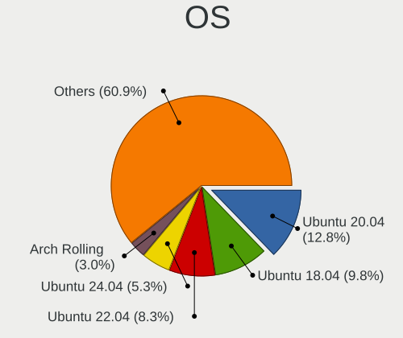

| Name               | Desktops | Percent |
|--------------------|----------|---------|
| Ubuntu 20.04       | 34       | 12.78%  |
| Ubuntu 18.04       | 26       | 9.77%   |
| Ubuntu 22.04       | 22       | 8.27%   |
| Ubuntu 24.04       | 14       | 5.26%   |
| Arch Rolling       | 8        | 3.01%   |
| Ubuntu 19.04       | 6        | 2.26%   |
| OpenMandriva 23.08 | 6        | 2.26%   |
| Debian 12          | 5        | 1.88%   |
| ArcoLinux Rolling  | 5        | 1.88%   |
| Arch               | 5        | 1.88%   |
| Xubuntu 18.04      | 4        | 1.5%    |
| OpenMandriva 24.07 | 4        | 1.5%    |
| Linux Mint 21.1    | 4        | 1.5%    |
| Linux Mint 20.3    | 4        | 1.5%    |
| Fedora 38          | 4        | 1.5%    |
| Debian 11          | 4        | 1.5%    |
| Xubuntu 20.04      | 3        | 1.13%   |
| Ubuntu 23.10       | 3        | 1.13%   |
| Ubuntu 23.04       | 3        | 1.13%   |
| Ubuntu 20.10       | 3        | 1.13%   |
| OpenMandriva 4.2   | 3        | 1.13%   |
| OpenMandriva 25.90 | 3        | 1.13%   |
| KDE neon 20.04     | 3        | 1.13%   |
| Zorin 17           | 2        | 0.75%   |
| Zorin 15           | 2        | 0.75%   |
| Xubuntu 22.04      | 2        | 0.75%   |
| Ubuntu 21.10       | 2        | 0.75%   |
| Ubuntu 19.10       | 2        | 0.75%   |
| Pop!_OS 22.04      | 2        | 0.75%   |
| Parch              | 2        | 0.75%   |
| OpenMandriva 4.3   | 2        | 0.75%   |
| OpenMandriva 24.12 | 2        | 0.75%   |
| Manjaro            | 2        | 0.75%   |
| Lubuntu 23.10      | 2        | 0.75%   |
| Lubuntu 22.04      | 2        | 0.75%   |
| Linux Mint 20.1    | 2        | 0.75%   |
| Linux Mint 20      | 2        | 0.75%   |
| Kubuntu 22.04      | 2        | 0.75%   |
| Fedora 41          | 2        | 0.75%   |
| Elementary 6.1     | 2        | 0.75%   |

OS Family
---------

OS without a version

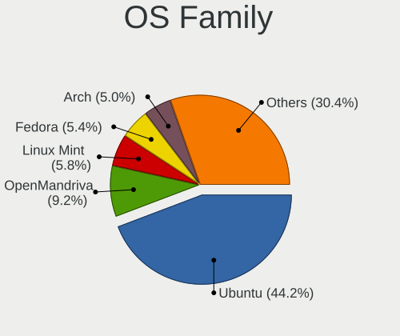

| Name          | Desktops | Percent |
|---------------|----------|---------|
| Ubuntu        | 115      | 44.23%  |
| OpenMandriva  | 24       | 9.23%   |
| Linux Mint    | 15       | 5.77%   |
| Fedora        | 14       | 5.38%   |
| Arch          | 13       | 5%      |
| Manjaro       | 11       | 4.23%   |
| Debian        | 11       | 4.23%   |
| Xubuntu       | 9        | 3.46%   |
| Pop!_OS       | 5        | 1.92%   |
| KDE neon      | 5        | 1.92%   |
| ArcoLinux     | 5        | 1.92%   |
| Zorin         | 4        | 1.54%   |
| Lubuntu       | 4        | 1.54%   |
| Kubuntu       | 4        | 1.54%   |
| Kali          | 3        | 1.15%   |
| Parch         | 2        | 0.77%   |
| Endless       | 2        | 0.77%   |
| Elementary    | 2        | 0.77%   |
| Xero          | 1        | 0.38%   |
| Ubuntu Unity  | 1        | 0.38%   |
| Ubuntu Studio | 1        | 0.38%   |
| Ubuntu Budgie | 1        | 0.38%   |
| Solus         | 1        | 0.38%   |
| ROSA          | 1        | 0.38%   |
| Rocky Linux   | 1        | 0.38%   |
| Parch-arch    | 1        | 0.38%   |
| LMDE          | 1        | 0.38%   |
| CentOS        | 1        | 0.38%   |
| CachyOS       | 1        | 0.38%   |
| Artix         | 1        | 0.38%   |

Kernel
------

Version of the Linux kernel

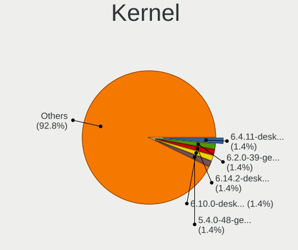

| Version                  | Desktops | Percent |
|--------------------------|----------|---------|
| 6.4.11-desktop-1omv2390  | 4        | 1.44%   |
| 6.2.0-39-generic         | 4        | 1.44%   |
| 6.14.2-desktop-3omv2590  | 4        | 1.44%   |
| 6.10.0-desktop-1omv2490  | 4        | 1.44%   |
| 5.4.0-48-generic         | 4        | 1.44%   |
| 6.5.0-21-generic         | 3        | 1.08%   |
| 6.2.0-20-generic         | 3        | 1.08%   |
| 6.14.0-37-generic        | 3        | 1.08%   |
| 5.4.0-58-generic         | 3        | 1.08%   |
| 5.4.0-42-generic         | 3        | 1.08%   |
| 5.4.0-26-generic         | 3        | 1.08%   |
| 5.3.0-40-generic         | 3        | 1.08%   |
| 5.15.0-47-generic        | 3        | 1.08%   |
| 5.11.0-27-generic        | 3        | 1.08%   |
| 5.10.14-desktop-1omv4002 | 3        | 1.08%   |
| 6.8.0-51-generic         | 2        | 0.72%   |
| 6.8.0-40-generic         | 2        | 0.72%   |
| 6.5.0-9-generic          | 2        | 0.72%   |
| 6.4.8-desktop-2omv2390   | 2        | 0.72%   |
| 6.2.9-300.fc38.x86_64    | 2        | 0.72%   |
| 6.14.0-29-generic        | 2        | 0.72%   |
| 6.12.10-76061203-generic | 2        | 0.72%   |
| 6.1.0-13-amd64           | 2        | 0.72%   |
| 5.8.0-50-generic         | 2        | 0.72%   |
| 5.8.0-44-generic         | 2        | 0.72%   |
| 5.4.0-52-generic         | 2        | 0.72%   |
| 5.4.0-37-generic         | 2        | 0.72%   |
| 5.19.0-46-generic        | 2        | 0.72%   |
| 5.19.0                   | 2        | 0.72%   |
| 5.16.7-desktop-1omv4003  | 2        | 0.72%   |
| 5.15.0-58-generic        | 2        | 0.72%   |
| 5.15.0-56-generic        | 2        | 0.72%   |
| 5.13.0-30-generic        | 2        | 0.72%   |
| 5.11.0-41-generic        | 2        | 0.72%   |
| 5.11.0-37-generic        | 2        | 0.72%   |
| 5.0.0-38-generic         | 2        | 0.72%   |
| 5.0.0-37-generic         | 2        | 0.72%   |
| 5.0.0-25-generic         | 2        | 0.72%   |
| 5.0.0-23-generic         | 2        | 0.72%   |
| 4.15.0-88-generic        | 2        | 0.72%   |

Kernel Family
-------------

Linux kernel without a distro release

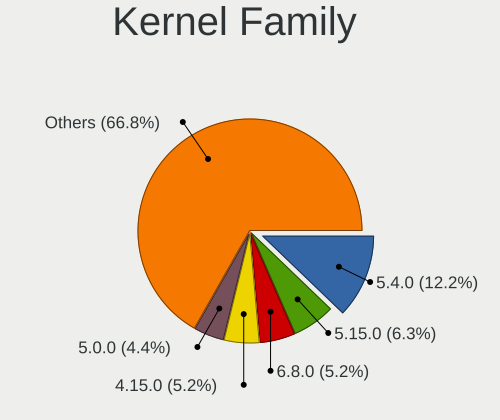

| Version | Desktops | Percent |
|---------|----------|---------|
| 5.4.0   | 33       | 12.18%  |
| 5.15.0  | 17       | 6.27%   |
| 6.8.0   | 14       | 5.17%   |
| 4.15.0  | 14       | 5.17%   |
| 5.0.0   | 12       | 4.43%   |
| 6.2.0   | 11       | 4.06%   |
| 5.11.0  | 11       | 4.06%   |
| 5.8.0   | 10       | 3.69%   |
| 5.13.0  | 10       | 3.69%   |
| 6.5.0   | 9        | 3.32%   |
| 5.3.0   | 9        | 3.32%   |
| 6.14.0  | 7        | 2.58%   |
| 6.4.11  | 6        | 2.21%   |
| 6.1.0   | 5        | 1.85%   |
| 5.19.0  | 5        | 1.85%   |
| 4.18.0  | 5        | 1.85%   |
| 6.14.2  | 4        | 1.48%   |
| 6.10.0  | 4        | 1.48%   |
| 6.11.0  | 3        | 1.11%   |
| 5.10.14 | 3        | 1.11%   |
| 5.10.0  | 3        | 1.11%   |
| 6.5.9   | 2        | 0.74%   |
| 6.4.8   | 2        | 0.74%   |
| 6.2.9   | 2        | 0.74%   |
| 6.12.10 | 2        | 0.74%   |
| 5.16.7  | 2        | 0.74%   |
| 6.9.12  | 1        | 0.37%   |
| 6.8.9   | 1        | 0.37%   |
| 6.8.7   | 1        | 0.37%   |
| 6.8.12  | 1        | 0.37%   |
| 6.8.11  | 1        | 0.37%   |
| 6.7.5   | 1        | 0.37%   |
| 6.6.2   | 1        | 0.37%   |
| 6.6.10  | 1        | 0.37%   |
| 6.4.3   | 1        | 0.37%   |
| 6.4.15  | 1        | 0.37%   |
| 6.4.12  | 1        | 0.37%   |
| 6.3.12  | 1        | 0.37%   |
| 6.2.8   | 1        | 0.37%   |
| 6.2.6   | 1        | 0.37%   |

Kernel Major Ver.
-----------------

Linux kernel major version

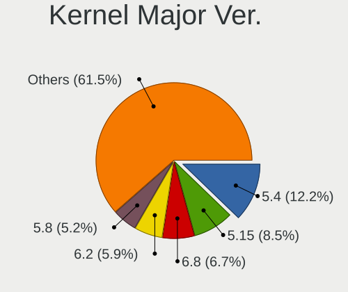

| Version | Desktops | Percent |
|---------|----------|---------|
| 5.4     | 33       | 12.22%  |
| 5.15    | 23       | 8.52%   |
| 6.8     | 18       | 6.67%   |
| 6.2     | 16       | 5.93%   |
| 5.8     | 14       | 5.19%   |
| 4.15    | 14       | 5.19%   |
| 6.14    | 13       | 4.81%   |
| 5.0     | 13       | 4.81%   |
| 5.11    | 12       | 4.44%   |
| 6.5     | 11       | 4.07%   |
| 6.4     | 11       | 4.07%   |
| 5.13    | 11       | 4.07%   |
| 5.3     | 9        | 3.33%   |
| 6.12    | 7        | 2.59%   |
| 5.10    | 7        | 2.59%   |
| 6.11    | 6        | 2.22%   |
| 6.10    | 6        | 2.22%   |
| 6.1     | 5        | 1.85%   |
| 5.19    | 5        | 1.85%   |
| 4.18    | 5        | 1.85%   |
| 5.16    | 4        | 1.48%   |
| 6.17    | 3        | 1.11%   |
| 6.13    | 3        | 1.11%   |
| 6.6     | 2        | 0.74%   |
| 6.16    | 2        | 0.74%   |
| 5.9     | 2        | 0.74%   |
| 5.7     | 2        | 0.74%   |
| 5.14    | 2        | 0.74%   |
| 6.9     | 1        | 0.37%   |
| 6.7     | 1        | 0.37%   |
| 6.3     | 1        | 0.37%   |
| 6.0     | 1        | 0.37%   |
| 5.6     | 1        | 0.37%   |
| 5.18    | 1        | 0.37%   |
| 5.17    | 1        | 0.37%   |
| 5.12    | 1        | 0.37%   |
| 4.9     | 1        | 0.37%   |
| 4.19    | 1        | 0.37%   |
| 4.14    | 1        | 0.37%   |

Arch
----

OS architecture (x86_64, i586, etc.)

| Name   | Desktops | Percent |
|--------|----------|---------|
| x86_64 | 245      | 96.84%  |
| i686   | 8        | 3.16%   |

DE
--

Desktop Environment

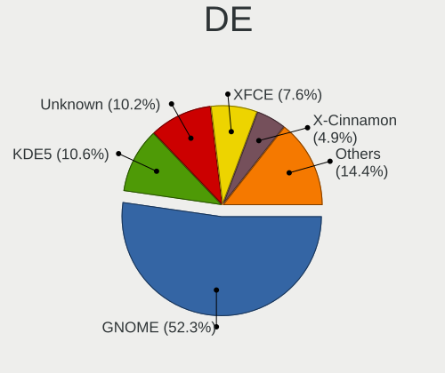

| Name          | Desktops | Percent |
|---------------|----------|---------|
| GNOME         | 138      | 52.27%  |
| KDE5          | 28       | 10.61%  |
| Unknown       | 27       | 10.23%  |
| XFCE          | 20       | 7.58%   |
| X-Cinnamon    | 13       | 4.92%   |
| KDE6          | 13       | 4.92%   |
| LXQt          | 5        | 1.89%   |
| i3            | 5        | 1.89%   |
| KDE           | 3        | 1.14%   |
| Pantheon      | 2        | 0.76%   |
| Budgie        | 2        | 0.76%   |
| Unity         | 1        | 0.38%   |
| MATE          | 1        | 0.38%   |
| LXDE          | 1        | 0.38%   |
| Hyprland      | 1        | 0.38%   |
| GNOME Classic | 1        | 0.38%   |
| Deepin        | 1        | 0.38%   |
| Cinnamon      | 1        | 0.38%   |
| bspwm         | 1        | 0.38%   |

Display Server
--------------

X11 or Wayland

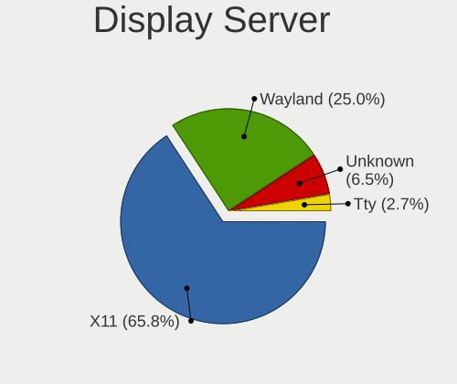

| Name    | Desktops | Percent |
|---------|----------|---------|
| X11     | 171      | 65.77%  |
| Wayland | 65       | 25%     |
| Unknown | 17       | 6.54%   |
| Tty     | 7        | 2.69%   |

Display Manager
---------------

SDDM, LightDM, etc.

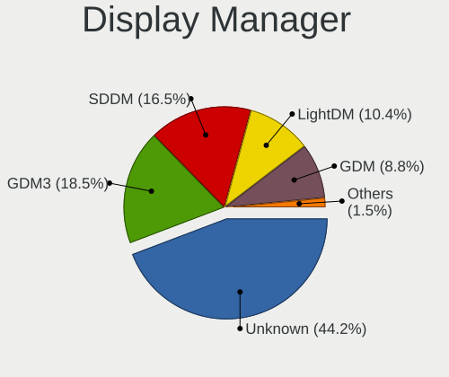

| Name    | Desktops | Percent |
|---------|----------|---------|
| Unknown | 115      | 44.23%  |
| GDM3    | 48       | 18.46%  |
| SDDM    | 43       | 16.54%  |
| LightDM | 27       | 10.38%  |
| GDM     | 23       | 8.85%   |
| TDM     | 3        | 1.15%   |
| LY-DM   | 1        | 0.38%   |

OS Lang
-------

Language

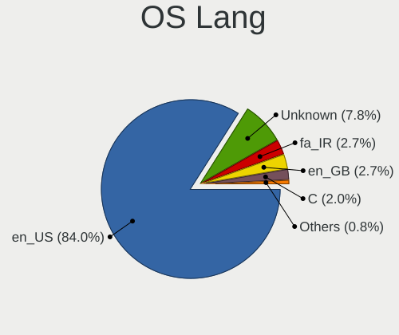

| Lang    | Desktops | Percent |
|---------|----------|---------|
| en_US   | 215      | 83.98%  |
| Unknown | 20       | 7.81%   |
| fa_IR   | 7        | 2.73%   |
| en_GB   | 7        | 2.73%   |
| C       | 5        | 1.95%   |
| en_CA   | 2        | 0.78%   |

Boot Mode
---------

EFI or BIOS

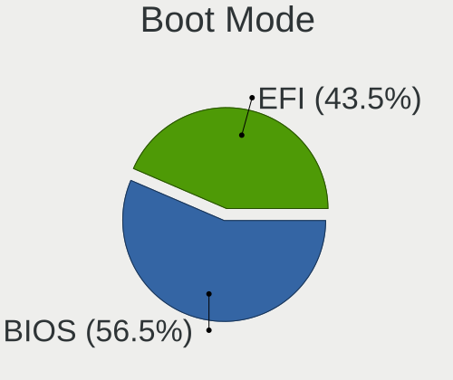

| Mode | Desktops | Percent |
|------|----------|---------|
| BIOS | 144      | 56.47%  |
| EFI  | 111      | 43.53%  |

Filesystem
----------

Type of filesystem

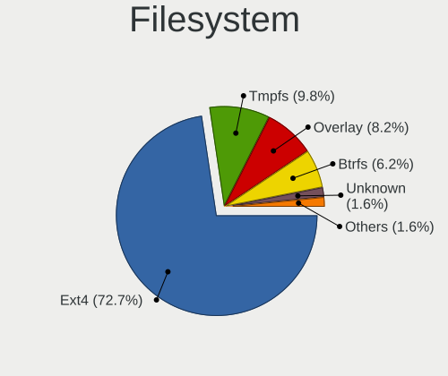

| Type    | Desktops | Percent |
|---------|----------|---------|
| Ext4    | 186      | 72.66%  |
| Tmpfs   | 25       | 9.77%   |
| Overlay | 21       | 8.2%    |
| Btrfs   | 16       | 6.25%   |
| Unknown | 4        | 1.56%   |
| Xfs     | 3        | 1.17%   |
| Ext3    | 1        | 0.39%   |

Part. scheme
------------

Scheme of partitioning

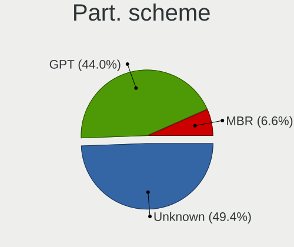

| Type    | Desktops | Percent |
|---------|----------|---------|
| Unknown | 127      | 49.42%  |
| GPT     | 113      | 43.97%  |
| MBR     | 17       | 6.61%   |

Dual Boot with Linux/BSD
------------------------

Hosting more than one Linux/BSD

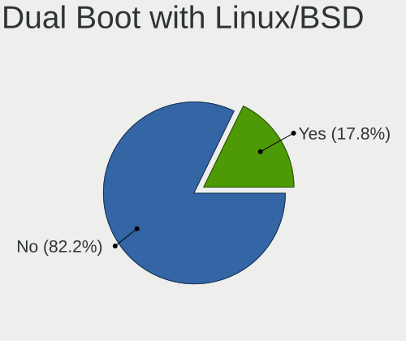

| Dual boot | Desktops | Percent |
|-----------|----------|---------|
| No        | 213      | 82.24%  |
| Yes       | 46       | 17.76%  |

Dual Boot (Win)
---------------

Hosting Linux and Windows

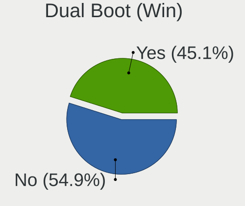

| Dual boot | Desktops | Percent |
|-----------|----------|---------|
| No        | 141      | 54.86%  |
| Yes       | 116      | 45.14%  |

Board
-----

Vendor
------

Motherboard manufacturer

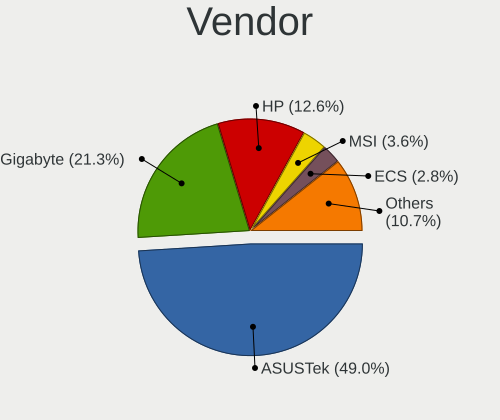

| Name                | Desktops | Percent |
|---------------------|----------|---------|
| ASUSTek Computer    | 124      | 49.01%  |
| Gigabyte Technology | 54       | 21.34%  |
| Hewlett-Packard     | 32       | 12.65%  |
| MSI                 | 9        | 3.56%   |
| ECS                 | 7        | 2.77%   |
| Lenovo              | 5        | 1.98%   |
| ASRock              | 5        | 1.98%   |
| Unknown             | 4        | 1.58%   |
| YANYU               | 2        | 0.79%   |
| Intel               | 2        | 0.79%   |
| Foxconn             | 2        | 0.79%   |
| Dell                | 2        | 0.79%   |
| Biostar             | 2        | 0.79%   |
| Supermicro          | 1        | 0.4%    |
| DFI                 | 1        | 0.4%    |
| aigo                | 1        | 0.4%    |

Model
-----

Motherboard model

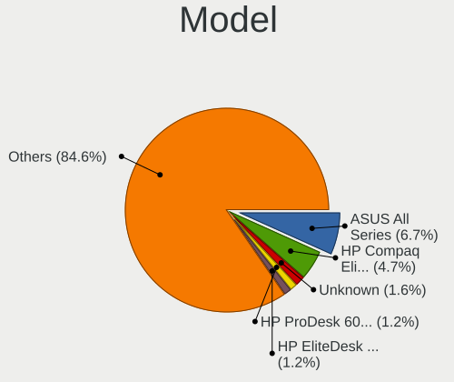

| Name                        | Desktops | Percent |
|-----------------------------|----------|---------|
| ASUS All Series             | 17       | 6.72%   |
| HP Compaq Elite 8300 SFF    | 12       | 4.74%   |
| Unknown                     | 4        | 1.58%   |
| HP ProDesk 600 G1 SFF       | 3        | 1.19%   |
| HP EliteDesk 800 G2 SFF     | 3        | 1.19%   |
| Gigabyte H81M-S2PV          | 3        | 1.19%   |
| ASUS PRIME Z390-P           | 3        | 1.19%   |
| ASUS PRIME B250-PLUS        | 3        | 1.19%   |
| ASUS P5P41T-LE              | 3        | 1.19%   |
| ASUS H61M-C                 | 3        | 1.19%   |
| HP EliteDesk 800 G1 SFF     | 2        | 0.79%   |
| HP Compaq 8000 Elite SFF PC | 2        | 0.79%   |
| Gigabyte H170-D3H           | 2        | 0.79%   |
| Gigabyte G41MT-S2P          | 2        | 0.79%   |
| Gigabyte EP41-UD3L          | 2        | 0.79%   |
| ASUS Z10PE-D16 WS           | 2        | 0.79%   |
| ASUS TUF B360-PLUS GAMING   | 2        | 0.79%   |
| ASUS PRIME Z690-P WIFI      | 2        | 0.79%   |
| ASUS PRIME H610M-K D4       | 2        | 0.79%   |
| ASUS PRIME H610M-A WIFI D4  | 2        | 0.79%   |
| ASUS PRIME H510M-K          | 2        | 0.79%   |
| ASUS PRIME H510M-D          | 2        | 0.79%   |
| ASUS PRIME H310-PLUS R2.0   | 2        | 0.79%   |
| ASUS PRIME H310-PLUS        | 2        | 0.79%   |
| ASUS PRIME B460-PLUS        | 2        | 0.79%   |
| ASUS P9X79 LE               | 2        | 0.79%   |
| ASUS P8H61                  | 2        | 0.79%   |
| ASUS H110M-C                | 2        | 0.79%   |
| YANYU M9F baytrail          | 1        | 0.4%    |
| YANYU ITX-S192              | 1        | 0.4%    |
| Supermicro X7SBL            | 1        | 0.4%    |
| MSI MS-7D89                 | 1        | 0.4%    |
| MSI MS-7D25                 | 1        | 0.4%    |
| MSI MS-7A74                 | 1        | 0.4%    |
| MSI MS-7A39                 | 1        | 0.4%    |
| MSI MS-7817                 | 1        | 0.4%    |
| MSI MS-7693                 | 1        | 0.4%    |
| MSI MS-7673                 | 1        | 0.4%    |
| MSI MS-7623                 | 1        | 0.4%    |
| MSI MS-7388                 | 1        | 0.4%    |

Model Family
------------

Motherboard model prefix

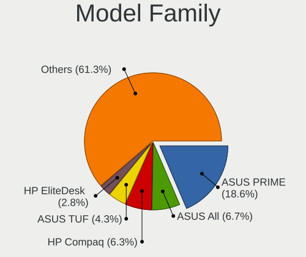

| Name                 | Desktops | Percent |
|----------------------|----------|---------|
| ASUS PRIME           | 47       | 18.58%  |
| ASUS All             | 17       | 6.72%   |
| HP Compaq            | 16       | 6.32%   |
| ASUS TUF             | 11       | 4.35%   |
| HP EliteDesk         | 7        | 2.77%   |
| HP ProDesk           | 6        | 2.37%   |
| Lenovo ThinkCentre   | 5        | 1.98%   |
| Unknown              | 4        | 1.58%   |
| Gigabyte H81M-S2PV   | 3        | 1.19%   |
| ASUS ROG             | 3        | 1.19%   |
| ASUS P8H61           | 3        | 1.19%   |
| ASUS P5P41T-LE       | 3        | 1.19%   |
| ASUS H61M-C          | 3        | 1.19%   |
| ASUS H110M-C         | 3        | 1.19%   |
| Gigabyte H510M       | 2        | 0.79%   |
| Gigabyte H170-D3H    | 2        | 0.79%   |
| Gigabyte G41MT-S2P   | 2        | 0.79%   |
| Gigabyte EP41-UD3L   | 2        | 0.79%   |
| ASUS Z10PE-D16       | 2        | 0.79%   |
| ASUS P9X79           | 2        | 0.79%   |
| ASUS P8Z77-V         | 2        | 0.79%   |
| ASUS P5KPL-AM        | 2        | 0.79%   |
| YANYU M9F            | 1        | 0.4%    |
| YANYU ITX-S192       | 1        | 0.4%    |
| Supermicro X7SBL     | 1        | 0.4%    |
| MSI MS-7D89          | 1        | 0.4%    |
| MSI MS-7D25          | 1        | 0.4%    |
| MSI MS-7A74          | 1        | 0.4%    |
| MSI MS-7A39          | 1        | 0.4%    |
| MSI MS-7817          | 1        | 0.4%    |
| MSI MS-7693          | 1        | 0.4%    |
| MSI MS-7673          | 1        | 0.4%    |
| MSI MS-7623          | 1        | 0.4%    |
| MSI MS-7388          | 1        | 0.4%    |
| Intel SHARKBAY       | 1        | 0.4%    |
| Intel P61-S3         | 1        | 0.4%    |
| HP Z440              | 1        | 0.4%    |
| HP Z2                | 1        | 0.4%    |
| HP 700-270jp         | 1        | 0.4%    |
| Gigabyte Z97X-Gaming | 1        | 0.4%    |

MFG Year
--------

Motherboard manufacture year

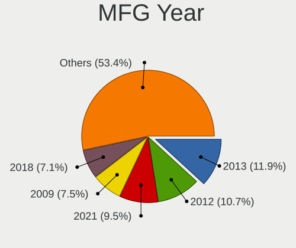

| Year | Desktops | Percent |
|------|----------|---------|
| 2013 | 30       | 11.86%  |
| 2012 | 27       | 10.67%  |
| 2021 | 24       | 9.49%   |
| 2009 | 19       | 7.51%   |
| 2018 | 18       | 7.11%   |
| 2016 | 17       | 6.72%   |
| 2011 | 14       | 5.53%   |
| 2015 | 13       | 5.14%   |
| 2014 | 12       | 4.74%   |
| 2010 | 12       | 4.74%   |
| 2020 | 11       | 4.35%   |
| 2008 | 11       | 4.35%   |
| 2017 | 10       | 3.95%   |
| 2007 | 7        | 2.77%   |
| 2024 | 6        | 2.37%   |
| 2023 | 6        | 2.37%   |
| 2022 | 5        | 1.98%   |
| 2006 | 5        | 1.98%   |
| 2019 | 3        | 1.19%   |
| 2005 | 2        | 0.79%   |
| 2004 | 1        | 0.4%    |

Form Factor
-----------

Physical design of the computer

| Name    | Desktops | Percent |
|---------|----------|---------|
| Desktop | 253      | 100%    |

Secure Boot
-----------

Enabled or disabled

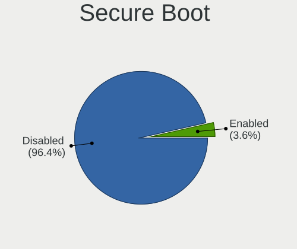

| State    | Desktops | Percent |
|----------|----------|---------|
| Disabled | 244      | 96.44%  |
| Enabled  | 9        | 3.56%   |

Coreboot
--------

Have coreboot on board

| Used | Desktops | Percent |
|------|----------|---------|
| No   | 253      | 100%    |

RAM Size
--------

Total RAM memory

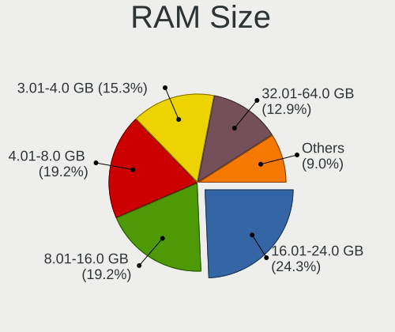

| Size in GB  | Desktops | Percent |
|-------------|----------|---------|
| 16.01-24.0  | 62       | 24.31%  |
| 4.01-8.0    | 49       | 19.22%  |
| 8.01-16.0   | 49       | 19.22%  |
| 3.01-4.0    | 39       | 15.29%  |
| 32.01-64.0  | 33       | 12.94%  |
| 1.01-2.0    | 8        | 3.14%   |
| 24.01-32.0  | 5        | 1.96%   |
| 2.01-3.0    | 5        | 1.96%   |
| 64.01-256.0 | 4        | 1.57%   |
| 0.51-1.0    | 1        | 0.39%   |

RAM Used
--------

Used RAM memory

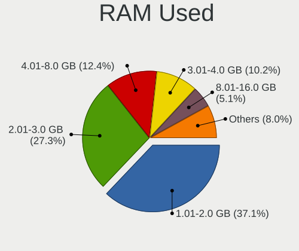

| Used GB    | Desktops | Percent |
|------------|----------|---------|
| 1.01-2.0   | 102      | 37.09%  |
| 2.01-3.0   | 75       | 27.27%  |
| 4.01-8.0   | 34       | 12.36%  |
| 3.01-4.0   | 28       | 10.18%  |
| 8.01-16.0  | 14       | 5.09%   |
| 0.51-1.0   | 13       | 4.73%   |
| 0.01-0.5   | 6        | 2.18%   |
| 24.01-32.0 | 2        | 0.73%   |
| 16.01-24.0 | 1        | 0.36%   |

Total Drives
------------

Number of drives on board

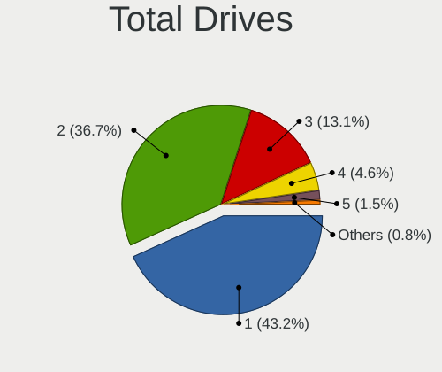

| Drives | Desktops | Percent |
|--------|----------|---------|
| 1      | 112      | 43.24%  |
| 2      | 95       | 36.68%  |
| 3      | 34       | 13.13%  |
| 4      | 12       | 4.63%   |
| 5      | 4        | 1.54%   |
| 6      | 2        | 0.77%   |

Has CD-ROM
----------

Has CD-ROM on board

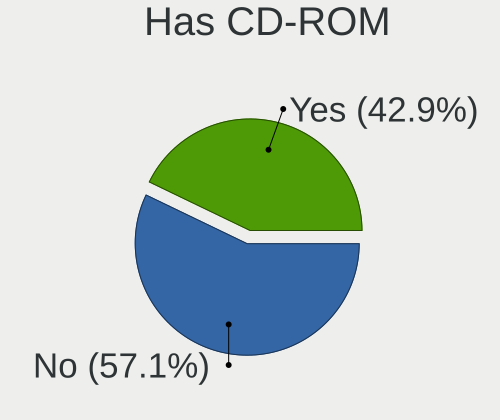

| Presented | Desktops | Percent |
|-----------|----------|---------|
| No        | 148      | 57.14%  |
| Yes       | 111      | 42.86%  |

Has Ethernet
------------

Has Ethernet on board

| Presented | Desktops | Percent |
|-----------|----------|---------|
| Yes       | 250      | 98.81%  |
| No        | 3        | 1.19%   |

Has WiFi
--------

Has WiFi module

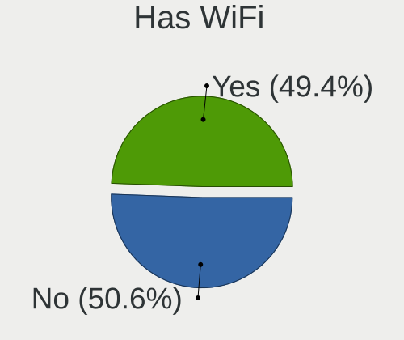

| Presented | Desktops | Percent |
|-----------|----------|---------|
| No        | 131      | 50.58%  |
| Yes       | 128      | 49.42%  |

Has Bluetooth
-------------

Has Bluetooth module

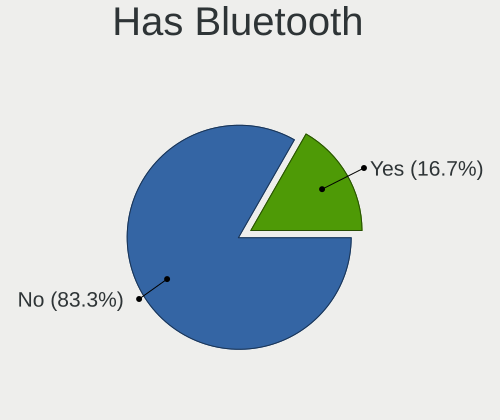

| Presented | Desktops | Percent |
|-----------|----------|---------|
| No        | 214      | 83.27%  |
| Yes       | 43       | 16.73%  |

Location
--------

Country
-------

Geographic location (country)

| Country | Desktops | Percent |
|---------|----------|---------|
| Iran    | 253      | 100%    |

City
----

Geographic location (city)

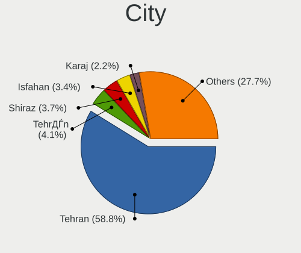

| City                      | Desktops | Percent |
|---------------------------|----------|---------|
| Tehran                    | 157      | 58.8%   |
| TehrДЃn                 | 11       | 4.12%   |
| Shiraz                    | 10       | 3.75%   |
| Isfahan                   | 9        | 3.37%   |
| Karaj                     | 6        | 2.25%   |
| Qom                       | 5        | 1.87%   |
| Tajrish                   | 4        | 1.5%    |
| Sanandij                  | 4        | 1.5%    |
| Mashhad                   | 4        | 1.5%    |
| Yazd                      | 2        | 0.75%   |
| Tabriz                    | 2        | 0.75%   |
| Rehnān                   | 2        | 0.75%   |
| Khorramabad               | 2        | 0.75%   |
| Kermanshah                | 2        | 0.75%   |
| Kerman                    | 2        | 0.75%   |
| Kāshān                  | 2        | 0.75%   |
| Hamadan                   | 2        | 0.75%   |
| Behshahr                  | 2        | 0.75%   |
| Arak                      | 2        | 0.75%   |
| Ahvaz                     | 2        | 0.75%   |
| Zahedan                   | 1        | 0.37%   |
| Tīrān                   | 1        | 0.37%   |
| Siakhdekhan               | 1        | 0.37%   |
| Shahrīār                | 1        | 0.37%   |
| Shahrak-e Kūlūrī | 1        | 0.37%   |
| Shaft                     | 1        | 0.37%   |
| Saveh                     | 1        | 0.37%   |
| Rūdān                   | 1        | 0.37%   |
| Rey                       | 1        | 0.37%   |
| Ramsar                    | 1        | 0.37%   |
| PДЃkdasht               | 1        | 0.37%   |
| Naz̧arābād             | 1        | 0.37%   |
| Najafābād           | 1        | 0.37%   |
| Meybod                    | 1        | 0.37%   |
| Malekān                  | 1        | 0.37%   |
| Lāhījān                | 1        | 0.37%   |
| KhondДЃb                | 1        | 0.37%   |
| KahrД«z                 | 1        | 0.37%   |
| JongД«yeh               | 1        | 0.37%   |
| Jongīyeh                 | 1        | 0.37%   |

Drives
------

Drive Vendor
------------

Hard drive vendors

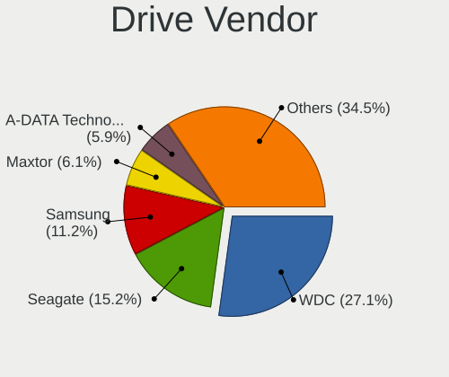

| Vendor                       | Desktops | Drives | Percent |
|------------------------------|----------|--------|---------|
| WDC                          | 111      | 156    | 27.14%  |
| Seagate                      | 62       | 75     | 15.16%  |
| Samsung Electronics          | 46       | 62     | 11.25%  |
| Maxtor                       | 25       | 33     | 6.11%   |
| A-DATA Technology            | 24       | 26     | 5.87%   |
| Toshiba                      | 22       | 26     | 5.38%   |
| Lexar                        | 15       | 19     | 3.67%   |
| Sandisk                      | 12       | 14     | 2.93%   |
| Hitachi                      | 11       | 13     | 2.69%   |
| Kingston                     | 8        | 11     | 1.96%   |
| SPCC                         | 6        | 8      | 1.47%   |
| MAXIO Technology (Hangzhou)  | 4        | 4      | 0.98%   |
| Unknown                      | 3        | 3      | 0.73%   |
| Shenzhen Longsys Electronics | 3        | 5      | 0.73%   |
| Phison Electronics           | 3        | 3      | 0.73%   |
| Intel                        | 3        | 3      | 0.73%   |
| Crucial                      | 3        | 3      | 0.73%   |
| Apacer                       | 3        | 3      | 0.73%   |
| Silicon Motion               | 2        | 2      | 0.49%   |
| Realtek Semiconductor        | 2        | 3      | 0.49%   |
| PNY                          | 2        | 3      | 0.49%   |
| Patriot                      | 2        | 2      | 0.49%   |
| MSI                          | 2        | 2      | 0.49%   |
| KingSpec                     | 2        | 2      | 0.49%   |
| Kingmax                      | 2        | 3      | 0.49%   |
| Gigabyte Technology          | 2        | 2      | 0.49%   |
| Dahua                        | 2        | 2      | 0.49%   |
| Corsair                      | 2        | 2      | 0.49%   |
| BR                           | 2        | 3      | 0.49%   |
| AMD                          | 2        | 2      | 0.49%   |
| ZADAK                        | 1        | 1      | 0.24%   |
| XPG                          | 1        | 1      | 0.24%   |
| X-ENERGY                     | 1        | 1      | 0.24%   |
| Western                      | 1        | 1      | 0.24%   |
| USB                          | 1        | 1      | 0.24%   |
| TwinMOS                      | 1        | 1      | 0.24%   |
| Transcend                    | 1        | 1      | 0.24%   |
| Team                         | 1        | 1      | 0.24%   |
| Plextor                      | 1        | 1      | 0.24%   |
| Pioneer                      | 1        | 1      | 0.24%   |

Drive Model
-----------

Hard drive models

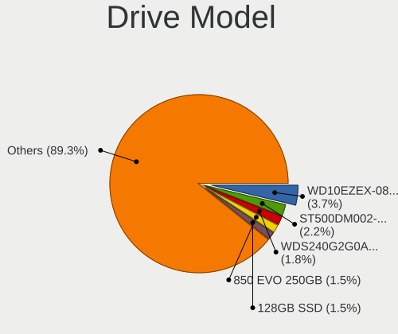

| Model                                             | Desktops | Percent |
|---------------------------------------------------|----------|---------|
| WDC WD10EZEX-08WN4A0 1TB                          | 17       | 3.73%   |
| Seagate ST500DM002-1BD142 500GB                   | 10       | 2.19%   |
| WDC WDS240G2G0A-00JH30 240GB SSD                  | 8        | 1.75%   |
| Samsung SSD 850 EVO 250GB                         | 7        | 1.54%   |
| Lexar 128GB SSD                                   | 7        | 1.54%   |
| Toshiba DT01ACA050 500GB                          | 6        | 1.32%   |
| Maxtor STM3250310AS 250GB                         | 6        | 1.32%   |
| Seagate ST3500413AS 500GB                         | 5        | 1.1%    |
| Maxtor STM3160215AS 160GB                         | 5        | 1.1%    |
| Lexar 256GB SSD                                   | 5        | 1.1%    |
| A-DATA SU650 120GB SSD                            | 5        | 1.1%    |
| A-DATA SU630 240GB SSD                            | 5        | 1.1%    |
| WDC WD20PURZ-85GU6Y0 2TB                          | 4        | 0.88%   |
| WDC WD10EZRX-00L4HB0 1TB                          | 4        | 0.88%   |
| WDC WD10EZRX-00A3KB0 1TB                          | 4        | 0.88%   |
| WDC WD10EZEX-00WN4A0 1TB                          | 4        | 0.88%   |
| WDC WD10EZEX-00BN5A0 1TB                          | 4        | 0.88%   |
| WDC WD10EZEX-00BBHA0 1TB                          | 4        | 0.88%   |
| Toshiba DT01ACA100 1TB                            | 4        | 0.88%   |
| Seagate ST3500418AS 500GB                         | 4        | 0.88%   |
| Seagate ST3250318AS 250GB                         | 4        | 0.88%   |
| Maxtor 6Y080L0 81GB                               | 4        | 0.88%   |
| MAXIO (Hangzhou) NVMe SSD Controller MAP1202 2TB  | 4        | 0.88%   |
| WDC WD5000AZRX-00A8LB0 500GB                      | 3        | 0.66%   |
| WDC WD5000AAKX-08U6AA0 500GB                      | 3        | 0.66%   |
| WDC WD20EARX-00PASB0 2TB                          | 3        | 0.66%   |
| WDC WD10EZEX-21WN4A0 1TB                          | 3        | 0.66%   |
| WDC WD10EARS-00MVWB0 1TB                          | 3        | 0.66%   |
| SPCC Solid State Disk 128GB                       | 3        | 0.66%   |
| SPCC Solid State Disk 120GB                       | 3        | 0.66%   |
| Seagate ST1000DM003-9YN162 1TB                    | 3        | 0.66%   |
| Samsung SSD 980 1TB                               | 3        | 0.66%   |
| Samsung SSD 870 EVO 250GB                         | 3        | 0.66%   |
| Samsung NVMe SSD Controller SM981/PM981/PM983 1TB | 3        | 0.66%   |
| Samsung HD160JJ 160GB                             | 3        | 0.66%   |
| Hitachi HDS721010CLA332 1TB                       | 3        | 0.66%   |
| A-DATA SU800 256GB SSD                            | 3        | 0.66%   |
| WDC WD5000AZRX-00L4HB0 500GB                      | 2        | 0.44%   |
| WDC WD5000AZLX-60K2TA0 500GB                      | 2        | 0.44%   |
| WDC WD5000AAKX-75U6AA0 500GB                      | 2        | 0.44%   |

HDD Vendor
----------

Hard disk drive vendors

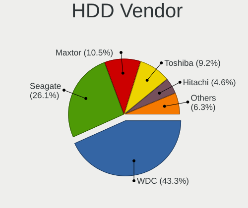

| Vendor              | Desktops | Drives | Percent |
|---------------------|----------|--------|---------|
| WDC                 | 103      | 140    | 43.28%  |
| Seagate             | 62       | 75     | 26.05%  |
| Maxtor              | 25       | 33     | 10.5%   |
| Toshiba             | 22       | 26     | 9.24%   |
| Hitachi             | 11       | 13     | 4.62%   |
| Samsung Electronics | 10       | 14     | 4.2%    |
| Unknown             | 1        | 1      | 0.42%   |
| HPE                 | 1        | 1      | 0.42%   |
| External            | 1        | 1      | 0.42%   |
| Apple               | 1        | 1      | 0.42%   |
| Unknown             | 1        | 2      | 0.42%   |

SSD Vendor
----------

Solid state drive vendors

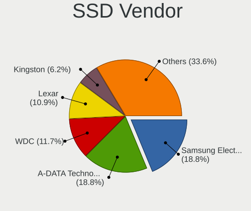

| Vendor              | Desktops | Drives | Percent |
|---------------------|----------|--------|---------|
| Samsung Electronics | 24       | 30     | 18.75%  |
| A-DATA Technology   | 24       | 26     | 18.75%  |
| WDC                 | 15       | 16     | 11.72%  |
| Lexar               | 14       | 16     | 10.94%  |
| Kingston            | 8        | 11     | 6.25%   |
| SPCC                | 6        | 8      | 4.69%   |
| SanDisk             | 4        | 5      | 3.13%   |
| Crucial             | 3        | 3      | 2.34%   |
| Apacer              | 3        | 3      | 2.34%   |
| PNY                 | 2        | 3      | 1.56%   |
| Patriot             | 2        | 2      | 1.56%   |
| KingSpec            | 2        | 2      | 1.56%   |
| Kingmax             | 2        | 3      | 1.56%   |
| Intel               | 2        | 2      | 1.56%   |
| Dahua               | 2        | 2      | 1.56%   |
| ZADAK               | 1        | 1      | 0.78%   |
| Western             | 1        | 1      | 0.78%   |
| TwinMOS             | 1        | 1      | 0.78%   |
| Transcend           | 1        | 1      | 0.78%   |
| Team                | 1        | 1      | 0.78%   |
| Plextor             | 1        | 1      | 0.78%   |
| Pioneer             | 1        | 1      | 0.78%   |
| OSCOO               | 1        | 2      | 0.78%   |
| OCZ                 | 1        | 1      | 0.78%   |
| MSI                 | 1        | 1      | 0.78%   |
| Gigabyte Technology | 1        | 1      | 0.78%   |
| FDK                 | 1        | 1      | 0.78%   |
| Corsair             | 1        | 1      | 0.78%   |
| BR                  | 1        | 1      | 0.78%   |
| AMD                 | 1        | 1      | 0.78%   |

Drive Kind
----------

HDD or SSD

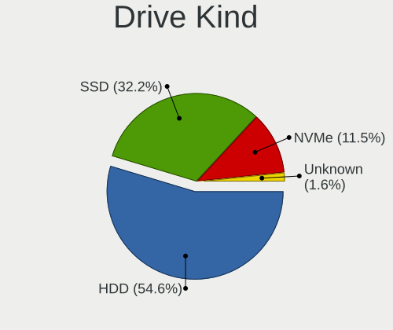

| Kind    | Desktops | Drives | Percent |
|---------|----------|--------|---------|
| HDD     | 200      | 307    | 54.64%  |
| SSD     | 118      | 148    | 32.24%  |
| NVMe    | 42       | 56     | 11.48%  |
| Unknown | 6        | 7      | 1.64%   |

Drive Connector
---------------

SATA, SAS, NVMe, etc.

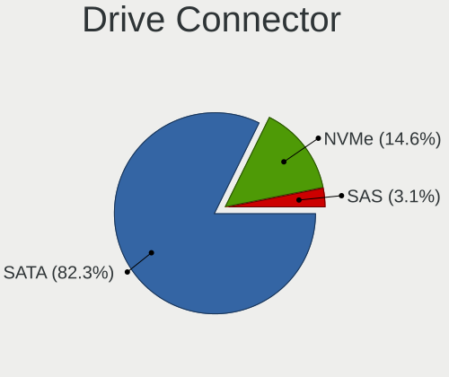

| Type | Desktops | Drives | Percent |
|------|----------|--------|---------|
| SATA | 237      | 453    | 82.29%  |
| NVMe | 42       | 56     | 14.58%  |
| SAS  | 9        | 9      | 3.13%   |

Drive Size
----------

Size of hard drive

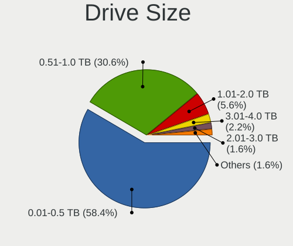

| Size in TB | Desktops | Drives | Percent |
|------------|----------|--------|---------|
| 0.01-0.5   | 187      | 281    | 58.44%  |
| 0.51-1.0   | 98       | 127    | 30.63%  |
| 1.01-2.0   | 18       | 26     | 5.63%   |
| 3.01-4.0   | 7        | 7      | 2.19%   |
| 2.01-3.0   | 5        | 7      | 1.56%   |
| 4.01-10.0  | 4        | 4      | 1.25%   |
| 10.01-20.0 | 1        | 3      | 0.31%   |

Space Total
-----------

Amount of disk space available on the file system

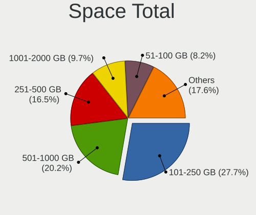

| Size in GB     | Desktops | Percent |
|----------------|----------|---------|
| 101-250        | 74       | 27.72%  |
| 501-1000       | 54       | 20.22%  |
| 251-500        | 44       | 16.48%  |
| 1001-2000      | 26       | 9.74%   |
| 51-100         | 22       | 8.24%   |
| More than 3000 | 13       | 4.87%   |
| 21-50          | 12       | 4.49%   |
| 1-20           | 12       | 4.49%   |
| 2001-3000      | 6        | 2.25%   |
| Unknown        | 4        | 1.5%    |

Space Used
----------

Amount of used disk space

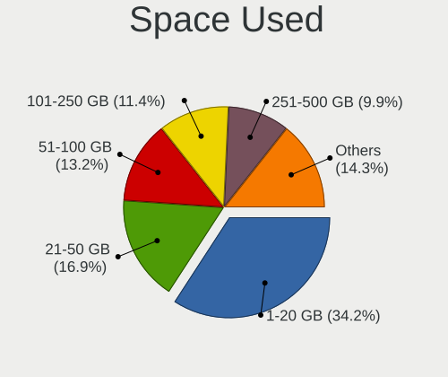

| Used GB        | Desktops | Percent |
|----------------|----------|---------|
| 1-20           | 93       | 34.19%  |
| 21-50          | 46       | 16.91%  |
| 51-100         | 36       | 13.24%  |
| 101-250        | 31       | 11.4%   |
| 251-500        | 27       | 9.93%   |
| 501-1000       | 19       | 6.99%   |
| 1001-2000      | 8        | 2.94%   |
| More than 3000 | 6        | 2.21%   |
| Unknown        | 4        | 1.47%   |
| 2001-3000      | 2        | 0.74%   |

Malfunc. Drives
---------------

Drive models with a malfunction

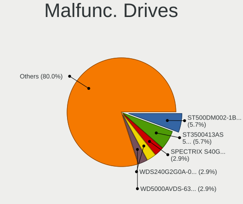

| Model                               | Desktops | Drives | Percent |
|-------------------------------------|----------|--------|---------|
| Seagate ST500DM002-1BD142 500GB     | 2        | 3      | 5.71%   |
| Seagate ST3500413AS 500GB           | 2        | 2      | 5.71%   |
| XPG SPECTRIX S40G 1TB               | 1        | 1      | 2.86%   |
| WDC WDS240G2G0A-00JH30 240GB SSD    | 1        | 1      | 2.86%   |
| WDC WD5000AVDS-63U7B1 500GB         | 1        | 1      | 2.86%   |
| WDC WD5000AAKX-22ERMA0 500GB        | 1        | 2      | 2.86%   |
| WDC WD5000AAKS-00V1A0 500GB         | 1        | 1      | 2.86%   |
| WDC WD3200AVVS-62L2B0 320GB         | 1        | 1      | 2.86%   |
| WDC WD10PURZ-85U8XY0 1TB            | 1        | 1      | 2.86%   |
| WDC WD10EZRX-00A3KB0 1TB            | 1        | 1      | 2.86%   |
| WDC WD10EZEX-00WN4A0 1TB            | 1        | 1      | 2.86%   |
| WDC WD10EARX-00N0YB0 1TB            | 1        | 1      | 2.86%   |
| WDC WD10EARS-00MVWB0 1TB            | 1        | 1      | 2.86%   |
| WDC WD1002FBYS-18A6B0 1TB           | 1        | 1      | 2.86%   |
| Toshiba MQ01ABF050 500GB            | 1        | 1      | 2.86%   |
| Toshiba HDWD105 500GB               | 1        | 1      | 2.86%   |
| Seagate ST9640320AS 640GB           | 1        | 1      | 2.86%   |
| Seagate ST9500420AS 500GB           | 1        | 1      | 2.86%   |
| Seagate ST500LT012-1DG142 500GB     | 1        | 1      | 2.86%   |
| Seagate ST3500418AS 500GB           | 1        | 1      | 2.86%   |
| Seagate ST3320613AS 320GB           | 1        | 1      | 2.86%   |
| Seagate ST3250318AS 250GB           | 1        | 1      | 2.86%   |
| Seagate ST1000DM003-9YN162 1TB      | 1        | 1      | 2.86%   |
| Samsung Electronics SSD 870 EVO 1TB | 1        | 2      | 2.86%   |
| Samsung Electronics HD502HI 500GB   | 1        | 2      | 2.86%   |
| Samsung Electronics HD160JJ 160GB   | 1        | 1      | 2.86%   |
| Maxtor 6Y080M0 81GB                 | 1        | 1      | 2.86%   |
| Maxtor 6Y080L0 81GB                 | 1        | 2      | 2.86%   |
| Hitachi HDS721010KLA330 1TB         | 1        | 1      | 2.86%   |
| Hitachi HDE721010SLA330 1TB         | 1        | 1      | 2.86%   |
| Hitachi HCT721010SLA360 1TB         | 1        | 2      | 2.86%   |
| Apple HDD HTS545 500GB              | 1        | 1      | 2.86%   |
| Unknown                             | 1        | 2      | 2.86%   |

Malfunc. Drive Vendor
---------------------

Vendors of faulty drives

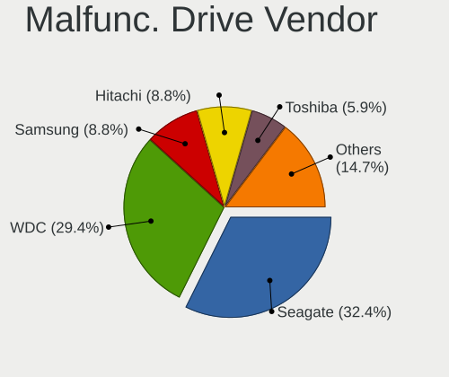

| Vendor              | Desktops | Drives | Percent |
|---------------------|----------|--------|---------|
| Seagate             | 11       | 12     | 32.35%  |
| WDC                 | 10       | 12     | 29.41%  |
| Samsung Electronics | 3        | 5      | 8.82%   |
| Hitachi             | 3        | 4      | 8.82%   |
| Toshiba             | 2        | 2      | 5.88%   |
| Maxtor              | 2        | 3      | 5.88%   |
| XPG                 | 1        | 1      | 2.94%   |
| Apple               | 1        | 1      | 2.94%   |
| Unknown             | 1        | 2      | 2.94%   |

Malfunc. HDD Vendor
-------------------

Vendors of faulty HDD drives

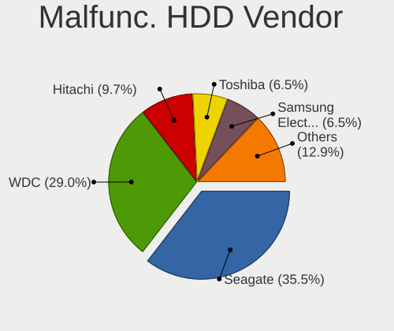

| Vendor              | Desktops | Drives | Percent |
|---------------------|----------|--------|---------|
| Seagate             | 11       | 12     | 35.48%  |
| WDC                 | 9        | 11     | 29.03%  |
| Hitachi             | 3        | 4      | 9.68%   |
| Toshiba             | 2        | 2      | 6.45%   |
| Samsung Electronics | 2        | 3      | 6.45%   |
| Maxtor              | 2        | 3      | 6.45%   |
| Apple               | 1        | 1      | 3.23%   |
| Unknown             | 1        | 2      | 3.23%   |

Malfunc. Drive Kind
-------------------

Kinds of faulty drives

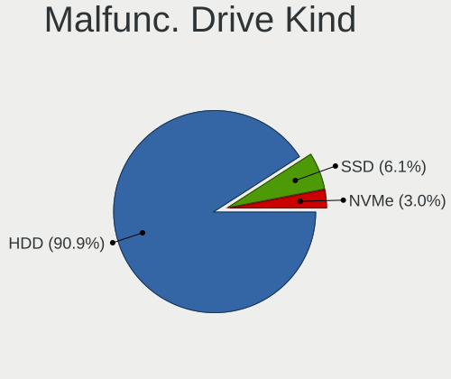

| Kind | Desktops | Drives | Percent |
|------|----------|--------|---------|
| HDD  | 30       | 38     | 90.91%  |
| SSD  | 2        | 3      | 6.06%   |
| NVMe | 1        | 1      | 3.03%   |

Failed Drives
-------------

Failed drive models

Zero info for selected period =(

Failed Drive Vendor
-------------------

Failed drive vendors

Zero info for selected period =(

Drive Status
------------

Number of failed and malfunc. drives

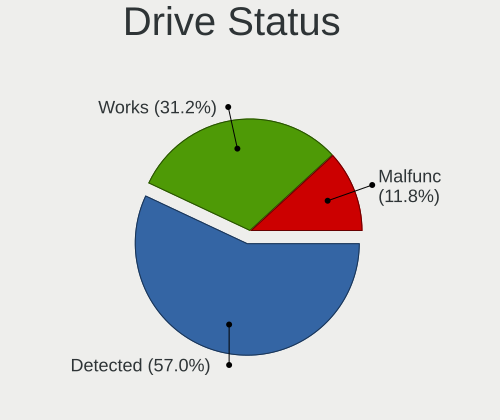

| Status   | Desktops | Drives | Percent |
|----------|----------|--------|---------|
| Detected | 159      | 323    | 56.99%  |
| Works    | 87       | 153    | 31.18%  |
| Malfunc  | 33       | 42     | 11.83%  |

Storage controller
------------------

Storage Vendor
--------------

Storage controller vendors

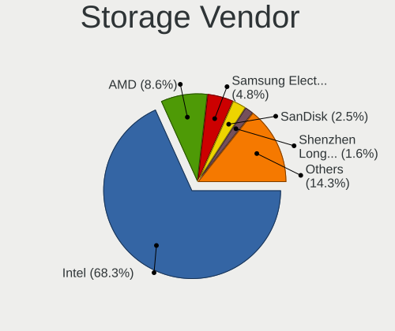

| Vendor                           | Desktops | Percent |
|----------------------------------|----------|---------|
| Intel                            | 215      | 68.25%  |
| AMD                              | 27       | 8.57%   |
| Samsung Electronics              | 15       | 4.76%   |
| SanDisk                          | 8        | 2.54%   |
| Shenzhen Longsys Electronics     | 5        | 1.59%   |
| Phison Electronics               | 5        | 1.59%   |
| Nvidia                           | 5        | 1.59%   |
| JMicron Technology               | 5        | 1.59%   |
| ASMedia Technology               | 5        | 1.59%   |
| VIA Technologies                 | 4        | 1.27%   |
| MAXIO Technology (Hangzhou)      | 4        | 1.27%   |
| Marvell Technology Group         | 4        | 1.27%   |
| Realtek Semiconductor            | 3        | 0.95%   |
| Silicon Motion                   | 2        | 0.63%   |
| Silicon Integrated Systems [SiS] | 2        | 0.63%   |
| ADATA Technology                 | 2        | 0.63%   |
| ULi Electronics                  | 1        | 0.32%   |
| Micron Technology                | 1        | 0.32%   |
| KIOXIA                           | 1        | 0.32%   |
| Broadcom / LSI                   | 1        | 0.32%   |

Storage Model
-------------

Storage controller models

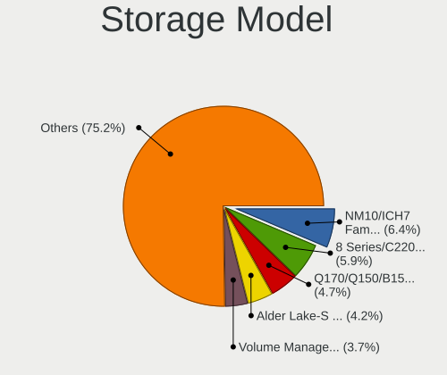

| Model                                                                                                              | Desktops | Percent |
|--------------------------------------------------------------------------------------------------------------------|----------|---------|
| Intel NM10/ICH7 Family SATA Controller [IDE mode]                                                                  | 26       | 6.37%   |
| Intel 8 Series/C220 Series Chipset Family 6-port SATA Controller 1 [AHCI mode]                                     | 24       | 5.88%   |
| Intel Q170/Q150/B150/H170/H110/Z170/CM236 Chipset SATA Controller [AHCI Mode]                                      | 19       | 4.66%   |
| Intel Alder Lake-S PCH SATA Controller [AHCI Mode]                                                                 | 17       | 4.17%   |
| Intel Volume Management Device NVMe RAID Controller                                                                | 15       | 3.68%   |
| Intel 82801G (ICH7 Family) IDE Controller                                                                          | 15       | 3.68%   |
| Intel 7 Series/C210 Series Chipset Family 6-port SATA Controller [AHCI mode]                                       | 15       | 3.68%   |
| Intel 6 Series/C200 Series Chipset Family Desktop SATA Controller (IDE mode, ports 4-5)                            | 13       | 3.19%   |
| Intel 6 Series/C200 Series Chipset Family Desktop SATA Controller (IDE mode, ports 0-3)                            | 13       | 3.19%   |
| Intel 500 Series Chipset Family SATA AHCI Controller                                                               | 11       | 2.7%    |
| Intel 200 Series PCH SATA controller [AHCI mode]                                                                   | 11       | 2.7%    |
| Intel Cannon Lake PCH SATA AHCI Controller                                                                         | 10       | 2.45%   |
| AMD FCH SATA Controller [AHCI mode]                                                                                | 10       | 2.45%   |
| Intel SATA Controller [RAID mode]                                                                                  | 8        | 1.96%   |
| Intel 9 Series Chipset Family SATA Controller [AHCI Mode]                                                          | 8        | 1.96%   |
| Intel 6 Series/C200 Series Chipset Family 6 port Desktop SATA AHCI Controller                                      | 7        | 1.72%   |
| AMD SB7x0/SB8x0/SB9x0 SATA Controller [IDE mode]                                                                   | 7        | 1.72%   |
| AMD SB7x0/SB8x0/SB9x0 IDE Controller                                                                               | 7        | 1.72%   |
| Samsung NVMe SSD Controller 980 (DRAM-less)                                                                        | 6        | 1.47%   |
| Intel Raptor Lake SATA AHCI Controller                                                                             | 6        | 1.47%   |
| Samsung NVMe SSD Controller SM981/PM981/PM983                                                                      | 5        | 1.23%   |
| Intel C610/X99 series chipset 6-Port SATA Controller [AHCI mode]                                                   | 5        | 1.23%   |
| Intel 82801JD/DO (ICH10 Family) SATA AHCI Controller                                                               | 5        | 1.23%   |
| ASMedia ASM1061/ASM1062 Serial ATA Controller                                                                      | 5        | 1.23%   |
| MAXIO (Hangzhou) NVMe SSD Controller MAP1202 (DRAM-less)                                                           | 4        | 0.98%   |
| Intel RST Volume Management Device Controller                                                                      | 4        | 0.98%   |
| Intel 8 Series/C220 Series Chipset Family 4-port SATA Controller 1 [IDE mode]                                      | 4        | 0.98%   |
| AMD 500 Series Chipset SATA Controller                                                                             | 4        | 0.98%   |
| VIA VT6415 PATA IDE Host Controller                                                                                | 3        | 0.74%   |
| Shenzhen Longsys FORESEE XP1000 / Lexar Professional CFexpress Type B Gold series, NM620 PCIe NVME SSD (DRAM-less) | 3        | 0.74%   |
| SanDisk Ultra 3D / WD Blue SN570 NVMe SSD (DRAM-less)                                                              | 3        | 0.74%   |
| Intel Comet Lake SATA AHCI Controller                                                                              | 3        | 0.74%   |
| Intel C610/X99 series chipset sSATA Controller [AHCI mode]                                                         | 3        | 0.74%   |
| Intel 7 Series/C210 Series Chipset Family 4-port SATA Controller [IDE mode]                                        | 3        | 0.74%   |
| Intel 7 Series/C210 Series Chipset Family 2-port SATA Controller [IDE mode]                                        | 3        | 0.74%   |
| Intel 5 Series/3400 Series Chipset 4 port SATA IDE Controller                                                      | 3        | 0.74%   |
| Intel 5 Series/3400 Series Chipset 2 port SATA IDE Controller                                                      | 3        | 0.74%   |
| Intel 400 Series Chipset Family SATA AHCI Controller                                                               | 3        | 0.74%   |
| Intel 4 Series Chipset PT IDER Controller                                                                          | 3        | 0.74%   |
| AMD 400 Series Chipset SATA Controller                                                                             | 3        | 0.74%   |

Storage Kind
------------

Kind of storage controller (IDE, SATA, NVMe, SAS, ...)

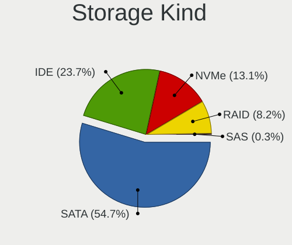

| Kind | Desktops | Percent |
|------|----------|---------|
| SATA | 180      | 54.71%  |
| IDE  | 78       | 23.71%  |
| NVMe | 43       | 13.07%  |
| RAID | 27       | 8.21%   |
| SAS  | 1        | 0.3%    |

Processor
---------

CPU Vendor
----------

Processor vendors

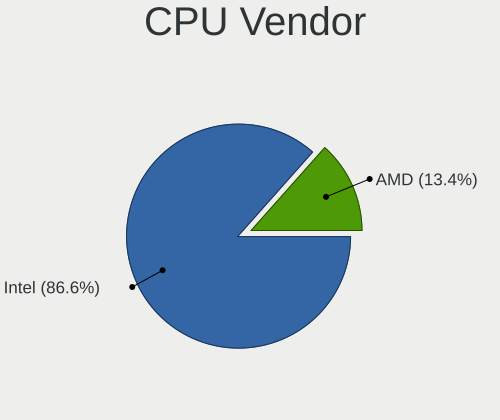

| Vendor | Desktops | Percent |
|--------|----------|---------|
| Intel  | 219      | 86.56%  |
| AMD    | 34       | 13.44%  |

CPU Model
---------

Processor models

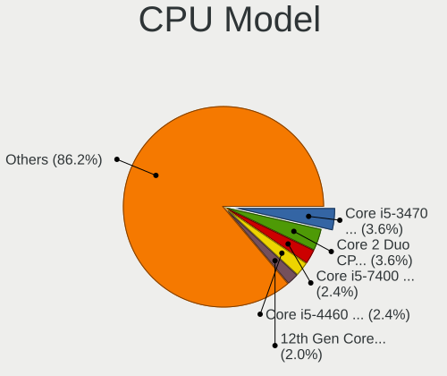

| Model                                       | Desktops | Percent |
|---------------------------------------------|----------|---------|
| Intel Core i5-3470 CPU @ 3.20GHz            | 9        | 3.56%   |
| Intel Core 2 Duo CPU E8400 @ 3.00GHz        | 9        | 3.56%   |
| Intel Core i5-7400 CPU @ 3.00GHz            | 6        | 2.37%   |
| Intel Core i5-4460 CPU @ 3.20GHz            | 6        | 2.37%   |
| Intel 12th Gen Core i5-12400                | 5        | 1.98%   |
| Intel Pentium Dual-Core CPU E5700 @ 3.00GHz | 4        | 1.58%   |
| Intel Core i7-6700K CPU @ 4.00GHz           | 4        | 1.58%   |
| Intel Core i7-3770 CPU @ 3.40GHz            | 4        | 1.58%   |
| Intel Core i5-8400 CPU @ 2.80GHz            | 4        | 1.58%   |
| Intel Core i5-3570 CPU @ 3.40GHz            | 4        | 1.58%   |
| Intel Core i3-7100 CPU @ 3.90GHz            | 4        | 1.58%   |
| Intel Core i3-4170 CPU @ 3.70GHz            | 4        | 1.58%   |
| Intel Core i3-4160 CPU @ 3.60GHz            | 4        | 1.58%   |
| Intel Core i3-2100 CPU @ 3.10GHz            | 4        | 1.58%   |
| Intel Core 2 Duo CPU E7500 @ 2.93GHz        | 4        | 1.58%   |
| Intel Pentium CPU G620 @ 2.60GHz            | 3        | 1.19%   |
| Intel Core i7-9700 CPU @ 3.00GHz            | 3        | 1.19%   |
| Intel Core i7-4770K CPU @ 3.50GHz           | 3        | 1.19%   |
| Intel Core i5-6500 CPU @ 3.20GHz            | 3        | 1.19%   |
| Intel Core i5-4570 CPU @ 3.20GHz            | 3        | 1.19%   |
| Intel Core i5-10400F CPU @ 2.90GHz          | 3        | 1.19%   |
| Intel Core i5-10400 CPU @ 2.90GHz           | 3        | 1.19%   |
| Intel Core i3-8100 CPU @ 3.60GHz            | 3        | 1.19%   |
| Intel Core i3-10100 CPU @ 3.60GHz           | 3        | 1.19%   |
| Intel Core 2 Quad CPU Q9550 @ 2.83GHz       | 3        | 1.19%   |
| Intel 11th Gen Core i5-11400 @ 2.60GHz      | 3        | 1.19%   |
| Intel Xeon CPU E5-2680 v4 @ 2.40GHz         | 2        | 0.79%   |
| Intel Pentium Dual-Core CPU E6600 @ 3.06GHz | 2        | 0.79%   |
| Intel Pentium Dual CPU E2180 @ 2.00GHz      | 2        | 0.79%   |
| Intel Pentium CPU G645 @ 2.90GHz            | 2        | 0.79%   |
| Intel Pentium CPU G630 @ 2.70GHz            | 2        | 0.79%   |
| Intel Pentium CPU G4400 @ 3.30GHz           | 2        | 0.79%   |
| Intel Pentium CPU G3250 @ 3.20GHz           | 2        | 0.79%   |
| Intel Pentium CPU G2020 @ 2.90GHz           | 2        | 0.79%   |
| Intel Core i7-4820K CPU @ 3.70GHz           | 2        | 0.79%   |
| Intel Core i7-4790 CPU @ 3.60GHz            | 2        | 0.79%   |
| Intel Core i7-4770 CPU @ 3.40GHz            | 2        | 0.79%   |
| Intel Core i7-10700K CPU @ 3.80GHz          | 2        | 0.79%   |
| Intel Core i5-9400F CPU @ 2.90GHz           | 2        | 0.79%   |
| Intel Core i5-7500 CPU @ 3.40GHz            | 2        | 0.79%   |

CPU Model Family
----------------

Processor model prefix

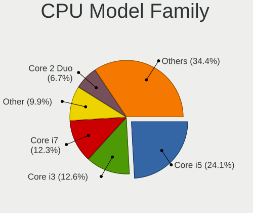

| Model                   | Desktops | Percent |
|-------------------------|----------|---------|
| Intel Core i5           | 61       | 24.11%  |
| Intel Core i3           | 32       | 12.65%  |
| Intel Core i7           | 31       | 12.25%  |
| Other                   | 25       | 9.88%   |
| Intel Core 2 Duo        | 17       | 6.72%   |
| Intel Pentium           | 16       | 6.32%   |
| AMD Ryzen 5             | 10       | 3.95%   |
| Intel Core 2 Quad       | 9        | 3.56%   |
| Intel Pentium Dual-Core | 6        | 2.37%   |
| Intel Celeron           | 6        | 2.37%   |
| Intel Xeon              | 5        | 1.98%   |
| AMD FX                  | 4        | 1.58%   |
| AMD Athlon II X2        | 4        | 1.58%   |
| Intel Pentium Dual      | 3        | 1.19%   |
| Intel Core i9           | 3        | 1.19%   |
| AMD Ryzen 7             | 3        | 1.19%   |
| Intel Pentium 4         | 2        | 0.79%   |
| Intel Atom              | 2        | 0.79%   |
| AMD PRO A10             | 2        | 0.79%   |
| AMD Athlon 64 X2        | 2        | 0.79%   |
| AMD Athlon 64           | 2        | 0.79%   |
| Intel Pentium D         | 1        | 0.4%    |
| AMD Ryzen 9             | 1        | 0.4%    |
| AMD Ryzen 3             | 1        | 0.4%    |
| AMD Phenom II X4        | 1        | 0.4%    |
| AMD Phenom              | 1        | 0.4%    |
| AMD E1                  | 1        | 0.4%    |
| AMD Athlon II X3        | 1        | 0.4%    |
| AMD Athlon              | 1        | 0.4%    |

CPU Cores
---------

Number of processor cores

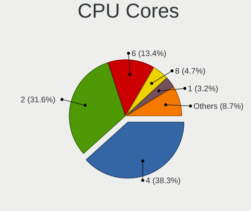

| Number | Desktops | Percent |
|--------|----------|---------|
| 4      | 97       | 38.34%  |
| 2      | 80       | 31.62%  |
| 6      | 34       | 13.44%  |
| 8      | 12       | 4.74%   |
| 1      | 8        | 3.16%   |
| 10     | 6        | 2.37%   |
| 12     | 4        | 1.58%   |
| 3      | 4        | 1.58%   |
| 24     | 2        | 0.79%   |
| 16     | 2        | 0.79%   |
| 14     | 2        | 0.79%   |
| 28     | 1        | 0.4%    |
| 20     | 1        | 0.4%    |

CPU Sockets
-----------

Number of sockets

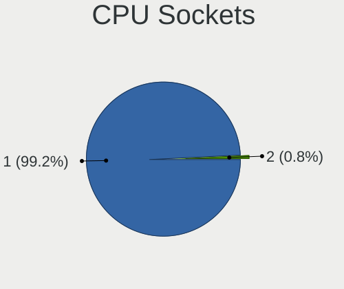

| Number | Desktops | Percent |
|--------|----------|---------|
| 1      | 251      | 99.21%  |
| 2      | 2        | 0.79%   |

CPU Threads
-----------

Threads per core (Hyper-Threading)

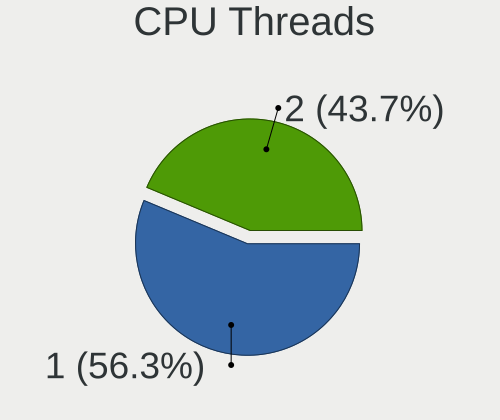

| Number | Desktops | Percent |
|--------|----------|---------|
| 1      | 143      | 56.3%   |
| 2      | 111      | 43.7%   |

CPU Op-Modes
------------

CPU Operation Modes (32-bit, 64-bit)

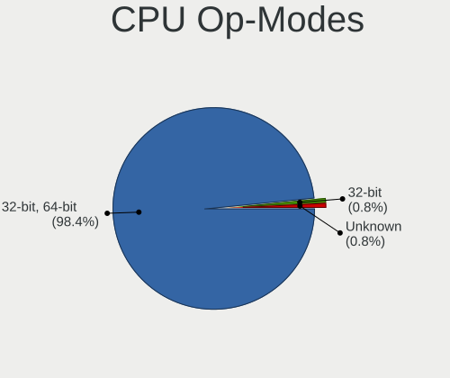

| Op mode        | Desktops | Percent |
|----------------|----------|---------|
| 32-bit, 64-bit | 250      | 98.43%  |
| 32-bit         | 2        | 0.79%   |
| Unknown        | 2        | 0.79%   |

CPU Microcode
-------------

Microcode number

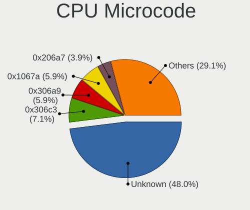

| Number     | Desktops | Percent |
|------------|----------|---------|
| Unknown    | 122      | 48.03%  |
| 0x306c3    | 18       | 7.09%   |
| 0x306a9    | 15       | 5.91%   |
| 0x1067a    | 15       | 5.91%   |
| 0x206a7    | 10       | 3.94%   |
| 0x506e3    | 8        | 3.15%   |
| 0x906e9    | 5        | 1.97%   |
| 0x906ed    | 4        | 1.57%   |
| 0x906ea    | 4        | 1.57%   |
| 0x6fd      | 4        | 1.57%   |
| 0xa0653    | 3        | 1.18%   |
| 0x90672    | 3        | 1.18%   |
| 0x6fb      | 3        | 1.18%   |
| 0x010000c8 | 3        | 1.18%   |
| 0x906eb    | 2        | 0.79%   |
| 0x306f2    | 2        | 0.79%   |
| 0x306e4    | 2        | 0.79%   |
| 0x0800820d | 2        | 0.79%   |
| 0x01000083 | 2        | 0.79%   |
| 0xf65      | 1        | 0.39%   |
| 0xf4a      | 1        | 0.39%   |
| 0xf49      | 1        | 0.39%   |
| 0xf41      | 1        | 0.39%   |
| 0xf33      | 1        | 0.39%   |
| 0xb0671    | 1        | 0.39%   |
| 0xa0655    | 1        | 0.39%   |
| 0x906ec    | 1        | 0.39%   |
| 0x406f1    | 1        | 0.39%   |
| 0x30679    | 1        | 0.39%   |
| 0x30678    | 1        | 0.39%   |
| 0x30661    | 1        | 0.39%   |
| 0x20655    | 1        | 0.39%   |
| 0x20652    | 1        | 0.39%   |
| 0x106e5    | 1        | 0.39%   |
| 0x10676    | 1        | 0.39%   |
| 0x10661    | 1        | 0.39%   |
| 0x08701030 | 1        | 0.39%   |
| 0x0810100b | 1        | 0.39%   |
| 0x08001137 | 1        | 0.39%   |
| 0x08001129 | 1        | 0.39%   |

CPU Microarch
-------------

Microarchitecture

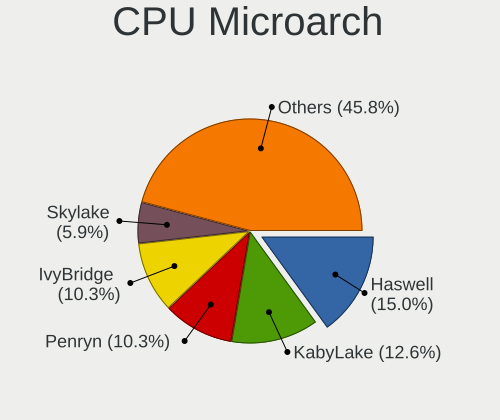

| Name             | Desktops | Percent |
|------------------|----------|---------|
| Haswell          | 38       | 15.02%  |
| KabyLake         | 32       | 12.65%  |
| Penryn           | 26       | 10.28%  |
| IvyBridge        | 26       | 10.28%  |
| Skylake          | 15       | 5.93%   |
| SandyBridge      | 15       | 5.93%   |
| Unknown          | 15       | 5.93%   |
| CometLake        | 13       | 5.14%   |
| Alderlake Hybrid | 11       | 4.35%   |
| Core             | 10       | 3.95%   |
| K10              | 8        | 3.16%   |
| NetBurst         | 5        | 1.98%   |
| Zen              | 4        | 1.58%   |
| K8 Hammer        | 4        | 1.58%   |
| Zen+             | 3        | 1.19%   |
| Zen 3            | 3        | 1.19%   |
| Zen 2            | 3        | 1.19%   |
| Westmere         | 3        | 1.19%   |
| Icelake          | 3        | 1.19%   |
| Bulldozer        | 3        | 1.19%   |
| Broadwell        | 3        | 1.19%   |
| Silvermont       | 2        | 0.79%   |
| Nehalem          | 2        | 0.79%   |
| Bonnell          | 2        | 0.79%   |
| Steamroller      | 1        | 0.4%    |
| Puma             | 1        | 0.4%    |
| Piledriver       | 1        | 0.4%    |
| Excavator        | 1        | 0.4%    |

Graphics
--------

GPU Vendor
----------

Vendors of graphics cards

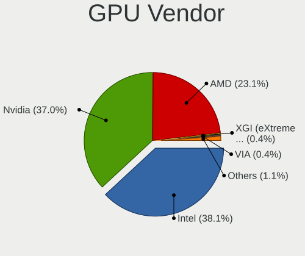

| Vendor                                       | Desktops | Percent |
|----------------------------------------------|----------|---------|
| Intel                                        | 104      | 38.1%   |
| Nvidia                                       | 101      | 37%     |
| AMD                                          | 63       | 23.08%  |
| XGI Technology (eXtreme Graphics Innovation) | 1        | 0.37%   |
| VIA Technologies                             | 1        | 0.37%   |
| Trident Microsystems                         | 1        | 0.37%   |
| Silicon Integrated Systems [SiS]             | 1        | 0.37%   |
| ASPEED Technology                            | 1        | 0.37%   |

GPU Model
---------

Graphics card models

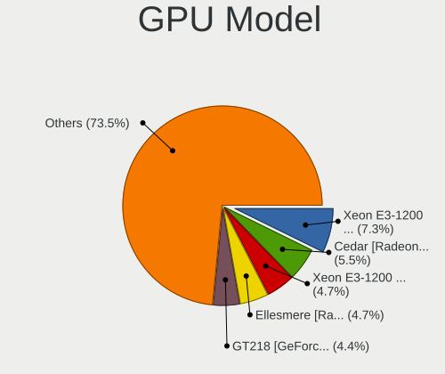

| Model                                                                       | Desktops | Percent |
|-----------------------------------------------------------------------------|----------|---------|
| Intel Xeon E3-1200 v3/4th Gen Core Processor Integrated Graphics Controller | 20       | 7.27%   |
| AMD Cedar [Radeon HD 5000/6000/7350/8350 Series]                            | 15       | 5.45%   |
| Intel Xeon E3-1200 v2/3rd Gen Core processor Graphics Controller            | 13       | 4.73%   |
| AMD Ellesmere [Radeon RX 470/480/570/570X/580/580X/590]                     | 13       | 4.73%   |
| Nvidia GT218 [GeForce 210]                                                  | 12       | 4.36%   |
| Intel CoffeeLake-S GT2 [UHD Graphics 630]                                   | 10       | 3.64%   |
| Intel Skylake-S GT2 [HD Graphics 530]                                       | 7        | 2.55%   |
| Intel 4 Series Chipset Integrated Graphics Controller                       | 7        | 2.55%   |
| Intel Kaby Lake-S GT2 [HD Graphics 630]                                     | 6        | 2.18%   |
| Intel 4th Generation Core Processor Family Integrated Graphics Controller   | 6        | 2.18%   |
| Nvidia GF108 [GeForce GT 630]                                               | 5        | 1.82%   |
| Intel CometLake-S GT2 [UHD Graphics 630]                                    | 5        | 1.82%   |
| Intel Alder Lake-S GT1 [UHD Graphics 730]                                   | 5        | 1.82%   |
| Nvidia GP107 [GeForce GTX 1050 Ti]                                          | 4        | 1.45%   |
| Nvidia GF119 [GeForce GT 610]                                               | 4        | 1.45%   |
| Intel 2nd Generation Core Processor Family Integrated Graphics Controller   | 4        | 1.45%   |
| Nvidia GP108 [GeForce GT 1030]                                              | 3        | 1.09%   |
| Nvidia GP107 [GeForce GTX 1050]                                             | 3        | 1.09%   |
| Nvidia GM206 [GeForce GTX 960]                                              | 3        | 1.09%   |
| Nvidia GM107 [GeForce GTX 750 Ti]                                           | 3        | 1.09%   |
| Nvidia GK208B [GeForce GT 730]                                              | 3        | 1.09%   |
| Nvidia GK208B [GeForce GT 710]                                              | 3        | 1.09%   |
| Nvidia GF119 [GeForce GT 520]                                               | 3        | 1.09%   |
| Nvidia GF108 [GeForce GT 730]                                               | 3        | 1.09%   |
| Nvidia G96C [GeForce 9500 GT]                                               | 3        | 1.09%   |
| Intel RocketLake-S GT1 [UHD Graphics 730]                                   | 3        | 1.09%   |
| Intel 82G33/G31 Express Integrated Graphics Controller                      | 3        | 1.09%   |
| AMD Oland PRO [Radeon R7 240/340 / Radeon 520]                              | 3        | 1.09%   |
| Nvidia TU116 [GeForce GTX 1660 SUPER]                                       | 2        | 0.73%   |
| Nvidia TU106 [GeForce GTX 1650]                                             | 2        | 0.73%   |
| Nvidia GP106 [GeForce GTX 1060 6GB]                                         | 2        | 0.73%   |
| Nvidia GP104 [GeForce GTX 1070]                                             | 2        | 0.73%   |
| Nvidia GP102 [GeForce GTX 1080 Ti]                                          | 2        | 0.73%   |
| Nvidia GM204 [GeForce GTX 970]                                              | 2        | 0.73%   |
| Nvidia GF108 [GeForce GT 430]                                               | 2        | 0.73%   |
| Nvidia G98 [GeForce 8400 GS Rev. 2]                                         | 2        | 0.73%   |
| Nvidia G86 [GeForce 8400 GS]                                                | 2        | 0.73%   |
| Intel Skylake-S GT1 [HD Graphics 510]                                       | 2        | 0.73%   |
| Intel IvyBridge GT2 [HD Graphics 4000]                                      | 2        | 0.73%   |
| Intel Atom Processor Z36xxx/Z37xxx Series Graphics & Display                | 2        | 0.73%   |

GPU Combo
---------

Combinations of graphics cards

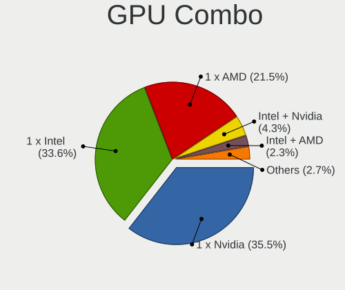

| Name                     | Desktops | Percent |
|--------------------------|----------|---------|
| 1 x Nvidia               | 91       | 35.55%  |
| 1 x Intel                | 86       | 33.59%  |
| 1 x AMD                  | 55       | 21.48%  |
| Intel + Nvidia           | 11       | 4.3%    |
| Intel + AMD              | 6        | 2.34%   |
| 2 x AMD                  | 2        | 0.78%   |
| 1 x XGI                  | 1        | 0.39%   |
| 1 x VIA                  | 1        | 0.39%   |
| 1 x Trident Microsystems | 1        | 0.39%   |
| 1 x SiS                  | 1        | 0.39%   |
| Nvidia + ASPEED          | 1        | 0.39%   |

GPU Driver
----------

Free vs proprietary

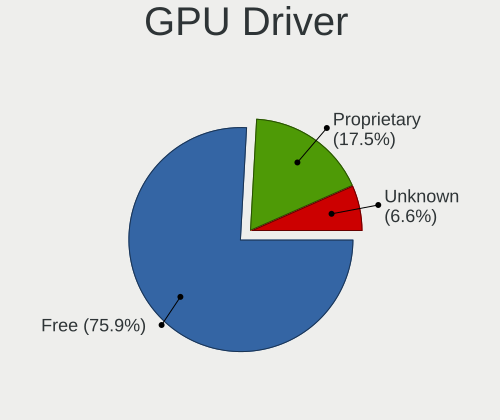

| Driver      | Desktops | Percent |
|-------------|----------|---------|
| Free        | 195      | 75.88%  |
| Proprietary | 45       | 17.51%  |
| Unknown     | 17       | 6.61%   |

GPU Memory
----------

Total video memory

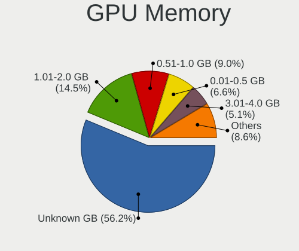

| Size in GB | Desktops | Percent |
|------------|----------|---------|
| Unknown    | 144      | 56.25%  |
| 1.01-2.0   | 37       | 14.45%  |
| 0.51-1.0   | 23       | 8.98%   |
| 0.01-0.5   | 17       | 6.64%   |
| 3.01-4.0   | 13       | 5.08%   |
| 7.01-8.0   | 12       | 4.69%   |
| 5.01-6.0   | 6        | 2.34%   |
| 8.01-16.0  | 4        | 1.56%   |

Monitor
-------

Monitor Vendor
--------------

Monitor vendors

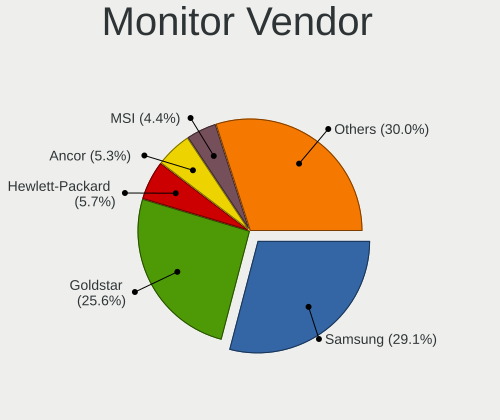

| Vendor               | Desktops | Percent |
|----------------------|----------|---------|
| Samsung Electronics  | 66       | 29.07%  |
| Goldstar             | 58       | 25.55%  |
| Hewlett-Packard      | 13       | 5.73%   |
| Ancor Communications | 12       | 5.29%   |
| MSI                  | 10       | 4.41%   |
| AOC                  | 9        | 3.96%   |
| CHD                  | 7        | 3.08%   |
| LG Electronics       | 6        | 2.64%   |
| Dell                 | 6        | 2.64%   |
| Unknown              | 4        | 1.76%   |
| Sony                 | 4        | 1.76%   |
| ViewSonic            | 3        | 1.32%   |
| RTK                  | 3        | 1.32%   |
| Lenovo               | 3        | 1.32%   |
| BenQ                 | 3        | 1.32%   |
| ASUSTek Computer     | 3        | 1.32%   |
| Acer                 | 3        | 1.32%   |
| Unknown (ADA)        | 2        | 0.88%   |
| GOL                  | 2        | 0.88%   |
| XVision              | 1        | 0.44%   |
| Xiaomi               | 1        | 0.44%   |
| SEEYOO               | 1        | 0.44%   |
| SAC                  | 1        | 0.44%   |
| Mi                   | 1        | 0.44%   |
| KTC                  | 1        | 0.44%   |
| IST                  | 1        | 0.44%   |
| HUAWEI               | 1        | 0.44%   |
| Hitachi              | 1        | 0.44%   |
| Unknown              | 1        | 0.44%   |

Monitor Model
-------------

Monitor models

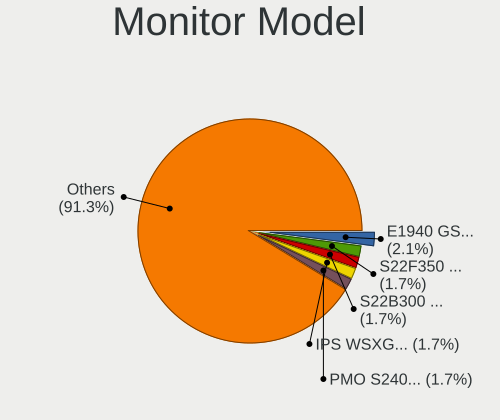

| Model                                                                 | Desktops | Percent |
|-----------------------------------------------------------------------|----------|---------|
| Goldstar E1940 GSM4BD6 1360x768 406x229mm 18.4-inch                   | 5        | 2.07%   |
| Samsung Electronics S22F350 SAM0D1A 1920x1080 477x268mm 21.5-inch     | 4        | 1.65%   |
| Samsung Electronics S22B300 SAM08A9 1600x900 443x249mm 20.0-inch      | 4        | 1.65%   |
| Goldstar IPS WSXGA GSM5B01 1440x900 419x262mm 19.5-inch               | 4        | 1.65%   |
| CHD PMO S240-IFC CHD0240 1920x1080 368x207mm 16.6-inch                | 4        | 1.65%   |
| Samsung Electronics S22F350 SAM0D1B 1920x1080 477x268mm 21.5-inch     | 3        | 1.24%   |
| Samsung Electronics S20B300 SAM08A8 1600x900 443x249mm 20.0-inch      | 3        | 1.24%   |
| RTK LCD Monitor RTK1D1A 1920x1080 1020x570mm 46.0-inch                | 3        | 1.24%   |
| Goldstar W2053 GSM4E9F 1600x900 443x249mm 20.0-inch                   | 3        | 1.24%   |
| Goldstar E1941 GSM4BF0 1366x768 410x230mm 18.5-inch                   | 3        | 1.24%   |
| Unknown (ADA) LCD Monitor ADA0004 800x480 150x100mm 7.1-inch          | 2        | 0.83%   |
| Samsung Electronics SyncMaster SAM0521 1600x900 443x249mm 20.0-inch   | 2        | 0.83%   |
| Samsung Electronics SyncMaster SAM0364 1360x768 344x194mm 15.5-inch   | 2        | 0.83%   |
| Samsung Electronics SyncMaster SAM0218 1280x1024 376x301mm 19.0-inch  | 2        | 0.83%   |
| Samsung Electronics LS27A70 SAM71A0 3840x2160 597x336mm 27.0-inch     | 2        | 0.83%   |
| Samsung Electronics LCD Monitor SAM0AC6 1920x1080 886x498mm 40.0-inch | 2        | 0.83%   |
| Samsung Electronics C27FG70 SAM0DC9 1920x1080 598x337mm 27.0-inch     | 2        | 0.83%   |
| Samsung Electronics C24F390 SAM0D2C 1920x1080 521x293mm 23.5-inch     | 2        | 0.83%   |
| MSI MP271 MSI30A2 1920x1080 598x336mm 27.0-inch                       | 2        | 0.83%   |
| MSI MP221 MSI3BA2 1920x1080 477x268mm 21.5-inch                       | 2        | 0.83%   |
| Lenovo LEN LT2323pwA LEN0BD0 1920x1080 510x287mm 23.0-inch            | 2        | 0.83%   |
| Hewlett-Packard LA2205 HWP2847 1680x1050 473x296mm 22.0-inch          | 2        | 0.83%   |
| Goldstar W1752 GSM4490 1440x900 370x232mm 17.2-inch                   | 2        | 0.83%   |
| Goldstar ULTRAWIDE GSM5A2A 2560x1080 677x290mm 29.0-inch              | 2        | 0.83%   |
| Goldstar T730BH GSM43C2 1152x864 310x230mm 15.2-inch                  | 2        | 0.83%   |
| Goldstar IPS FULLHD GSM5AB7 1920x1080 480x270mm 21.7-inch             | 2        | 0.83%   |
| Goldstar HD PLUS GSM5AC5 1600x900 440x250mm 19.9-inch                 | 2        | 0.83%   |
| Goldstar FULL HD GSM5B55 1920x1080 480x270mm 21.7-inch                | 2        | 0.83%   |
| Goldstar FULL HD GSM5ABB 1920x1080 480x270mm 21.7-inch                | 2        | 0.83%   |
| GOL GGM-L328QN GOL3200 2560x1440 530x280mm 23.6-inch                  | 2        | 0.83%   |
| CHD MNT CHD0220 1920x1080 480x260mm 21.5-inch                         | 2        | 0.83%   |
| AOC 2240w AOC2240 1920x1080 477x268mm 21.5-inch                       | 2        | 0.83%   |
| Ancor Communications ASUS VS228 ACI22FD 1920x1080 476x268mm 21.5-inch | 2        | 0.83%   |
| XVision XL2020AI XVS0392 1600x900 600x340mm 27.2-inch                 | 1        | 0.41%   |
| Xiaomi Mi TV XMD00E1 1440x900 708x398mm 32.0-inch                     | 1        | 0.41%   |
| ViewSonic VA2756 Series VSC3336 1920x1080 598x336mm 27.0-inch         | 1        | 0.41%   |
| ViewSonic VA2719-2K VSC6B34 2560x1440 597x336mm 27.0-inch             | 1        | 0.41%   |
| ViewSonic VA2465 SERIES VSCB730 1920x1080 521x293mm 23.5-inch         | 1        | 0.41%   |
| Unknown LCD Monitor SYK VGA TO HDMI 1920x1080                         | 1        | 0.41%   |
| Unknown LCD Monitor SAMSUNG 2720x768                                  | 1        | 0.41%   |

Monitor Resolution
------------------

Monitor screen resolution

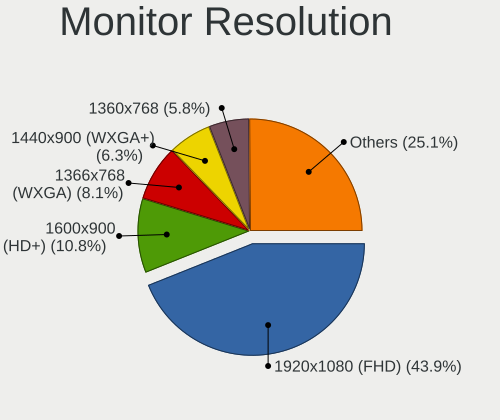

| Resolution         | Desktops | Percent |
|--------------------|----------|---------|
| 1920x1080 (FHD)    | 98       | 43.95%  |
| 1600x900 (HD+)     | 24       | 10.76%  |
| 1366x768 (WXGA)    | 18       | 8.07%   |
| 1440x900 (WXGA+)   | 14       | 6.28%   |
| 1360x768           | 13       | 5.83%   |
| 1280x1024 (SXGA)   | 12       | 5.38%   |
| 3840x2160 (4K)     | 11       | 4.93%   |
| 1680x1050 (WSXGA+) | 9        | 4.04%   |
| 2560x1440 (QHD)    | 8        | 3.59%   |
| 2560x1080          | 3        | 1.35%   |
| 1920x1200 (WUXGA)  | 3        | 1.35%   |
| 1280x960           | 2        | 0.9%    |
| 1280x800 (WXGA)    | 2        | 0.9%    |
| Unknown            | 2        | 0.9%    |
| 3440x1440          | 1        | 0.45%   |
| 2720x768           | 1        | 0.45%   |
| 2288x1287          | 1        | 0.45%   |
| 1280x720 (HD)      | 1        | 0.45%   |

Monitor Diagonal
----------------

Diagonal size in inches

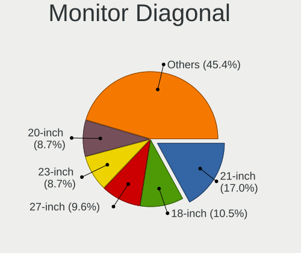

| Inches  | Desktops | Percent |
|---------|----------|---------|
| 21      | 39       | 17.03%  |
| 18      | 24       | 10.48%  |
| 27      | 22       | 9.61%   |
| 23      | 20       | 8.73%   |
| 20      | 20       | 8.73%   |
| 19      | 20       | 8.73%   |
| Unknown | 18       | 7.86%   |
| 24      | 15       | 6.55%   |
| 22      | 8        | 3.49%   |
| 17      | 6        | 2.62%   |
| 31      | 5        | 2.18%   |
| 15      | 5        | 2.18%   |
| 46      | 3        | 1.31%   |
| 29      | 3        | 1.31%   |
| 16      | 3        | 1.31%   |
| 72      | 2        | 0.87%   |
| 54      | 2        | 0.87%   |
| 40      | 2        | 0.87%   |
| 7       | 2        | 0.87%   |
| 142     | 1        | 0.44%   |
| 84      | 1        | 0.44%   |
| 75      | 1        | 0.44%   |
| 65      | 1        | 0.44%   |
| 50      | 1        | 0.44%   |
| 49      | 1        | 0.44%   |
| 34      | 1        | 0.44%   |
| 32      | 1        | 0.44%   |
| 26      | 1        | 0.44%   |
| 25      | 1        | 0.44%   |

Monitor Width
-------------

Physical width

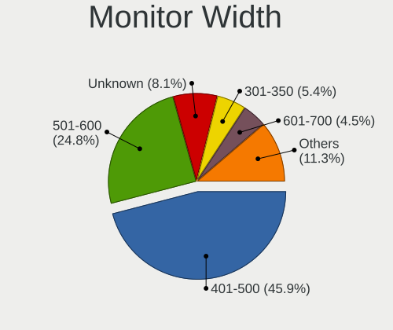

| Width in mm    | Desktops | Percent |
|----------------|----------|---------|
| 401-500        | 102      | 45.95%  |
| 501-600        | 55       | 24.77%  |
| Unknown        | 18       | 8.11%   |
| 301-350        | 12       | 5.41%   |
| 601-700        | 10       | 4.5%    |
| 1001-1500      | 8        | 3.6%    |
| 351-400        | 6        | 2.7%    |
| 1501-2000      | 4        | 1.8%    |
| 801-900        | 2        | 0.9%    |
| 701-800        | 2        | 0.9%    |
| 101-200        | 2        | 0.9%    |
| More than 2000 | 1        | 0.45%   |

Aspect Ratio
------------

Proportional relationship between the width and the height

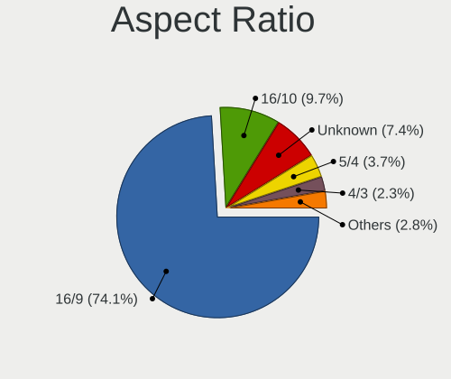

| Ratio   | Desktops | Percent |
|---------|----------|---------|
| 16/9    | 160      | 74.07%  |
| 16/10   | 21       | 9.72%   |
| Unknown | 16       | 7.41%   |
| 5/4     | 8        | 3.7%    |
| 4/3     | 5        | 2.31%   |
| 21/9    | 3        | 1.39%   |
| 3/2     | 2        | 0.93%   |
| 1.00    | 1        | 0.46%   |

Monitor Area
------------

Area in inch²

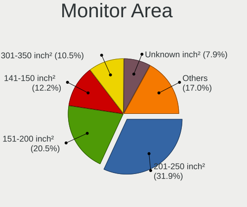

| Area in inch² | Desktops | Percent |
|----------------|----------|---------|
| 201-250        | 73       | 31.88%  |
| 151-200        | 47       | 20.52%  |
| 141-150        | 28       | 12.23%  |
| 301-350        | 24       | 10.48%  |
| Unknown        | 18       | 7.86%   |
| More than 1000 | 10       | 4.37%   |
| 351-500        | 8        | 3.49%   |
| 501-1000       | 5        | 2.18%   |
| 251-300        | 4        | 1.75%   |
| 121-130        | 3        | 1.31%   |
| 101-110        | 3        | 1.31%   |
| 1-40           | 2        | 0.87%   |
| 131-140        | 2        | 0.87%   |
| 111-120        | 2        | 0.87%   |

Pixel Density
-------------

Pixels per inch

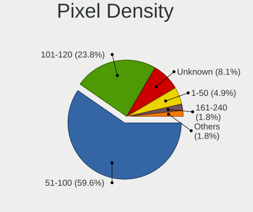

| Density | Desktops | Percent |
|---------|----------|---------|
| 51-100  | 133      | 59.64%  |
| 101-120 | 53       | 23.77%  |
| Unknown | 18       | 8.07%   |
| 1-50    | 11       | 4.93%   |
| 161-240 | 4        | 1.79%   |
| 121-160 | 4        | 1.79%   |

Multiple Monitors
-----------------

Total monitors connected

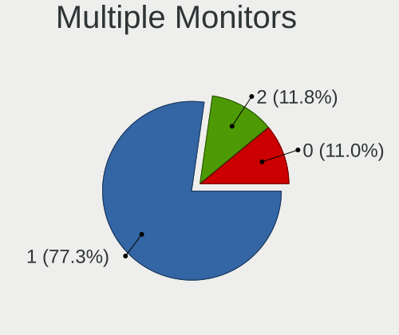

| Total | Desktops | Percent |
|-------|----------|---------|
| 1     | 197      | 77.25%  |
| 2     | 30       | 11.76%  |
| 0     | 28       | 10.98%  |

Network
-------

Net Controller Vendor
---------------------

Controller vendors

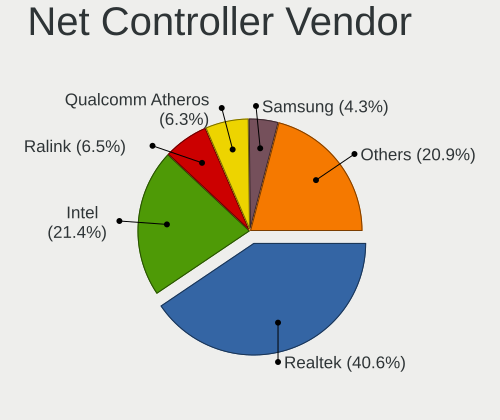

| Vendor                                 | Desktops | Percent |
|----------------------------------------|----------|---------|
| Realtek Semiconductor                  | 161      | 40.55%  |
| Intel                                  | 85       | 21.41%  |
| Ralink Technology                      | 26       | 6.55%   |
| Qualcomm Atheros                       | 25       | 6.3%    |
| Samsung Electronics                    | 17       | 4.28%   |
| D-Link                                 | 17       | 4.28%   |
| TP-Link                                | 10       | 2.52%   |
| Ralink                                 | 8        | 2.02%   |
| VIA Technologies                       | 6        | 1.51%   |
| Xiaomi                                 | 5        | 1.26%   |
| D-Link System                          | 5        | 1.26%   |
| Nvidia                                 | 4        | 1.01%   |
| Broadcom                               | 4        | 1.01%   |
| Qualcomm Atheros Communications        | 3        | 0.76%   |
| Marvell Technology Group               | 3        | 0.76%   |
| MediaTek                               | 2        | 0.5%    |
| Huawei Technologies                    | 2        | 0.5%    |
| Aquantia                               | 2        | 0.5%    |
| ZyDAS                                  | 1        | 0.25%   |
| Tenda                                  | 1        | 0.25%   |
| Sony Ericsson Mobile Communications AB | 1        | 0.25%   |
| Smart Link                             | 1        | 0.25%   |
| Silicon Integrated Systems [SiS]       | 1        | 0.25%   |
| Qualcomm Technologies                  | 1        | 0.25%   |
| OPPO Electronics                       | 1        | 0.25%   |
| ICS Advent                             | 1        | 0.25%   |
| Broadcom Limited                       | 1        | 0.25%   |
| ASUSTek Computer                       | 1        | 0.25%   |
| Apple                                  | 1        | 0.25%   |
| AboCom Systems                         | 1        | 0.25%   |

Net Controller Model
--------------------

Controller models

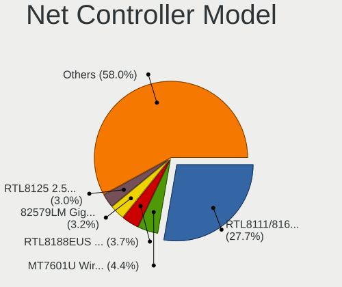

| Model                                                                  | Desktops | Percent |
|------------------------------------------------------------------------|----------|---------|
| Realtek RTL8111/8168/8211/8411 PCI Express Gigabit Ethernet Controller | 120      | 27.71%  |
| Ralink MT7601U Wireless Adapter                                        | 19       | 4.39%   |
| Realtek RTL8188EUS 802.11n Wireless Network Adapter                    | 16       | 3.7%    |
| Intel 82579LM Gigabit Network Connection (Lewisville)                  | 14       | 3.23%   |
| Realtek RTL8125 2.5GbE Controller                                      | 13       | 3%      |
| Samsung Galaxy series, misc. (tethering mode)                          | 9        | 2.08%   |
| Realtek RTL8188FTV 802.11b/g/n 1T1R 2.4G WLAN Adapter                  | 9        | 2.08%   |
| D-Link DWA-123 Wireless N 150 Adapter (rev.D1)                         | 9        | 2.08%   |
| Intel Ethernet Connection (2) I219-V                                   | 8        | 1.85%   |
| Samsung GT-I9070 (network tethering, USB debugging enabled)            | 7        | 1.62%   |
| Ralink RT5370 Wireless Adapter                                         | 6        | 1.39%   |
| Intel Ethernet Controller I225-V                                       | 6        | 1.39%   |
| Intel Ethernet Connection I217-LM                                      | 6        | 1.39%   |
| Intel Ethernet Connection (14) I219-V                                  | 6        | 1.39%   |
| VIA VT6105/VT6106S [Rhine-III]                                         | 5        | 1.15%   |
| TP-Link TL-WN722N v2/v3 [Realtek RTL8188EUS]                           | 5        | 1.15%   |
| Realtek RTL-8100/8101L/8139 PCI Fast Ethernet Adapter                  | 5        | 1.15%   |
| Qualcomm Atheros AR8121/AR8113/AR8114 Gigabit or Fast Ethernet         | 5        | 1.15%   |
| Intel 82567LM-3 Gigabit Network Connection                             | 5        | 1.15%   |
| Realtek RTL810xE PCI Express Fast Ethernet controller                  | 4        | 0.92%   |
| Intel Ethernet Connection I217-V                                       | 4        | 0.92%   |
| Intel Ethernet Connection (7) I219-V                                   | 4        | 0.92%   |
| Intel Ethernet Connection (2) I218-V                                   | 4        | 0.92%   |
| Intel Ethernet Connection (17) I219-V                                  | 4        | 0.92%   |
| Intel Alder Lake-S PCH CNVi WiFi                                       | 4        | 0.92%   |
| Xiaomi Mi/Redmi series (RNDIS + ADB)                                   | 3        | 0.69%   |
| Ralink RT5392 PCIe Wireless Network Adapter                            | 3        | 0.69%   |
| Ralink RT5360 Wireless 802.11n 1T/1R                                   | 3        | 0.69%   |
| Qualcomm Atheros AR9271 802.11n                                        | 3        | 0.69%   |
| Qualcomm Atheros AR9227 Wireless Network Adapter                       | 3        | 0.69%   |
| Qualcomm Atheros AR2417 Wireless Network Adapter [AR5007G 802.11bg]    | 3        | 0.69%   |
| Intel Wi-Fi 6E(802.11ax) AX210/AX1675* 2x2 [Typhoon Peak]              | 3        | 0.69%   |
| Intel I211 Gigabit Network Connection                                  | 3        | 0.69%   |
| Intel I210 Gigabit Network Connection                                  | 3        | 0.69%   |
| Intel Ethernet Connection (2) I219-LM                                  | 3        | 0.69%   |
| D-Link WLAN controller                                                 | 3        | 0.69%   |
| Xiaomi Mi/Redmi series (RNDIS)                                         | 2        | 0.46%   |
| TP-Link TL-WN823N v2/v3 [Realtek RTL8192EU]                            | 2        | 0.46%   |
| Realtek RTL8821CE 802.11ac PCIe Wireless Network Adapter               | 2        | 0.46%   |
| Realtek RTL8192EU 802.11b/g/n WLAN Adapter                             | 2        | 0.46%   |

Wireless Vendor
---------------

Wireless vendors

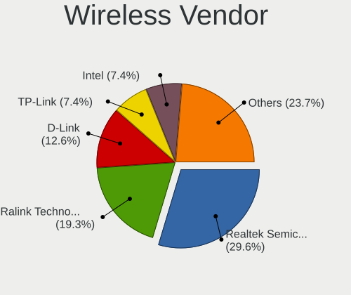

| Vendor                          | Desktops | Percent |
|---------------------------------|----------|---------|
| Realtek Semiconductor           | 40       | 29.63%  |
| Ralink Technology               | 26       | 19.26%  |
| D-Link                          | 17       | 12.59%  |
| TP-Link                         | 10       | 7.41%   |
| Intel                           | 10       | 7.41%   |
| Qualcomm Atheros                | 9        | 6.67%   |
| Ralink                          | 8        | 5.93%   |
| Qualcomm Atheros Communications | 3        | 2.22%   |
| D-Link System                   | 3        | 2.22%   |
| MediaTek                        | 2        | 1.48%   |
| Broadcom                        | 2        | 1.48%   |
| ZyDAS                           | 1        | 0.74%   |
| Tenda                           | 1        | 0.74%   |
| Samsung Electronics             | 1        | 0.74%   |
| Broadcom Limited                | 1        | 0.74%   |
| AboCom Systems                  | 1        | 0.74%   |

Wireless Model
--------------

Wireless models

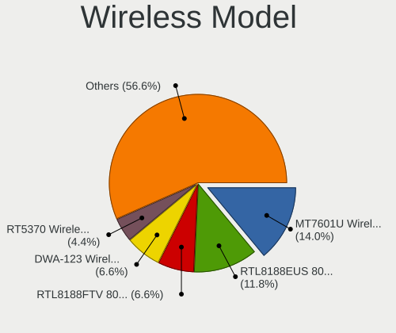

| Model                                                                | Desktops | Percent |
|----------------------------------------------------------------------|----------|---------|
| Ralink MT7601U Wireless Adapter                                      | 19       | 13.97%  |
| Realtek RTL8188EUS 802.11n Wireless Network Adapter                  | 16       | 11.76%  |
| Realtek RTL8188FTV 802.11b/g/n 1T1R 2.4G WLAN Adapter                | 9        | 6.62%   |
| D-Link DWA-123 Wireless N 150 Adapter (rev.D1)                       | 9        | 6.62%   |
| Ralink RT5370 Wireless Adapter                                       | 6        | 4.41%   |
| TP-Link TL-WN722N v2/v3 [Realtek RTL8188EUS]                         | 5        | 3.68%   |
| Intel Alder Lake-S PCH CNVi WiFi                                     | 4        | 2.94%   |
| Ralink RT5392 PCIe Wireless Network Adapter                          | 3        | 2.21%   |
| Ralink RT5360 Wireless 802.11n 1T/1R                                 | 3        | 2.21%   |
| Qualcomm Atheros AR9271 802.11n                                      | 3        | 2.21%   |
| Qualcomm Atheros AR9227 Wireless Network Adapter                     | 3        | 2.21%   |
| Qualcomm Atheros AR2417 Wireless Network Adapter [AR5007G 802.11bg]  | 3        | 2.21%   |
| Intel Wi-Fi 6E(802.11ax) AX210/AX1675* 2x2 [Typhoon Peak]            | 3        | 2.21%   |
| D-Link WLAN controller                                               | 3        | 2.21%   |
| TP-Link TL-WN823N v2/v3 [Realtek RTL8192EU]                          | 2        | 1.47%   |
| Realtek RTL8821CE 802.11ac PCIe Wireless Network Adapter             | 2        | 1.47%   |
| Realtek RTL8192EU 802.11b/g/n WLAN Adapter                           | 2        | 1.47%   |
| Realtek RTL8192EE PCIe Wireless Network Adapter                      | 2        | 1.47%   |
| MediaTek MT7921 802.11ax PCIe Wireless Network Adapter [Filogic 330] | 2        | 1.47%   |
| D-Link System DWA-125 Wireless N 150 Adapter(rev.A1) [Ralink RT3070] | 2        | 1.47%   |
| ZyDAS ZD1211B 802.11g                                                | 1        | 0.74%   |
| TP-Link TL-WN822N Version 4 RTL8192EU                                | 1        | 0.74%   |
| TP-Link TL-WN821N v5/v6 [RTL8192EU]                                  | 1        | 0.74%   |
| TP-Link 802.11n NIC                                                  | 1        | 0.74%   |
| Tenda U12                                                            | 1        | 0.74%   |
| Samsung Android                                                      | 1        | 0.74%   |
| Realtek RTL8852CE PCIe 802.11ax Wireless Network Controller          | 1        | 0.74%   |
| Realtek RTL8851BE PCIe 802.11ax Wireless Network Controller          | 1        | 0.74%   |
| Realtek RTL8192SU 802.11n WLAN Adapter                               | 1        | 0.74%   |
| Realtek RTL8192CE PCIe Wireless Network Adapter                      | 1        | 0.74%   |
| Realtek RTL8188EE Wireless Network Adapter                           | 1        | 0.74%   |
| Realtek RTL8188CUS 802.11n WLAN Adapter                              | 1        | 0.74%   |
| Realtek RTL-8185 IEEE 802.11a/b/g Wireless LAN Controller            | 1        | 0.74%   |
| Realtek 802.11n WLAN Adapter                                         | 1        | 0.74%   |
| Realtek 802.11ac NIC                                                 | 1        | 0.74%   |
| Ralink RT2070 Wireless Adapter                                       | 1        | 0.74%   |
| Ralink RT3060 Wireless 802.11n 1T/1R                                 | 1        | 0.74%   |
| Ralink RT2561/RT61 802.11g PCI                                       | 1        | 0.74%   |
| Qualcomm Atheros AR9462 Wireless Network Adapter                     | 1        | 0.74%   |
| Qualcomm Atheros AR93xx Wireless Network Adapter                     | 1        | 0.74%   |

Ethernet Vendor
---------------

Ethernet vendors

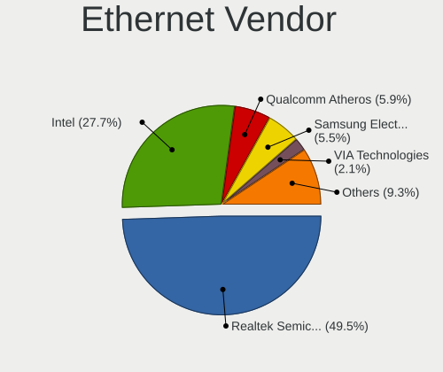

| Vendor                                 | Desktops | Percent |
|----------------------------------------|----------|---------|
| Realtek Semiconductor                  | 143      | 49.48%  |
| Intel                                  | 80       | 27.68%  |
| Qualcomm Atheros                       | 17       | 5.88%   |
| Samsung Electronics                    | 16       | 5.54%   |
| VIA Technologies                       | 6        | 2.08%   |
| Xiaomi                                 | 5        | 1.73%   |
| Nvidia                                 | 4        | 1.38%   |
| Marvell Technology Group               | 3        | 1.04%   |
| Huawei Technologies                    | 2        | 0.69%   |
| D-Link System                          | 2        | 0.69%   |
| Broadcom                               | 2        | 0.69%   |
| Aquantia                               | 2        | 0.69%   |
| Sony Ericsson Mobile Communications AB | 1        | 0.35%   |
| Silicon Integrated Systems [SiS]       | 1        | 0.35%   |
| Qualcomm Technologies                  | 1        | 0.35%   |
| OPPO Electronics                       | 1        | 0.35%   |
| ICS Advent                             | 1        | 0.35%   |
| ASUSTek Computer                       | 1        | 0.35%   |
| Apple                                  | 1        | 0.35%   |

Ethernet Model
--------------

Ethernet models

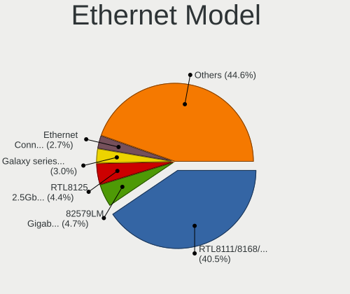

| Model                                                                  | Desktops | Percent |
|------------------------------------------------------------------------|----------|---------|
| Realtek RTL8111/8168/8211/8411 PCI Express Gigabit Ethernet Controller | 120      | 40.54%  |
| Intel 82579LM Gigabit Network Connection (Lewisville)                  | 14       | 4.73%   |
| Realtek RTL8125 2.5GbE Controller                                      | 13       | 4.39%   |
| Samsung Galaxy series, misc. (tethering mode)                          | 9        | 3.04%   |
| Intel Ethernet Connection (2) I219-V                                   | 8        | 2.7%    |
| Samsung GT-I9070 (network tethering, USB debugging enabled)            | 7        | 2.36%   |
| Intel Ethernet Controller I225-V                                       | 6        | 2.03%   |
| Intel Ethernet Connection I217-LM                                      | 6        | 2.03%   |
| Intel Ethernet Connection (14) I219-V                                  | 6        | 2.03%   |
| VIA VT6105/VT6106S [Rhine-III]                                         | 5        | 1.69%   |
| Realtek RTL-8100/8101L/8139 PCI Fast Ethernet Adapter                  | 5        | 1.69%   |
| Qualcomm Atheros AR8121/AR8113/AR8114 Gigabit or Fast Ethernet         | 5        | 1.69%   |
| Intel 82567LM-3 Gigabit Network Connection                             | 5        | 1.69%   |
| Realtek RTL810xE PCI Express Fast Ethernet controller                  | 4        | 1.35%   |
| Intel Ethernet Connection I217-V                                       | 4        | 1.35%   |
| Intel Ethernet Connection (7) I219-V                                   | 4        | 1.35%   |
| Intel Ethernet Connection (2) I218-V                                   | 4        | 1.35%   |
| Intel Ethernet Connection (17) I219-V                                  | 4        | 1.35%   |
| Xiaomi Mi/Redmi series (RNDIS + ADB)                                   | 3        | 1.01%   |
| Intel I211 Gigabit Network Connection                                  | 3        | 1.01%   |
| Intel I210 Gigabit Network Connection                                  | 3        | 1.01%   |
| Intel Ethernet Connection (2) I219-LM                                  | 3        | 1.01%   |
| Xiaomi Mi/Redmi series (RNDIS)                                         | 2        | 0.68%   |
| Realtek RTL8169 PCI Gigabit Ethernet Controller                        | 2        | 0.68%   |
| Qualcomm Atheros QCA8171 Gigabit Ethernet                              | 2        | 0.68%   |
| Qualcomm Atheros Killer E2500 Gigabit Ethernet Controller              | 2        | 0.68%   |
| Qualcomm Atheros Killer E220x Gigabit Ethernet Controller              | 2        | 0.68%   |
| Qualcomm Atheros AR8151 v1.0 Gigabit Ethernet                          | 2        | 0.68%   |
| Qualcomm Atheros AR8131 Gigabit Ethernet                               | 2        | 0.68%   |
| Marvell Group 88E8056 PCI-E Gigabit Ethernet Controller                | 2        | 0.68%   |
| Intel Ethernet Controller I226-V                                       | 2        | 0.68%   |
| Intel Ethernet Connection (7) I219-LM                                  | 2        | 0.68%   |
| Intel Ethernet Connection (11) I219-V                                  | 2        | 0.68%   |
| D-Link System DGE-528T Gigabit Ethernet Adapter                        | 2        | 0.68%   |
| Broadcom NetXtreme BCM5762 Gigabit Ethernet PCIe                       | 2        | 0.68%   |
| VIA VT6102/VT6103 [Rhine-II]                                           | 1        | 0.34%   |
| Sony Ericsson Mobile AB Xperia Z1                                      | 1        | 0.34%   |
| Silicon Integrated Systems [SiS] SiS900 PCI Fast Ethernet              | 1        | 0.34%   |
| Realtek RTL8153 Gigabit Ethernet Adapter                               | 1        | 0.34%   |
| Realtek RTL8152 Fast Ethernet Adapter                                  | 1        | 0.34%   |

Net Controller Kind
-------------------

Ethernet, WiFi or modem

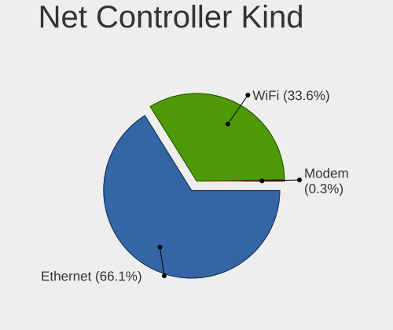

| Kind     | Desktops | Percent |
|----------|----------|---------|
| Ethernet | 248      | 66.13%  |
| WiFi     | 126      | 33.6%   |
| Modem    | 1        | 0.27%   |

Used Controller
---------------

Currently used network controller

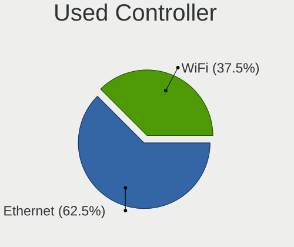

| Kind     | Desktops | Percent |
|----------|----------|---------|
| Ethernet | 155      | 62.5%   |
| WiFi     | 93       | 37.5%   |

NICs
----

Total network controllers on board

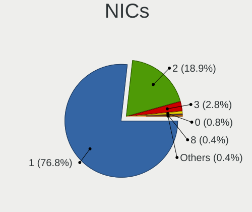

| Total | Desktops | Percent |
|-------|----------|---------|
| 1     | 195      | 76.77%  |
| 2     | 48       | 18.9%   |
| 3     | 7        | 2.76%   |
| 0     | 2        | 0.79%   |
| 8     | 1        | 0.39%   |
| 4     | 1        | 0.39%   |

IPv6
----

IPv6 vs IPv4

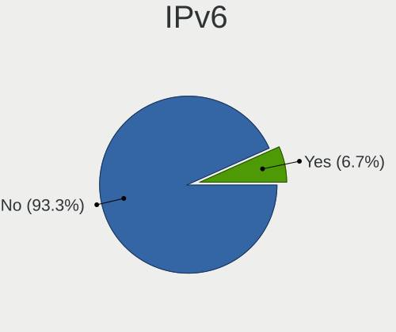

| Used | Desktops | Percent |
|------|----------|---------|
| No   | 237      | 93.31%  |
| Yes  | 17       | 6.69%   |

Bluetooth
---------

Bluetooth Vendor
----------------

Controller vendors

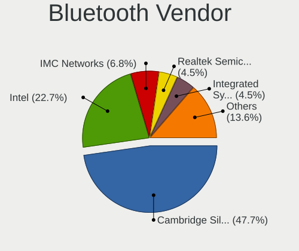

| Vendor                     | Desktops | Percent |
|----------------------------|----------|---------|
| Cambridge Silicon Radio    | 21       | 47.73%  |
| Intel                      | 10       | 22.73%  |
| IMC Networks               | 3        | 6.82%   |
| Realtek Semiconductor      | 2        | 4.55%   |
| Integrated System Solution | 2        | 4.55%   |
| ASUSTek Computer           | 2        | 4.55%   |
| SiW                        | 1        | 2.27%   |
| Foxconn / Hon Hai          | 1        | 2.27%   |
| Broadcom                   | 1        | 2.27%   |
| Unknown                    | 1        | 2.27%   |

Bluetooth Model
---------------

Controller models

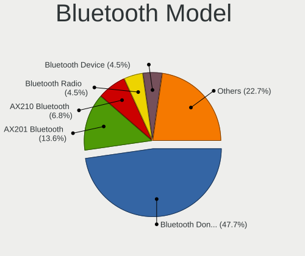

| Model                                               | Desktops | Percent |
|-----------------------------------------------------|----------|---------|
| Cambridge Silicon Radio Bluetooth Dongle (HCI mode) | 21       | 47.73%  |
| Intel AX201 Bluetooth                               | 6        | 13.64%  |
| Intel AX210 Bluetooth                               | 3        | 6.82%   |
| Realtek Bluetooth Radio                             | 2        | 4.55%   |
| Integrated System Solution Bluetooth Device         | 2        | 4.55%   |
| IMC Networks Wireless_Device                        | 2        | 4.55%   |
| ASUS Bluetooth Radio                                | 2        | 4.55%   |
| SiW SiW                                             | 1        | 2.27%   |
| Intel AX200 Bluetooth                               | 1        | 2.27%   |
| IMC Networks Bluetooth Radio                        | 1        | 2.27%   |
| Foxconn / Hon Hai Bluetooth Device                  | 1        | 2.27%   |
| Broadcom BCM20702A0 Bluetooth 4.0                   | 1        | 2.27%   |
| Unknown                                             | 1        | 2.27%   |

Sound
-----

Sound Vendor
------------

Sound card vendors

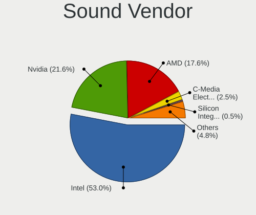

| Vendor                           | Desktops | Percent |
|----------------------------------|----------|---------|
| Intel                            | 211      | 53.02%  |
| Nvidia                           | 86       | 21.61%  |
| AMD                              | 70       | 17.59%  |
| C-Media Electronics              | 10       | 2.51%   |
| Silicon Integrated Systems [SiS] | 2        | 0.5%    |
| Jieli Technology                 | 2        | 0.5%    |
| Generalplus Technology           | 2        | 0.5%    |
| Focusrite-Novation               | 2        | 0.5%    |
| Creative Labs                    | 2        | 0.5%    |
| ASUSTek Computer                 | 2        | 0.5%    |
| VIA Technologies                 | 1        | 0.25%   |
| ULi Electronics                  | 1        | 0.25%   |
| TEAC                             | 1        | 0.25%   |
| Shenzhen Rapoo Technology        | 1        | 0.25%   |
| Native Instruments               | 1        | 0.25%   |
| Micro Star International         | 1        | 0.25%   |
| Medeli Electronics               | 1        | 0.25%   |
| ESS Technology                   | 1        | 0.25%   |
| Audio-Technica                   | 1        | 0.25%   |

Sound Model
-----------

Sound card models

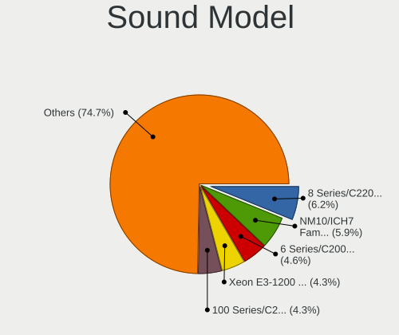

| Model                                                                             | Desktops | Percent |
|-----------------------------------------------------------------------------------|----------|---------|
| Intel 8 Series/C220 Series Chipset High Definition Audio Controller               | 27       | 6.15%   |
| Intel NM10/ICH7 Family High Definition Audio Controller                           | 26       | 5.92%   |
| Intel 6 Series/C200 Series Chipset Family High Definition Audio Controller        | 20       | 4.56%   |
| Intel Xeon E3-1200 v3/4th Gen Core Processor HD Audio Controller                  | 19       | 4.33%   |
| Intel 100 Series/C230 Series Chipset Family HD Audio Controller                   | 19       | 4.33%   |
| Intel 7 Series/C216 Chipset Family High Definition Audio Controller               | 18       | 4.1%    |
| Intel Alder Lake-S HD Audio Controller                                            | 17       | 3.87%   |
| AMD Cedar HDMI Audio [Radeon HD 5400/6300/7300 Series]                            | 17       | 3.87%   |
| Intel Cannon Lake PCH cAVS                                                        | 15       | 3.42%   |
| Intel 200 Series PCH HD Audio                                                     | 13       | 2.96%   |
| AMD Ellesmere HDMI Audio [Radeon RX 470/480 / 570/580/590]                        | 13       | 2.96%   |
| Nvidia High Definition Audio Controller                                           | 12       | 2.73%   |
| Nvidia GF108 High Definition Audio Controller                                     | 10       | 2.28%   |
| AMD SBx00 Azalia (Intel HDA)                                                      | 10       | 2.28%   |
| Intel 9 Series Chipset Family HD Audio Controller                                 | 8        | 1.82%   |
| Nvidia GP107GL High Definition Audio Controller                                   | 7        | 1.59%   |
| Nvidia GK208 HDMI/DP Audio Controller                                             | 7        | 1.59%   |
| Nvidia GF119 HDMI Audio Controller                                                | 7        | 1.59%   |
| Intel Smart Sound Technology (SST) Audio Controller                               | 7        | 1.59%   |
| Intel Raptor Lake High Definition Audio Controller                                | 6        | 1.37%   |
| Nvidia TU116 High Definition Audio Controller                                     | 5        | 1.14%   |
| Intel C610/X99 series chipset HD Audio Controller                                 | 5        | 1.14%   |
| Intel 82801JD/DO (ICH10 Family) HD Audio Controller                               | 5        | 1.14%   |
| C-Media Electronics CMI8738/CMI8768 PCI Audio                                     | 5        | 1.14%   |
| AMD Ryzen HD Audio Controller                                                     | 5        | 1.14%   |
| AMD Oland/Hainan/Cape Verde/Pitcairn HDMI Audio [Radeon HD 7000 Series]           | 5        | 1.14%   |
| AMD Family 17h (Models 00h-0fh) HD Audio Controller                               | 5        | 1.14%   |
| Intel Tiger Lake-H HD Audio Controller                                            | 4        | 0.91%   |
| Intel 5 Series/3400 Series Chipset High Definition Audio                          | 4        | 0.91%   |
| AMD Starship/Matisse HD Audio Controller                                          | 4        | 0.91%   |
| AMD Navi 21/23 HDMI/DP Audio Controller                                           | 4        | 0.91%   |
| AMD Caicos HDMI Audio [Radeon HD 6450 / 7450/8450/8490 OEM / R5 230/235/235X OEM] | 4        | 0.91%   |
| Nvidia GP108 High Definition Audio Controller                                     | 3        | 0.68%   |
| Nvidia GP104 High Definition Audio Controller                                     | 3        | 0.68%   |
| Nvidia GM206 High Definition Audio Controller                                     | 3        | 0.68%   |
| Nvidia GM107 High Definition Audio Controller [GeForce 940MX]                     | 3        | 0.68%   |
| Intel Comet Lake PCH-V cAVS                                                       | 3        | 0.68%   |
| Intel Comet Lake PCH cAVS                                                         | 3        | 0.68%   |
| Intel 82801JI (ICH10 Family) HD Audio Controller                                  | 3        | 0.68%   |
| Nvidia TU106 High Definition Audio Controller                                     | 2        | 0.46%   |

Memory
------

Memory Vendor
-------------

Memory module vendors

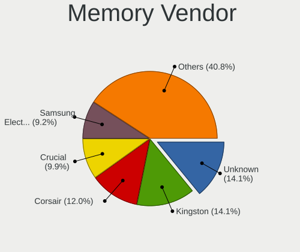

| Vendor                       | Desktops | Percent |
|------------------------------|----------|---------|
| Unknown                      | 20       | 14.08%  |
| Kingston                     | 20       | 14.08%  |
| Corsair                      | 17       | 11.97%  |
| Crucial                      | 14       | 9.86%   |
| Samsung Electronics          | 13       | 9.15%   |
| SK hynix                     | 9        | 6.34%   |
| G.Skill                      | 9        | 6.34%   |
| Micron Technology            | 7        | 4.93%   |
| GeIL                         | 7        | 4.93%   |
| Apacer                       | 7        | 4.93%   |
| Kingmax                      | 4        | 2.82%   |
| Ramos Technology             | 2        | 1.41%   |
| A-DATA Technology            | 2        | 1.41%   |
| Unknown                      | 2        | 1.41%   |
| Unknown (8A02)               | 1        | 0.7%    |
| TwinMOS                      | 1        | 0.7%    |
| SpecTek                      | 1        | 0.7%    |
| Silicon Power                | 1        | 0.7%    |
| PDPSystems                   | 1        | 0.7%    |
| Patriot Memory (PDP Systems) | 1        | 0.7%    |
| Nanya Technology             | 1        | 0.7%    |
| Golden Empire                | 1        | 0.7%    |
| Elpida                       | 1        | 0.7%    |

Memory Model
------------

Memory module models

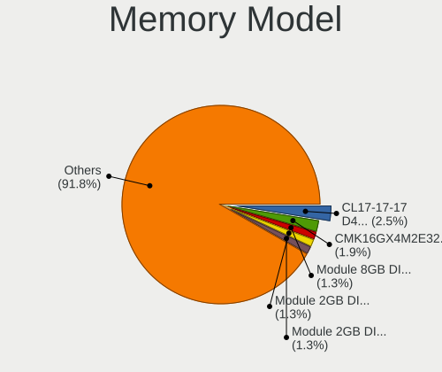

| Model                                                                  | Desktops | Percent |
|------------------------------------------------------------------------|----------|---------|
| GeIL RAM CL17-17-17 D4-2400 8GB DIMM DDR4 2400MT/s                     | 4        | 2.53%   |
| Corsair RAM CMK16GX4M2E3200C16 8GB DIMM DDR4 3466MT/s                  | 3        | 1.9%    |
| Unknown RAM Module 8GB DIMM DDR3 1333MT/s                              | 2        | 1.27%   |
| Unknown RAM Module 2GB DIMM 800MT/s                                    | 2        | 1.27%   |
| Unknown RAM Module 2GB DIMM 1333MT/s                                   | 2        | 1.27%   |
| Unknown RAM CL17-17-17 D4-2400 16384MB DIMM DDR4 2400MT/s              | 2        | 1.27%   |
| SK hynix RAM HMT41GU6BFR8C-PB 8GB DIMM DDR3 1600MT/s                   | 2        | 1.27%   |
| Samsung RAM M378B5773SB0-CK0 2GB DIMM DDR3 1600MT/s                    | 2        | 1.27%   |
| Samsung RAM M378B5173DB0-CK0 4096MB DIMM DDR3 1600MT/s                 | 2        | 1.27%   |
| Ramos RAM EWB4GB681PAE-16IC 4GB DIMM DDR3 1600MT/s                     | 2        | 1.27%   |
| Micron RAM 8JTF51264AZ-1G6E1 4GB DIMM DDR3 1600MT/s                    | 2        | 1.27%   |
| GeIL RAM CL11-11-11 D3-1600 4GB DIMM 1866MT/s                          | 2        | 1.27%   |
| G.Skill RAM F4-3000C15-8GVRB 8GB DIMM DDR4 3000MT/s                    | 2        | 1.27%   |
| Crucial RAM CB8GU2666.C8RT 8GB DIMM DDR4 2667MT/s                      | 2        | 1.27%   |
| Crucial RAM CB16GU2666.C8FT 16GB DIMM DDR4 2667MT/s                    | 2        | 1.27%   |
| Corsair RAM CMX8GX3M1A1600C11 8GB DIMM DDR3 1600MT/s                   | 2        | 1.27%   |
| Corsair RAM CMK16GX4M2D3600C18 8GB DIMM DDR4 4000MT/s                  | 2        | 1.27%   |
| Unknown                                                                | 2        | 1.27%   |
| Unknown RAM Module 4GB DIMM SDRAM 1066MT/s                             | 1        | 0.63%   |
| Unknown RAM Module 4GB DIMM                                            | 1        | 0.63%   |
| Unknown RAM Module 4096MB DIMM DDR3 1333MT/s                           | 1        | 0.63%   |
| Unknown RAM Module 4096MB DIMM 1333MT/s                                | 1        | 0.63%   |
| Unknown RAM Module 2GB DIMM SDRAM                                      | 1        | 0.63%   |
| Unknown RAM Module 2GB DIMM DDR2 800MT/s                               | 1        | 0.63%   |
| Unknown RAM Module 2GB DIMM DDR 800MT/s                                | 1        | 0.63%   |
| Unknown RAM Module 2GB DIMM 400MT/s                                    | 1        | 0.63%   |
| Unknown RAM Module 2GB DIMM                                            | 1        | 0.63%   |
| Unknown RAM Module 2048MB DIMM DDR3 1600MT/s                           | 1        | 0.63%   |
| Unknown RAM Module 2048MB DIMM DDR2 800MT/s                            | 1        | 0.63%   |
| Unknown RAM Module 2048MB DIMM 800MT/s                                 | 1        | 0.63%   |
| Unknown RAM Module 2048MB DIMM 1328MT/s                                | 1        | 0.63%   |
| Unknown RAM Module 16GB DIMM DDR4 2133MT/s                             | 1        | 0.63%   |
| Unknown RAM Module 1024MB DIMM DDR2 800MT/s                            | 1        | 0.63%   |
| Unknown (8A02) RAM DDR3 1333 8G 8GB DIMM DDR3 1333MT/s                 | 1        | 0.63%   |
| TwinMOS RAM 9DSTBNZE-SATP 4GB DIMM DDR3 1333MT/s                       | 1        | 0.63%   |
| SpecTek RAM FFFFFFFFFFFFFFFFFFFFFFFFFFFFFFFFFFFF 2GB DIMM DDR2 667MT/s | 1        | 0.63%   |
| SK hynix RAM Module 8GB SODIMM DDR4 2400MT/s                           | 1        | 0.63%   |
| SK hynix RAM HMT451U6AFR8C-PB 4GB DIMM DDR3 1600MT/s                   | 1        | 0.63%   |
| SK hynix RAM HMT325U6EFR8C-PB 2GB DIMM DDR3 1600MT/s                   | 1        | 0.63%   |
| SK hynix RAM HMT325U6CFR8C-PB 2GB DIMM DDR3 1600MT/s                   | 1        | 0.63%   |

Memory Kind
-----------

Memory module kinds

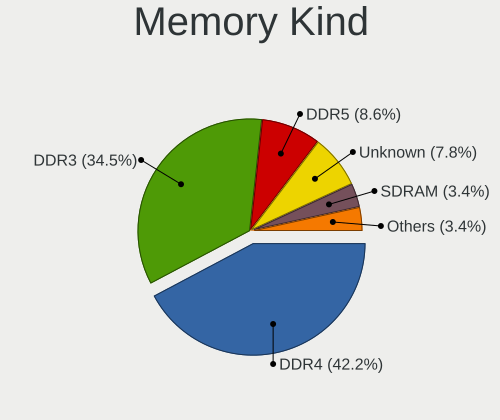

| Kind    | Desktops | Percent |
|---------|----------|---------|
| DDR4    | 49       | 42.24%  |
| DDR3    | 40       | 34.48%  |
| DDR5    | 10       | 8.62%   |
| Unknown | 9        | 7.76%   |
| SDRAM   | 4        | 3.45%   |
| DDR2    | 3        | 2.59%   |
| DDR     | 1        | 0.86%   |

Memory Form Factor
------------------

Physical design of the memory module

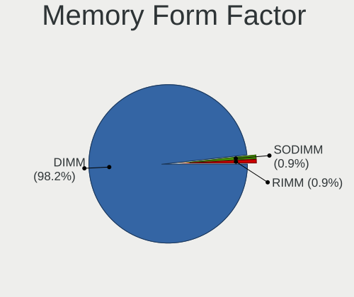

| Name   | Desktops | Percent |
|--------|----------|---------|
| DIMM   | 112      | 98.25%  |
| SODIMM | 1        | 0.88%   |
| RIMM   | 1        | 0.88%   |

Memory Size
-----------

Memory module size

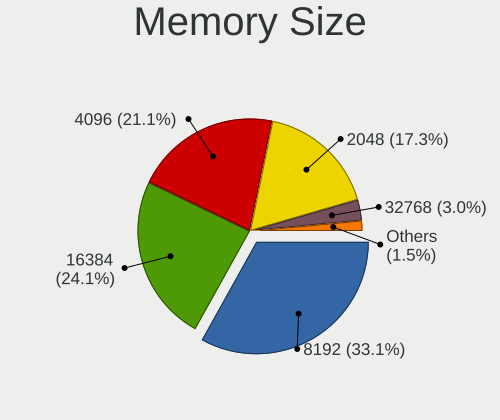

| Size  | Desktops | Percent |
|-------|----------|---------|
| 8192  | 44       | 33.08%  |
| 16384 | 32       | 24.06%  |
| 4096  | 28       | 21.05%  |
| 2048  | 23       | 17.29%  |
| 32768 | 4        | 3.01%   |
| 1024  | 2        | 1.5%    |

Memory Speed
------------

Memory module speed

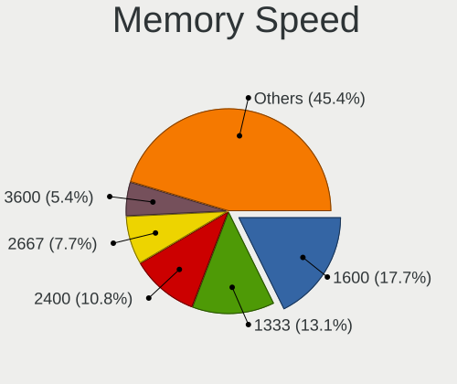

| Speed   | Desktops | Percent |
|---------|----------|---------|
| 1600    | 23       | 17.69%  |
| 1333    | 17       | 13.08%  |
| 2400    | 14       | 10.77%  |
| 2667    | 10       | 7.69%   |
| 3600    | 7        | 5.38%   |
| 3200    | 7        | 5.38%   |
| 2133    | 6        | 4.62%   |
| 800     | 6        | 4.62%   |
| 4800    | 5        | 3.85%   |
| 3466    | 3        | 2.31%   |
| 1866    | 3        | 2.31%   |
| 6000    | 2        | 1.54%   |
| 5600    | 2        | 1.54%   |
| 4000    | 2        | 1.54%   |
| 3400    | 2        | 1.54%   |
| 3000    | 2        | 1.54%   |
| 2800    | 2        | 1.54%   |
| 2666    | 2        | 1.54%   |
| 1066    | 2        | 1.54%   |
| Unknown | 2        | 1.54%   |
| 5000    | 1        | 0.77%   |
| 3733    | 1        | 0.77%   |
| 3500    | 1        | 0.77%   |
| 3066    | 1        | 0.77%   |
| 1867    | 1        | 0.77%   |
| 1800    | 1        | 0.77%   |
| 1400    | 1        | 0.77%   |
| 1328    | 1        | 0.77%   |
| 667     | 1        | 0.77%   |
| 533     | 1        | 0.77%   |
| 400     | 1        | 0.77%   |

Printers & scanners
-------------------

Printer Vendor
--------------

Printer device vendors

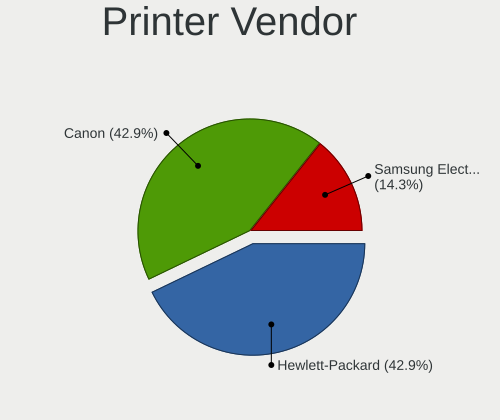

| Vendor              | Desktops | Percent |
|---------------------|----------|---------|
| Hewlett-Packard     | 3        | 42.86%  |
| Canon               | 3        | 42.86%  |
| Samsung Electronics | 1        | 14.29%  |

Printer Model
-------------

Printer device models

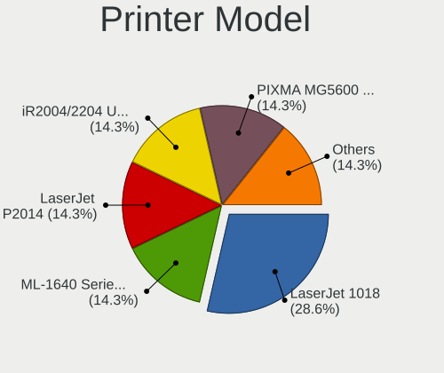

| Model                                | Desktops | Percent |
|--------------------------------------|----------|---------|
| HP LaserJet 1018                     | 2        | 28.57%  |
| Samsung ML-1640 Series Laser Printer | 1        | 14.29%  |
| HP LaserJet P2014                    | 1        | 14.29%  |
| Canon PIXMA MG5600 Series            | 1        | 14.29%  |
| Canon LBP6300                        | 1        | 14.29%  |
| Canon iR2004/2204 UFRII LT           | 1        | 14.29%  |

Scanner Vendor
--------------

Scanner device vendors

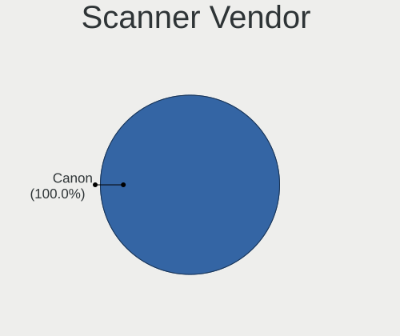

| Vendor | Desktops | Percent |
|--------|----------|---------|
| Canon  | 1        | 100%    |

Scanner Model
-------------

Scanner device models

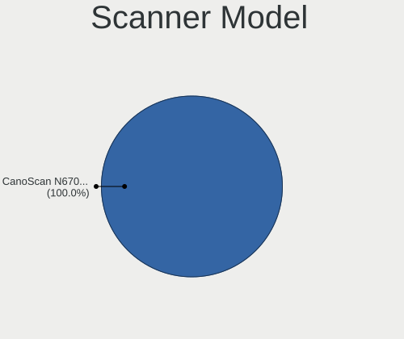

| Model                              | Desktops | Percent |
|------------------------------------|----------|---------|
| Canon CanoScan N670U/N676U/LiDE 20 | 1        | 100%    |

Camera
------

Camera Vendor
-------------

Camera device vendors

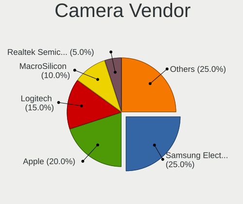

| Vendor                      | Desktops | Percent |
|-----------------------------|----------|---------|
| Samsung Electronics         | 5        | 25%     |
| Apple                       | 4        | 20%     |
| Logitech                    | 3        | 15%     |
| MacroSilicon                | 2        | 10%     |
| Realtek Semiconductor       | 1        | 5%      |
| Pixart Imaging              | 1        | 5%      |
| Microdia                    | 1        | 5%      |
| KYE Systems (Mouse Systems) | 1        | 5%      |
| Generalplus Technology      | 1        | 5%      |
| Chicony Electronics         | 1        | 5%      |

Camera Model
------------

Camera device models

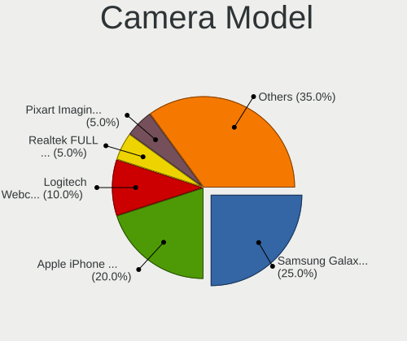

| Model                                         | Desktops | Percent |
|-----------------------------------------------|----------|---------|
| Samsung Galaxy series, misc. (MTP mode)       | 5        | 25%     |
| Apple iPhone 5/5C/5S/6/SE/7/8/X               | 4        | 20%     |
| Logitech Webcam C310                          | 2        | 10%     |
| Realtek FULL HD 1080P Webcam                  | 1        | 5%      |
| Pixart Imaging Multimedia audio controller    | 1        | 5%      |
| Microdia USB 2.0 Camera                       | 1        | 5%      |
| MacroSilicon USB Video                        | 1        | 5%      |
| MacroSilicon MS210x Video Grabber [EasierCAP] | 1        | 5%      |
| Logitech Webcam C270                          | 1        | 5%      |
| KYE Systems (Mouse Systems) FaceCam 311       | 1        | 5%      |
| Generalplus GENERAL WEBCAM                    | 1        | 5%      |
| Chicony HP 720p HD Monitor Webcam             | 1        | 5%      |

Security
--------

Fingerprint Vendor
------------------

Fingerprint sensor vendors

| Vendor  | Desktops | Percent |
|---------|----------|---------|
| Suprema | 1        | 100%    |

Fingerprint Model
-----------------

Fingerprint sensor models

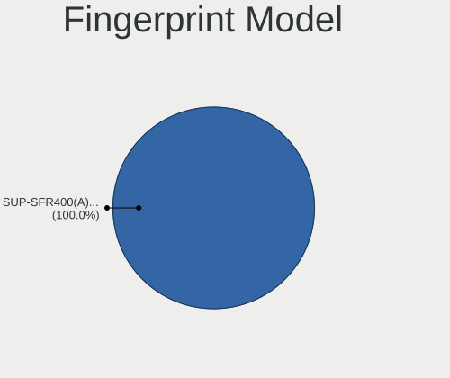

| Model                                            | Desktops | Percent |
|--------------------------------------------------|----------|---------|
| Suprema SUP-SFR400(A) BioMini Fingerprint Reader | 1        | 100%    |

Chipcard Vendor
---------------

Chipcard module vendors

Zero info for selected period =(

Chipcard Model
--------------

Chipcard module models

Zero info for selected period =(

Unsupported
-----------

Unsupported Devices
-------------------

Total unsupported devices on board

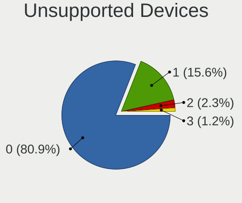

| Total | Desktops | Percent |
|-------|----------|---------|
| 0     | 208      | 80.93%  |
| 1     | 40       | 15.56%  |
| 2     | 6        | 2.33%   |
| 3     | 3        | 1.17%   |

Unsupported Device Types
------------------------

Types of unsupported devices

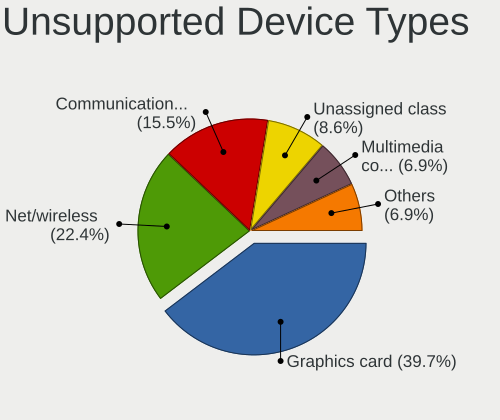

| Type                     | Desktops | Percent |
|--------------------------|----------|---------|
| Graphics card            | 23       | 39.66%  |
| Net/wireless             | 13       | 22.41%  |
| Communication controller | 9        | 15.52%  |
| Unassigned class         | 5        | 8.62%   |
| Multimedia controller    | 4        | 6.9%    |
| Storage/raid             | 1        | 1.72%   |
| Sound                    | 1        | 1.72%   |
| Fingerprint reader       | 1        | 1.72%   |
| Camera                   | 1        | 1.72%   |

