Linux in Ireland - Tested Hardware & Statistics (Desktops)
----------------------------------------------------------

A project to collect tested hardware configurations for Linux in Ireland.

Anyone can contribute to this report by the [hw-probe](https://github.com/linuxhw/hw-probe) tool:

    sudo -E hw-probe -all -upload

Please contribute! Especially if your hardware is rare.

Contents
--------

* [ Test Cases ](#test-cases)

* [ System ](#system)
  - [ OS                       ](#os)
  - [ OS Family                ](#os-family)
  - [ Kernel                   ](#kernel)
  - [ Kernel Family            ](#kernel-family)
  - [ Kernel Major Ver.        ](#kernel-major-ver)
  - [ Arch                     ](#arch)
  - [ DE                       ](#de)
  - [ Display Server           ](#display-server)
  - [ Display Manager          ](#display-manager)
  - [ OS Lang                  ](#os-lang)
  - [ Boot Mode                ](#boot-mode)
  - [ Filesystem               ](#filesystem)
  - [ Part. scheme             ](#part-scheme)
  - [ Dual Boot with Linux/BSD ](#dual-boot-with-linuxbsd)
  - [ Dual Boot (Win)          ](#dual-boot-win)

* [ Board ](#board)
  - [ Vendor                   ](#vendor)
  - [ Model                    ](#model)
  - [ Model Family             ](#model-family)
  - [ MFG Year                 ](#mfg-year)
  - [ Form Factor              ](#form-factor)
  - [ Secure Boot              ](#secure-boot)
  - [ Coreboot                 ](#coreboot)
  - [ RAM Size                 ](#ram-size)
  - [ RAM Used                 ](#ram-used)
  - [ Total Drives             ](#total-drives)
  - [ Has CD-ROM               ](#has-cd-rom)
  - [ Has Ethernet             ](#has-ethernet)
  - [ Has WiFi                 ](#has-wifi)
  - [ Has Bluetooth            ](#has-bluetooth)

* [ Location ](#location)
  - [ Country                  ](#country)
  - [ City                     ](#city)

* [ Drives ](#drives)
  - [ Drive Vendor             ](#drive-vendor)
  - [ Drive Model              ](#drive-model)
  - [ HDD Vendor               ](#hdd-vendor)
  - [ SSD Vendor               ](#ssd-vendor)
  - [ Drive Kind               ](#drive-kind)
  - [ Drive Connector          ](#drive-connector)
  - [ Drive Size               ](#drive-size)
  - [ Space Total              ](#space-total)
  - [ Space Used               ](#space-used)
  - [ Malfunc. Drives          ](#malfunc-drives)
  - [ Malfunc. Drive Vendor    ](#malfunc-drive-vendor)
  - [ Malfunc. HDD Vendor      ](#malfunc-hdd-vendor)
  - [ Malfunc. Drive Kind      ](#malfunc-drive-kind)
  - [ Failed Drives            ](#failed-drives)
  - [ Failed Drive Vendor      ](#failed-drive-vendor)
  - [ Drive Status             ](#drive-status)

* [ Storage controller ](#storage-controller)
  - [ Storage Vendor           ](#storage-vendor)
  - [ Storage Model            ](#storage-model)
  - [ Storage Kind             ](#storage-kind)

* [ Processor ](#processor)
  - [ CPU Vendor               ](#cpu-vendor)
  - [ CPU Model                ](#cpu-model)
  - [ CPU Model Family         ](#cpu-model-family)
  - [ CPU Cores                ](#cpu-cores)
  - [ CPU Sockets              ](#cpu-sockets)
  - [ CPU Threads              ](#cpu-threads)
  - [ CPU Op-Modes             ](#cpu-op-modes)
  - [ CPU Microcode            ](#cpu-microcode)
  - [ CPU Microarch            ](#cpu-microarch)

* [ Graphics ](#graphics)
  - [ GPU Vendor               ](#gpu-vendor)
  - [ GPU Model                ](#gpu-model)
  - [ GPU Combo                ](#gpu-combo)
  - [ GPU Driver               ](#gpu-driver)
  - [ GPU Memory               ](#gpu-memory)

* [ Monitor ](#monitor)
  - [ Monitor Vendor           ](#monitor-vendor)
  - [ Monitor Model            ](#monitor-model)
  - [ Monitor Resolution       ](#monitor-resolution)
  - [ Monitor Diagonal         ](#monitor-diagonal)
  - [ Monitor Width            ](#monitor-width)
  - [ Aspect Ratio             ](#aspect-ratio)
  - [ Monitor Area             ](#monitor-area)
  - [ Pixel Density            ](#pixel-density)
  - [ Multiple Monitors        ](#multiple-monitors)

* [ Network ](#network)
  - [ Net Controller Vendor    ](#net-controller-vendor)
  - [ Net Controller Model     ](#net-controller-model)
  - [ Wireless Vendor          ](#wireless-vendor)
  - [ Wireless Model           ](#wireless-model)
  - [ Ethernet Vendor          ](#ethernet-vendor)
  - [ Ethernet Model           ](#ethernet-model)
  - [ Net Controller Kind      ](#net-controller-kind)
  - [ Used Controller          ](#used-controller)
  - [ NICs                     ](#nics)
  - [ IPv6                     ](#ipv6)

* [ Bluetooth ](#bluetooth)
  - [ Bluetooth Vendor         ](#bluetooth-vendor)
  - [ Bluetooth Model          ](#bluetooth-model)

* [ Sound ](#sound)
  - [ Sound Vendor             ](#sound-vendor)
  - [ Sound Model              ](#sound-model)

* [ Memory ](#memory)
  - [ Memory Vendor            ](#memory-vendor)
  - [ Memory Model             ](#memory-model)
  - [ Memory Kind              ](#memory-kind)
  - [ Memory Form Factor       ](#memory-form-factor)
  - [ Memory Size              ](#memory-size)
  - [ Memory Speed             ](#memory-speed)

* [ Printers & scanners ](#printers--scanners)
  - [ Printer Vendor           ](#printer-vendor)
  - [ Printer Model            ](#printer-model)
  - [ Scanner Vendor           ](#scanner-vendor)
  - [ Scanner Model            ](#scanner-model)

* [ Camera ](#camera)
  - [ Camera Vendor            ](#camera-vendor)
  - [ Camera Model             ](#camera-model)

* [ Security ](#security)
  - [ Fingerprint Vendor       ](#fingerprint-vendor)
  - [ Fingerprint Model        ](#fingerprint-model)
  - [ Chipcard Vendor          ](#chipcard-vendor)
  - [ Chipcard Model           ](#chipcard-model)

* [ Unsupported ](#unsupported)
  - [ Unsupported Devices      ](#unsupported-devices)
  - [ Unsupported Device Types ](#unsupported-device-types)

Test Cases
----------

Total: 514

| Vendor        | Model                       | Probe                                                      | Date         |
|---------------|-----------------------------|------------------------------------------------------------|--------------|
| HP            | 8054                        | [3a92aa6278](https://linux-hardware.org/?probe=3a92aa6278) | Jan 02, 2026 |
| Gigabyte      | Z370 AORUS Ultra Gaming-... | [b22aaf7082](https://linux-hardware.org/?probe=b22aaf7082) | Dec 27, 2025 |
| Lenovo        | 3706 SDK0J40697 WIN 3305... | [4d20ffd18e](https://linux-hardware.org/?probe=4d20ffd18e) | Dec 26, 2025 |
| MSI           | MAG X570S TORPEDO MAX       | [7430ee5a08](https://linux-hardware.org/?probe=7430ee5a08) | Dec 26, 2025 |
| Intel         | SKYBAY                      | [b03f828223](https://linux-hardware.org/?probe=b03f828223) | Dec 19, 2025 |
| ASUSTek       | H97M-E                      | [ffe359b043](https://linux-hardware.org/?probe=ffe359b043) | Dec 09, 2025 |
| ASUSTek       | M2N-TE                      | [e5386b7876](https://linux-hardware.org/?probe=e5386b7876) | Dec 09, 2025 |
| ASRock        | A520M-HVS                   | [481fdc2cd8](https://linux-hardware.org/?probe=481fdc2cd8) | Dec 06, 2025 |
| ASUSTek       | ROG STRIX B550-A GAMING     | [643dd3254e](https://linux-hardware.org/?probe=643dd3254e) | Dec 06, 2025 |
| Dell          | 0YNVJG A02                  | [cb1f80a2c8](https://linux-hardware.org/?probe=cb1f80a2c8) | Dec 02, 2025 |
| TianBei       | G5                          | [f56b6a032c](https://linux-hardware.org/?probe=f56b6a032c) | Dec 01, 2025 |
| ASUSTek       | PRIME A520M-K               | [a1f3296e93](https://linux-hardware.org/?probe=a1f3296e93) | Nov 28, 2025 |
| ASUSTek       | TUF Gaming X870-PLUS WIF... | [f0414ac6bb](https://linux-hardware.org/?probe=f0414ac6bb) | Nov 24, 2025 |
| ASUSTek       | TUF Gaming X870-PLUS WIF... | [0d72d78760](https://linux-hardware.org/?probe=0d72d78760) | Nov 24, 2025 |
| Gigabyte      | H610M K DDR4                | [206e1863a0](https://linux-hardware.org/?probe=206e1863a0) | Nov 24, 2025 |
| Gigabyte      | B85M-D3H                    | [3ab12fe1b7](https://linux-hardware.org/?probe=3ab12fe1b7) | Nov 20, 2025 |
| Gigabyte      | X570 GAMING X               | [d06e70ccfa](https://linux-hardware.org/?probe=d06e70ccfa) | Nov 18, 2025 |
| Lenovo        | 1046 SDK0T08861 WIN 3305... | [016f8989b1](https://linux-hardware.org/?probe=016f8989b1) | Nov 14, 2025 |
| Lenovo        | 105E SBB1C50523 WIN 3556... | [a2362b03bf](https://linux-hardware.org/?probe=a2362b03bf) | Nov 14, 2025 |
| Lenovo        | 105E SBB1C50523 WIN 3556... | [66d2b08872](https://linux-hardware.org/?probe=66d2b08872) | Nov 14, 2025 |
| AZW           | GTR V21                     | [f3bf254495](https://linux-hardware.org/?probe=f3bf254495) | Nov 14, 2025 |
| Gigabyte      | B550 AORUS ELITE V2         | [9a14004136](https://linux-hardware.org/?probe=9a14004136) | Nov 04, 2025 |
| ASUSTek       | TUF Gaming X570-PLUS        | [13caf7fdd7](https://linux-hardware.org/?probe=13caf7fdd7) | Nov 02, 2025 |
| Simply NUC    | CBM3r9MS                    | [4a489980eb](https://linux-hardware.org/?probe=4a489980eb) | Nov 02, 2025 |
| PELADN        | WI-6                        | [3ca3fc9dc0](https://linux-hardware.org/?probe=3ca3fc9dc0) | Nov 02, 2025 |
| MSI           | B550-A PRO                  | [27b2e515dd](https://linux-hardware.org/?probe=27b2e515dd) | Nov 02, 2025 |
| Gigabyte      | B550 AORUS ELITE V2         | [e9cb213ef9](https://linux-hardware.org/?probe=e9cb213ef9) | Oct 30, 2025 |
| ASUSTek       | TUF Gaming B550-PLUS WIF... | [c7afeb73cb](https://linux-hardware.org/?probe=c7afeb73cb) | Oct 28, 2025 |
| Gigabyte      | X570 AORUS PRO              | [ea235e152b](https://linux-hardware.org/?probe=ea235e152b) | Oct 25, 2025 |
| Gigabyte      | B650 AORUS ELITE AX         | [1965c9b813](https://linux-hardware.org/?probe=1965c9b813) | Oct 24, 2025 |
| Lenovo        | 1036 SDK0Q40112 WIN 3305... | [577b37f16a](https://linux-hardware.org/?probe=577b37f16a) | Oct 15, 2025 |
| TianBei       | G5                          | [c7de156fce](https://linux-hardware.org/?probe=c7de156fce) | Oct 12, 2025 |
| Dell          | 0M5DCD A00                  | [76a7edd20f](https://linux-hardware.org/?probe=76a7edd20f) | Oct 09, 2025 |
| Soyo          | B550M ARGB V1.0             | [0e64b458e9](https://linux-hardware.org/?probe=0e64b458e9) | Oct 07, 2025 |
| Pegatron      | 2AB5                        | [da6c2b35e5](https://linux-hardware.org/?probe=da6c2b35e5) | Oct 06, 2025 |
| HP            | 8643 SMVB                   | [880db6d712](https://linux-hardware.org/?probe=880db6d712) | Oct 04, 2025 |
| HP            | 0B4Ch D                     | [0c67a7a769](https://linux-hardware.org/?probe=0c67a7a769) | Sep 10, 2025 |
| HP            | 0B4Ch D                     | [06bde6fe38](https://linux-hardware.org/?probe=06bde6fe38) | Sep 10, 2025 |
| Dell          | 0654JC A01                  | [796e7c67bd](https://linux-hardware.org/?probe=796e7c67bd) | Sep 06, 2025 |
| ASRock        | H170M Pro4S                 | [8dfb9ecd3f](https://linux-hardware.org/?probe=8dfb9ecd3f) | Sep 06, 2025 |
| ASUSTek       | Z97-PRO GAMER               | [1b2cb57846](https://linux-hardware.org/?probe=1b2cb57846) | Sep 06, 2025 |
| Gigabyte      | B85M-D3H                    | [4deac2ee9a](https://linux-hardware.org/?probe=4deac2ee9a) | Aug 31, 2025 |
| MSI           | PRO B650M-P                 | [bb7b40a4d1](https://linux-hardware.org/?probe=bb7b40a4d1) | Aug 25, 2025 |
| Dell          | 0VRWRC A00                  | [3faf049b13](https://linux-hardware.org/?probe=3faf049b13) | Aug 24, 2025 |
| ASUSTek       | TUF Gaming A620M-PLUS WI... | [984ab24fce](https://linux-hardware.org/?probe=984ab24fce) | Aug 24, 2025 |
| Gigabyte      | B85M-D3H                    | [699f8be0a6](https://linux-hardware.org/?probe=699f8be0a6) | Aug 23, 2025 |
| Acer          | Aspire XC-605               | [95db947c8a](https://linux-hardware.org/?probe=95db947c8a) | Aug 22, 2025 |
| AZW           | MINI S 10                   | [261666e686](https://linux-hardware.org/?probe=261666e686) | Aug 16, 2025 |
| Lenovo        | ThinkStation D20 415892G    | [77e06cedb3](https://linux-hardware.org/?probe=77e06cedb3) | Aug 14, 2025 |
| Acer          | Aspire XC-605               | [29cba8aede](https://linux-hardware.org/?probe=29cba8aede) | Aug 08, 2025 |
| Gigabyte      | B850 AORUS ELITE WIFI7 I... | [342dbe65f0](https://linux-hardware.org/?probe=342dbe65f0) | Aug 07, 2025 |
| Gigabyte      | Z370P D3-CF                 | [5dc1c83dab](https://linux-hardware.org/?probe=5dc1c83dab) | Aug 04, 2025 |
| HP            | 1495                        | [218563e7f6](https://linux-hardware.org/?probe=218563e7f6) | Aug 04, 2025 |
| Gigabyte      | B550M AORUS ELITE           | [f27ff982b9](https://linux-hardware.org/?probe=f27ff982b9) | Aug 02, 2025 |
| ASUSTek       | PRIME B450M-A               | [ee90f7187d](https://linux-hardware.org/?probe=ee90f7187d) | Jul 29, 2025 |
| ASUSTek       | PRIME A520M-K               | [fbde4bb58c](https://linux-hardware.org/?probe=fbde4bb58c) | Jul 18, 2025 |
| Lenovo        | ThinkCentre M91p 7034A1G    | [4013346091](https://linux-hardware.org/?probe=4013346091) | Jul 12, 2025 |
| MSI           | MPG Z390 GAMING PRO CARB... | [1c615c695d](https://linux-hardware.org/?probe=1c615c695d) | Jul 10, 2025 |
| Dell          | 02YYK5 A01                  | [0614e49217](https://linux-hardware.org/?probe=0614e49217) | Jul 04, 2025 |
| ASUSTek       | TUF Gaming B550-PLUS        | [297f3e778a](https://linux-hardware.org/?probe=297f3e778a) | Jul 03, 2025 |
| ASUSTek       | Maximus VIII HERO           | [4588382960](https://linux-hardware.org/?probe=4588382960) | Jun 29, 2025 |
| Shuttle       | DH410                       | [25c234963e](https://linux-hardware.org/?probe=25c234963e) | Jun 23, 2025 |
| ASUSTek       | ROG STRIX X870-I GAMING ... | [b42f0b2b6a](https://linux-hardware.org/?probe=b42f0b2b6a) | Jun 23, 2025 |
| Gigabyte      | B450 AORUS ELITE            | [f86bf33629](https://linux-hardware.org/?probe=f86bf33629) | Jun 19, 2025 |
| Shuttle       | DH410                       | [a5b93b10ce](https://linux-hardware.org/?probe=a5b93b10ce) | Jun 17, 2025 |
| ASUSTek       | ROG STRIX B550-F GAMING     | [8294c2fa1b](https://linux-hardware.org/?probe=8294c2fa1b) | Jun 12, 2025 |
| MSI           | B650 GAMING PLUS WIFI       | [b064170607](https://linux-hardware.org/?probe=b064170607) | Jun 06, 2025 |
| Unknown       | Unknown                     | [cf20a10194](https://linux-hardware.org/?probe=cf20a10194) | May 21, 2025 |
| MSI           | MPG X570 GAMING PLUS        | [7a999f67c3](https://linux-hardware.org/?probe=7a999f67c3) | May 13, 2025 |
| HP            | 1998                        | [c1dbae3094](https://linux-hardware.org/?probe=c1dbae3094) | May 12, 2025 |
| ASUSTek       | ROG CROSSHAIR VIII FORMU... | [9be6c62ee5](https://linux-hardware.org/?probe=9be6c62ee5) | Apr 30, 2025 |
| ASRock        | B650M Pro RS WiFi           | [31c032aaab](https://linux-hardware.org/?probe=31c032aaab) | Apr 29, 2025 |
| ASRock        | Z77 Extreme3                | [918024e344](https://linux-hardware.org/?probe=918024e344) | Apr 25, 2025 |
| Lenovo        | ThinkCentre M91p 7033C76    | [8ad7c4d196](https://linux-hardware.org/?probe=8ad7c4d196) | Apr 20, 2025 |
| ASUSTek       | PRIME X670-P WIFI           | [4947bd8c70](https://linux-hardware.org/?probe=4947bd8c70) | Apr 17, 2025 |
| MACHINIST     | E5-D8-MAX V1.1              | [7e327c55ff](https://linux-hardware.org/?probe=7e327c55ff) | Apr 13, 2025 |
| ASUSTek       | ProArt X670E-CREATOR WIF... | [09f81a9fe8](https://linux-hardware.org/?probe=09f81a9fe8) | Apr 12, 2025 |
| ASUSTek       | ProArt X670E-CREATOR WIF... | [77c4f14ad1](https://linux-hardware.org/?probe=77c4f14ad1) | Apr 12, 2025 |
| ASUSTek       | ProArt X670E-CREATOR WIF... | [164fad2d68](https://linux-hardware.org/?probe=164fad2d68) | Apr 12, 2025 |
| Supermicro    | X8SIU                       | [879f1f0180](https://linux-hardware.org/?probe=879f1f0180) | Apr 09, 2025 |
| ASUSTek       | G15DK                       | [c4cc373af8](https://linux-hardware.org/?probe=c4cc373af8) | Apr 06, 2025 |
| ASUSTek       | G15DK                       | [714b7bb551](https://linux-hardware.org/?probe=714b7bb551) | Apr 04, 2025 |
| Gigabyte      | B450 AORUS ELITE            | [934f706661](https://linux-hardware.org/?probe=934f706661) | Apr 03, 2025 |
| Gigabyte      | B450 AORUS ELITE            | [6743cc0ccc](https://linux-hardware.org/?probe=6743cc0ccc) | Apr 03, 2025 |
| Dell          | 09KPNV A01                  | [00236a7acd](https://linux-hardware.org/?probe=00236a7acd) | Mar 26, 2025 |
| ASUSTek       | P8Z77-V LX                  | [0a78f8643e](https://linux-hardware.org/?probe=0a78f8643e) | Mar 25, 2025 |
| Gigabyte      | B450 AORUS ELITE            | [057f701781](https://linux-hardware.org/?probe=057f701781) | Mar 21, 2025 |
| ASUSTek       | PRIME B450M-A II            | [77b2e7b85f](https://linux-hardware.org/?probe=77b2e7b85f) | Mar 14, 2025 |
| ASUSTek       | P8Z77-V LX                  | [ea6ae957b4](https://linux-hardware.org/?probe=ea6ae957b4) | Mar 14, 2025 |
| MSI           | Z97 PC Mate                 | [090e852926](https://linux-hardware.org/?probe=090e852926) | Mar 14, 2025 |
| Lenovo        | SHARKBAY SDK0J40705 WIN ... | [d4653475b4](https://linux-hardware.org/?probe=d4653475b4) | Mar 09, 2025 |
| Seeed Stud... | ODYSSEY-X86J4105 SD-BS-C... | [d8d86946e7](https://linux-hardware.org/?probe=d8d86946e7) | Mar 05, 2025 |
| HP            | 8768 A                      | [b687e426c9](https://linux-hardware.org/?probe=b687e426c9) | Mar 01, 2025 |
| ASUSTek       | ROG STRIX B550-F GAMING     | [ee43186dc2](https://linux-hardware.org/?probe=ee43186dc2) | Feb 25, 2025 |
| AZW           | MINI S 10                   | [8ef03df6e4](https://linux-hardware.org/?probe=8ef03df6e4) | Feb 23, 2025 |
| Seeed Stud... | ODYSSEY-X86J4105 SD-BS-C... | [26747b091b](https://linux-hardware.org/?probe=26747b091b) | Feb 21, 2025 |
| Shenzhen M... | AHBNB OEM                   | [fa01335caf](https://linux-hardware.org/?probe=fa01335caf) | Feb 18, 2025 |
| Dell          | 0J3C2F A00                  | [c3abc4d409](https://linux-hardware.org/?probe=c3abc4d409) | Feb 17, 2025 |
| ASUSTek       | PRIME A520M-K               | [b6d8ed00a0](https://linux-hardware.org/?probe=b6d8ed00a0) | Feb 16, 2025 |
| Shenzhen D... | MP100                       | [cfa8b4b798](https://linux-hardware.org/?probe=cfa8b4b798) | Feb 15, 2025 |
| Shenzhen D... | MP100                       | [d725129d0f](https://linux-hardware.org/?probe=d725129d0f) | Feb 15, 2025 |
| ASUSTek       | PRIME A520M-K               | [f069dadfd7](https://linux-hardware.org/?probe=f069dadfd7) | Feb 15, 2025 |
| Gigabyte      | Z77-DS3H                    | [b64aa64987](https://linux-hardware.org/?probe=b64aa64987) | Feb 12, 2025 |
| Dell          | 0PU052                      | [aa5a42b383](https://linux-hardware.org/?probe=aa5a42b383) | Feb 11, 2025 |
| Dell          | 0PU052                      | [ae72425f6e](https://linux-hardware.org/?probe=ae72425f6e) | Feb 10, 2025 |
| AZW           | MINI S 10                   | [ce558777e8](https://linux-hardware.org/?probe=ce558777e8) | Feb 10, 2025 |
| MSI           | MAG B650 TOMAHAWK WIFI      | [4f16bfb62c](https://linux-hardware.org/?probe=4f16bfb62c) | Feb 06, 2025 |
| MSI           | MAG B650 TOMAHAWK WIFI      | [2fa42ecff5](https://linux-hardware.org/?probe=2fa42ecff5) | Feb 05, 2025 |
| ASRock        | A75 Extreme6                | [259c8d624c](https://linux-hardware.org/?probe=259c8d624c) | Feb 03, 2025 |
| Gigabyte      | P35C-DS3R                   | [811d2dc60f](https://linux-hardware.org/?probe=811d2dc60f) | Jan 30, 2025 |
| Gigabyte      | Z690 GAMING X DDR4          | [bfd86e6390](https://linux-hardware.org/?probe=bfd86e6390) | Jan 21, 2025 |
| Dell          | 0Y7V6M A00                  | [5760285e2d](https://linux-hardware.org/?probe=5760285e2d) | Jan 17, 2025 |
| MSI           | MAG B550 TOMAHAWK MAX WI... | [aad81d4f8e](https://linux-hardware.org/?probe=aad81d4f8e) | Jan 15, 2025 |
| MSI           | MAG B550 TOMAHAWK MAX WI... | [1f2ac5231b](https://linux-hardware.org/?probe=1f2ac5231b) | Jan 15, 2025 |
| Gigabyte      | B760 GAMING X AX            | [c97b9a3410](https://linux-hardware.org/?probe=c97b9a3410) | Jan 13, 2025 |
| Seeed Stud... | ODYSSEY-X86J4105 SD-BS-C... | [c48fe7366b](https://linux-hardware.org/?probe=c48fe7366b) | Jan 12, 2025 |
| HP            | 0B4Ch D                     | [14c10b89b2](https://linux-hardware.org/?probe=14c10b89b2) | Jan 12, 2025 |
| Seeed Stud... | ODYSSEY-X86J4105 SD-BS-C... | [16efaa656c](https://linux-hardware.org/?probe=16efaa656c) | Jan 10, 2025 |
| Dell          | 0NW6H5 A00                  | [2b008dec6e](https://linux-hardware.org/?probe=2b008dec6e) | Jan 10, 2025 |
| Dell          | 0JP3NX A00                  | [2a6ef08460](https://linux-hardware.org/?probe=2a6ef08460) | Jan 07, 2025 |
| ASRock        | Z170M Pro4S                 | [14a8e0fe62](https://linux-hardware.org/?probe=14a8e0fe62) | Dec 31, 2024 |
| ASRock        | A75 Extreme6                | [86fd341a89](https://linux-hardware.org/?probe=86fd341a89) | Dec 31, 2024 |
| ASUSTek       | PRIME A520M-K               | [83995fdfa3](https://linux-hardware.org/?probe=83995fdfa3) | Dec 21, 2024 |
| ASUSTek       | H81-PLUS                    | [b1c71133ae](https://linux-hardware.org/?probe=b1c71133ae) | Dec 20, 2024 |
| ASUSTek       | TUF Gaming X570-PLUS        | [80d60e6ac6](https://linux-hardware.org/?probe=80d60e6ac6) | Dec 19, 2024 |
| Gigabyte      | B450 AORUS M                | [7dfcccc6eb](https://linux-hardware.org/?probe=7dfcccc6eb) | Dec 19, 2024 |
| Dell          | 0JP3NX A00                  | [f80311b20d](https://linux-hardware.org/?probe=f80311b20d) | Dec 18, 2024 |
| Dell          | 0200DY A02                  | [4cf84c1ce5](https://linux-hardware.org/?probe=4cf84c1ce5) | Dec 06, 2024 |
| MSI           | B650 GAMING PLUS WIFI       | [d025744ff8](https://linux-hardware.org/?probe=d025744ff8) | Dec 06, 2024 |
| ASUSTek       | V-P8H67E                    | [d1c21b9076](https://linux-hardware.org/?probe=d1c21b9076) | Dec 03, 2024 |
| ASUSTek       | V-P8H67E                    | [89f2b30be4](https://linux-hardware.org/?probe=89f2b30be4) | Nov 28, 2024 |
| Gigabyte      | X870 AORUS ELITE WIFI7      | [5193ed5476](https://linux-hardware.org/?probe=5193ed5476) | Nov 01, 2024 |
| ASUSTek       | PRIME B550M-A               | [d0f6ac1a5b](https://linux-hardware.org/?probe=d0f6ac1a5b) | Oct 29, 2024 |
| ASUSTek       | TUF Gaming X570-PLUS        | [a4f16dff63](https://linux-hardware.org/?probe=a4f16dff63) | Oct 25, 2024 |
| ASUSTek       | ROG CROSSHAIR VIII HERO     | [dccda71823](https://linux-hardware.org/?probe=dccda71823) | Oct 22, 2024 |
| ASUSTek       | ROG CROSSHAIR VIII HERO     | [1fb4ba033c](https://linux-hardware.org/?probe=1fb4ba033c) | Oct 19, 2024 |
| Dell          | 0J3C2F A00                  | [13429e7bda](https://linux-hardware.org/?probe=13429e7bda) | Oct 17, 2024 |
| ASRock        | Z77 Extreme3                | [d8afc712e5](https://linux-hardware.org/?probe=d8afc712e5) | Oct 02, 2024 |
| ASRock        | Z77 Extreme3                | [506ca6ed34](https://linux-hardware.org/?probe=506ca6ed34) | Oct 02, 2024 |
| Lenovo        | 3098 SDK0J40705 WIN 3425... | [0da6f1fd46](https://linux-hardware.org/?probe=0da6f1fd46) | Sep 28, 2024 |
| Dell          | 0NW73C A01                  | [a219f52b9b](https://linux-hardware.org/?probe=a219f52b9b) | Sep 25, 2024 |
| Dell          | 0NW73C A01                  | [6f6c30cd6f](https://linux-hardware.org/?probe=6f6c30cd6f) | Sep 25, 2024 |
| MSI           | 2AE0                        | [7ccc588275](https://linux-hardware.org/?probe=7ccc588275) | Sep 23, 2024 |
| HP            | 0B4Ch D                     | [798c2aed63](https://linux-hardware.org/?probe=798c2aed63) | Sep 22, 2024 |
| Pegatron      | 2A6C                        | [46d503af68](https://linux-hardware.org/?probe=46d503af68) | Sep 21, 2024 |
| ASUSTek       | PRIME A520M-K               | [0de24f49c8](https://linux-hardware.org/?probe=0de24f49c8) | Sep 17, 2024 |
| MSI           | MAG B550M MORTAR            | [f1283f35a2](https://linux-hardware.org/?probe=f1283f35a2) | Sep 12, 2024 |
| Foxconn       | 2AA9h                       | [20e06a61c2](https://linux-hardware.org/?probe=20e06a61c2) | Sep 09, 2024 |
| MSI           | PRO B650-VC WIFI            | [047d37a789](https://linux-hardware.org/?probe=047d37a789) | Sep 08, 2024 |
| ASRock        | AB350M                      | [1cd8bb8d06](https://linux-hardware.org/?probe=1cd8bb8d06) | Sep 03, 2024 |
| Dell          | 0K240Y A02                  | [8e63f0cc67](https://linux-hardware.org/?probe=8e63f0cc67) | Aug 30, 2024 |
| Dell          | 0PRR48 A01                  | [d92db0ea54](https://linux-hardware.org/?probe=d92db0ea54) | Aug 12, 2024 |
| ASRock        | B650M Pro RS WiFi           | [0d84feef29](https://linux-hardware.org/?probe=0d84feef29) | Aug 06, 2024 |
| HP            | ProLiant MicroServer        | [cd4e49eeeb](https://linux-hardware.org/?probe=cd4e49eeeb) | Aug 05, 2024 |
| Dell          | 0FDY5C A00                  | [f494d1f180](https://linux-hardware.org/?probe=f494d1f180) | Aug 03, 2024 |
| Gigabyte      | B550 AORUS PRO V2           | [6b88264648](https://linux-hardware.org/?probe=6b88264648) | Jul 31, 2024 |
| Gigabyte      | B85-HD3                     | [ce9e0e79fb](https://linux-hardware.org/?probe=ce9e0e79fb) | Jul 10, 2024 |
| ASRock        | X399 Taichi                 | [75a6e84995](https://linux-hardware.org/?probe=75a6e84995) | Jun 08, 2024 |
| Dell          | 0JP3NX A00                  | [0c47cbeefd](https://linux-hardware.org/?probe=0c47cbeefd) | Jun 03, 2024 |
| HP            | 87D6 SMVB                   | [45c984912b](https://linux-hardware.org/?probe=45c984912b) | Jun 02, 2024 |
| ASUSTek       | P8H77-M PRO                 | [b5afb9f441](https://linux-hardware.org/?probe=b5afb9f441) | May 23, 2024 |
| Gigabyte      | Z77-DS3H                    | [a36dfede38](https://linux-hardware.org/?probe=a36dfede38) | May 23, 2024 |
| Dell          | 0HJ054                      | [8d6c3f640c](https://linux-hardware.org/?probe=8d6c3f640c) | May 22, 2024 |
| Gigabyte      | Z77-DS3H                    | [b044004def](https://linux-hardware.org/?probe=b044004def) | May 18, 2024 |
| MSI           | MPG Z390 GAMING PLUS        | [c96622de49](https://linux-hardware.org/?probe=c96622de49) | May 18, 2024 |
| Fujitsu       | D3120-A1 S26361-D3120-A1    | [a566624747](https://linux-hardware.org/?probe=a566624747) | May 15, 2024 |
| Gigabyte      | Z77-DS3H                    | [239aa09252](https://linux-hardware.org/?probe=239aa09252) | May 04, 2024 |
| Shenzhen M... | F7BFC                       | [43fd55c47a](https://linux-hardware.org/?probe=43fd55c47a) | Apr 30, 2024 |
| Shenzhen M... | F7BFC                       | [d480d08c5e](https://linux-hardware.org/?probe=d480d08c5e) | Apr 30, 2024 |
| MSI           | PRO B650M-P                 | [90165c7480](https://linux-hardware.org/?probe=90165c7480) | Apr 18, 2024 |
| Lenovo        | 30D0 SDK0J40697 WIN 3305... | [24acebde2b](https://linux-hardware.org/?probe=24acebde2b) | Apr 18, 2024 |
| Gigabyte      | Z77-DS3H                    | [c0e482caa4](https://linux-hardware.org/?probe=c0e482caa4) | Apr 16, 2024 |
| ANGXUN        | X99-DM3 V3.0                | [7beaf3fb93](https://linux-hardware.org/?probe=7beaf3fb93) | Apr 14, 2024 |
| Alienware     | 0TYR0X A01                  | [ef1d3c4e97](https://linux-hardware.org/?probe=ef1d3c4e97) | Apr 04, 2024 |
| HP            | 21D0                        | [8097b780d4](https://linux-hardware.org/?probe=8097b780d4) | Apr 03, 2024 |
| ASUSTek       | TUF Gaming X570-PLUS        | [e04b94ae7b](https://linux-hardware.org/?probe=e04b94ae7b) | Mar 30, 2024 |
| ASUSTek       | PRIME B760M-A               | [df41ae1364](https://linux-hardware.org/?probe=df41ae1364) | Feb 20, 2024 |
| HP            | 21D0                        | [a19cdbd10a](https://linux-hardware.org/?probe=a19cdbd10a) | Feb 20, 2024 |
| Dell          | 051FJ8 A00                  | [abce3a8f48](https://linux-hardware.org/?probe=abce3a8f48) | Feb 06, 2024 |
| HP            | 21D0                        | [b9cb80ae88](https://linux-hardware.org/?probe=b9cb80ae88) | Jan 23, 2024 |
| Gigabyte      | GA-MA790X-UD4P              | [4e5951814a](https://linux-hardware.org/?probe=4e5951814a) | Jan 09, 2024 |
| MSI           | B550 GAMING GEN3            | [02163b04b7](https://linux-hardware.org/?probe=02163b04b7) | Dec 30, 2023 |
| HP            | 8643 SMVB                   | [bbdb2204d8](https://linux-hardware.org/?probe=bbdb2204d8) | Dec 22, 2023 |
| HP            | 8643 SMVB                   | [03ddd69e34](https://linux-hardware.org/?probe=03ddd69e34) | Dec 22, 2023 |
| Gigabyte      | B85M-D3H                    | [1dd35fdb02](https://linux-hardware.org/?probe=1dd35fdb02) | Dec 19, 2023 |
| Dell          | 051FJ8 A00                  | [18f1d4c5d0](https://linux-hardware.org/?probe=18f1d4c5d0) | Dec 18, 2023 |
| Lenovo        | 3098 SDK0J40705 WIN 3425... | [647f96ad2c](https://linux-hardware.org/?probe=647f96ad2c) | Dec 08, 2023 |
| ASRock        | H310CM-DVS                  | [ec402bfe2f](https://linux-hardware.org/?probe=ec402bfe2f) | Nov 30, 2023 |
| ASUSTek       | TUF Gaming A620M-PLUS WI... | [8425b9dc62](https://linux-hardware.org/?probe=8425b9dc62) | Nov 30, 2023 |
| Dell          | 03NVJ6 A03                  | [9a5c924695](https://linux-hardware.org/?probe=9a5c924695) | Nov 26, 2023 |
| AZW           | Green G3                    | [c08be7a4cf](https://linux-hardware.org/?probe=c08be7a4cf) | Nov 26, 2023 |
| Dell          | 0X4H68 A00                  | [9fe4290fb6](https://linux-hardware.org/?probe=9fe4290fb6) | Nov 21, 2023 |
| Dell          | 0X4H68 A00                  | [93d573033d](https://linux-hardware.org/?probe=93d573033d) | Nov 21, 2023 |
| MSI           | 970 GAMING                  | [1d3516385d](https://linux-hardware.org/?probe=1d3516385d) | Nov 16, 2023 |
| Unknown       | Unknown                     | [80774e2d18](https://linux-hardware.org/?probe=80774e2d18) | Nov 14, 2023 |
| Dell          | 0J8H4R A00                  | [d743b33cc7](https://linux-hardware.org/?probe=d743b33cc7) | Nov 05, 2023 |
| Gigabyte      | B450M DS3H-CF               | [fc6336fedd](https://linux-hardware.org/?probe=fc6336fedd) | Nov 02, 2023 |
| HP            | 3399                        | [3dca1c2950](https://linux-hardware.org/?probe=3dca1c2950) | Oct 22, 2023 |
| ANGXUN        | X99-DM3 V3.0                | [86fca6aaf4](https://linux-hardware.org/?probe=86fca6aaf4) | Oct 20, 2023 |
| MSI           | X470 GAMING PRO             | [88057db3aa](https://linux-hardware.org/?probe=88057db3aa) | Oct 11, 2023 |
| Dell          | 0YJPT1 A00                  | [27b01f468d](https://linux-hardware.org/?probe=27b01f468d) | Sep 30, 2023 |
| ANGXUN        | X99-DM3 V3.0                | [1a7ed0ba7d](https://linux-hardware.org/?probe=1a7ed0ba7d) | Sep 29, 2023 |
| ANGXUN        | X99-DM3 V3.0                | [20e0572ade](https://linux-hardware.org/?probe=20e0572ade) | Sep 21, 2023 |
| HP            | 0B54h D                     | [f5259ad0b1](https://linux-hardware.org/?probe=f5259ad0b1) | Sep 16, 2023 |
| Gigabyte      | B75M-D2V                    | [8f6631088b](https://linux-hardware.org/?probe=8f6631088b) | Sep 08, 2023 |
| ASUSTek       | TALAS                       | [094153c6f4](https://linux-hardware.org/?probe=094153c6f4) | Sep 04, 2023 |
| Dell          | 0TDG4V A01                  | [0f98d77b72](https://linux-hardware.org/?probe=0f98d77b72) | Sep 01, 2023 |
| Gigabyte      | X58A-UD7                    | [9d47465c31](https://linux-hardware.org/?probe=9d47465c31) | Aug 29, 2023 |
| Dell          | 0WR7PY A02                  | [db091802b1](https://linux-hardware.org/?probe=db091802b1) | Aug 26, 2023 |
| Gigabyte      | Z77-DS3H                    | [8f51778271](https://linux-hardware.org/?probe=8f51778271) | Aug 25, 2023 |
| ASUSTek       | A68HM-PLUS                  | [7e397373d8](https://linux-hardware.org/?probe=7e397373d8) | Aug 25, 2023 |
| Dell          | 0200DY A02                  | [0182dad759](https://linux-hardware.org/?probe=0182dad759) | Aug 19, 2023 |
| ASUSTek       | TUF Gaming X570-PRO         | [23d9892448](https://linux-hardware.org/?probe=23d9892448) | Aug 13, 2023 |
| ASUSTek       | TUF Gaming X570-PRO         | [e280c00c8b](https://linux-hardware.org/?probe=e280c00c8b) | Aug 12, 2023 |
| ASUSTek       | PRIME A520M-K               | [ea4d9240fb](https://linux-hardware.org/?probe=ea4d9240fb) | Aug 05, 2023 |
| HP            | 21D0                        | [44e0cbb52e](https://linux-hardware.org/?probe=44e0cbb52e) | Aug 03, 2023 |
| HP            | 21D0                        | [099fea9193](https://linux-hardware.org/?probe=099fea9193) | Aug 02, 2023 |
| Dell          | 0D28YY A00                  | [08fd0fea6a](https://linux-hardware.org/?probe=08fd0fea6a) | Jul 26, 2023 |
| HP            | 21D0                        | [774375de1f](https://linux-hardware.org/?probe=774375de1f) | Jul 22, 2023 |
| ASUSTek       | M5A78L/USB3                 | [a8b082a8be](https://linux-hardware.org/?probe=a8b082a8be) | Jul 17, 2023 |
| HP            | 21D0                        | [a6d51a414c](https://linux-hardware.org/?probe=a6d51a414c) | Jul 11, 2023 |
| Dell          | 0M5DCD A00                  | [ae3e8910bf](https://linux-hardware.org/?probe=ae3e8910bf) | Jul 10, 2023 |
| Lenovo        | 30D0 SDK0J40700 WIN 3258... | [2bb5ca7ea2](https://linux-hardware.org/?probe=2bb5ca7ea2) | Jul 05, 2023 |
| Lenovo        | 30D0 SDK0J40700 WIN 3258... | [b24c1d471d](https://linux-hardware.org/?probe=b24c1d471d) | Jul 04, 2023 |
| Gigabyte      | TRX40 AORUS MASTER          | [f1c343e2c2](https://linux-hardware.org/?probe=f1c343e2c2) | Jul 02, 2023 |
| Dell          | 0WR7PY A02                  | [ae5f4be943](https://linux-hardware.org/?probe=ae5f4be943) | Jun 20, 2023 |
| ASUSTek       | TUF Gaming B650-PLUS WIF... | [db42ab94ee](https://linux-hardware.org/?probe=db42ab94ee) | Jun 06, 2023 |
| MSI           | MPG X570 GAMING PLUS        | [3d29012888](https://linux-hardware.org/?probe=3d29012888) | Jun 04, 2023 |
| HP            | 0AECh D                     | [30868178ea](https://linux-hardware.org/?probe=30868178ea) | May 26, 2023 |
| MSI           | 970 GAMING                  | [2bed616680](https://linux-hardware.org/?probe=2bed616680) | May 23, 2023 |
| MSI           | 970 GAMING                  | [785f4bad86](https://linux-hardware.org/?probe=785f4bad86) | May 23, 2023 |
| Lenovo        | SDK0J40705 WIN 342504154... | [0d7dd6a0c1](https://linux-hardware.org/?probe=0d7dd6a0c1) | May 03, 2023 |
| Lenovo        | SDK0J40705 WIN 342504154... | [60d40b601b](https://linux-hardware.org/?probe=60d40b601b) | May 02, 2023 |
| Gigabyte      | GA-78LMT-USB3               | [f543ce6c65](https://linux-hardware.org/?probe=f543ce6c65) | Apr 29, 2023 |
| Dell          | 051FJ8 A00                  | [f2b702b631](https://linux-hardware.org/?probe=f2b702b631) | Apr 28, 2023 |
| Dell          | 040DDP A00                  | [8595139862](https://linux-hardware.org/?probe=8595139862) | Apr 25, 2023 |
| Gigabyte      | X670 AORUS ELITE AX         | [d9fd347989](https://linux-hardware.org/?probe=d9fd347989) | Apr 20, 2023 |
| Gigabyte      | X670 AORUS ELITE AX         | [d5adb940b4](https://linux-hardware.org/?probe=d5adb940b4) | Apr 19, 2023 |
| Gigabyte      | Z690 UD DDR4                | [690ed7960a](https://linux-hardware.org/?probe=690ed7960a) | Apr 13, 2023 |
| Dell          | 0J3C2F A00                  | [12f634cf42](https://linux-hardware.org/?probe=12f634cf42) | Apr 11, 2023 |
| Gigabyte      | A320M-S2H-CF                | [e04829aef9](https://linux-hardware.org/?probe=e04829aef9) | Apr 06, 2023 |
| HP            | 21D0                        | [be69723341](https://linux-hardware.org/?probe=be69723341) | Apr 06, 2023 |
| Gigabyte      | Z68A-D3-B3                  | [6fb463806f](https://linux-hardware.org/?probe=6fb463806f) | Apr 04, 2023 |
| Dell          | 0TP412                      | [f9f3e5cc04](https://linux-hardware.org/?probe=f9f3e5cc04) | Mar 29, 2023 |
| Dell          | 0200DY A02                  | [4f8515b9ed](https://linux-hardware.org/?probe=4f8515b9ed) | Mar 27, 2023 |
| HP            | 0B54h D                     | [3edc678017](https://linux-hardware.org/?probe=3edc678017) | Mar 26, 2023 |
| MSI           | X470 GAMING PRO             | [b49dbdfa77](https://linux-hardware.org/?probe=b49dbdfa77) | Mar 25, 2023 |
| HP            | 83E9                        | [a93c800fa1](https://linux-hardware.org/?probe=a93c800fa1) | Mar 19, 2023 |
| Dell          | 0JP3NX A00                  | [9d0ac027df](https://linux-hardware.org/?probe=9d0ac027df) | Mar 14, 2023 |
| ASRock        | X99 Extreme4                | [a541fe5881](https://linux-hardware.org/?probe=a541fe5881) | Mar 07, 2023 |
| Dell          | 0JC474                      | [90db9efd8d](https://linux-hardware.org/?probe=90db9efd8d) | Mar 06, 2023 |
| Dell          | 0F5C5X A00                  | [0496d0bbcf](https://linux-hardware.org/?probe=0496d0bbcf) | Feb 18, 2023 |
| Dell          | 0F5C5X A00                  | [ba5a46ec10](https://linux-hardware.org/?probe=ba5a46ec10) | Feb 18, 2023 |
| Dell          | 0200DY A02                  | [fdab522500](https://linux-hardware.org/?probe=fdab522500) | Feb 17, 2023 |
| Dell          | 0200DY A02                  | [dd863b4bdf](https://linux-hardware.org/?probe=dd863b4bdf) | Feb 17, 2023 |
| Foxconn       | H67M-S/H67M-V/H67M          | [78dc1c5856](https://linux-hardware.org/?probe=78dc1c5856) | Feb 17, 2023 |
| Dell          | 051FJ8 A00                  | [8de835c5da](https://linux-hardware.org/?probe=8de835c5da) | Feb 17, 2023 |
| Dell          | 051FJ8 A00                  | [e689bce0ca](https://linux-hardware.org/?probe=e689bce0ca) | Feb 14, 2023 |
| Dell          | 051FJ8 A00                  | [bc1c7ec97f](https://linux-hardware.org/?probe=bc1c7ec97f) | Feb 14, 2023 |
| Pegatron      | 2A94h                       | [b1b8672218](https://linux-hardware.org/?probe=b1b8672218) | Feb 13, 2023 |
| Shenzhen M... | F7BFC                       | [08820689e8](https://linux-hardware.org/?probe=08820689e8) | Feb 11, 2023 |
| MSI           | X470 GAMING PRO             | [a53ab3e915](https://linux-hardware.org/?probe=a53ab3e915) | Feb 10, 2023 |
| Gigabyte      | M68MT-S2P                   | [09735072af](https://linux-hardware.org/?probe=09735072af) | Jan 23, 2023 |
| Dell          | 0GXM1W A01                  | [dc468fd3a8](https://linux-hardware.org/?probe=dc468fd3a8) | Jan 12, 2023 |
| ASUSTek       | Z97-PRO GAMER               | [e85dcf8a22](https://linux-hardware.org/?probe=e85dcf8a22) | Jan 08, 2023 |
| Dell          | 0JP3NX A00                  | [21b5ec2d81](https://linux-hardware.org/?probe=21b5ec2d81) | Jan 03, 2023 |
| HP            | 21B4 A01                    | [cdc9730e81](https://linux-hardware.org/?probe=cdc9730e81) | Dec 31, 2022 |
| Intel         | DQ77CP AAG67261-300         | [908f619aa7](https://linux-hardware.org/?probe=908f619aa7) | Dec 21, 2022 |
| Gigabyte      | B85M-D3H                    | [0b63acf3b2](https://linux-hardware.org/?probe=0b63acf3b2) | Dec 20, 2022 |
| Gigabyte      | H110M-S2H-CF                | [cdbf94efce](https://linux-hardware.org/?probe=cdbf94efce) | Dec 19, 2022 |
| Gigabyte      | H110M-S2H-CF                | [412c1923c5](https://linux-hardware.org/?probe=412c1923c5) | Nov 20, 2022 |
| ASUSTek       | TUF Gaming X570-PRO         | [f58f70b732](https://linux-hardware.org/?probe=f58f70b732) | Nov 19, 2022 |
| Gigabyte      | A320M-S2H-CF                | [c3cacc3ed6](https://linux-hardware.org/?probe=c3cacc3ed6) | Nov 15, 2022 |
| MSI           | Z170M MORTAR                | [041dbc2c18](https://linux-hardware.org/?probe=041dbc2c18) | Oct 31, 2022 |
| Dell          | 0JP3NX A00                  | [8b457c11e8](https://linux-hardware.org/?probe=8b457c11e8) | Oct 23, 2022 |
| Foxconn       | 2ABF                        | [ac2c9383c0](https://linux-hardware.org/?probe=ac2c9383c0) | Oct 18, 2022 |
| ASUSTek       | TUF Gaming B550-PLUS        | [2e1434c4ff](https://linux-hardware.org/?probe=2e1434c4ff) | Oct 14, 2022 |
| Dell          | 0WR7PY A02                  | [e464adc2d9](https://linux-hardware.org/?probe=e464adc2d9) | Oct 11, 2022 |
| HP            | 21D0                        | [6815e2bba2](https://linux-hardware.org/?probe=6815e2bba2) | Oct 04, 2022 |
| Gigabyte      | Z97-D3H-CF                  | [59d0400171](https://linux-hardware.org/?probe=59d0400171) | Sep 24, 2022 |
| Gigabyte      | A320M-S2H-CF                | [172fd1874d](https://linux-hardware.org/?probe=172fd1874d) | Sep 20, 2022 |
| ASUSTek       | PRIME Z270-A                | [b404f51fbe](https://linux-hardware.org/?probe=b404f51fbe) | Sep 12, 2022 |
| Gigabyte      | GA-78LMT-USB3               | [b389a760a8](https://linux-hardware.org/?probe=b389a760a8) | Sep 12, 2022 |
| Lenovo        | SDK0J40705 WIN 342504154... | [4feb69184d](https://linux-hardware.org/?probe=4feb69184d) | Sep 02, 2022 |
| Lenovo        | SDK0J40705 WIN 342504154... | [bfee1a862f](https://linux-hardware.org/?probe=bfee1a862f) | Sep 02, 2022 |
| Dell          | 0TP412                      | [73ec9dcd98](https://linux-hardware.org/?probe=73ec9dcd98) | Sep 02, 2022 |
| MSI           | MEG Z490I UNIFY             | [34d2d4f66e](https://linux-hardware.org/?probe=34d2d4f66e) | Aug 24, 2022 |
| Dell          | 0GY6Y8 A02                  | [caf9167ca7](https://linux-hardware.org/?probe=caf9167ca7) | Aug 16, 2022 |
| Dell          | 0GY6Y8 A02                  | [6d1b561c11](https://linux-hardware.org/?probe=6d1b561c11) | Aug 16, 2022 |
| Dell          | 0JP3NX A00                  | [531e4340a6](https://linux-hardware.org/?probe=531e4340a6) | Aug 07, 2022 |
| MSI           | AMETHYST-M                  | [d5fb610246](https://linux-hardware.org/?probe=d5fb610246) | Jul 26, 2022 |
| Dell          | 0V8WGR A01                  | [76ddff41fc](https://linux-hardware.org/?probe=76ddff41fc) | Jul 25, 2022 |
| Gigabyte      | H110M-S2H-CF                | [f70ea66873](https://linux-hardware.org/?probe=f70ea66873) | Jul 21, 2022 |
| Dell          | 0J3C2F A00                  | [e9be99b44d](https://linux-hardware.org/?probe=e9be99b44d) | Jul 14, 2022 |
| Gigabyte      | B85M-D3H                    | [028b64776a](https://linux-hardware.org/?probe=028b64776a) | Jun 15, 2022 |
| Gigabyte      | B85M-D3H                    | [eef8a87283](https://linux-hardware.org/?probe=eef8a87283) | Jun 15, 2022 |
| ASUSTek       | P8H77-M PRO                 | [674cb88747](https://linux-hardware.org/?probe=674cb88747) | Jun 13, 2022 |
| ASUSTek       | Maximus VII IMPACT          | [8b0844f325](https://linux-hardware.org/?probe=8b0844f325) | Jun 01, 2022 |
| ASRock        | B365M Pro4-F                | [afc161c6fb](https://linux-hardware.org/?probe=afc161c6fb) | May 30, 2022 |
| Gigabyte      | A320M-H-CF                  | [522da9476b](https://linux-hardware.org/?probe=522da9476b) | May 29, 2022 |
| Foxconn       | 2ABF                        | [39f9e9e717](https://linux-hardware.org/?probe=39f9e9e717) | May 22, 2022 |
| Dell          | 02YYK5 A01                  | [8471800bb3](https://linux-hardware.org/?probe=8471800bb3) | May 16, 2022 |
| MSI           | B450M MORTAR MAX            | [0d7682cb61](https://linux-hardware.org/?probe=0d7682cb61) | May 14, 2022 |
| Dell          | 02YYK5 A01                  | [373e009d3b](https://linux-hardware.org/?probe=373e009d3b) | May 09, 2022 |
| Gigabyte      | B450 AORUS M                | [cd1aff125e](https://linux-hardware.org/?probe=cd1aff125e) | May 09, 2022 |
| ASRock        | AB350 Gaming-ITX/ac         | [6836f79bdf](https://linux-hardware.org/?probe=6836f79bdf) | May 08, 2022 |
| ASRock        | AB350 Gaming-ITX/ac         | [41cc4d30d4](https://linux-hardware.org/?probe=41cc4d30d4) | May 08, 2022 |
| Gigabyte      | GA-970A-D3                  | [01369642f4](https://linux-hardware.org/?probe=01369642f4) | May 03, 2022 |
| MSI           | H55M-E23                    | [4ab5f58470](https://linux-hardware.org/?probe=4ab5f58470) | Apr 28, 2022 |
| ASUSTek       | PRIME X470-PRO              | [5e1b40c8b5](https://linux-hardware.org/?probe=5e1b40c8b5) | Apr 25, 2022 |
| ASUSTek       | PRIME X470-PRO              | [346c9b6c59](https://linux-hardware.org/?probe=346c9b6c59) | Apr 14, 2022 |
| ASUSTek       | ROG STRIX B450-F GAMING     | [92e810b1dd](https://linux-hardware.org/?probe=92e810b1dd) | Apr 13, 2022 |
| Gigabyte      | B450 AORUS M                | [714baddf6f](https://linux-hardware.org/?probe=714baddf6f) | Apr 06, 2022 |
| Lenovo        | 312A SDK0J40700 WIN 3258... | [a645768047](https://linux-hardware.org/?probe=a645768047) | Apr 05, 2022 |
| Foxconn       | 2ABF                        | [3e5267891f](https://linux-hardware.org/?probe=3e5267891f) | Apr 01, 2022 |
| Gigabyte      | B450M DS3H-CF               | [0f98a36a43](https://linux-hardware.org/?probe=0f98a36a43) | Mar 30, 2022 |
| ASUSTek       | P8H61-MX USB3               | [949d5ffcf5](https://linux-hardware.org/?probe=949d5ffcf5) | Mar 26, 2022 |
| Intel         | DG45ID AAE46743-302         | [c185ef78b1](https://linux-hardware.org/?probe=c185ef78b1) | Mar 22, 2022 |
| MSI           | 970 GAMING                  | [45c6461d6c](https://linux-hardware.org/?probe=45c6461d6c) | Mar 22, 2022 |
| Foxconn       | 2ABF                        | [e117237c38](https://linux-hardware.org/?probe=e117237c38) | Mar 21, 2022 |
| ASRock        | Z68 Pro3                    | [4c4afb883e](https://linux-hardware.org/?probe=4c4afb883e) | Mar 09, 2022 |
| ASUSTek       | TUF Gaming X570-PRO         | [44656b1bd4](https://linux-hardware.org/?probe=44656b1bd4) | Mar 03, 2022 |
| HP            | 21D0                        | [448912eeb9](https://linux-hardware.org/?probe=448912eeb9) | Feb 24, 2022 |
| MSI           | MAG X570 TOMAHAWK WIFI      | [ace22bd471](https://linux-hardware.org/?probe=ace22bd471) | Feb 11, 2022 |
| Gigabyte      | B450 AORUS M                | [bb5bd32928](https://linux-hardware.org/?probe=bb5bd32928) | Feb 10, 2022 |
| Gigabyte      | B450 AORUS M                | [2c93e69093](https://linux-hardware.org/?probe=2c93e69093) | Feb 07, 2022 |
| Dell          | 0X4H68 A00                  | [3ecad8d7e4](https://linux-hardware.org/?probe=3ecad8d7e4) | Feb 02, 2022 |
| Dell          | 0X4H68 A00                  | [0e6a0c4725](https://linux-hardware.org/?probe=0e6a0c4725) | Jan 29, 2022 |
| ASRock        | Z68 Pro3                    | [4cdd6daf44](https://linux-hardware.org/?probe=4cdd6daf44) | Jan 19, 2022 |
| Gigabyte      | X570 AORUS ULTRA            | [c8932dbfd0](https://linux-hardware.org/?probe=c8932dbfd0) | Jan 15, 2022 |
| Intel         | DG45ID AAE46743-302         | [ab40e8dd7d](https://linux-hardware.org/?probe=ab40e8dd7d) | Jan 14, 2022 |
| Gigabyte      | B450M DS3H-CF               | [8c319cd6fc](https://linux-hardware.org/?probe=8c319cd6fc) | Jan 11, 2022 |
| ASUSTek       | PRIME Z370-P                | [4894e2c956](https://linux-hardware.org/?probe=4894e2c956) | Jan 02, 2022 |
| ASUSTek       | TUF Z390-PLUS GAMING        | [4161b37157](https://linux-hardware.org/?probe=4161b37157) | Dec 30, 2021 |
| Gigabyte      | B450M DS3H-CF               | [296af779e4](https://linux-hardware.org/?probe=296af779e4) | Dec 20, 2021 |
| HP            | 1495                        | [489e740957](https://linux-hardware.org/?probe=489e740957) | Dec 12, 2021 |
| MSI           | B450 GAMING PLUS            | [69b4695e8d](https://linux-hardware.org/?probe=69b4695e8d) | Dec 04, 2021 |
| Dell          | 0J3C2F A00                  | [bfead2c865](https://linux-hardware.org/?probe=bfead2c865) | Dec 04, 2021 |
| Gigabyte      | 970A-DS3P                   | [bb51358294](https://linux-hardware.org/?probe=bb51358294) | Nov 18, 2021 |
| Gigabyte      | GA-78LMT-USB3               | [3e574fa012](https://linux-hardware.org/?probe=3e574fa012) | Oct 25, 2021 |
| Gigabyte      | GA-78LMT-USB3               | [4add26ac8c](https://linux-hardware.org/?probe=4add26ac8c) | Oct 21, 2021 |
| ASUSTek       | Maximus VII HERO            | [cbff9b4baf](https://linux-hardware.org/?probe=cbff9b4baf) | Oct 21, 2021 |
| ASUSTek       | Maximus VII HERO            | [1e6b01d3bd](https://linux-hardware.org/?probe=1e6b01d3bd) | Oct 21, 2021 |
| HP            | 21D0                        | [1dbb2b4a2d](https://linux-hardware.org/?probe=1dbb2b4a2d) | Oct 20, 2021 |
| Gigabyte      | B450M DS3H-CF               | [74cbbcac9f](https://linux-hardware.org/?probe=74cbbcac9f) | Oct 07, 2021 |
| MSI           | MS-7270                     | [4281e009bb](https://linux-hardware.org/?probe=4281e009bb) | Oct 05, 2021 |
| HP            | 1998                        | [74a28b051a](https://linux-hardware.org/?probe=74a28b051a) | Oct 03, 2021 |
| ASUSTek       | Maximus VIII FORMULA        | [5acbf68626](https://linux-hardware.org/?probe=5acbf68626) | Sep 25, 2021 |
| Gigabyte      | Z97-D3H-CF                  | [7500e17316](https://linux-hardware.org/?probe=7500e17316) | Sep 11, 2021 |
| ASUSTek       | PRIME X570-P                | [f1b601400c](https://linux-hardware.org/?probe=f1b601400c) | Sep 01, 2021 |
| Dell          | 0J37VM A01                  | [88012fdf33](https://linux-hardware.org/?probe=88012fdf33) | Aug 30, 2021 |
| MSI           | B450 GAMING PLUS            | [f5d2b51d19](https://linux-hardware.org/?probe=f5d2b51d19) | Aug 16, 2021 |
| Dell          | 0X9M3X A01                  | [b5b9c80c53](https://linux-hardware.org/?probe=b5b9c80c53) | Aug 14, 2021 |
| ASUSTek       | ROG STRIX B450-F GAMING     | [1ea279df08](https://linux-hardware.org/?probe=1ea279df08) | Aug 08, 2021 |
| ASUSTek       | PRIME A320M-C R2.0          | [32e0ae8af0](https://linux-hardware.org/?probe=32e0ae8af0) | Aug 03, 2021 |
| Dell          | 0KRC95 A00                  | [f8c48b22e6](https://linux-hardware.org/?probe=f8c48b22e6) | Aug 02, 2021 |
| Gigabyte      | Z97-D3H-CF                  | [69869dec40](https://linux-hardware.org/?probe=69869dec40) | Jul 27, 2021 |
| ASRock        | J4105M                      | [b732da09a3](https://linux-hardware.org/?probe=b732da09a3) | Jul 04, 2021 |
| ASRock        | J4105M                      | [a2d5afa1d6](https://linux-hardware.org/?probe=a2d5afa1d6) | Jul 04, 2021 |
| ASRock        | Z77 Extreme3                | [ecd7ec8f36](https://linux-hardware.org/?probe=ecd7ec8f36) | Jul 02, 2021 |
| Gigabyte      | X570 AORUS ULTRA            | [27fea5c8cb](https://linux-hardware.org/?probe=27fea5c8cb) | Jun 12, 2021 |
| ASUSTek       | P6X58D-E                    | [1ccc05a479](https://linux-hardware.org/?probe=1ccc05a479) | Jun 09, 2021 |
| ASUSTek       | TUF Gaming X570-PLUS        | [f8241fa3ce](https://linux-hardware.org/?probe=f8241fa3ce) | Jun 08, 2021 |
| Gigabyte      | GA-MA770-UD3                | [6c770833c9](https://linux-hardware.org/?probe=6c770833c9) | Jun 04, 2021 |
| Dell          | 07F37C A01                  | [baba8a29ac](https://linux-hardware.org/?probe=baba8a29ac) | Jun 02, 2021 |
| MSI           | MS-7270                     | [7cc66e3a90](https://linux-hardware.org/?probe=7cc66e3a90) | May 29, 2021 |
| ASUSTek       | PRIME A320M-K               | [3c83289b45](https://linux-hardware.org/?probe=3c83289b45) | May 28, 2021 |
| HP            | 3397                        | [ae9a8581c5](https://linux-hardware.org/?probe=ae9a8581c5) | May 23, 2021 |
| MSI           | X470 GAMING PRO             | [f7c5833c2a](https://linux-hardware.org/?probe=f7c5833c2a) | May 23, 2021 |
| Shuttle       | FS35V4                      | [6f9a85a086](https://linux-hardware.org/?probe=6f9a85a086) | May 21, 2021 |
| Shuttle       | FS35V4                      | [acd3144c20](https://linux-hardware.org/?probe=acd3144c20) | May 21, 2021 |
| HP            | 18E5                        | [6cbae0f799](https://linux-hardware.org/?probe=6cbae0f799) | May 20, 2021 |
| ASUSTek       | TUF Gaming X570-PLUS        | [ea97f7d05d](https://linux-hardware.org/?probe=ea97f7d05d) | May 20, 2021 |
| ASUSTek       | TUF Gaming X570-PLUS        | [824ec14630](https://linux-hardware.org/?probe=824ec14630) | May 20, 2021 |
| Lenovo        | 3140 SDK0J40700 WIN 3258... | [452f706571](https://linux-hardware.org/?probe=452f706571) | May 07, 2021 |
| ASRock        | Z490M Pro4                  | [d1d4f84e0a](https://linux-hardware.org/?probe=d1d4f84e0a) | May 03, 2021 |
| ASUSTek       | M5A78L/USB3                 | [fe576d54b4](https://linux-hardware.org/?probe=fe576d54b4) | Apr 23, 2021 |
| ASUSTek       | M5A78L/USB3                 | [e651f5da2c](https://linux-hardware.org/?probe=e651f5da2c) | Apr 23, 2021 |
| ASUSTek       | M5A78L/USB3                 | [be651d63a0](https://linux-hardware.org/?probe=be651d63a0) | Apr 19, 2021 |
| Dell          | 0NNNCT A01                  | [8253ac8502](https://linux-hardware.org/?probe=8253ac8502) | Apr 10, 2021 |
| ASRock        | B450M Pro4                  | [2e946e600e](https://linux-hardware.org/?probe=2e946e600e) | Apr 08, 2021 |
| Gigabyte      | TRX40 DESIGNARE             | [6917221b5b](https://linux-hardware.org/?probe=6917221b5b) | Apr 02, 2021 |
| ASUSTek       | P8Z77-V                     | [9e21f67ab7](https://linux-hardware.org/?probe=9e21f67ab7) | Mar 28, 2021 |
| ASUSTek       | M5A78L/USB3                 | [1b571fd1c4](https://linux-hardware.org/?probe=1b571fd1c4) | Mar 18, 2021 |
| Dell          | 0NNNCT A01                  | [e5a6c9dcb9](https://linux-hardware.org/?probe=e5a6c9dcb9) | Mar 17, 2021 |
| Pegatron      | 2A94h                       | [b035a149a3](https://linux-hardware.org/?probe=b035a149a3) | Mar 02, 2021 |
| Medion        | MS-7646                     | [5ca2e128b6](https://linux-hardware.org/?probe=5ca2e128b6) | Feb 24, 2021 |
| Dell          | 0GDG8Y A00                  | [8f2450a3b0](https://linux-hardware.org/?probe=8f2450a3b0) | Feb 20, 2021 |
| Dell          | 0WR7PY A03                  | [878e82f1a3](https://linux-hardware.org/?probe=878e82f1a3) | Feb 19, 2021 |
| Apple         | Mac-F60DEB81FF30ACF6 Mac... | [78c7860103](https://linux-hardware.org/?probe=78c7860103) | Feb 10, 2021 |
| Apple         | Mac-F60DEB81FF30ACF6 Mac... | [8647ccdbef](https://linux-hardware.org/?probe=8647ccdbef) | Feb 10, 2021 |
| MSI           | 2AE0                        | [374ff27ab8](https://linux-hardware.org/?probe=374ff27ab8) | Feb 09, 2021 |
| HP            | 1495                        | [d8d36f4b2b](https://linux-hardware.org/?probe=d8d36f4b2b) | Feb 08, 2021 |
| Dell          | 0HY9JP A02                  | [51ede3687a](https://linux-hardware.org/?probe=51ede3687a) | Feb 05, 2021 |
| Dell          | 0HY9JP A02                  | [6c4261b08f](https://linux-hardware.org/?probe=6c4261b08f) | Feb 05, 2021 |
| Gigabyte      | B450M DS3H-CF               | [2c59be484e](https://linux-hardware.org/?probe=2c59be484e) | Jan 22, 2021 |
| ASUSTek       | Maximus IV Extreme          | [9ce5eab595](https://linux-hardware.org/?probe=9ce5eab595) | Jan 16, 2021 |
| ASUSTek       | CROSSHAIR V FORMULA-Z       | [192f01dd70](https://linux-hardware.org/?probe=192f01dd70) | Jan 16, 2021 |
| ASUSTek       | Crosshair IV Formula        | [54b2f4c522](https://linux-hardware.org/?probe=54b2f4c522) | Jan 11, 2021 |
| MSI           | X470 GAMING PRO             | [d7528e4806](https://linux-hardware.org/?probe=d7528e4806) | Jan 09, 2021 |
| ASUSTek       | F2A55-M LK2                 | [b6ffae8f7a](https://linux-hardware.org/?probe=b6ffae8f7a) | Dec 27, 2020 |
| HP            | 3032h                       | [c71be55264](https://linux-hardware.org/?probe=c71be55264) | Dec 24, 2020 |
| MSI           | MEG X399 CREATION           | [d1e772d769](https://linux-hardware.org/?probe=d1e772d769) | Dec 11, 2020 |
| MSI           | MS-7270                     | [b4e45eae99](https://linux-hardware.org/?probe=b4e45eae99) | Nov 26, 2020 |
| MSI           | MS-7270                     | [c70e52b025](https://linux-hardware.org/?probe=c70e52b025) | Nov 13, 2020 |
| HP            | 1495                        | [a250ea93d5](https://linux-hardware.org/?probe=a250ea93d5) | Nov 10, 2020 |
| MSI           | MS-7270                     | [97556dedc3](https://linux-hardware.org/?probe=97556dedc3) | Nov 05, 2020 |
| Dell          | Dimension 5100              | [f18393d9aa](https://linux-hardware.org/?probe=f18393d9aa) | Nov 03, 2020 |
| HP            | 1497                        | [dea5079fad](https://linux-hardware.org/?probe=dea5079fad) | Oct 19, 2020 |
| Dell          | 0RY206                      | [4e0283b4c8](https://linux-hardware.org/?probe=4e0283b4c8) | Oct 18, 2020 |
| Dell          | 0RY206                      | [5d45dd253e](https://linux-hardware.org/?probe=5d45dd253e) | Oct 18, 2020 |
| HP            | 1497                        | [8dd5fc52bd](https://linux-hardware.org/?probe=8dd5fc52bd) | Oct 15, 2020 |
| Foxconn       | 2ABF                        | [bd7a8f0f96](https://linux-hardware.org/?probe=bd7a8f0f96) | Oct 15, 2020 |
| Dell          | Dimension 5100              | [5b80714363](https://linux-hardware.org/?probe=5b80714363) | Oct 14, 2020 |
| ASUSTek       | PRIME B550M-A               | [ab8c149b9f](https://linux-hardware.org/?probe=ab8c149b9f) | Oct 14, 2020 |
| Lenovo        | ThinkStation D20 415892G    | [08619ece44](https://linux-hardware.org/?probe=08619ece44) | Oct 14, 2020 |
| ASUSTek       | H81M-PLUS                   | [d245d1c5a5](https://linux-hardware.org/?probe=d245d1c5a5) | Oct 06, 2020 |
| HP            | 1495                        | [d1cf757d40](https://linux-hardware.org/?probe=d1cf757d40) | Oct 05, 2020 |
| HP            | 1495                        | [2389a49dc0](https://linux-hardware.org/?probe=2389a49dc0) | Oct 05, 2020 |
| Lenovo        | ThinkStation D20 415892G    | [1e8497692d](https://linux-hardware.org/?probe=1e8497692d) | Oct 02, 2020 |
| ASRock        | H97M Pro4                   | [c2148ec054](https://linux-hardware.org/?probe=c2148ec054) | Oct 01, 2020 |
| ASUSTek       | H81M-PLUS                   | [c22330bac3](https://linux-hardware.org/?probe=c22330bac3) | Sep 26, 2020 |
| ASUSTek       | H81M-PLUS                   | [a2c5c1ea67](https://linux-hardware.org/?probe=a2c5c1ea67) | Sep 18, 2020 |
| Foxconn       | 2ABF                        | [3eba500997](https://linux-hardware.org/?probe=3eba500997) | Sep 15, 2020 |
| ASUSTek       | ROG STRIX B450-F GAMING     | [20c0d6785b](https://linux-hardware.org/?probe=20c0d6785b) | Sep 11, 2020 |
| Dell          | 0Y958C A00                  | [253e97e06c](https://linux-hardware.org/?probe=253e97e06c) | Sep 10, 2020 |
| Unknown       | RS780-SB700 Unknox          | [a084e40027](https://linux-hardware.org/?probe=a084e40027) | Aug 30, 2020 |
| Gigabyte      | GA-MA790X-UD3P              | [f5a642ebbb](https://linux-hardware.org/?probe=f5a642ebbb) | Aug 28, 2020 |
| ASRock        | Z77 Extreme4                | [f710d270fe](https://linux-hardware.org/?probe=f710d270fe) | Aug 19, 2020 |
| Gigabyte      | G1.Sniper                   | [f25aa5934e](https://linux-hardware.org/?probe=f25aa5934e) | Aug 19, 2020 |
| Gigabyte      | G1.Sniper                   | [ebb3d9d7aa](https://linux-hardware.org/?probe=ebb3d9d7aa) | Aug 15, 2020 |
| Gigabyte      | G1.Sniper                   | [8d1bc7ce18](https://linux-hardware.org/?probe=8d1bc7ce18) | Aug 15, 2020 |
| Foxconn       | 2ABF                        | [e1529e585d](https://linux-hardware.org/?probe=e1529e585d) | Aug 14, 2020 |
| ASRock        | N68C-S UCC                  | [a20482ea67](https://linux-hardware.org/?probe=a20482ea67) | Aug 12, 2020 |
| Foxconn       | 2ABF                        | [92a135b7d2](https://linux-hardware.org/?probe=92a135b7d2) | Aug 09, 2020 |
| ASUSTek       | GRYPHON Z87                 | [c3fbdc22c8](https://linux-hardware.org/?probe=c3fbdc22c8) | Aug 09, 2020 |
| ASUSTek       | GRYPHON Z87                 | [4a551e8c6b](https://linux-hardware.org/?probe=4a551e8c6b) | Aug 09, 2020 |
| ASRock        | N68C-S UCC                  | [0c80b9688e](https://linux-hardware.org/?probe=0c80b9688e) | Aug 08, 2020 |
| Dell          | 0T568R A00                  | [fb620a31fc](https://linux-hardware.org/?probe=fb620a31fc) | Aug 07, 2020 |
| MSI           | B450 TOMAHAWK MAX           | [5101109869](https://linux-hardware.org/?probe=5101109869) | Aug 07, 2020 |
| ASRock        | N68C-S UCC                  | [cb782efc58](https://linux-hardware.org/?probe=cb782efc58) | Aug 07, 2020 |
| ASRock        | N68C-S UCC                  | [28a4ff7761](https://linux-hardware.org/?probe=28a4ff7761) | Aug 07, 2020 |
| HP            | 8648                        | [e034f483fc](https://linux-hardware.org/?probe=e034f483fc) | Aug 06, 2020 |
| Foxconn       | 2ABF                        | [b5911c66d7](https://linux-hardware.org/?probe=b5911c66d7) | Aug 02, 2020 |
| Gigabyte      | B450M DS3H-CF               | [9b5d494924](https://linux-hardware.org/?probe=9b5d494924) | Jul 25, 2020 |
| HP            | 8425                        | [25fd18c4f7](https://linux-hardware.org/?probe=25fd18c4f7) | Jul 19, 2020 |
| Lenovo        | ThinkCentre M91p 7052A9G    | [332ba4769f](https://linux-hardware.org/?probe=332ba4769f) | Jul 01, 2020 |
| Lenovo        | ThinkCentre M91p 7052A9G    | [0c0f90ba39](https://linux-hardware.org/?probe=0c0f90ba39) | Jun 27, 2020 |
| Lenovo        | ThinkCentre M91p 7052A9G    | [92adc3c517](https://linux-hardware.org/?probe=92adc3c517) | Jun 25, 2020 |
| MSI           | X570-A PRO                  | [60c99711b8](https://linux-hardware.org/?probe=60c99711b8) | Jun 23, 2020 |
| ASUSTek       | M5A97 R2.0                  | [d79300ba76](https://linux-hardware.org/?probe=d79300ba76) | Jun 18, 2020 |
| MSI           | MEG X399 CREATION           | [89214de087](https://linux-hardware.org/?probe=89214de087) | Jun 12, 2020 |
| Lenovo        | ThinkCentre M58 7373BVU     | [5c40e26f41](https://linux-hardware.org/?probe=5c40e26f41) | Jun 09, 2020 |
| ASUSTek       | M5A97 R2.0                  | [a1615f709d](https://linux-hardware.org/?probe=a1615f709d) | Jun 07, 2020 |
| Dell          | 0GY6Y8 A02                  | [7b570e8172](https://linux-hardware.org/?probe=7b570e8172) | Jun 01, 2020 |
| Lenovo        | SDK0J40705 WIN 342504154... | [1538853c0c](https://linux-hardware.org/?probe=1538853c0c) | May 26, 2020 |
| Lenovo        | SDK0J40705 WIN 342504154... | [cdcb59b3fb](https://linux-hardware.org/?probe=cdcb59b3fb) | May 22, 2020 |
| Packard Be... | P5N-E SLI                   | [495a29d64c](https://linux-hardware.org/?probe=495a29d64c) | May 22, 2020 |
| Packard Be... | P5N-E SLI                   | [1c2ca9c7de](https://linux-hardware.org/?probe=1c2ca9c7de) | May 22, 2020 |
| ASRock        | H97M Pro4                   | [deca13654e](https://linux-hardware.org/?probe=deca13654e) | May 13, 2020 |
| Intel         | DQ57TM AAE92694-401         | [c2abb26814](https://linux-hardware.org/?probe=c2abb26814) | May 11, 2020 |
| Gigabyte      | B450M DS3H-CF               | [db25140369](https://linux-hardware.org/?probe=db25140369) | May 06, 2020 |
| Dell          | 0FH884                      | [1f7976ed89](https://linux-hardware.org/?probe=1f7976ed89) | Apr 30, 2020 |
| Dell          | 0200DY A03                  | [473467f488](https://linux-hardware.org/?probe=473467f488) | Apr 29, 2020 |
| Dell          | 0FH884                      | [306c5d73fb](https://linux-hardware.org/?probe=306c5d73fb) | Apr 27, 2020 |
| Dell          | 0FH884                      | [9fd393aab9](https://linux-hardware.org/?probe=9fd393aab9) | Apr 27, 2020 |
| ABIT          | KN9                         | [6254e80aba](https://linux-hardware.org/?probe=6254e80aba) | Apr 26, 2020 |
| ABIT          | KN9                         | [be7c3f4dc9](https://linux-hardware.org/?probe=be7c3f4dc9) | Apr 14, 2020 |
| Lenovo        | ThinkStation D20 415892G    | [79ceb06042](https://linux-hardware.org/?probe=79ceb06042) | Apr 05, 2020 |
| ASUSTek       | Z87-K                       | [2ccf545fb8](https://linux-hardware.org/?probe=2ccf545fb8) | Apr 03, 2020 |
| Dell          | 0P301D A00                  | [5996aa0d7b](https://linux-hardware.org/?probe=5996aa0d7b) | Apr 02, 2020 |
| ASUSTek       | Z87-PRO                     | [cf7a7cb442](https://linux-hardware.org/?probe=cf7a7cb442) | Mar 21, 2020 |
| Lenovo        | ThinkCentre A70 7844Q2G     | [7a3df56f82](https://linux-hardware.org/?probe=7a3df56f82) | Mar 20, 2020 |
| Gigabyte      | F2A58M-DS2                  | [b5c9d31ae9](https://linux-hardware.org/?probe=b5c9d31ae9) | Mar 18, 2020 |
| Dell          | 0J3C2F A00                  | [3a37c7a548](https://linux-hardware.org/?probe=3a37c7a548) | Mar 11, 2020 |
| Lenovo        | ThinkStation D20 415892G    | [6672072cc5](https://linux-hardware.org/?probe=6672072cc5) | Mar 03, 2020 |
| ABIT          | KN9                         | [dafc30ae16](https://linux-hardware.org/?probe=dafc30ae16) | Mar 02, 2020 |
| ABIT          | KN9                         | [e26e7f08ca](https://linux-hardware.org/?probe=e26e7f08ca) | Feb 23, 2020 |
| Lenovo        | MAHOBAY NO DPK              | [11d467ac47](https://linux-hardware.org/?probe=11d467ac47) | Feb 22, 2020 |
| ASUSTek       | P8Z68 DELUXE/GEN3           | [e53a35010c](https://linux-hardware.org/?probe=e53a35010c) | Feb 22, 2020 |
| HP            | 1998                        | [edb9bba986](https://linux-hardware.org/?probe=edb9bba986) | Jan 19, 2020 |
| ASUSTek       | P8P67 PRO                   | [0c3d1fcefe](https://linux-hardware.org/?probe=0c3d1fcefe) | Dec 05, 2019 |
| MSI           | Z77 MPower                  | [ab7afebfb6](https://linux-hardware.org/?probe=ab7afebfb6) | Nov 26, 2019 |
| MSI           | Z77 MPower                  | [77c87b6b71](https://linux-hardware.org/?probe=77c87b6b71) | Nov 26, 2019 |
| Seco          | C40 C                       | [a3f6f85e6a](https://linux-hardware.org/?probe=a3f6f85e6a) | Sep 15, 2019 |
| Seco          | C40 C                       | [16208d3700](https://linux-hardware.org/?probe=16208d3700) | Sep 04, 2019 |
| Seco          | C40 C                       | [3a7afd413f](https://linux-hardware.org/?probe=3a7afd413f) | Aug 28, 2019 |
| ASUSTek       | K5130                       | [72b7a5b445](https://linux-hardware.org/?probe=72b7a5b445) | Aug 08, 2019 |
| DFI           | INF P35                     | [7987560cdc](https://linux-hardware.org/?probe=7987560cdc) | Aug 02, 2019 |
| DFI           | INF P35                     | [0379ced795](https://linux-hardware.org/?probe=0379ced795) | Aug 02, 2019 |
| MiTAC         | PD14TI AAPD14TI-101         | [b7db1f6d08](https://linux-hardware.org/?probe=b7db1f6d08) | Jul 27, 2019 |
| MiTAC         | PD14TI AAPD14TI-101         | [bf4c96625e](https://linux-hardware.org/?probe=bf4c96625e) | Jul 27, 2019 |
| Apple         | Mac-F42C88C8 Proto1         | [649ff143ad](https://linux-hardware.org/?probe=649ff143ad) | Jul 08, 2019 |
| ASUSTek       | F2A55-M LK2                 | [93d8ad05a1](https://linux-hardware.org/?probe=93d8ad05a1) | Jun 30, 2019 |
| Shuttle       | XS35V3                      | [de0cc0ab6f](https://linux-hardware.org/?probe=de0cc0ab6f) | Jun 16, 2019 |
| Dell          | 0FJ030                      | [c3dfb2bea5](https://linux-hardware.org/?probe=c3dfb2bea5) | Jun 05, 2019 |
| Lenovo        | MAHOBAY                     | [71dd964fb5](https://linux-hardware.org/?probe=71dd964fb5) | Jun 04, 2019 |
| ASRock        | G31M-S                      | [213f2f20b6](https://linux-hardware.org/?probe=213f2f20b6) | May 24, 2019 |
| Dell          | 0Y2MRG A00                  | [f32755062c](https://linux-hardware.org/?probe=f32755062c) | May 23, 2019 |
| Dell          | 03NVJ6 A02                  | [915e0bab53](https://linux-hardware.org/?probe=915e0bab53) | May 12, 2019 |
| ASUSTek       | P8P67 PRO                   | [b0dcc92563](https://linux-hardware.org/?probe=b0dcc92563) | Apr 03, 2019 |
| Gigabyte      | B450 I AORUS PRO WIFI-CF    | [6bae84797a](https://linux-hardware.org/?probe=6bae84797a) | Mar 22, 2019 |
| Gigabyte      | B450 I AORUS PRO WIFI-CF    | [9e86bfbcc2](https://linux-hardware.org/?probe=9e86bfbcc2) | Mar 22, 2019 |
| Shuttle       | FS35V4                      | [03af7dbe17](https://linux-hardware.org/?probe=03af7dbe17) | Mar 20, 2019 |
| Dell          | 0CRH6C A00                  | [300a99b1d0](https://linux-hardware.org/?probe=300a99b1d0) | Feb 10, 2019 |
| Shuttle       | XS35V3                      | [ae76390fb4](https://linux-hardware.org/?probe=ae76390fb4) | Jan 18, 2019 |
| ASUSTek       | P8P67 PRO                   | [1cfe678b48](https://linux-hardware.org/?probe=1cfe678b48) | Jan 16, 2019 |
| ASRock        | X370 Gaming-ITX/ac          | [2311962133](https://linux-hardware.org/?probe=2311962133) | Sep 30, 2018 |
| ASUSTek       | P8P67 PRO                   | [6a91010c14](https://linux-hardware.org/?probe=6a91010c14) | Jul 07, 2018 |
| ASUSTek       | P8P67 PRO                   | [e5e3ed1c7c](https://linux-hardware.org/?probe=e5e3ed1c7c) | Jun 01, 2018 |
| ASUSTek       | P8P67 PRO                   | [1b14483855](https://linux-hardware.org/?probe=1b14483855) | Feb 23, 2018 |
| ASUSTek       | P8P67 PRO                   | [bbe4f7f994](https://linux-hardware.org/?probe=bbe4f7f994) | Feb 11, 2018 |
| ASUSTek       | P8P67 PRO                   | [b32d7f9bc2](https://linux-hardware.org/?probe=b32d7f9bc2) | Jan 12, 2018 |
| Gigabyte      | H61M-S2PV                   | [7cf734ce05](https://linux-hardware.org/?probe=7cf734ce05) | Nov 04, 2016 |

...

See full list of test cases in the file [Test_Cases.md](</Location/Ireland/Desktop/Test_Cases.md>).

System
------

OS
--

Installed operating systems

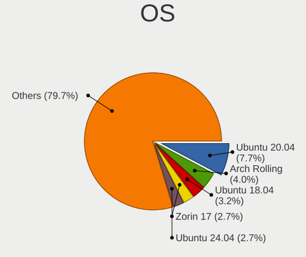

| Name                         | Desktops | Percent |
|------------------------------|----------|---------|
| Ubuntu 20.04                 | 29       | 7.73%   |
| Arch Rolling                 | 15       | 4%      |
| Ubuntu 18.04                 | 12       | 3.2%    |
| Zorin 17                     | 10       | 2.67%   |
| Ubuntu 24.04                 | 10       | 2.67%   |
| ArcoLinux Rolling            | 10       | 2.67%   |
| Debian 12                    | 9        | 2.4%    |
| Debian 11                    | 9        | 2.4%    |
| Ubuntu 22.04                 | 8        | 2.13%   |
| Pop!_OS 22.04                | 6        | 1.6%    |
| OpenMandriva 4.2             | 6        | 1.6%    |
| Manjaro                      | 6        | 1.6%    |
| Linux Mint 20.2              | 6        | 1.6%    |
| Ubuntu 19.04                 | 5        | 1.33%   |
| OpenMandriva 25.06           | 5        | 1.33%   |
| OpenMandriva 24.12           | 5        | 1.33%   |
| Linux Mint 21.3              | 5        | 1.33%   |
| Linux Mint 20                | 5        | 1.33%   |
| Fedora 40                    | 5        | 1.33%   |
| Bazzite 43                   | 5        | 1.33%   |
| Arch                         | 5        | 1.33%   |
| Zorin 16                     | 4        | 1.07%   |
| ROSA R11                     | 4        | 1.07%   |
| Pop!_OS 21.10                | 4        | 1.07%   |
| Pop!_OS 20.10                | 4        | 1.07%   |
| OpenMandriva 4.3             | 4        | 1.07%   |
| Linux Mint 22.1              | 4        | 1.07%   |
| Linux Mint 20.3              | 4        | 1.07%   |
| Linux Mint 20.1              | 4        | 1.07%   |
| Gentoo 2.14                  | 4        | 1.07%   |
| Fedora 42                    | 4        | 1.07%   |
| Fedora 38                    | 4        | 1.07%   |
| Fedora 35                    | 4        | 1.07%   |
| Bazzite 42                   | 4        | 1.07%   |
| openSUSE Tumbleweed-XXXXXXXX | 3        | 0.8%    |
| OpenMandriva 5.0             | 3        | 0.8%    |
| OpenMandriva 25.90           | 3        | 0.8%    |
| Kubuntu 24.04                | 3        | 0.8%    |
| KDE neon 22.04               | 3        | 0.8%    |
| Fedora 37                    | 3        | 0.8%    |

OS Family
---------

OS without a version

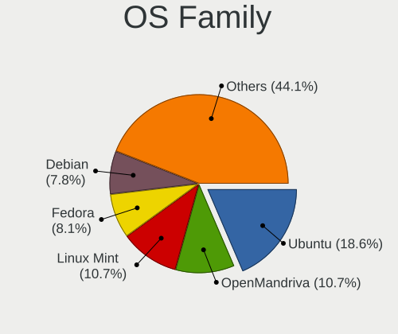

| Name         | Desktops | Percent |
|--------------|----------|---------|
| Ubuntu       | 64       | 18.55%  |
| OpenMandriva | 37       | 10.72%  |
| Linux Mint   | 37       | 10.72%  |
| Fedora       | 28       | 8.12%   |
| Debian       | 27       | 7.83%   |
| Arch         | 20       | 5.8%    |
| Zorin        | 17       | 4.93%   |
| Pop!_OS      | 14       | 4.06%   |
| Bazzite      | 11       | 3.19%   |
| Manjaro      | 10       | 2.9%    |
| ArcoLinux    | 10       | 2.9%    |
| ROSA         | 8        | 2.32%   |
| KDE neon     | 8        | 2.32%   |
| Kubuntu      | 7        | 2.03%   |
| Xubuntu      | 5        | 1.45%   |
| Gentoo       | 5        | 1.45%   |
| SteamOS      | 4        | 1.16%   |
| openSUSE     | 3        | 0.87%   |
| MX           | 3        | 0.87%   |
| BlackPanther | 3        | 0.87%   |
| Nobara       | 2        | 0.58%   |
| Lubuntu      | 2        | 0.58%   |
| Kali         | 2        | 0.58%   |
| Endless      | 2        | 0.58%   |
| Elementary   | 2        | 0.58%   |
| CentOS       | 2        | 0.58%   |
| TUXEDO OS    | 1        | 0.29%   |
| Solus        | 1        | 0.29%   |
| RHEL         | 1        | 0.29%   |
| Peppermint   | 1        | 0.29%   |
| Parrot       | 1        | 0.29%   |
| Oracle Linux | 1        | 0.29%   |
| NixOS        | 1        | 0.29%   |
| Linux Lite   | 1        | 0.29%   |
| Garuda Linux | 1        | 0.29%   |
| Feren OS     | 1        | 0.29%   |
| Clear Linux  | 1        | 0.29%   |
| Alpine       | 1        | 0.29%   |

Kernel
------

Version of the Linux kernel

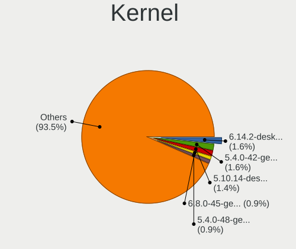

| Version                         | Desktops | Percent |
|---------------------------------|----------|---------|
| 6.14.2-desktop-3omv2590         | 7        | 1.64%   |
| 5.4.0-42-generic                | 7        | 1.64%   |
| 5.10.14-desktop-1omv4002        | 6        | 1.4%    |
| 6.8.0-45-generic                | 4        | 0.93%   |
| 5.4.0-48-generic                | 4        | 0.93%   |
| 5.16.7-desktop-1omv4003         | 4        | 0.93%   |
| 5.10.0-23-amd64                 | 4        | 0.93%   |
| 6.8.0-52-generic                | 3        | 0.7%    |
| 6.6.2-desktop-1omv2390          | 3        | 0.7%    |
| 6.5.0-26-generic                | 3        | 0.7%    |
| 6.2.0-26-generic                | 3        | 0.7%    |
| 6.12.48+deb13-amd64             | 3        | 0.7%    |
| 6.12.1-desktop-1omv2490         | 3        | 0.7%    |
| 5.8.0-7630-generic              | 3        | 0.7%    |
| 5.4.0-91-generic                | 3        | 0.7%    |
| 5.4.0-47-generic                | 3        | 0.7%    |
| 5.3.0-28-generic                | 3        | 0.7%    |
| 5.17.5-arch1-1                  | 3        | 0.7%    |
| 5.15.11-76051511-generic        | 3        | 0.7%    |
| 4.18.16-desktop-1bP             | 3        | 0.7%    |
| 6.8.0-71-generic                | 2        | 0.47%   |
| 6.8.0-60-generic                | 2        | 0.47%   |
| 6.8.0-57-generic                | 2        | 0.47%   |
| 6.8.0-51-generic                | 2        | 0.47%   |
| 6.8.0-49-generic                | 2        | 0.47%   |
| 6.4.11-desktop-1omv2390         | 2        | 0.47%   |
| 6.2.6-desktop-1omv2390          | 2        | 0.47%   |
| 6.17.7-ba19.fc43.x86_64         | 2        | 0.47%   |
| 6.17.5-ba07.fc43.x86_64         | 2        | 0.47%   |
| 6.14.0-36-generic               | 2        | 0.47%   |
| 6.14.0-35-generic               | 2        | 0.47%   |
| 6.14.0-33-generic               | 2        | 0.47%   |
| 6.14.0-27-generic               | 2        | 0.47%   |
| 6.12.9-desktop-1omv2490         | 2        | 0.47%   |
| 6.12.9-amd64                    | 2        | 0.47%   |
| 6.12.12-207.bazzite.fc41.x86_64 | 2        | 0.47%   |
| 6.10.0-desktop-1omv2490         | 2        | 0.47%   |
| 6.1.0-32-amd64                  | 2        | 0.47%   |
| 5.8.14-arch1-1                  | 2        | 0.47%   |
| 5.8.0-43-generic                | 2        | 0.47%   |

Kernel Family
-------------

Linux kernel without a distro release

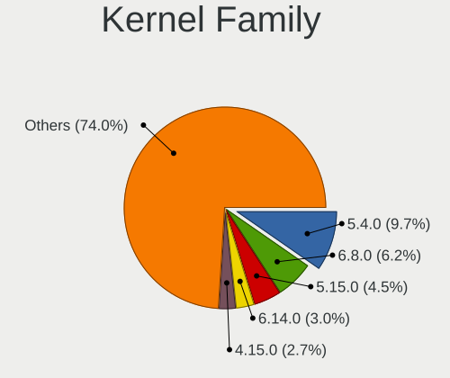

| Version | Desktops | Percent |
|---------|----------|---------|
| 5.4.0   | 39       | 9.65%   |
| 6.8.0   | 25       | 6.19%   |
| 5.15.0  | 18       | 4.46%   |
| 6.14.0  | 12       | 2.97%   |
| 4.15.0  | 11       | 2.72%   |
| 5.8.0   | 10       | 2.48%   |
| 5.10.0  | 9        | 2.23%   |
| 6.5.0   | 8        | 1.98%   |
| 5.3.0   | 8        | 1.98%   |
| 5.19.0  | 8        | 1.98%   |
| 6.14.2  | 7        | 1.73%   |
| 6.1.0   | 7        | 1.73%   |
| 5.13.0  | 7        | 1.73%   |
| 5.11.0  | 7        | 1.73%   |
| 5.0.0   | 7        | 1.73%   |
| 6.2.0   | 6        | 1.49%   |
| 5.17.5  | 6        | 1.49%   |
| 5.10.14 | 6        | 1.49%   |
| 6.17.7  | 5        | 1.24%   |
| 6.12.9  | 5        | 1.24%   |
| 4.18.0  | 5        | 1.24%   |
| 6.6.2   | 4        | 0.99%   |
| 6.11.0  | 4        | 0.99%   |
| 6.10.9  | 4        | 0.99%   |
| 5.16.7  | 4        | 0.99%   |
| 6.12.48 | 3        | 0.74%   |
| 6.12.12 | 3        | 0.74%   |
| 6.12.1  | 3        | 0.74%   |
| 5.15.11 | 3        | 0.74%   |
| 4.18.16 | 3        | 0.74%   |
| 6.9.12  | 2        | 0.5%    |
| 6.8.9   | 2        | 0.5%    |
| 6.4.11  | 2        | 0.5%    |
| 6.3.8   | 2        | 0.5%    |
| 6.2.8   | 2        | 0.5%    |
| 6.2.6   | 2        | 0.5%    |
| 6.2.11  | 2        | 0.5%    |
| 6.17.5  | 2        | 0.5%    |
| 6.16.4  | 2        | 0.5%    |
| 6.13.9  | 2        | 0.5%    |

Kernel Major Ver.
-----------------

Linux kernel major version

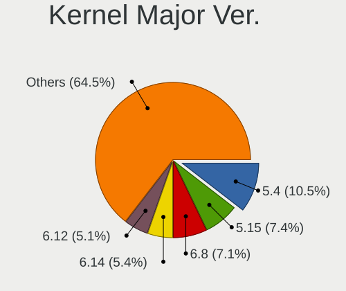

| Version | Desktops | Percent |
|---------|----------|---------|
| 5.4     | 41       | 10.46%  |
| 5.15    | 29       | 7.4%    |
| 6.8     | 28       | 7.14%   |
| 6.14    | 21       | 5.36%   |
| 6.12    | 20       | 5.1%    |
| 5.10    | 19       | 4.85%   |
| 5.8     | 15       | 3.83%   |
| 6.2     | 14       | 3.57%   |
| 5.11    | 13       | 3.32%   |
| 6.1     | 12       | 3.06%   |
| 4.15    | 11       | 2.81%   |
| 5.16    | 10       | 2.55%   |
| 5.13    | 10       | 2.55%   |
| 6.5     | 9        | 2.3%    |
| 6.17    | 9        | 2.3%    |
| 6.11    | 9        | 2.3%    |
| 5.19    | 9        | 2.3%    |
| 5.17    | 9        | 2.3%    |
| 6.6     | 8        | 2.04%   |
| 6.10    | 8        | 2.04%   |
| 5.3     | 8        | 2.04%   |
| 4.18    | 8        | 2.04%   |
| 6.0     | 7        | 1.79%   |
| 5.0     | 7        | 1.79%   |
| 6.4     | 6        | 1.53%   |
| 6.16    | 5        | 1.28%   |
| 6.15    | 5        | 1.28%   |
| 5.12    | 5        | 1.28%   |
| 6.3     | 4        | 1.02%   |
| 6.13    | 4        | 1.02%   |
| 6.9     | 3        | 0.77%   |
| 5.7     | 3        | 0.77%   |
| 5.6     | 3        | 0.77%   |
| 5.18    | 3        | 0.77%   |
| 5.14    | 3        | 0.77%   |
| 4.9     | 3        | 0.77%   |
| 4.19    | 2        | 0.51%   |
| 4.10    | 2        | 0.51%   |
| 6.7     | 1        | 0.26%   |
| 6.18    | 1        | 0.26%   |

Arch
----

OS architecture (x86_64, i586, etc.)

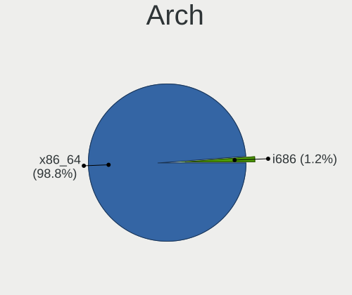

| Name   | Desktops | Percent |
|--------|----------|---------|
| x86_64 | 329      | 98.8%   |
| i686   | 4        | 1.2%    |

DE
--

Desktop Environment

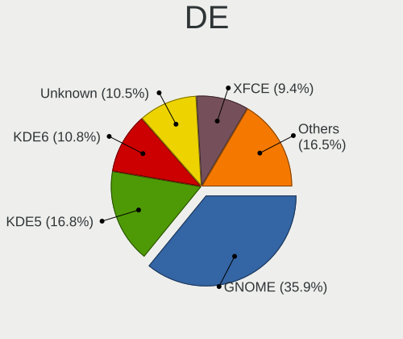

| Name            | Desktops | Percent |
|-----------------|----------|---------|
| GNOME           | 126      | 35.9%   |
| KDE5            | 59       | 16.81%  |
| KDE6            | 38       | 10.83%  |
| Unknown         | 37       | 10.54%  |
| XFCE            | 33       | 9.4%    |
| X-Cinnamon      | 24       | 6.84%   |
| MATE            | 9        | 2.56%   |
| KDE             | 8        | 2.28%   |
| KDE4            | 6        | 1.71%   |
| LXQt            | 3        | 0.85%   |
| Pantheon        | 2        | 0.57%   |
| LXDE            | 1        | 0.28%   |
| LeftWM          | 1        | 0.28%   |
| Hyprland        | 1        | 0.28%   |
| GNOME Flashback | 1        | 0.28%   |
| Cinnamon        | 1        | 0.28%   |
| Budgie          | 1        | 0.28%   |

Display Server
--------------

X11 or Wayland

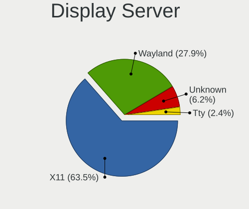

| Name    | Desktops | Percent |
|---------|----------|---------|
| X11     | 216      | 63.53%  |
| Wayland | 95       | 27.94%  |
| Unknown | 21       | 6.18%   |
| Tty     | 8        | 2.35%   |

Display Manager
---------------

SDDM, LightDM, etc.

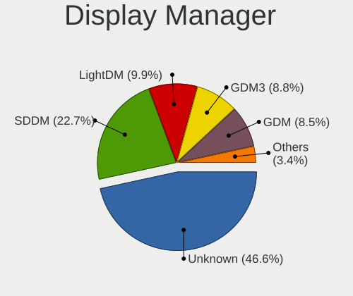

| Name    | Desktops | Percent |
|---------|----------|---------|
| Unknown | 164      | 46.59%  |
| SDDM    | 80       | 22.73%  |
| LightDM | 35       | 9.94%   |
| GDM3    | 31       | 8.81%   |
| GDM     | 30       | 8.52%   |
| TDM     | 5        | 1.42%   |
| KDM     | 5        | 1.42%   |
| MDM     | 1        | 0.28%   |
| LXDM    | 1        | 0.28%   |

OS Lang
-------

Language

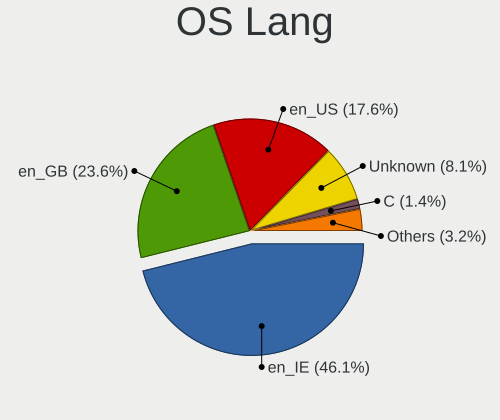

| Lang    | Desktops | Percent |
|---------|----------|---------|
| en_IE   | 160      | 46.11%  |
| en_GB   | 82       | 23.63%  |
| en_US   | 61       | 17.58%  |
| Unknown | 28       | 8.07%   |
| C       | 5        | 1.44%   |
| pl_PL   | 3        | 0.86%   |
| es_ES   | 2        | 0.58%   |
| pt_BR   | 1        | 0.29%   |
| lt_LT   | 1        | 0.29%   |
| hu_HU   | 1        | 0.29%   |
| en_BW   | 1        | 0.29%   |
| de_DE   | 1        | 0.29%   |
| C.UTF8  | 1        | 0.29%   |

Boot Mode
---------

EFI or BIOS

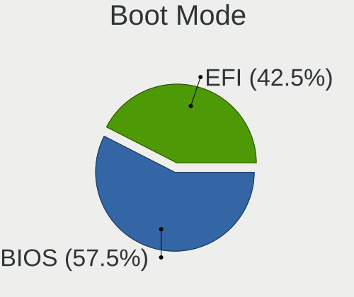

| Mode | Desktops | Percent |
|------|----------|---------|
| BIOS | 195      | 57.52%  |
| EFI  | 144      | 42.48%  |

Filesystem
----------

Type of filesystem

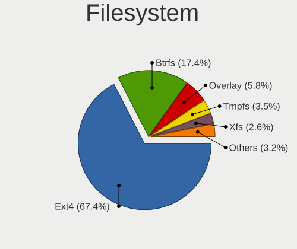

| Type    | Desktops | Percent |
|---------|----------|---------|
| Ext4    | 232      | 67.44%  |
| Btrfs   | 60       | 17.44%  |
| Overlay | 20       | 5.81%   |
| Tmpfs   | 12       | 3.49%   |
| Xfs     | 9        | 2.62%   |
| Unknown | 7        | 2.03%   |
| Zfs     | 3        | 0.87%   |
| Fake    | 1        | 0.29%   |

Part. scheme
------------

Scheme of partitioning

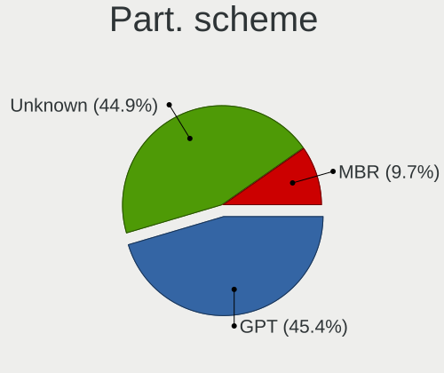

| Type    | Desktops | Percent |
|---------|----------|---------|
| GPT     | 159      | 45.43%  |
| Unknown | 157      | 44.86%  |
| MBR     | 34       | 9.71%   |

Dual Boot with Linux/BSD
------------------------

Hosting more than one Linux/BSD

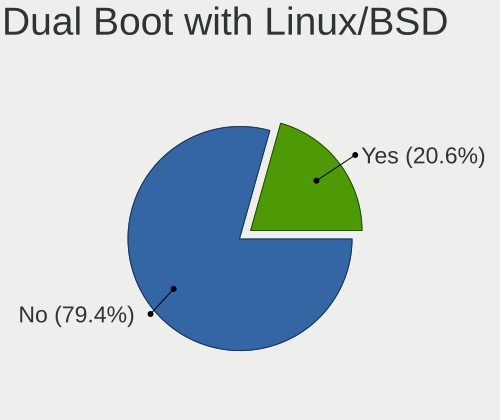

| Dual boot | Desktops | Percent |
|-----------|----------|---------|
| No        | 269      | 79.35%  |
| Yes       | 70       | 20.65%  |

Dual Boot (Win)
---------------

Hosting Linux and Windows

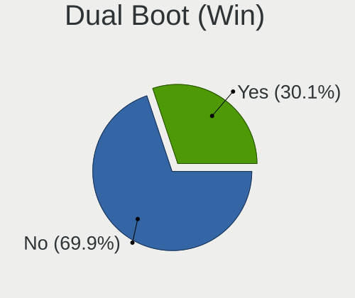

| Dual boot | Desktops | Percent |
|-----------|----------|---------|
| No        | 239      | 69.88%  |
| Yes       | 103      | 30.12%  |

Board
-----

Vendor
------

Motherboard manufacturer

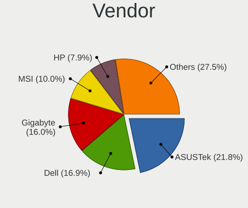

| Name                                 | Desktops | Percent |
|--------------------------------------|----------|---------|
| ASUSTek Computer                     | 72       | 21.75%  |
| Dell                                 | 56       | 16.92%  |
| Gigabyte Technology                  | 53       | 16.01%  |
| MSI                                  | 33       | 9.97%   |
| Hewlett-Packard                      | 26       | 7.85%   |
| Lenovo                               | 21       | 6.34%   |
| ASRock                               | 21       | 6.34%   |
| Foxconn                              | 6        | 1.81%   |
| AZW                                  | 5        | 1.51%   |
| Intel                                | 4        | 1.21%   |
| Shuttle                              | 3        | 0.91%   |
| Shenzhen Meigao Electronic Equipment | 3        | 0.91%   |
| Pegatron                             | 3        | 0.91%   |
| Unknown                              | 3        | 0.91%   |
| Seeed Studio                         | 2        | 0.6%    |
| Seco                                 | 2        | 0.6%    |
| Apple                                | 2        | 0.6%    |
| TianBei                              | 1        | 0.3%    |
| Supermicro                           | 1        | 0.3%    |
| Soyo                                 | 1        | 0.3%    |
| Simply NUC                           | 1        | 0.3%    |
| Shenzhen DOKE electronic             | 1        | 0.3%    |
| PELADN                               | 1        | 0.3%    |
| Packard Bell                         | 1        | 0.3%    |
| MiTAC                                | 1        | 0.3%    |
| Medion                               | 1        | 0.3%    |
| MACHINIST                            | 1        | 0.3%    |
| Fujitsu                              | 1        | 0.3%    |
| DFI                                  | 1        | 0.3%    |
| ANGXUN                               | 1        | 0.3%    |
| Alienware                            | 1        | 0.3%    |
| Acer                                 | 1        | 0.3%    |
| ABIT                                 | 1        | 0.3%    |

Model
-----

Motherboard model

| Name                                       | Desktops | Percent |
|--------------------------------------------|----------|---------|
| ASUS All Series                            | 10       | 3.02%   |
| Dell OptiPlex 7010                         | 8        | 2.42%   |
| Gigabyte B450M DS3H                        | 5        | 1.51%   |
| HP Compaq 8200 Elite SFF PC                | 4        | 1.21%   |
| Dell OptiPlex 790                          | 4        | 1.21%   |
| Dell OptiPlex 780                          | 4        | 1.21%   |
| Dell OptiPlex 7020                         | 4        | 1.21%   |
| ASUS TUF Gaming X570-PLUS                  | 4        | 1.21%   |
| MSI MS-7C37                                | 3        | 0.91%   |
| Lenovo ThinkCentre E73 10DS000TUK          | 3        | 0.91%   |
| HP EliteDesk 800 G1 SFF                    | 3        | 0.91%   |
| Gigabyte Z77-DS3H                          | 3        | 0.91%   |
| AZW MINI S                                 | 3        | 0.91%   |
| ASUS ROG STRIX B450-F GAMING               | 3        | 0.91%   |
| Unknown                                    | 3        | 0.91%   |
| Shenzhen Meigao Electronic Equipment UM690 | 2        | 0.6%    |
| Seeed Studio ODYSSEY-X86J4105              | 2        | 0.6%    |
| Seco C40                                   | 2        | 0.6%    |
| MSI Pro 3515 Series                        | 2        | 0.6%    |
| MSI MS-7E27                                | 2        | 0.6%    |
| MSI MS-7E26                                | 2        | 0.6%    |
| MSI MS-7B86                                | 2        | 0.6%    |
| MSI MS-7B79                                | 2        | 0.6%    |
| Lenovo ThinkStation D20 415892G            | 2        | 0.6%    |
| HP Desktop M01-F1xxx                       | 2        | 0.6%    |
| Gigabyte X570 AORUS ULTRA                  | 2        | 0.6%    |
| Gigabyte B450 AORUS M                      | 2        | 0.6%    |
| Gigabyte B450 AORUS ELITE                  | 2        | 0.6%    |
| Gigabyte A320M-S2H                         | 2        | 0.6%    |
| Foxconn Pro 3500 Series                    | 2        | 0.6%    |
| ASUS ROG STRIX B550-F GAMING               | 2        | 0.6%    |
| ASUS ROG CROSSHAIR VIII HERO               | 2        | 0.6%    |
| ASUS PRIME B550M-A                         | 2        | 0.6%    |
| ASUS PRIME A520M-K                         | 2        | 0.6%    |
| ASUS P8P67 PRO                             | 2        | 0.6%    |
| ASUS P8H77-M PRO                           | 2        | 0.6%    |
| ASUS M5A78L/USB3                           | 2        | 0.6%    |
| TianBei G5                                 | 1        | 0.3%    |
| Supermicro X8SIU                           | 1        | 0.3%    |
| Soyo V1.0                                  | 1        | 0.3%    |

Model Family
------------

Motherboard model prefix

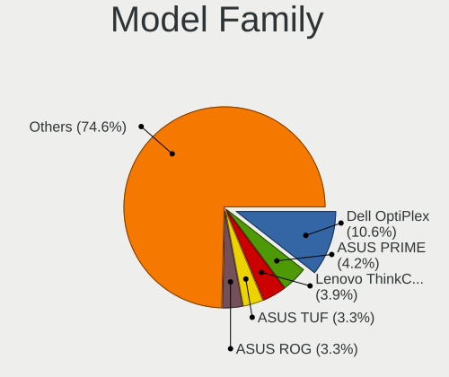

| Name                                       | Desktops | Percent |
|--------------------------------------------|----------|---------|
| Dell OptiPlex                              | 35       | 10.57%  |
| ASUS PRIME                                 | 14       | 4.23%   |
| Lenovo ThinkCentre                         | 13       | 3.93%   |
| ASUS TUF                                   | 11       | 3.32%   |
| ASUS ROG                                   | 11       | 3.32%   |
| ASUS All                                   | 10       | 3.02%   |
| HP Compaq                                  | 8        | 2.42%   |
| Dell Precision                             | 8        | 2.42%   |
| HP EliteDesk                               | 6        | 1.81%   |
| Lenovo ThinkStation                        | 5        | 1.51%   |
| Gigabyte B450M                             | 5        | 1.51%   |
| Gigabyte B450                              | 5        | 1.51%   |
| Gigabyte X570                              | 4        | 1.21%   |
| Foxconn Pro                                | 4        | 1.21%   |
| MSI MS-7C37                                | 3        | 0.91%   |
| Gigabyte Z77-DS3H                          | 3        | 0.91%   |
| Dell Vostro                                | 3        | 0.91%   |
| AZW MINI                                   | 3        | 0.91%   |
| ASUS Maximus                               | 3        | 0.91%   |
| Unknown                                    | 3        | 0.91%   |
| Shenzhen Meigao Electronic Equipment UM690 | 2        | 0.6%    |
| Seeed Studio ODYSSEY-X86J4105              | 2        | 0.6%    |
| Seco C40                                   | 2        | 0.6%    |
| MSI Pro                                    | 2        | 0.6%    |
| MSI MS-7E27                                | 2        | 0.6%    |
| MSI MS-7E26                                | 2        | 0.6%    |
| MSI MS-7B86                                | 2        | 0.6%    |
| MSI MS-7B79                                | 2        | 0.6%    |
| Intel DESKTOP                              | 2        | 0.6%    |
| HP Pavilion                                | 2        | 0.6%    |
| HP Desktop                                 | 2        | 0.6%    |
| Gigabyte Z690                              | 2        | 0.6%    |
| Gigabyte TRX40                             | 2        | 0.6%    |
| Gigabyte B550                              | 2        | 0.6%    |
| Gigabyte A320M-S2H                         | 2        | 0.6%    |
| Dell XPS                                   | 2        | 0.6%    |
| Dell Inspiron                              | 2        | 0.6%    |
| ASUS P8Z77-V                               | 2        | 0.6%    |
| ASUS P8P67                                 | 2        | 0.6%    |
| ASUS P8H77-M                               | 2        | 0.6%    |

MFG Year
--------

Motherboard manufacture year

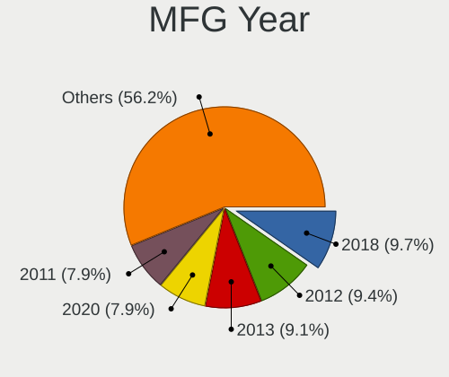

| Year    | Desktops | Percent |
|---------|----------|---------|
| 2018    | 32       | 9.67%   |
| 2012    | 31       | 9.37%   |
| 2013    | 30       | 9.06%   |
| 2020    | 26       | 7.85%   |
| 2011    | 26       | 7.85%   |
| 2010    | 24       | 7.25%   |
| 2019    | 22       | 6.65%   |
| 2023    | 18       | 5.44%   |
| 2014    | 17       | 5.14%   |
| 2017    | 16       | 4.83%   |
| 2024    | 14       | 4.23%   |
| 2015    | 14       | 4.23%   |
| 2022    | 12       | 3.63%   |
| 2008    | 11       | 3.32%   |
| 2021    | 9        | 2.72%   |
| 2006    | 7        | 2.11%   |
| 2009    | 6        | 1.81%   |
| 2007    | 6        | 1.81%   |
| 2025    | 5        | 1.51%   |
| 2016    | 2        | 0.6%    |
| 2005    | 2        | 0.6%    |
| Unknown | 1        | 0.3%    |

Form Factor
-----------

Physical design of the computer

| Name    | Desktops | Percent |
|---------|----------|---------|
| Desktop | 331      | 100%    |

Secure Boot
-----------

Enabled or disabled

| State    | Desktops | Percent |
|----------|----------|---------|
| Disabled | 321      | 96.98%  |
| Enabled  | 10       | 3.02%   |

Coreboot
--------

Have coreboot on board

| Used | Desktops | Percent |
|------|----------|---------|
| No   | 331      | 100%    |

RAM Size
--------

Total RAM memory

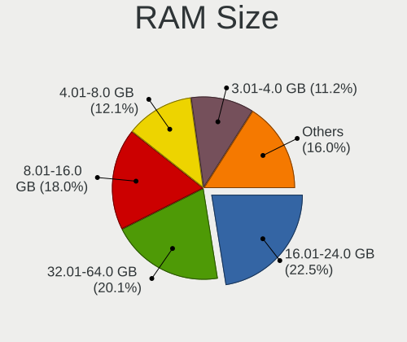

| Size in GB      | Desktops | Percent |
|-----------------|----------|---------|
| 16.01-24.0      | 76       | 22.49%  |
| 32.01-64.0      | 68       | 20.12%  |
| 8.01-16.0       | 61       | 18.05%  |
| 4.01-8.0        | 41       | 12.13%  |
| 3.01-4.0        | 38       | 11.24%  |
| 64.01-256.0     | 28       | 8.28%   |
| 24.01-32.0      | 19       | 5.62%   |
| 1.01-2.0        | 3        | 0.89%   |
| More than 256.0 | 2        | 0.59%   |
| 2.01-3.0        | 1        | 0.3%    |
| 0.51-1.0        | 1        | 0.3%    |

RAM Used
--------

Used RAM memory

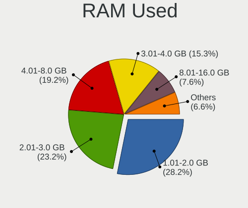

| Used GB    | Desktops | Percent |
|------------|----------|---------|
| 1.01-2.0   | 107      | 28.16%  |
| 2.01-3.0   | 88       | 23.16%  |
| 4.01-8.0   | 73       | 19.21%  |
| 3.01-4.0   | 58       | 15.26%  |
| 8.01-16.0  | 29       | 7.63%   |
| 0.51-1.0   | 18       | 4.74%   |
| 32.01-64.0 | 3        | 0.79%   |
| 16.01-24.0 | 2        | 0.53%   |
| 0.01-0.5   | 1        | 0.26%   |
| Unknown    | 1        | 0.26%   |

Total Drives
------------

Number of drives on board

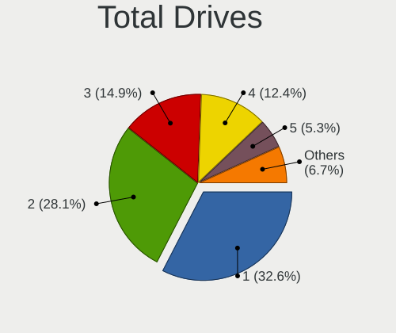

| Drives | Desktops | Percent |
|--------|----------|---------|
| 1      | 116      | 32.58%  |
| 2      | 100      | 28.09%  |
| 3      | 53       | 14.89%  |
| 4      | 44       | 12.36%  |
| 5      | 19       | 5.34%   |
| 6      | 7        | 1.97%   |
| 7      | 6        | 1.69%   |
| 0      | 5        | 1.4%    |
| 10     | 3        | 0.84%   |
| 11     | 1        | 0.28%   |
| 9      | 1        | 0.28%   |
| 8      | 1        | 0.28%   |

Has CD-ROM
----------

Has CD-ROM on board

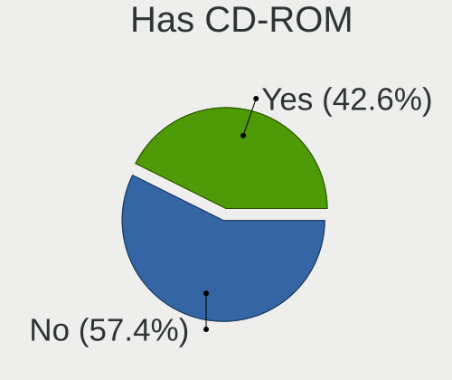

| Presented | Desktops | Percent |
|-----------|----------|---------|
| No        | 195      | 57.35%  |
| Yes       | 145      | 42.65%  |

Has Ethernet
------------

Has Ethernet on board

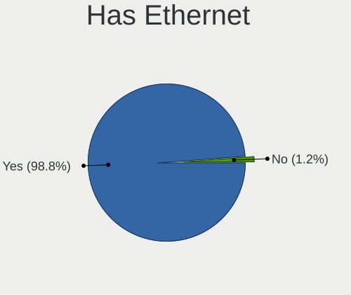

| Presented | Desktops | Percent |
|-----------|----------|---------|
| Yes       | 327      | 98.79%  |
| No        | 4        | 1.21%   |

Has WiFi
--------

Has WiFi module

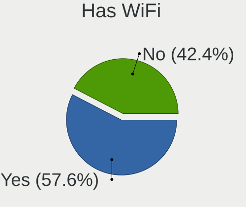

| Presented | Desktops | Percent |
|-----------|----------|---------|
| Yes       | 197      | 57.6%   |
| No        | 145      | 42.4%   |

Has Bluetooth
-------------

Has Bluetooth module

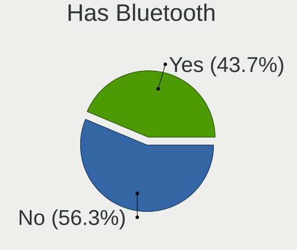

| Presented | Desktops | Percent |
|-----------|----------|---------|
| No        | 192      | 56.3%   |
| Yes       | 149      | 43.7%   |

Location
--------

Country
-------

Geographic location (country)

| Country | Desktops | Percent |
|---------|----------|---------|
| Ireland | 331      | 100%    |

City
----

Geographic location (city)

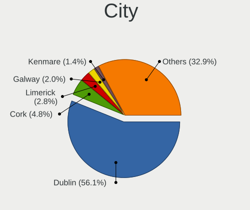

| City         | Desktops | Percent |
|--------------|----------|---------|
| Dublin       | 198      | 56.09%  |
| Cork         | 17       | 4.82%   |
| Limerick     | 10       | 2.83%   |
| Galway       | 7        | 1.98%   |
| Kenmare      | 5        | 1.42%   |
| Gorey        | 5        | 1.42%   |
| Sligo        | 4        | 1.13%   |
| Portlaoise   | 4        | 1.13%   |
| Nenagh       | 4        | 1.13%   |
| Ennis        | 4        | 1.13%   |
| Wexford      | 3        | 0.85%   |
| Waterford    | 3        | 0.85%   |
| Tuam         | 3        | 0.85%   |
| Navan        | 3        | 0.85%   |
| Naas         | 3        | 0.85%   |
| Kildare      | 3        | 0.85%   |
| Enniscorthy  | 3        | 0.85%   |
| Drogheda     | 3        | 0.85%   |
| Cavan        | 3        | 0.85%   |
| Athlone      | 3        | 0.85%   |
| Tobercurry   | 2        | 0.57%   |
| Swords       | 2        | 0.57%   |
| Oranmore     | 2        | 0.57%   |
| Maynooth     | 2        | 0.57%   |
| Lucan        | 2        | 0.57%   |
| Killarney    | 2        | 0.57%   |
| Kilkenny     | 2        | 0.57%   |
| Kilkelly     | 2        | 0.57%   |
| Dunshaughlin | 2        | 0.57%   |
| Blackrock    | 2        | 0.57%   |
| Ballincollig | 2        | 0.57%   |
| Westport     | 1        | 0.28%   |
| Tullamore    | 1        | 0.28%   |
| Tralee       | 1        | 0.28%   |
| Tipperary    | 1        | 0.28%   |
| Summerhill   | 1        | 0.28%   |
| Spiddal      | 1        | 0.28%   |
| Skerries     | 1        | 0.28%   |
| Shanagolden  | 1        | 0.28%   |
| Roscrea      | 1        | 0.28%   |

Drives
------

Drive Vendor
------------

Hard drive vendors

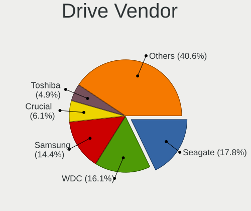

| Vendor                      | Desktops | Drives | Percent |
|-----------------------------|----------|--------|---------|
| Seagate                     | 116      | 212    | 17.79%  |
| WDC                         | 105      | 212    | 16.1%   |
| Samsung Electronics         | 94       | 168    | 14.42%  |
| Crucial                     | 40       | 46     | 6.13%   |
| Toshiba                     | 32       | 50     | 4.91%   |
| SanDisk                     | 29       | 48     | 4.45%   |
| Kingston                    | 28       | 52     | 4.29%   |
| Hitachi                     | 24       | 35     | 3.68%   |
| Micron/Crucial Technology   | 17       | 27     | 2.61%   |
| China                       | 11       | 15     | 1.69%   |
| A-DATA Technology           | 11       | 18     | 1.69%   |
| Phison Electronics          | 8        | 12     | 1.23%   |
| ADATA Technology            | 8        | 10     | 1.23%   |
| Micron Technology           | 7        | 8      | 1.07%   |
| Intel                       | 7        | 8      | 1.07%   |
| Unknown                     | 6        | 8      | 0.92%   |
| Phison                      | 6        | 11     | 0.92%   |
| Kingston Technology Company | 6        | 7      | 0.92%   |
| Verbatim                    | 4        | 4      | 0.61%   |
| SK hynix                    | 4        | 4      | 0.61%   |
| Silicon Motion              | 4        | 13     | 0.61%   |
| OCZ                         | 4        | 5      | 0.61%   |
| MAXIO Technology (Hangzhou) | 4        | 4      | 0.61%   |
| HGST                        | 4        | 4      | 0.61%   |
| Fanxiang                    | 4        | 6      | 0.61%   |
| Transcend                   | 3        | 3      | 0.46%   |
| Netac                       | 3        | 3      | 0.46%   |
| LITEON                      | 3        | 3      | 0.46%   |
| Intenso                     | 3        | 3      | 0.46%   |
| Unknown                     | 3        | 3      | 0.46%   |
| Team                        | 2        | 2      | 0.31%   |
| SABRENT                     | 2        | 2      | 0.31%   |
| Patriot                     | 2        | 3      | 0.31%   |
| Maxtor                      | 2        | 2      | 0.31%   |
| Lexar                       | 2        | 3      | 0.31%   |
| KIOXIA                      | 2        | 4      | 0.31%   |
| JMicron Technology          | 2        | 2      | 0.31%   |
| Hewlett-Packard             | 2        | 4      | 0.31%   |
| Emtec                       | 2        | 2      | 0.31%   |
| Western Digital             | 1        | 2      | 0.15%   |

Drive Model
-----------

Hard drive models

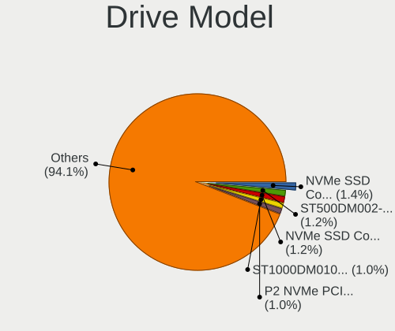

| Model                                                              | Desktops | Percent |
|--------------------------------------------------------------------|----------|---------|
| Samsung NVMe SSD Controller SM981/PM981/PM983 1TB                  | 11       | 1.44%   |
| Seagate ST500DM002-1BD142 500GB                                    | 9        | 1.18%   |
| Samsung NVMe SSD Controller PM9A1/PM9A3/980PRO 1TB                 | 9        | 1.18%   |
| Seagate ST1000DM010-2EP102 1TB                                     | 8        | 1.05%   |
| Micron/Crucial P2 NVMe PCIe SSD 2TB                                | 8        | 1.05%   |
| Seagate ST2000DL003-9VT166 2TB                                     | 7        | 0.92%   |
| Samsung SSD 850 EVO 500GB                                          | 7        | 0.92%   |
| Crucial CT500MX500SSD1 500GB                                       | 7        | 0.92%   |
| WDC WD10EURX-83UY4Y0 1TB                                           | 6        | 0.78%   |
| Seagate ST8000DM004-2CX188 8TB                                     | 6        | 0.78%   |
| Seagate ST2000DM008-2FR102 2TB                                     | 6        | 0.78%   |
| Kingston SA400S37240G 240GB SSD                                    | 6        | 0.78%   |
| WDC WD10EALX-009BA0 1TB                                            | 5        | 0.65%   |
| Seagate ST4000DM004-2CV104 4TB                                     | 5        | 0.65%   |
| Seagate ST2000DM006-2DM164 2TB                                     | 5        | 0.65%   |
| Samsung SSD 870 EVO 1TB                                            | 5        | 0.65%   |
| WDC WD3200AAJS-60Z0A0 320GB                                        | 4        | 0.52%   |
| WDC WD10EZEX-08WN4A0 1TB                                           | 4        | 0.52%   |
| Verbatim Vi550 S3 SSD 512GB                                        | 4        | 0.52%   |
| Toshiba HDWD110 1TB                                                | 4        | 0.52%   |
| Toshiba DT01ACA050 500GB                                           | 4        | 0.52%   |
| Silicon Motion SM2263EN/SM2263XT SSD Controller 512GB              | 4        | 0.52%   |
| Seagate ST3500418AS 500GB                                          | 4        | 0.52%   |
| Seagate ST3500312CS 500GB                                          | 4        | 0.52%   |
| Seagate ST3000DM001-1CH166 3TB                                     | 4        | 0.52%   |
| Samsung SSD 980 1TB                                                | 4        | 0.52%   |
| Samsung SSD 860 EVO 500GB                                          | 4        | 0.52%   |
| Samsung SSD 850 EVO 250GB                                          | 4        | 0.52%   |
| MAXIO (Hangzhou) NVMe SSD Controller MAP1202 2TB                   | 4        | 0.52%   |
| Crucial CT1000MX500SSD1 1TB                                        | 4        | 0.52%   |
| ADATA XPG SX8200 Pro PCIe Gen3x4 M.2 2280 Solid State Drive 1024GB | 4        | 0.52%   |
| ADATA SWORDFISH 1TB                                                | 4        | 0.52%   |
| A-DATA SU650 240GB SSD                                             | 4        | 0.52%   |
| WDC WD5000AZLX-08K2TA0 500GB                                       | 3        | 0.39%   |
| WDC WD5000AAKX-60U6AA0 500GB                                       | 3        | 0.39%   |
| WDC WD20EZRX-00D8PB0 2TB                                           | 3        | 0.39%   |
| Toshiba DT01ACA100 1TB                                             | 3        | 0.39%   |
| Seagate ST8000DM004-2U9188 8TB                                     | 3        | 0.39%   |
| Seagate ST3160812AS 160GB                                          | 3        | 0.39%   |
| Seagate ST31000528AS 1TB                                           | 3        | 0.39%   |

HDD Vendor
----------

Hard disk drive vendors

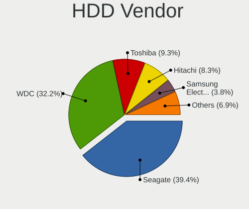

| Vendor              | Desktops | Drives | Percent |
|---------------------|----------|--------|---------|
| Seagate             | 114      | 208    | 39.45%  |
| WDC                 | 93       | 195    | 32.18%  |
| Toshiba             | 27       | 44     | 9.34%   |
| Hitachi             | 24       | 35     | 8.3%    |
| Samsung Electronics | 11       | 15     | 3.81%   |
| HGST                | 4        | 4      | 1.38%   |
| Unknown             | 2        | 2      | 0.69%   |
| Maxtor              | 2        | 2      | 0.69%   |
| Intenso             | 2        | 2      | 0.69%   |
| USB3.0              | 1        | 1      | 0.35%   |
| QNAP                | 1        | 17     | 0.35%   |
| MARVELL             | 1        | 1      | 0.35%   |
| KESU                | 1        | 1      | 0.35%   |
| Inateck             | 1        | 1      | 0.35%   |
| Fujitsu             | 1        | 3      | 0.35%   |
| FNK TECH            | 1        | 1      | 0.35%   |
| ExcelStor           | 1        | 2      | 0.35%   |
| DAS                 | 1        | 4      | 0.35%   |
| ASMT                | 1        | 1      | 0.35%   |

SSD Vendor
----------

Solid state drive vendors

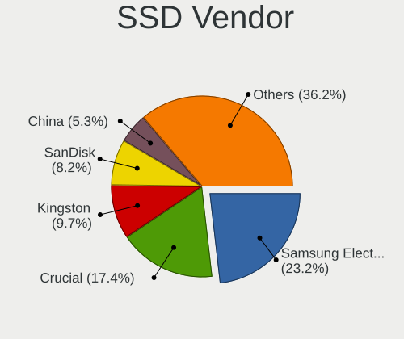

| Vendor              | Desktops | Drives | Percent |
|---------------------|----------|--------|---------|
| Samsung Electronics | 48       | 85     | 23.19%  |
| Crucial             | 36       | 42     | 17.39%  |
| Kingston            | 20       | 40     | 9.66%   |
| SanDisk             | 17       | 22     | 8.21%   |
| China               | 11       | 15     | 5.31%   |
| A-DATA Technology   | 9        | 15     | 4.35%   |
| WDC                 | 8        | 12     | 3.86%   |
| Intel               | 5        | 5      | 2.42%   |
| Verbatim            | 4        | 4      | 1.93%   |
| OCZ                 | 4        | 5      | 1.93%   |
| Fanxiang            | 4        | 6      | 1.93%   |
| Transcend           | 3        | 3      | 1.45%   |
| Netac               | 3        | 3      | 1.45%   |
| Micron Technology   | 3        | 4      | 1.45%   |
| LITEON              | 3        | 3      | 1.45%   |
| Unknown             | 3        | 3      | 1.45%   |
| Team                | 2        | 2      | 0.97%   |
| SABRENT             | 2        | 2      | 0.97%   |
| Patriot             | 2        | 3      | 0.97%   |
| Hewlett-Packard     | 2        | 4      | 0.97%   |
| Emtec               | 2        | 2      | 0.97%   |
| Toshiba             | 1        | 1      | 0.48%   |
| SPCC                | 1        | 1      | 0.48%   |
| SK hynix            | 1        | 1      | 0.48%   |
| PNY                 | 1        | 1      | 0.48%   |
| PELADN              | 1        | 1      | 0.48%   |
| Palit               | 1        | 1      | 0.48%   |
| Lexar               | 1        | 1      | 0.48%   |
| KingSpec            | 1        | 1      | 0.48%   |
| KingDian            | 1        | 1      | 0.48%   |
| Intenso             | 1        | 1      | 0.48%   |
| Integral            | 1        | 1      | 0.48%   |
| Hikvision           | 1        | 1      | 0.48%   |
| DRVEO               | 1        | 1      | 0.48%   |
| Corsair             | 1        | 2      | 0.48%   |
| Apple               | 1        | 1      | 0.48%   |
| Apacer              | 1        | 1      | 0.48%   |

Drive Kind
----------

HDD or SSD

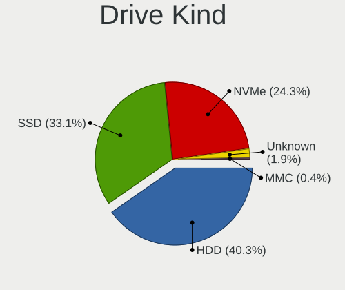

| Kind    | Desktops | Drives | Percent |
|---------|----------|--------|---------|
| HDD     | 211      | 539    | 40.34%  |
| SSD     | 173      | 297    | 33.08%  |
| NVMe    | 127      | 236    | 24.28%  |
| Unknown | 10       | 10     | 1.91%   |
| MMC     | 2        | 4      | 0.38%   |

Drive Connector
---------------

SATA, SAS, NVMe, etc.

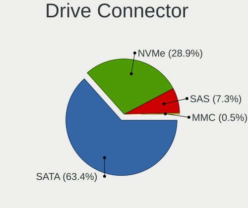

| Type | Desktops | Drives | Percent |
|------|----------|--------|---------|
| SATA | 279      | 807    | 63.41%  |
| NVMe | 127      | 235    | 28.86%  |
| SAS  | 32       | 40     | 7.27%   |
| MMC  | 2        | 4      | 0.45%   |

Drive Size
----------

Size of hard drive

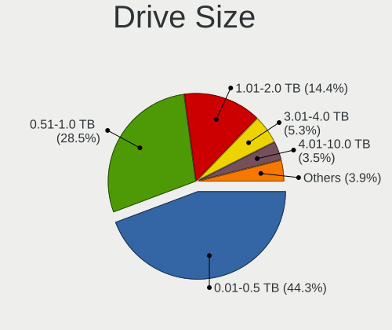

| Size in TB | Desktops | Drives | Percent |
|------------|----------|--------|---------|
| 0.01-0.5   | 191      | 399    | 44.32%  |
| 0.51-1.0   | 123      | 201    | 28.54%  |
| 1.01-2.0   | 62       | 93     | 14.39%  |
| 3.01-4.0   | 23       | 57     | 5.34%   |
| 4.01-10.0  | 15       | 40     | 3.48%   |
| 2.01-3.0   | 13       | 36     | 3.02%   |
| 10.01-20.0 | 4        | 10     | 0.93%   |

Space Total
-----------

Amount of disk space available on the file system

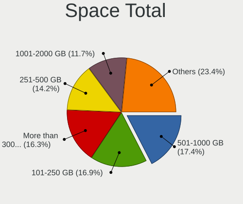

| Size in GB     | Desktops | Percent |
|----------------|----------|---------|
| 501-1000       | 64       | 17.44%  |
| 101-250        | 62       | 16.89%  |
| More than 3000 | 60       | 16.35%  |
| 251-500        | 52       | 14.17%  |
| 1001-2000      | 43       | 11.72%  |
| 2001-3000      | 23       | 6.27%   |
| 1-20           | 20       | 5.45%   |
| 51-100         | 20       | 5.45%   |
| Unknown        | 14       | 3.81%   |
| 21-50          | 9        | 2.45%   |

Space Used
----------

Amount of used disk space

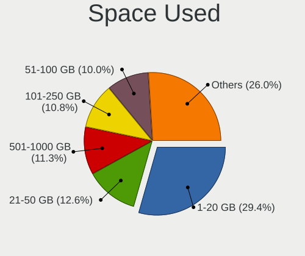

| Used GB        | Desktops | Percent |
|----------------|----------|---------|
| 1-20           | 112      | 29.4%   |
| 21-50          | 48       | 12.6%   |
| 501-1000       | 43       | 11.29%  |
| 101-250        | 41       | 10.76%  |
| 51-100         | 38       | 9.97%   |
| More than 3000 | 30       | 7.87%   |
| 251-500        | 21       | 5.51%   |
| 1001-2000      | 20       | 5.25%   |
| 2001-3000      | 14       | 3.67%   |
| Unknown        | 14       | 3.67%   |

Malfunc. Drives
---------------

Drive models with a malfunction

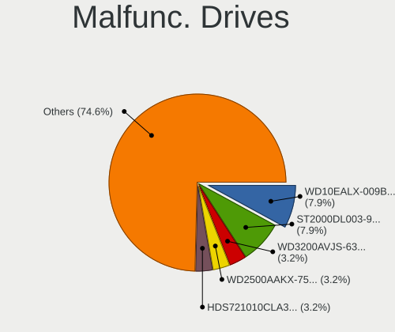

| Model                                                         | Desktops | Drives | Percent |
|---------------------------------------------------------------|----------|--------|---------|
| WDC WD10EALX-009BA0 1TB                                       | 5        | 11     | 7.94%   |
| Seagate ST2000DL003-9VT166 2TB                                | 5        | 8      | 7.94%   |
| WDC WD3200AVJS-63B6A0 320GB                                   | 2        | 2      | 3.17%   |
| WDC WD2500AAKX-753CA1 250GB                                   | 2        | 6      | 3.17%   |
| Hitachi HDS721010CLA332 1TB                                   | 2        | 2      | 3.17%   |
| Hitachi HDS721010CLA330 1TB                                   | 2        | 2      | 3.17%   |
| Western Digital SN730 500GB                                   | 1        | 2      | 1.59%   |
| WDC WD7500BPKX-00HPJT0 752GB                                  | 1        | 1      | 1.59%   |
| WDC WD5000HHTZ-04N21V0 500GB                                  | 1        | 3      | 1.59%   |
| WDC WD5000BEVT-35A0RT0 500GB                                  | 1        | 1      | 1.59%   |
| WDC WD5000AAKX-083CA1 500GB                                   | 1        | 1      | 1.59%   |
| WDC WD5000AAKX-001CA0 500GB                                   | 1        | 2      | 1.59%   |
| WDC WD400JB-00FMA0 40GB                                       | 1        | 2      | 1.59%   |
| WDC WD2500BEKT-75A25T0 250GB                                  | 1        | 1      | 1.59%   |
| WDC WD2500AAKX-603CA0 250GB                                   | 1        | 1      | 1.59%   |
| WDC WD20EZRZ-00Z5HB0 2TB                                      | 1        | 2      | 1.59%   |
| WDC WD10EZEX-00BN5A0 1TB                                      | 1        | 1      | 1.59%   |
| WDC WD1003FBYX-12 1TB                                         | 1        | 1      | 1.59%   |
| WDC WD1001FALS-00E8B0 1TB                                     | 1        | 2      | 1.59%   |
| Toshiba MK1059GSM 1TB                                         | 1        | 1      | 1.59%   |
| Toshiba DT01ACA050 500GB                                      | 1        | 3      | 1.59%   |
| Seagate ST500LM012 HN-M500MBB 500GB                           | 1        | 1      | 1.59%   |
| Seagate ST500LM000-1EJ162 500GB                               | 1        | 1      | 1.59%   |
| Seagate ST4000DX001-1CE168 4TB                                | 1        | 1      | 1.59%   |
| Seagate ST3500418AS 500GB                                     | 1        | 3      | 1.59%   |
| Seagate ST320LT009-9WC142 320GB                               | 1        | 1      | 1.59%   |
| Seagate ST31500541AS 1TB                                      | 1        | 1      | 1.59%   |
| Seagate ST3120026A 120GB                                      | 1        | 1      | 1.59%   |
| Seagate ST31000333AS 1TB                                      | 1        | 2      | 1.59%   |
| Seagate ST3000DM001-1ER166 3TB                                | 1        | 1      | 1.59%   |
| Seagate ST3000DM001-1CH166 3TB                                | 1        | 1      | 1.59%   |
| Seagate ST1000LM024 HN-M101MBB 1TB                            | 1        | 1      | 1.59%   |
| Seagate ST1000DM003-1CH162 1TB                                | 1        | 1      | 1.59%   |
| SanDisk SSD PLUS 480GB                                        | 1        | 1      | 1.59%   |
| Samsung Electronics SSD 970 EVO Plus 2TB                      | 1        | 1      | 1.59%   |
| Samsung Electronics SSD 870 EVO 2TB                           | 1        | 1      | 1.59%   |
| Samsung Electronics NVMe SSD Controller SM981/PM981/PM983 1TB | 1        | 1      | 1.59%   |
| Samsung Electronics HD103SI 1TB                               | 1        | 1      | 1.59%   |
| Netac SSD 128GB                                               | 1        | 1      | 1.59%   |
| Micron Technology 2300 NVMe 512GB                             | 1        | 1      | 1.59%   |

Malfunc. Drive Vendor
---------------------

Vendors of faulty drives

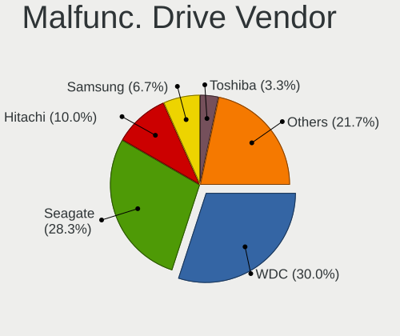

| Vendor              | Desktops | Drives | Percent |
|---------------------|----------|--------|---------|
| WDC                 | 18       | 37     | 30%     |
| Seagate             | 17       | 23     | 28.33%  |
| Hitachi             | 6        | 8      | 10%     |
| Samsung Electronics | 4        | 4      | 6.67%   |
| Toshiba             | 2        | 4      | 3.33%   |
| Western Digital     | 1        | 2      | 1.67%   |
| SanDisk             | 1        | 1      | 1.67%   |
| Netac               | 1        | 1      | 1.67%   |
| Micron Technology   | 1        | 1      | 1.67%   |
| Maxtor              | 1        | 1      | 1.67%   |
| Lexar               | 1        | 1      | 1.67%   |
| Intel               | 1        | 1      | 1.67%   |
| Inateck             | 1        | 1      | 1.67%   |
| HGST                | 1        | 1      | 1.67%   |
| DRVEO               | 1        | 1      | 1.67%   |
| China               | 1        | 1      | 1.67%   |
| ADATA Technology    | 1        | 1      | 1.67%   |
| A-DATA Technology   | 1        | 1      | 1.67%   |

Malfunc. HDD Vendor
-------------------

Vendors of faulty HDD drives

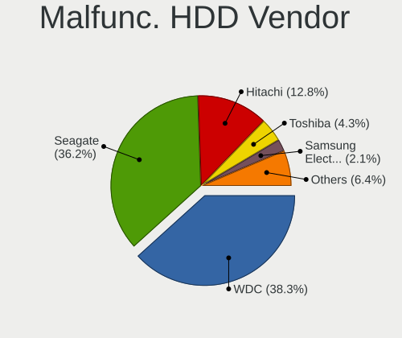

| Vendor              | Desktops | Drives | Percent |
|---------------------|----------|--------|---------|
| WDC                 | 18       | 37     | 38.3%   |
| Seagate             | 17       | 23     | 36.17%  |
| Hitachi             | 6        | 8      | 12.77%  |
| Toshiba             | 2        | 4      | 4.26%   |
| Samsung Electronics | 1        | 1      | 2.13%   |
| Maxtor              | 1        | 1      | 2.13%   |
| Inateck             | 1        | 1      | 2.13%   |
| HGST                | 1        | 1      | 2.13%   |

Malfunc. Drive Kind
-------------------

Kinds of faulty drives

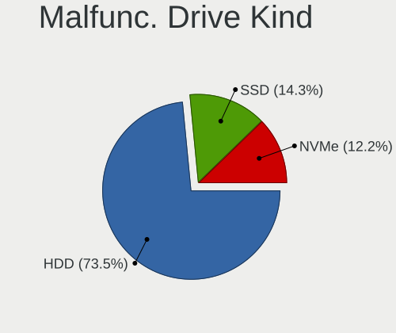

| Kind | Desktops | Drives | Percent |
|------|----------|--------|---------|
| HDD  | 36       | 76     | 73.47%  |
| SSD  | 7        | 7      | 14.29%  |
| NVMe | 6        | 7      | 12.24%  |

Failed Drives
-------------

Failed drive models

Zero info for selected period =(

Failed Drive Vendor
-------------------

Failed drive vendors

Zero info for selected period =(

Drive Status
------------

Number of failed and malfunc. drives

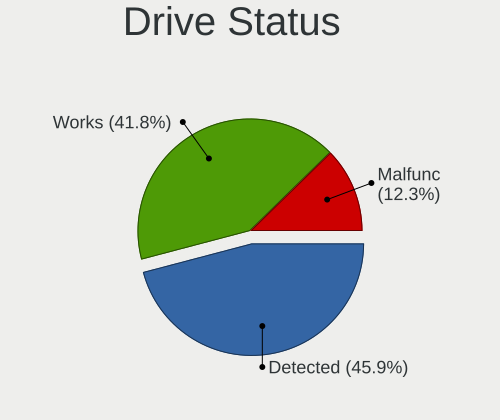

| Status   | Desktops | Drives | Percent |
|----------|----------|--------|---------|
| Detected | 179      | 558    | 45.9%   |
| Works    | 163      | 438    | 41.79%  |
| Malfunc  | 48       | 90     | 12.31%  |

Storage controller
------------------

Storage Vendor
--------------

Storage controller vendors

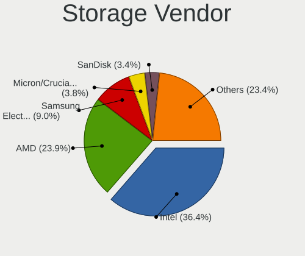

| Vendor                       | Desktops | Percent |
|------------------------------|----------|---------|
| Intel                        | 190      | 36.4%   |
| AMD                          | 125      | 23.95%  |
| Samsung Electronics          | 47       | 9%      |
| Micron/Crucial Technology    | 20       | 3.83%   |
| SanDisk                      | 18       | 3.45%   |
| ASMedia Technology           | 15       | 2.87%   |
| Phison Electronics           | 14       | 2.68%   |
| Marvell Technology Group     | 14       | 2.68%   |
| Kingston Technology Company  | 13       | 2.49%   |
| JMicron Technology           | 10       | 1.92%   |
| ADATA Technology             | 8        | 1.53%   |
| Nvidia                       | 7        | 1.34%   |
| MAXIO Technology (Hangzhou)  | 6        | 1.15%   |
| Toshiba America Info Systems | 5        | 0.96%   |
| Silicon Motion               | 5        | 0.96%   |
| Micron Technology            | 4        | 0.77%   |
| LSI Logic / Symbios Logic    | 4        | 0.77%   |
| SK hynix                     | 3        | 0.57%   |
| Union Memory (Shenzhen)      | 2        | 0.38%   |
| Shenzhen Longsys Electronics | 2        | 0.38%   |
| Realtek Semiconductor        | 2        | 0.38%   |
| KIOXIA                       | 2        | 0.38%   |
| ULi Electronics              | 1        | 0.19%   |
| Transcend                    | 1        | 0.19%   |
| Seagate Technology           | 1        | 0.19%   |
| O2 Micro                     | 1        | 0.19%   |
| INNOGRIT                     | 1        | 0.19%   |
| Broadcom / LSI               | 1        | 0.19%   |

Storage Model
-------------

Storage controller models

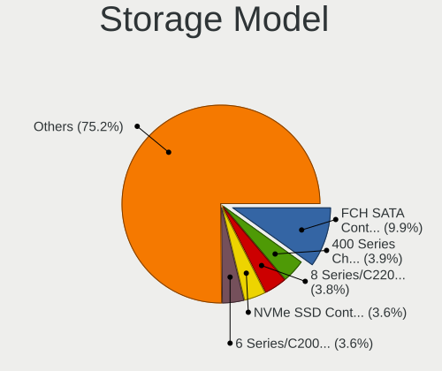

| Model                                                                                   | Desktops | Percent |
|-----------------------------------------------------------------------------------------|----------|---------|
| AMD FCH SATA Controller [AHCI mode]                                                     | 63       | 9.91%   |
| AMD 400 Series Chipset SATA Controller                                                  | 25       | 3.93%   |
| Intel 8 Series/C220 Series Chipset Family 6-port SATA Controller 1 [AHCI mode]          | 24       | 3.77%   |
| Samsung NVMe SSD Controller SM981/PM981/PM983                                           | 23       | 3.62%   |
| Intel 6 Series/C200 Series Chipset Family 6 port Desktop SATA AHCI Controller           | 23       | 3.62%   |
| Intel 7 Series/C210 Series Chipset Family 6-port SATA Controller [AHCI mode]            | 21       | 3.3%    |
| AMD 500 Series Chipset SATA Controller                                                  | 19       | 2.99%   |
| AMD 600 Series Chipset SATA Controller                                                  | 18       | 2.83%   |
| ASMedia ASM1061/ASM1062 Serial ATA Controller                                           | 13       | 2.04%   |
| Samsung NVMe SSD Controller PM9A1/PM9A3/980PRO                                          | 12       | 1.89%   |
| Intel SATA Controller [RAID mode]                                                       | 12       | 1.89%   |
| Intel Q170/Q150/B150/H170/H110/Z170/CM236 Chipset SATA Controller [AHCI Mode]           | 12       | 1.89%   |
| Intel 6 Series/C200 Series Chipset Family Desktop SATA Controller (IDE mode, ports 4-5) | 12       | 1.89%   |
| Intel 6 Series/C200 Series Chipset Family Desktop SATA Controller (IDE mode, ports 0-3) | 12       | 1.89%   |
| Micron/Crucial P2 [Nick P2] / P3 / P3 Plus NVMe PCIe SSD (DRAM-less)                    | 11       | 1.73%   |
| Intel 200 Series PCH SATA controller [AHCI mode]                                        | 10       | 1.57%   |
| AMD SB7x0/SB8x0/SB9x0 IDE Controller                                                    | 10       | 1.57%   |
| AMD SB7x0/SB8x0/SB9x0 SATA Controller [AHCI mode]                                       | 9        | 1.42%   |
| Samsung NVMe SSD Controller 980 (DRAM-less)                                             | 8        | 1.26%   |
| Intel 82801JI (ICH10 Family) SATA AHCI Controller                                       | 8        | 1.26%   |
| Phison E12 NVMe Controller                                                              | 7        | 1.1%    |
| Intel 9 Series Chipset Family SATA Controller [AHCI Mode]                               | 7        | 1.1%    |
| Intel 4 Series Chipset PT IDER Controller                                               | 7        | 1.1%    |
| MAXIO (Hangzhou) NVMe SSD Controller MAP1202 (DRAM-less)                                | 6        | 0.94%   |
| JMicron JMB363 SATA/IDE Controller                                                      | 6        | 0.94%   |
| Intel Cannon Lake PCH SATA AHCI Controller                                              | 6        | 0.94%   |
| Intel 82801G (ICH7 Family) IDE Controller                                               | 6        | 0.94%   |
| AMD SB7x0/SB8x0/SB9x0 SATA Controller [IDE mode]                                        | 6        | 0.94%   |
| Silicon Motion SM2263EN/SM2263XT (DRAM-less) NVMe SSD Controllers                       | 5        | 0.79%   |
| Samsung NVMe SSD Controller SM961/PM961/SM963                                           | 5        | 0.79%   |
| Phison E16 PCIe4 NVMe Controller                                                        | 5        | 0.79%   |
| Intel NM10/ICH7 Family SATA Controller [IDE mode]                                       | 5        | 0.79%   |
| Intel Alder Lake-S PCH SATA Controller [AHCI Mode]                                      | 5        | 0.79%   |
| Intel Alder Lake-N SATA AHCI Controller                                                 | 5        | 0.79%   |
| Intel 82801JD/DO (ICH10 Family) SATA AHCI Controller                                    | 5        | 0.79%   |
| Intel 7 Series/C210 Series Chipset Family 4-port SATA Controller [IDE mode]             | 5        | 0.79%   |
| Intel 7 Series/C210 Series Chipset Family 2-port SATA Controller [IDE mode]             | 5        | 0.79%   |
| AMD A320 Chipset SATA Controller [AHCI mode]                                            | 5        | 0.79%   |
| SanDisk Extreme Pro / WD Black SN750 / PC SN730 / Red SN700 NVMe SSD                    | 4        | 0.63%   |
| Nvidia MCP61 SATA Controller                                                            | 4        | 0.63%   |

Storage Kind
------------

Kind of storage controller (IDE, SATA, NVMe, SAS, ...)

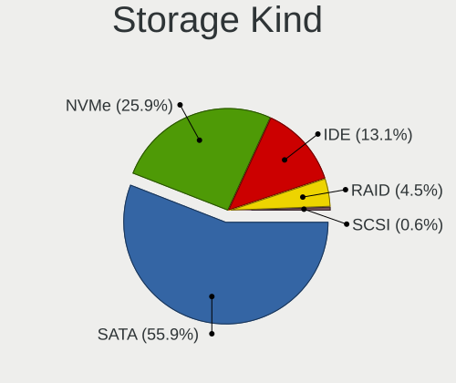

| Kind | Desktops | Percent |
|------|----------|---------|
| SATA | 274      | 55.92%  |
| NVMe | 127      | 25.92%  |
| IDE  | 64       | 13.06%  |
| RAID | 22       | 4.49%   |
| SCSI | 3        | 0.61%   |

Processor
---------

CPU Vendor
----------

Processor vendors

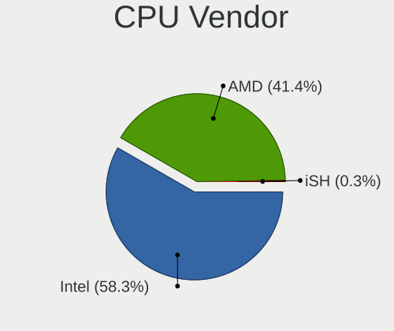

| Vendor | Desktops | Percent |
|--------|----------|---------|
| Intel  | 193      | 58.31%  |
| AMD    | 137      | 41.39%  |
| iSH    | 1        | 0.3%    |

CPU Model
---------

Processor models

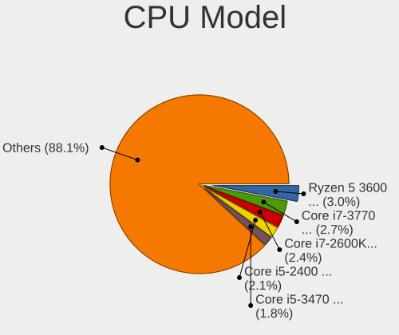

| Model                                       | Desktops | Percent |
|---------------------------------------------|----------|---------|
| AMD Ryzen 5 3600 6-Core Processor           | 10       | 2.98%   |
| Intel Core i7-3770 CPU @ 3.40GHz            | 9        | 2.68%   |
| Intel Core i7-2600K CPU @ 3.40GHz           | 8        | 2.38%   |
| Intel Core i5-2400 CPU @ 3.10GHz            | 7        | 2.08%   |
| Intel Core i5-3470 CPU @ 3.20GHz            | 6        | 1.79%   |
| AMD Ryzen 5 5600X 6-Core Processor          | 6        | 1.79%   |
| AMD Ryzen 5 3400G with Radeon Vega Graphics | 6        | 1.79%   |
| Intel Core i7-3770K CPU @ 3.50GHz           | 5        | 1.49%   |
| AMD Ryzen 9 5900X 12-Core Processor         | 5        | 1.49%   |
| AMD Ryzen 7 5800X 8-Core Processor          | 5        | 1.49%   |
| Intel N100                                  | 4        | 1.19%   |
| Intel Core i5-4570 CPU @ 3.20GHz            | 4        | 1.19%   |
| Intel Core i5-4460S CPU @ 2.90GHz           | 4        | 1.19%   |
| Intel Core i3-2100 CPU @ 3.10GHz            | 4        | 1.19%   |
| Intel Core 2 Quad CPU Q6600 @ 2.40GHz       | 4        | 1.19%   |
| AMD Ryzen 9 3900X 12-Core Processor         | 4        | 1.19%   |
| AMD Ryzen 5 2600X Six-Core Processor        | 4        | 1.19%   |
| AMD Ryzen 5 2600 Six-Core Processor         | 4        | 1.19%   |
| Intel Pentium 4 CPU 3.00GHz                 | 3        | 0.89%   |
| Intel Core i7-6700K CPU @ 4.00GHz           | 3        | 0.89%   |
| Intel Core i7-2600 CPU @ 3.40GHz            | 3        | 0.89%   |
| Intel Core i3-4150 CPU @ 3.50GHz            | 3        | 0.89%   |
| Intel Core i3-3220 CPU @ 3.30GHz            | 3        | 0.89%   |
| Intel Core i3-2120 CPU @ 3.30GHz            | 3        | 0.89%   |
| Intel Celeron J4105 CPU @ 1.50GHz           | 3        | 0.89%   |
| AMD Ryzen 7 3800X 8-Core Processor          | 3        | 0.89%   |
| AMD Ryzen 7 2700X Eight-Core Processor      | 3        | 0.89%   |
| AMD Athlon II X4 620 Processor              | 3        | 0.89%   |
| AMD Athlon 64 X2 Dual Core Processor 4200+  | 3        | 0.89%   |
| Intel Xeon CPU X5690 @ 3.47GHz              | 2        | 0.6%    |
| Intel Pentium Dual-Core CPU E5800 @ 3.20GHz | 2        | 0.6%    |
| Intel Core i7-8700K CPU @ 3.70GHz           | 2        | 0.6%    |
| Intel Core i7-4790K CPU @ 4.00GHz           | 2        | 0.6%    |
| Intel Core i7-4770K CPU @ 3.50GHz           | 2        | 0.6%    |
| Intel Core i5-8600K CPU @ 3.60GHz           | 2        | 0.6%    |
| Intel Core i5-8500T CPU @ 2.10GHz           | 2        | 0.6%    |
| Intel Core i5-8400 CPU @ 2.80GHz            | 2        | 0.6%    |
| Intel Core i5-7500 CPU @ 3.40GHz            | 2        | 0.6%    |
| Intel Core i5-6500T CPU @ 2.50GHz           | 2        | 0.6%    |
| Intel Core i5-4690K CPU @ 3.50GHz           | 2        | 0.6%    |

CPU Model Family
----------------

Processor model prefix

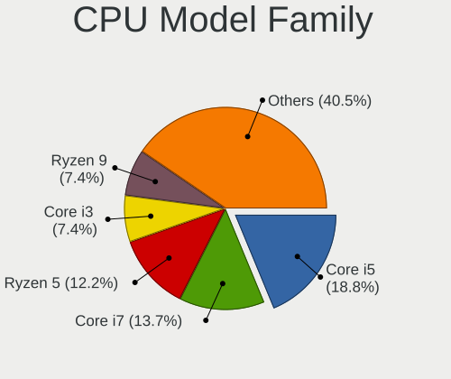

| Model                   | Desktops | Percent |
|-------------------------|----------|---------|
| Intel Core i5           | 63       | 18.75%  |
| Intel Core i7           | 46       | 13.69%  |
| AMD Ryzen 5             | 41       | 12.2%   |
| Intel Core i3           | 25       | 7.44%   |
| AMD Ryzen 9             | 25       | 7.44%   |
| AMD Ryzen 7             | 25       | 7.44%   |
| Intel Xeon              | 16       | 4.76%   |
| Other                   | 13       | 3.87%   |
| Intel Core 2 Quad       | 9        | 2.68%   |
| Intel Celeron           | 6        | 1.79%   |
| AMD Ryzen Threadripper  | 6        | 1.79%   |
| AMD Athlon 64 X2        | 6        | 1.79%   |
| Intel Core 2 Duo        | 5        | 1.49%   |
| AMD FX                  | 5        | 1.49%   |
| Intel Pentium 4         | 4        | 1.19%   |
| AMD Ryzen 3             | 4        | 1.19%   |
| Intel Pentium Dual-Core | 3        | 0.89%   |
| Intel Pentium           | 3        | 0.89%   |
| AMD Phenom II X4        | 3        | 0.89%   |
| AMD Athlon II X4        | 3        | 0.89%   |
| AMD Athlon II X2        | 3        | 0.89%   |
| AMD A6                  | 3        | 0.89%   |
| Intel Pentium D         | 2        | 0.6%    |
| Intel Atom              | 2        | 0.6%    |
| AMD Ryzen Embedded      | 2        | 0.6%    |
| AMD Phenom II X6        | 2        | 0.6%    |
| AMD A4                  | 2        | 0.6%    |
| Intel Pentium Silver    | 1        | 0.3%    |
| Intel Core i9           | 1        | 0.3%    |
| AMD Turion II Neo       | 1        | 0.3%    |
| AMD Ryzen 5 PRO         | 1        | 0.3%    |
| AMD PRO A10             | 1        | 0.3%    |
| AMD GX                  | 1        | 0.3%    |
| AMD Athlon Dual Core    | 1        | 0.3%    |
| AMD A8                  | 1        | 0.3%    |
| AMD A10                 | 1        | 0.3%    |

CPU Cores
---------

Number of processor cores

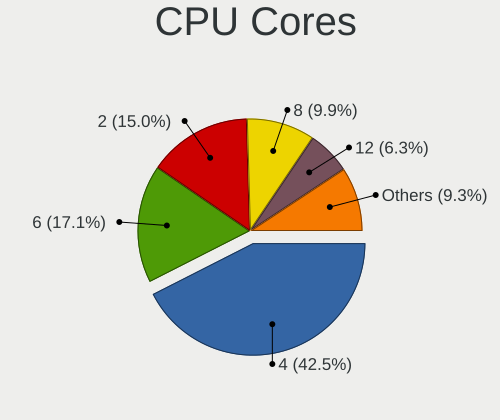

| Number  | Desktops | Percent |
|---------|----------|---------|
| 4       | 142      | 42.51%  |
| 6       | 57       | 17.07%  |
| 2       | 50       | 14.97%  |
| 8       | 33       | 9.88%   |
| 12      | 21       | 6.29%   |
| 16      | 10       | 2.99%   |
| 1       | 9        | 2.69%   |
| 32      | 3        | 0.9%    |
| 3       | 2        | 0.6%    |
| Unknown | 2        | 0.6%    |
| 44      | 1        | 0.3%    |
| 24      | 1        | 0.3%    |
| 20      | 1        | 0.3%    |
| 14      | 1        | 0.3%    |
| 10      | 1        | 0.3%    |

CPU Sockets
-----------

Number of sockets

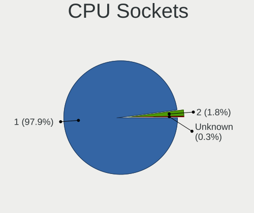

| Number  | Desktops | Percent |
|---------|----------|---------|
| 1       | 324      | 97.89%  |
| 2       | 6        | 1.81%   |
| Unknown | 1        | 0.3%    |

CPU Threads
-----------

Threads per core (Hyper-Threading)

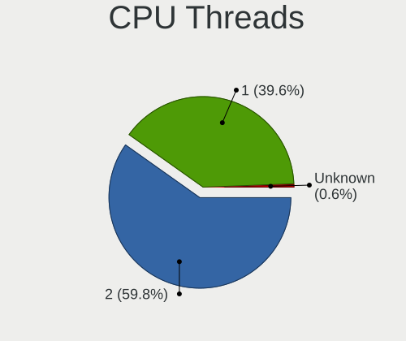

| Number  | Desktops | Percent |
|---------|----------|---------|
| 2       | 201      | 59.82%  |
| 1       | 133      | 39.58%  |
| Unknown | 2        | 0.6%    |

CPU Op-Modes
------------

CPU Operation Modes (32-bit, 64-bit)

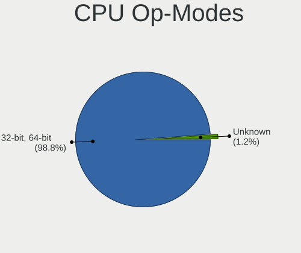

| Op mode        | Desktops | Percent |
|----------------|----------|---------|
| 32-bit, 64-bit | 327      | 98.79%  |
| Unknown        | 4        | 1.21%   |

CPU Microcode
-------------

Microcode number

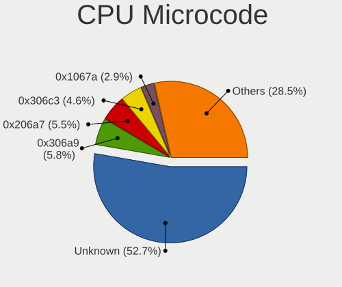

| Number     | Desktops | Percent |
|------------|----------|---------|
| Unknown    | 183      | 52.74%  |
| 0x306a9    | 20       | 5.76%   |
| 0x206a7    | 19       | 5.48%   |
| 0x306c3    | 16       | 4.61%   |
| 0x1067a    | 10       | 2.88%   |
| 0x08701021 | 7        | 2.02%   |
| 0x0800820d | 6        | 1.73%   |
| 0x506e3    | 5        | 1.44%   |
| 0x08108109 | 5        | 1.44%   |
| 0x206c2    | 4        | 1.15%   |
| 0xf43      | 3        | 0.86%   |
| 0xa0653    | 3        | 0.86%   |
| 0x906ea    | 3        | 0.86%   |
| 0x6fb      | 3        | 0.86%   |
| 0x0810100b | 3        | 0.86%   |
| 0x06000852 | 3        | 0.86%   |
| 0x010000db | 3        | 0.86%   |
| 0x010000c8 | 3        | 0.86%   |
| 0x906e9    | 2        | 0.58%   |
| 0x30661    | 2        | 0.58%   |
| 0x106e5    | 2        | 0.58%   |
| 0x106a5    | 2        | 0.58%   |
| 0x0a601206 | 2        | 0.58%   |
| 0x0a601203 | 2        | 0.58%   |
| 0x0a201016 | 2        | 0.58%   |
| 0x08701013 | 2        | 0.58%   |
| 0x0600611a | 2        | 0.58%   |
| 0xf64      | 1        | 0.29%   |
| 0xf47      | 1        | 0.29%   |
| 0xf41      | 1        | 0.29%   |
| 0xa0655    | 1        | 0.29%   |
| 0x906ed    | 1        | 0.29%   |
| 0x906eb    | 1        | 0.29%   |
| 0x906c0    | 1        | 0.29%   |
| 0x706a1    | 1        | 0.29%   |
| 0x6f7      | 1        | 0.29%   |
| 0x406f1    | 1        | 0.29%   |
| 0x306e4    | 1        | 0.29%   |
| 0x30678    | 1        | 0.29%   |
| 0x10677    | 1        | 0.29%   |

CPU Microarch
-------------

Microarchitecture

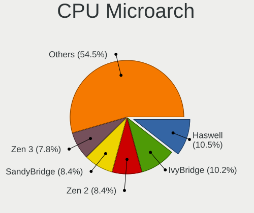

| Name             | Desktops | Percent |
|------------------|----------|---------|
| Haswell          | 35       | 10.54%  |
| IvyBridge        | 34       | 10.24%  |
| Zen 2            | 28       | 8.43%   |
| SandyBridge      | 28       | 8.43%   |
| Zen 3            | 26       | 7.83%   |
| Unknown          | 26       | 7.83%   |
| Zen+             | 20       | 6.02%   |
| KabyLake         | 19       | 5.72%   |
| Penryn           | 13       | 3.92%   |
| K10              | 12       | 3.61%   |
| Skylake          | 11       | 3.31%   |
| Zen              | 8        | 2.41%   |
| Piledriver       | 8        | 2.41%   |
| Westmere         | 7        | 2.11%   |
| Nehalem          | 7        | 2.11%   |
| K8 Hammer        | 7        | 2.11%   |
| NetBurst         | 6        | 1.81%   |
| CometLake        | 6        | 1.81%   |
| Gracemont        | 5        | 1.51%   |
| Core             | 5        | 1.51%   |
| Alderlake Hybrid | 5        | 1.51%   |
| Goldmont plus    | 4        | 1.2%    |
| Excavator        | 2        | 0.6%    |
| Broadwell        | 2        | 0.6%    |
| Bonnell          | 2        | 0.6%    |
| Tremont          | 1        | 0.3%    |
| Steamroller      | 1        | 0.3%    |
| Silvermont       | 1        | 0.3%    |
| K10 Llano        | 1        | 0.3%    |
| Jaguar           | 1        | 0.3%    |
| Bulldozer        | 1        | 0.3%    |

Graphics
--------

GPU Vendor
----------

Vendors of graphics cards

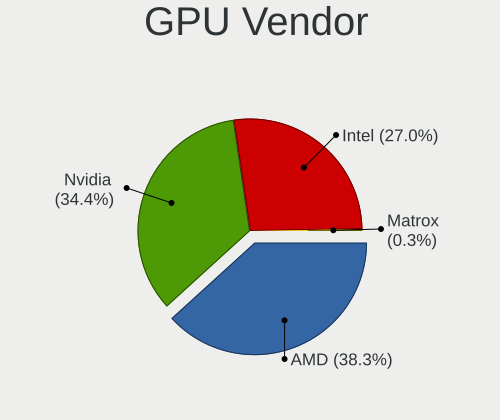

| Vendor                     | Desktops | Percent |
|----------------------------|----------|---------|
| AMD                        | 140      | 38.25%  |
| Nvidia                     | 126      | 34.43%  |
| Intel                      | 99       | 27.05%  |
| Matrox Electronics Systems | 1        | 0.27%   |

GPU Model
---------

Graphics card models

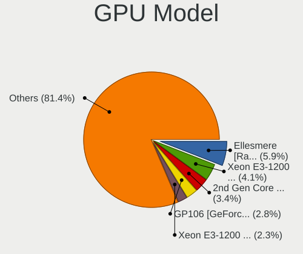

| Model                                                                       | Desktops | Percent |
|-----------------------------------------------------------------------------|----------|---------|
| AMD Ellesmere [Radeon RX 470/480/570/570X/580/580X/590]                     | 23       | 5.93%   |
| Intel Xeon E3-1200 v3/4th Gen Core Processor Integrated Graphics Controller | 16       | 4.12%   |
| Intel 2nd Generation Core Processor Family Integrated Graphics Controller   | 13       | 3.35%   |
| Nvidia GP106 [GeForce GTX 1060 6GB]                                         | 11       | 2.84%   |
| Intel Xeon E3-1200 v2/3rd Gen Core processor Graphics Controller            | 9        | 2.32%   |
| Nvidia GP107 [GeForce GTX 1050 Ti]                                          | 8        | 2.06%   |
| Intel 4 Series Chipset Integrated Graphics Controller                       | 8        | 2.06%   |
| AMD Raphael                                                                 | 8        | 2.06%   |
| AMD Oland [Radeon HD 8570 / R5 430 OEM / R7 240/340 / Radeon 520 OEM]       | 8        | 2.06%   |
| Intel CoffeeLake-S GT2 [UHD Graphics 630]                                   | 7        | 1.8%    |
| Nvidia GT218 [GeForce 210]                                                  | 6        | 1.55%   |
| Intel IvyBridge GT2 [HD Graphics 4000]                                      | 6        | 1.55%   |
| Intel 4th Generation Core Processor Family Integrated Graphics Controller   | 6        | 1.55%   |
| AMD Navi 10 [Radeon RX 5600 OEM/5600 XT / 5700/5700 XT]                     | 6        | 1.55%   |
| Nvidia GM107 [GeForce GTX 750 Ti]                                           | 5        | 1.29%   |
| Intel Skylake-S GT2 [HD Graphics 530]                                       | 5        | 1.29%   |
| Intel Alder Lake-N [UHD Graphics]                                           | 5        | 1.29%   |
| AMD Raven Ridge [Radeon Vega Series / Radeon Vega Mobile Series]            | 5        | 1.29%   |
| AMD Navi 21 [Radeon RX 6800/6800 XT / 6900 XT]                              | 5        | 1.29%   |
| AMD Cedar [Radeon HD 5000/6000/7350/8350 Series]                            | 5        | 1.29%   |
| AMD Caicos PRO [Radeon HD 7450]                                             | 5        | 1.29%   |
| Nvidia TU117 [GeForce GTX 1650]                                             | 4        | 1.03%   |
| Nvidia GM206 [GeForce GTX 960]                                              | 4        | 1.03%   |
| Intel Kaby Lake-S GT2 [HD Graphics 630]                                     | 4        | 1.03%   |
| Intel CometLake-S GT2 [UHD Graphics 630]                                    | 4        | 1.03%   |
| AMD Navi 31 [Radeon RX 7900 XT/7900 XTX/7900 GRE/7900M]                     | 4        | 1.03%   |
| AMD Navi 22 [Radeon RX 6700/6700 XT/6750 XT / 6800M/6850M XT]               | 4        | 1.03%   |
| Nvidia TU104 [GeForce RTX 2070 SUPER]                                       | 3        | 0.77%   |
| Nvidia GP107 [GeForce GTX 1050]                                             | 3        | 0.77%   |
| Nvidia GP104 [GeForce GTX 1070]                                             | 3        | 0.77%   |
| Nvidia GM204 [GeForce GTX 980]                                              | 3        | 0.77%   |
| Nvidia GK208B [GeForce GT 710]                                              | 3        | 0.77%   |
| Nvidia GF119 [GeForce GT 610]                                               | 3        | 0.77%   |
| Nvidia GA106 [GeForce RTX 3060 Lite Hash Rate]                              | 3        | 0.77%   |
| Nvidia GA102 [GeForce RTX 3090]                                             | 3        | 0.77%   |
| Intel GeminiLake [UHD Graphics 600]                                         | 3        | 0.77%   |
| AMD Tobago PRO [Radeon R7 360 / R9 360 OEM]                                 | 3        | 0.77%   |
| AMD Picasso/Raven 2 [Radeon Vega Series / Radeon Vega Mobile Series]        | 3        | 0.77%   |
| AMD Phoenix1                                                                | 3        | 0.77%   |
| AMD Oland PRO [Radeon R7 240/340 / Radeon 520]                              | 3        | 0.77%   |

GPU Combo
---------

Combinations of graphics cards

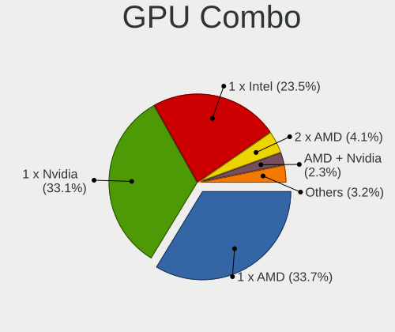

| Name           | Desktops | Percent |
|----------------|----------|---------|
| 1 x AMD        | 116      | 33.72%  |
| 1 x Nvidia     | 114      | 33.14%  |
| 1 x Intel      | 81       | 23.55%  |
| 2 x AMD        | 14       | 4.07%   |
| AMD + Nvidia   | 8        | 2.33%   |
| Intel + AMD    | 4        | 1.16%   |
| Intel + Nvidia | 3        | 0.87%   |
| Other          | 1        | 0.29%   |
| 2 x Nvidia     | 1        | 0.29%   |
| 2 x Intel      | 1        | 0.29%   |
| 1 x Matrox     | 1        | 0.29%   |

GPU Driver
----------

Free vs proprietary

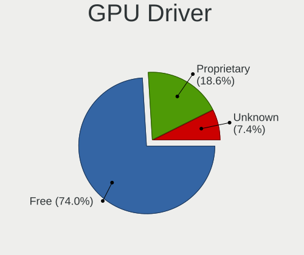

| Driver      | Desktops | Percent |
|-------------|----------|---------|
| Free        | 251      | 74.04%  |
| Proprietary | 63       | 18.58%  |
| Unknown     | 25       | 7.37%   |

GPU Memory
----------

Total video memory

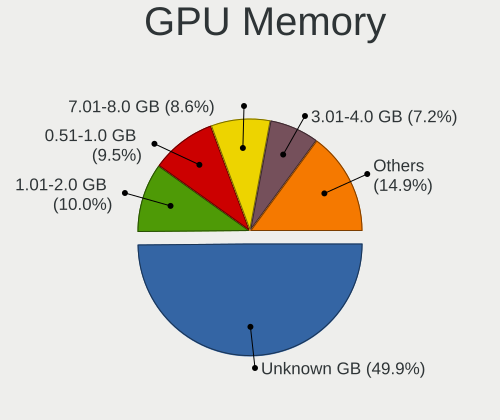

| Size in GB | Desktops | Percent |
|------------|----------|---------|
| Unknown    | 174      | 49.86%  |
| 1.01-2.0   | 35       | 10.03%  |
| 0.51-1.0   | 33       | 9.46%   |
| 7.01-8.0   | 30       | 8.6%    |
| 3.01-4.0   | 25       | 7.16%   |
| 8.01-16.0  | 16       | 4.58%   |
| 0.01-0.5   | 15       | 4.3%    |
| 5.01-6.0   | 14       | 4.01%   |
| 16.01-24.0 | 5        | 1.43%   |
| 2.01-3.0   | 2        | 0.57%   |

Monitor
-------

Monitor Vendor
--------------

Monitor vendors

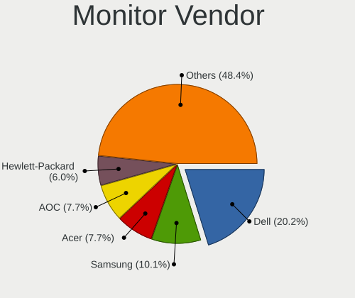

| Vendor               | Desktops | Percent |
|----------------------|----------|---------|
| Dell                 | 74       | 20.22%  |
| Samsung Electronics  | 37       | 10.11%  |
| AOC                  | 28       | 7.65%   |
| Acer                 | 28       | 7.65%   |
| Hewlett-Packard      | 22       | 6.01%   |
| Goldstar             | 21       | 5.74%   |
| BenQ                 | 21       | 5.74%   |
| Philips              | 20       | 5.46%   |
| Iiyama               | 16       | 4.37%   |
| ASUSTek Computer     | 12       | 3.28%   |
| Lenovo               | 10       | 2.73%   |
| Ancor Communications | 8        | 2.19%   |
| Sony                 | 6        | 1.64%   |
| ViewSonic            | 5        | 1.37%   |
| Vestel Elektronik    | 5        | 1.37%   |
| MSI                  | 5        | 1.37%   |
| HannStar             | 5        | 1.37%   |
| Unknown              | 3        | 0.82%   |
| HKC                  | 3        | 0.82%   |
| Apple                | 3        | 0.82%   |
| ___                  | 2        | 0.55%   |
| Toshiba              | 2        | 0.55%   |
| Panasonic            | 2        | 0.55%   |
| NEC Computers        | 2        | 0.55%   |
| MiTAC                | 2        | 0.55%   |
| Medion               | 2        | 0.55%   |
| HannStar Display     | 2        | 0.55%   |
| WIT                  | 1        | 0.27%   |
| UGD                  | 1        | 0.27%   |
| Targa Visionary      | 1        | 0.27%   |
| Targa                | 1        | 0.27%   |
| RTK                  | 1        | 0.27%   |
| Pixio                | 1        | 0.27%   |
| Packard Bell         | 1        | 0.27%   |
| OEM                  | 1        | 0.27%   |
| LG Electronics       | 1        | 0.27%   |
| Idek Iiyama          | 1        | 0.27%   |
| HYO                  | 1        | 0.27%   |
| HVR                  | 1        | 0.27%   |
| HUAWEI               | 1        | 0.27%   |

Monitor Model
-------------

Monitor models

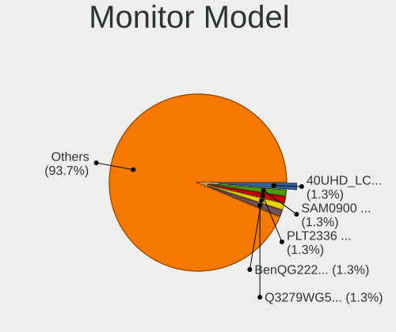

| Model                                                                | Desktops | Percent |
|----------------------------------------------------------------------|----------|---------|
| Vestel Elektronik 40UHD_LCD_TV VES3700 3840x2160 880x500mm 39.8-inch | 5        | 1.26%   |
| Samsung Electronics LCD Monitor SAM0900 1366x768 580x320mm 26.1-inch | 5        | 1.26%   |
| Iiyama PLT2336 IVM5628 1920x1080 509x286mm 23.0-inch                 | 5        | 1.26%   |
| BenQ BenQG2222HDL BNQ7859 1920x1080 478x269mm 21.6-inch              | 5        | 1.26%   |
| AOC Q3279WG5B AOC3279 2560x1440 725x428mm 33.1-inch                  | 5        | 1.26%   |
| AOC 27G2G4 AOC2702 1920x1080 598x336mm 27.0-inch                     | 4        | 1.01%   |
| AOC 24G2W1G3 AOC2402 1920x1080 527x296mm 23.8-inch                   | 4        | 1.01%   |
| AOC 2470W AOC2470 1920x1080 521x293mm 23.5-inch                      | 4        | 1.01%   |
| Lenovo LEN LT2452pwC LEN1144 1920x1080 518x324mm 24.1-inch           | 3        | 0.75%   |
| Goldstar 27GL850 GSM5B7F 2560x1440 597x336mm 27.0-inch               | 3        | 0.75%   |
| Dell P2014H DEL4097 1600x900 434x236mm 19.4-inch                     | 3        | 0.75%   |
| BenQ GW2270 BNQ78DB 1920x1080 476x268mm 21.5-inch                    | 3        | 0.75%   |
| ___ LCD TV ___9000 1360x768                                          | 2        | 0.5%    |
| Unknown LCDTV16 9000 1360x768 1600x900mm 72.3-inch                   | 2        | 0.5%    |
| Sony TV *00 SNY8004 3840x2160 1439x809mm 65.0-inch                   | 2        | 0.5%    |
| Samsung Electronics S24D300 SAM0B43 1920x1080 531x299mm 24.0-inch    | 2        | 0.5%    |
| Samsung Electronics LU28R55 SAM1016 3840x2160 632x360mm 28.6-inch    | 2        | 0.5%    |
| Philips PHL 273V7 PHLC156 1920x1080 598x336mm 27.0-inch              | 2        | 0.5%    |
| Philips PHL 243V7 PHLC155 1920x1080 527x296mm 23.8-inch              | 2        | 0.5%    |
| Philips PHL 242V8 PHLC219 1920x1080 527x296mm 23.8-inch              | 2        | 0.5%    |
| Panasonic TV MEIA296 1920x1080 698x392mm 31.5-inch                   | 2        | 0.5%    |
| Lenovo D22-17 LEN65E4 1920x1080 476x268mm 21.5-inch                  | 2        | 0.5%    |
| Hewlett-Packard LA2205 HWP2848 1680x1050 473x296mm 22.0-inch         | 2        | 0.5%    |
| Hewlett-Packard 27f HPN354B 1920x1080 598x336mm 27.0-inch            | 2        | 0.5%    |
| HannStar HL226HPB HSD6307 1920x1080 477x268mm 21.5-inch              | 2        | 0.5%    |
| Goldstar LG ULTRAWIDE GSM59F1 2560x1080 670x280mm 28.6-inch          | 2        | 0.5%    |
| Goldstar HDR 4K GSM7707 3840x2160 600x340mm 27.2-inch                | 2        | 0.5%    |
| Dell U2722DE DEL4233 2560x1440 597x336mm 27.0-inch                   | 2        | 0.5%    |
| Dell U2412M DELA07A 1920x1200 518x324mm 24.1-inch                    | 2        | 0.5%    |
| Dell S2419HN DELD0D3 1920x1080 527x296mm 23.8-inch                   | 2        | 0.5%    |
| Dell P2419H DELD0D9 1920x1080 527x296mm 23.8-inch                    | 2        | 0.5%    |
| Dell P2317H DEL40F3 1920x1080 509x286mm 23.0-inch                    | 2        | 0.5%    |
| Dell E196FP DELA015 1280x1024 338x270mm 17.0-inch                    | 2        | 0.5%    |
| Dell E171FP DEL300F 1280x1024 338x270mm 17.0-inch                    | 2        | 0.5%    |
| Dell 1703FP DEL3011 1280x1024 338x270mm 17.0-inch                    | 2        | 0.5%    |
| BenQ ZOWIE XL LCD BNQ7F33 1920x1080 531x298mm 24.0-inch              | 2        | 0.5%    |
| ASUSTek Computer VX279 AUS27E4 1920x1080 598x336mm 27.0-inch         | 2        | 0.5%    |
| ASUSTek Computer VP28U AUS28B1 3840x2160 621x341mm 27.9-inch         | 2        | 0.5%    |
| ASUSTek Computer VG32V AUS32A3 2560x1440 697x393mm 31.5-inch         | 2        | 0.5%    |
| ASUSTek Computer VG289 AUS28BA 3840x2160 621x341mm 27.9-inch         | 2        | 0.5%    |

Monitor Resolution
------------------

Monitor screen resolution

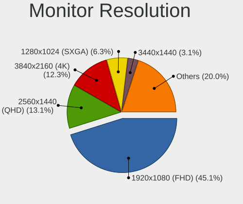

| Resolution         | Desktops | Percent |
|--------------------|----------|---------|
| 1920x1080 (FHD)    | 158      | 45.14%  |
| 2560x1440 (QHD)    | 46       | 13.14%  |
| 3840x2160 (4K)     | 43       | 12.29%  |
| 1280x1024 (SXGA)   | 22       | 6.29%   |
| 3440x1440          | 11       | 3.14%   |
| 1920x1200 (WUXGA)  | 8        | 2.29%   |
| 1680x1050 (WSXGA+) | 8        | 2.29%   |
| 1600x900 (HD+)     | 8        | 2.29%   |
| 1440x900 (WXGA+)   | 7        | 2%      |
| 1366x768 (WXGA)    | 7        | 2%      |
| 1360x768           | 7        | 2%      |
| Unknown            | 6        | 1.71%   |
| 3840x1080          | 5        | 1.43%   |
| 2560x1080          | 3        | 0.86%   |
| 1024x768 (XGA)     | 3        | 0.86%   |
| 6400x2160          | 1        | 0.29%   |
| 5280x2560          | 1        | 0.29%   |
| 4480x1440          | 1        | 0.29%   |
| 3840x1200          | 1        | 0.29%   |
| 3600x1080          | 1        | 0.29%   |
| 2160x1200          | 1        | 0.29%   |
| 1920x540           | 1        | 0.29%   |
| 1600x1200          | 1        | 0.29%   |

Monitor Diagonal
----------------

Diagonal size in inches

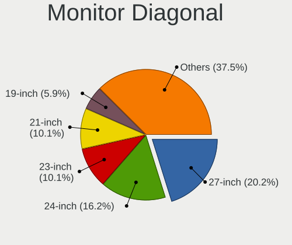

| Inches  | Desktops | Percent |
|---------|----------|---------|
| 27      | 72       | 20.17%  |
| 24      | 58       | 16.25%  |
| 23      | 36       | 10.08%  |
| 21      | 36       | 10.08%  |
| 19      | 21       | 5.88%   |
| Unknown | 21       | 5.88%   |
| 31      | 17       | 4.76%   |
| 34      | 12       | 3.36%   |
| 17      | 11       | 3.08%   |
| 84      | 10       | 2.8%    |
| 22      | 8        | 2.24%   |
| 20      | 7        | 1.96%   |
| 33      | 6        | 1.68%   |
| 18      | 6        | 1.68%   |
| 32      | 5        | 1.4%    |
| 65      | 4        | 1.12%   |
| 15      | 4        | 1.12%   |
| 72      | 3        | 0.84%   |
| 25      | 3        | 0.84%   |
| 54      | 2        | 0.56%   |
| 48      | 2        | 0.56%   |
| 28      | 2        | 0.56%   |
| 75      | 1        | 0.28%   |
| 55      | 1        | 0.28%   |
| 49      | 1        | 0.28%   |
| 46      | 1        | 0.28%   |
| 43      | 1        | 0.28%   |
| 40      | 1        | 0.28%   |
| 39      | 1        | 0.28%   |
| 35      | 1        | 0.28%   |
| 26      | 1        | 0.28%   |
| 13      | 1        | 0.28%   |
| 12      | 1        | 0.28%   |

Monitor Width
-------------

Physical width

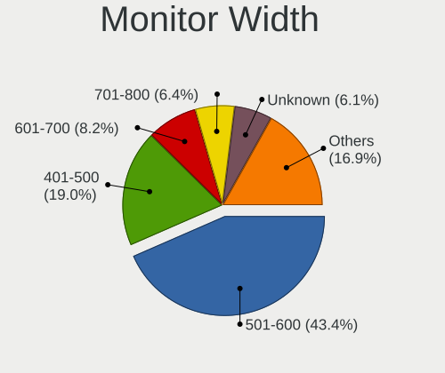

| Width in mm | Desktops | Percent |
|-------------|----------|---------|
| 501-600     | 149      | 43.44%  |
| 401-500     | 65       | 18.95%  |
| 601-700     | 28       | 8.16%   |
| 701-800     | 22       | 6.41%   |
| Unknown     | 21       | 6.12%   |
| 301-350     | 14       | 4.08%   |
| 1501-2000   | 14       | 4.08%   |
| 351-400     | 13       | 3.79%   |
| 1001-1500   | 12       | 3.5%    |
| 801-900     | 2        | 0.58%   |
| 201-300     | 2        | 0.58%   |
| 901-1000    | 1        | 0.29%   |

Aspect Ratio
------------

Proportional relationship between the width and the height

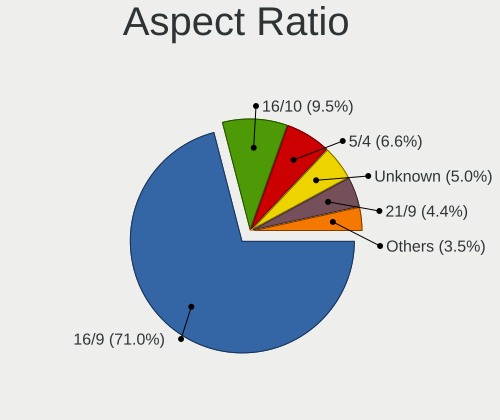

| Ratio   | Desktops | Percent |
|---------|----------|---------|
| 16/9    | 225      | 70.98%  |
| 16/10   | 30       | 9.46%   |
| 5/4     | 21       | 6.62%   |
| Unknown | 16       | 5.05%   |
| 21/9    | 14       | 4.42%   |
| 4/3     | 6        | 1.89%   |
| 32/9    | 3        | 0.95%   |
| 3/2     | 1        | 0.32%   |
| 3.20    | 1        | 0.32%   |

Monitor Area
------------

Area in inch²

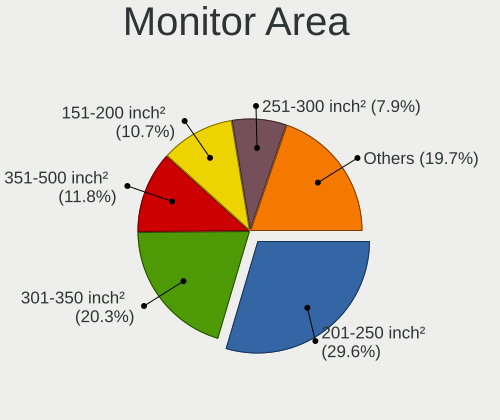

| Area in inch² | Desktops | Percent |
|----------------|----------|---------|
| 201-250        | 105      | 29.58%  |
| 301-350        | 72       | 20.28%  |
| 351-500        | 42       | 11.83%  |
| 151-200        | 38       | 10.7%   |
| 251-300        | 28       | 7.89%   |
| Unknown        | 21       | 5.92%   |
| More than 1000 | 20       | 5.63%   |
| 141-150        | 15       | 4.23%   |
| 501-1000       | 8        | 2.25%   |
| 101-110        | 4        | 1.13%   |
| 71-80          | 2        | 0.56%   |

Pixel Density
-------------

Pixels per inch

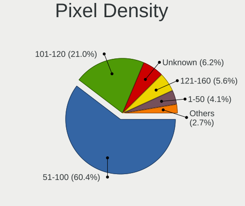

| Density | Desktops | Percent |
|---------|----------|---------|
| 51-100  | 204      | 60.36%  |
| 101-120 | 71       | 21.01%  |
| Unknown | 21       | 6.21%   |
| 121-160 | 19       | 5.62%   |
| 1-50    | 14       | 4.14%   |
| 161-240 | 9        | 2.66%   |

Multiple Monitors
-----------------

Total monitors connected

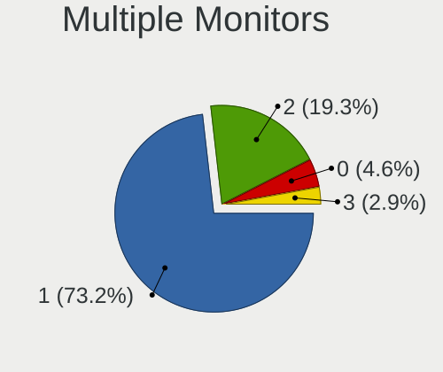

| Total | Desktops | Percent |
|-------|----------|---------|
| 1     | 254      | 73.2%   |
| 2     | 67       | 19.31%  |
| 0     | 16       | 4.61%   |
| 3     | 10       | 2.88%   |

Network
-------

Net Controller Vendor
---------------------

Controller vendors

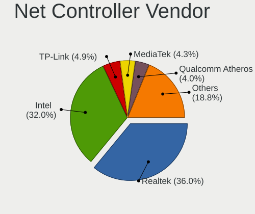

| Vendor                            | Desktops | Percent |
|-----------------------------------|----------|---------|
| Realtek Semiconductor             | 191      | 35.97%  |
| Intel                             | 170      | 32.02%  |
| TP-Link                           | 26       | 4.9%    |
| MediaTek                          | 23       | 4.33%   |
| Qualcomm Atheros                  | 21       | 3.95%   |
| Broadcom                          | 20       | 3.77%   |
| Ralink Technology                 | 17       | 3.2%    |
| Ralink                            | 9        | 1.69%   |
| Microsoft                         | 6        | 1.13%   |
| Nvidia                            | 5        | 0.94%   |
| Marvell Technology Group          | 5        | 0.94%   |
| Aquantia                          | 5        | 0.94%   |
| Samsung Electronics               | 4        | 0.75%   |
| Broadcom Limited                  | 3        | 0.56%   |
| Qualcomm Atheros Communications   | 2        | 0.38%   |
| NetGear                           | 2        | 0.38%   |
| Microchip Technology              | 2        | 0.38%   |
| Huawei Technologies               | 2        | 0.38%   |
| DisplayLink                       | 2        | 0.38%   |
| Belkin Components                 | 2        | 0.38%   |
| ASIX Electronics                  | 2        | 0.38%   |
| ZyDAS                             | 1        | 0.19%   |
| Van Ooijen Technische Informatica | 1        | 0.19%   |
| ULi Electronics                   | 1        | 0.19%   |
| Seeed Technology                  | 1        | 0.19%   |
| NetXen Incorporated               | 1        | 0.19%   |
| Mellanox Technologies             | 1        | 0.19%   |
| JMicron Technology                | 1        | 0.19%   |
| IMC Networks                      | 1        | 0.19%   |
| HMD Global                        | 1        | 0.19%   |
| Dexcom                            | 1        | 0.19%   |
| ASUSTek Computer                  | 1        | 0.19%   |
| ADMtek                            | 1        | 0.19%   |

Net Controller Model
--------------------

Controller models

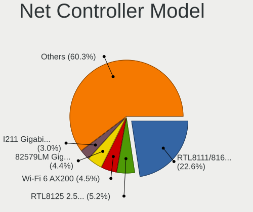

| Model                                                                  | Desktops | Percent |
|------------------------------------------------------------------------|----------|---------|
| Realtek RTL8111/8168/8211/8411 PCI Express Gigabit Ethernet Controller | 135      | 22.61%  |
| Realtek RTL8125 2.5GbE Controller                                      | 31       | 5.19%   |
| Intel Wi-Fi 6 AX200                                                    | 27       | 4.52%   |
| Intel 82579LM Gigabit Network Connection (Lewisville)                  | 26       | 4.36%   |
| Intel I211 Gigabit Network Connection                                  | 18       | 3.02%   |
| Realtek 802.11ac NIC                                                   | 13       | 2.18%   |
| Intel Ethernet Connection I217-LM                                      | 11       | 1.84%   |
| Intel Wi-Fi 5(802.11ac) Wireless-AC 9x6x [Thunder Peak]                | 10       | 1.68%   |
| Ralink MT7601U Wireless Adapter                                        | 9        | 1.51%   |
| MediaTek MT7922 802.11ax PCI Express Wireless Network Adapter          | 9        | 1.51%   |
| Intel Ethernet Controller I225-V                                       | 8        | 1.34%   |
| TP-Link TL-WN823N v2/v3 [Realtek RTL8192EU]                            | 7        | 1.17%   |
| Intel Ethernet Connection (2) I219-V                                   | 7        | 1.17%   |
| Intel 82567LM-3 Gigabit Network Connection                             | 7        | 1.17%   |
| Broadcom BCM4360 802.11ac Dual Band Wireless Network Adapter           | 7        | 1.17%   |
| TP-Link Archer T3U [Realtek RTL8812BU]                                 | 6        | 1.01%   |
| Realtek RTL8821CE 802.11ac PCIe Wireless Network Adapter               | 6        | 1.01%   |
| Microsoft Xbox 360 Wireless Adapter                                    | 6        | 1.01%   |
| Intel Ethernet Connection (2) I218-V                                   | 6        | 1.01%   |
| Realtek RTL8852BE PCIe 802.11ax Wireless Network Controller            | 5        | 0.84%   |
| Realtek RTL8153 Gigabit Ethernet Adapter                               | 5        | 0.84%   |
| Ralink RT5370 Wireless Adapter                                         | 5        | 0.84%   |
| Intel Wireless 7265                                                    | 5        | 0.84%   |
| Intel Ethernet Controller I226-V                                       | 5        | 0.84%   |
| Intel Ethernet Connection (7) I219-V                                   | 5        | 0.84%   |
| Realtek RTL8188EUS 802.11n Wireless Network Adapter                    | 4        | 0.67%   |
| Ralink RT2561/RT61 802.11g PCI                                         | 4        | 0.67%   |
| MediaTek MT7921 802.11ax PCIe Wireless Network Adapter [Filogic 330]   | 4        | 0.67%   |
| Intel Wi-Fi 6E(802.11ax) AX210/AX1675* 2x2 [Typhoon Peak]              | 4        | 0.67%   |
| Intel Ethernet Connection (2) I219-LM                                  | 4        | 0.67%   |
| Intel Dual Band Wireless-AC 3168NGW [Stone Peak]                       | 4        | 0.67%   |
| Intel 82579V Gigabit Network Connection                                | 4        | 0.67%   |
| TP-Link 802.11ac WLAN Adapter                                          | 3        | 0.5%    |
| TP-Link 802.11ac NIC                                                   | 3        | 0.5%    |
| Samsung Galaxy series, misc. (tethering mode)                          | 3        | 0.5%    |
| Realtek RTL88x2bu [AC1200 Techkey]                                     | 3        | 0.5%    |
| Realtek RTL8192CU 802.11n WLAN Adapter                                 | 3        | 0.5%    |
| Realtek RTL-8100/8101L/8139 PCI Fast Ethernet Adapter                  | 3        | 0.5%    |
| Qualcomm Atheros AR9485 Wireless Network Adapter                       | 3        | 0.5%    |
| Qualcomm Atheros AR8161 Gigabit Ethernet                               | 3        | 0.5%    |

Wireless Vendor
---------------

Wireless vendors

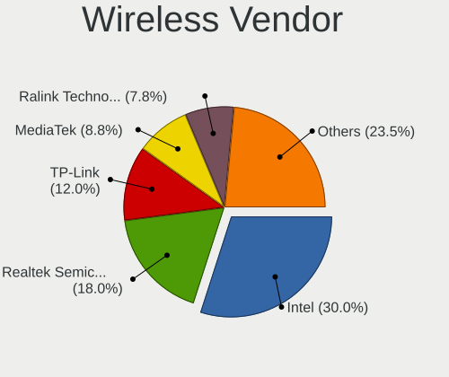

| Vendor                          | Desktops | Percent |
|---------------------------------|----------|---------|
| Intel                           | 65       | 29.95%  |
| Realtek Semiconductor           | 39       | 17.97%  |
| TP-Link                         | 26       | 11.98%  |
| MediaTek                        | 19       | 8.76%   |
| Ralink Technology               | 17       | 7.83%   |
| Qualcomm Atheros                | 17       | 7.83%   |
| Ralink                          | 9        | 4.15%   |
| Broadcom                        | 8        | 3.69%   |
| Microsoft                       | 6        | 2.76%   |
| Qualcomm Atheros Communications | 2        | 0.92%   |
| NetGear                         | 2        | 0.92%   |
| Belkin Components               | 2        | 0.92%   |
| ZyDAS                           | 1        | 0.46%   |
| Marvell Technology Group        | 1        | 0.46%   |
| IMC Networks                    | 1        | 0.46%   |
| Broadcom Limited                | 1        | 0.46%   |
| ASUSTek Computer                | 1        | 0.46%   |

Wireless Model
--------------

Wireless models

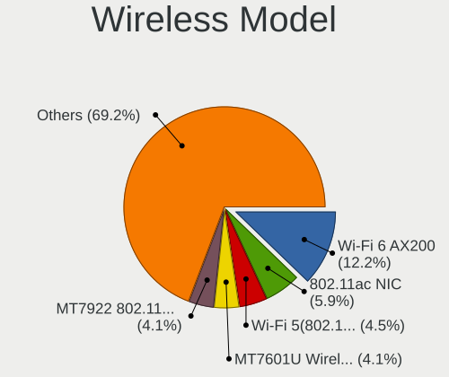

| Model                                                                | Desktops | Percent |
|----------------------------------------------------------------------|----------|---------|
| Intel Wi-Fi 6 AX200                                                  | 27       | 12.22%  |
| Realtek 802.11ac NIC                                                 | 13       | 5.88%   |
| Intel Wi-Fi 5(802.11ac) Wireless-AC 9x6x [Thunder Peak]              | 10       | 4.52%   |
| Ralink MT7601U Wireless Adapter                                      | 9        | 4.07%   |
| MediaTek MT7922 802.11ax PCI Express Wireless Network Adapter        | 9        | 4.07%   |
| TP-Link TL-WN823N v2/v3 [Realtek RTL8192EU]                          | 7        | 3.17%   |
| Broadcom BCM4360 802.11ac Dual Band Wireless Network Adapter         | 7        | 3.17%   |
| TP-Link Archer T3U [Realtek RTL8812BU]                               | 6        | 2.71%   |
| Realtek RTL8821CE 802.11ac PCIe Wireless Network Adapter             | 6        | 2.71%   |
| Microsoft Xbox 360 Wireless Adapter                                  | 6        | 2.71%   |
| Ralink RT5370 Wireless Adapter                                       | 5        | 2.26%   |
| Intel Wireless 7265                                                  | 5        | 2.26%   |
| Realtek RTL8852BE PCIe 802.11ax Wireless Network Controller          | 4        | 1.81%   |
| Realtek RTL8188EUS 802.11n Wireless Network Adapter                  | 4        | 1.81%   |
| Ralink RT2561/RT61 802.11g PCI                                       | 4        | 1.81%   |
| MediaTek MT7921 802.11ax PCIe Wireless Network Adapter [Filogic 330] | 4        | 1.81%   |
| Intel Wi-Fi 6E(802.11ax) AX210/AX1675* 2x2 [Typhoon Peak]            | 4        | 1.81%   |
| Intel Dual Band Wireless-AC 3168NGW [Stone Peak]                     | 4        | 1.81%   |
| TP-Link 802.11ac WLAN Adapter                                        | 3        | 1.36%   |
| TP-Link 802.11ac NIC                                                 | 3        | 1.36%   |
| Realtek RTL88x2bu [AC1200 Techkey]                                   | 3        | 1.36%   |
| Realtek RTL8192CU 802.11n WLAN Adapter                               | 3        | 1.36%   |
| Qualcomm Atheros AR9485 Wireless Network Adapter                     | 3        | 1.36%   |
| TP-Link AC600 wireless Realtek RTL8811AU [Archer T2U Nano]           | 2        | 0.9%    |
| Realtek 802.11ax WLAN Adapter                                        | 2        | 0.9%    |
| Ralink MT7610U ("Archer T2U" 2.4G+5G WLAN Adapter                    | 2        | 0.9%    |
| Qualcomm Atheros AR9462 Wireless Network Adapter                     | 2        | 0.9%    |
| Qualcomm Atheros AR93xx Wireless Network Adapter                     | 2        | 0.9%    |
| Qualcomm Atheros AR9287 Wireless Network Adapter (PCI-Express)       | 2        | 0.9%    |
| MediaTek MT7921K (RZ608) Wi-Fi 6E 80MHz                              | 2        | 0.9%    |
| MediaTek MT7902 802.11ax PCIe Wireless Network Adapter [Filogic 310] | 2        | 0.9%    |
| Intel Wireless 8260                                                  | 2        | 0.9%    |
| Intel Wireless 3165                                                  | 2        | 0.9%    |
| Intel Comet Lake PCH CNVi WiFi                                       | 2        | 0.9%    |
| Intel Cannon Lake PCH CNVi WiFi                                      | 2        | 0.9%    |
| Intel Alder Lake-N PCH CNVi WiFi                                     | 2        | 0.9%    |
| ZyDAS ZD1211B 802.11g                                                | 1        | 0.45%   |
| TP-Link TL-WN821N v5/v6 [RTL8192EU]                                  | 1        | 0.45%   |
| TP-Link TL-WN722N v2/v3 [Realtek RTL8188EUS]                         | 1        | 0.45%   |
| TP-Link RTL8812AU Archer T4U 802.11ac                                | 1        | 0.45%   |

Ethernet Vendor
---------------

Ethernet vendors

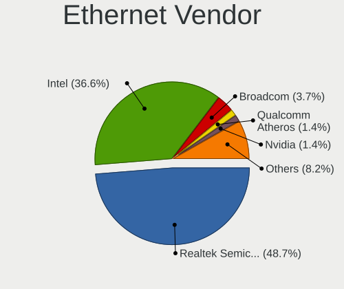

| Vendor                   | Desktops | Percent |
|--------------------------|----------|---------|
| Realtek Semiconductor    | 173      | 48.73%  |
| Intel                    | 130      | 36.62%  |
| Broadcom                 | 13       | 3.66%   |
| Qualcomm Atheros         | 5        | 1.41%   |
| Nvidia                   | 5        | 1.41%   |
| Aquantia                 | 5        | 1.41%   |
| Samsung Electronics      | 4        | 1.13%   |
| Marvell Technology Group | 4        | 1.13%   |
| MediaTek                 | 3        | 0.85%   |
| DisplayLink              | 2        | 0.56%   |
| Broadcom Limited         | 2        | 0.56%   |
| ASIX Electronics         | 2        | 0.56%   |
| ULi Electronics          | 1        | 0.28%   |
| NetXen Incorporated      | 1        | 0.28%   |
| Mellanox Technologies    | 1        | 0.28%   |
| JMicron Technology       | 1        | 0.28%   |
| Huawei Technologies      | 1        | 0.28%   |
| HMD Global               | 1        | 0.28%   |
| ADMtek                   | 1        | 0.28%   |

Ethernet Model
--------------

Ethernet models

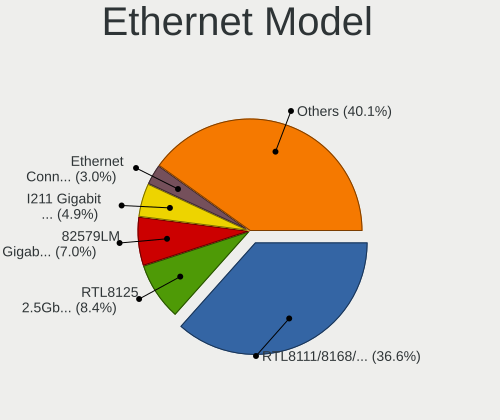

| Model                                                                         | Desktops | Percent |
|-------------------------------------------------------------------------------|----------|---------|
| Realtek RTL8111/8168/8211/8411 PCI Express Gigabit Ethernet Controller        | 135      | 36.59%  |
| Realtek RTL8125 2.5GbE Controller                                             | 31       | 8.4%    |
| Intel 82579LM Gigabit Network Connection (Lewisville)                         | 26       | 7.05%   |
| Intel I211 Gigabit Network Connection                                         | 18       | 4.88%   |
| Intel Ethernet Connection I217-LM                                             | 11       | 2.98%   |
| Intel Ethernet Controller I225-V                                              | 8        | 2.17%   |
| Intel Ethernet Connection (2) I219-V                                          | 7        | 1.9%    |
| Intel 82567LM-3 Gigabit Network Connection                                    | 7        | 1.9%    |
| Intel Ethernet Connection (2) I218-V                                          | 6        | 1.63%   |
| Realtek RTL8153 Gigabit Ethernet Adapter                                      | 5        | 1.36%   |
| Intel Ethernet Controller I226-V                                              | 5        | 1.36%   |
| Intel Ethernet Connection (7) I219-V                                          | 5        | 1.36%   |
| Intel Ethernet Connection (2) I219-LM                                         | 4        | 1.08%   |
| Intel 82579V Gigabit Network Connection                                       | 4        | 1.08%   |
| Samsung Galaxy series, misc. (tethering mode)                                 | 3        | 0.81%   |
| Realtek RTL-8100/8101L/8139 PCI Fast Ethernet Adapter                         | 3        | 0.81%   |
| Qualcomm Atheros AR8161 Gigabit Ethernet                                      | 3        | 0.81%   |
| Intel I210 Gigabit Network Connection                                         | 3        | 0.81%   |
| Intel Ethernet Connection I217-V                                              | 3        | 0.81%   |
| Broadcom NetXtreme BCM5764M Gigabit Ethernet PCIe                             | 3        | 0.81%   |
| Broadcom NetXtreme BCM5754 Gigabit Ethernet PCI Express                       | 3        | 0.81%   |
| Realtek RTL8169 PCI Gigabit Ethernet Controller                               | 2        | 0.54%   |
| Realtek RTL810xE PCI Express Fast Ethernet controller                         | 2        | 0.54%   |
| Nvidia MCP61 Ethernet                                                         | 2        | 0.54%   |
| Nvidia MCP55 Ethernet                                                         | 2        | 0.54%   |
| MediaTek Infinix HOT 50i                                                      | 2        | 0.54%   |
| Intel NM10/ICH7 Family LAN Controller                                         | 2        | 0.54%   |
| Intel Ethernet Connection (7) I219-LM                                         | 2        | 0.54%   |
| Intel Ethernet Connection (17) I219-LM                                        | 2        | 0.54%   |
| Intel 82583V Gigabit Network Connection                                       | 2        | 0.54%   |
| Intel 82574L Gigabit Network Connection                                       | 2        | 0.54%   |
| Intel 82573L Gigabit Ethernet Controller                                      | 2        | 0.54%   |
| Intel 82571EB/82571GB Gigabit Ethernet Controller D0/D1 (copper applications) | 2        | 0.54%   |
| Broadcom NetXtreme BCM5761 Gigabit Ethernet PCIe                              | 2        | 0.54%   |
| Broadcom Limited NetXtreme BCM5755 Gigabit Ethernet PCI Express               | 2        | 0.54%   |
| Aquantia AQC111 NBase-T/IEEE 802.3bz Ethernet Controller [AQtion]             | 2        | 0.54%   |
| ULi ULi 1689,1573 integrated ethernet.                                        | 1        | 0.27%   |
| Samsung GT-I9070 (network tethering, USB debugging enabled)                   | 1        | 0.27%   |
| Realtek RTL8922AE 802.11be PCIe Wireless Network Adapter                      | 1        | 0.27%   |
| Realtek RTL8852BE PCIe 802.11ax Wireless Network Controller                   | 1        | 0.27%   |

Net Controller Kind
-------------------

Ethernet, WiFi or modem

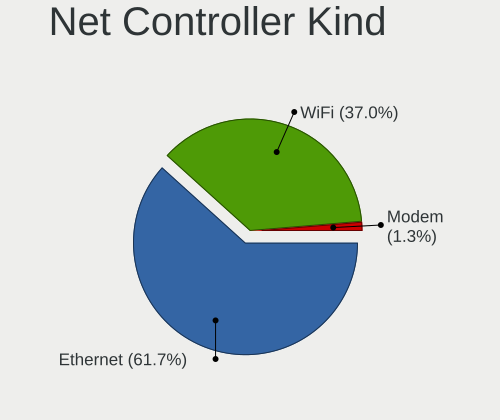

| Kind     | Desktops | Percent |
|----------|----------|---------|
| Ethernet | 327      | 61.7%   |
| WiFi     | 196      | 36.98%  |
| Modem    | 7        | 1.32%   |

Used Controller
---------------

Currently used network controller

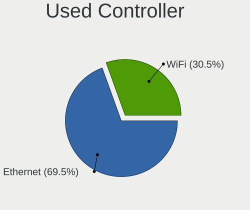

| Kind     | Desktops | Percent |
|----------|----------|---------|
| Ethernet | 246      | 69.49%  |
| WiFi     | 108      | 30.51%  |

NICs
----

Total network controllers on board

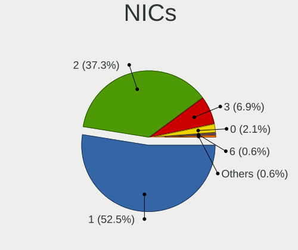

| Total | Desktops | Percent |
|-------|----------|---------|
| 1     | 176      | 52.54%  |
| 2     | 125      | 37.31%  |
| 3     | 23       | 6.87%   |
| 0     | 7        | 2.09%   |
| 6     | 2        | 0.6%    |
| 4     | 2        | 0.6%    |

IPv6
----

IPv6 vs IPv4

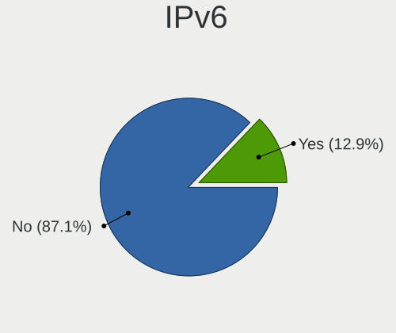

| Used | Desktops | Percent |
|------|----------|---------|
| No   | 291      | 87.13%  |
| Yes  | 43       | 12.87%  |

Bluetooth
---------

Bluetooth Vendor
----------------

Controller vendors

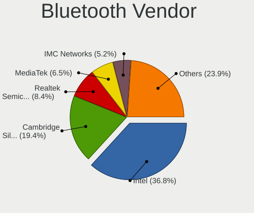

| Vendor                          | Desktops | Percent |
|---------------------------------|----------|---------|
| Intel                           | 57       | 36.77%  |
| Cambridge Silicon Radio         | 30       | 19.35%  |
| Realtek Semiconductor           | 13       | 8.39%   |
| MediaTek                        | 10       | 6.45%   |
| IMC Networks                    | 8        | 5.16%   |
| ASUSTek Computer                | 7        | 4.52%   |
| Broadcom                        | 6        | 3.87%   |
| Foxconn / Hon Hai               | 5        | 3.23%   |
| TP-Link                         | 4        | 2.58%   |
| Qualcomm Atheros Communications | 4        | 2.58%   |
| Edimax Technology               | 2        | 1.29%   |
| Belkin Components               | 2        | 1.29%   |
| Apple                           | 2        | 1.29%   |
| SiW                             | 1        | 0.65%   |
| Lite-On Technology              | 1        | 0.65%   |
| Dell                            | 1        | 0.65%   |
| Conwise Technology              | 1        | 0.65%   |
| Unknown                         | 1        | 0.65%   |

Bluetooth Model
---------------

Controller models

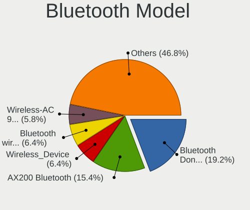

| Model                                               | Desktops | Percent |
|-----------------------------------------------------|----------|---------|
| Cambridge Silicon Radio Bluetooth Dongle (HCI mode) | 30       | 19.23%  |
| Intel AX200 Bluetooth                               | 24       | 15.38%  |
| MediaTek Wireless_Device                            | 10       | 6.41%   |
| Intel Bluetooth wireless interface                  | 10       | 6.41%   |
| Intel Wireless-AC 9260 Bluetooth Adapter            | 9        | 5.77%   |
| Realtek Bluetooth Radio                             | 8        | 5.13%   |
| Broadcom BCM20702A0 Bluetooth 4.0                   | 6        | 3.85%   |
| TP-Link TP-T@- UB500 Adapter                        | 4        | 2.56%   |
| Realtek  Bluetooth 4.2 Adapter                      | 4        | 2.56%   |
| Intel Wireless-AC 3168 Bluetooth                    | 4        | 2.56%   |
| Intel AX201 Bluetooth                               | 4        | 2.56%   |
| IMC Networks Wireless_Device                        | 4        | 2.56%   |
| IMC Networks Bluetooth Radio                        | 4        | 2.56%   |
| Foxconn / Hon Hai Wireless_Device                   | 4        | 2.56%   |
| ASUS Broadcom BCM20702A0 Bluetooth                  | 4        | 2.56%   |
| Intel Bluetooth 9460/9560 Jefferson Peak (JfP)      | 3        | 1.92%   |
| Intel AX210 Bluetooth                               | 3        | 1.92%   |
| Qualcomm Atheros Bluetooth USB Host Controller      | 2        | 1.28%   |
| Edimax Bluetooth Device                             | 2        | 1.28%   |
| SiW SiW                                             | 1        | 0.64%   |
| Realtek Bluetooth 5.4 Radio                         | 1        | 0.64%   |
| Qualcomm Atheros  Bluetooth Device                  | 1        | 0.64%   |
| Qualcomm Atheros AR3011 Bluetooth                   | 1        | 0.64%   |
| Lite-On Bluetooth Device                            | 1        | 0.64%   |
| Intel Bluetooth Device                              | 1        | 0.64%   |
| Foxconn / Hon Hai MediaTek Bluetooth Adapter        | 1        | 0.64%   |
| Dell BT Mini-Receiver                               | 1        | 0.64%   |
| Conwise CW6622                                      | 1        | 0.64%   |
| Belkin Components F8T012 Bluetooth Adapter          | 1        | 0.64%   |
| Belkin Components Bluetooth Mini Dongle             | 1        | 0.64%   |
| ASUS Qualcomm Bluetooth 4.1                         | 1        | 0.64%   |
| ASUS Bluetooth Device                               | 1        | 0.64%   |
| ASUS BCM20702A0                                     | 1        | 0.64%   |
| Apple Bluetooth Host Controller                     | 1        | 0.64%   |
| Apple Bluetooth HCI                                 | 1        | 0.64%   |
| Unknown                                             | 1        | 0.64%   |

Sound
-----

Sound Vendor
------------

Sound card vendors

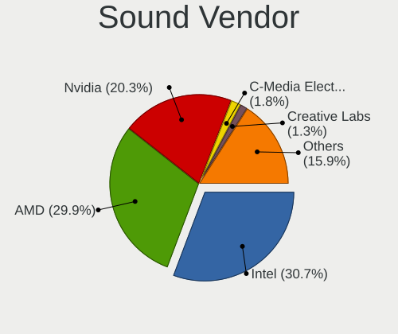

| Vendor                               | Desktops | Percent |
|--------------------------------------|----------|---------|
| Intel                                | 185      | 30.73%  |
| AMD                                  | 180      | 29.9%   |
| Nvidia                               | 122      | 20.27%  |
| C-Media Electronics                  | 11       | 1.83%   |
| Creative Labs                        | 8        | 1.33%   |
| Kingston Technology                  | 7        | 1.16%   |
| Logitech                             | 6        | 1%      |
| Focusrite-Novation                   | 6        | 1%      |
| Texas Instruments                    | 5        | 0.83%   |
| Creative Technology                  | 5        | 0.83%   |
| SteelSeries ApS                      | 4        | 0.66%   |
| Plantronics                          | 4        | 0.66%   |
| JMTek                                | 3        | 0.5%    |
| GN Netcom                            | 3        | 0.5%    |
| FiiO Electronics Technology          | 3        | 0.5%    |
| Blue Microphones                     | 3        | 0.5%    |
| BEHRINGER International              | 3        | 0.5%    |
| Turtle Beach                         | 2        | 0.33%   |
| Setek Elektronik                     | 2        | 0.33%   |
| Razer USA                            | 2        | 0.33%   |
| Micronas                             | 2        | 0.33%   |
| Micro Star International             | 2        | 0.33%   |
| KTMicro                              | 2        | 0.33%   |
| Giga-Byte Technology                 | 2        | 0.33%   |
| Generalplus Technology               | 2        | 0.33%   |
| Ensoniq                              | 2        | 0.33%   |
| Dell                                 | 2        | 0.33%   |
| XMOS                                 | 1        | 0.17%   |
| Walmart                              | 1        | 0.17%   |
| VIA Technologies                     | 1        | 0.17%   |
| USB MICROPHONE                       | 1        | 0.17%   |
| ULi Electronics                      | 1        | 0.17%   |
| Thesycon Systemsoftware & Consulting | 1        | 0.17%   |
| Sony                                 | 1        | 0.17%   |
| SAVITECH                             | 1        | 0.17%   |
| Samson Technologies                  | 1        | 0.17%   |
| RODE Microphones                     | 1        | 0.17%   |
| PreSonus Audio Electronics           | 1        | 0.17%   |
| Native Instruments                   | 1        | 0.17%   |
| M-Audio                              | 1        | 0.17%   |

Sound Model
-----------

Sound card models

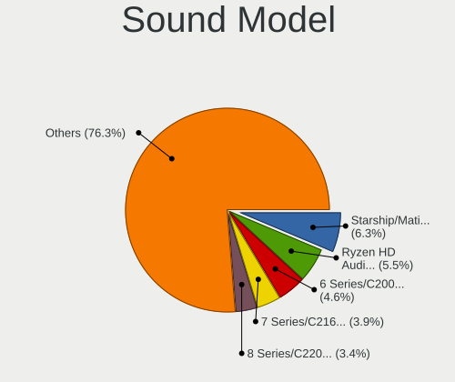

| Model                                                                             | Desktops | Percent |
|-----------------------------------------------------------------------------------|----------|---------|
| AMD Starship/Matisse HD Audio Controller                                          | 46       | 6.34%   |
| AMD Ryzen HD Audio Controller                                                     | 40       | 5.52%   |
| Intel 6 Series/C200 Series Chipset Family High Definition Audio Controller        | 33       | 4.55%   |
| Intel 7 Series/C216 Chipset Family High Definition Audio Controller               | 28       | 3.86%   |
| Intel 8 Series/C220 Series Chipset High Definition Audio Controller               | 25       | 3.45%   |
| AMD Ellesmere HDMI Audio [Radeon RX 470/480 / 570/580/590]                        | 23       | 3.17%   |
| Intel Xeon E3-1200 v3/4th Gen Core Processor HD Audio Controller                  | 19       | 2.62%   |
| AMD Oland/Hainan/Cape Verde/Pitcairn HDMI Audio [Radeon HD 7000 Series]           | 18       | 2.48%   |
| AMD SBx00 Azalia (Intel HDA)                                                      | 15       | 2.07%   |
| AMD Radeon High Definition Audio Controller                                       | 15       | 2.07%   |
| AMD Navi 21/23 HDMI/DP Audio Controller                                           | 14       | 1.93%   |
| AMD Family 17h (Models 00h-0fh) HD Audio Controller                               | 14       | 1.93%   |
| Nvidia GP107GL High Definition Audio Controller                                   | 11       | 1.52%   |
| Nvidia GP106 High Definition Audio Controller                                     | 11       | 1.52%   |
| Intel 82801JI (ICH10 Family) HD Audio Controller                                  | 11       | 1.52%   |
| Intel 100 Series/C230 Series Chipset Family HD Audio Controller                   | 11       | 1.52%   |
| Intel 200 Series PCH HD Audio                                                     | 9        | 1.24%   |
| AMD Navi 10 HDMI Audio                                                            | 9        | 1.24%   |
| AMD Caicos HDMI Audio [Radeon HD 6450 / 7450/8450/8490 OEM / R5 230/235/235X OEM] | 9        | 1.24%   |
| Intel Cannon Lake PCH cAVS                                                        | 8        | 1.1%    |
| Intel 9 Series Chipset Family HD Audio Controller                                 | 8        | 1.1%    |
| AMD Raven/Raven2/Fenghuang HDMI/DP Audio Controller                               | 8        | 1.1%    |
| AMD Navi 31 HDMI/DP Audio                                                         | 8        | 1.1%    |
| Nvidia High Definition Audio Controller                                           | 7        | 0.97%   |
| Nvidia GM107 High Definition Audio Controller [GeForce 940MX]                     | 7        | 0.97%   |
| Intel NM10/ICH7 Family High Definition Audio Controller                           | 7        | 0.97%   |
| Intel 82801JD/DO (ICH10 Family) HD Audio Controller                               | 7        | 0.97%   |
| AMD FCH Azalia Controller                                                         | 7        | 0.97%   |
| AMD Baffin HDMI/DP Audio [Radeon RX 550 640SP / RX 560/560X]                      | 7        | 0.97%   |
| Nvidia GM204 High Definition Audio Controller                                     | 6        | 0.83%   |
| Nvidia GA104 High Definition Audio Controller                                     | 6        | 0.83%   |
| Nvidia GA102 High Definition Audio Controller                                     | 6        | 0.83%   |
| AMD Renoir/Cezanne HDMI/DP Audio Controller                                       | 6        | 0.83%   |
| Nvidia GK208 HDMI/DP Audio Controller                                             | 5        | 0.69%   |
| Nvidia GA106 High Definition Audio Controller                                     | 5        | 0.69%   |
| Intel Alder Lake-S HD Audio Controller                                            | 5        | 0.69%   |
| Intel Alder Lake-N PCH High Definition Audio Controller                           | 5        | 0.69%   |
| AMD Cedar HDMI Audio [Radeon HD 5400/6300/7300 Series]                            | 5        | 0.69%   |
| Nvidia TU116 High Definition Audio Controller                                     | 4        | 0.55%   |
| Nvidia TU107 GeForce GTX 1650 High Definition Audio Controller                    | 4        | 0.55%   |

Memory
------

Memory Vendor
-------------

Memory module vendors

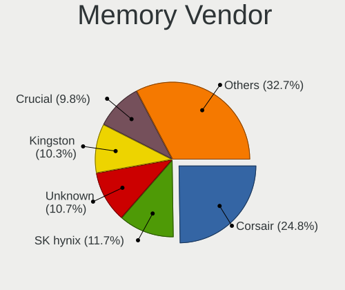

| Vendor              | Desktops | Percent |
|---------------------|----------|---------|
| Corsair             | 53       | 24.77%  |
| SK hynix            | 25       | 11.68%  |
| Unknown             | 23       | 10.75%  |
| Kingston            | 22       | 10.28%  |
| Crucial             | 21       | 9.81%   |
| Samsung Electronics | 16       | 7.48%   |
| Micron Technology   | 12       | 5.61%   |
| G.Skill             | 11       | 5.14%   |
| Ramaxel Technology  | 5        | 2.34%   |
| Unknown             | 5        | 2.34%   |
| Team                | 3        | 1.4%    |
| Patriot             | 3        | 1.4%    |
| Unknown (ABCD)      | 2        | 0.93%   |
| A-DATA Technology   | 2        | 0.93%   |
| Unknown (0x0B45)    | 1        | 0.47%   |
| Toshiba             | 1        | 0.47%   |
| Timetec             | 1        | 0.47%   |
| Nanya Technology    | 1        | 0.47%   |
| KLEVV               | 1        | 0.47%   |
| INNOVATION PC       | 1        | 0.47%   |
| Infineon            | 1        | 0.47%   |
| Elpida              | 1        | 0.47%   |
| BiNFUL              | 1        | 0.47%   |
| Apacer              | 1        | 0.47%   |
| A Force             | 1        | 0.47%   |

Memory Model
------------

Memory module models

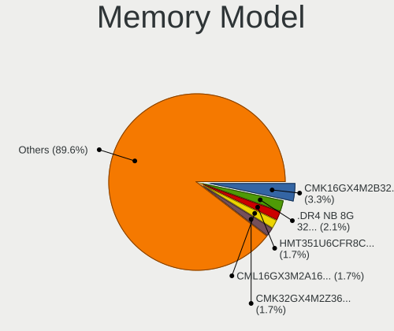

| Model                                                          | Desktops | Percent |
|----------------------------------------------------------------|----------|---------|
| Corsair RAM CMK16GX4M2B3200C16 8GB DIMM DDR4 3600MT/s          | 8        | 3.33%   |
| Unknown                                                        | 5        | 2.08%   |
| SK hynix RAM HMT351U6CFR8C-PB 4GB DIMM DDR3 1800MT/s           | 4        | 1.67%   |
| Corsair RAM CML16GX3M2A1600C10 8GB DIMM DDR3 1600MT/s          | 4        | 1.67%   |
| Corsair RAM CMK32GX4M2Z3600C18 16GB DIMM DDR4 3800MT/s         | 4        | 1.67%   |
| Corsair RAM CMK16GX4M2B3000C15 8GB DIMM DDR4 3600MT/s          | 4        | 1.67%   |
| G.Skill RAM F3-12800CL9-4GBXL 4GB DIMM DDR3 1867MT/s           | 3        | 1.25%   |
| Corsair RAM CMK16GX4M2D3000C16 8GB DIMM DDR4 3400MT/s          | 3        | 1.25%   |
| Unknown RAM Module 8GB DIMM 1333MT/s                           | 2        | 0.83%   |
| Unknown RAM Module 4096MB DIMM 1600MT/s                        | 2        | 0.83%   |
| Unknown RAM Module 2048MB DIMM 800MT/s                         | 2        | 0.83%   |
| Unknown RAM Module 1GB DIMM 667MT/s                            | 2        | 0.83%   |
| Unknown (ABCD) RAM 123456789012345678 2GB DIMM LPDDR4 2133MT/s | 2        | 0.83%   |
| Team RAM Elite-1333 8GB DIMM DDR3 1333MT/s                     | 2        | 0.83%   |
| SK hynix RAM HMT451U6BFR8A-PB 4GB DIMM DDR3 1600MT/s           | 2        | 0.83%   |
| SK hynix RAM HMT451S6BFR8A-PB 4GB SODIMM DDR3 1600MT/s         | 2        | 0.83%   |
| SK hynix RAM HMT351U6CFR8C-H9 4GB DIMM DDR3 1600MT/s           | 2        | 0.83%   |
| Samsung RAM M378B5773DH0-CH9 2GB DIMM DDR3 1333MT/s            | 2        | 0.83%   |
| Samsung RAM M378B5173QH0-CK0 4GB DIMM DDR3                     | 2        | 0.83%   |
| Kingston RAM KHX2133C14D4/8G 8GB DIMM DDR4 3000MT/s            | 2        | 0.83%   |
| Kingston RAM KHX1600C10D3/4G 4GB DIMM DDR3 1866MT/s            | 2        | 0.83%   |
| Crucial RAM CT51264BD160B.C16F 4GB DIMM DDR3 1600MT/s          | 2        | 0.83%   |
| Corsair RAM CMK32GX5M2B6000Z30 16GB DIMM DDR5 6000MT/s         | 2        | 0.83%   |
| Corsair RAM CMK32GX4M2E3200C16 16GB DIMM DDR4 3600MT/s         | 2        | 0.83%   |
| Corsair RAM CMK32GX4M2B3200C16 16GB DIMM DDR4 3800MT/s         | 2        | 0.83%   |
| Corsair RAM CMK16GX4M2Z3200C16 8GB DIMM DDR4 3200MT/s          | 2        | 0.83%   |
| Corsair RAM CMK16GX4M2E3200C16 8GB DIMM DDR4 3466MT/s          | 2        | 0.83%   |
| Unknown RAM Module 8192MB DIMM DDR3 1333MT/s                   | 1        | 0.42%   |
| Unknown RAM Module 8192MB DIMM 1333MT/s                        | 1        | 0.42%   |
| Unknown RAM Module 512MB DIMM 667MT/s                          | 1        | 0.42%   |
| Unknown RAM Module 4GB DIMM 800MT/s                            | 1        | 0.42%   |
| Unknown RAM Module 4GB DIMM 1600MT/s                           | 1        | 0.42%   |
| Unknown RAM Module 4GB DIMM 1333MT/s                           | 1        | 0.42%   |
| Unknown RAM Module 4GB DIMM 1066MT/s                           | 1        | 0.42%   |
| Unknown RAM Module 4096MB DIMM DDR3 1066MT/s                   | 1        | 0.42%   |
| Unknown RAM Module 2GB DIMM 800MT/s                            | 1        | 0.42%   |
| Unknown RAM Module 2GB DIMM 667MT/s                            | 1        | 0.42%   |
| Unknown RAM Module 2GB DIMM 1333MT/s                           | 1        | 0.42%   |
| Unknown RAM Module 2GB DIMM 1066MT/s                           | 1        | 0.42%   |
| Unknown RAM Module 2048MB DIMM SDRAM 800MT/s                   | 1        | 0.42%   |

Memory Kind
-----------

Memory module kinds

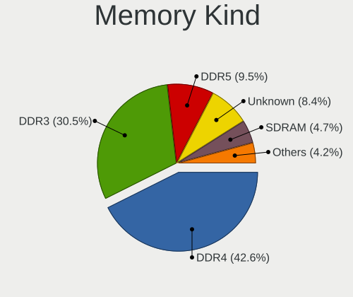

| Kind    | Desktops | Percent |
|---------|----------|---------|
| DDR4    | 81       | 42.63%  |
| DDR3    | 58       | 30.53%  |
| DDR5    | 18       | 9.47%   |
| Unknown | 16       | 8.42%   |
| SDRAM   | 9        | 4.74%   |
| DDR2    | 5        | 2.63%   |
| LPDDR4  | 2        | 1.05%   |
| DDR     | 1        | 0.53%   |

Memory Form Factor
------------------

Physical design of the memory module

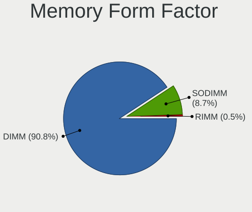

| Name   | Desktops | Percent |
|--------|----------|---------|
| DIMM   | 167      | 90.76%  |
| SODIMM | 16       | 8.7%    |
| RIMM   | 1        | 0.54%   |

Memory Size
-----------

Memory module size

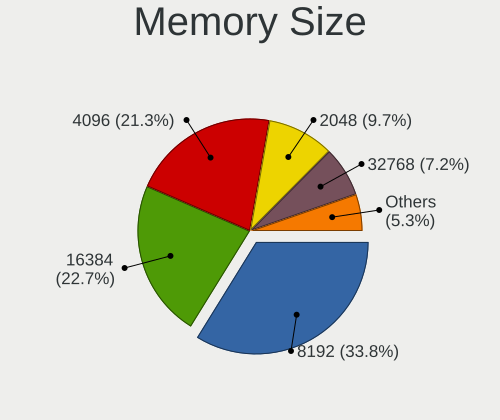

| Size  | Desktops | Percent |
|-------|----------|---------|
| 8192  | 70       | 33.82%  |
| 16384 | 47       | 22.71%  |
| 4096  | 44       | 21.26%  |
| 2048  | 20       | 9.66%   |
| 32768 | 15       | 7.25%   |
| 1024  | 7        | 3.38%   |
| 512   | 2        | 0.97%   |
| 49152 | 1        | 0.48%   |
| 128   | 1        | 0.48%   |

Memory Speed
------------

Memory module speed

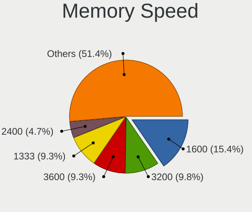

| Speed   | Desktops | Percent |
|---------|----------|---------|
| 1600    | 33       | 15.42%  |
| 3200    | 21       | 9.81%   |
| 3600    | 20       | 9.35%   |
| 1333    | 20       | 9.35%   |
| 2400    | 10       | 4.67%   |
| 2133    | 9        | 4.21%   |
| 800     | 8        | 3.74%   |
| 6000    | 7        | 3.27%   |
| 3800    | 7        | 3.27%   |
| 2667    | 7        | 3.27%   |
| 667     | 7        | 3.27%   |
| 1866    | 6        | 2.8%    |
| 1800    | 6        | 2.8%    |
| 3400    | 5        | 2.34%   |
| 1867    | 5        | 2.34%   |
| 5600    | 4        | 1.87%   |
| 5200    | 4        | 1.87%   |
| 3000    | 4        | 1.87%   |
| 4800    | 3        | 1.4%    |
| 2666    | 3        | 1.4%    |
| 1066    | 3        | 1.4%    |
| 3466    | 2        | 0.93%   |
| 3266    | 2        | 0.93%   |
| 1648    | 2        | 0.93%   |
| 1639    | 2        | 0.93%   |
| 533     | 2        | 0.93%   |
| Unknown | 2        | 0.93%   |
| 8400    | 1        | 0.47%   |
| 4266    | 1        | 0.47%   |
| 4000    | 1        | 0.47%   |
| 3866    | 1        | 0.47%   |
| 3733    | 1        | 0.47%   |
| 3467    | 1        | 0.47%   |
| 2933    | 1        | 0.47%   |
| 2733    | 1        | 0.47%   |
| 1067    | 1        | 0.47%   |
| 400     | 1        | 0.47%   |

Printers & scanners
-------------------

Printer Vendor
--------------

Printer device vendors

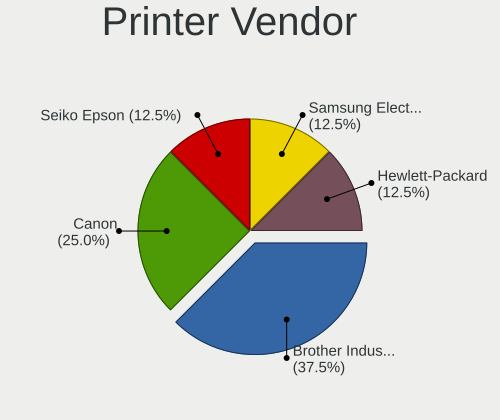

| Vendor              | Desktops | Percent |
|---------------------|----------|---------|
| Brother Industries  | 3        | 37.5%   |
| Canon               | 2        | 25%     |
| Seiko Epson         | 1        | 12.5%   |
| Samsung Electronics | 1        | 12.5%   |
| Hewlett-Packard     | 1        | 12.5%   |

Printer Model
-------------

Printer device models

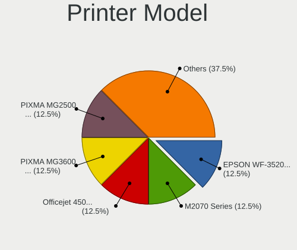

| Model                            | Desktops | Percent |
|----------------------------------|----------|---------|
| Seiko Epson EPSON WF-3520 Series | 1        | 12.5%   |
| Samsung M2070 Series             | 1        | 12.5%   |
| HP Officejet 4500 G510g-m        | 1        | 12.5%   |
| Canon PIXMA MG3600 Series        | 1        | 12.5%   |
| Canon PIXMA MG2500 Series        | 1        | 12.5%   |
| Brother MFC-L2700DW              | 1        | 12.5%   |
| Brother HL-2030 Laser Printer    | 1        | 12.5%   |
| Brother DCP-J140W                | 1        | 12.5%   |

Scanner Vendor
--------------

Scanner device vendors

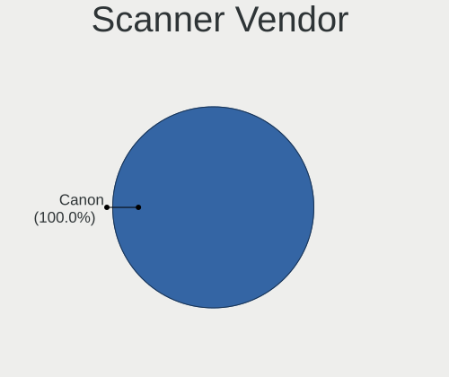

| Vendor | Desktops | Percent |
|--------|----------|---------|
| Canon  | 1        | 100%    |

Scanner Model
-------------

Scanner device models

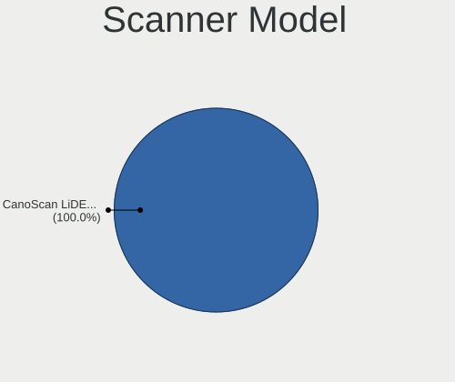

| Model                   | Desktops | Percent |
|-------------------------|----------|---------|
| Canon CanoScan LiDE 220 | 1        | 100%    |

Camera
------

Camera Vendor
-------------

Camera device vendors

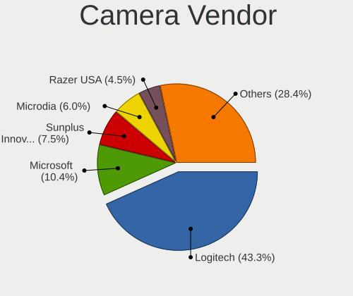

| Vendor                                 | Desktops | Percent |
|----------------------------------------|----------|---------|
| Logitech                               | 29       | 43.28%  |
| Microsoft                              | 7        | 10.45%  |
| Sunplus Innovation Technology          | 5        | 7.46%   |
| Microdia                               | 4        | 5.97%   |
| Razer USA                              | 3        | 4.48%   |
| Generalplus Technology                 | 3        | 4.48%   |
| Creative Technology                    | 2        | 2.99%   |
| webcam                                 | 1        | 1.49%   |
| WaveRider Communications               | 1        | 1.49%   |
| Trust                                  | 1        | 1.49%   |
| Samsung Electronics                    | 1        | 1.49%   |
| Realtek Semiconductor                  | 1        | 1.49%   |
| Lenovo                                 | 1        | 1.49%   |
| GenesysLogic Technology                | 1        | 1.49%   |
| GEMBIRD                                | 1        | 1.49%   |
| DICOTA D31841                          | 1        | 1.49%   |
| Cubeternet                             | 1        | 1.49%   |
| Chicony Electronics                    | 1        | 1.49%   |
| Cheng Uei Precision Industry (Foxlink) | 1        | 1.49%   |
| Apple                                  | 1        | 1.49%   |
| Anker PowerConf C200                   | 1        | 1.49%   |

Camera Model
------------

Camera device models

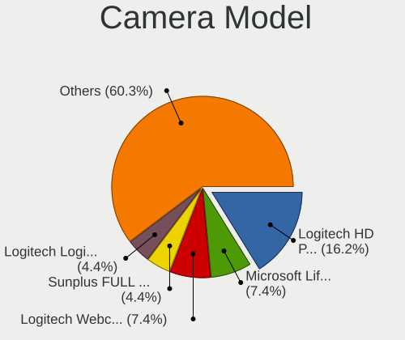

| Model                                                                  | Desktops | Percent |
|------------------------------------------------------------------------|----------|---------|
| Logitech HD Pro Webcam C920                                            | 11       | 16.18%  |
| Microsoft LifeCam HD-3000                                              | 5        | 7.35%   |
| Logitech Webcam C270                                                   | 5        | 7.35%   |
| Sunplus FULL HD webcam                                                 | 3        | 4.41%   |
| Logitech Logitech Webcam C925e                                         | 3        | 4.41%   |
| Razer USA Gaming Webcam [Kiyo]                                         | 2        | 2.94%   |
| Logitech C922 Pro Stream Webcam                                        | 2        | 2.94%   |
| Logitech C920 PRO HD Webcam                                            | 2        | 2.94%   |
| Generalplus GENERAL WEBCAM                                             | 2        | 2.94%   |
| Creative Live! Cam Sync HD [VF0770]                                    | 2        | 2.94%   |
| webcam webcam                                                          | 1        | 1.47%   |
| WaveRider USB 2.0 Camera                                               | 1        | 1.47%   |
| Trust Full HD Webcam                                                   | 1        | 1.47%   |
| Sunplus UHD Capture                                                    | 1        | 1.47%   |
| Sunplus SC-WC-300 Webcam                                               | 1        | 1.47%   |
| Samsung Galaxy series, misc. (MTP mode)                                | 1        | 1.47%   |
| Realtek FULL HD 1080P Webcam                                           | 1        | 1.47%   |
| Razer USA Razer Kiyo X                                                 | 1        | 1.47%   |
| Microsoft LifeCam NX-3000 (UVC-compliant)                              | 1        | 1.47%   |
| Microsoft LifeCam Cinema                                               | 1        | 1.47%   |
| Microdia Webcam Vitade AF                                              | 1        | 1.47%   |
| Microdia USB 2.0 Camera                                                | 1        | 1.47%   |
| Microdia Integrated Camera                                             | 1        | 1.47%   |
| Microdia CyberTrack H6                                                 | 1        | 1.47%   |
| Logitech Webcam C930e                                                  | 1        | 1.47%   |
| Logitech Webcam C310                                                   | 1        | 1.47%   |
| Logitech Webcam C210                                                   | 1        | 1.47%   |
| Logitech Webcam C120                                                   | 1        | 1.47%   |
| Logitech QuickCam Vision Pro                                           | 1        | 1.47%   |
| Logitech Logitech Webcam C160                                          | 1        | 1.47%   |
| Logitech HD Webcam C615                                                | 1        | 1.47%   |
| Lenovo Lenovo Performance Camera                                       | 1        | 1.47%   |
| GenesysLogic USB2.0 UVC PC Camera                                      | 1        | 1.47%   |
| Generalplus 808 Camera #9 (web-cam mode)                               | 1        | 1.47%   |
| GEMBIRD Generic UVC 1.00 camera [AppoTech AX2311]                      | 1        | 1.47%   |
| DICOTA D31841 DICOTA D31841                                            | 1        | 1.47%   |
| Cubeternet USB2.0 Camera                                               | 1        | 1.47%   |
| Chicony USB2.0 2MP UVC Camera                                          | 1        | 1.47%   |
| Cheng Uei Precision Industry (Foxlink) HP 2.0MP High Definition Webcam | 1        | 1.47%   |
| Apple iPhone 5/5C/5S/6/SE/7/8/X                                        | 1        | 1.47%   |

Security
--------

Fingerprint Vendor
------------------

Fingerprint sensor vendors

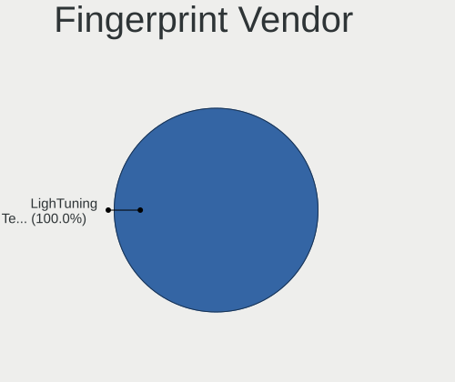

| Vendor                | Desktops | Percent |
|-----------------------|----------|---------|
| LighTuning Technology | 1        | 100%    |

Fingerprint Model
-----------------

Fingerprint sensor models

| Model                         | Desktops | Percent |
|-------------------------------|----------|---------|
| LighTuning Fingerprint Sensor | 1        | 100%    |

Chipcard Vendor
---------------

Chipcard module vendors

Zero info for selected period =(

Chipcard Model
--------------

Chipcard module models

Zero info for selected period =(

Unsupported
-----------

Unsupported Devices
-------------------

Total unsupported devices on board

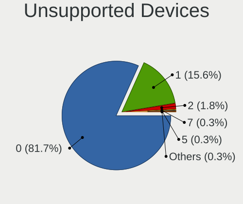

| Total | Desktops | Percent |
|-------|----------|---------|
| 0     | 277      | 81.71%  |
| 1     | 53       | 15.63%  |
| 2     | 6        | 1.77%   |
| 7     | 1        | 0.29%   |
| 5     | 1        | 0.29%   |
| 3     | 1        | 0.29%   |

Unsupported Device Types
------------------------

Types of unsupported devices

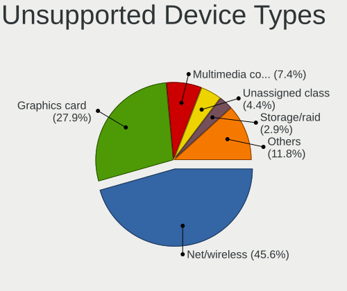

| Type                     | Desktops | Percent |
|--------------------------|----------|---------|
| Net/wireless             | 31       | 45.59%  |
| Graphics card            | 19       | 27.94%  |
| Multimedia controller    | 5        | 7.35%   |
| Unassigned class         | 3        | 4.41%   |
| Storage/raid             | 2        | 2.94%   |
| Net/ethernet             | 2        | 2.94%   |
| Communication controller | 2        | 2.94%   |
| Sound                    | 1        | 1.47%   |
| Firewire controller      | 1        | 1.47%   |
| Fingerprint reader       | 1        | 1.47%   |
| Camera                   | 1        | 1.47%   |

