Linux in Ireland - Tested Hardware & Statistics (Desktops)
----------------------------------------------------------

A project to collect tested hardware configurations for Linux in Ireland.

Anyone can contribute to this report by the [hw-probe](https://github.com/linuxhw/hw-probe) tool:

    sudo -E hw-probe -all -upload

Please contribute! Especially if your hardware is rare.

Contents
--------

* [ Test Cases ](#test-cases)

* [ System ](#system)
  - [ OS                       ](#os)
  - [ OS Family                ](#os-family)
  - [ Kernel                   ](#kernel)
  - [ Kernel Family            ](#kernel-family)
  - [ Kernel Major Ver.        ](#kernel-major-ver)
  - [ Arch                     ](#arch)
  - [ DE                       ](#de)
  - [ Display Server           ](#display-server)
  - [ Display Manager          ](#display-manager)
  - [ OS Lang                  ](#os-lang)
  - [ Boot Mode                ](#boot-mode)
  - [ Filesystem               ](#filesystem)
  - [ Part. scheme             ](#part-scheme)
  - [ Dual Boot with Linux/BSD ](#dual-boot-with-linuxbsd)
  - [ Dual Boot (Win)          ](#dual-boot-win)

* [ Board ](#board)
  - [ Vendor                   ](#vendor)
  - [ Model                    ](#model)
  - [ Model Family             ](#model-family)
  - [ MFG Year                 ](#mfg-year)
  - [ Form Factor              ](#form-factor)
  - [ Secure Boot              ](#secure-boot)
  - [ Coreboot                 ](#coreboot)
  - [ RAM Size                 ](#ram-size)
  - [ RAM Used                 ](#ram-used)
  - [ Total Drives             ](#total-drives)
  - [ Has CD-ROM               ](#has-cd-rom)
  - [ Has Ethernet             ](#has-ethernet)
  - [ Has WiFi                 ](#has-wifi)
  - [ Has Bluetooth            ](#has-bluetooth)

* [ Location ](#location)
  - [ Country                  ](#country)
  - [ City                     ](#city)

* [ Drives ](#drives)
  - [ Drive Vendor             ](#drive-vendor)
  - [ Drive Model              ](#drive-model)
  - [ HDD Vendor               ](#hdd-vendor)
  - [ SSD Vendor               ](#ssd-vendor)
  - [ Drive Kind               ](#drive-kind)
  - [ Drive Connector          ](#drive-connector)
  - [ Drive Size               ](#drive-size)
  - [ Space Total              ](#space-total)
  - [ Space Used               ](#space-used)
  - [ Malfunc. Drives          ](#malfunc-drives)
  - [ Malfunc. Drive Vendor    ](#malfunc-drive-vendor)
  - [ Malfunc. HDD Vendor      ](#malfunc-hdd-vendor)
  - [ Malfunc. Drive Kind      ](#malfunc-drive-kind)
  - [ Failed Drives            ](#failed-drives)
  - [ Failed Drive Vendor      ](#failed-drive-vendor)
  - [ Drive Status             ](#drive-status)

* [ Storage controller ](#storage-controller)
  - [ Storage Vendor           ](#storage-vendor)
  - [ Storage Model            ](#storage-model)
  - [ Storage Kind             ](#storage-kind)

* [ Processor ](#processor)
  - [ CPU Vendor               ](#cpu-vendor)
  - [ CPU Model                ](#cpu-model)
  - [ CPU Model Family         ](#cpu-model-family)
  - [ CPU Cores                ](#cpu-cores)
  - [ CPU Sockets              ](#cpu-sockets)
  - [ CPU Threads              ](#cpu-threads)
  - [ CPU Op-Modes             ](#cpu-op-modes)
  - [ CPU Microcode            ](#cpu-microcode)
  - [ CPU Microarch            ](#cpu-microarch)

* [ Graphics ](#graphics)
  - [ GPU Vendor               ](#gpu-vendor)
  - [ GPU Model                ](#gpu-model)
  - [ GPU Combo                ](#gpu-combo)
  - [ GPU Driver               ](#gpu-driver)
  - [ GPU Memory               ](#gpu-memory)

* [ Monitor ](#monitor)
  - [ Monitor Vendor           ](#monitor-vendor)
  - [ Monitor Model            ](#monitor-model)
  - [ Monitor Resolution       ](#monitor-resolution)
  - [ Monitor Diagonal         ](#monitor-diagonal)
  - [ Monitor Width            ](#monitor-width)
  - [ Aspect Ratio             ](#aspect-ratio)
  - [ Monitor Area             ](#monitor-area)
  - [ Pixel Density            ](#pixel-density)
  - [ Multiple Monitors        ](#multiple-monitors)

* [ Network ](#network)
  - [ Net Controller Vendor    ](#net-controller-vendor)
  - [ Net Controller Model     ](#net-controller-model)
  - [ Wireless Vendor          ](#wireless-vendor)
  - [ Wireless Model           ](#wireless-model)
  - [ Ethernet Vendor          ](#ethernet-vendor)
  - [ Ethernet Model           ](#ethernet-model)
  - [ Net Controller Kind      ](#net-controller-kind)
  - [ Used Controller          ](#used-controller)
  - [ NICs                     ](#nics)
  - [ IPv6                     ](#ipv6)

* [ Bluetooth ](#bluetooth)
  - [ Bluetooth Vendor         ](#bluetooth-vendor)
  - [ Bluetooth Model          ](#bluetooth-model)

* [ Sound ](#sound)
  - [ Sound Vendor             ](#sound-vendor)
  - [ Sound Model              ](#sound-model)

* [ Memory ](#memory)
  - [ Memory Vendor            ](#memory-vendor)
  - [ Memory Model             ](#memory-model)
  - [ Memory Kind              ](#memory-kind)
  - [ Memory Form Factor       ](#memory-form-factor)
  - [ Memory Size              ](#memory-size)
  - [ Memory Speed             ](#memory-speed)

* [ Printers & scanners ](#printers--scanners)
  - [ Printer Vendor           ](#printer-vendor)
  - [ Printer Model            ](#printer-model)
  - [ Scanner Vendor           ](#scanner-vendor)
  - [ Scanner Model            ](#scanner-model)

* [ Camera ](#camera)
  - [ Camera Vendor            ](#camera-vendor)
  - [ Camera Model             ](#camera-model)

* [ Security ](#security)
  - [ Fingerprint Vendor       ](#fingerprint-vendor)
  - [ Fingerprint Model        ](#fingerprint-model)
  - [ Chipcard Vendor          ](#chipcard-vendor)
  - [ Chipcard Model           ](#chipcard-model)

* [ Unsupported ](#unsupported)
  - [ Unsupported Devices      ](#unsupported-devices)
  - [ Unsupported Device Types ](#unsupported-device-types)

Test Cases
----------

Total: 348

| Vendor        | Model                       | Probe                                                      | Date         |
|---------------|-----------------------------|------------------------------------------------------------|--------------|
| Gigabyte      | Z77-DS3H                    | [239aa09252](https://linux-hardware.org/?probe=239aa09252) | May 04, 2024 |
| Shenzhen M... | F7BFC                       | [43fd55c47a](https://linux-hardware.org/?probe=43fd55c47a) | Apr 30, 2024 |
| Shenzhen M... | F7BFC                       | [d480d08c5e](https://linux-hardware.org/?probe=d480d08c5e) | Apr 30, 2024 |
| MSI           | PRO B650M-P                 | [90165c7480](https://linux-hardware.org/?probe=90165c7480) | Apr 18, 2024 |
| Lenovo        | 30D0 SDK0J40697 WIN 3305... | [24acebde2b](https://linux-hardware.org/?probe=24acebde2b) | Apr 18, 2024 |
| Gigabyte      | Z77-DS3H                    | [c0e482caa4](https://linux-hardware.org/?probe=c0e482caa4) | Apr 16, 2024 |
| ANGXUN        | X99-DM3 V3.0                | [7beaf3fb93](https://linux-hardware.org/?probe=7beaf3fb93) | Apr 14, 2024 |
| Alienware     | 0TYR0X A01                  | [ef1d3c4e97](https://linux-hardware.org/?probe=ef1d3c4e97) | Apr 04, 2024 |
| HP            | 21D0                        | [8097b780d4](https://linux-hardware.org/?probe=8097b780d4) | Apr 03, 2024 |
| ASUSTek       | TUF Gaming X570-PLUS        | [e04b94ae7b](https://linux-hardware.org/?probe=e04b94ae7b) | Mar 30, 2024 |
| ASUSTek       | PRIME B760M-A               | [df41ae1364](https://linux-hardware.org/?probe=df41ae1364) | Feb 20, 2024 |
| HP            | 21D0                        | [a19cdbd10a](https://linux-hardware.org/?probe=a19cdbd10a) | Feb 20, 2024 |
| Dell          | 051FJ8 A00                  | [abce3a8f48](https://linux-hardware.org/?probe=abce3a8f48) | Feb 06, 2024 |
| HP            | 21D0                        | [b9cb80ae88](https://linux-hardware.org/?probe=b9cb80ae88) | Jan 23, 2024 |
| Gigabyte      | GA-MA790X-UD4P              | [4e5951814a](https://linux-hardware.org/?probe=4e5951814a) | Jan 09, 2024 |
| MSI           | B550 GAMING GEN3            | [02163b04b7](https://linux-hardware.org/?probe=02163b04b7) | Dec 30, 2023 |
| HP            | 8643 SMVB                   | [bbdb2204d8](https://linux-hardware.org/?probe=bbdb2204d8) | Dec 22, 2023 |
| HP            | 8643 SMVB                   | [03ddd69e34](https://linux-hardware.org/?probe=03ddd69e34) | Dec 22, 2023 |
| Gigabyte      | B85M-D3H                    | [1dd35fdb02](https://linux-hardware.org/?probe=1dd35fdb02) | Dec 19, 2023 |
| Dell          | 051FJ8 A00                  | [18f1d4c5d0](https://linux-hardware.org/?probe=18f1d4c5d0) | Dec 18, 2023 |
| Lenovo        | 3098 SDK0J40705 WIN 3425... | [647f96ad2c](https://linux-hardware.org/?probe=647f96ad2c) | Dec 08, 2023 |
| ASRock        | H310CM-DVS                  | [ec402bfe2f](https://linux-hardware.org/?probe=ec402bfe2f) | Nov 30, 2023 |
| ASUSTek       | TUF Gaming A620M-PLUS WI... | [8425b9dc62](https://linux-hardware.org/?probe=8425b9dc62) | Nov 30, 2023 |
| Dell          | 03NVJ6 A03                  | [9a5c924695](https://linux-hardware.org/?probe=9a5c924695) | Nov 26, 2023 |
| AZW           | Green G3                    | [c08be7a4cf](https://linux-hardware.org/?probe=c08be7a4cf) | Nov 26, 2023 |
| Dell          | 0X4H68 A00                  | [9fe4290fb6](https://linux-hardware.org/?probe=9fe4290fb6) | Nov 21, 2023 |
| Dell          | 0X4H68 A00                  | [93d573033d](https://linux-hardware.org/?probe=93d573033d) | Nov 21, 2023 |
| MSI           | 970 GAMING                  | [1d3516385d](https://linux-hardware.org/?probe=1d3516385d) | Nov 16, 2023 |
| Unknown       | Unknown                     | [80774e2d18](https://linux-hardware.org/?probe=80774e2d18) | Nov 14, 2023 |
| Dell          | 0J8H4R A00                  | [d743b33cc7](https://linux-hardware.org/?probe=d743b33cc7) | Nov 05, 2023 |
| Gigabyte      | B450M DS3H-CF               | [fc6336fedd](https://linux-hardware.org/?probe=fc6336fedd) | Nov 02, 2023 |
| HP            | 3399                        | [3dca1c2950](https://linux-hardware.org/?probe=3dca1c2950) | Oct 22, 2023 |
| ANGXUN        | X99-DM3 V3.0                | [86fca6aaf4](https://linux-hardware.org/?probe=86fca6aaf4) | Oct 20, 2023 |
| MSI           | X470 GAMING PRO             | [88057db3aa](https://linux-hardware.org/?probe=88057db3aa) | Oct 11, 2023 |
| Dell          | 0YJPT1 A00                  | [27b01f468d](https://linux-hardware.org/?probe=27b01f468d) | Sep 30, 2023 |
| ANGXUN        | X99-DM3 V3.0                | [1a7ed0ba7d](https://linux-hardware.org/?probe=1a7ed0ba7d) | Sep 29, 2023 |
| ANGXUN        | X99-DM3 V3.0                | [20e0572ade](https://linux-hardware.org/?probe=20e0572ade) | Sep 21, 2023 |
| HP            | 0B54h D                     | [f5259ad0b1](https://linux-hardware.org/?probe=f5259ad0b1) | Sep 16, 2023 |
| Gigabyte      | B75M-D2V                    | [8f6631088b](https://linux-hardware.org/?probe=8f6631088b) | Sep 08, 2023 |
| ASUSTek       | TALAS                       | [094153c6f4](https://linux-hardware.org/?probe=094153c6f4) | Sep 04, 2023 |
| Dell          | 0TDG4V A01                  | [0f98d77b72](https://linux-hardware.org/?probe=0f98d77b72) | Sep 01, 2023 |
| Gigabyte      | X58A-UD7                    | [9d47465c31](https://linux-hardware.org/?probe=9d47465c31) | Aug 29, 2023 |
| Dell          | 0WR7PY A02                  | [db091802b1](https://linux-hardware.org/?probe=db091802b1) | Aug 26, 2023 |
| ASUSTek       | P8P67 PRO                   | [8f51778271](https://linux-hardware.org/?probe=8f51778271) | Aug 25, 2023 |
| ASUSTek       | A68HM-PLUS                  | [7e397373d8](https://linux-hardware.org/?probe=7e397373d8) | Aug 25, 2023 |
| Dell          | 0200DY A02                  | [0182dad759](https://linux-hardware.org/?probe=0182dad759) | Aug 19, 2023 |
| ASUSTek       | TUF Gaming X570-PRO         | [23d9892448](https://linux-hardware.org/?probe=23d9892448) | Aug 13, 2023 |
| ASUSTek       | TUF Gaming X570-PRO         | [e280c00c8b](https://linux-hardware.org/?probe=e280c00c8b) | Aug 12, 2023 |
| ASUSTek       | PRIME A520M-K               | [ea4d9240fb](https://linux-hardware.org/?probe=ea4d9240fb) | Aug 05, 2023 |
| HP            | 21D0                        | [44e0cbb52e](https://linux-hardware.org/?probe=44e0cbb52e) | Aug 03, 2023 |
| HP            | 21D0                        | [099fea9193](https://linux-hardware.org/?probe=099fea9193) | Aug 02, 2023 |
| Dell          | 0D28YY A00                  | [08fd0fea6a](https://linux-hardware.org/?probe=08fd0fea6a) | Jul 26, 2023 |
| HP            | 21D0                        | [774375de1f](https://linux-hardware.org/?probe=774375de1f) | Jul 22, 2023 |
| ASUSTek       | M5A78L/USB3                 | [a8b082a8be](https://linux-hardware.org/?probe=a8b082a8be) | Jul 17, 2023 |
| HP            | 21D0                        | [a6d51a414c](https://linux-hardware.org/?probe=a6d51a414c) | Jul 11, 2023 |
| Dell          | 0M5DCD A00                  | [ae3e8910bf](https://linux-hardware.org/?probe=ae3e8910bf) | Jul 10, 2023 |
| Lenovo        | 30D0 SDK0J40700 WIN 3258... | [2bb5ca7ea2](https://linux-hardware.org/?probe=2bb5ca7ea2) | Jul 05, 2023 |
| Lenovo        | 30D0 SDK0J40700 WIN 3258... | [b24c1d471d](https://linux-hardware.org/?probe=b24c1d471d) | Jul 04, 2023 |
| Gigabyte      | TRX40 AORUS MASTER          | [f1c343e2c2](https://linux-hardware.org/?probe=f1c343e2c2) | Jul 02, 2023 |
| Dell          | 0WR7PY A02                  | [ae5f4be943](https://linux-hardware.org/?probe=ae5f4be943) | Jun 20, 2023 |
| ASUSTek       | TUF Gaming B650-PLUS WIF... | [db42ab94ee](https://linux-hardware.org/?probe=db42ab94ee) | Jun 06, 2023 |
| MSI           | MPG X570 GAMING PLUS        | [3d29012888](https://linux-hardware.org/?probe=3d29012888) | Jun 04, 2023 |
| HP            | 0AECh D                     | [30868178ea](https://linux-hardware.org/?probe=30868178ea) | May 26, 2023 |
| MSI           | 970 GAMING                  | [2bed616680](https://linux-hardware.org/?probe=2bed616680) | May 23, 2023 |
| MSI           | 970 GAMING                  | [785f4bad86](https://linux-hardware.org/?probe=785f4bad86) | May 23, 2023 |
| Lenovo        | SDK0J40705 WIN 342504154... | [0d7dd6a0c1](https://linux-hardware.org/?probe=0d7dd6a0c1) | May 03, 2023 |
| Lenovo        | SDK0J40705 WIN 342504154... | [60d40b601b](https://linux-hardware.org/?probe=60d40b601b) | May 02, 2023 |
| Gigabyte      | GA-78LMT-USB3               | [f543ce6c65](https://linux-hardware.org/?probe=f543ce6c65) | Apr 29, 2023 |
| Dell          | 051FJ8 A00                  | [f2b702b631](https://linux-hardware.org/?probe=f2b702b631) | Apr 28, 2023 |
| Dell          | 040DDP A00                  | [8595139862](https://linux-hardware.org/?probe=8595139862) | Apr 25, 2023 |
| Gigabyte      | X670 AORUS ELITE AX         | [d9fd347989](https://linux-hardware.org/?probe=d9fd347989) | Apr 20, 2023 |
| Gigabyte      | X670 AORUS ELITE AX         | [d5adb940b4](https://linux-hardware.org/?probe=d5adb940b4) | Apr 19, 2023 |
| Gigabyte      | Z690 UD DDR4                | [690ed7960a](https://linux-hardware.org/?probe=690ed7960a) | Apr 13, 2023 |
| Dell          | 0J3C2F A00                  | [12f634cf42](https://linux-hardware.org/?probe=12f634cf42) | Apr 11, 2023 |
| Gigabyte      | A320M-S2H-CF                | [e04829aef9](https://linux-hardware.org/?probe=e04829aef9) | Apr 06, 2023 |
| HP            | 21D0                        | [be69723341](https://linux-hardware.org/?probe=be69723341) | Apr 06, 2023 |
| Gigabyte      | Z68A-D3-B3                  | [6fb463806f](https://linux-hardware.org/?probe=6fb463806f) | Apr 04, 2023 |
| Dell          | 0TP412                      | [f9f3e5cc04](https://linux-hardware.org/?probe=f9f3e5cc04) | Mar 29, 2023 |
| Dell          | 0200DY A02                  | [4f8515b9ed](https://linux-hardware.org/?probe=4f8515b9ed) | Mar 27, 2023 |
| HP            | 0B54h D                     | [3edc678017](https://linux-hardware.org/?probe=3edc678017) | Mar 26, 2023 |
| MSI           | X470 GAMING PRO             | [b49dbdfa77](https://linux-hardware.org/?probe=b49dbdfa77) | Mar 25, 2023 |
| HP            | 83E9                        | [a93c800fa1](https://linux-hardware.org/?probe=a93c800fa1) | Mar 19, 2023 |
| Dell          | 0JP3NX A00                  | [9d0ac027df](https://linux-hardware.org/?probe=9d0ac027df) | Mar 14, 2023 |
| ASRock        | X99 Extreme4                | [a541fe5881](https://linux-hardware.org/?probe=a541fe5881) | Mar 07, 2023 |
| Dell          | 0JC474                      | [90db9efd8d](https://linux-hardware.org/?probe=90db9efd8d) | Mar 06, 2023 |
| Dell          | 0F5C5X A00                  | [0496d0bbcf](https://linux-hardware.org/?probe=0496d0bbcf) | Feb 18, 2023 |
| Dell          | 0F5C5X A00                  | [ba5a46ec10](https://linux-hardware.org/?probe=ba5a46ec10) | Feb 18, 2023 |
| Dell          | 0200DY A02                  | [fdab522500](https://linux-hardware.org/?probe=fdab522500) | Feb 17, 2023 |
| Dell          | 0200DY A02                  | [dd863b4bdf](https://linux-hardware.org/?probe=dd863b4bdf) | Feb 17, 2023 |
| Foxconn       | H67M-S/H67M-V/H67M          | [78dc1c5856](https://linux-hardware.org/?probe=78dc1c5856) | Feb 17, 2023 |
| Dell          | 051FJ8 A00                  | [8de835c5da](https://linux-hardware.org/?probe=8de835c5da) | Feb 17, 2023 |
| Dell          | 051FJ8 A00                  | [e689bce0ca](https://linux-hardware.org/?probe=e689bce0ca) | Feb 14, 2023 |
| Dell          | 051FJ8 A00                  | [bc1c7ec97f](https://linux-hardware.org/?probe=bc1c7ec97f) | Feb 14, 2023 |
| Pegatron      | 2A94h                       | [b1b8672218](https://linux-hardware.org/?probe=b1b8672218) | Feb 13, 2023 |
| Shenzhen M... | F7BFC                       | [08820689e8](https://linux-hardware.org/?probe=08820689e8) | Feb 11, 2023 |
| MSI           | X470 GAMING PRO             | [a53ab3e915](https://linux-hardware.org/?probe=a53ab3e915) | Feb 10, 2023 |
| Gigabyte      | M68MT-S2P                   | [09735072af](https://linux-hardware.org/?probe=09735072af) | Jan 23, 2023 |
| Dell          | 0GXM1W A01                  | [dc468fd3a8](https://linux-hardware.org/?probe=dc468fd3a8) | Jan 12, 2023 |
| ASUSTek       | Z97-PRO GAMER               | [e85dcf8a22](https://linux-hardware.org/?probe=e85dcf8a22) | Jan 08, 2023 |
| Dell          | 0JP3NX A00                  | [21b5ec2d81](https://linux-hardware.org/?probe=21b5ec2d81) | Jan 03, 2023 |
| HP            | 21B4 A01                    | [cdc9730e81](https://linux-hardware.org/?probe=cdc9730e81) | Dec 31, 2022 |
| Intel         | DQ77CP AAG67261-300         | [908f619aa7](https://linux-hardware.org/?probe=908f619aa7) | Dec 21, 2022 |
| Gigabyte      | B85M-D3H                    | [0b63acf3b2](https://linux-hardware.org/?probe=0b63acf3b2) | Dec 20, 2022 |
| Gigabyte      | H110M-S2H-CF                | [cdbf94efce](https://linux-hardware.org/?probe=cdbf94efce) | Dec 19, 2022 |
| Gigabyte      | H110M-S2H-CF                | [412c1923c5](https://linux-hardware.org/?probe=412c1923c5) | Nov 20, 2022 |
| ASUSTek       | TUF Gaming X570-PRO         | [f58f70b732](https://linux-hardware.org/?probe=f58f70b732) | Nov 19, 2022 |
| Gigabyte      | A320M-S2H-CF                | [c3cacc3ed6](https://linux-hardware.org/?probe=c3cacc3ed6) | Nov 15, 2022 |
| MSI           | Z170M MORTAR                | [041dbc2c18](https://linux-hardware.org/?probe=041dbc2c18) | Oct 31, 2022 |
| Dell          | 0JP3NX A00                  | [8b457c11e8](https://linux-hardware.org/?probe=8b457c11e8) | Oct 23, 2022 |
| Foxconn       | 2ABF                        | [ac2c9383c0](https://linux-hardware.org/?probe=ac2c9383c0) | Oct 18, 2022 |
| ASUSTek       | TUF Gaming B550-PLUS        | [2e1434c4ff](https://linux-hardware.org/?probe=2e1434c4ff) | Oct 14, 2022 |
| Dell          | 0WR7PY A02                  | [e464adc2d9](https://linux-hardware.org/?probe=e464adc2d9) | Oct 11, 2022 |
| HP            | 21D0                        | [6815e2bba2](https://linux-hardware.org/?probe=6815e2bba2) | Oct 04, 2022 |
| Gigabyte      | Z97-D3H-CF                  | [59d0400171](https://linux-hardware.org/?probe=59d0400171) | Sep 24, 2022 |
| Gigabyte      | A320M-S2H-CF                | [172fd1874d](https://linux-hardware.org/?probe=172fd1874d) | Sep 20, 2022 |
| ASUSTek       | PRIME Z270-A                | [b404f51fbe](https://linux-hardware.org/?probe=b404f51fbe) | Sep 12, 2022 |
| Gigabyte      | GA-78LMT-USB3               | [b389a760a8](https://linux-hardware.org/?probe=b389a760a8) | Sep 12, 2022 |
| Lenovo        | SDK0J40705 WIN 342504154... | [4feb69184d](https://linux-hardware.org/?probe=4feb69184d) | Sep 02, 2022 |
| Lenovo        | SDK0J40705 WIN 342504154... | [bfee1a862f](https://linux-hardware.org/?probe=bfee1a862f) | Sep 02, 2022 |
| Dell          | 0TP412                      | [73ec9dcd98](https://linux-hardware.org/?probe=73ec9dcd98) | Sep 02, 2022 |
| MSI           | MEG Z490I UNIFY             | [34d2d4f66e](https://linux-hardware.org/?probe=34d2d4f66e) | Aug 24, 2022 |
| Dell          | 0GY6Y8 A02                  | [caf9167ca7](https://linux-hardware.org/?probe=caf9167ca7) | Aug 16, 2022 |
| Dell          | 0GY6Y8 A02                  | [6d1b561c11](https://linux-hardware.org/?probe=6d1b561c11) | Aug 16, 2022 |
| Dell          | 0JP3NX A00                  | [531e4340a6](https://linux-hardware.org/?probe=531e4340a6) | Aug 07, 2022 |
| MSI           | AMETHYST-M                  | [d5fb610246](https://linux-hardware.org/?probe=d5fb610246) | Jul 26, 2022 |
| Dell          | 0V8WGR A01                  | [76ddff41fc](https://linux-hardware.org/?probe=76ddff41fc) | Jul 25, 2022 |
| Gigabyte      | H110M-S2H-CF                | [f70ea66873](https://linux-hardware.org/?probe=f70ea66873) | Jul 21, 2022 |
| Dell          | 0J3C2F A00                  | [e9be99b44d](https://linux-hardware.org/?probe=e9be99b44d) | Jul 14, 2022 |
| Gigabyte      | B85M-D3H                    | [028b64776a](https://linux-hardware.org/?probe=028b64776a) | Jun 15, 2022 |
| Gigabyte      | B85M-D3H                    | [eef8a87283](https://linux-hardware.org/?probe=eef8a87283) | Jun 15, 2022 |
| ASUSTek       | P8H77-M PRO                 | [674cb88747](https://linux-hardware.org/?probe=674cb88747) | Jun 13, 2022 |
| ASUSTek       | Maximus VII IMPACT          | [8b0844f325](https://linux-hardware.org/?probe=8b0844f325) | Jun 01, 2022 |
| ASRock        | B365M Pro4-F                | [afc161c6fb](https://linux-hardware.org/?probe=afc161c6fb) | May 30, 2022 |
| Gigabyte      | A320M-H-CF                  | [522da9476b](https://linux-hardware.org/?probe=522da9476b) | May 29, 2022 |
| Foxconn       | 2ABF                        | [39f9e9e717](https://linux-hardware.org/?probe=39f9e9e717) | May 22, 2022 |
| Dell          | 02YYK5 A01                  | [8471800bb3](https://linux-hardware.org/?probe=8471800bb3) | May 16, 2022 |
| MSI           | B450M MORTAR MAX            | [0d7682cb61](https://linux-hardware.org/?probe=0d7682cb61) | May 14, 2022 |
| Dell          | 02YYK5 A01                  | [373e009d3b](https://linux-hardware.org/?probe=373e009d3b) | May 09, 2022 |
| Gigabyte      | B450 AORUS M                | [cd1aff125e](https://linux-hardware.org/?probe=cd1aff125e) | May 09, 2022 |
| ASRock        | AB350 Gaming-ITX/ac         | [6836f79bdf](https://linux-hardware.org/?probe=6836f79bdf) | May 08, 2022 |
| ASRock        | AB350 Gaming-ITX/ac         | [41cc4d30d4](https://linux-hardware.org/?probe=41cc4d30d4) | May 08, 2022 |
| Gigabyte      | GA-970A-D3                  | [01369642f4](https://linux-hardware.org/?probe=01369642f4) | May 03, 2022 |
| MSI           | H55M-E23                    | [4ab5f58470](https://linux-hardware.org/?probe=4ab5f58470) | Apr 28, 2022 |
| ASUSTek       | PRIME X470-PRO              | [5e1b40c8b5](https://linux-hardware.org/?probe=5e1b40c8b5) | Apr 25, 2022 |
| ASUSTek       | PRIME X470-PRO              | [346c9b6c59](https://linux-hardware.org/?probe=346c9b6c59) | Apr 14, 2022 |
| ASUSTek       | ROG STRIX B450-F GAMING     | [92e810b1dd](https://linux-hardware.org/?probe=92e810b1dd) | Apr 13, 2022 |
| Gigabyte      | B450 AORUS M                | [714baddf6f](https://linux-hardware.org/?probe=714baddf6f) | Apr 06, 2022 |
| Lenovo        | 312A SDK0J40700 WIN 3258... | [a645768047](https://linux-hardware.org/?probe=a645768047) | Apr 05, 2022 |
| Foxconn       | 2ABF                        | [3e5267891f](https://linux-hardware.org/?probe=3e5267891f) | Apr 01, 2022 |
| Gigabyte      | B450M DS3H-CF               | [0f98a36a43](https://linux-hardware.org/?probe=0f98a36a43) | Mar 30, 2022 |
| ASUSTek       | P8H61-MX USB3               | [949d5ffcf5](https://linux-hardware.org/?probe=949d5ffcf5) | Mar 26, 2022 |
| Intel         | DG45ID AAE46743-302         | [c185ef78b1](https://linux-hardware.org/?probe=c185ef78b1) | Mar 22, 2022 |
| MSI           | 970 GAMING                  | [45c6461d6c](https://linux-hardware.org/?probe=45c6461d6c) | Mar 22, 2022 |
| Foxconn       | 2ABF                        | [e117237c38](https://linux-hardware.org/?probe=e117237c38) | Mar 21, 2022 |
| ASRock        | Z68 Pro3                    | [4c4afb883e](https://linux-hardware.org/?probe=4c4afb883e) | Mar 09, 2022 |
| ASUSTek       | TUF Gaming X570-PRO         | [44656b1bd4](https://linux-hardware.org/?probe=44656b1bd4) | Mar 03, 2022 |
| HP            | 21D0                        | [448912eeb9](https://linux-hardware.org/?probe=448912eeb9) | Feb 24, 2022 |
| MSI           | MAG X570 TOMAHAWK WIFI      | [ace22bd471](https://linux-hardware.org/?probe=ace22bd471) | Feb 11, 2022 |
| Gigabyte      | B450 AORUS M                | [bb5bd32928](https://linux-hardware.org/?probe=bb5bd32928) | Feb 10, 2022 |
| Gigabyte      | B450 AORUS M                | [2c93e69093](https://linux-hardware.org/?probe=2c93e69093) | Feb 07, 2022 |
| Dell          | 0X4H68 A00                  | [3ecad8d7e4](https://linux-hardware.org/?probe=3ecad8d7e4) | Feb 02, 2022 |
| Dell          | 0X4H68 A00                  | [0e6a0c4725](https://linux-hardware.org/?probe=0e6a0c4725) | Jan 29, 2022 |
| ASRock        | Z68 Pro3                    | [4cdd6daf44](https://linux-hardware.org/?probe=4cdd6daf44) | Jan 19, 2022 |
| Gigabyte      | X570 AORUS ULTRA            | [c8932dbfd0](https://linux-hardware.org/?probe=c8932dbfd0) | Jan 15, 2022 |
| Intel         | DG45ID AAE46743-302         | [ab40e8dd7d](https://linux-hardware.org/?probe=ab40e8dd7d) | Jan 14, 2022 |
| Gigabyte      | B450M DS3H-CF               | [8c319cd6fc](https://linux-hardware.org/?probe=8c319cd6fc) | Jan 11, 2022 |
| ASUSTek       | PRIME Z370-P                | [4894e2c956](https://linux-hardware.org/?probe=4894e2c956) | Jan 02, 2022 |
| ASUSTek       | TUF Z390-PLUS GAMING        | [4161b37157](https://linux-hardware.org/?probe=4161b37157) | Dec 30, 2021 |
| Gigabyte      | B450M DS3H-CF               | [296af779e4](https://linux-hardware.org/?probe=296af779e4) | Dec 20, 2021 |
| HP            | 1495                        | [489e740957](https://linux-hardware.org/?probe=489e740957) | Dec 12, 2021 |
| MSI           | B450 GAMING PLUS            | [69b4695e8d](https://linux-hardware.org/?probe=69b4695e8d) | Dec 04, 2021 |
| Dell          | 0J3C2F A00                  | [bfead2c865](https://linux-hardware.org/?probe=bfead2c865) | Dec 04, 2021 |
| Gigabyte      | 970A-DS3P                   | [bb51358294](https://linux-hardware.org/?probe=bb51358294) | Nov 18, 2021 |
| Gigabyte      | GA-78LMT-USB3               | [3e574fa012](https://linux-hardware.org/?probe=3e574fa012) | Oct 25, 2021 |
| Gigabyte      | GA-78LMT-USB3               | [4add26ac8c](https://linux-hardware.org/?probe=4add26ac8c) | Oct 21, 2021 |
| ASUSTek       | Maximus VII HERO            | [cbff9b4baf](https://linux-hardware.org/?probe=cbff9b4baf) | Oct 21, 2021 |
| ASUSTek       | Maximus VII HERO            | [1e6b01d3bd](https://linux-hardware.org/?probe=1e6b01d3bd) | Oct 21, 2021 |
| HP            | 21D0                        | [1dbb2b4a2d](https://linux-hardware.org/?probe=1dbb2b4a2d) | Oct 20, 2021 |
| Gigabyte      | B450M DS3H-CF               | [74cbbcac9f](https://linux-hardware.org/?probe=74cbbcac9f) | Oct 07, 2021 |
| MSI           | MS-7270                     | [4281e009bb](https://linux-hardware.org/?probe=4281e009bb) | Oct 05, 2021 |
| HP            | 1998                        | [74a28b051a](https://linux-hardware.org/?probe=74a28b051a) | Oct 03, 2021 |
| ASUSTek       | Maximus VIII FORMULA        | [5acbf68626](https://linux-hardware.org/?probe=5acbf68626) | Sep 25, 2021 |
| Gigabyte      | Z97-D3H-CF                  | [7500e17316](https://linux-hardware.org/?probe=7500e17316) | Sep 11, 2021 |
| ASUSTek       | PRIME X570-P                | [f1b601400c](https://linux-hardware.org/?probe=f1b601400c) | Sep 01, 2021 |
| Dell          | 0J37VM A01                  | [88012fdf33](https://linux-hardware.org/?probe=88012fdf33) | Aug 30, 2021 |
| MSI           | B450 GAMING PLUS            | [f5d2b51d19](https://linux-hardware.org/?probe=f5d2b51d19) | Aug 16, 2021 |
| Dell          | 0X9M3X A01                  | [b5b9c80c53](https://linux-hardware.org/?probe=b5b9c80c53) | Aug 14, 2021 |
| ASUSTek       | ROG STRIX B450-F GAMING     | [1ea279df08](https://linux-hardware.org/?probe=1ea279df08) | Aug 08, 2021 |
| ASUSTek       | PRIME A320M-C R2.0          | [32e0ae8af0](https://linux-hardware.org/?probe=32e0ae8af0) | Aug 03, 2021 |
| Dell          | 0KRC95 A00                  | [f8c48b22e6](https://linux-hardware.org/?probe=f8c48b22e6) | Aug 02, 2021 |
| Gigabyte      | Z97-D3H-CF                  | [69869dec40](https://linux-hardware.org/?probe=69869dec40) | Jul 27, 2021 |
| ASRock        | J4105M                      | [b732da09a3](https://linux-hardware.org/?probe=b732da09a3) | Jul 04, 2021 |
| ASRock        | J4105M                      | [a2d5afa1d6](https://linux-hardware.org/?probe=a2d5afa1d6) | Jul 04, 2021 |
| ASRock        | Z77 Extreme3                | [ecd7ec8f36](https://linux-hardware.org/?probe=ecd7ec8f36) | Jul 02, 2021 |
| Gigabyte      | X570 AORUS ULTRA            | [27fea5c8cb](https://linux-hardware.org/?probe=27fea5c8cb) | Jun 12, 2021 |
| ASUSTek       | P6X58D-E                    | [1ccc05a479](https://linux-hardware.org/?probe=1ccc05a479) | Jun 09, 2021 |
| ASUSTek       | TUF Gaming X570-PLUS        | [f8241fa3ce](https://linux-hardware.org/?probe=f8241fa3ce) | Jun 08, 2021 |
| Gigabyte      | GA-MA770-UD3                | [6c770833c9](https://linux-hardware.org/?probe=6c770833c9) | Jun 04, 2021 |
| Dell          | 07F37C A01                  | [baba8a29ac](https://linux-hardware.org/?probe=baba8a29ac) | Jun 02, 2021 |
| MSI           | MS-7270                     | [7cc66e3a90](https://linux-hardware.org/?probe=7cc66e3a90) | May 29, 2021 |
| ASUSTek       | PRIME A320M-K               | [3c83289b45](https://linux-hardware.org/?probe=3c83289b45) | May 28, 2021 |
| HP            | 3397                        | [ae9a8581c5](https://linux-hardware.org/?probe=ae9a8581c5) | May 23, 2021 |
| MSI           | X470 GAMING PRO             | [f7c5833c2a](https://linux-hardware.org/?probe=f7c5833c2a) | May 23, 2021 |
| Shuttle       | FS35V4                      | [6f9a85a086](https://linux-hardware.org/?probe=6f9a85a086) | May 21, 2021 |
| Shuttle       | FS35V4                      | [acd3144c20](https://linux-hardware.org/?probe=acd3144c20) | May 21, 2021 |
| HP            | 18E5                        | [6cbae0f799](https://linux-hardware.org/?probe=6cbae0f799) | May 20, 2021 |
| ASUSTek       | TUF Gaming X570-PLUS        | [ea97f7d05d](https://linux-hardware.org/?probe=ea97f7d05d) | May 20, 2021 |
| ASUSTek       | TUF Gaming X570-PLUS        | [824ec14630](https://linux-hardware.org/?probe=824ec14630) | May 20, 2021 |
| Lenovo        | 3140 SDK0J40700 WIN 3258... | [452f706571](https://linux-hardware.org/?probe=452f706571) | May 07, 2021 |
| ASRock        | Z490M Pro4                  | [d1d4f84e0a](https://linux-hardware.org/?probe=d1d4f84e0a) | May 03, 2021 |
| ASUSTek       | M5A78L/USB3                 | [fe576d54b4](https://linux-hardware.org/?probe=fe576d54b4) | Apr 23, 2021 |
| ASUSTek       | M5A78L/USB3                 | [e651f5da2c](https://linux-hardware.org/?probe=e651f5da2c) | Apr 23, 2021 |
| ASUSTek       | M5A78L/USB3                 | [be651d63a0](https://linux-hardware.org/?probe=be651d63a0) | Apr 19, 2021 |
| Dell          | 0NNNCT A01                  | [8253ac8502](https://linux-hardware.org/?probe=8253ac8502) | Apr 10, 2021 |
| ASRock        | B450M Pro4                  | [2e946e600e](https://linux-hardware.org/?probe=2e946e600e) | Apr 08, 2021 |
| Gigabyte      | TRX40 DESIGNARE             | [6917221b5b](https://linux-hardware.org/?probe=6917221b5b) | Apr 02, 2021 |
| ASUSTek       | P8Z77-V                     | [9e21f67ab7](https://linux-hardware.org/?probe=9e21f67ab7) | Mar 28, 2021 |
| ASUSTek       | M5A78L/USB3                 | [1b571fd1c4](https://linux-hardware.org/?probe=1b571fd1c4) | Mar 18, 2021 |
| Dell          | 0NNNCT A01                  | [e5a6c9dcb9](https://linux-hardware.org/?probe=e5a6c9dcb9) | Mar 17, 2021 |
| Pegatron      | 2A94h                       | [b035a149a3](https://linux-hardware.org/?probe=b035a149a3) | Mar 02, 2021 |
| Medion        | MS-7646                     | [5ca2e128b6](https://linux-hardware.org/?probe=5ca2e128b6) | Feb 24, 2021 |
| Dell          | 0GDG8Y A00                  | [8f2450a3b0](https://linux-hardware.org/?probe=8f2450a3b0) | Feb 20, 2021 |
| Dell          | 0WR7PY A03                  | [878e82f1a3](https://linux-hardware.org/?probe=878e82f1a3) | Feb 19, 2021 |
| Apple         | Mac-F60DEB81FF30ACF6 Mac... | [78c7860103](https://linux-hardware.org/?probe=78c7860103) | Feb 10, 2021 |
| Apple         | Mac-F60DEB81FF30ACF6 Mac... | [8647ccdbef](https://linux-hardware.org/?probe=8647ccdbef) | Feb 10, 2021 |
| MSI           | 2AE0                        | [374ff27ab8](https://linux-hardware.org/?probe=374ff27ab8) | Feb 09, 2021 |
| HP            | 1495                        | [d8d36f4b2b](https://linux-hardware.org/?probe=d8d36f4b2b) | Feb 08, 2021 |
| Dell          | 0HY9JP A02                  | [51ede3687a](https://linux-hardware.org/?probe=51ede3687a) | Feb 05, 2021 |
| Dell          | 0HY9JP A02                  | [6c4261b08f](https://linux-hardware.org/?probe=6c4261b08f) | Feb 05, 2021 |
| Gigabyte      | B450M DS3H-CF               | [2c59be484e](https://linux-hardware.org/?probe=2c59be484e) | Jan 22, 2021 |
| ASUSTek       | Maximus IV Extreme          | [9ce5eab595](https://linux-hardware.org/?probe=9ce5eab595) | Jan 16, 2021 |
| ASUSTek       | CROSSHAIR V FORMULA-Z       | [192f01dd70](https://linux-hardware.org/?probe=192f01dd70) | Jan 16, 2021 |
| ASUSTek       | Crosshair IV Formula        | [54b2f4c522](https://linux-hardware.org/?probe=54b2f4c522) | Jan 11, 2021 |
| MSI           | X470 GAMING PRO             | [d7528e4806](https://linux-hardware.org/?probe=d7528e4806) | Jan 09, 2021 |
| ASUSTek       | F2A55-M LK2                 | [b6ffae8f7a](https://linux-hardware.org/?probe=b6ffae8f7a) | Dec 27, 2020 |
| HP            | 3032h                       | [c71be55264](https://linux-hardware.org/?probe=c71be55264) | Dec 24, 2020 |
| MSI           | MEG X399 CREATION           | [d1e772d769](https://linux-hardware.org/?probe=d1e772d769) | Dec 11, 2020 |
| MSI           | MS-7270                     | [b4e45eae99](https://linux-hardware.org/?probe=b4e45eae99) | Nov 26, 2020 |
| MSI           | MS-7270                     | [c70e52b025](https://linux-hardware.org/?probe=c70e52b025) | Nov 13, 2020 |
| HP            | 1495                        | [a250ea93d5](https://linux-hardware.org/?probe=a250ea93d5) | Nov 10, 2020 |
| MSI           | MS-7270                     | [97556dedc3](https://linux-hardware.org/?probe=97556dedc3) | Nov 05, 2020 |
| Dell          | Dimension 5100              | [f18393d9aa](https://linux-hardware.org/?probe=f18393d9aa) | Nov 03, 2020 |
| HP            | 1497                        | [dea5079fad](https://linux-hardware.org/?probe=dea5079fad) | Oct 19, 2020 |
| Dell          | 0RY206                      | [4e0283b4c8](https://linux-hardware.org/?probe=4e0283b4c8) | Oct 18, 2020 |
| Dell          | 0RY206                      | [5d45dd253e](https://linux-hardware.org/?probe=5d45dd253e) | Oct 18, 2020 |
| HP            | 1497                        | [8dd5fc52bd](https://linux-hardware.org/?probe=8dd5fc52bd) | Oct 15, 2020 |
| Foxconn       | 2ABF                        | [bd7a8f0f96](https://linux-hardware.org/?probe=bd7a8f0f96) | Oct 15, 2020 |
| Dell          | Dimension 5100              | [5b80714363](https://linux-hardware.org/?probe=5b80714363) | Oct 14, 2020 |
| ASUSTek       | PRIME B550M-A               | [ab8c149b9f](https://linux-hardware.org/?probe=ab8c149b9f) | Oct 14, 2020 |
| Lenovo        | ThinkStation D20 415892G    | [08619ece44](https://linux-hardware.org/?probe=08619ece44) | Oct 14, 2020 |
| ASUSTek       | H81M-PLUS                   | [d245d1c5a5](https://linux-hardware.org/?probe=d245d1c5a5) | Oct 06, 2020 |
| HP            | 1495                        | [d1cf757d40](https://linux-hardware.org/?probe=d1cf757d40) | Oct 05, 2020 |
| HP            | 1495                        | [2389a49dc0](https://linux-hardware.org/?probe=2389a49dc0) | Oct 05, 2020 |
| Lenovo        | ThinkStation D20 415892G    | [1e8497692d](https://linux-hardware.org/?probe=1e8497692d) | Oct 02, 2020 |
| ASRock        | H97M Pro4                   | [c2148ec054](https://linux-hardware.org/?probe=c2148ec054) | Oct 01, 2020 |
| ASUSTek       | H81M-PLUS                   | [c22330bac3](https://linux-hardware.org/?probe=c22330bac3) | Sep 26, 2020 |
| ASUSTek       | H81M-PLUS                   | [a2c5c1ea67](https://linux-hardware.org/?probe=a2c5c1ea67) | Sep 18, 2020 |
| Foxconn       | 2ABF                        | [3eba500997](https://linux-hardware.org/?probe=3eba500997) | Sep 15, 2020 |
| ASUSTek       | ROG STRIX B450-F GAMING     | [20c0d6785b](https://linux-hardware.org/?probe=20c0d6785b) | Sep 11, 2020 |
| Dell          | 0Y958C A00                  | [253e97e06c](https://linux-hardware.org/?probe=253e97e06c) | Sep 10, 2020 |
| Unknown       | RS780-SB700 Unknox          | [a084e40027](https://linux-hardware.org/?probe=a084e40027) | Aug 30, 2020 |
| Gigabyte      | GA-MA790X-UD3P              | [f5a642ebbb](https://linux-hardware.org/?probe=f5a642ebbb) | Aug 28, 2020 |
| ASRock        | Z77 Extreme4                | [f710d270fe](https://linux-hardware.org/?probe=f710d270fe) | Aug 19, 2020 |
| Gigabyte      | G1.Sniper                   | [f25aa5934e](https://linux-hardware.org/?probe=f25aa5934e) | Aug 19, 2020 |
| Gigabyte      | G1.Sniper                   | [ebb3d9d7aa](https://linux-hardware.org/?probe=ebb3d9d7aa) | Aug 15, 2020 |
| Gigabyte      | G1.Sniper                   | [8d1bc7ce18](https://linux-hardware.org/?probe=8d1bc7ce18) | Aug 15, 2020 |
| Foxconn       | 2ABF                        | [e1529e585d](https://linux-hardware.org/?probe=e1529e585d) | Aug 14, 2020 |
| ASRock        | N68C-S UCC                  | [a20482ea67](https://linux-hardware.org/?probe=a20482ea67) | Aug 12, 2020 |
| Foxconn       | 2ABF                        | [92a135b7d2](https://linux-hardware.org/?probe=92a135b7d2) | Aug 09, 2020 |
| ASUSTek       | GRYPHON Z87                 | [c3fbdc22c8](https://linux-hardware.org/?probe=c3fbdc22c8) | Aug 09, 2020 |
| ASUSTek       | GRYPHON Z87                 | [4a551e8c6b](https://linux-hardware.org/?probe=4a551e8c6b) | Aug 09, 2020 |
| ASRock        | N68C-S UCC                  | [0c80b9688e](https://linux-hardware.org/?probe=0c80b9688e) | Aug 08, 2020 |
| Dell          | 0T568R A00                  | [fb620a31fc](https://linux-hardware.org/?probe=fb620a31fc) | Aug 07, 2020 |
| MSI           | B450 TOMAHAWK MAX           | [5101109869](https://linux-hardware.org/?probe=5101109869) | Aug 07, 2020 |
| ASRock        | N68C-S UCC                  | [cb782efc58](https://linux-hardware.org/?probe=cb782efc58) | Aug 07, 2020 |
| ASRock        | N68C-S UCC                  | [28a4ff7761](https://linux-hardware.org/?probe=28a4ff7761) | Aug 07, 2020 |
| HP            | 8648                        | [e034f483fc](https://linux-hardware.org/?probe=e034f483fc) | Aug 06, 2020 |
| Foxconn       | 2ABF                        | [b5911c66d7](https://linux-hardware.org/?probe=b5911c66d7) | Aug 02, 2020 |
| Gigabyte      | B450M DS3H-CF               | [9b5d494924](https://linux-hardware.org/?probe=9b5d494924) | Jul 25, 2020 |
| HP            | 8425                        | [25fd18c4f7](https://linux-hardware.org/?probe=25fd18c4f7) | Jul 19, 2020 |
| Lenovo        | ThinkCentre M91p 7052A9G    | [332ba4769f](https://linux-hardware.org/?probe=332ba4769f) | Jul 01, 2020 |
| Lenovo        | ThinkCentre M91p 7052A9G    | [0c0f90ba39](https://linux-hardware.org/?probe=0c0f90ba39) | Jun 27, 2020 |
| Lenovo        | ThinkCentre M91p 7052A9G    | [92adc3c517](https://linux-hardware.org/?probe=92adc3c517) | Jun 25, 2020 |
| MSI           | X570-A PRO                  | [60c99711b8](https://linux-hardware.org/?probe=60c99711b8) | Jun 23, 2020 |
| ASUSTek       | M5A97 R2.0                  | [d79300ba76](https://linux-hardware.org/?probe=d79300ba76) | Jun 18, 2020 |
| MSI           | MEG X399 CREATION           | [89214de087](https://linux-hardware.org/?probe=89214de087) | Jun 12, 2020 |
| Lenovo        | ThinkCentre M58 7373BVU     | [5c40e26f41](https://linux-hardware.org/?probe=5c40e26f41) | Jun 09, 2020 |
| ASUSTek       | M5A97 R2.0                  | [a1615f709d](https://linux-hardware.org/?probe=a1615f709d) | Jun 07, 2020 |
| Dell          | 0GY6Y8 A02                  | [7b570e8172](https://linux-hardware.org/?probe=7b570e8172) | Jun 01, 2020 |
| Lenovo        | SDK0J40705 WIN 342504154... | [1538853c0c](https://linux-hardware.org/?probe=1538853c0c) | May 26, 2020 |
| Lenovo        | SDK0J40705 WIN 342504154... | [cdcb59b3fb](https://linux-hardware.org/?probe=cdcb59b3fb) | May 22, 2020 |
| Packard Be... | P5N-E SLI                   | [495a29d64c](https://linux-hardware.org/?probe=495a29d64c) | May 22, 2020 |
| Packard Be... | P5N-E SLI                   | [1c2ca9c7de](https://linux-hardware.org/?probe=1c2ca9c7de) | May 22, 2020 |
| ASRock        | H97M Pro4                   | [deca13654e](https://linux-hardware.org/?probe=deca13654e) | May 13, 2020 |
| Intel         | DQ57TM AAE92694-401         | [c2abb26814](https://linux-hardware.org/?probe=c2abb26814) | May 11, 2020 |
| Gigabyte      | B450M DS3H-CF               | [db25140369](https://linux-hardware.org/?probe=db25140369) | May 06, 2020 |
| Dell          | 0FH884                      | [1f7976ed89](https://linux-hardware.org/?probe=1f7976ed89) | Apr 30, 2020 |
| Dell          | 0200DY A03                  | [473467f488](https://linux-hardware.org/?probe=473467f488) | Apr 29, 2020 |
| Dell          | 0FH884                      | [306c5d73fb](https://linux-hardware.org/?probe=306c5d73fb) | Apr 27, 2020 |
| Dell          | 0FH884                      | [9fd393aab9](https://linux-hardware.org/?probe=9fd393aab9) | Apr 27, 2020 |
| ABIT          | KN9                         | [6254e80aba](https://linux-hardware.org/?probe=6254e80aba) | Apr 26, 2020 |
| ABIT          | KN9                         | [be7c3f4dc9](https://linux-hardware.org/?probe=be7c3f4dc9) | Apr 14, 2020 |
| Lenovo        | ThinkStation D20 415892G    | [79ceb06042](https://linux-hardware.org/?probe=79ceb06042) | Apr 05, 2020 |
| ASUSTek       | Z87-K                       | [2ccf545fb8](https://linux-hardware.org/?probe=2ccf545fb8) | Apr 03, 2020 |
| Dell          | 0P301D A00                  | [5996aa0d7b](https://linux-hardware.org/?probe=5996aa0d7b) | Apr 02, 2020 |
| ASUSTek       | Z87-PRO                     | [cf7a7cb442](https://linux-hardware.org/?probe=cf7a7cb442) | Mar 21, 2020 |
| Lenovo        | ThinkCentre A70 7844Q2G     | [7a3df56f82](https://linux-hardware.org/?probe=7a3df56f82) | Mar 20, 2020 |
| Gigabyte      | F2A58M-DS2                  | [b5c9d31ae9](https://linux-hardware.org/?probe=b5c9d31ae9) | Mar 18, 2020 |
| Dell          | 0J3C2F A00                  | [3a37c7a548](https://linux-hardware.org/?probe=3a37c7a548) | Mar 11, 2020 |
| Lenovo        | ThinkStation D20 415892G    | [6672072cc5](https://linux-hardware.org/?probe=6672072cc5) | Mar 03, 2020 |
| ABIT          | KN9                         | [dafc30ae16](https://linux-hardware.org/?probe=dafc30ae16) | Mar 02, 2020 |
| ABIT          | KN9                         | [e26e7f08ca](https://linux-hardware.org/?probe=e26e7f08ca) | Feb 23, 2020 |
| Lenovo        | MAHOBAY NO DPK              | [11d467ac47](https://linux-hardware.org/?probe=11d467ac47) | Feb 22, 2020 |
| ASUSTek       | P8Z68 DELUXE/GEN3           | [e53a35010c](https://linux-hardware.org/?probe=e53a35010c) | Feb 22, 2020 |
| HP            | 1998                        | [edb9bba986](https://linux-hardware.org/?probe=edb9bba986) | Jan 19, 2020 |
| ASUSTek       | P8P67 PRO                   | [0c3d1fcefe](https://linux-hardware.org/?probe=0c3d1fcefe) | Dec 05, 2019 |
| MSI           | Z77 MPower                  | [ab7afebfb6](https://linux-hardware.org/?probe=ab7afebfb6) | Nov 26, 2019 |
| MSI           | Z77 MPower                  | [77c87b6b71](https://linux-hardware.org/?probe=77c87b6b71) | Nov 26, 2019 |
| Seco          | C40 C                       | [a3f6f85e6a](https://linux-hardware.org/?probe=a3f6f85e6a) | Sep 15, 2019 |
| Seco          | C40 C                       | [16208d3700](https://linux-hardware.org/?probe=16208d3700) | Sep 04, 2019 |
| Seco          | C40 C                       | [3a7afd413f](https://linux-hardware.org/?probe=3a7afd413f) | Aug 28, 2019 |
| ASUSTek       | K5130                       | [72b7a5b445](https://linux-hardware.org/?probe=72b7a5b445) | Aug 08, 2019 |
| DFI           | INF P35                     | [7987560cdc](https://linux-hardware.org/?probe=7987560cdc) | Aug 02, 2019 |
| DFI           | INF P35                     | [0379ced795](https://linux-hardware.org/?probe=0379ced795) | Aug 02, 2019 |
| MiTAC         | PD14TI AAPD14TI-101         | [b7db1f6d08](https://linux-hardware.org/?probe=b7db1f6d08) | Jul 27, 2019 |
| MiTAC         | PD14TI AAPD14TI-101         | [bf4c96625e](https://linux-hardware.org/?probe=bf4c96625e) | Jul 27, 2019 |
| Apple         | Mac-F42C88C8 Proto1         | [649ff143ad](https://linux-hardware.org/?probe=649ff143ad) | Jul 08, 2019 |
| ASUSTek       | F2A55-M LK2                 | [93d8ad05a1](https://linux-hardware.org/?probe=93d8ad05a1) | Jun 30, 2019 |
| Shuttle       | XS35V3                      | [de0cc0ab6f](https://linux-hardware.org/?probe=de0cc0ab6f) | Jun 16, 2019 |
| Dell          | 0FJ030                      | [c3dfb2bea5](https://linux-hardware.org/?probe=c3dfb2bea5) | Jun 05, 2019 |
| Lenovo        | MAHOBAY                     | [71dd964fb5](https://linux-hardware.org/?probe=71dd964fb5) | Jun 04, 2019 |
| ASRock        | G31M-S                      | [213f2f20b6](https://linux-hardware.org/?probe=213f2f20b6) | May 24, 2019 |
| Dell          | 0Y2MRG A00                  | [f32755062c](https://linux-hardware.org/?probe=f32755062c) | May 23, 2019 |
| Dell          | 03NVJ6 A02                  | [915e0bab53](https://linux-hardware.org/?probe=915e0bab53) | May 12, 2019 |
| ASUSTek       | P8P67 PRO                   | [b0dcc92563](https://linux-hardware.org/?probe=b0dcc92563) | Apr 03, 2019 |
| Gigabyte      | B450 I AORUS PRO WIFI-CF    | [6bae84797a](https://linux-hardware.org/?probe=6bae84797a) | Mar 22, 2019 |
| Gigabyte      | B450 I AORUS PRO WIFI-CF    | [9e86bfbcc2](https://linux-hardware.org/?probe=9e86bfbcc2) | Mar 22, 2019 |
| Shuttle       | FS35V4                      | [03af7dbe17](https://linux-hardware.org/?probe=03af7dbe17) | Mar 20, 2019 |
| Dell          | 0CRH6C A00                  | [300a99b1d0](https://linux-hardware.org/?probe=300a99b1d0) | Feb 10, 2019 |
| Shuttle       | XS35V3                      | [ae76390fb4](https://linux-hardware.org/?probe=ae76390fb4) | Jan 18, 2019 |
| ASUSTek       | P8P67 PRO                   | [1cfe678b48](https://linux-hardware.org/?probe=1cfe678b48) | Jan 16, 2019 |
| ASRock        | X370 Gaming-ITX/ac          | [2311962133](https://linux-hardware.org/?probe=2311962133) | Sep 30, 2018 |
| ASUSTek       | P8P67 PRO                   | [6a91010c14](https://linux-hardware.org/?probe=6a91010c14) | Jul 07, 2018 |
| ASUSTek       | P8P67 PRO                   | [e5e3ed1c7c](https://linux-hardware.org/?probe=e5e3ed1c7c) | Jun 01, 2018 |
| ASUSTek       | P8P67 PRO                   | [1b14483855](https://linux-hardware.org/?probe=1b14483855) | Feb 23, 2018 |
| ASUSTek       | P8P67 PRO                   | [bbe4f7f994](https://linux-hardware.org/?probe=bbe4f7f994) | Feb 11, 2018 |
| ASUSTek       | P8P67 PRO                   | [b32d7f9bc2](https://linux-hardware.org/?probe=b32d7f9bc2) | Jan 12, 2018 |
| Gigabyte      | H61M-S2PV                   | [7cf734ce05](https://linux-hardware.org/?probe=7cf734ce05) | Nov 04, 2016 |

System
------

OS
--

Installed operating systems

| Name                         | Desktops | Percent |
|------------------------------|----------|---------|
| Ubuntu 20.04                 | 29       | 11.79%  |
| Ubuntu 18.04                 | 12       | 4.88%   |
| Debian 11                    | 9        | 3.66%   |
| ArcoLinux Rolling            | 7        | 2.85%   |
| Arch Rolling                 | 7        | 2.85%   |
| Ubuntu 22.04                 | 6        | 2.44%   |
| OpenMandriva 4.2             | 6        | 2.44%   |
| Manjaro                      | 6        | 2.44%   |
| Ubuntu 19.04                 | 5        | 2.03%   |
| Pop!_OS 22.04                | 5        | 2.03%   |
| Linux Mint 20.2              | 5        | 2.03%   |
| Linux Mint 20                | 5        | 2.03%   |
| Arch                         | 5        | 2.03%   |
| ROSA R11                     | 4        | 1.63%   |
| Pop!_OS 21.10                | 4        | 1.63%   |
| Pop!_OS 20.10                | 4        | 1.63%   |
| OpenMandriva 4.3             | 4        | 1.63%   |
| Linux Mint 20.3              | 4        | 1.63%   |
| Gentoo 2.14                  | 4        | 1.63%   |
| Fedora 38                    | 4        | 1.63%   |
| Zorin 16                     | 3        | 1.22%   |
| openSUSE Tumbleweed-XXXXXXXX | 3        | 1.22%   |
| Linux Mint 20.1              | 3        | 1.22%   |
| KDE neon 22.04               | 3        | 1.22%   |
| Fedora 35                    | 3        | 1.22%   |
| Fedora 32                    | 3        | 1.22%   |
| Debian 12                    | 3        | 1.22%   |
| BlackPanther 18.1            | 3        | 1.22%   |
| SteamOS 3.4                  | 2        | 0.81%   |
| ROSA R11.1                   | 2        | 0.81%   |
| ROSA R10                     | 2        | 0.81%   |
| OpenMandriva 4.50            | 2        | 0.81%   |
| OpenMandriva 23.08           | 2        | 0.81%   |
| OpenMandriva 23.03           | 2        | 0.81%   |
| OpenMandriva 23.01           | 2        | 0.81%   |
| Linux Mint 21.3              | 2        | 0.81%   |
| Linux Mint 21.2              | 2        | 0.81%   |
| Linux Mint 21.1              | 2        | 0.81%   |
| Linux Mint 19                | 2        | 0.81%   |
| Linux Mint 18.3              | 2        | 0.81%   |

OS Family
---------

OS without a version

| Name         | Desktops | Percent |
|--------------|----------|---------|
| Ubuntu       | 56       | 25%     |
| Linux Mint   | 24       | 10.71%  |
| OpenMandriva | 16       | 7.14%   |
| Fedora       | 14       | 6.25%   |
| Debian       | 14       | 6.25%   |
| Pop!_OS      | 13       | 5.8%    |
| Arch         | 12       | 5.36%   |
| Manjaro      | 10       | 4.46%   |
| ROSA         | 8        | 3.57%   |
| ArcoLinux    | 7        | 3.13%   |
| KDE neon     | 6        | 2.68%   |
| Gentoo       | 5        | 2.23%   |
| Zorin        | 4        | 1.79%   |
| Xubuntu      | 4        | 1.79%   |
| SteamOS      | 3        | 1.34%   |
| openSUSE     | 3        | 1.34%   |
| BlackPanther | 3        | 1.34%   |
| MX           | 2        | 0.89%   |
| Lubuntu      | 2        | 0.89%   |
| Kubuntu      | 2        | 0.89%   |
| Kali         | 2        | 0.89%   |
| Endless      | 2        | 0.89%   |
| Elementary   | 2        | 0.89%   |
| Solus        | 1        | 0.45%   |
| Peppermint   | 1        | 0.45%   |
| Parrot       | 1        | 0.45%   |
| Nobara       | 1        | 0.45%   |
| NixOS        | 1        | 0.45%   |
| Linux Lite   | 1        | 0.45%   |
| Garuda Linux | 1        | 0.45%   |
| Feren OS     | 1        | 0.45%   |
| Clear Linux  | 1        | 0.45%   |
| Alpine       | 1        | 0.45%   |

Kernel
------

Version of the Linux kernel

| Version                          | Desktops | Percent |
|----------------------------------|----------|---------|
| 5.4.0-42-generic                 | 7        | 2.46%   |
| 5.10.14-desktop-1omv4002         | 6        | 2.11%   |
| 5.4.0-48-generic                 | 4        | 1.4%    |
| 5.16.7-desktop-1omv4003          | 4        | 1.4%    |
| 5.10.0-23-amd64                  | 4        | 1.4%    |
| 6.5.0-26-generic                 | 3        | 1.05%   |
| 6.2.0-26-generic                 | 3        | 1.05%   |
| 5.8.0-7630-generic               | 3        | 1.05%   |
| 5.4.0-91-generic                 | 3        | 1.05%   |
| 5.4.0-47-generic                 | 3        | 1.05%   |
| 5.3.0-28-generic                 | 3        | 1.05%   |
| 5.17.5-arch1-1                   | 3        | 1.05%   |
| 5.15.11-76051511-generic         | 3        | 1.05%   |
| 4.18.16-desktop-1bP              | 3        | 1.05%   |
| 6.4.11-desktop-1omv2390          | 2        | 0.7%    |
| 6.2.6-desktop-1omv2390           | 2        | 0.7%    |
| 5.8.14-arch1-1                   | 2        | 0.7%    |
| 5.8.0-43-generic                 | 2        | 0.7%    |
| 5.8.0-41-generic                 | 2        | 0.7%    |
| 5.4.0-88-generic                 | 2        | 0.7%    |
| 5.4.0-77-generic                 | 2        | 0.7%    |
| 5.4.0-72-generic                 | 2        | 0.7%    |
| 5.4.0-37-generic                 | 2        | 0.7%    |
| 5.3.0-45-generic                 | 2        | 0.7%    |
| 5.19.0-35-generic                | 2        | 0.7%    |
| 5.17.5-76051705-generic          | 2        | 0.7%    |
| 5.16.15-76051615-generic         | 2        | 0.7%    |
| 5.15.0-56-generic                | 2        | 0.7%    |
| 5.15.0-46-generic                | 2        | 0.7%    |
| 5.13.13-arch1-1                  | 2        | 0.7%    |
| 5.13.0-39-generic                | 2        | 0.7%    |
| 5.12.4-desktop-1omv4050          | 2        | 0.7%    |
| 5.11.0-43-generic                | 2        | 0.7%    |
| 5.0.0-23-generic                 | 2        | 0.7%    |
| 4.9.60-nrj-desktop-1rosa-x86_64  | 2        | 0.7%    |
| 4.9.60-nrj-desktop-1rosa-i586    | 2        | 0.7%    |
| 4.9.155-nrj-desktop-1rosa-x86_64 | 2        | 0.7%    |
| 4.18.0-25-generic                | 2        | 0.7%    |
| 4.15.0-desktop-45.1rosa-x86_64   | 2        | 0.7%    |
| 4.10.0-38-generic                | 2        | 0.7%    |

Kernel Family
-------------

Linux kernel without a distro release

| Version | Desktops | Percent |
|---------|----------|---------|
| 5.4.0   | 37       | 13.75%  |
| 5.15.0  | 13       | 4.83%   |
| 4.15.0  | 11       | 4.09%   |
| 5.8.0   | 10       | 3.72%   |
| 5.10.0  | 9        | 3.35%   |
| 5.3.0   | 8        | 2.97%   |
| 5.19.0  | 8        | 2.97%   |
| 5.13.0  | 7        | 2.6%    |
| 5.11.0  | 7        | 2.6%    |
| 5.0.0   | 7        | 2.6%    |
| 6.2.0   | 6        | 2.23%   |
| 5.17.5  | 6        | 2.23%   |
| 5.10.14 | 6        | 2.23%   |
| 6.5.0   | 5        | 1.86%   |
| 4.18.0  | 5        | 1.86%   |
| 6.1.0   | 4        | 1.49%   |
| 5.16.7  | 4        | 1.49%   |
| 5.15.11 | 3        | 1.12%   |
| 4.18.16 | 3        | 1.12%   |
| 6.4.11  | 2        | 0.74%   |
| 6.3.8   | 2        | 0.74%   |
| 6.2.8   | 2        | 0.74%   |
| 6.2.6   | 2        | 0.74%   |
| 6.2.11  | 2        | 0.74%   |
| 6.0.6   | 2        | 0.74%   |
| 5.8.14  | 2        | 0.74%   |
| 5.18.10 | 2        | 0.74%   |
| 5.17.6  | 2        | 0.74%   |
| 5.16.15 | 2        | 0.74%   |
| 5.16.11 | 2        | 0.74%   |
| 5.15.6  | 2        | 0.74%   |
| 5.15.12 | 2        | 0.74%   |
| 5.13.13 | 2        | 0.74%   |
| 5.12.4  | 2        | 0.74%   |
| 5.11.11 | 2        | 0.74%   |
| 5.11.10 | 2        | 0.74%   |
| 4.9.60  | 2        | 0.74%   |
| 4.9.155 | 2        | 0.74%   |
| 4.19.0  | 2        | 0.74%   |
| 4.10.0  | 2        | 0.74%   |

Kernel Major Ver.
-----------------

Linux kernel major version

| Version | Desktops | Percent |
|---------|----------|---------|
| 5.4     | 39       | 15%     |
| 5.15    | 24       | 9.23%   |
| 5.10    | 19       | 7.31%   |
| 5.8     | 15       | 5.77%   |
| 6.2     | 14       | 5.38%   |
| 5.11    | 13       | 5%      |
| 4.15    | 11       | 4.23%   |
| 5.16    | 10       | 3.85%   |
| 5.13    | 10       | 3.85%   |
| 6.1     | 9        | 3.46%   |
| 5.19    | 9        | 3.46%   |
| 5.17    | 9        | 3.46%   |
| 5.3     | 8        | 3.08%   |
| 4.18    | 8        | 3.08%   |
| 5.0     | 7        | 2.69%   |
| 6.5     | 6        | 2.31%   |
| 6.4     | 6        | 2.31%   |
| 6.6     | 5        | 1.92%   |
| 6.0     | 5        | 1.92%   |
| 5.12    | 5        | 1.92%   |
| 6.3     | 4        | 1.54%   |
| 5.7     | 3        | 1.15%   |
| 5.6     | 3        | 1.15%   |
| 5.18    | 3        | 1.15%   |
| 4.9     | 3        | 1.15%   |
| 4.19    | 2        | 0.77%   |
| 4.10    | 2        | 0.77%   |
| 6.8     | 1        | 0.38%   |
| 6.7     | 1        | 0.38%   |
| 5.9     | 1        | 0.38%   |
| 5.5     | 1        | 0.38%   |
| 5.14    | 1        | 0.38%   |
| 4.4     | 1        | 0.38%   |
| 4.20    | 1        | 0.38%   |
| 4.1     | 1        | 0.38%   |

Arch
----

OS architecture (x86_64, i586, etc.)

| Name   | Desktops | Percent |
|--------|----------|---------|
| x86_64 | 211      | 98.14%  |
| i686   | 4        | 1.86%   |

DE
--

Desktop Environment

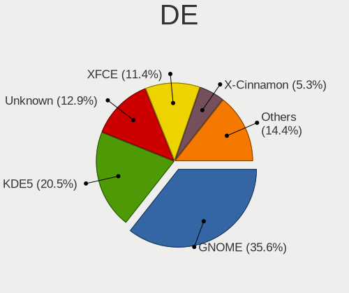

| Name            | Desktops | Percent |
|-----------------|----------|---------|
| GNOME           | 83       | 36.09%  |
| KDE5            | 52       | 22.61%  |
| Unknown         | 28       | 12.17%  |
| XFCE            | 26       | 11.3%   |
| X-Cinnamon      | 12       | 5.22%   |
| MATE            | 8        | 3.48%   |
| KDE             | 7        | 3.04%   |
| KDE4            | 5        | 2.17%   |
| LXQt            | 3        | 1.3%    |
| Pantheon        | 2        | 0.87%   |
| LXDE            | 1        | 0.43%   |
| LeftWM          | 1        | 0.43%   |
| GNOME Flashback | 1        | 0.43%   |
| Cinnamon        | 1        | 0.43%   |

Display Server
--------------

X11 or Wayland

| Name    | Desktops | Percent |
|---------|----------|---------|
| X11     | 171      | 78.08%  |
| Wayland | 27       | 12.33%  |
| Unknown | 17       | 7.76%   |
| Tty     | 4        | 1.83%   |

Display Manager
---------------

SDDM, LightDM, etc.

| Name    | Desktops | Percent |
|---------|----------|---------|
| Unknown | 109      | 47.6%   |
| SDDM    | 49       | 21.4%   |
| LightDM | 23       | 10.04%  |
| GDM     | 22       | 9.61%   |
| GDM3    | 14       | 6.11%   |
| TDM     | 5        | 2.18%   |
| KDM     | 5        | 2.18%   |
| MDM     | 1        | 0.44%   |
| LXDM    | 1        | 0.44%   |

OS Lang
-------

Language

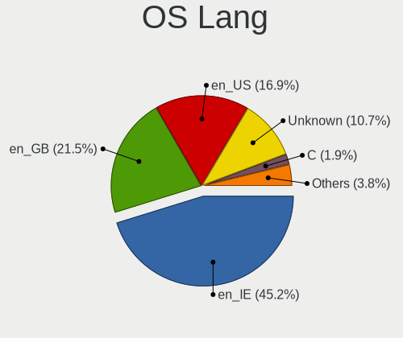

| Lang    | Desktops | Percent |
|---------|----------|---------|
| en_IE   | 101      | 44.49%  |
| en_GB   | 49       | 21.59%  |
| en_US   | 36       | 15.86%  |
| Unknown | 28       | 12.33%  |
| C       | 4        | 1.76%   |
| pl_PL   | 2        | 0.88%   |
| es_ES   | 2        | 0.88%   |
| pt_BR   | 1        | 0.44%   |
| hu_HU   | 1        | 0.44%   |
| en_BW   | 1        | 0.44%   |
| de_DE   | 1        | 0.44%   |
| C.UTF8  | 1        | 0.44%   |

Boot Mode
---------

EFI or BIOS

| Mode | Desktops | Percent |
|------|----------|---------|
| BIOS | 133      | 60.73%  |
| EFI  | 86       | 39.27%  |

Filesystem
----------

Type of filesystem

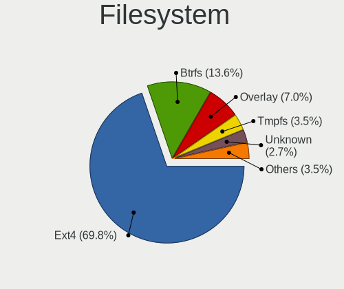

| Type    | Desktops | Percent |
|---------|----------|---------|
| Ext4    | 162      | 72.97%  |
| Btrfs   | 25       | 11.26%  |
| Overlay | 16       | 7.21%   |
| Unknown | 7        | 3.15%   |
| Tmpfs   | 5        | 2.25%   |
| Xfs     | 4        | 1.8%    |
| Zfs     | 2        | 0.9%    |
| Fake    | 1        | 0.45%   |

Part. scheme
------------

Scheme of partitioning

| Type    | Desktops | Percent |
|---------|----------|---------|
| Unknown | 106      | 46.49%  |
| GPT     | 94       | 41.23%  |
| MBR     | 28       | 12.28%  |

Dual Boot with Linux/BSD
------------------------

Hosting more than one Linux/BSD

| Dual boot | Desktops | Percent |
|-----------|----------|---------|
| No        | 169      | 76.82%  |
| Yes       | 51       | 23.18%  |

Dual Boot (Win)
---------------

Hosting Linux and Windows

| Dual boot | Desktops | Percent |
|-----------|----------|---------|
| No        | 150      | 67.57%  |
| Yes       | 72       | 32.43%  |

Board
-----

Vendor
------

Motherboard manufacturer

| Name                                 | Desktops | Percent |
|--------------------------------------|----------|---------|
| ASUSTek Computer                     | 46       | 21.6%   |
| Dell                                 | 43       | 20.19%  |
| Gigabyte Technology                  | 33       | 15.49%  |
| MSI                                  | 19       | 8.92%   |
| Hewlett-Packard                      | 18       | 8.45%   |
| ASRock                               | 14       | 6.57%   |
| Lenovo                               | 13       | 6.1%    |
| Foxconn                              | 5        | 2.35%   |
| Intel                                | 3        | 1.41%   |
| Shuttle                              | 2        | 0.94%   |
| Shenzhen Meigao Electronic Equipment | 2        | 0.94%   |
| Seco                                 | 2        | 0.94%   |
| Apple                                | 2        | 0.94%   |
| Unknown                              | 2        | 0.94%   |
| Pegatron                             | 1        | 0.47%   |
| Packard Bell                         | 1        | 0.47%   |
| MiTAC                                | 1        | 0.47%   |
| Medion                               | 1        | 0.47%   |
| DFI                                  | 1        | 0.47%   |
| AZW                                  | 1        | 0.47%   |
| ANGXUN                               | 1        | 0.47%   |
| Alienware                            | 1        | 0.47%   |
| ABIT                                 | 1        | 0.47%   |

Model
-----

Motherboard model

| Name                                       | Desktops | Percent |
|--------------------------------------------|----------|---------|
| Dell OptiPlex 7010                         | 8        | 3.76%   |
| ASUS All Series                            | 7        | 3.29%   |
| Gigabyte B450M DS3H                        | 5        | 2.35%   |
| Dell OptiPlex 790                          | 4        | 1.88%   |
| Dell OptiPlex 780                          | 4        | 1.88%   |
| HP Compaq 8200 Elite SFF PC                | 3        | 1.41%   |
| Dell OptiPlex 7020                         | 3        | 1.41%   |
| ASUS ROG STRIX B450-F GAMING               | 3        | 1.41%   |
| ASUS P8P67 PRO                             | 3        | 1.41%   |
| Shenzhen Meigao Electronic Equipment UM690 | 2        | 0.94%   |
| Seco C40                                   | 2        | 0.94%   |
| MSI MS-7C37                                | 2        | 0.94%   |
| MSI MS-7B86                                | 2        | 0.94%   |
| MSI MS-7B79                                | 2        | 0.94%   |
| Lenovo ThinkStation D20 415892G            | 2        | 0.94%   |
| Lenovo ThinkCentre E73 10DS000TUK          | 2        | 0.94%   |
| HP EliteDesk 800 G1 SFF                    | 2        | 0.94%   |
| Gigabyte X570 AORUS ULTRA                  | 2        | 0.94%   |
| Gigabyte A320M-S2H                         | 2        | 0.94%   |
| Foxconn Pro 3500 Series                    | 2        | 0.94%   |
| ASUS TUF Gaming X570-PLUS                  | 2        | 0.94%   |
| ASUS M5A78L/USB3                           | 2        | 0.94%   |
| Unknown                                    | 2        | 0.94%   |
| Shuttle XS35V4                             | 1        | 0.47%   |
| Shuttle XS35V3                             | 1        | 0.47%   |
| Pegatron Pro 3010 Microtower PC            | 1        | 0.47%   |
| Packard Bell Vegas2                        | 1        | 0.47%   |
| MSI Pro 3515 Series                        | 1        | 0.47%   |
| MSI MS-7E27                                | 1        | 0.47%   |
| MSI MS-7C84                                | 1        | 0.47%   |
| MSI MS-7C77                                | 1        | 0.47%   |
| MSI MS-7C02                                | 1        | 0.47%   |
| MSI MS-7B92                                | 1        | 0.47%   |
| MSI MS-7B89                                | 1        | 0.47%   |
| MSI MS-7972                                | 1        | 0.47%   |
| MSI MS-7751                                | 1        | 0.47%   |
| MSI MS-7693                                | 1        | 0.47%   |
| MSI MS-7636                                | 1        | 0.47%   |
| MSI MS-7270                                | 1        | 0.47%   |
| MSI ER883AA-ABA M7470N                     | 1        | 0.47%   |

Model Family
------------

Motherboard model prefix

| Name                                       | Desktops | Percent |
|--------------------------------------------|----------|---------|
| Dell OptiPlex                              | 27       | 12.68%  |
| Lenovo ThinkCentre                         | 10       | 4.69%   |
| ASUS PRIME                                 | 9        | 4.23%   |
| HP Compaq                                  | 7        | 3.29%   |
| ASUS TUF                                   | 7        | 3.29%   |
| ASUS All                                   | 7        | 3.29%   |
| Gigabyte B450M                             | 5        | 2.35%   |
| Dell Precision                             | 5        | 2.35%   |
| HP EliteDesk                               | 4        | 1.88%   |
| Foxconn Pro                                | 3        | 1.41%   |
| ASUS ROG                                   | 3        | 1.41%   |
| ASUS P8P67                                 | 3        | 1.41%   |
| Shenzhen Meigao Electronic Equipment UM690 | 2        | 0.94%   |
| Seco C40                                   | 2        | 0.94%   |
| MSI MS-7C37                                | 2        | 0.94%   |
| MSI MS-7B86                                | 2        | 0.94%   |
| MSI MS-7B79                                | 2        | 0.94%   |
| Lenovo ThinkStation                        | 2        | 0.94%   |
| Intel DESKTOP                              | 2        | 0.94%   |
| Gigabyte X570                              | 2        | 0.94%   |
| Gigabyte TRX40                             | 2        | 0.94%   |
| Gigabyte B450                              | 2        | 0.94%   |
| Gigabyte A320M-S2H                         | 2        | 0.94%   |
| Dell XPS                                   | 2        | 0.94%   |
| Dell Vostro                                | 2        | 0.94%   |
| Dell Inspiron                              | 2        | 0.94%   |
| ASUS Maximus                               | 2        | 0.94%   |
| ASUS M5A78L                                | 2        | 0.94%   |
| ASUS Crosshair                             | 2        | 0.94%   |
| ASRock Z77                                 | 2        | 0.94%   |
| Unknown                                    | 2        | 0.94%   |
| Shuttle XS35V4                             | 1        | 0.47%   |
| Shuttle XS35V3                             | 1        | 0.47%   |
| Pegatron Pro                               | 1        | 0.47%   |
| Packard Bell Vegas2                        | 1        | 0.47%   |
| MSI Pro                                    | 1        | 0.47%   |
| MSI MS-7E27                                | 1        | 0.47%   |
| MSI MS-7C84                                | 1        | 0.47%   |
| MSI MS-7C77                                | 1        | 0.47%   |
| MSI MS-7C02                                | 1        | 0.47%   |

MFG Year
--------

Motherboard manufacture year

| Year    | Desktops | Percent |
|---------|----------|---------|
| 2018    | 26       | 12.21%  |
| 2013    | 24       | 11.27%  |
| 2012    | 24       | 11.27%  |
| 2011    | 21       | 9.86%   |
| 2010    | 17       | 7.98%   |
| 2019    | 15       | 7.04%   |
| 2020    | 12       | 5.63%   |
| 2014    | 12       | 5.63%   |
| 2008    | 11       | 5.16%   |
| 2017    | 9        | 4.23%   |
| 2015    | 9        | 4.23%   |
| 2022    | 7        | 3.29%   |
| 2009    | 6        | 2.82%   |
| 2006    | 5        | 2.35%   |
| 2023    | 4        | 1.88%   |
| 2021    | 4        | 1.88%   |
| 2007    | 3        | 1.41%   |
| 2005    | 2        | 0.94%   |
| 2016    | 1        | 0.47%   |
| Unknown | 1        | 0.47%   |

Form Factor
-----------

Physical design of the computer

| Name    | Desktops | Percent |
|---------|----------|---------|
| Desktop | 213      | 100%    |

Secure Boot
-----------

Enabled or disabled

| State    | Desktops | Percent |
|----------|----------|---------|
| Disabled | 208      | 97.65%  |
| Enabled  | 5        | 2.35%   |

Coreboot
--------

Have coreboot on board

| Used | Desktops | Percent |
|------|----------|---------|
| No   | 213      | 100%    |

RAM Size
--------

Total RAM memory

| Size in GB      | Desktops | Percent |
|-----------------|----------|---------|
| 16.01-24.0      | 53       | 24.2%   |
| 8.01-16.0       | 52       | 23.74%  |
| 32.01-64.0      | 32       | 14.61%  |
| 3.01-4.0        | 32       | 14.61%  |
| 4.01-8.0        | 26       | 11.87%  |
| 64.01-256.0     | 11       | 5.02%   |
| 24.01-32.0      | 8        | 3.65%   |
| 1.01-2.0        | 3        | 1.37%   |
| More than 256.0 | 1        | 0.46%   |
| 0.51-1.0        | 1        | 0.46%   |

RAM Used
--------

Used RAM memory

| Used GB    | Desktops | Percent |
|------------|----------|---------|
| 1.01-2.0   | 93       | 37.5%   |
| 2.01-3.0   | 52       | 20.97%  |
| 4.01-8.0   | 36       | 14.52%  |
| 3.01-4.0   | 32       | 12.9%   |
| 8.01-16.0  | 17       | 6.85%   |
| 0.51-1.0   | 15       | 6.05%   |
| 32.01-64.0 | 1        | 0.4%    |
| 0.01-0.5   | 1        | 0.4%    |
| Unknown    | 1        | 0.4%    |

Total Drives
------------

Number of drives on board

| Drives | Desktops | Percent |
|--------|----------|---------|
| 1      | 81       | 34.32%  |
| 2      | 56       | 23.73%  |
| 3      | 34       | 14.41%  |
| 4      | 30       | 12.71%  |
| 5      | 14       | 5.93%   |
| 7      | 6        | 2.54%   |
| 6      | 5        | 2.12%   |
| 0      | 4        | 1.69%   |
| 10     | 3        | 1.27%   |
| 11     | 1        | 0.42%   |
| 9      | 1        | 0.42%   |
| 8      | 1        | 0.42%   |

Has CD-ROM
----------

Has CD-ROM on board

| Presented | Desktops | Percent |
|-----------|----------|---------|
| Yes       | 114      | 51.35%  |
| No        | 108      | 48.65%  |

Has Ethernet
------------

Has Ethernet on board

| Presented | Desktops | Percent |
|-----------|----------|---------|
| Yes       | 210      | 98.59%  |
| No        | 3        | 1.41%   |

Has WiFi
--------

Has WiFi module

| Presented | Desktops | Percent |
|-----------|----------|---------|
| Yes       | 126      | 56.5%   |
| No        | 97       | 43.5%   |

Has Bluetooth
-------------

Has Bluetooth module

| Presented | Desktops | Percent |
|-----------|----------|---------|
| No        | 137      | 61.99%  |
| Yes       | 84       | 38.01%  |

Location
--------

Country
-------

Geographic location (country)

| Country | Desktops | Percent |
|---------|----------|---------|
| Ireland | 213      | 100%    |

City
----

Geographic location (city)

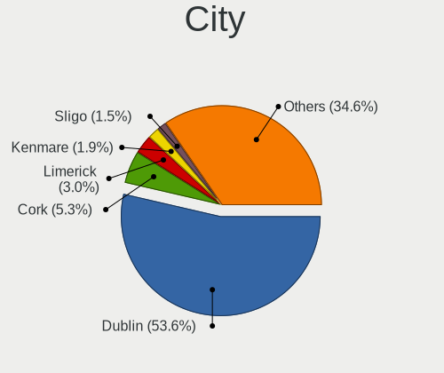

| City         | Desktops | Percent |
|--------------|----------|---------|
| Dublin       | 119      | 52.19%  |
| Cork         | 14       | 6.14%   |
| Limerick     | 8        | 3.51%   |
| Kenmare      | 5        | 2.19%   |
| Sligo        | 4        | 1.75%   |
| Gorey        | 4        | 1.75%   |
| Ennis        | 4        | 1.75%   |
| Tuam         | 3        | 1.32%   |
| Portlaoise   | 3        | 1.32%   |
| Naas         | 3        | 1.32%   |
| Athlone      | 3        | 1.32%   |
| Wexford      | 2        | 0.88%   |
| Swords       | 2        | 0.88%   |
| Oranmore     | 2        | 0.88%   |
| Nenagh       | 2        | 0.88%   |
| Kilkelly     | 2        | 0.88%   |
| Kildare      | 2        | 0.88%   |
| Enniscorthy  | 2        | 0.88%   |
| Drogheda     | 2        | 0.88%   |
| Cavan        | 2        | 0.88%   |
| Blackrock    | 2        | 0.88%   |
| Ballincollig | 2        | 0.88%   |
| Waterford    | 1        | 0.44%   |
| Tullamore    | 1        | 0.44%   |
| Tralee       | 1        | 0.44%   |
| Tobercurry   | 1        | 0.44%   |
| Tipperary    | 1        | 0.44%   |
| Summerhill   | 1        | 0.44%   |
| Shanagolden  | 1        | 0.44%   |
| Roscommon    | 1        | 0.44%   |
| Navan        | 1        | 0.44%   |
| Moyne        | 1        | 0.44%   |
| Maynooth     | 1        | 0.44%   |
| Mallow       | 1        | 0.44%   |
| Lucan        | 1        | 0.44%   |
| Loughrea     | 1        | 0.44%   |
| Listowel     | 1        | 0.44%   |
| Letterkenny  | 1        | 0.44%   |
| Killorglin   | 1        | 0.44%   |
| Killarney    | 1        | 0.44%   |

Drives
------

Drive Vendor
------------

Hard drive vendors

| Vendor                      | Desktops | Drives | Percent |
|-----------------------------|----------|--------|---------|
| WDC                         | 85       | 178    | 20.09%  |
| Seagate                     | 81       | 148    | 19.15%  |
| Samsung Electronics         | 56       | 104    | 13.24%  |
| Crucial                     | 26       | 31     | 6.15%   |
| Toshiba                     | 21       | 34     | 4.96%   |
| Hitachi                     | 19       | 30     | 4.49%   |
| SanDisk                     | 17       | 30     | 4.02%   |
| Kingston                    | 16       | 35     | 3.78%   |
| A-DATA Technology           | 9        | 16     | 2.13%   |
| China                       | 7        | 7      | 1.65%   |
| Phison                      | 6        | 11     | 1.42%   |
| Intel                       | 6        | 6      | 1.42%   |
| Micron/Crucial Technology   | 5        | 9      | 1.18%   |
| Verbatim                    | 4        | 4      | 0.95%   |
| Micron Technology           | 4        | 4      | 0.95%   |
| HGST                        | 4        | 4      | 0.95%   |
| OCZ                         | 3        | 3      | 0.71%   |
| Netac                       | 3        | 3      | 0.71%   |
| ADATA Technology            | 3        | 4      | 0.71%   |
| Transcend                   | 2        | 2      | 0.47%   |
| Team                        | 2        | 2      | 0.47%   |
| Silicon Motion              | 2        | 11     | 0.47%   |
| Patriot                     | 2        | 3      | 0.47%   |
| Maxtor                      | 2        | 2      | 0.47%   |
| LITEON                      | 2        | 2      | 0.47%   |
| Kingston Technology Company | 2        | 2      | 0.47%   |
| Unknown                     | 2        | 2      | 0.47%   |
| Western Digital             | 1        | 2      | 0.24%   |
| WDS100T1                    | 1        | 1      | 0.24%   |
| USB3.0                      | 1        | 1      | 0.24%   |
| Unknown                     | 1        | 1      | 0.24%   |
| Union Memory (Shenzhen)     | 1        | 1      | 0.24%   |
| Union Memory                | 1        | 1      | 0.24%   |
| SABRENT                     | 1        | 1      | 0.24%   |
| QNAP                        | 1        | 17     | 0.24%   |
| PNY                         | 1        | 1      | 0.24%   |
| Palit                       | 1        | 1      | 0.24%   |
| MaxDigital                  | 1        | 1      | 0.24%   |
| KIOXIA                      | 1        | 3      | 0.24%   |
| KingSpec                    | 1        | 1      | 0.24%   |

Drive Model
-----------

Hard drive models

| Model                            | Desktops | Percent |
|----------------------------------|----------|---------|
| Seagate ST500DM002-1BD142 500GB  | 7        | 1.38%   |
| Seagate ST2000DL003-9VT166 2TB   | 7        | 1.38%   |
| Seagate ST1000DM010-2EP102 1TB   | 7        | 1.38%   |
| Seagate ST8000DM004-2CX188 8TB   | 6        | 1.18%   |
| WDC WD10EURX-83UY4Y0 1TB         | 5        | 0.99%   |
| Kingston SA400S37240G 240GB SSD  | 5        | 0.99%   |
| Crucial CT500MX500SSD1 500GB     | 5        | 0.99%   |
| WDC WD10EZEX-08WN4A0 1TB         | 4        | 0.79%   |
| WDC WD10EALX-009BA0 1TB          | 4        | 0.79%   |
| Verbatim Vi550 S3 SSD 256GB      | 4        | 0.79%   |
| Seagate ST3500312CS 500GB        | 4        | 0.79%   |
| Seagate ST2000DM006-2DM164 2TB   | 4        | 0.79%   |
| Samsung SSD 870 EVO 1TB          | 4        | 0.79%   |
| Samsung SSD 850 EVO 500GB        | 4        | 0.79%   |
| Crucial CT1000MX500SSD1 1TB      | 4        | 0.79%   |
| A-DATA SU650 240GB SSD           | 4        | 0.79%   |
| WDC WD5000AAKX-60U6AA0 500GB     | 3        | 0.59%   |
| WDC WD3200AAJS-60Z0A0 320GB      | 3        | 0.59%   |
| WDC WD20EZRX-00D8PB0 2TB         | 3        | 0.59%   |
| Toshiba DT01ACA100 1TB           | 3        | 0.59%   |
| Seagate ST3500418AS 500GB        | 3        | 0.59%   |
| Seagate ST31000528AS 1TB         | 3        | 0.59%   |
| Seagate ST3000DM001-1CH166 3TB   | 3        | 0.59%   |
| Seagate ST2000DM008-2FR102 2TB   | 3        | 0.59%   |
| Seagate Expansion+ Desk 4TB      | 3        | 0.59%   |
| SanDisk NVMe SSD Drive 500GB     | 3        | 0.59%   |
| Samsung SSD 970 EVO Plus 500GB   | 3        | 0.59%   |
| Samsung SSD 860 EVO 500GB        | 3        | 0.59%   |
| Samsung SSD 840 EVO 250GB        | 3        | 0.59%   |
| Phison Sabrent 1TB               | 3        | 0.59%   |
| Kingston SV300S37A120G 120GB SSD | 3        | 0.59%   |
| Hitachi HDS721616PLA380 160GB    | 3        | 0.59%   |
| Hitachi HDS721032CLA362 320GB    | 3        | 0.59%   |
| ADATA SWORDFISH 1TB              | 3        | 0.59%   |
| WDC WDS100T2B0A-00SM50 1TB SSD   | 2        | 0.39%   |
| WDC WD5000BPKT-60PK4T0 500GB     | 2        | 0.39%   |
| WDC WD5000AZLX-08K2TA0 500GB     | 2        | 0.39%   |
| WDC WD5000AAKX-22ERMA0 500GB     | 2        | 0.39%   |
| WDC WD40EZRZ-19GXCB0 4TB         | 2        | 0.39%   |
| WDC WD40EFRX-68WT0N0 4TB         | 2        | 0.39%   |

HDD Vendor
----------

Hard disk drive vendors

| Vendor              | Desktops | Drives | Percent |
|---------------------|----------|--------|---------|
| Seagate             | 80       | 146    | 36.53%  |
| WDC                 | 77       | 166    | 35.16%  |
| Hitachi             | 19       | 30     | 8.68%   |
| Toshiba             | 18       | 30     | 8.22%   |
| Samsung Electronics | 9        | 13     | 4.11%   |
| HGST                | 4        | 4      | 1.83%   |
| Maxtor              | 2        | 2      | 0.91%   |
| Unknown             | 1        | 1      | 0.46%   |
| SABRENT             | 1        | 1      | 0.46%   |
| QNAP                | 1        | 17     | 0.46%   |
| KESU                | 1        | 1      | 0.46%   |
| Inateck             | 1        | 1      | 0.46%   |
| Fujitsu             | 1        | 3      | 0.46%   |
| FNK TECH            | 1        | 1      | 0.46%   |
| ExcelStor           | 1        | 2      | 0.46%   |
| DAS                 | 1        | 4      | 0.46%   |
| ASMT                | 1        | 1      | 0.46%   |

SSD Vendor
----------

Solid state drive vendors

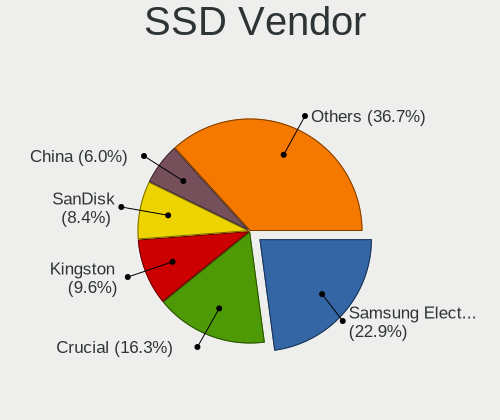

| Vendor              | Desktops | Drives | Percent |
|---------------------|----------|--------|---------|
| Samsung Electronics | 34       | 61     | 23.78%  |
| Crucial             | 24       | 29     | 16.78%  |
| Kingston            | 15       | 33     | 10.49%  |
| SanDisk             | 12       | 17     | 8.39%   |
| China               | 7        | 7      | 4.9%    |
| A-DATA Technology   | 7        | 13     | 4.9%    |
| WDC                 | 5        | 8      | 3.5%    |
| Verbatim            | 4        | 4      | 2.8%    |
| Intel               | 4        | 4      | 2.8%    |
| OCZ                 | 3        | 3      | 2.1%    |
| Netac               | 3        | 3      | 2.1%    |
| Transcend           | 2        | 2      | 1.4%    |
| Team                | 2        | 2      | 1.4%    |
| Patriot             | 2        | 3      | 1.4%    |
| Micron Technology   | 2        | 2      | 1.4%    |
| LITEON              | 2        | 2      | 1.4%    |
| Unknown             | 2        | 2      | 1.4%    |
| USB3.0              | 1        | 1      | 0.7%    |
| Toshiba             | 1        | 1      | 0.7%    |
| PNY                 | 1        | 1      | 0.7%    |
| Palit               | 1        | 1      | 0.7%    |
| KingSpec            | 1        | 1      | 0.7%    |
| KingDian            | 1        | 1      | 0.7%    |
| Integral            | 1        | 1      | 0.7%    |
| Hikvision           | 1        | 1      | 0.7%    |
| Hewlett-Packard     | 1        | 2      | 0.7%    |
| Fanxiang            | 1        | 1      | 0.7%    |
| DRVEO               | 1        | 1      | 0.7%    |
| Corsair             | 1        | 2      | 0.7%    |
| Apple               | 1        | 1      | 0.7%    |

Drive Kind
----------

HDD or SSD

| Kind    | Desktops | Drives | Percent |
|---------|----------|--------|---------|
| HDD     | 153      | 423    | 45.81%  |
| SSD     | 118      | 210    | 35.33%  |
| NVMe    | 56       | 106    | 16.77%  |
| Unknown | 7        | 7      | 2.1%    |

Drive Connector
---------------

SATA, SAS, NVMe, etc.

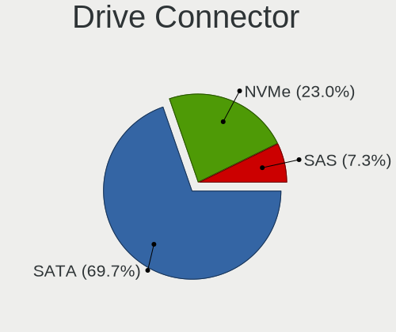

| Type | Desktops | Drives | Percent |
|------|----------|--------|---------|
| SATA | 196      | 612    | 71.79%  |
| NVMe | 56       | 106    | 20.51%  |
| SAS  | 21       | 28     | 7.69%   |

Drive Size
----------

Size of hard drive

| Size in TB | Desktops | Drives | Percent |
|------------|----------|--------|---------|
| 0.01-0.5   | 144      | 309    | 46.01%  |
| 0.51-1.0   | 90       | 176    | 28.75%  |
| 1.01-2.0   | 39       | 59     | 12.46%  |
| 3.01-4.0   | 18       | 37     | 5.75%   |
| 2.01-3.0   | 10       | 15     | 3.19%   |
| 4.01-10.0  | 10       | 34     | 3.19%   |
| 10.01-20.0 | 2        | 3      | 0.64%   |

Space Total
-----------

Amount of disk space available on the file system

| Size in GB     | Desktops | Percent |
|----------------|----------|---------|
| 101-250        | 47       | 19.26%  |
| 251-500        | 39       | 15.98%  |
| 501-1000       | 39       | 15.98%  |
| More than 3000 | 34       | 13.93%  |
| 1001-2000      | 25       | 10.25%  |
| 51-100         | 16       | 6.56%   |
| 2001-3000      | 14       | 5.74%   |
| 1-20           | 12       | 4.92%   |
| Unknown        | 11       | 4.51%   |
| 21-50          | 7        | 2.87%   |

Space Used
----------

Amount of used disk space

| Used GB        | Desktops | Percent |
|----------------|----------|---------|
| 1-20           | 77       | 30.56%  |
| 51-100         | 30       | 11.9%   |
| 101-250        | 28       | 11.11%  |
| 501-1000       | 28       | 11.11%  |
| 21-50          | 26       | 10.32%  |
| More than 3000 | 18       | 7.14%   |
| 251-500        | 13       | 5.16%   |
| 1001-2000      | 12       | 4.76%   |
| Unknown        | 11       | 4.37%   |
| 2001-3000      | 9        | 3.57%   |

Malfunc. Drives
---------------

Drive models with a malfunction

| Model                                    | Desktops | Drives | Percent |
|------------------------------------------|----------|--------|---------|
| Seagate ST2000DL003-9VT166 2TB           | 5        | 7      | 9.62%   |
| WDC WD10EALX-009BA0 1TB                  | 4        | 10     | 7.69%   |
| WDC WD3200AVJS-63B6A0 320GB              | 2        | 2      | 3.85%   |
| WDC WD2500AAKX-753CA1 250GB              | 2        | 4      | 3.85%   |
| Hitachi HDS721010CLA330 1TB              | 2        | 2      | 3.85%   |
| Western Digital SN730 500GB              | 1        | 2      | 1.92%   |
| WDC WD7500BPKX-00HPJT0 752GB             | 1        | 1      | 1.92%   |
| WDC WD5000HHTZ-04N21V0 500GB             | 1        | 3      | 1.92%   |
| WDC WD5000BEVT-35A0RT0 500GB             | 1        | 1      | 1.92%   |
| WDC WD5000AAKX-001CA0 500GB              | 1        | 2      | 1.92%   |
| WDC WD400JB-00FMA0 40GB                  | 1        | 2      | 1.92%   |
| WDC WD2500BEKT-75A25T0 250GB             | 1        | 1      | 1.92%   |
| WDC WD2500AAKX-603CA0 250GB              | 1        | 1      | 1.92%   |
| WDC WD20EZRZ-00Z5HB0 2TB                 | 1        | 2      | 1.92%   |
| WDC WD10EZEX-00BN5A0 1TB                 | 1        | 1      | 1.92%   |
| WDC WD1001FALS-00E8B0 1TB                | 1        | 2      | 1.92%   |
| Toshiba MK1059GSM 1TB                    | 1        | 1      | 1.92%   |
| Toshiba DT01ACA050 500GB                 | 1        | 3      | 1.92%   |
| Seagate ST500LM012 HN-M500MBB 500GB      | 1        | 1      | 1.92%   |
| Seagate ST4000DX001-1CE168 4TB           | 1        | 1      | 1.92%   |
| Seagate ST3500418AS 500GB                | 1        | 3      | 1.92%   |
| Seagate ST320LT009-9WC142 320GB          | 1        | 1      | 1.92%   |
| Seagate ST31500541AS 1TB                 | 1        | 1      | 1.92%   |
| Seagate ST3120026A 120GB                 | 1        | 1      | 1.92%   |
| Seagate ST31000333AS 1TB                 | 1        | 2      | 1.92%   |
| Seagate ST3000DM001-1ER166 3TB           | 1        | 1      | 1.92%   |
| Seagate ST3000DM001-1CH166 3TB           | 1        | 1      | 1.92%   |
| SanDisk SSD PLUS 480GB                   | 1        | 1      | 1.92%   |
| Samsung Electronics SSD 970 EVO Plus 2TB | 1        | 1      | 1.92%   |
| Samsung Electronics HD103SI 1TB          | 1        | 1      | 1.92%   |
| Netac SSD 128GB                          | 1        | 1      | 1.92%   |
| Micron Technology 2300 NVMe 512GB        | 1        | 1      | 1.92%   |
| Maxtor STM3250310AS 250GB                | 1        | 1      | 1.92%   |
| Intel SSDSA2M080G2GC 80GB                | 1        | 1      | 1.92%   |
| Inateck ASM1153E 240GB                   | 1        | 1      | 1.92%   |
| Hitachi HUS724030ALA640 3TB              | 1        | 2      | 1.92%   |
| Hitachi HDT721016SLA380 160GB            | 1        | 2      | 1.92%   |
| Hitachi HDS721010CLA332 1TB              | 1        | 1      | 1.92%   |
| HGST HTS541010A7E630 1TB                 | 1        | 1      | 1.92%   |
| DRVEO X1 SSD 480GB                       | 1        | 1      | 1.92%   |

Malfunc. Drive Vendor
---------------------

Vendors of faulty drives

| Vendor              | Desktops | Drives | Percent |
|---------------------|----------|--------|---------|
| WDC                 | 15       | 32     | 30.61%  |
| Seagate             | 14       | 19     | 28.57%  |
| Hitachi             | 5        | 7      | 10.2%   |
| Toshiba             | 2        | 4      | 4.08%   |
| Samsung Electronics | 2        | 2      | 4.08%   |
| Western Digital     | 1        | 2      | 2.04%   |
| SanDisk             | 1        | 1      | 2.04%   |
| Netac               | 1        | 1      | 2.04%   |
| Micron Technology   | 1        | 1      | 2.04%   |
| Maxtor              | 1        | 1      | 2.04%   |
| Intel               | 1        | 1      | 2.04%   |
| Inateck             | 1        | 1      | 2.04%   |
| HGST                | 1        | 1      | 2.04%   |
| DRVEO               | 1        | 1      | 2.04%   |
| China               | 1        | 1      | 2.04%   |
| A-DATA Technology   | 1        | 1      | 2.04%   |

Malfunc. HDD Vendor
-------------------

Vendors of faulty HDD drives

| Vendor              | Desktops | Drives | Percent |
|---------------------|----------|--------|---------|
| WDC                 | 15       | 32     | 37.5%   |
| Seagate             | 14       | 19     | 35%     |
| Hitachi             | 5        | 7      | 12.5%   |
| Toshiba             | 2        | 4      | 5%      |
| Samsung Electronics | 1        | 1      | 2.5%    |
| Maxtor              | 1        | 1      | 2.5%    |
| Inateck             | 1        | 1      | 2.5%    |
| HGST                | 1        | 1      | 2.5%    |

Malfunc. Drive Kind
-------------------

Kinds of faulty drives

| Kind | Desktops | Drives | Percent |
|------|----------|--------|---------|
| HDD  | 30       | 66     | 76.92%  |
| SSD  | 6        | 6      | 15.38%  |
| NVMe | 3        | 4      | 7.69%   |

Failed Drives
-------------

Failed drive models

Zero info for selected period =(

Failed Drive Vendor
-------------------

Failed drive vendors

Zero info for selected period =(

Drive Status
------------

Number of failed and malfunc. drives

| Status   | Desktops | Drives | Percent |
|----------|----------|--------|---------|
| Detected | 120      | 362    | 46.69%  |
| Works    | 99       | 308    | 38.52%  |
| Malfunc  | 38       | 76     | 14.79%  |

Storage controller
------------------

Storage Vendor
--------------

Storage controller vendors

| Vendor                       | Desktops | Percent |
|------------------------------|----------|---------|
| Intel                        | 133      | 43.61%  |
| AMD                          | 71       | 23.28%  |
| Samsung Electronics          | 21       | 6.89%   |
| SanDisk                      | 10       | 3.28%   |
| Marvell Technology Group     | 10       | 3.28%   |
| ASMedia Technology           | 10       | 3.28%   |
| Micron/Crucial Technology    | 7        | 2.3%    |
| JMicron Technology           | 7        | 2.3%    |
| Phison Electronics           | 6        | 1.97%   |
| Nvidia                       | 5        | 1.64%   |
| LSI Logic / Symbios Logic    | 4        | 1.31%   |
| Toshiba America Info Systems | 3        | 0.98%   |
| Kingston Technology Company  | 3        | 0.98%   |
| ADATA Technology             | 3        | 0.98%   |
| Union Memory (Shenzhen)      | 2        | 0.66%   |
| Silicon Motion               | 2        | 0.66%   |
| Realtek Semiconductor        | 2        | 0.66%   |
| Micron Technology            | 2        | 0.66%   |
| ULi Electronics              | 1        | 0.33%   |
| Seagate Technology           | 1        | 0.33%   |
| KIOXIA                       | 1        | 0.33%   |
| Broadcom / LSI               | 1        | 0.33%   |

Storage Model
-------------

Storage controller models

| Model                                                                                   | Desktops | Percent |
|-----------------------------------------------------------------------------------------|----------|---------|
| AMD FCH SATA Controller [AHCI mode]                                                     | 45       | 11.51%  |
| Intel 7 Series/C210 Series Chipset Family 6-port SATA Controller [AHCI mode]            | 19       | 4.86%   |
| AMD 400 Series Chipset SATA Controller                                                  | 18       | 4.6%    |
| Intel 6 Series/C200 Series Chipset Family 6 port Desktop SATA AHCI Controller           | 17       | 4.35%   |
| Intel 8 Series/C220 Series Chipset Family 6-port SATA Controller 1 [AHCI mode]          | 16       | 4.09%   |
| Intel 6 Series/C200 Series Chipset Family Desktop SATA Controller (IDE mode, ports 4-5) | 12       | 3.07%   |
| Intel 6 Series/C200 Series Chipset Family Desktop SATA Controller (IDE mode, ports 0-3) | 12       | 3.07%   |
| Samsung NVMe SSD Controller SM981/PM981/PM983                                           | 11       | 2.81%   |
| ASMedia ASM1061/ASM1062 Serial ATA Controller                                           | 10       | 2.56%   |
| AMD SB7x0/SB8x0/SB9x0 IDE Controller                                                    | 9        | 2.3%    |
| Intel 82801JI (ICH10 Family) SATA AHCI Controller                                       | 8        | 2.05%   |
| Intel SATA Controller [RAID mode]                                                       | 7        | 1.79%   |
| Intel Q170/Q150/B150/H170/H110/Z170/CM236 Chipset SATA Controller [AHCI Mode]           | 7        | 1.79%   |
| Intel 4 Series Chipset PT IDER Controller                                               | 7        | 1.79%   |
| AMD SB7x0/SB8x0/SB9x0 SATA Controller [AHCI mode]                                       | 7        | 1.79%   |
| AMD SB7x0/SB8x0/SB9x0 SATA Controller [IDE mode]                                        | 6        | 1.53%   |
| Intel 82801JD/DO (ICH10 Family) SATA AHCI Controller                                    | 5        | 1.28%   |
| Intel 82801G (ICH7 Family) IDE Controller                                               | 5        | 1.28%   |
| Intel 200 Series PCH SATA controller [AHCI mode]                                        | 5        | 1.28%   |
| AMD FCH SATA Controller D                                                               | 5        | 1.28%   |
| SanDisk Extreme Pro / WD Black SN750 / PC SN730 / Red SN700 NVMe SSD                    | 4        | 1.02%   |
| Phison E12 NVMe Controller                                                              | 4        | 1.02%   |
| Micron/Crucial P2 [Nick P2] / P3 / P3 Plus NVMe PCIe SSD (DRAM-less)                    | 4        | 1.02%   |
| JMicron JMB363 SATA/IDE Controller                                                      | 4        | 1.02%   |
| Intel NM10/ICH7 Family SATA Controller [IDE mode]                                       | 4        | 1.02%   |
| Intel 9 Series Chipset Family SATA Controller [AHCI Mode]                               | 4        | 1.02%   |
| AMD 600 Series Chipset SATA Controller                                                  | 4        | 1.02%   |
| AMD 500 Series Chipset SATA Controller                                                  | 4        | 1.02%   |
| Samsung NVMe SSD Controller PM9A1/PM9A3/980PRO                                          | 3        | 0.77%   |
| Samsung NVMe SSD Controller 980 (DRAM-less)                                             | 3        | 0.77%   |
| Nvidia MCP61 SATA Controller                                                            | 3        | 0.77%   |
| Intel NM10/ICH7 Family SATA Controller [AHCI mode]                                      | 3        | 0.77%   |
| Intel Comet Lake SATA AHCI Controller                                                   | 3        | 0.77%   |
| Intel Cannon Lake PCH SATA AHCI Controller                                              | 3        | 0.77%   |
| Intel 82801JI (ICH10 Family) 4 port SATA IDE Controller #1                              | 3        | 0.77%   |
| Intel 82801JI (ICH10 Family) 2 port SATA IDE Controller #2                              | 3        | 0.77%   |
| Intel 7 Series/C210 Series Chipset Family 4-port SATA Controller [IDE mode]             | 3        | 0.77%   |
| Intel 7 Series/C210 Series Chipset Family 2-port SATA Controller [IDE mode]             | 3        | 0.77%   |
| ADATA XPG GAMMIXS1 1L, XPG GAMMIX S5, LEGEND 710 / 740, SWORDFISH NVMe SSD (DRAM-less)  | 3        | 0.77%   |
| Union Memory (Shenzhen) AM620 PCIe 3.0 NVMe SSD 128GB                                   | 2        | 0.51%   |

Storage Kind
------------

Kind of storage controller (IDE, SATA, NVMe, SAS, ...)

| Kind | Desktops | Percent |
|------|----------|---------|
| SATA | 172      | 56.95%  |
| NVMe | 56       | 18.54%  |
| IDE  | 55       | 18.21%  |
| RAID | 16       | 5.3%    |
| SCSI | 3        | 0.99%   |

Processor
---------

CPU Vendor
----------

Processor vendors

| Vendor | Desktops | Percent |
|--------|----------|---------|
| Intel  | 135      | 63.38%  |
| AMD    | 77       | 36.15%  |
| iSH    | 1        | 0.47%   |

CPU Model
---------

Processor models

| Model                                          | Desktops | Percent |
|------------------------------------------------|----------|---------|
| Intel Core i7-2600K CPU @ 3.40GHz              | 8        | 3.69%   |
| Intel Core i7-3770 CPU @ 3.40GHz               | 7        | 3.23%   |
| AMD Ryzen 5 3600 6-Core Processor              | 7        | 3.23%   |
| Intel Core i5-3470 CPU @ 3.20GHz               | 5        | 2.3%    |
| Intel Core i7-3770K CPU @ 3.50GHz              | 4        | 1.84%   |
| Intel Core i5-2400 CPU @ 3.10GHz               | 4        | 1.84%   |
| Intel Core i3-2100 CPU @ 3.10GHz               | 4        | 1.84%   |
| AMD Ryzen 9 3900X 12-Core Processor            | 4        | 1.84%   |
| AMD Ryzen 5 2600X Six-Core Processor           | 4        | 1.84%   |
| Intel Pentium 4 CPU 3.00GHz                    | 3        | 1.38%   |
| Intel Core i7-2600 CPU @ 3.40GHz               | 3        | 1.38%   |
| Intel Core i3-4150 CPU @ 3.50GHz               | 3        | 1.38%   |
| Intel Core i3-2120 CPU @ 3.30GHz               | 3        | 1.38%   |
| Intel Core 2 Quad CPU Q6600 @ 2.40GHz          | 3        | 1.38%   |
| AMD Ryzen 5 3400G with Radeon Vega Graphics    | 3        | 1.38%   |
| AMD Ryzen 5 2600 Six-Core Processor            | 3        | 1.38%   |
| AMD Athlon II X4 620 Processor                 | 3        | 1.38%   |
| Intel Xeon CPU X5690 @ 3.47GHz                 | 2        | 0.92%   |
| Intel Pentium Dual-Core CPU E5800 @ 3.20GHz    | 2        | 0.92%   |
| Intel Core i7-4790K CPU @ 4.00GHz              | 2        | 0.92%   |
| Intel Core i7-4770K CPU @ 3.50GHz              | 2        | 0.92%   |
| Intel Core i5-8500T CPU @ 2.10GHz              | 2        | 0.92%   |
| Intel Core i5-6500T CPU @ 2.50GHz              | 2        | 0.92%   |
| Intel Core i5-4690K CPU @ 3.50GHz              | 2        | 0.92%   |
| Intel Core i5-4670K CPU @ 3.40GHz              | 2        | 0.92%   |
| Intel Core i5-4590 CPU @ 3.30GHz               | 2        | 0.92%   |
| Intel Core i5-4570 CPU @ 3.20GHz               | 2        | 0.92%   |
| Intel Core i5-4460S CPU @ 2.90GHz              | 2        | 0.92%   |
| Intel Core i5-3570 CPU @ 3.40GHz               | 2        | 0.92%   |
| Intel Core i5-2500 CPU @ 3.30GHz               | 2        | 0.92%   |
| Intel Core i5-10500 CPU @ 3.10GHz              | 2        | 0.92%   |
| Intel Core i3-4130 CPU @ 3.40GHz               | 2        | 0.92%   |
| Intel Core i3-3220 CPU @ 3.30GHz               | 2        | 0.92%   |
| Intel Core 2 Quad CPU Q9400 @ 2.66GHz          | 2        | 0.92%   |
| Intel Core 2 Duo CPU E8400 @ 3.00GHz           | 2        | 0.92%   |
| AMD Ryzen Embedded V1605B with Radeon Vega Gfx | 2        | 0.92%   |
| AMD Ryzen 9 6900HX with Radeon Graphics        | 2        | 0.92%   |
| AMD Ryzen 7 2700X Eight-Core Processor         | 2        | 0.92%   |
| AMD Ryzen 3 3200G with Radeon Vega Graphics    | 2        | 0.92%   |
| AMD Ryzen 3 2200G with Radeon Vega Graphics    | 2        | 0.92%   |

CPU Model Family
----------------

Processor model prefix

| Model                   | Desktops | Percent |
|-------------------------|----------|---------|
| Intel Core i5           | 41       | 18.89%  |
| Intel Core i7           | 36       | 16.59%  |
| AMD Ryzen 5             | 22       | 10.14%  |
| Intel Core i3           | 21       | 9.68%   |
| AMD Ryzen 9             | 12       | 5.53%   |
| Intel Xeon              | 10       | 4.61%   |
| Intel Core 2 Quad       | 8        | 3.69%   |
| AMD Ryzen 7             | 6        | 2.76%   |
| AMD FX                  | 5        | 2.3%    |
| AMD Athlon 64 X2        | 5        | 2.3%    |
| Intel Pentium 4         | 4        | 1.84%   |
| Intel Core 2 Duo        | 4        | 1.84%   |
| Intel Celeron           | 4        | 1.84%   |
| AMD Ryzen 3             | 4        | 1.84%   |
| Other                   | 3        | 1.38%   |
| Intel Pentium Dual-Core | 3        | 1.38%   |
| AMD Ryzen Threadripper  | 3        | 1.38%   |
| AMD Phenom II X4        | 3        | 1.38%   |
| AMD Athlon II X4        | 3        | 1.38%   |
| AMD A6                  | 3        | 1.38%   |
| Intel Pentium           | 2        | 0.92%   |
| Intel Atom              | 2        | 0.92%   |
| AMD Ryzen Embedded      | 2        | 0.92%   |
| AMD Phenom II X6        | 2        | 0.92%   |
| AMD A4                  | 2        | 0.92%   |
| Intel Pentium Silver    | 1        | 0.46%   |
| Intel Pentium D         | 1        | 0.46%   |
| AMD Ryzen 5 PRO         | 1        | 0.46%   |
| AMD PRO A10             | 1        | 0.46%   |
| AMD GX                  | 1        | 0.46%   |
| AMD Athlon II X2        | 1        | 0.46%   |
| AMD Athlon Dual Core    | 1        | 0.46%   |

CPU Cores
---------

Number of processor cores

| Number  | Desktops | Percent |
|---------|----------|---------|
| 4       | 101      | 46.98%  |
| 2       | 39       | 18.14%  |
| 6       | 32       | 14.88%  |
| 12      | 14       | 6.51%   |
| 8       | 11       | 5.12%   |
| 1       | 9        | 4.19%   |
| 16      | 2        | 0.93%   |
| 3       | 2        | 0.93%   |
| Unknown | 2        | 0.93%   |
| 32      | 1        | 0.47%   |
| 24      | 1        | 0.47%   |
| 10      | 1        | 0.47%   |

CPU Sockets
-----------

Number of sockets

| Number  | Desktops | Percent |
|---------|----------|---------|
| 1       | 207      | 97.18%  |
| 2       | 5        | 2.35%   |
| Unknown | 1        | 0.47%   |

CPU Threads
-----------

Threads per core (Hyper-Threading)

| Number  | Desktops | Percent |
|---------|----------|---------|
| 2       | 125      | 57.6%   |
| 1       | 90       | 41.47%  |
| Unknown | 2        | 0.92%   |

CPU Op-Modes
------------

CPU Operation Modes (32-bit, 64-bit)

| Op mode        | Desktops | Percent |
|----------------|----------|---------|
| 32-bit, 64-bit | 209      | 98.12%  |
| Unknown        | 4        | 1.88%   |

CPU Microcode
-------------

Microcode number

| Number     | Desktops | Percent |
|------------|----------|---------|
| Unknown    | 73       | 32.44%  |
| 0x306a9    | 18       | 8%      |
| 0x206a7    | 17       | 7.56%   |
| 0x306c3    | 15       | 6.67%   |
| 0x1067a    | 10       | 4.44%   |
| 0x08701021 | 7        | 3.11%   |
| 0x08108109 | 5        | 2.22%   |
| 0x0800820d | 5        | 2.22%   |
| 0x506e3    | 4        | 1.78%   |
| 0x206c2    | 4        | 1.78%   |
| 0xf43      | 3        | 1.33%   |
| 0xa0653    | 3        | 1.33%   |
| 0x906ea    | 3        | 1.33%   |
| 0x6fb      | 3        | 1.33%   |
| 0x0810100b | 3        | 1.33%   |
| 0x06000852 | 3        | 1.33%   |
| 0x010000db | 3        | 1.33%   |
| 0x906e9    | 2        | 0.89%   |
| 0x30661    | 2        | 0.89%   |
| 0x106a5    | 2        | 0.89%   |
| 0x0a601206 | 2        | 0.89%   |
| 0x0a601203 | 2        | 0.89%   |
| 0x0a201016 | 2        | 0.89%   |
| 0x08701013 | 2        | 0.89%   |
| 0x0600611a | 2        | 0.89%   |
| 0x010000c8 | 2        | 0.89%   |
| 0xf47      | 1        | 0.44%   |
| 0xf41      | 1        | 0.44%   |
| 0xa0655    | 1        | 0.44%   |
| 0x906ed    | 1        | 0.44%   |
| 0x906eb    | 1        | 0.44%   |
| 0x906c0    | 1        | 0.44%   |
| 0x706a1    | 1        | 0.44%   |
| 0x6f7      | 1        | 0.44%   |
| 0x406f1    | 1        | 0.44%   |
| 0x306e4    | 1        | 0.44%   |
| 0x30678    | 1        | 0.44%   |
| 0x106e5    | 1        | 0.44%   |
| 0x10677    | 1        | 0.44%   |
| 0x10676    | 1        | 0.44%   |

CPU Microarch
-------------

Microarchitecture

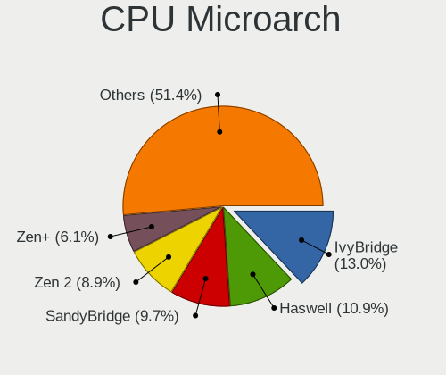

| Name             | Desktops | Percent |
|------------------|----------|---------|
| IvyBridge        | 28       | 13.08%  |
| SandyBridge      | 24       | 11.21%  |
| Haswell          | 23       | 10.75%  |
| Zen 2            | 18       | 8.41%   |
| Zen+             | 15       | 7.01%   |
| Penryn           | 12       | 5.61%   |
| KabyLake         | 11       | 5.14%   |
| K10              | 9        | 4.21%   |
| Unknown          | 8        | 3.74%   |
| Zen              | 7        | 3.27%   |
| Piledriver       | 7        | 3.27%   |
| Westmere         | 6        | 2.8%    |
| K8 Hammer        | 6        | 2.8%    |
| Skylake          | 5        | 2.34%   |
| NetBurst         | 5        | 2.34%   |
| Nehalem          | 5        | 2.34%   |
| Zen 3            | 4        | 1.87%   |
| Core             | 4        | 1.87%   |
| CometLake        | 4        | 1.87%   |
| Goldmont plus    | 2        | 0.93%   |
| Excavator        | 2        | 0.93%   |
| Bonnell          | 2        | 0.93%   |
| Tremont          | 1        | 0.47%   |
| Steamroller      | 1        | 0.47%   |
| Silvermont       | 1        | 0.47%   |
| Jaguar           | 1        | 0.47%   |
| Bulldozer        | 1        | 0.47%   |
| Broadwell        | 1        | 0.47%   |
| Alderlake Hybrid | 1        | 0.47%   |

Graphics
--------

GPU Vendor
----------

Vendors of graphics cards

| Vendor | Desktops | Percent |
|--------|----------|---------|
| AMD    | 90       | 38.14%  |
| Nvidia | 81       | 34.32%  |
| Intel  | 65       | 27.54%  |

GPU Model
---------

Graphics card models

| Model                                                                       | Desktops | Percent |
|-----------------------------------------------------------------------------|----------|---------|
| AMD Ellesmere [Radeon RX 470/480/570/570X/580/580X/590]                     | 17       | 6.8%    |
| Intel Xeon E3-1200 v3/4th Gen Core Processor Integrated Graphics Controller | 10       | 4%      |
| Intel 2nd Generation Core Processor Family Integrated Graphics Controller   | 10       | 4%      |
| Intel Xeon E3-1200 v2/3rd Gen Core processor Graphics Controller            | 9        | 3.6%    |
| Nvidia GP106 [GeForce GTX 1060 6GB]                                         | 8        | 3.2%    |
| Intel 4 Series Chipset Integrated Graphics Controller                       | 8        | 3.2%    |
| AMD Oland [Radeon HD 8570 / R5 430 OEM / R7 240/340 / Radeon 520 OEM]       | 8        | 3.2%    |
| Nvidia GP107 [GeForce GTX 1050 Ti]                                          | 6        | 2.4%    |
| Intel 4th Generation Core Processor Family Integrated Graphics Controller   | 6        | 2.4%    |
| Intel CoffeeLake-S GT2 [UHD Graphics 630]                                   | 5        | 2%      |
| AMD Raven Ridge [Radeon Vega Series / Radeon Vega Mobile Series]            | 5        | 2%      |
| AMD Caicos PRO [Radeon HD 7450]                                             | 5        | 2%      |
| Nvidia GM206 [GeForce GTX 960]                                              | 4        | 1.6%    |
| Nvidia GM107 [GeForce GTX 750 Ti]                                           | 4        | 1.6%    |
| Intel IvyBridge GT2 [HD Graphics 4000]                                      | 4        | 1.6%    |
| AMD Navi 10 [Radeon RX 5600 OEM/5600 XT / 5700/5700 XT]                     | 4        | 1.6%    |
| Nvidia TU104 [GeForce RTX 2070 SUPER]                                       | 3        | 1.2%    |
| Nvidia GT218 [GeForce 210]                                                  | 3        | 1.2%    |
| Nvidia GP104 [GeForce GTX 1070]                                             | 3        | 1.2%    |
| Nvidia GM204 [GeForce GTX 980]                                              | 3        | 1.2%    |
| Nvidia GK208B [GeForce GT 710]                                              | 3        | 1.2%    |
| Intel HD Graphics 630                                                       | 3        | 1.2%    |
| Intel CometLake-S GT2 [UHD Graphics 630]                                    | 3        | 1.2%    |
| AMD Raphael                                                                 | 3        | 1.2%    |
| AMD Oland PRO [Radeon R7 240/340 / Radeon 520]                              | 3        | 1.2%    |
| Nvidia GP107 [GeForce GTX 1050]                                             | 2        | 0.8%    |
| Nvidia GM204GL [Quadro M4000]                                               | 2        | 0.8%    |
| Nvidia GF108 [GeForce GT 730]                                               | 2        | 0.8%    |
| Nvidia GA102 [GeForce RTX 3090]                                             | 2        | 0.8%    |
| Intel HD Graphics 530                                                       | 2        | 0.8%    |
| AMD Wani [Radeon R5/R6/R7 Graphics]                                         | 2        | 0.8%    |
| AMD Trinity 2 [Radeon HD 7480D]                                             | 2        | 0.8%    |
| AMD Tobago PRO [Radeon R7 360 / R9 360 OEM]                                 | 2        | 0.8%    |
| AMD Rembrandt [Radeon 680M]                                                 | 2        | 0.8%    |
| AMD Picasso/Raven 2 [Radeon Vega Series / Radeon Vega Mobile Series]        | 2        | 0.8%    |
| AMD Navi 22 [Radeon RX 6700/6700 XT/6750 XT / 6800M/6850M XT]               | 2        | 0.8%    |
| AMD Navi 21 [Radeon RX 6800/6800 XT / 6900 XT]                              | 2        | 0.8%    |
| AMD Juniper XT [Radeon HD 5770]                                             | 2        | 0.8%    |
| AMD Curacao PRO [Radeon R7 370 / R9 270/370 OEM]                            | 2        | 0.8%    |
| AMD Cedar [Radeon HD 5000/6000/7350/8350 Series]                            | 2        | 0.8%    |

GPU Combo
---------

Combinations of graphics cards

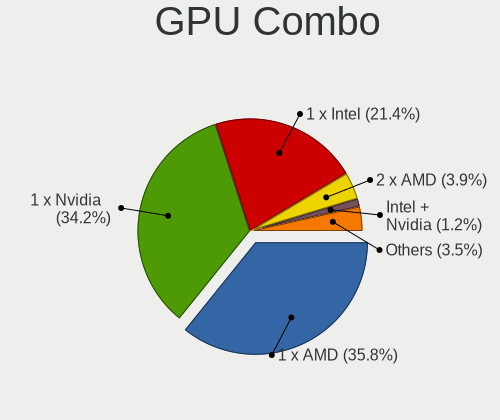

| Name           | Desktops | Percent |
|----------------|----------|---------|
| 1 x AMD        | 78       | 34.98%  |
| 1 x Nvidia     | 76       | 34.08%  |
| 1 x Intel      | 51       | 22.87%  |
| 2 x AMD        | 8        | 3.59%   |
| Intel + Nvidia | 3        | 1.35%   |
| Intel + AMD    | 2        | 0.9%    |
| AMD + Nvidia   | 2        | 0.9%    |
| Other          | 1        | 0.45%   |
| 2 x Nvidia     | 1        | 0.45%   |
| 2 x Intel      | 1        | 0.45%   |

GPU Driver
----------

Free vs proprietary

| Driver      | Desktops | Percent |
|-------------|----------|---------|
| Free        | 165      | 74.66%  |
| Proprietary | 45       | 20.36%  |
| Unknown     | 11       | 4.98%   |

GPU Memory
----------

Total video memory

| Size in GB | Desktops | Percent |
|------------|----------|---------|
| Unknown    | 96       | 41.92%  |
| 1.01-2.0   | 31       | 13.54%  |
| 0.51-1.0   | 27       | 11.79%  |
| 7.01-8.0   | 25       | 10.92%  |
| 3.01-4.0   | 18       | 7.86%   |
| 0.01-0.5   | 12       | 5.24%   |
| 5.01-6.0   | 11       | 4.8%    |
| 8.01-16.0  | 5        | 2.18%   |
| 2.01-3.0   | 2        | 0.87%   |
| 16.01-24.0 | 2        | 0.87%   |

Monitor
-------

Monitor Vendor
--------------

Monitor vendors

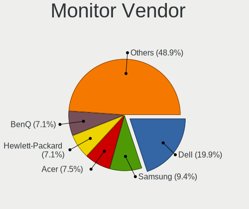

| Vendor               | Desktops | Percent |
|----------------------|----------|---------|
| Dell                 | 48       | 20.87%  |
| Samsung Electronics  | 20       | 8.7%    |
| BenQ                 | 19       | 8.26%   |
| Acer                 | 18       | 7.83%   |
| Hewlett-Packard      | 16       | 6.96%   |
| AOC                  | 14       | 6.09%   |
| Philips              | 11       | 4.78%   |
| Iiyama               | 11       | 4.78%   |
| Goldstar             | 10       | 4.35%   |
| Lenovo               | 5        | 2.17%   |
| Ancor Communications | 5        | 2.17%   |
| Sony                 | 4        | 1.74%   |
| Vestel Elektronik    | 3        | 1.3%    |
| HKC                  | 3        | 1.3%    |
| HannStar             | 3        | 1.3%    |
| ASUSTek Computer     | 3        | 1.3%    |
| Apple                | 3        | 1.3%    |
| ___                  | 2        | 0.87%   |
| ViewSonic            | 2        | 0.87%   |
| Unknown              | 2        | 0.87%   |
| Toshiba              | 2        | 0.87%   |
| NEC Computers        | 2        | 0.87%   |
| MSI                  | 2        | 0.87%   |
| MiTAC                | 2        | 0.87%   |
| HannStar Display     | 2        | 0.87%   |
| WIT                  | 1        | 0.43%   |
| UGD                  | 1        | 0.43%   |
| Targa Visionary      | 1        | 0.43%   |
| Targa                | 1        | 0.43%   |
| RTK                  | 1        | 0.43%   |
| Packard Bell         | 1        | 0.43%   |
| OEM                  | 1        | 0.43%   |
| Medion               | 1        | 0.43%   |
| LG Electronics       | 1        | 0.43%   |
| Idek Iiyama          | 1        | 0.43%   |
| HYO                  | 1        | 0.43%   |
| HUAWEI               | 1        | 0.43%   |
| Gigabyte Technology  | 1        | 0.43%   |
| Daewoo               | 1        | 0.43%   |
| CVT                  | 1        | 0.43%   |

Monitor Model
-------------

Monitor models

| Model                                                                 | Desktops | Percent |
|-----------------------------------------------------------------------|----------|---------|
| Iiyama PLT2336 IVM5628 1920x1080 509x286mm 23.0-inch                  | 5        | 1.96%   |
| BenQ BenQG2222HDL BNQ7859 1920x1080 478x269mm 21.6-inch               | 5        | 1.96%   |
| AOC Q3279WG5B AOC3279 2560x1440 725x428mm 33.1-inch                   | 5        | 1.96%   |
| Samsung Electronics LCD Monitor SAM0900 1366x768 700x390mm 31.5-inch  | 4        | 1.57%   |
| Vestel Elektronik 22W_LCD_TV VES3700 1920x540                         | 3        | 1.18%   |
| Dell P2014H DEL4097 1600x900 434x236mm 19.4-inch                      | 3        | 1.18%   |
| BenQ GW2270 BNQ78DB 1920x1080 476x268mm 21.5-inch                     | 3        | 1.18%   |
| ___ LCDTV16 ___9000 1360x768                                          | 2        | 0.78%   |
| Unknown LCDTV16 9000 1360x768 1600x900mm 72.3-inch                    | 2        | 0.78%   |
| Samsung Electronics S24D300 SAM0B43 1920x1080 531x299mm 24.0-inch     | 2        | 0.78%   |
| Philips PHL 273V7 PHLC156 1920x1080 598x336mm 27.0-inch               | 2        | 0.78%   |
| Philips PHL 243V7 PHLC155 1920x1080 527x296mm 23.8-inch               | 2        | 0.78%   |
| Lenovo LEN LT2452pwC LEN1144 1920x1200 518x324mm 24.1-inch            | 2        | 0.78%   |
| Hewlett-Packard 27f HPN354B 1920x1080 598x336mm 27.0-inch             | 2        | 0.78%   |
| Dell S2419HN DELD0D3 1920x1080 527x296mm 23.8-inch                    | 2        | 0.78%   |
| Dell P2317H DEL40F3 1920x1080 509x286mm 23.0-inch                     | 2        | 0.78%   |
| Dell E171FP DEL300F 1280x1024 338x270mm 17.0-inch                     | 2        | 0.78%   |
| Dell 1703FP DEL3011 1280x1024 338x270mm 17.0-inch                     | 2        | 0.78%   |
| BenQ ZOWIE XL LCD BNQ7F33 1920x1080 531x298mm 24.0-inch               | 2        | 0.78%   |
| Apple LED Cinema APP9236 1920x1200 518x324mm 24.1-inch                | 2        | 0.78%   |
| AOC Q34E2G5 AOC3402 2560x1080 800x335mm 34.1-inch                     | 2        | 0.78%   |
| AOC 2470W AOC2470 1920x1080 521x293mm 23.5-inch                       | 2        | 0.78%   |
| Ancor Communications ASUS VC239 ACI23C4 1920x1080 509x286mm 23.0-inch | 2        | 0.78%   |
| Acer V226HQL ACR032D 1920x1080 480x270mm 21.7-inch                    | 2        | 0.78%   |
| Acer K222HQL ACR03E1 1920x1080 480x270mm 21.7-inch                    | 2        | 0.78%   |
| WIT HDMI WIT0267 1920x1080 531x299mm 24.0-inch                        | 1        | 0.39%   |
| ViewSonic VX2776-4K-mhd VSC7137 3840x2160 608x355mm 27.7-inch         | 1        | 0.39%   |
| ViewSonic VX2776 Series VSC3E32 1920x1080 598x336mm 27.0-inch         | 1        | 0.39%   |
| UGD Artist13.3pro UGD1302 1920x1080 294x165mm 13.3-inch               | 1        | 0.39%   |
| Toshiba TV TSB1206 1360x768                                           | 1        | 0.39%   |
| Toshiba 49UHD_LCD_TV TSB3700 3840x2160 1872x1053mm 84.6-inch          | 1        | 0.39%   |
| Targa Visionary LCD22-1 Wide TARA229 1680x1050 474x297mm 22.0-inch    | 1        | 0.39%   |
| Targa LCD Monitor LCDTV16 1360x768                                    | 1        | 0.39%   |
| Sony TV SNY4302 1920x1080                                             | 1        | 0.39%   |
| Sony TV *02 SNYC603 1920x1080 1085x610mm 49.0-inch                    | 1        | 0.39%   |
| Sony TV *00 SNY8004 3840x2160 1218x685mm 55.0-inch                    | 1        | 0.39%   |
| Sony SDM-HS95P SNY2600 1280x1024 376x301mm 19.0-inch                  | 1        | 0.39%   |
| Samsung Electronics U28E590 SAM0C4C 3840x2160 608x345mm 27.5-inch     | 1        | 0.39%   |
| Samsung Electronics SyncMaster SAM0656 1920x1080 510x287mm 23.0-inch  | 1        | 0.39%   |
| Samsung Electronics SyncMaster SAM00E5 1280x1024 338x270mm 17.0-inch  | 1        | 0.39%   |

Monitor Resolution
------------------

Monitor screen resolution

| Resolution         | Desktops | Percent |
|--------------------|----------|---------|
| 1920x1080 (FHD)    | 107      | 48.2%   |
| 2560x1440 (QHD)    | 24       | 10.81%  |
| 3840x2160 (4K)     | 17       | 7.66%   |
| 1280x1024 (SXGA)   | 16       | 7.21%   |
| 3440x1440          | 7        | 3.15%   |
| 1440x900 (WXGA+)   | 7        | 3.15%   |
| 1366x768 (WXGA)    | 6        | 2.7%    |
| 1360x768           | 6        | 2.7%    |
| Unknown            | 6        | 2.7%    |
| 1920x1200 (WUXGA)  | 5        | 2.25%   |
| 3840x1080          | 4        | 1.8%    |
| 1680x1050 (WSXGA+) | 4        | 1.8%    |
| 1600x900 (HD+)     | 4        | 1.8%    |
| 1024x768 (XGA)     | 2        | 0.9%    |
| 6400x2160          | 1        | 0.45%   |
| 5280x2560          | 1        | 0.45%   |
| 4480x1440          | 1        | 0.45%   |
| 3600x1080          | 1        | 0.45%   |
| 2560x1080          | 1        | 0.45%   |
| 1920x540           | 1        | 0.45%   |
| 1600x1200          | 1        | 0.45%   |

Monitor Diagonal
----------------

Diagonal size in inches

| Inches  | Desktops | Percent |
|---------|----------|---------|
| 27      | 36       | 16.07%  |
| 24      | 36       | 16.07%  |
| 23      | 31       | 13.84%  |
| 21      | 28       | 12.5%   |
| Unknown | 17       | 7.59%   |
| 19      | 14       | 6.25%   |
| 17      | 9        | 4.02%   |
| 34      | 8        | 3.57%   |
| 31      | 6        | 2.68%   |
| 84      | 5        | 2.23%   |
| 33      | 5        | 2.23%   |
| 18      | 5        | 2.23%   |
| 32      | 4        | 1.79%   |
| 72      | 3        | 1.34%   |
| 22      | 3        | 1.34%   |
| 20      | 3        | 1.34%   |
| 49      | 2        | 0.89%   |
| 15      | 2        | 0.89%   |
| 65      | 1        | 0.45%   |
| 46      | 1        | 0.45%   |
| 35      | 1        | 0.45%   |
| 28      | 1        | 0.45%   |
| 25      | 1        | 0.45%   |
| 13      | 1        | 0.45%   |
| 12      | 1        | 0.45%   |

Monitor Width
-------------

Physical width

| Width in mm | Desktops | Percent |
|-------------|----------|---------|
| 501-600     | 93       | 42.66%  |
| 401-500     | 47       | 21.56%  |
| 701-800     | 17       | 7.8%    |
| Unknown     | 17       | 7.8%    |
| 601-700     | 11       | 5.05%   |
| 301-350     | 10       | 4.59%   |
| 351-400     | 8        | 3.67%   |
| 1501-2000   | 8        | 3.67%   |
| 1001-1500   | 4        | 1.83%   |
| 201-300     | 2        | 0.92%   |
| 801-900     | 1        | 0.46%   |

Aspect Ratio
------------

Proportional relationship between the width and the height

| Ratio   | Desktops | Percent |
|---------|----------|---------|
| 16/9    | 139      | 69.15%  |
| 16/10   | 18       | 8.96%   |
| 5/4     | 15       | 7.46%   |
| Unknown | 14       | 6.97%   |
| 21/9    | 8        | 3.98%   |
| 4/3     | 5        | 2.49%   |
| 32/9    | 1        | 0.5%    |
| 3/2     | 1        | 0.5%    |

Monitor Area
------------

Area in inch

| Area in inch | Desktops | Percent |
|----------------|----------|---------|
| 201-250        | 79       | 35.27%  |
| 301-350        | 36       | 16.07%  |
| 351-500        | 24       | 10.71%  |
| 151-200        | 23       | 10.27%  |
| 251-300        | 17       | 7.59%   |
| Unknown        | 17       | 7.59%   |
| 141-150        | 12       | 5.36%   |
| More than 1000 | 9        | 4.02%   |
| 501-1000       | 3        | 1.34%   |
| 71-80          | 2        | 0.89%   |
| 101-110        | 2        | 0.89%   |

Pixel Density
-------------

Pixels per inch

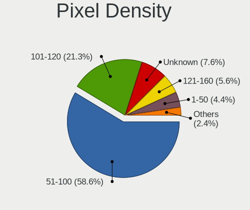

| Density | Desktops | Percent |
|---------|----------|---------|
| 51-100  | 126      | 58.88%  |
| 101-120 | 48       | 22.43%  |
| Unknown | 17       | 7.94%   |
| 1-50    | 10       | 4.67%   |
| 121-160 | 8        | 3.74%   |
| 161-240 | 5        | 2.34%   |

Multiple Monitors
-----------------

Total monitors connected

| Total | Desktops | Percent |
|-------|----------|---------|
| 1     | 163      | 72.44%  |
| 2     | 45       | 20%     |
| 0     | 11       | 4.89%   |
| 3     | 6        | 2.67%   |

Network
-------

Net Controller Vendor
---------------------

Controller vendors

| Vendor                            | Desktops | Percent |
|-----------------------------------|----------|---------|
| Realtek Semiconductor             | 117      | 34.62%  |
| Intel                             | 108      | 31.95%  |
| Qualcomm Atheros                  | 17       | 5.03%   |
| TP-Link                           | 15       | 4.44%   |
| Ralink Technology                 | 14       | 4.14%   |
| Broadcom                          | 13       | 3.85%   |
| Ralink                            | 8        | 2.37%   |
| MediaTek                          | 7        | 2.07%   |
| Microsoft                         | 6        | 1.78%   |
| Nvidia                            | 4        | 1.18%   |
| Marvell Technology Group          | 4        | 1.18%   |
| Broadcom Limited                  | 3        | 0.89%   |
| Qualcomm Atheros Communications   | 2        | 0.59%   |
| NetGear                           | 2        | 0.59%   |
| Huawei Technologies               | 2        | 0.59%   |
| Belkin Components                 | 2        | 0.59%   |
| Van Ooijen Technische Informatica | 1        | 0.3%    |
| ULi Electronics                   | 1        | 0.3%    |
| Samsung Electronics               | 1        | 0.3%    |
| NetXen Incorporated               | 1        | 0.3%    |
| Microchip Technology              | 1        | 0.3%    |
| JMicron Technology                | 1        | 0.3%    |
| IMC Networks                      | 1        | 0.3%    |
| HMD Global                        | 1        | 0.3%    |
| DisplayLink                       | 1        | 0.3%    |
| Dexcom                            | 1        | 0.3%    |
| ASUSTek Computer                  | 1        | 0.3%    |
| ASIX Electronics                  | 1        | 0.3%    |
| Aquantia                          | 1        | 0.3%    |
| ADMtek                            | 1        | 0.3%    |

Net Controller Model
--------------------

Controller models

| Model                                                                  | Desktops | Percent |
|------------------------------------------------------------------------|----------|---------|
| Realtek RTL8111/8168/8211/8411 PCI Express Gigabit Ethernet Controller | 88       | 23.34%  |
| Intel 82579LM Gigabit Network Connection (Lewisville)                  | 23       | 6.1%    |
| Intel Wi-Fi 6 AX200                                                    | 19       | 5.04%   |
| Realtek 802.11ac NIC                                                   | 11       | 2.92%   |
| Intel I211 Gigabit Network Connection                                  | 11       | 2.92%   |
| Realtek RTL8125 2.5GbE Controller                                      | 9        | 2.39%   |
| Ralink MT7601U Wireless Adapter                                        | 9        | 2.39%   |
| Intel Wi-Fi 5(802.11ac) Wireless-AC 9x6x [Thunder Peak]                | 8        | 2.12%   |
| Intel Ethernet Connection I217-LM                                      | 8        | 2.12%   |
| Intel 82567LM-3 Gigabit Network Connection                             | 7        | 1.86%   |
| Microsoft Xbox 360 Wireless Adapter                                    | 6        | 1.59%   |
| TP-Link Archer T3U [Realtek RTL8812BU]                                 | 5        | 1.33%   |
| Intel Ethernet Connection (2) I218-V                                   | 5        | 1.33%   |
| Ralink RT5370 Wireless Adapter                                         | 4        | 1.06%   |
| Ralink RT2561/RT61 802.11g PCI                                         | 4        | 1.06%   |
| Intel 82579V Gigabit Network Connection                                | 4        | 1.06%   |
| TP-Link TL-WN823N v2/v3 [Realtek RTL8192EU]                            | 3        | 0.8%    |
| Realtek RTL88x2bu [AC1200 Techkey]                                     | 3        | 0.8%    |
| Realtek RTL8192CU 802.11n WLAN Adapter                                 | 3        | 0.8%    |
| Realtek RTL8188EUS 802.11n Wireless Network Adapter                    | 3        | 0.8%    |
| Intel Wireless 7265                                                    | 3        | 0.8%    |
| Intel Ethernet Connection I217-V                                       | 3        | 0.8%    |
| Intel Ethernet Connection (2) I219-V                                   | 3        | 0.8%    |
| Intel Dual Band Wireless-AC 3168NGW [Stone Peak]                       | 3        | 0.8%    |
| Broadcom NetXtreme BCM5754 Gigabit Ethernet PCI Express                | 3        | 0.8%    |
| Broadcom BCM4360 802.11ac Dual Band Wireless Network Adapter           | 3        | 0.8%    |
| TP-Link 802.11ac WLAN Adapter                                          | 2        | 0.53%   |
| Realtek RTL8821CE 802.11ac PCIe Wireless Network Adapter               | 2        | 0.53%   |
| Realtek RTL8153 Gigabit Ethernet Adapter                               | 2        | 0.53%   |
| Realtek RTL-8100/8101L/8139 PCI Fast Ethernet Adapter                  | 2        | 0.53%   |
| Qualcomm Atheros AR9485 Wireless Network Adapter                       | 2        | 0.53%   |
| Qualcomm Atheros AR93xx Wireless Network Adapter                       | 2        | 0.53%   |
| Qualcomm Atheros AR9287 Wireless Network Adapter (PCI-Express)         | 2        | 0.53%   |
| Qualcomm Atheros AR8161 Gigabit Ethernet                               | 2        | 0.53%   |
| Nvidia MCP61 Ethernet                                                  | 2        | 0.53%   |
| MediaTek RMX3085                                                       | 2        | 0.53%   |
| Intel I210 Gigabit Network Connection                                  | 2        | 0.53%   |
| Intel Ethernet Controller I225-V                                       | 2        | 0.53%   |
| Intel Ethernet Connection (7) I219-V                                   | 2        | 0.53%   |
| Intel Ethernet Connection (2) I219-LM                                  | 2        | 0.53%   |

Wireless Vendor
---------------

Wireless vendors

| Vendor                          | Desktops | Percent |
|---------------------------------|----------|---------|
| Intel                           | 39       | 27.27%  |
| Realtek Semiconductor           | 28       | 19.58%  |
| TP-Link                         | 15       | 10.49%  |
| Qualcomm Atheros                | 15       | 10.49%  |
| Ralink Technology               | 14       | 9.79%   |
| Ralink                          | 8        | 5.59%   |
| Microsoft                       | 6        | 4.2%    |
| MediaTek                        | 4        | 2.8%    |
| Broadcom                        | 4        | 2.8%    |
| Qualcomm Atheros Communications | 2        | 1.4%    |
| NetGear                         | 2        | 1.4%    |
| Belkin Components               | 2        | 1.4%    |
| Marvell Technology Group        | 1        | 0.7%    |
| IMC Networks                    | 1        | 0.7%    |
| Broadcom Limited                | 1        | 0.7%    |
| ASUSTek Computer                | 1        | 0.7%    |

Wireless Model
--------------

Wireless models

| Model                                                               | Desktops | Percent |
|---------------------------------------------------------------------|----------|---------|
| Intel Wi-Fi 6 AX200                                                 | 19       | 13.01%  |
| Realtek 802.11ac NIC                                                | 11       | 7.53%   |
| Ralink MT7601U Wireless Adapter                                     | 9        | 6.16%   |
| Intel Wi-Fi 5(802.11ac) Wireless-AC 9x6x [Thunder Peak]             | 8        | 5.48%   |
| Microsoft Xbox 360 Wireless Adapter                                 | 6        | 4.11%   |
| TP-Link Archer T3U [Realtek RTL8812BU]                              | 5        | 3.42%   |
| Ralink RT5370 Wireless Adapter                                      | 4        | 2.74%   |
| Ralink RT2561/RT61 802.11g PCI                                      | 4        | 2.74%   |
| TP-Link TL-WN823N v2/v3 [Realtek RTL8192EU]                         | 3        | 2.05%   |
| Realtek RTL88x2bu [AC1200 Techkey]                                  | 3        | 2.05%   |
| Realtek RTL8192CU 802.11n WLAN Adapter                              | 3        | 2.05%   |
| Realtek RTL8188EUS 802.11n Wireless Network Adapter                 | 3        | 2.05%   |
| Intel Wireless 7265                                                 | 3        | 2.05%   |
| Intel Dual Band Wireless-AC 3168NGW [Stone Peak]                    | 3        | 2.05%   |
| Broadcom BCM4360 802.11ac Dual Band Wireless Network Adapter        | 3        | 2.05%   |
| TP-Link 802.11ac WLAN Adapter                                       | 2        | 1.37%   |
| Realtek RTL8821CE 802.11ac PCIe Wireless Network Adapter            | 2        | 1.37%   |
| Qualcomm Atheros AR9485 Wireless Network Adapter                    | 2        | 1.37%   |
| Qualcomm Atheros AR93xx Wireless Network Adapter                    | 2        | 1.37%   |
| Qualcomm Atheros AR9287 Wireless Network Adapter (PCI-Express)      | 2        | 1.37%   |
| Intel Comet Lake PCH CNVi WiFi                                      | 2        | 1.37%   |
| TP-Link TL-WN821N v5/v6 [RTL8192EU]                                 | 1        | 0.68%   |
| TP-Link RTL8812AU Archer T4U 802.11ac                               | 1        | 0.68%   |
| TP-Link Archer T4U v2 [Realtek RTL8812AU]                           | 1        | 0.68%   |
| TP-Link Archer T1U 802.11a/n/ac Wireless Adapter [MediaTek MT7610U] | 1        | 0.68%   |
| TP-Link 802.11ac NIC                                                | 1        | 0.68%   |
| Realtek RTL8852BE PCIe 802.11ax Wireless Network Controller         | 1        | 0.68%   |
| Realtek RTL8812AU 802.11a/b/g/n/ac 2T2R DB WLAN Adapter             | 1        | 0.68%   |
| Realtek RTL8812AE 802.11ac PCIe Wireless Network Adapter            | 1        | 0.68%   |
| Realtek RTL8192EE PCIe Wireless Network Adapter                     | 1        | 0.68%   |
| Realtek RTL8188EE Wireless Network Adapter                          | 1        | 0.68%   |
| Realtek RTL8188CUS 802.11n WLAN Adapter                             | 1        | 0.68%   |
| Realtek RTL8188CE 802.11b/g/n WiFi Adapter                          | 1        | 0.68%   |
| Realtek RTL8187B Wireless 802.11g 54Mbps Network Adapter            | 1        | 0.68%   |
| Ralink Wireless Adapter Canyon CN-WF511                             | 1        | 0.68%   |
| Ralink MT7610U ("Archer T2U" 2.4G+5G WLAN Adapter                   | 1        | 0.68%   |
| Ralink RT5592 PCIe Wireless Network Adapter                         | 1        | 0.68%   |
| Ralink RT3062 Wireless 802.11n 2T/2R                                | 1        | 0.68%   |
| Ralink RT2790 Wireless 802.11n 1T/2R PCIe                           | 1        | 0.68%   |
| Qualcomm Atheros QCA9565 / AR9565 Wireless Network Adapter          | 1        | 0.68%   |

Ethernet Vendor
---------------

Ethernet vendors

| Vendor                   | Desktops | Percent |
|--------------------------|----------|---------|
| Realtek Semiconductor    | 101      | 45.91%  |
| Intel                    | 85       | 38.64%  |
| Broadcom                 | 10       | 4.55%   |
| Nvidia                   | 4        | 1.82%   |
| Qualcomm Atheros         | 3        | 1.36%   |
| Marvell Technology Group | 3        | 1.36%   |
| MediaTek                 | 2        | 0.91%   |
| Broadcom Limited         | 2        | 0.91%   |
| ULi Electronics          | 1        | 0.45%   |
| Samsung Electronics      | 1        | 0.45%   |
| NetXen Incorporated      | 1        | 0.45%   |
| JMicron Technology       | 1        | 0.45%   |
| Huawei Technologies      | 1        | 0.45%   |
| HMD Global               | 1        | 0.45%   |
| DisplayLink              | 1        | 0.45%   |
| ASIX Electronics         | 1        | 0.45%   |
| Aquantia                 | 1        | 0.45%   |
| ADMtek                   | 1        | 0.45%   |

Ethernet Model
--------------

Ethernet models

| Model                                                                          | Desktops | Percent |
|--------------------------------------------------------------------------------|----------|---------|
| Realtek RTL8111/8168/8211/8411 PCI Express Gigabit Ethernet Controller         | 88       | 38.94%  |
| Intel 82579LM Gigabit Network Connection (Lewisville)                          | 23       | 10.18%  |
| Intel I211 Gigabit Network Connection                                          | 11       | 4.87%   |
| Realtek RTL8125 2.5GbE Controller                                              | 9        | 3.98%   |
| Intel Ethernet Connection I217-LM                                              | 8        | 3.54%   |
| Intel 82567LM-3 Gigabit Network Connection                                     | 7        | 3.1%    |
| Intel Ethernet Connection (2) I218-V                                           | 5        | 2.21%   |
| Intel 82579V Gigabit Network Connection                                        | 4        | 1.77%   |
| Intel Ethernet Connection I217-V                                               | 3        | 1.33%   |
| Intel Ethernet Connection (2) I219-V                                           | 3        | 1.33%   |
| Broadcom NetXtreme BCM5754 Gigabit Ethernet PCI Express                        | 3        | 1.33%   |
| Realtek RTL8153 Gigabit Ethernet Adapter                                       | 2        | 0.88%   |
| Realtek RTL-8100/8101L/8139 PCI Fast Ethernet Adapter                          | 2        | 0.88%   |
| Qualcomm Atheros AR8161 Gigabit Ethernet                                       | 2        | 0.88%   |
| Nvidia MCP61 Ethernet                                                          | 2        | 0.88%   |
| MediaTek RMX3085                                                               | 2        | 0.88%   |
| Intel I210 Gigabit Network Connection                                          | 2        | 0.88%   |
| Intel Ethernet Controller I225-V                                               | 2        | 0.88%   |
| Intel Ethernet Connection (7) I219-V                                           | 2        | 0.88%   |
| Intel Ethernet Connection (2) I219-LM                                          | 2        | 0.88%   |
| Intel 82583V Gigabit Network Connection                                        | 2        | 0.88%   |
| Intel 82573L Gigabit Ethernet Controller                                       | 2        | 0.88%   |
| Broadcom NetXtreme BCM5764M Gigabit Ethernet PCIe                              | 2        | 0.88%   |
| Broadcom Limited NetXtreme BCM5755 Gigabit Ethernet PCI Express                | 2        | 0.88%   |
| ULi ULi 1689,1573 integrated ethernet.                                         | 1        | 0.44%   |
| Samsung Galaxy series, misc. (tethering mode)                                  | 1        | 0.44%   |
| Realtek RTL8169 PCI Gigabit Ethernet Controller                                | 1        | 0.44%   |
| Realtek RTL810xE PCI Express Fast Ethernet controller                          | 1        | 0.44%   |
| Realtek Killer E2600 GbE Controller                                            | 1        | 0.44%   |
| Qualcomm Atheros Killer E220x Gigabit Ethernet Controller                      | 1        | 0.44%   |
| Nvidia MCP55 Ethernet                                                          | 1        | 0.44%   |
| Nvidia MCP51 Ethernet Controller                                               | 1        | 0.44%   |
| NetXen Incorporated NX3031 Multifunction 1/10-Gigabit Server Adapter           | 1        | 0.44%   |
| Marvell Group Yukon Optima 88E8059 [PCIe Gigabit Ethernet Controller with AVB] | 1        | 0.44%   |
| Marvell Group 88E8056 PCI-E Gigabit Ethernet Controller                        | 1        | 0.44%   |
| Marvell Group 88E8053 PCI-E Gigabit Ethernet Controller                        | 1        | 0.44%   |
| JMicron JMC250 PCI Express Gigabit Ethernet Controller                         | 1        | 0.44%   |
| Intel NM10/ICH7 Family LAN Controller                                          | 1        | 0.44%   |
| Intel I350 Gigabit Network Connection                                          | 1        | 0.44%   |
| Intel Ethernet Controller I226-V                                               | 1        | 0.44%   |

Net Controller Kind
-------------------

Ethernet, WiFi or modem

| Kind     | Desktops | Percent |
|----------|----------|---------|
| Ethernet | 210      | 61.58%  |
| WiFi     | 126      | 36.95%  |
| Modem    | 5        | 1.47%   |

Used Controller
---------------

Currently used network controller

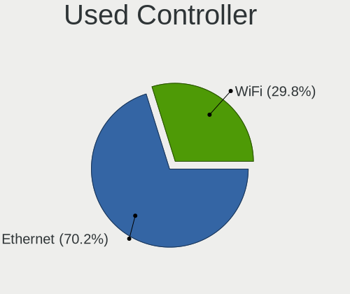

| Kind     | Desktops | Percent |
|----------|----------|---------|
| Ethernet | 164      | 70.09%  |
| WiFi     | 70       | 29.91%  |

NICs
----

Total network controllers on board

| Total | Desktops | Percent |
|-------|----------|---------|
| 1     | 128      | 58.99%  |
| 2     | 72       | 33.18%  |
| 3     | 10       | 4.61%   |
| 0     | 5        | 2.3%    |
| 6     | 1        | 0.46%   |
| 4     | 1        | 0.46%   |

IPv6
----

IPv6 vs IPv4

| Used | Desktops | Percent |
|------|----------|---------|
| No   | 192      | 88.89%  |
| Yes  | 24       | 11.11%  |

Bluetooth
---------

Bluetooth Vendor
----------------

Controller vendors

| Vendor                          | Desktops | Percent |
|---------------------------------|----------|---------|
| Intel                           | 35       | 39.77%  |
| Cambridge Silicon Radio         | 21       | 23.86%  |
| Broadcom                        | 6        | 6.82%   |
| ASUSTek Computer                | 6        | 6.82%   |
| Realtek Semiconductor           | 4        | 4.55%   |
| Qualcomm Atheros Communications | 3        | 3.41%   |
| TP-Link                         | 2        | 2.27%   |
| MediaTek                        | 2        | 2.27%   |
| IMC Networks                    | 2        | 2.27%   |
| Belkin Components               | 2        | 2.27%   |
| Apple                           | 2        | 2.27%   |
| SiW                             | 1        | 1.14%   |
| Dell                            | 1        | 1.14%   |
| Conwise Technology              | 1        | 1.14%   |

Bluetooth Model
---------------

Controller models

| Model                                               | Desktops | Percent |
|-----------------------------------------------------|----------|---------|
| Cambridge Silicon Radio Bluetooth Dongle (HCI mode) | 21       | 23.6%   |
| Intel AX200 Bluetooth                               | 17       | 19.1%   |
| Intel Wireless-AC 9260 Bluetooth Adapter            | 7        | 7.87%   |
| Broadcom BCM20702A0 Bluetooth 4.0                   | 6        | 6.74%   |
| Intel Bluetooth wireless interface                  | 5        | 5.62%   |
| Intel Wireless-AC 3168 Bluetooth                    | 3        | 3.37%   |
| ASUS Broadcom BCM20702A0 Bluetooth                  | 3        | 3.37%   |
| TP-Link UB500 Adapter                               | 2        | 2.25%   |
| Realtek  Bluetooth 4.2 Adapter                      | 2        | 2.25%   |
| Realtek Bluetooth Radio                             | 2        | 2.25%   |
| MediaTek Wireless_Device                            | 2        | 2.25%   |
| Intel AX201 Bluetooth                               | 2        | 2.25%   |
| SiW SiW                                             | 1        | 1.12%   |
| Qualcomm Atheros  Bluetooth Device                  | 1        | 1.12%   |
| Qualcomm Atheros Bluetooth USB Host Controller      | 1        | 1.12%   |
| Qualcomm Atheros AR3011 Bluetooth                   | 1        | 1.12%   |
| Intel Bluetooth Device                              | 1        | 1.12%   |
| Intel Bluetooth 9460/9560 Jefferson Peak (JfP)      | 1        | 1.12%   |
| IMC Networks Wireless_Device                        | 1        | 1.12%   |
| IMC Networks Bluetooth Radio                        | 1        | 1.12%   |
| Dell BT Mini-Receiver                               | 1        | 1.12%   |
| Conwise CW6622                                      | 1        | 1.12%   |
| Belkin Components F8T012 Bluetooth Adapter          | 1        | 1.12%   |
| Belkin Components Bluetooth Mini Dongle             | 1        | 1.12%   |
| ASUS Qualcomm Bluetooth 4.1                         | 1        | 1.12%   |
| ASUS Bluetooth Device                               | 1        | 1.12%   |
| ASUS BCM20702A0                                     | 1        | 1.12%   |
| Apple Bluetooth Host Controller                     | 1        | 1.12%   |
| Apple Bluetooth HCI                                 | 1        | 1.12%   |

Sound
-----

Sound Vendor
------------

Sound card vendors

| Vendor                                          | Desktops | Percent |
|-------------------------------------------------|----------|---------|
| Intel                                           | 130      | 34.12%  |
| AMD                                             | 112      | 29.4%   |
| Nvidia                                          | 77       | 20.21%  |
| Creative Labs                                   | 7        | 1.84%   |
| C-Media Electronics                             | 7        | 1.84%   |
| Kingston Technology                             | 5        | 1.31%   |
| Plantronics                                     | 4        | 1.05%   |
| Texas Instruments                               | 3        | 0.79%   |
| Creative Technology                             | 3        | 0.79%   |
| Micronas                                        | 2        | 0.52%   |
| Logitech                                        | 2        | 0.52%   |
| JMTek                                           | 2        | 0.52%   |
| Giga-Byte Technology                            | 2        | 0.52%   |
| Ensoniq                                         | 2        | 0.52%   |
| Dell                                            | 2        | 0.52%   |
| Blue Microphones                                | 2        | 0.52%   |
| ULi Electronics                                 | 1        | 0.26%   |
| Turtle Beach                                    | 1        | 0.26%   |
| Sony                                            | 1        | 0.26%   |
| SAVITECH                                        | 1        | 0.26%   |
| RODE Microphones                                | 1        | 0.26%   |
| Razer USA                                       | 1        | 0.26%   |
| Native Instruments                              | 1        | 0.26%   |
| M-Audio                                         | 1        | 0.26%   |
| Licensed by Sony Computer Entertainment America | 1        | 0.26%   |
| KTMicro                                         | 1        | 0.26%   |
| GN Netcom                                       | 1        | 0.26%   |
| Generalplus Technology                          | 1        | 0.26%   |
| Focusrite-Novation                              | 1        | 0.26%   |
| FiiO Electronics Technology                     | 1        | 0.26%   |
| Corsair                                         | 1        | 0.26%   |
| BEHRINGER International                         | 1        | 0.26%   |
| AudioQuest                                      | 1        | 0.26%   |
| Audio-Technica                                  | 1        | 0.26%   |
| AOKEO                                           | 1        | 0.26%   |

Sound Model
-----------

Sound card models

| Model                                                                             | Desktops | Percent |
|-----------------------------------------------------------------------------------|----------|---------|
| Intel 6 Series/C200 Series Chipset Family High Definition Audio Controller        | 27       | 5.97%   |
| Intel 7 Series/C216 Chipset Family High Definition Audio Controller               | 23       | 5.09%   |
| AMD Starship/Matisse HD Audio Controller                                          | 22       | 4.87%   |
| Intel 8 Series/C220 Series Chipset High Definition Audio Controller               | 18       | 3.98%   |
| AMD Oland/Hainan/Cape Verde/Pitcairn HDMI Audio [Radeon HD 7000 Series]           | 17       | 3.76%   |
| AMD Family 17h/19h HD Audio Controller                                            | 17       | 3.76%   |
| AMD Ellesmere HDMI Audio [Radeon RX 470/480 / 570/580/590]                        | 17       | 3.76%   |
| Intel Xeon E3-1200 v3/4th Gen Core Processor HD Audio Controller                  | 14       | 3.1%    |
| AMD SBx00 Azalia (Intel HDA)                                                      | 14       | 3.1%    |
| AMD Family 17h (Models 00h-0fh) HD Audio Controller                               | 11       | 2.43%   |
| Nvidia GP107GL High Definition Audio Controller                                   | 9        | 1.99%   |
| Intel 82801JI (ICH10 Family) HD Audio Controller                                  | 9        | 1.99%   |
| Nvidia GP106 High Definition Audio Controller                                     | 8        | 1.77%   |
| AMD Caicos HDMI Audio [Radeon HD 6450 / 7450/8450/8490 OEM / R5 230/235/235X OEM] | 8        | 1.77%   |
| Intel 82801JD/DO (ICH10 Family) HD Audio Controller                               | 7        | 1.55%   |
| Intel 100 Series/C230 Series Chipset Family HD Audio Controller                   | 7        | 1.55%   |
| AMD Raven/Raven2/Fenghuang HDMI/DP Audio Controller                               | 7        | 1.55%   |
| Nvidia GM204 High Definition Audio Controller                                     | 6        | 1.33%   |
| Intel NM10/ICH7 Family High Definition Audio Controller                           | 6        | 1.33%   |
| AMD Navi 21/23 HDMI/DP Audio Controller                                           | 6        | 1.33%   |
| Nvidia GM107 High Definition Audio Controller [GeForce 940MX]                     | 5        | 1.11%   |
| Nvidia GK208 HDMI/DP Audio Controller                                             | 5        | 1.11%   |
| Intel 9 Series Chipset Family HD Audio Controller                                 | 5        | 1.11%   |
| Intel 200 Series PCH HD Audio                                                     | 5        | 1.11%   |
| AMD Rembrandt Radeon High Definition Audio Controller                             | 5        | 1.11%   |
| AMD Navi 10 HDMI Audio                                                            | 5        | 1.11%   |
| AMD FCH Azalia Controller                                                         | 5        | 1.11%   |
| Nvidia High Definition Audio Controller                                           | 4        | 0.88%   |
| Nvidia GM206 High Definition Audio Controller                                     | 4        | 0.88%   |
| Nvidia GF108 High Definition Audio Controller                                     | 4        | 0.88%   |
| Intel Cannon Lake PCH cAVS                                                        | 4        | 0.88%   |
| AMD Baffin HDMI/DP Audio [Radeon RX 550 640SP / RX 560/560X]                      | 4        | 0.88%   |
| Nvidia TU116 High Definition Audio Controller                                     | 3        | 0.66%   |
| Nvidia TU104 HD Audio Controller                                                  | 3        | 0.66%   |
| Nvidia MCP61 High Definition Audio                                                | 3        | 0.66%   |
| Nvidia GP104 High Definition Audio Controller                                     | 3        | 0.66%   |
| Nvidia GA106 High Definition Audio Controller                                     | 3        | 0.66%   |
| Nvidia GA104 High Definition Audio Controller                                     | 3        | 0.66%   |
| Intel Comet Lake PCH cAVS                                                         | 3        | 0.66%   |
| Intel 5 Series/3400 Series Chipset High Definition Audio                          | 3        | 0.66%   |

Memory
------

Memory Vendor
-------------

Memory module vendors

| Vendor              | Desktops | Percent |
|---------------------|----------|---------|
| Corsair             | 30       | 21.58%  |
| Unknown             | 19       | 13.67%  |
| Kingston            | 17       | 12.23%  |
| Crucial             | 16       | 11.51%  |
| SK hynix            | 15       | 10.79%  |
| Samsung Electronics | 9        | 6.47%   |
| Micron Technology   | 8        | 5.76%   |
| G.Skill             | 8        | 5.76%   |
| Team                | 3        | 2.16%   |
| Ramaxel Technology  | 3        | 2.16%   |
| Patriot             | 2        | 1.44%   |
| A-DATA Technology   | 2        | 1.44%   |
| Toshiba             | 1        | 0.72%   |
| Nanya Technology    | 1        | 0.72%   |
| Infineon            | 1        | 0.72%   |
| Elpida              | 1        | 0.72%   |
| BiNFUL              | 1        | 0.72%   |
| Apacer              | 1        | 0.72%   |
| A Force             | 1        | 0.72%   |

Memory Model
------------

Memory module models

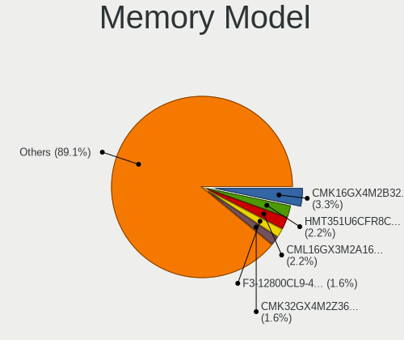

| Model                                                  | Desktops | Percent |
|--------------------------------------------------------|----------|---------|
| Corsair RAM CMK16GX4M2B3200C16 8GB DIMM DDR4 3600MT/s  | 6        | 3.87%   |
| G.Skill RAM F3-12800CL9-4GBXL 4GB DIMM DDR3 1867MT/s   | 3        | 1.94%   |
| Corsair RAM CMK16GX4M2B3000C15 8GB DIMM DDR4 3600MT/s  | 3        | 1.94%   |
| Unknown RAM Module 4096MB DIMM 1600MT/s                | 2        | 1.29%   |
| Unknown RAM Module 2048MB DIMM 800MT/s                 | 2        | 1.29%   |
| Team RAM Elite-1333 2GB DIMM DDR3 1333MT/s             | 2        | 1.29%   |
| SK hynix RAM HMT451U6BFR8A-PB 4GB DIMM DDR3 1600MT/s   | 2        | 1.29%   |
| SK hynix RAM HMT351U6CFR8C-PB 4GB DIMM DDR3 1800MT/s   | 2        | 1.29%   |
| SK hynix RAM HMT351U6CFR8C-H9 4GB DIMM DDR3 1333MT/s   | 2        | 1.29%   |
| Kingston RAM KHX2133C14D4/8G 8GB DIMM DDR4 2667MT/s    | 2        | 1.29%   |
| Crucial RAM CT51264BD160B.C16F 4GB DIMM DDR3 1600MT/s  | 2        | 1.29%   |
| Corsair RAM CML16GX3M2A1600C10 8GB DIMM DDR3 1600MT/s  | 2        | 1.29%   |
| Corsair RAM CMK32GX4M2Z3600C18 16GB DIMM DDR4 3800MT/s | 2        | 1.29%   |
| Corsair RAM CMK16GX4M2D3000C16 8GB DIMM DDR4 3200MT/s  | 2        | 1.29%   |
| Unknown RAM Module 8GB DIMM 1333MT/s                   | 1        | 0.65%   |
| Unknown RAM Module 8192MB DIMM DDR3 1333MT/s           | 1        | 0.65%   |
| Unknown RAM Module 8192MB DIMM 1333MT/s                | 1        | 0.65%   |
| Unknown RAM Module 4GB DIMM 800MT/s                    | 1        | 0.65%   |
| Unknown RAM Module 4GB DIMM 1600MT/s                   | 1        | 0.65%   |
| Unknown RAM Module 4GB DIMM 1333MT/s                   | 1        | 0.65%   |
| Unknown RAM Module 4GB DIMM 1066MT/s                   | 1        | 0.65%   |
| Unknown RAM Module 4096MB DIMM DDR3 1066MT/s           | 1        | 0.65%   |
| Unknown RAM Module 2GB DIMM 667MT/s                    | 1        | 0.65%   |
| Unknown RAM Module 2GB DIMM 1333MT/s                   | 1        | 0.65%   |
| Unknown RAM Module 2GB DIMM 1066MT/s                   | 1        | 0.65%   |
| Unknown RAM Module 2048MB DIMM SDRAM 800MT/s           | 1        | 0.65%   |
| Unknown RAM Module 2048MB DIMM 400MT/s                 | 1        | 0.65%   |
| Unknown RAM Module 2048MB DIMM                         | 1        | 0.65%   |
| Unknown RAM Module 1GB DIMM DDR2 667MT/s               | 1        | 0.65%   |
| Unknown RAM Module 1GB DIMM 667MT/s                    | 1        | 0.65%   |
| Unknown RAM Module 128MB DIMM SDRAM                    | 1        | 0.65%   |
| Unknown RAM DDR4 NB 8G 2666 8GB SODIMM DDR4 2667MT/s   | 1        | 0.65%   |
| Toshiba RAM 99U5702-094.A00G 8GB DIMM DDR4 2400MT/s    | 1        | 0.65%   |
| Team RAM TEAMGROUP-UD4-2400 8GB DIMM DDR4 2400MT/s     | 1        | 0.65%   |
| SK hynix RAM Module 2GB DIMM DDR3 1333MT/s             | 1        | 0.65%   |
| SK hynix RAM Module 2048MB DIMM DDR3 1067MT/s          | 1        | 0.65%   |
| SK hynix RAM Module 16GB DIMM DDR3 1866MT/s            | 1        | 0.65%   |
| SK hynix RAM HYMP112U64CP8-S6 1GB DIMM DDR2 800MT/s    | 1        | 0.65%   |
| SK hynix RAM HMT451S6BFR8A-PB 4GB SODIMM DDR3 1600MT/s | 1        | 0.65%   |
| SK hynix RAM HMT351U6EFR8C-PB 4GB DIMM DDR3 1600MT/s   | 1        | 0.65%   |

Memory Kind
-----------

Memory module kinds

| Kind    | Desktops | Percent |
|---------|----------|---------|
| DDR3    | 46       | 38.02%  |
| DDR4    | 45       | 37.19%  |
| Unknown | 14       | 11.57%  |
| SDRAM   | 6        | 4.96%   |
| DDR2    | 5        | 4.13%   |
| DDR5    | 4        | 3.31%   |
| DDR     | 1        | 0.83%   |

Memory Form Factor
------------------

Physical design of the memory module

| Name   | Desktops | Percent |
|--------|----------|---------|
| DIMM   | 111      | 94.07%  |
| SODIMM | 7        | 5.93%   |

Memory Size
-----------

Memory module size

| Size  | Desktops | Percent |
|-------|----------|---------|
| 8192  | 46       | 34.33%  |
| 4096  | 35       | 26.12%  |
| 16384 | 22       | 16.42%  |
| 2048  | 18       | 13.43%  |
| 1024  | 6        | 4.48%   |
| 32768 | 5        | 3.73%   |
| 512   | 1        | 0.75%   |
| 128   | 1        | 0.75%   |

Memory Speed
------------

Memory module speed

| Speed   | Desktops | Percent |
|---------|----------|---------|
| 1600    | 26       | 18.98%  |
| 1333    | 15       | 10.95%  |
| 3600    | 12       | 8.76%   |
| 3200    | 8        | 5.84%   |
| 800     | 8        | 5.84%   |
| 2667    | 7        | 5.11%   |
| 2400    | 7        | 5.11%   |
| 2133    | 6        | 4.38%   |
| 667     | 6        | 4.38%   |
| 1867    | 4        | 2.92%   |
| 1866    | 4        | 2.92%   |
| 3800    | 3        | 2.19%   |
| 1800    | 3        | 2.19%   |
| 1066    | 3        | 2.19%   |
| 4800    | 2        | 1.46%   |
| 3400    | 2        | 1.46%   |
| 2666    | 2        | 1.46%   |
| 1648    | 2        | 1.46%   |
| 533     | 2        | 1.46%   |
| Unknown | 2        | 1.46%   |
| 6000    | 1        | 0.73%   |
| 5600    | 1        | 0.73%   |
| 5200    | 1        | 0.73%   |
| 3866    | 1        | 0.73%   |
| 3733    | 1        | 0.73%   |
| 3467    | 1        | 0.73%   |
| 3266    | 1        | 0.73%   |
| 3000    | 1        | 0.73%   |
| 2933    | 1        | 0.73%   |
| 2733    | 1        | 0.73%   |
| 1639    | 1        | 0.73%   |
| 1067    | 1        | 0.73%   |
| 400     | 1        | 0.73%   |

Printers & scanners
-------------------

Printer Vendor
--------------

Printer device vendors

| Vendor              | Desktops | Percent |
|---------------------|----------|---------|
| Canon               | 2        | 40%     |
| Samsung Electronics | 1        | 20%     |
| Hewlett-Packard     | 1        | 20%     |
| Brother Industries  | 1        | 20%     |

Printer Model
-------------

Printer device models

| Model                     | Desktops | Percent |
|---------------------------|----------|---------|
| Samsung M2070 Series      | 1        | 20%     |
| HP Officejet 4500 G510g-m | 1        | 20%     |
| Canon PIXMA MG3600 Series | 1        | 20%     |
| Canon PIXMA MG2500 Series | 1        | 20%     |
| Brother MFC-L2700DW       | 1        | 20%     |

Scanner Vendor
--------------

Scanner device vendors

| Vendor | Desktops | Percent |
|--------|----------|---------|
| Canon  | 1        | 100%    |

Scanner Model
-------------

Scanner device models

| Model                   | Desktops | Percent |
|-------------------------|----------|---------|
| Canon CanoScan LiDE 220 | 1        | 100%    |

Camera
------

Camera Vendor
-------------

Camera device vendors

| Vendor                                 | Desktops | Percent |
|----------------------------------------|----------|---------|
| Logitech                               | 19       | 46.34%  |
| Microsoft                              | 4        | 9.76%   |
| Microdia                               | 3        | 7.32%   |
| Sunplus Innovation Technology          | 2        | 4.88%   |
| Generalplus Technology                 | 2        | 4.88%   |
| Creative Technology                    | 2        | 4.88%   |
| WaveRider Communications               | 1        | 2.44%   |
| Samsung Electronics                    | 1        | 2.44%   |
| Realtek Semiconductor                  | 1        | 2.44%   |
| Razer USA                              | 1        | 2.44%   |
| GenesysLogic Technology                | 1        | 2.44%   |
| GEMBIRD                                | 1        | 2.44%   |
| Chicony Electronics                    | 1        | 2.44%   |
| Cheng Uei Precision Industry (Foxlink) | 1        | 2.44%   |
| Apple                                  | 1        | 2.44%   |

Camera Model
------------

Camera device models

| Model                                                                  | Desktops | Percent |
|------------------------------------------------------------------------|----------|---------|
| Logitech HD Pro Webcam C920                                            | 8        | 19.05%  |
| Microsoft LifeCam HD-3000                                              | 3        | 7.14%   |
| Logitech Webcam C270                                                   | 3        | 7.14%   |
| Logitech Webcam C925e                                                  | 2        | 4.76%   |
| Creative Live! Cam Sync HD [VF0770]                                    | 2        | 4.76%   |
| WaveRider USB 2.0 Camera                                               | 1        | 2.38%   |
| Sunplus HD 720P webcam                                                 | 1        | 2.38%   |
| Sunplus Full HD webcam                                                 | 1        | 2.38%   |
| Samsung Galaxy series, misc. (MTP mode)                                | 1        | 2.38%   |
| Realtek FULL HD 1080P Webcam                                           | 1        | 2.38%   |
| Razer USA Gaming Webcam [Kiyo]                                         | 1        | 2.38%   |
| Microsoft LifeCam NX-3000 (UVC-compliant)                              | 1        | 2.38%   |
| Microdia Webcam Vitade AF                                              | 1        | 2.38%   |
| Microdia USB 2.0 Camera                                                | 1        | 2.38%   |
| Microdia K20-2K HD CAMERA                                              | 1        | 2.38%   |
| Logitech Webcam C930e                                                  | 1        | 2.38%   |
| Logitech Webcam C310                                                   | 1        | 2.38%   |
| Logitech Webcam C210                                                   | 1        | 2.38%   |
| Logitech Webcam C120                                                   | 1        | 2.38%   |
| Logitech QuickCam Vision Pro                                           | 1        | 2.38%   |
| Logitech Logitech Webcam C160                                          | 1        | 2.38%   |
| Logitech C922 Pro Stream Webcam                                        | 1        | 2.38%   |
| GenesysLogic USB2.0 UVC PC Camera                                      | 1        | 2.38%   |
| Generalplus CAMERA - UVC                                               | 1        | 2.38%   |
| Generalplus 808 Camera                                                 | 1        | 2.38%   |
| GEMBIRD Generic UVC 1.00 camera [AppoTech AX2311]                      | 1        | 2.38%   |
| Chicony USB2.0 2MP UVC Camera                                          | 1        | 2.38%   |
| Cheng Uei Precision Industry (Foxlink) HP 2.0MP High Definition Webcam | 1        | 2.38%   |
| Apple iPhone 5/5C/5S/6/SE/7/8/X                                        | 1        | 2.38%   |

Security
--------

Fingerprint Vendor
------------------

Fingerprint sensor vendors

Zero info for selected period =(

Fingerprint Model
-----------------

Fingerprint sensor models

Zero info for selected period =(

Chipcard Vendor
---------------

Chipcard module vendors

Zero info for selected period =(

Chipcard Model
--------------

Chipcard module models

Zero info for selected period =(

Unsupported
-----------

Unsupported Devices
-------------------

Total unsupported devices on board

| Total | Desktops | Percent |
|-------|----------|---------|
| 0     | 174      | 78.73%  |
| 1     | 40       | 18.1%   |
| 2     | 5        | 2.26%   |
| 5     | 1        | 0.45%   |
| 4     | 1        | 0.45%   |

Unsupported Device Types
------------------------

Types of unsupported devices

| Type                     | Desktops | Percent |
|--------------------------|----------|---------|
| Net/wireless             | 26       | 49.06%  |
| Graphics card            | 16       | 30.19%  |
| Multimedia controller    | 3        | 5.66%   |
| Net/ethernet             | 2        | 3.77%   |
| Unassigned class         | 1        | 1.89%   |
| Storage/raid             | 1        | 1.89%   |
| Sound                    | 1        | 1.89%   |
| Firewire controller      | 1        | 1.89%   |
| Communication controller | 1        | 1.89%   |
| Camera                   | 1        | 1.89%   |

