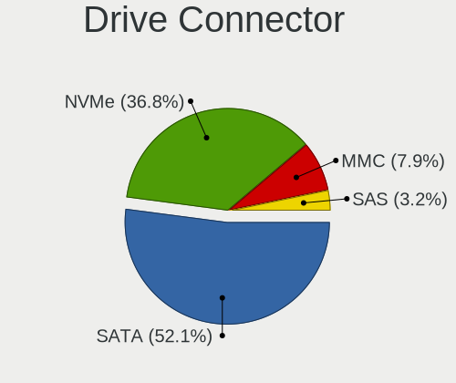
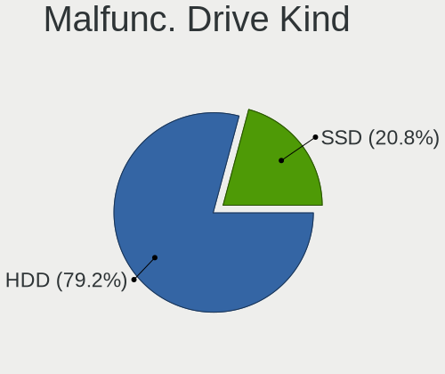
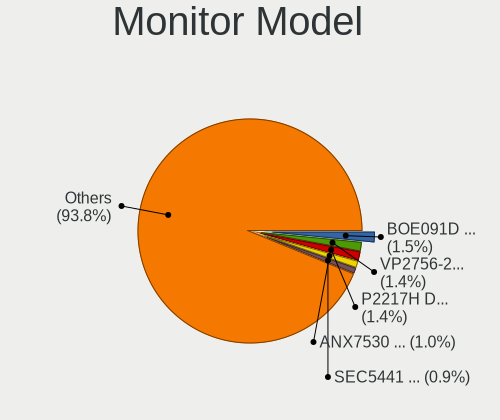
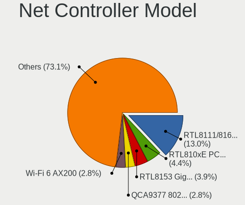
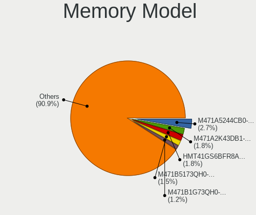
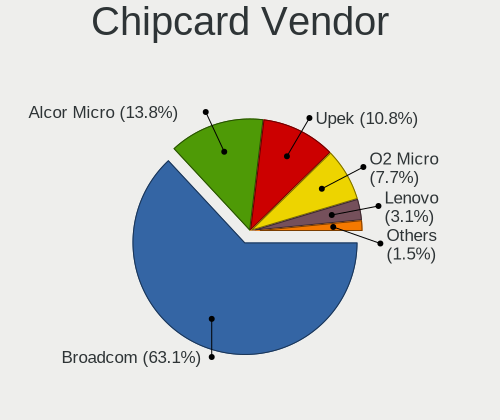
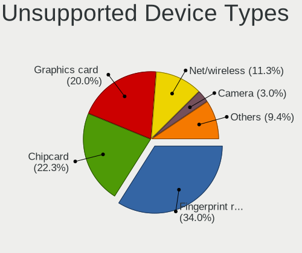

Linux in Ireland - Tested Hardware & Statistics (Notebooks)
-----------------------------------------------------------

A project to collect tested hardware configurations for Linux in Ireland.

Anyone can contribute to this report by the [hw-probe](https://github.com/linuxhw/hw-probe) tool:

    sudo -E hw-probe -all -upload

Please contribute! Especially if your hardware is rare.

Contents
--------

* [ Test Cases ](#test-cases)

* [ System ](#system)
  - [ OS                       ](#os)
  - [ OS Family                ](#os-family)
  - [ Kernel                   ](#kernel)
  - [ Kernel Family            ](#kernel-family)
  - [ Kernel Major Ver.        ](#kernel-major-ver)
  - [ Arch                     ](#arch)
  - [ DE                       ](#de)
  - [ Display Server           ](#display-server)
  - [ Display Manager          ](#display-manager)
  - [ OS Lang                  ](#os-lang)
  - [ Boot Mode                ](#boot-mode)
  - [ Filesystem               ](#filesystem)
  - [ Part. scheme             ](#part-scheme)
  - [ Dual Boot with Linux/BSD ](#dual-boot-with-linuxbsd)
  - [ Dual Boot (Win)          ](#dual-boot-win)

* [ Board ](#board)
  - [ Vendor                   ](#vendor)
  - [ Model                    ](#model)
  - [ Model Family             ](#model-family)
  - [ MFG Year                 ](#mfg-year)
  - [ Form Factor              ](#form-factor)
  - [ Secure Boot              ](#secure-boot)
  - [ Coreboot                 ](#coreboot)
  - [ RAM Size                 ](#ram-size)
  - [ RAM Used                 ](#ram-used)
  - [ Total Drives             ](#total-drives)
  - [ Has CD-ROM               ](#has-cd-rom)
  - [ Has Ethernet             ](#has-ethernet)
  - [ Has WiFi                 ](#has-wifi)
  - [ Has Bluetooth            ](#has-bluetooth)

* [ Location ](#location)
  - [ Country                  ](#country)
  - [ City                     ](#city)

* [ Drives ](#drives)
  - [ Drive Vendor             ](#drive-vendor)
  - [ Drive Model              ](#drive-model)
  - [ HDD Vendor               ](#hdd-vendor)
  - [ SSD Vendor               ](#ssd-vendor)
  - [ Drive Kind               ](#drive-kind)
  - [ Drive Connector          ](#drive-connector)
  - [ Drive Size               ](#drive-size)
  - [ Space Total              ](#space-total)
  - [ Space Used               ](#space-used)
  - [ Malfunc. Drives          ](#malfunc-drives)
  - [ Malfunc. Drive Vendor    ](#malfunc-drive-vendor)
  - [ Malfunc. HDD Vendor      ](#malfunc-hdd-vendor)
  - [ Malfunc. Drive Kind      ](#malfunc-drive-kind)
  - [ Failed Drives            ](#failed-drives)
  - [ Failed Drive Vendor      ](#failed-drive-vendor)
  - [ Drive Status             ](#drive-status)

* [ Storage controller ](#storage-controller)
  - [ Storage Vendor           ](#storage-vendor)
  - [ Storage Model            ](#storage-model)
  - [ Storage Kind             ](#storage-kind)

* [ Processor ](#processor)
  - [ CPU Vendor               ](#cpu-vendor)
  - [ CPU Model                ](#cpu-model)
  - [ CPU Model Family         ](#cpu-model-family)
  - [ CPU Cores                ](#cpu-cores)
  - [ CPU Sockets              ](#cpu-sockets)
  - [ CPU Threads              ](#cpu-threads)
  - [ CPU Op-Modes             ](#cpu-op-modes)
  - [ CPU Microcode            ](#cpu-microcode)
  - [ CPU Microarch            ](#cpu-microarch)

* [ Graphics ](#graphics)
  - [ GPU Vendor               ](#gpu-vendor)
  - [ GPU Model                ](#gpu-model)
  - [ GPU Combo                ](#gpu-combo)
  - [ GPU Driver               ](#gpu-driver)
  - [ GPU Memory               ](#gpu-memory)

* [ Monitor ](#monitor)
  - [ Monitor Vendor           ](#monitor-vendor)
  - [ Monitor Model            ](#monitor-model)
  - [ Monitor Resolution       ](#monitor-resolution)
  - [ Monitor Diagonal         ](#monitor-diagonal)
  - [ Monitor Width            ](#monitor-width)
  - [ Aspect Ratio             ](#aspect-ratio)
  - [ Monitor Area             ](#monitor-area)
  - [ Pixel Density            ](#pixel-density)
  - [ Multiple Monitors        ](#multiple-monitors)

* [ Network ](#network)
  - [ Net Controller Vendor    ](#net-controller-vendor)
  - [ Net Controller Model     ](#net-controller-model)
  - [ Wireless Vendor          ](#wireless-vendor)
  - [ Wireless Model           ](#wireless-model)
  - [ Ethernet Vendor          ](#ethernet-vendor)
  - [ Ethernet Model           ](#ethernet-model)
  - [ Net Controller Kind      ](#net-controller-kind)
  - [ Used Controller          ](#used-controller)
  - [ NICs                     ](#nics)
  - [ IPv6                     ](#ipv6)

* [ Bluetooth ](#bluetooth)
  - [ Bluetooth Vendor         ](#bluetooth-vendor)
  - [ Bluetooth Model          ](#bluetooth-model)

* [ Sound ](#sound)
  - [ Sound Vendor             ](#sound-vendor)
  - [ Sound Model              ](#sound-model)

* [ Memory ](#memory)
  - [ Memory Vendor            ](#memory-vendor)
  - [ Memory Model             ](#memory-model)
  - [ Memory Kind              ](#memory-kind)
  - [ Memory Form Factor       ](#memory-form-factor)
  - [ Memory Size              ](#memory-size)
  - [ Memory Speed             ](#memory-speed)

* [ Printers & scanners ](#printers--scanners)
  - [ Printer Vendor           ](#printer-vendor)
  - [ Printer Model            ](#printer-model)
  - [ Scanner Vendor           ](#scanner-vendor)
  - [ Scanner Model            ](#scanner-model)

* [ Camera ](#camera)
  - [ Camera Vendor            ](#camera-vendor)
  - [ Camera Model             ](#camera-model)

* [ Security ](#security)
  - [ Fingerprint Vendor       ](#fingerprint-vendor)
  - [ Fingerprint Model        ](#fingerprint-model)
  - [ Chipcard Vendor          ](#chipcard-vendor)
  - [ Chipcard Model           ](#chipcard-model)

* [ Unsupported ](#unsupported)
  - [ Unsupported Devices      ](#unsupported-devices)
  - [ Unsupported Device Types ](#unsupported-device-types)

Test Cases
----------

Total: 360

| Vendor        | Model                       | Probe                                                      | Date         |
|---------------|-----------------------------|------------------------------------------------------------|--------------|
| Lenovo        | ThinkPad T470s 20HF0047U... | [dfe7ba57b8](https://linux-hardware.org/?probe=dfe7ba57b8) | Jul 31, 2022 |
| Lenovo        | ThinkPad E14 Gen 2 20TA0... | [5ed19c54a9](https://linux-hardware.org/?probe=5ed19c54a9) | Jul 27, 2022 |
| Samsung       | 935XDB                      | [d6149a337b](https://linux-hardware.org/?probe=d6149a337b) | Jul 26, 2022 |
| Samsung       | 935XDB                      | [e01b518899](https://linux-hardware.org/?probe=e01b518899) | Jul 21, 2022 |
| Jumper        | EZbook                      | [5e7336ee93](https://linux-hardware.org/?probe=5e7336ee93) | Jul 02, 2022 |
| Dell          | XPS 15 9520                 | [ca7efa311a](https://linux-hardware.org/?probe=ca7efa311a) | Jul 01, 2022 |
| Lenovo        | IdeaPad 3 14IML05 81WA      | [282d2ad16b](https://linux-hardware.org/?probe=282d2ad16b) | Jun 29, 2022 |
| ASUSTek       | X411UN                      | [d4543f64dc](https://linux-hardware.org/?probe=d4543f64dc) | Jun 24, 2022 |
| ASUSTek       | X411UN                      | [57e0198d3a](https://linux-hardware.org/?probe=57e0198d3a) | Jun 23, 2022 |
| Samsung       | 935XDB                      | [7089a0f6bc](https://linux-hardware.org/?probe=7089a0f6bc) | Jun 20, 2022 |
| Lenovo        | IdeaPad 3 14IML05 81WA      | [5caa4002f1](https://linux-hardware.org/?probe=5caa4002f1) | Jun 17, 2022 |
| Lenovo        | ThinkPad L14 Gen 1 20U50... | [d9ac2ec5c8](https://linux-hardware.org/?probe=d9ac2ec5c8) | Jun 08, 2022 |
| Lenovo        | ThinkBook 15 G3 ACL 21A4    | [a38fb61dfb](https://linux-hardware.org/?probe=a38fb61dfb) | Jun 08, 2022 |
| Samsung       | 935XDB                      | [497a2424e0](https://linux-hardware.org/?probe=497a2424e0) | Jun 07, 2022 |
| Samsung       | 935XDB                      | [3cde44fcf1](https://linux-hardware.org/?probe=3cde44fcf1) | Jun 07, 2022 |
| Dell          | Precision M4800             | [3bd843466c](https://linux-hardware.org/?probe=3bd843466c) | Jun 04, 2022 |
| Dell          | Latitude 9420               | [28ba6de10d](https://linux-hardware.org/?probe=28ba6de10d) | Jun 01, 2022 |
| Samsung       | RC420/RC520/RC720           | [0a87c33624](https://linux-hardware.org/?probe=0a87c33624) | Jun 01, 2022 |
| HP            | EliteBook 840 G1            | [07b116767e](https://linux-hardware.org/?probe=07b116767e) | May 27, 2022 |
| Dell          | Latitude D520               | [55364bfdc0](https://linux-hardware.org/?probe=55364bfdc0) | May 24, 2022 |
| HP            | Pavilion Gaming Laptop 1... | [342929d56c](https://linux-hardware.org/?probe=342929d56c) | May 19, 2022 |
| ASUSTek       | UX330UAK                    | [7b50efe523](https://linux-hardware.org/?probe=7b50efe523) | May 19, 2022 |
| TUXEDO        | InfinityBook Pro 14 Gen6    | [f71977d1fa](https://linux-hardware.org/?probe=f71977d1fa) | May 11, 2022 |
| Lenovo        | ThinkPad P15s Gen 2i 20W... | [6cacb1c49c](https://linux-hardware.org/?probe=6cacb1c49c) | May 11, 2022 |
| Lenovo        | ThinkPad T440 20B7S0F100    | [0d006e41fc](https://linux-hardware.org/?probe=0d006e41fc) | May 01, 2022 |
| MSI           | Stealth GS66 12UGS          | [bf36d72c14](https://linux-hardware.org/?probe=bf36d72c14) | Apr 26, 2022 |
| MSI           | Stealth GS66 12UGS          | [273526bab2](https://linux-hardware.org/?probe=273526bab2) | Apr 26, 2022 |
| Lenovo        | ThinkPad T440 20B7A0S200    | [0ef99a6615](https://linux-hardware.org/?probe=0ef99a6615) | Apr 24, 2022 |
| Dell          | Inspiron 7577               | [ea4f513eb9](https://linux-hardware.org/?probe=ea4f513eb9) | Apr 22, 2022 |
| HP            | Laptop 14-ck0xxx            | [02dd52b3b5](https://linux-hardware.org/?probe=02dd52b3b5) | Apr 21, 2022 |
| Dell          | Latitude E6230              | [617c507040](https://linux-hardware.org/?probe=617c507040) | Apr 19, 2022 |
| Dell          | Latitude E6230              | [98f4014ead](https://linux-hardware.org/?probe=98f4014ead) | Apr 19, 2022 |
| Packard Be... | EasyNote TK85               | [c20035dfb3](https://linux-hardware.org/?probe=c20035dfb3) | Apr 16, 2022 |
| Dell          | Latitude E6520              | [b10c0f8457](https://linux-hardware.org/?probe=b10c0f8457) | Apr 14, 2022 |
| Packard Be... | EasyNote TK85               | [c0eb727f3c](https://linux-hardware.org/?probe=c0eb727f3c) | Apr 12, 2022 |
| Packard Be... | EasyNote TK85               | [13d6da4ad9](https://linux-hardware.org/?probe=13d6da4ad9) | Apr 12, 2022 |
| Lenovo        | IdeaPadFlex 14 20308        | [9ecbc31fc2](https://linux-hardware.org/?probe=9ecbc31fc2) | Apr 04, 2022 |
| Notebook      | P65_P67RGRERA               | [654f1700c4](https://linux-hardware.org/?probe=654f1700c4) | Apr 04, 2022 |
| Dell          | Latitude 5420               | [75963e8b7d](https://linux-hardware.org/?probe=75963e8b7d) | Apr 01, 2022 |
| Dell          | Latitude E5440              | [82d2c39d98](https://linux-hardware.org/?probe=82d2c39d98) | Mar 30, 2022 |
| Dell          | Latitude E6430              | [bc21cb0e8b](https://linux-hardware.org/?probe=bc21cb0e8b) | Mar 13, 2022 |
| PC Special... | NH5xAx                      | [ebf60d959f](https://linux-hardware.org/?probe=ebf60d959f) | Mar 11, 2022 |
| HP            | OMEN by Laptop 15-dc0xxx    | [e7c5306c00](https://linux-hardware.org/?probe=e7c5306c00) | Mar 10, 2022 |
| Dell          | Latitude 9420               | [355f64f6a7](https://linux-hardware.org/?probe=355f64f6a7) | Mar 03, 2022 |
| ASUSTek       | GL753VE                     | [25f1ab36fc](https://linux-hardware.org/?probe=25f1ab36fc) | Feb 20, 2022 |
| Dell          | Precision M4600             | [9f1f4fcf9c](https://linux-hardware.org/?probe=9f1f4fcf9c) | Feb 18, 2022 |
| Acer          | Predator PH317-54           | [8fb9ac25be](https://linux-hardware.org/?probe=8fb9ac25be) | Feb 11, 2022 |
| Lenovo        | IdeaPad L340-15IRH Gamin... | [7f24cf6cc9](https://linux-hardware.org/?probe=7f24cf6cc9) | Feb 07, 2022 |
| Lenovo        | ThinkPad T480s 20L7S0VJ0... | [7535369bb0](https://linux-hardware.org/?probe=7535369bb0) | Jan 31, 2022 |
| Dell          | XPS 13 9310                 | [311e85f0cb](https://linux-hardware.org/?probe=311e85f0cb) | Jan 27, 2022 |
| Notebook      | P15SM                       | [3b7c794008](https://linux-hardware.org/?probe=3b7c794008) | Jan 08, 2022 |
| Toshiba       | PORTEGE R830                | [097edea6f9](https://linux-hardware.org/?probe=097edea6f9) | Jan 06, 2022 |
| Toshiba       | PORTEGE R830                | [41ed435a4f](https://linux-hardware.org/?probe=41ed435a4f) | Jan 04, 2022 |
| Dell          | Latitude 5411               | [2064d78411](https://linux-hardware.org/?probe=2064d78411) | Jan 03, 2022 |
| Lenovo        | ThinkPad X220 4291W99       | [ead56def80](https://linux-hardware.org/?probe=ead56def80) | Dec 26, 2021 |
| Lenovo        | ThinkPad E560 20EV000TUK    | [609264397b](https://linux-hardware.org/?probe=609264397b) | Dec 19, 2021 |
| Acer          | Aspire E5-575G              | [342ba009be](https://linux-hardware.org/?probe=342ba009be) | Dec 19, 2021 |
| Lenovo        | ThinkPad E560 20EV000TUK    | [eefaa1b951](https://linux-hardware.org/?probe=eefaa1b951) | Dec 18, 2021 |
| AVITA         | NS14A8                      | [0ae2523309](https://linux-hardware.org/?probe=0ae2523309) | Dec 18, 2021 |
| Lenovo        | IdeaPad 510-15ISK 80SR      | [ece425bcfc](https://linux-hardware.org/?probe=ece425bcfc) | Dec 12, 2021 |
| Dell          | XPS 15 9510                 | [da1818e0c5](https://linux-hardware.org/?probe=da1818e0c5) | Dec 12, 2021 |
| Lenovo        | ThinkPad P52 20MAS17205     | [86d1d49f33](https://linux-hardware.org/?probe=86d1d49f33) | Dec 09, 2021 |
| Acer          | AOD255                      | [eae98753db](https://linux-hardware.org/?probe=eae98753db) | Dec 03, 2021 |
| Acer          | AOD255                      | [d2e31c1441](https://linux-hardware.org/?probe=d2e31c1441) | Dec 02, 2021 |
| Acer          | Aspire A315-51              | [397f62191b](https://linux-hardware.org/?probe=397f62191b) | Nov 28, 2021 |
| Sony          | VPCCB35FG                   | [6e46b79e09](https://linux-hardware.org/?probe=6e46b79e09) | Nov 27, 2021 |
| HP            | EliteBook 8570p             | [6c08986736](https://linux-hardware.org/?probe=6c08986736) | Nov 24, 2021 |
| HP            | Laptop 17-cn0xxx            | [291a2a17e2](https://linux-hardware.org/?probe=291a2a17e2) | Nov 21, 2021 |
| Dell          | Inspiron MM061              | [0424bd331e](https://linux-hardware.org/?probe=0424bd331e) | Nov 10, 2021 |
| HP            | Notebook                    | [65c122fe69](https://linux-hardware.org/?probe=65c122fe69) | Oct 31, 2021 |
| Dell          | XPS 13 9310                 | [22bc284f45](https://linux-hardware.org/?probe=22bc284f45) | Oct 27, 2021 |
| Toshiba       | PORTEGE R830                | [7105829e72](https://linux-hardware.org/?probe=7105829e72) | Oct 25, 2021 |
| Dell          | Inspiron 3583               | [8f25043c64](https://linux-hardware.org/?probe=8f25043c64) | Oct 24, 2021 |
| Lenovo        | G550 2958                   | [b9412e1ab2](https://linux-hardware.org/?probe=b9412e1ab2) | Oct 23, 2021 |
| Lenovo        | G550 2958                   | [a0ff38d606](https://linux-hardware.org/?probe=a0ff38d606) | Oct 22, 2021 |
| ASUSTek       | ROG Zephyrus G14 GA401QM... | [c11c89f0d4](https://linux-hardware.org/?probe=c11c89f0d4) | Oct 19, 2021 |
| ASUSTek       | X501A1                      | [0494cb6f11](https://linux-hardware.org/?probe=0494cb6f11) | Oct 13, 2021 |
| Toshiba       | PORTEGE R830                | [b22927e36e](https://linux-hardware.org/?probe=b22927e36e) | Oct 12, 2021 |
| Acer          | Nitro AN515-45              | [f564d05797](https://linux-hardware.org/?probe=f564d05797) | Oct 05, 2021 |
| Apple         | MacBookPro5,3               | [b0ea83da4d](https://linux-hardware.org/?probe=b0ea83da4d) | Oct 02, 2021 |
| Lenovo        | ThinkPad X230 Tablet 343... | [ddcd85bbe5](https://linux-hardware.org/?probe=ddcd85bbe5) | Oct 02, 2021 |
| Timi          | TM1607                      | [aa8b5d346a](https://linux-hardware.org/?probe=aa8b5d346a) | Sep 26, 2021 |
| Apple         | MacBook6,1                  | [4fbbe3d05b](https://linux-hardware.org/?probe=4fbbe3d05b) | Sep 19, 2021 |
| Lenovo        | ThinkPad T440 20B7S0F100    | [9710e6ad6f](https://linux-hardware.org/?probe=9710e6ad6f) | Sep 19, 2021 |
| HP            | Notebook                    | [9c7d616423](https://linux-hardware.org/?probe=9c7d616423) | Sep 12, 2021 |
| Lenovo        | V15-IIL 82C5                | [64a2841581](https://linux-hardware.org/?probe=64a2841581) | Sep 11, 2021 |
| Schenker      | XMG NEO (TGL/M21)           | [de8f619f3c](https://linux-hardware.org/?probe=de8f619f3c) | Sep 10, 2021 |
| Dell          | Inspiron 3585               | [3a55618aee](https://linux-hardware.org/?probe=3a55618aee) | Sep 10, 2021 |
| Lenovo        | ThinkPad E15 20RD0015FR     | [8a229968ef](https://linux-hardware.org/?probe=8a229968ef) | Sep 06, 2021 |
| Samsung       | 550P5C/550P7C               | [c483c45fc4](https://linux-hardware.org/?probe=c483c45fc4) | Sep 03, 2021 |
| TUXEDO        | InfinityBook Pro 15 v5      | [e0a78bb2e5](https://linux-hardware.org/?probe=e0a78bb2e5) | Aug 30, 2021 |
| Toshiba       | Satellite A300              | [c5391fae24](https://linux-hardware.org/?probe=c5391fae24) | Aug 27, 2021 |
| Dell          | Precision 5550              | [705dbe4068](https://linux-hardware.org/?probe=705dbe4068) | Aug 21, 2021 |
| Medion        | Akoya E6239                 | [e22d5c4b21](https://linux-hardware.org/?probe=e22d5c4b21) | Aug 20, 2021 |
| Lenovo        | IdeaPad 320-15AST 80XV      | [92d57d3ea8](https://linux-hardware.org/?probe=92d57d3ea8) | Aug 15, 2021 |
| Lenovo        | IdeaPad 320-15AST 80XV      | [3edbab6d15](https://linux-hardware.org/?probe=3edbab6d15) | Aug 15, 2021 |
| Sony          | VPCCB35FG                   | [6550f39d03](https://linux-hardware.org/?probe=6550f39d03) | Aug 10, 2021 |
| Dell          | Inspiron 3583               | [17b5565505](https://linux-hardware.org/?probe=17b5565505) | Aug 08, 2021 |
| TUXEDO        | Pulse 15 Gen1               | [5ba990c425](https://linux-hardware.org/?probe=5ba990c425) | Aug 04, 2021 |
| Acer          | Swift SF313-53              | [f16feed16c](https://linux-hardware.org/?probe=f16feed16c) | Aug 03, 2021 |
| Lenovo        | ThinkPad P50 20EN0007MS     | [73902de0d8](https://linux-hardware.org/?probe=73902de0d8) | Jul 31, 2021 |
| Dell          | Studio XPS 1640             | [00d5936a25](https://linux-hardware.org/?probe=00d5936a25) | Jul 22, 2021 |
| Lenovo        | Legion 5 15ACH6H 82JU       | [1046a771fd](https://linux-hardware.org/?probe=1046a771fd) | Jul 19, 2021 |
| ASUSTek       | ROG Strix G513IH_G513IH     | [77ab0c578d](https://linux-hardware.org/?probe=77ab0c578d) | Jul 17, 2021 |
| ASUSTek       | ROG Strix G513IH_G513IH     | [06ba47ee9a](https://linux-hardware.org/?probe=06ba47ee9a) | Jul 17, 2021 |
| Dell          | Latitude 7370               | [4fc6100966](https://linux-hardware.org/?probe=4fc6100966) | Jul 03, 2021 |
| Dell          | Latitude 7370               | [2acd089f78](https://linux-hardware.org/?probe=2acd089f78) | Jul 03, 2021 |
| Entroware     | Apollo                      | [3cbf412b11](https://linux-hardware.org/?probe=3cbf412b11) | Jul 01, 2021 |
| HP            | Pavilion Gaming Laptop 1... | [fff9c1a758](https://linux-hardware.org/?probe=fff9c1a758) | Jun 22, 2021 |
| ASUSTek       | ROG Strix G513IH_G513IH     | [3980434b64](https://linux-hardware.org/?probe=3980434b64) | Jun 19, 2021 |
| Dell          | Inspiron 1525               | [511a525213](https://linux-hardware.org/?probe=511a525213) | Jun 11, 2021 |
| Dell          | XPS 13 9300                 | [63f094943a](https://linux-hardware.org/?probe=63f094943a) | Jun 07, 2021 |
| Dell          | Latitude C810               | [f379321c88](https://linux-hardware.org/?probe=f379321c88) | Jun 05, 2021 |
| Dell          | Inspiron MM061              | [62b30f282d](https://linux-hardware.org/?probe=62b30f282d) | Jun 04, 2021 |
| Dell          | Latitude C810               | [23e6f5572a](https://linux-hardware.org/?probe=23e6f5572a) | Jun 04, 2021 |
| Toshiba       | TECRA M4                    | [3ac511cc5f](https://linux-hardware.org/?probe=3ac511cc5f) | Jun 03, 2021 |
| Lenovo        | B50-30 80ES                 | [6fff0f3407](https://linux-hardware.org/?probe=6fff0f3407) | Jun 03, 2021 |
| Lenovo        | B50-30 80ES                 | [cfa1b1a4fd](https://linux-hardware.org/?probe=cfa1b1a4fd) | Jun 03, 2021 |
| Dell          | Inspiron 1764               | [a41c941365](https://linux-hardware.org/?probe=a41c941365) | Jun 02, 2021 |
| Entroware     | Proteus                     | [0ecc547a14](https://linux-hardware.org/?probe=0ecc547a14) | May 31, 2021 |
| HP            | Pavilion 15                 | [14128860c2](https://linux-hardware.org/?probe=14128860c2) | May 27, 2021 |
| HP            | ProBook 6550b               | [523c397ab6](https://linux-hardware.org/?probe=523c397ab6) | May 27, 2021 |
| Dell          | XPS 13 7390                 | [e7292a5491](https://linux-hardware.org/?probe=e7292a5491) | May 26, 2021 |
| HP            | Pavilion Notebook           | [bb6ab823e7](https://linux-hardware.org/?probe=bb6ab823e7) | May 23, 2021 |
| HP            | 15                          | [ab211b6ad8](https://linux-hardware.org/?probe=ab211b6ad8) | May 21, 2021 |
| HP            | 15                          | [d285154a2b](https://linux-hardware.org/?probe=d285154a2b) | May 21, 2021 |
| Entroware     | Proteus                     | [98be1903c4](https://linux-hardware.org/?probe=98be1903c4) | May 17, 2021 |
| Lenovo        | V145-15AST 81MT             | [80f0e0228b](https://linux-hardware.org/?probe=80f0e0228b) | May 16, 2021 |
| Dell          | Latitude 5520               | [34c3dc01e9](https://linux-hardware.org/?probe=34c3dc01e9) | May 07, 2021 |
| HP            | HDX 18                      | [dead2b5b56](https://linux-hardware.org/?probe=dead2b5b56) | May 07, 2021 |
| HP            | EliteBook Folio G1          | [f3bdc3e991](https://linux-hardware.org/?probe=f3bdc3e991) | Apr 24, 2021 |
| Acer          | Aspire 5333                 | [c6227d5004](https://linux-hardware.org/?probe=c6227d5004) | Apr 23, 2021 |
| Lenovo        | V110-15ISK 80TL             | [9c0bbd0e0c](https://linux-hardware.org/?probe=9c0bbd0e0c) | Apr 18, 2021 |
| Acer          | Aspire 5333                 | [2171d74173](https://linux-hardware.org/?probe=2171d74173) | Apr 15, 2021 |
| Acer          | Aspire 5333                 | [dd4fee2ece](https://linux-hardware.org/?probe=dd4fee2ece) | Apr 15, 2021 |
| TUXEDO        | Pulse 15 Gen1               | [51b67b480d](https://linux-hardware.org/?probe=51b67b480d) | Apr 05, 2021 |
| HP            | Pavilion g6                 | [726040b78b](https://linux-hardware.org/?probe=726040b78b) | Apr 03, 2021 |
| Acer          | Aspire 5920G                | [9976792f0f](https://linux-hardware.org/?probe=9976792f0f) | Mar 26, 2021 |
| Lenovo        | ThinkPad W530 24491D1       | [31a4336d63](https://linux-hardware.org/?probe=31a4336d63) | Mar 25, 2021 |
| Microtech     | e-book Lite                 | [85b6d19466](https://linux-hardware.org/?probe=85b6d19466) | Mar 23, 2021 |
| ASUSTek       | ZenBook UX450FDX_UX480FD    | [488904f6d8](https://linux-hardware.org/?probe=488904f6d8) | Mar 18, 2021 |
| ASUSTek       | ZenBook UX450FDX_UX480FD    | [7fbf31af63](https://linux-hardware.org/?probe=7fbf31af63) | Mar 18, 2021 |
| ASUSTek       | X540LA                      | [8b0145ff0c](https://linux-hardware.org/?probe=8b0145ff0c) | Mar 13, 2021 |
| Lenovo        | ThinkPad T430 2349G7G       | [d2ff3aaec4](https://linux-hardware.org/?probe=d2ff3aaec4) | Mar 12, 2021 |
| Chuwi         | GemiBook Pro                | [f2f15e9ef1](https://linux-hardware.org/?probe=f2f15e9ef1) | Mar 10, 2021 |
| HP            | Pavilion m6                 | [578aad5ad5](https://linux-hardware.org/?probe=578aad5ad5) | Feb 24, 2021 |
| HP            | Notebook                    | [21ead6ec52](https://linux-hardware.org/?probe=21ead6ec52) | Feb 22, 2021 |
| Chuwi         | GemiBook Pro                | [7dbba6ee59](https://linux-hardware.org/?probe=7dbba6ee59) | Feb 21, 2021 |
| HP            | Compaq 6530b (GW688AV)      | [2812d098fd](https://linux-hardware.org/?probe=2812d098fd) | Feb 20, 2021 |
| HP            | Stream Laptop 11-y0XX       | [ce0aecd52b](https://linux-hardware.org/?probe=ce0aecd52b) | Feb 20, 2021 |
| HP            | EliteBook 745 G6            | [3bf39bac3e](https://linux-hardware.org/?probe=3bf39bac3e) | Feb 19, 2021 |
| Apple         | MacBookPro2,2               | [52f24b3228](https://linux-hardware.org/?probe=52f24b3228) | Feb 19, 2021 |
| Acer          | Aspire F5-573G              | [6fad2f0ade](https://linux-hardware.org/?probe=6fad2f0ade) | Feb 14, 2021 |
| Chuwi         | GemiBook Pro                | [46556ad380](https://linux-hardware.org/?probe=46556ad380) | Feb 14, 2021 |
| ASUSTek       | ZenBook S UX391UA           | [ec083139fc](https://linux-hardware.org/?probe=ec083139fc) | Feb 05, 2021 |
| Lenovo        | IdeaPad 3 15IIL05 81WE      | [b1ed72b941](https://linux-hardware.org/?probe=b1ed72b941) | Feb 04, 2021 |
| Lenovo        | ThinkPad P52 20MAS17205     | [0a2ca85ddc](https://linux-hardware.org/?probe=0a2ca85ddc) | Jan 22, 2021 |
| Lenovo        | V110-15ISK 80TL             | [9f3cf476f3](https://linux-hardware.org/?probe=9f3cf476f3) | Jan 19, 2021 |
| Lenovo        | IdeaPad S340-15API 81NC     | [e8cd5368b0](https://linux-hardware.org/?probe=e8cd5368b0) | Jan 14, 2021 |
| Lenovo        | ThinkPad T430 2349G7G       | [a6e84d99aa](https://linux-hardware.org/?probe=a6e84d99aa) | Jan 14, 2021 |
| Dell          | System XPS L502X            | [8b67c2132b](https://linux-hardware.org/?probe=8b67c2132b) | Jan 13, 2021 |
| Dell          | Precision 5550              | [ba201aad9e](https://linux-hardware.org/?probe=ba201aad9e) | Jan 11, 2021 |
| HUAWEI        | BOHL-WXX9                   | [5845d9565c](https://linux-hardware.org/?probe=5845d9565c) | Jan 05, 2021 |
| ASUSTek       | X550CC                      | [40ae1409a4](https://linux-hardware.org/?probe=40ae1409a4) | Jan 05, 2021 |
| Entroware     | Proteus                     | [7d71ef8a53](https://linux-hardware.org/?probe=7d71ef8a53) | Jan 05, 2021 |
| Samsung       | N150/N210/N220              | [e556ab958b](https://linux-hardware.org/?probe=e556ab958b) | Jan 02, 2021 |
| Samsung       | N150/N210/N220              | [adc4530996](https://linux-hardware.org/?probe=adc4530996) | Jan 01, 2021 |
| TUXEDO        | Pulse 15 Gen1               | [b34a40d6b3](https://linux-hardware.org/?probe=b34a40d6b3) | Dec 31, 2020 |
| Lenovo        | ThinkPad E560 20EV000UUK    | [c38d67b61b](https://linux-hardware.org/?probe=c38d67b61b) | Dec 30, 2020 |
| HUAWEI        | NBLK-WAX9X                  | [8740e02802](https://linux-hardware.org/?probe=8740e02802) | Dec 29, 2020 |
| Dell          | System XPS L502X            | [dda884ab5b](https://linux-hardware.org/?probe=dda884ab5b) | Dec 20, 2020 |
| Acer          | Aspire 5551                 | [cb35dac70b](https://linux-hardware.org/?probe=cb35dac70b) | Dec 09, 2020 |
| HP            | Notebook                    | [2564f14d0b](https://linux-hardware.org/?probe=2564f14d0b) | Dec 06, 2020 |
| Lenovo        | G580 20157                  | [325dd21da3](https://linux-hardware.org/?probe=325dd21da3) | Nov 27, 2020 |
| ASUSTek       | TUF Gaming FX505DT_FX505... | [703167df7b](https://linux-hardware.org/?probe=703167df7b) | Nov 24, 2020 |
| Dell          | Inspiron 15-3567            | [04e06f0e3b](https://linux-hardware.org/?probe=04e06f0e3b) | Nov 23, 2020 |
| HP            | Presario V6500              | [6950f2532b](https://linux-hardware.org/?probe=6950f2532b) | Nov 23, 2020 |
| HP            | Presario V6500              | [f4f30c83df](https://linux-hardware.org/?probe=f4f30c83df) | Nov 23, 2020 |
| HP            | EliteBook 8740w             | [f30611840c](https://linux-hardware.org/?probe=f30611840c) | Nov 23, 2020 |
| PC Special... | PCX0DX                      | [b4498047ef](https://linux-hardware.org/?probe=b4498047ef) | Nov 22, 2020 |
| Apple         | MacBookPro5,4               | [a7492067f0](https://linux-hardware.org/?probe=a7492067f0) | Nov 21, 2020 |
| HP            | EliteBook 820 G1            | [4db5c39f50](https://linux-hardware.org/?probe=4db5c39f50) | Nov 21, 2020 |
| Lenovo        | ThinkPad T400 64754G7       | [770660037c](https://linux-hardware.org/?probe=770660037c) | Nov 21, 2020 |
| HP            | EliteBook 8740w             | [072b557a79](https://linux-hardware.org/?probe=072b557a79) | Nov 20, 2020 |
| Lenovo        | G580 20157                  | [58fc01c757](https://linux-hardware.org/?probe=58fc01c757) | Nov 19, 2020 |
| Lenovo        | ThinkPad X1 Carbon 3443C... | [578d1badca](https://linux-hardware.org/?probe=578d1badca) | Nov 18, 2020 |
| Alienware     | 17 R4                       | [8b7402a4e7](https://linux-hardware.org/?probe=8b7402a4e7) | Nov 16, 2020 |
| Alienware     | 17 R4                       | [62e5ac4fd3](https://linux-hardware.org/?probe=62e5ac4fd3) | Nov 16, 2020 |
| Samsung       | 350V5C/351V5C/3540VC/344... | [7132bcc66d](https://linux-hardware.org/?probe=7132bcc66d) | Nov 15, 2020 |
| Dell          | Latitude E6420              | [f542aafd19](https://linux-hardware.org/?probe=f542aafd19) | Nov 13, 2020 |
| Notebook      | NL40_50CU                   | [893477956d](https://linux-hardware.org/?probe=893477956d) | Nov 10, 2020 |
| Toshiba       | Satellite Pro R50-B         | [418e9ce805](https://linux-hardware.org/?probe=418e9ce805) | Nov 06, 2020 |
| Toshiba       | Satellite Pro R50-B         | [7780f8f320](https://linux-hardware.org/?probe=7780f8f320) | Nov 06, 2020 |
| System76      | Galago Pro                  | [79822a5348](https://linux-hardware.org/?probe=79822a5348) | Nov 04, 2020 |
| Dell          | XPS M1530                   | [bc52d9b9a4](https://linux-hardware.org/?probe=bc52d9b9a4) | Nov 03, 2020 |
| Medion        | E6239 MD99452               | [2496b738ac](https://linux-hardware.org/?probe=2496b738ac) | Oct 29, 2020 |
| Medion        | E6239 MD99452               | [f875a122f9](https://linux-hardware.org/?probe=f875a122f9) | Oct 29, 2020 |
| PC Special... | TF                          | [e651ccb88e](https://linux-hardware.org/?probe=e651ccb88e) | Oct 29, 2020 |
| HP            | ZBook 15 G2                 | [0b113f8315](https://linux-hardware.org/?probe=0b113f8315) | Oct 29, 2020 |
| PC Special... | TF                          | [ba278ca133](https://linux-hardware.org/?probe=ba278ca133) | Oct 29, 2020 |
| HP            | Laptop 14-bs0xx             | [0e16f54971](https://linux-hardware.org/?probe=0e16f54971) | Oct 28, 2020 |
| Toshiba       | Satellite C50-B             | [0edec7c57f](https://linux-hardware.org/?probe=0edec7c57f) | Oct 27, 2020 |
| Toshiba       | Satellite C50-B             | [21e26c80bc](https://linux-hardware.org/?probe=21e26c80bc) | Oct 27, 2020 |
| Dell          | Vostro 3700                 | [5493bcf45a](https://linux-hardware.org/?probe=5493bcf45a) | Oct 26, 2020 |
| ASUSTek       | E200HA                      | [2db5bc3b28](https://linux-hardware.org/?probe=2db5bc3b28) | Oct 23, 2020 |
| ASUSTek       | E200HA                      | [acc7a651ac](https://linux-hardware.org/?probe=acc7a651ac) | Oct 23, 2020 |
| TUXEDO        | InfinityBook Pro 15 v5      | [6aea9a482c](https://linux-hardware.org/?probe=6aea9a482c) | Oct 20, 2020 |
| Lenovo        | ThinkPad T470 W10DG 20JN... | [96ff229c4c](https://linux-hardware.org/?probe=96ff229c4c) | Oct 17, 2020 |
| Lenovo        | IdeaPad 510-15ISK 80SR      | [a0292a1315](https://linux-hardware.org/?probe=a0292a1315) | Oct 15, 2020 |
| Apple         | MacBook5,1                  | [598a9af3a1](https://linux-hardware.org/?probe=598a9af3a1) | Oct 12, 2020 |
| Dell          | XPS 13 9360                 | [1554f3d77d](https://linux-hardware.org/?probe=1554f3d77d) | Oct 05, 2020 |
| Toshiba       | Satellite L50-B             | [58ce88778b](https://linux-hardware.org/?probe=58ce88778b) | Sep 23, 2020 |
| HP            | G70                         | [198fd94bda](https://linux-hardware.org/?probe=198fd94bda) | Sep 13, 2020 |
| Apple         | MacBookPro12,1              | [daceea1b39](https://linux-hardware.org/?probe=daceea1b39) | Sep 08, 2020 |
| HP            | 255 G2                      | [5d06b6eeff](https://linux-hardware.org/?probe=5d06b6eeff) | Sep 04, 2020 |
| Lenovo        | U410                        | [ad05692bf0](https://linux-hardware.org/?probe=ad05692bf0) | Sep 02, 2020 |
| HP            | Laptop 14-bs0xx             | [0eaa4ae12f](https://linux-hardware.org/?probe=0eaa4ae12f) | Aug 09, 2020 |
| Lenovo        | ThinkPad T430 2349G4G       | [db1ba375f2](https://linux-hardware.org/?probe=db1ba375f2) | Aug 08, 2020 |
| Acer          | Aspire 5349                 | [fdae61b8d4](https://linux-hardware.org/?probe=fdae61b8d4) | Aug 07, 2020 |
| ASUSTek       | E200HA                      | [d702543fbb](https://linux-hardware.org/?probe=d702543fbb) | Aug 06, 2020 |
| Dell          | Latitude E7450              | [e0eee5c0fc](https://linux-hardware.org/?probe=e0eee5c0fc) | Aug 01, 2020 |
| Dell          | Latitude E7450              | [a8695dbee5](https://linux-hardware.org/?probe=a8695dbee5) | Aug 01, 2020 |
| PC Special... | N150CU                      | [6d19fc4569](https://linux-hardware.org/?probe=6d19fc4569) | Aug 01, 2020 |
| Lenovo        | ThinkPad T430 2349KB4       | [291151dae1](https://linux-hardware.org/?probe=291151dae1) | Jul 31, 2020 |
| MSI           | WS65 9TK                    | [e9feed814f](https://linux-hardware.org/?probe=e9feed814f) | Jul 29, 2020 |
| MSI           | WS65 9TK                    | [b296acb26a](https://linux-hardware.org/?probe=b296acb26a) | Jul 29, 2020 |
| HP            | Pavilion dm1                | [cc8ed632dc](https://linux-hardware.org/?probe=cc8ed632dc) | Jul 25, 2020 |
| Dell          | Latitude 5480               | [e06096d959](https://linux-hardware.org/?probe=e06096d959) | Jul 24, 2020 |
| Lenovo        | V110-15ISK 80TL             | [a8709e5362](https://linux-hardware.org/?probe=a8709e5362) | Jul 23, 2020 |
| Lenovo        | IdeaPad Y500 9541           | [bdf2ff973b](https://linux-hardware.org/?probe=bdf2ff973b) | Jul 20, 2020 |
| Dell          | Latitude 5400               | [11473792e0](https://linux-hardware.org/?probe=11473792e0) | Jul 19, 2020 |
| HP            | 255 G2                      | [6801725bae](https://linux-hardware.org/?probe=6801725bae) | Jul 17, 2020 |
| HP            | 255 G2                      | [7319f8f1b3](https://linux-hardware.org/?probe=7319f8f1b3) | Jul 17, 2020 |
| HP            | 255 G2                      | [d1dea15553](https://linux-hardware.org/?probe=d1dea15553) | Jul 16, 2020 |
| Lenovo        | G500 VIWGP                  | [37286d3145](https://linux-hardware.org/?probe=37286d3145) | Jul 08, 2020 |
| Lenovo        | ThinkPad T440 20B7S0F100    | [561adcd20d](https://linux-hardware.org/?probe=561adcd20d) | Jun 30, 2020 |
| Apple         | MacBookPro8,3               | [2a16561ffa](https://linux-hardware.org/?probe=2a16561ffa) | Jun 28, 2020 |
| Apple         | MacBookPro8,3               | [8ba0fcfe7c](https://linux-hardware.org/?probe=8ba0fcfe7c) | Jun 28, 2020 |
| ASUSTek       | TUF Gaming FX505DV_FX505... | [a36f83366b](https://linux-hardware.org/?probe=a36f83366b) | Jun 21, 2020 |
| Dell          | Inspiron 15-3552            | [168dcc66c7](https://linux-hardware.org/?probe=168dcc66c7) | Jun 17, 2020 |
| Timi          | TM1703                      | [d3d89dc21d](https://linux-hardware.org/?probe=d3d89dc21d) | Jun 16, 2020 |
| Lenovo        | ThinkPad X1 Carbon 3443C... | [1cfb078c4e](https://linux-hardware.org/?probe=1cfb078c4e) | Jun 13, 2020 |
| Lenovo        | ThinkPad X1 Carbon 3443C... | [18230e354a](https://linux-hardware.org/?probe=18230e354a) | Jun 13, 2020 |
| SLIMBOOK      | PROX15                      | [a4e6b0723d](https://linux-hardware.org/?probe=a4e6b0723d) | Jun 12, 2020 |
| ASUSTek       | G750JW                      | [cc02e1e15c](https://linux-hardware.org/?probe=cc02e1e15c) | Jun 10, 2020 |
| Dell          | Latitude E5420              | [eb3a4e918a](https://linux-hardware.org/?probe=eb3a4e918a) | Jun 08, 2020 |
| Lenovo        | ThinkPad X1 Carbon 34431... | [c5d45645b7](https://linux-hardware.org/?probe=c5d45645b7) | Jun 01, 2020 |
| Acer          | Aspire V3-571G              | [fbef0c90d4](https://linux-hardware.org/?probe=fbef0c90d4) | May 28, 2020 |
| Lenovo        | ThinkPad T410s 2904HDU      | [b1eb7716ed](https://linux-hardware.org/?probe=b1eb7716ed) | May 26, 2020 |
| Lenovo        | ThinkPad T440 20B7S0F100    | [4a1413e289](https://linux-hardware.org/?probe=4a1413e289) | May 26, 2020 |
| HP            | Presario CQ61               | [28b3078708](https://linux-hardware.org/?probe=28b3078708) | May 25, 2020 |
| Lenovo        | ThinkPad P52 20MAS17205     | [4547e0d6fe](https://linux-hardware.org/?probe=4547e0d6fe) | May 25, 2020 |
| Chuwi         | LapBook SE                  | [c144d3a1bc](https://linux-hardware.org/?probe=c144d3a1bc) | May 24, 2020 |
| Lenovo        | V145-15AST 81MT             | [206613fa48](https://linux-hardware.org/?probe=206613fa48) | May 22, 2020 |
| Lenovo        | V145-15AST 81MT             | [6570cd4d9d](https://linux-hardware.org/?probe=6570cd4d9d) | May 22, 2020 |
| Dell          | Vostro 5490                 | [9000fa541e](https://linux-hardware.org/?probe=9000fa541e) | May 18, 2020 |
| Dell          | Latitude E5420              | [5519dbffbc](https://linux-hardware.org/?probe=5519dbffbc) | May 18, 2020 |
| Lenovo        | ThinkPad T520 424329U       | [bf1c52908b](https://linux-hardware.org/?probe=bf1c52908b) | May 16, 2020 |
| System76      | Galago Pro                  | [3ae6d02922](https://linux-hardware.org/?probe=3ae6d02922) | May 14, 2020 |
| HP            | EliteBook 8560w             | [f05f9404d0](https://linux-hardware.org/?probe=f05f9404d0) | May 11, 2020 |
| Gigabyte      | P15FV7                      | [a7031c2684](https://linux-hardware.org/?probe=a7031c2684) | May 09, 2020 |
| Fujitsu Si... | AMILO Pi 2530               | [702d00f33c](https://linux-hardware.org/?probe=702d00f33c) | May 07, 2020 |
| Lenovo        | ThinkPad X1 Carbon 7th 2... | [6f82171699](https://linux-hardware.org/?probe=6f82171699) | May 06, 2020 |
| Dell          | Latitude E7240              | [6f9d4efc51](https://linux-hardware.org/?probe=6f9d4efc51) | May 06, 2020 |
| Dell          | Latitude E7240              | [9e5819a0bc](https://linux-hardware.org/?probe=9e5819a0bc) | May 06, 2020 |
| Acer          | Okinawa                     | [9e22849a3a](https://linux-hardware.org/?probe=9e22849a3a) | May 03, 2020 |
| Lenovo        | ThinkPad L380 20M50013UK    | [e356fece67](https://linux-hardware.org/?probe=e356fece67) | May 01, 2020 |
| Dell          | XPS M1530                   | [ef2ddf50e9](https://linux-hardware.org/?probe=ef2ddf50e9) | Apr 28, 2020 |
| Dell          | XPS M1530                   | [9d8053a9f5](https://linux-hardware.org/?probe=9d8053a9f5) | Apr 28, 2020 |
| Lenovo        | ThinkPad X260 20F5S13K00    | [e6010acabe](https://linux-hardware.org/?probe=e6010acabe) | Apr 28, 2020 |
| Dell          | Precision 7510              | [40e5c33fd8](https://linux-hardware.org/?probe=40e5c33fd8) | Apr 27, 2020 |
| Dell          | Latitude E5570              | [4c46b3c18d](https://linux-hardware.org/?probe=4c46b3c18d) | Apr 27, 2020 |
| Dell          | XPS 13 9300                 | [9b6c98e396](https://linux-hardware.org/?probe=9b6c98e396) | Apr 26, 2020 |
| Dell          | XPS 13 7390                 | [0d9716a2e8](https://linux-hardware.org/?probe=0d9716a2e8) | Apr 26, 2020 |
| Dell          | XPS 13 7390                 | [951197ee19](https://linux-hardware.org/?probe=951197ee19) | Apr 25, 2020 |
| Dell          | Inspiron 15-3552            | [64015bca38](https://linux-hardware.org/?probe=64015bca38) | Apr 24, 2020 |
| Acer          | Aspire 7741                 | [85a10d5a0c](https://linux-hardware.org/?probe=85a10d5a0c) | Apr 24, 2020 |
| Dell          | XPS M1530                   | [0d21d60816](https://linux-hardware.org/?probe=0d21d60816) | Apr 22, 2020 |
| HP            | Presario F500 (GH835EA#A... | [9e0244765a](https://linux-hardware.org/?probe=9e0244765a) | Apr 21, 2020 |
| Medion        | Erazer X7843 MD99945        | [f63ebecfac](https://linux-hardware.org/?probe=f63ebecfac) | Apr 20, 2020 |
| Medion        | Erazer X7843 MD99945        | [caa46f1899](https://linux-hardware.org/?probe=caa46f1899) | Apr 20, 2020 |
| Dell          | Latitude E5450              | [a0de4692f3](https://linux-hardware.org/?probe=a0de4692f3) | Apr 12, 2020 |
| Dell          | Latitude E5450              | [b934bac9f3](https://linux-hardware.org/?probe=b934bac9f3) | Apr 12, 2020 |
| Apple         | MacBook6,1                  | [7eae555356](https://linux-hardware.org/?probe=7eae555356) | Apr 11, 2020 |
| Lenovo        | Y520-15IKBN 80WK            | [75cee4eeef](https://linux-hardware.org/?probe=75cee4eeef) | Apr 08, 2020 |
| eMachines     | E627                        | [395c0dace2](https://linux-hardware.org/?probe=395c0dace2) | Apr 07, 2020 |
| Dell          | XPS M1530                   | [daf947b1f0](https://linux-hardware.org/?probe=daf947b1f0) | Apr 07, 2020 |
| HP            | Pavilion dv6                | [5ae586911d](https://linux-hardware.org/?probe=5ae586911d) | Apr 05, 2020 |
| HP            | Pavilion Gaming Laptop 1... | [4151ed01a0](https://linux-hardware.org/?probe=4151ed01a0) | Apr 01, 2020 |
| HP            | EliteBook 2560p             | [1b7dfeda09](https://linux-hardware.org/?probe=1b7dfeda09) | Mar 30, 2020 |
| HP            | EliteBook 2560p             | [c32ad7e810](https://linux-hardware.org/?probe=c32ad7e810) | Mar 30, 2020 |
| ASUSTek       | X550CC                      | [9d50122997](https://linux-hardware.org/?probe=9d50122997) | Mar 30, 2020 |
| Lenovo        | ThinkPad X260 20F5S13K00    | [b2b7dfbc87](https://linux-hardware.org/?probe=b2b7dfbc87) | Mar 29, 2020 |
| Lenovo        | IdeaPad S540-14API 81NH     | [ec4f08053a](https://linux-hardware.org/?probe=ec4f08053a) | Mar 23, 2020 |
| Dell          | Inspiron 13-5378            | [087223b15f](https://linux-hardware.org/?probe=087223b15f) | Mar 20, 2020 |
| Dell          | Inspiron 13-5378            | [9225b58c75](https://linux-hardware.org/?probe=9225b58c75) | Mar 18, 2020 |
| HP            | EliteBook 840 G6            | [1287493f4e](https://linux-hardware.org/?probe=1287493f4e) | Mar 18, 2020 |
| HP            | EliteBook 840 G6            | [989982faa3](https://linux-hardware.org/?probe=989982faa3) | Mar 18, 2020 |
| Dell          | Precision M6300             | [6e9681a74e](https://linux-hardware.org/?probe=6e9681a74e) | Feb 18, 2020 |
| Dell          | Precision M6300             | [e45c0c7fc9](https://linux-hardware.org/?probe=e45c0c7fc9) | Feb 18, 2020 |
| Dell          | Inspiron 13-5378            | [46dd15e54f](https://linux-hardware.org/?probe=46dd15e54f) | Feb 18, 2020 |
| Lenovo        | ThinkPad X250 20CLS3ST01    | [b7a710c050](https://linux-hardware.org/?probe=b7a710c050) | Feb 10, 2020 |
| Lenovo        | ThinkPad L380 20M50013UK    | [e5b58a2f40](https://linux-hardware.org/?probe=e5b58a2f40) | Feb 08, 2020 |
| ASUSTek       | E402BA                      | [ef0178479b](https://linux-hardware.org/?probe=ef0178479b) | Feb 08, 2020 |
| Lenovo        | ThinkPad X250 20CLS3ST01    | [51d20a3d12](https://linux-hardware.org/?probe=51d20a3d12) | Feb 06, 2020 |
| ASUSTek       | TUF Gaming FX505DV_FX505... | [917f6c18a4](https://linux-hardware.org/?probe=917f6c18a4) | Feb 05, 2020 |
| ASUSTek       | TUF Gaming FX505DV_FX505... | [8143d2c859](https://linux-hardware.org/?probe=8143d2c859) | Dec 23, 2019 |
| ASUSTek       | TUF Gaming FX505DV_FX505... | [efc1ac12c7](https://linux-hardware.org/?probe=efc1ac12c7) | Dec 21, 2019 |
| ASUSTek       | TUF Gaming FX505DV_FX505... | [0f6f830f1b](https://linux-hardware.org/?probe=0f6f830f1b) | Dec 21, 2019 |
| Acer          | Aspire 8930                 | [3bd04b5cd7](https://linux-hardware.org/?probe=3bd04b5cd7) | Dec 09, 2019 |
| Lenovo        | ThinkPad T410 2539W4Y       | [009c5c142e](https://linux-hardware.org/?probe=009c5c142e) | Dec 06, 2019 |
| Lenovo        | IdeaPad 120S-11IAP 81A4     | [706aee4776](https://linux-hardware.org/?probe=706aee4776) | Dec 04, 2019 |
| Apple         | MacBookPro5,2               | [3b3fd20d67](https://linux-hardware.org/?probe=3b3fd20d67) | Dec 01, 2019 |
| Apple         | MacBookPro5,2               | [4918587a5c](https://linux-hardware.org/?probe=4918587a5c) | Dec 01, 2019 |
| Apple         | MacBookPro5,2               | [0ef52aaec2](https://linux-hardware.org/?probe=0ef52aaec2) | Dec 01, 2019 |
| Lenovo        | IdeaPad 320-15IKB 81BG      | [187a7265f0](https://linux-hardware.org/?probe=187a7265f0) | Dec 01, 2019 |
| System76      | Galago Pro                  | [15393d43e8](https://linux-hardware.org/?probe=15393d43e8) | Nov 25, 2019 |
| Dell          | Latitude 7490               | [4c5f40f7f3](https://linux-hardware.org/?probe=4c5f40f7f3) | Oct 18, 2019 |
| System76      | Galago Pro                  | [463dd28c7d](https://linux-hardware.org/?probe=463dd28c7d) | Oct 17, 2019 |
| Acer          | Aspire 5736Z                | [5ba5b7d13a](https://linux-hardware.org/?probe=5ba5b7d13a) | Oct 17, 2019 |
| Lenovo        | IdeaPad 310-15ABR 80ST      | [a2da44ce3d](https://linux-hardware.org/?probe=a2da44ce3d) | Oct 15, 2019 |
| Alienware     | 17 R4                       | [fa39f4bdb4](https://linux-hardware.org/?probe=fa39f4bdb4) | Oct 04, 2019 |
| Lenovo        | IdeaPad Y700-15ACZ 80NY     | [b17cca251b](https://linux-hardware.org/?probe=b17cca251b) | Sep 30, 2019 |
| System76      | Galago Pro                  | [8122dc5996](https://linux-hardware.org/?probe=8122dc5996) | Sep 25, 2019 |
| Alienware     | 17 R4                       | [5287c00902](https://linux-hardware.org/?probe=5287c00902) | Sep 15, 2019 |
| System76      | Galago Pro                  | [7c1dbad22c](https://linux-hardware.org/?probe=7c1dbad22c) | Sep 11, 2019 |
| Acer          | Aspire ES1-512              | [6b82a86df6](https://linux-hardware.org/?probe=6b82a86df6) | Sep 08, 2019 |
| Lenovo        | V145-15AST 81MT             | [e5fc9849a0](https://linux-hardware.org/?probe=e5fc9849a0) | Aug 30, 2019 |
| Acer          | Aspire ES1-512              | [11727f9491](https://linux-hardware.org/?probe=11727f9491) | Aug 19, 2019 |
| Acer          | Aspire ES1-512              | [6a08c4afd1](https://linux-hardware.org/?probe=6a08c4afd1) | Aug 17, 2019 |
| Toshiba       | Satellite L500              | [5819f81be3](https://linux-hardware.org/?probe=5819f81be3) | Aug 16, 2019 |
| Acer          | Aspire E1-572               | [96bf232f30](https://linux-hardware.org/?probe=96bf232f30) | Aug 03, 2019 |
| Advent        | Roma                        | [a7ec10f5ee](https://linux-hardware.org/?probe=a7ec10f5ee) | Jul 21, 2019 |
| System76      | Bonobo Extreme              | [aa49d07bb2](https://linux-hardware.org/?probe=aa49d07bb2) | Jul 05, 2019 |
| System76      | Bonobo Extreme              | [f867ec3a39](https://linux-hardware.org/?probe=f867ec3a39) | Jul 05, 2019 |
| Toshiba       | TECRA R850                  | [4398e73607](https://linux-hardware.org/?probe=4398e73607) | Jul 04, 2019 |
| HP            | Pavilion dv6                | [6cfff2060e](https://linux-hardware.org/?probe=6cfff2060e) | Jun 16, 2019 |
| HP            | Pavilion dv6                | [90df3b230e](https://linux-hardware.org/?probe=90df3b230e) | Jun 16, 2019 |
| HP            | Pavilion dv6                | [694239801c](https://linux-hardware.org/?probe=694239801c) | Jun 16, 2019 |
| Toshiba       | Satellite L500              | [7fcd49c923](https://linux-hardware.org/?probe=7fcd49c923) | Jun 08, 2019 |
| ASUSTek       | S550CA                      | [469e04e0d5](https://linux-hardware.org/?probe=469e04e0d5) | May 26, 2019 |
| Lenovo        | ThinkPad T420 4236RN1       | [a151a65fee](https://linux-hardware.org/?probe=a151a65fee) | May 21, 2019 |
| Lenovo        | ThinkPad T420 4236RN1       | [ba564750a2](https://linux-hardware.org/?probe=ba564750a2) | May 21, 2019 |
| ASUSTek       | K53U                        | [24a0045ecc](https://linux-hardware.org/?probe=24a0045ecc) | May 18, 2019 |
| ASUSTek       | K53U                        | [0f7bf61a9d](https://linux-hardware.org/?probe=0f7bf61a9d) | May 17, 2019 |
| ASUSTek       | S550CA                      | [afe6d9bfe2](https://linux-hardware.org/?probe=afe6d9bfe2) | Apr 28, 2019 |
| ASUSTek       | T100TA                      | [5025b4af94](https://linux-hardware.org/?probe=5025b4af94) | Apr 26, 2019 |
| Lenovo        | ThinkPad T440 20B7S1G40L    | [47b05c165f](https://linux-hardware.org/?probe=47b05c165f) | Apr 24, 2019 |
| Toshiba       | Satellite L50-C             | [ffca1399e5](https://linux-hardware.org/?probe=ffca1399e5) | Apr 17, 2019 |
| Dell          | Inspiron ME051              | [6d096d9aa6](https://linux-hardware.org/?probe=6d096d9aa6) | Mar 30, 2019 |
| Dell          | Inspiron ME051              | [a41940bc7f](https://linux-hardware.org/?probe=a41940bc7f) | Mar 30, 2019 |
| eMachines     | eM350                       | [e42feb9612](https://linux-hardware.org/?probe=e42feb9612) | Feb 06, 2019 |
| eMachines     | eM350                       | [f19d2e4452](https://linux-hardware.org/?probe=f19d2e4452) | Feb 06, 2019 |
| Dell          | Latitude E6400              | [75df21c3fd](https://linux-hardware.org/?probe=75df21c3fd) | Jan 25, 2019 |
| Toshiba       | Satellite Pro C660          | [9b641633c5](https://linux-hardware.org/?probe=9b641633c5) | Nov 17, 2018 |
| Acer          | Swift SF114-31              | [96142e3044](https://linux-hardware.org/?probe=96142e3044) | Nov 01, 2018 |
| Dell          | Latitude E6230              | [889c4720de](https://linux-hardware.org/?probe=889c4720de) | Mar 31, 2018 |
| Acer          | Aspire E5-575G              | [5d4b293327](https://linux-hardware.org/?probe=5d4b293327) | Feb 07, 2018 |
| Dell          | Latitude E6230              | [70a07251da](https://linux-hardware.org/?probe=70a07251da) | Oct 21, 2017 |
| Dell          | Latitude D620               | [6652d3973b](https://linux-hardware.org/?probe=6652d3973b) | Sep 28, 2017 |

System
------

OS
--

Installed operating systems

| Name                         | Notebooks | Percent |
|------------------------------|-----------|---------|
| Ubuntu 20.04                 | 45        | 16.98%  |
| Ubuntu 18.04                 | 29        | 10.94%  |
| Debian 11                    | 9         | 3.4%    |
| Debian 10                    | 7         | 2.64%   |
| OpenMandriva 4.2             | 6         | 2.26%   |
| Ubuntu 19.10                 | 5         | 1.89%   |
| Linux Mint 20.2              | 5         | 1.89%   |
| KDE neon 20.04               | 5         | 1.89%   |
| Zorin 16                     | 4         | 1.51%   |
| Ubuntu 22.04                 | 4         | 1.51%   |
| Ubuntu 21.10                 | 4         | 1.51%   |
| Ubuntu 19.04                 | 4         | 1.51%   |
| Ubuntu 16.04                 | 4         | 1.51%   |
| Pop!_OS 21.10                | 4         | 1.51%   |
| Pop!_OS 20.04                | 4         | 1.51%   |
| Manjaro                      | 4         | 1.51%   |
| Linux Mint 20                | 4         | 1.51%   |
| Linux Mint 19.3              | 4         | 1.51%   |
| Fedora 34                    | 4         | 1.51%   |
| Debian Unstable              | 4         | 1.51%   |
| BlackPanther 18.1            | 4         | 1.51%   |
| ArcoLinux Rolling            | 4         | 1.51%   |
| Arch                         | 4         | 1.51%   |
| Zorin 15                     | 3         | 1.13%   |
| ROSA R10                     | 3         | 1.13%   |
| Pop!_OS 20.10                | 3         | 1.13%   |
| Lubuntu 20.04                | 3         | 1.13%   |
| Linux Mint 19.2              | 3         | 1.13%   |
| Kubuntu 20.04                | 3         | 1.13%   |
| Fedora 33                    | 3         | 1.13%   |
| Ubuntu MATE 20.04            | 2         | 0.75%   |
| ROSA R9                      | 2         | 0.75%   |
| Pop!_OS 21.04                | 2         | 0.75%   |
| Manjaro 21.0.7               | 2         | 0.75%   |
| Linux Mint 20.3              | 2         | 0.75%   |
| Linux Mint 20.1              | 2         | 0.75%   |
| Linux Mint 19.1              | 2         | 0.75%   |
| Kubuntu 21.10                | 2         | 0.75%   |
| Kubuntu 21.04                | 2         | 0.75%   |
| Fedora 36                    | 2         | 0.75%   |
| Fedora 35                    | 2         | 0.75%   |
| Fedora 32                    | 2         | 0.75%   |
| Arch Rolling                 | 2         | 0.75%   |
| Xubuntu 20.10                | 1         | 0.38%   |
| Xubuntu 20.04                | 1         | 0.38%   |
| Ubuntu Budgie 22.04          | 1         | 0.38%   |
| Ubuntu Budgie 21.04          | 1         | 0.38%   |
| Ubuntu Budgie 19.10          | 1         | 0.38%   |
| Ubuntu 20.10                 | 1         | 0.38%   |
| Ubuntu 18.10                 | 1         | 0.38%   |
| ROSA R11.1                   | 1         | 0.38%   |
| ROSA R11                     | 1         | 0.38%   |
| RHEL 8                       | 1         | 0.38%   |
| RHEL 7                       | 1         | 0.38%   |
| Pop!_OS 22.04                | 1         | 0.38%   |
| Peppermint 9                 | 1         | 0.38%   |
| openSUSE Tumbleweed-XXXXXXXX | 1         | 0.38%   |
| openSUSE Leap-15.1           | 1         | 0.38%   |
| openSUSE Leap-15.0           | 1         | 0.38%   |
| OpenMandriva 4.50            | 1         | 0.38%   |

OS Family
---------

OS without a version

| Name          | Notebooks | Percent |
|---------------|-----------|---------|
| Ubuntu        | 96        | 37.65%  |
| Linux Mint    | 22        | 8.63%   |
| Debian        | 20        | 7.84%   |
| Pop!_OS       | 14        | 5.49%   |
| Fedora        | 13        | 5.1%    |
| Manjaro       | 11        | 4.31%   |
| Kubuntu       | 10        | 3.92%   |
| Zorin         | 7         | 2.75%   |
| OpenMandriva  | 7         | 2.75%   |
| ROSA          | 6         | 2.35%   |
| Arch          | 6         | 2.35%   |
| Lubuntu       | 5         | 1.96%   |
| KDE neon      | 5         | 1.96%   |
| Elementary    | 4         | 1.57%   |
| BlackPanther  | 4         | 1.57%   |
| ArcoLinux     | 4         | 1.57%   |
| openSUSE      | 3         | 1.18%   |
| Endless       | 3         | 1.18%   |
| Xubuntu       | 2         | 0.78%   |
| Ubuntu MATE   | 2         | 0.78%   |
| Ubuntu Budgie | 2         | 0.78%   |
| LMDE          | 2         | 0.78%   |
| Clear Linux   | 2         | 0.78%   |
| CentOS        | 2         | 0.78%   |
| RHEL          | 1         | 0.39%   |
| Peppermint    | 1         | 0.39%   |
| Chrome OS     | 1         | 0.39%   |

Kernel
------

Version of the Linux kernel

| Version                         | Notebooks | Percent |
|---------------------------------|-----------|---------|
| 5.3.0-46-generic                | 8         | 2.8%    |
| 5.4.0-42-generic                | 6         | 2.1%    |
| 5.10.14-desktop-1omv4002        | 6         | 2.1%    |
| 5.4.0-52-generic                | 5         | 1.75%   |
| 5.4.0-26-generic                | 4         | 1.4%    |
| 5.4.0-31-generic                | 3         | 1.05%   |
| 5.4.0-29-generic                | 3         | 1.05%   |
| 5.15.0-40-generic               | 3         | 1.05%   |
| 5.11.0-27-generic               | 3         | 1.05%   |
| 5.10.0-14-amd64                 | 3         | 1.05%   |
| 4.19.0-9-amd64                  | 3         | 1.05%   |
| 4.18.16-desktop-1bP             | 3         | 1.05%   |
| 5.8.0-7625-generic              | 2         | 0.7%    |
| 5.8.0-53-generic                | 2         | 0.7%    |
| 5.8.0-43-generic                | 2         | 0.7%    |
| 5.4.0-91-generic                | 2         | 0.7%    |
| 5.4.0-80-generic                | 2         | 0.7%    |
| 5.4.0-7634-generic              | 2         | 0.7%    |
| 5.4.0-73-generic                | 2         | 0.7%    |
| 5.4.0-72-generic                | 2         | 0.7%    |
| 5.4.0-65-generic                | 2         | 0.7%    |
| 5.4.0-62-generic                | 2         | 0.7%    |
| 5.4.0-58-generic                | 2         | 0.7%    |
| 5.4.0-56-generic                | 2         | 0.7%    |
| 5.4.0-54-generic                | 2         | 0.7%    |
| 5.4.0-53-generic                | 2         | 0.7%    |
| 5.4.0-40-generic                | 2         | 0.7%    |
| 5.3.0-40-generic                | 2         | 0.7%    |
| 5.3.0-18-generic                | 2         | 0.7%    |
| 5.13.0-40-generic               | 2         | 0.7%    |
| 5.13.0-21-generic               | 2         | 0.7%    |
| 5.11.0-41-generic               | 2         | 0.7%    |
| 5.11.0-40-generic               | 2         | 0.7%    |
| 5.11.0-38-generic               | 2         | 0.7%    |
| 5.11.0-37-generic               | 2         | 0.7%    |
| 5.11.0-25-generic               | 2         | 0.7%    |
| 5.10.42-1-MANJARO               | 2         | 0.7%    |
| 5.10.0-8-amd64                  | 2         | 0.7%    |
| 5.0.0-37-generic                | 2         | 0.7%    |
| 5.0.0-25-generic                | 2         | 0.7%    |
| 4.9.41-nrj-desktop-1rosa-x86_64 | 2         | 0.7%    |
| 4.18.0-15-generic               | 2         | 0.7%    |
| 4.15.0-65-generic               | 2         | 0.7%    |
| 4.15.0-51-generic               | 2         | 0.7%    |
| 4.15.0-50-generic               | 2         | 0.7%    |
| 3.10.0-1062.18.1.el7.x86_64     | 2         | 0.7%    |
| 5.9.16-200.fc33.x86_64          | 1         | 0.35%   |
| 5.9.11-3-MANJARO                | 1         | 0.35%   |
| 5.9.1-1-default                 | 1         | 0.35%   |
| 5.9.0-1-amd64                   | 1         | 0.35%   |
| 5.8.18-300.fc33.x86_64          | 1         | 0.35%   |
| 5.8.14-300.fc33.x86_64          | 1         | 0.35%   |
| 5.8.0-7630-generic              | 1         | 0.35%   |
| 5.8.0-55-generic                | 1         | 0.35%   |
| 5.8.0-50-generic                | 1         | 0.35%   |
| 5.8.0-48-generic                | 1         | 0.35%   |
| 5.8.0-44-generic                | 1         | 0.35%   |
| 5.8.0-41-generic                | 1         | 0.35%   |
| 5.8.0-40-generic                | 1         | 0.35%   |
| 5.8.0-33-generic                | 1         | 0.35%   |

Kernel Family
-------------

Linux kernel without a distro release

| Version | Notebooks | Percent |
|---------|-----------|---------|
| 5.4.0   | 65        | 24.71%  |
| 4.15.0  | 23        | 8.75%   |
| 5.3.0   | 17        | 6.46%   |
| 5.11.0  | 17        | 6.46%   |
| 5.8.0   | 15        | 5.7%    |
| 5.13.0  | 10        | 3.8%    |
| 5.10.0  | 10        | 3.8%    |
| 5.0.0   | 8         | 3.04%   |
| 4.19.0  | 8         | 3.04%   |
| 5.10.14 | 6         | 2.28%   |
| 5.15.0  | 5         | 1.9%    |
| 4.18.0  | 5         | 1.9%    |
| 4.18.16 | 3         | 1.14%   |
| 5.7.9   | 2         | 0.76%   |
| 5.6.7   | 2         | 0.76%   |
| 5.6.15  | 2         | 0.76%   |
| 5.6.0   | 2         | 0.76%   |
| 5.18.0  | 2         | 0.76%   |
| 5.17.5  | 2         | 0.76%   |
| 5.16.11 | 2         | 0.76%   |
| 5.10.42 | 2         | 0.76%   |
| 4.9.60  | 2         | 0.76%   |
| 4.9.41  | 2         | 0.76%   |
| 4.12.14 | 2         | 0.76%   |
| 3.10.0  | 2         | 0.76%   |
| 5.9.16  | 1         | 0.38%   |
| 5.9.11  | 1         | 0.38%   |
| 5.9.1   | 1         | 0.38%   |
| 5.9.0   | 1         | 0.38%   |
| 5.8.18  | 1         | 0.38%   |
| 5.8.14  | 1         | 0.38%   |
| 5.7.7   | 1         | 0.38%   |
| 5.7.12  | 1         | 0.38%   |
| 5.6.14  | 1         | 0.38%   |
| 5.4.85  | 1         | 0.38%   |
| 5.4.40  | 1         | 0.38%   |
| 5.4.24  | 1         | 0.38%   |
| 5.3.12  | 1         | 0.38%   |
| 5.2.17  | 1         | 0.38%   |
| 5.18.12 | 1         | 0.38%   |
| 5.18.1  | 1         | 0.38%   |
| 5.17.4  | 1         | 0.38%   |
| 5.17.3  | 1         | 0.38%   |
| 5.17.1  | 1         | 0.38%   |
| 5.17.0  | 1         | 0.38%   |
| 5.16.15 | 1         | 0.38%   |
| 5.15.7  | 1         | 0.38%   |
| 5.15.5  | 1         | 0.38%   |
| 5.15.25 | 1         | 0.38%   |
| 5.15.15 | 1         | 0.38%   |
| 5.15.12 | 1         | 0.38%   |
| 5.14.7  | 1         | 0.38%   |
| 5.14.5  | 1         | 0.38%   |
| 5.14.13 | 1         | 0.38%   |
| 5.14.11 | 1         | 0.38%   |
| 5.13.9  | 1         | 0.38%   |
| 5.13.6  | 1         | 0.38%   |
| 5.12.8  | 1         | 0.38%   |
| 5.12.4  | 1         | 0.38%   |
| 5.12.2  | 1         | 0.38%   |

Kernel Major Ver.
-----------------

Linux kernel major version

| Version | Notebooks | Percent |
|---------|-----------|---------|
| 5.4     | 68        | 26.05%  |
| 4.15    | 23        | 8.81%   |
| 5.10    | 22        | 8.43%   |
| 5.3     | 18        | 6.9%    |
| 5.8     | 17        | 6.51%   |
| 5.11    | 17        | 6.51%   |
| 5.13    | 12        | 4.6%    |
| 5.15    | 10        | 3.83%   |
| 4.19    | 9         | 3.45%   |
| 5.0     | 8         | 3.07%   |
| 4.18    | 8         | 3.07%   |
| 5.6     | 7         | 2.68%   |
| 5.17    | 6         | 2.3%    |
| 4.9     | 5         | 1.92%   |
| 5.9     | 4         | 1.53%   |
| 5.7     | 4         | 1.53%   |
| 5.14    | 4         | 1.53%   |
| 5.12    | 4         | 1.53%   |
| 5.18    | 3         | 1.15%   |
| 5.16    | 3         | 1.15%   |
| 4.12    | 2         | 0.77%   |
| 3.10    | 2         | 0.77%   |
| 5.2     | 1         | 0.38%   |
| 4.4     | 1         | 0.38%   |
| 4.14    | 1         | 0.38%   |
| 4.13    | 1         | 0.38%   |
| 4.10    | 1         | 0.38%   |

Arch
----

OS architecture (x86_64, i586, etc.)

| Name   | Notebooks | Percent |
|--------|-----------|---------|
| x86_64 | 235       | 95.14%  |
| i686   | 12        | 4.86%   |

DE
--

Desktop Environment

| Name            | Notebooks | Percent |
|-----------------|-----------|---------|
| GNOME           | 121       | 46.36%  |
| Unknown         | 37        | 14.18%  |
| KDE5            | 31        | 11.88%  |
| XFCE            | 16        | 6.13%   |
| X-Cinnamon      | 13        | 4.98%   |
| KDE             | 11        | 4.21%   |
| LXQt            | 5         | 1.92%   |
| Cinnamon        | 5         | 1.92%   |
| Pantheon        | 4         | 1.53%   |
| MATE            | 4         | 1.53%   |
| i3              | 4         | 1.53%   |
| Unity           | 3         | 1.15%   |
| KDE4            | 2         | 0.77%   |
| GNOME Classic   | 2         | 0.77%   |
| Budgie          | 2         | 0.77%   |
| GNOME Flashback | 1         | 0.38%   |

Display Server
--------------

X11 or Wayland

| Name    | Notebooks | Percent |
|---------|-----------|---------|
| X11     | 208       | 82.87%  |
| Unknown | 22        | 8.76%   |
| Wayland | 19        | 7.57%   |
| Tty     | 2         | 0.8%    |

Display Manager
---------------

SDDM, LightDM, etc.

| Name    | Notebooks | Percent |
|---------|-----------|---------|
| Unknown | 141       | 55.95%  |
| GDM     | 36        | 14.29%  |
| SDDM    | 31        | 12.3%   |
| LightDM | 20        | 7.94%   |
| TDM     | 12        | 4.76%   |
| GDM3    | 10        | 3.97%   |
| KDM     | 2         | 0.79%   |

OS Lang
-------

Language

| Lang    | Notebooks | Percent |
|---------|-----------|---------|
| en_IE   | 124       | 48.63%  |
| en_US   | 39        | 15.29%  |
| en_GB   | 35        | 13.73%  |
| Unknown | 35        | 13.73%  |
| pl_PL   | 9         | 3.53%   |
| en_CA   | 2         | 0.78%   |
| bg_BG   | 2         | 0.78%   |
| pt_PT   | 1         | 0.39%   |
| it_IT   | 1         | 0.39%   |
| ga_IE   | 1         | 0.39%   |
| fr_FR   | 1         | 0.39%   |
| fr_BE   | 1         | 0.39%   |
| es_ES   | 1         | 0.39%   |
| en_IN   | 1         | 0.39%   |
| en_DE   | 1         | 0.39%   |
| C       | 1         | 0.39%   |

Boot Mode
---------

EFI or BIOS

| Mode | Notebooks | Percent |
|------|-----------|---------|
| EFI  | 130       | 52%     |
| BIOS | 120       | 48%     |

Filesystem
----------

Type of filesystem

| Type                | Notebooks | Percent |
|---------------------|-----------|---------|
| Ext4                | 198       | 79.52%  |
| Overlay             | 16        | 6.43%   |
| Unknown             | 14        | 5.62%   |
| Btrfs               | 13        | 5.22%   |
| Xfs                 | 4         | 1.61%   |
| Zfs                 | 3         | 1.2%    |
| Fuse.fuse-overlayfs | 1         | 0.4%    |

Part. scheme
------------

Scheme of partitioning

| Type    | Notebooks | Percent |
|---------|-----------|---------|
| Unknown | 152       | 61.04%  |
| GPT     | 70        | 28.11%  |
| MBR     | 27        | 10.84%  |

Dual Boot with Linux/BSD
------------------------

Hosting more than one Linux/BSD

| Dual boot | Notebooks | Percent |
|-----------|-----------|---------|
| No        | 220       | 88.71%  |
| Yes       | 28        | 11.29%  |

Dual Boot (Win)
---------------

Hosting Linux and Windows

| Dual boot | Notebooks | Percent |
|-----------|-----------|---------|
| No        | 187       | 75.1%   |
| Yes       | 62        | 24.9%   |

Board
-----

Vendor
------

Motherboard manufacturer

| Name                | Notebooks | Percent |
|---------------------|-----------|---------|
| Lenovo              | 59        | 23.89%  |
| Dell                | 54        | 21.86%  |
| Hewlett-Packard     | 34        | 13.77%  |
| Acer                | 19        | 7.69%   |
| ASUSTek Computer    | 18        | 7.29%   |
| Toshiba             | 10        | 4.05%   |
| Apple               | 9         | 3.64%   |
| Samsung Electronics | 5         | 2.02%   |
| TUXEDO              | 4         | 1.62%   |
| PC Specialist       | 4         | 1.62%   |
| Notebook            | 3         | 1.21%   |
| Medion              | 3         | 1.21%   |
| Timi                | 2         | 0.81%   |
| System76            | 2         | 0.81%   |
| MSI                 | 2         | 0.81%   |
| HUAWEI              | 2         | 0.81%   |
| Entroware           | 2         | 0.81%   |
| eMachines           | 2         | 0.81%   |
| Chuwi               | 2         | 0.81%   |
| Sony                | 1         | 0.4%    |
| SLIMBOOK            | 1         | 0.4%    |
| Schenker            | 1         | 0.4%    |
| Packard Bell        | 1         | 0.4%    |
| Microtech           | 1         | 0.4%    |
| Jumper              | 1         | 0.4%    |
| Gigabyte Technology | 1         | 0.4%    |
| Fujitsu Siemens     | 1         | 0.4%    |
| AVITA               | 1         | 0.4%    |
| Alienware           | 1         | 0.4%    |
| Advent              | 1         | 0.4%    |

Model
-----

Motherboard model

| Name                                     | Notebooks | Percent |
|------------------------------------------|-----------|---------|
| Lenovo V145-15AST 81MT                   | 3         | 1.21%   |
| TUXEDO Pulse 15 Gen1                     | 2         | 0.81%   |
| Lenovo ThinkPad X1 Carbon 3443CTO        | 2         | 0.81%   |
| Lenovo IdeaPad 510-15ISK 80SR            | 2         | 0.81%   |
| HP Notebook                              | 2         | 0.81%   |
| Dell XPS 13 9310                         | 2         | 0.81%   |
| Dell XPS 13 9300                         | 2         | 0.81%   |
| Dell XPS 13 7390                         | 2         | 0.81%   |
| Dell Precision 5550                      | 2         | 0.81%   |
| Dell Latitude E6230                      | 2         | 0.81%   |
| Dell Inspiron 13-5378                    | 2         | 0.81%   |
| Apple MacBook6,1                         | 2         | 0.81%   |
| Acer Aspire E5-575G                      | 2         | 0.81%   |
| TUXEDO InfinityBook Pro 15 v5            | 1         | 0.4%    |
| TUXEDO InfinityBook Pro 14 Gen6          | 1         | 0.4%    |
| Toshiba TECRA R850                       | 1         | 0.4%    |
| Toshiba TECRA M4                         | 1         | 0.4%    |
| Toshiba Satellite Pro R50-B              | 1         | 0.4%    |
| Toshiba Satellite Pro C660               | 1         | 0.4%    |
| Toshiba Satellite L500                   | 1         | 0.4%    |
| Toshiba Satellite L50-C                  | 1         | 0.4%    |
| Toshiba Satellite L50-B                  | 1         | 0.4%    |
| Toshiba Satellite C50-B                  | 1         | 0.4%    |
| Toshiba Satellite A300                   | 1         | 0.4%    |
| Toshiba PORTEGE R830                     | 1         | 0.4%    |
| Timi TM1703                              | 1         | 0.4%    |
| Timi TM1607                              | 1         | 0.4%    |
| System76 Galago Pro                      | 1         | 0.4%    |
| System76 Bonobo Extreme                  | 1         | 0.4%    |
| Sony VPCCB35FG                           | 1         | 0.4%    |
| SLIMBOOK PROX15                          | 1         | 0.4%    |
| Schenker XMG NEO (TGL/M21)               | 1         | 0.4%    |
| Samsung RC420/RC520/RC720                | 1         | 0.4%    |
| Samsung N150/N210/N220                   | 1         | 0.4%    |
| Samsung 935XDB                           | 1         | 0.4%    |
| Samsung 550P5C/550P7C                    | 1         | 0.4%    |
| Samsung 350V5C/351V5C/3540VC/3440VC      | 1         | 0.4%    |
| PC Specialist TF                         | 1         | 0.4%    |
| PC Specialist PCX0DX                     | 1         | 0.4%    |
| PC Specialist NH5xAx                     | 1         | 0.4%    |
| PC Specialist N150CU                     | 1         | 0.4%    |
| Packard Bell EasyNote TK85               | 1         | 0.4%    |
| Notebook P65_P67RGRERA                   | 1         | 0.4%    |
| Notebook P15SM                           | 1         | 0.4%    |
| Notebook NL40_50CU                       | 1         | 0.4%    |
| MSI WS65 9TK                             | 1         | 0.4%    |
| MSI Stealth GS66 12UGS                   | 1         | 0.4%    |
| Microtech e-book Lite                    | 1         | 0.4%    |
| Medion Erazer X7843 MD99945              | 1         | 0.4%    |
| Medion E6239 MD99452                     | 1         | 0.4%    |
| Medion Akoya E6239                       | 1         | 0.4%    |
| Lenovo Y520-15IKBN 80WK                  | 1         | 0.4%    |
| Lenovo V15-IIL 82C5                      | 1         | 0.4%    |
| Lenovo V110-15ISK 80TL                   | 1         | 0.4%    |
| Lenovo U410                              | 1         | 0.4%    |
| Lenovo ThinkPad X260 20F5S13K00          | 1         | 0.4%    |
| Lenovo ThinkPad X250 20CLS3ST01          | 1         | 0.4%    |
| Lenovo ThinkPad X230 Tablet 34382BG      | 1         | 0.4%    |
| Lenovo ThinkPad X220 4291W99             | 1         | 0.4%    |
| Lenovo ThinkPad X1 Carbon 7th 20QES0410J | 1         | 0.4%    |

Model Family
------------

Motherboard model prefix

| Name                  | Notebooks | Percent |
|-----------------------|-----------|---------|
| Lenovo ThinkPad       | 32        | 12.96%  |
| Dell Latitude         | 23        | 9.31%   |
| Acer Aspire           | 14        | 5.67%   |
| Lenovo IdeaPad        | 13        | 5.26%   |
| Dell Inspiron         | 11        | 4.45%   |
| Dell XPS              | 10        | 4.05%   |
| HP EliteBook          | 9         | 3.64%   |
| HP Pavilion           | 8         | 3.24%   |
| Toshiba Satellite     | 7         | 2.83%   |
| Dell Precision        | 6         | 2.43%   |
| Lenovo V145-15AST     | 3         | 1.21%   |
| HP Presario           | 3         | 1.21%   |
| HP Laptop             | 3         | 1.21%   |
| Apple MacBookPro5     | 3         | 1.21%   |
| TUXEDO Pulse          | 2         | 0.81%   |
| TUXEDO InfinityBook   | 2         | 0.81%   |
| Toshiba TECRA         | 2         | 0.81%   |
| HP Notebook           | 2         | 0.81%   |
| Dell Vostro           | 2         | 0.81%   |
| ASUS ZenBook          | 2         | 0.81%   |
| ASUS TUF              | 2         | 0.81%   |
| ASUS ROG              | 2         | 0.81%   |
| Apple MacBook6        | 2         | 0.81%   |
| Toshiba PORTEGE       | 1         | 0.4%    |
| Timi TM1703           | 1         | 0.4%    |
| Timi TM1607           | 1         | 0.4%    |
| System76 Galago       | 1         | 0.4%    |
| System76 Bonobo       | 1         | 0.4%    |
| Sony VPCCB35FG        | 1         | 0.4%    |
| SLIMBOOK PROX15       | 1         | 0.4%    |
| Schenker XMG          | 1         | 0.4%    |
| Samsung RC420         | 1         | 0.4%    |
| Samsung N150          | 1         | 0.4%    |
| Samsung 935XDB        | 1         | 0.4%    |
| Samsung 550P5C        | 1         | 0.4%    |
| Samsung 350V5C        | 1         | 0.4%    |
| PC Specialist TF      | 1         | 0.4%    |
| PC Specialist PCX0DX  | 1         | 0.4%    |
| PC Specialist NH5xAx  | 1         | 0.4%    |
| PC Specialist N150CU  | 1         | 0.4%    |
| Packard Bell EasyNote | 1         | 0.4%    |
| Notebook P65          | 1         | 0.4%    |
| Notebook P15SM        | 1         | 0.4%    |
| Notebook NL40         | 1         | 0.4%    |
| MSI WS65              | 1         | 0.4%    |
| MSI Stealth           | 1         | 0.4%    |
| Microtech e-book      | 1         | 0.4%    |
| Medion Erazer         | 1         | 0.4%    |
| Medion E6239          | 1         | 0.4%    |
| Medion Akoya          | 1         | 0.4%    |
| Lenovo Y520-15IKBN    | 1         | 0.4%    |
| Lenovo V15-IIL        | 1         | 0.4%    |
| Lenovo V110-15ISK     | 1         | 0.4%    |
| Lenovo U410           | 1         | 0.4%    |
| Lenovo ThinkBook      | 1         | 0.4%    |
| Lenovo Legion         | 1         | 0.4%    |
| Lenovo IdeaPadFlex    | 1         | 0.4%    |
| Lenovo G580           | 1         | 0.4%    |
| Lenovo G550           | 1         | 0.4%    |
| Lenovo G500           | 1         | 0.4%    |

MFG Year
--------

Motherboard manufacture year

| Year | Notebooks | Percent |
|------|-----------|---------|
| 2020 | 25        | 10.12%  |
| 2019 | 23        | 9.31%   |
| 2017 | 21        | 8.5%    |
| 2013 | 21        | 8.5%    |
| 2012 | 18        | 7.29%   |
| 2011 | 18        | 7.29%   |
| 2016 | 17        | 6.88%   |
| 2018 | 16        | 6.48%   |
| 2021 | 15        | 6.07%   |
| 2015 | 14        | 5.67%   |
| 2009 | 14        | 5.67%   |
| 2010 | 12        | 4.86%   |
| 2008 | 12        | 4.86%   |
| 2014 | 9         | 3.64%   |
| 2007 | 6         | 2.43%   |
| 2006 | 3         | 1.21%   |
| 2022 | 1         | 0.4%    |
| 2005 | 1         | 0.4%    |
| 2003 | 1         | 0.4%    |

Form Factor
-----------

Physical design of the computer

| Name     | Notebooks | Percent |
|----------|-----------|---------|
| Notebook | 247       | 100%    |

Secure Boot
-----------

Enabled or disabled

| State    | Notebooks | Percent |
|----------|-----------|---------|
| Disabled | 216       | 86.4%   |
| Enabled  | 34        | 13.6%   |

Coreboot
--------

Have coreboot on board

| Used | Notebooks | Percent |
|------|-----------|---------|
| No   | 247       | 100%    |

RAM Size
--------

Total RAM memory

| Size in GB  | Notebooks | Percent |
|-------------|-----------|---------|
| 4.01-8.0    | 73        | 29.08%  |
| 3.01-4.0    | 54        | 21.51%  |
| 16.01-24.0  | 46        | 18.33%  |
| 8.01-16.0   | 36        | 14.34%  |
| 32.01-64.0  | 19        | 7.57%   |
| 1.01-2.0    | 10        | 3.98%   |
| 2.01-3.0    | 5         | 1.99%   |
| 64.01-256.0 | 3         | 1.2%    |
| 24.01-32.0  | 2         | 0.8%    |
| 0.51-1.0    | 2         | 0.8%    |
| 0.01-0.5    | 1         | 0.4%    |

RAM Used
--------

Used RAM memory

| Used GB    | Notebooks | Percent |
|------------|-----------|---------|
| 1.01-2.0   | 90        | 33.21%  |
| 2.01-3.0   | 69        | 25.46%  |
| 3.01-4.0   | 46        | 16.97%  |
| 4.01-8.0   | 34        | 12.55%  |
| 0.51-1.0   | 21        | 7.75%   |
| 8.01-16.0  | 6         | 2.21%   |
| 16.01-24.0 | 3         | 1.11%   |
| 0.01-0.5   | 2         | 0.74%   |

Total Drives
------------

Number of drives on board

| Drives | Notebooks | Percent |
|--------|-----------|---------|
| 1      | 186       | 72.94%  |
| 2      | 57        | 22.35%  |
| 3      | 10        | 3.92%   |
| 0      | 2         | 0.78%   |

Has CD-ROM
----------

Has CD-ROM on board

| Presented | Notebooks | Percent |
|-----------|-----------|---------|
| No        | 153       | 61.2%   |
| Yes       | 97        | 38.8%   |

Has Ethernet
------------

Has Ethernet on board

| Presented | Notebooks | Percent |
|-----------|-----------|---------|
| Yes       | 201       | 81.05%  |
| No        | 47        | 18.95%  |

Has WiFi
--------

Has WiFi module

| Presented | Notebooks | Percent |
|-----------|-----------|---------|
| Yes       | 245       | 98.79%  |
| No        | 3         | 1.21%   |

Has Bluetooth
-------------

Has Bluetooth module

| Presented | Notebooks | Percent |
|-----------|-----------|---------|
| Yes       | 188       | 75.5%   |
| No        | 61        | 24.5%   |

Location
--------

Country
-------

Geographic location (country)

| Country | Notebooks | Percent |
|---------|-----------|---------|
| Ireland | 247       | 100%    |

City
----

Geographic location (city)

| City                | Notebooks | Percent |
|---------------------|-----------|---------|
| Dublin              | 144       | 57.14%  |
| Cork                | 15        | 5.95%   |
| Galway              | 10        | 3.97%   |
| Limerick            | 9         | 3.57%   |
| Naas                | 7         | 2.78%   |
| Drogheda            | 6         | 2.38%   |
| Ennis               | 5         | 1.98%   |
| Navan               | 4         | 1.59%   |
| Enniscorthy         | 3         | 1.19%   |
| Dn Laoghaire      | 3         | 1.19%   |
| Westport            | 2         | 0.79%   |
| Waterford           | 2         | 0.79%   |
| Nenagh              | 2         | 0.79%   |
| Kilkenny            | 2         | 0.79%   |
| Clonakilty          | 2         | 0.79%   |
| Athlone             | 2         | 0.79%   |
| Youghal             | 1         | 0.4%    |
| Wicklow             | 1         | 0.4%    |
| Wexford             | 1         | 0.4%    |
| Tobercurry          | 1         | 0.4%    |
| Sligo               | 1         | 0.4%    |
| Slane               | 1         | 0.4%    |
| Scarriff            | 1         | 0.4%    |
| Santry              | 1         | 0.4%    |
| Portlaoise          | 1         | 0.4%    |
| Newmarket on Fergus | 1         | 0.4%    |
| New Ross            | 1         | 0.4%    |
| Midleton            | 1         | 0.4%    |
| Maynooth            | 1         | 0.4%    |
| Mallow              | 1         | 0.4%    |
| Loughrea            | 1         | 0.4%    |
| Letterkenny         | 1         | 0.4%    |
| Leixlip             | 1         | 0.4%    |
| Kilrush             | 1         | 0.4%    |
| Killorglin          | 1         | 0.4%    |
| Kenmare             | 1         | 0.4%    |
| Greystones          | 1         | 0.4%    |
| Gorey               | 1         | 0.4%    |
| Enfield             | 1         | 0.4%    |
| Donegal             | 1         | 0.4%    |
| Cobh                | 1         | 0.4%    |
| Clonsilla           | 1         | 0.4%    |
| Clonmel             | 1         | 0.4%    |
| Clane               | 1         | 0.4%    |
| Castlepollard       | 1         | 0.4%    |
| Carrigaline         | 1         | 0.4%    |
| Carbury             | 1         | 0.4%    |
| Ballyjamesduff      | 1         | 0.4%    |
| Ballina             | 1         | 0.4%    |
| Balbriggan          | 1         | 0.4%    |

Drives
------

Drive Vendor
------------

Hard drive vendors

| Vendor                    | Notebooks | Drives | Percent |
|---------------------------|-----------|--------|---------|
| Samsung Electronics       | 63        | 83     | 20.52%  |
| WDC                       | 42        | 50     | 13.68%  |
| Seagate                   | 27        | 35     | 8.79%   |
| Toshiba                   | 24        | 27     | 7.82%   |
| Unknown                   | 23        | 30     | 7.49%   |
| SanDisk                   | 19        | 19     | 6.19%   |
| Hitachi                   | 19        | 21     | 6.19%   |
| Crucial                   | 12        | 19     | 3.91%   |
| Kingston                  | 9         | 11     | 2.93%   |
| HGST                      | 9         | 9      | 2.93%   |
| Intel                     | 8         | 11     | 2.61%   |
| Micron Technology         | 7         | 8      | 2.28%   |
| Fujitsu                   | 6         | 7      | 1.95%   |
| SK hynix                  | 5         | 5      | 1.63%   |
| PNY                       | 3         | 3      | 0.98%   |
| Silicon Motion            | 2         | 3      | 0.65%   |
| LITEONIT                  | 2         | 2      | 0.65%   |
| KIOXIA                    | 2         | 2      | 0.65%   |
| KingSpec                  | 2         | 2      | 0.65%   |
| Apple                     | 2         | 2      | 0.65%   |
| A-DATA Technology         | 2         | 2      | 0.65%   |
| Zheino                    | 1         | 1      | 0.33%   |
| W800S                     | 1         | 2      | 0.33%   |
| Verbatim                  | 1         | 1      | 0.33%   |
| Union Memory              | 1         | 1      | 0.33%   |
| SABRENT                   | 1         | 2      | 0.33%   |
| QNAP                      | 1         | 1      | 0.33%   |
| Plextor                   | 1         | 1      | 0.33%   |
| Phison                    | 1         | 1      | 0.33%   |
| OCZ                       | 1         | 1      | 0.33%   |
| Micron/Crucial Technology | 1         | 1      | 0.33%   |
| LITEON                    | 1         | 1      | 0.33%   |
| LaCie                     | 1         | 1      | 0.33%   |
| Integral                  | 1         | 1      | 0.33%   |
| FORESEE                   | 1         | 1      | 0.33%   |
| faspeed                   | 1         | 1      | 0.33%   |
| EMTEC                     | 1         | 2      | 0.33%   |
| Dogfish                   | 1         | 1      | 0.33%   |
| China                     | 1         | 4      | 0.33%   |
| ADplus                    | 1         | 1      | 0.33%   |

Drive Model
-----------

Hard drive models

| Model                              | Notebooks | Percent |
|------------------------------------|-----------|---------|
| Seagate ST1000LM035-1RK172 1TB     | 5         | 1.57%   |
| Unknown MMC Card  64GB             | 4         | 1.25%   |
| Toshiba MQ01ABD100 1TB             | 4         | 1.25%   |
| SanDisk NVMe SSD Drive 512GB       | 4         | 1.25%   |
| Samsung NVMe SSD Drive 256GB       | 4         | 1.25%   |
| Kingston SA400S37480G 480GB SSD    | 4         | 1.25%   |
| WDC WDS500G2B0B-00YS70 500GB SSD   | 3         | 0.94%   |
| Unknown MMC Card  32GB             | 3         | 0.94%   |
| Samsung SSD 860 EVO 500GB          | 3         | 0.94%   |
| Samsung SSD 850 EVO 250GB          | 3         | 0.94%   |
| Samsung NVMe SSD Drive 512GB       | 3         | 0.94%   |
| Samsung NVMe SSD Drive 500GB       | 3         | 0.94%   |
| PNY CS900 120GB SSD                | 3         | 0.94%   |
| Hitachi HTS723232A7A364 320GB      | 3         | 0.94%   |
| HGST HTS721010A9E630 1TB           | 3         | 0.94%   |
| HGST HTS545050A7E680 500GB         | 3         | 0.94%   |
| WDC WDS100T1B0A-00H9H0 1TB SSD     | 2         | 0.63%   |
| WDC WD10JPVX-00JC3T0 1TB           | 2         | 0.63%   |
| WDC WD10JPCX-24UE4T0 1TB           | 2         | 0.63%   |
| Unknown SL16G  16GB                | 2         | 0.63%   |
| Unknown HBG4a2  32GB               | 2         | 0.63%   |
| Toshiba MQ04ABF100 1TB             | 2         | 0.63%   |
| Toshiba MQ01ABF050 500GB           | 2         | 0.63%   |
| Seagate ST9500420ASG 500GB         | 2         | 0.63%   |
| Seagate ST500LT012-1DG142 500GB    | 2         | 0.63%   |
| Seagate ST500LM000-1EJ162 500GB    | 2         | 0.63%   |
| Seagate ST2000LM003 HN-M201RAD 2TB | 2         | 0.63%   |
| Seagate ST1000LM024 HN-M101MBB 1TB | 2         | 0.63%   |
| SanDisk X400 2.5 7MM 256GB SSD     | 2         | 0.63%   |
| SanDisk SD5SG2128G1052E 128GB SSD  | 2         | 0.63%   |
| Samsung SSD 970 EVO Plus 500GB     | 2         | 0.63%   |
| Samsung SSD 840 EVO 250GB          | 2         | 0.63%   |
| Samsung NVMe SSD Drive 250GB       | 2         | 0.63%   |
| Micron 2300 NVMe 512GB             | 2         | 0.63%   |
| KIOXIA KXG70PNV2T04 NVMe 2048GB    | 2         | 0.63%   |
| KingSpec NT-512 512GB SSD          | 2         | 0.63%   |
| Intel NVMe SSD Drive 512GB         | 2         | 0.63%   |
| Hitachi HTS547575A9E384 752GB      | 2         | 0.63%   |
| Hitachi HTS545050B9A300 500GB      | 2         | 0.63%   |
| Hitachi HTS545025B9A300 250GB      | 2         | 0.63%   |
| HGST HTS541010A9E680 1TB           | 2         | 0.63%   |
| Fujitsu MHW2120BH 120GB            | 2         | 0.63%   |
| Crucial M4-CT128M4SSD2 128GB       | 2         | 0.63%   |
| Crucial CT1000MX500SSD1 1TB        | 2         | 0.63%   |
| Zheino CHN 25SATA01M 030 32GB SSD  | 1         | 0.31%   |
| WDC WDS250G2B0C-00PXH0 250GB       | 1         | 0.31%   |
| WDC WD7500BPKT-80PK4T0 752GB       | 1         | 0.31%   |
| WDC WD6400BPVT-22HXZT3 640GB       | 1         | 0.31%   |
| WDC WD600VE-75HDT1 64GB            | 1         | 0.31%   |
| WDC WD5000LPVX-00V0TT0 500GB       | 1         | 0.31%   |
| WDC WD5000LPVT-08G33T1 500GB       | 1         | 0.31%   |
| WDC WD5000LPCX-60VHAT0 500GB       | 1         | 0.31%   |
| WDC WD5000LPCX-00VHAT0 500GB       | 1         | 0.31%   |
| WDC WD5000BPVX-00JC3T0 500GB       | 1         | 0.31%   |
| WDC WD5000BPVT-22HXZT3 500GB       | 1         | 0.31%   |
| WDC WD5000BEVT-22A0RT0 500GB       | 1         | 0.31%   |
| WDC WD3200LPVX-75V0TT0 320GB       | 1         | 0.31%   |
| WDC WD3200BPVT-00HXZT1 320GB       | 1         | 0.31%   |
| WDC WD3200BEVT-75ZCT1 320GB        | 1         | 0.31%   |
| WDC WD3200BEVT-22ZCT0 320GB        | 1         | 0.31%   |

HDD Vendor
----------

Hard disk drive vendors

| Vendor              | Notebooks | Drives | Percent |
|---------------------|-----------|--------|---------|
| WDC                 | 27        | 30     | 24.77%  |
| Seagate             | 27        | 35     | 24.77%  |
| Hitachi             | 19        | 21     | 17.43%  |
| Toshiba             | 14        | 15     | 12.84%  |
| HGST                | 9         | 9      | 8.26%   |
| Fujitsu             | 6         | 7      | 5.5%    |
| Samsung Electronics | 3         | 4      | 2.75%   |
| SABRENT             | 1         | 2      | 0.92%   |
| QNAP                | 1         | 1      | 0.92%   |
| LaCie               | 1         | 1      | 0.92%   |
| Apple               | 1         | 1      | 0.92%   |

SSD Vendor
----------

Solid state drive vendors

| Vendor              | Notebooks | Drives | Percent |
|---------------------|-----------|--------|---------|
| Samsung Electronics | 30        | 34     | 30.93%  |
| SanDisk             | 14        | 14     | 14.43%  |
| Crucial             | 11        | 18     | 11.34%  |
| Kingston            | 9         | 11     | 9.28%   |
| WDC                 | 5         | 8      | 5.15%   |
| Toshiba             | 3         | 4      | 3.09%   |
| PNY                 | 3         | 3      | 3.09%   |
| Micron Technology   | 2         | 2      | 2.06%   |
| LITEONIT            | 2         | 2      | 2.06%   |
| KingSpec            | 2         | 2      | 2.06%   |
| Zheino              | 1         | 1      | 1.03%   |
| W800S               | 1         | 2      | 1.03%   |
| Verbatim            | 1         | 1      | 1.03%   |
| SK hynix            | 1         | 1      | 1.03%   |
| Plextor             | 1         | 1      | 1.03%   |
| OCZ                 | 1         | 1      | 1.03%   |
| LITEON              | 1         | 1      | 1.03%   |
| Intel               | 1         | 1      | 1.03%   |
| Integral            | 1         | 1      | 1.03%   |
| FORESEE             | 1         | 1      | 1.03%   |
| faspeed             | 1         | 1      | 1.03%   |
| EMTEC               | 1         | 2      | 1.03%   |
| Dogfish             | 1         | 1      | 1.03%   |
| China               | 1         | 4      | 1.03%   |
| Apple               | 1         | 1      | 1.03%   |
| A-DATA Technology   | 1         | 1      | 1.03%   |

Drive Kind
----------

HDD or SSD

| Kind    | Notebooks | Drives | Percent |
|---------|-----------|--------|---------|
| HDD     | 102       | 126    | 35.29%  |
| SSD     | 89        | 119    | 30.8%   |
| NVMe    | 74        | 100    | 25.61%  |
| MMC     | 21        | 28     | 7.27%   |
| Unknown | 3         | 3      | 1.04%   |

Drive Connector
---------------

SATA, SAS, NVMe, etc.

| Type | Notebooks | Drives | Percent |
|------|-----------|--------|---------|
| SATA | 176       | 240    | 63.77%  |
| NVMe | 74        | 100    | 26.81%  |
| MMC  | 21        | 28     | 7.61%   |
| SAS  | 5         | 8      | 1.81%   |

Drive Size
----------

Size of hard drive

| Size in TB | Notebooks | Drives | Percent |
|------------|-----------|--------|---------|
| 0.01-0.5   | 130       | 167    | 69.15%  |
| 0.51-1.0   | 52        | 68     | 27.66%  |
| 3.01-4.0   | 3         | 4      | 1.6%    |
| 1.01-2.0   | 3         | 6      | 1.6%    |

Space Total
-----------

Amount of disk space available on the file system

| Size in GB     | Notebooks | Percent |
|----------------|-----------|---------|
| 251-500        | 72        | 28.46%  |
| 101-250        | 69        | 27.27%  |
| 501-1000       | 29        | 11.46%  |
| 51-100         | 25        | 9.88%   |
| 1-20           | 23        | 9.09%   |
| 1001-2000      | 15        | 5.93%   |
| 21-50          | 8         | 3.16%   |
| Unknown        | 8         | 3.16%   |
| More than 3000 | 2         | 0.79%   |
| 2001-3000      | 2         | 0.79%   |

Space Used
----------

Amount of used disk space

| Used GB        | Notebooks | Percent |
|----------------|-----------|---------|
| 1-20           | 109       | 40.67%  |
| 101-250        | 45        | 16.79%  |
| 21-50          | 41        | 15.3%   |
| 51-100         | 32        | 11.94%  |
| 251-500        | 19        | 7.09%   |
| 501-1000       | 10        | 3.73%   |
| Unknown        | 8         | 2.99%   |
| 1001-2000      | 3         | 1.12%   |
| More than 3000 | 1         | 0.37%   |

Malfunc. Drives
---------------

Drive models with a malfunction

| Model                                          | Notebooks | Drives | Percent |
|------------------------------------------------|-----------|--------|---------|
| Hitachi HTS723232A7A364 320GB                  | 2         | 2      | 12.5%   |
| WDC WD2500BEVT-22A23T0 250GB                   | 1         | 1      | 6.25%   |
| Toshiba MQ01ABF050H 500GB                      | 1         | 1      | 6.25%   |
| Toshiba MQ01ABD050 500GB                       | 1         | 1      | 6.25%   |
| Toshiba MK1652GSX 160GB                        | 1         | 1      | 6.25%   |
| Seagate ST910021AS 100GB                       | 1         | 1      | 6.25%   |
| SanDisk SSD PLUS 240GB                         | 1         | 1      | 6.25%   |
| Samsung Electronics HM120JC 120GB              | 1         | 1      | 6.25%   |
| Micron Technology 1100_MTFDDAV256TBN 256GB SSD | 1         | 1      | 6.25%   |
| Hitachi HTS545050B9A300 500GB                  | 1         | 1      | 6.25%   |
| Hitachi HTS545025B9SA02 250GB                  | 1         | 1      | 6.25%   |
| Hitachi HTS543232A7A384 320GB                  | 1         | 1      | 6.25%   |
| Hitachi DK23CA-30 32GB                         | 1         | 1      | 6.25%   |
| HGST HTS541010A9E680 1TB                       | 1         | 1      | 6.25%   |
| Fujitsu MHJ2181AT 18GB                         | 1         | 1      | 6.25%   |

Malfunc. Drive Vendor
---------------------

Vendors of faulty drives

| Vendor              | Notebooks | Drives | Percent |
|---------------------|-----------|--------|---------|
| Hitachi             | 6         | 6      | 37.5%   |
| Toshiba             | 3         | 3      | 18.75%  |
| WDC                 | 1         | 1      | 6.25%   |
| Seagate             | 1         | 1      | 6.25%   |
| SanDisk             | 1         | 1      | 6.25%   |
| Samsung Electronics | 1         | 1      | 6.25%   |
| Micron Technology   | 1         | 1      | 6.25%   |
| HGST                | 1         | 1      | 6.25%   |
| Fujitsu             | 1         | 1      | 6.25%   |

Malfunc. HDD Vendor
-------------------

Vendors of faulty HDD drives

| Vendor              | Notebooks | Drives | Percent |
|---------------------|-----------|--------|---------|
| Hitachi             | 6         | 6      | 42.86%  |
| Toshiba             | 3         | 3      | 21.43%  |
| WDC                 | 1         | 1      | 7.14%   |
| Seagate             | 1         | 1      | 7.14%   |
| Samsung Electronics | 1         | 1      | 7.14%   |
| HGST                | 1         | 1      | 7.14%   |
| Fujitsu             | 1         | 1      | 7.14%   |

Malfunc. Drive Kind
-------------------

Kinds of faulty drives

| Kind | Notebooks | Drives | Percent |
|------|-----------|--------|---------|
| HDD  | 11        | 14     | 84.62%  |
| SSD  | 2         | 2      | 15.38%  |

Failed Drives
-------------

Failed drive models

Zero info for selected period =(

Failed Drive Vendor
-------------------

Failed drive vendors

Zero info for selected period =(

Drive Status
------------

Number of failed and malfunc. drives

| Status   | Notebooks | Drives | Percent |
|----------|-----------|--------|---------|
| Detected | 157       | 239    | 60.38%  |
| Works    | 90        | 121    | 34.62%  |
| Malfunc  | 13        | 16     | 5%      |

Storage controller
------------------

Storage Vendor
--------------

Storage controller vendors

| Vendor                       | Notebooks | Percent |
|------------------------------|-----------|---------|
| Intel                        | 176       | 61.11%  |
| Samsung Electronics          | 32        | 11.11%  |
| AMD                          | 28        | 9.72%   |
| SanDisk                      | 16        | 5.56%   |
| Nvidia                       | 8         | 2.78%   |
| Toshiba America Info Systems | 7         | 2.43%   |
| Micron Technology            | 5         | 1.74%   |
| SK hynix                     | 4         | 1.39%   |
| Union Memory (Shenzhen)      | 2         | 0.69%   |
| Silicon Motion               | 2         | 0.69%   |
| Micron/Crucial Technology    | 2         | 0.69%   |
| KIOXIA                       | 2         | 0.69%   |
| Silicon Image                | 1         | 0.35%   |
| Phison Electronics           | 1         | 0.35%   |
| ADATA Technology             | 1         | 0.35%   |
| Adaptec                      | 1         | 0.35%   |

Storage Model
-------------

Storage controller models

| Model                                                                            | Notebooks | Percent |
|----------------------------------------------------------------------------------|-----------|---------|
| Intel Sunrise Point-LP SATA Controller [AHCI mode]                               | 25        | 8.14%   |
| AMD FCH SATA Controller [AHCI mode]                                              | 24        | 7.82%   |
| Intel 7 Series Chipset Family 6-port SATA Controller [AHCI mode]                 | 18        | 5.86%   |
| Samsung NVMe SSD Controller SM981/PM981/PM983                                    | 15        | 4.89%   |
| Intel 82801 Mobile SATA Controller [RAID mode]                                   | 14        | 4.56%   |
| Intel 6 Series/C200 Series Chipset Family 6 port Mobile SATA AHCI Controller     | 13        | 4.23%   |
| Intel 82801IBM/IEM (ICH9M/ICH9M-E) 4 port SATA Controller [AHCI mode]            | 10        | 3.26%   |
| Samsung NVMe SSD Controller 980                                                  | 9         | 2.93%   |
| Intel 8 Series SATA Controller 1 [AHCI mode]                                     | 9         | 2.93%   |
| Intel Comet Lake SATA AHCI Controller                                            | 7         | 2.28%   |
| SanDisk WD Black SN750 / PC SN730 NVMe SSD                                       | 6         | 1.95%   |
| Intel Wildcat Point-LP SATA Controller [AHCI Mode]                               | 6         | 1.95%   |
| Intel HM170/QM170 Chipset SATA Controller [AHCI Mode]                            | 6         | 1.95%   |
| Intel Atom Processor E3800 Series SATA AHCI Controller                           | 6         | 1.95%   |
| Intel 5 Series/3400 Series Chipset 4 port SATA AHCI Controller                   | 6         | 1.95%   |
| Nvidia MCP79 AHCI Controller                                                     | 5         | 1.63%   |
| Micron Non-Volatile memory controller                                            | 5         | 1.63%   |
| Intel 82801HM/HEM (ICH8M/ICH8M-E) IDE Controller                                 | 5         | 1.63%   |
| Intel 5 Series/3400 Series Chipset 6 port SATA AHCI Controller                   | 5         | 1.63%   |
| Toshiba America Info Systems XG6 NVMe SSD Controller                             | 4         | 1.3%    |
| Samsung NVMe SSD Controller SM961/PM961/SM963                                    | 4         | 1.3%    |
| Intel Volume Management Device NVMe RAID Controller                              | 4         | 1.3%    |
| Intel 82801GBM/GHM (ICH7-M Family) SATA Controller [IDE mode]                    | 4         | 1.3%    |
| Intel 8 Series/C220 Series Chipset Family 6-port SATA Controller 1 [AHCI mode]   | 4         | 1.3%    |
| AMD SB7x0/SB8x0/SB9x0 SATA Controller [AHCI mode]                                | 4         | 1.3%    |
| SanDisk WD Blue SN550 NVMe SSD                                                   | 3         | 0.98%   |
| SanDisk PC SN520 NVMe SSD                                                        | 3         | 0.98%   |
| Samsung NVMe SSD Controller PM9A1/PM9A3/980PRO                                   | 3         | 0.98%   |
| Intel SSD 660P Series                                                            | 3         | 0.98%   |
| Intel Q170/Q150/B150/H170/H110/Z170/CM236 Chipset SATA Controller [AHCI Mode]    | 3         | 0.98%   |
| Intel NM10/ICH7 Family SATA Controller [AHCI mode]                               | 3         | 0.98%   |
| Intel Celeron/Pentium Silver Processor SATA Controller                           | 3         | 0.98%   |
| Intel Cannon Lake Mobile PCH SATA AHCI Controller                                | 3         | 0.98%   |
| Intel 82801HM/HEM (ICH8M/ICH8M-E) SATA Controller [AHCI mode]                    | 3         | 0.98%   |
| Intel 400 Series Chipset Family SATA AHCI Controller                             | 3         | 0.98%   |
| Union Memory (Shenzhen) Non-Volatile memory controller                           | 2         | 0.65%   |
| Toshiba America Info Systems XG4 NVMe SSD Controller                             | 2         | 0.65%   |
| Silicon Motion SM2263EN/SM2263XT SSD Controller                                  | 2         | 0.65%   |
| SanDisk WD Blue SN500 / PC SN520 NVMe SSD                                        | 2         | 0.65%   |
| SanDisk Non-Volatile memory controller                                           | 2         | 0.65%   |
| KIOXIA Non-Volatile memory controller                                            | 2         | 0.65%   |
| Intel Non-Volatile memory controller                                             | 2         | 0.65%   |
| Intel Ice Lake-LP SATA Controller [AHCI mode]                                    | 2         | 0.65%   |
| Intel Celeron N3350/Pentium N4200/Atom E3900 Series SATA AHCI Controller         | 2         | 0.65%   |
| Intel Cannon Point-LP SATA Controller [AHCI Mode]                                | 2         | 0.65%   |
| Intel Atom/Celeron/Pentium Processor x5-E8000/J3xxx/N3xxx Series SATA Controller | 2         | 0.65%   |
| Intel 82801HM/HEM (ICH8M/ICH8M-E) SATA Controller [IDE mode]                     | 2         | 0.65%   |
| AMD SB7x0/SB8x0/SB9x0 IDE Controller                                             | 2         | 0.65%   |
| Toshiba America Info Systems BG3 NVMe SSD Controller                             | 1         | 0.33%   |
| SK hynix PC401 NVMe Solid State Drive 256GB                                      | 1         | 0.33%   |
| SK hynix Non-Volatile memory controller                                          | 1         | 0.33%   |
| SK hynix Gold P31 SSD                                                            | 1         | 0.33%   |
| SK hynix BC501 NVMe Solid State Drive                                            | 1         | 0.33%   |
| Silicon Image PCI0646                                                            | 1         | 0.33%   |
| Samsung Electronics SATA controller                                              | 1         | 0.33%   |
| Phison NVMe Storage Controller                                                   | 1         | 0.33%   |
| Nvidia MCP79 SATA Controller                                                     | 1         | 0.33%   |
| Nvidia MCP67 IDE Controller                                                      | 1         | 0.33%   |
| Nvidia MCP67 AHCI Controller                                                     | 1         | 0.33%   |
| Nvidia MCP51 Serial ATA Controller                                               | 1         | 0.33%   |

Storage Kind
------------

Kind of storage controller (IDE, SATA, NVMe, SAS, ...)

| Kind | Notebooks | Percent |
|------|-----------|---------|
| SATA | 177       | 60.62%  |
| NVMe | 75        | 25.68%  |
| IDE  | 21        | 7.19%   |
| RAID | 18        | 6.16%   |
| SCSI | 1         | 0.34%   |

Processor
---------

CPU Vendor
----------

Processor vendors

| Vendor | Notebooks | Percent |
|--------|-----------|---------|
| Intel  | 208       | 84.21%  |
| AMD    | 39        | 15.79%  |

CPU Model
---------

Processor models

| Model                                         | Notebooks | Percent |
|-----------------------------------------------|-----------|---------|
| Intel Core i7-7700HQ CPU @ 2.80GHz            | 5         | 2.02%   |
| Intel Core i7-7500U CPU @ 2.70GHz             | 5         | 2.02%   |
| Intel Core i7-10510U CPU @ 1.80GHz            | 5         | 2.02%   |
| Intel Core i5-7200U CPU @ 2.50GHz             | 5         | 2.02%   |
| Intel Core i5-6200U CPU @ 2.30GHz             | 5         | 2.02%   |
| Intel Core i5-2520M CPU @ 2.50GHz             | 5         | 2.02%   |
| Intel Core i7-8550U CPU @ 1.80GHz             | 4         | 1.62%   |
| Intel Core i5-4300U CPU @ 1.90GHz             | 4         | 1.62%   |
| Intel 11th Gen Core i7-1185G7 @ 3.00GHz       | 4         | 1.62%   |
| Intel Core i5-8250U CPU @ 1.60GHz             | 3         | 1.21%   |
| Intel Core i5-3340M CPU @ 2.70GHz             | 3         | 1.21%   |
| Intel Core i5-3337U CPU @ 1.80GHz             | 3         | 1.21%   |
| Intel Core i5-10210U CPU @ 1.60GHz            | 3         | 1.21%   |
| Intel Core i3-3110M CPU @ 2.40GHz             | 3         | 1.21%   |
| Intel Core 2 Duo CPU T5800 @ 2.00GHz          | 3         | 1.21%   |
| Intel Core 2 Duo CPU P8400 @ 2.26GHz          | 3         | 1.21%   |
| Intel Celeron CPU N2840 @ 2.16GHz             | 3         | 1.21%   |
| Intel Atom CPU N450 @ 1.66GHz                 | 3         | 1.21%   |
| Intel 11th Gen Core i5-1135G7 @ 2.40GHz       | 3         | 1.21%   |
| AMD Ryzen 7 4800H with Radeon Graphics        | 3         | 1.21%   |
| AMD Ryzen 5 3500U with Radeon Vega Mobile Gfx | 3         | 1.21%   |
| AMD A9-9425 RADEON R5, 5 COMPUTE CORES 2C+3G  | 3         | 1.21%   |
| Intel Pentium CPU N3710 @ 1.60GHz             | 2         | 0.81%   |
| Intel Core i7-9750H CPU @ 2.60GHz             | 2         | 0.81%   |
| Intel Core i7-8750H CPU @ 2.20GHz             | 2         | 0.81%   |
| Intel Core i7-8565U CPU @ 1.80GHz             | 2         | 0.81%   |
| Intel Core i7-6820HQ CPU @ 2.70GHz            | 2         | 0.81%   |
| Intel Core i7-4810MQ CPU @ 2.80GHz            | 2         | 0.81%   |
| Intel Core i7-10850H CPU @ 2.70GHz            | 2         | 0.81%   |
| Intel Core i7-1065G7 CPU @ 1.30GHz            | 2         | 0.81%   |
| Intel Core i5-6300U CPU @ 2.40GHz             | 2         | 0.81%   |
| Intel Core i5-5300U CPU @ 2.30GHz             | 2         | 0.81%   |
| Intel Core i5-3320M CPU @ 2.60GHz             | 2         | 0.81%   |
| Intel Core i5-2540M CPU @ 2.60GHz             | 2         | 0.81%   |
| Intel Core i5-1035G1 CPU @ 1.00GHz            | 2         | 0.81%   |
| Intel Core i5-10300H CPU @ 2.50GHz            | 2         | 0.81%   |
| Intel Core i3-5005U CPU @ 2.00GHz             | 2         | 0.81%   |
| Intel Core i3 CPU M 370 @ 2.40GHz             | 2         | 0.81%   |
| Intel Core 2 Duo CPU T9600 @ 2.80GHz          | 2         | 0.81%   |
| Intel Core 2 Duo CPU P8600 @ 2.40GHz          | 2         | 0.81%   |
| Intel Core 2 Duo CPU P7550 @ 2.26GHz          | 2         | 0.81%   |
| Intel Celeron CPU N3060 @ 1.60GHz             | 2         | 0.81%   |
| Intel 11th Gen Core i7-11800H @ 2.30GHz       | 2         | 0.81%   |
| AMD Ryzen 7 5800H with Radeon Graphics        | 2         | 0.81%   |
| AMD A8-7410 APU with AMD Radeon R5 Graphics   | 2         | 0.81%   |
| Intel Pentium M processor 2.00GHz             | 1         | 0.4%    |
| Intel Pentium III Mobile CPU 1000MHz          | 1         | 0.4%    |
| Intel Pentium Dual-Core CPU T4500 @ 2.30GHz   | 1         | 0.4%    |
| Intel Pentium Dual-Core CPU T4400 @ 2.20GHz   | 1         | 0.4%    |
| Intel Pentium CPU P6200 @ 2.13GHz             | 1         | 0.4%    |
| Intel Pentium CPU N3540 @ 2.16GHz             | 1         | 0.4%    |
| Intel Pentium CPU 6405U @ 2.40GHz             | 1         | 0.4%    |
| Intel Genuine CPU T2130 @ 1.86GHz             | 1         | 0.4%    |
| Intel Core m7-6Y75 CPU @ 1.20GHz              | 1         | 0.4%    |
| Intel Core m5-6Y57 CPU @ 1.10GHz              | 1         | 0.4%    |
| Intel Core m3-7Y30 CPU @ 1.00GHz              | 1         | 0.4%    |
| Intel Core i9-9880H CPU @ 2.30GHz             | 1         | 0.4%    |
| Intel Core i9-10885H CPU @ 2.40GHz            | 1         | 0.4%    |
| Intel Core i7-8850H CPU @ 2.60GHz             | 1         | 0.4%    |
| Intel Core i7-8665U CPU @ 1.90GHz             | 1         | 0.4%    |

CPU Model Family
----------------

Processor model prefix

| Model                   | Notebooks | Percent |
|-------------------------|-----------|---------|
| Intel Core i7           | 61        | 24.7%   |
| Intel Core i5           | 56        | 22.67%  |
| Other                   | 19        | 7.69%   |
| Intel Core 2 Duo        | 18        | 7.29%   |
| Intel Core i3           | 16        | 6.48%   |
| Intel Celeron           | 15        | 6.07%   |
| AMD Ryzen 5             | 8         | 3.24%   |
| Intel Atom              | 6         | 2.43%   |
| AMD Ryzen 7             | 6         | 2.43%   |
| Intel Pentium           | 5         | 2.02%   |
| AMD A8                  | 4         | 1.62%   |
| Intel Core 2            | 3         | 1.21%   |
| Intel Pentium Dual-Core | 2         | 0.81%   |
| Intel Core i9           | 2         | 0.81%   |
| Intel Celeron Dual-Core | 2         | 0.81%   |
| AMD Ryzen 9             | 2         | 0.81%   |
| Intel Pentium M         | 1         | 0.4%    |
| Intel Pentium III       | 1         | 0.4%    |
| Intel Genuine           | 1         | 0.4%    |
| Intel Core m7           | 1         | 0.4%    |
| Intel Core m5           | 1         | 0.4%    |
| Intel Core m3           | 1         | 0.4%    |
| Intel Core 2 Extreme    | 1         | 0.4%    |
| Intel Celeron M         | 1         | 0.4%    |
| AMD Turion 64 X2 Mobile | 1         | 0.4%    |
| AMD Sempron             | 1         | 0.4%    |
| AMD Ryzen 7 PRO         | 1         | 0.4%    |
| AMD Ryzen 5 PRO         | 1         | 0.4%    |
| AMD Ryzen 3             | 1         | 0.4%    |
| AMD Phenom II           | 1         | 0.4%    |
| AMD FX                  | 1         | 0.4%    |
| AMD E2                  | 1         | 0.4%    |
| AMD E1                  | 1         | 0.4%    |
| AMD E                   | 1         | 0.4%    |
| AMD Athlon 64 X2        | 1         | 0.4%    |
| AMD Athlon              | 1         | 0.4%    |
| AMD A6                  | 1         | 0.4%    |
| AMD A10                 | 1         | 0.4%    |

CPU Cores
---------

Number of processor cores

| Number | Notebooks | Percent |
|--------|-----------|---------|
| 2      | 133       | 53.85%  |
| 4      | 79        | 31.98%  |
| 8      | 12        | 4.86%   |
| 6      | 10        | 4.05%   |
| 1      | 9         | 3.64%   |
| 14     | 2         | 0.81%   |
| 12     | 1         | 0.4%    |
| 3      | 1         | 0.4%    |

CPU Sockets
-----------

Number of sockets

| Number | Notebooks | Percent |
|--------|-----------|---------|
| 1      | 247       | 100%    |

CPU Threads
-----------

Threads per core (Hyper-Threading)

| Number | Notebooks | Percent |
|--------|-----------|---------|
| 2      | 176       | 71.26%  |
| 1      | 71        | 28.74%  |

CPU Op-Modes
------------

CPU Operation Modes (32-bit, 64-bit)

| Op mode        | Notebooks | Percent |
|----------------|-----------|---------|
| 32-bit, 64-bit | 238       | 95.58%  |
| Unknown        | 8         | 3.21%   |
| 32-bit         | 3         | 1.2%    |

CPU Microcode
-------------

Microcode number

| Number     | Notebooks | Percent |
|------------|-----------|---------|
| Unknown    | 51        | 20.16%  |
| 0x306a9    | 16        | 6.32%   |
| 0x806ec    | 13        | 5.14%   |
| 0x806e9    | 12        | 4.74%   |
| 0x1067a    | 12        | 4.74%   |
| 0x206a7    | 11        | 4.35%   |
| 0x40651    | 9         | 3.56%   |
| 0x806c1    | 8         | 3.16%   |
| 0x806ea    | 7         | 2.77%   |
| 0x406e3    | 7         | 2.77%   |
| 0xa0652    | 6         | 2.37%   |
| 0x306d4    | 6         | 2.37%   |
| 0x30678    | 5         | 1.98%   |
| 0x20655    | 5         | 1.98%   |
| 0x10676    | 5         | 1.98%   |
| 0x06006705 | 5         | 1.98%   |
| 0x906ea    | 4         | 1.58%   |
| 0x906e9    | 4         | 1.58%   |
| 0x6fd      | 4         | 1.58%   |
| 0x406c4    | 4         | 1.58%   |
| 0x306c3    | 4         | 1.58%   |
| 0x706e5    | 3         | 1.19%   |
| 0x106ca    | 3         | 1.19%   |
| 0x08108109 | 3         | 1.19%   |
| 0x08108102 | 3         | 1.19%   |
| 0x906a3    | 2         | 0.79%   |
| 0x806d1    | 2         | 0.79%   |
| 0x6f6      | 2         | 0.79%   |
| 0x6d8      | 2         | 0.79%   |
| 0x506e3    | 2         | 0.79%   |
| 0x20652    | 2         | 0.79%   |
| 0x0a50000c | 2         | 0.79%   |
| 0x08600103 | 2         | 0.79%   |
| 0x07030106 | 2         | 0.79%   |
| 0x06001119 | 2         | 0.79%   |
| 0x906ed    | 1         | 0.4%    |
| 0x706a8    | 1         | 0.4%    |
| 0x706a1    | 1         | 0.4%    |
| 0x6fb      | 1         | 0.4%    |
| 0x6f2      | 1         | 0.4%    |
| 0x6ec      | 1         | 0.4%    |
| 0x6b1      | 1         | 0.4%    |
| 0x506ca    | 1         | 0.4%    |
| 0x506c9    | 1         | 0.4%    |
| 0x406c3    | 1         | 0.4%    |
| 0x106e5    | 1         | 0.4%    |
| 0x0a50000b | 1         | 0.4%    |
| 0x08701013 | 1         | 0.4%    |
| 0x08608103 | 1         | 0.4%    |
| 0x08600106 | 1         | 0.4%    |
| 0x08600104 | 1         | 0.4%    |
| 0x0810100b | 1         | 0.4%    |
| 0x07030105 | 1         | 0.4%    |
| 0x0700010f | 1         | 0.4%    |
| 0x06006115 | 1         | 0.4%    |
| 0x0600610e | 1         | 0.4%    |
| 0x05000119 | 1         | 0.4%    |
| 0x010000c8 | 1         | 0.4%    |

CPU Microarch
-------------

Microarchitecture

| Name             | Notebooks | Percent |
|------------------|-----------|---------|
| KabyLake         | 47        | 19.03%  |
| IvyBridge        | 21        | 8.5%    |
| SandyBridge      | 17        | 6.88%   |
| Penryn           | 17        | 6.88%   |
| Skylake          | 15        | 6.07%   |
| Haswell          | 15        | 6.07%   |
| Silvermont       | 13        | 5.26%   |
| Westmere         | 10        | 4.05%   |
| TigerLake        | 10        | 4.05%   |
| Core             | 9         | 3.64%   |
| Zen+             | 7         | 2.83%   |
| Zen 2            | 7         | 2.83%   |
| Excavator        | 7         | 2.83%   |
| Broadwell        | 7         | 2.83%   |
| IceLake          | 6         | 2.43%   |
| CometLake        | 6         | 2.43%   |
| P6               | 4         | 1.62%   |
| Zen 3            | 3         | 1.21%   |
| Puma             | 3         | 1.21%   |
| K8 Hammer        | 3         | 1.21%   |
| Goldmont plus    | 3         | 1.21%   |
| Bonnell          | 3         | 1.21%   |
| Piledriver       | 2         | 0.81%   |
| K10              | 2         | 0.81%   |
| Goldmont         | 2         | 0.81%   |
| Bobcat           | 2         | 0.81%   |
| Alderlake Hybrid | 2         | 0.81%   |
| Zen              | 1         | 0.4%    |
| Nehalem          | 1         | 0.4%    |
| Jaguar           | 1         | 0.4%    |
| Unknown          | 1         | 0.4%    |

Graphics
--------

GPU Vendor
----------

Vendors of graphics cards

| Vendor | Notebooks | Percent |
|--------|-----------|---------|
| Intel  | 177       | 58.8%   |
| Nvidia | 80        | 26.58%  |
| AMD    | 44        | 14.62%  |

GPU Model
---------

Graphics card models

| Model                                                                                    | Notebooks | Percent |
|------------------------------------------------------------------------------------------|-----------|---------|
| Intel 3rd Gen Core processor Graphics Controller                                         | 20        | 6.43%   |
| Intel 2nd Generation Core Processor Family Integrated Graphics Controller                | 14        | 4.5%    |
| Intel HD Graphics 620                                                                    | 12        | 3.86%   |
| Intel Haswell-ULT Integrated Graphics Controller                                         | 10        | 3.22%   |
| Intel UHD Graphics 620                                                                   | 8         | 2.57%   |
| Intel TigerLake-LP GT2 [Iris Xe Graphics]                                                | 8         | 2.57%   |
| Intel Skylake GT2 [HD Graphics 520]                                                      | 8         | 2.57%   |
| Intel Mobile 4 Series Chipset Integrated Graphics Controller                             | 8         | 2.57%   |
| Intel Core Processor Integrated Graphics Controller                                      | 8         | 2.57%   |
| Intel CometLake-U GT2 [UHD Graphics]                                                     | 8         | 2.57%   |
| Intel Atom Processor Z36xxx/Z37xxx Series Graphics & Display                             | 7         | 2.25%   |
| AMD Picasso/Raven 2 [Radeon Vega Series / Radeon Vega Mobile Series]                     | 7         | 2.25%   |
| Intel HD Graphics 5500                                                                   | 6         | 1.93%   |
| Intel CometLake-H GT2 [UHD Graphics]                                                     | 6         | 1.93%   |
| Intel Atom/Celeron/Pentium Processor x5-E8000/J3xxx/N3xxx Integrated Graphics Controller | 6         | 1.93%   |
| AMD Renoir                                                                               | 6         | 1.93%   |
| Nvidia C79 [GeForce 9400M]                                                               | 5         | 1.61%   |
| Intel WhiskeyLake-U GT2 [UHD Graphics 620]                                               | 5         | 1.61%   |
| Intel HD Graphics 630                                                                    | 5         | 1.61%   |
| AMD Stoney [Radeon R2/R3/R4/R5 Graphics]                                                 | 5         | 1.61%   |
| Nvidia TU117M [GeForce GTX 1650 Mobile / Max-Q]                                          | 4         | 1.29%   |
| Nvidia G96CM [GeForce 9600M GT]                                                          | 4         | 1.29%   |
| Intel CoffeeLake-H GT2 [UHD Graphics 630]                                                | 4         | 1.29%   |
| Nvidia TU106M [GeForce RTX 2060 Mobile]                                                  | 3         | 0.96%   |
| Nvidia GP108M [GeForce MX150]                                                            | 3         | 0.96%   |
| Nvidia GP106M [GeForce GTX 1060 Mobile]                                                  | 3         | 0.96%   |
| Intel Mobile 945GM/GMS/GME, 943/940GML Express Integrated Graphics Controller            | 3         | 0.96%   |
| Intel Mobile 945GM/GMS, 943/940GML Express Integrated Graphics Controller                | 3         | 0.96%   |
| Intel GeminiLake [UHD Graphics 600]                                                      | 3         | 0.96%   |
| Intel Atom Processor D4xx/D5xx/N4xx/N5xx Integrated Graphics Controller                  | 3         | 0.96%   |
| Intel 4th Gen Core Processor Integrated Graphics Controller                              | 3         | 0.96%   |
| AMD Mullins [Radeon R4/R5 Graphics]                                                      | 3         | 0.96%   |
| AMD Cezanne                                                                              | 3         | 0.96%   |
| Nvidia GP107M [GeForce GTX 1050 Mobile]                                                  | 2         | 0.64%   |
| Nvidia GM204M [GeForce GTX 970M]                                                         | 2         | 0.64%   |
| Nvidia GM108M [GeForce 940MX]                                                            | 2         | 0.64%   |
| Nvidia GM107M [GeForce GTX 950M]                                                         | 2         | 0.64%   |
| Nvidia GM107 [GeForce 940MX]                                                             | 2         | 0.64%   |
| Nvidia GK106GLM [Quadro K2100M]                                                          | 2         | 0.64%   |
| Nvidia GF119M [NVS 4200M]                                                                | 2         | 0.64%   |
| Nvidia GF108M [NVS 5400M]                                                                | 2         | 0.64%   |
| Nvidia GA107M [GeForce RTX 3050 Ti Mobile]                                               | 2         | 0.64%   |
| Nvidia GA106M [GeForce RTX 3060 Mobile / Max-Q]                                          | 2         | 0.64%   |
| Nvidia GA104M [GeForce RTX 3070 Mobile / Max-Q]                                          | 2         | 0.64%   |
| Intel Iris Plus Graphics G7                                                              | 2         | 0.64%   |
| Intel Iris Plus Graphics G1 (Ice Lake)                                                   | 2         | 0.64%   |
| Intel HD Graphics 530                                                                    | 2         | 0.64%   |
| Intel HD Graphics 515                                                                    | 2         | 0.64%   |
| Intel HD Graphics 500                                                                    | 2         | 0.64%   |
| Intel Alder Lake-P Integrated Graphics Controller                                        | 2         | 0.64%   |
| AMD Whistler [Radeon HD 6630M/6650M/6750M/7670M/7690M]                                   | 2         | 0.64%   |
| AMD Wani [Radeon R5/R6/R7 Graphics]                                                      | 2         | 0.64%   |
| AMD RS880M [Mobility Radeon HD 4225/4250]                                                | 2         | 0.64%   |
| Nvidia TU117GLM [Quadro T500 Mobile]                                                     | 1         | 0.32%   |
| Nvidia TU117GLM [Quadro T2000 Mobile / Max-Q]                                            | 1         | 0.32%   |
| Nvidia TU117GLM [Quadro T1000 Mobile]                                                    | 1         | 0.32%   |
| Nvidia TU106M [GeForce RTX 2070 Mobile / Max-Q Refresh]                                  | 1         | 0.32%   |
| Nvidia TU106M [GeForce RTX 2060 Max-Q]                                                   | 1         | 0.32%   |
| Nvidia TU106GLM [Quadro RTX 3000 Mobile / Max-Q]                                         | 1         | 0.32%   |
| Nvidia NV43M [GeForce Go6200 TE / 6600 TE]                                               | 1         | 0.32%   |

GPU Combo
---------

Combinations of graphics cards

| Name           | Notebooks | Percent |
|----------------|-----------|---------|
| 1 x Intel      | 129       | 52.23%  |
| Intel + Nvidia | 46        | 18.62%  |
| 1 x AMD        | 31        | 12.55%  |
| 1 x Nvidia     | 27        | 10.93%  |
| AMD + Nvidia   | 6         | 2.43%   |
| 2 x AMD        | 5         | 2.02%   |
| Intel + AMD    | 2         | 0.81%   |
| 2 x Nvidia     | 1         | 0.4%    |

GPU Driver
----------

Free vs proprietary

| Driver      | Notebooks | Percent |
|-------------|-----------|---------|
| Free        | 199       | 79.92%  |
| Proprietary | 42        | 16.87%  |
| Unknown     | 8         | 3.21%   |

GPU Memory
----------

Total video memory

| Size in GB | Notebooks | Percent |
|------------|-----------|---------|
| Unknown    | 148       | 58.27%  |
| 0.01-0.5   | 41        | 16.14%  |
| 1.01-2.0   | 21        | 8.27%   |
| 3.01-4.0   | 20        | 7.87%   |
| 0.51-1.0   | 15        | 5.91%   |
| 5.01-6.0   | 4         | 1.57%   |
| 7.01-8.0   | 3         | 1.18%   |
| 2.01-3.0   | 2         | 0.79%   |

Monitor
-------

Monitor Vendor
--------------

Monitor vendors

| Vendor                  | Notebooks | Percent |
|-------------------------|-----------|---------|
| LG Display              | 48        | 17.65%  |
| AU Optronics            | 48        | 17.65%  |
| BOE                     | 32        | 11.76%  |
| Chimei Innolux          | 29        | 10.66%  |
| Samsung Electronics     | 25        | 9.19%   |
| Sharp                   | 17        | 6.25%   |
| Dell                    | 14        | 5.15%   |
| Apple                   | 8         | 2.94%   |
| Chi Mei Optoelectronics | 7         | 2.57%   |
| Lenovo                  | 6         | 2.21%   |
| PANDA                   | 5         | 1.84%   |
| Philips                 | 4         | 1.47%   |
| Hewlett-Packard         | 4         | 1.47%   |
| Acer                    | 4         | 1.47%   |
| AOC                     | 3         | 1.1%    |
| LG Philips              | 2         | 0.74%   |
| InfoVision              | 2         | 0.74%   |
| Goldstar                | 2         | 0.74%   |
| CPT                     | 2         | 0.74%   |
| BOE Technology Group    | 2         | 0.74%   |
| ___                     | 1         | 0.37%   |
| Unknown                 | 1         | 0.37%   |
| Toshiba                 | 1         | 0.37%   |
| Quanta Display          | 1         | 0.37%   |
| LGD                     | 1         | 0.37%   |
| Lenovo Group Limited    | 1         | 0.37%   |
| Iiyama                  | 1         | 0.37%   |
| BenQ                    | 1         | 0.37%   |

Monitor Model
-------------

Monitor models

| Model                                                                 | Notebooks | Percent |
|-----------------------------------------------------------------------|-----------|---------|
| AU Optronics LCD Monitor AUO38ED 1920x1080 344x193mm 15.5-inch        | 4         | 1.43%   |
| Samsung Electronics LCD Monitor SEC5441 1366x768 344x194mm 15.5-inch  | 3         | 1.08%   |
| LG Display LCD Monitor LGD04A7 1920x1080 344x194mm 15.5-inch          | 3         | 1.08%   |
| LG Display LCD Monitor LGD0382 1600x900 309x174mm 14.0-inch           | 3         | 1.08%   |
| AU Optronics LCD Monitor AUO243D 1920x1080 309x173mm 13.9-inch        | 3         | 1.08%   |
| Sharp LQ156M1JW01 SHP14C3 1920x1080 344x194mm 15.5-inch               | 2         | 0.72%   |
| Sharp LCD Monitor SHP14D1 1920x1200 336x210mm 15.6-inch               | 2         | 0.72%   |
| Sharp LCD Monitor SHP14CC 3840x2400 288x180mm 13.4-inch               | 2         | 0.72%   |
| Sharp LCD Monitor SHP14AE 1920x1080 294x165mm 13.3-inch               | 2         | 0.72%   |
| PANDA LCD Monitor NCP0036 1920x1080 344x194mm 15.5-inch               | 2         | 0.72%   |
| LG Display LP156WH1-TLA3 LGD01C2 1366x768 344x194mm 15.5-inch         | 2         | 0.72%   |
| LG Display LCD Monitor LGD0533 1920x1080 344x194mm 15.5-inch          | 2         | 0.72%   |
| LG Display LCD Monitor LGD046F 1920x1080 345x194mm 15.6-inch          | 2         | 0.72%   |
| LG Display LCD Monitor LGD046D 1920x1080 309x174mm 14.0-inch          | 2         | 0.72%   |
| LG Display LCD Monitor LGD033A 1366x768 344x194mm 15.5-inch           | 2         | 0.72%   |
| LG Display LCD Monitor LGD02DC 1366x768 344x194mm 15.5-inch           | 2         | 0.72%   |
| Lenovo LCD Monitor LEN4036 1440x900 303x189mm 14.1-inch               | 2         | 0.72%   |
| Hewlett-Packard Z34c HWP3201 3440x1440 797x333mm 34.0-inch            | 2         | 0.72%   |
| Dell P2417H DELA0DB 1920x1080 530x300mm 24.0-inch                     | 2         | 0.72%   |
| Chimei Innolux LCD Monitor CMN15DC 1366x768 344x193mm 15.5-inch       | 2         | 0.72%   |
| Chimei Innolux LCD Monitor CMN15D7 1920x1080 344x193mm 15.5-inch      | 2         | 0.72%   |
| Chimei Innolux LCD Monitor CMN15D5 1920x1080 344x193mm 15.5-inch      | 2         | 0.72%   |
| Chimei Innolux LCD Monitor CMN15CA 1366x768 344x193mm 15.5-inch       | 2         | 0.72%   |
| Chimei Innolux LCD Monitor CMN14E7 1920x1080 309x173mm 13.9-inch      | 2         | 0.72%   |
| Chimei Innolux LCD Monitor CMN1404 1920x1080 309x173mm 13.9-inch      | 2         | 0.72%   |
| BOE LCD Monitor BOE0812 1920x1080 344x194mm 15.5-inch                 | 2         | 0.72%   |
| BOE LCD Monitor BOE0747 1920x1080 344x194mm 15.5-inch                 | 2         | 0.72%   |
| AU Optronics LCD Monitor AUO2E3C 1366x768 309x173mm 13.9-inch         | 2         | 0.72%   |
| AU Optronics LCD Monitor AUO206C 1366x768 277x156mm 12.5-inch         | 2         | 0.72%   |
| AU Optronics LCD Monitor AUO106C 1366x768 277x156mm 12.5-inch         | 2         | 0.72%   |
| ___ LCD TV ___9000 1360x768                                           | 1         | 0.36%   |
| Unknown LCDTV16 9000 1360x768 1600x900mm 72.3-inch                    | 1         | 0.36%   |
| Toshiba Internal LCD TOS5091 1366x768 344x193mm 15.5-inch             | 1         | 0.36%   |
| Sharp LQ156M1JW03 SHP155D 1920x1080 344x194mm 15.5-inch               | 1         | 0.36%   |
| Sharp LQ133M1JW08 SHP1425 1920x1080 294x165mm 13.3-inch               | 1         | 0.36%   |
| Sharp LCD Monitor SHP14FA 3840x2400 288x180mm 13.4-inch               | 1         | 0.36%   |
| Sharp LCD Monitor SHP14F9 1920x1200 288x180mm 13.4-inch               | 1         | 0.36%   |
| Sharp LCD Monitor SHP14A1 3840x2160 344x194mm 15.5-inch               | 1         | 0.36%   |
| Sharp LCD Monitor SHP1461 3200x1800 294x165mm 13.3-inch               | 1         | 0.36%   |
| Sharp LCD Monitor SHP1449 1920x1080 294x165mm 13.3-inch               | 1         | 0.36%   |
| Sharp LCD Monitor SHP143B 3840x2160 346x194mm 15.6-inch               | 1         | 0.36%   |
| Sharp LCD Monitor SHP138E 1600x1200 304x228mm 15.0-inch               | 1         | 0.36%   |
| Samsung Electronics U28E590 SAM0C4D 3840x2160 607x345mm 27.5-inch     | 1         | 0.36%   |
| Samsung Electronics U28E590 SAM0C4C 3840x2160 608x345mm 27.5-inch     | 1         | 0.36%   |
| Samsung Electronics SMS24A450 SAM083A 1920x1200 518x324mm 24.1-inch   | 1         | 0.36%   |
| Samsung Electronics S22F350 SAM0D1A 1920x1080 477x268mm 21.5-inch     | 1         | 0.36%   |
| Samsung Electronics LCD Monitor SEC5541 1366x768 344x193mm 15.5-inch  | 1         | 0.36%   |
| Samsung Electronics LCD Monitor SEC5448 1920x1080 344x194mm 15.5-inch | 1         | 0.36%   |
| Samsung Electronics LCD Monitor SEC4C47 1680x1050 367x229mm 17.0-inch | 1         | 0.36%   |
| Samsung Electronics LCD Monitor SEC4C42 1280x800 303x190mm 14.1-inch  | 1         | 0.36%   |
| Samsung Electronics LCD Monitor SEC4141 1366x768 344x193mm 15.5-inch  | 1         | 0.36%   |
| Samsung Electronics LCD Monitor SEC3358 1280x800 331x207mm 15.4-inch  | 1         | 0.36%   |
| Samsung Electronics LCD Monitor SEC334A 1366x768 344x194mm 15.5-inch  | 1         | 0.36%   |
| Samsung Electronics LCD Monitor SEC3258 1440x900 367x230mm 17.1-inch  | 1         | 0.36%   |
| Samsung Electronics LCD Monitor SEC324C 1600x900 310x174mm 14.0-inch  | 1         | 0.36%   |
| Samsung Electronics LCD Monitor SEC324A 1366x768 344x194mm 15.5-inch  | 1         | 0.36%   |
| Samsung Electronics LCD Monitor SEC314A 1920x1080 408x230mm 18.4-inch | 1         | 0.36%   |
| Samsung Electronics LCD Monitor SEC3047 1366x768 277x156mm 12.5-inch  | 1         | 0.36%   |
| Samsung Electronics LCD Monitor SDC5451 1366x768 344x194mm 15.5-inch  | 1         | 0.36%   |
| Samsung Electronics LCD Monitor SDC4951 1366x768 344x194mm 15.5-inch  | 1         | 0.36%   |

Monitor Resolution
------------------

Monitor screen resolution

| Resolution         | Notebooks | Percent |
|--------------------|-----------|---------|
| 1920x1080 (FHD)    | 110       | 42.15%  |
| 1366x768 (WXGA)    | 74        | 28.35%  |
| 1600x900 (HD+)     | 13        | 4.98%   |
| 1280x800 (WXGA)    | 12        | 4.6%    |
| 3840x2160 (4K)     | 9         | 3.45%   |
| 1440x900 (WXGA+)   | 9         | 3.45%   |
| 1920x1200 (WUXGA)  | 8         | 3.07%   |
| 3440x1440          | 4         | 1.53%   |
| 2560x1440 (QHD)    | 4         | 1.53%   |
| 3840x2400          | 3         | 1.15%   |
| 1024x600           | 3         | 1.15%   |
| 3200x1800 (QHD+)   | 2         | 0.77%   |
| 2560x1600          | 2         | 0.77%   |
| 1600x1200          | 2         | 0.77%   |
| 1360x768           | 2         | 0.77%   |
| 3456x2160          | 1         | 0.38%   |
| 2160x1440          | 1         | 0.38%   |
| 1680x1050 (WSXGA+) | 1         | 0.38%   |
| 1280x1024 (SXGA)   | 1         | 0.38%   |

Monitor Diagonal
----------------

Diagonal size in inches

| Inches  | Notebooks | Percent |
|---------|-----------|---------|
| 15      | 116       | 41.88%  |
| 14      | 40        | 14.44%  |
| 13      | 34        | 12.27%  |
| 17      | 15        | 5.42%   |
| 27      | 12        | 4.33%   |
| 12      | 12        | 4.33%   |
| 24      | 9         | 3.25%   |
| Unknown | 8         | 2.89%   |
| 21      | 6         | 2.17%   |
| 34      | 4         | 1.44%   |
| 23      | 4         | 1.44%   |
| 11      | 4         | 1.44%   |
| 18      | 3         | 1.08%   |
| 10      | 3         | 1.08%   |
| 31      | 2         | 0.72%   |
| 72      | 1         | 0.36%   |
| 40      | 1         | 0.36%   |
| 29      | 1         | 0.36%   |
| 25      | 1         | 0.36%   |
| 20      | 1         | 0.36%   |

Monitor Width
-------------

Physical width

| Width in mm | Notebooks | Percent |
|-------------|-----------|---------|
| 301-350     | 164       | 60.07%  |
| 201-300     | 41        | 15.02%  |
| 501-600     | 20        | 7.33%   |
| 351-400     | 18        | 6.59%   |
| 401-500     | 10        | 3.66%   |
| Unknown     | 8         | 2.93%   |
| 601-700     | 6         | 2.2%    |
| 701-800     | 4         | 1.47%   |
| 801-900     | 1         | 0.37%   |
| 1501-2000   | 1         | 0.37%   |

Aspect Ratio
------------

Proportional relationship between the width and the height

| Ratio   | Notebooks | Percent |
|---------|-----------|---------|
| 16/9    | 197       | 80.41%  |
| 16/10   | 32        | 13.06%  |
| Unknown | 7         | 2.86%   |
| 21/9    | 4         | 1.63%   |
| 4/3     | 2         | 0.82%   |
| 3/2     | 2         | 0.82%   |
| 5/4     | 1         | 0.41%   |

Monitor Area
------------

Area in inch

| Area in inch | Notebooks | Percent |
|----------------|-----------|---------|
| 101-110        | 115       | 41.67%  |
| 81-90          | 55        | 19.93%  |
| 71-80          | 20        | 7.25%   |
| 201-250        | 15        | 5.43%   |
| 301-350        | 12        | 4.35%   |
| 61-70          | 11        | 3.99%   |
| 121-130        | 11        | 3.99%   |
| Unknown        | 8         | 2.9%    |
| 351-500        | 7         | 2.54%   |
| 51-60          | 4         | 1.45%   |
| 141-150        | 4         | 1.45%   |
| 41-50          | 3         | 1.09%   |
| 251-300        | 3         | 1.09%   |
| 131-140        | 3         | 1.09%   |
| 151-200        | 2         | 0.72%   |
| More than 1000 | 1         | 0.36%   |
| 111-120        | 1         | 0.36%   |
| 501-1000       | 1         | 0.36%   |

Pixel Density
-------------

Pixels per inch

| Density       | Notebooks | Percent |
|---------------|-----------|---------|
| 121-160       | 111       | 40.96%  |
| 101-120       | 84        | 31%     |
| 51-100        | 37        | 13.65%  |
| 161-240       | 20        | 7.38%   |
| More than 240 | 9         | 3.32%   |
| Unknown       | 8         | 2.95%   |
| 1-50          | 2         | 0.74%   |

Multiple Monitors
-----------------

Total monitors connected

| Total | Notebooks | Percent |
|-------|-----------|---------|
| 1     | 200       | 79.68%  |
| 2     | 38        | 15.14%  |
| 0     | 9         | 3.59%   |
| 3     | 3         | 1.2%    |
| 4     | 1         | 0.4%    |

Network
-------

Net Controller Vendor
---------------------

Controller vendors

| Vendor                            | Notebooks | Percent |
|-----------------------------------|-----------|---------|
| Intel                             | 141       | 35.25%  |
| Realtek Semiconductor             | 115       | 28.75%  |
| Qualcomm Atheros                  | 47        | 11.75%  |
| Broadcom                          | 36        | 9%      |
| Broadcom Limited                  | 9         | 2.25%   |
| Nvidia                            | 8         | 2%      |
| Ralink Technology                 | 5         | 1.25%   |
| Marvell Technology Group          | 5         | 1.25%   |
| Ericsson Business Mobile Networks | 5         | 1.25%   |
| Samsung Electronics               | 3         | 0.75%   |
| Ralink                            | 3         | 0.75%   |
| MediaTek                          | 3         | 0.75%   |
| Lenovo                            | 3         | 0.75%   |
| Xilinx                            | 1         | 0.25%   |
| Xiaomi                            | 1         | 0.25%   |
| TP-Link                           | 1         | 0.25%   |
| Toshiba                           | 1         | 0.25%   |
| T & A Mobile Phones               | 1         | 0.25%   |
| Qualcomm                          | 1         | 0.25%   |
| OnePlus Technology (Shenzhen)     | 1         | 0.25%   |
| NetGear                           | 1         | 0.25%   |
| LSI                               | 1         | 0.25%   |
| ICS Advent                        | 1         | 0.25%   |
| Hewlett-Packard                   | 1         | 0.25%   |
| DisplayLink                       | 1         | 0.25%   |
| Dell                              | 1         | 0.25%   |
| Bose                              | 1         | 0.25%   |
| ASIX Electronics                  | 1         | 0.25%   |
| Apple                             | 1         | 0.25%   |
| 3Com                              | 1         | 0.25%   |

Net Controller Model
--------------------

Controller models

| Model                                                             | Notebooks | Percent |
|-------------------------------------------------------------------|-----------|---------|
| Realtek RTL8111/8168/8411 PCI Express Gigabit Ethernet Controller | 66        | 13.58%  |
| Realtek RTL810xE PCI Express Fast Ethernet controller             | 25        | 5.14%   |
| Intel 82579LM Gigabit Network Connection (Lewisville)             | 18        | 3.7%    |
| Intel Wi-Fi 6 AX200                                               | 16        | 3.29%   |
| Intel Centrino Advanced-N 6205 [Taylor Peak]                      | 15        | 3.09%   |
| Qualcomm Atheros QCA9377 802.11ac Wireless Network Adapter        | 11        | 2.26%   |
| Intel Wireless 8265 / 8275                                        | 11        | 2.26%   |
| Intel Wireless 7260                                               | 11        | 2.26%   |
| Realtek RTL8153 Gigabit Ethernet Adapter                          | 10        | 2.06%   |
| Qualcomm Atheros AR9485 Wireless Network Adapter                  | 10        | 2.06%   |
| Realtek RTL8821CE 802.11ac PCIe Wireless Network Adapter          | 9         | 1.85%   |
| Intel Wireless 8260                                               | 8         | 1.65%   |
| Intel Dual Band Wireless-AC 3165 Plus Bluetooth                   | 7         | 1.44%   |
| Qualcomm Atheros QCA9565 / AR9565 Wireless Network Adapter        | 6         | 1.23%   |
| Qualcomm Atheros AR9285 Wireless Network Adapter (PCI-Express)    | 6         | 1.23%   |
| Nvidia MCP79 Ethernet                                             | 6         | 1.23%   |
| Intel Ethernet Connection I218-LM                                 | 6         | 1.23%   |
| Broadcom BCM43142 802.11b/g/n                                     | 6         | 1.23%   |
| Intel Wireless 7265                                               | 5         | 1.03%   |
| Intel Comet Lake PCH CNVi WiFi                                    | 5         | 1.03%   |
| Broadcom BCM4322 802.11a/b/g/n Wireless LAN Controller            | 5         | 1.03%   |
| Realtek RTL8822CE 802.11ac PCIe Wireless Network Adapter          | 4         | 0.82%   |
| Intel Wireless 3165                                               | 4         | 0.82%   |
| Intel Wi-Fi 6 AX210/AX211/AX411 160MHz                            | 4         | 0.82%   |
| Intel Wi-Fi 6 AX201                                               | 4         | 0.82%   |
| Intel PRO/Wireless 3945ABG [Golan] Network Connection             | 4         | 0.82%   |
| Intel Centrino Ultimate-N 6300                                    | 4         | 0.82%   |
| Intel Cannon Lake PCH CNVi WiFi                                   | 4         | 0.82%   |
| Realtek RTL8821AE 802.11ac PCIe Wireless Network Adapter          | 3         | 0.62%   |
| Realtek RTL8723BE PCIe Wireless Network Adapter                   | 3         | 0.62%   |
| Qualcomm Atheros QCA6174 802.11ac Wireless Network Adapter        | 3         | 0.62%   |
| MediaTek MT7921 802.11ax PCI Express Wireless Network Adapter     | 3         | 0.62%   |
| Marvell Group 88E8040 PCI-E Fast Ethernet Controller              | 3         | 0.62%   |
| Intel Wireless 3160                                               | 3         | 0.62%   |
| Intel WiFi Link 5100                                              | 3         | 0.62%   |
| Intel Ice Lake-LP PCH CNVi WiFi                                   | 3         | 0.62%   |
| Intel Ethernet Connection I219-LM                                 | 3         | 0.62%   |
| Intel Ethernet Connection (4) I219-V                              | 3         | 0.62%   |
| Intel Ethernet Connection (3) I218-LM                             | 3         | 0.62%   |
| Intel Comet Lake PCH-LP CNVi WiFi                                 | 3         | 0.62%   |
| Intel Cannon Point-LP CNVi [Wireless-AC]                          | 3         | 0.62%   |
| Intel 82577LM Gigabit Network Connection                          | 3         | 0.62%   |
| Broadcom Limited NetLink BCM57780 Gigabit Ethernet PCIe           | 3         | 0.62%   |
| Broadcom BCM43224 802.11a/b/g/n                                   | 3         | 0.62%   |
| Broadcom BCM4311 802.11b/g WLAN                                   | 3         | 0.62%   |
| Samsung GT-I9070 (network tethering, USB debugging enabled)       | 2         | 0.41%   |
| Realtek RTL8822BE 802.11a/b/g/n/ac WiFi adapter                   | 2         | 0.41%   |
| Realtek RTL8188FTV 802.11b/g/n 1T1R 2.4G WLAN Adapter             | 2         | 0.41%   |
| Realtek RTL8188CUS 802.11n WLAN Adapter                           | 2         | 0.41%   |
| Realtek 802.11ac NIC                                              | 2         | 0.41%   |
| Ralink RT5370 Wireless Adapter                                    | 2         | 0.41%   |
| Qualcomm Atheros QCA8171 Gigabit Ethernet                         | 2         | 0.41%   |
| Qualcomm Atheros Killer E2500 Gigabit Ethernet Controller         | 2         | 0.41%   |
| Qualcomm Atheros AR8162 Fast Ethernet                             | 2         | 0.41%   |
| Qualcomm Atheros AR8132 Fast Ethernet                             | 2         | 0.41%   |
| Marvell Group 88E8053 PCI-E Gigabit Ethernet Controller           | 2         | 0.41%   |
| Intel Wireless-AC 9260                                            | 2         | 0.41%   |
| Intel Ultimate N WiFi Link 5300                                   | 2         | 0.41%   |
| Intel Tiger Lake PCH CNVi WiFi                                    | 2         | 0.41%   |
| Intel PRO/Wireless 5100 AGN [Shiloh] Network Connection           | 2         | 0.41%   |

Wireless Vendor
---------------

Wireless vendors

| Vendor                | Notebooks | Percent |
|-----------------------|-----------|---------|
| Intel                 | 137       | 53.1%   |
| Qualcomm Atheros      | 40        | 15.5%   |
| Realtek Semiconductor | 33        | 12.79%  |
| Broadcom              | 29        | 11.24%  |
| Ralink Technology     | 5         | 1.94%   |
| Ralink                | 3         | 1.16%   |
| MediaTek              | 3         | 1.16%   |
| Broadcom Limited      | 3         | 1.16%   |
| TP-Link               | 1         | 0.39%   |
| Qualcomm              | 1         | 0.39%   |
| NetGear               | 1         | 0.39%   |
| Dell                  | 1         | 0.39%   |
| Apple                 | 1         | 0.39%   |

Wireless Model
--------------

Wireless models

| Model                                                               | Notebooks | Percent |
|---------------------------------------------------------------------|-----------|---------|
| Intel Wi-Fi 6 AX200                                                 | 16        | 6.15%   |
| Intel Centrino Advanced-N 6205 [Taylor Peak]                        | 15        | 5.77%   |
| Qualcomm Atheros QCA9377 802.11ac Wireless Network Adapter          | 11        | 4.23%   |
| Intel Wireless 8265 / 8275                                          | 11        | 4.23%   |
| Intel Wireless 7260                                                 | 11        | 4.23%   |
| Qualcomm Atheros AR9485 Wireless Network Adapter                    | 10        | 3.85%   |
| Realtek RTL8821CE 802.11ac PCIe Wireless Network Adapter            | 9         | 3.46%   |
| Intel Wireless 8260                                                 | 8         | 3.08%   |
| Intel Dual Band Wireless-AC 3165 Plus Bluetooth                     | 7         | 2.69%   |
| Qualcomm Atheros QCA9565 / AR9565 Wireless Network Adapter          | 6         | 2.31%   |
| Qualcomm Atheros AR9285 Wireless Network Adapter (PCI-Express)      | 6         | 2.31%   |
| Broadcom BCM43142 802.11b/g/n                                       | 6         | 2.31%   |
| Intel Wireless 7265                                                 | 5         | 1.92%   |
| Intel Comet Lake PCH CNVi WiFi                                      | 5         | 1.92%   |
| Broadcom BCM4322 802.11a/b/g/n Wireless LAN Controller              | 5         | 1.92%   |
| Realtek RTL8822CE 802.11ac PCIe Wireless Network Adapter            | 4         | 1.54%   |
| Intel Wireless 3165                                                 | 4         | 1.54%   |
| Intel Wi-Fi 6 AX210/AX211/AX411 160MHz                              | 4         | 1.54%   |
| Intel Wi-Fi 6 AX201                                                 | 4         | 1.54%   |
| Intel PRO/Wireless 3945ABG [Golan] Network Connection               | 4         | 1.54%   |
| Intel Centrino Ultimate-N 6300                                      | 4         | 1.54%   |
| Intel Cannon Lake PCH CNVi WiFi                                     | 4         | 1.54%   |
| Realtek RTL8821AE 802.11ac PCIe Wireless Network Adapter            | 3         | 1.15%   |
| Realtek RTL8723BE PCIe Wireless Network Adapter                     | 3         | 1.15%   |
| Qualcomm Atheros QCA6174 802.11ac Wireless Network Adapter          | 3         | 1.15%   |
| MediaTek MT7921 802.11ax PCI Express Wireless Network Adapter       | 3         | 1.15%   |
| Intel Wireless 3160                                                 | 3         | 1.15%   |
| Intel WiFi Link 5100                                                | 3         | 1.15%   |
| Intel Ice Lake-LP PCH CNVi WiFi                                     | 3         | 1.15%   |
| Intel Comet Lake PCH-LP CNVi WiFi                                   | 3         | 1.15%   |
| Intel Cannon Point-LP CNVi [Wireless-AC]                            | 3         | 1.15%   |
| Broadcom BCM43224 802.11a/b/g/n                                     | 3         | 1.15%   |
| Broadcom BCM4311 802.11b/g WLAN                                     | 3         | 1.15%   |
| Realtek RTL8822BE 802.11a/b/g/n/ac WiFi adapter                     | 2         | 0.77%   |
| Realtek RTL8188FTV 802.11b/g/n 1T1R 2.4G WLAN Adapter               | 2         | 0.77%   |
| Realtek RTL8188CUS 802.11n WLAN Adapter                             | 2         | 0.77%   |
| Realtek 802.11ac NIC                                                | 2         | 0.77%   |
| Ralink RT5370 Wireless Adapter                                      | 2         | 0.77%   |
| Intel Wireless-AC 9260                                              | 2         | 0.77%   |
| Intel Ultimate N WiFi Link 5300                                     | 2         | 0.77%   |
| Intel Tiger Lake PCH CNVi WiFi                                      | 2         | 0.77%   |
| Intel PRO/Wireless 5100 AGN [Shiloh] Network Connection             | 2         | 0.77%   |
| Intel Centrino Wireless-N 1000 [Condor Peak]                        | 2         | 0.77%   |
| Intel Centrino Advanced-N 6230 [Rainbow Peak]                       | 2         | 0.77%   |
| Intel Centrino Advanced-N 6200                                      | 2         | 0.77%   |
| Broadcom Limited BCM4312 802.11b/g LP-PHY                           | 2         | 0.77%   |
| Broadcom BCM43228 802.11a/b/g/n                                     | 2         | 0.77%   |
| Broadcom BCM4318 [AirForce One 54g] 802.11g Wireless LAN Controller | 2         | 0.77%   |
| Broadcom BCM4313 802.11bgn Wireless Network Adapter                 | 2         | 0.77%   |
| Broadcom BCM4312 802.11b/g LP-PHY                                   | 2         | 0.77%   |
| TP-Link Archer T9UH v1 [Realtek RTL8814AU]                          | 1         | 0.38%   |
| Realtek RTL88x2bu [AC1200 Techkey]                                  | 1         | 0.38%   |
| Realtek RTL8852AE 802.11ax PCIe Wireless Network Adapter            | 1         | 0.38%   |
| Realtek RTL8812AU 802.11a/b/g/n/ac 2T2R DB WLAN Adapter             | 1         | 0.38%   |
| Realtek RTL8723DE Wireless Network Adapter                          | 1         | 0.38%   |
| Realtek RTL8192CU 802.11n WLAN Adapter                              | 1         | 0.38%   |
| Realtek RTL8191SEvB Wireless LAN Controller                         | 1         | 0.38%   |
| Realtek RTL8188GU 802.11n WLAN Adapter (After Modeswitch)           | 1         | 0.38%   |
| Realtek RTL8187SE Wireless LAN Controller                           | 1         | 0.38%   |
| Ralink RT5572 Wireless Adapter                                      | 1         | 0.38%   |

Ethernet Vendor
---------------

Ethernet vendors

| Vendor                        | Notebooks | Percent |
|-------------------------------|-----------|---------|
| Realtek Semiconductor         | 102       | 47.89%  |
| Intel                         | 54        | 25.35%  |
| Qualcomm Atheros              | 13        | 6.1%    |
| Broadcom                      | 10        | 4.69%   |
| Nvidia                        | 8         | 3.76%   |
| Broadcom Limited              | 7         | 3.29%   |
| Marvell Technology Group      | 5         | 2.35%   |
| Samsung Electronics           | 3         | 1.41%   |
| Lenovo                        | 3         | 1.41%   |
| Xilinx                        | 1         | 0.47%   |
| Xiaomi                        | 1         | 0.47%   |
| T & A Mobile Phones           | 1         | 0.47%   |
| OnePlus Technology (Shenzhen) | 1         | 0.47%   |
| ICS Advent                    | 1         | 0.47%   |
| DisplayLink                   | 1         | 0.47%   |
| ASIX Electronics              | 1         | 0.47%   |
| 3Com                          | 1         | 0.47%   |

Ethernet Model
--------------

Ethernet models

| Model                                                             | Notebooks | Percent |
|-------------------------------------------------------------------|-----------|---------|
| Realtek RTL8111/8168/8411 PCI Express Gigabit Ethernet Controller | 66        | 30.7%   |
| Realtek RTL810xE PCI Express Fast Ethernet controller             | 25        | 11.63%  |
| Intel 82579LM Gigabit Network Connection (Lewisville)             | 18        | 8.37%   |
| Realtek RTL8153 Gigabit Ethernet Adapter                          | 10        | 4.65%   |
| Nvidia MCP79 Ethernet                                             | 6         | 2.79%   |
| Intel Ethernet Connection I218-LM                                 | 6         | 2.79%   |
| Marvell Group 88E8040 PCI-E Fast Ethernet Controller              | 3         | 1.4%    |
| Intel Ethernet Connection I219-LM                                 | 3         | 1.4%    |
| Intel Ethernet Connection (4) I219-V                              | 3         | 1.4%    |
| Intel Ethernet Connection (3) I218-LM                             | 3         | 1.4%    |
| Intel 82577LM Gigabit Network Connection                          | 3         | 1.4%    |
| Broadcom Limited NetLink BCM57780 Gigabit Ethernet PCIe           | 3         | 1.4%    |
| Samsung GT-I9070 (network tethering, USB debugging enabled)       | 2         | 0.93%   |
| Qualcomm Atheros QCA8171 Gigabit Ethernet                         | 2         | 0.93%   |
| Qualcomm Atheros Killer E2500 Gigabit Ethernet Controller         | 2         | 0.93%   |
| Qualcomm Atheros AR8162 Fast Ethernet                             | 2         | 0.93%   |
| Qualcomm Atheros AR8132 Fast Ethernet                             | 2         | 0.93%   |
| Marvell Group 88E8053 PCI-E Gigabit Ethernet Controller           | 2         | 0.93%   |
| Intel Ethernet Connection I219-V                                  | 2         | 0.93%   |
| Intel Ethernet Connection I217-LM                                 | 2         | 0.93%   |
| Intel Ethernet Connection (6) I219-LM                             | 2         | 0.93%   |
| Intel Ethernet Connection (4) I219-LM                             | 2         | 0.93%   |
| Intel Ethernet Connection (2) I219-LM                             | 2         | 0.93%   |
| Intel Ethernet Connection (13) I219-LM                            | 2         | 0.93%   |
| Broadcom NetLink BCM57780 Gigabit Ethernet PCIe                   | 2         | 0.93%   |
| Broadcom BCM4401-B0 100Base-TX                                    | 2         | 0.93%   |
| Xilinx Ethernet controller                                        | 1         | 0.47%   |
| Xiaomi Mi/Redmi series (RNDIS)                                    | 1         | 0.47%   |
| T & A Mobile Phones QM215-QRD _SN:6B7D8716                        | 1         | 0.47%   |
| Samsung Galaxy series, misc. (tethering mode)                     | 1         | 0.47%   |
| Realtek RTL8125 2.5GbE Controller                                 | 1         | 0.47%   |
| Realtek Killer E3000 2.5GbE Controller                            | 1         | 0.47%   |
| Realtek Killer E2600 Gigabit Ethernet Controller                  | 1         | 0.47%   |
| Qualcomm Atheros AR8161 Gigabit Ethernet                          | 1         | 0.47%   |
| Qualcomm Atheros AR8152 v2.0 Fast Ethernet                        | 1         | 0.47%   |
| Qualcomm Atheros AR8152 v1.1 Fast Ethernet                        | 1         | 0.47%   |
| Qualcomm Atheros AR8151 v2.0 Gigabit Ethernet                     | 1         | 0.47%   |
| Qualcomm Atheros AR8121/AR8113/AR8114 Gigabit or Fast Ethernet    | 1         | 0.47%   |
| OnePlus (Shenzhen) OnePlus                                        | 1         | 0.47%   |
| Nvidia MCP67 Ethernet                                             | 1         | 0.47%   |
| Nvidia MCP51 Ethernet Controller                                  | 1         | 0.47%   |
| Lenovo USB-C Dock Ethernet                                        | 1         | 0.47%   |
| Lenovo ThinkPad Dock Ethernet [Realtek RTL8153B]                  | 1         | 0.47%   |
| Lenovo Ethernet adapter [U2L 100P-Y1]                             | 1         | 0.47%   |
| Intel Ethernet Connection (7) I219-LM                             | 1         | 0.47%   |
| Intel Ethernet Connection (6) I219-V                              | 1         | 0.47%   |
| Intel Ethernet Connection (13) I219-V                             | 1         | 0.47%   |
| Intel Ethernet Connection (11) I219-LM                            | 1         | 0.47%   |
| Intel 82577LC Gigabit Network Connection                          | 1         | 0.47%   |
| Intel 82567LM Gigabit Network Connection                          | 1         | 0.47%   |
| ICS Advent DM9601 Fast Ethernet Adapter                           | 1         | 0.47%   |
| DisplayLink Dell Universal Dock D6000                             | 1         | 0.47%   |
| Broadcom NetXtreme BCM57786 Gigabit Ethernet PCIe                 | 1         | 0.47%   |
| Broadcom NetXtreme BCM57765 Gigabit Ethernet PCIe                 | 1         | 0.47%   |
| Broadcom NetXtreme BCM5752 Gigabit Ethernet PCI Express           | 1         | 0.47%   |
| Broadcom NetLink BCM5787M Gigabit Ethernet PCI Express            | 1         | 0.47%   |
| Broadcom NetLink BCM5784M Gigabit Ethernet PCIe                   | 1         | 0.47%   |
| Broadcom NetLink BCM57785 Gigabit Ethernet PCIe                   | 1         | 0.47%   |
| Broadcom Limited NetXtreme BCM5761 Gigabit Ethernet PCIe          | 1         | 0.47%   |
| Broadcom Limited NetXtreme BCM5756ME Gigabit Ethernet PCI Express | 1         | 0.47%   |

Net Controller Kind
-------------------

Ethernet, WiFi or modem

| Kind     | Notebooks | Percent |
|----------|-----------|---------|
| WiFi     | 245       | 53.61%  |
| Ethernet | 201       | 43.98%  |
| Modem    | 11        | 2.41%   |

Used Controller
---------------

Currently used network controller

| Kind     | Notebooks | Percent |
|----------|-----------|---------|
| WiFi     | 202       | 77.99%  |
| Ethernet | 57        | 22.01%  |

NICs
----

Total network controllers on board

| Total | Notebooks | Percent |
|-------|-----------|---------|
| 2     | 187       | 75.4%   |
| 1     | 57        | 22.98%  |
| 0     | 3         | 1.21%   |
| 3     | 1         | 0.4%    |

IPv6
----

IPv6 vs IPv4

| Used | Notebooks | Percent |
|------|-----------|---------|
| No   | 223       | 89.56%  |
| Yes  | 26        | 10.44%  |

Bluetooth
---------

Bluetooth Vendor
----------------

Controller vendors

| Vendor                          | Notebooks | Percent |
|---------------------------------|-----------|---------|
| Intel                           | 98        | 52.13%  |
| Realtek Semiconductor           | 17        | 9.04%   |
| Broadcom                        | 15        | 7.98%   |
| IMC Networks                    | 11        | 5.85%   |
| Qualcomm Atheros Communications | 10        | 5.32%   |
| Lite-On Technology              | 10        | 5.32%   |
| Apple                           | 7         | 3.72%   |
| Dell                            | 6         | 3.19%   |
| Hewlett-Packard                 | 5         | 2.66%   |
| Toshiba                         | 2         | 1.06%   |
| Realtek                         | 2         | 1.06%   |
| Cambridge Silicon Radio         | 2         | 1.06%   |
| Ralink                          | 1         | 0.53%   |
| Foxconn International           | 1         | 0.53%   |
| Foxconn / Hon Hai               | 1         | 0.53%   |

Bluetooth Model
---------------

Controller models

| Model                                                       | Notebooks | Percent |
|-------------------------------------------------------------|-----------|---------|
| Intel Bluetooth wireless interface                          | 46        | 24.47%  |
| Intel AX201 Bluetooth                                       | 16        | 8.51%   |
| Intel AX200 Bluetooth                                       | 16        | 8.51%   |
| Realtek Bluetooth Radio                                     | 11        | 5.85%   |
| Qualcomm Atheros  Bluetooth Device                          | 8         | 4.26%   |
| Intel Bluetooth 9460/9560 Jefferson Peak (JfP)              | 8         | 4.26%   |
| Broadcom BCM20702 Bluetooth 4.0 [ThinkPad]                  | 6         | 3.19%   |
| Lite-On Qualcomm Atheros QCA9377 Bluetooth                  | 5         | 2.66%   |
| Intel Bluetooth Device                                      | 5         | 2.66%   |
| IMC Networks Bluetooth Radio                                | 5         | 2.66%   |
| Apple Bluetooth Host Controller                             | 5         | 2.66%   |
| Intel AX210 Bluetooth                                       | 4         | 2.13%   |
| Broadcom BCM2045B (BDC-2.1)                                 | 4         | 2.13%   |
| Realtek RTL8821A Bluetooth                                  | 3         | 1.6%    |
| Realtek  Bluetooth 4.2 Adapter                              | 3         | 1.6%    |
| HP Broadcom 2070 Bluetooth Combo                            | 3         | 1.6%    |
| Realtek Bluetooth Radio                                     | 2         | 1.06%   |
| Qualcomm Atheros AR3012 Bluetooth 4.0                       | 2         | 1.06%   |
| Lite-On Atheros AR3012 Bluetooth                            | 2         | 1.06%   |
| Intel Centrino Bluetooth Wireless Transceiver               | 2         | 1.06%   |
| IMC Networks Wireless_Device                                | 2         | 1.06%   |
| IMC Networks Bluetooth Device                               | 2         | 1.06%   |
| IMC Networks Atheros AR3012 Bluetooth 4.0 Adapter           | 2         | 1.06%   |
| Dell Wireless 355 Bluetooth                                 | 2         | 1.06%   |
| Dell DW375 Bluetooth Module                                 | 2         | 1.06%   |
| Cambridge Silicon Radio Bluetooth Dongle (HCI mode)         | 2         | 1.06%   |
| Broadcom BCM43142A0 Bluetooth 4.0                           | 2         | 1.06%   |
| Toshiba Bluetooth Device                                    | 1         | 0.53%   |
| Toshiba BCM43142A0                                          | 1         | 0.53%   |
| Ralink RT3290 Bluetooth                                     | 1         | 0.53%   |
| Lite-On Wireless_Device                                     | 1         | 0.53%   |
| Lite-On BCM43142A0                                          | 1         | 0.53%   |
| Lite-On Atheros Bluetooth                                   | 1         | 0.53%   |
| Intel Wireless-AC 3168 Bluetooth                            | 1         | 0.53%   |
| HP Integrated Module with Bluetooth 2.1 Wireless technology | 1         | 0.53%   |
| HP Bluetooth 2.0 Interface [Broadcom BCM2045]               | 1         | 0.53%   |
| Foxconn International BCM43142A0 Bluetooth module           | 1         | 0.53%   |
| Foxconn / Hon Hai Broadcom BCM20702 Bluetooth               | 1         | 0.53%   |
| Dell Wireless 365 Bluetooth                                 | 1         | 0.53%   |
| Dell Wireless 350 Bluetooth                                 | 1         | 0.53%   |
| Broadcom Bluetooth Device                                   | 1         | 0.53%   |
| Broadcom BCM43142A0 Bluetooth Device                        | 1         | 0.53%   |
| Broadcom BCM2070 Bluetooth Device                           | 1         | 0.53%   |
| Apple Bluetooth USB Host Controller                         | 1         | 0.53%   |
| Apple Bluetooth HCI                                         | 1         | 0.53%   |

Sound
-----

Sound Vendor
------------

Sound card vendors

| Vendor                | Notebooks | Percent |
|-----------------------|-----------|---------|
| Intel                 | 197       | 64.8%   |
| Nvidia                | 52        | 17.11%  |
| AMD                   | 42        | 13.82%  |
| Realtek Semiconductor | 2         | 0.66%   |
| Lenovo                | 2         | 0.66%   |
| GN Netcom             | 2         | 0.66%   |
| C-Media Electronics   | 2         | 0.66%   |
| VIA Technologies      | 1         | 0.33%   |
| RODE Microphones      | 1         | 0.33%   |
| ESS Technology        | 1         | 0.33%   |
| Creative Technology   | 1         | 0.33%   |
| AUDIOLAB              | 1         | 0.33%   |

Sound Model
-----------

Sound card models

| Model                                                                                             | Notebooks | Percent |
|---------------------------------------------------------------------------------------------------|-----------|---------|
| Intel Sunrise Point-LP HD Audio                                                                   | 33        | 9.3%    |
| Intel 7 Series/C216 Chipset Family High Definition Audio Controller                               | 22        | 6.2%    |
| AMD Family 17h/19h HD Audio Controller                                                            | 18        | 5.07%   |
| Intel 6 Series/C200 Series Chipset Family High Definition Audio Controller                        | 16        | 4.51%   |
| Intel 82801I (ICH9 Family) HD Audio Controller                                                    | 12        | 3.38%   |
| Intel 5 Series/3400 Series Chipset High Definition Audio                                          | 11        | 3.1%    |
| Intel Haswell-ULT HD Audio Controller                                                             | 10        | 2.82%   |
| Intel 8 Series HD Audio Controller                                                                | 10        | 2.82%   |
| Intel Tiger Lake-LP Smart Sound Technology Audio Controller                                       | 9         | 2.54%   |
| Intel Comet Lake PCH-LP cAVS                                                                      | 9         | 2.54%   |
| AMD Renoir Radeon High Definition Audio Controller                                                | 8         | 2.25%   |
| Intel Wildcat Point-LP High Definition Audio Controller                                           | 7         | 1.97%   |
| Intel NM10/ICH7 Family High Definition Audio Controller                                           | 7         | 1.97%   |
| Intel Broadwell-U Audio Controller                                                                | 7         | 1.97%   |
| AMD FCH Azalia Controller                                                                         | 7         | 1.97%   |
| AMD Family 15h (Models 60h-6fh) Audio Controller                                                  | 7         | 1.97%   |
| Nvidia TU106 High Definition Audio Controller                                                     | 6         | 1.69%   |
| Nvidia MCP79 High Definition Audio                                                                | 6         | 1.69%   |
| Nvidia GF108 High Definition Audio Controller                                                     | 6         | 1.69%   |
| Intel Comet Lake PCH cAVS                                                                         | 6         | 1.69%   |
| Intel Cannon Lake PCH cAVS                                                                        | 6         | 1.69%   |
| Intel Atom Processor Z36xxx/Z37xxx Series High Definition Audio Controller                        | 6         | 1.69%   |
| AMD Raven/Raven2/Fenghuang HDMI/DP Audio Controller                                               | 6         | 1.69%   |
| AMD Kabini HDMI/DP Audio                                                                          | 6         | 1.69%   |
| Intel CM238 HD Audio Controller                                                                   | 5         | 1.41%   |
| Intel Cannon Point-LP High Definition Audio Controller                                            | 5         | 1.41%   |
| Intel 82801H (ICH8 Family) HD Audio Controller                                                    | 5         | 1.41%   |
| Intel 8 Series/C220 Series Chipset High Definition Audio Controller                               | 5         | 1.41%   |
| AMD High Definition Audio Controller                                                              | 5         | 1.41%   |
| Nvidia GK106 HDMI Audio Controller                                                                | 4         | 1.13%   |
| Intel Ice Lake-LP Smart Sound Technology Audio Controller                                         | 4         | 1.13%   |
| Intel Atom/Celeron/Pentium Processor x5-E8000/J3xxx/N3xxx Series High Definition Audio Controller | 4         | 1.13%   |
| Intel 100 Series/C230 Series Chipset Family HD Audio Controller                                   | 4         | 1.13%   |
| AMD SBx00 Azalia (Intel HDA)                                                                      | 4         | 1.13%   |
| Nvidia TU107 GeForce GTX 1650 High Definition Audio Controller                                    | 3         | 0.85%   |
| Nvidia GP106 High Definition Audio Controller                                                     | 3         | 0.85%   |
| Nvidia GM204 High Definition Audio Controller                                                     | 3         | 0.85%   |
| Nvidia GM107 High Definition Audio Controller [GeForce 940MX]                                     | 3         | 0.85%   |
| Nvidia GA104 High Definition Audio Controller                                                     | 3         | 0.85%   |
| Intel Celeron/Pentium Silver Processor High Definition Audio                                      | 3         | 0.85%   |
| Realtek Semiconductor USB Audio                                                                   | 2         | 0.56%   |
| Nvidia GP107GL High Definition Audio Controller                                                   | 2         | 0.56%   |
| Nvidia GK107 HDMI Audio Controller                                                                | 2         | 0.56%   |
| Nvidia GF119 HDMI Audio Controller                                                                | 2         | 0.56%   |
| Nvidia GA106 High Definition Audio Controller                                                     | 2         | 0.56%   |
| Intel Xeon E3-1200 v3/4th Gen Core Processor HD Audio Controller                                  | 2         | 0.56%   |
| Intel Tiger Lake-H HD Audio Controller                                                            | 2         | 0.56%   |
| Intel Celeron N3350/Pentium N4200/Atom E3900 Series Audio Cluster                                 | 2         | 0.56%   |
| Intel Alder Lake PCH-P High Definition Audio Controller                                           | 2         | 0.56%   |
| AMD Wrestler HDMI Audio                                                                           | 2         | 0.56%   |
| AMD Trinity HDMI Audio Controller                                                                 | 2         | 0.56%   |
| AMD RS880 HDMI Audio [Radeon HD 4200 Series]                                                      | 2         | 0.56%   |
| VIA Technologies VX1                                                                              | 1         | 0.28%   |
| RODE Microphones RODE NT-USB                                                                      | 1         | 0.28%   |
| Nvidia MCP67 High Definition Audio                                                                | 1         | 0.28%   |
| Nvidia MCP51 High Definition Audio                                                                | 1         | 0.28%   |
| Nvidia High Definition Audio Controller                                                           | 1         | 0.28%   |
| Nvidia GT216 HDMI Audio Controller                                                                | 1         | 0.28%   |
| Nvidia GP104 High Definition Audio Controller                                                     | 1         | 0.28%   |
| Nvidia GK208 HDMI/DP Audio Controller                                                             | 1         | 0.28%   |

Memory
------

Memory Vendor
-------------

Memory module vendors

| Vendor              | Notebooks | Percent |
|---------------------|-----------|---------|
| Samsung Electronics | 43        | 28.86%  |
| SK hynix            | 27        | 18.12%  |
| Micron Technology   | 19        | 12.75%  |
| Unknown             | 12        | 8.05%   |
| Kingston            | 12        | 8.05%   |
| Crucial             | 9         | 6.04%   |
| Corsair             | 6         | 4.03%   |
| Ramaxel Technology  | 5         | 3.36%   |
| Elpida              | 4         | 2.68%   |
| Nanya Technology    | 3         | 2.01%   |
| Unknown (ABCD)      | 2         | 1.34%   |
| Transcend           | 1         | 0.67%   |
| SHARETRONIC         | 1         | 0.67%   |
| Patriot             | 1         | 0.67%   |
| G.Skill             | 1         | 0.67%   |
| CSX                 | 1         | 0.67%   |
| Apacer              | 1         | 0.67%   |
| A Force             | 1         | 0.67%   |

Memory Model
------------

Memory module models

| Model                                                            | Notebooks | Percent |
|------------------------------------------------------------------|-----------|---------|
| Samsung RAM M471A5244CB0-CTD 4096MB SODIMM DDR4 3266MT/s         | 5         | 3.18%   |
| Samsung RAM M471A2K43DB1-CWE 16GB SODIMM DDR4 3200MT/s           | 4         | 2.55%   |
| SK hynix RAM HMT41GS6BFR8A-PB 8GB SODIMM DDR3 1600MT/s           | 3         | 1.91%   |
| SK hynix RAM HMA81GS6AFR8N-UH 8GB SODIMM DDR4 2667MT/s           | 3         | 1.91%   |
| Corsair RAM CM4X16GE2666C18S4 16384MB SODIMM DDR4 2667MT/s       | 3         | 1.91%   |
| Unknown (ABCD) RAM 123456789012345678 4GB SODIMM LPDDR4 2400MT/s | 2         | 1.27%   |
| SK hynix RAM HMT451S6BFR8A-PB 4GB SODIMM DDR3 1600MT/s           | 2         | 1.27%   |
| SK hynix RAM HMAA2GS6CJR8N-XN 16GB SODIMM DDR4 3200MT/s          | 2         | 1.27%   |
| SK hynix RAM HMA851S6CJR6N-VK 4GB Row Of Chips DDR4 2667MT/s     | 2         | 1.27%   |
| Samsung RAM M471B5273CH0-CH9 4GB SODIMM DDR3 1334MT/s            | 2         | 1.27%   |
| Samsung RAM M471B5173QH0-YK0 4GB SODIMM DDR3 1600MT/s            | 2         | 1.27%   |
| Samsung RAM M471B1G73QH0-YK0 8GB SODIMM DDR3 1600MT/s            | 2         | 1.27%   |
| Samsung RAM M471B1G73EB0-YK0 8GB SODIMM DDR3 1600MT/s            | 2         | 1.27%   |
| Samsung RAM M471A5244BB0-CPB 4GB SODIMM DDR4 2400MT/s            | 2         | 1.27%   |
| Samsung RAM M471A2K43CB1-CTD 16GB SODIMM DDR4 8400MT/s           | 2         | 1.27%   |
| Samsung RAM M471A1K43DB1-CTD 8192MB SODIMM DDR4 2667MT/s         | 2         | 1.27%   |
| Samsung RAM M471A1K43CB1-CRC 8GB SODIMM DDR4 2667MT/s            | 2         | 1.27%   |
| Samsung RAM M471A1K43BB1-CRC 8GB SODIMM DDR4 2667MT/s            | 2         | 1.27%   |
| Micron RAM 8ATF1G64HZ-2G3E1 8GB SODIMM DDR4 2400MT/s             | 2         | 1.27%   |
| Micron RAM 4ATF51264HZ-3G2J1 4GB SODIMM DDR4 3200MT/s            | 2         | 1.27%   |
| Micron RAM 4ATF51264HZ-2G3B1 4GB SODIMM DDR4 2400MT/s            | 2         | 1.27%   |
| Micron RAM 16KTF1G64HZ-1G6E1 8GB SODIMM DDR3 1600MT/s            | 2         | 1.27%   |
| Elpida RAM EBJ41UF8BDU0-DJ-F 2048MB Chip DDR3 1333MT/s           | 2         | 1.27%   |
| Crucial RAM CT16G4SFRA32A.M16FRS 16GB SODIMM DDR4 3200MT/s       | 2         | 1.27%   |
| Unknown RAM Module 8GB Row Of Chips LPDDR4 4267MT/s              | 1         | 0.64%   |
| Unknown RAM Module 8192MB Row Of Chips LPDDR4 4267MT/s           | 1         | 0.64%   |
| Unknown RAM Module 4GB SODIMM LPDDR3 1867MT/s                    | 1         | 0.64%   |
| Unknown RAM Module 4GB SODIMM DDR4 2133MT/s                      | 1         | 0.64%   |
| Unknown RAM Module 4096MB SODIMM DDR3 1600MT/s                   | 1         | 0.64%   |
| Unknown RAM Module 4096MB SODIMM 800MT/s                         | 1         | 0.64%   |
| Unknown RAM Module 4096MB Row Of Chips LPDDR4 4267MT/s           | 1         | 0.64%   |
| Unknown RAM Module 256MB SODIMM DRAM                             | 1         | 0.64%   |
| Unknown RAM Module 2048MB SODIMM DDR3 1600MT/s                   | 1         | 0.64%   |
| Unknown RAM Module 2048MB SODIMM DDR2 667MT/s                    | 1         | 0.64%   |
| Unknown RAM Module 2048MB SODIMM 800MT/s                         | 1         | 0.64%   |
| Unknown RAM Module 1GB Row Of Chips LPDDR4 4267MT/s              | 1         | 0.64%   |
| Unknown RAM Module 128MB SODIMM DRAM                             | 1         | 0.64%   |
| Unknown RAM Module 1024MB SODIMM SDRAM                           | 1         | 0.64%   |
| Transcend RAM JM667QSU-2G 2GB SODIMM DDR2 667MT/s                | 1         | 0.64%   |
| SK hynix RAM Module 8192MB SODIMM DDR4 2400MT/s                  | 1         | 0.64%   |
| SK hynix RAM HYMP125S64CP8-Y5 2GB SODIMM DDR2 667MT/s            | 1         | 0.64%   |
| SK hynix RAM HYMP125S64CP8-S6 2GB SODIMM DDR 800MT/s             | 1         | 0.64%   |
| SK hynix RAM HMT851S6AMR6A-PB 4GB Chip DDR3 1600MT/s             | 1         | 0.64%   |
| SK hynix RAM HMT41GS6AFR8A-PB 8GB Chip DDR3 1600MT/s             | 1         | 0.64%   |
| SK hynix RAM HMT351S6EFR8C-PB 4096MB SODIMM DDR3 1600MT/s        | 1         | 0.64%   |
| SK hynix RAM HMT351S6CFR8C-PB 4GB SODIMM DDR3 1600MT/s           | 1         | 0.64%   |
| SK hynix RAM HMT351S6CFR8C-H9 4GB SODIMM DDR3 1333MT/s           | 1         | 0.64%   |
| SK hynix RAM HMT351S6CFR8C-H9 4096MB SODIMM DDR3 1334MT/s        | 1         | 0.64%   |
| SK hynix RAM HMT325S6BFR8C-H9 2GB SODIMM DDR3 1600MT/s           | 1         | 0.64%   |
| SK hynix RAM HMCG78MEBSA095N 16GB SODIMM 4800MT/s                | 1         | 0.64%   |
| SK hynix RAM HMAB2GS6AMR6N-XN 16GB SODIMM DDR4 3200MT/s          | 1         | 0.64%   |
| SK hynix RAM HMAA2GS6AJR8N-XN 16384MB SODIMM DDR4 3200MT/s       | 1         | 0.64%   |
| SK hynix RAM HMA851S6DJR6N-XN 4GB SODIMM DDR4 3200MT/s           | 1         | 0.64%   |
| SK hynix RAM HMA851S6CJR6N-VK 4GB SODIMM DDR4 2667MT/s           | 1         | 0.64%   |
| SK hynix RAM HMA81GS6CJR8N-XN 8192MB SODIMM DDR4 3200MT/s        | 1         | 0.64%   |
| SK hynix RAM HCNNNCPMMLXR-NEE 2GB Row Of Chips LPDDR4 4267MT/s   | 1         | 0.64%   |
| SHARETRONIC RAM Module 8192MB SODIMM DDR3 1600MT/s               | 1         | 0.64%   |
| Samsung RAM U5H504AM-JGCR 1GB Row Of Chips LPDDR4 4267MT/s       | 1         | 0.64%   |
| Samsung RAM Module 8192MB Row Of Chips LPDDR3 2133MT/s           | 1         | 0.64%   |
| Samsung RAM Module 2GB Row Of Chips DDR3 1600MT/s                | 1         | 0.64%   |

Memory Kind
-----------

Memory module kinds

| Kind    | Notebooks | Percent |
|---------|-----------|---------|
| DDR4    | 61        | 46.21%  |
| DDR3    | 39        | 29.55%  |
| LPDDR4  | 9         | 6.82%   |
| DDR2    | 8         | 6.06%   |
| LPDDR3  | 5         | 3.79%   |
| SDRAM   | 4         | 3.03%   |
| Unknown | 3         | 2.27%   |
| DDR     | 2         | 1.52%   |
| DRAM    | 1         | 0.76%   |

Memory Form Factor
------------------

Physical design of the memory module

| Name         | Notebooks | Percent |
|--------------|-----------|---------|
| SODIMM       | 114       | 85.71%  |
| Row Of Chips | 14        | 10.53%  |
| Chip         | 4         | 3.01%   |
| Unknown      | 1         | 0.75%   |

Memory Size
-----------

Memory module size

| Size  | Notebooks | Percent |
|-------|-----------|---------|
| 4096  | 45        | 31.91%  |
| 8192  | 44        | 31.21%  |
| 16384 | 21        | 14.89%  |
| 2048  | 19        | 13.48%  |
| 1024  | 6         | 4.26%   |
| 32768 | 4         | 2.84%   |
| 256   | 1         | 0.71%   |
| 128   | 1         | 0.71%   |

Memory Speed
------------

Memory module speed

| Speed   | Notebooks | Percent |
|---------|-----------|---------|
| 2667    | 27        | 18.88%  |
| 1600    | 24        | 16.78%  |
| 3200    | 15        | 10.49%  |
| 2400    | 13        | 9.09%   |
| 2133    | 12        | 8.39%   |
| 1334    | 8         | 5.59%   |
| 4267    | 6         | 4.2%    |
| 3266    | 5         | 3.5%    |
| 1333    | 5         | 3.5%    |
| 800     | 5         | 3.5%    |
| 667     | 5         | 3.5%    |
| 1867    | 3         | 2.1%    |
| 1067    | 3         | 2.1%    |
| 8400    | 2         | 1.4%    |
| 4800    | 2         | 1.4%    |
| 4199    | 2         | 1.4%    |
| 975     | 2         | 1.4%    |
| Unknown | 2         | 1.4%    |
| 2267    | 1         | 0.7%    |
| 2048    | 1         | 0.7%    |

Printers & scanners
-------------------

Printer Vendor
--------------

Printer device vendors

| Vendor             | Notebooks | Percent |
|--------------------|-----------|---------|
| STMicroelectronics | 1         | 50%     |
| Brother Industries | 1         | 50%     |

Printer Model
-------------

Printer device models

| Model                                                     | Notebooks | Percent |
|-----------------------------------------------------------|-----------|---------|
| STMicroelectronics LED badge -- mini LED display -- 11x44 | 1         | 50%     |
| Brother HL-L2340D series                                  | 1         | 50%     |

Scanner Vendor
--------------

Scanner device vendors

Zero info for selected period =(

Scanner Model
-------------

Scanner device models

Zero info for selected period =(

Camera
------

Camera Vendor
-------------

Camera device vendors

| Vendor                                 | Notebooks | Percent |
|----------------------------------------|-----------|---------|
| Chicony Electronics                    | 56        | 25.69%  |
| Realtek Semiconductor                  | 30        | 13.76%  |
| IMC Networks                           | 22        | 10.09%  |
| Acer                                   | 22        | 10.09%  |
| Microdia                               | 21        | 9.63%   |
| Quanta                                 | 8         | 3.67%   |
| Apple                                  | 7         | 3.21%   |
| Suyin                                  | 6         | 2.75%   |
| Cheng Uei Precision Industry (Foxlink) | 6         | 2.75%   |
| Sunplus Innovation Technology          | 5         | 2.29%   |
| Samsung Electronics                    | 5         | 2.29%   |
| Logitech                               | 5         | 2.29%   |
| ALi                                    | 5         | 2.29%   |
| Syntek                                 | 4         | 1.83%   |
| Silicon Motion                         | 3         | 1.38%   |
| Ricoh                                  | 3         | 1.38%   |
| Lite-On Technology                     | 2         | 0.92%   |
| Z-Star Microelectronics                | 1         | 0.46%   |
| Y Media                                | 1         | 0.46%   |
| Unknown                                | 1         | 0.46%   |
| Trust                                  | 1         | 0.46%   |
| Nikon                                  | 1         | 0.46%   |
| Lenovo                                 | 1         | 0.46%   |
| DigiTech                               | 1         | 0.46%   |
| Alcor Micro                            | 1         | 0.46%   |

Camera Model
------------

Camera device models

| Model                                            | Notebooks | Percent |
|--------------------------------------------------|-----------|---------|
| Realtek Integrated_Webcam_HD                     | 12        | 5.45%   |
| Microdia Integrated_Webcam_HD                    | 10        | 4.55%   |
| IMC Networks Integrated Camera                   | 7         | 3.18%   |
| Chicony USB2.0 Camera                            | 7         | 3.18%   |
| Chicony Integrated Camera                        | 7         | 3.18%   |
| Chicony HD Webcam                                | 7         | 3.18%   |
| Apple Built-in iSight                            | 6         | 2.73%   |
| Acer Integrated Camera                           | 6         | 2.73%   |
| Samsung Galaxy A5 (MTP)                          | 5         | 2.27%   |
| Microdia Integrated Webcam                       | 4         | 1.82%   |
| IMC Networks USB2.0 HD UVC WebCam                | 4         | 1.82%   |
| Acer EasyCamera                                  | 4         | 1.82%   |
| Realtek Integrated Webcam HD                     | 3         | 1.36%   |
| Chicony Lenovo EasyCamera                        | 3         | 1.36%   |
| ALi WebCam                                       | 3         | 1.36%   |
| Acer BisonCam, NB Pro                            | 3         | 1.36%   |
| Syntek Integrated Camera                         | 2         | 0.91%   |
| Syntek EasyCamera                                | 2         | 0.91%   |
| Suyin HP Truevision HD                           | 2         | 0.91%   |
| Sunplus Integrated_Webcam_HD                     | 2         | 0.91%   |
| Realtek USB2.0 HD UVC WebCam                     | 2         | 0.91%   |
| Realtek HP Truevision HD integrated webcam       | 2         | 0.91%   |
| Realtek HD WebCam                                | 2         | 0.91%   |
| Realtek EasyCamera                               | 2         | 0.91%   |
| Quanta HP Webcam                                 | 2         | 0.91%   |
| Logitech B525 HD Webcam                          | 2         | 0.91%   |
| IMC Networks USB2.0 VGA UVC WebCam               | 2         | 0.91%   |
| IMC Networks TOSHIBA Web Camera - HD             | 2         | 0.91%   |
| IMC Networks EasyCamera                          | 2         | 0.91%   |
| Chicony USB2.0 HD UVC WebCam                     | 2         | 0.91%   |
| Chicony thinkpad t430s camera                    | 2         | 0.91%   |
| Chicony Lenovo Integrated Camera (0.3MP)         | 2         | 0.91%   |
| Chicony Integrated Camera (1280x720@30)          | 2         | 0.91%   |
| Chicony HP Wide Vision HD Camera                 | 2         | 0.91%   |
| Chicony HP TrueVision HD Camera                  | 2         | 0.91%   |
| Chicony HP Truevision HD                         | 2         | 0.91%   |
| Chicony EasyCamera                               | 2         | 0.91%   |
| Chicony CNF9055 Toshiba Webcam                   | 2         | 0.91%   |
| Cheng Uei Precision Industry (Foxlink) HP Webcam | 2         | 0.91%   |
| ALi Gateway Webcam                               | 2         | 0.91%   |
| Acer Lenovo EasyCamera                           | 2         | 0.91%   |
| Acer BisonCam,NB Pro                             | 2         | 0.91%   |
| Z-Star Webcam                                    | 1         | 0.45%   |
| Y Media USB Camera                               | 1         | 0.45%   |
| Unknown 720p HD Camera                           | 1         | 0.45%   |
| Trust USB Camera                                 | 1         | 0.45%   |
| Suyin VGA Webcam                                 | 1         | 0.45%   |
| Suyin HD Video WebCam                            | 1         | 0.45%   |
| Suyin Acer CrystalEye Webcam                     | 1         | 0.45%   |
| Suyin 1.3M HD WebCam                             | 1         | 0.45%   |
| Sunplus Laptop_Integrated_Webcam_FHD             | 1         | 0.45%   |
| Sunplus HP HD Webcam [Fixed]                     | 1         | 0.45%   |
| Sunplus HD Webcam                                | 1         | 0.45%   |
| Silicon Motion WebCam SC-13HDL11939N             | 1         | 0.45%   |
| Silicon Motion Lenovo EasyCamera                 | 1         | 0.45%   |
| Silicon Motion HP Webcam-101                     | 1         | 0.45%   |
| Ricoh USB2.0 Camera                              | 1         | 0.45%   |
| Ricoh Laptop_Integrated_Webcam_FHD               | 1         | 0.45%   |
| Ricoh Integrated Webcam                          | 1         | 0.45%   |
| Realtek VGA WebCam                               | 1         | 0.45%   |

Security
--------

Fingerprint Vendor
------------------

Fingerprint sensor vendors

| Vendor                     | Notebooks | Percent |
|----------------------------|-----------|---------|
| Validity Sensors           | 17        | 31.48%  |
| Synaptics                  | 15        | 27.78%  |
| Shenzhen Goodix Technology | 11        | 20.37%  |
| Upek                       | 4         | 7.41%   |
| LighTuning Technology      | 2         | 3.7%    |
| AuthenTec                  | 2         | 3.7%    |
| STMicroelectronics         | 1         | 1.85%   |
| Focal-systems.Corp         | 1         | 1.85%   |
| Elan Microelectronics      | 1         | 1.85%   |

Fingerprint Model
-----------------

Fingerprint sensor models

| Model                                                      | Notebooks | Percent |
|------------------------------------------------------------|-----------|---------|
| Unknown                                                    | 8         | 14.81%  |
| Shenzhen Goodix FingerPrint                                | 6         | 11.11%  |
| Validity Sensors VFS495 Fingerprint Reader                 | 4         | 7.41%   |
| Upek Biometric Touchchip/Touchstrip Fingerprint Sensor     | 4         | 7.41%   |
| Shenzhen Goodix  FingerPrint Device                        | 3         | 5.56%   |
| Validity Sensors VFS5011 Fingerprint Reader                | 2         | 3.7%    |
| Validity Sensors VFS451 Fingerprint Reader                 | 2         | 3.7%    |
| Validity Sensors VFS101 Fingerprint Reader                 | 2         | 3.7%    |
| Synaptics  VFS7552 Touch Fingerprint Sensor with PurePrint | 2         | 3.7%    |
| Synaptics Prometheus MIS Touch Fingerprint Reader          | 2         | 3.7%    |
| Synaptics Metallica MIS Touch Fingerprint Reader           | 2         | 3.7%    |
| Shenzhen Goodix Fingerprint Reader                         | 2         | 3.7%    |
| LighTuning ES603 Swipe Fingerprint Sensor                  | 2         | 3.7%    |
| AuthenTec Fingerprint Sensor                               | 2         | 3.7%    |
| Validity Sensors VFS7500 Touch Fingerprint Sensor          | 1         | 1.85%   |
| Validity Sensors VFS471 Fingerprint Reader                 | 1         | 1.85%   |
| Validity Sensors VFS301 Fingerprint Reader                 | 1         | 1.85%   |
| Validity Sensors VFS300 Fingerprint Reader                 | 1         | 1.85%   |
| Validity Sensors VFS 5011 fingerprint sensor               | 1         | 1.85%   |
| Validity Sensors Synaptics WBDI                            | 1         | 1.85%   |
| Validity Sensors Fingerprint scanner                       | 1         | 1.85%   |
| Synaptics Metallica MOH Touch Fingerprint Reader           | 1         | 1.85%   |
| STMicroelectronics Fingerprint Reader                      | 1         | 1.85%   |
| Focal-systems.Corp FT9201Fingerprint.                      | 1         | 1.85%   |
| Elan ELAN:Fingerprint                                      | 1         | 1.85%   |

Chipcard Vendor
---------------

Chipcard module vendors

| Vendor      | Notebooks | Percent |
|-------------|-----------|---------|
| Broadcom    | 16        | 48.48%  |
| Alcor Micro | 7         | 21.21%  |
| Upek        | 5         | 15.15%  |
| O2 Micro    | 4         | 12.12%  |
| Lenovo      | 1         | 3.03%   |

Chipcard Model
--------------

Chipcard module models

| Model                                                                        | Notebooks | Percent |
|------------------------------------------------------------------------------|-----------|---------|
| Alcor Micro AU9540 Smartcard Reader                                          | 7         | 21.21%  |
| Upek TouchChip Fingerprint Coprocessor (WBF advanced mode)                   | 5         | 15.15%  |
| Broadcom BCM5880 Secure Applications Processor                               | 5         | 15.15%  |
| Broadcom 58200                                                               | 5         | 15.15%  |
| Broadcom 5880                                                                | 4         | 12.12%  |
| O2 Micro OZ776 CCID Smartcard Reader                                         | 3         | 9.09%   |
| Broadcom BCM5880 Secure Applications Processor with fingerprint swipe sensor | 2         | 6.06%   |
| O2 Micro Oz776 SmartCard Reader                                              | 1         | 3.03%   |
| Lenovo Integrated Smart Card Reader                                          | 1         | 3.03%   |

Unsupported
-----------

Unsupported Devices
-------------------

Total unsupported devices on board

| Total | Notebooks | Percent |
|-------|-----------|---------|
| 0     | 138       | 53.91%  |
| 1     | 95        | 37.11%  |
| 2     | 18        | 7.03%   |
| 3     | 5         | 1.95%   |

Unsupported Device Types
------------------------

Types of unsupported devices

| Type                     | Notebooks | Percent |
|--------------------------|-----------|---------|
| Fingerprint reader       | 53        | 38.41%  |
| Chipcard                 | 28        | 20.29%  |
| Net/wireless             | 19        | 13.77%  |
| Graphics card            | 18        | 13.04%  |
| Storage                  | 4         | 2.9%    |
| Multimedia controller    | 4         | 2.9%    |
| Communication controller | 3         | 2.17%   |
| Card reader              | 3         | 2.17%   |
| Camera                   | 3         | 2.17%   |
| Bluetooth                | 2         | 1.45%   |
| Modem                    | 1         | 0.72%   |

