Linux in Ireland - Tested Hardware & Statistics (Notebooks)
-----------------------------------------------------------

A project to collect tested hardware configurations for Linux in Ireland.

Anyone can contribute to this report by the [hw-probe](https://github.com/linuxhw/hw-probe) tool:

    sudo -E hw-probe -all -upload

Please contribute! Especially if your hardware is rare.

Contents
--------

* [ Test Cases ](#test-cases)

* [ System ](#system)
  - [ OS                       ](#os)
  - [ OS Family                ](#os-family)
  - [ Kernel                   ](#kernel)
  - [ Kernel Family            ](#kernel-family)
  - [ Kernel Major Ver.        ](#kernel-major-ver)
  - [ Arch                     ](#arch)
  - [ DE                       ](#de)
  - [ Display Server           ](#display-server)
  - [ Display Manager          ](#display-manager)
  - [ OS Lang                  ](#os-lang)
  - [ Boot Mode                ](#boot-mode)
  - [ Filesystem               ](#filesystem)
  - [ Part. scheme             ](#part-scheme)
  - [ Dual Boot with Linux/BSD ](#dual-boot-with-linuxbsd)
  - [ Dual Boot (Win)          ](#dual-boot-win)

* [ Board ](#board)
  - [ Vendor                   ](#vendor)
  - [ Model                    ](#model)
  - [ Model Family             ](#model-family)
  - [ MFG Year                 ](#mfg-year)
  - [ Form Factor              ](#form-factor)
  - [ Secure Boot              ](#secure-boot)
  - [ Coreboot                 ](#coreboot)
  - [ RAM Size                 ](#ram-size)
  - [ RAM Used                 ](#ram-used)
  - [ Total Drives             ](#total-drives)
  - [ Has CD-ROM               ](#has-cd-rom)
  - [ Has Ethernet             ](#has-ethernet)
  - [ Has WiFi                 ](#has-wifi)
  - [ Has Bluetooth            ](#has-bluetooth)

* [ Location ](#location)
  - [ Country                  ](#country)
  - [ City                     ](#city)

* [ Drives ](#drives)
  - [ Drive Vendor             ](#drive-vendor)
  - [ Drive Model              ](#drive-model)
  - [ HDD Vendor               ](#hdd-vendor)
  - [ SSD Vendor               ](#ssd-vendor)
  - [ Drive Kind               ](#drive-kind)
  - [ Drive Connector          ](#drive-connector)
  - [ Drive Size               ](#drive-size)
  - [ Space Total              ](#space-total)
  - [ Space Used               ](#space-used)
  - [ Malfunc. Drives          ](#malfunc-drives)
  - [ Malfunc. Drive Vendor    ](#malfunc-drive-vendor)
  - [ Malfunc. HDD Vendor      ](#malfunc-hdd-vendor)
  - [ Malfunc. Drive Kind      ](#malfunc-drive-kind)
  - [ Failed Drives            ](#failed-drives)
  - [ Failed Drive Vendor      ](#failed-drive-vendor)
  - [ Drive Status             ](#drive-status)

* [ Storage controller ](#storage-controller)
  - [ Storage Vendor           ](#storage-vendor)
  - [ Storage Model            ](#storage-model)
  - [ Storage Kind             ](#storage-kind)

* [ Processor ](#processor)
  - [ CPU Vendor               ](#cpu-vendor)
  - [ CPU Model                ](#cpu-model)
  - [ CPU Model Family         ](#cpu-model-family)
  - [ CPU Cores                ](#cpu-cores)
  - [ CPU Sockets              ](#cpu-sockets)
  - [ CPU Threads              ](#cpu-threads)
  - [ CPU Op-Modes             ](#cpu-op-modes)
  - [ CPU Microcode            ](#cpu-microcode)
  - [ CPU Microarch            ](#cpu-microarch)

* [ Graphics ](#graphics)
  - [ GPU Vendor               ](#gpu-vendor)
  - [ GPU Model                ](#gpu-model)
  - [ GPU Combo                ](#gpu-combo)
  - [ GPU Driver               ](#gpu-driver)
  - [ GPU Memory               ](#gpu-memory)

* [ Monitor ](#monitor)
  - [ Monitor Vendor           ](#monitor-vendor)
  - [ Monitor Model            ](#monitor-model)
  - [ Monitor Resolution       ](#monitor-resolution)
  - [ Monitor Diagonal         ](#monitor-diagonal)
  - [ Monitor Width            ](#monitor-width)
  - [ Aspect Ratio             ](#aspect-ratio)
  - [ Monitor Area             ](#monitor-area)
  - [ Pixel Density            ](#pixel-density)
  - [ Multiple Monitors        ](#multiple-monitors)

* [ Network ](#network)
  - [ Net Controller Vendor    ](#net-controller-vendor)
  - [ Net Controller Model     ](#net-controller-model)
  - [ Wireless Vendor          ](#wireless-vendor)
  - [ Wireless Model           ](#wireless-model)
  - [ Ethernet Vendor          ](#ethernet-vendor)
  - [ Ethernet Model           ](#ethernet-model)
  - [ Net Controller Kind      ](#net-controller-kind)
  - [ Used Controller          ](#used-controller)
  - [ NICs                     ](#nics)
  - [ IPv6                     ](#ipv6)

* [ Bluetooth ](#bluetooth)
  - [ Bluetooth Vendor         ](#bluetooth-vendor)
  - [ Bluetooth Model          ](#bluetooth-model)

* [ Sound ](#sound)
  - [ Sound Vendor             ](#sound-vendor)
  - [ Sound Model              ](#sound-model)

* [ Memory ](#memory)
  - [ Memory Vendor            ](#memory-vendor)
  - [ Memory Model             ](#memory-model)
  - [ Memory Kind              ](#memory-kind)
  - [ Memory Form Factor       ](#memory-form-factor)
  - [ Memory Size              ](#memory-size)
  - [ Memory Speed             ](#memory-speed)

* [ Printers & scanners ](#printers--scanners)
  - [ Printer Vendor           ](#printer-vendor)
  - [ Printer Model            ](#printer-model)
  - [ Scanner Vendor           ](#scanner-vendor)
  - [ Scanner Model            ](#scanner-model)

* [ Camera ](#camera)
  - [ Camera Vendor            ](#camera-vendor)
  - [ Camera Model             ](#camera-model)

* [ Security ](#security)
  - [ Fingerprint Vendor       ](#fingerprint-vendor)
  - [ Fingerprint Model        ](#fingerprint-model)
  - [ Chipcard Vendor          ](#chipcard-vendor)
  - [ Chipcard Model           ](#chipcard-model)

* [ Unsupported ](#unsupported)
  - [ Unsupported Devices      ](#unsupported-devices)
  - [ Unsupported Device Types ](#unsupported-device-types)

Test Cases
----------

Total: 716

| Vendor        | Model                       | Probe                                                      | Date         |
|---------------|-----------------------------|------------------------------------------------------------|--------------|
| Dell          | Latitude 5320               | [c7f4eada6c](https://linux-hardware.org/?probe=c7f4eada6c) | Jan 06, 2025 |
| ASUSTek       | VivoBook_ASUSLaptop X415... | [28e55a6043](https://linux-hardware.org/?probe=28e55a6043) | Jan 03, 2025 |
| Lenovo        | IdeaPad S400 20195          | [9cb18b3ddd](https://linux-hardware.org/?probe=9cb18b3ddd) | Jan 01, 2025 |
| ASUSTek       | VivoBook_ASUSLaptop M160... | [0de62191fb](https://linux-hardware.org/?probe=0de62191fb) | Dec 30, 2024 |
| HP            | Pavilion Laptop 14-dv0xx... | [92fad15c25](https://linux-hardware.org/?probe=92fad15c25) | Dec 15, 2024 |
| HP            | Pavilion Notebook           | [3db7006e49](https://linux-hardware.org/?probe=3db7006e49) | Dec 12, 2024 |
| Dell          | Latitude 5520               | [f1222f143e](https://linux-hardware.org/?probe=f1222f143e) | Nov 28, 2024 |
| Lenovo        | ThinkPad T570 W10DG 20JX... | [da194d6897](https://linux-hardware.org/?probe=da194d6897) | Nov 23, 2024 |
| Lenovo        | ThinkPad E590 20NCA005GI    | [e6e49dc8df](https://linux-hardware.org/?probe=e6e49dc8df) | Nov 23, 2024 |
| HP            | Pavilion Gaming Laptop 1... | [b3d142c510](https://linux-hardware.org/?probe=b3d142c510) | Nov 21, 2024 |
| PC Special... | NH5xAx                      | [61b94b9412](https://linux-hardware.org/?probe=61b94b9412) | Nov 18, 2024 |
| Lenovo        | ThinkPad L450 20DT0003MH    | [64603771ce](https://linux-hardware.org/?probe=64603771ce) | Nov 14, 2024 |
| Toshiba       | Satellite C50-B             | [1d473c3a6c](https://linux-hardware.org/?probe=1d473c3a6c) | Nov 12, 2024 |
| Dell          | Latitude 5440               | [b13672d2ba](https://linux-hardware.org/?probe=b13672d2ba) | Nov 03, 2024 |
| Packard Be... | DOTS2                       | [8c96da9d65](https://linux-hardware.org/?probe=8c96da9d65) | Oct 28, 2024 |
| Dell          | XPS 13 9360                 | [03830ecacb](https://linux-hardware.org/?probe=03830ecacb) | Oct 27, 2024 |
| Lenovo        | IdeaPad 330-15IKB 81DE      | [71dd2a69e3](https://linux-hardware.org/?probe=71dd2a69e3) | Oct 25, 2024 |
| MSI           | MPG X570 GAMING EDGE WIF... | [7468eead65](https://linux-hardware.org/?probe=7468eead65) | Oct 24, 2024 |
| Dell          | Latitude 5350               | [58f8fa615d](https://linux-hardware.org/?probe=58f8fa615d) | Oct 21, 2024 |
| Dell          | Latitude 5350               | [b2d8fecadb](https://linux-hardware.org/?probe=b2d8fecadb) | Oct 21, 2024 |
| Dell          | Latitude 5510               | [58a2b04e3e](https://linux-hardware.org/?probe=58a2b04e3e) | Oct 21, 2024 |
| MSI           | MPG X570 GAMING EDGE WIF... | [6ecd5007e0](https://linux-hardware.org/?probe=6ecd5007e0) | Oct 19, 2024 |
| Valve         | Galileo                     | [6fcae86bfc](https://linux-hardware.org/?probe=6fcae86bfc) | Oct 16, 2024 |
| System76      | Oryx Pro                    | [4a122791a4](https://linux-hardware.org/?probe=4a122791a4) | Oct 09, 2024 |
| AVITA         | NS14A6                      | [360beece3d](https://linux-hardware.org/?probe=360beece3d) | Oct 01, 2024 |
| Dell          | Inspiron N5040              | [d09e43e3e6](https://linux-hardware.org/?probe=d09e43e3e6) | Oct 01, 2024 |
| Dell          | Latitude E6320              | [e83def8251](https://linux-hardware.org/?probe=e83def8251) | Sep 30, 2024 |
| Lenovo        | ThinkPad E590 20NCA005GI    | [b072f8b0cc](https://linux-hardware.org/?probe=b072f8b0cc) | Sep 29, 2024 |
| Framework     | Laptop 16 (AMD Ryzen 704... | [ed4eaaf121](https://linux-hardware.org/?probe=ed4eaaf121) | Sep 29, 2024 |
| Framework     | Laptop 16 (AMD Ryzen 704... | [44ffa4ec45](https://linux-hardware.org/?probe=44ffa4ec45) | Sep 29, 2024 |
| Valve         | Jupiter                     | [9a260645fb](https://linux-hardware.org/?probe=9a260645fb) | Sep 23, 2024 |
| Dell          | XPS 15 9550                 | [a8471713fe](https://linux-hardware.org/?probe=a8471713fe) | Sep 23, 2024 |
| Google        | Careena                     | [bff7611d3d](https://linux-hardware.org/?probe=bff7611d3d) | Sep 22, 2024 |
| Google        | Careena                     | [34debfe95a](https://linux-hardware.org/?probe=34debfe95a) | Sep 22, 2024 |
| Tactus        | GeoBook 140                 | [a1ce5b2e82](https://linux-hardware.org/?probe=a1ce5b2e82) | Sep 22, 2024 |
| Tactus        | GeoBook 140                 | [b3f597938a](https://linux-hardware.org/?probe=b3f597938a) | Sep 22, 2024 |
| System76      | Oryx Pro                    | [6610d42db1](https://linux-hardware.org/?probe=6610d42db1) | Sep 20, 2024 |
| Novatech      | P7xxTM1                     | [d775331611](https://linux-hardware.org/?probe=d775331611) | Sep 15, 2024 |
| Acer          | Aspire 7740                 | [ca477b674b](https://linux-hardware.org/?probe=ca477b674b) | Sep 12, 2024 |
| Apple         | MacBook5,1                  | [42d52446ef](https://linux-hardware.org/?probe=42d52446ef) | Sep 11, 2024 |
| Acer          | Aspire 8930                 | [73a2294956](https://linux-hardware.org/?probe=73a2294956) | Sep 09, 2024 |
| Lenovo        | ThinkPad T410 253722G       | [851485830a](https://linux-hardware.org/?probe=851485830a) | Sep 08, 2024 |
| ASUSTek       | ROG Zephyrus G14 GA402RK... | [74b60a3b85](https://linux-hardware.org/?probe=74b60a3b85) | Sep 03, 2024 |
| Acer          | Mammoth                     | [ccafd3b2e7](https://linux-hardware.org/?probe=ccafd3b2e7) | Sep 03, 2024 |
| Dell          | Latitude E7240              | [81904cae54](https://linux-hardware.org/?probe=81904cae54) | Aug 30, 2024 |
| Toshiba       | Satellite Pro C50-A-1E4     | [948af4a150](https://linux-hardware.org/?probe=948af4a150) | Aug 25, 2024 |
| Lenovo        | ThinkPad X270 W10DG 20K5... | [62f0ae71dd](https://linux-hardware.org/?probe=62f0ae71dd) | Aug 20, 2024 |
| HP            | ZBook 17 G6                 | [e6928ca128](https://linux-hardware.org/?probe=e6928ca128) | Aug 17, 2024 |
| Acer          | Aspire A517-53G             | [cc67b415a8](https://linux-hardware.org/?probe=cc67b415a8) | Aug 10, 2024 |
| Acer          | Aspire A517-53G             | [b746d7a719](https://linux-hardware.org/?probe=b746d7a719) | Aug 09, 2024 |
| Dell          | G3 3500                     | [e36e48651a](https://linux-hardware.org/?probe=e36e48651a) | Aug 07, 2024 |
| Lenovo        | ThinkPad E590 20NCA005GI    | [9bc06639cf](https://linux-hardware.org/?probe=9bc06639cf) | Aug 05, 2024 |
| Lenovo        | ThinkPad E590 20NCA005GI    | [a52122bb38](https://linux-hardware.org/?probe=a52122bb38) | Aug 05, 2024 |
| Lenovo        | B50-80 80EW                 | [39cd7e2e3c](https://linux-hardware.org/?probe=39cd7e2e3c) | Aug 03, 2024 |
| Framework     | Laptop 16 (AMD Ryzen 704... | [d637423290](https://linux-hardware.org/?probe=d637423290) | Aug 01, 2024 |
| Apple         | MacBookPro13,1              | [63e8900b1d](https://linux-hardware.org/?probe=63e8900b1d) | Aug 01, 2024 |
| Lenovo        | B50-80 80EW                 | [1896ed136c](https://linux-hardware.org/?probe=1896ed136c) | Jul 23, 2024 |
| PC Special... | Initia Ii 15                | [e027b0a5a9](https://linux-hardware.org/?probe=e027b0a5a9) | Jul 13, 2024 |
| HP            | ProBook 640 G1              | [80dbd2fcb8](https://linux-hardware.org/?probe=80dbd2fcb8) | Jul 08, 2024 |
| Google        | Pujjoteen15W                | [0ec95a0e93](https://linux-hardware.org/?probe=0ec95a0e93) | Jul 03, 2024 |
| Dell          | Latitude E5420              | [a140673eb6](https://linux-hardware.org/?probe=a140673eb6) | Jul 01, 2024 |
| Lenovo        | ThinkPad X270 20HN0016MD    | [e01ca65526](https://linux-hardware.org/?probe=e01ca65526) | Jul 01, 2024 |
| HP            | Laptop 14-bs0xx             | [a5cd077129](https://linux-hardware.org/?probe=a5cd077129) | Jun 30, 2024 |
| HP            | EliteBook 8440p             | [1fd69cd28b](https://linux-hardware.org/?probe=1fd69cd28b) | Jun 29, 2024 |
| Lenovo        | ThinkPad T15g Gen 1 20UR... | [87e480dac2](https://linux-hardware.org/?probe=87e480dac2) | Jun 20, 2024 |
| HP            | ZBook 17 G6                 | [2095486226](https://linux-hardware.org/?probe=2095486226) | Jun 19, 2024 |
| Lenovo        | IdeaPad 1 14IGL7 82V6       | [c58ac40c49](https://linux-hardware.org/?probe=c58ac40c49) | Jun 17, 2024 |
| Lenovo        | ThinkPad X230 Tablet 343... | [e8badf27ab](https://linux-hardware.org/?probe=e8badf27ab) | Jun 15, 2024 |
| Google        | Minnie                      | [3538fec98e](https://linux-hardware.org/?probe=3538fec98e) | Jun 12, 2024 |
| Acer          | Aspire V3-571               | [5a63cb3389](https://linux-hardware.org/?probe=5a63cb3389) | Jun 10, 2024 |
| Acer          | Aspire V3-571               | [bafbbe0825](https://linux-hardware.org/?probe=bafbbe0825) | Jun 10, 2024 |
| HUAWEI        | WRT-WX9                     | [96b329d349](https://linux-hardware.org/?probe=96b329d349) | Jun 09, 2024 |
| Samsung       | 750XFG                      | [c581b9c2af](https://linux-hardware.org/?probe=c581b9c2af) | Jun 08, 2024 |
| Dell          | Latitude 3420               | [356a53eef2](https://linux-hardware.org/?probe=356a53eef2) | Jun 08, 2024 |
| Dell          | Latitude 3420               | [0b6a5b6ad8](https://linux-hardware.org/?probe=0b6a5b6ad8) | Jun 08, 2024 |
| ASUSTek       | X541UAK                     | [1acb106c74](https://linux-hardware.org/?probe=1acb106c74) | Jun 02, 2024 |
| Alienware     | 17 R4                       | [b4872ce68c](https://linux-hardware.org/?probe=b4872ce68c) | May 28, 2024 |
| HP            | Stream Laptop 11-ak0xxx     | [564a4d2df9](https://linux-hardware.org/?probe=564a4d2df9) | May 27, 2024 |
| ASUSTek       | VivoBook_ASUSLaptop X512... | [3f1cca26a0](https://linux-hardware.org/?probe=3f1cca26a0) | May 24, 2024 |
| ASUSTek       | VivoBook_ASUSLaptop X512... | [ede73c3b15](https://linux-hardware.org/?probe=ede73c3b15) | May 22, 2024 |
| HP            | Laptop 15-bs0xx             | [28b6a47300](https://linux-hardware.org/?probe=28b6a47300) | May 22, 2024 |
| Lenovo        | B50-30 80ES                 | [a1857bbe42](https://linux-hardware.org/?probe=a1857bbe42) | May 19, 2024 |
| Lenovo        | B50-30 80ES                 | [5cfe795600](https://linux-hardware.org/?probe=5cfe795600) | May 19, 2024 |
| Alienware     | M11xR3                      | [ebbebdcdf9](https://linux-hardware.org/?probe=ebbebdcdf9) | May 15, 2024 |
| Lenovo        | IdeaPad 330-15IKB 81DE      | [d05298bbb0](https://linux-hardware.org/?probe=d05298bbb0) | May 14, 2024 |
| Packard Be... | EasyNote TE69KB             | [49d494a8ad](https://linux-hardware.org/?probe=49d494a8ad) | May 11, 2024 |
| Dell          | Inspiron 15 3530            | [a71239f845](https://linux-hardware.org/?probe=a71239f845) | May 05, 2024 |
| HP            | EliteBook 850 G7 Noteboo... | [8bc6786d26](https://linux-hardware.org/?probe=8bc6786d26) | May 04, 2024 |
| HP            | EliteBook 850 G7 Noteboo... | [5a7379a961](https://linux-hardware.org/?probe=5a7379a961) | May 04, 2024 |
| HP            | Notebook                    | [3719fa55d8](https://linux-hardware.org/?probe=3719fa55d8) | May 02, 2024 |
| Dell          | Precision 3551              | [1dc964b6fb](https://linux-hardware.org/?probe=1dc964b6fb) | Apr 30, 2024 |
| Dell          | XPS 15 9530                 | [2349cf6da5](https://linux-hardware.org/?probe=2349cf6da5) | Apr 26, 2024 |
| Toshiba       | Satellite Pro A200          | [305f0f136a](https://linux-hardware.org/?probe=305f0f136a) | Apr 23, 2024 |
| Google        | Morphius                    | [a8361bc931](https://linux-hardware.org/?probe=a8361bc931) | Apr 19, 2024 |
| Apple         | MacBookPro12,1              | [d297fd582e](https://linux-hardware.org/?probe=d297fd582e) | Apr 19, 2024 |
| Valve         | Jupiter                     | [46fe84935f](https://linux-hardware.org/?probe=46fe84935f) | Apr 18, 2024 |
| Dell          | Latitude E6410              | [af5738b699](https://linux-hardware.org/?probe=af5738b699) | Apr 07, 2024 |
| HP            | Laptop 14-bs0xx             | [36cae1df97](https://linux-hardware.org/?probe=36cae1df97) | Apr 06, 2024 |
| ASUSTek       | VivoBook_ASUSLaptop X415... | [3bc12b2fdc](https://linux-hardware.org/?probe=3bc12b2fdc) | Mar 31, 2024 |
| ASUSTek       | VivoBook_ASUSLaptop X515... | [2f1279e5f4](https://linux-hardware.org/?probe=2f1279e5f4) | Mar 21, 2024 |
| ASUSTek       | VivoBook_ASUSLaptop X515... | [96e93279ce](https://linux-hardware.org/?probe=96e93279ce) | Mar 21, 2024 |
| Dell          | Latitude E7240              | [bac4c4e0b9](https://linux-hardware.org/?probe=bac4c4e0b9) | Mar 21, 2024 |
| Dell          | Latitude E7240              | [4b2cf432cb](https://linux-hardware.org/?probe=4b2cf432cb) | Mar 19, 2024 |
| ASUSTek       | Zenbook UX3402VA_UX3402V... | [9275a0aa01](https://linux-hardware.org/?probe=9275a0aa01) | Mar 18, 2024 |
| Dell          | Precision 7780              | [0cea91e90e](https://linux-hardware.org/?probe=0cea91e90e) | Mar 13, 2024 |
| Dell          | Precision 3551              | [ac0c79297b](https://linux-hardware.org/?probe=ac0c79297b) | Mar 12, 2024 |
| Dell          | Latitude 7490               | [af0f098b77](https://linux-hardware.org/?probe=af0f098b77) | Mar 10, 2024 |
| Lenovo        | ThinkPad X230 2325AEG       | [8e4dbd3b9a](https://linux-hardware.org/?probe=8e4dbd3b9a) | Mar 10, 2024 |
| ASUSTek       | GL753VD                     | [10302c2e00](https://linux-hardware.org/?probe=10302c2e00) | Mar 04, 2024 |
| Linx          | LINX1010B                   | [185483454f](https://linux-hardware.org/?probe=185483454f) | Mar 03, 2024 |
| Notebook      | N15_17RD                    | [efc829810d](https://linux-hardware.org/?probe=efc829810d) | Feb 28, 2024 |
| ASUSTek       | ZenBook UX425JA_UX425JA     | [bc6b844872](https://linux-hardware.org/?probe=bc6b844872) | Feb 22, 2024 |
| ASUSTek       | GL753VD                     | [5f363c641f](https://linux-hardware.org/?probe=5f363c641f) | Feb 22, 2024 |
| Lenovo        | IdeaPad S340-15API 81NC     | [656953e587](https://linux-hardware.org/?probe=656953e587) | Feb 20, 2024 |
| Lenovo        | IdeaPad 330-15IKB 81DE      | [13aee4c968](https://linux-hardware.org/?probe=13aee4c968) | Feb 19, 2024 |
| Valve         | Jupiter                     | [51257484fe](https://linux-hardware.org/?probe=51257484fe) | Feb 17, 2024 |
| Dell          | XPS 13 9380                 | [4a65dda0f2](https://linux-hardware.org/?probe=4a65dda0f2) | Feb 10, 2024 |
| Dell          | Studio XPS 1645             | [cb868b4ea2](https://linux-hardware.org/?probe=cb868b4ea2) | Feb 09, 2024 |
| Google        | Reks                        | [5e667c40ed](https://linux-hardware.org/?probe=5e667c40ed) | Feb 09, 2024 |
| Lenovo        | ThinkPad L13 Gen 2a 21AC... | [a07cdee250](https://linux-hardware.org/?probe=a07cdee250) | Feb 08, 2024 |
| Dell          | XPS 13 9350                 | [24d22f38e9](https://linux-hardware.org/?probe=24d22f38e9) | Feb 08, 2024 |
| Lenovo        | ThinkPad P50 20EQS57700     | [39735c6cd2](https://linux-hardware.org/?probe=39735c6cd2) | Feb 03, 2024 |
| ASUSTek       | ROG Zephyrus G14 GA402RK... | [0c8e849a73](https://linux-hardware.org/?probe=0c8e849a73) | Jan 15, 2024 |
| Lenovo        | IdeaPad Gaming 3 15ACH6 ... | [3717e058ac](https://linux-hardware.org/?probe=3717e058ac) | Jan 13, 2024 |
| ASUSTek       | Zephyrus S GX502GW_GX502... | [8101d22b4a](https://linux-hardware.org/?probe=8101d22b4a) | Jan 09, 2024 |
| Lenovo        | ThinkPad T14 Gen 1 20UES... | [999111d4e5](https://linux-hardware.org/?probe=999111d4e5) | Jan 09, 2024 |
| Acer          | Aspire ES1-533              | [68d1525855](https://linux-hardware.org/?probe=68d1525855) | Jan 08, 2024 |
| Dell          | Inspiron 15 7000 Gaming     | [e2b86aade4](https://linux-hardware.org/?probe=e2b86aade4) | Jan 07, 2024 |
| Dell          | Inspiron 15 7000 Gaming     | [e9337be795](https://linux-hardware.org/?probe=e9337be795) | Jan 07, 2024 |
| HP            | EliteBook 830 G6            | [1198f24836](https://linux-hardware.org/?probe=1198f24836) | Jan 04, 2024 |
| Lenovo        | ThinkPad E560 20EV000TUK    | [0781004009](https://linux-hardware.org/?probe=0781004009) | Jan 02, 2024 |
| Medion        | Akoya E6239                 | [757858a876](https://linux-hardware.org/?probe=757858a876) | Dec 31, 2023 |
| Packard Be... | EasyNote TS44HR             | [a06265dd1e](https://linux-hardware.org/?probe=a06265dd1e) | Dec 30, 2023 |
| Dell          | Inspiron 3482               | [bbcb062420](https://linux-hardware.org/?probe=bbcb062420) | Dec 29, 2023 |
| AVITA         | NS14A6                      | [adf732b1b6](https://linux-hardware.org/?probe=adf732b1b6) | Dec 23, 2023 |
| Toshiba       | Satellite A660              | [d0415e05d3](https://linux-hardware.org/?probe=d0415e05d3) | Dec 23, 2023 |
| Fujitsu       | LIFEBOOK E736               | [49cdf35ca4](https://linux-hardware.org/?probe=49cdf35ca4) | Dec 22, 2023 |
| Dell          | Latitude 5400               | [9ae128faf4](https://linux-hardware.org/?probe=9ae128faf4) | Dec 16, 2023 |
| Lenovo        | ThinkPad T400 6475WJE       | [91fd392ea3](https://linux-hardware.org/?probe=91fd392ea3) | Dec 14, 2023 |
| Lenovo        | ThinkPad T400 6475WJE       | [2dc1349392](https://linux-hardware.org/?probe=2dc1349392) | Dec 10, 2023 |
| ASUSTek       | ROG Zephyrus M16 GU604VZ... | [e8383035b9](https://linux-hardware.org/?probe=e8383035b9) | Dec 10, 2023 |
| Samsung       | 750XED                      | [5263f7ebc0](https://linux-hardware.org/?probe=5263f7ebc0) | Dec 07, 2023 |
| Acer          | Swift SFG14-71              | [a84f25d406](https://linux-hardware.org/?probe=a84f25d406) | Dec 07, 2023 |
| Valve         | Jupiter                     | [6a95e96b1b](https://linux-hardware.org/?probe=6a95e96b1b) | Dec 02, 2023 |
| Dynabook      | Satellite Pro C50-H-11G     | [438812dbd7](https://linux-hardware.org/?probe=438812dbd7) | Nov 27, 2023 |
| Valve         | Jupiter                     | [2c7d8106d0](https://linux-hardware.org/?probe=2c7d8106d0) | Nov 24, 2023 |
| Lenovo        | ThinkPad T14 Gen 1 20UES... | [0af175a9d7](https://linux-hardware.org/?probe=0af175a9d7) | Nov 19, 2023 |
| ASUSTek       | X540NA                      | [d0f4cc3a98](https://linux-hardware.org/?probe=d0f4cc3a98) | Nov 19, 2023 |
| Lenovo        | ThinkPad T14 Gen 1 20UES... | [a76432f7df](https://linux-hardware.org/?probe=a76432f7df) | Nov 16, 2023 |
| ASUSTek       | ROG Zephyrus M16 GU604VZ... | [242621dab3](https://linux-hardware.org/?probe=242621dab3) | Nov 13, 2023 |
| Lenovo        | ThinkPad T440 20B7S0F100    | [7736f94150](https://linux-hardware.org/?probe=7736f94150) | Nov 13, 2023 |
| Alienware     | m18 R1                      | [f4c5c9d2ec](https://linux-hardware.org/?probe=f4c5c9d2ec) | Nov 13, 2023 |
| HP            | Pavilion m6                 | [60a4921f94](https://linux-hardware.org/?probe=60a4921f94) | Nov 13, 2023 |
| Lenovo        | ThinkPad Edge E530c 3366... | [5ad5316ab5](https://linux-hardware.org/?probe=5ad5316ab5) | Nov 11, 2023 |
| Acer          | Aspire 5750                 | [94186792b2](https://linux-hardware.org/?probe=94186792b2) | Nov 08, 2023 |
| Acer          | Aspire A315-41              | [e275461ffe](https://linux-hardware.org/?probe=e275461ffe) | Nov 07, 2023 |
| ASUSTek       | ROG Zephyrus M16 GU604VZ... | [680fae0bef](https://linux-hardware.org/?probe=680fae0bef) | Nov 07, 2023 |
| System76      | Lemur Pro                   | [dacc229f22](https://linux-hardware.org/?probe=dacc229f22) | Nov 04, 2023 |
| System76      | Lemur Pro                   | [80b1ef75d6](https://linux-hardware.org/?probe=80b1ef75d6) | Nov 04, 2023 |
| Acer          | Aspire 5750                 | [3ba4126936](https://linux-hardware.org/?probe=3ba4126936) | Nov 04, 2023 |
| Packard Be... | EasyNote TE69KB             | [440d52f445](https://linux-hardware.org/?probe=440d52f445) | Nov 04, 2023 |
| Acer          | Aspire 5736Z                | [9fff8956bb](https://linux-hardware.org/?probe=9fff8956bb) | Nov 01, 2023 |
| Dell          | Latitude 5421               | [670d635ddc](https://linux-hardware.org/?probe=670d635ddc) | Nov 01, 2023 |
| Lenovo        | ThinkPad T14 Gen 1 20UDC... | [1a7844f56d](https://linux-hardware.org/?probe=1a7844f56d) | Oct 30, 2023 |
| Acer          | Swift SFG14-71              | [1a28398320](https://linux-hardware.org/?probe=1a28398320) | Oct 26, 2023 |
| Dell          | Inspiron 7560               | [6b9df8da7d](https://linux-hardware.org/?probe=6b9df8da7d) | Oct 21, 2023 |
| ASUSTek       | ROG Zephyrus G14 GA402RK... | [390f0188b4](https://linux-hardware.org/?probe=390f0188b4) | Oct 19, 2023 |
| HP            | EliteBook 830 G6            | [c9ab502087](https://linux-hardware.org/?probe=c9ab502087) | Oct 17, 2023 |
| Dell          | Latitude E6430              | [45d51130b0](https://linux-hardware.org/?probe=45d51130b0) | Oct 08, 2023 |
| HP            | Pavilion Laptop 15-eh0xx... | [446c6847c3](https://linux-hardware.org/?probe=446c6847c3) | Oct 06, 2023 |
| ASUSTek       | VivoBook_ASUSLaptop X512... | [da869ee2ba](https://linux-hardware.org/?probe=da869ee2ba) | Oct 04, 2023 |
| Dell          | Latitude 5580               | [cf79594d59](https://linux-hardware.org/?probe=cf79594d59) | Oct 02, 2023 |
| Dell          | Latitude 5580               | [9cb7ac852c](https://linux-hardware.org/?probe=9cb7ac852c) | Oct 02, 2023 |
| Dell          | Inspiron 5570               | [93e66c7d47](https://linux-hardware.org/?probe=93e66c7d47) | Oct 02, 2023 |
| Lenovo        | IdeaPad Slim 5 16IRL8 82... | [ffd2e0d99d](https://linux-hardware.org/?probe=ffd2e0d99d) | Oct 01, 2023 |
| Dell          | Latitude 5410               | [8234abf02b](https://linux-hardware.org/?probe=8234abf02b) | Sep 30, 2023 |
| ASUSTek       | VivoBook_ASUSLaptop X150... | [86d39b72d6](https://linux-hardware.org/?probe=86d39b72d6) | Sep 29, 2023 |
| Dell          | Latitude 5410               | [61ddf0adf6](https://linux-hardware.org/?probe=61ddf0adf6) | Sep 29, 2023 |
| Dell          | Inspiron 5570               | [0e12b69b96](https://linux-hardware.org/?probe=0e12b69b96) | Sep 29, 2023 |
| Acer          | Aspire 5736Z                | [cfd174dbe0](https://linux-hardware.org/?probe=cfd174dbe0) | Sep 28, 2023 |
| Dell          | Latitude 7320               | [2549020a4e](https://linux-hardware.org/?probe=2549020a4e) | Sep 26, 2023 |
| MSI           | Katana GF76 12UG            | [ee50afcf85](https://linux-hardware.org/?probe=ee50afcf85) | Sep 18, 2023 |
| Dell          | Inspiron 5559               | [8bf4c79f98](https://linux-hardware.org/?probe=8bf4c79f98) | Sep 17, 2023 |
| Dell          | Latitude E5430 non-vPro     | [b211a425b2](https://linux-hardware.org/?probe=b211a425b2) | Sep 10, 2023 |
| Dell          | Latitude E6400              | [b0943a149a](https://linux-hardware.org/?probe=b0943a149a) | Sep 10, 2023 |
| ASUSTek       | X540NA                      | [e335c8210f](https://linux-hardware.org/?probe=e335c8210f) | Sep 03, 2023 |
| ASUSTek       | K53SV                       | [17802d53e7](https://linux-hardware.org/?probe=17802d53e7) | Aug 30, 2023 |
| HP            | Compaq Presario CQ60        | [12b48399ac](https://linux-hardware.org/?probe=12b48399ac) | Aug 30, 2023 |
| Lenovo        | ThinkPad X200 7459ED2       | [4885ef4597](https://linux-hardware.org/?probe=4885ef4597) | Aug 27, 2023 |
| Chuwi         | GemiBook Pro                | [06f19f4198](https://linux-hardware.org/?probe=06f19f4198) | Aug 26, 2023 |
| Lenovo        | IdeaPad 330-14IGM 81D0      | [546610fecb](https://linux-hardware.org/?probe=546610fecb) | Aug 20, 2023 |
| Acer          | Aspire A517-53G             | [692bd3fa37](https://linux-hardware.org/?probe=692bd3fa37) | Aug 20, 2023 |
| Acer          | Aspire A517-53G             | [6313b3f69e](https://linux-hardware.org/?probe=6313b3f69e) | Aug 20, 2023 |
| Apple         | MacBookPro14,2              | [8b0d028b37](https://linux-hardware.org/?probe=8b0d028b37) | Aug 11, 2023 |
| Lenovo        | ThinkPad T14 Gen 1 20S0C... | [2e4e848552](https://linux-hardware.org/?probe=2e4e848552) | Aug 08, 2023 |
| Lenovo        | IdeaPad Slim 5 16IRL8 82... | [179beade50](https://linux-hardware.org/?probe=179beade50) | Aug 08, 2023 |
| Dell          | Precision M2800             | [7d1afe9d42](https://linux-hardware.org/?probe=7d1afe9d42) | Aug 05, 2023 |
| Lenovo        | IdeaPad 5 14ALC05 82LM      | [76662ba2c9](https://linux-hardware.org/?probe=76662ba2c9) | Aug 05, 2023 |
| Acer          | Predator PH315-53           | [6c13f7a1f0](https://linux-hardware.org/?probe=6c13f7a1f0) | Aug 04, 2023 |
| Lenovo        | ThinkPad T430 2347FF9       | [30354c1f38](https://linux-hardware.org/?probe=30354c1f38) | Jul 31, 2023 |
| Chuwi         | GemiBook Pro                | [d4efd6692b](https://linux-hardware.org/?probe=d4efd6692b) | Jul 30, 2023 |
| ASUSTek       | ROG Zephyrus M16 GU604VZ... | [928fd8c7cb](https://linux-hardware.org/?probe=928fd8c7cb) | Jul 29, 2023 |
| Fujitsu       | LIFEBOOK A512               | [8e05eceeef](https://linux-hardware.org/?probe=8e05eceeef) | Jul 26, 2023 |
| Fujitsu       | LIFEBOOK A512               | [5457b19b2b](https://linux-hardware.org/?probe=5457b19b2b) | Jul 26, 2023 |
| Fujitsu       | LIFEBOOK A3511              | [f47d2eaa8e](https://linux-hardware.org/?probe=f47d2eaa8e) | Jul 16, 2023 |
| Lenovo        | ThinkPad L380 20M50013UK    | [99b59160a1](https://linux-hardware.org/?probe=99b59160a1) | Jul 16, 2023 |
| Fujitsu       | LIFEBOOK A3511              | [a505a2e91f](https://linux-hardware.org/?probe=a505a2e91f) | Jul 15, 2023 |
| HP            | Pavilion m6                 | [8566e9607f](https://linux-hardware.org/?probe=8566e9607f) | Jul 14, 2023 |
| Dell          | Inspiron 1545               | [0e9916f3e3](https://linux-hardware.org/?probe=0e9916f3e3) | Jul 13, 2023 |
| Lenovo        | IdeaPad S340-15IWL 81N8     | [a72d009fab](https://linux-hardware.org/?probe=a72d009fab) | Jul 13, 2023 |
| Acer          | Aspire A515-56              | [9dee0fcab9](https://linux-hardware.org/?probe=9dee0fcab9) | Jul 09, 2023 |
| Samsung       | 750XED                      | [412a36c3f1](https://linux-hardware.org/?probe=412a36c3f1) | Jul 08, 2023 |
| Lenovo        | ThinkPad X1 Carbon 6th 2... | [aa8cfd7d60](https://linux-hardware.org/?probe=aa8cfd7d60) | Jul 07, 2023 |
| Dell          | Latitude 3410               | [da609df435](https://linux-hardware.org/?probe=da609df435) | Jul 03, 2023 |
| Lenovo        | ThinkPad T430 2349G7G       | [b0eefed750](https://linux-hardware.org/?probe=b0eefed750) | Jul 03, 2023 |
| Lenovo        | Yoga Slim 7 13ACN5 82CY     | [bfa03ecd27](https://linux-hardware.org/?probe=bfa03ecd27) | Jun 25, 2023 |
| Lenovo        | Yoga Slim 7 13ACN5 82CY     | [58d1b3da16](https://linux-hardware.org/?probe=58d1b3da16) | Jun 25, 2023 |
| HP            | OMEN by Laptop 16-c0xxx     | [3fbef5ec38](https://linux-hardware.org/?probe=3fbef5ec38) | Jun 25, 2023 |
| ASUSTek       | Zenbook UM5302TA_UM5302T... | [8bf2dd01d7](https://linux-hardware.org/?probe=8bf2dd01d7) | Jun 18, 2023 |
| Apple         | MacBook6,1                  | [913d8d26b9](https://linux-hardware.org/?probe=913d8d26b9) | Jun 17, 2023 |
| Lenovo        | IdeaPad 1 14IGL7 82V6       | [9ed0a99c90](https://linux-hardware.org/?probe=9ed0a99c90) | Jun 12, 2023 |
| Lenovo        | IdeaPad 1 14IGL7 82V6       | [5bc42066ca](https://linux-hardware.org/?probe=5bc42066ca) | Jun 12, 2023 |
| HUAWEI        | NBLK-WAX9X                  | [9f3038c25e](https://linux-hardware.org/?probe=9f3038c25e) | Jun 07, 2023 |
| Lenovo        | ThinkPad T590 20N5S2NC0F    | [581602e921](https://linux-hardware.org/?probe=581602e921) | Jun 07, 2023 |
| Lenovo        | V330-15IKB 81AX             | [476a44deee](https://linux-hardware.org/?probe=476a44deee) | Jun 06, 2023 |
| Lenovo        | ThinkPad P16s Gen 1 21BT... | [8678eeac9b](https://linux-hardware.org/?probe=8678eeac9b) | Jun 03, 2023 |
| Dell          | Inspiron 5559               | [9e1fe43cf9](https://linux-hardware.org/?probe=9e1fe43cf9) | Jun 03, 2023 |
| Lenovo        | IdeaPadFlex 4-1470 80SA     | [e462733019](https://linux-hardware.org/?probe=e462733019) | May 29, 2023 |
| HP            | ZBook 15                    | [def4482b86](https://linux-hardware.org/?probe=def4482b86) | May 25, 2023 |
| Lenovo        | ThinkPad W540 20BHS0BD02    | [b6318da458](https://linux-hardware.org/?probe=b6318da458) | May 25, 2023 |
| Dell          | Inspiron 5570               | [ca85d5aafa](https://linux-hardware.org/?probe=ca85d5aafa) | May 21, 2023 |
| Dell          | XPS 13 9380                 | [af31929040](https://linux-hardware.org/?probe=af31929040) | May 09, 2023 |
| Dell          | XPS 13 9380                 | [b4e9bb9147](https://linux-hardware.org/?probe=b4e9bb9147) | May 07, 2023 |
| Acer          | Nitro AN515-54              | [c223c83063](https://linux-hardware.org/?probe=c223c83063) | May 02, 2023 |
| Lenovo        | ThinkPad T440 20B7S0F100    | [8a7ed180c0](https://linux-hardware.org/?probe=8a7ed180c0) | May 02, 2023 |
| HP            | EliteBook Folio 1040 G3     | [b3ac75c53e](https://linux-hardware.org/?probe=b3ac75c53e) | Apr 30, 2023 |
| Dell          | Latitude E5520              | [43e2d970b5](https://linux-hardware.org/?probe=43e2d970b5) | Apr 30, 2023 |
| Dell          | Latitude 7420               | [513e0f8b18](https://linux-hardware.org/?probe=513e0f8b18) | Apr 26, 2023 |
| Dell          | Inspiron 7577               | [84ae892fb4](https://linux-hardware.org/?probe=84ae892fb4) | Apr 19, 2023 |
| HP            | Compaq Presario CQ70        | [030eff02bb](https://linux-hardware.org/?probe=030eff02bb) | Apr 18, 2023 |
| Dell          | Latitude 7420               | [1b2360944e](https://linux-hardware.org/?probe=1b2360944e) | Apr 17, 2023 |
| Lenovo        | S21e-20 80M4                | [8d235a410a](https://linux-hardware.org/?probe=8d235a410a) | Apr 13, 2023 |
| Dell          | Latitude 5400               | [f2d5671ba5](https://linux-hardware.org/?probe=f2d5671ba5) | Apr 07, 2023 |
| ASUSTek       | G752VM                      | [13d6602e92](https://linux-hardware.org/?probe=13d6602e92) | Apr 02, 2023 |
| HP            | Pavilion Laptop 15-eh0xx... | [a967e73159](https://linux-hardware.org/?probe=a967e73159) | Mar 30, 2023 |
| HP            | Pavilion Gaming Laptop 1... | [8e927ead89](https://linux-hardware.org/?probe=8e927ead89) | Mar 30, 2023 |
| Lenovo        | Yoga Slim 7 Pro 16ACH6 8... | [889ef05f86](https://linux-hardware.org/?probe=889ef05f86) | Mar 30, 2023 |
| Dell          | Inspiron 13-5378            | [2aff972d11](https://linux-hardware.org/?probe=2aff972d11) | Mar 27, 2023 |
| Timi          | A35S                        | [92022a5fa2](https://linux-hardware.org/?probe=92022a5fa2) | Mar 25, 2023 |
| Acer          | Aspire F5-573G              | [0550174a08](https://linux-hardware.org/?probe=0550174a08) | Mar 23, 2023 |
| MSI           | GP72 7RE                    | [729f2297cb](https://linux-hardware.org/?probe=729f2297cb) | Mar 23, 2023 |
| Dell          | Latitude 7420               | [ac9a26d11c](https://linux-hardware.org/?probe=ac9a26d11c) | Mar 20, 2023 |
| Samsung       | 940XFG                      | [566a4046f6](https://linux-hardware.org/?probe=566a4046f6) | Mar 18, 2023 |
| Google        | Reks                        | [56296236c5](https://linux-hardware.org/?probe=56296236c5) | Mar 12, 2023 |
| Dell          | Inspiron 5570               | [f6da200721](https://linux-hardware.org/?probe=f6da200721) | Mar 11, 2023 |
| Dell          | Inspiron 5570               | [56e5783575](https://linux-hardware.org/?probe=56e5783575) | Mar 11, 2023 |
| HP            | ProBook 4330s               | [00d887061a](https://linux-hardware.org/?probe=00d887061a) | Mar 10, 2023 |
| Google        | Reks                        | [f877db79d3](https://linux-hardware.org/?probe=f877db79d3) | Mar 09, 2023 |
| Dell          | Latitude 7420               | [00ef839a27](https://linux-hardware.org/?probe=00ef839a27) | Mar 06, 2023 |
| Dell          | Latitude 7420               | [18b4bfe200](https://linux-hardware.org/?probe=18b4bfe200) | Mar 06, 2023 |
| ASUSTek       | Zenbook UM3402YA_UM3402Y... | [d70aeca173](https://linux-hardware.org/?probe=d70aeca173) | Mar 04, 2023 |
| Dell          | Latitude 7420               | [49bdd8711f](https://linux-hardware.org/?probe=49bdd8711f) | Mar 02, 2023 |
| HP            | EliteBook 755 G5            | [4ce3aba673](https://linux-hardware.org/?probe=4ce3aba673) | Feb 28, 2023 |
| Dell          | Latitude 7420               | [d3af27a0ac](https://linux-hardware.org/?probe=d3af27a0ac) | Feb 27, 2023 |
| HP            | 655                         | [e6b694526e](https://linux-hardware.org/?probe=e6b694526e) | Feb 26, 2023 |
| Valve         | Jupiter                     | [b6f7c77e33](https://linux-hardware.org/?probe=b6f7c77e33) | Feb 22, 2023 |
| Lenovo        | ThinkPad T430s 2356CV6      | [bb18722cf2](https://linux-hardware.org/?probe=bb18722cf2) | Feb 21, 2023 |
| Dell          | Latitude E7240              | [fb6daef60c](https://linux-hardware.org/?probe=fb6daef60c) | Feb 17, 2023 |
| Dell          | G15 5520                    | [a5966eaac0](https://linux-hardware.org/?probe=a5966eaac0) | Feb 15, 2023 |
| Dell          | G3 3779                     | [cc77f75f3d](https://linux-hardware.org/?probe=cc77f75f3d) | Feb 15, 2023 |
| HP            | OMEN by Laptop 15-dc0xxx    | [181833b556](https://linux-hardware.org/?probe=181833b556) | Feb 09, 2023 |
| HP            | EliteBook 830 G5            | [5554154df2](https://linux-hardware.org/?probe=5554154df2) | Feb 07, 2023 |
| Lenovo        | ThinkPad P1 Gen 3 20TH00... | [e07858d71e](https://linux-hardware.org/?probe=e07858d71e) | Feb 03, 2023 |
| Valve         | Jupiter                     | [50727dbbde](https://linux-hardware.org/?probe=50727dbbde) | Feb 02, 2023 |
| Valve         | Jupiter                     | [0323a2bd47](https://linux-hardware.org/?probe=0323a2bd47) | Jan 27, 2023 |
| ASUSTek       | X501A1                      | [a0493c6731](https://linux-hardware.org/?probe=a0493c6731) | Jan 26, 2023 |
| Lenovo        | ThinkPad P1 Gen 3 20TH00... | [06f87714b0](https://linux-hardware.org/?probe=06f87714b0) | Jan 26, 2023 |
| Lenovo        | IdeaPad 320-15ABR 80XS      | [7b23698a1e](https://linux-hardware.org/?probe=7b23698a1e) | Jan 24, 2023 |
| Dell          | Latitude 7420               | [dc99eb6c92](https://linux-hardware.org/?probe=dc99eb6c92) | Jan 23, 2023 |
| Lenovo        | ThinkPad E15 Gen 4 21EDC... | [7fb655b498](https://linux-hardware.org/?probe=7fb655b498) | Jan 21, 2023 |
| Lenovo        | ThinkPad E15 Gen 4 21EDC... | [397b4da9ab](https://linux-hardware.org/?probe=397b4da9ab) | Jan 21, 2023 |
| Dell          | Inspiron 5770               | [93932bdc92](https://linux-hardware.org/?probe=93932bdc92) | Jan 20, 2023 |
| Dell          | G5 5590                     | [01888c3049](https://linux-hardware.org/?probe=01888c3049) | Jan 19, 2023 |
| Dell          | Latitude 5510               | [c9738f8691](https://linux-hardware.org/?probe=c9738f8691) | Jan 18, 2023 |
| Dell          | Inspiron 7560               | [fa1a881ee9](https://linux-hardware.org/?probe=fa1a881ee9) | Jan 17, 2023 |
| Dell          | Inspiron 7560               | [6941e3520e](https://linux-hardware.org/?probe=6941e3520e) | Jan 17, 2023 |
| Dell          | Inspiron 5570               | [5905971b70](https://linux-hardware.org/?probe=5905971b70) | Jan 16, 2023 |
| Valve         | Jupiter                     | [d390e11930](https://linux-hardware.org/?probe=d390e11930) | Jan 11, 2023 |
| Valve         | Jupiter                     | [a181d83115](https://linux-hardware.org/?probe=a181d83115) | Jan 11, 2023 |
| Dell          | Latitude 7420               | [4ce659b05d](https://linux-hardware.org/?probe=4ce659b05d) | Jan 11, 2023 |
| ASUSTek       | ROG Zephyrus G14 GA402RK... | [899e519abe](https://linux-hardware.org/?probe=899e519abe) | Jan 10, 2023 |
| Dell          | Latitude E7240              | [83a785903b](https://linux-hardware.org/?probe=83a785903b) | Jan 10, 2023 |
| Star Labs     | Lite                        | [6614e226df](https://linux-hardware.org/?probe=6614e226df) | Jan 09, 2023 |
| Dell          | Latitude 7420               | [cd159088a3](https://linux-hardware.org/?probe=cd159088a3) | Jan 09, 2023 |
| Toshiba       | Satellite Pro S500          | [1b8d741ea3](https://linux-hardware.org/?probe=1b8d741ea3) | Jan 03, 2023 |
| Samsung       | 940XFG                      | [8d33275e7b](https://linux-hardware.org/?probe=8d33275e7b) | Dec 31, 2022 |
| Dell          | Latitude 7420               | [60f07d5a45](https://linux-hardware.org/?probe=60f07d5a45) | Dec 16, 2022 |
| Dell          | Latitude 3310               | [4066d1434e](https://linux-hardware.org/?probe=4066d1434e) | Dec 16, 2022 |
| Dell          | Latitude E7240              | [632cda6ecd](https://linux-hardware.org/?probe=632cda6ecd) | Dec 07, 2022 |
| Dynabook      | Satellite Pro C50-H-11G     | [57e8e4ab79](https://linux-hardware.org/?probe=57e8e4ab79) | Dec 06, 2022 |
| ASUSTek       | X510UNR                     | [b85ac74a3f](https://linux-hardware.org/?probe=b85ac74a3f) | Dec 05, 2022 |
| Dell          | Latitude 7290               | [3f0e476980](https://linux-hardware.org/?probe=3f0e476980) | Dec 04, 2022 |
| HP            | EliteBook 845 G8 Noteboo... | [28ab0eb248](https://linux-hardware.org/?probe=28ab0eb248) | Dec 03, 2022 |
| Toshiba       | Satellite C50D-A-138        | [ccda846d5e](https://linux-hardware.org/?probe=ccda846d5e) | Dec 03, 2022 |
| Dell          | Inspiron 15-7568            | [9887f68589](https://linux-hardware.org/?probe=9887f68589) | Dec 03, 2022 |
| Acer          | Nitro AN515-46              | [7bdc87a5cc](https://linux-hardware.org/?probe=7bdc87a5cc) | Dec 02, 2022 |
| Acer          | Nitro AN515-46              | [d17ff52554](https://linux-hardware.org/?probe=d17ff52554) | Dec 02, 2022 |
| TUXEDO        | InfinityBook Pro 14 Gen6    | [946e66e35e](https://linux-hardware.org/?probe=946e66e35e) | Dec 01, 2022 |
| Lenovo        | ThinkPad E15 Gen 4 21EDC... | [90fcc2d8d5](https://linux-hardware.org/?probe=90fcc2d8d5) | Nov 24, 2022 |
| Lenovo        | ThinkBook 14 G2 ITL 20VD    | [2c077b8cde](https://linux-hardware.org/?probe=2c077b8cde) | Nov 23, 2022 |
| Acer          | Aspire A514-55              | [7bf0186e00](https://linux-hardware.org/?probe=7bf0186e00) | Nov 18, 2022 |
| Chuwi         | X312B                       | [b0c9263212](https://linux-hardware.org/?probe=b0c9263212) | Nov 17, 2022 |
| Chuwi         | X312B                       | [7583d01bd8](https://linux-hardware.org/?probe=7583d01bd8) | Nov 15, 2022 |
| Lenovo        | ThinkPad E15 Gen 4 21EDC... | [a174d2b2b3](https://linux-hardware.org/?probe=a174d2b2b3) | Nov 12, 2022 |
| Valve         | Jupiter                     | [ed3f6fb61d](https://linux-hardware.org/?probe=ed3f6fb61d) | Nov 12, 2022 |
| Valve         | Jupiter                     | [c1805091ef](https://linux-hardware.org/?probe=c1805091ef) | Nov 12, 2022 |
| Chuwi         | X312B                       | [0e6a368329](https://linux-hardware.org/?probe=0e6a368329) | Nov 12, 2022 |
| ASUSTek       | VivoBook_ASUSLaptop X513... | [5d2ae18b0a](https://linux-hardware.org/?probe=5d2ae18b0a) | Nov 10, 2022 |
| ASUSTek       | VivoBook_ASUSLaptop X513... | [51a3c87183](https://linux-hardware.org/?probe=51a3c87183) | Nov 10, 2022 |
| Lenovo        | ThinkPad A275 20KDS01S00    | [a8eacd4e3a](https://linux-hardware.org/?probe=a8eacd4e3a) | Nov 06, 2022 |
| Lenovo        | ThinkPad E15 Gen 4 21EDC... | [bf3996f87d](https://linux-hardware.org/?probe=bf3996f87d) | Nov 03, 2022 |
| ASUSTek       | Zephyrus S GX502GW_GX502... | [c3f344809a](https://linux-hardware.org/?probe=c3f344809a) | Oct 30, 2022 |
| Lenovo        | ThinkPad T14 Gen 1 20UDC... | [1d4a6dc6dc](https://linux-hardware.org/?probe=1d4a6dc6dc) | Oct 29, 2022 |
| Lenovo        | ThinkPad T14 Gen 1 20UDC... | [a1694d3adc](https://linux-hardware.org/?probe=a1694d3adc) | Oct 29, 2022 |
| Dell          | Inspiron 15-7568            | [ae536fa220](https://linux-hardware.org/?probe=ae536fa220) | Oct 27, 2022 |
| Fujitsu Si... | AMILO Li 2727               | [084149046b](https://linux-hardware.org/?probe=084149046b) | Oct 25, 2022 |
| Fujitsu Si... | AMILO Li 2727               | [c9811709ec](https://linux-hardware.org/?probe=c9811709ec) | Oct 25, 2022 |
| Dell          | Latitude E6440              | [692b716621](https://linux-hardware.org/?probe=692b716621) | Oct 23, 2022 |
| Lenovo        | ThinkPad P15 Gen 2i 20YR... | [e03569f758](https://linux-hardware.org/?probe=e03569f758) | Oct 20, 2022 |
| Lenovo        | ThinkPad P52 20MAS17205     | [be48cfe3be](https://linux-hardware.org/?probe=be48cfe3be) | Oct 20, 2022 |
| Dell          | Latitude 7400               | [3b340aa7d4](https://linux-hardware.org/?probe=3b340aa7d4) | Oct 12, 2022 |
| Dell          | Latitude 7400               | [159021ed29](https://linux-hardware.org/?probe=159021ed29) | Oct 12, 2022 |
| Toshiba       | PORTEGE R830                | [ffda659565](https://linux-hardware.org/?probe=ffda659565) | Oct 11, 2022 |
| MSI           | MS-7A34                     | [9850074c97](https://linux-hardware.org/?probe=9850074c97) | Oct 10, 2022 |
| Lenovo        | ThinkPad T440 20B7A0S200    | [1be1f8f36e](https://linux-hardware.org/?probe=1be1f8f36e) | Oct 09, 2022 |
| Lenovo        | ThinkPad T440 20B7S0F100    | [fee12e32e5](https://linux-hardware.org/?probe=fee12e32e5) | Oct 07, 2022 |
| HP            | ProBook 455 G6              | [acae78b85a](https://linux-hardware.org/?probe=acae78b85a) | Oct 03, 2022 |
| HP            | ProBook 455 G6              | [3697a412bd](https://linux-hardware.org/?probe=3697a412bd) | Oct 03, 2022 |
| Timi          | TM1709                      | [33022811a8](https://linux-hardware.org/?probe=33022811a8) | Oct 01, 2022 |
| Dell          | Latitude 7420               | [0834411088](https://linux-hardware.org/?probe=0834411088) | Sep 26, 2022 |
| Lenovo        | ThinkBook 15 G2 ITL 20VE    | [099ffbf0bc](https://linux-hardware.org/?probe=099ffbf0bc) | Sep 10, 2022 |
| HP            | Pavilion m6                 | [83b6eb0119](https://linux-hardware.org/?probe=83b6eb0119) | Sep 01, 2022 |
| Medion        | E6227                       | [e6ca2257e7](https://linux-hardware.org/?probe=e6ca2257e7) | Sep 01, 2022 |
| Dell          | XPS 9320                    | [7fe70d3907](https://linux-hardware.org/?probe=7fe70d3907) | Aug 30, 2022 |
| Framework     | Laptop                      | [87e09551b3](https://linux-hardware.org/?probe=87e09551b3) | Aug 25, 2022 |
| Framework     | Laptop                      | [3c4bab3769](https://linux-hardware.org/?probe=3c4bab3769) | Aug 24, 2022 |
| HP            | Pavilion g6                 | [ae65121050](https://linux-hardware.org/?probe=ae65121050) | Aug 23, 2022 |
| Apple         | MacBook6,1                  | [f7703b1b38](https://linux-hardware.org/?probe=f7703b1b38) | Aug 19, 2022 |
| Lenovo        | ThinkPad L14 Gen 1 20U2S... | [ff64bb7593](https://linux-hardware.org/?probe=ff64bb7593) | Aug 17, 2022 |
| HP            | EliteBook 755 G5            | [795c2046ba](https://linux-hardware.org/?probe=795c2046ba) | Aug 16, 2022 |
| Lenovo        | ThinkBook 15 G2 ITL 20VE    | [d333f2698e](https://linux-hardware.org/?probe=d333f2698e) | Aug 15, 2022 |
| Lenovo        | IdeaPad S340-14API 81NB     | [7af785fc65](https://linux-hardware.org/?probe=7af785fc65) | Aug 13, 2022 |
| Dell          | XPS 9320                    | [bdb29b0481](https://linux-hardware.org/?probe=bdb29b0481) | Aug 11, 2022 |
| Dell          | XPS 9320                    | [1d0ef5711d](https://linux-hardware.org/?probe=1d0ef5711d) | Aug 11, 2022 |
| HP            | Pavilion g6                 | [3f462439ed](https://linux-hardware.org/?probe=3f462439ed) | Aug 11, 2022 |
| Samsung       | 935XDB                      | [fcfe8368c6](https://linux-hardware.org/?probe=fcfe8368c6) | Aug 08, 2022 |
| Lenovo        | ThinkPad T470s 20HF0047U... | [dfe7ba57b8](https://linux-hardware.org/?probe=dfe7ba57b8) | Jul 31, 2022 |
| Lenovo        | ThinkPad E14 Gen 2 20TA0... | [5ed19c54a9](https://linux-hardware.org/?probe=5ed19c54a9) | Jul 27, 2022 |
| Samsung       | 935XDB                      | [d6149a337b](https://linux-hardware.org/?probe=d6149a337b) | Jul 26, 2022 |
| Samsung       | 935XDB                      | [e01b518899](https://linux-hardware.org/?probe=e01b518899) | Jul 21, 2022 |
| Jumper        | EZbook                      | [5e7336ee93](https://linux-hardware.org/?probe=5e7336ee93) | Jul 02, 2022 |
| Dell          | XPS 15 9520                 | [ca7efa311a](https://linux-hardware.org/?probe=ca7efa311a) | Jul 01, 2022 |
| Lenovo        | IdeaPad 3 14IML05 81WA      | [282d2ad16b](https://linux-hardware.org/?probe=282d2ad16b) | Jun 29, 2022 |
| ASUSTek       | X411UN                      | [d4543f64dc](https://linux-hardware.org/?probe=d4543f64dc) | Jun 24, 2022 |
| ASUSTek       | X411UN                      | [57e0198d3a](https://linux-hardware.org/?probe=57e0198d3a) | Jun 23, 2022 |
| Samsung       | 935XDB                      | [7089a0f6bc](https://linux-hardware.org/?probe=7089a0f6bc) | Jun 20, 2022 |
| Lenovo        | IdeaPad 3 14IML05 81WA      | [5caa4002f1](https://linux-hardware.org/?probe=5caa4002f1) | Jun 17, 2022 |
| Lenovo        | ThinkPad L14 Gen 1 20U50... | [d9ac2ec5c8](https://linux-hardware.org/?probe=d9ac2ec5c8) | Jun 08, 2022 |
| Lenovo        | ThinkBook 15 G3 ACL 21A4    | [a38fb61dfb](https://linux-hardware.org/?probe=a38fb61dfb) | Jun 08, 2022 |
| Samsung       | 935XDB                      | [497a2424e0](https://linux-hardware.org/?probe=497a2424e0) | Jun 07, 2022 |
| Samsung       | 935XDB                      | [3cde44fcf1](https://linux-hardware.org/?probe=3cde44fcf1) | Jun 07, 2022 |
| Dell          | Precision M4800             | [3bd843466c](https://linux-hardware.org/?probe=3bd843466c) | Jun 04, 2022 |
| Dell          | Latitude 9420               | [28ba6de10d](https://linux-hardware.org/?probe=28ba6de10d) | Jun 01, 2022 |
| Samsung       | RC420/RC520/RC720           | [0a87c33624](https://linux-hardware.org/?probe=0a87c33624) | Jun 01, 2022 |
| HP            | EliteBook 840 G1            | [07b116767e](https://linux-hardware.org/?probe=07b116767e) | May 27, 2022 |
| Dell          | Latitude D520               | [55364bfdc0](https://linux-hardware.org/?probe=55364bfdc0) | May 24, 2022 |
| HP            | Pavilion Gaming Laptop 1... | [342929d56c](https://linux-hardware.org/?probe=342929d56c) | May 19, 2022 |
| ASUSTek       | UX330UAK                    | [7b50efe523](https://linux-hardware.org/?probe=7b50efe523) | May 19, 2022 |
| TUXEDO        | InfinityBook Pro 14 Gen6    | [f71977d1fa](https://linux-hardware.org/?probe=f71977d1fa) | May 11, 2022 |
| Lenovo        | ThinkPad P15s Gen 2i 20W... | [6cacb1c49c](https://linux-hardware.org/?probe=6cacb1c49c) | May 11, 2022 |
| Lenovo        | ThinkPad T440 20B7S0F100    | [0d006e41fc](https://linux-hardware.org/?probe=0d006e41fc) | May 01, 2022 |
| MSI           | Stealth GS66 12UGS          | [bf36d72c14](https://linux-hardware.org/?probe=bf36d72c14) | Apr 26, 2022 |
| MSI           | Stealth GS66 12UGS          | [273526bab2](https://linux-hardware.org/?probe=273526bab2) | Apr 26, 2022 |
| Lenovo        | ThinkPad T440 20B7A0S200    | [0ef99a6615](https://linux-hardware.org/?probe=0ef99a6615) | Apr 24, 2022 |
| Dell          | Inspiron 7577               | [ea4f513eb9](https://linux-hardware.org/?probe=ea4f513eb9) | Apr 22, 2022 |
| HP            | Laptop 14-ck0xxx            | [02dd52b3b5](https://linux-hardware.org/?probe=02dd52b3b5) | Apr 21, 2022 |
| Dell          | Latitude E6230              | [617c507040](https://linux-hardware.org/?probe=617c507040) | Apr 19, 2022 |
| Dell          | Latitude E6230              | [98f4014ead](https://linux-hardware.org/?probe=98f4014ead) | Apr 19, 2022 |
| Packard Be... | EasyNote TK85               | [c20035dfb3](https://linux-hardware.org/?probe=c20035dfb3) | Apr 16, 2022 |
| Dell          | Latitude E6520              | [b10c0f8457](https://linux-hardware.org/?probe=b10c0f8457) | Apr 14, 2022 |
| Packard Be... | EasyNote TK85               | [c0eb727f3c](https://linux-hardware.org/?probe=c0eb727f3c) | Apr 12, 2022 |
| Packard Be... | EasyNote TK85               | [13d6da4ad9](https://linux-hardware.org/?probe=13d6da4ad9) | Apr 12, 2022 |
| Lenovo        | IdeaPadFlex 14 20308        | [9ecbc31fc2](https://linux-hardware.org/?probe=9ecbc31fc2) | Apr 04, 2022 |
| Notebook      | P65_P67RGRERA               | [654f1700c4](https://linux-hardware.org/?probe=654f1700c4) | Apr 04, 2022 |
| Dell          | Latitude 5420               | [75963e8b7d](https://linux-hardware.org/?probe=75963e8b7d) | Apr 01, 2022 |
| Dell          | Latitude E5440              | [82d2c39d98](https://linux-hardware.org/?probe=82d2c39d98) | Mar 30, 2022 |
| Dell          | Latitude E6430              | [bc21cb0e8b](https://linux-hardware.org/?probe=bc21cb0e8b) | Mar 13, 2022 |
| PC Special... | NH5xAx                      | [ebf60d959f](https://linux-hardware.org/?probe=ebf60d959f) | Mar 11, 2022 |
| HP            | OMEN by Laptop 15-dc0xxx    | [e7c5306c00](https://linux-hardware.org/?probe=e7c5306c00) | Mar 10, 2022 |
| Dell          | Latitude 9420               | [355f64f6a7](https://linux-hardware.org/?probe=355f64f6a7) | Mar 03, 2022 |
| ASUSTek       | GL753VE                     | [25f1ab36fc](https://linux-hardware.org/?probe=25f1ab36fc) | Feb 20, 2022 |
| Dell          | Precision M4600             | [9f1f4fcf9c](https://linux-hardware.org/?probe=9f1f4fcf9c) | Feb 18, 2022 |
| Acer          | Predator PH317-54           | [8fb9ac25be](https://linux-hardware.org/?probe=8fb9ac25be) | Feb 11, 2022 |
| Lenovo        | IdeaPad L340-15IRH Gamin... | [7f24cf6cc9](https://linux-hardware.org/?probe=7f24cf6cc9) | Feb 07, 2022 |
| Lenovo        | ThinkPad T480s 20L7S0VJ0... | [7535369bb0](https://linux-hardware.org/?probe=7535369bb0) | Jan 31, 2022 |
| Dell          | XPS 13 9310                 | [311e85f0cb](https://linux-hardware.org/?probe=311e85f0cb) | Jan 27, 2022 |
| Notebook      | P15SM                       | [3b7c794008](https://linux-hardware.org/?probe=3b7c794008) | Jan 08, 2022 |
| Toshiba       | PORTEGE R830                | [097edea6f9](https://linux-hardware.org/?probe=097edea6f9) | Jan 06, 2022 |
| Toshiba       | PORTEGE R830                | [41ed435a4f](https://linux-hardware.org/?probe=41ed435a4f) | Jan 04, 2022 |
| Dell          | Latitude 5411               | [2064d78411](https://linux-hardware.org/?probe=2064d78411) | Jan 03, 2022 |
| Lenovo        | ThinkPad X220 4291W99       | [ead56def80](https://linux-hardware.org/?probe=ead56def80) | Dec 26, 2021 |
| Lenovo        | ThinkPad E560 20EV000TUK    | [609264397b](https://linux-hardware.org/?probe=609264397b) | Dec 19, 2021 |
| Acer          | Aspire E5-575G              | [342ba009be](https://linux-hardware.org/?probe=342ba009be) | Dec 19, 2021 |
| Lenovo        | ThinkPad E560 20EV000TUK    | [eefaa1b951](https://linux-hardware.org/?probe=eefaa1b951) | Dec 18, 2021 |
| AVITA         | NS14A8                      | [0ae2523309](https://linux-hardware.org/?probe=0ae2523309) | Dec 18, 2021 |
| Lenovo        | IdeaPad 510-15ISK 80SR      | [ece425bcfc](https://linux-hardware.org/?probe=ece425bcfc) | Dec 12, 2021 |
| Dell          | XPS 15 9510                 | [da1818e0c5](https://linux-hardware.org/?probe=da1818e0c5) | Dec 12, 2021 |
| Lenovo        | ThinkPad P52 20MAS17205     | [86d1d49f33](https://linux-hardware.org/?probe=86d1d49f33) | Dec 09, 2021 |
| Acer          | AOD255                      | [eae98753db](https://linux-hardware.org/?probe=eae98753db) | Dec 03, 2021 |
| Acer          | AOD255                      | [d2e31c1441](https://linux-hardware.org/?probe=d2e31c1441) | Dec 02, 2021 |
| Acer          | Aspire A315-51              | [397f62191b](https://linux-hardware.org/?probe=397f62191b) | Nov 28, 2021 |
| Sony          | VPCCB35FG                   | [6e46b79e09](https://linux-hardware.org/?probe=6e46b79e09) | Nov 27, 2021 |
| HP            | EliteBook 8570p             | [6c08986736](https://linux-hardware.org/?probe=6c08986736) | Nov 24, 2021 |
| HP            | Laptop 17-cn0xxx            | [291a2a17e2](https://linux-hardware.org/?probe=291a2a17e2) | Nov 21, 2021 |
| Dell          | Inspiron MM061              | [0424bd331e](https://linux-hardware.org/?probe=0424bd331e) | Nov 10, 2021 |
| HP            | Notebook                    | [65c122fe69](https://linux-hardware.org/?probe=65c122fe69) | Oct 31, 2021 |
| Dell          | XPS 13 9310                 | [22bc284f45](https://linux-hardware.org/?probe=22bc284f45) | Oct 27, 2021 |
| Toshiba       | PORTEGE R830                | [7105829e72](https://linux-hardware.org/?probe=7105829e72) | Oct 25, 2021 |
| Dell          | Inspiron 3583               | [8f25043c64](https://linux-hardware.org/?probe=8f25043c64) | Oct 24, 2021 |
| Lenovo        | G550 2958                   | [b9412e1ab2](https://linux-hardware.org/?probe=b9412e1ab2) | Oct 23, 2021 |
| Lenovo        | G550 2958                   | [a0ff38d606](https://linux-hardware.org/?probe=a0ff38d606) | Oct 22, 2021 |
| ASUSTek       | ROG Zephyrus G14 GA401QM... | [c11c89f0d4](https://linux-hardware.org/?probe=c11c89f0d4) | Oct 19, 2021 |
| ASUSTek       | X501A1                      | [0494cb6f11](https://linux-hardware.org/?probe=0494cb6f11) | Oct 13, 2021 |
| Toshiba       | PORTEGE R830                | [b22927e36e](https://linux-hardware.org/?probe=b22927e36e) | Oct 12, 2021 |
| Acer          | Nitro AN515-45              | [f564d05797](https://linux-hardware.org/?probe=f564d05797) | Oct 05, 2021 |
| Apple         | MacBookPro5,3               | [b0ea83da4d](https://linux-hardware.org/?probe=b0ea83da4d) | Oct 02, 2021 |
| Lenovo        | ThinkPad X230 Tablet 343... | [ddcd85bbe5](https://linux-hardware.org/?probe=ddcd85bbe5) | Oct 02, 2021 |
| Timi          | TM1607                      | [aa8b5d346a](https://linux-hardware.org/?probe=aa8b5d346a) | Sep 26, 2021 |
| Apple         | MacBook6,1                  | [4fbbe3d05b](https://linux-hardware.org/?probe=4fbbe3d05b) | Sep 19, 2021 |
| Lenovo        | ThinkPad T440 20B7S0F100    | [9710e6ad6f](https://linux-hardware.org/?probe=9710e6ad6f) | Sep 19, 2021 |
| HP            | Notebook                    | [9c7d616423](https://linux-hardware.org/?probe=9c7d616423) | Sep 12, 2021 |
| Lenovo        | V15-IIL 82C5                | [64a2841581](https://linux-hardware.org/?probe=64a2841581) | Sep 11, 2021 |
| Schenker      | XMG NEO (TGL/M21)           | [de8f619f3c](https://linux-hardware.org/?probe=de8f619f3c) | Sep 10, 2021 |
| Dell          | Inspiron 3585               | [3a55618aee](https://linux-hardware.org/?probe=3a55618aee) | Sep 10, 2021 |
| Lenovo        | ThinkPad E15 20RD0015FR     | [8a229968ef](https://linux-hardware.org/?probe=8a229968ef) | Sep 06, 2021 |
| Samsung       | 550P5C/550P7C               | [c483c45fc4](https://linux-hardware.org/?probe=c483c45fc4) | Sep 03, 2021 |
| TUXEDO        | InfinityBook Pro 15 v5      | [e0a78bb2e5](https://linux-hardware.org/?probe=e0a78bb2e5) | Aug 30, 2021 |
| Toshiba       | Satellite A300              | [c5391fae24](https://linux-hardware.org/?probe=c5391fae24) | Aug 27, 2021 |
| Dell          | Precision 5550              | [705dbe4068](https://linux-hardware.org/?probe=705dbe4068) | Aug 21, 2021 |
| Medion        | Akoya E6239                 | [e22d5c4b21](https://linux-hardware.org/?probe=e22d5c4b21) | Aug 20, 2021 |
| Lenovo        | IdeaPad 320-15AST 80XV      | [92d57d3ea8](https://linux-hardware.org/?probe=92d57d3ea8) | Aug 15, 2021 |
| Lenovo        | IdeaPad 320-15AST 80XV      | [3edbab6d15](https://linux-hardware.org/?probe=3edbab6d15) | Aug 15, 2021 |
| Sony          | VPCCB35FG                   | [6550f39d03](https://linux-hardware.org/?probe=6550f39d03) | Aug 10, 2021 |
| Dell          | Inspiron 3583               | [17b5565505](https://linux-hardware.org/?probe=17b5565505) | Aug 08, 2021 |
| TUXEDO        | Pulse 15 Gen1               | [5ba990c425](https://linux-hardware.org/?probe=5ba990c425) | Aug 04, 2021 |
| Acer          | Swift SF313-53              | [f16feed16c](https://linux-hardware.org/?probe=f16feed16c) | Aug 03, 2021 |
| Lenovo        | ThinkPad P50 20EN0007MS     | [73902de0d8](https://linux-hardware.org/?probe=73902de0d8) | Jul 31, 2021 |
| Dell          | Studio XPS 1640             | [00d5936a25](https://linux-hardware.org/?probe=00d5936a25) | Jul 22, 2021 |
| Lenovo        | Legion 5 15ACH6H 82JU       | [1046a771fd](https://linux-hardware.org/?probe=1046a771fd) | Jul 19, 2021 |
| ASUSTek       | ROG Strix G513IH_G513IH     | [77ab0c578d](https://linux-hardware.org/?probe=77ab0c578d) | Jul 17, 2021 |
| ASUSTek       | ROG Strix G513IH_G513IH     | [06ba47ee9a](https://linux-hardware.org/?probe=06ba47ee9a) | Jul 17, 2021 |
| Dell          | Latitude 7370               | [4fc6100966](https://linux-hardware.org/?probe=4fc6100966) | Jul 03, 2021 |
| Dell          | Latitude 7370               | [2acd089f78](https://linux-hardware.org/?probe=2acd089f78) | Jul 03, 2021 |
| Entroware     | Apollo                      | [3cbf412b11](https://linux-hardware.org/?probe=3cbf412b11) | Jul 01, 2021 |
| HP            | Pavilion Gaming Laptop 1... | [fff9c1a758](https://linux-hardware.org/?probe=fff9c1a758) | Jun 22, 2021 |
| ASUSTek       | ROG Strix G513IH_G513IH     | [3980434b64](https://linux-hardware.org/?probe=3980434b64) | Jun 19, 2021 |
| Dell          | Inspiron 1525               | [511a525213](https://linux-hardware.org/?probe=511a525213) | Jun 11, 2021 |
| Dell          | XPS 13 9300                 | [63f094943a](https://linux-hardware.org/?probe=63f094943a) | Jun 07, 2021 |
| Dell          | Latitude C810               | [f379321c88](https://linux-hardware.org/?probe=f379321c88) | Jun 05, 2021 |
| Dell          | Inspiron MM061              | [62b30f282d](https://linux-hardware.org/?probe=62b30f282d) | Jun 04, 2021 |
| Dell          | Latitude C810               | [23e6f5572a](https://linux-hardware.org/?probe=23e6f5572a) | Jun 04, 2021 |
| Toshiba       | TECRA M4                    | [3ac511cc5f](https://linux-hardware.org/?probe=3ac511cc5f) | Jun 03, 2021 |
| Lenovo        | B50-30 80ES                 | [6fff0f3407](https://linux-hardware.org/?probe=6fff0f3407) | Jun 03, 2021 |
| Lenovo        | B50-30 80ES                 | [cfa1b1a4fd](https://linux-hardware.org/?probe=cfa1b1a4fd) | Jun 03, 2021 |
| Dell          | Inspiron 1764               | [a41c941365](https://linux-hardware.org/?probe=a41c941365) | Jun 02, 2021 |
| Entroware     | Proteus                     | [0ecc547a14](https://linux-hardware.org/?probe=0ecc547a14) | May 31, 2021 |
| HP            | Pavilion 15                 | [14128860c2](https://linux-hardware.org/?probe=14128860c2) | May 27, 2021 |
| HP            | ProBook 6550b               | [523c397ab6](https://linux-hardware.org/?probe=523c397ab6) | May 27, 2021 |
| Dell          | XPS 13 7390                 | [e7292a5491](https://linux-hardware.org/?probe=e7292a5491) | May 26, 2021 |
| HP            | Pavilion Notebook           | [bb6ab823e7](https://linux-hardware.org/?probe=bb6ab823e7) | May 23, 2021 |
| HP            | 15                          | [ab211b6ad8](https://linux-hardware.org/?probe=ab211b6ad8) | May 21, 2021 |
| HP            | 15                          | [d285154a2b](https://linux-hardware.org/?probe=d285154a2b) | May 21, 2021 |
| Entroware     | Proteus                     | [98be1903c4](https://linux-hardware.org/?probe=98be1903c4) | May 17, 2021 |
| Lenovo        | V145-15AST 81MT             | [80f0e0228b](https://linux-hardware.org/?probe=80f0e0228b) | May 16, 2021 |
| Dell          | Latitude 5520               | [34c3dc01e9](https://linux-hardware.org/?probe=34c3dc01e9) | May 07, 2021 |
| HP            | HDX 18                      | [dead2b5b56](https://linux-hardware.org/?probe=dead2b5b56) | May 07, 2021 |
| HP            | EliteBook Folio G1          | [f3bdc3e991](https://linux-hardware.org/?probe=f3bdc3e991) | Apr 24, 2021 |
| Acer          | Aspire 5333                 | [c6227d5004](https://linux-hardware.org/?probe=c6227d5004) | Apr 23, 2021 |
| Lenovo        | V110-15ISK 80TL             | [9c0bbd0e0c](https://linux-hardware.org/?probe=9c0bbd0e0c) | Apr 18, 2021 |
| Acer          | Aspire 5333                 | [2171d74173](https://linux-hardware.org/?probe=2171d74173) | Apr 15, 2021 |
| Acer          | Aspire 5333                 | [dd4fee2ece](https://linux-hardware.org/?probe=dd4fee2ece) | Apr 15, 2021 |
| TUXEDO        | Pulse 15 Gen1               | [51b67b480d](https://linux-hardware.org/?probe=51b67b480d) | Apr 05, 2021 |
| HP            | Pavilion g6                 | [726040b78b](https://linux-hardware.org/?probe=726040b78b) | Apr 03, 2021 |
| Acer          | Aspire 5920G                | [9976792f0f](https://linux-hardware.org/?probe=9976792f0f) | Mar 26, 2021 |
| Lenovo        | ThinkPad W530 24491D1       | [31a4336d63](https://linux-hardware.org/?probe=31a4336d63) | Mar 25, 2021 |
| Microtech     | e-book Lite                 | [85b6d19466](https://linux-hardware.org/?probe=85b6d19466) | Mar 23, 2021 |
| ASUSTek       | ZenBook UX450FDX_UX480FD    | [488904f6d8](https://linux-hardware.org/?probe=488904f6d8) | Mar 18, 2021 |
| ASUSTek       | ZenBook UX450FDX_UX480FD    | [7fbf31af63](https://linux-hardware.org/?probe=7fbf31af63) | Mar 18, 2021 |
| ASUSTek       | X540LA                      | [8b0145ff0c](https://linux-hardware.org/?probe=8b0145ff0c) | Mar 13, 2021 |
| Lenovo        | ThinkPad T430 2349G7G       | [d2ff3aaec4](https://linux-hardware.org/?probe=d2ff3aaec4) | Mar 12, 2021 |
| Chuwi         | GemiBook Pro                | [f2f15e9ef1](https://linux-hardware.org/?probe=f2f15e9ef1) | Mar 10, 2021 |
| HP            | Pavilion m6                 | [578aad5ad5](https://linux-hardware.org/?probe=578aad5ad5) | Feb 24, 2021 |
| HP            | Notebook                    | [21ead6ec52](https://linux-hardware.org/?probe=21ead6ec52) | Feb 22, 2021 |
| Chuwi         | GemiBook Pro                | [7dbba6ee59](https://linux-hardware.org/?probe=7dbba6ee59) | Feb 21, 2021 |
| HP            | Compaq 6530b (GW688AV)      | [2812d098fd](https://linux-hardware.org/?probe=2812d098fd) | Feb 20, 2021 |
| HP            | Stream Laptop 11-y0XX       | [ce0aecd52b](https://linux-hardware.org/?probe=ce0aecd52b) | Feb 20, 2021 |
| HP            | EliteBook 745 G6            | [3bf39bac3e](https://linux-hardware.org/?probe=3bf39bac3e) | Feb 19, 2021 |
| Apple         | MacBookPro2,2               | [52f24b3228](https://linux-hardware.org/?probe=52f24b3228) | Feb 19, 2021 |
| Acer          | Aspire F5-573G              | [6fad2f0ade](https://linux-hardware.org/?probe=6fad2f0ade) | Feb 14, 2021 |
| Chuwi         | GemiBook Pro                | [46556ad380](https://linux-hardware.org/?probe=46556ad380) | Feb 14, 2021 |
| ASUSTek       | ZenBook S UX391UA           | [ec083139fc](https://linux-hardware.org/?probe=ec083139fc) | Feb 05, 2021 |
| Lenovo        | IdeaPad 3 15IIL05 81WE      | [b1ed72b941](https://linux-hardware.org/?probe=b1ed72b941) | Feb 04, 2021 |
| Lenovo        | ThinkPad P52 20MAS17205     | [0a2ca85ddc](https://linux-hardware.org/?probe=0a2ca85ddc) | Jan 22, 2021 |
| Lenovo        | V110-15ISK 80TL             | [9f3cf476f3](https://linux-hardware.org/?probe=9f3cf476f3) | Jan 19, 2021 |
| Lenovo        | IdeaPad S340-15API 81NC     | [e8cd5368b0](https://linux-hardware.org/?probe=e8cd5368b0) | Jan 14, 2021 |
| Lenovo        | ThinkPad T430 2349G7G       | [a6e84d99aa](https://linux-hardware.org/?probe=a6e84d99aa) | Jan 14, 2021 |
| Dell          | System XPS L502X            | [8b67c2132b](https://linux-hardware.org/?probe=8b67c2132b) | Jan 13, 2021 |
| Dell          | Precision 5550              | [ba201aad9e](https://linux-hardware.org/?probe=ba201aad9e) | Jan 11, 2021 |
| HUAWEI        | BOHL-WXX9                   | [5845d9565c](https://linux-hardware.org/?probe=5845d9565c) | Jan 05, 2021 |
| ASUSTek       | X550CC                      | [40ae1409a4](https://linux-hardware.org/?probe=40ae1409a4) | Jan 05, 2021 |
| Entroware     | Proteus                     | [7d71ef8a53](https://linux-hardware.org/?probe=7d71ef8a53) | Jan 05, 2021 |
| Samsung       | N150/N210/N220              | [e556ab958b](https://linux-hardware.org/?probe=e556ab958b) | Jan 02, 2021 |
| Samsung       | N150/N210/N220              | [adc4530996](https://linux-hardware.org/?probe=adc4530996) | Jan 01, 2021 |
| TUXEDO        | Pulse 15 Gen1               | [b34a40d6b3](https://linux-hardware.org/?probe=b34a40d6b3) | Dec 31, 2020 |
| Lenovo        | ThinkPad E560 20EV000UUK    | [c38d67b61b](https://linux-hardware.org/?probe=c38d67b61b) | Dec 30, 2020 |
| HUAWEI        | NBLK-WAX9X                  | [8740e02802](https://linux-hardware.org/?probe=8740e02802) | Dec 29, 2020 |
| Dell          | System XPS L502X            | [dda884ab5b](https://linux-hardware.org/?probe=dda884ab5b) | Dec 20, 2020 |
| Acer          | Aspire 5551                 | [cb35dac70b](https://linux-hardware.org/?probe=cb35dac70b) | Dec 09, 2020 |
| HP            | Notebook                    | [2564f14d0b](https://linux-hardware.org/?probe=2564f14d0b) | Dec 06, 2020 |
| Lenovo        | G580 20157                  | [325dd21da3](https://linux-hardware.org/?probe=325dd21da3) | Nov 27, 2020 |
| ASUSTek       | TUF Gaming FX505DT_FX505... | [703167df7b](https://linux-hardware.org/?probe=703167df7b) | Nov 24, 2020 |
| Dell          | Inspiron 15-3567            | [04e06f0e3b](https://linux-hardware.org/?probe=04e06f0e3b) | Nov 23, 2020 |
| HP            | Presario V6500              | [6950f2532b](https://linux-hardware.org/?probe=6950f2532b) | Nov 23, 2020 |
| HP            | Presario V6500              | [f4f30c83df](https://linux-hardware.org/?probe=f4f30c83df) | Nov 23, 2020 |
| HP            | EliteBook 8740w             | [f30611840c](https://linux-hardware.org/?probe=f30611840c) | Nov 23, 2020 |
| PC Special... | PCX0DX                      | [b4498047ef](https://linux-hardware.org/?probe=b4498047ef) | Nov 22, 2020 |
| Apple         | MacBookPro5,4               | [a7492067f0](https://linux-hardware.org/?probe=a7492067f0) | Nov 21, 2020 |
| HP            | EliteBook 820 G1            | [4db5c39f50](https://linux-hardware.org/?probe=4db5c39f50) | Nov 21, 2020 |
| Lenovo        | ThinkPad T400 64754G7       | [770660037c](https://linux-hardware.org/?probe=770660037c) | Nov 21, 2020 |
| HP            | EliteBook 8740w             | [072b557a79](https://linux-hardware.org/?probe=072b557a79) | Nov 20, 2020 |
| Lenovo        | G580 20157                  | [58fc01c757](https://linux-hardware.org/?probe=58fc01c757) | Nov 19, 2020 |
| Lenovo        | ThinkPad X1 Carbon 3443C... | [578d1badca](https://linux-hardware.org/?probe=578d1badca) | Nov 18, 2020 |
| Alienware     | 17 R4                       | [8b7402a4e7](https://linux-hardware.org/?probe=8b7402a4e7) | Nov 16, 2020 |
| Alienware     | 17 R4                       | [62e5ac4fd3](https://linux-hardware.org/?probe=62e5ac4fd3) | Nov 16, 2020 |
| Samsung       | 350V5C/351V5C/3540VC/344... | [7132bcc66d](https://linux-hardware.org/?probe=7132bcc66d) | Nov 15, 2020 |
| Dell          | Latitude E6420              | [f542aafd19](https://linux-hardware.org/?probe=f542aafd19) | Nov 13, 2020 |
| Notebook      | NL40_50CU                   | [893477956d](https://linux-hardware.org/?probe=893477956d) | Nov 10, 2020 |
| Toshiba       | Satellite Pro R50-B         | [418e9ce805](https://linux-hardware.org/?probe=418e9ce805) | Nov 06, 2020 |
| Toshiba       | Satellite Pro R50-B         | [7780f8f320](https://linux-hardware.org/?probe=7780f8f320) | Nov 06, 2020 |
| System76      | Galago Pro                  | [79822a5348](https://linux-hardware.org/?probe=79822a5348) | Nov 04, 2020 |
| Dell          | XPS M1530                   | [bc52d9b9a4](https://linux-hardware.org/?probe=bc52d9b9a4) | Nov 03, 2020 |
| Medion        | E6239 MD99452               | [2496b738ac](https://linux-hardware.org/?probe=2496b738ac) | Oct 29, 2020 |
| Medion        | E6239 MD99452               | [f875a122f9](https://linux-hardware.org/?probe=f875a122f9) | Oct 29, 2020 |
| PC Special... | TF                          | [e651ccb88e](https://linux-hardware.org/?probe=e651ccb88e) | Oct 29, 2020 |
| HP            | ZBook 15 G2                 | [0b113f8315](https://linux-hardware.org/?probe=0b113f8315) | Oct 29, 2020 |
| PC Special... | TF                          | [ba278ca133](https://linux-hardware.org/?probe=ba278ca133) | Oct 29, 2020 |
| HP            | Laptop 14-bs0xx             | [0e16f54971](https://linux-hardware.org/?probe=0e16f54971) | Oct 28, 2020 |
| Toshiba       | Satellite C50-B             | [0edec7c57f](https://linux-hardware.org/?probe=0edec7c57f) | Oct 27, 2020 |
| Toshiba       | Satellite C50-B             | [21e26c80bc](https://linux-hardware.org/?probe=21e26c80bc) | Oct 27, 2020 |
| Dell          | Vostro 3700                 | [5493bcf45a](https://linux-hardware.org/?probe=5493bcf45a) | Oct 26, 2020 |
| ASUSTek       | E200HA                      | [2db5bc3b28](https://linux-hardware.org/?probe=2db5bc3b28) | Oct 23, 2020 |
| ASUSTek       | E200HA                      | [acc7a651ac](https://linux-hardware.org/?probe=acc7a651ac) | Oct 23, 2020 |
| TUXEDO        | InfinityBook Pro 15 v5      | [6aea9a482c](https://linux-hardware.org/?probe=6aea9a482c) | Oct 20, 2020 |
| Lenovo        | ThinkPad T470 W10DG 20JN... | [96ff229c4c](https://linux-hardware.org/?probe=96ff229c4c) | Oct 17, 2020 |
| Lenovo        | IdeaPad 510-15ISK 80SR      | [a0292a1315](https://linux-hardware.org/?probe=a0292a1315) | Oct 15, 2020 |
| Apple         | MacBook5,1                  | [598a9af3a1](https://linux-hardware.org/?probe=598a9af3a1) | Oct 12, 2020 |
| Dell          | XPS 13 9360                 | [1554f3d77d](https://linux-hardware.org/?probe=1554f3d77d) | Oct 05, 2020 |
| Toshiba       | Satellite L50-B             | [58ce88778b](https://linux-hardware.org/?probe=58ce88778b) | Sep 23, 2020 |
| HP            | G70                         | [198fd94bda](https://linux-hardware.org/?probe=198fd94bda) | Sep 13, 2020 |
| Apple         | MacBookPro12,1              | [daceea1b39](https://linux-hardware.org/?probe=daceea1b39) | Sep 08, 2020 |
| HP            | 255 G2                      | [5d06b6eeff](https://linux-hardware.org/?probe=5d06b6eeff) | Sep 04, 2020 |
| Lenovo        | U410                        | [ad05692bf0](https://linux-hardware.org/?probe=ad05692bf0) | Sep 02, 2020 |
| HP            | Laptop 14-bs0xx             | [0eaa4ae12f](https://linux-hardware.org/?probe=0eaa4ae12f) | Aug 09, 2020 |
| Lenovo        | ThinkPad T430 2349G4G       | [db1ba375f2](https://linux-hardware.org/?probe=db1ba375f2) | Aug 08, 2020 |
| Acer          | Aspire 5349                 | [fdae61b8d4](https://linux-hardware.org/?probe=fdae61b8d4) | Aug 07, 2020 |
| ASUSTek       | E200HA                      | [d702543fbb](https://linux-hardware.org/?probe=d702543fbb) | Aug 06, 2020 |
| Dell          | Latitude E7450              | [e0eee5c0fc](https://linux-hardware.org/?probe=e0eee5c0fc) | Aug 01, 2020 |
| Dell          | Latitude E7450              | [a8695dbee5](https://linux-hardware.org/?probe=a8695dbee5) | Aug 01, 2020 |
| PC Special... | N150CU                      | [6d19fc4569](https://linux-hardware.org/?probe=6d19fc4569) | Aug 01, 2020 |
| Lenovo        | ThinkPad T430 2349KB4       | [291151dae1](https://linux-hardware.org/?probe=291151dae1) | Jul 31, 2020 |
| MSI           | WS65 9TK                    | [e9feed814f](https://linux-hardware.org/?probe=e9feed814f) | Jul 29, 2020 |
| MSI           | WS65 9TK                    | [b296acb26a](https://linux-hardware.org/?probe=b296acb26a) | Jul 29, 2020 |
| HP            | Pavilion dm1                | [cc8ed632dc](https://linux-hardware.org/?probe=cc8ed632dc) | Jul 25, 2020 |
| Dell          | Latitude 5480               | [e06096d959](https://linux-hardware.org/?probe=e06096d959) | Jul 24, 2020 |
| Lenovo        | V110-15ISK 80TL             | [a8709e5362](https://linux-hardware.org/?probe=a8709e5362) | Jul 23, 2020 |
| Lenovo        | IdeaPad Y500 9541           | [bdf2ff973b](https://linux-hardware.org/?probe=bdf2ff973b) | Jul 20, 2020 |
| Dell          | Latitude 5400               | [11473792e0](https://linux-hardware.org/?probe=11473792e0) | Jul 19, 2020 |
| HP            | 255 G2                      | [6801725bae](https://linux-hardware.org/?probe=6801725bae) | Jul 17, 2020 |
| HP            | 255 G2                      | [7319f8f1b3](https://linux-hardware.org/?probe=7319f8f1b3) | Jul 17, 2020 |
| HP            | 255 G2                      | [d1dea15553](https://linux-hardware.org/?probe=d1dea15553) | Jul 16, 2020 |
| Lenovo        | G500 VIWGP                  | [37286d3145](https://linux-hardware.org/?probe=37286d3145) | Jul 08, 2020 |
| Lenovo        | ThinkPad T440 20B7S0F100    | [561adcd20d](https://linux-hardware.org/?probe=561adcd20d) | Jun 30, 2020 |
| Apple         | MacBookPro8,3               | [2a16561ffa](https://linux-hardware.org/?probe=2a16561ffa) | Jun 28, 2020 |
| Apple         | MacBookPro8,3               | [8ba0fcfe7c](https://linux-hardware.org/?probe=8ba0fcfe7c) | Jun 28, 2020 |
| ASUSTek       | TUF Gaming FX505DV_FX505... | [a36f83366b](https://linux-hardware.org/?probe=a36f83366b) | Jun 21, 2020 |
| Dell          | Inspiron 15-3552            | [168dcc66c7](https://linux-hardware.org/?probe=168dcc66c7) | Jun 17, 2020 |
| Timi          | TM1703                      | [d3d89dc21d](https://linux-hardware.org/?probe=d3d89dc21d) | Jun 16, 2020 |
| Lenovo        | ThinkPad X1 Carbon 3443C... | [1cfb078c4e](https://linux-hardware.org/?probe=1cfb078c4e) | Jun 13, 2020 |
| Lenovo        | ThinkPad X1 Carbon 3443C... | [18230e354a](https://linux-hardware.org/?probe=18230e354a) | Jun 13, 2020 |
| SLIMBOOK      | PROX15                      | [a4e6b0723d](https://linux-hardware.org/?probe=a4e6b0723d) | Jun 12, 2020 |
| ASUSTek       | G750JW                      | [cc02e1e15c](https://linux-hardware.org/?probe=cc02e1e15c) | Jun 10, 2020 |
| Dell          | Latitude E5420              | [eb3a4e918a](https://linux-hardware.org/?probe=eb3a4e918a) | Jun 08, 2020 |
| Lenovo        | ThinkPad X1 Carbon 34431... | [c5d45645b7](https://linux-hardware.org/?probe=c5d45645b7) | Jun 01, 2020 |
| Acer          | Aspire V3-571G              | [fbef0c90d4](https://linux-hardware.org/?probe=fbef0c90d4) | May 28, 2020 |
| Lenovo        | ThinkPad T410s 2904HDU      | [b1eb7716ed](https://linux-hardware.org/?probe=b1eb7716ed) | May 26, 2020 |
| Lenovo        | ThinkPad T440 20B7S0F100    | [4a1413e289](https://linux-hardware.org/?probe=4a1413e289) | May 26, 2020 |
| HP            | Presario CQ61               | [28b3078708](https://linux-hardware.org/?probe=28b3078708) | May 25, 2020 |
| Lenovo        | ThinkPad P52 20MAS17205     | [4547e0d6fe](https://linux-hardware.org/?probe=4547e0d6fe) | May 25, 2020 |
| Chuwi         | LapBook SE                  | [c144d3a1bc](https://linux-hardware.org/?probe=c144d3a1bc) | May 24, 2020 |
| Lenovo        | V145-15AST 81MT             | [206613fa48](https://linux-hardware.org/?probe=206613fa48) | May 22, 2020 |
| Lenovo        | V145-15AST 81MT             | [6570cd4d9d](https://linux-hardware.org/?probe=6570cd4d9d) | May 22, 2020 |
| Dell          | Vostro 5490                 | [9000fa541e](https://linux-hardware.org/?probe=9000fa541e) | May 18, 2020 |
| Dell          | Latitude E5420              | [5519dbffbc](https://linux-hardware.org/?probe=5519dbffbc) | May 18, 2020 |
| Lenovo        | ThinkPad T520 424329U       | [bf1c52908b](https://linux-hardware.org/?probe=bf1c52908b) | May 16, 2020 |
| System76      | Galago Pro                  | [3ae6d02922](https://linux-hardware.org/?probe=3ae6d02922) | May 14, 2020 |
| HP            | EliteBook 8560w             | [f05f9404d0](https://linux-hardware.org/?probe=f05f9404d0) | May 11, 2020 |
| Gigabyte      | P15FV7                      | [a7031c2684](https://linux-hardware.org/?probe=a7031c2684) | May 09, 2020 |
| Fujitsu Si... | AMILO Pi 2530               | [702d00f33c](https://linux-hardware.org/?probe=702d00f33c) | May 07, 2020 |
| Lenovo        | ThinkPad X1 Carbon 7th 2... | [6f82171699](https://linux-hardware.org/?probe=6f82171699) | May 06, 2020 |
| Dell          | Latitude E7240              | [6f9d4efc51](https://linux-hardware.org/?probe=6f9d4efc51) | May 06, 2020 |
| Dell          | Latitude E7240              | [9e5819a0bc](https://linux-hardware.org/?probe=9e5819a0bc) | May 06, 2020 |
| Acer          | Okinawa                     | [9e22849a3a](https://linux-hardware.org/?probe=9e22849a3a) | May 03, 2020 |
| Lenovo        | ThinkPad L380 20M50013UK    | [e356fece67](https://linux-hardware.org/?probe=e356fece67) | May 01, 2020 |
| Dell          | XPS M1530                   | [ef2ddf50e9](https://linux-hardware.org/?probe=ef2ddf50e9) | Apr 28, 2020 |
| Dell          | XPS M1530                   | [9d8053a9f5](https://linux-hardware.org/?probe=9d8053a9f5) | Apr 28, 2020 |
| Lenovo        | ThinkPad X260 20F5S13K00    | [e6010acabe](https://linux-hardware.org/?probe=e6010acabe) | Apr 28, 2020 |
| Dell          | Precision 7510              | [40e5c33fd8](https://linux-hardware.org/?probe=40e5c33fd8) | Apr 27, 2020 |
| Dell          | Latitude E5570              | [4c46b3c18d](https://linux-hardware.org/?probe=4c46b3c18d) | Apr 27, 2020 |
| Dell          | XPS 13 9300                 | [9b6c98e396](https://linux-hardware.org/?probe=9b6c98e396) | Apr 26, 2020 |
| Dell          | XPS 13 7390                 | [0d9716a2e8](https://linux-hardware.org/?probe=0d9716a2e8) | Apr 26, 2020 |
| Dell          | XPS 13 7390                 | [951197ee19](https://linux-hardware.org/?probe=951197ee19) | Apr 25, 2020 |
| Dell          | Inspiron 15-3552            | [64015bca38](https://linux-hardware.org/?probe=64015bca38) | Apr 24, 2020 |
| Acer          | Aspire 7741                 | [85a10d5a0c](https://linux-hardware.org/?probe=85a10d5a0c) | Apr 24, 2020 |
| Dell          | XPS M1530                   | [0d21d60816](https://linux-hardware.org/?probe=0d21d60816) | Apr 22, 2020 |
| HP            | Presario F500 (GH835EA#A... | [9e0244765a](https://linux-hardware.org/?probe=9e0244765a) | Apr 21, 2020 |
| Medion        | Erazer X7843 MD99945        | [f63ebecfac](https://linux-hardware.org/?probe=f63ebecfac) | Apr 20, 2020 |
| Medion        | Erazer X7843 MD99945        | [caa46f1899](https://linux-hardware.org/?probe=caa46f1899) | Apr 20, 2020 |
| Dell          | Latitude E5450              | [a0de4692f3](https://linux-hardware.org/?probe=a0de4692f3) | Apr 12, 2020 |
| Dell          | Latitude E5450              | [b934bac9f3](https://linux-hardware.org/?probe=b934bac9f3) | Apr 12, 2020 |
| Apple         | MacBook6,1                  | [7eae555356](https://linux-hardware.org/?probe=7eae555356) | Apr 11, 2020 |
| Lenovo        | Y520-15IKBN 80WK            | [75cee4eeef](https://linux-hardware.org/?probe=75cee4eeef) | Apr 08, 2020 |
| eMachines     | E627                        | [395c0dace2](https://linux-hardware.org/?probe=395c0dace2) | Apr 07, 2020 |
| Dell          | XPS M1530                   | [daf947b1f0](https://linux-hardware.org/?probe=daf947b1f0) | Apr 07, 2020 |
| HP            | Pavilion dv6                | [5ae586911d](https://linux-hardware.org/?probe=5ae586911d) | Apr 05, 2020 |
| HP            | Pavilion Gaming Laptop 1... | [4151ed01a0](https://linux-hardware.org/?probe=4151ed01a0) | Apr 01, 2020 |
| HP            | EliteBook 2560p             | [1b7dfeda09](https://linux-hardware.org/?probe=1b7dfeda09) | Mar 30, 2020 |
| HP            | EliteBook 2560p             | [c32ad7e810](https://linux-hardware.org/?probe=c32ad7e810) | Mar 30, 2020 |
| ASUSTek       | X550CC                      | [9d50122997](https://linux-hardware.org/?probe=9d50122997) | Mar 30, 2020 |
| Lenovo        | ThinkPad X260 20F5S13K00    | [b2b7dfbc87](https://linux-hardware.org/?probe=b2b7dfbc87) | Mar 29, 2020 |
| Lenovo        | IdeaPad S540-14API 81NH     | [ec4f08053a](https://linux-hardware.org/?probe=ec4f08053a) | Mar 23, 2020 |
| Dell          | Inspiron 13-5378            | [087223b15f](https://linux-hardware.org/?probe=087223b15f) | Mar 20, 2020 |
| Dell          | Inspiron 13-5378            | [9225b58c75](https://linux-hardware.org/?probe=9225b58c75) | Mar 18, 2020 |
| HP            | EliteBook 840 G6            | [1287493f4e](https://linux-hardware.org/?probe=1287493f4e) | Mar 18, 2020 |
| HP            | EliteBook 840 G6            | [989982faa3](https://linux-hardware.org/?probe=989982faa3) | Mar 18, 2020 |
| Dell          | Precision M6300             | [6e9681a74e](https://linux-hardware.org/?probe=6e9681a74e) | Feb 18, 2020 |
| Dell          | Precision M6300             | [e45c0c7fc9](https://linux-hardware.org/?probe=e45c0c7fc9) | Feb 18, 2020 |
| Dell          | Inspiron 13-5378            | [46dd15e54f](https://linux-hardware.org/?probe=46dd15e54f) | Feb 18, 2020 |
| Lenovo        | ThinkPad X250 20CLS3ST01    | [b7a710c050](https://linux-hardware.org/?probe=b7a710c050) | Feb 10, 2020 |
| Lenovo        | ThinkPad L380 20M50013UK    | [e5b58a2f40](https://linux-hardware.org/?probe=e5b58a2f40) | Feb 08, 2020 |
| ASUSTek       | E402BA                      | [ef0178479b](https://linux-hardware.org/?probe=ef0178479b) | Feb 08, 2020 |
| Lenovo        | ThinkPad X250 20CLS3ST01    | [51d20a3d12](https://linux-hardware.org/?probe=51d20a3d12) | Feb 06, 2020 |
| ASUSTek       | TUF Gaming FX505DV_FX505... | [917f6c18a4](https://linux-hardware.org/?probe=917f6c18a4) | Feb 05, 2020 |
| ASUSTek       | TUF Gaming FX505DV_FX505... | [8143d2c859](https://linux-hardware.org/?probe=8143d2c859) | Dec 23, 2019 |
| ASUSTek       | TUF Gaming FX505DV_FX505... | [efc1ac12c7](https://linux-hardware.org/?probe=efc1ac12c7) | Dec 21, 2019 |
| ASUSTek       | TUF Gaming FX505DV_FX505... | [0f6f830f1b](https://linux-hardware.org/?probe=0f6f830f1b) | Dec 21, 2019 |
| Acer          | Aspire 8930                 | [3bd04b5cd7](https://linux-hardware.org/?probe=3bd04b5cd7) | Dec 09, 2019 |
| Lenovo        | ThinkPad T410 2539W4Y       | [009c5c142e](https://linux-hardware.org/?probe=009c5c142e) | Dec 06, 2019 |
| Lenovo        | IdeaPad 120S-11IAP 81A4     | [706aee4776](https://linux-hardware.org/?probe=706aee4776) | Dec 04, 2019 |
| Apple         | MacBookPro5,2               | [3b3fd20d67](https://linux-hardware.org/?probe=3b3fd20d67) | Dec 01, 2019 |
| Apple         | MacBookPro5,2               | [4918587a5c](https://linux-hardware.org/?probe=4918587a5c) | Dec 01, 2019 |
| Apple         | MacBookPro5,2               | [0ef52aaec2](https://linux-hardware.org/?probe=0ef52aaec2) | Dec 01, 2019 |
| Lenovo        | IdeaPad 320-15IKB 81BG      | [187a7265f0](https://linux-hardware.org/?probe=187a7265f0) | Dec 01, 2019 |
| System76      | Galago Pro                  | [15393d43e8](https://linux-hardware.org/?probe=15393d43e8) | Nov 25, 2019 |
| Dell          | Latitude 7490               | [4c5f40f7f3](https://linux-hardware.org/?probe=4c5f40f7f3) | Oct 18, 2019 |
| System76      | Galago Pro                  | [463dd28c7d](https://linux-hardware.org/?probe=463dd28c7d) | Oct 17, 2019 |
| Acer          | Aspire 5736Z                | [5ba5b7d13a](https://linux-hardware.org/?probe=5ba5b7d13a) | Oct 17, 2019 |
| Lenovo        | IdeaPad 310-15ABR 80ST      | [a2da44ce3d](https://linux-hardware.org/?probe=a2da44ce3d) | Oct 15, 2019 |
| Alienware     | 17 R4                       | [fa39f4bdb4](https://linux-hardware.org/?probe=fa39f4bdb4) | Oct 04, 2019 |
| Lenovo        | IdeaPad Y700-15ACZ 80NY     | [b17cca251b](https://linux-hardware.org/?probe=b17cca251b) | Sep 30, 2019 |
| System76      | Galago Pro                  | [8122dc5996](https://linux-hardware.org/?probe=8122dc5996) | Sep 25, 2019 |
| Alienware     | 17 R4                       | [5287c00902](https://linux-hardware.org/?probe=5287c00902) | Sep 15, 2019 |
| System76      | Galago Pro                  | [7c1dbad22c](https://linux-hardware.org/?probe=7c1dbad22c) | Sep 11, 2019 |
| Acer          | Aspire ES1-512              | [6b82a86df6](https://linux-hardware.org/?probe=6b82a86df6) | Sep 08, 2019 |
| Lenovo        | V145-15AST 81MT             | [e5fc9849a0](https://linux-hardware.org/?probe=e5fc9849a0) | Aug 30, 2019 |
| Acer          | Aspire ES1-512              | [11727f9491](https://linux-hardware.org/?probe=11727f9491) | Aug 19, 2019 |
| Acer          | Aspire ES1-512              | [6a08c4afd1](https://linux-hardware.org/?probe=6a08c4afd1) | Aug 17, 2019 |
| Toshiba       | Satellite L500              | [5819f81be3](https://linux-hardware.org/?probe=5819f81be3) | Aug 16, 2019 |
| Acer          | Aspire E1-572               | [96bf232f30](https://linux-hardware.org/?probe=96bf232f30) | Aug 03, 2019 |
| Advent        | Roma                        | [a7ec10f5ee](https://linux-hardware.org/?probe=a7ec10f5ee) | Jul 21, 2019 |
| System76      | Bonobo Extreme              | [aa49d07bb2](https://linux-hardware.org/?probe=aa49d07bb2) | Jul 05, 2019 |
| System76      | Bonobo Extreme              | [f867ec3a39](https://linux-hardware.org/?probe=f867ec3a39) | Jul 05, 2019 |
| Toshiba       | TECRA R850                  | [4398e73607](https://linux-hardware.org/?probe=4398e73607) | Jul 04, 2019 |
| HP            | Pavilion dv6                | [6cfff2060e](https://linux-hardware.org/?probe=6cfff2060e) | Jun 16, 2019 |
| HP            | Pavilion dv6                | [90df3b230e](https://linux-hardware.org/?probe=90df3b230e) | Jun 16, 2019 |
| HP            | Pavilion dv6                | [694239801c](https://linux-hardware.org/?probe=694239801c) | Jun 16, 2019 |
| Toshiba       | Satellite L500              | [7fcd49c923](https://linux-hardware.org/?probe=7fcd49c923) | Jun 08, 2019 |
| ASUSTek       | S550CA                      | [469e04e0d5](https://linux-hardware.org/?probe=469e04e0d5) | May 26, 2019 |
| Lenovo        | ThinkPad T420 4236RN1       | [a151a65fee](https://linux-hardware.org/?probe=a151a65fee) | May 21, 2019 |
| Lenovo        | ThinkPad T420 4236RN1       | [ba564750a2](https://linux-hardware.org/?probe=ba564750a2) | May 21, 2019 |
| ASUSTek       | K53U                        | [24a0045ecc](https://linux-hardware.org/?probe=24a0045ecc) | May 18, 2019 |
| ASUSTek       | K53U                        | [0f7bf61a9d](https://linux-hardware.org/?probe=0f7bf61a9d) | May 17, 2019 |
| ASUSTek       | S550CA                      | [afe6d9bfe2](https://linux-hardware.org/?probe=afe6d9bfe2) | Apr 28, 2019 |
| ASUSTek       | T100TA                      | [5025b4af94](https://linux-hardware.org/?probe=5025b4af94) | Apr 26, 2019 |
| Lenovo        | ThinkPad T440 20B7S1G40L    | [47b05c165f](https://linux-hardware.org/?probe=47b05c165f) | Apr 24, 2019 |
| Toshiba       | Satellite L50-C             | [ffca1399e5](https://linux-hardware.org/?probe=ffca1399e5) | Apr 17, 2019 |
| Dell          | Inspiron ME051              | [6d096d9aa6](https://linux-hardware.org/?probe=6d096d9aa6) | Mar 30, 2019 |
| Dell          | Inspiron ME051              | [a41940bc7f](https://linux-hardware.org/?probe=a41940bc7f) | Mar 30, 2019 |
| eMachines     | eM350                       | [e42feb9612](https://linux-hardware.org/?probe=e42feb9612) | Feb 06, 2019 |
| eMachines     | eM350                       | [f19d2e4452](https://linux-hardware.org/?probe=f19d2e4452) | Feb 06, 2019 |
| Dell          | Latitude E6400              | [75df21c3fd](https://linux-hardware.org/?probe=75df21c3fd) | Jan 25, 2019 |
| Toshiba       | Satellite Pro C660          | [9b641633c5](https://linux-hardware.org/?probe=9b641633c5) | Nov 17, 2018 |
| Acer          | Swift SF114-31              | [96142e3044](https://linux-hardware.org/?probe=96142e3044) | Nov 01, 2018 |
| Dell          | Latitude E6230              | [889c4720de](https://linux-hardware.org/?probe=889c4720de) | Mar 31, 2018 |
| Acer          | Aspire E5-575G              | [5d4b293327](https://linux-hardware.org/?probe=5d4b293327) | Feb 07, 2018 |
| Dell          | Latitude E6230              | [70a07251da](https://linux-hardware.org/?probe=70a07251da) | Oct 21, 2017 |
| Dell          | Latitude D620               | [6652d3973b](https://linux-hardware.org/?probe=6652d3973b) | Sep 28, 2017 |

...

See full list of test cases in the file [Test_Cases.md](</Location/Ireland/Notebook/Test_Cases.md>).

System
------

OS
--

Installed operating systems

| Name               | Notebooks | Percent |
|--------------------|-----------|---------|
| Ubuntu 20.04       | 51        | 9.46%   |
| Ubuntu 22.04       | 35        | 6.49%   |
| Ubuntu 18.04       | 28        | 5.19%   |
| Pop!_OS 22.04      | 17        | 3.15%   |
| Debian 11          | 15        | 2.78%   |
| Zorin 16           | 11        | 2.04%   |
| Debian 12          | 11        | 2.04%   |
| Fedora 40          | 10        | 1.86%   |
| Linux Mint 21.1    | 9         | 1.67%   |
| Ubuntu 24.04       | 8         | 1.48%   |
| Linux Mint 21.3    | 8         | 1.48%   |
| Fedora 38          | 8         | 1.48%   |
| Manjaro            | 7         | 1.3%    |
| Linux Mint 21.2    | 7         | 1.3%    |
| Fedora 39          | 7         | 1.3%    |
| Fedora 36          | 7         | 1.3%    |
| Debian 10          | 7         | 1.3%    |
| Ubuntu 23.04       | 6         | 1.11%   |
| OpenMandriva 4.2   | 6         | 1.11%   |
| OpenMandriva 23.01 | 6         | 1.11%   |
| Linux Mint 21      | 6         | 1.11%   |
| Linux Mint 20.3    | 6         | 1.11%   |
| Linux Mint 20      | 6         | 1.11%   |
| Arch Rolling       | 6         | 1.11%   |
| Ubuntu 22.10       | 5         | 0.93%   |
| Ubuntu 19.10       | 5         | 0.93%   |
| Linux Mint 20.2    | 5         | 0.93%   |
| Kubuntu 20.04      | 5         | 0.93%   |
| KDE neon 20.04     | 5         | 0.93%   |
| Fedora 37          | 5         | 0.93%   |
| ArcoLinux Rolling  | 5         | 0.93%   |
| Zorin 17           | 4         | 0.74%   |
| Ubuntu 21.10       | 4         | 0.74%   |
| Ubuntu 19.04       | 4         | 0.74%   |
| Pop!_OS 21.10      | 4         | 0.74%   |
| Pop!_OS 20.04      | 4         | 0.74%   |
| Lubuntu 20.04      | 4         | 0.74%   |
| Linux Mint 19.3    | 4         | 0.74%   |
| Fedora 34          | 4         | 0.74%   |
| Debian Unstable    | 4         | 0.74%   |

OS Family
---------

OS without a version

| Name          | Notebooks | Percent |
|---------------|-----------|---------|
| Ubuntu        | 148       | 29.02%  |
| Linux Mint    | 58        | 11.37%  |
| Fedora        | 45        | 8.82%   |
| Debian        | 39        | 7.65%   |
| Pop!_OS       | 29        | 5.69%   |
| OpenMandriva  | 25        | 4.9%    |
| Zorin         | 18        | 3.53%   |
| Manjaro       | 17        | 3.33%   |
| Kubuntu       | 16        | 3.14%   |
| Arch          | 10        | 1.96%   |
| SteamOS       | 8         | 1.57%   |
| KDE neon      | 7         | 1.37%   |
| BlackPanther  | 7         | 1.37%   |
| ROSA          | 6         | 1.18%   |
| Lubuntu       | 6         | 1.18%   |
| Elementary    | 6         | 1.18%   |
| openSUSE      | 5         | 0.98%   |
| ArcoLinux     | 5         | 0.98%   |
| Xubuntu       | 4         | 0.78%   |
| Ubuntu MATE   | 4         | 0.78%   |
| Endless       | 4         | 0.78%   |
| Ubuntu Unity  | 3         | 0.59%   |
| Ubuntu Budgie | 3         | 0.59%   |
| MX            | 3         | 0.59%   |
| LMDE          | 3         | 0.59%   |
| Rocky Linux   | 2         | 0.39%   |
| RHEL          | 2         | 0.39%   |
| Parrot        | 2         | 0.39%   |
| Kali          | 2         | 0.39%   |
| Gentoo        | 2         | 0.39%   |
| EndeavourOS   | 2         | 0.39%   |
| Clear Linux   | 2         | 0.39%   |
| CentOS        | 2         | 0.39%   |
| CachyOS       | 2         | 0.39%   |
| Bazzite       | 2         | 0.39%   |
| Xero          | 1         | 0.2%    |
| Ubuntu Studio | 1         | 0.2%    |
| Redcore       | 1         | 0.2%    |
| Reborn OS     | 1         | 0.2%    |
| Peppermint    | 1         | 0.2%    |

Kernel
------

Version of the Linux kernel

| Version                             | Notebooks | Percent |
|-------------------------------------|-----------|---------|
| 5.3.0-46-generic                    | 8         | 1.38%   |
| 6.1.1-desktop-1omv2290              | 6         | 1.03%   |
| 5.4.0-42-generic                    | 6         | 1.03%   |
| 5.15.0-91-generic                   | 6         | 1.03%   |
| 5.10.14-desktop-1omv4002            | 6         | 1.03%   |
| 5.4.0-52-generic                    | 5         | 0.86%   |
| 5.19.0-35-generic                   | 5         | 0.86%   |
| 5.15.0-67-generic                   | 5         | 0.86%   |
| 5.15.0-56-generic                   | 5         | 0.86%   |
| 5.15.0-52-generic                   | 5         | 0.86%   |
| 5.15.0-46-generic                   | 5         | 0.86%   |
| 6.9.3-76060903-generic              | 4         | 0.69%   |
| 6.4.11-desktop-1omv2390             | 4         | 0.69%   |
| 6.2.0-39-generic                    | 4         | 0.69%   |
| 6.2.0-36-generic                    | 4         | 0.69%   |
| 5.4.0-26-generic                    | 4         | 0.69%   |
| 5.15.0-48-generic                   | 4         | 0.69%   |
| 6.8.0-76060800daily20240311-generic | 3         | 0.52%   |
| 6.5.0-35-generic                    | 3         | 0.52%   |
| 6.2.6-desktop-1omv2390              | 3         | 0.52%   |
| 6.2.0-26-generic                    | 3         | 0.52%   |
| 5.4.0-72-generic                    | 3         | 0.52%   |
| 5.4.0-31-generic                    | 3         | 0.52%   |
| 5.4.0-29-generic                    | 3         | 0.52%   |
| 5.19.0-32-generic                   | 3         | 0.52%   |
| 5.15.0-40-generic                   | 3         | 0.52%   |
| 5.11.0-27-generic                   | 3         | 0.52%   |
| 5.11.0-25-generic                   | 3         | 0.52%   |
| 5.10.0-8-amd64                      | 3         | 0.52%   |
| 5.10.0-23-amd64                     | 3         | 0.52%   |
| 5.10.0-14-amd64                     | 3         | 0.52%   |
| 4.19.0-9-amd64                      | 3         | 0.52%   |
| 4.18.16-desktop-1bP                 | 3         | 0.52%   |
| 6.8.0-51-generic                    | 2         | 0.34%   |
| 6.8.0-36-generic                    | 2         | 0.34%   |
| 6.8.0-31-generic                    | 2         | 0.34%   |
| 6.7.4-200.fc39.x86_64               | 2         | 0.34%   |
| 6.5.5-arch1-1                       | 2         | 0.34%   |
| 6.5.0-9-generic                     | 2         | 0.34%   |
| 6.5.0-41-generic                    | 2         | 0.34%   |

Kernel Family
-------------

Linux kernel without a distro release

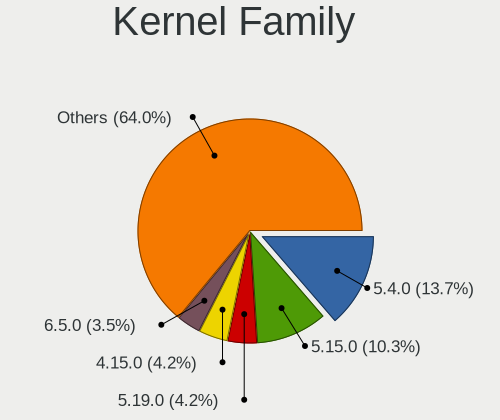

| Version | Notebooks | Percent |
|---------|-----------|---------|
| 5.4.0   | 74        | 13.65%  |
| 5.15.0  | 56        | 10.33%  |
| 5.19.0  | 23        | 4.24%   |
| 4.15.0  | 23        | 4.24%   |
| 6.5.0   | 19        | 3.51%   |
| 6.2.0   | 19        | 3.51%   |
| 5.11.0  | 18        | 3.32%   |
| 5.3.0   | 17        | 3.14%   |
| 5.10.0  | 16        | 2.95%   |
| 6.8.0   | 15        | 2.77%   |
| 6.1.0   | 15        | 2.77%   |
| 5.8.0   | 15        | 2.77%   |
| 5.13.0  | 14        | 2.58%   |
| 5.0.0   | 8         | 1.48%   |
| 4.19.0  | 8         | 1.48%   |
| 6.1.1   | 6         | 1.11%   |
| 5.10.14 | 6         | 1.11%   |
| 6.9.3   | 5         | 0.92%   |
| 4.18.0  | 5         | 0.92%   |
| 6.4.11  | 4         | 0.74%   |
| 6.3.8   | 4         | 0.74%   |
| 6.2.6   | 4         | 0.74%   |
| 6.1.52  | 4         | 0.74%   |
| 5.14.0  | 4         | 0.74%   |
| 6.5.6   | 3         | 0.55%   |
| 5.18.0  | 3         | 0.55%   |
| 4.18.16 | 3         | 0.55%   |
| 6.9.12  | 2         | 0.37%   |
| 6.8.11  | 2         | 0.37%   |
| 6.7.4   | 2         | 0.37%   |
| 6.6.4   | 2         | 0.37%   |
| 6.5.5   | 2         | 0.37%   |
| 6.2.9   | 2         | 0.37%   |
| 6.10.0  | 2         | 0.37%   |
| 6.0.9   | 2         | 0.37%   |
| 6.0.6   | 2         | 0.37%   |
| 6.0.12  | 2         | 0.37%   |
| 6.0.10  | 2         | 0.37%   |
| 6.0.0   | 2         | 0.37%   |
| 5.7.9   | 2         | 0.37%   |

Kernel Major Ver.
-----------------

Linux kernel major version

| Version | Notebooks | Percent |
|---------|-----------|---------|
| 5.4     | 77        | 14.29%  |
| 5.15    | 63        | 11.69%  |
| 5.10    | 29        | 5.38%   |
| 5.19    | 28        | 5.19%   |
| 6.1     | 27        | 5.01%   |
| 6.5     | 26        | 4.82%   |
| 6.2     | 26        | 4.82%   |
| 4.15    | 23        | 4.27%   |
| 6.8     | 22        | 4.08%   |
| 5.3     | 18        | 3.34%   |
| 5.11    | 18        | 3.34%   |
| 5.8     | 17        | 3.15%   |
| 5.13    | 16        | 2.97%   |
| 6.0     | 13        | 2.41%   |
| 6.9     | 11        | 2.04%   |
| 6.6     | 10        | 1.86%   |
| 4.19    | 10        | 1.86%   |
| 5.14    | 9         | 1.67%   |
| 5.0     | 8         | 1.48%   |
| 4.18    | 8         | 1.48%   |
| 6.3     | 7         | 1.3%    |
| 5.6     | 7         | 1.3%    |
| 5.18    | 7         | 1.3%    |
| 6.4     | 6         | 1.11%   |
| 6.10    | 6         | 1.11%   |
| 5.17    | 6         | 1.11%   |
| 5.16    | 6         | 1.11%   |
| 4.9     | 5         | 0.93%   |
| 6.7     | 4         | 0.74%   |
| 6.11    | 4         | 0.74%   |
| 5.9     | 4         | 0.74%   |
| 5.7     | 4         | 0.74%   |
| 5.12    | 4         | 0.74%   |
| 4.12    | 2         | 0.37%   |
| 3.10    | 2         | 0.37%   |
| 6.12    | 1         | 0.19%   |
| 5.2     | 1         | 0.19%   |
| 4.4     | 1         | 0.19%   |
| 4.14    | 1         | 0.19%   |
| 4.13    | 1         | 0.19%   |

Arch
----

OS architecture (x86_64, i586, etc.)

| Name   | Notebooks | Percent |
|--------|-----------|---------|
| x86_64 | 474       | 97.33%  |
| i686   | 12        | 2.46%   |
| armv7l | 1         | 0.21%   |

DE
--

Desktop Environment

| Name            | Notebooks | Percent |
|-----------------|-----------|---------|
| GNOME           | 238       | 46.58%  |
| KDE5            | 79        | 15.46%  |
| Unknown         | 51        | 9.98%   |
| X-Cinnamon      | 50        | 9.78%   |
| XFCE            | 33        | 6.46%   |
| KDE             | 11        | 2.15%   |
| MATE            | 8         | 1.57%   |
| Pantheon        | 6         | 1.17%   |
| LXQt            | 6         | 1.17%   |
| i3              | 6         | 1.17%   |
| Cinnamon        | 6         | 1.17%   |
| Unity           | 3         | 0.59%   |
| KDE6            | 3         | 0.59%   |
| Budgie          | 3         | 0.59%   |
| KDE4            | 2         | 0.39%   |
| GNOME Classic   | 2         | 0.39%   |
| GNOME Flashback | 1         | 0.2%    |
| Endless:GNOME   | 1         | 0.2%    |
| DWM             | 1         | 0.2%    |
| BunsenLabs      | 1         | 0.2%    |

Display Server
--------------

X11 or Wayland

| Name    | Notebooks | Percent |
|---------|-----------|---------|
| X11     | 359       | 71.51%  |
| Wayland | 114       | 22.71%  |
| Unknown | 24        | 4.78%   |
| Tty     | 5         | 1%      |

Display Manager
---------------

SDDM, LightDM, etc.

| Name    | Notebooks | Percent |
|---------|-----------|---------|
| Unknown | 237       | 46.84%  |
| LightDM | 67        | 13.24%  |
| SDDM    | 65        | 12.85%  |
| GDM3    | 65        | 12.85%  |
| GDM     | 57        | 11.26%  |
| TDM     | 12        | 2.37%   |
| KDM     | 2         | 0.4%    |
| SLiM    | 1         | 0.2%    |

OS Lang
-------

Language

| Lang    | Notebooks | Percent |
|---------|-----------|---------|
| en_IE   | 242       | 47.92%  |
| en_US   | 96        | 19.01%  |
| en_GB   | 87        | 17.23%  |
| Unknown | 41        | 8.12%   |
| pl_PL   | 13        | 2.57%   |
| C       | 7         | 1.39%   |
| en_IN   | 2         | 0.4%    |
| en_CA   | 2         | 0.4%    |
| bg_BG   | 2         | 0.4%    |
| zh_CN   | 1         | 0.2%    |
| uk_UA   | 1         | 0.2%    |
| ru_RU   | 1         | 0.2%    |
| pt_PT   | 1         | 0.2%    |
| lt_LT   | 1         | 0.2%    |
| it_IT   | 1         | 0.2%    |
| ga_IE   | 1         | 0.2%    |
| fr_FR   | 1         | 0.2%    |
| fr_BE   | 1         | 0.2%    |
| es_ES   | 1         | 0.2%    |
| en_ZA   | 1         | 0.2%    |
| en_DE   | 1         | 0.2%    |
| en_AU   | 1         | 0.2%    |

Boot Mode
---------

EFI or BIOS

| Mode | Notebooks | Percent |
|------|-----------|---------|
| EFI  | 259       | 52.11%  |
| BIOS | 238       | 47.89%  |

Filesystem
----------

Type of filesystem

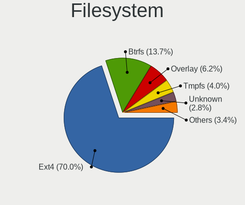

| Type                | Notebooks | Percent |
|---------------------|-----------|---------|
| Ext4                | 352       | 69.98%  |
| Btrfs               | 69        | 13.72%  |
| Overlay             | 31        | 6.16%   |
| Tmpfs               | 20        | 3.98%   |
| Unknown             | 14        | 2.78%   |
| Xfs                 | 10        | 1.99%   |
| Zfs                 | 4         | 0.8%    |
| Ext3                | 2         | 0.4%    |
| Fuse.fuse-overlayfs | 1         | 0.2%    |

Part. scheme
------------

Scheme of partitioning

| Type    | Notebooks | Percent |
|---------|-----------|---------|
| Unknown | 241       | 48.2%   |
| GPT     | 207       | 41.4%   |
| MBR     | 52        | 10.4%   |

Dual Boot with Linux/BSD
------------------------

Hosting more than one Linux/BSD

| Dual boot | Notebooks | Percent |
|-----------|-----------|---------|
| No        | 435       | 87.88%  |
| Yes       | 60        | 12.12%  |

Dual Boot (Win)
---------------

Hosting Linux and Windows

| Dual boot | Notebooks | Percent |
|-----------|-----------|---------|
| No        | 390       | 78.63%  |
| Yes       | 106       | 21.37%  |

Board
-----

Vendor
------

Motherboard manufacturer

| Name                | Notebooks | Percent |
|---------------------|-----------|---------|
| Dell                | 118       | 24.23%  |
| Lenovo              | 110       | 22.59%  |
| Hewlett-Packard     | 61        | 12.53%  |
| ASUSTek Computer    | 39        | 8.01%   |
| Acer                | 34        | 6.98%   |
| Toshiba             | 16        | 3.29%   |
| Apple               | 13        | 2.67%   |
| Samsung Electronics | 9         | 1.85%   |
| Valve               | 8         | 1.64%   |
| MSI                 | 6         | 1.23%   |
| Google              | 6         | 1.23%   |
| PC Specialist       | 5         | 1.03%   |
| Medion              | 5         | 1.03%   |
| TUXEDO              | 4         | 0.82%   |
| Timi                | 4         | 0.82%   |
| System76            | 4         | 0.82%   |
| Packard Bell        | 4         | 0.82%   |
| Notebook            | 4         | 0.82%   |
| HUAWEI              | 4         | 0.82%   |
| Chuwi               | 4         | 0.82%   |
| Fujitsu             | 3         | 0.62%   |
| AVITA               | 3         | 0.62%   |
| Alienware           | 3         | 0.62%   |
| Fujitsu Siemens     | 2         | 0.41%   |
| Framework           | 2         | 0.41%   |
| Entroware           | 2         | 0.41%   |
| eMachines           | 2         | 0.41%   |
| Tactus              | 1         | 0.21%   |
| Star Labs           | 1         | 0.21%   |
| Sony                | 1         | 0.21%   |
| SLIMBOOK            | 1         | 0.21%   |
| Schenker            | 1         | 0.21%   |
| Novatech            | 1         | 0.21%   |
| Microtech           | 1         | 0.21%   |
| Linx                | 1         | 0.21%   |
| Jumper              | 1         | 0.21%   |
| Gigabyte Technology | 1         | 0.21%   |
| Dynabook            | 1         | 0.21%   |
| Advent              | 1         | 0.21%   |

Model
-----

Motherboard model

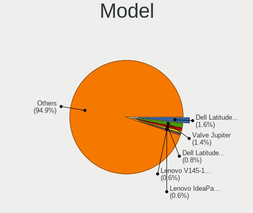

| Name                              | Notebooks | Percent |
|-----------------------------------|-----------|---------|
| Dell Latitude 7420                | 8         | 1.64%   |
| Valve Jupiter                     | 7         | 1.44%   |
| Dell Latitude E7240               | 4         | 0.82%   |
| Lenovo V145-15AST 81MT            | 3         | 0.62%   |
| Lenovo IdeaPad 330-15IKB 81DE     | 3         | 0.62%   |
| HP Notebook                       | 3         | 0.62%   |
| Dell Inspiron 13-5378             | 3         | 0.62%   |
| TUXEDO Pulse 15 Gen1              | 2         | 0.41%   |
| Toshiba Satellite C50-B           | 2         | 0.41%   |
| Samsung 750XED                    | 2         | 0.41%   |
| Medion Akoya E6239                | 2         | 0.41%   |
| Lenovo ThinkPad X1 Carbon 3443CTO | 2         | 0.41%   |
| Lenovo IdeaPad S340-15API 81NC    | 2         | 0.41%   |
| Lenovo IdeaPad 510-15ISK 80SR     | 2         | 0.41%   |
| Lenovo IdeaPad 1 14IGL7 82V6      | 2         | 0.41%   |
| Lenovo B50-30 80ES                | 2         | 0.41%   |
| HUAWEI NBLK-WAX9X                 | 2         | 0.41%   |
| HP Pavilion Notebook              | 2         | 0.41%   |
| HP Pavilion Laptop 15-eh0xxx      | 2         | 0.41%   |
| HP Pavilion g6                    | 2         | 0.41%   |
| HP OMEN by Laptop 15-dc0xxx       | 2         | 0.41%   |
| HP EliteBook 830 G6               | 2         | 0.41%   |
| Google Reks                       | 2         | 0.41%   |
| Dell XPS 9320                     | 2         | 0.41%   |
| Dell XPS 13 9380                  | 2         | 0.41%   |
| Dell XPS 13 9360                  | 2         | 0.41%   |
| Dell XPS 13 9310                  | 2         | 0.41%   |
| Dell XPS 13 9300                  | 2         | 0.41%   |
| Dell XPS 13 7390                  | 2         | 0.41%   |
| Dell Precision 5550               | 2         | 0.41%   |
| Dell Latitude E6430               | 2         | 0.41%   |
| Dell Latitude E6400               | 2         | 0.41%   |
| Dell Latitude E6230               | 2         | 0.41%   |
| Dell Latitude E5420               | 2         | 0.41%   |
| Dell Latitude 7490                | 2         | 0.41%   |
| Dell Latitude 5520                | 2         | 0.41%   |
| Dell Latitude 5510                | 2         | 0.41%   |
| Dell Inspiron 7577                | 2         | 0.41%   |
| Dell Inspiron 5570                | 2         | 0.41%   |
| Chuwi GemiBook Pro                | 2         | 0.41%   |

Model Family
------------

Motherboard model prefix

| Name                  | Notebooks | Percent |
|-----------------------|-----------|---------|
| Lenovo ThinkPad       | 60        | 12.32%  |
| Dell Latitude         | 58        | 11.91%  |
| Lenovo IdeaPad        | 27        | 5.54%   |
| Dell Inspiron         | 24        | 4.93%   |
| Acer Aspire           | 24        | 4.93%   |
| Dell XPS              | 18        | 3.7%    |
| HP EliteBook          | 17        | 3.49%   |
| HP Pavilion           | 14        | 2.87%   |
| Toshiba Satellite     | 13        | 2.67%   |
| Dell Precision        | 9         | 1.85%   |
| Valve Jupiter         | 7         | 1.44%   |
| ASUS VivoBook         | 7         | 1.44%   |
| ASUS ZenBook          | 6         | 1.23%   |
| HP ProBook            | 4         | 0.82%   |
| HP Laptop             | 4         | 0.82%   |
| ASUS ROG              | 4         | 0.82%   |
| Packard Bell EasyNote | 3         | 0.62%   |
| Lenovo V145-15AST     | 3         | 0.62%   |
| Lenovo ThinkBook      | 3         | 0.62%   |
| HP ZBook              | 3         | 0.62%   |
| HP Presario           | 3         | 0.62%   |
| HP OMEN               | 3         | 0.62%   |
| HP Notebook           | 3         | 0.62%   |
| HP Compaq             | 3         | 0.62%   |
| Fujitsu LIFEBOOK      | 3         | 0.62%   |
| Apple MacBookPro5     | 3         | 0.62%   |
| Acer Swift            | 3         | 0.62%   |
| Acer Nitro            | 3         | 0.62%   |
| TUXEDO Pulse          | 2         | 0.41%   |
| TUXEDO InfinityBook   | 2         | 0.41%   |
| Toshiba TECRA         | 2         | 0.41%   |
| Samsung 750XED        | 2         | 0.41%   |
| Medion Akoya          | 2         | 0.41%   |
| Lenovo Yoga           | 2         | 0.41%   |
| Lenovo IdeaPadFlex    | 2         | 0.41%   |
| Lenovo B50-30         | 2         | 0.41%   |
| HUAWEI NBLK-WAX9X     | 2         | 0.41%   |
| HP Stream             | 2         | 0.41%   |
| Google Reks           | 2         | 0.41%   |
| Fujitsu Siemens AMILO | 2         | 0.41%   |

MFG Year
--------

Motherboard manufacture year

| Year    | Notebooks | Percent |
|---------|-----------|---------|
| 2020    | 60        | 12.32%  |
| 2019    | 42        | 8.62%   |
| 2018    | 37        | 7.6%    |
| 2017    | 36        | 7.39%   |
| 2021    | 35        | 7.19%   |
| 2012    | 33        | 6.78%   |
| 2013    | 31        | 6.37%   |
| 2011    | 29        | 5.95%   |
| 2022    | 26        | 5.34%   |
| 2016    | 25        | 5.13%   |
| 2015    | 25        | 5.13%   |
| 2008    | 20        | 4.11%   |
| 2009    | 18        | 3.7%    |
| 2023    | 17        | 3.49%   |
| 2010    | 17        | 3.49%   |
| 2014    | 15        | 3.08%   |
| 2007    | 8         | 1.64%   |
| 2024    | 7         | 1.44%   |
| 2006    | 3         | 0.62%   |
| 2005    | 1         | 0.21%   |
| 2003    | 1         | 0.21%   |
| Unknown | 1         | 0.21%   |

Form Factor
-----------

Physical design of the computer

| Name     | Notebooks | Percent |
|----------|-----------|---------|
| Notebook | 487       | 100%    |

Secure Boot
-----------

Enabled or disabled

| State    | Notebooks | Percent |
|----------|-----------|---------|
| Disabled | 429       | 87.2%   |
| Enabled  | 63        | 12.8%   |

Coreboot
--------

Have coreboot on board

| Used | Notebooks | Percent |
|------|-----------|---------|
| No   | 478       | 98.15%  |
| Yes  | 9         | 1.85%   |

RAM Size
--------

Total RAM memory

| Size in GB  | Notebooks | Percent |
|-------------|-----------|---------|
| 4.01-8.0    | 142       | 28.57%  |
| 16.01-24.0  | 104       | 20.93%  |
| 3.01-4.0    | 88        | 17.71%  |
| 8.01-16.0   | 79        | 15.9%   |
| 32.01-64.0  | 42        | 8.45%   |
| 1.01-2.0    | 17        | 3.42%   |
| 64.01-256.0 | 11        | 2.21%   |
| 2.01-3.0    | 6         | 1.21%   |
| 24.01-32.0  | 5         | 1.01%   |
| 0.51-1.0    | 2         | 0.4%    |
| 0.01-0.5    | 1         | 0.2%    |

RAM Used
--------

Used RAM memory

| Used GB    | Notebooks | Percent |
|------------|-----------|---------|
| 2.01-3.0   | 151       | 27.86%  |
| 1.01-2.0   | 141       | 26.01%  |
| 4.01-8.0   | 103       | 19%     |
| 3.01-4.0   | 91        | 16.79%  |
| 0.51-1.0   | 27        | 4.98%   |
| 8.01-16.0  | 21        | 3.87%   |
| 16.01-24.0 | 5         | 0.92%   |
| 0.01-0.5   | 3         | 0.55%   |

Total Drives
------------

Number of drives on board

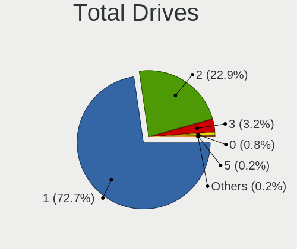

| Drives | Notebooks | Percent |
|--------|-----------|---------|
| 1      | 365       | 72.71%  |
| 2      | 115       | 22.91%  |
| 3      | 16        | 3.19%   |
| 0      | 4         | 0.8%    |
| 5      | 1         | 0.2%    |
| 4      | 1         | 0.2%    |

Has CD-ROM
----------

Has CD-ROM on board

| Presented | Notebooks | Percent |
|-----------|-----------|---------|
| No        | 344       | 70.2%   |
| Yes       | 146       | 29.8%   |

Has Ethernet
------------

Has Ethernet on board

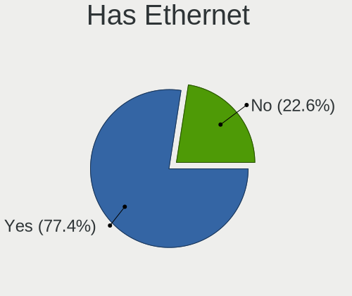

| Presented | Notebooks | Percent |
|-----------|-----------|---------|
| Yes       | 381       | 77.44%  |
| No        | 111       | 22.56%  |

Has WiFi
--------

Has WiFi module

| Presented | Notebooks | Percent |
|-----------|-----------|---------|
| Yes       | 480       | 98.36%  |
| No        | 8         | 1.64%   |

Has Bluetooth
-------------

Has Bluetooth module

| Presented | Notebooks | Percent |
|-----------|-----------|---------|
| Yes       | 394       | 79.76%  |
| No        | 100       | 20.24%  |

Location
--------

Country
-------

Geographic location (country)

| Country | Notebooks | Percent |
|---------|-----------|---------|
| Ireland | 487       | 100%    |

City
----

Geographic location (city)

| City           | Notebooks | Percent |
|----------------|-----------|---------|
| Dublin         | 305       | 60.52%  |
| Cork           | 32        | 6.35%   |
| Galway         | 23        | 4.56%   |
| Limerick       | 13        | 2.58%   |
| Naas           | 9         | 1.79%   |
| Drogheda       | 6         | 1.19%   |
| Enniscorthy    | 5         | 0.99%   |
| Ennis          | 5         | 0.99%   |
| Westport       | 4         | 0.79%   |
| Waterford      | 4         | 0.79%   |
| Navan          | 4         | 0.79%   |
| Tullamore      | 3         | 0.6%    |
| Lucan          | 3         | 0.6%    |
| Kilkenny       | 3         | 0.6%    |
| Dn Laoghaire | 3         | 0.6%    |
| Wicklow        | 2         | 0.4%    |
| Wexford        | 2         | 0.4%    |
| Portlaoise     | 2         | 0.4%    |
| Nenagh         | 2         | 0.4%    |
| Midleton       | 2         | 0.4%    |
| Maynooth       | 2         | 0.4%    |
| Loughrea       | 2         | 0.4%    |
| Letterkenny    | 2         | 0.4%    |
| Kilrush        | 2         | 0.4%    |
| Donegal        | 2         | 0.4%    |
| Cobh           | 2         | 0.4%    |
| Clonakilty     | 2         | 0.4%    |
| Clane          | 2         | 0.4%    |
| Castlerea      | 2         | 0.4%    |
| Ballina        | 2         | 0.4%    |
| Athlone        | 2         | 0.4%    |
| Youghal        | 1         | 0.2%    |
| Tullow         | 1         | 0.2%    |
| Tuam           | 1         | 0.2%    |
| Tralee         | 1         | 0.2%    |
| Tobercurry     | 1         | 0.2%    |
| Tallaght       | 1         | 0.2%    |
| Sligo          | 1         | 0.2%    |
| Slane          | 1         | 0.2%    |
| Scarriff       | 1         | 0.2%    |

Drives
------

Drive Vendor
------------

Hard drive vendors

| Vendor                      | Notebooks | Drives | Percent |
|-----------------------------|-----------|--------|---------|
| Samsung Electronics         | 110       | 151    | 18.18%  |
| WDC                         | 59        | 73     | 9.75%   |
| Seagate                     | 52        | 66     | 8.6%    |
| Unknown                     | 48        | 65     | 7.93%   |
| SanDisk                     | 45        | 51     | 7.44%   |
| Toshiba                     | 34        | 44     | 5.62%   |
| Micron Technology           | 24        | 29     | 3.97%   |
| Crucial                     | 24        | 33     | 3.97%   |
| Hitachi                     | 22        | 28     | 3.64%   |
| SK hynix                    | 20        | 20     | 3.31%   |
| Intel                       | 20        | 29     | 3.31%   |
| Kingston                    | 18        | 20     | 2.98%   |
| KIOXIA                      | 17        | 19     | 2.81%   |
| HGST                        | 15        | 19     | 2.48%   |
| Fujitsu                     | 7         | 8      | 1.16%   |
| Apple                       | 5         | 7      | 0.83%   |
| Transcend                   | 4         | 4      | 0.66%   |
| LITEON                      | 4         | 5      | 0.66%   |
| FORESEE                     | 4         | 5      | 0.66%   |
| PNY                         | 3         | 3      | 0.5%    |
| Phison Electronics          | 3         | 3      | 0.5%    |
| OCZ                         | 3         | 4      | 0.5%    |
| Micron/Crucial Technology   | 3         | 3      | 0.5%    |
| LITEONIT                    | 3         | 3      | 0.5%    |
| Kingston Technology Company | 3         | 3      | 0.5%    |
| KingSpec                    | 3         | 3      | 0.5%    |
| JMicron Technology          | 3         | 3      | 0.5%    |
| A-DATA Technology           | 3         | 5      | 0.5%    |
| SSSTC                       | 2         | 2      | 0.33%   |
| Silicon Motion              | 2         | 3      | 0.33%   |
| Patriot                     | 2         | 2      | 0.33%   |
| O2 Micro                    | 2         | 4      | 0.33%   |
| China                       | 2         | 8      | 0.33%   |
| 2-Power                     | 2         | 3      | 0.33%   |
| ZTC                         | 1         | 1      | 0.17%   |
| Zheino                      | 1         | 1      | 0.17%   |
| Wibtek                      | 1         | 2      | 0.17%   |
| W800S                       | 1         | 2      | 0.17%   |
| Verbatim                    | 1         | 1      | 0.17%   |
| USB                         | 1         | 1      | 0.17%   |

Drive Model
-----------

Hard drive models

| Model                                                | Notebooks | Percent |
|------------------------------------------------------|-----------|---------|
| Seagate ST1000LM035-1RK172 1TB                       | 10        | 1.57%   |
| KIOXIA KBG40ZNS512G NVMe 512GB                       | 9         | 1.42%   |
| Unknown MMC Card  32GB                               | 8         | 1.26%   |
| Samsung NVMe SSD Controller SM981/PM981/PM983 512GB  | 8         | 1.26%   |
| Unknown MMC Card  64GB                               | 7         | 1.1%    |
| SanDisk NVMe SSD Drive 512GB                         | 7         | 1.1%    |
| Kingston SA400S37480G 480GB SSD                      | 7         | 1.1%    |
| Samsung NVMe SSD Controller PM9A1/PM9A3/980PRO 512GB | 6         | 0.94%   |
| Unknown MMC Card  512GB                              | 5         | 0.79%   |
| Toshiba MQ01ABD100 1TB                               | 5         | 0.79%   |
| HGST HTS721010A9E630 1TB                             | 5         | 0.79%   |
| HGST HTS545050A7E680 500GB                           | 5         | 0.79%   |
| Unknown MMC Card  128GB                              | 4         | 0.63%   |
| Samsung SSD 860 EVO 500GB                            | 4         | 0.63%   |
| Samsung SSD 850 EVO 250GB                            | 4         | 0.63%   |
| Samsung NVMe SSD Drive 256GB                         | 4         | 0.63%   |
| Intel SSDPEKNU512GZ 512GB                            | 4         | 0.63%   |
| Hitachi HTS723232A7A364 320GB                        | 4         | 0.63%   |
| FORESEE 256GB SSD                                    | 4         | 0.63%   |
| Crucial CT1000MX500SSD1 1TB                          | 4         | 0.63%   |
| WDC WDS500G2B0B-00YS70 500GB SSD                     | 3         | 0.47%   |
| WDC PC SN530 NVMe 512GB                              | 3         | 0.47%   |
| Unknown SL16G  16GB                                  | 3         | 0.47%   |
| Unknown MMC Card  16GB                               | 3         | 0.47%   |
| Toshiba XG6 NVMe SSD Controller 1024GB               | 3         | 0.47%   |
| Toshiba MQ01ABF050 500GB                             | 3         | 0.47%   |
| Seagate ST9500325AS 500GB                            | 3         | 0.47%   |
| Seagate ST2000LM003 HN-M201RAD 2TB                   | 3         | 0.47%   |
| Seagate ST1000LM024 HN-M101MBB 1TB                   | 3         | 0.47%   |
| Sandisk WD Black SN750 / PC SN730 NVMe SSD 512GB     | 3         | 0.47%   |
| SanDisk SDSSDH3500G 500GB                            | 3         | 0.47%   |
| Samsung NVMe SSD Drive 512GB                         | 3         | 0.47%   |
| Samsung NVMe SSD Drive 500GB                         | 3         | 0.47%   |
| Samsung MZVLB512HBJQ-000L7 512GB                     | 3         | 0.47%   |
| PNY CS900 120GB SSD                                  | 3         | 0.47%   |
| Micron 2300 NVMe 512GB                               | 3         | 0.47%   |
| KIOXIA KBG40ZNS256G NVMe 256GB                       | 3         | 0.47%   |
| Kingston SA400S37240G 240GB SSD                      | 3         | 0.47%   |
| Crucial M4-CT128M4SSD2 128GB                         | 3         | 0.47%   |
| WDC WDS100T1B0A-00H9H0 1TB SSD                       | 2         | 0.31%   |

HDD Vendor
----------

Hard disk drive vendors

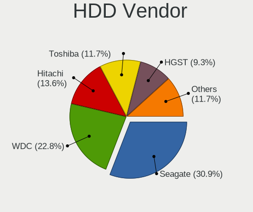

| Vendor              | Notebooks | Drives | Percent |
|---------------------|-----------|--------|---------|
| Seagate             | 50        | 63     | 30.86%  |
| WDC                 | 37        | 42     | 22.84%  |
| Hitachi             | 22        | 28     | 13.58%  |
| Toshiba             | 19        | 21     | 11.73%  |
| HGST                | 15        | 19     | 9.26%   |
| Fujitsu             | 7         | 8      | 4.32%   |
| Samsung Electronics | 3         | 4      | 1.85%   |
| Unknown             | 2         | 2      | 1.23%   |
| JMicron Technology  | 2         | 2      | 1.23%   |
| USB                 | 1         | 1      | 0.62%   |
| SABRENT             | 1         | 2      | 0.62%   |
| QNAP                | 1         | 1      | 0.62%   |
| LaCie               | 1         | 1      | 0.62%   |
| Apple               | 1         | 1      | 0.62%   |

SSD Vendor
----------

Solid state drive vendors

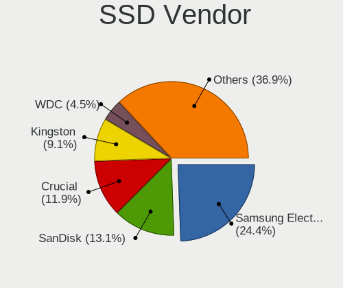

| Vendor              | Notebooks | Drives | Percent |
|---------------------|-----------|--------|---------|
| Samsung Electronics | 43        | 52     | 24.43%  |
| SanDisk             | 23        | 23     | 13.07%  |
| Crucial             | 21        | 30     | 11.93%  |
| Kingston            | 16        | 18     | 9.09%   |
| WDC                 | 8         | 12     | 4.55%   |
| Intel               | 5         | 7      | 2.84%   |
| SK hynix            | 4         | 4      | 2.27%   |
| Micron Technology   | 4         | 4      | 2.27%   |
| FORESEE             | 4         | 5      | 2.27%   |
| Toshiba             | 3         | 5      | 1.7%    |
| PNY                 | 3         | 3      | 1.7%    |
| OCZ                 | 3         | 4      | 1.7%    |
| LITEONIT            | 3         | 3      | 1.7%    |
| LITEON              | 3         | 4      | 1.7%    |
| KingSpec            | 3         | 3      | 1.7%    |
| Transcend           | 2         | 2      | 1.14%   |
| Patriot             | 2         | 2      | 1.14%   |
| China               | 2         | 8      | 1.14%   |
| Apple               | 2         | 2      | 1.14%   |
| A-DATA Technology   | 2         | 4      | 1.14%   |
| 2-Power             | 2         | 3      | 1.14%   |
| ZTC                 | 1         | 1      | 0.57%   |
| Zheino              | 1         | 1      | 0.57%   |
| Wibtek              | 1         | 2      | 0.57%   |
| W800S               | 1         | 2      | 0.57%   |
| Verbatim            | 1         | 1      | 0.57%   |
| Union Memory        | 1         | 1      | 0.57%   |
| Star                | 1         | 1      | 0.57%   |
| SPCC                | 1         | 1      | 0.57%   |
| Plextor             | 1         | 1      | 0.57%   |
| Netac               | 1         | 1      | 0.57%   |
| Integral            | 1         | 1      | 0.57%   |
| GOODRAM             | 1         | 1      | 0.57%   |
| faspeed             | 1         | 1      | 0.57%   |
| Fanxiang            | 1         | 1      | 0.57%   |
| Emtec               | 1         | 2      | 0.57%   |
| Dogfish             | 1         | 1      | 0.57%   |
| CT1000MX            | 1         | 1      | 0.57%   |
| AMD                 | 1         | 1      | 0.57%   |

Drive Kind
----------

HDD or SSD

| Kind    | Notebooks | Drives | Percent |
|---------|-----------|--------|---------|
| NVMe    | 204       | 281    | 35.48%  |
| SSD     | 165       | 219    | 28.7%   |
| HDD     | 153       | 195    | 26.61%  |
| MMC     | 44        | 61     | 7.65%   |
| Unknown | 9         | 11     | 1.57%   |

Drive Connector
---------------

SATA, SAS, NVMe, etc.

| Type | Notebooks | Drives | Percent |
|------|-----------|--------|---------|
| SATA | 289       | 404    | 52.07%  |
| NVMe | 204       | 280    | 36.76%  |
| MMC  | 44        | 61     | 7.93%   |
| SAS  | 18        | 22     | 3.24%   |

Drive Size
----------

Size of hard drive

| Size in TB | Notebooks | Drives | Percent |
|------------|-----------|--------|---------|
| 0.01-0.5   | 215       | 286    | 69.13%  |
| 0.51-1.0   | 80        | 107    | 25.72%  |
| 1.01-2.0   | 12        | 16     | 3.86%   |
| 4.01-10.0  | 2         | 3      | 0.64%   |
| 3.01-4.0   | 1         | 1      | 0.32%   |
| 2.01-3.0   | 1         | 1      | 0.32%   |

Space Total
-----------

Amount of disk space available on the file system

| Size in GB     | Notebooks | Percent |
|----------------|-----------|---------|
| 251-500        | 147       | 28.49%  |
| 101-250        | 144       | 27.91%  |
| 501-1000       | 62        | 12.02%  |
| 1-20           | 44        | 8.53%   |
| 51-100         | 39        | 7.56%   |
| 1001-2000      | 30        | 5.81%   |
| Unknown        | 16        | 3.1%    |
| 21-50          | 15        | 2.91%   |
| 2001-3000      | 10        | 1.94%   |
| More than 3000 | 9         | 1.74%   |

Space Used
----------

Amount of used disk space

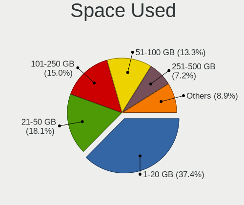

| Used GB        | Notebooks | Percent |
|----------------|-----------|---------|
| 1-20           | 202       | 37.41%  |
| 21-50          | 98        | 18.15%  |
| 101-250        | 81        | 15%     |
| 51-100         | 72        | 13.33%  |
| 251-500        | 39        | 7.22%   |
| 501-1000       | 19        | 3.52%   |
| Unknown        | 16        | 2.96%   |
| 1001-2000      | 11        | 2.04%   |
| More than 3000 | 1         | 0.19%   |
| 2001-3000      | 1         | 0.19%   |

Malfunc. Drives
---------------

Drive models with a malfunction

| Model                                          | Notebooks | Drives | Percent |
|------------------------------------------------|-----------|--------|---------|
| Hitachi HTS723232A7A364 320GB                  | 2         | 2      | 7.14%   |
| WDC WD5000LPCX-24VHAT0 500GB                   | 1         | 1      | 3.57%   |
| WDC WD32 00BEKT-75PVMT0 320GB                  | 1         | 1      | 3.57%   |
| WDC WD2500BEVT-22A23T0 250GB                   | 1         | 1      | 3.57%   |
| Toshiba MQ01ABF050H 500GB                      | 1         | 1      | 3.57%   |
| Toshiba MQ01ABD050 500GB                       | 1         | 1      | 3.57%   |
| Toshiba MK3261GSYN 320GB                       | 1         | 1      | 3.57%   |
| Toshiba MK1652GSX 160GB                        | 1         | 1      | 3.57%   |
| SK hynix SC308 SATA 256GB SSD                  | 1         | 1      | 3.57%   |
| Seagate ST9500325AS 500GB                      | 1         | 1      | 3.57%   |
| Seagate ST9320325AS 320GB                      | 1         | 1      | 3.57%   |
| Seagate ST910021AS 100GB                       | 1         | 1      | 3.57%   |
| Seagate ST500LM030-2E717D 500GB                | 1         | 1      | 3.57%   |
| SanDisk SSD PLUS 240GB                         | 1         | 1      | 3.57%   |
| Samsung Electronics HM120JC 120GB              | 1         | 1      | 3.57%   |
| Micron Technology MTFDDAK256MAM-1K12 256GB SSD | 1         | 1      | 3.57%   |
| Micron Technology 1100_MTFDDAV256TBN 256GB SSD | 1         | 1      | 3.57%   |
| JMicron Technology Generic 500GB               | 1         | 1      | 3.57%   |
| Hitachi HTS545050B9A300 500GB                  | 1         | 1      | 3.57%   |
| Hitachi HTS545032A7E380 320GB                  | 1         | 1      | 3.57%   |
| Hitachi HTS545025B9SA02 250GB                  | 1         | 3      | 3.57%   |
| Hitachi HTS543232A7A384 320GB                  | 1         | 1      | 3.57%   |
| Hitachi DK23CA-30 32GB                         | 1         | 1      | 3.57%   |
| HGST HTS725050A7E630 500GB                     | 1         | 1      | 3.57%   |
| HGST HTS541010A9E680 1TB                       | 1         | 1      | 3.57%   |
| Fujitsu MHJ2181AT 18GB                         | 1         | 1      | 3.57%   |
| Crucial CT1050MX300SSD1 1050GB                 | 1         | 1      | 3.57%   |

Malfunc. Drive Vendor
---------------------

Vendors of faulty drives

| Vendor              | Notebooks | Drives | Percent |
|---------------------|-----------|--------|---------|
| Hitachi             | 7         | 9      | 25%     |
| Toshiba             | 4         | 4      | 14.29%  |
| Seagate             | 4         | 4      | 14.29%  |
| WDC                 | 3         | 3      | 10.71%  |
| Micron Technology   | 2         | 2      | 7.14%   |
| HGST                | 2         | 2      | 7.14%   |
| SK hynix            | 1         | 1      | 3.57%   |
| SanDisk             | 1         | 1      | 3.57%   |
| Samsung Electronics | 1         | 1      | 3.57%   |
| JMicron Technology  | 1         | 1      | 3.57%   |
| Fujitsu             | 1         | 1      | 3.57%   |
| Crucial             | 1         | 1      | 3.57%   |

Malfunc. HDD Vendor
-------------------

Vendors of faulty HDD drives

| Vendor              | Notebooks | Drives | Percent |
|---------------------|-----------|--------|---------|
| Hitachi             | 7         | 9      | 30.43%  |
| Toshiba             | 4         | 4      | 17.39%  |
| Seagate             | 4         | 4      | 17.39%  |
| WDC                 | 3         | 3      | 13.04%  |
| HGST                | 2         | 2      | 8.7%    |
| Samsung Electronics | 1         | 1      | 4.35%   |
| JMicron Technology  | 1         | 1      | 4.35%   |
| Fujitsu             | 1         | 1      | 4.35%   |

Malfunc. Drive Kind
-------------------

Kinds of faulty drives

| Kind | Notebooks | Drives | Percent |
|------|-----------|--------|---------|
| HDD  | 19        | 25     | 79.17%  |
| SSD  | 5         | 5      | 20.83%  |

Failed Drives
-------------

Failed drive models

| Model                           | Notebooks | Drives | Percent |
|---------------------------------|-----------|--------|---------|
| WDC WD1200BEVS-22UST0 120GB     | 1         | 1      | 50%     |
| Sandisk PC SN520 NVMe SSD 256GB | 1         | 1      | 50%     |

Failed Drive Vendor
-------------------

Failed drive vendors

| Vendor  | Notebooks | Drives | Percent |
|---------|-----------|--------|---------|
| WDC     | 1         | 1      | 50%     |
| Sandisk | 1         | 1      | 50%     |

Drive Status
------------

Number of failed and malfunc. drives

| Status   | Notebooks | Drives | Percent |
|----------|-----------|--------|---------|
| Detected | 289       | 464    | 56.23%  |
| Works    | 199       | 271    | 38.72%  |
| Malfunc  | 24        | 30     | 4.67%   |
| Failed   | 2         | 2      | 0.39%   |

Storage controller
------------------

Storage Vendor
--------------

Storage controller vendors

| Vendor                         | Notebooks | Percent |
|--------------------------------|-----------|---------|
| Intel                          | 315       | 54.5%   |
| Samsung Electronics            | 66        | 11.42%  |
| AMD                            | 48        | 8.3%    |
| SanDisk                        | 37        | 6.4%    |
| Micron Technology              | 20        | 3.46%   |
| SK hynix                       | 16        | 2.77%   |
| KIOXIA                         | 16        | 2.77%   |
| Toshiba America Info Systems   | 13        | 2.25%   |
| Nvidia                         | 10        | 1.73%   |
| Micron/Crucial Technology      | 6         | 1.04%   |
| Kingston Technology Company    | 5         | 0.87%   |
| Phison Electronics             | 4         | 0.69%   |
| Union Memory (Shenzhen)        | 3         | 0.52%   |
| Solid State Storage Technology | 3         | 0.52%   |
| Transcend                      | 2         | 0.35%   |
| Silicon Motion                 | 2         | 0.35%   |
| O2 Micro                       | 2         | 0.35%   |
| Apple                          | 2         | 0.35%   |
| Solidigm                       | 1         | 0.17%   |
| Silicon Image                  | 1         | 0.17%   |
| MAXIO Technology (Hangzhou)    | 1         | 0.17%   |
| Lite-On Technology             | 1         | 0.17%   |
| Lenovo                         | 1         | 0.17%   |
| ASMedia Technology             | 1         | 0.17%   |
| ADATA Technology               | 1         | 0.17%   |
| Adaptec                        | 1         | 0.17%   |

Storage Model
-------------

Storage controller models

| Model                                                                          | Notebooks | Percent |
|--------------------------------------------------------------------------------|-----------|---------|
| Intel Sunrise Point-LP SATA Controller [AHCI mode]                             | 48        | 7.73%   |
| AMD FCH SATA Controller [AHCI mode]                                            | 44        | 7.09%   |
| Intel 82801 Mobile SATA Controller [RAID mode]                                 | 29        | 4.67%   |
| Intel 7 Series Chipset Family 6-port SATA Controller [AHCI mode]               | 29        | 4.67%   |
| Samsung NVMe SSD Controller SM981/PM981/PM983                                  | 27        | 4.35%   |
| Intel 6 Series/C200 Series Chipset Family 6 port Mobile SATA AHCI Controller   | 21        | 3.38%   |
| Samsung NVMe SSD Controller 980 (DRAM-less)                                    | 18        | 2.9%    |
| Intel Volume Management Device NVMe RAID Controller                            | 17        | 2.74%   |
| Intel 82801IBM/IEM (ICH9M/ICH9M-E) 4 port SATA Controller [AHCI mode]          | 15        | 2.42%   |
| KIOXIA NVMe SSD Controller BG4 (DRAM-less)                                     | 14        | 2.25%   |
| Intel HM170/QM170 Chipset SATA Controller [AHCI Mode]                          | 11        | 1.77%   |
| Intel Celeron/Pentium Silver Processor SATA Controller                         | 11        | 1.77%   |
| SanDisk Extreme Pro / WD Black SN750 / PC SN730 / Red SN700 NVMe SSD           | 10        | 1.61%   |
| Intel 5 Series/3400 Series Chipset 6 port SATA AHCI Controller                 | 10        | 1.61%   |
| Intel Comet Lake SATA AHCI Controller                                          | 9         | 1.45%   |
| Intel 8 Series SATA Controller 1 [AHCI mode]                                   | 9         | 1.45%   |
| Toshiba America Info Systems XG6 NVMe SSD Controller                           | 8         | 1.29%   |
| Samsung NVMe SSD Controller PM9A1/PM9A3/980PRO                                 | 8         | 1.29%   |
| Intel Wildcat Point-LP SATA Controller [AHCI Mode]                             | 8         | 1.29%   |
| Intel Tiger Lake-LP SATA Controller                                            | 8         | 1.29%   |
| Intel Atom Processor E3800 Series SATA AHCI Controller                         | 8         | 1.29%   |
| Intel 8 Series/C220 Series Chipset Family 6-port SATA Controller 1 [AHCI mode] | 8         | 1.29%   |
| Samsung NVMe SSD Controller SM961/PM961/SM963                                  | 7         | 1.13%   |
| Intel Volume Management Device NVMe RAID Controller Intel Corporation          | 7         | 1.13%   |
| Intel Cannon Lake Mobile PCH SATA AHCI Controller                              | 7         | 1.13%   |
| Intel 82801HM/HEM (ICH8M/ICH8M-E) IDE Controller                               | 7         | 1.13%   |
| Intel 5 Series/3400 Series Chipset 4 port SATA AHCI Controller                 | 7         | 1.13%   |
| Nvidia MCP79 AHCI Controller                                                   | 6         | 0.97%   |
| Micron 2450 NVMe SSD [HendrixV] (DRAM-less)                                    | 6         | 0.97%   |
| Intel 400 Series Chipset Family SATA AHCI Controller                           | 6         | 0.97%   |
| SK hynix Platinum P41/PC801 NVMe Solid State Drive                             | 5         | 0.81%   |
| SanDisk Ultra 3D / WD PC SN530, IX SN530, Blue SN550 NVMe SSD (DRAM-less)      | 5         | 0.81%   |
| SanDisk IX SN530 NVMe SSD (DRAM-less)                                          | 5         | 0.81%   |
| Micron 2300 NVMe SSD [Santana]                                                 | 5         | 0.81%   |
| Micron 2200S NVMe SSD [Cassandra]                                              | 5         | 0.81%   |
| Intel Q170/Q150/B150/H170/H110/Z170/CM236 Chipset SATA Controller [AHCI Mode]  | 5         | 0.81%   |
| Intel Alder Lake-P SATA AHCI Controller                                        | 5         | 0.81%   |
| Intel 82801HM/HEM (ICH8M/ICH8M-E) SATA Controller [AHCI mode]                  | 5         | 0.81%   |
| SK hynix Gold P31/BC711/PC711 NVMe Solid State Drive                           | 4         | 0.64%   |
| SanDisk PC SN520 x2 M.2 2242 NVMe SSD                                          | 4         | 0.64%   |

Storage Kind
------------

Kind of storage controller (IDE, SATA, NVMe, SAS, ...)

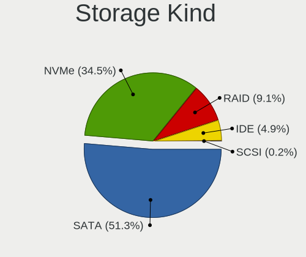

| Kind | Notebooks | Percent |
|------|-----------|---------|
| SATA | 305       | 51.35%  |
| NVMe | 205       | 34.51%  |
| RAID | 54        | 9.09%   |
| IDE  | 29        | 4.88%   |
| SCSI | 1         | 0.17%   |

Processor
---------

CPU Vendor
----------

Processor vendors

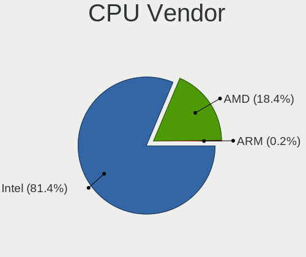

| Vendor | Notebooks | Percent |
|--------|-----------|---------|
| Intel  | 397       | 81.35%  |
| AMD    | 90        | 18.44%  |
| ARM    | 1         | 0.2%    |

CPU Model
---------

Processor models

| Model                                         | Notebooks | Percent |
|-----------------------------------------------|-----------|---------|
| Intel 11th Gen Core i7-1185G7 @ 3.00GHz       | 13        | 2.66%   |
| Intel Core i5-8250U CPU @ 1.60GHz             | 10        | 2.05%   |
| Intel 11th Gen Core i5-1135G7 @ 2.40GHz       | 10        | 2.05%   |
| Intel Core i5-7200U CPU @ 2.50GHz             | 9         | 1.84%   |
| Intel Core i7-7700HQ CPU @ 2.80GHz            | 8         | 1.64%   |
| Intel Core i7-8565U CPU @ 1.80GHz             | 7         | 1.43%   |
| Intel Core i7-7500U CPU @ 2.70GHz             | 7         | 1.43%   |
| Intel Core i7-10510U CPU @ 1.80GHz            | 7         | 1.43%   |
| Intel Core i5-6200U CPU @ 2.30GHz             | 7         | 1.43%   |
| AMD Custom APU 0405                           | 7         | 1.43%   |
| Intel Core i7-8550U CPU @ 1.80GHz             | 6         | 1.23%   |
| Intel Core i5-3320M CPU @ 2.60GHz             | 6         | 1.23%   |
| Intel Core i5-2520M CPU @ 2.50GHz             | 6         | 1.23%   |
| AMD Ryzen 7 5800H with Radeon Graphics        | 6         | 1.23%   |
| AMD Ryzen 5 3500U with Radeon Vega Mobile Gfx | 6         | 1.23%   |
| Intel Core i5-10210U CPU @ 1.60GHz            | 5         | 1.02%   |
| Intel Celeron CPU N3060 @ 1.60GHz             | 5         | 1.02%   |
| Intel 12th Gen Core i5-1235U                  | 5         | 1.02%   |
| Intel Core i7-9750H CPU @ 2.60GHz             | 4         | 0.82%   |
| Intel Core i7-6700HQ CPU @ 2.60GHz            | 4         | 0.82%   |
| Intel Core i7-1065G7 CPU @ 1.30GHz            | 4         | 0.82%   |
| Intel Core i5-6300U CPU @ 2.40GHz             | 4         | 0.82%   |
| Intel Core i5-4300U CPU @ 1.90GHz             | 4         | 0.82%   |
| Intel Core 2 Duo CPU T9600 @ 2.80GHz          | 4         | 0.82%   |
| Intel Core 2 Duo CPU T5800 @ 2.00GHz          | 4         | 0.82%   |
| Intel Celeron CPU N2840 @ 2.16GHz             | 4         | 0.82%   |
| Intel Atom CPU N450 @ 1.66GHz                 | 4         | 0.82%   |
| AMD Ryzen 7 4800H with Radeon Graphics        | 4         | 0.82%   |
| AMD Ryzen 7 3700U with Radeon Vega Mobile Gfx | 4         | 0.82%   |
| Intel Core i7-8750H CPU @ 2.20GHz             | 3         | 0.61%   |
| Intel Core i7-8665U CPU @ 1.90GHz             | 3         | 0.61%   |
| Intel Core i7-6820HQ CPU @ 2.70GHz            | 3         | 0.61%   |
| Intel Core i7-6500U CPU @ 2.50GHz             | 3         | 0.61%   |
| Intel Core i7-4600U CPU @ 2.10GHz             | 3         | 0.61%   |
| Intel Core i7-10850H CPU @ 2.70GHz            | 3         | 0.61%   |
| Intel Core i7-10750H CPU @ 2.60GHz            | 3         | 0.61%   |
| Intel Core i5-8265U CPU @ 1.60GHz             | 3         | 0.61%   |
| Intel Core i5-3340M CPU @ 2.70GHz             | 3         | 0.61%   |
| Intel Core i5-3337U CPU @ 1.80GHz             | 3         | 0.61%   |
| Intel Core i5 CPU M 560 @ 2.67GHz             | 3         | 0.61%   |

CPU Model Family
----------------

Processor model prefix

| Model                   | Notebooks | Percent |
|-------------------------|-----------|---------|
| Intel Core i7           | 107       | 21.93%  |
| Intel Core i5           | 103       | 21.11%  |
| Other                   | 73        | 14.96%  |
| Intel Celeron           | 33        | 6.76%   |
| Intel Core i3           | 29        | 5.94%   |
| Intel Core 2 Duo        | 24        | 4.92%   |
| AMD Ryzen 7             | 20        | 4.1%    |
| AMD Ryzen 5             | 20        | 4.1%    |
| Intel Pentium           | 9         | 1.84%   |
| Intel Atom              | 8         | 1.64%   |
| AMD A8                  | 5         | 1.02%   |
| AMD E1                  | 4         | 0.82%   |
| Intel Core i9           | 3         | 0.61%   |
| Intel Core 2            | 3         | 0.61%   |
| AMD Ryzen 9             | 3         | 0.61%   |
| AMD Ryzen 7 PRO         | 3         | 0.61%   |
| AMD Ryzen 5 PRO         | 3         | 0.61%   |
| Intel Pentium Silver    | 2         | 0.41%   |
| Intel Pentium Dual-Core | 2         | 0.41%   |
| Intel Pentium Dual      | 2         | 0.41%   |
| Intel Celeron Dual-Core | 2         | 0.41%   |
| AMD Sempron             | 2         | 0.41%   |
| AMD Ryzen 3 PRO         | 2         | 0.41%   |
| AMD Ryzen 3             | 2         | 0.41%   |
| AMD E2                  | 2         | 0.41%   |
| AMD A10                 | 2         | 0.41%   |
| Intel Xeon              | 1         | 0.2%    |
| Intel Pentium M         | 1         | 0.2%    |
| Intel Pentium III       | 1         | 0.2%    |
| Intel Pentium Gold      | 1         | 0.2%    |
| Intel Genuine           | 1         | 0.2%    |
| Intel Core m7           | 1         | 0.2%    |
| Intel Core m5           | 1         | 0.2%    |
| Intel Core m3           | 1         | 0.2%    |
| Intel Core 2 Extreme    | 1         | 0.2%    |
| Intel Core              | 1         | 0.2%    |
| Intel Celeron M         | 1         | 0.2%    |
| AMD Turion 64 X2 Mobile | 1         | 0.2%    |
| AMD PRO A10             | 1         | 0.2%    |
| AMD Phenom II           | 1         | 0.2%    |

CPU Cores
---------

Number of processor cores

| Number | Notebooks | Percent |
|--------|-----------|---------|
| 2      | 218       | 44.67%  |
| 4      | 173       | 35.45%  |
| 8      | 30        | 6.15%   |
| 6      | 27        | 5.53%   |
| 1      | 13        | 2.66%   |
| 10     | 9         | 1.84%   |
| 14     | 8         | 1.64%   |
| 12     | 7         | 1.43%   |
| 24     | 2         | 0.41%   |
| 3      | 1         | 0.2%    |

CPU Sockets
-----------

Number of sockets

| Number | Notebooks | Percent |
|--------|-----------|---------|
| 1      | 487       | 100%    |

CPU Threads
-----------

Threads per core (Hyper-Threading)

| Number | Notebooks | Percent |
|--------|-----------|---------|
| 2      | 366       | 75%     |
| 1      | 122       | 25%     |

CPU Op-Modes
------------

CPU Operation Modes (32-bit, 64-bit)

| Op mode        | Notebooks | Percent |
|----------------|-----------|---------|
| 32-bit, 64-bit | 478       | 97.55%  |
| Unknown        | 9         | 1.84%   |
| 32-bit         | 3         | 0.61%   |

CPU Microcode
-------------

Microcode number

| Number     | Notebooks | Percent |
|------------|-----------|---------|
| Unknown    | 208       | 40.86%  |
| 0x806ec    | 21        | 4.13%   |
| 0x306a9    | 20        | 3.93%   |
| 0x806c1    | 16        | 3.14%   |
| 0x806e9    | 15        | 2.95%   |
| 0x206a7    | 15        | 2.95%   |
| 0x1067a    | 13        | 2.55%   |
| 0x806ea    | 12        | 2.36%   |
| 0x406e3    | 12        | 2.36%   |
| 0x40651    | 10        | 1.96%   |
| 0x0a50000c | 9         | 1.77%   |
| 0x906ea    | 8         | 1.57%   |
| 0xa0652    | 7         | 1.38%   |
| 0x406c4    | 7         | 1.38%   |
| 0x30678    | 7         | 1.38%   |
| 0x906e9    | 6         | 1.18%   |
| 0x306d4    | 6         | 1.18%   |
| 0x306c3    | 6         | 1.18%   |
| 0x20655    | 6         | 1.18%   |
| 0x10676    | 5         | 0.98%   |
| 0x08108109 | 5         | 0.98%   |
| 0x06006705 | 5         | 0.98%   |
| 0x906a3    | 4         | 0.79%   |
| 0x6fd      | 4         | 0.79%   |
| 0x20652    | 4         | 0.79%   |
| 0x106ca    | 4         | 0.79%   |
| 0x08108102 | 4         | 0.79%   |
| 0x806d1    | 3         | 0.59%   |
| 0x706e5    | 3         | 0.59%   |
| 0x706a8    | 3         | 0.59%   |
| 0x506e3    | 3         | 0.59%   |
| 0x08600106 | 3         | 0.59%   |
| 0x906a4    | 2         | 0.39%   |
| 0x706a1    | 2         | 0.39%   |
| 0x6f6      | 2         | 0.39%   |
| 0x6d8      | 2         | 0.39%   |
| 0x506c9    | 2         | 0.39%   |
| 0x106e5    | 2         | 0.39%   |
| 0x08608103 | 2         | 0.39%   |
| 0x08600109 | 2         | 0.39%   |

CPU Microarch
-------------

Microarchitecture

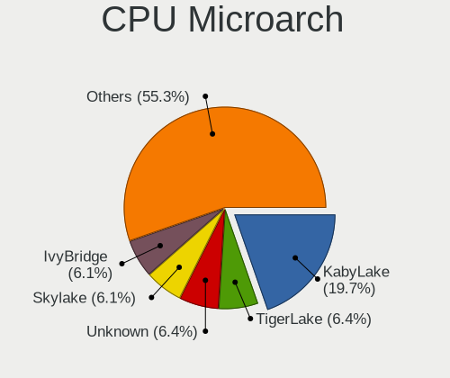

| Name             | Notebooks | Percent |
|------------------|-----------|---------|
| KabyLake         | 96        | 19.67%  |
| TigerLake        | 31        | 6.35%   |
| Unknown          | 31        | 6.35%   |
| Skylake          | 30        | 6.15%   |
| IvyBridge        | 30        | 6.15%   |
| SandyBridge      | 29        | 5.94%   |
| Haswell          | 23        | 4.71%   |
| Penryn           | 22        | 4.51%   |
| Silvermont       | 21        | 4.3%    |
| Westmere         | 17        | 3.48%   |
| Zen+             | 15        | 3.07%   |
| Zen 3            | 13        | 2.66%   |
| Zen 2            | 13        | 2.66%   |
| Core             | 13        | 2.66%   |
| Goldmont plus    | 12        | 2.46%   |
| Alderlake Hybrid | 12        | 2.46%   |
| CometLake        | 11        | 2.25%   |
| IceLake          | 10        | 2.05%   |
| Excavator        | 10        | 2.05%   |
| Broadwell        | 10        | 2.05%   |
| Zen              | 5         | 1.02%   |
| P6               | 4         | 0.82%   |
| Goldmont         | 4         | 0.82%   |
| Bonnell          | 4         | 0.82%   |
| Bobcat           | 4         | 0.82%   |
| Puma             | 3         | 0.61%   |
| K8 Hammer        | 3         | 0.61%   |
| Jaguar           | 3         | 0.61%   |
| Piledriver       | 2         | 0.41%   |
| Nehalem          | 2         | 0.41%   |
| K10              | 2         | 0.41%   |
| Steamroller      | 1         | 0.2%    |
| K8 & K10 hybrid  | 1         | 0.2%    |
| Gracemont        | 1         | 0.2%    |

Graphics
--------

GPU Vendor
----------

Vendors of graphics cards

| Vendor | Notebooks | Percent |
|--------|-----------|---------|
| Intel  | 356       | 60.44%  |
| Nvidia | 132       | 22.41%  |
| AMD    | 101       | 17.15%  |

GPU Model
---------

Graphics card models

| Model                                                                                    | Notebooks | Percent |
|------------------------------------------------------------------------------------------|-----------|---------|
| Intel 3rd Gen Core processor Graphics Controller                                         | 29        | 4.8%    |
| Intel TigerLake-LP GT2 [Iris Xe Graphics]                                                | 26        | 4.3%    |
| Intel 2nd Generation Core Processor Family Integrated Graphics Controller                | 26        | 4.3%    |
| Intel UHD Graphics 620                                                                   | 20        | 3.31%   |
| Intel HD Graphics 620                                                                    | 19        | 3.15%   |
| Intel Skylake GT2 [HD Graphics 520]                                                      | 17        | 2.81%   |
| Intel CometLake-U GT2 [UHD Graphics]                                                     | 16        | 2.65%   |
| Intel WhiskeyLake-U GT2 [UHD Graphics 620]                                               | 15        | 2.48%   |
| AMD Picasso/Raven 2 [Radeon Vega Series / Radeon Vega Mobile Series]                     | 15        | 2.48%   |
| Intel Mobile 4 Series Chipset Integrated Graphics Controller                             | 14        | 2.32%   |
| Intel Haswell-ULT Integrated Graphics Controller                                         | 13        | 2.15%   |
| Intel Core Processor Integrated Graphics Controller                                      | 13        | 2.15%   |
| Intel Atom Processor Z36xxx/Z37xxx Series Graphics & Display                             | 12        | 1.99%   |
| Intel CometLake-H GT2 [UHD Graphics]                                                     | 11        | 1.82%   |
| AMD Renoir [Radeon Vega Series / Radeon Vega Mobile Series]                              | 11        | 1.82%   |
| Intel GeminiLake [UHD Graphics 600]                                                      | 10        | 1.66%   |
| AMD Cezanne [Radeon Vega Series / Radeon Vega Mobile Series]                             | 10        | 1.66%   |
| Intel Raptor Lake-P [Iris Xe Graphics]                                                   | 9         | 1.49%   |
| Intel HD Graphics 630                                                                    | 9         | 1.49%   |
| Intel CoffeeLake-H GT2 [UHD Graphics 630]                                                | 9         | 1.49%   |
| Intel Atom/Celeron/Pentium Processor x5-E8000/J3xxx/N3xxx Integrated Graphics Controller | 9         | 1.49%   |
| Intel Alder Lake-P GT2 [Iris Xe Graphics]                                                | 8         | 1.32%   |
| Nvidia GP108M [GeForce MX150]                                                            | 7         | 1.16%   |
| Intel HD Graphics 5500                                                                   | 7         | 1.16%   |
| Intel 4th Gen Core Processor Integrated Graphics Controller                              | 7         | 1.16%   |
| AMD VanGogh [AMD Custom GPU 0405]                                                        | 7         | 1.16%   |
| Nvidia C79 [GeForce 9400M]                                                               | 6         | 0.99%   |
| AMD Stoney [Radeon R2/R3/R4/R5 Graphics]                                                 | 6         | 0.99%   |
| Nvidia TU117M [GeForce GTX 1650 Mobile / Max-Q]                                          | 4         | 0.66%   |
| Nvidia GP107M [GeForce GTX 1050 Mobile]                                                  | 4         | 0.66%   |
| Nvidia GA106M [GeForce RTX 3060 Mobile / Max-Q]                                          | 4         | 0.66%   |
| Nvidia G96CM [GeForce 9600M GT]                                                          | 4         | 0.66%   |
| Intel TigerLake-H GT1 [UHD Graphics]                                                     | 4         | 0.66%   |
| Intel Iris Plus Graphics G7                                                              | 4         | 0.66%   |
| Intel HD Graphics 530                                                                    | 4         | 0.66%   |
| Intel HD Graphics 500                                                                    | 4         | 0.66%   |
| Intel Atom Processor D4xx/D5xx/N4xx/N5xx Integrated Graphics Controller                  | 4         | 0.66%   |
| Intel Alder Lake-UP3 GT2 [Iris Xe Graphics]                                              | 4         | 0.66%   |
| AMD Wani [Radeon R5/R6/R7 Graphics]                                                      | 4         | 0.66%   |
| AMD Topaz XT [Radeon R7 M260/M265 / M340/M360 / M440/M445 / 530/535 / 620/625 Mobile]    | 4         | 0.66%   |

GPU Combo
---------

Combinations of graphics cards

| Name           | Notebooks | Percent |
|----------------|-----------|---------|
| 1 x Intel      | 262       | 53.58%  |
| Intel + Nvidia | 84        | 17.18%  |
| 1 x AMD        | 74        | 15.13%  |
| 1 x Nvidia     | 38        | 7.77%   |
| AMD + Nvidia   | 10        | 2.04%   |
| 2 x AMD        | 8         | 1.64%   |
| Intel + AMD    | 8         | 1.64%   |
| 2 x Intel      | 3         | 0.61%   |
| Other          | 1         | 0.2%    |
| 2 x Nvidia     | 1         | 0.2%    |

GPU Driver
----------

Free vs proprietary

| Driver      | Notebooks | Percent |
|-------------|-----------|---------|
| Free        | 403       | 81.91%  |
| Proprietary | 65        | 13.21%  |
| Unknown     | 24        | 4.88%   |

GPU Memory
----------

Total video memory

| Size in GB | Notebooks | Percent |
|------------|-----------|---------|
| Unknown    | 345       | 68.86%  |
| 0.01-0.5   | 59        | 11.78%  |
| 1.01-2.0   | 31        | 6.19%   |
| 3.01-4.0   | 28        | 5.59%   |
| 0.51-1.0   | 24        | 4.79%   |
| 7.01-8.0   | 6         | 1.2%    |
| 5.01-6.0   | 6         | 1.2%    |
| 2.01-3.0   | 2         | 0.4%    |

Monitor
-------

Monitor Vendor
--------------

Monitor vendors

| Vendor                  | Notebooks | Percent |
|-------------------------|-----------|---------|
| AU Optronics            | 91        | 16.02%  |
| BOE                     | 88        | 15.49%  |
| LG Display              | 81        | 14.26%  |
| Chimei Innolux          | 65        | 11.44%  |
| Samsung Electronics     | 45        | 7.92%   |
| Dell                    | 35        | 6.16%   |
| Sharp                   | 26        | 4.58%   |
| Lenovo                  | 12        | 2.11%   |
| Apple                   | 12        | 2.11%   |
| Chi Mei Optoelectronics | 10        | 1.76%   |
| Acer                    | 10        | 1.76%   |
| ViewSonic               | 9         | 1.58%   |
| PANDA                   | 9         | 1.58%   |
| Hewlett-Packard         | 8         | 1.41%   |
| Goldstar                | 8         | 1.41%   |
| Valve                   | 7         | 1.23%   |
| LG Philips              | 7         | 1.23%   |
| Philips                 | 6         | 1.06%   |
| InfoVision              | 6         | 1.06%   |
| AOC                     | 5         | 0.88%   |
| KDB                     | 3         | 0.53%   |
| CSO                     | 3         | 0.53%   |
| BenQ                    | 3         | 0.53%   |
| MSI                     | 2         | 0.35%   |
| CPT                     | 2         | 0.35%   |
| BOE Technology Group    | 2         | 0.35%   |
| ___                     | 1         | 0.18%   |
| Vestel Elektronik       | 1         | 0.18%   |
| Unknown                 | 1         | 0.18%   |
| TVW                     | 1         | 0.18%   |
| Toshiba                 | 1         | 0.18%   |
| Quanta Display          | 1         | 0.18%   |
| OEM                     | 1         | 0.18%   |
| LGD                     | 1         | 0.18%   |
| Lenovo Group Limited    | 1         | 0.18%   |
| Iiyama                  | 1         | 0.18%   |
| HUAWEI                  | 1         | 0.18%   |
| ASUSTek Computer        | 1         | 0.18%   |
| Analogix                | 1         | 0.18%   |

Monitor Model
-------------

Monitor models

| Model                                                                 | Notebooks | Percent |
|-----------------------------------------------------------------------|-----------|---------|
| BOE LCD Monitor BOE091D 1920x1080 309x174mm 14.0-inch                 | 9         | 1.55%   |
| ViewSonic VP2756-2K VSCE63B 2560x1440 597x336mm 27.0-inch             | 8         | 1.37%   |
| Dell P2217H DELA0D8 1920x1080 476x267mm 21.5-inch                     | 8         | 1.37%   |
| Valve ANX7530 U VLV3001 800x1280 100x150mm 7.1-inch                   | 6         | 1.03%   |
| Samsung Electronics LCD Monitor SEC5441 1280x800 286x179mm 13.3-inch  | 5         | 0.86%   |
| LG Display LCD Monitor LGD02DC 1366x768 344x194mm 15.5-inch           | 5         | 0.86%   |
| Chimei Innolux LCD Monitor CMN15E7 1920x1080 344x193mm 15.5-inch      | 5         | 0.86%   |
| Chimei Innolux LCD Monitor CMN15D5 1920x1080 344x193mm 15.5-inch      | 5         | 0.86%   |
| AU Optronics LCD Monitor AUO38ED 1920x1080 344x193mm 15.5-inch        | 5         | 0.86%   |
| AU Optronics LCD Monitor AUO2E3C 1366x768 309x173mm 13.9-inch         | 5         | 0.86%   |
| LG Display LCD Monitor LGD033A 1366x768 340x190mm 15.3-inch           | 4         | 0.69%   |
| AU Optronics LCD Monitor AUO106C 1366x768 277x156mm 12.5-inch         | 4         | 0.69%   |
| Sharp LQ156M1JW01 SHP14C3 1920x1080 344x194mm 15.5-inch               | 3         | 0.52%   |
| LG Display LP156WH1-TLA3 LGD01C2 1366x768 344x194mm 15.5-inch         | 3         | 0.52%   |
| LG Display LCD Monitor LGD04E8 1920x1080 382x215mm 17.3-inch          | 3         | 0.52%   |
| LG Display LCD Monitor LGD04A7 1920x1080 344x194mm 15.5-inch          | 3         | 0.52%   |
| LG Display LCD Monitor LGD0382 1600x900 309x174mm 14.0-inch           | 3         | 0.52%   |
| LG Display LCD Monitor LGD02D8 1366x768 277x156mm 12.5-inch           | 3         | 0.52%   |
| Lenovo LCD Monitor LEN4036 1440x900 303x189mm 14.1-inch               | 3         | 0.52%   |
| KDB LCD Monitor KDB0526 1920x1080 344x194mm 15.5-inch                 | 3         | 0.52%   |
| Dell P2417H DELA0DB 1920x1080 527x296mm 23.8-inch                     | 3         | 0.52%   |
| Chimei Innolux LCD Monitor CMN14C3 1366x768 309x173mm 13.9-inch       | 3         | 0.52%   |
| BOE LCD Monitor BOE0812 1920x1080 344x194mm 15.5-inch                 | 3         | 0.52%   |
| AU Optronics LCD Monitor AUO243D 1920x1080 309x173mm 13.9-inch        | 3         | 0.52%   |
| Acer KA220Q B ACR0A30 1920x1080 476x267mm 21.5-inch                   | 3         | 0.52%   |
| Sharp LCD Monitor SHP1547 1920x1200 288x180mm 13.4-inch               | 2         | 0.34%   |
| Sharp LCD Monitor SHP14D1 1920x1200 336x210mm 15.6-inch               | 2         | 0.34%   |
| Sharp LCD Monitor SHP14CC 3840x2400 288x180mm 13.4-inch               | 2         | 0.34%   |
| Sharp LCD Monitor SHP14AE 1920x1080 294x165mm 13.3-inch               | 2         | 0.34%   |
| Sharp LCD Monitor SHP1449 1920x1080 294x165mm 13.3-inch               | 2         | 0.34%   |
| Samsung Electronics S24D300 SAM0B43 1920x1080 531x299mm 24.0-inch     | 2         | 0.34%   |
| Samsung Electronics S22F350 SAM0D1A 1920x1080 477x268mm 21.5-inch     | 2         | 0.34%   |
| Samsung Electronics LCD Monitor SEC324C 1600x900 310x174mm 14.0-inch  | 2         | 0.34%   |
| Samsung Electronics LCD Monitor SDC4171 2880x1800 302x189mm 14.0-inch | 2         | 0.34%   |
| Samsung Electronics LCD Monitor SDC414D 3456x2160 336x210mm 15.6-inch | 2         | 0.34%   |
| Philips PHL 243V5 PHLC0D1 1920x1080 521x293mm 23.5-inch               | 2         | 0.34%   |
| PANDA LCD Monitor NCP0036 1920x1080 344x194mm 15.5-inch               | 2         | 0.34%   |
| LG Philips LCD Monitor LPLA104 1440x900 367x230mm 17.1-inch           | 2         | 0.34%   |
| LG Display LCD Monitor LGD05C0 1920x1080 344x194mm 15.5-inch          | 2         | 0.34%   |
| LG Display LCD Monitor LGD0533 1920x1080 344x194mm 15.5-inch          | 2         | 0.34%   |

Monitor Resolution
------------------

Monitor screen resolution

| Resolution         | Notebooks | Percent |
|--------------------|-----------|---------|
| 1920x1080 (FHD)    | 242       | 45.75%  |
| 1366x768 (WXGA)    | 127       | 24.01%  |
| 3840x2160 (4K)     | 22        | 4.16%   |
| 1600x900 (HD+)     | 20        | 3.78%   |
| 1280x800 (WXGA)    | 17        | 3.21%   |
| 2560x1440 (QHD)    | 16        | 3.02%   |
| 1920x1200 (WUXGA)  | 15        | 2.84%   |
| 1440x900 (WXGA+)   | 12        | 2.27%   |
| 800x1280           | 8         | 1.51%   |
| 2560x1600          | 8         | 1.51%   |
| 2880x1800          | 6         | 1.13%   |
| 3440x1440          | 5         | 0.95%   |
| 1280x1024 (SXGA)   | 4         | 0.76%   |
| 1024x600           | 4         | 0.76%   |
| 3840x2400          | 3         | 0.57%   |
| 3456x2160          | 3         | 0.57%   |
| 3200x1800 (QHD+)   | 3         | 0.57%   |
| 1680x1050 (WSXGA+) | 3         | 0.57%   |
| 2160x1440          | 2         | 0.38%   |
| 1920x540           | 2         | 0.38%   |
| 1600x1200          | 2         | 0.38%   |
| 1360x768           | 2         | 0.38%   |
| 3840x1080          | 1         | 0.19%   |
| 2560x1080          | 1         | 0.19%   |
| 2256x1504          | 1         | 0.19%   |

Monitor Diagonal
----------------

Diagonal size in inches

| Inches  | Notebooks | Percent |
|---------|-----------|---------|
| 15      | 218       | 37.98%  |
| 14      | 79        | 13.76%  |
| 13      | 76        | 13.24%  |
| 27      | 29        | 5.05%   |
| 17      | 29        | 5.05%   |
| 24      | 24        | 4.18%   |
| 21      | 23        | 4.01%   |
| 12      | 22        | 3.83%   |
| 23      | 11        | 1.92%   |
| 11      | 9         | 1.57%   |
| Unknown | 8         | 1.39%   |
| 16      | 7         | 1.22%   |
| 7       | 7         | 1.22%   |
| 34      | 6         | 1.05%   |
| 31      | 4         | 0.7%    |
| 10      | 4         | 0.7%    |
| 29      | 2         | 0.35%   |
| 22      | 2         | 0.35%   |
| 19      | 2         | 0.35%   |
| 18      | 2         | 0.35%   |
| 84      | 1         | 0.17%   |
| 72      | 1         | 0.17%   |
| 48      | 1         | 0.17%   |
| 40      | 1         | 0.17%   |
| 39      | 1         | 0.17%   |
| 32      | 1         | 0.17%   |
| 26      | 1         | 0.17%   |
| 25      | 1         | 0.17%   |
| 20      | 1         | 0.17%   |
| 3       | 1         | 0.17%   |

Monitor Width
-------------

Physical width

| Width in mm | Notebooks | Percent |
|-------------|-----------|---------|
| 301-350     | 324       | 57.14%  |
| 201-300     | 82        | 14.46%  |
| 501-600     | 57        | 10.05%  |
| 351-400     | 37        | 6.53%   |
| 401-500     | 28        | 4.94%   |
| 601-700     | 11        | 1.94%   |
| 1-100       | 8         | 1.41%   |
| Unknown     | 8         | 1.41%   |
| 701-800     | 7         | 1.23%   |
| 1501-2000   | 2         | 0.35%   |
| 801-900     | 1         | 0.18%   |
| 1001-1500   | 1         | 0.18%   |
| 901-1000    | 1         | 0.18%   |

Aspect Ratio
------------

Proportional relationship between the width and the height

| Ratio   | Notebooks | Percent |
|---------|-----------|---------|
| 16/9    | 395       | 80.28%  |
| 16/10   | 63        | 12.8%   |
| 21/9    | 8         | 1.63%   |
| Unknown | 7         | 1.42%   |
| 0.67    | 6         | 1.22%   |
| 5/4     | 4         | 0.81%   |
| 3/2     | 4         | 0.81%   |
| 4/3     | 2         | 0.41%   |
| 6/5     | 1         | 0.2%    |
| 32/9    | 1         | 0.2%    |
| 0.62    | 1         | 0.2%    |

Monitor Area
------------

Area in inch

| Area in inch | Notebooks | Percent |
|----------------|-----------|---------|
| 101-110        | 215       | 37.65%  |
| 81-90          | 119       | 20.84%  |
| 201-250        | 47        | 8.23%   |
| 71-80          | 37        | 6.48%   |
| 301-350        | 31        | 5.43%   |
| 121-130        | 22        | 3.85%   |
| 61-70          | 21        | 3.68%   |
| 351-500        | 11        | 1.93%   |
| 51-60          | 9         | 1.58%   |
| 151-200        | 9         | 1.58%   |
| 111-120        | 9         | 1.58%   |
| 1-40           | 8         | 1.4%    |
| Unknown        | 8         | 1.4%    |
| 251-300        | 6         | 1.05%   |
| 131-140        | 5         | 0.88%   |
| 41-50          | 4         | 0.7%    |
| 141-150        | 4         | 0.7%    |
| 501-1000       | 3         | 0.53%   |
| More than 1000 | 2         | 0.35%   |
| 91-100         | 1         | 0.18%   |

Pixel Density
-------------

Pixels per inch

| Density       | Notebooks | Percent |
|---------------|-----------|---------|
| 121-160       | 244       | 44.04%  |
| 101-120       | 146       | 26.35%  |
| 51-100        | 79        | 14.26%  |
| 161-240       | 51        | 9.21%   |
| More than 240 | 24        | 4.33%   |
| Unknown       | 8         | 1.44%   |
| 1-50          | 2         | 0.36%   |

Multiple Monitors
-----------------

Total monitors connected

| Total | Notebooks | Percent |
|-------|-----------|---------|
| 1     | 384       | 76.8%   |
| 2     | 77        | 15.4%   |
| 3     | 21        | 4.2%    |
| 0     | 17        | 3.4%    |
| 4     | 1         | 0.2%    |

Network
-------

Net Controller Vendor
---------------------

Controller vendors

| Vendor                            | Notebooks | Percent |
|-----------------------------------|-----------|---------|
| Intel                             | 278       | 36.15%  |
| Realtek Semiconductor             | 235       | 30.56%  |
| Qualcomm Atheros                  | 92        | 11.96%  |
| Broadcom                          | 55        | 7.15%   |
| MediaTek                          | 15        | 1.95%   |
| Broadcom Limited                  | 12        | 1.56%   |
| Nvidia                            | 10        | 1.3%    |
| Ralink Technology                 | 8         | 1.04%   |
| ASIX Electronics                  | 7         | 0.91%   |
| Marvell Technology Group          | 6         | 0.78%   |
| Ericsson Business Mobile Networks | 6         | 0.78%   |
| Lenovo                            | 5         | 0.65%   |
| DisplayLink                       | 5         | 0.65%   |
| Xiaomi                            | 4         | 0.52%   |
| Samsung Electronics               | 4         | 0.52%   |
| Ralink                            | 3         | 0.39%   |
| Qualcomm                          | 3         | 0.39%   |
| Dell                              | 3         | 0.39%   |
| Microsoft                         | 2         | 0.26%   |
| Xilinx                            | 1         | 0.13%   |
| TP-Link                           | 1         | 0.13%   |
| Toshiba                           | 1         | 0.13%   |
| T & A Mobile Phones               | 1         | 0.13%   |
| Sierra Wireless                   | 1         | 0.13%   |
| Qualcomm Atheros Communications   | 1         | 0.13%   |
| OnePlus Technology (Shenzhen)     | 1         | 0.13%   |
| NetGear                           | 1         | 0.13%   |
| Motorola PCS                      | 1         | 0.13%   |
| LSI                               | 1         | 0.13%   |
| ICS Advent                        | 1         | 0.13%   |
| Hewlett-Packard                   | 1         | 0.13%   |
| Bose                              | 1         | 0.13%   |
| ASUSTek Computer                  | 1         | 0.13%   |
| Apple                             | 1         | 0.13%   |
| 3Com                              | 1         | 0.13%   |

Net Controller Model
--------------------

Controller models

| Model                                                                   | Notebooks | Percent |
|-------------------------------------------------------------------------|-----------|---------|
| Realtek RTL8111/8168/8211/8411 PCI Express Gigabit Ethernet Controller  | 121       | 13.02%  |
| Realtek RTL810xE PCI Express Fast Ethernet controller                   | 41        | 4.41%   |
| Realtek RTL8153 Gigabit Ethernet Adapter                                | 36        | 3.88%   |
| Qualcomm Atheros QCA9377 802.11ac Wireless Network Adapter              | 26        | 2.8%    |
| Intel Wi-Fi 6 AX200                                                     | 26        | 2.8%    |
| Intel 82579LM Gigabit Network Connection (Lewisville)                   | 24        | 2.58%   |
| Intel Centrino Advanced-N 6205 [Taylor Peak]                            | 22        | 2.37%   |
| Intel Wi-Fi 6 AX201                                                     | 21        | 2.26%   |
| Realtek RTL8822CE 802.11ac PCIe Wireless Network Adapter                | 17        | 1.83%   |
| Intel Wireless 8265 / 8275                                              | 17        | 1.83%   |
| Realtek RTL8821CE 802.11ac PCIe Wireless Network Adapter                | 16        | 1.72%   |
| Intel Wireless 8260                                                     | 16        | 1.72%   |
| Intel Wireless 7260                                                     | 16        | 1.72%   |
| Qualcomm Atheros AR9485 Wireless Network Adapter                        | 13        | 1.4%    |
| Qualcomm Atheros QCA9565 / AR9565 Wireless Network Adapter              | 12        | 1.29%   |
| Qualcomm Atheros AR9285 Wireless Network Adapter (PCI-Express)          | 11        | 1.18%   |
| Intel Comet Lake PCH-LP CNVi WiFi                                       | 10        | 1.08%   |
| Intel Comet Lake PCH CNVi WiFi                                          | 10        | 1.08%   |
| Intel Alder Lake-P PCH CNVi WiFi                                        | 10        | 1.08%   |
| MediaTek MT7921 802.11ax PCI Express Wireless Network Adapter           | 9         | 0.97%   |
| Intel Wireless 7265                                                     | 9         | 0.97%   |
| Intel Wireless 3165                                                     | 9         | 0.97%   |
| Intel Ethernet Connection I218-LM                                       | 9         | 0.97%   |
| Intel Raptor Lake PCH CNVi WiFi                                         | 8         | 0.86%   |
| Intel Dual Band Wireless-AC 3165 Plus Bluetooth                         | 8         | 0.86%   |
| Intel Cannon Point-LP CNVi [Wireless-AC]                                | 8         | 0.86%   |
| Intel Cannon Lake PCH CNVi WiFi                                         | 8         | 0.86%   |
| Qualcomm Atheros QCA6174 802.11ac Wireless Network Adapter              | 7         | 0.75%   |
| Nvidia MCP79 Ethernet                                                   | 7         | 0.75%   |
| Intel Wi-Fi 6E(802.11ax) AX210/AX1675* 2x2 [Typhoon Peak]               | 7         | 0.75%   |
| Broadcom BCM4322 802.11a/b/g/n Wireless LAN Controller                  | 7         | 0.75%   |
| Broadcom BCM43142 802.11b/g/n                                           | 7         | 0.75%   |
| Realtek RTL8723BE PCIe Wireless Network Adapter                         | 6         | 0.65%   |
| Intel Ice Lake-LP PCH CNVi WiFi                                         | 6         | 0.65%   |
| Intel Ethernet Connection I217-LM                                       | 6         | 0.65%   |
| Intel Ethernet Connection (4) I219-LM                                   | 6         | 0.65%   |
| Intel 82577LM Gigabit Network Connection                                | 6         | 0.65%   |
| Qualcomm Atheros AR242x / AR542x Wireless Network Adapter (PCI-Express) | 5         | 0.54%   |
| MediaTek MT7922 802.11ax PCI Express Wireless Network Adapter           | 5         | 0.54%   |
| Intel Wi-Fi 5(802.11ac) Wireless-AC 9x6x [Thunder Peak]                 | 5         | 0.54%   |

Wireless Vendor
---------------

Wireless vendors

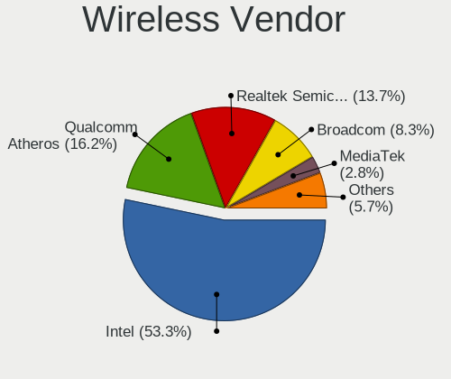

| Vendor                          | Notebooks | Percent |
|---------------------------------|-----------|---------|
| Intel                           | 269       | 53.27%  |
| Qualcomm Atheros                | 82        | 16.24%  |
| Realtek Semiconductor           | 69        | 13.66%  |
| Broadcom                        | 42        | 8.32%   |
| MediaTek                        | 14        | 2.77%   |
| Ralink Technology               | 8         | 1.58%   |
| Broadcom Limited                | 5         | 0.99%   |
| Ralink                          | 3         | 0.59%   |
| Qualcomm                        | 3         | 0.59%   |
| Dell                            | 3         | 0.59%   |
| TP-Link                         | 1         | 0.2%    |
| Sierra Wireless                 | 1         | 0.2%    |
| Qualcomm Atheros Communications | 1         | 0.2%    |
| NetGear                         | 1         | 0.2%    |
| Microsoft                       | 1         | 0.2%    |
| ASUSTek Computer                | 1         | 0.2%    |
| Apple                           | 1         | 0.2%    |

Wireless Model
--------------

Wireless models

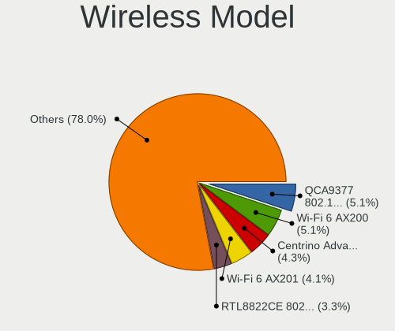

| Model                                                                   | Notebooks | Percent |
|-------------------------------------------------------------------------|-----------|---------|
| Qualcomm Atheros QCA9377 802.11ac Wireless Network Adapter              | 26        | 5.12%   |
| Intel Wi-Fi 6 AX200                                                     | 26        | 5.12%   |
| Intel Centrino Advanced-N 6205 [Taylor Peak]                            | 22        | 4.33%   |
| Intel Wi-Fi 6 AX201                                                     | 21        | 4.13%   |
| Realtek RTL8822CE 802.11ac PCIe Wireless Network Adapter                | 17        | 3.35%   |
| Intel Wireless 8265 / 8275                                              | 17        | 3.35%   |
| Realtek RTL8821CE 802.11ac PCIe Wireless Network Adapter                | 16        | 3.15%   |
| Intel Wireless 8260                                                     | 16        | 3.15%   |
| Intel Wireless 7260                                                     | 16        | 3.15%   |
| Qualcomm Atheros AR9485 Wireless Network Adapter                        | 13        | 2.56%   |
| Qualcomm Atheros QCA9565 / AR9565 Wireless Network Adapter              | 12        | 2.36%   |
| Qualcomm Atheros AR9285 Wireless Network Adapter (PCI-Express)          | 11        | 2.17%   |
| Intel Comet Lake PCH-LP CNVi WiFi                                       | 10        | 1.97%   |
| Intel Comet Lake PCH CNVi WiFi                                          | 10        | 1.97%   |
| Intel Alder Lake-P PCH CNVi WiFi                                        | 10        | 1.97%   |
| MediaTek MT7921 802.11ax PCI Express Wireless Network Adapter           | 9         | 1.77%   |
| Intel Wireless 7265                                                     | 9         | 1.77%   |
| Intel Wireless 3165                                                     | 9         | 1.77%   |
| Intel Raptor Lake PCH CNVi WiFi                                         | 8         | 1.57%   |
| Intel Dual Band Wireless-AC 3165 Plus Bluetooth                         | 8         | 1.57%   |
| Intel Cannon Point-LP CNVi [Wireless-AC]                                | 8         | 1.57%   |
| Intel Cannon Lake PCH CNVi WiFi                                         | 8         | 1.57%   |
| Qualcomm Atheros QCA6174 802.11ac Wireless Network Adapter              | 7         | 1.38%   |
| Intel Wi-Fi 6E(802.11ax) AX210/AX1675* 2x2 [Typhoon Peak]               | 7         | 1.38%   |
| Broadcom BCM4322 802.11a/b/g/n Wireless LAN Controller                  | 7         | 1.38%   |
| Broadcom BCM43142 802.11b/g/n                                           | 7         | 1.38%   |
| Realtek RTL8723BE PCIe Wireless Network Adapter                         | 6         | 1.18%   |
| Intel Ice Lake-LP PCH CNVi WiFi                                         | 6         | 1.18%   |
| Qualcomm Atheros AR242x / AR542x Wireless Network Adapter (PCI-Express) | 5         | 0.98%   |
| Intel Wi-Fi 5(802.11ac) Wireless-AC 9x6x [Thunder Peak]                 | 5         | 0.98%   |
| Realtek RTL8822BE 802.11a/b/g/n/ac WiFi adapter                         | 4         | 0.79%   |
| MediaTek MT7922 802.11ax PCI Express Wireless Network Adapter           | 4         | 0.79%   |
| Intel Wireless 3160                                                     | 4         | 0.79%   |
| Intel WiFi Link 5100                                                    | 4         | 0.79%   |
| Intel Tiger Lake PCH CNVi WiFi                                          | 4         | 0.79%   |
| Intel PRO/Wireless 3945ABG [Golan] Network Connection                   | 4         | 0.79%   |
| Intel Dual Band Wireless-AC 3168NGW [Stone Peak]                        | 4         | 0.79%   |
| Intel Centrino Ultimate-N 6300                                          | 4         | 0.79%   |
| Intel Centrino Advanced-N 6200                                          | 4         | 0.79%   |
| Broadcom BCM43602 802.11ac Wireless LAN SoC                             | 4         | 0.79%   |

Ethernet Vendor
---------------

Ethernet vendors

| Vendor                        | Notebooks | Percent |
|-------------------------------|-----------|---------|
| Realtek Semiconductor         | 202       | 50.25%  |
| Intel                         | 107       | 26.62%  |
| Qualcomm Atheros              | 20        | 4.98%   |
| Broadcom                      | 18        | 4.48%   |
| Nvidia                        | 10        | 2.49%   |
| Broadcom Limited              | 8         | 1.99%   |
| ASIX Electronics              | 7         | 1.74%   |
| Marvell Technology Group      | 6         | 1.49%   |
| Lenovo                        | 5         | 1.24%   |
| DisplayLink                   | 5         | 1.24%   |
| Xiaomi                        | 4         | 1%      |
| Samsung Electronics           | 2         | 0.5%    |
| Xilinx                        | 1         | 0.25%   |
| T & A Mobile Phones           | 1         | 0.25%   |
| OnePlus Technology (Shenzhen) | 1         | 0.25%   |
| Motorola PCS                  | 1         | 0.25%   |
| Microsoft                     | 1         | 0.25%   |
| MediaTek                      | 1         | 0.25%   |
| ICS Advent                    | 1         | 0.25%   |
| 3Com                          | 1         | 0.25%   |

Ethernet Model
--------------

Ethernet models

| Model                                                                  | Notebooks | Percent |
|------------------------------------------------------------------------|-----------|---------|
| Realtek RTL8111/8168/8211/8411 PCI Express Gigabit Ethernet Controller | 121       | 29.66%  |
| Realtek RTL810xE PCI Express Fast Ethernet controller                  | 41        | 10.05%  |
| Realtek RTL8153 Gigabit Ethernet Adapter                               | 36        | 8.82%   |
| Intel 82579LM Gigabit Network Connection (Lewisville)                  | 24        | 5.88%   |
| Intel Ethernet Connection I218-LM                                      | 9         | 2.21%   |
| Nvidia MCP79 Ethernet                                                  | 7         | 1.72%   |
| Intel Ethernet Connection I217-LM                                      | 6         | 1.47%   |
| Intel Ethernet Connection (4) I219-LM                                  | 6         | 1.47%   |
| Intel 82577LM Gigabit Network Connection                               | 6         | 1.47%   |
| Intel Ethernet Connection I219-LM                                      | 5         | 1.23%   |
| Intel Ethernet Connection (4) I219-V                                   | 5         | 1.23%   |
| ASIX AX88179 Gigabit Ethernet                                          | 5         | 1.23%   |
| Xiaomi Mi/Redmi series (RNDIS)                                         | 4         | 0.98%   |
| Qualcomm Atheros QCA8171 Gigabit Ethernet                              | 4         | 0.98%   |
| Qualcomm Atheros Killer E2500 Gigabit Ethernet Controller              | 4         | 0.98%   |
| Marvell Group 88E8040 PCI-E Fast Ethernet Controller                   | 4         | 0.98%   |
| Intel Ethernet Connection I219-V                                       | 4         | 0.98%   |
| Intel Ethernet Connection (6) I219-LM                                  | 4         | 0.98%   |
| Intel 82567LM Gigabit Network Connection                               | 4         | 0.98%   |
| Broadcom NetLink BCM57785 Gigabit Ethernet PCIe                        | 4         | 0.98%   |
| Realtek Killer E2600 GbE Controller                                    | 3         | 0.74%   |
| Qualcomm Atheros AR8132 Fast Ethernet                                  | 3         | 0.74%   |
| Intel Ethernet Connection (3) I218-LM                                  | 3         | 0.74%   |
| Intel Ethernet Connection (2) I219-LM                                  | 3         | 0.74%   |
| Intel Ethernet Connection (11) I219-LM                                 | 3         | 0.74%   |
| Intel Ethernet Connection (10) I219-V                                  | 3         | 0.74%   |
| Broadcom NetLink BCM57780 Gigabit Ethernet PCIe                        | 3         | 0.74%   |
| Broadcom Limited NetLink BCM57780 Gigabit Ethernet PCIe                | 3         | 0.74%   |
| Samsung Galaxy series, misc. (tethering mode)                          | 2         | 0.49%   |
| Realtek Killer E3000 2.5GbE Controller                                 | 2         | 0.49%   |
| Realtek Killer E2500 Gigabit Ethernet Controller                       | 2         | 0.49%   |
| Qualcomm Atheros AR8162 Fast Ethernet                                  | 2         | 0.49%   |
| Qualcomm Atheros AR8151 v2.0 Gigabit Ethernet                          | 2         | 0.49%   |
| Marvell Group 88E8053 PCI-E Gigabit Ethernet Controller                | 2         | 0.49%   |
| Intel Ethernet Connection (7) I219-LM                                  | 2         | 0.49%   |
| Intel Ethernet Connection (6) I219-V                                   | 2         | 0.49%   |
| Intel Ethernet Connection (16) I219-V                                  | 2         | 0.49%   |
| Intel Ethernet Connection (13) I219-V                                  | 2         | 0.49%   |
| Intel Ethernet Connection (13) I219-LM                                 | 2         | 0.49%   |
| Intel Ethernet Connection (10) I219-LM                                 | 2         | 0.49%   |

Net Controller Kind
-------------------

Ethernet, WiFi or modem

| Kind     | Notebooks | Percent |
|----------|-----------|---------|
| WiFi     | 479       | 54.93%  |
| Ethernet | 380       | 43.58%  |
| Modem    | 13        | 1.49%   |

Used Controller
---------------

Currently used network controller

| Kind     | Notebooks | Percent |
|----------|-----------|---------|
| WiFi     | 397       | 77.69%  |
| Ethernet | 114       | 22.31%  |

NICs
----

Total network controllers on board

| Total | Notebooks | Percent |
|-------|-----------|---------|
| 2     | 329       | 67.42%  |
| 1     | 147       | 30.12%  |
| 0     | 8         | 1.64%   |
| 3     | 4         | 0.82%   |

IPv6
----

IPv6 vs IPv4

| Used | Notebooks | Percent |
|------|-----------|---------|
| No   | 405       | 81.49%  |
| Yes  | 92        | 18.51%  |

Bluetooth
---------

Bluetooth Vendor
----------------

Controller vendors

| Vendor                          | Notebooks | Percent |
|---------------------------------|-----------|---------|
| Intel                           | 210       | 52.63%  |
| Realtek Semiconductor           | 37        | 9.27%   |
| Qualcomm Atheros Communications | 28        | 7.02%   |
| IMC Networks                    | 26        | 6.52%   |
| Broadcom                        | 22        | 5.51%   |
| Lite-On Technology              | 17        | 4.26%   |
| Foxconn / Hon Hai               | 12        | 3.01%   |
| Dell                            | 10        | 2.51%   |
| Apple                           | 9         | 2.26%   |
| Toshiba                         | 7         | 1.75%   |
| Hewlett-Packard                 | 6         | 1.5%    |
| Cambridge Silicon Radio         | 6         | 1.5%    |
| Realtek                         | 4         | 1%      |
| Foxconn International           | 2         | 0.5%    |
| Ralink                          | 1         | 0.25%   |
| MediaTek                        | 1         | 0.25%   |
| ASUSTek Computer                | 1         | 0.25%   |

Bluetooth Model
---------------

Controller models

| Model                                               | Notebooks | Percent |
|-----------------------------------------------------|-----------|---------|
| Intel Bluetooth wireless interface                  | 73        | 18.25%  |
| Intel AX201 Bluetooth                               | 50        | 12.5%   |
| Realtek Bluetooth Radio                             | 25        | 6.25%   |
| Intel AX200 Bluetooth                               | 24        | 6%      |
| Intel Bluetooth 9460/9560 Jefferson Peak (JfP)      | 23        | 5.75%   |
| Qualcomm Atheros  Bluetooth Device                  | 17        | 4.25%   |
| Intel AX211 Bluetooth                               | 17        | 4.25%   |
| IMC Networks Bluetooth Radio                        | 14        | 3.5%    |
| Broadcom BCM20702 Bluetooth 4.0 [ThinkPad]          | 8         | 2%      |
| Lite-On Qualcomm Atheros QCA9377 Bluetooth          | 7         | 1.75%   |
| Intel Centrino Bluetooth Wireless Transceiver       | 7         | 1.75%   |
| Apple Bluetooth Host Controller                     | 7         | 1.75%   |
| Realtek  Bluetooth 4.2 Adapter                      | 6         | 1.5%    |
| Intel AX210 Bluetooth                               | 6         | 1.5%    |
| IMC Networks Wireless_Device                        | 6         | 1.5%    |
| Dell DW375 Bluetooth Module                         | 6         | 1.5%    |
| Cambridge Silicon Radio Bluetooth Dongle (HCI mode) | 6         | 1.5%    |
| Intel Wireless-AC 9260 Bluetooth Adapter            | 5         | 1.25%   |
| Broadcom BCM2045B (BDC-2.1)                         | 5         | 1.25%   |
| Realtek Bluetooth Radio                             | 4         | 1%      |
| Qualcomm Atheros QCA61x4 Bluetooth 4.0              | 4         | 1%      |
| Qualcomm Atheros AR3012 Bluetooth 4.0               | 4         | 1%      |
| Intel Wireless-AC 3168 Bluetooth                    | 4         | 1%      |
| IMC Networks Bluetooth Device                       | 4         | 1%      |
| HP Broadcom 2070 Bluetooth Combo                    | 4         | 1%      |
| Foxconn / Hon Hai MediaTek Bluetooth Adapter        | 4         | 1%      |
| Toshiba Bluetooth Device                            | 3         | 0.75%   |
| Realtek RTL8821A Bluetooth                          | 3         | 0.75%   |
| Qualcomm Atheros AR3011 Bluetooth                   | 3         | 0.75%   |
| Lite-On Wireless_Device                             | 3         | 0.75%   |
| Lite-On Atheros AR3012 Bluetooth                    | 3         | 0.75%   |
| Foxconn / Hon Hai Bluetooth Device                  | 3         | 0.75%   |
| Toshiba Atheros AR3012 Bluetooth                    | 2         | 0.5%    |
| Realtek 802.11ac WLAN Adapter                       | 2         | 0.5%    |
| Intel Centrino Advanced-N 6230 Bluetooth adapter    | 2         | 0.5%    |
| IMC Networks Atheros AR3012 Bluetooth 4.0 Adapter   | 2         | 0.5%    |
| Foxconn International BCM43142A0 Bluetooth module   | 2         | 0.5%    |
| Foxconn / Hon Hai Wireless_Device                   | 2         | 0.5%    |
| Dell Wireless 355 Bluetooth                         | 2         | 0.5%    |
| Broadcom BCM43142A0 Bluetooth 4.0                   | 2         | 0.5%    |

Sound
-----

Sound Vendor
------------

Sound card vendors

| Vendor                 | Notebooks | Percent |
|------------------------|-----------|---------|
| Intel                  | 383       | 62.38%  |
| AMD                    | 94        | 15.31%  |
| Nvidia                 | 86        | 14.01%  |
| Realtek Semiconductor  | 12        | 1.95%   |
| Plantronics            | 7         | 1.14%   |
| GN Netcom              | 6         | 0.98%   |
| C-Media Electronics    | 4         | 0.65%   |
| Logitech               | 3         | 0.49%   |
| Lenovo                 | 3         | 0.49%   |
| Sony                   | 2         | 0.33%   |
| RODE Microphones       | 2         | 0.33%   |
| Kingston Technology    | 2         | 0.33%   |
| VIA Technologies       | 1         | 0.16%   |
| No brand               | 1         | 0.16%   |
| Huawei Technologies    | 1         | 0.16%   |
| Generalplus Technology | 1         | 0.16%   |
| ESS Technology         | 1         | 0.16%   |
| Dell                   | 1         | 0.16%   |
| Creative Technology    | 1         | 0.16%   |
| Conexant Systems       | 1         | 0.16%   |
| bestechnic             | 1         | 0.16%   |
| AUDIOLAB               | 1         | 0.16%   |

Sound Model
-----------

Sound card models

| Model                                                                                             | Notebooks | Percent |
|---------------------------------------------------------------------------------------------------|-----------|---------|
| Intel Sunrise Point-LP HD Audio                                                                   | 64        | 8.94%   |
| AMD Family 17h/19h/1ah HD Audio Controller                                                        | 49        | 6.84%   |
| Intel 7 Series/C216 Chipset Family High Definition Audio Controller                               | 35        | 4.89%   |
| Intel Tiger Lake-LP Smart Sound Technology Audio Controller                                       | 29        | 4.05%   |
| Intel 6 Series/C200 Series Chipset Family High Definition Audio Controller                        | 24        | 3.35%   |
| AMD Renoir Radeon High Definition Audio Controller                                                | 24        | 3.35%   |
| Intel 5 Series/3400 Series Chipset High Definition Audio                                          | 19        | 2.65%   |
| Intel 82801I (ICH9 Family) HD Audio Controller                                                    | 18        | 2.51%   |
| Intel Comet Lake PCH-LP cAVS                                                                      | 17        | 2.37%   |
| AMD Raven/Raven2/Fenghuang HDMI/DP Audio Controller                                               | 17        | 2.37%   |
| Intel Cannon Point-LP High Definition Audio Controller                                            | 15        | 2.09%   |
| Intel Haswell-ULT HD Audio Controller                                                             | 13        | 1.82%   |
| Intel Alder Lake PCH-P High Definition Audio Controller                                           | 13        | 1.82%   |
| Intel 8 Series HD Audio Controller                                                                | 13        | 1.82%   |
| Realtek Semiconductor USB Audio                                                                   | 12        | 1.68%   |
| Intel Celeron/Pentium Silver Processor High Definition Audio                                      | 12        | 1.68%   |
| Intel Cannon Lake PCH cAVS                                                                        | 12        | 1.68%   |
| AMD Rembrandt Radeon High Definition Audio Controller                                             | 12        | 1.68%   |
| AMD FCH Azalia Controller                                                                         | 12        | 1.68%   |
| Intel Comet Lake PCH cAVS                                                                         | 11        | 1.54%   |
| Intel Wildcat Point-LP High Definition Audio Controller                                           | 10        | 1.4%    |
| Intel Broadwell-U Audio Controller                                                                | 10        | 1.4%    |
| Intel Atom Processor Z36xxx/Z37xxx Series High Definition Audio Controller                        | 10        | 1.4%    |
| Intel 8 Series/C220 Series Chipset High Definition Audio Controller                               | 10        | 1.4%    |
| AMD Kabini HDMI/DP Audio                                                                          | 10        | 1.4%    |
| Intel Raptor Lake-P/U/H cAVS                                                                      | 9         | 1.26%   |
| Intel CM238 HD Audio Controller                                                                   | 9         | 1.26%   |
| AMD Family 15h (Models 60h-6fh) Audio Controller                                                  | 9         | 1.26%   |
| Nvidia GF108 High Definition Audio Controller                                                     | 8         | 1.12%   |
| Intel NM10/ICH7 Family High Definition Audio Controller                                           | 8         | 1.12%   |
| Intel 100 Series/C230 Series Chipset Family HD Audio Controller                                   | 8         | 1.12%   |
| Plantronics Poly Voyager Focus 2 Series                                                           | 7         | 0.98%   |
| Nvidia TU106 High Definition Audio Controller                                                     | 7         | 0.98%   |
| Nvidia MCP79 High Definition Audio                                                                | 7         | 0.98%   |
| Intel Ice Lake-LP Smart Sound Technology Audio Controller                                         | 7         | 0.98%   |
| Intel Atom/Celeron/Pentium Processor x5-E8000/J3xxx/N3xxx Series High Definition Audio Controller | 7         | 0.98%   |
| Intel 82801H (ICH8 Family) HD Audio Controller                                                    | 7         | 0.98%   |
| Nvidia GP106 High Definition Audio Controller                                                     | 6         | 0.84%   |
| Nvidia GM107 High Definition Audio Controller [GeForce 940MX]                                     | 6         | 0.84%   |
| Intel Xeon E3-1200 v3/4th Gen Core Processor HD Audio Controller                                  | 6         | 0.84%   |

Memory
------

Memory Vendor
-------------

Memory module vendors

| Vendor              | Notebooks | Percent |
|---------------------|-----------|---------|
| Samsung Electronics | 93        | 29.52%  |
| SK hynix            | 73        | 23.17%  |
| Micron Technology   | 40        | 12.7%   |
| Kingston            | 24        | 7.62%   |
| Crucial             | 21        | 6.67%   |
| Unknown             | 17        | 5.4%    |
| Ramaxel Technology  | 10        | 3.17%   |
| Corsair             | 8         | 2.54%   |
| Elpida              | 5         | 1.59%   |
| Nanya Technology    | 4         | 1.27%   |
| Unknown (ABCD)      | 3         | 0.95%   |
| Unknown             | 3         | 0.95%   |
| G.Skill             | 2         | 0.63%   |
| Apacer              | 2         | 0.63%   |
| A-DATA Technology   | 2         | 0.63%   |
| Transcend           | 1         | 0.32%   |
| Silicon Power       | 1         | 0.32%   |
| SHARETRONIC         | 1         | 0.32%   |
| Patriot             | 1         | 0.32%   |
| CXMT                | 1         | 0.32%   |
| CSX                 | 1         | 0.32%   |
| A Force             | 1         | 0.32%   |
| 4ea5                | 1         | 0.32%   |

Memory Model
------------

Memory module models

| Model                                                            | Notebooks | Percent |
|------------------------------------------------------------------|-----------|---------|
| Samsung RAM M471A5244CB0-CTD 4GB SODIMM DDR4 3266MT/s            | 9         | 2.74%   |
| SK hynix RAM HMT41GS6BFR8A-PB 8GB SODIMM DDR3 1600MT/s           | 6         | 1.82%   |
| Samsung RAM M471A2K43DB1-CWE 16GB SODIMM DDR4 3200MT/s           | 6         | 1.82%   |
| Samsung RAM M471B5173QH0-YK0 4GB SODIMM DDR3 1600MT/s            | 5         | 1.52%   |
| SK hynix RAM HMT351S6CFR8C-PB 4GB SODIMM DDR3 1600MT/s           | 4         | 1.22%   |
| SK hynix RAM HMA851S6CJR6N-VK 4GB SODIMM DDR4 2667MT/s           | 4         | 1.22%   |
| SK hynix RAM HMA81GS6AFR8N-UH 8GB SODIMM DDR4 2667MT/s           | 4         | 1.22%   |
| Samsung RAM M471B1G73QH0-YK0 8GB SODIMM DDR3 1600MT/s            | 4         | 1.22%   |
| Samsung RAM M471A5244CB0-CRC 4GB SODIMM DDR4 2667MT/s            | 4         | 1.22%   |
| Unknown (ABCD) RAM 123456789012345678 2GB SODIMM LPDDR3 2400MT/s | 3         | 0.91%   |
| SK hynix RAM HMAA2GS6CJR8N-XN 16GB SODIMM DDR4 3200MT/s          | 3         | 0.91%   |
| SK hynix RAM HMA81GS6DJR8N-XN 8GB SODIMM DDR4 3200MT/s           | 3         | 0.91%   |
| Samsung RAM M471A2K43CB1-CTD 16GB SODIMM DDR4 8400MT/s           | 3         | 0.91%   |
| Samsung RAM M471A1G44BB0-CWE 8GB SODIMM DDR4 3200MT/s            | 3         | 0.91%   |
| Samsung RAM M471A1G44AB0-CWE 8GB SODIMM DDR4 3200MT/s            | 3         | 0.91%   |
| Micron RAM 8ATF1G64HZ-2G3E1 8GB SODIMM DDR4 2400MT/s             | 3         | 0.91%   |
| Crucial RAM CT8G4SFS824A.C8FN 8GB SODIMM DDR4 2400MT/s           | 3         | 0.91%   |
| Corsair RAM CM4X16GE2666C18S4 16GB SODIMM DDR4 2667MT/s          | 3         | 0.91%   |
| Unknown                                                          | 3         | 0.91%   |
| SK hynix RAM HMT451S6BFR8A-PB 4GB SODIMM DDR3 1600MT/s           | 2         | 0.61%   |
| SK hynix RAM HMT451S6AFR8A-PB 4GB SODIMM DDR3 1600MT/s           | 2         | 0.61%   |
| SK hynix RAM HMT41GS6AFR8A-PB 8GB SODIMM DDR3 2667MT/s           | 2         | 0.61%   |
| SK hynix RAM HMAA1GS6CJR6N-XN 8GB SODIMM DDR4 3200MT/s           | 2         | 0.61%   |
| SK hynix RAM HMA851S6CJR6N-XN 4GB SODIMM DDR4 3200MT/s           | 2         | 0.61%   |
| SK hynix RAM HMA851S6CJR6N-VK 4GB Row Of Chips DDR4 2667MT/s     | 2         | 0.61%   |
| SK hynix RAM HMA82GS6AFR8N-UH 16GB SODIMM DDR4 2667MT/s          | 2         | 0.61%   |
| SK hynix RAM H9JCNNNCP3MLYR-N6E 2GB Row Of Chips LPDDR5 6400MT/s | 2         | 0.61%   |
| Samsung RAM M471B5273DH0-CH9 4GB SODIMM DDR3 1334MT/s            | 2         | 0.61%   |
| Samsung RAM M471B5273CH0-CH9 4GB SODIMM DDR3 1334MT/s            | 2         | 0.61%   |
| Samsung RAM M471B1G73EB0-YK0 8GB SODIMM DDR3 1600MT/s            | 2         | 0.61%   |
| Samsung RAM M471B1G73DB0-YK0 8GB SODIMM DDR3 1600MT/s            | 2         | 0.61%   |
| Samsung RAM M471A5244CB0-CWE 4096MB SODIMM DDR4 3200MT/s         | 2         | 0.61%   |
| Samsung RAM M471A5244BB0-CPB 4GB SODIMM DDR4 2400MT/s            | 2         | 0.61%   |
| Samsung RAM M471A2G44AM0-CWE 16GB SODIMM DDR4 3200MT/s           | 2         | 0.61%   |
| Samsung RAM M471A1K43EB1-CWE 8GB SODIMM DDR4 3200MT/s            | 2         | 0.61%   |
| Samsung RAM M471A1K43DB1-CWE 8GB SODIMM DDR4 3200MT/s            | 2         | 0.61%   |
| Samsung RAM M471A1K43DB1-CTD 8GB SODIMM DDR4 2667MT/s            | 2         | 0.61%   |
| Samsung RAM M471A1K43CB1-CRC 8GB SODIMM DDR4 2667MT/s            | 2         | 0.61%   |
| Samsung RAM M471A1K43BB1-CRC 8GB SODIMM DDR4 2667MT/s            | 2         | 0.61%   |
| Ramaxel RAM RMT3160ED58E9W1600 4GB SODIMM DDR3 1600MT/s          | 2         | 0.61%   |

Memory Kind
-----------

Memory module kinds

| Kind    | Notebooks | Percent |
|---------|-----------|---------|
| DDR4    | 143       | 53.16%  |
| DDR3    | 68        | 25.28%  |
| LPDDR4  | 17        | 6.32%   |
| DDR2    | 11        | 4.09%   |
| LPDDR3  | 10        | 3.72%   |
| LPDDR5  | 6         | 2.23%   |
| SDRAM   | 5         | 1.86%   |
| DDR5    | 4         | 1.49%   |
| DRAM    | 2         | 0.74%   |
| DDR     | 2         | 0.74%   |
| Unknown | 1         | 0.37%   |

Memory Form Factor
------------------

Physical design of the memory module

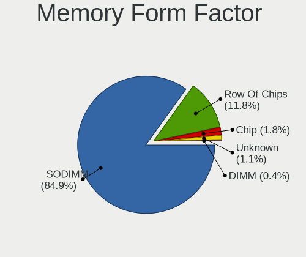

| Name         | Notebooks | Percent |
|--------------|-----------|---------|
| SODIMM       | 231       | 84.93%  |
| Row Of Chips | 32        | 11.76%  |
| Chip         | 5         | 1.84%   |
| Unknown      | 3         | 1.1%    |
| DIMM         | 1         | 0.37%   |

Memory Size
-----------

Memory module size

| Size  | Notebooks | Percent |
|-------|-----------|---------|
| 8192  | 113       | 38.7%   |
| 4096  | 84        | 28.77%  |
| 16384 | 50        | 17.12%  |
| 2048  | 27        | 9.25%   |
| 32768 | 9         | 3.08%   |
| 1024  | 7         | 2.4%    |
| 256   | 1         | 0.34%   |
| 128   | 1         | 0.34%   |

Memory Speed
------------

Memory module speed

| Speed   | Notebooks | Percent |
|---------|-----------|---------|
| 2667    | 57        | 19.26%  |
| 3200    | 55        | 18.58%  |
| 1600    | 48        | 16.22%  |
| 2400    | 28        | 9.46%   |
| 2133    | 17        | 5.74%   |
| 1334    | 13        | 4.39%   |
| 4267    | 9         | 3.04%   |
| 3266    | 9         | 3.04%   |
| 1333    | 7         | 2.36%   |
| 800     | 7         | 2.36%   |
| 667     | 7         | 2.36%   |
| 1867    | 6         | 2.03%   |
| 1067    | 5         | 1.69%   |
| 6400    | 4         | 1.35%   |
| 8400    | 3         | 1.01%   |
| 4800    | 3         | 1.01%   |
| 4266    | 3         | 1.01%   |
| 4199    | 2         | 0.68%   |
| 2267    | 2         | 0.68%   |
| 2048    | 2         | 0.68%   |
| 975     | 2         | 0.68%   |
| Unknown | 2         | 0.68%   |
| 7500    | 1         | 0.34%   |
| 7467    | 1         | 0.34%   |
| 5600    | 1         | 0.34%   |
| 3600    | 1         | 0.34%   |
| 533     | 1         | 0.34%   |

Printers & scanners
-------------------

Printer Vendor
--------------

Printer device vendors

| Vendor             | Notebooks | Percent |
|--------------------|-----------|---------|
| STMicroelectronics | 1         | 50%     |
| Brother Industries | 1         | 50%     |

Printer Model
-------------

Printer device models

| Model                                                     | Notebooks | Percent |
|-----------------------------------------------------------|-----------|---------|
| STMicroelectronics LED badge -- mini LED display -- 11x44 | 1         | 50%     |
| Brother HL-L2340D series                                  | 1         | 50%     |

Scanner Vendor
--------------

Scanner device vendors

Zero info for selected period =(

Scanner Model
-------------

Scanner device models

Zero info for selected period =(

Camera
------

Camera Vendor
-------------

Camera device vendors

| Vendor                                 | Notebooks | Percent |
|----------------------------------------|-----------|---------|
| Chicony Electronics                    | 105       | 23.81%  |
| Realtek Semiconductor                  | 52        | 11.79%  |
| IMC Networks                           | 50        | 11.34%  |
| Microdia                               | 47        | 10.66%  |
| Bison Electronics                      | 32        | 7.26%   |
| Sunplus Innovation Technology          | 31        | 7.03%   |
| Quanta                                 | 22        | 4.99%   |
| Logitech                               | 11        | 2.49%   |
| Cheng Uei Precision Industry (Foxlink) | 11        | 2.49%   |
| Apple                                  | 10        | 2.27%   |
| Suyin                                  | 7         | 1.59%   |
| Samsung Electronics                    | 7         | 1.59%   |
| Lite-On Technology                     | 7         | 1.59%   |
| Acer                                   | 6         | 1.36%   |
| Sonix Technology                       | 5         | 1.13%   |
| Ricoh                                  | 5         | 1.13%   |
| ALi                                    | 5         | 1.13%   |
| Syntek                                 | 4         | 0.91%   |
| Silicon Motion                         | 4         | 0.91%   |
| SunplusIT                              | 3         | 0.68%   |
| Alcor Micro                            | 3         | 0.68%   |
| Microsoft                              | 2         | 0.45%   |
| Lenovo                                 | 2         | 0.45%   |
| Z-Star Microelectronics                | 1         | 0.23%   |
| Y Media                                | 1         | 0.23%   |
| Trust                                  | 1         | 0.23%   |
| Shenzhen Kingcome Optoelectronic       | 1         | 0.23%   |
| Nokia Mobile Phones                    | 1         | 0.23%   |
| Nikon                                  | 1         | 0.23%   |
| Luxvisions Innotech Limited            | 1         | 0.23%   |
| LianYi                                 | 1         | 0.23%   |
| DigiTech                               | 1         | 0.23%   |
| 2M UVC CAMERA                          | 1         | 0.23%   |

Camera Model
------------

Camera device models

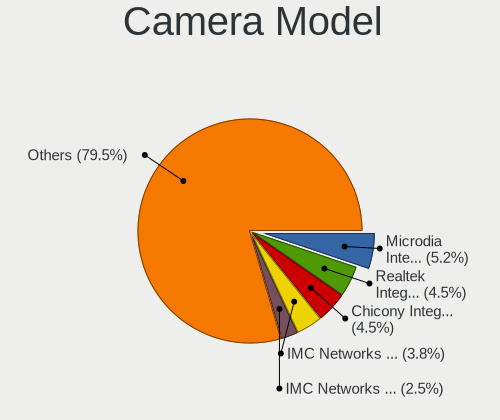

| Model                                            | Notebooks | Percent |
|--------------------------------------------------|-----------|---------|
| Microdia Integrated_Webcam_HD                    | 23        | 5.18%   |
| Realtek Integrated_Webcam_HD                     | 20        | 4.5%    |
| Chicony Integrated Camera                        | 20        | 4.5%    |
| IMC Networks Integrated Camera                   | 17        | 3.83%   |
| IMC Networks USB2.0 HD UVC WebCam                | 11        | 2.48%   |
| Bison Integrated Camera                          | 11        | 2.48%   |
| Sunplus Integrated_Webcam_FHD                    | 9         | 2.03%   |
| Sunplus Integrated_Webcam_HD                     | 8         | 1.8%    |
| Chicony USB2.0 Camera                            | 8         | 1.8%    |
| Chicony HD WebCam                                | 8         | 1.8%    |
| Samsung Galaxy series, misc. (MTP mode)          | 7         | 1.58%   |
| Apple Built-in iSight                            | 7         | 1.58%   |
| Microdia Integrated Webcam                       | 6         | 1.35%   |
| Lite-On HP HD Camera                             | 5         | 1.13%   |
| IMC Networks EasyCamera                          | 5         | 1.13%   |
| Bison EasyCamera                                 | 5         | 1.13%   |
| Realtek Integrated_Webcam_FHD                    | 4         | 0.9%    |
| Realtek Integrated Webcam HD                     | 4         | 0.9%    |
| Chicony USB2.0 HD UVC WebCam                     | 4         | 0.9%    |
| Chicony TOSHIBA Web Camera - HD                  | 4         | 0.9%    |
| Chicony Integrated Camera (1280x720@30)          | 4         | 0.9%    |
| Chicony HP Wide Vision HD Camera                 | 4         | 0.9%    |
| Chicony HP HD Camera                             | 4         | 0.9%    |
| Bison BisonCam, NB Pro                           | 4         | 0.9%    |
| Sunplus Laptop_Integrated_Webcam_FHD             | 3         | 0.68%   |
| Realtek USB2.0 HD UVC WebCam                     | 3         | 0.68%   |
| Realtek Integrated Webcam                        | 3         | 0.68%   |
| Realtek EasyCamera                               | 3         | 0.68%   |
| Quanta HP HD Camera                              | 3         | 0.68%   |
| Quanta HD User Facing                            | 3         | 0.68%   |
| Quanta ACER HD User Facing                       | 3         | 0.68%   |
| Microdia Webcam Vitade AF                        | 3         | 0.68%   |
| Microdia Laptop_Integrated_Webcam_2M             | 3         | 0.68%   |
| Logitech HD Pro Webcam C920                      | 3         | 0.68%   |
| IMC Networks USB2.0 VGA UVC WebCam               | 3         | 0.68%   |
| Chicony VGA Webcam                               | 3         | 0.68%   |
| Chicony thinkpad t430s camera                    | 3         | 0.68%   |
| Chicony Lenovo EasyCamera                        | 3         | 0.68%   |
| Chicony HP TrueVision HD Camera                  | 3         | 0.68%   |
| Cheng Uei Precision Industry (Foxlink) HP Webcam | 3         | 0.68%   |

Security
--------

Fingerprint Vendor
------------------

Fingerprint sensor vendors

| Vendor                     | Notebooks | Percent |
|----------------------------|-----------|---------|
| Synaptics                  | 32        | 35.16%  |
| Validity Sensors           | 27        | 29.67%  |
| Shenzhen Goodix Technology | 14        | 15.38%  |
| Upek                       | 5         | 5.49%   |
| Elan Microelectronics      | 4         | 4.4%    |
| AuthenTec                  | 4         | 4.4%    |
| LighTuning Technology      | 3         | 3.3%    |
| STMicroelectronics         | 1         | 1.1%    |
| Focal-systems.Corp         | 1         | 1.1%    |

Fingerprint Model
-----------------

Fingerprint sensor models

| Model                                                     | Notebooks | Percent |
|-----------------------------------------------------------|-----------|---------|
| Synaptics Prometheus MIS Touch Fingerprint Reader         | 8         | 8.79%   |
| Validity Sensors VFS495 Fingerprint Reader                | 7         | 7.69%   |
| Shenzhen Goodix FingerPrint                               | 6         | 6.59%   |
| Upek Biometric Touchchip/Touchstrip Fingerprint Sensor    | 5         | 5.49%   |
| Synaptics Fingerprint reader [HP G6]                      | 5         | 5.49%   |
| Unknown                                                   | 5         | 5.49%   |
| Shenzhen Goodix  Fingerprint Device                       | 4         | 4.4%    |
| Shenzhen Goodix Fingerprint Reader                        | 4         | 4.4%    |
| Validity Sensors VFS5011 Fingerprint Reader               | 3         | 3.3%    |
| Validity Sensors VFS451 Fingerprint Reader                | 3         | 3.3%    |
| Synaptics Metallica MIS Touch Fingerprint Reader          | 3         | 3.3%    |
| LighTuning ES603 Swipe Fingerprint Sensor                 | 3         | 3.3%    |
| Elan ELAN:ARM-M4                                          | 3         | 3.3%    |
| AuthenTec Fingerprint Sensor                              | 3         | 3.3%    |
| Validity Sensors VFS7500 Touch Fingerprint Sensor         | 2         | 2.2%    |
| Validity Sensors VFS471 Fingerprint Reader                | 2         | 2.2%    |
| Validity Sensors VFS101 Fingerprint Reader                | 2         | 2.2%    |
| Validity Sensors Synaptics WBDI                           | 2         | 2.2%    |
| Synaptics WBDI Fingerprint Reader USB 086                 | 2         | 2.2%    |
| Synaptics Metallica MOH Touch Fingerprint Reader          | 2         | 2.2%    |
| Validity Sensors VFS7552 Touch Fingerprint Sensor         | 1         | 1.1%    |
| Validity Sensors VFS301 Fingerprint Reader                | 1         | 1.1%    |
| Validity Sensors VFS300 Fingerprint Reader                | 1         | 1.1%    |
| Validity Sensors VFS 5011 fingerprint sensor              | 1         | 1.1%    |
| Validity Sensors Swipe Fingerprint Sensor                 | 1         | 1.1%    |
| Validity Sensors Fingerprint scanner                      | 1         | 1.1%    |
| Synaptics WBDI Device                                     | 1         | 1.1%    |
| Synaptics WBDI                                            | 1         | 1.1%    |
| Synaptics UWP WBDI Device                                 | 1         | 1.1%    |
| Synaptics TouchPad                                        | 1         | 1.1%    |
| Synaptics  WBDI                                           | 1         | 1.1%    |
| Synaptics  FS7604 Touch Fingerprint Sensor with PurePrint | 1         | 1.1%    |
| Synaptics FS7604 Touch Fingerprint Sensor with PurePrint  | 1         | 1.1%    |
| STMicroelectronics Fingerprint Reader                     | 1         | 1.1%    |
| Focal-systems.Corp FT9201Fingerprint.                 | 1         | 1.1%    |
| Elan ELAN:Fingerprint                                     | 1         | 1.1%    |
| AuthenTec AES2810                                         | 1         | 1.1%    |

Chipcard Vendor
---------------

Chipcard module vendors

| Vendor                | Notebooks | Percent |
|-----------------------|-----------|---------|
| Broadcom              | 41        | 63.08%  |
| Alcor Micro           | 9         | 13.85%  |
| Upek                  | 7         | 10.77%  |
| O2 Micro              | 5         | 7.69%   |
| Lenovo                | 2         | 3.08%   |
| Gemalto (was Gemplus) | 1         | 1.54%   |

Chipcard Model
--------------

Chipcard module models

| Model                                                                        | Notebooks | Percent |
|------------------------------------------------------------------------------|-----------|---------|
| Broadcom 58200                                                               | 20        | 30.77%  |
| Broadcom BCM5880 Secure Applications Processor                               | 10        | 15.38%  |
| Alcor Micro AU9540 Smartcard Reader                                          | 9         | 13.85%  |
| Upek TouchChip Fingerprint Coprocessor (WBF advanced mode)                   | 7         | 10.77%  |
| Broadcom 5880                                                                | 6         | 9.23%   |
| Broadcom BCM5880 Secure Applications Processor with fingerprint swipe sensor | 5         | 7.69%   |
| O2 Micro OZ776 CCID Smartcard Reader                                         | 4         | 6.15%   |
| Lenovo Integrated Smart Card Reader                                          | 2         | 3.08%   |
| O2 Micro Oz776 SmartCard Reader                                              | 1         | 1.54%   |
| Gemalto (was Gemplus) GemPC Twin SmartCard Reader                            | 1         | 1.54%   |

Unsupported
-----------

Unsupported Devices
-------------------

Total unsupported devices on board

| Total | Notebooks | Percent |
|-------|-----------|---------|
| 0     | 278       | 55.16%  |
| 1     | 180       | 35.71%  |
| 2     | 38        | 7.54%   |
| 3     | 8         | 1.59%   |

Unsupported Device Types
------------------------

Types of unsupported devices

| Type                     | Notebooks | Percent |
|--------------------------|-----------|---------|
| Fingerprint reader       | 90        | 33.96%  |
| Chipcard                 | 59        | 22.26%  |
| Graphics card            | 53        | 20%     |
| Net/wireless             | 30        | 11.32%  |
| Camera                   | 8         | 3.02%   |
| Multimedia controller    | 7         | 2.64%   |
| Storage                  | 6         | 2.26%   |
| Communication controller | 4         | 1.51%   |
| Bluetooth                | 4         | 1.51%   |
| Card reader              | 3         | 1.13%   |
| Modem                    | 1         | 0.38%   |

