Linux in Ireland - Tested Hardware & Statistics
-----------------------------------------------

A project to collect tested hardware configurations for Linux in Ireland.

Anyone can contribute to this report by the [hw-probe](https://github.com/linuxhw/hw-probe) tool:

    sudo -E hw-probe -all -upload

Please contribute! Especially if your hardware is rare.

This is a report for all computer types. See also reports for [desktops](/Location/Ireland/Desktop/README.md) and [notebooks](/Location/Ireland/Notebook/README.md).

Contents
--------

* [ Test Cases ](#test-cases)

* [ System ](#system)
  - [ OS                       ](#os)
  - [ OS Family                ](#os-family)
  - [ Kernel                   ](#kernel)
  - [ Kernel Family            ](#kernel-family)
  - [ Kernel Major Ver.        ](#kernel-major-ver)
  - [ Arch                     ](#arch)
  - [ DE                       ](#de)
  - [ Display Server           ](#display-server)
  - [ Display Manager          ](#display-manager)
  - [ OS Lang                  ](#os-lang)
  - [ Boot Mode                ](#boot-mode)
  - [ Filesystem               ](#filesystem)
  - [ Part. scheme             ](#part-scheme)
  - [ Dual Boot with Linux/BSD ](#dual-boot-with-linuxbsd)
  - [ Dual Boot (Win)          ](#dual-boot-win)

* [ Board ](#board)
  - [ Vendor                   ](#vendor)
  - [ Model                    ](#model)
  - [ Model Family             ](#model-family)
  - [ MFG Year                 ](#mfg-year)
  - [ Form Factor              ](#form-factor)
  - [ Secure Boot              ](#secure-boot)
  - [ Coreboot                 ](#coreboot)
  - [ RAM Size                 ](#ram-size)
  - [ RAM Used                 ](#ram-used)
  - [ Total Drives             ](#total-drives)
  - [ Has CD-ROM               ](#has-cd-rom)
  - [ Has Ethernet             ](#has-ethernet)
  - [ Has WiFi                 ](#has-wifi)
  - [ Has Bluetooth            ](#has-bluetooth)

* [ Location ](#location)
  - [ Country                  ](#country)
  - [ City                     ](#city)

* [ Drives ](#drives)
  - [ Drive Vendor             ](#drive-vendor)
  - [ Drive Model              ](#drive-model)
  - [ HDD Vendor               ](#hdd-vendor)
  - [ SSD Vendor               ](#ssd-vendor)
  - [ Drive Kind               ](#drive-kind)
  - [ Drive Connector          ](#drive-connector)
  - [ Drive Size               ](#drive-size)
  - [ Space Total              ](#space-total)
  - [ Space Used               ](#space-used)
  - [ Malfunc. Drives          ](#malfunc-drives)
  - [ Malfunc. Drive Vendor    ](#malfunc-drive-vendor)
  - [ Malfunc. HDD Vendor      ](#malfunc-hdd-vendor)
  - [ Malfunc. Drive Kind      ](#malfunc-drive-kind)
  - [ Failed Drives            ](#failed-drives)
  - [ Failed Drive Vendor      ](#failed-drive-vendor)
  - [ Drive Status             ](#drive-status)

* [ Storage controller ](#storage-controller)
  - [ Storage Vendor           ](#storage-vendor)
  - [ Storage Model            ](#storage-model)
  - [ Storage Kind             ](#storage-kind)

* [ Processor ](#processor)
  - [ CPU Vendor               ](#cpu-vendor)
  - [ CPU Model                ](#cpu-model)
  - [ CPU Model Family         ](#cpu-model-family)
  - [ CPU Cores                ](#cpu-cores)
  - [ CPU Sockets              ](#cpu-sockets)
  - [ CPU Threads              ](#cpu-threads)
  - [ CPU Op-Modes             ](#cpu-op-modes)
  - [ CPU Microcode            ](#cpu-microcode)
  - [ CPU Microarch            ](#cpu-microarch)

* [ Graphics ](#graphics)
  - [ GPU Vendor               ](#gpu-vendor)
  - [ GPU Model                ](#gpu-model)
  - [ GPU Combo                ](#gpu-combo)
  - [ GPU Driver               ](#gpu-driver)
  - [ GPU Memory               ](#gpu-memory)

* [ Monitor ](#monitor)
  - [ Monitor Vendor           ](#monitor-vendor)
  - [ Monitor Model            ](#monitor-model)
  - [ Monitor Resolution       ](#monitor-resolution)
  - [ Monitor Diagonal         ](#monitor-diagonal)
  - [ Monitor Width            ](#monitor-width)
  - [ Aspect Ratio             ](#aspect-ratio)
  - [ Monitor Area             ](#monitor-area)
  - [ Pixel Density            ](#pixel-density)
  - [ Multiple Monitors        ](#multiple-monitors)

* [ Network ](#network)
  - [ Net Controller Vendor    ](#net-controller-vendor)
  - [ Net Controller Model     ](#net-controller-model)
  - [ Wireless Vendor          ](#wireless-vendor)
  - [ Wireless Model           ](#wireless-model)
  - [ Ethernet Vendor          ](#ethernet-vendor)
  - [ Ethernet Model           ](#ethernet-model)
  - [ Net Controller Kind      ](#net-controller-kind)
  - [ Used Controller          ](#used-controller)
  - [ NICs                     ](#nics)
  - [ IPv6                     ](#ipv6)

* [ Bluetooth ](#bluetooth)
  - [ Bluetooth Vendor         ](#bluetooth-vendor)
  - [ Bluetooth Model          ](#bluetooth-model)

* [ Sound ](#sound)
  - [ Sound Vendor             ](#sound-vendor)
  - [ Sound Model              ](#sound-model)

* [ Memory ](#memory)
  - [ Memory Vendor            ](#memory-vendor)
  - [ Memory Model             ](#memory-model)
  - [ Memory Kind              ](#memory-kind)
  - [ Memory Form Factor       ](#memory-form-factor)
  - [ Memory Size              ](#memory-size)
  - [ Memory Speed             ](#memory-speed)

* [ Printers & scanners ](#printers--scanners)
  - [ Printer Vendor           ](#printer-vendor)
  - [ Printer Model            ](#printer-model)
  - [ Scanner Vendor           ](#scanner-vendor)
  - [ Scanner Model            ](#scanner-model)

* [ Camera ](#camera)
  - [ Camera Vendor            ](#camera-vendor)
  - [ Camera Model             ](#camera-model)

* [ Security ](#security)
  - [ Fingerprint Vendor       ](#fingerprint-vendor)
  - [ Fingerprint Model        ](#fingerprint-model)
  - [ Chipcard Vendor          ](#chipcard-vendor)
  - [ Chipcard Model           ](#chipcard-model)

* [ Unsupported ](#unsupported)
  - [ Unsupported Devices      ](#unsupported-devices)
  - [ Unsupported Device Types ](#unsupported-device-types)

Test Cases
----------

Total: 756

| Vendor        | Model                       | Form-Factor | Probe                                                      | Date         |
|---------------|-----------------------------|-------------|------------------------------------------------------------|--------------|
| ASUSTek       | ZenBook UX425UAZ_UM425UA... | Notebook    | [8d33275e7b](https://linux-hardware.org/?probe=8d33275e7b) | Dec 31, 2022 |
| HP            | 21B4 A01                    | Desktop     | [cdc9730e81](https://linux-hardware.org/?probe=cdc9730e81) | Dec 31, 2022 |
| Apple         | Mac-F226BEC8 PVT            | All in one  | [e7ac43e8c3](https://linux-hardware.org/?probe=e7ac43e8c3) | Dec 31, 2022 |
| Apple         | Mac-F226BEC8 PVT            | All in one  | [4d613961a4](https://linux-hardware.org/?probe=4d613961a4) | Dec 31, 2022 |
| Apple         | Mac-F226BEC8 PVT            | All in one  | [1780cf9c13](https://linux-hardware.org/?probe=1780cf9c13) | Dec 29, 2022 |
| Apple         | Mac-F226BEC8 PVT            | All in one  | [c93684da4d](https://linux-hardware.org/?probe=c93684da4d) | Dec 29, 2022 |
| Apple         | Mac-F226BEC8 PVT            | All in one  | [5c9cadd190](https://linux-hardware.org/?probe=5c9cadd190) | Dec 28, 2022 |
| Apple         | Mac-F226BEC8 PVT            | All in one  | [5ea84f62cb](https://linux-hardware.org/?probe=5ea84f62cb) | Dec 25, 2022 |
| Apple         | Mac-F226BEC8 PVT            | All in one  | [3fc3ad1b46](https://linux-hardware.org/?probe=3fc3ad1b46) | Dec 25, 2022 |
| Apple         | Mac-F226BEC8 PVT            | All in one  | [afb738446f](https://linux-hardware.org/?probe=afb738446f) | Dec 24, 2022 |
| Apple         | Mac-F226BEC8 PVT            | All in one  | [91a9d07c9f](https://linux-hardware.org/?probe=91a9d07c9f) | Dec 22, 2022 |
| Intel         | DQ77CP AAG67261-300         | Desktop     | [908f619aa7](https://linux-hardware.org/?probe=908f619aa7) | Dec 21, 2022 |
| Gigabyte      | B85M-D3H                    | Desktop     | [0b63acf3b2](https://linux-hardware.org/?probe=0b63acf3b2) | Dec 20, 2022 |
| Apple         | Mac-F226BEC8 PVT            | All in one  | [660c9e5023](https://linux-hardware.org/?probe=660c9e5023) | Dec 20, 2022 |
| Apple         | Mac-F226BEC8 PVT            | All in one  | [54fbda3732](https://linux-hardware.org/?probe=54fbda3732) | Dec 20, 2022 |
| Gigabyte      | H110M-S2H-CF                | Desktop     | [cdbf94efce](https://linux-hardware.org/?probe=cdbf94efce) | Dec 19, 2022 |
| Apple         | Mac-F226BEC8 PVT            | All in one  | [da494e2be3](https://linux-hardware.org/?probe=da494e2be3) | Dec 19, 2022 |
| Apple         | Mac-F226BEC8 PVT            | All in one  | [1bd00059e2](https://linux-hardware.org/?probe=1bd00059e2) | Dec 17, 2022 |
| Apple         | Mac-F226BEC8 PVT            | All in one  | [7236ad8a5d](https://linux-hardware.org/?probe=7236ad8a5d) | Dec 17, 2022 |
| Dell          | Latitude 7420               | Notebook    | [60f07d5a45](https://linux-hardware.org/?probe=60f07d5a45) | Dec 16, 2022 |
| Dell          | Latitude 3310               | Notebook    | [4066d1434e](https://linux-hardware.org/?probe=4066d1434e) | Dec 16, 2022 |
| Apple         | Mac-F226BEC8 PVT            | All in one  | [2991f8736b](https://linux-hardware.org/?probe=2991f8736b) | Dec 16, 2022 |
| Apple         | Mac-F226BEC8 PVT            | All in one  | [69776fdb13](https://linux-hardware.org/?probe=69776fdb13) | Dec 16, 2022 |
| Apple         | Mac-F226BEC8 PVT            | All in one  | [09c89a9bef](https://linux-hardware.org/?probe=09c89a9bef) | Dec 15, 2022 |
| Apple         | Mac-F226BEC8 PVT            | All in one  | [ed707b6698](https://linux-hardware.org/?probe=ed707b6698) | Dec 13, 2022 |
| Apple         | Mac-F226BEC8 PVT            | All in one  | [c91212b8ed](https://linux-hardware.org/?probe=c91212b8ed) | Dec 11, 2022 |
| Dell          | Latitude E7240              | Notebook    | [632cda6ecd](https://linux-hardware.org/?probe=632cda6ecd) | Dec 07, 2022 |
| Apple         | Mac-F226BEC8 PVT            | All in one  | [88196a712d](https://linux-hardware.org/?probe=88196a712d) | Dec 07, 2022 |
| Dynabook      | Satellite Pro C50-H-11G     | Notebook    | [57e8e4ab79](https://linux-hardware.org/?probe=57e8e4ab79) | Dec 06, 2022 |
| ASUSTek       | X510UNR                     | Notebook    | [b85ac74a3f](https://linux-hardware.org/?probe=b85ac74a3f) | Dec 05, 2022 |
| Dell          | Latitude 7290               | Notebook    | [3f0e476980](https://linux-hardware.org/?probe=3f0e476980) | Dec 04, 2022 |
| HP            | EliteBook 845 G8 Noteboo... | Notebook    | [28ab0eb248](https://linux-hardware.org/?probe=28ab0eb248) | Dec 03, 2022 |
| Toshiba       | Satellite C50D-A-138        | Notebook    | [ccda846d5e](https://linux-hardware.org/?probe=ccda846d5e) | Dec 03, 2022 |
| Dell          | Inspiron 15-7568            | Notebook    | [9887f68589](https://linux-hardware.org/?probe=9887f68589) | Dec 03, 2022 |
| Acer          | Nitro AN515-46              | Notebook    | [7bdc87a5cc](https://linux-hardware.org/?probe=7bdc87a5cc) | Dec 02, 2022 |
| Acer          | Nitro AN515-46              | Notebook    | [d17ff52554](https://linux-hardware.org/?probe=d17ff52554) | Dec 02, 2022 |
| Apple         | Mac-F226BEC8 PVT            | All in one  | [080e04d17d](https://linux-hardware.org/?probe=080e04d17d) | Dec 02, 2022 |
| TUXEDO        | InfinityBook Pro 14 Gen6    | Notebook    | [946e66e35e](https://linux-hardware.org/?probe=946e66e35e) | Dec 01, 2022 |
| Apple         | Mac-F226BEC8 PVT            | All in one  | [c4ae439087](https://linux-hardware.org/?probe=c4ae439087) | Nov 30, 2022 |
| Apple         | Mac-F226BEC8 PVT            | All in one  | [5c395ef8a4](https://linux-hardware.org/?probe=5c395ef8a4) | Nov 26, 2022 |
| Intel         | NUC11PHBi7 M26151-402       | Mini pc     | [0c97f1e481](https://linux-hardware.org/?probe=0c97f1e481) | Nov 25, 2022 |
| Lenovo        | ThinkPad E15 Gen 4 21EDC... | Notebook    | [90fcc2d8d5](https://linux-hardware.org/?probe=90fcc2d8d5) | Nov 24, 2022 |
| Lenovo        | ThinkBook 14 G2 ITL 20VD    | Notebook    | [2c077b8cde](https://linux-hardware.org/?probe=2c077b8cde) | Nov 23, 2022 |
| Apple         | Mac-F226BEC8 PVT            | All in one  | [587e23a674](https://linux-hardware.org/?probe=587e23a674) | Nov 22, 2022 |
| Gigabyte      | H110M-S2H-CF                | Desktop     | [412c1923c5](https://linux-hardware.org/?probe=412c1923c5) | Nov 20, 2022 |
| ASUSTek       | TUF Gaming X570-PRO         | Desktop     | [f58f70b732](https://linux-hardware.org/?probe=f58f70b732) | Nov 19, 2022 |
| Acer          | Aspire A514-55              | Notebook    | [7bf0186e00](https://linux-hardware.org/?probe=7bf0186e00) | Nov 18, 2022 |
| Chuwi         | X312B                       | Notebook    | [b0c9263212](https://linux-hardware.org/?probe=b0c9263212) | Nov 17, 2022 |
| Apple         | Mac-F226BEC8 PVT            | All in one  | [a4ac6dbf9b](https://linux-hardware.org/?probe=a4ac6dbf9b) | Nov 17, 2022 |
| Chuwi         | X312B                       | Notebook    | [7583d01bd8](https://linux-hardware.org/?probe=7583d01bd8) | Nov 15, 2022 |
| Gigabyte      | A320M-S2H-CF                | Desktop     | [c3cacc3ed6](https://linux-hardware.org/?probe=c3cacc3ed6) | Nov 15, 2022 |
| Apple         | Mac-F226BEC8 PVT            | All in one  | [11dbbdfcc1](https://linux-hardware.org/?probe=11dbbdfcc1) | Nov 15, 2022 |
| Apple         | Mac-F226BEC8 PVT            | All in one  | [02aab6ab70](https://linux-hardware.org/?probe=02aab6ab70) | Nov 15, 2022 |
| Lenovo        | ThinkPad E15 Gen 4 21EDC... | Notebook    | [a174d2b2b3](https://linux-hardware.org/?probe=a174d2b2b3) | Nov 12, 2022 |
| Valve         | Jupiter                     | Notebook    | [ed3f6fb61d](https://linux-hardware.org/?probe=ed3f6fb61d) | Nov 12, 2022 |
| Valve         | Jupiter                     | Notebook    | [c1805091ef](https://linux-hardware.org/?probe=c1805091ef) | Nov 12, 2022 |
| Chuwi         | X312B                       | Notebook    | [0e6a368329](https://linux-hardware.org/?probe=0e6a368329) | Nov 12, 2022 |
| ASUSTek       | VivoBook_ASUSLaptop X513... | Notebook    | [5d2ae18b0a](https://linux-hardware.org/?probe=5d2ae18b0a) | Nov 10, 2022 |
| ASUSTek       | VivoBook_ASUSLaptop X513... | Notebook    | [51a3c87183](https://linux-hardware.org/?probe=51a3c87183) | Nov 10, 2022 |
| Apple         | Mac-F226BEC8 PVT            | All in one  | [74a1e6875a](https://linux-hardware.org/?probe=74a1e6875a) | Nov 09, 2022 |
| Apple         | Mac-F226BEC8 PVT            | All in one  | [c03daa3621](https://linux-hardware.org/?probe=c03daa3621) | Nov 08, 2022 |
| Lenovo        | ThinkPad A275 20KDS01S00    | Notebook    | [a8eacd4e3a](https://linux-hardware.org/?probe=a8eacd4e3a) | Nov 06, 2022 |
| Lenovo        | ThinkPad E15 Gen 4 21EDC... | Notebook    | [bf3996f87d](https://linux-hardware.org/?probe=bf3996f87d) | Nov 03, 2022 |
| Apple         | Mac-F226BEC8 PVT            | All in one  | [a5700bebdf](https://linux-hardware.org/?probe=a5700bebdf) | Nov 03, 2022 |
| Apple         | Mac-F226BEC8 PVT            | All in one  | [5d89464b05](https://linux-hardware.org/?probe=5d89464b05) | Nov 02, 2022 |
| Apple         | Mac-F226BEC8 PVT            | All in one  | [a4354f496c](https://linux-hardware.org/?probe=a4354f496c) | Nov 02, 2022 |
| Apple         | Mac-F226BEC8 PVT            | All in one  | [5cf615d5b2](https://linux-hardware.org/?probe=5cf615d5b2) | Nov 02, 2022 |
| MSI           | Z170M MORTAR                | Desktop     | [041dbc2c18](https://linux-hardware.org/?probe=041dbc2c18) | Oct 31, 2022 |
| ASUSTek       | Zephyrus S GX502GW_GX502... | Notebook    | [c3f344809a](https://linux-hardware.org/?probe=c3f344809a) | Oct 30, 2022 |
| Lenovo        | ThinkPad T14 Gen 1 20UDC... | Notebook    | [1d4a6dc6dc](https://linux-hardware.org/?probe=1d4a6dc6dc) | Oct 29, 2022 |
| Lenovo        | ThinkPad T14 Gen 1 20UDC... | Notebook    | [a1694d3adc](https://linux-hardware.org/?probe=a1694d3adc) | Oct 29, 2022 |
| Dell          | Inspiron 15-7568            | Notebook    | [ae536fa220](https://linux-hardware.org/?probe=ae536fa220) | Oct 27, 2022 |
| Fujitsu Si... | AMILO Li 2727               | Notebook    | [084149046b](https://linux-hardware.org/?probe=084149046b) | Oct 25, 2022 |
| Fujitsu Si... | AMILO Li 2727               | Notebook    | [c9811709ec](https://linux-hardware.org/?probe=c9811709ec) | Oct 25, 2022 |
| Dell          | 0JP3NX A00                  | Desktop     | [8b457c11e8](https://linux-hardware.org/?probe=8b457c11e8) | Oct 23, 2022 |
| Dell          | Latitude E6440              | Notebook    | [692b716621](https://linux-hardware.org/?probe=692b716621) | Oct 23, 2022 |
| Lenovo        | ThinkPad P15 Gen 2i 20YR... | Notebook    | [e03569f758](https://linux-hardware.org/?probe=e03569f758) | Oct 20, 2022 |
| Lenovo        | ThinkPad P52 20MAS17205     | Notebook    | [be48cfe3be](https://linux-hardware.org/?probe=be48cfe3be) | Oct 20, 2022 |
| Foxconn       | 2ABF                        | Desktop     | [ac2c9383c0](https://linux-hardware.org/?probe=ac2c9383c0) | Oct 18, 2022 |
| ASUSTek       | TUF Gaming B550-PLUS        | Desktop     | [2e1434c4ff](https://linux-hardware.org/?probe=2e1434c4ff) | Oct 14, 2022 |
| Dell          | Latitude 7400               | Notebook    | [3b340aa7d4](https://linux-hardware.org/?probe=3b340aa7d4) | Oct 12, 2022 |
| Dell          | Latitude 7400               | Notebook    | [159021ed29](https://linux-hardware.org/?probe=159021ed29) | Oct 12, 2022 |
| Dell          | 0WR7PY A02                  | Desktop     | [e464adc2d9](https://linux-hardware.org/?probe=e464adc2d9) | Oct 11, 2022 |
| Toshiba       | PORTEGE R830                | Notebook    | [ffda659565](https://linux-hardware.org/?probe=ffda659565) | Oct 11, 2022 |
| MSI           | MS-7A34                     | Notebook    | [9850074c97](https://linux-hardware.org/?probe=9850074c97) | Oct 10, 2022 |
| Lenovo        | ThinkPad T440 20B7A0S200    | Notebook    | [1be1f8f36e](https://linux-hardware.org/?probe=1be1f8f36e) | Oct 09, 2022 |
| Lenovo        | ThinkPad T440 20B7S0F100    | Notebook    | [fee12e32e5](https://linux-hardware.org/?probe=fee12e32e5) | Oct 07, 2022 |
| HP            | 21D0                        | Desktop     | [6815e2bba2](https://linux-hardware.org/?probe=6815e2bba2) | Oct 04, 2022 |
| HP            | ProBook 455 G6              | Notebook    | [acae78b85a](https://linux-hardware.org/?probe=acae78b85a) | Oct 03, 2022 |
| HP            | ProBook 455 G6              | Notebook    | [3697a412bd](https://linux-hardware.org/?probe=3697a412bd) | Oct 03, 2022 |
| Apple         | Mac-031B6874CF7F642A iMa... | All in one  | [26df10ca7d](https://linux-hardware.org/?probe=26df10ca7d) | Oct 02, 2022 |
| Timi          | TM1709                      | Notebook    | [33022811a8](https://linux-hardware.org/?probe=33022811a8) | Oct 01, 2022 |
| Dell          | Latitude 7420               | Notebook    | [0834411088](https://linux-hardware.org/?probe=0834411088) | Sep 26, 2022 |
| Gigabyte      | Z97-D3H-CF                  | Desktop     | [59d0400171](https://linux-hardware.org/?probe=59d0400171) | Sep 24, 2022 |
| Gigabyte      | A320M-S2H-CF                | Desktop     | [172fd1874d](https://linux-hardware.org/?probe=172fd1874d) | Sep 20, 2022 |
| Apple         | Mac-77F17D7DA9285301 iMa... | All in one  | [da0b586e04](https://linux-hardware.org/?probe=da0b586e04) | Sep 20, 2022 |
| ASUSTek       | PRIME Z270-A                | Desktop     | [b404f51fbe](https://linux-hardware.org/?probe=b404f51fbe) | Sep 12, 2022 |
| Gigabyte      | GA-78LMT-USB3               | Desktop     | [b389a760a8](https://linux-hardware.org/?probe=b389a760a8) | Sep 12, 2022 |
| Lenovo        | ThinkBook 15 G2 ITL 20VE    | Notebook    | [099ffbf0bc](https://linux-hardware.org/?probe=099ffbf0bc) | Sep 10, 2022 |
| Lenovo        | SDK0J40705 WIN 342504154... | Desktop     | [4feb69184d](https://linux-hardware.org/?probe=4feb69184d) | Sep 02, 2022 |
| Lenovo        | SDK0J40705 WIN 342504154... | Desktop     | [bfee1a862f](https://linux-hardware.org/?probe=bfee1a862f) | Sep 02, 2022 |
| Dell          | 0TP412                      | Desktop     | [73ec9dcd98](https://linux-hardware.org/?probe=73ec9dcd98) | Sep 02, 2022 |
| HP            | Pavilion m6                 | Notebook    | [83b6eb0119](https://linux-hardware.org/?probe=83b6eb0119) | Sep 01, 2022 |
| Medion        | E6227                       | Notebook    | [e6ca2257e7](https://linux-hardware.org/?probe=e6ca2257e7) | Sep 01, 2022 |
| Dell          | XPS 9320                    | Notebook    | [7fe70d3907](https://linux-hardware.org/?probe=7fe70d3907) | Aug 30, 2022 |
| Apple         | Mac-F2218FA9                | All in one  | [296fc14c83](https://linux-hardware.org/?probe=296fc14c83) | Aug 26, 2022 |
| Framework     | Laptop                      | Notebook    | [87e09551b3](https://linux-hardware.org/?probe=87e09551b3) | Aug 25, 2022 |
| Framework     | Laptop                      | Notebook    | [3c4bab3769](https://linux-hardware.org/?probe=3c4bab3769) | Aug 24, 2022 |
| MSI           | MEG Z490I UNIFY             | Desktop     | [34d2d4f66e](https://linux-hardware.org/?probe=34d2d4f66e) | Aug 24, 2022 |
| HP            | Pavilion g6                 | Notebook    | [ae65121050](https://linux-hardware.org/?probe=ae65121050) | Aug 23, 2022 |
| Apple         | MacBook6,1                  | Notebook    | [f7703b1b38](https://linux-hardware.org/?probe=f7703b1b38) | Aug 19, 2022 |
| Lenovo        | ThinkPad L14 Gen 1 20U2S... | Notebook    | [ff64bb7593](https://linux-hardware.org/?probe=ff64bb7593) | Aug 17, 2022 |
| Dell          | 0GY6Y8 A02                  | Desktop     | [caf9167ca7](https://linux-hardware.org/?probe=caf9167ca7) | Aug 16, 2022 |
| Dell          | 0GY6Y8 A02                  | Desktop     | [6d1b561c11](https://linux-hardware.org/?probe=6d1b561c11) | Aug 16, 2022 |
| HP            | EliteBook 755 G5            | Notebook    | [795c2046ba](https://linux-hardware.org/?probe=795c2046ba) | Aug 16, 2022 |
| Lenovo        | ThinkBook 15 G2 ITL 20VE    | Notebook    | [d333f2698e](https://linux-hardware.org/?probe=d333f2698e) | Aug 15, 2022 |
| Lenovo        | IdeaPad S340-14API 81NB     | Notebook    | [7af785fc65](https://linux-hardware.org/?probe=7af785fc65) | Aug 13, 2022 |
| Dell          | XPS 9320                    | Notebook    | [bdb29b0481](https://linux-hardware.org/?probe=bdb29b0481) | Aug 11, 2022 |
| Dell          | XPS 9320                    | Notebook    | [1d0ef5711d](https://linux-hardware.org/?probe=1d0ef5711d) | Aug 11, 2022 |
| HP            | Pavilion g6                 | Notebook    | [3f462439ed](https://linux-hardware.org/?probe=3f462439ed) | Aug 11, 2022 |
| Samsung       | 935XDB                      | Notebook    | [fcfe8368c6](https://linux-hardware.org/?probe=fcfe8368c6) | Aug 08, 2022 |
| Dell          | 0JP3NX A00                  | Desktop     | [531e4340a6](https://linux-hardware.org/?probe=531e4340a6) | Aug 07, 2022 |
| Apple         | Mac-F226BEC8 PVT            | All in one  | [bd2dbeaa0e](https://linux-hardware.org/?probe=bd2dbeaa0e) | Aug 02, 2022 |
| Lenovo        | ThinkPad T470s 20HF0047U... | Notebook    | [dfe7ba57b8](https://linux-hardware.org/?probe=dfe7ba57b8) | Jul 31, 2022 |
| Apple         | Mac-F226BEC8 PVT            | All in one  | [d83f785b08](https://linux-hardware.org/?probe=d83f785b08) | Jul 27, 2022 |
| Lenovo        | ThinkPad E14 Gen 2 20TA0... | Notebook    | [5ed19c54a9](https://linux-hardware.org/?probe=5ed19c54a9) | Jul 27, 2022 |
| MSI           | AMETHYST-M                  | Desktop     | [d5fb610246](https://linux-hardware.org/?probe=d5fb610246) | Jul 26, 2022 |
| Samsung       | 935XDB                      | Notebook    | [d6149a337b](https://linux-hardware.org/?probe=d6149a337b) | Jul 26, 2022 |
| Dell          | 0V8WGR A01                  | Desktop     | [76ddff41fc](https://linux-hardware.org/?probe=76ddff41fc) | Jul 25, 2022 |
| Gigabyte      | H110M-S2H-CF                | Desktop     | [f70ea66873](https://linux-hardware.org/?probe=f70ea66873) | Jul 21, 2022 |
| Samsung       | 935XDB                      | Notebook    | [e01b518899](https://linux-hardware.org/?probe=e01b518899) | Jul 21, 2022 |
| Apple         | Mac-F65AE981FFA204ED Mac... | Mini pc     | [033c284273](https://linux-hardware.org/?probe=033c284273) | Jul 19, 2022 |
| Apple         | Mac-F226BEC8 PVT            | All in one  | [8d0399bc8d](https://linux-hardware.org/?probe=8d0399bc8d) | Jul 17, 2022 |
| Apple         | Mac-F226BEC8 PVT            | All in one  | [ef61582503](https://linux-hardware.org/?probe=ef61582503) | Jul 16, 2022 |
| Dell          | 0J3C2F A00                  | Desktop     | [e9be99b44d](https://linux-hardware.org/?probe=e9be99b44d) | Jul 14, 2022 |
| Jumper        | EZbook                      | Notebook    | [5e7336ee93](https://linux-hardware.org/?probe=5e7336ee93) | Jul 02, 2022 |
| Dell          | XPS 15 9520                 | Notebook    | [ca7efa311a](https://linux-hardware.org/?probe=ca7efa311a) | Jul 01, 2022 |
| Lenovo        | IdeaPad 3 14IML05 81WA      | Notebook    | [282d2ad16b](https://linux-hardware.org/?probe=282d2ad16b) | Jun 29, 2022 |
| ASUSTek       | X411UN                      | Notebook    | [d4543f64dc](https://linux-hardware.org/?probe=d4543f64dc) | Jun 24, 2022 |
| ASUSTek       | X411UN                      | Notebook    | [57e0198d3a](https://linux-hardware.org/?probe=57e0198d3a) | Jun 23, 2022 |
| Samsung       | 935XDB                      | Notebook    | [7089a0f6bc](https://linux-hardware.org/?probe=7089a0f6bc) | Jun 20, 2022 |
| Lenovo        | IdeaPad 3 14IML05 81WA      | Notebook    | [5caa4002f1](https://linux-hardware.org/?probe=5caa4002f1) | Jun 17, 2022 |
| Gigabyte      | B85M-D3H                    | Desktop     | [028b64776a](https://linux-hardware.org/?probe=028b64776a) | Jun 15, 2022 |
| Gigabyte      | B85M-D3H                    | Desktop     | [eef8a87283](https://linux-hardware.org/?probe=eef8a87283) | Jun 15, 2022 |
| ASUSTek       | P8H77-M PRO                 | Desktop     | [674cb88747](https://linux-hardware.org/?probe=674cb88747) | Jun 13, 2022 |
| Apple         | Mac-F226BEC8 PVT            | All in one  | [c1bde29740](https://linux-hardware.org/?probe=c1bde29740) | Jun 11, 2022 |
| Lenovo        | ThinkPad L14 Gen 1 20U50... | Notebook    | [d9ac2ec5c8](https://linux-hardware.org/?probe=d9ac2ec5c8) | Jun 08, 2022 |
| Lenovo        | ThinkBook 15 G3 ACL 21A4    | Notebook    | [a38fb61dfb](https://linux-hardware.org/?probe=a38fb61dfb) | Jun 08, 2022 |
| Samsung       | 935XDB                      | Notebook    | [497a2424e0](https://linux-hardware.org/?probe=497a2424e0) | Jun 07, 2022 |
| Samsung       | 935XDB                      | Notebook    | [3cde44fcf1](https://linux-hardware.org/?probe=3cde44fcf1) | Jun 07, 2022 |
| Dell          | Precision M4800             | Notebook    | [3bd843466c](https://linux-hardware.org/?probe=3bd843466c) | Jun 04, 2022 |
| Dell          | Latitude 9420               | Notebook    | [28ba6de10d](https://linux-hardware.org/?probe=28ba6de10d) | Jun 01, 2022 |
| Samsung       | RC420/RC520/RC720           | Notebook    | [0a87c33624](https://linux-hardware.org/?probe=0a87c33624) | Jun 01, 2022 |
| ASUSTek       | Maximus VII IMPACT          | Desktop     | [8b0844f325](https://linux-hardware.org/?probe=8b0844f325) | Jun 01, 2022 |
| ASRock        | B365M Pro4-F                | Desktop     | [afc161c6fb](https://linux-hardware.org/?probe=afc161c6fb) | May 30, 2022 |
| Gigabyte      | A320M-H-CF                  | Desktop     | [522da9476b](https://linux-hardware.org/?probe=522da9476b) | May 29, 2022 |
| HP            | EliteBook 840 G1            | Notebook    | [07b116767e](https://linux-hardware.org/?probe=07b116767e) | May 27, 2022 |
| Dell          | Latitude D520               | Notebook    | [55364bfdc0](https://linux-hardware.org/?probe=55364bfdc0) | May 24, 2022 |
| Foxconn       | 2ABF                        | Desktop     | [39f9e9e717](https://linux-hardware.org/?probe=39f9e9e717) | May 22, 2022 |
| HP            | Pavilion Gaming Laptop 1... | Notebook    | [342929d56c](https://linux-hardware.org/?probe=342929d56c) | May 19, 2022 |
| ASUSTek       | UX330UAK                    | Notebook    | [7b50efe523](https://linux-hardware.org/?probe=7b50efe523) | May 19, 2022 |
| Dell          | 02YYK5 A01                  | Desktop     | [8471800bb3](https://linux-hardware.org/?probe=8471800bb3) | May 16, 2022 |
| MSI           | B450M MORTAR MAX            | Desktop     | [0d7682cb61](https://linux-hardware.org/?probe=0d7682cb61) | May 14, 2022 |
| TUXEDO        | InfinityBook Pro 14 Gen6    | Notebook    | [f71977d1fa](https://linux-hardware.org/?probe=f71977d1fa) | May 11, 2022 |
| Lenovo        | ThinkPad P15s Gen 2i 20W... | Notebook    | [6cacb1c49c](https://linux-hardware.org/?probe=6cacb1c49c) | May 11, 2022 |
| Dell          | 02YYK5 A01                  | Desktop     | [373e009d3b](https://linux-hardware.org/?probe=373e009d3b) | May 09, 2022 |
| Gigabyte      | B450 AORUS M                | Desktop     | [cd1aff125e](https://linux-hardware.org/?probe=cd1aff125e) | May 09, 2022 |
| ASRock        | AB350 Gaming-ITX/ac         | Desktop     | [6836f79bdf](https://linux-hardware.org/?probe=6836f79bdf) | May 08, 2022 |
| ASRock        | AB350 Gaming-ITX/ac         | Desktop     | [41cc4d30d4](https://linux-hardware.org/?probe=41cc4d30d4) | May 08, 2022 |
| Gigabyte      | GA-970A-D3                  | Desktop     | [01369642f4](https://linux-hardware.org/?probe=01369642f4) | May 03, 2022 |
| Lenovo        | ThinkPad T440 20B7S0F100    | Notebook    | [0d006e41fc](https://linux-hardware.org/?probe=0d006e41fc) | May 01, 2022 |
| MSI           | H55M-E23                    | Desktop     | [4ab5f58470](https://linux-hardware.org/?probe=4ab5f58470) | Apr 28, 2022 |
| MSI           | Stealth GS66 12UGS          | Notebook    | [bf36d72c14](https://linux-hardware.org/?probe=bf36d72c14) | Apr 26, 2022 |
| MSI           | Stealth GS66 12UGS          | Notebook    | [273526bab2](https://linux-hardware.org/?probe=273526bab2) | Apr 26, 2022 |
| ASUSTek       | PRIME X470-PRO              | Desktop     | [5e1b40c8b5](https://linux-hardware.org/?probe=5e1b40c8b5) | Apr 25, 2022 |
| Lenovo        | ThinkPad T440 20B7A0S200    | Notebook    | [0ef99a6615](https://linux-hardware.org/?probe=0ef99a6615) | Apr 24, 2022 |
| Dell          | Inspiron 7577               | Notebook    | [ea4f513eb9](https://linux-hardware.org/?probe=ea4f513eb9) | Apr 22, 2022 |
| HP            | Laptop 14-ck0xxx            | Notebook    | [02dd52b3b5](https://linux-hardware.org/?probe=02dd52b3b5) | Apr 21, 2022 |
| Dell          | Latitude E6230              | Notebook    | [617c507040](https://linux-hardware.org/?probe=617c507040) | Apr 19, 2022 |
| Dell          | Latitude E6230              | Notebook    | [98f4014ead](https://linux-hardware.org/?probe=98f4014ead) | Apr 19, 2022 |
| Packard Be... | EasyNote TK85               | Notebook    | [c20035dfb3](https://linux-hardware.org/?probe=c20035dfb3) | Apr 16, 2022 |
| ASUSTek       | PRIME X470-PRO              | Desktop     | [346c9b6c59](https://linux-hardware.org/?probe=346c9b6c59) | Apr 14, 2022 |
| Dell          | Latitude E6520              | Notebook    | [b10c0f8457](https://linux-hardware.org/?probe=b10c0f8457) | Apr 14, 2022 |
| ASUSTek       | ROG STRIX B450-F GAMING     | Desktop     | [92e810b1dd](https://linux-hardware.org/?probe=92e810b1dd) | Apr 13, 2022 |
| Packard Be... | EasyNote TK85               | Notebook    | [c0eb727f3c](https://linux-hardware.org/?probe=c0eb727f3c) | Apr 12, 2022 |
| Packard Be... | EasyNote TK85               | Notebook    | [13d6da4ad9](https://linux-hardware.org/?probe=13d6da4ad9) | Apr 12, 2022 |
| Gigabyte      | B450 AORUS M                | Desktop     | [714baddf6f](https://linux-hardware.org/?probe=714baddf6f) | Apr 06, 2022 |
| Lenovo        | 312A SDK0J40700 WIN 3258... | Desktop     | [a645768047](https://linux-hardware.org/?probe=a645768047) | Apr 05, 2022 |
| Lenovo        | IdeaPadFlex 14 20308        | Notebook    | [9ecbc31fc2](https://linux-hardware.org/?probe=9ecbc31fc2) | Apr 04, 2022 |
| Notebook      | P65_P67RGRERA               | Notebook    | [654f1700c4](https://linux-hardware.org/?probe=654f1700c4) | Apr 04, 2022 |
| Dell          | Latitude 5420               | Notebook    | [75963e8b7d](https://linux-hardware.org/?probe=75963e8b7d) | Apr 01, 2022 |
| Foxconn       | 2ABF                        | Desktop     | [3e5267891f](https://linux-hardware.org/?probe=3e5267891f) | Apr 01, 2022 |
| Gigabyte      | B450M DS3H-CF               | Desktop     | [0f98a36a43](https://linux-hardware.org/?probe=0f98a36a43) | Mar 30, 2022 |
| Dell          | Latitude E5440              | Notebook    | [82d2c39d98](https://linux-hardware.org/?probe=82d2c39d98) | Mar 30, 2022 |
| ASUSTek       | P8H61-MX USB3               | Desktop     | [949d5ffcf5](https://linux-hardware.org/?probe=949d5ffcf5) | Mar 26, 2022 |
| Intel         | DG45ID AAE46743-302         | Desktop     | [c185ef78b1](https://linux-hardware.org/?probe=c185ef78b1) | Mar 22, 2022 |
| MSI           | 970 GAMING                  | Desktop     | [45c6461d6c](https://linux-hardware.org/?probe=45c6461d6c) | Mar 22, 2022 |
| Foxconn       | 2ABF                        | Desktop     | [e117237c38](https://linux-hardware.org/?probe=e117237c38) | Mar 21, 2022 |
| Rockchip      | Unknown                     | Soc         | [fcef507e8e](https://linux-hardware.org/?probe=fcef507e8e) | Mar 18, 2022 |
| Apple         | Mac-F226BEC8 PVT            | All in one  | [f5723ec8b7](https://linux-hardware.org/?probe=f5723ec8b7) | Mar 15, 2022 |
| Dell          | Latitude E6430              | Notebook    | [bc21cb0e8b](https://linux-hardware.org/?probe=bc21cb0e8b) | Mar 13, 2022 |
| Apple         | Mac-F226BEC8 PVT            | All in one  | [27548876c6](https://linux-hardware.org/?probe=27548876c6) | Mar 11, 2022 |
| PC Special... | NH5xAx                      | Notebook    | [ebf60d959f](https://linux-hardware.org/?probe=ebf60d959f) | Mar 11, 2022 |
| HP            | OMEN by Laptop 15-dc0xxx    | Notebook    | [e7c5306c00](https://linux-hardware.org/?probe=e7c5306c00) | Mar 10, 2022 |
| ASRock        | Z68 Pro3                    | Desktop     | [4c4afb883e](https://linux-hardware.org/?probe=4c4afb883e) | Mar 09, 2022 |
| Apple         | Mac-F226BEC8 PVT            | All in one  | [0eaf02ff7d](https://linux-hardware.org/?probe=0eaf02ff7d) | Mar 07, 2022 |
| Dell          | Latitude 9420               | Notebook    | [355f64f6a7](https://linux-hardware.org/?probe=355f64f6a7) | Mar 03, 2022 |
| ASUSTek       | TUF Gaming X570-PRO         | Desktop     | [44656b1bd4](https://linux-hardware.org/?probe=44656b1bd4) | Mar 03, 2022 |
| IP3 Tech      | GB3B                        | Mini pc     | [34b97f062b](https://linux-hardware.org/?probe=34b97f062b) | Mar 01, 2022 |
| HP            | 21D0                        | Desktop     | [448912eeb9](https://linux-hardware.org/?probe=448912eeb9) | Feb 24, 2022 |
| Apple         | Mac-F226BEC8 PVT            | All in one  | [6dd3795cad](https://linux-hardware.org/?probe=6dd3795cad) | Feb 24, 2022 |
| ASUSTek       | GL753VE                     | Notebook    | [25f1ab36fc](https://linux-hardware.org/?probe=25f1ab36fc) | Feb 20, 2022 |
| Dell          | Precision M4600             | Notebook    | [9f1f4fcf9c](https://linux-hardware.org/?probe=9f1f4fcf9c) | Feb 18, 2022 |
| Acer          | Predator PH317-54           | Notebook    | [8fb9ac25be](https://linux-hardware.org/?probe=8fb9ac25be) | Feb 11, 2022 |
| MSI           | MAG X570 TOMAHAWK WIFI      | Desktop     | [ace22bd471](https://linux-hardware.org/?probe=ace22bd471) | Feb 11, 2022 |
| Gigabyte      | B450 AORUS M                | Desktop     | [bb5bd32928](https://linux-hardware.org/?probe=bb5bd32928) | Feb 10, 2022 |
| Gigabyte      | B450 AORUS M                | Desktop     | [2c93e69093](https://linux-hardware.org/?probe=2c93e69093) | Feb 07, 2022 |
| Lenovo        | IdeaPad L340-15IRH Gamin... | Notebook    | [7f24cf6cc9](https://linux-hardware.org/?probe=7f24cf6cc9) | Feb 07, 2022 |
| Lenovo        | MIIX 320-10ICR 80XF         | Tablet      | [45922e4586](https://linux-hardware.org/?probe=45922e4586) | Feb 04, 2022 |
| Dell          | 0X4H68 A00                  | Desktop     | [3ecad8d7e4](https://linux-hardware.org/?probe=3ecad8d7e4) | Feb 02, 2022 |
| Lenovo        | ThinkPad T480s 20L7S0VJ0... | Notebook    | [7535369bb0](https://linux-hardware.org/?probe=7535369bb0) | Jan 31, 2022 |
| Dell          | 0X4H68 A00                  | Desktop     | [0e6a0c4725](https://linux-hardware.org/?probe=0e6a0c4725) | Jan 29, 2022 |
| Dell          | XPS 13 9310                 | Notebook    | [311e85f0cb](https://linux-hardware.org/?probe=311e85f0cb) | Jan 27, 2022 |
| ASRock        | Z68 Pro3                    | Desktop     | [4cdd6daf44](https://linux-hardware.org/?probe=4cdd6daf44) | Jan 19, 2022 |
| Gigabyte      | X570 AORUS ULTRA            | Desktop     | [c8932dbfd0](https://linux-hardware.org/?probe=c8932dbfd0) | Jan 15, 2022 |
| Intel         | DG45ID AAE46743-302         | Desktop     | [ab40e8dd7d](https://linux-hardware.org/?probe=ab40e8dd7d) | Jan 14, 2022 |
| Gigabyte      | B450M DS3H-CF               | Desktop     | [8c319cd6fc](https://linux-hardware.org/?probe=8c319cd6fc) | Jan 11, 2022 |
| Notebook      | P15SM                       | Notebook    | [3b7c794008](https://linux-hardware.org/?probe=3b7c794008) | Jan 08, 2022 |
| Apple         | Mac-F226BEC8 PVT            | All in one  | [4fad903d2a](https://linux-hardware.org/?probe=4fad903d2a) | Jan 06, 2022 |
| Toshiba       | PORTEGE R830                | Notebook    | [097edea6f9](https://linux-hardware.org/?probe=097edea6f9) | Jan 06, 2022 |
| Toshiba       | PORTEGE R830                | Notebook    | [41ed435a4f](https://linux-hardware.org/?probe=41ed435a4f) | Jan 04, 2022 |
| Dell          | Latitude 5411               | Notebook    | [2064d78411](https://linux-hardware.org/?probe=2064d78411) | Jan 03, 2022 |
| ASUSTek       | PRIME Z370-P                | Desktop     | [4894e2c956](https://linux-hardware.org/?probe=4894e2c956) | Jan 02, 2022 |
| Apple         | Mac-F226BEC8 PVT            | All in one  | [aea80bda1f](https://linux-hardware.org/?probe=aea80bda1f) | Jan 01, 2022 |
| ASUSTek       | TUF Z390-PLUS GAMING        | Desktop     | [4161b37157](https://linux-hardware.org/?probe=4161b37157) | Dec 30, 2021 |
| Lenovo        | ThinkPad X220 4291W99       | Notebook    | [ead56def80](https://linux-hardware.org/?probe=ead56def80) | Dec 26, 2021 |
| Gigabyte      | B450M DS3H-CF               | Desktop     | [296af779e4](https://linux-hardware.org/?probe=296af779e4) | Dec 20, 2021 |
| Lenovo        | ThinkPad E560 20EV000TUK    | Notebook    | [609264397b](https://linux-hardware.org/?probe=609264397b) | Dec 19, 2021 |
| Apple         | Mac-F226BEC8 PVT            | All in one  | [7230ad27b7](https://linux-hardware.org/?probe=7230ad27b7) | Dec 19, 2021 |
| Apple         | Mac-F226BEC8 PVT            | All in one  | [7b6327d329](https://linux-hardware.org/?probe=7b6327d329) | Dec 19, 2021 |
| Acer          | Aspire E5-575G              | Notebook    | [342ba009be](https://linux-hardware.org/?probe=342ba009be) | Dec 19, 2021 |
| Lenovo        | ThinkPad E560 20EV000TUK    | Notebook    | [eefaa1b951](https://linux-hardware.org/?probe=eefaa1b951) | Dec 18, 2021 |
| AVITA         | NS14A8                      | Notebook    | [0ae2523309](https://linux-hardware.org/?probe=0ae2523309) | Dec 18, 2021 |
| Nvidia        | Tegra                       | Soc         | [30c09e0585](https://linux-hardware.org/?probe=30c09e0585) | Dec 17, 2021 |
| Lenovo        | IdeaPad 510-15ISK 80SR      | Notebook    | [ece425bcfc](https://linux-hardware.org/?probe=ece425bcfc) | Dec 12, 2021 |
| HP            | 1495                        | Desktop     | [489e740957](https://linux-hardware.org/?probe=489e740957) | Dec 12, 2021 |
| Dell          | XPS 15 9510                 | Notebook    | [da1818e0c5](https://linux-hardware.org/?probe=da1818e0c5) | Dec 12, 2021 |
| Lenovo        | ThinkPad P52 20MAS17205     | Notebook    | [86d1d49f33](https://linux-hardware.org/?probe=86d1d49f33) | Dec 09, 2021 |
| MSI           | B450 GAMING PLUS            | Desktop     | [69b4695e8d](https://linux-hardware.org/?probe=69b4695e8d) | Dec 04, 2021 |
| Dell          | 0J3C2F A00                  | Desktop     | [bfead2c865](https://linux-hardware.org/?probe=bfead2c865) | Dec 04, 2021 |
| Acer          | AOD255                      | Notebook    | [eae98753db](https://linux-hardware.org/?probe=eae98753db) | Dec 03, 2021 |
| Acer          | AOD255                      | Notebook    | [d2e31c1441](https://linux-hardware.org/?probe=d2e31c1441) | Dec 02, 2021 |
| Acer          | Aspire A315-51              | Notebook    | [397f62191b](https://linux-hardware.org/?probe=397f62191b) | Nov 28, 2021 |
| Sony          | VPCCB35FG                   | Notebook    | [6e46b79e09](https://linux-hardware.org/?probe=6e46b79e09) | Nov 27, 2021 |
| HP            | EliteBook 8570p             | Notebook    | [6c08986736](https://linux-hardware.org/?probe=6c08986736) | Nov 24, 2021 |
| HP            | Laptop 17-cn0xxx            | Notebook    | [291a2a17e2](https://linux-hardware.org/?probe=291a2a17e2) | Nov 21, 2021 |
| Gigabyte      | 970A-DS3P                   | Desktop     | [bb51358294](https://linux-hardware.org/?probe=bb51358294) | Nov 18, 2021 |
| Dell          | Inspiron MM061              | Notebook    | [0424bd331e](https://linux-hardware.org/?probe=0424bd331e) | Nov 10, 2021 |
| HP            | Notebook                    | Notebook    | [65c122fe69](https://linux-hardware.org/?probe=65c122fe69) | Oct 31, 2021 |
| Lenovo        | Yoga 9 14ITL5 82BG          | Convertible | [00ac329183](https://linux-hardware.org/?probe=00ac329183) | Oct 30, 2021 |
| Dell          | XPS 13 9310                 | Notebook    | [22bc284f45](https://linux-hardware.org/?probe=22bc284f45) | Oct 27, 2021 |
| Gigabyte      | GA-78LMT-USB3               | Desktop     | [3e574fa012](https://linux-hardware.org/?probe=3e574fa012) | Oct 25, 2021 |
| Toshiba       | PORTEGE R830                | Notebook    | [7105829e72](https://linux-hardware.org/?probe=7105829e72) | Oct 25, 2021 |
| Dell          | Inspiron 3583               | Notebook    | [8f25043c64](https://linux-hardware.org/?probe=8f25043c64) | Oct 24, 2021 |
| Lenovo        | G550 2958                   | Notebook    | [b9412e1ab2](https://linux-hardware.org/?probe=b9412e1ab2) | Oct 23, 2021 |
| Lenovo        | G550 2958                   | Notebook    | [a0ff38d606](https://linux-hardware.org/?probe=a0ff38d606) | Oct 22, 2021 |
| Gigabyte      | GA-78LMT-USB3               | Desktop     | [4add26ac8c](https://linux-hardware.org/?probe=4add26ac8c) | Oct 21, 2021 |
| ASUSTek       | Maximus VII HERO            | Desktop     | [cbff9b4baf](https://linux-hardware.org/?probe=cbff9b4baf) | Oct 21, 2021 |
| ASUSTek       | Maximus VII HERO            | Desktop     | [1e6b01d3bd](https://linux-hardware.org/?probe=1e6b01d3bd) | Oct 21, 2021 |
| HP            | 21D0                        | Desktop     | [1dbb2b4a2d](https://linux-hardware.org/?probe=1dbb2b4a2d) | Oct 20, 2021 |
| ASUSTek       | ROG Zephyrus G14 GA401QM... | Notebook    | [c11c89f0d4](https://linux-hardware.org/?probe=c11c89f0d4) | Oct 19, 2021 |
| ASUSTek       | X501A1                      | Notebook    | [0494cb6f11](https://linux-hardware.org/?probe=0494cb6f11) | Oct 13, 2021 |
| Toshiba       | PORTEGE R830                | Notebook    | [b22927e36e](https://linux-hardware.org/?probe=b22927e36e) | Oct 12, 2021 |
| Gigabyte      | B450M DS3H-CF               | Desktop     | [74cbbcac9f](https://linux-hardware.org/?probe=74cbbcac9f) | Oct 07, 2021 |
| Acer          | Nitro AN515-45              | Notebook    | [f564d05797](https://linux-hardware.org/?probe=f564d05797) | Oct 05, 2021 |
| MSI           | MS-7270                     | Desktop     | [4281e009bb](https://linux-hardware.org/?probe=4281e009bb) | Oct 05, 2021 |
| HP            | 1998                        | Desktop     | [74a28b051a](https://linux-hardware.org/?probe=74a28b051a) | Oct 03, 2021 |
| Apple         | MacBookPro5,3               | Notebook    | [b0ea83da4d](https://linux-hardware.org/?probe=b0ea83da4d) | Oct 02, 2021 |
| Lenovo        | ThinkPad X230 Tablet 343... | Notebook    | [ddcd85bbe5](https://linux-hardware.org/?probe=ddcd85bbe5) | Oct 02, 2021 |
| Timi          | TM1607                      | Notebook    | [aa8b5d346a](https://linux-hardware.org/?probe=aa8b5d346a) | Sep 26, 2021 |
| ASUSTek       | Maximus VIII FORMULA        | Desktop     | [5acbf68626](https://linux-hardware.org/?probe=5acbf68626) | Sep 25, 2021 |
| Apple         | MacBook6,1                  | Notebook    | [4fbbe3d05b](https://linux-hardware.org/?probe=4fbbe3d05b) | Sep 19, 2021 |
| Lenovo        | ThinkPad T440 20B7S0F100    | Notebook    | [9710e6ad6f](https://linux-hardware.org/?probe=9710e6ad6f) | Sep 19, 2021 |
| HP            | Notebook                    | Notebook    | [9c7d616423](https://linux-hardware.org/?probe=9c7d616423) | Sep 12, 2021 |
| Gigabyte      | Z97-D3H-CF                  | Desktop     | [7500e17316](https://linux-hardware.org/?probe=7500e17316) | Sep 11, 2021 |
| Lenovo        | V15-IIL 82C5                | Notebook    | [64a2841581](https://linux-hardware.org/?probe=64a2841581) | Sep 11, 2021 |
| Schenker      | XMG NEO (TGL/M21)           | Notebook    | [de8f619f3c](https://linux-hardware.org/?probe=de8f619f3c) | Sep 10, 2021 |
| Dell          | Inspiron 3585               | Notebook    | [3a55618aee](https://linux-hardware.org/?probe=3a55618aee) | Sep 10, 2021 |
| Lenovo        | ThinkPad X1 Yoga 3rd 20L... | Convertible | [feec038877](https://linux-hardware.org/?probe=feec038877) | Sep 06, 2021 |
| Lenovo        | ThinkPad X1 Yoga 3rd 20L... | Convertible | [c5fbf3298a](https://linux-hardware.org/?probe=c5fbf3298a) | Sep 06, 2021 |
| Lenovo        | ThinkPad E15 20RD0015FR     | Notebook    | [8a229968ef](https://linux-hardware.org/?probe=8a229968ef) | Sep 06, 2021 |
| Samsung       | 550P5C/550P7C               | Notebook    | [c483c45fc4](https://linux-hardware.org/?probe=c483c45fc4) | Sep 03, 2021 |
| ASUSTek       | PRIME X570-P                | Desktop     | [f1b601400c](https://linux-hardware.org/?probe=f1b601400c) | Sep 01, 2021 |
| TUXEDO        | InfinityBook Pro 15 v5      | Notebook    | [e0a78bb2e5](https://linux-hardware.org/?probe=e0a78bb2e5) | Aug 30, 2021 |
| Dell          | 0J37VM A01                  | Desktop     | [88012fdf33](https://linux-hardware.org/?probe=88012fdf33) | Aug 30, 2021 |
| Toshiba       | Satellite A300              | Notebook    | [c5391fae24](https://linux-hardware.org/?probe=c5391fae24) | Aug 27, 2021 |
| Dell          | Precision 5550              | Notebook    | [705dbe4068](https://linux-hardware.org/?probe=705dbe4068) | Aug 21, 2021 |
| Medion        | Akoya E6239                 | Notebook    | [e22d5c4b21](https://linux-hardware.org/?probe=e22d5c4b21) | Aug 20, 2021 |
| MSI           | B450 GAMING PLUS            | Desktop     | [f5d2b51d19](https://linux-hardware.org/?probe=f5d2b51d19) | Aug 16, 2021 |
| Lenovo        | IdeaPad 320-15AST 80XV      | Notebook    | [92d57d3ea8](https://linux-hardware.org/?probe=92d57d3ea8) | Aug 15, 2021 |
| Lenovo        | IdeaPad 320-15AST 80XV      | Notebook    | [3edbab6d15](https://linux-hardware.org/?probe=3edbab6d15) | Aug 15, 2021 |
| Dell          | 0X9M3X A01                  | Desktop     | [b5b9c80c53](https://linux-hardware.org/?probe=b5b9c80c53) | Aug 14, 2021 |
| Sony          | VPCCB35FG                   | Notebook    | [6550f39d03](https://linux-hardware.org/?probe=6550f39d03) | Aug 10, 2021 |
| Dell          | Inspiron 3583               | Notebook    | [17b5565505](https://linux-hardware.org/?probe=17b5565505) | Aug 08, 2021 |
| ASUSTek       | ROG STRIX B450-F GAMING     | Desktop     | [1ea279df08](https://linux-hardware.org/?probe=1ea279df08) | Aug 08, 2021 |
| TUXEDO        | Pulse 15 Gen1               | Notebook    | [5ba990c425](https://linux-hardware.org/?probe=5ba990c425) | Aug 04, 2021 |
| Acer          | Swift SF313-53              | Notebook    | [f16feed16c](https://linux-hardware.org/?probe=f16feed16c) | Aug 03, 2021 |
| ASUSTek       | PRIME A320M-C R2.0          | Desktop     | [32e0ae8af0](https://linux-hardware.org/?probe=32e0ae8af0) | Aug 03, 2021 |
| Dell          | 0KRC95 A00                  | Desktop     | [f8c48b22e6](https://linux-hardware.org/?probe=f8c48b22e6) | Aug 02, 2021 |
| Lenovo        | ThinkPad P50 20EN0007MS     | Notebook    | [73902de0d8](https://linux-hardware.org/?probe=73902de0d8) | Jul 31, 2021 |
| Gigabyte      | Z97-D3H-CF                  | Desktop     | [69869dec40](https://linux-hardware.org/?probe=69869dec40) | Jul 27, 2021 |
| Dell          | Studio XPS 1640             | Notebook    | [00d5936a25](https://linux-hardware.org/?probe=00d5936a25) | Jul 22, 2021 |
| Lenovo        | Legion 5 15ACH6H 82JU       | Notebook    | [1046a771fd](https://linux-hardware.org/?probe=1046a771fd) | Jul 19, 2021 |
| ASUSTek       | ROG Strix G513IH_G513IH     | Notebook    | [77ab0c578d](https://linux-hardware.org/?probe=77ab0c578d) | Jul 17, 2021 |
| ASUSTek       | ROG Strix G513IH_G513IH     | Notebook    | [06ba47ee9a](https://linux-hardware.org/?probe=06ba47ee9a) | Jul 17, 2021 |
| ASRock        | J4105M                      | Desktop     | [b732da09a3](https://linux-hardware.org/?probe=b732da09a3) | Jul 04, 2021 |
| ASRock        | J4105M                      | Desktop     | [a2d5afa1d6](https://linux-hardware.org/?probe=a2d5afa1d6) | Jul 04, 2021 |
| Dell          | Latitude 7370               | Notebook    | [4fc6100966](https://linux-hardware.org/?probe=4fc6100966) | Jul 03, 2021 |
| Dell          | Latitude 7370               | Notebook    | [2acd089f78](https://linux-hardware.org/?probe=2acd089f78) | Jul 03, 2021 |
| ASRock        | Z77 Extreme3                | Desktop     | [ecd7ec8f36](https://linux-hardware.org/?probe=ecd7ec8f36) | Jul 02, 2021 |
| Entroware     | Apollo                      | Notebook    | [3cbf412b11](https://linux-hardware.org/?probe=3cbf412b11) | Jul 01, 2021 |
| HP            | Pavilion Gaming Laptop 1... | Notebook    | [fff9c1a758](https://linux-hardware.org/?probe=fff9c1a758) | Jun 22, 2021 |
| ASUSTek       | ROG Strix G513IH_G513IH     | Notebook    | [3980434b64](https://linux-hardware.org/?probe=3980434b64) | Jun 19, 2021 |
| Gigabyte      | X570 AORUS ULTRA            | Desktop     | [27fea5c8cb](https://linux-hardware.org/?probe=27fea5c8cb) | Jun 12, 2021 |
| Dell          | Inspiron 1525               | Notebook    | [511a525213](https://linux-hardware.org/?probe=511a525213) | Jun 11, 2021 |
| ASUSTek       | P6X58D-E                    | Desktop     | [1ccc05a479](https://linux-hardware.org/?probe=1ccc05a479) | Jun 09, 2021 |
| ASUSTek       | TUF Gaming X570-PLUS        | Desktop     | [f8241fa3ce](https://linux-hardware.org/?probe=f8241fa3ce) | Jun 08, 2021 |
| Dell          | XPS 13 9300                 | Notebook    | [63f094943a](https://linux-hardware.org/?probe=63f094943a) | Jun 07, 2021 |
| Dell          | Latitude C810               | Notebook    | [f379321c88](https://linux-hardware.org/?probe=f379321c88) | Jun 05, 2021 |
| Dell          | Inspiron MM061              | Notebook    | [62b30f282d](https://linux-hardware.org/?probe=62b30f282d) | Jun 04, 2021 |
| Dell          | Latitude C810               | Notebook    | [23e6f5572a](https://linux-hardware.org/?probe=23e6f5572a) | Jun 04, 2021 |
| Gigabyte      | GA-MA770-UD3                | Desktop     | [6c770833c9](https://linux-hardware.org/?probe=6c770833c9) | Jun 04, 2021 |
| Toshiba       | TECRA M4                    | Notebook    | [3ac511cc5f](https://linux-hardware.org/?probe=3ac511cc5f) | Jun 03, 2021 |
| Lenovo        | B50-30 80ES                 | Notebook    | [6fff0f3407](https://linux-hardware.org/?probe=6fff0f3407) | Jun 03, 2021 |
| Lenovo        | B50-30 80ES                 | Notebook    | [cfa1b1a4fd](https://linux-hardware.org/?probe=cfa1b1a4fd) | Jun 03, 2021 |
| Dell          | 07F37C A01                  | Desktop     | [baba8a29ac](https://linux-hardware.org/?probe=baba8a29ac) | Jun 02, 2021 |
| Dell          | Inspiron 1764               | Notebook    | [a41c941365](https://linux-hardware.org/?probe=a41c941365) | Jun 02, 2021 |
| Entroware     | Proteus                     | Notebook    | [0ecc547a14](https://linux-hardware.org/?probe=0ecc547a14) | May 31, 2021 |
| MSI           | MS-7270                     | Desktop     | [7cc66e3a90](https://linux-hardware.org/?probe=7cc66e3a90) | May 29, 2021 |
| ASUSTek       | PRIME A320M-K               | Desktop     | [3c83289b45](https://linux-hardware.org/?probe=3c83289b45) | May 28, 2021 |
| HP            | Pavilion 15                 | Notebook    | [14128860c2](https://linux-hardware.org/?probe=14128860c2) | May 27, 2021 |
| HP            | ProBook 6550b               | Notebook    | [523c397ab6](https://linux-hardware.org/?probe=523c397ab6) | May 27, 2021 |
| Dell          | XPS 13 7390                 | Notebook    | [e7292a5491](https://linux-hardware.org/?probe=e7292a5491) | May 26, 2021 |
| HP            | Pavilion Notebook           | Notebook    | [bb6ab823e7](https://linux-hardware.org/?probe=bb6ab823e7) | May 23, 2021 |
| HP            | 3397                        | Desktop     | [ae9a8581c5](https://linux-hardware.org/?probe=ae9a8581c5) | May 23, 2021 |
| MSI           | X470 GAMING PRO             | Desktop     | [f7c5833c2a](https://linux-hardware.org/?probe=f7c5833c2a) | May 23, 2021 |
| HP            | 15                          | Notebook    | [ab211b6ad8](https://linux-hardware.org/?probe=ab211b6ad8) | May 21, 2021 |
| HP            | 15                          | Notebook    | [d285154a2b](https://linux-hardware.org/?probe=d285154a2b) | May 21, 2021 |
| Shuttle       | FS35V4                      | Desktop     | [6f9a85a086](https://linux-hardware.org/?probe=6f9a85a086) | May 21, 2021 |
| Shuttle       | FS35V4                      | Desktop     | [acd3144c20](https://linux-hardware.org/?probe=acd3144c20) | May 21, 2021 |
| HP            | 18E5                        | Desktop     | [6cbae0f799](https://linux-hardware.org/?probe=6cbae0f799) | May 20, 2021 |
| ASUSTek       | TUF Gaming X570-PLUS        | Desktop     | [ea97f7d05d](https://linux-hardware.org/?probe=ea97f7d05d) | May 20, 2021 |
| ASUSTek       | TUF Gaming X570-PLUS        | Desktop     | [824ec14630](https://linux-hardware.org/?probe=824ec14630) | May 20, 2021 |
| Entroware     | Proteus                     | Notebook    | [98be1903c4](https://linux-hardware.org/?probe=98be1903c4) | May 17, 2021 |
| Lenovo        | V145-15AST 81MT             | Notebook    | [80f0e0228b](https://linux-hardware.org/?probe=80f0e0228b) | May 16, 2021 |
| Dell          | Latitude 5520               | Notebook    | [34c3dc01e9](https://linux-hardware.org/?probe=34c3dc01e9) | May 07, 2021 |
| Lenovo        | 3140 SDK0J40700 WIN 3258... | Desktop     | [452f706571](https://linux-hardware.org/?probe=452f706571) | May 07, 2021 |
| HP            | HDX 18                      | Notebook    | [dead2b5b56](https://linux-hardware.org/?probe=dead2b5b56) | May 07, 2021 |
| ASRock        | Z490M Pro4                  | Desktop     | [d1d4f84e0a](https://linux-hardware.org/?probe=d1d4f84e0a) | May 03, 2021 |
| HP            | EliteBook Folio G1          | Notebook    | [f3bdc3e991](https://linux-hardware.org/?probe=f3bdc3e991) | Apr 24, 2021 |
| Acer          | Aspire 5333                 | Notebook    | [c6227d5004](https://linux-hardware.org/?probe=c6227d5004) | Apr 23, 2021 |
| ASUSTek       | M5A78L/USB3                 | Desktop     | [fe576d54b4](https://linux-hardware.org/?probe=fe576d54b4) | Apr 23, 2021 |
| ASUSTek       | M5A78L/USB3                 | Desktop     | [e651f5da2c](https://linux-hardware.org/?probe=e651f5da2c) | Apr 23, 2021 |
| ASUSTek       | M5A78L/USB3                 | Desktop     | [be651d63a0](https://linux-hardware.org/?probe=be651d63a0) | Apr 19, 2021 |
| Lenovo        | V110-15ISK 80TL             | Notebook    | [9c0bbd0e0c](https://linux-hardware.org/?probe=9c0bbd0e0c) | Apr 18, 2021 |
| Intel         | NUC10i7FNB K61360-302       | Mini pc     | [0ceacbca21](https://linux-hardware.org/?probe=0ceacbca21) | Apr 17, 2021 |
| Acer          | Aspire 5333                 | Notebook    | [2171d74173](https://linux-hardware.org/?probe=2171d74173) | Apr 15, 2021 |
| Acer          | Aspire 5333                 | Notebook    | [dd4fee2ece](https://linux-hardware.org/?probe=dd4fee2ece) | Apr 15, 2021 |
| Dell          | 0NNNCT A01                  | Desktop     | [8253ac8502](https://linux-hardware.org/?probe=8253ac8502) | Apr 10, 2021 |
| ASRock        | B450M Pro4                  | Desktop     | [2e946e600e](https://linux-hardware.org/?probe=2e946e600e) | Apr 08, 2021 |
| TUXEDO        | Pulse 15 Gen1               | Notebook    | [51b67b480d](https://linux-hardware.org/?probe=51b67b480d) | Apr 05, 2021 |
| Intel         | NUC11PABi5 K90634-302       | Mini pc     | [93033ed87e](https://linux-hardware.org/?probe=93033ed87e) | Apr 04, 2021 |
| Intel         | NUC11PABi5 K90634-302       | Mini pc     | [6b926d1195](https://linux-hardware.org/?probe=6b926d1195) | Apr 04, 2021 |
| HP            | Pavilion g6                 | Notebook    | [726040b78b](https://linux-hardware.org/?probe=726040b78b) | Apr 03, 2021 |
| Gigabyte      | TRX40 DESIGNARE             | Desktop     | [6917221b5b](https://linux-hardware.org/?probe=6917221b5b) | Apr 02, 2021 |
| ASUSTek       | P8Z77-V                     | Desktop     | [9e21f67ab7](https://linux-hardware.org/?probe=9e21f67ab7) | Mar 28, 2021 |
| Acer          | Aspire 5920G                | Notebook    | [9976792f0f](https://linux-hardware.org/?probe=9976792f0f) | Mar 26, 2021 |
| Lenovo        | ThinkPad W530 24491D1       | Notebook    | [31a4336d63](https://linux-hardware.org/?probe=31a4336d63) | Mar 25, 2021 |
| Microtech     | e-book Lite                 | Notebook    | [85b6d19466](https://linux-hardware.org/?probe=85b6d19466) | Mar 23, 2021 |
| ASUSTek       | ZenBook UX450FDX_UX480FD    | Notebook    | [488904f6d8](https://linux-hardware.org/?probe=488904f6d8) | Mar 18, 2021 |
| ASUSTek       | ZenBook UX450FDX_UX480FD    | Notebook    | [7fbf31af63](https://linux-hardware.org/?probe=7fbf31af63) | Mar 18, 2021 |
| ASUSTek       | M5A78L/USB3                 | Desktop     | [1b571fd1c4](https://linux-hardware.org/?probe=1b571fd1c4) | Mar 18, 2021 |
| Dell          | 0NNNCT A01                  | Desktop     | [e5a6c9dcb9](https://linux-hardware.org/?probe=e5a6c9dcb9) | Mar 17, 2021 |
| ASUSTek       | X540LA                      | Notebook    | [8b0145ff0c](https://linux-hardware.org/?probe=8b0145ff0c) | Mar 13, 2021 |
| Lenovo        | ThinkPad T430 2349G7G       | Notebook    | [d2ff3aaec4](https://linux-hardware.org/?probe=d2ff3aaec4) | Mar 12, 2021 |
| Chuwi         | GemiBook Pro                | Notebook    | [f2f15e9ef1](https://linux-hardware.org/?probe=f2f15e9ef1) | Mar 10, 2021 |
| Pegatron      | 2A94h                       | Desktop     | [b035a149a3](https://linux-hardware.org/?probe=b035a149a3) | Mar 02, 2021 |
| Medion        | MS-7646                     | Desktop     | [5ca2e128b6](https://linux-hardware.org/?probe=5ca2e128b6) | Feb 24, 2021 |
| HP            | Pavilion m6                 | Notebook    | [578aad5ad5](https://linux-hardware.org/?probe=578aad5ad5) | Feb 24, 2021 |
| HP            | Notebook                    | Notebook    | [21ead6ec52](https://linux-hardware.org/?probe=21ead6ec52) | Feb 22, 2021 |
| Chuwi         | GemiBook Pro                | Notebook    | [7dbba6ee59](https://linux-hardware.org/?probe=7dbba6ee59) | Feb 21, 2021 |
| Dell          | 0GDG8Y A00                  | Desktop     | [8f2450a3b0](https://linux-hardware.org/?probe=8f2450a3b0) | Feb 20, 2021 |
| HP            | Compaq 6530b (GW688AV)      | Notebook    | [2812d098fd](https://linux-hardware.org/?probe=2812d098fd) | Feb 20, 2021 |
| HP            | Stream Laptop 11-y0XX       | Notebook    | [ce0aecd52b](https://linux-hardware.org/?probe=ce0aecd52b) | Feb 20, 2021 |
| Dell          | 0WR7PY A03                  | Desktop     | [878e82f1a3](https://linux-hardware.org/?probe=878e82f1a3) | Feb 19, 2021 |
| HP            | EliteBook 745 G6            | Notebook    | [3bf39bac3e](https://linux-hardware.org/?probe=3bf39bac3e) | Feb 19, 2021 |
| Apple         | MacBookPro2,2               | Notebook    | [52f24b3228](https://linux-hardware.org/?probe=52f24b3228) | Feb 19, 2021 |
| Acer          | Aspire F5-573G              | Notebook    | [6fad2f0ade](https://linux-hardware.org/?probe=6fad2f0ade) | Feb 14, 2021 |
| Chuwi         | GemiBook Pro                | Notebook    | [46556ad380](https://linux-hardware.org/?probe=46556ad380) | Feb 14, 2021 |
| Apple         | Mac-F60DEB81FF30ACF6 Mac... | Desktop     | [78c7860103](https://linux-hardware.org/?probe=78c7860103) | Feb 10, 2021 |
| Apple         | Mac-F60DEB81FF30ACF6 Mac... | Desktop     | [8647ccdbef](https://linux-hardware.org/?probe=8647ccdbef) | Feb 10, 2021 |
| MSI           | 2AE0                        | Desktop     | [374ff27ab8](https://linux-hardware.org/?probe=374ff27ab8) | Feb 09, 2021 |
| Raspberry ... | Raspberry Pi                | Soc         | [6ef4606f95](https://linux-hardware.org/?probe=6ef4606f95) | Feb 09, 2021 |
| HP            | 1495                        | Desktop     | [d8d36f4b2b](https://linux-hardware.org/?probe=d8d36f4b2b) | Feb 08, 2021 |
| Dell          | 0HY9JP A02                  | Desktop     | [51ede3687a](https://linux-hardware.org/?probe=51ede3687a) | Feb 05, 2021 |
| ASUSTek       | ZenBook S UX391UA           | Notebook    | [ec083139fc](https://linux-hardware.org/?probe=ec083139fc) | Feb 05, 2021 |
| Samsung       | Galaxy TabPro S             | Tablet      | [4e4ef907a0](https://linux-hardware.org/?probe=4e4ef907a0) | Feb 05, 2021 |
| Dell          | 0HY9JP A02                  | Desktop     | [6c4261b08f](https://linux-hardware.org/?probe=6c4261b08f) | Feb 05, 2021 |
| Lenovo        | IdeaPad 3 15IIL05 81WE      | Notebook    | [b1ed72b941](https://linux-hardware.org/?probe=b1ed72b941) | Feb 04, 2021 |
| Raspberry ... | Raspberry Pi                | Soc         | [d4502d7365](https://linux-hardware.org/?probe=d4502d7365) | Jan 28, 2021 |
| Lenovo        | ThinkPad P52 20MAS17205     | Notebook    | [0a2ca85ddc](https://linux-hardware.org/?probe=0a2ca85ddc) | Jan 22, 2021 |
| Gigabyte      | B450M DS3H-CF               | Desktop     | [2c59be484e](https://linux-hardware.org/?probe=2c59be484e) | Jan 22, 2021 |
| Dell          | 0P4T42 A00                  | All in one  | [1dbf9cced7](https://linux-hardware.org/?probe=1dbf9cced7) | Jan 22, 2021 |
| Lenovo        | V110-15ISK 80TL             | Notebook    | [9f3cf476f3](https://linux-hardware.org/?probe=9f3cf476f3) | Jan 19, 2021 |
| ASUSTek       | Maximus IV Extreme          | Desktop     | [9ce5eab595](https://linux-hardware.org/?probe=9ce5eab595) | Jan 16, 2021 |
| ASUSTek       | CROSSHAIR V FORMULA-Z       | Desktop     | [192f01dd70](https://linux-hardware.org/?probe=192f01dd70) | Jan 16, 2021 |
| Lenovo        | IdeaPad S340-15API 81NC     | Notebook    | [e8cd5368b0](https://linux-hardware.org/?probe=e8cd5368b0) | Jan 14, 2021 |
| Lenovo        | ThinkPad T430 2349G7G       | Notebook    | [a6e84d99aa](https://linux-hardware.org/?probe=a6e84d99aa) | Jan 14, 2021 |
| Dell          | System XPS L502X            | Notebook    | [8b67c2132b](https://linux-hardware.org/?probe=8b67c2132b) | Jan 13, 2021 |
| Dell          | Precision 5550              | Notebook    | [ba201aad9e](https://linux-hardware.org/?probe=ba201aad9e) | Jan 11, 2021 |
| ASUSTek       | Crosshair IV Formula        | Desktop     | [54b2f4c522](https://linux-hardware.org/?probe=54b2f4c522) | Jan 11, 2021 |
| MSI           | X470 GAMING PRO             | Desktop     | [d7528e4806](https://linux-hardware.org/?probe=d7528e4806) | Jan 09, 2021 |
| HUAWEI        | BOHL-WXX9                   | Notebook    | [5845d9565c](https://linux-hardware.org/?probe=5845d9565c) | Jan 05, 2021 |
| ASUSTek       | X550CC                      | Notebook    | [40ae1409a4](https://linux-hardware.org/?probe=40ae1409a4) | Jan 05, 2021 |
| Entroware     | Proteus                     | Notebook    | [7d71ef8a53](https://linux-hardware.org/?probe=7d71ef8a53) | Jan 05, 2021 |
| Samsung       | N150/N210/N220              | Notebook    | [e556ab958b](https://linux-hardware.org/?probe=e556ab958b) | Jan 02, 2021 |
| Intel         | NUC10i3FNB K61362-302       | Mini pc     | [59440917d2](https://linux-hardware.org/?probe=59440917d2) | Jan 01, 2021 |
| Samsung       | N150/N210/N220              | Notebook    | [adc4530996](https://linux-hardware.org/?probe=adc4530996) | Jan 01, 2021 |
| TUXEDO        | Pulse 15 Gen1               | Notebook    | [b34a40d6b3](https://linux-hardware.org/?probe=b34a40d6b3) | Dec 31, 2020 |
| Lenovo        | ThinkPad E560 20EV000UUK    | Notebook    | [c38d67b61b](https://linux-hardware.org/?probe=c38d67b61b) | Dec 30, 2020 |
| HUAWEI        | NBLK-WAX9X                  | Notebook    | [8740e02802](https://linux-hardware.org/?probe=8740e02802) | Dec 29, 2020 |
| ASUSTek       | F2A55-M LK2                 | Desktop     | [b6ffae8f7a](https://linux-hardware.org/?probe=b6ffae8f7a) | Dec 27, 2020 |
| HP            | 3032h                       | Desktop     | [c71be55264](https://linux-hardware.org/?probe=c71be55264) | Dec 24, 2020 |
| Dell          | System XPS L502X            | Notebook    | [dda884ab5b](https://linux-hardware.org/?probe=dda884ab5b) | Dec 20, 2020 |
| MSI           | MEG X399 CREATION           | Desktop     | [d1e772d769](https://linux-hardware.org/?probe=d1e772d769) | Dec 11, 2020 |
| Acer          | Aspire 5551                 | Notebook    | [cb35dac70b](https://linux-hardware.org/?probe=cb35dac70b) | Dec 09, 2020 |
| HP            | Notebook                    | Notebook    | [2564f14d0b](https://linux-hardware.org/?probe=2564f14d0b) | Dec 06, 2020 |
| Lenovo        | G580 20157                  | Notebook    | [325dd21da3](https://linux-hardware.org/?probe=325dd21da3) | Nov 27, 2020 |
| MSI           | MS-7270                     | Desktop     | [b4e45eae99](https://linux-hardware.org/?probe=b4e45eae99) | Nov 26, 2020 |
| ASUSTek       | TUF Gaming FX505DT_FX505... | Notebook    | [703167df7b](https://linux-hardware.org/?probe=703167df7b) | Nov 24, 2020 |
| Dell          | Inspiron 15-3567            | Notebook    | [04e06f0e3b](https://linux-hardware.org/?probe=04e06f0e3b) | Nov 23, 2020 |
| HP            | Presario V6500              | Notebook    | [6950f2532b](https://linux-hardware.org/?probe=6950f2532b) | Nov 23, 2020 |
| HP            | Presario V6500              | Notebook    | [f4f30c83df](https://linux-hardware.org/?probe=f4f30c83df) | Nov 23, 2020 |
| HP            | EliteBook 8740w             | Notebook    | [f30611840c](https://linux-hardware.org/?probe=f30611840c) | Nov 23, 2020 |
| PC Special... | PCX0DX                      | Notebook    | [b4498047ef](https://linux-hardware.org/?probe=b4498047ef) | Nov 22, 2020 |
| Apple         | MacBookPro5,4               | Notebook    | [a7492067f0](https://linux-hardware.org/?probe=a7492067f0) | Nov 21, 2020 |
| HP            | EliteBook 820 G1            | Notebook    | [4db5c39f50](https://linux-hardware.org/?probe=4db5c39f50) | Nov 21, 2020 |
| Lenovo        | ThinkPad T400 64754G7       | Notebook    | [770660037c](https://linux-hardware.org/?probe=770660037c) | Nov 21, 2020 |
| HP            | EliteBook 8740w             | Notebook    | [072b557a79](https://linux-hardware.org/?probe=072b557a79) | Nov 20, 2020 |
| Lenovo        | G580 20157                  | Notebook    | [58fc01c757](https://linux-hardware.org/?probe=58fc01c757) | Nov 19, 2020 |
| Pine Micro... | Pine64 PinePhone (1.2)      | Phone       | [d8379e8abb](https://linux-hardware.org/?probe=d8379e8abb) | Nov 18, 2020 |
| Lenovo        | ThinkPad X1 Carbon 3443C... | Notebook    | [578d1badca](https://linux-hardware.org/?probe=578d1badca) | Nov 18, 2020 |
| Alienware     | 17 R4                       | Notebook    | [8b7402a4e7](https://linux-hardware.org/?probe=8b7402a4e7) | Nov 16, 2020 |
| Alienware     | 17 R4                       | Notebook    | [62e5ac4fd3](https://linux-hardware.org/?probe=62e5ac4fd3) | Nov 16, 2020 |
| Samsung       | 350V5C/351V5C/3540VC/344... | Notebook    | [7132bcc66d](https://linux-hardware.org/?probe=7132bcc66d) | Nov 15, 2020 |
| MSI           | MS-7270                     | Desktop     | [c70e52b025](https://linux-hardware.org/?probe=c70e52b025) | Nov 13, 2020 |
| Dell          | Latitude E6420              | Notebook    | [f542aafd19](https://linux-hardware.org/?probe=f542aafd19) | Nov 13, 2020 |
| HP            | 1495                        | Desktop     | [a250ea93d5](https://linux-hardware.org/?probe=a250ea93d5) | Nov 10, 2020 |
| Notebook      | NL40_50CU                   | Notebook    | [893477956d](https://linux-hardware.org/?probe=893477956d) | Nov 10, 2020 |
| Toshiba       | Satellite Pro R50-B         | Notebook    | [418e9ce805](https://linux-hardware.org/?probe=418e9ce805) | Nov 06, 2020 |
| Toshiba       | Satellite Pro R50-B         | Notebook    | [7780f8f320](https://linux-hardware.org/?probe=7780f8f320) | Nov 06, 2020 |
| MSI           | MS-7270                     | Desktop     | [97556dedc3](https://linux-hardware.org/?probe=97556dedc3) | Nov 05, 2020 |
| Lenovo        | MIIX 320-10ICR 80XF         | Tablet      | [eac2b32ee0](https://linux-hardware.org/?probe=eac2b32ee0) | Nov 04, 2020 |
| System76      | Galago Pro                  | Notebook    | [79822a5348](https://linux-hardware.org/?probe=79822a5348) | Nov 04, 2020 |
| Dell          | XPS M1530                   | Notebook    | [bc52d9b9a4](https://linux-hardware.org/?probe=bc52d9b9a4) | Nov 03, 2020 |
| Dell          | Dimension 5100              | Desktop     | [f18393d9aa](https://linux-hardware.org/?probe=f18393d9aa) | Nov 03, 2020 |
| Lenovo        | MIIX 320-10ICR 80XF         | Tablet      | [3be1cd15b1](https://linux-hardware.org/?probe=3be1cd15b1) | Oct 30, 2020 |
| Medion        | E6239 MD99452               | Notebook    | [2496b738ac](https://linux-hardware.org/?probe=2496b738ac) | Oct 29, 2020 |
| Medion        | E6239 MD99452               | Notebook    | [f875a122f9](https://linux-hardware.org/?probe=f875a122f9) | Oct 29, 2020 |
| PC Special... | TF                          | Notebook    | [e651ccb88e](https://linux-hardware.org/?probe=e651ccb88e) | Oct 29, 2020 |
| HP            | ZBook 15 G2                 | Notebook    | [0b113f8315](https://linux-hardware.org/?probe=0b113f8315) | Oct 29, 2020 |
| PC Special... | TF                          | Notebook    | [ba278ca133](https://linux-hardware.org/?probe=ba278ca133) | Oct 29, 2020 |
| Apple         | Mac-F2238AC8                | All in one  | [e9e4822309](https://linux-hardware.org/?probe=e9e4822309) | Oct 28, 2020 |
| HP            | Laptop 14-bs0xx             | Notebook    | [0e16f54971](https://linux-hardware.org/?probe=0e16f54971) | Oct 28, 2020 |
| Toshiba       | Satellite C50-B             | Notebook    | [0edec7c57f](https://linux-hardware.org/?probe=0edec7c57f) | Oct 27, 2020 |
| Toshiba       | Satellite C50-B             | Notebook    | [21e26c80bc](https://linux-hardware.org/?probe=21e26c80bc) | Oct 27, 2020 |
| Dell          | Vostro 3700                 | Notebook    | [5493bcf45a](https://linux-hardware.org/?probe=5493bcf45a) | Oct 26, 2020 |
| ASUSTek       | E200HA                      | Notebook    | [2db5bc3b28](https://linux-hardware.org/?probe=2db5bc3b28) | Oct 23, 2020 |
| ASUSTek       | E200HA                      | Notebook    | [acc7a651ac](https://linux-hardware.org/?probe=acc7a651ac) | Oct 23, 2020 |
| TUXEDO        | InfinityBook Pro 15 v5      | Notebook    | [6aea9a482c](https://linux-hardware.org/?probe=6aea9a482c) | Oct 20, 2020 |
| HP            | 1497                        | Desktop     | [dea5079fad](https://linux-hardware.org/?probe=dea5079fad) | Oct 19, 2020 |
| Dell          | 0RY206                      | Desktop     | [4e0283b4c8](https://linux-hardware.org/?probe=4e0283b4c8) | Oct 18, 2020 |
| Dell          | 0RY206                      | Desktop     | [5d45dd253e](https://linux-hardware.org/?probe=5d45dd253e) | Oct 18, 2020 |
| Lenovo        | ThinkPad T470 W10DG 20JN... | Notebook    | [96ff229c4c](https://linux-hardware.org/?probe=96ff229c4c) | Oct 17, 2020 |
| HP            | 1497                        | Desktop     | [8dd5fc52bd](https://linux-hardware.org/?probe=8dd5fc52bd) | Oct 15, 2020 |
| Nvidia        | Tegra                       | Soc         | [9b157b83a5](https://linux-hardware.org/?probe=9b157b83a5) | Oct 15, 2020 |
| Foxconn       | 2ABF                        | Desktop     | [bd7a8f0f96](https://linux-hardware.org/?probe=bd7a8f0f96) | Oct 15, 2020 |
| Lenovo        | IdeaPad 510-15ISK 80SR      | Notebook    | [a0292a1315](https://linux-hardware.org/?probe=a0292a1315) | Oct 15, 2020 |
| Dell          | Dimension 5100              | Desktop     | [5b80714363](https://linux-hardware.org/?probe=5b80714363) | Oct 14, 2020 |
| ASUSTek       | PRIME B550M-A               | Desktop     | [ab8c149b9f](https://linux-hardware.org/?probe=ab8c149b9f) | Oct 14, 2020 |
| Lenovo        | ThinkStation D20 415892G    | Desktop     | [08619ece44](https://linux-hardware.org/?probe=08619ece44) | Oct 14, 2020 |
| Apple         | MacBook5,1                  | Notebook    | [598a9af3a1](https://linux-hardware.org/?probe=598a9af3a1) | Oct 12, 2020 |
| ASUSTek       | H81M-PLUS                   | Desktop     | [d245d1c5a5](https://linux-hardware.org/?probe=d245d1c5a5) | Oct 06, 2020 |
| Dell          | XPS 13 9360                 | Notebook    | [1554f3d77d](https://linux-hardware.org/?probe=1554f3d77d) | Oct 05, 2020 |
| HP            | 1495                        | Desktop     | [d1cf757d40](https://linux-hardware.org/?probe=d1cf757d40) | Oct 05, 2020 |
| HP            | 1495                        | Desktop     | [2389a49dc0](https://linux-hardware.org/?probe=2389a49dc0) | Oct 05, 2020 |
| Lenovo        | ThinkStation D20 415892G    | Desktop     | [1e8497692d](https://linux-hardware.org/?probe=1e8497692d) | Oct 02, 2020 |
| ASRock        | H97M Pro4                   | Desktop     | [c2148ec054](https://linux-hardware.org/?probe=c2148ec054) | Oct 01, 2020 |
| ASUSTek       | H81M-PLUS                   | Desktop     | [c22330bac3](https://linux-hardware.org/?probe=c22330bac3) | Sep 26, 2020 |
| Toshiba       | Satellite L50-B             | Notebook    | [58ce88778b](https://linux-hardware.org/?probe=58ce88778b) | Sep 23, 2020 |
| ASUSTek       | H81M-PLUS                   | Desktop     | [a2c5c1ea67](https://linux-hardware.org/?probe=a2c5c1ea67) | Sep 18, 2020 |
| Foxconn       | 2ABF                        | Desktop     | [3eba500997](https://linux-hardware.org/?probe=3eba500997) | Sep 15, 2020 |
| HP            | G70                         | Notebook    | [198fd94bda](https://linux-hardware.org/?probe=198fd94bda) | Sep 13, 2020 |
| ASUSTek       | ROG STRIX B450-F GAMING     | Desktop     | [20c0d6785b](https://linux-hardware.org/?probe=20c0d6785b) | Sep 11, 2020 |
| Dell          | 0Y958C A00                  | Desktop     | [253e97e06c](https://linux-hardware.org/?probe=253e97e06c) | Sep 10, 2020 |
| Apple         | MacBookPro12,1              | Notebook    | [daceea1b39](https://linux-hardware.org/?probe=daceea1b39) | Sep 08, 2020 |
| HP            | 255 G2                      | Notebook    | [5d06b6eeff](https://linux-hardware.org/?probe=5d06b6eeff) | Sep 04, 2020 |
| Lenovo        | U410                        | Notebook    | [ad05692bf0](https://linux-hardware.org/?probe=ad05692bf0) | Sep 02, 2020 |
| Unknown       | RS780-SB700 Unknox          | Desktop     | [a084e40027](https://linux-hardware.org/?probe=a084e40027) | Aug 30, 2020 |
| Gigabyte      | GA-MA790X-UD3P              | Desktop     | [f5a642ebbb](https://linux-hardware.org/?probe=f5a642ebbb) | Aug 28, 2020 |
| ASRock        | Z77 Extreme4                | Desktop     | [f710d270fe](https://linux-hardware.org/?probe=f710d270fe) | Aug 19, 2020 |
| Gigabyte      | G1.Sniper                   | Desktop     | [f25aa5934e](https://linux-hardware.org/?probe=f25aa5934e) | Aug 19, 2020 |
| Gigabyte      | G1.Sniper                   | Desktop     | [ebb3d9d7aa](https://linux-hardware.org/?probe=ebb3d9d7aa) | Aug 15, 2020 |
| Gigabyte      | G1.Sniper                   | Desktop     | [8d1bc7ce18](https://linux-hardware.org/?probe=8d1bc7ce18) | Aug 15, 2020 |
| Foxconn       | 2ABF                        | Desktop     | [e1529e585d](https://linux-hardware.org/?probe=e1529e585d) | Aug 14, 2020 |
| ASRock        | N68C-S UCC                  | Desktop     | [a20482ea67](https://linux-hardware.org/?probe=a20482ea67) | Aug 12, 2020 |
| ASUSTek       | ZN241IC                     | All in one  | [46c001d058](https://linux-hardware.org/?probe=46c001d058) | Aug 10, 2020 |
| Foxconn       | 2ABF                        | Desktop     | [92a135b7d2](https://linux-hardware.org/?probe=92a135b7d2) | Aug 09, 2020 |
| HP            | Laptop 14-bs0xx             | Notebook    | [0eaa4ae12f](https://linux-hardware.org/?probe=0eaa4ae12f) | Aug 09, 2020 |
| ASUSTek       | GRYPHON Z87                 | Desktop     | [c3fbdc22c8](https://linux-hardware.org/?probe=c3fbdc22c8) | Aug 09, 2020 |
| ASUSTek       | GRYPHON Z87                 | Desktop     | [4a551e8c6b](https://linux-hardware.org/?probe=4a551e8c6b) | Aug 09, 2020 |
| ASRock        | N68C-S UCC                  | Desktop     | [0c80b9688e](https://linux-hardware.org/?probe=0c80b9688e) | Aug 08, 2020 |
| Lenovo        | ThinkPad T430 2349G4G       | Notebook    | [db1ba375f2](https://linux-hardware.org/?probe=db1ba375f2) | Aug 08, 2020 |
| Dell          | 0T568R A00                  | Desktop     | [fb620a31fc](https://linux-hardware.org/?probe=fb620a31fc) | Aug 07, 2020 |
| MSI           | B450 TOMAHAWK MAX           | Desktop     | [5101109869](https://linux-hardware.org/?probe=5101109869) | Aug 07, 2020 |
| ASRock        | N68C-S UCC                  | Desktop     | [cb782efc58](https://linux-hardware.org/?probe=cb782efc58) | Aug 07, 2020 |
| ASRock        | N68C-S UCC                  | Desktop     | [28a4ff7761](https://linux-hardware.org/?probe=28a4ff7761) | Aug 07, 2020 |
| Acer          | Aspire 5349                 | Notebook    | [fdae61b8d4](https://linux-hardware.org/?probe=fdae61b8d4) | Aug 07, 2020 |
| ASUSTek       | E200HA                      | Notebook    | [d702543fbb](https://linux-hardware.org/?probe=d702543fbb) | Aug 06, 2020 |
| HP            | 8648                        | Desktop     | [e034f483fc](https://linux-hardware.org/?probe=e034f483fc) | Aug 06, 2020 |
| Dell          | 0P4T42 A00                  | All in one  | [4924eefd27](https://linux-hardware.org/?probe=4924eefd27) | Aug 03, 2020 |
| Foxconn       | 2ABF                        | Desktop     | [b5911c66d7](https://linux-hardware.org/?probe=b5911c66d7) | Aug 02, 2020 |
| Dell          | Latitude E7450              | Notebook    | [e0eee5c0fc](https://linux-hardware.org/?probe=e0eee5c0fc) | Aug 01, 2020 |
| Dell          | Latitude E7450              | Notebook    | [a8695dbee5](https://linux-hardware.org/?probe=a8695dbee5) | Aug 01, 2020 |
| PC Special... | N150CU                      | Notebook    | [6d19fc4569](https://linux-hardware.org/?probe=6d19fc4569) | Aug 01, 2020 |
| Lenovo        | ThinkPad T430 2349KB4       | Notebook    | [291151dae1](https://linux-hardware.org/?probe=291151dae1) | Jul 31, 2020 |
| Apple         | Mac-42FD25EABCABB274 iMa... | All in one  | [0e300aa2a8](https://linux-hardware.org/?probe=0e300aa2a8) | Jul 30, 2020 |
| MSI           | WS65 9TK                    | Notebook    | [e9feed814f](https://linux-hardware.org/?probe=e9feed814f) | Jul 29, 2020 |
| MSI           | WS65 9TK                    | Notebook    | [b296acb26a](https://linux-hardware.org/?probe=b296acb26a) | Jul 29, 2020 |
| HP            | Pavilion dm1                | Notebook    | [cc8ed632dc](https://linux-hardware.org/?probe=cc8ed632dc) | Jul 25, 2020 |
| Gigabyte      | B450M DS3H-CF               | Desktop     | [9b5d494924](https://linux-hardware.org/?probe=9b5d494924) | Jul 25, 2020 |
| Dell          | Latitude 5480               | Notebook    | [e06096d959](https://linux-hardware.org/?probe=e06096d959) | Jul 24, 2020 |
| Apple         | Mac-42FD25EABCABB274 iMa... | All in one  | [4615574555](https://linux-hardware.org/?probe=4615574555) | Jul 24, 2020 |
| Lenovo        | V110-15ISK 80TL             | Notebook    | [a8709e5362](https://linux-hardware.org/?probe=a8709e5362) | Jul 23, 2020 |
| Lenovo        | IdeaPad Y500 9541           | Notebook    | [bdf2ff973b](https://linux-hardware.org/?probe=bdf2ff973b) | Jul 20, 2020 |
| Dell          | Latitude 5400               | Notebook    | [11473792e0](https://linux-hardware.org/?probe=11473792e0) | Jul 19, 2020 |
| HP            | 8425                        | Desktop     | [25fd18c4f7](https://linux-hardware.org/?probe=25fd18c4f7) | Jul 19, 2020 |
| HP            | 255 G2                      | Notebook    | [6801725bae](https://linux-hardware.org/?probe=6801725bae) | Jul 17, 2020 |
| HP            | 255 G2                      | Notebook    | [7319f8f1b3](https://linux-hardware.org/?probe=7319f8f1b3) | Jul 17, 2020 |
| HP            | 255 G2                      | Notebook    | [d1dea15553](https://linux-hardware.org/?probe=d1dea15553) | Jul 16, 2020 |
| Lenovo        | G500 VIWGP                  | Notebook    | [37286d3145](https://linux-hardware.org/?probe=37286d3145) | Jul 08, 2020 |
| Lenovo        | Yoga 520-14IKB 80X8         | Convertible | [f504426c40](https://linux-hardware.org/?probe=f504426c40) | Jul 04, 2020 |
| Lenovo        | ThinkCentre M91p 7052A9G    | Desktop     | [332ba4769f](https://linux-hardware.org/?probe=332ba4769f) | Jul 01, 2020 |
| Lenovo        | ThinkPad T440 20B7S0F100    | Notebook    | [561adcd20d](https://linux-hardware.org/?probe=561adcd20d) | Jun 30, 2020 |
| Apple         | MacBookPro8,3               | Notebook    | [2a16561ffa](https://linux-hardware.org/?probe=2a16561ffa) | Jun 28, 2020 |
| Apple         | MacBookPro8,3               | Notebook    | [8ba0fcfe7c](https://linux-hardware.org/?probe=8ba0fcfe7c) | Jun 28, 2020 |
| Lenovo        | ThinkCentre M91p 7052A9G    | Desktop     | [0c0f90ba39](https://linux-hardware.org/?probe=0c0f90ba39) | Jun 27, 2020 |
| Intel         | NUC8BEB J72693-306          | Mini pc     | [124cdbcc52](https://linux-hardware.org/?probe=124cdbcc52) | Jun 27, 2020 |
| Lenovo        | ThinkCentre M91p 7052A9G    | Desktop     | [92adc3c517](https://linux-hardware.org/?probe=92adc3c517) | Jun 25, 2020 |
| MSI           | X570-A PRO                  | Desktop     | [60c99711b8](https://linux-hardware.org/?probe=60c99711b8) | Jun 23, 2020 |
| ASUSTek       | TUF Gaming FX505DV_FX505... | Notebook    | [a36f83366b](https://linux-hardware.org/?probe=a36f83366b) | Jun 21, 2020 |
| ASUSTek       | M5A97 R2.0                  | Desktop     | [d79300ba76](https://linux-hardware.org/?probe=d79300ba76) | Jun 18, 2020 |
| Dell          | Inspiron 15-3552            | Notebook    | [168dcc66c7](https://linux-hardware.org/?probe=168dcc66c7) | Jun 17, 2020 |
| Timi          | TM1703                      | Notebook    | [d3d89dc21d](https://linux-hardware.org/?probe=d3d89dc21d) | Jun 16, 2020 |
| Lenovo        | ThinkPad X1 Carbon 3443C... | Notebook    | [1cfb078c4e](https://linux-hardware.org/?probe=1cfb078c4e) | Jun 13, 2020 |
| Lenovo        | ThinkPad X1 Carbon 3443C... | Notebook    | [18230e354a](https://linux-hardware.org/?probe=18230e354a) | Jun 13, 2020 |
| MSI           | MEG X399 CREATION           | Desktop     | [89214de087](https://linux-hardware.org/?probe=89214de087) | Jun 12, 2020 |
| SLIMBOOK      | PROX15                      | Notebook    | [a4e6b0723d](https://linux-hardware.org/?probe=a4e6b0723d) | Jun 12, 2020 |
| ASUSTek       | G750JW                      | Notebook    | [cc02e1e15c](https://linux-hardware.org/?probe=cc02e1e15c) | Jun 10, 2020 |
| Lenovo        | ThinkCentre M58 7373BVU     | Desktop     | [5c40e26f41](https://linux-hardware.org/?probe=5c40e26f41) | Jun 09, 2020 |
| Dell          | Latitude E5420              | Notebook    | [eb3a4e918a](https://linux-hardware.org/?probe=eb3a4e918a) | Jun 08, 2020 |
| ASUSTek       | M5A97 R2.0                  | Desktop     | [a1615f709d](https://linux-hardware.org/?probe=a1615f709d) | Jun 07, 2020 |
| Dell          | 0GY6Y8 A02                  | Desktop     | [7b570e8172](https://linux-hardware.org/?probe=7b570e8172) | Jun 01, 2020 |
| Lenovo        | ThinkPad X1 Carbon 34431... | Notebook    | [c5d45645b7](https://linux-hardware.org/?probe=c5d45645b7) | Jun 01, 2020 |
| Acer          | Aspire V3-571G              | Notebook    | [fbef0c90d4](https://linux-hardware.org/?probe=fbef0c90d4) | May 28, 2020 |
| Lenovo        | ThinkPad T410s 2904HDU      | Notebook    | [b1eb7716ed](https://linux-hardware.org/?probe=b1eb7716ed) | May 26, 2020 |
| Lenovo        | SDK0J40705 WIN 342504154... | Desktop     | [1538853c0c](https://linux-hardware.org/?probe=1538853c0c) | May 26, 2020 |
| Lenovo        | ThinkPad T440 20B7S0F100    | Notebook    | [4a1413e289](https://linux-hardware.org/?probe=4a1413e289) | May 26, 2020 |
| HP            | Presario CQ61               | Notebook    | [28b3078708](https://linux-hardware.org/?probe=28b3078708) | May 25, 2020 |
| Lenovo        | ThinkPad P52 20MAS17205     | Notebook    | [4547e0d6fe](https://linux-hardware.org/?probe=4547e0d6fe) | May 25, 2020 |
| Chuwi         | LapBook SE                  | Notebook    | [c144d3a1bc](https://linux-hardware.org/?probe=c144d3a1bc) | May 24, 2020 |
| Lenovo        | V145-15AST 81MT             | Notebook    | [206613fa48](https://linux-hardware.org/?probe=206613fa48) | May 22, 2020 |
| Lenovo        | V145-15AST 81MT             | Notebook    | [6570cd4d9d](https://linux-hardware.org/?probe=6570cd4d9d) | May 22, 2020 |
| Lenovo        | SDK0J40705 WIN 342504154... | Desktop     | [cdcb59b3fb](https://linux-hardware.org/?probe=cdcb59b3fb) | May 22, 2020 |
| Packard Be... | P5N-E SLI                   | Desktop     | [495a29d64c](https://linux-hardware.org/?probe=495a29d64c) | May 22, 2020 |
| Packard Be... | P5N-E SLI                   | Desktop     | [1c2ca9c7de](https://linux-hardware.org/?probe=1c2ca9c7de) | May 22, 2020 |
| Dell          | Vostro 5490                 | Notebook    | [9000fa541e](https://linux-hardware.org/?probe=9000fa541e) | May 18, 2020 |
| Dell          | Latitude E5420              | Notebook    | [5519dbffbc](https://linux-hardware.org/?probe=5519dbffbc) | May 18, 2020 |
| Lenovo        | Yoga 530-14ARR 81H9         | Convertible | [932b22c52a](https://linux-hardware.org/?probe=932b22c52a) | May 16, 2020 |
| Lenovo        | Yoga 530-14ARR 81H9         | Convertible | [02b85cc578](https://linux-hardware.org/?probe=02b85cc578) | May 16, 2020 |
| Lenovo        | ThinkPad T520 424329U       | Notebook    | [bf1c52908b](https://linux-hardware.org/?probe=bf1c52908b) | May 16, 2020 |
| System76      | Galago Pro                  | Notebook    | [3ae6d02922](https://linux-hardware.org/?probe=3ae6d02922) | May 14, 2020 |
| ASRock        | H97M Pro4                   | Desktop     | [deca13654e](https://linux-hardware.org/?probe=deca13654e) | May 13, 2020 |
| Intel         | DQ57TM AAE92694-401         | Desktop     | [c2abb26814](https://linux-hardware.org/?probe=c2abb26814) | May 11, 2020 |
| HP            | EliteBook 8560w             | Notebook    | [f05f9404d0](https://linux-hardware.org/?probe=f05f9404d0) | May 11, 2020 |
| Gigabyte      | P15FV7                      | Notebook    | [a7031c2684](https://linux-hardware.org/?probe=a7031c2684) | May 09, 2020 |
| Fujitsu Si... | AMILO Pi 2530               | Notebook    | [702d00f33c](https://linux-hardware.org/?probe=702d00f33c) | May 07, 2020 |
| Gigabyte      | B450M DS3H-CF               | Desktop     | [db25140369](https://linux-hardware.org/?probe=db25140369) | May 06, 2020 |
| Lenovo        | ThinkPad X1 Carbon 7th 2... | Notebook    | [6f82171699](https://linux-hardware.org/?probe=6f82171699) | May 06, 2020 |
| Sony UK       | Raspberry Pi 3 Model B      | Soc         | [52f0b7d3fa](https://linux-hardware.org/?probe=52f0b7d3fa) | May 06, 2020 |
| Dell          | Latitude E7240              | Notebook    | [6f9d4efc51](https://linux-hardware.org/?probe=6f9d4efc51) | May 06, 2020 |
| Dell          | Latitude E7240              | Notebook    | [9e5819a0bc](https://linux-hardware.org/?probe=9e5819a0bc) | May 06, 2020 |
| Acer          | Okinawa                     | Notebook    | [9e22849a3a](https://linux-hardware.org/?probe=9e22849a3a) | May 03, 2020 |
| Lenovo        | ThinkPad L380 20M50013UK    | Notebook    | [e356fece67](https://linux-hardware.org/?probe=e356fece67) | May 01, 2020 |
| Dell          | 0FH884                      | Desktop     | [1f7976ed89](https://linux-hardware.org/?probe=1f7976ed89) | Apr 30, 2020 |
| Dell          | 0200DY A03                  | Desktop     | [473467f488](https://linux-hardware.org/?probe=473467f488) | Apr 29, 2020 |
| Dell          | XPS M1530                   | Notebook    | [ef2ddf50e9](https://linux-hardware.org/?probe=ef2ddf50e9) | Apr 28, 2020 |
| Dell          | XPS M1530                   | Notebook    | [9d8053a9f5](https://linux-hardware.org/?probe=9d8053a9f5) | Apr 28, 2020 |
| Lenovo        | ThinkPad X260 20F5S13K00    | Notebook    | [e6010acabe](https://linux-hardware.org/?probe=e6010acabe) | Apr 28, 2020 |
| Dell          | Precision 7510              | Notebook    | [40e5c33fd8](https://linux-hardware.org/?probe=40e5c33fd8) | Apr 27, 2020 |
| Dell          | Latitude E5570              | Notebook    | [4c46b3c18d](https://linux-hardware.org/?probe=4c46b3c18d) | Apr 27, 2020 |
| Dell          | 0FH884                      | Desktop     | [306c5d73fb](https://linux-hardware.org/?probe=306c5d73fb) | Apr 27, 2020 |
| Dell          | 0FH884                      | Desktop     | [9fd393aab9](https://linux-hardware.org/?probe=9fd393aab9) | Apr 27, 2020 |
| Dell          | XPS 13 9300                 | Notebook    | [9b6c98e396](https://linux-hardware.org/?probe=9b6c98e396) | Apr 26, 2020 |
| Dell          | XPS 13 7390                 | Notebook    | [0d9716a2e8](https://linux-hardware.org/?probe=0d9716a2e8) | Apr 26, 2020 |
| ABIT          | KN9                         | Desktop     | [6254e80aba](https://linux-hardware.org/?probe=6254e80aba) | Apr 26, 2020 |
| Dell          | XPS 13 7390                 | Notebook    | [951197ee19](https://linux-hardware.org/?probe=951197ee19) | Apr 25, 2020 |
| Dell          | Inspiron 15-3552            | Notebook    | [64015bca38](https://linux-hardware.org/?probe=64015bca38) | Apr 24, 2020 |
| Acer          | Aspire 7741                 | Notebook    | [85a10d5a0c](https://linux-hardware.org/?probe=85a10d5a0c) | Apr 24, 2020 |
| Dell          | XPS M1530                   | Notebook    | [0d21d60816](https://linux-hardware.org/?probe=0d21d60816) | Apr 22, 2020 |
| HP            | Presario F500 (GH835EA#A... | Notebook    | [9e0244765a](https://linux-hardware.org/?probe=9e0244765a) | Apr 21, 2020 |
| Medion        | Erazer X7843 MD99945        | Notebook    | [f63ebecfac](https://linux-hardware.org/?probe=f63ebecfac) | Apr 20, 2020 |
| Medion        | Erazer X7843 MD99945        | Notebook    | [caa46f1899](https://linux-hardware.org/?probe=caa46f1899) | Apr 20, 2020 |
| ABIT          | KN9                         | Desktop     | [be7c3f4dc9](https://linux-hardware.org/?probe=be7c3f4dc9) | Apr 14, 2020 |
| Dell          | Latitude E5450              | Notebook    | [a0de4692f3](https://linux-hardware.org/?probe=a0de4692f3) | Apr 12, 2020 |
| Dell          | Latitude E5450              | Notebook    | [b934bac9f3](https://linux-hardware.org/?probe=b934bac9f3) | Apr 12, 2020 |
| Apple         | MacBook6,1                  | Notebook    | [7eae555356](https://linux-hardware.org/?probe=7eae555356) | Apr 11, 2020 |
| HP            | ENVY x360 Convertible 13... | Convertible | [d882ce78cd](https://linux-hardware.org/?probe=d882ce78cd) | Apr 09, 2020 |
| Lenovo        | Y520-15IKBN 80WK            | Notebook    | [75cee4eeef](https://linux-hardware.org/?probe=75cee4eeef) | Apr 08, 2020 |
| eMachines     | E627                        | Notebook    | [395c0dace2](https://linux-hardware.org/?probe=395c0dace2) | Apr 07, 2020 |
| Dell          | XPS M1530                   | Notebook    | [daf947b1f0](https://linux-hardware.org/?probe=daf947b1f0) | Apr 07, 2020 |
| Lenovo        | ThinkStation D20 415892G    | Desktop     | [79ceb06042](https://linux-hardware.org/?probe=79ceb06042) | Apr 05, 2020 |
| HP            | Pavilion dv6                | Notebook    | [5ae586911d](https://linux-hardware.org/?probe=5ae586911d) | Apr 05, 2020 |
| ASUSTek       | Z87-K                       | Desktop     | [2ccf545fb8](https://linux-hardware.org/?probe=2ccf545fb8) | Apr 03, 2020 |
| Dell          | 0P301D A00                  | Desktop     | [5996aa0d7b](https://linux-hardware.org/?probe=5996aa0d7b) | Apr 02, 2020 |
| HP            | Pavilion Gaming Laptop 1... | Notebook    | [4151ed01a0](https://linux-hardware.org/?probe=4151ed01a0) | Apr 01, 2020 |
| HP            | EliteBook 2560p             | Notebook    | [1b7dfeda09](https://linux-hardware.org/?probe=1b7dfeda09) | Mar 30, 2020 |
| HP            | EliteBook 2560p             | Notebook    | [c32ad7e810](https://linux-hardware.org/?probe=c32ad7e810) | Mar 30, 2020 |
| ASUSTek       | X550CC                      | Notebook    | [9d50122997](https://linux-hardware.org/?probe=9d50122997) | Mar 30, 2020 |
| Lenovo        | ThinkPad X260 20F5S13K00    | Notebook    | [b2b7dfbc87](https://linux-hardware.org/?probe=b2b7dfbc87) | Mar 29, 2020 |
| Lenovo        | IdeaPad S540-14API 81NH     | Notebook    | [ec4f08053a](https://linux-hardware.org/?probe=ec4f08053a) | Mar 23, 2020 |
| ASUSTek       | Z87-PRO                     | Desktop     | [cf7a7cb442](https://linux-hardware.org/?probe=cf7a7cb442) | Mar 21, 2020 |
| Dell          | Inspiron 13-5378            | Notebook    | [087223b15f](https://linux-hardware.org/?probe=087223b15f) | Mar 20, 2020 |
| Lenovo        | ThinkCentre A70 7844Q2G     | Desktop     | [7a3df56f82](https://linux-hardware.org/?probe=7a3df56f82) | Mar 20, 2020 |
| Dell          | Inspiron 13-5378            | Notebook    | [9225b58c75](https://linux-hardware.org/?probe=9225b58c75) | Mar 18, 2020 |
| HP            | EliteBook 840 G6            | Notebook    | [1287493f4e](https://linux-hardware.org/?probe=1287493f4e) | Mar 18, 2020 |
| Gigabyte      | F2A58M-DS2                  | Desktop     | [b5c9d31ae9](https://linux-hardware.org/?probe=b5c9d31ae9) | Mar 18, 2020 |
| HP            | EliteBook 840 G6            | Notebook    | [989982faa3](https://linux-hardware.org/?probe=989982faa3) | Mar 18, 2020 |
| Dell          | 0J3C2F A00                  | Desktop     | [3a37c7a548](https://linux-hardware.org/?probe=3a37c7a548) | Mar 11, 2020 |
| Lenovo        | ThinkStation D20 415892G    | Desktop     | [6672072cc5](https://linux-hardware.org/?probe=6672072cc5) | Mar 03, 2020 |
| ABIT          | KN9                         | Desktop     | [dafc30ae16](https://linux-hardware.org/?probe=dafc30ae16) | Mar 02, 2020 |
| ABIT          | KN9                         | Desktop     | [e26e7f08ca](https://linux-hardware.org/?probe=e26e7f08ca) | Feb 23, 2020 |
| Lenovo        | MAHOBAY NO DPK              | Desktop     | [11d467ac47](https://linux-hardware.org/?probe=11d467ac47) | Feb 22, 2020 |
| ASUSTek       | P8Z68 DELUXE/GEN3           | Desktop     | [e53a35010c](https://linux-hardware.org/?probe=e53a35010c) | Feb 22, 2020 |
| Dell          | Precision M6300             | Notebook    | [6e9681a74e](https://linux-hardware.org/?probe=6e9681a74e) | Feb 18, 2020 |
| Dell          | Precision M6300             | Notebook    | [e45c0c7fc9](https://linux-hardware.org/?probe=e45c0c7fc9) | Feb 18, 2020 |
| Dell          | Inspiron 13-5378            | Notebook    | [46dd15e54f](https://linux-hardware.org/?probe=46dd15e54f) | Feb 18, 2020 |
| Lenovo        | ThinkPad X250 20CLS3ST01    | Notebook    | [b7a710c050](https://linux-hardware.org/?probe=b7a710c050) | Feb 10, 2020 |
| Lenovo        | ThinkPad L380 20M50013UK    | Notebook    | [e5b58a2f40](https://linux-hardware.org/?probe=e5b58a2f40) | Feb 08, 2020 |
| ASUSTek       | E402BA                      | Notebook    | [ef0178479b](https://linux-hardware.org/?probe=ef0178479b) | Feb 08, 2020 |
| Lenovo        | ThinkPad X250 20CLS3ST01    | Notebook    | [51d20a3d12](https://linux-hardware.org/?probe=51d20a3d12) | Feb 06, 2020 |
| ASUSTek       | TUF Gaming FX505DV_FX505... | Notebook    | [917f6c18a4](https://linux-hardware.org/?probe=917f6c18a4) | Feb 05, 2020 |
| HP            | Pavilion x360 Convertibl... | Convertible | [ec722fbbfe](https://linux-hardware.org/?probe=ec722fbbfe) | Feb 01, 2020 |
| HP            | 1998                        | Desktop     | [edb9bba986](https://linux-hardware.org/?probe=edb9bba986) | Jan 19, 2020 |
| ASUSTek       | TUF Gaming FX505DV_FX505... | Notebook    | [8143d2c859](https://linux-hardware.org/?probe=8143d2c859) | Dec 23, 2019 |
| ASUSTek       | TUF Gaming FX505DV_FX505... | Notebook    | [efc1ac12c7](https://linux-hardware.org/?probe=efc1ac12c7) | Dec 21, 2019 |
| ASUSTek       | TUF Gaming FX505DV_FX505... | Notebook    | [0f6f830f1b](https://linux-hardware.org/?probe=0f6f830f1b) | Dec 21, 2019 |
| Acer          | Aspire 8930                 | Notebook    | [3bd04b5cd7](https://linux-hardware.org/?probe=3bd04b5cd7) | Dec 09, 2019 |
| Lenovo        | ThinkPad T410 2539W4Y       | Notebook    | [009c5c142e](https://linux-hardware.org/?probe=009c5c142e) | Dec 06, 2019 |
| ASUSTek       | P8P67 PRO                   | Desktop     | [0c3d1fcefe](https://linux-hardware.org/?probe=0c3d1fcefe) | Dec 05, 2019 |
| Lenovo        | IdeaPad 120S-11IAP 81A4     | Notebook    | [706aee4776](https://linux-hardware.org/?probe=706aee4776) | Dec 04, 2019 |
| Apple         | MacBookPro5,2               | Notebook    | [3b3fd20d67](https://linux-hardware.org/?probe=3b3fd20d67) | Dec 01, 2019 |
| Apple         | MacBookPro5,2               | Notebook    | [4918587a5c](https://linux-hardware.org/?probe=4918587a5c) | Dec 01, 2019 |
| Apple         | MacBookPro5,2               | Notebook    | [0ef52aaec2](https://linux-hardware.org/?probe=0ef52aaec2) | Dec 01, 2019 |
| Lenovo        | IdeaPad 320-15IKB 81BG      | Notebook    | [187a7265f0](https://linux-hardware.org/?probe=187a7265f0) | Dec 01, 2019 |
| MSI           | Z77 MPower                  | Desktop     | [ab7afebfb6](https://linux-hardware.org/?probe=ab7afebfb6) | Nov 26, 2019 |
| MSI           | Z77 MPower                  | Desktop     | [77c87b6b71](https://linux-hardware.org/?probe=77c87b6b71) | Nov 26, 2019 |
| System76      | Galago Pro                  | Notebook    | [15393d43e8](https://linux-hardware.org/?probe=15393d43e8) | Nov 25, 2019 |
| Dell          | Latitude 7490               | Notebook    | [4c5f40f7f3](https://linux-hardware.org/?probe=4c5f40f7f3) | Oct 18, 2019 |
| System76      | Galago Pro                  | Notebook    | [463dd28c7d](https://linux-hardware.org/?probe=463dd28c7d) | Oct 17, 2019 |
| Acer          | Aspire 5736Z                | Notebook    | [5ba5b7d13a](https://linux-hardware.org/?probe=5ba5b7d13a) | Oct 17, 2019 |
| Lenovo        | IdeaPad 310-15ABR 80ST      | Notebook    | [a2da44ce3d](https://linux-hardware.org/?probe=a2da44ce3d) | Oct 15, 2019 |
| Alienware     | 17 R4                       | Notebook    | [fa39f4bdb4](https://linux-hardware.org/?probe=fa39f4bdb4) | Oct 04, 2019 |
| Lenovo        | IdeaPad Y700-15ACZ 80NY     | Notebook    | [b17cca251b](https://linux-hardware.org/?probe=b17cca251b) | Sep 30, 2019 |
| System76      | Galago Pro                  | Notebook    | [8122dc5996](https://linux-hardware.org/?probe=8122dc5996) | Sep 25, 2019 |
| Seco          | C40 C                       | Desktop     | [a3f6f85e6a](https://linux-hardware.org/?probe=a3f6f85e6a) | Sep 15, 2019 |
| Alienware     | 17 R4                       | Notebook    | [5287c00902](https://linux-hardware.org/?probe=5287c00902) | Sep 15, 2019 |
| System76      | Galago Pro                  | Notebook    | [7c1dbad22c](https://linux-hardware.org/?probe=7c1dbad22c) | Sep 11, 2019 |
| Acer          | Aspire ES1-512              | Notebook    | [6b82a86df6](https://linux-hardware.org/?probe=6b82a86df6) | Sep 08, 2019 |
| Seco          | C40 C                       | Desktop     | [16208d3700](https://linux-hardware.org/?probe=16208d3700) | Sep 04, 2019 |
| Lenovo        | V145-15AST 81MT             | Notebook    | [e5fc9849a0](https://linux-hardware.org/?probe=e5fc9849a0) | Aug 30, 2019 |
| Seco          | C40 C                       | Desktop     | [3a7afd413f](https://linux-hardware.org/?probe=3a7afd413f) | Aug 28, 2019 |
| Acer          | Aspire ES1-512              | Notebook    | [11727f9491](https://linux-hardware.org/?probe=11727f9491) | Aug 19, 2019 |
| Acer          | Aspire ES1-512              | Notebook    | [6a08c4afd1](https://linux-hardware.org/?probe=6a08c4afd1) | Aug 17, 2019 |
| Toshiba       | Satellite L500              | Notebook    | [5819f81be3](https://linux-hardware.org/?probe=5819f81be3) | Aug 16, 2019 |
| ASUSTek       | K5130                       | Desktop     | [72b7a5b445](https://linux-hardware.org/?probe=72b7a5b445) | Aug 08, 2019 |
| Acer          | Aspire E1-572               | Notebook    | [96bf232f30](https://linux-hardware.org/?probe=96bf232f30) | Aug 03, 2019 |
| DFI           | INF P35                     | Desktop     | [7987560cdc](https://linux-hardware.org/?probe=7987560cdc) | Aug 02, 2019 |
| DFI           | INF P35                     | Desktop     | [0379ced795](https://linux-hardware.org/?probe=0379ced795) | Aug 02, 2019 |
| MiTAC         | PD14TI AAPD14TI-101         | Desktop     | [b7db1f6d08](https://linux-hardware.org/?probe=b7db1f6d08) | Jul 27, 2019 |
| MiTAC         | PD14TI AAPD14TI-101         | Desktop     | [bf4c96625e](https://linux-hardware.org/?probe=bf4c96625e) | Jul 27, 2019 |
| Advent        | Roma                        | Notebook    | [a7ec10f5ee](https://linux-hardware.org/?probe=a7ec10f5ee) | Jul 21, 2019 |
| Apple         | Mac-F42C88C8 Proto1         | Desktop     | [649ff143ad](https://linux-hardware.org/?probe=649ff143ad) | Jul 08, 2019 |
| System76      | Bonobo Extreme              | Notebook    | [aa49d07bb2](https://linux-hardware.org/?probe=aa49d07bb2) | Jul 05, 2019 |
| System76      | Bonobo Extreme              | Notebook    | [f867ec3a39](https://linux-hardware.org/?probe=f867ec3a39) | Jul 05, 2019 |
| Toshiba       | TECRA R850                  | Notebook    | [4398e73607](https://linux-hardware.org/?probe=4398e73607) | Jul 04, 2019 |
| ASUSTek       | F2A55-M LK2                 | Desktop     | [93d8ad05a1](https://linux-hardware.org/?probe=93d8ad05a1) | Jun 30, 2019 |
| AMI           | Aptio CRB                   | Mini pc     | [8f87769d12](https://linux-hardware.org/?probe=8f87769d12) | Jun 19, 2019 |
| HP            | Pavilion dv6                | Notebook    | [6cfff2060e](https://linux-hardware.org/?probe=6cfff2060e) | Jun 16, 2019 |
| HP            | Pavilion dv6                | Notebook    | [90df3b230e](https://linux-hardware.org/?probe=90df3b230e) | Jun 16, 2019 |
| HP            | Pavilion dv6                | Notebook    | [694239801c](https://linux-hardware.org/?probe=694239801c) | Jun 16, 2019 |
| Shuttle       | XS35V3                      | Desktop     | [de0cc0ab6f](https://linux-hardware.org/?probe=de0cc0ab6f) | Jun 16, 2019 |
| Toshiba       | Satellite L500              | Notebook    | [7fcd49c923](https://linux-hardware.org/?probe=7fcd49c923) | Jun 08, 2019 |
| Dell          | 0FJ030                      | Desktop     | [c3dfb2bea5](https://linux-hardware.org/?probe=c3dfb2bea5) | Jun 05, 2019 |
| Lenovo        | MAHOBAY                     | Desktop     | [71dd964fb5](https://linux-hardware.org/?probe=71dd964fb5) | Jun 04, 2019 |
| ASUSTek       | S550CA                      | Notebook    | [469e04e0d5](https://linux-hardware.org/?probe=469e04e0d5) | May 26, 2019 |
| ASRock        | G31M-S                      | Desktop     | [213f2f20b6](https://linux-hardware.org/?probe=213f2f20b6) | May 24, 2019 |
| Dell          | 0Y2MRG A00                  | Desktop     | [f32755062c](https://linux-hardware.org/?probe=f32755062c) | May 23, 2019 |
| Lenovo        | ThinkPad T420 4236RN1       | Notebook    | [a151a65fee](https://linux-hardware.org/?probe=a151a65fee) | May 21, 2019 |
| Lenovo        | ThinkPad T420 4236RN1       | Notebook    | [ba564750a2](https://linux-hardware.org/?probe=ba564750a2) | May 21, 2019 |
| ASUSTek       | K53U                        | Notebook    | [24a0045ecc](https://linux-hardware.org/?probe=24a0045ecc) | May 18, 2019 |
| ASUSTek       | K53U                        | Notebook    | [0f7bf61a9d](https://linux-hardware.org/?probe=0f7bf61a9d) | May 17, 2019 |
| Dell          | 03NVJ6 A02                  | Desktop     | [915e0bab53](https://linux-hardware.org/?probe=915e0bab53) | May 12, 2019 |
| ASUSTek       | S550CA                      | Notebook    | [afe6d9bfe2](https://linux-hardware.org/?probe=afe6d9bfe2) | Apr 28, 2019 |
| ASUSTek       | T100TA                      | Notebook    | [5025b4af94](https://linux-hardware.org/?probe=5025b4af94) | Apr 26, 2019 |
| Lenovo        | ThinkPad T440 20B7S1G40L    | Notebook    | [47b05c165f](https://linux-hardware.org/?probe=47b05c165f) | Apr 24, 2019 |
| Toshiba       | Satellite L50-C             | Notebook    | [ffca1399e5](https://linux-hardware.org/?probe=ffca1399e5) | Apr 17, 2019 |
| ASUSTek       | P8P67 PRO                   | Desktop     | [b0dcc92563](https://linux-hardware.org/?probe=b0dcc92563) | Apr 03, 2019 |
| Dell          | Inspiron ME051              | Notebook    | [6d096d9aa6](https://linux-hardware.org/?probe=6d096d9aa6) | Mar 30, 2019 |
| Dell          | Inspiron ME051              | Notebook    | [a41940bc7f](https://linux-hardware.org/?probe=a41940bc7f) | Mar 30, 2019 |
| Gigabyte      | B450 I AORUS PRO WIFI-CF    | Desktop     | [6bae84797a](https://linux-hardware.org/?probe=6bae84797a) | Mar 22, 2019 |
| Gigabyte      | B450 I AORUS PRO WIFI-CF    | Desktop     | [9e86bfbcc2](https://linux-hardware.org/?probe=9e86bfbcc2) | Mar 22, 2019 |
| Shuttle       | FS35V4                      | Desktop     | [03af7dbe17](https://linux-hardware.org/?probe=03af7dbe17) | Mar 20, 2019 |
| Dell          | 0P7V82 A00                  | All in one  | [2bf103dd36](https://linux-hardware.org/?probe=2bf103dd36) | Feb 23, 2019 |
| Dell          | 0P7V82 A00                  | All in one  | [2907768caa](https://linux-hardware.org/?probe=2907768caa) | Feb 23, 2019 |
| Dell          | 0CRH6C A00                  | Desktop     | [300a99b1d0](https://linux-hardware.org/?probe=300a99b1d0) | Feb 10, 2019 |
| eMachines     | eM350                       | Notebook    | [e42feb9612](https://linux-hardware.org/?probe=e42feb9612) | Feb 06, 2019 |
| eMachines     | eM350                       | Notebook    | [f19d2e4452](https://linux-hardware.org/?probe=f19d2e4452) | Feb 06, 2019 |
| Dell          | Latitude E6400              | Notebook    | [75df21c3fd](https://linux-hardware.org/?probe=75df21c3fd) | Jan 25, 2019 |
| Shuttle       | XS35V3                      | Desktop     | [ae76390fb4](https://linux-hardware.org/?probe=ae76390fb4) | Jan 18, 2019 |
| ASUSTek       | P8P67 PRO                   | Desktop     | [1cfe678b48](https://linux-hardware.org/?probe=1cfe678b48) | Jan 16, 2019 |
| Toshiba       | Satellite Pro C660          | Notebook    | [9b641633c5](https://linux-hardware.org/?probe=9b641633c5) | Nov 17, 2018 |
| Acer          | Swift SF114-31              | Notebook    | [96142e3044](https://linux-hardware.org/?probe=96142e3044) | Nov 01, 2018 |
| ASRock        | X370 Gaming-ITX/ac          | Desktop     | [2311962133](https://linux-hardware.org/?probe=2311962133) | Sep 30, 2018 |
| ASUSTek       | P8P67 PRO                   | Desktop     | [6a91010c14](https://linux-hardware.org/?probe=6a91010c14) | Jul 07, 2018 |
| ASUSTek       | T102HA                      | Tablet      | [7c47ab2fd4](https://linux-hardware.org/?probe=7c47ab2fd4) | Jun 14, 2018 |
| ASUSTek       | P8P67 PRO                   | Desktop     | [e5e3ed1c7c](https://linux-hardware.org/?probe=e5e3ed1c7c) | Jun 01, 2018 |
| Dell          | Latitude E6230              | Notebook    | [889c4720de](https://linux-hardware.org/?probe=889c4720de) | Mar 31, 2018 |
| Lenovo        | ThinkPad X1 Yoga 2nd 20J... | Convertible | [1d52b52b65](https://linux-hardware.org/?probe=1d52b52b65) | Feb 28, 2018 |
| ASUSTek       | P8P67 PRO                   | Desktop     | [1b14483855](https://linux-hardware.org/?probe=1b14483855) | Feb 23, 2018 |
| ASUSTek       | P8P67 PRO                   | Desktop     | [bbe4f7f994](https://linux-hardware.org/?probe=bbe4f7f994) | Feb 11, 2018 |
| Acer          | Aspire E5-575G              | Notebook    | [5d4b293327](https://linux-hardware.org/?probe=5d4b293327) | Feb 07, 2018 |
| ASUSTek       | P8P67 PRO                   | Desktop     | [b32d7f9bc2](https://linux-hardware.org/?probe=b32d7f9bc2) | Jan 12, 2018 |
| Dell          | Latitude E6230              | Notebook    | [70a07251da](https://linux-hardware.org/?probe=70a07251da) | Oct 21, 2017 |
| Dell          | Latitude D620               | Notebook    | [6652d3973b](https://linux-hardware.org/?probe=6652d3973b) | Sep 28, 2017 |
| Gigabyte      | H61M-S2PV                   | Desktop     | [7cf734ce05](https://linux-hardware.org/?probe=7cf734ce05) | Nov 04, 2016 |

...

See full list of test cases in the file [Test_Cases.md](</Location/Ireland/All/Test_Cases.md>).

System
------

OS
--

Installed operating systems

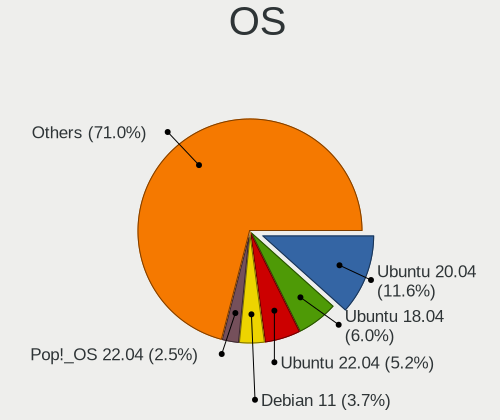

| Name               | Computers | Percent |
|--------------------|-----------|---------|
| Ubuntu 20.04       | 80        | 15.21%  |
| Ubuntu 18.04       | 44        | 8.37%   |
| Debian 11          | 19        | 3.61%   |
| Ubuntu 22.04       | 14        | 2.66%   |
| OpenMandriva 4.2   | 12        | 2.28%   |
| Pop!_OS 22.04      | 11        | 2.09%   |
| Manjaro            | 11        | 2.09%   |
| ArcoLinux Rolling  | 11        | 2.09%   |
| Arch               | 11        | 2.09%   |
| Fedora 36          | 10        | 1.9%    |
| Debian 10          | 10        | 1.9%    |
| Ubuntu 19.04       | 9         | 1.71%   |
| Pop!_OS 21.10      | 9         | 1.71%   |
| Linux Mint 20.2    | 9         | 1.71%   |
| Linux Mint 20      | 9         | 1.71%   |
| Pop!_OS 20.10      | 8         | 1.52%   |
| Arch Rolling       | 8         | 1.52%   |
| Zorin 16           | 7         | 1.33%   |
| Pop!_OS 20.04      | 7         | 1.33%   |
| Linux Mint 20.3    | 7         | 1.33%   |
| KDE neon 20.04     | 7         | 1.33%   |
| BlackPanther 18.1  | 7         | 1.33%   |
| Ubuntu 19.10       | 6         | 1.14%   |
| Ubuntu 21.10       | 5         | 0.95%   |
| ROSA R11           | 5         | 0.95%   |
| ROSA R10           | 5         | 0.95%   |
| OpenMandriva 4.3   | 5         | 0.95%   |
| Lubuntu 20.04      | 5         | 0.95%   |
| Linux Mint 20.1    | 5         | 0.95%   |
| Linux Mint 19.3    | 5         | 0.95%   |
| Fedora 35          | 5         | 0.95%   |
| Fedora 33          | 5         | 0.95%   |
| Fedora 32          | 5         | 0.95%   |
| Zorin 15           | 4         | 0.76%   |
| Ubuntu 20.10       | 4         | 0.76%   |
| Linux Mint 21      | 4         | 0.76%   |
| Fedora 37          | 4         | 0.76%   |
| Fedora 34          | 4         | 0.76%   |
| Debian Unstable    | 4         | 0.76%   |
| Ubuntu Unity 18.04 | 3         | 0.57%   |

OS Family
---------

OS without a version

| Name          | Computers | Percent |
|---------------|-----------|---------|
| Ubuntu        | 164       | 32.87%  |
| Linux Mint    | 46        | 9.22%   |
| Pop!_OS       | 36        | 7.21%   |
| Debian        | 35        | 7.01%   |
| Fedora        | 31        | 6.21%   |
| Manjaro       | 24        | 4.81%   |
| OpenMandriva  | 20        | 4.01%   |
| Arch          | 19        | 3.81%   |
| ROSA          | 12        | 2.4%    |
| Kubuntu       | 12        | 2.4%    |
| Zorin         | 11        | 2.2%    |
| ArcoLinux     | 11        | 2.2%    |
| Lubuntu       | 8         | 1.6%    |
| KDE neon      | 8         | 1.6%    |
| Elementary    | 8         | 1.6%    |
| BlackPanther  | 7         | 1.4%    |
| Ubuntu Unity  | 5         | 1%      |
| Endless       | 5         | 1%      |
| openSUSE      | 4         | 0.8%    |
| Xubuntu       | 3         | 0.6%    |
| Ubuntu MATE   | 3         | 0.6%    |
| Ubuntu Budgie | 3         | 0.6%    |
| Gentoo        | 3         | 0.6%    |
| Clear Linux   | 3         | 0.6%    |
| SteamOS       | 2         | 0.4%    |
| Peppermint    | 2         | 0.4%    |
| LMDE          | 2         | 0.4%    |
| Kali          | 2         | 0.4%    |
| CentOS        | 2         | 0.4%    |
| Trisquel      | 1         | 0.2%    |
| Solus         | 1         | 0.2%    |
| RHEL          | 1         | 0.2%    |
| Redcore       | 1         | 0.2%    |
| MX            | 1         | 0.2%    |
| Linux Lite    | 1         | 0.2%    |
| Feren OS      | 1         | 0.2%    |
| Chrome OS     | 1         | 0.2%    |

Kernel
------

Version of the Linux kernel

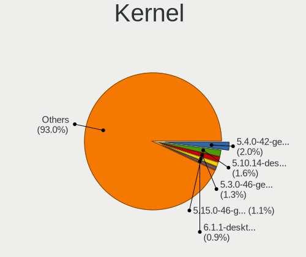

| Version                  | Computers | Percent |
|--------------------------|-----------|---------|
| 5.4.0-42-generic         | 15        | 2.58%   |
| 5.10.14-desktop-1omv4002 | 12        | 2.07%   |
| 5.3.0-46-generic         | 10        | 1.72%   |
| 5.15.0-46-generic        | 8         | 1.38%   |
| 5.4.0-52-generic         | 6         | 1.03%   |
| 5.15.0-52-generic        | 6         | 1.03%   |
| 4.18.16-desktop-1bP      | 6         | 1.03%   |
| 5.4.0-91-generic         | 5         | 0.86%   |
| 5.4.0-48-generic         | 5         | 0.86%   |
| 5.16.7-desktop-1omv4003  | 5         | 0.86%   |
| 5.11.0-27-generic        | 5         | 0.86%   |
| 5.8.0-7630-generic       | 4         | 0.69%   |
| 5.8.0-43-generic         | 4         | 0.69%   |
| 5.4.0-72-generic         | 4         | 0.69%   |
| 5.4.0-47-generic         | 4         | 0.69%   |
| 5.4.0-31-generic         | 4         | 0.69%   |
| 5.4.0-29-generic         | 4         | 0.69%   |
| 5.4.0-26-generic         | 4         | 0.69%   |
| 5.3.0-28-generic         | 4         | 0.69%   |
| 5.15.0-56-generic        | 4         | 0.69%   |
| 5.15.0-48-generic        | 4         | 0.69%   |
| 4.18.0-15-generic        | 4         | 0.69%   |
| 6.0.6-76060006-generic   | 3         | 0.52%   |
| 5.8.0-53-generic         | 3         | 0.52%   |
| 5.8.0-41-generic         | 3         | 0.52%   |
| 5.4.0-77-generic         | 3         | 0.52%   |
| 5.4.0-7634-generic       | 3         | 0.52%   |
| 5.4.0-58-generic         | 3         | 0.52%   |
| 5.4.0-54-generic         | 3         | 0.52%   |
| 5.4.0-40-generic         | 3         | 0.52%   |
| 5.4.0-39-generic         | 3         | 0.52%   |
| 5.4.0-37-generic         | 3         | 0.52%   |
| 5.3.0-45-generic         | 3         | 0.52%   |
| 5.3.0-40-generic         | 3         | 0.52%   |
| 5.19.0-76051900-generic  | 3         | 0.52%   |
| 5.17.5-arch1-1           | 3         | 0.52%   |
| 5.17.5-76051705-generic  | 3         | 0.52%   |
| 5.16.15-76051615-generic | 3         | 0.52%   |
| 5.15.11-76051511-generic | 3         | 0.52%   |
| 5.15.0-40-generic        | 3         | 0.52%   |

Kernel Family
-------------

Linux kernel without a distro release

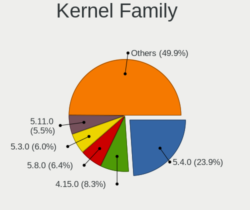

| Version | Computers | Percent |
|---------|-----------|---------|
| 5.4.0   | 111       | 20.37%  |
| 4.15.0  | 36        | 6.61%   |
| 5.15.0  | 33        | 6.06%   |
| 5.8.0   | 28        | 5.14%   |
| 5.11.0  | 27        | 4.95%   |
| 5.3.0   | 26        | 4.77%   |
| 5.10.0  | 18        | 3.3%    |
| 5.13.0  | 17        | 3.12%   |
| 5.0.0   | 15        | 2.75%   |
| 5.10.14 | 12        | 2.2%    |
| 4.19.0  | 11        | 2.02%   |
| 4.18.0  | 11        | 2.02%   |
| 5.17.5  | 8         | 1.47%   |
| 4.18.16 | 6         | 1.1%    |
| 5.19.0  | 5         | 0.92%   |
| 5.16.7  | 5         | 0.92%   |
| 6.0.6   | 4         | 0.73%   |
| 5.16.11 | 4         | 0.73%   |
| 4.9.60  | 4         | 0.73%   |
| 5.8.14  | 3         | 0.55%   |
| 5.6.0   | 3         | 0.55%   |
| 5.18.0  | 3         | 0.55%   |
| 5.16.15 | 3         | 0.55%   |
| 5.15.12 | 3         | 0.55%   |
| 5.15.11 | 3         | 0.55%   |
| 5.12.4  | 3         | 0.55%   |
| 4.9.155 | 3         | 0.55%   |
| 4.10.0  | 3         | 0.55%   |
| 6.0.9   | 2         | 0.37%   |
| 6.0.10  | 2         | 0.37%   |
| 6.0.0   | 2         | 0.37%   |
| 5.7.9   | 2         | 0.37%   |
| 5.7.12  | 2         | 0.37%   |
| 5.6.7   | 2         | 0.37%   |
| 5.6.15  | 2         | 0.37%   |
| 5.19.1  | 2         | 0.37%   |
| 5.18.17 | 2         | 0.37%   |
| 5.18.10 | 2         | 0.37%   |
| 5.17.6  | 2         | 0.37%   |
| 5.15.7  | 2         | 0.37%   |

Kernel Major Ver.
-----------------

Linux kernel major version

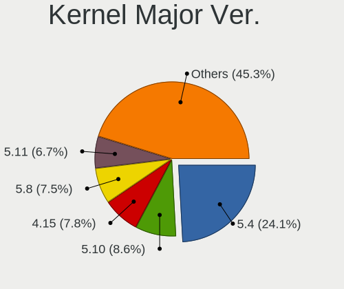

| Version | Computers | Percent |
|---------|-----------|---------|
| 5.4     | 116       | 21.76%  |
| 5.15    | 49        | 9.19%   |
| 5.10    | 43        | 8.07%   |
| 4.15    | 36        | 6.75%   |
| 5.8     | 35        | 6.57%   |
| 5.11    | 33        | 6.19%   |
| 5.3     | 27        | 5.07%   |
| 5.13    | 23        | 4.32%   |
| 4.18    | 17        | 3.19%   |
| 5.17    | 15        | 2.81%   |
| 5.0     | 15        | 2.81%   |
| 5.16    | 14        | 2.63%   |
| 6.0     | 13        | 2.44%   |
| 5.19    | 12        | 2.25%   |
| 4.19    | 12        | 2.25%   |
| 4.9     | 11        | 2.06%   |
| 5.6     | 10        | 1.88%   |
| 5.18    | 10        | 1.88%   |
| 5.12    | 9         | 1.69%   |
| 5.7     | 7         | 1.31%   |
| 5.9     | 5         | 0.94%   |
| 5.14    | 5         | 0.94%   |
| 4.10    | 3         | 0.56%   |
| 4.4     | 2         | 0.38%   |
| 4.13    | 2         | 0.38%   |
| 4.12    | 2         | 0.38%   |
| 3.10    | 2         | 0.38%   |
| 5.5     | 1         | 0.19%   |
| 5.2     | 1         | 0.19%   |
| 5       | 1         | 0.19%   |
| 4.14    | 1         | 0.19%   |
| 4.1     | 1         | 0.19%   |

Arch
----

OS architecture (x86_64, i586, etc.)

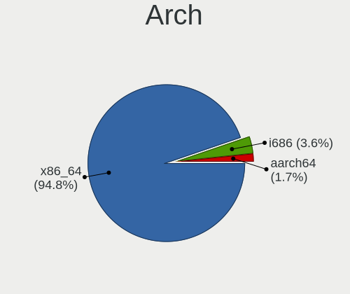

| Name    | Computers | Percent |
|---------|-----------|---------|
| x86_64  | 459       | 95.43%  |
| i686    | 15        | 3.12%   |
| aarch64 | 7         | 1.46%   |

DE
--

Desktop Environment

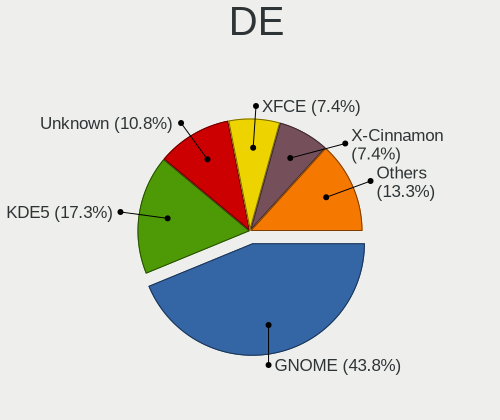

| Name            | Computers | Percent |
|-----------------|-----------|---------|
| GNOME           | 218       | 42.91%  |
| KDE5            | 77        | 15.16%  |
| Unknown         | 71        | 13.98%  |
| XFCE            | 32        | 6.3%    |
| X-Cinnamon      | 30        | 5.91%   |
| KDE             | 18        | 3.54%   |
| MATE            | 12        | 2.36%   |
| LXQt            | 9         | 1.77%   |
| Cinnamon        | 8         | 1.57%   |
| Pantheon        | 7         | 1.38%   |
| KDE4            | 6         | 1.18%   |
| Unity           | 5         | 0.98%   |
| i3              | 4         | 0.79%   |
| GNOME Flashback | 3         | 0.59%   |
| Budgie          | 3         | 0.59%   |
| GNOME Classic   | 2         | 0.39%   |
| LXDE            | 1         | 0.2%    |
| LeftWM          | 1         | 0.2%    |
| Enlightenment   | 1         | 0.2%    |

Display Server
--------------

X11 or Wayland

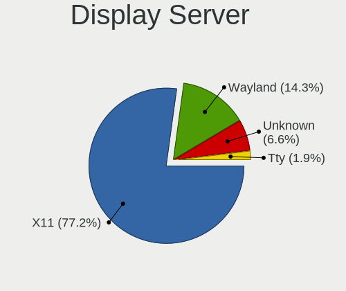

| Name    | Computers | Percent |
|---------|-----------|---------|
| X11     | 392       | 79.84%  |
| Wayland | 50        | 10.18%  |
| Unknown | 39        | 7.94%   |
| Tty     | 10        | 2.04%   |

Display Manager
---------------

SDDM, LightDM, etc.

| Name    | Computers | Percent |
|---------|-----------|---------|
| Unknown | 272       | 54.62%  |
| SDDM    | 72        | 14.46%  |
| GDM     | 63        | 12.65%  |
| LightDM | 34        | 6.83%   |
| GDM3    | 30        | 6.02%   |
| TDM     | 19        | 3.82%   |
| KDM     | 6         | 1.2%    |
| LXDM    | 2         | 0.4%    |

OS Lang
-------

Language

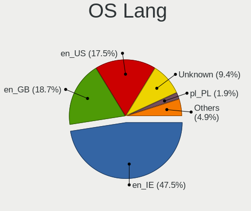

| Lang    | Computers | Percent |
|---------|-----------|---------|
| en_IE   | 235       | 47.19%  |
| en_GB   | 83        | 16.67%  |
| en_US   | 81        | 16.27%  |
| Unknown | 66        | 13.25%  |
| pl_PL   | 11        | 2.21%   |
| es_ES   | 3         | 0.6%    |
| C       | 3         | 0.6%    |
| en_CA   | 2         | 0.4%    |
| bg_BG   | 2         | 0.4%    |
| zh_CN   | 1         | 0.2%    |
| ru_RU   | 1         | 0.2%    |
| pt_PT   | 1         | 0.2%    |
| pt_BR   | 1         | 0.2%    |
| it_IT   | 1         | 0.2%    |
| ga_IE   | 1         | 0.2%    |
| fr_FR   | 1         | 0.2%    |
| fr_BE   | 1         | 0.2%    |
| en_ZA   | 1         | 0.2%    |
| en_IN   | 1         | 0.2%    |
| en_DE   | 1         | 0.2%    |
| de_DE   | 1         | 0.2%    |

Boot Mode
---------

EFI or BIOS

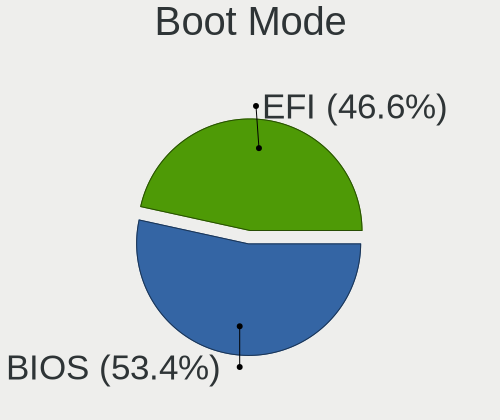

| Mode | Computers | Percent |
|------|-----------|---------|
| BIOS | 258       | 52.65%  |
| EFI  | 232       | 47.35%  |

Filesystem
----------

Type of filesystem

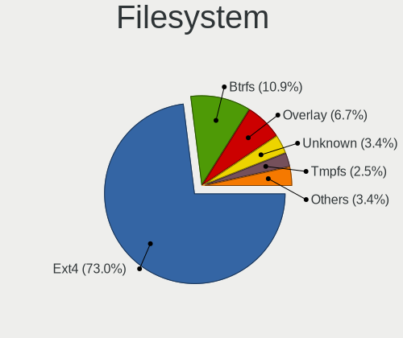

| Type                | Computers | Percent |
|---------------------|-----------|---------|
| Ext4                | 382       | 78.6%   |
| Btrfs               | 37        | 7.61%   |
| Overlay             | 32        | 6.58%   |
| Unknown             | 23        | 4.73%   |
| Xfs                 | 6         | 1.23%   |
| Zfs                 | 4         | 0.82%   |
| Fuse.fuse-overlayfs | 1         | 0.21%   |
| F2fs                | 1         | 0.21%   |

Part. scheme
------------

Scheme of partitioning

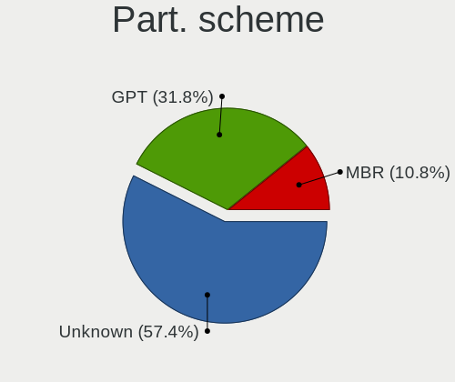

| Type    | Computers | Percent |
|---------|-----------|---------|
| Unknown | 278       | 56.39%  |
| GPT     | 163       | 33.06%  |
| MBR     | 52        | 10.55%  |

Dual Boot with Linux/BSD
------------------------

Hosting more than one Linux/BSD

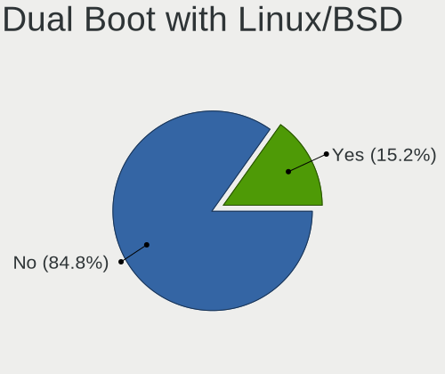

| Dual boot | Computers | Percent |
|-----------|-----------|---------|
| No        | 416       | 85.25%  |
| Yes       | 72        | 14.75%  |

Dual Boot (Win)
---------------

Hosting Linux and Windows

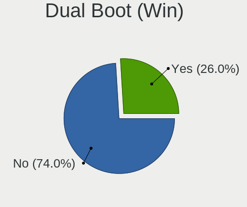

| Dual boot | Computers | Percent |
|-----------|-----------|---------|
| No        | 359       | 73.57%  |
| Yes       | 129       | 26.43%  |

Board
-----

Vendor
------

Motherboard manufacturer

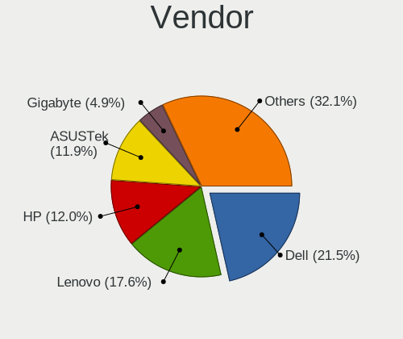

| Name                    | Computers | Percent |
|-------------------------|-----------|---------|
| Dell                    | 96        | 20.04%  |
| Lenovo                  | 83        | 17.33%  |
| ASUSTek Computer        | 61        | 12.73%  |
| Hewlett-Packard         | 53        | 11.06%  |
| Gigabyte Technology     | 23        | 4.8%    |
| Acer                    | 21        | 4.38%   |
| MSI                     | 19        | 3.97%   |
| Apple                   | 19        | 3.97%   |
| ASRock                  | 12        | 2.51%   |
| Toshiba                 | 11        | 2.3%    |
| Intel                   | 8         | 1.67%   |
| Samsung Electronics     | 6         | 1.25%   |
| Medion                  | 5         | 1.04%   |
| TUXEDO                  | 4         | 0.84%   |
| PC Specialist           | 4         | 0.84%   |
| Foxconn                 | 4         | 0.84%   |
| Timi                    | 3         | 0.63%   |
| Notebook                | 3         | 0.63%   |
| Chuwi                   | 3         | 0.63%   |
| System76                | 2         | 0.42%   |
| Shuttle                 | 2         | 0.42%   |
| Seco                    | 2         | 0.42%   |
| Raspberry Pi Foundation | 2         | 0.42%   |
| Packard Bell            | 2         | 0.42%   |
| Nvidia                  | 2         | 0.42%   |
| HUAWEI                  | 2         | 0.42%   |
| Fujitsu Siemens         | 2         | 0.42%   |
| Entroware               | 2         | 0.42%   |
| eMachines               | 2         | 0.42%   |
| Valve                   | 1         | 0.21%   |
| Sony UK                 | 1         | 0.21%   |
| Sony                    | 1         | 0.21%   |
| SLIMBOOK                | 1         | 0.21%   |
| Schenker                | 1         | 0.21%   |
| Rockchip                | 1         | 0.21%   |
| Pine Microsystems       | 1         | 0.21%   |
| Pegatron                | 1         | 0.21%   |
| MiTAC                   | 1         | 0.21%   |
| Microtech               | 1         | 0.21%   |
| Jumper                  | 1         | 0.21%   |

Model
-----

Motherboard model

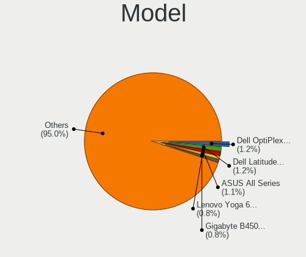

| Name                              | Computers | Percent |
|-----------------------------------|-----------|---------|
| Dell OptiPlex 7010                | 6         | 1.25%   |
| ASUS All Series                   | 6         | 1.25%   |
| Gigabyte B450M DS3H               | 4         | 0.84%   |
| Lenovo V145-15AST 81MT            | 3         | 0.63%   |
| HP Compaq 8200 Elite SFF PC       | 3         | 0.63%   |
| Dell OptiPlex 790                 | 3         | 0.63%   |
| ASUS ROG STRIX B450-F GAMING      | 3         | 0.63%   |
| TUXEDO Pulse 15 Gen1              | 2         | 0.42%   |
| Seco C40                          | 2         | 0.42%   |
| RPi Raspberry Pi                  | 2         | 0.42%   |
| Nvidia Tegra                      | 2         | 0.42%   |
| MSI MS-7B79                       | 2         | 0.42%   |
| Lenovo ThinkStation D20 415892G   | 2         | 0.42%   |
| Lenovo ThinkPad X1 Carbon 3443CTO | 2         | 0.42%   |
| Lenovo IdeaPad 510-15ISK 80SR     | 2         | 0.42%   |
| HP Pavilion g6                    | 2         | 0.42%   |
| HP Notebook                       | 2         | 0.42%   |
| HP EliteDesk 800 G1 SFF           | 2         | 0.42%   |
| Gigabyte X570 AORUS ULTRA         | 2         | 0.42%   |
| Foxconn Pro 3500 Series           | 2         | 0.42%   |
| Dell XPS 9320                     | 2         | 0.42%   |
| Dell XPS 13 9310                  | 2         | 0.42%   |
| Dell XPS 13 9300                  | 2         | 0.42%   |
| Dell XPS 13 7390                  | 2         | 0.42%   |
| Dell Precision 5550               | 2         | 0.42%   |
| Dell OptiPlex 780                 | 2         | 0.42%   |
| Dell OptiPlex 7020                | 2         | 0.42%   |
| Dell Latitude E7240               | 2         | 0.42%   |
| Dell Latitude E6230               | 2         | 0.42%   |
| Dell Latitude 7420                | 2         | 0.42%   |
| Dell Inspiron 13-5378             | 2         | 0.42%   |
| ASUS TUF Gaming X570-PLUS         | 2         | 0.42%   |
| ASUS P8P67 PRO                    | 2         | 0.42%   |
| ASUS M5A78L/USB3                  | 2         | 0.42%   |
| Apple MacBook6,1                  | 2         | 0.42%   |
| Apple iMac8,1                     | 2         | 0.42%   |
| Acer Aspire E5-575G               | 2         | 0.42%   |
| Unknown                           | 2         | 0.42%   |
| Valve Jupiter                     | 1         | 0.21%   |
| TUXEDO InfinityBook Pro 15 v5     | 1         | 0.21%   |

Model Family
------------

Motherboard model prefix

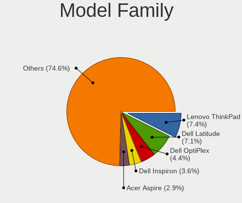

| Name                | Computers | Percent |
|---------------------|-----------|---------|
| Lenovo ThinkPad     | 39        | 8.14%   |
| Dell Latitude       | 30        | 6.26%   |
| Dell OptiPlex       | 19        | 3.97%   |
| Dell Inspiron       | 15        | 3.13%   |
| Acer Aspire         | 15        | 3.13%   |
| Lenovo IdeaPad      | 14        | 2.92%   |
| Dell XPS            | 13        | 2.71%   |
| HP EliteBook        | 11        | 2.3%    |
| HP Pavilion         | 10        | 2.09%   |
| Dell Precision      | 10        | 2.09%   |
| Toshiba Satellite   | 8         | 1.67%   |
| Lenovo ThinkCentre  | 7         | 1.46%   |
| HP Compaq           | 7         | 1.46%   |
| ASUS TUF            | 7         | 1.46%   |
| ASUS PRIME          | 7         | 1.46%   |
| ASUS All            | 6         | 1.25%   |
| ASUS ROG            | 5         | 1.04%   |
| Gigabyte B450M      | 4         | 0.84%   |
| Dell Vostro         | 4         | 0.84%   |
| Lenovo Yoga         | 3         | 0.63%   |
| Lenovo V145-15AST   | 3         | 0.63%   |
| Lenovo ThinkBook    | 3         | 0.63%   |
| HP Presario         | 3         | 0.63%   |
| HP Laptop           | 3         | 0.63%   |
| HP EliteDesk        | 3         | 0.63%   |
| Foxconn Pro         | 3         | 0.63%   |
| ASUS ZenBook        | 3         | 0.63%   |
| Apple MacBookPro5   | 3         | 0.63%   |
| TUXEDO Pulse        | 2         | 0.42%   |
| TUXEDO InfinityBook | 2         | 0.42%   |
| Toshiba TECRA       | 2         | 0.42%   |
| Seco C40            | 2         | 0.42%   |
| RPi Raspberry       | 2         | 0.42%   |
| Nvidia Tegra        | 2         | 0.42%   |
| MSI MS-7B79         | 2         | 0.42%   |
| Lenovo ThinkStation | 2         | 0.42%   |
| Intel DESKTOP       | 2         | 0.42%   |
| HP ProBook          | 2         | 0.42%   |
| HP Notebook         | 2         | 0.42%   |
| Gigabyte X570       | 2         | 0.42%   |

MFG Year
--------

Motherboard manufacture year

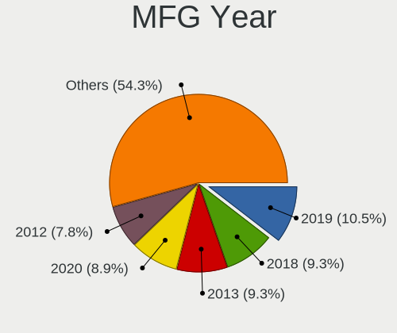

| Year    | Computers | Percent |
|---------|-----------|---------|
| 2019    | 51        | 10.65%  |
| 2018    | 46        | 9.6%    |
| 2013    | 45        | 9.39%   |
| 2020    | 42        | 8.77%   |
| 2012    | 37        | 7.72%   |
| 2011    | 37        | 7.72%   |
| 2017    | 36        | 7.52%   |
| 2021    | 26        | 5.43%   |
| 2010    | 25        | 5.22%   |
| 2008    | 25        | 5.22%   |
| 2015    | 23        | 4.8%    |
| 2016    | 19        | 3.97%   |
| 2009    | 18        | 3.76%   |
| 2014    | 16        | 3.34%   |
| 2007    | 10        | 2.09%   |
| 2022    | 7         | 1.46%   |
| 2006    | 7         | 1.46%   |
| Unknown | 6         | 1.25%   |
| 2005    | 2         | 0.42%   |
| 2003    | 1         | 0.21%   |

Form Factor
-----------

Physical design of the computer

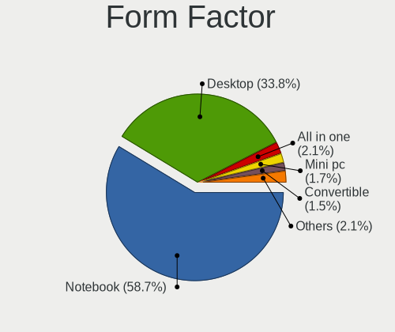

| Name           | Computers | Percent |
|----------------|-----------|---------|
| Notebook       | 284       | 59.29%  |
| Desktop        | 160       | 33.4%   |
| All in one     | 10        | 2.09%   |
| Mini pc        | 8         | 1.67%   |
| Convertible    | 7         | 1.46%   |
| System on chip | 6         | 1.25%   |
| Tablet         | 3         | 0.63%   |
| Phone          | 1         | 0.21%   |

Secure Boot
-----------

Enabled or disabled

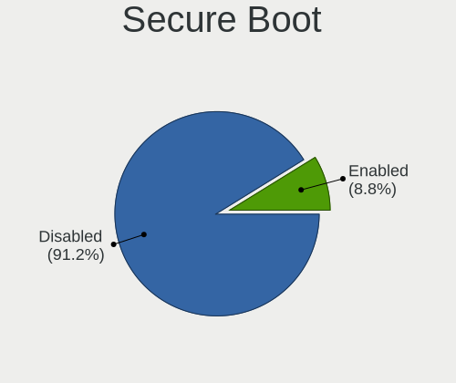

| State    | Computers | Percent |
|----------|-----------|---------|
| Disabled | 439       | 90.89%  |
| Enabled  | 44        | 9.11%   |

Coreboot
--------

Have coreboot on board

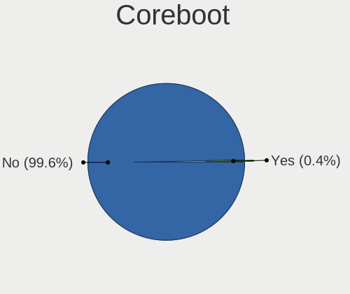

| Used | Computers | Percent |
|------|-----------|---------|
| No   | 479       | 100%    |

RAM Size
--------

Total RAM memory

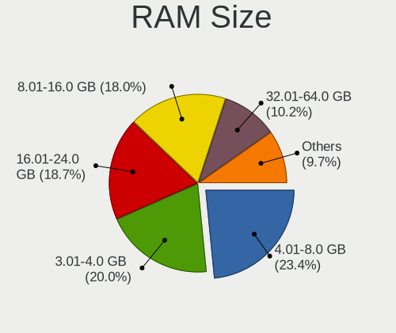

| Size in GB  | Computers | Percent |
|-------------|-----------|---------|
| 4.01-8.0    | 118       | 24.08%  |
| 16.01-24.0  | 102       | 20.82%  |
| 3.01-4.0    | 88        | 17.96%  |
| 8.01-16.0   | 87        | 17.76%  |
| 32.01-64.0  | 51        | 10.41%  |
| 1.01-2.0    | 17        | 3.47%   |
| 64.01-256.0 | 12        | 2.45%   |
| 24.01-32.0  | 6         | 1.22%   |
| 2.01-3.0    | 5         | 1.02%   |
| 0.51-1.0    | 3         | 0.61%   |
| 0.01-0.5    | 1         | 0.2%    |

RAM Used
--------

Used RAM memory

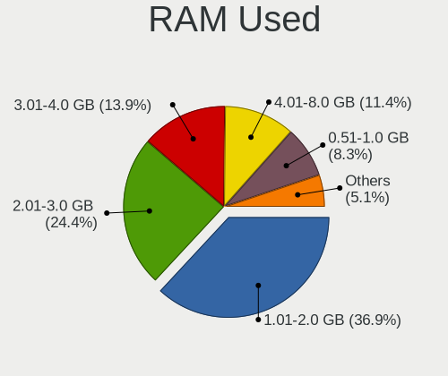

| Used GB    | Computers | Percent |
|------------|-----------|---------|
| 1.01-2.0   | 186       | 35.03%  |
| 2.01-3.0   | 126       | 23.73%  |
| 3.01-4.0   | 81        | 15.25%  |
| 4.01-8.0   | 69        | 12.99%  |
| 0.51-1.0   | 39        | 7.34%   |
| 8.01-16.0  | 21        | 3.95%   |
| 0.01-0.5   | 5         | 0.94%   |
| 16.01-24.0 | 3         | 0.56%   |
| 32.01-64.0 | 1         | 0.19%   |

Total Drives
------------

Number of drives on board

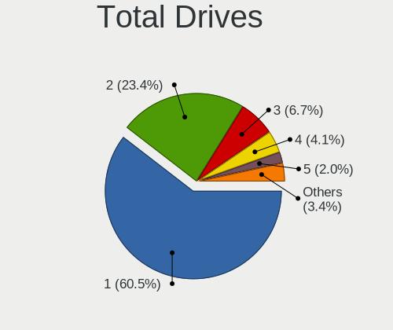

| Drives | Computers | Percent |
|--------|-----------|---------|
| 1      | 302       | 59.68%  |
| 2      | 117       | 23.12%  |
| 3      | 38        | 7.51%   |
| 4      | 20        | 3.95%   |
| 5      | 12        | 2.37%   |
| 7      | 6         | 1.19%   |
| 6      | 4         | 0.79%   |
| 0      | 4         | 0.79%   |
| 10     | 2         | 0.4%    |
| 9      | 1         | 0.2%    |

Has CD-ROM
----------

Has CD-ROM on board

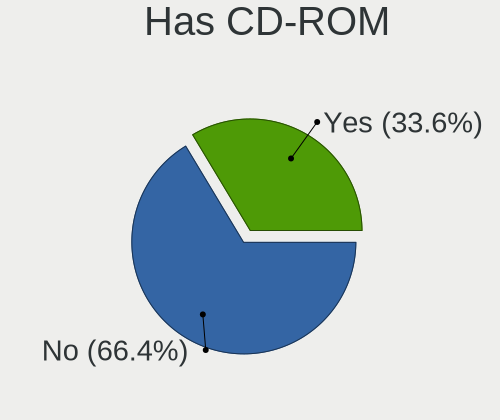

| Presented | Computers | Percent |
|-----------|-----------|---------|
| No        | 295       | 60.7%   |
| Yes       | 191       | 39.3%   |

Has Ethernet
------------

Has Ethernet on board

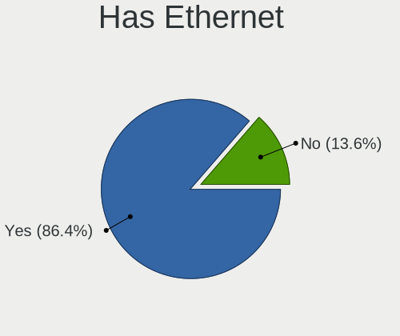

| Presented | Computers | Percent |
|-----------|-----------|---------|
| Yes       | 414       | 86.07%  |
| No        | 67        | 13.93%  |

Has WiFi
--------

Has WiFi module

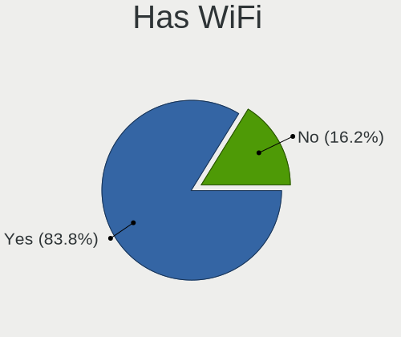

| Presented | Computers | Percent |
|-----------|-----------|---------|
| Yes       | 401       | 82.85%  |
| No        | 83        | 17.15%  |

Has Bluetooth
-------------

Has Bluetooth module

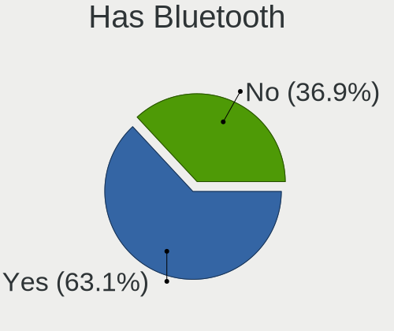

| Presented | Computers | Percent |
|-----------|-----------|---------|
| Yes       | 309       | 63.58%  |
| No        | 177       | 36.42%  |

Location
--------

Country
-------

Geographic location (country)

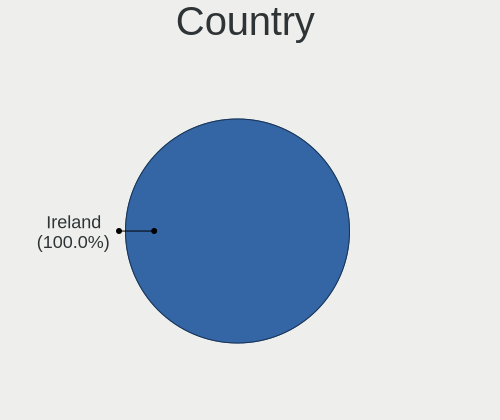

| Country | Computers | Percent |
|---------|-----------|---------|
| Ireland | 479       | 100%    |

City
----

Geographic location (city)

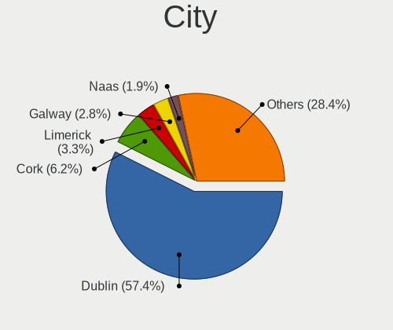

| City           | Computers | Percent |
|----------------|-----------|---------|
| Dublin         | 279       | 55.91%  |
| Cork           | 30        | 6.01%   |
| Limerick       | 15        | 3.01%   |
| Galway         | 13        | 2.61%   |
| Naas           | 12        | 2.4%    |
| Portlaoise     | 6         | 1.2%    |
| Ennis          | 6         | 1.2%    |
| Drogheda       | 6         | 1.2%    |
| Sligo          | 5         | 1%      |
| Navan          | 5         | 1%      |
| Gorey          | 5         | 1%      |
| Enniscorthy    | 5         | 1%      |
| Athlone        | 5         | 1%      |
| Nenagh         | 4         | 0.8%    |
| Kilkenny       | 4         | 0.8%    |
| Kenmare        | 4         | 0.8%    |
| Wexford        | 3         | 0.6%    |
| Tuam           | 3         | 0.6%    |
| Loughrea       | 3         | 0.6%    |
| Dún Laoghaire | 3         | 0.6%    |
| Cavan          | 3         | 0.6%    |
| Westport       | 2         | 0.4%    |
| Waterford      | 2         | 0.4%    |
| Tullamore      | 2         | 0.4%    |
| Oranmore       | 2         | 0.4%    |
| Maynooth       | 2         | 0.4%    |
| Mallow         | 2         | 0.4%    |
| Lucan          | 2         | 0.4%    |
| Letterkenny    | 2         | 0.4%    |
| Kildare        | 2         | 0.4%    |
| Donegal        | 2         | 0.4%    |
| Cobh           | 2         | 0.4%    |
| Clonakilty     | 2         | 0.4%    |
| Clane          | 2         | 0.4%    |
| Carrigaline    | 2         | 0.4%    |
| Bray           | 2         | 0.4%    |
| Ballina        | 2         | 0.4%    |
| Balbriggan     | 2         | 0.4%    |
| Youghal        | 1         | 0.2%    |
| Wicklow        | 1         | 0.2%    |

Drives
------

Drive Vendor
------------

Hard drive vendors

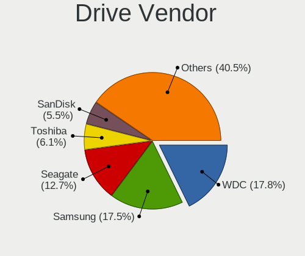

| Vendor                    | Computers | Drives | Percent |
|---------------------------|-----------|--------|---------|
| WDC                       | 125       | 210    | 17.51%  |
| Samsung Electronics       | 124       | 183    | 17.37%  |
| Seagate                   | 89        | 151    | 12.46%  |
| Toshiba                   | 44        | 57     | 6.16%   |
| SanDisk                   | 41        | 52     | 5.74%   |
| Crucial                   | 39        | 49     | 5.46%   |
| Unknown                   | 35        | 46     | 4.9%    |
| Hitachi                   | 32        | 45     | 4.48%   |
| Kingston                  | 20        | 28     | 2.8%    |
| Intel                     | 15        | 18     | 2.1%    |
| Micron Technology         | 12        | 13     | 1.68%   |
| SK hynix                  | 10        | 10     | 1.4%    |
| HGST                      | 10        | 11     | 1.4%    |
| A-DATA Technology         | 10        | 15     | 1.4%    |
| Phison                    | 7         | 12     | 0.98%   |
| Fujitsu                   | 7         | 8      | 0.98%   |
| KIOXIA                    | 6         | 7      | 0.84%   |
| Apple                     | 6         | 7      | 0.84%   |
| Verbatim                  | 5         | 5      | 0.7%    |
| Silicon Motion            | 4         | 8      | 0.56%   |
| PNY                       | 4         | 4      | 0.56%   |
| LITEON                    | 4         | 4      | 0.56%   |
| China                     | 4         | 8      | 0.56%   |
| OCZ                       | 3         | 3      | 0.42%   |
| Micron/Crucial Technology | 3         | 4      | 0.42%   |
| KingSpec                  | 3         | 3      | 0.42%   |
| KingDian                  | 3         | 9      | 0.42%   |
| ASMT                      | 3         | 5      | 0.42%   |
| Union Memory              | 2         | 2      | 0.28%   |
| Transcend                 | 2         | 2      | 0.28%   |
| Team                      | 2         | 2      | 0.28%   |
| Netac                     | 2         | 2      | 0.28%   |
| Maxtor                    | 2         | 2      | 0.28%   |
| LITEONIT                  | 2         | 2      | 0.28%   |
| Integral                  | 2         | 2      | 0.28%   |
| FORESEE                   | 2         | 2      | 0.28%   |
| Zheino                    | 1         | 1      | 0.14%   |
| WDS100T1                  | 1         | 1      | 0.14%   |
| W800S                     | 1         | 2      | 0.14%   |
| USB3.0                    | 1         | 1      | 0.14%   |

Drive Model
-----------

Hard drive models

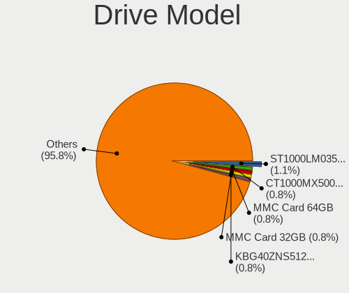

| Model                                  | Computers | Percent |
|----------------------------------------|-----------|---------|
| Seagate ST1000LM035-1RK172 1TB         | 8         | 1%      |
| Crucial CT1000MX500SSD1 1TB            | 8         | 1%      |
| Seagate ST1000DM010-2EP102 1TB         | 7         | 0.87%   |
| Unknown MMC Card  64GB                 | 6         | 0.75%   |
| Toshiba MQ01ABD100 1TB                 | 6         | 0.75%   |
| Seagate ST8000DM004-2CX188 8TB         | 6         | 0.75%   |
| SanDisk NVMe SSD Drive 512GB           | 6         | 0.75%   |
| Samsung SSD 970 EVO Plus 500GB         | 6         | 0.75%   |
| Samsung SSD 860 EVO 500GB              | 6         | 0.75%   |
| Samsung SSD 850 EVO 250GB              | 6         | 0.75%   |
| Samsung SSD 840 EVO 250GB              | 6         | 0.75%   |
| Samsung SM963 2.5" NVMe PCIe SSD 256GB | 6         | 0.75%   |
| Samsung NVMe SSD Drive 500GB           | 6         | 0.75%   |
| WDC WD10EURX-83UY4Y0 1TB               | 5         | 0.62%   |
| Verbatim Vi550 S3 SSD 512GB            | 5         | 0.62%   |
| Unknown MMC Card  32GB                 | 5         | 0.62%   |
| Seagate ST500DM002-1BD142 500GB        | 5         | 0.62%   |
| WDC WDS500G2B0B-00YS70 500GB SSD       | 4         | 0.5%    |
| WDC WD10EZEX-08WN4A0 1TB               | 4         | 0.5%    |
| Seagate ST2000DL003-9VT166 2TB         | 4         | 0.5%    |
| Seagate Expansion Desk 5TB             | 4         | 0.5%    |
| Samsung SSD 850 EVO 500GB              | 4         | 0.5%    |
| Kingston SV300S37A120G 120GB SSD       | 4         | 0.5%    |
| Kingston SA400S37480G 480GB SSD        | 4         | 0.5%    |
| Kingston SA400S37240G 240GB SSD        | 4         | 0.5%    |
| Crucial M4-CT128M4SSD2 128GB           | 4         | 0.5%    |
| Crucial CT500MX500SSD1 500GB           | 4         | 0.5%    |
| WDC WD5000AAKX-60U6AA0 500GB           | 3         | 0.37%   |
| WDC WD3200AAJS-60Z0A0 320GB            | 3         | 0.37%   |
| WDC WD20EZRX-00D8PB0 2TB               | 3         | 0.37%   |
| WDC WD10EALX-009BA0 1TB                | 3         | 0.37%   |
| Toshiba MQ01ABF050 500GB               | 3         | 0.37%   |
| Toshiba DT01ACA100 1TB                 | 3         | 0.37%   |
| Seagate ST3500418AS 500GB              | 3         | 0.37%   |
| Seagate ST3500312CS 500GB              | 3         | 0.37%   |
| Seagate ST31000528AS 1TB               | 3         | 0.37%   |
| Seagate ST2000DM006-2DM164 2TB         | 3         | 0.37%   |
| Seagate ST1000LM024 HN-M101MBB 1TB     | 3         | 0.37%   |
| SanDisk SSD PLUS 240GB                 | 3         | 0.37%   |
| SanDisk NVMe SSD Drive 500GB           | 3         | 0.37%   |

HDD Vendor
----------

Hard disk drive vendors

| Vendor              | Computers | Drives | Percent |
|---------------------|-----------|--------|---------|
| WDC                 | 98        | 174    | 33%     |
| Seagate             | 88        | 150    | 29.63%  |
| Toshiba             | 32        | 41     | 10.77%  |
| Hitachi             | 32        | 45     | 10.77%  |
| Samsung Electronics | 11        | 13     | 3.7%    |
| HGST                | 10        | 11     | 3.37%   |
| Fujitsu             | 7         | 8      | 2.36%   |
| Apple               | 4         | 4      | 1.35%   |
| ASMT                | 3         | 5      | 1.01%   |
| Unknown             | 2         | 2      | 0.67%   |
| Maxtor              | 2         | 2      | 0.67%   |
| USB3.0              | 1         | 1      | 0.34%   |
| SABRENT             | 1         | 2      | 0.34%   |
| QNAP                | 1         | 1      | 0.34%   |
| LaCie               | 1         | 1      | 0.34%   |
| KESU                | 1         | 1      | 0.34%   |
| Inateck             | 1         | 1      | 0.34%   |
| FNK TECH            | 1         | 1      | 0.34%   |
| ExcelStor           | 1         | 2      | 0.34%   |

SSD Vendor
----------

Solid state drive vendors

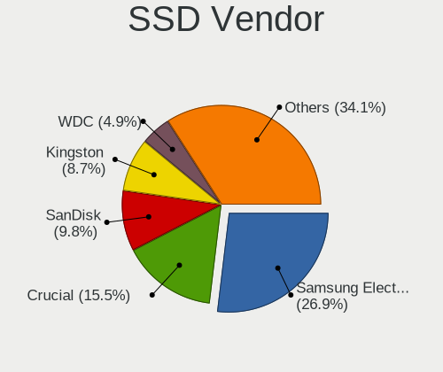

| Vendor              | Computers | Drives | Percent |
|---------------------|-----------|--------|---------|
| Samsung Electronics | 65        | 88     | 28.14%  |
| Crucial             | 36        | 46     | 15.58%  |
| SanDisk             | 24        | 28     | 10.39%  |
| Kingston            | 19        | 26     | 8.23%   |
| WDC                 | 12        | 18     | 5.19%   |
| A-DATA Technology   | 7         | 11     | 3.03%   |
| Intel               | 6         | 6      | 2.6%    |
| Verbatim            | 5         | 5      | 2.16%   |
| PNY                 | 4         | 4      | 1.73%   |
| LITEON              | 4         | 4      | 1.73%   |
| China               | 4         | 8      | 1.73%   |
| Toshiba             | 3         | 5      | 1.3%    |
| OCZ                 | 3         | 3      | 1.3%    |
| Micron Technology   | 3         | 3      | 1.3%    |
| KingSpec            | 3         | 3      | 1.3%    |
| KingDian            | 3         | 9      | 1.3%    |
| Apple               | 3         | 3      | 1.3%    |
| Transcend           | 2         | 2      | 0.87%   |
| Team                | 2         | 2      | 0.87%   |
| SK hynix            | 2         | 2      | 0.87%   |
| Netac               | 2         | 2      | 0.87%   |
| LITEONIT            | 2         | 2      | 0.87%   |
| Integral            | 2         | 2      | 0.87%   |
| FORESEE             | 2         | 2      | 0.87%   |
| Zheino              | 1         | 1      | 0.43%   |
| W800S               | 1         | 2      | 0.43%   |
| TCSUNBOW            | 1         | 1      | 0.43%   |
| Plextor             | 1         | 1      | 0.43%   |
| Palit               | 1         | 1      | 0.43%   |
| Hikvision           | 1         | 1      | 0.43%   |
| Hewlett-Packard     | 1         | 2      | 0.43%   |
| GOODRAM             | 1         | 1      | 0.43%   |
| faspeed             | 1         | 1      | 0.43%   |
| Emtec               | 1         | 2      | 0.43%   |
| DRVEO               | 1         | 1      | 0.43%   |
| Dogfish             | 1         | 1      | 0.43%   |
| Corsair             | 1         | 2      | 0.43%   |

Drive Kind
----------

HDD or SSD

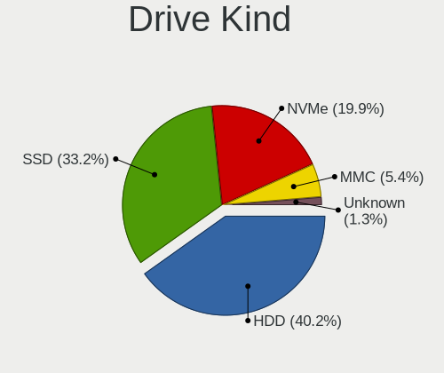

| Kind    | Computers | Drives | Percent |
|---------|-----------|--------|---------|
| HDD     | 236       | 465    | 37.7%   |
| SSD     | 205       | 301    | 32.75%  |
| NVMe    | 144       | 206    | 23%     |
| MMC     | 33        | 47     | 5.27%   |
| Unknown | 8         | 8      | 1.28%   |

Drive Connector
---------------

SATA, SAS, NVMe, etc.

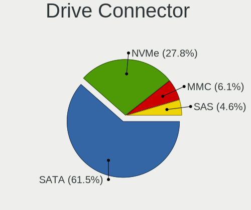

| Type | Computers | Drives | Percent |
|------|-----------|--------|---------|
| SATA | 362       | 742    | 64.3%   |
| NVMe | 144       | 206    | 25.58%  |
| MMC  | 33        | 47     | 5.86%   |
| SAS  | 24        | 32     | 4.26%   |

Drive Size
----------

Size of hard drive

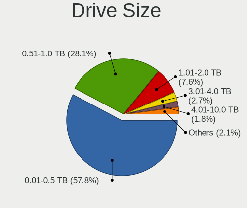

| Size in TB | Computers | Drives | Percent |
|------------|-----------|--------|---------|
| 0.01-0.5   | 267       | 435    | 56.45%  |
| 0.51-1.0   | 140       | 209    | 29.6%   |
| 1.01-2.0   | 29        | 44     | 6.13%   |
| 4.01-10.0  | 14        | 36     | 2.96%   |
| 3.01-4.0   | 13        | 29     | 2.75%   |
| 2.01-3.0   | 9         | 12     | 1.9%    |
| 20.01-50.0 | 1         | 1      | 0.21%   |

Space Total
-----------

Amount of disk space available on the file system

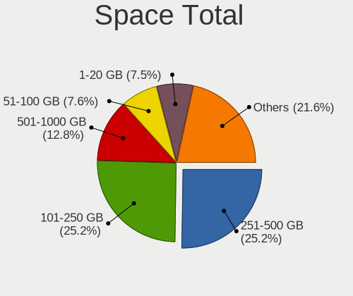

| Size in GB     | Computers | Percent |
|----------------|-----------|---------|
| 101-250        | 129       | 25.39%  |
| 251-500        | 117       | 23.03%  |
| 501-1000       | 67        | 13.19%  |
| 51-100         | 42        | 8.27%   |
| 1-20           | 39        | 7.68%   |
| 1001-2000      | 35        | 6.89%   |
| More than 3000 | 30        | 5.91%   |
| Unknown        | 19        | 3.74%   |
| 21-50          | 17        | 3.35%   |
| 2001-3000      | 13        | 2.56%   |

Space Used
----------

Amount of used disk space

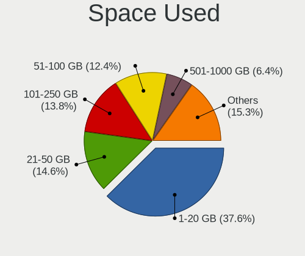

| Used GB        | Computers | Percent |
|----------------|-----------|---------|
| 1-20           | 201       | 37.71%  |
| 101-250        | 75        | 14.07%  |
| 21-50          | 73        | 13.7%   |
| 51-100         | 63        | 11.82%  |
| 251-500        | 34        | 6.38%   |
| 501-1000       | 34        | 6.38%   |
| Unknown        | 19        | 3.56%   |
| More than 3000 | 15        | 2.81%   |
| 1001-2000      | 11        | 2.06%   |
| 2001-3000      | 8         | 1.5%    |

Malfunc. Drives
---------------

Drive models with a malfunction

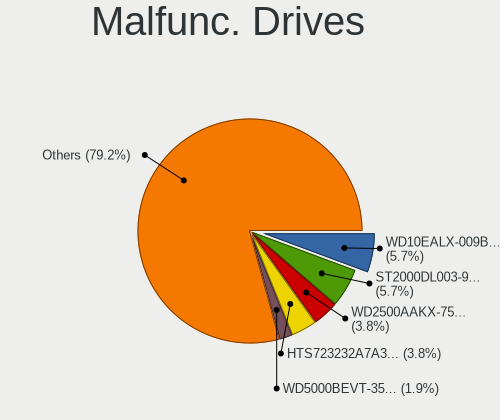

| Model                                          | Computers | Drives | Percent |
|------------------------------------------------|-----------|--------|---------|
| WDC WD10EALX-009BA0 1TB                        | 3         | 8      | 5.17%   |
| Seagate ST2000DL003-9VT166 2TB                 | 3         | 5      | 5.17%   |
| WDC WD2500AAKX-753CA1 250GB                    | 2         | 3      | 3.45%   |
| Hitachi HTS723232A7A364 320GB                  | 2         | 2      | 3.45%   |
| WDC WD7500BPKX-00HPJT0 752GB                   | 1         | 1      | 1.72%   |
| WDC WD5000BEVT-35A0RT0 500GB                   | 1         | 1      | 1.72%   |
| WDC WD5000AAKX-001CA0 500GB                    | 1         | 1      | 1.72%   |
| WDC WD400JB-00FMA0 40GB                        | 1         | 2      | 1.72%   |
| WDC WD3200AVJS-63B6A0 320GB                    | 1         | 1      | 1.72%   |
| WDC WD2500BEVT-22A23T0 250GB                   | 1         | 1      | 1.72%   |
| WDC WD2500BEKT-75A25T0 250GB                   | 1         | 1      | 1.72%   |
| WDC WD2500AAKX-603CA0 250GB                    | 1         | 1      | 1.72%   |
| WDC WD20EZRZ-00Z5HB0 2TB                       | 1         | 1      | 1.72%   |
| WDC WD10EZEX-00BN5A0 1TB                       | 1         | 1      | 1.72%   |
| WDC WD1001FALS-00E8B0 1TB                      | 1         | 2      | 1.72%   |
| Toshiba MQ01ABF050H 500GB                      | 1         | 1      | 1.72%   |
| Toshiba MQ01ABD050 500GB                       | 1         | 1      | 1.72%   |
| Toshiba MK1652GSX 160GB                        | 1         | 1      | 1.72%   |
| Toshiba MK1059GSM 1TB                          | 1         | 1      | 1.72%   |
| Toshiba DT01ACA050 500GB                       | 1         | 2      | 1.72%   |
| Seagate ST910021AS 100GB                       | 1         | 1      | 1.72%   |
| Seagate ST500LM012 HN-M500MBB 500GB            | 1         | 1      | 1.72%   |
| Seagate ST4000DX001-1CE168 4TB                 | 1         | 1      | 1.72%   |
| Seagate ST3500418AS 500GB                      | 1         | 2      | 1.72%   |
| Seagate ST31500541AS 1TB                       | 1         | 1      | 1.72%   |
| Seagate ST3120026A 120GB                       | 1         | 1      | 1.72%   |
| Seagate ST31000333AS 1TB                       | 1         | 2      | 1.72%   |
| Seagate ST3000DM001-1ER166 3TB                 | 1         | 1      | 1.72%   |
| SanDisk SSD PLUS 240GB                         | 1         | 1      | 1.72%   |
| Samsung Electronics SSD 970 EVO Plus 2TB       | 1         | 1      | 1.72%   |
| Samsung Electronics HM120JC 120GB              | 1         | 1      | 1.72%   |
| Samsung Electronics HD103SI 1TB                | 1         | 1      | 1.72%   |
| Netac SSD 128GB                                | 1         | 1      | 1.72%   |
| Micron Technology 2300 NVMe 512GB              | 1         | 1      | 1.72%   |
| Micron Technology 1100_MTFDDAV256TBN 256GB SSD | 1         | 1      | 1.72%   |
| Maxtor STM3250310AS 250GB                      | 1         | 1      | 1.72%   |
| Intel SSDSA2M080G2GC 80GB                      | 1         | 1      | 1.72%   |
| Inateck ASM1153E 256GB                         | 1         | 1      | 1.72%   |
| Hitachi HUS724030ALA640 3TB                    | 1         | 2      | 1.72%   |
| Hitachi HTS545050B9A300 500GB                  | 1         | 1      | 1.72%   |

Malfunc. Drive Vendor
---------------------

Vendors of faulty drives

| Vendor              | Computers | Drives | Percent |
|---------------------|-----------|--------|---------|
| WDC                 | 13        | 24     | 23.64%  |
| Seagate             | 11        | 15     | 20%     |
| Hitachi             | 9         | 12     | 16.36%  |
| Toshiba             | 5         | 6      | 9.09%   |
| Samsung Electronics | 3         | 3      | 5.45%   |
| Micron Technology   | 2         | 2      | 3.64%   |
| HGST                | 2         | 2      | 3.64%   |
| SanDisk             | 1         | 1      | 1.82%   |
| Netac               | 1         | 1      | 1.82%   |
| Maxtor              | 1         | 1      | 1.82%   |
| Intel               | 1         | 1      | 1.82%   |
| Inateck             | 1         | 1      | 1.82%   |
| Fujitsu             | 1         | 1      | 1.82%   |
| DRVEO               | 1         | 1      | 1.82%   |
| China               | 1         | 1      | 1.82%   |
| Apple               | 1         | 1      | 1.82%   |
| A-DATA Technology   | 1         | 1      | 1.82%   |

Malfunc. HDD Vendor
-------------------

Vendors of faulty HDD drives

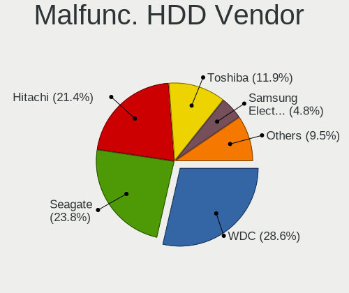

| Vendor              | Computers | Drives | Percent |
|---------------------|-----------|--------|---------|
| WDC                 | 13        | 24     | 28.26%  |
| Seagate             | 11        | 15     | 23.91%  |
| Hitachi             | 9         | 12     | 19.57%  |
| Toshiba             | 5         | 6      | 10.87%  |
| Samsung Electronics | 2         | 2      | 4.35%   |
| HGST                | 2         | 2      | 4.35%   |
| Maxtor              | 1         | 1      | 2.17%   |
| Inateck             | 1         | 1      | 2.17%   |
| Fujitsu             | 1         | 1      | 2.17%   |
| Apple               | 1         | 1      | 2.17%   |

Malfunc. Drive Kind
-------------------

Kinds of faulty drives

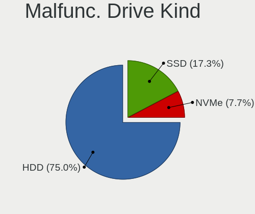

| Kind | Computers | Drives | Percent |
|------|-----------|--------|---------|
| HDD  | 36        | 65     | 80%     |
| SSD  | 7         | 7      | 15.56%  |
| NVMe | 2         | 2      | 4.44%   |

Failed Drives
-------------

Failed drive models

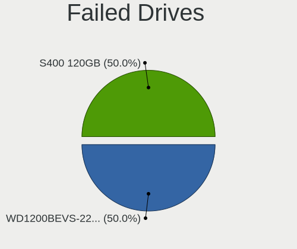

| Model                       | Computers | Drives | Percent |
|-----------------------------|-----------|--------|---------|
| WDC WD1200BEVS-22UST0 120GB | 1         | 1      | 50%     |
| KingDian S400 120GB SSD     | 1         | 1      | 50%     |

Failed Drive Vendor
-------------------

Failed drive vendors

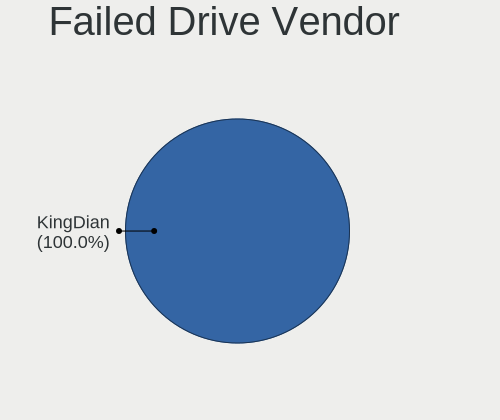

| Vendor   | Computers | Drives | Percent |
|----------|-----------|--------|---------|
| WDC      | 1         | 1      | 50%     |
| KingDian | 1         | 1      | 50%     |

Drive Status
------------

Number of failed and malfunc. drives

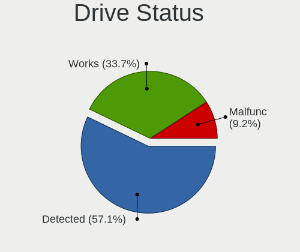

| Status   | Computers | Drives | Percent |
|----------|-----------|--------|---------|
| Detected | 301       | 599    | 56.79%  |
| Works    | 183       | 352    | 34.53%  |
| Malfunc  | 44        | 74     | 8.3%    |
| Failed   | 2         | 2      | 0.38%   |

Storage controller
------------------

Storage Vendor
--------------

Storage controller vendors

| Vendor                       | Computers | Percent |
|------------------------------|-----------|---------|
| Intel                        | 309       | 52.55%  |
| AMD                          | 88        | 14.97%  |
| Samsung Electronics          | 57        | 9.69%   |
| SanDisk                      | 32        | 5.44%   |
| Nvidia                       | 13        | 2.21%   |
| Toshiba America Info Systems | 10        | 1.7%    |
| Micron Technology            | 9         | 1.53%   |
| Marvell Technology Group     | 9         | 1.53%   |
| SK hynix                     | 8         | 1.36%   |
| ASMedia Technology           | 8         | 1.36%   |
| Phison Electronics           | 7         | 1.19%   |
| Micron/Crucial Technology    | 6         | 1.02%   |
| KIOXIA                       | 6         | 1.02%   |
| JMicron Technology           | 5         | 0.85%   |
| Union Memory (Shenzhen)      | 4         | 0.68%   |
| Silicon Motion               | 4         | 0.68%   |
| LSI Logic / Symbios Logic    | 3         | 0.51%   |
| Realtek Semiconductor        | 2         | 0.34%   |
| Kingston Technology Company  | 2         | 0.34%   |
| ULi Electronics              | 1         | 0.17%   |
| Silicon Image                | 1         | 0.17%   |
| Seagate Technology           | 1         | 0.17%   |
| Broadcom / LSI               | 1         | 0.17%   |
| ADATA Technology             | 1         | 0.17%   |
| Adaptec                      | 1         | 0.17%   |

Storage Model
-------------

Storage controller models

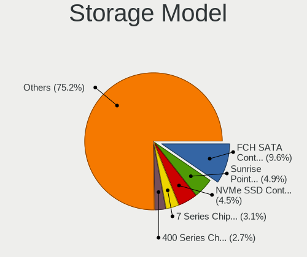

| Model                                                                                   | Computers | Percent |
|-----------------------------------------------------------------------------------------|-----------|---------|
| AMD FCH SATA Controller [AHCI mode]                                                     | 66        | 9.64%   |
| Samsung NVMe SSD Controller SM981/PM981/PM983                                           | 33        | 4.82%   |
| Intel Sunrise Point-LP SATA Controller [AHCI mode]                                      | 33        | 4.82%   |
| Intel 7 Series Chipset Family 6-port SATA Controller [AHCI mode]                        | 20        | 2.92%   |
| Intel 82801 Mobile SATA Controller [RAID mode]                                          | 18        | 2.63%   |
| Intel 8 Series/C220 Series Chipset Family 6-port SATA Controller 1 [AHCI mode]          | 18        | 2.63%   |
| AMD 400 Series Chipset SATA Controller                                                  | 17        | 2.48%   |
| Intel 6 Series/C200 Series Chipset Family 6 port Desktop SATA AHCI Controller           | 16        | 2.34%   |
| Intel 7 Series/C210 Series Chipset Family 6-port SATA Controller [AHCI mode]            | 14        | 2.04%   |
| Intel 6 Series/C200 Series Chipset Family 6 port Mobile SATA AHCI Controller            | 13        | 1.9%    |
| Intel Comet Lake SATA AHCI Controller                                                   | 12        | 1.75%   |
| SanDisk WD Black SN750 / PC SN730 NVMe SSD                                              | 11        | 1.61%   |
| Samsung NVMe SSD Controller 980                                                         | 11        | 1.61%   |
| AMD SB7x0/SB8x0/SB9x0 SATA Controller [AHCI mode]                                       | 11        | 1.61%   |
| Intel 82801IBM/IEM (ICH9M/ICH9M-E) 4 port SATA Controller [AHCI mode]                   | 10        | 1.46%   |
| AMD SB7x0/SB8x0/SB9x0 IDE Controller                                                    | 10        | 1.46%   |
| Micron Non-Volatile memory controller                                                   | 9         | 1.31%   |
| Intel Volume Management Device NVMe RAID Controller                                     | 9         | 1.31%   |
| Intel Q170/Q150/B150/H170/H110/Z170/CM236 Chipset SATA Controller [AHCI Mode]           | 9         | 1.31%   |
| Intel 8 Series SATA Controller 1 [AHCI mode]                                            | 9         | 1.31%   |
| Intel 82801HM/HEM (ICH8M/ICH8M-E) IDE Controller                                        | 8         | 1.17%   |
| Intel 6 Series/C200 Series Chipset Family Desktop SATA Controller (IDE mode, ports 4-5) | 8         | 1.17%   |
| Intel 6 Series/C200 Series Chipset Family Desktop SATA Controller (IDE mode, ports 0-3) | 8         | 1.17%   |
| ASMedia ASM1062 Serial ATA Controller                                                   | 8         | 1.17%   |
| Intel Celeron/Pentium Silver Processor SATA Controller                                  | 7         | 1.02%   |
| Intel Atom Processor E3800 Series SATA AHCI Controller                                  | 7         | 1.02%   |
| Intel 82801JI (ICH10 Family) SATA AHCI Controller                                       | 7         | 1.02%   |
| Samsung NVMe SSD Controller SM961/PM961/SM963                                           | 6         | 0.88%   |
| Nvidia MCP79 AHCI Controller                                                            | 6         | 0.88%   |
| Intel Wildcat Point-LP SATA Controller [AHCI Mode]                                      | 6         | 0.88%   |
| Intel NM10/ICH7 Family SATA Controller [AHCI mode]                                      | 6         | 0.88%   |
| Intel HM170/QM170 Chipset SATA Controller [AHCI Mode]                                   | 6         | 0.88%   |
| Intel 82801HM/HEM (ICH8M/ICH8M-E) SATA Controller [AHCI mode]                           | 6         | 0.88%   |
| Intel 5 Series/3400 Series Chipset 4 port SATA AHCI Controller                          | 6         | 0.88%   |
| AMD SB7x0/SB8x0/SB9x0 SATA Controller [IDE mode]                                        | 6         | 0.88%   |
| Toshiba America Info Systems XG6 NVMe SSD Controller                                    | 5         | 0.73%   |
| SanDisk Non-Volatile memory controller                                                  | 5         | 0.73%   |
| Samsung NVMe SSD Controller PM9A1/PM9A3/980PRO                                          | 5         | 0.73%   |
| Intel SATA Controller [RAID mode]                                                       | 5         | 0.73%   |
| Intel 82801G (ICH7 Family) IDE Controller                                               | 5         | 0.73%   |

Storage Kind
------------

Kind of storage controller (IDE, SATA, NVMe, SAS, ...)

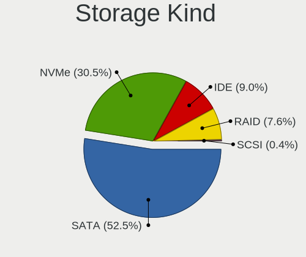

| Kind | Computers | Percent |
|------|-----------|---------|
| SATA | 345       | 57.89%  |
| NVMe | 145       | 24.33%  |
| IDE  | 67        | 11.24%  |
| RAID | 36        | 6.04%   |
| SCSI | 3         | 0.5%    |

Processor
---------

CPU Vendor
----------

Processor vendors

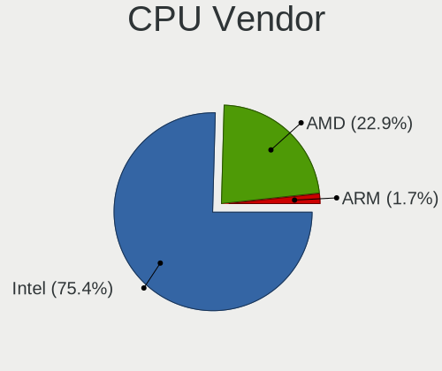

| Vendor | Computers | Percent |
|--------|-----------|---------|
| Intel  | 360       | 75.16%  |
| AMD    | 112       | 23.38%  |
| ARM    | 7         | 1.46%   |

CPU Model
---------

Processor models

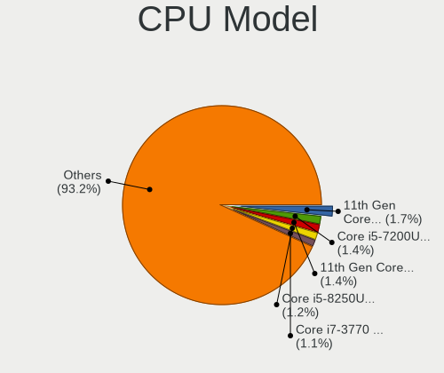

| Model                                         | Computers | Percent |
|-----------------------------------------------|-----------|---------|
| Intel Core i5-7200U CPU @ 2.50GHz             | 7         | 1.45%   |
| Intel Core i5-6200U CPU @ 2.30GHz             | 7         | 1.45%   |
| Intel 11th Gen Core i7-1185G7 @ 3.00GHz       | 7         | 1.45%   |
| ARM Processor                                 | 7         | 1.45%   |
| AMD Ryzen 5 3600 6-Core Processor             | 7         | 1.45%   |
| Intel Core i7-7500U CPU @ 2.70GHz             | 6         | 1.24%   |
| Intel Core i7-3770 CPU @ 3.40GHz              | 6         | 1.24%   |
| Intel 11th Gen Core i5-1135G7 @ 2.40GHz       | 6         | 1.24%   |
| Intel Core i7-8550U CPU @ 1.80GHz             | 5         | 1.04%   |
| Intel Core i7-7700HQ CPU @ 2.80GHz            | 5         | 1.04%   |
| Intel Core i7-2600K CPU @ 3.40GHz             | 5         | 1.04%   |
| Intel Core i7-10510U CPU @ 1.80GHz            | 5         | 1.04%   |
| Intel Core i5-8250U CPU @ 1.60GHz             | 5         | 1.04%   |
| Intel Core i5-2520M CPU @ 2.50GHz             | 5         | 1.04%   |
| Intel Core i7-3770K CPU @ 3.50GHz             | 4         | 0.83%   |
| Intel Core i5-4300U CPU @ 1.90GHz             | 4         | 0.83%   |
| Intel Core i5-2400 CPU @ 3.10GHz              | 4         | 0.83%   |
| Intel 11th Gen Core i7-1165G7 @ 2.80GHz       | 4         | 0.83%   |
| AMD Ryzen 9 3900X 12-Core Processor           | 4         | 0.83%   |
| AMD Ryzen 5 3500U with Radeon Vega Mobile Gfx | 4         | 0.83%   |
| AMD Ryzen 5 2600X Six-Core Processor          | 4         | 0.83%   |
| Intel Core i7-9750H CPU @ 2.60GHz             | 3         | 0.62%   |
| Intel Core i5-3470 CPU @ 3.20GHz              | 3         | 0.62%   |
| Intel Core i5-3340M CPU @ 2.70GHz             | 3         | 0.62%   |
| Intel Core i5-3337U CPU @ 1.80GHz             | 3         | 0.62%   |
| Intel Core i5-10210U CPU @ 1.60GHz            | 3         | 0.62%   |
| Intel Core i3-3110M CPU @ 2.40GHz             | 3         | 0.62%   |
| Intel Core i3-2120 CPU @ 3.30GHz              | 3         | 0.62%   |
| Intel Core i3-2100 CPU @ 3.10GHz              | 3         | 0.62%   |
| Intel Core 2 Quad CPU Q6600 @ 2.40GHz         | 3         | 0.62%   |
| Intel Core 2 Duo CPU T5800 @ 2.00GHz          | 3         | 0.62%   |
| Intel Core 2 Duo CPU P8400 @ 2.26GHz          | 3         | 0.62%   |
| Intel Celeron J4125 CPU @ 2.00GHz             | 3         | 0.62%   |
| Intel Celeron CPU N2840 @ 2.16GHz             | 3         | 0.62%   |
| Intel Atom x5-Z8350 CPU @ 1.44GHz             | 3         | 0.62%   |
| Intel Atom CPU N450 @ 1.66GHz                 | 3         | 0.62%   |
| AMD Ryzen 7 4800H with Radeon Graphics        | 3         | 0.62%   |
| AMD Athlon II X4 620 Processor                | 3         | 0.62%   |
| AMD A9-9425 RADEON R5, 5 COMPUTE CORES 2C+3G  | 3         | 0.62%   |
| Intel Xeon CPU X5690 @ 3.47GHz                | 2         | 0.41%   |

CPU Model Family
----------------

Processor model prefix

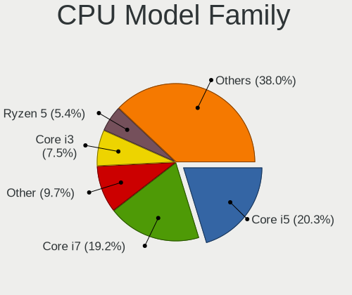

| Model                   | Computers | Percent |
|-------------------------|-----------|---------|
| Intel Core i5           | 102       | 21.16%  |
| Intel Core i7           | 96        | 19.92%  |
| Other                   | 40        | 8.3%    |
| Intel Core i3           | 36        | 7.47%   |
| AMD Ryzen 5             | 29        | 6.02%   |
| Intel Core 2 Duo        | 24        | 4.98%   |
| Intel Celeron           | 23        | 4.77%   |
| AMD Ryzen 7             | 13        | 2.7%    |
| Intel Atom              | 10        | 2.07%   |
| Intel Core 2 Quad       | 8         | 1.66%   |
| AMD Ryzen 9             | 8         | 1.66%   |
| Intel Pentium           | 7         | 1.45%   |
| Intel Xeon              | 6         | 1.24%   |
| AMD FX                  | 6         | 1.24%   |
| AMD Athlon 64 X2        | 6         | 1.24%   |
| Intel Pentium Dual-Core | 4         | 0.83%   |
| AMD Ryzen 3             | 4         | 0.83%   |
| AMD A8                  | 4         | 0.83%   |
| Intel Core 2            | 3         | 0.62%   |
| AMD Ryzen 7 PRO         | 3         | 0.62%   |
| AMD Athlon II X4        | 3         | 0.62%   |
| AMD A6                  | 3         | 0.62%   |
| Intel Pentium 4         | 2         | 0.41%   |
| Intel Core m3           | 2         | 0.41%   |
| Intel Core i9           | 2         | 0.41%   |
| Intel Celeron Dual-Core | 2         | 0.41%   |
| AMD Ryzen Threadripper  | 2         | 0.41%   |
| AMD Ryzen Embedded      | 2         | 0.41%   |
| AMD Ryzen 5 PRO         | 2         | 0.41%   |
| AMD PRO A10             | 2         | 0.41%   |
| AMD Phenom II X6        | 2         | 0.41%   |
| AMD E2                  | 2         | 0.41%   |
| AMD E1                  | 2         | 0.41%   |
| AMD A4                  | 2         | 0.41%   |
| Intel Pentium Silver    | 1         | 0.21%   |
| Intel Pentium M         | 1         | 0.21%   |
| Intel Pentium III       | 1         | 0.21%   |
| Intel Pentium D         | 1         | 0.21%   |
| Intel Genuine           | 1         | 0.21%   |
| Intel Core m7           | 1         | 0.21%   |

CPU Cores
---------

Number of processor cores

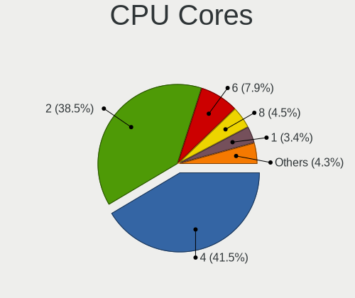

| Number  | Computers | Percent |
|---------|-----------|---------|
| 4       | 199       | 41.46%  |
| 2       | 184       | 38.33%  |
| 6       | 38        | 7.92%   |
| 8       | 23        | 4.79%   |
| 1       | 16        | 3.33%   |
| 12      | 10        | 2.08%   |
| 14      | 4         | 0.83%   |
| 3       | 3         | 0.63%   |
| 32      | 1         | 0.21%   |
| 10      | 1         | 0.21%   |
| Unknown | 1         | 0.21%   |

CPU Sockets
-----------

Number of sockets

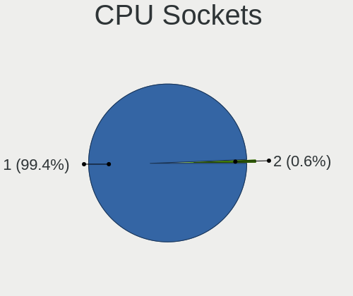

| Number | Computers | Percent |
|--------|-----------|---------|
| 1      | 476       | 99.37%  |
| 2      | 3         | 0.63%   |

CPU Threads
-----------

Threads per core (Hyper-Threading)

| Number  | Computers | Percent |
|---------|-----------|---------|
| 2       | 312       | 64.73%  |
| 1       | 169       | 35.06%  |
| Unknown | 1         | 0.21%   |

CPU Op-Modes
------------

CPU Operation Modes (32-bit, 64-bit)

| Op mode        | Computers | Percent |
|----------------|-----------|---------|
| 32-bit, 64-bit | 461       | 95.84%  |
| Unknown        | 17        | 3.53%   |
| 32-bit         | 3         | 0.62%   |

CPU Microcode
-------------

Microcode number

| Number     | Computers | Percent |
|------------|-----------|---------|
| Unknown    | 125       | 25.3%   |
| 0x306a9    | 32        | 6.48%   |
| 0x206a7    | 25        | 5.06%   |
| 0x1067a    | 21        | 4.25%   |
| 0x306c3    | 20        | 4.05%   |
| 0x806ec    | 16        | 3.24%   |
| 0x806c1    | 16        | 3.24%   |
| 0x806e9    | 15        | 3.04%   |
| 0x806ea    | 11        | 2.23%   |
| 0x406e3    | 9         | 1.82%   |
| 0x40651    | 9         | 1.82%   |
| 0x906ea    | 8         | 1.62%   |
| 0x906e9    | 8         | 1.62%   |
| 0x10676    | 8         | 1.62%   |
| 0x08701021 | 7         | 1.42%   |
| 0xa0652    | 6         | 1.21%   |
| 0x406c4    | 6         | 1.21%   |
| 0x306d4    | 6         | 1.21%   |
| 0x30678    | 6         | 1.21%   |
| 0x08108109 | 6         | 1.21%   |
| 0x506e3    | 5         | 1.01%   |
| 0x20655    | 5         | 1.01%   |
| 0x08108102 | 5         | 1.01%   |
| 0x0810100b | 5         | 1.01%   |
| 0x06006705 | 5         | 1.01%   |
| 0x6fd      | 4         | 0.81%   |
| 0x6fb      | 4         | 0.81%   |
| 0x0800820d | 4         | 0.81%   |
| 0xa0653    | 3         | 0.61%   |
| 0x806d1    | 3         | 0.61%   |
| 0x706e5    | 3         | 0.61%   |
| 0x206c2    | 3         | 0.61%   |
| 0x106ca    | 3         | 0.61%   |
| 0x0a50000c | 3         | 0.61%   |
| 0x08701013 | 3         | 0.61%   |
| 0x0600611a | 3         | 0.61%   |
| 0x06001119 | 3         | 0.61%   |
| 0x06000852 | 3         | 0.61%   |
| 0x010000c8 | 3         | 0.61%   |
| 0x906ed    | 2         | 0.4%    |

CPU Microarch
-------------

Microarchitecture

| Name             | Computers | Percent |
|------------------|-----------|---------|
| KabyLake         | 72        | 15%     |
| IvyBridge        | 44        | 9.17%   |
| SandyBridge      | 36        | 7.5%    |
| Haswell          | 36        | 7.5%    |
| Penryn           | 30        | 6.25%   |
| Zen 2            | 22        | 4.58%   |
| Zen+             | 21        | 4.38%   |
| Skylake          | 21        | 4.38%   |
| TigerLake        | 19        | 3.96%   |
| Silvermont       | 17        | 3.54%   |
| Westmere         | 14        | 2.92%   |
| Core             | 14        | 2.92%   |
| Unknown          | 14        | 2.92%   |
| Zen              | 11        | 2.29%   |
| CometLake        | 11        | 2.29%   |
| Excavator        | 10        | 2.08%   |
| K8 Hammer        | 9         | 1.88%   |
| K10              | 9         | 1.88%   |
| Piledriver       | 8         | 1.67%   |
| IceLake          | 8         | 1.67%   |
| Zen 3            | 7         | 1.46%   |
| Goldmont plus    | 7         | 1.46%   |
| Broadwell        | 7         | 1.46%   |
| Nehalem          | 6         | 1.25%   |
| Bonnell          | 5         | 1.04%   |
| P6               | 4         | 0.83%   |
| Puma             | 3         | 0.63%   |
| NetBurst         | 3         | 0.63%   |
| Jaguar           | 3         | 0.63%   |
| Bobcat           | 3         | 0.63%   |
| Goldmont         | 2         | 0.42%   |
| Alderlake Hybrid | 2         | 0.42%   |
| Steamroller      | 1         | 0.21%   |
| Bulldozer        | 1         | 0.21%   |

Graphics
--------

GPU Vendor
----------

Vendors of graphics cards

| Vendor | Computers | Percent |
|--------|-----------|---------|
| Intel  | 271       | 49.01%  |
| Nvidia | 149       | 26.94%  |
| AMD    | 133       | 24.05%  |

GPU Model
---------

Graphics card models

| Model                                                                                    | Computers | Percent |
|------------------------------------------------------------------------------------------|-----------|---------|
| Intel 2nd Generation Core Processor Family Integrated Graphics Controller                | 23        | 4.01%   |
| Intel 3rd Gen Core processor Graphics Controller                                         | 21        | 3.66%   |
| Intel TigerLake-LP GT2 [Iris Xe Graphics]                                                | 17        | 2.97%   |
| Intel HD Graphics 620                                                                    | 15        | 2.62%   |
| AMD Ellesmere [Radeon RX 470/480/570/570X/580/580X/590]                                  | 14        | 2.44%   |
| Intel UHD Graphics 620                                                                   | 12        | 2.09%   |
| Intel Haswell-ULT Integrated Graphics Controller                                         | 11        | 1.92%   |
| Intel Skylake GT2 [HD Graphics 520]                                                      | 10        | 1.75%   |
| Intel CometLake-U GT2 [UHD Graphics]                                                     | 10        | 1.75%   |
| Intel HD Graphics 630                                                                    | 9         | 1.57%   |
| Intel Atom/Celeron/Pentium Processor x5-E8000/J3xxx/N3xxx Integrated Graphics Controller | 9         | 1.57%   |
| AMD Picasso/Raven 2 [Radeon Vega Series / Radeon Vega Mobile Series]                     | 9         | 1.57%   |
| Intel Xeon E3-1200 v3/4th Gen Core Processor Integrated Graphics Controller              | 8         | 1.4%    |
| Intel Mobile 4 Series Chipset Integrated Graphics Controller                             | 8         | 1.4%    |
| Intel Core Processor Integrated Graphics Controller                                      | 8         | 1.4%    |
| Intel Atom Processor Z36xxx/Z37xxx Series Graphics & Display                             | 8         | 1.4%    |
| AMD Raven Ridge [Radeon Vega Series / Radeon Vega Mobile Series]                         | 8         | 1.4%    |
| AMD Oland [Radeon HD 8570 / R5 430 OEM / R7 240/340 / Radeon 520 OEM]                    | 8         | 1.4%    |
| Intel WhiskeyLake-U GT2 [UHD Graphics 620]                                               | 7         | 1.22%   |
| AMD Renoir                                                                               | 7         | 1.22%   |
| Intel HD Graphics 5500                                                                   | 6         | 1.05%   |
| Intel GeminiLake [UHD Graphics 600]                                                      | 6         | 1.05%   |
| Intel CometLake-H GT2 [UHD Graphics]                                                     | 6         | 1.05%   |
| Intel 4 Series Chipset Integrated Graphics Controller                                    | 6         | 1.05%   |
| Nvidia GP107 [GeForce GTX 1050 Ti]                                                       | 5         | 0.87%   |
| Nvidia C79 [GeForce 9400M]                                                               | 5         | 0.87%   |
| Intel CoffeeLake-S GT2 [UHD Graphics 630]                                                | 5         | 0.87%   |
| Intel CoffeeLake-H GT2 [UHD Graphics 630]                                                | 5         | 0.87%   |
| Intel 4th Generation Core Processor Family Integrated Graphics Controller                | 5         | 0.87%   |
| Intel 4th Gen Core Processor Integrated Graphics Controller                              | 5         | 0.87%   |
| AMD Wani [Radeon R5/R6/R7 Graphics]                                                      | 5         | 0.87%   |
| AMD Stoney [Radeon R2/R3/R4/R5 Graphics]                                                 | 5         | 0.87%   |
| Nvidia TU117M [GeForce GTX 1650 Mobile / Max-Q]                                          | 4         | 0.7%    |
| Nvidia TU106M [GeForce RTX 2060 Mobile]                                                  | 4         | 0.7%    |
| Nvidia GP108M [GeForce MX150]                                                            | 4         | 0.7%    |
| Nvidia GP106 [GeForce GTX 1060 6GB]                                                      | 4         | 0.7%    |
| Nvidia G96CM [GeForce 9600M GT]                                                          | 4         | 0.7%    |
| Intel Xeon E3-1200 v2/3rd Gen Core processor Graphics Controller                         | 4         | 0.7%    |
| Intel IvyBridge GT2 [HD Graphics 4000]                                                   | 4         | 0.7%    |
| Intel Alder Lake-P Integrated Graphics Controller                                        | 4         | 0.7%    |

GPU Combo
---------

Combinations of graphics cards

| Name           | Computers | Percent |
|----------------|-----------|---------|
| 1 x Intel      | 204       | 42.06%  |
| 1 x AMD        | 111       | 22.89%  |
| 1 x Nvidia     | 85        | 17.53%  |
| Intel + Nvidia | 55        | 11.34%  |
| 2 x AMD        | 11        | 2.27%   |
| AMD + Nvidia   | 8         | 1.65%   |
| Other          | 7         | 1.44%   |
| Intel + AMD    | 3         | 0.62%   |
| 2 x Nvidia     | 1         | 0.21%   |

GPU Driver
----------

Free vs proprietary

| Driver      | Computers | Percent |
|-------------|-----------|---------|
| Free        | 388       | 79.67%  |
| Proprietary | 74        | 15.2%   |
| Unknown     | 25        | 5.13%   |

GPU Memory
----------

Total video memory

| Size in GB | Computers | Percent |
|------------|-----------|---------|
| Unknown    | 267       | 53.61%  |
| 0.01-0.5   | 61        | 12.25%  |
| 1.01-2.0   | 50        | 10.04%  |
| 3.01-4.0   | 41        | 8.23%   |
| 0.51-1.0   | 39        | 7.83%   |
| 7.01-8.0   | 20        | 4.02%   |
| 5.01-6.0   | 13        | 2.61%   |
| 2.01-3.0   | 4         | 0.8%    |
| 8.01-16.0  | 2         | 0.4%    |
| 16.01-24.0 | 1         | 0.2%    |

Monitor
-------

Monitor Vendor
--------------

Monitor vendors

| Vendor                  | Computers | Percent |
|-------------------------|-----------|---------|
| AU Optronics            | 62        | 11.95%  |
| Dell                    | 56        | 10.79%  |
| LG Display              | 54        | 10.4%   |
| Samsung Electronics     | 46        | 8.86%   |
| BOE                     | 40        | 7.71%   |
| Chimei Innolux          | 34        | 6.55%   |
| Sharp                   | 20        | 3.85%   |
| Acer                    | 20        | 3.85%   |
| Hewlett-Packard         | 17        | 3.28%   |
| Apple                   | 17        | 3.28%   |
| Philips                 | 14        | 2.7%    |
| Goldstar                | 14        | 2.7%    |
| BenQ                    | 14        | 2.7%    |
| Iiyama                  | 11        | 2.12%   |
| AOC                     | 11        | 2.12%   |
| Lenovo                  | 9         | 1.73%   |
| PANDA                   | 7         | 1.35%   |
| Chi Mei Optoelectronics | 7         | 1.35%   |
| ViewSonic               | 6         | 1.16%   |
| InfoVision              | 4         | 0.77%   |
| Ancor Communications    | 4         | 0.77%   |
| ___                     | 3         | 0.58%   |
| Vestel Elektronik       | 3         | 0.58%   |
| Unknown                 | 3         | 0.58%   |
| Sony                    | 3         | 0.58%   |
| LG Philips              | 3         | 0.58%   |
| HannStar                | 3         | 0.58%   |
| Toshiba                 | 2         | 0.39%   |
| OEM                     | 2         | 0.39%   |
| MSI                     | 2         | 0.39%   |
| MiTAC                   | 2         | 0.39%   |
| HKC                     | 2         | 0.39%   |
| CSO                     | 2         | 0.39%   |
| CPT                     | 2         | 0.39%   |
| BOE Technology Group    | 2         | 0.39%   |
| ASUSTek Computer        | 2         | 0.39%   |
| Unknown                 | 2         | 0.39%   |
| Targa Visionary         | 1         | 0.19%   |
| Targa                   | 1         | 0.19%   |
| RTK                     | 1         | 0.19%   |

Monitor Model
-------------

Monitor models

| Model                                                                | Computers | Percent |
|----------------------------------------------------------------------|-----------|---------|
| Iiyama PLT2336 IVM5628 1920x1080 509x286mm 23.0-inch                 | 5         | 0.91%   |
| Samsung Electronics LCD Monitor SAM0900 1366x768 700x390mm 31.5-inch | 4         | 0.73%   |
| AU Optronics LCD Monitor AUO38ED 1920x1080 344x193mm 15.5-inch       | 4         | 0.73%   |
| AU Optronics LCD Monitor AUO106C 1366x768 276x155mm 12.5-inch        | 4         | 0.73%   |
| ___ LCDTV16 ___9000 1360x768                                         | 3         | 0.55%   |
| Vestel Elektronik 40UHD_LCD_TV VES3700 3840x2160 890x500mm 40.2-inch | 3         | 0.55%   |
| Unknown LCDTV16 9000 1360x768 1600x900mm 72.3-inch                   | 3         | 0.55%   |
| Sharp LQ156M1JW01 SHP14C3 1920x1080 344x194mm 15.5-inch              | 3         | 0.55%   |
| Samsung Electronics LCD Monitor SEC5441 1366x768 344x194mm 15.5-inch | 3         | 0.55%   |
| Philips PHL 243V5 PHLC0D1 1920x1080 521x293mm 23.5-inch              | 3         | 0.55%   |
| LG Display LCD Monitor LGD04A7 1920x1080 344x194mm 15.5-inch         | 3         | 0.55%   |
| LG Display LCD Monitor LGD0382 1600x900 309x174mm 14.0-inch          | 3         | 0.55%   |
| LG Display LCD Monitor LGD033A 1366x768 344x194mm 15.5-inch          | 3         | 0.55%   |
| Dell P2014H DEL4097 1600x900 434x236mm 19.4-inch                     | 3         | 0.55%   |
| Chimei Innolux LCD Monitor CMN15D7 1920x1080 344x193mm 15.5-inch     | 3         | 0.55%   |
| BOE LCD Monitor BOE091D 1920x1080 309x174mm 14.0-inch                | 3         | 0.55%   |
| BenQ BenQG2222HDL BNQ7859 1920x1080 478x269mm 21.6-inch              | 3         | 0.55%   |
| AU Optronics LCD Monitor AUO403D 1920x1080 309x173mm 13.9-inch       | 3         | 0.55%   |
| AU Optronics LCD Monitor AUO243D 1920x1080 309x173mm 13.9-inch       | 3         | 0.55%   |
| ViewSonic VP2756-2K VSCE63B 2560x1440 597x336mm 27.0-inch            | 2         | 0.37%   |
| Sharp LCD Monitor SHP1547 1920x1200 288x180mm 13.4-inch              | 2         | 0.37%   |
| Sharp LCD Monitor SHP14D1 1920x1200 336x210mm 15.6-inch              | 2         | 0.37%   |
| Sharp LCD Monitor SHP14CC 3840x2400 288x180mm 13.4-inch              | 2         | 0.37%   |
| Sharp LCD Monitor SHP14AE 1920x1080 294x165mm 13.3-inch              | 2         | 0.37%   |
| Samsung Electronics U28E590 SAM0C4C 3840x2160 608x345mm 27.5-inch    | 2         | 0.37%   |
| Samsung Electronics SMS24A450 SAM083A 1920x1200 518x324mm 24.1-inch  | 2         | 0.37%   |
| Samsung Electronics S24D300 SAM0B43 1920x1080 531x299mm 24.0-inch    | 2         | 0.37%   |
| Philips PHL 273V7 PHLC156 1920x1080 598x336mm 27.0-inch              | 2         | 0.37%   |
| Philips PHL 243V7 PHLC155 1920x1080 527x296mm 23.8-inch              | 2         | 0.37%   |
| PANDA LCD Monitor NCP0036 1920x1080 344x194mm 15.5-inch              | 2         | 0.37%   |
| LG Display LP156WH1-TLA3 LGD01C2 1366x768 344x194mm 15.5-inch        | 2         | 0.37%   |
| LG Display LCD Monitor LGD0533 1920x1080 344x194mm 15.5-inch         | 2         | 0.37%   |
| LG Display LCD Monitor LGD046F 1920x1080 344x194mm 15.5-inch         | 2         | 0.37%   |
| LG Display LCD Monitor LGD046D 1920x1080 309x174mm 14.0-inch         | 2         | 0.37%   |
| LG Display LCD Monitor LGD02DC 1366x768 344x194mm 15.5-inch          | 2         | 0.37%   |
| Lenovo LCD Monitor LEN4036 1440x900 303x189mm 14.1-inch              | 2         | 0.37%   |
| InfoVision LCD Monitor IVO057D 1920x1080 309x174mm 14.0-inch         | 2         | 0.37%   |
| Hewlett-Packard Z34c HWP3201 3440x1440 797x333mm 34.0-inch           | 2         | 0.37%   |
| Goldstar LG ULTRAGEAR GSM5B7F 2560x1440 600x340mm 27.2-inch          | 2         | 0.37%   |
| Dell U2715H DELD069 2560x1440 597x336mm 27.0-inch                    | 2         | 0.37%   |

Monitor Resolution
------------------

Monitor screen resolution

| Resolution         | Computers | Percent |
|--------------------|-----------|---------|
| 1920x1080 (FHD)    | 226       | 44.93%  |
| 1366x768 (WXGA)    | 89        | 17.69%  |
| 3840x2160 (4K)     | 32        | 6.36%   |
| 2560x1440 (QHD)    | 23        | 4.57%   |
| 1600x900 (HD+)     | 19        | 3.78%   |
| 1920x1200 (WUXGA)  | 16        | 3.18%   |
| 1440x900 (WXGA+)   | 15        | 2.98%   |
| 1280x800 (WXGA)    | 13        | 2.58%   |
| 1280x1024 (SXGA)   | 12        | 2.39%   |
| 3440x1440          | 9         | 1.79%   |
| 1360x768           | 7         | 1.39%   |
| Unknown            | 7         | 1.39%   |
| 1680x1050 (WSXGA+) | 6         | 1.19%   |
| 3840x2400          | 3         | 0.6%    |
| 3840x1080          | 3         | 0.6%    |
| 1600x1200          | 3         | 0.6%    |
| 1024x600           | 3         | 0.6%    |
| 3200x1800 (QHD+)   | 2         | 0.4%    |
| 2560x1600          | 2         | 0.4%    |
| 1920x540           | 2         | 0.4%    |
| 1024x768 (XGA)     | 2         | 0.4%    |
| 800x1280           | 1         | 0.2%    |
| 6400x2160          | 1         | 0.2%    |
| 5280x2560          | 1         | 0.2%    |
| 4480x1440          | 1         | 0.2%    |
| 3600x1080          | 1         | 0.2%    |
| 3456x2160          | 1         | 0.2%    |
| 2560x1080          | 1         | 0.2%    |
| 2256x1504          | 1         | 0.2%    |
| 2160x1440          | 1         | 0.2%    |

Monitor Diagonal
----------------

Diagonal size in inches

| Inches  | Computers | Percent |
|---------|-----------|---------|
| 15      | 139       | 26.68%  |
| 14      | 53        | 10.17%  |
| 27      | 49        | 9.4%    |
| 13      | 42        | 8.06%   |
| 24      | 39        | 7.49%   |
| 23      | 32        | 6.14%   |
| 21      | 29        | 5.57%   |
| Unknown | 25        | 4.8%    |
| 17      | 20        | 3.84%   |
| 12      | 15        | 2.88%   |
| 19      | 13        | 2.5%    |
| 34      | 10        | 1.92%   |
| 31      | 9         | 1.73%   |
| 18      | 8         | 1.54%   |
| 20      | 5         | 0.96%   |
| 84      | 4         | 0.77%   |
| 72      | 4         | 0.77%   |
| 32      | 4         | 0.77%   |
| 11      | 4         | 0.77%   |
| 25      | 3         | 0.58%   |
| 22      | 3         | 0.58%   |
| 10      | 3         | 0.58%   |
| 40      | 2         | 0.38%   |
| 65      | 1         | 0.19%   |
| 49      | 1         | 0.19%   |
| 46      | 1         | 0.19%   |
| 35      | 1         | 0.19%   |
| 33      | 1         | 0.19%   |
| 29      | 1         | 0.19%   |

Monitor Width
-------------

Physical width

| Width in mm | Computers | Percent |
|-------------|-----------|---------|
| 301-350     | 206       | 40.16%  |
| 501-600     | 108       | 21.05%  |
| 401-500     | 53        | 10.33%  |
| 201-300     | 50        | 9.75%   |
| Unknown     | 25        | 4.87%   |
| 351-400     | 24        | 4.68%   |
| 601-700     | 18        | 3.51%   |
| 701-800     | 15        | 2.92%   |
| 1501-2000   | 8         | 1.56%   |
| 801-900     | 3         | 0.58%   |
| 1001-1500   | 3         | 0.58%   |

Aspect Ratio
------------

Proportional relationship between the width and the height

| Ratio   | Computers | Percent |
|---------|-----------|---------|
| 16/9    | 356       | 77.06%  |
| 16/10   | 53        | 11.47%  |
| Unknown | 19        | 4.11%   |
| 5/4     | 12        | 2.6%    |
| 21/9    | 11        | 2.38%   |
| 4/3     | 5         | 1.08%   |
| 3/2     | 4         | 0.87%   |
| 32/9    | 1         | 0.22%   |
| 0.62    | 1         | 0.22%   |

Monitor Area
------------

Area in inch²

| Area in inch² | Computers | Percent |
|----------------|-----------|---------|
| 101-110        | 137       | 26.2%   |
| 201-250        | 80        | 15.3%   |
| 81-90          | 71        | 13.58%  |
| 301-350        | 49        | 9.37%   |
| 151-200        | 28        | 5.35%   |
| 351-500        | 26        | 4.97%   |
| 71-80          | 25        | 4.78%   |
| Unknown        | 25        | 4.78%   |
| 251-300        | 19        | 3.63%   |
| 61-70          | 14        | 2.68%   |
| 141-150        | 13        | 2.49%   |
| 121-130        | 11        | 2.1%    |
| More than 1000 | 9         | 1.72%   |
| 51-60          | 4         | 0.76%   |
| 501-1000       | 4         | 0.76%   |
| 41-50          | 3         | 0.57%   |
| 131-140        | 3         | 0.57%   |
| 111-120        | 1         | 0.19%   |
| 91-100         | 1         | 0.19%   |

Pixel Density
-------------

Pixels per inch

| Density       | Computers | Percent |
|---------------|-----------|---------|
| 51-100        | 150       | 29.7%   |
| 121-160       | 147       | 29.11%  |
| 101-120       | 128       | 25.35%  |
| 161-240       | 32        | 6.34%   |
| Unknown       | 25        | 4.95%   |
| More than 240 | 12        | 2.38%   |
| 1-50          | 11        | 2.18%   |

Multiple Monitors
-----------------

Total monitors connected

| Total | Computers | Percent |
|-------|-----------|---------|
| 1     | 378       | 76.67%  |
| 2     | 80        | 16.23%  |
| 0     | 23        | 4.67%   |
| 3     | 11        | 2.23%   |
| 4     | 1         | 0.2%    |

Network
-------

Net Controller Vendor
---------------------

Controller vendors

| Vendor                            | Computers | Percent |
|-----------------------------------|-----------|---------|
| Intel                             | 260       | 34.85%  |
| Realtek Semiconductor             | 229       | 30.7%   |
| Qualcomm Atheros                  | 69        | 9.25%   |
| Broadcom                          | 54        | 7.24%   |
| Ralink Technology                 | 14        | 1.88%   |
| Nvidia                            | 12        | 1.61%   |
| Broadcom Limited                  | 12        | 1.61%   |
| TP-Link                           | 10        | 1.34%   |
| Ralink                            | 10        | 1.34%   |
| Marvell Technology Group          | 10        | 1.34%   |
| Microsoft                         | 6         | 0.8%    |
| MediaTek                          | 6         | 0.8%    |
| Samsung Electronics               | 5         | 0.67%   |
| Ericsson Business Mobile Networks | 5         | 0.67%   |
| Lenovo                            | 4         | 0.54%   |
| ASIX Electronics                  | 4         | 0.54%   |
| Qualcomm Atheros Communications   | 2         | 0.27%   |
| Qualcomm                          | 2         | 0.27%   |
| NetGear                           | 2         | 0.27%   |
| Microchip Technology              | 2         | 0.27%   |
| ICS Advent                        | 2         | 0.27%   |
| DisplayLink                       | 2         | 0.27%   |
| Dell                              | 2         | 0.27%   |
| Belkin Components                 | 2         | 0.27%   |
| Xilinx                            | 1         | 0.13%   |
| Xiaomi                            | 1         | 0.13%   |
| Van Ooijen Technische Informatica | 1         | 0.13%   |
| ULi Electronics                   | 1         | 0.13%   |
| Toshiba                           | 1         | 0.13%   |
| T & A Mobile Phones               | 1         | 0.13%   |
| OnePlus Technology (Shenzhen)     | 1         | 0.13%   |
| NetXen Incorporated               | 1         | 0.13%   |
| LSI                               | 1         | 0.13%   |
| LG Electronics                    | 1         | 0.13%   |
| JMicron Technology                | 1         | 0.13%   |
| IMC Networks                      | 1         | 0.13%   |
| Huawei Technologies               | 1         | 0.13%   |
| HMD Global                        | 1         | 0.13%   |
| Hewlett-Packard                   | 1         | 0.13%   |
| Bose                              | 1         | 0.13%   |

Net Controller Model
--------------------

Controller models

| Model                                                             | Computers | Percent |
|-------------------------------------------------------------------|-----------|---------|
| Realtek RTL8111/8168/8411 PCI Express Gigabit Ethernet Controller | 152       | 17.06%  |
| Intel 82579LM Gigabit Network Connection (Lewisville)             | 37        | 4.15%   |
| Intel Wi-Fi 6 AX200                                               | 34        | 3.82%   |
| Realtek RTL810xE PCI Express Fast Ethernet controller             | 29        | 3.25%   |
| Realtek RTL8153 Gigabit Ethernet Adapter                          | 17        | 1.91%   |
| Qualcomm Atheros QCA9377 802.11ac Wireless Network Adapter        | 15        | 1.68%   |
| Intel Wireless 8265 / 8275                                        | 15        | 1.68%   |
| Intel Centrino Advanced-N 6205 [Taylor Peak]                      | 15        | 1.68%   |
| Realtek RTL8821CE 802.11ac PCIe Wireless Network Adapter          | 13        | 1.46%   |
| Qualcomm Atheros AR9485 Wireless Network Adapter                  | 12        | 1.35%   |
| Intel Wireless 7260                                               | 12        | 1.35%   |
| Intel Wi-Fi 6 AX201                                               | 12        | 1.35%   |
| Intel I211 Gigabit Network Connection                             | 10        | 1.12%   |
| Qualcomm Atheros QCA9565 / AR9565 Wireless Network Adapter        | 9         | 1.01%   |
| Intel Wireless-AC 9260                                            | 9         | 1.01%   |
| Intel Wireless 7265                                               | 9         | 1.01%   |
| Intel Ethernet Connection I217-LM                                 | 9         | 1.01%   |
| Intel Dual Band Wireless-AC 3165 Plus Bluetooth                   | 9         | 1.01%   |
| Realtek 802.11ac NIC                                              | 8         | 0.9%    |
| Intel Wireless 8260                                               | 8         | 0.9%    |
| Ralink MT7601U Wireless Adapter                                   | 7         | 0.79%   |
| Qualcomm Atheros AR9285 Wireless Network Adapter (PCI-Express)    | 7         | 0.79%   |
| Nvidia MCP79 Ethernet                                             | 7         | 0.79%   |
| Intel Ethernet Connection I218-LM                                 | 7         | 0.79%   |
| Intel Comet Lake PCH CNVi WiFi                                    | 7         | 0.79%   |
| Intel Wireless 3165                                               | 6         | 0.67%   |
| Intel Cannon Point-LP CNVi [Wireless-AC]                          | 6         | 0.67%   |
| Intel Cannon Lake PCH CNVi WiFi                                   | 6         | 0.67%   |
| Broadcom BCM4322 802.11a/b/g/n Wireless LAN Controller            | 6         | 0.67%   |
| Broadcom BCM43142 802.11b/g/n                                     | 6         | 0.67%   |
| Realtek RTL8822CE 802.11ac PCIe Wireless Network Adapter          | 5         | 0.56%   |
| Realtek RTL8822BE 802.11a/b/g/n/ac WiFi adapter                   | 5         | 0.56%   |
| Qualcomm Atheros QCA6174 802.11ac Wireless Network Adapter        | 5         | 0.56%   |
| Microsoft Xbox 360 Wireless Adapter                               | 5         | 0.56%   |
| Intel Wi-Fi 6 AX210/AX211/AX411 160MHz                            | 5         | 0.56%   |
| Intel Ethernet Connection (4) I219-V                              | 5         | 0.56%   |
| Intel Comet Lake PCH-LP CNVi WiFi                                 | 5         | 0.56%   |
| Intel 82567LM-3 Gigabit Network Connection                        | 5         | 0.56%   |
| Realtek RTL8723BE PCIe Wireless Network Adapter                   | 4         | 0.45%   |
| Realtek RTL8125 2.5GbE Controller                                 | 4         | 0.45%   |

Wireless Vendor
---------------

Wireless vendors

| Vendor                          | Computers | Percent |
|---------------------------------|-----------|---------|
| Intel                           | 201       | 47.29%  |
| Realtek Semiconductor           | 61        | 14.35%  |
| Qualcomm Atheros                | 61        | 14.35%  |
| Broadcom                        | 39        | 9.18%   |
| Ralink Technology               | 14        | 3.29%   |
| TP-Link                         | 10        | 2.35%   |
| Ralink                          | 10        | 2.35%   |
| MediaTek                        | 6         | 1.41%   |
| Microsoft                       | 5         | 1.18%   |
| Broadcom Limited                | 4         | 0.94%   |
| Qualcomm Atheros Communications | 2         | 0.47%   |
| Qualcomm                        | 2         | 0.47%   |
| NetGear                         | 2         | 0.47%   |
| Dell                            | 2         | 0.47%   |
| Belkin Components               | 2         | 0.47%   |
| LG Electronics                  | 1         | 0.24%   |
| IMC Networks                    | 1         | 0.24%   |
| ASUSTek Computer                | 1         | 0.24%   |
| Apple                           | 1         | 0.24%   |

Wireless Model
--------------

Wireless models

| Model                                                          | Computers | Percent |
|----------------------------------------------------------------|-----------|---------|
| Intel Wi-Fi 6 AX200                                            | 34        | 7.91%   |
| Qualcomm Atheros QCA9377 802.11ac Wireless Network Adapter     | 15        | 3.49%   |
| Intel Wireless 8265 / 8275                                     | 15        | 3.49%   |
| Intel Centrino Advanced-N 6205 [Taylor Peak]                   | 15        | 3.49%   |
| Realtek RTL8821CE 802.11ac PCIe Wireless Network Adapter       | 13        | 3.02%   |
| Qualcomm Atheros AR9485 Wireless Network Adapter               | 12        | 2.79%   |
| Intel Wireless 7260                                            | 12        | 2.79%   |
| Intel Wi-Fi 6 AX201                                            | 12        | 2.79%   |
| Qualcomm Atheros QCA9565 / AR9565 Wireless Network Adapter     | 9         | 2.09%   |
| Intel Wireless-AC 9260                                         | 9         | 2.09%   |
| Intel Wireless 7265                                            | 9         | 2.09%   |
| Intel Dual Band Wireless-AC 3165 Plus Bluetooth                | 9         | 2.09%   |
| Realtek 802.11ac NIC                                           | 8         | 1.86%   |
| Intel Wireless 8260                                            | 8         | 1.86%   |
| Ralink MT7601U Wireless Adapter                                | 7         | 1.63%   |
| Qualcomm Atheros AR9285 Wireless Network Adapter (PCI-Express) | 7         | 1.63%   |
| Intel Comet Lake PCH CNVi WiFi                                 | 7         | 1.63%   |
| Intel Wireless 3165                                            | 6         | 1.4%    |
| Intel Cannon Point-LP CNVi [Wireless-AC]                       | 6         | 1.4%    |
| Intel Cannon Lake PCH CNVi WiFi                                | 6         | 1.4%    |
| Broadcom BCM4322 802.11a/b/g/n Wireless LAN Controller         | 6         | 1.4%    |
| Broadcom BCM43142 802.11b/g/n                                  | 6         | 1.4%    |
| Realtek RTL8822CE 802.11ac PCIe Wireless Network Adapter       | 5         | 1.16%   |
| Realtek RTL8822BE 802.11a/b/g/n/ac WiFi adapter                | 5         | 1.16%   |
| Qualcomm Atheros QCA6174 802.11ac Wireless Network Adapter     | 5         | 1.16%   |
| Microsoft Xbox 360 Wireless Adapter                            | 5         | 1.16%   |
| Intel Wi-Fi 6 AX210/AX211/AX411 160MHz                         | 5         | 1.16%   |
| Intel Comet Lake PCH-LP CNVi WiFi                              | 5         | 1.16%   |
| Realtek RTL8723BE PCIe Wireless Network Adapter                | 4         | 0.93%   |
| Ralink RT5370 Wireless Adapter                                 | 4         | 0.93%   |
| MediaTek MT7921 802.11ax PCI Express Wireless Network Adapter  | 4         | 0.93%   |
| Intel PRO/Wireless 3945ABG [Golan] Network Connection          | 4         | 0.93%   |
| Intel Ice Lake-LP PCH CNVi WiFi                                | 4         | 0.93%   |
| Intel Dual Band Wireless-AC 3168NGW [Stone Peak]               | 4         | 0.93%   |
| Intel Centrino Ultimate-N 6300                                 | 4         | 0.93%   |
| Broadcom BCM4360 802.11ac Wireless Network Adapter             | 4         | 0.93%   |
| TP-Link 802.11ac WLAN Adapter                                  | 3         | 0.7%    |
| Realtek RTL88x2bu [AC1200 Techkey]                             | 3         | 0.7%    |
| Realtek RTL8821AE 802.11ac PCIe Wireless Network Adapter       | 3         | 0.7%    |
| Realtek RTL8192CU 802.11n WLAN Adapter                         | 3         | 0.7%    |

Ethernet Vendor
---------------

Ethernet vendors

| Vendor                        | Computers | Percent |
|-------------------------------|-----------|---------|
| Realtek Semiconductor         | 203       | 46.24%  |
| Intel                         | 136       | 30.98%  |
| Broadcom                      | 23        | 5.24%   |
| Qualcomm Atheros              | 16        | 3.64%   |
| Nvidia                        | 12        | 2.73%   |
| Marvell Technology Group      | 10        | 2.28%   |
| Broadcom Limited              | 9         | 2.05%   |
| Samsung Electronics           | 5         | 1.14%   |
| Lenovo                        | 4         | 0.91%   |
| ASIX Electronics              | 4         | 0.91%   |
| ICS Advent                    | 2         | 0.46%   |
| DisplayLink                   | 2         | 0.46%   |
| Xilinx                        | 1         | 0.23%   |
| Xiaomi                        | 1         | 0.23%   |
| ULi Electronics               | 1         | 0.23%   |
| T & A Mobile Phones           | 1         | 0.23%   |
| OnePlus Technology (Shenzhen) | 1         | 0.23%   |
| NetXen Incorporated           | 1         | 0.23%   |
| Microsoft                     | 1         | 0.23%   |
| Microchip Technology          | 1         | 0.23%   |
| JMicron Technology            | 1         | 0.23%   |
| Huawei Technologies           | 1         | 0.23%   |
| HMD Global                    | 1         | 0.23%   |
| ADMtek                        | 1         | 0.23%   |
| 3Com                          | 1         | 0.23%   |

Ethernet Model
--------------

Ethernet models

| Model                                                             | Computers | Percent |
|-------------------------------------------------------------------|-----------|---------|
| Realtek RTL8111/8168/8411 PCI Express Gigabit Ethernet Controller | 152       | 33.93%  |
| Intel 82579LM Gigabit Network Connection (Lewisville)             | 37        | 8.26%   |
| Realtek RTL810xE PCI Express Fast Ethernet controller             | 29        | 6.47%   |
| Realtek RTL8153 Gigabit Ethernet Adapter                          | 17        | 3.79%   |
| Intel I211 Gigabit Network Connection                             | 10        | 2.23%   |
| Intel Ethernet Connection I217-LM                                 | 9         | 2.01%   |
| Nvidia MCP79 Ethernet                                             | 7         | 1.56%   |
| Intel Ethernet Connection I218-LM                                 | 7         | 1.56%   |
| Intel Ethernet Connection (4) I219-V                              | 5         | 1.12%   |
| Intel 82567LM-3 Gigabit Network Connection                        | 5         | 1.12%   |
| Realtek RTL8125 2.5GbE Controller                                 | 4         | 0.89%   |
| Intel 82579V Gigabit Network Connection                           | 4         | 0.89%   |
| Broadcom NetXtreme BCM57766 Gigabit Ethernet PCIe                 | 4         | 0.89%   |
| Samsung Galaxy series, misc. (tethering mode)                     | 3         | 0.67%   |
| Marvell Group 88E8053 PCI-E Gigabit Ethernet Controller           | 3         | 0.67%   |
| Marvell Group 88E8040 PCI-E Fast Ethernet Controller              | 3         | 0.67%   |
| Intel I210 Gigabit Network Connection                             | 3         | 0.67%   |
| Intel Ethernet Controller I225-V                                  | 3         | 0.67%   |
| Intel Ethernet Connection I219-LM                                 | 3         | 0.67%   |
| Intel Ethernet Connection I217-V                                  | 3         | 0.67%   |
| Intel Ethernet Connection (4) I219-LM                             | 3         | 0.67%   |
| Intel Ethernet Connection (3) I218-LM                             | 3         | 0.67%   |
| Intel Ethernet Connection (2) I219-V                              | 3         | 0.67%   |
| Intel Ethernet Connection (2) I218-V                              | 3         | 0.67%   |
| Intel Ethernet Connection (10) I219-V                             | 3         | 0.67%   |
| Intel 82577LM Gigabit Network Connection                          | 3         | 0.67%   |
| Broadcom NetXtreme BCM5754 Gigabit Ethernet PCI Express           | 3         | 0.67%   |
| Broadcom NetLink BCM57780 Gigabit Ethernet PCIe                   | 3         | 0.67%   |
| Broadcom Limited NetLink BCM57780 Gigabit Ethernet PCIe           | 3         | 0.67%   |
| ASIX AX88179 Gigabit Ethernet                                     | 3         | 0.67%   |
| Samsung GT-I9070 (network tethering, USB debugging enabled)       | 2         | 0.45%   |
| Realtek RTL-8100/8101L/8139 PCI Fast Ethernet Adapter             | 2         | 0.45%   |
| Realtek Killer E2600 Gigabit Ethernet Controller                  | 2         | 0.45%   |
| Qualcomm Atheros QCA8171 Gigabit Ethernet                         | 2         | 0.45%   |
| Qualcomm Atheros Killer E2500 Gigabit Ethernet Controller         | 2         | 0.45%   |
| Qualcomm Atheros AR8162 Fast Ethernet                             | 2         | 0.45%   |
| Qualcomm Atheros AR8161 Gigabit Ethernet                          | 2         | 0.45%   |
| Qualcomm Atheros AR8132 Fast Ethernet                             | 2         | 0.45%   |
| Nvidia MCP51 Ethernet Controller                                  | 2         | 0.45%   |
| Marvell Group 88E8058 PCI-E Gigabit Ethernet Controller           | 2         | 0.45%   |

Net Controller Kind
-------------------

Ethernet, WiFi or modem

| Kind     | Computers | Percent |
|----------|-----------|---------|
| Ethernet | 414       | 50.12%  |
| WiFi     | 399       | 48.31%  |
| Modem    | 13        | 1.57%   |

Used Controller
---------------

Currently used network controller

| Kind     | Computers | Percent |
|----------|-----------|---------|
| WiFi     | 298       | 58.78%  |
| Ethernet | 209       | 41.22%  |

NICs
----

Total network controllers on board

| Total | Computers | Percent |
|-------|-----------|---------|
| 2     | 279       | 57.76%  |
| 1     | 182       | 37.68%  |
| 3     | 11        | 2.28%   |
| 0     | 9         | 1.86%   |
| 6     | 1         | 0.21%   |
| 4     | 1         | 0.21%   |

IPv6
----

IPv6 vs IPv4

| Used | Computers | Percent |
|------|-----------|---------|
| No   | 435       | 89.14%  |
| Yes  | 53        | 10.86%  |

Bluetooth
---------

Bluetooth Vendor
----------------

Controller vendors

| Vendor                          | Computers | Percent |
|---------------------------------|-----------|---------|
| Intel                           | 157       | 50.16%  |
| Realtek Semiconductor           | 24        | 7.67%   |
| Broadcom                        | 22        | 7.03%   |
| Cambridge Silicon Radio         | 20        | 6.39%   |
| Apple                           | 17        | 5.43%   |
| IMC Networks                    | 16        | 5.11%   |
| Qualcomm Atheros Communications | 15        | 4.79%   |
| Lite-On Technology              | 12        | 3.83%   |
| Dell                            | 7         | 2.24%   |
| Hewlett-Packard                 | 5         | 1.6%    |
| ASUSTek Computer                | 5         | 1.6%    |
| Toshiba                         | 3         | 0.96%   |
| Foxconn / Hon Hai               | 3         | 0.96%   |
| Realtek                         | 2         | 0.64%   |
| Ralink                          | 1         | 0.32%   |
| Foxconn International           | 1         | 0.32%   |
| Edimax Technology               | 1         | 0.32%   |
| Conwise Technology              | 1         | 0.32%   |
| Belkin Components               | 1         | 0.32%   |

Bluetooth Model
---------------

Controller models

| Model                                               | Computers | Percent |
|-----------------------------------------------------|-----------|---------|
| Intel Bluetooth wireless interface                  | 59        | 18.79%  |
| Intel AX200 Bluetooth                               | 31        | 9.87%   |
| Intel AX201 Bluetooth                               | 27        | 8.6%    |
| Cambridge Silicon Radio Bluetooth Dongle (HCI mode) | 20        | 6.37%   |
| Realtek Bluetooth Radio                             | 16        | 5.1%    |
| Intel Bluetooth 9460/9560 Jefferson Peak (JfP)      | 15        | 4.78%   |
| Intel Wireless-AC 9260 Bluetooth Adapter            | 8         | 2.55%   |
| Qualcomm Atheros  Bluetooth Device                  | 7         | 2.23%   |
| IMC Networks Bluetooth Radio                        | 6         | 1.91%   |
| Broadcom BCM20702A0 Bluetooth 4.0                   | 6         | 1.91%   |
| Broadcom BCM20702 Bluetooth 4.0 [ThinkPad]          | 6         | 1.91%   |
| Apple Bluetooth USB Host Controller                 | 6         | 1.91%   |
| Realtek  Bluetooth 4.2 Adapter                      | 5         | 1.59%   |
| Lite-On Qualcomm Atheros QCA9377 Bluetooth          | 5         | 1.59%   |
| Intel AX210 Bluetooth                               | 5         | 1.59%   |
| IMC Networks Bluetooth Device                       | 5         | 1.59%   |
| Apple Bluetooth Host Controller                     | 5         | 1.59%   |
| Qualcomm Atheros QCA61x4 Bluetooth 4.0              | 4         | 1.27%   |
| Intel Wireless-AC 3168 Bluetooth                    | 4         | 1.27%   |
| Intel Centrino Bluetooth Wireless Transceiver       | 4         | 1.27%   |
| Broadcom BCM2045B (BDC-2.1)                         | 4         | 1.27%   |
| Apple Bluetooth HCI                                 | 4         | 1.27%   |
| Realtek RTL8821A Bluetooth                          | 3         | 0.96%   |
| Intel Bluetooth Device                              | 3         | 0.96%   |
| IMC Networks Wireless_Device                        | 3         | 0.96%   |
| HP Broadcom 2070 Bluetooth Combo                    | 3         | 0.96%   |
| Toshiba Bluetooth Device                            | 2         | 0.64%   |
| Realtek Bluetooth Radio                             | 2         | 0.64%   |
| Qualcomm Atheros AR3012 Bluetooth 4.0               | 2         | 0.64%   |
| Lite-On Wireless_Device                             | 2         | 0.64%   |
| Lite-On Atheros AR3012 Bluetooth                    | 2         | 0.64%   |
| Intel Centrino Advanced-N 6230 Bluetooth adapter    | 2         | 0.64%   |
| IMC Networks Atheros AR3012 Bluetooth 4.0 Adapter   | 2         | 0.64%   |
| Dell Wireless 355 Bluetooth                         | 2         | 0.64%   |
| Dell DW375 Bluetooth Module                         | 2         | 0.64%   |
| Broadcom BCM43142A0 Bluetooth 4.0                   | 2         | 0.64%   |
| ASUS Broadcom BCM20702A0 Bluetooth                  | 2         | 0.64%   |
| Apple Built-in Bluetooth 2.0+EDR HCI                | 2         | 0.64%   |
| Toshiba BCM43142A0                                  | 1         | 0.32%   |
| Ralink RT3290 Bluetooth                             | 1         | 0.32%   |

Sound
-----

Sound Vendor
------------

Sound card vendors

| Vendor                                          | Computers | Percent |
|-------------------------------------------------|-----------|---------|
| Intel                                           | 343       | 50.97%  |
| AMD                                             | 146       | 21.69%  |
| Nvidia                                          | 114       | 16.94%  |
| C-Media Electronics                             | 6         | 0.89%   |
| GN Netcom                                       | 5         | 0.74%   |
| Creative Technology                             | 5         | 0.74%   |
| Creative Labs                                   | 5         | 0.74%   |
| Realtek Semiconductor                           | 4         | 0.59%   |
| Plantronics                                     | 4         | 0.59%   |
| Logitech                                        | 4         | 0.59%   |
| RODE Microphones                                | 3         | 0.45%   |
| Lenovo                                          | 3         | 0.45%   |
| Texas Instruments                               | 2         | 0.3%    |
| Kingston Technology                             | 2         | 0.3%    |
| JMTek                                           | 2         | 0.3%    |
| Ensoniq                                         | 2         | 0.3%    |
| VIA Technologies                                | 1         | 0.15%   |
| ULi Electronics                                 | 1         | 0.15%   |
| Turtle Beach                                    | 1         | 0.15%   |
| Thesycon Systemsoftware & Consulting            | 1         | 0.15%   |
| Sony                                            | 1         | 0.15%   |
| SAVITECH                                        | 1         | 0.15%   |
| Razer USA                                       | 1         | 0.15%   |
| No brand                                        | 1         | 0.15%   |
| Native Instruments                              | 1         | 0.15%   |
| Micronas                                        | 1         | 0.15%   |
| M-Audio                                         | 1         | 0.15%   |
| Licensed by Sony Computer Entertainment America | 1         | 0.15%   |
| Giga-Byte Technology                            | 1         | 0.15%   |
| Focusrite-Novation                              | 1         | 0.15%   |
| FiiO Electronics Technology                     | 1         | 0.15%   |
| ESS Technology                                  | 1         | 0.15%   |
| Corsair                                         | 1         | 0.15%   |
| Blue Microphones                                | 1         | 0.15%   |
| BEHRINGER International                         | 1         | 0.15%   |
| AudioQuest                                      | 1         | 0.15%   |
| AUDIOLAB                                        | 1         | 0.15%   |
| Audio-Technica                                  | 1         | 0.15%   |
| Audient                                         | 1         | 0.15%   |

Sound Model
-----------

Sound card models

| Model                                                                             | Computers | Percent |
|-----------------------------------------------------------------------------------|-----------|---------|
| Intel Sunrise Point-LP HD Audio                                                   | 43        | 5.43%   |
| Intel 7 Series/C216 Chipset Family High Definition Audio Controller               | 40        | 5.05%   |
| Intel 6 Series/C200 Series Chipset Family High Definition Audio Controller        | 38        | 4.8%    |
| AMD Family 17h/19h HD Audio Controller                                            | 36        | 4.55%   |
| Intel 8 Series/C220 Series Chipset High Definition Audio Controller               | 21        | 2.65%   |
| Intel Tiger Lake-LP Smart Sound Technology Audio Controller                       | 18        | 2.27%   |
| AMD Starship/Matisse HD Audio Controller                                          | 17        | 2.15%   |
| AMD SBx00 Azalia (Intel HDA)                                                      | 17        | 2.15%   |
| Intel Xeon E3-1200 v3/4th Gen Core Processor HD Audio Controller                  | 16        | 2.02%   |
| AMD Oland/Hainan/Cape Verde/Pitcairn HDMI Audio [Radeon HD 7000 Series]           | 16        | 2.02%   |
| Intel 5 Series/3400 Series Chipset High Definition Audio                          | 15        | 1.89%   |
| AMD Raven/Raven2/Fenghuang HDMI/DP Audio Controller                               | 15        | 1.89%   |
| Intel 82801I (ICH9 Family) HD Audio Controller                                    | 14        | 1.77%   |
| AMD Ellesmere HDMI Audio [Radeon RX 470/480 / 570/580/590]                        | 14        | 1.77%   |
| AMD FCH Azalia Controller                                                         | 13        | 1.64%   |
| Intel NM10/ICH7 Family High Definition Audio Controller                           | 12        | 1.52%   |
| Intel Comet Lake PCH-LP cAVS                                                      | 12        | 1.52%   |
| AMD Renoir Radeon High Definition Audio Controller                                | 12        | 1.52%   |
| Intel Haswell-ULT HD Audio Controller                                             | 11        | 1.39%   |
| Intel Cannon Lake PCH cAVS                                                        | 11        | 1.39%   |
| Intel 8 Series HD Audio Controller                                                | 11        | 1.39%   |
| AMD Kabini HDMI/DP Audio                                                          | 11        | 1.39%   |
| AMD Family 17h (Models 00h-0fh) HD Audio Controller                               | 11        | 1.39%   |
| Nvidia TU106 High Definition Audio Controller                                     | 10        | 1.26%   |
| Nvidia GP107GL High Definition Audio Controller                                   | 10        | 1.26%   |
| Intel 100 Series/C230 Series Chipset Family HD Audio Controller                   | 10        | 1.26%   |
| AMD Family 15h (Models 60h-6fh) Audio Controller                                  | 10        | 1.26%   |
| Nvidia GF108 High Definition Audio Controller                                     | 9         | 1.14%   |
| Intel Comet Lake PCH cAVS                                                         | 9         | 1.14%   |
| Nvidia GP106 High Definition Audio Controller                                     | 8         | 1.01%   |
| Nvidia GM204 High Definition Audio Controller                                     | 8         | 1.01%   |
| Intel Cannon Point-LP High Definition Audio Controller                            | 8         | 1.01%   |
| Intel 82801H (ICH8 Family) HD Audio Controller                                    | 8         | 1.01%   |
| AMD Caicos HDMI Audio [Radeon HD 6450 / 7450/8450/8490 OEM / R5 230/235/235X OEM] | 8         | 1.01%   |
| Nvidia MCP79 High Definition Audio                                                | 7         | 0.88%   |
| Intel Wildcat Point-LP High Definition Audio Controller                           | 7         | 0.88%   |
| Intel Celeron/Pentium Silver Processor High Definition Audio                      | 7         | 0.88%   |
| Intel Broadwell-U Audio Controller                                                | 7         | 0.88%   |
| Intel Atom Processor Z36xxx/Z37xxx Series High Definition Audio Controller        | 7         | 0.88%   |
| Intel 82801JI (ICH10 Family) HD Audio Controller                                  | 7         | 0.88%   |

Memory
------

Memory Vendor
-------------

Memory module vendors

| Vendor              | Computers | Percent |
|---------------------|-----------|---------|
| Samsung Electronics | 60        | 20.69%  |
| SK hynix            | 46        | 15.86%  |
| Unknown             | 31        | 10.69%  |
| Micron Technology   | 28        | 9.66%   |
| Crucial             | 28        | 9.66%   |
| Corsair             | 28        | 9.66%   |
| Kingston            | 25        | 8.62%   |
| Ramaxel Technology  | 7         | 2.41%   |
| G.Skill             | 7         | 2.41%   |
| Elpida              | 5         | 1.72%   |
| Unknown (ABCD)      | 4         | 1.38%   |
| Team                | 3         | 1.03%   |
| Patriot             | 3         | 1.03%   |
| Nanya Technology    | 3         | 1.03%   |
| Apacer              | 2         | 0.69%   |
| A-DATA Technology   | 2         | 0.69%   |
| A Force             | 2         | 0.69%   |
| Transcend           | 1         | 0.34%   |
| Toshiba             | 1         | 0.34%   |
| SHARETRONIC         | 1         | 0.34%   |
| OSV                 | 1         | 0.34%   |
| Infineon            | 1         | 0.34%   |
| CSX                 | 1         | 0.34%   |

Memory Model
------------

Memory module models

| Model                                                            | Computers | Percent |
|------------------------------------------------------------------|-----------|---------|
| Samsung RAM M471A5244CB0-CTD 4GB SODIMM DDR4 3266MT/s            | 5         | 1.59%   |
| Samsung RAM M471A2K43DB1-CWE 16GB SODIMM DDR4 3200MT/s           | 5         | 1.59%   |
| Corsair RAM CMK16GX4M2B3200C16 8GB DIMM DDR4 3600MT/s            | 5         | 1.59%   |
| Unknown (ABCD) RAM 123456789012345678 2GB SODIMM LPDDR4 2400MT/s | 3         | 0.95%   |
| SK hynix RAM HMT41GS6BFR8A-PB 8GB SODIMM DDR3 1600MT/s           | 3         | 0.95%   |
| SK hynix RAM HMA81GS6AFR8N-UH 8GB SODIMM DDR4 2667MT/s           | 3         | 0.95%   |
| Samsung RAM M471B1G73EB0-YK0 8GB SODIMM DDR3 1600MT/s            | 3         | 0.95%   |
| Micron RAM 16KTF1G64HZ-1G6E1 8GB SODIMM DDR3 1600MT/s            | 3         | 0.95%   |
| Corsair RAM CMK16GX4M2B3000C15 8GB DIMM DDR4 3200MT/s            | 3         | 0.95%   |
| Corsair RAM CM4X16GE2666C18S4 16GB SODIMM DDR4 2667MT/s          | 3         | 0.95%   |
| Unknown RAM Module 4096MB SODIMM DDR3 1600MT/s                   | 2         | 0.63%   |
| Unknown RAM Module 4096MB DIMM 1600MT/s                          | 2         | 0.63%   |
| Unknown RAM Module 2048MB SODIMM DDR3 1600MT/s                   | 2         | 0.63%   |
| Unknown RAM Module 2048MB DIMM 800MT/s                           | 2         | 0.63%   |
| Team RAM Elite-1333 4GB DIMM DDR3 1333MT/s                       | 2         | 0.63%   |
| SK hynix RAM HMT451U6BFR8A-PB 4GB DIMM DDR3 1648MT/s             | 2         | 0.63%   |
| SK hynix RAM HMT451S6BFR8A-PB 4GB SODIMM DDR3 1600MT/s           | 2         | 0.63%   |
| SK hynix RAM HMT351U6CFR8C-PB 4096MB DIMM DDR3 1800MT/s          | 2         | 0.63%   |
| SK hynix RAM HMT351U6CFR8C-H9 4GB DIMM DDR3 1600MT/s             | 2         | 0.63%   |
| SK hynix RAM HMAA2GS6CJR8N-XN 16GB SODIMM DDR4 3200MT/s          | 2         | 0.63%   |
| SK hynix RAM HMA851S6CJR6N-VK 4GB Row Of Chips DDR4 2667MT/s     | 2         | 0.63%   |
| SK hynix RAM HMA81GS6DJR8N-XN 8GB SODIMM DDR4 3200MT/s           | 2         | 0.63%   |
| Samsung RAM M471B5273CH0-CH9 4GB SODIMM DDR3 1334MT/s            | 2         | 0.63%   |
| Samsung RAM M471B5173QH0-YK0 4GB SODIMM DDR3 1600MT/s            | 2         | 0.63%   |
| Samsung RAM M471B5173EB0-YK0 4GB SODIMM DDR3 1600MT/s            | 2         | 0.63%   |
| Samsung RAM M471B1G73QH0-YK0 8192MB SODIMM DDR3 1600MT/s         | 2         | 0.63%   |
| Samsung RAM M471A5244BB0-CPB 4GB SODIMM DDR4 2400MT/s            | 2         | 0.63%   |
| Samsung RAM M471A2K43CB1-CTD 16GB SODIMM DDR4 8400MT/s           | 2         | 0.63%   |
| Samsung RAM M471A1K43DB1-CTD 8GB SODIMM DDR4 2667MT/s            | 2         | 0.63%   |
| Samsung RAM M471A1K43CB1-CRC 8GB SODIMM DDR4 2667MT/s            | 2         | 0.63%   |
| Samsung RAM M471A1K43BB1-CRC 8192MB SODIMM DDR4 2667MT/s         | 2         | 0.63%   |
| Samsung RAM M471A1G44BB0-CWE 8GB SODIMM DDR4 3200MT/s            | 2         | 0.63%   |
| Samsung RAM K4EBE304EB-EGCG 8GB Row Of Chips LPDDR3 2133MT/s     | 2         | 0.63%   |
| Micron RAM 8ATF1G64HZ-2G3E1 8192MB SODIMM DDR4 2400MT/s          | 2         | 0.63%   |
| Micron RAM 4ATF51264HZ-3G2J1 4GB SODIMM DDR4 3200MT/s            | 2         | 0.63%   |
| Micron RAM 4ATF51264HZ-2G3B1 4GB SODIMM DDR4 2400MT/s            | 2         | 0.63%   |
| G.Skill RAM F3-12800CL9-4GBXL 4GB DIMM DDR3 1867MT/s             | 2         | 0.63%   |
| Elpida RAM EBJ41UF8BDU0-DJ-F 4GB Chip DDR3 1333MT/s              | 2         | 0.63%   |
| Crucial RAM CT51264BD160B.C16F 4GB DIMM DDR3 1600MT/s            | 2         | 0.63%   |
| Crucial RAM CT16G4SFRA32A.M16FRS 16GB SODIMM DDR4 3200MT/s       | 2         | 0.63%   |

Memory Kind
-----------

Memory module kinds

| Kind    | Computers | Percent |
|---------|-----------|---------|
| DDR4    | 115       | 45.1%   |
| DDR3    | 78        | 30.59%  |
| DDR2    | 14        | 5.49%   |
| LPDDR4  | 13        | 5.1%    |
| Unknown | 12        | 4.71%   |
| SDRAM   | 10        | 3.92%   |
| LPDDR3  | 7         | 2.75%   |
| DDR     | 3         | 1.18%   |
| DRAM    | 2         | 0.78%   |
| DDR5    | 1         | 0.39%   |

Memory Form Factor
------------------

Physical design of the memory module

| Name         | Computers | Percent |
|--------------|-----------|---------|
| SODIMM       | 146       | 57.03%  |
| DIMM         | 85        | 33.2%   |
| Row Of Chips | 19        | 7.42%   |
| Chip         | 4         | 1.56%   |
| Unknown      | 2         | 0.78%   |

Memory Size
-----------

Memory module size

| Size  | Computers | Percent |
|-------|-----------|---------|
| 8192  | 101       | 36.33%  |
| 4096  | 74        | 26.62%  |
| 16384 | 39        | 14.03%  |
| 2048  | 37        | 13.31%  |
| 1024  | 12        | 4.32%   |
| 32768 | 11        | 3.96%   |
| 128   | 2         | 0.72%   |
| 512   | 1         | 0.36%   |
| 256   | 1         | 0.36%   |

Memory Speed
------------

Memory module speed

| Speed   | Computers | Percent |
|---------|-----------|---------|
| 1600    | 51        | 18.21%  |
| 2667    | 36        | 12.86%  |
| 3200    | 35        | 12.5%   |
| 2400    | 24        | 8.57%   |
| 2133    | 17        | 6.07%   |
| 1333    | 15        | 5.36%   |
| 800     | 12        | 4.29%   |
| 667     | 10        | 3.57%   |
| 1334    | 8         | 2.86%   |
| 4267    | 7         | 2.5%    |
| 3600    | 7         | 2.5%    |
| 3266    | 6         | 2.14%   |
| 1867    | 6         | 2.14%   |
| 1067    | 5         | 1.79%   |
| Unknown | 5         | 1.79%   |
| 3466    | 3         | 1.07%   |
| 1800    | 3         | 1.07%   |
| 533     | 3         | 1.07%   |
| 8400    | 2         | 0.71%   |
| 4800    | 2         | 0.71%   |
| 4199    | 2         | 0.71%   |
| 3400    | 2         | 0.71%   |
| 1866    | 2         | 0.71%   |
| 1648    | 2         | 0.71%   |
| 1066    | 2         | 0.71%   |
| 975     | 2         | 0.71%   |
| 4266    | 1         | 0.36%   |
| 3800    | 1         | 0.36%   |
| 3733    | 1         | 0.36%   |
| 3000    | 1         | 0.36%   |
| 2933    | 1         | 0.36%   |
| 2733    | 1         | 0.36%   |
| 2666    | 1         | 0.36%   |
| 2267    | 1         | 0.36%   |
| 2048    | 1         | 0.36%   |
| 1639    | 1         | 0.36%   |
| 400     | 1         | 0.36%   |

Printers & scanners
-------------------

Printer Vendor
--------------

Printer device vendors

| Vendor              | Computers | Percent |
|---------------------|-----------|---------|
| Brother Industries  | 2         | 40%     |
| STMicroelectronics  | 1         | 20%     |
| Samsung Electronics | 1         | 20%     |
| Canon               | 1         | 20%     |

Printer Model
-------------

Printer device models

| Model                                                     | Computers | Percent |
|-----------------------------------------------------------|-----------|---------|
| STMicroelectronics LED badge -- mini LED display -- 11x44 | 1         | 20%     |
| Samsung M2070 Series                                      | 1         | 20%     |
| Canon PIXMA MG2500 Series                                 | 1         | 20%     |
| Brother MFC-L2700DW                                       | 1         | 20%     |
| Brother HL-L2340D series                                  | 1         | 20%     |

Scanner Vendor
--------------

Scanner device vendors

| Vendor | Computers | Percent |
|--------|-----------|---------|
| Canon  | 1         | 100%    |

Scanner Model
-------------

Scanner device models

| Model                   | Computers | Percent |
|-------------------------|-----------|---------|
| Canon CanoScan LiDE 220 | 1         | 100%    |

Camera
------

Camera Vendor
-------------

Camera device vendors

| Vendor                                 | Computers | Percent |
|----------------------------------------|-----------|---------|
| Chicony Electronics                    | 66        | 21.93%  |
| Realtek Semiconductor                  | 35        | 11.63%  |
| IMC Networks                           | 26        | 8.64%   |
| Microdia                               | 25        | 8.31%   |
| Acer                                   | 25        | 8.31%   |
| Logitech                               | 21        | 6.98%   |
| Apple                                  | 15        | 4.98%   |
| Quanta                                 | 14        | 4.65%   |
| Sunplus Innovation Technology          | 12        | 3.99%   |
| Cheng Uei Precision Industry (Foxlink) | 8         | 2.66%   |
| Suyin                                  | 6         | 1.99%   |
| Samsung Electronics                    | 6         | 1.99%   |
| ALi                                    | 5         | 1.66%   |
| Syntek                                 | 4         | 1.33%   |
| Silicon Motion                         | 4         | 1.33%   |
| Microsoft                              | 4         | 1.33%   |
| Lite-On Technology                     | 4         | 1.33%   |
| Ricoh                                  | 3         | 1%      |
| Generalplus Technology                 | 2         | 0.66%   |
| Creative Technology                    | 2         | 0.66%   |
| Z-Star Microelectronics                | 1         | 0.33%   |
| Y Media                                | 1         | 0.33%   |
| USB3.0 HD Audio Capture                | 1         | 0.33%   |
| Unknown                                | 1         | 0.33%   |
| Trust                                  | 1         | 0.33%   |
| SunplusIT                              | 1         | 0.33%   |
| Razer USA                              | 1         | 0.33%   |
| Nikon                                  | 1         | 0.33%   |
| Luxvisions Innotech Limited            | 1         | 0.33%   |
| Lenovo                                 | 1         | 0.33%   |
| GenesysLogic Technology                | 1         | 0.33%   |
| GEMBIRD                                | 1         | 0.33%   |
| DigiTech                               | 1         | 0.33%   |
| Alcor Micro                            | 1         | 0.33%   |

Camera Model
------------

Camera device models

| Model                                      | Computers | Percent |
|--------------------------------------------|-----------|---------|
| Realtek Integrated_Webcam_HD               | 15        | 4.93%   |
| Chicony Integrated Camera                  | 12        | 3.95%   |
| Microdia Integrated_Webcam_HD              | 11        | 3.62%   |
| IMC Networks Integrated Camera             | 10        | 3.29%   |
| Apple Built-in iSight                      | 10        | 3.29%   |
| Acer Integrated Camera                     | 10        | 3.29%   |
| Logitech HD Pro Webcam C920                | 7         | 2.3%    |
| Chicony USB2.0 Camera                      | 7         | 2.3%    |
| Chicony HD Webcam                          | 7         | 2.3%    |
| Samsung Galaxy A5 (MTP)                    | 6         | 1.97%   |
| Microdia Integrated Webcam                 | 5         | 1.64%   |
| IMC Networks USB2.0 HD UVC WebCam          | 4         | 1.32%   |
| Acer EasyCamera                            | 4         | 1.32%   |
| Sunplus Integrated_Webcam_HD               | 3         | 0.99%   |
| Microsoft LifeCam HD-3000                  | 3         | 0.99%   |
| Logitech Webcam C270                       | 3         | 0.99%   |
| Lite-On HP HD Camera                       | 3         | 0.99%   |
| Chicony USB2.0 HD UVC WebCam               | 3         | 0.99%   |
| Chicony Lenovo EasyCamera                  | 3         | 0.99%   |
| Chicony EasyCamera                         | 3         | 0.99%   |
| Apple FaceTime HD Camera (Built-in)        | 3         | 0.99%   |
| ALi WebCam                                 | 3         | 0.99%   |
| Acer BisonCam, NB Pro                      | 3         | 0.99%   |
| Syntek Integrated Camera                   | 2         | 0.66%   |
| Syntek EasyCamera                          | 2         | 0.66%   |
| Suyin HP Truevision HD                     | 2         | 0.66%   |
| Sunplus Integrated_Webcam_FHD              | 2         | 0.66%   |
| Realtek USB2.0 HD UVC WebCam               | 2         | 0.66%   |
| Realtek USB Camera                         | 2         | 0.66%   |
| Realtek Integrated Webcam HD               | 2         | 0.66%   |
| Realtek HP Truevision HD integrated webcam | 2         | 0.66%   |
| Realtek HD WebCam                          | 2         | 0.66%   |
| Realtek EasyCamera                         | 2         | 0.66%   |
| Quanta USB2.0 HD UVC WebCam                | 2         | 0.66%   |
| Quanta HP Wide Vision HD Camera            | 2         | 0.66%   |
| Quanta HP Webcam                           | 2         | 0.66%   |
| Quanta HP HD Camera                        | 2         | 0.66%   |
| Quanta ACER HD User Facing                 | 2         | 0.66%   |
| Microdia Webcam Vitade AF                  | 2         | 0.66%   |
| Microdia USB 2.0 Camera                    | 2         | 0.66%   |

Security
--------

Fingerprint Vendor
------------------

Fingerprint sensor vendors

| Vendor                     | Computers | Percent |
|----------------------------|-----------|---------|
| Synaptics                  | 23        | 35.94%  |
| Validity Sensors           | 18        | 28.13%  |
| Shenzhen Goodix Technology | 11        | 17.19%  |
| Upek                       | 4         | 6.25%   |
| LighTuning Technology      | 2         | 3.13%   |
| Elan Microelectronics      | 2         | 3.13%   |
| AuthenTec                  | 2         | 3.13%   |
| STMicroelectronics         | 1         | 1.56%   |
| Focal-systems.Corp         | 1         | 1.56%   |

Fingerprint Model
-----------------

Fingerprint sensor models

| Model                                                      | Computers | Percent |
|------------------------------------------------------------|-----------|---------|
| Unknown                                                    | 10        | 15.63%  |
| Shenzhen Goodix FingerPrint                                | 6         | 9.38%   |
| Validity Sensors VFS495 Fingerprint Reader                 | 4         | 6.25%   |
| Upek Biometric Touchchip/Touchstrip Fingerprint Sensor     | 4         | 6.25%   |
| Synaptics Prometheus MIS Touch Fingerprint Reader          | 4         | 6.25%   |
| Synaptics  VFS7552 Touch Fingerprint Sensor with PurePrint | 3         | 4.69%   |
| Synaptics Metallica MIS Touch Fingerprint Reader           | 3         | 4.69%   |
| Shenzhen Goodix  FingerPrint Device                        | 3         | 4.69%   |
| Validity Sensors VFS5011 Fingerprint Reader                | 2         | 3.13%   |
| Validity Sensors VFS451 Fingerprint Reader                 | 2         | 3.13%   |
| Validity Sensors VFS101 Fingerprint Reader                 | 2         | 3.13%   |
| Validity Sensors Synaptics WBDI                            | 2         | 3.13%   |
| Synaptics  WBDI                                            | 2         | 3.13%   |
| Shenzhen Goodix Fingerprint Reader                         | 2         | 3.13%   |
| LighTuning ES603 Swipe Fingerprint Sensor                  | 2         | 3.13%   |
| Elan ELAN:Fingerprint                                      | 2         | 3.13%   |
| AuthenTec Fingerprint Sensor                               | 2         | 3.13%   |
| Validity Sensors VFS7500 Touch Fingerprint Sensor          | 1         | 1.56%   |
| Validity Sensors VFS471 Fingerprint Reader                 | 1         | 1.56%   |
| Validity Sensors VFS301 Fingerprint Reader                 | 1         | 1.56%   |
| Validity Sensors VFS300 Fingerprint Reader                 | 1         | 1.56%   |
| Validity Sensors VFS 5011 fingerprint sensor               | 1         | 1.56%   |
| Validity Sensors Fingerprint scanner                       | 1         | 1.56%   |
| Synaptics Metallica MOH Touch Fingerprint Reader           | 1         | 1.56%   |
| STMicroelectronics Fingerprint Reader                      | 1         | 1.56%   |
| Focal-systems.Corp FT9201Fingerprint.                      | 1         | 1.56%   |

Chipcard Vendor
---------------

Chipcard module vendors

| Vendor      | Computers | Percent |
|-------------|-----------|---------|
| Broadcom    | 22        | 56.41%  |
| Alcor Micro | 7         | 17.95%  |
| Upek        | 5         | 12.82%  |
| O2 Micro    | 4         | 10.26%  |
| Lenovo      | 1         | 2.56%   |

Chipcard Model
--------------

Chipcard module models

| Model                                                                        | Computers | Percent |
|------------------------------------------------------------------------------|-----------|---------|
| Broadcom 58200                                                               | 8         | 20.51%  |
| Alcor Micro AU9540 Smartcard Reader                                          | 7         | 17.95%  |
| Broadcom BCM5880 Secure Applications Processor                               | 6         | 15.38%  |
| Upek TouchChip Fingerprint Coprocessor (WBF advanced mode)                   | 5         | 12.82%  |
| Broadcom 5880                                                                | 5         | 12.82%  |
| O2 Micro OZ776 CCID Smartcard Reader                                         | 3         | 7.69%   |
| Broadcom BCM5880 Secure Applications Processor with fingerprint swipe sensor | 3         | 7.69%   |
| O2 Micro Oz776 SmartCard Reader                                              | 1         | 2.56%   |
| Lenovo Integrated Smart Card Reader                                          | 1         | 2.56%   |

Unsupported
-----------

Unsupported Devices
-------------------

Total unsupported devices on board

| Total | Computers | Percent |
|-------|-----------|---------|
| 0     | 320       | 64.91%  |
| 1     | 141       | 28.6%   |
| 2     | 25        | 5.07%   |
| 3     | 7         | 1.42%   |

Unsupported Device Types
------------------------

Types of unsupported devices

| Type                     | Computers | Percent |
|--------------------------|-----------|---------|
| Fingerprint reader       | 63        | 31.66%  |
| Net/wireless             | 39        | 19.6%   |
| Chipcard                 | 34        | 17.09%  |
| Graphics card            | 32        | 16.08%  |
| Multimedia controller    | 10        | 5.03%   |
| Communication controller | 5         | 2.51%   |
| Camera                   | 5         | 2.51%   |
| Storage                  | 4         | 2.01%   |
| Card reader              | 3         | 1.51%   |
| Bluetooth                | 2         | 1.01%   |
| Net/ethernet             | 1         | 0.5%    |
| Modem                    | 1         | 0.5%    |

