Linux in Ireland - Tested Hardware & Statistics
-----------------------------------------------

A project to collect tested hardware configurations for Linux in Ireland.

Anyone can contribute to this report by the [hw-probe](https://github.com/linuxhw/hw-probe) tool:

    sudo -E hw-probe -all -upload

Please contribute! Especially if your hardware is rare.

This is a report for all computer types. See also reports for [desktops](/Location/Ireland/Desktop/README.md) and [notebooks](/Location/Ireland/Notebook/README.md).

Contents
--------

* [ Test Cases ](#test-cases)

* [ System ](#system)
  - [ OS                       ](#os)
  - [ OS Family                ](#os-family)
  - [ Kernel                   ](#kernel)
  - [ Kernel Family            ](#kernel-family)
  - [ Kernel Major Ver.        ](#kernel-major-ver)
  - [ Arch                     ](#arch)
  - [ DE                       ](#de)
  - [ Display Server           ](#display-server)
  - [ Display Manager          ](#display-manager)
  - [ OS Lang                  ](#os-lang)
  - [ Boot Mode                ](#boot-mode)
  - [ Filesystem               ](#filesystem)
  - [ Part. scheme             ](#part-scheme)
  - [ Dual Boot with Linux/BSD ](#dual-boot-with-linuxbsd)
  - [ Dual Boot (Win)          ](#dual-boot-win)

* [ Board ](#board)
  - [ Vendor                   ](#vendor)
  - [ Model                    ](#model)
  - [ Model Family             ](#model-family)
  - [ MFG Year                 ](#mfg-year)
  - [ Form Factor              ](#form-factor)
  - [ Secure Boot              ](#secure-boot)
  - [ Coreboot                 ](#coreboot)
  - [ RAM Size                 ](#ram-size)
  - [ RAM Used                 ](#ram-used)
  - [ Total Drives             ](#total-drives)
  - [ Has CD-ROM               ](#has-cd-rom)
  - [ Has Ethernet             ](#has-ethernet)
  - [ Has WiFi                 ](#has-wifi)
  - [ Has Bluetooth            ](#has-bluetooth)

* [ Location ](#location)
  - [ Country                  ](#country)
  - [ City                     ](#city)

* [ Drives ](#drives)
  - [ Drive Vendor             ](#drive-vendor)
  - [ Drive Model              ](#drive-model)
  - [ HDD Vendor               ](#hdd-vendor)
  - [ SSD Vendor               ](#ssd-vendor)
  - [ Drive Kind               ](#drive-kind)
  - [ Drive Connector          ](#drive-connector)
  - [ Drive Size               ](#drive-size)
  - [ Space Total              ](#space-total)
  - [ Space Used               ](#space-used)
  - [ Malfunc. Drives          ](#malfunc-drives)
  - [ Malfunc. Drive Vendor    ](#malfunc-drive-vendor)
  - [ Malfunc. HDD Vendor      ](#malfunc-hdd-vendor)
  - [ Malfunc. Drive Kind      ](#malfunc-drive-kind)
  - [ Failed Drives            ](#failed-drives)
  - [ Failed Drive Vendor      ](#failed-drive-vendor)
  - [ Drive Status             ](#drive-status)

* [ Storage controller ](#storage-controller)
  - [ Storage Vendor           ](#storage-vendor)
  - [ Storage Model            ](#storage-model)
  - [ Storage Kind             ](#storage-kind)

* [ Processor ](#processor)
  - [ CPU Vendor               ](#cpu-vendor)
  - [ CPU Model                ](#cpu-model)
  - [ CPU Model Family         ](#cpu-model-family)
  - [ CPU Cores                ](#cpu-cores)
  - [ CPU Sockets              ](#cpu-sockets)
  - [ CPU Threads              ](#cpu-threads)
  - [ CPU Op-Modes             ](#cpu-op-modes)
  - [ CPU Microcode            ](#cpu-microcode)
  - [ CPU Microarch            ](#cpu-microarch)

* [ Graphics ](#graphics)
  - [ GPU Vendor               ](#gpu-vendor)
  - [ GPU Model                ](#gpu-model)
  - [ GPU Combo                ](#gpu-combo)
  - [ GPU Driver               ](#gpu-driver)
  - [ GPU Memory               ](#gpu-memory)

* [ Monitor ](#monitor)
  - [ Monitor Vendor           ](#monitor-vendor)
  - [ Monitor Model            ](#monitor-model)
  - [ Monitor Resolution       ](#monitor-resolution)
  - [ Monitor Diagonal         ](#monitor-diagonal)
  - [ Monitor Width            ](#monitor-width)
  - [ Aspect Ratio             ](#aspect-ratio)
  - [ Monitor Area             ](#monitor-area)
  - [ Pixel Density            ](#pixel-density)
  - [ Multiple Monitors        ](#multiple-monitors)

* [ Network ](#network)
  - [ Net Controller Vendor    ](#net-controller-vendor)
  - [ Net Controller Model     ](#net-controller-model)
  - [ Wireless Vendor          ](#wireless-vendor)
  - [ Wireless Model           ](#wireless-model)
  - [ Ethernet Vendor          ](#ethernet-vendor)
  - [ Ethernet Model           ](#ethernet-model)
  - [ Net Controller Kind      ](#net-controller-kind)
  - [ Used Controller          ](#used-controller)
  - [ NICs                     ](#nics)
  - [ IPv6                     ](#ipv6)

* [ Bluetooth ](#bluetooth)
  - [ Bluetooth Vendor         ](#bluetooth-vendor)
  - [ Bluetooth Model          ](#bluetooth-model)

* [ Sound ](#sound)
  - [ Sound Vendor             ](#sound-vendor)
  - [ Sound Model              ](#sound-model)

* [ Memory ](#memory)
  - [ Memory Vendor            ](#memory-vendor)
  - [ Memory Model             ](#memory-model)
  - [ Memory Kind              ](#memory-kind)
  - [ Memory Form Factor       ](#memory-form-factor)
  - [ Memory Size              ](#memory-size)
  - [ Memory Speed             ](#memory-speed)

* [ Printers & scanners ](#printers--scanners)
  - [ Printer Vendor           ](#printer-vendor)
  - [ Printer Model            ](#printer-model)
  - [ Scanner Vendor           ](#scanner-vendor)
  - [ Scanner Model            ](#scanner-model)

* [ Camera ](#camera)
  - [ Camera Vendor            ](#camera-vendor)
  - [ Camera Model             ](#camera-model)

* [ Security ](#security)
  - [ Fingerprint Vendor       ](#fingerprint-vendor)
  - [ Fingerprint Model        ](#fingerprint-model)
  - [ Chipcard Vendor          ](#chipcard-vendor)
  - [ Chipcard Model           ](#chipcard-model)

* [ Unsupported ](#unsupported)
  - [ Unsupported Devices      ](#unsupported-devices)
  - [ Unsupported Device Types ](#unsupported-device-types)

Test Cases
----------

Total: 1290

| Vendor        | Model                       | Form-Factor | Probe                                                      | Date         |
|---------------|-----------------------------|-------------|------------------------------------------------------------|--------------|
| Dell          | Latitude 5320               | Notebook    | [c7f4eada6c](https://linux-hardware.org/?probe=c7f4eada6c) | Jan 06, 2025 |
| ASUSTek       | VivoBook_ASUSLaptop X415... | Notebook    | [28e55a6043](https://linux-hardware.org/?probe=28e55a6043) | Jan 03, 2025 |
| Lenovo        | IdeaPad S400 20195          | Notebook    | [9cb18b3ddd](https://linux-hardware.org/?probe=9cb18b3ddd) | Jan 01, 2025 |
| Minix         | NEO Z100-0dB                | All in one  | [7a69de9ac1](https://linux-hardware.org/?probe=7a69de9ac1) | Jan 01, 2025 |
| ASRock        | Z170M Pro4S                 | Desktop     | [14a8e0fe62](https://linux-hardware.org/?probe=14a8e0fe62) | Dec 31, 2024 |
| ASRock        | A75 Extreme6                | Desktop     | [86fd341a89](https://linux-hardware.org/?probe=86fd341a89) | Dec 31, 2024 |
| ASUSTek       | VivoBook_ASUSLaptop M160... | Notebook    | [0de62191fb](https://linux-hardware.org/?probe=0de62191fb) | Dec 30, 2024 |
| Lenovo        | 300w Gen 3 82J1             | Convertible | [abef694a7c](https://linux-hardware.org/?probe=abef694a7c) | Dec 21, 2024 |
| Lenovo        | 300w Gen 3 82J1             | Convertible | [1015720abc](https://linux-hardware.org/?probe=1015720abc) | Dec 21, 2024 |
| ASUSTek       | PRIME A520M-K               | Desktop     | [83995fdfa3](https://linux-hardware.org/?probe=83995fdfa3) | Dec 21, 2024 |
| ASUSTek       | H81-PLUS                    | Desktop     | [b1c71133ae](https://linux-hardware.org/?probe=b1c71133ae) | Dec 20, 2024 |
| ASUSTek       | TUF Gaming X570-PLUS        | Desktop     | [80d60e6ac6](https://linux-hardware.org/?probe=80d60e6ac6) | Dec 19, 2024 |
| ASUSTek       | ROG Flow Z13 GZ301VU_GZ3... | Tablet      | [e35c79dde2](https://linux-hardware.org/?probe=e35c79dde2) | Dec 19, 2024 |
| Gigabyte      | B450 AORUS M                | Desktop     | [7dfcccc6eb](https://linux-hardware.org/?probe=7dfcccc6eb) | Dec 19, 2024 |
| Dell          | 0JP3NX A00                  | Desktop     | [f80311b20d](https://linux-hardware.org/?probe=f80311b20d) | Dec 18, 2024 |
| HP            | Pavilion Laptop 14-dv0xx... | Notebook    | [92fad15c25](https://linux-hardware.org/?probe=92fad15c25) | Dec 15, 2024 |
| HP            | Pavilion Notebook           | Notebook    | [3db7006e49](https://linux-hardware.org/?probe=3db7006e49) | Dec 12, 2024 |
| Dell          | 0200DY A02                  | Desktop     | [4cf84c1ce5](https://linux-hardware.org/?probe=4cf84c1ce5) | Dec 06, 2024 |
| Dell          | 0H19HD A07                  | Server      | [a35a094f7e](https://linux-hardware.org/?probe=a35a094f7e) | Dec 06, 2024 |
| MSI           | B650 GAMING PLUS WIFI       | Desktop     | [d025744ff8](https://linux-hardware.org/?probe=d025744ff8) | Dec 06, 2024 |
| ASUSTek       | V-P8H67E                    | Desktop     | [d1c21b9076](https://linux-hardware.org/?probe=d1c21b9076) | Dec 03, 2024 |
| Shenzhen M... | F7BSI                       | Mini pc     | [57e49450cb](https://linux-hardware.org/?probe=57e49450cb) | Dec 01, 2024 |
| Dell          | Latitude 5520               | Notebook    | [f1222f143e](https://linux-hardware.org/?probe=f1222f143e) | Nov 28, 2024 |
| ASUSTek       | V-P8H67E                    | Desktop     | [89f2b30be4](https://linux-hardware.org/?probe=89f2b30be4) | Nov 28, 2024 |
| Lenovo        | ThinkPad T570 W10DG 20JX... | Notebook    | [da194d6897](https://linux-hardware.org/?probe=da194d6897) | Nov 23, 2024 |
| Lenovo        | ThinkPad E590 20NCA005GI    | Notebook    | [e6e49dc8df](https://linux-hardware.org/?probe=e6e49dc8df) | Nov 23, 2024 |
| HP            | Pavilion Gaming Laptop 1... | Notebook    | [b3d142c510](https://linux-hardware.org/?probe=b3d142c510) | Nov 21, 2024 |
| PC Special... | NH5xAx                      | Notebook    | [61b94b9412](https://linux-hardware.org/?probe=61b94b9412) | Nov 18, 2024 |
| Lenovo        | ThinkPad L450 20DT0003MH    | Notebook    | [64603771ce](https://linux-hardware.org/?probe=64603771ce) | Nov 14, 2024 |
| Toshiba       | Satellite C50-B             | Notebook    | [1d473c3a6c](https://linux-hardware.org/?probe=1d473c3a6c) | Nov 12, 2024 |
| Dell          | Latitude 5440               | Notebook    | [b13672d2ba](https://linux-hardware.org/?probe=b13672d2ba) | Nov 03, 2024 |
| Gigabyte      | X870 AORUS ELITE WIFI7      | Desktop     | [5193ed5476](https://linux-hardware.org/?probe=5193ed5476) | Nov 01, 2024 |
| ASUSTek       | PRIME B550M-A               | Desktop     | [d0f6ac1a5b](https://linux-hardware.org/?probe=d0f6ac1a5b) | Oct 29, 2024 |
| Packard Be... | DOTS2                       | Notebook    | [8c96da9d65](https://linux-hardware.org/?probe=8c96da9d65) | Oct 28, 2024 |
| Dell          | XPS 13 9360                 | Notebook    | [03830ecacb](https://linux-hardware.org/?probe=03830ecacb) | Oct 27, 2024 |
| Lenovo        | IdeaPad 330-15IKB 81DE      | Notebook    | [71dd2a69e3](https://linux-hardware.org/?probe=71dd2a69e3) | Oct 25, 2024 |
| ASUSTek       | TUF Gaming X570-PLUS        | Desktop     | [a4f16dff63](https://linux-hardware.org/?probe=a4f16dff63) | Oct 25, 2024 |
| MSI           | MPG X570 GAMING EDGE WIF... | Notebook    | [7468eead65](https://linux-hardware.org/?probe=7468eead65) | Oct 24, 2024 |
| ASUSTek       | ROG CROSSHAIR VIII HERO     | Desktop     | [dccda71823](https://linux-hardware.org/?probe=dccda71823) | Oct 22, 2024 |
| Dell          | Latitude 5350               | Notebook    | [58f8fa615d](https://linux-hardware.org/?probe=58f8fa615d) | Oct 21, 2024 |
| Dell          | Latitude 5350               | Notebook    | [b2d8fecadb](https://linux-hardware.org/?probe=b2d8fecadb) | Oct 21, 2024 |
| Dell          | Latitude 5510               | Notebook    | [58a2b04e3e](https://linux-hardware.org/?probe=58a2b04e3e) | Oct 21, 2024 |
| ASUSTek       | ROG CROSSHAIR VIII HERO     | Desktop     | [1fb4ba033c](https://linux-hardware.org/?probe=1fb4ba033c) | Oct 19, 2024 |
| MSI           | MPG X570 GAMING EDGE WIF... | Notebook    | [6ecd5007e0](https://linux-hardware.org/?probe=6ecd5007e0) | Oct 19, 2024 |
| Dell          | 0J3C2F A00                  | Desktop     | [13429e7bda](https://linux-hardware.org/?probe=13429e7bda) | Oct 17, 2024 |
| Valve         | Galileo                     | Notebook    | [6fcae86bfc](https://linux-hardware.org/?probe=6fcae86bfc) | Oct 16, 2024 |
| HP            | Pavilion x360 Convertibl... | Convertible | [04dbd52935](https://linux-hardware.org/?probe=04dbd52935) | Oct 10, 2024 |
| System76      | Oryx Pro                    | Notebook    | [4a122791a4](https://linux-hardware.org/?probe=4a122791a4) | Oct 09, 2024 |
| ASRock        | Z77 Extreme3                | Desktop     | [d8afc712e5](https://linux-hardware.org/?probe=d8afc712e5) | Oct 02, 2024 |
| ASRock        | Z77 Extreme3                | Desktop     | [506ca6ed34](https://linux-hardware.org/?probe=506ca6ed34) | Oct 02, 2024 |
| AVITA         | NS14A6                      | Notebook    | [360beece3d](https://linux-hardware.org/?probe=360beece3d) | Oct 01, 2024 |
| Dell          | Inspiron N5040              | Notebook    | [d09e43e3e6](https://linux-hardware.org/?probe=d09e43e3e6) | Oct 01, 2024 |
| Dell          | Latitude E6320              | Notebook    | [e83def8251](https://linux-hardware.org/?probe=e83def8251) | Sep 30, 2024 |
| Lenovo        | ThinkPad E590 20NCA005GI    | Notebook    | [b072f8b0cc](https://linux-hardware.org/?probe=b072f8b0cc) | Sep 29, 2024 |
| Framework     | Laptop 16 (AMD Ryzen 704... | Notebook    | [ed4eaaf121](https://linux-hardware.org/?probe=ed4eaaf121) | Sep 29, 2024 |
| Framework     | Laptop 16 (AMD Ryzen 704... | Notebook    | [44ffa4ec45](https://linux-hardware.org/?probe=44ffa4ec45) | Sep 29, 2024 |
| Lenovo        | 3098 SDK0J40705 WIN 3425... | Desktop     | [0da6f1fd46](https://linux-hardware.org/?probe=0da6f1fd46) | Sep 28, 2024 |
| Dell          | 0NW73C A01                  | Desktop     | [a219f52b9b](https://linux-hardware.org/?probe=a219f52b9b) | Sep 25, 2024 |
| Dell          | 0NW73C A01                  | Desktop     | [6f6c30cd6f](https://linux-hardware.org/?probe=6f6c30cd6f) | Sep 25, 2024 |
| Dell          | Inspiron 14 5410 2-in-1     | Convertible | [1984c24a25](https://linux-hardware.org/?probe=1984c24a25) | Sep 24, 2024 |
| Valve         | Jupiter                     | Notebook    | [9a260645fb](https://linux-hardware.org/?probe=9a260645fb) | Sep 23, 2024 |
| Dell          | XPS 15 9550                 | Notebook    | [a8471713fe](https://linux-hardware.org/?probe=a8471713fe) | Sep 23, 2024 |
| MSI           | 2AE0                        | Desktop     | [7ccc588275](https://linux-hardware.org/?probe=7ccc588275) | Sep 23, 2024 |
| Google        | Careena                     | Notebook    | [bff7611d3d](https://linux-hardware.org/?probe=bff7611d3d) | Sep 22, 2024 |
| Google        | Careena                     | Notebook    | [34debfe95a](https://linux-hardware.org/?probe=34debfe95a) | Sep 22, 2024 |
| Tactus        | GeoBook 140                 | Notebook    | [a1ce5b2e82](https://linux-hardware.org/?probe=a1ce5b2e82) | Sep 22, 2024 |
| Tactus        | GeoBook 140                 | Notebook    | [b3f597938a](https://linux-hardware.org/?probe=b3f597938a) | Sep 22, 2024 |
| HP            | 0B4Ch D                     | Desktop     | [798c2aed63](https://linux-hardware.org/?probe=798c2aed63) | Sep 22, 2024 |
| Pegatron      | 2A6C                        | Desktop     | [46d503af68](https://linux-hardware.org/?probe=46d503af68) | Sep 21, 2024 |
| System76      | Oryx Pro                    | Notebook    | [6610d42db1](https://linux-hardware.org/?probe=6610d42db1) | Sep 20, 2024 |
| Samsung       | 960QFG                      | Convertible | [f6803427f2](https://linux-hardware.org/?probe=f6803427f2) | Sep 19, 2024 |
| ASUSTek       | PRIME A520M-K               | Desktop     | [0de24f49c8](https://linux-hardware.org/?probe=0de24f49c8) | Sep 17, 2024 |
| Novatech      | P7xxTM1                     | Notebook    | [d775331611](https://linux-hardware.org/?probe=d775331611) | Sep 15, 2024 |
| Acer          | Aspire 7740                 | Notebook    | [ca477b674b](https://linux-hardware.org/?probe=ca477b674b) | Sep 12, 2024 |
| MSI           | MAG B550M MORTAR            | Desktop     | [f1283f35a2](https://linux-hardware.org/?probe=f1283f35a2) | Sep 12, 2024 |
| Apple         | MacBook5,1                  | Notebook    | [42d52446ef](https://linux-hardware.org/?probe=42d52446ef) | Sep 11, 2024 |
| Acer          | Aspire 8930                 | Notebook    | [73a2294956](https://linux-hardware.org/?probe=73a2294956) | Sep 09, 2024 |
| Foxconn       | 2AA9h                       | Desktop     | [20e06a61c2](https://linux-hardware.org/?probe=20e06a61c2) | Sep 09, 2024 |
| Lenovo        | ThinkPad T410 253722G       | Notebook    | [851485830a](https://linux-hardware.org/?probe=851485830a) | Sep 08, 2024 |
| MSI           | PRO B650-VC WIFI            | Desktop     | [047d37a789](https://linux-hardware.org/?probe=047d37a789) | Sep 08, 2024 |
| HP            | Elite x360 1040 14 inch ... | Convertible | [c5902bc488](https://linux-hardware.org/?probe=c5902bc488) | Sep 06, 2024 |
| ASRock        | AB350M                      | Desktop     | [1cd8bb8d06](https://linux-hardware.org/?probe=1cd8bb8d06) | Sep 03, 2024 |
| ASUSTek       | ROG Zephyrus G14 GA402RK... | Notebook    | [74b60a3b85](https://linux-hardware.org/?probe=74b60a3b85) | Sep 03, 2024 |
| Acer          | Mammoth                     | Notebook    | [ccafd3b2e7](https://linux-hardware.org/?probe=ccafd3b2e7) | Sep 03, 2024 |
| Dell          | 0K240Y A02                  | Desktop     | [8e63f0cc67](https://linux-hardware.org/?probe=8e63f0cc67) | Aug 30, 2024 |
| Dell          | Latitude E7240              | Notebook    | [81904cae54](https://linux-hardware.org/?probe=81904cae54) | Aug 30, 2024 |
| HP            | ENVY x360 Convertible 13... | Convertible | [f0b578eaff](https://linux-hardware.org/?probe=f0b578eaff) | Aug 29, 2024 |
| Apple         | Mac-FC02E91DDD3FA6A4 iMa... | All in one  | [13091c280d](https://linux-hardware.org/?probe=13091c280d) | Aug 29, 2024 |
| Toshiba       | Satellite Pro C50-A-1E4     | Notebook    | [948af4a150](https://linux-hardware.org/?probe=948af4a150) | Aug 25, 2024 |
| Lenovo        | ThinkPad X270 W10DG 20K5... | Notebook    | [62f0ae71dd](https://linux-hardware.org/?probe=62f0ae71dd) | Aug 20, 2024 |
| HP            | ZBook 17 G6                 | Notebook    | [e6928ca128](https://linux-hardware.org/?probe=e6928ca128) | Aug 17, 2024 |
| Dell          | 0PRR48 A01                  | Desktop     | [d92db0ea54](https://linux-hardware.org/?probe=d92db0ea54) | Aug 12, 2024 |
| Acer          | Aspire A517-53G             | Notebook    | [cc67b415a8](https://linux-hardware.org/?probe=cc67b415a8) | Aug 10, 2024 |
| Acer          | Aspire A517-53G             | Notebook    | [b746d7a719](https://linux-hardware.org/?probe=b746d7a719) | Aug 09, 2024 |
| Dell          | G3 3500                     | Notebook    | [e36e48651a](https://linux-hardware.org/?probe=e36e48651a) | Aug 07, 2024 |
| ASRock        | B650M Pro RS WiFi           | Desktop     | [0d84feef29](https://linux-hardware.org/?probe=0d84feef29) | Aug 06, 2024 |
| HP            | ProLiant MicroServer        | Desktop     | [cd4e49eeeb](https://linux-hardware.org/?probe=cd4e49eeeb) | Aug 05, 2024 |
| Lenovo        | ThinkPad E590 20NCA005GI    | Notebook    | [9bc06639cf](https://linux-hardware.org/?probe=9bc06639cf) | Aug 05, 2024 |
| Lenovo        | ThinkPad E590 20NCA005GI    | Notebook    | [a52122bb38](https://linux-hardware.org/?probe=a52122bb38) | Aug 05, 2024 |
| Lenovo        | B50-80 80EW                 | Notebook    | [39cd7e2e3c](https://linux-hardware.org/?probe=39cd7e2e3c) | Aug 03, 2024 |
| Dell          | 0FDY5C A00                  | Desktop     | [f494d1f180](https://linux-hardware.org/?probe=f494d1f180) | Aug 03, 2024 |
| Tactus        | GeoPad 220                  | Tablet      | [774f6deb38](https://linux-hardware.org/?probe=774f6deb38) | Aug 02, 2024 |
| Tactus        | GeoPad 220                  | Tablet      | [864152a8d0](https://linux-hardware.org/?probe=864152a8d0) | Aug 02, 2024 |
| Framework     | Laptop 16 (AMD Ryzen 704... | Notebook    | [d637423290](https://linux-hardware.org/?probe=d637423290) | Aug 01, 2024 |
| Apple         | MacBookPro13,1              | Notebook    | [63e8900b1d](https://linux-hardware.org/?probe=63e8900b1d) | Aug 01, 2024 |
| Gigabyte      | B550 AORUS PRO V2           | Desktop     | [6b88264648](https://linux-hardware.org/?probe=6b88264648) | Jul 31, 2024 |
| Lenovo        | B50-80 80EW                 | Notebook    | [1896ed136c](https://linux-hardware.org/?probe=1896ed136c) | Jul 23, 2024 |
| Micro Comp... | V3                          | Tablet      | [ecb0dde2ac](https://linux-hardware.org/?probe=ecb0dde2ac) | Jul 20, 2024 |
| HP            | Pavilion x360 Convertibl... | Convertible | [95075ae0bd](https://linux-hardware.org/?probe=95075ae0bd) | Jul 16, 2024 |
| PC Special... | Initia Ii 15                | Notebook    | [e027b0a5a9](https://linux-hardware.org/?probe=e027b0a5a9) | Jul 13, 2024 |
| Gigabyte      | B85-HD3                     | Desktop     | [ce9e0e79fb](https://linux-hardware.org/?probe=ce9e0e79fb) | Jul 10, 2024 |
| HP            | ProBook 640 G1              | Notebook    | [80dbd2fcb8](https://linux-hardware.org/?probe=80dbd2fcb8) | Jul 08, 2024 |
| Google        | Pujjoteen15W                | Notebook    | [0ec95a0e93](https://linux-hardware.org/?probe=0ec95a0e93) | Jul 03, 2024 |
| Dell          | Latitude E5420              | Notebook    | [a140673eb6](https://linux-hardware.org/?probe=a140673eb6) | Jul 01, 2024 |
| Lenovo        | ThinkPad X270 20HN0016MD    | Notebook    | [e01ca65526](https://linux-hardware.org/?probe=e01ca65526) | Jul 01, 2024 |
| HP            | Laptop 14-bs0xx             | Notebook    | [a5cd077129](https://linux-hardware.org/?probe=a5cd077129) | Jun 30, 2024 |
| HP            | EliteBook 8440p             | Notebook    | [1fd69cd28b](https://linux-hardware.org/?probe=1fd69cd28b) | Jun 29, 2024 |
| Lenovo        | ThinkPad T15g Gen 1 20UR... | Notebook    | [87e480dac2](https://linux-hardware.org/?probe=87e480dac2) | Jun 20, 2024 |
| HP            | ZBook 17 G6                 | Notebook    | [2095486226](https://linux-hardware.org/?probe=2095486226) | Jun 19, 2024 |
| Lenovo        | IdeaPad 1 14IGL7 82V6       | Notebook    | [c58ac40c49](https://linux-hardware.org/?probe=c58ac40c49) | Jun 17, 2024 |
| Lenovo        | ThinkPad X230 Tablet 343... | Notebook    | [e8badf27ab](https://linux-hardware.org/?probe=e8badf27ab) | Jun 15, 2024 |
| Google        | Minnie                      | Notebook    | [3538fec98e](https://linux-hardware.org/?probe=3538fec98e) | Jun 12, 2024 |
| Acer          | Aspire V3-571               | Notebook    | [5a63cb3389](https://linux-hardware.org/?probe=5a63cb3389) | Jun 10, 2024 |
| Acer          | Aspire V3-571               | Notebook    | [bafbbe0825](https://linux-hardware.org/?probe=bafbbe0825) | Jun 10, 2024 |
| HUAWEI        | WRT-WX9                     | Notebook    | [96b329d349](https://linux-hardware.org/?probe=96b329d349) | Jun 09, 2024 |
| Samsung       | 750XFG                      | Notebook    | [c581b9c2af](https://linux-hardware.org/?probe=c581b9c2af) | Jun 08, 2024 |
| Dell          | Latitude 3420               | Notebook    | [356a53eef2](https://linux-hardware.org/?probe=356a53eef2) | Jun 08, 2024 |
| Dell          | Latitude 3420               | Notebook    | [0b6a5b6ad8](https://linux-hardware.org/?probe=0b6a5b6ad8) | Jun 08, 2024 |
| ASRock        | X399 Taichi                 | Desktop     | [75a6e84995](https://linux-hardware.org/?probe=75a6e84995) | Jun 08, 2024 |
| Dell          | 0JP3NX A00                  | Desktop     | [0c47cbeefd](https://linux-hardware.org/?probe=0c47cbeefd) | Jun 03, 2024 |
| HP            | 87D6 SMVB                   | Desktop     | [45c984912b](https://linux-hardware.org/?probe=45c984912b) | Jun 02, 2024 |
| ASUSTek       | X541UAK                     | Notebook    | [1acb106c74](https://linux-hardware.org/?probe=1acb106c74) | Jun 02, 2024 |
| Acer          | Aspire Z5700                | All in one  | [ddd2686715](https://linux-hardware.org/?probe=ddd2686715) | May 31, 2024 |
| Alienware     | 17 R4                       | Notebook    | [b4872ce68c](https://linux-hardware.org/?probe=b4872ce68c) | May 28, 2024 |
| HP            | Stream Laptop 11-ak0xxx     | Notebook    | [564a4d2df9](https://linux-hardware.org/?probe=564a4d2df9) | May 27, 2024 |
| ASUSTek       | VivoBook_ASUSLaptop X512... | Notebook    | [3f1cca26a0](https://linux-hardware.org/?probe=3f1cca26a0) | May 24, 2024 |
| ASUSTek       | P8H77-M PRO                 | Desktop     | [b5afb9f441](https://linux-hardware.org/?probe=b5afb9f441) | May 23, 2024 |
| Gigabyte      | Z77-DS3H                    | Desktop     | [a36dfede38](https://linux-hardware.org/?probe=a36dfede38) | May 23, 2024 |
| ASUSTek       | VivoBook_ASUSLaptop X512... | Notebook    | [ede73c3b15](https://linux-hardware.org/?probe=ede73c3b15) | May 22, 2024 |
| HP            | Laptop 15-bs0xx             | Notebook    | [28b6a47300](https://linux-hardware.org/?probe=28b6a47300) | May 22, 2024 |
| Dell          | 0HJ054                      | Desktop     | [8d6c3f640c](https://linux-hardware.org/?probe=8d6c3f640c) | May 22, 2024 |
| Lenovo        | B50-30 80ES                 | Notebook    | [a1857bbe42](https://linux-hardware.org/?probe=a1857bbe42) | May 19, 2024 |
| Lenovo        | B50-30 80ES                 | Notebook    | [5cfe795600](https://linux-hardware.org/?probe=5cfe795600) | May 19, 2024 |
| HP            | Pavilion x2 Detachable      | Tablet      | [1c2db671df](https://linux-hardware.org/?probe=1c2db671df) | May 19, 2024 |
| Gigabyte      | Z77-DS3H                    | Desktop     | [b044004def](https://linux-hardware.org/?probe=b044004def) | May 18, 2024 |
| MSI           | MPG Z390 GAMING PLUS        | Desktop     | [c96622de49](https://linux-hardware.org/?probe=c96622de49) | May 18, 2024 |
| Alienware     | M11xR3                      | Notebook    | [ebbebdcdf9](https://linux-hardware.org/?probe=ebbebdcdf9) | May 15, 2024 |
| Fujitsu       | D3120-A1 S26361-D3120-A1    | Desktop     | [a566624747](https://linux-hardware.org/?probe=a566624747) | May 15, 2024 |
| Lenovo        | IdeaPad 330-15IKB 81DE      | Notebook    | [d05298bbb0](https://linux-hardware.org/?probe=d05298bbb0) | May 14, 2024 |
| Packard Be... | EasyNote TE69KB             | Notebook    | [49d494a8ad](https://linux-hardware.org/?probe=49d494a8ad) | May 11, 2024 |
| Dell          | Inspiron 15 3530            | Notebook    | [a71239f845](https://linux-hardware.org/?probe=a71239f845) | May 05, 2024 |
| HP            | EliteBook 850 G7 Noteboo... | Notebook    | [8bc6786d26](https://linux-hardware.org/?probe=8bc6786d26) | May 04, 2024 |
| HP            | EliteBook 850 G7 Noteboo... | Notebook    | [5a7379a961](https://linux-hardware.org/?probe=5a7379a961) | May 04, 2024 |
| Gigabyte      | Z77-DS3H                    | Desktop     | [239aa09252](https://linux-hardware.org/?probe=239aa09252) | May 04, 2024 |
| HP            | Notebook                    | Notebook    | [3719fa55d8](https://linux-hardware.org/?probe=3719fa55d8) | May 02, 2024 |
| Dell          | Precision 3551              | Notebook    | [1dc964b6fb](https://linux-hardware.org/?probe=1dc964b6fb) | Apr 30, 2024 |
| Shenzhen M... | F7BFC                       | Desktop     | [43fd55c47a](https://linux-hardware.org/?probe=43fd55c47a) | Apr 30, 2024 |
| Shenzhen M... | F7BFC                       | Desktop     | [d480d08c5e](https://linux-hardware.org/?probe=d480d08c5e) | Apr 30, 2024 |
| Dell          | XPS 15 9530                 | Notebook    | [2349cf6da5](https://linux-hardware.org/?probe=2349cf6da5) | Apr 26, 2024 |
| Toshiba       | Satellite Pro A200          | Notebook    | [305f0f136a](https://linux-hardware.org/?probe=305f0f136a) | Apr 23, 2024 |
| Google        | Morphius                    | Notebook    | [a8361bc931](https://linux-hardware.org/?probe=a8361bc931) | Apr 19, 2024 |
| Apple         | MacBookPro12,1              | Notebook    | [d297fd582e](https://linux-hardware.org/?probe=d297fd582e) | Apr 19, 2024 |
| Valve         | Jupiter                     | Notebook    | [46fe84935f](https://linux-hardware.org/?probe=46fe84935f) | Apr 18, 2024 |
| MSI           | PRO B650M-P                 | Desktop     | [90165c7480](https://linux-hardware.org/?probe=90165c7480) | Apr 18, 2024 |
| Lenovo        | 30D0 SDK0J40697 WIN 3305... | Desktop     | [24acebde2b](https://linux-hardware.org/?probe=24acebde2b) | Apr 18, 2024 |
| Gigabyte      | Z77-DS3H                    | Desktop     | [c0e482caa4](https://linux-hardware.org/?probe=c0e482caa4) | Apr 16, 2024 |
| ANGXUN        | X99-DM3 V3.0                | Desktop     | [7beaf3fb93](https://linux-hardware.org/?probe=7beaf3fb93) | Apr 14, 2024 |
| Dell          | Latitude E6410              | Notebook    | [af5738b699](https://linux-hardware.org/?probe=af5738b699) | Apr 07, 2024 |
| HP            | Laptop 14-bs0xx             | Notebook    | [36cae1df97](https://linux-hardware.org/?probe=36cae1df97) | Apr 06, 2024 |
| Alienware     | 0TYR0X A01                  | Desktop     | [ef1d3c4e97](https://linux-hardware.org/?probe=ef1d3c4e97) | Apr 04, 2024 |
| HP            | 21D0                        | Desktop     | [8097b780d4](https://linux-hardware.org/?probe=8097b780d4) | Apr 03, 2024 |
| ASUSTek       | VivoBook_ASUSLaptop X415... | Notebook    | [3bc12b2fdc](https://linux-hardware.org/?probe=3bc12b2fdc) | Mar 31, 2024 |
| ASUSTek       | TUF Gaming X570-PLUS        | Desktop     | [e04b94ae7b](https://linux-hardware.org/?probe=e04b94ae7b) | Mar 30, 2024 |
| AZW           | SER V1.0                    | Mini pc     | [69432492b9](https://linux-hardware.org/?probe=69432492b9) | Mar 28, 2024 |
| AZW           | SER V1.0                    | Mini pc     | [45c0437f91](https://linux-hardware.org/?probe=45c0437f91) | Mar 28, 2024 |
| ASUSTek       | VivoBook_ASUSLaptop X515... | Notebook    | [2f1279e5f4](https://linux-hardware.org/?probe=2f1279e5f4) | Mar 21, 2024 |
| ASUSTek       | VivoBook_ASUSLaptop X515... | Notebook    | [96e93279ce](https://linux-hardware.org/?probe=96e93279ce) | Mar 21, 2024 |
| Dell          | Latitude E7240              | Notebook    | [bac4c4e0b9](https://linux-hardware.org/?probe=bac4c4e0b9) | Mar 21, 2024 |
| Dell          | Latitude E7240              | Notebook    | [4b2cf432cb](https://linux-hardware.org/?probe=4b2cf432cb) | Mar 19, 2024 |
| ASUSTek       | Zenbook UX3402VA_UX3402V... | Notebook    | [9275a0aa01](https://linux-hardware.org/?probe=9275a0aa01) | Mar 18, 2024 |
| Dell          | Precision 7780              | Notebook    | [0cea91e90e](https://linux-hardware.org/?probe=0cea91e90e) | Mar 13, 2024 |
| Dell          | Precision 3551              | Notebook    | [ac0c79297b](https://linux-hardware.org/?probe=ac0c79297b) | Mar 12, 2024 |
| Dell          | Latitude 7490               | Notebook    | [af0f098b77](https://linux-hardware.org/?probe=af0f098b77) | Mar 10, 2024 |
| Lenovo        | ThinkPad X230 2325AEG       | Notebook    | [8e4dbd3b9a](https://linux-hardware.org/?probe=8e4dbd3b9a) | Mar 10, 2024 |
| ASUSTek       | GL753VD                     | Notebook    | [10302c2e00](https://linux-hardware.org/?probe=10302c2e00) | Mar 04, 2024 |
| Linx          | LINX1010B                   | Notebook    | [185483454f](https://linux-hardware.org/?probe=185483454f) | Mar 03, 2024 |
| Notebook      | N15_17RD                    | Notebook    | [efc829810d](https://linux-hardware.org/?probe=efc829810d) | Feb 28, 2024 |
| ASUSTek       | ZenBook UX425JA_UX425JA     | Notebook    | [bc6b844872](https://linux-hardware.org/?probe=bc6b844872) | Feb 22, 2024 |
| ASUSTek       | GL753VD                     | Notebook    | [5f363c641f](https://linux-hardware.org/?probe=5f363c641f) | Feb 22, 2024 |
| ASUSTek       | PRIME B760M-A               | Desktop     | [df41ae1364](https://linux-hardware.org/?probe=df41ae1364) | Feb 20, 2024 |
| HP            | 21D0                        | Desktop     | [a19cdbd10a](https://linux-hardware.org/?probe=a19cdbd10a) | Feb 20, 2024 |
| Lenovo        | IdeaPad S340-15API 81NC     | Notebook    | [656953e587](https://linux-hardware.org/?probe=656953e587) | Feb 20, 2024 |
| Lenovo        | IdeaPad 330-15IKB 81DE      | Notebook    | [13aee4c968](https://linux-hardware.org/?probe=13aee4c968) | Feb 19, 2024 |
| Valve         | Jupiter                     | Notebook    | [51257484fe](https://linux-hardware.org/?probe=51257484fe) | Feb 17, 2024 |
| Dell          | XPS 13 9380                 | Notebook    | [4a65dda0f2](https://linux-hardware.org/?probe=4a65dda0f2) | Feb 10, 2024 |
| Dell          | Studio XPS 1645             | Notebook    | [cb868b4ea2](https://linux-hardware.org/?probe=cb868b4ea2) | Feb 09, 2024 |
| Google        | Reks                        | Notebook    | [5e667c40ed](https://linux-hardware.org/?probe=5e667c40ed) | Feb 09, 2024 |
| Lenovo        | ThinkPad L13 Gen 2a 21AC... | Notebook    | [a07cdee250](https://linux-hardware.org/?probe=a07cdee250) | Feb 08, 2024 |
| Dell          | XPS 13 9350                 | Notebook    | [24d22f38e9](https://linux-hardware.org/?probe=24d22f38e9) | Feb 08, 2024 |
| Dell          | 051FJ8 A00                  | Desktop     | [abce3a8f48](https://linux-hardware.org/?probe=abce3a8f48) | Feb 06, 2024 |
| Lenovo        | ThinkPad P50 20EQS57700     | Notebook    | [39735c6cd2](https://linux-hardware.org/?probe=39735c6cd2) | Feb 03, 2024 |
| HP            | 21D0                        | Desktop     | [b9cb80ae88](https://linux-hardware.org/?probe=b9cb80ae88) | Jan 23, 2024 |
| ASUSTek       | ROG Zephyrus G14 GA402RK... | Notebook    | [0c8e849a73](https://linux-hardware.org/?probe=0c8e849a73) | Jan 15, 2024 |
| Lenovo        | IdeaPad Gaming 3 15ACH6 ... | Notebook    | [3717e058ac](https://linux-hardware.org/?probe=3717e058ac) | Jan 13, 2024 |
| Gigabyte      | GA-MA790X-UD4P              | Desktop     | [4e5951814a](https://linux-hardware.org/?probe=4e5951814a) | Jan 09, 2024 |
| ASUSTek       | Zephyrus S GX502GW_GX502... | Notebook    | [8101d22b4a](https://linux-hardware.org/?probe=8101d22b4a) | Jan 09, 2024 |
| Lenovo        | ThinkPad T14 Gen 1 20UES... | Notebook    | [999111d4e5](https://linux-hardware.org/?probe=999111d4e5) | Jan 09, 2024 |
| Acer          | Aspire ES1-533              | Notebook    | [68d1525855](https://linux-hardware.org/?probe=68d1525855) | Jan 08, 2024 |
| Dell          | Inspiron 15 7000 Gaming     | Notebook    | [e2b86aade4](https://linux-hardware.org/?probe=e2b86aade4) | Jan 07, 2024 |
| Dell          | Inspiron 15 7000 Gaming     | Notebook    | [e9337be795](https://linux-hardware.org/?probe=e9337be795) | Jan 07, 2024 |
| HP            | EliteBook 830 G6            | Notebook    | [1198f24836](https://linux-hardware.org/?probe=1198f24836) | Jan 04, 2024 |
| Lenovo        | ThinkPad E560 20EV000TUK    | Notebook    | [0781004009](https://linux-hardware.org/?probe=0781004009) | Jan 02, 2024 |
| Medion        | Akoya E6239                 | Notebook    | [757858a876](https://linux-hardware.org/?probe=757858a876) | Dec 31, 2023 |
| Packard Be... | EasyNote TS44HR             | Notebook    | [a06265dd1e](https://linux-hardware.org/?probe=a06265dd1e) | Dec 30, 2023 |
| MSI           | B550 GAMING GEN3            | Desktop     | [02163b04b7](https://linux-hardware.org/?probe=02163b04b7) | Dec 30, 2023 |
| Dell          | Inspiron 3482               | Notebook    | [bbcb062420](https://linux-hardware.org/?probe=bbcb062420) | Dec 29, 2023 |
| AVITA         | NS14A6                      | Notebook    | [adf732b1b6](https://linux-hardware.org/?probe=adf732b1b6) | Dec 23, 2023 |
| Toshiba       | Satellite A660              | Notebook    | [d0415e05d3](https://linux-hardware.org/?probe=d0415e05d3) | Dec 23, 2023 |
| HP            | 8643 SMVB                   | Desktop     | [bbdb2204d8](https://linux-hardware.org/?probe=bbdb2204d8) | Dec 22, 2023 |
| HP            | 8643 SMVB                   | Desktop     | [03ddd69e34](https://linux-hardware.org/?probe=03ddd69e34) | Dec 22, 2023 |
| Fujitsu       | LIFEBOOK E736               | Notebook    | [49cdf35ca4](https://linux-hardware.org/?probe=49cdf35ca4) | Dec 22, 2023 |
| Gigabyte      | B85M-D3H                    | Desktop     | [1dd35fdb02](https://linux-hardware.org/?probe=1dd35fdb02) | Dec 19, 2023 |
| Dell          | 051FJ8 A00                  | Desktop     | [18f1d4c5d0](https://linux-hardware.org/?probe=18f1d4c5d0) | Dec 18, 2023 |
| Dell          | Latitude 5400               | Notebook    | [9ae128faf4](https://linux-hardware.org/?probe=9ae128faf4) | Dec 16, 2023 |
| Lenovo        | ThinkPad T400 6475WJE       | Notebook    | [91fd392ea3](https://linux-hardware.org/?probe=91fd392ea3) | Dec 14, 2023 |
| Lenovo        | ThinkPad T400 6475WJE       | Notebook    | [2dc1349392](https://linux-hardware.org/?probe=2dc1349392) | Dec 10, 2023 |
| ASUSTek       | ROG Zephyrus M16 GU604VZ... | Notebook    | [e8383035b9](https://linux-hardware.org/?probe=e8383035b9) | Dec 10, 2023 |
| Lenovo        | 3098 SDK0J40705 WIN 3425... | Desktop     | [647f96ad2c](https://linux-hardware.org/?probe=647f96ad2c) | Dec 08, 2023 |
| Samsung       | 750XED                      | Notebook    | [5263f7ebc0](https://linux-hardware.org/?probe=5263f7ebc0) | Dec 07, 2023 |
| Acer          | Swift SFG14-71              | Notebook    | [a84f25d406](https://linux-hardware.org/?probe=a84f25d406) | Dec 07, 2023 |
| Valve         | Jupiter                     | Notebook    | [6a95e96b1b](https://linux-hardware.org/?probe=6a95e96b1b) | Dec 02, 2023 |
| ASRock        | H310CM-DVS                  | Desktop     | [ec402bfe2f](https://linux-hardware.org/?probe=ec402bfe2f) | Nov 30, 2023 |
| ASUSTek       | TUF Gaming A620M-PLUS WI... | Desktop     | [8425b9dc62](https://linux-hardware.org/?probe=8425b9dc62) | Nov 30, 2023 |
| Dynabook      | Satellite Pro C50-H-11G     | Notebook    | [438812dbd7](https://linux-hardware.org/?probe=438812dbd7) | Nov 27, 2023 |
| Samsung       | 965QFG                      | Convertible | [8769cfd663](https://linux-hardware.org/?probe=8769cfd663) | Nov 27, 2023 |
| Dell          | 03NVJ6 A03                  | Desktop     | [9a5c924695](https://linux-hardware.org/?probe=9a5c924695) | Nov 26, 2023 |
| AZW           | Green G3                    | Desktop     | [c08be7a4cf](https://linux-hardware.org/?probe=c08be7a4cf) | Nov 26, 2023 |
| Valve         | Jupiter                     | Notebook    | [2c7d8106d0](https://linux-hardware.org/?probe=2c7d8106d0) | Nov 24, 2023 |
| Dell          | 0X4H68 A00                  | Desktop     | [9fe4290fb6](https://linux-hardware.org/?probe=9fe4290fb6) | Nov 21, 2023 |
| Dell          | 0X4H68 A00                  | Desktop     | [93d573033d](https://linux-hardware.org/?probe=93d573033d) | Nov 21, 2023 |
| Lenovo        | ThinkPad T14 Gen 1 20UES... | Notebook    | [0af175a9d7](https://linux-hardware.org/?probe=0af175a9d7) | Nov 19, 2023 |
| ASUSTek       | X540NA                      | Notebook    | [d0f4cc3a98](https://linux-hardware.org/?probe=d0f4cc3a98) | Nov 19, 2023 |
| Lenovo        | ThinkPad T14 Gen 1 20UES... | Notebook    | [a76432f7df](https://linux-hardware.org/?probe=a76432f7df) | Nov 16, 2023 |
| MSI           | 970 GAMING                  | Desktop     | [1d3516385d](https://linux-hardware.org/?probe=1d3516385d) | Nov 16, 2023 |
| Unknown       | Unknown                     | Desktop     | [80774e2d18](https://linux-hardware.org/?probe=80774e2d18) | Nov 14, 2023 |
| AZW           | SER V1.0                    | Mini pc     | [e45684a89b](https://linux-hardware.org/?probe=e45684a89b) | Nov 13, 2023 |
| ASUSTek       | ROG Zephyrus M16 GU604VZ... | Notebook    | [242621dab3](https://linux-hardware.org/?probe=242621dab3) | Nov 13, 2023 |
| Lenovo        | ThinkPad T440 20B7S0F100    | Notebook    | [7736f94150](https://linux-hardware.org/?probe=7736f94150) | Nov 13, 2023 |
| Alienware     | m18 R1                      | Notebook    | [f4c5c9d2ec](https://linux-hardware.org/?probe=f4c5c9d2ec) | Nov 13, 2023 |
| HP            | Pavilion m6                 | Notebook    | [60a4921f94](https://linux-hardware.org/?probe=60a4921f94) | Nov 13, 2023 |
| Lenovo        | ThinkPad Edge E530c 3366... | Notebook    | [5ad5316ab5](https://linux-hardware.org/?probe=5ad5316ab5) | Nov 11, 2023 |
| Acer          | Aspire 5750                 | Notebook    | [94186792b2](https://linux-hardware.org/?probe=94186792b2) | Nov 08, 2023 |
| Acer          | Aspire A315-41              | Notebook    | [e275461ffe](https://linux-hardware.org/?probe=e275461ffe) | Nov 07, 2023 |
| ASUSTek       | ROG Zephyrus M16 GU604VZ... | Notebook    | [680fae0bef](https://linux-hardware.org/?probe=680fae0bef) | Nov 07, 2023 |
| Dell          | 0J8H4R A00                  | Desktop     | [d743b33cc7](https://linux-hardware.org/?probe=d743b33cc7) | Nov 05, 2023 |
| System76      | Lemur Pro                   | Notebook    | [dacc229f22](https://linux-hardware.org/?probe=dacc229f22) | Nov 04, 2023 |
| System76      | Lemur Pro                   | Notebook    | [80b1ef75d6](https://linux-hardware.org/?probe=80b1ef75d6) | Nov 04, 2023 |
| Acer          | Aspire 5750                 | Notebook    | [3ba4126936](https://linux-hardware.org/?probe=3ba4126936) | Nov 04, 2023 |
| Packard Be... | EasyNote TE69KB             | Notebook    | [440d52f445](https://linux-hardware.org/?probe=440d52f445) | Nov 04, 2023 |
| Gigabyte      | B450M DS3H-CF               | Desktop     | [fc6336fedd](https://linux-hardware.org/?probe=fc6336fedd) | Nov 02, 2023 |
| Acer          | Aspire 5736Z                | Notebook    | [9fff8956bb](https://linux-hardware.org/?probe=9fff8956bb) | Nov 01, 2023 |
| Dell          | Latitude 5421               | Notebook    | [670d635ddc](https://linux-hardware.org/?probe=670d635ddc) | Nov 01, 2023 |
| Lenovo        | ThinkPad T14 Gen 1 20UDC... | Notebook    | [1a7844f56d](https://linux-hardware.org/?probe=1a7844f56d) | Oct 30, 2023 |
| Acer          | Swift SFG14-71              | Notebook    | [1a28398320](https://linux-hardware.org/?probe=1a28398320) | Oct 26, 2023 |
| HP            | 3399                        | Desktop     | [3dca1c2950](https://linux-hardware.org/?probe=3dca1c2950) | Oct 22, 2023 |
| Dell          | Inspiron 7560               | Notebook    | [6b9df8da7d](https://linux-hardware.org/?probe=6b9df8da7d) | Oct 21, 2023 |
| ANGXUN        | X99-DM3 V3.0                | Desktop     | [86fca6aaf4](https://linux-hardware.org/?probe=86fca6aaf4) | Oct 20, 2023 |
| ASUSTek       | ROG Zephyrus G14 GA402RK... | Notebook    | [390f0188b4](https://linux-hardware.org/?probe=390f0188b4) | Oct 19, 2023 |
| HP            | EliteBook 830 G6            | Notebook    | [c9ab502087](https://linux-hardware.org/?probe=c9ab502087) | Oct 17, 2023 |
| MSI           | X470 GAMING PRO             | Desktop     | [88057db3aa](https://linux-hardware.org/?probe=88057db3aa) | Oct 11, 2023 |
| Dell          | Latitude E6430              | Notebook    | [45d51130b0](https://linux-hardware.org/?probe=45d51130b0) | Oct 08, 2023 |
| HP            | Pavilion Laptop 15-eh0xx... | Notebook    | [446c6847c3](https://linux-hardware.org/?probe=446c6847c3) | Oct 06, 2023 |
| ASUSTek       | VivoBook_ASUSLaptop X512... | Notebook    | [da869ee2ba](https://linux-hardware.org/?probe=da869ee2ba) | Oct 04, 2023 |
| Dell          | Latitude 5580               | Notebook    | [cf79594d59](https://linux-hardware.org/?probe=cf79594d59) | Oct 02, 2023 |
| Dell          | Latitude 5580               | Notebook    | [9cb7ac852c](https://linux-hardware.org/?probe=9cb7ac852c) | Oct 02, 2023 |
| Dell          | Inspiron 5570               | Notebook    | [93e66c7d47](https://linux-hardware.org/?probe=93e66c7d47) | Oct 02, 2023 |
| Lenovo        | IdeaPad Slim 5 16IRL8 82... | Notebook    | [ffd2e0d99d](https://linux-hardware.org/?probe=ffd2e0d99d) | Oct 01, 2023 |
| Dell          | Latitude 5410               | Notebook    | [8234abf02b](https://linux-hardware.org/?probe=8234abf02b) | Sep 30, 2023 |
| Dell          | 0YJPT1 A00                  | Desktop     | [27b01f468d](https://linux-hardware.org/?probe=27b01f468d) | Sep 30, 2023 |
| ASUSTek       | VivoBook_ASUSLaptop X150... | Notebook    | [86d39b72d6](https://linux-hardware.org/?probe=86d39b72d6) | Sep 29, 2023 |
| ANGXUN        | X99-DM3 V3.0                | Desktop     | [1a7ed0ba7d](https://linux-hardware.org/?probe=1a7ed0ba7d) | Sep 29, 2023 |
| Dell          | Latitude 5410               | Notebook    | [61ddf0adf6](https://linux-hardware.org/?probe=61ddf0adf6) | Sep 29, 2023 |
| Dell          | Inspiron 5570               | Notebook    | [0e12b69b96](https://linux-hardware.org/?probe=0e12b69b96) | Sep 29, 2023 |
| Acer          | Aspire 5736Z                | Notebook    | [cfd174dbe0](https://linux-hardware.org/?probe=cfd174dbe0) | Sep 28, 2023 |
| Dell          | Latitude 7320               | Notebook    | [2549020a4e](https://linux-hardware.org/?probe=2549020a4e) | Sep 26, 2023 |
| ANGXUN        | X99-DM3 V3.0                | Desktop     | [20e0572ade](https://linux-hardware.org/?probe=20e0572ade) | Sep 21, 2023 |
| MSI           | Katana GF76 12UG            | Notebook    | [ee50afcf85](https://linux-hardware.org/?probe=ee50afcf85) | Sep 18, 2023 |
| Dell          | Inspiron 5559               | Notebook    | [8bf4c79f98](https://linux-hardware.org/?probe=8bf4c79f98) | Sep 17, 2023 |
| HP            | 0B54h D                     | Desktop     | [f5259ad0b1](https://linux-hardware.org/?probe=f5259ad0b1) | Sep 16, 2023 |
| Dell          | Latitude E5430 non-vPro     | Notebook    | [b211a425b2](https://linux-hardware.org/?probe=b211a425b2) | Sep 10, 2023 |
| Dell          | Latitude E6400              | Notebook    | [b0943a149a](https://linux-hardware.org/?probe=b0943a149a) | Sep 10, 2023 |
| Gigabyte      | B75M-D2V                    | Desktop     | [8f6631088b](https://linux-hardware.org/?probe=8f6631088b) | Sep 08, 2023 |
| ASUSTek       | TALAS                       | Desktop     | [094153c6f4](https://linux-hardware.org/?probe=094153c6f4) | Sep 04, 2023 |
| ASUSTek       | X540NA                      | Notebook    | [e335c8210f](https://linux-hardware.org/?probe=e335c8210f) | Sep 03, 2023 |
| Dell          | 0TDG4V A01                  | Desktop     | [0f98d77b72](https://linux-hardware.org/?probe=0f98d77b72) | Sep 01, 2023 |
| ASUSTek       | K53SV                       | Notebook    | [17802d53e7](https://linux-hardware.org/?probe=17802d53e7) | Aug 30, 2023 |
| HP            | Compaq Presario CQ60        | Notebook    | [12b48399ac](https://linux-hardware.org/?probe=12b48399ac) | Aug 30, 2023 |
| Gigabyte      | X58A-UD7                    | Desktop     | [9d47465c31](https://linux-hardware.org/?probe=9d47465c31) | Aug 29, 2023 |
| Lenovo        | ThinkPad X200 7459ED2       | Notebook    | [4885ef4597](https://linux-hardware.org/?probe=4885ef4597) | Aug 27, 2023 |
| Chuwi         | GemiBook Pro                | Notebook    | [06f19f4198](https://linux-hardware.org/?probe=06f19f4198) | Aug 26, 2023 |
| Dell          | 0WR7PY A02                  | Desktop     | [db091802b1](https://linux-hardware.org/?probe=db091802b1) | Aug 26, 2023 |
| Gigabyte      | Z77-DS3H                    | Desktop     | [8f51778271](https://linux-hardware.org/?probe=8f51778271) | Aug 25, 2023 |
| ASUSTek       | A68HM-PLUS                  | Desktop     | [7e397373d8](https://linux-hardware.org/?probe=7e397373d8) | Aug 25, 2023 |
| Lenovo        | 3111 SDK0J40697 WIN 3305... | Mini pc     | [82be53cac0](https://linux-hardware.org/?probe=82be53cac0) | Aug 23, 2023 |
| Lenovo        | 3111 SDK0J40697 WIN 3305... | Mini pc     | [2970428ad3](https://linux-hardware.org/?probe=2970428ad3) | Aug 23, 2023 |
| Lenovo        | IdeaPad 330-14IGM 81D0      | Notebook    | [546610fecb](https://linux-hardware.org/?probe=546610fecb) | Aug 20, 2023 |
| Acer          | Aspire A517-53G             | Notebook    | [692bd3fa37](https://linux-hardware.org/?probe=692bd3fa37) | Aug 20, 2023 |
| Acer          | Aspire A517-53G             | Notebook    | [6313b3f69e](https://linux-hardware.org/?probe=6313b3f69e) | Aug 20, 2023 |
| Dell          | 0200DY A02                  | Desktop     | [0182dad759](https://linux-hardware.org/?probe=0182dad759) | Aug 19, 2023 |
| ASUSTek       | TUF Gaming X570-PRO         | Desktop     | [23d9892448](https://linux-hardware.org/?probe=23d9892448) | Aug 13, 2023 |
| ASUSTek       | TUF Gaming X570-PRO         | Desktop     | [e280c00c8b](https://linux-hardware.org/?probe=e280c00c8b) | Aug 12, 2023 |
| Apple         | MacBookPro14,2              | Notebook    | [8b0d028b37](https://linux-hardware.org/?probe=8b0d028b37) | Aug 11, 2023 |
| Lenovo        | ThinkPad T14 Gen 1 20S0C... | Notebook    | [2e4e848552](https://linux-hardware.org/?probe=2e4e848552) | Aug 08, 2023 |
| Lenovo        | IdeaPad Slim 5 16IRL8 82... | Notebook    | [179beade50](https://linux-hardware.org/?probe=179beade50) | Aug 08, 2023 |
| Dell          | Precision M2800             | Notebook    | [7d1afe9d42](https://linux-hardware.org/?probe=7d1afe9d42) | Aug 05, 2023 |
| ASUSTek       | PRIME A520M-K               | Desktop     | [ea4d9240fb](https://linux-hardware.org/?probe=ea4d9240fb) | Aug 05, 2023 |
| Lenovo        | IdeaPad 5 14ALC05 82LM      | Notebook    | [76662ba2c9](https://linux-hardware.org/?probe=76662ba2c9) | Aug 05, 2023 |
| Acer          | Predator PH315-53           | Notebook    | [6c13f7a1f0](https://linux-hardware.org/?probe=6c13f7a1f0) | Aug 04, 2023 |
| HP            | 21D0                        | Desktop     | [44e0cbb52e](https://linux-hardware.org/?probe=44e0cbb52e) | Aug 03, 2023 |
| HP            | 21D0                        | Desktop     | [099fea9193](https://linux-hardware.org/?probe=099fea9193) | Aug 02, 2023 |
| Lenovo        | ThinkPad T430 2347FF9       | Notebook    | [30354c1f38](https://linux-hardware.org/?probe=30354c1f38) | Jul 31, 2023 |
| Chuwi         | GemiBook Pro                | Notebook    | [d4efd6692b](https://linux-hardware.org/?probe=d4efd6692b) | Jul 30, 2023 |
| ASUSTek       | ROG Zephyrus M16 GU604VZ... | Notebook    | [928fd8c7cb](https://linux-hardware.org/?probe=928fd8c7cb) | Jul 29, 2023 |
| HP            | 829A                        | Mini pc     | [5bd4fdc8d1](https://linux-hardware.org/?probe=5bd4fdc8d1) | Jul 28, 2023 |
| Fujitsu       | LIFEBOOK A512               | Notebook    | [8e05eceeef](https://linux-hardware.org/?probe=8e05eceeef) | Jul 26, 2023 |
| Fujitsu       | LIFEBOOK A512               | Notebook    | [5457b19b2b](https://linux-hardware.org/?probe=5457b19b2b) | Jul 26, 2023 |
| Dell          | 0D28YY A00                  | Desktop     | [08fd0fea6a](https://linux-hardware.org/?probe=08fd0fea6a) | Jul 26, 2023 |
| HP            | 21D0                        | Desktop     | [774375de1f](https://linux-hardware.org/?probe=774375de1f) | Jul 22, 2023 |
| Chuwi         | Hi10 pro tablet             | Tablet      | [8b128357b4](https://linux-hardware.org/?probe=8b128357b4) | Jul 19, 2023 |
| Chuwi         | Hi10 pro tablet             | Tablet      | [7733080cef](https://linux-hardware.org/?probe=7733080cef) | Jul 19, 2023 |
| ASUSTek       | M5A78L/USB3                 | Desktop     | [a8b082a8be](https://linux-hardware.org/?probe=a8b082a8be) | Jul 17, 2023 |
| Fujitsu       | LIFEBOOK A3511              | Notebook    | [f47d2eaa8e](https://linux-hardware.org/?probe=f47d2eaa8e) | Jul 16, 2023 |
| Lenovo        | ThinkPad L380 20M50013UK    | Notebook    | [99b59160a1](https://linux-hardware.org/?probe=99b59160a1) | Jul 16, 2023 |
| Fujitsu       | LIFEBOOK A3511              | Notebook    | [a505a2e91f](https://linux-hardware.org/?probe=a505a2e91f) | Jul 15, 2023 |
| HP            | Pavilion m6                 | Notebook    | [8566e9607f](https://linux-hardware.org/?probe=8566e9607f) | Jul 14, 2023 |
| Dell          | Inspiron 1545               | Notebook    | [0e9916f3e3](https://linux-hardware.org/?probe=0e9916f3e3) | Jul 13, 2023 |
| Lenovo        | IdeaPad S340-15IWL 81N8     | Notebook    | [a72d009fab](https://linux-hardware.org/?probe=a72d009fab) | Jul 13, 2023 |
| HP            | 21D0                        | Desktop     | [a6d51a414c](https://linux-hardware.org/?probe=a6d51a414c) | Jul 11, 2023 |
| Dell          | 0M5DCD A00                  | Desktop     | [ae3e8910bf](https://linux-hardware.org/?probe=ae3e8910bf) | Jul 10, 2023 |
| Acer          | Aspire A515-56              | Notebook    | [9dee0fcab9](https://linux-hardware.org/?probe=9dee0fcab9) | Jul 09, 2023 |
| Samsung       | 750XED                      | Notebook    | [412a36c3f1](https://linux-hardware.org/?probe=412a36c3f1) | Jul 08, 2023 |
| Lenovo        | ThinkPad X1 Carbon 6th 2... | Notebook    | [aa8cfd7d60](https://linux-hardware.org/?probe=aa8cfd7d60) | Jul 07, 2023 |
| Lenovo        | 30D0 SDK0J40700 WIN 3258... | Desktop     | [2bb5ca7ea2](https://linux-hardware.org/?probe=2bb5ca7ea2) | Jul 05, 2023 |
| Lenovo        | 30D0 SDK0J40700 WIN 3258... | Desktop     | [b24c1d471d](https://linux-hardware.org/?probe=b24c1d471d) | Jul 04, 2023 |
| Dell          | Latitude 3410               | Notebook    | [da609df435](https://linux-hardware.org/?probe=da609df435) | Jul 03, 2023 |
| Lenovo        | ThinkPad T430 2349G7G       | Notebook    | [b0eefed750](https://linux-hardware.org/?probe=b0eefed750) | Jul 03, 2023 |
| Gigabyte      | TRX40 AORUS MASTER          | Desktop     | [f1c343e2c2](https://linux-hardware.org/?probe=f1c343e2c2) | Jul 02, 2023 |
| Shenzhen W... | AERO 5 Lite Mini PC         | Mini pc     | [7375ced625](https://linux-hardware.org/?probe=7375ced625) | Jun 30, 2023 |
| Lenovo        | Yoga Slim 7 13ACN5 82CY     | Notebook    | [bfa03ecd27](https://linux-hardware.org/?probe=bfa03ecd27) | Jun 25, 2023 |
| Lenovo        | Yoga Slim 7 13ACN5 82CY     | Notebook    | [58d1b3da16](https://linux-hardware.org/?probe=58d1b3da16) | Jun 25, 2023 |
| HP            | OMEN by Laptop 16-c0xxx     | Notebook    | [3fbef5ec38](https://linux-hardware.org/?probe=3fbef5ec38) | Jun 25, 2023 |
| Apple         | Mac-AA95B1DDAB278B95 iMa... | All in one  | [3e2928fe9d](https://linux-hardware.org/?probe=3e2928fe9d) | Jun 23, 2023 |
| Dell          | 0WR7PY A02                  | Desktop     | [ae5f4be943](https://linux-hardware.org/?probe=ae5f4be943) | Jun 20, 2023 |
| ASUSTek       | Zenbook UM5302TA_UM5302T... | Notebook    | [8bf2dd01d7](https://linux-hardware.org/?probe=8bf2dd01d7) | Jun 18, 2023 |
| Apple         | MacBook6,1                  | Notebook    | [913d8d26b9](https://linux-hardware.org/?probe=913d8d26b9) | Jun 17, 2023 |
| Lenovo        | IdeaPad 1 14IGL7 82V6       | Notebook    | [9ed0a99c90](https://linux-hardware.org/?probe=9ed0a99c90) | Jun 12, 2023 |
| Lenovo        | IdeaPad 1 14IGL7 82V6       | Notebook    | [5bc42066ca](https://linux-hardware.org/?probe=5bc42066ca) | Jun 12, 2023 |
| HUAWEI        | NBLK-WAX9X                  | Notebook    | [9f3038c25e](https://linux-hardware.org/?probe=9f3038c25e) | Jun 07, 2023 |
| Lenovo        | ThinkPad T590 20N5S2NC0F    | Notebook    | [581602e921](https://linux-hardware.org/?probe=581602e921) | Jun 07, 2023 |
| ASUSTek       | TUF Gaming B650-PLUS WIF... | Desktop     | [db42ab94ee](https://linux-hardware.org/?probe=db42ab94ee) | Jun 06, 2023 |
| Lenovo        | V330-15IKB 81AX             | Notebook    | [476a44deee](https://linux-hardware.org/?probe=476a44deee) | Jun 06, 2023 |
| MSI           | MPG X570 GAMING PLUS        | Desktop     | [3d29012888](https://linux-hardware.org/?probe=3d29012888) | Jun 04, 2023 |
| Lenovo        | ThinkPad P16s Gen 1 21BT... | Notebook    | [8678eeac9b](https://linux-hardware.org/?probe=8678eeac9b) | Jun 03, 2023 |
| Dell          | Inspiron 5559               | Notebook    | [9e1fe43cf9](https://linux-hardware.org/?probe=9e1fe43cf9) | Jun 03, 2023 |
| Lenovo        | IdeaPadFlex 4-1470 80SA     | Notebook    | [e462733019](https://linux-hardware.org/?probe=e462733019) | May 29, 2023 |
| HP            | 0AECh D                     | Desktop     | [30868178ea](https://linux-hardware.org/?probe=30868178ea) | May 26, 2023 |
| HP            | ZBook 15                    | Notebook    | [def4482b86](https://linux-hardware.org/?probe=def4482b86) | May 25, 2023 |
| Intel         | NUC13ANBi5 M89647-202       | Mini pc     | [a3798147d9](https://linux-hardware.org/?probe=a3798147d9) | May 25, 2023 |
| Lenovo        | ThinkPad W540 20BHS0BD02    | Notebook    | [b6318da458](https://linux-hardware.org/?probe=b6318da458) | May 25, 2023 |
| Intel         | NUC13ANBi5 M89647-202       | Mini pc     | [f2655b5798](https://linux-hardware.org/?probe=f2655b5798) | May 24, 2023 |
| MSI           | 970 GAMING                  | Desktop     | [2bed616680](https://linux-hardware.org/?probe=2bed616680) | May 23, 2023 |
| MSI           | 970 GAMING                  | Desktop     | [785f4bad86](https://linux-hardware.org/?probe=785f4bad86) | May 23, 2023 |
| Dell          | Inspiron 5570               | Notebook    | [ca85d5aafa](https://linux-hardware.org/?probe=ca85d5aafa) | May 21, 2023 |
| Apple         | Mac-F226BEC8 PVT            | All in one  | [63c991635f](https://linux-hardware.org/?probe=63c991635f) | May 17, 2023 |
| Raspberry ... | Raspberry Pi 3 Model B P... | Soc         | [46b31c9243](https://linux-hardware.org/?probe=46b31c9243) | May 16, 2023 |
| Apple         | Mac-F226BEC8 PVT            | All in one  | [e21cdf9e37](https://linux-hardware.org/?probe=e21cdf9e37) | May 15, 2023 |
| Apple         | Mac-F226BEC8 PVT            | All in one  | [ed810bd154](https://linux-hardware.org/?probe=ed810bd154) | May 13, 2023 |
| Lenovo        | Yoga 6 13ALC7 82UD          | Convertible | [d6598957ff](https://linux-hardware.org/?probe=d6598957ff) | May 12, 2023 |
| Dell          | XPS 13 9380                 | Notebook    | [af31929040](https://linux-hardware.org/?probe=af31929040) | May 09, 2023 |
| Apple         | Mac-F226BEC8 PVT            | All in one  | [51eba04846](https://linux-hardware.org/?probe=51eba04846) | May 08, 2023 |
| Dell          | XPS 13 9380                 | Notebook    | [b4e9bb9147](https://linux-hardware.org/?probe=b4e9bb9147) | May 07, 2023 |
| Lenovo        | SDK0J40705 WIN 342504154... | Desktop     | [0d7dd6a0c1](https://linux-hardware.org/?probe=0d7dd6a0c1) | May 03, 2023 |
| Lenovo        | SDK0J40705 WIN 342504154... | Desktop     | [60d40b601b](https://linux-hardware.org/?probe=60d40b601b) | May 02, 2023 |
| Acer          | Nitro AN515-54              | Notebook    | [c223c83063](https://linux-hardware.org/?probe=c223c83063) | May 02, 2023 |
| HP            | Pavilion x360 Convertibl... | Convertible | [983ec204ab](https://linux-hardware.org/?probe=983ec204ab) | May 02, 2023 |
| Lenovo        | ThinkPad T440 20B7S0F100    | Notebook    | [8a7ed180c0](https://linux-hardware.org/?probe=8a7ed180c0) | May 02, 2023 |
| Apple         | Mac-F226BEC8 PVT            | All in one  | [3ba3358e4d](https://linux-hardware.org/?probe=3ba3358e4d) | May 02, 2023 |
| HP            | EliteBook Folio 1040 G3     | Notebook    | [b3ac75c53e](https://linux-hardware.org/?probe=b3ac75c53e) | Apr 30, 2023 |
| Dell          | Latitude E5520              | Notebook    | [43e2d970b5](https://linux-hardware.org/?probe=43e2d970b5) | Apr 30, 2023 |
| Gigabyte      | GA-78LMT-USB3               | Desktop     | [f543ce6c65](https://linux-hardware.org/?probe=f543ce6c65) | Apr 29, 2023 |
| Apple         | Mac-F226BEC8 PVT            | All in one  | [261c116001](https://linux-hardware.org/?probe=261c116001) | Apr 28, 2023 |
| Dell          | 051FJ8 A00                  | Desktop     | [f2b702b631](https://linux-hardware.org/?probe=f2b702b631) | Apr 28, 2023 |
| Dell          | Latitude 7420               | Notebook    | [513e0f8b18](https://linux-hardware.org/?probe=513e0f8b18) | Apr 26, 2023 |
| Dell          | 040DDP A00                  | Desktop     | [8595139862](https://linux-hardware.org/?probe=8595139862) | Apr 25, 2023 |
| Gigabyte      | X670 AORUS ELITE AX         | Desktop     | [d9fd347989](https://linux-hardware.org/?probe=d9fd347989) | Apr 20, 2023 |
| Gigabyte      | X670 AORUS ELITE AX         | Desktop     | [d5adb940b4](https://linux-hardware.org/?probe=d5adb940b4) | Apr 19, 2023 |
| Dell          | Inspiron 7577               | Notebook    | [84ae892fb4](https://linux-hardware.org/?probe=84ae892fb4) | Apr 19, 2023 |
| HP            | Compaq Presario CQ70        | Notebook    | [030eff02bb](https://linux-hardware.org/?probe=030eff02bb) | Apr 18, 2023 |
| Apple         | Mac-F226BEC8 PVT            | All in one  | [88b9080a8c](https://linux-hardware.org/?probe=88b9080a8c) | Apr 17, 2023 |
| Dell          | Latitude 7420               | Notebook    | [1b2360944e](https://linux-hardware.org/?probe=1b2360944e) | Apr 17, 2023 |
| Gigabyte      | Z690 UD DDR4                | Desktop     | [690ed7960a](https://linux-hardware.org/?probe=690ed7960a) | Apr 13, 2023 |
| Lenovo        | S21e-20 80M4                | Notebook    | [8d235a410a](https://linux-hardware.org/?probe=8d235a410a) | Apr 13, 2023 |
| Dell          | 0J3C2F A00                  | Desktop     | [12f634cf42](https://linux-hardware.org/?probe=12f634cf42) | Apr 11, 2023 |
| Apple         | Mac-F226BEC8 PVT            | All in one  | [63574c5adf](https://linux-hardware.org/?probe=63574c5adf) | Apr 11, 2023 |
| Apple         | Mac-F226BEC8 PVT            | All in one  | [beeb850c3b](https://linux-hardware.org/?probe=beeb850c3b) | Apr 09, 2023 |
| Dell          | Latitude 5400               | Notebook    | [f2d5671ba5](https://linux-hardware.org/?probe=f2d5671ba5) | Apr 07, 2023 |
| Gigabyte      | A320M-S2H-CF                | Desktop     | [e04829aef9](https://linux-hardware.org/?probe=e04829aef9) | Apr 06, 2023 |
| HP            | 21D0                        | Desktop     | [be69723341](https://linux-hardware.org/?probe=be69723341) | Apr 06, 2023 |
| Gigabyte      | Z68A-D3-B3                  | Desktop     | [6fb463806f](https://linux-hardware.org/?probe=6fb463806f) | Apr 04, 2023 |
| ASUSTek       | G752VM                      | Notebook    | [13d6602e92](https://linux-hardware.org/?probe=13d6602e92) | Apr 02, 2023 |
| Apple         | Mac-F226BEC8 PVT            | All in one  | [ab9916feea](https://linux-hardware.org/?probe=ab9916feea) | Apr 01, 2023 |
| HP            | Pavilion x360 Convertibl... | Convertible | [7e97eb6308](https://linux-hardware.org/?probe=7e97eb6308) | Apr 01, 2023 |
| HP            | Pavilion Laptop 15-eh0xx... | Notebook    | [a967e73159](https://linux-hardware.org/?probe=a967e73159) | Mar 30, 2023 |
| HP            | Pavilion Gaming Laptop 1... | Notebook    | [8e927ead89](https://linux-hardware.org/?probe=8e927ead89) | Mar 30, 2023 |
| Lenovo        | Yoga Slim 7 Pro 16ACH6 8... | Notebook    | [889ef05f86](https://linux-hardware.org/?probe=889ef05f86) | Mar 30, 2023 |
| Dell          | 0TP412                      | Desktop     | [f9f3e5cc04](https://linux-hardware.org/?probe=f9f3e5cc04) | Mar 29, 2023 |
| Dell          | Inspiron 13-5378            | Notebook    | [2aff972d11](https://linux-hardware.org/?probe=2aff972d11) | Mar 27, 2023 |
| Dell          | 0200DY A02                  | Desktop     | [4f8515b9ed](https://linux-hardware.org/?probe=4f8515b9ed) | Mar 27, 2023 |
| HP            | 0B54h D                     | Desktop     | [3edc678017](https://linux-hardware.org/?probe=3edc678017) | Mar 26, 2023 |
| MSI           | X470 GAMING PRO             | Desktop     | [b49dbdfa77](https://linux-hardware.org/?probe=b49dbdfa77) | Mar 25, 2023 |
| Timi          | A35S                        | Notebook    | [92022a5fa2](https://linux-hardware.org/?probe=92022a5fa2) | Mar 25, 2023 |
| Apple         | Mac-F226BEC8 PVT            | All in one  | [f5cbf68e6d](https://linux-hardware.org/?probe=f5cbf68e6d) | Mar 24, 2023 |
| Acer          | Aspire F5-573G              | Notebook    | [0550174a08](https://linux-hardware.org/?probe=0550174a08) | Mar 23, 2023 |
| HP            | 8715                        | Mini pc     | [9ce704a4b9](https://linux-hardware.org/?probe=9ce704a4b9) | Mar 23, 2023 |
| MSI           | GP72 7RE                    | Notebook    | [729f2297cb](https://linux-hardware.org/?probe=729f2297cb) | Mar 23, 2023 |
| Lenovo        | Yoga 6 13ALC7 82UD          | Convertible | [dab7a6edbc](https://linux-hardware.org/?probe=dab7a6edbc) | Mar 22, 2023 |
| Dell          | Latitude 7420               | Notebook    | [ac9a26d11c](https://linux-hardware.org/?probe=ac9a26d11c) | Mar 20, 2023 |
| HP            | 83E9                        | Desktop     | [a93c800fa1](https://linux-hardware.org/?probe=a93c800fa1) | Mar 19, 2023 |
| Apple         | Mac-F226BEC8 PVT            | All in one  | [c462ccc41a](https://linux-hardware.org/?probe=c462ccc41a) | Mar 19, 2023 |
| Samsung       | 940XFG                      | Notebook    | [566a4046f6](https://linux-hardware.org/?probe=566a4046f6) | Mar 18, 2023 |
| Dell          | 0JP3NX A00                  | Desktop     | [9d0ac027df](https://linux-hardware.org/?probe=9d0ac027df) | Mar 14, 2023 |
| Google        | Reks                        | Notebook    | [56296236c5](https://linux-hardware.org/?probe=56296236c5) | Mar 12, 2023 |
| Dell          | Inspiron 5570               | Notebook    | [f6da200721](https://linux-hardware.org/?probe=f6da200721) | Mar 11, 2023 |
| Dell          | Inspiron 5570               | Notebook    | [56e5783575](https://linux-hardware.org/?probe=56e5783575) | Mar 11, 2023 |
| HP            | ProBook 4330s               | Notebook    | [00d887061a](https://linux-hardware.org/?probe=00d887061a) | Mar 10, 2023 |
| Google        | Reks                        | Notebook    | [f877db79d3](https://linux-hardware.org/?probe=f877db79d3) | Mar 09, 2023 |
| Intel         | ArcherCity                  | Server      | [3ddb00da94](https://linux-hardware.org/?probe=3ddb00da94) | Mar 08, 2023 |
| ASRock        | X99 Extreme4                | Desktop     | [a541fe5881](https://linux-hardware.org/?probe=a541fe5881) | Mar 07, 2023 |
| Dell          | Latitude 7420               | Notebook    | [00ef839a27](https://linux-hardware.org/?probe=00ef839a27) | Mar 06, 2023 |
| Dell          | Latitude 7420               | Notebook    | [18b4bfe200](https://linux-hardware.org/?probe=18b4bfe200) | Mar 06, 2023 |
| Dell          | 0JC474                      | Desktop     | [90db9efd8d](https://linux-hardware.org/?probe=90db9efd8d) | Mar 06, 2023 |
| Intel         | NUC7i5BNB J31144-313        | Mini pc     | [8078d7ca28](https://linux-hardware.org/?probe=8078d7ca28) | Mar 05, 2023 |
| ASUSTek       | Zenbook UM3402YA_UM3402Y... | Notebook    | [d70aeca173](https://linux-hardware.org/?probe=d70aeca173) | Mar 04, 2023 |
| Lenovo        | Yoga 6 13ALC7 82UD          | Convertible | [a23a00a71e](https://linux-hardware.org/?probe=a23a00a71e) | Mar 02, 2023 |
| Dell          | Latitude 7420               | Notebook    | [49bdd8711f](https://linux-hardware.org/?probe=49bdd8711f) | Mar 02, 2023 |
| Lenovo        | Yoga 6 13ALC7 82UD          | Convertible | [2b007293f7](https://linux-hardware.org/?probe=2b007293f7) | Mar 01, 2023 |
| Apple         | Mac-F226BEC8 PVT            | All in one  | [bd415a086a](https://linux-hardware.org/?probe=bd415a086a) | Mar 01, 2023 |
| Apple         | Mac-F226BEC8 PVT            | All in one  | [dcaa80ec62](https://linux-hardware.org/?probe=dcaa80ec62) | Mar 01, 2023 |
| HP            | EliteBook 755 G5            | Notebook    | [4ce3aba673](https://linux-hardware.org/?probe=4ce3aba673) | Feb 28, 2023 |
| Intel         | NUC7i5BNB J31144-313        | Mini pc     | [91405b88cc](https://linux-hardware.org/?probe=91405b88cc) | Feb 27, 2023 |
| Dell          | Latitude 7420               | Notebook    | [d3af27a0ac](https://linux-hardware.org/?probe=d3af27a0ac) | Feb 27, 2023 |
| HP            | 655                         | Notebook    | [e6b694526e](https://linux-hardware.org/?probe=e6b694526e) | Feb 26, 2023 |
| Apple         | Mac-F226BEC8 PVT            | All in one  | [d032f0a547](https://linux-hardware.org/?probe=d032f0a547) | Feb 22, 2023 |
| Valve         | Jupiter                     | Notebook    | [b6f7c77e33](https://linux-hardware.org/?probe=b6f7c77e33) | Feb 22, 2023 |
| Lenovo        | ThinkPad T430s 2356CV6      | Notebook    | [bb18722cf2](https://linux-hardware.org/?probe=bb18722cf2) | Feb 21, 2023 |
| Lenovo        | Yoga 6 13ALC7 82UD          | Convertible | [1d62ae4e43](https://linux-hardware.org/?probe=1d62ae4e43) | Feb 20, 2023 |
| Apple         | Mac-F226BEC8 PVT            | All in one  | [813066eda5](https://linux-hardware.org/?probe=813066eda5) | Feb 19, 2023 |
| Dell          | 0F5C5X A00                  | Desktop     | [0496d0bbcf](https://linux-hardware.org/?probe=0496d0bbcf) | Feb 18, 2023 |
| Dell          | 0F5C5X A00                  | Desktop     | [ba5a46ec10](https://linux-hardware.org/?probe=ba5a46ec10) | Feb 18, 2023 |
| Dell          | 0200DY A02                  | Desktop     | [fdab522500](https://linux-hardware.org/?probe=fdab522500) | Feb 17, 2023 |
| Dell          | 0200DY A02                  | Desktop     | [dd863b4bdf](https://linux-hardware.org/?probe=dd863b4bdf) | Feb 17, 2023 |
| Foxconn       | H67M-S/H67M-V/H67M          | Desktop     | [78dc1c5856](https://linux-hardware.org/?probe=78dc1c5856) | Feb 17, 2023 |
| Dell          | 051FJ8 A00                  | Desktop     | [8de835c5da](https://linux-hardware.org/?probe=8de835c5da) | Feb 17, 2023 |
| Dell          | Latitude E7240              | Notebook    | [fb6daef60c](https://linux-hardware.org/?probe=fb6daef60c) | Feb 17, 2023 |
| Apple         | Mac-F226BEC8 PVT            | All in one  | [3206e7be82](https://linux-hardware.org/?probe=3206e7be82) | Feb 16, 2023 |
| Lenovo        | Larne CRB 31900058 WIN 2... | All in one  | [4891d8306b](https://linux-hardware.org/?probe=4891d8306b) | Feb 15, 2023 |
| ASUSTek       | PN53                        | Mini pc     | [73f7fb3f85](https://linux-hardware.org/?probe=73f7fb3f85) | Feb 15, 2023 |
| Dell          | G15 5520                    | Notebook    | [a5966eaac0](https://linux-hardware.org/?probe=a5966eaac0) | Feb 15, 2023 |
| Dell          | G3 3779                     | Notebook    | [cc77f75f3d](https://linux-hardware.org/?probe=cc77f75f3d) | Feb 15, 2023 |
| Apple         | Mac-F226BEC8 PVT            | All in one  | [011e8929fa](https://linux-hardware.org/?probe=011e8929fa) | Feb 15, 2023 |
| Dell          | 051FJ8 A00                  | Desktop     | [e689bce0ca](https://linux-hardware.org/?probe=e689bce0ca) | Feb 14, 2023 |
| Dell          | 051FJ8 A00                  | Desktop     | [bc1c7ec97f](https://linux-hardware.org/?probe=bc1c7ec97f) | Feb 14, 2023 |
| HP            | ENVY x360 Convertible 15... | Convertible | [7e81f35584](https://linux-hardware.org/?probe=7e81f35584) | Feb 13, 2023 |
| Pegatron      | 2A94h                       | Desktop     | [b1b8672218](https://linux-hardware.org/?probe=b1b8672218) | Feb 13, 2023 |
| Lenovo        | Yoga 6 13ALC7 82UD          | Convertible | [537d29b0d5](https://linux-hardware.org/?probe=537d29b0d5) | Feb 12, 2023 |
| Shenzhen M... | F7BFC                       | Desktop     | [08820689e8](https://linux-hardware.org/?probe=08820689e8) | Feb 11, 2023 |
| Lenovo        | Yoga 6 13ALC7 82UD          | Convertible | [c17ac89917](https://linux-hardware.org/?probe=c17ac89917) | Feb 11, 2023 |
| MSI           | X470 GAMING PRO             | Desktop     | [a53ab3e915](https://linux-hardware.org/?probe=a53ab3e915) | Feb 10, 2023 |
| HP            | OMEN by Laptop 15-dc0xxx    | Notebook    | [181833b556](https://linux-hardware.org/?probe=181833b556) | Feb 09, 2023 |
| Lenovo        | Yoga 6 13ALC7 82UD          | Convertible | [6a589cafec](https://linux-hardware.org/?probe=6a589cafec) | Feb 09, 2023 |
| Apple         | Mac-F226BEC8 PVT            | All in one  | [43b52ad56f](https://linux-hardware.org/?probe=43b52ad56f) | Feb 08, 2023 |
| Apple         | Mac-F226BEC8 PVT            | All in one  | [275ce1a7fc](https://linux-hardware.org/?probe=275ce1a7fc) | Feb 08, 2023 |
| HP            | EliteBook 830 G5            | Notebook    | [5554154df2](https://linux-hardware.org/?probe=5554154df2) | Feb 07, 2023 |
| Apple         | Mac-F226BEC8 PVT            | All in one  | [aef988ae85](https://linux-hardware.org/?probe=aef988ae85) | Feb 07, 2023 |
| Apple         | Mac-F226BEC8 PVT            | All in one  | [0f24e9c32c](https://linux-hardware.org/?probe=0f24e9c32c) | Feb 04, 2023 |
| Lenovo        | Yoga 6 13ALC7 82UD          | Convertible | [a838bfb720](https://linux-hardware.org/?probe=a838bfb720) | Feb 04, 2023 |
| Shenzhen W... | AERO 5 Lite Mini PC         | Mini pc     | [cd8f74acd2](https://linux-hardware.org/?probe=cd8f74acd2) | Feb 03, 2023 |
| Lenovo        | ThinkPad P1 Gen 3 20TH00... | Notebook    | [e07858d71e](https://linux-hardware.org/?probe=e07858d71e) | Feb 03, 2023 |
| Valve         | Jupiter                     | Notebook    | [50727dbbde](https://linux-hardware.org/?probe=50727dbbde) | Feb 02, 2023 |
| Apple         | Mac-F226BEC8 PVT            | All in one  | [0b0eaa5c48](https://linux-hardware.org/?probe=0b0eaa5c48) | Feb 02, 2023 |
| Apple         | Mac-F226BEC8 PVT            | All in one  | [2fe2d2d279](https://linux-hardware.org/?probe=2fe2d2d279) | Feb 02, 2023 |
| Apple         | Mac-F226BEC8 PVT            | All in one  | [995da6b474](https://linux-hardware.org/?probe=995da6b474) | Jan 27, 2023 |
| Valve         | Jupiter                     | Notebook    | [0323a2bd47](https://linux-hardware.org/?probe=0323a2bd47) | Jan 27, 2023 |
| ASUSTek       | X501A1                      | Notebook    | [a0493c6731](https://linux-hardware.org/?probe=a0493c6731) | Jan 26, 2023 |
| Lenovo        | ThinkPad P1 Gen 3 20TH00... | Notebook    | [06f87714b0](https://linux-hardware.org/?probe=06f87714b0) | Jan 26, 2023 |
| Apple         | Mac-F226BEC8 PVT            | All in one  | [2fe7cc7865](https://linux-hardware.org/?probe=2fe7cc7865) | Jan 25, 2023 |
| Lenovo        | Yoga 6 13ALC7 82UD          | Convertible | [8ae5c7adec](https://linux-hardware.org/?probe=8ae5c7adec) | Jan 25, 2023 |
| Lenovo        | Yoga 6 13ALC7 82UD          | Convertible | [b87a9b3447](https://linux-hardware.org/?probe=b87a9b3447) | Jan 25, 2023 |
| Apple         | Mac-F226BEC8 PVT            | All in one  | [c7c957ccb3](https://linux-hardware.org/?probe=c7c957ccb3) | Jan 25, 2023 |
| Lenovo        | IdeaPad 320-15ABR 80XS      | Notebook    | [7b23698a1e](https://linux-hardware.org/?probe=7b23698a1e) | Jan 24, 2023 |
| Gigabyte      | M68MT-S2P                   | Desktop     | [09735072af](https://linux-hardware.org/?probe=09735072af) | Jan 23, 2023 |
| Dell          | Latitude 7420               | Notebook    | [dc99eb6c92](https://linux-hardware.org/?probe=dc99eb6c92) | Jan 23, 2023 |
| Apple         | Mac-F226BEC8 PVT            | All in one  | [4f65820da4](https://linux-hardware.org/?probe=4f65820da4) | Jan 22, 2023 |
| Apple         | Mac-F226BEC8 PVT            | All in one  | [01e83b7640](https://linux-hardware.org/?probe=01e83b7640) | Jan 22, 2023 |
| Apple         | Mac-F226BEC8 PVT            | All in one  | [70b4ca8de7](https://linux-hardware.org/?probe=70b4ca8de7) | Jan 22, 2023 |
| Lenovo        | ThinkPad E15 Gen 4 21EDC... | Notebook    | [7fb655b498](https://linux-hardware.org/?probe=7fb655b498) | Jan 21, 2023 |
| Lenovo        | ThinkPad E15 Gen 4 21EDC... | Notebook    | [397b4da9ab](https://linux-hardware.org/?probe=397b4da9ab) | Jan 21, 2023 |
| Dell          | Inspiron 5770               | Notebook    | [93932bdc92](https://linux-hardware.org/?probe=93932bdc92) | Jan 20, 2023 |
| Apple         | Mac-F226BEC8 PVT            | All in one  | [2ad3ad8258](https://linux-hardware.org/?probe=2ad3ad8258) | Jan 20, 2023 |
| Dell          | G5 5590                     | Notebook    | [01888c3049](https://linux-hardware.org/?probe=01888c3049) | Jan 19, 2023 |
| Dell          | Latitude 5510               | Notebook    | [c9738f8691](https://linux-hardware.org/?probe=c9738f8691) | Jan 18, 2023 |
| Apple         | Mac-F226BEC8 PVT            | All in one  | [b5b4cde08e](https://linux-hardware.org/?probe=b5b4cde08e) | Jan 18, 2023 |
| Dell          | Inspiron 7560               | Notebook    | [fa1a881ee9](https://linux-hardware.org/?probe=fa1a881ee9) | Jan 17, 2023 |
| Dell          | Inspiron 7560               | Notebook    | [6941e3520e](https://linux-hardware.org/?probe=6941e3520e) | Jan 17, 2023 |
| Apple         | Mac-F226BEC8 PVT            | All in one  | [24d62d6974](https://linux-hardware.org/?probe=24d62d6974) | Jan 17, 2023 |
| Dell          | Inspiron 5570               | Notebook    | [5905971b70](https://linux-hardware.org/?probe=5905971b70) | Jan 16, 2023 |
| Lenovo        | Yoga 6 13ALC7 82UD          | Convertible | [389b01b49a](https://linux-hardware.org/?probe=389b01b49a) | Jan 14, 2023 |
| Apple         | Mac-F226BEC8 PVT            | All in one  | [4c3d300ccc](https://linux-hardware.org/?probe=4c3d300ccc) | Jan 14, 2023 |
| Apple         | Mac-F226BEC8 PVT            | All in one  | [1ad37ae4cc](https://linux-hardware.org/?probe=1ad37ae4cc) | Jan 13, 2023 |
| Dell          | 0GXM1W A01                  | Desktop     | [dc468fd3a8](https://linux-hardware.org/?probe=dc468fd3a8) | Jan 12, 2023 |
| Valve         | Jupiter                     | Notebook    | [d390e11930](https://linux-hardware.org/?probe=d390e11930) | Jan 11, 2023 |
| Valve         | Jupiter                     | Notebook    | [a181d83115](https://linux-hardware.org/?probe=a181d83115) | Jan 11, 2023 |
| Dell          | Latitude 7420               | Notebook    | [4ce659b05d](https://linux-hardware.org/?probe=4ce659b05d) | Jan 11, 2023 |
| ASUSTek       | ROG Zephyrus G14 GA402RK... | Notebook    | [899e519abe](https://linux-hardware.org/?probe=899e519abe) | Jan 10, 2023 |
| Dell          | Latitude E7240              | Notebook    | [83a785903b](https://linux-hardware.org/?probe=83a785903b) | Jan 10, 2023 |
| Star Labs     | Lite                        | Notebook    | [6614e226df](https://linux-hardware.org/?probe=6614e226df) | Jan 09, 2023 |
| Apple         | Mac-F226BEC8 PVT            | All in one  | [aef797585c](https://linux-hardware.org/?probe=aef797585c) | Jan 09, 2023 |
| Dell          | Latitude 7420               | Notebook    | [cd159088a3](https://linux-hardware.org/?probe=cd159088a3) | Jan 09, 2023 |
| ASUSTek       | Z97-PRO GAMER               | Desktop     | [e85dcf8a22](https://linux-hardware.org/?probe=e85dcf8a22) | Jan 08, 2023 |
| Lenovo        | Yoga 6 13ALC7 82UD          | Convertible | [ec306ce0f9](https://linux-hardware.org/?probe=ec306ce0f9) | Jan 08, 2023 |
| Apple         | Mac-F226BEC8 PVT            | All in one  | [81269f2363](https://linux-hardware.org/?probe=81269f2363) | Jan 04, 2023 |
| Dell          | 0JP3NX A00                  | Desktop     | [21b5ec2d81](https://linux-hardware.org/?probe=21b5ec2d81) | Jan 03, 2023 |
| Toshiba       | Satellite Pro S500          | Notebook    | [1b8d741ea3](https://linux-hardware.org/?probe=1b8d741ea3) | Jan 03, 2023 |
| Apple         | Mac-F226BEC8 PVT            | All in one  | [a51048ad0a](https://linux-hardware.org/?probe=a51048ad0a) | Jan 01, 2023 |
| Samsung       | 940XFG                      | Notebook    | [8d33275e7b](https://linux-hardware.org/?probe=8d33275e7b) | Dec 31, 2022 |
| HP            | 21B4 A01                    | Desktop     | [cdc9730e81](https://linux-hardware.org/?probe=cdc9730e81) | Dec 31, 2022 |
| Apple         | Mac-F226BEC8 PVT            | All in one  | [e7ac43e8c3](https://linux-hardware.org/?probe=e7ac43e8c3) | Dec 31, 2022 |
| Apple         | Mac-F226BEC8 PVT            | All in one  | [4d613961a4](https://linux-hardware.org/?probe=4d613961a4) | Dec 31, 2022 |
| Apple         | Mac-F226BEC8 PVT            | All in one  | [1780cf9c13](https://linux-hardware.org/?probe=1780cf9c13) | Dec 29, 2022 |
| Apple         | Mac-F226BEC8 PVT            | All in one  | [c93684da4d](https://linux-hardware.org/?probe=c93684da4d) | Dec 29, 2022 |
| Apple         | Mac-F226BEC8 PVT            | All in one  | [5c9cadd190](https://linux-hardware.org/?probe=5c9cadd190) | Dec 28, 2022 |
| Apple         | Mac-F226BEC8 PVT            | All in one  | [5ea84f62cb](https://linux-hardware.org/?probe=5ea84f62cb) | Dec 25, 2022 |
| Apple         | Mac-F226BEC8 PVT            | All in one  | [3fc3ad1b46](https://linux-hardware.org/?probe=3fc3ad1b46) | Dec 25, 2022 |
| Apple         | Mac-F226BEC8 PVT            | All in one  | [afb738446f](https://linux-hardware.org/?probe=afb738446f) | Dec 24, 2022 |
| Apple         | Mac-F226BEC8 PVT            | All in one  | [91a9d07c9f](https://linux-hardware.org/?probe=91a9d07c9f) | Dec 22, 2022 |
| Intel         | DQ77CP AAG67261-300         | Desktop     | [908f619aa7](https://linux-hardware.org/?probe=908f619aa7) | Dec 21, 2022 |
| Gigabyte      | B85M-D3H                    | Desktop     | [0b63acf3b2](https://linux-hardware.org/?probe=0b63acf3b2) | Dec 20, 2022 |
| Apple         | Mac-F226BEC8 PVT            | All in one  | [660c9e5023](https://linux-hardware.org/?probe=660c9e5023) | Dec 20, 2022 |
| Apple         | Mac-F226BEC8 PVT            | All in one  | [54fbda3732](https://linux-hardware.org/?probe=54fbda3732) | Dec 20, 2022 |
| Gigabyte      | H110M-S2H-CF                | Desktop     | [cdbf94efce](https://linux-hardware.org/?probe=cdbf94efce) | Dec 19, 2022 |
| Apple         | Mac-F226BEC8 PVT            | All in one  | [da494e2be3](https://linux-hardware.org/?probe=da494e2be3) | Dec 19, 2022 |
| Apple         | Mac-F226BEC8 PVT            | All in one  | [1bd00059e2](https://linux-hardware.org/?probe=1bd00059e2) | Dec 17, 2022 |
| Apple         | Mac-F226BEC8 PVT            | All in one  | [7236ad8a5d](https://linux-hardware.org/?probe=7236ad8a5d) | Dec 17, 2022 |
| Dell          | Latitude 7420               | Notebook    | [60f07d5a45](https://linux-hardware.org/?probe=60f07d5a45) | Dec 16, 2022 |
| Dell          | Latitude 3310               | Notebook    | [4066d1434e](https://linux-hardware.org/?probe=4066d1434e) | Dec 16, 2022 |
| Apple         | Mac-F226BEC8 PVT            | All in one  | [2991f8736b](https://linux-hardware.org/?probe=2991f8736b) | Dec 16, 2022 |
| Apple         | Mac-F226BEC8 PVT            | All in one  | [69776fdb13](https://linux-hardware.org/?probe=69776fdb13) | Dec 16, 2022 |
| Apple         | Mac-F226BEC8 PVT            | All in one  | [09c89a9bef](https://linux-hardware.org/?probe=09c89a9bef) | Dec 15, 2022 |
| Apple         | Mac-F226BEC8 PVT            | All in one  | [ed707b6698](https://linux-hardware.org/?probe=ed707b6698) | Dec 13, 2022 |
| Apple         | Mac-F226BEC8 PVT            | All in one  | [c91212b8ed](https://linux-hardware.org/?probe=c91212b8ed) | Dec 11, 2022 |
| Dell          | Latitude E7240              | Notebook    | [632cda6ecd](https://linux-hardware.org/?probe=632cda6ecd) | Dec 07, 2022 |
| Apple         | Mac-F226BEC8 PVT            | All in one  | [88196a712d](https://linux-hardware.org/?probe=88196a712d) | Dec 07, 2022 |
| Dynabook      | Satellite Pro C50-H-11G     | Notebook    | [57e8e4ab79](https://linux-hardware.org/?probe=57e8e4ab79) | Dec 06, 2022 |
| ASUSTek       | X510UNR                     | Notebook    | [b85ac74a3f](https://linux-hardware.org/?probe=b85ac74a3f) | Dec 05, 2022 |
| Dell          | Latitude 7290               | Notebook    | [3f0e476980](https://linux-hardware.org/?probe=3f0e476980) | Dec 04, 2022 |
| HP            | EliteBook 845 G8 Noteboo... | Notebook    | [28ab0eb248](https://linux-hardware.org/?probe=28ab0eb248) | Dec 03, 2022 |
| Toshiba       | Satellite C50D-A-138        | Notebook    | [ccda846d5e](https://linux-hardware.org/?probe=ccda846d5e) | Dec 03, 2022 |
| Dell          | Inspiron 15-7568            | Notebook    | [9887f68589](https://linux-hardware.org/?probe=9887f68589) | Dec 03, 2022 |
| Acer          | Nitro AN515-46              | Notebook    | [7bdc87a5cc](https://linux-hardware.org/?probe=7bdc87a5cc) | Dec 02, 2022 |
| Acer          | Nitro AN515-46              | Notebook    | [d17ff52554](https://linux-hardware.org/?probe=d17ff52554) | Dec 02, 2022 |
| Apple         | Mac-F226BEC8 PVT            | All in one  | [080e04d17d](https://linux-hardware.org/?probe=080e04d17d) | Dec 02, 2022 |
| TUXEDO        | InfinityBook Pro 14 Gen6    | Notebook    | [946e66e35e](https://linux-hardware.org/?probe=946e66e35e) | Dec 01, 2022 |
| Apple         | Mac-F226BEC8 PVT            | All in one  | [c4ae439087](https://linux-hardware.org/?probe=c4ae439087) | Nov 30, 2022 |
| Apple         | Mac-F226BEC8 PVT            | All in one  | [5c395ef8a4](https://linux-hardware.org/?probe=5c395ef8a4) | Nov 26, 2022 |
| Intel         | NUC11PHBi7 M26151-402       | Mini pc     | [0c97f1e481](https://linux-hardware.org/?probe=0c97f1e481) | Nov 25, 2022 |
| Lenovo        | ThinkPad E15 Gen 4 21EDC... | Notebook    | [90fcc2d8d5](https://linux-hardware.org/?probe=90fcc2d8d5) | Nov 24, 2022 |
| Lenovo        | ThinkBook 14 G2 ITL 20VD    | Notebook    | [2c077b8cde](https://linux-hardware.org/?probe=2c077b8cde) | Nov 23, 2022 |
| Apple         | Mac-F226BEC8 PVT            | All in one  | [587e23a674](https://linux-hardware.org/?probe=587e23a674) | Nov 22, 2022 |
| Gigabyte      | H110M-S2H-CF                | Desktop     | [412c1923c5](https://linux-hardware.org/?probe=412c1923c5) | Nov 20, 2022 |
| ASUSTek       | TUF Gaming X570-PRO         | Desktop     | [f58f70b732](https://linux-hardware.org/?probe=f58f70b732) | Nov 19, 2022 |
| Acer          | Aspire A514-55              | Notebook    | [7bf0186e00](https://linux-hardware.org/?probe=7bf0186e00) | Nov 18, 2022 |
| Chuwi         | X312B                       | Notebook    | [b0c9263212](https://linux-hardware.org/?probe=b0c9263212) | Nov 17, 2022 |
| Apple         | Mac-F226BEC8 PVT            | All in one  | [a4ac6dbf9b](https://linux-hardware.org/?probe=a4ac6dbf9b) | Nov 17, 2022 |
| Chuwi         | X312B                       | Notebook    | [7583d01bd8](https://linux-hardware.org/?probe=7583d01bd8) | Nov 15, 2022 |
| Gigabyte      | A320M-S2H-CF                | Desktop     | [c3cacc3ed6](https://linux-hardware.org/?probe=c3cacc3ed6) | Nov 15, 2022 |
| Apple         | Mac-F226BEC8 PVT            | All in one  | [11dbbdfcc1](https://linux-hardware.org/?probe=11dbbdfcc1) | Nov 15, 2022 |
| Apple         | Mac-F226BEC8 PVT            | All in one  | [02aab6ab70](https://linux-hardware.org/?probe=02aab6ab70) | Nov 15, 2022 |
| Lenovo        | ThinkPad E15 Gen 4 21EDC... | Notebook    | [a174d2b2b3](https://linux-hardware.org/?probe=a174d2b2b3) | Nov 12, 2022 |
| Valve         | Jupiter                     | Notebook    | [ed3f6fb61d](https://linux-hardware.org/?probe=ed3f6fb61d) | Nov 12, 2022 |
| Valve         | Jupiter                     | Notebook    | [c1805091ef](https://linux-hardware.org/?probe=c1805091ef) | Nov 12, 2022 |
| Chuwi         | X312B                       | Notebook    | [0e6a368329](https://linux-hardware.org/?probe=0e6a368329) | Nov 12, 2022 |
| ASUSTek       | VivoBook_ASUSLaptop X513... | Notebook    | [5d2ae18b0a](https://linux-hardware.org/?probe=5d2ae18b0a) | Nov 10, 2022 |
| ASUSTek       | VivoBook_ASUSLaptop X513... | Notebook    | [51a3c87183](https://linux-hardware.org/?probe=51a3c87183) | Nov 10, 2022 |
| Apple         | Mac-F226BEC8 PVT            | All in one  | [74a1e6875a](https://linux-hardware.org/?probe=74a1e6875a) | Nov 09, 2022 |
| Apple         | Mac-F226BEC8 PVT            | All in one  | [c03daa3621](https://linux-hardware.org/?probe=c03daa3621) | Nov 08, 2022 |
| Lenovo        | ThinkPad A275 20KDS01S00    | Notebook    | [a8eacd4e3a](https://linux-hardware.org/?probe=a8eacd4e3a) | Nov 06, 2022 |
| Lenovo        | ThinkPad E15 Gen 4 21EDC... | Notebook    | [bf3996f87d](https://linux-hardware.org/?probe=bf3996f87d) | Nov 03, 2022 |
| Apple         | Mac-F226BEC8 PVT            | All in one  | [a5700bebdf](https://linux-hardware.org/?probe=a5700bebdf) | Nov 03, 2022 |
| Apple         | Mac-F226BEC8 PVT            | All in one  | [5d89464b05](https://linux-hardware.org/?probe=5d89464b05) | Nov 02, 2022 |
| Apple         | Mac-F226BEC8 PVT            | All in one  | [a4354f496c](https://linux-hardware.org/?probe=a4354f496c) | Nov 02, 2022 |
| Apple         | Mac-F226BEC8 PVT            | All in one  | [5cf615d5b2](https://linux-hardware.org/?probe=5cf615d5b2) | Nov 02, 2022 |
| MSI           | Z170M MORTAR                | Desktop     | [041dbc2c18](https://linux-hardware.org/?probe=041dbc2c18) | Oct 31, 2022 |
| ASUSTek       | Zephyrus S GX502GW_GX502... | Notebook    | [c3f344809a](https://linux-hardware.org/?probe=c3f344809a) | Oct 30, 2022 |
| Lenovo        | ThinkPad T14 Gen 1 20UDC... | Notebook    | [1d4a6dc6dc](https://linux-hardware.org/?probe=1d4a6dc6dc) | Oct 29, 2022 |
| Lenovo        | ThinkPad T14 Gen 1 20UDC... | Notebook    | [a1694d3adc](https://linux-hardware.org/?probe=a1694d3adc) | Oct 29, 2022 |
| Dell          | Inspiron 15-7568            | Notebook    | [ae536fa220](https://linux-hardware.org/?probe=ae536fa220) | Oct 27, 2022 |
| Fujitsu Si... | AMILO Li 2727               | Notebook    | [084149046b](https://linux-hardware.org/?probe=084149046b) | Oct 25, 2022 |
| Fujitsu Si... | AMILO Li 2727               | Notebook    | [c9811709ec](https://linux-hardware.org/?probe=c9811709ec) | Oct 25, 2022 |
| Dell          | 0JP3NX A00                  | Desktop     | [8b457c11e8](https://linux-hardware.org/?probe=8b457c11e8) | Oct 23, 2022 |
| Dell          | Latitude E6440              | Notebook    | [692b716621](https://linux-hardware.org/?probe=692b716621) | Oct 23, 2022 |
| Lenovo        | ThinkPad P15 Gen 2i 20YR... | Notebook    | [e03569f758](https://linux-hardware.org/?probe=e03569f758) | Oct 20, 2022 |
| Lenovo        | ThinkPad P52 20MAS17205     | Notebook    | [be48cfe3be](https://linux-hardware.org/?probe=be48cfe3be) | Oct 20, 2022 |
| Foxconn       | 2ABF                        | Desktop     | [ac2c9383c0](https://linux-hardware.org/?probe=ac2c9383c0) | Oct 18, 2022 |
| ASUSTek       | TUF Gaming B550-PLUS        | Desktop     | [2e1434c4ff](https://linux-hardware.org/?probe=2e1434c4ff) | Oct 14, 2022 |
| Dell          | Latitude 7400               | Notebook    | [3b340aa7d4](https://linux-hardware.org/?probe=3b340aa7d4) | Oct 12, 2022 |
| Dell          | Latitude 7400               | Notebook    | [159021ed29](https://linux-hardware.org/?probe=159021ed29) | Oct 12, 2022 |
| Dell          | 0WR7PY A02                  | Desktop     | [e464adc2d9](https://linux-hardware.org/?probe=e464adc2d9) | Oct 11, 2022 |
| Toshiba       | PORTEGE R830                | Notebook    | [ffda659565](https://linux-hardware.org/?probe=ffda659565) | Oct 11, 2022 |
| MSI           | MS-7A34                     | Notebook    | [9850074c97](https://linux-hardware.org/?probe=9850074c97) | Oct 10, 2022 |
| Lenovo        | ThinkPad T440 20B7A0S200    | Notebook    | [1be1f8f36e](https://linux-hardware.org/?probe=1be1f8f36e) | Oct 09, 2022 |
| Lenovo        | ThinkPad T440 20B7S0F100    | Notebook    | [fee12e32e5](https://linux-hardware.org/?probe=fee12e32e5) | Oct 07, 2022 |
| HP            | 21D0                        | Desktop     | [6815e2bba2](https://linux-hardware.org/?probe=6815e2bba2) | Oct 04, 2022 |
| HP            | ProBook 455 G6              | Notebook    | [acae78b85a](https://linux-hardware.org/?probe=acae78b85a) | Oct 03, 2022 |
| HP            | ProBook 455 G6              | Notebook    | [3697a412bd](https://linux-hardware.org/?probe=3697a412bd) | Oct 03, 2022 |
| Apple         | Mac-031B6874CF7F642A iMa... | All in one  | [26df10ca7d](https://linux-hardware.org/?probe=26df10ca7d) | Oct 02, 2022 |
| Timi          | TM1709                      | Notebook    | [33022811a8](https://linux-hardware.org/?probe=33022811a8) | Oct 01, 2022 |
| Dell          | Latitude 7420               | Notebook    | [0834411088](https://linux-hardware.org/?probe=0834411088) | Sep 26, 2022 |
| Gigabyte      | Z97-D3H-CF                  | Desktop     | [59d0400171](https://linux-hardware.org/?probe=59d0400171) | Sep 24, 2022 |
| Gigabyte      | A320M-S2H-CF                | Desktop     | [172fd1874d](https://linux-hardware.org/?probe=172fd1874d) | Sep 20, 2022 |
| Apple         | Mac-77F17D7DA9285301 iMa... | All in one  | [da0b586e04](https://linux-hardware.org/?probe=da0b586e04) | Sep 20, 2022 |
| ASUSTek       | PRIME Z270-A                | Desktop     | [b404f51fbe](https://linux-hardware.org/?probe=b404f51fbe) | Sep 12, 2022 |
| Gigabyte      | GA-78LMT-USB3               | Desktop     | [b389a760a8](https://linux-hardware.org/?probe=b389a760a8) | Sep 12, 2022 |
| Lenovo        | ThinkBook 15 G2 ITL 20VE    | Notebook    | [099ffbf0bc](https://linux-hardware.org/?probe=099ffbf0bc) | Sep 10, 2022 |
| Lenovo        | SDK0J40705 WIN 342504154... | Desktop     | [4feb69184d](https://linux-hardware.org/?probe=4feb69184d) | Sep 02, 2022 |
| Lenovo        | SDK0J40705 WIN 342504154... | Desktop     | [bfee1a862f](https://linux-hardware.org/?probe=bfee1a862f) | Sep 02, 2022 |
| Dell          | 0TP412                      | Desktop     | [73ec9dcd98](https://linux-hardware.org/?probe=73ec9dcd98) | Sep 02, 2022 |
| HP            | Pavilion m6                 | Notebook    | [83b6eb0119](https://linux-hardware.org/?probe=83b6eb0119) | Sep 01, 2022 |
| Medion        | E6227                       | Notebook    | [e6ca2257e7](https://linux-hardware.org/?probe=e6ca2257e7) | Sep 01, 2022 |
| Dell          | XPS 9320                    | Notebook    | [7fe70d3907](https://linux-hardware.org/?probe=7fe70d3907) | Aug 30, 2022 |
| Apple         | Mac-F2218FA9                | All in one  | [296fc14c83](https://linux-hardware.org/?probe=296fc14c83) | Aug 26, 2022 |
| Framework     | Laptop                      | Notebook    | [87e09551b3](https://linux-hardware.org/?probe=87e09551b3) | Aug 25, 2022 |
| Framework     | Laptop                      | Notebook    | [3c4bab3769](https://linux-hardware.org/?probe=3c4bab3769) | Aug 24, 2022 |
| MSI           | MEG Z490I UNIFY             | Desktop     | [34d2d4f66e](https://linux-hardware.org/?probe=34d2d4f66e) | Aug 24, 2022 |
| HP            | Pavilion g6                 | Notebook    | [ae65121050](https://linux-hardware.org/?probe=ae65121050) | Aug 23, 2022 |
| Apple         | MacBook6,1                  | Notebook    | [f7703b1b38](https://linux-hardware.org/?probe=f7703b1b38) | Aug 19, 2022 |
| Lenovo        | ThinkPad L14 Gen 1 20U2S... | Notebook    | [ff64bb7593](https://linux-hardware.org/?probe=ff64bb7593) | Aug 17, 2022 |
| Dell          | 0GY6Y8 A02                  | Desktop     | [caf9167ca7](https://linux-hardware.org/?probe=caf9167ca7) | Aug 16, 2022 |
| Dell          | 0GY6Y8 A02                  | Desktop     | [6d1b561c11](https://linux-hardware.org/?probe=6d1b561c11) | Aug 16, 2022 |
| HP            | EliteBook 755 G5            | Notebook    | [795c2046ba](https://linux-hardware.org/?probe=795c2046ba) | Aug 16, 2022 |
| Lenovo        | ThinkBook 15 G2 ITL 20VE    | Notebook    | [d333f2698e](https://linux-hardware.org/?probe=d333f2698e) | Aug 15, 2022 |
| Lenovo        | IdeaPad S340-14API 81NB     | Notebook    | [7af785fc65](https://linux-hardware.org/?probe=7af785fc65) | Aug 13, 2022 |
| Dell          | XPS 9320                    | Notebook    | [bdb29b0481](https://linux-hardware.org/?probe=bdb29b0481) | Aug 11, 2022 |
| Dell          | XPS 9320                    | Notebook    | [1d0ef5711d](https://linux-hardware.org/?probe=1d0ef5711d) | Aug 11, 2022 |
| HP            | Pavilion g6                 | Notebook    | [3f462439ed](https://linux-hardware.org/?probe=3f462439ed) | Aug 11, 2022 |
| Samsung       | 935XDB                      | Notebook    | [fcfe8368c6](https://linux-hardware.org/?probe=fcfe8368c6) | Aug 08, 2022 |
| Dell          | 0JP3NX A00                  | Desktop     | [531e4340a6](https://linux-hardware.org/?probe=531e4340a6) | Aug 07, 2022 |
| Apple         | Mac-F226BEC8 PVT            | All in one  | [bd2dbeaa0e](https://linux-hardware.org/?probe=bd2dbeaa0e) | Aug 02, 2022 |
| Lenovo        | ThinkPad T470s 20HF0047U... | Notebook    | [dfe7ba57b8](https://linux-hardware.org/?probe=dfe7ba57b8) | Jul 31, 2022 |
| Apple         | Mac-F226BEC8 PVT            | All in one  | [d83f785b08](https://linux-hardware.org/?probe=d83f785b08) | Jul 27, 2022 |
| Lenovo        | ThinkPad E14 Gen 2 20TA0... | Notebook    | [5ed19c54a9](https://linux-hardware.org/?probe=5ed19c54a9) | Jul 27, 2022 |
| MSI           | AMETHYST-M                  | Desktop     | [d5fb610246](https://linux-hardware.org/?probe=d5fb610246) | Jul 26, 2022 |
| Samsung       | 935XDB                      | Notebook    | [d6149a337b](https://linux-hardware.org/?probe=d6149a337b) | Jul 26, 2022 |
| Dell          | 0V8WGR A01                  | Desktop     | [76ddff41fc](https://linux-hardware.org/?probe=76ddff41fc) | Jul 25, 2022 |
| Gigabyte      | H110M-S2H-CF                | Desktop     | [f70ea66873](https://linux-hardware.org/?probe=f70ea66873) | Jul 21, 2022 |
| Samsung       | 935XDB                      | Notebook    | [e01b518899](https://linux-hardware.org/?probe=e01b518899) | Jul 21, 2022 |
| Apple         | Mac-F65AE981FFA204ED Mac... | Mini pc     | [033c284273](https://linux-hardware.org/?probe=033c284273) | Jul 19, 2022 |
| Apple         | Mac-F226BEC8 PVT            | All in one  | [8d0399bc8d](https://linux-hardware.org/?probe=8d0399bc8d) | Jul 17, 2022 |
| Apple         | Mac-F226BEC8 PVT            | All in one  | [ef61582503](https://linux-hardware.org/?probe=ef61582503) | Jul 16, 2022 |
| Dell          | 0J3C2F A00                  | Desktop     | [e9be99b44d](https://linux-hardware.org/?probe=e9be99b44d) | Jul 14, 2022 |
| Jumper        | EZbook                      | Notebook    | [5e7336ee93](https://linux-hardware.org/?probe=5e7336ee93) | Jul 02, 2022 |
| Dell          | XPS 15 9520                 | Notebook    | [ca7efa311a](https://linux-hardware.org/?probe=ca7efa311a) | Jul 01, 2022 |
| Lenovo        | IdeaPad 3 14IML05 81WA      | Notebook    | [282d2ad16b](https://linux-hardware.org/?probe=282d2ad16b) | Jun 29, 2022 |
| ASUSTek       | X411UN                      | Notebook    | [d4543f64dc](https://linux-hardware.org/?probe=d4543f64dc) | Jun 24, 2022 |
| ASUSTek       | X411UN                      | Notebook    | [57e0198d3a](https://linux-hardware.org/?probe=57e0198d3a) | Jun 23, 2022 |
| Samsung       | 935XDB                      | Notebook    | [7089a0f6bc](https://linux-hardware.org/?probe=7089a0f6bc) | Jun 20, 2022 |
| Lenovo        | IdeaPad 3 14IML05 81WA      | Notebook    | [5caa4002f1](https://linux-hardware.org/?probe=5caa4002f1) | Jun 17, 2022 |
| Gigabyte      | B85M-D3H                    | Desktop     | [028b64776a](https://linux-hardware.org/?probe=028b64776a) | Jun 15, 2022 |
| Gigabyte      | B85M-D3H                    | Desktop     | [eef8a87283](https://linux-hardware.org/?probe=eef8a87283) | Jun 15, 2022 |
| ASUSTek       | P8H77-M PRO                 | Desktop     | [674cb88747](https://linux-hardware.org/?probe=674cb88747) | Jun 13, 2022 |
| Apple         | Mac-F226BEC8 PVT            | All in one  | [c1bde29740](https://linux-hardware.org/?probe=c1bde29740) | Jun 11, 2022 |
| Lenovo        | ThinkPad L14 Gen 1 20U50... | Notebook    | [d9ac2ec5c8](https://linux-hardware.org/?probe=d9ac2ec5c8) | Jun 08, 2022 |
| Lenovo        | ThinkBook 15 G3 ACL 21A4    | Notebook    | [a38fb61dfb](https://linux-hardware.org/?probe=a38fb61dfb) | Jun 08, 2022 |
| Samsung       | 935XDB                      | Notebook    | [497a2424e0](https://linux-hardware.org/?probe=497a2424e0) | Jun 07, 2022 |
| Samsung       | 935XDB                      | Notebook    | [3cde44fcf1](https://linux-hardware.org/?probe=3cde44fcf1) | Jun 07, 2022 |
| Dell          | Precision M4800             | Notebook    | [3bd843466c](https://linux-hardware.org/?probe=3bd843466c) | Jun 04, 2022 |
| Dell          | Latitude 9420               | Notebook    | [28ba6de10d](https://linux-hardware.org/?probe=28ba6de10d) | Jun 01, 2022 |
| Samsung       | RC420/RC520/RC720           | Notebook    | [0a87c33624](https://linux-hardware.org/?probe=0a87c33624) | Jun 01, 2022 |
| ASUSTek       | Maximus VII IMPACT          | Desktop     | [8b0844f325](https://linux-hardware.org/?probe=8b0844f325) | Jun 01, 2022 |
| ASRock        | B365M Pro4-F                | Desktop     | [afc161c6fb](https://linux-hardware.org/?probe=afc161c6fb) | May 30, 2022 |
| Gigabyte      | A320M-H-CF                  | Desktop     | [522da9476b](https://linux-hardware.org/?probe=522da9476b) | May 29, 2022 |
| HP            | EliteBook 840 G1            | Notebook    | [07b116767e](https://linux-hardware.org/?probe=07b116767e) | May 27, 2022 |
| Dell          | Latitude D520               | Notebook    | [55364bfdc0](https://linux-hardware.org/?probe=55364bfdc0) | May 24, 2022 |
| Foxconn       | 2ABF                        | Desktop     | [39f9e9e717](https://linux-hardware.org/?probe=39f9e9e717) | May 22, 2022 |
| HP            | Pavilion Gaming Laptop 1... | Notebook    | [342929d56c](https://linux-hardware.org/?probe=342929d56c) | May 19, 2022 |
| ASUSTek       | UX330UAK                    | Notebook    | [7b50efe523](https://linux-hardware.org/?probe=7b50efe523) | May 19, 2022 |
| Dell          | 02YYK5 A01                  | Desktop     | [8471800bb3](https://linux-hardware.org/?probe=8471800bb3) | May 16, 2022 |
| MSI           | B450M MORTAR MAX            | Desktop     | [0d7682cb61](https://linux-hardware.org/?probe=0d7682cb61) | May 14, 2022 |
| TUXEDO        | InfinityBook Pro 14 Gen6    | Notebook    | [f71977d1fa](https://linux-hardware.org/?probe=f71977d1fa) | May 11, 2022 |
| Lenovo        | ThinkPad P15s Gen 2i 20W... | Notebook    | [6cacb1c49c](https://linux-hardware.org/?probe=6cacb1c49c) | May 11, 2022 |
| Dell          | 02YYK5 A01                  | Desktop     | [373e009d3b](https://linux-hardware.org/?probe=373e009d3b) | May 09, 2022 |
| Gigabyte      | B450 AORUS M                | Desktop     | [cd1aff125e](https://linux-hardware.org/?probe=cd1aff125e) | May 09, 2022 |
| ASRock        | AB350 Gaming-ITX/ac         | Desktop     | [6836f79bdf](https://linux-hardware.org/?probe=6836f79bdf) | May 08, 2022 |
| ASRock        | AB350 Gaming-ITX/ac         | Desktop     | [41cc4d30d4](https://linux-hardware.org/?probe=41cc4d30d4) | May 08, 2022 |
| Gigabyte      | GA-970A-D3                  | Desktop     | [01369642f4](https://linux-hardware.org/?probe=01369642f4) | May 03, 2022 |
| Lenovo        | ThinkPad T440 20B7S0F100    | Notebook    | [0d006e41fc](https://linux-hardware.org/?probe=0d006e41fc) | May 01, 2022 |
| MSI           | H55M-E23                    | Desktop     | [4ab5f58470](https://linux-hardware.org/?probe=4ab5f58470) | Apr 28, 2022 |
| MSI           | Stealth GS66 12UGS          | Notebook    | [bf36d72c14](https://linux-hardware.org/?probe=bf36d72c14) | Apr 26, 2022 |
| MSI           | Stealth GS66 12UGS          | Notebook    | [273526bab2](https://linux-hardware.org/?probe=273526bab2) | Apr 26, 2022 |
| ASUSTek       | PRIME X470-PRO              | Desktop     | [5e1b40c8b5](https://linux-hardware.org/?probe=5e1b40c8b5) | Apr 25, 2022 |
| Lenovo        | ThinkPad T440 20B7A0S200    | Notebook    | [0ef99a6615](https://linux-hardware.org/?probe=0ef99a6615) | Apr 24, 2022 |
| Dell          | Inspiron 7577               | Notebook    | [ea4f513eb9](https://linux-hardware.org/?probe=ea4f513eb9) | Apr 22, 2022 |
| HP            | Laptop 14-ck0xxx            | Notebook    | [02dd52b3b5](https://linux-hardware.org/?probe=02dd52b3b5) | Apr 21, 2022 |
| Dell          | Latitude E6230              | Notebook    | [617c507040](https://linux-hardware.org/?probe=617c507040) | Apr 19, 2022 |
| Dell          | Latitude E6230              | Notebook    | [98f4014ead](https://linux-hardware.org/?probe=98f4014ead) | Apr 19, 2022 |
| Packard Be... | EasyNote TK85               | Notebook    | [c20035dfb3](https://linux-hardware.org/?probe=c20035dfb3) | Apr 16, 2022 |
| ASUSTek       | PRIME X470-PRO              | Desktop     | [346c9b6c59](https://linux-hardware.org/?probe=346c9b6c59) | Apr 14, 2022 |
| Dell          | Latitude E6520              | Notebook    | [b10c0f8457](https://linux-hardware.org/?probe=b10c0f8457) | Apr 14, 2022 |
| ASUSTek       | ROG STRIX B450-F GAMING     | Desktop     | [92e810b1dd](https://linux-hardware.org/?probe=92e810b1dd) | Apr 13, 2022 |
| Packard Be... | EasyNote TK85               | Notebook    | [c0eb727f3c](https://linux-hardware.org/?probe=c0eb727f3c) | Apr 12, 2022 |
| Packard Be... | EasyNote TK85               | Notebook    | [13d6da4ad9](https://linux-hardware.org/?probe=13d6da4ad9) | Apr 12, 2022 |
| Gigabyte      | B450 AORUS M                | Desktop     | [714baddf6f](https://linux-hardware.org/?probe=714baddf6f) | Apr 06, 2022 |
| Lenovo        | 312A SDK0J40700 WIN 3258... | Desktop     | [a645768047](https://linux-hardware.org/?probe=a645768047) | Apr 05, 2022 |
| Lenovo        | IdeaPadFlex 14 20308        | Notebook    | [9ecbc31fc2](https://linux-hardware.org/?probe=9ecbc31fc2) | Apr 04, 2022 |
| Notebook      | P65_P67RGRERA               | Notebook    | [654f1700c4](https://linux-hardware.org/?probe=654f1700c4) | Apr 04, 2022 |
| Dell          | Latitude 5420               | Notebook    | [75963e8b7d](https://linux-hardware.org/?probe=75963e8b7d) | Apr 01, 2022 |
| Foxconn       | 2ABF                        | Desktop     | [3e5267891f](https://linux-hardware.org/?probe=3e5267891f) | Apr 01, 2022 |
| Gigabyte      | B450M DS3H-CF               | Desktop     | [0f98a36a43](https://linux-hardware.org/?probe=0f98a36a43) | Mar 30, 2022 |
| Dell          | Latitude E5440              | Notebook    | [82d2c39d98](https://linux-hardware.org/?probe=82d2c39d98) | Mar 30, 2022 |
| ASUSTek       | P8H61-MX USB3               | Desktop     | [949d5ffcf5](https://linux-hardware.org/?probe=949d5ffcf5) | Mar 26, 2022 |
| Intel         | DG45ID AAE46743-302         | Desktop     | [c185ef78b1](https://linux-hardware.org/?probe=c185ef78b1) | Mar 22, 2022 |
| MSI           | 970 GAMING                  | Desktop     | [45c6461d6c](https://linux-hardware.org/?probe=45c6461d6c) | Mar 22, 2022 |
| Foxconn       | 2ABF                        | Desktop     | [e117237c38](https://linux-hardware.org/?probe=e117237c38) | Mar 21, 2022 |
| Rockchip      | Unknown                     | Soc         | [fcef507e8e](https://linux-hardware.org/?probe=fcef507e8e) | Mar 18, 2022 |
| Apple         | Mac-F226BEC8 PVT            | All in one  | [f5723ec8b7](https://linux-hardware.org/?probe=f5723ec8b7) | Mar 15, 2022 |
| Dell          | Latitude E6430              | Notebook    | [bc21cb0e8b](https://linux-hardware.org/?probe=bc21cb0e8b) | Mar 13, 2022 |
| Apple         | Mac-F226BEC8 PVT            | All in one  | [27548876c6](https://linux-hardware.org/?probe=27548876c6) | Mar 11, 2022 |
| PC Special... | NH5xAx                      | Notebook    | [ebf60d959f](https://linux-hardware.org/?probe=ebf60d959f) | Mar 11, 2022 |
| HP            | OMEN by Laptop 15-dc0xxx    | Notebook    | [e7c5306c00](https://linux-hardware.org/?probe=e7c5306c00) | Mar 10, 2022 |
| ASRock        | Z68 Pro3                    | Desktop     | [4c4afb883e](https://linux-hardware.org/?probe=4c4afb883e) | Mar 09, 2022 |
| Apple         | Mac-F226BEC8 PVT            | All in one  | [0eaf02ff7d](https://linux-hardware.org/?probe=0eaf02ff7d) | Mar 07, 2022 |
| Dell          | Latitude 9420               | Notebook    | [355f64f6a7](https://linux-hardware.org/?probe=355f64f6a7) | Mar 03, 2022 |
| ASUSTek       | TUF Gaming X570-PRO         | Desktop     | [44656b1bd4](https://linux-hardware.org/?probe=44656b1bd4) | Mar 03, 2022 |
| IP3 Tech      | GB3B                        | Mini pc     | [34b97f062b](https://linux-hardware.org/?probe=34b97f062b) | Mar 01, 2022 |
| HP            | 21D0                        | Desktop     | [448912eeb9](https://linux-hardware.org/?probe=448912eeb9) | Feb 24, 2022 |
| Apple         | Mac-F226BEC8 PVT            | All in one  | [6dd3795cad](https://linux-hardware.org/?probe=6dd3795cad) | Feb 24, 2022 |
| ASUSTek       | GL753VE                     | Notebook    | [25f1ab36fc](https://linux-hardware.org/?probe=25f1ab36fc) | Feb 20, 2022 |
| Dell          | Precision M4600             | Notebook    | [9f1f4fcf9c](https://linux-hardware.org/?probe=9f1f4fcf9c) | Feb 18, 2022 |
| Acer          | Predator PH317-54           | Notebook    | [8fb9ac25be](https://linux-hardware.org/?probe=8fb9ac25be) | Feb 11, 2022 |
| MSI           | MAG X570 TOMAHAWK WIFI      | Desktop     | [ace22bd471](https://linux-hardware.org/?probe=ace22bd471) | Feb 11, 2022 |
| Gigabyte      | B450 AORUS M                | Desktop     | [bb5bd32928](https://linux-hardware.org/?probe=bb5bd32928) | Feb 10, 2022 |
| Gigabyte      | B450 AORUS M                | Desktop     | [2c93e69093](https://linux-hardware.org/?probe=2c93e69093) | Feb 07, 2022 |
| Lenovo        | IdeaPad L340-15IRH Gamin... | Notebook    | [7f24cf6cc9](https://linux-hardware.org/?probe=7f24cf6cc9) | Feb 07, 2022 |
| Lenovo        | MIIX 320-10ICR 80XF         | Tablet      | [45922e4586](https://linux-hardware.org/?probe=45922e4586) | Feb 04, 2022 |
| Dell          | 0X4H68 A00                  | Desktop     | [3ecad8d7e4](https://linux-hardware.org/?probe=3ecad8d7e4) | Feb 02, 2022 |
| Lenovo        | ThinkPad T480s 20L7S0VJ0... | Notebook    | [7535369bb0](https://linux-hardware.org/?probe=7535369bb0) | Jan 31, 2022 |
| Dell          | 0X4H68 A00                  | Desktop     | [0e6a0c4725](https://linux-hardware.org/?probe=0e6a0c4725) | Jan 29, 2022 |
| Dell          | XPS 13 9310                 | Notebook    | [311e85f0cb](https://linux-hardware.org/?probe=311e85f0cb) | Jan 27, 2022 |
| ASRock        | Z68 Pro3                    | Desktop     | [4cdd6daf44](https://linux-hardware.org/?probe=4cdd6daf44) | Jan 19, 2022 |
| Gigabyte      | X570 AORUS ULTRA            | Desktop     | [c8932dbfd0](https://linux-hardware.org/?probe=c8932dbfd0) | Jan 15, 2022 |
| Intel         | DG45ID AAE46743-302         | Desktop     | [ab40e8dd7d](https://linux-hardware.org/?probe=ab40e8dd7d) | Jan 14, 2022 |
| Gigabyte      | B450M DS3H-CF               | Desktop     | [8c319cd6fc](https://linux-hardware.org/?probe=8c319cd6fc) | Jan 11, 2022 |
| Notebook      | P15SM                       | Notebook    | [3b7c794008](https://linux-hardware.org/?probe=3b7c794008) | Jan 08, 2022 |
| Apple         | Mac-F226BEC8 PVT            | All in one  | [4fad903d2a](https://linux-hardware.org/?probe=4fad903d2a) | Jan 06, 2022 |
| Toshiba       | PORTEGE R830                | Notebook    | [097edea6f9](https://linux-hardware.org/?probe=097edea6f9) | Jan 06, 2022 |
| Toshiba       | PORTEGE R830                | Notebook    | [41ed435a4f](https://linux-hardware.org/?probe=41ed435a4f) | Jan 04, 2022 |
| Dell          | Latitude 5411               | Notebook    | [2064d78411](https://linux-hardware.org/?probe=2064d78411) | Jan 03, 2022 |
| ASUSTek       | PRIME Z370-P                | Desktop     | [4894e2c956](https://linux-hardware.org/?probe=4894e2c956) | Jan 02, 2022 |
| Apple         | Mac-F226BEC8 PVT            | All in one  | [aea80bda1f](https://linux-hardware.org/?probe=aea80bda1f) | Jan 01, 2022 |
| ASUSTek       | TUF Z390-PLUS GAMING        | Desktop     | [4161b37157](https://linux-hardware.org/?probe=4161b37157) | Dec 30, 2021 |
| Lenovo        | ThinkPad X220 4291W99       | Notebook    | [ead56def80](https://linux-hardware.org/?probe=ead56def80) | Dec 26, 2021 |
| Gigabyte      | B450M DS3H-CF               | Desktop     | [296af779e4](https://linux-hardware.org/?probe=296af779e4) | Dec 20, 2021 |
| Lenovo        | ThinkPad E560 20EV000TUK    | Notebook    | [609264397b](https://linux-hardware.org/?probe=609264397b) | Dec 19, 2021 |
| Apple         | Mac-F226BEC8 PVT            | All in one  | [7230ad27b7](https://linux-hardware.org/?probe=7230ad27b7) | Dec 19, 2021 |
| Apple         | Mac-F226BEC8 PVT            | All in one  | [7b6327d329](https://linux-hardware.org/?probe=7b6327d329) | Dec 19, 2021 |
| Acer          | Aspire E5-575G              | Notebook    | [342ba009be](https://linux-hardware.org/?probe=342ba009be) | Dec 19, 2021 |
| Lenovo        | ThinkPad E560 20EV000TUK    | Notebook    | [eefaa1b951](https://linux-hardware.org/?probe=eefaa1b951) | Dec 18, 2021 |
| AVITA         | NS14A8                      | Notebook    | [0ae2523309](https://linux-hardware.org/?probe=0ae2523309) | Dec 18, 2021 |
| Nvidia        | Tegra                       | Soc         | [30c09e0585](https://linux-hardware.org/?probe=30c09e0585) | Dec 17, 2021 |
| Lenovo        | IdeaPad 510-15ISK 80SR      | Notebook    | [ece425bcfc](https://linux-hardware.org/?probe=ece425bcfc) | Dec 12, 2021 |
| HP            | 1495                        | Desktop     | [489e740957](https://linux-hardware.org/?probe=489e740957) | Dec 12, 2021 |
| Dell          | XPS 15 9510                 | Notebook    | [da1818e0c5](https://linux-hardware.org/?probe=da1818e0c5) | Dec 12, 2021 |
| Lenovo        | ThinkPad P52 20MAS17205     | Notebook    | [86d1d49f33](https://linux-hardware.org/?probe=86d1d49f33) | Dec 09, 2021 |
| MSI           | B450 GAMING PLUS            | Desktop     | [69b4695e8d](https://linux-hardware.org/?probe=69b4695e8d) | Dec 04, 2021 |
| Dell          | 0J3C2F A00                  | Desktop     | [bfead2c865](https://linux-hardware.org/?probe=bfead2c865) | Dec 04, 2021 |
| Acer          | AOD255                      | Notebook    | [eae98753db](https://linux-hardware.org/?probe=eae98753db) | Dec 03, 2021 |
| Acer          | AOD255                      | Notebook    | [d2e31c1441](https://linux-hardware.org/?probe=d2e31c1441) | Dec 02, 2021 |
| Acer          | Aspire A315-51              | Notebook    | [397f62191b](https://linux-hardware.org/?probe=397f62191b) | Nov 28, 2021 |
| Sony          | VPCCB35FG                   | Notebook    | [6e46b79e09](https://linux-hardware.org/?probe=6e46b79e09) | Nov 27, 2021 |
| HP            | EliteBook 8570p             | Notebook    | [6c08986736](https://linux-hardware.org/?probe=6c08986736) | Nov 24, 2021 |
| HP            | Laptop 17-cn0xxx            | Notebook    | [291a2a17e2](https://linux-hardware.org/?probe=291a2a17e2) | Nov 21, 2021 |
| Gigabyte      | 970A-DS3P                   | Desktop     | [bb51358294](https://linux-hardware.org/?probe=bb51358294) | Nov 18, 2021 |
| Dell          | Inspiron MM061              | Notebook    | [0424bd331e](https://linux-hardware.org/?probe=0424bd331e) | Nov 10, 2021 |
| HP            | Notebook                    | Notebook    | [65c122fe69](https://linux-hardware.org/?probe=65c122fe69) | Oct 31, 2021 |
| Lenovo        | Yoga 9 14ITL5 82BG          | Convertible | [00ac329183](https://linux-hardware.org/?probe=00ac329183) | Oct 30, 2021 |
| Dell          | XPS 13 9310                 | Notebook    | [22bc284f45](https://linux-hardware.org/?probe=22bc284f45) | Oct 27, 2021 |
| Gigabyte      | GA-78LMT-USB3               | Desktop     | [3e574fa012](https://linux-hardware.org/?probe=3e574fa012) | Oct 25, 2021 |
| Toshiba       | PORTEGE R830                | Notebook    | [7105829e72](https://linux-hardware.org/?probe=7105829e72) | Oct 25, 2021 |
| Dell          | Inspiron 3583               | Notebook    | [8f25043c64](https://linux-hardware.org/?probe=8f25043c64) | Oct 24, 2021 |
| Lenovo        | G550 2958                   | Notebook    | [b9412e1ab2](https://linux-hardware.org/?probe=b9412e1ab2) | Oct 23, 2021 |
| Lenovo        | G550 2958                   | Notebook    | [a0ff38d606](https://linux-hardware.org/?probe=a0ff38d606) | Oct 22, 2021 |
| Gigabyte      | GA-78LMT-USB3               | Desktop     | [4add26ac8c](https://linux-hardware.org/?probe=4add26ac8c) | Oct 21, 2021 |
| ASUSTek       | Maximus VII HERO            | Desktop     | [cbff9b4baf](https://linux-hardware.org/?probe=cbff9b4baf) | Oct 21, 2021 |
| ASUSTek       | Maximus VII HERO            | Desktop     | [1e6b01d3bd](https://linux-hardware.org/?probe=1e6b01d3bd) | Oct 21, 2021 |
| HP            | 21D0                        | Desktop     | [1dbb2b4a2d](https://linux-hardware.org/?probe=1dbb2b4a2d) | Oct 20, 2021 |
| ASUSTek       | ROG Zephyrus G14 GA401QM... | Notebook    | [c11c89f0d4](https://linux-hardware.org/?probe=c11c89f0d4) | Oct 19, 2021 |
| ASUSTek       | X501A1                      | Notebook    | [0494cb6f11](https://linux-hardware.org/?probe=0494cb6f11) | Oct 13, 2021 |
| Toshiba       | PORTEGE R830                | Notebook    | [b22927e36e](https://linux-hardware.org/?probe=b22927e36e) | Oct 12, 2021 |
| Gigabyte      | B450M DS3H-CF               | Desktop     | [74cbbcac9f](https://linux-hardware.org/?probe=74cbbcac9f) | Oct 07, 2021 |
| Acer          | Nitro AN515-45              | Notebook    | [f564d05797](https://linux-hardware.org/?probe=f564d05797) | Oct 05, 2021 |
| MSI           | MS-7270                     | Desktop     | [4281e009bb](https://linux-hardware.org/?probe=4281e009bb) | Oct 05, 2021 |
| HP            | 1998                        | Desktop     | [74a28b051a](https://linux-hardware.org/?probe=74a28b051a) | Oct 03, 2021 |
| Apple         | MacBookPro5,3               | Notebook    | [b0ea83da4d](https://linux-hardware.org/?probe=b0ea83da4d) | Oct 02, 2021 |
| Lenovo        | ThinkPad X230 Tablet 343... | Notebook    | [ddcd85bbe5](https://linux-hardware.org/?probe=ddcd85bbe5) | Oct 02, 2021 |
| Timi          | TM1607                      | Notebook    | [aa8b5d346a](https://linux-hardware.org/?probe=aa8b5d346a) | Sep 26, 2021 |
| ASUSTek       | Maximus VIII FORMULA        | Desktop     | [5acbf68626](https://linux-hardware.org/?probe=5acbf68626) | Sep 25, 2021 |
| Apple         | MacBook6,1                  | Notebook    | [4fbbe3d05b](https://linux-hardware.org/?probe=4fbbe3d05b) | Sep 19, 2021 |
| Lenovo        | ThinkPad T440 20B7S0F100    | Notebook    | [9710e6ad6f](https://linux-hardware.org/?probe=9710e6ad6f) | Sep 19, 2021 |
| HP            | Notebook                    | Notebook    | [9c7d616423](https://linux-hardware.org/?probe=9c7d616423) | Sep 12, 2021 |
| Gigabyte      | Z97-D3H-CF                  | Desktop     | [7500e17316](https://linux-hardware.org/?probe=7500e17316) | Sep 11, 2021 |
| Lenovo        | V15-IIL 82C5                | Notebook    | [64a2841581](https://linux-hardware.org/?probe=64a2841581) | Sep 11, 2021 |
| Schenker      | XMG NEO (TGL/M21)           | Notebook    | [de8f619f3c](https://linux-hardware.org/?probe=de8f619f3c) | Sep 10, 2021 |
| Dell          | Inspiron 3585               | Notebook    | [3a55618aee](https://linux-hardware.org/?probe=3a55618aee) | Sep 10, 2021 |
| Lenovo        | ThinkPad X1 Yoga 3rd 20L... | Convertible | [feec038877](https://linux-hardware.org/?probe=feec038877) | Sep 06, 2021 |
| Lenovo        | ThinkPad X1 Yoga 3rd 20L... | Convertible | [c5fbf3298a](https://linux-hardware.org/?probe=c5fbf3298a) | Sep 06, 2021 |
| Lenovo        | ThinkPad E15 20RD0015FR     | Notebook    | [8a229968ef](https://linux-hardware.org/?probe=8a229968ef) | Sep 06, 2021 |
| Samsung       | 550P5C/550P7C               | Notebook    | [c483c45fc4](https://linux-hardware.org/?probe=c483c45fc4) | Sep 03, 2021 |
| ASUSTek       | PRIME X570-P                | Desktop     | [f1b601400c](https://linux-hardware.org/?probe=f1b601400c) | Sep 01, 2021 |
| TUXEDO        | InfinityBook Pro 15 v5      | Notebook    | [e0a78bb2e5](https://linux-hardware.org/?probe=e0a78bb2e5) | Aug 30, 2021 |
| Dell          | 0J37VM A01                  | Desktop     | [88012fdf33](https://linux-hardware.org/?probe=88012fdf33) | Aug 30, 2021 |
| Toshiba       | Satellite A300              | Notebook    | [c5391fae24](https://linux-hardware.org/?probe=c5391fae24) | Aug 27, 2021 |
| Dell          | Precision 5550              | Notebook    | [705dbe4068](https://linux-hardware.org/?probe=705dbe4068) | Aug 21, 2021 |
| Medion        | Akoya E6239                 | Notebook    | [e22d5c4b21](https://linux-hardware.org/?probe=e22d5c4b21) | Aug 20, 2021 |
| MSI           | B450 GAMING PLUS            | Desktop     | [f5d2b51d19](https://linux-hardware.org/?probe=f5d2b51d19) | Aug 16, 2021 |
| Lenovo        | IdeaPad 320-15AST 80XV      | Notebook    | [92d57d3ea8](https://linux-hardware.org/?probe=92d57d3ea8) | Aug 15, 2021 |
| Lenovo        | IdeaPad 320-15AST 80XV      | Notebook    | [3edbab6d15](https://linux-hardware.org/?probe=3edbab6d15) | Aug 15, 2021 |
| Dell          | 0X9M3X A01                  | Desktop     | [b5b9c80c53](https://linux-hardware.org/?probe=b5b9c80c53) | Aug 14, 2021 |
| Sony          | VPCCB35FG                   | Notebook    | [6550f39d03](https://linux-hardware.org/?probe=6550f39d03) | Aug 10, 2021 |
| Dell          | Inspiron 3583               | Notebook    | [17b5565505](https://linux-hardware.org/?probe=17b5565505) | Aug 08, 2021 |
| ASUSTek       | ROG STRIX B450-F GAMING     | Desktop     | [1ea279df08](https://linux-hardware.org/?probe=1ea279df08) | Aug 08, 2021 |
| TUXEDO        | Pulse 15 Gen1               | Notebook    | [5ba990c425](https://linux-hardware.org/?probe=5ba990c425) | Aug 04, 2021 |
| Acer          | Swift SF313-53              | Notebook    | [f16feed16c](https://linux-hardware.org/?probe=f16feed16c) | Aug 03, 2021 |
| ASUSTek       | PRIME A320M-C R2.0          | Desktop     | [32e0ae8af0](https://linux-hardware.org/?probe=32e0ae8af0) | Aug 03, 2021 |
| Dell          | 0KRC95 A00                  | Desktop     | [f8c48b22e6](https://linux-hardware.org/?probe=f8c48b22e6) | Aug 02, 2021 |
| Lenovo        | ThinkPad P50 20EN0007MS     | Notebook    | [73902de0d8](https://linux-hardware.org/?probe=73902de0d8) | Jul 31, 2021 |
| Gigabyte      | Z97-D3H-CF                  | Desktop     | [69869dec40](https://linux-hardware.org/?probe=69869dec40) | Jul 27, 2021 |
| Dell          | Studio XPS 1640             | Notebook    | [00d5936a25](https://linux-hardware.org/?probe=00d5936a25) | Jul 22, 2021 |
| Lenovo        | Legion 5 15ACH6H 82JU       | Notebook    | [1046a771fd](https://linux-hardware.org/?probe=1046a771fd) | Jul 19, 2021 |
| ASUSTek       | ROG Strix G513IH_G513IH     | Notebook    | [77ab0c578d](https://linux-hardware.org/?probe=77ab0c578d) | Jul 17, 2021 |
| ASUSTek       | ROG Strix G513IH_G513IH     | Notebook    | [06ba47ee9a](https://linux-hardware.org/?probe=06ba47ee9a) | Jul 17, 2021 |
| ASRock        | J4105M                      | Desktop     | [b732da09a3](https://linux-hardware.org/?probe=b732da09a3) | Jul 04, 2021 |
| ASRock        | J4105M                      | Desktop     | [a2d5afa1d6](https://linux-hardware.org/?probe=a2d5afa1d6) | Jul 04, 2021 |
| Dell          | Latitude 7370               | Notebook    | [4fc6100966](https://linux-hardware.org/?probe=4fc6100966) | Jul 03, 2021 |
| Dell          | Latitude 7370               | Notebook    | [2acd089f78](https://linux-hardware.org/?probe=2acd089f78) | Jul 03, 2021 |
| ASRock        | Z77 Extreme3                | Desktop     | [ecd7ec8f36](https://linux-hardware.org/?probe=ecd7ec8f36) | Jul 02, 2021 |
| Entroware     | Apollo                      | Notebook    | [3cbf412b11](https://linux-hardware.org/?probe=3cbf412b11) | Jul 01, 2021 |
| HP            | Pavilion Gaming Laptop 1... | Notebook    | [fff9c1a758](https://linux-hardware.org/?probe=fff9c1a758) | Jun 22, 2021 |
| ASUSTek       | ROG Strix G513IH_G513IH     | Notebook    | [3980434b64](https://linux-hardware.org/?probe=3980434b64) | Jun 19, 2021 |
| Gigabyte      | X570 AORUS ULTRA            | Desktop     | [27fea5c8cb](https://linux-hardware.org/?probe=27fea5c8cb) | Jun 12, 2021 |
| Dell          | Inspiron 1525               | Notebook    | [511a525213](https://linux-hardware.org/?probe=511a525213) | Jun 11, 2021 |
| ASUSTek       | P6X58D-E                    | Desktop     | [1ccc05a479](https://linux-hardware.org/?probe=1ccc05a479) | Jun 09, 2021 |
| ASUSTek       | TUF Gaming X570-PLUS        | Desktop     | [f8241fa3ce](https://linux-hardware.org/?probe=f8241fa3ce) | Jun 08, 2021 |
| Dell          | XPS 13 9300                 | Notebook    | [63f094943a](https://linux-hardware.org/?probe=63f094943a) | Jun 07, 2021 |
| Dell          | Latitude C810               | Notebook    | [f379321c88](https://linux-hardware.org/?probe=f379321c88) | Jun 05, 2021 |
| Dell          | Inspiron MM061              | Notebook    | [62b30f282d](https://linux-hardware.org/?probe=62b30f282d) | Jun 04, 2021 |
| Dell          | Latitude C810               | Notebook    | [23e6f5572a](https://linux-hardware.org/?probe=23e6f5572a) | Jun 04, 2021 |
| Gigabyte      | GA-MA770-UD3                | Desktop     | [6c770833c9](https://linux-hardware.org/?probe=6c770833c9) | Jun 04, 2021 |
| Toshiba       | TECRA M4                    | Notebook    | [3ac511cc5f](https://linux-hardware.org/?probe=3ac511cc5f) | Jun 03, 2021 |
| Lenovo        | B50-30 80ES                 | Notebook    | [6fff0f3407](https://linux-hardware.org/?probe=6fff0f3407) | Jun 03, 2021 |
| Lenovo        | B50-30 80ES                 | Notebook    | [cfa1b1a4fd](https://linux-hardware.org/?probe=cfa1b1a4fd) | Jun 03, 2021 |
| Dell          | 07F37C A01                  | Desktop     | [baba8a29ac](https://linux-hardware.org/?probe=baba8a29ac) | Jun 02, 2021 |
| Dell          | Inspiron 1764               | Notebook    | [a41c941365](https://linux-hardware.org/?probe=a41c941365) | Jun 02, 2021 |
| Entroware     | Proteus                     | Notebook    | [0ecc547a14](https://linux-hardware.org/?probe=0ecc547a14) | May 31, 2021 |
| MSI           | MS-7270                     | Desktop     | [7cc66e3a90](https://linux-hardware.org/?probe=7cc66e3a90) | May 29, 2021 |
| ASUSTek       | PRIME A320M-K               | Desktop     | [3c83289b45](https://linux-hardware.org/?probe=3c83289b45) | May 28, 2021 |
| HP            | Pavilion 15                 | Notebook    | [14128860c2](https://linux-hardware.org/?probe=14128860c2) | May 27, 2021 |
| HP            | ProBook 6550b               | Notebook    | [523c397ab6](https://linux-hardware.org/?probe=523c397ab6) | May 27, 2021 |
| Dell          | XPS 13 7390                 | Notebook    | [e7292a5491](https://linux-hardware.org/?probe=e7292a5491) | May 26, 2021 |
| HP            | Pavilion Notebook           | Notebook    | [bb6ab823e7](https://linux-hardware.org/?probe=bb6ab823e7) | May 23, 2021 |
| HP            | 3397                        | Desktop     | [ae9a8581c5](https://linux-hardware.org/?probe=ae9a8581c5) | May 23, 2021 |
| MSI           | X470 GAMING PRO             | Desktop     | [f7c5833c2a](https://linux-hardware.org/?probe=f7c5833c2a) | May 23, 2021 |
| HP            | 15                          | Notebook    | [ab211b6ad8](https://linux-hardware.org/?probe=ab211b6ad8) | May 21, 2021 |
| HP            | 15                          | Notebook    | [d285154a2b](https://linux-hardware.org/?probe=d285154a2b) | May 21, 2021 |
| Shuttle       | FS35V4                      | Desktop     | [6f9a85a086](https://linux-hardware.org/?probe=6f9a85a086) | May 21, 2021 |
| Shuttle       | FS35V4                      | Desktop     | [acd3144c20](https://linux-hardware.org/?probe=acd3144c20) | May 21, 2021 |
| HP            | 18E5                        | Desktop     | [6cbae0f799](https://linux-hardware.org/?probe=6cbae0f799) | May 20, 2021 |
| ASUSTek       | TUF Gaming X570-PLUS        | Desktop     | [ea97f7d05d](https://linux-hardware.org/?probe=ea97f7d05d) | May 20, 2021 |
| ASUSTek       | TUF Gaming X570-PLUS        | Desktop     | [824ec14630](https://linux-hardware.org/?probe=824ec14630) | May 20, 2021 |
| Entroware     | Proteus                     | Notebook    | [98be1903c4](https://linux-hardware.org/?probe=98be1903c4) | May 17, 2021 |
| Lenovo        | V145-15AST 81MT             | Notebook    | [80f0e0228b](https://linux-hardware.org/?probe=80f0e0228b) | May 16, 2021 |
| Dell          | Latitude 5520               | Notebook    | [34c3dc01e9](https://linux-hardware.org/?probe=34c3dc01e9) | May 07, 2021 |
| Lenovo        | 3140 SDK0J40700 WIN 3258... | Desktop     | [452f706571](https://linux-hardware.org/?probe=452f706571) | May 07, 2021 |
| HP            | HDX 18                      | Notebook    | [dead2b5b56](https://linux-hardware.org/?probe=dead2b5b56) | May 07, 2021 |
| ASRock        | Z490M Pro4                  | Desktop     | [d1d4f84e0a](https://linux-hardware.org/?probe=d1d4f84e0a) | May 03, 2021 |
| HP            | EliteBook Folio G1          | Notebook    | [f3bdc3e991](https://linux-hardware.org/?probe=f3bdc3e991) | Apr 24, 2021 |
| Acer          | Aspire 5333                 | Notebook    | [c6227d5004](https://linux-hardware.org/?probe=c6227d5004) | Apr 23, 2021 |
| ASUSTek       | M5A78L/USB3                 | Desktop     | [fe576d54b4](https://linux-hardware.org/?probe=fe576d54b4) | Apr 23, 2021 |
| ASUSTek       | M5A78L/USB3                 | Desktop     | [e651f5da2c](https://linux-hardware.org/?probe=e651f5da2c) | Apr 23, 2021 |
| ASUSTek       | M5A78L/USB3                 | Desktop     | [be651d63a0](https://linux-hardware.org/?probe=be651d63a0) | Apr 19, 2021 |
| Lenovo        | V110-15ISK 80TL             | Notebook    | [9c0bbd0e0c](https://linux-hardware.org/?probe=9c0bbd0e0c) | Apr 18, 2021 |
| Intel         | NUC10i7FNB K61360-302       | Mini pc     | [0ceacbca21](https://linux-hardware.org/?probe=0ceacbca21) | Apr 17, 2021 |
| Acer          | Aspire 5333                 | Notebook    | [2171d74173](https://linux-hardware.org/?probe=2171d74173) | Apr 15, 2021 |
| Acer          | Aspire 5333                 | Notebook    | [dd4fee2ece](https://linux-hardware.org/?probe=dd4fee2ece) | Apr 15, 2021 |
| Dell          | 0NNNCT A01                  | Desktop     | [8253ac8502](https://linux-hardware.org/?probe=8253ac8502) | Apr 10, 2021 |
| ASRock        | B450M Pro4                  | Desktop     | [2e946e600e](https://linux-hardware.org/?probe=2e946e600e) | Apr 08, 2021 |
| TUXEDO        | Pulse 15 Gen1               | Notebook    | [51b67b480d](https://linux-hardware.org/?probe=51b67b480d) | Apr 05, 2021 |
| Intel         | NUC11PABi5 K90634-302       | Mini pc     | [93033ed87e](https://linux-hardware.org/?probe=93033ed87e) | Apr 04, 2021 |
| Intel         | NUC11PABi5 K90634-302       | Mini pc     | [6b926d1195](https://linux-hardware.org/?probe=6b926d1195) | Apr 04, 2021 |
| HP            | Pavilion g6                 | Notebook    | [726040b78b](https://linux-hardware.org/?probe=726040b78b) | Apr 03, 2021 |
| Gigabyte      | TRX40 DESIGNARE             | Desktop     | [6917221b5b](https://linux-hardware.org/?probe=6917221b5b) | Apr 02, 2021 |
| ASUSTek       | P8Z77-V                     | Desktop     | [9e21f67ab7](https://linux-hardware.org/?probe=9e21f67ab7) | Mar 28, 2021 |
| Acer          | Aspire 5920G                | Notebook    | [9976792f0f](https://linux-hardware.org/?probe=9976792f0f) | Mar 26, 2021 |
| Lenovo        | ThinkPad W530 24491D1       | Notebook    | [31a4336d63](https://linux-hardware.org/?probe=31a4336d63) | Mar 25, 2021 |
| Microtech     | e-book Lite                 | Notebook    | [85b6d19466](https://linux-hardware.org/?probe=85b6d19466) | Mar 23, 2021 |
| ASUSTek       | ZenBook UX450FDX_UX480FD    | Notebook    | [488904f6d8](https://linux-hardware.org/?probe=488904f6d8) | Mar 18, 2021 |
| ASUSTek       | ZenBook UX450FDX_UX480FD    | Notebook    | [7fbf31af63](https://linux-hardware.org/?probe=7fbf31af63) | Mar 18, 2021 |
| ASUSTek       | M5A78L/USB3                 | Desktop     | [1b571fd1c4](https://linux-hardware.org/?probe=1b571fd1c4) | Mar 18, 2021 |
| Dell          | 0NNNCT A01                  | Desktop     | [e5a6c9dcb9](https://linux-hardware.org/?probe=e5a6c9dcb9) | Mar 17, 2021 |
| ASUSTek       | X540LA                      | Notebook    | [8b0145ff0c](https://linux-hardware.org/?probe=8b0145ff0c) | Mar 13, 2021 |
| Lenovo        | ThinkPad T430 2349G7G       | Notebook    | [d2ff3aaec4](https://linux-hardware.org/?probe=d2ff3aaec4) | Mar 12, 2021 |
| Chuwi         | GemiBook Pro                | Notebook    | [f2f15e9ef1](https://linux-hardware.org/?probe=f2f15e9ef1) | Mar 10, 2021 |
| Pegatron      | 2A94h                       | Desktop     | [b035a149a3](https://linux-hardware.org/?probe=b035a149a3) | Mar 02, 2021 |
| Medion        | MS-7646                     | Desktop     | [5ca2e128b6](https://linux-hardware.org/?probe=5ca2e128b6) | Feb 24, 2021 |
| HP            | Pavilion m6                 | Notebook    | [578aad5ad5](https://linux-hardware.org/?probe=578aad5ad5) | Feb 24, 2021 |
| HP            | Notebook                    | Notebook    | [21ead6ec52](https://linux-hardware.org/?probe=21ead6ec52) | Feb 22, 2021 |
| Chuwi         | GemiBook Pro                | Notebook    | [7dbba6ee59](https://linux-hardware.org/?probe=7dbba6ee59) | Feb 21, 2021 |
| Dell          | 0GDG8Y A00                  | Desktop     | [8f2450a3b0](https://linux-hardware.org/?probe=8f2450a3b0) | Feb 20, 2021 |
| HP            | Compaq 6530b (GW688AV)      | Notebook    | [2812d098fd](https://linux-hardware.org/?probe=2812d098fd) | Feb 20, 2021 |
| HP            | Stream Laptop 11-y0XX       | Notebook    | [ce0aecd52b](https://linux-hardware.org/?probe=ce0aecd52b) | Feb 20, 2021 |
| Dell          | 0WR7PY A03                  | Desktop     | [878e82f1a3](https://linux-hardware.org/?probe=878e82f1a3) | Feb 19, 2021 |
| HP            | EliteBook 745 G6            | Notebook    | [3bf39bac3e](https://linux-hardware.org/?probe=3bf39bac3e) | Feb 19, 2021 |
| Apple         | MacBookPro2,2               | Notebook    | [52f24b3228](https://linux-hardware.org/?probe=52f24b3228) | Feb 19, 2021 |
| Acer          | Aspire F5-573G              | Notebook    | [6fad2f0ade](https://linux-hardware.org/?probe=6fad2f0ade) | Feb 14, 2021 |
| Chuwi         | GemiBook Pro                | Notebook    | [46556ad380](https://linux-hardware.org/?probe=46556ad380) | Feb 14, 2021 |
| Apple         | Mac-F60DEB81FF30ACF6 Mac... | Desktop     | [78c7860103](https://linux-hardware.org/?probe=78c7860103) | Feb 10, 2021 |
| Apple         | Mac-F60DEB81FF30ACF6 Mac... | Desktop     | [8647ccdbef](https://linux-hardware.org/?probe=8647ccdbef) | Feb 10, 2021 |
| MSI           | 2AE0                        | Desktop     | [374ff27ab8](https://linux-hardware.org/?probe=374ff27ab8) | Feb 09, 2021 |
| Raspberry ... | Raspberry Pi                | Soc         | [6ef4606f95](https://linux-hardware.org/?probe=6ef4606f95) | Feb 09, 2021 |
| HP            | 1495                        | Desktop     | [d8d36f4b2b](https://linux-hardware.org/?probe=d8d36f4b2b) | Feb 08, 2021 |
| Dell          | 0HY9JP A02                  | Desktop     | [51ede3687a](https://linux-hardware.org/?probe=51ede3687a) | Feb 05, 2021 |
| ASUSTek       | ZenBook S UX391UA           | Notebook    | [ec083139fc](https://linux-hardware.org/?probe=ec083139fc) | Feb 05, 2021 |
| Samsung       | Galaxy TabPro S             | Tablet      | [4e4ef907a0](https://linux-hardware.org/?probe=4e4ef907a0) | Feb 05, 2021 |
| Dell          | 0HY9JP A02                  | Desktop     | [6c4261b08f](https://linux-hardware.org/?probe=6c4261b08f) | Feb 05, 2021 |
| Lenovo        | IdeaPad 3 15IIL05 81WE      | Notebook    | [b1ed72b941](https://linux-hardware.org/?probe=b1ed72b941) | Feb 04, 2021 |
| Raspberry ... | Raspberry Pi                | Soc         | [d4502d7365](https://linux-hardware.org/?probe=d4502d7365) | Jan 28, 2021 |
| Lenovo        | ThinkPad P52 20MAS17205     | Notebook    | [0a2ca85ddc](https://linux-hardware.org/?probe=0a2ca85ddc) | Jan 22, 2021 |
| Gigabyte      | B450M DS3H-CF               | Desktop     | [2c59be484e](https://linux-hardware.org/?probe=2c59be484e) | Jan 22, 2021 |
| Dell          | 0P4T42 A00                  | All in one  | [1dbf9cced7](https://linux-hardware.org/?probe=1dbf9cced7) | Jan 22, 2021 |
| Lenovo        | V110-15ISK 80TL             | Notebook    | [9f3cf476f3](https://linux-hardware.org/?probe=9f3cf476f3) | Jan 19, 2021 |
| ASUSTek       | Maximus IV Extreme          | Desktop     | [9ce5eab595](https://linux-hardware.org/?probe=9ce5eab595) | Jan 16, 2021 |
| ASUSTek       | CROSSHAIR V FORMULA-Z       | Desktop     | [192f01dd70](https://linux-hardware.org/?probe=192f01dd70) | Jan 16, 2021 |
| Lenovo        | IdeaPad S340-15API 81NC     | Notebook    | [e8cd5368b0](https://linux-hardware.org/?probe=e8cd5368b0) | Jan 14, 2021 |
| Lenovo        | ThinkPad T430 2349G7G       | Notebook    | [a6e84d99aa](https://linux-hardware.org/?probe=a6e84d99aa) | Jan 14, 2021 |
| Dell          | System XPS L502X            | Notebook    | [8b67c2132b](https://linux-hardware.org/?probe=8b67c2132b) | Jan 13, 2021 |
| Dell          | Precision 5550              | Notebook    | [ba201aad9e](https://linux-hardware.org/?probe=ba201aad9e) | Jan 11, 2021 |
| ASUSTek       | Crosshair IV Formula        | Desktop     | [54b2f4c522](https://linux-hardware.org/?probe=54b2f4c522) | Jan 11, 2021 |
| MSI           | X470 GAMING PRO             | Desktop     | [d7528e4806](https://linux-hardware.org/?probe=d7528e4806) | Jan 09, 2021 |
| HUAWEI        | BOHL-WXX9                   | Notebook    | [5845d9565c](https://linux-hardware.org/?probe=5845d9565c) | Jan 05, 2021 |
| ASUSTek       | X550CC                      | Notebook    | [40ae1409a4](https://linux-hardware.org/?probe=40ae1409a4) | Jan 05, 2021 |
| Entroware     | Proteus                     | Notebook    | [7d71ef8a53](https://linux-hardware.org/?probe=7d71ef8a53) | Jan 05, 2021 |
| Samsung       | N150/N210/N220              | Notebook    | [e556ab958b](https://linux-hardware.org/?probe=e556ab958b) | Jan 02, 2021 |
| Intel         | NUC10i3FNB K61362-302       | Mini pc     | [59440917d2](https://linux-hardware.org/?probe=59440917d2) | Jan 01, 2021 |
| Samsung       | N150/N210/N220              | Notebook    | [adc4530996](https://linux-hardware.org/?probe=adc4530996) | Jan 01, 2021 |
| TUXEDO        | Pulse 15 Gen1               | Notebook    | [b34a40d6b3](https://linux-hardware.org/?probe=b34a40d6b3) | Dec 31, 2020 |
| Lenovo        | ThinkPad E560 20EV000UUK    | Notebook    | [c38d67b61b](https://linux-hardware.org/?probe=c38d67b61b) | Dec 30, 2020 |
| HUAWEI        | NBLK-WAX9X                  | Notebook    | [8740e02802](https://linux-hardware.org/?probe=8740e02802) | Dec 29, 2020 |
| ASUSTek       | F2A55-M LK2                 | Desktop     | [b6ffae8f7a](https://linux-hardware.org/?probe=b6ffae8f7a) | Dec 27, 2020 |
| HP            | 3032h                       | Desktop     | [c71be55264](https://linux-hardware.org/?probe=c71be55264) | Dec 24, 2020 |
| Dell          | System XPS L502X            | Notebook    | [dda884ab5b](https://linux-hardware.org/?probe=dda884ab5b) | Dec 20, 2020 |
| MSI           | MEG X399 CREATION           | Desktop     | [d1e772d769](https://linux-hardware.org/?probe=d1e772d769) | Dec 11, 2020 |
| Acer          | Aspire 5551                 | Notebook    | [cb35dac70b](https://linux-hardware.org/?probe=cb35dac70b) | Dec 09, 2020 |
| HP            | Notebook                    | Notebook    | [2564f14d0b](https://linux-hardware.org/?probe=2564f14d0b) | Dec 06, 2020 |
| Lenovo        | G580 20157                  | Notebook    | [325dd21da3](https://linux-hardware.org/?probe=325dd21da3) | Nov 27, 2020 |
| MSI           | MS-7270                     | Desktop     | [b4e45eae99](https://linux-hardware.org/?probe=b4e45eae99) | Nov 26, 2020 |
| ASUSTek       | TUF Gaming FX505DT_FX505... | Notebook    | [703167df7b](https://linux-hardware.org/?probe=703167df7b) | Nov 24, 2020 |
| Dell          | Inspiron 15-3567            | Notebook    | [04e06f0e3b](https://linux-hardware.org/?probe=04e06f0e3b) | Nov 23, 2020 |
| HP            | Presario V6500              | Notebook    | [6950f2532b](https://linux-hardware.org/?probe=6950f2532b) | Nov 23, 2020 |
| HP            | Presario V6500              | Notebook    | [f4f30c83df](https://linux-hardware.org/?probe=f4f30c83df) | Nov 23, 2020 |
| HP            | EliteBook 8740w             | Notebook    | [f30611840c](https://linux-hardware.org/?probe=f30611840c) | Nov 23, 2020 |
| PC Special... | PCX0DX                      | Notebook    | [b4498047ef](https://linux-hardware.org/?probe=b4498047ef) | Nov 22, 2020 |
| Apple         | MacBookPro5,4               | Notebook    | [a7492067f0](https://linux-hardware.org/?probe=a7492067f0) | Nov 21, 2020 |
| HP            | EliteBook 820 G1            | Notebook    | [4db5c39f50](https://linux-hardware.org/?probe=4db5c39f50) | Nov 21, 2020 |
| Lenovo        | ThinkPad T400 64754G7       | Notebook    | [770660037c](https://linux-hardware.org/?probe=770660037c) | Nov 21, 2020 |
| HP            | EliteBook 8740w             | Notebook    | [072b557a79](https://linux-hardware.org/?probe=072b557a79) | Nov 20, 2020 |
| Lenovo        | G580 20157                  | Notebook    | [58fc01c757](https://linux-hardware.org/?probe=58fc01c757) | Nov 19, 2020 |
| Pine Micro... | Pine64 PinePhone (1.2)      | Phone       | [d8379e8abb](https://linux-hardware.org/?probe=d8379e8abb) | Nov 18, 2020 |
| Lenovo        | ThinkPad X1 Carbon 3443C... | Notebook    | [578d1badca](https://linux-hardware.org/?probe=578d1badca) | Nov 18, 2020 |
| Alienware     | 17 R4                       | Notebook    | [8b7402a4e7](https://linux-hardware.org/?probe=8b7402a4e7) | Nov 16, 2020 |
| Alienware     | 17 R4                       | Notebook    | [62e5ac4fd3](https://linux-hardware.org/?probe=62e5ac4fd3) | Nov 16, 2020 |
| Samsung       | 350V5C/351V5C/3540VC/344... | Notebook    | [7132bcc66d](https://linux-hardware.org/?probe=7132bcc66d) | Nov 15, 2020 |
| MSI           | MS-7270                     | Desktop     | [c70e52b025](https://linux-hardware.org/?probe=c70e52b025) | Nov 13, 2020 |
| Dell          | Latitude E6420              | Notebook    | [f542aafd19](https://linux-hardware.org/?probe=f542aafd19) | Nov 13, 2020 |
| HP            | 1495                        | Desktop     | [a250ea93d5](https://linux-hardware.org/?probe=a250ea93d5) | Nov 10, 2020 |
| Notebook      | NL40_50CU                   | Notebook    | [893477956d](https://linux-hardware.org/?probe=893477956d) | Nov 10, 2020 |
| Toshiba       | Satellite Pro R50-B         | Notebook    | [418e9ce805](https://linux-hardware.org/?probe=418e9ce805) | Nov 06, 2020 |
| Toshiba       | Satellite Pro R50-B         | Notebook    | [7780f8f320](https://linux-hardware.org/?probe=7780f8f320) | Nov 06, 2020 |
| MSI           | MS-7270                     | Desktop     | [97556dedc3](https://linux-hardware.org/?probe=97556dedc3) | Nov 05, 2020 |
| Lenovo        | MIIX 320-10ICR 80XF         | Tablet      | [eac2b32ee0](https://linux-hardware.org/?probe=eac2b32ee0) | Nov 04, 2020 |
| System76      | Galago Pro                  | Notebook    | [79822a5348](https://linux-hardware.org/?probe=79822a5348) | Nov 04, 2020 |
| Dell          | XPS M1530                   | Notebook    | [bc52d9b9a4](https://linux-hardware.org/?probe=bc52d9b9a4) | Nov 03, 2020 |
| Dell          | Dimension 5100              | Desktop     | [f18393d9aa](https://linux-hardware.org/?probe=f18393d9aa) | Nov 03, 2020 |
| Lenovo        | MIIX 320-10ICR 80XF         | Tablet      | [3be1cd15b1](https://linux-hardware.org/?probe=3be1cd15b1) | Oct 30, 2020 |

...

See full list of test cases in the file [Test_Cases.md](</Location/Ireland/All/Test_Cases.md>).

System
------

OS
--

Installed operating systems

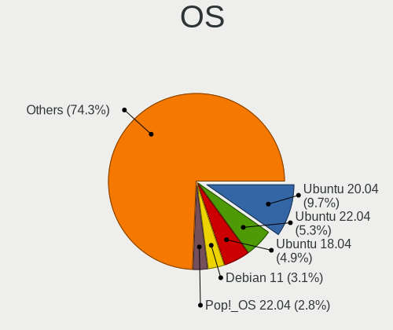

| Name               | Computers | Percent |
|--------------------|-----------|---------|
| Ubuntu 20.04       | 88        | 9.7%    |
| Ubuntu 22.04       | 48        | 5.29%   |
| Ubuntu 18.04       | 44        | 4.85%   |
| Debian 11          | 28        | 3.09%   |
| Pop!_OS 22.04      | 25        | 2.76%   |
| Fedora 40          | 17        | 1.87%   |
| Arch Rolling       | 17        | 1.87%   |
| Zorin 16           | 16        | 1.76%   |
| Debian 12          | 16        | 1.76%   |
| ArcoLinux Rolling  | 15        | 1.65%   |
| Ubuntu 24.04       | 14        | 1.54%   |
| Manjaro            | 13        | 1.43%   |
| OpenMandriva 4.2   | 12        | 1.32%   |
| Fedora 38          | 12        | 1.32%   |
| Linux Mint 21.3    | 11        | 1.21%   |
| Linux Mint 21.1    | 11        | 1.21%   |
| Linux Mint 20.2    | 11        | 1.21%   |
| Linux Mint 20      | 11        | 1.21%   |
| Fedora 37          | 11        | 1.21%   |
| Arch               | 11        | 1.21%   |
| Ubuntu 22.10       | 10        | 1.1%    |
| Linux Mint 21.2    | 10        | 1.1%    |
| Linux Mint 20.3    | 10        | 1.1%    |
| Fedora 36          | 10        | 1.1%    |
| Debian 10          | 10        | 1.1%    |
| Zorin 17           | 9         | 0.99%   |
| Ubuntu 19.04       | 9         | 0.99%   |
| Pop!_OS 21.10      | 9         | 0.99%   |
| OpenMandriva 23.01 | 9         | 0.99%   |
| Ubuntu 23.04       | 8         | 0.88%   |
| Pop!_OS 20.10      | 8         | 0.88%   |
| Fedora 39          | 8         | 0.88%   |
| Pop!_OS 20.04      | 7         | 0.77%   |
| OpenMandriva 4.3   | 7         | 0.77%   |
| Linux Mint 21      | 7         | 0.77%   |
| KDE neon 20.04     | 7         | 0.77%   |
| BlackPanther 18.1  | 7         | 0.77%   |
| Ubuntu 19.10       | 6         | 0.66%   |
| Linux Mint 20.1    | 6         | 0.66%   |
| KDE neon 22.04     | 6         | 0.66%   |

OS Family
---------

OS without a version

| Name          | Computers | Percent |
|---------------|-----------|---------|
| Ubuntu        | 234       | 27.63%  |
| Linux Mint    | 88        | 10.39%  |
| Fedora        | 74        | 8.74%   |
| Debian        | 64        | 7.56%   |
| Pop!_OS       | 48        | 5.67%   |
| OpenMandriva  | 47        | 5.55%   |
| Zorin         | 29        | 3.42%   |
| Manjaro       | 29        | 3.42%   |
| Arch          | 28        | 3.31%   |
| Kubuntu       | 22        | 2.6%    |
| ArcoLinux     | 15        | 1.77%   |
| ROSA          | 14        | 1.65%   |
| KDE neon      | 14        | 1.65%   |
| Elementary    | 12        | 1.42%   |
| SteamOS       | 11        | 1.3%    |
| BlackPanther  | 10        | 1.18%   |
| Xubuntu       | 9         | 1.06%   |
| Gentoo        | 9         | 1.06%   |
| openSUSE      | 8         | 0.94%   |
| Lubuntu       | 8         | 0.94%   |
| Endless       | 6         | 0.71%   |
| Ubuntu Unity  | 5         | 0.59%   |
| Ubuntu MATE   | 5         | 0.59%   |
| MX            | 5         | 0.59%   |
| Ubuntu Budgie | 4         | 0.47%   |
| Kali          | 4         | 0.47%   |
| RHEL          | 3         | 0.35%   |
| Parrot        | 3         | 0.35%   |
| LMDE          | 3         | 0.35%   |
| Clear Linux   | 3         | 0.35%   |
| Bazzite       | 3         | 0.35%   |
| Rocky Linux   | 2         | 0.24%   |
| Peppermint    | 2         | 0.24%   |
| Nobara        | 2         | 0.24%   |
| Linux Lite    | 2         | 0.24%   |
| Garuda Linux  | 2         | 0.24%   |
| EndeavourOS   | 2         | 0.24%   |
| CentOS        | 2         | 0.24%   |
| CachyOS       | 2         | 0.24%   |
| BigLinux      | 2         | 0.24%   |

Kernel
------

Version of the Linux kernel

| Version                  | Computers | Percent |
|--------------------------|-----------|---------|
| 5.4.0-42-generic         | 15        | 1.5%    |
| 5.10.14-desktop-1omv4002 | 12        | 1.2%    |
| 5.3.0-46-generic         | 10        | 1%      |
| 6.1.1-desktop-1omv2290   | 8         | 0.8%    |
| 5.15.0-91-generic        | 8         | 0.8%    |
| 5.15.0-56-generic        | 8         | 0.8%    |
| 5.15.0-46-generic        | 8         | 0.8%    |
| 5.19.0-35-generic        | 7         | 0.7%    |
| 5.16.7-desktop-1omv4003  | 7         | 0.7%    |
| 5.10.0-23-amd64          | 7         | 0.7%    |
| 6.5.0-26-generic         | 6         | 0.6%    |
| 6.4.11-desktop-1omv2390  | 6         | 0.6%    |
| 6.2.0-26-generic         | 6         | 0.6%    |
| 5.4.0-52-generic         | 6         | 0.6%    |
| 5.15.0-67-generic        | 6         | 0.6%    |
| 5.15.0-52-generic        | 6         | 0.6%    |
| 4.18.16-desktop-1bP      | 6         | 0.6%    |
| 6.8.0-45-generic         | 5         | 0.5%    |
| 6.2.6-desktop-1omv2390   | 5         | 0.5%    |
| 6.2.0-39-generic         | 5         | 0.5%    |
| 6.2.0-20-generic         | 5         | 0.5%    |
| 5.4.0-91-generic         | 5         | 0.5%    |
| 5.4.0-72-generic         | 5         | 0.5%    |
| 5.4.0-48-generic         | 5         | 0.5%    |
| 5.19.0-29-generic        | 5         | 0.5%    |
| 5.11.0-27-generic        | 5         | 0.5%    |
| 6.9.3-76060903-generic   | 4         | 0.4%    |
| 6.8.0-40-generic         | 4         | 0.4%    |
| 6.5.0-35-generic         | 4         | 0.4%    |
| 6.2.6-76060206-generic   | 4         | 0.4%    |
| 6.2.0-36-generic         | 4         | 0.4%    |
| 6.10.0-desktop-1omv2490  | 4         | 0.4%    |
| 5.8.0-7630-generic       | 4         | 0.4%    |
| 5.8.0-43-generic         | 4         | 0.4%    |
| 5.4.0-47-generic         | 4         | 0.4%    |
| 5.4.0-31-generic         | 4         | 0.4%    |
| 5.4.0-29-generic         | 4         | 0.4%    |
| 5.4.0-26-generic         | 4         | 0.4%    |
| 5.3.0-28-generic         | 4         | 0.4%    |
| 5.19.0-38-generic        | 4         | 0.4%    |

Kernel Family
-------------

Linux kernel without a distro release

| Version | Computers | Percent |
|---------|-----------|---------|
| 5.4.0   | 120       | 12.77%  |
| 5.15.0  | 80        | 8.51%   |
| 5.19.0  | 37        | 3.94%   |
| 4.15.0  | 37        | 3.94%   |
| 6.8.0   | 31        | 3.3%    |
| 6.5.0   | 31        | 3.3%    |
| 6.2.0   | 28        | 2.98%   |
| 5.8.0   | 28        | 2.98%   |
| 5.11.0  | 28        | 2.98%   |
| 5.10.0  | 28        | 2.98%   |
| 5.3.0   | 26        | 2.77%   |
| 5.13.0  | 22        | 2.34%   |
| 6.1.0   | 20        | 2.13%   |
| 5.0.0   | 15        | 1.6%    |
| 5.10.14 | 12        | 1.28%   |
| 4.19.0  | 11        | 1.17%   |
| 4.18.0  | 11        | 1.17%   |
| 6.2.6   | 9         | 0.96%   |
| 6.1.1   | 8         | 0.85%   |
| 5.17.5  | 8         | 0.85%   |
| 5.16.7  | 7         | 0.74%   |
| 6.4.11  | 6         | 0.64%   |
| 6.3.8   | 6         | 0.64%   |
| 4.18.16 | 6         | 0.64%   |
| 6.9.3   | 5         | 0.53%   |
| 5.14.0  | 5         | 0.53%   |
| 6.9.12  | 4         | 0.43%   |
| 6.5.6   | 4         | 0.43%   |
| 6.11.4  | 4         | 0.43%   |
| 6.10.9  | 4         | 0.43%   |
| 6.10.0  | 4         | 0.43%   |
| 6.1.52  | 4         | 0.43%   |
| 6.0.6   | 4         | 0.43%   |
| 6.0.12  | 4         | 0.43%   |
| 5.18.0  | 4         | 0.43%   |
| 5.16.11 | 4         | 0.43%   |
| 4.9.60  | 4         | 0.43%   |
| 6.6.4   | 3         | 0.32%   |
| 6.5.5   | 3         | 0.32%   |
| 6.2.9   | 3         | 0.32%   |

Kernel Major Ver.
-----------------

Linux kernel major version

| Version | Computers | Percent |
|---------|-----------|---------|
| 5.4     | 126       | 13.64%  |
| 5.15    | 98        | 10.61%  |
| 5.10    | 54        | 5.84%   |
| 6.2     | 45        | 4.87%   |
| 6.1     | 45        | 4.87%   |
| 5.19    | 44        | 4.76%   |
| 6.8     | 41        | 4.44%   |
| 6.5     | 39        | 4.22%   |
| 4.15    | 37        | 4%      |
| 5.8     | 35        | 3.79%   |
| 5.11    | 34        | 3.68%   |
| 5.13    | 28        | 3.03%   |
| 5.3     | 27        | 2.92%   |
| 6.0     | 22        | 2.38%   |
| 5.16    | 17        | 1.84%   |
| 4.18    | 17        | 1.84%   |
| 6.9     | 16        | 1.73%   |
| 6.6     | 16        | 1.73%   |
| 6.10    | 15        | 1.62%   |
| 5.17    | 15        | 1.62%   |
| 5.0     | 15        | 1.62%   |
| 4.19    | 13        | 1.41%   |
| 6.4     | 12        | 1.3%    |
| 6.3     | 12        | 1.3%    |
| 5.18    | 11        | 1.19%   |
| 5.14    | 11        | 1.19%   |
| 4.9     | 11        | 1.19%   |
| 6.11    | 10        | 1.08%   |
| 5.6     | 10        | 1.08%   |
| 5.12    | 9         | 0.97%   |
| 5.7     | 7         | 0.76%   |
| 6.7     | 5         | 0.54%   |
| 5.9     | 5         | 0.54%   |
| 6.12    | 4         | 0.43%   |
| 4.4     | 3         | 0.32%   |
| 4.10    | 3         | 0.32%   |
| 4.13    | 2         | 0.22%   |
| 4.12    | 2         | 0.22%   |
| 3.10    | 2         | 0.22%   |
| 5.5     | 1         | 0.11%   |

Arch
----

OS architecture (x86_64, i586, etc.)

| Name    | Computers | Percent |
|---------|-----------|---------|
| x86_64  | 783       | 96.91%  |
| i686    | 16        | 1.98%   |
| aarch64 | 8         | 0.99%   |
| armv7l  | 1         | 0.12%   |

DE
--

Desktop Environment

| Name            | Computers | Percent |
|-----------------|-----------|---------|
| GNOME           | 371       | 43.49%  |
| KDE5            | 139       | 16.3%   |
| Unknown         | 92        | 10.79%  |
| X-Cinnamon      | 68        | 7.97%   |
| XFCE            | 67        | 7.85%   |
| KDE             | 19        | 2.23%   |
| MATE            | 17        | 1.99%   |
| KDE6            | 14        | 1.64%   |
| Pantheon        | 11        | 1.29%   |
| LXQt            | 9         | 1.06%   |
| Cinnamon        | 9         | 1.06%   |
| KDE4            | 7         | 0.82%   |
| i3              | 6         | 0.7%    |
| Unity           | 5         | 0.59%   |
| Budgie          | 5         | 0.59%   |
| GNOME Flashback | 3         | 0.35%   |
| LXDE            | 2         | 0.23%   |
| GNOME Classic   | 2         | 0.23%   |
| X-Generic       | 1         | 0.12%   |
| LeftWM          | 1         | 0.12%   |
| Hyprland        | 1         | 0.12%   |
| Enlightenment   | 1         | 0.12%   |
| Endless:GNOME   | 1         | 0.12%   |
| DWM             | 1         | 0.12%   |
| BunsenLabs      | 1         | 0.12%   |

Display Server
--------------

X11 or Wayland

| Name    | Computers | Percent |
|---------|-----------|---------|
| X11     | 586       | 70.6%   |
| Wayland | 185       | 22.29%  |
| Unknown | 44        | 5.3%    |
| Tty     | 15        | 1.81%   |

Display Manager
---------------

SDDM, LightDM, etc.

| Name    | Computers | Percent |
|---------|-----------|---------|
| Unknown | 399       | 47.05%  |
| SDDM    | 128       | 15.09%  |
| LightDM | 100       | 11.79%  |
| GDM3    | 99        | 11.67%  |
| GDM     | 92        | 10.85%  |
| TDM     | 19        | 2.24%   |
| KDM     | 7         | 0.83%   |
| LXDM    | 2         | 0.24%   |
| SLiM    | 1         | 0.12%   |
| MDM     | 1         | 0.12%   |

OS Lang
-------

Language

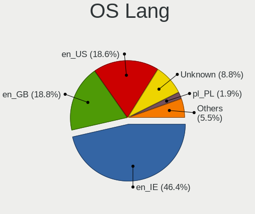

| Lang    | Computers | Percent |
|---------|-----------|---------|
| en_IE   | 392       | 46.45%  |
| en_GB   | 159       | 18.84%  |
| en_US   | 157       | 18.6%   |
| Unknown | 74        | 8.77%   |
| pl_PL   | 16        | 1.9%    |
| C       | 13        | 1.54%   |
| es_ES   | 3         | 0.36%   |
| en_IN   | 3         | 0.36%   |
| de_DE   | 3         | 0.36%   |
| ru_RU   | 2         | 0.24%   |
| pt_BR   | 2         | 0.24%   |
| lt_LT   | 2         | 0.24%   |
| en_CA   | 2         | 0.24%   |
| bg_BG   | 2         | 0.24%   |
| zh_CN   | 1         | 0.12%   |
| uk_UA   | 1         | 0.12%   |
| pt_PT   | 1         | 0.12%   |
| it_IT   | 1         | 0.12%   |
| hu_HU   | 1         | 0.12%   |
| ga_IE   | 1         | 0.12%   |
| fr_FR   | 1         | 0.12%   |
| fr_BE   | 1         | 0.12%   |
| es_SV   | 1         | 0.12%   |
| en_ZA   | 1         | 0.12%   |
| en_DE   | 1         | 0.12%   |
| en_BW   | 1         | 0.12%   |
| en_AU   | 1         | 0.12%   |
| C.UTF8  | 1         | 0.12%   |

Boot Mode
---------

EFI or BIOS

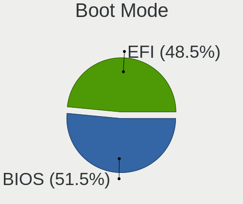

| Mode | Computers | Percent |
|------|-----------|---------|
| BIOS | 425       | 51.52%  |
| EFI  | 400       | 48.48%  |

Filesystem
----------

Type of filesystem

| Type                | Computers | Percent |
|---------------------|-----------|---------|
| Ext4                | 585       | 70.06%  |
| Btrfs               | 112       | 13.41%  |
| Overlay             | 52        | 6.23%   |
| Tmpfs               | 33        | 3.95%   |
| Unknown             | 23        | 2.75%   |
| Xfs                 | 19        | 2.28%   |
| Zfs                 | 6         | 0.72%   |
| Ext3                | 2         | 0.24%   |
| Fuse.fuse-overlayfs | 1         | 0.12%   |
| Fake                | 1         | 0.12%   |
| F2fs                | 1         | 0.12%   |

Part. scheme
------------

Scheme of partitioning

| Type    | Computers | Percent |
|---------|-----------|---------|
| Unknown | 396       | 47.31%  |
| GPT     | 356       | 42.53%  |
| MBR     | 85        | 10.16%  |

Dual Boot with Linux/BSD
------------------------

Hosting more than one Linux/BSD

| Dual boot | Computers | Percent |
|-----------|-----------|---------|
| No        | 698       | 84.71%  |
| Yes       | 126       | 15.29%  |

Dual Boot (Win)
---------------

Hosting Linux and Windows

| Dual boot | Computers | Percent |
|-----------|-----------|---------|
| No        | 624       | 75.54%  |
| Yes       | 202       | 24.46%  |

Board
-----

Vendor
------

Motherboard manufacturer

| Name                                 | Computers | Percent |
|--------------------------------------|-----------|---------|
| Dell                                 | 170       | 21.09%  |
| Lenovo                               | 138       | 17.12%  |
| ASUSTek Computer                     | 95        | 11.79%  |
| Hewlett-Packard                      | 93        | 11.54%  |
| Gigabyte Technology                  | 39        | 4.84%   |
| Acer                                 | 35        | 4.34%   |
| MSI                                  | 30        | 3.72%   |
| Apple                                | 25        | 3.1%    |
| ASRock                               | 19        | 2.36%   |
| Toshiba                              | 16        | 1.99%   |
| Samsung Electronics                  | 12        | 1.49%   |
| Intel                                | 11        | 1.36%   |
| Valve                                | 8         | 0.99%   |
| Medion                               | 6         | 0.74%   |
| Google                               | 6         | 0.74%   |
| Foxconn                              | 6         | 0.74%   |
| PC Specialist                        | 5         | 0.62%   |
| Packard Bell                         | 5         | 0.62%   |
| Chuwi                                | 5         | 0.62%   |
| TUXEDO                               | 4         | 0.5%    |
| Timi                                 | 4         | 0.5%    |
| System76                             | 4         | 0.5%    |
| Notebook                             | 4         | 0.5%    |
| HUAWEI                               | 4         | 0.5%    |
| Fujitsu                              | 4         | 0.5%    |
| Alienware                            | 4         | 0.5%    |
| Shenzhen Meigao Electronic Equipment | 3         | 0.37%   |
| Raspberry Pi Foundation              | 3         | 0.37%   |
| AZW                                  | 3         | 0.37%   |
| AVITA                                | 3         | 0.37%   |
| Tactus                               | 2         | 0.25%   |
| Shuttle                              | 2         | 0.25%   |
| Seco                                 | 2         | 0.25%   |
| Pegatron                             | 2         | 0.25%   |
| Nvidia                               | 2         | 0.25%   |
| Fujitsu Siemens                      | 2         | 0.25%   |
| Framework                            | 2         | 0.25%   |
| Entroware                            | 2         | 0.25%   |
| eMachines                            | 2         | 0.25%   |
| Unknown                              | 2         | 0.25%   |

Model
-----

Motherboard model

| Name                                       | Computers | Percent |
|--------------------------------------------|-----------|---------|
| Dell OptiPlex 7010                         | 8         | 0.99%   |
| Dell Latitude 7420                         | 8         | 0.99%   |
| ASUS All Series                            | 8         | 0.99%   |
| Valve Jupiter                              | 7         | 0.87%   |
| Lenovo Yoga 6 13ALC7 82UD                  | 5         | 0.62%   |
| Gigabyte B450M DS3H                        | 5         | 0.62%   |
| Dell OptiPlex 790                          | 4         | 0.5%    |
| Dell OptiPlex 780                          | 4         | 0.5%    |
| Dell Latitude E7240                        | 4         | 0.5%    |
| MSI MS-7C37                                | 3         | 0.37%   |
| Lenovo V145-15AST 81MT                     | 3         | 0.37%   |
| Lenovo ThinkCentre E73 10DS000TUK          | 3         | 0.37%   |
| Lenovo IdeaPad 330-15IKB 81DE              | 3         | 0.37%   |
| HP Notebook                                | 3         | 0.37%   |
| HP Compaq 8200 Elite SFF PC                | 3         | 0.37%   |
| Dell OptiPlex 7020                         | 3         | 0.37%   |
| Dell Inspiron 13-5378                      | 3         | 0.37%   |
| ASUS TUF Gaming X570-PLUS                  | 3         | 0.37%   |
| ASUS ROG STRIX B450-F GAMING               | 3         | 0.37%   |
| Unknown                                    | 3         | 0.37%   |
| TUXEDO Pulse 15 Gen1                       | 2         | 0.25%   |
| Toshiba Satellite C50-B                    | 2         | 0.25%   |
| Shenzhen Meigao Electronic Equipment UM690 | 2         | 0.25%   |
| Seco C40                                   | 2         | 0.25%   |
| Samsung 750XED                             | 2         | 0.25%   |
| RPi Raspberry Pi                           | 2         | 0.25%   |
| Nvidia Tegra                               | 2         | 0.25%   |
| MSI Pro 3515 Series                        | 2         | 0.25%   |
| MSI MS-7B86                                | 2         | 0.25%   |
| MSI MS-7B79                                | 2         | 0.25%   |
| Medion Akoya E6239                         | 2         | 0.25%   |
| Lenovo ThinkStation D20 415892G            | 2         | 0.25%   |
| Lenovo ThinkPad X1 Carbon 3443CTO          | 2         | 0.25%   |
| Lenovo IdeaPad S340-15API 81NC             | 2         | 0.25%   |
| Lenovo IdeaPad 510-15ISK 80SR              | 2         | 0.25%   |
| Lenovo IdeaPad 1 14IGL7 82V6               | 2         | 0.25%   |
| Lenovo B50-30 80ES                         | 2         | 0.25%   |
| HUAWEI NBLK-WAX9X                          | 2         | 0.25%   |
| HP Pavilion x360 Convertible 14-dy0xxx     | 2         | 0.25%   |
| HP Pavilion Notebook                       | 2         | 0.25%   |

Model Family
------------

Motherboard model prefix

| Name                  | Computers | Percent |
|-----------------------|-----------|---------|
| Lenovo ThinkPad       | 62        | 7.69%   |
| Dell Latitude         | 58        | 7.2%    |
| Dell OptiPlex         | 29        | 3.6%    |
| Dell Inspiron         | 28        | 3.47%   |
| Lenovo IdeaPad        | 27        | 3.35%   |
| Acer Aspire           | 25        | 3.1%    |
| HP Pavilion           | 20        | 2.48%   |
| Dell XPS              | 20        | 2.48%   |
| HP EliteBook          | 17        | 2.11%   |
| Dell Precision        | 16        | 1.99%   |
| Toshiba Satellite     | 13        | 1.61%   |
| Lenovo ThinkCentre    | 12        | 1.49%   |
| Lenovo Yoga           | 10        | 1.24%   |
| HP Compaq             | 10        | 1.24%   |
| ASUS TUF              | 10        | 1.24%   |
| ASUS ROG              | 10        | 1.24%   |
| ASUS PRIME            | 10        | 1.24%   |
| ASUS All              | 8         | 0.99%   |
| Valve Jupiter         | 7         | 0.87%   |
| ASUS VivoBook         | 7         | 0.87%   |
| ASUS ZenBook          | 6         | 0.74%   |
| HP EliteDesk          | 5         | 0.62%   |
| Gigabyte B450M        | 5         | 0.62%   |
| Dell Vostro           | 5         | 0.62%   |
| HP ProBook            | 4         | 0.5%    |
| HP Laptop             | 4         | 0.5%    |
| Foxconn Pro           | 4         | 0.5%    |
| RPi Raspberry         | 3         | 0.37%   |
| Packard Bell EasyNote | 3         | 0.37%   |
| MSI MS-7C37           | 3         | 0.37%   |
| Lenovo V145-15AST     | 3         | 0.37%   |
| Lenovo ThinkBook      | 3         | 0.37%   |
| HP ZBook              | 3         | 0.37%   |
| HP Presario           | 3         | 0.37%   |
| HP OMEN               | 3         | 0.37%   |
| HP Notebook           | 3         | 0.37%   |
| HP ENVY               | 3         | 0.37%   |
| Gigabyte B450         | 3         | 0.37%   |
| Fujitsu LIFEBOOK      | 3         | 0.37%   |
| Dell Studio           | 3         | 0.37%   |

MFG Year
--------

Motherboard manufacture year

| Year    | Computers | Percent |
|---------|-----------|---------|
| 2020    | 79        | 9.8%    |
| 2019    | 68        | 8.44%   |
| 2018    | 67        | 8.31%   |
| 2012    | 61        | 7.57%   |
| 2013    | 60        | 7.44%   |
| 2017    | 56        | 6.95%   |
| 2011    | 51        | 6.33%   |
| 2021    | 47        | 5.83%   |
| 2022    | 46        | 5.71%   |
| 2010    | 40        | 4.96%   |
| 2015    | 39        | 4.84%   |
| 2008    | 33        | 4.09%   |
| 2023    | 30        | 3.72%   |
| 2014    | 29        | 3.6%    |
| 2016    | 28        | 3.47%   |
| 2009    | 25        | 3.1%    |
| 2024    | 13        | 1.61%   |
| 2007    | 12        | 1.49%   |
| 2006    | 9         | 1.12%   |
| Unknown | 9         | 1.12%   |
| 2005    | 3         | 0.37%   |
| 2003    | 1         | 0.12%   |

Form Factor
-----------

Physical design of the computer

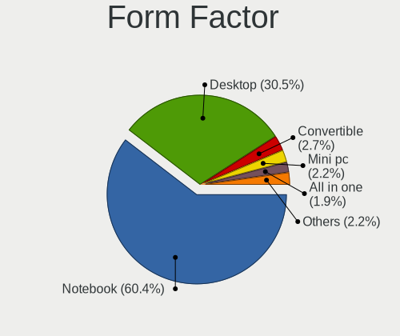

| Name           | Computers | Percent |
|----------------|-----------|---------|
| Notebook       | 487       | 60.42%  |
| Desktop        | 246       | 30.52%  |
| Convertible    | 22        | 2.73%   |
| Mini pc        | 18        | 2.23%   |
| All in one     | 15        | 1.86%   |
| Tablet         | 8         | 0.99%   |
| System on chip | 7         | 0.87%   |
| Server         | 2         | 0.25%   |
| Phone          | 1         | 0.12%   |

Secure Boot
-----------

Enabled or disabled

| State    | Computers | Percent |
|----------|-----------|---------|
| Disabled | 738       | 91%     |
| Enabled  | 73        | 9%      |

Coreboot
--------

Have coreboot on board

| Used | Computers | Percent |
|------|-----------|---------|
| No   | 797       | 98.88%  |
| Yes  | 9         | 1.12%   |

RAM Size
--------

Total RAM memory

| Size in GB      | Computers | Percent |
|-----------------|-----------|---------|
| 4.01-8.0        | 188       | 22.84%  |
| 16.01-24.0      | 173       | 21.02%  |
| 8.01-16.0       | 149       | 18.1%   |
| 3.01-4.0        | 136       | 16.52%  |
| 32.01-64.0      | 89        | 10.81%  |
| 64.01-256.0     | 31        | 3.77%   |
| 1.01-2.0        | 24        | 2.92%   |
| 24.01-32.0      | 20        | 2.43%   |
| 2.01-3.0        | 6         | 0.73%   |
| 0.51-1.0        | 5         | 0.61%   |
| More than 256.0 | 1         | 0.12%   |
| 0.01-0.5        | 1         | 0.12%   |

RAM Used
--------

Used RAM memory

| Used GB    | Computers | Percent |
|------------|-----------|---------|
| 1.01-2.0   | 254       | 28.04%  |
| 2.01-3.0   | 228       | 25.17%  |
| 4.01-8.0   | 173       | 19.09%  |
| 3.01-4.0   | 148       | 16.34%  |
| 0.51-1.0   | 47        | 5.19%   |
| 8.01-16.0  | 41        | 4.53%   |
| 0.01-0.5   | 7         | 0.77%   |
| 16.01-24.0 | 6         | 0.66%   |
| 32.01-64.0 | 1         | 0.11%   |
| Unknown    | 1         | 0.11%   |

Total Drives
------------

Number of drives on board

| Drives | Computers | Percent |
|--------|-----------|---------|
| 1      | 502       | 59.2%   |
| 2      | 208       | 24.53%  |
| 3      | 60        | 7.08%   |
| 4      | 35        | 4.13%   |
| 5      | 16        | 1.89%   |
| 0      | 8         | 0.94%   |
| 6      | 7         | 0.83%   |
| 7      | 6         | 0.71%   |
| 10     | 3         | 0.35%   |
| 11     | 1         | 0.12%   |
| 9      | 1         | 0.12%   |
| 8      | 1         | 0.12%   |

Has CD-ROM
----------

Has CD-ROM on board

| Presented | Computers | Percent |
|-----------|-----------|---------|
| No        | 543       | 66.38%  |
| Yes       | 275       | 33.62%  |

Has Ethernet
------------

Has Ethernet on board

| Presented | Computers | Percent |
|-----------|-----------|---------|
| Yes       | 674       | 83%     |
| No        | 138       | 17%     |

Has WiFi
--------

Has WiFi module

| Presented | Computers | Percent |
|-----------|-----------|---------|
| Yes       | 686       | 83.86%  |
| No        | 132       | 16.14%  |

Has Bluetooth
-------------

Has Bluetooth module

| Presented | Computers | Percent |
|-----------|-----------|---------|
| Yes       | 555       | 67.52%  |
| No        | 267       | 32.48%  |

Location
--------

Country
-------

Geographic location (country)

| Country | Computers | Percent |
|---------|-----------|---------|
| Ireland | 806       | 100%    |

City
----

Geographic location (city)

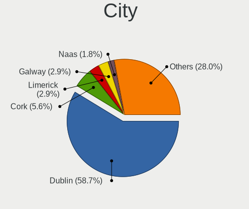

| City           | Computers | Percent |
|----------------|-----------|---------|
| Dublin         | 499       | 58.71%  |
| Cork           | 48        | 5.65%   |
| Limerick       | 25        | 2.94%   |
| Galway         | 25        | 2.94%   |
| Naas           | 15        | 1.76%   |
| Ennis          | 10        | 1.18%   |
| Enniscorthy    | 8         | 0.94%   |
| Drogheda       | 8         | 0.94%   |
| Sligo          | 6         | 0.71%   |
| Portlaoise     | 6         | 0.71%   |
| Nenagh         | 6         | 0.71%   |
| Navan          | 6         | 0.71%   |
| Kenmare        | 6         | 0.71%   |
| Gorey          | 6         | 0.71%   |
| Athlone        | 6         | 0.71%   |
| Waterford      | 5         | 0.59%   |
| Kilkenny       | 5         | 0.59%   |
| Wexford        | 4         | 0.47%   |
| Westport       | 4         | 0.47%   |
| Tullamore      | 4         | 0.47%   |
| Tuam           | 4         | 0.47%   |
| Lucan          | 4         | 0.47%   |
| Loughrea       | 4         | 0.47%   |
| Dn Laoghaire | 4         | 0.47%   |
| Midleton       | 3         | 0.35%   |
| Maynooth       | 3         | 0.35%   |
| Letterkenny    | 3         | 0.35%   |
| Cobh           | 3         | 0.35%   |
| Clonakilty     | 3         | 0.35%   |
| Celbridge      | 3         | 0.35%   |
| Cavan          | 3         | 0.35%   |
| Bray           | 3         | 0.35%   |
| Blackrock      | 3         | 0.35%   |
| Ballina        | 3         | 0.35%   |
| Balbriggan     | 3         | 0.35%   |
| Arklow         | 3         | 0.35%   |
| Wicklow        | 2         | 0.24%   |
| Tralee         | 2         | 0.24%   |
| Tobercurry     | 2         | 0.24%   |
| Swords         | 2         | 0.24%   |

Drives
------

Drive Vendor
------------

Hard drive vendors

| Vendor                      | Computers | Drives | Percent |
|-----------------------------|-----------|--------|---------|
| Samsung Electronics         | 193       | 291    | 16.23%  |
| WDC                         | 159       | 275    | 13.37%  |
| Seagate                     | 147       | 243    | 12.36%  |
| SanDisk                     | 71        | 94     | 5.97%   |
| Unknown                     | 64        | 86     | 5.38%   |
| Toshiba                     | 60        | 83     | 5.05%   |
| Crucial                     | 57        | 73     | 4.79%   |
| Hitachi                     | 44        | 61     | 3.7%    |
| Kingston                    | 39        | 62     | 3.28%   |
| Micron Technology           | 30        | 36     | 2.52%   |
| Intel                       | 29        | 40     | 2.44%   |
| SK hynix                    | 28        | 30     | 2.35%   |
| KIOXIA                      | 24        | 28     | 2.02%   |
| HGST                        | 19        | 23     | 1.6%    |
| A-DATA Technology           | 13        | 22     | 1.09%   |
| China                       | 12        | 20     | 1.01%   |
| Micron/Crucial Technology   | 11        | 17     | 0.93%   |
| Apple                       | 11        | 15     | 0.93%   |
| Fujitsu                     | 8         | 11     | 0.67%   |
| Transcend                   | 7         | 7      | 0.59%   |
| Phison                      | 7         | 12     | 0.59%   |
| OCZ                         | 7         | 8      | 0.59%   |
| LITEON                      | 7         | 8      | 0.59%   |
| Kingston Technology Company | 7         | 7      | 0.59%   |
| Phison Electronics          | 6         | 8      | 0.5%    |
| Netac                       | 6         | 6      | 0.5%    |
| Verbatim                    | 5         | 5      | 0.42%   |
| Silicon Motion              | 5         | 15     | 0.42%   |
| PNY                         | 5         | 5      | 0.42%   |
| JMicron Technology          | 5         | 5      | 0.42%   |
| FORESEE                     | 5         | 6      | 0.42%   |
| ADATA Technology            | 5         | 6      | 0.42%   |
| Patriot                     | 4         | 5      | 0.34%   |
| KingSpec                    | 4         | 4      | 0.34%   |
| LITEONIT                    | 3         | 3      | 0.25%   |
| KingDian                    | 3         | 14     | 0.25%   |
| Emtec                       | 3         | 4      | 0.25%   |
| ASMT                        | 3         | 5      | 0.25%   |
| Unknown                     | 3         | 3      | 0.25%   |
| Union Memory                | 2         | 2      | 0.17%   |

Drive Model
-----------

Hard drive models

| Model                                                | Computers | Percent |
|------------------------------------------------------|-----------|---------|
| Seagate ST1000LM035-1RK172 1TB                       | 12        | 0.91%   |
| Samsung NVMe SSD Controller PM9A1/PM9A3/980PRO 512GB | 12        | 0.91%   |
| Unknown MMC Card  64GB                               | 11        | 0.84%   |
| Unknown MMC Card  32GB                               | 11        | 0.84%   |
| Samsung NVMe SSD Controller SM981/PM981/PM983 512GB  | 10        | 0.76%   |
| KIOXIA KBG40ZNS512G NVMe 512GB                       | 10        | 0.76%   |
| Crucial CT500MX500SSD1 500GB                         | 9         | 0.68%   |
| Crucial CT1000MX500SSD1 1TB                          | 9         | 0.68%   |
| Seagate ST500DM002-1BD142 500GB                      | 8         | 0.61%   |
| Kingston SA400S37480G 480GB SSD                      | 8         | 0.61%   |
| Kingston SA400S37240G 240GB SSD                      | 8         | 0.61%   |
| Toshiba MQ01ABD100 1TB                               | 7         | 0.53%   |
| Seagate ST2000DL003-9VT166 2TB                       | 7         | 0.53%   |
| Seagate ST1000DM010-2EP102 1TB                       | 7         | 0.53%   |
| SanDisk NVMe SSD Drive 512GB                         | 7         | 0.53%   |
| Samsung SSD 860 EVO 500GB                            | 7         | 0.53%   |
| Samsung SSD 850 EVO 250GB                            | 7         | 0.53%   |
| SK hynix SKHynix_HFM512GD3HX015N 512GB               | 6         | 0.46%   |
| Seagate ST8000DM004-2CX188 8TB                       | 6         | 0.46%   |
| Samsung SSD 970 EVO Plus 500GB                       | 6         | 0.46%   |
| Samsung SSD 840 EVO 250GB                            | 6         | 0.46%   |
| Samsung NVMe SSD Drive 500GB                         | 6         | 0.46%   |
| Samsung NVMe SSD Drive 256GB                         | 6         | 0.46%   |
| HGST HTS721010A9E630 1TB                             | 6         | 0.46%   |
| WDC WD10EZEX-08WN4A0 1TB                             | 5         | 0.38%   |
| WDC WD10EURX-83UY4Y0 1TB                             | 5         | 0.38%   |
| WDC WD10EALX-009BA0 1TB                              | 5         | 0.38%   |
| Verbatim Vi550 S3 SSD 512GB                          | 5         | 0.38%   |
| Unknown MMC Card  512GB                              | 5         | 0.38%   |
| Unknown MMC Card  128GB                              | 5         | 0.38%   |
| Seagate ST1000LM024 HN-M101MBB 1TB                   | 5         | 0.38%   |
| Samsung SSD 850 EVO 500GB                            | 5         | 0.38%   |
| Micron/Crucial P2 NVMe PCIe SSD 500GB                | 5         | 0.38%   |
| HGST HTS545050A7E680 500GB                           | 5         | 0.38%   |
| WDC WDS500G2B0B-00YS70 500GB SSD                     | 4         | 0.3%    |
| WDC WD3200AAJS-60Z0A0 320GB                          | 4         | 0.3%    |
| Unknown MMC Card  16GB                               | 4         | 0.3%    |
| Toshiba XG6 NVMe SSD Controller 1024GB               | 4         | 0.3%    |
| Toshiba MQ04ABF100 1TB                               | 4         | 0.3%    |
| Seagate ST3500312CS 500GB                            | 4         | 0.3%    |

HDD Vendor
----------

Hard disk drive vendors

| Vendor              | Computers | Drives | Percent |
|---------------------|-----------|--------|---------|
| Seagate             | 144       | 238    | 34.29%  |
| WDC                 | 127       | 230    | 30.24%  |
| Hitachi             | 44        | 61     | 10.48%  |
| Toshiba             | 40        | 54     | 9.52%   |
| HGST                | 19        | 23     | 4.52%   |
| Samsung Electronics | 12        | 17     | 2.86%   |
| Fujitsu             | 8         | 11     | 1.9%    |
| Apple               | 5         | 5      | 1.19%   |
| Unknown             | 3         | 3      | 0.71%   |
| ASMT                | 3         | 5      | 0.71%   |
| SABRENT             | 2         | 3      | 0.48%   |
| QNAP                | 2         | 18     | 0.48%   |
| Maxtor              | 2         | 2      | 0.48%   |
| JMicron Technology  | 2         | 2      | 0.48%   |
| USB                 | 1         | 1      | 0.24%   |
| LaCie               | 1         | 1      | 0.24%   |
| KESU                | 1         | 1      | 0.24%   |
| Inateck             | 1         | 1      | 0.24%   |
| FNK TECH            | 1         | 1      | 0.24%   |
| ExcelStor           | 1         | 2      | 0.24%   |
| DAS                 | 1         | 4      | 0.24%   |

SSD Vendor
----------

Solid state drive vendors

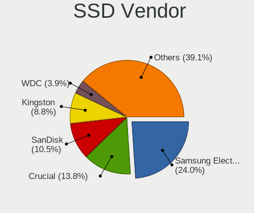

| Vendor              | Computers | Drives | Percent |
|---------------------|-----------|--------|---------|
| Samsung Electronics | 87        | 128    | 23.97%  |
| Crucial             | 50        | 66     | 13.77%  |
| SanDisk             | 38        | 43     | 10.47%  |
| Kingston            | 32        | 53     | 8.82%   |
| WDC                 | 14        | 21     | 3.86%   |
| China               | 12        | 20     | 3.31%   |
| Intel               | 10        | 12     | 2.75%   |
| A-DATA Technology   | 10        | 18     | 2.75%   |
| OCZ                 | 7         | 8      | 1.93%   |
| Micron Technology   | 7         | 8      | 1.93%   |
| Netac               | 6         | 6      | 1.65%   |
| LITEON              | 6         | 7      | 1.65%   |
| Verbatim            | 5         | 5      | 1.38%   |
| Transcend           | 5         | 5      | 1.38%   |
| SK hynix            | 5         | 5      | 1.38%   |
| PNY                 | 5         | 5      | 1.38%   |
| Apple               | 5         | 5      | 1.38%   |
| Toshiba             | 4         | 6      | 1.1%    |
| Patriot             | 4         | 5      | 1.1%    |
| KingSpec            | 4         | 4      | 1.1%    |
| FORESEE             | 4         | 5      | 1.1%    |
| LITEONIT            | 3         | 3      | 0.83%   |
| KingDian            | 3         | 14     | 0.83%   |
| Emtec               | 3         | 4      | 0.83%   |
| Team                | 2         | 2      | 0.55%   |
| Integral            | 2         | 2      | 0.55%   |
| Hewlett-Packard     | 2         | 4      | 0.55%   |
| Fanxiang            | 2         | 2      | 0.55%   |
| 2-Power             | 2         | 3      | 0.55%   |
| Unknown             | 2         | 2      | 0.55%   |
| ZTC                 | 1         | 1      | 0.28%   |
| Zheino              | 1         | 1      | 0.28%   |
| Wibtek              | 1         | 2      | 0.28%   |
| W800S               | 1         | 2      | 0.28%   |
| USB3.0              | 1         | 1      | 0.28%   |
| Union Memory        | 1         | 1      | 0.28%   |
| TCSUNBOW            | 1         | 1      | 0.28%   |
| StoreJet            | 1         | 2      | 0.28%   |
| Star                | 1         | 1      | 0.28%   |
| SPCC                | 1         | 1      | 0.28%   |

Drive Kind
----------

HDD or SSD

| Kind    | Computers | Drives | Percent |
|---------|-----------|--------|---------|
| HDD     | 340       | 683    | 32.14%  |
| SSD     | 325       | 497    | 30.72%  |
| NVMe    | 314       | 462    | 29.68%  |
| MMC     | 60        | 85     | 5.67%   |
| Unknown | 19        | 21     | 1.8%    |

Drive Connector
---------------

SATA, SAS, NVMe, etc.

| Type | Computers | Drives | Percent |
|------|-----------|--------|---------|
| SATA | 538       | 1141   | 56.04%  |
| NVMe | 314       | 460    | 32.71%  |
| MMC  | 60        | 85     | 6.25%   |
| SAS  | 48        | 62     | 5%      |

Drive Size
----------

Size of hard drive

| Size in TB | Computers | Drives | Percent |
|------------|-----------|--------|---------|
| 0.01-0.5   | 396       | 666    | 56.57%  |
| 0.51-1.0   | 197       | 318    | 28.14%  |
| 1.01-2.0   | 59        | 89     | 8.43%   |
| 3.01-4.0   | 19        | 43     | 2.71%   |
| 4.01-10.0  | 15        | 40     | 2.14%   |
| 2.01-3.0   | 11        | 18     | 1.57%   |
| 10.01-20.0 | 3         | 6      | 0.43%   |

Space Total
-----------

Amount of disk space available on the file system

| Size in GB     | Computers | Percent |
|----------------|-----------|---------|
| 101-250        | 213       | 24.48%  |
| 251-500        | 205       | 23.56%  |
| 501-1000       | 123       | 14.14%  |
| 1-20           | 65        | 7.47%   |
| 51-100         | 64        | 7.36%   |
| 1001-2000      | 61        | 7.01%   |
| More than 3000 | 51        | 5.86%   |
| 2001-3000      | 31        | 3.56%   |
| Unknown        | 30        | 3.45%   |
| 21-50          | 27        | 3.1%    |

Space Used
----------

Amount of used disk space

| Used GB        | Computers | Percent |
|----------------|-----------|---------|
| 1-20           | 324       | 35.68%  |
| 21-50          | 146       | 16.08%  |
| 101-250        | 119       | 13.11%  |
| 51-100         | 113       | 12.44%  |
| 251-500        | 61        | 6.72%   |
| 501-1000       | 53        | 5.84%   |
| Unknown        | 30        | 3.3%    |
| More than 3000 | 25        | 2.75%   |
| 1001-2000      | 25        | 2.75%   |
| 2001-3000      | 12        | 1.32%   |

Malfunc. Drives
---------------

Drive models with a malfunction

| Model                               | Computers | Drives | Percent |
|-------------------------------------|-----------|--------|---------|
| WDC WD10EALX-009BA0 1TB             | 5         | 11     | 5.81%   |
| Seagate ST2000DL003-9VT166 2TB      | 5         | 8      | 5.81%   |
| WDC WD3200AVJS-63B6A0 320GB         | 2         | 2      | 2.33%   |
| WDC WD2500AAKX-753CA1 250GB         | 2         | 5      | 2.33%   |
| Hitachi HTS723232A7A364 320GB       | 2         | 2      | 2.33%   |
| Hitachi HDS721010CLA330 1TB         | 2         | 2      | 2.33%   |
| Western Digital SN730 500GB         | 1         | 2      | 1.16%   |
| WDC WD7500BPKX-00HPJT0 752GB        | 1         | 1      | 1.16%   |
| WDC WD5000LPCX-24VHAT0 500GB        | 1         | 1      | 1.16%   |
| WDC WD5000HHTZ-04N21V0 500GB        | 1         | 3      | 1.16%   |
| WDC WD5000BEVT-35A0RT0 500GB        | 1         | 1      | 1.16%   |
| WDC WD5000AAKX-001CA0 500GB         | 1         | 2      | 1.16%   |
| WDC WD400JB-00FMA0 40GB             | 1         | 2      | 1.16%   |
| WDC WD32 00BEKT-75PVMT0 320GB       | 1         | 1      | 1.16%   |
| WDC WD2500BEVT-22A23T0 250GB        | 1         | 1      | 1.16%   |
| WDC WD2500BEKT-75A25T0 250GB        | 1         | 1      | 1.16%   |
| WDC WD2500AAKX-603CA0 250GB         | 1         | 1      | 1.16%   |
| WDC WD20EZRZ-00Z5HB0 2TB            | 1         | 2      | 1.16%   |
| WDC WD10EZEX-00BN5A0 1TB            | 1         | 1      | 1.16%   |
| WDC WD1001FALS-00E8B0 1TB           | 1         | 2      | 1.16%   |
| Toshiba MQ01ABF050H 500GB           | 1         | 1      | 1.16%   |
| Toshiba MQ01ABD050 500GB            | 1         | 1      | 1.16%   |
| Toshiba MK3261GSYN 320GB            | 1         | 1      | 1.16%   |
| Toshiba MK1652GSX 160GB             | 1         | 1      | 1.16%   |
| Toshiba MK1059GSM 1TB               | 1         | 1      | 1.16%   |
| Toshiba DT01ACA050 500GB            | 1         | 3      | 1.16%   |
| SK hynix SC308 SATA 256GB SSD       | 1         | 1      | 1.16%   |
| Seagate ST9500325AS 500GB           | 1         | 1      | 1.16%   |
| Seagate ST9320325AS 320GB           | 1         | 1      | 1.16%   |
| Seagate ST910021AS 100GB            | 1         | 1      | 1.16%   |
| Seagate ST500LM030-2E717D 500GB     | 1         | 1      | 1.16%   |
| Seagate ST500LM012 HN-M500MBB 500GB | 1         | 1      | 1.16%   |
| Seagate ST4000DX001-1CE168 4TB      | 1         | 1      | 1.16%   |
| Seagate ST3500418AS 500GB           | 1         | 3      | 1.16%   |
| Seagate ST320LT009-9WC142 320GB     | 1         | 1      | 1.16%   |
| Seagate ST31500541AS 1TB            | 1         | 1      | 1.16%   |
| Seagate ST3120026A 120GB            | 1         | 1      | 1.16%   |
| Seagate ST31000333AS 1TB            | 1         | 2      | 1.16%   |
| Seagate ST3000DM001-1ER166 3TB      | 1         | 1      | 1.16%   |
| Seagate ST3000DM001-1CH166 3TB      | 1         | 1      | 1.16%   |

Malfunc. Drive Vendor
---------------------

Vendors of faulty drives

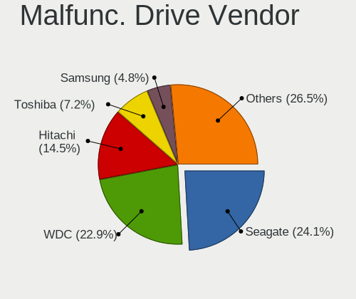

| Vendor              | Computers | Drives | Percent |
|---------------------|-----------|--------|---------|
| Seagate             | 20        | 26     | 24.1%   |
| WDC                 | 19        | 37     | 22.89%  |
| Hitachi             | 12        | 16     | 14.46%  |
| Toshiba             | 6         | 8      | 7.23%   |
| Samsung Electronics | 4         | 4      | 4.82%   |
| Micron Technology   | 3         | 3      | 3.61%   |
| HGST                | 3         | 3      | 3.61%   |
| SanDisk             | 2         | 2      | 2.41%   |
| Western Digital     | 1         | 2      | 1.2%    |
| SK hynix            | 1         | 1      | 1.2%    |
| Netac               | 1         | 1      | 1.2%    |
| Maxtor              | 1         | 1      | 1.2%    |
| JMicron Technology  | 1         | 1      | 1.2%    |
| Intel               | 1         | 1      | 1.2%    |
| Inateck             | 1         | 1      | 1.2%    |
| Fujitsu             | 1         | 1      | 1.2%    |
| DRVEO               | 1         | 1      | 1.2%    |
| Crucial             | 1         | 1      | 1.2%    |
| China               | 1         | 1      | 1.2%    |
| Apple               | 1         | 1      | 1.2%    |
| ADATA Technology    | 1         | 1      | 1.2%    |
| A-DATA Technology   | 1         | 1      | 1.2%    |

Malfunc. HDD Vendor
-------------------

Vendors of faulty HDD drives

| Vendor              | Computers | Drives | Percent |
|---------------------|-----------|--------|---------|
| Seagate             | 20        | 26     | 29.85%  |
| WDC                 | 19        | 37     | 28.36%  |
| Hitachi             | 12        | 16     | 17.91%  |
| Toshiba             | 6         | 8      | 8.96%   |
| HGST                | 3         | 3      | 4.48%   |
| Samsung Electronics | 2         | 2      | 2.99%   |
| Maxtor              | 1         | 1      | 1.49%   |
| JMicron Technology  | 1         | 1      | 1.49%   |
| Inateck             | 1         | 1      | 1.49%   |
| Fujitsu             | 1         | 1      | 1.49%   |
| Apple               | 1         | 1      | 1.49%   |

Malfunc. Drive Kind
-------------------

Kinds of faulty drives

| Kind | Computers | Drives | Percent |
|------|-----------|--------|---------|
| HDD  | 52        | 97     | 76.47%  |
| SSD  | 12        | 12     | 17.65%  |
| NVMe | 4         | 5      | 5.88%   |

Failed Drives
-------------

Failed drive models

| Model                           | Computers | Drives | Percent |
|---------------------------------|-----------|--------|---------|
| WDC WD1200BEVS-22UST0 120GB     | 1         | 1      | 33.33%  |
| Sandisk PC SN520 NVMe SSD 256GB | 1         | 1      | 33.33%  |
| KingDian S400 120GB             | 1         | 4      | 33.33%  |

Failed Drive Vendor
-------------------

Failed drive vendors

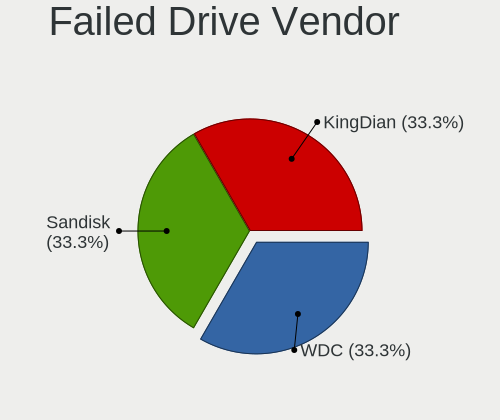

| Vendor   | Computers | Drives | Percent |
|----------|-----------|--------|---------|
| WDC      | 1         | 1      | 33.33%  |
| Sandisk  | 1         | 1      | 33.33%  |
| KingDian | 1         | 4      | 33.33%  |

Drive Status
------------

Number of failed and malfunc. drives

| Status   | Computers | Drives | Percent |
|----------|-----------|--------|---------|
| Detected | 474       | 962    | 53.38%  |
| Works    | 344       | 666    | 38.74%  |
| Malfunc  | 67        | 114    | 7.55%   |
| Failed   | 3         | 6      | 0.34%   |

Storage controller
------------------

Storage Vendor
--------------

Storage controller vendors

| Vendor                         | Computers | Percent |
|--------------------------------|-----------|---------|
| Intel                          | 498       | 48.68%  |
| AMD                            | 143       | 13.98%  |
| Samsung Electronics            | 105       | 10.26%  |
| SanDisk                        | 52        | 5.08%   |
| SK hynix                       | 23        | 2.25%   |
| Micron Technology              | 23        | 2.25%   |
| KIOXIA                         | 23        | 2.25%   |
| Toshiba America Info Systems   | 18        | 1.76%   |
| Micron/Crucial Technology      | 18        | 1.76%   |
| Nvidia                         | 17        | 1.66%   |
| Kingston Technology Company    | 14        | 1.37%   |
| ASMedia Technology             | 14        | 1.37%   |
| Phison Electronics             | 13        | 1.27%   |
| Marvell Technology Group       | 13        | 1.27%   |
| JMicron Technology             | 7         | 0.68%   |
| ADATA Technology               | 6         | 0.59%   |
| Union Memory (Shenzhen)        | 5         | 0.49%   |
| Silicon Motion                 | 5         | 0.49%   |
| LSI Logic / Symbios Logic      | 4         | 0.39%   |
| Solid State Storage Technology | 3         | 0.29%   |
| Transcend                      | 2         | 0.2%    |
| Realtek Semiconductor          | 2         | 0.2%    |
| O2 Micro                       | 2         | 0.2%    |
| MAXIO Technology (Hangzhou)    | 2         | 0.2%    |
| Apple                          | 2         | 0.2%    |
| ULi Electronics                | 1         | 0.1%    |
| Solidigm                       | 1         | 0.1%    |
| Silicon Image                  | 1         | 0.1%    |
| Shenzhen Longsys Electronics   | 1         | 0.1%    |
| Seagate Technology             | 1         | 0.1%    |
| Lite-On Technology             | 1         | 0.1%    |
| Lenovo                         | 1         | 0.1%    |
| Broadcom / LSI                 | 1         | 0.1%    |
| Adaptec                        | 1         | 0.1%    |

Storage Model
-------------

Storage controller models

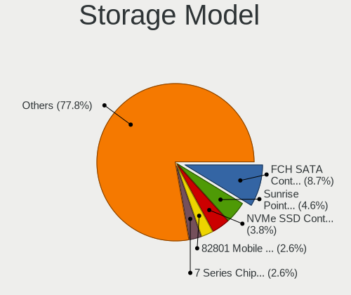

| Model                                                                                   | Computers | Percent |
|-----------------------------------------------------------------------------------------|-----------|---------|
| AMD FCH SATA Controller [AHCI mode]                                                     | 102       | 8.72%   |
| Intel Sunrise Point-LP SATA Controller [AHCI mode]                                      | 54        | 4.62%   |
| Samsung NVMe SSD Controller SM981/PM981/PM983                                           | 44        | 3.76%   |
| Intel 82801 Mobile SATA Controller [RAID mode]                                          | 30        | 2.56%   |
| Intel 7 Series Chipset Family 6-port SATA Controller [AHCI mode]                        | 30        | 2.56%   |
| Intel 8 Series/C220 Series Chipset Family 6-port SATA Controller 1 [AHCI mode]          | 29        | 2.48%   |
| Samsung NVMe SSD Controller 980 (DRAM-less)                                             | 26        | 2.22%   |
| Intel Volume Management Device NVMe RAID Controller                                     | 23        | 1.97%   |
| Intel 7 Series/C210 Series Chipset Family 6-port SATA Controller [AHCI mode]            | 22        | 1.88%   |
| Intel 6 Series/C200 Series Chipset Family 6 port Mobile SATA AHCI Controller            | 21        | 1.79%   |
| AMD 400 Series Chipset SATA Controller                                                  | 21        | 1.79%   |
| KIOXIA NVMe SSD Controller BG4 (DRAM-less)                                              | 19        | 1.62%   |
| Intel 6 Series/C200 Series Chipset Family 6 port Desktop SATA AHCI Controller           | 19        | 1.62%   |
| Samsung NVMe SSD Controller PM9A1/PM9A3/980PRO                                          | 18        | 1.54%   |
| SanDisk Extreme Pro / WD Black SN750 / PC SN730 / Red SN700 NVMe SSD                    | 15        | 1.28%   |
| Intel Comet Lake SATA AHCI Controller                                                   | 15        | 1.28%   |
| Intel Celeron/Pentium Silver Processor SATA Controller                                  | 15        | 1.28%   |
| Intel 82801IBM/IEM (ICH9M/ICH9M-E) 4 port SATA Controller [AHCI mode]                   | 15        | 1.28%   |
| Intel Q170/Q150/B150/H170/H110/Z170/CM236 Chipset SATA Controller [AHCI Mode]           | 14        | 1.2%    |
| AMD SB7x0/SB8x0/SB9x0 SATA Controller [AHCI mode]                                       | 13        | 1.11%   |
| Intel 6 Series/C200 Series Chipset Family Desktop SATA Controller (IDE mode, ports 4-5) | 12        | 1.03%   |
| Intel 6 Series/C200 Series Chipset Family Desktop SATA Controller (IDE mode, ports 0-3) | 12        | 1.03%   |
| ASMedia ASM1061/ASM1062 Serial ATA Controller                                           | 12        | 1.03%   |
| AMD SB7x0/SB8x0/SB9x0 IDE Controller                                                    | 12        | 1.03%   |
| Intel HM170/QM170 Chipset SATA Controller [AHCI Mode]                                   | 11        | 0.94%   |
| Intel 5 Series/3400 Series Chipset 6 port SATA AHCI Controller                          | 11        | 0.94%   |
| SK hynix Gold P31/BC711/PC711 NVMe Solid State Drive                                    | 10        | 0.85%   |
| Samsung NVMe SSD Controller SM961/PM961/SM963                                           | 10        | 0.85%   |
| Toshiba America Info Systems XG6 NVMe SSD Controller                                    | 9         | 0.77%   |
| Intel SATA Controller [RAID mode]                                                       | 9         | 0.77%   |
| Intel Atom Processor E3800 Series SATA AHCI Controller                                  | 9         | 0.77%   |
| Intel 82801HM/HEM (ICH8M/ICH8M-E) IDE Controller                                        | 9         | 0.77%   |
| Intel 8 Series SATA Controller 1 [AHCI mode]                                            | 9         | 0.77%   |
| Intel 200 Series PCH SATA controller [AHCI mode]                                        | 9         | 0.77%   |
| Phison E12 NVMe Controller                                                              | 8         | 0.68%   |
| Micron/Crucial P2 [Nick P2] / P3 / P3 Plus NVMe PCIe SSD (DRAM-less)                    | 8         | 0.68%   |
| Intel Wildcat Point-LP SATA Controller [AHCI Mode]                                      | 8         | 0.68%   |
| Intel Tiger Lake-LP SATA Controller                                                     | 8         | 0.68%   |
| Intel 82801JI (ICH10 Family) SATA AHCI Controller                                       | 8         | 0.68%   |
| AMD 600 Series Chipset SATA Controller                                                  | 8         | 0.68%   |

Storage Kind
------------

Kind of storage controller (IDE, SATA, NVMe, SAS, ...)

| Kind | Computers | Percent |
|------|-----------|---------|
| SATA | 542       | 52.52%  |
| NVMe | 315       | 30.52%  |
| IDE  | 93        | 9.01%   |
| RAID | 78        | 7.56%   |
| SCSI | 4         | 0.39%   |

Processor
---------

CPU Vendor
----------

Processor vendors

| Vendor | Computers | Percent |
|--------|-----------|---------|
| Intel  | 596       | 73.85%  |
| AMD    | 201       | 24.91%  |
| ARM    | 9         | 1.12%   |
| iSH    | 1         | 0.12%   |

CPU Model
---------

Processor models

| Model                                         | Computers | Percent |
|-----------------------------------------------|-----------|---------|
| Intel 11th Gen Core i7-1185G7 @ 3.00GHz       | 14        | 1.73%   |
| Intel Core i5-7200U CPU @ 2.50GHz             | 11        | 1.36%   |
| Intel 11th Gen Core i5-1135G7 @ 2.40GHz       | 11        | 1.36%   |
| Intel Core i5-8250U CPU @ 1.60GHz             | 10        | 1.23%   |
| Intel Core i7-3770 CPU @ 3.40GHz              | 9         | 1.11%   |
| Intel Core i7-7700HQ CPU @ 2.80GHz            | 8         | 0.99%   |
| Intel Core i7-7500U CPU @ 2.70GHz             | 8         | 0.99%   |
| Intel Core i7-2600K CPU @ 3.40GHz             | 8         | 0.99%   |
| Intel Core i5-6200U CPU @ 2.30GHz             | 8         | 0.99%   |
| ARM Processor                                 | 8         | 0.99%   |
| AMD Ryzen 7 5800H with Radeon Graphics        | 8         | 0.99%   |
| AMD Ryzen 5 3600 6-Core Processor             | 8         | 0.99%   |
| Intel Core i7-8565U CPU @ 1.80GHz             | 7         | 0.86%   |
| Intel Core i7-8550U CPU @ 1.80GHz             | 7         | 0.86%   |
| Intel Core i7-10510U CPU @ 1.80GHz            | 7         | 0.86%   |
| Intel Core i5-3470 CPU @ 3.20GHz              | 7         | 0.86%   |
| AMD Ryzen 5 3500U with Radeon Vega Mobile Gfx | 7         | 0.86%   |
| AMD Custom APU 0405                           | 7         | 0.86%   |
| Intel Core i5-3320M CPU @ 2.60GHz             | 6         | 0.74%   |
| Intel Core i5-2520M CPU @ 2.50GHz             | 6         | 0.74%   |
| Intel 11th Gen Core i7-1165G7 @ 2.80GHz       | 6         | 0.74%   |
| Intel Core i5-10210U CPU @ 1.60GHz            | 5         | 0.62%   |
| Intel Celeron CPU N3060 @ 1.60GHz             | 5         | 0.62%   |
| Intel 12th Gen Core i5-1235U                  | 5         | 0.62%   |
| AMD Ryzen 7 5700U with Radeon Graphics        | 5         | 0.62%   |
| AMD Ryzen 7 3700U with Radeon Vega Mobile Gfx | 5         | 0.62%   |
| Intel Core i7-9750H CPU @ 2.60GHz             | 4         | 0.49%   |
| Intel Core i7-6700HQ CPU @ 2.60GHz            | 4         | 0.49%   |
| Intel Core i7-3770K CPU @ 3.50GHz             | 4         | 0.49%   |
| Intel Core i7-1065G7 CPU @ 1.30GHz            | 4         | 0.49%   |
| Intel Core i5-6300U CPU @ 2.40GHz             | 4         | 0.49%   |
| Intel Core i5-4300U CPU @ 1.90GHz             | 4         | 0.49%   |
| Intel Core i5-2400 CPU @ 3.10GHz              | 4         | 0.49%   |
| Intel Core i3-2100 CPU @ 3.10GHz              | 4         | 0.49%   |
| Intel Core 2 Duo CPU T9600 @ 2.80GHz          | 4         | 0.49%   |
| Intel Core 2 Duo CPU T5800 @ 2.00GHz          | 4         | 0.49%   |
| Intel Celeron J4125 CPU @ 2.00GHz             | 4         | 0.49%   |
| Intel Celeron CPU N2840 @ 2.16GHz             | 4         | 0.49%   |
| Intel Atom x5-Z8350 CPU @ 1.44GHz             | 4         | 0.49%   |
| Intel Atom CPU N450 @ 1.66GHz                 | 4         | 0.49%   |

CPU Model Family
----------------

Processor model prefix

| Model                   | Computers | Percent |
|-------------------------|-----------|---------|
| Intel Core i5           | 160       | 19.73%  |
| Intel Core i7           | 151       | 18.62%  |
| Other                   | 100       | 12.33%  |
| Intel Core i3           | 55        | 6.78%   |
| AMD Ryzen 5             | 48        | 5.92%   |
| AMD Ryzen 7             | 42        | 5.18%   |
| Intel Celeron           | 40        | 4.93%   |
| Intel Core 2 Duo        | 31        | 3.82%   |
| AMD Ryzen 9             | 19        | 2.34%   |
| Intel Xeon              | 14        | 1.73%   |
| Intel Atom              | 14        | 1.73%   |
| Intel Pentium           | 12        | 1.48%   |
| Intel Core 2 Quad       | 8         | 0.99%   |
| AMD Ryzen 3             | 6         | 0.74%   |
| AMD FX                  | 6         | 0.74%   |
| AMD Athlon 64 X2        | 6         | 0.74%   |
| AMD A8                  | 6         | 0.74%   |
| Intel Pentium Dual-Core | 5         | 0.62%   |
| AMD A6                  | 5         | 0.62%   |
| Intel Pentium Silver    | 4         | 0.49%   |
| Intel Pentium 4         | 4         | 0.49%   |
| Intel Core i9           | 4         | 0.49%   |
| AMD Ryzen Threadripper  | 4         | 0.49%   |
| AMD Ryzen 5 PRO         | 4         | 0.49%   |
| AMD E1                  | 4         | 0.49%   |
| Intel Core 2            | 3         | 0.37%   |
| AMD Ryzen 7 PRO         | 3         | 0.37%   |
| AMD Phenom II X4        | 3         | 0.37%   |
| AMD Athlon II X4        | 3         | 0.37%   |
| AMD Athlon II X2        | 3         | 0.37%   |
| AMD A4                  | 3         | 0.37%   |
| AMD A10                 | 3         | 0.37%   |
| Intel Pentium Gold      | 2         | 0.25%   |
| Intel Pentium Dual      | 2         | 0.25%   |
| Intel Pentium D         | 2         | 0.25%   |
| Intel Core m3           | 2         | 0.25%   |
| Intel Celeron Dual-Core | 2         | 0.25%   |
| AMD Sempron             | 2         | 0.25%   |
| AMD Ryzen Embedded      | 2         | 0.25%   |
| AMD Ryzen 3 PRO         | 2         | 0.25%   |

CPU Cores
---------

Number of processor cores

| Number  | Computers | Percent |
|---------|-----------|---------|
| 4       | 321       | 39.68%  |
| 2       | 279       | 34.49%  |
| 6       | 67        | 8.28%   |
| 8       | 58        | 7.17%   |
| 12      | 27        | 3.34%   |
| 1       | 22        | 2.72%   |
| 10      | 11        | 1.36%   |
| 14      | 9         | 1.11%   |
| 16      | 5         | 0.62%   |
| 24      | 3         | 0.37%   |
| 3       | 3         | 0.37%   |
| Unknown | 2         | 0.25%   |
| 96      | 1         | 0.12%   |
| 32      | 1         | 0.12%   |

CPU Sockets
-----------

Number of sockets

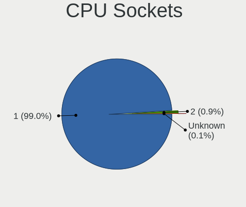

| Number  | Computers | Percent |
|---------|-----------|---------|
| 1       | 798       | 99.01%  |
| 2       | 7         | 0.87%   |
| Unknown | 1         | 0.12%   |

CPU Threads
-----------

Threads per core (Hyper-Threading)

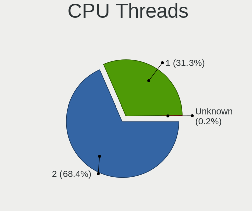

| Number  | Computers | Percent |
|---------|-----------|---------|
| 2       | 555       | 68.43%  |
| 1       | 254       | 31.32%  |
| Unknown | 2         | 0.25%   |

CPU Op-Modes
------------

CPU Operation Modes (32-bit, 64-bit)

| Op mode        | Computers | Percent |
|----------------|-----------|---------|
| 32-bit, 64-bit | 787       | 97.28%  |
| Unknown        | 19        | 2.35%   |
| 32-bit         | 3         | 0.37%   |

CPU Microcode
-------------

Microcode number

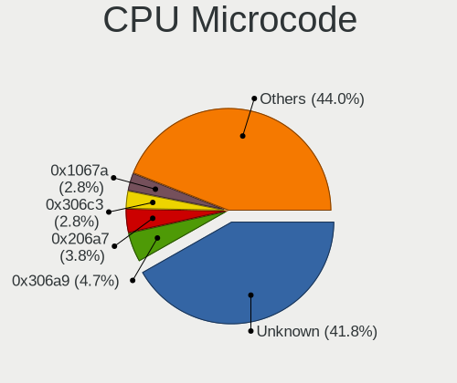

| Number     | Computers | Percent |
|------------|-----------|---------|
| Unknown    | 353       | 41.78%  |
| 0x306a9    | 40        | 4.73%   |
| 0x206a7    | 32        | 3.79%   |
| 0x306c3    | 24        | 2.84%   |
| 0x1067a    | 24        | 2.84%   |
| 0x806ec    | 22        | 2.6%    |
| 0x806c1    | 19        | 2.25%   |
| 0x806e9    | 18        | 2.13%   |
| 0x806ea    | 14        | 1.66%   |
| 0x406e3    | 14        | 1.66%   |
| 0x906ea    | 11        | 1.3%    |
| 0x906e9    | 10        | 1.18%   |
| 0x406c4    | 10        | 1.18%   |
| 0x40651    | 10        | 1.18%   |
| 0x08108109 | 10        | 1.18%   |
| 0x0a50000c | 9         | 1.07%   |
| 0x30678    | 8         | 0.95%   |
| 0x10676    | 8         | 0.95%   |
| 0xa0652    | 7         | 0.83%   |
| 0x506e3    | 7         | 0.83%   |
| 0x08701021 | 7         | 0.83%   |
| 0x306d4    | 6         | 0.71%   |
| 0x20655    | 6         | 0.71%   |
| 0x0810100b | 6         | 0.71%   |
| 0x08108102 | 5         | 0.59%   |
| 0x0800820d | 5         | 0.59%   |
| 0x06006705 | 5         | 0.59%   |
| 0xa0653    | 4         | 0.47%   |
| 0x906a3    | 4         | 0.47%   |
| 0x706a8    | 4         | 0.47%   |
| 0x6fd      | 4         | 0.47%   |
| 0x6fb      | 4         | 0.47%   |
| 0x206c2    | 4         | 0.47%   |
| 0x20652    | 4         | 0.47%   |
| 0x106ca    | 4         | 0.47%   |
| 0x08600106 | 4         | 0.47%   |
| 0x0600611a | 4         | 0.47%   |
| 0x010000c8 | 4         | 0.47%   |
| 0xf43      | 3         | 0.36%   |
| 0x906ed    | 3         | 0.36%   |

CPU Microarch
-------------

Microarchitecture

| Name             | Computers | Percent |
|------------------|-----------|---------|
| KabyLake         | 118       | 14.6%   |
| Unknown          | 66        | 8.17%   |
| IvyBridge        | 64        | 7.92%   |
| SandyBridge      | 53        | 6.56%   |
| Haswell          | 53        | 6.56%   |
| Skylake          | 41        | 5.07%   |
| TigerLake        | 39        | 4.83%   |
| Penryn           | 37        | 4.58%   |
| Zen 2            | 35        | 4.33%   |
| Zen+             | 32        | 3.96%   |
| Westmere         | 27        | 3.34%   |
| Silvermont       | 27        | 3.34%   |
| Zen 3            | 24        | 2.97%   |
| Core             | 17        | 2.1%    |
| CometLake        | 17        | 2.1%    |
| Goldmont plus    | 16        | 1.98%   |
| Zen              | 15        | 1.86%   |
| K10              | 14        | 1.73%   |
| Alderlake Hybrid | 14        | 1.73%   |
| Excavator        | 12        | 1.49%   |
| Broadwell        | 11        | 1.36%   |
| Piledriver       | 10        | 1.24%   |
| Icelake          | 10        | 1.24%   |
| K8 Hammer        | 9         | 1.11%   |
| Nehalem          | 7         | 0.87%   |
| NetBurst         | 6         | 0.74%   |
| Bonnell          | 6         | 0.74%   |
| Puma             | 4         | 0.5%    |
| P6               | 4         | 0.5%    |
| Jaguar           | 4         | 0.5%    |
| Goldmont         | 4         | 0.5%    |
| Bobcat           | 4         | 0.5%    |
| Steamroller      | 2         | 0.25%   |
| Gracemont        | 2         | 0.25%   |
| Tremont          | 1         | 0.12%   |
| K8 & K10 hybrid  | 1         | 0.12%   |
| K10 Llano        | 1         | 0.12%   |
| Bulldozer        | 1         | 0.12%   |

Graphics
--------

GPU Vendor
----------

Vendors of graphics cards

| Vendor                     | Computers | Percent |
|----------------------------|-----------|---------|
| Intel                      | 466       | 50.16%  |
| Nvidia                     | 231       | 24.87%  |
| AMD                        | 230       | 24.76%  |
| Matrox Electronics Systems | 1         | 0.11%   |
| ASPEED Technology          | 1         | 0.11%   |

GPU Model
---------

Graphics card models

| Model                                                                                    | Computers | Percent |
|------------------------------------------------------------------------------------------|-----------|---------|
| Intel 2nd Generation Core Processor Family Integrated Graphics Controller                | 36        | 3.75%   |
| Intel TigerLake-LP GT2 [Iris Xe Graphics]                                                | 32        | 3.33%   |
| Intel 3rd Gen Core processor Graphics Controller                                         | 30        | 3.12%   |
| Intel HD Graphics 620                                                                    | 22        | 2.29%   |
| Intel UHD Graphics 620                                                                   | 21        | 2.19%   |
| AMD Ellesmere [Radeon RX 470/480/570/570X/580/580X/590]                                  | 21        | 2.19%   |
| AMD Picasso/Raven 2 [Radeon Vega Series / Radeon Vega Mobile Series]                     | 20        | 2.08%   |
| Intel Skylake GT2 [HD Graphics 520]                                                      | 18        | 1.87%   |
| Intel CometLake-U GT2 [UHD Graphics]                                                     | 17        | 1.77%   |
| Intel WhiskeyLake-U GT2 [UHD Graphics 620]                                               | 15        | 1.56%   |
| Intel Raptor Lake-P [Iris Xe Graphics]                                                   | 14        | 1.46%   |
| Intel Mobile 4 Series Chipset Integrated Graphics Controller                             | 14        | 1.46%   |
| Intel Core Processor Integrated Graphics Controller                                      | 14        | 1.46%   |
| Intel Atom Processor Z36xxx/Z37xxx Series Graphics & Display                             | 14        | 1.46%   |
| Intel HD Graphics 630                                                                    | 13        | 1.35%   |
| Intel Haswell-ULT Integrated Graphics Controller                                         | 13        | 1.35%   |
| Intel Atom/Celeron/Pentium Processor x5-E8000/J3xxx/N3xxx Integrated Graphics Controller | 13        | 1.35%   |
| Intel GeminiLake [UHD Graphics 600]                                                      | 12        | 1.25%   |
| AMD Renoir [Radeon Vega Series / Radeon Vega Mobile Series]                              | 12        | 1.25%   |
| AMD Cezanne [Radeon Vega Series / Radeon Vega Mobile Series]                             | 12        | 1.25%   |
| Intel Xeon E3-1200 v3/4th Gen Core Processor Integrated Graphics Controller              | 11        | 1.14%   |
| Intel CometLake-H GT2 [UHD Graphics]                                                     | 11        | 1.14%   |
| AMD Raven Ridge [Radeon Vega Series / Radeon Vega Mobile Series]                         | 10        | 1.04%   |
| Nvidia GP106 [GeForce GTX 1060 6GB]                                                      | 9         | 0.94%   |
| Intel Xeon E3-1200 v2/3rd Gen Core processor Graphics Controller                         | 9         | 0.94%   |
| Intel CoffeeLake-H GT2 [UHD Graphics 630]                                                | 9         | 0.94%   |
| Intel HD Graphics 530                                                                    | 8         | 0.83%   |
| Intel Alder Lake-P GT2 [Iris Xe Graphics]                                                | 8         | 0.83%   |
| Intel 4th Gen Core Processor Integrated Graphics Controller                              | 8         | 0.83%   |
| Intel 4 Series Chipset Integrated Graphics Controller                                    | 8         | 0.83%   |
| AMD Oland [Radeon HD 8570 / R5 430 OEM / R7 240/340 / Radeon 520 OEM]                    | 8         | 0.83%   |
| AMD Lucienne                                                                             | 8         | 0.83%   |
| Nvidia GP108M [GeForce MX150]                                                            | 7         | 0.73%   |
| Intel HD Graphics 5500                                                                   | 7         | 0.73%   |
| AMD VanGogh [AMD Custom GPU 0405]                                                        | 7         | 0.73%   |
| Nvidia GP107 [GeForce GTX 1050 Ti]                                                       | 6         | 0.62%   |
| Nvidia C79 [GeForce 9400M]                                                               | 6         | 0.62%   |
| Intel 4th Generation Core Processor Family Integrated Graphics Controller                | 6         | 0.62%   |
| AMD Wani [Radeon R5/R6/R7 Graphics]                                                      | 6         | 0.62%   |
| AMD Stoney [Radeon R2/R3/R4/R5 Graphics]                                                 | 6         | 0.62%   |

GPU Combo
---------

Combinations of graphics cards

| Name            | Computers | Percent |
|-----------------|-----------|---------|
| 1 x Intel       | 354       | 43.22%  |
| 1 x AMD         | 187       | 22.83%  |
| 1 x Nvidia      | 128       | 15.63%  |
| Intel + Nvidia  | 89        | 10.87%  |
| 2 x AMD         | 18        | 2.2%    |
| AMD + Nvidia    | 13        | 1.59%   |
| Intel + AMD     | 12        | 1.47%   |
| Other           | 10        | 1.22%   |
| 2 x Intel       | 4         | 0.49%   |
| 2 x Nvidia      | 2         | 0.24%   |
| Nvidia + Matrox | 1         | 0.12%   |
| 1 x ASPEED      | 1         | 0.12%   |

GPU Driver
----------

Free vs proprietary

| Driver      | Computers | Percent |
|-------------|-----------|---------|
| Free        | 651       | 79.49%  |
| Proprietary | 118       | 14.41%  |
| Unknown     | 50        | 6.11%   |

GPU Memory
----------

Total video memory

| Size in GB | Computers | Percent |
|------------|-----------|---------|
| Unknown    | 509       | 60.67%  |
| 0.01-0.5   | 77        | 9.18%   |
| 1.01-2.0   | 73        | 8.7%    |
| 0.51-1.0   | 56        | 6.67%   |
| 3.01-4.0   | 54        | 6.44%   |
| 7.01-8.0   | 33        | 3.93%   |
| 5.01-6.0   | 19        | 2.26%   |
| 8.01-16.0  | 10        | 1.19%   |
| 2.01-3.0   | 5         | 0.6%    |
| 16.01-24.0 | 3         | 0.36%   |

Monitor
-------

Monitor Vendor
--------------

Monitor vendors

| Vendor                  | Computers | Percent |
|-------------------------|-----------|---------|
| BOE                     | 98        | 10.93%  |
| AU Optronics            | 96        | 10.7%   |
| Dell                    | 94        | 10.48%  |
| LG Display              | 83        | 9.25%   |
| Samsung Electronics     | 78        | 8.7%    |
| Chimei Innolux          | 67        | 7.47%   |
| Acer                    | 31        | 3.46%   |
| Hewlett-Packard         | 27        | 3.01%   |
| Sharp                   | 26        | 2.9%    |
| Goldstar                | 24        | 2.68%   |
| BenQ                    | 24        | 2.68%   |
| Philips                 | 23        | 2.56%   |
| Apple                   | 23        | 2.56%   |
| Lenovo                  | 21        | 2.34%   |
| AOC                     | 20        | 2.23%   |
| ViewSonic               | 15        | 1.67%   |
| Iiyama                  | 13        | 1.45%   |
| Chi Mei Optoelectronics | 10        | 1.11%   |
| PANDA                   | 9         | 1%      |
| InfoVision              | 8         | 0.89%   |
| Valve                   | 7         | 0.78%   |
| Sony                    | 7         | 0.78%   |
| LG Philips              | 7         | 0.78%   |
| ASUSTek Computer        | 6         | 0.67%   |
| Ancor Communications    | 6         | 0.67%   |
| MSI                     | 5         | 0.56%   |
| Vestel Elektronik       | 4         | 0.45%   |
| Unknown                 | 4         | 0.45%   |
| CSO                     | 4         | 0.45%   |
| ___                     | 3         | 0.33%   |
| Toshiba                 | 3         | 0.33%   |
| KDB                     | 3         | 0.33%   |
| HKC                     | 3         | 0.33%   |
| HannStar                | 3         | 0.33%   |
| OEM                     | 2         | 0.22%   |
| NEC Computers           | 2         | 0.22%   |
| MiTAC                   | 2         | 0.22%   |
| HUAWEI                  | 2         | 0.22%   |
| HannStar Display        | 2         | 0.22%   |
| CPT                     | 2         | 0.22%   |

Monitor Model
-------------

Monitor models

| Model                                                                 | Computers | Percent |
|-----------------------------------------------------------------------|-----------|---------|
| BOE LCD Monitor BOE091D 1920x1080 309x174mm 14.0-inch                 | 9         | 0.96%   |
| ViewSonic VP2756-2K VSCE63B 2560x1440 597x336mm 27.0-inch             | 8         | 0.85%   |
| Dell P2217H DELA0D8 1920x1080 476x267mm 21.5-inch                     | 8         | 0.85%   |
| Valve ANX7530 U VLV3001 800x1280 100x150mm 7.1-inch                   | 6         | 0.64%   |
| Samsung Electronics LCD Monitor SEC5441 1280x800 286x179mm 13.3-inch  | 5         | 0.53%   |
| LG Display LCD Monitor LGD02DC 1366x768 344x194mm 15.5-inch           | 5         | 0.53%   |
| Iiyama PLT2336 IVM5628 1920x1080 509x286mm 23.0-inch                  | 5         | 0.53%   |
| Chimei Innolux LCD Monitor CMN15E7 1920x1080 344x193mm 15.5-inch      | 5         | 0.53%   |
| Chimei Innolux LCD Monitor CMN15D5 1920x1080 344x193mm 15.5-inch      | 5         | 0.53%   |
| BOE LCD Monitor BOE0964 1920x1200 286x179mm 13.3-inch                 | 5         | 0.53%   |
| BenQ BenQG2222HDL BNQ7859 1920x1080 478x269mm 21.6-inch               | 5         | 0.53%   |
| AU Optronics LCD Monitor AUO38ED 1920x1080 344x193mm 15.5-inch        | 5         | 0.53%   |
| AU Optronics LCD Monitor AUO2E3C 1366x768 309x173mm 13.9-inch         | 5         | 0.53%   |
| AOC Q3279WG5B AOC3279 2560x1440 725x428mm 33.1-inch                   | 5         | 0.53%   |
| Vestel Elektronik 49FHD_LCD_TV VES3700 1920x1080 1280x720mm 57.8-inch | 4         | 0.43%   |
| Samsung Electronics S24D300 SAM0B43 1920x1080 531x299mm 24.0-inch     | 4         | 0.43%   |
| Samsung Electronics LCD Monitor SAM0900 1366x768 700x390mm 31.5-inch  | 4         | 0.43%   |
| LG Display LCD Monitor LGD033A 1366x768 340x190mm 15.3-inch           | 4         | 0.43%   |
| BenQ GW2270 BNQ78DB 1920x1080 476x268mm 21.5-inch                     | 4         | 0.43%   |
| AU Optronics LCD Monitor AUO106C 1366x768 277x156mm 12.5-inch         | 4         | 0.43%   |
| ___ LCD TV ___9000 1360x768                                           | 3         | 0.32%   |
| Unknown LCDTV16 9000 1360x768 1600x900mm 72.3-inch                    | 3         | 0.32%   |
| Sony TV  *00 SNY8004 3840x2160 1220x680mm 55.0-inch                   | 3         | 0.32%   |
| Sharp LQ156M1JW01 SHP14C3 1920x1080 344x194mm 15.5-inch               | 3         | 0.32%   |
| Philips PHL 273V7 PHLC156 1920x1080 598x336mm 27.0-inch               | 3         | 0.32%   |
| Philips PHL 243V7 PHLC155 1920x1080 527x296mm 23.8-inch               | 3         | 0.32%   |
| Philips PHL 243V5 PHLC0D1 1920x1080 521x293mm 23.5-inch               | 3         | 0.32%   |
| LG Display LP156WH1-TLA3 LGD01C2 1366x768 344x194mm 15.5-inch         | 3         | 0.32%   |
| LG Display LCD Monitor LGD04E8 1920x1080 382x215mm 17.3-inch          | 3         | 0.32%   |
| LG Display LCD Monitor LGD04A7 1920x1080 344x194mm 15.5-inch          | 3         | 0.32%   |
| LG Display LCD Monitor LGD0382 1600x900 309x174mm 14.0-inch           | 3         | 0.32%   |
| LG Display LCD Monitor LGD02D8 1366x768 277x156mm 12.5-inch           | 3         | 0.32%   |
| Lenovo LEN LT2452pwC LEN1144 1920x1080 518x324mm 24.1-inch            | 3         | 0.32%   |
| Lenovo LCD Monitor LEN4036 1440x900 303x189mm 14.1-inch               | 3         | 0.32%   |
| KDB LCD Monitor KDB0526 1920x1080 344x194mm 15.5-inch                 | 3         | 0.32%   |
| Dell P2417H DELA0DB 1920x1080 527x296mm 23.8-inch                     | 3         | 0.32%   |
| Dell P2014H DEL4097 1600x900 434x236mm 19.4-inch                      | 3         | 0.32%   |
| Chimei Innolux LCD Monitor CMN15D7 1920x1080 344x193mm 15.5-inch      | 3         | 0.32%   |
| Chimei Innolux LCD Monitor CMN14C3 1366x768 309x173mm 13.9-inch       | 3         | 0.32%   |
| BOE LCD Monitor BOE0812 1920x1080 344x194mm 15.5-inch                 | 3         | 0.32%   |

Monitor Resolution
------------------

Monitor screen resolution

| Resolution         | Computers | Percent |
|--------------------|-----------|---------|
| 1920x1080 (FHD)    | 385       | 45.56%  |
| 1366x768 (WXGA)    | 135       | 15.98%  |
| 3840x2160 (4K)     | 58        | 6.86%   |
| 2560x1440 (QHD)    | 50        | 5.92%   |
| 1920x1200 (WUXGA)  | 27        | 3.2%    |
| 1600x900 (HD+)     | 27        | 3.2%    |
| 1280x1024 (SXGA)   | 23        | 2.72%   |
| 1440x900 (WXGA+)   | 18        | 2.13%   |
| 1280x800 (WXGA)    | 17        | 2.01%   |
| 3440x1440          | 13        | 1.54%   |
| 2560x1600          | 11        | 1.3%    |
| 1680x1050 (WSXGA+) | 10        | 1.18%   |
| 1360x768           | 9         | 1.07%   |
| 800x1280           | 8         | 0.95%   |
| 2880x1800          | 8         | 0.95%   |
| Unknown            | 8         | 0.95%   |
| 3840x1080          | 5         | 0.59%   |
| 1024x600           | 4         | 0.47%   |
| 3840x2400          | 3         | 0.36%   |
| 3456x2160          | 3         | 0.36%   |
| 3200x1800 (QHD+)   | 3         | 0.36%   |
| 2560x1080          | 3         | 0.36%   |
| 2160x1440          | 3         | 0.36%   |
| 1920x540           | 3         | 0.36%   |
| 1600x1200          | 3         | 0.36%   |
| 1024x768 (XGA)     | 2         | 0.24%   |
| 6400x2160          | 1         | 0.12%   |
| 5280x2560          | 1         | 0.12%   |
| 4480x1440          | 1         | 0.12%   |
| 3600x1080          | 1         | 0.12%   |
| 2256x1504          | 1         | 0.12%   |
| 2160x1200          | 1         | 0.12%   |

Monitor Diagonal
----------------

Diagonal size in inches

| Inches  | Computers | Percent |
|---------|-----------|---------|
| 15      | 224       | 24.97%  |
| 14      | 89        | 9.92%   |
| 13      | 87        | 9.7%    |
| 27      | 85        | 9.48%   |
| 24      | 68        | 7.58%   |
| 21      | 55        | 6.13%   |
| 23      | 47        | 5.24%   |
| 17      | 39        | 4.35%   |
| Unknown | 30        | 3.34%   |
| 12      | 24        | 2.68%   |
| 19      | 20        | 2.23%   |
| 34      | 15        | 1.67%   |
| 31      | 14        | 1.56%   |
| 16      | 9         | 1%      |
| 11      | 9         | 1%      |
| 84      | 8         | 0.89%   |
| 22      | 8         | 0.89%   |
| 18      | 8         | 0.89%   |
| 32      | 7         | 0.78%   |
| 20      | 7         | 0.78%   |
| 7       | 7         | 0.78%   |
| 72      | 5         | 0.56%   |
| 33      | 5         | 0.56%   |
| 65      | 4         | 0.45%   |
| 10      | 4         | 0.45%   |
| 40      | 3         | 0.33%   |
| 25      | 3         | 0.33%   |
| 49      | 2         | 0.22%   |
| 39      | 2         | 0.22%   |
| 29      | 2         | 0.22%   |
| 28      | 2         | 0.22%   |
| 48      | 1         | 0.11%   |
| 46      | 1         | 0.11%   |
| 35      | 1         | 0.11%   |
| 26      | 1         | 0.11%   |
| 3       | 1         | 0.11%   |

Monitor Width
-------------

Physical width

| Width in mm | Computers | Percent |
|-------------|-----------|---------|
| 301-350     | 351       | 39.75%  |
| 501-600     | 183       | 20.72%  |
| 201-300     | 94        | 10.65%  |
| 401-500     | 87        | 9.85%   |
| 351-400     | 47        | 5.32%   |
| Unknown     | 30        | 3.4%    |
| 601-700     | 29        | 3.28%   |
| 701-800     | 27        | 3.06%   |
| 1501-2000   | 13        | 1.47%   |
| 1001-1500   | 8         | 0.91%   |
| 1-100       | 8         | 0.91%   |
| 801-900     | 4         | 0.45%   |
| 901-1000    | 2         | 0.23%   |

Aspect Ratio
------------

Proportional relationship between the width and the height

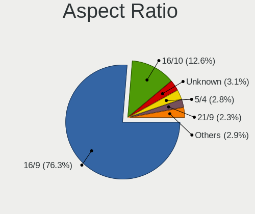

| Ratio   | Computers | Percent |
|---------|-----------|---------|
| 16/9    | 598       | 76.28%  |
| 16/10   | 99        | 12.63%  |
| Unknown | 24        | 3.06%   |
| 5/4     | 22        | 2.81%   |
| 21/9    | 18        | 2.3%    |
| 4/3     | 7         | 0.89%   |
| 3/2     | 6         | 0.77%   |
| 0.67    | 6         | 0.77%   |
| 32/9    | 2         | 0.26%   |
| 6/5     | 1         | 0.13%   |
| 0.62    | 1         | 0.13%   |

Monitor Area
------------

Area in inch

| Area in inch | Computers | Percent |
|----------------|-----------|---------|
| 101-110        | 221       | 24.72%  |
| 201-250        | 141       | 15.77%  |
| 81-90          | 130       | 14.54%  |
| 301-350        | 87        | 9.73%   |
| 71-80          | 48        | 5.37%   |
| 351-500        | 43        | 4.81%   |
| 151-200        | 41        | 4.59%   |
| Unknown        | 30        | 3.36%   |
| 251-300        | 27        | 3.02%   |
| 61-70          | 22        | 2.46%   |
| 121-130        | 22        | 2.46%   |
| 141-150        | 18        | 2.01%   |
| More than 1000 | 17        | 1.9%    |
| 111-120        | 11        | 1.23%   |
| 51-60          | 9         | 1.01%   |
| 501-1000       | 9         | 1.01%   |
| 1-40           | 8         | 0.89%   |
| 131-140        | 5         | 0.56%   |
| 41-50          | 4         | 0.45%   |
| 91-100         | 1         | 0.11%   |

Pixel Density
-------------

Pixels per inch

| Density       | Computers | Percent |
|---------------|-----------|---------|
| 121-160       | 268       | 30.95%  |
| 51-100        | 245       | 28.29%  |
| 101-120       | 207       | 23.9%   |
| 161-240       | 75        | 8.66%   |
| Unknown       | 30        | 3.46%   |
| More than 240 | 26        | 3%      |
| 1-50          | 15        | 1.73%   |

Multiple Monitors
-----------------

Total monitors connected

| Total | Computers | Percent |
|-------|-----------|---------|
| 1     | 639       | 76.62%  |
| 2     | 130       | 15.59%  |
| 0     | 36        | 4.32%   |
| 3     | 28        | 3.36%   |
| 4     | 1         | 0.12%   |

Network
-------

Net Controller Vendor
---------------------

Controller vendors

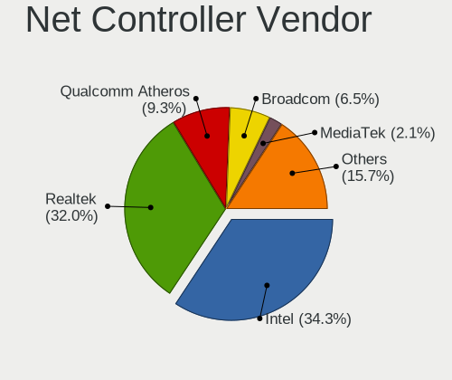

| Vendor                            | Computers | Percent |
|-----------------------------------|-----------|---------|
| Intel                             | 432       | 34.31%  |
| Realtek Semiconductor             | 403       | 32.01%  |
| Qualcomm Atheros                  | 117       | 9.29%   |
| Broadcom                          | 82        | 6.51%   |
| MediaTek                          | 27        | 2.14%   |
| Ralink Technology                 | 23        | 1.83%   |
| TP-Link                           | 22        | 1.75%   |
| Broadcom Limited                  | 16        | 1.27%   |
| Nvidia                            | 15        | 1.19%   |
| Ralink                            | 12        | 0.95%   |
| Marvell Technology Group          | 12        | 0.95%   |
| Microsoft                         | 9         | 0.71%   |
| ASIX Electronics                  | 8         | 0.64%   |
| Samsung Electronics               | 7         | 0.56%   |
| DisplayLink                       | 7         | 0.56%   |
| Lenovo                            | 6         | 0.48%   |
| Ericsson Business Mobile Networks | 6         | 0.48%   |
| OPPO Electronics                  | 5         | 0.4%    |
| Xiaomi                            | 4         | 0.32%   |
| Microchip Technology              | 4         | 0.32%   |
| Qualcomm Atheros Communications   | 3         | 0.24%   |
| Qualcomm                          | 3         | 0.24%   |
| NetGear                           | 3         | 0.24%   |
| Dell                              | 3         | 0.24%   |
| ICS Advent                        | 2         | 0.16%   |
| Huawei Technologies               | 2         | 0.16%   |
| Belkin Components                 | 2         | 0.16%   |
| ASUSTek Computer                  | 2         | 0.16%   |
| Xilinx                            | 1         | 0.08%   |
| Van Ooijen Technische Informatica | 1         | 0.08%   |
| ULi Electronics                   | 1         | 0.08%   |
| Toshiba                           | 1         | 0.08%   |
| T & A Mobile Phones               | 1         | 0.08%   |
| Sierra Wireless                   | 1         | 0.08%   |
| OnePlus Technology (Shenzhen)     | 1         | 0.08%   |
| NetXen Incorporated               | 1         | 0.08%   |
| Motorola PCS                      | 1         | 0.08%   |
| LSI                               | 1         | 0.08%   |
| LG Electronics                    | 1         | 0.08%   |
| JMicron Technology                | 1         | 0.08%   |

Net Controller Model
--------------------

Controller models

| Model                                                                  | Computers | Percent |
|------------------------------------------------------------------------|-----------|---------|
| Realtek RTL8111/8168/8211/8411 PCI Express Gigabit Ethernet Controller | 231       | 15.53%  |
| Intel Wi-Fi 6 AX200                                                    | 51        | 3.43%   |
| Intel 82579LM Gigabit Network Connection (Lewisville)                  | 47        | 3.16%   |
| Realtek RTL8153 Gigabit Ethernet Adapter                               | 45        | 3.03%   |
| Realtek RTL810xE PCI Express Fast Ethernet controller                  | 44        | 2.96%   |
| Qualcomm Atheros QCA9377 802.11ac Wireless Network Adapter             | 29        | 1.95%   |
| Intel Wi-Fi 6 AX201                                                    | 27        | 1.82%   |
| Intel Centrino Advanced-N 6205 [Taylor Peak]                           | 22        | 1.48%   |
| Realtek RTL8821CE 802.11ac PCIe Wireless Network Adapter               | 21        | 1.41%   |
| Realtek RTL8125 2.5GbE Controller                                      | 21        | 1.41%   |
| Intel Wireless 8265 / 8275                                             | 20        | 1.34%   |
| Realtek RTL8822CE 802.11ac PCIe Wireless Network Adapter               | 18        | 1.21%   |
| Intel Wireless 8260                                                    | 17        | 1.14%   |
| Qualcomm Atheros AR9485 Wireless Network Adapter                       | 16        | 1.08%   |
| Intel Wireless 7265                                                    | 16        | 1.08%   |
| Intel Wireless 7260                                                    | 16        | 1.08%   |
| Realtek 802.11ac NIC                                                   | 15        | 1.01%   |
| Intel Ethernet Connection I217-LM                                      | 15        | 1.01%   |
| Qualcomm Atheros QCA9565 / AR9565 Wireless Network Adapter             | 14        | 0.94%   |
| Intel I211 Gigabit Network Connection                                  | 14        | 0.94%   |
| Intel Wi-Fi 5(802.11ac) Wireless-AC 9x6x [Thunder Peak]                | 13        | 0.87%   |
| Intel Raptor Lake PCH CNVi WiFi                                        | 13        | 0.87%   |
| Intel Comet Lake PCH CNVi WiFi                                         | 13        | 0.87%   |
| Ralink MT7601U Wireless Adapter                                        | 12        | 0.81%   |
| Qualcomm Atheros AR9285 Wireless Network Adapter (PCI-Express)         | 12        | 0.81%   |
| Intel Comet Lake PCH-LP CNVi WiFi                                      | 12        | 0.81%   |
| MediaTek MT7921 802.11ax PCI Express Wireless Network Adapter          | 10        | 0.67%   |
| Intel Wireless 3165                                                    | 10        | 0.67%   |
| Intel Dual Band Wireless-AC 3165 Plus Bluetooth                        | 10        | 0.67%   |
| Intel Alder Lake-P PCH CNVi WiFi                                       | 10        | 0.67%   |
| Realtek RTL8852BE PCIe 802.11ax Wireless Network Controller            | 9         | 0.61%   |
| Qualcomm Atheros QCA6174 802.11ac Wireless Network Adapter             | 9         | 0.61%   |
| MediaTek MT7922 802.11ax PCI Express Wireless Network Adapter          | 9         | 0.61%   |
| Intel Ethernet Connection I218-LM                                      | 9         | 0.61%   |
| Intel Cannon Point-LP CNVi [Wireless-AC]                               | 9         | 0.61%   |
| Intel Cannon Lake PCH CNVi WiFi                                        | 9         | 0.61%   |
| Nvidia MCP79 Ethernet                                                  | 8         | 0.54%   |
| Intel Wi-Fi 6E(802.11ax) AX210/AX1675* 2x2 [Typhoon Peak]              | 8         | 0.54%   |
| Intel Ethernet Connection (4) I219-V                                   | 8         | 0.54%   |
| Intel Dual Band Wireless-AC 3168NGW [Stone Peak]                       | 8         | 0.54%   |

Wireless Vendor
---------------

Wireless vendors

| Vendor                          | Computers | Percent |
|---------------------------------|-----------|---------|
| Intel                           | 342       | 47.04%  |
| Realtek Semiconductor           | 112       | 15.41%  |
| Qualcomm Atheros                | 104       | 14.31%  |
| Broadcom                        | 55        | 7.57%   |
| Ralink Technology               | 23        | 3.16%   |
| TP-Link                         | 22        | 3.03%   |
| MediaTek                        | 21        | 2.89%   |
| Ralink                          | 12        | 1.65%   |
| Microsoft                       | 8         | 1.1%    |
| Broadcom Limited                | 7         | 0.96%   |
| Qualcomm Atheros Communications | 3         | 0.41%   |
| Qualcomm                        | 3         | 0.41%   |
| NetGear                         | 3         | 0.41%   |
| Dell                            | 3         | 0.41%   |
| Belkin Components               | 2         | 0.28%   |
| ASUSTek Computer                | 2         | 0.28%   |
| Sierra Wireless                 | 1         | 0.14%   |
| Marvell Technology Group        | 1         | 0.14%   |
| LG Electronics                  | 1         | 0.14%   |
| IMC Networks                    | 1         | 0.14%   |
| Apple                           | 1         | 0.14%   |

Wireless Model
--------------

Wireless models

| Model                                                                   | Computers | Percent |
|-------------------------------------------------------------------------|-----------|---------|
| Intel Wi-Fi 6 AX200                                                     | 51        | 6.96%   |
| Qualcomm Atheros QCA9377 802.11ac Wireless Network Adapter              | 29        | 3.96%   |
| Intel Wi-Fi 6 AX201                                                     | 27        | 3.68%   |
| Intel Centrino Advanced-N 6205 [Taylor Peak]                            | 22        | 3%      |
| Realtek RTL8821CE 802.11ac PCIe Wireless Network Adapter                | 21        | 2.86%   |
| Intel Wireless 8265 / 8275                                              | 20        | 2.73%   |
| Realtek RTL8822CE 802.11ac PCIe Wireless Network Adapter                | 18        | 2.46%   |
| Intel Wireless 8260                                                     | 17        | 2.32%   |
| Qualcomm Atheros AR9485 Wireless Network Adapter                        | 16        | 2.18%   |
| Intel Wireless 7265                                                     | 16        | 2.18%   |
| Intel Wireless 7260                                                     | 16        | 2.18%   |
| Realtek 802.11ac NIC                                                    | 15        | 2.05%   |
| Qualcomm Atheros QCA9565 / AR9565 Wireless Network Adapter              | 14        | 1.91%   |
| Intel Wi-Fi 5(802.11ac) Wireless-AC 9x6x [Thunder Peak]                 | 13        | 1.77%   |
| Intel Raptor Lake PCH CNVi WiFi                                         | 13        | 1.77%   |
| Intel Comet Lake PCH CNVi WiFi                                          | 13        | 1.77%   |
| Ralink MT7601U Wireless Adapter                                         | 12        | 1.64%   |
| Qualcomm Atheros AR9285 Wireless Network Adapter (PCI-Express)          | 12        | 1.64%   |
| Intel Comet Lake PCH-LP CNVi WiFi                                       | 12        | 1.64%   |
| MediaTek MT7921 802.11ax PCI Express Wireless Network Adapter           | 10        | 1.36%   |
| Intel Wireless 3165                                                     | 10        | 1.36%   |
| Intel Dual Band Wireless-AC 3165 Plus Bluetooth                         | 10        | 1.36%   |
| Intel Alder Lake-P PCH CNVi WiFi                                        | 10        | 1.36%   |
| Qualcomm Atheros QCA6174 802.11ac Wireless Network Adapter              | 9         | 1.23%   |
| Intel Cannon Point-LP CNVi [Wireless-AC]                                | 9         | 1.23%   |
| Intel Cannon Lake PCH CNVi WiFi                                         | 9         | 1.23%   |
| Realtek RTL8852BE PCIe 802.11ax Wireless Network Controller             | 8         | 1.09%   |
| Intel Wi-Fi 6E(802.11ax) AX210/AX1675* 2x2 [Typhoon Peak]               | 8         | 1.09%   |
| Intel Dual Band Wireless-AC 3168NGW [Stone Peak]                        | 8         | 1.09%   |
| Broadcom BCM4322 802.11a/b/g/n Wireless LAN Controller                  | 8         | 1.09%   |
| Realtek RTL8723BE PCIe Wireless Network Adapter                         | 7         | 0.95%   |
| Ralink RT5370 Wireless Adapter                                          | 7         | 0.95%   |
| MediaTek MT7922 802.11ax PCI Express Wireless Network Adapter           | 7         | 0.95%   |
| Broadcom BCM43142 802.11b/g/n                                           | 7         | 0.95%   |
| Realtek RTL8822BE 802.11a/b/g/n/ac WiFi adapter                         | 6         | 0.82%   |
| Qualcomm Atheros AR242x / AR542x Wireless Network Adapter (PCI-Express) | 6         | 0.82%   |
| Microsoft Xbox 360 Wireless Adapter                                     | 6         | 0.82%   |
| Intel Ice Lake-LP PCH CNVi WiFi                                         | 6         | 0.82%   |
| Broadcom BCM4360 802.11ac Dual Band Wireless Network Adapter            | 6         | 0.82%   |
| TP-Link TL-WN823N v2/v3 [Realtek RTL8192EU]                             | 5         | 0.68%   |

Ethernet Vendor
---------------

Ethernet vendors

| Vendor                        | Computers | Percent |
|-------------------------------|-----------|---------|
| Realtek Semiconductor         | 344       | 47.98%  |
| Intel                         | 217       | 30.26%  |
| Broadcom                      | 38        | 5.3%    |
| Qualcomm Atheros              | 24        | 3.35%   |
| Nvidia                        | 15        | 2.09%   |
| Marvell Technology Group      | 11        | 1.53%   |
| Broadcom Limited              | 10        | 1.39%   |
| ASIX Electronics              | 8         | 1.12%   |
| DisplayLink                   | 7         | 0.98%   |
| Lenovo                        | 6         | 0.84%   |
| Samsung Electronics           | 5         | 0.7%    |
| OPPO Electronics              | 5         | 0.7%    |
| MediaTek                      | 5         | 0.7%    |
| Xiaomi                        | 4         | 0.56%   |
| Microchip Technology          | 2         | 0.28%   |
| ICS Advent                    | 2         | 0.28%   |
| Xilinx                        | 1         | 0.14%   |
| ULi Electronics               | 1         | 0.14%   |
| T & A Mobile Phones           | 1         | 0.14%   |
| OnePlus Technology (Shenzhen) | 1         | 0.14%   |
| NetXen Incorporated           | 1         | 0.14%   |
| Motorola PCS                  | 1         | 0.14%   |
| Microsoft                     | 1         | 0.14%   |
| JMicron Technology            | 1         | 0.14%   |
| Huawei Technologies           | 1         | 0.14%   |
| HMD Global                    | 1         | 0.14%   |
| Google                        | 1         | 0.14%   |
| Aquantia                      | 1         | 0.14%   |
| ADMtek                        | 1         | 0.14%   |
| 3Com                          | 1         | 0.14%   |

Ethernet Model
--------------

Ethernet models

| Model                                                                  | Computers | Percent |
|------------------------------------------------------------------------|-----------|---------|
| Realtek RTL8111/8168/8211/8411 PCI Express Gigabit Ethernet Controller | 231       | 31.43%  |
| Intel 82579LM Gigabit Network Connection (Lewisville)                  | 47        | 6.39%   |
| Realtek RTL8153 Gigabit Ethernet Adapter                               | 45        | 6.12%   |
| Realtek RTL810xE PCI Express Fast Ethernet controller                  | 44        | 5.99%   |
| Realtek RTL8125 2.5GbE Controller                                      | 21        | 2.86%   |
| Intel Ethernet Connection I217-LM                                      | 15        | 2.04%   |
| Intel I211 Gigabit Network Connection                                  | 14        | 1.9%    |
| Intel Ethernet Connection I218-LM                                      | 9         | 1.22%   |
| Nvidia MCP79 Ethernet                                                  | 8         | 1.09%   |
| Intel Ethernet Connection (4) I219-V                                   | 8         | 1.09%   |
| Intel 82567LM-3 Gigabit Network Connection                             | 7         | 0.95%   |
| Intel Ethernet Connection (4) I219-LM                                  | 6         | 0.82%   |
| Intel 82577LM Gigabit Network Connection                               | 6         | 0.82%   |
| Broadcom NetXtreme BCM57766 Gigabit Ethernet PCIe                      | 6         | 0.82%   |
| Samsung Galaxy series, misc. (tethering mode)                          | 5         | 0.68%   |
| OPPO OnePlus Nord 4                                                    | 5         | 0.68%   |
| Intel Ethernet Connection I219-LM                                      | 5         | 0.68%   |
| Intel Ethernet Connection (2) I219-V                                   | 5         | 0.68%   |
| Intel Ethernet Connection (2) I219-LM                                  | 5         | 0.68%   |
| Intel Ethernet Connection (2) I218-V                                   | 5         | 0.68%   |
| Intel Ethernet Connection (11) I219-LM                                 | 5         | 0.68%   |
| Intel Ethernet Connection (10) I219-V                                  | 5         | 0.68%   |
| Broadcom NetXtreme BCM5764M Gigabit Ethernet PCIe                      | 5         | 0.68%   |
| ASIX AX88179 Gigabit Ethernet                                          | 5         | 0.68%   |
| Xiaomi Mi/Redmi series (RNDIS)                                         | 4         | 0.54%   |
| Realtek Killer E2600 GbE Controller                                    | 4         | 0.54%   |
| Qualcomm Atheros QCA8171 Gigabit Ethernet                              | 4         | 0.54%   |
| Qualcomm Atheros Killer E2500 Gigabit Ethernet Controller              | 4         | 0.54%   |
| Qualcomm Atheros AR8161 Gigabit Ethernet                               | 4         | 0.54%   |
| Marvell Group 88E8040 PCI-E Fast Ethernet Controller                   | 4         | 0.54%   |
| Intel Ethernet Controller I225-V                                       | 4         | 0.54%   |
| Intel Ethernet Controller I225-LM                                      | 4         | 0.54%   |
| Intel Ethernet Connection I219-V                                       | 4         | 0.54%   |
| Intel Ethernet Connection I217-V                                       | 4         | 0.54%   |
| Intel Ethernet Connection (6) I219-LM                                  | 4         | 0.54%   |
| Intel 82579V Gigabit Network Connection                                | 4         | 0.54%   |
| Intel 82567LM Gigabit Network Connection                               | 4         | 0.54%   |
| Broadcom NetLink BCM57785 Gigabit Ethernet PCIe                        | 4         | 0.54%   |
| Broadcom NetLink BCM57780 Gigabit Ethernet PCIe                        | 4         | 0.54%   |
| Qualcomm Atheros AR8132 Fast Ethernet                                  | 3         | 0.41%   |

Net Controller Kind
-------------------

Ethernet, WiFi or modem

| Kind     | Computers | Percent |
|----------|-----------|---------|
| WiFi     | 682       | 49.64%  |
| Ethernet | 673       | 48.98%  |
| Modem    | 19        | 1.38%   |

Used Controller
---------------

Currently used network controller

| Kind     | Computers | Percent |
|----------|-----------|---------|
| WiFi     | 516       | 61.07%  |
| Ethernet | 329       | 38.93%  |

NICs
----

Total network controllers on board

| Total | Computers | Percent |
|-------|-----------|---------|
| 2     | 447       | 55.12%  |
| 1     | 321       | 39.58%  |
| 0     | 23        | 2.84%   |
| 3     | 18        | 2.22%   |
| 6     | 1         | 0.12%   |
| 4     | 1         | 0.12%   |

IPv6
----

IPv6 vs IPv4

| Used | Computers | Percent |
|------|-----------|---------|
| No   | 688       | 83.8%   |
| Yes  | 133       | 16.2%   |

Bluetooth
---------

Bluetooth Vendor
----------------

Controller vendors

| Vendor                          | Computers | Percent |
|---------------------------------|-----------|---------|
| Intel                           | 279       | 49.29%  |
| Realtek Semiconductor           | 56        | 9.89%   |
| Qualcomm Atheros Communications | 34        | 6.01%   |
| IMC Networks                    | 31        | 5.48%   |
| Cambridge Silicon Radio         | 30        | 5.3%    |
| Broadcom                        | 29        | 5.12%   |
| Apple                           | 20        | 3.53%   |
| Lite-On Technology              | 17        | 3%      |
| Foxconn / Hon Hai               | 14        | 2.47%   |
| Dell                            | 11        | 1.94%   |
| ASUSTek Computer                | 8         | 1.41%   |
| Toshiba                         | 7         | 1.24%   |
| MediaTek                        | 7         | 1.24%   |
| Hewlett-Packard                 | 6         | 1.06%   |
| Realtek                         | 4         | 0.71%   |
| TP-Link                         | 2         | 0.35%   |
| Foxconn International           | 2         | 0.35%   |
| Edimax Technology               | 2         | 0.35%   |
| Belkin Components               | 2         | 0.35%   |
| SiW                             | 1         | 0.18%   |
| Ralink                          | 1         | 0.18%   |
| Qcom                            | 1         | 0.18%   |
| Conwise Technology              | 1         | 0.18%   |
| Unknown                         | 1         | 0.18%   |

Bluetooth Model
---------------

Controller models

| Model                                               | Computers | Percent |
|-----------------------------------------------------|-----------|---------|
| Intel Bluetooth wireless interface                  | 88        | 15.49%  |
| Intel AX201 Bluetooth                               | 62        | 10.92%  |
| Intel AX200 Bluetooth                               | 47        | 8.27%   |
| Realtek Bluetooth Radio                             | 37        | 6.51%   |
| Cambridge Silicon Radio Bluetooth Dongle (HCI mode) | 30        | 5.28%   |
| Intel Bluetooth 9460/9560 Jefferson Peak (JfP)      | 26        | 4.58%   |
| Intel AX211 Bluetooth                               | 22        | 3.87%   |
| Qualcomm Atheros  Bluetooth Device                  | 18        | 3.17%   |
| IMC Networks Bluetooth Radio                        | 15        | 2.64%   |
| Intel Wireless-AC 9260 Bluetooth Adapter            | 12        | 2.11%   |
| Realtek  Bluetooth 4.2 Adapter                      | 10        | 1.76%   |
| Apple Bluetooth Host Controller                     | 10        | 1.76%   |
| Intel Wireless-AC 3168 Bluetooth                    | 8         | 1.41%   |
| Broadcom BCM20702 Bluetooth 4.0 [ThinkPad]          | 8         | 1.41%   |
| MediaTek Wireless_Device                            | 7         | 1.23%   |
| Lite-On Qualcomm Atheros QCA9377 Bluetooth          | 7         | 1.23%   |
| Intel Centrino Bluetooth Wireless Transceiver       | 7         | 1.23%   |
| Intel AX210 Bluetooth                               | 7         | 1.23%   |
| IMC Networks Wireless_Device                        | 7         | 1.23%   |
| IMC Networks Bluetooth Device                       | 7         | 1.23%   |
| Broadcom BCM20702A0 Bluetooth 4.0                   | 7         | 1.23%   |
| Dell DW375 Bluetooth Module                         | 6         | 1.06%   |
| Qualcomm Atheros QCA61x4 Bluetooth 4.0              | 5         | 0.88%   |
| Broadcom BCM2045B (BDC-2.1)                         | 5         | 0.88%   |
| ASUS Broadcom BCM20702A0 Bluetooth                  | 5         | 0.88%   |
| Realtek RTL8821A Bluetooth                          | 4         | 0.7%    |
| Realtek Bluetooth Radio                             | 4         | 0.7%    |
| Qualcomm Atheros AR3012 Bluetooth 4.0               | 4         | 0.7%    |
| Qualcomm Atheros AR3011 Bluetooth                   | 4         | 0.7%    |
| HP Broadcom 2070 Bluetooth Combo                    | 4         | 0.7%    |
| Foxconn / Hon Hai Wireless_Device                   | 4         | 0.7%    |
| Foxconn / Hon Hai MediaTek Bluetooth Adapter        | 4         | 0.7%    |
| Apple Bluetooth USB Host Controller                 | 4         | 0.7%    |
| Apple Bluetooth HCI                                 | 4         | 0.7%    |
| Toshiba Bluetooth Device                            | 3         | 0.53%   |
| Realtek 802.11ac WLAN Adapter                       | 3         | 0.53%   |
| Lite-On Wireless_Device                             | 3         | 0.53%   |
| Lite-On Atheros AR3012 Bluetooth                    | 3         | 0.53%   |
| Foxconn / Hon Hai Bluetooth Device                  | 3         | 0.53%   |
| TP-Link TP-Link Bluetooth USB Adapter               | 2         | 0.35%   |

Sound
-----

Sound Vendor
------------

Sound card vendors

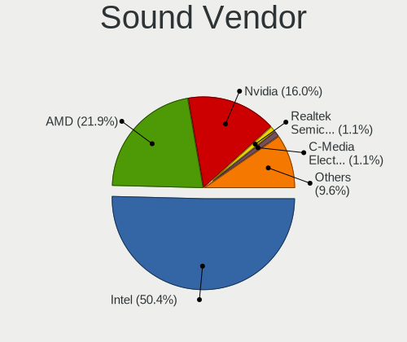

| Vendor                                          | Computers | Percent |
|-------------------------------------------------|-----------|---------|
| Intel                                           | 571       | 50.4%   |
| AMD                                             | 248       | 21.89%  |
| Nvidia                                          | 181       | 15.98%  |
| Realtek Semiconductor                           | 12        | 1.06%   |
| C-Media Electronics                             | 12        | 1.06%   |
| Plantronics                                     | 11        | 0.97%   |
| Logitech                                        | 8         | 0.71%   |
| GN Netcom                                       | 8         | 0.71%   |
| Creative Labs                                   | 8         | 0.71%   |
| Kingston Technology                             | 7         | 0.62%   |
| Creative Technology                             | 5         | 0.44%   |
| Lenovo                                          | 4         | 0.35%   |
| Texas Instruments                               | 3         | 0.26%   |
| Sony                                            | 3         | 0.26%   |
| RODE Microphones                                | 3         | 0.26%   |
| JMTek                                           | 3         | 0.26%   |
| Focusrite-Novation                              | 3         | 0.26%   |
| Dell                                            | 3         | 0.26%   |
| SteelSeries ApS                                 | 2         | 0.18%   |
| Micronas                                        | 2         | 0.18%   |
| Giga-Byte Technology                            | 2         | 0.18%   |
| Generalplus Technology                          | 2         | 0.18%   |
| FiiO Electronics Technology                     | 2         | 0.18%   |
| Ensoniq                                         | 2         | 0.18%   |
| Blue Microphones                                | 2         | 0.18%   |
| Walmart                                         | 1         | 0.09%   |
| VIA Technologies                                | 1         | 0.09%   |
| ULi Electronics                                 | 1         | 0.09%   |
| Turtle Beach                                    | 1         | 0.09%   |
| Thesycon Systemsoftware & Consulting            | 1         | 0.09%   |
| SAVITECH                                        | 1         | 0.09%   |
| Razer USA                                       | 1         | 0.09%   |
| No brand                                        | 1         | 0.09%   |
| Native Instruments                              | 1         | 0.09%   |
| M-Audio                                         | 1         | 0.09%   |
| Licensed by Sony Computer Entertainment America | 1         | 0.09%   |
| KTMicro                                         | 1         | 0.09%   |
| Huawei Technologies                             | 1         | 0.09%   |
| Harman International                            | 1         | 0.09%   |
| ESS Technology                                  | 1         | 0.09%   |

Sound Model
-----------

Sound card models

| Model                                                                      | Computers | Percent |
|----------------------------------------------------------------------------|-----------|---------|
| AMD Family 17h/19h/1ah HD Audio Controller                                 | 85        | 6.36%   |
| Intel Sunrise Point-LP HD Audio                                            | 71        | 5.31%   |
| Intel 7 Series/C216 Chipset Family High Definition Audio Controller        | 63        | 4.72%   |
| Intel 6 Series/C200 Series Chipset Family High Definition Audio Controller | 53        | 3.97%   |
| Intel Tiger Lake-LP Smart Sound Technology Audio Controller                | 37        | 2.77%   |
| Intel 8 Series/C220 Series Chipset High Definition Audio Controller        | 33        | 2.47%   |
| AMD Starship/Matisse HD Audio Controller                                   | 32        | 2.4%    |
| AMD Renoir Radeon High Definition Audio Controller                         | 32        | 2.4%    |
| AMD Raven/Raven2/Fenghuang HDMI/DP Audio Controller                        | 28        | 2.1%    |
| Intel 5 Series/3400 Series Chipset High Definition Audio                   | 24        | 1.8%    |
| AMD Rembrandt Radeon High Definition Audio Controller                      | 22        | 1.65%   |
| Intel Xeon E3-1200 v3/4th Gen Core Processor HD Audio Controller           | 21        | 1.57%   |
| AMD Ellesmere HDMI Audio [Radeon RX 470/480 / 570/580/590]                 | 21        | 1.57%   |
| Intel 82801I (ICH9 Family) HD Audio Controller                             | 20        | 1.5%    |
| AMD FCH Azalia Controller                                                  | 20        | 1.5%    |
| Intel Comet Lake PCH-LP cAVS                                               | 19        | 1.42%   |
| AMD SBx00 Azalia (Intel HDA)                                               | 19        | 1.42%   |
| Intel Cannon Lake PCH cAVS                                                 | 18        | 1.35%   |
| AMD Oland/Hainan/Cape Verde/Pitcairn HDMI Audio [Radeon HD 7000 Series]    | 18        | 1.35%   |
| Intel 100 Series/C230 Series Chipset Family HD Audio Controller            | 17        | 1.27%   |
| Intel Celeron/Pentium Silver Processor High Definition Audio               | 16        | 1.2%    |
| Intel Cannon Point-LP High Definition Audio Controller                     | 16        | 1.2%    |
| Nvidia GP106 High Definition Audio Controller                              | 15        | 1.12%   |
| Intel NM10/ICH7 Family High Definition Audio Controller                    | 15        | 1.12%   |
| Intel Comet Lake PCH cAVS                                                  | 15        | 1.12%   |
| Intel Raptor Lake-P/U/H cAVS                                               | 14        | 1.05%   |
| AMD Kabini HDMI/DP Audio                                                   | 14        | 1.05%   |
| Nvidia GP107GL High Definition Audio Controller                            | 13        | 0.97%   |
| Intel Haswell-ULT HD Audio Controller                                      | 13        | 0.97%   |
| Intel Alder Lake PCH-P High Definition Audio Controller                    | 13        | 0.97%   |
| Intel 8 Series HD Audio Controller                                         | 13        | 0.97%   |
| AMD Family 17h (Models 00h-0fh) HD Audio Controller                        | 13        | 0.97%   |
| Realtek Semiconductor USB Audio                                            | 12        | 0.9%    |
| Nvidia GF108 High Definition Audio Controller                              | 12        | 0.9%    |
| AMD Navi 21/23 HDMI/DP Audio Controller                                    | 12        | 0.9%    |
| Nvidia TU106 High Definition Audio Controller                              | 11        | 0.82%   |
| Nvidia GM107 High Definition Audio Controller [GeForce 940MX]              | 11        | 0.82%   |
| Intel Atom Processor Z36xxx/Z37xxx Series High Definition Audio Controller | 11        | 0.82%   |
| AMD Family 15h (Models 60h-6fh) Audio Controller                           | 11        | 0.82%   |
| Intel Wildcat Point-LP High Definition Audio Controller                    | 10        | 0.75%   |

Memory
------

Memory Vendor
-------------

Memory module vendors

| Vendor                             | Computers | Percent |
|------------------------------------|-----------|---------|
| Samsung Electronics                | 109       | 21.21%  |
| SK hynix                           | 100       | 19.46%  |
| Micron Technology                  | 53        | 10.31%  |
| Corsair                            | 50        | 9.73%   |
| Crucial                            | 47        | 9.14%   |
| Kingston                           | 44        | 8.56%   |
| Unknown                            | 41        | 7.98%   |
| Ramaxel Technology                 | 13        | 2.53%   |
| G.Skill                            | 11        | 2.14%   |
| Elpida                             | 6         | 1.17%   |
| Nanya Technology                   | 5         | 0.97%   |
| Unknown (ABCD)                     | 4         | 0.78%   |
| Patriot                            | 4         | 0.78%   |
| A-DATA Technology                  | 4         | 0.78%   |
| Team                               | 3         | 0.58%   |
| Apacer                             | 3         | 0.58%   |
| Unknown                            | 3         | 0.58%   |
| A Force                            | 2         | 0.39%   |
| Transcend                          | 1         | 0.19%   |
| Toshiba                            | 1         | 0.19%   |
| Silicon Power                      | 1         | 0.19%   |
| SHARETRONIC                        | 1         | 0.19%   |
| OSV                                | 1         | 0.19%   |
| KLEVV                              | 1         | 0.19%   |
| Kimtigo Semiconductor (HK) Limited | 1         | 0.19%   |
| Infineon                           | 1         | 0.19%   |
| CXMT                               | 1         | 0.19%   |
| CSX                                | 1         | 0.19%   |
| BiNFUL                             | 1         | 0.19%   |
| 4ea5                               | 1         | 0.19%   |

Memory Model
------------

Memory module models

| Model                                                            | Computers | Percent |
|------------------------------------------------------------------|-----------|---------|
| Samsung RAM M471A5244CB0-CTD 4GB SODIMM DDR4 3266MT/s            | 9         | 1.63%   |
| SK hynix RAM HMT41GS6BFR8A-PB 8GB SODIMM DDR3 1600MT/s           | 6         | 1.09%   |
| Samsung RAM M471A2K43DB1-CWE 16GB SODIMM DDR4 3200MT/s           | 6         | 1.09%   |
| Corsair RAM CMK16GX4M2B3200C16 8GB DIMM DDR4 3600MT/s            | 6         | 1.09%   |
| SK hynix RAM HMA851S6CJR6N-VK 4GB SODIMM DDR4 2667MT/s           | 5         | 0.91%   |
| Samsung RAM M471B5173QH0-YK0 4GB SODIMM DDR3 1600MT/s            | 5         | 0.91%   |
| SK hynix RAM HMT351U6CFR8C-PB 4GB DIMM DDR3 1800MT/s             | 4         | 0.72%   |
| SK hynix RAM HMT351S6CFR8C-PB 4GB SODIMM DDR3 1600MT/s           | 4         | 0.72%   |
| SK hynix RAM HMA81GS6AFR8N-UH 8GB SODIMM DDR4 2667MT/s           | 4         | 0.72%   |
| Samsung RAM M471B1G73QH0-YK0 8GB SODIMM DDR3 1600MT/s            | 4         | 0.72%   |
| Samsung RAM M471B1G73EB0-YK0 8GB SODIMM DDR3 1600MT/s            | 4         | 0.72%   |
| Samsung RAM M471A5244CB0-CRC 4GB SODIMM DDR4 2667MT/s            | 4         | 0.72%   |
| Samsung RAM M471A1G44BB0-CWE 8GB SODIMM DDR4 3200MT/s            | 4         | 0.72%   |
| Corsair RAM CML16GX3M2A1600C10 8GB DIMM DDR3 1600MT/s            | 4         | 0.72%   |
| Unknown (ABCD) RAM 123456789012345678 2GB SODIMM LPDDR3 2400MT/s | 3         | 0.54%   |
| SK hynix RAM HMAA2GS6CJR8N-XN 16GB SODIMM DDR4 3200MT/s          | 3         | 0.54%   |
| SK hynix RAM HMA81GS6DJR8N-XN 8GB SODIMM DDR4 3200MT/s           | 3         | 0.54%   |
| Samsung RAM M471A2K43CB1-CTD 16GB SODIMM DDR4 8400MT/s           | 3         | 0.54%   |
| Samsung RAM M471A1K43CB1-CRC 8GB SODIMM DDR4 2667MT/s            | 3         | 0.54%   |
| Samsung RAM M471A1G44AB0-CWE 8GB SODIMM DDR4 3200MT/s            | 3         | 0.54%   |
| Micron RAM 8ATF1G64HZ-2G3E1 8GB SODIMM DDR4 2400MT/s             | 3         | 0.54%   |
| Micron RAM 16KTF1G64HZ-1G6E1 8GB SODIMM DDR3 1600MT/s            | 3         | 0.54%   |
| G.Skill RAM F3-12800CL9-4GBXL 4GB DIMM DDR3 1867MT/s             | 3         | 0.54%   |
| Crucial RAM CT8G4SFS824A.C8FN 8GB SODIMM DDR4 2400MT/s           | 3         | 0.54%   |
| Corsair RAM CMK32GX4M2Z3600C18 16GB DIMM DDR4 3800MT/s           | 3         | 0.54%   |
| Corsair RAM CMK16GX4M2D3000C16 8GB DIMM DDR4 3200MT/s            | 3         | 0.54%   |
| Corsair RAM CMK16GX4M2B3000C15 8GB DIMM DDR4 3600MT/s            | 3         | 0.54%   |
| Corsair RAM CM4X16GE2666C18S4 16GB SODIMM DDR4 2667MT/s          | 3         | 0.54%   |
| Unknown                                                          | 3         | 0.54%   |
| Unknown RAM Module 8GB DIMM 1333MT/s                             | 2         | 0.36%   |
| Unknown RAM Module 4096MB SODIMM DDR3 1600MT/s                   | 2         | 0.36%   |
| Unknown RAM Module 4096MB DIMM 1600MT/s                          | 2         | 0.36%   |
| Unknown RAM Module 2048MB SODIMM DDR3 1600MT/s                   | 2         | 0.36%   |
| Unknown RAM Module 2048MB DIMM 800MT/s                           | 2         | 0.36%   |
| Team RAM Elite-1333 4GB DIMM 1333MT/s                            | 2         | 0.36%   |
| SK hynix RAM HMT451U6BFR8A-PB 4GB DIMM DDR3 1600MT/s             | 2         | 0.36%   |
| SK hynix RAM HMT451S6BFR8A-PB 4GB SODIMM DDR3 1600MT/s           | 2         | 0.36%   |
| SK hynix RAM HMT451S6BFR8A-PB 4096MB SODIMM DDR3 1600MT/s        | 2         | 0.36%   |
| SK hynix RAM HMT451S6AFR8A-PB 4GB SODIMM DDR3 1600MT/s           | 2         | 0.36%   |
| SK hynix RAM HMT41GS6AFR8A-PB 8GB SODIMM DDR3 2667MT/s           | 2         | 0.36%   |

Memory Kind
-----------

Memory module kinds

| Kind    | Computers | Percent |
|---------|-----------|---------|
| DDR4    | 213       | 47.97%  |
| DDR3    | 127       | 28.6%   |
| LPDDR4  | 21        | 4.73%   |
| DDR2    | 17        | 3.83%   |
| DDR5    | 15        | 3.38%   |
| Unknown | 15        | 3.38%   |
| LPDDR3  | 12        | 2.7%    |
| SDRAM   | 11        | 2.48%   |
| LPDDR5  | 7         | 1.58%   |
| DRAM    | 3         | 0.68%   |
| DDR     | 3         | 0.68%   |

Memory Form Factor
------------------

Physical design of the memory module

| Name         | Computers | Percent |
|--------------|-----------|---------|
| SODIMM       | 260       | 58.56%  |
| DIMM         | 136       | 30.63%  |
| Row Of Chips | 38        | 8.56%   |
| Chip         | 5         | 1.13%   |
| Unknown      | 4         | 0.9%    |
| RIMM         | 1         | 0.23%   |

Memory Size
-----------

Memory module size

| Size  | Computers | Percent |
|-------|-----------|---------|
| 8192  | 187       | 38.56%  |
| 4096  | 129       | 26.6%   |
| 16384 | 83        | 17.11%  |
| 2048  | 47        | 9.69%   |
| 32768 | 21        | 4.33%   |
| 1024  | 14        | 2.89%   |
| 128   | 2         | 0.41%   |
| 512   | 1         | 0.21%   |
| 256   | 1         | 0.21%   |

Memory Speed
------------

Memory module speed

| Speed   | Computers | Percent |
|---------|-----------|---------|
| 1600    | 86        | 17.41%  |
| 3200    | 75        | 15.18%  |
| 2667    | 65        | 13.16%  |
| 2400    | 37        | 7.49%   |
| 2133    | 27        | 5.47%   |
| 1333    | 25        | 5.06%   |
| 3600    | 15        | 3.04%   |
| 800     | 15        | 3.04%   |
| 1334    | 13        | 2.63%   |
| 667     | 13        | 2.63%   |
| 4267    | 12        | 2.43%   |
| 3266    | 10        | 2.02%   |
| 1867    | 10        | 2.02%   |
| 4800    | 7         | 1.42%   |
| 3800    | 6         | 1.21%   |
| 1866    | 6         | 1.21%   |
| 1800    | 6         | 1.21%   |
| 1067    | 6         | 1.21%   |
| 6400    | 5         | 1.01%   |
| Unknown | 5         | 1.01%   |
| 6000    | 4         | 0.81%   |
| 4266    | 4         | 0.81%   |
| 8400    | 3         | 0.61%   |
| 5600    | 3         | 0.61%   |
| 3000    | 3         | 0.61%   |
| 1066    | 3         | 0.61%   |
| 533     | 3         | 0.61%   |
| 4199    | 2         | 0.4%    |
| 3400    | 2         | 0.4%    |
| 2666    | 2         | 0.4%    |
| 2267    | 2         | 0.4%    |
| 2048    | 2         | 0.4%    |
| 1648    | 2         | 0.4%    |
| 1639    | 2         | 0.4%    |
| 975     | 2         | 0.4%    |
| 7500    | 1         | 0.2%    |
| 7467    | 1         | 0.2%    |
| 5200    | 1         | 0.2%    |
| 3866    | 1         | 0.2%    |
| 3733    | 1         | 0.2%    |

Printers & scanners
-------------------

Printer Vendor
--------------

Printer device vendors

| Vendor              | Computers | Percent |
|---------------------|-----------|---------|
| Canon               | 3         | 27.27%  |
| Brother Industries  | 3         | 27.27%  |
| STMicroelectronics  | 2         | 18.18%  |
| Samsung Electronics | 1         | 9.09%   |
| QinHeng Electronics | 1         | 9.09%   |
| Hewlett-Packard     | 1         | 9.09%   |

Printer Model
-------------

Printer device models

| Model                                                     | Computers | Percent |
|-----------------------------------------------------------|-----------|---------|
| STMicroelectronics LED badge -- mini LED display -- 11x44 | 2         | 18.18%  |
| Samsung M2070 Series                                      | 1         | 9.09%   |
| QinHeng CH340S                                            | 1         | 9.09%   |
| HP Officejet 4500 G510g-m                                 | 1         | 9.09%   |
| Canon TS5300 series                                       | 1         | 9.09%   |
| Canon PIXMA MG3600 Series                                 | 1         | 9.09%   |
| Canon PIXMA MG2500 Series                                 | 1         | 9.09%   |
| Brother MFC-L2700DW                                       | 1         | 9.09%   |
| Brother HL-L2340D series                                  | 1         | 9.09%   |
| Brother HL-2030 Laser Printer                             | 1         | 9.09%   |

Scanner Vendor
--------------

Scanner device vendors

| Vendor | Computers | Percent |
|--------|-----------|---------|
| Canon  | 1         | 100%    |

Scanner Model
-------------

Scanner device models

| Model                   | Computers | Percent |
|-------------------------|-----------|---------|
| Canon CanoScan LiDE 220 | 1         | 100%    |

Camera
------

Camera Vendor
-------------

Camera device vendors

| Vendor                                 | Computers | Percent |
|----------------------------------------|-----------|---------|
| Chicony Electronics                    | 118       | 21.85%  |
| Realtek Semiconductor                  | 55        | 10.19%  |
| Microdia                               | 53        | 9.81%   |
| IMC Networks                           | 50        | 9.26%   |
| Sunplus Innovation Technology          | 37        | 6.85%   |
| Logitech                               | 36        | 6.67%   |
| Bison Electronics                      | 35        | 6.48%   |
| Quanta                                 | 25        | 4.63%   |
| Apple                                  | 20        | 3.7%    |
| Cheng Uei Precision Industry (Foxlink) | 15        | 2.78%   |
| Samsung Electronics                    | 8         | 1.48%   |
| Microsoft                              | 8         | 1.48%   |
| Suyin                                  | 7         | 1.3%    |
| Lite-On Technology                     | 7         | 1.3%    |
| Acer                                   | 6         | 1.11%   |
| Sonix Technology                       | 5         | 0.93%   |
| Ricoh                                  | 5         | 0.93%   |
| ALi                                    | 5         | 0.93%   |
| Syntek                                 | 4         | 0.74%   |
| SunplusIT                              | 4         | 0.74%   |
| Silicon Motion                         | 4         | 0.74%   |
| Luxvisions Innotech Limited            | 3         | 0.56%   |
| Alcor Micro                            | 3         | 0.56%   |
| Trust                                  | 2         | 0.37%   |
| Lenovo                                 | 2         | 0.37%   |
| Generalplus Technology                 | 2         | 0.37%   |
| Creative Technology                    | 2         | 0.37%   |
| 2M UVC CAMERA                          | 2         | 0.37%   |
| Z-Star Microelectronics                | 1         | 0.19%   |
| Y Media                                | 1         | 0.19%   |
| WaveRider Communications               | 1         | 0.19%   |
| USB3.0 HD Audio Capture                | 1         | 0.19%   |
| Shinetech                              | 1         | 0.19%   |
| Shenzhen Kingcome Optoelectronic       | 1         | 0.19%   |
| Razer USA                              | 1         | 0.19%   |
| Nokia Mobile Phones                    | 1         | 0.19%   |
| Nikon                                  | 1         | 0.19%   |
| MacroSilicon                           | 1         | 0.19%   |
| LianYi                                 | 1         | 0.19%   |
| kingcome                               | 1         | 0.19%   |

Camera Model
------------

Camera device models

| Model                                                           | Computers | Percent |
|-----------------------------------------------------------------|-----------|---------|
| Chicony Integrated Camera                                       | 28        | 5.13%   |
| Microdia Integrated_Webcam_HD                                   | 24        | 4.4%    |
| Realtek Integrated_Webcam_HD                                    | 21        | 3.85%   |
| IMC Networks Integrated Camera                                  | 17        | 3.11%   |
| Logitech HD Pro Webcam C920                                     | 15        | 2.75%   |
| Bison Integrated Camera                                         | 13        | 2.38%   |
| IMC Networks USB2.0 HD UVC WebCam                               | 11        | 2.01%   |
| Apple Built-in iSight                                           | 11        | 2.01%   |
| Sunplus Integrated_Webcam_FHD                                   | 9         | 1.65%   |
| Sunplus Integrated_Webcam_HD                                    | 8         | 1.47%   |
| Samsung Galaxy series, misc. (MTP mode)                         | 8         | 1.47%   |
| Chicony USB2.0 Camera                                           | 8         | 1.47%   |
| Chicony HD WebCam                                               | 8         | 1.47%   |
| Microsoft LifeCam HD-3000                                       | 6         | 1.1%    |
| Microdia Integrated Webcam                                      | 6         | 1.1%    |
| Apple iPhone 5/5C/5S/6/SE/7/8/X/XR                              | 6         | 1.1%    |
| Lite-On HP HD Camera                                            | 5         | 0.92%   |
| IMC Networks EasyCamera                                         | 5         | 0.92%   |
| Chicony USB2.0 HD UVC WebCam                                    | 5         | 0.92%   |
| Chicony HP Wide Vision HD Camera                                | 5         | 0.92%   |
| Bison EasyCamera                                                | 5         | 0.92%   |
| Apple FaceTime HD Camera (Built-in)                             | 5         | 0.92%   |
| Realtek Integrated_Webcam_FHD                                   | 4         | 0.73%   |
| Realtek Integrated Webcam HD                                    | 4         | 0.73%   |
| Quanta HP Wide Vision HD Camera                                 | 4         | 0.73%   |
| Microdia Webcam Vitade AF                                       | 4         | 0.73%   |
| Logitech Webcam C270                                            | 4         | 0.73%   |
| Chicony TOSHIBA Web Camera - HD                                 | 4         | 0.73%   |
| Chicony Integrated Camera (1280x720@30)                         | 4         | 0.73%   |
| Chicony HP HD Camera                                            | 4         | 0.73%   |
| Cheng Uei Precision Industry (Foxlink) HP Wide Vision HD Camera | 4         | 0.73%   |
| Bison BisonCam, NB Pro                                          | 4         | 0.73%   |
| Sunplus Laptop_Integrated_Webcam_FHD                            | 3         | 0.55%   |
| Realtek USB2.0 HD UVC WebCam                                    | 3         | 0.55%   |
| Realtek Integrated Webcam                                       | 3         | 0.55%   |
| Realtek EasyCamera                                              | 3         | 0.55%   |
| Quanta HP HD Camera                                             | 3         | 0.55%   |
| Quanta HD User Facing                                           | 3         | 0.55%   |
| Quanta ACER HD User Facing                                      | 3         | 0.55%   |
| Microdia USB 2.0 Camera                                         | 3         | 0.55%   |

Security
--------

Fingerprint Vendor
------------------

Fingerprint sensor vendors

| Vendor                     | Computers | Percent |
|----------------------------|-----------|---------|
| Synaptics                  | 37        | 35.58%  |
| Validity Sensors           | 28        | 26.92%  |
| Shenzhen Goodix Technology | 19        | 18.27%  |
| Upek                       | 5         | 4.81%   |
| Elan Microelectronics      | 5         | 4.81%   |
| AuthenTec                  | 4         | 3.85%   |
| LighTuning Technology      | 3         | 2.88%   |
| STMicroelectronics         | 1         | 0.96%   |
| HOLTEK                     | 1         | 0.96%   |
| Focal-systems.Corp         | 1         | 0.96%   |

Fingerprint Model
-----------------

Fingerprint sensor models

| Model                                                     | Computers | Percent |
|-----------------------------------------------------------|-----------|---------|
| Shenzhen Goodix Fingerprint Reader                        | 9         | 8.65%   |
| Synaptics Prometheus MIS Touch Fingerprint Reader         | 8         | 7.69%   |
| Validity Sensors VFS495 Fingerprint Reader                | 7         | 6.73%   |
| Shenzhen Goodix FingerPrint                               | 6         | 5.77%   |
| Upek Biometric Touchchip/Touchstrip Fingerprint Sensor    | 5         | 4.81%   |
| Synaptics Fingerprint reader [HP G6]                      | 5         | 4.81%   |
| Unknown                                                   | 5         | 4.81%   |
| Synaptics Metallica MIS Touch Fingerprint Reader          | 4         | 3.85%   |
| Shenzhen Goodix  Fingerprint Device                       | 4         | 3.85%   |
| Validity Sensors VFS5011 Fingerprint Reader               | 3         | 2.88%   |
| Validity Sensors VFS451 Fingerprint Reader                | 3         | 2.88%   |
| Validity Sensors Synaptics WBDI                           | 3         | 2.88%   |
| Synaptics  WBDI                                           | 3         | 2.88%   |
| LighTuning ES603 Swipe Fingerprint Sensor                 | 3         | 2.88%   |
| Elan ELAN:ARM-M4                                          | 3         | 2.88%   |
| AuthenTec Fingerprint Sensor                              | 3         | 2.88%   |
| Validity Sensors VFS7500 Touch Fingerprint Sensor         | 2         | 1.92%   |
| Validity Sensors VFS471 Fingerprint Reader                | 2         | 1.92%   |
| Validity Sensors VFS101 Fingerprint Reader                | 2         | 1.92%   |
| Synaptics WBDI Fingerprint Reader USB 086                 | 2         | 1.92%   |
| Synaptics UWP WBDI                                        | 2         | 1.92%   |
| Synaptics Metallica MOH Touch Fingerprint Reader          | 2         | 1.92%   |
| Elan ELAN:Fingerprint                                     | 2         | 1.92%   |
| Validity Sensors VFS7552 Touch Fingerprint Sensor         | 1         | 0.96%   |
| Validity Sensors VFS301 Fingerprint Reader                | 1         | 0.96%   |
| Validity Sensors VFS300 Fingerprint Reader                | 1         | 0.96%   |
| Validity Sensors VFS 5011 fingerprint sensor              | 1         | 0.96%   |
| Validity Sensors Swipe Fingerprint Sensor                 | 1         | 0.96%   |
| Validity Sensors Fingerprint scanner                      | 1         | 0.96%   |
| Synaptics WBDI Device                                     | 1         | 0.96%   |
| Synaptics WBDI                                            | 1         | 0.96%   |
| Synaptics UWP WBDI Device                                 | 1         | 0.96%   |
| Synaptics TouchPad                                        | 1         | 0.96%   |
| Synaptics  FS7604 Touch Fingerprint Sensor with PurePrint | 1         | 0.96%   |
| Synaptics FS7604 Touch Fingerprint Sensor with PurePrint  | 1         | 0.96%   |
| STMicroelectronics Fingerprint Reader                     | 1         | 0.96%   |
| HOLTEK FocalTech Fingerprint Device                       | 1         | 0.96%   |
| Focal-systems.Corp FT9201Fingerprint.                 | 1         | 0.96%   |
| AuthenTec AES2810                                         | 1         | 0.96%   |

Chipcard Vendor
---------------

Chipcard module vendors

| Vendor                            | Computers | Percent |
|-----------------------------------|-----------|---------|
| Broadcom                          | 41        | 62.12%  |
| Alcor Micro                       | 9         | 13.64%  |
| Upek                              | 7         | 10.61%  |
| O2 Micro                          | 5         | 7.58%   |
| Lenovo                            | 2         | 3.03%   |
| Gemalto (was Gemplus)             | 1         | 1.52%   |
| Free Software Initiative of Japan | 1         | 1.52%   |

Chipcard Model
--------------

Chipcard module models

| Model                                                                        | Computers | Percent |
|------------------------------------------------------------------------------|-----------|---------|
| Broadcom 58200                                                               | 20        | 30.3%   |
| Broadcom BCM5880 Secure Applications Processor                               | 10        | 15.15%  |
| Alcor Micro AU9540 Smartcard Reader                                          | 9         | 13.64%  |
| Upek TouchChip Fingerprint Coprocessor (WBF advanced mode)                   | 7         | 10.61%  |
| Broadcom 5880                                                                | 6         | 9.09%   |
| Broadcom BCM5880 Secure Applications Processor with fingerprint swipe sensor | 5         | 7.58%   |
| O2 Micro OZ776 CCID Smartcard Reader                                         | 4         | 6.06%   |
| Lenovo Integrated Smart Card Reader                                          | 2         | 3.03%   |
| O2 Micro Oz776 SmartCard Reader                                              | 1         | 1.52%   |
| Gemalto (was Gemplus) GemPC Twin SmartCard Reader                            | 1         | 1.52%   |
| Free Software Initiative of Japan Gnuk Token                                 | 1         | 1.52%   |

Unsupported
-----------

Unsupported Devices
-------------------

Total unsupported devices on board

| Total | Computers | Percent |
|-------|-----------|---------|
| 0     | 527       | 63.34%  |
| 1     | 241       | 28.97%  |
| 2     | 53        | 6.37%   |
| 3     | 9         | 1.08%   |
| 5     | 1         | 0.12%   |
| 4     | 1         | 0.12%   |

Unsupported Device Types
------------------------

Types of unsupported devices

| Type                     | Computers | Percent |
|--------------------------|-----------|---------|
| Fingerprint reader       | 103       | 28.69%  |
| Graphics card            | 75        | 20.89%  |
| Net/wireless             | 66        | 18.38%  |
| Chipcard                 | 59        | 16.43%  |
| Multimedia controller    | 16        | 4.46%   |
| Camera                   | 9         | 2.51%   |
| Communication controller | 8         | 2.23%   |
| Storage                  | 6         | 1.67%   |
| Bluetooth                | 4         | 1.11%   |
| Card reader              | 3         | 0.84%   |
| Unassigned class         | 2         | 0.56%   |
| Net/ethernet             | 2         | 0.56%   |
| Storage/raid             | 1         | 0.28%   |
| Storage/ata              | 1         | 0.28%   |
| Sound                    | 1         | 0.28%   |
| Modem                    | 1         | 0.28%   |
| Firewire controller      | 1         | 0.28%   |
| Dvb card                 | 1         | 0.28%   |

