Linux in Israel - Tested Hardware & Statistics
----------------------------------------------

A project to collect tested hardware configurations for Linux in Israel.

Anyone can contribute to this report by the [hw-probe](https://github.com/linuxhw/hw-probe) tool:

    sudo -E hw-probe -all -upload

Please contribute! Especially if your hardware is rare.

This is a report for all computer types. See also reports for [desktops](/Location/Israel/Desktop/README.md) and [notebooks](/Location/Israel/Notebook/README.md).

Contents
--------

* [ Test Cases ](#test-cases)

* [ System ](#system)
  - [ OS                       ](#os)
  - [ OS Family                ](#os-family)
  - [ Kernel                   ](#kernel)
  - [ Kernel Family            ](#kernel-family)
  - [ Kernel Major Ver.        ](#kernel-major-ver)
  - [ Arch                     ](#arch)
  - [ DE                       ](#de)
  - [ Display Server           ](#display-server)
  - [ Display Manager          ](#display-manager)
  - [ OS Lang                  ](#os-lang)
  - [ Boot Mode                ](#boot-mode)
  - [ Filesystem               ](#filesystem)
  - [ Part. scheme             ](#part-scheme)
  - [ Dual Boot with Linux/BSD ](#dual-boot-with-linuxbsd)
  - [ Dual Boot (Win)          ](#dual-boot-win)

* [ Board ](#board)
  - [ Vendor                   ](#vendor)
  - [ Model                    ](#model)
  - [ Model Family             ](#model-family)
  - [ MFG Year                 ](#mfg-year)
  - [ Form Factor              ](#form-factor)
  - [ Secure Boot              ](#secure-boot)
  - [ Coreboot                 ](#coreboot)
  - [ RAM Size                 ](#ram-size)
  - [ RAM Used                 ](#ram-used)
  - [ Total Drives             ](#total-drives)
  - [ Has CD-ROM               ](#has-cd-rom)
  - [ Has Ethernet             ](#has-ethernet)
  - [ Has WiFi                 ](#has-wifi)
  - [ Has Bluetooth            ](#has-bluetooth)

* [ Location ](#location)
  - [ Country                  ](#country)
  - [ City                     ](#city)

* [ Drives ](#drives)
  - [ Drive Vendor             ](#drive-vendor)
  - [ Drive Model              ](#drive-model)
  - [ HDD Vendor               ](#hdd-vendor)
  - [ SSD Vendor               ](#ssd-vendor)
  - [ Drive Kind               ](#drive-kind)
  - [ Drive Connector          ](#drive-connector)
  - [ Drive Size               ](#drive-size)
  - [ Space Total              ](#space-total)
  - [ Space Used               ](#space-used)
  - [ Malfunc. Drives          ](#malfunc-drives)
  - [ Malfunc. Drive Vendor    ](#malfunc-drive-vendor)
  - [ Malfunc. HDD Vendor      ](#malfunc-hdd-vendor)
  - [ Malfunc. Drive Kind      ](#malfunc-drive-kind)
  - [ Failed Drives            ](#failed-drives)
  - [ Failed Drive Vendor      ](#failed-drive-vendor)
  - [ Drive Status             ](#drive-status)

* [ Storage controller ](#storage-controller)
  - [ Storage Vendor           ](#storage-vendor)
  - [ Storage Model            ](#storage-model)
  - [ Storage Kind             ](#storage-kind)

* [ Processor ](#processor)
  - [ CPU Vendor               ](#cpu-vendor)
  - [ CPU Model                ](#cpu-model)
  - [ CPU Model Family         ](#cpu-model-family)
  - [ CPU Cores                ](#cpu-cores)
  - [ CPU Sockets              ](#cpu-sockets)
  - [ CPU Threads              ](#cpu-threads)
  - [ CPU Op-Modes             ](#cpu-op-modes)
  - [ CPU Microcode            ](#cpu-microcode)
  - [ CPU Microarch            ](#cpu-microarch)

* [ Graphics ](#graphics)
  - [ GPU Vendor               ](#gpu-vendor)
  - [ GPU Model                ](#gpu-model)
  - [ GPU Combo                ](#gpu-combo)
  - [ GPU Driver               ](#gpu-driver)
  - [ GPU Memory               ](#gpu-memory)

* [ Monitor ](#monitor)
  - [ Monitor Vendor           ](#monitor-vendor)
  - [ Monitor Model            ](#monitor-model)
  - [ Monitor Resolution       ](#monitor-resolution)
  - [ Monitor Diagonal         ](#monitor-diagonal)
  - [ Monitor Width            ](#monitor-width)
  - [ Aspect Ratio             ](#aspect-ratio)
  - [ Monitor Area             ](#monitor-area)
  - [ Pixel Density            ](#pixel-density)
  - [ Multiple Monitors        ](#multiple-monitors)

* [ Network ](#network)
  - [ Net Controller Vendor    ](#net-controller-vendor)
  - [ Net Controller Model     ](#net-controller-model)
  - [ Wireless Vendor          ](#wireless-vendor)
  - [ Wireless Model           ](#wireless-model)
  - [ Ethernet Vendor          ](#ethernet-vendor)
  - [ Ethernet Model           ](#ethernet-model)
  - [ Net Controller Kind      ](#net-controller-kind)
  - [ Used Controller          ](#used-controller)
  - [ NICs                     ](#nics)
  - [ IPv6                     ](#ipv6)

* [ Bluetooth ](#bluetooth)
  - [ Bluetooth Vendor         ](#bluetooth-vendor)
  - [ Bluetooth Model          ](#bluetooth-model)

* [ Sound ](#sound)
  - [ Sound Vendor             ](#sound-vendor)
  - [ Sound Model              ](#sound-model)

* [ Memory ](#memory)
  - [ Memory Vendor            ](#memory-vendor)
  - [ Memory Model             ](#memory-model)
  - [ Memory Kind              ](#memory-kind)
  - [ Memory Form Factor       ](#memory-form-factor)
  - [ Memory Size              ](#memory-size)
  - [ Memory Speed             ](#memory-speed)

* [ Printers & scanners ](#printers--scanners)
  - [ Printer Vendor           ](#printer-vendor)
  - [ Printer Model            ](#printer-model)
  - [ Scanner Vendor           ](#scanner-vendor)
  - [ Scanner Model            ](#scanner-model)

* [ Camera ](#camera)
  - [ Camera Vendor            ](#camera-vendor)
  - [ Camera Model             ](#camera-model)

* [ Security ](#security)
  - [ Fingerprint Vendor       ](#fingerprint-vendor)
  - [ Fingerprint Model        ](#fingerprint-model)
  - [ Chipcard Vendor          ](#chipcard-vendor)
  - [ Chipcard Model           ](#chipcard-model)

* [ Unsupported ](#unsupported)
  - [ Unsupported Devices      ](#unsupported-devices)
  - [ Unsupported Device Types ](#unsupported-device-types)

Test Cases
----------

Total: 1334

| Vendor        | Model                       | Form-Factor | Probe                                                      | Date         |
|---------------|-----------------------------|-------------|------------------------------------------------------------|--------------|
| Lenovo        | IdeaPad Flex-15IML 81XH     | Convertible | [9579158217](https://linux-hardware.org/?probe=9579158217) | Jan 03, 2025 |
| Lenovo        | IdeaPad C340-15IIL 81XJ     | Convertible | [21702287f9](https://linux-hardware.org/?probe=21702287f9) | Dec 30, 2024 |
| Lenovo        | ThinkPad X201 3680X08       | Notebook    | [29505fa5be](https://linux-hardware.org/?probe=29505fa5be) | Dec 30, 2024 |
| Lenovo        | IdeaPad Flex-15IML 81XH     | Convertible | [954e8986ce](https://linux-hardware.org/?probe=954e8986ce) | Dec 29, 2024 |
| Lenovo        | ThinkPad T440p 20AN0069U... | Notebook    | [0574e44035](https://linux-hardware.org/?probe=0574e44035) | Dec 27, 2024 |
| MSI           | Creator 15 A11UE            | Notebook    | [c6e4f39a97](https://linux-hardware.org/?probe=c6e4f39a97) | Dec 24, 2024 |
| MSI           | Creator 15 A11UE            | Notebook    | [9beee8397d](https://linux-hardware.org/?probe=9beee8397d) | Dec 23, 2024 |
| Gigabyte      | G31M-ES2L                   | Desktop     | [ba9c0c5153](https://linux-hardware.org/?probe=ba9c0c5153) | Dec 23, 2024 |
| Intel         | NUC13ANBi7 N13084-202       | Mini pc     | [b3512c9ee2](https://linux-hardware.org/?probe=b3512c9ee2) | Dec 23, 2024 |
| ASUSTek       | ASUS EXPERTBOOK P1512CEA... | Notebook    | [50c7d7cd7d](https://linux-hardware.org/?probe=50c7d7cd7d) | Dec 22, 2024 |
| Lenovo        | ThinkPad P14s Gen 4 21HF... | Notebook    | [0c9e61a477](https://linux-hardware.org/?probe=0c9e61a477) | Dec 20, 2024 |
| ASUSTek       | VivoBook_ASUSLaptop X513... | Notebook    | [7ce6a920fc](https://linux-hardware.org/?probe=7ce6a920fc) | Dec 17, 2024 |
| Lenovo        | ThinkPad X1 Carbon 5th 2... | Notebook    | [c62449864b](https://linux-hardware.org/?probe=c62449864b) | Dec 16, 2024 |
| Dell          | 0NC2VH A01                  | Desktop     | [4810f67ef7](https://linux-hardware.org/?probe=4810f67ef7) | Dec 15, 2024 |
| ASUSTek       | ASUS Vivobook 15 X1504VA... | Notebook    | [f1a3ece9ad](https://linux-hardware.org/?probe=f1a3ece9ad) | Dec 14, 2024 |
| Dell          | Vostro 14 5401              | Notebook    | [f4068911f7](https://linux-hardware.org/?probe=f4068911f7) | Dec 11, 2024 |
| Raspberry ... | Raspberry Pi 5 Model B R... | Soc         | [ff4dba5e4a](https://linux-hardware.org/?probe=ff4dba5e4a) | Dec 11, 2024 |
| Dell          | 0TTDMJ A00                  | Desktop     | [4ee281d915](https://linux-hardware.org/?probe=4ee281d915) | Dec 11, 2024 |
| Raspberry ... | Raspberry Pi 5 Model B R... | Soc         | [5ddf12e747](https://linux-hardware.org/?probe=5ddf12e747) | Dec 11, 2024 |
| Dell          | Vostro 14 5401              | Notebook    | [8b0aec2d81](https://linux-hardware.org/?probe=8b0aec2d81) | Dec 11, 2024 |
| Raspberry ... | Raspberry Pi 5 Model B R... | Soc         | [6e65ff5ccb](https://linux-hardware.org/?probe=6e65ff5ccb) | Dec 11, 2024 |
| Raspberry ... | Raspberry Pi 5 Model B R... | Soc         | [c4c1d233eb](https://linux-hardware.org/?probe=c4c1d233eb) | Dec 11, 2024 |
| Raspberry ... | Raspberry Pi 5 Model B R... | Soc         | [269aaa66b9](https://linux-hardware.org/?probe=269aaa66b9) | Dec 11, 2024 |
| Dell          | Vostro 14 5401              | Notebook    | [7c77f0a04f](https://linux-hardware.org/?probe=7c77f0a04f) | Dec 09, 2024 |
| ASUSTek       | Z170 PRO GAMING/AURA        | Desktop     | [e25da0298a](https://linux-hardware.org/?probe=e25da0298a) | Dec 06, 2024 |
| Dell          | Latitude 5420               | Notebook    | [1d2ec04557](https://linux-hardware.org/?probe=1d2ec04557) | Dec 05, 2024 |
| Dell          | XPS 9320                    | Notebook    | [811e6628a8](https://linux-hardware.org/?probe=811e6628a8) | Dec 05, 2024 |
| XIAOMI        | Redmi Book Pro 15 2023      | Notebook    | [7342faf26d](https://linux-hardware.org/?probe=7342faf26d) | Nov 29, 2024 |
| HP            | 250 G7 Notebook PC          | Notebook    | [3419013123](https://linux-hardware.org/?probe=3419013123) | Nov 29, 2024 |
| ASUSTek       | ROG STRIX Z390-H GAMING     | Desktop     | [0dc0dd7a62](https://linux-hardware.org/?probe=0dc0dd7a62) | Nov 20, 2024 |
| HP            | Pavilion Gaming Laptop 1... | Notebook    | [db45208c40](https://linux-hardware.org/?probe=db45208c40) | Nov 18, 2024 |
| Lenovo        | S40-70 80GQ                 | Notebook    | [b0d5d5f873](https://linux-hardware.org/?probe=b0d5d5f873) | Nov 14, 2024 |
| MSI           | H370 GAMING PLUS            | Desktop     | [73b7ffd3d7](https://linux-hardware.org/?probe=73b7ffd3d7) | Nov 13, 2024 |
| MSI           | H370 GAMING PLUS            | Desktop     | [967037bf19](https://linux-hardware.org/?probe=967037bf19) | Nov 13, 2024 |
| Valve         | Jupiter                     | Notebook    | [77c6929edc](https://linux-hardware.org/?probe=77c6929edc) | Nov 13, 2024 |
| Gigabyte      | H61M-S2PV                   | Desktop     | [fb1cba8a45](https://linux-hardware.org/?probe=fb1cba8a45) | Nov 11, 2024 |
| TUXEDO        | Sirius 16 Gen2              | Notebook    | [2a7fa5eed7](https://linux-hardware.org/?probe=2a7fa5eed7) | Nov 11, 2024 |
| Lenovo        | G560 0679                   | Notebook    | [c1388a004e](https://linux-hardware.org/?probe=c1388a004e) | Nov 11, 2024 |
| Lenovo        | V330-14IKB 81B0             | Notebook    | [d244f80fd9](https://linux-hardware.org/?probe=d244f80fd9) | Nov 10, 2024 |
| Lenovo        | ThinkPad T15g Gen 2i 20Y... | Notebook    | [f711f4d637](https://linux-hardware.org/?probe=f711f4d637) | Nov 06, 2024 |
| Gigabyte      | B365M DS3H                  | Desktop     | [6dc9cbaf0c](https://linux-hardware.org/?probe=6dc9cbaf0c) | Nov 06, 2024 |
| Gigabyte      | B365M DS3H                  | Desktop     | [532b386733](https://linux-hardware.org/?probe=532b386733) | Nov 06, 2024 |
| Dell          | Latitude 3540               | Notebook    | [a479cc9719](https://linux-hardware.org/?probe=a479cc9719) | Nov 04, 2024 |
| Lenovo        | ThinkPad P53 20QN0011IV     | Notebook    | [1b69401ca3](https://linux-hardware.org/?probe=1b69401ca3) | Nov 03, 2024 |
| Micro Comp... | V3                          | Tablet      | [db12421235](https://linux-hardware.org/?probe=db12421235) | Oct 30, 2024 |
| Micro Comp... | V3                          | Tablet      | [42d391649b](https://linux-hardware.org/?probe=42d391649b) | Oct 30, 2024 |
| GPD           | G1619-04                    | Notebook    | [8d4edea2b8](https://linux-hardware.org/?probe=8d4edea2b8) | Oct 28, 2024 |
| Lenovo        | ThinkPad X220 429136G       | Notebook    | [83c95a2454](https://linux-hardware.org/?probe=83c95a2454) | Oct 26, 2024 |
| Dell          | Latitude E5540              | Notebook    | [da1eff5497](https://linux-hardware.org/?probe=da1eff5497) | Oct 24, 2024 |
| Intel         | NUC8BEB J72692-303          | Mini pc     | [1f2717878d](https://linux-hardware.org/?probe=1f2717878d) | Oct 22, 2024 |
| ASUSTek       | VivoBook_ASUSLaptop X409... | Notebook    | [e9e3c256d2](https://linux-hardware.org/?probe=e9e3c256d2) | Oct 19, 2024 |
| ASUSTek       | ASUS EXPERTBOOK B1500CEA... | Notebook    | [03eebd41be](https://linux-hardware.org/?probe=03eebd41be) | Oct 18, 2024 |
| HP            | ProBook 445 G7              | Notebook    | [d98cc0dea5](https://linux-hardware.org/?probe=d98cc0dea5) | Oct 17, 2024 |
| HP            | OMEN Laptop 15-en0xxx       | Notebook    | [8366c88c2a](https://linux-hardware.org/?probe=8366c88c2a) | Oct 17, 2024 |
| Dell          | Vostro 3520                 | Notebook    | [f872a97890](https://linux-hardware.org/?probe=f872a97890) | Oct 16, 2024 |
| Lenovo        | 30D0 SDK0J40697 WIN 3305... | Desktop     | [725759c6d6](https://linux-hardware.org/?probe=725759c6d6) | Oct 14, 2024 |
| ASUSTek       | PRIME H610M-K D4            | Desktop     | [441346e35f](https://linux-hardware.org/?probe=441346e35f) | Oct 14, 2024 |
| Toshiba       | Satellite C660              | Notebook    | [6a20c0ad19](https://linux-hardware.org/?probe=6a20c0ad19) | Oct 11, 2024 |
| System76      | Lemur Pro                   | Notebook    | [0e513dcca4](https://linux-hardware.org/?probe=0e513dcca4) | Oct 09, 2024 |
| Gigabyte      | B150M-D3H-CF                | Desktop     | [b3f66f8d51](https://linux-hardware.org/?probe=b3f66f8d51) | Oct 07, 2024 |
| Lenovo        | Yoga 500-15ISK 80R6         | Notebook    | [8fadc9f74b](https://linux-hardware.org/?probe=8fadc9f74b) | Oct 07, 2024 |
| Gigabyte      | Z690M DS3H DDR4             | Desktop     | [21cc874a16](https://linux-hardware.org/?probe=21cc874a16) | Oct 03, 2024 |
| Gigabyte      | Z690 AORUS ELITE AX         | Desktop     | [4a6207dc35](https://linux-hardware.org/?probe=4a6207dc35) | Oct 03, 2024 |
| HP            | 8597                        | Desktop     | [39f106b002](https://linux-hardware.org/?probe=39f106b002) | Sep 29, 2024 |
| HP            | 340S G7                     | Notebook    | [289c918fd8](https://linux-hardware.org/?probe=289c918fd8) | Sep 25, 2024 |
| HP            | 340S G7                     | Notebook    | [df45d811d6](https://linux-hardware.org/?probe=df45d811d6) | Sep 25, 2024 |
| Lenovo        | Yoga 9 2-in-1 14IMH9 83A... | Convertible | [3841765926](https://linux-hardware.org/?probe=3841765926) | Sep 19, 2024 |
| Shenzhen M... | AHWSA                       | Desktop     | [b2095e6211](https://linux-hardware.org/?probe=b2095e6211) | Sep 16, 2024 |
| Framework     | Laptop                      | Notebook    | [ac09197e5d](https://linux-hardware.org/?probe=ac09197e5d) | Sep 16, 2024 |
| Lenovo        | 3098 SDK0J40705 WIN 3425... | Desktop     | [8593e26a94](https://linux-hardware.org/?probe=8593e26a94) | Sep 11, 2024 |
| ASUSTek       | VivoBook_ASUSLaptop X513... | Notebook    | [160a67618d](https://linux-hardware.org/?probe=160a67618d) | Sep 09, 2024 |
| Lenovo        | ThinkPad P14s Gen 5 AMD ... | Notebook    | [cc11d84cd6](https://linux-hardware.org/?probe=cc11d84cd6) | Sep 09, 2024 |
| Shenzhen M... | AHWSA                       | Desktop     | [8279710a58](https://linux-hardware.org/?probe=8279710a58) | Sep 09, 2024 |
| Lenovo        | ThinkPad E14 Gen 6 21M70... | Notebook    | [32b933b3d1](https://linux-hardware.org/?probe=32b933b3d1) | Sep 05, 2024 |
| Lenovo        | ThinkPad E14 Gen 6 21M70... | Notebook    | [815ddf6853](https://linux-hardware.org/?probe=815ddf6853) | Sep 05, 2024 |
| Lenovo        | ThinkPad P15v Gen 3 21D8... | Notebook    | [64d3ba9633](https://linux-hardware.org/?probe=64d3ba9633) | Sep 02, 2024 |
| Lenovo        | 3098 SDK0J40705 WIN 3425... | Desktop     | [508cc6407e](https://linux-hardware.org/?probe=508cc6407e) | Sep 02, 2024 |
| ASUSTek       | VivoBook_ASUSLaptop K350... | Notebook    | [07a2f372ea](https://linux-hardware.org/?probe=07a2f372ea) | Aug 30, 2024 |
| MSI           | MPG Z790I EDGE WIFI         | Desktop     | [befece1a07](https://linux-hardware.org/?probe=befece1a07) | Aug 28, 2024 |
| MSI           | H77MA-G43                   | Desktop     | [73df0e9be3](https://linux-hardware.org/?probe=73df0e9be3) | Aug 28, 2024 |
| MSI           | H77MA-G43                   | Desktop     | [c3687b0959](https://linux-hardware.org/?probe=c3687b0959) | Aug 28, 2024 |
| HP            | 15 TS                       | Notebook    | [b23e3c74fc](https://linux-hardware.org/?probe=b23e3c74fc) | Aug 23, 2024 |
| HP            | 15 TS                       | Notebook    | [1498cfa38b](https://linux-hardware.org/?probe=1498cfa38b) | Aug 23, 2024 |
| HP            | 18E4                        | Desktop     | [d92f2ebee9](https://linux-hardware.org/?probe=d92f2ebee9) | Aug 22, 2024 |
| MSI           | PRO Z790-A MAX WIFI         | Desktop     | [d91c8a70ea](https://linux-hardware.org/?probe=d91c8a70ea) | Aug 21, 2024 |
| ASUSTek       | STRIX Z270F GAMING          | Desktop     | [ff71054b4c](https://linux-hardware.org/?probe=ff71054b4c) | Aug 20, 2024 |
| ASUSTek       | STRIX Z270F GAMING          | Desktop     | [1cceda0c67](https://linux-hardware.org/?probe=1cceda0c67) | Aug 20, 2024 |
| ASUSTek       | PRIME B365M-A               | Desktop     | [7e7177ec16](https://linux-hardware.org/?probe=7e7177ec16) | Aug 19, 2024 |
| HP            | 1497                        | Desktop     | [3eea55dbb0](https://linux-hardware.org/?probe=3eea55dbb0) | Aug 18, 2024 |
| ASUSTek       | H61M-E                      | Desktop     | [61f7b339bb](https://linux-hardware.org/?probe=61f7b339bb) | Aug 16, 2024 |
| Alienware     | 17 R4                       | Notebook    | [c88b350309](https://linux-hardware.org/?probe=c88b350309) | Aug 14, 2024 |
| ASUSTek       | ASUS EXPERTBOOK B1400CEA... | Notebook    | [c670222db7](https://linux-hardware.org/?probe=c670222db7) | Aug 12, 2024 |
| HP            | EliteBook 840 G3            | Notebook    | [92bd64ed1f](https://linux-hardware.org/?probe=92bd64ed1f) | Aug 10, 2024 |
| PC Engines    | APU2                        | Desktop     | [d9b2540ad8](https://linux-hardware.org/?probe=d9b2540ad8) | Aug 09, 2024 |
| PC Engines    | APU2                        | Desktop     | [eb8b44a1a2](https://linux-hardware.org/?probe=eb8b44a1a2) | Aug 09, 2024 |
| AMI           | PC1068                      | Notebook    | [c4eb235653](https://linux-hardware.org/?probe=c4eb235653) | Aug 09, 2024 |
| JINGSHA       | X99-D8I                     | Desktop     | [562c50431e](https://linux-hardware.org/?probe=562c50431e) | Aug 07, 2024 |
| ASUSTek       | X401U                       | Notebook    | [ea3228e385](https://linux-hardware.org/?probe=ea3228e385) | Aug 07, 2024 |
| ASUSTek       | PRIME H410M-K               | Desktop     | [f97ebe97b9](https://linux-hardware.org/?probe=f97ebe97b9) | Aug 04, 2024 |
| ASUSTek       | PRIME X670-P WIFI           | Desktop     | [75d20750c2](https://linux-hardware.org/?probe=75d20750c2) | Aug 04, 2024 |
| Lenovo        | NO DPK                      | Desktop     | [6cdf96758d](https://linux-hardware.org/?probe=6cdf96758d) | Aug 01, 2024 |
| HP            | 15 TS                       | Notebook    | [75411019b4](https://linux-hardware.org/?probe=75411019b4) | Jul 28, 2024 |
| HP            | 15 TS                       | Notebook    | [1407e7426f](https://linux-hardware.org/?probe=1407e7426f) | Jul 28, 2024 |
| HP            | 8715                        | Mini pc     | [2d257afc82](https://linux-hardware.org/?probe=2d257afc82) | Jul 26, 2024 |
| Apple         | MacBookPro13,1              | Notebook    | [f5b3a5f6d2](https://linux-hardware.org/?probe=f5b3a5f6d2) | Jul 26, 2024 |
| Unknown       | Unknown                     | Desktop     | [74167b2017](https://linux-hardware.org/?probe=74167b2017) | Jul 21, 2024 |
| Apple         | Mac-F2208EC8                | Mini pc     | [8bf224e337](https://linux-hardware.org/?probe=8bf224e337) | Jul 19, 2024 |
| Apple         | Mac-F2208EC8                | Mini pc     | [6262d5ff9d](https://linux-hardware.org/?probe=6262d5ff9d) | Jul 19, 2024 |
| Gigabyte      | Z370 HD3P-CF                | Desktop     | [aa09fbc967](https://linux-hardware.org/?probe=aa09fbc967) | Jul 19, 2024 |
| HP            | EPROM DATA AREA             | Notebook    | [e227613970](https://linux-hardware.org/?probe=e227613970) | Jul 17, 2024 |
| Dell          | Latitude 7440               | Notebook    | [11f78bffe8](https://linux-hardware.org/?probe=11f78bffe8) | Jul 16, 2024 |
| GMKtec        | V1.0                        | Mini pc     | [4985ea8f29](https://linux-hardware.org/?probe=4985ea8f29) | Jul 15, 2024 |
| Dell          | Inspiron 7720               | Notebook    | [faa5f6deff](https://linux-hardware.org/?probe=faa5f6deff) | Jul 15, 2024 |
| Lenovo        | 102F SDK0J40697 WIN 3305... | Desktop     | [6b85eb16fe](https://linux-hardware.org/?probe=6b85eb16fe) | Jul 14, 2024 |
| ASRock        | H71M-DGS                    | Desktop     | [53971fc966](https://linux-hardware.org/?probe=53971fc966) | Jul 06, 2024 |
| Gigabyte      | G31M-ES2L                   | Desktop     | [bb1db7e4cf](https://linux-hardware.org/?probe=bb1db7e4cf) | Jul 06, 2024 |
| Dell          | Latitude 7490               | Notebook    | [d97e407301](https://linux-hardware.org/?probe=d97e407301) | Jul 05, 2024 |
| Dell          | Vostro 15-3568              | Notebook    | [63adc91261](https://linux-hardware.org/?probe=63adc91261) | Jul 01, 2024 |
| Lenovo        | IdeaPad Slim 3 15IAH8 83... | Notebook    | [e09d0fb605](https://linux-hardware.org/?probe=e09d0fb605) | Jul 01, 2024 |
| Lenovo        | IdeaPad Slim 3 15IAH8 83... | Notebook    | [f91526c63f](https://linux-hardware.org/?probe=f91526c63f) | Jul 01, 2024 |
| MiTAC         | PH10CI AAG92370-407         | All in one  | [75f967b327](https://linux-hardware.org/?probe=75f967b327) | Jun 28, 2024 |
| MiTAC         | PH10CI AAG92370-407         | All in one  | [3b287b8f18](https://linux-hardware.org/?probe=3b287b8f18) | Jun 28, 2024 |
| ASUSTek       | PN50                        | Mini pc     | [dbbac5dc30](https://linux-hardware.org/?probe=dbbac5dc30) | Jun 26, 2024 |
| Razer         | Blade 18 - RZ09-0509        | Notebook    | [d0e4380367](https://linux-hardware.org/?probe=d0e4380367) | Jun 23, 2024 |
| Apple         | Mac-BE088AF8C5EB4FA2 iMa... | All in one  | [2f77a86e56](https://linux-hardware.org/?probe=2f77a86e56) | Jun 23, 2024 |
| Apple         | Mac-BE088AF8C5EB4FA2 iMa... | All in one  | [c3f8e03876](https://linux-hardware.org/?probe=c3f8e03876) | Jun 22, 2024 |
| MSI           | PRO Z790-S WIFI             | Desktop     | [b2e22eb2a7](https://linux-hardware.org/?probe=b2e22eb2a7) | Jun 21, 2024 |
| MSI           | GS65 Stealth 9SE            | Notebook    | [ce50118d2f](https://linux-hardware.org/?probe=ce50118d2f) | Jun 20, 2024 |
| Intel         | DH77EB AAG39073-304         | Desktop     | [3ed708f769](https://linux-hardware.org/?probe=3ed708f769) | Jun 14, 2024 |
| ASUSTek       | PRIME Z390-P                | Desktop     | [4ca7b4e167](https://linux-hardware.org/?probe=4ca7b4e167) | Jun 14, 2024 |
| Intel         | DH77EB AAG39073-304         | Desktop     | [85ba61cf34](https://linux-hardware.org/?probe=85ba61cf34) | Jun 13, 2024 |
| ASUSTek       | VivoBook_ASUSLaptop X571... | Notebook    | [4d3e8553c1](https://linux-hardware.org/?probe=4d3e8553c1) | Jun 11, 2024 |
| ASUSTek       | PRIME B550M-A               | Desktop     | [4d2d75e2c0](https://linux-hardware.org/?probe=4d2d75e2c0) | Jun 10, 2024 |
| Dell          | Latitude E5430 non-vPro     | Notebook    | [e2b3f11050](https://linux-hardware.org/?probe=e2b3f11050) | Jun 08, 2024 |
| Lenovo        | IdeaPad Pro 5 16AHP9 83D... | Notebook    | [bc1e30a54a](https://linux-hardware.org/?probe=bc1e30a54a) | Jun 07, 2024 |
| ASUSTek       | H110M-K                     | Desktop     | [d4368125e3](https://linux-hardware.org/?probe=d4368125e3) | Jun 05, 2024 |
| ASUSTek       | H110M-K                     | Desktop     | [173ed79481](https://linux-hardware.org/?probe=173ed79481) | Jun 05, 2024 |
| Dell          | Vostro 14 5401              | Notebook    | [2662a521a5](https://linux-hardware.org/?probe=2662a521a5) | Jun 05, 2024 |
| Gigabyte      | H97M-D3H                    | Desktop     | [81620a0d8c](https://linux-hardware.org/?probe=81620a0d8c) | Jun 04, 2024 |
| Lenovo        | ThinkPad P1 Gen 3 20TJS2... | Notebook    | [1cecc324c7](https://linux-hardware.org/?probe=1cecc324c7) | Jun 04, 2024 |
| Acer          | Aspire 5732Z                | Notebook    | [3240239bf4](https://linux-hardware.org/?probe=3240239bf4) | Jun 03, 2024 |
| Lenovo        | IdeaPad Slim 3 15IAH8 83... | Notebook    | [af64297908](https://linux-hardware.org/?probe=af64297908) | Jun 01, 2024 |
| ASUSTek       | VivoBook_ASUSLaptop X415... | Notebook    | [4495279510](https://linux-hardware.org/?probe=4495279510) | May 28, 2024 |
| Timi          | RedmiBook Pro 15S           | Notebook    | [a2dba1270b](https://linux-hardware.org/?probe=a2dba1270b) | May 27, 2024 |
| Timi          | RedmiBook Pro 15S           | Notebook    | [361b16629e](https://linux-hardware.org/?probe=361b16629e) | May 27, 2024 |
| Lenovo        | ThinkPad Edge E531 6885D... | Notebook    | [5e056a0de3](https://linux-hardware.org/?probe=5e056a0de3) | May 25, 2024 |
| HP            | EPROM DATA AREA             | Notebook    | [0e28fcd875](https://linux-hardware.org/?probe=0e28fcd875) | May 24, 2024 |
| Lenovo        | IdeaPad Duet 3 11IAN8 82... | Tablet      | [efdbd13c32](https://linux-hardware.org/?probe=efdbd13c32) | May 24, 2024 |
| HP            | ProBook 430 G6              | Notebook    | [a0f5af084f](https://linux-hardware.org/?probe=a0f5af084f) | May 23, 2024 |
| Dell          | Inspiron 7577               | Notebook    | [db403a9f18](https://linux-hardware.org/?probe=db403a9f18) | May 21, 2024 |
| Lenovo        | 32E9 SDK0T76465 WIN 3422... | Desktop     | [7fd5b705f5](https://linux-hardware.org/?probe=7fd5b705f5) | May 21, 2024 |
| Lenovo        | ThinkPad P53 20QN0011IV     | Notebook    | [142f9d9e7f](https://linux-hardware.org/?probe=142f9d9e7f) | May 20, 2024 |
| Lenovo        | ThinkPad E14 Gen 5 21JK0... | Notebook    | [0040469fe5](https://linux-hardware.org/?probe=0040469fe5) | May 19, 2024 |
| Apple         | MacBookPro13,1              | Notebook    | [2d6a6783dc](https://linux-hardware.org/?probe=2d6a6783dc) | May 18, 2024 |
| Samsung       | 355V4C/356V4C/3445VC/354... | Notebook    | [3e0b220a58](https://linux-hardware.org/?probe=3e0b220a58) | May 17, 2024 |
| Lenovo        | G70-80 80FF                 | Notebook    | [7daed94e02](https://linux-hardware.org/?probe=7daed94e02) | May 15, 2024 |
| ASUSTek       | TUF Gaming B760-PLUS WIF... | Desktop     | [dc23737df9](https://linux-hardware.org/?probe=dc23737df9) | May 12, 2024 |
| ASUSTek       | TUF Gaming B760-PLUS WIF... | Desktop     | [775f9b664d](https://linux-hardware.org/?probe=775f9b664d) | May 12, 2024 |
| ASUSTek       | VivoBook_ASUSLaptop X150... | Notebook    | [5c44adf6ab](https://linux-hardware.org/?probe=5c44adf6ab) | May 10, 2024 |
| ASUSTek       | ROG STRIX Z370-F GAMING     | Desktop     | [53dc445161](https://linux-hardware.org/?probe=53dc445161) | May 10, 2024 |
| Intel         | DH77EB AAG39073-304         | Desktop     | [6fd6f40abe](https://linux-hardware.org/?probe=6fd6f40abe) | May 08, 2024 |
| N-one         | Nbook Ultra                 | Notebook    | [ae1609d065](https://linux-hardware.org/?probe=ae1609d065) | May 03, 2024 |
| Lenovo        | ThinkPad P53 20QN0011IV     | Notebook    | [ab7c916d4c](https://linux-hardware.org/?probe=ab7c916d4c) | Apr 30, 2024 |
| Acer          | Aspire A115-32              | Notebook    | [32a4949c7c](https://linux-hardware.org/?probe=32a4949c7c) | Apr 30, 2024 |
| Lenovo        | ThinkPad P1 Gen 4i 20Y4S... | Notebook    | [44057fd7b0](https://linux-hardware.org/?probe=44057fd7b0) | Apr 30, 2024 |
| MSI           | H170M PRO-VDH               | Desktop     | [88dbd5e70e](https://linux-hardware.org/?probe=88dbd5e70e) | Apr 29, 2024 |
| ASUSTek       | H110I-PLUS                  | Desktop     | [14706b4b9f](https://linux-hardware.org/?probe=14706b4b9f) | Apr 28, 2024 |
| ASUSTek       | VivoBook_ASUSLaptop X150... | Notebook    | [dfcd535d56](https://linux-hardware.org/?probe=dfcd535d56) | Apr 27, 2024 |
| ASUSTek       | ROG STRIX B550-I GAMING     | Desktop     | [8eb518c57d](https://linux-hardware.org/?probe=8eb518c57d) | Apr 26, 2024 |
| Lenovo        | Legion 5 Pro 16IAH7H 82R... | Notebook    | [82c3a3a90b](https://linux-hardware.org/?probe=82c3a3a90b) | Apr 25, 2024 |
| HP            | Pavilion Gaming Laptop 1... | Notebook    | [55dc7f440b](https://linux-hardware.org/?probe=55dc7f440b) | Apr 24, 2024 |
| Lenovo        | IdeaPad Pro 5 14IRH8 83A... | Notebook    | [8031865fea](https://linux-hardware.org/?probe=8031865fea) | Apr 23, 2024 |
| Lenovo        | IdeaPad Pro 5 14IRH8 83A... | Notebook    | [d53dd10be1](https://linux-hardware.org/?probe=d53dd10be1) | Apr 23, 2024 |
| Lenovo        | B50-10 80QR                 | Notebook    | [3ac8b8986f](https://linux-hardware.org/?probe=3ac8b8986f) | Apr 23, 2024 |
| ASUSTek       | VivoBook_ASUSLaptop X150... | Notebook    | [a7180ee8da](https://linux-hardware.org/?probe=a7180ee8da) | Apr 23, 2024 |
| ASUSTek       | ROG Zephyrus G14 GA401IV    | Notebook    | [4f61acab6e](https://linux-hardware.org/?probe=4f61acab6e) | Apr 19, 2024 |
| Lenovo        | IdeaPad 3 15IAU7 82RK       | Notebook    | [267091524b](https://linux-hardware.org/?probe=267091524b) | Apr 18, 2024 |
| ASUSTek       | ZenBook UX325EA_UX325EA     | Notebook    | [8c33938518](https://linux-hardware.org/?probe=8c33938518) | Apr 13, 2024 |
| ASUSTek       | ROG Zephyrus G14 GA401IV    | Notebook    | [21882b12a8](https://linux-hardware.org/?probe=21882b12a8) | Apr 12, 2024 |
| Valve         | Jupiter                     | Notebook    | [a75cf3dc0f](https://linux-hardware.org/?probe=a75cf3dc0f) | Apr 10, 2024 |
| Dell          | 0KP561                      | Desktop     | [dd6f49d82f](https://linux-hardware.org/?probe=dd6f49d82f) | Apr 06, 2024 |
| Lenovo        | ThinkPad Edge 021722G       | Notebook    | [c737a0d5d1](https://linux-hardware.org/?probe=c737a0d5d1) | Apr 06, 2024 |
| Lenovo        | MIIX 310-10ICR 80SG         | Tablet      | [8603f205ba](https://linux-hardware.org/?probe=8603f205ba) | Apr 05, 2024 |
| Lenovo        | Yoga 500-15ISK 80R6         | Notebook    | [a3712304cd](https://linux-hardware.org/?probe=a3712304cd) | Apr 05, 2024 |
| ASUSTek       | ROG CROSSHAIR X670E HERO    | Desktop     | [690e191e65](https://linux-hardware.org/?probe=690e191e65) | Mar 26, 2024 |
| Dell          | Vostro 5490                 | Notebook    | [8f0042ce48](https://linux-hardware.org/?probe=8f0042ce48) | Mar 25, 2024 |
| HP            | ZBook 15 G5                 | Notebook    | [d51e75a4b6](https://linux-hardware.org/?probe=d51e75a4b6) | Mar 24, 2024 |
| ASUSTek       | VivoBook_ASUSLaptop X150... | Notebook    | [0cee79fd45](https://linux-hardware.org/?probe=0cee79fd45) | Mar 24, 2024 |
| HP            | Laptop 15-dy2xxx            | Notebook    | [a72ba0acf1](https://linux-hardware.org/?probe=a72ba0acf1) | Mar 20, 2024 |
| ASUSTek       | Vivobook ASUSLaptop TP34... | Convertible | [13aa36af3e](https://linux-hardware.org/?probe=13aa36af3e) | Mar 20, 2024 |
| Nvidia        | Tegra                       | Soc         | [08cba116d3](https://linux-hardware.org/?probe=08cba116d3) | Mar 19, 2024 |
| Nvidia        | Tegra                       | Soc         | [bfafae4c46](https://linux-hardware.org/?probe=bfafae4c46) | Mar 19, 2024 |
| ASUSTek       | PRIME H310M-A               | Desktop     | [972b9375c7](https://linux-hardware.org/?probe=972b9375c7) | Mar 16, 2024 |
| HP            | Laptop 15-dy2xxx            | Notebook    | [57bcbad84b](https://linux-hardware.org/?probe=57bcbad84b) | Mar 14, 2024 |
| Lenovo        | ThinkPad T420 4178B9G       | Notebook    | [6c729a3045](https://linux-hardware.org/?probe=6c729a3045) | Mar 13, 2024 |
| HP            | ProBook 6450b               | Notebook    | [6fe298067d](https://linux-hardware.org/?probe=6fe298067d) | Mar 13, 2024 |
| Lenovo        | 3176 SDK0K17763 WIN 1801... | Desktop     | [51143831ed](https://linux-hardware.org/?probe=51143831ed) | Mar 12, 2024 |
| ASUSTek       | PRIME A520M-K               | Desktop     | [859c361cb9](https://linux-hardware.org/?probe=859c361cb9) | Mar 12, 2024 |
| ASUSTek       | PRIME X670-P WIFI           | Desktop     | [120f62e576](https://linux-hardware.org/?probe=120f62e576) | Mar 08, 2024 |
| AMI           | PC1068                      | Notebook    | [9b34e1b326](https://linux-hardware.org/?probe=9b34e1b326) | Mar 07, 2024 |
| Dell          | 0NC2VH A01                  | Desktop     | [3b3cdc41db](https://linux-hardware.org/?probe=3b3cdc41db) | Mar 07, 2024 |
| Dell          | Inspiron 1520               | Notebook    | [6cffe59389](https://linux-hardware.org/?probe=6cffe59389) | Mar 02, 2024 |
| Gigabyte      | Z490 VISION G               | Desktop     | [23347b4c30](https://linux-hardware.org/?probe=23347b4c30) | Mar 02, 2024 |
| Gigabyte      | Z490 VISION G               | Desktop     | [f202c83002](https://linux-hardware.org/?probe=f202c83002) | Mar 02, 2024 |
| Dell          | Vostro 14 5401              | Notebook    | [b827b5e796](https://linux-hardware.org/?probe=b827b5e796) | Feb 29, 2024 |
| Dell          | Vostro 14 5401              | Notebook    | [20be6de7bc](https://linux-hardware.org/?probe=20be6de7bc) | Feb 29, 2024 |
| ASUSTek       | VivoBook_ASUSLaptop X160... | Notebook    | [f03ada23b3](https://linux-hardware.org/?probe=f03ada23b3) | Feb 27, 2024 |
| Lenovo        | ThinkPad T420 4178B9G       | Notebook    | [c3206e3d16](https://linux-hardware.org/?probe=c3206e3d16) | Feb 26, 2024 |
| ASUSTek       | PRIME H610M-K D4            | Desktop     | [4141eaaff5](https://linux-hardware.org/?probe=4141eaaff5) | Feb 25, 2024 |
| ASUSTek       | PRIME H610M-K D4            | Desktop     | [c3f8f76b3a](https://linux-hardware.org/?probe=c3f8f76b3a) | Feb 24, 2024 |
| Dell          | Vostro 14 5401              | Notebook    | [e24927a5e5](https://linux-hardware.org/?probe=e24927a5e5) | Feb 19, 2024 |
| Dell          | Vostro 15-3568              | Notebook    | [6e61ee4b06](https://linux-hardware.org/?probe=6e61ee4b06) | Feb 18, 2024 |
| HP            | 250 15.6 inch G9 Noteboo... | Notebook    | [2814bf63c1](https://linux-hardware.org/?probe=2814bf63c1) | Feb 18, 2024 |
| Lenovo        | ThinkPad T420 4178B9G       | Notebook    | [cce168db8a](https://linux-hardware.org/?probe=cce168db8a) | Feb 17, 2024 |
| Lenovo        | Legion S7 16ARHA7 82UG      | Notebook    | [f940559e53](https://linux-hardware.org/?probe=f940559e53) | Feb 16, 2024 |
| Lenovo        | ThinkPad X1 Yoga 4th 20Q... | Convertible | [9adf8fd817](https://linux-hardware.org/?probe=9adf8fd817) | Feb 12, 2024 |
| Lenovo        | ThinkPad X1 Yoga 4th 20Q... | Convertible | [7841583f57](https://linux-hardware.org/?probe=7841583f57) | Feb 12, 2024 |
| ASUSTek       | PRIME H310M-K               | Desktop     | [082308a172](https://linux-hardware.org/?probe=082308a172) | Feb 12, 2024 |
| Dell          | Inspiron 1520               | Notebook    | [953b2c870f](https://linux-hardware.org/?probe=953b2c870f) | Feb 11, 2024 |
| HP            | Pavilion Gaming Laptop 1... | Notebook    | [621267c761](https://linux-hardware.org/?probe=621267c761) | Feb 09, 2024 |
| Gigabyte      | B550 AORUS ELITE            | Desktop     | [44bda25372](https://linux-hardware.org/?probe=44bda25372) | Feb 08, 2024 |
| ASUSTek       | ROG Zephyrus G14 GA401IV    | Notebook    | [bb080b509b](https://linux-hardware.org/?probe=bb080b509b) | Feb 07, 2024 |
| ASUSTek       | TUF Gaming B650M-E WIFI     | Desktop     | [87f113db8c](https://linux-hardware.org/?probe=87f113db8c) | Feb 03, 2024 |
| Lenovo        | V14 G4 IRU 83A0             | Notebook    | [4f65dbee97](https://linux-hardware.org/?probe=4f65dbee97) | Feb 03, 2024 |
| Lenovo        | IdeaPad 320S-15IKB 81BQ     | Notebook    | [001809149c](https://linux-hardware.org/?probe=001809149c) | Jan 31, 2024 |
| Gigabyte      | EP45T-UD3R                  | Desktop     | [d3aaef580d](https://linux-hardware.org/?probe=d3aaef580d) | Jan 28, 2024 |
| HP            | Pavilion 15                 | Notebook    | [3aed9dffe5](https://linux-hardware.org/?probe=3aed9dffe5) | Jan 26, 2024 |
| HP            | Pavilion 15                 | Notebook    | [5d449f9a23](https://linux-hardware.org/?probe=5d449f9a23) | Jan 26, 2024 |
| Apple         | Mac-F2208EC8                | Mini pc     | [fff575809c](https://linux-hardware.org/?probe=fff575809c) | Jan 25, 2024 |
| Lenovo        | ThinkPad P53 20QN0011IV     | Notebook    | [a80c29ee33](https://linux-hardware.org/?probe=a80c29ee33) | Jan 23, 2024 |
| Gigabyte      | PH67A-D3-B3                 | Desktop     | [27878d88fd](https://linux-hardware.org/?probe=27878d88fd) | Jan 23, 2024 |
| Gigabyte      | Z790 UD AX                  | Desktop     | [a84ee0f485](https://linux-hardware.org/?probe=a84ee0f485) | Jan 23, 2024 |
| Lenovo        | IdeaPad Slim 3 16IRU8 82... | Notebook    | [7c0ccbc993](https://linux-hardware.org/?probe=7c0ccbc993) | Jan 17, 2024 |
| Lenovo        | LOQ 16IRH8 82XW             | Notebook    | [4bebc58063](https://linux-hardware.org/?probe=4bebc58063) | Jan 15, 2024 |
| Lenovo        | LOQ 16IRH8 82XW             | Notebook    | [2eef3e875d](https://linux-hardware.org/?probe=2eef3e875d) | Jan 15, 2024 |
| ASUSTek       | ROG Strix G532LW_G532LW     | Notebook    | [c2778b6624](https://linux-hardware.org/?probe=c2778b6624) | Jan 13, 2024 |
| Dell          | G5 5587                     | Notebook    | [a1342378d3](https://linux-hardware.org/?probe=a1342378d3) | Jan 10, 2024 |
| Lenovo        | ThinkPad P53 20QN0011IV     | Notebook    | [26b15c1102](https://linux-hardware.org/?probe=26b15c1102) | Jan 08, 2024 |
| ASUSTek       | PRIME B365-PLUS             | Desktop     | [042f4d56ce](https://linux-hardware.org/?probe=042f4d56ce) | Jan 06, 2024 |
| Lenovo        | Yoga 720-13IKB 81C3         | Convertible | [3607077350](https://linux-hardware.org/?probe=3607077350) | Dec 30, 2023 |
| ASUSTek       | TUF Gaming B650M-E WIFI     | Desktop     | [f42a6325e3](https://linux-hardware.org/?probe=f42a6325e3) | Dec 29, 2023 |
| Gigabyte      | Z690 AORUS ELITE AX         | Desktop     | [0d4c53d42f](https://linux-hardware.org/?probe=0d4c53d42f) | Dec 28, 2023 |
| Valve         | Jupiter                     | Notebook    | [94cf6bda69](https://linux-hardware.org/?probe=94cf6bda69) | Dec 25, 2023 |
| ASUSTek       | VivoBook_ASUSLaptop X150... | Notebook    | [69ec584b3a](https://linux-hardware.org/?probe=69ec584b3a) | Dec 25, 2023 |
| Lenovo        | Unknown                     | Notebook    | [9faf2278bb](https://linux-hardware.org/?probe=9faf2278bb) | Dec 24, 2023 |
| Lenovo        | ThinkPad Edge E530c 3366... | Notebook    | [5267b86c06](https://linux-hardware.org/?probe=5267b86c06) | Dec 24, 2023 |
| Gigabyte      | B460M GAMING HD             | Desktop     | [6669971369](https://linux-hardware.org/?probe=6669971369) | Dec 23, 2023 |
| Gigabyte      | X570 AORUS ELITE            | Desktop     | [9425eb3c77](https://linux-hardware.org/?probe=9425eb3c77) | Dec 23, 2023 |
| Lenovo        | M30-70 80H8                 | Notebook    | [8ec7db7a8a](https://linux-hardware.org/?probe=8ec7db7a8a) | Dec 22, 2023 |
| ASUSTek       | TUF Gaming B650M-E WIFI     | Desktop     | [2464a532b8](https://linux-hardware.org/?probe=2464a532b8) | Dec 20, 2023 |
| Dell          | Latitude 3520               | Notebook    | [7a4d520ba9](https://linux-hardware.org/?probe=7a4d520ba9) | Dec 20, 2023 |
| Intel         | H61                         | Desktop     | [01b739e240](https://linux-hardware.org/?probe=01b739e240) | Dec 20, 2023 |
| Lenovo        | 310C SDK0J40705 WIN 3425... | Desktop     | [c1ee1cd84d](https://linux-hardware.org/?probe=c1ee1cd84d) | Dec 19, 2023 |
| Dell          | Precision 3581              | Notebook    | [c20f7cf0e0](https://linux-hardware.org/?probe=c20f7cf0e0) | Dec 19, 2023 |
| HP            | EliteBook 840 G6            | Notebook    | [20edb747d9](https://linux-hardware.org/?probe=20edb747d9) | Dec 19, 2023 |
| Lenovo        | V14-IIL 82C4                | Notebook    | [582c2df7b1](https://linux-hardware.org/?probe=582c2df7b1) | Dec 19, 2023 |
| Gigabyte      | H61M-S1                     | Desktop     | [44c8944047](https://linux-hardware.org/?probe=44c8944047) | Dec 18, 2023 |
| ASUSTek       | VivoBook_ASUSLaptop X150... | Notebook    | [1c015093b2](https://linux-hardware.org/?probe=1c015093b2) | Dec 18, 2023 |
| Dell          | Inspiron 14 5420            | Notebook    | [22d7c1e77c](https://linux-hardware.org/?probe=22d7c1e77c) | Dec 16, 2023 |
| Dell          | Inspiron 14 Plus 7440       | Notebook    | [4b404f8509](https://linux-hardware.org/?probe=4b404f8509) | Dec 15, 2023 |
| HP            | 18E4                        | Desktop     | [1dd0e805dc](https://linux-hardware.org/?probe=1dd0e805dc) | Dec 13, 2023 |
| Acer          | Predator G3610              | Desktop     | [0a8a3e6bc5](https://linux-hardware.org/?probe=0a8a3e6bc5) | Dec 10, 2023 |
| ASUSTek       | Q87M-E                      | Desktop     | [9bb3c76c9f](https://linux-hardware.org/?probe=9bb3c76c9f) | Dec 10, 2023 |
| ASUSTek       | D540MA-C                    | Desktop     | [a5beb93a51](https://linux-hardware.org/?probe=a5beb93a51) | Dec 09, 2023 |
| Lenovo        | ThinkPad X1 Carbon 5th 2... | Notebook    | [ddfffa5172](https://linux-hardware.org/?probe=ddfffa5172) | Dec 08, 2023 |
| ASUSTek       | VivoBook_ASUSLaptop X150... | Notebook    | [eea00eb64c](https://linux-hardware.org/?probe=eea00eb64c) | Dec 07, 2023 |
| ASUSTek       | VivoBook_ASUSLaptop X150... | Notebook    | [5940ba1d2c](https://linux-hardware.org/?probe=5940ba1d2c) | Dec 06, 2023 |
| Dell          | Latitude E5430 non-vPro     | Notebook    | [ee3494fa57](https://linux-hardware.org/?probe=ee3494fa57) | Dec 06, 2023 |
| HP            | ProBook 430 G6              | Notebook    | [a7dd623bb6](https://linux-hardware.org/?probe=a7dd623bb6) | Dec 04, 2023 |
| ASUSTek       | ROG STRIX B660-A GAMING ... | Desktop     | [d28a7f3ad6](https://linux-hardware.org/?probe=d28a7f3ad6) | Dec 04, 2023 |
| Lenovo        | ThinkPad P53 20QN0011IV     | Notebook    | [20e77986a2](https://linux-hardware.org/?probe=20e77986a2) | Dec 03, 2023 |
| ASUSTek       | Z170-P                      | Desktop     | [55eb62ad2f](https://linux-hardware.org/?probe=55eb62ad2f) | Dec 02, 2023 |
| Valve         | Jupiter                     | Notebook    | [ff8952a98c](https://linux-hardware.org/?probe=ff8952a98c) | Dec 01, 2023 |
| ASUSTek       | B85M-G                      | Desktop     | [dac97296b0](https://linux-hardware.org/?probe=dac97296b0) | Nov 26, 2023 |
| ASUSTek       | B85M-G                      | Desktop     | [be36e8725c](https://linux-hardware.org/?probe=be36e8725c) | Nov 26, 2023 |
| Unknown       | Unknown                     | Notebook    | [a719bb0ba3](https://linux-hardware.org/?probe=a719bb0ba3) | Nov 25, 2023 |
| Dell          | System XPS L502X            | Notebook    | [a59b920838](https://linux-hardware.org/?probe=a59b920838) | Nov 24, 2023 |
| HP            | Pavilion 15                 | Notebook    | [d188fc3095](https://linux-hardware.org/?probe=d188fc3095) | Nov 15, 2023 |
| ASUSTek       | ASUS EXPERTBOOK B1500CEA... | Notebook    | [ab7968d6da](https://linux-hardware.org/?probe=ab7968d6da) | Nov 15, 2023 |
| ASUSTek       | ASUS EXPERTBOOK B1500CEA... | Notebook    | [95f01d6e47](https://linux-hardware.org/?probe=95f01d6e47) | Nov 15, 2023 |
| MSI           | H77MA-G43                   | Desktop     | [f191f17f2a](https://linux-hardware.org/?probe=f191f17f2a) | Nov 14, 2023 |
| MSI           | H77MA-G43                   | Desktop     | [a814c93afe](https://linux-hardware.org/?probe=a814c93afe) | Nov 09, 2023 |
| ASUSTek       | Vivobook ASUSLaptop TP34... | Convertible | [74a1a56aff](https://linux-hardware.org/?probe=74a1a56aff) | Oct 29, 2023 |
| Lenovo        | ThinkPad P14s Gen 1 20Y1... | Notebook    | [42a94f2f97](https://linux-hardware.org/?probe=42a94f2f97) | Oct 28, 2023 |
| Samsung       | 300E4Z/300E5Z/300E7Z        | Notebook    | [37e69bd8a8](https://linux-hardware.org/?probe=37e69bd8a8) | Oct 28, 2023 |
| ASUSTek       | VivoBook_ASUSLaptop K650... | Notebook    | [48b90d30be](https://linux-hardware.org/?probe=48b90d30be) | Oct 18, 2023 |
| HP            | 83EB                        | All in one  | [f655dc8e65](https://linux-hardware.org/?probe=f655dc8e65) | Oct 18, 2023 |
| MSI           | MS-1T31                     | Desktop     | [2ca507b92f](https://linux-hardware.org/?probe=2ca507b92f) | Oct 17, 2023 |
| ASUSTek       | VivoBook_ASUSLaptop X150... | Notebook    | [8c4e60d5ca](https://linux-hardware.org/?probe=8c4e60d5ca) | Oct 15, 2023 |
| Valve         | Jupiter                     | Notebook    | [9ed8384df0](https://linux-hardware.org/?probe=9ed8384df0) | Oct 15, 2023 |
| ASUSTek       | ASUS EXPERTBOOK B1500CEA... | Notebook    | [5b710d03c5](https://linux-hardware.org/?probe=5b710d03c5) | Oct 09, 2023 |
| Gigabyte      | H81M-S1                     | Desktop     | [3dc549dba2](https://linux-hardware.org/?probe=3dc549dba2) | Oct 09, 2023 |
| Dell          | Latitude 5411               | Notebook    | [48ecb46d24](https://linux-hardware.org/?probe=48ecb46d24) | Oct 09, 2023 |
| Dell          | 0GTK4K A02                  | Desktop     | [05d87a2b59](https://linux-hardware.org/?probe=05d87a2b59) | Oct 08, 2023 |
| Dell          | Latitude 7400               | Notebook    | [1c4da154d8](https://linux-hardware.org/?probe=1c4da154d8) | Oct 07, 2023 |
| Dell          | 0GTK4K A02                  | Desktop     | [7480d29d9f](https://linux-hardware.org/?probe=7480d29d9f) | Oct 07, 2023 |
| ASUSTek       | TUF Gaming X570-PLUS        | Desktop     | [d5b22876c6](https://linux-hardware.org/?probe=d5b22876c6) | Oct 04, 2023 |
| Dell          | Precision 5750              | Notebook    | [839fea4442](https://linux-hardware.org/?probe=839fea4442) | Oct 04, 2023 |
| ASUSTek       | S550CB                      | Notebook    | [9dc3e0f9f9](https://linux-hardware.org/?probe=9dc3e0f9f9) | Oct 04, 2023 |
| ASUSTek       | TUF Gaming B550M-PLUS       | Desktop     | [18c399ea1e](https://linux-hardware.org/?probe=18c399ea1e) | Oct 04, 2023 |
| Gigabyte      | H77-D3H                     | Desktop     | [3d7d389342](https://linux-hardware.org/?probe=3d7d389342) | Sep 24, 2023 |
| ASUSTek       | VivoBook_ASUSLaptop TP42... | Convertible | [4095fbc19e](https://linux-hardware.org/?probe=4095fbc19e) | Sep 24, 2023 |
| ASUSTek       | VivoBook_ASUSLaptop TP42... | Convertible | [faf68444bc](https://linux-hardware.org/?probe=faf68444bc) | Sep 24, 2023 |
| Lenovo        | Yoga C740-14IML 81TC        | Convertible | [d3f5dd9d13](https://linux-hardware.org/?probe=d3f5dd9d13) | Sep 19, 2023 |
| Gigabyte      | 945GCMX-S2                  | Desktop     | [264e42215e](https://linux-hardware.org/?probe=264e42215e) | Sep 19, 2023 |
| Valve         | Jupiter                     | Notebook    | [243f46cfa8](https://linux-hardware.org/?probe=243f46cfa8) | Sep 17, 2023 |
| Lenovo        | IdeaPadFlex 5 14IAU7 82R... | Convertible | [5cd83bcad9](https://linux-hardware.org/?probe=5cd83bcad9) | Sep 15, 2023 |
| Gigabyte      | B250M-DS3H-CF               | Desktop     | [951faca7d0](https://linux-hardware.org/?probe=951faca7d0) | Sep 11, 2023 |
| ASUSTek       | PRIME Z490-P                | Desktop     | [433e6a45a9](https://linux-hardware.org/?probe=433e6a45a9) | Sep 11, 2023 |
| Lenovo        | Flex 2-14 20404             | Notebook    | [139a93ab8b](https://linux-hardware.org/?probe=139a93ab8b) | Sep 09, 2023 |
| MSI           | P65 Creator 8RD             | Notebook    | [3eab920cfc](https://linux-hardware.org/?probe=3eab920cfc) | Sep 07, 2023 |
| Gigabyte      | H61M-S2PV                   | Desktop     | [29d9f2566a](https://linux-hardware.org/?probe=29d9f2566a) | Sep 06, 2023 |
| Dell          | Vostro 3580                 | Notebook    | [5c165fd73b](https://linux-hardware.org/?probe=5c165fd73b) | Sep 06, 2023 |
| ASRock        | Z490M-ITX/ac                | Desktop     | [681020d244](https://linux-hardware.org/?probe=681020d244) | Sep 01, 2023 |
| Lenovo        | ThinkPad T580 20L9001YIV    | Notebook    | [dc7b90d27f](https://linux-hardware.org/?probe=dc7b90d27f) | Sep 01, 2023 |
| Gigabyte      | B150M-D3H-CF                | Desktop     | [b37d00fb4d](https://linux-hardware.org/?probe=b37d00fb4d) | Sep 01, 2023 |
| Gigabyte      | H61M-D2-B3                  | Desktop     | [6ffb2379fa](https://linux-hardware.org/?probe=6ffb2379fa) | Aug 30, 2023 |
| Chuwi         | CoreBook X                  | Notebook    | [c1a4e5d47f](https://linux-hardware.org/?probe=c1a4e5d47f) | Aug 30, 2023 |
| ASUSTek       | D540MA-C                    | Desktop     | [67eb1455a6](https://linux-hardware.org/?probe=67eb1455a6) | Aug 30, 2023 |
| Dell          | 0X75JG A01                  | Desktop     | [bdf9baca2f](https://linux-hardware.org/?probe=bdf9baca2f) | Aug 29, 2023 |
| HP            | 255 G2                      | Notebook    | [23bf2dd515](https://linux-hardware.org/?probe=23bf2dd515) | Aug 29, 2023 |
| ASUSTek       | Vivobook ASUSLaptop TP34... | Convertible | [3c5aa8e05a](https://linux-hardware.org/?probe=3c5aa8e05a) | Aug 28, 2023 |
| ASUSTek       | VivoBook_ASUSLaptop X150... | Notebook    | [da73419cb5](https://linux-hardware.org/?probe=da73419cb5) | Aug 27, 2023 |
| Dell          | Inspiron 3593               | Notebook    | [1562efcaf2](https://linux-hardware.org/?probe=1562efcaf2) | Aug 27, 2023 |
| Lenovo        | ThinkPad P15 Gen 2i 20YQ... | Notebook    | [5d220003c1](https://linux-hardware.org/?probe=5d220003c1) | Aug 27, 2023 |
| ASUSTek       | Strix 17 GL703GE            | Notebook    | [b2ad72336f](https://linux-hardware.org/?probe=b2ad72336f) | Aug 26, 2023 |
| ASUSTek       | H110M-A/M.2                 | Desktop     | [e45572b49a](https://linux-hardware.org/?probe=e45572b49a) | Aug 23, 2023 |
| Dell          | 0215PR A02                  | Desktop     | [dd5966ce9b](https://linux-hardware.org/?probe=dd5966ce9b) | Aug 23, 2023 |
| ASUSTek       | Z10PG-D24 Series            | Desktop     | [127be55832](https://linux-hardware.org/?probe=127be55832) | Aug 23, 2023 |
| ASRock        | Z490M-ITX/ac                | Desktop     | [a554b5fcd4](https://linux-hardware.org/?probe=a554b5fcd4) | Aug 22, 2023 |
| Lenovo        | G560 0679                   | Notebook    | [71520ab551](https://linux-hardware.org/?probe=71520ab551) | Aug 22, 2023 |
| Lenovo        | ThinkPad T580 20L9001YIV    | Notebook    | [3b1c4bacb9](https://linux-hardware.org/?probe=3b1c4bacb9) | Aug 21, 2023 |
| Gigabyte      | B150M-D3H-CF                | Desktop     | [a662b29087](https://linux-hardware.org/?probe=a662b29087) | Aug 21, 2023 |
| ASUSTek       | VivoBook_ASUS Laptop X50... | Notebook    | [97ed27473e](https://linux-hardware.org/?probe=97ed27473e) | Aug 20, 2023 |
| ASUSTek       | PRIME B660M-K D4            | Desktop     | [28a27adc22](https://linux-hardware.org/?probe=28a27adc22) | Aug 20, 2023 |
| Lenovo        | ThinkPad T440p 20AN007BI... | Notebook    | [498c86055c](https://linux-hardware.org/?probe=498c86055c) | Aug 19, 2023 |
| Lenovo        | ThinkPad T440p 20AN007BI... | Notebook    | [7a389ac976](https://linux-hardware.org/?probe=7a389ac976) | Aug 19, 2023 |
| Dell          | XPS 13 9343                 | Notebook    | [41bbf2a956](https://linux-hardware.org/?probe=41bbf2a956) | Aug 14, 2023 |
| Lenovo        | ThinkPad P15 Gen 2i 20YQ... | Notebook    | [8ef1bbdcec](https://linux-hardware.org/?probe=8ef1bbdcec) | Aug 13, 2023 |
| Lenovo        | ThinkPad P53 20QN0011IV     | Notebook    | [d25ab08211](https://linux-hardware.org/?probe=d25ab08211) | Aug 12, 2023 |
| ASUSTek       | UL30A                       | Notebook    | [11f3b9cfad](https://linux-hardware.org/?probe=11f3b9cfad) | Aug 08, 2023 |
| HP            | Pavilion TS Sleekbook 15    | Notebook    | [8360dc045f](https://linux-hardware.org/?probe=8360dc045f) | Aug 06, 2023 |
| HP            | Pavilion TS Sleekbook 15    | Notebook    | [cad443cf78](https://linux-hardware.org/?probe=cad443cf78) | Aug 06, 2023 |
| HP            | 805D                        | Desktop     | [672e431e69](https://linux-hardware.org/?probe=672e431e69) | Aug 06, 2023 |
| Dell          | Latitude 5480               | Notebook    | [b682f988e8](https://linux-hardware.org/?probe=b682f988e8) | Aug 04, 2023 |
| Lenovo        | ThinkPad X280 20KES3D900    | Notebook    | [865dbfa247](https://linux-hardware.org/?probe=865dbfa247) | Aug 03, 2023 |
| Gigabyte      | Z690 AORUS ELITE AX         | Desktop     | [0e28c2aae2](https://linux-hardware.org/?probe=0e28c2aae2) | Aug 02, 2023 |
| Gigabyte      | H61M-S2PV                   | Desktop     | [0be5bf84c6](https://linux-hardware.org/?probe=0be5bf84c6) | Jul 27, 2023 |
| ASUSTek       | ROG Zephyrus G15 GA503RW... | Notebook    | [9920824f1f](https://linux-hardware.org/?probe=9920824f1f) | Jul 27, 2023 |
| Lenovo        | ThinkPad P53 20QN0011IV     | Notebook    | [da046587dc](https://linux-hardware.org/?probe=da046587dc) | Jul 25, 2023 |
| Valve         | Jupiter                     | Notebook    | [4172f7fd39](https://linux-hardware.org/?probe=4172f7fd39) | Jul 21, 2023 |
| HP            | EliteBook 745 G5            | Notebook    | [7b7cf50cba](https://linux-hardware.org/?probe=7b7cf50cba) | Jul 18, 2023 |
| Lenovo        | ThinkPad X240 20AMA04FIV    | Notebook    | [e16d9ae667](https://linux-hardware.org/?probe=e16d9ae667) | Jul 16, 2023 |
| Huanan        | X99-F8 GAMING V2.0          | Desktop     | [de6db92e0a](https://linux-hardware.org/?probe=de6db92e0a) | Jul 14, 2023 |
| HP            | 8267 A01                    | Mini pc     | [442a7f8911](https://linux-hardware.org/?probe=442a7f8911) | Jul 11, 2023 |
| HP            | ZBook Fury 15.6 inch G8 ... | Notebook    | [5ac5b565cd](https://linux-hardware.org/?probe=5ac5b565cd) | Jul 09, 2023 |
| Lenovo        | ThinkPad P53 20QN0011IV     | Notebook    | [f79821f2eb](https://linux-hardware.org/?probe=f79821f2eb) | Jul 09, 2023 |
| Dell          | Inspiron N5110              | Notebook    | [632958a27e](https://linux-hardware.org/?probe=632958a27e) | Jul 07, 2023 |
| ASUSTek       | VivoBook_ASUSLaptop X150... | Notebook    | [f003f0aa32](https://linux-hardware.org/?probe=f003f0aa32) | Jul 06, 2023 |
| Lenovo        | Legion Y530-15ICH 81FV      | Notebook    | [f3828ea18b](https://linux-hardware.org/?probe=f3828ea18b) | Jul 04, 2023 |
| Valve         | Jupiter                     | Notebook    | [a39f1dd1ad](https://linux-hardware.org/?probe=a39f1dd1ad) | Jul 04, 2023 |
| Lenovo        | ThinkPad P53 20QN0011IV     | Notebook    | [7aed7e46ad](https://linux-hardware.org/?probe=7aed7e46ad) | Jul 03, 2023 |
| Valve         | Jupiter                     | Notebook    | [a4a8cc1e65](https://linux-hardware.org/?probe=a4a8cc1e65) | Jul 03, 2023 |
| ASUSTek       | VivoBook_ASUSLaptop X170... | Notebook    | [4e40b350ca](https://linux-hardware.org/?probe=4e40b350ca) | Jun 28, 2023 |
| ASUSTek       | PRIME B660M-K D4            | Desktop     | [48b0ff43fa](https://linux-hardware.org/?probe=48b0ff43fa) | Jun 27, 2023 |
| Dell          | Latitude 7420               | Notebook    | [d5cb3d4bfa](https://linux-hardware.org/?probe=d5cb3d4bfa) | Jun 25, 2023 |
| Toshiba       | Satellite Pro L50-A         | Notebook    | [f1907449fa](https://linux-hardware.org/?probe=f1907449fa) | Jun 24, 2023 |
| Gigabyte      | H61M-DS2                    | Desktop     | [1a8f2401f1](https://linux-hardware.org/?probe=1a8f2401f1) | Jun 24, 2023 |
| Gigabyte      | H61M-DS2                    | Desktop     | [a9079161b0](https://linux-hardware.org/?probe=a9079161b0) | Jun 23, 2023 |
| ASUSTek       | ROG Zephyrus M15 GU502LU... | Notebook    | [a2e5b66940](https://linux-hardware.org/?probe=a2e5b66940) | Jun 22, 2023 |
| ASUSTek       | VivoBook_ASUSLaptop X350... | Notebook    | [6c260b1543](https://linux-hardware.org/?probe=6c260b1543) | Jun 22, 2023 |
| ASUSTek       | ASUS EXPERTBOOK B9400CBA... | Notebook    | [c5f46a6955](https://linux-hardware.org/?probe=c5f46a6955) | Jun 21, 2023 |
| Lenovo        | ThinkPad E14 Gen 2 20TA0... | Notebook    | [7c906bbd1c](https://linux-hardware.org/?probe=7c906bbd1c) | Jun 20, 2023 |
| Lenovo        | IdeaPad 330-17IKB 81DM      | Notebook    | [8e74890c4f](https://linux-hardware.org/?probe=8e74890c4f) | Jun 19, 2023 |
| Lenovo        | IdeaPad 330-17IKB 81DM      | Notebook    | [98f052ad58](https://linux-hardware.org/?probe=98f052ad58) | Jun 19, 2023 |
| Lenovo        | ThinkPad P53 20QN0011IV     | Notebook    | [65385cc189](https://linux-hardware.org/?probe=65385cc189) | Jun 19, 2023 |
| Framework     | Laptop                      | Notebook    | [7d010a367e](https://linux-hardware.org/?probe=7d010a367e) | Jun 19, 2023 |
| Razer         | Blade Stealth               | Notebook    | [f218e04a1c](https://linux-hardware.org/?probe=f218e04a1c) | Jun 14, 2023 |
| Google        | Atlas                       | Notebook    | [ecd53b626a](https://linux-hardware.org/?probe=ecd53b626a) | Jun 13, 2023 |
| ASUSTek       | PRIME B365M-K               | Desktop     | [dad1ea59a4](https://linux-hardware.org/?probe=dad1ea59a4) | Jun 12, 2023 |
| Lenovo        | ThinkPad P15 Gen 2i 20YQ... | Notebook    | [d183d47822](https://linux-hardware.org/?probe=d183d47822) | Jun 12, 2023 |
| Dell          | Latitude 7440               | Notebook    | [f63ada6c61](https://linux-hardware.org/?probe=f63ada6c61) | Jun 10, 2023 |
| Lenovo        | ThinkPad P53 20QN0011IV     | Notebook    | [9e3dfb25be](https://linux-hardware.org/?probe=9e3dfb25be) | Jun 09, 2023 |
| Gigabyte      | H61M-DS2                    | Desktop     | [829912d683](https://linux-hardware.org/?probe=829912d683) | Jun 08, 2023 |
| Gigabyte      | H61M-DS2                    | Desktop     | [f995c68d61](https://linux-hardware.org/?probe=f995c68d61) | Jun 08, 2023 |
| ASUSTek       | PRIME B550M-A               | Desktop     | [e7c8a1c727](https://linux-hardware.org/?probe=e7c8a1c727) | Jun 06, 2023 |
| Lenovo        | ThinkPad P51 20HH0011US     | Notebook    | [4766608bc1](https://linux-hardware.org/?probe=4766608bc1) | Jun 06, 2023 |
| Lenovo        | ThinkPad P53 20QN0011IV     | Notebook    | [bb29d15c61](https://linux-hardware.org/?probe=bb29d15c61) | Jun 05, 2023 |
| Huanan        | X79 V7.11                   | Desktop     | [79bbc880ba](https://linux-hardware.org/?probe=79bbc880ba) | Jun 03, 2023 |
| Acer          | Aspire A115-31              | Notebook    | [338f025bce](https://linux-hardware.org/?probe=338f025bce) | Jun 03, 2023 |
| ASUSTek       | PRIME H610M-A D4            | Desktop     | [312b05f0a4](https://linux-hardware.org/?probe=312b05f0a4) | May 29, 2023 |
| Gigabyte      | H61M-S2PV                   | Desktop     | [ce5179659e](https://linux-hardware.org/?probe=ce5179659e) | May 26, 2023 |
| HP            | 250 15.6 inch G9 Noteboo... | Notebook    | [9b93292db9](https://linux-hardware.org/?probe=9b93292db9) | May 26, 2023 |
| ASUSTek       | TUF Gaming B550-PLUS        | Desktop     | [16d7a61394](https://linux-hardware.org/?probe=16d7a61394) | May 26, 2023 |
| ASUSTek       | VivoBook_ASUSLaptop X140... | Notebook    | [9cba800830](https://linux-hardware.org/?probe=9cba800830) | May 26, 2023 |
| Gigabyte      | H61M-S2PV                   | Desktop     | [a5fdda0f63](https://linux-hardware.org/?probe=a5fdda0f63) | May 19, 2023 |
| Gigabyte      | H61M-DS2                    | Desktop     | [3c3f22e8c7](https://linux-hardware.org/?probe=3c3f22e8c7) | May 17, 2023 |
| Dell          | Vostro 5402                 | Notebook    | [00e3bf6a3e](https://linux-hardware.org/?probe=00e3bf6a3e) | May 17, 2023 |
| Dell          | Latitude 5401               | Notebook    | [4304efbed6](https://linux-hardware.org/?probe=4304efbed6) | May 15, 2023 |
| Gigabyte      | H61M-DS2                    | Desktop     | [423359d677](https://linux-hardware.org/?probe=423359d677) | May 14, 2023 |
| Valve         | Jupiter                     | Notebook    | [0b26ce1a71](https://linux-hardware.org/?probe=0b26ce1a71) | May 12, 2023 |
| Dell          | Latitude E5530 non-vPro     | Notebook    | [c821704a04](https://linux-hardware.org/?probe=c821704a04) | May 10, 2023 |
| Apple         | MacBookPro11,3              | Notebook    | [9bd04974e8](https://linux-hardware.org/?probe=9bd04974e8) | May 09, 2023 |
| MSI           | H61M-E23                    | Desktop     | [22cdfbec52](https://linux-hardware.org/?probe=22cdfbec52) | May 08, 2023 |
| Razer         | Blade                       | Notebook    | [d90bda8f52](https://linux-hardware.org/?probe=d90bda8f52) | May 07, 2023 |
| Lenovo        | Yoga 3 Pro-1370 80HE        | Notebook    | [b577b4aa25](https://linux-hardware.org/?probe=b577b4aa25) | May 06, 2023 |
| Apple         | MacBook10,1                 | Notebook    | [b951048d8f](https://linux-hardware.org/?probe=b951048d8f) | May 05, 2023 |
| Apple         | MacBook10,1                 | Notebook    | [6796aa4cf0](https://linux-hardware.org/?probe=6796aa4cf0) | May 05, 2023 |
| Acer          | Aspire one                  | Notebook    | [90d59ac61a](https://linux-hardware.org/?probe=90d59ac61a) | May 04, 2023 |
| Acer          | Aspire one                  | Notebook    | [aeabc8c63c](https://linux-hardware.org/?probe=aeabc8c63c) | May 03, 2023 |
| ASUSTek       | VivoBook_ASUSLaptop X403... | Notebook    | [18de5959b7](https://linux-hardware.org/?probe=18de5959b7) | May 01, 2023 |
| ASUSTek       | ROG STRIX Z370-F GAMING     | Desktop     | [0aa17c06c5](https://linux-hardware.org/?probe=0aa17c06c5) | Apr 30, 2023 |
| MSI           | B450M MORTAR MAX            | Desktop     | [3586d79ce4](https://linux-hardware.org/?probe=3586d79ce4) | Apr 29, 2023 |
| Lenovo        | ThinkPad P53 20QN0011IV     | Notebook    | [d8af950fd8](https://linux-hardware.org/?probe=d8af950fd8) | Apr 28, 2023 |
| Lenovo        | ThinkPad P53 20QN0011IV     | Notebook    | [854cf327d8](https://linux-hardware.org/?probe=854cf327d8) | Apr 27, 2023 |
| Lenovo        | ThinkPad P53 20QN0011IV     | Notebook    | [d805c85a12](https://linux-hardware.org/?probe=d805c85a12) | Apr 24, 2023 |
| Apple         | Mac-F4238CC8 PVT            | All in one  | [b80d03be6d](https://linux-hardware.org/?probe=b80d03be6d) | Apr 23, 2023 |
| Apple         | Mac-F4238CC8 PVT            | All in one  | [09d116d762](https://linux-hardware.org/?probe=09d116d762) | Apr 23, 2023 |
| Gigabyte      | B660M GAMING DDR4           | Desktop     | [2afc5398b8](https://linux-hardware.org/?probe=2afc5398b8) | Apr 22, 2023 |
| Gigabyte      | Z97X-UD5H                   | Desktop     | [1cb8a5dfb4](https://linux-hardware.org/?probe=1cb8a5dfb4) | Apr 20, 2023 |
| ASUSTek       | ROG STRIX X570-F GAMING     | Desktop     | [0853728b34](https://linux-hardware.org/?probe=0853728b34) | Apr 16, 2023 |
| Gigabyte      | B550 AORUS ELITE            | Desktop     | [6d206f88cb](https://linux-hardware.org/?probe=6d206f88cb) | Apr 16, 2023 |
| Lenovo        | ThinkPad T410 2522WZN       | Notebook    | [0baff3522f](https://linux-hardware.org/?probe=0baff3522f) | Apr 15, 2023 |
| Valve         | Jupiter                     | Notebook    | [56768ba5a6](https://linux-hardware.org/?probe=56768ba5a6) | Apr 15, 2023 |
| ASUSTek       | VivoBook_ASUSLaptop X432... | Notebook    | [5a17f65715](https://linux-hardware.org/?probe=5a17f65715) | Apr 14, 2023 |
| Gigabyte      | B560M H                     | Desktop     | [c59729f9d2](https://linux-hardware.org/?probe=c59729f9d2) | Apr 14, 2023 |
| Dell          | Latitude 5491               | Notebook    | [ef97e6890a](https://linux-hardware.org/?probe=ef97e6890a) | Apr 13, 2023 |
| Gigabyte      | B550 AORUS ELITE            | Desktop     | [c47d5d79fd](https://linux-hardware.org/?probe=c47d5d79fd) | Apr 13, 2023 |
| Intel         | D945GCCR AAD78647-301       | Desktop     | [fac1992089](https://linux-hardware.org/?probe=fac1992089) | Apr 13, 2023 |
| Acer          | Aspire 5755G                | Notebook    | [917791ff47](https://linux-hardware.org/?probe=917791ff47) | Apr 12, 2023 |
| HP            | ZBook Firefly 14 inch G9... | Notebook    | [e9790ea3b6](https://linux-hardware.org/?probe=e9790ea3b6) | Apr 11, 2023 |
| Lenovo        | ThinkPad E15 Gen 2 20TD0... | Notebook    | [fc28f6d3f0](https://linux-hardware.org/?probe=fc28f6d3f0) | Apr 08, 2023 |
| HP            | ZBook 15 G5                 | Notebook    | [1927fa08d1](https://linux-hardware.org/?probe=1927fa08d1) | Apr 07, 2023 |
| Lenovo        | MIIX 310-10ICR 80SG         | Tablet      | [c871e7c68b](https://linux-hardware.org/?probe=c871e7c68b) | Apr 07, 2023 |
| Gigabyte      | B560M H                     | Desktop     | [7e3ef5fa45](https://linux-hardware.org/?probe=7e3ef5fa45) | Apr 06, 2023 |
| HP            | 8455                        | Desktop     | [a52e3d086a](https://linux-hardware.org/?probe=a52e3d086a) | Apr 04, 2023 |
| Dell          | 0GDG8Y A02                  | Desktop     | [83110b2400](https://linux-hardware.org/?probe=83110b2400) | Apr 02, 2023 |
| Intel         | DH77EB AAG39073-304         | Desktop     | [f0d73d9284](https://linux-hardware.org/?probe=f0d73d9284) | Apr 01, 2023 |
| Gigabyte      | B450 AORUS M                | Desktop     | [c1a0385d07](https://linux-hardware.org/?probe=c1a0385d07) | Apr 01, 2023 |
| ASUSTek       | PN51-S1                     | Mini pc     | [2b534dd0fa](https://linux-hardware.org/?probe=2b534dd0fa) | Mar 31, 2023 |
| Gigabyte      | B550 AORUS ELITE            | Desktop     | [4cfac9a162](https://linux-hardware.org/?probe=4cfac9a162) | Mar 30, 2023 |
| Intel         | NUC8BEB J72693-307          | Mini pc     | [507f441bfc](https://linux-hardware.org/?probe=507f441bfc) | Mar 30, 2023 |
| Acer          | Aspire 5820                 | Notebook    | [3e0e45bc17](https://linux-hardware.org/?probe=3e0e45bc17) | Mar 26, 2023 |
| ASUSTek       | PN62                        | Mini pc     | [9cd806cb31](https://linux-hardware.org/?probe=9cd806cb31) | Mar 20, 2023 |
| ASUSTek       | PRIME Z690-P                | Desktop     | [923aa59ad5](https://linux-hardware.org/?probe=923aa59ad5) | Mar 19, 2023 |
| Lenovo        | ThinkPad P15 Gen 1 20SUS... | Notebook    | [5667e8416e](https://linux-hardware.org/?probe=5667e8416e) | Mar 16, 2023 |
| Lenovo        | ThinkPad P16 Gen 1 21D60... | Notebook    | [2c2920d462](https://linux-hardware.org/?probe=2c2920d462) | Mar 14, 2023 |
| Lenovo        | ThinkPad P14s Gen 2i 20V... | Notebook    | [fd6d58db15](https://linux-hardware.org/?probe=fd6d58db15) | Mar 12, 2023 |
| Lenovo        | ThinkPad P15 Gen 2i 20YQ... | Notebook    | [28769bd85b](https://linux-hardware.org/?probe=28769bd85b) | Mar 12, 2023 |
| ASUSTek       | PRIME Z690-P                | Desktop     | [76054930ac](https://linux-hardware.org/?probe=76054930ac) | Mar 12, 2023 |
| ASUSTek       | PRIME Z690-P                | Desktop     | [a925c8a320](https://linux-hardware.org/?probe=a925c8a320) | Mar 12, 2023 |
| Gigabyte      | AORUS 17G XC                | Notebook    | [fb998b9957](https://linux-hardware.org/?probe=fb998b9957) | Mar 12, 2023 |
| Acer          | Aspire A715-72G             | Notebook    | [32b2d1b194](https://linux-hardware.org/?probe=32b2d1b194) | Mar 11, 2023 |
| Lenovo        | ThinkPad P15 Gen 2i 20YQ... | Notebook    | [ac772ea51f](https://linux-hardware.org/?probe=ac772ea51f) | Mar 08, 2023 |
| Raspberry ... | Raspberry Pi 4 Model B R... | Soc         | [35a78f2cf1](https://linux-hardware.org/?probe=35a78f2cf1) | Mar 08, 2023 |
| Lenovo        | ThinkPad P53 20QN0011IV     | Notebook    | [4e05d0a0e9](https://linux-hardware.org/?probe=4e05d0a0e9) | Mar 06, 2023 |
| Lenovo        | ThinkPad P15 Gen 1 20ST0... | Notebook    | [aa0e36b22e](https://linux-hardware.org/?probe=aa0e36b22e) | Mar 02, 2023 |
| ASUSTek       | PRIME H510M-D               | Desktop     | [c0e9304de5](https://linux-hardware.org/?probe=c0e9304de5) | Mar 01, 2023 |
| Lenovo        | ThinkPad P53 20QN0011IV     | Notebook    | [3db8300147](https://linux-hardware.org/?probe=3db8300147) | Mar 01, 2023 |
| Timi          | RedmiBook 16                | Notebook    | [2d713931d2](https://linux-hardware.org/?probe=2d713931d2) | Feb 28, 2023 |
| Lenovo        | ThinkPad P15 Gen 1 20SUS... | Notebook    | [dd5ce2c6db](https://linux-hardware.org/?probe=dd5ce2c6db) | Feb 27, 2023 |
| ASUSTek       | TUF Gaming Z690-PLUS WIF... | Desktop     | [4630f9a67c](https://linux-hardware.org/?probe=4630f9a67c) | Feb 27, 2023 |
| Gigabyte      | Z270XP-SLI-CF               | Desktop     | [677e93841e](https://linux-hardware.org/?probe=677e93841e) | Feb 27, 2023 |
| HP            | Pavilion TS 14              | Notebook    | [37296c42c3](https://linux-hardware.org/?probe=37296c42c3) | Feb 27, 2023 |
| Gigabyte      | B360M HD3                   | Desktop     | [d3821bdbab](https://linux-hardware.org/?probe=d3821bdbab) | Feb 26, 2023 |
| Lenovo        | ThinkPad P15 Gen 1 20SUS... | Notebook    | [d3b6621252](https://linux-hardware.org/?probe=d3b6621252) | Feb 26, 2023 |
| ASUSTek       | ASUS TUF Dash F15 FX517Z... | Notebook    | [323b6463a9](https://linux-hardware.org/?probe=323b6463a9) | Feb 24, 2023 |
| Lenovo        | ThinkPad P15 Gen 1 20SUS... | Notebook    | [4b0436b55d](https://linux-hardware.org/?probe=4b0436b55d) | Feb 23, 2023 |
| Lenovo        | ThinkPad P15 Gen 1 20SUS... | Notebook    | [a4c4313238](https://linux-hardware.org/?probe=a4c4313238) | Feb 23, 2023 |
| Lenovo        | ThinkPad P15 Gen 2i 20YQ... | Notebook    | [a459216464](https://linux-hardware.org/?probe=a459216464) | Feb 21, 2023 |
| Alienware     | 15 R2                       | Notebook    | [96aa09ae59](https://linux-hardware.org/?probe=96aa09ae59) | Feb 21, 2023 |
| Lenovo        | ThinkPad P53 20QN0011IV     | Notebook    | [d1f67d5e08](https://linux-hardware.org/?probe=d1f67d5e08) | Feb 21, 2023 |
| Gigabyte      | G31M-ES2L                   | Desktop     | [7415192b86](https://linux-hardware.org/?probe=7415192b86) | Feb 20, 2023 |
| Lenovo        | IdeaPad S12 20021,2959      | Notebook    | [4a9dcac308](https://linux-hardware.org/?probe=4a9dcac308) | Feb 19, 2023 |
| Lenovo        | IdeaPad S12 20021,2959      | Notebook    | [d808827823](https://linux-hardware.org/?probe=d808827823) | Feb 19, 2023 |
| Gigabyte      | Z270-HD3-CF                 | Desktop     | [e958da375f](https://linux-hardware.org/?probe=e958da375f) | Feb 19, 2023 |
| Gigabyte      | Z270-HD3-CF                 | Desktop     | [e47bb0ee84](https://linux-hardware.org/?probe=e47bb0ee84) | Feb 19, 2023 |
| HP            | Laptop 15-ef2xxx            | Notebook    | [6f8fadfe19](https://linux-hardware.org/?probe=6f8fadfe19) | Feb 15, 2023 |
| Lenovo        | ThinkPad P53 20QN0011IV     | Notebook    | [390686f5f6](https://linux-hardware.org/?probe=390686f5f6) | Feb 14, 2023 |
| HP            | ZBook Firefly 14 inch G9... | Notebook    | [26ea96167c](https://linux-hardware.org/?probe=26ea96167c) | Feb 12, 2023 |
| Dell          | Vostro 3558                 | Notebook    | [bb53ff2532](https://linux-hardware.org/?probe=bb53ff2532) | Feb 12, 2023 |
| Lenovo        | ThinkPad P16s Gen 1 21CK... | Notebook    | [a1133b56be](https://linux-hardware.org/?probe=a1133b56be) | Feb 11, 2023 |
| HP            | ZBook Firefly 14 inch G9... | Notebook    | [ab928273ba](https://linux-hardware.org/?probe=ab928273ba) | Feb 11, 2023 |
| HP            | ZBook Firefly 14 inch G9... | Notebook    | [5995e0b36b](https://linux-hardware.org/?probe=5995e0b36b) | Feb 11, 2023 |
| Heptagon S... | HQ-BOX2 Server              | Notebook    | [476197a287](https://linux-hardware.org/?probe=476197a287) | Feb 09, 2023 |
| Lenovo        | V14-IIL 82C4                | Notebook    | [d33be0bc3f](https://linux-hardware.org/?probe=d33be0bc3f) | Feb 05, 2023 |
| ASUSTek       | X556UV                      | Notebook    | [ae90dba4ca](https://linux-hardware.org/?probe=ae90dba4ca) | Feb 04, 2023 |
| Gigabyte      | B550M AORUS ELITE           | Desktop     | [513dd8e40b](https://linux-hardware.org/?probe=513dd8e40b) | Feb 03, 2023 |
| Gigabyte      | G1.Sniper 3                 | Desktop     | [f7f587188e](https://linux-hardware.org/?probe=f7f587188e) | Feb 03, 2023 |
| HUAWEI        | HN-WX9X                     | Notebook    | [4b8ddf5d09](https://linux-hardware.org/?probe=4b8ddf5d09) | Jan 31, 2023 |
| Fujitsu       | LIFEBOOK U554               | Notebook    | [22bf4111de](https://linux-hardware.org/?probe=22bf4111de) | Jan 23, 2023 |
| Acer          | TravelMate P257-M           | Notebook    | [1345fa56c4](https://linux-hardware.org/?probe=1345fa56c4) | Jan 22, 2023 |
| Gigabyte      | G31M-ES2L                   | Desktop     | [79a45b9ea0](https://linux-hardware.org/?probe=79a45b9ea0) | Jan 19, 2023 |
| Gigabyte      | Z270XP-SLI-CF               | Desktop     | [b6a8598370](https://linux-hardware.org/?probe=b6a8598370) | Jan 19, 2023 |
| Lenovo        | ThinkPad P53 20QN0011IV     | Notebook    | [61c432b134](https://linux-hardware.org/?probe=61c432b134) | Jan 13, 2023 |
| Dell          | Vostro 14 5401              | Notebook    | [b56e81d82d](https://linux-hardware.org/?probe=b56e81d82d) | Jan 11, 2023 |
| HP            | ZBook Fury 15.6 inch G8 ... | Notebook    | [3965f2f9f4](https://linux-hardware.org/?probe=3965f2f9f4) | Jan 11, 2023 |
| Unknown       | Unknown                     | Desktop     | [78a20b41ee](https://linux-hardware.org/?probe=78a20b41ee) | Jan 11, 2023 |
| Dell          | XPS 15 9550                 | Notebook    | [abe344877a](https://linux-hardware.org/?probe=abe344877a) | Jan 09, 2023 |
| Dell          | XPS 15 9550                 | Notebook    | [6a5da8e502](https://linux-hardware.org/?probe=6a5da8e502) | Jan 08, 2023 |
| ASUSTek       | ROG STRIX B450-F GAMING     | Desktop     | [9767004b24](https://linux-hardware.org/?probe=9767004b24) | Jan 07, 2023 |
| ASUSTek       | ROG STRIX B660-A GAMING ... | Desktop     | [87c4201895](https://linux-hardware.org/?probe=87c4201895) | Jan 07, 2023 |
| Apple         | MacBookPro10,1              | Notebook    | [874b25fc88](https://linux-hardware.org/?probe=874b25fc88) | Jan 06, 2023 |
| Lenovo        | IdeaPad 130-15IKB 81H7      | Notebook    | [9776545fc4](https://linux-hardware.org/?probe=9776545fc4) | Jan 06, 2023 |
| Apple         | MacBookPro8,1               | Notebook    | [4641833cab](https://linux-hardware.org/?probe=4641833cab) | Jan 06, 2023 |
| Lenovo        | IdeaPad 330S-14IKB 81F4     | Notebook    | [43f6676d9d](https://linux-hardware.org/?probe=43f6676d9d) | Jan 06, 2023 |
| Lenovo        | V14-IIL 82C4                | Notebook    | [9b828358df](https://linux-hardware.org/?probe=9b828358df) | Jan 05, 2023 |
| Lenovo        | V14-IIL 82C4                | Notebook    | [7cf92f3f43](https://linux-hardware.org/?probe=7cf92f3f43) | Jan 05, 2023 |
| Dell          | 0PV9DG A01                  | Server      | [7f408923fa](https://linux-hardware.org/?probe=7f408923fa) | Dec 27, 2022 |
| GPD           | G1621-02                    | Notebook    | [10a7e912f8](https://linux-hardware.org/?probe=10a7e912f8) | Dec 25, 2022 |
| Dell          | Vostro 15 5510              | Notebook    | [10f4ac5e13](https://linux-hardware.org/?probe=10f4ac5e13) | Dec 24, 2022 |
| ASUSTek       | PRIME Z390-P                | Desktop     | [1a9f9ac05f](https://linux-hardware.org/?probe=1a9f9ac05f) | Dec 22, 2022 |
| Dell          | XPS 15 9520                 | Notebook    | [b9b1f8140b](https://linux-hardware.org/?probe=b9b1f8140b) | Dec 18, 2022 |
| MSI           | Summit E16FlipEvo A12MT     | Notebook    | [426289da4e](https://linux-hardware.org/?probe=426289da4e) | Dec 11, 2022 |
| Dell          | Latitude E6420              | Notebook    | [011df4cb7f](https://linux-hardware.org/?probe=011df4cb7f) | Dec 02, 2022 |
| Lenovo        | ThinkPad T580 20L9001YIV    | Notebook    | [dc13dde66a](https://linux-hardware.org/?probe=dc13dde66a) | Nov 29, 2022 |
| Lenovo        | 32E9 SDK0T76465 WIN 3422... | Desktop     | [ec30826806](https://linux-hardware.org/?probe=ec30826806) | Nov 21, 2022 |
| Gigabyte      | B150M-D3H-CF                | Desktop     | [504222de34](https://linux-hardware.org/?probe=504222de34) | Nov 20, 2022 |
| Gigabyte      | B150M-D3H-CF                | Desktop     | [f685fd9050](https://linux-hardware.org/?probe=f685fd9050) | Nov 20, 2022 |
| Lenovo        | ThinkPad P15 Gen 2i 20YQ... | Notebook    | [ade5f58f0e](https://linux-hardware.org/?probe=ade5f58f0e) | Nov 20, 2022 |
| Lenovo        | ThinkPad P53 20QN0011IV     | Notebook    | [58c63522a4](https://linux-hardware.org/?probe=58c63522a4) | Nov 20, 2022 |
| Dell          | Inspiron 1545               | Notebook    | [dc9ddea189](https://linux-hardware.org/?probe=dc9ddea189) | Nov 17, 2022 |
| Dell          | Inspiron 1545               | Notebook    | [8b63918780](https://linux-hardware.org/?probe=8b63918780) | Nov 16, 2022 |
| Dell          | Vostro 3300                 | Notebook    | [ae100dd7e2](https://linux-hardware.org/?probe=ae100dd7e2) | Nov 16, 2022 |
| ASUSTek       | PRIME Z690-P D4             | Desktop     | [c22dce3d23](https://linux-hardware.org/?probe=c22dce3d23) | Nov 16, 2022 |
| Lenovo        | IdeaPad 5 14ITL05 82FE      | Notebook    | [75c1d24fcd](https://linux-hardware.org/?probe=75c1d24fcd) | Nov 13, 2022 |
| Lenovo        | IdeaPad 5 14ITL05 82FE      | Notebook    | [189dd51cc3](https://linux-hardware.org/?probe=189dd51cc3) | Nov 13, 2022 |
| HP            | 88BE                        | Desktop     | [1c03e5957d](https://linux-hardware.org/?probe=1c03e5957d) | Nov 13, 2022 |
| ASUSTek       | UX430UNR                    | Notebook    | [f04bf95806](https://linux-hardware.org/?probe=f04bf95806) | Nov 08, 2022 |
| Gigabyte      | H110M-S2H-CF                | Desktop     | [da03d56b4e](https://linux-hardware.org/?probe=da03d56b4e) | Nov 07, 2022 |
| Gigabyte      | X570 AORUS MASTER           | Desktop     | [4099d3c69b](https://linux-hardware.org/?probe=4099d3c69b) | Nov 05, 2022 |
| Gigabyte      | X570 AORUS MASTER           | Desktop     | [c35a514fe5](https://linux-hardware.org/?probe=c35a514fe5) | Nov 05, 2022 |
| Gigabyte      | Z170X-Gaming 7              | Desktop     | [be2ceae6ca](https://linux-hardware.org/?probe=be2ceae6ca) | Nov 05, 2022 |
| Lenovo        | ThinkPad T15 Gen 2i 20W4... | Notebook    | [578d48ac0c](https://linux-hardware.org/?probe=578d48ac0c) | Nov 04, 2022 |
| Gigabyte      | H97-HD3                     | Desktop     | [22214c7851](https://linux-hardware.org/?probe=22214c7851) | Nov 02, 2022 |
| Gigabyte      | H77-DS3H                    | Desktop     | [4457c6182e](https://linux-hardware.org/?probe=4457c6182e) | Oct 29, 2022 |
| ASUSTek       | VivoBook_ASUSLaptop M350... | Notebook    | [99152f7783](https://linux-hardware.org/?probe=99152f7783) | Oct 27, 2022 |
| HP            | Laptop 15-dw2xxx            | Notebook    | [66b04ff6f8](https://linux-hardware.org/?probe=66b04ff6f8) | Oct 20, 2022 |
| ASUSTek       | H110M-K                     | Desktop     | [a43f7f6601](https://linux-hardware.org/?probe=a43f7f6601) | Oct 19, 2022 |
| HP            | Pavilion Notebook           | Notebook    | [e09755f495](https://linux-hardware.org/?probe=e09755f495) | Oct 18, 2022 |
| Gigabyte      | X79-UP4                     | Desktop     | [f1e08df02d](https://linux-hardware.org/?probe=f1e08df02d) | Oct 16, 2022 |
| Gigabyte      | X79-UP4                     | Desktop     | [6ccc41cf96](https://linux-hardware.org/?probe=6ccc41cf96) | Oct 15, 2022 |
| ASUSTek       | Z170 PRO GAMING/AURA        | Desktop     | [d1a5c91196](https://linux-hardware.org/?probe=d1a5c91196) | Oct 14, 2022 |
| ASUSTek       | Z170 PRO GAMING/AURA        | Desktop     | [b69b373cc1](https://linux-hardware.org/?probe=b69b373cc1) | Oct 14, 2022 |
| ASUSTek       | VivoBook 12_ASUS Laptop ... | Notebook    | [989fe39fa7](https://linux-hardware.org/?probe=989fe39fa7) | Oct 10, 2022 |
| Gigabyte      | GA-990FXA-UD3               | Desktop     | [dc262edc58](https://linux-hardware.org/?probe=dc262edc58) | Oct 09, 2022 |
| ASUSTek       | PRIME H270-PRO              | Desktop     | [b98f2dc115](https://linux-hardware.org/?probe=b98f2dc115) | Oct 08, 2022 |
| Dell          | 014GRG A01                  | Desktop     | [05a023826f](https://linux-hardware.org/?probe=05a023826f) | Oct 06, 2022 |
| AYANEO        | AIR                         | Tablet      | [a5e36506b9](https://linux-hardware.org/?probe=a5e36506b9) | Oct 04, 2022 |
| ASUSTek       | PRIME B365-PLUS             | Desktop     | [7e41cd4a30](https://linux-hardware.org/?probe=7e41cd4a30) | Oct 03, 2022 |
| ASUSTek       | PRIME B365-PLUS             | Desktop     | [9d811f43d3](https://linux-hardware.org/?probe=9d811f43d3) | Oct 03, 2022 |
| Dell          | Inspiron 5559               | Notebook    | [47a7282318](https://linux-hardware.org/?probe=47a7282318) | Oct 02, 2022 |
| Gigabyte      | Z690 GAMING X DDR4          | Desktop     | [b372f8126f](https://linux-hardware.org/?probe=b372f8126f) | Sep 29, 2022 |
| HP            | ProBook 430 G6              | Notebook    | [5c133ac35b](https://linux-hardware.org/?probe=5c133ac35b) | Sep 29, 2022 |
| Dell          | 06D7TR A02                  | Desktop     | [a0d832ff6a](https://linux-hardware.org/?probe=a0d832ff6a) | Sep 28, 2022 |
| Lenovo        | ThinkPad T580 20L9001YIV    | Notebook    | [bc43cff31b](https://linux-hardware.org/?probe=bc43cff31b) | Sep 23, 2022 |
| Dell          | 0WCJNT A06                  | Server      | [4cc4b2f914](https://linux-hardware.org/?probe=4cc4b2f914) | Sep 22, 2022 |
| ASUSTek       | Rampage II Extreme          | Desktop     | [c996a3c4dd](https://linux-hardware.org/?probe=c996a3c4dd) | Sep 19, 2022 |
| Dell          | Inspiron 1545               | Notebook    | [cc3af3e194](https://linux-hardware.org/?probe=cc3af3e194) | Sep 16, 2022 |
| Gigabyte      | Z97-D3H-CF                  | Desktop     | [4d7948b375](https://linux-hardware.org/?probe=4d7948b375) | Sep 16, 2022 |
| Dell          | Inspiron 1545               | Notebook    | [598341495c](https://linux-hardware.org/?probe=598341495c) | Sep 16, 2022 |
| Gigabyte      | Z97-D3H-CF                  | Desktop     | [1e4d0a6189](https://linux-hardware.org/?probe=1e4d0a6189) | Sep 15, 2022 |
| Dell          | Inspiron 3576               | Notebook    | [02023473b8](https://linux-hardware.org/?probe=02023473b8) | Sep 15, 2022 |
| Acer          | Aspire 5820                 | Notebook    | [1820ffa037](https://linux-hardware.org/?probe=1820ffa037) | Sep 09, 2022 |
| Acer          | Aspire 5820                 | Notebook    | [3f0d8d8ff5](https://linux-hardware.org/?probe=3f0d8d8ff5) | Sep 09, 2022 |
| Lenovo        | IdeaPadFlex 5 14ITL05 82... | Convertible | [0796b79ff6](https://linux-hardware.org/?probe=0796b79ff6) | Sep 08, 2022 |
| Gigabyte      | B450M DS3H-CF               | Desktop     | [557860ffbd](https://linux-hardware.org/?probe=557860ffbd) | Sep 07, 2022 |
| Dell          | Latitude E4300              | Notebook    | [4589ef4489](https://linux-hardware.org/?probe=4589ef4489) | Sep 06, 2022 |
| Dell          | 0CRH6C A01                  | Desktop     | [d4a37f016b](https://linux-hardware.org/?probe=d4a37f016b) | Sep 03, 2022 |
| ASUSTek       | PRIME B450M-A II            | Desktop     | [63e2adf3a9](https://linux-hardware.org/?probe=63e2adf3a9) | Sep 02, 2022 |
| Apple         | MacBookPro8,1               | Notebook    | [f65d685d05](https://linux-hardware.org/?probe=f65d685d05) | Aug 30, 2022 |
| ASUSTek       | G75VX                       | Notebook    | [e249508d61](https://linux-hardware.org/?probe=e249508d61) | Aug 30, 2022 |
| Dell          | XPS 15 7590                 | Notebook    | [9158baf2c0](https://linux-hardware.org/?probe=9158baf2c0) | Aug 28, 2022 |
| Samsung       | Galaxy Book 12 LTE          | Tablet      | [e7f6559a38](https://linux-hardware.org/?probe=e7f6559a38) | Aug 21, 2022 |
| ASUSTek       | ROG Zephyrus G15 GA503RW... | Notebook    | [4f711bf806](https://linux-hardware.org/?probe=4f711bf806) | Aug 20, 2022 |
| Lenovo        | ThinkPad E15 Gen 2 20TD0... | Notebook    | [eb37729065](https://linux-hardware.org/?probe=eb37729065) | Aug 16, 2022 |
| HP            | 18E7                        | Desktop     | [f1c1f9c891](https://linux-hardware.org/?probe=f1c1f9c891) | Aug 12, 2022 |
| ASUSTek       | ROG Flow X13 GV301RA_GV3... | Convertible | [b9f6292104](https://linux-hardware.org/?probe=b9f6292104) | Aug 07, 2022 |
| Lenovo        | G50-80 80L0                 | Notebook    | [eb58813044](https://linux-hardware.org/?probe=eb58813044) | Aug 06, 2022 |
| Lenovo        | ThinkPad X250 20CLS3UW00    | Notebook    | [ddefadf8f1](https://linux-hardware.org/?probe=ddefadf8f1) | Aug 06, 2022 |
| Gigabyte      | Z690 AORUS ULTRA            | Desktop     | [06d2014c22](https://linux-hardware.org/?probe=06d2014c22) | Aug 05, 2022 |
| Gigabyte      | GA-990FXA-UD3               | Desktop     | [7893ade7cb](https://linux-hardware.org/?probe=7893ade7cb) | Aug 04, 2022 |
| Lenovo        | MIIX 310-10ICR 80SG         | Tablet      | [d1ca5eafe5](https://linux-hardware.org/?probe=d1ca5eafe5) | Aug 03, 2022 |
| Lenovo        | 3000 G530 4151/200          | Notebook    | [8e9bf5b1f9](https://linux-hardware.org/?probe=8e9bf5b1f9) | Aug 03, 2022 |
| ASUSTek       | PN51-S1                     | Mini pc     | [6362df4235](https://linux-hardware.org/?probe=6362df4235) | Jul 27, 2022 |
| Lenovo        | MIIX 310-10ICR 80SG         | Tablet      | [1512e3bf4d](https://linux-hardware.org/?probe=1512e3bf4d) | Jul 22, 2022 |
| Dell          | G7 7500                     | Notebook    | [f5e6475121](https://linux-hardware.org/?probe=f5e6475121) | Jul 22, 2022 |
| Lenovo        | ThinkPad P53 20QN0011IV     | Notebook    | [56e3efd7bc](https://linux-hardware.org/?probe=56e3efd7bc) | Jul 19, 2022 |
| ASUSTek       | ROG Flow X13 GV301RA_GV3... | Convertible | [e52633f694](https://linux-hardware.org/?probe=e52633f694) | Jul 17, 2022 |
| HP            | ZBook Firefly 15 G7 Mobi... | Notebook    | [8f556b89fc](https://linux-hardware.org/?probe=8f556b89fc) | Jul 16, 2022 |
| ASUSTek       | G53JW                       | Notebook    | [2090800f5c](https://linux-hardware.org/?probe=2090800f5c) | Jul 06, 2022 |
| HP            | ProBook 430 G6              | Notebook    | [4281fab7fd](https://linux-hardware.org/?probe=4281fab7fd) | Jul 05, 2022 |
| ASUSTek       | ROG Flow X13 GV301RA_GV3... | Convertible | [c186124284](https://linux-hardware.org/?probe=c186124284) | Jul 03, 2022 |
| ASUSTek       | ROG Flow X13 GV301RA_GV3... | Convertible | [fce4d4547c](https://linux-hardware.org/?probe=fce4d4547c) | Jul 03, 2022 |
| HP            | Mini 210-1100               | Notebook    | [72289b7641](https://linux-hardware.org/?probe=72289b7641) | Jul 03, 2022 |
| HP            | Mini 210-1100               | Notebook    | [aaa9b86216](https://linux-hardware.org/?probe=aaa9b86216) | Jul 02, 2022 |
| Lenovo        | 3102 SDK0K13476 WIN 3306... | Desktop     | [ac6fde7f04](https://linux-hardware.org/?probe=ac6fde7f04) | Jul 02, 2022 |
| Lenovo        | ThinkPad P15 Gen 1 20SUS... | Notebook    | [4b04ded505](https://linux-hardware.org/?probe=4b04ded505) | Jun 30, 2022 |
| TYAN Compu... | S7010                       | Server      | [af4d333445](https://linux-hardware.org/?probe=af4d333445) | Jun 28, 2022 |
| Gigabyte      | Z690 AORUS MASTER           | Desktop     | [a8073316f6](https://linux-hardware.org/?probe=a8073316f6) | Jun 26, 2022 |
| Dell          | Latitude 7300               | Notebook    | [a7939aeb9e](https://linux-hardware.org/?probe=a7939aeb9e) | Jun 26, 2022 |
| ASUSTek       | P7H55-M PRO                 | Desktop     | [5708a69dc1](https://linux-hardware.org/?probe=5708a69dc1) | Jun 26, 2022 |
| Gigabyte      | X570 AORUS MASTER           | Desktop     | [150ea72986](https://linux-hardware.org/?probe=150ea72986) | Jun 23, 2022 |
| MSI           | Z170A KRAIT GAMING          | Desktop     | [7f2adf56e4](https://linux-hardware.org/?probe=7f2adf56e4) | Jun 21, 2022 |
| Lenovo        | ThinkPad T14 Gen 2i 20W0... | Notebook    | [755c2fc534](https://linux-hardware.org/?probe=755c2fc534) | Jun 20, 2022 |
| Lenovo        | ThinkPad P50 20EQS31G00     | Notebook    | [2e98922741](https://linux-hardware.org/?probe=2e98922741) | Jun 17, 2022 |
| Lenovo        | ThinkPad P50 20EQS31G00     | Notebook    | [51042aca4a](https://linux-hardware.org/?probe=51042aca4a) | Jun 15, 2022 |
| Purism        | Librem 14                   | Notebook    | [89d920a7d2](https://linux-hardware.org/?probe=89d920a7d2) | Jun 11, 2022 |
| Dell          | XPS 15 9570                 | Notebook    | [f37ad0aba6](https://linux-hardware.org/?probe=f37ad0aba6) | Jun 10, 2022 |
| Lenovo        | Unknown                     | Notebook    | [2921bcaa1c](https://linux-hardware.org/?probe=2921bcaa1c) | Jun 09, 2022 |
| Lenovo        | ThinkPad X1 Carbon Gen 9... | Notebook    | [1c8e5b49d3](https://linux-hardware.org/?probe=1c8e5b49d3) | Jun 07, 2022 |
| Lenovo        | ThinkPad T14 Gen 1 20S00... | Notebook    | [00d3a71a00](https://linux-hardware.org/?probe=00d3a71a00) | Jun 06, 2022 |
| Foxconn       | H81MXV FAB A                | Desktop     | [1f880ea008](https://linux-hardware.org/?probe=1f880ea008) | Jun 05, 2022 |
| Lenovo        | IdeaPad 3 15ITL6 82H8       | Notebook    | [606c1d3f8e](https://linux-hardware.org/?probe=606c1d3f8e) | May 31, 2022 |
| ASUSTek       | N550JV                      | Notebook    | [37af34e2e7](https://linux-hardware.org/?probe=37af34e2e7) | May 31, 2022 |
| HP            | Spectre x360 Convertible... | Convertible | [e308c653b2](https://linux-hardware.org/?probe=e308c653b2) | May 30, 2022 |
| Lenovo        | ThinkCentre M81 5049W15     | Desktop     | [df4917e32f](https://linux-hardware.org/?probe=df4917e32f) | May 28, 2022 |
| ASUSTek       | ProArt Z690-CREATOR WIFI    | Desktop     | [c01e0f9ac4](https://linux-hardware.org/?probe=c01e0f9ac4) | May 25, 2022 |
| Lenovo        | ThinkPad P53 20QN0011IV     | Notebook    | [24c2ad0798](https://linux-hardware.org/?probe=24c2ad0798) | May 24, 2022 |
| ASUSTek       | N550JV                      | Notebook    | [7b3acdb5ac](https://linux-hardware.org/?probe=7b3acdb5ac) | May 23, 2022 |
| Gigabyte      | Z690 AORUS ELITE AX DDR4    | Desktop     | [7ba08ba4b5](https://linux-hardware.org/?probe=7ba08ba4b5) | May 21, 2022 |
| Gigabyte      | Z690 AORUS ELITE AX DDR4    | Desktop     | [81aa40219e](https://linux-hardware.org/?probe=81aa40219e) | May 21, 2022 |
| ASUSTek       | N550JV                      | Notebook    | [286611f4de](https://linux-hardware.org/?probe=286611f4de) | May 20, 2022 |
| HP            | 8298                        | Desktop     | [3f45b43adb](https://linux-hardware.org/?probe=3f45b43adb) | May 19, 2022 |
| Intel         | DH77EB AAG39073-304         | Desktop     | [dc2f9f56a5](https://linux-hardware.org/?probe=dc2f9f56a5) | May 18, 2022 |
| Gigabyte      | Z170X-Gaming 7              | Desktop     | [813349f89b](https://linux-hardware.org/?probe=813349f89b) | May 17, 2022 |
| Dell          | Inspiron 5577               | Notebook    | [d14ee897f2](https://linux-hardware.org/?probe=d14ee897f2) | May 17, 2022 |
| Dell          | 0R4CNN A01                  | Server      | [b12db2e5d7](https://linux-hardware.org/?probe=b12db2e5d7) | May 16, 2022 |
| Intel         | DH77EB AAG39073-304         | Desktop     | [22f5a0269f](https://linux-hardware.org/?probe=22f5a0269f) | May 15, 2022 |
| Intel         | DH77EB AAG39073-304         | Desktop     | [8b8bd9dead](https://linux-hardware.org/?probe=8b8bd9dead) | May 15, 2022 |
| Lenovo        | V14-IIL 82C4                | Notebook    | [b95acee640](https://linux-hardware.org/?probe=b95acee640) | May 15, 2022 |
| Dell          | Latitude 5421               | Notebook    | [3b2e352ea9](https://linux-hardware.org/?probe=3b2e352ea9) | May 11, 2022 |
| Dell          | Latitude 5421               | Notebook    | [105382c79b](https://linux-hardware.org/?probe=105382c79b) | May 11, 2022 |
| ASUSTek       | VivoBook_ASUSLaptop X740... | Notebook    | [f48ef1adaf](https://linux-hardware.org/?probe=f48ef1adaf) | May 09, 2022 |
| ASUSTek       | TUF Gaming B550M-PLUS       | Desktop     | [48fa5d3b93](https://linux-hardware.org/?probe=48fa5d3b93) | May 04, 2022 |
| Dell          | Vostro 5402                 | Notebook    | [ff11e148fd](https://linux-hardware.org/?probe=ff11e148fd) | May 04, 2022 |
| Lenovo        | 3102 NOK                    | Desktop     | [8ef837bdb4](https://linux-hardware.org/?probe=8ef837bdb4) | May 04, 2022 |
| Lenovo        | ThinkPad 10 2nd 20E30035... | Tablet      | [f51fab0e09](https://linux-hardware.org/?probe=f51fab0e09) | Apr 30, 2022 |
| HP            | ProBook 440 G8 Notebook ... | Notebook    | [a7fe3cb0f6](https://linux-hardware.org/?probe=a7fe3cb0f6) | Apr 30, 2022 |
| ASUSTek       | PRIME H510M-E               | Desktop     | [5c9e5fc14c](https://linux-hardware.org/?probe=5c9e5fc14c) | Apr 29, 2022 |
| Dell          | Latitude 7400               | Notebook    | [7f20623ac0](https://linux-hardware.org/?probe=7f20623ac0) | Apr 28, 2022 |
| ASUSTek       | UX32VD                      | Notebook    | [6f956cd55c](https://linux-hardware.org/?probe=6f956cd55c) | Apr 23, 2022 |
| Gigabyte      | B450M DS3H-CF               | Desktop     | [3a052b2111](https://linux-hardware.org/?probe=3a052b2111) | Apr 21, 2022 |
| Acer          | Aspire V7-482PG             | Notebook    | [40eb526de9](https://linux-hardware.org/?probe=40eb526de9) | Apr 18, 2022 |
| ASUSTek       | D540MA-C                    | Desktop     | [f8639b84f5](https://linux-hardware.org/?probe=f8639b84f5) | Apr 16, 2022 |
| Acer          | Aspire 5755G                | Notebook    | [e13fc569ce](https://linux-hardware.org/?probe=e13fc569ce) | Apr 13, 2022 |
| Lenovo        | Legion Y730-15ICH 81HD      | Notebook    | [9ad8e2f080](https://linux-hardware.org/?probe=9ad8e2f080) | Apr 13, 2022 |
| HP            | 250 G4 Notebook PC          | Notebook    | [7f35e9e656](https://linux-hardware.org/?probe=7f35e9e656) | Apr 09, 2022 |
| Lenovo        | IdeaPadFlex 5 14IIL05 81... | Convertible | [f242f094a9](https://linux-hardware.org/?probe=f242f094a9) | Apr 09, 2022 |
| Lenovo        | ThinkPad 10 2nd 20E30035... | Tablet      | [76ddd6a6bc](https://linux-hardware.org/?probe=76ddd6a6bc) | Apr 07, 2022 |
| Dell          | XPS 15 9570                 | Notebook    | [05569f49ca](https://linux-hardware.org/?probe=05569f49ca) | Apr 04, 2022 |
| Gigabyte      | AB350M-Gaming 3-CF          | Desktop     | [a94e9d5553](https://linux-hardware.org/?probe=a94e9d5553) | Apr 01, 2022 |
| Lenovo        | NO DPK                      | Desktop     | [7cff95afcb](https://linux-hardware.org/?probe=7cff95afcb) | Mar 27, 2022 |
| ASUSTek       | ROG STRIX X570-F GAMING     | Desktop     | [22e95f050f](https://linux-hardware.org/?probe=22e95f050f) | Mar 26, 2022 |
| ASUSTek       | ROG Zephyrus G15 GA503QM... | Notebook    | [4599ef9d23](https://linux-hardware.org/?probe=4599ef9d23) | Mar 26, 2022 |
| ASUSTek       | ROG STRIX Z390-E GAMING     | Desktop     | [b0cf6455ae](https://linux-hardware.org/?probe=b0cf6455ae) | Mar 24, 2022 |
| Lenovo        | MIIX 310-10ICR 80SG         | Tablet      | [552d30ae49](https://linux-hardware.org/?probe=552d30ae49) | Mar 22, 2022 |
| ASUSTek       | ROG Zephyrus G15 GA503QM... | Notebook    | [16b2681039](https://linux-hardware.org/?probe=16b2681039) | Mar 19, 2022 |
| HP            | Spectre x360 Convertible... | Convertible | [9e98e995e7](https://linux-hardware.org/?probe=9e98e995e7) | Mar 18, 2022 |
| MSI           | H61M-E22                    | Desktop     | [1ce895a81c](https://linux-hardware.org/?probe=1ce895a81c) | Mar 17, 2022 |
| Acer          | Aspire 5820                 | Notebook    | [5288ae7fc8](https://linux-hardware.org/?probe=5288ae7fc8) | Mar 17, 2022 |
| ASUSTek       | PRIME Z690M-PLUS D4         | Desktop     | [a6560af3a5](https://linux-hardware.org/?probe=a6560af3a5) | Mar 11, 2022 |
| ASUSTek       | N550JV                      | Notebook    | [0d64cbab8e](https://linux-hardware.org/?probe=0d64cbab8e) | Mar 08, 2022 |
| ASUSTek       | Z97-DELUXE                  | Desktop     | [8b2771b584](https://linux-hardware.org/?probe=8b2771b584) | Mar 07, 2022 |
| ASUSTek       | ROG Zephyrus M16 GU603ZW... | Notebook    | [9fd12bdd29](https://linux-hardware.org/?probe=9fd12bdd29) | Mar 06, 2022 |
| Lenovo        | ThinkPad P53 20QN0011IV     | Notebook    | [48c1285eec](https://linux-hardware.org/?probe=48c1285eec) | Mar 02, 2022 |
| ASUSTek       | ROG Zephyrus M16 GU603ZW... | Notebook    | [206f3a7c01](https://linux-hardware.org/?probe=206f3a7c01) | Mar 02, 2022 |
| Dell          | Latitude 5411               | Notebook    | [c6e4b5cf11](https://linux-hardware.org/?probe=c6e4b5cf11) | Mar 02, 2022 |
| Lenovo        | ThinkPad P53 20QN0011IV     | Notebook    | [f1d191a15c](https://linux-hardware.org/?probe=f1d191a15c) | Mar 02, 2022 |
| Lenovo        | ThinkPad P53 20QN0011IV     | Notebook    | [46656cb5cc](https://linux-hardware.org/?probe=46656cb5cc) | Mar 02, 2022 |
| Samsung       | Galaxy Book 12 LTE          | Tablet      | [63caa45089](https://linux-hardware.org/?probe=63caa45089) | Mar 01, 2022 |
| HP            | ENVY Laptop 13-ad1xx        | Notebook    | [376b49560d](https://linux-hardware.org/?probe=376b49560d) | Feb 28, 2022 |
| ASUSTek       | H97M-E                      | Desktop     | [e55893075e](https://linux-hardware.org/?probe=e55893075e) | Feb 28, 2022 |
| Gigabyte      | GA-880GM-UD2H               | Desktop     | [1398ef93be](https://linux-hardware.org/?probe=1398ef93be) | Feb 22, 2022 |
| Dell          | 0WN7Y6 A01                  | Desktop     | [ef36ccb6ab](https://linux-hardware.org/?probe=ef36ccb6ab) | Feb 22, 2022 |
| ASRock        | B450 Pro4                   | Desktop     | [cf906c0ca1](https://linux-hardware.org/?probe=cf906c0ca1) | Feb 20, 2022 |
| ASRock        | B450 Pro4                   | Desktop     | [807790386b](https://linux-hardware.org/?probe=807790386b) | Feb 20, 2022 |
| Dell          | Studio 1555                 | Notebook    | [19d02a6eb8](https://linux-hardware.org/?probe=19d02a6eb8) | Feb 20, 2022 |
| ASUSTek       | S400CA                      | Notebook    | [56c75c35b6](https://linux-hardware.org/?probe=56c75c35b6) | Feb 19, 2022 |
| Dell          | Latitude E6330              | Notebook    | [4d2f890592](https://linux-hardware.org/?probe=4d2f890592) | Feb 17, 2022 |
| ASUSTek       | M5A78L-M LX3 PLUS           | Desktop     | [9295ca6d10](https://linux-hardware.org/?probe=9295ca6d10) | Feb 13, 2022 |
| Gigabyte      | H55M-D2H                    | Desktop     | [f85ece5bf7](https://linux-hardware.org/?probe=f85ece5bf7) | Feb 12, 2022 |
| ASUSTek       | VivoBook_ASUSLaptop X515... | Notebook    | [331b62c0e9](https://linux-hardware.org/?probe=331b62c0e9) | Feb 11, 2022 |
| Gigabyte      | B460M DS3H                  | Desktop     | [136ea58ce8](https://linux-hardware.org/?probe=136ea58ce8) | Feb 11, 2022 |
| Shuttle       | FH87                        | Desktop     | [1588ed0352](https://linux-hardware.org/?probe=1588ed0352) | Feb 09, 2022 |
| Lenovo        | ThinkCentre M91p 4518NR8    | Desktop     | [cc2ea0bba2](https://linux-hardware.org/?probe=cc2ea0bba2) | Feb 08, 2022 |
| HP            | 2B34                        | Desktop     | [a44a14f358](https://linux-hardware.org/?probe=a44a14f358) | Feb 08, 2022 |
| Intel         | NUC8BEB J72693-307          | Mini pc     | [52699a1847](https://linux-hardware.org/?probe=52699a1847) | Feb 07, 2022 |
| Lenovo        | ThinkPad T14s Gen 1 20T1... | Notebook    | [081fe975ce](https://linux-hardware.org/?probe=081fe975ce) | Feb 07, 2022 |
| ASUSTek       | ASUS EXPERTBOOK B1500CEA... | Notebook    | [310e0596c7](https://linux-hardware.org/?probe=310e0596c7) | Feb 05, 2022 |
| ASUSTek       | WS-C621E-SAGE Series        | Server      | [3035fdad91](https://linux-hardware.org/?probe=3035fdad91) | Feb 03, 2022 |
| ASUSTek       | WS-C621E-SAGE Series        | Server      | [46a851b841](https://linux-hardware.org/?probe=46a851b841) | Feb 02, 2022 |
| Alienware     | 07W25T A00                  | Desktop     | [0bd0a24a20](https://linux-hardware.org/?probe=0bd0a24a20) | Feb 02, 2022 |
| Alienware     | 07W25T A00                  | Desktop     | [852eb2b367](https://linux-hardware.org/?probe=852eb2b367) | Feb 02, 2022 |
| Lenovo        | ThinkCentre M91p 4524B96    | Desktop     | [5a90acd016](https://linux-hardware.org/?probe=5a90acd016) | Jan 31, 2022 |
| Dell          | Inspiron 3542               | Notebook    | [1dfd5b5461](https://linux-hardware.org/?probe=1dfd5b5461) | Jan 23, 2022 |
| Lenovo        | Yoga 710-15IKB 80V5         | Convertible | [3d5fe9fc42](https://linux-hardware.org/?probe=3d5fe9fc42) | Jan 22, 2022 |
| Gigabyte      | Z97X-Gaming 5               | Desktop     | [80213a278f](https://linux-hardware.org/?probe=80213a278f) | Jan 20, 2022 |
| Dell          | Latitude 3350               | Notebook    | [682af42b93](https://linux-hardware.org/?probe=682af42b93) | Jan 18, 2022 |
| Lenovo        | IdeaPad 5 14ITL05 82FE      | Notebook    | [8ab84f13d3](https://linux-hardware.org/?probe=8ab84f13d3) | Jan 14, 2022 |
| ASUSTek       | ZenBook UX425EA_UX425EA     | Notebook    | [50669a06d2](https://linux-hardware.org/?probe=50669a06d2) | Jan 14, 2022 |
| Gigabyte      | B460 HD3                    | Desktop     | [48e8e52d84](https://linux-hardware.org/?probe=48e8e52d84) | Jan 13, 2022 |
| Lenovo        | V14-IIL 82C4                | Notebook    | [8fd207e668](https://linux-hardware.org/?probe=8fd207e668) | Jan 10, 2022 |
| ASUSTek       | PRIME B560M-K               | Desktop     | [b44e84f8a6](https://linux-hardware.org/?probe=b44e84f8a6) | Jan 06, 2022 |
| Supermicro    | X9DAi                       | Desktop     | [0f78e87ab1](https://linux-hardware.org/?probe=0f78e87ab1) | Jan 03, 2022 |
| Supermicro    | X9DAi                       | Desktop     | [a86bdc7f4d](https://linux-hardware.org/?probe=a86bdc7f4d) | Jan 03, 2022 |
| Lenovo        | V14-IIL 82C4                | Notebook    | [7dcf51eb69](https://linux-hardware.org/?probe=7dcf51eb69) | Jan 01, 2022 |
| Dell          | Vostro 3560                 | Notebook    | [ffc754462f](https://linux-hardware.org/?probe=ffc754462f) | Dec 30, 2021 |
| Dell          | Vostro 3560                 | Notebook    | [cd630222d7](https://linux-hardware.org/?probe=cd630222d7) | Dec 30, 2021 |
| Lenovo        | IdeaPadFlex 5 15ITL05 82... | Convertible | [195c9a8567](https://linux-hardware.org/?probe=195c9a8567) | Dec 29, 2021 |
| Acer          | Aspire 5755G                | Notebook    | [14f60e1eef](https://linux-hardware.org/?probe=14f60e1eef) | Dec 28, 2021 |
| Lenovo        | V14-IIL 82C4                | Notebook    | [b525e5f8c0](https://linux-hardware.org/?probe=b525e5f8c0) | Dec 27, 2021 |
| Lenovo        | ThinkPad X1 Carbon 6th 2... | Notebook    | [23db048750](https://linux-hardware.org/?probe=23db048750) | Dec 27, 2021 |
| Gigabyte      | B75M-D3V                    | Desktop     | [0f43701ca4](https://linux-hardware.org/?probe=0f43701ca4) | Dec 20, 2021 |
| Gigabyte      | P55-UD3L                    | Desktop     | [6d2be9add8](https://linux-hardware.org/?probe=6d2be9add8) | Dec 17, 2021 |
| ASUSTek       | ASUS TUF Dash F15 FX516P... | Notebook    | [39491139d5](https://linux-hardware.org/?probe=39491139d5) | Dec 15, 2021 |
| ASUSTek       | ASUS TUF Dash F15 FX516P... | Notebook    | [615d071a26](https://linux-hardware.org/?probe=615d071a26) | Dec 15, 2021 |
| AZW           | U59                         | Desktop     | [021639604a](https://linux-hardware.org/?probe=021639604a) | Dec 15, 2021 |
| HP            | 240 G6 Notebook PC          | Notebook    | [0eee85762e](https://linux-hardware.org/?probe=0eee85762e) | Dec 14, 2021 |
| Dell          | Inspiron 3793               | Notebook    | [f986757d36](https://linux-hardware.org/?probe=f986757d36) | Dec 14, 2021 |
| Dell          | Inspiron 3793               | Notebook    | [8462457866](https://linux-hardware.org/?probe=8462457866) | Dec 14, 2021 |
| Gigabyte      | Z270XP-SLI-CF               | Desktop     | [2f4124145a](https://linux-hardware.org/?probe=2f4124145a) | Dec 01, 2021 |
| Intel         | NUC8BEB J72692-303          | Mini pc     | [d4f31ef495](https://linux-hardware.org/?probe=d4f31ef495) | Dec 01, 2021 |
| Gigabyte      | Z97-D3H-CF                  | Desktop     | [a5e249d28f](https://linux-hardware.org/?probe=a5e249d28f) | Nov 30, 2021 |
| Lenovo        | IdeaPad 5 14ITL05 82FE      | Notebook    | [df4d55c39b](https://linux-hardware.org/?probe=df4d55c39b) | Nov 26, 2021 |
| ASUSTek       | UX331UA                     | Notebook    | [7aee71ceed](https://linux-hardware.org/?probe=7aee71ceed) | Nov 24, 2021 |
| ASUSTek       | ASUSPRO P1440FAC_P1440FA    | Notebook    | [540612a510](https://linux-hardware.org/?probe=540612a510) | Nov 23, 2021 |
| Gigabyte      | X570 AORUS ULTRA            | Desktop     | [840d920fb2](https://linux-hardware.org/?probe=840d920fb2) | Nov 22, 2021 |
| Intel         | NUC8BEB J72693-304          | Mini pc     | [8d8d873287](https://linux-hardware.org/?probe=8d8d873287) | Nov 20, 2021 |
| ASUSTek       | PRIME B560M-K               | Desktop     | [571e7e5de4](https://linux-hardware.org/?probe=571e7e5de4) | Nov 19, 2021 |
| Gigabyte      | H87-D3H-CF                  | Desktop     | [72fdde33b3](https://linux-hardware.org/?probe=72fdde33b3) | Nov 19, 2021 |
| Gigabyte      | B460 HD3                    | Desktop     | [19bfb20536](https://linux-hardware.org/?probe=19bfb20536) | Nov 19, 2021 |
| ASUSTek       | ASUSPRO P1440FAC_P1440FA    | Notebook    | [ba96dd251c](https://linux-hardware.org/?probe=ba96dd251c) | Nov 17, 2021 |
| ASRock        | H370M Pro4                  | Desktop     | [63042f539f](https://linux-hardware.org/?probe=63042f539f) | Nov 17, 2021 |
| Dell          | Inspiron 3581               | Notebook    | [7025bc6055](https://linux-hardware.org/?probe=7025bc6055) | Nov 16, 2021 |
| ASUSTek       | BU403UAV                    | Notebook    | [cb7fcf5c15](https://linux-hardware.org/?probe=cb7fcf5c15) | Nov 15, 2021 |
| Gigabyte      | B560M H                     | Desktop     | [358ab5a9fe](https://linux-hardware.org/?probe=358ab5a9fe) | Nov 15, 2021 |
| ASUSTek       | TUF Gaming X570-PLUS        | Desktop     | [eb3074bfdc](https://linux-hardware.org/?probe=eb3074bfdc) | Nov 14, 2021 |
| ASUSTek       | GL502VMK                    | Notebook    | [78bc4b00c0](https://linux-hardware.org/?probe=78bc4b00c0) | Nov 12, 2021 |
| Intel         | NUC8BEB J72693-304          | Mini pc     | [55b02178a3](https://linux-hardware.org/?probe=55b02178a3) | Nov 11, 2021 |
| Dell          | XPS 15 9510                 | Notebook    | [b95625ab23](https://linux-hardware.org/?probe=b95625ab23) | Nov 10, 2021 |
| Gigabyte      | B560M DS3H                  | Desktop     | [05314e56c8](https://linux-hardware.org/?probe=05314e56c8) | Nov 07, 2021 |
| Lenovo        | MIIX 320-10ICR 80XF         | Tablet      | [b6127e027b](https://linux-hardware.org/?probe=b6127e027b) | Nov 06, 2021 |
| ASUSTek       | TUF Gaming X570-PLUS        | Desktop     | [cab956de97](https://linux-hardware.org/?probe=cab956de97) | Nov 06, 2021 |
| ASUSTek       | PRIME H410M-A               | Desktop     | [4be9b40ea1](https://linux-hardware.org/?probe=4be9b40ea1) | Nov 05, 2021 |
| ASUSTek       | PRIME H410M-A               | Desktop     | [173116149c](https://linux-hardware.org/?probe=173116149c) | Nov 05, 2021 |
| Dell          | Latitude 5410               | Notebook    | [35fd3a8949](https://linux-hardware.org/?probe=35fd3a8949) | Nov 04, 2021 |
| ASUSTek       | TUF Gaming B550-PLUS        | Desktop     | [28366fcde0](https://linux-hardware.org/?probe=28366fcde0) | Nov 04, 2021 |
| Fujitsu       | LIFEBOOK AH532              | Notebook    | [c5e111be13](https://linux-hardware.org/?probe=c5e111be13) | Nov 04, 2021 |
| Fujitsu       | LIFEBOOK AH532              | Notebook    | [6cc81555db](https://linux-hardware.org/?probe=6cc81555db) | Nov 04, 2021 |
| Dell          | 0XHGV1 A00                  | Desktop     | [e221c43af2](https://linux-hardware.org/?probe=e221c43af2) | Oct 27, 2021 |
| HP            | ENVY x360 Convertible 15... | Convertible | [ed20604458](https://linux-hardware.org/?probe=ed20604458) | Oct 26, 2021 |
| Dell          | System Inspiron N7110       | Notebook    | [3f5d6aaab8](https://linux-hardware.org/?probe=3f5d6aaab8) | Oct 26, 2021 |
| Dell          | 0V8F20 A01                  | Desktop     | [8e371fe4cb](https://linux-hardware.org/?probe=8e371fe4cb) | Oct 24, 2021 |
| MSI           | G41TM-P33                   | Desktop     | [8216f8bfae](https://linux-hardware.org/?probe=8216f8bfae) | Oct 24, 2021 |
| Raspberry ... | Raspberry Pi 4 Model B R... | Soc         | [b792457755](https://linux-hardware.org/?probe=b792457755) | Oct 21, 2021 |
| Foxconn       | H81MXV FAB A                | Desktop     | [b030daf542](https://linux-hardware.org/?probe=b030daf542) | Oct 20, 2021 |
| Lenovo        | G40-70 20369                | Notebook    | [c8606a3a2a](https://linux-hardware.org/?probe=c8606a3a2a) | Oct 20, 2021 |
| ASUSTek       | Z170-K                      | Desktop     | [b39ed56cc9](https://linux-hardware.org/?probe=b39ed56cc9) | Oct 19, 2021 |
| Gigabyte      | G31M-ES2L                   | Desktop     | [aa3b1b645e](https://linux-hardware.org/?probe=aa3b1b645e) | Oct 16, 2021 |
| Lenovo        | IdeaPad 330-17IKB 81DM      | Notebook    | [b8d00b123f](https://linux-hardware.org/?probe=b8d00b123f) | Oct 16, 2021 |
| ASUSTek       | Rampage II Extreme          | Desktop     | [e3149252a0](https://linux-hardware.org/?probe=e3149252a0) | Oct 16, 2021 |
| ASUSTek       | Rampage II Extreme          | Desktop     | [b78fec94ab](https://linux-hardware.org/?probe=b78fec94ab) | Oct 16, 2021 |
| Dell          | 0XHGV1 A00                  | Desktop     | [853a82796c](https://linux-hardware.org/?probe=853a82796c) | Oct 15, 2021 |
| Dell          | Inspiron 3593               | Notebook    | [28136dcca0](https://linux-hardware.org/?probe=28136dcca0) | Oct 13, 2021 |
| ASUSTek       | PRIME Z390-A                | Desktop     | [f86adc0f8d](https://linux-hardware.org/?probe=f86adc0f8d) | Oct 12, 2021 |
| ASUSTek       | ROG Strix G512LI_G512LI     | Notebook    | [267712392b](https://linux-hardware.org/?probe=267712392b) | Oct 11, 2021 |
| Gigabyte      | X570 AORUS ULTRA            | Desktop     | [f850c51db9](https://linux-hardware.org/?probe=f850c51db9) | Oct 10, 2021 |
| ASUSTek       | TUF Gaming X570-PLUS        | Desktop     | [c9ef1c033f](https://linux-hardware.org/?probe=c9ef1c033f) | Oct 09, 2021 |
| ASUSTek       | P8H61-M LX R2.0             | Desktop     | [688258aedb](https://linux-hardware.org/?probe=688258aedb) | Oct 01, 2021 |
| Notebook      | N2x0WU                      | Notebook    | [410a2dab96](https://linux-hardware.org/?probe=410a2dab96) | Sep 28, 2021 |
| Dell          | Inspiron 3521               | Notebook    | [3e85c5d96f](https://linux-hardware.org/?probe=3e85c5d96f) | Sep 27, 2021 |
| HP            | 1497                        | Desktop     | [fcfd0c8e49](https://linux-hardware.org/?probe=fcfd0c8e49) | Sep 27, 2021 |
| Dell          | Latitude 5420               | Notebook    | [a31b3507c4](https://linux-hardware.org/?probe=a31b3507c4) | Sep 26, 2021 |
| Dell          | Latitude 5420               | Notebook    | [a077664ed2](https://linux-hardware.org/?probe=a077664ed2) | Sep 26, 2021 |
| Lenovo        | IdeaPad 330-17IKB 81DM      | Notebook    | [ab36263477](https://linux-hardware.org/?probe=ab36263477) | Sep 25, 2021 |
| ASUSTek       | H81M-E R2.0                 | Desktop     | [18852b576b](https://linux-hardware.org/?probe=18852b576b) | Sep 24, 2021 |
| Lenovo        | G40-70 20369                | Notebook    | [e79a9eb09d](https://linux-hardware.org/?probe=e79a9eb09d) | Sep 22, 2021 |
| HP            | EliteBook x360 1040 G6      | Convertible | [7e2118517f](https://linux-hardware.org/?probe=7e2118517f) | Sep 17, 2021 |
| Lenovo        | G50-80 80L0                 | Notebook    | [b818d8d0f6](https://linux-hardware.org/?probe=b818d8d0f6) | Sep 17, 2021 |
| Lenovo        | IdeaPad 700-15ISK 80RU      | Notebook    | [229830926d](https://linux-hardware.org/?probe=229830926d) | Sep 13, 2021 |
| Intel         | NUC10i7FNB K61360-303       | Mini pc     | [28ce3a6f8d](https://linux-hardware.org/?probe=28ce3a6f8d) | Sep 13, 2021 |
| ASUSTek       | TUF Gaming X570-PLUS        | Desktop     | [41894dc479](https://linux-hardware.org/?probe=41894dc479) | Sep 10, 2021 |
| Dell          | Vostro 7590                 | Notebook    | [8f4e694845](https://linux-hardware.org/?probe=8f4e694845) | Sep 10, 2021 |
| Lenovo        | G50-80 80L0                 | Notebook    | [46e1004405](https://linux-hardware.org/?probe=46e1004405) | Sep 10, 2021 |
| ITI LIMITE... | SMAASH XU3i                 | Desktop     | [10c0154577](https://linux-hardware.org/?probe=10c0154577) | Sep 10, 2021 |
| Dell          | Vostro 3580                 | Notebook    | [38098784dd](https://linux-hardware.org/?probe=38098784dd) | Sep 09, 2021 |
| Lenovo        | ThinkPad T410 2522WZN       | Notebook    | [b6c19325a4](https://linux-hardware.org/?probe=b6c19325a4) | Sep 09, 2021 |
| Dell          | Vostro 3580                 | Notebook    | [e480169372](https://linux-hardware.org/?probe=e480169372) | Sep 09, 2021 |
| HP            | ProBook 4520s               | Notebook    | [4f947f1b22](https://linux-hardware.org/?probe=4f947f1b22) | Sep 06, 2021 |
| HP            | ProBook 4520s               | Notebook    | [fac0dbdf09](https://linux-hardware.org/?probe=fac0dbdf09) | Sep 06, 2021 |
| ASUSTek       | Z170-K                      | Desktop     | [e5e1953ed8](https://linux-hardware.org/?probe=e5e1953ed8) | Sep 05, 2021 |
| HP            | 158A                        | Desktop     | [6c22e51bfc](https://linux-hardware.org/?probe=6c22e51bfc) | Sep 04, 2021 |
| HP            | Spectre Notebook            | Notebook    | [6a3406a77f](https://linux-hardware.org/?probe=6a3406a77f) | Sep 02, 2021 |
| HP            | Spectre Notebook            | Notebook    | [9966ff0b8f](https://linux-hardware.org/?probe=9966ff0b8f) | Sep 02, 2021 |
| Apple         | MacBookPro12,1              | Notebook    | [79010f7e30](https://linux-hardware.org/?probe=79010f7e30) | Aug 31, 2021 |
| Dell          | 06X1TJ A00                  | Desktop     | [f2e7416585](https://linux-hardware.org/?probe=f2e7416585) | Aug 25, 2021 |
| HP            | Compaq Presario CQ61        | Notebook    | [c7c1d06954](https://linux-hardware.org/?probe=c7c1d06954) | Aug 21, 2021 |
| Lenovo        | ThinkPad P1 Gen 3 20TJS2... | Notebook    | [17afc04962](https://linux-hardware.org/?probe=17afc04962) | Aug 16, 2021 |
| ASUSTek       | PRIME Z370-P II             | Desktop     | [68213450a7](https://linux-hardware.org/?probe=68213450a7) | Aug 14, 2021 |
| Lenovo        | 3102 SDK0K13476 WIN 3306... | Desktop     | [594b4ac16a](https://linux-hardware.org/?probe=594b4ac16a) | Aug 14, 2021 |
| Fujitsu       | LIFEBOOK AH530              | Notebook    | [0ca5c5faa2](https://linux-hardware.org/?probe=0ca5c5faa2) | Aug 11, 2021 |
| IP3 Tech      | AP1                         | Notebook    | [b27a94c64c](https://linux-hardware.org/?probe=b27a94c64c) | Aug 08, 2021 |
| Dell          | Latitude 5410               | Notebook    | [4f2e0ccb9f](https://linux-hardware.org/?probe=4f2e0ccb9f) | Aug 04, 2021 |
| Lenovo        | ThinkPad E14 Gen 2 20TA0... | Notebook    | [eaa9723b34](https://linux-hardware.org/?probe=eaa9723b34) | Aug 03, 2021 |
| Lenovo        | IdeaPad Y700-15ISK 80NV     | Notebook    | [37cbdcae11](https://linux-hardware.org/?probe=37cbdcae11) | Aug 03, 2021 |
| Apple         | Mac-F2268CC8                | All in one  | [cab34266f1](https://linux-hardware.org/?probe=cab34266f1) | Aug 02, 2021 |
| Lenovo        | ThinkPad E14 Gen 2 20TA0... | Notebook    | [6c6c327314](https://linux-hardware.org/?probe=6c6c327314) | Aug 02, 2021 |
| Dell          | Latitude 5410               | Notebook    | [73c46f7a65](https://linux-hardware.org/?probe=73c46f7a65) | Aug 01, 2021 |
| Dell          | Latitude 5410               | Notebook    | [8357a0ce64](https://linux-hardware.org/?probe=8357a0ce64) | Aug 01, 2021 |
| Gigabyte      | X58-USB3                    | Desktop     | [8a48f8d2bc](https://linux-hardware.org/?probe=8a48f8d2bc) | Jul 31, 2021 |
| Gigabyte      | Z270XP-SLI-CF               | Desktop     | [10ca0bf6bd](https://linux-hardware.org/?probe=10ca0bf6bd) | Jul 30, 2021 |
| ASUSTek       | P8P67 DELUXE                | Desktop     | [fef6712b2e](https://linux-hardware.org/?probe=fef6712b2e) | Jul 27, 2021 |
| HP            | Unknown                     | Notebook    | [f048334d4b](https://linux-hardware.org/?probe=f048334d4b) | Jul 21, 2021 |
| Dell          | Latitude E4300              | Notebook    | [3310bfe342](https://linux-hardware.org/?probe=3310bfe342) | Jul 20, 2021 |
| ASUSTek       | P7H55-M PRO                 | Desktop     | [1c9f5ba40f](https://linux-hardware.org/?probe=1c9f5ba40f) | Jul 20, 2021 |
| ASUSTek       | TUF Gaming X570-PLUS        | Desktop     | [c74efec985](https://linux-hardware.org/?probe=c74efec985) | Jul 19, 2021 |
| Dell          | 06X1TJ A00                  | Desktop     | [942e69cf0e](https://linux-hardware.org/?probe=942e69cf0e) | Jul 11, 2021 |
| Dell          | 06X1TJ A00                  | Desktop     | [bdd432febf](https://linux-hardware.org/?probe=bdd432febf) | Jul 04, 2021 |
| Dell          | 06X1TJ A00                  | Desktop     | [49b9a37043](https://linux-hardware.org/?probe=49b9a37043) | Jul 03, 2021 |
| Dell          | 0GMM0G A00                  | Desktop     | [2c9050ccd9](https://linux-hardware.org/?probe=2c9050ccd9) | Jul 03, 2021 |
| Gigabyte      | Z270XP-SLI-CF               | Desktop     | [1ef68fcd87](https://linux-hardware.org/?probe=1ef68fcd87) | Jul 02, 2021 |
| Apple         | MacBookAir4,2               | Notebook    | [d479a6fd61](https://linux-hardware.org/?probe=d479a6fd61) | Jun 29, 2021 |
| Lenovo        | ThinkPad P14s Gen 2i 20V... | Notebook    | [d96ffce12a](https://linux-hardware.org/?probe=d96ffce12a) | Jun 27, 2021 |
| Lenovo        | ThinkPad E15 Gen 2 20TD0... | Notebook    | [13ed380099](https://linux-hardware.org/?probe=13ed380099) | Jun 24, 2021 |
| HP            | Notebook                    | Notebook    | [c3f23110da](https://linux-hardware.org/?probe=c3f23110da) | Jun 24, 2021 |
| Lenovo        | IdeaPad 330-17IKB 81DM      | Notebook    | [79f64eaadf](https://linux-hardware.org/?probe=79f64eaadf) | Jun 19, 2021 |
| HP            | Notebook                    | Notebook    | [daae35477b](https://linux-hardware.org/?probe=daae35477b) | Jun 19, 2021 |
| Pegatron      | 2A94h                       | Desktop     | [5475faba11](https://linux-hardware.org/?probe=5475faba11) | Jun 19, 2021 |
| ASUSTek       | TUF Gaming X570-PLUS        | Desktop     | [988cd2f5ee](https://linux-hardware.org/?probe=988cd2f5ee) | Jun 15, 2021 |
| ASUSTek       | TUF Gaming X570-PLUS        | Desktop     | [232ecea688](https://linux-hardware.org/?probe=232ecea688) | Jun 15, 2021 |
| Gigabyte      | B360M HD3                   | Desktop     | [666afe018d](https://linux-hardware.org/?probe=666afe018d) | Jun 14, 2021 |
| Gigabyte      | B360M HD3                   | Desktop     | [bed714271e](https://linux-hardware.org/?probe=bed714271e) | Jun 14, 2021 |
| ASUSTek       | PRIME Z490-P                | Desktop     | [59cf3396c0](https://linux-hardware.org/?probe=59cf3396c0) | Jun 13, 2021 |
| Lenovo        | ThinkBook 14s Yoga ITL 2... | Convertible | [ecec039fdb](https://linux-hardware.org/?probe=ecec039fdb) | Jun 13, 2021 |
| Lenovo        | ThinkBook 14s Yoga ITL 2... | Convertible | [276793666d](https://linux-hardware.org/?probe=276793666d) | Jun 13, 2021 |
| ASRock        | H370M Pro4                  | Desktop     | [5d36394bec](https://linux-hardware.org/?probe=5d36394bec) | Jun 08, 2021 |
| Dell          | Vostro 5590                 | Notebook    | [debb5f4ac5](https://linux-hardware.org/?probe=debb5f4ac5) | Jun 07, 2021 |
| ASUSTek       | PRIME X470-PRO              | Desktop     | [aea7394e24](https://linux-hardware.org/?probe=aea7394e24) | Jun 01, 2021 |
| Intel         | NUC7i5BNB J31144-311        | Mini pc     | [38d5c55bd7](https://linux-hardware.org/?probe=38d5c55bd7) | May 31, 2021 |
| Apple         | Mac-031AEE4D24BFF0B1 Mac... | Mini pc     | [e334fad2cc](https://linux-hardware.org/?probe=e334fad2cc) | May 30, 2021 |
| ASUSTek       | H110M-A/M.2                 | Desktop     | [f17aef391a](https://linux-hardware.org/?probe=f17aef391a) | May 28, 2021 |
| ASUSTek       | ROG CROSSHAIR VIII HERO     | Desktop     | [ee70288bc8](https://linux-hardware.org/?probe=ee70288bc8) | May 27, 2021 |
| Intel         | DP55WB AAE64798-205         | Desktop     | [a760607f4e](https://linux-hardware.org/?probe=a760607f4e) | May 27, 2021 |
| Gigabyte      | B450 AORUS M                | Desktop     | [a7a67287a3](https://linux-hardware.org/?probe=a7a67287a3) | May 26, 2021 |
| Acer          | Aspire 4333                 | Notebook    | [9f3738469d](https://linux-hardware.org/?probe=9f3738469d) | May 24, 2021 |
| Intel         | DP55WB AAE64798-205         | Desktop     | [7070bcfa9a](https://linux-hardware.org/?probe=7070bcfa9a) | May 24, 2021 |
| Gigabyte      | H61M-S1                     | Desktop     | [2f7da43eb2](https://linux-hardware.org/?probe=2f7da43eb2) | May 23, 2021 |
| ASUSTek       | PRIME Z590M-PLUS            | Desktop     | [a1b3c9d405](https://linux-hardware.org/?probe=a1b3c9d405) | May 19, 2021 |
| Lenovo        | ThinkPad E14 Gen 2 20TA0... | Notebook    | [c2267f8dd1](https://linux-hardware.org/?probe=c2267f8dd1) | May 19, 2021 |
| ASUSTek       | TUF Gaming X570-PLUS        | Desktop     | [d139816804](https://linux-hardware.org/?probe=d139816804) | May 16, 2021 |
| Lenovo        | IdeaPad Flex-14API 81SS     | Notebook    | [6fe368312c](https://linux-hardware.org/?probe=6fe368312c) | May 15, 2021 |
| Lenovo        | G510 20238                  | Notebook    | [9497cc9d85](https://linux-hardware.org/?probe=9497cc9d85) | May 15, 2021 |
| Dell          | Latitude E4300              | Notebook    | [7ed9015fd5](https://linux-hardware.org/?probe=7ed9015fd5) | May 10, 2021 |
| Lenovo        | ThinkPad T14 Gen 1 20S00... | Notebook    | [ab559fd00d](https://linux-hardware.org/?probe=ab559fd00d) | May 09, 2021 |
| Lenovo        | IdeaPad 330-17IKB 81DM      | Notebook    | [8bf60ca353](https://linux-hardware.org/?probe=8bf60ca353) | May 08, 2021 |
| Samsung       | 300V3A/300V4A/300V5A/200... | Notebook    | [c72aec456a](https://linux-hardware.org/?probe=c72aec456a) | May 06, 2021 |
| Gigabyte      | H81M-S2PV                   | Desktop     | [c8a2e1e897](https://linux-hardware.org/?probe=c8a2e1e897) | May 06, 2021 |
| LG Electro... | 15Z980-A.AAS8U1             | Notebook    | [2a68dcd848](https://linux-hardware.org/?probe=2a68dcd848) | May 03, 2021 |
| Lenovo        | 3102 SDK0J40697 WIN 3305... | Desktop     | [e0e3552e96](https://linux-hardware.org/?probe=e0e3552e96) | Apr 28, 2021 |
| Apple         | Mac-F22C86C8                | Mini pc     | [f8b00a2f85](https://linux-hardware.org/?probe=f8b00a2f85) | Apr 27, 2021 |
| ASRock        | H370M Pro4                  | Desktop     | [be75ff3da4](https://linux-hardware.org/?probe=be75ff3da4) | Apr 25, 2021 |
| HP            | 3397                        | Desktop     | [08ea9bb12b](https://linux-hardware.org/?probe=08ea9bb12b) | Apr 22, 2021 |
| Gigabyte      | G41MT-S2                    | Desktop     | [0752e29519](https://linux-hardware.org/?probe=0752e29519) | Apr 21, 2021 |
| Gigabyte      | G41MT-S2                    | Desktop     | [6dd3daccc6](https://linux-hardware.org/?probe=6dd3daccc6) | Apr 21, 2021 |
| Dell          | 0J37VM A01                  | Desktop     | [1e2ec488ee](https://linux-hardware.org/?probe=1e2ec488ee) | Apr 21, 2021 |
| Dell          | 0J37VM A01                  | Desktop     | [171825e444](https://linux-hardware.org/?probe=171825e444) | Apr 21, 2021 |
| ASUSTek       | PRIME B365M-A               | Desktop     | [c5109bab9c](https://linux-hardware.org/?probe=c5109bab9c) | Apr 17, 2021 |
| ASUSTek       | PRIME B250M-A               | Desktop     | [95f2d11b2e](https://linux-hardware.org/?probe=95f2d11b2e) | Apr 16, 2021 |
| ASUSTek       | D540MA-C                    | Desktop     | [945b05bee8](https://linux-hardware.org/?probe=945b05bee8) | Apr 16, 2021 |
| ASRock        | H370M Pro4                  | Desktop     | [e6b5c6b72b](https://linux-hardware.org/?probe=e6b5c6b72b) | Apr 11, 2021 |
| Intel         | NUC8BEB J72692-303          | Mini pc     | [23fd0be92f](https://linux-hardware.org/?probe=23fd0be92f) | Apr 10, 2021 |
| ASUSTek       | H97M-E                      | Desktop     | [9881ce611d](https://linux-hardware.org/?probe=9881ce611d) | Apr 09, 2021 |
| Lenovo        | ThinkPad P14s Gen 1 20Y1... | Notebook    | [ca15c642d7](https://linux-hardware.org/?probe=ca15c642d7) | Apr 08, 2021 |
| ASUSTek       | M5A97 R2.0                  | Desktop     | [a5823c243c](https://linux-hardware.org/?probe=a5823c243c) | Apr 02, 2021 |
| Unknown       | Unknown                     | All in one  | [a8185511a2](https://linux-hardware.org/?probe=a8185511a2) | Apr 01, 2021 |
| Unknown       | Unknown                     | All in one  | [f07c298443](https://linux-hardware.org/?probe=f07c298443) | Apr 01, 2021 |
| Dell          | Inspiron 5755               | Notebook    | [fefe0c7d71](https://linux-hardware.org/?probe=fefe0c7d71) | Apr 01, 2021 |
| MSI           | H87-G43 GAMING              | Desktop     | [5bd49fbcea](https://linux-hardware.org/?probe=5bd49fbcea) | Mar 28, 2021 |
| Gigabyte      | G31M-S2C                    | Desktop     | [8d84b967f2](https://linux-hardware.org/?probe=8d84b967f2) | Mar 25, 2021 |
| Gigabyte      | G31M-S2C                    | Desktop     | [91a8d56cfd](https://linux-hardware.org/?probe=91a8d56cfd) | Mar 25, 2021 |
| Dell          | Inspiron 3593               | Notebook    | [4cc755d1c2](https://linux-hardware.org/?probe=4cc755d1c2) | Mar 25, 2021 |
| HP            | Compaq Presario CQ61        | Notebook    | [58db0eef1f](https://linux-hardware.org/?probe=58db0eef1f) | Mar 25, 2021 |
| Dell          | XPS 13 9370                 | Notebook    | [f71120521c](https://linux-hardware.org/?probe=f71120521c) | Mar 23, 2021 |
| ASUSTek       | ZenBook UX434DA_UM433DA     | Notebook    | [edf6ab636e](https://linux-hardware.org/?probe=edf6ab636e) | Mar 19, 2021 |
| Gigabyte      | G41M-Combo                  | Desktop     | [feb8706c98](https://linux-hardware.org/?probe=feb8706c98) | Mar 18, 2021 |
| ASRock        | H71M-DGS                    | Desktop     | [30424c4317](https://linux-hardware.org/?probe=30424c4317) | Mar 18, 2021 |
| MSI           | H170A GAMING PRO            | Desktop     | [dd38d014bd](https://linux-hardware.org/?probe=dd38d014bd) | Mar 17, 2021 |
| HP            | ZBook 15 G3                 | Notebook    | [fa7b8613f2](https://linux-hardware.org/?probe=fa7b8613f2) | Mar 16, 2021 |
| Gigabyte      | Z490M                       | Desktop     | [6eecc1d3cc](https://linux-hardware.org/?probe=6eecc1d3cc) | Mar 15, 2021 |
| Lenovo        | IdeaPad 5 15IIL05 81YK      | Notebook    | [ff15d5b8ad](https://linux-hardware.org/?probe=ff15d5b8ad) | Mar 12, 2021 |
| Lenovo        | ThinkCentre M81 5049PA4     | Desktop     | [0fbdab8514](https://linux-hardware.org/?probe=0fbdab8514) | Mar 11, 2021 |
| Gigabyte      | G31M-S2C                    | Desktop     | [7140c5ee85](https://linux-hardware.org/?probe=7140c5ee85) | Mar 11, 2021 |
| Gigabyte      | G31M-S2C                    | Desktop     | [93a598b2c2](https://linux-hardware.org/?probe=93a598b2c2) | Mar 11, 2021 |
| Intel         | DG43RK AAE78175-403         | Desktop     | [942660dca5](https://linux-hardware.org/?probe=942660dca5) | Mar 11, 2021 |
| Gigabyte      | G41M-Combo                  | Desktop     | [2d19cc5e17](https://linux-hardware.org/?probe=2d19cc5e17) | Mar 11, 2021 |
| Lenovo        | ThinkCentre M81 5049PA4     | Desktop     | [99082a91ac](https://linux-hardware.org/?probe=99082a91ac) | Mar 11, 2021 |
| ASUSTek       | ROG Zephyrus G14 GA401IV... | Notebook    | [a50f9abd26](https://linux-hardware.org/?probe=a50f9abd26) | Mar 11, 2021 |
| ASUSTek       | TUF X470-PLUS GAMING        | Desktop     | [1e4054e9fe](https://linux-hardware.org/?probe=1e4054e9fe) | Mar 09, 2021 |
| Lenovo        | IdeaPad 5 15IIL05 81YK      | Notebook    | [77a787d158](https://linux-hardware.org/?probe=77a787d158) | Mar 08, 2021 |
| Supermicro    | X8DAL                       | Server      | [ef1b6d7f7e](https://linux-hardware.org/?probe=ef1b6d7f7e) | Mar 08, 2021 |
| ASUSTek       | ZenBook UX425EA_UX425EA     | Notebook    | [a55964d5d9](https://linux-hardware.org/?probe=a55964d5d9) | Mar 06, 2021 |
| Lenovo        | G50-80 80E5                 | Notebook    | [4336742334](https://linux-hardware.org/?probe=4336742334) | Mar 04, 2021 |
| HUAWEI        | HN-WX9X                     | Notebook    | [fb3d2fc3e9](https://linux-hardware.org/?probe=fb3d2fc3e9) | Mar 03, 2021 |
| HP            | ZBook 15 G6                 | Notebook    | [061392ad81](https://linux-hardware.org/?probe=061392ad81) | Mar 01, 2021 |
| ASUSTek       | GL503VD                     | Notebook    | [d03b00803b](https://linux-hardware.org/?probe=d03b00803b) | Feb 27, 2021 |
| Apple         | MacBookPro9,2               | Notebook    | [618d47c042](https://linux-hardware.org/?probe=618d47c042) | Feb 27, 2021 |
| Lenovo        | IdeaPad Flex-14API 81SS     | Notebook    | [2fff8b3674](https://linux-hardware.org/?probe=2fff8b3674) | Feb 24, 2021 |
| Gigabyte      | H81-D3                      | Desktop     | [d05b1b3efc](https://linux-hardware.org/?probe=d05b1b3efc) | Feb 22, 2021 |
| ASRock        | H77M                        | Desktop     | [eb7af012c2](https://linux-hardware.org/?probe=eb7af012c2) | Feb 19, 2021 |
| Gigabyte      | G31M-S2C                    | Desktop     | [c2bd3800b7](https://linux-hardware.org/?probe=c2bd3800b7) | Feb 18, 2021 |
| ASUSTek       | PRIME Z370-P II             | Desktop     | [95fc52db78](https://linux-hardware.org/?probe=95fc52db78) | Feb 17, 2021 |
| HUAWEI        | HN-WX9X                     | Notebook    | [2b4a74a520](https://linux-hardware.org/?probe=2b4a74a520) | Feb 16, 2021 |
| HUAWEI        | HN-WX9X                     | Notebook    | [f4c77fc7dc](https://linux-hardware.org/?probe=f4c77fc7dc) | Feb 16, 2021 |
| Dell          | 0M9KCM A02                  | Desktop     | [802f6994df](https://linux-hardware.org/?probe=802f6994df) | Feb 16, 2021 |
| HP            | Compaq Presario CQ61        | Notebook    | [e72ebb6663](https://linux-hardware.org/?probe=e72ebb6663) | Feb 14, 2021 |
| ASUSTek       | P7H55-M PRO                 | Desktop     | [aead87bf38](https://linux-hardware.org/?probe=aead87bf38) | Feb 14, 2021 |
| Lenovo        | 3176 NOK                    | Desktop     | [c5216ce396](https://linux-hardware.org/?probe=c5216ce396) | Feb 14, 2021 |
| ASUSTek       | ZenBook UX433FA_UX433FA     | Notebook    | [a2ab510560](https://linux-hardware.org/?probe=a2ab510560) | Feb 14, 2021 |
| MSI           | B150M BAZOOKA               | Desktop     | [66af036f49](https://linux-hardware.org/?probe=66af036f49) | Feb 13, 2021 |
| MSI           | B150M BAZOOKA               | Desktop     | [749beaf127](https://linux-hardware.org/?probe=749beaf127) | Feb 13, 2021 |
| Gigabyte      | B460M D3H                   | Desktop     | [8cdafac5a3](https://linux-hardware.org/?probe=8cdafac5a3) | Feb 13, 2021 |
| Lenovo        | IdeaPad Flex-14API 81SS     | Notebook    | [8711f89b6b](https://linux-hardware.org/?probe=8711f89b6b) | Feb 13, 2021 |
| ASUSTek       | H110M-A/M.2                 | Desktop     | [351477b72b](https://linux-hardware.org/?probe=351477b72b) | Feb 13, 2021 |
| HP            | Compaq Presario CQ61        | Notebook    | [bcf179fa51](https://linux-hardware.org/?probe=bcf179fa51) | Feb 12, 2021 |
| Gigabyte      | Z390 GAMING X-CF            | Desktop     | [3e8ad6be09](https://linux-hardware.org/?probe=3e8ad6be09) | Feb 10, 2021 |
| ASUSTek       | ZenBook S UX391UA           | Notebook    | [655d6c5817](https://linux-hardware.org/?probe=655d6c5817) | Feb 06, 2021 |
| Supermicro    | X10DRD-iNT                  | Server      | [21124e85cc](https://linux-hardware.org/?probe=21124e85cc) | Feb 05, 2021 |
| Lenovo        | ThinkPad T580 20L9001YIV    | Notebook    | [799c676c40](https://linux-hardware.org/?probe=799c676c40) | Feb 04, 2021 |
| ASRock        | Z490M-ITX/ac                | Desktop     | [586d4a5a82](https://linux-hardware.org/?probe=586d4a5a82) | Feb 04, 2021 |
| Gigabyte      | B150M-D3H-CF                | Desktop     | [017e9abf15](https://linux-hardware.org/?probe=017e9abf15) | Feb 04, 2021 |
| Lenovo        | ThinkPad E550 20DF004RIV    | Notebook    | [23140cf3f9](https://linux-hardware.org/?probe=23140cf3f9) | Jan 29, 2021 |
| Lenovo        | G40-70 20369                | Notebook    | [1763668816](https://linux-hardware.org/?probe=1763668816) | Jan 29, 2021 |
| ASUSTek       | H81M-K                      | Desktop     | [e6be0abafb](https://linux-hardware.org/?probe=e6be0abafb) | Jan 28, 2021 |
| Dell          | Latitude E6420              | Notebook    | [9aa53da922](https://linux-hardware.org/?probe=9aa53da922) | Jan 19, 2021 |
| Dell          | Latitude E6420              | Notebook    | [20a4b3769d](https://linux-hardware.org/?probe=20a4b3769d) | Jan 19, 2021 |
| Dell          | XPS 13 9370                 | Notebook    | [4df2203870](https://linux-hardware.org/?probe=4df2203870) | Jan 19, 2021 |
| Lenovo        | ThinkPad X61 Tablet 7767... | Notebook    | [65724a4aa6](https://linux-hardware.org/?probe=65724a4aa6) | Jan 18, 2021 |
| Gigabyte      | H97M-D3H                    | Desktop     | [cc4593764d](https://linux-hardware.org/?probe=cc4593764d) | Jan 18, 2021 |
| Lenovo        | IdeaPad 5 15IIL05 81YK      | Notebook    | [1883634f7b](https://linux-hardware.org/?probe=1883634f7b) | Jan 18, 2021 |
| ASUSTek       | ROG Strix G512LW_G512LW     | Notebook    | [23a9e9c5f6](https://linux-hardware.org/?probe=23a9e9c5f6) | Jan 17, 2021 |
| HP            | Pavilion Notebook           | Notebook    | [750413cc61](https://linux-hardware.org/?probe=750413cc61) | Jan 16, 2021 |
| HP            | EliteBook 840 G5            | Notebook    | [71b67a3764](https://linux-hardware.org/?probe=71b67a3764) | Jan 14, 2021 |
| Gigabyte      | X570 AORUS ULTRA            | Desktop     | [725729e04e](https://linux-hardware.org/?probe=725729e04e) | Jan 13, 2021 |
| Gigabyte      | Z390 GAMING X-CF            | Desktop     | [9c40fd9781](https://linux-hardware.org/?probe=9c40fd9781) | Jan 13, 2021 |
| Dell          | Inspiron 13-5378            | Notebook    | [94b70d7578](https://linux-hardware.org/?probe=94b70d7578) | Jan 12, 2021 |
| Gigabyte      | Z370 AORUS Gaming K3-CF     | Desktop     | [4723903be4](https://linux-hardware.org/?probe=4723903be4) | Jan 11, 2021 |
| Gigabyte      | P55-UD3L                    | Desktop     | [8c6a5c5e60](https://linux-hardware.org/?probe=8c6a5c5e60) | Jan 10, 2021 |
| ASRock        | H97M Anniversary            | Desktop     | [b630702ecc](https://linux-hardware.org/?probe=b630702ecc) | Jan 10, 2021 |
| HP            | Pavilion Notebook           | Notebook    | [c1eeffc9d8](https://linux-hardware.org/?probe=c1eeffc9d8) | Jan 08, 2021 |
| Gigabyte      | G41M-ES2L                   | Desktop     | [2583ebac59](https://linux-hardware.org/?probe=2583ebac59) | Jan 08, 2021 |
| Gigabyte      | H81M-D2V                    | Desktop     | [b7c82c53b6](https://linux-hardware.org/?probe=b7c82c53b6) | Jan 07, 2021 |
| Dell          | Inspiron 5567               | Notebook    | [0d62d918c5](https://linux-hardware.org/?probe=0d62d918c5) | Jan 07, 2021 |
| HP            | EliteBook 8560p             | Notebook    | [5a3a67e5c3](https://linux-hardware.org/?probe=5a3a67e5c3) | Jan 07, 2021 |
| HP            | EliteBook 8560p             | Notebook    | [f37800ed52](https://linux-hardware.org/?probe=f37800ed52) | Jan 07, 2021 |
| Lenovo        | IdeaPad 720S-14IKB 81BD     | Notebook    | [b8bab31c57](https://linux-hardware.org/?probe=b8bab31c57) | Jan 06, 2021 |
| Dell          | Inspiron 13-5378            | Notebook    | [d55bf78096](https://linux-hardware.org/?probe=d55bf78096) | Jan 06, 2021 |
| Unknown       | G41 Series                  | Desktop     | [578bc526ef](https://linux-hardware.org/?probe=578bc526ef) | Jan 06, 2021 |
| Apple         | Mac-77F17D7DA9285301 iMa... | All in one  | [0efe5f5a7e](https://linux-hardware.org/?probe=0efe5f5a7e) | Jan 04, 2021 |
| Unknown       | G41 Series                  | Desktop     | [5a6543b6f1](https://linux-hardware.org/?probe=5a6543b6f1) | Jan 03, 2021 |
| Unknown       | Unknown                     | Notebook    | [b364724e53](https://linux-hardware.org/?probe=b364724e53) | Jan 02, 2021 |
| Lenovo        | IdeaPad 330-17IKB 81DM      | Notebook    | [8d338ea73c](https://linux-hardware.org/?probe=8d338ea73c) | Dec 31, 2020 |
| Lenovo        | IdeaPad 330-17IKB 81DM      | Notebook    | [ef84edb346](https://linux-hardware.org/?probe=ef84edb346) | Dec 31, 2020 |
| HP            | EliteBook 2570p             | Notebook    | [2ed921327b](https://linux-hardware.org/?probe=2ed921327b) | Dec 30, 2020 |
| ASUSTek       | ROG Strix G531GW_G531GW     | Notebook    | [9448ec4439](https://linux-hardware.org/?probe=9448ec4439) | Dec 30, 2020 |
| ASUSTek       | ROG Strix G531GW_G531GW     | Notebook    | [7cd92f4564](https://linux-hardware.org/?probe=7cd92f4564) | Dec 30, 2020 |
| Unknown       | Unknown                     | Notebook    | [749c45e229](https://linux-hardware.org/?probe=749c45e229) | Dec 29, 2020 |
| HP            | ENVY Laptop 13-aq0xxx       | Notebook    | [01024cf86e](https://linux-hardware.org/?probe=01024cf86e) | Dec 27, 2020 |
| HP            | ENVY Laptop 13-aq0xxx       | Notebook    | [66fd37cef4](https://linux-hardware.org/?probe=66fd37cef4) | Dec 27, 2020 |
| Dell          | Inspiron 3542               | Notebook    | [c79668f190](https://linux-hardware.org/?probe=c79668f190) | Dec 24, 2020 |
| Lenovo        | IdeaPad Y700 Touch-15ISK... | Notebook    | [56b69fe95e](https://linux-hardware.org/?probe=56b69fe95e) | Dec 23, 2020 |
| Lenovo        | IdeaPad Y700 Touch-15ISK... | Notebook    | [ddc1a4457d](https://linux-hardware.org/?probe=ddc1a4457d) | Dec 22, 2020 |
| Gigabyte      | Z390 UD                     | Desktop     | [b4ebedb0e2](https://linux-hardware.org/?probe=b4ebedb0e2) | Dec 18, 2020 |
| HP            | Pavilion g6                 | Notebook    | [8d41f37972](https://linux-hardware.org/?probe=8d41f37972) | Dec 18, 2020 |
| Nvidia        | Tegra                       | Soc         | [eb55f6a449](https://linux-hardware.org/?probe=eb55f6a449) | Dec 16, 2020 |
| Unknown       | Unknown                     | Notebook    | [e42b0f86e0](https://linux-hardware.org/?probe=e42b0f86e0) | Dec 14, 2020 |
| HUAWEI        | HN-WX9X                     | Notebook    | [5c1982b26c](https://linux-hardware.org/?probe=5c1982b26c) | Dec 08, 2020 |
| HUAWEI        | HN-WX9X                     | Notebook    | [5b58c4ff46](https://linux-hardware.org/?probe=5b58c4ff46) | Dec 08, 2020 |
| HP            | Laptop 15-da1xxx            | Notebook    | [df5f3d5a4d](https://linux-hardware.org/?probe=df5f3d5a4d) | Dec 07, 2020 |
| ASUSTek       | H97M-E                      | Desktop     | [4f0b22ee7f](https://linux-hardware.org/?probe=4f0b22ee7f) | Nov 30, 2020 |
| Dell          | XPS 13 9370                 | Notebook    | [4cbbe5b21a](https://linux-hardware.org/?probe=4cbbe5b21a) | Nov 26, 2020 |
| Lenovo        | Unknown                     | Notebook    | [40c892a262](https://linux-hardware.org/?probe=40c892a262) | Nov 26, 2020 |
| MSI           | X470 GAMING PLUS            | Desktop     | [b5d6fe9f9c](https://linux-hardware.org/?probe=b5d6fe9f9c) | Nov 24, 2020 |
| Gigabyte      | Z270X-UD5-CF                | Desktop     | [f65b9a326b](https://linux-hardware.org/?probe=f65b9a326b) | Nov 21, 2020 |
| Gigabyte      | Z270X-UD5-CF                | Desktop     | [8f674b7608](https://linux-hardware.org/?probe=8f674b7608) | Nov 21, 2020 |
| Lenovo        | Legion 5P 15IMH05H 82AW     | Notebook    | [46d30ce200](https://linux-hardware.org/?probe=46d30ce200) | Nov 20, 2020 |
| ASUSTek       | ROG STRIX Z390-E GAMING     | Desktop     | [c42752eed3](https://linux-hardware.org/?probe=c42752eed3) | Nov 19, 2020 |
| Toshiba       | Satellite L755              | Notebook    | [a6e2af6e5b](https://linux-hardware.org/?probe=a6e2af6e5b) | Nov 18, 2020 |
| ASUSTek       | P9X79 LE                    | Desktop     | [1674d3318e](https://linux-hardware.org/?probe=1674d3318e) | Nov 18, 2020 |
| ASUSTek       | P9X79 LE                    | Desktop     | [0ae9d90f3f](https://linux-hardware.org/?probe=0ae9d90f3f) | Nov 18, 2020 |
| Neousys Te... | NVS-8208 Rev. A1            | Server      | [375ec8881d](https://linux-hardware.org/?probe=375ec8881d) | Nov 17, 2020 |
| Lenovo        | Legion Y530-15ICH 81FV      | Notebook    | [2f9457bf32](https://linux-hardware.org/?probe=2f9457bf32) | Nov 17, 2020 |
| Lenovo        | Legion Y530-15ICH 81FV      | Notebook    | [f2e24821f4](https://linux-hardware.org/?probe=f2e24821f4) | Nov 17, 2020 |
| Gigabyte      | H61M-S2PV                   | Desktop     | [accc9c10e5](https://linux-hardware.org/?probe=accc9c10e5) | Nov 16, 2020 |
| HP            | Pavilion Gaming Laptop 1... | Notebook    | [e13999e22a](https://linux-hardware.org/?probe=e13999e22a) | Nov 11, 2020 |
| Toshiba       | PORTEGE R700                | Notebook    | [e04b97eabe](https://linux-hardware.org/?probe=e04b97eabe) | Nov 11, 2020 |
| Acer          | Aspire A715-72G             | Notebook    | [90ef23a01c](https://linux-hardware.org/?probe=90ef23a01c) | Nov 11, 2020 |
| Toshiba       | PORTEGE R700                | Notebook    | [4572167747](https://linux-hardware.org/?probe=4572167747) | Nov 10, 2020 |
| Lenovo        | Legion 5P 15IMH05H 82AW     | Notebook    | [21105809e4](https://linux-hardware.org/?probe=21105809e4) | Nov 08, 2020 |
| Neousys Te... | NVS-8208 Rev. A1            | Server      | [22a316e31b](https://linux-hardware.org/?probe=22a316e31b) | Nov 08, 2020 |
| Neousys Te... | NVS-8208 Rev. A1            | Server      | [a1662fff6f](https://linux-hardware.org/?probe=a1662fff6f) | Nov 08, 2020 |

...

See full list of test cases in the file [Test_Cases.md](</Location/Israel/All/Test_Cases.md>).

System
------

OS
--

Installed operating systems

| Name                         | Computers | Percent |
|------------------------------|-----------|---------|
| Ubuntu 20.04                 | 144       | 14.62%  |
| Ubuntu 18.04                 | 64        | 6.5%    |
| Ubuntu 22.04                 | 58        | 5.89%   |
| Arch Rolling                 | 26        | 2.64%   |
| Fedora 40                    | 20        | 2.03%   |
| OpenMandriva 4.3             | 17        | 1.73%   |
| OpenMandriva 4.2             | 16        | 1.62%   |
| Manjaro                      | 16        | 1.62%   |
| Ubuntu 24.04                 | 15        | 1.52%   |
| ROSA R11                     | 14        | 1.42%   |
| Pop!_OS 22.04                | 13        | 1.32%   |
| Fedora 38                    | 13        | 1.32%   |
| Fedora 37                    | 13        | 1.32%   |
| OpenMandriva 23.08           | 12        | 1.22%   |
| ArcoLinux Rolling            | 12        | 1.22%   |
| Ubuntu 23.10                 | 11        | 1.12%   |
| Ubuntu 21.04                 | 11        | 1.12%   |
| Ubuntu 19.04                 | 11        | 1.12%   |
| Fedora 36                    | 11        | 1.12%   |
| Ubuntu 23.04                 | 10        | 1.02%   |
| Linux Mint 20.3              | 10        | 1.02%   |
| Linux Mint 20.1              | 10        | 1.02%   |
| Fedora 35                    | 10        | 1.02%   |
| Debian 11                    | 9         | 0.91%   |
| Zorin 16                     | 8         | 0.81%   |
| Ubuntu 20.10                 | 8         | 0.81%   |
| Ubuntu 19.10                 | 8         | 0.81%   |
| ROSA R11.1                   | 8         | 0.81%   |
| Pop!_OS 21.04                | 8         | 0.81%   |
| Linux Mint 21.1              | 8         | 0.81%   |
| Arch                         | 8         | 0.81%   |
| ROSA R10                     | 7         | 0.71%   |
| openSUSE Tumbleweed-XXXXXXXX | 7         | 0.71%   |
| OpenMandriva 5.0             | 7         | 0.71%   |
| Linux Mint 21.2              | 7         | 0.71%   |
| Linux Mint 21                | 7         | 0.71%   |
| Linux Mint 19.3              | 7         | 0.71%   |
| Kubuntu 20.04                | 7         | 0.71%   |
| Fedora 34                    | 7         | 0.71%   |
| Fedora 33                    | 7         | 0.71%   |

OS Family
---------

OS without a version

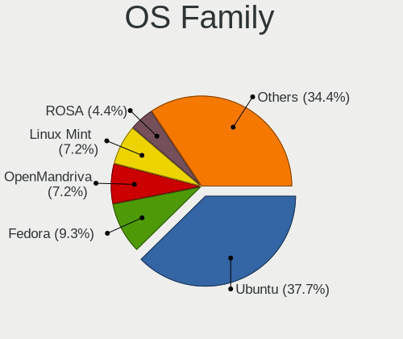

| Name          | Computers | Percent |
|---------------|-----------|---------|
| Ubuntu        | 342       | 37.67%  |
| Fedora        | 84        | 9.25%   |
| OpenMandriva  | 65        | 7.16%   |
| Linux Mint    | 65        | 7.16%   |
| ROSA          | 40        | 4.41%   |
| Pop!_OS       | 36        | 3.96%   |
| Manjaro       | 34        | 3.74%   |
| Arch          | 34        | 3.74%   |
| Debian        | 24        | 2.64%   |
| Zorin         | 19        | 2.09%   |
| Kubuntu       | 18        | 1.98%   |
| Xubuntu       | 15        | 1.65%   |
| SteamOS       | 13        | 1.43%   |
| ArcoLinux     | 12        | 1.32%   |
| openSUSE      | 8         | 0.88%   |
| Endless       | 8         | 0.88%   |
| Elementary    | 8         | 0.88%   |
| Ubuntu MATE   | 7         | 0.77%   |
| Kali          | 6         | 0.66%   |
| CentOS        | 6         | 0.66%   |
| KDE neon      | 5         | 0.55%   |
| Rocky Linux   | 4         | 0.44%   |
| Nobara        | 4         | 0.44%   |
| Clear Linux   | 4         | 0.44%   |
| Ubuntu Unity  | 3         | 0.33%   |
| Ubuntu Budgie | 3         | 0.33%   |
| NixOS         | 3         | 0.33%   |
| Gentoo        | 3         | 0.33%   |
| BlackPanther  | 3         | 0.33%   |
| Ubuntu Studio | 2         | 0.22%   |
| Neptune OS    | 2         | 0.22%   |
| MX            | 2         | 0.22%   |
| Lubuntu       | 2         | 0.22%   |
| EndeavourOS   | 2         | 0.22%   |
| Devuan        | 2         | 0.22%   |
| Artix         | 2         | 0.22%   |
| Alpine        | 2         | 0.22%   |
| Xero          | 1         | 0.11%   |
| UbuntuDDE     | 1         | 0.11%   |
| Siduction     | 1         | 0.11%   |

Kernel
------

Version of the Linux kernel

| Version                         | Computers | Percent |
|---------------------------------|-----------|---------|
| 5.4.0-42-generic                | 26        | 2.42%   |
| 5.16.7-desktop-1omv4003         | 17        | 1.58%   |
| 5.10.14-desktop-1omv4002        | 15        | 1.4%    |
| 5.4.0-48-generic                | 14        | 1.3%    |
| 6.4.11-desktop-1omv2390         | 10        | 0.93%   |
| 5.4.0-52-generic                | 10        | 0.93%   |
| 6.6.2-desktop-1omv2390          | 8         | 0.74%   |
| 6.2.0-20-generic                | 7         | 0.65%   |
| 5.15.0-91-generic               | 7         | 0.65%   |
| 4.15.0-desktop-45.1rosa-x86_64  | 7         | 0.65%   |
| 6.8.7-300.fc40.x86_64           | 6         | 0.56%   |
| 6.8.0-45-generic                | 6         | 0.56%   |
| 6.5.0-14-generic                | 6         | 0.56%   |
| 6.2.6-desktop-1omv2390          | 6         | 0.56%   |
| 5.4.0-72-generic                | 6         | 0.56%   |
| 5.4.0-65-generic                | 6         | 0.56%   |
| 5.4.0-26-generic                | 6         | 0.56%   |
| 5.15.0-56-generic               | 6         | 0.56%   |
| 5.11.0-37-generic               | 6         | 0.56%   |
| 6.9.3-76060903-generic          | 5         | 0.47%   |
| 6.2.0-39-generic                | 5         | 0.47%   |
| 5.4.0-58-generic                | 5         | 0.47%   |
| 5.3.0-46-generic                | 5         | 0.47%   |
| 5.15.0-47-generic               | 5         | 0.47%   |
| 5.13.0-30-generic               | 5         | 0.47%   |
| 5.11.0-40-generic               | 5         | 0.47%   |
| 5.11.0-27-generic               | 5         | 0.47%   |
| 5.0.0-23-generic                | 5         | 0.47%   |
| 4.9.60-nrj-desktop-1rosa-x86_64 | 5         | 0.47%   |
| 6.8.11-300.fc40.x86_64          | 4         | 0.37%   |
| 6.8.0-31-generic                | 4         | 0.37%   |
| 6.2.0-26-generic                | 4         | 0.37%   |
| 6.12.1-desktop-1omv2490         | 4         | 0.37%   |
| 6.1.1-desktop-1omv2290          | 4         | 0.37%   |
| 5.4.0-70-generic                | 4         | 0.37%   |
| 5.4.0-40-generic                | 4         | 0.37%   |
| 5.4.0-37-generic                | 4         | 0.37%   |
| 5.3.0-42-generic                | 4         | 0.37%   |
| 5.3.0-28-generic                | 4         | 0.37%   |
| 5.15.0-78-generic               | 4         | 0.37%   |

Kernel Family
-------------

Linux kernel without a distro release

| Version | Computers | Percent |
|---------|-----------|---------|
| 5.4.0   | 137       | 13.42%  |
| 5.15.0  | 73        | 7.15%   |
| 4.15.0  | 51        | 5%      |
| 5.8.0   | 43        | 4.21%   |
| 5.11.0  | 38        | 3.72%   |
| 5.13.0  | 35        | 3.43%   |
| 6.5.0   | 33        | 3.23%   |
| 5.3.0   | 31        | 3.04%   |
| 6.2.0   | 30        | 2.94%   |
| 6.8.0   | 25        | 2.45%   |
| 5.0.0   | 25        | 2.45%   |
| 5.19.0  | 22        | 2.15%   |
| 5.16.7  | 17        | 1.67%   |
| 5.10.14 | 15        | 1.47%   |
| 6.1.0   | 13        | 1.27%   |
| 4.18.0  | 13        | 1.27%   |
| 5.10.0  | 11        | 1.08%   |
| 6.6.2   | 10        | 0.98%   |
| 6.4.11  | 10        | 0.98%   |
| 6.2.6   | 8         | 0.78%   |
| 6.8.7   | 7         | 0.69%   |
| 6.3.5   | 6         | 0.59%   |
| 4.9.60  | 6         | 0.59%   |
| 6.9.3   | 5         | 0.49%   |
| 6.2.9   | 5         | 0.49%   |
| 6.12.1  | 5         | 0.49%   |
| 6.9.9   | 4         | 0.39%   |
| 6.8.11  | 4         | 0.39%   |
| 6.11.0  | 4         | 0.39%   |
| 6.1.52  | 4         | 0.39%   |
| 6.1.12  | 4         | 0.39%   |
| 6.1.1   | 4         | 0.39%   |
| 5.9.16  | 4         | 0.39%   |
| 4.19.0  | 4         | 0.39%   |
| 4.1.34  | 4         | 0.39%   |
| 6.8.9   | 3         | 0.29%   |
| 6.8.8   | 3         | 0.29%   |
| 6.6.7   | 3         | 0.29%   |
| 6.5.6   | 3         | 0.29%   |
| 6.11.4  | 3         | 0.29%   |

Kernel Major Ver.
-----------------

Linux kernel major version

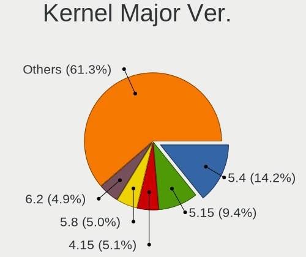

| Version | Computers | Percent |
|---------|-----------|---------|
| 5.4     | 142       | 14.23%  |
| 5.15    | 94        | 9.42%   |
| 4.15    | 51        | 5.11%   |
| 5.8     | 50        | 5.01%   |
| 6.2     | 49        | 4.91%   |
| 5.11    | 45        | 4.51%   |
| 6.1     | 44        | 4.41%   |
| 6.8     | 42        | 4.21%   |
| 5.10    | 41        | 4.11%   |
| 6.5     | 40        | 4.01%   |
| 5.13    | 39        | 3.91%   |
| 5.3     | 33        | 3.31%   |
| 5.16    | 30        | 3.01%   |
| 5.19    | 29        | 2.91%   |
| 6.6     | 26        | 2.61%   |
| 5.0     | 26        | 2.61%   |
| 6.4     | 20        | 2%      |
| 6.9     | 17        | 1.7%    |
| 6.10    | 16        | 1.6%    |
| 4.18    | 16        | 1.6%    |
| 6.11    | 15        | 1.5%    |
| 4.9     | 15        | 1.5%    |
| 6.0     | 14        | 1.4%    |
| 5.14    | 12        | 1.2%    |
| 6.7     | 11        | 1.1%    |
| 5.9     | 11        | 1.1%    |
| 6.3     | 9         | 0.9%    |
| 5.18    | 9         | 0.9%    |
| 5.17    | 8         | 0.8%    |
| 4.19    | 8         | 0.8%    |
| 6.12    | 7         | 0.7%    |
| 5.12    | 6         | 0.6%    |
| 4.1     | 6         | 0.6%    |
| 5.7     | 5         | 0.5%    |
| 5.6     | 4         | 0.4%    |
| 5.5     | 2         | 0.2%    |
| 4.4     | 2         | 0.2%    |
| 3.10    | 2         | 0.2%    |
| 4.7     | 1         | 0.1%    |
| 2.6     | 1         | 0.1%    |

Arch
----

OS architecture (x86_64, i586, etc.)

| Name    | Computers | Percent |
|---------|-----------|---------|
| x86_64  | 863       | 97.73%  |
| i686    | 14        | 1.59%   |
| aarch64 | 6         | 0.68%   |

DE
--

Desktop Environment

| Name            | Computers | Percent |
|-----------------|-----------|---------|
| GNOME           | 423       | 45.83%  |
| KDE5            | 173       | 18.74%  |
| Unknown         | 96        | 10.4%   |
| X-Cinnamon      | 57        | 6.18%   |
| XFCE            | 49        | 5.31%   |
| KDE4            | 29        | 3.14%   |
| KDE6            | 20        | 2.17%   |
| MATE            | 15        | 1.63%   |
| KDE             | 14        | 1.52%   |
| Cinnamon        | 10        | 1.08%   |
| Pantheon        | 8         | 0.87%   |
| i3              | 6         | 0.65%   |
| Unity           | 4         | 0.43%   |
| LXQt            | 4         | 0.43%   |
| Budgie          | 3         | 0.33%   |
| LXDE            | 2         | 0.22%   |
| Hyprland        | 2         | 0.22%   |
| GNOME Classic   | 2         | 0.22%   |
| Trinity         | 1         | 0.11%   |
| i3-with-shmlog  | 1         | 0.11%   |
| GNOME Flashback | 1         | 0.11%   |
| dwm             | 1         | 0.11%   |
| Deepin          | 1         | 0.11%   |
| chadwm          | 1         | 0.11%   |

Display Server
--------------

X11 or Wayland

| Name    | Computers | Percent |
|---------|-----------|---------|
| X11     | 639       | 69.76%  |
| Wayland | 207       | 22.6%   |
| Unknown | 53        | 5.79%   |
| Tty     | 17        | 1.86%   |

Display Manager
---------------

SDDM, LightDM, etc.

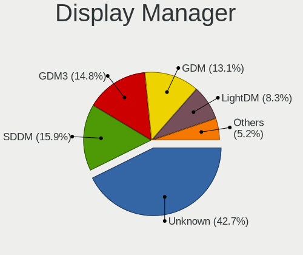

| Name    | Computers | Percent |
|---------|-----------|---------|
| Unknown | 392       | 42.7%   |
| SDDM    | 146       | 15.9%   |
| GDM3    | 136       | 14.81%  |
| GDM     | 120       | 13.07%  |
| LightDM | 76        | 8.28%   |
| KDM     | 28        | 3.05%   |
| TDM     | 17        | 1.85%   |
| XDM     | 2         | 0.22%   |
| LXDM    | 1         | 0.11%   |

OS Lang
-------

Language

| Lang        | Computers | Percent |
|-------------|-----------|---------|
| en_US       | 332       | 36.32%  |
| en_IL       | 329       | 36%     |
| Unknown     | 96        | 10.5%   |
| ru_RU       | 56        | 6.13%   |
| he_IL       | 37        | 4.05%   |
| C           | 23        | 2.52%   |
| en_GB       | 7         | 0.77%   |
| fr_FR       | 5         | 0.55%   |
| en_AG       | 5         | 0.55%   |
| es_ES       | 3         | 0.33%   |
| uk_UA       | 2         | 0.22%   |
| POSIX       | 2         | 0.22%   |
| de_DE       | 2         | 0.22%   |
| ru_UA       | 1         | 0.11%   |
| pt_BR       | 1         | 0.11%   |
| it_IT       | 1         | 0.11%   |
| is          | 1         | 0.11%   |
| en_US.UTF8  | 1         | 0.11%   |
| en_US.utf-8 | 1         | 0.11%   |
| en_NZ       | 1         | 0.11%   |
| en_IN       | 1         | 0.11%   |
| en_IE       | 1         | 0.11%   |
| en_DK       | 1         | 0.11%   |
| en_CA       | 1         | 0.11%   |
| en_AU       | 1         | 0.11%   |
| C.UTF8      | 1         | 0.11%   |
| ar_EG       | 1         | 0.11%   |
| aa_DJ       | 1         | 0.11%   |

Boot Mode
---------

EFI or BIOS

| Mode | Computers | Percent |
|------|-----------|---------|
| EFI  | 479       | 52.58%  |
| BIOS | 432       | 47.42%  |

Filesystem
----------

Type of filesystem

| Type    | Computers | Percent |
|---------|-----------|---------|
| Ext4    | 628       | 69.16%  |
| Btrfs   | 110       | 12.11%  |
| Overlay | 63        | 6.94%   |
| Tmpfs   | 52        | 5.73%   |
| Unknown | 25        | 2.75%   |
| Xfs     | 22        | 2.42%   |
| Zfs     | 4         | 0.44%   |
| Ext3    | 2         | 0.22%   |
| F2fs    | 1         | 0.11%   |
| Ext2    | 1         | 0.11%   |

Part. scheme
------------

Scheme of partitioning

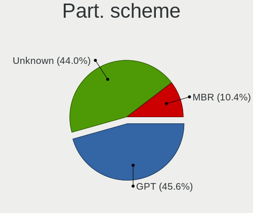

| Type    | Computers | Percent |
|---------|-----------|---------|
| GPT     | 414       | 45.64%  |
| Unknown | 399       | 43.99%  |
| MBR     | 94        | 10.36%  |

Dual Boot with Linux/BSD
------------------------

Hosting more than one Linux/BSD

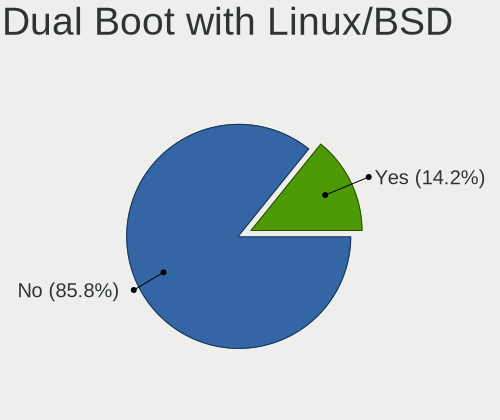

| Dual boot | Computers | Percent |
|-----------|-----------|---------|
| No        | 774       | 85.81%  |
| Yes       | 128       | 14.19%  |

Dual Boot (Win)
---------------

Hosting Linux and Windows

| Dual boot | Computers | Percent |
|-----------|-----------|---------|
| No        | 641       | 71.3%   |
| Yes       | 258       | 28.7%   |

Board
-----

Vendor
------

Motherboard manufacturer

| Name                                 | Computers | Percent |
|--------------------------------------|-----------|---------|
| ASUSTek Computer                     | 201       | 22.79%  |
| Lenovo                               | 171       | 19.39%  |
| Dell                                 | 130       | 14.74%  |
| Gigabyte Technology                  | 108       | 12.24%  |
| Hewlett-Packard                      | 92        | 10.43%  |
| MSI                                  | 24        | 2.72%   |
| Intel                                | 17        | 1.93%   |
| Apple                                | 17        | 1.93%   |
| Acer                                 | 15        | 1.7%    |
| Valve                                | 10        | 1.13%   |
| ASRock                               | 10        | 1.13%   |
| Samsung Electronics                  | 8         | 0.91%   |
| Unknown                              | 7         | 0.79%   |
| Toshiba                              | 6         | 0.68%   |
| Fujitsu                              | 4         | 0.45%   |
| Timi                                 | 3         | 0.34%   |
| Supermicro                           | 3         | 0.34%   |
| Razer                                | 3         | 0.34%   |
| Raspberry Pi Foundation              | 3         | 0.34%   |
| Nvidia                               | 3         | 0.34%   |
| LG Electronics                       | 3         | 0.34%   |
| AMI                                  | 3         | 0.34%   |
| Alienware                            | 3         | 0.34%   |
| System76                             | 2         | 0.23%   |
| Pegatron                             | 2         | 0.23%   |
| Huanan                               | 2         | 0.23%   |
| GPD                                  | 2         | 0.23%   |
| Fujitsu Siemens                      | 2         | 0.23%   |
| Foxconn                              | 2         | 0.23%   |
| XIAOMI                               | 1         | 0.11%   |
| TYAN Computer                        | 1         | 0.11%   |
| TUXEDO                               | 1         | 0.11%   |
| Shuttle                              | 1         | 0.11%   |
| Shenzhen Meigao Electronic Equipment | 1         | 0.11%   |
| Purism                               | 1         | 0.11%   |
| PC Engines                           | 1         | 0.11%   |
| Notebook                             | 1         | 0.11%   |
| Neousys Technology                   | 1         | 0.11%   |
| N-one                                | 1         | 0.11%   |
| MiTAC                                | 1         | 0.11%   |

Model
-----

Motherboard model

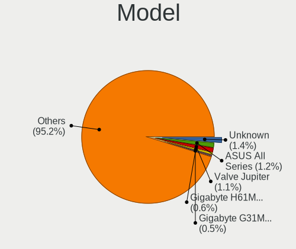

| Name                                  | Computers | Percent |
|---------------------------------------|-----------|---------|
| Unknown                               | 12        | 1.36%   |
| ASUS All Series                       | 11        | 1.25%   |
| Valve Jupiter                         | 10        | 1.13%   |
| Gigabyte H61M-S2PV                    | 5         | 0.57%   |
| Gigabyte G31M-ES2L                    | 4         | 0.45%   |
| Nvidia Tegra                          | 3         | 0.34%   |
| MSI MS-7592                           | 3         | 0.34%   |
| Lenovo IdeaPad 5 14ITL05 82FE         | 3         | 0.34%   |
| Lenovo G560 0679                      | 3         | 0.34%   |
| HP Pavilion Notebook                  | 3         | 0.34%   |
| HP Compaq Presario CQ61               | 3         | 0.34%   |
| Gigabyte H61M-S1                      | 3         | 0.34%   |
| Dell Latitude 7400                    | 3         | 0.34%   |
| Dell Inspiron 3593                    | 3         | 0.34%   |
| ASUS UX331UA                          | 3         | 0.34%   |
| ASUS PRIME Z490-P                     | 3         | 0.34%   |
| ASUS P8H61-M LX R2.0                  | 3         | 0.34%   |
| ASUS H110M-K                          | 3         | 0.34%   |
| ASUS H110M-A/M.2                      | 3         | 0.34%   |
| RPi Raspberry Pi 4 Model B Rev 1.4    | 2         | 0.23%   |
| MSI MS-7982                           | 2         | 0.23%   |
| Lenovo Yoga 500-15ISK 80R6            | 2         | 0.23%   |
| Lenovo V14-IIL 82C4                   | 2         | 0.23%   |
| Lenovo Legion Y530-15ICH 81FV         | 2         | 0.23%   |
| Lenovo IdeaPad Y700-15ISK 80NV        | 2         | 0.23%   |
| Lenovo IdeaPad Slim 3 15IAH8 83ER     | 2         | 0.23%   |
| Lenovo IdeaPad L340-15IWL 81LG        | 2         | 0.23%   |
| Lenovo G50-80 80L0                    | 2         | 0.23%   |
| Intel NUC8i7BEH                       | 2         | 0.23%   |
| Intel NUC8i3BEH                       | 2         | 0.23%   |
| Intel DH77EB AAG39073-304             | 2         | 0.23%   |
| HP ZBook 15 G5                        | 2         | 0.23%   |
| HP ZBook 15 G3                        | 2         | 0.23%   |
| HP Spectre x360 Convertible 13-aw0xxx | 2         | 0.23%   |
| HP ProBook 430 G6                     | 2         | 0.23%   |
| HP Pavilion Gaming Laptop 15-ec1xxx   | 2         | 0.23%   |
| HP EPROM DATA AREA                    | 2         | 0.23%   |
| HP EliteBook 840 G6                   | 2         | 0.23%   |
| HP EliteBook 840 G5                   | 2         | 0.23%   |
| HP Compaq 6200 Pro MT PC              | 2         | 0.23%   |

Model Family
------------

Motherboard model prefix

| Name               | Computers | Percent |
|--------------------|-----------|---------|
| Lenovo ThinkPad    | 69        | 7.82%   |
| ASUS PRIME         | 43        | 4.88%   |
| Dell Latitude      | 40        | 4.54%   |
| Lenovo IdeaPad     | 31        | 3.51%   |
| ASUS VivoBook      | 28        | 3.17%   |
| ASUS ROG           | 28        | 3.17%   |
| Dell Inspiron      | 27        | 3.06%   |
| Dell Vostro        | 21        | 2.38%   |
| HP Pavilion        | 15        | 1.7%    |
| Dell OptiPlex      | 14        | 1.59%   |
| Dell XPS           | 12        | 1.36%   |
| Acer Aspire        | 12        | 1.36%   |
| Unknown            | 12        | 1.36%   |
| ASUS TUF           | 11        | 1.25%   |
| ASUS All           | 11        | 1.25%   |
| Valve Jupiter      | 10        | 1.13%   |
| Lenovo Yoga        | 10        | 1.13%   |
| Lenovo ThinkCentre | 10        | 1.13%   |
| Lenovo Legion      | 9         | 1.02%   |
| HP EliteBook       | 9         | 1.02%   |
| HP ZBook           | 8         | 0.91%   |
| HP ProBook         | 8         | 0.91%   |
| HP Compaq          | 8         | 0.91%   |
| ASUS ASUS          | 8         | 0.91%   |
| Dell Precision     | 7         | 0.79%   |
| HP ProDesk         | 6         | 0.68%   |
| ASUS ZenBook       | 6         | 0.68%   |
| Toshiba Satellite  | 5         | 0.57%   |
| HP Laptop          | 5         | 0.57%   |
| Gigabyte Z690      | 5         | 0.57%   |
| Gigabyte H61M-S2PV | 5         | 0.57%   |
| Lenovo IdeaPadFlex | 4         | 0.45%   |
| Gigabyte X570      | 4         | 0.45%   |
| Gigabyte G31M-ES2L | 4         | 0.45%   |
| Fujitsu LIFEBOOK   | 4         | 0.45%   |
| Dell PowerEdge     | 4         | 0.45%   |
| ASUS H110M-A       | 4         | 0.45%   |
| Razer Blade        | 3         | 0.34%   |
| RPi Raspberry      | 3         | 0.34%   |
| Nvidia Tegra       | 3         | 0.34%   |

MFG Year
--------

Motherboard manufacture year

| Year    | Computers | Percent |
|---------|-----------|---------|
| 2020    | 95        | 10.77%  |
| 2019    | 95        | 10.77%  |
| 2018    | 91        | 10.32%  |
| 2021    | 72        | 8.16%   |
| 2012    | 60        | 6.8%    |
| 2017    | 58        | 6.58%   |
| 2016    | 47        | 5.33%   |
| 2015    | 47        | 5.33%   |
| 2013    | 44        | 4.99%   |
| 2011    | 43        | 4.88%   |
| 2022    | 42        | 4.76%   |
| 2014    | 42        | 4.76%   |
| 2010    | 38        | 4.31%   |
| 2023    | 34        | 3.85%   |
| 2009    | 25        | 2.83%   |
| 2008    | 19        | 2.15%   |
| 2007    | 14        | 1.59%   |
| 2024    | 9         | 1.02%   |
| Unknown | 4         | 0.45%   |
| 2006    | 3         | 0.34%   |

Form Factor
-----------

Physical design of the computer

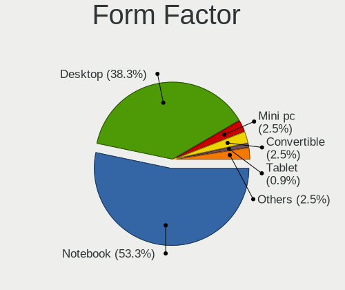

| Name           | Computers | Percent |
|----------------|-----------|---------|
| Notebook       | 470       | 53.29%  |
| Desktop        | 338       | 38.32%  |
| Convertible    | 22        | 2.49%   |
| Mini pc        | 22        | 2.49%   |
| Tablet         | 8         | 0.91%   |
| All in one     | 8         | 0.91%   |
| Server         | 8         | 0.91%   |
| System on chip | 6         | 0.68%   |

Secure Boot
-----------

Enabled or disabled

| State    | Computers | Percent |
|----------|-----------|---------|
| Disabled | 814       | 91.67%  |
| Enabled  | 74        | 8.33%   |

Coreboot
--------

Have coreboot on board

| Used | Computers | Percent |
|------|-----------|---------|
| No   | 878       | 99.55%  |
| Yes  | 4         | 0.45%   |

RAM Size
--------

Total RAM memory

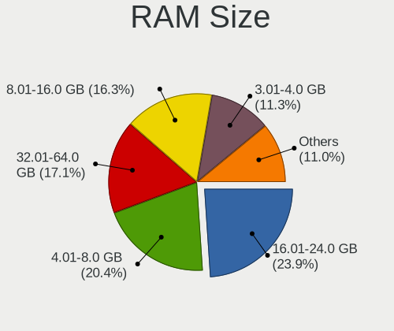

| Size in GB      | Computers | Percent |
|-----------------|-----------|---------|
| 16.01-24.0      | 216       | 23.95%  |
| 4.01-8.0        | 184       | 20.4%   |
| 32.01-64.0      | 154       | 17.07%  |
| 8.01-16.0       | 147       | 16.3%   |
| 3.01-4.0        | 102       | 11.31%  |
| 64.01-256.0     | 45        | 4.99%   |
| 1.01-2.0        | 29        | 3.22%   |
| 24.01-32.0      | 13        | 1.44%   |
| 2.01-3.0        | 7         | 0.78%   |
| 0.51-1.0        | 3         | 0.33%   |
| More than 256.0 | 1         | 0.11%   |
| Unknown         | 1         | 0.11%   |

RAM Used
--------

Used RAM memory

| Used GB     | Computers | Percent |
|-------------|-----------|---------|
| 1.01-2.0    | 254       | 25.92%  |
| 2.01-3.0    | 219       | 22.35%  |
| 4.01-8.0    | 182       | 18.57%  |
| 3.01-4.0    | 150       | 15.31%  |
| 8.01-16.0   | 97        | 9.9%    |
| 0.51-1.0    | 48        | 4.9%    |
| 16.01-24.0  | 12        | 1.22%   |
| 0.01-0.5    | 10        | 1.02%   |
| 24.01-32.0  | 3         | 0.31%   |
| 32.01-64.0  | 2         | 0.2%    |
| Unknown     | 2         | 0.2%    |
| 64.01-256.0 | 1         | 0.1%    |

Total Drives
------------

Number of drives on board

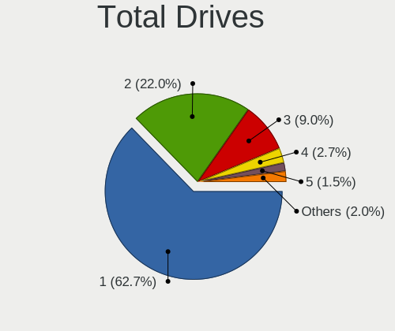

| Drives | Computers | Percent |
|--------|-----------|---------|
| 1      | 571       | 62.75%  |
| 2      | 200       | 21.98%  |
| 3      | 82        | 9.01%   |
| 4      | 25        | 2.75%   |
| 5      | 14        | 1.54%   |
| 0      | 7         | 0.77%   |
| 6      | 4         | 0.44%   |
| 8      | 3         | 0.33%   |
| 7      | 3         | 0.33%   |
| 10     | 1         | 0.11%   |

Has CD-ROM
----------

Has CD-ROM on board

| Presented | Computers | Percent |
|-----------|-----------|---------|
| No        | 646       | 72.42%  |
| Yes       | 246       | 27.58%  |

Has Ethernet
------------

Has Ethernet on board

| Presented | Computers | Percent |
|-----------|-----------|---------|
| Yes       | 748       | 84.52%  |
| No        | 137       | 15.48%  |

Has WiFi
--------

Has WiFi module

| Presented | Computers | Percent |
|-----------|-----------|---------|
| Yes       | 653       | 73.54%  |
| No        | 235       | 26.46%  |

Has Bluetooth
-------------

Has Bluetooth module

| Presented | Computers | Percent |
|-----------|-----------|---------|
| Yes       | 551       | 61.56%  |
| No        | 344       | 38.44%  |

Location
--------

Country
-------

Geographic location (country)

| Country | Computers | Percent |
|---------|-----------|---------|
| Israel  | 882       | 100%    |

City
----

Geographic location (city)

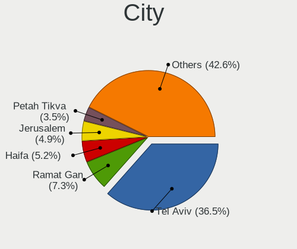

| City                | Computers | Percent |
|---------------------|-----------|---------|
| Tel Aviv            | 354       | 36.53%  |
| Ramat Gan           | 71        | 7.33%   |
| Haifa               | 50        | 5.16%   |
| Jerusalem           | 47        | 4.85%   |
| Petah Tikva         | 34        | 3.51%   |
| Peta Tiqwa       | 27        | 2.79%   |
| Rishon LeTsiyyon    | 25        | 2.58%   |
| Herzliya            | 25        | 2.58%   |
| Netanya             | 19        | 1.96%   |
| Holon               | 19        | 1.96%   |
| Rishon LeZiyyon     | 18        | 1.86%   |
| Rehovot             | 17        | 1.75%   |
| Givatayim           | 15        | 1.55%   |
| Kfar Saba           | 11        | 1.14%   |
| Ashdod              | 11        | 1.14%   |
| Rosh HaAyin         | 10        | 1.03%   |
| Ramat HaSharon      | 10        | 1.03%   |
| Raanana             | 10        | 1.03%   |
| Ashquelon           | 10        | 1.03%   |
| Qiryat Ata          | 9         | 0.93%   |
| Beersheba           | 9         | 0.93%   |
| Nahariya            | 8         | 0.83%   |
| Kiryat Ono          | 8         | 0.83%   |
| Lod                 | 7         | 0.72%   |
| Hod HaSharon        | 6         | 0.62%   |
| Bat Yam             | 6         | 0.62%   |
| Ness Ziona          | 5         | 0.52%   |
| Karmiel          | 5         | 0.52%   |
| Bet Shemesh         | 5         | 0.52%   |
| Ramla               | 4         | 0.41%   |
| Pardes Hanna Karkur | 4         | 0.41%   |
| Givat Shmuel        | 4         | 0.41%   |
| Be'er Ya'aqov       | 4         | 0.41%   |
| Yehud               | 3         | 0.31%   |
| Yaqum               | 3         | 0.31%   |
| Tiberias            | 3         | 0.31%   |
| Tel Mond            | 3         | 0.31%   |
| Sderot              | 3         | 0.31%   |
| Qiryat Bialik       | 3         | 0.31%   |
| Or Yehuda           | 3         | 0.31%   |

Drives
------

Drive Vendor
------------

Hard drive vendors

| Vendor                      | Computers | Drives | Percent |
|-----------------------------|-----------|--------|---------|
| WDC                         | 198       | 326    | 15.58%  |
| Samsung Electronics         | 191       | 295    | 15.03%  |
| Seagate                     | 135       | 197    | 10.62%  |
| SanDisk                     | 116       | 145    | 9.13%   |
| Kingston                    | 75        | 93     | 5.9%    |
| Toshiba                     | 65        | 74     | 5.11%   |
| Hitachi                     | 53        | 83     | 4.17%   |
| Intel                       | 51        | 80     | 4.01%   |
| SK hynix                    | 40        | 54     | 3.15%   |
| Crucial                     | 34        | 58     | 2.68%   |
| Micron Technology           | 32        | 43     | 2.52%   |
| Unknown                     | 29        | 37     | 2.28%   |
| Transcend                   | 28        | 36     | 2.2%    |
| HGST                        | 28        | 32     | 2.2%    |
| KIOXIA                      | 19        | 22     | 1.49%   |
| Corsair                     | 13        | 23     | 1.02%   |
| A-DATA Technology           | 13        | 16     | 1.02%   |
| Apple                       | 11        | 16     | 0.87%   |
| StoreJet                    | 9         | 10     | 0.71%   |
| Phison Electronics          | 9         | 10     | 0.71%   |
| Silicon Motion              | 8         | 8      | 0.63%   |
| China                       | 8         | 12     | 0.63%   |
| Unknown                     | 7         | 8      | 0.55%   |
| XPG                         | 6         | 12     | 0.47%   |
| Phison                      | 6         | 7      | 0.47%   |
| SPCC                        | 5         | 5      | 0.39%   |
| Micron/Crucial Technology   | 5         | 5      | 0.39%   |
| PNY                         | 4         | 5      | 0.31%   |
| LITEON                      | 4         | 4      | 0.31%   |
| KIOXIA-EXCERIA              | 4         | 5      | 0.31%   |
| JMicron Technology          | 4         | 4      | 0.31%   |
| Fujitsu                     | 4         | 5      | 0.31%   |
| ADATA Technology            | 4         | 4      | 0.31%   |
| OCZ                         | 3         | 3      | 0.24%   |
| Netac                       | 3         | 3      | 0.24%   |
| MAXIO Technology (Hangzhou) | 3         | 3      | 0.24%   |
| LITEONIT                    | 3         | 3      | 0.24%   |
| Apacer                      | 3         | 3      | 0.24%   |
| XrayDisk                    | 2         | 3      | 0.16%   |
| USB3.0                      | 2         | 2      | 0.16%   |

Drive Model
-----------

Hard drive models

| Model                                                | Computers | Percent |
|------------------------------------------------------|-----------|---------|
| SanDisk SSD PLUS 240GB                               | 21        | 1.49%   |
| Samsung NVMe SSD Controller SM981/PM981/PM983 512GB  | 17        | 1.2%    |
| Kingston SA400S37240G 240GB SSD                      | 16        | 1.13%   |
| Seagate ST500DM002-1BD142 500GB                      | 12        | 0.85%   |
| Samsung NVMe SSD Drive 512GB                         | 11        | 0.78%   |
| Samsung NVMe SSD Controller PM9A1/PM9A3/980PRO 512GB | 11        | 0.78%   |
| Hitachi HDS721050CLA362 500GB                        | 10        | 0.71%   |
| WDC WD10EZEX-08WN4A0 1TB                             | 9         | 0.64%   |
| Unknown MMC Card  64GB                               | 9         | 0.64%   |
| Seagate ST500LT012-1DG142 500GB                      | 9         | 0.64%   |
| Samsung SSD 860 EVO 500GB                            | 9         | 0.64%   |
| Sandisk WD Black SN750 / PC SN730 NVMe SSD 512GB     | 8         | 0.57%   |
| Kingston SV300S37A120G 120GB SSD                     | 8         | 0.57%   |
| Seagate ST2000DM008-2FR102 2TB                       | 7         | 0.5%    |
| Intel SSDPEKNU512GZ 512GB                            | 7         | 0.5%    |
| Intel NVMe SSD Drive 512GB                           | 7         | 0.5%    |
| Crucial CT500MX500SSD1 500GB                         | 7         | 0.5%    |
| Unknown                                              | 7         | 0.5%    |
| WDC WD20PURX-64P6ZY0 2TB                             | 6         | 0.42%   |
| Toshiba DT01ACA100 1TB                               | 6         | 0.42%   |
| SK hynix NVMe SSD Drive 256GB                        | 6         | 0.42%   |
| Samsung SSD 850 EVO 500GB                            | 6         | 0.42%   |
| Samsung SSD 850 EVO 250GB                            | 6         | 0.42%   |
| Samsung NVMe SSD Drive 500GB                         | 6         | 0.42%   |
| Kingston SA400S37120G 120GB SSD                      | 6         | 0.42%   |
| HGST HTS721010A9E630 1TB                             | 6         | 0.42%   |
| HGST HTS545050A7E680 500GB                           | 6         | 0.42%   |
| Crucial CT250MX500SSD1 250GB                         | 6         | 0.42%   |
| WDC WD10EZEX-60WN4A0 1TB                             | 5         | 0.35%   |
| WDC WD10EZEX-00BN5A0 1TB                             | 5         | 0.35%   |
| Toshiba MQ01ABF050 500GB                             | 5         | 0.35%   |
| SK hynix NVMe SSD Drive 512GB                        | 5         | 0.35%   |
| Seagate ST2000DM001-1ER164 2TB                       | 5         | 0.35%   |
| Seagate ST1000LM035-1RK172 1TB                       | 5         | 0.35%   |
| Seagate ST1000LM024 HN-M101MBB 1TB                   | 5         | 0.35%   |
| Sandisk WD Blue SN500 / PC SN520 NVMe SSD 256GB      | 5         | 0.35%   |
| SanDisk SSD PLUS 480GB                               | 5         | 0.35%   |
| SanDisk SDSSDA120G 120GB                             | 5         | 0.35%   |
| SanDisk NVMe SSD Drive 512GB                         | 5         | 0.35%   |
| SanDisk NVMe SSD Drive 1TB                           | 5         | 0.35%   |

HDD Vendor
----------

Hard disk drive vendors

| Vendor              | Computers | Drives | Percent |
|---------------------|-----------|--------|---------|
| WDC                 | 163       | 282    | 36.3%   |
| Seagate             | 134       | 195    | 29.84%  |
| Hitachi             | 53        | 83     | 11.8%   |
| Toshiba             | 41        | 48     | 9.13%   |
| HGST                | 28        | 32     | 6.24%   |
| Samsung Electronics | 11        | 17     | 2.45%   |
| Fujitsu             | 4         | 5      | 0.89%   |
| Apple               | 4         | 4      | 0.89%   |
| Unknown             | 2         | 2      | 0.45%   |
| JMicron Technology  | 2         | 2      | 0.45%   |
| USB3.0              | 1         | 1      | 0.22%   |
| TPH01204000GB       | 1         | 1      | 0.22%   |
| StoreJet            | 1         | 1      | 0.22%   |
| Mercury             | 1         | 1      | 0.22%   |
| Lenovo              | 1         | 1      | 0.22%   |
| IBM/Hitachi         | 1         | 1      | 0.22%   |
| External            | 1         | 1      | 0.22%   |

SSD Vendor
----------

Solid state drive vendors

| Vendor              | Computers | Drives | Percent |
|---------------------|-----------|--------|---------|
| Samsung Electronics | 68        | 95     | 18.18%  |
| SanDisk             | 62        | 78     | 16.58%  |
| Kingston            | 56        | 68     | 14.97%  |
| Crucial             | 27        | 49     | 7.22%   |
| Transcend           | 23        | 31     | 6.15%   |
| Intel               | 16        | 19     | 4.28%   |
| Micron Technology   | 15        | 19     | 4.01%   |
| WDC                 | 13        | 13     | 3.48%   |
| A-DATA Technology   | 11        | 13     | 2.94%   |
| SK hynix            | 10        | 21     | 2.67%   |
| Corsair             | 10        | 18     | 2.67%   |
| Toshiba             | 9         | 9      | 2.41%   |
| China               | 8         | 12     | 2.14%   |
| StoreJet            | 4         | 4      | 1.07%   |
| PNY                 | 4         | 5      | 1.07%   |
| LITEON              | 4         | 4      | 1.07%   |
| Apple               | 4         | 4      | 1.07%   |
| SPCC                | 3         | 3      | 0.8%    |
| OCZ                 | 3         | 3      | 0.8%    |
| LITEONIT            | 3         | 3      | 0.8%    |
| KIOXIA-EXCERIA      | 3         | 3      | 0.8%    |
| Apacer              | 3         | 3      | 0.8%    |
| Netac               | 2         | 2      | 0.53%   |
| XrayDisk            | 1         | 2      | 0.27%   |
| Verbatim            | 1         | 1      | 0.27%   |
| USB3.0              | 1         | 1      | 0.27%   |
| Seagate             | 1         | 1      | 0.27%   |
| Plextor             | 1         | 1      | 0.27%   |
| Patriot             | 1         | 1      | 0.27%   |
| OCZ-VERTEX3         | 1         | 1      | 0.27%   |
| NGFF                | 1         | 1      | 0.27%   |
| LS600               | 1         | 1      | 0.27%   |
| Lenovo              | 1         | 1      | 0.27%   |
| KingSpec            | 1         | 1      | 0.27%   |
| KingDian            | 1         | 2      | 0.27%   |
| faspeed             | 1         | 1      | 0.27%   |

Drive Kind
----------

HDD or SSD

| Kind    | Computers | Drives | Percent |
|---------|-----------|--------|---------|
| NVMe    | 394       | 563    | 34.68%  |
| HDD     | 369       | 677    | 32.48%  |
| SSD     | 330       | 494    | 29.05%  |
| MMC     | 27        | 38     | 2.38%   |
| Unknown | 16        | 20     | 1.41%   |

Drive Connector
---------------

SATA, SAS, NVMe, etc.

| Type | Computers | Drives | Percent |
|------|-----------|--------|---------|
| SATA | 548       | 1126   | 53.57%  |
| NVMe | 394       | 561    | 38.51%  |
| SAS  | 54        | 67     | 5.28%   |
| MMC  | 27        | 38     | 2.64%   |

Drive Size
----------

Size of hard drive

| Size in TB | Computers | Drives | Percent |
|------------|-----------|--------|---------|
| 0.01-0.5   | 423       | 713    | 58.59%  |
| 0.51-1.0   | 185       | 257    | 25.62%  |
| 1.01-2.0   | 70        | 119    | 9.7%    |
| 3.01-4.0   | 16        | 39     | 2.22%   |
| 2.01-3.0   | 15        | 22     | 2.08%   |
| 4.01-10.0  | 11        | 15     | 1.52%   |
| 10.01-20.0 | 2         | 6      | 0.28%   |

Space Total
-----------

Amount of disk space available on the file system

| Size in GB     | Computers | Percent |
|----------------|-----------|---------|
| 251-500        | 223       | 24.03%  |
| 101-250        | 211       | 22.74%  |
| 501-1000       | 161       | 17.35%  |
| 1001-2000      | 77        | 8.3%    |
| 1-20           | 64        | 6.9%    |
| More than 3000 | 48        | 5.17%   |
| 51-100         | 46        | 4.96%   |
| 2001-3000      | 41        | 4.42%   |
| 21-50          | 33        | 3.56%   |
| Unknown        | 24        | 2.59%   |

Space Used
----------

Amount of used disk space

| Used GB        | Computers | Percent |
|----------------|-----------|---------|
| 1-20           | 352       | 36.7%   |
| 21-50          | 165       | 17.21%  |
| 101-250        | 129       | 13.45%  |
| 51-100         | 89        | 9.28%   |
| 251-500        | 76        | 7.92%   |
| 501-1000       | 52        | 5.42%   |
| 1001-2000      | 40        | 4.17%   |
| Unknown        | 24        | 2.5%    |
| 2001-3000      | 17        | 1.77%   |
| More than 3000 | 15        | 1.56%   |

Malfunc. Drives
---------------

Drive models with a malfunction

| Model                                 | Computers | Drives | Percent |
|---------------------------------------|-----------|--------|---------|
| HGST HTS545050A7E680 500GB            | 5         | 7      | 5.38%   |
| WDC WD10EZEX-00BN5A0 1TB              | 2         | 2      | 2.15%   |
| WDC WD10EARS-00Y5B1 1TB               | 2         | 4      | 2.15%   |
| WDC WD10EADS-00L5B1 1TB               | 2         | 2      | 2.15%   |
| Seagate ST9120817AS 120GB             | 2         | 2      | 2.15%   |
| Seagate ST320LT012-9WS14C 320GB       | 2         | 2      | 2.15%   |
| SanDisk SSD PLUS 240GB                | 2         | 3      | 2.15%   |
| Hitachi HTS545025B9A300 250GB         | 2         | 2      | 2.15%   |
| Hitachi HDS721050DLE630 500GB         | 2         | 2      | 2.15%   |
| Hitachi HDS721050CLA362 500GB         | 2         | 3      | 2.15%   |
| HGST HTS545050A7E380 500GB            | 2         | 2      | 2.15%   |
| WDC WDS240G1G0B-00RC30 240GB SSD      | 1         | 1      | 1.08%   |
| WDC WD6400BPVT-75HXZT1 640GB          | 1         | 1      | 1.08%   |
| WDC WD5001AALS-00LWTA0 500GB          | 1         | 1      | 1.08%   |
| WDC WD5000BPVT-75HXZT1 500GB          | 1         | 1      | 1.08%   |
| WDC WD5000AAKX-60U6AA0 500GB          | 1         | 1      | 1.08%   |
| WDC WD5000AAKX-221CA1 500GB           | 1         | 1      | 1.08%   |
| WDC WD5000AADS-00S9B0 500GB           | 1         | 1      | 1.08%   |
| WDC WD3200AAKS-00L9A0 320GB           | 1         | 1      | 1.08%   |
| WDC WD30PURX-64P6ZY0 3TB              | 1         | 1      | 1.08%   |
| WDC WD2500BEVT-24A23T0 250GB          | 1         | 1      | 1.08%   |
| WDC WD2500BEVT-22A23T0 250GB          | 1         | 2      | 1.08%   |
| WDC WD2500AAJS-00VTA0 250GB           | 1         | 1      | 1.08%   |
| WDC WD20EARS-00MVWB0 2TB              | 1         | 2      | 1.08%   |
| WDC WD1600JS-00SGB0 160GB             | 1         | 1      | 1.08%   |
| WDC WD1600BJKT-75F4T0 160GB           | 1         | 1      | 1.08%   |
| WDC WD1600BEVT-22ZCT0 160GB           | 1         | 2      | 1.08%   |
| WDC WD10EZEX-00ZF5A0 1TB              | 1         | 1      | 1.08%   |
| WDC WD10EZEX-00RKKA0 1TB              | 1         | 1      | 1.08%   |
| WDC WD10EAVS-32D7B1 1TB               | 1         | 1      | 1.08%   |
| WDC WD10EADS-00M2B0 1TB               | 1         | 1      | 1.08%   |
| WDC WD1001FALS-00J7B1 1TB             | 1         | 1      | 1.08%   |
| Toshiba MQ04ABF100 1TB                | 1         | 1      | 1.08%   |
| Toshiba MK6475GSX 640GB               | 1         | 1      | 1.08%   |
| Toshiba MK5075GSX 500GB               | 1         | 1      | 1.08%   |
| Toshiba MK3252GSX 320GB               | 1         | 1      | 1.08%   |
| Toshiba MK1646GSX 160GB               | 1         | 1      | 1.08%   |
| SK hynix HFS256G3BTND-N210A 256GB SSD | 1         | 5      | 1.08%   |
| SK hynix HFS256G39TND-N210A 256GB SSD | 1         | 1      | 1.08%   |
| Seagate ST9500423AS 500GB             | 1         | 1      | 1.08%   |

Malfunc. Drive Vendor
---------------------

Vendors of faulty drives

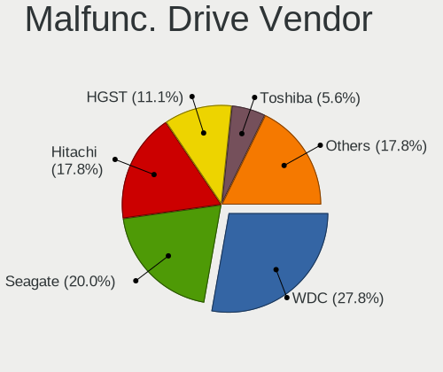

| Vendor              | Computers | Drives | Percent |
|---------------------|-----------|--------|---------|
| WDC                 | 25        | 32     | 27.78%  |
| Seagate             | 18        | 22     | 20%     |
| Hitachi             | 16        | 20     | 17.78%  |
| HGST                | 10        | 12     | 11.11%  |
| Toshiba             | 5         | 5      | 5.56%   |
| SanDisk             | 3         | 4      | 3.33%   |
| Samsung Electronics | 3         | 4      | 3.33%   |
| Intel               | 3         | 3      | 3.33%   |
| SK hynix            | 2         | 6      | 2.22%   |
| Corsair             | 2         | 3      | 2.22%   |
| Gigabyte Technology | 1         | 1      | 1.11%   |
| Fujitsu             | 1         | 1      | 1.11%   |
| Crucial             | 1         | 1      | 1.11%   |

Malfunc. HDD Vendor
-------------------

Vendors of faulty HDD drives

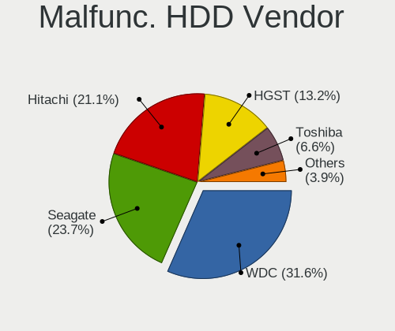

| Vendor              | Computers | Drives | Percent |
|---------------------|-----------|--------|---------|
| WDC                 | 24        | 31     | 31.58%  |
| Seagate             | 18        | 22     | 23.68%  |
| Hitachi             | 16        | 20     | 21.05%  |
| HGST                | 10        | 12     | 13.16%  |
| Toshiba             | 5         | 5      | 6.58%   |
| Samsung Electronics | 2         | 3      | 2.63%   |
| Fujitsu             | 1         | 1      | 1.32%   |

Malfunc. Drive Kind
-------------------

Kinds of faulty drives

| Kind | Computers | Drives | Percent |
|------|-----------|--------|---------|
| HDD  | 63        | 94     | 81.82%  |
| SSD  | 12        | 18     | 15.58%  |
| NVMe | 2         | 2      | 2.6%    |

Failed Drives
-------------

Failed drive models

| Model                           | Computers | Drives | Percent |
|---------------------------------|-----------|--------|---------|
| Transcend TS1TMTE110S 1TB       | 1         | 1      | 25%     |
| Toshiba MK3256GSY 320GB         | 1         | 1      | 25%     |
| Samsung Electronics HD103SJ 1TB | 1         | 1      | 25%     |
| Hitachi HTS547550A9E384 500GB   | 1         | 2      | 25%     |

Failed Drive Vendor
-------------------

Failed drive vendors

| Vendor              | Computers | Drives | Percent |
|---------------------|-----------|--------|---------|
| Transcend           | 1         | 1      | 25%     |
| Toshiba             | 1         | 1      | 25%     |
| Samsung Electronics | 1         | 1      | 25%     |
| Hitachi             | 1         | 2      | 25%     |

Drive Status
------------

Number of failed and malfunc. drives

| Status   | Computers | Drives | Percent |
|----------|-----------|--------|---------|
| Detected | 498       | 1017   | 52.15%  |
| Works    | 381       | 656    | 39.9%   |
| Malfunc  | 73        | 114    | 7.64%   |
| Failed   | 3         | 5      | 0.31%   |

Storage controller
------------------

Storage Vendor
--------------

Storage controller vendors

| Vendor                                  | Computers | Percent |
|-----------------------------------------|-----------|---------|
| Intel                                   | 647       | 55.97%  |
| Samsung Electronics                     | 128       | 11.07%  |
| AMD                                     | 78        | 6.75%   |
| SanDisk                                 | 75        | 6.49%   |
| SK hynix                                | 30        | 2.6%    |
| Kingston Technology Company             | 23        | 1.99%   |
| KIOXIA                                  | 19        | 1.64%   |
| Toshiba America Info Systems            | 17        | 1.47%   |
| Micron Technology                       | 17        | 1.47%   |
| Phison Electronics                      | 16        | 1.38%   |
| Silicon Motion                          | 12        | 1.04%   |
| Micron/Crucial Technology               | 12        | 1.04%   |
| ADATA Technology                        | 11        | 0.95%   |
| JMicron Technology                      | 10        | 0.87%   |
| Nvidia                                  | 9         | 0.78%   |
| Marvell Technology Group                | 9         | 0.78%   |
| ASMedia Technology                      | 9         | 0.78%   |
| Transcend                               | 5         | 0.43%   |
| Realtek Semiconductor                   | 4         | 0.35%   |
| MAXIO Technology (Hangzhou)             | 3         | 0.26%   |
| LSI Logic / Symbios Logic               | 3         | 0.26%   |
| Apple                                   | 3         | 0.26%   |
| VIA Technologies                        | 2         | 0.17%   |
| Union Memory (Shenzhen)                 | 2         | 0.17%   |
| Solidigm                                | 2         | 0.17%   |
| Solid State Storage Technology          | 2         | 0.17%   |
| O2 Micro                                | 2         | 0.17%   |
| Biwin Storage Technology                | 2         | 0.17%   |
| Shenzhen Unionmemory Information System | 1         | 0.09%   |
| Shenzhen Longsys Electronics            | 1         | 0.09%   |
| Broadcom / LSI                          | 1         | 0.09%   |
| Adaptec                                 | 1         | 0.09%   |

Storage Model
-------------

Storage controller models

| Model                                                                                   | Computers | Percent |
|-----------------------------------------------------------------------------------------|-----------|---------|
| Samsung NVMe SSD Controller SM981/PM981/PM983                                           | 63        | 4.87%   |
| Intel Sunrise Point-LP SATA Controller [AHCI mode]                                      | 57        | 4.4%    |
| AMD FCH SATA Controller [AHCI mode]                                                     | 57        | 4.4%    |
| Intel Volume Management Device NVMe RAID Controller                                     | 38        | 2.94%   |
| Intel 200 Series PCH SATA controller [AHCI mode]                                        | 36        | 2.78%   |
| Intel Q170/Q150/B150/H170/H110/Z170/CM236 Chipset SATA Controller [AHCI Mode]           | 33        | 2.55%   |
| Intel 8 Series/C220 Series Chipset Family 6-port SATA Controller 1 [AHCI mode]          | 33        | 2.55%   |
| Intel 82801 Mobile SATA Controller [RAID mode]                                          | 30        | 2.32%   |
| Intel Comet Lake SATA AHCI Controller                                                   | 24        | 1.85%   |
| Samsung NVMe SSD Controller PM9A1/PM9A3/980PRO                                          | 23        | 1.78%   |
| Intel 7 Series Chipset Family 6-port SATA Controller [AHCI mode]                        | 21        | 1.62%   |
| Intel 6 Series/C200 Series Chipset Family 6 port Desktop SATA AHCI Controller           | 21        | 1.62%   |
| Intel Cannon Lake PCH SATA AHCI Controller                                              | 20        | 1.55%   |
| Intel Cannon Lake Mobile PCH SATA AHCI Controller                                       | 20        | 1.55%   |
| SanDisk Extreme Pro / WD Black SN750 / PC SN730 / Red SN700 NVMe SSD                    | 19        | 1.47%   |
| Intel NM10/ICH7 Family SATA Controller [IDE mode]                                       | 19        | 1.47%   |
| Intel Alder Lake-S PCH SATA Controller [AHCI Mode]                                      | 18        | 1.39%   |
| Intel SATA Controller [RAID mode]                                                       | 17        | 1.31%   |
| Intel Cannon Point-LP SATA Controller [AHCI Mode]                                       | 17        | 1.31%   |
| Intel 6 Series/C200 Series Chipset Family 6 port Mobile SATA AHCI Controller            | 17        | 1.31%   |
| Samsung NVMe SSD Controller 980 (DRAM-less)                                             | 16        | 1.24%   |
| Intel Wildcat Point-LP SATA Controller [AHCI Mode]                                      | 16        | 1.24%   |
| Intel 82801IBM/IEM (ICH9M/ICH9M-E) 4 port SATA Controller [AHCI mode]                   | 16        | 1.24%   |
| Intel 8 Series SATA Controller 1 [AHCI mode]                                            | 16        | 1.24%   |
| Samsung NVMe SSD Controller SM961/PM961/SM963                                           | 15        | 1.16%   |
| Intel SSD 660P Series                                                                   | 15        | 1.16%   |
| Intel 82801G (ICH7 Family) IDE Controller                                               | 15        | 1.16%   |
| Intel 6 Series/C200 Series Chipset Family Desktop SATA Controller (IDE mode, ports 4-5) | 15        | 1.16%   |
| Intel 6 Series/C200 Series Chipset Family Desktop SATA Controller (IDE mode, ports 0-3) | 15        | 1.16%   |
| AMD 400 Series Chipset SATA Controller                                                  | 14        | 1.08%   |
| Intel 9 Series Chipset Family SATA Controller [AHCI Mode]                               | 13        | 1%      |
| Intel SSD 670p Series [Keystone Harbor]                                                 | 12        | 0.93%   |
| Intel Ice Lake-LP SATA Controller [AHCI mode]                                           | 12        | 0.93%   |
| Intel 400 Series Chipset Family SATA AHCI Controller                                    | 12        | 0.93%   |
| Intel 5 Series/3400 Series Chipset 4 port SATA AHCI Controller                          | 11        | 0.85%   |
| Intel HM170/QM170 Chipset SATA Controller [AHCI Mode]                                   | 10        | 0.77%   |
| Toshiba America Info Systems XG6 NVMe SSD Controller                                    | 9         | 0.7%    |
| AMD 500 Series Chipset SATA Controller                                                  | 9         | 0.7%    |
| SanDisk WD Blue SN500 / PC SN520 x2 M.2 2280 NVMe SSD                                   | 8         | 0.62%   |
| SanDisk Ultra 3D / WD PC SN530, IX SN530, Blue SN550 NVMe SSD (DRAM-less)               | 8         | 0.62%   |

Storage Kind
------------

Kind of storage controller (IDE, SATA, NVMe, SAS, ...)

| Kind | Computers | Percent |
|------|-----------|---------|
| SATA | 593       | 50.86%  |
| NVMe | 395       | 33.88%  |
| RAID | 94        | 8.06%   |
| IDE  | 81        | 6.95%   |
| SAS  | 3         | 0.26%   |

Processor
---------

CPU Vendor
----------

Processor vendors

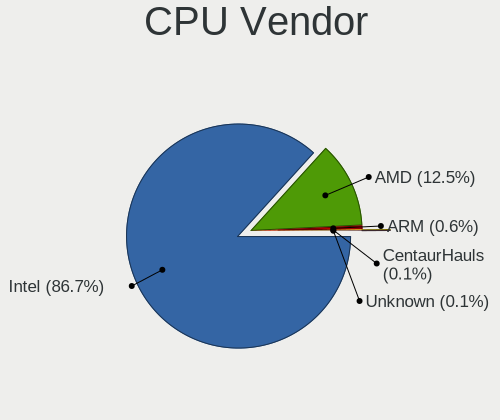

| Vendor       | Computers | Percent |
|--------------|-----------|---------|
| Intel        | 765       | 86.73%  |
| AMD          | 110       | 12.47%  |
| ARM          | 5         | 0.57%   |
| CentaurHauls | 1         | 0.11%   |
| Unknown      | 1         | 0.11%   |

CPU Model
---------

Processor models

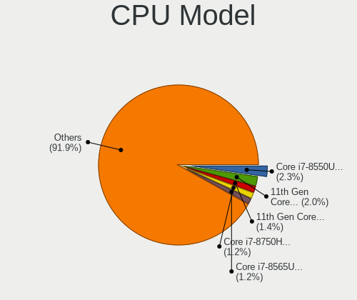

| Model                                       | Computers | Percent |
|---------------------------------------------|-----------|---------|
| Intel Core i7-8550U CPU @ 1.80GHz           | 20        | 2.25%   |
| Intel 11th Gen Core i7-1165G7 @ 2.80GHz     | 18        | 2.03%   |
| Intel 11th Gen Core i5-1135G7 @ 2.40GHz     | 12        | 1.35%   |
| Intel Core i7-8750H CPU @ 2.20GHz           | 11        | 1.24%   |
| Intel Core i7-8565U CPU @ 1.80GHz           | 11        | 1.24%   |
| Intel Core i7-1065G7 CPU @ 1.30GHz          | 11        | 1.24%   |
| Intel Core i5-8250U CPU @ 1.60GHz           | 11        | 1.24%   |
| Intel Core i5-10210U CPU @ 1.60GHz          | 10        | 1.13%   |
| AMD Custom APU 0405                         | 10        | 1.13%   |
| Intel Core i7-8700 CPU @ 3.20GHz            | 9         | 1.01%   |
| Intel Core i7-4790 CPU @ 3.60GHz            | 9         | 1.01%   |
| Intel Core i5-5200U CPU @ 2.20GHz           | 9         | 1.01%   |
| Intel Core i7-6700HQ CPU @ 2.60GHz          | 8         | 0.9%    |
| Intel Core i7-10510U CPU @ 1.80GHz          | 8         | 0.9%    |
| Intel Core i5-8265U CPU @ 1.60GHz           | 8         | 0.9%    |
| Intel Core i5-1035G1 CPU @ 1.00GHz          | 8         | 0.9%    |
| Intel Core i5-6500 CPU @ 3.20GHz            | 7         | 0.79%   |
| Intel Pentium Dual-Core CPU E5300 @ 2.60GHz | 6         | 0.68%   |
| Intel Core i7-8650U CPU @ 1.90GHz           | 6         | 0.68%   |
| Intel Core i7-7700HQ CPU @ 2.80GHz          | 6         | 0.68%   |
| Intel Core i7-7700 CPU @ 3.60GHz            | 6         | 0.68%   |
| Intel Core i7-6500U CPU @ 2.50GHz           | 6         | 0.68%   |
| Intel Core i7-3770 CPU @ 3.40GHz            | 6         | 0.68%   |
| Intel Core i5-7200U CPU @ 2.50GHz           | 6         | 0.68%   |
| Intel Core i5-6200U CPU @ 2.30GHz           | 6         | 0.68%   |
| Intel Core i5-3210M CPU @ 2.50GHz           | 6         | 0.68%   |
| Intel Core i3-7020U CPU @ 2.30GHz           | 6         | 0.68%   |
| Intel Core i3-2120 CPU @ 3.30GHz            | 6         | 0.68%   |
| Intel Core i7-9700 CPU @ 3.00GHz            | 5         | 0.56%   |
| Intel Core i7-7700K CPU @ 4.20GHz           | 5         | 0.56%   |
| Intel Core i7-10750H CPU @ 2.60GHz          | 5         | 0.56%   |
| Intel Core i5-7400 CPU @ 3.00GHz            | 5         | 0.56%   |
| Intel Core i5-2400 CPU @ 3.10GHz            | 5         | 0.56%   |
| Intel Atom x5-Z8350 CPU @ 1.44GHz           | 5         | 0.56%   |
| Intel 12th Gen Core i7-1255U                | 5         | 0.56%   |
| Intel Pentium Dual-Core CPU T4400 @ 2.20GHz | 4         | 0.45%   |
| Intel Pentium Dual-Core CPU E5500 @ 2.80GHz | 4         | 0.45%   |
| Intel Pentium CPU G2030 @ 3.00GHz           | 4         | 0.45%   |
| Intel Core i7-9750H CPU @ 2.60GHz           | 4         | 0.45%   |
| Intel Core i7-8700K CPU @ 3.70GHz           | 4         | 0.45%   |

CPU Model Family
----------------

Processor model prefix

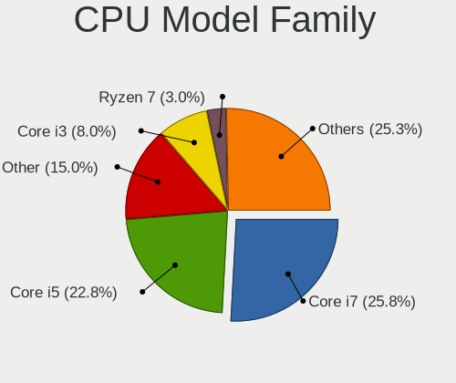

| Model                   | Computers | Percent |
|-------------------------|-----------|---------|
| Intel Core i7           | 229       | 25.85%  |
| Intel Core i5           | 202       | 22.8%   |
| Other                   | 133       | 15.01%  |
| Intel Core i3           | 71        | 8.01%   |
| AMD Ryzen 7             | 27        | 3.05%   |
| AMD Ryzen 5             | 25        | 2.82%   |
| Intel Xeon              | 24        | 2.71%   |
| Intel Core 2 Duo        | 21        | 2.37%   |
| Intel Pentium Dual-Core | 20        | 2.26%   |
| Intel Pentium           | 20        | 2.26%   |
| AMD Ryzen 9             | 14        | 1.58%   |
| Intel Atom              | 13        | 1.47%   |
| Intel Core i9           | 12        | 1.35%   |
| Intel Celeron           | 11        | 1.24%   |
| Intel Pentium Dual      | 7         | 0.79%   |
| Intel Genuine           | 5         | 0.56%   |
| Intel Core              | 4         | 0.45%   |
| AMD Ryzen 3             | 4         | 0.45%   |
| AMD A8                  | 4         | 0.45%   |
| AMD Ryzen 7 PRO         | 3         | 0.34%   |
| AMD FX                  | 3         | 0.34%   |
| AMD A6                  | 3         | 0.34%   |
| AMD A10                 | 3         | 0.34%   |
| Intel Pentium Gold      | 2         | 0.23%   |
| Intel Core m3           | 2         | 0.23%   |
| Intel Core 2 Quad       | 2         | 0.23%   |
| AMD E1                  | 2         | 0.23%   |
| Intel Xeon Gold         | 1         | 0.11%   |
| Intel Pentium Silver    | 1         | 0.11%   |
| Intel Pentium 4         | 1         | 0.11%   |
| Intel Core M            | 1         | 0.11%   |
| Intel Core 2            | 1         | 0.11%   |
| Intel Celeron Dual-Core | 1         | 0.11%   |
| CentaurHauls VIA C7     | 1         | 0.11%   |
| ARM BCM                 | 1         | 0.11%   |
| AMD Turion 64 X2 Mobile | 1         | 0.11%   |
| AMD Ryzen Threadripper  | 1         | 0.11%   |
| AMD Ryzen 5 PRO         | 1         | 0.11%   |
| AMD Ryzen 3 PRO         | 1         | 0.11%   |
| AMD Phenom II X4        | 1         | 0.11%   |

CPU Cores
---------

Number of processor cores

| Number  | Computers | Percent |
|---------|-----------|---------|
| 4       | 352       | 39.82%  |
| 2       | 260       | 29.41%  |
| 6       | 92        | 10.41%  |
| 8       | 85        | 9.62%   |
| 10      | 22        | 2.49%   |
| 12      | 21        | 2.38%   |
| 14      | 18        | 2.04%   |
| 16      | 13        | 1.47%   |
| 1       | 10        | 1.13%   |
| 24      | 3         | 0.34%   |
| 20      | 2         | 0.23%   |
| 3       | 2         | 0.23%   |
| Unknown | 2         | 0.23%   |
| 44      | 1         | 0.11%   |
| 32      | 1         | 0.11%   |

CPU Sockets
-----------

Number of sockets

| Number  | Computers | Percent |
|---------|-----------|---------|
| 1       | 870       | 98.64%  |
| 2       | 9         | 1.02%   |
| Unknown | 2         | 0.23%   |
| 4       | 1         | 0.11%   |

CPU Threads
-----------

Threads per core (Hyper-Threading)

| Number  | Computers | Percent |
|---------|-----------|---------|
| 2       | 657       | 74.07%  |
| 1       | 228       | 25.7%   |
| Unknown | 2         | 0.23%   |

CPU Op-Modes
------------

CPU Operation Modes (32-bit, 64-bit)

| Op mode        | Computers | Percent |
|----------------|-----------|---------|
| 32-bit, 64-bit | 865       | 98.07%  |
| Unknown        | 14        | 1.59%   |
| 32-bit         | 3         | 0.34%   |

CPU Microcode
-------------

Microcode number

| Number     | Computers | Percent |
|------------|-----------|---------|
| Unknown    | 377       | 40.45%  |
| 0x306c3    | 33        | 3.54%   |
| 0x206a7    | 33        | 3.54%   |
| 0x806ea    | 31        | 3.33%   |
| 0x306a9    | 30        | 3.22%   |
| 0x1067a    | 27        | 2.9%    |
| 0x806ec    | 26        | 2.79%   |
| 0x806c1    | 26        | 2.79%   |
| 0x506e3    | 24        | 2.58%   |
| 0x906e9    | 22        | 2.36%   |
| 0x906ea    | 19        | 2.04%   |
| 0x406e3    | 18        | 1.93%   |
| 0x806e9    | 14        | 1.5%    |
| 0x706e5    | 14        | 1.5%    |
| 0x906ed    | 12        | 1.29%   |
| 0x306d4    | 12        | 1.29%   |
| 0x20655    | 11        | 1.18%   |
| 0xa0652    | 9         | 0.97%   |
| 0x90672    | 9         | 0.97%   |
| 0x6fd      | 9         | 0.97%   |
| 0x40651    | 9         | 0.97%   |
| 0x08108109 | 7         | 0.75%   |
| 0xa0671    | 6         | 0.64%   |
| 0x806eb    | 6         | 0.64%   |
| 0x106e5    | 6         | 0.64%   |
| 0xa0655    | 5         | 0.54%   |
| 0xa0653    | 5         | 0.54%   |
| 0x906a4    | 5         | 0.54%   |
| 0x906a3    | 5         | 0.54%   |
| 0x306e4    | 5         | 0.54%   |
| 0x08701021 | 5         | 0.54%   |
| 0x706a1    | 4         | 0.43%   |
| 0x10676    | 4         | 0.43%   |
| 0x0a50000c | 4         | 0.43%   |
| 0x08600104 | 4         | 0.43%   |
| 0x806d1    | 3         | 0.32%   |
| 0x406c4    | 3         | 0.32%   |
| 0x106ca    | 3         | 0.32%   |
| 0x106c2    | 3         | 0.32%   |
| 0x106a5    | 3         | 0.32%   |

CPU Microarch
-------------

Microarchitecture

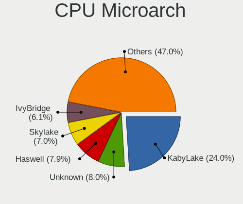

| Name              | Computers | Percent |
|-------------------|-----------|---------|
| KabyLake          | 213       | 24.04%  |
| Unknown           | 71        | 8.01%   |
| Haswell           | 70        | 7.9%    |
| Skylake           | 62        | 7%      |
| IvyBridge         | 54        | 6.09%   |
| SandyBridge       | 48        | 5.42%   |
| Penryn            | 43        | 4.85%   |
| TigerLake         | 41        | 4.63%   |
| Alderlake Hybrid  | 40        | 4.51%   |
| CometLake         | 35        | 3.95%   |
| Icelake           | 32        | 3.61%   |
| Zen 2             | 24        | 2.71%   |
| Broadwell         | 24        | 2.71%   |
| Westmere          | 21        | 2.37%   |
| Zen 3             | 15        | 1.69%   |
| Core              | 14        | 1.58%   |
| Zen+              | 13        | 1.47%   |
| Nehalem           | 11        | 1.24%   |
| Silvermont        | 10        | 1.13%   |
| Zen               | 7         | 0.79%   |
| Piledriver        | 7         | 0.79%   |
| Goldmont plus     | 5         | 0.56%   |
| Bonnell           | 5         | 0.56%   |
| Steamroller       | 3         | 0.34%   |
| Puma              | 3         | 0.34%   |
| K10               | 3         | 0.34%   |
| Tremont           | 2         | 0.23%   |
| K8 Hammer         | 2         | 0.23%   |
| NetBurst          | 1         | 0.11%   |
| Meteorlake Hybrid | 1         | 0.11%   |
| Jaguar            | 1         | 0.11%   |
| Gracemont         | 1         | 0.11%   |
| Goldmont          | 1         | 0.11%   |
| Excavator         | 1         | 0.11%   |
| Bulldozer         | 1         | 0.11%   |
| Bobcat            | 1         | 0.11%   |

Graphics
--------

GPU Vendor
----------

Vendors of graphics cards

| Vendor                     | Computers | Percent |
|----------------------------|-----------|---------|
| Intel                      | 604       | 56.45%  |
| Nvidia                     | 328       | 30.65%  |
| AMD                        | 132       | 12.34%  |
| ASPEED Technology          | 3         | 0.28%   |
| Matrox Electronics Systems | 2         | 0.19%   |
| VIA Technologies           | 1         | 0.09%   |

GPU Model
---------

Graphics card models

| Model                                                                                    | Computers | Percent |
|------------------------------------------------------------------------------------------|-----------|---------|
| Intel UHD Graphics 620                                                                   | 38        | 3.48%   |
| Intel TigerLake-LP GT2 [Iris Xe Graphics]                                                | 38        | 3.48%   |
| Intel 2nd Generation Core Processor Family Integrated Graphics Controller                | 33        | 3.02%   |
| Intel Xeon E3-1200 v3/4th Gen Core Processor Integrated Graphics Controller              | 29        | 2.65%   |
| Intel WhiskeyLake-U GT2 [UHD Graphics 620]                                               | 27        | 2.47%   |
| Intel CoffeeLake-H GT2 [UHD Graphics 630]                                                | 25        | 2.29%   |
| Intel 3rd Gen Core processor Graphics Controller                                         | 23        | 2.1%    |
| Intel HD Graphics 530                                                                    | 22        | 2.01%   |
| Intel CoffeeLake-S GT2 [UHD Graphics 630]                                                | 21        | 1.92%   |
| Intel CometLake-U GT2 [UHD Graphics]                                                     | 20        | 1.83%   |
| Intel Skylake GT2 [HD Graphics 520]                                                      | 18        | 1.65%   |
| Intel HD Graphics 630                                                                    | 18        | 1.65%   |
| Intel Haswell-ULT Integrated Graphics Controller                                         | 18        | 1.65%   |
| Intel Core Processor Integrated Graphics Controller                                      | 17        | 1.56%   |
| Intel Mobile 4 Series Chipset Integrated Graphics Controller                             | 16        | 1.46%   |
| Intel HD Graphics 620                                                                    | 16        | 1.46%   |
| Intel HD Graphics 5500                                                                   | 15        | 1.37%   |
| Intel CometLake-H GT2 [UHD Graphics]                                                     | 15        | 1.37%   |
| Intel Raptor Lake-P [Iris Xe Graphics]                                                   | 13        | 1.19%   |
| Nvidia GK208B [GeForce GT 710]                                                           | 12        | 1.1%    |
| Intel Xeon E3-1200 v2/3rd Gen Core processor Graphics Controller                         | 11        | 1.01%   |
| Intel Iris Plus Graphics G7                                                              | 11        | 1.01%   |
| AMD Ellesmere [Radeon RX 470/480/570/570X/580/580X/590]                                  | 11        | 1.01%   |
| Intel 4th Gen Core Processor Integrated Graphics Controller                              | 10        | 0.91%   |
| Intel 4 Series Chipset Integrated Graphics Controller                                    | 10        | 0.91%   |
| AMD VanGogh [AMD Custom GPU 0405]                                                        | 10        | 0.91%   |
| AMD Renoir [Radeon Vega Series / Radeon Vega Mobile Series]                              | 10        | 0.91%   |
| Nvidia GP108M [GeForce MX150]                                                            | 9         | 0.82%   |
| Intel Iris Plus Graphics G1 (Ice Lake)                                                   | 9         | 0.82%   |
| Nvidia GP107M [GeForce GTX 1050 Mobile]                                                  | 8         | 0.73%   |
| Intel Atom/Celeron/Pentium Processor x5-E8000/J3xxx/N3xxx Integrated Graphics Controller | 8         | 0.73%   |
| Intel AlderLake-S GT1                                                                    | 8         | 0.73%   |
| Intel Alder Lake-UP3 GT2 [Iris Xe Graphics]                                              | 8         | 0.73%   |
| Intel Alder Lake-P GT2 [Iris Xe Graphics]                                                | 8         | 0.73%   |
| AMD Picasso/Raven 2 [Radeon Vega Series / Radeon Vega Mobile Series]                     | 8         | 0.73%   |
| Nvidia GT218 [GeForce 210]                                                               | 7         | 0.64%   |
| Nvidia GP107M [GeForce GTX 1050 Ti Mobile]                                               | 7         | 0.64%   |
| Intel TigerLake-H GT1 [UHD Graphics]                                                     | 7         | 0.64%   |
| Intel CometLake-S GT2 [UHD Graphics 630]                                                 | 7         | 0.64%   |
| Intel CoffeeLake-U GT3e [Iris Plus Graphics 655]                                         | 7         | 0.64%   |

GPU Combo
---------

Combinations of graphics cards

| Name            | Computers | Percent |
|-----------------|-----------|---------|
| 1 x Intel       | 434       | 48.44%  |
| 1 x Nvidia      | 168       | 18.75%  |
| Intel + Nvidia  | 143       | 15.96%  |
| 1 x AMD         | 93        | 10.38%  |
| AMD + Nvidia    | 18        | 2.01%   |
| Intel + AMD     | 13        | 1.45%   |
| 2 x AMD         | 8         | 0.89%   |
| Other           | 7         | 0.78%   |
| 2 x Intel       | 5         | 0.56%   |
| 1 x ASPEED      | 2         | 0.22%   |
| 2 x Nvidia      | 1         | 0.11%   |
| 1 x VIA         | 1         | 0.11%   |
| Nvidia + Matrox | 1         | 0.11%   |
| Nvidia + ASPEED | 1         | 0.11%   |
| 1 x Matrox      | 1         | 0.11%   |

GPU Driver
----------

Free vs proprietary

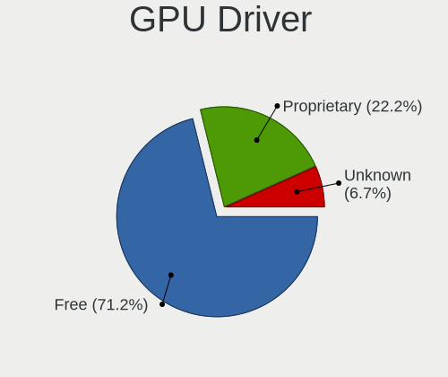

| Driver      | Computers | Percent |
|-------------|-----------|---------|
| Free        | 639       | 71.16%  |
| Proprietary | 199       | 22.16%  |
| Unknown     | 60        | 6.68%   |

GPU Memory
----------

Total video memory

| Size in GB | Computers | Percent |
|------------|-----------|---------|
| Unknown    | 590       | 64.98%  |
| 1.01-2.0   | 90        | 9.91%   |
| 3.01-4.0   | 63        | 6.94%   |
| 0.01-0.5   | 44        | 4.85%   |
| 7.01-8.0   | 43        | 4.74%   |
| 0.51-1.0   | 36        | 3.96%   |
| 5.01-6.0   | 17        | 1.87%   |
| 8.01-16.0  | 15        | 1.65%   |
| 2.01-3.0   | 6         | 0.66%   |
| 16.01-24.0 | 3         | 0.33%   |
| 24.01-32.0 | 1         | 0.11%   |

Monitor
-------

Monitor Vendor
--------------

Monitor vendors

| Vendor                  | Computers | Percent |
|-------------------------|-----------|---------|
| Samsung Electronics     | 160       | 16.05%  |
| Dell                    | 112       | 11.23%  |
| AU Optronics            | 101       | 10.13%  |
| Chimei Innolux          | 84        | 8.43%   |
| BOE                     | 81        | 8.12%   |
| LG Display              | 73        | 7.32%   |
| Goldstar                | 46        | 4.61%   |
| Philips                 | 40        | 4.01%   |
| Lenovo                  | 31        | 3.11%   |
| AOC                     | 22        | 2.21%   |
| Sharp                   | 21        | 2.11%   |
| Hewlett-Packard         | 21        | 2.11%   |
| Ancor Communications    | 14        | 1.4%    |
| ASUSTek Computer        | 12        | 1.2%    |
| Apple                   | 11        | 1.1%    |
| Chi Mei Optoelectronics | 10        | 1%      |
| Valve                   | 9         | 0.9%    |
| ViewSonic               | 8         | 0.8%    |
| Unknown                 | 8         | 0.8%    |
| InfoVision              | 8         | 0.8%    |
| Acer                    | 8         | 0.8%    |
| PANDA                   | 7         | 0.7%    |
| CSO                     | 7         | 0.7%    |
| BenQ                    | 7         | 0.7%    |
| LG Philips              | 5         | 0.5%    |
| VIE                     | 4         | 0.4%    |
| Toshiba                 | 4         | 0.4%    |
| Sony                    | 4         | 0.4%    |
| LG Electronics          | 4         | 0.4%    |
| Lenovo Group Limited    | 4         | 0.4%    |
| Hyundai ImageQuest      | 4         | 0.4%    |
| Gigabyte Technology     | 4         | 0.4%    |
| SANYO                   | 3         | 0.3%    |
| Panasonic               | 3         | 0.3%    |
| Hitachi                 | 3         | 0.3%    |
| Unknown                 | 3         | 0.3%    |
| TMX                     | 2         | 0.2%    |
| RIS                     | 2         | 0.2%    |
| Plain Tree Systems      | 2         | 0.2%    |
| NEX                     | 2         | 0.2%    |

Monitor Model
-------------

Monitor models

| Model                                                                | Computers | Percent |
|----------------------------------------------------------------------|-----------|---------|
| Valve ANX7530 U VLV3001 800x1280 100x150mm 7.1-inch                  | 9         | 0.87%   |
| Samsung Electronics S24F350 SAM0D20 1920x1080 521x293mm 23.5-inch    | 8         | 0.77%   |
| Philips PHL 243V5 PHLC0D1 1920x1080 521x293mm 23.5-inch              | 8         | 0.77%   |
| Chimei Innolux LCD Monitor CMN15F5 1920x1080 344x193mm 15.5-inch     | 8         | 0.77%   |
| Chimei Innolux LCD Monitor CMN14D4 1920x1080 309x173mm 13.9-inch     | 8         | 0.77%   |
| Dell U2412M DELA07A 1920x1200 518x324mm 24.1-inch                    | 7         | 0.67%   |
| Dell P2419H DELD0D9 1920x1080 527x296mm 23.8-inch                    | 7         | 0.67%   |
| AU Optronics LCD Monitor AUO403D 1920x1080 309x174mm 14.0-inch       | 7         | 0.67%   |
| AOC 2250W AOC2250 1920x1080 477x268mm 21.5-inch                      | 6         | 0.58%   |
| Philips PHL 243V7 PHLC155 1920x1080 527x296mm 23.8-inch              | 5         | 0.48%   |
| Philips PHL 223V5 PHLC0CF 1920x1080 480x270mm 21.7-inch              | 5         | 0.48%   |
| Dell P2419H DELD0DA 1920x1080 527x296mm 23.8-inch                    | 5         | 0.48%   |
| Samsung Electronics C24F390 SAM0D2C 1920x1080 521x293mm 23.5-inch    | 4         | 0.38%   |
| Philips PHL 273V5 PHLC0D2 1920x1080 598x336mm 27.0-inch              | 4         | 0.38%   |
| Philips 222EL PHLC052 1920x1080 476x268mm 21.5-inch                  | 4         | 0.38%   |
| LG Display LCD Monitor LGD02DC 1366x768 344x194mm 15.5-inch          | 4         | 0.38%   |
| Lenovo LCD Monitor LEN40BA 1920x1080 344x194mm 15.5-inch             | 4         | 0.38%   |
| Hyundai ImageQuest L90D+ D-SUB HIQ91DA 1280x1024 376x301mm 19.0-inch | 4         | 0.38%   |
| Goldstar W2243 GSM56FF 1920x1080 477x269mm 21.6-inch                 | 4         | 0.38%   |
| Dell P2219H DELA115 1920x1080 476x267mm 21.5-inch                    | 4         | 0.38%   |
| Chimei Innolux LCD Monitor CMN15E7 1920x1080 344x193mm 15.5-inch     | 4         | 0.38%   |
| BOE LCD Monitor BOE0802 1920x1080 344x193mm 15.5-inch                | 4         | 0.38%   |
| AU Optronics LCD Monitor AUOE48D 1920x1080 344x194mm 15.5-inch       | 4         | 0.38%   |
| Samsung Electronics SyncMaster SAM044B 1680x1050 474x296mm 22.0-inch | 3         | 0.29%   |
| Samsung Electronics SyncMaster SAM034D 1280x1024 376x301mm 19.0-inch | 3         | 0.29%   |
| Samsung Electronics LF27T450F SAM7099 1920x1080 597x336mm 27.0-inch  | 3         | 0.29%   |
| LG Display LP156WH2-TLAA LGD0230 1366x768 344x194mm 15.5-inch        | 3         | 0.29%   |
| LG Display LCD Monitor LGD04A7 1920x1080 344x194mm 15.5-inch         | 3         | 0.29%   |
| Lenovo E27q-20 LEN62D0 2560x1440 597x336mm 27.0-inch                 | 3         | 0.29%   |
| Goldstar ULTRAWIDE GSM76F9 2560x1080 531x298mm 24.0-inch             | 3         | 0.29%   |
| Dell U2715H DELD067 2560x1440 597x336mm 27.0-inch                    | 3         | 0.29%   |
| Dell U2415 DELA0B9 1920x1200 518x324mm 24.1-inch                     | 3         | 0.29%   |
| Dell U2414H DELA0A4 1920x1080 527x296mm 23.8-inch                    | 3         | 0.29%   |
| Chimei Innolux LCD Monitor CMN15E8 1920x1080 344x193mm 15.5-inch     | 3         | 0.29%   |
| Chimei Innolux LCD Monitor CMN1521 1920x1080 344x193mm 15.5-inch     | 3         | 0.29%   |
| Chimei Innolux LCD Monitor CMN14E5 1920x1080 309x173mm 13.9-inch     | 3         | 0.29%   |
| BOE LCD Monitor BOE0A35 1920x1200 302x189mm 14.0-inch                | 3         | 0.29%   |
| BenQ GL2460 BNQ78CE 1920x1080 531x299mm 24.0-inch                    | 3         | 0.29%   |
| AU Optronics LCD Monitor AUOE68C 2560x1440 309x174mm 14.0-inch       | 3         | 0.29%   |
| AU Optronics LCD Monitor AUO633D 1920x1080 309x174mm 14.0-inch       | 3         | 0.29%   |

Monitor Resolution
------------------

Monitor screen resolution

| Resolution         | Computers | Percent |
|--------------------|-----------|---------|
| 1920x1080 (FHD)    | 473       | 50.59%  |
| 1366x768 (WXGA)    | 109       | 11.66%  |
| 3840x2160 (4K)     | 74        | 7.91%   |
| 2560x1440 (QHD)    | 55        | 5.88%   |
| 1920x1200 (WUXGA)  | 37        | 3.96%   |
| 1680x1050 (WSXGA+) | 28        | 2.99%   |
| 1280x1024 (SXGA)   | 24        | 2.57%   |
| 1280x800 (WXGA)    | 14        | 1.5%    |
| 2560x1600          | 13        | 1.39%   |
| Unknown            | 12        | 1.28%   |
| 1600x900 (HD+)     | 11        | 1.18%   |
| 1440x900 (WXGA+)   | 10        | 1.07%   |
| 800x1280           | 9         | 0.96%   |
| 3440x1440          | 9         | 0.96%   |
| 2560x1080          | 8         | 0.86%   |
| 2880x1800          | 7         | 0.75%   |
| 3840x1080          | 4         | 0.43%   |
| 3200x1800 (QHD+)   | 4         | 0.43%   |
| 2880x1620          | 3         | 0.32%   |
| 1024x768 (XGA)     | 3         | 0.32%   |
| 3840x2400          | 2         | 0.21%   |
| 3456x2160          | 2         | 0.21%   |
| 3200x2000          | 2         | 0.21%   |
| 2160x1440          | 2         | 0.21%   |
| 1920x540           | 2         | 0.21%   |
| 1360x768           | 2         | 0.21%   |
| 1280x768           | 2         | 0.21%   |
| 1024x600           | 2         | 0.21%   |
| 5360x1440          | 1         | 0.11%   |
| 5120x1440          | 1         | 0.11%   |
| 4480x1440          | 1         | 0.11%   |
| 3840x1200          | 1         | 0.11%   |
| 3520x1080          | 1         | 0.11%   |
| 3200x1200          | 1         | 0.11%   |
| 3000x2000          | 1         | 0.11%   |
| 2304x1440          | 1         | 0.11%   |
| 2304x1024          | 1         | 0.11%   |
| 2288x1287          | 1         | 0.11%   |
| 2256x1504          | 1         | 0.11%   |
| 1600x2560          | 1         | 0.11%   |

Monitor Diagonal
----------------

Diagonal size in inches

| Inches  | Computers | Percent |
|---------|-----------|---------|
| 15      | 222       | 22.38%  |
| 13      | 106       | 10.69%  |
| 24      | 103       | 10.38%  |
| 27      | 90        | 9.07%   |
| 14      | 80        | 8.06%   |
| 23      | 73        | 7.36%   |
| 21      | 70        | 7.06%   |
| Unknown | 39        | 3.93%   |
| 22      | 25        | 2.52%   |
| 17      | 24        | 2.42%   |
| 31      | 18        | 1.81%   |
| 19      | 17        | 1.71%   |
| 34      | 14        | 1.41%   |
| 16      | 13        | 1.31%   |
| 12      | 12        | 1.21%   |
| 20      | 9         | 0.91%   |
| 7       | 9         | 0.91%   |
| 84      | 8         | 0.81%   |
| 40      | 8         | 0.81%   |
| 72      | 6         | 0.6%    |
| 33      | 5         | 0.5%    |
| 26      | 5         | 0.5%    |
| 18      | 5         | 0.5%    |
| 32      | 4         | 0.4%    |
| 60      | 3         | 0.3%    |
| 25      | 3         | 0.3%    |
| 11      | 3         | 0.3%    |
| 65      | 2         | 0.2%    |
| 48      | 2         | 0.2%    |
| 37      | 2         | 0.2%    |
| 10      | 2         | 0.2%    |
| 8       | 2         | 0.2%    |
| 142     | 1         | 0.1%    |
| 86      | 1         | 0.1%    |
| 54      | 1         | 0.1%    |
| 52      | 1         | 0.1%    |
| 49      | 1         | 0.1%    |
| 43      | 1         | 0.1%    |
| 42      | 1         | 0.1%    |
| 29      | 1         | 0.1%    |

Monitor Width
-------------

Physical width

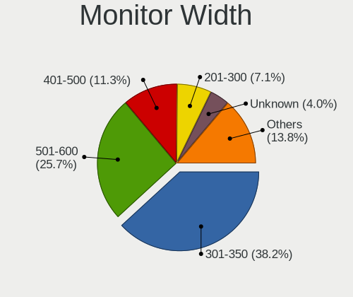

| Width in mm    | Computers | Percent |
|----------------|-----------|---------|
| 301-350        | 373       | 38.18%  |
| 501-600        | 251       | 25.69%  |
| 401-500        | 110       | 11.26%  |
| 201-300        | 69        | 7.06%   |
| Unknown        | 39        | 3.99%   |
| 351-400        | 34        | 3.48%   |
| 601-700        | 29        | 2.97%   |
| 701-800        | 23        | 2.35%   |
| 1501-2000      | 14        | 1.43%   |
| 1001-1500      | 11        | 1.13%   |
| 801-900        | 10        | 1.02%   |
| 1-100          | 9         | 0.92%   |
| 101-200        | 2         | 0.2%    |
| 901-1000       | 2         | 0.2%    |
| More than 2000 | 1         | 0.1%    |

Aspect Ratio
------------

Proportional relationship between the width and the height

| Ratio   | Computers | Percent |
|---------|-----------|---------|
| 16/9    | 663       | 75.34%  |
| 16/10   | 119       | 13.52%  |
| Unknown | 38        | 4.32%   |
| 5/4     | 20        | 2.27%   |
| 21/9    | 14        | 1.59%   |
| 0.67    | 9         | 1.02%   |
| 3/2     | 7         | 0.8%    |
| 4/3     | 5         | 0.57%   |
| 32/9    | 1         | 0.11%   |
| 1.96    | 1         | 0.11%   |
| 1.00    | 1         | 0.11%   |
| 0.58    | 1         | 0.11%   |
| 0.56    | 1         | 0.11%   |

Monitor Area
------------

Area in inch

| Area in inch | Computers | Percent |
|----------------|-----------|---------|
| 101-110        | 223       | 22.73%  |
| 201-250        | 219       | 22.32%  |
| 81-90          | 141       | 14.37%  |
| 301-350        | 95        | 9.68%   |
| 71-80          | 44        | 4.49%   |
| 351-500        | 42        | 4.28%   |
| 151-200        | 40        | 4.08%   |
| Unknown        | 39        | 3.98%   |
| 251-300        | 32        | 3.26%   |
| More than 1000 | 24        | 2.45%   |
| 501-1000       | 14        | 1.43%   |
| 61-70          | 12        | 1.22%   |
| 141-150        | 12        | 1.22%   |
| 121-130        | 12        | 1.22%   |
| 1-40           | 11        | 1.12%   |
| 111-120        | 11        | 1.12%   |
| 131-140        | 4         | 0.41%   |
| 51-60          | 3         | 0.31%   |
| 41-50          | 2         | 0.2%    |
| 91-100         | 1         | 0.1%    |

Pixel Density
-------------

Pixels per inch

| Density       | Computers | Percent |
|---------------|-----------|---------|
| 51-100        | 320       | 33.47%  |
| 121-160       | 249       | 26.05%  |
| 101-120       | 211       | 22.07%  |
| 161-240       | 79        | 8.26%   |
| More than 240 | 41        | 4.29%   |
| Unknown       | 39        | 4.08%   |
| 1-50          | 17        | 1.78%   |

Multiple Monitors
-----------------

Total monitors connected

| Total | Computers | Percent |
|-------|-----------|---------|
| 1     | 678       | 75%     |
| 2     | 161       | 17.81%  |
| 0     | 42        | 4.65%   |
| 3     | 21        | 2.32%   |
| 4     | 2         | 0.22%   |

Network
-------

Net Controller Vendor
---------------------

Controller vendors

| Vendor                          | Computers | Percent |
|---------------------------------|-----------|---------|
| Realtek Semiconductor           | 478       | 36.41%  |
| Intel                           | 459       | 34.96%  |
| Qualcomm Atheros                | 116       | 8.83%   |
| Broadcom                        | 45        | 3.43%   |
| MediaTek                        | 26        | 1.98%   |
| Ralink Technology               | 21        | 1.6%    |
| TP-Link                         | 19        | 1.45%   |
| Broadcom Limited                | 19        | 1.45%   |
| Lenovo                          | 12        | 0.91%   |
| Edimax Technology               | 10        | 0.76%   |
| ASIX Electronics                | 10        | 0.76%   |
| Xiaomi                          | 8         | 0.61%   |
| Samsung Electronics             | 8         | 0.61%   |
| DisplayLink                     | 8         | 0.61%   |
| Marvell Technology Group        | 7         | 0.53%   |
| Ralink                          | 5         | 0.38%   |
| Qualcomm Atheros Communications | 5         | 0.38%   |
| Nvidia                          | 5         | 0.38%   |
| Google                          | 4         | 0.3%    |
| OPPO Electronics                | 3         | 0.23%   |
| Huawei Technologies             | 3         | 0.23%   |
| D-Link                          | 3         | 0.23%   |
| U-Blox                          | 2         | 0.15%   |
| Texas Instruments               | 2         | 0.15%   |
| STMicroelectronics              | 2         | 0.15%   |
| Qualcomm                        | 2         | 0.15%   |
| Microsoft                       | 2         | 0.15%   |
| ICS Advent                      | 2         | 0.15%   |
| Aquantia                        | 2         | 0.15%   |
| VIA Technologies                | 1         | 0.08%   |
| U.S. Robotics                   | 1         | 0.08%   |
| Toshiba                         | 1         | 0.08%   |
| Sierra Wireless                 | 1         | 0.08%   |
| ROCCAT                          | 1         | 0.08%   |
| Raspberry Pi                    | 1         | 0.08%   |
| QinHeng Electronics             | 1         | 0.08%   |
| PEAK-System Technik             | 1         | 0.08%   |
| Nokia Mobile Phones             | 1         | 0.08%   |
| Mellanox Technologies           | 1         | 0.08%   |
| Linksys                         | 1         | 0.08%   |

Net Controller Model
--------------------

Controller models

| Model                                                                  | Computers | Percent |
|------------------------------------------------------------------------|-----------|---------|
| Realtek RTL8111/8168/8211/8411 PCI Express Gigabit Ethernet Controller | 307       | 19.57%  |
| Realtek RTL810xE PCI Express Fast Ethernet controller                  | 49        | 3.12%   |
| Realtek RTL8153 Gigabit Ethernet Adapter                               | 35        | 2.23%   |
| Intel Wireless 8265 / 8275                                             | 34        | 2.17%   |
| Realtek RTL8125 2.5GbE Controller                                      | 33        | 2.1%    |
| Intel Wi-Fi 6 AX201                                                    | 31        | 1.98%   |
| Intel Wi-Fi 6 AX200                                                    | 28        | 1.78%   |
| Intel 82579LM Gigabit Network Connection (Lewisville)                  | 25        | 1.59%   |
| Intel Cannon Point-LP CNVi [Wireless-AC]                               | 23        | 1.47%   |
| Intel Ethernet Connection (2) I219-V                                   | 22        | 1.4%    |
| Realtek RTL8822CE 802.11ac PCIe Wireless Network Adapter               | 19        | 1.21%   |
| Intel Wi-Fi 6E(802.11ax) AX210/AX1675* 2x2 [Typhoon Peak]              | 19        | 1.21%   |
| Qualcomm Atheros QCA9377 802.11ac Wireless Network Adapter             | 18        | 1.15%   |
| Intel Comet Lake PCH-LP CNVi WiFi                                      | 18        | 1.15%   |
| Qualcomm Atheros AR9285 Wireless Network Adapter (PCI-Express)         | 16        | 1.02%   |
| Intel I211 Gigabit Network Connection                                  | 16        | 1.02%   |
| Intel Dual Band Wireless-AC 3165 Plus Bluetooth                        | 15        | 0.96%   |
| Intel Comet Lake PCH CNVi WiFi                                         | 15        | 0.96%   |
| Intel Cannon Lake PCH CNVi WiFi                                        | 15        | 0.96%   |
| Qualcomm Atheros QCA6174 802.11ac Wireless Network Adapter             | 14        | 0.89%   |
| Intel Ethernet Connection (7) I219-LM                                  | 14        | 0.89%   |
| Intel Alder Lake-P PCH CNVi WiFi                                       | 14        | 0.89%   |
| Qualcomm Atheros QCA9565 / AR9565 Wireless Network Adapter             | 13        | 0.83%   |
| Qualcomm Atheros AR9485 Wireless Network Adapter                       | 13        | 0.83%   |
| Intel Ethernet Connection I217-LM                                      | 13        | 0.83%   |
| Realtek 802.11ac NIC                                                   | 12        | 0.76%   |
| Intel Wireless 8260                                                    | 12        | 0.76%   |
| Intel Wireless 3165                                                    | 12        | 0.76%   |
| Intel Ethernet Connection (6) I219-V                                   | 12        | 0.76%   |
| Intel Wireless 3160                                                    | 11        | 0.7%    |
| Realtek RTL8822BE 802.11a/b/g/n/ac WiFi adapter                        | 10        | 0.64%   |
| Intel Ice Lake-LP PCH CNVi WiFi                                        | 10        | 0.64%   |
| Intel Ethernet Controller I225-V                                       | 10        | 0.64%   |
| Intel Ethernet Connection (7) I219-V                                   | 10        | 0.64%   |
| Realtek RTL8821CE 802.11ac PCIe Wireless Network Adapter               | 9         | 0.57%   |
| Intel Wireless 7265                                                    | 9         | 0.57%   |
| Intel I210 Gigabit Network Connection                                  | 9         | 0.57%   |
| Intel Centrino Advanced-N 6205 [Taylor Peak]                           | 9         | 0.57%   |
| ASIX AX88179 Gigabit Ethernet                                          | 9         | 0.57%   |
| Realtek RTL88x2bu [AC1200 Techkey]                                     | 8         | 0.51%   |

Wireless Vendor
---------------

Wireless vendors

| Vendor                          | Computers | Percent |
|---------------------------------|-----------|---------|
| Intel                           | 340       | 48.99%  |
| Realtek Semiconductor           | 114       | 16.43%  |
| Qualcomm Atheros                | 93        | 13.4%   |
| Broadcom                        | 39        | 5.62%   |
| MediaTek                        | 23        | 3.31%   |
| Ralink Technology               | 21        | 3.03%   |
| TP-Link                         | 18        | 2.59%   |
| Broadcom Limited                | 14        | 2.02%   |
| Edimax Technology               | 10        | 1.44%   |
| Ralink                          | 5         | 0.72%   |
| Qualcomm Atheros Communications | 5         | 0.72%   |
| D-Link                          | 3         | 0.43%   |
| Qualcomm                        | 2         | 0.29%   |
| Microsoft                       | 2         | 0.29%   |
| Sierra Wireless                 | 1         | 0.14%   |
| Marvell Technology Group        | 1         | 0.14%   |
| Dell                            | 1         | 0.14%   |
| BUFFALO                         | 1         | 0.14%   |
| ASUSTek Computer                | 1         | 0.14%   |

Wireless Model
--------------

Wireless models

| Model                                                          | Computers | Percent |
|----------------------------------------------------------------|-----------|---------|
| Intel Wireless 8265 / 8275                                     | 34        | 4.85%   |
| Intel Wi-Fi 6 AX201                                            | 31        | 4.42%   |
| Intel Wi-Fi 6 AX200                                            | 28        | 3.99%   |
| Intel Cannon Point-LP CNVi [Wireless-AC]                       | 23        | 3.28%   |
| Realtek RTL8822CE 802.11ac PCIe Wireless Network Adapter       | 19        | 2.71%   |
| Intel Wi-Fi 6E(802.11ax) AX210/AX1675* 2x2 [Typhoon Peak]      | 19        | 2.71%   |
| Qualcomm Atheros QCA9377 802.11ac Wireless Network Adapter     | 18        | 2.57%   |
| Intel Comet Lake PCH-LP CNVi WiFi                              | 18        | 2.57%   |
| Qualcomm Atheros AR9285 Wireless Network Adapter (PCI-Express) | 16        | 2.28%   |
| Intel Dual Band Wireless-AC 3165 Plus Bluetooth                | 15        | 2.14%   |
| Intel Comet Lake PCH CNVi WiFi                                 | 15        | 2.14%   |
| Intel Cannon Lake PCH CNVi WiFi                                | 15        | 2.14%   |
| Qualcomm Atheros QCA6174 802.11ac Wireless Network Adapter     | 14        | 2%      |
| Intel Alder Lake-P PCH CNVi WiFi                               | 14        | 2%      |
| Qualcomm Atheros QCA9565 / AR9565 Wireless Network Adapter     | 13        | 1.85%   |
| Qualcomm Atheros AR9485 Wireless Network Adapter               | 13        | 1.85%   |
| Realtek 802.11ac NIC                                           | 12        | 1.71%   |
| Intel Wireless 8260                                            | 12        | 1.71%   |
| Intel Wireless 3165                                            | 12        | 1.71%   |
| Intel Wireless 3160                                            | 11        | 1.57%   |
| Realtek RTL8822BE 802.11a/b/g/n/ac WiFi adapter                | 10        | 1.43%   |
| Intel Ice Lake-LP PCH CNVi WiFi                                | 10        | 1.43%   |
| Realtek RTL8821CE 802.11ac PCIe Wireless Network Adapter       | 9         | 1.28%   |
| Intel Wireless 7265                                            | 9         | 1.28%   |
| Intel Centrino Advanced-N 6205 [Taylor Peak]                   | 9         | 1.28%   |
| Realtek RTL88x2bu [AC1200 Techkey]                             | 8         | 1.14%   |
| Realtek RTL8192CU 802.11n WLAN Adapter                         | 8         | 1.14%   |
| Realtek RTL8188EUS 802.11n Wireless Network Adapter            | 8         | 1.14%   |
| Ralink RT2870/RT3070 Wireless Adapter                          | 8         | 1.14%   |
| MediaTek Wi-Fi 6E MT7902 Wireless Network Adapter              | 8         | 1.14%   |
| Intel Wireless 7260                                            | 8         | 1.14%   |
| Intel Raptor Lake PCH CNVi WiFi                                | 8         | 1.14%   |
| Broadcom BCM4313 802.11bgn Wireless Network Adapter            | 8         | 1.14%   |
| Realtek RTL8723BE PCIe Wireless Network Adapter                | 7         | 1%      |
| MediaTek MT7921 802.11ax PCI Express Wireless Network Adapter  | 7         | 1%      |
| Intel Wi-Fi 5(802.11ac) Wireless-AC 9x6x [Thunder Peak]        | 7         | 1%      |
| Intel Alder Lake-S PCH CNVi WiFi                               | 7         | 1%      |
| Realtek RTL8852BE PCIe 802.11ax Wireless Network Controller    | 6         | 0.86%   |
| Qualcomm Atheros AR9287 Wireless Network Adapter (PCI-Express) | 6         | 0.86%   |
| Ralink MT7601U Wireless Adapter                                | 5         | 0.71%   |

Ethernet Vendor
---------------

Ethernet vendors

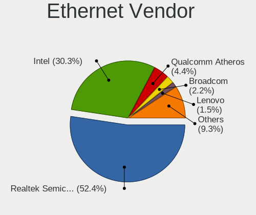

| Vendor                   | Computers | Percent |
|--------------------------|-----------|---------|
| Realtek Semiconductor    | 430       | 52.38%  |
| Intel                    | 249       | 30.33%  |
| Qualcomm Atheros         | 36        | 4.38%   |
| Broadcom                 | 18        | 2.19%   |
| Lenovo                   | 12        | 1.46%   |
| ASIX Electronics         | 10        | 1.22%   |
| Xiaomi                   | 8         | 0.97%   |
| DisplayLink              | 8         | 0.97%   |
| Samsung Electronics      | 7         | 0.85%   |
| Marvell Technology Group | 6         | 0.73%   |
| Broadcom Limited         | 6         | 0.73%   |
| Nvidia                   | 5         | 0.61%   |
| Google                   | 4         | 0.49%   |
| OPPO Electronics         | 3         | 0.37%   |
| MediaTek                 | 3         | 0.37%   |
| ICS Advent               | 2         | 0.24%   |
| Huawei Technologies      | 2         | 0.24%   |
| Aquantia                 | 2         | 0.24%   |
| VIA Technologies         | 1         | 0.12%   |
| TP-Link                  | 1         | 0.12%   |
| Raspberry Pi             | 1         | 0.12%   |
| Mellanox Technologies    | 1         | 0.12%   |
| Linksys                  | 1         | 0.12%   |
| HMD Global               | 1         | 0.12%   |
| Davicom Semiconductor    | 1         | 0.12%   |
| Attansic Technology      | 1         | 0.12%   |
| Accton Technology        | 1         | 0.12%   |
| Unknown                  | 1         | 0.12%   |

Ethernet Model
--------------

Ethernet models

| Model                                                                  | Computers | Percent |
|------------------------------------------------------------------------|-----------|---------|
| Realtek RTL8111/8168/8211/8411 PCI Express Gigabit Ethernet Controller | 307       | 36.2%   |
| Realtek RTL810xE PCI Express Fast Ethernet controller                  | 49        | 5.78%   |
| Realtek RTL8153 Gigabit Ethernet Adapter                               | 35        | 4.13%   |
| Realtek RTL8125 2.5GbE Controller                                      | 33        | 3.89%   |
| Intel 82579LM Gigabit Network Connection (Lewisville)                  | 25        | 2.95%   |
| Intel Ethernet Connection (2) I219-V                                   | 22        | 2.59%   |
| Intel I211 Gigabit Network Connection                                  | 16        | 1.89%   |
| Intel Ethernet Connection (7) I219-LM                                  | 14        | 1.65%   |
| Intel Ethernet Connection I217-LM                                      | 13        | 1.53%   |
| Intel Ethernet Connection (6) I219-V                                   | 12        | 1.42%   |
| Intel Ethernet Controller I225-V                                       | 10        | 1.18%   |
| Intel Ethernet Connection (7) I219-V                                   | 10        | 1.18%   |
| Intel I210 Gigabit Network Connection                                  | 9         | 1.06%   |
| ASIX AX88179 Gigabit Ethernet                                          | 9         | 1.06%   |
| Intel Ethernet Connection (4) I219-LM                                  | 8         | 0.94%   |
| Intel Ethernet Connection (13) I219-V                                  | 8         | 0.94%   |
| Samsung Galaxy series, misc. (tethering mode)                          | 7         | 0.83%   |
| Intel Ethernet Connection (2) I219-LM                                  | 7         | 0.83%   |
| Intel Ethernet Connection (10) I219-V                                  | 7         | 0.83%   |
| Xiaomi Mi/Redmi series (RNDIS)                                         | 6         | 0.71%   |
| Realtek RTL8152 Fast Ethernet Adapter                                  | 6         | 0.71%   |
| Lenovo ThinkPad TBT 3 Dock                                             | 6         | 0.71%   |
| Intel Ethernet Connection I219-LM                                      | 6         | 0.71%   |
| Intel Ethernet Connection (4) I219-V                                   | 6         | 0.71%   |
| Intel Ethernet Connection (11) I219-LM                                 | 6         | 0.71%   |
| Qualcomm Atheros Killer E220x Gigabit Ethernet Controller              | 5         | 0.59%   |
| Qualcomm Atheros AR8131 Gigabit Ethernet                               | 5         | 0.59%   |
| Intel Ethernet Connection (5) I219-LM                                  | 5         | 0.59%   |
| Intel Ethernet Connection (14) I219-V                                  | 5         | 0.59%   |
| Qualcomm Atheros AR8161 Gigabit Ethernet                               | 4         | 0.47%   |
| Qualcomm Atheros AR8132 Fast Ethernet                                  | 4         | 0.47%   |
| Lenovo USB-C Dock Ethernet                                             | 4         | 0.47%   |
| Intel Ethernet Connection I217-V                                       | 4         | 0.47%   |
| Intel 82579V Gigabit Network Connection                                | 4         | 0.47%   |
| Intel 82574L Gigabit Network Connection                                | 4         | 0.47%   |
| DisplayLink LAPDOCK                                                    | 4         | 0.47%   |
| Broadcom NetXtreme BCM57765 Gigabit Ethernet PCIe                      | 4         | 0.47%   |
| Realtek RTL-8100/8101L/8139 PCI Fast Ethernet Adapter                  | 3         | 0.35%   |
| Qualcomm Atheros Killer E2500 Gigabit Ethernet Controller              | 3         | 0.35%   |
| Qualcomm Atheros Killer E2400 Gigabit Ethernet Controller              | 3         | 0.35%   |

Net Controller Kind
-------------------

Ethernet, WiFi or modem

| Kind     | Computers | Percent |
|----------|-----------|---------|
| Ethernet | 746       | 52.54%  |
| WiFi     | 654       | 46.06%  |
| Modem    | 18        | 1.27%   |
| Unknown  | 2         | 0.14%   |

Used Controller
---------------

Currently used network controller

| Kind     | Computers | Percent |
|----------|-----------|---------|
| WiFi     | 482       | 52.62%  |
| Ethernet | 433       | 47.27%  |
| Modem    | 1         | 0.11%   |

NICs
----

Total network controllers on board

| Total | Computers | Percent |
|-------|-----------|---------|
| 2     | 429       | 48.37%  |
| 1     | 426       | 48.03%  |
| 3     | 19        | 2.14%   |
| 0     | 9         | 1.01%   |
| 7     | 1         | 0.11%   |
| 6     | 1         | 0.11%   |
| 5     | 1         | 0.11%   |
| 4     | 1         | 0.11%   |

IPv6
----

IPv6 vs IPv4

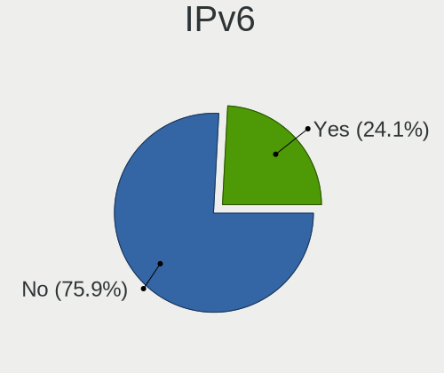

| Used | Computers | Percent |
|------|-----------|---------|
| No   | 691       | 75.85%  |
| Yes  | 220       | 24.15%  |

Bluetooth
---------

Bluetooth Vendor
----------------

Controller vendors

| Vendor                          | Computers | Percent |
|---------------------------------|-----------|---------|
| Intel                           | 304       | 54.68%  |
| Realtek Semiconductor           | 46        | 8.27%   |
| Qualcomm Atheros Communications | 45        | 8.09%   |
| IMC Networks                    | 43        | 7.73%   |
| Cambridge Silicon Radio         | 32        | 5.76%   |
| Broadcom                        | 17        | 3.06%   |
| Apple                           | 15        | 2.7%    |
| Foxconn / Hon Hai               | 12        | 2.16%   |
| Lite-On Technology              | 8         | 1.44%   |
| Dell                            | 6         | 1.08%   |
| ASUSTek Computer                | 5         | 0.9%    |
| MediaTek                        | 4         | 0.72%   |
| TP-Link                         | 3         | 0.54%   |
| Realtek                         | 3         | 0.54%   |
| Hewlett-Packard                 | 3         | 0.54%   |
| Toshiba                         | 2         | 0.36%   |
| Askey Computer                  | 2         | 0.36%   |
| USI                             | 1         | 0.18%   |
| Opticis                         | 1         | 0.18%   |
| Marvell Semiconductor           | 1         | 0.18%   |
| Chicony Electronics             | 1         | 0.18%   |
| Actions                         | 1         | 0.18%   |
| Unknown                         | 1         | 0.18%   |

Bluetooth Model
---------------

Controller models

| Model                                               | Computers | Percent |
|-----------------------------------------------------|-----------|---------|
| Intel Bluetooth wireless interface                  | 93        | 16.73%  |
| Intel AX201 Bluetooth                               | 78        | 14.03%  |
| Intel Bluetooth 9460/9560 Jefferson Peak (JfP)      | 52        | 9.35%   |
| Cambridge Silicon Radio Bluetooth Dongle (HCI mode) | 32        | 5.76%   |
| Realtek Bluetooth Radio                             | 31        | 5.58%   |
| Intel AX200 Bluetooth                               | 25        | 4.5%    |
| Qualcomm Atheros  Bluetooth Device                  | 22        | 3.96%   |
| Intel AX211 Bluetooth                               | 20        | 3.6%    |
| IMC Networks Wireless_Device                        | 18        | 3.24%   |
| Intel AX210 Bluetooth                               | 16        | 2.88%   |
| IMC Networks Bluetooth Radio                        | 15        | 2.7%    |
| Realtek  Bluetooth 4.2 Adapter                      | 8         | 1.44%   |
| Qualcomm Atheros AR3012 Bluetooth 4.0               | 7         | 1.26%   |
| Intel Wireless-AC 9260 Bluetooth Adapter            | 7         | 1.26%   |
| Apple Bluetooth Host Controller                     | 7         | 1.26%   |
| Qualcomm Atheros QCA61x4 Bluetooth 4.0              | 6         | 1.08%   |
| Qualcomm Atheros AR3011 Bluetooth                   | 6         | 1.08%   |
| Lite-On Bluetooth Device                            | 6         | 1.08%   |
| Realtek RTL8822BE Bluetooth 4.2 Adapter             | 5         | 0.9%    |
| IMC Networks Bluetooth Device                       | 5         | 0.9%    |
| Apple Bluetooth USB Host Controller                 | 5         | 0.9%    |
| Intel Wireless-AC 3168 Bluetooth                    | 4         | 0.72%   |
| Intel Centrino Bluetooth Wireless Transceiver       | 4         | 0.72%   |
| Intel Centrino Advanced-N 6230 Bluetooth adapter    | 4         | 0.72%   |
| Dell BCM20702A0 Bluetooth Module                    | 4         | 0.72%   |
| Broadcom BCM2045B (BDC-2.1)                         | 4         | 0.72%   |
| TP-Link TP-Link Bluetooth USB Adapter               | 3         | 0.54%   |
| Realtek Bluetooth Radio                             | 3         | 0.54%   |
| Qualcomm Atheros AR9462 Bluetooth                   | 3         | 0.54%   |
| MediaTek Wireless_Device                            | 3         | 0.54%   |
| IMC Networks Atheros AR3012 Bluetooth 4.0 Adapter   | 3         | 0.54%   |
| Foxconn / Hon Hai Wireless_Device                   | 3         | 0.54%   |
| Foxconn / Hon Hai Bluetooth Device                  | 3         | 0.54%   |
| IMC Networks Bluetooth USB Host Controller          | 2         | 0.36%   |
| HP Broadcom 2070 Bluetooth Combo                    | 2         | 0.36%   |
| Foxconn / Hon Hai BT                                | 2         | 0.36%   |
| Foxconn / Hon Hai Broadcom BCM20702A1 Bluetooth     | 2         | 0.36%   |
| Dell DW375 Bluetooth Module                         | 2         | 0.36%   |
| Broadcom BCM20702A0                                 | 2         | 0.36%   |
| Broadcom BCM2070 Bluetooth 2.1 + EDR                | 2         | 0.36%   |

Sound
-----

Sound Vendor
------------

Sound card vendors

| Vendor                                       | Computers | Percent |
|----------------------------------------------|-----------|---------|
| Intel                                        | 739       | 58.42%  |
| Nvidia                                       | 241       | 19.05%  |
| AMD                                          | 139       | 10.99%  |
| Logitech                                     | 16        | 1.26%   |
| C-Media Electronics                          | 14        | 1.11%   |
| Lenovo                                       | 13        | 1.03%   |
| Creative Labs                                | 8         | 0.63%   |
| XMOS                                         | 6         | 0.47%   |
| Realtek Semiconductor                        | 6         | 0.47%   |
| GN Netcom                                    | 6         | 0.47%   |
| Texas Instruments                            | 5         | 0.4%    |
| Microsoft                                    | 5         | 0.4%    |
| Hewlett-Packard                              | 5         | 0.4%    |
| Creative Technology                          | 5         | 0.4%    |
| Razer USA                                    | 4         | 0.32%   |
| JMTek                                        | 4         | 0.32%   |
| Generalplus Technology                       | 4         | 0.32%   |
| Focusrite-Novation                           | 4         | 0.32%   |
| SteelSeries ApS                              | 3         | 0.24%   |
| Plantronics                                  | 3         | 0.24%   |
| Micro Star International                     | 3         | 0.24%   |
| Kingston Technology                          | 3         | 0.24%   |
| Cambridge Silicon Radio                      | 3         | 0.24%   |
| Unknown                                      | 3         | 0.24%   |
| VIA Technologies                             | 2         | 0.16%   |
| FIFINE Microphones                           | 2         | 0.16%   |
| Dell                                         | 2         | 0.16%   |
| ASUSTek Computer                             | 2         | 0.16%   |
| Zoran Co. Personal Media Division (Nogatech) | 1         | 0.08%   |
| Sennheiser Communications                    | 1         | 0.08%   |
| Samson Technologies                          | 1         | 0.08%   |
| PreSonus Audio Electronics                   | 1         | 0.08%   |
| Meridian                                     | 1         | 0.08%   |
| M-Audio                                      | 1         | 0.08%   |
| Jieli Technology                             | 1         | 0.08%   |
| iCreate Technologies                         | 1         | 0.08%   |
| HiBy                                         | 1         | 0.08%   |
| Giga-Byte Technology                         | 1         | 0.08%   |
| EGO SYStems                                  | 1         | 0.08%   |
| DigiTech                                     | 1         | 0.08%   |

Sound Model
-----------

Sound card models

| Model                                                                      | Computers | Percent |
|----------------------------------------------------------------------------|-----------|---------|
| Intel Sunrise Point-LP HD Audio                                            | 82        | 5.77%   |
| Intel 6 Series/C200 Series Chipset Family High Definition Audio Controller | 59        | 4.15%   |
| Intel Cannon Lake PCH cAVS                                                 | 50        | 3.52%   |
| AMD Family 17h/19h/1ah HD Audio Controller                                 | 47        | 3.31%   |
| Intel Tiger Lake-LP Smart Sound Technology Audio Controller                | 41        | 2.89%   |
| Intel 8 Series/C220 Series Chipset High Definition Audio Controller        | 37        | 2.6%    |
| Intel 7 Series/C216 Chipset Family High Definition Audio Controller        | 37        | 2.6%    |
| Intel Xeon E3-1200 v3/4th Gen Core Processor HD Audio Controller           | 36        | 2.53%   |
| Intel 200 Series PCH HD Audio                                              | 36        | 2.53%   |
| Intel 100 Series/C230 Series Chipset Family HD Audio Controller            | 36        | 2.53%   |
| Intel Cannon Point-LP High Definition Audio Controller                     | 34        | 2.39%   |
| Intel NM10/ICH7 Family High Definition Audio Controller                    | 26        | 1.83%   |
| Nvidia GP107GL High Definition Audio Controller                            | 24        | 1.69%   |
| Intel 5 Series/3400 Series Chipset High Definition Audio                   | 24        | 1.69%   |
| AMD Rembrandt Radeon High Definition Audio Controller                      | 24        | 1.69%   |
| Intel Comet Lake PCH cAVS                                                  | 23        | 1.62%   |
| Intel Comet Lake PCH-LP cAVS                                               | 22        | 1.55%   |
| Intel Alder Lake PCH-P High Definition Audio Controller                    | 22        | 1.55%   |
| Intel Ice Lake-LP Smart Sound Technology Audio Controller                  | 21        | 1.48%   |
| AMD Starship/Matisse HD Audio Controller                                   | 21        | 1.48%   |
| Nvidia GK208 HDMI/DP Audio Controller                                      | 20        | 1.41%   |
| Intel 82801I (ICH9 Family) HD Audio Controller                             | 20        | 1.41%   |
| Intel Broadwell-U Audio Controller                                         | 19        | 1.34%   |
| Intel Wildcat Point-LP High Definition Audio Controller                    | 18        | 1.27%   |
| Intel Haswell-ULT HD Audio Controller                                      | 18        | 1.27%   |
| Intel Alder Lake-S HD Audio Controller                                     | 18        | 1.27%   |
| Intel 8 Series HD Audio Controller                                         | 18        | 1.27%   |
| Intel Raptor Lake-P/U/H cAVS                                               | 17        | 1.2%    |
| AMD Renoir Radeon High Definition Audio Controller                         | 16        | 1.13%   |
| Nvidia TU116 High Definition Audio Controller                              | 14        | 0.99%   |
| Nvidia TU106 High Definition Audio Controller                              | 14        | 0.99%   |
| Nvidia GP104 High Definition Audio Controller                              | 14        | 0.99%   |
| Nvidia GA104 High Definition Audio Controller                              | 14        | 0.99%   |
| Intel 9 Series Chipset Family HD Audio Controller                          | 14        | 0.99%   |
| Nvidia GP106 High Definition Audio Controller                              | 13        | 0.91%   |
| Nvidia GM107 High Definition Audio Controller [GeForce 940MX]              | 13        | 0.91%   |
| Intel Tiger Lake-H HD Audio Controller                                     | 13        | 0.91%   |
| AMD FCH Azalia Controller                                                  | 12        | 0.84%   |
| AMD Ellesmere HDMI Audio [Radeon RX 470/480 / 570/580/590]                 | 12        | 0.84%   |
| Nvidia GF108 High Definition Audio Controller                              | 11        | 0.77%   |

Memory
------

Memory Vendor
-------------

Memory module vendors

| Vendor              | Computers | Percent |
|---------------------|-----------|---------|
| Samsung Electronics | 118       | 19.7%   |
| SK hynix            | 110       | 18.36%  |
| Kingston            | 82        | 13.69%  |
| Micron Technology   | 81        | 13.52%  |
| Unknown             | 48        | 8.01%   |
| Crucial             | 36        | 6.01%   |
| G.Skill             | 30        | 5.01%   |
| Corsair             | 27        | 4.51%   |
| Ramaxel Technology  | 17        | 2.84%   |
| A-DATA Technology   | 9         | 1.5%    |
| Nanya Technology    | 8         | 1.34%   |
| Transcend           | 7         | 1.17%   |
| Elpida              | 6         | 1%      |
| Team                | 4         | 0.67%   |
| Unknown             | 3         | 0.5%    |
| GeIL                | 2         | 0.33%   |
| V-Color             | 1         | 0.17%   |
| Unknown (09D5)      | 1         | 0.17%   |
| Patriot             | 1         | 0.17%   |
| Lexar Co Limited    | 1         | 0.17%   |
| Lexar               | 1         | 0.17%   |
| KingSpec            | 1         | 0.17%   |
| KETECH              | 1         | 0.17%   |
| Avant               | 1         | 0.17%   |
| ASint Technology    | 1         | 0.17%   |
| Ankowall            | 1         | 0.17%   |
| 48spaces            | 1         | 0.17%   |

Memory Model
------------

Memory module models

| Model                                                        | Computers | Percent |
|--------------------------------------------------------------|-----------|---------|
| Samsung RAM M471A5244CB0-CTD 4GB SODIMM DDR4 3266MT/s        | 6         | 0.94%   |
| Samsung RAM M471A1K43CB1-CTD 8GB SODIMM DDR4 2667MT/s        | 6         | 0.94%   |
| Samsung RAM M471A2K43DB1-CTD 16GB SODIMM DDR4 2667MT/s       | 5         | 0.78%   |
| Micron RAM 4ATF1G64HZ-3G2F1 8GB SODIMM DDR4 3200MT/s         | 5         | 0.78%   |
| Micron RAM 16ATF2G64HZ-3G2J1 16GB SODIMM DDR4 3200MT/s       | 5         | 0.78%   |
| Unknown RAM Module 2GB DIMM 800MT/s                          | 4         | 0.63%   |
| SK hynix RAM HMT351S6CFR8C-PB 4GB SODIMM DDR3 1600MT/s       | 4         | 0.63%   |
| SK hynix RAM HMA81GS6AFR8N-UH 8GB SODIMM DDR4 2667MT/s       | 4         | 0.63%   |
| Samsung RAM M471B5273DH0-CH9 4GB SODIMM DDR3 1334MT/s        | 4         | 0.63%   |
| Samsung RAM M471B5173DB0-YK0 4GB SODIMM DDR3 1600MT/s        | 4         | 0.63%   |
| Samsung RAM M471A5244CB0-CWE 4096MB SODIMM DDR4 3200MT/s     | 4         | 0.63%   |
| Samsung RAM M471A2K43DB1-CWE 16GB SODIMM DDR4 3200MT/s       | 4         | 0.63%   |
| Micron RAM MTC8C1084S1SC48BA1 16GB SODIMM DDR5 4800MT/s      | 4         | 0.63%   |
| Micron RAM 4ATF51264HZ-2G6E1 4GB SODIMM DDR4 2667MT/s        | 4         | 0.63%   |
| Kingston RAM 9905622-058.A00G 8GB DIMM DDR4 2133MT/s         | 4         | 0.63%   |
| SK hynix RAM HMT451U6AFR8C-PB 4GB DIMM DDR3 1600MT/s         | 3         | 0.47%   |
| SK hynix RAM HMAB2GS6AMR6N-XN 16GB SODIMM DDR4 3200MT/s      | 3         | 0.47%   |
| SK hynix RAM HMAA2GS6CJR8N-XN 16GB SODIMM DDR4 3200MT/s      | 3         | 0.47%   |
| SK hynix RAM HMA82GS6JJR8N-VK 16GB SODIMM DDR4 2667MT/s      | 3         | 0.47%   |
| SK hynix RAM HMA81GS6DJR8N-XN 8GB SODIMM DDR4 3200MT/s       | 3         | 0.47%   |
| SK hynix RAM HMA81GS6DJR8N-VK 8GB SODIMM DDR4 2667MT/s       | 3         | 0.47%   |
| SK hynix RAM HMA41GS6AFR8N-TF 8GB SODIMM DDR4 2667MT/s       | 3         | 0.47%   |
| Samsung RAM M471B5773DH0-CH9 2GB SODIMM DDR3 1600MT/s        | 3         | 0.47%   |
| Samsung RAM M471A1G44BB0-CWE 8GB SODIMM DDR4 3200MT/s        | 3         | 0.47%   |
| Samsung RAM M471A1G44AB0-CWE 8GB Row Of Chips DDR4 3200MT/s  | 3         | 0.47%   |
| Samsung RAM M425R2GA3BB0-CQKOD 16GB SODIMM DDR5 4800MT/s     | 3         | 0.47%   |
| Samsung RAM K4E6E304EB-EGCG 4GB Row Of Chips LPDDR3 2133MT/s | 3         | 0.47%   |
| Micron RAM 8JTF51264AZ-1G6E1 4GB DIMM 1600MT/s               | 3         | 0.47%   |
| Micron RAM 8ATF2G64HZ-3G2B1 16GB SODIMM DDR4 3200MT/s        | 3         | 0.47%   |
| Micron RAM 4ATF51264HZ-3G2J1 4GB SODIMM DDR4 3200MT/s        | 3         | 0.47%   |
| Micron RAM 4ATF1G64HZ-3G2E1 8GB SODIMM DDR4 3200MT/s         | 3         | 0.47%   |
| Kingston RAM KF3200C16D4/16GX 16GB DIMM DDR4 3200MT/s        | 3         | 0.47%   |
| G.Skill RAM F3-1600C11-8GNT 8GB DIMM DDR3 1600MT/s           | 3         | 0.47%   |
| G.Skill RAM F3-10666CL9-4GBNT 4GB DIMM DDR3 1600MT/s         | 3         | 0.47%   |
| Corsair RAM CMK16GX4M2B3000C15 8GB DIMM DDR4 3600MT/s        | 3         | 0.47%   |
| Unknown                                                      | 3         | 0.47%   |
| Unknown RAM Module 4GB DIMM 1333MT/s                         | 2         | 0.31%   |
| Unknown RAM Module 4096MB DIMM 1333MT/s                      | 2         | 0.31%   |
| Unknown RAM Module 2048MB SODIMM DDR2                        | 2         | 0.31%   |
| Unknown RAM Module 2048MB DIMM SDRAM                         | 2         | 0.31%   |

Memory Kind
-----------

Memory module kinds

| Kind    | Computers | Percent |
|---------|-----------|---------|
| DDR4    | 281       | 55.21%  |
| DDR3    | 111       | 21.81%  |
| Unknown | 26        | 5.11%   |
| DDR5    | 21        | 4.13%   |
| DDR2    | 19        | 3.73%   |
| LPDDR3  | 17        | 3.34%   |
| LPDDR5  | 13        | 2.55%   |
| LPDDR4  | 8         | 1.57%   |
| SDRAM   | 6         | 1.18%   |
| DDR     | 5         | 0.98%   |
| DRAM    | 2         | 0.39%   |

Memory Form Factor
------------------

Physical design of the memory module

| Name         | Computers | Percent |
|--------------|-----------|---------|
| SODIMM       | 282       | 55.51%  |
| DIMM         | 186       | 36.61%  |
| Row Of Chips | 37        | 7.28%   |
| Chip         | 2         | 0.39%   |
| Unknown      | 1         | 0.2%    |

Memory Size
-----------

Memory module size

| Size  | Computers | Percent |
|-------|-----------|---------|
| 8192  | 180       | 32.09%  |
| 16384 | 142       | 25.31%  |
| 4096  | 137       | 24.42%  |
| 2048  | 53        | 9.45%   |
| 32768 | 32        | 5.7%    |
| 1024  | 17        | 3.03%   |

Memory Speed
------------

Memory module speed

| Speed   | Computers | Percent |
|---------|-----------|---------|
| 3200    | 106       | 19%     |
| 2667    | 84        | 15.05%  |
| 1600    | 81        | 14.52%  |
| 2400    | 39        | 6.99%   |
| 2133    | 36        | 6.45%   |
| 1333    | 22        | 3.94%   |
| 800     | 18        | 3.23%   |
| 667     | 14        | 2.51%   |
| 3600    | 13        | 2.33%   |
| 6400    | 12        | 2.15%   |
| 4800    | 12        | 2.15%   |
| 1334    | 12        | 2.15%   |
| 1867    | 10        | 1.79%   |
| Unknown | 8         | 1.43%   |
| 3800    | 7         | 1.25%   |
| 3266    | 7         | 1.25%   |
| 1067    | 7         | 1.25%   |
| 5600    | 6         | 1.08%   |
| 4267    | 6         | 1.08%   |
| 3466    | 5         | 0.9%    |
| 6000    | 4         | 0.72%   |
| 2933    | 4         | 0.72%   |
| 2666    | 4         | 0.72%   |
| 1866    | 3         | 0.54%   |
| 1800    | 3         | 0.54%   |
| 533     | 3         | 0.54%   |
| 3933    | 2         | 0.36%   |
| 3666    | 2         | 0.36%   |
| 3534    | 2         | 0.36%   |
| 3151    | 2         | 0.36%   |
| 2800    | 2         | 0.36%   |
| 2000    | 2         | 0.36%   |
| 400     | 2         | 0.36%   |
| 49926   | 1         | 0.18%   |
| 8400    | 1         | 0.18%   |
| 7467    | 1         | 0.18%   |
| 5900    | 1         | 0.18%   |
| 4400    | 1         | 0.18%   |
| 4266    | 1         | 0.18%   |
| 4199    | 1         | 0.18%   |

Printers & scanners
-------------------

Printer Vendor
--------------

Printer device vendors

| Vendor                | Computers | Percent |
|-----------------------|-----------|---------|
| Hewlett-Packard       | 14        | 51.85%  |
| Samsung Electronics   | 5         | 18.52%  |
| Canon                 | 2         | 7.41%   |
| Brother Industries    | 2         | 7.41%   |
| Seiko Epson           | 1         | 3.7%    |
| Lexmark International | 1         | 3.7%    |
| GODEX INTERNATIONAL   | 1         | 3.7%    |
| BIXOLON               | 1         | 3.7%    |

Printer Model
-------------

Printer device models

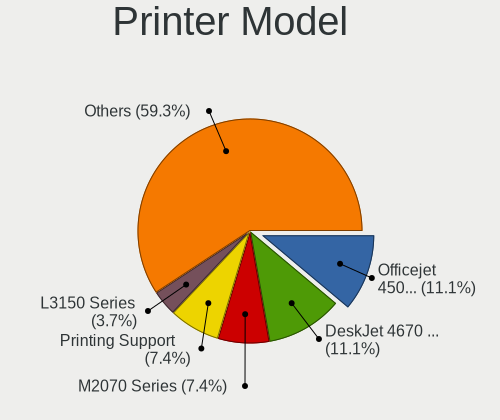

| Model                              | Computers | Percent |
|------------------------------------|-----------|---------|
| HP Officejet 4500 G510g-m          | 3         | 11.11%  |
| HP DeskJet 4670 series             | 3         | 11.11%  |
| Samsung M2070 Series               | 2         | 7.41%   |
| HP Printing Support                | 2         | 7.41%   |
| Seiko Epson L3150 Series           | 1         | 3.7%    |
| Samsung SCX-4623 Series            | 1         | 3.7%    |
| Samsung ML-1610 Mono Laser Printer | 1         | 3.7%    |
| Samsung M288x Series               | 1         | 3.7%    |
| Lexmark International CS417dn      | 1         | 3.7%    |
| HP Smart Tank 510 series           | 1         | 3.7%    |
| HP OfficeJet 5600 (USBHUB)         | 1         | 3.7%    |
| HP LaserJet 3050                   | 1         | 3.7%    |
| HP HP LaserJet M14-M17             | 1         | 3.7%    |
| HP Deskjet 4640 series             | 1         | 3.7%    |
| HP DeskJet 2700 series             | 1         | 3.7%    |
| GODEX INTERNATIONAL DT2            | 1         | 3.7%    |
| Canon TR7500 series                | 1         | 3.7%    |
| Canon PIXMA MX490 Series           | 1         | 3.7%    |
| Brother Printer                    | 1         | 3.7%    |
| Brother MFC-J497DW                 | 1         | 3.7%    |
| BIXOLON BIXOLON_SLP-T400           | 1         | 3.7%    |

Scanner Vendor
--------------

Scanner device vendors

| Vendor | Computers | Percent |
|--------|-----------|---------|
| Canon  | 3         | 100%    |

Scanner Model
-------------

Scanner device models

| Model                   | Computers | Percent |
|-------------------------|-----------|---------|
| Canon CanoScan LiDE 100 | 2         | 66.67%  |
| Canon CanoScan LiDE 220 | 1         | 33.33%  |

Camera
------

Camera Vendor
-------------

Camera device vendors

| Vendor                                 | Computers | Percent |
|----------------------------------------|-----------|---------|
| IMC Networks                           | 80        | 14.16%  |
| Chicony Electronics                    | 79        | 13.98%  |
| Realtek Semiconductor                  | 59        | 10.44%  |
| Logitech                               | 42        | 7.43%   |
| Microdia                               | 41        | 7.26%   |
| Sunplus Innovation Technology          | 35        | 6.19%   |
| Microsoft                              | 33        | 5.84%   |
| Bison Electronics                      | 30        | 5.31%   |
| Apple                                  | 17        | 3.01%   |
| Luxvisions Innotech Limited            | 16        | 2.83%   |
| Cheng Uei Precision Industry (Foxlink) | 14        | 2.48%   |
| Syntek                                 | 13        | 2.3%    |
| Quanta                                 | 13        | 2.3%    |
| Lite-On Technology                     | 11        | 1.95%   |
| Suyin                                  | 10        | 1.77%   |
| Generalplus Technology                 | 8         | 1.42%   |
| Acer                                   | 8         | 1.42%   |
| Samsung Electronics                    | 7         | 1.24%   |
| Silicon Motion                         | 6         | 1.06%   |
| Sonix Technology                       | 4         | 0.71%   |
| Lenovo                                 | 4         | 0.71%   |
| Alcor Micro                            | 4         | 0.71%   |
| Jieli Technology                       | 2         | 0.35%   |
| icSpring                               | 2         | 0.35%   |
| GEMBIRD                                | 2         | 0.35%   |
| Cubeternet                             | 2         | 0.35%   |
| ALi                                    | 2         | 0.35%   |
| Z-Star Microelectronics                | 1         | 0.18%   |
| YGTek                                  | 1         | 0.18%   |
| Yealink Network Technology             | 1         | 0.18%   |
| Xiaomi                                 | 1         | 0.18%   |
| WaveRider Communications               | 1         | 0.18%   |
| Tripath Technology                     | 1         | 0.18%   |
| Tobii Technology AB                    | 1         | 0.18%   |
| SunplusIT                              | 1         | 0.18%   |
| Ricoh                                  | 1         | 0.18%   |
| Primax Electronics                     | 1         | 0.18%   |
| OmniVision Technologies                | 1         | 0.18%   |
| MacroSilicon                           | 1         | 0.18%   |
| KYE Systems (Mouse Systems)            | 1         | 0.18%   |

Camera Model
------------

Camera device models

| Model                                             | Computers | Percent |
|---------------------------------------------------|-----------|---------|
| IMC Networks USB2.0 HD UVC WebCam                 | 31        | 5.47%   |
| Chicony Integrated Camera                         | 30        | 5.29%   |
| Realtek Integrated_Webcam_HD                      | 28        | 4.94%   |
| Microsoft LifeCam HD-3000                         | 21        | 3.7%    |
| IMC Networks Integrated Camera                    | 20        | 3.53%   |
| Microdia Integrated_Webcam_HD                     | 18        | 3.17%   |
| IMC Networks USB2.0 VGA UVC WebCam                | 13        | 2.29%   |
| Syntek Integrated Camera                          | 10        | 1.76%   |
| Bison Integrated Camera                           | 9         | 1.59%   |
| Luxvisions Innotech Limited Integrated Camera     | 8         | 1.41%   |
| Logitech Webcam C270                              | 8         | 1.41%   |
| Logitech HD Pro Webcam C920                       | 8         | 1.41%   |
| Apple iPhone 5/5C/5S/6/SE/7/8/X/XR                | 8         | 1.41%   |
| Samsung Galaxy series, misc. (MTP mode)           | 7         | 1.23%   |
| Generalplus GENERAL WEBCAM                        | 7         | 1.23%   |
| Chicony Lenovo EasyCamera                         | 7         | 1.23%   |
| Chicony HP HD Camera                              | 6         | 1.06%   |
| Bison Lenovo EasyCamera                           | 6         | 1.06%   |
| Sunplus Integrated_Webcam_HD                      | 5         | 0.88%   |
| Lite-On HP HD Camera                              | 5         | 0.88%   |
| Sunplus DICOTA 4K                                 | 4         | 0.71%   |
| Realtek USB Camera                                | 4         | 0.71%   |
| Realtek Lenovo EasyCamera                         | 4         | 0.71%   |
| Realtek Integrated Webcam HD                      | 4         | 0.71%   |
| Logitech Webcam C310                              | 4         | 0.71%   |
| Logitech C922 Pro Stream Webcam                   | 4         | 0.71%   |
| Chicony HP TrueVision HD Camera                   | 4         | 0.71%   |
| Chicony EasyCamera                                | 4         | 0.71%   |
| Bison SunplusIT Integrated Camera                 | 4         | 0.71%   |
| Acer Integrated Camera                            | 4         | 0.71%   |
| Sunplus HD WebCam                                 | 3         | 0.53%   |
| Microdia Integrated Webcam                        | 3         | 0.53%   |
| Microdia Integrated Camera                        | 3         | 0.53%   |
| Luxvisions Innotech Limited Integrated RGB Camera | 3         | 0.53%   |
| Logitech Logitech Webcam C925e                    | 3         | 0.53%   |
| Logitech BRIO Ultra HD Webcam                     | 3         | 0.53%   |
| IMC Networks USB2.0 UVC HD Webcam                 | 3         | 0.53%   |
| IMC Networks USB2.0 HD IR UVC WebCam              | 3         | 0.53%   |
| Chicony Integrated Camera (1280x720@30)           | 3         | 0.53%   |
| Apple FaceTime HD Camera (Built-in)               | 3         | 0.53%   |

Security
--------

Fingerprint Vendor
------------------

Fingerprint sensor vendors

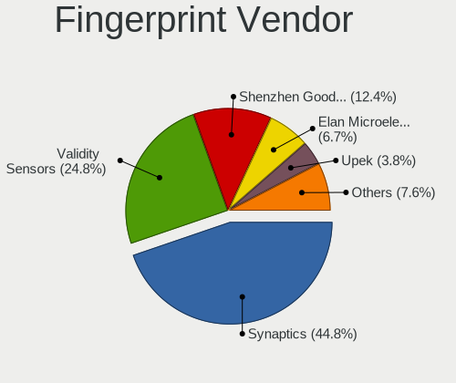

| Vendor                             | Computers | Percent |
|------------------------------------|-----------|---------|
| Synaptics                          | 47        | 44.76%  |
| Validity Sensors                   | 26        | 24.76%  |
| Shenzhen Goodix Technology         | 13        | 12.38%  |
| Elan Microelectronics              | 7         | 6.67%   |
| Upek                               | 4         | 3.81%   |
| AuthenTec                          | 3         | 2.86%   |
| STMicroelectronics                 | 2         | 1.9%    |
| Realtek USB2.0 Finger Print Bridge | 2         | 1.9%    |
| LighTuning Technology              | 1         | 0.95%   |

Fingerprint Model
-----------------

Fingerprint sensor models

| Model                                                                      | Computers | Percent |
|----------------------------------------------------------------------------|-----------|---------|
| Synaptics Prometheus MIS Touch Fingerprint Reader                          | 20        | 19.05%  |
| Validity Sensors Synaptics VFS7552 Touch Fingerprint Sensor with PurePrint | 7         | 6.67%   |
| Shenzhen Goodix  FingerPrint Device                                        | 6         | 5.71%   |
| Shenzhen Goodix Fingerprint Reader                                         | 6         | 5.71%   |
| Synaptics WBDI                                                             | 5         | 4.76%   |
| Validity Sensors VFS5011 Fingerprint Reader                                | 4         | 3.81%   |
| Validity Sensors VFS495 Fingerprint Reader                                 | 4         | 3.81%   |
| Validity Sensors Synaptics WBDI                                            | 4         | 3.81%   |
| Upek Biometric Touchchip/Touchstrip Fingerprint Sensor                     | 4         | 3.81%   |
| Synaptics  WBDI                                                            | 4         | 3.81%   |
| Synaptics Fingerprint reader [HP G6]                                       | 4         | 3.81%   |
| Validity Sensors VFS 5011 fingerprint sensor                               | 3         | 2.86%   |
| Synaptics UWP WBDI                                                         | 3         | 2.86%   |
| Synaptics Metallica MIS Touch Fingerprint Reader                           | 3         | 2.86%   |
| Elan ELAN:Fingerprint                                                      | 3         | 2.86%   |
| Synaptics UWP WBDI Device                                                  | 2         | 1.9%    |
| Synaptics FS7604 Touch Fingerprint Sensor with PurePrint                   | 2         | 1.9%    |
| STMicroelectronics Fingerprint Reader                                      | 2         | 1.9%    |
| Realtek USB2.0 Finger Print Bridge FocalTech Fingerprint Device            | 2         | 1.9%    |
| Elan WBF Fingerprint Sensor                                                | 2         | 1.9%    |
| Elan ELAN:ARM-M4                                                           | 2         | 1.9%    |
| Validity Sensors VFS7500 Touch Fingerprint Sensor                          | 1         | 0.95%   |
| Validity Sensors VFS491                                                    | 1         | 0.95%   |
| Validity Sensors VFS471 Fingerprint Reader                                 | 1         | 0.95%   |
| Validity Sensors VFS Fingerprint sensor                                    | 1         | 0.95%   |
| Synaptics  WBDI Fingerprint Reader - USB 052                               | 1         | 0.95%   |
| Synaptics  FS7604 Touch Fingerprint Sensor with PurePrint                  | 1         | 0.95%   |
| Synaptics Prometheus Fingerprint Reader                                    | 1         | 0.95%   |
| Synaptics Metallica MOH Touch Fingerprint Reader                           | 1         | 0.95%   |
| Shenzhen Goodix FingerPrint                                                | 1         | 0.95%   |
| LighTuning EgisTec Touch Fingerprint Sensor                                | 1         | 0.95%   |
| AuthenTec Fingerprint Sensor                                               | 1         | 0.95%   |
| AuthenTec AES2810                                                          | 1         | 0.95%   |
| AuthenTec AES2501 Fingerprint Sensor                                       | 1         | 0.95%   |

Chipcard Vendor
---------------

Chipcard module vendors

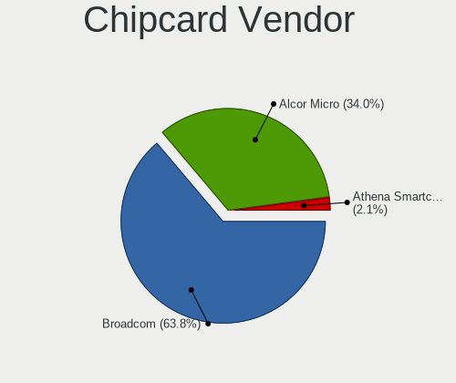

| Vendor                     | Computers | Percent |
|----------------------------|-----------|---------|
| Broadcom                   | 30        | 63.83%  |
| Alcor Micro                | 16        | 34.04%  |
| Athena Smartcard Solutions | 1         | 2.13%   |

Chipcard Model
--------------

Chipcard module models

| Model                                                                        | Computers | Percent |
|------------------------------------------------------------------------------|-----------|---------|
| Alcor Micro AU9540 Smartcard Reader                                          | 16        | 34.04%  |
| Broadcom 58200                                                               | 12        | 25.53%  |
| Broadcom 5880                                                                | 9         | 19.15%  |
| Broadcom BCM5880 Secure Applications Processor with fingerprint swipe sensor | 7         | 14.89%  |
| Broadcom BCM5880 Secure Applications Processor                               | 2         | 4.26%   |
| Athena Smartcard Solutions ASEDrive V3C                                      | 1         | 2.13%   |

Unsupported
-----------

Unsupported Devices
-------------------

Total unsupported devices on board

| Total | Computers | Percent |
|-------|-----------|---------|
| 0     | 610       | 67.25%  |
| 1     | 232       | 25.58%  |
| 2     | 50        | 5.51%   |
| 3     | 10        | 1.1%    |
| 4     | 2         | 0.22%   |
| 7     | 1         | 0.11%   |
| 6     | 1         | 0.11%   |
| 5     | 1         | 0.11%   |

Unsupported Device Types
------------------------

Types of unsupported devices

| Type                     | Computers | Percent |
|--------------------------|-----------|---------|
| Fingerprint reader       | 104       | 28.42%  |
| Graphics card            | 86        | 23.5%   |
| Net/wireless             | 57        | 15.57%  |
| Chipcard                 | 41        | 11.2%   |
| Multimedia controller    | 16        | 4.37%   |
| Camera                   | 16        | 4.37%   |
| Communication controller | 15        | 4.1%    |
| Unassigned class         | 10        | 2.73%   |
| Bluetooth                | 6         | 1.64%   |
| Net/ethernet             | 4         | 1.09%   |
| Card reader              | 4         | 1.09%   |
| Storage                  | 2         | 0.55%   |
| Sound                    | 2         | 0.55%   |
| Network                  | 2         | 0.55%   |
| Firewire controller      | 1         | 0.27%   |

